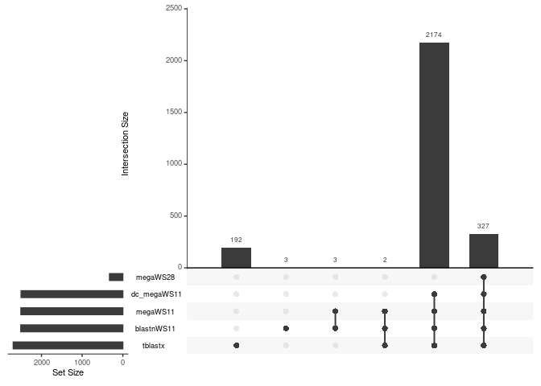

__Name:__ Ricardo Pineda IV

__Student ID:__ 917486212


```r
library(tidyverse)
```

```
## ── Attaching core tidyverse packages ──────────────────────── tidyverse 2.0.0 ──
## ✔ dplyr     1.1.0     ✔ readr     2.1.4
## ✔ forcats   1.0.0     ✔ stringr   1.5.0
## ✔ ggplot2   3.4.1     ✔ tibble    3.2.1
## ✔ lubridate 1.9.2     ✔ tidyr     1.3.0
## ✔ purrr     1.0.1     
## ── Conflicts ────────────────────────────────────────── tidyverse_conflicts() ──
## ✖ dplyr::filter() masks stats::filter()
## ✖ dplyr::lag()    masks stats::lag()
## ℹ Use the ]8;;http://conflicted.r-lib.org/conflicted package]8;; to force all conflicts to become errors
```

```r
library(UpSetR)
library(Biostrings)
```

```
## Loading required package: BiocGenerics
## 
## Attaching package: 'BiocGenerics'
## 
## The following objects are masked from 'package:lubridate':
## 
##     intersect, setdiff, union
## 
## The following objects are masked from 'package:dplyr':
## 
##     combine, intersect, setdiff, union
## 
## The following objects are masked from 'package:stats':
## 
##     IQR, mad, sd, var, xtabs
## 
## The following objects are masked from 'package:base':
## 
##     anyDuplicated, aperm, append, as.data.frame, basename, cbind,
##     colnames, dirname, do.call, duplicated, eval, evalq, Filter, Find,
##     get, grep, grepl, intersect, is.unsorted, lapply, Map, mapply,
##     match, mget, order, paste, pmax, pmax.int, pmin, pmin.int,
##     Position, rank, rbind, Reduce, rownames, sapply, setdiff, sort,
##     table, tapply, union, unique, unsplit, which.max, which.min
## 
## Loading required package: S4Vectors
## Loading required package: stats4
## 
## Attaching package: 'S4Vectors'
## 
## The following objects are masked from 'package:lubridate':
## 
##     second, second<-
## 
## The following objects are masked from 'package:dplyr':
## 
##     first, rename
## 
## The following object is masked from 'package:tidyr':
## 
##     expand
## 
## The following objects are masked from 'package:base':
## 
##     expand.grid, I, unname
## 
## Loading required package: IRanges
## 
## Attaching package: 'IRanges'
## 
## The following object is masked from 'package:lubridate':
## 
##     %within%
## 
## The following objects are masked from 'package:dplyr':
## 
##     collapse, desc, slice
## 
## The following object is masked from 'package:purrr':
## 
##     reduce
## 
## Loading required package: XVector
## 
## Attaching package: 'XVector'
## 
## The following object is masked from 'package:purrr':
## 
##     compact
## 
## Loading required package: GenomeInfoDb
## 
## Attaching package: 'Biostrings'
## 
## The following object is masked from 'package:base':
## 
##     strsplit
```

```r
headers <- readLines("../input/blastout.mega.WS11.tsv.gz", n = 4)
headers <- headers[4]
headers
```

```
## [1] "# Fields: query acc.ver, subject acc.ver, % identity, alignment length, mismatches, gap opens, q. start, q. end, s. start, s. end, evalue, bit score, subject title"
```

```r
headers <- headers %>%
  str_remove("# Fields: ") %>% # get rid of the extraneous information
  str_split(", ") %>% #split into pieces 
  unlist() %>% #convert to vector
  make.names() %>% #make names the R can understand
  str_replace(fixed(".."), ".") %>% # get rid of double .. in names.
  str_replace("X.identity", "pct.identity") # "%" got replaced with X, we can do better.
headers
```

```
##  [1] "query.acc.ver"    "subject.acc.ver"  "pct.identity"     "alignment.length"
##  [5] "mismatches"       "gap.opens"        "q.start"          "q.end"           
##  [9] "s.start"          "s.end"            "evalue"           "bit.score"       
## [13] "subject.title"
```

```r
megaWS11 <- read_tsv("../input/blastout.mega.WS11.tsv.gz", col_names=headers, comment="#")
```

```
## Rows: 13992 Columns: 13
## ── Column specification ────────────────────────────────────────────────────────
## Delimiter: "\t"
## chr  (3): query.acc.ver, subject.acc.ver, subject.title
## dbl (10): pct.identity, alignment.length, mismatches, gap.opens, q.start, q....
## 
## ℹ Use `spec()` to retrieve the full column specification for this data.
## ℹ Specify the column types or set `show_col_types = FALSE` to quiet this message.
```

```r
megaWS28 <- read_tsv("../input/blastout.mega.WS28.tsv.gz", col_names=headers, comment="#")
```

```
## Rows: 1047 Columns: 13
## ── Column specification ────────────────────────────────────────────────────────
## Delimiter: "\t"
## chr  (3): query.acc.ver, subject.acc.ver, subject.title
## dbl (10): pct.identity, alignment.length, mismatches, gap.opens, q.start, q....
## 
## ℹ Use `spec()` to retrieve the full column specification for this data.
## ℹ Specify the column types or set `show_col_types = FALSE` to quiet this message.
```

```r
blastnWS11 <- read_tsv("../input/blastout.task_blastn.WS11.tsv.gz", col_names=headers, comment="#")
```

```
## Rows: 12545 Columns: 13
## ── Column specification ────────────────────────────────────────────────────────
## Delimiter: "\t"
## chr  (3): query.acc.ver, subject.acc.ver, subject.title
## dbl (10): pct.identity, alignment.length, mismatches, gap.opens, q.start, q....
## 
## ℹ Use `spec()` to retrieve the full column specification for this data.
## ℹ Specify the column types or set `show_col_types = FALSE` to quiet this message.
```

```r
dc_megaWS11 <- read_tsv("../input/blastout.task_dc-megablast.WS11.tsv.gz", col_names=headers, comment="#")
```

```
## Rows: 10691 Columns: 13
## ── Column specification ────────────────────────────────────────────────────────
## Delimiter: "\t"
## chr  (3): query.acc.ver, subject.acc.ver, subject.title
## dbl (10): pct.identity, alignment.length, mismatches, gap.opens, q.start, q....
## 
## ℹ Use `spec()` to retrieve the full column specification for this data.
## ℹ Specify the column types or set `show_col_types = FALSE` to quiet this message.
```

```r
tblastx <- read_tsv("../input/blastout.tblastx.tsv.gz", col_names=headers, comment="#")
```

```
## Rows: 385017 Columns: 13
## ── Column specification ────────────────────────────────────────────────────────
## Delimiter: "\t"
## chr  (3): query.acc.ver, subject.acc.ver, subject.title
## dbl (10): pct.identity, alignment.length, mismatches, gap.opens, q.start, q....
## 
## ℹ Use `spec()` to retrieve the full column specification for this data.
## ℹ Specify the column types or set `show_col_types = FALSE` to quiet this message.
```

```r
blast.results <- bind_rows(list(megaWS11=megaWS11,
                                megaWS28=megaWS28, 
                                blastnWS11=blastnWS11, 
                                dc_megaWS11=dc_megaWS11,
                                tblastx=tblastx), 
                           .id="strategy")
head(blast.results)
```

<div data-pagedtable="false">
  <script data-pagedtable-source type="application/json">
{"columns":[{"label":["strategy"],"name":[1],"type":["chr"],"align":["left"]},{"label":["query.acc.ver"],"name":[2],"type":["chr"],"align":["left"]},{"label":["subject.acc.ver"],"name":[3],"type":["chr"],"align":["left"]},{"label":["pct.identity"],"name":[4],"type":["dbl"],"align":["right"]},{"label":["alignment.length"],"name":[5],"type":["dbl"],"align":["right"]},{"label":["mismatches"],"name":[6],"type":["dbl"],"align":["right"]},{"label":["gap.opens"],"name":[7],"type":["dbl"],"align":["right"]},{"label":["q.start"],"name":[8],"type":["dbl"],"align":["right"]},{"label":["q.end"],"name":[9],"type":["dbl"],"align":["right"]},{"label":["s.start"],"name":[10],"type":["dbl"],"align":["right"]},{"label":["s.end"],"name":[11],"type":["dbl"],"align":["right"]},{"label":["evalue"],"name":[12],"type":["dbl"],"align":["right"]},{"label":["bit.score"],"name":[13],"type":["dbl"],"align":["right"]},{"label":["subject.title"],"name":[14],"type":["chr"],"align":["left"]}],"data":[{"1":"megaWS11","2":"Seq_H","3":"MG772933","4":"89.112","5":"21702","6":"2276","7":"68","8":"1","9":"21664","10":"33","11":"21685","12":"0.00e+00","13":"26904","14":"MG772933 |Bat SARS-like coronavirus isolate bat-SL-CoVZC45| complete genome|Severe acute respiratory syndrome-related coronavirus|China|Rhinolophus sinicus"},{"1":"megaWS11","2":"Seq_H","3":"MG772933","4":"89.000","5":"6791","6":"719","7":"23","8":"23043","9":"29825","10":"22992","11":"29762","12":"0.00e+00","13":"8377","14":"MG772933 |Bat SARS-like coronavirus isolate bat-SL-CoVZC45| complete genome|Severe acute respiratory syndrome-related coronavirus|China|Rhinolophus sinicus"},{"1":"megaWS11","2":"Seq_H","3":"MG772933","4":"77.289","5":"546","6":"116","7":"7","8":"22299","9":"22840","10":"22305","11":"22846","12":"6.53e-82","13":"315","14":"MG772933 |Bat SARS-like coronavirus isolate bat-SL-CoVZC45| complete genome|Severe acute respiratory syndrome-related coronavirus|China|Rhinolophus sinicus"},{"1":"megaWS11","2":"Seq_H","3":"MG772934","4":"88.660","5":"18272","6":"2035","7":"34","8":"3297","9":"21549","10":"3247","11":"21500","12":"0.00e+00","13":"22229","14":"MG772934 |Bat SARS-like coronavirus isolate bat-SL-CoVZXC21| complete genome|Severe acute respiratory syndrome-related coronavirus|China|Rhinolophus sinicus"},{"1":"megaWS11","2":"Seq_H","3":"MG772934","4":"89.094","5":"6785","6":"706","7":"26","8":"23052","9":"29825","10":"22931","11":"29692","12":"0.00e+00","13":"8399","14":"MG772934 |Bat SARS-like coronavirus isolate bat-SL-CoVZXC21| complete genome|Severe acute respiratory syndrome-related coronavirus|China|Rhinolophus sinicus"},{"1":"megaWS11","2":"Seq_H","3":"MG772934","4":"92.696","5":"3190","6":"226","7":"6","8":"1","9":"3187","10":"33","11":"3218","12":"0.00e+00","13":"4593","14":"MG772934 |Bat SARS-like coronavirus isolate bat-SL-CoVZXC21| complete genome|Severe acute respiratory syndrome-related coronavirus|China|Rhinolophus sinicus"}],"options":{"columns":{"min":{},"max":[10]},"rows":{"min":[10],"max":[10]},"pages":{}}}
  </script>
</div>
**Exercise 1:** What are the total number of hits for each search strategy? __hint:__ start with the `blast.results` tibble and use `group_by()` and `summarize_()`. Do not type out the results manually, instead make sure that your code generates a table (that is included in the knitted output).  You should need 1 to 3 lines of code for this and you should not need to run separate commands for the different search strategies.

```r
blast.results %>% 
  group_by(strategy) %>%
  summarize("Hits" = n())
```

<div data-pagedtable="false">
  <script data-pagedtable-source type="application/json">
{"columns":[{"label":["strategy"],"name":[1],"type":["chr"],"align":["left"]},{"label":["Hits"],"name":[2],"type":["int"],"align":["right"]}],"data":[{"1":"blastnWS11","2":"12545"},{"1":"dc_megaWS11","2":"10691"},{"1":"megaWS11","2":"13992"},{"1":"megaWS28","2":"1047"},{"1":"tblastx","2":"385017"}],"options":{"columns":{"min":{},"max":[10]},"rows":{"min":[10],"max":[10]},"pages":{}}}
  </script>
</div>
**Exercise 2:** Using the `blast.results` tibble, for each search strategy, calculate:
* Average alignment length
* Maximum alignment length
* Total alignment length (sum of all alignment lengths)
* Average percent identity  
For full credit start with `blast.results` and only call the `summarize` function once (you can have multiple arguments in the `summarize` function).  Your code should produce a table as output (you do not need to type the table manually). 


```r
#str(blast.results)
blast.results %>% 
  group_by(strategy) %>%
  select(strategy, pct.identity, alignment.length) %>%
  summarise("Avg Alm Length" = mean(alignment.length),
            "Max Alm Length" = max(alignment.length),
            "Total Alm Length" = sum(alignment.length),
            "Average % Identity" = mean(pct.identity))
```

<div data-pagedtable="false">
  <script data-pagedtable-source type="application/json">
{"columns":[{"label":["strategy"],"name":[1],"type":["chr"],"align":["left"]},{"label":["Avg Alm Length"],"name":[2],"type":["dbl"],"align":["right"]},{"label":["Max Alm Length"],"name":[3],"type":["dbl"],"align":["right"]},{"label":["Total Alm Length"],"name":[4],"type":["dbl"],"align":["right"]},{"label":["Average % Identity"],"name":[5],"type":["dbl"],"align":["right"]}],"data":[{"1":"blastnWS11","2":"1695.2564","3":"26651","4":"21266991","5":"70.32399"},{"1":"dc_megaWS11","2":"1964.4258","3":"26651","4":"21001676","5":"69.77778"},{"1":"megaWS11","2":"921.9385","3":"21702","4":"12899763","5":"75.72907"},{"1":"megaWS28","2":"6434.3448","3":"21702","4":"6736759","5":"81.86662"},{"1":"tblastx","2":"106.7988","3":"2824","4":"41119360","5":"48.85633"}],"options":{"columns":{"min":{},"max":[10]},"rows":{"min":[10],"max":[10]},"pages":{}}}
  </script>
</div>


**Exercise 3**: We have multiple hits per subject and we want to focus on the unique hits.  Make a new object called `uniq.blast.results` that retains the single longest alignment for each subject in each strategy. _Hint: use one of the `slice` functions._ 


```r
uniq.blast.results <- blast.results %>%
  group_by(strategy, subject.acc.ver) %>%
  slice_max(order_by = alignment.length,  n = 1)
uniq.blast.results
```

<div data-pagedtable="false">
  <script data-pagedtable-source type="application/json">
{"columns":[{"label":["strategy"],"name":[1],"type":["chr"],"align":["left"]},{"label":["query.acc.ver"],"name":[2],"type":["chr"],"align":["left"]},{"label":["subject.acc.ver"],"name":[3],"type":["chr"],"align":["left"]},{"label":["pct.identity"],"name":[4],"type":["dbl"],"align":["right"]},{"label":["alignment.length"],"name":[5],"type":["dbl"],"align":["right"]},{"label":["mismatches"],"name":[6],"type":["dbl"],"align":["right"]},{"label":["gap.opens"],"name":[7],"type":["dbl"],"align":["right"]},{"label":["q.start"],"name":[8],"type":["dbl"],"align":["right"]},{"label":["q.end"],"name":[9],"type":["dbl"],"align":["right"]},{"label":["s.start"],"name":[10],"type":["dbl"],"align":["right"]},{"label":["s.end"],"name":[11],"type":["dbl"],"align":["right"]},{"label":["evalue"],"name":[12],"type":["dbl"],"align":["right"]},{"label":["bit.score"],"name":[13],"type":["dbl"],"align":["right"]},{"label":["subject.title"],"name":[14],"type":["chr"],"align":["left"]}],"data":[{"1":"blastnWS11","2":"Seq_H","3":"AC_000192","4":"66.785","5":"3938","6":"1197","7":"66","8":"14012","9":"17901","10":"14197","11":"18071","12":"0.00e+00","13":"1007.0","14":"AC_000192 |Murine hepatitis virus strain JHM| complete genome|Murine coronavirus||"},{"1":"blastnWS11","2":"Seq_H","3":"AF220295","4":"65.805","5":"5688","6":"1739","7":"99","8":"14024","9":"19620","10":"13932","11":"19504","12":"0.00e+00","13":"1229.0","14":"AF220295 |Bovine coronavirus strain Quebec| complete genome|Betacoronavirus 1||"},{"1":"blastnWS11","2":"Seq_H","3":"AF353511","4":"65.281","5":"3200","6":"982","7":"65","8":"14223","9":"17356","10":"13395","11":"16531","12":"2.39e-163","13":"585.0","14":"AF353511 |Porcine epidemic diarrhea virus strain CV777| complete genome|Porcine epidemic diarrhea virus||"},{"1":"blastnWS11","2":"Seq_H","3":"AF391541","4":"65.963","5":"5682","6":"1740","7":"94","8":"14024","9":"19620","10":"13932","11":"19504","12":"0.00e+00","13":"1279.0","14":"AF391541 |Bovine coronavirus isolate BCoV-ENT| complete genome|Betacoronavirus 1||"},{"1":"blastnWS11","2":"Seq_H","3":"AF391542","4":"65.921","5":"5681","6":"1744","7":"94","8":"14024","9":"19620","10":"13932","11":"19504","12":"0.00e+00","13":"1267.0","14":"AF391542 |Bovine coronavirus isolate BCoV-LUN| complete genome|Betacoronavirus 1||"},{"1":"blastnWS11","2":"Seq_H","3":"AY274119","4":"80.260","5":"24666","6":"4620","7":"104","8":"3315","9":"27878","10":"3280","11":"27798","12":"0.00e+00","13":"22287.0","14":"AY274119 |Severe acute respiratory syndrome-related coronavirus isolate Tor2| complete genome|Severe acute respiratory syndrome-related coronavirus|Canada|Homo sapiens"},{"1":"blastnWS11","2":"Seq_H","3":"AY278487","4":"80.232","5":"24666","6":"4627","7":"103","8":"3315","9":"27878","10":"3280","11":"27798","12":"0.00e+00","13":"22260.0","14":"AY278487 |SARS coronavirus BJ02| complete genome|Severe acute respiratory syndrome-related coronavirus||"},{"1":"blastnWS11","2":"Seq_H","3":"AY278488","4":"80.248","5":"24666","6":"4623","7":"103","8":"3315","9":"27878","10":"3261","11":"27779","12":"0.00e+00","13":"22278.0","14":"AY278488 |SARS coronavirus BJ01| complete genome|Severe acute respiratory syndrome-related coronavirus||"},{"1":"blastnWS11","2":"Seq_H","3":"AY278489","4":"80.216","5":"24666","6":"4631","7":"103","8":"3315","9":"27878","10":"3264","11":"27782","12":"0.00e+00","13":"22242.0","14":"AY278489 |SARS coronavirus GD01| complete genome|Severe acute respiratory syndrome-related coronavirus||"},{"1":"blastnWS11","2":"Seq_H","3":"AY278490","4":"80.218","5":"24664","6":"4634","7":"100","8":"3315","9":"27878","10":"3276","11":"27794","12":"0.00e+00","13":"22253.0","14":"AY278490 |SARS coronavirus BJ03| complete genome|Severe acute respiratory syndrome-related coronavirus||"},{"1":"blastnWS11","2":"Seq_H","3":"AY278491","4":"80.248","5":"24666","6":"4623","7":"104","8":"3315","9":"27878","10":"3280","11":"27798","12":"0.00e+00","13":"22272.0","14":"AY278491 |SARS coronavirus HKU-39849| complete genome|Severe acute respiratory syndrome-related coronavirus||"},{"1":"blastnWS11","2":"Seq_H","3":"AY278554","4":"80.281","5":"24666","6":"4615","7":"103","8":"3315","9":"27878","10":"3265","11":"27783","12":"0.00e+00","13":"22314.0","14":"AY278554 |SARS coronavirus CUHK-W1| complete genome|Severe acute respiratory syndrome-related coronavirus|China|"},{"1":"blastnWS11","2":"Seq_H","3":"AY278741","4":"80.268","5":"24666","6":"4618","7":"104","8":"3315","9":"27878","10":"3280","11":"27798","12":"0.00e+00","13":"22296.0","14":"AY278741 |SARS coronavirus Urbani| complete genome|Severe acute respiratory syndrome-related coronavirus||"},{"1":"blastnWS11","2":"Seq_H","3":"AY279354","4":"80.237","5":"24667","6":"4624","7":"105","8":"3315","9":"27878","10":"3264","11":"27782","12":"0.00e+00","13":"22258.0","14":"AY279354 |SARS coronavirus BJ04| complete genome|Severe acute respiratory syndrome-related coronavirus||"},{"1":"blastnWS11","2":"Seq_H","3":"AY282752","4":"80.264","5":"24666","6":"4619","7":"104","8":"3315","9":"27878","10":"3265","11":"27783","12":"0.00e+00","13":"22290.0","14":"AY282752 |SARS coronavirus CUHK-Su10| complete genome|Severe acute respiratory syndrome-related coronavirus||"},{"1":"blastnWS11","2":"Seq_H","3":"AY283794","4":"80.260","5":"24666","6":"4620","7":"104","8":"3315","9":"27878","10":"3264","11":"27782","12":"0.00e+00","13":"22287.0","14":"AY283794 |SARS coronavirus Sin2500| complete genome|Severe acute respiratory syndrome-related coronavirus|Singapore|"},{"1":"blastnWS11","2":"Seq_H","3":"AY283795","4":"80.263","5":"24649","6":"4619","7":"103","8":"3315","9":"27864","10":"3264","11":"27765","12":"0.00e+00","13":"22276.0","14":"AY283795 |SARS coronavirus Sin2677| complete genome|Severe acute respiratory syndrome-related coronavirus|Singapore|"},{"1":"blastnWS11","2":"Seq_H","3":"AY283796","4":"80.272","5":"24666","6":"4617","7":"104","8":"3315","9":"27878","10":"3264","11":"27782","12":"0.00e+00","13":"22299.0","14":"AY283796 |SARS coronavirus Sin2679| complete genome|Severe acute respiratory syndrome-related coronavirus|Singapore|"},{"1":"blastnWS11","2":"Seq_H","3":"AY283797","4":"80.260","5":"24666","6":"4620","7":"104","8":"3315","9":"27878","10":"3264","11":"27782","12":"0.00e+00","13":"22287.0","14":"AY283797 |SARS coronavirus Sin2748| complete genome|Severe acute respiratory syndrome-related coronavirus|Singapore|"},{"1":"blastnWS11","2":"Seq_H","3":"AY283798","4":"80.256","5":"24666","6":"4621","7":"104","8":"3315","9":"27878","10":"3264","11":"27782","12":"0.00e+00","13":"22281.0","14":"AY283798 |SARS coronavirus Sin2774| complete genome|Severe acute respiratory syndrome-related coronavirus|Singapore|"},{"1":"blastnWS11","2":"Seq_H","3":"AY291315","4":"80.256","5":"24666","6":"4621","7":"104","8":"3315","9":"27878","10":"3280","11":"27798","12":"0.00e+00","13":"22281.0","14":"AY291315 |SARS coronavirus Frankfurt 1| complete genome|Severe acute respiratory syndrome-related coronavirus||"},{"1":"blastnWS11","2":"Seq_H","3":"AY291451","4":"80.268","5":"24666","6":"4618","7":"104","8":"3315","9":"27878","10":"3280","11":"27798","12":"0.00e+00","13":"22296.0","14":"AY291451 |SARS coronavirus TW1| complete genome|Severe acute respiratory syndrome-related coronavirus|Taiwan|"},{"1":"blastnWS11","2":"Seq_H","3":"AY297028","4":"80.214","5":"24674","6":"4623","7":"114","8":"3315","9":"27878","10":"3266","11":"27790","12":"0.00e+00","13":"22206.0","14":"AY297028 |SARS coronavirus ZJ01| complete genome|Severe acute respiratory syndrome-related coronavirus||"},{"1":"blastnWS11","2":"Seq_H","3":"AY304486","4":"80.267","5":"24664","6":"4622","7":"100","8":"3315","9":"27878","10":"3265","11":"27783","12":"0.00e+00","13":"22307.0","14":"AY304486 |SARS coronavirus SZ3| complete genome|Severe acute respiratory syndrome-related coronavirus|Hong Kong|"},{"1":"blastnWS11","2":"Seq_H","3":"AY304488","4":"80.279","5":"24664","6":"4619","7":"100","8":"3315","9":"27878","10":"3265","11":"27783","12":"0.00e+00","13":"22319.0","14":"AY304488 |SARS coronavirus SZ16| complete genome|Severe acute respiratory syndrome-related coronavirus|Hong Kong|"},{"1":"blastnWS11","2":"Seq_H","3":"AY304495","4":"80.256","5":"24666","6":"4621","7":"103","8":"3315","9":"27878","10":"3265","11":"27783","12":"0.00e+00","13":"22287.0","14":"AY304495 |SARS coronavirus GZ50| complete genome|Severe acute respiratory syndrome-related coronavirus|Hong Kong|"},{"1":"blastnWS11","2":"Seq_H","3":"AY310120","4":"80.256","5":"24666","6":"4621","7":"104","8":"3315","9":"27878","10":"3280","11":"27798","12":"0.00e+00","13":"22281.0","14":"AY310120 |SARS coronavirus FRA| complete genome|Severe acute respiratory syndrome-related coronavirus||"},{"1":"blastnWS11","2":"Seq_H","3":"AY313906","4":"80.180","5":"24677","6":"4631","7":"106","8":"3315","9":"27878","10":"3280","11":"27809","12":"0.00e+00","13":"22207.0","14":"AY313906 |SARS coronavirus GD69| complete genome|Severe acute respiratory syndrome-related coronavirus|China|"},{"1":"blastnWS11","2":"Seq_H","3":"AY319651","4":"65.000","5":"3000","6":"942","7":"54","8":"14630","9":"17578","10":"13591","11":"16533","12":"4.61e-147","13":"531.0","14":"AY319651 |Avian infectious bronchitis virus isolate BJ| complete genome|Avian coronavirus||"},{"1":"blastnWS11","2":"Seq_H","3":"AY321118","4":"80.260","5":"24666","6":"4620","7":"104","8":"3315","9":"27878","10":"3280","11":"27798","12":"0.00e+00","13":"22287.0","14":"AY321118 |SARS coronavirus TWC| complete genome|Severe acute respiratory syndrome-related coronavirus||"},{"1":"blastnWS11","2":"Seq_H","3":"AY323977","4":"80.264","5":"24666","6":"4619","7":"104","8":"3315","9":"27878","10":"3280","11":"27798","12":"0.00e+00","13":"22292.0","14":"AY323977 |SARS coronavirus HSR 1| complete genome|Severe acute respiratory syndrome-related coronavirus|Italy|"},{"1":"blastnWS11","2":"Seq_H","3":"AY338174","4":"80.256","5":"24666","6":"4621","7":"104","8":"3315","9":"27878","10":"3211","11":"27729","12":"0.00e+00","13":"22281.0","14":"AY338174 |SARS coronavirus Taiwan TC1| complete genome|Severe acute respiratory syndrome-related coronavirus||"},{"1":"blastnWS11","2":"Seq_H","3":"AY338175","4":"80.256","5":"24666","6":"4621","7":"104","8":"3315","9":"27878","10":"3211","11":"27729","12":"0.00e+00","13":"22281.0","14":"AY338175 |SARS coronavirus Taiwan TC2| complete genome|Severe acute respiratory syndrome-related coronavirus||"},{"1":"blastnWS11","2":"Seq_H","3":"AY345986","4":"80.260","5":"24666","6":"4620","7":"104","8":"3315","9":"27878","10":"3265","11":"27783","12":"0.00e+00","13":"22287.0","14":"AY345986 |SARS coronavirus CUHK-AG01| complete genome|Severe acute respiratory syndrome-related coronavirus||"},{"1":"blastnWS11","2":"Seq_H","3":"AY345987","4":"80.260","5":"24666","6":"4620","7":"104","8":"3315","9":"27878","10":"3265","11":"27783","12":"0.00e+00","13":"22287.0","14":"AY345987 |SARS coronavirus CUHK-AG02| complete genome|Severe acute respiratory syndrome-related coronavirus||"},{"1":"blastnWS11","2":"Seq_H","3":"AY345988","4":"80.256","5":"24666","6":"4621","7":"104","8":"3315","9":"27878","10":"3265","11":"27783","12":"0.00e+00","13":"22281.0","14":"AY345988 |SARS coronavirus CUHK-AG03| complete genome|Severe acute respiratory syndrome-related coronavirus||"},{"1":"blastnWS11","2":"Seq_H","3":"AY348314","4":"80.256","5":"24666","6":"4621","7":"104","8":"3315","9":"27878","10":"3211","11":"27729","12":"0.00e+00","13":"22281.0","14":"AY348314 |SARS coronavirus Taiwan TC3| complete genome|Severe acute respiratory syndrome-related coronavirus|Taiwan|"},{"1":"blastnWS11","2":"Seq_H","3":"AY350750","4":"80.256","5":"24666","6":"4621","7":"104","8":"3315","9":"27878","10":"3267","11":"27785","12":"0.00e+00","13":"22281.0","14":"AY350750 |SARS coronavirus PUMC01| complete genome|Severe acute respiratory syndrome-related coronavirus||"},{"1":"blastnWS11","2":"Seq_H","3":"AY351680","4":"80.037","5":"24681","6":"4665","7":"125","8":"3315","9":"27878","10":"3285","11":"27820","12":"0.00e+00","13":"21969.0","14":"AY351680 |SARS coronavirus ZMY 1| complete genome|Severe acute respiratory syndrome-related coronavirus||"},{"1":"blastnWS11","2":"Seq_H","3":"AY357075","4":"80.260","5":"24666","6":"4620","7":"104","8":"3315","9":"27878","10":"3266","11":"27784","12":"0.00e+00","13":"22287.0","14":"AY357075 |SARS coronavirus PUMC02| complete genome|Severe acute respiratory syndrome-related coronavirus||"},{"1":"blastnWS11","2":"Seq_H","3":"AY357076","4":"80.244","5":"24666","6":"4621","7":"105","8":"3315","9":"27878","10":"3266","11":"27781","12":"0.00e+00","13":"22267.0","14":"AY357076 |SARS coronavirus PUMC03| complete genome|Severe acute respiratory syndrome-related coronavirus||"},{"1":"blastnWS11","2":"Seq_H","3":"AY362698","4":"80.260","5":"24666","6":"4620","7":"104","8":"3315","9":"27878","10":"3280","11":"27798","12":"0.00e+00","13":"22287.0","14":"AY362698 |SARS coronavirus TWC2| complete genome|Severe acute respiratory syndrome-related coronavirus||"},{"1":"blastnWS11","2":"Seq_H","3":"AY362699","4":"80.260","5":"24666","6":"4620","7":"104","8":"3315","9":"27878","10":"3280","11":"27798","12":"0.00e+00","13":"22287.0","14":"AY362699 |SARS coronavirus TWC3| complete genome|Severe acute respiratory syndrome-related coronavirus||"},{"1":"blastnWS11","2":"Seq_H","3":"AY390556","4":"80.285","5":"24666","6":"4614","7":"103","8":"3315","9":"27878","10":"3280","11":"27798","12":"0.00e+00","13":"22317.0","14":"AY390556 |SARS coronavirus GZ02| complete genome|Severe acute respiratory syndrome-related coronavirus|China|"},{"1":"blastnWS11","2":"Seq_H","3":"AY391777","4":"65.264","5":"6846","6":"2114","7":"123","8":"12892","9":"19620","10":"12806","11":"19504","12":"0.00e+00","13":"1308.0","14":"AY391777 |Human coronavirus OC43| complete genome|Betacoronavirus 1||"},{"1":"blastnWS11","2":"Seq_H","3":"AY394850","4":"80.248","5":"24666","6":"4623","7":"104","8":"3315","9":"27878","10":"3280","11":"27798","12":"0.00e+00","13":"22272.0","14":"AY394850 |SARS coronavirus WHU| complete genome|Severe acute respiratory syndrome-related coronavirus||"},{"1":"blastnWS11","2":"Seq_H","3":"AY394978","4":"80.270","5":"24628","6":"4616","7":"102","8":"3315","9":"27846","10":"3208","11":"27688","12":"0.00e+00","13":"22267.0","14":"AY394978 |SARS coronavirus GZ-B| complete genome|Severe acute respiratory syndrome-related coronavirus||"},{"1":"blastnWS11","2":"Seq_H","3":"AY394979","4":"80.258","5":"24628","6":"4619","7":"102","8":"3315","9":"27846","10":"3228","11":"27708","12":"0.00e+00","13":"22253.0","14":"AY394979 |SARS coronavirus GZ-C| complete genome|Severe acute respiratory syndrome-related coronavirus||"},{"1":"blastnWS11","2":"Seq_H","3":"AY394983","4":"80.276","5":"24666","6":"4616","7":"103","8":"3315","9":"27878","10":"3228","11":"27746","12":"0.00e+00","13":"22308.0","14":"AY394983 |SARS coronavirus HSZ2-A| complete genome|Severe acute respiratory syndrome-related coronavirus||"},{"1":"blastnWS11","2":"Seq_H","3":"AY394985","4":"80.274","5":"24663","6":"4622","7":"100","8":"3315","9":"27878","10":"3030","11":"27548","12":"0.00e+00","13":"22312.0","14":"AY394985 |SARS coronavirus HSZ-Bb| complete genome|Severe acute respiratory syndrome-related coronavirus||"},{"1":"blastnWS11","2":"Seq_H","3":"AY394986","4":"80.266","5":"24663","6":"4624","7":"100","8":"3315","9":"27878","10":"3229","11":"27747","12":"0.00e+00","13":"22303.0","14":"AY394986 |SARS coronavirus HSZ-Cb| complete genome|Severe acute respiratory syndrome-related coronavirus||"},{"1":"blastnWS11","2":"Seq_H","3":"AY394987","4":"80.268","5":"24666","6":"4618","7":"103","8":"3315","9":"27878","10":"3238","11":"27756","12":"0.00e+00","13":"22299.0","14":"AY394987 |SARS coronavirus HZS2-Fb| complete genome|Severe acute respiratory syndrome-related coronavirus||"},{"1":"blastnWS11","2":"Seq_H","3":"AY394989","4":"80.268","5":"24666","6":"4618","7":"103","8":"3315","9":"27878","10":"3265","11":"27783","12":"0.00e+00","13":"22299.0","14":"AY394989 |SARS coronavirus HZS2-D| complete genome|Severe acute respiratory syndrome-related coronavirus||"},{"1":"blastnWS11","2":"Seq_H","3":"AY394990","4":"80.268","5":"24666","6":"4618","7":"103","8":"3315","9":"27878","10":"3265","11":"27783","12":"0.00e+00","13":"22299.0","14":"AY394990 |SARS coronavirus HZS2-E| complete genome|Severe acute respiratory syndrome-related coronavirus||"},{"1":"blastnWS11","2":"Seq_H","3":"AY394991","4":"80.268","5":"24666","6":"4618","7":"103","8":"3315","9":"27878","10":"3265","11":"27783","12":"0.00e+00","13":"22299.0","14":"AY394991 |SARS coronavirus HZS2-Fc| complete genome|Severe acute respiratory syndrome-related coronavirus||"},{"1":"blastnWS11","2":"Seq_H","3":"AY394992","4":"80.272","5":"24666","6":"4617","7":"103","8":"3315","9":"27878","10":"3265","11":"27783","12":"0.00e+00","13":"22305.0","14":"AY394992 |SARS coronavirus HZS2-C| complete genome|Severe acute respiratory syndrome-related coronavirus||"},{"1":"blastnWS11","2":"Seq_H","3":"AY394993","4":"80.268","5":"24666","6":"4618","7":"103","8":"3315","9":"27878","10":"3265","11":"27783","12":"0.00e+00","13":"22299.0","14":"AY394993 |SARS coronavirus HGZ8L2| complete genome|Severe acute respiratory syndrome-related coronavirus||"},{"1":"blastnWS11","2":"Seq_H","3":"AY394994","4":"80.270","5":"24663","6":"4623","7":"100","8":"3315","9":"27878","10":"3265","11":"27783","12":"0.00e+00","13":"22307.0","14":"AY394994 |SARS coronavirus HSZ-Bc| complete genome|Severe acute respiratory syndrome-related coronavirus||"},{"1":"blastnWS11","2":"Seq_H","3":"AY394995","4":"80.262","5":"24663","6":"4625","7":"100","8":"3315","9":"27878","10":"3265","11":"27783","12":"0.00e+00","13":"22298.0","14":"AY394995 |SARS coronavirus HSZ-Cc| complete genome|Severe acute respiratory syndrome-related coronavirus||"},{"1":"blastnWS11","2":"Seq_H","3":"AY394996","4":"80.301","5":"24666","6":"4610","7":"103","8":"3315","9":"27878","10":"3265","11":"27783","12":"0.00e+00","13":"22336.0","14":"AY394996 |SARS coronavirus ZS-B| complete genome|Severe acute respiratory syndrome-related coronavirus||"},{"1":"blastnWS11","2":"Seq_H","3":"AY394997","4":"80.301","5":"24666","6":"4610","7":"103","8":"3315","9":"27878","10":"3265","11":"27783","12":"0.00e+00","13":"22336.0","14":"AY394997 |SARS coronavirus ZS-A| complete genome|Severe acute respiratory syndrome-related coronavirus||"},{"1":"blastnWS11","2":"Seq_H","3":"AY394998","4":"80.264","5":"24666","6":"4619","7":"104","8":"3315","9":"27878","10":"3265","11":"27783","12":"0.00e+00","13":"22290.0","14":"AY394998 |SARS coronavirus LC1| complete genome|Severe acute respiratory syndrome-related coronavirus||"},{"1":"blastnWS11","2":"Seq_H","3":"AY394999","4":"80.281","5":"24585","6":"4605","7":"102","8":"3315","9":"27803","10":"3265","11":"27702","12":"0.00e+00","13":"22238.0","14":"AY394999 |SARS coronavirus LC2| complete genome|Severe acute respiratory syndrome-related coronavirus||"},{"1":"blastnWS11","2":"Seq_H","3":"AY395000","4":"80.281","5":"24585","6":"4605","7":"102","8":"3315","9":"27803","10":"3265","11":"27702","12":"0.00e+00","13":"22238.0","14":"AY395000 |SARS coronavirus LC3| complete genome|Severe acute respiratory syndrome-related coronavirus||"},{"1":"blastnWS11","2":"Seq_H","3":"AY395001","4":"80.281","5":"24585","6":"4605","7":"102","8":"3315","9":"27803","10":"3265","11":"27702","12":"0.00e+00","13":"22238.0","14":"AY395001 |SARS coronavirus LC4| complete genome|Severe acute respiratory syndrome-related coronavirus||"},{"1":"blastnWS11","2":"Seq_H","3":"AY395002","4":"80.281","5":"24585","6":"4605","7":"102","8":"3315","9":"27803","10":"3265","11":"27702","12":"0.00e+00","13":"22238.0","14":"AY395002 |SARS coronavirus LC5| complete genome|Severe acute respiratory syndrome-related coronavirus||"},{"1":"blastnWS11","2":"Seq_H","3":"AY395003","4":"80.301","5":"24666","6":"4610","7":"103","8":"3315","9":"27878","10":"3229","11":"27747","12":"0.00e+00","13":"22336.0","14":"AY395003 |SARS coronavirus ZS-C| complete genome|Severe acute respiratory syndrome-related coronavirus||"},{"1":"blastnWS11","2":"Seq_H","3":"AY427439","4":"80.268","5":"24666","6":"4618","7":"104","8":"3315","9":"27878","10":"3264","11":"27782","12":"0.00e+00","13":"22296.0","14":"AY427439 |SARS coronavirus AS| complete genome|Severe acute respiratory syndrome-related coronavirus||"},{"1":"blastnWS11","2":"Seq_H","3":"AY461660","4":"80.244","5":"24666","6":"4624","7":"104","8":"3315","9":"27878","10":"3265","11":"27783","12":"0.00e+00","13":"22269.0","14":"AY461660 |SARS coronavirus SoD| complete genome|Severe acute respiratory syndrome-related coronavirus|Russia|"},{"1":"blastnWS11","2":"Seq_H","3":"AY463059","4":"80.150","5":"24665","6":"4649","7":"104","8":"3315","9":"27878","10":"3201","11":"27719","12":"0.00e+00","13":"22162.0","14":"AY463059 |SARS coronavirus ShanghaiQXC1| complete genome|Severe acute respiratory syndrome-related coronavirus||"},{"1":"blastnWS11","2":"Seq_H","3":"AY463060","4":"81.158","5":"21426","6":"3853","7":"73","8":"6524","9":"27878","10":"5828","11":"27140","12":"0.00e+00","13":"20278.0","14":"AY463060 |SARS coronavirus ShanghaiQXC2| complete genome|Severe acute respiratory syndrome-related coronavirus||"},{"1":"blastnWS11","2":"Seq_H","3":"AY485277","4":"80.236","5":"24666","6":"4623","7":"105","8":"3315","9":"27878","10":"3280","11":"27795","12":"0.00e+00","13":"22258.0","14":"AY485277 |SARS coronavirus Sino1-11| complete genome|Severe acute respiratory syndrome-related coronavirus||"},{"1":"blastnWS11","2":"Seq_H","3":"AY485278","4":"80.256","5":"24666","6":"4621","7":"104","8":"3315","9":"27878","10":"3280","11":"27798","12":"0.00e+00","13":"22281.0","14":"AY485278 |SARS coronavirus Sino3-11| complete genome|Severe acute respiratory syndrome-related coronavirus||"},{"1":"blastnWS11","2":"Seq_H","3":"AY502923","4":"80.268","5":"24666","6":"4618","7":"104","8":"3315","9":"27878","10":"3280","11":"27798","12":"0.00e+00","13":"22296.0","14":"AY502923 |SARS coronavirus TW10| complete genome|Severe acute respiratory syndrome-related coronavirus|Taiwan|"},{"1":"blastnWS11","2":"Seq_H","3":"AY502924","4":"80.236","5":"24666","6":"4624","7":"105","8":"3315","9":"27878","10":"3280","11":"27796","12":"0.00e+00","13":"22260.0","14":"AY502924 |SARS coronavirus TW11| complete genome|Severe acute respiratory syndrome-related coronavirus|Taiwan|"},{"1":"blastnWS11","2":"Seq_H","3":"AY502925","4":"80.268","5":"24666","6":"4618","7":"104","8":"3315","9":"27878","10":"3280","11":"27798","12":"0.00e+00","13":"22296.0","14":"AY502925 |SARS coronavirus TW2| complete genome|Severe acute respiratory syndrome-related coronavirus|Taiwan|"},{"1":"blastnWS11","2":"Seq_H","3":"AY502926","4":"80.260","5":"24666","6":"4620","7":"104","8":"3315","9":"27878","10":"3280","11":"27798","12":"0.00e+00","13":"22289.0","14":"AY502926 |SARS coronavirus TW3| complete genome|Severe acute respiratory syndrome-related coronavirus|Taiwan|"},{"1":"blastnWS11","2":"Seq_H","3":"AY502927","4":"80.256","5":"24666","6":"4621","7":"104","8":"3315","9":"27878","10":"3280","11":"27798","12":"0.00e+00","13":"22285.0","14":"AY502927 |SARS coronavirus TW4| complete genome|Severe acute respiratory syndrome-related coronavirus|Taiwan|"},{"1":"blastnWS11","2":"Seq_H","3":"AY502928","4":"80.264","5":"24666","6":"4619","7":"104","8":"3315","9":"27878","10":"3280","11":"27798","12":"0.00e+00","13":"22290.0","14":"AY502928 |SARS coronavirus TW5| complete genome|Severe acute respiratory syndrome-related coronavirus|Taiwan|"},{"1":"blastnWS11","2":"Seq_H","3":"AY502929","4":"80.260","5":"24666","6":"4620","7":"104","8":"3315","9":"27878","10":"3280","11":"27798","12":"0.00e+00","13":"22287.0","14":"AY502929 |SARS coronavirus TW6| complete genome|Severe acute respiratory syndrome-related coronavirus|Taiwan|"},{"1":"blastnWS11","2":"Seq_H","3":"AY502930","4":"80.260","5":"24666","6":"4620","7":"104","8":"3315","9":"27878","10":"3280","11":"27798","12":"0.00e+00","13":"22287.0","14":"AY502930 |SARS coronavirus TW7| complete genome|Severe acute respiratory syndrome-related coronavirus|Taiwan|"},{"1":"blastnWS11","2":"Seq_H","3":"AY502931","4":"80.256","5":"24666","6":"4621","7":"104","8":"3315","9":"27878","10":"3280","11":"27798","12":"0.00e+00","13":"22283.0","14":"AY502931 |SARS coronavirus TW8| complete genome|Severe acute respiratory syndrome-related coronavirus|Taiwan|"},{"1":"blastnWS11","2":"Seq_H","3":"AY502932","4":"80.264","5":"24666","6":"4619","7":"104","8":"3315","9":"27878","10":"3280","11":"27798","12":"0.00e+00","13":"22290.0","14":"AY502932 |SARS coronavirus TW9| complete genome|Severe acute respiratory syndrome-related coronavirus|Taiwan|"},{"1":"blastnWS11","2":"Seq_H","3":"AY508724","4":"80.237","5":"24667","6":"4624","7":"105","8":"3315","9":"27878","10":"3264","11":"27782","12":"0.00e+00","13":"22258.0","14":"AY508724 |SARS coronavirus NS-1| complete genome|Severe acute respiratory syndrome-related coronavirus||"},{"1":"blastnWS11","2":"Seq_H","3":"AY514485","4":"64.962","5":"3656","6":"1139","7":"67","8":"14011","9":"17598","10":"12945","11":"16526","12":"0.00e+00","13":"645.0","14":"AY514485 |Infectious bronchitis virus serotype California 99| complete genome|Avian coronavirus|USA|"},{"1":"blastnWS11","2":"Seq_H","3":"AY515512","4":"80.214","5":"24664","6":"4635","7":"100","8":"3315","9":"27878","10":"3257","11":"27775","12":"0.00e+00","13":"22247.0","14":"AY515512 |SARS coronavirus HC/SZ/61/03| complete genome|Severe acute respiratory syndrome-related coronavirus|China|Paguma larvata"},{"1":"blastnWS11","2":"Seq_H","3":"AY518894","4":"64.666","5":"4265","6":"1339","7":"83","8":"13762","9":"17939","10":"12736","11":"16919","12":"0.00e+00","13":"677.0","14":"AY518894 |Human group 1 coronavirus associated with pneumonia| complete genome|Human coronavirus NL63|Netherlands|"},{"1":"blastnWS11","2":"Seq_H","3":"AY545914","4":"80.206","5":"24664","6":"4637","7":"100","8":"3315","9":"27878","10":"3257","11":"27775","12":"0.00e+00","13":"22238.0","14":"AY545914 |SARS coronavirus isolate HC/SZ/79/03| complete genome|Severe acute respiratory syndrome-related coronavirus|China|"},{"1":"blastnWS11","2":"Seq_H","3":"AY545915","4":"81.868","5":"13606","6":"2305","7":"53","8":"14333","9":"27878","10":"14263","11":"27766","12":"0.00e+00","13":"13322.0","14":"AY545915 |SARS coronavirus isolate HC/SZ/DM1/03| complete genome|Severe acute respiratory syndrome-related coronavirus|China|"},{"1":"blastnWS11","2":"Seq_H","3":"AY545916","4":"80.218","5":"24664","6":"4634","7":"102","8":"3315","9":"27878","10":"3246","11":"27764","12":"0.00e+00","13":"22244.0","14":"AY545916 |SARS coronavirus isolate HC/SZ/266/03| complete genome|Severe acute respiratory syndrome-related coronavirus|China|"},{"1":"blastnWS11","2":"Seq_H","3":"AY545917","4":"80.210","5":"24664","6":"4636","7":"102","8":"3315","9":"27878","10":"3244","11":"27762","12":"0.00e+00","13":"22235.0","14":"AY545917 |SARS coronavirus isolate HC/GZ/81/03| complete genome|Severe acute respiratory syndrome-related coronavirus|China|"},{"1":"blastnWS11","2":"Seq_H","3":"AY545918","4":"80.210","5":"24664","6":"4636","7":"102","8":"3315","9":"27878","10":"3246","11":"27764","12":"0.00e+00","13":"22235.0","14":"AY545918 |SARS coronavirus isolate HC/GZ/32/03| complete genome|Severe acute respiratory syndrome-related coronavirus|China|"},{"1":"blastnWS11","2":"Seq_H","3":"AY545919","4":"80.213","5":"24663","6":"4637","7":"100","8":"3315","9":"27878","10":"3259","11":"27777","12":"0.00e+00","13":"22244.0","14":"AY545919 |SARS coronavirus isolate CFB/SZ/94/03| complete genome|Severe acute respiratory syndrome-related coronavirus|China|"},{"1":"blastnWS11","2":"Seq_H","3":"AY559081","4":"80.269","5":"24667","6":"4617","7":"105","8":"3315","9":"27878","10":"3267","11":"27786","12":"0.00e+00","13":"22294.0","14":"AY559081 |SARS coronavirus Sin842| complete genome|Severe acute respiratory syndrome-related coronavirus|Singapore|"},{"1":"blastnWS11","2":"Seq_H","3":"AY559082","4":"80.269","5":"24657","6":"4619","7":"103","8":"3315","9":"27872","10":"3279","11":"27788","12":"0.00e+00","13":"22290.0","14":"AY559082 |SARS coronavirus Sin852| complete genome|Severe acute respiratory syndrome-related coronavirus|Singapore|"},{"1":"blastnWS11","2":"Seq_H","3":"AY559083","4":"80.283","5":"24628","6":"4613","7":"102","8":"3315","9":"27846","10":"3314","11":"27794","12":"0.00e+00","13":"22280.0","14":"AY559083 |SARS coronavirus Sin3408| complete genome|Severe acute respiratory syndrome-related coronavirus|Singapore|"},{"1":"blastnWS11","2":"Seq_H","3":"AY559084","4":"80.264","5":"24666","6":"4619","7":"104","8":"3315","9":"27878","10":"3264","11":"27782","12":"0.00e+00","13":"22290.0","14":"AY559084 |SARS coronavirus Sin3765V| complete genome|Severe acute respiratory syndrome-related coronavirus|Singapore|"},{"1":"blastnWS11","2":"Seq_H","3":"AY559085","4":"80.260","5":"24666","6":"4620","7":"104","8":"3315","9":"27878","10":"3264","11":"27782","12":"0.00e+00","13":"22287.0","14":"AY559085 |SARS coronavirus Sin848| complete genome|Severe acute respiratory syndrome-related coronavirus|Singapore|"},{"1":"blastnWS11","2":"Seq_H","3":"AY559086","4":"80.279","5":"24629","6":"4614","7":"102","8":"3315","9":"27847","10":"3264","11":"27745","12":"0.00e+00","13":"22278.0","14":"AY559086 |SARS coronavirus Sin849| complete genome|Severe acute respiratory syndrome-related coronavirus|Singapore|"},{"1":"blastnWS11","2":"Seq_H","3":"AY559087","4":"80.260","5":"24666","6":"4620","7":"104","8":"3315","9":"27878","10":"3264","11":"27782","12":"0.00e+00","13":"22292.0","14":"AY559087 |SARS coronavirus Sin3725V| complete genome|Severe acute respiratory syndrome-related coronavirus|Singapore|"},{"1":"blastnWS11","2":"Seq_H","3":"AY559088","4":"80.249","5":"24667","6":"4622","7":"105","8":"3315","9":"27878","10":"3265","11":"27784","12":"0.00e+00","13":"22272.0","14":"AY559088 |SARS coronavirus SinP1| complete genome|Severe acute respiratory syndrome-related coronavirus|Singapore|"},{"1":"blastnWS11","2":"Seq_H","3":"AY559089","4":"80.073","5":"24680","6":"4645","7":"121","8":"3315","9":"27878","10":"3264","11":"27786","12":"0.00e+00","13":"22065.0","14":"AY559089 |SARS coronavirus SinP2| complete genome|Severe acute respiratory syndrome-related coronavirus|Singapore|"},{"1":"blastnWS11","2":"Seq_H","3":"AY559090","4":"80.224","5":"24676","6":"4621","7":"113","8":"3315","9":"27878","10":"3266","11":"27794","12":"0.00e+00","13":"22226.0","14":"AY559090 |SARS coronavirus SinP3| complete genome|Severe acute respiratory syndrome-related coronavirus|Singapore|"},{"1":"blastnWS11","2":"Seq_H","3":"AY559091","4":"80.238","5":"24668","6":"4622","7":"107","8":"3315","9":"27878","10":"3264","11":"27782","12":"0.00e+00","13":"22254.0","14":"AY559091 |SARS coronavirus SinP4| complete genome|Severe acute respiratory syndrome-related coronavirus|Singapore|"},{"1":"blastnWS11","2":"Seq_H","3":"AY559092","4":"80.246","5":"24668","6":"4622","7":"105","8":"3315","9":"27878","10":"3264","11":"27784","12":"0.00e+00","13":"22271.0","14":"AY559092 |SARS coronavirus SinP5| complete genome|Severe acute respiratory syndrome-related coronavirus|Singapore|"},{"1":"blastnWS11","2":"Seq_H","3":"AY559093","4":"80.268","5":"24666","6":"4618","7":"104","8":"3315","9":"27878","10":"3264","11":"27782","12":"0.00e+00","13":"22296.0","14":"AY559093 |SARS coronavirus Sin845| complete genome|Severe acute respiratory syndrome-related coronavirus|Singapore|"},{"1":"blastnWS11","2":"Seq_H","3":"AY559094","4":"80.237","5":"24546","6":"4606","7":"104","8":"3315","9":"27762","10":"3264","11":"27662","12":"0.00e+00","13":"22148.0","14":"AY559094 |SARS coronavirus Sin846| complete genome|Severe acute respiratory syndrome-related coronavirus|Singapore|"},{"1":"blastnWS11","2":"Seq_H","3":"AY559095","4":"80.260","5":"24666","6":"4620","7":"104","8":"3315","9":"27878","10":"3270","11":"27788","12":"0.00e+00","13":"22287.0","14":"AY559095 |SARS coronavirus Sin847| complete genome|Severe acute respiratory syndrome-related coronavirus|Singapore|"},{"1":"blastnWS11","2":"Seq_H","3":"AY559096","4":"80.264","5":"24666","6":"4619","7":"103","8":"3315","9":"27878","10":"3272","11":"27790","12":"0.00e+00","13":"22296.0","14":"AY559096 |SARS coronavirus Sin850| complete genome|Severe acute respiratory syndrome-related coronavirus|Singapore|"},{"1":"blastnWS11","2":"Seq_H","3":"AY559097","4":"79.940","5":"13041","6":"2532","7":"48","8":"3315","9":"16314","10":"3264","11":"16261","12":"0.00e+00","13":"11591.0","14":"AY559097 |SARS coronavirus Sin3408L| complete genome|Severe acute respiratory syndrome-related coronavirus|Singapore|"},{"1":"blastnWS11","2":"Seq_H","3":"AY567487","4":"64.769","5":"4269","6":"1328","7":"87","8":"13762","9":"17939","10":"12750","11":"16933","12":"0.00e+00","13":"684.0","14":"AY567487 |Human Coronavirus NL63| complete genome|Human coronavirus NL63||"},{"1":"blastnWS11","2":"Seq_H","3":"AY568539","4":"80.059","5":"22271","6":"4235","7":"86","8":"3315","9":"25511","10":"3230","11":"25368","12":"0.00e+00","13":"19939.0","14":"AY568539 |SARS coronavirus GZ0401| complete genome|Severe acute respiratory syndrome-related coronavirus|China|"},{"1":"blastnWS11","2":"Seq_H","3":"AY572034","4":"80.202","5":"24664","6":"4638","7":"100","8":"3315","9":"27878","10":"3254","11":"27772","12":"0.00e+00","13":"22235.0","14":"AY572034 |SARS coronavirus civet007| complete genome|Severe acute respiratory syndrome-related coronavirus|China|Viverridae"},{"1":"blastnWS11","2":"Seq_H","3":"AY572035","4":"80.202","5":"24664","6":"4638","7":"100","8":"3315","9":"27878","10":"3232","11":"27750","12":"0.00e+00","13":"22235.0","14":"AY572035 |SARS coronavirus civet010| complete genome|Severe acute respiratory syndrome-related coronavirus|China|Viverridae"},{"1":"blastnWS11","2":"Seq_H","3":"AY572038","4":"80.210","5":"24664","6":"4636","7":"102","8":"3315","9":"27878","10":"3209","11":"27727","12":"0.00e+00","13":"22235.0","14":"AY572038 |SARS coronavirus civet020| complete genome|Severe acute respiratory syndrome-related coronavirus|China|Viverridae"},{"1":"blastnWS11","2":"Seq_H","3":"AY585228","4":"65.264","5":"6846","6":"2114","7":"123","8":"12892","9":"19620","10":"12805","11":"19503","12":"0.00e+00","13":"1308.0","14":"AY585228 |Human coronavirus OC43 strain ATCC VR-759| complete genome|Betacoronavirus 1|USA|"},{"1":"blastnWS11","2":"Seq_H","3":"AY585229","4":"65.264","5":"6846","6":"2114","7":"123","8":"12892","9":"19620","10":"12805","11":"19503","12":"0.00e+00","13":"1308.0","14":"AY585229 |Human coronavirus OC43 serotype OC43-Paris| complete genome|Betacoronavirus 1|France|"},{"1":"blastnWS11","2":"Seq_H","3":"AY595412","4":"80.225","5":"24672","6":"4624","7":"105","8":"3315","9":"27878","10":"3258","11":"27782","12":"0.00e+00","13":"22265.0","14":"AY595412 |SARS coronavirus LLJ-2004| complete genome|Severe acute respiratory syndrome-related coronavirus||"},{"1":"blastnWS11","2":"Seq_H","3":"AY597011","4":"66.746","5":"5064","6":"1571","7":"64","8":"12893","9":"17910","10":"13066","11":"18062","12":"0.00e+00","13":"1353.0","14":"AY597011 |Human coronavirus HKU1 genotype A| complete genome|Human coronavirus HKU1||Homo sapiens"},{"1":"blastnWS11","2":"Seq_H","3":"AY613947","4":"80.178","5":"24664","6":"4644","7":"102","8":"3315","9":"27878","10":"3230","11":"27748","12":"0.00e+00","13":"22198.0","14":"AY613947 |SARS coronavirus GZ0402| complete genome|Severe acute respiratory syndrome-related coronavirus|China|"},{"1":"blastnWS11","2":"Seq_H","3":"AY613948","4":"80.186","5":"24664","6":"4642","7":"102","8":"3315","9":"27878","10":"3230","11":"27748","12":"0.00e+00","13":"22207.0","14":"AY613948 |SARS coronavirus PC4-13| complete genome|Severe acute respiratory syndrome-related coronavirus|China|Paradoxurus hermaphroditus"},{"1":"blastnWS11","2":"Seq_H","3":"AY613949","4":"80.182","5":"24664","6":"4643","7":"102","8":"3315","9":"27878","10":"3230","11":"27748","12":"0.00e+00","13":"22202.0","14":"AY613949 |SARS coronavirus PC4-136| complete genome|Severe acute respiratory syndrome-related coronavirus|China|Paradoxurus hermaphroditus"},{"1":"blastnWS11","2":"Seq_H","3":"AY613950","4":"80.194","5":"24664","6":"4640","7":"102","8":"3315","9":"27878","10":"3230","11":"27748","12":"0.00e+00","13":"22216.0","14":"AY613950 |SARS coronavirus PC4-227| complete genome|Severe acute respiratory syndrome-related coronavirus|China|Paradoxurus hermaphroditus"},{"1":"blastnWS11","2":"Seq_H","3":"AY641576","4":"65.177","5":"2932","6":"920","7":"48","8":"14011","9":"16893","10":"12884","11":"15763","12":"9.51e-156","13":"560.0","14":"AY641576 |Avian infectious bronchitis virus isolate Peafowl/GD/KQ6/2003| complete genome|Avian coronavirus||"},{"1":"blastnWS11","2":"Seq_H","3":"AY646283","4":"64.119","5":"3637","6":"1137","7":"73","8":"14011","9":"17578","10":"12797","11":"16334","12":"2.73e-137","13":"499.0","14":"AY646283 |Avian infectious bronchitis virus partridge/GD/S14/2003| complete genome|Avian coronavirus||"},{"1":"blastnWS11","2":"Seq_H","3":"AY654624","4":"80.236","5":"24666","6":"4626","7":"103","8":"3315","9":"27878","10":"3279","11":"27797","12":"0.00e+00","13":"22263.0","14":"AY654624 |SARS coronavirus TJF| complete genome|Severe acute respiratory syndrome-related coronavirus||"},{"1":"blastnWS11","2":"Seq_H","3":"AY686863","4":"80.194","5":"24664","6":"4640","7":"100","8":"3315","9":"27878","10":"3229","11":"27747","12":"0.00e+00","13":"22226.0","14":"AY686863 |SARS coronavirus A022| complete genome|Severe acute respiratory syndrome-related coronavirus||Paradoxurus hermaphroditus"},{"1":"blastnWS11","2":"Seq_H","3":"AY686864","4":"80.230","5":"24664","6":"4631","7":"102","8":"3315","9":"27878","10":"3239","11":"27757","12":"0.00e+00","13":"22256.0","14":"AY686864 |SARS coronavirus B039| complete genome|Severe acute respiratory syndrome-related coronavirus||Paradoxurus hermaphroditus"},{"1":"blastnWS11","2":"Seq_H","3":"AY700211","4":"66.021","5":"5062","6":"1590","7":"74","8":"12895","9":"17901","10":"13069","11":"18055","12":"0.00e+00","13":"1159.0","14":"AY700211 |Murine hepatitis virus strain A59| complete genome|Murine coronavirus||"},{"1":"blastnWS11","2":"Seq_H","3":"AY714217","4":"80.264","5":"24666","6":"4619","7":"104","8":"3315","9":"27878","10":"3280","11":"27798","12":"0.00e+00","13":"22290.0","14":"AY714217 |SARS Coronavirus CDC"},{"1":"blastnWS11","2":"Seq_H","3":"AY772062","4":"80.167","5":"24278","6":"4575","7":"100","8":"3315","9":"27499","10":"3290","11":"27420","12":"0.00e+00","13":"21840.0","14":"AY772062 |SARS coronavirus WH20| complete genome|Severe acute respiratory syndrome-related coronavirus||"},{"1":"blastnWS11","2":"Seq_H","3":"AY851295","4":"65.395","5":"2936","6":"907","7":"51","8":"14011","9":"16893","10":"12947","11":"15826","12":"8.34e-163","13":"583.0","14":"AY851295 |Avian infectious bronchitis virus strain Mass 41| complete genome|Avian coronavirus||"},{"1":"blastnWS11","2":"Seq_H","3":"AY864805","4":"80.268","5":"24666","6":"4618","7":"103","8":"3315","9":"27878","10":"3280","11":"27798","12":"0.00e+00","13":"22299.0","14":"AY864805 |SARS coronavirus BJ162| complete genome|Severe acute respiratory syndrome-related coronavirus|China|"},{"1":"blastnWS11","2":"Seq_H","3":"AY864806","4":"80.272","5":"24666","6":"4617","7":"103","8":"3315","9":"27878","10":"3280","11":"27798","12":"0.00e+00","13":"22305.0","14":"AY864806 |SARS coronavirus BJ202| complete genome|Severe acute respiratory syndrome-related coronavirus||"},{"1":"blastnWS11","2":"Seq_H","3":"AY884001","4":"67.205","5":"5080","6":"1521","7":"77","8":"12893","9":"17910","10":"12970","11":"17966","12":"0.00e+00","13":"1434.0","14":"AY884001 |Human coronavirus HKU1 genotype B| complete genome|Human coronavirus HKU1||"},{"1":"blastnWS11","2":"Seq_H","3":"AY903459","4":"65.237","5":"6996","6":"2172","7":"122","8":"12892","9":"19772","10":"12806","11":"19656","12":"0.00e+00","13":"1337.0","14":"AY903459 |Human coronavirus OC43 strain 87309 Belgium 2003| complete genome|Betacoronavirus 1|Belgium|"},{"1":"blastnWS11","2":"Seq_H","3":"AY903460","4":"65.180","5":"6996","6":"2176","7":"122","8":"12892","9":"19772","10":"12806","11":"19656","12":"0.00e+00","13":"1319.0","14":"AY903460 |Human coronavirus OC43 strain 19572 Belgium 2004| complete genome|Betacoronavirus 1|Belgium|"},{"1":"blastnWS11","2":"Seq_H","3":"AY994055","4":"63.634","5":"4342","6":"1397","7":"92","8":"13694","9":"17941","10":"12652","11":"16905","12":"6.85e-126","13":"461.0","14":"AY994055 |Feline infectious peritonitis virus| complete genome|Alphacoronavirus 1|USA|"},{"1":"blastnWS11","2":"Seq_H","3":"DQ001338","4":"64.704","5":"3924","6":"1227","7":"75","8":"13757","9":"17598","10":"12675","11":"16522","12":"4.31e-179","13":"637.0","14":"DQ001338 |Avian infectious bronchitis virus isolate IBV-EP3| complete genome|Avian coronavirus||"},{"1":"blastnWS11","2":"Seq_H","3":"DQ001339","4":"64.670","5":"3923","6":"1230","7":"74","8":"13757","9":"17598","10":"12672","11":"16519","12":"5.26e-178","13":"634.0","14":"DQ001339 |Avian infectious bronchitis virus isolate IBV-p65| complete genome|Avian coronavirus||"},{"1":"blastnWS11","2":"Seq_H","3":"DQ010921","4":"63.611","5":"4342","6":"1398","7":"92","8":"13694","9":"17941","10":"12422","11":"16675","12":"8.35e-125","13":"457.0","14":"DQ010921 |Feline coronavirus strain FIPV 79-1146| complete genome|Alphacoronavirus 1||Felis catus"},{"1":"blastnWS11","2":"Seq_H","3":"DQ011855","4":"66.379","5":"3941","6":"1232","7":"48","8":"14024","9":"17925","10":"13932","11":"17818","12":"0.00e+00","13":"1002.0","14":"DQ011855 |Porcine hemagglutinating encephalomyelitis virus strain VW572| complete genome|Betacoronavirus 1|Belgium|"},{"1":"blastnWS11","2":"Seq_H","3":"DQ022305","4":"80.789","5":"18255","6":"3413","7":"38","8":"3320","9":"21530","10":"3267","11":"21471","12":"0.00e+00","13":"17023.0","14":"DQ022305 |Bat SARS coronavirus HKU3-1| complete genome|Severe acute respiratory syndrome-related coronavirus|China|"},{"1":"blastnWS11","2":"Seq_H","3":"DQ071615","4":"81.272","5":"18256","6":"3334","7":"44","8":"3316","9":"21530","10":"3275","11":"21486","12":"0.00e+00","13":"17387.0","14":"DQ071615 |Bat SARS coronavirus Rp3| complete genome|Severe acute respiratory syndrome-related coronavirus|China|Chiroptera"},{"1":"blastnWS11","2":"Seq_H","3":"DQ084199","4":"80.800","5":"18255","6":"3411","7":"38","8":"3320","9":"21530","10":"3250","11":"21454","12":"0.00e+00","13":"17032.0","14":"DQ084199 |bat SARS coronavirus HKU3-2| complete genome|Severe acute respiratory syndrome-related coronavirus||"},{"1":"blastnWS11","2":"Seq_H","3":"DQ084200","4":"80.789","5":"18255","6":"3413","7":"38","8":"3320","9":"21530","10":"3250","11":"21454","12":"0.00e+00","13":"17023.0","14":"DQ084200 |bat SARS coronavirus HKU3-3| complete genome|Severe acute respiratory syndrome-related coronavirus||"},{"1":"blastnWS11","2":"Seq_H","3":"DQ182595","4":"80.244","5":"24666","6":"4624","7":"104","8":"3315","9":"27878","10":"3264","11":"27782","12":"0.00e+00","13":"22269.0","14":"DQ182595 |SARS coronavirus ZJ0301 from China| complete genome|Severe acute respiratory syndrome-related coronavirus|China|"},{"1":"blastnWS11","2":"Seq_H","3":"DQ201447","4":"63.869","5":"3753","6":"1209","7":"76","8":"14264","9":"17941","10":"13154","11":"16834","12":"5.27e-121","13":"444.0","14":"DQ201447 |Transmissible gastroenteritis virus strain TS| complete genome|Alphacoronavirus 1||Sus scrofa"},{"1":"blastnWS11","2":"Seq_H","3":"DQ286389","4":"63.628","5":"4344","6":"1394","7":"94","8":"13694","9":"17941","10":"12646","11":"16899","12":"2.91e-124","13":"455.0","14":"DQ286389 |Feline coronavirus strain DF-2| complete genome|Alphacoronavirus 1|USA|"},{"1":"blastnWS11","2":"Seq_H","3":"DQ288927","4":"65.573","5":"3140","6":"948","7":"63","8":"13763","9":"16831","10":"12674","11":"15751","12":"2.72e-175","13":"625.0","14":"DQ288927 |Avian infectious bronchitis virus isolate SAIBK| complete genome|Avian coronavirus||"},{"1":"blastnWS11","2":"Seq_H","3":"DQ339101","4":"66.884","5":"5064","6":"1564","7":"64","8":"12893","9":"17910","10":"12910","11":"17906","12":"0.00e+00","13":"1386.0","14":"DQ339101 |Human coronavirus HKU1 strain N5P8 genotype A/B recombinant| complete genome|Human coronavirus HKU1||"},{"1":"blastnWS11","2":"Seq_H","3":"DQ412042","4":"80.925","5":"18249","6":"3406","7":"36","8":"3315","9":"21530","10":"3267","11":"21473","12":"0.00e+00","13":"17122.0","14":"DQ412042 |Bat SARS coronavirus Rf1| complete genome|Severe acute respiratory syndrome-related coronavirus||Rhinolophus ferrumequinum"},{"1":"blastnWS11","2":"Seq_H","3":"DQ412043","4":"81.004","5":"18267","6":"3389","7":"34","8":"3315","9":"21530","10":"3270","11":"21506","12":"0.00e+00","13":"17218.0","14":"DQ412043 |Bat SARS coronavirus Rm1| complete genome|Severe acute respiratory syndrome-related coronavirus||Rhinolophus macrotis"},{"1":"blastnWS11","2":"Seq_H","3":"DQ415896","4":"66.706","5":"5064","6":"1573","7":"64","8":"12893","9":"17910","10":"13000","11":"17996","12":"0.00e+00","13":"1344.0","14":"DQ415896 |Human coronavirus HKU1 strain N19 genotype A| complete genome|Human coronavirus HKU1|China|"},{"1":"blastnWS11","2":"Seq_H","3":"DQ415897","4":"66.864","5":"5064","6":"1565","7":"64","8":"12893","9":"17910","10":"13000","11":"17996","12":"0.00e+00","13":"1380.0","14":"DQ415897 |Human coronavirus HKU1 strain N20 genotype C| complete genome|Human coronavirus HKU1|China|"},{"1":"blastnWS11","2":"Seq_H","3":"DQ415898","4":"66.864","5":"5064","6":"1565","7":"64","8":"12893","9":"17910","10":"12970","11":"17966","12":"0.00e+00","13":"1380.0","14":"DQ415898 |Human coronavirus HKU1 strain N21 genotype C| complete genome|Human coronavirus HKU1|China|"},{"1":"blastnWS11","2":"Seq_H","3":"DQ415899","4":"66.851","5":"5065","6":"1564","7":"63","8":"12893","9":"17910","10":"13060","11":"18056","12":"0.00e+00","13":"1384.0","14":"DQ415899 |Human coronavirus HKU1 strain N22 genotype C| complete genome|Human coronavirus HKU1|China|"},{"1":"blastnWS11","2":"Seq_H","3":"DQ415900","4":"66.706","5":"5064","6":"1573","7":"64","8":"12893","9":"17910","10":"12952","11":"17948","12":"0.00e+00","13":"1344.0","14":"DQ415900 |Human coronavirus HKU1 strain N23 genotype A| complete genome|Human coronavirus HKU1|China|"},{"1":"blastnWS11","2":"Seq_H","3":"DQ415901","4":"66.726","5":"5064","6":"1572","7":"64","8":"12893","9":"17910","10":"13237","11":"18233","12":"0.00e+00","13":"1350.0","14":"DQ415901 |Human coronavirus HKU1 strain N24 genotype A| complete genome|Human coronavirus HKU1|China|"},{"1":"blastnWS11","2":"Seq_H","3":"DQ415902","4":"67.192","5":"5078","6":"1525","7":"75","8":"12893","9":"17910","10":"13000","11":"17996","12":"0.00e+00","13":"1436.0","14":"DQ415902 |Human coronavirus HKU1 strain N25 genotype B| complete genome|Human coronavirus HKU1|China|"},{"1":"blastnWS11","2":"Seq_H","3":"DQ415903","4":"66.746","5":"5064","6":"1571","7":"64","8":"12893","9":"17910","10":"13060","11":"18056","12":"0.00e+00","13":"1353.0","14":"DQ415903 |Human coronavirus HKU1 strain N3 genotype A| complete genome|Human coronavirus HKU1|China|"},{"1":"blastnWS11","2":"Seq_H","3":"DQ415904","4":"66.706","5":"5064","6":"1573","7":"64","8":"12893","9":"17910","10":"12697","11":"17693","12":"0.00e+00","13":"1344.0","14":"DQ415904 |Human coronavirus HKU1 strain N6 genotype A| complete genome|Human coronavirus HKU1|China|"},{"1":"blastnWS11","2":"Seq_H","3":"DQ415905","4":"66.686","5":"5064","6":"1574","7":"64","8":"12893","9":"17910","10":"12997","11":"17993","12":"0.00e+00","13":"1341.0","14":"DQ415905 |Human coronavirus HKU1 strain N7 genotype A| complete genome|Human coronavirus HKU1|China|"},{"1":"blastnWS11","2":"Seq_H","3":"DQ415906","4":"66.746","5":"5064","6":"1571","7":"64","8":"12893","9":"17910","10":"12997","11":"17993","12":"0.00e+00","13":"1353.0","14":"DQ415906 |Human coronavirus HKU1 strain N9 genotype A| complete genome|Human coronavirus HKU1|China|"},{"1":"blastnWS11","2":"Seq_H","3":"DQ415907","4":"66.706","5":"5064","6":"1573","7":"64","8":"12893","9":"17910","10":"13027","11":"18023","12":"0.00e+00","13":"1344.0","14":"DQ415907 |Human coronavirus HKU1 strain N10 genotype A| complete genome|Human coronavirus HKU1|China|"},{"1":"blastnWS11","2":"Seq_H","3":"DQ415908","4":"66.726","5":"5064","6":"1572","7":"64","8":"12893","9":"17910","10":"13087","11":"18083","12":"0.00e+00","13":"1350.0","14":"DQ415908 |Human coronavirus HKU1 strain N11 genotype A| complete genome|Human coronavirus HKU1|China|"},{"1":"blastnWS11","2":"Seq_H","3":"DQ415909","4":"66.726","5":"5064","6":"1572","7":"64","8":"12893","9":"17910","10":"12907","11":"17903","12":"0.00e+00","13":"1350.0","14":"DQ415909 |Human coronavirus HKU1 strain N13 genotype A| complete genome|Human coronavirus HKU1|China|"},{"1":"blastnWS11","2":"Seq_H","3":"DQ415910","4":"66.726","5":"5064","6":"1572","7":"64","8":"12893","9":"17910","10":"12937","11":"17933","12":"0.00e+00","13":"1350.0","14":"DQ415910 |Human coronavirus HKU1 strain N14 genotype A| complete genome|Human coronavirus HKU1|China|"},{"1":"blastnWS11","2":"Seq_H","3":"DQ415911","4":"67.212","5":"5078","6":"1524","7":"75","8":"12893","9":"17910","10":"13057","11":"18053","12":"0.00e+00","13":"1440.0","14":"DQ415911 |Human coronavirus HKU1 strain N15 genotype B| complete genome|Human coronavirus HKU1|China|"},{"1":"blastnWS11","2":"Seq_H","3":"DQ415912","4":"66.864","5":"5064","6":"1565","7":"64","8":"12893","9":"17910","10":"13000","11":"17996","12":"0.00e+00","13":"1380.0","14":"DQ415912 |Human coronavirus HKU1 strain N16 genotype C| complete genome|Human coronavirus HKU1|China|"},{"1":"blastnWS11","2":"Seq_H","3":"DQ415913","4":"66.884","5":"5064","6":"1564","7":"64","8":"12893","9":"17910","10":"12940","11":"17936","12":"0.00e+00","13":"1386.0","14":"DQ415913 |Human coronavirus HKU1 strain N17 genotype C| complete genome|Human coronavirus HKU1|China|"},{"1":"blastnWS11","2":"Seq_H","3":"DQ415914","4":"66.706","5":"5064","6":"1573","7":"64","8":"12893","9":"17910","10":"13027","11":"18023","12":"0.00e+00","13":"1344.0","14":"DQ415914 |Human coronavirus HKU1 strain N18 genotype A| complete genome|Human coronavirus HKU1|China|"},{"1":"blastnWS11","2":"Seq_H","3":"DQ443743","4":"63.958","5":"3754","6":"1204","7":"78","8":"14264","9":"17941","10":"13154","11":"16834","12":"1.02e-123","13":"453.0","14":"DQ443743 |Transmissible gastroenteritis virus strain SC-Y| complete genome|Alphacoronavirus 1|China|"},{"1":"blastnWS11","2":"Seq_H","3":"DQ445911","4":"64.648","5":"4260","6":"1348","7":"80","8":"13762","9":"17939","10":"12750","11":"16933","12":"0.00e+00","13":"675.0","14":"DQ445911 |Human coronavirus NL63 isolate Amsterdam 057| complete genome|Human coronavirus NL63|Netherlands|"},{"1":"blastnWS11","2":"Seq_H","3":"DQ445912","4":"64.713","5":"4265","6":"1337","7":"83","8":"13762","9":"17939","10":"12735","11":"16918","12":"0.00e+00","13":"684.0","14":"DQ445912 |Human coronavirus NL63 isolate Amsterdam 496| complete genome|Human coronavirus NL63|Netherlands|"},{"1":"blastnWS11","2":"Seq_H","3":"DQ640652","4":"80.240","5":"24666","6":"4624","7":"104","8":"3315","9":"27878","10":"3287","11":"27804","12":"0.00e+00","13":"22265.0","14":"DQ640652 |SARS coronavirus GDH-BJH01| complete genome|Severe acute respiratory syndrome-related coronavirus|China|Homo sapiens"},{"1":"blastnWS11","2":"Seq_H","3":"DQ646405","4":"65.940","5":"2936","6":"891","7":"52","8":"14011","9":"16893","10":"13011","11":"15890","12":"0.00e+00","13":"650.0","14":"DQ646405 |Infectious bronchitis virus isolate TW2575/98| complete genome|Avian coronavirus|Taiwan|"},{"1":"blastnWS11","2":"Seq_H","3":"DQ648794","4":"66.604","5":"6968","6":"2132","7":"98","8":"12891","9":"19768","10":"13022","11":"19884","12":"0.00e+00","13":"1810.0","14":"DQ648794 |Bat coronavirus (BtCoV/133/2005)| complete genome|Tylonycteris bat coronavirus HKU4||"},{"1":"blastnWS11","2":"Seq_H","3":"DQ648856","4":"80.925","5":"18249","6":"3406","7":"36","8":"3315","9":"21530","10":"3270","11":"21476","12":"0.00e+00","13":"17122.0","14":"DQ648856 |Bat coronavirus (BtCoV/273/2005)| complete genome|Severe acute respiratory syndrome-related coronavirus||"},{"1":"blastnWS11","2":"Seq_H","3":"DQ648857","4":"81.121","5":"18264","6":"3373","7":"32","8":"3315","9":"21530","10":"3273","11":"21509","12":"0.00e+00","13":"17315.0","14":"DQ648857 |Bat coronavirus (BtCoV/279/2005)| complete genome|Severe acute respiratory syndrome-related coronavirus||"},{"1":"blastnWS11","2":"Seq_H","3":"DQ811784","4":"65.904","5":"5681","6":"1745","7":"94","8":"14024","9":"19620","10":"13917","11":"19489","12":"0.00e+00","13":"1261.0","14":"DQ811784 |Bovine coronavirus DB2| complete genome|Betacoronavirus 1||Bos taurus"},{"1":"blastnWS11","2":"Seq_H","3":"DQ811785","4":"63.869","5":"3753","6":"1209","7":"76","8":"14264","9":"17941","10":"13149","11":"16829","12":"5.27e-121","13":"444.0","14":"DQ811785 |TGEV Miller M6| complete genome|Alphacoronavirus 1|USA|Sus scrofa"},{"1":"blastnWS11","2":"Seq_H","3":"DQ811786","4":"63.869","5":"3753","6":"1209","7":"76","8":"14264","9":"17941","10":"13129","11":"16809","12":"5.27e-121","13":"444.0","14":"DQ811786 |TGEV Miller M60| complete genome|Alphacoronavirus 1|USA|Sus scrofa"},{"1":"blastnWS11","2":"Seq_H","3":"DQ811787","4":"63.433","5":"5185","6":"1636","7":"122","8":"12892","9":"17955","10":"11783","11":"16828","12":"4.93e-134","13":"488.0","14":"DQ811787 |PRCV ISU-1| complete genome|Alphacoronavirus 1|USA|Sus scrofa"},{"1":"blastnWS11","2":"Seq_H","3":"DQ811788","4":"63.879","5":"3754","6":"1207","7":"76","8":"14264","9":"17941","10":"13143","11":"16823","12":"4.33e-122","13":"448.0","14":"DQ811788 |TGEV Purdue P115| complete genome|Alphacoronavirus 1||Sus scrofa"},{"1":"blastnWS11","2":"Seq_H","3":"DQ811789","4":"63.879","5":"3754","6":"1207","7":"76","8":"14264","9":"17941","10":"13128","11":"16808","12":"4.33e-122","13":"448.0","14":"DQ811789 |TGEV virulent Purdue| complete genome|Alphacoronavirus 1|USA|Sus scrofa"},{"1":"blastnWS11","2":"Seq_H","3":"DQ834384","4":"65.565","5":"2936","6":"902","7":"51","8":"14011","9":"16893","10":"12948","11":"15827","12":"2.55e-169","13":"605.0","14":"DQ834384 |Infectious bronchitis virus strain M41| complete genome|Avian coronavirus|USA|"},{"1":"blastnWS11","2":"Seq_H","3":"DQ848678","4":"63.337","5":"5185","6":"1639","7":"128","8":"12893","9":"17955","10":"11827","11":"16871","12":"2.24e-119","13":"439.0","14":"DQ848678 |Feline coronavirus strain FCoV C1Je| complete genome|Alphacoronavirus 1||"},{"1":"blastnWS11","2":"Seq_H","3":"DQ898174","4":"80.264","5":"24666","6":"4619","7":"104","8":"3315","9":"27878","10":"3280","11":"27798","12":"0.00e+00","13":"22290.0","14":"DQ898174 |SARS coronavirus strain CV7| complete genome|Severe acute respiratory syndrome-related coronavirus|Canada|"},{"1":"blastnWS11","2":"Seq_H","3":"DQ915164","4":"65.963","5":"5682","6":"1740","7":"94","8":"14024","9":"19620","10":"13932","11":"19504","12":"0.00e+00","13":"1279.0","14":"DQ915164 |Bovine coronavirus isolate Alpaca| complete genome|Betacoronavirus 1|USA|Vicugna pacos"},{"1":"blastnWS11","2":"Seq_H","3":"EF065505","4":"66.815","5":"6964","6":"2124","7":"96","8":"12891","9":"19768","10":"13008","11":"19870","12":"0.00e+00","13":"1876.0","14":"EF065505 |Bat coronavirus HKU4-1| complete genome|Tylonycteris bat coronavirus HKU4|China|Chiroptera"},{"1":"blastnWS11","2":"Seq_H","3":"EF065506","4":"66.815","5":"6964","6":"2124","7":"96","8":"12891","9":"19768","10":"13008","11":"19870","12":"0.00e+00","13":"1876.0","14":"EF065506 |Bat coronavirus HKU4-2| complete genome|Tylonycteris bat coronavirus HKU4|China|Chiroptera"},{"1":"blastnWS11","2":"Seq_H","3":"EF065507","4":"66.815","5":"6964","6":"2124","7":"96","8":"12891","9":"19768","10":"13008","11":"19870","12":"0.00e+00","13":"1876.0","14":"EF065507 |Bat coronavirus HKU4-3| complete genome|Tylonycteris bat coronavirus HKU4|China|Chiroptera"},{"1":"blastnWS11","2":"Seq_H","3":"EF065508","4":"66.767","5":"6963","6":"2129","7":"94","8":"12891","9":"19768","10":"13038","11":"19900","12":"0.00e+00","13":"1867.0","14":"EF065508 |Bat coronavirus HKU4-4| complete genome|Tylonycteris bat coronavirus HKU4|China|Chiroptera"},{"1":"blastnWS11","2":"Seq_H","3":"EF065509","4":"66.556","5":"5134","6":"1617","7":"56","8":"12855","9":"17935","10":"13107","11":"18193","12":"0.00e+00","13":"1357.0","14":"EF065509 |Bat coronavirus HKU5-1| complete genome|Pipistrellus bat coronavirus HKU5|China|Chiroptera"},{"1":"blastnWS11","2":"Seq_H","3":"EF065510","4":"66.098","5":"6743","6":"2122","7":"89","8":"13101","9":"19767","10":"13349","11":"20003","12":"0.00e+00","13":"1600.0","14":"EF065510 |Bat coronavirus HKU5-2| complete genome|Pipistrellus bat coronavirus HKU5|China|Chiroptera"},{"1":"blastnWS11","2":"Seq_H","3":"EF065511","4":"66.098","5":"6743","6":"2122","7":"89","8":"13101","9":"19767","10":"13349","11":"20003","12":"0.00e+00","13":"1600.0","14":"EF065511 |Bat coronavirus HKU5-3| complete genome|Pipistrellus bat coronavirus HKU5|China|Chiroptera"},{"1":"blastnWS11","2":"Seq_H","3":"EF065512","4":"66.098","5":"6743","6":"2122","7":"89","8":"13101","9":"19767","10":"13349","11":"20003","12":"0.00e+00","13":"1600.0","14":"EF065512 |Bat coronavirus HKU5-5| complete genome|Pipistrellus bat coronavirus HKU5|China|Chiroptera"},{"1":"blastnWS11","2":"Seq_H","3":"EF065513","4":"68.076","5":"5134","6":"1537","7":"50","8":"12855","9":"17937","10":"12373","11":"17455","12":"0.00e+00","13":"1737.0","14":"EF065513 |Bat coronavirus HKU9-1| complete genome|Rousettus bat coronavirus HKU9|China|Chiroptera"},{"1":"blastnWS11","2":"Seq_H","3":"EF065514","4":"67.230","5":"7037","6":"2073","7":"101","8":"12855","9":"19770","10":"12297","11":"19221","12":"0.00e+00","13":"2049.0","14":"EF065514 |Bat coronavirus HKU9-2| complete genome|Rousettus bat coronavirus HKU9|China|Chiroptera"},{"1":"blastnWS11","2":"Seq_H","3":"EF065515","4":"66.964","5":"7068","6":"2138","7":"101","8":"12854","9":"19818","10":"12357","11":"19330","12":"0.00e+00","13":"1941.0","14":"EF065515 |Bat coronavirus HKU9-3| complete genome|Rousettus bat coronavirus HKU9|China|Chiroptera"},{"1":"blastnWS11","2":"Seq_H","3":"EF065516","4":"68.558","5":"5130","6":"1519","7":"50","8":"12855","9":"17937","10":"12358","11":"17440","12":"0.00e+00","13":"1838.0","14":"EF065516 |Bat coronavirus HKU9-4| complete genome|Rousettus bat coronavirus HKU9|China|Chiroptera"},{"1":"blastnWS11","2":"Seq_H","3":"EF185992","4":"65.283","5":"3203","6":"977","7":"68","8":"14223","9":"17356","10":"13395","11":"16531","12":"3.54e-161","13":"578.0","14":"EF185992 |Porcine epidemic diarrhea virus strain LZC from China| complete genome|Porcine epidemic diarrhea virus|China|"},{"1":"blastnWS11","2":"Seq_H","3":"EF203064","4":"64.222","5":"4282","6":"1380","7":"75","8":"13763","9":"17965","10":"12758","11":"16966","12":"4.92e-172","13":"614.0","14":"EF203064 |Bat coronavirus HKU2 strain HKU2/GD/430/2006| complete genome|Rhinolophus bat coronavirus HKU2||"},{"1":"blastnWS11","2":"Seq_H","3":"EF203065","4":"64.110","5":"4277","6":"1383","7":"75","8":"13768","9":"17965","10":"12763","11":"16966","12":"1.61e-165","13":"592.0","14":"EF203065 |Bat coronavirus HKU2 strain HKU2/HK/46/2006| complete genome|Rhinolophus bat coronavirus HKU2||"},{"1":"blastnWS11","2":"Seq_H","3":"EF203066","4":"64.079","5":"4276","6":"1386","7":"73","8":"13768","9":"17965","10":"12763","11":"16966","12":"1.61e-165","13":"592.0","14":"EF203066 |Bat coronavirus HKU2 strain HKU2/HK/298/2006| complete genome|Rhinolophus bat coronavirus HKU2||"},{"1":"blastnWS11","2":"Seq_H","3":"EF203067","4":"64.079","5":"4276","6":"1386","7":"73","8":"13768","9":"17965","10":"12763","11":"16966","12":"1.61e-165","13":"592.0","14":"EF203067 |Bat coronavirus HKU2 strain HKU2/HK/33/2006| complete genome|Rhinolophus bat coronavirus HKU2||"},{"1":"blastnWS11","2":"Seq_H","3":"EF424615","4":"65.939","5":"5681","6":"1743","7":"94","8":"14024","9":"19620","10":"13932","11":"19504","12":"0.00e+00","13":"1270.0","14":"EF424615 |Bovine coronavirus E-AH65| complete genome|Betacoronavirus 1|USA|Bos taurus"},{"1":"blastnWS11","2":"Seq_H","3":"EF424616","4":"65.880","5":"5680","6":"1748","7":"92","8":"14024","9":"19620","10":"13916","11":"19488","12":"0.00e+00","13":"1263.0","14":"EF424616 |Bovine coronavirus E-AH65-TC| complete genome|Betacoronavirus 1|USA|Bos taurus"},{"1":"blastnWS11","2":"Seq_H","3":"EF424617","4":"65.939","5":"5681","6":"1743","7":"94","8":"14024","9":"19620","10":"13916","11":"19488","12":"0.00e+00","13":"1270.0","14":"EF424617 |Bovine coronavirus R-AH65| complete genome|Betacoronavirus 1|USA|Bos taurus"},{"1":"blastnWS11","2":"Seq_H","3":"EF424618","4":"65.939","5":"5681","6":"1743","7":"94","8":"14024","9":"19620","10":"13916","11":"19488","12":"0.00e+00","13":"1270.0","14":"EF424618 |Bovine coronavirus R-AH65-TC| complete genome|Betacoronavirus 1|USA|Bos taurus"},{"1":"blastnWS11","2":"Seq_H","3":"EF424619","4":"65.851","5":"5681","6":"1748","7":"94","8":"14024","9":"19620","10":"13916","11":"19488","12":"0.00e+00","13":"1267.0","14":"EF424619 |Bovine coronavirus E-AH187| complete genome|Betacoronavirus 1|USA|Bos taurus"},{"1":"blastnWS11","2":"Seq_H","3":"EF424620","4":"65.916","5":"5683","6":"1741","7":"96","8":"14024","9":"19620","10":"13916","11":"19488","12":"0.00e+00","13":"1260.0","14":"EF424620 |Bovine coronavirus R-AH187| complete genome|Betacoronavirus 1|USA|Bos taurus"},{"1":"blastnWS11","2":"Seq_H","3":"EF424621","4":"65.933","5":"5680","6":"1745","7":"92","8":"14024","9":"19620","10":"13917","11":"19489","12":"0.00e+00","13":"1276.0","14":"EF424621 |Sable antelope coronavirus US/OH1/2003| complete genome|Betacoronavirus 1|USA|Bovidae"},{"1":"blastnWS11","2":"Seq_H","3":"EF424622","4":"65.933","5":"5680","6":"1745","7":"92","8":"14024","9":"19620","10":"13916","11":"19488","12":"0.00e+00","13":"1276.0","14":"EF424622 |Giraffe coronavirus US/OH3-TC/2006| complete genome|Betacoronavirus 1|USA|Giraffa camelopardalis"},{"1":"blastnWS11","2":"Seq_H","3":"EF424623","4":"65.933","5":"5680","6":"1745","7":"92","8":"14024","9":"19620","10":"13916","11":"19488","12":"0.00e+00","13":"1276.0","14":"EF424623 |Giraffe coronavirus US/OH3/2003| complete genome|Betacoronavirus 1|USA|Giraffa camelopardalis"},{"1":"blastnWS11","2":"Seq_H","3":"EF424624","4":"65.933","5":"5680","6":"1745","7":"92","8":"14024","9":"19620","10":"13916","11":"19488","12":"0.00e+00","13":"1276.0","14":"EF424624 |Calf-giraffe coronavirus US/OH3/2006| complete genome|Betacoronavirus 1|USA|Giraffa camelopardalis"},{"1":"blastnWS11","2":"Seq_H","3":"EU095850","4":"64.295","5":"3893","6":"1242","7":"69","8":"13763","9":"17578","10":"12681","11":"16502","12":"1.24e-160","13":"576.0","14":"EU095850 |Turkey coronavirus isolate MG10| complete genome|Avian coronavirus|Canada|Meleagris gallopavo"},{"1":"blastnWS11","2":"Seq_H","3":"EU111742","4":"63.454","5":"2999","6":"1000","7":"56","8":"14222","9":"17172","10":"13159","11":"16109","12":"4.06e-78","13":"302.0","14":"EU111742 |Coronavirus SW1| complete genome|Beluga whale coronavirus SW1||Delphinapterus leucas"},{"1":"blastnWS11","2":"Seq_H","3":"EU186072","4":"63.812","5":"4554","6":"1436","7":"99","8":"13505","9":"17955","10":"12443","11":"16887","12":"5.62e-146","13":"527.0","14":"EU186072 |Feline coronavirus isolate Black| complete genome|Alphacoronavirus 1|USA|"},{"1":"blastnWS11","2":"Seq_H","3":"EU371559","4":"80.272","5":"24666","6":"4617","7":"104","8":"3315","9":"27878","10":"3280","11":"27798","12":"0.00e+00","13":"22299.0","14":"EU371559 |SARS coronavirus ZJ02| complete genome|Severe acute respiratory syndrome-related coronavirus||"},{"1":"blastnWS11","2":"Seq_H","3":"EU371560","4":"80.232","5":"24666","6":"4627","7":"104","8":"3315","9":"27878","10":"3280","11":"27798","12":"0.00e+00","13":"22254.0","14":"EU371560 |SARS coronavirus BJ182a| complete genome|Severe acute respiratory syndrome-related coronavirus||"},{"1":"blastnWS11","2":"Seq_H","3":"EU371561","4":"80.232","5":"24666","6":"4627","7":"104","8":"3315","9":"27878","10":"3280","11":"27798","12":"0.00e+00","13":"22254.0","14":"EU371561 |SARS coronavirus BJ182b| complete genome|Severe acute respiratory syndrome-related coronavirus||"},{"1":"blastnWS11","2":"Seq_H","3":"EU371562","4":"80.224","5":"24666","6":"4629","7":"104","8":"3315","9":"27878","10":"3280","11":"27798","12":"0.00e+00","13":"22245.0","14":"EU371562 |SARS coronavirus BJ182-4| complete genome|Severe acute respiratory syndrome-related coronavirus||"},{"1":"blastnWS11","2":"Seq_H","3":"EU371563","4":"80.232","5":"24666","6":"4627","7":"104","8":"3315","9":"27878","10":"3280","11":"27798","12":"0.00e+00","13":"22254.0","14":"EU371563 |SARS coronavirus BJ182-8| complete genome|Severe acute respiratory syndrome-related coronavirus||"},{"1":"blastnWS11","2":"Seq_H","3":"EU371564","4":"80.246","5":"24628","6":"4622","7":"102","8":"3315","9":"27846","10":"3280","11":"27760","12":"0.00e+00","13":"22240.0","14":"EU371564 |SARS coronavirus BJ182-12| complete genome|Severe acute respiratory syndrome-related coronavirus||"},{"1":"blastnWS11","2":"Seq_H","3":"EU418975","4":"65.253","5":"3655","6":"1130","7":"67","8":"14011","9":"17598","10":"12884","11":"16465","12":"0.00e+00","13":"690.0","14":"EU418975 |Infectious bronchitis virus strain ArkDPI101| complete genome|Avian coronavirus||"},{"1":"blastnWS11","2":"Seq_H","3":"EU418976","4":"65.226","5":"3655","6":"1131","7":"67","8":"14011","9":"17598","10":"12884","11":"16465","12":"0.00e+00","13":"686.0","14":"EU418976 |Infectious bronchitis virus strain ArkDPI11| complete genome|Avian coronavirus||"},{"1":"blastnWS11","2":"Seq_H","3":"EU420137","4":"64.311","5":"4273","6":"1369","7":"81","8":"13762","9":"17953","10":"13528","11":"17725","12":"7.31e-170","13":"607.0","14":"EU420137 |Bat coronavirus 1B strain AFCD307| complete genome|Bat coronavirus 1A|Hong Kong|"},{"1":"blastnWS11","2":"Seq_H","3":"EU420138","4":"65.216","5":"3792","6":"1200","7":"66","8":"14223","9":"17953","10":"13823","11":"17556","12":"0.00e+00","13":"702.0","14":"EU420138 |Miniopterus bat coronavirus 1| complete genome|Miniopterus bat coronavirus 1|Hong Kong|"},{"1":"blastnWS11","2":"Seq_H","3":"EU420139","4":"64.341","5":"3755","6":"1184","7":"78","8":"14264","9":"17939","10":"13751","11":"17429","12":"6.85e-145","13":"524.0","14":"EU420139 |Bat coronavirus HKU8 strain AFCD77| complete genome|Miniopterus bat coronavirus HKU8|Hong Kong|"},{"1":"blastnWS11","2":"Seq_H","3":"EU526388","4":"65.468","5":"3003","6":"923","7":"58","8":"14630","9":"17578","10":"13589","11":"16531","12":"2.91e-162","13":"581.0","14":"EU526388 |Infectious bronchitis virus strain A2| complete genome|Avian coronavirus|China|Gallus gallus"},{"1":"blastnWS11","2":"Seq_H","3":"EU637854","4":"65.732","5":"3137","6":"955","7":"58","8":"13763","9":"16836","10":"12655","11":"15734","12":"0.00e+00","13":"657.0","14":"EU637854 |Infectious bronchitis virus strain CK/CH/LSD/05I from China| complete genome|Avian coronavirus|China|"},{"1":"blastnWS11","2":"Seq_H","3":"EU714028","4":"64.696","5":"3654","6":"1152","7":"69","8":"14011","9":"17598","10":"12887","11":"16468","12":"6.84e-164","13":"587.0","14":"EU714028 |Infectious bronchitis virus isolate ZJ971| complete genome|Avian coronavirus|China|Gallus gallus"},{"1":"blastnWS11","2":"Seq_H","3":"EU714029","4":"65.967","5":"3144","6":"929","7":"69","8":"13763","9":"16831","10":"12674","11":"15751","12":"0.00e+00","13":"663.0","14":"EU714029 |Infectious bronchitis virus isolate SC021202| complete genome|Avian coronavirus|China|Gallus gallus"},{"1":"blastnWS11","2":"Seq_H","3":"FJ376619","4":"66.367","5":"1335","6":"393","7":"26","8":"14712","9":"16021","10":"12637","11":"13940","12":"1.84e-82","13":"316.0","14":"FJ376619 |Bulbul coronavirus HKU11-934| complete genome|Bulbul coronavirus HKU11|Hong Kong|Pycnonotus jocosus"},{"1":"blastnWS11","2":"Seq_H","3":"FJ376620","4":"70.025","5":"814","6":"228","7":"10","8":"14712","9":"15520","10":"12631","11":"13433","12":"5.64e-89","13":"338.0","14":"FJ376620 |Bulbul coronavirus HKU11-796| complete genome|Bulbul coronavirus HKU11|Hong Kong|Pycnonotus sinensis"},{"1":"blastnWS11","2":"Seq_H","3":"FJ376621","4":"67.647","5":"918","6":"262","7":"18","8":"14634","9":"15538","10":"12613","11":"13508","12":"8.37e-68","13":"268.0","14":"FJ376621 |Thrush coronavirus HKU12-600| complete genome|Thrush coronavirus HKU12|Hong Kong|Turdus hortulorum"},{"1":"blastnWS11","2":"Seq_H","3":"FJ376622","4":"65.927","5":"1171","6":"339","7":"33","8":"14723","9":"15866","10":"12888","11":"14025","12":"3.80e-53","13":"219.0","14":"FJ376622 |Munia coronavirus HKU13-3514| complete genome|Munia coronavirus HKU13|Hong Kong|Lonchura striata"},{"1":"blastnWS11","2":"Seq_H","3":"FJ415324","4":"65.752","5":"5834","6":"1804","7":"94","8":"14024","9":"19772","10":"13932","11":"19656","12":"0.00e+00","13":"1265.0","14":"FJ415324 |Human enteric coronavirus 4408| complete genome|Betacoronavirus 1|Germany|Homo sapiens"},{"1":"blastnWS11","2":"Seq_H","3":"FJ425184","4":"66.861","5":"3944","6":"1208","7":"52","8":"14024","9":"17925","10":"13916","11":"17802","12":"0.00e+00","13":"1076.0","14":"FJ425184 |Waterbuck coronavirus US/OH-WD358-TC/1994| complete genome|Betacoronavirus 1|USA|Kobus ellipsiprymnus"},{"1":"blastnWS11","2":"Seq_H","3":"FJ425185","4":"66.861","5":"3944","6":"1208","7":"52","8":"14024","9":"17925","10":"13889","11":"17775","12":"0.00e+00","13":"1076.0","14":"FJ425185 |Waterbuck coronavirus US/OH-WD358-GnC/1994| complete genome|Betacoronavirus 1|USA|Kobus ellipsiprymnus"},{"1":"blastnWS11","2":"Seq_H","3":"FJ425186","4":"66.861","5":"3944","6":"1208","7":"52","8":"14024","9":"17925","10":"13886","11":"17772","12":"0.00e+00","13":"1076.0","14":"FJ425186 |Waterbuck coronavirus US/OH-WD358/1994| complete genome|Betacoronavirus 1|USA|Kobus ellipsiprymnus"},{"1":"blastnWS11","2":"Seq_H","3":"FJ425187","4":"66.836","5":"3944","6":"1209","7":"52","8":"14024","9":"17925","10":"13918","11":"17804","12":"0.00e+00","13":"1070.0","14":"FJ425187 |White-tailed deer coronavirus US/OH-WD470/1994| complete genome|Betacoronavirus 1|USA|Odocoileus virginianus"},{"1":"blastnWS11","2":"Seq_H","3":"FJ425188","4":"66.861","5":"3944","6":"1208","7":"52","8":"14024","9":"17925","10":"13916","11":"17802","12":"0.00e+00","13":"1076.0","14":"FJ425188 |Sambar deer coronavirus US/OH-WD388-TC/1994| complete genome|Betacoronavirus 1|USA|Rusa unicolor"},{"1":"blastnWS11","2":"Seq_H","3":"FJ425189","4":"66.861","5":"3944","6":"1208","7":"52","8":"14024","9":"17925","10":"13902","11":"17788","12":"0.00e+00","13":"1076.0","14":"FJ425189 |Sambar deer coronavirus US/OH-WD388/1994| complete genome|Betacoronavirus 1|USA|Rusa unicolor"},{"1":"blastnWS11","2":"Seq_H","3":"FJ425190","4":"66.861","5":"3944","6":"1208","7":"52","8":"14024","9":"17925","10":"13902","11":"17788","12":"0.00e+00","13":"1076.0","14":"FJ425190 |Sambar deer coronavirus US/OH-WD388-TC/1994 calf-passaged| complete genome|Betacoronavirus 1|USA|Rusa unicolor"},{"1":"blastnWS11","2":"Seq_H","3":"FJ588686","4":"82.413","5":"15460","6":"2653","7":"37","8":"6524","9":"21946","10":"5888","11":"21318","12":"0.00e+00","13":"15515.0","14":"FJ588686 |Bat SARS CoV Rs672/2006| complete genome|Severe acute respiratory syndrome-related coronavirus|China|Rhinolophus sinicus"},{"1":"blastnWS11","2":"Seq_H","3":"FJ755618","4":"63.789","5":"3753","6":"1212","7":"75","8":"14264","9":"17941","10":"13154","11":"16834","12":"2.73e-118","13":"435.0","14":"FJ755618 |Transmissible gastroenteritis virus strain H16| complete genome|Alphacoronavirus 1|China|Sus scrofa"},{"1":"blastnWS11","2":"Seq_H","3":"FJ882963","4":"80.252","5":"24666","6":"4622","7":"104","8":"3315","9":"27878","10":"3261","11":"27779","12":"0.00e+00","13":"22280.0","14":"FJ882963 |SARS coronavirus P2| complete genome|Severe acute respiratory syndrome-related coronavirus|USA|Homo sapiens"},{"1":"blastnWS11","2":"Seq_H","3":"FJ884686","4":"66.002","5":"5062","6":"1591","7":"74","8":"12895","9":"17901","10":"13048","11":"18034","12":"0.00e+00","13":"1153.0","14":"FJ884686 |Murine hepatitis virus strain A59 B11 variant| complete genome|Murine coronavirus|USA|Mus musculus"},{"1":"blastnWS11","2":"Seq_H","3":"FJ884687","4":"65.982","5":"5062","6":"1592","7":"74","8":"12895","9":"17901","10":"13048","11":"18034","12":"0.00e+00","13":"1150.0","14":"FJ884687 |Murine hepatitis virus strain A59 B12 variant| complete genome|Murine coronavirus|USA|Mus musculus"},{"1":"blastnWS11","2":"Seq_H","3":"FJ888351","4":"64.696","5":"3654","6":"1152","7":"69","8":"14011","9":"17598","10":"12887","11":"16468","12":"6.84e-164","13":"587.0","14":"FJ888351 |Infectious bronchitis virus strain H120| complete genome|Avian coronavirus|Netherlands|Gallus gallus"},{"1":"blastnWS11","2":"Seq_H","3":"FJ904713","4":"64.962","5":"3656","6":"1139","7":"71","8":"14011","9":"17598","10":"12944","11":"16525","12":"7.80e-176","13":"627.0","14":"FJ904713 |Infectious bronchitis virus strain Mass41 2006| complete genome|Avian coronavirus|USA|Gallus gallus"},{"1":"blastnWS11","2":"Seq_H","3":"FJ904714","4":"65.343","5":"3021","6":"939","7":"54","8":"14629","9":"17598","10":"13565","11":"16528","12":"2.91e-162","13":"581.0","14":"FJ904714 |Infectious bronchitis virus strain Cal 1995| complete genome|Avian coronavirus|USA|Gallus gallus"},{"1":"blastnWS11","2":"Seq_H","3":"FJ904715","4":"64.810","5":"3680","6":"1153","7":"68","8":"14011","9":"17622","10":"12908","11":"16513","12":"1.16e-173","13":"619.0","14":"FJ904715 |Infectious bronchitis virus strain Cal557 2003| complete genome|Avian coronavirus|USA|Gallus gallus"},{"1":"blastnWS11","2":"Seq_H","3":"FJ904716","4":"64.919","5":"3663","6":"1129","7":"74","8":"14011","9":"17598","10":"12944","11":"16525","12":"3.32e-174","13":"621.0","14":"FJ904716 |Infectious bronchitis virus strain Conn46 1996| complete genome|Avian coronavirus|USA|Gallus gallus"},{"1":"blastnWS11","2":"Seq_H","3":"FJ904717","4":"64.934","5":"3656","6":"1140","7":"68","8":"14011","9":"17598","10":"12944","11":"16525","12":"1.51e-178","13":"636.0","14":"FJ904717 |Infectious bronchitis virus strain Conn46 1972| complete genome|Avian coronavirus|USA|Gallus gallus"},{"1":"blastnWS11","2":"Seq_H","3":"FJ904718","4":"64.962","5":"3656","6":"1139","7":"68","8":"14011","9":"17598","10":"12944","11":"16525","12":"1.24e-179","13":"639.0","14":"FJ904718 |Infectious bronchitis virus strain Conn46 1983| complete genome|Avian coronavirus|USA|Gallus gallus"},{"1":"blastnWS11","2":"Seq_H","3":"FJ904719","4":"64.934","5":"3656","6":"1140","7":"68","8":"14011","9":"17598","10":"12944","11":"16525","12":"1.51e-178","13":"636.0","14":"FJ904719 |Infectious bronchitis virus strain Conn46 1991| complete genome|Avian coronavirus|USA|Gallus gallus"},{"1":"blastnWS11","2":"Seq_H","3":"FJ904720","4":"65.531","5":"2936","6":"903","7":"51","8":"14011","9":"16893","10":"12947","11":"15826","12":"3.11e-168","13":"601.0","14":"FJ904720 |Infectious bronchitis virus strain Mass41 1965| complete genome|Avian coronavirus|USA|Gallus gallus"},{"1":"blastnWS11","2":"Seq_H","3":"FJ904721","4":"65.463","5":"2936","6":"905","7":"51","8":"14011","9":"16893","10":"12947","11":"15826","12":"1.61e-165","13":"592.0","14":"FJ904721 |Infectious bronchitis virus strain Mass41 1972| complete genome|Avian coronavirus|USA|Gallus gallus"},{"1":"blastnWS11","2":"Seq_H","3":"FJ904722","4":"64.704","5":"3924","6":"1227","7":"75","8":"13757","9":"17598","10":"12675","11":"16522","12":"4.31e-179","13":"637.0","14":"FJ904722 |Infectious bronchitis virus strain Mass41 1979| complete genome|Avian coronavirus|USA|Gallus gallus"},{"1":"blastnWS11","2":"Seq_H","3":"FJ904723","4":"65.531","5":"2936","6":"903","7":"51","8":"14011","9":"16893","10":"12947","11":"15826","12":"3.11e-168","13":"601.0","14":"FJ904723 |Infectious bronchitis virus strain Mass41 1985| complete genome|Avian coronavirus|USA|Gallus gallus"},{"1":"blastnWS11","2":"Seq_H","3":"FJ938051","4":"64.818","5":"2055","6":"616","7":"43","8":"14030","9":"16029","10":"12896","11":"14898","12":"3.12e-92","13":"349.0","14":"FJ938051 |Feline coronavirus RM| complete genome|Alphacoronavirus 1|USA|Felis catus"},{"1":"blastnWS11","2":"Seq_H","3":"FJ938052","4":"63.361","5":"5183","6":"1641","7":"130","8":"12893","9":"17955","10":"11843","11":"16887","12":"3.33e-117","13":"432.0","14":"FJ938052 |Feline coronavirus UU11| complete genome|Alphacoronavirus 1|Netherlands|Felis catus"},{"1":"blastnWS11","2":"Seq_H","3":"FJ938053","4":"66.055","5":"1853","6":"557","7":"38","8":"14213","9":"16029","10":"13133","11":"14949","12":"1.97e-107","13":"399.0","14":"FJ938053 |Feline coronavirus UU7| complete genome|Alphacoronavirus 1|Netherlands|Felis catus"},{"1":"blastnWS11","2":"Seq_H","3":"FJ938054","4":"66.056","5":"1856","6":"552","7":"40","8":"14213","9":"16029","10":"13136","11":"14952","12":"6.86e-107","13":"398.0","14":"FJ938054 |Feline coronavirus UU4| complete genome|Alphacoronavirus 1|Netherlands|Felis catus"},{"1":"blastnWS11","2":"Seq_H","3":"FJ938055","4":"63.944","5":"3403","6":"1076","7":"77","8":"14630","9":"17955","10":"13537","11":"16865","12":"8.36e-106","13":"394.0","14":"FJ938055 |Feline coronavirus UU8| complete genome|Alphacoronavirus 1|Netherlands|Felis catus"},{"1":"blastnWS11","2":"Seq_H","3":"FJ938056","4":"63.698","5":"4559","6":"1433","7":"106","8":"13505","9":"17955","10":"12423","11":"16867","12":"2.10e-132","13":"482.0","14":"FJ938056 |Feline coronavirus UU5| complete genome|Alphacoronavirus 1|Netherlands|Felis catus"},{"1":"blastnWS11","2":"Seq_H","3":"FJ938057","4":"63.489","5":"4374","6":"1379","7":"103","8":"13694","9":"17955","10":"12588","11":"16855","12":"1.16e-116","13":"430.0","14":"FJ938057 |Feline coronavirus UU15| complete genome|Alphacoronavirus 1|Netherlands|Felis catus"},{"1":"blastnWS11","2":"Seq_H","3":"FJ938058","4":"63.704","5":"3207","6":"1005","7":"65","8":"12892","9":"16029","10":"11805","11":"14921","12":"3.55e-104","13":"389.0","14":"FJ938058 |Feline coronavirus UU16| complete genome|Alphacoronavirus 1|Netherlands|Felis catus"},{"1":"blastnWS11","2":"Seq_H","3":"FJ938059","4":"63.303","5":"5183","6":"1644","7":"130","8":"12893","9":"17955","10":"11834","11":"16878","12":"6.01e-114","13":"421.0","14":"FJ938059 |Feline coronavirus UU10| complete genome|Alphacoronavirus 1|Netherlands|Felis catus"},{"1":"blastnWS11","2":"Seq_H","3":"FJ938060","4":"63.680","5":"4375","6":"1369","7":"107","8":"13694","9":"17955","10":"12590","11":"16857","12":"1.84e-120","13":"443.0","14":"FJ938060 |Feline coronavirus UU2| complete genome|Alphacoronavirus 1|USA|Felis catus"},{"1":"blastnWS11","2":"Seq_H","3":"FJ938061","4":"63.657","5":"4375","6":"1370","7":"107","8":"13694","9":"17955","10":"12590","11":"16857","12":"7.82e-119","13":"437.0","14":"FJ938061 |Feline coronavirus UU3| complete genome|Alphacoronavirus 1|USA|Felis catus"},{"1":"blastnWS11","2":"Seq_H","3":"FJ938062","4":"63.847","5":"3405","6":"1096","7":"69","8":"14620","9":"17955","10":"13511","11":"16849","12":"4.62e-109","13":"405.0","14":"FJ938062 |Feline coronavirus UU9| complete genome|Alphacoronavirus 1|Netherlands|Felis catus"},{"1":"blastnWS11","2":"Seq_H","3":"FJ938063","4":"65.904","5":"5681","6":"1745","7":"94","8":"14024","9":"19620","10":"13916","11":"19488","12":"0.00e+00","13":"1261.0","14":"FJ938063 |Bovine coronavirus E-DB2-TC| complete genome|Betacoronavirus 1|USA|Bos taurus"},{"1":"blastnWS11","2":"Seq_H","3":"FJ938064","4":"65.916","5":"5683","6":"1741","7":"96","8":"14024","9":"19620","10":"13916","11":"19488","12":"0.00e+00","13":"1260.0","14":"FJ938064 |Bovine coronavirus E-AH187-TC| complete genome|Betacoronavirus 1|USA|Bos taurus"},{"1":"blastnWS11","2":"Seq_H","3":"FJ938065","4":"65.916","5":"5683","6":"1741","7":"96","8":"14024","9":"19620","10":"13890","11":"19462","12":"0.00e+00","13":"1260.0","14":"FJ938065 |Bovine respiratory coronavirus AH187| complete genome|Betacoronavirus 1|USA|Bos taurus"},{"1":"blastnWS11","2":"Seq_H","3":"FJ938066","4":"65.827","5":"5680","6":"1751","7":"92","8":"14024","9":"19620","10":"13887","11":"19459","12":"0.00e+00","13":"1249.0","14":"FJ938066 |Bovine respiratory coronavirus bovine/US/OH-440-TC/1996| complete genome|Betacoronavirus 1|USA|Bos taurus"},{"1":"blastnWS11","2":"Seq_H","3":"FJ938067","4":"65.770","5":"5834","6":"1803","7":"94","8":"14024","9":"19772","10":"13873","11":"19597","12":"0.00e+00","13":"1270.0","14":"FJ938067 |Human enteric coronavirus strain 4408| complete genome|Betacoronavirus 1||Homo sapiens"},{"1":"blastnWS11","2":"Seq_H","3":"FJ938068","4":"66.147","5":"5069","6":"1572","7":"78","8":"12895","9":"17901","10":"13023","11":"18009","12":"0.00e+00","13":"1184.0","14":"FJ938068 |Rat coronavirus Parker| complete genome|Murine coronavirus||Rattus"},{"1":"blastnWS11","2":"Seq_H","3":"FJ959407","4":"80.187","5":"24676","6":"4630","7":"106","8":"3315","9":"27878","10":"3209","11":"27737","12":"0.00e+00","13":"22215.0","14":"FJ959407 |SARS coronavirus isolate A001| complete genome|Severe acute respiratory syndrome-related coronavirus|China|Paradoxurus hermaphroditus"},{"1":"blastnWS11","2":"Seq_H","3":"GQ152141","4":"65.415","5":"2397","6":"710","7":"55","8":"13694","9":"16029","10":"12630","11":"14968","12":"5.27e-121","13":"444.0","14":"GQ152141 |Feline coronavirus strain FCoV/NTU156/P/2007| complete genome|Alphacoronavirus 1|Taiwan|Felis catus"},{"1":"blastnWS11","2":"Seq_H","3":"GQ153539","4":"80.794","5":"18255","6":"3412","7":"38","8":"3320","9":"21530","10":"3267","11":"21471","12":"0.00e+00","13":"17028.0","14":"GQ153539 |Bat SARS coronavirus HKU3-4| complete genome|Severe acute respiratory syndrome-related coronavirus||"},{"1":"blastnWS11","2":"Seq_H","3":"GQ153540","4":"80.794","5":"18255","6":"3412","7":"38","8":"3320","9":"21530","10":"3267","11":"21471","12":"0.00e+00","13":"17028.0","14":"GQ153540 |Bat SARS coronavirus HKU3-5| complete genome|Severe acute respiratory syndrome-related coronavirus||"},{"1":"blastnWS11","2":"Seq_H","3":"GQ153541","4":"80.790","5":"18256","6":"3411","7":"40","8":"3320","9":"21530","10":"3267","11":"21471","12":"0.00e+00","13":"17017.0","14":"GQ153541 |Bat SARS coronavirus HKU3-6| complete genome|Severe acute respiratory syndrome-related coronavirus||"},{"1":"blastnWS11","2":"Seq_H","3":"GQ153542","4":"80.951","5":"18258","6":"3378","7":"42","8":"3320","9":"21530","10":"3279","11":"21483","12":"0.00e+00","13":"17147.0","14":"GQ153542 |Bat SARS coronavirus HKU3-7| complete genome|Severe acute respiratory syndrome-related coronavirus||"},{"1":"blastnWS11","2":"Seq_H","3":"GQ153543","4":"80.945","5":"18258","6":"3379","7":"42","8":"3320","9":"21530","10":"3279","11":"21483","12":"0.00e+00","13":"17142.0","14":"GQ153543 |Bat SARS coronavirus HKU3-8| complete genome|Severe acute respiratory syndrome-related coronavirus||"},{"1":"blastnWS11","2":"Seq_H","3":"GQ153544","4":"80.818","5":"18241","6":"3424","7":"38","8":"3320","9":"21530","10":"3267","11":"21462","12":"0.00e+00","13":"17017.0","14":"GQ153544 |Bat SARS coronavirus HKU3-9| complete genome|Severe acute respiratory syndrome-related coronavirus||"},{"1":"blastnWS11","2":"Seq_H","3":"GQ153545","4":"80.823","5":"18241","6":"3423","7":"38","8":"3320","9":"21530","10":"3267","11":"21462","12":"0.00e+00","13":"17021.0","14":"GQ153545 |Bat SARS coronavirus HKU3-10| complete genome|Severe acute respiratory syndrome-related coronavirus||"},{"1":"blastnWS11","2":"Seq_H","3":"GQ153546","4":"80.834","5":"18241","6":"3421","7":"38","8":"3320","9":"21530","10":"3267","11":"21462","12":"0.00e+00","13":"17030.0","14":"GQ153546 |Bat SARS coronavirus HKU3-11| complete genome|Severe acute respiratory syndrome-related coronavirus||"},{"1":"blastnWS11","2":"Seq_H","3":"GQ153547","4":"80.852","5":"18258","6":"3396","7":"41","8":"3320","9":"21530","10":"3267","11":"21471","12":"0.00e+00","13":"17070.0","14":"GQ153547 |Bat SARS coronavirus HKU3-12| complete genome|Severe acute respiratory syndrome-related coronavirus||"},{"1":"blastnWS11","2":"Seq_H","3":"GQ153548","4":"80.829","5":"18241","6":"3422","7":"38","8":"3320","9":"21530","10":"3249","11":"21444","12":"0.00e+00","13":"17026.0","14":"GQ153548 |Bat SARS coronavirus HKU3-13| complete genome|Severe acute respiratory syndrome-related coronavirus||"},{"1":"blastnWS11","2":"Seq_H","3":"GQ427173","4":"65.360","5":"2933","6":"907","7":"54","8":"14011","9":"16893","10":"12932","11":"15805","12":"7.81e-157","13":"563.0","14":"GQ427173 |Turkey coronavirus strain TCoV/VA-74/03| complete genome|Avian coronavirus|USA|Meleagris gallopavo"},{"1":"blastnWS11","2":"Seq_H","3":"GQ427174","4":"64.688","5":"3656","6":"1146","7":"70","8":"14011","9":"17598","10":"12938","11":"16516","12":"1.96e-164","13":"589.0","14":"GQ427174 |Turkey coronavirus strain TCoV/TX-GL/01| complete genome|Avian coronavirus|USA|Meleagris gallopavo"},{"1":"blastnWS11","2":"Seq_H","3":"GQ427175","4":"64.550","5":"3890","6":"1237","7":"66","8":"13763","9":"17578","10":"12684","11":"16505","12":"2.23e-176","13":"628.0","14":"GQ427175 |Turkey coronavirus strain TCoV/IN-517/94| complete genome|Avian coronavirus|USA|Meleagris gallopavo"},{"1":"blastnWS11","2":"Seq_H","3":"GQ427176","4":"64.648","5":"3649","6":"1159","7":"66","8":"14011","9":"17598","10":"12941","11":"16519","12":"2.39e-163","13":"585.0","14":"GQ427176 |Turkey coronavirus strain TCoV/TX-1038/98| complete genome|Avian coronavirus|USA|Meleagris gallopavo"},{"1":"blastnWS11","2":"Seq_H","3":"GQ477367","4":"64.286","5":"3402","6":"1086","7":"60","8":"14620","9":"17955","10":"13506","11":"16844","12":"6.41e-139","13":"504.0","14":"GQ477367 |Canine coronavirus strain CCoV/NTU336/F/2008| complete genome|Alphacoronavirus 1|Taiwan|Canis lupus familiaris"},{"1":"blastnWS11","2":"Seq_H","3":"GQ504720","4":"65.127","5":"3659","6":"1128","7":"71","8":"14011","9":"17598","10":"12914","11":"16495","12":"0.00e+00","13":"659.0","14":"GQ504720 |Infectious bronchitis virus strain Arkansas DPI| complete genome|Avian coronavirus|USA|Gallus gallus"},{"1":"blastnWS11","2":"Seq_H","3":"GQ504721","4":"64.908","5":"3924","6":"1207","7":"78","8":"13763","9":"17598","10":"12624","11":"16465","12":"0.00e+00","13":"677.0","14":"GQ504721 |Infectious bronchitis virus strain Arkansas Vaccine| complete genome|Avian coronavirus|USA|Gallus gallus"},{"1":"blastnWS11","2":"Seq_H","3":"GQ504722","4":"65.280","5":"3655","6":"1129","7":"67","8":"14011","9":"17598","10":"12914","11":"16495","12":"0.00e+00","13":"700.0","14":"GQ504722 |Infectious bronchitis virus strain Georgia 1998 pass8| complete genome|Avian coronavirus|USA|Gallus gallus"},{"1":"blastnWS11","2":"Seq_H","3":"GQ504723","4":"65.253","5":"3655","6":"1130","7":"67","8":"14011","9":"17598","10":"12947","11":"16528","12":"0.00e+00","13":"690.0","14":"GQ504723 |Infectious bronchitis virus strain Georgia 1998 Vaccine| complete genome|Avian coronavirus|USA|Gallus gallus"},{"1":"blastnWS11","2":"Seq_H","3":"GQ504724","4":"65.531","5":"2936","6":"903","7":"51","8":"14011","9":"16893","10":"12947","11":"15826","12":"3.11e-168","13":"601.0","14":"GQ504724 |Infectious bronchitis virus strain Massachusetts| complete genome|Avian coronavirus|USA|Gallus gallus"},{"1":"blastnWS11","2":"Seq_H","3":"GQ504725","4":"64.374","5":"3635","6":"1154","7":"70","8":"14011","9":"17578","10":"12914","11":"16474","12":"1.24e-160","13":"576.0","14":"GQ504725 |Infectious bronchitis virus strain Mass41 Vaccine| complete genome|Avian coronavirus|USA|Gallus gallus"},{"1":"blastnWS11","2":"Seq_H","3":"GU190215","4":"80.310","5":"17527","6":"3385","7":"35","8":"4067","9":"21554","10":"3922","11":"21421","12":"0.00e+00","13":"15952.0","14":"GU190215 |Bat coronavirus BM48-31/BGR/2008| complete genome|Bat coronavirus BM48-31/BGR/2008|Bulgaria|Rhinolophus blasii"},{"1":"blastnWS11","2":"Seq_H","3":"GU393331","4":"64.752","5":"3935","6":"1207","7":"81","8":"13757","9":"17598","10":"12680","11":"16527","12":"3.54e-180","13":"641.0","14":"GU393331 |Infectious bronchitis virus serotype Cal56b| complete genome|Avian coronavirus|USA|Gallus gallus"},{"1":"blastnWS11","2":"Seq_H","3":"GU393332","4":"64.384","5":"3928","6":"1235","7":"80","8":"13757","9":"17598","10":"12600","11":"16449","12":"7.81e-157","13":"563.0","14":"GU393332 |Infectious bronchitis virus serotype Delaware 072| complete genome|Avian coronavirus|USA|Gallus gallus"},{"1":"blastnWS11","2":"Seq_H","3":"GU393333","4":"64.962","5":"3656","6":"1139","7":"68","8":"14011","9":"17598","10":"12944","11":"16525","12":"1.24e-179","13":"639.0","14":"GU393333 |Infectious bronchitis virus serotype FL18288| complete genome|Avian coronavirus|USA|Gallus gallus"},{"1":"blastnWS11","2":"Seq_H","3":"GU393334","4":"65.359","5":"3493","6":"1079","7":"64","8":"14011","9":"17439","10":"12944","11":"16369","12":"0.00e+00","13":"673.0","14":"GU393334 |Infectious bronchitis virus serotype Gray| complete genome|Avian coronavirus|USA|Gallus gallus"},{"1":"blastnWS11","2":"Seq_H","3":"GU393335","4":"64.587","5":"3654","6":"1156","7":"69","8":"14011","9":"17598","10":"12887","11":"16468","12":"1.84e-158","13":"569.0","14":"GU393335 |Infectious bronchitis virus serotype H120| complete genome|Avian coronavirus|Netherlands|Gallus gallus"},{"1":"blastnWS11","2":"Seq_H","3":"GU393336","4":"65.377","5":"3128","6":"951","7":"66","8":"13757","9":"16815","10":"12675","11":"15739","12":"1.02e-161","13":"580.0","14":"GU393336 |Infectious bronchitis virus serotype Holte| complete genome|Avian coronavirus|USA|Gallus gallus"},{"1":"blastnWS11","2":"Seq_H","3":"GU393337","4":"65.377","5":"3128","6":"954","7":"65","8":"13757","9":"16815","10":"12681","11":"15748","12":"2.91e-162","13":"581.0","14":"GU393337 |Infectious bronchitis virus serotype Iowa 97| complete genome|Avian coronavirus|USA|Gallus gallus"},{"1":"blastnWS11","2":"Seq_H","3":"GU393338","4":"65.245","5":"3493","6":"1083","7":"64","8":"14011","9":"17439","10":"12944","11":"16369","12":"0.00e+00","13":"655.0","14":"GU393338 |Infectious bronchitis virus serotype JMK| complete genome|Avian coronavirus|USA|Gallus gallus"},{"1":"blastnWS11","2":"Seq_H","3":"GU553361","4":"63.668","5":"4558","6":"1436","7":"110","8":"13505","9":"17955","10":"12415","11":"16859","12":"2.39e-125","13":"459.0","14":"GU553361 |Feline coronavirus UU22 isolate TCVSP-ROTTIER-00022| complete genome|Alphacoronavirus 1|Netherlands|Feliformia"},{"1":"blastnWS11","2":"Seq_H","3":"GU553362","4":"63.632","5":"4559","6":"1436","7":"109","8":"13505","9":"17955","10":"12415","11":"16859","12":"2.91e-124","13":"455.0","14":"GU553362 |Feline coronavirus UU23 isolate TCVSP-ROTTIER-00023| complete genome|Alphacoronavirus 1|Netherlands|Feliformia"},{"1":"blastnWS11","2":"Seq_H","3":"GU553363","4":"80.256","5":"24666","6":"4621","7":"104","8":"3315","9":"27878","10":"3240","11":"27758","12":"0.00e+00","13":"22281.0","14":"GU553363 |SARS coronavirus HKU-39849 isolate TCVSP-HARROD-00001| complete genome|Severe acute respiratory syndrome-related coronavirus|China|Homo sapiens"},{"1":"blastnWS11","2":"Seq_H","3":"GU553364","4":"80.256","5":"24666","6":"4621","7":"104","8":"3315","9":"27878","10":"3240","11":"27758","12":"0.00e+00","13":"22281.0","14":"GU553364 |SARS coronavirus HKU-39849 isolate TCVSP-HARROD-00002| complete genome|Severe acute respiratory syndrome-related coronavirus|China|Homo sapiens"},{"1":"blastnWS11","2":"Seq_H","3":"GU553365","4":"80.248","5":"24666","6":"4623","7":"104","8":"3315","9":"27878","10":"3240","11":"27758","12":"0.00e+00","13":"22274.0","14":"GU553365 |SARS coronavirus HKU-39849 isolate TCVSP-HARROD-00003| complete genome|Severe acute respiratory syndrome-related coronavirus|USA|Chlorocebus aethiops"},{"1":"blastnWS11","2":"Seq_H","3":"GU593319","4":"66.004","5":"5077","6":"1566","7":"85","8":"12895","9":"17901","10":"13072","11":"18058","12":"0.00e+00","13":"1135.0","14":"GU593319 |Murine hepatitis virus strain S| complete genome|Murine coronavirus|USA|Mus musculus"},{"1":"blastnWS11","2":"Seq_H","3":"GU937797","4":"65.250","5":"3200","6":"983","7":"65","8":"14223","9":"17356","10":"13384","11":"16520","12":"2.91e-162","13":"581.0","14":"GU937797 |Porcine epidemic diarrhea virus isolate SM98| complete genome|Porcine epidemic diarrhea virus||"},{"1":"blastnWS11","2":"Seq_H","3":"HM034837","4":"66.785","5":"5064","6":"1569","7":"64","8":"12893","9":"17910","10":"13030","11":"18026","12":"0.00e+00","13":"1362.0","14":"HM034837 |Human coronavirus HKU1 isolate Caen1| complete genome|Human coronavirus HKU1|France|Homo sapiens"},{"1":"blastnWS11","2":"Seq_H","3":"HM211098","4":"66.912","5":"7066","6":"2145","7":"96","8":"12854","9":"19818","10":"12357","11":"19330","12":"0.00e+00","13":"1943.0","14":"HM211098 |Bat coronavirus HKU9-5-1| complete genome|Rousettus bat coronavirus HKU9|China|Chiroptera"},{"1":"blastnWS11","2":"Seq_H","3":"HM211099","4":"67.316","5":"7037","6":"2067","7":"101","8":"12855","9":"19770","10":"12297","11":"19221","12":"0.00e+00","13":"2076.0","14":"HM211099 |Bat coronavirus HKU9-5-2| complete genome|Rousettus bat coronavirus HKU9|China|Chiroptera"},{"1":"blastnWS11","2":"Seq_H","3":"HM211100","4":"66.912","5":"7066","6":"2145","7":"96","8":"12854","9":"19818","10":"12357","11":"19330","12":"0.00e+00","13":"1943.0","14":"HM211100 |Bat coronavirus HKU9-10-1| complete genome|Rousettus bat coronavirus HKU9|China|Chiroptera"},{"1":"blastnWS11","2":"Seq_H","3":"HM211101","4":"67.373","5":"7028","6":"2078","7":"99","8":"12855","9":"19770","10":"12297","11":"19221","12":"0.00e+00","13":"2084.0","14":"HM211101 |Bat coronavirus HKU9-10-2| complete genome|Rousettus bat coronavirus HKU9|China|Chiroptera"},{"1":"blastnWS11","2":"Seq_H","3":"HM245923","4":"64.727","5":"3901","6":"1224","7":"78","8":"13757","9":"17578","10":"12678","11":"16505","12":"4.04e-173","13":"618.0","14":"HM245923 |Infectious bronchitis virus isolate DY07| complete genome|Avian coronavirus|China|Gallus gallus"},{"1":"blastnWS11","2":"Seq_H","3":"HM245924","4":"64.739","5":"3908","6":"1212","7":"82","8":"13757","9":"17578","10":"12678","11":"16505","12":"1.41e-172","13":"616.0","14":"HM245924 |Infectious bronchitis virus isolate CQ04-1| complete genome|Avian coronavirus|China|Gallus gallus"},{"1":"blastnWS11","2":"Seq_H","3":"HM245925","4":"64.335","5":"4789","6":"1490","7":"107","8":"14264","9":"18950","10":"13115","11":"17787","12":"0.00e+00","13":"650.0","14":"HM245925 |Mink coronavirus strain WD1127| complete genome|Mink coronavirus 1|USA|Neovison vison"},{"1":"blastnWS11","2":"Seq_H","3":"HM245926","4":"64.984","5":"3804","6":"1183","7":"83","8":"14225","9":"17952","10":"13040","11":"16770","12":"1.41e-172","13":"616.0","14":"HM245926 |Mink coronavirus strain WD1133| complete genome|Alphacoronavirus 2|USA|Neovison vison"},{"1":"blastnWS11","2":"Seq_H","3":"HM776941","4":"63.879","5":"3754","6":"1207","7":"76","8":"14264","9":"17941","10":"13150","11":"16830","12":"4.33e-122","13":"448.0","14":"HM776941 |Transmissible gastroenteritis virus isolate AYU| complete genome|Alphacoronavirus 1|China|Sus scrofa"},{"1":"blastnWS11","2":"Seq_H","3":"HQ012367","4":"64.931","5":"2592","6":"766","7":"62","8":"13505","9":"16029","10":"12413","11":"14928","12":"1.41e-115","13":"426.0","14":"HQ012367 |Feline coronavirus UU17| complete genome|Alphacoronavirus 1|Netherlands|Feliformia"},{"1":"blastnWS11","2":"Seq_H","3":"HQ012368","4":"63.450","5":"4301","6":"1364","7":"97","8":"13762","9":"17955","10":"12656","11":"16855","12":"1.41e-115","13":"426.0","14":"HQ012368 |Feline coronavirus UU18| complete genome|Alphacoronavirus 1|Netherlands|Feliformia"},{"1":"blastnWS11","2":"Seq_H","3":"HQ012369","4":"65.262","5":"2064","6":"604","7":"49","8":"14024","9":"16029","10":"12922","11":"14930","12":"9.54e-99","13":"370.0","14":"HQ012369 |Feline coronavirus UU21| complete genome|Alphacoronavirus 1|Netherlands|Feliformia"},{"1":"blastnWS11","2":"Seq_H","3":"HQ012370","4":"64.188","5":"4035","6":"1233","7":"101","8":"14030","9":"17955","10":"12917","11":"16848","12":"7.81e-138","13":"500.0","14":"HQ012370 |Feline coronavirus UU24| complete genome|Alphacoronavirus 1|Netherlands|Feliformia"},{"1":"blastnWS11","2":"Seq_H","3":"HQ012371","4":"63.162","5":"5174","6":"1666","7":"111","8":"12893","9":"17955","10":"11818","11":"16862","12":"8.35e-125","13":"457.0","14":"HQ012371 |Feline coronavirus UU31| complete genome|Alphacoronavirus 1|Netherlands|Feliformia"},{"1":"blastnWS11","2":"Seq_H","3":"HQ012372","4":"63.885","5":"4026","6":"1272","7":"91","8":"14024","9":"17955","10":"12880","11":"16817","12":"2.39e-125","13":"459.0","14":"HQ012372 |Feline coronavirus UU34| complete genome|Alphacoronavirus 1|Netherlands|Felis catus"},{"1":"blastnWS11","2":"Seq_H","3":"HQ392469","4":"63.257","5":"5171","6":"1666","7":"108","8":"12893","9":"17955","10":"11794","11":"16838","12":"1.72e-133","13":"486.0","14":"HQ392469 |Feline coronavirus UU40| complete genome|Alphacoronavirus 1|Netherlands|Felis catus"},{"1":"blastnWS11","2":"Seq_H","3":"HQ392470","4":"63.849","5":"4567","6":"1413","7":"114","8":"13505","9":"17955","10":"12409","11":"16853","12":"1.16e-135","13":"493.0","14":"HQ392470 |Feline coronavirus UU19| complete genome|Alphacoronavirus 1|Netherlands|Feliformia"},{"1":"blastnWS11","2":"Seq_H","3":"HQ392471","4":"65.323","5":"1860","6":"559","7":"37","8":"14213","9":"16029","10":"13102","11":"14918","12":"4.06e-97","13":"365.0","14":"HQ392471 |Feline coronavirus UU20| complete genome|Alphacoronavirus 1|Netherlands|Feliformia"},{"1":"blastnWS11","2":"Seq_H","3":"HQ392472","4":"63.148","5":"5172","6":"1670","7":"110","8":"12893","9":"17955","10":"11799","11":"16843","12":"3.55e-123","13":"452.0","14":"HQ392472 |Feline coronavirus UU30| complete genome|Alphacoronavirus 1|Netherlands|Feliformia"},{"1":"blastnWS11","2":"Seq_H","3":"HQ462571","4":"63.852","5":"3754","6":"1208","7":"76","8":"14264","9":"17941","10":"13154","11":"16834","12":"5.27e-121","13":"444.0","14":"HQ462571 |Transmissible gastroenteritis virus strain WH-1| complete genome|Alphacoronavirus 1|China|Sus scrofa"},{"1":"blastnWS11","2":"Seq_H","3":"HQ595344","4":"94.286","5":"35","6":"2","7":"0","8":"29699","9":"29733","10":"7613","11":"7647","12":"1.00e-03","13":"55.4","14":"HQ595344 |Bat picornavirus 3 strain TLC5F| complete genome|Bat picornavirus 3|Hong Kong|Rhinolophus sinicus"},{"1":"blastnWS11","2":"Seq_H","3":"HQ595345","4":"94.286","5":"35","6":"2","7":"0","8":"29699","9":"29733","10":"7541","11":"7575","12":"1.00e-03","13":"55.4","14":"HQ595345 |Bat picornavirus 3 strain TLC21F| complete genome|Bat picornavirus 3|Hong Kong|Hipposideros armiger"},{"1":"blastnWS11","2":"Seq_H","3":"HQ848267","4":"64.637","5":"3908","6":"1216","7":"83","8":"13757","9":"17578","10":"12678","11":"16505","12":"1.61e-165","13":"592.0","14":"HQ848267 |Infectious bronchitis virus isolate GX-YL5| complete genome|Avian coronavirus|China|Gallus gallus"},{"1":"blastnWS11","2":"Seq_H","3":"HQ850618","4":"65.041","5":"3630","6":"1139","7":"68","8":"14011","9":"17578","10":"12944","11":"16505","12":"1.51e-178","13":"636.0","14":"HQ850618 |Infectious bronchitis virus isolate GX-YL9| complete genome|Avian coronavirus|China|Gallus gallus"},{"1":"blastnWS11","2":"Seq_H","3":"HQ890526","4":"80.204","5":"24666","6":"4634","7":"104","8":"3315","9":"27878","10":"3240","11":"27758","12":"0.00e+00","13":"22226.0","14":"HQ890526 |SARS coronavirus MA15 ExoN1 isolate d2ym1| complete genome|Severe acute respiratory syndrome-related coronavirus|USA|Mus musculus"},{"1":"blastnWS11","2":"Seq_H","3":"HQ890527","4":"80.204","5":"24666","6":"4634","7":"104","8":"3315","9":"27878","10":"3240","11":"27758","12":"0.00e+00","13":"22226.0","14":"HQ890527 |SARS coronavirus MA15 ExoN1 isolate d2ym2| complete genome|Severe acute respiratory syndrome-related coronavirus|USA|Mus musculus"},{"1":"blastnWS11","2":"Seq_H","3":"HQ890528","4":"80.204","5":"24666","6":"4634","7":"104","8":"3315","9":"27878","10":"3240","11":"27758","12":"0.00e+00","13":"22226.0","14":"HQ890528 |SARS coronavirus MA15 ExoN1 isolate d2ym3| complete genome|Severe acute respiratory syndrome-related coronavirus|USA|Mus musculus"},{"1":"blastnWS11","2":"Seq_H","3":"HQ890529","4":"80.199","5":"24666","6":"4635","7":"104","8":"3315","9":"27878","10":"3240","11":"27758","12":"0.00e+00","13":"22222.0","14":"HQ890529 |SARS coronavirus MA15 ExoN1 isolate d2ym4| complete genome|Severe acute respiratory syndrome-related coronavirus|USA|Mus musculus"},{"1":"blastnWS11","2":"Seq_H","3":"HQ890530","4":"80.204","5":"24666","6":"4634","7":"104","8":"3315","9":"27878","10":"3240","11":"27758","12":"0.00e+00","13":"22226.0","14":"HQ890530 |SARS coronavirus MA15 ExoN1 isolate d2ym5| complete genome|Severe acute respiratory syndrome-related coronavirus|USA|Mus musculus"},{"1":"blastnWS11","2":"Seq_H","3":"HQ890531","4":"80.199","5":"24666","6":"4635","7":"104","8":"3315","9":"27878","10":"3240","11":"27758","12":"0.00e+00","13":"22222.0","14":"HQ890531 |SARS coronavirus MA15 ExoN1 isolate d4ym1| complete genome|Severe acute respiratory syndrome-related coronavirus|USA|Mus musculus"},{"1":"blastnWS11","2":"Seq_H","3":"HQ890532","4":"80.204","5":"24666","6":"4634","7":"104","8":"3315","9":"27878","10":"3240","11":"27758","12":"0.00e+00","13":"22226.0","14":"HQ890532 |SARS coronavirus MA15 ExoN1 isolate d4ym2| complete genome|Severe acute respiratory syndrome-related coronavirus|USA|Mus musculus"},{"1":"blastnWS11","2":"Seq_H","3":"HQ890533","4":"80.204","5":"24666","6":"4634","7":"104","8":"3315","9":"27878","10":"3240","11":"27758","12":"0.00e+00","13":"22226.0","14":"HQ890533 |SARS coronavirus MA15 ExoN1 isolate d4ym3| complete genome|Severe acute respiratory syndrome-related coronavirus|USA|Mus musculus"},{"1":"blastnWS11","2":"Seq_H","3":"HQ890534","4":"80.199","5":"24666","6":"4635","7":"104","8":"3315","9":"27878","10":"3240","11":"27758","12":"0.00e+00","13":"22222.0","14":"HQ890534 |SARS coronavirus MA15 ExoN1 isolate d2om1| complete genome|Severe acute respiratory syndrome-related coronavirus|USA|Mus musculus"},{"1":"blastnWS11","2":"Seq_H","3":"HQ890535","4":"80.204","5":"24666","6":"4634","7":"104","8":"3315","9":"27878","10":"3240","11":"27758","12":"0.00e+00","13":"22226.0","14":"HQ890535 |SARS coronavirus MA15 ExoN1 isolate d2om2| complete genome|Severe acute respiratory syndrome-related coronavirus|USA|Mus musculus"},{"1":"blastnWS11","2":"Seq_H","3":"HQ890536","4":"80.199","5":"24666","6":"4635","7":"104","8":"3315","9":"27878","10":"3240","11":"27758","12":"0.00e+00","13":"22222.0","14":"HQ890536 |SARS coronavirus MA15 ExoN1 isolate d2om3| complete genome|Severe acute respiratory syndrome-related coronavirus|USA|Mus musculus"},{"1":"blastnWS11","2":"Seq_H","3":"HQ890537","4":"80.204","5":"24666","6":"4634","7":"104","8":"3315","9":"27878","10":"3240","11":"27758","12":"0.00e+00","13":"22226.0","14":"HQ890537 |SARS coronavirus MA15 ExoN1 isolate d2om4| complete genome|Severe acute respiratory syndrome-related coronavirus|USA|Mus musculus"},{"1":"blastnWS11","2":"Seq_H","3":"HQ890538","4":"80.199","5":"24666","6":"4635","7":"104","8":"3315","9":"27878","10":"3240","11":"27758","12":"0.00e+00","13":"22222.0","14":"HQ890538 |SARS coronavirus MA15 ExoN1 isolate d2om5| complete genome|Severe acute respiratory syndrome-related coronavirus|USA|Mus musculus"},{"1":"blastnWS11","2":"Seq_H","3":"HQ890539","4":"80.199","5":"24666","6":"4635","7":"104","8":"3315","9":"27878","10":"3240","11":"27758","12":"0.00e+00","13":"22222.0","14":"HQ890539 |SARS coronavirus MA15 ExoN1 isolate d3om1| complete genome|Severe acute respiratory syndrome-related coronavirus|USA|Mus musculus"},{"1":"blastnWS11","2":"Seq_H","3":"HQ890540","4":"80.199","5":"24666","6":"4635","7":"104","8":"3315","9":"27878","10":"3240","11":"27758","12":"0.00e+00","13":"22222.0","14":"HQ890540 |SARS coronavirus MA15 ExoN1 isolate d3om2| complete genome|Severe acute respiratory syndrome-related coronavirus|USA|Mus musculus"},{"1":"blastnWS11","2":"Seq_H","3":"HQ890541","4":"80.216","5":"24666","6":"4631","7":"104","8":"3315","9":"27878","10":"3240","11":"27758","12":"0.00e+00","13":"22236.0","14":"HQ890541 |SARS coronavirus MA15 isolate d2ym1| complete genome|Severe acute respiratory syndrome-related coronavirus|USA|Mus musculus"},{"1":"blastnWS11","2":"Seq_H","3":"HQ890542","4":"80.216","5":"24666","6":"4631","7":"104","8":"3315","9":"27878","10":"3240","11":"27758","12":"0.00e+00","13":"22236.0","14":"HQ890542 |SARS coronavirus MA15 isolate d2om1| complete genome|Severe acute respiratory syndrome-related coronavirus|USA|Mus musculus"},{"1":"blastnWS11","2":"Seq_H","3":"HQ890543","4":"80.216","5":"24666","6":"4631","7":"104","8":"3315","9":"27878","10":"3240","11":"27758","12":"0.00e+00","13":"22236.0","14":"HQ890543 |SARS coronavirus MA15 isolate d2om2| complete genome|Severe acute respiratory syndrome-related coronavirus|USA|Mus musculus"},{"1":"blastnWS11","2":"Seq_H","3":"HQ890544","4":"80.216","5":"24666","6":"4631","7":"104","8":"3315","9":"27878","10":"3240","11":"27758","12":"0.00e+00","13":"22236.0","14":"HQ890544 |SARS coronavirus MA15 isolate d2om3| complete genome|Severe acute respiratory syndrome-related coronavirus|USA|Mus musculus"},{"1":"blastnWS11","2":"Seq_H","3":"HQ890545","4":"80.216","5":"24666","6":"4631","7":"104","8":"3315","9":"27878","10":"3240","11":"27758","12":"0.00e+00","13":"22236.0","14":"HQ890545 |SARS coronavirus MA15 isolate d2om4| complete genome|Severe acute respiratory syndrome-related coronavirus|USA|Mus musculus"},{"1":"blastnWS11","2":"Seq_H","3":"HQ890546","4":"80.216","5":"24666","6":"4631","7":"104","8":"3315","9":"27878","10":"3240","11":"27758","12":"0.00e+00","13":"22236.0","14":"HQ890546 |SARS coronavirus MA15 isolate d2om5| complete genome|Severe acute respiratory syndrome-related coronavirus|USA|Mus musculus"},{"1":"blastnWS11","2":"Seq_H","3":"JF274479","4":"65.565","5":"2936","6":"902","7":"51","8":"14011","9":"16893","10":"12947","11":"15826","12":"2.55e-169","13":"605.0","14":"JF274479 |Infectious bronchitis virus strain ck/CH/LHLJ/07VII| complete genome|Avian coronavirus|China|Gallus gallus"},{"1":"blastnWS11","2":"Seq_H","3":"JF292902","4":"80.204","5":"24666","6":"4634","7":"104","8":"3315","9":"27878","10":"3240","11":"27758","12":"0.00e+00","13":"22226.0","14":"JF292902 |SARS coronavirus MA15 ExoN1 isolate d4ym4| complete genome|Severe acute respiratory syndrome-related coronavirus|USA|Mus musculus"},{"1":"blastnWS11","2":"Seq_H","3":"JF292903","4":"80.199","5":"24666","6":"4635","7":"104","8":"3315","9":"27878","10":"3240","11":"27758","12":"0.00e+00","13":"22222.0","14":"JF292903 |SARS coronavirus MA15 ExoN1 isolate d4ym5| complete genome|Severe acute respiratory syndrome-related coronavirus|USA|Mus musculus"},{"1":"blastnWS11","2":"Seq_H","3":"JF292904","4":"80.199","5":"24666","6":"4635","7":"104","8":"3315","9":"27878","10":"3240","11":"27758","12":"0.00e+00","13":"22222.0","14":"JF292904 |SARS coronavirus MA15 ExoN1 isolate d3om3| complete genome|Severe acute respiratory syndrome-related coronavirus|USA|Mus musculus"},{"1":"blastnWS11","2":"Seq_H","3":"JF292905","4":"80.195","5":"24666","6":"4636","7":"104","8":"3315","9":"27878","10":"3240","11":"27758","12":"0.00e+00","13":"22220.0","14":"JF292905 |SARS coronavirus MA15 ExoN1 isolate d3om4| complete genome|Severe acute respiratory syndrome-related coronavirus|USA|Mus musculus"},{"1":"blastnWS11","2":"Seq_H","3":"JF292906","4":"80.199","5":"24666","6":"4635","7":"104","8":"3315","9":"27878","10":"3240","11":"27758","12":"0.00e+00","13":"22222.0","14":"JF292906 |SARS coronavirus MA15 ExoN1 isolate d3om5| complete genome|Severe acute respiratory syndrome-related coronavirus|USA|Mus musculus"},{"1":"blastnWS11","2":"Seq_H","3":"JF292907","4":"80.216","5":"24666","6":"4631","7":"104","8":"3315","9":"27878","10":"3240","11":"27758","12":"0.00e+00","13":"22236.0","14":"JF292907 |SARS coronavirus MA15 isolate d2ym2| complete genome|Severe acute respiratory syndrome-related coronavirus|USA|Mus musculus"},{"1":"blastnWS11","2":"Seq_H","3":"JF292908","4":"80.216","5":"24666","6":"4631","7":"104","8":"3315","9":"27878","10":"3240","11":"27758","12":"0.00e+00","13":"22236.0","14":"JF292908 |SARS coronavirus MA15 isolate d2ym3| complete genome|Severe acute respiratory syndrome-related coronavirus|USA|Mus musculus"},{"1":"blastnWS11","2":"Seq_H","3":"JF292909","4":"80.216","5":"24666","6":"4631","7":"104","8":"3315","9":"27878","10":"3240","11":"27758","12":"0.00e+00","13":"22238.0","14":"JF292909 |SARS coronavirus MA15 isolate d2ym4| complete genome|Severe acute respiratory syndrome-related coronavirus|USA|Mus musculus"},{"1":"blastnWS11","2":"Seq_H","3":"JF292910","4":"80.216","5":"24666","6":"4631","7":"104","8":"3315","9":"27878","10":"3240","11":"27758","12":"0.00e+00","13":"22238.0","14":"JF292910 |SARS coronavirus MA15 isolate d2ym5| complete genome|Severe acute respiratory syndrome-related coronavirus|USA|Mus musculus"},{"1":"blastnWS11","2":"Seq_H","3":"JF292911","4":"80.216","5":"24666","6":"4631","7":"104","8":"3315","9":"27878","10":"3240","11":"27758","12":"0.00e+00","13":"22236.0","14":"JF292911 |SARS coronavirus MA15 isolate d4ym1| complete genome|Severe acute respiratory syndrome-related coronavirus|USA|Mus musculus"},{"1":"blastnWS11","2":"Seq_H","3":"JF292912","4":"80.216","5":"24666","6":"4631","7":"104","8":"3315","9":"27878","10":"3240","11":"27758","12":"0.00e+00","13":"22236.0","14":"JF292912 |SARS coronavirus MA15 isolate d4ym2| complete genome|Severe acute respiratory syndrome-related coronavirus|USA|Mus musculus"},{"1":"blastnWS11","2":"Seq_H","3":"JF292913","4":"80.216","5":"24666","6":"4631","7":"104","8":"3315","9":"27878","10":"3240","11":"27758","12":"0.00e+00","13":"22238.0","14":"JF292913 |SARS coronavirus MA15 isolate d4ym3| complete genome|Severe acute respiratory syndrome-related coronavirus|USA|Mus musculus"},{"1":"blastnWS11","2":"Seq_H","3":"JF292914","4":"80.216","5":"24666","6":"4631","7":"104","8":"3315","9":"27878","10":"3240","11":"27758","12":"0.00e+00","13":"22238.0","14":"JF292914 |SARS coronavirus MA15 isolate d4ym4| complete genome|Severe acute respiratory syndrome-related coronavirus|USA|Mus musculus"},{"1":"blastnWS11","2":"Seq_H","3":"JF292915","4":"80.216","5":"24666","6":"4631","7":"104","8":"3315","9":"27878","10":"3240","11":"27758","12":"0.00e+00","13":"22238.0","14":"JF292915 |SARS coronavirus MA15 isolate d4ym5| complete genome|Severe acute respiratory syndrome-related coronavirus|USA|Mus musculus"},{"1":"blastnWS11","2":"Seq_H","3":"JF292916","4":"80.216","5":"24666","6":"4631","7":"104","8":"3315","9":"27878","10":"3240","11":"27758","12":"0.00e+00","13":"22236.0","14":"JF292916 |SARS coronavirus MA15 isolate d3om1| complete genome|Severe acute respiratory syndrome-related coronavirus|USA|Mus musculus"},{"1":"blastnWS11","2":"Seq_H","3":"JF292917","4":"80.216","5":"24666","6":"4631","7":"104","8":"3315","9":"27878","10":"3240","11":"27758","12":"0.00e+00","13":"22236.0","14":"JF292917 |SARS coronavirus MA15 isolate d3om2| complete genome|Severe acute respiratory syndrome-related coronavirus|USA|Mus musculus"},{"1":"blastnWS11","2":"Seq_H","3":"JF292918","4":"80.216","5":"24666","6":"4631","7":"104","8":"3315","9":"27878","10":"3240","11":"27758","12":"0.00e+00","13":"22236.0","14":"JF292918 |SARS coronavirus MA15 isolate d3om3| complete genome|Severe acute respiratory syndrome-related coronavirus|USA|Mus musculus"},{"1":"blastnWS11","2":"Seq_H","3":"JF292919","4":"80.216","5":"24666","6":"4631","7":"104","8":"3315","9":"27878","10":"3240","11":"27758","12":"0.00e+00","13":"22236.0","14":"JF292919 |SARS coronavirus MA15 isolate d3om4| complete genome|Severe acute respiratory syndrome-related coronavirus|USA|Mus musculus"},{"1":"blastnWS11","2":"Seq_H","3":"JF292920","4":"80.216","5":"24666","6":"4631","7":"104","8":"3315","9":"27878","10":"3240","11":"27758","12":"0.00e+00","13":"22236.0","14":"JF292920 |SARS coronavirus MA15 isolate d3om5| complete genome|Severe acute respiratory syndrome-related coronavirus|USA|Mus musculus"},{"1":"blastnWS11","2":"Seq_H","3":"JF292921","4":"80.232","5":"24666","6":"4627","7":"104","8":"3315","9":"27878","10":"3240","11":"27758","12":"0.00e+00","13":"22254.0","14":"JF292921 |SARS coronavirus wtic-MB isolate c1P1| complete genome|Severe acute respiratory syndrome-related coronavirus|USA|"},{"1":"blastnWS11","2":"Seq_H","3":"JF292922","4":"80.171","5":"24666","6":"4642","7":"104","8":"3315","9":"27878","10":"3240","11":"27758","12":"0.00e+00","13":"22188.0","14":"JF292922 |SARS coronavirus ExoN1 isolate c5P1| complete genome|Severe acute respiratory syndrome-related coronavirus|USA|"},{"1":"blastnWS11","2":"Seq_H","3":"JF330898","4":"66.109","5":"2871","6":"877","7":"53","8":"14011","9":"16836","10":"12993","11":"15812","12":"1.24e-179","13":"639.0","14":"JF330898 |Infectious bronchitis virus strain ck/CH/LHB/100801| complete genome|Avian coronavirus|China|Gallus gallus"},{"1":"blastnWS11","2":"Seq_H","3":"JF330899","4":"64.696","5":"3654","6":"1152","7":"69","8":"14011","9":"17598","10":"12887","11":"16468","12":"6.84e-164","13":"587.0","14":"JF330899 |Infectious bronchitis virus strain ck/CH/LNM/091017| complete genome|Avian coronavirus|China|Gallus gallus"},{"1":"blastnWS11","2":"Seq_H","3":"JF732903","4":"64.634","5":"3902","6":"1226","7":"80","8":"13757","9":"17578","10":"12672","11":"16499","12":"4.61e-166","13":"594.0","14":"JF732903 |Infectious bronchitis virus strain Sczy3| complete genome|Avian coronavirus|China|Gallus gallus"},{"1":"blastnWS11","2":"Seq_H","3":"JF792616","4":"66.042","5":"5068","6":"1579","7":"77","8":"12895","9":"17901","10":"13035","11":"18021","12":"0.00e+00","13":"1164.0","14":"JF792616 |Rat coronavirus isolate 681| complete genome|Murine coronavirus||Rattus"},{"1":"blastnWS11","2":"Seq_H","3":"JF792617","4":"66.108","5":"5069","6":"1574","7":"78","8":"12895","9":"17901","10":"13032","11":"18018","12":"0.00e+00","13":"1177.0","14":"JF792617 |Rat coronavirus isolate 8190| complete genome|Murine coronavirus||Rattus"},{"1":"blastnWS11","2":"Seq_H","3":"JF828980","4":"65.565","5":"2936","6":"902","7":"51","8":"14011","9":"16893","10":"12947","11":"15826","12":"2.55e-169","13":"605.0","14":"JF828980 |Infectious bronchitis virus strain ck/CH/LHLJ/100902| complete genome|Avian coronavirus|China|Gallus gallus"},{"1":"blastnWS11","2":"Seq_H","3":"JF828981","4":"64.696","5":"3654","6":"1152","7":"69","8":"14011","9":"17598","10":"12887","11":"16468","12":"6.84e-164","13":"587.0","14":"JF828981 |Infectious bronchitis virus strain ck/CH/LDL/101212| complete genome|Avian coronavirus|China|Gallus gallus"},{"1":"blastnWS11","2":"Seq_H","3":"JF893452","4":"65.167","5":"3913","6":"1215","7":"75","8":"13763","9":"17598","10":"12674","11":"16515","12":"0.00e+00","13":"708.0","14":"JF893452 |Infectious bronchitis virus isolate YN| complete genome|Avian coronavirus|China|Gallus gallus"},{"1":"blastnWS11","2":"Seq_H","3":"JN129834","4":"65.209","5":"6996","6":"2174","7":"123","8":"12892","9":"19772","10":"12793","11":"19643","12":"0.00e+00","13":"1323.0","14":"JN129834 |Human coronavirus OC43 strain HK04-01| complete genome|Betacoronavirus 1|China|Homo sapiens"},{"1":"blastnWS11","2":"Seq_H","3":"JN129835","4":"65.152","5":"6996","6":"2178","7":"122","8":"12892","9":"19772","10":"12805","11":"19655","12":"0.00e+00","13":"1310.0","14":"JN129835 |Human coronavirus OC43 strain HK04-02| complete genome|Betacoronavirus 1|China|Homo sapiens"},{"1":"blastnWS11","2":"Seq_H","3":"JN183882","4":"63.384","5":"4367","6":"1401","7":"100","8":"13691","9":"17955","10":"12574","11":"16844","12":"8.36e-106","13":"394.0","14":"JN183882 |Feline coronavirus UU47| complete genome|Alphacoronavirus 1|Netherlands|Felis catus"},{"1":"blastnWS11","2":"Seq_H","3":"JN183883","4":"64.486","5":"4021","6":"1244","7":"89","8":"14030","9":"17955","10":"12898","11":"16829","12":"3.54e-161","13":"578.0","14":"JN183883 |Feline coronavirus UU54| complete genome|Alphacoronavirus 1|Netherlands|Felis catus"},{"1":"blastnWS11","2":"Seq_H","3":"JN547228","4":"64.936","5":"3197","6":"998","7":"63","8":"14223","9":"17356","10":"13388","11":"16524","12":"3.11e-149","13":"538.0","14":"JN547228 |Porcine epidemic diarrhea virus strain CH/S| complete genome|Porcine epidemic diarrhea virus|China|Sus scrofa"},{"1":"blastnWS11","2":"Seq_H","3":"JN634064","4":"63.903","5":"3751","6":"1211","7":"75","8":"14264","9":"17941","10":"12954","11":"16634","12":"3.55e-123","13":"452.0","14":"JN634064 |Feline coronavirus strain WSU 79-1683| complete genome|Alphacoronavirus 1||"},{"1":"blastnWS11","2":"Seq_H","3":"JN825712","4":"65.208","5":"3199","6":"986","7":"65","8":"14223","9":"17356","10":"13391","11":"16527","12":"1.51e-159","13":"572.0","14":"JN825712 |Porcine epidemic diarrhea virus isolate BJ-2011-1| complete genome|Porcine epidemic diarrhea virus|China|Sus scrofa"},{"1":"blastnWS11","2":"Seq_H","3":"JN854286","4":"80.248","5":"24666","6":"4623","7":"104","8":"3315","9":"27878","10":"3280","11":"27798","12":"0.00e+00","13":"22272.0","14":"JN854286 |SARS coronavirus HKU-39849 isolate recSARS-CoV HKU-39849| complete genome|Severe acute respiratory syndrome-related coronavirus|United Kingdom|"},{"1":"blastnWS11","2":"Seq_H","3":"JN856008","4":"64.313","5":"3399","6":"1062","7":"74","8":"14620","9":"17941","10":"13469","11":"16793","12":"5.63e-127","13":"464.0","14":"JN856008 |Canine coronavirus strain A76| complete genome|Alphacoronavirus 1|USA|Canis lupus familiaris"},{"1":"blastnWS11","2":"Seq_H","3":"JN874559","4":"65.056","5":"7014","6":"2217","7":"118","8":"12855","9":"19772","10":"12947","11":"19822","12":"0.00e+00","13":"1278.0","14":"JN874559 |Rabbit coronavirus HKU14 strain HKU14-1| complete genome|Rabbit coronavirus HKU14|China|Oryctolagus cuniculus"},{"1":"blastnWS11","2":"Seq_H","3":"JN874560","4":"65.021","5":"7010","6":"2226","7":"115","8":"12855","9":"19772","10":"12947","11":"19822","12":"0.00e+00","13":"1272.0","14":"JN874560 |Rabbit coronavirus HKU14 strain HKU14-3| complete genome|Rabbit coronavirus HKU14|China|Oryctolagus cuniculus"},{"1":"blastnWS11","2":"Seq_H","3":"JN874561","4":"65.132","5":"6886","6":"2161","7":"121","8":"12855","9":"19641","10":"12947","11":"19691","12":"0.00e+00","13":"1265.0","14":"JN874561 |Rabbit coronavirus HKU14 strain HKU14-8| complete genome|Rabbit coronavirus HKU14|China|Oryctolagus cuniculus"},{"1":"blastnWS11","2":"Seq_H","3":"JN874562","4":"65.036","5":"7013","6":"2220","7":"116","8":"12855","9":"19772","10":"12830","11":"19705","12":"0.00e+00","13":"1279.0","14":"JN874562 |Rabbit coronavirus HKU14 strain HKU14-10| complete genome|Rabbit coronavirus HKU14|China|Oryctolagus cuniculus"},{"1":"blastnWS11","2":"Seq_H","3":"JQ023161","4":"65.155","5":"3197","6":"991","7":"63","8":"14223","9":"17356","10":"13391","11":"16527","12":"5.26e-159","13":"571.0","14":"JQ023161 |Porcine epidemic diarrhea virus strain virulent DR13| complete genome|Porcine epidemic diarrhea virus|South Korea|Sus scrofa"},{"1":"blastnWS11","2":"Seq_H","3":"JQ023162","4":"65.302","5":"3199","6":"983","7":"64","8":"14223","9":"17356","10":"13367","11":"16503","12":"5.62e-165","13":"590.0","14":"JQ023162 |Porcine epidemic diarrhea virus strain attenuated DR13| complete genome|Porcine epidemic diarrhea virus|South Korea|Sus scrofa"},{"1":"blastnWS11","2":"Seq_H","3":"JQ065042","4":"68.031","5":"782","6":"226","7":"14","8":"14723","9":"15495","10":"12703","11":"13469","12":"3.33e-60","13":"242.0","14":"JQ065042 |Porcine coronavirus HKU15 strain HKU15-44| complete genome|Coronavirus HKU15|China|Sus scrofa"},{"1":"blastnWS11","2":"Seq_H","3":"JQ065043","4":"68.159","5":"782","6":"225","7":"14","8":"14723","9":"15495","10":"12703","11":"13469","12":"2.74e-61","13":"246.0","14":"JQ065043 |Porcine coronavirus HKU15 strain HKU15-155| complete genome|Coronavirus HKU15|China|Sus scrofa"},{"1":"blastnWS11","2":"Seq_H","3":"JQ065044","4":"68.987","5":"790","6":"225","7":"12","8":"14714","9":"15496","10":"12636","11":"13412","12":"1.09e-72","13":"284.0","14":"JQ065044 |White-eye coronavirus HKU16 strain HKU16-6847| complete genome|White-eye coronavirus HKU16|China|Zosteropidae"},{"1":"blastnWS11","2":"Seq_H","3":"JQ065045","4":"67.822","5":"808","6":"232","7":"14","8":"14723","9":"15519","10":"12720","11":"13510","12":"2.25e-62","13":"250.0","14":"JQ065045 |Sparrow coronavirus HKU17 strain HKU17-6124| complete genome|Sparrow coronavirus HKU17|China|Passeridae"},{"1":"blastnWS11","2":"Seq_H","3":"JQ065046","4":"66.667","5":"807","6":"243","7":"15","8":"14723","9":"15519","10":"12730","11":"13520","12":"3.56e-47","13":"199.0","14":"JQ065046 |Magpie-robin coronavirus HKU18 strain HKU18-chu3| complete genome|Magpie-robin coronavirus HKU18|China|Muscicapidae"},{"1":"blastnWS11","2":"Seq_H","3":"JQ065047","4":"66.504","5":"818","6":"244","7":"16","8":"14712","9":"15517","10":"12602","11":"13401","12":"4.34e-46","13":"196.0","14":"JQ065047 |Night-heron coronavirus HKU19 strain HKU19-6918| complete genome|Night heron coronavirus HKU19|China|Ardeidae"},{"1":"blastnWS11","2":"Seq_H","3":"JQ065048","4":"67.534","5":"807","6":"238","7":"16","8":"14723","9":"15520","10":"12167","11":"12958","12":"8.95e-55","13":"224.0","14":"JQ065048 |Wigeon coronavirus HKU20 strain HKU20-9243| complete genome|Wigeon coronavirus HKU20|China|Mareca"},{"1":"blastnWS11","2":"Seq_H","3":"JQ065049","4":"66.539","5":"1306","6":"387","7":"27","8":"14738","9":"16021","10":"12372","11":"13649","12":"2.73e-80","13":"309.0","14":"JQ065049 |Common-moorhen coronavirus HKU21 strain HKU21-8295| complete genome|Common moorhen coronavirus HKU21|China|Gallinula chloropus"},{"1":"blastnWS11","2":"Seq_H","3":"JQ088078","4":"64.606","5":"3947","6":"1241","7":"74","8":"13757","9":"17622","10":"12649","11":"16520","12":"7.80e-176","13":"627.0","14":"JQ088078 |Infectious bronchitis virus strain CK/SWE/0658946/10| complete genome|Avian coronavirus|Sweden|Gallus gallus"},{"1":"blastnWS11","2":"Seq_H","3":"JQ173883","4":"67.268","5":"3935","6":"1183","7":"58","8":"14012","9":"17901","10":"14184","11":"18058","12":"0.00e+00","13":"1122.0","14":"JQ173883 |Murine hepatitis virus strain S/3239-17| complete genome|Murine coronavirus||"},{"1":"blastnWS11","2":"Seq_H","3":"JQ282909","4":"65.095","5":"3203","6":"983","7":"67","8":"14223","9":"17356","10":"13391","11":"16527","12":"1.16e-154","13":"556.0","14":"JQ282909 |Porcine epidemic diarrhea virus strain CH/FJND-3/2011| complete genome|Porcine epidemic diarrhea virus|China|Sus scrofa"},{"1":"blastnWS11","2":"Seq_H","3":"JQ404409","4":"65.389","5":"1800","6":"555","7":"31","8":"14264","9":"16029","10":"13153","11":"14918","12":"1.72e-95","13":"360.0","14":"JQ404409 |Canine coronavirus strain 1-71| complete genome|Alphacoronavirus 1||Canis lupus familiaris"},{"1":"blastnWS11","2":"Seq_H","3":"JQ404410","4":"65.556","5":"1800","6":"552","7":"32","8":"14264","9":"16029","10":"13156","11":"14921","12":"3.33e-98","13":"369.0","14":"JQ404410 |Canine coronavirus strain TN-449| complete genome|Alphacoronavirus 1||Canis lupus familiaris"},{"1":"blastnWS11","2":"Seq_H","3":"JQ408980","4":"63.634","5":"4342","6":"1397","7":"92","8":"13694","9":"17941","10":"12652","11":"16905","12":"6.85e-126","13":"461.0","14":"JQ408980 |Feline coronavirus strain DF-2 R3i| complete genome|Alphacoronavirus 1||Felis catus"},{"1":"blastnWS11","2":"Seq_H","3":"JQ408981","4":"63.634","5":"4342","6":"1397","7":"92","8":"13694","9":"17941","10":"12652","11":"16905","12":"6.85e-126","13":"461.0","14":"JQ408981 |Feline infectious peritonitis virus strain DF-2| complete genome|Alphacoronavirus 1||Felis catus"},{"1":"blastnWS11","2":"Seq_H","3":"JQ410000","4":"65.186","5":"3826","6":"1141","7":"88","8":"14213","9":"17941","10":"13297","11":"17028","12":"0.00e+00","13":"670.0","14":"JQ410000 |Alpaca respiratory coronavirus isolate CA08-1/2008| complete genome|Human coronavirus 229E|USA|Vicugna pacos"},{"1":"blastnWS11","2":"Seq_H","3":"JQ765563","4":"64.713","5":"4265","6":"1337","7":"83","8":"13762","9":"17939","10":"12690","11":"16873","12":"0.00e+00","13":"684.0","14":"JQ765563 |Human coronavirus NL63 strain NL63/DEN/2009/9| complete genome|Human coronavirus NL63|USA|Homo sapiens"},{"1":"blastnWS11","2":"Seq_H","3":"JQ765564","4":"64.689","5":"4265","6":"1338","7":"83","8":"13762","9":"17939","10":"12690","11":"16873","12":"0.00e+00","13":"679.0","14":"JQ765564 |Human coronavirus NL63 strain NL63/DEN/2009/14| complete genome|Human coronavirus NL63|USA|Homo sapiens"},{"1":"blastnWS11","2":"Seq_H","3":"JQ765565","4":"64.689","5":"4265","6":"1338","7":"83","8":"13762","9":"17939","10":"12690","11":"16873","12":"0.00e+00","13":"679.0","14":"JQ765565 |Human coronavirus NL63 strain NL63/DEN/2009/15| complete genome|Human coronavirus NL63|USA|Homo sapiens"},{"1":"blastnWS11","2":"Seq_H","3":"JQ765566","4":"64.596","5":"4265","6":"1342","7":"83","8":"13762","9":"17939","10":"12705","11":"16888","12":"0.00e+00","13":"661.0","14":"JQ765566 |Human coronavirus NL63 strain NL63/DEN/2008/16| complete genome|Human coronavirus NL63|USA|Homo sapiens"},{"1":"blastnWS11","2":"Seq_H","3":"JQ765567","4":"64.674","5":"4266","6":"1337","7":"85","8":"13762","9":"17939","10":"12705","11":"16888","12":"0.00e+00","13":"670.0","14":"JQ765567 |Human coronavirus NL63 strain NL63/DEN/2009/20| complete genome|Human coronavirus NL63|USA|Homo sapiens"},{"1":"blastnWS11","2":"Seq_H","3":"JQ765568","4":"64.722","5":"4269","6":"1330","7":"87","8":"13762","9":"17939","10":"12705","11":"16888","12":"0.00e+00","13":"675.0","14":"JQ765568 |Human coronavirus NL63 strain NL63/DEN/2005/193| complete genome|Human coronavirus NL63|USA|Homo sapiens"},{"1":"blastnWS11","2":"Seq_H","3":"JQ765569","4":"64.658","5":"4264","6":"1341","7":"81","8":"13762","9":"17939","10":"12690","11":"16873","12":"0.00e+00","13":"681.0","14":"JQ765569 |Human coronavirus NL63 strain NL63/DEN/2005/232| complete genome|Human coronavirus NL63|USA|Homo sapiens"},{"1":"blastnWS11","2":"Seq_H","3":"JQ765570","4":"64.721","5":"4266","6":"1335","7":"85","8":"13762","9":"17939","10":"12690","11":"16873","12":"0.00e+00","13":"679.0","14":"JQ765570 |Human coronavirus NL63 strain NL63/DEN/2005/235| complete genome|Human coronavirus NL63|USA|Homo sapiens"},{"1":"blastnWS11","2":"Seq_H","3":"JQ765571","4":"64.801","5":"4270","6":"1325","7":"89","8":"13762","9":"17939","10":"12705","11":"16888","12":"0.00e+00","13":"684.0","14":"JQ765571 |Human coronavirus NL63 strain NL63/DEN/2005/271| complete genome|Human coronavirus NL63|USA|Homo sapiens"},{"1":"blastnWS11","2":"Seq_H","3":"JQ765572","4":"64.769","5":"4269","6":"1328","7":"87","8":"13762","9":"17939","10":"12705","11":"16888","12":"0.00e+00","13":"684.0","14":"JQ765572 |Human coronavirus NL63 strain NL63/DEN/2005/347| complete genome|Human coronavirus NL63|USA|Homo sapiens"},{"1":"blastnWS11","2":"Seq_H","3":"JQ765573","4":"64.699","5":"4269","6":"1331","7":"87","8":"13762","9":"17939","10":"12705","11":"16888","12":"0.00e+00","13":"672.0","14":"JQ765573 |Human coronavirus NL63 strain NL63/DEN/2005/1062| complete genome|Human coronavirus NL63|USA|Homo sapiens"},{"1":"blastnWS11","2":"Seq_H","3":"JQ765574","4":"64.619","5":"4265","6":"1341","7":"83","8":"13762","9":"17939","10":"12705","11":"16888","12":"0.00e+00","13":"666.0","14":"JQ765574 |Human coronavirus NL63 strain NL63/DEN/2005/1862| complete genome|Human coronavirus NL63|USA|Homo sapiens"},{"1":"blastnWS11","2":"Seq_H","3":"JQ765575","4":"64.769","5":"4269","6":"1328","7":"87","8":"13762","9":"17939","10":"12705","11":"16888","12":"0.00e+00","13":"684.0","14":"JQ765575 |Human coronavirus NL63 strain NL63/DEN/2005/1876| complete genome|Human coronavirus NL63|USA|Homo sapiens"},{"1":"blastnWS11","2":"Seq_H","3":"JQ977697","4":"64.510","5":"3663","6":"1192","7":"58","8":"14011","9":"17622","10":"12947","11":"16552","12":"2.91e-162","13":"581.0","14":"JQ977697 |Infectious bronchitis virus isolate SNU8067| complete genome|Avian coronavirus|South Korea|Gallus gallus"},{"1":"blastnWS11","2":"Seq_H","3":"JQ977698","4":"65.515","5":"3126","6":"953","7":"61","8":"13757","9":"16815","10":"12678","11":"15745","12":"1.41e-172","13":"616.0","14":"JQ977698 |Infectious bronchitis virus isolate KM91| complete genome|Avian coronavirus|South Korea|Gallus gallus"},{"1":"blastnWS11","2":"Seq_H","3":"JQ989266","4":"64.163","5":"4381","6":"1422","7":"83","8":"13650","9":"17953","10":"12819","11":"17128","12":"2.91e-162","13":"581.0","14":"JQ989266 |Hipposideros bat coronavirus HKU10 isolate TT3A| complete genome|Bat coronavirus HKU10|Hong Kong|Chiroptera"},{"1":"blastnWS11","2":"Seq_H","3":"JQ989267","4":"64.141","5":"4381","6":"1423","7":"83","8":"13650","9":"17953","10":"12819","11":"17128","12":"3.54e-161","13":"578.0","14":"JQ989267 |Hipposideros bat coronavirus HKU10 isolate SL12A| complete genome|Bat coronavirus HKU10|Hong Kong|Chiroptera"},{"1":"blastnWS11","2":"Seq_H","3":"JQ989268","4":"64.170","5":"4379","6":"1425","7":"83","8":"13650","9":"17953","10":"12819","11":"17128","12":"1.02e-161","13":"580.0","14":"JQ989268 |Hipposideros bat coronavirus HKU10 isolate TLC1310A| complete genome|Bat coronavirus HKU10|Hong Kong|Chiroptera"},{"1":"blastnWS11","2":"Seq_H","3":"JQ989269","4":"64.089","5":"4383","6":"1422","7":"84","8":"13650","9":"17953","10":"12819","11":"17128","12":"6.41e-158","13":"567.0","14":"JQ989269 |Hipposideros bat coronavirus HKU10 isolate LSH5A| complete genome|Bat coronavirus HKU10|Hong Kong|Chiroptera"},{"1":"blastnWS11","2":"Seq_H","3":"JQ989270","4":"64.623","5":"3850","6":"1224","7":"79","8":"13650","9":"17427","10":"12816","11":"16599","12":"5.26e-159","13":"571.0","14":"JQ989270 |Rousettus bat coronavirus HKU10 isolate 183A| complete genome|Bat coronavirus HKU10|China|Chiroptera"},{"1":"blastnWS11","2":"Seq_H","3":"JQ989271","4":"64.022","5":"4386","6":"1420","7":"87","8":"13650","9":"17953","10":"12819","11":"17128","12":"2.10e-151","13":"545.0","14":"JQ989271 |Rousettus bat coronavirus HKU10 isolate 175A| complete genome|Bat coronavirus HKU10|China|Chiroptera"},{"1":"blastnWS11","2":"Seq_H","3":"JQ989272","4":"64.620","5":"3844","6":"1234","7":"74","8":"13650","9":"17427","10":"12816","11":"16599","12":"2.91e-162","13":"581.0","14":"JQ989272 |Hipposideros bat coronavirus HKU10 isolate TLC1343A| complete genome|Bat coronavirus HKU10|Hong Kong|Chiroptera"},{"1":"blastnWS11","2":"Seq_H","3":"JQ989273","4":"64.620","5":"3844","6":"1234","7":"74","8":"13650","9":"17427","10":"12816","11":"16599","12":"2.91e-162","13":"581.0","14":"JQ989273 |Hipposideros bat coronavirus HKU10 isolate TLC1347A| complete genome|Bat coronavirus HKU10|Hong Kong|Chiroptera"},{"1":"blastnWS11","2":"Seq_H","3":"JX088695","4":"65.145","5":"3199","6":"988","7":"65","8":"14223","9":"17356","10":"13391","11":"16527","12":"7.81e-157","13":"563.0","14":"JX088695 |Porcine epidemic diarrhea virus strain GD-B| complete genome|Porcine epidemic diarrhea virus|China|Sus scrofa"},{"1":"blastnWS11","2":"Seq_H","3":"JX104161","4":"64.713","5":"4265","6":"1337","7":"83","8":"13762","9":"17939","10":"12735","11":"16918","12":"0.00e+00","13":"684.0","14":"JX104161 |Human coronavirus NL63 isolate CBJ 037| complete genome|Human coronavirus NL63|China|Homo sapiens"},{"1":"blastnWS11","2":"Seq_H","3":"JX112709","4":"65.251","5":"3203","6":"978","7":"70","8":"14223","9":"17356","10":"13391","11":"16527","12":"2.24e-157","13":"565.0","14":"JX112709 |Porcine epidemic diarrhea virus strain GD-A| complete genome|Porcine epidemic diarrhea virus|China|Sus scrofa"},{"1":"blastnWS11","2":"Seq_H","3":"JX163923","4":"80.252","5":"24666","6":"4622","7":"104","8":"3315","9":"27878","10":"3240","11":"27758","12":"0.00e+00","13":"22285.0","14":"JX163923 |SARS coronavirus isolate Tor2/FP1-10912| complete genome|Severe acute respiratory syndrome-related coronavirus|USA|"},{"1":"blastnWS11","2":"Seq_H","3":"JX163924","4":"80.263","5":"24669","6":"4614","7":"106","8":"3315","9":"27878","10":"3240","11":"27758","12":"0.00e+00","13":"22289.0","14":"JX163924 |SARS coronavirus isolate Tor2/FP1-10851| complete genome|Severe acute respiratory syndrome-related coronavirus|USA|"},{"1":"blastnWS11","2":"Seq_H","3":"JX163925","4":"80.248","5":"24666","6":"4623","7":"104","8":"3315","9":"27878","10":"3240","11":"27758","12":"0.00e+00","13":"22283.0","14":"JX163925 |SARS coronavirus isolate Tor2/FP1-10895| complete genome|Severe acute respiratory syndrome-related coronavirus|USA|"},{"1":"blastnWS11","2":"Seq_H","3":"JX163926","4":"80.260","5":"24666","6":"4620","7":"104","8":"3315","9":"27878","10":"3240","11":"27758","12":"0.00e+00","13":"22290.0","14":"JX163926 |SARS coronavirus isolate Tor2/FP1-10912| complete genome|Severe acute respiratory syndrome-related coronavirus|USA|"},{"1":"blastnWS11","2":"Seq_H","3":"JX163927","4":"80.252","5":"24666","6":"4622","7":"104","8":"3315","9":"27878","10":"3240","11":"27758","12":"0.00e+00","13":"22285.0","14":"JX163927 |SARS coronavirus isolate Tor2/FP1-10851| complete genome|Severe acute respiratory syndrome-related coronavirus|USA|"},{"1":"blastnWS11","2":"Seq_H","3":"JX163928","4":"80.260","5":"24666","6":"4620","7":"104","8":"3315","9":"27878","10":"3240","11":"27758","12":"0.00e+00","13":"22290.0","14":"JX163928 |SARS coronavirus isolate Tor2/FP1-10895| complete genome|Severe acute respiratory syndrome-related coronavirus|USA|"},{"1":"blastnWS11","2":"Seq_H","3":"JX169866","4":"65.901","5":"4965","6":"1521","7":"92","8":"13012","9":"17901","10":"13176","11":"18043","12":"0.00e+00","13":"1061.0","14":"JX169866 |Murine coronavirus strain JHM-WU-Dns2| complete genome|Murine coronavirus|USA|"},{"1":"blastnWS11","2":"Seq_H","3":"JX169867","4":"65.861","5":"4965","6":"1523","7":"92","8":"13012","9":"17901","10":"13180","11":"18047","12":"0.00e+00","13":"1056.0","14":"JX169867 |Murine coronavirus strain JHM.WU| complete genome|Murine coronavirus|USA|"},{"1":"blastnWS11","2":"Seq_H","3":"JX188454","4":"65.230","5":"3201","6":"982","7":"66","8":"14223","9":"17356","10":"13391","11":"16527","12":"1.24e-160","13":"576.0","14":"JX188454 |Porcine epidemic diarrhea virus strain AJ1102| complete genome|Porcine epidemic diarrhea virus|China|Sus scrofa"},{"1":"blastnWS11","2":"Seq_H","3":"JX195175","4":"65.069","5":"3630","6":"1138","7":"68","8":"14011","9":"17578","10":"12944","11":"16505","12":"3.54e-180","13":"641.0","14":"JX195175 |Infectious bronchitis virus strain ck/CH/LDL/091022| complete genome|Avian coronavirus|China|Gallus gallus"},{"1":"blastnWS11","2":"Seq_H","3":"JX195176","4":"64.701","5":"3901","6":"1225","7":"77","8":"13757","9":"17578","10":"12678","11":"16505","12":"4.04e-173","13":"618.0","14":"JX195176 |Infectious bronchitis virus strain ck/CH/LZJ/111113| complete genome|Avian coronavirus|China|Gallus gallus"},{"1":"blastnWS11","2":"Seq_H","3":"JX195177","4":"64.569","5":"3655","6":"1155","7":"65","8":"14011","9":"17598","10":"12944","11":"16525","12":"6.84e-164","13":"587.0","14":"JX195177 |Infectious bronchitis virus strain ck/CH/LDL/97I substrain P5| complete genome|Avian coronavirus|China|Gallus gallus"},{"1":"blastnWS11","2":"Seq_H","3":"JX195178","4":"64.716","5":"3656","6":"1148","7":"67","8":"14011","9":"17598","10":"12944","11":"16525","12":"8.90e-169","13":"603.0","14":"JX195178 |Infectious bronchitis virus strain ck/CH/LDL/97I substrain P115| complete genome|Avian coronavirus|China|Gallus gallus"},{"1":"blastnWS11","2":"Seq_H","3":"JX261936","4":"65.189","5":"3203","6":"980","7":"70","8":"14223","9":"17356","10":"13391","11":"16527","12":"1.16e-154","13":"556.0","14":"JX261936 |Porcine epidemic diarrhea virus strain CHGD-01| complete genome|Porcine epidemic diarrhea virus|China|Sus scrofa"},{"1":"blastnWS11","2":"Seq_H","3":"JX489155","4":"65.261","5":"3201","6":"981","7":"66","8":"14223","9":"17356","10":"13391","11":"16527","12":"1.02e-161","13":"580.0","14":"JX489155 |Porcine epidemic diarrhea virus strain LC| complete genome|Porcine epidemic diarrhea virus|China|Sus scrofa"},{"1":"blastnWS11","2":"Seq_H","3":"JX503060","4":"66.577","5":"1864","6":"547","7":"38","8":"14213","9":"16038","10":"13301","11":"15126","12":"1.24e-122","13":"450.0","14":"JX503060 |Human coronavirus 229E isolate 0349| complete genome|Human coronavirus 229E|Netherlands|Homo sapiens"},{"1":"blastnWS11","2":"Seq_H","3":"JX503061","4":"66.542","5":"1865","6":"546","7":"40","8":"14213","9":"16038","10":"13265","11":"15090","12":"6.42e-120","13":"441.0","14":"JX503061 |Human coronavirus 229E isolate J0304| complete genome|Human coronavirus 229E|Italy|Homo sapiens"},{"1":"blastnWS11","2":"Seq_H","3":"JX504050","4":"64.793","5":"4269","6":"1327","7":"87","8":"13762","9":"17939","10":"12750","11":"16933","12":"0.00e+00","13":"690.0","14":"JX504050 |Human coronavirus NL63 isolate NL63/RPTEC/2004| complete genome|Human coronavirus NL63|USA|Homo sapiens"},{"1":"blastnWS11","2":"Seq_H","3":"JX524137","4":"65.177","5":"3199","6":"987","7":"65","8":"14223","9":"17356","10":"13391","11":"16527","12":"1.84e-158","13":"569.0","14":"JX524137 |Porcine epidemic diarrhea virus strain ZJCZ4| complete genome|Porcine epidemic diarrhea virus|China|Sus scrofa"},{"1":"blastnWS11","2":"Seq_H","3":"JX524171","4":"64.736","5":"4265","6":"1336","7":"83","8":"13762","9":"17939","10":"12735","11":"16918","12":"0.00e+00","13":"688.0","14":"JX524171 |Human coronavirus NL63 isolate CBJ123| complete genome|Human coronavirus NL63|China|Homo sapiens"},{"1":"blastnWS11","2":"Seq_H","3":"JX560761","4":"65.302","5":"3199","6":"983","7":"64","8":"14223","9":"17356","10":"13367","11":"16503","12":"5.62e-165","13":"590.0","14":"JX560761 |Porcine epidemic diarrhea virus strain SD-M| complete genome|Porcine epidemic diarrhea virus|China|Sus scrofa"},{"1":"blastnWS11","2":"Seq_H","3":"JX647847","4":"65.220","5":"3203","6":"979","7":"70","8":"14223","9":"17356","10":"13391","11":"16527","12":"9.51e-156","13":"560.0","14":"JX647847 |Porcine epidemic diarrhea virus strain GD-1| complete genome|Porcine epidemic diarrhea virus|China|Sus scrofa"},{"1":"blastnWS11","2":"Seq_H","3":"JX840411","4":"65.033","5":"3918","6":"1184","7":"89","8":"13757","9":"17578","10":"12678","11":"16505","12":"0.00e+00","13":"655.0","14":"JX840411 |Infectious bronchitis virus strain YX10| complete genome|Avian coronavirus|China|Gallus gallus"},{"1":"blastnWS11","2":"Seq_H","3":"JX860640","4":"65.770","5":"5685","6":"1746","7":"95","8":"14024","9":"19620","10":"13932","11":"19504","12":"0.00e+00","13":"1231.0","14":"JX860640 |Canine respiratory coronavirus strain K37| complete genome|Betacoronavirus 1|South Korea|Canis lupus familiaris"},{"1":"blastnWS11","2":"Seq_H","3":"JX869059","4":"67.061","5":"6755","6":"2043","7":"100","8":"13101","9":"19770","10":"13098","11":"19755","12":"0.00e+00","13":"1864.0","14":"JX869059 |Human betacoronavirus 2c EMC/2012| complete genome|Middle East respiratory syndrome-related coronavirus||Homo sapiens"},{"1":"blastnWS11","2":"Seq_H","3":"JX897900","4":"64.713","5":"3908","6":"1213","7":"82","8":"13757","9":"17578","10":"12678","11":"16505","12":"6.00e-171","13":"610.0","14":"JX897900 |UNVERIFIED: Infectious bronchitis virus isolate GX-NN09032| complete genome|Avian coronavirus|China|Gallus gallus"},{"1":"blastnWS11","2":"Seq_H","3":"JX993987","4":"81.119","5":"18267","6":"3380","7":"37","8":"3315","9":"21550","10":"3185","11":"21413","12":"0.00e+00","13":"17288.0","14":"JX993987 |Bat coronavirus Rp/Shaanxi2011| complete genome|Severe acute respiratory syndrome-related coronavirus|China|Rhinolophus pusillus"},{"1":"blastnWS11","2":"Seq_H","3":"JX993988","4":"81.376","5":"18261","6":"3308","7":"53","8":"3315","9":"21530","10":"3179","11":"21391","12":"0.00e+00","13":"17443.0","14":"JX993988 |Bat coronavirus Cp/Yunnan2011| complete genome|Severe acute respiratory syndrome-related coronavirus|China|Chaerephon plicatus"},{"1":"blastnWS11","2":"Seq_H","3":"KC008600","4":"64.476","5":"3941","6":"1196","7":"93","8":"13763","9":"17598","10":"12676","11":"16517","12":"9.51e-156","13":"560.0","14":"KC008600 |Infectious bronchitis virus| complete genome|Avian coronavirus|China|Gallus gallus"},{"1":"blastnWS11","2":"Seq_H","3":"KC013541","4":"64.647","5":"3912","6":"1209","7":"82","8":"13757","9":"17578","10":"12675","11":"16502","12":"7.31e-170","13":"607.0","14":"KC013541 |Infectious bronchitis virus strain Ck/CH/LGD/120723| complete genome|Avian coronavirus|China|Gallus gallus"},{"1":"blastnWS11","2":"Seq_H","3":"KC109141","4":"65.105","5":"3201","6":"986","7":"66","8":"14223","9":"17356","10":"13367","11":"16503","12":"3.32e-155","13":"558.0","14":"KC109141 |Porcine epidemic diarrhea virus isolate JS2008| complete genome|Porcine epidemic diarrhea virus|China|"},{"1":"blastnWS11","2":"Seq_H","3":"KC119407","4":"64.857","5":"3628","6":"1112","7":"75","8":"13757","9":"17298","10":"12675","11":"16225","12":"8.90e-169","13":"603.0","14":"KC119407 |Infectious bronchitis virus strain Ck/CH/LGD/120724| complete genome|Avian coronavirus|China|Gallus gallus"},{"1":"blastnWS11","2":"Seq_H","3":"KC136209","4":"64.864","5":"3902","6":"1217","7":"79","8":"13757","9":"17578","10":"12678","11":"16505","12":"1.24e-179","13":"639.0","14":"KC136209 |Infectious bronchitis virus strain ck/CH/LJL/110302| complete genome|Avian coronavirus|China|Gallus gallus"},{"1":"blastnWS11","2":"Seq_H","3":"KC140102","4":"65.253","5":"3206","6":"973","7":"71","8":"14223","9":"17356","10":"13391","11":"16527","12":"6.41e-158","13":"567.0","14":"KC140102 |Porcine epidemic diarrhea virus strain CH/FJZZ-9/2012| complete genome|Porcine epidemic diarrhea virus|China|Sus scrofa"},{"1":"blastnWS11","2":"Seq_H","3":"KC164505","4":"67.071","5":"6757","6":"2039","7":"100","8":"13101","9":"19770","10":"13097","11":"19754","12":"0.00e+00","13":"1871.0","14":"KC164505 |Betacoronavirus England 1| complete genome|Middle East respiratory syndrome-related coronavirus|United Kingdom|Homo sapiens"},{"1":"blastnWS11","2":"Seq_H","3":"KC175339","4":"63.611","5":"4342","6":"1398","7":"92","8":"13694","9":"17941","10":"12627","11":"16880","12":"8.35e-125","13":"457.0","14":"KC175339 |Canine coronavirus strain 171| complete genome|Alphacoronavirus 1|Germany|Canis lupus familiaris"},{"1":"blastnWS11","2":"Seq_H","3":"KC175340","4":"65.333","5":"1800","6":"556","7":"31","8":"14264","9":"16029","10":"13109","11":"14874","12":"7.33e-94","13":"354.0","14":"KC175340 |Canine coronavirus strain K378| complete genome|Alphacoronavirus 1|USA|Canis lupus familiaris"},{"1":"blastnWS11","2":"Seq_H","3":"KC175341","4":"65.333","5":"1800","6":"556","7":"31","8":"14264","9":"16029","10":"13109","11":"14874","12":"7.33e-94","13":"354.0","14":"KC175341 |Canine coronavirus strain S378| complete genome|Alphacoronavirus 1|USA|Canis lupus familiaris"},{"1":"blastnWS11","2":"Seq_H","3":"KC189944","4":"65.208","5":"3199","6":"986","7":"64","8":"14223","9":"17356","10":"13367","11":"16503","12":"3.54e-161","13":"578.0","14":"KC189944 |Porcine epidemic diarrhea virus| complete genome|Porcine epidemic diarrhea virus||Sus scrofa"},{"1":"blastnWS11","2":"Seq_H","3":"KC196276","4":"65.228","5":"3198","6":"987","7":"65","8":"14223","9":"17356","10":"13391","11":"16527","12":"4.32e-160","13":"574.0","14":"KC196276 |Porcine epidemic diarrhea virus strain CH/ZMDZY/11| complete genome|Porcine epidemic diarrhea virus|China|Sus scrofa"},{"1":"blastnWS11","2":"Seq_H","3":"KC210145","4":"65.273","5":"3205","6":"974","7":"71","8":"14223","9":"17356","10":"13391","11":"16527","12":"6.41e-158","13":"567.0","14":"KC210145 |Porcine epidemic diarrhea virus strain AH2012| complete genome|Porcine epidemic diarrhea virus|China|Sus scrofa"},{"1":"blastnWS11","2":"Seq_H","3":"KC210146","4":"65.105","5":"3201","6":"986","7":"66","8":"14223","9":"17356","10":"13367","11":"16503","12":"3.32e-155","13":"558.0","14":"KC210146 |Porcine epidemic diarrhea virus strain JS2008| complete genome|Porcine epidemic diarrhea virus|China|Sus scrofa"},{"1":"blastnWS11","2":"Seq_H","3":"KC210147","4":"65.145","5":"3199","6":"988","7":"65","8":"14223","9":"17356","10":"13390","11":"16526","12":"7.81e-157","13":"563.0","14":"KC210147 |Porcine epidemic diarrhea virus strain JS-HZ2012| complete genome|Porcine epidemic diarrhea virus|China|Sus scrofa"},{"1":"blastnWS11","2":"Seq_H","3":"KC461235","4":"63.590","5":"4345","6":"1394","7":"94","8":"13694","9":"17941","10":"12652","11":"16905","12":"1.24e-122","13":"450.0","14":"KC461235 |Feline infectious peritonitis virus isolate FCoVWSU791146_P1| complete genome|Alphacoronavirus 1|USA|Felis catus"},{"1":"blastnWS11","2":"Seq_H","3":"KC461236","4":"63.588","5":"4342","6":"1399","7":"92","8":"13694","9":"17941","10":"12652","11":"16905","12":"3.55e-123","13":"452.0","14":"KC461236 |Feline infectious peritonitis virus isolate FCoVWSU791146_P8| complete genome|Alphacoronavirus 1|USA|Felis catus"},{"1":"blastnWS11","2":"Seq_H","3":"KC461237","4":"63.565","5":"4342","6":"1400","7":"92","8":"13694","9":"17941","10":"12652","11":"16905","12":"4.33e-122","13":"448.0","14":"KC461237 |Feline infectious peritonitis virus isolate FCoVWSU791146_P50| complete genome|Alphacoronavirus 1|USA|Felis catus"},{"1":"blastnWS11","2":"Seq_H","3":"KC506155","4":"65.029","5":"3663","6":"1125","7":"74","8":"14011","9":"17598","10":"12950","11":"16531","12":"4.31e-179","13":"637.0","14":"KC506155 |Infectious bronchitis virus strain ck/CH/LJL/111054| complete genome|Avian coronavirus|China|Gallus gallus"},{"1":"blastnWS11","2":"Seq_H","3":"KC545383","4":"67.177","5":"6995","6":"2087","7":"98","8":"12862","9":"19756","10":"13010","11":"19895","12":"0.00e+00","13":"2010.0","14":"KC545383 |Betacoronavirus Erinaceus/VMC/DEU/2012 isolate ErinaceusCoV/2012-174/GER/2012| complete genome|Hedgehog coronavirus 1|Germany|Erinaceus europaeus"},{"1":"blastnWS11","2":"Seq_H","3":"KC545386","4":"67.048","5":"6995","6":"2092","7":"100","8":"12864","9":"19756","10":"13039","11":"19922","12":"0.00e+00","13":"1965.0","14":"KC545386 |Betacoronavirus Erinaceus/VMC/DEU/2012 isolate ErinaceusCoV/2012-216/GER/2012| complete genome|Hedgehog coronavirus 1|Germany|Erinaceus europaeus"},{"1":"blastnWS11","2":"Seq_H","3":"KC560801","4":"96.970","5":"33","6":"1","7":"0","8":"29700","9":"29732","10":"7879","11":"7911","12":"1.00e-03","13":"55.4","14":"KC560801 |Pigeon picornavirus B strain GAL-7/2010/Hungary| complete genome|Pigeon picornavirus B|Hungary|Columba livia"},{"1":"blastnWS11","2":"Seq_H","3":"KC667074","4":"67.071","5":"6757","6":"2039","7":"100","8":"13101","9":"19770","10":"13098","11":"19755","12":"0.00e+00","13":"1871.0","14":"KC667074 |Human betacoronavirus 2c England-Qatar/2012| complete genome|Middle East respiratory syndrome-related coronavirus|United Kingdom|Homo sapiens"},{"1":"blastnWS11","2":"Seq_H","3":"KC776174","4":"67.160","5":"6757","6":"2033","7":"100","8":"13101","9":"19770","10":"13052","11":"19709","12":"0.00e+00","13":"1898.0","14":"KC776174 |Human betacoronavirus 2c Jordan-N3/2012| complete genome|Middle East respiratory syndrome-related coronavirus|Jordan|Homo sapiens"},{"1":"blastnWS11","2":"Seq_H","3":"KC869678","4":"67.116","5":"6751","6":"2051","7":"92","8":"13101","9":"19771","10":"13109","11":"19770","12":"0.00e+00","13":"1909.0","14":"KC869678 |Coronavirus Neoromicia/PML-PHE1/RSA/2011| complete genome|Middle East respiratory syndrome-related coronavirus|South Africa|Neoromicia capensis"},{"1":"blastnWS11","2":"Seq_H","3":"KC881005","4":"80.553","5":"26647","6":"4902","7":"126","8":"3315","9":"29838","10":"3280","11":"29769","12":"0.00e+00","13":"24382.0","14":"KC881005 |Bat SARS-like coronavirus RsSHC014| complete genome|Severe acute respiratory syndrome-related coronavirus|China|Rhinolophus sinicus"},{"1":"blastnWS11","2":"Seq_H","3":"KC881006","4":"80.654","5":"26651","6":"4868","7":"132","8":"3315","9":"29838","10":"3280","11":"29769","12":"0.00e+00","13":"24482.0","14":"KC881006 |Bat SARS-like coronavirus Rs3367| complete genome|Severe acute respiratory syndrome-related coronavirus|China|Rhinolophus sinicus"},{"1":"blastnWS11","2":"Seq_H","3":"KC962433","4":"63.888","5":"3755","6":"1205","7":"77","8":"14264","9":"17941","10":"13154","11":"16834","12":"4.33e-122","13":"448.0","14":"KC962433 |Transmissible gastroenteritis virus isolate TGEV-HX| complete genome|Alphacoronavirus 1|China|Sus scrofa"},{"1":"blastnWS11","2":"Seq_H","3":"KF186564","4":"67.145","5":"6757","6":"2034","7":"100","8":"13101","9":"19770","10":"13062","11":"19719","12":"0.00e+00","13":"1894.0","14":"KF186564 |Middle East respiratory syndrome coronavirus isolate Al-Hasa_4_2013| complete genome|Middle East respiratory syndrome-related coronavirus|Saudi Arabia|Homo sapiens"},{"1":"blastnWS11","2":"Seq_H","3":"KF186565","4":"67.145","5":"6757","6":"2034","7":"100","8":"13101","9":"19770","10":"13049","11":"19706","12":"0.00e+00","13":"1894.0","14":"KF186565 |Middle East respiratory syndrome coronavirus isolate Al-Hasa_3_2013| complete genome|Middle East respiratory syndrome-related coronavirus|Saudi Arabia|Homo sapiens"},{"1":"blastnWS11","2":"Seq_H","3":"KF186566","4":"67.145","5":"6757","6":"2034","7":"100","8":"13101","9":"19770","10":"13093","11":"19750","12":"0.00e+00","13":"1894.0","14":"KF186566 |Middle East respiratory syndrome coronavirus isolate Al-Hasa_2_2013| complete genome|Middle East respiratory syndrome-related coronavirus|Saudi Arabia|Homo sapiens"},{"1":"blastnWS11","2":"Seq_H","3":"KF186567","4":"67.145","5":"6757","6":"2034","7":"100","8":"13101","9":"19770","10":"13098","11":"19755","12":"0.00e+00","13":"1894.0","14":"KF186567 |Middle East respiratory syndrome coronavirus isolate Al-Hasa_1_2013| complete genome|Middle East respiratory syndrome-related coronavirus|Saudi Arabia|Homo sapiens"},{"1":"blastnWS11","2":"Seq_H","3":"KF192507","4":"67.101","5":"6757","6":"2037","7":"100","8":"13101","9":"19770","10":"13093","11":"19750","12":"0.00e+00","13":"1880.0","14":"KF192507 |Middle East respiratory syndrome coronavirus| complete genome|Middle East respiratory syndrome-related coronavirus|United Arab Emirates|Homo sapiens"},{"1":"blastnWS11","2":"Seq_H","3":"KF267450","4":"65.242","5":"3205","6":"975","7":"71","8":"14223","9":"17356","10":"13390","11":"16526","12":"7.81e-157","13":"563.0","14":"KF267450 |Porcine epidemic diarrhea virus isolate 13-019349| complete genome|Porcine epidemic diarrhea virus|USA|Sus scrofa"},{"1":"blastnWS11","2":"Seq_H","3":"KF272920","4":"65.242","5":"3205","6":"975","7":"71","8":"14223","9":"17356","10":"13391","11":"16527","12":"7.81e-157","13":"563.0","14":"KF272920 |Porcine epidemic diarrhea virus strain USA/Colorado/2013| complete genome|Porcine epidemic diarrhea virus|USA|Sus scrofa"},{"1":"blastnWS11","2":"Seq_H","3":"KF294380","4":"67.001","5":"1794","6":"556","7":"25","8":"14264","9":"16039","10":"13345","11":"15120","12":"1.72e-133","13":"486.0","14":"KF294380 |Lucheng Rn rat coronavirus isolate Lucheng-19| complete genome|Lucheng Rn rat coronavirus|China|Rattus norvegicus"},{"1":"blastnWS11","2":"Seq_H","3":"KF367457","4":"80.178","5":"24135","6":"4536","7":"116","8":"3315","9":"27354","10":"3280","11":"27261","12":"0.00e+00","13":"21657.0","14":"KF367457 |Bat SARS-like coronavirus WIV1| complete genome|Severe acute respiratory syndrome-related coronavirus|China|Rhinolophus sinicus"},{"1":"blastnWS11","2":"Seq_H","3":"KF377577","4":"64.786","5":"3669","6":"1172","7":"59","8":"14011","9":"17622","10":"12887","11":"16492","12":"5.26e-178","13":"634.0","14":"KF377577 |Infectious bronchitis virus strain 4/91 vaccine| complete genome|Avian coronavirus||"},{"1":"blastnWS11","2":"Seq_H","3":"KF384500","4":"65.169","5":"3204","6":"979","7":"72","8":"14223","9":"17356","10":"13391","11":"16527","12":"2.10e-151","13":"545.0","14":"KF384500 |Porcine epidemic diarrhea virus strain CH/GDGZ/2012| complete genome|Porcine epidemic diarrhea virus|China|"},{"1":"blastnWS11","2":"Seq_H","3":"KF411040","4":"65.678","5":"3135","6":"933","7":"71","8":"13757","9":"16815","10":"12678","11":"15745","12":"1.72e-171","13":"612.0","14":"KF411040 |Infectious bronchitis virus strain CK/CH/LLN/111169| complete genome|Avian coronavirus|China|Gallus gallus"},{"1":"blastnWS11","2":"Seq_H","3":"KF411041","4":"64.817","5":"3911","6":"1204","7":"82","8":"13757","9":"17578","10":"12646","11":"16473","12":"1.51e-178","13":"636.0","14":"KF411041 |Infectious bronchitis virus strain CK/CH/LGX/091109| complete genome|Avian coronavirus|China|Gallus gallus"},{"1":"blastnWS11","2":"Seq_H","3":"KF430201","4":"66.667","5":"5067","6":"1570","7":"64","8":"12893","9":"17910","10":"13101","11":"18097","12":"0.00e+00","13":"1342.0","14":"KF430201 |Human coronavirus HKU1 strain HKU1/human/USA/HKU1-18/2010| complete genome|Human coronavirus HKU1|USA|Homo sapiens"},{"1":"blastnWS11","2":"Seq_H","3":"KF430219","4":"64.634","5":"3755","6":"1199","7":"68","8":"14264","9":"17952","10":"13348","11":"17039","12":"4.61e-166","13":"594.0","14":"KF430219 |Bat coronavirus CDPHE15/USA/2006| complete genome|Bat coronavirus CDPHE15|USA|Myotis lucifugus"},{"1":"blastnWS11","2":"Seq_H","3":"KF452322","4":"65.242","5":"3205","6":"975","7":"71","8":"14223","9":"17356","10":"13391","11":"16527","12":"7.81e-157","13":"563.0","14":"KF452322 |Porcine epidemic diarrhea virus strain USA/Iowa/16465/2013| complete genome|Porcine epidemic diarrhea virus|USA|Sus scrofa"},{"1":"blastnWS11","2":"Seq_H","3":"KF452323","4":"65.242","5":"3205","6":"975","7":"71","8":"14223","9":"17356","10":"13391","11":"16527","12":"7.81e-157","13":"563.0","14":"KF452323 |Porcine epidemic diarrhea virus strain USA/Indiana/17846/2013| complete genome|Porcine epidemic diarrhea virus|USA|Sus scrofa"},{"1":"blastnWS11","2":"Seq_H","3":"KF460437","4":"65.397","5":"3124","6":"948","7":"64","8":"13763","9":"16815","10":"12669","11":"15730","12":"1.61e-165","13":"592.0","14":"KF460437 |Infectious bronchitis virus isolate VicS-v| complete genome|Avian coronavirus|Australia|Gallus gallus"},{"1":"blastnWS11","2":"Seq_H","3":"KF468752","4":"65.211","5":"3205","6":"976","7":"71","8":"14223","9":"17356","10":"13391","11":"16527","12":"3.32e-155","13":"558.0","14":"KF468752 |Porcine epidemic diarrhea virus isolate MN| complete genome|Porcine epidemic diarrhea virus|USA|Sus scrofa"},{"1":"blastnWS11","2":"Seq_H","3":"KF468753","4":"65.211","5":"3205","6":"976","7":"71","8":"14223","9":"17356","10":"13391","11":"16527","12":"3.32e-155","13":"558.0","14":"KF468753 |Porcine epidemic diarrhea virus isolate IA1| complete genome|Porcine epidemic diarrhea virus|USA|Sus scrofa"},{"1":"blastnWS11","2":"Seq_H","3":"KF468754","4":"65.242","5":"3205","6":"975","7":"71","8":"14223","9":"17356","10":"13391","11":"16527","12":"7.81e-157","13":"563.0","14":"KF468754 |Porcine epidemic diarrhea virus isolate IA2| complete genome|Porcine epidemic diarrhea virus|USA|Sus scrofa"},{"1":"blastnWS11","2":"Seq_H","3":"KF514430","4":"66.702","5":"1865","6":"543","7":"40","8":"14213","9":"16038","10":"13254","11":"15079","12":"1.02e-123","13":"453.0","14":"KF514430 |Human coronavirus 229E strain 229E/human/USA/933-50/1993| complete genome|Human coronavirus 229E|USA|Homo sapiens"},{"1":"blastnWS11","2":"Seq_H","3":"KF514432","4":"66.774","5":"1866","6":"540","7":"41","8":"14213","9":"16038","10":"13233","11":"15058","12":"8.35e-125","13":"457.0","14":"KF514432 |Human coronavirus 229E strain 229E/human/USA/932-72/1993| complete genome|Human coronavirus 229E|USA|Homo sapiens"},{"1":"blastnWS11","2":"Seq_H","3":"KF514433","4":"66.649","5":"1865","6":"544","7":"40","8":"14213","9":"16038","10":"13254","11":"15079","12":"1.24e-122","13":"450.0","14":"KF514433 |Human coronavirus 229E strain 229E/human/USA/933-40/1993| complete genome|Human coronavirus 229E|USA|Homo sapiens"},{"1":"blastnWS11","2":"Seq_H","3":"KF530060","4":"65.741","5":"5114","6":"1571","7":"90","8":"12892","9":"17925","10":"12786","11":"17798","12":"0.00e+00","13":"1081.0","14":"KF530060 |Human coronavirus OC43 strain OC43/human/USA/851-15/1985| complete genome|Betacoronavirus 1|USA|Homo sapiens"},{"1":"blastnWS11","2":"Seq_H","3":"KF530061","4":"65.741","5":"5114","6":"1571","7":"90","8":"12892","9":"17925","10":"12786","11":"17798","12":"0.00e+00","13":"1081.0","14":"KF530061 |Human coronavirus OC43 strain OC43/human/USA/901-43/1990| complete genome|Betacoronavirus 1|USA|Homo sapiens"},{"1":"blastnWS11","2":"Seq_H","3":"KF530063","4":"65.166","5":"6996","6":"2177","7":"123","8":"12892","9":"19772","10":"12786","11":"19636","12":"0.00e+00","13":"1310.0","14":"KF530063 |Human coronavirus OC43 strain OC43/human/USA/9612-48/1996| complete genome|Betacoronavirus 1|USA|Homo sapiens"},{"1":"blastnWS11","2":"Seq_H","3":"KF530064","4":"65.237","5":"6996","6":"2172","7":"122","8":"12892","9":"19772","10":"12786","11":"19636","12":"0.00e+00","13":"1337.0","14":"KF530064 |Human coronavirus OC43 strain OC43/human/USA/9612-9/1996| complete genome|Betacoronavirus 1|USA|Homo sapiens"},{"1":"blastnWS11","2":"Seq_H","3":"KF530065","4":"65.741","5":"5114","6":"1571","7":"90","8":"12892","9":"17925","10":"12786","11":"17798","12":"0.00e+00","13":"1081.0","14":"KF530065 |Human coronavirus OC43 strain OC43/human/USA/901-41/1990| complete genome|Betacoronavirus 1|USA|Homo sapiens"},{"1":"blastnWS11","2":"Seq_H","3":"KF530066","4":"65.741","5":"5114","6":"1571","7":"90","8":"12892","9":"17925","10":"12773","11":"17785","12":"0.00e+00","13":"1081.0","14":"KF530066 |Human coronavirus OC43 strain OC43/human/USA/901-33/1990| complete genome|Betacoronavirus 1|USA|Homo sapiens"},{"1":"blastnWS11","2":"Seq_H","3":"KF530067","4":"65.171","5":"6997","6":"2175","7":"123","8":"12892","9":"19772","10":"12799","11":"19649","12":"0.00e+00","13":"1314.0","14":"KF530067 |Human coronavirus OC43 strain OC43/human/USA/912-10/1991| complete genome|Betacoronavirus 1|USA|Homo sapiens"},{"1":"blastnWS11","2":"Seq_H","3":"KF530068","4":"65.214","5":"6997","6":"2172","7":"124","8":"12892","9":"19772","10":"12786","11":"19636","12":"0.00e+00","13":"1323.0","14":"KF530068 |Human coronavirus OC43 strain OC43/human/USA/007-11/2000| complete genome|Betacoronavirus 1|USA|Homo sapiens"},{"1":"blastnWS11","2":"Seq_H","3":"KF530069","4":"65.199","5":"6997","6":"2175","7":"123","8":"12892","9":"19773","10":"12786","11":"19637","12":"0.00e+00","13":"1321.0","14":"KF530069 |Human coronavirus OC43 strain OC43/human/USA/982-4/1998| complete genome|Betacoronavirus 1|USA|Homo sapiens"},{"1":"blastnWS11","2":"Seq_H","3":"KF530070","4":"65.209","5":"6996","6":"2174","7":"123","8":"12892","9":"19772","10":"12787","11":"19637","12":"0.00e+00","13":"1323.0","14":"KF530070 |Human coronavirus OC43 strain OC43/human/USA/991-19/1999| complete genome|Betacoronavirus 1|USA|Homo sapiens"},{"1":"blastnWS11","2":"Seq_H","3":"KF530071","4":"65.237","5":"6996","6":"2172","7":"122","8":"12892","9":"19772","10":"12786","11":"19636","12":"0.00e+00","13":"1337.0","14":"KF530071 |Human coronavirus OC43 strain OC43/human/USA/925-1/1992| complete genome|Betacoronavirus 1|USA|Homo sapiens"},{"1":"blastnWS11","2":"Seq_H","3":"KF530072","4":"65.223","5":"6996","6":"2173","7":"122","8":"12892","9":"19772","10":"12786","11":"19636","12":"0.00e+00","13":"1332.0","14":"KF530072 |Human coronavirus OC43 strain OC43/human/USA/9712-13/1997| complete genome|Betacoronavirus 1|USA|Homo sapiens"},{"1":"blastnWS11","2":"Seq_H","3":"KF530073","4":"65.741","5":"5114","6":"1571","7":"90","8":"12892","9":"17925","10":"12786","11":"17798","12":"0.00e+00","13":"1081.0","14":"KF530073 |Human coronavirus OC43 strain OC43/human/USA/8912-37/1989| complete genome|Betacoronavirus 1|USA|Homo sapiens"},{"1":"blastnWS11","2":"Seq_H","3":"KF530074","4":"65.780","5":"5114","6":"1569","7":"90","8":"12892","9":"17925","10":"12783","11":"17795","12":"0.00e+00","13":"1090.0","14":"KF530074 |Human coronavirus OC43 strain OC43/human/USA/9212-33/1992| complete genome|Betacoronavirus 1|USA|Homo sapiens"},{"1":"blastnWS11","2":"Seq_H","3":"KF530075","4":"65.761","5":"5114","6":"1570","7":"89","8":"12892","9":"17925","10":"12786","11":"17798","12":"0.00e+00","13":"1090.0","14":"KF530075 |Human coronavirus OC43 strain OC43/human/USA/953-23/1995| complete genome|Betacoronavirus 1|USA|Homo sapiens"},{"1":"blastnWS11","2":"Seq_H","3":"KF530076","4":"65.283","5":"6844","6":"2116","7":"122","8":"12892","9":"19620","10":"12800","11":"19498","12":"0.00e+00","13":"1315.0","14":"KF530076 |Human coronavirus OC43 strain OC43/human/USA/911-11/1991| complete genome|Betacoronavirus 1|USA|Homo sapiens"},{"1":"blastnWS11","2":"Seq_H","3":"KF530077","4":"65.761","5":"5114","6":"1570","7":"90","8":"12892","9":"17925","10":"12786","11":"17798","12":"0.00e+00","13":"1086.0","14":"KF530077 |Human coronavirus OC43 strain OC43/human/USA/873-16/1987| complete genome|Betacoronavirus 1|USA|Homo sapiens"},{"1":"blastnWS11","2":"Seq_H","3":"KF530078","4":"65.237","5":"6996","6":"2172","7":"122","8":"12892","9":"19772","10":"12773","11":"19623","12":"0.00e+00","13":"1337.0","14":"KF530078 |Human coronavirus OC43 strain OC43/human/USA/9612-29/1996| complete genome|Betacoronavirus 1|USA|Homo sapiens"},{"1":"blastnWS11","2":"Seq_H","3":"KF530079","4":"65.180","5":"6996","6":"2176","7":"122","8":"12892","9":"19772","10":"12786","11":"19636","12":"0.00e+00","13":"1319.0","14":"KF530079 |Human coronavirus OC43 strain OC43/human/USA/913-29/1991| complete genome|Betacoronavirus 1|USA|Homo sapiens"},{"1":"blastnWS11","2":"Seq_H","3":"KF530080","4":"65.237","5":"6996","6":"2172","7":"122","8":"12892","9":"19772","10":"12786","11":"19636","12":"0.00e+00","13":"1337.0","14":"KF530080 |Human coronavirus OC43 strain OC43/human/USA/9712-31/1997| complete genome|Betacoronavirus 1|USA|Homo sapiens"},{"1":"blastnWS11","2":"Seq_H","3":"KF530081","4":"65.209","5":"6996","6":"2174","7":"123","8":"12892","9":"19772","10":"12785","11":"19635","12":"0.00e+00","13":"1323.0","14":"KF530081 |Human coronavirus OC43 strain OC43/human/USA/991-5/1999| complete genome|Betacoronavirus 1|USA|Homo sapiens"},{"1":"blastnWS11","2":"Seq_H","3":"KF530082","4":"65.209","5":"6996","6":"2174","7":"122","8":"12892","9":"19772","10":"12786","11":"19636","12":"0.00e+00","13":"1328.0","14":"KF530082 |Human coronavirus OC43 strain OC43/human/USA/912-11/1991| complete genome|Betacoronavirus 1|USA|Homo sapiens"},{"1":"blastnWS11","2":"Seq_H","3":"KF530083","4":"65.761","5":"5114","6":"1570","7":"90","8":"12892","9":"17925","10":"12786","11":"17798","12":"0.00e+00","13":"1086.0","14":"KF530083 |Human coronavirus OC43 strain OC43/human/USA/873-19/1987| complete genome|Betacoronavirus 1|USA|Homo sapiens"},{"1":"blastnWS11","2":"Seq_H","3":"KF530084","4":"65.196","5":"6844","6":"2122","7":"120","8":"12892","9":"19620","10":"12786","11":"19484","12":"0.00e+00","13":"1297.0","14":"KF530084 |Human coronavirus OC43 strain OC43/human/USA/951-18/1995| complete genome|Betacoronavirus 1|USA|Homo sapiens"},{"1":"blastnWS11","2":"Seq_H","3":"KF530085","4":"65.747","5":"5112","6":"1574","7":"87","8":"12892","9":"17925","10":"12778","11":"17790","12":"0.00e+00","13":"1092.0","14":"KF530085 |Human coronavirus OC43 strain OC43/human/USA/871-25/1987| complete genome|Betacoronavirus 1|USA|Homo sapiens"},{"1":"blastnWS11","2":"Seq_H","3":"KF530086","4":"65.761","5":"5114","6":"1570","7":"90","8":"12892","9":"17925","10":"12786","11":"17798","12":"0.00e+00","13":"1086.0","14":"KF530086 |Human coronavirus OC43 strain OC43/human/USA/872-5/1987| complete genome|Betacoronavirus 1|USA|Homo sapiens"},{"1":"blastnWS11","2":"Seq_H","3":"KF530087","4":"65.741","5":"5114","6":"1571","7":"90","8":"12892","9":"17925","10":"12786","11":"17798","12":"0.00e+00","13":"1081.0","14":"KF530087 |Human coronavirus OC43 strain OC43/human/USA/873-6/1987| complete genome|Betacoronavirus 1|USA|Homo sapiens"},{"1":"blastnWS11","2":"Seq_H","3":"KF530088","4":"65.180","5":"6996","6":"2176","7":"122","8":"12892","9":"19772","10":"12786","11":"19636","12":"0.00e+00","13":"1319.0","14":"KF530088 |Human coronavirus OC43 strain OC43/human/USA/901-54/1990| complete genome|Betacoronavirus 1|USA|Homo sapiens"},{"1":"blastnWS11","2":"Seq_H","3":"KF530089","4":"65.209","5":"6996","6":"2174","7":"122","8":"12892","9":"19772","10":"12800","11":"19650","12":"0.00e+00","13":"1328.0","14":"KF530089 |Human coronavirus OC43 strain OC43/human/USA/911-66/1991| complete genome|Betacoronavirus 1|USA|Homo sapiens"},{"1":"blastnWS11","2":"Seq_H","3":"KF530090","4":"65.780","5":"5114","6":"1569","7":"90","8":"12892","9":"17925","10":"12786","11":"17798","12":"0.00e+00","13":"1090.0","14":"KF530090 |Human coronavirus OC43 strain OC43/human/USA/931-85/1993| complete genome|Betacoronavirus 1|USA|Homo sapiens"},{"1":"blastnWS11","2":"Seq_H","3":"KF530091","4":"65.180","5":"6996","6":"2176","7":"122","8":"12892","9":"19772","10":"12800","11":"19650","12":"0.00e+00","13":"1319.0","14":"KF530091 |Human coronavirus OC43 strain OC43/human/USA/911-58/1991| complete genome|Betacoronavirus 1|USA|Homo sapiens"},{"1":"blastnWS11","2":"Seq_H","3":"KF530092","4":"65.252","5":"6996","6":"2171","7":"122","8":"12892","9":"19772","10":"12786","11":"19636","12":"0.00e+00","13":"1341.0","14":"KF530092 |Human coronavirus OC43 strain OC43/human/USA/008-5/2000| complete genome|Betacoronavirus 1|USA|Homo sapiens"},{"1":"blastnWS11","2":"Seq_H","3":"KF530094","4":"65.166","5":"6996","6":"2177","7":"120","8":"12892","9":"19772","10":"12786","11":"19636","12":"0.00e+00","13":"1323.0","14":"KF530094 |Human coronavirus OC43 strain OC43/human/USA/912-36/1991| complete genome|Betacoronavirus 1|USA|Homo sapiens"},{"1":"blastnWS11","2":"Seq_H","3":"KF530095","4":"65.180","5":"6996","6":"2176","7":"122","8":"12892","9":"19772","10":"12796","11":"19646","12":"0.00e+00","13":"1319.0","14":"KF530095 |Human coronavirus OC43 strain OC43/human/USA/912-6/1991| complete genome|Betacoronavirus 1|USA|Homo sapiens"},{"1":"blastnWS11","2":"Seq_H","3":"KF530096","4":"65.165","5":"6993","6":"2182","7":"120","8":"12892","9":"19772","10":"12783","11":"19633","12":"0.00e+00","13":"1317.0","14":"KF530096 |Human coronavirus OC43 strain OC43/human/USA/911-38/1991| complete genome|Betacoronavirus 1|USA|Homo sapiens"},{"1":"blastnWS11","2":"Seq_H","3":"KF530097","4":"65.780","5":"5114","6":"1569","7":"90","8":"12892","9":"17925","10":"12786","11":"17798","12":"0.00e+00","13":"1090.0","14":"KF530097 |Human coronavirus OC43 strain OC43/human/USA/9211-43/1992| complete genome|Betacoronavirus 1|USA|Homo sapiens"},{"1":"blastnWS11","2":"Seq_H","3":"KF530098","4":"65.210","5":"6844","6":"2121","7":"120","8":"12892","9":"19620","10":"12786","11":"19484","12":"0.00e+00","13":"1301.0","14":"KF530098 |Human coronavirus OC43 strain OC43/human/USA/965-6/1996| complete genome|Betacoronavirus 1|USA|Homo sapiens"},{"1":"blastnWS11","2":"Seq_H","3":"KF530099","4":"65.180","5":"6996","6":"2176","7":"123","8":"12892","9":"19772","10":"12786","11":"19636","12":"0.00e+00","13":"1314.0","14":"KF530099 |Human coronavirus OC43 strain OC43/human/USA/971-5/1997| complete genome|Betacoronavirus 1|USA|Homo sapiens"},{"1":"blastnWS11","2":"Seq_H","3":"KF530104","4":"64.618","5":"4262","6":"1346","7":"81","8":"13762","9":"17939","10":"12685","11":"16868","12":"0.00e+00","13":"668.0","14":"KF530104 |Human coronavirus NL63 strain NL63/human/USA/904-20/1990| complete genome|Human coronavirus NL63|USA|Homo sapiens"},{"1":"blastnWS11","2":"Seq_H","3":"KF530105","4":"64.605","5":"4269","6":"1335","7":"83","8":"13762","9":"17939","10":"12685","11":"16868","12":"0.00e+00","13":"672.0","14":"KF530105 |Human coronavirus NL63 strain NL63/human/USA/012-31/2001| complete genome|Human coronavirus NL63|USA|Homo sapiens"},{"1":"blastnWS11","2":"Seq_H","3":"KF530106","4":"64.641","5":"4262","6":"1345","7":"83","8":"13762","9":"17939","10":"12676","11":"16859","12":"0.00e+00","13":"664.0","14":"KF530106 |Human coronavirus NL63 strain NL63/human/USA/8712-17/1987| complete genome|Human coronavirus NL63|USA|Homo sapiens"},{"1":"blastnWS11","2":"Seq_H","3":"KF530107","4":"64.618","5":"4262","6":"1346","7":"81","8":"13762","9":"17939","10":"12685","11":"16868","12":"0.00e+00","13":"668.0","14":"KF530107 |Human coronavirus NL63 strain NL63/human/USA/911-56/1991| complete genome|Human coronavirus NL63|USA|Homo sapiens"},{"1":"blastnWS11","2":"Seq_H","3":"KF530108","4":"64.571","5":"4262","6":"1348","7":"81","8":"13762","9":"17939","10":"12685","11":"16868","12":"0.00e+00","13":"659.0","14":"KF530108 |Human coronavirus NL63 strain NL63/human/USA/891-6/1989| complete genome|Human coronavirus NL63|USA|Homo sapiens"},{"1":"blastnWS11","2":"Seq_H","3":"KF530109","4":"64.618","5":"4262","6":"1346","7":"81","8":"13762","9":"17939","10":"12685","11":"16868","12":"0.00e+00","13":"668.0","14":"KF530109 |Human coronavirus NL63 strain NL63/human/USA/903-28/1990| complete genome|Human coronavirus NL63|USA|Homo sapiens"},{"1":"blastnWS11","2":"Seq_H","3":"KF530110","4":"64.618","5":"4262","6":"1346","7":"81","8":"13762","9":"17939","10":"12685","11":"16868","12":"0.00e+00","13":"668.0","14":"KF530110 |Human coronavirus NL63 strain NL63/human/USA/838-9/1983| complete genome|Human coronavirus NL63|USA|Homo sapiens"},{"1":"blastnWS11","2":"Seq_H","3":"KF530111","4":"64.547","5":"4262","6":"1349","7":"81","8":"13762","9":"17939","10":"12685","11":"16868","12":"0.00e+00","13":"655.0","14":"KF530111 |Human coronavirus NL63 strain NL63/human/USA/901-24/1990| complete genome|Human coronavirus NL63|USA|Homo sapiens"},{"1":"blastnWS11","2":"Seq_H","3":"KF530112","4":"64.713","5":"4265","6":"1337","7":"83","8":"13762","9":"17939","10":"12670","11":"16853","12":"0.00e+00","13":"684.0","14":"KF530112 |Human coronavirus NL63 strain NL63/human/USA/0111-25/2001| complete genome|Human coronavirus NL63|USA|Homo sapiens"},{"1":"blastnWS11","2":"Seq_H","3":"KF530113","4":"64.594","5":"4262","6":"1347","7":"81","8":"13762","9":"17939","10":"12685","11":"16868","12":"0.00e+00","13":"664.0","14":"KF530113 |Human coronavirus NL63 strain NL63/human/USA/905-25/1990| complete genome|Human coronavirus NL63|USA|Homo sapiens"},{"1":"blastnWS11","2":"Seq_H","3":"KF530114","4":"64.571","5":"4262","6":"1348","7":"81","8":"13762","9":"17939","10":"12685","11":"16868","12":"0.00e+00","13":"659.0","14":"KF530114 |Human coronavirus NL63 strain NL63/human/USA/891-4/1989| complete genome|Human coronavirus NL63|USA|Homo sapiens"},{"1":"blastnWS11","2":"Seq_H","3":"KF530123","4":"64.530","5":"2402","6":"729","7":"56","8":"13691","9":"16029","10":"12464","11":"14805","12":"3.12e-92","13":"349.0","14":"KF530123 |Feline coronavirus strain Felis catus/NLD/UU88/2010| complete genome|Alphacoronavirus 1|Netherlands|Felis catus"},{"1":"blastnWS11","2":"Seq_H","3":"KF569996","4":"80.591","5":"26642","6":"4907","7":"106","8":"3315","9":"29838","10":"3290","11":"29785","12":"0.00e+00","13":"24492.0","14":"KF569996 |Rhinolophus affinis coronavirus isolate LYRa11| complete genome|Severe acute respiratory syndrome-related coronavirus|China|Rhinolophus affinis"},{"1":"blastnWS11","2":"Seq_H","3":"KF574761","4":"64.893","5":"3908","6":"1206","7":"82","8":"13757","9":"17578","10":"12678","11":"16505","12":"1.01e-180","13":"643.0","14":"KF574761 |Infectious bronchitis virus isolate SDIB821/2012| complete genome|Avian coronavirus||Gallus gallus"},{"1":"blastnWS11","2":"Seq_H","3":"KF600612","4":"67.071","5":"6757","6":"2039","7":"100","8":"13101","9":"19770","10":"13058","11":"19715","12":"0.00e+00","13":"1871.0","14":"KF600612 |Middle East respiratory syndrome coronavirus isolate Riyadh_1_2012| complete genome|Middle East respiratory syndrome-related coronavirus|Saudi Arabia|Homo sapiens"},{"1":"blastnWS11","2":"Seq_H","3":"KF600613","4":"67.130","5":"6757","6":"2035","7":"100","8":"13101","9":"19770","10":"13057","11":"19714","12":"0.00e+00","13":"1889.0","14":"KF600613 |Middle East respiratory syndrome coronavirus isolate Riyadh_3_2013| complete genome|Middle East respiratory syndrome-related coronavirus|Saudi Arabia|Homo sapiens"},{"1":"blastnWS11","2":"Seq_H","3":"KF600620","4":"67.012","5":"6757","6":"2043","7":"100","8":"13101","9":"19770","10":"13052","11":"19709","12":"0.00e+00","13":"1858.0","14":"KF600620 |Middle East respiratory syndrome coronavirus isolate Bisha_1_2012| complete genome|Middle East respiratory syndrome-related coronavirus|Saudi Arabia|Homo sapiens"},{"1":"blastnWS11","2":"Seq_H","3":"KF600627","4":"67.145","5":"6757","6":"2034","7":"100","8":"13101","9":"19770","10":"13057","11":"19714","12":"0.00e+00","13":"1894.0","14":"KF600627 |Middle East respiratory syndrome coronavirus isolate Al-Hasa_12_2013| complete genome|Middle East respiratory syndrome-related coronavirus|Saudi Arabia|Homo sapiens"},{"1":"blastnWS11","2":"Seq_H","3":"KF600628","4":"67.130","5":"6757","6":"2035","7":"100","8":"13101","9":"19770","10":"13098","11":"19755","12":"0.00e+00","13":"1889.0","14":"KF600628 |Middle East respiratory syndrome coronavirus isolate Hafr-Al-Batin_1_2013| complete genome|Middle East respiratory syndrome-related coronavirus|Saudi Arabia|Homo sapiens"},{"1":"blastnWS11","2":"Seq_H","3":"KF600630","4":"67.116","5":"6757","6":"2036","7":"100","8":"13101","9":"19770","10":"13062","11":"19719","12":"0.00e+00","13":"1885.0","14":"KF600630 |Middle East respiratory syndrome coronavirus isolate Buraidah_1_2013| complete genome|Middle East respiratory syndrome-related coronavirus|Saudi Arabia|Homo sapiens"},{"1":"blastnWS11","2":"Seq_H","3":"KF600632","4":"67.130","5":"6757","6":"2035","7":"100","8":"13101","9":"19770","10":"13089","11":"19746","12":"0.00e+00","13":"1889.0","14":"KF600632 |Middle East respiratory syndrome coronavirus isolate Al-Hasa_19_2013| complete genome|Middle East respiratory syndrome-related coronavirus|Saudi Arabia|Homo sapiens"},{"1":"blastnWS11","2":"Seq_H","3":"KF600634","4":"67.145","5":"6757","6":"2034","7":"100","8":"13101","9":"19770","10":"13056","11":"19713","12":"0.00e+00","13":"1894.0","14":"KF600634 |Middle East respiratory syndrome coronavirus isolate Al-Hasa_21_2013| complete genome|Middle East respiratory syndrome-related coronavirus|Saudi Arabia|Homo sapiens"},{"1":"blastnWS11","2":"Seq_H","3":"KF600644","4":"67.130","5":"6757","6":"2035","7":"100","8":"13101","9":"19770","10":"13057","11":"19714","12":"0.00e+00","13":"1889.0","14":"KF600644 |Middle East respiratory syndrome coronavirus isolate Al-Hasa_16_2013| complete genome|Middle East respiratory syndrome-related coronavirus|Saudi Arabia|Homo sapiens"},{"1":"blastnWS11","2":"Seq_H","3":"KF600645","4":"67.130","5":"6757","6":"2035","7":"100","8":"13101","9":"19770","10":"13049","11":"19706","12":"0.00e+00","13":"1889.0","14":"KF600645 |Middle East respiratory syndrome coronavirus isolate Al-Hasa_15_2013| complete genome|Middle East respiratory syndrome-related coronavirus|Saudi Arabia|Homo sapiens"},{"1":"blastnWS11","2":"Seq_H","3":"KF600647","4":"67.150","5":"6758","6":"2032","7":"102","8":"13101","9":"19770","10":"13093","11":"19750","12":"0.00e+00","13":"1889.0","14":"KF600647 |Middle East respiratory syndrome coronavirus isolate Al-Hasa_17_2013| complete genome|Middle East respiratory syndrome-related coronavirus|Saudi Arabia|Homo sapiens"},{"1":"blastnWS11","2":"Seq_H","3":"KF600651","4":"67.145","5":"6757","6":"2034","7":"100","8":"13101","9":"19770","10":"13098","11":"19755","12":"0.00e+00","13":"1894.0","14":"KF600651 |Middle East respiratory syndrome coronavirus isolate Al-Hasa_18_2013| complete genome|Middle East respiratory syndrome-related coronavirus|Saudi Arabia|Homo sapiens"},{"1":"blastnWS11","2":"Seq_H","3":"KF600652","4":"67.116","5":"6757","6":"2036","7":"100","8":"13101","9":"19770","10":"13062","11":"19719","12":"0.00e+00","13":"1885.0","14":"KF600652 |Middle East respiratory syndrome coronavirus isolate Riyadh_2_2012| complete genome|Middle East respiratory syndrome-related coronavirus|Saudi Arabia|Homo sapiens"},{"1":"blastnWS11","2":"Seq_H","3":"KF636752","4":"69.580","5":"8317","6":"2401","7":"78","8":"11571","9":"19824","10":"12072","11":"20322","12":"0.00e+00","13":"3357.0","14":"KF636752 |Bat Hp-betacoronavirus/Zhejiang2013| complete genome|Bat Hp-betacoronavirus Zhejiang2013|China|Hipposideros pratti"},{"1":"blastnWS11","2":"Seq_H","3":"KF650370","4":"65.242","5":"3205","6":"975","7":"71","8":"14223","9":"17356","10":"13391","11":"16527","12":"7.81e-157","13":"563.0","14":"KF650370 |Porcine epidemic diarrhea virus isolate ISU13-19338E-IN-homogenate| complete genome|Porcine epidemic diarrhea virus|USA|Sus scrofa"},{"1":"blastnWS11","2":"Seq_H","3":"KF650371","4":"65.242","5":"3205","6":"975","7":"71","8":"14223","9":"17356","10":"13391","11":"16527","12":"7.81e-157","13":"563.0","14":"KF650371 |Porcine epidemic diarrhea virus isolate ISU13-19338E-IN-passage3| complete genome|Porcine epidemic diarrhea virus|USA|Sus scrofa"},{"1":"blastnWS11","2":"Seq_H","3":"KF650372","4":"65.242","5":"3205","6":"975","7":"71","8":"14223","9":"17356","10":"13391","11":"16527","12":"7.81e-157","13":"563.0","14":"KF650372 |Porcine epidemic diarrhea virus isolate ISU13-19338E-IN-passage9| complete genome|Porcine epidemic diarrhea virus|USA|Sus scrofa"},{"1":"blastnWS11","2":"Seq_H","3":"KF650373","4":"65.242","5":"3205","6":"975","7":"71","8":"14223","9":"17356","10":"13391","11":"16527","12":"7.81e-157","13":"563.0","14":"KF650373 |Porcine epidemic diarrhea virus isolate ISU13-22038-IA-homogenate| complete genome|Porcine epidemic diarrhea virus|USA|Sus scrofa"},{"1":"blastnWS11","2":"Seq_H","3":"KF650374","4":"65.242","5":"3205","6":"975","7":"71","8":"14223","9":"17356","10":"13391","11":"16527","12":"7.81e-157","13":"563.0","14":"KF650374 |Porcine epidemic diarrhea virus isolate ISU13-22038-IA-passage3| complete genome|Porcine epidemic diarrhea virus|USA|Sus scrofa"},{"1":"blastnWS11","2":"Seq_H","3":"KF650375","4":"65.242","5":"3205","6":"975","7":"71","8":"14223","9":"17356","10":"13391","11":"16527","12":"7.81e-157","13":"563.0","14":"KF650375 |Porcine epidemic diarrhea virus isolate ISU13-22038-IA-passage9| complete genome|Porcine epidemic diarrhea virus|USA|Sus scrofa"},{"1":"blastnWS11","2":"Seq_H","3":"KF668605","4":"65.403","5":"3006","6":"920","7":"60","8":"14630","9":"17578","10":"13563","11":"16505","12":"5.26e-159","13":"571.0","14":"KF668605 |Infectious bronchitis virus isolate CK/CH/SD09/005| complete genome|Avian coronavirus|China|Gallus gallus"},{"1":"blastnWS11","2":"Seq_H","3":"KF686340","4":"66.647","5":"5064","6":"1576","7":"64","8":"12893","9":"17910","10":"13086","11":"18082","12":"0.00e+00","13":"1332.0","14":"KF686340 |Human coronavirus HKU1 strain HKU1/human/USA/HKU1-5/2009| complete genome|Human coronavirus HKU1|USA|Homo sapiens"},{"1":"blastnWS11","2":"Seq_H","3":"KF686341","4":"66.706","5":"5064","6":"1573","7":"64","8":"12893","9":"17910","10":"12996","11":"17992","12":"0.00e+00","13":"1344.0","14":"KF686341 |Human coronavirus HKU1 strain HKU1/human/USA/HKU1-10/2010| complete genome|Human coronavirus HKU1|USA|Homo sapiens"},{"1":"blastnWS11","2":"Seq_H","3":"KF686342","4":"66.667","5":"5064","6":"1575","7":"64","8":"12893","9":"17910","10":"12906","11":"17902","12":"0.00e+00","13":"1335.0","14":"KF686342 |Human coronavirus HKU1 strain HKU1/human/USA/HKU1-11/2009| complete genome|Human coronavirus HKU1|USA|Homo sapiens"},{"1":"blastnWS11","2":"Seq_H","3":"KF686343","4":"66.686","5":"5064","6":"1574","7":"64","8":"12893","9":"17910","10":"13146","11":"18142","12":"0.00e+00","13":"1341.0","14":"KF686343 |Human coronavirus HKU1 strain HKU1/human/USA/HKU1-13/2010| complete genome|Human coronavirus HKU1|USA|Homo sapiens"},{"1":"blastnWS11","2":"Seq_H","3":"KF686344","4":"66.726","5":"5064","6":"1572","7":"64","8":"12893","9":"17910","10":"12858","11":"17854","12":"0.00e+00","13":"1350.0","14":"KF686344 |Human coronavirus HKU1 strain HKU1/human/USA/HKU1-15/2009| complete genome|Human coronavirus HKU1|USA|Homo sapiens"},{"1":"blastnWS11","2":"Seq_H","3":"KF686346","4":"66.686","5":"5064","6":"1574","7":"64","8":"12893","9":"17910","10":"13146","11":"18142","12":"0.00e+00","13":"1341.0","14":"KF686346 |Human coronavirus HKU1 strain HKU1/human/USA/HKU1-12/2010| complete genome|Human coronavirus HKU1|USA|Homo sapiens"},{"1":"blastnWS11","2":"Seq_H","3":"KF696629","4":"64.934","5":"3656","6":"1140","7":"68","8":"14011","9":"17598","10":"12944","11":"16525","12":"1.51e-178","13":"636.0","14":"KF696629 |Infectious bronchitis virus strain Connecticut vaccine| complete genome|Avian coronavirus|China|"},{"1":"blastnWS11","2":"Seq_H","3":"KF745068","4":"67.121","5":"6755","6":"2039","7":"100","8":"13101","9":"19770","10":"12980","11":"19637","12":"0.00e+00","13":"1882.0","14":"KF745068 |Middle East respiratory syndrome coronavirus isolate FRA/UAE| complete genome|Middle East respiratory syndrome-related coronavirus|France|Homo sapiens"},{"1":"blastnWS11","2":"Seq_H","3":"KF760557","4":"65.125","5":"3200","6":"987","7":"67","8":"14223","9":"17356","10":"13391","11":"16527","12":"4.04e-154","13":"554.0","14":"KF760557 |Porcine epidemic diarrhea virus strain CH/JX-1/2013| complete genome|Porcine epidemic diarrhea virus|China|Sus scrofa"},{"1":"blastnWS11","2":"Seq_H","3":"KF761675","4":"65.230","5":"3201","6":"982","7":"66","8":"14223","9":"17356","10":"13391","11":"16527","12":"1.24e-160","13":"576.0","14":"KF761675 |Porcine epidemic diarrhea virus strain CH/YNKM-8/2013| complete genome|Porcine epidemic diarrhea virus|China|"},{"1":"blastnWS11","2":"Seq_H","3":"KF793824","4":"64.132","5":"2183","6":"715","7":"39","8":"14222","9":"16370","10":"13155","11":"15303","12":"2.10e-75","13":"293.0","14":"KF793824 |Bottlenose dolphin coronavirus HKU22 isolate CF090325| complete genome|Beluga whale coronavirus SW1||"},{"1":"blastnWS11","2":"Seq_H","3":"KF793825","4":"64.178","5":"2183","6":"714","7":"39","8":"14222","9":"16370","10":"13155","11":"15303","12":"1.73e-76","13":"297.0","14":"KF793825 |Bottlenose dolphin coronavirus HKU22 isolate CF090327| complete genome|Beluga whale coronavirus SW1||"},{"1":"blastnWS11","2":"Seq_H","3":"KF793826","4":"64.086","5":"2183","6":"716","7":"39","8":"14222","9":"16370","10":"13155","11":"15303","12":"8.94e-74","13":"288.0","14":"KF793826 |Bottlenose dolphin coronavirus HKU22 isolate CF090331| complete genome|Beluga whale coronavirus SW1||"},{"1":"blastnWS11","2":"Seq_H","3":"KF804028","4":"65.242","5":"3205","6":"975","7":"71","8":"14223","9":"17356","10":"13391","11":"16527","12":"7.81e-157","13":"563.0","14":"KF804028 |Porcine epidemic diarrhea virus isolate USA/Iowa/18984/2013| complete genome|Porcine epidemic diarrhea virus|USA|Sus scrofa"},{"1":"blastnWS11","2":"Seq_H","3":"KF840537","4":"65.145","5":"3199","6":"988","7":"65","8":"14223","9":"17356","10":"13360","11":"16496","12":"7.81e-157","13":"563.0","14":"KF840537 |Porcine epidemic diarrhea virus isolate CH/ZJCX-1/2012| complete genome|Porcine epidemic diarrhea virus|China|Sus scrofa"},{"1":"blastnWS11","2":"Seq_H","3":"KF853202","4":"64.771","5":"3903","6":"1219","7":"81","8":"13757","9":"17578","10":"12678","11":"16505","12":"1.41e-172","13":"616.0","14":"KF853202 |Infectious bronchitis virus isolate SDZB0808| complete genome|Avian coronavirus|China|Gallus gallus"},{"1":"blastnWS11","2":"Seq_H","3":"KF906249","4":"65.179","5":"6993","6":"2179","7":"127","8":"12893","9":"19772","10":"12811","11":"19660","12":"0.00e+00","13":"1292.0","14":"KF906249 |Dromedary camel coronavirus HKU23 strain HKU23-265F| complete genome|Betacoronavirus 1|United Arab Emirates|Camelus bactrianus"},{"1":"blastnWS11","2":"Seq_H","3":"KF906250","4":"65.142","5":"6994","6":"2180","7":"127","8":"12893","9":"19772","10":"12811","11":"19660","12":"0.00e+00","13":"1281.0","14":"KF906250 |Dromedary camel coronavirus HKU23 strain HKU23-362F| complete genome|Betacoronavirus 1|United Arab Emirates|Camelus bactrianus"},{"1":"blastnWS11","2":"Seq_H","3":"KF906251","4":"65.142","5":"6994","6":"2180","7":"127","8":"12893","9":"19772","10":"12811","11":"19660","12":"0.00e+00","13":"1281.0","14":"KF906251 |Dromedary camel coronavirus HKU23 strain HKU23-368F| complete genome|Betacoronavirus 1|United Arab Emirates|Camelus bactrianus"},{"1":"blastnWS11","2":"Seq_H","3":"KF917527","4":"67.101","5":"6757","6":"2037","7":"100","8":"13101","9":"19770","10":"13092","11":"19749","12":"0.00e+00","13":"1880.0","14":"KF917527 |Middle East respiratory syndrome coronavirus isolate MERS-CoV-Jeddah-Camel-1| complete genome|Middle East respiratory syndrome-related coronavirus|Saudi Arabia|Camelus"},{"1":"blastnWS11","2":"Seq_H","3":"KF923886","4":"65.152","5":"6996","6":"2178","7":"121","8":"12892","9":"19772","10":"12805","11":"19655","12":"0.00e+00","13":"1314.0","14":"KF923886 |Human coronavirus OC43 isolate 1908A/2010| complete genome|Betacoronavirus 1|China|Homo sapiens"},{"1":"blastnWS11","2":"Seq_H","3":"KF923887","4":"65.274","5":"6989","6":"2181","7":"121","8":"12892","9":"19772","10":"12805","11":"19655","12":"0.00e+00","13":"1339.0","14":"KF923887 |Human coronavirus OC43 isolate 1997A/2010| complete genome|Betacoronavirus 1|China|Homo sapiens"},{"1":"blastnWS11","2":"Seq_H","3":"KF923888","4":"65.245","5":"6989","6":"2183","7":"121","8":"12892","9":"19772","10":"12805","11":"19655","12":"0.00e+00","13":"1330.0","14":"KF923888 |Human coronavirus OC43 isolate 2145A/2010| complete genome|Betacoronavirus 1|China|Homo sapiens"},{"1":"blastnWS11","2":"Seq_H","3":"KF923889","4":"65.252","5":"6996","6":"2171","7":"122","8":"12892","9":"19772","10":"12805","11":"19655","12":"0.00e+00","13":"1341.0","14":"KF923889 |Human coronavirus OC43 isolate 1926/2006| complete genome|Betacoronavirus 1|China|Homo sapiens"},{"1":"blastnWS11","2":"Seq_H","3":"KF923890","4":"65.209","5":"6996","6":"2174","7":"122","8":"12892","9":"19772","10":"12805","11":"19655","12":"0.00e+00","13":"1328.0","14":"KF923890 |Human coronavirus OC43 isolate 39A/2007| complete genome|Betacoronavirus 1|China|Homo sapiens"},{"1":"blastnWS11","2":"Seq_H","3":"KF923891","4":"65.209","5":"6996","6":"2174","7":"122","8":"12892","9":"19772","10":"12805","11":"19655","12":"0.00e+00","13":"1328.0","14":"KF923891 |Human coronavirus OC43 isolate 5240/2007| complete genome|Betacoronavirus 1|China|Homo sapiens"},{"1":"blastnWS11","2":"Seq_H","3":"KF923892","4":"65.209","5":"6996","6":"2174","7":"122","8":"12892","9":"19772","10":"12805","11":"19655","12":"0.00e+00","13":"1328.0","14":"KF923892 |Human coronavirus OC43 isolate 5345/2007| complete genome|Betacoronavirus 1|China|Homo sapiens"},{"1":"blastnWS11","2":"Seq_H","3":"KF923893","4":"65.166","5":"6996","6":"2177","7":"122","8":"12892","9":"19772","10":"12805","11":"19655","12":"0.00e+00","13":"1314.0","14":"KF923893 |Human coronavirus OC43 isolate 2151A/2010| complete genome|Betacoronavirus 1|China|Homo sapiens"},{"1":"blastnWS11","2":"Seq_H","3":"KF923894","4":"65.194","5":"6996","6":"2175","7":"122","8":"12892","9":"19772","10":"12805","11":"19655","12":"0.00e+00","13":"1323.0","14":"KF923894 |Human coronavirus OC43 isolate 5352/2007| complete genome|Betacoronavirus 1|China|Homo sapiens"},{"1":"blastnWS11","2":"Seq_H","3":"KF923895","4":"65.180","5":"6996","6":"2176","7":"122","8":"12892","9":"19772","10":"12805","11":"19655","12":"0.00e+00","13":"1319.0","14":"KF923895 |Human coronavirus OC43 isolate 10285/2010| complete genome|Betacoronavirus 1|China|Homo sapiens"},{"1":"blastnWS11","2":"Seq_H","3":"KF923896","4":"65.089","5":"6995","6":"2184","7":"118","8":"12892","9":"19772","10":"12805","11":"19655","12":"0.00e+00","13":"1306.0","14":"KF923896 |Human coronavirus OC43 isolate 3074A/2012| complete genome|Betacoronavirus 1|China|Homo sapiens"},{"1":"blastnWS11","2":"Seq_H","3":"KF923897","4":"65.194","5":"6996","6":"2175","7":"122","8":"12892","9":"19772","10":"12805","11":"19655","12":"0.00e+00","13":"1323.0","14":"KF923897 |Human coronavirus OC43 isolate 3269A/2012| complete genome|Betacoronavirus 1|China|Homo sapiens"},{"1":"blastnWS11","2":"Seq_H","3":"KF923898","4":"65.161","5":"6995","6":"2179","7":"120","8":"12892","9":"19772","10":"12805","11":"19655","12":"0.00e+00","13":"1319.0","14":"KF923898 |Human coronavirus OC43 isolate 3184A/2012| complete genome|Betacoronavirus 1|China|Homo sapiens"},{"1":"blastnWS11","2":"Seq_H","3":"KF923899","4":"65.209","5":"6996","6":"2174","7":"123","8":"12892","9":"19772","10":"12805","11":"19655","12":"0.00e+00","13":"1323.0","14":"KF923899 |Human coronavirus OC43 isolate 3582/2006| complete genome|Betacoronavirus 1|China|Homo sapiens"},{"1":"blastnWS11","2":"Seq_H","3":"KF923900","4":"65.194","5":"6996","6":"2175","7":"123","8":"12892","9":"19772","10":"12805","11":"19655","12":"0.00e+00","13":"1319.0","14":"KF923900 |Human coronavirus OC43 isolate 3647/2006| complete genome|Betacoronavirus 1|China|Homo sapiens"},{"1":"blastnWS11","2":"Seq_H","3":"KF923901","4":"65.209","5":"6996","6":"2174","7":"122","8":"12892","9":"19772","10":"12805","11":"19655","12":"0.00e+00","13":"1328.0","14":"KF923901 |Human coronavirus OC43 isolate 5472/2007| complete genome|Betacoronavirus 1|China|Homo sapiens"},{"1":"blastnWS11","2":"Seq_H","3":"KF923902","4":"65.194","5":"6996","6":"2175","7":"122","8":"12892","9":"19772","10":"12805","11":"19655","12":"0.00e+00","13":"1323.0","14":"KF923902 |Human coronavirus OC43 isolate 12689/2012| complete genome|Betacoronavirus 1|China|Homo sapiens"},{"1":"blastnWS11","2":"Seq_H","3":"KF923903","4":"65.180","5":"6996","6":"2176","7":"122","8":"12892","9":"19772","10":"12805","11":"19655","12":"0.00e+00","13":"1319.0","14":"KF923903 |Human coronavirus OC43 isolate 12691/2012| complete genome|Betacoronavirus 1|China|Homo sapiens"},{"1":"blastnWS11","2":"Seq_H","3":"KF923904","4":"65.180","5":"6996","6":"2176","7":"122","8":"12892","9":"19772","10":"12805","11":"19655","12":"0.00e+00","13":"1319.0","14":"KF923904 |Human coronavirus OC43 isolate 12694/2012| complete genome|Betacoronavirus 1|China|Homo sapiens"},{"1":"blastnWS11","2":"Seq_H","3":"KF923905","4":"65.209","5":"6996","6":"2174","7":"123","8":"12892","9":"19772","10":"12805","11":"19655","12":"0.00e+00","13":"1323.0","14":"KF923905 |Human coronavirus OC43 isolate 229/2005| complete genome|Betacoronavirus 1|China|Homo sapiens"},{"1":"blastnWS11","2":"Seq_H","3":"KF923906","4":"65.132","5":"6995","6":"2181","7":"118","8":"12892","9":"19772","10":"12805","11":"19655","12":"0.00e+00","13":"1319.0","14":"KF923906 |Human coronavirus OC43 isolate 3194A/2012| complete genome|Betacoronavirus 1|China|Homo sapiens"},{"1":"blastnWS11","2":"Seq_H","3":"KF923907","4":"65.209","5":"6996","6":"2174","7":"122","8":"12892","9":"19772","10":"12805","11":"19655","12":"0.00e+00","13":"1328.0","14":"KF923907 |Human coronavirus OC43 isolate 5370/2007| complete genome|Betacoronavirus 1|China|Homo sapiens"},{"1":"blastnWS11","2":"Seq_H","3":"KF923908","4":"65.209","5":"6996","6":"2174","7":"122","8":"12892","9":"19772","10":"12805","11":"19655","12":"0.00e+00","13":"1328.0","14":"KF923908 |Human coronavirus OC43 isolate 5414/2007| complete genome|Betacoronavirus 1|China|Homo sapiens"},{"1":"blastnWS11","2":"Seq_H","3":"KF923909","4":"65.209","5":"6996","6":"2174","7":"122","8":"12892","9":"19772","10":"12805","11":"19655","12":"0.00e+00","13":"1328.0","14":"KF923909 |Human coronavirus OC43 isolate 5442/2007| complete genome|Betacoronavirus 1|China|Homo sapiens"},{"1":"blastnWS11","2":"Seq_H","3":"KF923910","4":"65.209","5":"6996","6":"2174","7":"122","8":"12892","9":"19772","10":"12805","11":"19655","12":"0.00e+00","13":"1328.0","14":"KF923910 |Human coronavirus OC43 isolate 5445/2007| complete genome|Betacoronavirus 1|China|Homo sapiens"},{"1":"blastnWS11","2":"Seq_H","3":"KF923911","4":"65.194","5":"6996","6":"2175","7":"122","8":"12892","9":"19772","10":"12805","11":"19655","12":"0.00e+00","13":"1323.0","14":"KF923911 |Human coronavirus OC43 isolate 5479/2007| complete genome|Betacoronavirus 1|China|Homo sapiens"},{"1":"blastnWS11","2":"Seq_H","3":"KF923912","4":"65.209","5":"6996","6":"2174","7":"122","8":"12892","9":"19772","10":"12805","11":"19655","12":"0.00e+00","13":"1328.0","14":"KF923912 |Human coronavirus OC43 isolate 5484/2007| complete genome|Betacoronavirus 1|China|Homo sapiens"},{"1":"blastnWS11","2":"Seq_H","3":"KF923913","4":"65.214","5":"6997","6":"2172","7":"124","8":"12892","9":"19772","10":"12805","11":"19655","12":"0.00e+00","13":"1323.0","14":"KF923913 |Human coronavirus OC43 isolate 5485/2007| complete genome|Betacoronavirus 1|China|Homo sapiens"},{"1":"blastnWS11","2":"Seq_H","3":"KF923914","4":"65.223","5":"6996","6":"2173","7":"122","8":"12892","9":"19772","10":"12805","11":"19655","12":"0.00e+00","13":"1332.0","14":"KF923914 |Human coronavirus OC43 isolate 5508/2007| complete genome|Betacoronavirus 1|China|Homo sapiens"},{"1":"blastnWS11","2":"Seq_H","3":"KF923915","4":"65.228","5":"6997","6":"2171","7":"124","8":"12892","9":"19772","10":"12805","11":"19655","12":"0.00e+00","13":"1326.0","14":"KF923915 |Human coronavirus OC43 isolate 5517/2007| complete genome|Betacoronavirus 1|China|Homo sapiens"},{"1":"blastnWS11","2":"Seq_H","3":"KF923916","4":"65.209","5":"6996","6":"2174","7":"122","8":"12892","9":"19772","10":"12805","11":"19655","12":"0.00e+00","13":"1328.0","14":"KF923916 |Human coronavirus OC43 isolate 5519/2007| complete genome|Betacoronavirus 1|China|Homo sapiens"},{"1":"blastnWS11","2":"Seq_H","3":"KF923917","4":"65.223","5":"6996","6":"2173","7":"122","8":"12892","9":"19772","10":"12805","11":"19655","12":"0.00e+00","13":"1332.0","14":"KF923917 |Human coronavirus OC43 isolate 5566/2007| complete genome|Betacoronavirus 1|China|Homo sapiens"},{"1":"blastnWS11","2":"Seq_H","3":"KF923918","4":"65.166","5":"6996","6":"2177","7":"122","8":"12892","9":"19772","10":"12805","11":"19655","12":"0.00e+00","13":"1314.0","14":"KF923918 |Human coronavirus OC43 isolate 10108/2010| complete genome|Betacoronavirus 1|China|Homo sapiens"},{"1":"blastnWS11","2":"Seq_H","3":"KF923919","4":"65.194","5":"6996","6":"2175","7":"122","8":"12892","9":"19772","10":"12805","11":"19655","12":"0.00e+00","13":"1323.0","14":"KF923919 |Human coronavirus OC43 isolate 5595/2007| complete genome|Betacoronavirus 1|China|Homo sapiens"},{"1":"blastnWS11","2":"Seq_H","3":"KF923920","4":"65.209","5":"6996","6":"2174","7":"122","8":"12892","9":"19772","10":"12805","11":"19655","12":"0.00e+00","13":"1328.0","14":"KF923920 |Human coronavirus OC43 isolate 5617/2007| complete genome|Betacoronavirus 1|China|Homo sapiens"},{"1":"blastnWS11","2":"Seq_H","3":"KF923921","4":"65.180","5":"6996","6":"2176","7":"122","8":"12892","9":"19772","10":"12805","11":"19655","12":"0.00e+00","13":"1319.0","14":"KF923921 |Human coronavirus OC43 isolate 69A/2007| complete genome|Betacoronavirus 1|China|Homo sapiens"},{"1":"blastnWS11","2":"Seq_H","3":"KF923922","4":"65.152","5":"6996","6":"2178","7":"122","8":"12892","9":"19772","10":"12805","11":"19655","12":"0.00e+00","13":"1310.0","14":"KF923922 |Human coronavirus OC43 isolate 8164/2009| complete genome|Betacoronavirus 1|China|Homo sapiens"},{"1":"blastnWS11","2":"Seq_H","3":"KF923923","4":"65.166","5":"6996","6":"2177","7":"122","8":"12892","9":"19772","10":"12805","11":"19655","12":"0.00e+00","13":"1314.0","14":"KF923923 |Human coronavirus OC43 isolate 892A/2008| complete genome|Betacoronavirus 1|China|Homo sapiens"},{"1":"blastnWS11","2":"Seq_H","3":"KF923924","4":"65.209","5":"6996","6":"2174","7":"122","8":"12892","9":"19772","10":"12805","11":"19655","12":"0.00e+00","13":"1328.0","14":"KF923924 |Human coronavirus OC43 isolate 10290/2010| complete genome|Betacoronavirus 1|China|Homo sapiens"},{"1":"blastnWS11","2":"Seq_H","3":"KF923925","4":"65.223","5":"6996","6":"2173","7":"122","8":"12892","9":"19772","10":"12805","11":"19655","12":"0.00e+00","13":"1332.0","14":"KF923925 |Human coronavirus OC43 isolate 10574/2010| complete genome|Betacoronavirus 1|China|Homo sapiens"},{"1":"blastnWS11","2":"Seq_H","3":"KF931628","4":"65.397","5":"3124","6":"948","7":"64","8":"13763","9":"16815","10":"12663","11":"15724","12":"1.61e-165","13":"592.0","14":"KF931628 |Infectious bronchitis virus isolate VicS-del| complete genome|Avian coronavirus|Australia|Gallus gallus"},{"1":"blastnWS11","2":"Seq_H","3":"KF958702","4":"67.101","5":"6757","6":"2037","7":"100","8":"13101","9":"19770","10":"13092","11":"19749","12":"0.00e+00","13":"1880.0","14":"KF958702 |Middle East respiratory syndrome coronavirus isolate MERS-CoV-Jeddah-human-1| complete genome|Middle East respiratory syndrome-related coronavirus|Saudi Arabia|Homo sapiens"},{"1":"blastnWS11","2":"Seq_H","3":"KF961221","4":"67.130","5":"6757","6":"2035","7":"100","8":"13101","9":"19770","10":"13080","11":"19737","12":"0.00e+00","13":"1893.0","14":"KF961221 |Middle East respiratory syndrome coronavirus isolate Qatar3| complete genome|Middle East respiratory syndrome-related coronavirus|Qatar|Homo sapiens"},{"1":"blastnWS11","2":"Seq_H","3":"KF961222","4":"67.130","5":"6757","6":"2035","7":"100","8":"13101","9":"19770","10":"13084","11":"19741","12":"0.00e+00","13":"1889.0","14":"KF961222 |Middle East respiratory syndrome coronavirus isolate Qatar4| complete genome|Middle East respiratory syndrome-related coronavirus|Qatar|Homo sapiens"},{"1":"blastnWS11","2":"Seq_H","3":"KJ020932","4":"65.145","5":"3199","6":"988","7":"64","8":"14223","9":"17356","10":"13391","11":"16527","12":"1.84e-158","13":"569.0","14":"KJ020932 |Porcine epidemic diarrhea virus isolate CHYJ130330| complete genome|Porcine epidemic diarrhea virus|China|Sus scrofa"},{"1":"blastnWS11","2":"Seq_H","3":"KJ128295","4":"64.841","5":"3908","6":"1208","7":"82","8":"13757","9":"17578","10":"12678","11":"16505","12":"5.26e-178","13":"634.0","14":"KJ128295 |Infectious bronchitis virus isolate CK/CH/SD/121220| complete genome|Avian coronavirus|China|Gallus gallus"},{"1":"blastnWS11","2":"Seq_H","3":"KJ135013","4":"64.581","5":"3676","6":"1168","7":"67","8":"14011","9":"17622","10":"12849","11":"16454","12":"3.54e-161","13":"578.0","14":"KJ135013 |Infectious bronchitis virus isolate IBVUkr27-11| complete genome|Avian coronavirus|Ukraine|Gallus gallus"},{"1":"blastnWS11","2":"Seq_H","3":"KJ156866","4":"67.145","5":"6757","6":"2034","7":"100","8":"13101","9":"19770","10":"13047","11":"19704","12":"0.00e+00","13":"1894.0","14":"KJ156866 |Middle East respiratory syndrome coronavirus isolate Al-Hasa_25_2013| complete genome|Middle East respiratory syndrome-related coronavirus|Saudi Arabia|Homo sapiens"},{"1":"blastnWS11","2":"Seq_H","3":"KJ156869","4":"67.130","5":"6757","6":"2035","7":"100","8":"13101","9":"19770","10":"13047","11":"19704","12":"0.00e+00","13":"1889.0","14":"KJ156869 |Middle East respiratory syndrome coronavirus isolate Riyadh_9_2013| complete genome|Middle East respiratory syndrome-related coronavirus|Saudi Arabia|Homo sapiens"},{"1":"blastnWS11","2":"Seq_H","3":"KJ156874","4":"67.130","5":"6757","6":"2035","7":"100","8":"13101","9":"19770","10":"13047","11":"19704","12":"0.00e+00","13":"1889.0","14":"KJ156874 |Middle East respiratory syndrome coronavirus isolate Hafr-Al-Batin_6_2013| complete genome|Middle East respiratory syndrome-related coronavirus|Saudi Arabia|Homo sapiens"},{"1":"blastnWS11","2":"Seq_H","3":"KJ156881","4":"67.116","5":"6757","6":"2036","7":"100","8":"13101","9":"19770","10":"13047","11":"19704","12":"0.00e+00","13":"1885.0","14":"KJ156881 |Middle East respiratory syndrome coronavirus isolate Wadi-Ad-Dawasir_1_2013| complete genome|Middle East respiratory syndrome-related coronavirus|Saudi Arabia|Homo sapiens"},{"1":"blastnWS11","2":"Seq_H","3":"KJ156910","4":"67.130","5":"6757","6":"2035","7":"100","8":"13101","9":"19770","10":"13047","11":"19704","12":"0.00e+00","13":"1889.0","14":"KJ156910 |Middle East respiratory syndrome coronavirus isolate Hafr-Al-Batin_2_2013| complete genome|Middle East respiratory syndrome-related coronavirus|Saudi Arabia|Homo sapiens"},{"1":"blastnWS11","2":"Seq_H","3":"KJ156934","4":"67.160","5":"6757","6":"2033","7":"100","8":"13101","9":"19770","10":"13047","11":"19704","12":"0.00e+00","13":"1898.0","14":"KJ156934 |Middle East respiratory syndrome coronavirus isolate Riyadh_14_2013| complete genome|Middle East respiratory syndrome-related coronavirus|Saudi Arabia|Homo sapiens"},{"1":"blastnWS11","2":"Seq_H","3":"KJ156944","4":"67.101","5":"6757","6":"2037","7":"100","8":"13101","9":"19770","10":"13047","11":"19704","12":"0.00e+00","13":"1880.0","14":"KJ156944 |Middle East respiratory syndrome coronavirus isolate Riyadh_5_2013| complete genome|Middle East respiratory syndrome-related coronavirus|Saudi Arabia|Homo sapiens"},{"1":"blastnWS11","2":"Seq_H","3":"KJ156949","4":"67.086","5":"6757","6":"2038","7":"100","8":"13101","9":"19770","10":"13047","11":"19704","12":"0.00e+00","13":"1876.0","14":"KJ156949 |Middle East respiratory syndrome coronavirus isolate Taif_1_2013| complete genome|Middle East respiratory syndrome-related coronavirus|Saudi Arabia|Homo sapiens"},{"1":"blastnWS11","2":"Seq_H","3":"KJ156952","4":"67.086","5":"6757","6":"2038","7":"100","8":"13101","9":"19770","10":"13047","11":"19704","12":"0.00e+00","13":"1876.0","14":"KJ156952 |Middle East respiratory syndrome coronavirus isolate Riyadh_4_2013| complete genome|Middle East respiratory syndrome-related coronavirus|Saudi Arabia|Homo sapiens"},{"1":"blastnWS11","2":"Seq_H","3":"KJ158152","4":"65.302","5":"3199","6":"983","7":"64","8":"14223","9":"17356","10":"13367","11":"16503","12":"5.62e-165","13":"590.0","14":"KJ158152 |Porcine epidemic diarrhea virus strain AH-M| complete genome|Porcine epidemic diarrhea virus|China|"},{"1":"blastnWS11","2":"Seq_H","3":"KJ184549","4":"65.242","5":"3205","6":"975","7":"71","8":"14223","9":"17356","10":"13391","11":"16527","12":"7.81e-157","13":"563.0","14":"KJ184549 |Porcine epidemic diarrhea virus strain USA/KS/2013| complete genome|Porcine epidemic diarrhea virus|USA|Sus scrofa"},{"1":"blastnWS11","2":"Seq_H","3":"KJ196348","4":"65.177","5":"3199","6":"987","7":"65","8":"14223","9":"17356","10":"13391","11":"16527","12":"1.84e-158","13":"569.0","14":"KJ196348 |Porcine epidemic diarrhea virus strain SHQP/YM/2013| complete genome|Porcine epidemic diarrhea virus|China|Sus scrofa"},{"1":"blastnWS11","2":"Seq_H","3":"KJ361500","4":"67.135","5":"6755","6":"2038","7":"100","8":"13101","9":"19770","10":"12550","11":"19207","12":"0.00e+00","13":"1887.0","14":"KJ361500 |Middle East respiratory syndrome coronavirus isolate Hu-France (UAE) - FRA1_1627-2013_BAL_Sanger| complete genome|Middle East respiratory syndrome-related coronavirus|France|Homo sapiens"},{"1":"blastnWS11","2":"Seq_H","3":"KJ361501","4":"67.135","5":"6755","6":"2038","7":"100","8":"13101","9":"19770","10":"12963","11":"19620","12":"0.00e+00","13":"1887.0","14":"KJ361501 |Middle East respiratory syndrome coronavirus isolate Hu-France - FRA2_130569-2013_IS_HTS| complete genome|Middle East respiratory syndrome-related coronavirus|France|Homo sapiens"},{"1":"blastnWS11","2":"Seq_H","3":"KJ361502","4":"67.135","5":"6755","6":"2038","7":"100","8":"13101","9":"19770","10":"12986","11":"19643","12":"0.00e+00","13":"1887.0","14":"KJ361502 |Middle East respiratory syndrome coronavirus isolate Hu-France - FRA2_130569-2013_InSpu_Sanger| complete genome|Middle East respiratory syndrome-related coronavirus|France|Homo sapiens"},{"1":"blastnWS11","2":"Seq_H","3":"KJ361503","4":"67.135","5":"6755","6":"2038","7":"100","8":"13101","9":"19770","10":"13055","11":"19712","12":"0.00e+00","13":"1887.0","14":"KJ361503 |Middle East respiratory syndrome coronavirus isolate Hu-France - FRA2_130569-2013_Isolate_Sanger| complete genome|Middle East respiratory syndrome-related coronavirus|France|Homo sapiens"},{"1":"blastnWS11","2":"Seq_H","3":"KJ399978","4":"65.242","5":"3205","6":"975","7":"71","8":"14223","9":"17356","10":"13391","11":"16527","12":"7.81e-157","13":"563.0","14":"KJ399978 |Porcine epidemic diarrhea virus strain OH851| complete genome|Porcine epidemic diarrhea virus|USA|Sus scrofa"},{"1":"blastnWS11","2":"Seq_H","3":"KJ408801","4":"65.242","5":"3205","6":"975","7":"71","8":"14223","9":"17356","10":"13391","11":"16527","12":"7.81e-157","13":"563.0","14":"KJ408801 |Porcine epidemic diarrhea virus strain OH1414| complete genome|Porcine epidemic diarrhea virus|USA|Sus scrofa"},{"1":"blastnWS11","2":"Seq_H","3":"KJ425485","4":"64.669","5":"3654","6":"1153","7":"69","8":"14011","9":"17598","10":"12887","11":"16468","12":"8.34e-163","13":"583.0","14":"KJ425485 |Infectious bronchitis virus strain ck/CH/LDL/110931| complete genome|Avian coronavirus|China|Gallus gallus"},{"1":"blastnWS11","2":"Seq_H","3":"KJ425486","4":"64.711","5":"3494","6":"1100","7":"66","8":"14011","9":"17439","10":"12887","11":"16312","12":"2.24e-157","13":"565.0","14":"KJ425486 |Infectious bronchitis virus strain ck/CH/LDL/120557| complete genome|Avian coronavirus|China|Gallus gallus"},{"1":"blastnWS11","2":"Seq_H","3":"KJ425487","4":"64.614","5":"3654","6":"1155","7":"69","8":"14011","9":"17598","10":"12887","11":"16468","12":"4.32e-160","13":"574.0","14":"KJ425487 |Infectious bronchitis virus strain ck/CH/LHB/110526| complete genome|Avian coronavirus|China|Gallus gallus"},{"1":"blastnWS11","2":"Seq_H","3":"KJ425488","4":"64.632","5":"3653","6":"1156","7":"67","8":"14011","9":"17598","10":"12887","11":"16468","12":"8.34e-163","13":"583.0","14":"KJ425488 |Infectious bronchitis virus strain ck/CH/LHB/110825| complete genome|Avian coronavirus|China|Gallus gallus"},{"1":"blastnWS11","2":"Seq_H","3":"KJ425489","4":"64.724","5":"3654","6":"1151","7":"70","8":"14011","9":"17598","10":"12887","11":"16468","12":"6.84e-164","13":"587.0","14":"KJ425489 |Infectious bronchitis virus strain ck/CH/LHB/111172| complete genome|Avian coronavirus|China|Gallus gallus"},{"1":"blastnWS11","2":"Seq_H","3":"KJ425490","4":"64.696","5":"3654","6":"1152","7":"69","8":"14011","9":"17598","10":"12887","11":"16468","12":"6.84e-164","13":"587.0","14":"KJ425490 |Infectious bronchitis virus strain ck/CH/LHB/111232| complete genome|Avian coronavirus|China|Gallus gallus"},{"1":"blastnWS11","2":"Seq_H","3":"KJ425491","4":"64.696","5":"3654","6":"1152","7":"69","8":"14011","9":"17598","10":"12887","11":"16468","12":"6.84e-164","13":"587.0","14":"KJ425491 |Infectious bronchitis virus strain ck/CH/LHB/111268| complete genome|Avian coronavirus|China|Gallus gallus"},{"1":"blastnWS11","2":"Seq_H","3":"KJ425492","4":"64.548","5":"3650","6":"1164","7":"65","8":"14011","9":"17598","10":"12887","11":"16468","12":"1.51e-159","13":"572.0","14":"KJ425492 |Infectious bronchitis virus strain ck/CH/LHB/120403| complete genome|Avian coronavirus|China|Gallus gallus"},{"1":"blastnWS11","2":"Seq_H","3":"KJ425493","4":"64.696","5":"3654","6":"1152","7":"69","8":"14011","9":"17598","10":"12887","11":"16468","12":"6.84e-164","13":"587.0","14":"KJ425493 |Infectious bronchitis virus strain ck/CH/LHB/120749| complete genome|Avian coronavirus|China|Gallus gallus"},{"1":"blastnWS11","2":"Seq_H","3":"KJ425494","4":"64.567","5":"3652","6":"1160","7":"65","8":"14011","9":"17598","10":"12887","11":"16468","12":"1.02e-161","13":"580.0","14":"KJ425494 |Infectious bronchitis virus strain ck/CH/LHB/121024| complete genome|Avian coronavirus|China|Gallus gallus"},{"1":"blastnWS11","2":"Seq_H","3":"KJ425495","4":"64.622","5":"3652","6":"1158","7":"67","8":"14011","9":"17598","10":"12887","11":"16468","12":"1.02e-161","13":"580.0","14":"KJ425495 |Infectious bronchitis virus strain ck/CH/LHB/121040| complete genome|Avian coronavirus|China|Gallus gallus"},{"1":"blastnWS11","2":"Seq_H","3":"KJ425496","4":"64.696","5":"3654","6":"1152","7":"71","8":"14011","9":"17598","10":"12887","11":"16468","12":"3.54e-161","13":"578.0","14":"KJ425496 |Infectious bronchitis virus strain ck/CH/LHB/130573| complete genome|Avian coronavirus|China|Gallus gallus"},{"1":"blastnWS11","2":"Seq_H","3":"KJ425497","4":"64.415","5":"3923","6":"1240","7":"75","8":"13757","9":"17598","10":"12621","11":"16468","12":"8.34e-163","13":"583.0","14":"KJ425497 |Infectious bronchitis virus strain ck/CH/LHB/130598| complete genome|Avian coronavirus|China|Gallus gallus"},{"1":"blastnWS11","2":"Seq_H","3":"KJ425498","4":"64.724","5":"3654","6":"1151","7":"69","8":"14011","9":"17598","10":"12887","11":"16468","12":"1.61e-165","13":"592.0","14":"KJ425498 |Infectious bronchitis virus strain ck/CH/LHB/130642| complete genome|Avian coronavirus|China|Gallus gallus"},{"1":"blastnWS11","2":"Seq_H","3":"KJ425499","4":"64.650","5":"3652","6":"1157","7":"67","8":"14011","9":"17598","10":"12887","11":"16468","12":"2.39e-163","13":"585.0","14":"KJ425499 |Infectious bronchitis virus strain ck/CH/LHB/131118| complete genome|Avian coronavirus|China|Gallus gallus"},{"1":"blastnWS11","2":"Seq_H","3":"KJ425500","4":"64.669","5":"3654","6":"1153","7":"69","8":"14011","9":"17598","10":"12887","11":"16468","12":"8.34e-163","13":"583.0","14":"KJ425500 |Infectious bronchitis virus strain ck/CH/LHB/131132| complete genome|Avian coronavirus|China|Gallus gallus"},{"1":"blastnWS11","2":"Seq_H","3":"KJ425501","4":"64.696","5":"3654","6":"1152","7":"69","8":"14011","9":"17598","10":"12887","11":"16468","12":"6.84e-164","13":"587.0","14":"KJ425501 |Infectious bronchitis virus strain ck/CH/LHB/131142| complete genome|Avian coronavirus|China|Gallus gallus"},{"1":"blastnWS11","2":"Seq_H","3":"KJ425502","4":"64.577","5":"3653","6":"1158","7":"69","8":"14011","9":"17598","10":"12887","11":"16468","12":"2.24e-157","13":"565.0","14":"KJ425502 |Infectious bronchitis virus strain ck/CH/LHB/131143| complete genome|Avian coronavirus|China|Gallus gallus"},{"1":"blastnWS11","2":"Seq_H","3":"KJ425503","4":"64.669","5":"3654","6":"1153","7":"69","8":"14011","9":"17598","10":"12887","11":"16468","12":"8.34e-163","13":"583.0","14":"KJ425503 |Infectious bronchitis virus strain ck/CH/LHLJ/090908| complete genome|Avian coronavirus|China|Gallus gallus"},{"1":"blastnWS11","2":"Seq_H","3":"KJ425504","4":"65.531","5":"2936","6":"903","7":"51","8":"14011","9":"16893","10":"12947","11":"15826","12":"3.11e-168","13":"601.0","14":"KJ425504 |Infectious bronchitis virus strain ck/CH/LHLJ/091205| complete genome|Avian coronavirus|China|Gallus gallus"},{"1":"blastnWS11","2":"Seq_H","3":"KJ425505","4":"64.595","5":"3652","6":"1159","7":"65","8":"14011","9":"17598","10":"12887","11":"16468","12":"2.39e-163","13":"585.0","14":"KJ425505 |Infectious bronchitis virus strain ck/CH/LHLJ/110310| complete genome|Avian coronavirus|China|Gallus gallus"},{"1":"blastnWS11","2":"Seq_H","3":"KJ425506","4":"64.733","5":"3655","6":"1149","7":"72","8":"14011","9":"17598","10":"12887","11":"16468","12":"2.91e-162","13":"581.0","14":"KJ425506 |Infectious bronchitis virus strain ck/CH/LHLJ/111050| complete genome|Avian coronavirus|China|Gallus gallus"},{"1":"blastnWS11","2":"Seq_H","3":"KJ425507","4":"64.788","5":"3655","6":"1147","7":"72","8":"14011","9":"17598","10":"12887","11":"16468","12":"5.62e-165","13":"590.0","14":"KJ425507 |Infectious bronchitis virus strain ck/CH/LHLJ/131216| complete genome|Avian coronavirus|China|Gallus gallus"},{"1":"blastnWS11","2":"Seq_H","3":"KJ425508","4":"64.677","5":"3652","6":"1156","7":"67","8":"14011","9":"17598","10":"12887","11":"16468","12":"1.96e-164","13":"589.0","14":"KJ425508 |Infectious bronchitis virus strain ck/CH/LHN/090909| complete genome|Avian coronavirus|China|Gallus gallus"},{"1":"blastnWS11","2":"Seq_H","3":"KJ425509","4":"64.696","5":"3654","6":"1152","7":"69","8":"14011","9":"17598","10":"12887","11":"16468","12":"6.84e-164","13":"587.0","14":"KJ425509 |Infectious bronchitis virus strain ck/CH/LJL/121059| complete genome|Avian coronavirus|China|Gallus gallus"},{"1":"blastnWS11","2":"Seq_H","3":"KJ425510","4":"64.632","5":"3653","6":"1156","7":"67","8":"14011","9":"17598","10":"12887","11":"16468","12":"8.34e-163","13":"583.0","14":"KJ425510 |Infectious bronchitis virus strain ck/CH/LSD/110505| complete genome|Avian coronavirus|China|Gallus gallus"},{"1":"blastnWS11","2":"Seq_H","3":"KJ425511","4":"64.669","5":"3654","6":"1153","7":"69","8":"14011","9":"17598","10":"12887","11":"16468","12":"8.34e-163","13":"583.0","14":"KJ425511 |Infectious bronchitis virus strain ck/CH/LSD/110529| complete genome|Avian coronavirus|China|Gallus gallus"},{"1":"blastnWS11","2":"Seq_H","3":"KJ425512","4":"64.669","5":"3654","6":"1153","7":"69","8":"14011","9":"17598","10":"12887","11":"16468","12":"8.34e-163","13":"583.0","14":"KJ425512 |Infectious bronchitis virus strain ck/CH/LSD/110726| complete genome|Avian coronavirus|China|Gallus gallus"},{"1":"blastnWS11","2":"Seq_H","3":"KJ435283","4":"64.710","5":"3902","6":"1211","7":"81","8":"13763","9":"17578","10":"12684","11":"16505","12":"4.92e-172","13":"614.0","14":"KJ435283 |Infectious bronchitis virus strain ck/CH/LSD/111219| complete genome|Avian coronavirus|China|Gallus gallus"},{"1":"blastnWS11","2":"Seq_H","3":"KJ435284","4":"64.669","5":"3654","6":"1153","7":"69","8":"14011","9":"17598","10":"12887","11":"16468","12":"8.34e-163","13":"583.0","14":"KJ435284 |Infectious bronchitis virus strain ck/CH/LSD/111241| complete genome|Avian coronavirus|China|Gallus gallus"},{"1":"blastnWS11","2":"Seq_H","3":"KJ435285","4":"64.659","5":"3653","6":"1155","7":"67","8":"14011","9":"17598","10":"12887","11":"16468","12":"1.96e-164","13":"589.0","14":"KJ435285 |Infectious bronchitis virus strain ck/CH/LSD/121228| complete genome|Avian coronavirus|China|Gallus gallus"},{"1":"blastnWS11","2":"Seq_H","3":"KJ435286","4":"65.599","5":"2936","6":"901","7":"51","8":"14011","9":"16893","10":"12947","11":"15826","12":"6.00e-171","13":"610.0","14":"KJ435286 |Infectious bronchitis virus strain ck/CH/LSD/1112150| complete genome|Avian coronavirus|China|Gallus gallus"},{"1":"blastnWS11","2":"Seq_H","3":"KJ462462","4":"68.414","5":"782","6":"223","7":"14","8":"14723","9":"15495","10":"12710","11":"13476","12":"5.28e-64","13":"255.0","14":"KJ462462 |Porcine coronavirus HKU15 strain OH1987| complete genome|Coronavirus HKU15|USA|Sus scrofa"},{"1":"blastnWS11","2":"Seq_H","3":"KJ473795","4":"65.613","5":"3795","6":"1180","7":"71","8":"14223","9":"17953","10":"13821","11":"17554","12":"0.00e+00","13":"753.0","14":"KJ473795 |BtMf-AlphaCoV/AH2011| complete genome|Bat coronavirus 1A|China|Miniopterus fuliginosus"},{"1":"blastnWS11","2":"Seq_H","3":"KJ473796","4":"65.338","5":"3788","6":"1202","7":"65","8":"14223","9":"17953","10":"13822","11":"17555","12":"0.00e+00","13":"719.0","14":"KJ473796 |BtMf-AlphaCoV/JX2012| complete genome|Bat coronavirus 1A|China|Miniopterus fuliginosus"},{"1":"blastnWS11","2":"Seq_H","3":"KJ473797","4":"64.358","5":"3754","6":"1185","7":"78","8":"14264","9":"17939","10":"13752","11":"17430","12":"6.85e-145","13":"524.0","14":"KJ473797 |BtMf-AlphaCoV/GD2012| complete genome|Miniopterus bat coronavirus HKU8|China|Miniopterus fuliginosus"},{"1":"blastnWS11","2":"Seq_H","3":"KJ473798","4":"63.999","5":"3861","6":"1208","7":"89","8":"13667","9":"17433","10":"13130","11":"16902","12":"2.39e-125","13":"459.0","14":"KJ473798 |BtMf-AlphaCoV/HuB2013| complete genome|Miniopterus bat coronavirus HKU8|China|Miniopterus fuliginosus"},{"1":"blastnWS11","2":"Seq_H","3":"KJ473799","4":"64.122","5":"3785","6":"1174","7":"87","8":"13667","9":"17356","10":"13129","11":"16824","12":"8.92e-131","13":"477.0","14":"KJ473799 |BtMf-AlphaCoV/FJ2012| complete genome|Miniopterus bat coronavirus HKU8|China|Miniopterus fuliginosus"},{"1":"blastnWS11","2":"Seq_H","3":"KJ473800","4":"63.921","5":"3861","6":"1211","7":"84","8":"13667","9":"17433","10":"13129","11":"16901","12":"4.62e-128","13":"468.0","14":"KJ473800 |BtMf-AlphaCoV/HeN2013| complete genome|Miniopterus bat coronavirus HKU8|China|Miniopterus fuliginosus"},{"1":"blastnWS11","2":"Seq_H","3":"KJ473806","4":"64.827","5":"2283","6":"740","7":"41","8":"13762","9":"16011","10":"12549","11":"14801","12":"3.33e-98","13":"369.0","14":"KJ473806 |BtMr-AlphaCoV/SAX2011| complete genome|Myotis ricketti alphacoronavirus Sax-2011|China|Myotis ricketti"},{"1":"blastnWS11","2":"Seq_H","3":"KJ473807","4":"64.224","5":"4408","6":"1373","7":"106","8":"13650","9":"17952","10":"12402","11":"16710","12":"2.10e-151","13":"545.0","14":"KJ473807 |BtRf-AlphaCoV/HuB2013| complete genome|Rhinolophus ferrumequinum alphacoronavirus HuB-2013|China|Rhinolophus ferrumequinum"},{"1":"blastnWS11","2":"Seq_H","3":"KJ473808","4":"64.537","5":"4272","6":"1383","7":"77","8":"13762","9":"17964","10":"12562","11":"16770","12":"0.00e+00","13":"646.0","14":"KJ473808 |BtRf-AlphaCoV/YN2012| complete genome|BtRf-AlphaCoV/YN2012|China|Rhinolophus ferrumequinum"},{"1":"blastnWS11","2":"Seq_H","3":"KJ473809","4":"64.093","5":"4002","6":"1273","7":"83","8":"13985","9":"17901","10":"12519","11":"16441","12":"1.24e-141","13":"513.0","14":"KJ473809 |BtNv-AlphaCoV/SC2013| complete genome|Nyctalus velutinus alphacoronavirus SC-2013|China|Nyctalus velutinus"},{"1":"blastnWS11","2":"Seq_H","3":"KJ473810","4":"65.479","5":"2442","6":"710","7":"68","8":"13650","9":"16023","10":"12422","11":"14798","12":"7.33e-113","13":"417.0","14":"KJ473810 |BtMs-AlphaCoV/GS2013| complete genome|Rhinolophus ferrumequinum alphacoronavirus HuB-2013|China|Myotis sp."},{"1":"blastnWS11","2":"Seq_H","3":"KJ473811","4":"81.023","5":"18259","6":"3387","7":"38","8":"3315","9":"21539","10":"3037","11":"21251","12":"0.00e+00","13":"17205.0","14":"KJ473811 |BtRf-BetaCoV/JL2012| complete genome|Severe acute respiratory syndrome-related coronavirus|China|Rhinolophus ferrumequinum"},{"1":"blastnWS11","2":"Seq_H","3":"KJ473812","4":"81.028","5":"18253","6":"3380","7":"38","8":"3315","9":"21530","10":"3014","11":"21220","12":"0.00e+00","13":"17209.0","14":"KJ473812 |BtRf-BetaCoV/HeB2013| complete genome|Severe acute respiratory syndrome-related coronavirus|China|Rhinolophus ferrumequinum"},{"1":"blastnWS11","2":"Seq_H","3":"KJ473813","4":"81.065","5":"18252","6":"3375","7":"37","8":"3315","9":"21530","10":"3037","11":"21243","12":"0.00e+00","13":"17241.0","14":"KJ473813 |BtRf-BetaCoV/SX2013| complete genome|Severe acute respiratory syndrome-related coronavirus|China|Rhinolophus ferrumequinum"},{"1":"blastnWS11","2":"Seq_H","3":"KJ473814","4":"81.250","5":"18261","6":"3367","7":"29","8":"3315","9":"21550","10":"3214","11":"21442","12":"0.00e+00","13":"17416.0","14":"KJ473814 |BtRs-BetaCoV/HuB2013| complete genome|Severe acute respiratory syndrome-related coronavirus|China|Rhinolophus sinicus"},{"1":"blastnWS11","2":"Seq_H","3":"KJ473815","4":"81.317","5":"18252","6":"3335","7":"39","8":"3315","9":"21530","10":"3034","11":"21246","12":"0.00e+00","13":"17434.0","14":"KJ473815 |BtRs-BetaCoV/GX2013| complete genome|Severe acute respiratory syndrome-related coronavirus|China|Rhinolophus sinicus"},{"1":"blastnWS11","2":"Seq_H","3":"KJ473816","4":"81.062","5":"18708","6":"3401","7":"70","8":"3315","9":"21961","10":"3045","11":"21671","12":"0.00e+00","13":"17576.0","14":"KJ473816 |BtRs-BetaCoV/YN2013| complete genome|Severe acute respiratory syndrome-related coronavirus|China|Rhinolophus sinicus"},{"1":"blastnWS11","2":"Seq_H","3":"KJ473820","4":"66.092","5":"6733","6":"2141","7":"79","8":"13101","9":"19768","10":"13352","11":"20007","12":"0.00e+00","13":"1622.0","14":"KJ473820 |BtPa-BetaCoV/GD2013| complete genome|Pipistrellus bat coronavirus HKU5|China|Pipistrellus abramus"},{"1":"blastnWS11","2":"Seq_H","3":"KJ473821","4":"67.981","5":"4463","6":"1347","7":"46","8":"13490","9":"17908","10":"13755","11":"18179","12":"0.00e+00","13":"1472.0","14":"KJ473821 |BtVs-BetaCoV/SC2013| complete genome|Middle East respiratory syndrome-related coronavirus|China|Vespertilio sinensis"},{"1":"blastnWS11","2":"Seq_H","3":"KJ473822","4":"66.887","5":"6967","6":"2088","7":"106","8":"12891","9":"19755","10":"12975","11":"19824","12":"0.00e+00","13":"1884.0","14":"KJ473822 |BtTp-BetaCoV/GX2012| complete genome|Tylonycteris bat coronavirus HKU4|China|Tylonycteris pachypus"},{"1":"blastnWS11","2":"Seq_H","3":"KJ477102","4":"67.130","5":"6757","6":"2035","7":"100","8":"13101","9":"19770","10":"13043","11":"19700","12":"0.00e+00","13":"1889.0","14":"KJ477102 |Middle East respiratory syndrome coronavirus| complete genome|Middle East respiratory syndrome-related coronavirus|Egypt|Camelus dromedarius"},{"1":"blastnWS11","2":"Seq_H","3":"KJ477103","4":"67.106","5":"6758","6":"2035","7":"102","8":"13101","9":"19770","10":"13086","11":"19743","12":"0.00e+00","13":"1874.0","14":"KJ477103 |Middle East respiratory syndrome-related coronavirus isolate NRCE-HKU270| complete genome|Middle East respiratory syndrome-related coronavirus|Egypt|Camelus dromedarius"},{"1":"blastnWS11","2":"Seq_H","3":"KJ481931","4":"68.286","5":"782","6":"224","7":"14","8":"14723","9":"15495","10":"12692","11":"13458","12":"6.44e-63","13":"251.0","14":"KJ481931 |Deltacoronavirus PDCoV/USA/Illinois121/2014 from USA| complete genome|Coronavirus HKU15|USA|Sus scrofa"},{"1":"blastnWS11","2":"Seq_H","3":"KJ526096","4":"65.114","5":"3199","6":"989","7":"65","8":"14223","9":"17356","10":"13391","11":"16527","12":"9.51e-156","13":"560.0","14":"KJ526096 |Porcine epidemic diarrhea virus isolate CH/JX-2/2013| complete genome|Porcine epidemic diarrhea virus|China|Sus scrofa"},{"1":"blastnWS11","2":"Seq_H","3":"KJ556336","4":"67.101","5":"6757","6":"2037","7":"100","8":"13101","9":"19770","10":"12884","11":"19541","12":"0.00e+00","13":"1880.0","14":"KJ556336 |Middle East respiratory syndrome coronavirus isolate Jeddah_1_2013| complete genome|Middle East respiratory syndrome-related coronavirus|Saudi Arabia|Homo sapiens"},{"1":"blastnWS11","2":"Seq_H","3":"KJ567050","4":"68.414","5":"782","6":"223","7":"14","8":"14723","9":"15495","10":"12710","11":"13476","12":"5.28e-64","13":"255.0","14":"KJ567050 |Porcine deltacoronavirus 8734/USA-IA/2014| complete genome|Coronavirus HKU15|USA|Sus scrofa"},{"1":"blastnWS11","2":"Seq_H","3":"KJ569769","4":"68.414","5":"782","6":"223","7":"14","8":"14723","9":"15495","10":"12710","11":"13476","12":"5.28e-64","13":"255.0","14":"KJ569769 |Porcine coronavirus HKU15 strain IN2847| complete genome|Coronavirus HKU15|USA|Sus scrofa"},{"1":"blastnWS11","2":"Seq_H","3":"KJ584355","4":"68.159","5":"782","6":"225","7":"14","8":"14723","9":"15495","10":"12710","11":"13476","12":"2.74e-61","13":"246.0","14":"KJ584355 |Porcine coronavirus HKU15 strain IL2768| complete genome|Coronavirus HKU15|USA|Sus scrofa"},{"1":"blastnWS11","2":"Seq_H","3":"KJ584356","4":"68.159","5":"782","6":"225","7":"14","8":"14723","9":"15495","10":"12710","11":"13476","12":"2.74e-61","13":"246.0","14":"KJ584356 |Porcine coronavirus HKU15 strain SD3424| complete genome|Coronavirus HKU15|USA|Sus scrofa"},{"1":"blastnWS11","2":"Seq_H","3":"KJ584357","4":"68.286","5":"782","6":"224","7":"14","8":"14723","9":"15495","10":"12710","11":"13476","12":"6.44e-63","13":"251.0","14":"KJ584357 |Porcine coronavirus HKU15 strain KY4813| complete genome|Coronavirus HKU15|USA|Sus scrofa"},{"1":"blastnWS11","2":"Seq_H","3":"KJ584358","4":"68.286","5":"782","6":"224","7":"14","8":"14723","9":"15495","10":"12710","11":"13476","12":"6.44e-63","13":"251.0","14":"KJ584358 |Porcine coronavirus HKU15 strain PA3148| complete genome|Coronavirus HKU15|USA|Sus scrofa"},{"1":"blastnWS11","2":"Seq_H","3":"KJ584359","4":"68.286","5":"782","6":"224","7":"14","8":"14723","9":"15495","10":"12710","11":"13476","12":"6.44e-63","13":"251.0","14":"KJ584359 |Porcine coronavirus HKU15 strain NE3579| complete genome|Coronavirus HKU15|USA|Sus scrofa"},{"1":"blastnWS11","2":"Seq_H","3":"KJ584361","4":"65.147","5":"3202","6":"983","7":"70","8":"14223","9":"17356","10":"13391","11":"16527","12":"6.00e-152","13":"547.0","14":"KJ584361 |Porcine epidemic diarrhea virus strain OH15962| complete genome|Porcine epidemic diarrhea virus|USA|Sus scrofa"},{"1":"blastnWS11","2":"Seq_H","3":"KJ588062","4":"65.242","5":"3205","6":"975","7":"71","8":"14223","9":"17356","10":"13170","11":"16306","12":"7.81e-157","13":"563.0","14":"KJ588062 |Porcine epidemic diarrhea virus isolate KUIDL-PED-2014-007| complete genome|Porcine epidemic diarrhea virus|South Korea|Sus scrofa"},{"1":"blastnWS11","2":"Seq_H","3":"KJ588063","4":"65.242","5":"3205","6":"975","7":"71","8":"14223","9":"17356","10":"13170","11":"16306","12":"7.81e-157","13":"563.0","14":"KJ588063 |Porcine epidemic diarrhea virus isolate KUIDL-PED-2014-002| complete genome|Porcine epidemic diarrhea virus|South Korea|Sus scrofa"},{"1":"blastnWS11","2":"Seq_H","3":"KJ588064","4":"65.242","5":"3205","6":"975","7":"71","8":"14223","9":"17356","10":"13170","11":"16306","12":"7.81e-157","13":"563.0","14":"KJ588064 |Porcine epidemic diarrhea virus isolate KUIDL-PED-2014-001| complete genome|Porcine epidemic diarrhea virus|South Korea|Sus scrofa"},{"1":"blastnWS11","2":"Seq_H","3":"KJ601777","4":"68.286","5":"782","6":"224","7":"14","8":"14723","9":"15495","10":"12692","11":"13458","12":"6.44e-63","13":"251.0","14":"KJ601777 |Deltacoronavirus PDCoV/USA/Illinois133/2014 from USA| complete genome|Coronavirus HKU15|USA|Sus scrofa"},{"1":"blastnWS11","2":"Seq_H","3":"KJ601778","4":"68.286","5":"782","6":"224","7":"14","8":"14723","9":"15495","10":"12692","11":"13458","12":"6.44e-63","13":"251.0","14":"KJ601778 |Deltacoronavirus PDCoV/USA/Illinois134/2014 from USA| complete genome|Coronavirus HKU15|USA|Sus scrofa"},{"1":"blastnWS11","2":"Seq_H","3":"KJ601779","4":"68.286","5":"782","6":"224","7":"14","8":"14723","9":"15495","10":"12692","11":"13458","12":"6.44e-63","13":"251.0","14":"KJ601779 |Deltacoronavirus PDCoV/USA/Illinois136/2014 from USA| complete genome|Coronavirus HKU15|USA|Sus scrofa"},{"1":"blastnWS11","2":"Seq_H","3":"KJ601780","4":"68.286","5":"782","6":"224","7":"14","8":"14723","9":"15495","10":"12692","11":"13458","12":"6.44e-63","13":"251.0","14":"KJ601780 |Deltacoronavirus PDCoV/USA/Ohio137/2014 from USA| complete genome|Coronavirus HKU15|USA|Sus scrofa"},{"1":"blastnWS11","2":"Seq_H","3":"KJ614529","4":"67.160","5":"6757","6":"2033","7":"100","8":"13101","9":"19770","10":"13083","11":"19740","12":"0.00e+00","13":"1898.0","14":"KJ614529 |Human betacoronavirus 2c Jordan-N3/2012 isolate MG167| complete genome|Middle East respiratory syndrome-related coronavirus||"},{"1":"blastnWS11","2":"Seq_H","3":"KJ620016","4":"68.286","5":"782","6":"224","7":"14","8":"14723","9":"15495","10":"12710","11":"13476","12":"6.44e-63","13":"251.0","14":"KJ620016 |Porcine coronavirus HKU15 strain MI6148| complete genome|Coronavirus HKU15|USA|Sus scrofa"},{"1":"blastnWS11","2":"Seq_H","3":"KJ623926","4":"65.179","5":"3205","6":"977","7":"71","8":"14223","9":"17356","10":"13391","11":"16527","12":"4.04e-154","13":"554.0","14":"KJ623926 |Porcine epidemic diarrhea virus strain K14JB01| complete genome|Porcine epidemic diarrhea virus|South Korea|Sus scrofa"},{"1":"blastnWS11","2":"Seq_H","3":"KJ645635","4":"65.260","5":"3198","6":"986","7":"65","8":"14223","9":"17356","10":"13356","11":"16492","12":"3.54e-161","13":"578.0","14":"KJ645635 |Porcine epidemic diarrhea virus strain USA/Indiana12.83/2013| complete genome|Porcine epidemic diarrhea virus|USA|Sus scrofa"},{"1":"blastnWS11","2":"Seq_H","3":"KJ645636","4":"65.242","5":"3205","6":"975","7":"71","8":"14223","9":"17356","10":"13356","11":"16492","12":"7.81e-157","13":"563.0","14":"KJ645636 |Porcine epidemic diarrhea virus strain USA/Iowa28/2013| complete genome|Porcine epidemic diarrhea virus|USA|Sus scrofa"},{"1":"blastnWS11","2":"Seq_H","3":"KJ645637","4":"65.242","5":"3205","6":"975","7":"71","8":"14223","9":"17356","10":"13356","11":"16492","12":"7.81e-157","13":"563.0","14":"KJ645637 |Porcine epidemic diarrhea virus strain USA/Kansas29/2013| complete genome|Porcine epidemic diarrhea virus|USA|Sus scrofa"},{"1":"blastnWS11","2":"Seq_H","3":"KJ645638","4":"65.242","5":"3205","6":"975","7":"71","8":"14223","9":"17356","10":"13356","11":"16492","12":"7.81e-157","13":"563.0","14":"KJ645638 |Porcine epidemic diarrhea virus strain USA/Colorado30/2013| complete genome|Porcine epidemic diarrhea virus|USA|Sus scrofa"},{"1":"blastnWS11","2":"Seq_H","3":"KJ645639","4":"65.242","5":"3205","6":"975","7":"71","8":"14223","9":"17356","10":"13356","11":"16492","12":"7.81e-157","13":"563.0","14":"KJ645639 |Porcine epidemic diarrhea virus strain USA/Texas31/2013| complete genome|Porcine epidemic diarrhea virus|USA|Sus scrofa"},{"1":"blastnWS11","2":"Seq_H","3":"KJ645640","4":"65.242","5":"3205","6":"975","7":"71","8":"14223","9":"17356","10":"13356","11":"16492","12":"7.81e-157","13":"563.0","14":"KJ645640 |Porcine epidemic diarrhea virus strain USA/Oklahoma32/2013| complete genome|Porcine epidemic diarrhea virus|USA|Sus scrofa"},{"1":"blastnWS11","2":"Seq_H","3":"KJ645641","4":"65.242","5":"3205","6":"975","7":"71","8":"14223","9":"17356","10":"13356","11":"16492","12":"7.81e-157","13":"563.0","14":"KJ645641 |Porcine epidemic diarrhea virus strain USA/Indiana34/2013| complete genome|Porcine epidemic diarrhea virus|USA|Sus scrofa"},{"1":"blastnWS11","2":"Seq_H","3":"KJ645642","4":"65.242","5":"3205","6":"975","7":"71","8":"14223","9":"17356","10":"13356","11":"16492","12":"7.81e-157","13":"563.0","14":"KJ645642 |Porcine epidemic diarrhea virus strain USA/Oklahoma35/2013| complete genome|Porcine epidemic diarrhea virus|USA|Sus scrofa"},{"1":"blastnWS11","2":"Seq_H","3":"KJ645643","4":"65.242","5":"3205","6":"975","7":"71","8":"14223","9":"17356","10":"13356","11":"16492","12":"7.81e-157","13":"563.0","14":"KJ645643 |Porcine epidemic diarrhea virus strain USA/Kansas36/2013| complete genome|Porcine epidemic diarrhea virus|USA|Sus scrofa"},{"1":"blastnWS11","2":"Seq_H","3":"KJ645644","4":"65.242","5":"3205","6":"975","7":"71","8":"14223","9":"17356","10":"13356","11":"16492","12":"7.81e-157","13":"563.0","14":"KJ645644 |Porcine epidemic diarrhea virus strain USA/Oklahoma38/2013| complete genome|Porcine epidemic diarrhea virus|USA|Sus scrofa"},{"1":"blastnWS11","2":"Seq_H","3":"KJ645645","4":"65.242","5":"3205","6":"975","7":"71","8":"14223","9":"17356","10":"13356","11":"16492","12":"7.81e-157","13":"563.0","14":"KJ645645 |Porcine epidemic diarrhea virus strain USA/Texas39/2013| complete genome|Porcine epidemic diarrhea virus|USA|Sus scrofa"},{"1":"blastnWS11","2":"Seq_H","3":"KJ645646","4":"65.211","5":"3205","6":"976","7":"71","8":"14223","9":"17356","10":"13356","11":"16492","12":"3.32e-155","13":"558.0","14":"KJ645646 |Porcine epidemic diarrhea virus strain USA/NorthCarolina40/2013| complete genome|Porcine epidemic diarrhea virus|USA|Sus scrofa"},{"1":"blastnWS11","2":"Seq_H","3":"KJ645647","4":"65.242","5":"3205","6":"975","7":"71","8":"14223","9":"17356","10":"13356","11":"16492","12":"7.81e-157","13":"563.0","14":"KJ645647 |Porcine epidemic diarrhea virus strain USA/Minnesota41/2013| complete genome|Porcine epidemic diarrhea virus|USA|Sus scrofa"},{"1":"blastnWS11","2":"Seq_H","3":"KJ645648","4":"65.211","5":"3205","6":"976","7":"71","8":"14223","9":"17356","10":"13356","11":"16492","12":"3.32e-155","13":"558.0","14":"KJ645648 |Porcine epidemic diarrhea virus strain USA/Minnesota42/2013| complete genome|Porcine epidemic diarrhea virus|USA|Sus scrofa"},{"1":"blastnWS11","2":"Seq_H","3":"KJ645649","4":"65.273","5":"3205","6":"974","7":"71","8":"14223","9":"17356","10":"13356","11":"16492","12":"6.41e-158","13":"567.0","14":"KJ645649 |Porcine epidemic diarrhea virus strain USA/Iowa23.57/2013| complete genome|Porcine epidemic diarrhea virus|USA|Sus scrofa"},{"1":"blastnWS11","2":"Seq_H","3":"KJ645650","4":"65.211","5":"3205","6":"976","7":"71","8":"14223","9":"17356","10":"13356","11":"16492","12":"3.32e-155","13":"558.0","14":"KJ645650 |Porcine epidemic diarrhea virus strain USA/Kansas46/2013| complete genome|Porcine epidemic diarrhea virus|USA|Sus scrofa"},{"1":"blastnWS11","2":"Seq_H","3":"KJ645651","4":"65.211","5":"3205","6":"976","7":"71","8":"14223","9":"17356","10":"13356","11":"16492","12":"3.32e-155","13":"558.0","14":"KJ645651 |Porcine epidemic diarrhea virus strain USA/Colorado47/2013| complete genome|Porcine epidemic diarrhea virus|USA|Sus scrofa"},{"1":"blastnWS11","2":"Seq_H","3":"KJ645652","4":"65.211","5":"3205","6":"976","7":"71","8":"14223","9":"17356","10":"13356","11":"16492","12":"3.32e-155","13":"558.0","14":"KJ645652 |Porcine epidemic diarrhea virus strain USA/Minnesota54/2013| complete genome|Porcine epidemic diarrhea virus|USA|Sus scrofa"},{"1":"blastnWS11","2":"Seq_H","3":"KJ645653","4":"65.211","5":"3205","6":"976","7":"71","8":"14223","9":"17356","10":"13356","11":"16492","12":"3.32e-155","13":"558.0","14":"KJ645653 |Porcine epidemic diarrhea virus strain USA/Wisconsin55/2013| complete genome|Porcine epidemic diarrhea virus|USA|Sus scrofa"},{"1":"blastnWS11","2":"Seq_H","3":"KJ645654","4":"65.211","5":"3205","6":"976","7":"71","8":"14223","9":"17356","10":"13356","11":"16492","12":"3.32e-155","13":"558.0","14":"KJ645654 |Porcine epidemic diarrhea virus strain USA/Tennesse56/2013| complete genome|Porcine epidemic diarrhea virus|USA|Sus scrofa"},{"1":"blastnWS11","2":"Seq_H","3":"KJ645655","4":"65.197","5":"3198","6":"988","7":"65","8":"14223","9":"17356","10":"13356","11":"16492","12":"1.84e-158","13":"569.0","14":"KJ645655 |Porcine epidemic diarrhea virus strain USA/Minnesota58/2013| complete genome|Porcine epidemic diarrhea virus|USA|Sus scrofa"},{"1":"blastnWS11","2":"Seq_H","3":"KJ645656","4":"65.242","5":"3205","6":"975","7":"71","8":"14223","9":"17356","10":"13356","11":"16492","12":"7.81e-157","13":"563.0","14":"KJ645656 |Porcine epidemic diarrhea virus strain USA/Minnesota59/2013| complete genome|Porcine epidemic diarrhea virus|USA|Sus scrofa"},{"1":"blastnWS11","2":"Seq_H","3":"KJ645657","4":"65.211","5":"3205","6":"976","7":"71","8":"14223","9":"17356","10":"13356","11":"16492","12":"3.32e-155","13":"558.0","14":"KJ645657 |Porcine epidemic diarrhea virus strain USA/Ohio60/2013| complete genome|Porcine epidemic diarrhea virus|USA|Sus scrofa"},{"1":"blastnWS11","2":"Seq_H","3":"KJ645658","4":"65.242","5":"3205","6":"975","7":"71","8":"14223","9":"17356","10":"13356","11":"16492","12":"7.81e-157","13":"563.0","14":"KJ645658 |Porcine epidemic diarrhea virus strain USA/Minnesota62/2013| complete genome|Porcine epidemic diarrhea virus|USA|Sus scrofa"},{"1":"blastnWS11","2":"Seq_H","3":"KJ645659","4":"65.273","5":"3205","6":"974","7":"71","8":"14223","9":"17356","10":"13356","11":"16492","12":"6.41e-158","13":"567.0","14":"KJ645659 |Porcine epidemic diarrhea virus strain USA/Illinois63/2013| complete genome|Porcine epidemic diarrhea virus|USA|Sus scrofa"},{"1":"blastnWS11","2":"Seq_H","3":"KJ645660","4":"65.179","5":"3205","6":"977","7":"71","8":"14223","9":"17356","10":"13356","11":"16492","12":"4.04e-154","13":"554.0","14":"KJ645660 |Porcine epidemic diarrhea virus strain USA/Minnesota64/2013| complete genome|Porcine epidemic diarrhea virus|USA|Sus scrofa"},{"1":"blastnWS11","2":"Seq_H","3":"KJ645661","4":"65.242","5":"3205","6":"975","7":"71","8":"14223","9":"17356","10":"13356","11":"16492","12":"7.81e-157","13":"563.0","14":"KJ645661 |Porcine epidemic diarrhea virus strain USA/Minnesota65/2013| complete genome|Porcine epidemic diarrhea virus|USA|Sus scrofa"},{"1":"blastnWS11","2":"Seq_H","3":"KJ645662","4":"65.242","5":"3205","6":"975","7":"71","8":"14223","9":"17356","10":"13356","11":"16492","12":"7.81e-157","13":"563.0","14":"KJ645662 |Porcine epidemic diarrhea virus strain USA/NorthCarolina66/2013| complete genome|Porcine epidemic diarrhea virus|USA|Sus scrofa"},{"1":"blastnWS11","2":"Seq_H","3":"KJ645663","4":"65.242","5":"3205","6":"975","7":"71","8":"14223","9":"17356","10":"13356","11":"16492","12":"7.81e-157","13":"563.0","14":"KJ645663 |Porcine epidemic diarrhea virus strain USA/Minnesota67/2013| complete genome|Porcine epidemic diarrhea virus|USA|Sus scrofa"},{"1":"blastnWS11","2":"Seq_H","3":"KJ645664","4":"65.242","5":"3205","6":"975","7":"71","8":"14223","9":"17356","10":"13356","11":"16492","12":"7.81e-157","13":"563.0","14":"KJ645664 |Porcine epidemic diarrhea virus strain USA/Ohio68/2013| complete genome|Porcine epidemic diarrhea virus|USA|Sus scrofa"},{"1":"blastnWS11","2":"Seq_H","3":"KJ645665","4":"65.211","5":"3205","6":"976","7":"71","8":"14223","9":"17356","10":"13356","11":"16492","12":"3.32e-155","13":"558.0","14":"KJ645665 |Porcine epidemic diarrhea virus strain USA/Ohio69/2013| complete genome|Porcine epidemic diarrhea virus|USA|Sus scrofa"},{"1":"blastnWS11","2":"Seq_H","3":"KJ645666","4":"65.242","5":"3205","6":"975","7":"71","8":"14223","9":"17356","10":"13356","11":"16492","12":"7.81e-157","13":"563.0","14":"KJ645666 |Porcine epidemic diarrhea virus strain USA/Iowa70/2013| complete genome|Porcine epidemic diarrhea virus|USA|Sus scrofa"},{"1":"blastnWS11","2":"Seq_H","3":"KJ645667","4":"65.273","5":"3205","6":"974","7":"71","8":"14223","9":"17356","10":"13356","11":"16492","12":"6.41e-158","13":"567.0","14":"KJ645667 |Porcine epidemic diarrhea virus strain USA/Minnesota72/2013| complete genome|Porcine epidemic diarrhea virus|USA|Sus scrofa"},{"1":"blastnWS11","2":"Seq_H","3":"KJ645668","4":"65.242","5":"3205","6":"975","7":"71","8":"14223","9":"17356","10":"13356","11":"16492","12":"7.81e-157","13":"563.0","14":"KJ645668 |Porcine epidemic diarrhea virus strain USA/Minnesota73/2013| complete genome|Porcine epidemic diarrhea virus|USA|Sus scrofa"},{"1":"blastnWS11","2":"Seq_H","3":"KJ645669","4":"65.273","5":"3205","6":"974","7":"71","8":"14223","9":"17356","10":"13356","11":"16492","12":"6.41e-158","13":"567.0","14":"KJ645669 |Porcine epidemic diarrhea virus strain USA/Wisconsin74/2013| complete genome|Porcine epidemic diarrhea virus|USA|Sus scrofa"},{"1":"blastnWS11","2":"Seq_H","3":"KJ645670","4":"65.211","5":"3205","6":"976","7":"71","8":"14223","9":"17356","10":"13356","11":"16492","12":"3.32e-155","13":"558.0","14":"KJ645670 |Porcine epidemic diarrhea virus strain USA/Ohio75/2013| complete genome|Porcine epidemic diarrhea virus|USA|Sus scrofa"},{"1":"blastnWS11","2":"Seq_H","3":"KJ645671","4":"65.273","5":"3205","6":"974","7":"71","8":"14223","9":"17356","10":"13356","11":"16492","12":"6.41e-158","13":"567.0","14":"KJ645671 |Porcine epidemic diarrhea virus strain USA/Minnesota76/2013| complete genome|Porcine epidemic diarrhea virus|USA|Sus scrofa"},{"1":"blastnWS11","2":"Seq_H","3":"KJ645672","4":"65.242","5":"3205","6":"975","7":"71","8":"14223","9":"17356","10":"13356","11":"16492","12":"7.81e-157","13":"563.0","14":"KJ645672 |Porcine epidemic diarrhea virus strain USA/Minnesota77/2013| complete genome|Porcine epidemic diarrhea virus|USA|Sus scrofa"},{"1":"blastnWS11","2":"Seq_H","3":"KJ645673","4":"65.242","5":"3205","6":"975","7":"71","8":"14223","9":"17356","10":"13356","11":"16492","12":"7.81e-157","13":"563.0","14":"KJ645673 |Porcine epidemic diarrhea virus strain USA/Minnesota78/2013| complete genome|Porcine epidemic diarrhea virus|USA|Sus scrofa"},{"1":"blastnWS11","2":"Seq_H","3":"KJ645674","4":"65.242","5":"3205","6":"975","7":"71","8":"14223","9":"17356","10":"13356","11":"16492","12":"7.81e-157","13":"563.0","14":"KJ645674 |Porcine epidemic diarrhea virus strain USA/Minnesota79/2013| complete genome|Porcine epidemic diarrhea virus|USA|Sus scrofa"},{"1":"blastnWS11","2":"Seq_H","3":"KJ645675","4":"65.273","5":"3205","6":"974","7":"71","8":"14223","9":"17356","10":"13356","11":"16492","12":"6.41e-158","13":"567.0","14":"KJ645675 |Porcine epidemic diarrhea virus strain USA/Illinois81/2013| complete genome|Porcine epidemic diarrhea virus|USA|Sus scrofa"},{"1":"blastnWS11","2":"Seq_H","3":"KJ645676","4":"65.242","5":"3205","6":"975","7":"71","8":"14223","9":"17356","10":"13356","11":"16492","12":"7.81e-157","13":"563.0","14":"KJ645676 |Porcine epidemic diarrhea virus strain USA/Minnesota82/2013| complete genome|Porcine epidemic diarrhea virus|USA|Sus scrofa"},{"1":"blastnWS11","2":"Seq_H","3":"KJ645677","4":"65.242","5":"3205","6":"975","7":"71","8":"14223","9":"17356","10":"13356","11":"16492","12":"7.81e-157","13":"563.0","14":"KJ645677 |Porcine epidemic diarrhea virus strain USA/Minnesota83/2013| complete genome|Porcine epidemic diarrhea virus|USA|Sus scrofa"},{"1":"blastnWS11","2":"Seq_H","3":"KJ645678","4":"65.211","5":"3205","6":"976","7":"71","8":"14223","9":"17356","10":"13356","11":"16492","12":"3.32e-155","13":"558.0","14":"KJ645678 |Porcine epidemic diarrhea virus strain USA/Minnesota85/2013| complete genome|Porcine epidemic diarrhea virus|USA|Sus scrofa"},{"1":"blastnWS11","2":"Seq_H","3":"KJ645679","4":"65.242","5":"3205","6":"975","7":"71","8":"14223","9":"17356","10":"13356","11":"16492","12":"7.81e-157","13":"563.0","14":"KJ645679 |Porcine epidemic diarrhea virus strain USA/Minnesota86/2013| complete genome|Porcine epidemic diarrhea virus|USA|Sus scrofa"},{"1":"blastnWS11","2":"Seq_H","3":"KJ645680","4":"65.242","5":"3205","6":"975","7":"71","8":"14223","9":"17356","10":"13356","11":"16492","12":"7.81e-157","13":"563.0","14":"KJ645680 |Porcine epidemic diarrhea virus strain USA/Illinois87/2013| complete genome|Porcine epidemic diarrhea virus|USA|Sus scrofa"},{"1":"blastnWS11","2":"Seq_H","3":"KJ645681","4":"65.211","5":"3205","6":"976","7":"71","8":"14223","9":"17356","10":"13356","11":"16492","12":"3.32e-155","13":"558.0","14":"KJ645681 |Porcine epidemic diarrhea virus strain USA/Minnesota89/2013| complete genome|Porcine epidemic diarrhea virus|USA|Sus scrofa"},{"1":"blastnWS11","2":"Seq_H","3":"KJ645682","4":"65.242","5":"3205","6":"975","7":"71","8":"14223","9":"17356","10":"13356","11":"16492","12":"7.81e-157","13":"563.0","14":"KJ645682 |Porcine epidemic diarrhea virus strain USA/Minnesota90/2013| complete genome|Porcine epidemic diarrhea virus|USA|Sus scrofa"},{"1":"blastnWS11","2":"Seq_H","3":"KJ645683","4":"65.211","5":"3205","6":"976","7":"71","8":"14223","9":"17356","10":"13356","11":"16492","12":"3.32e-155","13":"558.0","14":"KJ645683 |Porcine epidemic diarrhea virus strain USA/NorthCarolina91/2013| complete genome|Porcine epidemic diarrhea virus|USA|Sus scrofa"},{"1":"blastnWS11","2":"Seq_H","3":"KJ645684","4":"65.179","5":"3205","6":"977","7":"71","8":"14223","9":"17356","10":"13356","11":"16492","12":"4.04e-154","13":"554.0","14":"KJ645684 |Porcine epidemic diarrhea virus strain USA/Missouri92/2013| complete genome|Porcine epidemic diarrhea virus|USA|Sus scrofa"},{"1":"blastnWS11","2":"Seq_H","3":"KJ645685","4":"65.179","5":"3205","6":"977","7":"71","8":"14223","9":"17356","10":"13356","11":"16492","12":"4.04e-154","13":"554.0","14":"KJ645685 |Porcine epidemic diarrhea virus strain USA/Missouri93/2013| complete genome|Porcine epidemic diarrhea virus|USA|Sus scrofa"},{"1":"blastnWS11","2":"Seq_H","3":"KJ645686","4":"65.273","5":"3205","6":"974","7":"71","8":"14223","9":"17356","10":"13356","11":"16492","12":"6.41e-158","13":"567.0","14":"KJ645686 |Porcine epidemic diarrhea virus strain USA/Minnesota94/2013| complete genome|Porcine epidemic diarrhea virus|USA|Sus scrofa"},{"1":"blastnWS11","2":"Seq_H","3":"KJ645687","4":"65.242","5":"3205","6":"975","7":"71","8":"14223","9":"17356","10":"13356","11":"16492","12":"7.81e-157","13":"563.0","14":"KJ645687 |Porcine epidemic diarrhea virus strain USA/Minnesota95/2013| complete genome|Porcine epidemic diarrhea virus|USA|Sus scrofa"},{"1":"blastnWS11","2":"Seq_H","3":"KJ645688","4":"65.242","5":"3205","6":"975","7":"71","8":"14223","9":"17356","10":"13356","11":"16492","12":"7.81e-157","13":"563.0","14":"KJ645688 |Porcine epidemic diarrhea virus strain USA/Iowa96/2013| complete genome|Porcine epidemic diarrhea virus|USA|Sus scrofa"},{"1":"blastnWS11","2":"Seq_H","3":"KJ645689","4":"65.211","5":"3205","6":"976","7":"71","8":"14223","9":"17356","10":"13356","11":"16492","12":"9.51e-156","13":"560.0","14":"KJ645689 |Porcine epidemic diarrhea virus strain USA/Illinois97/2013| complete genome|Porcine epidemic diarrhea virus|USA|Sus scrofa"},{"1":"blastnWS11","2":"Seq_H","3":"KJ645690","4":"65.273","5":"3205","6":"974","7":"71","8":"14223","9":"17356","10":"13356","11":"16492","12":"6.41e-158","13":"567.0","14":"KJ645690 |Porcine epidemic diarrhea virus strain USA/Illinois98/2013| complete genome|Porcine epidemic diarrhea virus|USA|Sus scrofa"},{"1":"blastnWS11","2":"Seq_H","3":"KJ645691","4":"65.242","5":"3205","6":"975","7":"71","8":"14223","9":"17356","10":"13356","11":"16492","12":"7.81e-157","13":"563.0","14":"KJ645691 |Porcine epidemic diarrhea virus strain USA/Minnesota100/2013| complete genome|Porcine epidemic diarrhea virus|USA|Sus scrofa"},{"1":"blastnWS11","2":"Seq_H","3":"KJ645692","4":"65.273","5":"3205","6":"974","7":"71","8":"14223","9":"17356","10":"13356","11":"16492","12":"6.41e-158","13":"567.0","14":"KJ645692 |Porcine epidemic diarrhea virus strain USA/Missouri101/2013| complete genome|Porcine epidemic diarrhea virus|USA|Sus scrofa"},{"1":"blastnWS11","2":"Seq_H","3":"KJ645693","4":"65.179","5":"3205","6":"977","7":"71","8":"14223","9":"17356","10":"13356","11":"16492","12":"4.04e-154","13":"554.0","14":"KJ645693 |Porcine epidemic diarrhea virus strain USA/Missouri102/2013| complete genome|Porcine epidemic diarrhea virus|USA|Sus scrofa"},{"1":"blastnWS11","2":"Seq_H","3":"KJ645694","4":"65.179","5":"3205","6":"977","7":"71","8":"14223","9":"17356","10":"13356","11":"16492","12":"1.16e-154","13":"556.0","14":"KJ645694 |Porcine epidemic diarrhea virus strain USA/Iowa103/2013| complete genome|Porcine epidemic diarrhea virus|USA|Sus scrofa"},{"1":"blastnWS11","2":"Seq_H","3":"KJ645695","4":"65.197","5":"3198","6":"988","7":"64","8":"14223","9":"17356","10":"13356","11":"16492","12":"4.32e-160","13":"574.0","14":"KJ645695 |Porcine epidemic diarrhea virus strain USA/Iowa106/2013| complete genome|Porcine epidemic diarrhea virus|USA|Sus scrofa"},{"1":"blastnWS11","2":"Seq_H","3":"KJ645696","4":"65.197","5":"3198","6":"988","7":"64","8":"14223","9":"17356","10":"13356","11":"16492","12":"4.32e-160","13":"574.0","14":"KJ645696 |Porcine epidemic diarrhea virus strain USA/Iowa107/2013| complete genome|Porcine epidemic diarrhea virus|USA|Sus scrofa"},{"1":"blastnWS11","2":"Seq_H","3":"KJ645697","4":"65.242","5":"3205","6":"975","7":"71","8":"14223","9":"17356","10":"13356","11":"16492","12":"7.81e-157","13":"563.0","14":"KJ645697 |Porcine epidemic diarrhea virus strain USA/Texas128/2013| complete genome|Porcine epidemic diarrhea virus|USA|Sus scrofa"},{"1":"blastnWS11","2":"Seq_H","3":"KJ645698","4":"65.211","5":"3205","6":"976","7":"71","8":"14223","9":"17356","10":"13356","11":"16492","12":"3.32e-155","13":"558.0","14":"KJ645698 |Porcine epidemic diarrhea virus strain USA/Ohio120/2014| complete genome|Porcine epidemic diarrhea virus|USA|Sus scrofa"},{"1":"blastnWS11","2":"Seq_H","3":"KJ645699","4":"65.273","5":"3205","6":"974","7":"71","8":"14223","9":"17356","10":"13356","11":"16492","12":"6.41e-158","13":"567.0","14":"KJ645699 |Porcine epidemic diarrhea virus strain USA/Ohio123/2014| complete genome|Porcine epidemic diarrhea virus|USA|Sus scrofa"},{"1":"blastnWS11","2":"Seq_H","3":"KJ645700","4":"65.273","5":"3205","6":"974","7":"71","8":"14223","9":"17356","10":"13356","11":"16492","12":"6.41e-158","13":"567.0","14":"KJ645700 |Porcine epidemic diarrhea virus strain MEX/124/2014| complete genome|Porcine epidemic diarrhea virus|Mexico|Sus scrofa"},{"1":"blastnWS11","2":"Seq_H","3":"KJ645701","4":"65.273","5":"3205","6":"974","7":"71","8":"14223","9":"17356","10":"13356","11":"16492","12":"6.41e-158","13":"567.0","14":"KJ645701 |Porcine epidemic diarrhea virus strain USA/Kansas125/2014| complete genome|Porcine epidemic diarrhea virus|USA|Sus scrofa"},{"1":"blastnWS11","2":"Seq_H","3":"KJ645702","4":"65.041","5":"3198","6":"993","7":"65","8":"14223","9":"17356","10":"13356","11":"16492","12":"6.00e-152","13":"547.0","14":"KJ645702 |Porcine epidemic diarrhea virus strain USA/Ohio126/2014| complete genome|Porcine epidemic diarrhea virus|USA|Sus scrofa"},{"1":"blastnWS11","2":"Seq_H","3":"KJ645703","4":"65.179","5":"3205","6":"977","7":"71","8":"14223","9":"17356","10":"13356","11":"16492","12":"4.04e-154","13":"554.0","14":"KJ645703 |Porcine epidemic diarrhea virus strain USA/Minnesota127/2014| complete genome|Porcine epidemic diarrhea virus|USA|Sus scrofa"},{"1":"blastnWS11","2":"Seq_H","3":"KJ645704","4":"65.260","5":"3198","6":"986","7":"65","8":"14223","9":"17356","10":"13356","11":"16492","12":"3.54e-161","13":"578.0","14":"KJ645704 |Porcine epidemic diarrhea virus strain USA/Minnesota52/2013| complete genome|Porcine epidemic diarrhea virus|USA|Sus scrofa"},{"1":"blastnWS11","2":"Seq_H","3":"KJ645705","4":"65.242","5":"3205","6":"975","7":"71","8":"14223","9":"17356","10":"13356","11":"16492","12":"7.81e-157","13":"563.0","14":"KJ645705 |Porcine epidemic diarrhea virus strain USA/Minnesota61/2013| complete genome|Porcine epidemic diarrhea virus|USA|Sus scrofa"},{"1":"blastnWS11","2":"Seq_H","3":"KJ645706","4":"65.242","5":"3205","6":"975","7":"71","8":"14223","9":"17356","10":"13356","11":"16492","12":"7.81e-157","13":"563.0","14":"KJ645706 |Porcine epidemic diarrhea virus strain USA/Minnesota71/2013| complete genome|Porcine epidemic diarrhea virus|USA|Sus scrofa"},{"1":"blastnWS11","2":"Seq_H","3":"KJ645707","4":"65.242","5":"3205","6":"975","7":"71","8":"14223","9":"17356","10":"13356","11":"16492","12":"7.81e-157","13":"563.0","14":"KJ645707 |Porcine epidemic diarrhea virus strain USA/Minnesota84/2013| complete genome|Porcine epidemic diarrhea virus|USA|Sus scrofa"},{"1":"blastnWS11","2":"Seq_H","3":"KJ645708","4":"65.273","5":"3205","6":"974","7":"71","8":"14223","9":"17356","10":"13356","11":"16492","12":"6.41e-158","13":"567.0","14":"KJ645708 |Porcine epidemic diarrhea virus strain MEX/104/2013| complete genome|Porcine epidemic diarrhea virus|Mexico|Sus scrofa"},{"1":"blastnWS11","2":"Seq_H","3":"KJ650098","4":"67.086","5":"6757","6":"2038","7":"100","8":"13101","9":"19770","10":"13097","11":"19754","12":"0.00e+00","13":"1876.0","14":"KJ650098 |Middle East respiratory syndrome coronavirus isolate Camel/Qatar_2_2014| complete genome|Middle East respiratory syndrome-related coronavirus|Qatar|Camelus dromedarius"},{"1":"blastnWS11","2":"Seq_H","3":"KJ650295","4":"67.145","5":"6757","6":"2034","7":"100","8":"13101","9":"19770","10":"13086","11":"19743","12":"0.00e+00","13":"1894.0","14":"KJ650295 |Middle East respiratory syndrome coronavirus isolate KFU-HKU 13| complete genome|Middle East respiratory syndrome-related coronavirus|Saudi Arabia|Camelus dromedarius"},{"1":"blastnWS11","2":"Seq_H","3":"KJ650296","4":"67.145","5":"6757","6":"2034","7":"100","8":"13101","9":"19770","10":"13086","11":"19743","12":"0.00e+00","13":"1894.0","14":"KJ650296 |Middle East respiratory syndrome coronavirus isolate KFU-HKU 19Dam| complete genome|Middle East respiratory syndrome-related coronavirus|Saudi Arabia|Camelus dromedarius"},{"1":"blastnWS11","2":"Seq_H","3":"KJ650297","4":"67.145","5":"6757","6":"2034","7":"100","8":"13101","9":"19770","10":"13092","11":"19749","12":"0.00e+00","13":"1894.0","14":"KJ650297 |Middle East respiratory syndrome coronavirus isolate KFU-HKU 1| complete genome|Middle East respiratory syndrome-related coronavirus|Saudi Arabia|Camelus dromedarius"},{"1":"blastnWS11","2":"Seq_H","3":"KJ662670","4":"65.242","5":"3205","6":"975","7":"71","8":"14223","9":"17356","10":"13391","11":"16527","12":"7.81e-157","13":"563.0","14":"KJ662670 |Porcine epidemic diarrhea virus isolate KNU-1305| complete genome|Porcine epidemic diarrhea virus|South Korea|Sus scrofa"},{"1":"blastnWS11","2":"Seq_H","3":"KJ713295","4":"67.071","5":"6757","6":"2039","7":"100","8":"13101","9":"19770","10":"13098","11":"19755","12":"0.00e+00","13":"1871.0","14":"KJ713295 |Middle East respiratory syndrome coronavirus isolate KSA-CAMEL-505| complete genome|Middle East respiratory syndrome-related coronavirus|Saudi Arabia|Camelus dromedarius"},{"1":"blastnWS11","2":"Seq_H","3":"KJ713296","4":"67.101","5":"6757","6":"2037","7":"100","8":"13101","9":"19770","10":"13098","11":"19755","12":"0.00e+00","13":"1880.0","14":"KJ713296 |Middle East respiratory syndrome coronavirus isolate KSA-CAMEL-378| complete genome|Middle East respiratory syndrome-related coronavirus|Saudi Arabia|Camelus dromedarius"},{"1":"blastnWS11","2":"Seq_H","3":"KJ713297","4":"67.086","5":"6757","6":"2038","7":"100","8":"13101","9":"19770","10":"13098","11":"19755","12":"0.00e+00","13":"1876.0","14":"KJ713297 |Middle East respiratory syndrome coronavirus isolate KSA-CAMEL-503| complete genome|Middle East respiratory syndrome-related coronavirus|Saudi Arabia|Camelus dromedarius"},{"1":"blastnWS11","2":"Seq_H","3":"KJ713298","4":"67.130","5":"6757","6":"2035","7":"100","8":"13101","9":"19770","10":"13098","11":"19755","12":"0.00e+00","13":"1889.0","14":"KJ713298 |Middle East respiratory syndrome coronavirus isolate KSA-CAMEL-363| complete genome|Middle East respiratory syndrome-related coronavirus|Saudi Arabia|Camelus dromedarius"},{"1":"blastnWS11","2":"Seq_H","3":"KJ713299","4":"67.086","5":"6757","6":"2038","7":"100","8":"13101","9":"19770","10":"13098","11":"19755","12":"0.00e+00","13":"1876.0","14":"KJ713299 |Middle East respiratory syndrome coronavirus isolate KSA-CAMEL-376| complete genome|Middle East respiratory syndrome-related coronavirus|Saudi Arabia|Camelus dromedarius"},{"1":"blastnWS11","2":"Seq_H","3":"KJ769231","4":"68.286","5":"782","6":"224","7":"14","8":"14723","9":"15495","10":"12710","11":"13476","12":"6.44e-63","13":"251.0","14":"KJ769231 |Swine deltacoronavirus OhioCVM1/2014| complete genome|Coronavirus HKU15|USA|Sus scrofa"},{"1":"blastnWS11","2":"Seq_H","3":"KJ777677","4":"65.198","5":"3201","6":"983","7":"66","8":"14223","9":"17356","10":"13391","11":"16527","12":"5.26e-159","13":"571.0","14":"KJ777677 |Porcine epidemic diarrhea virus strain LZW isolate FGE_20140427| complete genome|Porcine epidemic diarrhea virus|China|Sus scrofa"},{"1":"blastnWS11","2":"Seq_H","3":"KJ777678","4":"65.167","5":"3201","6":"984","7":"66","8":"14223","9":"17356","10":"13391","11":"16527","12":"6.41e-158","13":"567.0","14":"KJ777678 |Porcine epidemic diarrhea virus strain LZW isolate CPGEN_20140427| complete genome|Porcine epidemic diarrhea virus|China|"},{"1":"blastnWS11","2":"Seq_H","3":"KJ778615","4":"65.242","5":"3205","6":"975","7":"71","8":"14223","9":"17356","10":"13391","11":"16527","12":"7.81e-157","13":"563.0","14":"KJ778615 |Porcine epidemic diarrhea virus isolate NPL-PEDv/2013| complete genome|Porcine epidemic diarrhea virus|USA|Sus scrofa"},{"1":"blastnWS11","2":"Seq_H","3":"KJ778616","4":"65.242","5":"3205","6":"975","7":"71","8":"14223","9":"17356","10":"13376","11":"16512","12":"7.81e-157","13":"563.0","14":"KJ778616 |Porcine epidemic diarrhea virus isolate NPL-PEDv/2013/P10| complete genome|Porcine epidemic diarrhea virus|USA|Sus scrofa"},{"1":"blastnWS11","2":"Seq_H","3":"KJ813439","4":"67.101","5":"6757","6":"2037","7":"100","8":"13101","9":"19770","10":"13098","11":"19755","12":"0.00e+00","13":"1880.0","14":"KJ813439 |Middle East respiratory syndrome coronavirus strain Indiana/USA-1_Saudi Arabia_2014| complete genome|Middle East respiratory syndrome-related coronavirus|USA|Homo sapiens"},{"1":"blastnWS11","2":"Seq_H","3":"KJ829365","4":"67.101","5":"6757","6":"2037","7":"100","8":"13101","9":"19770","10":"13098","11":"19755","12":"0.00e+00","13":"1880.0","14":"KJ829365 |Middle East respiratory syndrome coronavirus strain Florida/USA-2_Saudi Arabia_2014| complete genome|Middle East respiratory syndrome-related coronavirus|USA|Homo sapiens"},{"1":"blastnWS11","2":"Seq_H","3":"KJ958218","4":"65.237","5":"6996","6":"2172","7":"122","8":"12892","9":"19772","10":"12806","11":"19656","12":"0.00e+00","13":"1337.0","14":"KJ958218 |Human coronavirus OC43 strain LY341| complete genome|Betacoronavirus 1|China|Homo sapiens"},{"1":"blastnWS11","2":"Seq_H","3":"KJ958219","4":"65.237","5":"6996","6":"2172","7":"122","8":"12892","9":"19772","10":"12806","11":"19656","12":"0.00e+00","13":"1337.0","14":"KJ958219 |Human coronavirus OC43 strain LY342| complete genome|Betacoronavirus 1|China|Homo sapiens"},{"1":"blastnWS11","2":"Seq_H","3":"KJ960178","4":"64.978","5":"3198","6":"995","7":"64","8":"14223","9":"17356","10":"13391","11":"16527","12":"2.55e-150","13":"542.0","14":"KJ960178 |Porcine epidemic diarrhea virus clone VN/JFP1013_1/2013/Vinh An/Vietnam| complete genome|Porcine epidemic diarrhea virus|Viet Nam|Sus scrofa"},{"1":"blastnWS11","2":"Seq_H","3":"KJ960179","4":"64.947","5":"3198","6":"996","7":"64","8":"14223","9":"17356","10":"13391","11":"16527","12":"3.11e-149","13":"538.0","14":"KJ960179 |Porcine epidemic diarrhea virus clone VN/VAP1113_1/2013/Vung Tua/Vietnam| complete genome|Porcine epidemic diarrhea virus|Viet Nam|Sus scrofa"},{"1":"blastnWS11","2":"Seq_H","3":"KJ960180","4":"64.978","5":"3198","6":"995","7":"64","8":"14223","9":"17356","10":"13391","11":"16527","12":"2.55e-150","13":"542.0","14":"KJ960180 |Porcine epidemic diarrhea virus clone VN/KCHY-310113/2013/KhoaiChau/HungYen/Vietnam| complete genome|Porcine epidemic diarrhea virus|Viet Nam|Sus scrofa"},{"1":"blastnWS11","2":"Seq_H","3":"KM012168","4":"68.286","5":"782","6":"224","7":"14","8":"14723","9":"15495","10":"12699","11":"13465","12":"6.44e-63","13":"251.0","14":"KM012168 |Porcine coronavirus HKU15 strain Michigan/8977/2014| complete genome|Coronavirus HKU15|USA|Sus scrofa"},{"1":"blastnWS11","2":"Seq_H","3":"KM015348","4":"67.116","5":"6757","6":"2036","7":"100","8":"13101","9":"19770","10":"13065","11":"19722","12":"0.00e+00","13":"1885.0","14":"KM015348 |Middle East respiratory syndrome coronavirus isolate England/2/2013| complete genome|Middle East respiratory syndrome-related coronavirus|United Kingdom|Homo sapiens"},{"1":"blastnWS11","2":"Seq_H","3":"KM027255","4":"67.101","5":"6757","6":"2037","7":"100","8":"13101","9":"19770","10":"13061","11":"19718","12":"0.00e+00","13":"1880.0","14":"KM027255 |Middle East respiratory syndrome coronavirus isolate Jeddah_C7149/KSA/2014-04-05| complete genome|Middle East respiratory syndrome-related coronavirus|Saudi Arabia|Homo sapiens"},{"1":"blastnWS11","2":"Seq_H","3":"KM027256","4":"67.101","5":"6757","6":"2037","7":"100","8":"13101","9":"19770","10":"13061","11":"19718","12":"0.00e+00","13":"1880.0","14":"KM027256 |Middle East respiratory syndrome coronavirus isolate Jeddah_C7569/KSA/2014-04-03| complete genome|Middle East respiratory syndrome-related coronavirus|Saudi Arabia|Homo sapiens"},{"1":"blastnWS11","2":"Seq_H","3":"KM027257","4":"67.101","5":"6757","6":"2037","7":"100","8":"13101","9":"19770","10":"13061","11":"19718","12":"0.00e+00","13":"1880.0","14":"KM027257 |Middle East respiratory syndrome coronavirus isolate Jeddah_C7770/KSA/2014-04-07| complete genome|Middle East respiratory syndrome-related coronavirus|Saudi Arabia|Homo sapiens"},{"1":"blastnWS11","2":"Seq_H","3":"KM027258","4":"67.101","5":"6757","6":"2037","7":"100","8":"13101","9":"19770","10":"13061","11":"19718","12":"0.00e+00","13":"1880.0","14":"KM027258 |Middle East respiratory syndrome coronavirus isolate Jeddah_C8826/KSA/2014-04-12| complete genome|Middle East respiratory syndrome-related coronavirus|Saudi Arabia|Homo sapiens"},{"1":"blastnWS11","2":"Seq_H","3":"KM027259","4":"67.101","5":"6757","6":"2037","7":"100","8":"13101","9":"19770","10":"13061","11":"19718","12":"0.00e+00","13":"1880.0","14":"KM027259 |Middle East respiratory syndrome coronavirus isolate Jeddah_C9055/KSA/2014-04-14| complete genome|Middle East respiratory syndrome-related coronavirus|Saudi Arabia|Homo sapiens"},{"1":"blastnWS11","2":"Seq_H","3":"KM027260","4":"67.101","5":"6757","6":"2037","7":"100","8":"13101","9":"19770","10":"12992","11":"19649","12":"0.00e+00","13":"1880.0","14":"KM027260 |Middle East respiratory syndrome coronavirus isolate Jeddah_C10306/KSA/2014-04-20| complete genome|Middle East respiratory syndrome-related coronavirus|Saudi Arabia|Homo sapiens"},{"1":"blastnWS11","2":"Seq_H","3":"KM027261","4":"67.101","5":"6757","6":"2037","7":"100","8":"13101","9":"19770","10":"13061","11":"19718","12":"0.00e+00","13":"1880.0","14":"KM027261 |Middle East respiratory syndrome coronavirus isolate Makkah_C9355/KSA/Makkah/2014-04-15| complete genome|Middle East respiratory syndrome-related coronavirus|Saudi Arabia|Homo sapiens"},{"1":"blastnWS11","2":"Seq_H","3":"KM027262","4":"67.071","5":"6757","6":"2039","7":"100","8":"13101","9":"19770","10":"12990","11":"19647","12":"0.00e+00","13":"1871.0","14":"KM027262 |Middle East respiratory syndrome coronavirus isolate Riyadh_2014KSA_683/KSA/2014| complete genome|Middle East respiratory syndrome-related coronavirus|Saudi Arabia|Homo sapiens"},{"1":"blastnWS11","2":"Seq_H","3":"KM052365","4":"65.242","5":"3205","6":"975","7":"71","8":"14223","9":"17356","10":"13391","11":"16527","12":"7.81e-157","13":"563.0","14":"KM052365 |Porcine epidemic diarrhea virus strain NPL-PEDv/2013/p10.1| complete genome|Porcine epidemic diarrhea virus|USA|Sus scrofa"},{"1":"blastnWS11","2":"Seq_H","3":"KM077139","4":"65.242","5":"3205","6":"975","7":"71","8":"14223","9":"17356","10":"13379","11":"16515","12":"7.81e-157","13":"563.0","14":"KM077139 |Porcine epidemic diarrhea virus strain PEDV/USA/Minnesota188/2014| complete genome|Porcine epidemic diarrhea virus|USA|"},{"1":"blastnWS11","2":"Seq_H","3":"KM089829","4":"65.105","5":"3201","6":"986","7":"66","8":"14223","9":"17356","10":"13391","11":"16527","12":"3.32e-155","13":"558.0","14":"KM089829 |Porcine epidemic diarrhea virus strain GDS01| complete genome|Porcine epidemic diarrhea virus|China|Sus scrofa"},{"1":"blastnWS11","2":"Seq_H","3":"KM189367","4":"65.273","5":"3205","6":"974","7":"71","8":"14223","9":"17356","10":"13391","11":"16527","12":"6.41e-158","13":"567.0","14":"KM189367 |Porcine epidemic diarrhea virus isolate ON-018| complete genome|Porcine epidemic diarrhea virus|Canada|Sus scrofa"},{"1":"blastnWS11","2":"Seq_H","3":"KM210277","4":"67.116","5":"6757","6":"2036","7":"100","8":"13101","9":"19770","10":"13054","11":"19711","12":"0.00e+00","13":"1885.0","14":"KM210277 |Middle East respiratory syndrome coronavirus isolate England/4/2013| complete genome|Middle East respiratory syndrome-related coronavirus|United Kingdom|Homo sapiens"},{"1":"blastnWS11","2":"Seq_H","3":"KM210278","4":"67.116","5":"6757","6":"2036","7":"100","8":"13101","9":"19770","10":"13058","11":"19715","12":"0.00e+00","13":"1885.0","14":"KM210278 |Middle East respiratory syndrome coronavirus isolate England/3/2013| complete genome|Middle East respiratory syndrome-related coronavirus|United Kingdom|Homo sapiens"},{"1":"blastnWS11","2":"Seq_H","3":"KM213963","4":"64.494","5":"3774","6":"1194","7":"73","8":"13757","9":"17454","10":"12712","11":"16415","12":"6.41e-158","13":"567.0","14":"KM213963 |Infectious bronchitis virus isolate CK/CH/XDC- 2/2013| complete genome|Avian coronavirus|China|Gallus gallus"},{"1":"blastnWS11","2":"Seq_H","3":"KM242131","4":"65.190","5":"3206","6":"975","7":"71","8":"14223","9":"17356","10":"13391","11":"16527","12":"3.32e-155","13":"558.0","14":"KM242131 |Porcine epidemic diarrhea virus strain CH/GDZQ/2014| complete genome|Porcine epidemic diarrhea virus|China|"},{"1":"blastnWS11","2":"Seq_H","3":"KM347965","4":"66.016","5":"1792","6":"557","7":"21","8":"14264","9":"16029","10":"12938","11":"14703","12":"2.24e-119","13":"439.0","14":"KM347965 |Ferret coronavirus isolate FRCoV-NL-2010| complete genome|Ferret coronavirus|Netherlands|Mustela putorius"},{"1":"blastnWS11","2":"Seq_H","3":"KM349742","4":"65.562","5":"5128","6":"1603","7":"75","8":"12854","9":"17910","10":"12911","11":"17946","12":"0.00e+00","13":"1095.0","14":"KM349742 |Betacoronavirus HKU24 strain HKU24-R05005I| complete genome|China Rattus coronavirus HKU24|China|Rattus norvegicus"},{"1":"blastnWS11","2":"Seq_H","3":"KM349743","4":"65.581","5":"5128","6":"1602","7":"75","8":"12854","9":"17910","10":"12911","11":"17946","12":"0.00e+00","13":"1099.0","14":"KM349743 |Betacoronavirus HKU24 strain HKU24-R05009I| complete genome|China Rattus coronavirus HKU24|China|Rattus norvegicus"},{"1":"blastnWS11","2":"Seq_H","3":"KM349744","4":"65.562","5":"5128","6":"1603","7":"75","8":"12854","9":"17910","10":"12911","11":"17946","12":"0.00e+00","13":"1095.0","14":"KM349744 |Betacoronavirus HKU24 strain HKU24-R05010I| complete genome|China Rattus coronavirus HKU24|China|Rattus norvegicus"},{"1":"blastnWS11","2":"Seq_H","3":"KM392224","4":"65.147","5":"3202","6":"983","7":"70","8":"14223","9":"17356","10":"13382","11":"16518","12":"6.00e-152","13":"547.0","14":"KM392224 |Porcine epidemic diarrhea virus strain TC PC22A-P10| complete genome|Porcine epidemic diarrhea virus|USA|Sus scrofa"},{"1":"blastnWS11","2":"Seq_H","3":"KM392225","4":"65.147","5":"3202","6":"983","7":"70","8":"14223","9":"17356","10":"13379","11":"16515","12":"6.00e-152","13":"547.0","14":"KM392225 |Porcine epidemic diarrhea virus strain TC PE103(PC21A)-P4| complete genome|Porcine epidemic diarrhea virus|USA|Sus scrofa"},{"1":"blastnWS11","2":"Seq_H","3":"KM392226","4":"65.242","5":"3205","6":"975","7":"71","8":"14223","9":"17356","10":"13378","11":"16514","12":"7.81e-157","13":"563.0","14":"KM392226 |Porcine epidemic diarrhea virus strain TC PC168-P2| complete genome|Porcine epidemic diarrhea virus|USA|Sus scrofa"},{"1":"blastnWS11","2":"Seq_H","3":"KM392227","4":"65.242","5":"3205","6":"975","7":"71","8":"14223","9":"17356","10":"13379","11":"16515","12":"7.81e-157","13":"563.0","14":"KM392227 |Porcine epidemic diarrhea virus strain TC PC170-P2| complete genome|Porcine epidemic diarrhea virus|USA|Sus scrofa"},{"1":"blastnWS11","2":"Seq_H","3":"KM392228","4":"65.242","5":"3205","6":"975","7":"71","8":"14223","9":"17356","10":"13379","11":"16515","12":"7.81e-157","13":"563.0","14":"KM392228 |Porcine epidemic diarrhea virus strain TC-PC173-P2| complete genome|Porcine epidemic diarrhea virus|USA|Sus scrofa"},{"1":"blastnWS11","2":"Seq_H","3":"KM392229","4":"65.242","5":"3205","6":"975","7":"71","8":"14223","9":"17356","10":"13380","11":"16516","12":"7.81e-157","13":"563.0","14":"KM392229 |Porcine epidemic diarrhea virus strain TC PC177-P2| complete genome|Porcine epidemic diarrhea virus|USA|Sus scrofa"},{"1":"blastnWS11","2":"Seq_H","3":"KM392230","4":"65.242","5":"3205","6":"975","7":"71","8":"14223","9":"17356","10":"13379","11":"16515","12":"7.81e-157","13":"563.0","14":"KM392230 |Porcine epidemic diarrhea virus strain TC PC180-P2| complete genome|Porcine epidemic diarrhea virus|USA|Sus scrofa"},{"1":"blastnWS11","2":"Seq_H","3":"KM392231","4":"65.242","5":"3205","6":"975","7":"71","8":"14223","9":"17356","10":"13374","11":"16510","12":"7.81e-157","13":"563.0","14":"KM392231 |Porcine epidemic diarrhea virus strain TC PC182-P2| complete genome|Porcine epidemic diarrhea virus|USA|Sus scrofa"},{"1":"blastnWS11","2":"Seq_H","3":"KM392232","4":"65.197","5":"3198","6":"988","7":"64","8":"14223","9":"17356","10":"13379","11":"16515","12":"4.32e-160","13":"574.0","14":"KM392232 |Porcine epidemic diarrhea virus strain TC Iowa106 (PV39)-P1| complete genome|Porcine epidemic diarrhea virus|USA|Sus scrofa"},{"1":"blastnWS11","2":"Seq_H","3":"KM403155","4":"65.242","5":"3205","6":"975","7":"71","8":"14223","9":"17356","10":"13391","11":"16527","12":"7.81e-157","13":"563.0","14":"KM403155 |Porcine epidemic diarrhea virus isolate KNU-1406-1| complete genome|Porcine epidemic diarrhea virus|South Korea|Sus scrofa"},{"1":"blastnWS11","2":"Seq_H","3":"KM454473","4":"65.246","5":"3332","6":"1083","7":"40","8":"14630","9":"17922","10":"13507","11":"16802","12":"0.00e+00","13":"675.0","14":"KM454473 |Duck coronavirus isolate DK/GD/27/2014| complete genome|Avian coronavirus|China|Anatidae"},{"1":"blastnWS11","2":"Seq_H","3":"KM586818","4":"64.771","5":"3903","6":"1219","7":"81","8":"13757","9":"17578","10":"12648","11":"16475","12":"1.41e-172","13":"616.0","14":"KM586818 |Infectious bronchitis virus isolate P100| complete genome|Avian coronavirus|China|Gallus gallus"},{"1":"blastnWS11","2":"Seq_H","3":"KM609203","4":"65.230","5":"3201","6":"982","7":"67","8":"14223","9":"17356","10":"13391","11":"16527","12":"5.26e-159","13":"571.0","14":"KM609203 |Porcine epidemic diarrhea virus strain PEDV-1C| complete genome|Porcine epidemic diarrhea virus|China|Sus scrofa"},{"1":"blastnWS11","2":"Seq_H","3":"KM609204","4":"65.283","5":"3203","6":"977","7":"70","8":"14223","9":"17356","10":"13391","11":"16527","12":"1.84e-158","13":"569.0","14":"KM609204 |Porcine epidemic diarrhea virus strain PEDV-7C| complete genome|Porcine epidemic diarrhea virus|China|Sus scrofa"},{"1":"blastnWS11","2":"Seq_H","3":"KM609205","4":"65.090","5":"3277","6":"1009","7":"68","8":"14223","9":"17430","10":"13391","11":"16601","12":"6.41e-158","13":"567.0","14":"KM609205 |Porcine epidemic diarrhea virus strain PEDV-8C| complete genome|Porcine epidemic diarrhea virus|China|Sus scrofa"},{"1":"blastnWS11","2":"Seq_H","3":"KM609206","4":"65.105","5":"3201","6":"986","7":"66","8":"14223","9":"17356","10":"13391","11":"16527","12":"3.32e-155","13":"558.0","14":"KM609206 |Porcine epidemic diarrhea virus strain PEDV-10F| complete genome|Porcine epidemic diarrhea virus|China|Sus scrofa"},{"1":"blastnWS11","2":"Seq_H","3":"KM609207","4":"65.114","5":"3199","6":"989","7":"65","8":"14223","9":"17356","10":"13391","11":"16527","12":"9.51e-156","13":"560.0","14":"KM609207 |Porcine epidemic diarrhea virus strain PEDV-14| complete genome|Porcine epidemic diarrhea virus|China|Sus scrofa"},{"1":"blastnWS11","2":"Seq_H","3":"KM609208","4":"65.208","5":"3199","6":"986","7":"65","8":"14223","9":"17356","10":"13391","11":"16527","12":"1.51e-159","13":"572.0","14":"KM609208 |Porcine epidemic diarrhea virus strain PEDV-15F| complete genome|Porcine epidemic diarrhea virus|China|Sus scrofa"},{"1":"blastnWS11","2":"Seq_H","3":"KM609209","4":"65.198","5":"3201","6":"983","7":"66","8":"14223","9":"17356","10":"13391","11":"16527","12":"5.26e-159","13":"571.0","14":"KM609209 |Porcine epidemic diarrhea virus strain PEDV-CHZ| complete genome|Porcine epidemic diarrhea virus|China|Sus scrofa"},{"1":"blastnWS11","2":"Seq_H","3":"KM609210","4":"65.167","5":"3201","6":"984","7":"66","8":"14223","9":"17356","10":"13391","11":"16527","12":"6.41e-158","13":"567.0","14":"KM609210 |Porcine epidemic diarrhea virus strain PEDV-LY| complete genome|Porcine epidemic diarrhea virus|China|Sus scrofa"},{"1":"blastnWS11","2":"Seq_H","3":"KM609211","4":"65.167","5":"3201","6":"984","7":"66","8":"14223","9":"17356","10":"13391","11":"16527","12":"6.41e-158","13":"567.0","14":"KM609211 |Porcine epidemic diarrhea virus strain PEDV-LS| complete genome|Porcine epidemic diarrhea virus|China|Sus scrofa"},{"1":"blastnWS11","2":"Seq_H","3":"KM609212","4":"65.219","5":"3200","6":"984","7":"65","8":"14223","9":"17356","10":"13391","11":"16527","12":"1.24e-160","13":"576.0","14":"KM609212 |Porcine epidemic diarrhea virus strain PEDV-LYG| complete genome|Porcine epidemic diarrhea virus|China|Sus scrofa"},{"1":"blastnWS11","2":"Seq_H","3":"KM609213","4":"65.201","5":"3207","6":"985","7":"66","8":"14217","9":"17356","10":"13385","11":"16527","12":"1.51e-159","13":"572.0","14":"KM609213 |Porcine epidemic diarrhea virus strain PEDV-WS| complete genome|Porcine epidemic diarrhea virus|China|Sus scrofa"},{"1":"blastnWS11","2":"Seq_H","3":"KM820765","4":"68.414","5":"782","6":"223","7":"14","8":"14723","9":"15495","10":"12710","11":"13476","12":"5.28e-64","13":"255.0","14":"KM820765 |Porcine deltacoronavirus KNU14-04| complete genome|Coronavirus HKU15|South Korea|Sus scrofa"},{"1":"blastnWS11","2":"Seq_H","3":"KM887144","4":"65.250","5":"3200","6":"983","7":"65","8":"14223","9":"17356","10":"13384","11":"16520","12":"2.91e-162","13":"581.0","14":"KM887144 |Porcine epidemic diarrhea virus isolate CHM2013| complete genome|Porcine epidemic diarrhea virus|China|Sus scrofa"},{"1":"blastnWS11","2":"Seq_H","3":"KM975735","4":"65.211","5":"3205","6":"976","7":"71","8":"14223","9":"17356","10":"13391","11":"16527","12":"3.32e-155","13":"558.0","14":"KM975735 |Porcine epidemic diarrhea virus strain USA/NC/2013/35140| complete genome|Porcine epidemic diarrhea virus|USA|Sus scrofa"},{"1":"blastnWS11","2":"Seq_H","3":"KM975736","4":"65.242","5":"3205","6":"975","7":"71","8":"14223","9":"17356","10":"13391","11":"16527","12":"7.81e-157","13":"563.0","14":"KM975736 |Porcine epidemic diarrhea virus strain USA/IA/2013/49379| complete genome|Porcine epidemic diarrhea virus|USA|Sus scrofa"},{"1":"blastnWS11","2":"Seq_H","3":"KM975737","4":"65.179","5":"3205","6":"977","7":"71","8":"14223","9":"17356","10":"13391","11":"16527","12":"4.04e-154","13":"554.0","14":"KM975737 |Porcine epidemic diarrhea virus strain USA/NC/2013/49469| complete genome|Porcine epidemic diarrhea virus|USA|Sus scrofa"},{"1":"blastnWS11","2":"Seq_H","3":"KM975738","4":"65.260","5":"3198","6":"986","7":"65","8":"14223","9":"17356","10":"13391","11":"16527","12":"3.54e-161","13":"578.0","14":"KM975738 |Porcine epidemic diarrhea virus strain USA/IA/2013/19321| complete genome|Porcine epidemic diarrhea virus|USA|Sus scrofa"},{"1":"blastnWS11","2":"Seq_H","3":"KM975739","4":"65.260","5":"3198","6":"986","7":"65","8":"14223","9":"17356","10":"13391","11":"16527","12":"3.54e-161","13":"578.0","14":"KM975739 |Porcine epidemic diarrhea virus strain USA/IA/2013/20849| complete genome|Porcine epidemic diarrhea virus|USA|Sus scrofa"},{"1":"blastnWS11","2":"Seq_H","3":"KM975740","4":"65.260","5":"3198","6":"986","7":"64","8":"14223","9":"17356","10":"13391","11":"16527","12":"8.34e-163","13":"583.0","14":"KM975740 |Porcine epidemic diarrhea virus strain USA/IL/2013/59573-5| complete genome|Porcine epidemic diarrhea virus|USA|Sus scrofa"},{"1":"blastnWS11","2":"Seq_H","3":"KM975741","4":"65.197","5":"3198","6":"988","7":"64","8":"14223","9":"17356","10":"13391","11":"16527","12":"4.32e-160","13":"574.0","14":"KM975741 |Porcine epidemic diarrhea virus strain USA/MO/2014/03293| complete genome|Porcine epidemic diarrhea virus|USA|Sus scrofa"},{"1":"blastnWS11","2":"Seq_H","3":"KP036502","4":"64.421","5":"3651","6":"1167","7":"67","8":"14011","9":"17598","10":"12887","11":"16468","12":"2.10e-151","13":"545.0","14":"KP036502 |Infectious bronchitis virus strain ck/CH/LHLJ/140906| complete genome|Avian coronavirus|China|Gallus gallus"},{"1":"blastnWS11","2":"Seq_H","3":"KP036503","4":"64.759","5":"3669","6":"1173","7":"59","8":"14011","9":"17622","10":"12887","11":"16492","12":"6.40e-177","13":"630.0","14":"KP036503 |Infectious bronchitis virus strain ck/CH/LHB/121010| complete genome|Avian coronavirus|China|Gallus gallus"},{"1":"blastnWS11","2":"Seq_H","3":"KP036504","4":"64.786","5":"3669","6":"1172","7":"59","8":"14011","9":"17622","10":"12887","11":"16492","12":"5.26e-178","13":"634.0","14":"KP036504 |Infectious bronchitis virus strain ck/CH/LHB/130630| complete genome|Avian coronavirus|China|Gallus gallus"},{"1":"blastnWS11","2":"Seq_H","3":"KP036505","4":"64.887","5":"3634","6":"1136","7":"69","8":"14012","9":"17578","10":"12945","11":"16505","12":"1.41e-172","13":"616.0","14":"KP036505 |Infectious bronchitis virus strain ck/CH/LJL/130925| complete genome|Avian coronavirus|China|Gallus gallus"},{"1":"blastnWS11","2":"Seq_H","3":"KP118880","4":"64.813","5":"3669","6":"1171","7":"59","8":"14011","9":"17622","10":"12887","11":"16492","12":"1.24e-179","13":"639.0","14":"KP118880 |Infectious bronchitis virus strain ck/CH/LHB/130927| complete genome|Avian coronavirus|China|Gallus gallus"},{"1":"blastnWS11","2":"Seq_H","3":"KP118881","4":"64.804","5":"3668","6":"1173","7":"59","8":"14011","9":"17622","10":"12887","11":"16492","12":"1.51e-178","13":"636.0","14":"KP118881 |Infectious bronchitis virus strain ck/CH/LBJ/140413| complete genome|Avian coronavirus|China|Gallus gallus"},{"1":"blastnWS11","2":"Seq_H","3":"KP118882","4":"64.785","5":"3666","6":"1177","7":"57","8":"14011","9":"17622","10":"12887","11":"16492","12":"4.31e-179","13":"637.0","14":"KP118882 |Infectious bronchitis virus strain ck/CH/LBJ/140402| complete genome|Avian coronavirus|China|Gallus gallus"},{"1":"blastnWS11","2":"Seq_H","3":"KP118883","4":"64.776","5":"3668","6":"1174","7":"57","8":"14011","9":"17622","10":"12887","11":"16492","12":"1.24e-179","13":"639.0","14":"KP118883 |Infectious bronchitis virus strain ck/CH/LHB/121041| complete genome|Avian coronavirus|China|Gallus gallus"},{"1":"blastnWS11","2":"Seq_H","3":"KP118884","4":"64.786","5":"3669","6":"1172","7":"59","8":"14011","9":"17622","10":"12887","11":"16492","12":"5.26e-178","13":"634.0","14":"KP118884 |Infectious bronchitis virus strain ck/CH/LSD/110851| complete genome|Avian coronavirus|China|Gallus gallus"},{"1":"blastnWS11","2":"Seq_H","3":"KP118885","4":"64.362","5":"3673","6":"1181","7":"64","8":"14011","9":"17622","10":"12887","11":"16492","12":"1.72e-152","13":"549.0","14":"KP118885 |Infectious bronchitis virus strain ck/CH/LSD/110857| complete genome|Avian coronavirus|China|Gallus gallus"},{"1":"blastnWS11","2":"Seq_H","3":"KP118886","4":"64.719","5":"3903","6":"1221","7":"81","8":"13757","9":"17578","10":"12678","11":"16505","12":"7.31e-170","13":"607.0","14":"KP118886 |Infectious bronchitis virus strain ck/CH/LSD/111235| complete genome|Avian coronavirus|China|Gallus gallus"},{"1":"blastnWS11","2":"Seq_H","3":"KP118887","4":"64.860","5":"3671","6":"1166","7":"61","8":"14011","9":"17622","10":"12890","11":"16495","12":"3.54e-180","13":"641.0","14":"KP118887 |Infectious bronchitis virus strain ck/CH/LHB/140532| complete genome|Avian coronavirus|China|Gallus gallus"},{"1":"blastnWS11","2":"Seq_H","3":"KP118888","4":"64.813","5":"3669","6":"1171","7":"59","8":"14011","9":"17622","10":"12887","11":"16492","12":"1.24e-179","13":"639.0","14":"KP118888 |Infectious bronchitis virus strain ck/CH/LLN/130102| complete genome|Avian coronavirus|China|Gallus gallus"},{"1":"blastnWS11","2":"Seq_H","3":"KP118889","4":"64.821","5":"3900","6":"1222","7":"77","8":"13757","9":"17578","10":"12678","11":"16505","12":"1.51e-178","13":"636.0","14":"KP118889 |Infectious bronchitis virus strain ck/CH/LHB/130575| complete genome|Avian coronavirus|China|Gallus gallus"},{"1":"blastnWS11","2":"Seq_H","3":"KP118890","4":"64.923","5":"3900","6":"1218","7":"77","8":"13757","9":"17578","10":"12678","11":"16505","12":"0.00e+00","13":"654.0","14":"KP118890 |Infectious bronchitis virus strain ck/CH/LHB/130578| complete genome|Avian coronavirus|China|Gallus gallus"},{"1":"blastnWS11","2":"Seq_H","3":"KP118891","4":"64.751","5":"3671","6":"1170","7":"59","8":"14011","9":"17622","10":"12887","11":"16492","12":"1.83e-177","13":"632.0","14":"KP118891 |Infectious bronchitis virus strain ck/CH/LHLJ/111246| complete genome|Avian coronavirus|China|Gallus gallus"},{"1":"blastnWS11","2":"Seq_H","3":"KP118892","4":"64.786","5":"3669","6":"1172","7":"59","8":"14011","9":"17622","10":"12887","11":"16492","12":"5.26e-178","13":"634.0","14":"KP118892 |Infectious bronchitis virus strain ck/CH/LLN/130101| complete genome|Avian coronavirus|China|Gallus gallus"},{"1":"blastnWS11","2":"Seq_H","3":"KP118893","4":"64.813","5":"3669","6":"1171","7":"59","8":"14011","9":"17622","10":"12887","11":"16492","12":"1.24e-179","13":"639.0","14":"KP118893 |Infectious bronchitis virus strain ck/CH/LSD/110410| complete genome|Avian coronavirus|China|Gallus gallus"},{"1":"blastnWS11","2":"Seq_H","3":"KP118894","4":"64.857","5":"3904","6":"1214","7":"79","8":"13757","9":"17578","10":"12642","11":"16469","12":"3.54e-180","13":"641.0","14":"KP118894 |Infectious bronchitis virus strain ck/CH/LGD/090907| complete genome|Avian coronavirus|China|Gallus gallus"},{"1":"blastnWS11","2":"Seq_H","3":"KP143507","4":"64.405","5":"3655","6":"1140","7":"81","8":"14383","9":"17955","10":"13072","11":"16647","12":"1.84e-139","13":"506.0","14":"KP143507 |Feline coronavirus isolate 27C| complete genome|Alphacoronavirus 1|United Kingdom|Felis catus"},{"1":"blastnWS11","2":"Seq_H","3":"KP143508","4":"64.452","5":"3657","6":"1135","7":"83","8":"14383","9":"17955","10":"13072","11":"16647","12":"1.51e-140","13":"509.0","14":"KP143508 |Feline coronavirus isolate 28O| complete genome|Alphacoronavirus 1|United Kingdom|Felis catus"},{"1":"blastnWS11","2":"Seq_H","3":"KP143509","4":"64.405","5":"3655","6":"1140","7":"81","8":"14383","9":"17955","10":"13072","11":"16647","12":"1.84e-139","13":"506.0","14":"KP143509 |Feline coronavirus isolate 65F| complete genome|Alphacoronavirus 1|United Kingdom|Felis catus"},{"1":"blastnWS11","2":"Seq_H","3":"KP143510","4":"64.405","5":"3655","6":"1140","7":"81","8":"14383","9":"17955","10":"13072","11":"16647","12":"1.84e-139","13":"506.0","14":"KP143510 |Feline coronavirus isolate 67F| complete genome|Alphacoronavirus 1|United Kingdom|Felis catus"},{"1":"blastnWS11","2":"Seq_H","3":"KP143511","4":"64.432","5":"3655","6":"1139","7":"81","8":"14383","9":"17955","10":"13072","11":"16647","12":"4.32e-141","13":"511.0","14":"KP143511 |Feline coronavirus isolate 80F| complete genome|Alphacoronavirus 1|United Kingdom|Felis catus"},{"1":"blastnWS11","2":"Seq_H","3":"KP143512","4":"64.405","5":"3655","6":"1140","7":"81","8":"14383","9":"17955","10":"13072","11":"16647","12":"1.84e-139","13":"506.0","14":"KP143512 |Feline coronavirus isolate 26M| complete genome|Alphacoronavirus 1|United Kingdom|Felis catus"},{"1":"blastnWS11","2":"Seq_H","3":"KP162057","4":"65.302","5":"3199","6":"983","7":"64","8":"14223","9":"17356","10":"13367","11":"16503","12":"5.62e-165","13":"590.0","14":"KP162057 |Porcine epidemic diarrhea virus isolate SC1402| complete genome|Porcine epidemic diarrhea virus|China|Sus scrofa"},{"1":"blastnWS11","2":"Seq_H","3":"KP198610","4":"65.176","5":"6998","6":"2173","7":"122","8":"12892","9":"19772","10":"12805","11":"19655","12":"0.00e+00","13":"1321.0","14":"KP198610 |Human coronavirus OC43 strain 2058A/10| complete genome|Betacoronavirus 1|China|Homo sapiens"},{"1":"blastnWS11","2":"Seq_H","3":"KP198611","4":"65.118","5":"6995","6":"2182","7":"118","8":"12892","9":"19772","10":"12805","11":"19655","12":"0.00e+00","13":"1315.0","14":"KP198611 |Human coronavirus OC43 strain 1783A/10| complete genome|Betacoronavirus 1|China|Homo sapiens"},{"1":"blastnWS11","2":"Seq_H","3":"KP202848","4":"63.852","5":"3754","6":"1208","7":"76","8":"14264","9":"17941","10":"13154","11":"16834","12":"5.27e-121","13":"444.0","14":"KP202848 |Transmissible gastroenteritis virus isolate SHXB| complete genome|Alphacoronavirus 1|China|Sus scrofa"},{"1":"blastnWS11","2":"Seq_H","3":"KP209306","4":"67.130","5":"6757","6":"2035","7":"100","8":"13101","9":"19770","10":"13098","11":"19755","12":"0.00e+00","13":"1889.0","14":"KP209306 |Middle East respiratory syndrome coronavirus strain Abu Dhabi_UAE_8_2014| complete genome|Middle East respiratory syndrome-related coronavirus|United Arab Emirates|Homo sapiens"},{"1":"blastnWS11","2":"Seq_H","3":"KP209307","4":"67.130","5":"6757","6":"2035","7":"100","8":"13101","9":"19770","10":"13098","11":"19755","12":"0.00e+00","13":"1889.0","14":"KP209307 |Middle East respiratory syndrome coronavirus strain Abu Dhabi_UAE_18_2014| complete genome|Middle East respiratory syndrome-related coronavirus|United Arab Emirates|Homo sapiens"},{"1":"blastnWS11","2":"Seq_H","3":"KP209308","4":"67.101","5":"6757","6":"2037","7":"100","8":"13101","9":"19770","10":"13098","11":"19755","12":"0.00e+00","13":"1880.0","14":"KP209308 |Middle East respiratory syndrome coronavirus strain Abu Dhabi_UAE_16_2014| complete genome|Middle East respiratory syndrome-related coronavirus|United Arab Emirates|Homo sapiens"},{"1":"blastnWS11","2":"Seq_H","3":"KP209309","4":"67.130","5":"6757","6":"2035","7":"100","8":"13101","9":"19770","10":"13098","11":"19755","12":"0.00e+00","13":"1889.0","14":"KP209309 |Middle East respiratory syndrome coronavirus strain Abu Dhabi_UAE_30_2014| complete genome|Middle East respiratory syndrome-related coronavirus|United Arab Emirates|Homo sapiens"},{"1":"blastnWS11","2":"Seq_H","3":"KP209310","4":"67.145","5":"6757","6":"2034","7":"100","8":"13101","9":"19770","10":"13098","11":"19755","12":"0.00e+00","13":"1894.0","14":"KP209310 |Middle East respiratory syndrome coronavirus strain Abu Dhabi/Gayathi_UAE_2_2014| complete genome|Middle East respiratory syndrome-related coronavirus|United Arab Emirates|Homo sapiens"},{"1":"blastnWS11","2":"Seq_H","3":"KP209311","4":"67.130","5":"6757","6":"2035","7":"100","8":"13101","9":"19770","10":"13098","11":"19755","12":"0.00e+00","13":"1889.0","14":"KP209311 |Middle East respiratory syndrome coronavirus strain Abu Dhabi_UAE_33_2014| complete genome|Middle East respiratory syndrome-related coronavirus|United Arab Emirates|Homo sapiens"},{"1":"blastnWS11","2":"Seq_H","3":"KP209312","4":"67.145","5":"6757","6":"2034","7":"100","8":"13101","9":"19770","10":"13098","11":"19755","12":"0.00e+00","13":"1894.0","14":"KP209312 |Middle East respiratory syndrome coronavirus strain Abu Dhabi_UAE_9_2013| complete genome|Middle East respiratory syndrome-related coronavirus|United Arab Emirates|Homo sapiens"},{"1":"blastnWS11","2":"Seq_H","3":"KP209313","4":"67.130","5":"6757","6":"2035","7":"100","8":"13101","9":"19770","10":"13098","11":"19755","12":"0.00e+00","13":"1889.0","14":"KP209313 |Middle East respiratory syndrome coronavirus strain Abu Dhabi_UAE_26_2014| complete genome|Middle East respiratory syndrome-related coronavirus|United Arab Emirates|Homo sapiens"},{"1":"blastnWS11","2":"Seq_H","3":"KP223131","4":"67.101","5":"6757","6":"2037","7":"100","8":"13101","9":"19770","10":"13098","11":"19755","12":"0.00e+00","13":"1880.0","14":"KP223131 |Middle East respiratory syndrome coronavirus isolate Florida/USA-2_Saudi Arabia_2014| complete genome|Middle East respiratory syndrome-related coronavirus|USA|Homo sapiens"},{"1":"blastnWS11","2":"Seq_H","3":"KP343691","4":"64.669","5":"3654","6":"1153","7":"69","8":"14011","9":"17598","10":"12887","11":"16468","12":"8.34e-163","13":"583.0","14":"KP343691 |Infectious bronchitis virus strain ck/CH/LGX/130530| complete genome|Avian coronavirus|China|Gallus gallus"},{"1":"blastnWS11","2":"Seq_H","3":"KP403802","4":"65.302","5":"3199","6":"983","7":"64","8":"14223","9":"17356","10":"13367","11":"16503","12":"5.62e-165","13":"590.0","14":"KP403802 |Porcine epidemic diarrhea virus isolate HLJBY| complete genome|Porcine epidemic diarrhea virus|China|Sus scrofa"},{"1":"blastnWS11","2":"Seq_H","3":"KP403954","4":"65.273","5":"3205","6":"974","7":"71","8":"14223","9":"17356","10":"13356","11":"16492","12":"6.41e-158","13":"567.0","14":"KP403954 |Porcine epidemic diarrhea virus strain Ukraine/Poltava01/2014| complete genome|Porcine epidemic diarrhea virus|Ukraine|Sus scrofa"},{"1":"blastnWS11","2":"Seq_H","3":"KP641661","4":"65.211","5":"3205","6":"976","7":"71","8":"14223","9":"17356","10":"13391","11":"16527","12":"3.32e-155","13":"558.0","14":"KP641661 |Porcine epidemic diarrhea virus strain OH10123-14| complete genome|Porcine epidemic diarrhea virus|USA|Sus scrofa"},{"1":"blastnWS11","2":"Seq_H","3":"KP641662","4":"65.262","5":"3204","6":"976","7":"69","8":"14223","9":"17356","10":"13364","11":"16500","12":"1.51e-159","13":"572.0","14":"KP641662 |Porcine epidemic diarrhea virus strain OH8593-14| complete genome|Porcine epidemic diarrhea virus|USA|Sus scrofa"},{"1":"blastnWS11","2":"Seq_H","3":"KP641663","4":"65.262","5":"3204","6":"976","7":"69","8":"14223","9":"17356","10":"13359","11":"16495","12":"1.51e-159","13":"572.0","14":"KP641663 |Porcine epidemic diarrhea virus strain OH9097-14| complete genome|Porcine epidemic diarrhea virus|USA|Sus scrofa"},{"1":"blastnWS11","2":"Seq_H","3":"KP662631","4":"65.485","5":"3610","6":"1107","7":"66","8":"13763","9":"17298","10":"12462","11":"16006","12":"0.00e+00","13":"720.0","14":"KP662631 |Infectious bronchitis virus isolate ck/ZA/3665/11| complete genome|Avian coronavirus|South Africa|Gallus gallus"},{"1":"blastnWS11","2":"Seq_H","3":"KP688354","4":"65.211","5":"3205","6":"976","7":"71","8":"14223","9":"17356","10":"13356","11":"16492","12":"3.32e-155","13":"558.0","14":"KP688354 |Porcine epidemic diarrhea virus strain Hawaii/39249/2014| complete genome|Porcine epidemic diarrhea virus|USA|Sus scrofa"},{"1":"blastnWS11","2":"Seq_H","3":"KP719927","4":"67.160","5":"6757","6":"2033","7":"100","8":"13101","9":"19770","10":"12820","11":"19477","12":"0.00e+00","13":"1898.0","14":"KP719927 |Middle East respiratory syndrome coronavirus isolate Camel/UAE/D1164.9/2014| complete genome|Middle East respiratory syndrome-related coronavirus|United Arab Emirates|Camelus dromedarius"},{"1":"blastnWS11","2":"Seq_H","3":"KP719928","4":"67.160","5":"6757","6":"2033","7":"100","8":"13101","9":"19770","10":"12820","11":"19477","12":"0.00e+00","13":"1898.0","14":"KP719928 |Middle East respiratory syndrome coronavirus isolate Camel/UAE/D1164.10/2014| complete genome|Middle East respiratory syndrome-related coronavirus|United Arab Emirates|Camelus dromedarius"},{"1":"blastnWS11","2":"Seq_H","3":"KP719929","4":"67.160","5":"6757","6":"2033","7":"100","8":"13101","9":"19770","10":"12820","11":"19477","12":"0.00e+00","13":"1898.0","14":"KP719929 |Middle East respiratory syndrome coronavirus isolate Camel/UAE/D1164.11/2014| complete genome|Middle East respiratory syndrome-related coronavirus|United Arab Emirates|Camelus dromedarius"},{"1":"blastnWS11","2":"Seq_H","3":"KP719930","4":"67.160","5":"6757","6":"2033","7":"100","8":"13101","9":"19770","10":"12820","11":"19477","12":"0.00e+00","13":"1898.0","14":"KP719930 |Middle East respiratory syndrome coronavirus isolate Camel/UAE/D1164.14/2014| complete genome|Middle East respiratory syndrome-related coronavirus|United Arab Emirates|Camelus dromedarius"},{"1":"blastnWS11","2":"Seq_H","3":"KP719931","4":"67.145","5":"6757","6":"2034","7":"100","8":"13101","9":"19770","10":"12820","11":"19477","12":"0.00e+00","13":"1894.0","14":"KP719931 |Middle East respiratory syndrome coronavirus isolate Camel/UAE/D1339.2/2014| complete genome|Middle East respiratory syndrome-related coronavirus|United Arab Emirates|Camelus dromedarius"},{"1":"blastnWS11","2":"Seq_H","3":"KP719932","4":"67.145","5":"6757","6":"2034","7":"100","8":"13101","9":"19770","10":"12820","11":"19477","12":"0.00e+00","13":"1894.0","14":"KP719932 |Middle East respiratory syndrome coronavirus isolate Camel/UAE/D1243.12/2014| complete genome|Middle East respiratory syndrome-related coronavirus|United Arab Emirates|Camelus dromedarius"},{"1":"blastnWS11","2":"Seq_H","3":"KP719933","4":"67.130","5":"6757","6":"2035","7":"100","8":"13101","9":"19770","10":"12820","11":"19477","12":"0.00e+00","13":"1889.0","14":"KP719933 |Middle East respiratory syndrome coronavirus isolate Camel/UAE/D1209/2014| complete genome|Middle East respiratory syndrome-related coronavirus|United Arab Emirates|Camelus dromedarius"},{"1":"blastnWS11","2":"Seq_H","3":"KP728470","4":"65.302","5":"3199","6":"983","7":"64","8":"14223","9":"17356","10":"13367","11":"16503","12":"5.62e-165","13":"590.0","14":"KP728470 |Porcine epidemic diarrhea virus strain SQ2014| complete genome|Porcine epidemic diarrhea virus|China|Sus scrofa"},{"1":"blastnWS11","2":"Seq_H","3":"KP757890","4":"68.414","5":"782","6":"223","7":"14","8":"14723","9":"15495","10":"12710","11":"13476","12":"5.28e-64","13":"255.0","14":"KP757890 |Porcine deltacoronavirus isolate CHN-AH-2004| complete genome|Coronavirus HKU15|China|Sus scrofa"},{"1":"blastnWS11","2":"Seq_H","3":"KP757891","4":"68.286","5":"782","6":"224","7":"14","8":"14723","9":"15495","10":"12710","11":"13476","12":"6.44e-63","13":"251.0","14":"KP757891 |Porcine deltacoronavirus isolate CHN-HB-2014| complete genome|Coronavirus HKU15|China|Sus scrofa"},{"1":"blastnWS11","2":"Seq_H","3":"KP757892","4":"68.286","5":"782","6":"224","7":"14","8":"14723","9":"15495","10":"12710","11":"13476","12":"6.44e-63","13":"251.0","14":"KP757892 |Porcine deltacoronavirus isolate CHN-JS-2014| complete genome|Coronavirus HKU15|China|Sus scrofa"},{"1":"blastnWS11","2":"Seq_H","3":"KP765609","4":"65.198","5":"3201","6":"983","7":"66","8":"14223","9":"17356","10":"13391","11":"16527","12":"5.26e-159","13":"571.0","14":"KP765609 |Porcine epidemic diarrhea virus strain FL2013| complete genome|Porcine epidemic diarrhea virus|China|Sus scrofa"},{"1":"blastnWS11","2":"Seq_H","3":"KP780179","4":"64.701","5":"3646","6":"1165","7":"63","8":"14011","9":"17598","10":"12850","11":"16431","12":"1.08e-167","13":"600.0","14":"KP780179 |Infectious bronchitis virus strain gammaCoV/Ck/Italy/I2022/13| complete genome|Avian coronavirus|Italy|Gallus gallus"},{"1":"blastnWS11","2":"Seq_H","3":"KP790143","4":"64.742","5":"3897","6":"1230","7":"75","8":"13757","9":"17578","10":"12678","11":"16505","12":"2.72e-175","13":"625.0","14":"KP790143 |Infectious bronchitis virus strain CK/CH/LDL/140520| complete genome|Avian coronavirus|China|Gallus gallus"},{"1":"blastnWS11","2":"Seq_H","3":"KP790144","4":"65.678","5":"3135","6":"933","7":"68","8":"13757","9":"16815","10":"12678","11":"15745","12":"2.72e-175","13":"625.0","14":"KP790144 |Infectious bronchitis virus strain CK/CH/LHLJ/140756| complete genome|Avian coronavirus|China|Gallus gallus"},{"1":"blastnWS11","2":"Seq_H","3":"KP790145","4":"65.062","5":"3635","6":"1130","7":"69","8":"14011","9":"17578","10":"12941","11":"16502","12":"0.00e+00","13":"645.0","14":"KP790145 |Infectious bronchitis virus strain CK/CH/LHLJ/141105| complete genome|Avian coronavirus|China|Gallus gallus"},{"1":"blastnWS11","2":"Seq_H","3":"KP790146","4":"64.897","5":"3635","6":"1136","7":"69","8":"14011","9":"17578","10":"12941","11":"16502","12":"4.04e-173","13":"618.0","14":"KP790146 |Infectious bronchitis virus strain CK/CH/LHLJ/140901| complete genome|Avian coronavirus|China|Gallus gallus"},{"1":"blastnWS11","2":"Seq_H","3":"KP849472","4":"62.599","5":"1762","6":"616","7":"27","8":"16217","9":"17955","10":"15097","11":"16838","12":"2.25e-24","13":"123.0","14":"KP849472 |Alphacoronavirus 1 strain 23/03| complete genome|Alphacoronavirus 1|Italy|"},{"1":"blastnWS11","2":"Seq_H","3":"KP868572","4":"65.556","5":"3002","6":"922","7":"59","8":"14630","9":"17578","10":"13305","11":"16247","12":"6.84e-164","13":"587.0","14":"KP868572 |Infectious bronchitis virus strain ck/CH/LHLJ/111043| complete genome|Avian coronavirus|China|Gallus gallus"},{"1":"blastnWS11","2":"Seq_H","3":"KP868573","4":"65.298","5":"3654","6":"1130","7":"67","8":"14011","9":"17598","10":"12875","11":"16456","12":"0.00e+00","13":"695.0","14":"KP868573 |Infectious bronchitis virus strain CK/CH/LJL/130908| complete genome|Avian coronavirus|China|Gallus gallus"},{"1":"blastnWS11","2":"Seq_H","3":"KP886808","4":"81.159","5":"18258","6":"3353","7":"48","8":"3315","9":"21530","10":"3279","11":"21491","12":"0.00e+00","13":"17279.0","14":"KP886808 |Bat SARS-like coronavirus YNLF_31C| complete genome|Severe acute respiratory syndrome-related coronavirus|China|Rhinolophus ferrumequinum"},{"1":"blastnWS11","2":"Seq_H","3":"KP886809","4":"81.121","5":"18258","6":"3360","7":"48","8":"3315","9":"21530","10":"3279","11":"21491","12":"0.00e+00","13":"17248.0","14":"KP886809 |Bat SARS-like coronavirus YNLF_34C| complete genome|Severe acute respiratory syndrome-related coronavirus|China|Rhinolophus ferrumequinum"},{"1":"blastnWS11","2":"Seq_H","3":"KP887098","4":"66.002","5":"5062","6":"1591","7":"74","8":"12895","9":"17901","10":"13068","11":"18054","12":"0.00e+00","13":"1153.0","14":"KP887098 |UNVERIFIED: Murine coronavirus strain AM2| complete genome|Murine coronavirus|USA|"},{"1":"blastnWS11","2":"Seq_H","3":"KP890336","4":"65.228","5":"3198","6":"987","7":"65","8":"14223","9":"17356","10":"13391","11":"16527","12":"4.32e-160","13":"574.0","14":"KP890336 |Porcine epidemic diarrhea virus strain CH/HNYF/14| complete genome|Porcine epidemic diarrhea virus|China|Sus scrofa"},{"1":"blastnWS11","2":"Seq_H","3":"KP981395","4":"68.286","5":"782","6":"224","7":"14","8":"14723","9":"15495","10":"12710","11":"13476","12":"6.44e-63","13":"251.0","14":"KP981395 |Porcine deltacoronavirus strain USA/IL/2014/026PDV_P11| complete genome|Coronavirus HKU15|USA|"},{"1":"blastnWS11","2":"Seq_H","3":"KP981644","4":"63.619","5":"3763","6":"1230","7":"66","8":"14264","9":"17955","10":"13144","11":"16838","12":"1.84e-120","13":"443.0","14":"KP981644 |Canine coronavirus strain CB/05| complete genome|Alphacoronavirus 1|Italy|Canis lupus familiaris"},{"1":"blastnWS11","2":"Seq_H","3":"KR003452","4":"65.041","5":"3198","6":"993","7":"65","8":"14223","9":"17356","10":"13391","11":"16527","12":"4.04e-154","13":"554.0","14":"KR003452 |Porcine epidemic diarrhea virus isolate 15V010/BEL/2015| complete genome|Porcine epidemic diarrhea virus|Belgium|Sus scrofa"},{"1":"blastnWS11","2":"Seq_H","3":"KR011263","4":"67.042","5":"6757","6":"2041","7":"99","8":"13101","9":"19770","10":"13076","11":"19733","12":"0.00e+00","13":"1867.0","14":"KR011263 |Middle East respiratory syndrome coronavirus strain Hu/Riyadh-KSA-2345/2015| complete genome|Middle East respiratory syndrome-related coronavirus|Saudi Arabia|Homo sapiens"},{"1":"blastnWS11","2":"Seq_H","3":"KR011264","4":"67.042","5":"6757","6":"2041","7":"99","8":"13101","9":"19770","10":"13076","11":"19733","12":"0.00e+00","13":"1867.0","14":"KR011264 |Middle East respiratory syndrome coronavirus strain Hu/Riyadh-KSA-2343/2015| complete genome|Middle East respiratory syndrome-related coronavirus|Saudi Arabia|Homo sapiens"},{"1":"blastnWS11","2":"Seq_H","3":"KR011265","4":"67.042","5":"6757","6":"2041","7":"99","8":"13101","9":"19770","10":"13076","11":"19733","12":"0.00e+00","13":"1867.0","14":"KR011265 |Middle East respiratory syndrome coronavirus strain Hu/Riyadh-KSA-2466/2015| complete genome|Middle East respiratory syndrome-related coronavirus|Saudi Arabia|Homo sapiens"},{"1":"blastnWS11","2":"Seq_H","3":"KR011266","4":"67.042","5":"6757","6":"2041","7":"99","8":"13101","9":"19770","10":"13076","11":"19733","12":"0.00e+00","13":"1867.0","14":"KR011266 |Middle East respiratory syndrome coronavirus strain Hu/Riyadh-KSA-2049/2015| complete genome|Middle East respiratory syndrome-related coronavirus|Saudi Arabia|Homo sapiens"},{"1":"blastnWS11","2":"Seq_H","3":"KR011756","4":"65.134","5":"3198","6":"990","7":"65","8":"14223","9":"17356","10":"13386","11":"16522","12":"9.51e-156","13":"560.0","14":"KR011756 |Porcine epidemic diarrhea virus strain FR/001/2014| complete genome|Porcine epidemic diarrhea virus|France|Sus scrofa"},{"1":"blastnWS11","2":"Seq_H","3":"KR061458","4":"65.250","5":"3200","6":"983","7":"68","8":"14223","9":"17356","10":"13362","11":"16498","12":"6.41e-158","13":"567.0","14":"KR061458 |Porcine epidemic diarrhea virus strain Italy/7239/2009| complete genome|Porcine epidemic diarrhea virus|Italy|Sus scrofa"},{"1":"blastnWS11","2":"Seq_H","3":"KR061459","4":"63.875","5":"3773","6":"1204","7":"76","8":"14264","9":"17955","10":"13140","11":"16834","12":"6.85e-126","13":"461.0","14":"KR061459 |Swine enteric coronavirus strain Italy/213306/2009| complete genome|Alphacoronavirus 1|Italy|Sus scrofa"},{"1":"blastnWS11","2":"Seq_H","3":"KR078299","4":"65.147","5":"3202","6":"983","7":"70","8":"14223","9":"17356","10":"13369","11":"16505","12":"6.00e-152","13":"547.0","14":"KR078299 |Porcine epidemic diarrhea virus strain PC21A| complete genome|Porcine epidemic diarrhea virus|USA|Sus scrofa"},{"1":"blastnWS11","2":"Seq_H","3":"KR078300","4":"65.242","5":"3205","6":"975","7":"71","8":"14223","9":"17356","10":"13380","11":"16516","12":"7.81e-157","13":"563.0","14":"KR078300 |Porcine epidemic diarrhea virus strain PC177| complete genome|Porcine epidemic diarrhea virus|USA|Sus scrofa"},{"1":"blastnWS11","2":"Seq_H","3":"KR095279","4":"65.323","5":"3201","6":"979","7":"67","8":"14223","9":"17356","10":"13395","11":"16531","12":"2.39e-163","13":"585.0","14":"KR095279 |Porcine epidemic diarrhea virus strain CH/HNQX-3/14| complete genome|Porcine epidemic diarrhea virus|China|Sus scrofa"},{"1":"blastnWS11","2":"Seq_H","3":"KR131621","4":"68.286","5":"782","6":"224","7":"14","8":"14723","9":"15495","10":"12710","11":"13476","12":"6.44e-63","13":"251.0","14":"KR131621 |Porcine deltacoronavirus isolate PDCoV/CHJXNI2/2015| complete genome|Coronavirus HKU15|China|Sus scrofa"},{"1":"blastnWS11","2":"Seq_H","3":"KR150443","4":"68.414","5":"782","6":"223","7":"14","8":"14723","9":"15495","10":"12687","11":"13453","12":"5.28e-64","13":"255.0","14":"KR150443 |Porcine deltacoronavirus strain USA/Arkansas61/2015| complete genome|Coronavirus HKU15|USA|Sus scrofa"},{"1":"blastnWS11","2":"Seq_H","3":"KR153325","4":"65.167","5":"3201","6":"984","7":"66","8":"14223","9":"17356","10":"13367","11":"16503","12":"6.41e-158","13":"567.0","14":"KR153325 |Porcine epidemic diarrhea virus strain CH/GDZH02/1401| complete genome|Porcine epidemic diarrhea virus|China|Sus scrofa"},{"1":"blastnWS11","2":"Seq_H","3":"KR153326","4":"65.167","5":"3201","6":"984","7":"66","8":"14223","9":"17356","10":"13366","11":"16502","12":"6.41e-158","13":"567.0","14":"KR153326 |Porcine epidemic diarrhea virus strain CH/GDZHDM/1401| complete genome|Porcine epidemic diarrhea virus|China|Sus scrofa"},{"1":"blastnWS11","2":"Seq_H","3":"KR231009","4":"64.725","5":"3915","6":"1241","7":"71","8":"13757","9":"17598","10":"12659","11":"16506","12":"3.54e-180","13":"641.0","14":"KR231009 |Infectious bronchitis virus strain B1648| complete genome|Avian coronavirus|Belgium|Gallus gallus"},{"1":"blastnWS11","2":"Seq_H","3":"KR265759","4":"65.197","5":"3198","6":"988","7":"64","8":"14223","9":"17356","10":"13346","11":"16482","12":"4.32e-160","13":"574.0","14":"KR265759 |Porcine epidemic diarrhea virus strain USA/Minnesota187/2014 from USA| complete genome|Porcine epidemic diarrhea virus|USA|Sus scrofa"},{"1":"blastnWS11","2":"Seq_H","3":"KR265760","4":"65.211","5":"3205","6":"976","7":"71","8":"14223","9":"17356","10":"13349","11":"16485","12":"3.32e-155","13":"558.0","14":"KR265760 |Porcine epidemic diarrhea virus strain USA/Minnesota211/2014 from USA| complete genome|Porcine epidemic diarrhea virus|USA|Sus scrofa"},{"1":"blastnWS11","2":"Seq_H","3":"KR265761","4":"65.211","5":"3205","6":"976","7":"71","8":"14223","9":"17356","10":"13346","11":"16482","12":"3.32e-155","13":"558.0","14":"KR265761 |Porcine epidemic diarrhea virus strain USA/Hawaii/2014 from USA| complete genome|Porcine epidemic diarrhea virus|USA|Sus scrofa"},{"1":"blastnWS11","2":"Seq_H","3":"KR265762","4":"65.261","5":"3201","6":"973","7":"71","8":"14223","9":"17352","10":"13346","11":"16478","12":"2.24e-157","13":"565.0","14":"KR265762 |Porcine epidemic diarrhea virus strain USA/Oklahoma1/2015 from USA| complete genome|Porcine epidemic diarrhea virus|USA|Sus scrofa"},{"1":"blastnWS11","2":"Seq_H","3":"KR265763","4":"65.242","5":"3205","6":"975","7":"71","8":"14223","9":"17356","10":"13346","11":"16482","12":"7.81e-157","13":"563.0","14":"KR265763 |Porcine epidemic diarrhea virus strain USA/Illinois176/2014 from USA| complete genome|Porcine epidemic diarrhea virus|USA|Sus scrofa"},{"1":"blastnWS11","2":"Seq_H","3":"KR265764","4":"65.179","5":"3205","6":"977","7":"71","8":"14223","9":"17356","10":"13346","11":"16482","12":"2.73e-156","13":"562.0","14":"KR265764 |Porcine epidemic diarrhea virus strain USA/Minnesota163/2014 from USA| complete genome|Porcine epidemic diarrhea virus|USA|Sus scrofa"},{"1":"blastnWS11","2":"Seq_H","3":"KR265765","4":"65.250","5":"3200","6":"983","7":"69","8":"14223","9":"17356","10":"13349","11":"16485","12":"7.81e-157","13":"563.0","14":"KR265765 |Porcine epidemic diarrhea virus strain USA/Nebraska287/2014 from USA| complete genome|Porcine epidemic diarrhea virus|USA|Sus scrofa"},{"1":"blastnWS11","2":"Seq_H","3":"KR265766","4":"65.273","5":"3205","6":"974","7":"71","8":"14223","9":"17356","10":"13346","11":"16482","12":"6.41e-158","13":"567.0","14":"KR265766 |Porcine epidemic diarrhea virus strain MEX/Mexico329/2014 from Mexico| complete genome|Porcine epidemic diarrhea virus|Mexico|Sus scrofa"},{"1":"blastnWS11","2":"Seq_H","3":"KR265767","4":"65.242","5":"3205","6":"975","7":"71","8":"14223","9":"17356","10":"13346","11":"16482","12":"7.81e-157","13":"563.0","14":"KR265767 |Porcine epidemic diarrhea virus strain USA/Kansas432/2014 from USA| complete genome|Porcine epidemic diarrhea virus|USA|Sus scrofa"},{"1":"blastnWS11","2":"Seq_H","3":"KR265768","4":"65.211","5":"3205","6":"976","7":"71","8":"14223","9":"17356","10":"13346","11":"16482","12":"3.32e-155","13":"558.0","14":"KR265768 |Porcine epidemic diarrhea virus strain USA/Minnesota179/2014 from USA| complete genome|Porcine epidemic diarrhea virus|USA|Sus scrofa"},{"1":"blastnWS11","2":"Seq_H","3":"KR265769","4":"65.273","5":"3205","6":"974","7":"71","8":"14223","9":"17356","10":"13346","11":"16482","12":"6.41e-158","13":"567.0","14":"KR265769 |Porcine epidemic diarrhea virus strain USA/Illinois197/2014 from USA| complete genome|Porcine epidemic diarrhea virus|USA|Sus scrofa"},{"1":"blastnWS11","2":"Seq_H","3":"KR265770","4":"65.242","5":"3205","6":"975","7":"71","8":"14223","9":"17356","10":"13346","11":"16482","12":"7.81e-157","13":"563.0","14":"KR265770 |Porcine epidemic diarrhea virus strain USA/Illinois255/2014 from USA| complete genome|Porcine epidemic diarrhea virus|USA|Sus scrofa"},{"1":"blastnWS11","2":"Seq_H","3":"KR265771","4":"65.242","5":"3205","6":"975","7":"71","8":"14223","9":"17356","10":"13346","11":"16482","12":"7.81e-157","13":"563.0","14":"KR265771 |Porcine epidemic diarrhea virus strain USA/Minnesota402/2014 from USA| complete genome|Porcine epidemic diarrhea virus|USA|Sus scrofa"},{"1":"blastnWS11","2":"Seq_H","3":"KR265772","4":"65.242","5":"3205","6":"975","7":"71","8":"14223","9":"17356","10":"13346","11":"16482","12":"7.81e-157","13":"563.0","14":"KR265772 |Porcine epidemic diarrhea virus strain USA/Kentucky248/2014 from USA| complete genome|Porcine epidemic diarrhea virus|USA|Sus scrofa"},{"1":"blastnWS11","2":"Seq_H","3":"KR265773","4":"65.179","5":"3205","6":"977","7":"71","8":"14223","9":"17356","10":"13346","11":"16482","12":"4.04e-154","13":"554.0","14":"KR265773 |Porcine epidemic diarrhea virus strain USA/Minnesota281/2014 from USA| complete genome|Porcine epidemic diarrhea virus|USA|Sus scrofa"},{"1":"blastnWS11","2":"Seq_H","3":"KR265774","4":"65.273","5":"3205","6":"974","7":"71","8":"14223","9":"17356","10":"13346","11":"16482","12":"6.41e-158","13":"567.0","14":"KR265774 |Porcine epidemic diarrhea virus strain USA/SouthDakota371/2014 from USA| complete genome|Porcine epidemic diarrhea virus|USA|Sus scrofa"},{"1":"blastnWS11","2":"Seq_H","3":"KR265775","4":"65.273","5":"3205","6":"974","7":"71","8":"14223","9":"17356","10":"13346","11":"16482","12":"6.41e-158","13":"567.0","14":"KR265775 |Porcine epidemic diarrhea virus strain USA/Minnesota338/2014 from USA| complete genome|Porcine epidemic diarrhea virus|USA|Sus scrofa"},{"1":"blastnWS11","2":"Seq_H","3":"KR265776","4":"65.273","5":"3205","6":"974","7":"71","8":"14223","9":"17356","10":"13346","11":"16482","12":"6.41e-158","13":"567.0","14":"KR265776 |Porcine epidemic diarrhea virus strain USA/Minnesota250/2014 from USA| complete genome|Porcine epidemic diarrhea virus|USA|Sus scrofa"},{"1":"blastnWS11","2":"Seq_H","3":"KR265777","4":"65.273","5":"3205","6":"974","7":"71","8":"14223","9":"17356","10":"13346","11":"16482","12":"6.41e-158","13":"567.0","14":"KR265777 |Porcine epidemic diarrhea virus strain USA/Kansas275/2014 from USA| complete genome|Porcine epidemic diarrhea virus|USA|Sus scrofa"},{"1":"blastnWS11","2":"Seq_H","3":"KR265778","4":"65.242","5":"3205","6":"975","7":"71","8":"14223","9":"17356","10":"13346","11":"16482","12":"7.81e-157","13":"563.0","14":"KR265778 |Porcine epidemic diarrhea virus strain USA/Minnesota276/2014 from USA| complete genome|Porcine epidemic diarrhea virus|USA|Sus scrofa"},{"1":"blastnWS11","2":"Seq_H","3":"KR265779","4":"65.211","5":"3205","6":"976","7":"71","8":"14223","9":"17356","10":"13346","11":"16482","12":"3.32e-155","13":"558.0","14":"KR265779 |Porcine epidemic diarrhea virus strain USA/Missouri177/2014 from USA| complete genome|Porcine epidemic diarrhea virus|USA|Sus scrofa"},{"1":"blastnWS11","2":"Seq_H","3":"KR265780","4":"65.273","5":"3205","6":"974","7":"71","8":"14223","9":"17356","10":"13346","11":"16482","12":"6.41e-158","13":"567.0","14":"KR265780 |Porcine epidemic diarrhea virus strain USA/Ohio343/2014 from USA| complete genome|Porcine epidemic diarrhea virus|USA|Sus scrofa"},{"1":"blastnWS11","2":"Seq_H","3":"KR265781","4":"65.273","5":"3205","6":"974","7":"71","8":"14223","9":"17356","10":"13346","11":"16482","12":"6.41e-158","13":"567.0","14":"KR265781 |Porcine epidemic diarrhea virus strain USA/Ohio295/2014 from USA| complete genome|Porcine epidemic diarrhea virus|USA|Sus scrofa"},{"1":"blastnWS11","2":"Seq_H","3":"KR265782","4":"65.242","5":"3205","6":"975","7":"71","8":"14223","9":"17356","10":"13346","11":"16482","12":"7.81e-157","13":"563.0","14":"KR265782 |Porcine epidemic diarrhea virus strain USA/Illinois308/2014 from USA| complete genome|Porcine epidemic diarrhea virus|USA|Sus scrofa"},{"1":"blastnWS11","2":"Seq_H","3":"KR265783","4":"65.242","5":"3205","6":"975","7":"71","8":"14223","9":"17356","10":"13346","11":"16482","12":"7.81e-157","13":"563.0","14":"KR265783 |Porcine epidemic diarrhea virus strain USA/Minnesota269/2014 from USA| complete genome|Porcine epidemic diarrhea virus|USA|Sus scrofa"},{"1":"blastnWS11","2":"Seq_H","3":"KR265784","4":"65.250","5":"3200","6":"983","7":"69","8":"14223","9":"17356","10":"13346","11":"16482","12":"7.81e-157","13":"563.0","14":"KR265784 |Porcine epidemic diarrhea virus strain USA/Nebraska348/2014 from USA| complete genome|Porcine epidemic diarrhea virus|USA|Sus scrofa"},{"1":"blastnWS11","2":"Seq_H","3":"KR265785","4":"65.242","5":"3205","6":"975","7":"71","8":"14223","9":"17356","10":"13346","11":"16482","12":"7.81e-157","13":"563.0","14":"KR265785 |Porcine epidemic diarrhea virus strain USA/Illinois259/2014 from USA| complete genome|Porcine epidemic diarrhea virus|USA|Sus scrofa"},{"1":"blastnWS11","2":"Seq_H","3":"KR265786","4":"65.228","5":"3198","6":"987","7":"64","8":"14223","9":"17356","10":"13346","11":"16482","12":"1.02e-161","13":"580.0","14":"KR265786 |Porcine epidemic diarrhea virus strain USA/Illinois261/2014 from USA| complete genome|Porcine epidemic diarrhea virus|USA|Sus scrofa"},{"1":"blastnWS11","2":"Seq_H","3":"KR265787","4":"65.242","5":"3205","6":"975","7":"71","8":"14223","9":"17356","10":"13346","11":"16482","12":"7.81e-157","13":"563.0","14":"KR265787 |Porcine epidemic diarrhea virus strain USA/SouthDakota285/2014 from USA| complete genome|Porcine epidemic diarrhea virus|USA|Sus scrofa"},{"1":"blastnWS11","2":"Seq_H","3":"KR265788","4":"65.273","5":"3205","6":"974","7":"71","8":"14223","9":"17356","10":"13346","11":"16482","12":"6.41e-158","13":"567.0","14":"KR265788 |Porcine epidemic diarrhea virus strain USA/Minnesota306/2014 from USA| complete genome|Porcine epidemic diarrhea virus|USA|Sus scrofa"},{"1":"blastnWS11","2":"Seq_H","3":"KR265789","4":"65.163","5":"3281","6":"1000","7":"73","8":"14223","9":"17430","10":"13346","11":"16556","12":"7.81e-157","13":"563.0","14":"KR265789 |Porcine epidemic diarrhea virus strain USA/Illinois307/2014 from USA| complete genome|Porcine epidemic diarrhea virus|USA|Sus scrofa"},{"1":"blastnWS11","2":"Seq_H","3":"KR265790","4":"65.179","5":"3205","6":"977","7":"71","8":"14223","9":"17356","10":"13346","11":"16482","12":"4.04e-154","13":"554.0","14":"KR265790 |Porcine epidemic diarrhea virus strain USA/Texas424/2014 from USA| complete genome|Porcine epidemic diarrhea virus|USA|Sus scrofa"},{"1":"blastnWS11","2":"Seq_H","3":"KR265791","4":"65.179","5":"3205","6":"977","7":"71","8":"14223","9":"17356","10":"13346","11":"16482","12":"9.51e-156","13":"560.0","14":"KR265791 |Porcine epidemic diarrhea virus strain USA/Kentucky291/2014 from USA| complete genome|Porcine epidemic diarrhea virus|USA|Sus scrofa"},{"1":"blastnWS11","2":"Seq_H","3":"KR265792","4":"65.242","5":"3205","6":"975","7":"71","8":"14223","9":"17356","10":"13346","11":"16482","12":"7.81e-157","13":"563.0","14":"KR265792 |Porcine epidemic diarrhea virus strain USA/Oklahoma418/2014 from USA| complete genome|Porcine epidemic diarrhea virus|USA|Sus scrofa"},{"1":"blastnWS11","2":"Seq_H","3":"KR265793","4":"65.273","5":"3205","6":"974","7":"71","8":"14223","9":"17356","10":"13346","11":"16482","12":"6.41e-158","13":"567.0","14":"KR265793 |Porcine epidemic diarrhea virus strain USA/Minnesota212/2014 from USA| complete genome|Porcine epidemic diarrhea virus|USA|Sus scrofa"},{"1":"blastnWS11","2":"Seq_H","3":"KR265794","4":"65.242","5":"3205","6":"975","7":"71","8":"14223","9":"17356","10":"13346","11":"16482","12":"7.81e-157","13":"563.0","14":"KR265794 |Porcine epidemic diarrhea virus strain USA/Minnesota236/2014 from USA| complete genome|Porcine epidemic diarrhea virus|USA|Sus scrofa"},{"1":"blastnWS11","2":"Seq_H","3":"KR265795","4":"65.211","5":"3205","6":"976","7":"71","8":"14223","9":"17356","10":"13346","11":"16482","12":"3.32e-155","13":"558.0","14":"KR265795 |Porcine epidemic diarrhea virus strain USA/Illinois201/2014 from USA| complete genome|Porcine epidemic diarrhea virus|USA|Sus scrofa"},{"1":"blastnWS11","2":"Seq_H","3":"KR265796","4":"65.179","5":"3205","6":"977","7":"71","8":"14223","9":"17356","10":"13346","11":"16482","12":"4.04e-154","13":"554.0","14":"KR265796 |Porcine epidemic diarrhea virus strain USA/Illinois262/2014 from USA| complete genome|Porcine epidemic diarrhea virus|USA|Sus scrofa"},{"1":"blastnWS11","2":"Seq_H","3":"KR265797","4":"65.242","5":"3205","6":"975","7":"71","8":"14223","9":"17356","10":"13346","11":"16482","12":"7.81e-157","13":"563.0","14":"KR265797 |Porcine epidemic diarrhea virus strain USA/Kansas280/2014 from USA| complete genome|Porcine epidemic diarrhea virus|USA|Sus scrofa"},{"1":"blastnWS11","2":"Seq_H","3":"KR265798","4":"65.211","5":"3205","6":"976","7":"71","8":"14223","9":"17356","10":"13346","11":"16482","12":"3.32e-155","13":"558.0","14":"KR265798 |Porcine epidemic diarrhea virus strain USA/Minnesota289/2014 from USA| complete genome|Porcine epidemic diarrhea virus|USA|Sus scrofa"},{"1":"blastnWS11","2":"Seq_H","3":"KR265799","4":"65.242","5":"3205","6":"975","7":"71","8":"14223","9":"17356","10":"13346","11":"16482","12":"7.81e-157","13":"563.0","14":"KR265799 |Porcine epidemic diarrhea virus strain USA/Minnesota159/2014 from USA| complete genome|Porcine epidemic diarrhea virus|USA|Sus scrofa"},{"1":"blastnWS11","2":"Seq_H","3":"KR265800","4":"65.273","5":"3205","6":"974","7":"71","8":"14223","9":"17356","10":"13346","11":"16482","12":"6.41e-158","13":"567.0","14":"KR265800 |Porcine epidemic diarrhea virus strain USA/Indiana195/2014 from USA| complete genome|Porcine epidemic diarrhea virus|USA|Sus scrofa"},{"1":"blastnWS11","2":"Seq_H","3":"KR265801","4":"65.253","5":"3206","6":"973","7":"73","8":"14223","9":"17356","10":"13346","11":"16482","12":"3.32e-155","13":"558.0","14":"KR265801 |Porcine epidemic diarrhea virus strain USA/Indiana254/2014 from USA| complete genome|Porcine epidemic diarrhea virus|USA|Sus scrofa"},{"1":"blastnWS11","2":"Seq_H","3":"KR265802","4":"65.242","5":"3205","6":"975","7":"71","8":"14223","9":"17356","10":"13346","11":"16482","12":"7.81e-157","13":"563.0","14":"KR265802 |Porcine epidemic diarrhea virus strain USA/Illinois260/2014 from USA| complete genome|Porcine epidemic diarrhea virus|USA|Sus scrofa"},{"1":"blastnWS11","2":"Seq_H","3":"KR265803","4":"65.250","5":"3200","6":"983","7":"69","8":"14223","9":"17356","10":"13349","11":"16485","12":"7.81e-157","13":"563.0","14":"KR265803 |Porcine epidemic diarrhea virus strain USA/Nebraska288/2014 from USA| complete genome|Porcine epidemic diarrhea virus|USA|Sus scrofa"},{"1":"blastnWS11","2":"Seq_H","3":"KR265804","4":"65.242","5":"3205","6":"975","7":"71","8":"14223","9":"17356","10":"13346","11":"16482","12":"7.81e-157","13":"563.0","14":"KR265804 |Porcine epidemic diarrhea virus strain USA/Illinois333/2014 from USA| complete genome|Porcine epidemic diarrhea virus|USA|Sus scrofa"},{"1":"blastnWS11","2":"Seq_H","3":"KR265805","4":"65.242","5":"3205","6":"975","7":"71","8":"14223","9":"17356","10":"13346","11":"16482","12":"7.81e-157","13":"563.0","14":"KR265805 |Porcine epidemic diarrhea virus strain USA/Iowa161/2014 from USA| complete genome|Porcine epidemic diarrhea virus|USA|Sus scrofa"},{"1":"blastnWS11","2":"Seq_H","3":"KR265806","4":"65.242","5":"3205","6":"975","7":"71","8":"14223","9":"17356","10":"13346","11":"16482","12":"7.81e-157","13":"563.0","14":"KR265806 |Porcine epidemic diarrhea virus strain USA/Minnesota312/2014 from USA| complete genome|Porcine epidemic diarrhea virus|USA|Sus scrofa"},{"1":"blastnWS11","2":"Seq_H","3":"KR265807","4":"65.211","5":"3205","6":"976","7":"71","8":"14223","9":"17356","10":"13346","11":"16482","12":"3.32e-155","13":"558.0","14":"KR265807 |Porcine epidemic diarrhea virus strain USA/Michigan189/2014 from USA| complete genome|Porcine epidemic diarrhea virus|USA|Sus scrofa"},{"1":"blastnWS11","2":"Seq_H","3":"KR265808","4":"65.273","5":"3205","6":"974","7":"71","8":"14223","9":"17356","10":"13346","11":"16482","12":"6.41e-158","13":"567.0","14":"KR265808 |Porcine epidemic diarrhea virus strain USA/Iowa162/2014 from USA| complete genome|Porcine epidemic diarrhea virus|USA|Sus scrofa"},{"1":"blastnWS11","2":"Seq_H","3":"KR265809","4":"65.250","5":"3200","6":"983","7":"69","8":"14223","9":"17356","10":"13346","11":"16482","12":"7.81e-157","13":"563.0","14":"KR265809 |Porcine epidemic diarrhea virus strain USA/Nebraska266/2014 from USA| complete genome|Porcine epidemic diarrhea virus|USA|Sus scrofa"},{"1":"blastnWS11","2":"Seq_H","3":"KR265810","4":"65.273","5":"3205","6":"974","7":"71","8":"14223","9":"17356","10":"13346","11":"16482","12":"6.41e-158","13":"567.0","14":"KR265810 |Porcine epidemic diarrhea virus strain USA/Oklahoma320/2014 from USA| complete genome|Porcine epidemic diarrhea virus|USA|Sus scrofa"},{"1":"blastnWS11","2":"Seq_H","3":"KR265811","4":"65.242","5":"3205","6":"975","7":"71","8":"14223","9":"17356","10":"13346","11":"16482","12":"7.81e-157","13":"563.0","14":"KR265811 |Porcine epidemic diarrhea virus strain USA/SouthDakota336/2014 from USA| complete genome|Porcine epidemic diarrhea virus|USA|Sus scrofa"},{"1":"blastnWS11","2":"Seq_H","3":"KR265812","4":"65.179","5":"3205","6":"977","7":"71","8":"14223","9":"17356","10":"13346","11":"16482","12":"3.32e-155","13":"558.0","14":"KR265812 |Porcine epidemic diarrhea virus strain USA/Colorado420/2014 from USA| complete genome|Porcine epidemic diarrhea virus|USA|Sus scrofa"},{"1":"blastnWS11","2":"Seq_H","3":"KR265813","4":"65.242","5":"3205","6":"975","7":"71","8":"14223","9":"17356","10":"13346","11":"16482","12":"7.81e-157","13":"563.0","14":"KR265813 |Porcine epidemic diarrhea virus strain USA/Minnesota271/2014 from USA| complete genome|Porcine epidemic diarrhea virus|USA|Sus scrofa"},{"1":"blastnWS11","2":"Seq_H","3":"KR265814","4":"65.242","5":"3205","6":"975","7":"71","8":"14223","9":"17356","10":"13346","11":"16482","12":"7.81e-157","13":"563.0","14":"KR265814 |Porcine epidemic diarrhea virus strain USA/Kansas166/2014 from USA| complete genome|Porcine epidemic diarrhea virus|USA|Sus scrofa"},{"1":"blastnWS11","2":"Seq_H","3":"KR265815","4":"65.211","5":"3205","6":"976","7":"71","8":"14223","9":"17356","10":"13346","11":"16482","12":"3.32e-155","13":"558.0","14":"KR265815 |Porcine epidemic diarrhea virus strain USA/Illinois194/2014 from USA| complete genome|Porcine epidemic diarrhea virus|USA|Sus scrofa"},{"1":"blastnWS11","2":"Seq_H","3":"KR265816","4":"65.242","5":"3205","6":"975","7":"71","8":"14223","9":"17356","10":"13346","11":"16482","12":"7.81e-157","13":"563.0","14":"KR265816 |Porcine epidemic diarrhea virus strain USA/Minnesota202/2014 from USA| complete genome|Porcine epidemic diarrhea virus|USA|Sus scrofa"},{"1":"blastnWS11","2":"Seq_H","3":"KR265817","4":"65.116","5":"3202","6":"984","7":"70","8":"14223","9":"17356","10":"13346","11":"16482","12":"3.32e-155","13":"558.0","14":"KR265817 |Porcine epidemic diarrhea virus strain USA/Illinois256/2014 from USA| complete genome|Porcine epidemic diarrhea virus|USA|Sus scrofa"},{"1":"blastnWS11","2":"Seq_H","3":"KR265818","4":"65.211","5":"3205","6":"976","7":"71","8":"14223","9":"17356","10":"13346","11":"16482","12":"3.32e-155","13":"558.0","14":"KR265818 |Porcine epidemic diarrhea virus strain USA/Minnesota290/2014 from USA| complete genome|Porcine epidemic diarrhea virus|USA|Sus scrofa"},{"1":"blastnWS11","2":"Seq_H","3":"KR265819","4":"65.242","5":"3205","6":"975","7":"71","8":"14223","9":"17356","10":"13346","11":"16482","12":"7.81e-157","13":"563.0","14":"KR265819 |Porcine epidemic diarrhea virus strain USA/Kansas431/2014 from USA| complete genome|Porcine epidemic diarrhea virus|USA|Sus scrofa"},{"1":"blastnWS11","2":"Seq_H","3":"KR265820","4":"65.163","5":"3281","6":"1000","7":"73","8":"14223","9":"17430","10":"13346","11":"16556","12":"7.81e-157","13":"563.0","14":"KR265820 |Porcine epidemic diarrhea virus strain USA/Missouri337/2014 from USA| complete genome|Porcine epidemic diarrhea virus|USA|Sus scrofa"},{"1":"blastnWS11","2":"Seq_H","3":"KR265821","4":"65.273","5":"3205","6":"974","7":"71","8":"14223","9":"17356","10":"13346","11":"16482","12":"6.41e-158","13":"567.0","14":"KR265821 |Porcine epidemic diarrhea virus strain USA/Missouri164/2014 from USA| complete genome|Porcine epidemic diarrhea virus|USA|Sus scrofa"},{"1":"blastnWS11","2":"Seq_H","3":"KR265822","4":"65.242","5":"3205","6":"975","7":"71","8":"14223","9":"17356","10":"13346","11":"16482","12":"7.81e-157","13":"563.0","14":"KR265822 |Porcine epidemic diarrhea virus strain USA/Michigan252/2014 from USA| complete genome|Porcine epidemic diarrhea virus|USA|Sus scrofa"},{"1":"blastnWS11","2":"Seq_H","3":"KR265823","4":"65.179","5":"3205","6":"977","7":"71","8":"14223","9":"17356","10":"13346","11":"16482","12":"4.04e-154","13":"554.0","14":"KR265823 |Porcine epidemic diarrhea virus strain USA/Colorado203/2014 from USA| complete genome|Porcine epidemic diarrhea virus|USA|Sus scrofa"},{"1":"blastnWS11","2":"Seq_H","3":"KR265824","4":"65.211","5":"3205","6":"976","7":"71","8":"14223","9":"17356","10":"13346","11":"16482","12":"2.73e-156","13":"562.0","14":"KR265824 |Porcine epidemic diarrhea virus strain USA/Oklahoma471/2014 from USA| complete genome|Porcine epidemic diarrhea virus|USA|Sus scrofa"},{"1":"blastnWS11","2":"Seq_H","3":"KR265825","4":"65.273","5":"3205","6":"974","7":"71","8":"14223","9":"17356","10":"13346","11":"16482","12":"6.41e-158","13":"567.0","14":"KR265825 |Porcine epidemic diarrhea virus strain USA/Minnesota200/2014 from USA| complete genome|Porcine epidemic diarrhea virus|USA|Sus scrofa"},{"1":"blastnWS11","2":"Seq_H","3":"KR265826","4":"65.148","5":"3205","6":"978","7":"71","8":"14223","9":"17356","10":"13346","11":"16482","12":"1.72e-152","13":"549.0","14":"KR265826 |Porcine epidemic diarrhea virus strain USA/Illinois258/2014 from USA| complete genome|Porcine epidemic diarrhea virus|USA|Sus scrofa"},{"1":"blastnWS11","2":"Seq_H","3":"KR265827","4":"65.242","5":"3205","6":"975","7":"71","8":"14223","9":"17356","10":"13346","11":"16482","12":"7.81e-157","13":"563.0","14":"KR265827 |Porcine epidemic diarrhea virus strain USA/Iowa303/2014 from USA| complete genome|Porcine epidemic diarrhea virus|USA|Sus scrofa"},{"1":"blastnWS11","2":"Seq_H","3":"KR265828","4":"65.242","5":"3205","6":"975","7":"71","8":"14223","9":"17356","10":"13346","11":"16482","12":"7.81e-157","13":"563.0","14":"KR265828 |Porcine epidemic diarrhea virus strain USA/Minnesota265/2014 from USA| complete genome|Porcine epidemic diarrhea virus|USA|Sus scrofa"},{"1":"blastnWS11","2":"Seq_H","3":"KR265829","4":"65.242","5":"3205","6":"975","7":"71","8":"14223","9":"17356","10":"13346","11":"16482","12":"7.81e-157","13":"563.0","14":"KR265829 |Porcine epidemic diarrhea virus strain USA/Minnesota309/2014 from USA| complete genome|Porcine epidemic diarrhea virus|USA|Sus scrofa"},{"1":"blastnWS11","2":"Seq_H","3":"KR265830","4":"65.242","5":"3205","6":"975","7":"71","8":"14223","9":"17356","10":"13346","11":"16482","12":"7.81e-157","13":"563.0","14":"KR265830 |Porcine epidemic diarrhea virus strain USA/Ohio300/2014 from USA| complete genome|Porcine epidemic diarrhea virus|USA|Sus scrofa"},{"1":"blastnWS11","2":"Seq_H","3":"KR265831","4":"65.273","5":"3205","6":"974","7":"71","8":"14223","9":"17356","10":"13346","11":"16482","12":"6.41e-158","13":"567.0","14":"KR265831 |Porcine epidemic diarrhea virus strain CAN/Quebec334/2014 from Canada| complete genome|Porcine epidemic diarrhea virus|Canada|Sus scrofa"},{"1":"blastnWS11","2":"Seq_H","3":"KR265832","4":"65.242","5":"3205","6":"975","7":"71","8":"14223","9":"17356","10":"13346","11":"16482","12":"7.81e-157","13":"563.0","14":"KR265832 |Porcine epidemic diarrhea virus strain USA/Minnesota379/2014 from USA| complete genome|Porcine epidemic diarrhea virus|USA|Sus scrofa"},{"1":"blastnWS11","2":"Seq_H","3":"KR265833","4":"65.261","5":"3201","6":"973","7":"71","8":"14223","9":"17352","10":"13346","11":"16478","12":"2.24e-157","13":"565.0","14":"KR265833 |Porcine epidemic diarrhea virus strain USA/Oklahoma477/2014 from USA| complete genome|Porcine epidemic diarrhea virus|USA|Sus scrofa"},{"1":"blastnWS11","2":"Seq_H","3":"KR265834","4":"65.242","5":"3205","6":"975","7":"71","8":"14223","9":"17356","10":"13346","11":"16482","12":"7.81e-157","13":"563.0","14":"KR265834 |Porcine epidemic diarrhea virus strain USA/Texas435/2014 from USA| complete genome|Porcine epidemic diarrhea virus|USA|Sus scrofa"},{"1":"blastnWS11","2":"Seq_H","3":"KR265840","4":"65.116","5":"3202","6":"984","7":"70","8":"14223","9":"17356","10":"13346","11":"16482","12":"6.00e-152","13":"547.0","14":"KR265840 |Porcine epidemic diarrhea virus strain USA/Ohio249/2014 from USA| complete genome|Porcine epidemic diarrhea virus|USA|Sus scrofa"},{"1":"blastnWS11","2":"Seq_H","3":"KR265841","4":"65.084","5":"3202","6":"985","7":"69","8":"14223","9":"17356","10":"13343","11":"16479","12":"7.31e-151","13":"544.0","14":"KR265841 |Porcine epidemic diarrhea virus strain USA/Minnesota408/2014 from USA| complete genome|Porcine epidemic diarrhea virus|USA|Sus scrofa"},{"1":"blastnWS11","2":"Seq_H","3":"KR265842","4":"65.084","5":"3202","6":"985","7":"69","8":"14223","9":"17356","10":"13343","11":"16479","12":"7.31e-151","13":"544.0","14":"KR265842 |Porcine epidemic diarrhea virus strain USA/Minnesota409/2014 from USA| complete genome|Porcine epidemic diarrhea virus|USA|Sus scrofa"},{"1":"blastnWS11","2":"Seq_H","3":"KR265843","4":"65.273","5":"3205","6":"974","7":"71","8":"14223","9":"17356","10":"13343","11":"16479","12":"6.41e-158","13":"567.0","14":"KR265843 |Porcine epidemic diarrhea virus strain USA/Minnesota372/2014 from USA| complete genome|Porcine epidemic diarrhea virus|USA|Sus scrofa"},{"1":"blastnWS11","2":"Seq_H","3":"KR265844","4":"65.211","5":"3205","6":"976","7":"71","8":"14223","9":"17356","10":"13346","11":"16482","12":"3.32e-155","13":"558.0","14":"KR265844 |Porcine epidemic diarrhea virus strain USA/Missouri373/2014 from USA| complete genome|Porcine epidemic diarrhea virus|USA|Sus scrofa"},{"1":"blastnWS11","2":"Seq_H","3":"KR265845","4":"65.179","5":"3205","6":"977","7":"71","8":"14223","9":"17356","10":"13346","11":"16482","12":"4.04e-154","13":"554.0","14":"KR265845 |Porcine epidemic diarrhea virus strain USA/Oklahoma466/2014 from USA| complete genome|Porcine epidemic diarrhea virus|USA|Sus scrofa"},{"1":"blastnWS11","2":"Seq_H","3":"KR265846","4":"65.273","5":"3205","6":"974","7":"71","8":"14223","9":"17356","10":"13346","11":"16482","12":"6.41e-158","13":"567.0","14":"KR265846 |Porcine epidemic diarrhea virus strain USA/Missouri270/2014 from USA| complete genome|Porcine epidemic diarrhea virus|USA|Sus scrofa"},{"1":"blastnWS11","2":"Seq_H","3":"KR265847","4":"68.286","5":"782","6":"224","7":"14","8":"14723","9":"15495","10":"12682","11":"13448","12":"6.44e-63","13":"251.0","14":"KR265847 |Porcine deltacoronavirus strain USA/Minnesota442/2014| complete genome|Coronavirus HKU15|USA|Sus scrofa"},{"1":"blastnWS11","2":"Seq_H","3":"KR265848","4":"68.286","5":"782","6":"224","7":"14","8":"14723","9":"15495","10":"12682","11":"13448","12":"6.44e-63","13":"251.0","14":"KR265848 |Porcine deltacoronavirus strain USA/Minnesota214/2014| complete genome|Coronavirus HKU15|USA|Sus scrofa"},{"1":"blastnWS11","2":"Seq_H","3":"KR265849","4":"68.286","5":"782","6":"224","7":"14","8":"14723","9":"15495","10":"12682","11":"13448","12":"6.44e-63","13":"251.0","14":"KR265849 |Porcine deltacoronavirus strain USA/Michigan447/2014| complete genome|Coronavirus HKU15|USA|Sus scrofa"},{"1":"blastnWS11","2":"Seq_H","3":"KR265850","4":"68.286","5":"782","6":"224","7":"14","8":"14723","9":"15495","10":"12682","11":"13448","12":"6.44e-63","13":"251.0","14":"KR265850 |Porcine deltacoronavirus strain USA/Michigan448/2014| complete genome|Coronavirus HKU15|USA|Sus scrofa"},{"1":"blastnWS11","2":"Seq_H","3":"KR265851","4":"68.286","5":"782","6":"224","7":"14","8":"14723","9":"15495","10":"12682","11":"13448","12":"6.44e-63","13":"251.0","14":"KR265851 |Porcine deltacoronavirus strain USA/Indiana453/2014| complete genome|Coronavirus HKU15|USA|Sus scrofa"},{"1":"blastnWS11","2":"Seq_H","3":"KR265852","4":"68.286","5":"782","6":"224","7":"14","8":"14723","9":"15495","10":"12682","11":"13448","12":"6.44e-63","13":"251.0","14":"KR265852 |Porcine deltacoronavirus strain USA/Illinois449/2014| complete genome|Coronavirus HKU15|USA|Sus scrofa"},{"1":"blastnWS11","2":"Seq_H","3":"KR265853","4":"68.286","5":"782","6":"224","7":"14","8":"14723","9":"15495","10":"12682","11":"13448","12":"6.44e-63","13":"251.0","14":"KR265853 |Porcine deltacoronavirus strain USA/Minnesota/2013| complete genome|Coronavirus HKU15|USA|Sus scrofa"},{"1":"blastnWS11","2":"Seq_H","3":"KR265854","4":"68.414","5":"782","6":"223","7":"14","8":"14723","9":"15495","10":"12682","11":"13448","12":"5.28e-64","13":"255.0","14":"KR265854 |Porcine deltacoronavirus strain USA/Minnesota454/2014| complete genome|Coronavirus HKU15|USA|Sus scrofa"},{"1":"blastnWS11","2":"Seq_H","3":"KR265855","4":"68.414","5":"782","6":"223","7":"14","8":"14723","9":"15495","10":"12682","11":"13448","12":"5.28e-64","13":"255.0","14":"KR265855 |Porcine deltacoronavirus strain USA/Minnesota455/2014| complete genome|Coronavirus HKU15|USA|Sus scrofa"},{"1":"blastnWS11","2":"Seq_H","3":"KR265856","4":"68.159","5":"782","6":"225","7":"14","8":"14723","9":"15495","10":"12682","11":"13448","12":"2.74e-61","13":"246.0","14":"KR265856 |Porcine deltacoronavirus strain USA/Illinois272/2014| complete genome|Coronavirus HKU15|USA|Sus scrofa"},{"1":"blastnWS11","2":"Seq_H","3":"KR265857","4":"68.159","5":"782","6":"225","7":"14","8":"14723","9":"15495","10":"12682","11":"13448","12":"2.74e-61","13":"246.0","14":"KR265857 |Porcine deltacoronavirus strain USA/Illinois273/2014| complete genome|Coronavirus HKU15|USA|Sus scrofa"},{"1":"blastnWS11","2":"Seq_H","3":"KR265858","4":"68.286","5":"782","6":"224","7":"14","8":"14723","9":"15495","10":"12682","11":"13448","12":"6.44e-63","13":"251.0","14":"KR265858 |Porcine deltacoronavirus strain USA/NorthCarolina452/2014| complete genome|Coronavirus HKU15|USA|Sus scrofa"},{"1":"blastnWS11","2":"Seq_H","3":"KR265859","4":"68.286","5":"782","6":"224","7":"14","8":"14723","9":"15495","10":"12682","11":"13448","12":"6.44e-63","13":"251.0","14":"KR265859 |Porcine deltacoronavirus strain USA/Minnesota159/2014| complete genome|Coronavirus HKU15|USA|Sus scrofa"},{"1":"blastnWS11","2":"Seq_H","3":"KR265860","4":"68.286","5":"782","6":"224","7":"14","8":"14723","9":"15495","10":"12682","11":"13448","12":"6.44e-63","13":"251.0","14":"KR265860 |Porcine deltacoronavirus strain USA/Nebraska209/2014| complete genome|Coronavirus HKU15|USA|Sus scrofa"},{"1":"blastnWS11","2":"Seq_H","3":"KR265861","4":"68.286","5":"782","6":"224","7":"14","8":"14723","9":"15495","10":"12682","11":"13448","12":"6.44e-63","13":"251.0","14":"KR265861 |Porcine deltacoronavirus strain USA/Nebraska210/2014| complete genome|Coronavirus HKU15|USA|Sus scrofa"},{"1":"blastnWS11","2":"Seq_H","3":"KR265862","4":"68.286","5":"782","6":"224","7":"14","8":"14723","9":"15495","10":"12682","11":"13448","12":"6.44e-63","13":"251.0","14":"KR265862 |Porcine deltacoronavirus strain USA/Ohio444/2014| complete genome|Coronavirus HKU15|USA|Sus scrofa"},{"1":"blastnWS11","2":"Seq_H","3":"KR265863","4":"68.286","5":"782","6":"224","7":"14","8":"14723","9":"15495","10":"12682","11":"13448","12":"6.44e-63","13":"251.0","14":"KR265863 |Porcine deltacoronavirus strain USA/Ohio445/2014| complete genome|Coronavirus HKU15|USA|Sus scrofa"},{"1":"blastnWS11","2":"Seq_H","3":"KR265864","4":"68.286","5":"782","6":"224","7":"14","8":"14723","9":"15495","10":"12682","11":"13448","12":"6.44e-63","13":"251.0","14":"KR265864 |Porcine deltacoronavirus strain USA/Minnesota292/2014| complete genome|Coronavirus HKU15|USA|Sus scrofa"},{"1":"blastnWS11","2":"Seq_H","3":"KR265865","4":"68.286","5":"782","6":"224","7":"14","8":"14723","9":"15495","10":"12682","11":"13448","12":"6.44e-63","13":"251.0","14":"KR265865 |Porcine deltacoronavirus strain USA/Iowa459/2014| complete genome|Coronavirus HKU15|USA|Sus scrofa"},{"1":"blastnWS11","2":"Seq_H","3":"KR270796","4":"63.255","5":"5179","6":"1655","7":"116","8":"12892","9":"17955","10":"11791","11":"16836","12":"6.85e-126","13":"461.0","14":"KR270796 |Porcine respiratory coronavirus strain OH7269| complete genome|Alphacoronavirus 1|USA|Sus scrofa"},{"1":"blastnWS11","2":"Seq_H","3":"KR608272","4":"64.101","5":"3638","6":"1136","7":"74","8":"14011","9":"17578","10":"12978","11":"16515","12":"1.16e-135","13":"493.0","14":"KR608272 |Infectious bronchitis virus isolate LDT3-A| complete genome|Avian coronavirus|China|Gallus gallus"},{"1":"blastnWS11","2":"Seq_H","3":"KR610991","4":"65.281","5":"3200","6":"982","7":"65","8":"14223","9":"17356","10":"13395","11":"16531","12":"2.39e-163","13":"585.0","14":"KR610991 |Porcine epidemic diarrhea virus clone EAS1| complete genome|Porcine epidemic diarrhea virus|Thailand|Sus scrofa"},{"1":"blastnWS11","2":"Seq_H","3":"KR610992","4":"65.281","5":"3200","6":"982","7":"65","8":"14223","9":"17356","10":"13395","11":"16531","12":"2.39e-163","13":"585.0","14":"KR610992 |Porcine epidemic diarrhea virus clone EAS2| complete genome|Porcine epidemic diarrhea virus|Thailand|Sus scrofa"},{"1":"blastnWS11","2":"Seq_H","3":"KR610993","4":"64.853","5":"3198","6":"999","7":"64","8":"14223","9":"17356","10":"13099","11":"16235","12":"6.85e-145","13":"524.0","14":"KR610993 |Porcine epidemic diarrhea virus clone CBR1| complete genome|Porcine epidemic diarrhea virus|Thailand|Sus scrofa"},{"1":"blastnWS11","2":"Seq_H","3":"KR610994","4":"64.822","5":"3198","6":"1000","7":"64","8":"14223","9":"17356","10":"13099","11":"16235","12":"8.34e-144","13":"520.0","14":"KR610994 |Porcine epidemic diarrhea virus clone CBR2| complete genome|Porcine epidemic diarrhea virus|Thailand|Sus scrofa"},{"1":"blastnWS11","2":"Seq_H","3":"KR809885","4":"65.103","5":"3198","6":"991","7":"64","8":"14223","9":"17356","10":"13391","11":"16527","12":"9.51e-156","13":"560.0","14":"KR809885 |Porcine epidemic diarrhea virus isolate CH/HNAY/2015| complete genome|Porcine epidemic diarrhea virus|China|Sus scrofa"},{"1":"blastnWS11","2":"Seq_H","3":"KR818832","4":"65.292","5":"3201","6":"980","7":"66","8":"14223","9":"17356","10":"13391","11":"16527","12":"2.39e-163","13":"585.0","14":"KR818832 |Porcine epidemic diarrhea virus strain XY2013| complete genome|Porcine epidemic diarrhea virus|China|Sus scrofa"},{"1":"blastnWS11","2":"Seq_H","3":"KR818833","4":"65.239","5":"3199","6":"985","7":"65","8":"14223","9":"17356","10":"13391","11":"16527","12":"3.54e-161","13":"578.0","14":"KR818833 |Porcine epidemic diarrhea virus strain JSHA2013| complete genome|Porcine epidemic diarrhea virus|China|Sus scrofa"},{"1":"blastnWS11","2":"Seq_H","3":"KR822424","4":"64.775","5":"3665","6":"1179","7":"62","8":"14011","9":"17622","10":"12938","11":"16543","12":"6.00e-171","13":"610.0","14":"KR822424 |European turkey coronavirus 080385d| complete genome|Avian coronavirus|France|Meleagris gallopavo"},{"1":"blastnWS11","2":"Seq_H","3":"KR873431","4":"65.242","5":"3205","6":"975","7":"71","8":"14223","9":"17356","10":"13391","11":"16527","12":"7.81e-157","13":"563.0","14":"KR873431 |Porcine epidemic diarrhea virus isolate KNU-141112-feces| complete genome|Porcine epidemic diarrhea virus|South Korea|Sus scrofa"},{"1":"blastnWS11","2":"Seq_H","3":"KR873434","4":"65.242","5":"3205","6":"975","7":"71","8":"14223","9":"17356","10":"13391","11":"16527","12":"7.81e-157","13":"563.0","14":"KR873434 |Porcine epidemic diarrhea virus isolate KNU-141112-P5| complete genome|Porcine epidemic diarrhea virus|South Korea|Sus scrofa"},{"1":"blastnWS11","2":"Seq_H","3":"KR873435","4":"65.242","5":"3205","6":"975","7":"71","8":"14223","9":"17356","10":"13391","11":"16527","12":"7.81e-157","13":"563.0","14":"KR873435 |Porcine epidemic diarrhea virus isolate KNU-141112-P10| complete genome|Porcine epidemic diarrhea virus|South Korea|Sus scrofa"},{"1":"blastnWS11","2":"Seq_H","3":"KR902510","4":"66.113","5":"2228","6":"670","7":"42","8":"14629","9":"16815","10":"13565","11":"15748","12":"2.24e-138","13":"502.0","14":"KR902510 |Infectious bronchitis virus isolate Ind-TN92-03| complete genome|Avian coronavirus|India|Gallus gallus"},{"1":"blastnWS11","2":"Seq_H","3":"KT006149","4":"67.086","5":"6757","6":"2038","7":"100","8":"13101","9":"19770","10":"13092","11":"19749","12":"0.00e+00","13":"1876.0","14":"KT006149 |Middle East respiratory syndrome coronavirus strain ChinaGD01| complete genome|Middle East respiratory syndrome-related coronavirus|China|Homo sapiens"},{"1":"blastnWS11","2":"Seq_H","3":"KT021227","4":"65.230","5":"3201","6":"982","7":"66","8":"14223","9":"17356","10":"13391","11":"16527","12":"1.24e-160","13":"576.0","14":"KT021227 |Porcine epidemic diarrhea virus strain YN1| complete genome|Porcine epidemic diarrhea virus|China|Sus scrofa"},{"1":"blastnWS11","2":"Seq_H","3":"KT021228","4":"65.230","5":"3201","6":"982","7":"66","8":"14223","9":"17356","10":"13391","11":"16527","12":"1.24e-160","13":"576.0","14":"KT021228 |Porcine epidemic diarrhea virus strain YN15| complete genome|Porcine epidemic diarrhea virus|China|Sus scrofa"},{"1":"blastnWS11","2":"Seq_H","3":"KT021229","4":"65.230","5":"3201","6":"982","7":"66","8":"14223","9":"17356","10":"13391","11":"16527","12":"1.24e-160","13":"576.0","14":"KT021229 |Porcine epidemic diarrhea virus strain YN30| complete genome|Porcine epidemic diarrhea virus|China|Sus scrofa"},{"1":"blastnWS11","2":"Seq_H","3":"KT021230","4":"65.230","5":"3201","6":"982","7":"66","8":"14223","9":"17356","10":"13391","11":"16527","12":"1.24e-160","13":"576.0","14":"KT021230 |Porcine epidemic diarrhea virus strain YN60| complete genome|Porcine epidemic diarrhea virus|China|Sus scrofa"},{"1":"blastnWS11","2":"Seq_H","3":"KT021231","4":"65.230","5":"3201","6":"982","7":"67","8":"14223","9":"17356","10":"13391","11":"16527","12":"5.26e-159","13":"571.0","14":"KT021231 |Porcine epidemic diarrhea virus strain YN90| complete genome|Porcine epidemic diarrhea virus|China|Sus scrofa"},{"1":"blastnWS11","2":"Seq_H","3":"KT021232","4":"65.230","5":"3201","6":"982","7":"67","8":"14223","9":"17356","10":"13391","11":"16527","12":"5.26e-159","13":"571.0","14":"KT021232 |Porcine epidemic diarrhea virus strain YN144| complete genome|Porcine epidemic diarrhea virus|China|Sus scrofa"},{"1":"blastnWS11","2":"Seq_H","3":"KT021233","4":"65.230","5":"3201","6":"982","7":"67","8":"14223","9":"17356","10":"13391","11":"16527","12":"5.26e-159","13":"571.0","14":"KT021233 |Porcine epidemic diarrhea virus strain YN200| complete genome|Porcine epidemic diarrhea virus|China|Sus scrofa"},{"1":"blastnWS11","2":"Seq_H","3":"KT021234","4":"68.286","5":"782","6":"224","7":"14","8":"14723","9":"15495","10":"12710","11":"13476","12":"6.44e-63","13":"251.0","14":"KT021234 |Porcine deltacoronavirus strain CH/SXD1/2015| complete genome|Coronavirus HKU15|China|Sus scrofa"},{"1":"blastnWS11","2":"Seq_H","3":"KT026453","4":"67.101","5":"6757","6":"2037","7":"100","8":"13101","9":"19770","10":"13089","11":"19746","12":"0.00e+00","13":"1880.0","14":"KT026453 |Middle East respiratory syndrome coronavirus strain Hu/Riyadh_KSA_2959_2015| complete genome|Middle East respiratory syndrome-related coronavirus|Saudi Arabia|Homo sapiens"},{"1":"blastnWS11","2":"Seq_H","3":"KT026454","4":"67.056","5":"6757","6":"2040","7":"100","8":"13101","9":"19770","10":"13098","11":"19755","12":"0.00e+00","13":"1867.0","14":"KT026454 |Middle East respiratory syndrome coronavirus strain Hu/Riyadh_KSA_4050_2015| complete genome|Middle East respiratory syndrome-related coronavirus|Saudi Arabia|Homo sapiens"},{"1":"blastnWS11","2":"Seq_H","3":"KT026455","4":"67.101","5":"6757","6":"2037","7":"100","8":"13101","9":"19770","10":"13089","11":"19746","12":"0.00e+00","13":"1880.0","14":"KT026455 |Middle East respiratory syndrome coronavirus isolate Hu/Riyadh_KSA_2959_2015| complete genome|Middle East respiratory syndrome-related coronavirus|Saudi Arabia|Homo sapiens"},{"1":"blastnWS11","2":"Seq_H","3":"KT026456","4":"67.056","5":"6757","6":"2040","7":"100","8":"13101","9":"19770","10":"13095","11":"19752","12":"0.00e+00","13":"1867.0","14":"KT026456 |Middle East respiratory syndrome coronavirus isolate Hu/Riyadh_KSA_4050_2015| complete genome|Middle East respiratory syndrome-related coronavirus|Saudi Arabia|Homo sapiens"},{"1":"blastnWS11","2":"Seq_H","3":"KT029139","4":"67.101","5":"6757","6":"2037","7":"100","8":"13101","9":"19770","10":"13098","11":"19755","12":"0.00e+00","13":"1880.0","14":"KT029139 |Middle East respiratory syndrome coronavirus isolate MERS-CoV/KOR/KNIH/002_05_2015| complete genome|Middle East respiratory syndrome-related coronavirus|South Korea|Homo sapiens"},{"1":"blastnWS11","2":"Seq_H","3":"KT121572","4":"67.116","5":"6757","6":"2036","7":"100","8":"13101","9":"19770","10":"12990","11":"19647","12":"0.00e+00","13":"1885.0","14":"KT121572 |Middle East respiratory syndrome coronavirus isolate KFMC-5| complete genome|Middle East respiratory syndrome-related coronavirus|Saudi Arabia|Homo sapiens"},{"1":"blastnWS11","2":"Seq_H","3":"KT121573","4":"67.116","5":"6757","6":"2036","7":"100","8":"13101","9":"19770","10":"12990","11":"19647","12":"0.00e+00","13":"1885.0","14":"KT121573 |Middle East respiratory syndrome coronavirus isolate KFMC-3| complete genome|Middle East respiratory syndrome-related coronavirus|Saudi Arabia|Homo sapiens"},{"1":"blastnWS11","2":"Seq_H","3":"KT121574","4":"67.116","5":"6757","6":"2036","7":"100","8":"13101","9":"19770","10":"12990","11":"19647","12":"0.00e+00","13":"1885.0","14":"KT121574 |Middle East respiratory syndrome coronavirus isolate KFMC-9| complete genome|Middle East respiratory syndrome-related coronavirus|Saudi Arabia|Homo sapiens"},{"1":"blastnWS11","2":"Seq_H","3":"KT121575","4":"67.116","5":"6757","6":"2036","7":"100","8":"13101","9":"19770","10":"12990","11":"19647","12":"0.00e+00","13":"1885.0","14":"KT121575 |Middle East respiratory syndrome coronavirus isolate KFMC-4| complete genome|Middle East respiratory syndrome-related coronavirus|Saudi Arabia|Homo sapiens"},{"1":"blastnWS11","2":"Seq_H","3":"KT121576","4":"67.116","5":"6757","6":"2036","7":"100","8":"13101","9":"19770","10":"12990","11":"19647","12":"0.00e+00","13":"1885.0","14":"KT121576 |Middle East respiratory syndrome coronavirus isolate KFMC-6| complete genome|Middle East respiratory syndrome-related coronavirus|Saudi Arabia|Homo sapiens"},{"1":"blastnWS11","2":"Seq_H","3":"KT121577","4":"67.116","5":"6757","6":"2036","7":"100","8":"13101","9":"19770","10":"12990","11":"19647","12":"0.00e+00","13":"1885.0","14":"KT121577 |Middle East respiratory syndrome coronavirus isolate KFMC-2| complete genome|Middle East respiratory syndrome-related coronavirus|Saudi Arabia|Homo sapiens"},{"1":"blastnWS11","2":"Seq_H","3":"KT121578","4":"67.101","5":"6757","6":"2037","7":"100","8":"13101","9":"19770","10":"13073","11":"19730","12":"0.00e+00","13":"1880.0","14":"KT121578 |Middle East respiratory syndrome coronavirus isolate KFMC-10| complete genome|Middle East respiratory syndrome-related coronavirus|Saudi Arabia|Homo sapiens"},{"1":"blastnWS11","2":"Seq_H","3":"KT121579","4":"67.116","5":"6757","6":"2036","7":"100","8":"13101","9":"19770","10":"13039","11":"19696","12":"0.00e+00","13":"1885.0","14":"KT121579 |Middle East respiratory syndrome coronavirus isolate KFMC-8| complete genome|Middle East respiratory syndrome-related coronavirus|Saudi Arabia|Homo sapiens"},{"1":"blastnWS11","2":"Seq_H","3":"KT121580","4":"67.116","5":"6757","6":"2036","7":"100","8":"13101","9":"19770","10":"13087","11":"19744","12":"0.00e+00","13":"1885.0","14":"KT121580 |Middle East respiratory syndrome coronavirus isolate KFMC-1| complete genome|Middle East respiratory syndrome-related coronavirus|Saudi Arabia|Homo sapiens"},{"1":"blastnWS11","2":"Seq_H","3":"KT121581","4":"67.116","5":"6757","6":"2036","7":"100","8":"13101","9":"19770","10":"13039","11":"19696","12":"0.00e+00","13":"1885.0","14":"KT121581 |Middle East respiratory syndrome coronavirus isolate KFMC-7| complete genome|Middle East respiratory syndrome-related coronavirus|Saudi Arabia|Homo sapiens"},{"1":"blastnWS11","2":"Seq_H","3":"KT156560","4":"67.175","5":"6757","6":"2032","7":"100","8":"13101","9":"19770","10":"13098","11":"19755","12":"0.00e+00","13":"1903.0","14":"KT156560 |Middle East respiratory syndrome coronavirus strain Hu/Oman_2285_2013| complete genome|Middle East respiratory syndrome-related coronavirus|Oman|Homo sapiens"},{"1":"blastnWS11","2":"Seq_H","3":"KT156561","4":"67.160","5":"6757","6":"2033","7":"100","8":"13101","9":"19770","10":"13098","11":"19755","12":"0.00e+00","13":"1898.0","14":"KT156561 |Middle East respiratory syndrome coronavirus strain Hu/Oman_2874_2013| complete genome|Middle East respiratory syndrome-related coronavirus|Oman|Homo sapiens"},{"1":"blastnWS11","2":"Seq_H","3":"KT203557","4":"64.696","5":"3654","6":"1152","7":"69","8":"14011","9":"17598","10":"12887","11":"16468","12":"6.84e-164","13":"587.0","14":"KT203557 |Infectious bronchitis virus isolate B17| complete genome|Avian coronavirus|India|Gallus gallus"},{"1":"blastnWS11","2":"Seq_H","3":"KT225476","4":"67.071","5":"6757","6":"2039","7":"100","8":"13101","9":"19770","10":"13092","11":"19749","12":"0.00e+00","13":"1871.0","14":"KT225476 |Middle East respiratory syndrome coronavirus isolate MERS-CoV/THA/CU/17_06_2015| complete genome|Middle East respiratory syndrome-related coronavirus|Thailand|Homo sapiens"},{"1":"blastnWS11","2":"Seq_H","3":"KT253324","4":"65.246","5":"3824","6":"1142","7":"86","8":"14213","9":"17941","10":"13300","11":"17031","12":"0.00e+00","13":"686.0","14":"KT253324 |Camel alphacoronavirus Camel229E isolate Camel229E-CoV/JC50/KSA/2014| complete genome|Human coronavirus 229E|Saudi Arabia|Camelus dromedarius"},{"1":"blastnWS11","2":"Seq_H","3":"KT253325","4":"65.246","5":"3824","6":"1142","7":"86","8":"14213","9":"17941","10":"13176","11":"16907","12":"0.00e+00","13":"686.0","14":"KT253325 |Camel alphacoronavirus Camel229E isolate Camel229E-CoV/JC49/KSA/2014| complete genome|Human coronavirus 229E|Saudi Arabia|Camelus dromedarius"},{"1":"blastnWS11","2":"Seq_H","3":"KT253326","4":"65.246","5":"3824","6":"1142","7":"86","8":"14213","9":"17941","10":"13176","11":"16907","12":"0.00e+00","13":"686.0","14":"KT253326 |Camel alphacoronavirus Camel229E isolate Camel229E-CoV/JC52/KSA/2014| complete genome|Human coronavirus 229E|Saudi Arabia|Camelus dromedarius"},{"1":"blastnWS11","2":"Seq_H","3":"KT253327","4":"65.220","5":"3824","6":"1143","7":"86","8":"14213","9":"17941","10":"13176","11":"16907","12":"0.00e+00","13":"681.0","14":"KT253327 |Camel alphacoronavirus Camel229E isolate Camel229E-CoV/AC04/KSA/2014| complete genome|Human coronavirus 229E|Saudi Arabia|Camelus dromedarius"},{"1":"blastnWS11","2":"Seq_H","3":"KT253328","4":"65.246","5":"3824","6":"1142","7":"86","8":"14213","9":"17941","10":"13176","11":"16907","12":"0.00e+00","13":"686.0","14":"KT253328 |Camel alphacoronavirus Camel229E isolate Camel229E-CoV/JC50_HUH7/KSA/2014| complete genome|Human coronavirus 229E|Saudi Arabia|Camelus dromedarius"},{"1":"blastnWS11","2":"Seq_H","3":"KT266822","4":"68.286","5":"782","6":"224","7":"14","8":"14723","9":"15495","10":"12695","11":"13461","12":"6.44e-63","13":"251.0","14":"KT266822 |Porcine deltacoronavirus strain CH/Sichuan/S27/2012| complete genome|Coronavirus HKU15|China|Sus scrofa"},{"1":"blastnWS11","2":"Seq_H","3":"KT266906","4":"64.689","5":"4265","6":"1338","7":"83","8":"13762","9":"17939","10":"12750","11":"16933","12":"0.00e+00","13":"679.0","14":"KT266906 |Human coronavirus NL63 isolate HCoV NL63/Haiti-1/2015| complete genome|Human coronavirus NL63|Haiti|Homo sapiens"},{"1":"blastnWS11","2":"Seq_H","3":"KT326819","4":"67.101","5":"6757","6":"2037","7":"100","8":"13101","9":"19770","10":"12974","11":"19631","12":"0.00e+00","13":"1880.0","14":"KT326819 |Middle East respiratory syndrome coronavirus strain MERS-CoV/KOR/KNIH/001_05_2015| complete genome|Middle East respiratory syndrome-related coronavirus|South Korea|Homo sapiens"},{"1":"blastnWS11","2":"Seq_H","3":"KT336560","4":"68.286","5":"782","6":"224","7":"14","8":"14723","9":"15495","10":"12710","11":"13476","12":"6.44e-63","13":"251.0","14":"KT336560 |Porcine deltacoronavirus isolate CHN-HN-2014| complete genome|Coronavirus HKU15|China|Sus scrofa"},{"1":"blastnWS11","2":"Seq_H","3":"KT368824","4":"67.160","5":"6757","6":"2033","7":"100","8":"13101","9":"19770","10":"13098","11":"19755","12":"0.00e+00","13":"1898.0","14":"KT368824 |Middle East respiratory syndrome coronavirus isolate camel/Jeddah/F13A/2014| complete genome|Middle East respiratory syndrome-related coronavirus|Saudi Arabia|Camelus"},{"1":"blastnWS11","2":"Seq_H","3":"KT368825","4":"67.116","5":"6757","6":"2036","7":"100","8":"13101","9":"19770","10":"13098","11":"19755","12":"0.00e+00","13":"1885.0","14":"KT368825 |Middle East respiratory syndrome coronavirus isolate camel/Riyadh/Ry23N/2014| complete genome|Middle East respiratory syndrome-related coronavirus|Saudi Arabia|Camelus"},{"1":"blastnWS11","2":"Seq_H","3":"KT368826","4":"67.086","5":"6757","6":"2038","7":"100","8":"13101","9":"19770","10":"13098","11":"19755","12":"0.00e+00","13":"1876.0","14":"KT368826 |Middle East respiratory syndrome coronavirus isolate camel/Riyadh/Ry84N/2014| complete genome|Middle East respiratory syndrome-related coronavirus|Saudi Arabia|Camelus"},{"1":"blastnWS11","2":"Seq_H","3":"KT368827","4":"67.145","5":"6757","6":"2034","7":"100","8":"13101","9":"19770","10":"13098","11":"19755","12":"0.00e+00","13":"1894.0","14":"KT368827 |Middle East respiratory syndrome coronavirus isolate camel/Jeddah/401/2014| complete genome|Middle East respiratory syndrome-related coronavirus|Saudi Arabia|Camelus"},{"1":"blastnWS11","2":"Seq_H","3":"KT368828","4":"67.130","5":"6757","6":"2035","7":"100","8":"13101","9":"19770","10":"13098","11":"19755","12":"0.00e+00","13":"1889.0","14":"KT368828 |Middle East respiratory syndrome coronavirus isolate camel/Jeddah/D100/2014| complete genome|Middle East respiratory syndrome-related coronavirus|Saudi Arabia|Camelus"},{"1":"blastnWS11","2":"Seq_H","3":"KT368829","4":"67.086","5":"6757","6":"2038","7":"100","8":"13101","9":"19770","10":"13098","11":"19755","12":"0.00e+00","13":"1876.0","14":"KT368829 |Middle East respiratory syndrome coronavirus isolate camel/Jeddah/D33(b)/2014| complete genome|Middle East respiratory syndrome-related coronavirus|Saudi Arabia|Camelus"},{"1":"blastnWS11","2":"Seq_H","3":"KT368830","4":"67.086","5":"6757","6":"2038","7":"100","8":"13101","9":"19770","10":"13098","11":"19755","12":"0.00e+00","13":"1876.0","14":"KT368830 |Middle East respiratory syndrome coronavirus isolate camel/Jeddah/D34/2014| complete genome|Middle East respiratory syndrome-related coronavirus|Saudi Arabia|Camelus"},{"1":"blastnWS11","2":"Seq_H","3":"KT368831","4":"67.056","5":"6757","6":"2040","7":"100","8":"13101","9":"19770","10":"13098","11":"19755","12":"0.00e+00","13":"1867.0","14":"KT368831 |Middle East respiratory syndrome coronavirus isolate camel/Jeddah/D35/2014| complete genome|Middle East respiratory syndrome-related coronavirus|Saudi Arabia|Camelus"},{"1":"blastnWS11","2":"Seq_H","3":"KT368832","4":"67.086","5":"6757","6":"2038","7":"100","8":"13101","9":"19770","10":"13098","11":"19755","12":"0.00e+00","13":"1876.0","14":"KT368832 |Middle East respiratory syndrome coronavirus isolate camel/Jeddah/D36/2014| complete genome|Middle East respiratory syndrome-related coronavirus|Saudi Arabia|Camelus"},{"1":"blastnWS11","2":"Seq_H","3":"KT368833","4":"67.101","5":"6757","6":"2037","7":"100","8":"13101","9":"19770","10":"13098","11":"19755","12":"0.00e+00","13":"1880.0","14":"KT368833 |Middle East respiratory syndrome coronavirus isolate camel/Jeddah/D38(b)/2014| complete genome|Middle East respiratory syndrome-related coronavirus|Saudi Arabia|Camelus"},{"1":"blastnWS11","2":"Seq_H","3":"KT368834","4":"67.086","5":"6757","6":"2038","7":"100","8":"13101","9":"19770","10":"13098","11":"19755","12":"0.00e+00","13":"1876.0","14":"KT368834 |Middle East respiratory syndrome coronavirus isolate camel/Jeddah/D40/2014| complete genome|Middle East respiratory syndrome-related coronavirus|Saudi Arabia|Camelus"},{"1":"blastnWS11","2":"Seq_H","3":"KT368835","4":"67.086","5":"6757","6":"2038","7":"100","8":"13101","9":"19770","10":"13098","11":"19755","12":"0.00e+00","13":"1876.0","14":"KT368835 |Middle East respiratory syndrome coronavirus isolate camel/Jeddah/D42/2014| complete genome|Middle East respiratory syndrome-related coronavirus|Saudi Arabia|Camelus"},{"1":"blastnWS11","2":"Seq_H","3":"KT368836","4":"67.086","5":"6757","6":"2038","7":"100","8":"13101","9":"19770","10":"13098","11":"19755","12":"0.00e+00","13":"1876.0","14":"KT368836 |Middle East respiratory syndrome coronavirus isolate camel/Jeddah/D43(b)/2014| complete genome|Middle East respiratory syndrome-related coronavirus|Saudi Arabia|Camelus"},{"1":"blastnWS11","2":"Seq_H","3":"KT368837","4":"67.086","5":"6757","6":"2038","7":"100","8":"13101","9":"19770","10":"13098","11":"19755","12":"0.00e+00","13":"1876.0","14":"KT368837 |Middle East respiratory syndrome coronavirus isolate camel/Jeddah/D45/2014| complete genome|Middle East respiratory syndrome-related coronavirus|Saudi Arabia|Camelus"},{"1":"blastnWS11","2":"Seq_H","3":"KT368838","4":"67.086","5":"6757","6":"2038","7":"100","8":"13101","9":"19770","10":"13098","11":"19755","12":"0.00e+00","13":"1876.0","14":"KT368838 |Middle East respiratory syndrome coronavirus isolate camel/Jeddah/D46(b)/2014| complete genome|Middle East respiratory syndrome-related coronavirus|Saudi Arabia|Camelus"},{"1":"blastnWS11","2":"Seq_H","3":"KT368839","4":"67.086","5":"6757","6":"2038","7":"100","8":"13101","9":"19770","10":"13098","11":"19755","12":"0.00e+00","13":"1876.0","14":"KT368839 |Middle East respiratory syndrome coronavirus isolate camel/Jeddah/D47/2014| complete genome|Middle East respiratory syndrome-related coronavirus|Saudi Arabia|Camelus"},{"1":"blastnWS11","2":"Seq_H","3":"KT368840","4":"67.086","5":"6757","6":"2038","7":"100","8":"13101","9":"19770","10":"13098","11":"19755","12":"0.00e+00","13":"1876.0","14":"KT368840 |Middle East respiratory syndrome coronavirus isolate camel/Jeddah/D48/2014| complete genome|Middle East respiratory syndrome-related coronavirus|Saudi Arabia|Camelus"},{"1":"blastnWS11","2":"Seq_H","3":"KT368841","4":"67.086","5":"6757","6":"2038","7":"100","8":"13101","9":"19770","10":"13098","11":"19755","12":"0.00e+00","13":"1876.0","14":"KT368841 |Middle East respiratory syndrome coronavirus isolate camel/Jeddah/D49/2014| complete genome|Middle East respiratory syndrome-related coronavirus|Saudi Arabia|Camelus"},{"1":"blastnWS11","2":"Seq_H","3":"KT368842","4":"67.086","5":"6757","6":"2038","7":"100","8":"13101","9":"19770","10":"13098","11":"19755","12":"0.00e+00","13":"1876.0","14":"KT368842 |Middle East respiratory syndrome coronavirus isolate camel/Jeddah/D50(b)/2014| complete genome|Middle East respiratory syndrome-related coronavirus|Saudi Arabia|Camelus"},{"1":"blastnWS11","2":"Seq_H","3":"KT368843","4":"67.130","5":"6757","6":"2035","7":"100","8":"13101","9":"19770","10":"13098","11":"19755","12":"0.00e+00","13":"1889.0","14":"KT368843 |Middle East respiratory syndrome coronavirus isolate camel/Jeddah/D88/2014| complete genome|Middle East respiratory syndrome-related coronavirus|Saudi Arabia|Camelus"},{"1":"blastnWS11","2":"Seq_H","3":"KT368844","4":"67.130","5":"6757","6":"2035","7":"100","8":"13101","9":"19770","10":"13098","11":"19755","12":"0.00e+00","13":"1889.0","14":"KT368844 |Middle East respiratory syndrome coronavirus isolate camel/Jeddah/D90/2014| complete genome|Middle East respiratory syndrome-related coronavirus|Saudi Arabia|Camelus"},{"1":"blastnWS11","2":"Seq_H","3":"KT368845","4":"67.130","5":"6757","6":"2035","7":"100","8":"13101","9":"19770","10":"13098","11":"19755","12":"0.00e+00","13":"1889.0","14":"KT368845 |Middle East respiratory syndrome coronavirus isolate camel/Jeddah/D92/2014| complete genome|Middle East respiratory syndrome-related coronavirus|Saudi Arabia|Camelus"},{"1":"blastnWS11","2":"Seq_H","3":"KT368846","4":"67.086","5":"6757","6":"2038","7":"100","8":"13101","9":"19770","10":"13098","11":"19755","12":"0.00e+00","13":"1876.0","14":"KT368846 |Middle East respiratory syndrome coronavirus isolate camel/Jeddah/N51/2014| complete genome|Middle East respiratory syndrome-related coronavirus|Saudi Arabia|Camelus"},{"1":"blastnWS11","2":"Seq_H","3":"KT368847","4":"67.056","5":"6757","6":"2040","7":"100","8":"13101","9":"19770","10":"13098","11":"19755","12":"0.00e+00","13":"1871.0","14":"KT368847 |Middle East respiratory syndrome coronavirus isolate camel/Jeddah/N62(b)/2014| complete genome|Middle East respiratory syndrome-related coronavirus|Saudi Arabia|Camelus"},{"1":"blastnWS11","2":"Seq_H","3":"KT368848","4":"67.086","5":"6757","6":"2038","7":"100","8":"13101","9":"19770","10":"13098","11":"19755","12":"0.00e+00","13":"1876.0","14":"KT368848 |Middle East respiratory syndrome coronavirus isolate camel/Jeddah/N68(b)/2014| complete genome|Middle East respiratory syndrome-related coronavirus|Saudi Arabia|Camelus"},{"1":"blastnWS11","2":"Seq_H","3":"KT368849","4":"67.145","5":"6757","6":"2034","7":"100","8":"13101","9":"19770","10":"13098","11":"19755","12":"0.00e+00","13":"1894.0","14":"KT368849 |Middle East respiratory syndrome coronavirus isolate camel/Jeddah/O23(b)/2014| complete genome|Middle East respiratory syndrome-related coronavirus|Saudi Arabia|Camelus"},{"1":"blastnWS11","2":"Seq_H","3":"KT368850","4":"67.145","5":"6757","6":"2034","7":"100","8":"13101","9":"19770","10":"13098","11":"19755","12":"0.00e+00","13":"1894.0","14":"KT368850 |Middle East respiratory syndrome coronavirus isolate camel/Jeddah/O24/2014| complete genome|Middle East respiratory syndrome-related coronavirus|Saudi Arabia|Camelus"},{"1":"blastnWS11","2":"Seq_H","3":"KT368851","4":"67.145","5":"6757","6":"2034","7":"100","8":"13101","9":"19770","10":"13098","11":"19755","12":"0.00e+00","13":"1894.0","14":"KT368851 |Middle East respiratory syndrome coronavirus isolate camel/Jeddah/O30/2014| complete genome|Middle East respiratory syndrome-related coronavirus|Saudi Arabia|Camelus"},{"1":"blastnWS11","2":"Seq_H","3":"KT368852","4":"67.116","5":"6757","6":"2036","7":"100","8":"13101","9":"19770","10":"13098","11":"19755","12":"0.00e+00","13":"1885.0","14":"KT368852 |Middle East respiratory syndrome coronavirus isolate camel/Jeddah/O47(b)/2014| complete genome|Middle East respiratory syndrome-related coronavirus|Saudi Arabia|Camelus"},{"1":"blastnWS11","2":"Seq_H","3":"KT368853","4":"67.130","5":"6757","6":"2035","7":"100","8":"13101","9":"19770","10":"13098","11":"19755","12":"0.00e+00","13":"1891.0","14":"KT368853 |Middle East respiratory syndrome coronavirus isolate camel/Jeddah/S100/2014| complete genome|Middle East respiratory syndrome-related coronavirus|Saudi Arabia|Camelus"},{"1":"blastnWS11","2":"Seq_H","3":"KT368854","4":"67.145","5":"6757","6":"2034","7":"100","8":"13101","9":"19770","10":"13098","11":"19755","12":"0.00e+00","13":"1894.0","14":"KT368854 |Middle East respiratory syndrome coronavirus isolate camel/Jeddah/S73/2014| complete genome|Middle East respiratory syndrome-related coronavirus|Saudi Arabia|Camelus"},{"1":"blastnWS11","2":"Seq_H","3":"KT368855","4":"67.145","5":"6757","6":"2034","7":"100","8":"13101","9":"19770","10":"13098","11":"19755","12":"0.00e+00","13":"1894.0","14":"KT368855 |Middle East respiratory syndrome coronavirus isolate camel/Jeddah/S93/2014| complete genome|Middle East respiratory syndrome-related coronavirus|Saudi Arabia|Camelus"},{"1":"blastnWS11","2":"Seq_H","3":"KT368856","4":"67.145","5":"6757","6":"2034","7":"100","8":"13101","9":"19770","10":"13098","11":"19755","12":"0.00e+00","13":"1894.0","14":"KT368856 |Middle East respiratory syndrome coronavirus isolate camel/Jeddah/S94/2014| complete genome|Middle East respiratory syndrome-related coronavirus|Saudi Arabia|Camelus"},{"1":"blastnWS11","2":"Seq_H","3":"KT368857","4":"67.145","5":"6757","6":"2034","7":"100","8":"13101","9":"19770","10":"13098","11":"19755","12":"0.00e+00","13":"1894.0","14":"KT368857 |Middle East respiratory syndrome coronavirus isolate camel/Jeddah/S99/2014| complete genome|Middle East respiratory syndrome-related coronavirus|Saudi Arabia|Camelus"},{"1":"blastnWS11","2":"Seq_H","3":"KT368858","4":"67.086","5":"6757","6":"2038","7":"100","8":"13101","9":"19770","10":"13098","11":"19755","12":"0.00e+00","13":"1876.0","14":"KT368858 |Middle East respiratory syndrome coronavirus isolate camel/Jeddah/Jd1(b)/2015| complete genome|Middle East respiratory syndrome-related coronavirus|Saudi Arabia|Camelus"},{"1":"blastnWS11","2":"Seq_H","3":"KT368859","4":"67.086","5":"6757","6":"2038","7":"100","8":"13101","9":"19770","10":"13098","11":"19755","12":"0.00e+00","13":"1876.0","14":"KT368859 |Middle East respiratory syndrome coronavirus isolate camel/Jeddah/Jd4/2015| complete genome|Middle East respiratory syndrome-related coronavirus|Saudi Arabia|Camelus"},{"1":"blastnWS11","2":"Seq_H","3":"KT368860","4":"67.086","5":"6757","6":"2038","7":"100","8":"13101","9":"19770","10":"13098","11":"19755","12":"0.00e+00","13":"1876.0","14":"KT368860 |Middle East respiratory syndrome coronavirus isolate camel/Jeddah/Jd6(b)/2015| complete genome|Middle East respiratory syndrome-related coronavirus|Saudi Arabia|Camelus"},{"1":"blastnWS11","2":"Seq_H","3":"KT368861","4":"67.086","5":"6757","6":"2038","7":"100","8":"13101","9":"19770","10":"13098","11":"19755","12":"0.00e+00","13":"1876.0","14":"KT368861 |Middle East respiratory syndrome coronavirus isolate camel/Jeddah/Jd7/2015| complete genome|Middle East respiratory syndrome-related coronavirus|Saudi Arabia|Camelus"},{"1":"blastnWS11","2":"Seq_H","3":"KT368862","4":"67.086","5":"6757","6":"2038","7":"100","8":"13101","9":"19770","10":"13098","11":"19755","12":"0.00e+00","13":"1876.0","14":"KT368862 |Middle East respiratory syndrome coronavirus isolate camel/Jeddah/Jd85/2015| complete genome|Middle East respiratory syndrome-related coronavirus|Saudi Arabia|Camelus"},{"1":"blastnWS11","2":"Seq_H","3":"KT368863","4":"67.086","5":"6757","6":"2038","7":"100","8":"13101","9":"19770","10":"13098","11":"19755","12":"0.00e+00","13":"1876.0","14":"KT368863 |Middle East respiratory syndrome coronavirus isolate camel/Jeddah/Jd86/2015| complete genome|Middle East respiratory syndrome-related coronavirus|Saudi Arabia|Camelus"},{"1":"blastnWS11","2":"Seq_H","3":"KT368864","4":"67.086","5":"6757","6":"2038","7":"100","8":"13101","9":"19770","10":"13098","11":"19755","12":"0.00e+00","13":"1876.0","14":"KT368864 |Middle East respiratory syndrome coronavirus isolate camel/Jeddah/Jd87/2015| complete genome|Middle East respiratory syndrome-related coronavirus|Saudi Arabia|Camelus"},{"1":"blastnWS11","2":"Seq_H","3":"KT368865","4":"67.086","5":"6757","6":"2038","7":"100","8":"13101","9":"19770","10":"13098","11":"19755","12":"0.00e+00","13":"1876.0","14":"KT368865 |Middle East respiratory syndrome coronavirus isolate camel/Jeddah/Jd90/2015| complete genome|Middle East respiratory syndrome-related coronavirus|Saudi Arabia|Camelus"},{"1":"blastnWS11","2":"Seq_H","3":"KT368866","4":"67.145","5":"6757","6":"2034","7":"100","8":"13101","9":"19770","10":"13098","11":"19755","12":"0.00e+00","13":"1894.0","14":"KT368866 |Middle East respiratory syndrome coronavirus isolate camel/Jeddah/Jd175/2015| complete genome|Middle East respiratory syndrome-related coronavirus|Saudi Arabia|Camelus"},{"1":"blastnWS11","2":"Seq_H","3":"KT368867","4":"67.145","5":"6757","6":"2034","7":"100","8":"13101","9":"19770","10":"13098","11":"19755","12":"0.00e+00","13":"1894.0","14":"KT368867 |Middle East respiratory syndrome coronavirus isolate camel/Jeddah/Jd199/2015| complete genome|Middle East respiratory syndrome-related coronavirus|Saudi Arabia|Camelus"},{"1":"blastnWS11","2":"Seq_H","3":"KT368868","4":"67.042","5":"6757","6":"2041","7":"100","8":"13101","9":"19770","10":"13098","11":"19755","12":"0.00e+00","13":"1862.0","14":"KT368868 |Middle East respiratory syndrome coronavirus isolate camel/Riyadh/Ry136/2015| complete genome|Middle East respiratory syndrome-related coronavirus|Saudi Arabia|Camelus"},{"1":"blastnWS11","2":"Seq_H","3":"KT368869","4":"67.042","5":"6757","6":"2041","7":"100","8":"13101","9":"19770","10":"13087","11":"19744","12":"0.00e+00","13":"1862.0","14":"KT368869 |Middle East respiratory syndrome coronavirus isolate camel/Riyadh/Ry137/2015| complete genome|Middle East respiratory syndrome-related coronavirus|Saudi Arabia|Camelus"},{"1":"blastnWS11","2":"Seq_H","3":"KT368870","4":"67.086","5":"6757","6":"2038","7":"100","8":"13101","9":"19770","10":"13098","11":"19755","12":"0.00e+00","13":"1876.0","14":"KT368870 |Middle East respiratory syndrome coronavirus isolate camel/Riyadh/Ry159(b)/2015| complete genome|Middle East respiratory syndrome-related coronavirus|Saudi Arabia|Camelus"},{"1":"blastnWS11","2":"Seq_H","3":"KT368871","4":"67.086","5":"6757","6":"2038","7":"100","8":"13101","9":"19770","10":"13098","11":"19755","12":"0.00e+00","13":"1876.0","14":"KT368871 |Middle East respiratory syndrome coronavirus isolate camel/Riyadh/Ry162/2015| complete genome|Middle East respiratory syndrome-related coronavirus|Saudi Arabia|Camelus"},{"1":"blastnWS11","2":"Seq_H","3":"KT368872","4":"67.116","5":"6757","6":"2036","7":"100","8":"13101","9":"19770","10":"13098","11":"19755","12":"0.00e+00","13":"1885.0","14":"KT368872 |Middle East respiratory syndrome coronavirus isolate camel/Riyadh/Ry173/2015| complete genome|Middle East respiratory syndrome-related coronavirus|Saudi Arabia|Camelus"},{"1":"blastnWS11","2":"Seq_H","3":"KT368873","4":"67.116","5":"6757","6":"2036","7":"100","8":"13101","9":"19770","10":"13098","11":"19755","12":"0.00e+00","13":"1885.0","14":"KT368873 |Middle East respiratory syndrome coronavirus isolate camel/Riyadh/Ry177/2015| complete genome|Middle East respiratory syndrome-related coronavirus|Saudi Arabia|Camelus"},{"1":"blastnWS11","2":"Seq_H","3":"KT368874","4":"67.101","5":"6757","6":"2037","7":"100","8":"13101","9":"19770","10":"13098","11":"19755","12":"0.00e+00","13":"1882.0","14":"KT368874 |Middle East respiratory syndrome coronavirus isolate camel/Riyadh/Ry178/2015| complete genome|Middle East respiratory syndrome-related coronavirus|Saudi Arabia|Camelus"},{"1":"blastnWS11","2":"Seq_H","3":"KT368875","4":"67.042","5":"6757","6":"2041","7":"100","8":"13101","9":"19770","10":"13093","11":"19750","12":"0.00e+00","13":"1862.0","14":"KT368875 |Middle East respiratory syndrome coronavirus isolate camel/Riyadh/Ry179/2015| complete genome|Middle East respiratory syndrome-related coronavirus|Saudi Arabia|Camelus"},{"1":"blastnWS11","2":"Seq_H","3":"KT368876","4":"67.027","5":"6757","6":"2042","7":"100","8":"13101","9":"19770","10":"13098","11":"19755","12":"0.00e+00","13":"1858.0","14":"KT368876 |Middle East respiratory syndrome coronavirus isolate camel/Riyadh/Ry63/2015| complete genome|Middle East respiratory syndrome-related coronavirus|Saudi Arabia|Camelus"},{"1":"blastnWS11","2":"Seq_H","3":"KT368877","4":"67.027","5":"6757","6":"2042","7":"100","8":"13101","9":"19770","10":"13098","11":"19755","12":"0.00e+00","13":"1858.0","14":"KT368877 |Middle East respiratory syndrome coronavirus isolate camel/Riyadh/Ry64/2015| complete genome|Middle East respiratory syndrome-related coronavirus|Saudi Arabia|Camelus"},{"1":"blastnWS11","2":"Seq_H","3":"KT368878","4":"67.086","5":"6757","6":"2038","7":"100","8":"13101","9":"19770","10":"13098","11":"19755","12":"0.00e+00","13":"1876.0","14":"KT368878 |Middle East respiratory syndrome coronavirus isolate camel/Riyadh/Ry79/2015| complete genome|Middle East respiratory syndrome-related coronavirus|Saudi Arabia|Camelus"},{"1":"blastnWS11","2":"Seq_H","3":"KT368879","4":"67.027","5":"6757","6":"2042","7":"100","8":"13101","9":"19770","10":"13087","11":"19744","12":"0.00e+00","13":"1858.0","14":"KT368879 |Middle East respiratory syndrome coronavirus isolate camel/Riyadh/Ry86/2015| complete genome|Middle East respiratory syndrome-related coronavirus|Saudi Arabia|Camelus"},{"1":"blastnWS11","2":"Seq_H","3":"KT368880","4":"67.101","5":"6757","6":"2037","7":"100","8":"13101","9":"19770","10":"13098","11":"19755","12":"0.00e+00","13":"1880.0","14":"KT368880 |Middle East respiratory syndrome coronavirus isolate camel/Taif/T3/2015| complete genome|Middle East respiratory syndrome-related coronavirus|Saudi Arabia|Camelus"},{"1":"blastnWS11","2":"Seq_H","3":"KT368881","4":"67.101","5":"6757","6":"2037","7":"100","8":"13101","9":"19770","10":"13098","11":"19755","12":"0.00e+00","13":"1880.0","14":"KT368881 |Middle East respiratory syndrome coronavirus isolate camel/Taif/T7/2015| complete genome|Middle East respiratory syndrome-related coronavirus|Saudi Arabia|Camelus"},{"1":"blastnWS11","2":"Seq_H","3":"KT368882","4":"67.101","5":"6757","6":"2037","7":"100","8":"13101","9":"19770","10":"13098","11":"19755","12":"0.00e+00","13":"1880.0","14":"KT368882 |Middle East respiratory syndrome coronavirus isolate camel/Taif/T16/2015| complete genome|Middle East respiratory syndrome-related coronavirus|Saudi Arabia|Camelus"},{"1":"blastnWS11","2":"Seq_H","3":"KT368883","4":"67.101","5":"6757","6":"2037","7":"100","8":"13101","9":"19770","10":"13098","11":"19755","12":"0.00e+00","13":"1880.0","14":"KT368883 |Middle East respiratory syndrome coronavirus isolate camel/Taif/T22/2015| complete genome|Middle East respiratory syndrome-related coronavirus|Saudi Arabia|Camelus"},{"1":"blastnWS11","2":"Seq_H","3":"KT368884","4":"67.101","5":"6757","6":"2037","7":"100","8":"13101","9":"19770","10":"13098","11":"19755","12":"0.00e+00","13":"1880.0","14":"KT368884 |Middle East respiratory syndrome coronavirus isolate camel/Taif/T68/2015| complete genome|Middle East respiratory syndrome-related coronavirus|Saudi Arabia|Camelus"},{"1":"blastnWS11","2":"Seq_H","3":"KT368885","4":"67.101","5":"6757","6":"2037","7":"100","8":"13101","9":"19770","10":"13098","11":"19755","12":"0.00e+00","13":"1880.0","14":"KT368885 |Middle East respiratory syndrome coronavirus isolate camel/Taif/T89/2015| complete genome|Middle East respiratory syndrome-related coronavirus|Saudi Arabia|Camelus"},{"1":"blastnWS11","2":"Seq_H","3":"KT368886","4":"67.101","5":"6757","6":"2037","7":"100","8":"13101","9":"19770","10":"13098","11":"19755","12":"0.00e+00","13":"1880.0","14":"KT368886 |Middle East respiratory syndrome coronavirus isolate camel/Taif/T91(b)/2015| complete genome|Middle East respiratory syndrome-related coronavirus|Saudi Arabia|Camelus"},{"1":"blastnWS11","2":"Seq_H","3":"KT368887","4":"67.175","5":"6757","6":"2032","7":"100","8":"13101","9":"19770","10":"13092","11":"19749","12":"0.00e+00","13":"1903.0","14":"KT368887 |Middle East respiratory syndrome coronavirus isolate camel/Taif/T92/2015| complete genome|Middle East respiratory syndrome-related coronavirus|Saudi Arabia|Camelus"},{"1":"blastnWS11","2":"Seq_H","3":"KT368888","4":"67.130","5":"6757","6":"2035","7":"100","8":"13101","9":"19770","10":"13098","11":"19755","12":"0.00e+00","13":"1891.0","14":"KT368888 |Middle East respiratory syndrome coronavirus isolate camel/Taif/T98/2015| complete genome|Middle East respiratory syndrome-related coronavirus|Saudi Arabia|Camelus"},{"1":"blastnWS11","2":"Seq_H","3":"KT368889","4":"67.086","5":"6757","6":"2038","7":"100","8":"13101","9":"19770","10":"13098","11":"19755","12":"0.00e+00","13":"1876.0","14":"KT368889 |Middle East respiratory syndrome coronavirus isolate camel/Taif/T150/2015| complete genome|Middle East respiratory syndrome-related coronavirus|Saudi Arabia|Camelus"},{"1":"blastnWS11","2":"Seq_H","3":"KT368890","4":"67.145","5":"6757","6":"2034","7":"100","8":"13101","9":"19770","10":"13098","11":"19755","12":"0.00e+00","13":"1894.0","14":"KT368890 |Middle East respiratory syndrome coronavirus isolate camel/Taif/T157(b)/2015| complete genome|Middle East respiratory syndrome-related coronavirus|Saudi Arabia|Camelus"},{"1":"blastnWS11","2":"Seq_H","3":"KT368891","4":"65.170","5":"6994","6":"2178","7":"127","8":"12893","9":"19772","10":"12811","11":"19660","12":"0.00e+00","13":"1290.0","14":"KT368891 |Camel coronavirus HKU23 isolate camel/Riyadh/Ry123/2015| complete genome|Camel coronavirus HKU23|Saudi Arabia|Camelus"},{"1":"blastnWS11","2":"Seq_H","3":"KT368892","4":"65.209","5":"3820","6":"1150","7":"84","8":"14213","9":"17941","10":"13300","11":"17031","12":"0.00e+00","13":"681.0","14":"KT368892 |Camel alphacoronavirus isolate camel/Jeddah/Jd29/2014| complete genome|Human coronavirus 229E|Saudi Arabia|Camelus"},{"1":"blastnWS11","2":"Seq_H","3":"KT368893","4":"65.183","5":"3820","6":"1151","7":"84","8":"14213","9":"17941","10":"13300","11":"17031","12":"0.00e+00","13":"675.0","14":"KT368893 |Camel alphacoronavirus isolate camel/Jeddah/Jd55/2014| complete genome|Human coronavirus 229E|Saudi Arabia|Camelus"},{"1":"blastnWS11","2":"Seq_H","3":"KT368894","4":"65.209","5":"3820","6":"1150","7":"84","8":"14213","9":"17941","10":"13300","11":"17031","12":"0.00e+00","13":"681.0","14":"KT368894 |Camel alphacoronavirus isolate camel/Jeddah/Jd63/2014| complete genome|Human coronavirus 229E|Saudi Arabia|Camelus"},{"1":"blastnWS11","2":"Seq_H","3":"KT368895","4":"65.194","5":"3824","6":"1144","7":"86","8":"14213","9":"17941","10":"13300","11":"17031","12":"0.00e+00","13":"677.0","14":"KT368895 |Camel alphacoronavirus isolate camel/Jeddah/O23(a)/2014| complete genome|Human coronavirus 229E|Saudi Arabia|Camelus"},{"1":"blastnWS11","2":"Seq_H","3":"KT368896","4":"65.194","5":"3824","6":"1144","7":"86","8":"14213","9":"17941","10":"13300","11":"17031","12":"0.00e+00","13":"677.0","14":"KT368896 |Camel alphacoronavirus isolate camel/Jeddah/O47(a)/2014| complete genome|Human coronavirus 229E|Saudi Arabia|Camelus"},{"1":"blastnWS11","2":"Seq_H","3":"KT368897","4":"65.194","5":"3824","6":"1144","7":"86","8":"14213","9":"17941","10":"13300","11":"17031","12":"0.00e+00","13":"677.0","14":"KT368897 |Camel alphacoronavirus isolate camel/Jeddah/O100/2014| complete genome|Human coronavirus 229E|Saudi Arabia|Camelus"},{"1":"blastnWS11","2":"Seq_H","3":"KT368898","4":"65.211","5":"3823","6":"1145","7":"86","8":"14213","9":"17941","10":"13300","11":"17031","12":"0.00e+00","13":"677.0","14":"KT368898 |Camel alphacoronavirus isolate camel/Jeddah/N38/2014| complete genome|Human coronavirus 229E|Saudi Arabia|Camelus"},{"1":"blastnWS11","2":"Seq_H","3":"KT368899","4":"65.194","5":"3824","6":"1144","7":"86","8":"14213","9":"17941","10":"13300","11":"17031","12":"0.00e+00","13":"677.0","14":"KT368899 |Camel alphacoronavirus isolate camel/Jeddah/N60/2014| complete genome|Human coronavirus 229E|Saudi Arabia|Camelus"},{"1":"blastnWS11","2":"Seq_H","3":"KT368900","4":"65.209","5":"3820","6":"1150","7":"84","8":"14213","9":"17941","10":"13300","11":"17031","12":"0.00e+00","13":"681.0","14":"KT368900 |Camel alphacoronavirus isolate camel/Jeddah/N62(a)/2014| complete genome|Human coronavirus 229E|Saudi Arabia|Camelus"},{"1":"blastnWS11","2":"Seq_H","3":"KT368901","4":"65.141","5":"3824","6":"1146","7":"86","8":"14213","9":"17941","10":"13300","11":"17031","12":"0.00e+00","13":"673.0","14":"KT368901 |Camel alphacoronavirus isolate camel/Jeddah/N68(a)/2014| complete genome|Human coronavirus 229E|Saudi Arabia|Camelus"},{"1":"blastnWS11","2":"Seq_H","3":"KT368902","4":"65.209","5":"3820","6":"1150","7":"84","8":"14213","9":"17941","10":"13300","11":"17031","12":"0.00e+00","13":"681.0","14":"KT368902 |Camel alphacoronavirus isolate camel/Jeddah/D33(a)/2014| complete genome|Human coronavirus 229E|Saudi Arabia|Camelus"},{"1":"blastnWS11","2":"Seq_H","3":"KT368903","4":"65.211","5":"3823","6":"1145","7":"86","8":"14213","9":"17941","10":"13300","11":"17031","12":"0.00e+00","13":"677.0","14":"KT368903 |Camel alphacoronavirus isolate camel/Jeddah/D38(a)/2014| complete genome|Human coronavirus 229E|Saudi Arabia|Camelus"},{"1":"blastnWS11","2":"Seq_H","3":"KT368904","4":"65.209","5":"3820","6":"1150","7":"84","8":"14213","9":"17941","10":"13300","11":"17031","12":"0.00e+00","13":"681.0","14":"KT368904 |Camel alphacoronavirus isolate camel/Jeddah/D43(a)/2014| complete genome|Human coronavirus 229E|Saudi Arabia|Camelus"},{"1":"blastnWS11","2":"Seq_H","3":"KT368905","4":"65.209","5":"3820","6":"1150","7":"84","8":"14213","9":"17941","10":"13300","11":"17031","12":"0.00e+00","13":"681.0","14":"KT368905 |Camel alphacoronavirus isolate camel/Jeddah/D46(a)/2014| complete genome|Human coronavirus 229E|Saudi Arabia|Camelus"},{"1":"blastnWS11","2":"Seq_H","3":"KT368906","4":"65.194","5":"3824","6":"1144","7":"86","8":"14213","9":"17941","10":"13300","11":"17031","12":"0.00e+00","13":"677.0","14":"KT368906 |Camel alphacoronavirus isolate camel/Jeddah/D50(a)/2014| complete genome|Human coronavirus 229E|Saudi Arabia|Camelus"},{"1":"blastnWS11","2":"Seq_H","3":"KT368907","4":"65.167","5":"3824","6":"1145","7":"86","8":"14213","9":"17941","10":"13300","11":"17031","12":"0.00e+00","13":"675.0","14":"KT368907 |Camel alphacoronavirus isolate camel/Riyadh/Ry141/2015| complete genome|Human coronavirus 229E|Saudi Arabia|Camelus"},{"1":"blastnWS11","2":"Seq_H","3":"KT368908","4":"65.194","5":"3824","6":"1144","7":"86","8":"14213","9":"17941","10":"13300","11":"17031","12":"0.00e+00","13":"677.0","14":"KT368908 |Camel alphacoronavirus isolate camel/Riyadh/Ry159(a)/2015| complete genome|Human coronavirus 229E|Saudi Arabia|Camelus"},{"1":"blastnWS11","2":"Seq_H","3":"KT368909","4":"65.209","5":"3820","6":"1150","7":"84","8":"14213","9":"17941","10":"13300","11":"17031","12":"0.00e+00","13":"681.0","14":"KT368909 |Camel alphacoronavirus isolate camel/Jeddah/Jd1(a)/2015| complete genome|Human coronavirus 229E|Saudi Arabia|Camelus"},{"1":"blastnWS11","2":"Seq_H","3":"KT368910","4":"65.209","5":"3820","6":"1150","7":"84","8":"14213","9":"17941","10":"13300","11":"17031","12":"0.00e+00","13":"681.0","14":"KT368910 |Camel alphacoronavirus isolate camel/Jeddah/Jd6(a)/2015| complete genome|Human coronavirus 229E|Saudi Arabia|Camelus"},{"1":"blastnWS11","2":"Seq_H","3":"KT368911","4":"65.236","5":"3820","6":"1149","7":"84","8":"14213","9":"17941","10":"13300","11":"17031","12":"0.00e+00","13":"684.0","14":"KT368911 |Camel alphacoronavirus isolate camel/Jeddah/Jd8/2015| complete genome|Human coronavirus 229E|Saudi Arabia|Camelus"},{"1":"blastnWS11","2":"Seq_H","3":"KT368912","4":"65.236","5":"3820","6":"1149","7":"84","8":"14213","9":"17941","10":"13300","11":"17031","12":"0.00e+00","13":"684.0","14":"KT368912 |Camel alphacoronavirus isolate camel/Jeddah/Jd28/2015| complete genome|Human coronavirus 229E|Saudi Arabia|Camelus"},{"1":"blastnWS11","2":"Seq_H","3":"KT368913","4":"65.209","5":"3820","6":"1150","7":"84","8":"14213","9":"17941","10":"13300","11":"17031","12":"0.00e+00","13":"681.0","14":"KT368913 |Camel alphacoronavirus isolate camel/Taif/T91(a)/2015| complete genome|Human coronavirus 229E|Saudi Arabia|Camelus"},{"1":"blastnWS11","2":"Seq_H","3":"KT368914","4":"65.209","5":"3820","6":"1150","7":"84","8":"14213","9":"17941","10":"13300","11":"17031","12":"0.00e+00","13":"681.0","14":"KT368914 |Camel alphacoronavirus isolate camel/Taif/T96/2015| complete genome|Human coronavirus 229E|Saudi Arabia|Camelus"},{"1":"blastnWS11","2":"Seq_H","3":"KT368915","4":"65.209","5":"3820","6":"1150","7":"84","8":"14213","9":"17941","10":"13300","11":"17031","12":"0.00e+00","13":"681.0","14":"KT368915 |Camel alphacoronavirus isolate camel/Taif/T157(a)/2015| complete genome|Human coronavirus 229E|Saudi Arabia|Camelus"},{"1":"blastnWS11","2":"Seq_H","3":"KT368916","4":"65.167","5":"3824","6":"1145","7":"86","8":"14213","9":"17941","10":"13300","11":"17031","12":"0.00e+00","13":"672.0","14":"KT368916 |Camel alphacoronavirus isolate camel/Taif/T193/2015| complete genome|Human coronavirus 229E|Saudi Arabia|Camelus"},{"1":"blastnWS11","2":"Seq_H","3":"KT374050","4":"67.086","5":"6757","6":"2038","7":"100","8":"13101","9":"19770","10":"13082","11":"19739","12":"0.00e+00","13":"1876.0","14":"KT374050 |Middle East respiratory syndrome coronavirus isolate KOREA/Seoul/163-2-2015| complete genome|Middle East respiratory syndrome-related coronavirus|South Korea|Homo sapiens"},{"1":"blastnWS11","2":"Seq_H","3":"KT374051","4":"67.086","5":"6757","6":"2038","7":"100","8":"13101","9":"19770","10":"13082","11":"19739","12":"0.00e+00","13":"1876.0","14":"KT374051 |Middle East respiratory syndrome coronavirus isolate KOREA/Seoul/163-1-2015| complete genome|Middle East respiratory syndrome-related coronavirus|South Korea|Homo sapiens"},{"1":"blastnWS11","2":"Seq_H","3":"KT374052","4":"67.086","5":"6757","6":"2038","7":"100","8":"13101","9":"19770","10":"13082","11":"19739","12":"0.00e+00","13":"1876.0","14":"KT374052 |Middle East respiratory syndrome coronavirus isolate KOREA/Seoul/014-1-2015| complete genome|Middle East respiratory syndrome-related coronavirus|South Korea|Homo sapiens"},{"1":"blastnWS11","2":"Seq_H","3":"KT374053","4":"67.086","5":"6757","6":"2038","7":"100","8":"13101","9":"19770","10":"13082","11":"19739","12":"0.00e+00","13":"1876.0","14":"KT374053 |Middle East respiratory syndrome coronavirus isolate KOREA/Seoul/014-2-2015| complete genome|Middle East respiratory syndrome-related coronavirus|South Korea|Homo sapiens"},{"1":"blastnWS11","2":"Seq_H","3":"KT374054","4":"67.086","5":"6757","6":"2038","7":"100","8":"13101","9":"19770","10":"13082","11":"19739","12":"0.00e+00","13":"1876.0","14":"KT374054 |Middle East respiratory syndrome coronavirus isolate KOREA/Seoul/035-1-2015| complete genome|Middle East respiratory syndrome-related coronavirus|South Korea|Homo sapiens"},{"1":"blastnWS11","2":"Seq_H","3":"KT374055","4":"67.086","5":"6757","6":"2038","7":"100","8":"13101","9":"19770","10":"13082","11":"19739","12":"0.00e+00","13":"1876.0","14":"KT374055 |Middle East respiratory syndrome coronavirus isolate KOREA/Seoul/035-2-2015| complete genome|Middle East respiratory syndrome-related coronavirus|South Korea|Homo sapiens"},{"1":"blastnWS11","2":"Seq_H","3":"KT374056","4":"67.086","5":"6757","6":"2038","7":"100","8":"13101","9":"19770","10":"13082","11":"19739","12":"0.00e+00","13":"1876.0","14":"KT374056 |Middle East respiratory syndrome coronavirus isolate KOREA/Seoul/168-1-2015| complete genome|Middle East respiratory syndrome-related coronavirus|South Korea|Homo sapiens"},{"1":"blastnWS11","2":"Seq_H","3":"KT374057","4":"67.086","5":"6757","6":"2038","7":"100","8":"13101","9":"19770","10":"13082","11":"19739","12":"0.00e+00","13":"1876.0","14":"KT374057 |Middle East respiratory syndrome coronavirus isolate KOREA/Seoul/168-2-2015| complete genome|Middle East respiratory syndrome-related coronavirus|South Korea|Homo sapiens"},{"1":"blastnWS11","2":"Seq_H","3":"KT381613","4":"68.286","5":"782","6":"224","7":"14","8":"14723","9":"15495","10":"12710","11":"13476","12":"6.44e-63","13":"251.0","14":"KT381613 |Porcine coronavirus HKU15 strain OH11846| complete genome|Coronavirus HKU15|USA|Sus scrofa"},{"1":"blastnWS11","2":"Seq_H","3":"KT381875","4":"64.674","5":"4266","6":"1337","7":"85","8":"13762","9":"17939","10":"12750","11":"16933","12":"0.00e+00","13":"670.0","14":"KT381875 |Human coronavirus NL63 isolate NL63/UF-1/2015| complete genome|Human coronavirus NL63|USA|Homo sapiens"},{"1":"blastnWS11","2":"Seq_H","3":"KT444582","4":"80.267","5":"24132","6":"4517","7":"111","8":"3315","9":"27354","10":"3280","11":"27258","12":"0.00e+00","13":"21771.0","14":"KT444582 |SARS-like coronavirus WIV16| complete genome|SARS-like coronavirus WIV16|China|Rhinolophus sinicus"},{"1":"blastnWS11","2":"Seq_H","3":"KT591944","4":"65.072","5":"3198","6":"992","7":"65","8":"14223","9":"17356","10":"13391","11":"16527","12":"4.93e-153","13":"551.0","14":"KT591944 |Porcine epidemic diarrhea virus strain USA/2014/IL/20697 P7| complete genome|Porcine epidemic diarrhea virus|USA|Sus scrofa"},{"1":"blastnWS11","2":"Seq_H","3":"KT696544","4":"63.896","5":"3753","6":"1208","7":"76","8":"14264","9":"17941","10":"13154","11":"16834","12":"1.24e-122","13":"450.0","14":"KT696544 |Transmissible gastroenteritis virus strain JS2012| complete genome|Alphacoronavirus 1|China|Sus scrofa"},{"1":"blastnWS11","2":"Seq_H","3":"KT736031","4":"64.614","5":"3654","6":"1155","7":"69","8":"14011","9":"17598","10":"12887","11":"16468","12":"4.32e-160","13":"574.0","14":"KT736031 |Infectious bronchitis virus isolate ck/CH/LDL/150434-I| complete genome|Avian coronavirus|China|Gallus gallus"},{"1":"blastnWS11","2":"Seq_H","3":"KT736032","4":"64.641","5":"3654","6":"1154","7":"69","8":"14011","9":"17598","10":"12887","11":"16468","12":"3.54e-161","13":"578.0","14":"KT736032 |Infectious bronchitis virus isolate ckCHLDL150434-II| complete genome|Avian coronavirus|China|Gallus gallus"},{"1":"blastnWS11","2":"Seq_H","3":"KT751244","4":"67.086","5":"6757","6":"2038","7":"100","8":"13101","9":"19770","10":"13083","11":"19740","12":"0.00e+00","13":"1876.0","14":"KT751244 |Middle East respiratory syndrome coronavirus strain D2731.3/14| complete genome|Middle East respiratory syndrome-related coronavirus|United Arab Emirates|Camelus bactrianus"},{"1":"blastnWS11","2":"Seq_H","3":"KT779555","4":"66.640","5":"5063","6":"1578","7":"62","8":"12893","9":"17910","10":"13027","11":"18023","12":"0.00e+00","13":"1337.0","14":"KT779555 |Human coronavirus HKU1 isolate BJ01-p3| complete genome|Human coronavirus HKU1|China|Homo sapiens"},{"1":"blastnWS11","2":"Seq_H","3":"KT779556","4":"66.640","5":"5063","6":"1578","7":"62","8":"12893","9":"17910","10":"13027","11":"18023","12":"0.00e+00","13":"1337.0","14":"KT779556 |Human coronavirus HKU1 isolate BJ01-p9| complete genome|Human coronavirus HKU1|China|Homo sapiens"},{"1":"blastnWS11","2":"Seq_H","3":"KT806044","4":"67.116","5":"6757","6":"2036","7":"100","8":"13101","9":"19770","10":"13076","11":"19733","12":"0.00e+00","13":"1885.0","14":"KT806044 |Middle East respiratory syndrome coronavirus isolate Hu/Jeddah-KSA-C20843/2015| complete genome|Middle East respiratory syndrome-related coronavirus|Saudi Arabia|Homo sapiens"},{"1":"blastnWS11","2":"Seq_H","3":"KT806045","4":"67.116","5":"6757","6":"2036","7":"100","8":"13101","9":"19770","10":"13076","11":"19733","12":"0.00e+00","13":"1885.0","14":"KT806045 |Middle East respiratory syndrome coronavirus isolate Hu/Jeddah-KSA-C21271/2015| complete genome|Middle East respiratory syndrome-related coronavirus|Saudi Arabia|Homo sapiens"},{"1":"blastnWS11","2":"Seq_H","3":"KT806046","4":"67.086","5":"6757","6":"2038","7":"100","8":"13101","9":"19770","10":"13076","11":"19733","12":"0.00e+00","13":"1876.0","14":"KT806046 |Middle East respiratory syndrome coronavirus isolate Hu/Hufuf-KSA-11002/2015| complete genome|Middle East respiratory syndrome-related coronavirus|Saudi Arabia|Homo sapiens"},{"1":"blastnWS11","2":"Seq_H","3":"KT806047","4":"67.101","5":"6760","6":"2032","7":"102","8":"13101","9":"19770","10":"13076","11":"19733","12":"0.00e+00","13":"1878.0","14":"KT806047 |Middle East respiratory syndrome coronavirus isolate Hu/Hufuf-KSA-9158/2015| complete genome|Middle East respiratory syndrome-related coronavirus|Saudi Arabia|Homo sapiens"},{"1":"blastnWS11","2":"Seq_H","3":"KT806048","4":"67.130","5":"6757","6":"2035","7":"100","8":"13101","9":"19770","10":"13076","11":"19733","12":"0.00e+00","13":"1889.0","14":"KT806048 |Middle East respiratory syndrome coronavirus isolate Hu/Khobar-KSA-6736/2015| complete genome|Middle East respiratory syndrome-related coronavirus|Saudi Arabia|Homo sapiens"},{"1":"blastnWS11","2":"Seq_H","3":"KT806049","4":"67.101","5":"6757","6":"2037","7":"100","8":"13101","9":"19770","10":"13076","11":"19733","12":"0.00e+00","13":"1880.0","14":"KT806049 |Middle East respiratory syndrome coronavirus isolate Hu/Riyadh-KSA-3181/2015| complete genome|Middle East respiratory syndrome-related coronavirus|Saudi Arabia|Homo sapiens"},{"1":"blastnWS11","2":"Seq_H","3":"KT806051","4":"67.175","5":"6757","6":"2032","7":"100","8":"13101","9":"19770","10":"13076","11":"19733","12":"0.00e+00","13":"1903.0","14":"KT806051 |Middle East respiratory syndrome coronavirus isolate Hu/Riyadh-KSA-2716/2015| complete genome|Middle East respiratory syndrome-related coronavirus|Saudi Arabia|Homo sapiens"},{"1":"blastnWS11","2":"Seq_H","3":"KT806052","4":"67.086","5":"6757","6":"2038","7":"100","8":"13101","9":"19770","10":"13076","11":"19733","12":"0.00e+00","13":"1876.0","14":"KT806052 |Middle East respiratory syndrome coronavirus isolate Hu/Kharj-KSA-2599/2015| complete genome|Middle East respiratory syndrome-related coronavirus|Saudi Arabia|Homo sapiens"},{"1":"blastnWS11","2":"Seq_H","3":"KT806053","4":"67.071","5":"6757","6":"2039","7":"100","8":"13101","9":"19770","10":"13076","11":"19733","12":"0.00e+00","13":"1871.0","14":"KT806053 |Middle East respiratory syndrome coronavirus isolate Hu/Kharj-KSA-2598/2015| complete genome|Middle East respiratory syndrome-related coronavirus|Saudi Arabia|Homo sapiens"},{"1":"blastnWS11","2":"Seq_H","3":"KT806054","4":"67.076","5":"6758","6":"2037","7":"99","8":"13101","9":"19770","10":"12962","11":"19619","12":"0.00e+00","13":"1880.0","14":"KT806054 |Middle East respiratory syndrome coronavirus isolate Hu/Najran-KSA-C20915/2015| complete genome|Middle East respiratory syndrome-related coronavirus|Saudi Arabia|Homo sapiens"},{"1":"blastnWS11","2":"Seq_H","3":"KT806055","4":"67.145","5":"6757","6":"2034","7":"100","8":"13101","9":"19770","10":"13076","11":"19733","12":"0.00e+00","13":"1894.0","14":"KT806055 |Middle East respiratory syndrome coronavirus isolate Hu/Jeddah-KSA-C20860/2015| complete genome|Middle East respiratory syndrome-related coronavirus|Saudi Arabia|Homo sapiens"},{"1":"blastnWS11","2":"Seq_H","3":"KT852992","4":"64.598","5":"3641","6":"1137","7":"74","8":"14011","9":"17578","10":"12978","11":"16539","12":"3.32e-155","13":"558.0","14":"KT852992 |Infectious bronchitis virus isolate tl/CH/LDT3/03| complete genome|Avian coronavirus|China|Gallus gallus"},{"1":"blastnWS11","2":"Seq_H","3":"KT860508","4":"65.044","5":"3204","6":"995","7":"65","8":"14217","9":"17356","10":"13385","11":"16527","12":"1.72e-152","13":"549.0","14":"KT860508 |Porcine epidemic diarrhea virus strain USA/IL20697/2014 Passage 5| complete genome|Porcine epidemic diarrhea virus|USA|Sus scrofa"},{"1":"blastnWS11","2":"Seq_H","3":"KT861627","4":"67.116","5":"6757","6":"2036","7":"100","8":"13101","9":"19770","10":"13076","11":"19733","12":"0.00e+00","13":"1885.0","14":"KT861627 |Middle East respiratory syndrome coronavirus isolate Hu/Jordan-20140010168/2014| complete genome|Middle East respiratory syndrome-related coronavirus|Jordan|Homo sapiens"},{"1":"blastnWS11","2":"Seq_H","3":"KT861628","4":"67.071","5":"6757","6":"2039","7":"100","8":"13101","9":"19770","10":"13076","11":"19733","12":"0.00e+00","13":"1874.0","14":"KT861628 |Middle East respiratory syndrome coronavirus isolate Hu/Jordan-201440011123/2014| complete genome|Middle East respiratory syndrome-related coronavirus|Jordan|Homo sapiens"},{"1":"blastnWS11","2":"Seq_H","3":"KT877350","4":"67.101","5":"6757","6":"2037","7":"100","8":"13101","9":"19770","10":"13096","11":"19753","12":"0.00e+00","13":"1880.0","14":"KT877350 |Middle East respiratory syndrome coronavirus isolate KSA_1725| complete genome|Middle East respiratory syndrome-related coronavirus|Saudi Arabia|Camelus dromedarius"},{"1":"blastnWS11","2":"Seq_H","3":"KT877351","4":"67.101","5":"6757","6":"2037","7":"100","8":"13101","9":"19770","10":"13055","11":"19712","12":"0.00e+00","13":"1880.0","14":"KT877351 |Middle East respiratory syndrome coronavirus isolate KSA_1724| complete genome|Middle East respiratory syndrome-related coronavirus|Saudi Arabia|Camelus dromedarius"},{"1":"blastnWS11","2":"Seq_H","3":"KT886454","4":"64.751","5":"3654","6":"1148","7":"70","8":"14012","9":"17598","10":"12900","11":"16480","12":"4.61e-166","13":"594.0","14":"KT886454 |Infectious bronchitis virus isolate gammaCoV/Ck/Poland/74/2009| complete genome|Avian coronavirus|Poland|Gallus gallus"},{"1":"blastnWS11","2":"Seq_H","3":"KT941120","4":"65.261","5":"3201","6":"981","7":"67","8":"14223","9":"17356","10":"13319","11":"16455","12":"1.24e-160","13":"576.0","14":"KT941120 |Porcine epidemic diarrhea virus strain HUA-14PED96| complete genome|Porcine epidemic diarrhea virus|Viet Nam|Sus scrofa"},{"1":"blastnWS11","2":"Seq_H","3":"KT946798","4":"64.698","5":"3912","6":"1207","7":"84","8":"13757","9":"17578","10":"12679","11":"16506","12":"7.31e-170","13":"607.0","14":"KT946798 |Infectious bronchitis virus strain CK/CH/GD/GZ14| complete genome|Avian coronavirus|China|Gallus gallus"},{"1":"blastnWS11","2":"Seq_H","3":"KU051641","4":"67.775","5":"782","6":"228","7":"14","8":"14723","9":"15495","10":"12691","11":"13457","12":"1.73e-57","13":"233.0","14":"KU051641 |Porcine deltacoronavirus strain PDCoV/Swine/Thailand/S5011/2015| complete genome|Coronavirus HKU15|Thailand|Sus scrofa"},{"1":"blastnWS11","2":"Seq_H","3":"KU051649","4":"67.775","5":"782","6":"228","7":"14","8":"14723","9":"15495","10":"12691","11":"13457","12":"1.73e-57","13":"233.0","14":"KU051649 |Porcine deltacoronavirus strain PDCoV/Swine/Thailand/S5015L/2015| complete genome|Coronavirus HKU15|Thailand|Sus scrofa"},{"1":"blastnWS11","2":"Seq_H","3":"KU131570","4":"65.113","5":"6994","6":"2184","7":"116","8":"12892","9":"19772","10":"12807","11":"19657","12":"0.00e+00","13":"1321.0","14":"KU131570 |Human coronavirus OC43 strain HCoV-OC43/UK/London/2011| complete genome|Betacoronavirus 1|United Kingdom|Homo sapiens"},{"1":"blastnWS11","2":"Seq_H","3":"KU182964","4":"82.787","5":"15029","6":"2560","7":"18","8":"6524","9":"21539","10":"5888","11":"20902","12":"0.00e+00","13":"15384.0","14":"KU182964 |Bat coronavirus isolate JTMC15| complete genome|Bat coronavirus|China|Rhinolophus ferrumequinum"},{"1":"blastnWS11","2":"Seq_H","3":"KU182965","4":"66.528","5":"6976","6":"2162","7":"85","8":"12859","9":"19755","10":"13015","11":"19896","12":"0.00e+00","13":"1826.0","14":"KU182965 |Bat coronavirus isolate JPDB144| complete genome|Bat coronavirus|China|Myotis daubentonii"},{"1":"blastnWS11","2":"Seq_H","3":"KU215419","4":"63.680","5":"4375","6":"1369","7":"107","8":"13694","9":"17955","10":"12590","11":"16857","12":"1.84e-120","13":"443.0","14":"KU215419 |Feline coronavirus isolate inoculum| complete genome|Alphacoronavirus 1|Belgium|Felis catus"},{"1":"blastnWS11","2":"Seq_H","3":"KU215420","4":"63.680","5":"4375","6":"1369","7":"107","8":"13694","9":"17955","10":"12590","11":"16857","12":"1.84e-120","13":"443.0","14":"KU215420 |Feline coronavirus isolate Cat1_day7| complete genome|Alphacoronavirus 1|Belgium|Felis catus"},{"1":"blastnWS11","2":"Seq_H","3":"KU215421","4":"63.680","5":"4375","6":"1369","7":"107","8":"13694","9":"17955","10":"12590","11":"16857","12":"1.84e-120","13":"443.0","14":"KU215421 |Feline coronavirus isolate Cat2_day21_deletion| complete genome|Alphacoronavirus 1|Belgium|Felis catus"},{"1":"blastnWS11","2":"Seq_H","3":"KU215422","4":"63.680","5":"4375","6":"1369","7":"107","8":"13694","9":"17955","10":"12590","11":"16857","12":"1.84e-120","13":"443.0","14":"KU215422 |Feline coronavirus isolate Cat2_day21_withoutdeletion| complete genome|Alphacoronavirus 1|Belgium|Felis catus"},{"1":"blastnWS11","2":"Seq_H","3":"KU215423","4":"63.663","5":"4373","6":"1373","7":"106","8":"13694","9":"17955","10":"12590","11":"16857","12":"2.24e-119","13":"439.0","14":"KU215423 |Feline coronavirus isolate Cat3_day9| complete genome|Alphacoronavirus 1|Belgium|Felis catus"},{"1":"blastnWS11","2":"Seq_H","3":"KU215424","4":"63.680","5":"4375","6":"1369","7":"107","8":"13694","9":"17955","10":"12590","11":"16857","12":"1.84e-120","13":"443.0","14":"KU215424 |Feline coronavirus isolate Cat1_day28_deletion| complete genome|Alphacoronavirus 1|Belgium|Felis catus"},{"1":"blastnWS11","2":"Seq_H","3":"KU215425","4":"63.680","5":"4375","6":"1369","7":"107","8":"13694","9":"17955","10":"12590","11":"16857","12":"1.84e-120","13":"443.0","14":"KU215425 |Feline coronavirus isolate Cat1_day28_withoutdeletion| complete genome|Alphacoronavirus 1|Belgium|Felis catus"},{"1":"blastnWS11","2":"Seq_H","3":"KU215426","4":"63.703","5":"4375","6":"1368","7":"107","8":"13694","9":"17955","10":"12590","11":"16857","12":"1.51e-121","13":"446.0","14":"KU215426 |Feline coronavirus isolate Cat2_day84| complete genome|Alphacoronavirus 1|Belgium|Felis catus"},{"1":"blastnWS11","2":"Seq_H","3":"KU215427","4":"63.680","5":"4375","6":"1369","7":"107","8":"13694","9":"17955","10":"12590","11":"16857","12":"1.84e-120","13":"443.0","14":"KU215427 |Feline coronavirus isolate Cat3_day28_deletion| complete genome|Alphacoronavirus 1|Belgium|Felis catus"},{"1":"blastnWS11","2":"Seq_H","3":"KU215428","4":"63.680","5":"4375","6":"1369","7":"107","8":"13694","9":"17955","10":"12590","11":"16857","12":"1.84e-120","13":"443.0","14":"KU215428 |Feline coronavirus isolate Cat3_day28_withoutdeletion| complete genome|Alphacoronavirus 1|Belgium|Felis catus"},{"1":"blastnWS11","2":"Seq_H","3":"KU242423","4":"67.130","5":"6757","6":"2035","7":"100","8":"13101","9":"19770","10":"13092","11":"19749","12":"0.00e+00","13":"1889.0","14":"KU242423 |Middle East respiratory syndrome coronavirus isolate Camel/UAE/D511-14| complete genome|Middle East respiratory syndrome-related coronavirus|United Arab Emirates|Camelus dromedarius"},{"1":"blastnWS11","2":"Seq_H","3":"KU242424","4":"67.130","5":"6757","6":"2035","7":"100","8":"13101","9":"19770","10":"13092","11":"19749","12":"0.00e+00","13":"1889.0","14":"KU242424 |Middle East respiratory syndrome coronavirus isolate Camel/UAE/D469-14| complete genome|Middle East respiratory syndrome-related coronavirus|United Arab Emirates|Camelus dromedarius"},{"1":"blastnWS11","2":"Seq_H","3":"KU252649","4":"65.167","5":"3201","6":"984","7":"66","8":"14223","9":"17356","10":"13412","11":"16548","12":"6.41e-158","13":"567.0","14":"KU252649 |Porcine epidemic diarrhea virus strain YC2014| complete genome|Porcine epidemic diarrhea virus|China|Sus scrofa"},{"1":"blastnWS11","2":"Seq_H","3":"KU291448","4":"64.140","5":"3812","6":"1204","7":"78","8":"14213","9":"17941","10":"13144","11":"16875","12":"5.27e-140","13":"508.0","14":"KU291448 |Human coronavirus 229E isolate HCoV-229E/BN1/GER/2015| complete genome|Human coronavirus 229E|Germany|Homo sapiens"},{"1":"blastnWS11","2":"Seq_H","3":"KU291449","4":"65.072","5":"3825","6":"1147","7":"86","8":"14213","9":"17941","10":"13147","11":"16878","12":"0.00e+00","13":"659.0","14":"KU291449 |Camel alphacoronavirus Camel229E isolate Camel229E-CoV/KCSP1/KEN/2015| complete genome|Human coronavirus 229E|Kenya|Camelus dromedarius"},{"1":"blastnWS11","2":"Seq_H","3":"KU297956","4":"65.228","5":"3198","6":"987","7":"65","8":"14223","9":"17356","10":"13391","11":"16527","12":"4.32e-160","13":"574.0","14":"KU297956 |Porcine epidemic diarrhea virus strain SLO/JH-11/2015| complete genome|Porcine epidemic diarrhea virus|Slovenia|Sus scrofa"},{"1":"blastnWS11","2":"Seq_H","3":"KU308549","4":"67.086","5":"6757","6":"2038","7":"100","8":"13101","9":"19770","10":"13098","11":"19755","12":"0.00e+00","13":"1876.0","14":"KU308549 |Middle East respiratory syndrome coronavirus isolate Korea/Seoul/SNU1-035/2015| complete genome|Middle East respiratory syndrome-related coronavirus|South Korea|Homo sapiens"},{"1":"blastnWS11","2":"Seq_H","3":"KU317090","4":"64.771","5":"3903","6":"1219","7":"78","8":"13757","9":"17578","10":"12678","11":"16505","12":"2.23e-176","13":"628.0","14":"KU317090 |Infectious bronchitis virus strain SAIBK2| complete genome|Avian coronavirus|China|Gallus gallus"},{"1":"blastnWS11","2":"Seq_H","3":"KU356856","4":"64.391","5":"3676","6":"1175","7":"67","8":"14011","9":"17622","10":"12887","11":"16492","12":"6.00e-152","13":"547.0","14":"KU356856 |Infectious bronchitis virus strain ck/CH/SCYB/140913| complete genome|Avian coronavirus|China|Gallus gallus"},{"1":"blastnWS11","2":"Seq_H","3":"KU361187","4":"64.677","5":"3904","6":"1221","7":"78","8":"13757","9":"17578","10":"12678","11":"16505","12":"4.92e-172","13":"614.0","14":"KU361187 |Infectious bronchitis virus isolate CK/CH/2010/JT-1| complete genome|Avian coronavirus|China|Gallus gallus"},{"1":"blastnWS11","2":"Seq_H","3":"KU361188","4":"65.527","5":"3130","6":"946","7":"66","8":"13757","9":"16815","10":"12666","11":"15733","12":"8.90e-169","13":"603.0","14":"KU361188 |Infectious bronchitis virus isolate CK/CH/2014/QL1403| complete genome|Avian coronavirus|China|Gallus gallus"},{"1":"blastnWS11","2":"Seq_H","3":"KU380331","4":"65.273","5":"3205","6":"974","7":"71","8":"14223","9":"17356","10":"13391","11":"16527","12":"6.41e-158","13":"567.0","14":"KU380331 |Porcine epidemic diarrhea virus isolate CH-SD01| complete genome|Porcine epidemic diarrhea virus|China|Sus scrofa"},{"1":"blastnWS11","2":"Seq_H","3":"KU558701","4":"65.170","5":"3207","6":"986","7":"66","8":"14217","9":"17356","10":"13385","11":"16527","12":"1.84e-158","13":"569.0","14":"KU558701 |Porcine epidemic diarrhea virus isolate ZJU/G2/2013| complete genome|Porcine epidemic diarrhea virus|China|Sus scrofa"},{"1":"blastnWS11","2":"Seq_H","3":"KU558922","4":"66.768","5":"3942","6":"1215","7":"50","8":"14024","9":"17925","10":"13932","11":"17818","12":"0.00e+00","13":"1063.0","14":"KU558922 |Betacoronavirus 1 isolate Buffalo coronavirus B1-24F| complete genome|Betacoronavirus 1|Bangladesh|Bubalus bubalis"},{"1":"blastnWS11","2":"Seq_H","3":"KU558923","4":"65.780","5":"5678","6":"1757","7":"92","8":"14024","9":"19620","10":"13886","11":"19458","12":"0.00e+00","13":"1232.0","14":"KU558923 |Betacoronavirus 1 isolate Buffalo coronavirus B1-28F| complete genome|Betacoronavirus 1|Bangladesh|Bubalus bubalis"},{"1":"blastnWS11","2":"Seq_H","3":"KU569509","4":"65.242","5":"3205","6":"975","7":"71","8":"14223","9":"17356","10":"13369","11":"16505","12":"7.81e-157","13":"563.0","14":"KU569509 |Porcine epidemic diarrhea virus strain COL/Cundinamarca/2014 from Colombia| complete genome|Porcine epidemic diarrhea virus|Colombia|Sus scrofa"},{"1":"blastnWS11","2":"Seq_H","3":"KU646831","4":"65.251","5":"3203","6":"978","7":"70","8":"14223","9":"17356","10":"13391","11":"16527","12":"2.24e-157","13":"565.0","14":"KU646831 |Porcine epidemic diarrhea virus isolate AH2012/12| complete genome|Porcine epidemic diarrhea virus|China|Sus scrofa"},{"1":"blastnWS11","2":"Seq_H","3":"KU664503","4":"65.250","5":"3200","6":"983","7":"65","8":"14223","9":"17356","10":"13384","11":"16520","12":"2.91e-162","13":"581.0","14":"KU664503 |Porcine epidemic diarrhea virus isolate ZJU/G1/2013| complete genome|Porcine epidemic diarrhea virus|China|Sus scrofa"},{"1":"blastnWS11","2":"Seq_H","3":"KU710264","4":"67.160","5":"6757","6":"2033","7":"100","8":"13101","9":"19770","10":"13076","11":"19733","12":"0.00e+00","13":"1898.0","14":"KU710264 |Middle East respiratory syndrome coronavirus isolate Hu/Taif/KSA-7032/2014| complete genome|Middle East respiratory syndrome-related coronavirus|Saudi Arabia|Homo sapiens"},{"1":"blastnWS11","2":"Seq_H","3":"KU710265","4":"67.160","5":"6757","6":"2033","7":"100","8":"13101","9":"19770","10":"13076","11":"19733","12":"0.00e+00","13":"1898.0","14":"KU710265 |Middle East respiratory syndrome coronavirus isolate Hu/Taif/KSA-7032/2014/S530del| complete genome|Middle East respiratory syndrome-related coronavirus|Saudi Arabia|Homo sapiens"},{"1":"blastnWS11","2":"Seq_H","3":"KU729220","4":"63.825","5":"3754","6":"1209","7":"76","8":"14264","9":"17941","10":"13128","11":"16808","12":"2.24e-119","13":"439.0","14":"KU729220 |Transmissible gastroenteritis virus strain TH-98| complete genome|Alphacoronavirus 1|China|Sus scrofa"},{"1":"blastnWS11","2":"Seq_H","3":"KU762338","4":"67.380","5":"5141","6":"1563","7":"58","8":"12854","9":"17937","10":"12504","11":"17587","12":"0.00e+00","13":"1552.0","14":"KU762338 |Rousettus bat coronavirus isolate GCCDC1 356| complete genome|Rousettus bat coronavirus GCCDC1|China|Rousettus leschenaultii"},{"1":"blastnWS11","2":"Seq_H","3":"KU847996","4":"65.134","5":"3198","6":"990","7":"65","8":"14223","9":"17356","10":"13356","11":"16492","12":"9.51e-156","13":"560.0","14":"KU847996 |Porcine epidemic diarrhea virus strain ZL29| complete genome|Porcine epidemic diarrhea virus|China|Sus scrofa"},{"1":"blastnWS11","2":"Seq_H","3":"KU851859","4":"67.116","5":"6757","6":"2036","7":"100","8":"13101","9":"19770","10":"13076","11":"19733","12":"0.00e+00","13":"1885.0","14":"KU851859 |Middle East respiratory syndrome coronavirus isolate Hu/Jeddah-KSA-3RS2702/2015| complete genome|Middle East respiratory syndrome-related coronavirus|Saudi Arabia|Homo sapiens"},{"1":"blastnWS11","2":"Seq_H","3":"KU851860","4":"67.086","5":"6757","6":"2038","7":"100","8":"13101","9":"19770","10":"13076","11":"19733","12":"0.00e+00","13":"1876.0","14":"KU851860 |Middle East respiratory syndrome coronavirus isolate Hu/Riyadh-KSA-16121/2015| complete genome|Middle East respiratory syndrome-related coronavirus|Saudi Arabia|Homo sapiens"},{"1":"blastnWS11","2":"Seq_H","3":"KU851861","4":"67.086","5":"6757","6":"2038","7":"100","8":"13101","9":"19770","10":"13076","11":"19733","12":"0.00e+00","13":"1876.0","14":"KU851861 |Middle East respiratory syndrome coronavirus isolate Hu/Riyadh-KSA-16120/2015| complete genome|Middle East respiratory syndrome-related coronavirus|Saudi Arabia|Homo sapiens"},{"1":"blastnWS11","2":"Seq_H","3":"KU851862","4":"67.101","5":"6757","6":"2037","7":"100","8":"13101","9":"19770","10":"13076","11":"19733","12":"0.00e+00","13":"1880.0","14":"KU851862 |Middle East respiratory syndrome coronavirus isolate Hu/Riyadh-KSA-16117/2015| complete genome|Middle East respiratory syndrome-related coronavirus|Saudi Arabia|Homo sapiens"},{"1":"blastnWS11","2":"Seq_H","3":"KU851863","4":"67.086","5":"6757","6":"2038","7":"100","8":"13101","9":"19770","10":"13076","11":"19733","12":"0.00e+00","13":"1876.0","14":"KU851863 |Middle East respiratory syndrome coronavirus isolate Hu/Riyadh-KSA-16077/2015| complete genome|Middle East respiratory syndrome-related coronavirus|Saudi Arabia|Homo sapiens"},{"1":"blastnWS11","2":"Seq_H","3":"KU851864","4":"67.086","5":"6757","6":"2038","7":"100","8":"13101","9":"19770","10":"13076","11":"19733","12":"0.00e+00","13":"1876.0","14":"KU851864 |Middle East respiratory syndrome coronavirus isolate Hu/Riyadh-KSA-16098/2015| complete genome|Middle East respiratory syndrome-related coronavirus|Saudi Arabia|Homo sapiens"},{"1":"blastnWS11","2":"Seq_H","3":"KU886219","4":"65.821","5":"5679","6":"1753","7":"88","8":"14024","9":"19620","10":"13906","11":"19478","12":"0.00e+00","13":"1263.0","14":"KU886219 |Bovine coronavirus strain BCV-AKS-01| complete genome|Betacoronavirus 1|China|Bos taurus"},{"1":"blastnWS11","2":"Seq_H","3":"KU900738","4":"64.685","5":"3902","6":"1224","7":"80","8":"13757","9":"17578","10":"12678","11":"16505","12":"8.90e-169","13":"603.0","14":"KU900738 |Infectious bronchitis virus strain SNU-8065| complete genome|Avian coronavirus|South Korea|Gallus gallus"},{"1":"blastnWS11","2":"Seq_H","3":"KU900739","4":"64.737","5":"3644","6":"1167","7":"62","8":"14011","9":"17598","10":"12947","11":"16528","12":"2.55e-169","13":"605.0","14":"KU900739 |Infectious bronchitis virus strain QIA-03342| complete genome|Avian coronavirus|South Korea|Gallus gallus"},{"1":"blastnWS11","2":"Seq_H","3":"KU900740","4":"65.422","5":"3213","6":"1006","7":"55","8":"14011","9":"17172","10":"12947","11":"16105","12":"1.83e-177","13":"632.0","14":"KU900740 |Infectious bronchitis virus strain QIA-KR/D79/05| complete genome|Avian coronavirus|South Korea|Gallus gallus"},{"1":"blastnWS11","2":"Seq_H","3":"KU900741","4":"64.856","5":"3480","6":"1104","7":"59","8":"13757","9":"17172","10":"12681","11":"16105","12":"8.90e-169","13":"603.0","14":"KU900741 |Infectious bronchitis virus strain SNU-9106| complete genome|Avian coronavirus|South Korea|Gallus gallus"},{"1":"blastnWS11","2":"Seq_H","3":"KU900742","4":"64.659","5":"3902","6":"1225","7":"80","8":"13757","9":"17578","10":"12678","11":"16505","12":"3.78e-167","13":"598.0","14":"KU900742 |Infectious bronchitis virus strain SNU-11045| complete genome|Avian coronavirus|South Korea|Gallus gallus"},{"1":"blastnWS11","2":"Seq_H","3":"KU900743","4":"65.652","5":"2923","6":"921","7":"45","8":"14011","9":"16893","10":"12947","11":"15826","12":"4.04e-173","13":"618.0","14":"KU900743 |Infectious bronchitis virus strain SNU-10043| complete genome|Avian coronavirus|South Korea|Gallus gallus"},{"1":"blastnWS11","2":"Seq_H","3":"KU900744","4":"65.276","5":"3211","6":"1014","7":"53","8":"14011","9":"17172","10":"12947","11":"16105","12":"1.41e-172","13":"616.0","14":"KU900744 |Infectious bronchitis virus strain QIA-Q43| complete genome|Avian coronavirus|South Korea|Gallus gallus"},{"1":"blastnWS11","2":"Seq_H","3":"KU973692","4":"81.293","5":"18277","6":"3329","7":"47","8":"3315","9":"21548","10":"3283","11":"21512","12":"0.00e+00","13":"17416.0","14":"KU973692 |UNVERIFIED: SARS-related coronavirus isolate F46| complete genome|Severe acute respiratory syndrome-related coronavirus|China|Chiroptera"},{"1":"blastnWS11","2":"Seq_H","3":"KU975389","4":"65.167","5":"3201","6":"984","7":"66","8":"14223","9":"17356","10":"13391","11":"16527","12":"6.41e-158","13":"567.0","14":"KU975389 |Porcine epidemic diarrhea virus strain CH/SCCD/2014| complete genome|Porcine epidemic diarrhea virus|China|Sus scrofa"},{"1":"blastnWS11","2":"Seq_H","3":"KU981059","4":"68.286","5":"782","6":"224","7":"14","8":"14723","9":"15495","10":"12711","11":"13477","12":"6.44e-63","13":"251.0","14":"KU981059 |Porcine deltacoronavirus strain NH| complete genome|Coronavirus HKU15|China|Sus scrofa"},{"1":"blastnWS11","2":"Seq_H","3":"KU981060","4":"68.286","5":"782","6":"224","7":"14","8":"14723","9":"15495","10":"12711","11":"13477","12":"6.44e-63","13":"251.0","14":"KU981060 |Porcine deltacoronavirus strain NH isolate passage 0| complete genome|Coronavirus HKU15|China|"},{"1":"blastnWS11","2":"Seq_H","3":"KU981061","4":"68.286","5":"782","6":"224","7":"14","8":"14723","9":"15495","10":"12711","11":"13477","12":"6.44e-63","13":"251.0","14":"KU981061 |Porcine deltacoronavirus strain NH isolate passage 5| complete genome|Coronavirus HKU15|China|"},{"1":"blastnWS11","2":"Seq_H","3":"KU981062","4":"68.414","5":"782","6":"223","7":"14","8":"14723","9":"15495","10":"12711","11":"13477","12":"5.28e-64","13":"255.0","14":"KU981062 |Porcine deltacoronavirus strain NH isolate passage 10| complete genome|Coronavirus HKU15|China|"},{"1":"blastnWS11","2":"Seq_H","3":"KU982966","4":"65.211","5":"3205","6":"976","7":"71","8":"14223","9":"17356","10":"13362","11":"16498","12":"3.32e-155","13":"558.0","14":"KU982966 |Porcine epidemic diarrhea virus strain PEDV/USA/Texas134/2015| complete genome|Porcine epidemic diarrhea virus|USA|Sus scrofa"},{"1":"blastnWS11","2":"Seq_H","3":"KU982967","4":"65.273","5":"3205","6":"974","7":"71","8":"14223","9":"17356","10":"13362","11":"16498","12":"6.41e-158","13":"567.0","14":"KU982967 |Porcine epidemic diarrhea virus strain PEDV/USA/Kansas126/2015| complete genome|Porcine epidemic diarrhea virus|USA|Sus scrofa"},{"1":"blastnWS11","2":"Seq_H","3":"KU982968","4":"65.273","5":"3205","6":"974","7":"71","8":"14223","9":"17356","10":"13362","11":"16498","12":"6.41e-158","13":"567.0","14":"KU982968 |Porcine epidemic diarrhea virus strain PEDV/USA/Oklahoma133/2015| complete genome|Porcine epidemic diarrhea virus|USA|Sus scrofa"},{"1":"blastnWS11","2":"Seq_H","3":"KU982969","4":"65.304","5":"3205","6":"973","7":"71","8":"14223","9":"17356","10":"13362","11":"16498","12":"1.51e-159","13":"572.0","14":"KU982969 |Porcine epidemic diarrhea virus strain PEDV/USA/Iowa127/2015| complete genome|Porcine epidemic diarrhea virus|USA|Sus scrofa"},{"1":"blastnWS11","2":"Seq_H","3":"KU982970","4":"65.273","5":"3205","6":"974","7":"71","8":"14223","9":"17356","10":"13362","11":"16498","12":"6.41e-158","13":"567.0","14":"KU982970 |Porcine epidemic diarrhea virus strain PEDV/USA/NorthDakota93/2015| complete genome|Porcine epidemic diarrhea virus|USA|Sus scrofa"},{"1":"blastnWS11","2":"Seq_H","3":"KU982971","4":"65.211","5":"3205","6":"976","7":"71","8":"14223","9":"17356","10":"13362","11":"16498","12":"9.51e-156","13":"560.0","14":"KU982971 |Porcine epidemic diarrhea virus strain PEDV/USA/Minnesota4/2015| complete genome|Porcine epidemic diarrhea virus|USA|Sus scrofa"},{"1":"blastnWS11","2":"Seq_H","3":"KU982972","4":"65.242","5":"3205","6":"975","7":"71","8":"14223","9":"17356","10":"13362","11":"16498","12":"7.81e-157","13":"563.0","14":"KU982972 |Porcine epidemic diarrhea virus strain PEDV/USA/Minnesota129/2015| complete genome|Porcine epidemic diarrhea virus|USA|Sus scrofa"},{"1":"blastnWS11","2":"Seq_H","3":"KU982973","4":"65.242","5":"3205","6":"975","7":"71","8":"14223","9":"17356","10":"13362","11":"16498","12":"7.81e-157","13":"563.0","14":"KU982973 |Porcine epidemic diarrhea virus strain PEDV/USA/Minnesota135/2015| complete genome|Porcine epidemic diarrhea virus|USA|Sus scrofa"},{"1":"blastnWS11","2":"Seq_H","3":"KU982974","4":"65.148","5":"3205","6":"978","7":"71","8":"14223","9":"17356","10":"13362","11":"16498","12":"1.41e-153","13":"553.0","14":"KU982974 |Porcine epidemic diarrhea virus strain PEDV/USA/Minnesota123/2015| complete genome|Porcine epidemic diarrhea virus|USA|Sus scrofa"},{"1":"blastnWS11","2":"Seq_H","3":"KU982975","4":"65.242","5":"3205","6":"975","7":"71","8":"14223","9":"17356","10":"13362","11":"16498","12":"7.81e-157","13":"563.0","14":"KU982975 |Porcine epidemic diarrhea virus strain PEDV/USA/Missouri130/2015| complete genome|Porcine epidemic diarrhea virus|USA|Sus scrofa"},{"1":"blastnWS11","2":"Seq_H","3":"KU982976","4":"65.211","5":"3205","6":"976","7":"71","8":"14223","9":"17356","10":"13362","11":"16498","12":"3.32e-155","13":"558.0","14":"KU982976 |Porcine epidemic diarrhea virus strain PEDV/USA/Texas128/2015| complete genome|Porcine epidemic diarrhea virus|USA|Sus scrofa"},{"1":"blastnWS11","2":"Seq_H","3":"KU982977","4":"65.242","5":"3205","6":"975","7":"71","8":"14223","9":"17356","10":"13362","11":"16498","12":"7.81e-157","13":"563.0","14":"KU982977 |Porcine epidemic diarrhea virus strain PEDV/USA/Texas132/2015| complete genome|Porcine epidemic diarrhea virus|USA|Sus scrofa"},{"1":"blastnWS11","2":"Seq_H","3":"KU982978","4":"65.429","5":"3205","6":"969","7":"71","8":"14223","9":"17356","10":"13362","11":"16498","12":"5.62e-165","13":"590.0","14":"KU982978 |Porcine epidemic diarrhea virus strain PEDV/USA/Nebraska108/2015| complete genome|Porcine epidemic diarrhea virus|USA|Sus scrofa"},{"1":"blastnWS11","2":"Seq_H","3":"KU982979","4":"65.293","5":"3204","6":"975","7":"69","8":"14223","9":"17356","10":"13362","11":"16498","12":"3.54e-161","13":"578.0","14":"KU982979 |Porcine epidemic diarrhea virus strain PEDV/USA/Minnesota131/2015| complete genome|Porcine epidemic diarrhea virus|USA|Sus scrofa"},{"1":"blastnWS11","2":"Seq_H","3":"KU982980","4":"65.304","5":"3205","6":"973","7":"71","8":"14223","9":"17356","10":"13362","11":"16498","12":"1.51e-159","13":"572.0","14":"KU982980 |Porcine epidemic diarrhea virus strain PEDV/USA/Minnesota125/2015| complete genome|Porcine epidemic diarrhea virus|USA|Sus scrofa"},{"1":"blastnWS11","2":"Seq_H","3":"KU982981","4":"65.260","5":"3198","6":"986","7":"65","8":"14223","9":"17356","10":"13362","11":"16498","12":"3.54e-161","13":"578.0","14":"KU982981 |Porcine epidemic diarrhea virus strain PEDV/USA/Minnesota124/2015| complete genome|Porcine epidemic diarrhea virus|USA|Sus scrofa"},{"1":"blastnWS11","2":"Seq_H","3":"KU984334","4":"67.775","5":"782","6":"228","7":"14","8":"14723","9":"15495","10":"12692","11":"13458","12":"1.73e-57","13":"233.0","14":"KU984334 |Porcine deltacoronavirus isolate TT_1115| complete genome|Coronavirus HKU15|Thailand|Sus scrofa"},{"1":"blastnWS11","2":"Seq_H","3":"KX016034","4":"65.167","5":"3201","6":"984","7":"66","8":"14223","9":"17356","10":"13366","11":"16502","12":"6.41e-158","13":"567.0","14":"KX016034 |Porcine epidemic diarrhea virus isolate CH/GDZHDM/1401| complete genome|Porcine epidemic diarrhea virus|China|Sus scrofa"},{"1":"blastnWS11","2":"Seq_H","3":"KX022602","4":"68.286","5":"782","6":"224","7":"14","8":"14723","9":"15495","10":"12682","11":"13448","12":"6.44e-63","13":"251.0","14":"KX022602 |Porcine deltacoronavirus strain PDCoV/USA/Iowa136/2015| complete genome|Coronavirus HKU15|USA|Sus scrofa"},{"1":"blastnWS11","2":"Seq_H","3":"KX022603","4":"68.286","5":"782","6":"224","7":"14","8":"14723","9":"15495","10":"12682","11":"13448","12":"6.44e-63","13":"251.0","14":"KX022603 |Porcine deltacoronavirus strain PDCoV/USA/Minnesota140/2015| complete genome|Coronavirus HKU15|USA|Sus scrofa"},{"1":"blastnWS11","2":"Seq_H","3":"KX022604","4":"68.286","5":"782","6":"224","7":"14","8":"14723","9":"15495","10":"12682","11":"13448","12":"6.44e-63","13":"251.0","14":"KX022604 |Porcine deltacoronavirus strain PDCoV/USA/Nebraska137/2015| complete genome|Coronavirus HKU15|USA|Sus scrofa"},{"1":"blastnWS11","2":"Seq_H","3":"KX022605","4":"68.286","5":"782","6":"224","7":"14","8":"14723","9":"15495","10":"12682","11":"13448","12":"6.44e-63","13":"251.0","14":"KX022605 |Porcine deltacoronavirus strain PDCoV/USA/Nebraska145/2015| complete genome|Coronavirus HKU15|USA|Sus scrofa"},{"1":"blastnWS11","2":"Seq_H","3":"KX034094","4":"67.086","5":"6757","6":"2038","7":"100","8":"13101","9":"19770","10":"13098","11":"19755","12":"0.00e+00","13":"1876.0","14":"KX034094 |Middle East respiratory syndrome coronavirus isolate MERS-CoV/KOR/Seoul/050-1-2015| complete genome|Middle East respiratory syndrome-related coronavirus|South Korea|Homo sapiens"},{"1":"blastnWS11","2":"Seq_H","3":"KX034095","4":"67.086","5":"6757","6":"2038","7":"100","8":"13101","9":"19770","10":"13098","11":"19755","12":"0.00e+00","13":"1876.0","14":"KX034095 |Middle East respiratory syndrome coronavirus isolate MERS-CoV/KOR/Seoul/066-2015| complete genome|Middle East respiratory syndrome-related coronavirus|South Korea|Homo sapiens"},{"1":"blastnWS11","2":"Seq_H","3":"KX034096","4":"67.086","5":"6757","6":"2038","7":"100","8":"13101","9":"19770","10":"13062","11":"19719","12":"0.00e+00","13":"1876.0","14":"KX034096 |Middle East respiratory syndrome coronavirus isolate MERS-CoV/KOR/Seoul/077-2-2015| complete genome|Middle East respiratory syndrome-related coronavirus|South Korea|Homo sapiens"},{"1":"blastnWS11","2":"Seq_H","3":"KX034097","4":"67.086","5":"6757","6":"2038","7":"100","8":"13101","9":"19770","10":"13098","11":"19755","12":"0.00e+00","13":"1876.0","14":"KX034097 |Middle East respiratory syndrome coronavirus isolate MERS-CoV/KOR/Seoul/080-3-2015| complete genome|Middle East respiratory syndrome-related coronavirus|South Korea|Homo sapiens"},{"1":"blastnWS11","2":"Seq_H","3":"KX034098","4":"67.086","5":"6757","6":"2038","7":"100","8":"13101","9":"19770","10":"13098","11":"19755","12":"0.00e+00","13":"1876.0","14":"KX034098 |Middle East respiratory syndrome coronavirus isolate MERS-CoV/KOR/Seoul/162-1-2015| complete genome|Middle East respiratory syndrome-related coronavirus|South Korea|Homo sapiens"},{"1":"blastnWS11","2":"Seq_H","3":"KX034099","4":"67.086","5":"6757","6":"2038","7":"100","8":"13101","9":"19770","10":"13098","11":"19755","12":"0.00e+00","13":"1876.0","14":"KX034099 |Middle East respiratory syndrome coronavirus isolate MERS-CoV/KOR/Seoul/169-2015| complete genome|Middle East respiratory syndrome-related coronavirus|South Korea|Homo sapiens"},{"1":"blastnWS11","2":"Seq_H","3":"KX034100","4":"67.086","5":"6757","6":"2038","7":"100","8":"13101","9":"19770","10":"13098","11":"19755","12":"0.00e+00","13":"1876.0","14":"KX034100 |Middle East respiratory syndrome coronavirus isolate MERS-CoV/KOR/Seoul/177-3-2015| complete genome|Middle East respiratory syndrome-related coronavirus|South Korea|Homo sapiens"},{"1":"blastnWS11","2":"Seq_H","3":"KX058031","4":"65.197","5":"3198","6":"988","7":"65","8":"14223","9":"17356","10":"13391","11":"16527","12":"1.84e-158","13":"569.0","14":"KX058031 |UNVERIFIED: Porcine epidemic diarrhea virus strain CH/JX/01/P0| complete genome|Porcine epidemic diarrhea virus|China|Sus scrofa"},{"1":"blastnWS11","2":"Seq_H","3":"KX058032","4":"65.228","5":"3198","6":"987","7":"65","8":"14223","9":"17356","10":"13391","11":"16527","12":"4.32e-160","13":"574.0","14":"KX058032 |UNVERIFIED: Porcine epidemic diarrhea virus strain CH/JX/01/P5| complete genome|Porcine epidemic diarrhea virus|China|Sus scrofa"},{"1":"blastnWS11","2":"Seq_H","3":"KX058033","4":"65.228","5":"3198","6":"987","7":"65","8":"14223","9":"17356","10":"13391","11":"16527","12":"4.32e-160","13":"574.0","14":"KX058033 |UNVERIFIED: Porcine epidemic diarrhea virus strain CH/JX/01/P30| complete genome|Porcine epidemic diarrhea virus|China|Sus scrofa"},{"1":"blastnWS11","2":"Seq_H","3":"KX064280","4":"65.167","5":"3201","6":"984","7":"66","8":"14223","9":"17356","10":"13391","11":"16527","12":"6.41e-158","13":"567.0","14":"KX064280 |Porcine epidemic diarrhea virus isolate SD2014| complete genome|Porcine epidemic diarrhea virus|China|Sus scrofa"},{"1":"blastnWS11","2":"Seq_H","3":"KX066126","4":"65.167","5":"3201","6":"984","7":"66","8":"14223","9":"17356","10":"13391","11":"16527","12":"6.41e-158","13":"567.0","14":"KX066126 |Porcine epidemic diarrhea virus strain BJ-2011-C| complete genome|Porcine epidemic diarrhea virus|China|Sus scrofa"},{"1":"blastnWS11","2":"Seq_H","3":"KX077987","4":"64.469","5":"3898","6":"1239","7":"76","8":"13757","9":"17578","10":"12675","11":"16502","12":"4.32e-160","13":"574.0","14":"KX077987 |Infectious bronchitis virus strain ck/CH/LDL/150434-III| complete genome|Avian coronavirus|China|Gallus gallus"},{"1":"blastnWS11","2":"Seq_H","3":"KX108937","4":"67.160","5":"6757","6":"2033","7":"100","8":"13101","9":"19770","10":"13077","11":"19734","12":"0.00e+00","13":"1898.0","14":"KX108937 |Middle East respiratory syndrome coronavirus isolate D1164.1/14| complete genome|Middle East respiratory syndrome-related coronavirus|United Arab Emirates|Camelus dromedarius"},{"1":"blastnWS11","2":"Seq_H","3":"KX108938","4":"67.175","5":"6757","6":"2032","7":"100","8":"13101","9":"19770","10":"13081","11":"19738","12":"0.00e+00","13":"1903.0","14":"KX108938 |Middle East respiratory syndrome coronavirus isolate D2597.2/14| complete genome|Middle East respiratory syndrome-related coronavirus|United Arab Emirates|Camelus dromedarius"},{"1":"blastnWS11","2":"Seq_H","3":"KX108939","4":"67.175","5":"6757","6":"2032","7":"100","8":"13101","9":"19770","10":"13079","11":"19736","12":"0.00e+00","13":"1903.0","14":"KX108939 |Middle East respiratory syndrome coronavirus isolate D252/15| complete genome|Middle East respiratory syndrome-related coronavirus|United Arab Emirates|Camelus dromedarius"},{"1":"blastnWS11","2":"Seq_H","3":"KX108940","4":"67.175","5":"6757","6":"2032","7":"100","8":"13101","9":"19770","10":"13079","11":"19736","12":"0.00e+00","13":"1903.0","14":"KX108940 |Middle East respiratory syndrome coronavirus isolate D374/15| complete genome|Middle East respiratory syndrome-related coronavirus|United Arab Emirates|Camelus dromedarius"},{"1":"blastnWS11","2":"Seq_H","3":"KX108941","4":"67.190","5":"6757","6":"2031","7":"100","8":"13101","9":"19770","10":"13081","11":"19738","12":"0.00e+00","13":"1907.0","14":"KX108941 |Middle East respiratory syndrome coronavirus isolate D383/15| complete genome|Middle East respiratory syndrome-related coronavirus|United Arab Emirates|Camelus dromedarius"},{"1":"blastnWS11","2":"Seq_H","3":"KX108942","4":"67.190","5":"6757","6":"2031","7":"100","8":"13101","9":"19770","10":"13079","11":"19736","12":"0.00e+00","13":"1907.0","14":"KX108942 |Middle East respiratory syndrome coronavirus isolate D389/15| complete genome|Middle East respiratory syndrome-related coronavirus|United Arab Emirates|Camelus dromedarius"},{"1":"blastnWS11","2":"Seq_H","3":"KX108943","4":"67.056","5":"6757","6":"2040","7":"100","8":"13101","9":"19770","10":"13077","11":"19734","12":"0.00e+00","13":"1867.0","14":"KX108943 |Middle East respiratory syndrome coronavirus isolate D998/15| complete genome|Middle East respiratory syndrome-related coronavirus|United Arab Emirates|Camelus dromedarius"},{"1":"blastnWS11","2":"Seq_H","3":"KX108944","4":"67.042","5":"6757","6":"2041","7":"100","8":"13101","9":"19770","10":"13079","11":"19736","12":"0.00e+00","13":"1862.0","14":"KX108944 |Middle East respiratory syndrome coronavirus isolate D1157/15| complete genome|Middle East respiratory syndrome-related coronavirus|United Arab Emirates|Camelus dromedarius"},{"1":"blastnWS11","2":"Seq_H","3":"KX108945","4":"67.086","5":"6757","6":"2038","7":"100","8":"13101","9":"19770","10":"13081","11":"19738","12":"0.00e+00","13":"1876.0","14":"KX108945 |Middle East respiratory syndrome coronavirus isolate D1271/15| complete genome|Middle East respiratory syndrome-related coronavirus|United Arab Emirates|Camelus dromedarius"},{"1":"blastnWS11","2":"Seq_H","3":"KX108946","4":"67.086","5":"6757","6":"2038","7":"100","8":"13101","9":"19770","10":"13079","11":"19736","12":"0.00e+00","13":"1876.0","14":"KX108946 |Middle East respiratory syndrome coronavirus isolate D1189.1/15| complete genome|Middle East respiratory syndrome-related coronavirus|United Arab Emirates|Camelus dromedarius"},{"1":"blastnWS11","2":"Seq_H","3":"KX118627","4":"67.775","5":"782","6":"228","7":"14","8":"14723","9":"15495","10":"12691","11":"13457","12":"1.73e-57","13":"233.0","14":"KX118627 |Porcine deltacoronavirus isolate P1_16_BTL_0115/PDCoV/2016/Lao| complete genome|Coronavirus HKU15|Laos|Sus scrofa"},{"1":"blastnWS11","2":"Seq_H","3":"KX154684","4":"67.116","5":"6757","6":"2036","7":"100","8":"13101","9":"19770","10":"13076","11":"19733","12":"0.00e+00","13":"1885.0","14":"KX154684 |Middle East respiratory syndrome coronavirus isolate Hu/Riyadh-KSA-11739/2016| complete genome|Middle East respiratory syndrome-related coronavirus|Saudi Arabia|Homo sapiens"},{"1":"blastnWS11","2":"Seq_H","3":"KX154685","4":"67.076","5":"6755","6":"2042","7":"97","8":"13101","9":"19770","10":"13076","11":"19733","12":"0.00e+00","13":"1882.0","14":"KX154685 |Middle East respiratory syndrome coronavirus isolate Hu/Riyadh-KSA-11740/2016| complete genome|Middle East respiratory syndrome-related coronavirus|Saudi Arabia|Homo sapiens"},{"1":"blastnWS11","2":"Seq_H","3":"KX154686","4":"67.116","5":"6757","6":"2036","7":"100","8":"13101","9":"19770","10":"13076","11":"19733","12":"0.00e+00","13":"1885.0","14":"KX154686 |Middle East respiratory syndrome coronavirus isolate Hu/Riyadh-KSA-11898/2016| complete genome|Middle East respiratory syndrome-related coronavirus|Saudi Arabia|Homo sapiens"},{"1":"blastnWS11","2":"Seq_H","3":"KX154687","4":"67.027","5":"6757","6":"2042","7":"100","8":"13101","9":"19770","10":"13076","11":"19733","12":"0.00e+00","13":"1858.0","14":"KX154687 |Middle East respiratory syndrome coronavirus isolate Hu/Riyadh-KSA-11958/2016| complete genome|Middle East respiratory syndrome-related coronavirus|Saudi Arabia|Homo sapiens"},{"1":"blastnWS11","2":"Seq_H","3":"KX154688","4":"67.076","5":"6755","6":"2042","7":"97","8":"13101","9":"19770","10":"13076","11":"19733","12":"0.00e+00","13":"1882.0","14":"KX154688 |Middle East respiratory syndrome coronavirus isolate Hu/Riyadh-KSA-12160/2016| complete genome|Middle East respiratory syndrome-related coronavirus|Saudi Arabia|Homo sapiens"},{"1":"blastnWS11","2":"Seq_H","3":"KX154689","4":"67.091","5":"6755","6":"2041","7":"98","8":"13101","9":"19770","10":"13076","11":"19733","12":"0.00e+00","13":"1882.0","14":"KX154689 |Middle East respiratory syndrome coronavirus isolate Hu/Riyadh-KSA-10208/2016| complete genome|Middle East respiratory syndrome-related coronavirus|Saudi Arabia|Homo sapiens"},{"1":"blastnWS11","2":"Seq_H","3":"KX154690","4":"67.071","5":"6757","6":"2039","7":"100","8":"13101","9":"19770","10":"13076","11":"19733","12":"0.00e+00","13":"1871.0","14":"KX154690 |Middle East respiratory syndrome coronavirus isolate Hu/Jeddah-KSA-161RS1146/2016| complete genome|Middle East respiratory syndrome-related coronavirus|Saudi Arabia|Homo sapiens"},{"1":"blastnWS11","2":"Seq_H","3":"KX154691","4":"67.052","5":"6756","6":"2042","7":"98","8":"13101","9":"19770","10":"13076","11":"19733","12":"0.00e+00","13":"1873.0","14":"KX154691 |Middle East respiratory syndrome coronavirus isolate Hu/Riyadh-KSA-12832/2016| complete genome|Middle East respiratory syndrome-related coronavirus|Saudi Arabia|Homo sapiens"},{"1":"blastnWS11","2":"Seq_H","3":"KX154692","4":"67.116","5":"6757","6":"2036","7":"100","8":"13101","9":"19770","10":"13076","11":"19733","12":"0.00e+00","13":"1885.0","14":"KX154692 |Middle East respiratory syndrome coronavirus isolate Hu/Riyadh-KSA-12969/2016| complete genome|Middle East respiratory syndrome-related coronavirus|Saudi Arabia|Homo sapiens"},{"1":"blastnWS11","2":"Seq_H","3":"KX154693","4":"67.116","5":"6757","6":"2036","7":"100","8":"13101","9":"19770","10":"13076","11":"19733","12":"0.00e+00","13":"1885.0","14":"KX154693 |Middle East respiratory syndrome coronavirus isolate Hu/Riyadh-KSA-13127/2016| complete genome|Middle East respiratory syndrome-related coronavirus|Saudi Arabia|Homo sapiens"},{"1":"blastnWS11","2":"Seq_H","3":"KX154694","4":"67.130","5":"6757","6":"2035","7":"100","8":"13101","9":"19770","10":"13076","11":"19733","12":"0.00e+00","13":"1889.0","14":"KX154694 |Middle East respiratory syndrome coronavirus isolate Hu/Artawiyah-KSA-13328/2016| complete genome|Middle East respiratory syndrome-related coronavirus|Saudi Arabia|Homo sapiens"},{"1":"blastnWS11","2":"Seq_H","3":"KX179500","4":"64.674","5":"4266","6":"1337","7":"85","8":"13762","9":"17939","10":"12750","11":"16933","12":"0.00e+00","13":"670.0","14":"KX179500 |Human coronavirus NL63 strain NL63/UF-2/2015| complete genome|Human coronavirus NL63|USA|Homo sapiens"},{"1":"blastnWS11","2":"Seq_H","3":"KX185056","4":"64.212","5":"3884","6":"1260","7":"67","8":"13763","9":"17578","10":"12687","11":"16508","12":"1.41e-153","13":"553.0","14":"KX185056 |Infectious bronchitis virus strain LD3| complete genome|Avian coronavirus|China|Gallus gallus"},{"1":"blastnWS11","2":"Seq_H","3":"KX185057","4":"64.745","5":"3903","6":"1220","7":"75","8":"13757","9":"17578","10":"12795","11":"16622","12":"4.31e-179","13":"637.0","14":"KX185057 |Infectious bronchitis virus strain ck/CH/LHLJ/95I| complete genome|Avian coronavirus|China|Gallus gallus"},{"1":"blastnWS11","2":"Seq_H","3":"KX185058","4":"64.915","5":"3902","6":"1215","7":"82","8":"13757","9":"17578","10":"12681","11":"16508","12":"5.26e-178","13":"634.0","14":"KX185058 |Infectious bronchitis virus strain ck/CH/LGS/08I| complete genome|Avian coronavirus|China|Gallus gallus"},{"1":"blastnWS11","2":"Seq_H","3":"KX185059","4":"64.254","5":"3883","6":"1260","7":"65","8":"13763","9":"17578","10":"12687","11":"16508","12":"6.41e-158","13":"567.0","14":"KX185059 |Infectious bronchitis virus strain LH1| complete genome|Avian coronavirus|China|Gallus gallus"},{"1":"blastnWS11","2":"Seq_H","3":"KX219791","4":"64.718","5":"3900","6":"1226","7":"77","8":"13757","9":"17578","10":"12648","11":"16475","12":"4.04e-173","13":"618.0","14":"KX219791 |Infectious bronchitis virus strain ck/CH/LHLJ/07I| complete genome|Avian coronavirus|China|Gallus gallus"},{"1":"blastnWS11","2":"Seq_H","3":"KX219792","4":"64.804","5":"3901","6":"1221","7":"78","8":"13757","9":"17578","10":"12678","11":"16505","12":"6.40e-177","13":"630.0","14":"KX219792 |Infectious bronchitis virus strain ck/CH/LGS/06I| complete genome|Avian coronavirus|China|Gallus gallus"},{"1":"blastnWS11","2":"Seq_H","3":"KX219793","4":"64.839","5":"3629","6":"1148","7":"67","8":"14011","9":"17578","10":"12932","11":"16493","12":"2.55e-169","13":"605.0","14":"KX219793 |Infectious bronchitis virus strain ck/CH/LHB/111168| complete genome|Avian coronavirus|China|Gallus gallus"},{"1":"blastnWS11","2":"Seq_H","3":"KX219794","4":"64.796","5":"3903","6":"1206","7":"83","8":"13763","9":"17578","10":"12684","11":"16505","12":"3.32e-174","13":"621.0","14":"KX219794 |Infectious bronchitis virus strain ck/CH/LJS/101109| complete genome|Avian coronavirus|China|Gallus gallus"},{"1":"blastnWS11","2":"Seq_H","3":"KX219795","4":"64.514","5":"3903","6":"1229","7":"78","8":"13757","9":"17578","10":"12675","11":"16502","12":"8.34e-163","13":"583.0","14":"KX219795 |Infectious bronchitis virus strain ck/CH/LSD/150311| complete genome|Avian coronavirus|China|Gallus gallus"},{"1":"blastnWS11","2":"Seq_H","3":"KX219796","4":"64.498","5":"3904","6":"1228","7":"77","8":"13757","9":"17578","10":"12633","11":"16460","12":"6.84e-164","13":"587.0","14":"KX219796 |Infectious bronchitis virus strain ck/CH/LXJ/111265| complete genome|Avian coronavirus|China|Gallus gallus"},{"1":"blastnWS11","2":"Seq_H","3":"KX219797","4":"65.514","5":"3123","6":"946","7":"61","8":"13763","9":"16815","10":"12684","11":"15745","12":"1.16e-173","13":"619.0","14":"KX219797 |Infectious bronchitis virus strain ck/CH/LXJ/02I| complete genome|Avian coronavirus|China|Gallus gallus"},{"1":"blastnWS11","2":"Seq_H","3":"KX219798","4":"64.662","5":"3908","6":"1215","7":"83","8":"13757","9":"17578","10":"12675","11":"16502","12":"3.78e-167","13":"598.0","14":"KX219798 |Infectious bronchitis virus strain ck/CH/LSD/120913| complete genome|Avian coronavirus|China|Gallus gallus"},{"1":"blastnWS11","2":"Seq_H","3":"KX219799","4":"65.135","5":"3634","6":"1129","7":"72","8":"14011","9":"17578","10":"12944","11":"16505","12":"3.54e-180","13":"641.0","14":"KX219799 |Infectious bronchitis virus strain ck/CH/LSD/130211| complete genome|Avian coronavirus|China|Gallus gallus"},{"1":"blastnWS11","2":"Seq_H","3":"KX219800","4":"64.623","5":"3915","6":"1205","7":"83","8":"13757","9":"17578","10":"12678","11":"16505","12":"2.55e-169","13":"605.0","14":"KX219800 |Infectious bronchitis virus strain ck/CH/LSD/130611| complete genome|Avian coronavirus|China|Gallus gallus"},{"1":"blastnWS11","2":"Seq_H","3":"KX219801","4":"64.780","5":"3904","6":"1217","7":"83","8":"13757","9":"17578","10":"12678","11":"16505","12":"6.00e-171","13":"610.0","14":"KX219801 |Infectious bronchitis virus strain ck/CH/LSD/120437| complete genome|Avian coronavirus|China|Gallus gallus"},{"1":"blastnWS11","2":"Seq_H","3":"KX236000","4":"64.557","5":"3902","6":"1229","7":"79","8":"13757","9":"17578","10":"12678","11":"16505","12":"2.39e-163","13":"585.0","14":"KX236000 |Infectious bronchitis virus strain ck/CH/LSD/110912| complete genome|Avian coronavirus|China|Gallus gallus"},{"1":"blastnWS11","2":"Seq_H","3":"KX236001","4":"64.852","5":"3895","6":"1217","7":"76","8":"13763","9":"17578","10":"12654","11":"16475","12":"0.00e+00","13":"646.0","14":"KX236001 |Infectious bronchitis virus strain ck/CH/LSD/03I| complete genome|Avian coronavirus|China|Gallus gallus"},{"1":"blastnWS11","2":"Seq_H","3":"KX236002","4":"64.796","5":"3903","6":"1206","7":"82","8":"13763","9":"17578","10":"12684","11":"16505","12":"7.80e-176","13":"627.0","14":"KX236002 |Infectious bronchitis virus strain ck/CH/LSD/111037| complete genome|Avian coronavirus|China|Gallus gallus"},{"1":"blastnWS11","2":"Seq_H","3":"KX236003","4":"64.784","5":"3913","6":"1202","7":"86","8":"13757","9":"17578","10":"12678","11":"16505","12":"1.41e-172","13":"616.0","14":"KX236003 |Infectious bronchitis virus strain ck/CH/LSD/111025| complete genome|Avian coronavirus|China|Gallus gallus"},{"1":"blastnWS11","2":"Seq_H","3":"KX236004","4":"64.952","5":"3635","6":"1134","7":"70","8":"14011","9":"17578","10":"12944","11":"16505","12":"9.50e-175","13":"623.0","14":"KX236004 |Infectious bronchitis virus strain ck/CH/LHLJ/150701| complete genome|Avian coronavirus|China|Gallus gallus"},{"1":"blastnWS11","2":"Seq_H","3":"KX236005","4":"64.762","5":"3641","6":"1131","7":"73","8":"14011","9":"17578","10":"12944","11":"16505","12":"5.62e-165","13":"590.0","14":"KX236005 |Infectious bronchitis virus strain ck/CH/LJL/08-1| complete genome|Avian coronavirus|China|Gallus gallus"},{"1":"blastnWS11","2":"Seq_H","3":"KX236006","4":"64.419","5":"3901","6":"1236","7":"78","8":"13757","9":"17578","10":"12675","11":"16502","12":"7.81e-157","13":"563.0","14":"KX236006 |Infectious bronchitis virus strain ck/CH/LSD/100305| complete genome|Avian coronavirus|China|Gallus gallus"},{"1":"blastnWS11","2":"Seq_H","3":"KX236007","4":"64.736","5":"3902","6":"1210","7":"81","8":"13763","9":"17578","10":"12684","11":"16505","12":"4.04e-173","13":"618.0","14":"KX236007 |Infectious bronchitis virus strain ck/CH/LSD/100408| complete genome|Avian coronavirus|China|Gallus gallus"},{"1":"blastnWS11","2":"Seq_H","3":"KX236008","4":"64.867","5":"3908","6":"1207","7":"82","8":"13757","9":"17578","10":"12678","11":"16505","12":"4.31e-179","13":"637.0","14":"KX236008 |Infectious bronchitis virus strain ck/CH/LDL/130325| complete genome|Avian coronavirus|China|Gallus gallus"},{"1":"blastnWS11","2":"Seq_H","3":"KX236009","4":"64.786","5":"3899","6":"1213","7":"82","8":"13763","9":"17578","10":"12684","11":"16505","12":"1.41e-172","13":"616.0","14":"KX236009 |Infectious bronchitis virus strain ck/CH/LSX/130132| complete genome|Avian coronavirus|China|Gallus gallus"},{"1":"blastnWS11","2":"Seq_H","3":"KX236010","4":"64.795","5":"3900","6":"1211","7":"78","8":"13763","9":"17578","10":"12654","11":"16475","12":"4.31e-179","13":"637.0","14":"KX236010 |Infectious bronchitis virus strain ck/CH/LSD/100412| complete genome|Avian coronavirus|China|Gallus gallus"},{"1":"blastnWS11","2":"Seq_H","3":"KX236011","4":"64.623","5":"3898","6":"1233","7":"76","8":"13757","9":"17578","10":"12678","11":"16505","12":"3.11e-168","13":"601.0","14":"KX236011 |Infectious bronchitis virus strain ck/CH/LSD/091203| complete genome|Avian coronavirus|China|Gallus gallus"},{"1":"blastnWS11","2":"Seq_H","3":"KX236012","4":"64.821","5":"3900","6":"1222","7":"75","8":"13757","9":"17578","10":"12675","11":"16502","12":"0.00e+00","13":"645.0","14":"KX236012 |Infectious bronchitis virus strain ck/CH/LSD/091003| complete genome|Avian coronavirus|China|Gallus gallus"},{"1":"blastnWS11","2":"Seq_H","3":"KX236013","4":"64.890","5":"3620","6":"1124","7":"76","8":"13757","9":"17298","10":"12678","11":"16228","12":"1.96e-164","13":"589.0","14":"KX236013 |Infectious bronchitis virus strain ck/CH/LSD/120742| complete genome|Avian coronavirus|China|Gallus gallus"},{"1":"blastnWS11","2":"Seq_H","3":"KX236014","4":"64.507","5":"3905","6":"1226","7":"81","8":"13757","9":"17578","10":"12687","11":"16514","12":"1.51e-159","13":"572.0","14":"KX236014 |Infectious bronchitis virus strain ck/CH/LHB/120497| complete genome|Avian coronavirus|China|Gallus gallus"},{"1":"blastnWS11","2":"Seq_H","3":"KX236015","4":"65.604","5":"3137","6":"932","7":"70","8":"13757","9":"16815","10":"12675","11":"15742","12":"6.00e-171","13":"610.0","14":"KX236015 |Infectious bronchitis virus strain ck/CH/LDL/140709| complete genome|Avian coronavirus|China|Gallus gallus"},{"1":"blastnWS11","2":"Seq_H","3":"KX236016","4":"64.781","5":"3623","6":"1158","7":"62","8":"14011","9":"17577","10":"12938","11":"16498","12":"2.09e-170","13":"609.0","14":"KX236016 |Infectious bronchitis virus strain ck/CH/LHB/090921 complete genome|Avian coronavirus|China|Gallus gallus"},{"1":"blastnWS11","2":"Seq_H","3":"KX247127","4":"64.745","5":"3903","6":"1220","7":"81","8":"13757","9":"17578","10":"12678","11":"16505","12":"6.00e-171","13":"610.0","14":"KX247127 |Infectious bronchitis virus strain ck/CH/LHB/111190| complete genome|Avian coronavirus|China|Gallus gallus"},{"1":"blastnWS11","2":"Seq_H","3":"KX247128","4":"64.641","5":"3917","6":"1201","7":"86","8":"13757","9":"17578","10":"12675","11":"16502","12":"3.78e-167","13":"598.0","14":"KX247128 |Infectious bronchitis virus strain ck/CH/LHB/130569| complete genome|Avian coronavirus|China|Gallus gallus"},{"1":"blastnWS11","2":"Seq_H","3":"KX247129","4":"64.513","5":"3900","6":"1234","7":"76","8":"13757","9":"17578","10":"12678","11":"16505","12":"6.84e-164","13":"587.0","14":"KX247129 |Infectious bronchitis virus strain ck/CH/LHB/130337| complete genome|Avian coronavirus|China|Gallus gallus"},{"1":"blastnWS11","2":"Seq_H","3":"KX247130","4":"64.630","5":"3896","6":"1236","7":"74","8":"13757","9":"17578","10":"12678","11":"16505","12":"2.09e-170","13":"609.0","14":"KX247130 |Infectious bronchitis virus strain ck/CH/LHB/120402| complete genome|Avian coronavirus|China|Gallus gallus"},{"1":"blastnWS11","2":"Seq_H","3":"KX252772","4":"65.490","5":"3115","6":"960","7":"57","8":"13763","9":"16815","10":"12687","11":"15748","12":"4.04e-173","13":"618.0","14":"KX252772 |Infectious bronchitis virus strain ck/CH/LSHH/03II| complete genome|Avian coronavirus|China|Gallus gallus"},{"1":"blastnWS11","2":"Seq_H","3":"KX252773","4":"65.635","5":"3134","6":"936","7":"67","8":"13757","9":"16815","10":"12660","11":"15727","12":"3.32e-174","13":"621.0","14":"KX252773 |Infectious bronchitis virus strain ck/CH/LHB/140542| complete genome|Avian coronavirus|China|Gallus gallus"},{"1":"blastnWS11","2":"Seq_H","3":"KX252774","4":"64.727","5":"3918","6":"1196","7":"88","8":"13757","9":"17578","10":"12675","11":"16502","12":"7.31e-170","13":"607.0","14":"KX252774 |Infectious bronchitis virus strain ck/CH/LHB/130589| complete genome|Avian coronavirus|China|Gallus gallus"},{"1":"blastnWS11","2":"Seq_H","3":"KX252775","4":"64.590","5":"3917","6":"1203","7":"86","8":"13757","9":"17578","10":"12675","11":"16502","12":"1.96e-164","13":"589.0","14":"KX252775 |Infectious bronchitis virus strain ck/CH/LHB/130628| complete genome|Avian coronavirus|China|Gallus gallus"},{"1":"blastnWS11","2":"Seq_H","3":"KX252776","4":"64.599","5":"3627","6":"1160","7":"62","8":"14011","9":"17578","10":"12944","11":"16505","12":"2.39e-163","13":"585.0","14":"KX252776 |Infectious bronchitis virus strain ck/CH/LHB/131144| complete genome|Avian coronavirus|China|Gallus gallus"},{"1":"blastnWS11","2":"Seq_H","3":"KX252777","4":"64.736","5":"3902","6":"1222","7":"80","8":"13757","9":"17578","10":"12678","11":"16505","12":"1.72e-171","13":"612.0","14":"KX252777 |Infectious bronchitis virus strain ck/CH/LSD/07I| complete genome|Avian coronavirus|China|Gallus gallus"},{"1":"blastnWS11","2":"Seq_H","3":"KX252778","4":"65.006","5":"3895","6":"1211","7":"78","8":"13763","9":"17578","10":"12684","11":"16505","12":"0.00e+00","13":"664.0","14":"KX252778 |Infectious bronchitis virus strain ck/CH/LJL/05I| complete genome|Avian coronavirus|China|Gallus gallus"},{"1":"blastnWS11","2":"Seq_H","3":"KX252779","4":"65.873","5":"2857","6":"868","7":"53","8":"14011","9":"16815","10":"12944","11":"15745","12":"4.92e-172","13":"614.0","14":"KX252779 |Infectious bronchitis virus strain ck/CH/LLN/06I| complete genome|Avian coronavirus|China|Gallus gallus"},{"1":"blastnWS11","2":"Seq_H","3":"KX252780","4":"64.850","5":"3909","6":"1206","7":"83","8":"13757","9":"17578","10":"12678","11":"16505","12":"1.83e-177","13":"632.0","14":"KX252780 |Infectious bronchitis virus strain ck/CH/LLN/090312| complete genome|Avian coronavirus|China|Gallus gallus"},{"1":"blastnWS11","2":"Seq_H","3":"KX252781","4":"64.577","5":"3893","6":"1243","7":"71","8":"13757","9":"17578","10":"12678","11":"16505","12":"7.31e-170","13":"607.0","14":"KX252781 |Infectious bronchitis virus strain ck/CH/LHB/150619| complete genome|Avian coronavirus|China|Gallus gallus"},{"1":"blastnWS11","2":"Seq_H","3":"KX252782","4":"65.560","5":"3133","6":"928","7":"72","8":"13763","9":"16815","10":"12684","11":"15745","12":"3.78e-167","13":"598.0","14":"KX252782 |Infectious bronchitis virus strain ck/CH/LLN/07I| complete genome|Avian coronavirus|China|Gallus gallus"},{"1":"blastnWS11","2":"Seq_H","3":"KX252783","4":"64.573","5":"3901","6":"1230","7":"78","8":"13757","9":"17578","10":"12675","11":"16502","12":"5.62e-165","13":"590.0","14":"KX252783 |Infectious bronchitis virus strain ck/CH/LHLJ/090510| complete genome|Avian coronavirus|China|Gallus gallus"},{"1":"blastnWS11","2":"Seq_H","3":"KX252784","4":"64.513","5":"3900","6":"1234","7":"76","8":"13757","9":"17578","10":"12675","11":"16502","12":"6.84e-164","13":"587.0","14":"KX252784 |Infectious bronchitis virus strain ck/CH/LLN/090910| complete genome|Avian coronavirus|China|Gallus gallus"},{"1":"blastnWS11","2":"Seq_H","3":"KX252785","4":"64.789","5":"3905","6":"1215","7":"78","8":"13757","9":"17578","10":"12678","11":"16505","12":"1.51e-178","13":"636.0","14":"KX252785 |Infectious bronchitis virus strain ck/CH/LSD/100311| complete genome|Avian coronavirus|China|Gallus gallus"},{"1":"blastnWS11","2":"Seq_H","3":"KX252786","4":"64.735","5":"3899","6":"1227","7":"78","8":"13757","9":"17578","10":"12675","11":"16502","12":"4.92e-172","13":"614.0","14":"KX252786 |Infectious bronchitis virus strain ck/CH/LLN/120605| complete genome|Avian coronavirus|China|Gallus gallus"},{"1":"blastnWS11","2":"Seq_H","3":"KX252787","4":"64.668","5":"3903","6":"1223","7":"77","8":"13757","9":"17578","10":"12678","11":"16505","12":"1.41e-172","13":"616.0","14":"KX252787 |Infectious bronchitis virus strain ck/CH/LLN/131040| complete genome|Avian coronavirus|China|Gallus gallus"},{"1":"blastnWS11","2":"Seq_H","3":"KX252788","4":"64.727","5":"3901","6":"1224","7":"78","8":"13757","9":"17578","10":"12675","11":"16502","12":"4.04e-173","13":"618.0","14":"KX252788 |Infectious bronchitis virus strain ck/CH/LHLJ/08-6| complete genome|Avian coronavirus|China|Gallus gallus"},{"1":"blastnWS11","2":"Seq_H","3":"KX252789","4":"64.778","5":"3901","6":"1222","7":"78","8":"13757","9":"17578","10":"12678","11":"16505","12":"7.80e-176","13":"627.0","14":"KX252789 |Infectious bronchitis virus strain ck/CH/LHLJ/090605| complete genome|Avian coronavirus|China|Gallus gallus"},{"1":"blastnWS11","2":"Seq_H","3":"KX252790","4":"64.624","5":"3901","6":"1228","7":"78","8":"13757","9":"17578","10":"12675","11":"16502","12":"1.08e-167","13":"600.0","14":"KX252790 |Infectious bronchitis virus strain ck/CH/LHLJ/090515| complete genome|Avian coronavirus|China|Gallus gallus"},{"1":"blastnWS11","2":"Seq_H","3":"KX252791","4":"66.212","5":"2862","6":"850","7":"58","8":"14011","9":"16815","10":"12943","11":"15744","12":"0.00e+00","13":"646.0","14":"KX252791 |Infectious bronchitis virus strain ck/CH/LLN/98I| complete genome|Avian coronavirus|China|Gallus gallus"},{"1":"blastnWS11","2":"Seq_H","3":"KX259248","4":"64.796","5":"3903","6":"1218","7":"81","8":"13757","9":"17578","10":"12678","11":"16505","12":"1.16e-173","13":"619.0","14":"KX259248 |Infectious bronchitis virus strain ck/CH/LHN/101211| complete genome|Avian coronavirus|China|Gallus gallus"},{"1":"blastnWS11","2":"Seq_H","3":"KX259249","4":"64.894","5":"3629","6":"1146","7":"67","8":"14011","9":"17578","10":"12944","11":"16505","12":"4.92e-172","13":"614.0","14":"KX259249 |Infectious bronchitis virus strain ck/CH/LJL/090330| complete genome|Avian coronavirus|China|Gallus gallus"},{"1":"blastnWS11","2":"Seq_H","3":"KX259250","4":"64.760","5":"3899","6":"1214","7":"82","8":"13763","9":"17578","10":"12684","11":"16505","12":"1.72e-171","13":"612.0","14":"KX259250 |Infectious bronchitis virus strain ck/CH/LJS/101113| complete genome|Avian coronavirus|China|Gallus gallus"},{"1":"blastnWS11","2":"Seq_H","3":"KX259251","4":"64.825","5":"3909","6":"1207","7":"81","8":"13757","9":"17578","10":"12678","11":"16505","12":"4.31e-179","13":"637.0","14":"KX259251 |Infectious bronchitis virus strain ck/CH/LJS/101237| complete genome|Avian coronavirus|China|Gallus gallus"},{"1":"blastnWS11","2":"Seq_H","3":"KX259252","4":"64.963","5":"3639","6":"1127","7":"74","8":"14011","9":"17578","10":"12944","11":"16505","12":"4.92e-172","13":"614.0","14":"KX259252 |Infectious bronchitis virus strain ck/CH/LJS/110439| complete genome|Avian coronavirus|China|Gallus gallus"},{"1":"blastnWS11","2":"Seq_H","3":"KX259253","4":"64.609","5":"3905","6":"1222","7":"76","8":"13757","9":"17578","10":"12675","11":"16502","12":"4.92e-172","13":"614.0","14":"KX259253 |Infectious bronchitis virus strain ck/CH/LHN/120338| complete genome|Avian coronavirus|China|Gallus gallus"},{"1":"blastnWS11","2":"Seq_H","3":"KX259254","4":"64.855","5":"3901","6":"1219","7":"79","8":"13757","9":"17578","10":"12678","11":"16505","12":"1.51e-178","13":"636.0","14":"KX259254 |Infectious bronchitis virus strain ck/CH/LSD/090314| complete genome|Avian coronavirus|China|Gallus gallus"},{"1":"blastnWS11","2":"Seq_H","3":"KX259255","4":"64.522","5":"3901","6":"1232","7":"78","8":"13757","9":"17578","10":"12678","11":"16505","12":"2.91e-162","13":"581.0","14":"KX259255 |Infectious bronchitis virus strain ck/CH/LJS/111111| complete genome|Avian coronavirus|China|Gallus gallus"},{"1":"blastnWS11","2":"Seq_H","3":"KX259256","4":"64.710","5":"3902","6":"1223","7":"79","8":"13757","9":"17578","10":"12675","11":"16502","12":"1.72e-171","13":"612.0","14":"KX259256 |Infectious bronchitis virus strain ck/CH/LJS/120552| complete genome|Avian coronavirus|China|Gallus gallus"},{"1":"blastnWS11","2":"Seq_H","3":"KX259257","4":"64.822","5":"3903","6":"1217","7":"79","8":"13757","9":"17578","10":"12678","11":"16505","12":"5.26e-178","13":"634.0","14":"KX259257 |Infectious bronchitis virus strain ck/CH/LJS/120848| complete genome|Avian coronavirus|China|Gallus gallus"},{"1":"blastnWS11","2":"Seq_H","3":"KX266757","4":"65.329","5":"3190","6":"997","7":"52","8":"13763","9":"16893","10":"12752","11":"15891","12":"6.40e-177","13":"630.0","14":"KX266757 |Infectious bronchitis virus isolate 3575/08| complete genome|Avian coronavirus|Taiwan|Gallus gallus"},{"1":"blastnWS11","2":"Seq_H","3":"KX272465","4":"65.534","5":"2942","6":"893","7":"59","8":"14011","9":"16893","10":"12811","11":"15690","12":"3.54e-161","13":"578.0","14":"KX272465 |Infectious bronchitis virus isolate AR251-15| complete genome|Avian coronavirus|Sudan|Gallus gallus"},{"1":"blastnWS11","2":"Seq_H","3":"KX275390","4":"65.000","5":"3640","6":"1124","7":"73","8":"14011","9":"17578","10":"12941","11":"16502","12":"7.80e-176","13":"627.0","14":"KX275390 |Infectious bronchitis virus strain ck/CH/LHLJ/141103| complete genome|Avian coronavirus|China|Gallus gallus"},{"1":"blastnWS11","2":"Seq_H","3":"KX275391","4":"65.519","5":"3138","6":"933","7":"68","8":"13757","9":"16815","10":"12678","11":"15745","12":"2.09e-170","13":"609.0","14":"KX275391 |Infectious bronchitis virus strain ck/CH/LHLJ/140927| complete genome|Avian coronavirus|China|Gallus gallus"},{"1":"blastnWS11","2":"Seq_H","3":"KX275392","4":"64.710","5":"3902","6":"1223","7":"79","8":"13757","9":"17578","10":"12678","11":"16505","12":"1.72e-171","13":"612.0","14":"KX275392 |Infectious bronchitis virus strain ck/CH/LHLJ/110943| complete genome|Avian coronavirus|China|Gallus gallus"},{"1":"blastnWS11","2":"Seq_H","3":"KX275393","4":"64.683","5":"3899","6":"1229","7":"76","8":"13757","9":"17578","10":"12678","11":"16505","12":"4.92e-172","13":"614.0","14":"KX275393 |Infectious bronchitis virus strain ck/CH/LHLJ/130705| complete genome|Avian coronavirus|China|Gallus gallus"},{"1":"blastnWS11","2":"Seq_H","3":"KX275394","4":"64.778","5":"3901","6":"1222","7":"78","8":"13757","9":"17578","10":"12660","11":"16487","12":"7.80e-176","13":"627.0","14":"KX275394 |Infectious bronchitis virus strain ck/CH/LSD08-8| complete genome|Avian coronavirus|China|Gallus gallus"},{"1":"blastnWS11","2":"Seq_H","3":"KX289955","4":"65.166","5":"3198","6":"989","7":"65","8":"14223","9":"17356","10":"13379","11":"16515","12":"2.24e-157","13":"565.0","14":"KX289955 |Porcine epidemic diarrhea virus isolate HUN/5031/2016| complete genome|Porcine epidemic diarrhea virus|Hungary|Sus scrofa"},{"1":"blastnWS11","2":"Seq_H","3":"KX302860","4":"64.658","5":"3899","6":"1230","7":"77","8":"13757","9":"17578","10":"12678","11":"16505","12":"2.55e-169","13":"605.0","14":"KX302860 |Infectious bronchitis virus strain ck/CH/LSD08-7| complete genome|Avian coronavirus|China|Gallus gallus"},{"1":"blastnWS11","2":"Seq_H","3":"KX302861","4":"64.520","5":"3898","6":"1237","7":"70","8":"13757","9":"17578","10":"12678","11":"16505","12":"6.00e-171","13":"610.0","14":"KX302861 |Infectious bronchitis virus strain ck/CH/LJS/131049| complete genome|Avian coronavirus|China|Gallus gallus"},{"1":"blastnWS11","2":"Seq_H","3":"KX302862","4":"64.813","5":"3902","6":"1207","7":"81","8":"13763","9":"17578","10":"12651","11":"16472","12":"1.83e-177","13":"632.0","14":"KX302862 |Infectious bronchitis virus strain ck/CH/LJS/101111| complete genome|Avian coronavirus|China|Gallus gallus"},{"1":"blastnWS11","2":"Seq_H","3":"KX302863","4":"64.710","5":"3902","6":"1211","7":"81","8":"13763","9":"17578","10":"12684","11":"16505","12":"4.92e-172","13":"614.0","14":"KX302863 |Infectious bronchitis virus strain ck/CH/LSD/090334| complete genome|Avian coronavirus|China|Gallus gallus"},{"1":"blastnWS11","2":"Seq_H","3":"KX302864","4":"64.641","5":"3900","6":"1229","7":"76","8":"13757","9":"17578","10":"12678","11":"16505","12":"2.09e-170","13":"609.0","14":"KX302864 |Infectious bronchitis virus strain ck/CH/LSD/09091| complete genome|Avian coronavirus|China|Gallus gallus"},{"1":"blastnWS11","2":"Seq_H","3":"KX302865","4":"64.465","5":"3906","6":"1226","7":"74","8":"13757","9":"17578","10":"12678","11":"16505","12":"1.08e-167","13":"600.0","14":"KX302865 |Infectious bronchitis virus strain ck/CH/LJS/131102| complete genome|Avian coronavirus|China|Gallus gallus"},{"1":"blastnWS11","2":"Seq_H","3":"KX302866","4":"64.060","5":"3887","6":"1261","7":"63","8":"13763","9":"17578","10":"12687","11":"16508","12":"4.93e-153","13":"551.0","14":"KX302866 |Infectious bronchitis virus strain ck/CH/LJL/04I| complete genome|Avian coronavirus|China|Gallus gallus"},{"1":"blastnWS11","2":"Seq_H","3":"KX302867","4":"64.728","5":"3904","6":"1219","7":"82","8":"13757","9":"17578","10":"12691","11":"16518","12":"2.55e-169","13":"605.0","14":"KX302867 |Infectious bronchitis virus strain ck/CH/LJL/150430| complete genome|Avian coronavirus|China|Gallus gallus"},{"1":"blastnWS11","2":"Seq_H","3":"KX302868","4":"64.670","5":"3906","6":"1218","7":"75","8":"13757","9":"17578","10":"12678","11":"16505","12":"6.40e-177","13":"630.0","14":"KX302868 |Infectious bronchitis virus strain ck/CH/LHLJ/130744| complete genome|Avian coronavirus|China|Gallus gallus"},{"1":"blastnWS11","2":"Seq_H","3":"KX302869","4":"64.599","5":"3901","6":"1229","7":"78","8":"13757","9":"17578","10":"12675","11":"16502","12":"4.61e-166","13":"594.0","14":"KX302869 |Infectious bronchitis virus strain ck/CH/LHLJ/090806| complete genome|Avian coronavirus|China|Gallus gallus"},{"1":"blastnWS11","2":"Seq_H","3":"KX302870","4":"64.719","5":"3903","6":"1221","7":"78","8":"13757","9":"17578","10":"12678","11":"16505","12":"1.16e-173","13":"619.0","14":"KX302870 |Infectious bronchitis virus strain ck/CH/LHLJ/130822| complete genome|Avian coronavirus|China|Gallus gallus"},{"1":"blastnWS11","2":"Seq_H","3":"KX302871","4":"64.922","5":"3917","6":"1190","7":"85","8":"13757","9":"17578","10":"12678","11":"16505","12":"0.00e+00","13":"652.0","14":"KX302871 |Infectious bronchitis virus strain ck/CH/LHuB/131123| complete genome|Avian coronavirus|China|Gallus gallus"},{"1":"blastnWS11","2":"Seq_H","3":"KX302872","4":"64.906","5":"3636","6":"1132","7":"71","8":"14012","9":"17578","10":"12945","11":"16505","12":"4.92e-172","13":"614.0","14":"KX302872 |Infectious bronchitis virus strain ck/CH/LSD/101115| complete genome|Avian coronavirus|China|Gallus gallus"},{"1":"blastnWS11","2":"Seq_H","3":"KX302873","4":"64.890","5":"3902","6":"1216","7":"79","8":"13757","9":"17578","10":"12675","11":"16502","12":"1.01e-180","13":"643.0","14":"KX302873 |Infectious bronchitis virus strain ck/CH/LJL/140924| complete genome|Avian coronavirus|China|Gallus gallus"},{"1":"blastnWS11","2":"Seq_H","3":"KX302874","4":"64.861","5":"3913","6":"1199","7":"81","8":"13757","9":"17578","10":"12678","11":"16505","12":"0.00e+00","13":"652.0","14":"KX302874 |Infectious bronchitis virus strain ck/CH/LGS/131148| complete genome|Avian coronavirus|China|Gallus gallus"},{"1":"blastnWS11","2":"Seq_H","3":"KX302875","4":"64.915","5":"3902","6":"1215","7":"79","8":"13757","9":"17578","10":"12678","11":"16505","12":"0.00e+00","13":"648.0","14":"KX302875 |Infectious bronchitis virus strain ck/CH/LJL/100512| complete genome|Avian coronavirus|China|Gallus gallus"},{"1":"blastnWS11","2":"Seq_H","3":"KX344031","4":"65.194","5":"6996","6":"2175","7":"122","8":"12892","9":"19772","10":"12805","11":"19655","12":"0.00e+00","13":"1323.0","14":"KX344031 |Human coronavirus OC43 isolate LRTI_238| complete genome|Betacoronavirus 1|Mexico|Homo sapiens"},{"1":"blastnWS11","2":"Seq_H","3":"KX348114","4":"64.517","5":"3892","6":"1245","7":"74","8":"13757","9":"17577","10":"12679","11":"16505","12":"2.91e-162","13":"581.0","14":"KX348114 |Infectious bronchitis virus strain ck/CH/LDL/05III| complete genome|Avian coronavirus|China|Gallus gallus"},{"1":"blastnWS11","2":"Seq_H","3":"KX348115","4":"64.866","5":"3629","6":"1147","7":"64","8":"14011","9":"17578","10":"12944","11":"16505","12":"9.50e-175","13":"623.0","14":"KX348115 |Infectious bronchitis virus strain ck/CH/LAH/120907| complete genome|Avian coronavirus|China|Gallus gallus"},{"1":"blastnWS11","2":"Seq_H","3":"KX348116","4":"64.736","5":"3902","6":"1222","7":"82","8":"13757","9":"17578","10":"12678","11":"16505","12":"8.90e-169","13":"603.0","14":"KX348116 |Infectious bronchitis virus strain ck/CH/LBJ/140514| complete genome|Avian coronavirus|China|Gallus gallus"},{"1":"blastnWS11","2":"Seq_H","3":"KX348117","4":"65.571","5":"3134","6":"938","7":"66","8":"13757","9":"16815","10":"12678","11":"15745","12":"4.04e-173","13":"618.0","14":"KX348117 |Infectious bronchitis virus strain ck/CH/LAH/120721| complete genome|Avian coronavirus|China|Gallus gallus"},{"1":"blastnWS11","2":"Seq_H","3":"KX364290","4":"64.787","5":"3635","6":"1140","7":"71","8":"14011","9":"17578","10":"12944","11":"16505","12":"5.62e-165","13":"590.0","14":"KX364290 |Infectious bronchitis virus strain ck/CH/LJL/101150| complete genome|Avian coronavirus|China|Gallus gallus"},{"1":"blastnWS11","2":"Seq_H","3":"KX364291","4":"64.572","5":"3898","6":"1235","7":"72","8":"13757","9":"17578","10":"12678","11":"16505","12":"6.00e-171","13":"610.0","14":"KX364291 |Infectious bronchitis virus strain ck/CH/LSD/110409| complete genome|Avian coronavirus|China|Gallus gallus"},{"1":"blastnWS11","2":"Seq_H","3":"KX364292","4":"64.659","5":"3902","6":"1225","7":"79","8":"13757","9":"17578","10":"12678","11":"16505","12":"8.90e-169","13":"603.0","14":"KX364292 |Infectious bronchitis virus strain ck/CH/LSD/110739| complete genome|Avian coronavirus|China|Gallus gallus"},{"1":"blastnWS11","2":"Seq_H","3":"KX364293","4":"64.840","5":"3905","6":"1213","7":"80","8":"13757","9":"17578","10":"12678","11":"16505","12":"1.51e-178","13":"636.0","14":"KX364293 |Infectious bronchitis virus strain ck/CH/LJL/07III| complete genome|Avian coronavirus|China|Gallus gallus"},{"1":"blastnWS11","2":"Seq_H","3":"KX364294","4":"64.903","5":"3912","6":"1199","7":"84","8":"13757","9":"17578","10":"12678","11":"16505","12":"1.01e-180","13":"643.0","14":"KX364294 |Infectious bronchitis virus strain ck/CH/LBJ/140528| complete genome|Avian coronavirus|China|Gallus gallus"},{"1":"blastnWS11","2":"Seq_H","3":"KX364295","4":"64.753","5":"3901","6":"1223","7":"80","8":"13757","9":"17578","10":"12678","11":"16505","12":"1.72e-171","13":"612.0","14":"KX364295 |Infectious bronchitis virus strain ck/CH/LBJ/140511| complete genome|Avian coronavirus|China|Gallus gallus"},{"1":"blastnWS11","2":"Seq_H","3":"KX364296","4":"65.022","5":"3911","6":"1190","7":"84","8":"13757","9":"17578","10":"12651","11":"16472","12":"0.00e+00","13":"668.0","14":"KX364296 |Infectious bronchitis virus strain ck/CH/LJL/08-9| complete genome|Avian coronavirus|China|Gallus gallus"},{"1":"blastnWS11","2":"Seq_H","3":"KX364297","4":"64.738","5":"3905","6":"1217","7":"78","8":"13757","9":"17578","10":"12679","11":"16506","12":"7.80e-176","13":"627.0","14":"KX364297 |Infectious bronchitis virus strain ck/CH/LJL/131006| complete genome|Avian coronavirus|China|Gallus gallus"},{"1":"blastnWS11","2":"Seq_H","3":"KX364298","4":"64.440","5":"3892","6":"1248","7":"74","8":"13757","9":"17577","10":"12679","11":"16505","12":"1.84e-158","13":"569.0","14":"KX364298 |Infectious bronchitis virus strain ck/CH/LDL/05II| complete genome|Avian coronavirus|China|Gallus gallus"},{"1":"blastnWS11","2":"Seq_H","3":"KX364299","4":"64.771","5":"3903","6":"1207","7":"83","8":"13763","9":"17578","10":"12684","11":"16505","12":"4.04e-173","13":"618.0","14":"KX364299 |Infectious bronchitis virus strain ck/CH/LSD/101223| complete genome|Avian coronavirus|China|Gallus gallus"},{"1":"blastnWS11","2":"Seq_H","3":"KX364300","4":"64.668","5":"3903","6":"1211","7":"83","8":"13763","9":"17578","10":"12684","11":"16505","12":"1.08e-167","13":"600.0","14":"KX364300 |Infectious bronchitis virus strain ck/CH/LSD/111218| complete genome|Avian coronavirus|China|Gallus gallus"},{"1":"blastnWS11","2":"Seq_H","3":"KX372249","4":"64.772","5":"3906","6":"1214","7":"77","8":"13757","9":"17578","10":"12678","11":"16505","12":"1.24e-179","13":"639.0","14":"KX372249 |Infectious bronchitis virus strain ck/CH/LHLJ/121219| complete genome|Avian coronavirus|China|Gallus gallus"},{"1":"blastnWS11","2":"Seq_H","3":"KX372250","4":"64.867","5":"3908","6":"1207","7":"82","8":"13757","9":"17578","10":"12678","11":"16505","12":"4.31e-179","13":"637.0","14":"KX372250 |Infectious bronchitis virus strain ck/CH/LSD/130205| complete genome|Avian coronavirus|China|Gallus gallus"},{"1":"blastnWS11","2":"Seq_H","3":"KX375805","4":"64.753","5":"3901","6":"1223","7":"78","8":"13757","9":"17578","10":"12678","11":"16505","12":"3.32e-174","13":"621.0","14":"KX375805 |Infectious bronchitis virus strain ck/CH/LJS/07V| complete genome|Avian coronavirus|China|Gallus gallus"},{"1":"blastnWS11","2":"Seq_H","3":"KX375806","4":"64.428","5":"3902","6":"1234","7":"78","8":"13757","9":"17578","10":"12678","11":"16505","12":"6.41e-158","13":"567.0","14":"KX375806 |Infectious bronchitis virus strain ck/CH/LHLJ/110673| complete genome|Avian coronavirus|China|Gallus gallus"},{"1":"blastnWS11","2":"Seq_H","3":"KX375807","4":"64.704","5":"3907","6":"1215","7":"83","8":"13757","9":"17578","10":"12678","11":"16505","12":"8.90e-169","13":"603.0","14":"KX375807 |Infectious bronchitis virus strain ck/CH/LHLJ/110836| complete genome|Avian coronavirus|China|Gallus gallus"},{"1":"blastnWS11","2":"Seq_H","3":"KX375808","4":"65.184","5":"2855","6":"901","7":"48","8":"14630","9":"17439","10":"13554","11":"16360","12":"3.79e-148","13":"535.0","14":"KX375808 |Infectious bronchitis virus strain ck/CH/LHLJ/99I| complete genome|Avian coronavirus|China|Gallus gallus"},{"1":"blastnWS11","2":"Seq_H","3":"KX389094","4":"64.864","5":"3902","6":"1205","7":"82","8":"13763","9":"17578","10":"12684","11":"16505","12":"1.51e-178","13":"636.0","14":"KX389094 |Infectious bronchitis virus strain ck/CH/LBJ/120481| complete genome|Avian coronavirus|China|Gallus gallus"},{"1":"blastnWS11","2":"Seq_H","3":"KX400753","4":"64.848","5":"3903","6":"1216","7":"81","8":"13757","9":"17578","10":"12669","11":"16496","12":"2.23e-176","13":"628.0","14":"KX400753 |Infectious bronchitis virus strain ck/CH/LHB/110123| complete genome|Avian coronavirus|China|Gallus gallus"},{"1":"blastnWS11","2":"Seq_H","3":"KX425847","4":"64.849","5":"3906","6":"1211","7":"81","8":"13757","9":"17578","10":"12678","11":"16505","12":"1.51e-178","13":"636.0","14":"KX425847 |Infectious bronchitis virus strain ck/CH/LJL/140734| complete genome|Avian coronavirus|China|Gallus gallus"},{"1":"blastnWS11","2":"Seq_H","3":"KX432213","4":"66.835","5":"3950","6":"1199","7":"59","8":"14024","9":"17925","10":"13865","11":"17751","12":"0.00e+00","13":"1052.0","14":"KX432213 |Canine respiratory coronavirus strain BJ232| complete genome|Betacoronavirus 1|China|Canis lupus familiaris"},{"1":"blastnWS11","2":"Seq_H","3":"KX434788","4":"64.529","5":"3899","6":"1235","7":"78","8":"13757","9":"17578","10":"12678","11":"16505","12":"3.54e-161","13":"578.0","14":"KX434788 |Infectious bronchitis virus strain ck/CH/LHLJ/130622| complete genome|Avian coronavirus|China|Gallus gallus"},{"1":"blastnWS11","2":"Seq_H","3":"KX434789","4":"64.897","5":"3635","6":"1134","7":"71","8":"14012","9":"17578","10":"12945","11":"16505","12":"6.00e-171","13":"610.0","14":"KX434789 |Infectious bronchitis virus strain ck/CH/LJL/140530| complete genome|Avian coronavirus|China|Gallus gallus"},{"1":"blastnWS11","2":"Seq_H","3":"KX434790","4":"64.804","5":"3901","6":"1221","7":"76","8":"13757","9":"17578","10":"12618","11":"16445","12":"1.24e-179","13":"639.0","14":"KX434790 |Infectious bronchitis virus strain ck/CH/LJS/111210| complete genome|Avian coronavirus|China|Gallus gallus"},{"1":"blastnWS11","2":"Seq_H","3":"KX442564","4":"67.931","5":"5089","6":"1547","7":"46","8":"12891","9":"17932","10":"13249","11":"18299","12":"0.00e+00","13":"1689.0","14":"KX442564 |Hypsugo bat coronavirus HKU25 isolate YD131305| complete genome|Hypsugo bat coronavirus HKU25|China|Hypsugo pulveratus"},{"1":"blastnWS11","2":"Seq_H","3":"KX442565","4":"67.845","5":"5094","6":"1543","7":"57","8":"12891","9":"17932","10":"13249","11":"18299","12":"0.00e+00","13":"1631.0","14":"KX442565 |Hypsugo bat coronavirus HKU25 isolate NL140462| complete genome|Hypsugo bat coronavirus HKU25|China|Hypsugo pulveratus"},{"1":"blastnWS11","2":"Seq_H","3":"KX443143","4":"68.159","5":"782","6":"225","7":"14","8":"14723","9":"15495","10":"12695","11":"13461","12":"2.74e-61","13":"246.0","14":"KX443143 |Porcine deltacoronavirus strain CH-01| complete genome|Coronavirus HKU15|China|"},{"1":"blastnWS11","2":"Seq_H","3":"KX499468","4":"63.905","5":"3754","6":"1206","7":"76","8":"14264","9":"17941","10":"13154","11":"16834","12":"1.02e-123","13":"453.0","14":"KX499468 |Transmissible gastroenteritis virus strain TGEV AHHF| complete genome|Alphacoronavirus 1|China|Sus scrofa"},{"1":"blastnWS11","2":"Seq_H","3":"KX512809","4":"67.002","5":"1791","6":"541","7":"27","8":"14264","9":"16029","10":"12658","11":"14423","12":"1.41e-134","13":"489.0","14":"KX512809 |Ferret enteric coronavirus strain FECV1| complete genome|Ferret coronavirus|USA|Mustela putorius furo"},{"1":"blastnWS11","2":"Seq_H","3":"KX512810","4":"66.182","5":"2064","6":"621","7":"35","8":"14006","9":"16029","10":"12399","11":"14425","12":"4.93e-134","13":"488.0","14":"KX512810 |Ferret systemic coronavirus strain FSCV6| complete genome|Ferret coronavirus|USA|Mustela putorius furo"},{"1":"blastnWS11","2":"Seq_H","3":"KX534205","4":"65.302","5":"3199","6":"983","7":"64","8":"14223","9":"17356","10":"13367","11":"16503","12":"5.62e-165","13":"590.0","14":"KX534205 |Porcine epidemic diarrhea virus isolate JSLS-1/2015| complete genome|Porcine epidemic diarrhea virus|China|Sus scrofa"},{"1":"blastnWS11","2":"Seq_H","3":"KX534206","4":"65.302","5":"3199","6":"983","7":"64","8":"14223","9":"17356","10":"13364","11":"16500","12":"5.62e-165","13":"590.0","14":"KX534206 |Porcine epidemic diarrhea virus isolate JS-2/2015| complete genome|Porcine epidemic diarrhea virus|China|Sus scrofa"},{"1":"blastnWS11","2":"Seq_H","3":"KX538964","4":"65.180","5":"6996","6":"2176","7":"122","8":"12892","9":"19772","10":"12805","11":"19655","12":"0.00e+00","13":"1319.0","14":"KX538964 |Human coronavirus OC43 isolate MY-U002/12| complete genome|Betacoronavirus 1|Malaysia|Homo sapiens"},{"1":"blastnWS11","2":"Seq_H","3":"KX538965","4":"65.180","5":"6996","6":"2176","7":"122","8":"12892","9":"19772","10":"12805","11":"19655","12":"0.00e+00","13":"1319.0","14":"KX538965 |Human coronavirus OC43 isolate MY-U208/12| complete genome|Betacoronavirus 1|Malaysia|Homo sapiens"},{"1":"blastnWS11","2":"Seq_H","3":"KX538966","4":"65.269","5":"6844","6":"2117","7":"122","8":"12892","9":"19620","10":"12805","11":"19503","12":"0.00e+00","13":"1310.0","14":"KX538966 |Human coronavirus OC43 isolate MY-U236/12| complete genome|Betacoronavirus 1|Malaysia|Homo sapiens"},{"1":"blastnWS11","2":"Seq_H","3":"KX538967","4":"65.180","5":"6996","6":"2176","7":"122","8":"12892","9":"19772","10":"12805","11":"19655","12":"0.00e+00","13":"1319.0","14":"KX538967 |Human coronavirus OC43 isolate MY-U413/12| complete genome|Betacoronavirus 1|Malaysia|Homo sapiens"},{"1":"blastnWS11","2":"Seq_H","3":"KX538968","4":"65.180","5":"6996","6":"2176","7":"122","8":"12892","9":"19772","10":"12805","11":"19655","12":"0.00e+00","13":"1319.0","14":"KX538968 |Human coronavirus OC43 isolate MY-U464/12| complete genome|Betacoronavirus 1|Malaysia|Homo sapiens"},{"1":"blastnWS11","2":"Seq_H","3":"KX538969","4":"65.180","5":"6996","6":"2176","7":"122","8":"12892","9":"19772","10":"12805","11":"19655","12":"0.00e+00","13":"1319.0","14":"KX538969 |Human coronavirus OC43 isolate MY-U523/12| complete genome|Betacoronavirus 1|Malaysia|Homo sapiens"},{"1":"blastnWS11","2":"Seq_H","3":"KX538970","4":"65.214","5":"6997","6":"2172","7":"124","8":"12892","9":"19772","10":"12805","11":"19655","12":"0.00e+00","13":"1323.0","14":"KX538970 |Human coronavirus OC43 isolate MY-U710/12| complete genome|Betacoronavirus 1|Malaysia|Homo sapiens"},{"1":"blastnWS11","2":"Seq_H","3":"KX538971","4":"65.166","5":"6996","6":"2177","7":"122","8":"12892","9":"19772","10":"12805","11":"19655","12":"0.00e+00","13":"1314.0","14":"KX538971 |Human coronavirus OC43 isolate MY-U732/12| complete genome|Betacoronavirus 1|Malaysia|Homo sapiens"},{"1":"blastnWS11","2":"Seq_H","3":"KX538972","4":"65.316","5":"6836","6":"2127","7":"121","8":"12892","9":"19620","10":"12805","11":"19503","12":"0.00e+00","13":"1314.0","14":"KX538972 |Human coronavirus OC43 isolate MY-U774/12| complete genome|Betacoronavirus 1|Malaysia|Homo sapiens"},{"1":"blastnWS11","2":"Seq_H","3":"KX538973","4":"65.180","5":"6996","6":"2176","7":"122","8":"12892","9":"19772","10":"12805","11":"19655","12":"0.00e+00","13":"1319.0","14":"KX538973 |Human coronavirus OC43 isolate MY-U868/12| complete genome|Betacoronavirus 1|Malaysia|Homo sapiens"},{"1":"blastnWS11","2":"Seq_H","3":"KX538974","4":"65.180","5":"6996","6":"2176","7":"122","8":"12892","9":"19772","10":"12805","11":"19655","12":"0.00e+00","13":"1319.0","14":"KX538974 |Human coronavirus OC43 isolate MY-U945/12| complete genome|Betacoronavirus 1|Malaysia|Homo sapiens"},{"1":"blastnWS11","2":"Seq_H","3":"KX538975","4":"65.171","5":"6997","6":"2175","7":"122","8":"12892","9":"19772","10":"12805","11":"19655","12":"0.00e+00","13":"1317.0","14":"KX538975 |Human coronavirus OC43 isolate MY-U1024/12| complete genome|Betacoronavirus 1|Malaysia|Homo sapiens"},{"1":"blastnWS11","2":"Seq_H","3":"KX538976","4":"65.283","5":"6844","6":"2116","7":"122","8":"12892","9":"19620","10":"12805","11":"19503","12":"0.00e+00","13":"1315.0","14":"KX538976 |Human coronavirus OC43 isolate MY-U1057/12| complete genome|Betacoronavirus 1|Malaysia|Homo sapiens"},{"1":"blastnWS11","2":"Seq_H","3":"KX538977","4":"65.180","5":"6996","6":"2176","7":"122","8":"12892","9":"19772","10":"12805","11":"19655","12":"0.00e+00","13":"1319.0","14":"KX538977 |Human coronavirus OC43 isolate MY-U1140/12| complete genome|Betacoronavirus 1|Malaysia|Homo sapiens"},{"1":"blastnWS11","2":"Seq_H","3":"KX538978","4":"65.194","5":"6996","6":"2175","7":"122","8":"12892","9":"19772","10":"12805","11":"19655","12":"0.00e+00","13":"1323.0","14":"KX538978 |Human coronavirus OC43 isolate MY-U1758/13| complete genome|Betacoronavirus 1|Malaysia|Homo sapiens"},{"1":"blastnWS11","2":"Seq_H","3":"KX538979","4":"65.180","5":"6996","6":"2176","7":"122","8":"12892","9":"19772","10":"12805","11":"19655","12":"0.00e+00","13":"1319.0","14":"KX538979 |Human coronavirus OC43 isolate MY-U1975/13| complete genome|Betacoronavirus 1|Malaysia|Homo sapiens"},{"1":"blastnWS11","2":"Seq_H","3":"KX550281","4":"65.209","5":"3202","6":"981","7":"69","8":"14223","9":"17356","10":"13391","11":"16527","12":"2.73e-156","13":"562.0","14":"KX550281 |Porcine epidemic diarrhea virus strain ZJ15XS0101 P1| complete genome|Porcine epidemic diarrhea virus|China|Sus scrofa"},{"1":"blastnWS11","2":"Seq_H","3":"KX574227","4":"67.237","5":"7014","6":"2093","7":"106","8":"12855","9":"19770","10":"12625","11":"19531","12":"0.00e+00","13":"1995.0","14":"KX574227 |Bat coronavirus isolate PREDICT/PDF-2180| complete genome|Bat coronavirus|Uganda|Pipistrellus"},{"1":"blastnWS11","2":"Seq_H","3":"KX580953","4":"64.884","5":"3198","6":"998","7":"66","8":"14223","9":"17356","10":"13391","11":"16527","12":"8.34e-144","13":"520.0","14":"KX580953 |Porcine epidemic diarrhea virus strain KB2013-4| complete genome|Porcine epidemic diarrhea virus|China|Sus scrofa"},{"1":"blastnWS11","2":"Seq_H","3":"KX580958","4":"65.116","5":"3202","6":"984","7":"69","8":"14223","9":"17356","10":"13389","11":"16525","12":"6.00e-152","13":"547.0","14":"KX580958 |Porcine epidemic diarrhea virus strain PC22A-P140.BI| complete genome|Porcine epidemic diarrhea virus|USA|"},{"1":"blastnWS11","2":"Seq_H","3":"KX640829","4":"64.703","5":"3904","6":"1220","7":"79","8":"13757","9":"17578","10":"12672","11":"16499","12":"4.92e-172","13":"614.0","14":"KX640829 |Infectious bronchitis virus strain ck/CH/LGX/111119| complete genome|Avian coronavirus|China|Gallus gallus"},{"1":"blastnWS11","2":"Seq_H","3":"KX683006","4":"65.147","5":"3202","6":"983","7":"70","8":"14223","9":"17356","10":"13391","11":"16527","12":"6.00e-152","13":"547.0","14":"KX683006 |Porcine epidemic diarrhea virus strain PC22A| complete genome|Porcine epidemic diarrhea virus||"},{"1":"blastnWS11","2":"Seq_H","3":"KX722529","4":"65.223","5":"2401","6":"714","7":"57","8":"13691","9":"16029","10":"12564","11":"14905","12":"7.33e-113","13":"417.0","14":"KX722529 |Feline coronavirus isolate UG-FH8| complete genome|Alphacoronavirus 1|Belgium|Felis catus"},{"1":"blastnWS11","2":"Seq_H","3":"KX722530","4":"64.620","5":"2589","6":"779","7":"56","8":"13505","9":"16029","10":"12393","11":"14908","12":"1.09e-110","13":"410.0","14":"KX722530 |Feline coronavirus isolate Cat 1 Karlslunde| complete genome|Alphacoronavirus 1|Denmark|Felis catus"},{"1":"blastnWS11","2":"Seq_H","3":"KX791060","4":"65.136","5":"3201","6":"985","7":"67","8":"14223","9":"17356","10":"13391","11":"16527","12":"3.32e-155","13":"558.0","14":"KX791060 |Porcine epidemic diarrhea virus isolate CHSD2014| complete genome|Porcine epidemic diarrhea virus|China|Sus scrofa"},{"1":"blastnWS11","2":"Seq_H","3":"KX812523","4":"65.105","5":"3201","6":"986","7":"67","8":"14223","9":"17356","10":"13391","11":"16527","12":"1.41e-153","13":"553.0","14":"KX812523 |Porcine epidemic diarrhea virus isolate XM1-2| complete genome|Porcine epidemic diarrhea virus|China|Sus scrofa"},{"1":"blastnWS11","2":"Seq_H","3":"KX812524","4":"65.069","5":"3275","6":"1013","7":"67","8":"14223","9":"17430","10":"13391","11":"16601","12":"2.24e-157","13":"565.0","14":"KX812524 |Porcine epidemic diarrhea virus isolate XM2-4| complete genome|Porcine epidemic diarrhea virus|China|Sus scrofa"},{"1":"blastnWS11","2":"Seq_H","3":"KX834351","4":"68.112","5":"784","6":"226","7":"14","8":"14723","9":"15497","10":"12692","11":"13460","12":"2.74e-61","13":"246.0","14":"KX834351 |Porcine deltacoronavirus strain PDCoV/Swine/Vietnam/HaNoi6/2015| complete genome|Coronavirus HKU15|Viet Nam|Sus scrofa"},{"1":"blastnWS11","2":"Seq_H","3":"KX834352","4":"68.112","5":"784","6":"226","7":"14","8":"14723","9":"15497","10":"12692","11":"13460","12":"2.74e-61","13":"246.0","14":"KX834352 |Porcine deltacoronavirus strain PDCoV/Swine/Vietnam/Binh21/2015| complete genome|Coronavirus HKU15|Viet Nam|Sus scrofa"},{"1":"blastnWS11","2":"Seq_H","3":"KX839246","4":"65.250","5":"3200","6":"983","7":"65","8":"14223","9":"17356","10":"13378","11":"16514","12":"2.91e-162","13":"581.0","14":"KX839246 |Porcine epidemic diarrhea virus strain 85-7| complete genome|Porcine epidemic diarrhea virus|China|Sus scrofa"},{"1":"blastnWS11","2":"Seq_H","3":"KX839247","4":"65.094","5":"3200","6":"988","7":"65","8":"14223","9":"17356","10":"13378","11":"16514","12":"3.32e-155","13":"558.0","14":"KX839247 |Porcine epidemic diarrhea virus strain 85-7-mutant1| complete genome|Porcine epidemic diarrhea virus|China|"},{"1":"blastnWS11","2":"Seq_H","3":"KX839248","4":"65.281","5":"3200","6":"982","7":"65","8":"14223","9":"17356","10":"13054","11":"16190","12":"2.39e-163","13":"585.0","14":"KX839248 |Porcine epidemic diarrhea virus strain 85-7-mutant2| complete genome|Porcine epidemic diarrhea virus|China|"},{"1":"blastnWS11","2":"Seq_H","3":"KX839249","4":"65.250","5":"3200","6":"983","7":"65","8":"14223","9":"17356","10":"13378","11":"16514","12":"2.91e-162","13":"581.0","14":"KX839249 |Porcine epidemic diarrhea virus strain 85-7-mutant3| complete genome|Porcine epidemic diarrhea virus|China|"},{"1":"blastnWS11","2":"Seq_H","3":"KX839250","4":"65.250","5":"3200","6":"983","7":"65","8":"14223","9":"17356","10":"13384","11":"16520","12":"2.91e-162","13":"581.0","14":"KX839250 |Porcine epidemic diarrhea virus strain 85-7-mutant4| complete genome|Porcine epidemic diarrhea virus|China|"},{"1":"blastnWS11","2":"Seq_H","3":"KX839251","4":"65.250","5":"3200","6":"983","7":"65","8":"14223","9":"17356","10":"13378","11":"16514","12":"2.91e-162","13":"581.0","14":"KX839251 |Porcine epidemic diarrhea virus strain 85-7-mutant5| complete genome|Porcine epidemic diarrhea virus|China|"},{"1":"blastnWS11","2":"Seq_H","3":"KX900393","4":"63.879","5":"3754","6":"1207","7":"76","8":"14264","9":"17941","10":"13154","11":"16834","12":"4.33e-122","13":"448.0","14":"KX900393 |Transmissible gastroenteritis virus strain TGEV/USA/Z/1986| complete genome|Alphacoronavirus 1|USA|"},{"1":"blastnWS11","2":"Seq_H","3":"KX900394","4":"63.879","5":"3754","6":"1207","7":"76","8":"14264","9":"17941","10":"13154","11":"16834","12":"4.33e-122","13":"448.0","14":"KX900394 |Transmissible gastroenteritis virus strain TGEV/USA/HB/1988| complete genome|Alphacoronavirus 1|USA|"},{"1":"blastnWS11","2":"Seq_H","3":"KX900395","4":"64.155","5":"3769","6":"1200","7":"80","8":"14264","9":"17955","10":"13142","11":"16836","12":"2.10e-132","13":"482.0","14":"KX900395 |Transmissible gastroenteritis virus strain TGEV/USA/Minnesota138/2006| complete genome|Alphacoronavirus 1|USA|"},{"1":"blastnWS11","2":"Seq_H","3":"KX900396","4":"64.469","5":"3397","6":"1070","7":"74","8":"14629","9":"17955","10":"13507","11":"16836","12":"3.11e-130","13":"475.0","14":"KX900396 |Transmissible gastroenteritis virus strain TGEV/USA/Illinois139/2006| complete genome|Alphacoronavirus 1|USA|"},{"1":"blastnWS11","2":"Seq_H","3":"KX900397","4":"64.490","5":"3399","6":"1066","7":"76","8":"14629","9":"17955","10":"13507","11":"16836","12":"1.09e-129","13":"473.0","14":"KX900397 |Transmissible gastroenteritis virus strain TGEV/USA/NorthCarolina140/2007| complete genome|Alphacoronavirus 1|USA|"},{"1":"blastnWS11","2":"Seq_H","3":"KX900398","4":"64.064","5":"3765","6":"1210","7":"76","8":"14264","9":"17955","10":"13142","11":"16836","12":"8.92e-131","13":"477.0","14":"KX900398 |Transmissible gastroenteritis virus strain TGEV/USA/Minnesota141/2007| complete genome|Alphacoronavirus 1|USA|"},{"1":"blastnWS11","2":"Seq_H","3":"KX900399","4":"64.208","5":"3769","6":"1198","7":"80","8":"14264","9":"17955","10":"13142","11":"16836","12":"4.05e-135","13":"491.0","14":"KX900399 |Transmissible gastroenteritis virus strain TGEV/USA/NorthCarolina142/2007| complete genome|Alphacoronavirus 1|USA|"},{"1":"blastnWS11","2":"Seq_H","3":"KX900400","4":"64.235","5":"3769","6":"1197","7":"80","8":"14264","9":"17955","10":"13142","11":"16836","12":"3.32e-136","13":"495.0","14":"KX900400 |Transmissible gastroenteritis virus strain TGEV/USA/Iowa143/2008| complete genome|Alphacoronavirus 1|USA|"},{"1":"blastnWS11","2":"Seq_H","3":"KX900401","4":"64.172","5":"3768","6":"1201","7":"78","8":"14264","9":"17955","10":"13142","11":"16836","12":"4.05e-135","13":"491.0","14":"KX900401 |Transmissible gastroenteritis virus strain TGEV/USA/Tennessee144/2008| complete genome|Alphacoronavirus 1|USA|"},{"1":"blastnWS11","2":"Seq_H","3":"KX900402","4":"63.852","5":"3754","6":"1208","7":"76","8":"14264","9":"17941","10":"13154","11":"16834","12":"5.27e-121","13":"444.0","14":"KX900402 |Transmissible gastroenteritis virus strain TGEV/Mex/145/2008| complete genome|Alphacoronavirus 1|Mexico|"},{"1":"blastnWS11","2":"Seq_H","3":"KX900403","4":"64.208","5":"3769","6":"1198","7":"80","8":"14264","9":"17955","10":"13142","11":"16836","12":"4.05e-135","13":"491.0","14":"KX900403 |Transmissible gastroenteritis virus strain TGEV/USA/Illinois146/2008| complete genome|Alphacoronavirus 1|USA|"},{"1":"blastnWS11","2":"Seq_H","3":"KX900404","4":"64.181","5":"3769","6":"1199","7":"80","8":"14264","9":"17955","10":"13142","11":"16836","12":"1.72e-133","13":"486.0","14":"KX900404 |Transmissible gastroenteritis virus strain TGEV/USA/Oklahoma147/2012| complete genome|Alphacoronavirus 1|USA|"},{"1":"blastnWS11","2":"Seq_H","3":"KX900405","4":"64.235","5":"3769","6":"1197","7":"80","8":"14264","9":"17955","10":"13142","11":"16836","12":"3.32e-136","13":"495.0","14":"KX900405 |Transmissible gastroenteritis virus strain TGEV/USA/Minnesota148/2013| complete genome|Alphacoronavirus 1|USA|"},{"1":"blastnWS11","2":"Seq_H","3":"KX900406","4":"64.235","5":"3769","6":"1197","7":"80","8":"14264","9":"17955","10":"13142","11":"16836","12":"3.32e-136","13":"495.0","14":"KX900406 |Transmissible gastroenteritis virus strain TGEV/USA/Illinois149/2013| complete genome|Alphacoronavirus 1|USA|"},{"1":"blastnWS11","2":"Seq_H","3":"KX900407","4":"64.288","5":"3769","6":"1195","7":"80","8":"14264","9":"17955","10":"13142","11":"16836","12":"6.41e-139","13":"504.0","14":"KX900407 |Transmissible gastroenteritis virus strain TGEV/USA/Minnesota150/2013| complete genome|Alphacoronavirus 1|USA|"},{"1":"blastnWS11","2":"Seq_H","3":"KX900408","4":"64.083","5":"3767","6":"1206","7":"77","8":"14264","9":"17955","10":"13142","11":"16836","12":"2.55e-131","13":"479.0","14":"KX900408 |Transmissible gastroenteritis virus strain TGEV/USA/Wisconsin151/2014| complete genome|Alphacoronavirus 1|USA|"},{"1":"blastnWS11","2":"Seq_H","3":"KX900409","4":"64.083","5":"3767","6":"1206","7":"77","8":"14264","9":"17955","10":"13142","11":"16836","12":"2.55e-131","13":"479.0","14":"KX900409 |Transmissible gastroenteritis virus strain TGEV/USA/Minnesota152/2014| complete genome|Alphacoronavirus 1|USA|"},{"1":"blastnWS11","2":"Seq_H","3":"KX900410","4":"64.083","5":"3767","6":"1206","7":"77","8":"14264","9":"17955","10":"13142","11":"16836","12":"2.55e-131","13":"479.0","14":"KX900410 |Transmissible gastroenteritis virus strain TGEV/USA/Minnesota153/2014| complete genome|Alphacoronavirus 1|USA|"},{"1":"blastnWS11","2":"Seq_H","3":"KX900411","4":"64.181","5":"3769","6":"1199","7":"80","8":"14264","9":"17955","10":"13142","11":"16836","12":"1.72e-133","13":"486.0","14":"KX900411 |Transmissible gastroenteritis virus strain TGEV/USA/SouthDakota154/2014| complete genome|Alphacoronavirus 1|USA|"},{"1":"blastnWS11","2":"Seq_H","3":"KX964649","4":"64.759","5":"3740","6":"1191","7":"66","8":"14264","9":"17938","10":"13138","11":"16815","12":"1.16e-173","13":"619.0","14":"KX964649 |Coronavirus AcCoV-JC34| complete genome|Coronavirus AcCoV-JC34|China|Apodemus chevrieri"},{"1":"blastnWS11","2":"Seq_H","3":"KX981440","4":"64.987","5":"3196","6":"998","7":"62","8":"14223","9":"17356","10":"13382","11":"16518","12":"1.72e-152","13":"549.0","14":"KX981440 |Porcine epidemic diarrhea virus isolate CH/HNZZ47/2016| complete genome|Porcine epidemic diarrhea virus|China|Sus scrofa"},{"1":"blastnWS11","2":"Seq_H","3":"KX982264","4":"66.962","5":"3947","6":"1205","7":"52","8":"14021","9":"17925","10":"13855","11":"17744","12":"0.00e+00","13":"1094.0","14":"KX982264 |Bovine coronavirus isolate BCoV_2014_13| complete genome|Betacoronavirus 1|France|Bos taurus"},{"1":"blastnWS11","2":"Seq_H","3":"KY007139","4":"65.066","5":"3206","6":"979","7":"71","8":"14223","9":"17356","10":"13370","11":"16506","12":"8.91e-150","13":"540.0","14":"KY007139 |Porcine epidemic diarrhea virus isolate PEDV-Hjms| complete genome|Porcine epidemic diarrhea virus|China|Sus scrofa"},{"1":"blastnWS11","2":"Seq_H","3":"KY007140","4":"65.136","5":"3201","6":"985","7":"66","8":"14223","9":"17356","10":"13391","11":"16527","12":"2.73e-156","13":"562.0","14":"KY007140 |Porcine epidemic diarrhea virus isolate PEDV-LNsy| complete genome|Porcine epidemic diarrhea virus|China|Sus scrofa"},{"1":"blastnWS11","2":"Seq_H","3":"KY014281","4":"65.293","5":"6990","6":"2178","7":"122","8":"12892","9":"19772","10":"12720","11":"19570","12":"0.00e+00","13":"1342.0","14":"KY014281 |Human coronavirus OC43 isolate 2002-04| complete genome|Betacoronavirus 1|France|Homo sapiens"},{"1":"blastnWS11","2":"Seq_H","3":"KY014282","4":"65.118","5":"6995","6":"2182","7":"118","8":"12892","9":"19772","10":"12776","11":"19626","12":"0.00e+00","13":"1315.0","14":"KY014282 |Human coronavirus OC43 isolate 2007-09| complete genome|Betacoronavirus 1|France|Homo sapiens"},{"1":"blastnWS11","2":"Seq_H","3":"KY019623","4":"65.166","5":"3198","6":"989","7":"65","8":"14223","9":"17356","10":"13383","11":"16519","12":"2.24e-157","13":"565.0","14":"KY019623 |Porcine epidemic diarrhea virus isolate SLOreBAS-1/2015| complete genome|Porcine epidemic diarrhea virus|Slovenia|Sus scrofa"},{"1":"blastnWS11","2":"Seq_H","3":"KY019624","4":"65.166","5":"3198","6":"989","7":"65","8":"14223","9":"17356","10":"13383","11":"16519","12":"2.24e-157","13":"565.0","14":"KY019624 |Porcine epidemic diarrhea virus isolate SLOreBAS-2/2015| complete genome|Porcine epidemic diarrhea virus|Slovenia|Sus scrofa"},{"1":"blastnWS11","2":"Seq_H","3":"KY047602","4":"64.907","5":"3941","6":"1229","7":"75","8":"13763","9":"17623","10":"12631","11":"16497","12":"0.00e+00","13":"673.0","14":"KY047602 |Infectious bronchitis virus isolate gammaCoV/Ck/Poland/G052/2016| complete genome|Avian coronavirus|Poland|Gallus gallus"},{"1":"blastnWS11","2":"Seq_H","3":"KY063616","4":"65.611","5":"1800","6":"551","7":"32","8":"14264","9":"16029","10":"13073","11":"14838","12":"2.73e-99","13":"372.0","14":"KY063616 |Canine coronavirus isolate HLJ-071| complete genome|Alphacoronavirus 1|China|Canis lupus familiaris"},{"1":"blastnWS11","2":"Seq_H","3":"KY063617","4":"65.611","5":"1800","6":"551","7":"32","8":"14264","9":"16029","10":"13073","11":"14838","12":"2.73e-99","13":"372.0","14":"KY063617 |Canine coronavirus isolate HLJ-072| complete genome|Alphacoronavirus 1|China|Canis lupus familiaris"},{"1":"blastnWS11","2":"Seq_H","3":"KY063618","4":"65.611","5":"1800","6":"551","7":"32","8":"14264","9":"16029","10":"13073","11":"14838","12":"2.73e-99","13":"372.0","14":"KY063618 |Canine coronavirus isolate HLJ-073| complete genome|Alphacoronavirus 1|China|Canis lupus familiaris"},{"1":"blastnWS11","2":"Seq_H","3":"KY065120","4":"67.903","5":"782","6":"227","7":"14","8":"14723","9":"15495","10":"12703","11":"13469","12":"1.42e-58","13":"237.0","14":"KY065120 |Porcine deltacoronavirus strain CHN/Tianjin/2016| complete genome|Coronavirus HKU15|China|Sus scrofa"},{"1":"blastnWS11","2":"Seq_H","3":"KY070587","4":"65.073","5":"3201","6":"987","7":"66","8":"14223","9":"17356","10":"13392","11":"16528","12":"1.41e-153","13":"553.0","14":"KY070587 |Porcine epidemic diarrhea virus isolate JSCZ1601| complete genome|Porcine epidemic diarrhea virus|China|Sus scrofa"},{"1":"blastnWS11","2":"Seq_H","3":"KY073744","4":"64.237","5":"4281","6":"1339","7":"84","8":"13762","9":"17943","10":"12783","11":"16970","12":"1.72e-171","13":"612.0","14":"KY073744 |NL63-related bat coronavirus strain BtKYNL63-9a| complete genome|NL63-related bat coronavirus strain BtKYNL63-9b|Kenya|Triaenops afer"},{"1":"blastnWS11","2":"Seq_H","3":"KY073745","4":"63.929","5":"3762","6":"1196","7":"82","8":"14264","9":"17943","10":"13373","11":"17055","12":"1.84e-120","13":"443.0","14":"KY073745 |NL63-related bat coronavirus strain BtKYNL63-9b| complete genome|NL63-related bat coronavirus strain BtKYNL63-9b|Kenya|Triaenops afer"},{"1":"blastnWS11","2":"Seq_H","3":"KY073746","4":"63.941","5":"3766","6":"1189","7":"86","8":"14264","9":"17943","10":"13375","11":"17057","12":"9.53e-118","13":"434.0","14":"KY073746 |NL63-related bat coronavirus strain BtKYNL63-15| complete genome|NL63-related bat coronavirus strain BtKYNL63-9b|Kenya|Triaenops afer"},{"1":"blastnWS11","2":"Seq_H","3":"KY073747","4":"64.781","5":"3819","6":"1168","7":"82","8":"14213","9":"17941","10":"13247","11":"16978","12":"4.92e-172","13":"614.0","14":"KY073747 |229E-related bat coronavirus strain BtKY229E-1| complete genome|Human coronavirus 229E|Kenya|Hipposideros"},{"1":"blastnWS11","2":"Seq_H","3":"KY073748","4":"65.340","5":"3820","6":"1145","7":"96","8":"14213","9":"17941","10":"13224","11":"16955","12":"0.00e+00","13":"648.0","14":"KY073748 |229E-related bat coronavirus strain BtKY229E-8| complete genome|Human coronavirus 229E|Kenya|Hipposideros vittatus"},{"1":"blastnWS11","2":"Seq_H","3":"KY111278","4":"65.044","5":"3204","6":"995","7":"65","8":"14217","9":"17356","10":"13385","11":"16527","12":"1.72e-152","13":"549.0","14":"KY111278 |Porcine epidemic diarrhea virus strain PEDV 1842/2016 ITA| complete genome|Porcine epidemic diarrhea virus|Italy|Sus scrofa"},{"1":"blastnWS11","2":"Seq_H","3":"KY292377","4":"64.622","5":"2592","6":"774","7":"57","8":"13505","9":"16029","10":"12441","11":"14956","12":"3.11e-111","13":"412.0","14":"KY292377 |Feline coronavirus strain HLJ/DQ/2016/01| complete genome|Alphacoronavirus 1|China|Felis catus"},{"1":"blastnWS11","2":"Seq_H","3":"KY293677","4":"68.286","5":"782","6":"224","7":"14","8":"14723","9":"15495","10":"12710","11":"13476","12":"6.44e-63","13":"251.0","14":"KY293677 |Porcine deltacoronavirus isolate CH/JXJGS01/2016| complete genome|Coronavirus HKU15|China|Sus scrofa"},{"1":"blastnWS11","2":"Seq_H","3":"KY293678","4":"68.031","5":"782","6":"226","7":"14","8":"14723","9":"15495","10":"12710","11":"13476","12":"3.33e-60","13":"242.0","14":"KY293678 |Porcine deltacoronavirus isolate CH/JXJGS02/2016| complete genome|Coronavirus HKU15|China|Sus scrofa"},{"1":"blastnWS11","2":"Seq_H","3":"KY352407","4":"80.179","5":"17502","6":"3401","7":"26","8":"4064","9":"21530","10":"3950","11":"21418","12":"0.00e+00","13":"15867.0","14":"KY352407 |Severe acute respiratory syndrome-related coronavirus strain BtKY72| complete genome|Severe acute respiratory syndrome-related coronavirus|Kenya|Rhinolophus"},{"1":"blastnWS11","2":"Seq_H","3":"KY354363","4":"68.414","5":"782","6":"223","7":"14","8":"14723","9":"15495","10":"12710","11":"13476","12":"5.28e-64","13":"255.0","14":"KY354363 |Porcine deltacoronavirus isolate DH1| complete genome|Coronavirus HKU15|South Korea|Sus scrofa"},{"1":"blastnWS11","2":"Seq_H","3":"KY354364","4":"68.414","5":"782","6":"223","7":"14","8":"14723","9":"15495","10":"12710","11":"13476","12":"5.28e-64","13":"255.0","14":"KY354364 |Porcine deltacoronavirus isolate DH2| complete genome|Coronavirus HKU15|South Korea|Sus scrofa"},{"1":"blastnWS11","2":"Seq_H","3":"KY363867","4":"68.031","5":"782","6":"226","7":"14","8":"14723","9":"15495","10":"12692","11":"13458","12":"3.33e-60","13":"242.0","14":"KY363867 |Porcine deltacoronavirus isolate CHN-GD16-03| complete genome|Coronavirus HKU15|China|Sus scrofa"},{"1":"blastnWS11","2":"Seq_H","3":"KY363868","4":"68.286","5":"782","6":"224","7":"13","8":"14723","9":"15495","10":"12691","11":"13457","12":"5.28e-64","13":"255.0","14":"KY363868 |Porcine deltacoronavirus isolate CHN-GD16-05| complete genome|Coronavirus HKU15|China|Sus scrofa"},{"1":"blastnWS11","2":"Seq_H","3":"KY364365","4":"68.286","5":"782","6":"224","7":"14","8":"14723","9":"15495","10":"12710","11":"13476","12":"6.44e-63","13":"251.0","14":"KY364365 |Porcine deltacoronavirus isolate KNU16-07| complete genome|Coronavirus HKU15|South Korea|Sus scrofa"},{"1":"blastnWS11","2":"Seq_H","3":"KY369905","4":"65.176","5":"6998","6":"2173","7":"125","8":"12892","9":"19772","10":"12786","11":"19636","12":"0.00e+00","13":"1308.0","14":"KY369905 |Human coronavirus OC43 strain HCoV_OC43/Seattle/USA/SC831/2016| complete genome|Betacoronavirus 1|USA|Homo sapiens"},{"1":"blastnWS11","2":"Seq_H","3":"KY369906","4":"65.161","5":"6998","6":"2174","7":"125","8":"12892","9":"19772","10":"12786","11":"19636","12":"0.00e+00","13":"1303.0","14":"KY369906 |Human coronavirus OC43 strain HCoV_OC43/Seattle/USA/SC622/2016| complete genome|Betacoronavirus 1|USA|Homo sapiens"},{"1":"blastnWS11","2":"Seq_H","3":"KY369907","4":"65.176","5":"6998","6":"2173","7":"125","8":"12892","9":"19772","10":"12805","11":"19655","12":"0.00e+00","13":"1308.0","14":"KY369907 |Human coronavirus OC43 strain HCoV_OC43/Seattle/USA/SC9741/2016| complete genome|Betacoronavirus 1|USA|Homo sapiens"},{"1":"blastnWS11","2":"Seq_H","3":"KY369908","4":"66.631","5":"1864","6":"546","7":"38","8":"14213","9":"16038","10":"13248","11":"15073","12":"2.91e-124","13":"455.0","14":"KY369908 |Human coronavirus 229E strain HCoV_229E/Seattle/USA/SC579/2016| complete genome|Human coronavirus 229E|USA|Homo sapiens"},{"1":"blastnWS11","2":"Seq_H","3":"KY369909","4":"66.524","5":"1864","6":"548","7":"38","8":"14213","9":"16038","10":"13199","11":"15024","12":"1.51e-121","13":"446.0","14":"KY369909 |Human coronavirus 229E strain HCoV_229E/Seattle/USA/SC677/2016| complete genome|Human coronavirus 229E|USA|Homo sapiens"},{"1":"blastnWS11","2":"Seq_H","3":"KY369910","4":"64.237","5":"3814","6":"1197","7":"81","8":"14213","9":"17941","10":"13256","11":"16987","12":"3.55e-142","13":"515.0","14":"KY369910 |Human coronavirus 229E strain HCoV_229E/Seattle/USA/SC1143/2016| complete genome|Human coronavirus 229E|USA|Homo sapiens"},{"1":"blastnWS11","2":"Seq_H","3":"KY369911","4":"64.237","5":"3814","6":"1197","7":"81","8":"14213","9":"17941","10":"13300","11":"17031","12":"3.55e-142","13":"515.0","14":"KY369911 |Human coronavirus 229E strain HCoV_229E/Seattle/USA/SC1212/2016| complete genome|Human coronavirus 229E|USA|Homo sapiens"},{"1":"blastnWS11","2":"Seq_H","3":"KY369912","4":"64.166","5":"3812","6":"1203","7":"78","8":"14213","9":"17941","10":"13256","11":"16987","12":"4.32e-141","13":"511.0","14":"KY369912 |Human coronavirus 229E strain HCoV_229E/Seattle/USA/SC9731/2016| complete genome|Human coronavirus 229E|USA|Homo sapiens"},{"1":"blastnWS11","2":"Seq_H","3":"KY369913","4":"66.577","5":"1864","6":"547","7":"38","8":"14213","9":"16038","10":"13254","11":"15079","12":"1.24e-122","13":"450.0","14":"KY369913 |Human coronavirus 229E strain HCoV_229E/Seattle/USA/SC1073/2016| complete genome|Human coronavirus 229E|USA|Homo sapiens"},{"1":"blastnWS11","2":"Seq_H","3":"KY369914","4":"66.577","5":"1864","6":"547","7":"38","8":"14213","9":"16038","10":"13279","11":"15104","12":"1.24e-122","13":"450.0","14":"KY369914 |Human coronavirus 229E strain HCoV_229E/Seattle/USA/SC9773/2016| complete genome|Human coronavirus 229E|USA|Homo sapiens"},{"1":"blastnWS11","2":"Seq_H","3":"KY406735","4":"64.481","5":"3401","6":"1063","7":"76","8":"14629","9":"17955","10":"13507","11":"16836","12":"3.11e-130","13":"475.0","14":"KY406735 |Porcine respiratory coronavirus strain PRCV/USA/Minnesota-46140/2016| complete genome|Alphacoronavirus 1|USA|"},{"1":"blastnWS11","2":"Seq_H","3":"KY407556","4":"64.963","5":"3619","6":"1123","7":"69","8":"13757","9":"17298","10":"12678","11":"16228","12":"6.40e-177","13":"630.0","14":"KY407556 |Infectious bronchitis virus strain gammaCoV/ck/China/I0114/14| complete genome|Avian coronavirus|China|Gallus gallus"},{"1":"blastnWS11","2":"Seq_H","3":"KY407557","4":"65.735","5":"2863","6":"862","7":"54","8":"14011","9":"16815","10":"12944","11":"15745","12":"2.55e-169","13":"605.0","14":"KY407557 |Infectious bronchitis virus strain gammaCoV/ck/China/I0111/14| complete genome|Avian coronavirus|China|Gallus gallus"},{"1":"blastnWS11","2":"Seq_H","3":"KY407558","4":"64.753","5":"3762","6":"1181","7":"75","8":"13757","9":"17441","10":"12678","11":"16371","12":"1.08e-167","13":"600.0","14":"KY407558 |Infectious bronchitis virus strain gammaCoV/ck/China/I0118/14| complete genome|Avian coronavirus|China|Gallus gallus"},{"1":"blastnWS11","2":"Seq_H","3":"KY417142","4":"81.410","5":"18257","6":"3309","7":"49","8":"3315","9":"21530","10":"3280","11":"21492","12":"0.00e+00","13":"17479.0","14":"KY417142 |Bat SARS-like coronavirus isolate As6526| complete genome|Severe acute respiratory syndrome-related coronavirus|China|Aselliscus stoliczkanus"},{"1":"blastnWS11","2":"Seq_H","3":"KY417143","4":"81.370","5":"18277","6":"3315","7":"51","8":"3315","9":"21548","10":"3280","11":"21509","12":"0.00e+00","13":"17461.0","14":"KY417143 |Bat SARS-like coronavirus isolate Rs4081| complete genome|Severe acute respiratory syndrome-related coronavirus|China|Rhinolophus sinicus"},{"1":"blastnWS11","2":"Seq_H","3":"KY417144","4":"80.113","5":"24669","6":"4654","7":"114","8":"3315","9":"27878","10":"3280","11":"27801","12":"0.00e+00","13":"22083.0","14":"KY417144 |Bat SARS-like coronavirus isolate Rs4084| complete genome|Severe acute respiratory syndrome-related coronavirus|China|Rhinolophus sinicus"},{"1":"blastnWS11","2":"Seq_H","3":"KY417145","4":"81.399","5":"18279","6":"3308","7":"53","8":"3315","9":"21549","10":"3280","11":"21510","12":"0.00e+00","13":"17479.0","14":"KY417145 |Bat SARS-like coronavirus isolate Rf4092| complete genome|Severe acute respiratory syndrome-related coronavirus|China|Rhinolophus ferrumequinum"},{"1":"blastnWS11","2":"Seq_H","3":"KY417146","4":"80.686","5":"26649","6":"4861","7":"131","8":"3315","9":"29838","10":"3280","11":"29767","12":"0.00e+00","13":"24521.0","14":"KY417146 |Bat SARS-like coronavirus isolate Rs4231| complete genome|Severe acute respiratory syndrome-related coronavirus|China|Rhinolophus sinicus"},{"1":"blastnWS11","2":"Seq_H","3":"KY417147","4":"81.445","5":"18259","6":"3299","7":"49","8":"3315","9":"21530","10":"3280","11":"21492","12":"0.00e+00","13":"17513.0","14":"KY417147 |Bat SARS-like coronavirus isolate Rs4237| complete genome|Severe acute respiratory syndrome-related coronavirus|China|Rhinolophus sinicus"},{"1":"blastnWS11","2":"Seq_H","3":"KY417148","4":"81.433","5":"18258","6":"3303","7":"48","8":"3315","9":"21530","10":"3280","11":"21492","12":"0.00e+00","13":"17504.0","14":"KY417148 |Bat SARS-like coronavirus isolate Rs4247| complete genome|Severe acute respiratory syndrome-related coronavirus|China|Rhinolophus sinicus"},{"1":"blastnWS11","2":"Seq_H","3":"KY417149","4":"80.849","5":"18699","6":"3452","7":"66","8":"3315","9":"21946","10":"3280","11":"21916","12":"0.00e+00","13":"17396.0","14":"KY417149 |Bat SARS-like coronavirus isolate Rs4255| complete genome|Severe acute respiratory syndrome-related coronavirus|China|Rhinolophus sinicus"},{"1":"blastnWS11","2":"Seq_H","3":"KY417150","4":"80.247","5":"24133","6":"4521","7":"112","8":"3315","9":"27354","10":"3280","11":"27259","12":"0.00e+00","13":"21746.0","14":"KY417150 |Bat SARS-like coronavirus isolate Rs4874| complete genome|Severe acute respiratory syndrome-related coronavirus|China|Rhinolophus sinicus"},{"1":"blastnWS11","2":"Seq_H","3":"KY417151","4":"80.159","5":"24132","6":"4546","7":"110","8":"3315","9":"27354","10":"3280","11":"27261","12":"0.00e+00","13":"21656.0","14":"KY417151 |Bat SARS-like coronavirus isolate Rs7327| complete genome|Severe acute respiratory syndrome-related coronavirus|China|Rhinolophus sinicus"},{"1":"blastnWS11","2":"Seq_H","3":"KY417152","4":"80.658","5":"26646","6":"4876","7":"125","8":"3315","9":"29838","10":"3280","11":"29769","12":"0.00e+00","13":"24503.0","14":"KY417152 |Bat SARS-like coronavirus isolate Rs9401| complete genome|Severe acute respiratory syndrome-related coronavirus|China|Rhinolophus sinicus"},{"1":"blastnWS11","2":"Seq_H","3":"KY419103","4":"66.489","5":"3939","6":"1231","7":"45","8":"14024","9":"17925","10":"13893","11":"17779","12":"0.00e+00","13":"1031.0","14":"KY419103 |Porcine hemagglutinating encephalomyelitis virus strain PHEV CoV USA-15TOSU25049| complete genome|Betacoronavirus 1|USA|Sus scrofa scrofa"},{"1":"blastnWS11","2":"Seq_H","3":"KY419104","4":"66.387","5":"3936","6":"1240","7":"42","8":"14024","9":"17925","10":"13893","11":"17779","12":"0.00e+00","13":"1020.0","14":"KY419104 |Porcine hemagglutinating encephalomyelitis virus strain PHEV CoV USA-15TOSU0331| complete genome|Betacoronavirus 1|USA|Sus scrofa scrofa"},{"1":"blastnWS11","2":"Seq_H","3":"KY419105","4":"66.362","5":"3936","6":"1241","7":"42","8":"14024","9":"17925","10":"13893","11":"17779","12":"0.00e+00","13":"1014.0","14":"KY419105 |Porcine hemagglutinating encephalomyelitis virus strain PHEV CoV USA-15TOSU0582| complete genome|Betacoronavirus 1|USA|Sus scrofa scrofa"},{"1":"blastnWS11","2":"Seq_H","3":"KY419106","4":"66.684","5":"3935","6":"1230","7":"44","8":"14024","9":"17925","10":"13893","11":"17779","12":"0.00e+00","13":"1063.0","14":"KY419106 |Porcine hemagglutinating encephalomyelitis virus strain PHEV CoV USA-15TOSU1785| complete genome|Betacoronavirus 1|USA|Sus scrofa scrofa"},{"1":"blastnWS11","2":"Seq_H","3":"KY419107","4":"66.734","5":"3935","6":"1228","7":"44","8":"14024","9":"17925","10":"13893","11":"17779","12":"0.00e+00","13":"1070.0","14":"KY419107 |Porcine hemagglutinating encephalomyelitis virus strain PHEV CoV USA-15TOSU1209| complete genome|Betacoronavirus 1|USA|Sus scrofa scrofa"},{"1":"blastnWS11","2":"Seq_H","3":"KY419109","4":"66.734","5":"3935","6":"1228","7":"44","8":"14024","9":"17925","10":"13933","11":"17819","12":"0.00e+00","13":"1070.0","14":"KY419109 |Porcine hemagglutinating encephalomyelitis virus strain PHEV CoV USA-15TOSU1655| complete genome|Betacoronavirus 1|USA|Sus scrofa scrofa"},{"1":"blastnWS11","2":"Seq_H","3":"KY419110","4":"66.387","5":"3936","6":"1240","7":"42","8":"14024","9":"17925","10":"13893","11":"17779","12":"0.00e+00","13":"1020.0","14":"KY419110 |Porcine hemagglutinating encephalomyelitis virus strain PHEV CoV USA-15TOSU1362| complete genome|Betacoronavirus 1|USA|Sus scrofa scrofa"},{"1":"blastnWS11","2":"Seq_H","3":"KY419111","4":"66.734","5":"3935","6":"1228","7":"44","8":"14024","9":"17925","10":"13893","11":"17779","12":"0.00e+00","13":"1070.0","14":"KY419111 |Porcine hemagglutinating encephalomyelitis virus strain PHEV CoV USA-15TOSU1727| complete genome|Betacoronavirus 1|USA|Sus scrofa scrofa"},{"1":"blastnWS11","2":"Seq_H","3":"KY419112","4":"66.387","5":"3936","6":"1240","7":"42","8":"14024","9":"17925","10":"13893","11":"17779","12":"0.00e+00","13":"1020.0","14":"KY419112 |Porcine hemagglutinating encephalomyelitis virus strain PHEV CoV USA-15TOSU1765| complete genome|Betacoronavirus 1|USA|Sus scrofa scrofa"},{"1":"blastnWS11","2":"Seq_H","3":"KY419113","4":"66.734","5":"3935","6":"1228","7":"44","8":"14024","9":"17925","10":"13927","11":"17813","12":"0.00e+00","13":"1070.0","14":"KY419113 |Porcine hemagglutinating encephalomyelitis virus strain PHEV CoV USA-15TOSU1582| complete genome|Betacoronavirus 1|USA|Sus scrofa scrofa"},{"1":"blastnWS11","2":"Seq_H","3":"KY421672","4":"64.628","5":"3907","6":"1218","7":"82","8":"13757","9":"17578","10":"12679","11":"16506","12":"4.61e-166","13":"594.0","14":"KY421672 |Infectious bronchitis virus isolate SZ| complete genome|Avian coronavirus|China|Gallus gallus"},{"1":"blastnWS11","2":"Seq_H","3":"KY421673","4":"64.918","5":"3908","6":"1205","7":"82","8":"13757","9":"17578","10":"12678","11":"16505","12":"0.00e+00","13":"646.0","14":"KY421673 |Infectious bronchitis virus isolate SD| complete genome|Avian coronavirus|China|Gallus gallus"},{"1":"blastnWS11","2":"Seq_H","3":"KY486713","4":"65.094","5":"3200","6":"988","7":"65","8":"14223","9":"17356","10":"13378","11":"16514","12":"3.32e-155","13":"558.0","14":"KY486713 |Porcine epidemic diarrhea virus strain 85-7-A40| complete genome|Porcine epidemic diarrhea virus|China|"},{"1":"blastnWS11","2":"Seq_H","3":"KY486714","4":"65.250","5":"3200","6":"983","7":"65","8":"14223","9":"17356","10":"13378","11":"16514","12":"2.91e-162","13":"581.0","14":"KY486714 |Porcine epidemic diarrhea virus strain 85-7-C40| complete genome|Porcine epidemic diarrhea virus|China|"},{"1":"blastnWS11","2":"Seq_H","3":"KY499261","4":"65.242","5":"3205","6":"975","7":"71","8":"14223","9":"17356","10":"13379","11":"16515","12":"7.81e-157","13":"563.0","14":"KY499261 |Porcine epidemic diarrhea virus strain TC-PC177| complete genome|Porcine epidemic diarrhea virus|USA|Sus scrofa"},{"1":"blastnWS11","2":"Seq_H","3":"KY499262","4":"65.147","5":"3202","6":"983","7":"70","8":"14223","9":"17356","10":"13391","11":"16527","12":"6.00e-152","13":"547.0","14":"KY499262 |Porcine epidemic diarrhea virus strain PC22A| complete genome|Porcine epidemic diarrhea virus|USA|Sus scrofa"},{"1":"blastnWS11","2":"Seq_H","3":"KY513724","4":"68.031","5":"782","6":"226","7":"13","8":"14723","9":"15495","10":"12704","11":"13470","12":"2.74e-61","13":"246.0","14":"KY513724 |Porcine deltacoronavirus strain CH/Hunan/2014| complete genome|Coronavirus HKU15|China|Sus scrofa"},{"1":"blastnWS11","2":"Seq_H","3":"KY513725","4":"68.031","5":"782","6":"226","7":"14","8":"14723","9":"15495","10":"12710","11":"13476","12":"3.33e-60","13":"242.0","14":"KY513725 |Porcine deltacoronavirus strain CH/Jiangsu/2014| complete genome|Coronavirus HKU15|China|Sus scrofa"},{"1":"blastnWS11","2":"Seq_H","3":"KY554967","4":"64.594","5":"4262","6":"1347","7":"82","8":"13762","9":"17939","10":"12720","11":"16903","12":"0.00e+00","13":"659.0","14":"KY554967 |Human coronavirus NL63 strain N06-1144B| complete genome|Human coronavirus NL63|USA|Homo sapiens"},{"1":"blastnWS11","2":"Seq_H","3":"KY554968","4":"64.594","5":"4262","6":"1347","7":"82","8":"13762","9":"17939","10":"12720","11":"16903","12":"0.00e+00","13":"659.0","14":"KY554968 |Human coronavirus NL63 strain N07-185B| complete genome|Human coronavirus NL63|USA|Homo sapiens"},{"1":"blastnWS11","2":"Seq_H","3":"KY554969","4":"64.596","5":"4265","6":"1342","7":"83","8":"13762","9":"17939","10":"12706","11":"16889","12":"0.00e+00","13":"661.0","14":"KY554969 |Human coronavirus NL63 strain N07-196B| complete genome|Human coronavirus NL63|USA|Homo sapiens"},{"1":"blastnWS11","2":"Seq_H","3":"KY554970","4":"64.571","5":"4262","6":"1348","7":"82","8":"13762","9":"17939","10":"12737","11":"16920","12":"0.00e+00","13":"655.0","14":"KY554970 |Human coronavirus NL63 strain N07-324B_182X| complete genome|Human coronavirus NL63|USA|Homo sapiens"},{"1":"blastnWS11","2":"Seq_H","3":"KY554971","4":"64.572","5":"4265","6":"1343","7":"83","8":"13762","9":"17939","10":"12750","11":"16933","12":"0.00e+00","13":"657.0","14":"KY554971 |Human coronavirus NL63 strain N07-468B_176X| complete genome|Human coronavirus NL63|USA|Homo sapiens"},{"1":"blastnWS11","2":"Seq_H","3":"KY554972","4":"65.222","5":"6993","6":"2178","7":"120","8":"12892","9":"19772","10":"12805","11":"19655","12":"0.00e+00","13":"1335.0","14":"KY554972 |Human coronavirus OC43 strain N07-1541B_433X| complete genome|Betacoronavirus 1|USA|Homo sapiens"},{"1":"blastnWS11","2":"Seq_H","3":"KY554973","4":"65.222","5":"6993","6":"2178","7":"120","8":"12892","9":"19772","10":"12805","11":"19655","12":"0.00e+00","13":"1335.0","14":"KY554973 |Human coronavirus OC43 strain N07-1689B_116X| complete genome|Betacoronavirus 1|USA|Homo sapiens"},{"1":"blastnWS11","2":"Seq_H","3":"KY554974","4":"65.194","5":"6996","6":"2175","7":"122","8":"12892","9":"19772","10":"12805","11":"19655","12":"0.00e+00","13":"1323.0","14":"KY554974 |Human coronavirus OC43 strain N08-33B_360X| complete genome|Betacoronavirus 1|USA|Homo sapiens"},{"1":"blastnWS11","2":"Seq_H","3":"KY554975","4":"65.194","5":"6996","6":"2175","7":"122","8":"12892","9":"19772","10":"12805","11":"19655","12":"0.00e+00","13":"1323.0","14":"KY554975 |Human coronavirus OC43 strain N09-382B| complete genome|Betacoronavirus 1|USA|Homo sapiens"},{"1":"blastnWS11","2":"Seq_H","3":"KY566209","4":"65.002","5":"2403","6":"716","7":"56","8":"13691","9":"16029","10":"12681","11":"15022","12":"1.61e-108","13":"403.0","14":"KY566209 |Feline coronavirus strain HLJ/HRB/2016/10| complete genome|Alphacoronavirus 1|China|Felis catus"},{"1":"blastnWS11","2":"Seq_H","3":"KY566210","4":"65.002","5":"2403","6":"716","7":"56","8":"13691","9":"16029","10":"12599","11":"14940","12":"1.61e-108","13":"403.0","14":"KY566210 |Feline coronavirus strain HLJ/HRB/2016/11| complete genome|Alphacoronavirus 1|China|Felis catus"},{"1":"blastnWS11","2":"Seq_H","3":"KY566211","4":"65.002","5":"2403","6":"716","7":"56","8":"13691","9":"16029","10":"12602","11":"14943","12":"1.61e-108","13":"403.0","14":"KY566211 |Feline coronavirus strain HLJ/HRB/2016/13| complete genome|Alphacoronavirus 1|China|Felis catus"},{"1":"blastnWS11","2":"Seq_H","3":"KY581684","4":"67.130","5":"6757","6":"2035","7":"100","8":"13101","9":"19770","10":"13098","11":"19755","12":"0.00e+00","13":"1889.0","14":"KY581684 |Middle East respiratory syndrome-related coronavirus strain Hu/UAE_002_2013| complete genome|Middle East respiratory syndrome-related coronavirus|United Arab Emirates|Homo sapiens"},{"1":"blastnWS11","2":"Seq_H","3":"KY581685","4":"67.130","5":"6757","6":"2035","7":"100","8":"13101","9":"19770","10":"13098","11":"19755","12":"0.00e+00","13":"1889.0","14":"KY581685 |Middle East respiratory syndrome-related coronavirus strain Hu/UAE_004_2013| complete genome|Middle East respiratory syndrome-related coronavirus|United Arab Emirates|Homo sapiens"},{"1":"blastnWS11","2":"Seq_H","3":"KY581686","4":"67.130","5":"6757","6":"2035","7":"100","8":"13101","9":"19770","10":"13098","11":"19755","12":"0.00e+00","13":"1889.0","14":"KY581686 |Middle East respiratory syndrome-related coronavirus strain Hu/UAE_009_2014| complete genome|Middle East respiratory syndrome-related coronavirus|United Arab Emirates|Homo sapiens"},{"1":"blastnWS11","2":"Seq_H","3":"KY581687","4":"67.145","5":"6757","6":"2034","7":"100","8":"13101","9":"19770","10":"13098","11":"19755","12":"0.00e+00","13":"1894.0","14":"KY581687 |Middle East respiratory syndrome-related coronavirus strain Hu/UAE_011_2013| complete genome|Middle East respiratory syndrome-related coronavirus|United Arab Emirates|Homo sapiens"},{"1":"blastnWS11","2":"Seq_H","3":"KY581688","4":"67.130","5":"6757","6":"2035","7":"100","8":"13101","9":"19770","10":"13098","11":"19755","12":"0.00e+00","13":"1889.0","14":"KY581688 |Middle East respiratory syndrome-related coronavirus strain Hu/UAE_011_2014| complete genome|Middle East respiratory syndrome-related coronavirus|United Arab Emirates|Homo sapiens"},{"1":"blastnWS11","2":"Seq_H","3":"KY581689","4":"67.130","5":"6757","6":"2035","7":"100","8":"13101","9":"19770","10":"13098","11":"19755","12":"0.00e+00","13":"1889.0","14":"KY581689 |Middle East respiratory syndrome-related coronavirus strain Hu/UAE_015_2014| complete genome|Middle East respiratory syndrome-related coronavirus|United Arab Emirates|Homo sapiens"},{"1":"blastnWS11","2":"Seq_H","3":"KY581690","4":"67.130","5":"6757","6":"2035","7":"100","8":"13101","9":"19770","10":"13098","11":"19755","12":"0.00e+00","13":"1889.0","14":"KY581690 |Middle East respiratory syndrome-related coronavirus strain Hu/UAE_017_2014| complete genome|Middle East respiratory syndrome-related coronavirus|United Arab Emirates|Homo sapiens"},{"1":"blastnWS11","2":"Seq_H","3":"KY581691","4":"67.130","5":"6757","6":"2035","7":"100","8":"13101","9":"19770","10":"13098","11":"19755","12":"0.00e+00","13":"1889.0","14":"KY581691 |Middle East respiratory syndrome-related coronavirus strain Hu/UAE_023_2014| complete genome|Middle East respiratory syndrome-related coronavirus|United Arab Emirates|Homo sapiens"},{"1":"blastnWS11","2":"Seq_H","3":"KY581692","4":"67.130","5":"6757","6":"2035","7":"100","8":"13101","9":"19770","10":"13098","11":"19755","12":"0.00e+00","13":"1889.0","14":"KY581692 |Middle East respiratory syndrome-related coronavirus strain Hu/UAE_025_2014| complete genome|Middle East respiratory syndrome-related coronavirus|United Arab Emirates|Homo sapiens"},{"1":"blastnWS11","2":"Seq_H","3":"KY581693","4":"67.101","5":"6757","6":"2037","7":"100","8":"13101","9":"19770","10":"13098","11":"19755","12":"0.00e+00","13":"1880.0","14":"KY581693 |Middle East respiratory syndrome-related coronavirus strain Hu/UAE_032_2014| complete genome|Middle East respiratory syndrome-related coronavirus|United Arab Emirates|Homo sapiens"},{"1":"blastnWS11","2":"Seq_H","3":"KY581694","4":"67.130","5":"6757","6":"2035","7":"100","8":"13101","9":"19770","10":"13098","11":"19755","12":"0.00e+00","13":"1889.0","14":"KY581694 |Middle East respiratory syndrome-related coronavirus strain Hu/UAE_X_2014| complete genome|Middle East respiratory syndrome-related coronavirus|United Arab Emirates|Homo sapiens"},{"1":"blastnWS11","2":"Seq_H","3":"KY581695","4":"67.145","5":"6757","6":"2034","7":"100","8":"13101","9":"19770","10":"13098","11":"19755","12":"0.00e+00","13":"1894.0","14":"KY581695 |Middle East respiratory syndrome-related coronavirus strain Camel/UAE_1B-A_2014| complete genome|Middle East respiratory syndrome-related coronavirus|United Arab Emirates|Camelus"},{"1":"blastnWS11","2":"Seq_H","3":"KY581696","4":"67.160","5":"6757","6":"2033","7":"100","8":"13101","9":"19770","10":"13098","11":"19755","12":"0.00e+00","13":"1898.0","14":"KY581696 |Middle East respiratory syndrome-related coronavirus strain Camel/UAE_1H-B_2014| complete genome|Middle East respiratory syndrome-related coronavirus|United Arab Emirates|Camelus"},{"1":"blastnWS11","2":"Seq_H","3":"KY581697","4":"67.130","5":"6757","6":"2035","7":"100","8":"13101","9":"19770","10":"13098","11":"19755","12":"0.00e+00","13":"1889.0","14":"KY581697 |Middle East respiratory syndrome-related coronavirus strain Camel/UAE_1H-D_2014| complete genome|Middle East respiratory syndrome-related coronavirus|United Arab Emirates|Camelus"},{"1":"blastnWS11","2":"Seq_H","3":"KY581698","4":"67.145","5":"6757","6":"2034","7":"100","8":"13101","9":"19770","10":"13098","11":"19755","12":"0.00e+00","13":"1894.0","14":"KY581698 |Middle East respiratory syndrome-related coronavirus strain Camel/UAE_1H-F_2014| complete genome|Middle East respiratory syndrome-related coronavirus|United Arab Emirates|Camelus"},{"1":"blastnWS11","2":"Seq_H","3":"KY581699","4":"67.145","5":"6757","6":"2034","7":"100","8":"13101","9":"19770","10":"13098","11":"19755","12":"0.00e+00","13":"1894.0","14":"KY581699 |Middle East respiratory syndrome-related coronavirus strain Camel/UAE_2B-E_2014| complete genome|Middle East respiratory syndrome-related coronavirus|United Arab Emirates|Camelus"},{"1":"blastnWS11","2":"Seq_H","3":"KY581700","4":"67.130","5":"6757","6":"2035","7":"100","8":"13101","9":"19770","10":"13098","11":"19755","12":"0.00e+00","13":"1889.0","14":"KY581700 |Middle East respiratory syndrome-related coronavirus strain Camel/UAE_3B-C_2014| complete genome|Middle East respiratory syndrome-related coronavirus|United Arab Emirates|Camelus"},{"1":"blastnWS11","2":"Seq_H","3":"KY620116","4":"64.850","5":"3633","6":"1142","7":"68","8":"14011","9":"17578","10":"12941","11":"16503","12":"6.00e-171","13":"610.0","14":"KY620116 |Infectious bronchitis virus strain gammaCoV/ck/China/I1101/16| complete genome|Avian coronavirus|China|Gallus gallus"},{"1":"blastnWS11","2":"Seq_H","3":"KY621348","4":"66.524","5":"1864","6":"548","7":"38","8":"14213","9":"16038","10":"13202","11":"15027","12":"1.51e-121","13":"446.0","14":"KY621348 |Human coronavirus 229E strain HCoV_229E/Seattle/USA/SC379/2016| complete genome|Human coronavirus 229E|USA|Homo sapiens"},{"1":"blastnWS11","2":"Seq_H","3":"KY626044","4":"64.945","5":"3620","6":"1159","7":"58","8":"14011","9":"17578","10":"12887","11":"16448","12":"0.00e+00","13":"645.0","14":"KY626044 |Avian coronavirus strain BR-I| complete genome|Avian coronavirus|Brazil|"},{"1":"blastnWS11","2":"Seq_H","3":"KY626045","4":"64.696","5":"3654","6":"1152","7":"69","8":"14011","9":"17598","10":"12887","11":"16468","12":"6.84e-164","13":"587.0","14":"KY626045 |Avian coronavirus strain Ma5| complete genome|Avian coronavirus|Brazil|"},{"1":"blastnWS11","2":"Seq_H","3":"KY649107","4":"65.323","5":"3201","6":"979","7":"66","8":"14223","9":"17356","10":"13390","11":"16526","12":"1.96e-164","13":"589.0","14":"KY649107 |Porcine epidemic diarrhea virus strain CH-HNKF-16| complete genome|Porcine epidemic diarrhea virus|China|Sus scrofa"},{"1":"blastnWS11","2":"Seq_H","3":"KY673148","4":"67.130","5":"6757","6":"2035","7":"100","8":"13101","9":"19770","10":"13098","11":"19755","12":"0.00e+00","13":"1889.0","14":"KY673148 |Middle East respiratory syndrome-related coronavirus strain Hu/Oman_50_2015| complete genome|Middle East respiratory syndrome-related coronavirus|Oman|Homo sapiens"},{"1":"blastnWS11","2":"Seq_H","3":"KY673149","4":"67.116","5":"6757","6":"2036","7":"100","8":"13101","9":"19770","10":"13098","11":"19755","12":"0.00e+00","13":"1885.0","14":"KY673149 |Middle East respiratory syndrome-related coronavirus strain Camel/Oman_1_2015| complete genome|Middle East respiratory syndrome-related coronavirus|Oman|Camelus"},{"1":"blastnWS11","2":"Seq_H","3":"KY674914","4":"66.524","5":"1864","6":"548","7":"38","8":"14213","9":"16038","10":"13133","11":"14958","12":"1.51e-121","13":"446.0","14":"KY674914 |Human coronavirus 229E strain HCoV_229E/Seattle/USA/SC399/2016| complete genome|Human coronavirus 229E|USA|Homo sapiens"},{"1":"blastnWS11","2":"Seq_H","3":"KY674915","4":"64.594","5":"4262","6":"1347","7":"82","8":"13762","9":"17939","10":"12660","11":"16843","12":"0.00e+00","13":"659.0","14":"KY674915 |Human coronavirus NL63 strain N07-6B| complete genome|Human coronavirus NL63|USA|Homo sapiens"},{"1":"blastnWS11","2":"Seq_H","3":"KY674916","4":"64.594","5":"4262","6":"1347","7":"82","8":"13762","9":"17939","10":"12698","11":"16881","12":"0.00e+00","13":"659.0","14":"KY674916 |Human coronavirus NL63 strain N07-64B| complete genome|Human coronavirus NL63|USA|Homo sapiens"},{"1":"blastnWS11","2":"Seq_H","3":"KY674917","4":"65.222","5":"6993","6":"2178","7":"120","8":"12892","9":"19772","10":"12786","11":"19636","12":"0.00e+00","13":"1335.0","14":"KY674917 |Human coronavirus OC43 strain N07-1609B| complete genome|Betacoronavirus 1|USA|Homo sapiens"},{"1":"blastnWS11","2":"Seq_H","3":"KY674918","4":"65.222","5":"6993","6":"2178","7":"120","8":"12892","9":"19772","10":"12767","11":"19617","12":"0.00e+00","13":"1335.0","14":"KY674918 |Human coronavirus OC43 strain N07-1647B| complete genome|Betacoronavirus 1|USA|Homo sapiens"},{"1":"blastnWS11","2":"Seq_H","3":"KY674919","4":"66.577","5":"1864","6":"547","7":"38","8":"14213","9":"16038","10":"13153","11":"14978","12":"1.24e-122","13":"450.0","14":"KY674919 |Human coronavirus 229E strain N08-434B| complete genome|Human coronavirus 229E|USA|Homo sapiens"},{"1":"blastnWS11","2":"Seq_H","3":"KY674920","4":"65.194","5":"6996","6":"2175","7":"122","8":"12892","9":"19772","10":"12713","11":"19563","12":"0.00e+00","13":"1323.0","14":"KY674920 |Human coronavirus OC43 strain N09-595B| complete genome|Betacoronavirus 1|USA|Homo sapiens"},{"1":"blastnWS11","2":"Seq_H","3":"KY674921","4":"67.244","5":"5080","6":"1519","7":"77","8":"12893","9":"17910","10":"13040","11":"18036","12":"0.00e+00","13":"1443.0","14":"KY674921 |Human coronavirus HKU1 genotype B strain N08-87| complete genome|Human coronavirus HKU1|USA|Homo sapiens"},{"1":"blastnWS11","2":"Seq_H","3":"KY674941","4":"66.686","5":"5064","6":"1574","7":"64","8":"12893","9":"17910","10":"12616","11":"17612","12":"0.00e+00","13":"1341.0","14":"KY674941 |Human coronavirus HKU1 strain N09-1663B| complete genome|Human coronavirus HKU1|USA|Homo sapiens"},{"1":"blastnWS11","2":"Seq_H","3":"KY674942","4":"66.686","5":"5064","6":"1574","7":"64","8":"12893","9":"17910","10":"13048","11":"18044","12":"0.00e+00","13":"1341.0","14":"KY674942 |Human coronavirus HKU1 strain N09-1627B| complete genome|Human coronavirus HKU1|USA|Homo sapiens"},{"1":"blastnWS11","2":"Seq_H","3":"KY674943","4":"66.686","5":"5064","6":"1574","7":"64","8":"12893","9":"17910","10":"13048","11":"18044","12":"0.00e+00","13":"1341.0","14":"KY674943 |Human coronavirus HKU1 strain N09-1605B| complete genome|Human coronavirus HKU1|USA|Homo sapiens"},{"1":"blastnWS11","2":"Seq_H","3":"KY684759","4":"65.176","5":"6998","6":"2173","7":"125","8":"12892","9":"19772","10":"12767","11":"19617","12":"0.00e+00","13":"1308.0","14":"KY684759 |Human coronavirus OC43 strain HCoV_OC43/Seattle/USA/SC2269/2016| complete genome|Betacoronavirus 1|USA|Homo sapiens"},{"1":"blastnWS11","2":"Seq_H","3":"KY684760","4":"64.211","5":"3814","6":"1198","7":"80","8":"14213","9":"17941","10":"13300","11":"17031","12":"3.55e-142","13":"515.0","14":"KY684760 |Human coronavirus 229E strain HCoV_229E/Seattle/USA/SC2282/2017| complete genome|Human coronavirus 229E|USA|Homo sapiens"},{"1":"blastnWS11","2":"Seq_H","3":"KY688118","4":"67.130","5":"6757","6":"2035","7":"100","8":"13101","9":"19770","10":"13050","11":"19707","12":"0.00e+00","13":"1889.0","14":"KY688118 |Middle East respiratory syndrome-related coronavirus strain Hu/Khobar-KSA-6736/2015| complete genome|Middle East respiratory syndrome-related coronavirus|Saudi Arabia|Homo sapiens"},{"1":"blastnWS11","2":"Seq_H","3":"KY688119","4":"66.997","5":"6757","6":"2044","7":"100","8":"13101","9":"19770","10":"13077","11":"19734","12":"0.00e+00","13":"1849.0","14":"KY688119 |Middle East respiratory syndrome-related coronavirus strain Hu/Aseer-KSA-Rs924/2015| complete genome|Middle East respiratory syndrome-related coronavirus|Saudi Arabia|Homo sapiens"},{"1":"blastnWS11","2":"Seq_H","3":"KY688120","4":"67.086","5":"6757","6":"2038","7":"100","8":"13101","9":"19770","10":"13077","11":"19734","12":"0.00e+00","13":"1876.0","14":"KY688120 |Middle East respiratory syndrome-related coronavirus strain Hu/Hufuf-KSA-11002/2015| complete genome|Middle East respiratory syndrome-related coronavirus|Saudi Arabia|Homo sapiens"},{"1":"blastnWS11","2":"Seq_H","3":"KY688121","4":"67.086","5":"6757","6":"2038","7":"100","8":"13101","9":"19770","10":"13077","11":"19734","12":"0.00e+00","13":"1876.0","14":"KY688121 |Middle East respiratory syndrome-related coronavirus strain Hu/Hufuf-KSA-11442/2015| complete genome|Middle East respiratory syndrome-related coronavirus|Saudi Arabia|Homo sapiens"},{"1":"blastnWS11","2":"Seq_H","3":"KY688122","4":"67.086","5":"6757","6":"2038","7":"100","8":"13101","9":"19770","10":"13077","11":"19734","12":"0.00e+00","13":"1876.0","14":"KY688122 |Middle East respiratory syndrome-related coronavirus strain Hu/Hufuf-KSA-11767/2015| complete genome|Middle East respiratory syndrome-related coronavirus|Saudi Arabia|Homo sapiens"},{"1":"blastnWS11","2":"Seq_H","3":"KY688123","4":"67.086","5":"6757","6":"2038","7":"100","8":"13101","9":"19770","10":"13077","11":"19734","12":"0.00e+00","13":"1876.0","14":"KY688123 |Middle East respiratory syndrome-related coronavirus strain Hu/Hufuf-KSA-11150/2015| complete genome|Middle East respiratory syndrome-related coronavirus|Saudi Arabia|Homo sapiens"},{"1":"blastnWS11","2":"Seq_H","3":"KY688124","4":"67.086","5":"6757","6":"2038","7":"100","8":"13101","9":"19770","10":"13077","11":"19734","12":"0.00e+00","13":"1876.0","14":"KY688124 |Middle East respiratory syndrome-related coronavirus strain Hu/Hufuf-KSA-11401/2015| complete genome|Middle East respiratory syndrome-related coronavirus|Saudi Arabia|Homo sapiens"},{"1":"blastnWS11","2":"Seq_H","3":"KY770850","4":"65.521","5":"1833","6":"590","7":"25","8":"14213","9":"16024","10":"11910","11":"13721","12":"5.27e-102","13":"381.0","14":"KY770850 |Bat coronavirus isolate Anlong-43| complete genome|Bat coronavirus|China|Myotis siligorensis"},{"1":"blastnWS11","2":"Seq_H","3":"KY770851","4":"63.957","5":"3826","6":"1236","7":"81","8":"14213","9":"17965","10":"13110","11":"16865","12":"1.51e-121","13":"446.0","14":"KY770851 |Bat coronavirus isolate Anlong-57| complete genome|Bat coronavirus|China|Myotis davidii"},{"1":"blastnWS11","2":"Seq_H","3":"KY770858","4":"80.905","5":"18706","6":"3434","7":"66","8":"3315","9":"21961","10":"3269","11":"21895","12":"0.00e+00","13":"17457.0","14":"KY770858 |Bat coronavirus isolate Anlong-103| complete genome|Bat coronavirus|China|Rhinolophus sinicus"},{"1":"blastnWS11","2":"Seq_H","3":"KY770859","4":"80.921","5":"18706","6":"3431","7":"66","8":"3315","9":"21961","10":"3269","11":"21895","12":"0.00e+00","13":"17470.0","14":"KY770859 |Bat coronavirus isolate Anlong-112| complete genome|Bat coronavirus|China|Rhinolophus sinicus"},{"1":"blastnWS11","2":"Seq_H","3":"KY770860","4":"80.997","5":"18250","6":"3391","7":"36","8":"3315","9":"21530","10":"3222","11":"21428","12":"0.00e+00","13":"17183.0","14":"KY770860 |Bat coronavirus isolate Jiyuan-84| complete genome|Bat coronavirus|China|Rhinolophus ferrumequinum"},{"1":"blastnWS11","2":"Seq_H","3":"KY776700","4":"65.253","5":"3655","6":"1130","7":"67","8":"14011","9":"17598","10":"12875","11":"16456","12":"0.00e+00","13":"690.0","14":"KY776700 |Infectious bronchitis virus strain gammaCoV/ck/China/I0712/11| complete genome|Avian coronavirus|China|Gallus gallus"},{"1":"blastnWS11","2":"Seq_H","3":"KY776701","4":"65.253","5":"3655","6":"1130","7":"67","8":"14011","9":"17598","10":"12875","11":"16456","12":"0.00e+00","13":"690.0","14":"KY776701 |Infectious bronchitis virus strain gammaCoV/ck/China/I0108/17| complete genome|Avian coronavirus|China|Gallus gallus"},{"1":"blastnWS11","2":"Seq_H","3":"KY793536","4":"65.198","5":"3201","6":"983","7":"66","8":"14223","9":"17356","10":"13391","11":"16527","12":"5.26e-159","13":"571.0","14":"KY793536 |Porcine epidemic diarrhea virus strain CH/GX/2015/750A| complete genome|Porcine epidemic diarrhea virus|China|Sus scrofa"},{"1":"blastnWS11","2":"Seq_H","3":"KY799179","4":"64.447","5":"3755","6":"1206","7":"68","8":"14264","9":"17952","10":"13348","11":"17039","12":"7.81e-157","13":"563.0","14":"KY799179 |Myotis lucifugus coronavirus| complete genome|Bat coronavirus CDPHE15|Canada|Myotis lucifugus"},{"1":"blastnWS11","2":"Seq_H","3":"KY799582","4":"65.365","5":"3612","6":"1108","7":"66","8":"13763","9":"17298","10":"12681","11":"16225","12":"0.00e+00","13":"706.0","14":"KY799582 |Infectious bronchitis virus strain ck/CH/LSC/99I| complete genome|Avian coronavirus|China|Gallus gallus"},{"1":"blastnWS11","2":"Seq_H","3":"KY805845","4":"64.651","5":"3655","6":"1152","7":"71","8":"14011","9":"17598","10":"12887","11":"16468","12":"1.51e-159","13":"572.0","14":"KY805845 |Infectious bronchitis virus isolate IBV/Ck/EG/CU/1/2014| complete genome|Avian coronavirus|Egypt|Gallus gallus"},{"1":"blastnWS11","2":"Seq_H","3":"KY805846","4":"65.232","5":"3670","6":"1152","7":"70","8":"14012","9":"17622","10":"12934","11":"16538","12":"0.00e+00","13":"663.0","14":"KY805846 |Infectious bronchitis virus isolate IBV/Ck/EG/CU/4/2014| complete genome|Avian coronavirus|Egypt|Gallus gallus"},{"1":"blastnWS11","2":"Seq_H","3":"KY825240","4":"65.273","5":"3205","6":"974","7":"71","8":"14223","9":"17356","10":"13391","11":"16527","12":"6.41e-158","13":"567.0","14":"KY825240 |Porcine epidemic diarrhea virus isolate KNU-141112-S DEL2| complete genome|Porcine epidemic diarrhea virus|South Korea|Sus scrofa"},{"1":"blastnWS11","2":"Seq_H","3":"KY825241","4":"65.242","5":"3205","6":"975","7":"71","8":"14223","9":"17356","10":"13391","11":"16527","12":"7.81e-157","13":"563.0","14":"KY825241 |Porcine epidemic diarrhea virus isolate KNU-141112-S DEL2/ORF3| complete genome|Porcine epidemic diarrhea virus|South Korea|Sus scrofa"},{"1":"blastnWS11","2":"Seq_H","3":"KY825242","4":"65.242","5":"3205","6":"975","7":"71","8":"14223","9":"17356","10":"13391","11":"16527","12":"7.81e-157","13":"563.0","14":"KY825242 |Porcine epidemic diarrhea virus isolate KNU-141112-S DEL5| complete genome|Porcine epidemic diarrhea virus|South Korea|Sus scrofa"},{"1":"blastnWS11","2":"Seq_H","3":"KY825243","4":"65.273","5":"3205","6":"974","7":"71","8":"14223","9":"17356","10":"13391","11":"16527","12":"6.41e-158","13":"567.0","14":"KY825243 |Porcine epidemic diarrhea virus isolate KNU-141112-S DEL5/ORF3| complete genome|Porcine epidemic diarrhea virus|South Korea|Sus scrofa"},{"1":"blastnWS11","2":"Seq_H","3":"KY829118","4":"64.596","5":"4265","6":"1342","7":"83","8":"13762","9":"17939","10":"12710","11":"16893","12":"0.00e+00","13":"661.0","14":"KY829118 |Human coronavirus NL63 strain N07-262B| complete genome|Human coronavirus NL63|USA|Homo sapiens"},{"1":"blastnWS11","2":"Seq_H","3":"KY926512","4":"68.414","5":"782","6":"223","7":"14","8":"14723","9":"15495","10":"12710","11":"13476","12":"5.28e-64","13":"255.0","14":"KY926512 |Porcine deltacoronavirus isolate KNU16-11| complete genome|Coronavirus HKU15|South Korea|Sus scrofa"},{"1":"blastnWS11","2":"Seq_H","3":"KY928065","4":"65.178","5":"3202","6":"982","7":"68","8":"14223","9":"17356","10":"13390","11":"16526","12":"2.73e-156","13":"562.0","14":"KY928065 |Porcine epidemic diarrhea virus isolate CH_hubei_2016| complete genome|Porcine epidemic diarrhea virus|China|Sus scrofa"},{"1":"blastnWS11","2":"Seq_H","3":"KY933089","4":"64.988","5":"3633","6":"1136","7":"70","8":"14011","9":"17578","10":"12841","11":"16402","12":"2.72e-175","13":"625.0","14":"KY933089 |Avian coronavirus strain 1148-A| complete genome|Avian coronavirus|United Kingdom|Gallus gallus"},{"1":"blastnWS11","2":"Seq_H","3":"KY933090","4":"65.015","5":"3633","6":"1135","7":"70","8":"14011","9":"17578","10":"12841","11":"16402","12":"2.23e-176","13":"628.0","14":"KY933090 |Avian coronavirus strain L1148| complete genome|Avian coronavirus||"},{"1":"blastnWS11","2":"Seq_H","3":"KY938558","4":"82.733","5":"15029","6":"2568","7":"18","8":"6524","9":"21539","10":"5895","11":"20909","12":"0.00e+00","13":"15347.0","14":"KY938558 |Bat coronavirus strain 16BO133| complete genome|Bat coronavirus|South Korea|Rhinolophus ferrumequinum"},{"1":"blastnWS11","2":"Seq_H","3":"KY963963","4":"65.105","5":"3201","6":"986","7":"66","8":"14223","9":"17356","10":"13391","11":"16527","12":"3.32e-155","13":"558.0","14":"KY963963 |Porcine epidemic diarrhea virus isolate KNU-1601| complete genome|Porcine epidemic diarrhea virus|South Korea|Sus scrofa"},{"1":"blastnWS11","2":"Seq_H","3":"KY967356","4":"65.166","5":"6996","6":"2177","7":"122","8":"12892","9":"19772","10":"12767","11":"19617","12":"0.00e+00","13":"1314.0","14":"KY967356 |Human coronavirus OC43 strain HCoV_OC43/Seattle/USA/SC2924/2015| complete genome|Betacoronavirus 1|USA|Homo sapiens"},{"1":"blastnWS11","2":"Seq_H","3":"KY967357","4":"66.577","5":"1864","6":"547","7":"38","8":"14213","9":"16038","10":"13258","11":"15083","12":"1.24e-122","13":"450.0","14":"KY967357 |Human coronavirus 229E strain HCoV_229E/Seattle/USA/SC2872/2015| complete genome|Human coronavirus 229E|USA|Homo sapiens"},{"1":"blastnWS11","2":"Seq_H","3":"KY967358","4":"65.190","5":"6998","6":"2172","7":"125","8":"12892","9":"19772","10":"12767","11":"19617","12":"0.00e+00","13":"1312.0","14":"KY967358 |Human coronavirus OC43 strain HCoV_OC43/Seattle/USA/SC2770/2015| complete genome|Betacoronavirus 1|USA|Homo sapiens"},{"1":"blastnWS11","2":"Seq_H","3":"KY967359","4":"65.161","5":"6998","6":"2174","7":"125","8":"12892","9":"19772","10":"12773","11":"19623","12":"0.00e+00","13":"1303.0","14":"KY967359 |Human coronavirus OC43 strain HCoV_OC43/Seattle/USA/SC2730/2015| complete genome|Betacoronavirus 1|USA|Homo sapiens"},{"1":"blastnWS11","2":"Seq_H","3":"KY967360","4":"65.084","5":"6994","6":"2186","7":"116","8":"12892","9":"19772","10":"12767","11":"19617","12":"0.00e+00","13":"1312.0","14":"KY967360 |Human coronavirus OC43 strain HCoV_OC43/Seattle/USA/SC2476/2015| complete genome|Betacoronavirus 1|USA|Homo sapiens"},{"1":"blastnWS11","2":"Seq_H","3":"KY967361","4":"65.176","5":"6998","6":"2173","7":"125","8":"12892","9":"19772","10":"12767","11":"19617","12":"0.00e+00","13":"1308.0","14":"KY967361 |Human coronavirus OC43 strain HCoV_OC43/Seattle/USA/SC2345/2015| complete genome|Betacoronavirus 1|USA|Homo sapiens"},{"1":"blastnWS11","2":"Seq_H","3":"KY983583","4":"65.176","5":"6998","6":"2173","7":"125","8":"12892","9":"19772","10":"12767","11":"19617","12":"0.00e+00","13":"1308.0","14":"KY983583 |Human coronavirus OC43 strain HCoV_OC43/Seattle/USA/SC2481/2015| complete genome|Betacoronavirus 1|USA|Homo sapiens"},{"1":"blastnWS11","2":"Seq_H","3":"KY983585","4":"65.161","5":"6998","6":"2174","7":"125","8":"12892","9":"19772","10":"12771","11":"19621","12":"0.00e+00","13":"1303.0","14":"KY983585 |Human coronavirus OC43 strain HCoV_OC43/Seattle/USA/SC2854/2015| complete genome|Betacoronavirus 1|USA|Homo sapiens"},{"1":"blastnWS11","2":"Seq_H","3":"KY983586","4":"64.594","5":"4262","6":"1347","7":"79","8":"13762","9":"17939","10":"12704","11":"16887","12":"0.00e+00","13":"673.0","14":"KY983586 |Human coronavirus NL63 strain HCoV_NL63/Seattle/USA/SC2940/2015| complete genome|Human coronavirus NL63|USA|Homo sapiens"},{"1":"blastnWS11","2":"Seq_H","3":"KY983587","4":"66.577","5":"1864","6":"547","7":"38","8":"14213","9":"16038","10":"13300","11":"15125","12":"1.24e-122","13":"450.0","14":"KY983587 |Human coronavirus 229E strain HCoV_229E/Seattle/USA/SC3112/2015| complete genome|Human coronavirus 229E|USA|Homo sapiens"},{"1":"blastnWS11","2":"Seq_H","3":"KY983588","4":"65.124","5":"7002","6":"2170","7":"124","8":"12892","9":"19772","10":"12767","11":"19617","12":"0.00e+00","13":"1305.0","14":"KY983588 |Human coronavirus OC43 strain HCoV_OC43/Seattle/USA/SC3118/2015| complete genome|Betacoronavirus 1|USA|Homo sapiens"},{"1":"blastnWS11","2":"Seq_H","3":"KY994645","4":"65.627","5":"5673","6":"1774","7":"83","8":"14024","9":"19620","10":"13929","11":"19501","12":"0.00e+00","13":"1223.0","14":"KY994645 |Porcine hemagglutinating encephalomyelitis virus strain JL/2008| complete genome|Betacoronavirus 1|China|Sus scrofa"},{"1":"blastnWS11","2":"Seq_H","3":"MF000457","4":"67.086","5":"6757","6":"2038","7":"100","8":"13101","9":"19770","10":"13050","11":"19707","12":"0.00e+00","13":"1876.0","14":"MF000457 |Middle East respiratory syndrome-related coronavirus isolate Hu/Amman-Jordan-12641/2015| complete genome|Middle East respiratory syndrome-related coronavirus|Jordan|Homo sapiens"},{"1":"blastnWS11","2":"Seq_H","3":"MF000458","4":"67.086","5":"6757","6":"2038","7":"100","8":"13101","9":"19770","10":"13077","11":"19734","12":"0.00e+00","13":"1876.0","14":"MF000458 |Middle East respiratory syndrome-related coronavirus isolate Hu/Amman-Jordan-13030/2015| complete genome|Middle East respiratory syndrome-related coronavirus|Jordan|Homo sapiens"},{"1":"blastnWS11","2":"Seq_H","3":"MF000459","4":"67.086","5":"6757","6":"2038","7":"100","8":"13101","9":"19770","10":"13050","11":"19707","12":"0.00e+00","13":"1876.0","14":"MF000459 |Middle East respiratory syndrome-related coronavirus isolate Hu/Amman-Jordan-12918/2015| complete genome|Middle East respiratory syndrome-related coronavirus|Jordan|Homo sapiens"},{"1":"blastnWS11","2":"Seq_H","3":"MF000460","4":"67.086","5":"6757","6":"2038","7":"100","8":"13101","9":"19770","10":"13077","11":"19734","12":"0.00e+00","13":"1876.0","14":"MF000460 |Middle East respiratory syndrome-related coronavirus isolate Hu/Amman-Jordan-12716/2015| complete genome|Middle East respiratory syndrome-related coronavirus|Jordan|Homo sapiens"},{"1":"blastnWS11","2":"Seq_H","3":"MF041982","4":"68.286","5":"782","6":"224","7":"14","8":"14723","9":"15495","10":"12704","11":"13470","12":"6.44e-63","13":"251.0","14":"MF041982 |Porcine deltacoronavirus strain SHJS/SL/2016| complete genome|Coronavirus HKU15|China|Sus scrofa"},{"1":"blastnWS11","2":"Seq_H","3":"MF083115","4":"65.609","5":"5673","6":"1775","7":"83","8":"14024","9":"19620","10":"13929","11":"19501","12":"0.00e+00","13":"1220.0","14":"MF083115 |Porcine hemagglutinating encephalomyelitis virus strain CC14| complete genome|Betacoronavirus 1|China|Sus scrofa"},{"1":"blastnWS11","2":"Seq_H","3":"MF094681","4":"63.734","5":"4263","6":"1422","7":"69","8":"13768","9":"17965","10":"12773","11":"16976","12":"2.91e-143","13":"518.0","14":"MF094681 |Swine acute diarrhea syndrome coronavirus isolate FarmA| complete genome|Swine acute diarrhea syndrome coronavirus|China|Sus scrofa"},{"1":"blastnWS11","2":"Seq_H","3":"MF094682","4":"63.734","5":"4263","6":"1422","7":"69","8":"13768","9":"17965","10":"12773","11":"16976","12":"2.91e-143","13":"518.0","14":"MF094682 |Swine acute diarrhea syndrome coronavirus isolate FarmB| complete genome|Swine acute diarrhea syndrome coronavirus|China|Sus scrofa"},{"1":"blastnWS11","2":"Seq_H","3":"MF094683","4":"63.734","5":"4263","6":"1422","7":"69","8":"13768","9":"17965","10":"12773","11":"16976","12":"2.91e-143","13":"518.0","14":"MF094683 |Swine acute diarrhea syndrome coronavirus isolate FarmC| complete genome|Swine acute diarrhea syndrome coronavirus|China|Sus scrofa"},{"1":"blastnWS11","2":"Seq_H","3":"MF094684","4":"63.702","5":"4262","6":"1425","7":"67","8":"13768","9":"17965","10":"12773","11":"16976","12":"8.34e-144","13":"520.0","14":"MF094684 |Swine acute diarrhea syndrome coronavirus isolate FarmD| complete genome|Swine acute diarrhea syndrome coronavirus|China|Sus scrofa"},{"1":"blastnWS11","2":"Seq_H","3":"MF094685","4":"64.107","5":"4271","6":"1403","7":"77","8":"13763","9":"17965","10":"12768","11":"16976","12":"2.73e-156","13":"562.0","14":"MF094685 |Swine acute diarrhea syndrome related coronavirus isolate 8462| complete genome|Swine acute diarrhea syndrome related coronavirus|China|Rhinolophus"},{"1":"blastnWS11","2":"Seq_H","3":"MF094686","4":"63.754","5":"4268","6":"1413","7":"76","8":"13768","9":"17965","10":"12773","11":"16976","12":"7.81e-138","13":"500.0","14":"MF094686 |Swine acute diarrhea syndrome related coronavirus isolate 8495| complete genome|Swine acute diarrhea syndrome related coronavirus|China|Rhinolophus"},{"1":"blastnWS11","2":"Seq_H","3":"MF094687","4":"63.592","5":"4271","6":"1415","7":"70","8":"13768","9":"17965","10":"12773","11":"16976","12":"2.24e-138","13":"502.0","14":"MF094687 |Swine acute diarrhea syndrome related coronavirus isolate 141388| complete genome|Swine acute diarrhea syndrome related coronavirus|China|Rhinolophus"},{"1":"blastnWS11","2":"Seq_H","3":"MF094688","4":"63.828","5":"4263","6":"1418","7":"69","8":"13768","9":"17965","10":"12773","11":"16976","12":"1.09e-148","13":"536.0","14":"MF094688 |Swine acute diarrhea syndrome related coronavirus isolate 162140| complete genome|Swine acute diarrhea syndrome related coronavirus|China|Rhinolophus"},{"1":"blastnWS11","2":"Seq_H","3":"MF095123","4":"68.286","5":"782","6":"224","7":"14","8":"14723","9":"15495","10":"12701","11":"13467","12":"6.44e-63","13":"251.0","14":"MF095123 |Porcine deltacoronavirus isolate CHN-HG-2017| complete genome|Coronavirus HKU15|China|Sus scrofa"},{"1":"blastnWS11","2":"Seq_H","3":"MF113046","4":"65.670","5":"3813","6":"1142","7":"93","8":"14225","9":"17952","10":"13051","11":"16781","12":"0.00e+00","13":"706.0","14":"MF113046 |Alphacoronavirus Mink/China/1/2016| complete genome|Alphacoronavirus Mink/China/1/2016|China|Mustela lutreola"},{"1":"blastnWS11","2":"Seq_H","3":"MF167434","4":"63.734","5":"4263","6":"1422","7":"69","8":"13768","9":"17965","10":"12763","11":"16966","12":"2.91e-143","13":"518.0","14":"MF167434 |Porcine enteric alphacoronavirus GDS04| complete genome|Rhinolophus bat coronavirus HKU2|China|Sus scrofa"},{"1":"blastnWS11","2":"Seq_H","3":"MF280390","4":"68.031","5":"782","6":"226","7":"14","8":"14723","9":"15495","10":"12693","11":"13459","12":"3.33e-60","13":"242.0","14":"MF280390 |Porcine deltacoronavirus strain CHN-GD-2016| complete genome|Coronavirus HKU15|China|Sus scrofa"},{"1":"blastnWS11","2":"Seq_H","3":"MF281416","4":"65.170","5":"3207","6":"974","7":"74","8":"14223","9":"17356","10":"13364","11":"16500","12":"7.31e-151","13":"544.0","14":"MF281416 |Porcine epidemic diarrhea virus isolate NB1| complete genome|Porcine epidemic diarrhea virus|South Korea|Sus scrofa"},{"1":"blastnWS11","2":"Seq_H","3":"MF314143","4":"65.070","5":"6994","6":"2187","7":"116","8":"12892","9":"19772","10":"12806","11":"19656","12":"0.00e+00","13":"1306.0","14":"MF314143 |Human coronavirus OC43 isolate HCoV-OC43/USA/ACRI_0052/2016| complete genome|Betacoronavirus 1|USA|Homo sapiens"},{"1":"blastnWS11","2":"Seq_H","3":"MF346935","4":"65.073","5":"3201","6":"987","7":"66","8":"14223","9":"17356","10":"13391","11":"16527","12":"1.41e-153","13":"553.0","14":"MF346935 |Porcine epidemic diarrhea virus isolate CH/JLDH/2016| complete genome|Porcine epidemic diarrhea virus|China|Sus scrofa"},{"1":"blastnWS11","2":"Seq_H","3":"MF370205","4":"63.734","5":"4263","6":"1422","7":"69","8":"13768","9":"17965","10":"12766","11":"16969","12":"2.91e-143","13":"518.0","14":"MF370205 |Rhinolophus bat coronavirus HKU2 isolate Swine enteric alphacoronavirus CH/GD-01/2017/P2| complete genome|Rhinolophus bat coronavirus HKU2|China|Sus scrofa"},{"1":"blastnWS11","2":"Seq_H","3":"MF373643","4":"65.148","5":"3205","6":"978","7":"71","8":"14223","9":"17356","10":"13356","11":"16492","12":"1.72e-152","13":"549.0","14":"MF373643 |Porcine epidemic diarrhea virus| complete genome|Porcine epidemic diarrhea virus|USA|"},{"1":"blastnWS11","2":"Seq_H","3":"MF374983","4":"65.166","5":"6996","6":"2177","7":"122","8":"12892","9":"19772","10":"12800","11":"19650","12":"0.00e+00","13":"1314.0","14":"MF374983 |Human coronavirus OC43 isolate HCoV-OC43/USA/TCNP_0070/2016| complete genome|Betacoronavirus 1|USA|Homo sapiens"},{"1":"blastnWS11","2":"Seq_H","3":"MF374984","4":"65.264","5":"6846","6":"2114","7":"125","8":"12892","9":"19620","10":"12797","11":"19495","12":"0.00e+00","13":"1299.0","14":"MF374984 |Human coronavirus OC43 isolate HCoV-OC43/USA/TCNP_00204/2017| complete genome|Betacoronavirus 1|USA|Homo sapiens"},{"1":"blastnWS11","2":"Seq_H","3":"MF374985","4":"65.133","5":"6998","6":"2176","7":"124","8":"12892","9":"19772","10":"12795","11":"19645","12":"0.00e+00","13":"1299.0","14":"MF374985 |Human coronavirus OC43 isolate HCoV-OC43/USA/TCNP_00212/2017| complete genome|Betacoronavirus 1|USA|Homo sapiens"},{"1":"blastnWS11","2":"Seq_H","3":"MF375374","4":"65.291","5":"3198","6":"985","7":"65","8":"14223","9":"17356","10":"13391","11":"16527","12":"8.34e-163","13":"583.0","14":"MF375374 |Porcine epidemic diarrhea virus isolate CH/JXJA/2017| complete genome|Porcine epidemic diarrhea virus|China|Sus scrofa"},{"1":"blastnWS11","2":"Seq_H","3":"MF421319","4":"64.515","5":"3920","6":"1241","7":"72","8":"13757","9":"17598","10":"12645","11":"16492","12":"2.09e-170","13":"609.0","14":"MF421319 |Infectious bronchitis virus isolate UY/09/CA/01| complete genome|Avian coronavirus|Uruguay|Gallus gallus"},{"1":"blastnWS11","2":"Seq_H","3":"MF421320","4":"64.879","5":"3132","6":"963","7":"60","8":"13757","9":"16815","10":"12621","11":"15688","12":"2.55e-150","13":"542.0","14":"MF421320 |Infectious bronchitis virus isolate UY/11/CA/18| complete genome|Avian coronavirus|Uruguay|Gallus gallus"},{"1":"blastnWS11","2":"Seq_H","3":"MF431742","4":"68.414","5":"782","6":"223","7":"13","8":"14723","9":"15495","10":"12710","11":"13476","12":"1.24e-65","13":"260.0","14":"MF431742 |Porcine deltacoronavirus strain GD| complete genome|Coronavirus HKU15|China|Sus scrofa"},{"1":"blastnWS11","2":"Seq_H","3":"MF431743","4":"68.286","5":"782","6":"224","7":"14","8":"14723","9":"15495","10":"12704","11":"13470","12":"6.44e-63","13":"251.0","14":"MF431743 |Porcine deltacoronavirus strain SD| complete genome|Coronavirus HKU15|China|Sus scrofa"},{"1":"blastnWS11","2":"Seq_H","3":"MF462814","4":"65.113","5":"3196","6":"994","7":"63","8":"14223","9":"17356","10":"13390","11":"16526","12":"2.73e-156","13":"562.0","14":"MF462814 |Porcine epidemic diarrhea virus strain CH/SXYL/2016| complete genome|Porcine epidemic diarrhea virus|China|Sus scrofa"},{"1":"blastnWS11","2":"Seq_H","3":"MF508703","4":"64.982","5":"3918","6":"1186","7":"88","8":"13757","9":"17578","10":"12678","11":"16505","12":"0.00e+00","13":"652.0","14":"MF508703 |Infectious bronchitis virus isolate YX10 D90 vaccine| complete genome|Avian coronavirus|China|Gallus gallus"},{"1":"blastnWS11","2":"Seq_H","3":"MF577027","4":"65.211","5":"3205","6":"988","7":"64","8":"14217","9":"17356","10":"13384","11":"16526","12":"1.02e-161","13":"580.0","14":"MF577027 |Porcine epidemic diarrhea virus strain PEDV/Belgorod/dom/2008| complete genome|Porcine epidemic diarrhea virus|Russia|"},{"1":"blastnWS11","2":"Seq_H","3":"MF593268","4":"67.086","5":"6994","6":"2115","7":"110","8":"12854","9":"19758","10":"12858","11":"19753","12":"0.00e+00","13":"1907.0","14":"MF593268 |Middle East respiratory syndrome-related coronavirus strain Neoromicia/5038| complete genome|Middle East respiratory syndrome-related coronavirus|South Africa|Neoromicia capensis"},{"1":"blastnWS11","2":"Seq_H","3":"MF593473","4":"65.194","5":"3824","6":"1144","7":"86","8":"14213","9":"17941","10":"13300","11":"17031","12":"0.00e+00","13":"677.0","14":"MF593473 |Camel alphacoronavirus Abu Dhabi B38| complete genome|Human coronavirus 229E|United Arab Emirates|Camelus"},{"1":"blastnWS11","2":"Seq_H","3":"MF598594","4":"67.042","5":"6757","6":"2041","7":"100","8":"13101","9":"19770","10":"13098","11":"19755","12":"0.00e+00","13":"1862.0","14":"MF598594 |Middle East respiratory syndrome-related coronavirus strain camel/UAE_B1_2015| complete genome|Middle East respiratory syndrome-related coronavirus|United Arab Emirates|Camelus dromedarius"},{"1":"blastnWS11","2":"Seq_H","3":"MF598595","4":"67.086","5":"6757","6":"2038","7":"100","8":"13101","9":"19770","10":"13098","11":"19755","12":"0.00e+00","13":"1876.0","14":"MF598595 |Middle East respiratory syndrome-related coronavirus strain camel/UAE_B2_2015| complete genome|Middle East respiratory syndrome-related coronavirus|United Arab Emirates|Camelus dromedarius"},{"1":"blastnWS11","2":"Seq_H","3":"MF598596","4":"67.086","5":"6757","6":"2038","7":"100","8":"13101","9":"19770","10":"13098","11":"19755","12":"0.00e+00","13":"1876.0","14":"MF598596 |Middle East respiratory syndrome-related coronavirus strain camel/UAE_B4_2015| complete genome|Middle East respiratory syndrome-related coronavirus|United Arab Emirates|Camelus dromedarius"},{"1":"blastnWS11","2":"Seq_H","3":"MF598597","4":"67.086","5":"6757","6":"2038","7":"100","8":"13101","9":"19770","10":"13098","11":"19755","12":"0.00e+00","13":"1876.0","14":"MF598597 |Middle East respiratory syndrome-related coronavirus strain camel/UAE_B5_2015| complete genome|Middle East respiratory syndrome-related coronavirus|United Arab Emirates|Camelus dromedarius"},{"1":"blastnWS11","2":"Seq_H","3":"MF598598","4":"67.071","5":"6757","6":"2039","7":"100","8":"13101","9":"19770","10":"13098","11":"19755","12":"0.00e+00","13":"1873.0","14":"MF598598 |Middle East respiratory syndrome-related coronavirus strain camel/UAE_B6_2015| complete genome|Middle East respiratory syndrome-related coronavirus|United Arab Emirates|Camelus dromedarius"},{"1":"blastnWS11","2":"Seq_H","3":"MF598599","4":"67.086","5":"6757","6":"2038","7":"100","8":"13101","9":"19770","10":"13098","11":"19755","12":"0.00e+00","13":"1876.0","14":"MF598599 |Middle East respiratory syndrome-related coronavirus strain camel/UAE_B7_2015| complete genome|Middle East respiratory syndrome-related coronavirus|United Arab Emirates|Camelus dromedarius"},{"1":"blastnWS11","2":"Seq_H","3":"MF598600","4":"67.086","5":"6757","6":"2038","7":"100","8":"13101","9":"19770","10":"13098","11":"19755","12":"0.00e+00","13":"1876.0","14":"MF598600 |Middle East respiratory syndrome-related coronavirus strain camel/UAE_B8_2015| complete genome|Middle East respiratory syndrome-related coronavirus|United Arab Emirates|Camelus dromedarius"},{"1":"blastnWS11","2":"Seq_H","3":"MF598601","4":"67.086","5":"6757","6":"2038","7":"100","8":"13101","9":"19770","10":"13098","11":"19755","12":"0.00e+00","13":"1876.0","14":"MF598601 |Middle East respiratory syndrome-related coronavirus strain camel/UAE_B9_2015| complete genome|Middle East respiratory syndrome-related coronavirus|United Arab Emirates|Camelus dromedarius"},{"1":"blastnWS11","2":"Seq_H","3":"MF598602","4":"67.071","5":"6757","6":"2039","7":"100","8":"13101","9":"19770","10":"13098","11":"19755","12":"0.00e+00","13":"1871.0","14":"MF598602 |Middle East respiratory syndrome-related coronavirus strain camel/UAE_B10_2015| complete genome|Middle East respiratory syndrome-related coronavirus|United Arab Emirates|Camelus dromedarius"},{"1":"blastnWS11","2":"Seq_H","3":"MF598603","4":"67.086","5":"6757","6":"2038","7":"100","8":"13101","9":"19770","10":"13098","11":"19755","12":"0.00e+00","13":"1876.0","14":"MF598603 |Middle East respiratory syndrome-related coronavirus strain camel/UAE_B11_2015| complete genome|Middle East respiratory syndrome-related coronavirus|United Arab Emirates|Camelus dromedarius"},{"1":"blastnWS11","2":"Seq_H","3":"MF598604","4":"67.086","5":"6757","6":"2038","7":"100","8":"13101","9":"19770","10":"13098","11":"19755","12":"0.00e+00","13":"1876.0","14":"MF598604 |Middle East respiratory syndrome-related coronavirus strain camel/UAE_B12_2015| complete genome|Middle East respiratory syndrome-related coronavirus|United Arab Emirates|Camelus dromedarius"},{"1":"blastnWS11","2":"Seq_H","3":"MF598605","4":"67.086","5":"6757","6":"2038","7":"100","8":"13101","9":"19770","10":"13098","11":"19755","12":"0.00e+00","13":"1876.0","14":"MF598605 |Middle East respiratory syndrome-related coronavirus strain camel/UAE_B13_2015| complete genome|Middle East respiratory syndrome-related coronavirus|United Arab Emirates|Camelus dromedarius"},{"1":"blastnWS11","2":"Seq_H","3":"MF598606","4":"67.101","5":"6757","6":"2037","7":"100","8":"13101","9":"19770","10":"13098","11":"19755","12":"0.00e+00","13":"1880.0","14":"MF598606 |Middle East respiratory syndrome-related coronavirus strain camel/UAE_B14_2015| complete genome|Middle East respiratory syndrome-related coronavirus|United Arab Emirates|Camelus dromedarius"},{"1":"blastnWS11","2":"Seq_H","3":"MF598607","4":"67.071","5":"6757","6":"2039","7":"100","8":"13101","9":"19770","10":"13098","11":"19755","12":"0.00e+00","13":"1871.0","14":"MF598607 |Middle East respiratory syndrome-related coronavirus strain camel/UAE_B15_2015| complete genome|Middle East respiratory syndrome-related coronavirus|United Arab Emirates|Camelus dromedarius"},{"1":"blastnWS11","2":"Seq_H","3":"MF598608","4":"67.071","5":"6757","6":"2039","7":"100","8":"13101","9":"19770","10":"13098","11":"19755","12":"0.00e+00","13":"1871.0","14":"MF598608 |Middle East respiratory syndrome-related coronavirus strain camel/UAE_B16_2015| complete genome|Middle East respiratory syndrome-related coronavirus|United Arab Emirates|Camelus dromedarius"},{"1":"blastnWS11","2":"Seq_H","3":"MF598609","4":"67.086","5":"6757","6":"2038","7":"100","8":"13101","9":"19770","10":"13098","11":"19755","12":"0.00e+00","13":"1876.0","14":"MF598609 |Middle East respiratory syndrome-related coronavirus strain camel/UAE_B17_2015| complete genome|Middle East respiratory syndrome-related coronavirus|United Arab Emirates|Camelus dromedarius"},{"1":"blastnWS11","2":"Seq_H","3":"MF598610","4":"67.086","5":"6757","6":"2038","7":"100","8":"13101","9":"19770","10":"13098","11":"19755","12":"0.00e+00","13":"1876.0","14":"MF598610 |Middle East respiratory syndrome-related coronavirus strain camel/UAE_B18_2015| complete genome|Middle East respiratory syndrome-related coronavirus|United Arab Emirates|Camelus dromedarius"},{"1":"blastnWS11","2":"Seq_H","3":"MF598611","4":"67.086","5":"6757","6":"2038","7":"100","8":"13101","9":"19770","10":"13098","11":"19755","12":"0.00e+00","13":"1876.0","14":"MF598611 |Middle East respiratory syndrome-related coronavirus strain camel/UAE_B19_2015| complete genome|Middle East respiratory syndrome-related coronavirus|United Arab Emirates|Camelus dromedarius"},{"1":"blastnWS11","2":"Seq_H","3":"MF598612","4":"67.086","5":"6757","6":"2038","7":"100","8":"13101","9":"19770","10":"13098","11":"19755","12":"0.00e+00","13":"1876.0","14":"MF598612 |Middle East respiratory syndrome-related coronavirus strain camel/UAE_B20_2015| complete genome|Middle East respiratory syndrome-related coronavirus|United Arab Emirates|Camelus dromedarius"},{"1":"blastnWS11","2":"Seq_H","3":"MF598613","4":"67.086","5":"6757","6":"2038","7":"100","8":"13101","9":"19770","10":"13098","11":"19755","12":"0.00e+00","13":"1876.0","14":"MF598613 |Middle East respiratory syndrome-related coronavirus strain camel/UAE_B21_2015| complete genome|Middle East respiratory syndrome-related coronavirus|United Arab Emirates|Camelus dromedarius"},{"1":"blastnWS11","2":"Seq_H","3":"MF598614","4":"67.130","5":"6757","6":"2035","7":"100","8":"13101","9":"19770","10":"13098","11":"19755","12":"0.00e+00","13":"1889.0","14":"MF598614 |Middle East respiratory syndrome-related coronavirus strain camel/UAE_B22_2015| complete genome|Middle East respiratory syndrome-related coronavirus|United Arab Emirates|Camelus dromedarius"},{"1":"blastnWS11","2":"Seq_H","3":"MF598615","4":"67.101","5":"6757","6":"2037","7":"100","8":"13101","9":"19770","10":"13098","11":"19755","12":"0.00e+00","13":"1880.0","14":"MF598615 |Middle East respiratory syndrome-related coronavirus strain camel/UAE_B23_2015| complete genome|Middle East respiratory syndrome-related coronavirus|United Arab Emirates|Camelus dromedarius"},{"1":"blastnWS11","2":"Seq_H","3":"MF598616","4":"67.116","5":"6757","6":"2036","7":"100","8":"13101","9":"19770","10":"13098","11":"19755","12":"0.00e+00","13":"1885.0","14":"MF598616 |Middle East respiratory syndrome-related coronavirus strain camel/UAE_B24_2015| complete genome|Middle East respiratory syndrome-related coronavirus|United Arab Emirates|Camelus dromedarius"},{"1":"blastnWS11","2":"Seq_H","3":"MF598617","4":"67.175","5":"6757","6":"2032","7":"100","8":"13101","9":"19770","10":"13098","11":"19755","12":"0.00e+00","13":"1903.0","14":"MF598617 |Middle East respiratory syndrome-related coronavirus strain camel/UAE_B25_2015| complete genome|Middle East respiratory syndrome-related coronavirus|United Arab Emirates|Camelus dromedarius"},{"1":"blastnWS11","2":"Seq_H","3":"MF598618","4":"67.101","5":"6757","6":"2037","7":"100","8":"13101","9":"19770","10":"13098","11":"19755","12":"0.00e+00","13":"1880.0","14":"MF598618 |Middle East respiratory syndrome-related coronavirus strain camel/UAE_B26_2015| complete genome|Middle East respiratory syndrome-related coronavirus|United Arab Emirates|Camelus dromedarius"},{"1":"blastnWS11","2":"Seq_H","3":"MF598619","4":"67.145","5":"6757","6":"2034","7":"100","8":"13101","9":"19770","10":"13098","11":"19755","12":"0.00e+00","13":"1894.0","14":"MF598619 |Middle East respiratory syndrome-related coronavirus strain camel/UAE_B27_2015| complete genome|Middle East respiratory syndrome-related coronavirus|United Arab Emirates|Camelus dromedarius"},{"1":"blastnWS11","2":"Seq_H","3":"MF598620","4":"67.101","5":"6757","6":"2037","7":"100","8":"13101","9":"19770","10":"13098","11":"19755","12":"0.00e+00","13":"1880.0","14":"MF598620 |Middle East respiratory syndrome-related coronavirus strain camel/UAE_B28_2015| complete genome|Middle East respiratory syndrome-related coronavirus|United Arab Emirates|Camelus dromedarius"},{"1":"blastnWS11","2":"Seq_H","3":"MF598621","4":"67.116","5":"6757","6":"2036","7":"100","8":"13101","9":"19770","10":"13098","11":"19755","12":"0.00e+00","13":"1885.0","14":"MF598621 |Middle East respiratory syndrome-related coronavirus strain camel/UAE_B29_2015| complete genome|Middle East respiratory syndrome-related coronavirus|United Arab Emirates|Camelus dromedarius"},{"1":"blastnWS11","2":"Seq_H","3":"MF598622","4":"67.086","5":"6757","6":"2038","7":"100","8":"13101","9":"19770","10":"13098","11":"19755","12":"0.00e+00","13":"1876.0","14":"MF598622 |Middle East respiratory syndrome-related coronavirus strain camel/UAE_B30_2015| complete genome|Middle East respiratory syndrome-related coronavirus|United Arab Emirates|Camelus dromedarius"},{"1":"blastnWS11","2":"Seq_H","3":"MF598623","4":"67.116","5":"6757","6":"2036","7":"100","8":"13101","9":"19770","10":"13098","11":"19755","12":"0.00e+00","13":"1885.0","14":"MF598623 |Middle East respiratory syndrome-related coronavirus strain camel/UAE_B31_2015| complete genome|Middle East respiratory syndrome-related coronavirus|United Arab Emirates|Camelus dromedarius"},{"1":"blastnWS11","2":"Seq_H","3":"MF598624","4":"67.130","5":"6757","6":"2035","7":"100","8":"13101","9":"19770","10":"13098","11":"19755","12":"0.00e+00","13":"1889.0","14":"MF598624 |Middle East respiratory syndrome-related coronavirus strain camel/UAE_B32_2015| complete genome|Middle East respiratory syndrome-related coronavirus|United Arab Emirates|Camelus dromedarius"},{"1":"blastnWS11","2":"Seq_H","3":"MF598625","4":"67.086","5":"6757","6":"2038","7":"100","8":"13101","9":"19770","10":"13098","11":"19755","12":"0.00e+00","13":"1876.0","14":"MF598625 |Middle East respiratory syndrome-related coronavirus strain camel/UAE_B33_2015| complete genome|Middle East respiratory syndrome-related coronavirus|United Arab Emirates|Camelus dromedarius"},{"1":"blastnWS11","2":"Seq_H","3":"MF598626","4":"67.086","5":"6757","6":"2038","7":"100","8":"13101","9":"19770","10":"13098","11":"19755","12":"0.00e+00","13":"1876.0","14":"MF598626 |Middle East respiratory syndrome-related coronavirus strain camel/UAE_B34_2015| complete genome|Middle East respiratory syndrome-related coronavirus|United Arab Emirates|Camelus dromedarius"},{"1":"blastnWS11","2":"Seq_H","3":"MF598627","4":"67.086","5":"6757","6":"2038","7":"100","8":"13101","9":"19770","10":"13098","11":"19755","12":"0.00e+00","13":"1876.0","14":"MF598627 |Middle East respiratory syndrome-related coronavirus strain camel/UAE_B35_2015| complete genome|Middle East respiratory syndrome-related coronavirus|United Arab Emirates|Camelus dromedarius"},{"1":"blastnWS11","2":"Seq_H","3":"MF598629","4":"67.160","5":"6757","6":"2033","7":"100","8":"13101","9":"19770","10":"13098","11":"19755","12":"0.00e+00","13":"1898.0","14":"MF598629 |Middle East respiratory syndrome-related coronavirus strain camel/UAE_B37_2015| complete genome|Middle East respiratory syndrome-related coronavirus|United Arab Emirates|Camelus dromedarius"},{"1":"blastnWS11","2":"Seq_H","3":"MF598630","4":"67.116","5":"6757","6":"2036","7":"100","8":"13101","9":"19770","10":"13098","11":"19755","12":"0.00e+00","13":"1885.0","14":"MF598630 |Middle East respiratory syndrome-related coronavirus strain camel/UAE_B38_2015| complete genome|Middle East respiratory syndrome-related coronavirus|United Arab Emirates|Camelus dromedarius"},{"1":"blastnWS11","2":"Seq_H","3":"MF598631","4":"67.071","5":"6757","6":"2039","7":"100","8":"13101","9":"19770","10":"13098","11":"19755","12":"0.00e+00","13":"1874.0","14":"MF598631 |Middle East respiratory syndrome-related coronavirus strain camel/UAE_B39_2015| complete genome|Middle East respiratory syndrome-related coronavirus|United Arab Emirates|Camelus dromedarius"},{"1":"blastnWS11","2":"Seq_H","3":"MF598632","4":"67.101","5":"6757","6":"2037","7":"100","8":"13101","9":"19770","10":"13098","11":"19755","12":"0.00e+00","13":"1880.0","14":"MF598632 |Middle East respiratory syndrome-related coronavirus strain camel/UAE_B40_2015| complete genome|Middle East respiratory syndrome-related coronavirus|United Arab Emirates|Camelus dromedarius"},{"1":"blastnWS11","2":"Seq_H","3":"MF598633","4":"67.086","5":"6757","6":"2038","7":"100","8":"13101","9":"19770","10":"13098","11":"19755","12":"0.00e+00","13":"1876.0","14":"MF598633 |Middle East respiratory syndrome-related coronavirus strain camel/UAE_B41_2015| complete genome|Middle East respiratory syndrome-related coronavirus|United Arab Emirates|Camelus dromedarius"},{"1":"blastnWS11","2":"Seq_H","3":"MF598634","4":"67.086","5":"6757","6":"2038","7":"100","8":"13101","9":"19770","10":"13098","11":"19755","12":"0.00e+00","13":"1876.0","14":"MF598634 |Middle East respiratory syndrome-related coronavirus strain camel/UAE_B42_2015| complete genome|Middle East respiratory syndrome-related coronavirus|United Arab Emirates|Camelus dromedarius"},{"1":"blastnWS11","2":"Seq_H","3":"MF598635","4":"67.130","5":"6757","6":"2035","7":"100","8":"13101","9":"19770","10":"13098","11":"19755","12":"0.00e+00","13":"1889.0","14":"MF598635 |Middle East respiratory syndrome-related coronavirus strain camel/UAE_B44_2015| complete genome|Middle East respiratory syndrome-related coronavirus|United Arab Emirates|Camelus dromedarius"},{"1":"blastnWS11","2":"Seq_H","3":"MF598636","4":"67.130","5":"6757","6":"2035","7":"100","8":"13101","9":"19770","10":"13098","11":"19755","12":"0.00e+00","13":"1889.0","14":"MF598636 |Middle East respiratory syndrome-related coronavirus strain camel/UAE_B45_2015| complete genome|Middle East respiratory syndrome-related coronavirus|United Arab Emirates|Camelus dromedarius"},{"1":"blastnWS11","2":"Seq_H","3":"MF598637","4":"67.071","5":"6757","6":"2039","7":"100","8":"13101","9":"19770","10":"13098","11":"19755","12":"0.00e+00","13":"1871.0","14":"MF598637 |Middle East respiratory syndrome-related coronavirus strain camel/UAE_B46_2015| complete genome|Middle East respiratory syndrome-related coronavirus|United Arab Emirates|Camelus dromedarius"},{"1":"blastnWS11","2":"Seq_H","3":"MF598638","4":"67.116","5":"6757","6":"2036","7":"100","8":"13101","9":"19770","10":"13098","11":"19755","12":"0.00e+00","13":"1885.0","14":"MF598638 |Middle East respiratory syndrome-related coronavirus strain camel/UAE_B47_2015| complete genome|Middle East respiratory syndrome-related coronavirus|United Arab Emirates|Camelus dromedarius"},{"1":"blastnWS11","2":"Seq_H","3":"MF598639","4":"67.130","5":"6757","6":"2035","7":"100","8":"13101","9":"19770","10":"13098","11":"19755","12":"0.00e+00","13":"1889.0","14":"MF598639 |Middle East respiratory syndrome-related coronavirus strain camel/UAE_B48_2015| complete genome|Middle East respiratory syndrome-related coronavirus|United Arab Emirates|Camelus dromedarius"},{"1":"blastnWS11","2":"Seq_H","3":"MF598640","4":"67.086","5":"6757","6":"2038","7":"100","8":"13101","9":"19770","10":"13098","11":"19755","12":"0.00e+00","13":"1876.0","14":"MF598640 |Middle East respiratory syndrome-related coronavirus strain camel/UAE_B49_2015| complete genome|Middle East respiratory syndrome-related coronavirus|United Arab Emirates|Camelus dromedarius"},{"1":"blastnWS11","2":"Seq_H","3":"MF598641","4":"67.056","5":"6757","6":"2040","7":"100","8":"13101","9":"19770","10":"13098","11":"19755","12":"0.00e+00","13":"1867.0","14":"MF598641 |Middle East respiratory syndrome-related coronavirus strain camel/UAE_B50_2015| complete genome|Middle East respiratory syndrome-related coronavirus|United Arab Emirates|Camelus dromedarius"},{"1":"blastnWS11","2":"Seq_H","3":"MF598643","4":"67.101","5":"6757","6":"2037","7":"100","8":"13101","9":"19770","10":"13098","11":"19755","12":"0.00e+00","13":"1880.0","14":"MF598643 |Middle East respiratory syndrome-related coronavirus strain camel/UAE_B52_2015| complete genome|Middle East respiratory syndrome-related coronavirus|United Arab Emirates|Camelus dromedarius"},{"1":"blastnWS11","2":"Seq_H","3":"MF598644","4":"67.101","5":"6757","6":"2037","7":"100","8":"13101","9":"19770","10":"13098","11":"19755","12":"0.00e+00","13":"1880.0","14":"MF598644 |Middle East respiratory syndrome-related coronavirus strain camel/UAE_B53_2015| complete genome|Middle East respiratory syndrome-related coronavirus|United Arab Emirates|Camelus dromedarius"},{"1":"blastnWS11","2":"Seq_H","3":"MF598645","4":"67.086","5":"6757","6":"2038","7":"100","8":"13101","9":"19770","10":"13098","11":"19755","12":"0.00e+00","13":"1876.0","14":"MF598645 |Middle East respiratory syndrome-related coronavirus strain camel/UAE_B54_2015| complete genome|Middle East respiratory syndrome-related coronavirus|United Arab Emirates|Camelus dromedarius"},{"1":"blastnWS11","2":"Seq_H","3":"MF598646","4":"67.086","5":"6757","6":"2038","7":"100","8":"13101","9":"19770","10":"13098","11":"19755","12":"0.00e+00","13":"1876.0","14":"MF598646 |Middle East respiratory syndrome-related coronavirus strain camel/UAE_B55_2015| complete genome|Middle East respiratory syndrome-related coronavirus|United Arab Emirates|Camelus dromedarius"},{"1":"blastnWS11","2":"Seq_H","3":"MF598647","4":"67.116","5":"6757","6":"2036","7":"100","8":"13101","9":"19770","10":"13098","11":"19755","12":"0.00e+00","13":"1885.0","14":"MF598647 |Middle East respiratory syndrome-related coronavirus strain camel/UAE_B56_2015| complete genome|Middle East respiratory syndrome-related coronavirus|United Arab Emirates|Camelus dromedarius"},{"1":"blastnWS11","2":"Seq_H","3":"MF598648","4":"67.086","5":"6757","6":"2038","7":"100","8":"13101","9":"19770","10":"13098","11":"19755","12":"0.00e+00","13":"1876.0","14":"MF598648 |Middle East respiratory syndrome-related coronavirus strain camel/UAE_B58_2015| complete genome|Middle East respiratory syndrome-related coronavirus|United Arab Emirates|Camelus dromedarius"},{"1":"blastnWS11","2":"Seq_H","3":"MF598649","4":"67.130","5":"6757","6":"2035","7":"100","8":"13101","9":"19770","10":"13098","11":"19755","12":"0.00e+00","13":"1889.0","14":"MF598649 |Middle East respiratory syndrome-related coronavirus strain camel/UAE_B59_2015| complete genome|Middle East respiratory syndrome-related coronavirus|United Arab Emirates|Camelus dromedarius"},{"1":"blastnWS11","2":"Seq_H","3":"MF598650","4":"67.116","5":"6757","6":"2036","7":"100","8":"13101","9":"19770","10":"13098","11":"19755","12":"0.00e+00","13":"1885.0","14":"MF598650 |Middle East respiratory syndrome-related coronavirus strain camel/UAE_B60_2015| complete genome|Middle East respiratory syndrome-related coronavirus|United Arab Emirates|Camelus dromedarius"},{"1":"blastnWS11","2":"Seq_H","3":"MF598651","4":"67.130","5":"6757","6":"2035","7":"100","8":"13101","9":"19770","10":"13098","11":"19755","12":"0.00e+00","13":"1889.0","14":"MF598651 |Middle East respiratory syndrome-related coronavirus strain camel/UAE_B61_2015| complete genome|Middle East respiratory syndrome-related coronavirus|United Arab Emirates|Camelus dromedarius"},{"1":"blastnWS11","2":"Seq_H","3":"MF598652","4":"67.086","5":"6757","6":"2038","7":"100","8":"13101","9":"19770","10":"13098","11":"19755","12":"0.00e+00","13":"1876.0","14":"MF598652 |Middle East respiratory syndrome-related coronavirus strain camel/UAE_B62_2015| complete genome|Middle East respiratory syndrome-related coronavirus|United Arab Emirates|Camelus dromedarius"},{"1":"blastnWS11","2":"Seq_H","3":"MF598653","4":"67.086","5":"6757","6":"2038","7":"100","8":"13101","9":"19770","10":"13098","11":"19755","12":"0.00e+00","13":"1876.0","14":"MF598653 |Middle East respiratory syndrome-related coronavirus strain camel/UAE_B63_2015| complete genome|Middle East respiratory syndrome-related coronavirus|United Arab Emirates|Camelus dromedarius"},{"1":"blastnWS11","2":"Seq_H","3":"MF598654","4":"67.145","5":"6757","6":"2034","7":"100","8":"13101","9":"19770","10":"13098","11":"19755","12":"0.00e+00","13":"1894.0","14":"MF598654 |Middle East respiratory syndrome-related coronavirus strain camel/UAE_B64_2015| complete genome|Middle East respiratory syndrome-related coronavirus|United Arab Emirates|Camelus dromedarius"},{"1":"blastnWS11","2":"Seq_H","3":"MF598655","4":"67.086","5":"6757","6":"2038","7":"100","8":"13101","9":"19770","10":"13098","11":"19755","12":"0.00e+00","13":"1876.0","14":"MF598655 |Middle East respiratory syndrome-related coronavirus strain camel/UAE_B65_2015| complete genome|Middle East respiratory syndrome-related coronavirus|United Arab Emirates|Camelus dromedarius"},{"1":"blastnWS11","2":"Seq_H","3":"MF598656","4":"67.130","5":"6757","6":"2035","7":"100","8":"13101","9":"19770","10":"13098","11":"19755","12":"0.00e+00","13":"1889.0","14":"MF598656 |Middle East respiratory syndrome-related coronavirus strain camel/UAE_B66_2015| complete genome|Middle East respiratory syndrome-related coronavirus|United Arab Emirates|Camelus dromedarius"},{"1":"blastnWS11","2":"Seq_H","3":"MF598657","4":"67.086","5":"6757","6":"2038","7":"100","8":"13101","9":"19770","10":"13098","11":"19755","12":"0.00e+00","13":"1876.0","14":"MF598657 |Middle East respiratory syndrome-related coronavirus strain camel/UAE_B67_2015| complete genome|Middle East respiratory syndrome-related coronavirus|United Arab Emirates|Camelus dromedarius"},{"1":"blastnWS11","2":"Seq_H","3":"MF598658","4":"67.116","5":"6757","6":"2036","7":"100","8":"13101","9":"19770","10":"13098","11":"19755","12":"0.00e+00","13":"1885.0","14":"MF598658 |Middle East respiratory syndrome-related coronavirus strain camel/UAE_B68_2015| complete genome|Middle East respiratory syndrome-related coronavirus|United Arab Emirates|Camelus dromedarius"},{"1":"blastnWS11","2":"Seq_H","3":"MF598659","4":"67.071","5":"6757","6":"2039","7":"100","8":"13101","9":"19770","10":"13098","11":"19755","12":"0.00e+00","13":"1871.0","14":"MF598659 |Middle East respiratory syndrome-related coronavirus strain camel/UAE_B69_2015| complete genome|Middle East respiratory syndrome-related coronavirus|United Arab Emirates|Camelus dromedarius"},{"1":"blastnWS11","2":"Seq_H","3":"MF598660","4":"67.086","5":"6757","6":"2038","7":"100","8":"13101","9":"19770","10":"13098","11":"19755","12":"0.00e+00","13":"1876.0","14":"MF598660 |Middle East respiratory syndrome-related coronavirus strain camel/UAE_B70_2015| complete genome|Middle East respiratory syndrome-related coronavirus|United Arab Emirates|Camelus dromedarius"},{"1":"blastnWS11","2":"Seq_H","3":"MF598661","4":"67.086","5":"6757","6":"2038","7":"100","8":"13101","9":"19770","10":"13098","11":"19755","12":"0.00e+00","13":"1876.0","14":"MF598661 |Middle East respiratory syndrome-related coronavirus strain camel/UAE_B71_2015| complete genome|Middle East respiratory syndrome-related coronavirus|United Arab Emirates|Camelus dromedarius"},{"1":"blastnWS11","2":"Seq_H","3":"MF598662","4":"67.086","5":"6757","6":"2038","7":"100","8":"13101","9":"19770","10":"13098","11":"19755","12":"0.00e+00","13":"1876.0","14":"MF598662 |Middle East respiratory syndrome-related coronavirus strain camel/UAE_B72_2015| complete genome|Middle East respiratory syndrome-related coronavirus|United Arab Emirates|Camelus dromedarius"},{"1":"blastnWS11","2":"Seq_H","3":"MF598663","4":"67.101","5":"6757","6":"2037","7":"100","8":"13101","9":"19770","10":"13098","11":"19755","12":"0.00e+00","13":"1880.0","14":"MF598663 |Middle East respiratory syndrome-related coronavirus strain camel/UAE_B73_2015| complete genome|Middle East respiratory syndrome-related coronavirus|United Arab Emirates|Camelus dromedarius"},{"1":"blastnWS11","2":"Seq_H","3":"MF598664","4":"67.086","5":"6757","6":"2038","7":"100","8":"13101","9":"19770","10":"13098","11":"19755","12":"0.00e+00","13":"1876.0","14":"MF598664 |Middle East respiratory syndrome-related coronavirus strain camel/UAE_B74_2015| complete genome|Middle East respiratory syndrome-related coronavirus|United Arab Emirates|Camelus dromedarius"},{"1":"blastnWS11","2":"Seq_H","3":"MF598665","4":"67.116","5":"6757","6":"2036","7":"100","8":"13101","9":"19770","10":"13098","11":"19755","12":"0.00e+00","13":"1885.0","14":"MF598665 |Middle East respiratory syndrome-related coronavirus strain camel/UAE_B75_2015| complete genome|Middle East respiratory syndrome-related coronavirus|United Arab Emirates|Camelus dromedarius"},{"1":"blastnWS11","2":"Seq_H","3":"MF598666","4":"67.086","5":"6757","6":"2038","7":"100","8":"13101","9":"19770","10":"13098","11":"19755","12":"0.00e+00","13":"1876.0","14":"MF598666 |Middle East respiratory syndrome-related coronavirus strain camel/UAE_B76_2015| complete genome|Middle East respiratory syndrome-related coronavirus|United Arab Emirates|Camelus dromedarius"},{"1":"blastnWS11","2":"Seq_H","3":"MF598667","4":"67.130","5":"6757","6":"2035","7":"100","8":"13101","9":"19770","10":"13098","11":"19755","12":"0.00e+00","13":"1889.0","14":"MF598667 |Middle East respiratory syndrome-related coronavirus strain camel/UAE_B77_2015| complete genome|Middle East respiratory syndrome-related coronavirus|United Arab Emirates|Camelus dromedarius"},{"1":"blastnWS11","2":"Seq_H","3":"MF598668","4":"67.101","5":"6757","6":"2037","7":"100","8":"13101","9":"19770","10":"13098","11":"19755","12":"0.00e+00","13":"1880.0","14":"MF598668 |Middle East respiratory syndrome-related coronavirus strain camel/UAE_B78_2015| complete genome|Middle East respiratory syndrome-related coronavirus|United Arab Emirates|Camelus dromedarius"},{"1":"blastnWS11","2":"Seq_H","3":"MF598669","4":"67.130","5":"6757","6":"2035","7":"100","8":"13101","9":"19770","10":"13098","11":"19755","12":"0.00e+00","13":"1889.0","14":"MF598669 |Middle East respiratory syndrome-related coronavirus strain camel/UAE_B79_2015| complete genome|Middle East respiratory syndrome-related coronavirus|United Arab Emirates|Camelus dromedarius"},{"1":"blastnWS11","2":"Seq_H","3":"MF598670","4":"67.071","5":"6757","6":"2039","7":"100","8":"13101","9":"19770","10":"13098","11":"19755","12":"0.00e+00","13":"1871.0","14":"MF598670 |Middle East respiratory syndrome-related coronavirus strain camel/UAE_B80_2015| complete genome|Middle East respiratory syndrome-related coronavirus|United Arab Emirates|Camelus dromedarius"},{"1":"blastnWS11","2":"Seq_H","3":"MF598671","4":"67.101","5":"6757","6":"2037","7":"100","8":"13101","9":"19770","10":"13098","11":"19755","12":"0.00e+00","13":"1880.0","14":"MF598671 |Middle East respiratory syndrome-related coronavirus strain camel/UAE_B81_2015| complete genome|Middle East respiratory syndrome-related coronavirus|United Arab Emirates|Camelus dromedarius"},{"1":"blastnWS11","2":"Seq_H","3":"MF598672","4":"67.130","5":"6757","6":"2035","7":"100","8":"13101","9":"19770","10":"13098","11":"19755","12":"0.00e+00","13":"1889.0","14":"MF598672 |Middle East respiratory syndrome-related coronavirus strain camel/UAE_B82_2015| complete genome|Middle East respiratory syndrome-related coronavirus|United Arab Emirates|Camelus dromedarius"},{"1":"blastnWS11","2":"Seq_H","3":"MF598673","4":"67.086","5":"6757","6":"2038","7":"100","8":"13101","9":"19770","10":"13098","11":"19755","12":"0.00e+00","13":"1876.0","14":"MF598673 |Middle East respiratory syndrome-related coronavirus strain camel/UAE_B83_2015| complete genome|Middle East respiratory syndrome-related coronavirus|United Arab Emirates|Camelus dromedarius"},{"1":"blastnWS11","2":"Seq_H","3":"MF598674","4":"67.130","5":"6757","6":"2035","7":"100","8":"13101","9":"19770","10":"13098","11":"19755","12":"0.00e+00","13":"1889.0","14":"MF598674 |Middle East respiratory syndrome-related coronavirus strain camel/UAE_B84_2015| complete genome|Middle East respiratory syndrome-related coronavirus|United Arab Emirates|Camelus dromedarius"},{"1":"blastnWS11","2":"Seq_H","3":"MF598675","4":"67.145","5":"6757","6":"2034","7":"100","8":"13101","9":"19770","10":"13098","11":"19755","12":"0.00e+00","13":"1894.0","14":"MF598675 |Middle East respiratory syndrome-related coronavirus strain camel/UAE_B85_2015| complete genome|Middle East respiratory syndrome-related coronavirus|United Arab Emirates|Camelus dromedarius"},{"1":"blastnWS11","2":"Seq_H","3":"MF598676","4":"67.145","5":"6757","6":"2034","7":"100","8":"13101","9":"19770","10":"13098","11":"19755","12":"0.00e+00","13":"1894.0","14":"MF598676 |Middle East respiratory syndrome-related coronavirus strain camel/UAE_B86_2015| complete genome|Middle East respiratory syndrome-related coronavirus|United Arab Emirates|Camelus dromedarius"},{"1":"blastnWS11","2":"Seq_H","3":"MF598677","4":"67.086","5":"6757","6":"2038","7":"100","8":"13101","9":"19770","10":"13098","11":"19755","12":"0.00e+00","13":"1876.0","14":"MF598677 |Middle East respiratory syndrome-related coronavirus strain camel/UAE_B87_2015| complete genome|Middle East respiratory syndrome-related coronavirus|United Arab Emirates|Camelus dromedarius"},{"1":"blastnWS11","2":"Seq_H","3":"MF598678","4":"67.101","5":"6757","6":"2037","7":"100","8":"13101","9":"19770","10":"13098","11":"19755","12":"0.00e+00","13":"1880.0","14":"MF598678 |Middle East respiratory syndrome-related coronavirus strain camel/UAE_B88_2015| complete genome|Middle East respiratory syndrome-related coronavirus|United Arab Emirates|Camelus dromedarius"},{"1":"blastnWS11","2":"Seq_H","3":"MF598679","4":"67.101","5":"6757","6":"2037","7":"100","8":"13101","9":"19770","10":"13098","11":"19755","12":"0.00e+00","13":"1880.0","14":"MF598679 |Middle East respiratory syndrome-related coronavirus strain camel/UAE_B90_2015| complete genome|Middle East respiratory syndrome-related coronavirus|United Arab Emirates|Camelus dromedarius"},{"1":"blastnWS11","2":"Seq_H","3":"MF598680","4":"67.086","5":"6757","6":"2038","7":"100","8":"13101","9":"19770","10":"13098","11":"19755","12":"0.00e+00","13":"1876.0","14":"MF598680 |Middle East respiratory syndrome-related coronavirus strain camel/UAE_B91_2015| complete genome|Middle East respiratory syndrome-related coronavirus|United Arab Emirates|Camelus dromedarius"},{"1":"blastnWS11","2":"Seq_H","3":"MF598681","4":"67.130","5":"6757","6":"2035","7":"100","8":"13101","9":"19770","10":"13098","11":"19755","12":"0.00e+00","13":"1889.0","14":"MF598681 |Middle East respiratory syndrome-related coronavirus strain camel/UAE_B92_2015| complete genome|Middle East respiratory syndrome-related coronavirus|United Arab Emirates|Camelus dromedarius"},{"1":"blastnWS11","2":"Seq_H","3":"MF598682","4":"67.071","5":"6757","6":"2039","7":"100","8":"13101","9":"19770","10":"13098","11":"19755","12":"0.00e+00","13":"1871.0","14":"MF598682 |Middle East respiratory syndrome-related coronavirus strain camel/UAE_B93_2015| complete genome|Middle East respiratory syndrome-related coronavirus|United Arab Emirates|Camelus dromedarius"},{"1":"blastnWS11","2":"Seq_H","3":"MF598683","4":"67.056","5":"6757","6":"2040","7":"100","8":"13101","9":"19770","10":"13098","11":"19755","12":"0.00e+00","13":"1867.0","14":"MF598683 |Middle East respiratory syndrome-related coronavirus strain camel/UAE_B95_2015| complete genome|Middle East respiratory syndrome-related coronavirus|United Arab Emirates|Camelus dromedarius"},{"1":"blastnWS11","2":"Seq_H","3":"MF598684","4":"67.086","5":"6757","6":"2038","7":"100","8":"13101","9":"19770","10":"13098","11":"19755","12":"0.00e+00","13":"1876.0","14":"MF598684 |Middle East respiratory syndrome-related coronavirus strain camel/UAE_B96_2015| complete genome|Middle East respiratory syndrome-related coronavirus|United Arab Emirates|Camelus dromedarius"},{"1":"blastnWS11","2":"Seq_H","3":"MF598685","4":"67.086","5":"6757","6":"2038","7":"100","8":"13101","9":"19770","10":"13098","11":"19755","12":"0.00e+00","13":"1876.0","14":"MF598685 |Middle East respiratory syndrome-related coronavirus strain camel/UAE_B97_2015| complete genome|Middle East respiratory syndrome-related coronavirus|United Arab Emirates|Camelus dromedarius"},{"1":"blastnWS11","2":"Seq_H","3":"MF598686","4":"67.086","5":"6757","6":"2038","7":"100","8":"13101","9":"19770","10":"13098","11":"19755","12":"0.00e+00","13":"1876.0","14":"MF598686 |Middle East respiratory syndrome-related coronavirus strain camel/UAE_B99_2015| complete genome|Middle East respiratory syndrome-related coronavirus|United Arab Emirates|Camelus dromedarius"},{"1":"blastnWS11","2":"Seq_H","3":"MF598687","4":"67.101","5":"6757","6":"2037","7":"100","8":"13101","9":"19770","10":"13098","11":"19755","12":"0.00e+00","13":"1880.0","14":"MF598687 |Middle East respiratory syndrome-related coronavirus strain camel/UAE_B100_2015| complete genome|Middle East respiratory syndrome-related coronavirus|United Arab Emirates|Camelus dromedarius"},{"1":"blastnWS11","2":"Seq_H","3":"MF598688","4":"67.086","5":"6757","6":"2038","7":"100","8":"13101","9":"19770","10":"13098","11":"19755","12":"0.00e+00","13":"1876.0","14":"MF598688 |Middle East respiratory syndrome-related coronavirus strain camel/UAE_B101_2015| complete genome|Middle East respiratory syndrome-related coronavirus|United Arab Emirates|Camelus dromedarius"},{"1":"blastnWS11","2":"Seq_H","3":"MF598689","4":"67.145","5":"6757","6":"2034","7":"100","8":"13101","9":"19770","10":"13096","11":"19753","12":"0.00e+00","13":"1894.0","14":"MF598689 |Middle East respiratory syndrome-related coronavirus strain camel/UAE_B102_2015| complete genome|Middle East respiratory syndrome-related coronavirus|United Arab Emirates|Camelus dromedarius"},{"1":"blastnWS11","2":"Seq_H","3":"MF598690","4":"67.086","5":"6757","6":"2038","7":"100","8":"13101","9":"19770","10":"13098","11":"19755","12":"0.00e+00","13":"1876.0","14":"MF598690 |Middle East respiratory syndrome-related coronavirus strain camel/UAE_B103_2015| complete genome|Middle East respiratory syndrome-related coronavirus|United Arab Emirates|Camelus dromedarius"},{"1":"blastnWS11","2":"Seq_H","3":"MF598691","4":"67.086","5":"6757","6":"2038","7":"100","8":"13101","9":"19770","10":"13098","11":"19755","12":"0.00e+00","13":"1876.0","14":"MF598691 |Middle East respiratory syndrome-related coronavirus strain camel/UAE_B104_2015| complete genome|Middle East respiratory syndrome-related coronavirus|United Arab Emirates|Camelus dromedarius"},{"1":"blastnWS11","2":"Seq_H","3":"MF598692","4":"67.086","5":"6757","6":"2038","7":"100","8":"13101","9":"19770","10":"13098","11":"19755","12":"0.00e+00","13":"1876.0","14":"MF598692 |Middle East respiratory syndrome-related coronavirus strain camel/UAE_B105_2015| complete genome|Middle East respiratory syndrome-related coronavirus|United Arab Emirates|Camelus dromedarius"},{"1":"blastnWS11","2":"Seq_H","3":"MF598693","4":"67.086","5":"6757","6":"2038","7":"100","8":"13101","9":"19770","10":"13098","11":"19755","12":"0.00e+00","13":"1876.0","14":"MF598693 |Middle East respiratory syndrome-related coronavirus strain camel/UAE_B106_2015| complete genome|Middle East respiratory syndrome-related coronavirus|United Arab Emirates|Camelus dromedarius"},{"1":"blastnWS11","2":"Seq_H","3":"MF598694","4":"67.086","5":"6757","6":"2038","7":"100","8":"13101","9":"19770","10":"13098","11":"19755","12":"0.00e+00","13":"1876.0","14":"MF598694 |Middle East respiratory syndrome-related coronavirus strain camel/UAE_B107_2015| complete genome|Middle East respiratory syndrome-related coronavirus|United Arab Emirates|Camelus dromedarius"},{"1":"blastnWS11","2":"Seq_H","3":"MF598695","4":"67.101","5":"6757","6":"2037","7":"100","8":"13101","9":"19770","10":"13098","11":"19755","12":"0.00e+00","13":"1880.0","14":"MF598695 |Middle East respiratory syndrome-related coronavirus strain camel/UAE_B108_2015| complete genome|Middle East respiratory syndrome-related coronavirus|United Arab Emirates|Camelus dromedarius"},{"1":"blastnWS11","2":"Seq_H","3":"MF598696","4":"67.130","5":"6757","6":"2035","7":"100","8":"13101","9":"19770","10":"13098","11":"19755","12":"0.00e+00","13":"1889.0","14":"MF598696 |Middle East respiratory syndrome-related coronavirus strain camel/UAE_B109_2015| complete genome|Middle East respiratory syndrome-related coronavirus|United Arab Emirates|Camelus dromedarius"},{"1":"blastnWS11","2":"Seq_H","3":"MF598697","4":"67.086","5":"6757","6":"2038","7":"100","8":"13101","9":"19770","10":"13098","11":"19755","12":"0.00e+00","13":"1876.0","14":"MF598697 |Middle East respiratory syndrome-related coronavirus strain camel/UAE_B110_2015| complete genome|Middle East respiratory syndrome-related coronavirus|United Arab Emirates|Camelus dromedarius"},{"1":"blastnWS11","2":"Seq_H","3":"MF598698","4":"67.086","5":"6757","6":"2038","7":"100","8":"13101","9":"19770","10":"13098","11":"19755","12":"0.00e+00","13":"1876.0","14":"MF598698 |Middle East respiratory syndrome-related coronavirus strain camel/UAE_B111_2015| complete genome|Middle East respiratory syndrome-related coronavirus|United Arab Emirates|Camelus dromedarius"},{"1":"blastnWS11","2":"Seq_H","3":"MF598699","4":"67.086","5":"6757","6":"2038","7":"100","8":"13101","9":"19770","10":"13098","11":"19755","12":"0.00e+00","13":"1876.0","14":"MF598699 |Middle East respiratory syndrome-related coronavirus strain camel/UAE_414485_W3_2015| complete genome|Middle East respiratory syndrome-related coronavirus|United Arab Emirates|Camelus dromedarius"},{"1":"blastnWS11","2":"Seq_H","3":"MF598700","4":"67.071","5":"6757","6":"2039","7":"100","8":"13101","9":"19770","10":"13098","11":"19755","12":"0.00e+00","13":"1871.0","14":"MF598700 |Middle East respiratory syndrome-related coronavirus strain camel/UAE_414379_W3_2015| complete genome|Middle East respiratory syndrome-related coronavirus|United Arab Emirates|Camelus dromedarius"},{"1":"blastnWS11","2":"Seq_H","3":"MF598701","4":"67.086","5":"6757","6":"2038","7":"100","8":"13101","9":"19770","10":"13098","11":"19755","12":"0.00e+00","13":"1876.0","14":"MF598701 |Middle East respiratory syndrome-related coronavirus strain camel/UAE_414498_W3_2015| complete genome|Middle East respiratory syndrome-related coronavirus|United Arab Emirates|Camelus dromedarius"},{"1":"blastnWS11","2":"Seq_H","3":"MF598702","4":"67.086","5":"6757","6":"2038","7":"100","8":"13101","9":"19770","10":"13098","11":"19755","12":"0.00e+00","13":"1876.0","14":"MF598702 |Middle East respiratory syndrome-related coronavirus strain camel/UAE_414377_W3_2015| complete genome|Middle East respiratory syndrome-related coronavirus|United Arab Emirates|Camelus dromedarius"},{"1":"blastnWS11","2":"Seq_H","3":"MF598703","4":"67.071","5":"6757","6":"2039","7":"100","8":"13101","9":"19770","10":"13098","11":"19755","12":"0.00e+00","13":"1871.0","14":"MF598703 |Middle East respiratory syndrome-related coronavirus strain camel/UAE_414480_W3_2015| complete genome|Middle East respiratory syndrome-related coronavirus|United Arab Emirates|Camelus dromedarius"},{"1":"blastnWS11","2":"Seq_H","3":"MF598704","4":"67.071","5":"6757","6":"2039","7":"100","8":"13101","9":"19770","10":"13098","11":"19755","12":"0.00e+00","13":"1871.0","14":"MF598704 |Middle East respiratory syndrome-related coronavirus strain camel/UAE_414500_W3_2015| complete genome|Middle East respiratory syndrome-related coronavirus|United Arab Emirates|Camelus dromedarius"},{"1":"blastnWS11","2":"Seq_H","3":"MF598705","4":"67.071","5":"6757","6":"2039","7":"100","8":"13101","9":"19770","10":"13098","11":"19755","12":"0.00e+00","13":"1871.0","14":"MF598705 |Middle East respiratory syndrome-related coronavirus strain camel/UAE_414486_W3_2015| complete genome|Middle East respiratory syndrome-related coronavirus|United Arab Emirates|Camelus dromedarius"},{"1":"blastnWS11","2":"Seq_H","3":"MF598706","4":"67.071","5":"6757","6":"2039","7":"100","8":"13101","9":"19770","10":"13098","11":"19755","12":"0.00e+00","13":"1871.0","14":"MF598706 |Middle East respiratory syndrome-related coronavirus strain camel/UAE_415911_W3_2015| complete genome|Middle East respiratory syndrome-related coronavirus|United Arab Emirates|Camelus dromedarius"},{"1":"blastnWS11","2":"Seq_H","3":"MF598707","4":"67.071","5":"6757","6":"2039","7":"100","8":"13101","9":"19770","10":"13098","11":"19755","12":"0.00e+00","13":"1871.0","14":"MF598707 |Middle East respiratory syndrome-related coronavirus strain camel/UAE_415915_W3_2015| complete genome|Middle East respiratory syndrome-related coronavirus|United Arab Emirates|Camelus dromedarius"},{"1":"blastnWS11","2":"Seq_H","3":"MF598708","4":"67.071","5":"6757","6":"2039","7":"100","8":"13101","9":"19770","10":"13098","11":"19755","12":"0.00e+00","13":"1871.0","14":"MF598708 |Middle East respiratory syndrome-related coronavirus strain camel/UAE_414492_W3_2015| complete genome|Middle East respiratory syndrome-related coronavirus|United Arab Emirates|Camelus dromedarius"},{"1":"blastnWS11","2":"Seq_H","3":"MF598709","4":"67.086","5":"6757","6":"2038","7":"100","8":"13101","9":"19770","10":"13098","11":"19755","12":"0.00e+00","13":"1876.0","14":"MF598709 |Middle East respiratory syndrome-related coronavirus strain camel/UAE_414485_W4_2015| complete genome|Middle East respiratory syndrome-related coronavirus|United Arab Emirates|Camelus dromedarius"},{"1":"blastnWS11","2":"Seq_H","3":"MF598710","4":"67.071","5":"6757","6":"2039","7":"100","8":"13101","9":"19770","10":"13098","11":"19755","12":"0.00e+00","13":"1871.0","14":"MF598710 |Middle East respiratory syndrome-related coronavirus strain camel/UAE_417162_W4_2015| complete genome|Middle East respiratory syndrome-related coronavirus|United Arab Emirates|Camelus dromedarius"},{"1":"blastnWS11","2":"Seq_H","3":"MF598711","4":"67.086","5":"6757","6":"2038","7":"100","8":"13101","9":"19770","10":"13098","11":"19755","12":"0.00e+00","13":"1876.0","14":"MF598711 |Middle East respiratory syndrome-related coronavirus strain camel/UAE_414481_W4_2015| complete genome|Middle East respiratory syndrome-related coronavirus|United Arab Emirates|Camelus dromedarius"},{"1":"blastnWS11","2":"Seq_H","3":"MF598712","4":"67.071","5":"6757","6":"2039","7":"100","8":"13101","9":"19770","10":"13098","11":"19755","12":"0.00e+00","13":"1871.0","14":"MF598712 |Middle East respiratory syndrome-related coronavirus strain camel/UAE_414492_W4_2015| complete genome|Middle East respiratory syndrome-related coronavirus|United Arab Emirates|Camelus dromedarius"},{"1":"blastnWS11","2":"Seq_H","3":"MF598713","4":"67.071","5":"6757","6":"2039","7":"100","8":"13101","9":"19770","10":"13098","11":"19755","12":"0.00e+00","13":"1871.0","14":"MF598713 |Middle East respiratory syndrome-related coronavirus strain camel/UAE_414377_W4_2015| complete genome|Middle East respiratory syndrome-related coronavirus|United Arab Emirates|Camelus dromedarius"},{"1":"blastnWS11","2":"Seq_H","3":"MF598714","4":"67.086","5":"6757","6":"2038","7":"100","8":"13101","9":"19770","10":"13098","11":"19755","12":"0.00e+00","13":"1876.0","14":"MF598714 |Middle East respiratory syndrome-related coronavirus strain camel/UAE_414500_W4_2015| complete genome|Middle East respiratory syndrome-related coronavirus|United Arab Emirates|Camelus dromedarius"},{"1":"blastnWS11","2":"Seq_H","3":"MF598715","4":"67.086","5":"6757","6":"2038","7":"100","8":"13101","9":"19770","10":"13098","11":"19755","12":"0.00e+00","13":"1876.0","14":"MF598715 |Middle East respiratory syndrome-related coronavirus strain camel/UAE_416452_W4_2015| complete genome|Middle East respiratory syndrome-related coronavirus|United Arab Emirates|Camelus dromedarius"},{"1":"blastnWS11","2":"Seq_H","3":"MF598716","4":"67.071","5":"6757","6":"2039","7":"100","8":"13101","9":"19770","10":"13098","11":"19755","12":"0.00e+00","13":"1871.0","14":"MF598716 |Middle East respiratory syndrome-related coronavirus strain camel/UAE_414486_W4_2015| complete genome|Middle East respiratory syndrome-related coronavirus|United Arab Emirates|Camelus dromedarius"},{"1":"blastnWS11","2":"Seq_H","3":"MF598717","4":"67.086","5":"6757","6":"2038","7":"100","8":"13101","9":"19770","10":"13098","11":"19755","12":"0.00e+00","13":"1876.0","14":"MF598717 |Middle East respiratory syndrome-related coronavirus strain camel/UAE_417163_W4_2015| complete genome|Middle East respiratory syndrome-related coronavirus|United Arab Emirates|Camelus dromedarius"},{"1":"blastnWS11","2":"Seq_H","3":"MF598719","4":"67.071","5":"6757","6":"2039","7":"100","8":"13101","9":"19770","10":"13098","11":"19755","12":"0.00e+00","13":"1871.0","14":"MF598719 |Middle East respiratory syndrome-related coronavirus strain camel/UAE_415911_W4_2015| complete genome|Middle East respiratory syndrome-related coronavirus|United Arab Emirates|Camelus dromedarius"},{"1":"blastnWS11","2":"Seq_H","3":"MF598720","4":"67.071","5":"6757","6":"2039","7":"100","8":"13101","9":"19770","10":"13098","11":"19755","12":"0.00e+00","13":"1871.0","14":"MF598720 |Middle East respiratory syndrome-related coronavirus strain camel/UAE_416452_W5_2015| complete genome|Middle East respiratory syndrome-related coronavirus|United Arab Emirates|Camelus dromedarius"},{"1":"blastnWS11","2":"Seq_H","3":"MF598721","4":"67.071","5":"6757","6":"2039","7":"100","8":"13101","9":"19770","10":"13098","11":"19755","12":"0.00e+00","13":"1871.0","14":"MF598721 |Middle East respiratory syndrome-related coronavirus strain camel/UAE_416452_W6_2015| complete genome|Middle East respiratory syndrome-related coronavirus|United Arab Emirates|Camelus dromedarius"},{"1":"blastnWS11","2":"Seq_H","3":"MF598722","4":"67.071","5":"6757","6":"2039","7":"100","8":"13101","9":"19770","10":"13098","11":"19755","12":"0.00e+00","13":"1871.0","14":"MF598722 |Middle East respiratory syndrome-related coronavirus strain camel/UAE_415915_W6_2015| complete genome|Middle East respiratory syndrome-related coronavirus|United Arab Emirates|Camelus dromedarius"},{"1":"blastnWS11","2":"Seq_H","3":"MF618252","4":"66.002","5":"5062","6":"1591","7":"74","8":"12895","9":"17901","10":"13048","11":"18034","12":"0.00e+00","13":"1153.0","14":"MF618252 |Murine hepatitis virus strain A59 isolate WT-MHV P250| complete genome|Murine coronavirus|USA|Mus musculus"},{"1":"blastnWS11","2":"Seq_H","3":"MF618253","4":"65.942","5":"5059","6":"1599","7":"70","8":"12895","9":"17901","10":"13048","11":"18034","12":"0.00e+00","13":"1153.0","14":"MF618253 |Murine hepatitis virus strain A59 isolate MHV-ExoN(-) P250| complete genome|Murine coronavirus|USA|Mus musculus"},{"1":"blastnWS11","2":"Seq_H","3":"MF642322","4":"68.414","5":"782","6":"223","7":"14","8":"14723","9":"15495","10":"12710","11":"13476","12":"5.28e-64","13":"255.0","14":"MF642322 |Porcine deltacoronavirus strain CHN/GS/2016/1| complete genome|Coronavirus HKU15|China|Sus scrofa"},{"1":"blastnWS11","2":"Seq_H","3":"MF642323","4":"68.286","5":"782","6":"224","7":"14","8":"14723","9":"15495","10":"12710","11":"13476","12":"6.44e-63","13":"251.0","14":"MF642323 |Porcine deltacoronavirus strain CHN/GS/2016/2| complete genome|Coronavirus HKU15|China|Sus scrofa"},{"1":"blastnWS11","2":"Seq_H","3":"MF642324","4":"68.582","5":"783","6":"220","7":"16","8":"14723","9":"15495","10":"12710","11":"13476","12":"5.28e-64","13":"255.0","14":"MF642324 |Porcine deltacoronavirus strain CHN/GS/2017/1| complete genome|Coronavirus HKU15|China|Sus scrofa"},{"1":"blastnWS11","2":"Seq_H","3":"MF642325","4":"68.449","5":"767","6":"218","7":"14","8":"14723","9":"15480","10":"12710","11":"13461","12":"6.44e-63","13":"251.0","14":"MF642325 |Porcine deltacoronavirus strain CHN/QH/2017/1| complete genome|Coronavirus HKU15|China|Sus scrofa"},{"1":"blastnWS11","2":"Seq_H","3":"MF737355","4":"65.175","5":"3196","6":"992","7":"62","8":"14223","9":"17356","10":"13391","11":"16527","12":"1.24e-160","13":"576.0","14":"MF737355 |Porcine epidemic diarrhea virus isolate KUPE21| complete genome|Porcine epidemic diarrhea virus|South Korea|Sus scrofa"},{"1":"blastnWS11","2":"Seq_H","3":"MF769416","4":"63.734","5":"4263","6":"1422","7":"69","8":"13768","9":"17965","10":"12773","11":"16976","12":"2.91e-143","13":"518.0","14":"MF769416 |Swine acute diarrhea syndrome coronavirus isolate 57| complete genome|Swine acute diarrhea syndrome coronavirus|China|Sus scrofa"},{"1":"blastnWS11","2":"Seq_H","3":"MF769417","4":"63.734","5":"4263","6":"1422","7":"69","8":"13768","9":"17965","10":"12773","11":"16976","12":"2.91e-143","13":"518.0","14":"MF769417 |Swine acute diarrhea syndrome coronavirus isolate 31| complete genome|Swine acute diarrhea syndrome coronavirus|China|Sus scrofa"},{"1":"blastnWS11","2":"Seq_H","3":"MF769418","4":"63.702","5":"4262","6":"1425","7":"67","8":"13768","9":"17965","10":"12773","11":"16976","12":"8.34e-144","13":"520.0","14":"MF769418 |Swine acute diarrhea syndrome coronavirus isolate 207| complete genome|Swine acute diarrhea syndrome coronavirus|China|Sus scrofa"},{"1":"blastnWS11","2":"Seq_H","3":"MF769419","4":"63.702","5":"4262","6":"1425","7":"67","8":"13768","9":"17965","10":"12773","11":"16976","12":"8.34e-144","13":"520.0","14":"MF769419 |Swine acute diarrhea syndrome coronavirus isolate 197| complete genome|Swine acute diarrhea syndrome coronavirus|China|Sus scrofa"},{"1":"blastnWS11","2":"Seq_H","3":"MF769420","4":"63.734","5":"4263","6":"1422","7":"69","8":"13768","9":"17965","10":"12773","11":"16976","12":"2.91e-143","13":"518.0","14":"MF769420 |Swine acute diarrhea syndrome coronavirus isolate 246| complete genome|Swine acute diarrhea syndrome coronavirus|China|Sus scrofa"},{"1":"blastnWS11","2":"Seq_H","3":"MF769421","4":"63.734","5":"4263","6":"1422","7":"69","8":"13768","9":"17965","10":"12773","11":"16976","12":"2.91e-143","13":"518.0","14":"MF769421 |Swine acute diarrhea syndrome coronavirus isolate 211| complete genome|Swine acute diarrhea syndrome coronavirus|China|Sus scrofa"},{"1":"blastnWS11","2":"Seq_H","3":"MF769422","4":"63.734","5":"4263","6":"1422","7":"69","8":"13768","9":"17965","10":"12773","11":"16976","12":"2.91e-143","13":"518.0","14":"MF769422 |Swine acute diarrhea syndrome coronavirus isolate 203| complete genome|Swine acute diarrhea syndrome coronavirus|China|Sus scrofa"},{"1":"blastnWS11","2":"Seq_H","3":"MF769423","4":"63.734","5":"4263","6":"1422","7":"69","8":"13768","9":"17965","10":"12773","11":"16976","12":"2.91e-143","13":"518.0","14":"MF769423 |Swine acute diarrhea syndrome coronavirus isolate 175| complete genome|Swine acute diarrhea syndrome coronavirus|China|Sus scrofa"},{"1":"blastnWS11","2":"Seq_H","3":"MF769424","4":"63.734","5":"4263","6":"1422","7":"69","8":"13768","9":"17965","10":"12773","11":"16976","12":"2.91e-143","13":"518.0","14":"MF769424 |Swine acute diarrhea syndrome coronavirus isolate 182| complete genome|Swine acute diarrhea syndrome coronavirus|China|Sus scrofa"},{"1":"blastnWS11","2":"Seq_H","3":"MF769425","4":"63.734","5":"4263","6":"1422","7":"69","8":"13768","9":"17965","10":"12773","11":"16976","12":"2.91e-143","13":"518.0","14":"MF769425 |Swine acute diarrhea syndrome coronavirus isolate 192| complete genome|Swine acute diarrhea syndrome coronavirus|China|Sus scrofa"},{"1":"blastnWS11","2":"Seq_H","3":"MF769426","4":"63.734","5":"4263","6":"1422","7":"69","8":"13768","9":"17965","10":"12773","11":"16976","12":"2.91e-143","13":"518.0","14":"MF769426 |Swine acute diarrhea syndrome coronavirus isolate 86| complete genome|Swine acute diarrhea syndrome coronavirus|China|Sus scrofa"},{"1":"blastnWS11","2":"Seq_H","3":"MF769427","4":"63.734","5":"4263","6":"1422","7":"69","8":"13768","9":"17965","10":"12773","11":"16976","12":"2.91e-143","13":"518.0","14":"MF769427 |Swine acute diarrhea syndrome coronavirus isolate 75| complete genome|Swine acute diarrhea syndrome coronavirus|China|Sus scrofa"},{"1":"blastnWS11","2":"Seq_H","3":"MF769428","4":"63.734","5":"4263","6":"1422","7":"69","8":"13768","9":"17965","10":"12773","11":"16976","12":"2.91e-143","13":"518.0","14":"MF769428 |Swine acute diarrhea syndrome coronavirus isolate 53| complete genome|Swine acute diarrhea syndrome coronavirus|China|Sus scrofa"},{"1":"blastnWS11","2":"Seq_H","3":"MF769429","4":"63.734","5":"4263","6":"1422","7":"69","8":"13768","9":"17965","10":"12773","11":"16976","12":"2.91e-143","13":"518.0","14":"MF769429 |Swine acute diarrhea syndrome coronavirus isolate 27| complete genome|Swine acute diarrhea syndrome coronavirus|China|Sus scrofa"},{"1":"blastnWS11","2":"Seq_H","3":"MF769430","4":"63.734","5":"4263","6":"1422","7":"69","8":"13768","9":"17965","10":"12773","11":"16976","12":"2.91e-143","13":"518.0","14":"MF769430 |Swine acute diarrhea syndrome coronavirus isolate 188| complete genome|Swine acute diarrhea syndrome coronavirus|China|Sus scrofa"},{"1":"blastnWS11","2":"Seq_H","3":"MF769431","4":"63.734","5":"4263","6":"1422","7":"69","8":"13768","9":"17965","10":"12773","11":"16976","12":"2.91e-143","13":"518.0","14":"MF769431 |Swine acute diarrhea syndrome coronavirus isolate 202| complete genome|Swine acute diarrhea syndrome coronavirus|China|Sus scrofa"},{"1":"blastnWS11","2":"Seq_H","3":"MF769432","4":"63.734","5":"4263","6":"1422","7":"69","8":"13768","9":"17965","10":"12773","11":"16976","12":"2.91e-143","13":"518.0","14":"MF769432 |Swine acute diarrhea syndrome coronavirus isolate 89| complete genome|Swine acute diarrhea syndrome coronavirus|China|Sus scrofa"},{"1":"blastnWS11","2":"Seq_H","3":"MF769433","4":"63.734","5":"4263","6":"1422","7":"69","8":"13768","9":"17965","10":"12773","11":"16976","12":"2.91e-143","13":"518.0","14":"MF769433 |Swine acute diarrhea syndrome coronavirus isolate 44| complete genome|Swine acute diarrhea syndrome coronavirus|China|Sus scrofa"},{"1":"blastnWS11","2":"Seq_H","3":"MF769434","4":"63.734","5":"4263","6":"1422","7":"69","8":"13768","9":"17965","10":"12773","11":"16976","12":"2.91e-143","13":"518.0","14":"MF769434 |Swine acute diarrhea syndrome coronavirus isolate 34| complete genome|Swine acute diarrhea syndrome coronavirus|China|Sus scrofa"},{"1":"blastnWS11","2":"Seq_H","3":"MF769435","4":"63.734","5":"4263","6":"1422","7":"69","8":"13768","9":"17965","10":"12773","11":"16976","12":"2.91e-143","13":"518.0","14":"MF769435 |Swine acute diarrhea syndrome coronavirus isolate 32| complete genome|Swine acute diarrhea syndrome coronavirus|China|Sus scrofa"},{"1":"blastnWS11","2":"Seq_H","3":"MF769436","4":"63.734","5":"4263","6":"1422","7":"69","8":"13768","9":"17965","10":"12773","11":"16976","12":"2.91e-143","13":"518.0","14":"MF769436 |Swine acute diarrhea syndrome coronavirus isolate 250| complete genome|Swine acute diarrhea syndrome coronavirus|China|Sus scrofa"},{"1":"blastnWS11","2":"Seq_H","3":"MF769437","4":"63.734","5":"4263","6":"1422","7":"69","8":"13768","9":"17965","10":"12773","11":"16976","12":"2.91e-143","13":"518.0","14":"MF769437 |Swine acute diarrhea syndrome coronavirus isolate 54| complete genome|Swine acute diarrhea syndrome coronavirus|China|Sus scrofa"},{"1":"blastnWS11","2":"Seq_H","3":"MF769438","4":"63.734","5":"4263","6":"1422","7":"69","8":"13768","9":"17965","10":"12773","11":"16976","12":"2.91e-143","13":"518.0","14":"MF769438 |Swine acute diarrhea syndrome coronavirus isolate 50| complete genome|Swine acute diarrhea syndrome coronavirus|China|Sus scrofa"},{"1":"blastnWS11","2":"Seq_H","3":"MF769439","4":"63.734","5":"4263","6":"1422","7":"69","8":"13768","9":"17965","10":"12773","11":"16976","12":"2.91e-143","13":"518.0","14":"MF769439 |Swine acute diarrhea syndrome coronavirus isolate 189| complete genome|Swine acute diarrhea syndrome coronavirus|China|Sus scrofa"},{"1":"blastnWS11","2":"Seq_H","3":"MF769440","4":"63.734","5":"4263","6":"1422","7":"69","8":"13768","9":"17965","10":"12773","11":"16976","12":"2.91e-143","13":"518.0","14":"MF769440 |Swine acute diarrhea syndrome coronavirus isolate 146| complete genome|Swine acute diarrhea syndrome coronavirus|China|Sus scrofa"},{"1":"blastnWS11","2":"Seq_H","3":"MF769441","4":"63.734","5":"4263","6":"1422","7":"69","8":"13768","9":"17965","10":"12773","11":"16976","12":"2.91e-143","13":"518.0","14":"MF769441 |Swine acute diarrhea syndrome coronavirus isolate 82| complete genome|Swine acute diarrhea syndrome coronavirus|China|Sus scrofa"},{"1":"blastnWS11","2":"Seq_H","3":"MF769442","4":"63.734","5":"4263","6":"1422","7":"69","8":"13768","9":"17965","10":"12773","11":"16976","12":"2.91e-143","13":"518.0","14":"MF769442 |Swine acute diarrhea syndrome coronavirus isolate DCD5| complete genome|Swine acute diarrhea syndrome coronavirus|China|Sus scrofa"},{"1":"blastnWS11","2":"Seq_H","3":"MF769443","4":"63.734","5":"4263","6":"1422","7":"69","8":"13768","9":"17965","10":"12773","11":"16976","12":"2.91e-143","13":"518.0","14":"MF769443 |Swine acute diarrhea syndrome coronavirus isolate DCD6| complete genome|Swine acute diarrhea syndrome coronavirus|China|Sus scrofa"},{"1":"blastnWS11","2":"Seq_H","3":"MF769444","4":"63.734","5":"4263","6":"1422","7":"69","8":"13768","9":"17965","10":"12773","11":"16976","12":"2.91e-143","13":"518.0","14":"MF769444 |Swine acute diarrhea syndrome coronavirus isolate DCD7| complete genome|Swine acute diarrhea syndrome coronavirus|China|Sus scrofa"},{"1":"blastnWS11","2":"Seq_H","3":"MF782686","4":"65.269","5":"3196","6":"989","7":"63","8":"14223","9":"17356","10":"13382","11":"16518","12":"2.39e-163","13":"585.0","14":"MF782686 |Porcine epidemic diarrhea virus strain NW17| complete genome|Porcine epidemic diarrhea virus|China|Sus scrofa"},{"1":"blastnWS11","2":"Seq_H","3":"MF782687","4":"65.322","5":"3198","6":"984","7":"65","8":"14223","9":"17356","10":"13391","11":"16527","12":"6.84e-164","13":"587.0","14":"MF782687 |Porcine epidemic diarrhea virus strain NW8| complete genome|Porcine epidemic diarrhea virus|China|Sus scrofa"},{"1":"blastnWS11","2":"Seq_H","3":"MF807951","4":"65.030","5":"3197","6":"995","7":"64","8":"14223","9":"17356","10":"13391","11":"16527","12":"6.00e-152","13":"547.0","14":"MF807951 |Porcine epidemic diarrhea virus strain C3-HB2017| complete genome|Porcine epidemic diarrhea virus|China|Sus scrofa"},{"1":"blastnWS11","2":"Seq_H","3":"MF807952","4":"65.166","5":"3198","6":"989","7":"64","8":"14223","9":"17356","10":"13391","11":"16527","12":"1.84e-158","13":"569.0","14":"MF807952 |Porcine epidemic diarrhea virus strain B5-HB2017| complete genome|Porcine epidemic diarrhea virus|China|Sus scrofa"},{"1":"blastnWS11","2":"Seq_H","3":"MF882923","4":"64.814","5":"3905","6":"1214","7":"77","8":"13757","9":"17578","10":"12678","11":"16505","12":"0.00e+00","13":"645.0","14":"MF882923 |Infectious bronchitis virus isolate CK/CH/HB/2016| complete genome|Avian coronavirus|China|Gallus gallus"},{"1":"blastnWS11","2":"Seq_H","3":"MF924724","4":"65.430","5":"3127","6":"954","7":"61","8":"13757","9":"16815","10":"12675","11":"15742","12":"2.55e-169","13":"605.0","14":"MF924724 |Infectious bronchitis virus isolate BP-CaKII| complete genome|Avian coronavirus|South Korea|Gallus gallus"},{"1":"blastnWS11","2":"Seq_H","3":"MF924725","4":"65.494","5":"3127","6":"952","7":"61","8":"13757","9":"16815","10":"12678","11":"15745","12":"4.92e-172","13":"614.0","14":"MF924725 |Infectious bronchitis virus isolate K2| complete genome|Avian coronavirus|South Korea|Gallus gallus"},{"1":"blastnWS11","2":"Seq_H","3":"MF948005","4":"68.286","5":"782","6":"224","7":"14","8":"14723","9":"15495","10":"12711","11":"13477","12":"6.44e-63","13":"251.0","14":"MF948005 |Porcine deltacoronavirus strain HB-BD| complete sequence|Coronavirus HKU15|China|Sus scrofa"},{"1":"blastnWS11","2":"Seq_H","3":"MG011340","4":"67.130","5":"6757","6":"2035","7":"100","8":"13101","9":"19770","10":"13076","11":"19733","12":"0.00e+00","13":"1889.0","14":"MG011340 |Middle East respiratory syndrome-related coronavirus isolate Hu/Riyadh-KSA-13798/2016| complete genome|Middle East respiratory syndrome-related coronavirus|Saudi Arabia|Homo sapiens"},{"1":"blastnWS11","2":"Seq_H","3":"MG011341","4":"67.116","5":"6757","6":"2036","7":"100","8":"13101","9":"19770","10":"13076","11":"19733","12":"0.00e+00","13":"1885.0","14":"MG011341 |Middle East respiratory syndrome-related coronavirus isolate Hu/Qasim-KSA-13922/2016| complete genome|Middle East respiratory syndrome-related coronavirus|Saudi Arabia|Homo sapiens"},{"1":"blastnWS11","2":"Seq_H","3":"MG011342","4":"67.071","5":"6757","6":"2039","7":"100","8":"13101","9":"19770","10":"13076","11":"19733","12":"0.00e+00","13":"1871.0","14":"MG011342 |Middle East respiratory syndrome-related coronavirus isolate Hu/Riyadh-KSA-13984/2016| complete genome|Middle East respiratory syndrome-related coronavirus|Saudi Arabia|Homo sapiens"},{"1":"blastnWS11","2":"Seq_H","3":"MG011343","4":"67.116","5":"6757","6":"2036","7":"100","8":"13101","9":"19770","10":"13076","11":"19733","12":"0.00e+00","13":"1885.0","14":"MG011343 |Middle East respiratory syndrome-related coronavirus isolate Hu/Riyadh-KSA-14607/2016| complete genome|Middle East respiratory syndrome-related coronavirus|Saudi Arabia|Homo sapiens"},{"1":"blastnWS11","2":"Seq_H","3":"MG011344","4":"67.076","5":"6755","6":"2042","7":"97","8":"13101","9":"19770","10":"13076","11":"19733","12":"0.00e+00","13":"1882.0","14":"MG011344 |Middle East respiratory syndrome-related coronavirus isolate Hu/Riyadh-KSA-14675/2016| complete genome|Middle East respiratory syndrome-related coronavirus|Saudi Arabia|Homo sapiens"},{"1":"blastnWS11","2":"Seq_H","3":"MG011345","4":"67.056","5":"6757","6":"2040","7":"100","8":"13101","9":"19770","10":"13076","11":"19733","12":"0.00e+00","13":"1867.0","14":"MG011345 |Middle East respiratory syndrome-related coronavirus isolate Hu/Riyadh-KSA-15385/2016| complete genome|Middle East respiratory syndrome-related coronavirus|Saudi Arabia|Homo sapiens"},{"1":"blastnWS11","2":"Seq_H","3":"MG011346","4":"67.076","5":"6755","6":"2042","7":"97","8":"13101","9":"19770","10":"13076","11":"19733","12":"0.00e+00","13":"1882.0","14":"MG011346 |Middle East respiratory syndrome-related coronavirus isolate Hu/Riyadh-KSA-14949/2016| complete genome|Middle East respiratory syndrome-related coronavirus|Saudi Arabia|Homo sapiens"},{"1":"blastnWS11","2":"Seq_H","3":"MG011347","4":"67.086","5":"6757","6":"2038","7":"100","8":"13101","9":"19770","10":"13076","11":"19733","12":"0.00e+00","13":"1876.0","14":"MG011347 |Middle East respiratory syndrome-related coronavirus isolate Hu/Riyadh-KSA-14670/2016| complete genome|Middle East respiratory syndrome-related coronavirus|Saudi Arabia|Homo sapiens"},{"1":"blastnWS11","2":"Seq_H","3":"MG011348","4":"67.076","5":"6755","6":"2042","7":"98","8":"13101","9":"19770","10":"13076","11":"19733","12":"0.00e+00","13":"1878.0","14":"MG011348 |Middle East respiratory syndrome-related coronavirus isolate Hu/Riyadh-KSA-17756/2016| complete genome|Middle East respiratory syndrome-related coronavirus|Saudi Arabia|Homo sapiens"},{"1":"blastnWS11","2":"Seq_H","3":"MG011349","4":"67.101","5":"6757","6":"2037","7":"100","8":"13101","9":"19770","10":"13076","11":"19733","12":"0.00e+00","13":"1880.0","14":"MG011349 |Middle East respiratory syndrome-related coronavirus isolate Hu/Riyadh-KSA-17382/2016| complete genome|Middle East respiratory syndrome-related coronavirus|Saudi Arabia|Homo sapiens"},{"1":"blastnWS11","2":"Seq_H","3":"MG011350","4":"67.101","5":"6757","6":"2037","7":"100","8":"13101","9":"19770","10":"13076","11":"19733","12":"0.00e+00","13":"1880.0","14":"MG011350 |Middle East respiratory syndrome-related coronavirus isolate Hu/Riyadh-KSA-16849/2016| complete genome|Middle East respiratory syndrome-related coronavirus|Saudi Arabia|Homo sapiens"},{"1":"blastnWS11","2":"Seq_H","3":"MG011351","4":"67.116","5":"6757","6":"2036","7":"100","8":"13101","9":"19770","10":"13076","11":"19733","12":"0.00e+00","13":"1885.0","14":"MG011351 |Middle East respiratory syndrome-related coronavirus isolate Hu/Madinah-KSA-390/2016| complete genome|Middle East respiratory syndrome-related coronavirus|Saudi Arabia|Homo sapiens"},{"1":"blastnWS11","2":"Seq_H","3":"MG011352","4":"67.116","5":"6757","6":"2036","7":"100","8":"13101","9":"19770","10":"13076","11":"19733","12":"0.00e+00","13":"1885.0","14":"MG011352 |Middle East respiratory syndrome-related coronavirus isolate Hu/Qasim-KSA-893/2016| complete genome|Middle East respiratory syndrome-related coronavirus|Saudi Arabia|Homo sapiens"},{"1":"blastnWS11","2":"Seq_H","3":"MG011353","4":"67.101","5":"6757","6":"2037","7":"100","8":"13101","9":"19770","10":"13076","11":"19733","12":"0.00e+00","13":"1880.0","14":"MG011353 |Middle East respiratory syndrome-related coronavirus isolate Hu/Riyadh-KSA-19949/2016| complete genome|Middle East respiratory syndrome-related coronavirus|Saudi Arabia|Homo sapiens"},{"1":"blastnWS11","2":"Seq_H","3":"MG011354","4":"67.071","5":"6757","6":"2039","7":"100","8":"13101","9":"19770","10":"13076","11":"19733","12":"0.00e+00","13":"1871.0","14":"MG011354 |Middle East respiratory syndrome-related coronavirus isolate Hu/Riyadh-KSA-20570/2016| complete genome|Middle East respiratory syndrome-related coronavirus|Saudi Arabia|Homo sapiens"},{"1":"blastnWS11","2":"Seq_H","3":"MG011355","4":"67.101","5":"6757","6":"2037","7":"100","8":"13101","9":"19770","10":"13076","11":"19733","12":"0.00e+00","13":"1880.0","14":"MG011355 |Middle East respiratory syndrome-related coronavirus isolate Hu/Riyadh-KSA-21155/2016| complete genome|Middle East respiratory syndrome-related coronavirus|Saudi Arabia|Homo sapiens"},{"1":"blastnWS11","2":"Seq_H","3":"MG011356","4":"67.101","5":"6757","6":"2037","7":"100","8":"13101","9":"19770","10":"13076","11":"19733","12":"0.00e+00","13":"1880.0","14":"MG011356 |Middle East respiratory syndrome-related coronavirus isolate Hu/Riyadh-KSA-21891/2016| complete genome|Middle East respiratory syndrome-related coronavirus|Saudi Arabia|Homo sapiens"},{"1":"blastnWS11","2":"Seq_H","3":"MG011357","4":"67.101","5":"6757","6":"2037","7":"100","8":"13101","9":"19770","10":"13076","11":"19733","12":"0.00e+00","13":"1880.0","14":"MG011357 |Middle East respiratory syndrome-related coronavirus isolate Hu/Riyadh-KSA-24244/2016| complete genome|Middle East respiratory syndrome-related coronavirus|Saudi Arabia|Homo sapiens"},{"1":"blastnWS11","2":"Seq_H","3":"MG011358","4":"67.056","5":"6757","6":"2040","7":"100","8":"13101","9":"19770","10":"13076","11":"19733","12":"0.00e+00","13":"1867.0","14":"MG011358 |Middle East respiratory syndrome-related coronavirus isolate Hu/Riyadh-KSA-24241/2016| complete genome|Middle East respiratory syndrome-related coronavirus|Saudi Arabia|Homo sapiens"},{"1":"blastnWS11","2":"Seq_H","3":"MG011359","4":"67.111","5":"6756","6":"2038","7":"99","8":"13101","9":"19770","10":"13076","11":"19733","12":"0.00e+00","13":"1885.0","14":"MG011359 |Middle East respiratory syndrome-related coronavirus isolate Hu/Riyadh-KSA-16559/2016| complete genome|Middle East respiratory syndrome-related coronavirus|Saudi Arabia|Homo sapiens"},{"1":"blastnWS11","2":"Seq_H","3":"MG011360","4":"67.066","5":"6756","6":"2041","7":"99","8":"13101","9":"19770","10":"13076","11":"19733","12":"0.00e+00","13":"1873.0","14":"MG011360 |Middle East respiratory syndrome-related coronavirus isolate Hu/Riyadh-KSA-K17000887/2017| complete genome|Middle East respiratory syndrome-related coronavirus|Saudi Arabia|Homo sapiens"},{"1":"blastnWS11","2":"Seq_H","3":"MG011361","4":"67.066","5":"6756","6":"2041","7":"99","8":"13101","9":"19770","10":"13076","11":"19733","12":"0.00e+00","13":"1873.0","14":"MG011361 |Middle East respiratory syndrome-related coronavirus isolate Hu/Riyadh-KSA-K17000405/2017| complete genome|Middle East respiratory syndrome-related coronavirus|Saudi Arabia|Homo sapiens"},{"1":"blastnWS11","2":"Seq_H","3":"MG011362","4":"67.066","5":"6756","6":"2041","7":"99","8":"13101","9":"19770","10":"13076","11":"19733","12":"0.00e+00","13":"1873.0","14":"MG011362 |Middle East respiratory syndrome-related coronavirus isolate Hu/Riyadh-KSA-K37029157/2016| complete genome|Middle East respiratory syndrome-related coronavirus|Saudi Arabia|Homo sapiens"},{"1":"blastnWS11","2":"Seq_H","3":"MG021194","4":"65.297","5":"3017","6":"947","7":"51","8":"14629","9":"17598","10":"13463","11":"16426","12":"2.91e-162","13":"581.0","14":"MG021194 |Infectious bronchitis virus isolate gammaCoV/AvCov/Ck/Italy/624I/96| complete genome|Avian coronavirus|Italy|Gallus gallus"},{"1":"blastnWS11","2":"Seq_H","3":"MG021451","4":"68.268","5":"5058","6":"1498","7":"62","8":"12936","9":"17935","10":"12933","11":"17941","12":"0.00e+00","13":"1703.0","14":"MG021451 |Middle East respiratory syndrome-related coronavirus isolate NL13845| complete genome|Middle East respiratory syndrome-related coronavirus|China|"},{"1":"blastnWS11","2":"Seq_H","3":"MG021452","4":"67.063","5":"6810","6":"2068","7":"93","8":"12912","9":"19638","10":"12952","11":"19669","12":"0.00e+00","13":"1907.0","14":"MG021452 |Middle East respiratory syndrome-related coronavirus isolate NL140422| complete genome|Middle East respiratory syndrome-related coronavirus|China|"},{"1":"blastnWS11","2":"Seq_H","3":"MG197709","4":"65.180","5":"6996","6":"2176","7":"122","8":"12892","9":"19772","10":"12713","11":"19563","12":"0.00e+00","13":"1319.0","14":"MG197709 |Human coronavirus OC43 strain BJ-112| complete genome|Betacoronavirus 1|China|"},{"1":"blastnWS11","2":"Seq_H","3":"MG197710","4":"65.179","5":"6993","6":"2181","7":"118","8":"12892","9":"19772","10":"12710","11":"19560","12":"0.00e+00","13":"1330.0","14":"MG197710 |Human coronavirus OC43 strain BJ-124| complete genome|Betacoronavirus 1|China|"},{"1":"blastnWS11","2":"Seq_H","3":"MG197711","4":"65.209","5":"6996","6":"2174","7":"122","8":"12892","9":"19772","10":"12717","11":"19567","12":"0.00e+00","13":"1328.0","14":"MG197711 |Human coronavirus OC43 strain BJ-164| complete genome|Betacoronavirus 1|China|"},{"1":"blastnWS11","2":"Seq_H","3":"MG197712","4":"65.189","5":"6995","6":"2177","7":"120","8":"12892","9":"19772","10":"12709","11":"19559","12":"0.00e+00","13":"1328.0","14":"MG197712 |Human coronavirus OC43 strain BJ-165| complete genome|Betacoronavirus 1|China|"},{"1":"blastnWS11","2":"Seq_H","3":"MG197713","4":"65.209","5":"6996","6":"2174","7":"122","8":"12892","9":"19772","10":"12717","11":"19567","12":"0.00e+00","13":"1328.0","14":"MG197713 |Human coronavirus OC43 strain BJ-221| complete genome|Betacoronavirus 1|China|"},{"1":"blastnWS11","2":"Seq_H","3":"MG197714","4":"65.133","5":"6998","6":"2176","7":"119","8":"12892","9":"19772","10":"12727","11":"19577","12":"0.00e+00","13":"1321.0","14":"MG197714 |Human coronavirus OC43 strain CC-23| complete genome|Betacoronavirus 1|China|"},{"1":"blastnWS11","2":"Seq_H","3":"MG197715","4":"65.194","5":"6996","6":"2175","7":"122","8":"12892","9":"19772","10":"12730","11":"19580","12":"0.00e+00","13":"1323.0","14":"MG197715 |Human coronavirus OC43 strain GZYF-26| complete genome|Betacoronavirus 1|China|"},{"1":"blastnWS11","2":"Seq_H","3":"MG197716","4":"65.209","5":"6996","6":"2174","7":"122","8":"12892","9":"19772","10":"12730","11":"19580","12":"0.00e+00","13":"1328.0","14":"MG197716 |Human coronavirus OC43 strain WZ-303| complete genome|Betacoronavirus 1|China|"},{"1":"blastnWS11","2":"Seq_H","3":"MG197717","4":"65.194","5":"6996","6":"2175","7":"122","8":"12892","9":"19772","10":"12727","11":"19577","12":"0.00e+00","13":"1323.0","14":"MG197717 |Human coronavirus OC43 strain WZ-522| complete genome|Betacoronavirus 1|China|"},{"1":"blastnWS11","2":"Seq_H","3":"MG197718","4":"65.241","5":"6991","6":"2180","7":"122","8":"12892","9":"19772","10":"12709","11":"19559","12":"0.00e+00","13":"1328.0","14":"MG197718 |Human coronavirus OC43 strain YC-55| complete genome|Betacoronavirus 1|China|"},{"1":"blastnWS11","2":"Seq_H","3":"MG197719","4":"65.133","5":"6998","6":"2176","7":"119","8":"12892","9":"19772","10":"12698","11":"19548","12":"0.00e+00","13":"1321.0","14":"MG197719 |Human coronavirus OC43 strain YC-67| complete genome|Betacoronavirus 1|China|"},{"1":"blastnWS11","2":"Seq_H","3":"MG197720","4":"65.209","5":"6996","6":"2174","7":"122","8":"12892","9":"19772","10":"12719","11":"19569","12":"0.00e+00","13":"1328.0","14":"MG197720 |Human coronavirus OC43 strain YC-68| complete genome|Betacoronavirus 1|China|"},{"1":"blastnWS11","2":"Seq_H","3":"MG197721","4":"65.270","5":"6991","6":"2178","7":"123","8":"12892","9":"19772","10":"12706","11":"19556","12":"0.00e+00","13":"1332.0","14":"MG197721 |Human coronavirus OC43 strain YC-72| complete genome|Betacoronavirus 1|China|"},{"1":"blastnWS11","2":"Seq_H","3":"MG197722","4":"65.209","5":"6996","6":"2174","7":"122","8":"12892","9":"19772","10":"12696","11":"19546","12":"0.00e+00","13":"1328.0","14":"MG197722 |Human coronavirus OC43 strain YC-207| complete genome|Betacoronavirus 1|China|"},{"1":"blastnWS11","2":"Seq_H","3":"MG197723","4":"65.147","5":"6998","6":"2175","7":"125","8":"12892","9":"19772","10":"12726","11":"19576","12":"0.00e+00","13":"1299.0","14":"MG197723 |Human coronavirus OC43 strain HZ-459| complete genome|Betacoronavirus 1|China|"},{"1":"blastnWS11","2":"Seq_H","3":"MG197727","4":"64.659","5":"3902","6":"1225","7":"77","8":"13757","9":"17578","10":"12678","11":"16505","12":"1.72e-171","13":"612.0","14":"MG197727 |Infectious bronchitis virus isolate CK/CH/GD/QY16| complete genome|Avian coronavirus|China|Gallus gallus"},{"1":"blastnWS11","2":"Seq_H","3":"MG233398","4":"64.388","5":"3892","6":"1252","7":"62","8":"13757","9":"17578","10":"12660","11":"16487","12":"1.72e-171","13":"612.0","14":"MG233398 |Infectious bronchitis virus isolate IS-1494| complete genome|Avian coronavirus|Iran|Gallus gallus"},{"1":"blastnWS11","2":"Seq_H","3":"MG242062","4":"68.286","5":"782","6":"224","7":"14","8":"14723","9":"15495","10":"12704","11":"13470","12":"6.44e-63","13":"251.0","14":"MG242062 |Porcine deltacoronavirus isolate CHN-HeB1-2017| complete genome|Coronavirus HKU15|China|Sus scrofa"},{"1":"blastnWS11","2":"Seq_H","3":"MG334554","4":"65.242","5":"3205","6":"975","7":"71","8":"14223","9":"17356","10":"13391","11":"16527","12":"7.81e-157","13":"563.0","14":"MG334554 |Porcine epidemic diarrhea virus strain USA/OK10240-6/2017| complete genome|Porcine epidemic diarrhea virus|USA|Sus scrofa"},{"1":"blastnWS11","2":"Seq_H","3":"MG334555","4":"65.242","5":"3205","6":"975","7":"71","8":"14223","9":"17356","10":"13391","11":"16527","12":"7.81e-157","13":"563.0","14":"MG334555 |Porcine epidemic diarrhea virus strain USA/OK10240-8/2017| complete genome|Porcine epidemic diarrhea virus|USA|Sus scrofa"},{"1":"blastnWS11","2":"Seq_H","3":"MG366483","4":"67.061","5":"6758","6":"2038","7":"102","8":"13101","9":"19770","10":"13076","11":"19733","12":"0.00e+00","13":"1862.0","14":"MG366483 |Middle East respiratory syndrome-related coronavirus strain Hu/Riyadh-KSA-7413/2017| complete genome|Middle East respiratory syndrome-related coronavirus|Saudi Arabia|Homo sapiens"},{"1":"blastnWS11","2":"Seq_H","3":"MG366880","4":"67.071","5":"6757","6":"2039","7":"100","8":"13101","9":"19770","10":"13098","11":"19755","12":"0.00e+00","13":"1873.0","14":"MG366880 |Middle East respiratory syndrome-related coronavirus strain Hu/Riyadh-KSA-7436/2017| complete genome|Middle East respiratory syndrome-related coronavirus|Saudi Arabia|Homo sapiens"},{"1":"blastnWS11","2":"Seq_H","3":"MG366881","4":"67.061","5":"6758","6":"2038","7":"102","8":"13101","9":"19770","10":"13098","11":"19755","12":"0.00e+00","13":"1862.0","14":"MG366881 |Middle East respiratory syndrome-related coronavirus strain Hu/Riyadh-KSA-8677/2017| complete genome|Middle East respiratory syndrome-related coronavirus|Saudi Arabia|Homo sapiens"},{"1":"blastnWS11","2":"Seq_H","3":"MG366882","4":"67.061","5":"6758","6":"2038","7":"102","8":"13101","9":"19770","10":"13098","11":"19755","12":"0.00e+00","13":"1862.0","14":"MG366882 |Middle East respiratory syndrome-related coronavirus strain Hu/Riyadh-KSA-8683/2017| complete genome|Middle East respiratory syndrome-related coronavirus|Saudi Arabia|Homo sapiens"},{"1":"blastnWS11","2":"Seq_H","3":"MG366883","4":"67.061","5":"6758","6":"2038","7":"102","8":"13101","9":"19770","10":"13098","11":"19755","12":"0.00e+00","13":"1862.0","14":"MG366883 |Middle East respiratory syndrome-related coronavirus strain Hu/Riyadh-KSA-10024/2017| complete genome|Middle East respiratory syndrome-related coronavirus|Saudi Arabia|Homo sapiens"},{"1":"blastnWS11","2":"Seq_H","3":"MG428699","4":"64.736","5":"4265","6":"1336","7":"83","8":"13762","9":"17939","10":"12707","11":"16890","12":"0.00e+00","13":"688.0","14":"MG428699 |Human coronavirus NL63 isolate Kilifi_HH_5709_19-May-2010| complete genome|Human coronavirus NL63|Kenya|Homo sapiens"},{"1":"blastnWS11","2":"Seq_H","3":"MG428701","4":"64.713","5":"4265","6":"1337","7":"83","8":"13762","9":"17939","10":"12815","11":"16998","12":"0.00e+00","13":"684.0","14":"MG428701 |Human coronavirus NL63 isolate Kilifi_HH_0512_04-Jun-2010| complete genome|Human coronavirus NL63|Kenya|Homo sapiens"},{"1":"blastnWS11","2":"Seq_H","3":"MG428702","4":"64.689","5":"4265","6":"1338","7":"83","8":"13762","9":"17939","10":"12836","11":"17019","12":"0.00e+00","13":"679.0","14":"MG428702 |Human coronavirus NL63 isolate Kilifi_HH_3807_11-May-2010| complete genome|Human coronavirus NL63|Kenya|Homo sapiens"},{"1":"blastnWS11","2":"Seq_H","3":"MG428703","4":"64.713","5":"4265","6":"1337","7":"83","8":"13762","9":"17939","10":"12820","11":"17003","12":"0.00e+00","13":"684.0","14":"MG428703 |Human coronavirus NL63 isolate Kilifi_HH_0511_01-Jun-2010| complete genome|Human coronavirus NL63|Kenya|Homo sapiens"},{"1":"blastnWS11","2":"Seq_H","3":"MG428704","4":"64.713","5":"4265","6":"1337","7":"83","8":"13762","9":"17939","10":"12809","11":"16992","12":"0.00e+00","13":"684.0","14":"MG428704 |Human coronavirus NL63 isolate Kilifi_HH_5402_20-May-2010| complete genome|Human coronavirus NL63|Kenya|Homo sapiens"},{"1":"blastnWS11","2":"Seq_H","3":"MG428705","4":"64.713","5":"4265","6":"1337","7":"83","8":"13762","9":"17939","10":"12776","11":"16959","12":"0.00e+00","13":"684.0","14":"MG428705 |Human coronavirus NL63 isolate Kilifi_HH_0522_21-May-2010| complete genome|Human coronavirus NL63|Kenya|Homo sapiens"},{"1":"blastnWS11","2":"Seq_H","3":"MG428706","4":"64.713","5":"4265","6":"1337","7":"83","8":"13762","9":"17939","10":"12639","11":"16822","12":"0.00e+00","13":"684.0","14":"MG428706 |Human coronavirus NL63 isolate Kilifi_HH_3808_24-May-2010| complete genome|Human coronavirus NL63|Kenya|Homo sapiens"},{"1":"blastnWS11","2":"Seq_H","3":"MG448607","4":"65.947","5":"2872","6":"874","7":"54","8":"14011","9":"16836","10":"12999","11":"15812","12":"3.32e-174","13":"621.0","14":"MG448607 |Infectious bronchitis virus strain ck/CH/LHB/121042| complete genome|Avian coronavirus|China|Gallus gallus"},{"1":"blastnWS11","2":"Seq_H","3":"MG517474","4":"64.698","5":"3912","6":"1207","7":"84","8":"13757","9":"17578","10":"12679","11":"16506","12":"7.31e-170","13":"607.0","14":"MG517474 |Infectious bronchitis virus isolate GZ14_F80_vaccine| complete genome|Avian coronavirus|China|Gallus gallus"},{"1":"blastnWS11","2":"Seq_H","3":"MG518518","4":"66.836","5":"3944","6":"1209","7":"50","8":"14024","9":"17925","10":"13932","11":"17818","12":"0.00e+00","13":"1079.0","14":"MG518518 |Water deer coronavirus isolate W17-18| complete genome|Betacoronavirus 1|South Korea|Hydropotes inermis"},{"1":"blastnWS11","2":"Seq_H","3":"MG520075","4":"67.086","5":"6757","6":"2038","7":"100","8":"13101","9":"19770","10":"13076","11":"19733","12":"0.00e+00","13":"1876.0","14":"MG520075 |Middle East respiratory syndrome-related coronavirus isolate Hu/Riyadh-KSA-023D1N/2015| complete genome|Middle East respiratory syndrome-related coronavirus|Saudi Arabia|Homo sapiens"},{"1":"blastnWS11","2":"Seq_H","3":"MG520076","4":"67.086","5":"6757","6":"2038","7":"100","8":"13101","9":"19770","10":"13076","11":"19733","12":"0.00e+00","13":"1876.0","14":"MG520076 |Middle East respiratory syndrome-related coronavirus isolate Hu/Riyadh-KSA-023D3N/2015| complete genome|Middle East respiratory syndrome-related coronavirus|Saudi Arabia|Homo sapiens"},{"1":"blastnWS11","2":"Seq_H","3":"MG546330","4":"67.086","5":"6757","6":"2038","7":"100","8":"13101","9":"19770","10":"13098","11":"19755","12":"0.00e+00","13":"1876.0","14":"MG546330 |Middle East respiratory syndrome-related coronavirus strain Hu/Riyadh-KSA-023D1N/2015| complete genome|Middle East respiratory syndrome-related coronavirus|Saudi Arabia|Homo sapiens"},{"1":"blastnWS11","2":"Seq_H","3":"MG546331","4":"67.086","5":"6757","6":"2038","7":"100","8":"13101","9":"19770","10":"13098","11":"19755","12":"0.00e+00","13":"1876.0","14":"MG546331 |Middle East respiratory syndrome-related coronavirus strain Hu/Riyadh-KSA-023D3N/2015| complete genome|Middle East respiratory syndrome-related coronavirus|Saudi Arabia|Homo sapiens"},{"1":"blastnWS11","2":"Seq_H","3":"MG546687","4":"65.230","5":"3201","6":"982","7":"66","8":"14223","9":"17356","10":"13391","11":"16527","12":"1.24e-160","13":"576.0","14":"MG546687 |Porcine epidemic diarrhea virus strain CH/BJ9/2015| complete genome|Porcine epidemic diarrhea virus|China|"},{"1":"blastnWS11","2":"Seq_H","3":"MG546690","4":"65.136","5":"3201","6":"985","7":"67","8":"14223","9":"17356","10":"13391","11":"16527","12":"3.32e-155","13":"558.0","14":"MG546690 |Porcine epidemic diarrhea virus strain CH/BJ11/2016| complete genome|Porcine epidemic diarrhea virus|China|"},{"1":"blastnWS11","2":"Seq_H","3":"MG557844","4":"63.734","5":"4263","6":"1422","7":"69","8":"13768","9":"17965","10":"12773","11":"16976","12":"2.91e-143","13":"518.0","14":"MG557844 |Swine acute diarrhea syndrome coronavirus isolate SADS-CoV/CN/GDWT/2017| complete genome|Swine acute diarrhea syndrome coronavirus|China|Sus scrofa"},{"1":"blastnWS11","2":"Seq_H","3":"MG596802","4":"67.340","5":"6932","6":"2079","7":"96","8":"12912","9":"19755","10":"12841","11":"19675","12":"0.00e+00","13":"2028.0","14":"MG596802 |Middle East respiratory syndrome-related coronavirus isolate Bat-CoV/H.savii/Italy/206645-40/2011| complete genome|Middle East respiratory syndrome-related coronavirus|Italy|Hypsugo savii"},{"1":"blastnWS11","2":"Seq_H","3":"MG596803","4":"67.373","5":"6933","6":"2075","7":"93","8":"12912","9":"19755","10":"12832","11":"19666","12":"0.00e+00","13":"2055.0","14":"MG596803 |Middle East respiratory syndrome-related coronavirus isolate Bat-CoV/P.khulii/Italy/206645-63/2011| complete genome|Middle East respiratory syndrome-related coronavirus|Italy|Pipistrellus kuhlii"},{"1":"blastnWS11","2":"Seq_H","3":"MG605090","4":"63.734","5":"4263","6":"1422","7":"69","8":"13768","9":"17965","10":"12773","11":"16976","12":"2.91e-143","13":"518.0","14":"MG605090 |Swine acute diarrhea syndrome coronavirus isolate SADS-CoV/CN/GDGL/2017| complete genome|Swine acute diarrhea syndrome coronavirus|China|Sus scrofa"},{"1":"blastnWS11","2":"Seq_H","3":"MG605091","4":"63.734","5":"4263","6":"1422","7":"69","8":"13768","9":"17965","10":"12773","11":"16976","12":"2.91e-143","13":"518.0","14":"MG605091 |Swine acute diarrhea syndrome coronavirus isolate SADS-CoV/CN/GDLS/2017| complete genome|Swine acute diarrhea syndrome coronavirus|China|Sus scrofa"},{"1":"blastnWS11","2":"Seq_H","3":"MG738154","4":"64.808","5":"3927","6":"1218","7":"76","8":"13757","9":"17598","10":"12684","11":"16531","12":"0.00e+00","13":"657.0","14":"MG738154 |Infectious bronchitis virus isolate IBS037A/2014| complete genome|Avian coronavirus|Malaysia|Gallus gallus"},{"1":"blastnWS11","2":"Seq_H","3":"MG738155","4":"64.447","5":"3904","6":"1258","7":"64","8":"13763","9":"17598","10":"12675","11":"16516","12":"1.72e-171","13":"612.0","14":"MG738155 |Infectious bronchitis virus isolate IBS130/2015| complete genome|Avian coronavirus|Malaysia|Gallus gallus"},{"1":"blastnWS11","2":"Seq_H","3":"MG742313","4":"63.664","5":"4263","6":"1425","7":"69","8":"13768","9":"17965","10":"12766","11":"16969","12":"1.84e-139","13":"506.0","14":"MG742313 |Porcine enteric Alphacoronavirus strain PEAV-GD-CH/2017| complete genome|Rhinolophus bat coronavirus HKU2|China|"},{"1":"blastnWS11","2":"Seq_H","3":"MG757138","4":"66.912","5":"3947","6":"1207","7":"52","8":"14021","9":"17925","10":"13926","11":"17815","12":"0.00e+00","13":"1088.0","14":"MG757138 |Bovine coronavirus isolate ICSA21-LBA| complete genome|Betacoronavirus 1|France|Bos taurus"},{"1":"blastnWS11","2":"Seq_H","3":"MG757139","4":"66.912","5":"3947","6":"1207","7":"52","8":"14021","9":"17925","10":"13915","11":"17804","12":"0.00e+00","13":"1085.0","14":"MG757139 |Bovine coronavirus isolate ICSA16-EN| complete genome|Betacoronavirus 1|France|Bos taurus"},{"1":"blastnWS11","2":"Seq_H","3":"MG757140","4":"66.912","5":"3947","6":"1207","7":"52","8":"14021","9":"17925","10":"13927","11":"17816","12":"0.00e+00","13":"1085.0","14":"MG757140 |Bovine coronavirus isolate ICSA16-LBA| complete genome|Betacoronavirus 1|France|Bos taurus"},{"1":"blastnWS11","2":"Seq_H","3":"MG757141","4":"66.912","5":"3947","6":"1207","7":"52","8":"14021","9":"17925","10":"13912","11":"17801","12":"0.00e+00","13":"1085.0","14":"MG757141 |Bovine coronavirus isolate ICSA-pool-EN| complete genome|Betacoronavirus 1|France|Bos taurus"},{"1":"blastnWS11","2":"Seq_H","3":"MG757142","4":"66.684","5":"3947","6":"1216","7":"52","8":"14021","9":"17925","10":"13826","11":"17715","12":"0.00e+00","13":"1056.0","14":"MG757142 |Bovine coronavirus isolate ICSA-pool-LBA| complete genome|Betacoronavirus 1|France|Bos taurus"},{"1":"blastnWS11","2":"Seq_H","3":"MG757593","4":"67.101","5":"6757","6":"2037","7":"100","8":"13101","9":"19770","10":"13076","11":"19733","12":"0.00e+00","13":"1880.0","14":"MG757593 |Middle East respiratory syndrome-related coronavirus isolate Hu/Riyadh-KSA-002D1N/2015| complete genome|Middle East respiratory syndrome-related coronavirus|Saudi Arabia|Homo sapiens"},{"1":"blastnWS11","2":"Seq_H","3":"MG757594","4":"67.086","5":"6757","6":"2038","7":"100","8":"13101","9":"19770","10":"13076","11":"19733","12":"0.00e+00","13":"1876.0","14":"MG757594 |Middle East respiratory syndrome-related coronavirus isolate Hu/Riyadh-KSA-004D1S/2015| complete genome|Middle East respiratory syndrome-related coronavirus|Saudi Arabia|Homo sapiens"},{"1":"blastnWS11","2":"Seq_H","3":"MG757595","4":"67.086","5":"6757","6":"2038","7":"100","8":"13101","9":"19770","10":"13076","11":"19733","12":"0.00e+00","13":"1876.0","14":"MG757595 |Middle East respiratory syndrome-related coronavirus isolate Hu/Riyadh-KSA-005D1S/2015| complete genome|Middle East respiratory syndrome-related coronavirus|Saudi Arabia|Homo sapiens"},{"1":"blastnWS11","2":"Seq_H","3":"MG757596","4":"67.086","5":"6757","6":"2038","7":"100","8":"13101","9":"19770","10":"13076","11":"19733","12":"0.00e+00","13":"1876.0","14":"MG757596 |Middle East respiratory syndrome-related coronavirus isolate Hu/Riyadh-KSA-006D1S/2015| complete genome|Middle East respiratory syndrome-related coronavirus|Saudi Arabia|Homo sapiens"},{"1":"blastnWS11","2":"Seq_H","3":"MG757597","4":"67.071","5":"6757","6":"2039","7":"100","8":"13101","9":"19770","10":"13076","11":"19733","12":"0.00e+00","13":"1871.0","14":"MG757597 |Middle East respiratory syndrome-related coronavirus isolate Hu/Riyadh-KSA-007D1N/2015| complete genome|Middle East respiratory syndrome-related coronavirus|Saudi Arabia|Homo sapiens"},{"1":"blastnWS11","2":"Seq_H","3":"MG757598","4":"67.101","5":"6757","6":"2037","7":"100","8":"13101","9":"19770","10":"13076","11":"19733","12":"0.00e+00","13":"1880.0","14":"MG757598 |Middle East respiratory syndrome-related coronavirus isolate Hu/Riyadh-KSA-008D3N/2015| complete genome|Middle East respiratory syndrome-related coronavirus|Saudi Arabia|Homo sapiens"},{"1":"blastnWS11","2":"Seq_H","3":"MG757599","4":"67.086","5":"6757","6":"2038","7":"100","8":"13101","9":"19770","10":"13076","11":"19733","12":"0.00e+00","13":"1876.0","14":"MG757599 |Middle East respiratory syndrome-related coronavirus isolate Hu/Riyadh-KSA-009D1N/2015| complete genome|Middle East respiratory syndrome-related coronavirus|Saudi Arabia|Homo sapiens"},{"1":"blastnWS11","2":"Seq_H","3":"MG757600","4":"67.071","5":"6757","6":"2039","7":"100","8":"13101","9":"19770","10":"13076","11":"19733","12":"0.00e+00","13":"1871.0","14":"MG757600 |Middle East respiratory syndrome-related coronavirus isolate Hu/Riyadh-KSA-012D1S/2015| complete genome|Middle East respiratory syndrome-related coronavirus|Saudi Arabia|Homo sapiens"},{"1":"blastnWS11","2":"Seq_H","3":"MG757601","4":"67.071","5":"6757","6":"2039","7":"100","8":"13101","9":"19770","10":"13076","11":"19733","12":"0.00e+00","13":"1871.0","14":"MG757601 |Middle East respiratory syndrome-related coronavirus isolate Hu/Riyadh-KSA-014D1N/2015| complete genome|Middle East respiratory syndrome-related coronavirus|Saudi Arabia|Homo sapiens"},{"1":"blastnWS11","2":"Seq_H","3":"MG757602","4":"67.101","5":"6757","6":"2037","7":"100","8":"13101","9":"19770","10":"13076","11":"19733","12":"0.00e+00","13":"1880.0","14":"MG757602 |Middle East respiratory syndrome-related coronavirus isolate Hu/Riyadh-KSA-015D1P/2015| complete genome|Middle East respiratory syndrome-related coronavirus|Saudi Arabia|Homo sapiens"},{"1":"blastnWS11","2":"Seq_H","3":"MG757603","4":"67.086","5":"6757","6":"2038","7":"100","8":"13101","9":"19770","10":"13076","11":"19733","12":"0.00e+00","13":"1876.0","14":"MG757603 |Middle East respiratory syndrome-related coronavirus isolate Hu/Riyadh-KSA-031D1N/2015| complete genome|Middle East respiratory syndrome-related coronavirus|Saudi Arabia|Homo sapiens"},{"1":"blastnWS11","2":"Seq_H","3":"MG757604","4":"67.091","5":"6755","6":"2041","7":"98","8":"13101","9":"19770","10":"13076","11":"19733","12":"0.00e+00","13":"1882.0","14":"MG757604 |Middle East respiratory syndrome-related coronavirus isolate Hu/Riyadh-KSA-039D3T/2016| complete genome|Middle East respiratory syndrome-related coronavirus|Saudi Arabia|Homo sapiens"},{"1":"blastnWS11","2":"Seq_H","3":"MG757605","4":"67.101","5":"6757","6":"2037","7":"100","8":"13101","9":"19770","10":"13076","11":"19733","12":"0.00e+00","13":"1880.0","14":"MG757605 |Middle East respiratory syndrome-related coronavirus isolate Hu/Riyadh-KSA-036D1N/2016| complete genome|Middle East respiratory syndrome-related coronavirus|Saudi Arabia|Homo sapiens"},{"1":"blastnWS11","2":"Seq_H","3":"MG762674","4":"66.634","5":"7046","6":"2150","7":"106","8":"12861","9":"19801","10":"12356","11":"19305","12":"0.00e+00","13":"1811.0","14":"MG762674 |Rousettus bat coronavirus HKU9 isolate Rousettus spp/Jinghong/2009| complete genome|Rousettus bat coronavirus HKU9|China|Rousettus sp."},{"1":"blastnWS11","2":"Seq_H","3":"MG763935","4":"64.696","5":"3654","6":"1152","7":"69","8":"14011","9":"17598","10":"12887","11":"16468","12":"6.84e-164","13":"587.0","14":"MG763935 |Infectious bronchitis virus strain IBV/Chicken/Haryana/53/2013| complete genome|Avian coronavirus|India|Gallus gallus"},{"1":"blastnWS11","2":"Seq_H","3":"MG772808","4":"64.736","5":"4265","6":"1336","7":"83","8":"13762","9":"17939","10":"12735","11":"16918","12":"0.00e+00","13":"688.0","14":"MG772808 |Human coronavirus NL63 isolate CN0601/14| complete genome|Human coronavirus NL63|South Korea|Homo sapiens"},{"1":"blastnWS11","2":"Seq_H","3":"MG772933","4":"87.983","5":"22868","6":"2666","7":"34","8":"1","9":"22840","10":"33","11":"22846","12":"0.00e+00","13":"28772.0","14":"MG772933 |Bat SARS-like coronavirus isolate bat-SL-CoVZC45| complete genome|Severe acute respiratory syndrome-related coronavirus|China|Rhinolophus sinicus"},{"1":"blastnWS11","2":"Seq_H","3":"MG772934","4":"87.233","5":"19566","6":"2441","7":"26","8":"3297","9":"22840","10":"3247","11":"22777","12":"0.00e+00","13":"23957.0","14":"MG772934 |Bat SARS-like coronavirus isolate bat-SL-CoVZXC21| complete genome|Severe acute respiratory syndrome-related coronavirus|China|Rhinolophus sinicus"},{"1":"blastnWS11","2":"Seq_H","3":"MG781192","4":"65.302","5":"3199","6":"983","7":"64","8":"14223","9":"17356","10":"13367","11":"16503","12":"5.62e-165","13":"590.0","14":"MG781192 |Porcine epidemic diarrhea virus strain PPC 14| complete genome|Porcine epidemic diarrhea virus|South Korea|Sus scrofa"},{"1":"blastnWS11","2":"Seq_H","3":"MG812375","4":"67.786","5":"804","6":"239","7":"12","8":"14723","9":"15519","10":"12665","11":"13455","12":"2.74e-61","13":"246.0","14":"MG812375 |Sparrow deltacoronavirus strain ISU690-4| complete genome|Sparrow deltacoronavirus|USA|Passeridae"},{"1":"blastnWS11","2":"Seq_H","3":"MG812376","4":"67.786","5":"804","6":"239","7":"12","8":"14723","9":"15519","10":"12645","11":"13435","12":"2.74e-61","13":"246.0","14":"MG812376 |Sparrow deltacoronavirus strain ISU690-7| complete genome|Sparrow deltacoronavirus|USA|Passeridae"},{"1":"blastnWS11","2":"Seq_H","3":"MG812377","4":"68.159","5":"804","6":"236","7":"12","8":"14723","9":"15519","10":"12646","11":"13436","12":"1.24e-65","13":"260.0","14":"MG812377 |Sparrow deltacoronavirus strain ISU42824| complete genome|Sparrow deltacoronavirus|USA|Passeridae"},{"1":"blastnWS11","2":"Seq_H","3":"MG812378","4":"68.284","5":"804","6":"235","7":"12","8":"14723","9":"15519","10":"12663","11":"13453","12":"1.02e-66","13":"264.0","14":"MG812378 |Sparrow deltacoronavirus strain ISU73347| complete genome|Sparrow deltacoronavirus|USA|Passeridae"},{"1":"blastnWS11","2":"Seq_H","3":"MG837011","4":"65.062","5":"3200","6":"989","7":"64","8":"14223","9":"17356","10":"13391","11":"16527","12":"3.32e-155","13":"558.0","14":"MG837011 |Porcine epidemic diarrhea virus isolate CHN/SH-2012-5/2012| complete genome|Porcine epidemic diarrhea virus|China|Sus scrofa"},{"1":"blastnWS11","2":"Seq_H","3":"MG837012","4":"65.073","5":"3201","6":"987","7":"67","8":"14223","9":"17356","10":"13099","11":"16235","12":"1.72e-152","13":"549.0","14":"MG837012 |Porcine epidemic diarrhea virus isolate CHN/SH-2016-4/2016| complete genome|Porcine epidemic diarrhea virus|China|Sus scrofa"},{"1":"blastnWS11","2":"Seq_H","3":"MG837058","4":"65.148","5":"3205","6":"978","7":"71","8":"14223","9":"17356","10":"13391","11":"16527","12":"1.72e-152","13":"549.0","14":"MG837058 |Porcine epidemic diarrhea virus isolate PC273/O| complete genome|Porcine epidemic diarrhea virus|USA|Sus scrofa"},{"1":"blastnWS11","2":"Seq_H","3":"MG837130","4":"68.286","5":"782","6":"224","7":"14","8":"14723","9":"15495","10":"12710","11":"13476","12":"6.44e-63","13":"251.0","14":"MG837130 |Porcine deltacoronavirus isolate KNU16-07-P5| complete genome|Coronavirus HKU15|South Korea|Sus scrofa"},{"1":"blastnWS11","2":"Seq_H","3":"MG837131","4":"68.286","5":"782","6":"224","7":"14","8":"14723","9":"15495","10":"12710","11":"13476","12":"6.44e-63","13":"251.0","14":"MG837131 |Porcine deltacoronavirus isolate KNU16-07-P10| complete genome|Coronavirus HKU15|South Korea|Sus scrofa"},{"1":"blastnWS11","2":"Seq_H","3":"MG837132","4":"96.970","5":"33","6":"1","7":"0","8":"29700","9":"29732","10":"5896","11":"5928","12":"1.00e-03","13":"55.4","14":"MG837132 |Porcine deltacoronavirus isolate KNU16-07-P20| complete genome|Coronavirus HKU15|South Korea|Sus scrofa"},{"1":"blastnWS11","2":"Seq_H","3":"MG837133","4":"96.970","5":"33","6":"1","7":"0","8":"29700","9":"29732","10":"5896","11":"5928","12":"1.00e-03","13":"55.4","14":"MG837133 |Porcine deltacoronavirus isolate KNU16-07-P30| complete genome|Coronavirus HKU15|South Korea|Sus scrofa"},{"1":"blastnWS11","2":"Seq_H","3":"MG893511","4":"63.831","5":"4573","6":"1404","7":"113","8":"13505","9":"17955","10":"12452","11":"16896","12":"1.84e-139","13":"506.0","14":"MG893511 |Feline coronavirus isolate Felix| complete genome|Alphacoronavirus 1|Germany|Felis catus"},{"1":"blastnWS11","2":"Seq_H","3":"MG912595","4":"67.061","5":"6758","6":"2038","7":"102","8":"13101","9":"19770","10":"13098","11":"19755","12":"0.00e+00","13":"1862.0","14":"MG912595 |Middle East respiratory syndrome-related coronavirus strain Hu/Riyadh-KSA-7178/2017| complete genome|Middle East respiratory syndrome-related coronavirus|Saudi Arabia|Homo sapiens"},{"1":"blastnWS11","2":"Seq_H","3":"MG912596","4":"67.061","5":"6758","6":"2038","7":"102","8":"13101","9":"19770","10":"13098","11":"19755","12":"0.00e+00","13":"1862.0","14":"MG912596 |Middle East respiratory syndrome-related coronavirus strain Hu/Riyadh-KSA-7373/2017| complete genome|Middle East respiratory syndrome-related coronavirus|Saudi Arabia|Homo sapiens"},{"1":"blastnWS11","2":"Seq_H","3":"MG912597","4":"67.061","5":"6758","6":"2038","7":"102","8":"13101","9":"19770","10":"13098","11":"19755","12":"0.00e+00","13":"1862.0","14":"MG912597 |Middle East respiratory syndrome-related coronavirus strain Hu/Riyadh-KSA-7423/2017| complete genome|Middle East respiratory syndrome-related coronavirus|Saudi Arabia|Homo sapiens"},{"1":"blastnWS11","2":"Seq_H","3":"MG912598","4":"67.061","5":"6758","6":"2038","7":"102","8":"13101","9":"19770","10":"13098","11":"19755","12":"0.00e+00","13":"1862.0","14":"MG912598 |Middle East respiratory syndrome-related coronavirus strain Hu/Riyadh-KSA-7680/2017| complete genome|Middle East respiratory syndrome-related coronavirus|Saudi Arabia|Homo sapiens"},{"1":"blastnWS11","2":"Seq_H","3":"MG912599","4":"67.061","5":"6758","6":"2038","7":"102","8":"13101","9":"19770","10":"13098","11":"19755","12":"0.00e+00","13":"1862.0","14":"MG912599 |Middle East respiratory syndrome-related coronavirus strain Hu/Riyadh-KSA-8667/2017| complete genome|Middle East respiratory syndrome-related coronavirus|Saudi Arabia|Homo sapiens"},{"1":"blastnWS11","2":"Seq_H","3":"MG912600","4":"67.061","5":"6758","6":"2038","7":"102","8":"13101","9":"19770","10":"13098","11":"19755","12":"0.00e+00","13":"1862.0","14":"MG912600 |Middle East respiratory syndrome-related coronavirus strain Hu/Riyadh-KSA-8882/2017| complete genome|Middle East respiratory syndrome-related coronavirus|Saudi Arabia|Homo sapiens"},{"1":"blastnWS11","2":"Seq_H","3":"MG912601","4":"67.061","5":"6758","6":"2038","7":"102","8":"13101","9":"19770","10":"13098","11":"19755","12":"0.00e+00","13":"1862.0","14":"MG912601 |Middle East respiratory syndrome-related coronavirus strain Hu/Riyadh-KSA-10308/2017| complete genome|Middle East respiratory syndrome-related coronavirus|Saudi Arabia|Homo sapiens"},{"1":"blastnWS11","2":"Seq_H","3":"MG912602","4":"67.061","5":"6758","6":"2038","7":"102","8":"13101","9":"19770","10":"13098","11":"19755","12":"0.00e+00","13":"1862.0","14":"MG912602 |Middle East respiratory syndrome-related coronavirus strain Hu/Riyadh-KSA-9614/2017| complete genome|Middle East respiratory syndrome-related coronavirus|Saudi Arabia|Homo sapiens"},{"1":"blastnWS11","2":"Seq_H","3":"MG912603","4":"67.061","5":"6758","6":"2038","7":"102","8":"13101","9":"19770","10":"13098","11":"19755","12":"0.00e+00","13":"1862.0","14":"MG912603 |Middle East respiratory syndrome-related coronavirus strain Hu/Riyadh-KSA-9693/2017| complete genome|Middle East respiratory syndrome-related coronavirus|Saudi Arabia|Homo sapiens"},{"1":"blastnWS11","2":"Seq_H","3":"MG912604","4":"67.061","5":"6758","6":"2038","7":"102","8":"13101","9":"19770","10":"13098","11":"19755","12":"0.00e+00","13":"1862.0","14":"MG912604 |Middle East respiratory syndrome-related coronavirus strain Hu/Riyadh-KSA-9689/2017| complete genome|Middle East respiratory syndrome-related coronavirus|Saudi Arabia|Homo sapiens"},{"1":"blastnWS11","2":"Seq_H","3":"MG912605","4":"67.061","5":"6758","6":"2038","7":"102","8":"13101","9":"19770","10":"13098","11":"19755","12":"0.00e+00","13":"1862.0","14":"MG912605 |Middle East respiratory syndrome-related coronavirus strain Hu/Riyadh-KSA-9835/2017| complete genome|Middle East respiratory syndrome-related coronavirus|Saudi Arabia|Homo sapiens"},{"1":"blastnWS11","2":"Seq_H","3":"MG912606","4":"67.061","5":"6758","6":"2038","7":"102","8":"13101","9":"19770","10":"13098","11":"19755","12":"0.00e+00","13":"1862.0","14":"MG912606 |Middle East respiratory syndrome-related coronavirus strain Hu/Riyadh-KSA-9852/2017| complete genome|Middle East respiratory syndrome-related coronavirus|Saudi Arabia|Homo sapiens"},{"1":"blastnWS11","2":"Seq_H","3":"MG912607","4":"67.086","5":"6757","6":"2038","7":"100","8":"13101","9":"19770","10":"13098","11":"19755","12":"0.00e+00","13":"1876.0","14":"MG912607 |Middle East respiratory syndrome-related coronavirus strain Hu/Riyadh-KSA-9522/2017| complete genome|Middle East respiratory syndrome-related coronavirus|Saudi Arabia|Homo sapiens"},{"1":"blastnWS11","2":"Seq_H","3":"MG912608","4":"67.086","5":"6757","6":"2038","7":"100","8":"13101","9":"19770","10":"13098","11":"19755","12":"0.00e+00","13":"1876.0","14":"MG912608 |Middle East respiratory syndrome-related coronavirus strain Hu/Riyadh-KSA-9730/2017| complete genome|Middle East respiratory syndrome-related coronavirus|Saudi Arabia|Homo sapiens"},{"1":"blastnWS11","2":"Seq_H","3":"MG913342","4":"64.767","5":"3650","6":"1156","7":"65","8":"14011","9":"17598","10":"12887","11":"16468","12":"2.09e-170","13":"609.0","14":"MG913342 |Avian coronavirus isolate AvCoV/Gallus gallus/Brazil/sample 38/2013 GI-11| complete genome| complete genome|Avian coronavirus|Brazil|Gallus gallus"},{"1":"blastnWS11","2":"Seq_H","3":"MG913343","4":"64.696","5":"3654","6":"1152","7":"69","8":"14011","9":"17598","10":"12888","11":"16469","12":"6.84e-164","13":"587.0","14":"MG913343 |Avian coronavirus isolate AvCoV/Gallus gallus/Brazil/sample 22/2013| complete genome|Avian coronavirus|Brazil|Gallus gallus"},{"1":"blastnWS11","2":"Seq_H","3":"MG916901","4":"65.855","5":"2504","6":"718","7":"66","8":"13606","9":"16039","10":"12599","11":"15035","12":"4.93e-134","13":"488.0","14":"MG916901 |Bat coronavirus BtCoV/Rh/YN2012 isolate BtCoV/Rh/YN2012_Rs3376| complete genome|Bat coronavirus|China|"},{"1":"blastnWS11","2":"Seq_H","3":"MG916902","4":"63.738","5":"4451","6":"1402","7":"98","8":"13611","9":"17952","10":"12574","11":"16921","12":"7.81e-138","13":"500.0","14":"MG916902 |Bat coronavirus BtCoV/Rh/YN2012 isolate BtCoV/Rh/YN2012_Rs4125| complete genome|Bat coronavirus|China|"},{"1":"blastnWS11","2":"Seq_H","3":"MG916903","4":"63.694","5":"4451","6":"1404","7":"96","8":"13611","9":"17952","10":"12574","11":"16921","12":"7.81e-138","13":"500.0","14":"MG916903 |Bat coronavirus BtCoV/Rh/YN2012 isolate BtCoV/Rh/YN2012_Rs4259| complete genome|Bat coronavirus|China|"},{"1":"blastnWS11","2":"Seq_H","3":"MG916904","4":"64.638","5":"4403","6":"1337","7":"107","8":"13650","9":"17939","10":"12638","11":"16933","12":"4.31e-179","13":"637.0","14":"MG916904 |Bat coronavirus BtCoV/Rh/YN2012 isolate BtCoV/Rh/YN2012_Ra13591| complete genome|Bat coronavirus|China|"},{"1":"blastnWS11","2":"Seq_H","3":"MG923466","4":"67.170","5":"6753","6":"2039","7":"100","8":"13101","9":"19770","10":"13087","11":"19744","12":"0.00e+00","13":"1893.0","14":"MG923466 |Middle East respiratory syndrome-related coronavirus isolate MERS-CoV camel/Ethiopia/AAU-EPHI-HKU4412/2017| complete genome|Middle East respiratory syndrome-related coronavirus|Ethiopia|Camelus dromedarius"},{"1":"blastnWS11","2":"Seq_H","3":"MG923467","4":"67.141","5":"6753","6":"2041","7":"100","8":"13101","9":"19770","10":"13084","11":"19741","12":"0.00e+00","13":"1884.0","14":"MG923467 |Middle East respiratory syndrome-related coronavirus isolate MERS-CoV camel/Ethiopia/AAU-EPHI-HKU4448/2017| complete genome|Middle East respiratory syndrome-related coronavirus|Ethiopia|Camelus dromedarius"},{"1":"blastnWS11","2":"Seq_H","3":"MG923468","4":"67.141","5":"6753","6":"2041","7":"100","8":"13101","9":"19770","10":"13084","11":"19741","12":"0.00e+00","13":"1884.0","14":"MG923468 |Middle East respiratory syndrome-related coronavirus isolate MERS-CoV camel/Ethiopia/AAU-EPHI-HKU4458/2017| complete genome|Middle East respiratory syndrome-related coronavirus|Ethiopia|Camelus dromedarius"},{"1":"blastnWS11","2":"Seq_H","3":"MG923469","4":"67.150","5":"6758","6":"2032","7":"102","8":"13101","9":"19770","10":"13083","11":"19740","12":"0.00e+00","13":"1889.0","14":"MG923469 |Middle East respiratory syndrome-related coronavirus isolate MERS-CoV camel/Morocco/CIRAD-HKU213/2015| complete genome|Middle East respiratory syndrome-related coronavirus|Morocco|Camelus dromedarius"},{"1":"blastnWS11","2":"Seq_H","3":"MG923470","4":"67.155","5":"6753","6":"2040","7":"100","8":"13101","9":"19770","10":"13080","11":"19737","12":"0.00e+00","13":"1889.0","14":"MG923470 |Middle East respiratory syndrome-related coronavirus isolate MERS-CoV camel/Burkina Faso/CIRAD-HKU434/2015| complete genome|Middle East respiratory syndrome-related coronavirus|Burkina Faso|Camelus dromedarius"},{"1":"blastnWS11","2":"Seq_H","3":"MG923471","4":"67.155","5":"6753","6":"2040","7":"100","8":"13101","9":"19770","10":"13081","11":"19738","12":"0.00e+00","13":"1889.0","14":"MG923471 |Middle East respiratory syndrome-related coronavirus isolate MERS-CoV camel/Burkina Faso/CIRAD-HKU785/2015| complete genome|Middle East respiratory syndrome-related coronavirus|Burkina Faso|Camelus dromedarius"},{"1":"blastnWS11","2":"Seq_H","3":"MG923472","4":"67.165","5":"6758","6":"2031","7":"102","8":"13101","9":"19770","10":"13066","11":"19723","12":"0.00e+00","13":"1893.0","14":"MG923472 |Middle East respiratory syndrome-related coronavirus isolate MERS-CoV camel/Nigeria/NS004/2015| complete genome|Middle East respiratory syndrome-related coronavirus|Nigeria|Camelus dromedarius"},{"1":"blastnWS11","2":"Seq_H","3":"MG923473","4":"67.086","5":"6757","6":"2038","7":"100","8":"13101","9":"19770","10":"13080","11":"19737","12":"0.00e+00","13":"1880.0","14":"MG923473 |Middle East respiratory syndrome-related coronavirus isolate MERS-CoV camel/Burkina Faso/CIRAD-HKU697/2015| complete genome|Middle East respiratory syndrome-related coronavirus|Burkina Faso|Camelus dromedarius"},{"1":"blastnWS11","2":"Seq_H","3":"MG923474","4":"67.130","5":"6757","6":"2035","7":"100","8":"13101","9":"19770","10":"13083","11":"19740","12":"0.00e+00","13":"1889.0","14":"MG923474 |Middle East respiratory syndrome-related coronavirus isolate MERS-CoV camel/Nigeria/NV1405/2016| complete genome|Middle East respiratory syndrome-related coronavirus|Nigeria|Camelus dromedarius"},{"1":"blastnWS11","2":"Seq_H","3":"MG923475","4":"67.130","5":"6757","6":"2035","7":"100","8":"13101","9":"19770","10":"13083","11":"19740","12":"0.00e+00","13":"1889.0","14":"MG923475 |Middle East respiratory syndrome-related coronavirus isolate MERS-CoV camel/Nigeria/NV1657/2016| complete genome|Middle East respiratory syndrome-related coronavirus|Nigeria|Camelus dromedarius"},{"1":"blastnWS11","2":"Seq_H","3":"MG923476","4":"67.130","5":"6757","6":"2035","7":"100","8":"13101","9":"19770","10":"13083","11":"19740","12":"0.00e+00","13":"1889.0","14":"MG923476 |Middle East respiratory syndrome-related coronavirus isolate MERS-CoV camel/Nigeria/NV1989/2016| complete genome|Middle East respiratory syndrome-related coronavirus|Nigeria|Camelus dromedarius"},{"1":"blastnWS11","2":"Seq_H","3":"MG923477","4":"67.130","5":"6757","6":"2035","7":"100","8":"13101","9":"19770","10":"13079","11":"19736","12":"0.00e+00","13":"1889.0","14":"MG923477 |Middle East respiratory syndrome-related coronavirus isolate MERS-CoV camel/Nigeria/NV2040/2016| complete genome|Middle East respiratory syndrome-related coronavirus|Nigeria|Camelus dromedarius"},{"1":"blastnWS11","2":"Seq_H","3":"MG923478","4":"67.130","5":"6757","6":"2035","7":"100","8":"13101","9":"19770","10":"13083","11":"19740","12":"0.00e+00","13":"1889.0","14":"MG923478 |Middle East respiratory syndrome-related coronavirus isolate MERS-CoV camel/Nigeria/NV1673/2016| complete genome|Middle East respiratory syndrome-related coronavirus|Nigeria|Camelus dromedarius"},{"1":"blastnWS11","2":"Seq_H","3":"MG923479","4":"67.130","5":"6757","6":"2035","7":"100","8":"13101","9":"19770","10":"13083","11":"19740","12":"0.00e+00","13":"1889.0","14":"MG923479 |Middle East respiratory syndrome-related coronavirus isolate MERS-CoV camel/Nigeria/NV1712/2016| complete genome|Middle East respiratory syndrome-related coronavirus|Nigeria|Camelus dromedarius"},{"1":"blastnWS11","2":"Seq_H","3":"MG923480","4":"67.145","5":"6757","6":"2034","7":"100","8":"13101","9":"19770","10":"13083","11":"19740","12":"0.00e+00","13":"1894.0","14":"MG923480 |Middle East respiratory syndrome-related coronavirus isolate MERS-CoV camel/Nigeria/NV1787/2016| complete genome|Middle East respiratory syndrome-related coronavirus|Nigeria|Camelus dromedarius"},{"1":"blastnWS11","2":"Seq_H","3":"MG923481","4":"67.116","5":"6757","6":"2036","7":"100","8":"13101","9":"19770","10":"13083","11":"19740","12":"0.00e+00","13":"1885.0","14":"MG923481 |Middle East respiratory syndrome-related coronavirus isolate MERS-CoV camel/Nigeria/NV2020/2016| complete genome|Middle East respiratory syndrome-related coronavirus|Nigeria|Camelus dromedarius"},{"1":"blastnWS11","2":"Seq_H","3":"MG977444","4":"65.189","5":"6995","6":"2177","7":"121","8":"12892","9":"19772","10":"12661","11":"19511","12":"0.00e+00","13":"1324.0","14":"MG977444 |Human coronavirus OC43 isolate TNP F1778_2| complete genome|Betacoronavirus 1|Cote d'Ivoire|Pan troglodytes verus"},{"1":"blastnWS11","2":"Seq_H","3":"MG977445","4":"65.189","5":"6995","6":"2177","7":"121","8":"12892","9":"19772","10":"12756","11":"19606","12":"0.00e+00","13":"1324.0","14":"MG977445 |Human coronavirus OC43 isolate TNP F1790_2| complete genome|Betacoronavirus 1|Cote d'Ivoire|Pan troglodytes verus"},{"1":"blastnWS11","2":"Seq_H","3":"MG977447","4":"65.189","5":"6995","6":"2177","7":"121","8":"12892","9":"19772","10":"12782","11":"19632","12":"0.00e+00","13":"1324.0","14":"MG977447 |Human coronavirus OC43 isolate TNP F1832_2| complete genome|Betacoronavirus 1|Cote d'Ivoire|Pan troglodytes verus"},{"1":"blastnWS11","2":"Seq_H","3":"MG977449","4":"65.189","5":"6995","6":"2177","7":"121","8":"12892","9":"19772","10":"12798","11":"19648","12":"0.00e+00","13":"1324.0","14":"MG977449 |Human coronavirus OC43 isolate TNP F1834_2| complete genome|Betacoronavirus 1|Cote d'Ivoire|Pan troglodytes verus"},{"1":"blastnWS11","2":"Seq_H","3":"MG977451","4":"65.194","5":"6996","6":"2175","7":"122","8":"12892","9":"19772","10":"12799","11":"19649","12":"0.00e+00","13":"1323.0","14":"MG977451 |Human coronavirus OC43 isolate TNP 12636| complete genome|Betacoronavirus 1|Cote d'Ivoire|Homo sapiens"},{"1":"blastnWS11","2":"Seq_H","3":"MG977452","4":"65.189","5":"6995","6":"2177","7":"121","8":"12892","9":"19772","10":"12781","11":"19631","12":"0.00e+00","13":"1324.0","14":"MG977452 |Human coronavirus OC43 isolate TNP 12643| complete genome|Betacoronavirus 1|Cote d'Ivoire|Homo sapiens"},{"1":"blastnWS11","2":"Seq_H","3":"MG983755","4":"65.114","5":"3199","6":"989","7":"64","8":"14223","9":"17356","10":"13391","11":"16527","12":"7.81e-157","13":"563.0","14":"MG983755 |Porcine epidemic diarrhea virus strain GDgh| complete genome|Porcine epidemic diarrhea virus||"},{"1":"blastnWS11","2":"Seq_H","3":"MH004416","4":"65.273","5":"3205","6":"974","7":"72","8":"14223","9":"17356","10":"13221","11":"16357","12":"7.81e-157","13":"563.0","14":"MH004416 |Porcine epidemic diarrhea virus strain PEDV/MEX/JAL/01/2017| complete genome|Porcine epidemic diarrhea virus|Mexico|Sus scrofa"},{"1":"blastnWS11","2":"Seq_H","3":"MH004417","4":"65.211","5":"3205","6":"976","7":"72","8":"14223","9":"17356","10":"13221","11":"16357","12":"4.04e-154","13":"554.0","14":"MH004417 |Porcine epidemic diarrhea virus strain PEDV/MEX/JAL/02/2017| complete genome|Porcine epidemic diarrhea virus|Mexico|Sus scrofa"},{"1":"blastnWS11","2":"Seq_H","3":"MH004418","4":"65.211","5":"3205","6":"976","7":"72","8":"14223","9":"17356","10":"13221","11":"16357","12":"4.04e-154","13":"554.0","14":"MH004418 |Porcine epidemic diarrhea virus strain PEDV/MEX/JAL/03/2017| complete genome|Porcine epidemic diarrhea virus|Mexico|Sus scrofa"},{"1":"blastnWS11","2":"Seq_H","3":"MH004419","4":"65.523","5":"3205","6":"966","7":"71","8":"14223","9":"17356","10":"13221","11":"16357","12":"8.90e-169","13":"603.0","14":"MH004419 |Porcine epidemic diarrhea virus strain PEDV/MEX/JAL/04/2017| complete genome|Porcine epidemic diarrhea virus|Mexico|Sus scrofa"},{"1":"blastnWS11","2":"Seq_H","3":"MH004420","4":"65.335","5":"3205","6":"972","7":"72","8":"14223","9":"17356","10":"13221","11":"16357","12":"1.51e-159","13":"572.0","14":"MH004420 |Porcine epidemic diarrhea virus strain PEDV/MEX/JAL/05/2017| complete genome|Porcine epidemic diarrhea virus|Mexico|Sus scrofa"},{"1":"blastnWS11","2":"Seq_H","3":"MH004421","4":"65.346","5":"3206","6":"970","7":"71","8":"14223","9":"17356","10":"13221","11":"16357","12":"1.02e-161","13":"580.0","14":"MH004421 |Porcine epidemic diarrhea virus strain PEDV/MEX/PUE/01/2015| complete genome|Porcine epidemic diarrhea virus|Mexico|Sus scrofa"},{"1":"blastnWS11","2":"Seq_H","3":"MH013216","4":"67.116","5":"6757","6":"2036","7":"100","8":"13101","9":"19770","10":"13098","11":"19755","12":"0.00e+00","13":"1885.0","14":"MH013216 |Middle East respiratory syndrome-related coronavirus strain HCoV-EMC| complete genome|Middle East respiratory syndrome-related coronavirus|Saudi Arabia|Homo sapiens"},{"1":"blastnWS11","2":"Seq_H","3":"MH013462","4":"65.242","5":"3205","6":"975","7":"71","8":"14223","9":"17356","10":"13221","11":"16357","12":"7.81e-157","13":"563.0","14":"MH013462 |Porcine epidemic diarrhea virus strain PEDV/MEX/SON/01/2015| complete genome|Porcine epidemic diarrhea virus|Mexico|Sus scrofa"},{"1":"blastnWS11","2":"Seq_H","3":"MH013463","4":"65.429","5":"3205","6":"969","7":"71","8":"14223","9":"17356","10":"13221","11":"16357","12":"5.62e-165","13":"590.0","14":"MH013463 |Porcine epidemic diarrhea virus strain PEDV/MEX/VER/01/2015| complete genome|Porcine epidemic diarrhea virus|Mexico|Sus scrofa"},{"1":"blastnWS11","2":"Seq_H","3":"MH013464","4":"65.429","5":"3205","6":"969","7":"71","8":"14223","9":"17356","10":"13221","11":"16357","12":"5.62e-165","13":"590.0","14":"MH013464 |Porcine epidemic diarrhea virus strain PEDV/MEX/VER/02/2015| complete genome|Porcine epidemic diarrhea virus|Mexico|Sus scrofa"},{"1":"blastnWS11","2":"Seq_H","3":"MH013465","4":"65.273","5":"3205","6":"974","7":"71","8":"14223","9":"17356","10":"13203","11":"16339","12":"6.41e-158","13":"567.0","14":"MH013465 |Porcine epidemic diarrhea virus strain PEDV/MEX/QRO/01/2017| complete genome|Porcine epidemic diarrhea virus|Mexico|Sus scrofa"},{"1":"blastnWS11","2":"Seq_H","3":"MH013466","4":"65.273","5":"3205","6":"974","7":"71","8":"14223","9":"17356","10":"13203","11":"16339","12":"6.41e-158","13":"567.0","14":"MH013466 |Porcine epidemic diarrhea virus strain PEDV/MEX/QRO/02/2017| complete genome|Porcine epidemic diarrhea virus|Mexico|Sus scrofa"},{"1":"blastnWS11","2":"Seq_H","3":"MH020185","4":"64.514","5":"3903","6":"1229","7":"78","8":"13757","9":"17578","10":"12678","11":"16505","12":"8.34e-163","13":"583.0","14":"MH020185 |Infectious bronchitis virus isolate CK/CH/HD/171018| complete genome|Avian coronavirus|China|Gallus gallus"},{"1":"blastnWS11","2":"Seq_H","3":"MH021175","4":"64.832","5":"3634","6":"1140","7":"70","8":"14011","9":"17578","10":"12884","11":"16445","12":"3.11e-168","13":"601.0","14":"MH021175 |Avian coronavirus strain D274| complete genome|Avian coronavirus|Netherlands|"},{"1":"blastnWS11","2":"Seq_H","3":"MH043952","4":"65.907","5":"5834","6":"1795","7":"95","8":"14024","9":"19772","10":"13932","11":"19656","12":"0.00e+00","13":"1301.0","14":"MH043952 |Bovine coronavirus isolate 4-17-03| complete genome|Betacoronavirus 1|USA|Bos taurus"},{"1":"blastnWS11","2":"Seq_H","3":"MH043953","4":"66.033","5":"5682","6":"1736","7":"96","8":"14024","9":"19620","10":"13932","11":"19504","12":"0.00e+00","13":"1288.0","14":"MH043953 |Bovine coronavirus isolate 4-17-25| complete genome|Betacoronavirus 1|USA|Bos taurus"},{"1":"blastnWS11","2":"Seq_H","3":"MH043954","4":"66.097","5":"5678","6":"1739","7":"94","8":"14024","9":"19620","10":"13932","11":"19504","12":"0.00e+00","13":"1305.0","14":"MH043954 |Bovine coronavirus isolate 4-17-08| complete genome|Betacoronavirus 1|USA|Bos taurus"},{"1":"blastnWS11","2":"Seq_H","3":"MH043955","4":"66.103","5":"5679","6":"1737","7":"93","8":"14024","9":"19620","10":"13932","11":"19504","12":"0.00e+00","13":"1314.0","14":"MH043955 |Bovine coronavirus isolate 7-16-23| complete genome|Betacoronavirus 1|USA|Bos taurus"},{"1":"blastnWS11","2":"Seq_H","3":"MH052681","4":"65.228","5":"3198","6":"987","7":"64","8":"14223","9":"17356","10":"13391","11":"16527","12":"3.54e-161","13":"578.0","14":"MH052681 |Porcine epidemic diarrhea virus isolate KNU-1702| complete genome|Porcine epidemic diarrhea virus|South Korea|Sus scrofa"},{"1":"blastnWS11","2":"Seq_H","3":"MH052682","4":"65.197","5":"3198","6":"988","7":"65","8":"14223","9":"17356","10":"13391","11":"16527","12":"1.84e-158","13":"569.0","14":"MH052682 |Porcine epidemic diarrhea virus isolate KNU-1703| complete genome|Porcine epidemic diarrhea virus|South Korea|Sus scrofa"},{"1":"blastnWS11","2":"Seq_H","3":"MH052683","4":"65.197","5":"3198","6":"988","7":"65","8":"14223","9":"17356","10":"13391","11":"16527","12":"1.84e-158","13":"569.0","14":"MH052683 |Porcine epidemic diarrhea virus isolate KNU-1704| complete genome|Porcine epidemic diarrhea virus|South Korea|Sus scrofa"},{"1":"blastnWS11","2":"Seq_H","3":"MH052684","4":"65.103","5":"3198","6":"991","7":"65","8":"14223","9":"17356","10":"13352","11":"16488","12":"1.16e-154","13":"556.0","14":"MH052684 |Porcine epidemic diarrhea virus isolate KNU-1705| complete genome|Porcine epidemic diarrhea virus|South Korea|Sus scrofa"},{"1":"blastnWS11","2":"Seq_H","3":"MH052685","4":"65.260","5":"3198","6":"986","7":"65","8":"14223","9":"17356","10":"13391","11":"16527","12":"3.54e-161","13":"578.0","14":"MH052685 |Porcine epidemic diarrhea virus isolate KNU-1706| complete genome|Porcine epidemic diarrhea virus|South Korea|Sus scrofa"},{"1":"blastnWS11","2":"Seq_H","3":"MH052687","4":"65.197","5":"3198","6":"988","7":"65","8":"14223","9":"17356","10":"13391","11":"16527","12":"1.84e-158","13":"569.0","14":"MH052687 |Porcine epidemic diarrhea virus isolate KNU-1708| complete genome|Porcine epidemic diarrhea virus|South Korea|Sus scrofa"},{"1":"blastnWS11","2":"Seq_H","3":"MH052688","4":"65.179","5":"3205","6":"977","7":"71","8":"14223","9":"17356","10":"13391","11":"16527","12":"4.04e-154","13":"554.0","14":"MH052688 |Porcine epidemic diarrhea virus isolate KNU-1709| complete genome|Porcine epidemic diarrhea virus|South Korea|Sus scrofa"},{"1":"blastnWS11","2":"Seq_H","3":"MH052689","4":"65.326","5":"3207","6":"969","7":"74","8":"14223","9":"17356","10":"13391","11":"16527","12":"2.24e-157","13":"565.0","14":"MH052689 |Porcine epidemic diarrhea virus isolate KNU-1710| complete genome|Porcine epidemic diarrhea virus|South Korea|Sus scrofa"},{"1":"blastnWS11","2":"Seq_H","3":"MH056657","4":"65.242","5":"3205","6":"975","7":"71","8":"14223","9":"17356","10":"13391","11":"16527","12":"7.81e-157","13":"563.0","14":"MH056657 |Porcine epidemic diarrhea virus strain JSX2014/ATT| complete genome|Porcine epidemic diarrhea virus||"},{"1":"blastnWS11","2":"Seq_H","3":"MH056658","4":"65.242","5":"3205","6":"975","7":"71","8":"14223","9":"17356","10":"13391","11":"16527","12":"7.81e-157","13":"563.0","14":"MH056658 |Porcine epidemic diarrhea virus strain JSX2014| complete genome|Porcine epidemic diarrhea virus|China|Sus scrofa"},{"1":"blastnWS11","2":"Seq_H","3":"MH061336","4":"65.353","5":"3198","6":"983","7":"66","8":"14223","9":"17356","10":"13391","11":"16527","12":"6.84e-164","13":"587.0","14":"MH061336 |Porcine epidemic diarrhea virus strain CH/SCGA/2017| complete genome|Porcine epidemic diarrhea virus|China|Sus scrofa"},{"1":"blastnWS11","2":"Seq_H","3":"MH061337","4":"65.136","5":"3201","6":"985","7":"66","8":"14223","9":"17356","10":"13391","11":"16527","12":"2.73e-156","13":"562.0","14":"MH061337 |Porcine epidemic diarrhea virus strain CH/SCZG/2017| complete genome|Porcine epidemic diarrhea virus|China|Sus scrofa"},{"1":"blastnWS11","2":"Seq_H","3":"MH061338","4":"65.042","5":"3201","6":"988","7":"66","8":"14223","9":"17356","10":"13391","11":"16527","12":"1.72e-152","13":"549.0","14":"MH061338 |Porcine epidemic diarrhea virus strain CH/SCZY44/2017| complete genome|Porcine epidemic diarrhea virus|China|Sus scrofa"},{"1":"blastnWS11","2":"Seq_H","3":"MH061339","4":"65.158","5":"3203","6":"981","7":"67","8":"14223","9":"17356","10":"13391","11":"16527","12":"2.24e-157","13":"565.0","14":"MH061339 |Porcine epidemic diarrhea virus strain CH/SCAZ10/2017| complete genome|Porcine epidemic diarrhea virus|China|Sus scrofa"},{"1":"blastnWS11","2":"Seq_H","3":"MH061340","4":"65.136","5":"3201","6":"985","7":"66","8":"14223","9":"17356","10":"13391","11":"16527","12":"2.73e-156","13":"562.0","14":"MH061340 |Porcine epidemic diarrhea virus strain CH/SCZY103/2017| complete genome|Porcine epidemic diarrhea virus|China|Sus scrofa"},{"1":"blastnWS11","2":"Seq_H","3":"MH061341","4":"65.105","5":"3201","6":"986","7":"66","8":"14223","9":"17356","10":"13391","11":"16527","12":"3.32e-155","13":"558.0","14":"MH061341 |Porcine epidemic diarrhea virus strain CH/SCLS/2018| complete genome|Porcine epidemic diarrhea virus|China|Sus scrofa"},{"1":"blastnWS11","2":"Seq_H","3":"MH061342","4":"65.148","5":"3205","6":"978","7":"70","8":"14223","9":"17356","10":"13391","11":"16527","12":"4.04e-154","13":"554.0","14":"MH061342 |Porcine epidemic diarrhea virus strain CH/SCZJ/2018| complete genome|Porcine epidemic diarrhea virus|China|Sus scrofa"},{"1":"blastnWS11","2":"Seq_H","3":"MH061343","4":"64.876","5":"3277","6":"1016","7":"69","8":"14223","9":"17430","10":"13391","11":"16601","12":"4.61e-147","13":"531.0","14":"MH061343 |Porcine epidemic diarrhea virus strain CH/SCMY/2018| complete genome|Porcine epidemic diarrhea virus|China|Sus scrofa"},{"1":"blastnWS11","2":"Seq_H","3":"MH107321","4":"65.242","5":"3205","6":"975","7":"71","8":"14223","9":"17356","10":"13391","11":"16527","12":"7.81e-157","13":"563.0","14":"MH107321 |Porcine epidemic diarrhea virus isolate GDS10| complete genome|Porcine epidemic diarrhea virus|China|Sus scrofa"},{"1":"blastnWS11","2":"Seq_H","3":"MH107322","4":"65.188","5":"3200","6":"985","7":"66","8":"14223","9":"17356","10":"13391","11":"16527","12":"6.41e-158","13":"567.0","14":"MH107322 |Porcine epidemic diarrhea virus isolate GDS23| complete genome|Porcine epidemic diarrhea virus|China|Sus scrofa"},{"1":"blastnWS11","2":"Seq_H","3":"MH117940","4":"65.167","5":"3201","6":"984","7":"66","8":"14223","9":"17356","10":"13391","11":"16527","12":"6.41e-158","13":"567.0","14":"MH117940 |Porcine epidemic diarrhea virus isolate SDSX16| complete genome|Porcine epidemic diarrhea virus|China|Sus scrofa"},{"1":"blastnWS11","2":"Seq_H","3":"MH121121","4":"65.176","5":"6998","6":"2173","7":"125","8":"12892","9":"19772","10":"12802","11":"19652","12":"0.00e+00","13":"1308.0","14":"MH121121 |Human coronavirus OC43 isolate HCoV-OC43/USA/ACRI_0213/2016| complete genome|Betacoronavirus 1|USA|Homo sapiens"},{"1":"blastnWS11","2":"Seq_H","3":"MH181793","4":"67.365","5":"2243","6":"649","7":"41","8":"14629","9":"16831","10":"13567","11":"15766","12":"1.51e-178","13":"636.0","14":"MH181793 |Infectious bronchitis virus strain HH06| complete genome|Avian coronavirus|China|Gallus gallus"},{"1":"blastnWS11","2":"Seq_H","3":"MH243316","4":"65.251","5":"3203","6":"978","7":"71","8":"14223","9":"17356","10":"13391","11":"16527","12":"9.51e-156","13":"560.0","14":"MH243316 |Porcine epidemic diarrhea virus isolate KNU-1804| complete genome|Porcine epidemic diarrhea virus|South Korea|Sus scrofa"},{"1":"blastnWS11","2":"Seq_H","3":"MH243318","4":"65.220","5":"3203","6":"979","7":"71","8":"14223","9":"17356","10":"13391","11":"16527","12":"1.16e-154","13":"556.0","14":"MH243318 |Porcine epidemic diarrhea virus isolate KNU-1806| complete genome|Porcine epidemic diarrhea virus|South Korea|Sus scrofa"},{"1":"blastnWS11","2":"Seq_H","3":"MH243319","4":"65.169","5":"3204","6":"979","7":"71","8":"14223","9":"17356","10":"13370","11":"16506","12":"4.93e-153","13":"551.0","14":"MH243319 |Porcine epidemic diarrhea virus isolate KNU-1807| complete genome|Porcine epidemic diarrhea virus|South Korea|Sus scrofa"},{"1":"blastnWS11","2":"Seq_H","3":"MH259485","4":"67.071","5":"6757","6":"2039","7":"100","8":"13101","9":"19770","10":"13086","11":"19743","12":"0.00e+00","13":"1871.0","14":"MH259485 |Middle East respiratory syndrome-related coronavirus isolate KSA_1722| complete genome|Middle East respiratory syndrome-related coronavirus|Saudi Arabia|Camelus dromedarius"},{"1":"blastnWS11","2":"Seq_H","3":"MH259486","4":"67.086","5":"6757","6":"2038","7":"100","8":"13101","9":"19770","10":"13084","11":"19741","12":"0.00e+00","13":"1876.0","14":"MH259486 |Middle East respiratory syndrome-related coronavirus isolate KSA_1723| complete genome|Middle East respiratory syndrome-related coronavirus|Saudi Arabia|Camelus dromedarius"},{"1":"blastnWS11","2":"Seq_H","3":"MH306207","4":"67.022","5":"6756","6":"2044","7":"98","8":"13101","9":"19770","10":"13098","11":"19755","12":"0.00e+00","13":"1864.0","14":"MH306207 |Middle East respiratory syndrome-related coronavirus strain HCoV-EMC| complete genome|Middle East respiratory syndrome-related coronavirus|Saudi Arabia|Homo sapiens"},{"1":"blastnWS11","2":"Seq_H","3":"MH310909","4":"67.012","5":"6757","6":"2043","7":"100","8":"13101","9":"19770","10":"13076","11":"19733","12":"0.00e+00","13":"1853.0","14":"MH310909 |Middle East respiratory syndrome-related coronavirus strain Hu/Riyadh-KSA-5767/2017| complete genome|Middle East respiratory syndrome-related coronavirus|Saudi Arabia|Homo sapiens"},{"1":"blastnWS11","2":"Seq_H","3":"MH310910","4":"67.061","5":"6758","6":"2038","7":"102","8":"13101","9":"19770","10":"13076","11":"19733","12":"0.00e+00","13":"1864.0","14":"MH310910 |Middle East respiratory syndrome-related coronavirus strain Hu/Riyadh-KSA-7696/2017| complete genome|Middle East respiratory syndrome-related coronavirus|Saudi Arabia|Homo sapiens"},{"1":"blastnWS11","2":"Seq_H","3":"MH310911","4":"67.046","5":"6758","6":"2039","7":"102","8":"13101","9":"19770","10":"13076","11":"19733","12":"0.00e+00","13":"1856.0","14":"MH310911 |Middle East respiratory syndrome-related coronavirus strain Hu/Riyadh-KSA-10717/2017| complete genome|Middle East respiratory syndrome-related coronavirus|Saudi Arabia|Homo sapiens"},{"1":"blastnWS11","2":"Seq_H","3":"MH310912","4":"67.042","5":"6757","6":"2041","7":"100","8":"13101","9":"19770","10":"13065","11":"19722","12":"0.00e+00","13":"1862.0","14":"MH310912 |Middle East respiratory syndrome-related coronavirus strain Hu/Riyadh-KSA-7344/2017| complete genome|Middle East respiratory syndrome-related coronavirus|Saudi Arabia|Homo sapiens"},{"1":"blastnWS11","2":"Seq_H","3":"MH371127","4":"67.056","5":"6757","6":"2040","7":"100","8":"13101","9":"19770","10":"13098","11":"19755","12":"0.00e+00","13":"1867.0","14":"MH371127 |Middle East respiratory syndrome-related coronavirus isolate 2362| complete genome|Middle East respiratory syndrome-related coronavirus|Saudi Arabia|"},{"1":"blastnWS11","2":"Seq_H","3":"MH395139","4":"67.052","5":"6756","6":"2042","7":"99","8":"13101","9":"19770","10":"13098","11":"19755","12":"0.00e+00","13":"1867.0","14":"MH395139 |Middle East respiratory syndrome-related coronavirus isolate 2363| complete genome|Middle East respiratory syndrome-related coronavirus|Saudi Arabia|Homo sapiens"},{"1":"blastnWS11","2":"Seq_H","3":"MH432120","4":"66.972","5":"6758","6":"2044","7":"102","8":"13101","9":"19770","10":"13098","11":"19755","12":"0.00e+00","13":"1835.0","14":"MH432120 |Middle East respiratory syndrome-related coronavirus isolate 2366| complete genome|Middle East respiratory syndrome-related coronavirus|Saudi Arabia|Homo sapiens"},{"1":"blastnWS11","2":"Seq_H","3":"MH454272","4":"67.091","5":"6758","6":"2036","7":"101","8":"13101","9":"19770","10":"13098","11":"19755","12":"0.00e+00","13":"1874.0","14":"MH454272 |Middle East respiratory syndrome-related coronavirus strain HCoV-EMC| complete genome|Middle East respiratory syndrome-related coronavirus|Saudi Arabia|Homo sapiens"},{"1":"blastnWS11","2":"Seq_H","3":"MH532440","4":"68.820","5":"805","6":"229","7":"14","8":"14723","9":"15519","10":"12651","11":"13441","12":"1.62e-70","13":"277.0","14":"MH532440 |Quail deltacoronavirus strain G032/2015| complete genome|Quail deltacoronavirus|Poland|Coturnix japonica"},{"1":"blastnWS11","2":"Seq_H","3":"MH539766","4":"63.734","5":"4263","6":"1422","7":"69","8":"13768","9":"17965","10":"12766","11":"16969","12":"2.91e-143","13":"518.0","14":"MH539766 |Porcine enteric alphacoronavirus isolate CHN-GD-2017| complete genome|Rhinolophus bat coronavirus HKU2|China|Sus scrofa"},{"1":"blastnWS11","2":"Seq_H","3":"MH539771","4":"65.531","5":"2936","6":"903","7":"51","8":"14011","9":"16893","10":"12947","11":"15826","12":"3.11e-168","13":"601.0","14":"MH539771 |Infectious bronchitis virus isolate IBV_SES_15AB-01| complete genome|Avian coronavirus|Canada|Gallus gallus"},{"1":"blastnWS11","2":"Seq_H","3":"MH539772","4":"65.531","5":"2936","6":"903","7":"51","8":"14011","9":"16893","10":"12947","11":"15826","12":"3.11e-168","13":"601.0","14":"MH539772 |Infectious bronchitis virus isolate IBV_SES_15SK-02| complete genome|Avian coronavirus|Canada|Gallus gallus"},{"1":"blastnWS11","2":"Seq_H","3":"MH581489","4":"65.105","5":"3201","6":"986","7":"67","8":"14223","9":"17356","10":"13391","11":"16527","12":"1.41e-153","13":"553.0","14":"MH581489 |Porcine epidemic diarrhea virus isolate CH/HBTS/2017| complete genome|Porcine epidemic diarrhea virus|China|Sus scrofa"},{"1":"blastnWS11","2":"Seq_H","3":"MH593900","4":"65.166","5":"3198","6":"989","7":"65","8":"14223","9":"17356","10":"13379","11":"16515","12":"2.24e-157","13":"565.0","14":"MH593900 |Porcine epidemic diarrhea virus strain S236| complete genome|Porcine epidemic diarrhea virus|Hungary|Sus scrofa"},{"1":"blastnWS11","2":"Seq_H","3":"MH687934","4":"65.456","5":"3801","6":"1174","7":"76","8":"14225","9":"17954","10":"13381","11":"17113","12":"0.00e+00","13":"719.0","14":"MH687934 |Alphacoronavirus sp. strain VZ_AlphaCoV_16715_23| complete genome|Alphacoronavirus sp.|Viet Nam|Scotophilus kuhlii"},{"1":"blastnWS11","2":"Seq_H","3":"MH687935","4":"66.348","5":"2618","6":"777","7":"57","8":"14264","9":"16829","10":"13354","11":"15919","12":"6.84e-164","13":"587.0","14":"MH687935 |Alphacoronavirus sp. strain VZ_AlphaCoV_16715_24| complete genome|Alphacoronavirus sp.|Viet Nam|Scotophilus kuhlii"},{"1":"blastnWS11","2":"Seq_H","3":"MH687936","4":"65.874","5":"2649","6":"807","7":"54","8":"14569","9":"17167","10":"13668","11":"16269","12":"2.10e-151","13":"545.0","14":"MH687936 |Alphacoronavirus sp. strain VZ_AlphaCoV_16715_31| complete genome|Alphacoronavirus sp.|Viet Nam|Scotophilus kuhlii"},{"1":"blastnWS11","2":"Seq_H","3":"MH687937","4":"65.420","5":"3797","6":"1182","7":"72","8":"14225","9":"17954","10":"13381","11":"17113","12":"0.00e+00","13":"722.0","14":"MH687937 |Alphacoronavirus sp. strain VZ_AlphaCoV_16715_32| complete genome|Alphacoronavirus sp.|Viet Nam|Scotophilus kuhlii"},{"1":"blastnWS11","2":"Seq_H","3":"MH687938","4":"65.420","5":"3797","6":"1182","7":"72","8":"14225","9":"17954","10":"13390","11":"17122","12":"0.00e+00","13":"722.0","14":"MH687938 |Alphacoronavirus sp. strain VZ_AlphaCoV_16715_39_c1| complete genome|Alphacoronavirus sp.|Viet Nam|Scotophilus kuhlii"},{"1":"blastnWS11","2":"Seq_H","3":"MH687939","4":"66.580","5":"2304","6":"684","7":"47","8":"14569","9":"16829","10":"13668","11":"15928","12":"1.72e-152","13":"549.0","14":"MH687939 |Alphacoronavirus sp. strain VZ_AlphaCoV_16715_39_c2| complete genome|Alphacoronavirus sp.|Viet Nam|Scotophilus kuhlii"},{"1":"blastnWS11","2":"Seq_H","3":"MH687940","4":"66.197","5":"2627","6":"782","7":"57","8":"14264","9":"16835","10":"13345","11":"15920","12":"1.51e-159","13":"572.0","14":"MH687940 |Alphacoronavirus sp. strain VZ_AlphaCoV_16715_45| complete genome|Alphacoronavirus sp.|Viet Nam|Scotophilus kuhlii"},{"1":"blastnWS11","2":"Seq_H","3":"MH687941","4":"65.236","5":"3797","6":"1189","7":"72","8":"14225","9":"17954","10":"13398","11":"17130","12":"0.00e+00","13":"690.0","14":"MH687941 |Alphacoronavirus sp. strain VZ_AlphaCoV_16715_47_c1| complete genome|Alphacoronavirus sp.|Viet Nam|Scotophilus kuhlii"},{"1":"blastnWS11","2":"Seq_H","3":"MH687942","4":"65.213","5":"3806","6":"1175","7":"75","8":"14225","9":"17954","10":"13398","11":"17130","12":"0.00e+00","13":"691.0","14":"MH687942 |Alphacoronavirus sp. strain VZ_AlphaCoV_16715_47_c2| complete genome|Alphacoronavirus sp.|Viet Nam|Scotophilus kuhlii"},{"1":"blastnWS11","2":"Seq_H","3":"MH687943","4":"65.236","5":"3797","6":"1189","7":"72","8":"14225","9":"17954","10":"13381","11":"17113","12":"0.00e+00","13":"690.0","14":"MH687943 |Alphacoronavirus sp. strain VZ_AlphaCoV_16715_5| complete genome|Alphacoronavirus sp.|Viet Nam|Scotophilus kuhlii"},{"1":"blastnWS11","2":"Seq_H","3":"MH687944","4":"65.236","5":"3797","6":"1189","7":"72","8":"14225","9":"17954","10":"13381","11":"17113","12":"0.00e+00","13":"690.0","14":"MH687944 |Alphacoronavirus sp. strain VZ_AlphaCoV_16715_53| complete genome|Alphacoronavirus sp.|Viet Nam|Scotophilus kuhlii"},{"1":"blastnWS11","2":"Seq_H","3":"MH687945","4":"65.390","5":"3421","6":"1073","7":"59","8":"14591","9":"17954","10":"13751","11":"17117","12":"0.00e+00","13":"666.0","14":"MH687945 |Alphacoronavirus sp. strain VZ_AlphaCoV_16715_56| complete genome|Alphacoronavirus sp.|Viet Nam|Scotophilus kuhlii"},{"1":"blastnWS11","2":"Seq_H","3":"MH687946","4":"65.228","5":"3799","6":"1186","7":"69","8":"14225","9":"17954","10":"13308","11":"17040","12":"0.00e+00","13":"706.0","14":"MH687946 |Alphacoronavirus sp. strain VZ_AlphaCoV_16715_61| complete genome|Alphacoronavirus sp.|Viet Nam|Scotophilus kuhlii"},{"1":"blastnWS11","2":"Seq_H","3":"MH687947","4":"66.348","5":"2618","6":"777","7":"57","8":"14264","9":"16829","10":"13363","11":"15928","12":"6.84e-164","13":"587.0","14":"MH687947 |Alphacoronavirus sp. strain VZ_AlphaCoV_16715_63| complete genome|Alphacoronavirus sp.|Viet Nam|Scotophilus kuhlii"},{"1":"blastnWS11","2":"Seq_H","3":"MH687948","4":"65.236","5":"3797","6":"1189","7":"71","8":"14225","9":"17954","10":"13381","11":"17113","12":"0.00e+00","13":"695.0","14":"MH687948 |Alphacoronavirus sp. strain VZ_AlphaCoV_16715_7| complete genome|Alphacoronavirus sp.|Viet Nam|Scotophilus kuhlii"},{"1":"blastnWS11","2":"Seq_H","3":"MH687949","4":"66.310","5":"2618","6":"778","7":"57","8":"14264","9":"16829","10":"13354","11":"15919","12":"2.91e-162","13":"581.0","14":"MH687949 |Alphacoronavirus sp. strain VZ_AlphaCoV_16715_76| complete genome|Alphacoronavirus sp.|Viet Nam|Scotophilus kuhlii"},{"1":"blastnWS11","2":"Seq_H","3":"MH687950","4":"65.937","5":"2648","6":"807","7":"52","8":"14569","9":"17167","10":"13632","11":"16233","12":"9.51e-156","13":"560.0","14":"MH687950 |Alphacoronavirus sp. strain VZ_AlphaCoV_16715_77| complete genome|Alphacoronavirus sp.|Viet Nam|Scotophilus kuhlii"},{"1":"blastnWS11","2":"Seq_H","3":"MH687951","4":"66.197","5":"2627","6":"782","7":"57","8":"14264","9":"16835","10":"13363","11":"15938","12":"1.51e-159","13":"572.0","14":"MH687951 |Alphacoronavirus sp. strain VZ_AlphaCoV_16715_78| complete genome|Alphacoronavirus sp.|Viet Nam|Scotophilus kuhlii"},{"1":"blastnWS11","2":"Seq_H","3":"MH687952","4":"66.045","5":"2627","6":"786","7":"57","8":"14264","9":"16835","10":"13295","11":"15870","12":"4.04e-154","13":"554.0","14":"MH687952 |Alphacoronavirus sp. strain VZ_AlphaCoV_16715_84| complete genome|Alphacoronavirus sp.|Viet Nam|Scotophilus kuhlii"},{"1":"blastnWS11","2":"Seq_H","3":"MH687953","4":"66.159","5":"2627","6":"783","7":"57","8":"14264","9":"16835","10":"13233","11":"15808","12":"1.84e-158","13":"569.0","14":"MH687953 |Alphacoronavirus sp. strain VZ_AlphaCoV_16715_86| complete genome|Alphacoronavirus sp.|Viet Nam|Scotophilus kuhlii"},{"1":"blastnWS11","2":"Seq_H","3":"MH687954","4":"65.042","5":"3796","6":"1198","7":"69","8":"14225","9":"17954","10":"13381","11":"17113","12":"0.00e+00","13":"668.0","14":"MH687954 |Alphacoronavirus sp. strain VZ_AlphaCoV_16845_24| complete genome|Alphacoronavirus sp.|Viet Nam|Scotophilus kuhlii"},{"1":"blastnWS11","2":"Seq_H","3":"MH687955","4":"65.697","5":"3265","6":"999","7":"67","8":"14225","9":"17427","10":"13381","11":"16586","12":"0.00e+00","13":"646.0","14":"MH687955 |Alphacoronavirus sp. strain VZ_AlphaCoV_16845_47| complete genome|Alphacoronavirus sp.|Viet Nam|Scotophilus kuhlii"},{"1":"blastnWS11","2":"Seq_H","3":"MH687956","4":"65.148","5":"3796","6":"1194","7":"70","8":"14225","9":"17954","10":"13381","11":"17113","12":"0.00e+00","13":"682.0","14":"MH687956 |Alphacoronavirus sp. strain VZ_AlphaCoV_16845_53| complete genome|Alphacoronavirus sp.|Viet Nam|Scotophilus kuhlii"},{"1":"blastnWS11","2":"Seq_H","3":"MH687957","4":"65.324","5":"3798","6":"1184","7":"71","8":"14225","9":"17954","10":"13338","11":"17070","12":"0.00e+00","13":"711.0","14":"MH687957 |Alphacoronavirus sp. strain VZ_AlphaCoV_16845_64| complete genome|Alphacoronavirus sp.|Viet Nam|Scotophilus kuhlii"},{"1":"blastnWS11","2":"Seq_H","3":"MH687958","4":"65.657","5":"3267","6":"997","7":"67","8":"14225","9":"17427","10":"13353","11":"16558","12":"0.00e+00","13":"645.0","14":"MH687958 |Alphacoronavirus sp. strain VZ_AlphaCoV_16845_87| complete genome|Alphacoronavirus sp.|Viet Nam|Scotophilus kuhlii"},{"1":"blastnWS11","2":"Seq_H","3":"MH687959","4":"65.874","5":"2649","6":"807","7":"54","8":"14569","9":"17167","10":"13659","11":"16260","12":"2.10e-151","13":"545.0","14":"MH687959 |Alphacoronavirus sp. strain VZ_AlphaCoV_17819_17| complete genome|Alphacoronavirus sp.|Viet Nam|Scotophilus kuhlii"},{"1":"blastnWS11","2":"Seq_H","3":"MH687960","4":"65.868","5":"3132","6":"956","7":"64","8":"14225","9":"17298","10":"13261","11":"16337","12":"1.01e-180","13":"643.0","14":"MH687960 |Alphacoronavirus sp. strain VZ_AlphaCoV_17819_22| complete genome|Alphacoronavirus sp.|Viet Nam|Scotophilus kuhlii"},{"1":"blastnWS11","2":"Seq_H","3":"MH687961","4":"65.262","5":"3797","6":"1188","7":"72","8":"14225","9":"17954","10":"13275","11":"17007","12":"0.00e+00","13":"695.0","14":"MH687961 |Alphacoronavirus sp. strain VZ_AlphaCoV_17819_4| complete genome|Alphacoronavirus sp.|Viet Nam|Scotophilus kuhlii"},{"1":"blastnWS11","2":"Seq_H","3":"MH687962","4":"65.974","5":"2648","6":"806","7":"52","8":"14569","9":"17167","10":"13046","11":"15647","12":"2.24e-157","13":"565.0","14":"MH687962 |Alphacoronavirus sp. strain VZ_AlphaCoV_17819_50| complete genome|Alphacoronavirus sp.|Viet Nam|Scotophilus kuhlii"},{"1":"blastnWS11","2":"Seq_H","3":"MH687963","4":"65.016","5":"3796","6":"1199","7":"69","8":"14225","9":"17954","10":"13311","11":"17043","12":"0.00e+00","13":"664.0","14":"MH687963 |Alphacoronavirus sp. strain VZ_AlphaCoV_20724_95| complete genome|Alphacoronavirus sp.|Viet Nam|Scotophilus kuhlii"},{"1":"blastnWS11","2":"Seq_H","3":"MH687964","4":"65.061","5":"3798","6":"1194","7":"71","8":"14225","9":"17954","10":"13348","11":"17080","12":"0.00e+00","13":"666.0","14":"MH687964 |Alphacoronavirus sp. strain VZ_AlphaCoV_20745_10| complete genome|Alphacoronavirus sp.|Viet Nam|Scotophilus kuhlii"},{"1":"blastnWS11","2":"Seq_H","3":"MH687965","4":"65.221","5":"3804","6":"1178","7":"71","8":"14225","9":"17954","10":"13381","11":"17113","12":"0.00e+00","13":"706.0","14":"MH687965 |Alphacoronavirus sp. strain VZ_AlphaCoV_20745_17| complete genome|Alphacoronavirus sp.|Viet Nam|Scotophilus kuhlii"},{"1":"blastnWS11","2":"Seq_H","3":"MH687966","4":"65.350","5":"3798","6":"1183","7":"71","8":"14225","9":"17954","10":"13381","11":"17113","12":"0.00e+00","13":"717.0","14":"MH687966 |Alphacoronavirus sp. strain VZ_AlphaCoV_20745_6| complete genome|Alphacoronavirus sp.|Viet Nam|Scotophilus kuhlii"},{"1":"blastnWS11","2":"Seq_H","3":"MH687967","4":"64.989","5":"3796","6":"1200","7":"69","8":"14225","9":"17954","10":"13213","11":"16945","12":"0.00e+00","13":"659.0","14":"MH687967 |Alphacoronavirus sp. strain VZ_AlphaCoV_20745_8| complete genome|Alphacoronavirus sp.|Viet Nam|Scotophilus kuhlii"},{"1":"blastnWS11","2":"Seq_H","3":"MH687968","4":"66.385","5":"5087","6":"1551","7":"81","8":"12893","9":"17910","10":"12872","11":"17868","12":"0.00e+00","13":"1243.0","14":"MH687968 |Betacoronavirus sp. strain VZ_BetaCoV_16715_52| complete genome|Betacoronavirus sp.|Viet Nam|Rattus argentiventer"},{"1":"blastnWS11","2":"Seq_H","3":"MH687969","4":"65.659","5":"5128","6":"1598","7":"75","8":"12854","9":"17910","10":"13045","11":"18080","12":"0.00e+00","13":"1117.0","14":"MH687969 |Betacoronavirus sp. strain VZ_BetaCoV_20724_33| complete genome|Betacoronavirus sp.|Viet Nam|Rattus argentiventer"},{"1":"blastnWS11","2":"Seq_H","3":"MH687970","4":"65.847","5":"5086","6":"1580","7":"73","8":"12893","9":"17910","10":"12811","11":"17807","12":"0.00e+00","13":"1153.0","14":"MH687970 |Betacoronavirus sp. strain VZ_BetaCoV_20724_34_c12| complete genome|Betacoronavirus sp.|Viet Nam|Rattus argentiventer"},{"1":"blastnWS11","2":"Seq_H","3":"MH687971","4":"65.757","5":"5128","6":"1593","7":"75","8":"12854","9":"17910","10":"12848","11":"17883","12":"0.00e+00","13":"1141.0","14":"MH687971 |Betacoronavirus sp. strain VZ_BetaCoV_20724_34_c13| complete genome|Betacoronavirus sp.|Viet Nam|Rattus argentiventer"},{"1":"blastnWS11","2":"Seq_H","3":"MH687972","4":"65.679","5":"5128","6":"1597","7":"75","8":"12854","9":"17910","10":"12945","11":"17980","12":"0.00e+00","13":"1122.0","14":"MH687972 |Betacoronavirus sp. strain VZ_BetaCoV_20724_38| complete genome|Betacoronavirus sp.|Viet Nam|Rattus argentiventer"},{"1":"blastnWS11","2":"Seq_H","3":"MH687973","4":"65.679","5":"5128","6":"1597","7":"75","8":"12854","9":"17910","10":"12945","11":"17980","12":"0.00e+00","13":"1122.0","14":"MH687973 |Betacoronavirus sp. strain VZ_BetaCoV_20724_39| complete genome|Betacoronavirus sp.|Viet Nam|Rattus argentiventer"},{"1":"blastnWS11","2":"Seq_H","3":"MH687974","4":"65.652","5":"5124","6":"1605","7":"71","8":"12854","9":"17910","10":"12903","11":"17938","12":"0.00e+00","13":"1126.0","14":"MH687974 |Betacoronavirus sp. strain VZ_BetaCoV_20724_43| complete genome|Betacoronavirus sp.|Viet Nam|Rattus argentiventer"},{"1":"blastnWS11","2":"Seq_H","3":"MH687976","4":"65.640","5":"5128","6":"1599","7":"74","8":"12854","9":"17910","10":"12795","11":"17830","12":"0.00e+00","13":"1117.0","14":"MH687976 |Betacoronavirus sp. strain VZ_BetaCoV_22084_1| complete genome|Betacoronavirus sp.|Viet Nam|Rattus argentiventer"},{"1":"blastnWS11","2":"Seq_H","3":"MH687977","4":"65.710","5":"5124","6":"1602","7":"72","8":"12854","9":"17910","10":"12954","11":"17989","12":"0.00e+00","13":"1135.0","14":"MH687977 |Betacoronavirus sp. strain VZ_BetaCoV_22084_10| complete genome|Betacoronavirus sp.|Viet Nam|Rattus argentiventer"},{"1":"blastnWS11","2":"Seq_H","3":"MH687978","4":"65.679","5":"5128","6":"1597","7":"75","8":"12854","9":"17910","10":"12956","11":"17991","12":"0.00e+00","13":"1122.0","14":"MH687978 |Betacoronavirus sp. strain VZ_BetaCoV_22084_6| complete genome|Betacoronavirus sp.|Viet Nam|Rattus argentiventer"},{"1":"blastnWS11","2":"Seq_H","3":"MH697599","4":"63.688","5":"4263","6":"1424","7":"69","8":"13768","9":"17965","10":"12775","11":"16978","12":"1.51e-140","13":"509.0","14":"MH697599 |UNVERIFIED_ASMBLY: Porcine enteric alphacoronavirus isolate PEAV_GDS04_P12| complete genome|Rhinolophus bat coronavirus HKU2|China|Sus scrofa"},{"1":"blastnWS11","2":"Seq_H","3":"MH708123","4":"68.031","5":"782","6":"226","7":"14","8":"14723","9":"15495","10":"12710","11":"13476","12":"3.33e-60","13":"242.0","14":"MH708123 |Porcine deltacoronavirus strain HNZK-02| complete genome|Coronavirus HKU15|China|Sus scrofa"},{"1":"blastnWS11","2":"Seq_H","3":"MH708124","4":"68.031","5":"782","6":"226","7":"14","8":"14723","9":"15495","10":"12710","11":"13476","12":"3.33e-60","13":"242.0","14":"MH708124 |Porcine deltacoronavirus strain HNZK-04| complete genome|Coronavirus HKU15|China|Sus scrofa"},{"1":"blastnWS11","2":"Seq_H","3":"MH708125","4":"68.031","5":"782","6":"226","7":"14","8":"14723","9":"15495","10":"12710","11":"13476","12":"3.33e-60","13":"242.0","14":"MH708125 |Porcine deltacoronavirus strain HNZK-06| complete genome|Coronavirus HKU15|China|Sus scrofa"},{"1":"blastnWS11","2":"Seq_H","3":"MH708243","4":"65.240","5":"3202","6":"980","7":"68","8":"14223","9":"17356","10":"13390","11":"16526","12":"5.26e-159","13":"571.0","14":"MH708243 |Porcine epidemic diarrhea virus strain H11-SD2017| complete genome|Porcine epidemic diarrhea virus|China|Sus scrofa"},{"1":"blastnWS11","2":"Seq_H","3":"MH708895","4":"65.251","5":"3203","6":"978","7":"70","8":"14223","9":"17356","10":"13391","11":"16527","12":"2.24e-157","13":"565.0","14":"MH708895 |Porcine epidemic diarrhea virus isolate FJ2011| complete genome|Porcine epidemic diarrhea virus|China|Sus scrofa"},{"1":"blastnWS11","2":"Seq_H","3":"MH726362","4":"65.145","5":"3199","6":"988","7":"65","8":"14223","9":"17356","10":"13391","11":"16527","12":"7.81e-157","13":"563.0","14":"MH726362 |Porcine epidemic diarrhea virus isolate GDS05| complete genome|Porcine epidemic diarrhea virus|China|Sus scrofa"},{"1":"blastnWS11","2":"Seq_H","3":"MH726363","4":"65.113","5":"3196","6":"994","7":"63","8":"14223","9":"17356","10":"13391","11":"16527","12":"2.73e-156","13":"562.0","14":"MH726363 |Porcine epidemic diarrhea virus isolate GDS20| complete genome|Porcine epidemic diarrhea virus|China|Sus scrofa"},{"1":"blastnWS11","2":"Seq_H","3":"MH726364","4":"65.145","5":"3199","6":"988","7":"65","8":"14223","9":"17356","10":"13391","11":"16527","12":"7.81e-157","13":"563.0","14":"MH726364 |Porcine epidemic diarrhea virus isolate GDS17| complete genome|Porcine epidemic diarrhea virus|China|Sus scrofa"},{"1":"blastnWS11","2":"Seq_H","3":"MH726365","4":"65.145","5":"3199","6":"988","7":"65","8":"14223","9":"17356","10":"13391","11":"16527","12":"7.81e-157","13":"563.0","14":"MH726365 |Porcine epidemic diarrhea virus isolate GDS25| complete genome|Porcine epidemic diarrhea virus|China|Sus scrofa"},{"1":"blastnWS11","2":"Seq_H","3":"MH726366","4":"65.177","5":"3199","6":"987","7":"65","8":"14223","9":"17356","10":"13391","11":"16527","12":"1.84e-158","13":"569.0","14":"MH726366 |Porcine epidemic diarrhea virus isolate GDS24| complete genome|Porcine epidemic diarrhea virus|China|Sus scrofa"},{"1":"blastnWS11","2":"Seq_H","3":"MH726367","4":"65.208","5":"3199","6":"986","7":"65","8":"14223","9":"17356","10":"13391","11":"16527","12":"1.51e-159","13":"572.0","14":"MH726367 |Porcine epidemic diarrhea virus isolate GDS26| complete genome|Porcine epidemic diarrhea virus|China|Sus scrofa"},{"1":"blastnWS11","2":"Seq_H","3":"MH726368","4":"65.201","5":"3207","6":"985","7":"66","8":"14217","9":"17356","10":"13385","11":"16527","12":"1.51e-159","13":"572.0","14":"MH726368 |Porcine epidemic diarrhea virus isolate GDS22| complete genome|Porcine epidemic diarrhea virus|China|Sus scrofa"},{"1":"blastnWS11","2":"Seq_H","3":"MH726369","4":"65.198","5":"3201","6":"983","7":"66","8":"14223","9":"17356","10":"13391","11":"16527","12":"5.26e-159","13":"571.0","14":"MH726369 |Porcine epidemic diarrhea virus isolate GDS30| complete genome|Porcine epidemic diarrhea virus|China|Sus scrofa"},{"1":"blastnWS11","2":"Seq_H","3":"MH726370","4":"65.159","5":"3206","6":"976","7":"71","8":"14223","9":"17356","10":"13391","11":"16527","12":"1.41e-153","13":"553.0","14":"MH726370 |Porcine epidemic diarrhea virus isolate GDS07| complete genome|Porcine epidemic diarrhea virus|China|Sus scrofa"},{"1":"blastnWS11","2":"Seq_H","3":"MH726371","4":"65.221","5":"3206","6":"974","7":"71","8":"14223","9":"17356","10":"13391","11":"16527","12":"2.73e-156","13":"562.0","14":"MH726371 |Porcine epidemic diarrhea virus isolate GDS21| complete genome|Porcine epidemic diarrhea virus|China|Sus scrofa"},{"1":"blastnWS11","2":"Seq_H","3":"MH726372","4":"65.201","5":"3207","6":"985","7":"66","8":"14217","9":"17356","10":"13385","11":"16527","12":"1.51e-159","13":"572.0","14":"MH726372 |Porcine epidemic diarrhea virus isolate GDS28| complete genome|Porcine epidemic diarrhea virus|China|Sus scrofa"},{"1":"blastnWS11","2":"Seq_H","3":"MH726373","4":"65.198","5":"3201","6":"983","7":"66","8":"14223","9":"17356","10":"13391","11":"16527","12":"5.26e-159","13":"571.0","14":"MH726373 |Porcine epidemic diarrhea virus isolate GDS13| complete genome|Porcine epidemic diarrhea virus|China|Sus scrofa"},{"1":"blastnWS11","2":"Seq_H","3":"MH726374","4":"65.169","5":"3204","6":"979","7":"67","8":"14223","9":"17356","10":"13391","11":"16527","12":"1.84e-158","13":"569.0","14":"MH726374 |Porcine epidemic diarrhea virus isolate GDS11| complete genome|Porcine epidemic diarrhea virus|China|Sus scrofa"},{"1":"blastnWS11","2":"Seq_H","3":"MH726375","4":"65.198","5":"3201","6":"983","7":"67","8":"14223","9":"17356","10":"13391","11":"16527","12":"6.41e-158","13":"567.0","14":"MH726375 |Porcine epidemic diarrhea virus isolate GDS19| complete genome|Porcine epidemic diarrhea virus|China|Sus scrofa"},{"1":"blastnWS11","2":"Seq_H","3":"MH726376","4":"65.197","5":"3198","6":"988","7":"65","8":"14223","9":"17356","10":"13391","11":"16527","12":"1.84e-158","13":"569.0","14":"MH726376 |Porcine epidemic diarrhea virus isolate GDS18| complete genome|Porcine epidemic diarrhea virus|China|Sus scrofa"},{"1":"blastnWS11","2":"Seq_H","3":"MH726377","4":"65.198","5":"3201","6":"983","7":"67","8":"14223","9":"17356","10":"13391","11":"16527","12":"6.41e-158","13":"567.0","14":"MH726377 |Porcine epidemic diarrhea virus isolate GDS29| complete genome|Porcine epidemic diarrhea virus|China|Sus scrofa"},{"1":"blastnWS11","2":"Seq_H","3":"MH726378","4":"65.198","5":"3201","6":"983","7":"67","8":"14223","9":"17356","10":"13391","11":"16527","12":"6.41e-158","13":"567.0","14":"MH726378 |Porcine epidemic diarrhea virus isolate GDS34| complete genome|Porcine epidemic diarrhea virus|China|Sus scrofa"},{"1":"blastnWS11","2":"Seq_H","3":"MH726379","4":"65.198","5":"3201","6":"983","7":"67","8":"14223","9":"17356","10":"13391","11":"16527","12":"6.41e-158","13":"567.0","14":"MH726379 |Porcine epidemic diarrhea virus isolate GDS33| complete genome|Porcine epidemic diarrhea virus|China|Sus scrofa"},{"1":"blastnWS11","2":"Seq_H","3":"MH726380","4":"64.978","5":"3198","6":"995","7":"64","8":"14223","9":"17356","10":"13391","11":"16527","12":"2.55e-150","13":"542.0","14":"MH726380 |Porcine epidemic diarrhea virus isolate GDS27| complete genome|Porcine epidemic diarrhea virus|China|Sus scrofa"},{"1":"blastnWS11","2":"Seq_H","3":"MH726381","4":"65.126","5":"3203","6":"982","7":"67","8":"14223","9":"17356","10":"13391","11":"16527","12":"9.51e-156","13":"560.0","14":"MH726381 |Porcine epidemic diarrhea virus isolate GDS43| complete genome|Porcine epidemic diarrhea virus|China|Sus scrofa"},{"1":"blastnWS11","2":"Seq_H","3":"MH726382","4":"65.136","5":"3201","6":"985","7":"66","8":"14223","9":"17356","10":"13391","11":"16527","12":"2.73e-156","13":"562.0","14":"MH726382 |Porcine epidemic diarrhea virus isolate GDS47| complete genome|Porcine epidemic diarrhea virus|China|Sus scrofa"},{"1":"blastnWS11","2":"Seq_H","3":"MH726383","4":"65.219","5":"3200","6":"984","7":"67","8":"14223","9":"17356","10":"13391","11":"16527","12":"6.41e-158","13":"567.0","14":"MH726383 |Porcine epidemic diarrhea virus isolate GDS50| complete genome|Porcine epidemic diarrhea virus|China|Sus scrofa"},{"1":"blastnWS11","2":"Seq_H","3":"MH726384","4":"65.220","5":"3203","6":"979","7":"70","8":"14223","9":"17356","10":"13391","11":"16527","12":"9.51e-156","13":"560.0","14":"MH726384 |Porcine epidemic diarrhea virus isolate GDS06| complete genome|Porcine epidemic diarrhea virus|China|Sus scrofa"},{"1":"blastnWS11","2":"Seq_H","3":"MH726385","4":"65.251","5":"3203","6":"978","7":"70","8":"14223","9":"17356","10":"13391","11":"16527","12":"2.24e-157","13":"565.0","14":"MH726385 |Porcine epidemic diarrhea virus isolate GDS08| complete genome|Porcine epidemic diarrhea virus|China|Sus scrofa"},{"1":"blastnWS11","2":"Seq_H","3":"MH726386","4":"65.251","5":"3203","6":"978","7":"70","8":"14223","9":"17356","10":"13391","11":"16527","12":"2.24e-157","13":"565.0","14":"MH726386 |Porcine epidemic diarrhea virus isolate GDS16| complete genome|Porcine epidemic diarrhea virus|China|Sus scrofa"},{"1":"blastnWS11","2":"Seq_H","3":"MH726387","4":"65.220","5":"3203","6":"979","7":"70","8":"14223","9":"17356","10":"13391","11":"16527","12":"9.51e-156","13":"560.0","14":"MH726387 |Porcine epidemic diarrhea virus isolate GDS12| complete genome|Porcine epidemic diarrhea virus|China|Sus scrofa"},{"1":"blastnWS11","2":"Seq_H","3":"MH726388","4":"65.251","5":"3203","6":"978","7":"70","8":"14223","9":"17356","10":"13391","11":"16527","12":"2.24e-157","13":"565.0","14":"MH726388 |Porcine epidemic diarrhea virus isolate GDS36| complete genome|Porcine epidemic diarrhea virus|China|Sus scrofa"},{"1":"blastnWS11","2":"Seq_H","3":"MH726389","4":"65.283","5":"3203","6":"977","7":"70","8":"14223","9":"17356","10":"13391","11":"16527","12":"1.84e-158","13":"569.0","14":"MH726389 |Porcine epidemic diarrhea virus isolate GDS39| complete genome|Porcine epidemic diarrhea virus|China|Sus scrofa"},{"1":"blastnWS11","2":"Seq_H","3":"MH726390","4":"65.345","5":"3203","6":"975","7":"69","8":"14223","9":"17356","10":"13391","11":"16527","12":"8.34e-163","13":"583.0","14":"MH726390 |Porcine epidemic diarrhea virus isolate GDS40| complete genome|Porcine epidemic diarrhea virus|China|Sus scrofa"},{"1":"blastnWS11","2":"Seq_H","3":"MH726391","4":"65.136","5":"3201","6":"985","7":"66","8":"14223","9":"17356","10":"13391","11":"16527","12":"2.73e-156","13":"562.0","14":"MH726391 |Porcine epidemic diarrhea virus isolate GDS15| complete genome|Porcine epidemic diarrhea virus|China|Sus scrofa"},{"1":"blastnWS11","2":"Seq_H","3":"MH726392","4":"65.230","5":"3201","6":"982","7":"66","8":"14223","9":"17356","10":"13391","11":"16527","12":"1.24e-160","13":"576.0","14":"MH726392 |Porcine epidemic diarrhea virus isolate GDS44| complete genome|Porcine epidemic diarrhea virus|China|Sus scrofa"},{"1":"blastnWS11","2":"Seq_H","3":"MH726393","4":"65.230","5":"3201","6":"982","7":"66","8":"14223","9":"17356","10":"13391","11":"16527","12":"1.24e-160","13":"576.0","14":"MH726393 |Porcine epidemic diarrhea virus isolate GDS14| complete genome|Porcine epidemic diarrhea virus|China|Sus scrofa"},{"1":"blastnWS11","2":"Seq_H","3":"MH726394","4":"65.272","5":"3274","6":"1008","7":"68","8":"14223","9":"17430","10":"13391","11":"16601","12":"1.96e-164","13":"589.0","14":"MH726394 |Porcine epidemic diarrhea virus isolate GDS31| complete genome|Porcine epidemic diarrhea virus|China|Sus scrofa"},{"1":"blastnWS11","2":"Seq_H","3":"MH726395","4":"65.231","5":"3273","6":"1011","7":"67","8":"14223","9":"17430","10":"13391","11":"16601","12":"2.39e-163","13":"585.0","14":"MH726395 |Porcine epidemic diarrhea virus isolate GDS32| complete genome|Porcine epidemic diarrhea virus|China|Sus scrofa"},{"1":"blastnWS11","2":"Seq_H","3":"MH726396","4":"65.263","5":"3276","6":"1005","7":"68","8":"14223","9":"17430","10":"13391","11":"16601","12":"5.62e-165","13":"590.0","14":"MH726396 |Porcine epidemic diarrhea virus isolate GDS35| complete genome|Porcine epidemic diarrhea virus|China|Sus scrofa"},{"1":"blastnWS11","2":"Seq_H","3":"MH726397","4":"65.263","5":"3276","6":"1005","7":"68","8":"14223","9":"17430","10":"13391","11":"16601","12":"5.62e-165","13":"590.0","14":"MH726397 |Porcine epidemic diarrhea virus isolate GDS38| complete genome|Porcine epidemic diarrhea virus|China|Sus scrofa"},{"1":"blastnWS11","2":"Seq_H","3":"MH726398","4":"65.263","5":"3276","6":"1005","7":"68","8":"14223","9":"17430","10":"13391","11":"16601","12":"5.62e-165","13":"590.0","14":"MH726398 |Porcine epidemic diarrhea virus isolate GDS37| complete genome|Porcine epidemic diarrhea virus|China|Sus scrofa"},{"1":"blastnWS11","2":"Seq_H","3":"MH726399","4":"65.263","5":"3276","6":"1005","7":"68","8":"14223","9":"17430","10":"13391","11":"16601","12":"5.62e-165","13":"590.0","14":"MH726399 |Porcine epidemic diarrhea virus isolate GDS42| complete genome|Porcine epidemic diarrhea virus|China|Sus scrofa"},{"1":"blastnWS11","2":"Seq_H","3":"MH726400","4":"65.263","5":"3276","6":"1005","7":"68","8":"14223","9":"17430","10":"13391","11":"16601","12":"5.62e-165","13":"590.0","14":"MH726400 |Porcine epidemic diarrhea virus isolate GDS45| complete genome|Porcine epidemic diarrhea virus|China|Sus scrofa"},{"1":"blastnWS11","2":"Seq_H","3":"MH726401","4":"65.201","5":"3276","6":"1007","7":"68","8":"14223","9":"17430","10":"13391","11":"16601","12":"2.91e-162","13":"581.0","14":"MH726401 |Porcine epidemic diarrhea virus isolate GDS41| complete genome|Porcine epidemic diarrhea virus|China|Sus scrofa"},{"1":"blastnWS11","2":"Seq_H","3":"MH726402","4":"65.198","5":"3201","6":"983","7":"66","8":"14223","9":"17356","10":"13391","11":"16527","12":"5.26e-159","13":"571.0","14":"MH726402 |Porcine epidemic diarrhea virus isolate GDS46| complete genome|Porcine epidemic diarrhea virus|China|Sus scrofa"},{"1":"blastnWS11","2":"Seq_H","3":"MH726403","4":"65.261","5":"3201","6":"981","7":"66","8":"14223","9":"17356","10":"13391","11":"16527","12":"1.02e-161","13":"580.0","14":"MH726403 |Porcine epidemic diarrhea virus isolate GDS51| complete genome|Porcine epidemic diarrhea virus|China|Sus scrofa"},{"1":"blastnWS11","2":"Seq_H","3":"MH726404","4":"65.261","5":"3201","6":"981","7":"66","8":"14223","9":"17356","10":"13391","11":"16527","12":"1.02e-161","13":"580.0","14":"MH726404 |Porcine epidemic diarrhea virus isolate GDS53| complete genome|Porcine epidemic diarrhea virus|China|Sus scrofa"},{"1":"blastnWS11","2":"Seq_H","3":"MH726405","4":"65.167","5":"3201","6":"984","7":"66","8":"14223","9":"17356","10":"13391","11":"16527","12":"6.41e-158","13":"567.0","14":"MH726405 |Porcine epidemic diarrhea virus isolate GDS48| complete genome|Porcine epidemic diarrhea virus|China|Sus scrofa"},{"1":"blastnWS11","2":"Seq_H","3":"MH726406","4":"65.167","5":"3201","6":"984","7":"65","8":"14223","9":"17356","10":"13391","11":"16527","12":"5.26e-159","13":"571.0","14":"MH726406 |Porcine epidemic diarrhea virus isolate GDS49| complete genome|Porcine epidemic diarrhea virus|China|Sus scrofa"},{"1":"blastnWS11","2":"Seq_H","3":"MH726407","4":"65.198","5":"3201","6":"983","7":"65","8":"14223","9":"17356","10":"13391","11":"16527","12":"1.24e-160","13":"576.0","14":"MH726407 |Porcine epidemic diarrhea virus isolate GDS52| complete genome|Porcine epidemic diarrhea virus|China|Sus scrofa"},{"1":"blastnWS11","2":"Seq_H","3":"MH726408","4":"65.302","5":"3199","6":"983","7":"64","8":"14223","9":"17356","10":"13391","11":"16527","12":"5.62e-165","13":"590.0","14":"MH726408 |Porcine epidemic diarrhea virus isolate GDS09| complete genome|Porcine epidemic diarrhea virus|China|Sus scrofa"},{"1":"blastnWS11","2":"Seq_H","3":"MH734114","4":"67.200","5":"6753","6":"2037","7":"100","8":"13101","9":"19770","10":"13073","11":"19730","12":"0.00e+00","13":"1902.0","14":"MH734114 |Middle East respiratory syndrome-related coronavirus isolate MERS-CoV camel/Kenya/C1215/2018| complete genome|Middle East respiratory syndrome-related coronavirus|Kenya|Camelus dromedarius"},{"1":"blastnWS11","2":"Seq_H","3":"MH734115","4":"67.200","5":"6753","6":"2037","7":"100","8":"13101","9":"19770","10":"13073","11":"19730","12":"0.00e+00","13":"1902.0","14":"MH734115 |Middle East respiratory syndrome-related coronavirus isolate MERS-CoV camel/Kenya/C1272/2018| complete genome|Middle East respiratory syndrome-related coronavirus|Kenya|Camelus dromedarius"},{"1":"blastnWS11","2":"Seq_H","3":"MH748550","4":"65.220","5":"3203","6":"979","7":"70","8":"14223","9":"17356","10":"13391","11":"16527","12":"9.51e-156","13":"560.0","14":"MH748550 |Porcine epidemic diarrhea virus strain PEDV JS-A| complete genome|Porcine epidemic diarrhea virus|China|Sus scrofa"},{"1":"blastnWS11","2":"Seq_H","3":"MH810163","4":"66.738","5":"3716","6":"1139","7":"52","8":"14264","9":"17932","10":"14160","11":"17825","12":"0.00e+00","13":"982.0","14":"MH810163 |Yak coronavirus strain YAK/HY24/CH/2017| complete genome|Betacoronavirus 1|China|Bos grunniens"},{"1":"blastnWS11","2":"Seq_H","3":"MH817484","4":"63.416","5":"4368","6":"1398","7":"99","8":"13691","9":"17955","10":"12502","11":"16772","12":"1.32e-109","13":"407.0","14":"MH817484 |Feline Alphacoronavirus 1 strain FCoV-SB22| complete genome|Feline alphacoronavirus 1|Brazil|Felis catus"},{"1":"blastnWS11","2":"Seq_H","3":"MH822886","4":"67.086","5":"6760","6":"2033","7":"101","8":"13101","9":"19770","10":"13086","11":"19743","12":"0.00e+00","13":"1880.0","14":"MH822886 |Middle East respiratory syndrome-related coronavirus strain MERS-CoV_England-KSA/1/2018(sputum)| complete genome|Middle East respiratory syndrome-related coronavirus|United Kingdom|Homo sapiens"},{"1":"blastnWS11","2":"Seq_H","3":"MH878976","4":"65.053","5":"3491","6":"1093","7":"63","8":"14011","9":"17439","10":"12745","11":"16170","12":"7.80e-176","13":"627.0","14":"MH878976 |Infectious bronchitis virus isolate VFAR-047| complete genome|Avian coronavirus|Peru|Gallus gallus"},{"1":"blastnWS11","2":"Seq_H","3":"MH891584","4":"65.197","5":"3198","6":"988","7":"65","8":"14223","9":"17356","10":"13391","11":"16527","12":"1.84e-158","13":"569.0","14":"MH891584 |Porcine epidemic diarrhea virus isolate S12| complete genome|Porcine epidemic diarrhea virus|South Korea|Sus scrofa"},{"1":"blastnWS11","2":"Seq_H","3":"MH891585","4":"65.197","5":"3198","6":"988","7":"65","8":"14223","9":"17356","10":"13391","11":"16527","12":"1.84e-158","13":"569.0","14":"MH891585 |Porcine epidemic diarrhea virus isolate S14| complete genome|Porcine epidemic diarrhea virus|South Korea|Sus scrofa"},{"1":"blastnWS11","2":"Seq_H","3":"MH891586","4":"65.197","5":"3198","6":"988","7":"65","8":"14223","9":"17356","10":"13391","11":"16527","12":"1.84e-158","13":"569.0","14":"MH891586 |Porcine epidemic diarrhea virus isolate S97| complete genome|Porcine epidemic diarrhea virus|South Korea|Sus scrofa"},{"1":"blastnWS11","2":"Seq_H","3":"MH891587","4":"65.197","5":"3198","6":"988","7":"65","8":"14223","9":"17356","10":"13391","11":"16527","12":"1.84e-158","13":"569.0","14":"MH891587 |Porcine epidemic diarrhea virus isolate S100| complete genome|Porcine epidemic diarrhea virus|South Korea|Sus scrofa"},{"1":"blastnWS11","2":"Seq_H","3":"MH891588","4":"65.147","5":"3202","6":"983","7":"70","8":"14223","9":"17356","10":"13391","11":"16527","12":"6.00e-152","13":"547.0","14":"MH891588 |Porcine epidemic diarrhea virus isolate Y178| complete genome|Porcine epidemic diarrhea virus|South Korea|Sus scrofa"},{"1":"blastnWS11","2":"Seq_H","3":"MH891589","4":"65.197","5":"3198","6":"988","7":"65","8":"14223","9":"17356","10":"13391","11":"16527","12":"1.84e-158","13":"569.0","14":"MH891589 |Porcine epidemic diarrhea virus isolate S6| complete genome|Porcine epidemic diarrhea virus|South Korea|Sus scrofa"},{"1":"blastnWS11","2":"Seq_H","3":"MH891590","4":"65.197","5":"3198","6":"988","7":"65","8":"14223","9":"17356","10":"13391","11":"16527","12":"1.84e-158","13":"569.0","14":"MH891590 |Porcine epidemic diarrhea virus isolate S10| complete genome|Porcine epidemic diarrhea virus|South Korea|Sus scrofa"},{"1":"blastnWS11","2":"Seq_H","3":"MH910099","4":"65.261","5":"3201","6":"981","7":"66","8":"14223","9":"17356","10":"13390","11":"16526","12":"1.02e-161","13":"580.0","14":"MH910099 |UNVERIFIED: Porcine epidemic diarrhea virus isolate JS-2013| complete genome|Porcine epidemic diarrhea virus|China|Sus scrofa"},{"1":"blastnWS11","2":"Seq_H","3":"MH924835","4":"64.659","5":"3902","6":"1225","7":"80","8":"13757","9":"17578","10":"12678","11":"16505","12":"3.78e-167","13":"598.0","14":"MH924835 |Infectious bronchitis virus strain gammaCoV/ck/China/I0636/16| complete genome|Avian coronavirus|China|Gallus"},{"1":"blastnWS11","2":"Seq_H","3":"MH938448","4":"62.911","5":"3497","6":"1084","7":"91","8":"16217","9":"19626","10":"14908","11":"18278","12":"1.16e-59","13":"241.0","14":"MH938448 |Alphacoronavirus Bat-CoV/P.kuhlii/Italy/206645-41/2011| complete genome|Alphacoronavirus Bat-CoV/P.kuhlii/Italy/206645-41/2011|Italy|Pipistrellus kuhlii"},{"1":"blastnWS11","2":"Seq_H","3":"MH938449","4":"63.442","5":"5810","6":"1858","7":"127","8":"13762","9":"19459","10":"12474","11":"18129","12":"1.51e-159","13":"572.0","14":"MH938449 |Alphacoronavirus Bat-CoV/P.kuhlii/Italy/3398-19/2015| complete genome|Alphacoronavirus Bat-CoV/P.kuhlii/Italy/3398-19/2015|Italy|Pipistrellus kuhlii"},{"1":"blastnWS11","2":"Seq_H","3":"MH938450","4":"64.159","5":"4280","6":"1364","7":"85","8":"13762","9":"17953","10":"12491","11":"16688","12":"4.32e-160","13":"574.0","14":"MH938450 |Alphacoronavirus Bat-CoV/P.kuhlii/Italy/206679-3/2010| complete genome|Alphacoronavirus Bat-CoV/P.kuhlii/Italy/206679-3/2010|Italy|Pipistrellus kuhlii"},{"1":"blastnWS11","2":"Seq_H","3":"MH940245","4":"67.205","5":"5080","6":"1521","7":"77","8":"12893","9":"17910","10":"12966","11":"17962","12":"0.00e+00","13":"1434.0","14":"MH940245 |Human coronavirus HKU1 isolate SI17244| complete genome|Human coronavirus HKU1|Thailand|Homo sapiens"},{"1":"blastnWS11","2":"Seq_H","3":"MK005882","4":"68.286","5":"782","6":"224","7":"14","8":"14723","9":"15495","10":"12704","11":"13470","12":"6.44e-63","13":"251.0","14":"MK005882 |Porcine deltacoronavirus strain Swine/CHN/SC/2018/1| complete genome|Coronavirus HKU15|China|Sus scrofa"},{"1":"blastnWS11","2":"Seq_H","3":"MK032177","4":"64.957","5":"3918","6":"1187","7":"88","8":"13757","9":"17578","10":"12681","11":"16508","12":"0.00e+00","13":"646.0","14":"MK032177 |Infectious bronchitis virus strain gammaCoV/ck/China/I0724/17| complete genome|Avian coronavirus|China|Gallus"},{"1":"blastnWS11","2":"Seq_H","3":"MK032178","4":"64.957","5":"3918","6":"1187","7":"88","8":"13757","9":"17578","10":"12679","11":"16506","12":"0.00e+00","13":"646.0","14":"MK032178 |Infectious bronchitis virus strain gammaCoV/ck/China/I0718/17| complete genome|Avian coronavirus|China|Gallus"},{"1":"blastnWS11","2":"Seq_H","3":"MK032179","4":"64.906","5":"3918","6":"1189","7":"88","8":"13757","9":"17578","10":"12678","11":"16505","12":"4.31e-179","13":"637.0","14":"MK032179 |Infectious bronchitis virus strain gammaCoV/ck/China/I0722/17| complete genome|Avian coronavirus|China|Gallus"},{"1":"blastnWS11","2":"Seq_H","3":"MK032180","4":"64.957","5":"3918","6":"1187","7":"88","8":"13757","9":"17578","10":"12678","11":"16505","12":"0.00e+00","13":"646.0","14":"MK032180 |Infectious bronchitis virus strain gammaCoV/ck/China/I0737/17| complete genome|Avian coronavirus|China|Gallus"},{"1":"blastnWS11","2":"Seq_H","3":"MK032181","4":"64.582","5":"3902","6":"1228","7":"78","8":"13757","9":"17578","10":"12675","11":"16502","12":"4.61e-166","13":"594.0","14":"MK032181 |Infectious bronchitis virus strain gammaCoV/ck/China/I0347/11| complete genome|Avian coronavirus|China|Gallus"},{"1":"blastnWS11","2":"Seq_H","3":"MK032689","4":"65.086","5":"3205","6":"980","7":"71","8":"14223","9":"17356","10":"13382","11":"16518","12":"8.91e-150","13":"540.0","14":"MK032689 |Porcine epidemic diarrhea virus isolate KNU-1815| complete genome|Porcine epidemic diarrhea virus|South Korea|Sus scrofa"},{"1":"blastnWS11","2":"Seq_H","3":"MK032690","4":"65.106","5":"3204","6":"981","7":"69","8":"14223","9":"17356","10":"13391","11":"16527","12":"4.93e-153","13":"551.0","14":"MK032690 |Porcine epidemic diarrhea virus isolate KNU-1816| complete genome|Porcine epidemic diarrhea virus|South Korea|Sus scrofa"},{"1":"blastnWS11","2":"Seq_H","3":"MK032691","4":"65.220","5":"3203","6":"979","7":"71","8":"14223","9":"17356","10":"13391","11":"16527","12":"1.16e-154","13":"556.0","14":"MK032691 |Porcine epidemic diarrhea virus isolate KNU-1817| complete genome|Porcine epidemic diarrhea virus|South Korea|Sus scrofa"},{"1":"blastnWS11","2":"Seq_H","3":"MK032692","4":"65.465","5":"3217","6":"960","7":"74","8":"14217","9":"17356","10":"13382","11":"16524","12":"1.32e-166","13":"596.0","14":"MK032692 |Porcine epidemic diarrhea virus isolate KNU-1818| complete genome|Porcine epidemic diarrhea virus|South Korea|Sus scrofa"},{"1":"blastnWS11","2":"Seq_H","3":"MK039552","4":"67.101","5":"6757","6":"2037","7":"100","8":"13101","9":"19770","10":"13098","11":"19755","12":"0.00e+00","13":"1880.0","14":"MK039552 |Middle East respiratory syndrome-related coronavirus isolate Hu/Jordan-201440011123/2014| complete genome|Middle East respiratory syndrome-related coronavirus|Jordan|Homo sapiens"},{"1":"blastnWS11","2":"Seq_H","3":"MK039553","4":"67.101","5":"6757","6":"2037","7":"100","8":"13101","9":"19770","10":"13098","11":"19755","12":"0.00e+00","13":"1880.0","14":"MK039553 |Middle East respiratory syndrome-related coronavirus isolate Hu/Jordan-201440011858/2014| complete genome|Middle East respiratory syndrome-related coronavirus|Jordan|Homo sapiens"},{"1":"blastnWS11","2":"Seq_H","3":"MK052676","4":"67.101","5":"6757","6":"2037","7":"100","8":"13101","9":"19770","10":"13098","11":"19755","12":"0.00e+00","13":"1880.0","14":"MK052676 |Middle East respiratory syndrome-related coronavirus isolate Hu/Jordan-201440011858/2014| complete genome|Middle East respiratory syndrome-related coronavirus|Jordan|Homo sapiens"},{"1":"blastnWS11","2":"Seq_H","3":"MK062179","4":"80.256","5":"24666","6":"4621","7":"104","8":"3315","9":"27878","10":"3280","11":"27798","12":"0.00e+00","13":"22281.0","14":"MK062179 |SARS coronavirus Urbani isolate icSARS| complete genome|Severe acute respiratory syndrome-related coronavirus|USA|Homo sapiens"},{"1":"blastnWS11","2":"Seq_H","3":"MK062180","4":"80.240","5":"24666","6":"4625","7":"104","8":"3315","9":"27878","10":"3280","11":"27798","12":"0.00e+00","13":"22263.0","14":"MK062180 |SARS coronavirus Urbani isolate icSARS-MA| complete genome|Severe acute respiratory syndrome-related coronavirus|USA|Homo sapiens"},{"1":"blastnWS11","2":"Seq_H","3":"MK062181","4":"80.171","5":"24666","6":"4642","7":"104","8":"3315","9":"27878","10":"3280","11":"27798","12":"0.00e+00","13":"22188.0","14":"MK062181 |SARS coronavirus Urbani isolate icSARS-C3| complete genome|Severe acute respiratory syndrome-related coronavirus|USA|Homo sapiens"},{"1":"blastnWS11","2":"Seq_H","3":"MK062182","4":"80.155","5":"24666","6":"4646","7":"104","8":"3315","9":"27878","10":"3280","11":"27798","12":"0.00e+00","13":"22170.0","14":"MK062182 |SARS coronavirus Urbani isolate icSARS-C3-MA| complete genome|Severe acute respiratory syndrome-related coronavirus|USA|Homo sapiens"},{"1":"blastnWS11","2":"Seq_H","3":"MK062183","4":"79.935","5":"23015","6":"4401","7":"91","8":"3315","9":"26250","10":"3281","11":"26157","12":"0.00e+00","13":"20471.0","14":"MK062183 |SARS coronavirus Urbani isolate icSARS-C7| complete genome|Severe acute respiratory syndrome-related coronavirus|USA|Homo sapiens"},{"1":"blastnWS11","2":"Seq_H","3":"MK062184","4":"79.922","5":"23015","6":"4404","7":"91","8":"3315","9":"26250","10":"3281","11":"26157","12":"0.00e+00","13":"20456.0","14":"MK062184 |SARS coronavirus Urbani isolate icSARS-C7-MA| complete genome|Severe acute respiratory syndrome-related coronavirus|USA|Homo sapiens"},{"1":"blastnWS11","2":"Seq_H","3":"MK071267","4":"64.696","5":"3654","6":"1152","7":"69","8":"14011","9":"17598","10":"12887","11":"16468","12":"6.84e-164","13":"587.0","14":"MK071267 |Avian coronavirus AvCoV/Gallus gallus//H120 complete genome|Avian coronavirus||"},{"1":"blastnWS11","2":"Seq_H","3":"MK138353","4":"65.167","5":"3201","6":"984","7":"66","8":"14223","9":"17356","10":"13391","11":"16527","12":"6.41e-158","13":"567.0","14":"MK138353 |Porcine epidemic diarrhea virus strain G2| complete genome|Porcine epidemic diarrhea virus|China|Sus scrofa"},{"1":"blastnWS11","2":"Seq_H","3":"MK138516","4":"65.260","5":"3198","6":"986","7":"65","8":"14223","9":"17356","10":"13391","11":"16527","12":"3.54e-161","13":"578.0","14":"MK138516 |Porcine epidemic diarrhea virus strain V7-HB2018| complete genome|Porcine epidemic diarrhea virus|China|Sus scrofa"},{"1":"blastnWS11","2":"Seq_H","3":"MK140811","4":"65.139","5":"3207","6":"987","7":"66","8":"14217","9":"17356","10":"13385","11":"16527","12":"7.81e-157","13":"563.0","14":"MK140811 |Porcine epidemic diarrhea virus isolate CH/TP-2-2/2018| complete genome|Porcine epidemic diarrhea virus|China|Sus scrofa"},{"1":"blastnWS11","2":"Seq_H","3":"MK140812","4":"65.139","5":"3207","6":"987","7":"66","8":"14217","9":"17356","10":"13385","11":"16527","12":"7.81e-157","13":"563.0","14":"MK140812 |Porcine epidemic diarrhea virus isolate CH/TP-3-1/2018| complete genome|Porcine epidemic diarrhea virus|China|Sus scrofa"},{"1":"blastnWS11","2":"Seq_H","3":"MK140813","4":"65.139","5":"3207","6":"987","7":"66","8":"14217","9":"17356","10":"13387","11":"16529","12":"7.81e-157","13":"563.0","14":"MK140813 |Porcine epidemic diarrhea virus isolate CH/TP-4-3/2018| complete genome|Porcine epidemic diarrhea virus|China|Sus scrofa"},{"1":"blastnWS11","2":"Seq_H","3":"MK140814","4":"65.139","5":"3207","6":"987","7":"66","8":"14217","9":"17356","10":"13387","11":"16529","12":"7.81e-157","13":"563.0","14":"MK140814 |Porcine epidemic diarrhea virus isolate CH/TP-4-4/2018| complete genome|Porcine epidemic diarrhea virus|China|Sus scrofa"},{"1":"blastnWS11","2":"Seq_H","3":"MK142676","4":"64.771","5":"3903","6":"1219","7":"77","8":"13757","9":"17578","10":"12666","11":"16493","12":"5.26e-178","13":"634.0","14":"MK142676 |Infectious bronchitis virus isolate ahysx-1| complete genome|Avian coronavirus|China|"},{"1":"blastnWS11","2":"Seq_H","3":"MK167038","4":"67.166","5":"5074","6":"1533","7":"73","8":"12893","9":"17910","10":"13063","11":"18059","12":"0.00e+00","13":"1431.0","14":"MK167038 |Human coronavirus HKU1 strain SC2521| complete genome|Human coronavirus HKU1|USA|Homo sapiens"},{"1":"blastnWS11","2":"Seq_H","3":"MK211169","4":"68.670","5":"782","6":"221","7":"14","8":"14723","9":"15495","10":"12707","11":"13473","12":"1.02e-66","13":"264.0","14":"MK211169 |Porcine deltacoronavirus strain CHN/Sichuan/2017| complete genome|Coronavirus HKU15|China|Sus scrofa"},{"1":"blastnWS11","2":"Seq_H","3":"MK211369","4":"65.544","5":"3445","6":"1070","7":"60","8":"14570","9":"17954","10":"13774","11":"17161","12":"0.00e+00","13":"697.0","14":"MK211369 |Coronavirus BtSk-AlphaCoV/GX2018A| complete genome|Coronavirus BtSk-AlphaCoV/GX2018A|China|Scotophilus kuhlii"},{"1":"blastnWS11","2":"Seq_H","3":"MK211370","4":"65.342","5":"3448","6":"1072","7":"62","8":"14570","9":"17954","10":"13738","11":"17125","12":"0.00e+00","13":"663.0","14":"MK211370 |Coronavirus BtSk-AlphaCoV/GX2018B| complete genome|Coronavirus BtSk-AlphaCoV/GX2018B|China|Scotophilus kuhlii"},{"1":"blastnWS11","2":"Seq_H","3":"MK211371","4":"65.793","5":"3432","6":"1051","7":"66","8":"14570","9":"17938","10":"13734","11":"17105","12":"0.00e+00","13":"710.0","14":"MK211371 |Coronavirus BtSk-AlphaCoV/GX2018C| complete genome|Coronavirus BtSk-AlphaCoV/GX2018C|China|Scotophilus kuhlii"},{"1":"blastnWS11","2":"Seq_H","3":"MK211372","4":"65.097","5":"3802","6":"1183","7":"74","8":"14225","9":"17954","10":"13383","11":"17112","12":"0.00e+00","13":"670.0","14":"MK211372 |Coronavirus BtSk-AlphaCoV/GX2018D| complete genome|Coronavirus BtSk-AlphaCoV/GX2018D|China|Scotophilus kuhlii"},{"1":"blastnWS11","2":"Seq_H","3":"MK211373","4":"65.815","5":"2504","6":"719","7":"66","8":"13606","9":"16039","10":"12596","11":"15032","12":"2.10e-132","13":"482.0","14":"MK211373 |Coronavirus BtRs-AlphaCoV/YN2018| complete genome|Coronavirus BtRs-AlphaCoV/YN2018|China|Cynopterus sphinx"},{"1":"blastnWS11","2":"Seq_H","3":"MK211374","4":"80.979","5":"18269","6":"3387","7":"45","8":"3315","9":"21550","10":"3261","11":"21474","12":"0.00e+00","13":"17156.0","14":"MK211374 |Coronavirus BtRl-BetaCoV/SC2018| complete genome|Coronavirus BtRl-BetaCoV/SC2018|China|Rhinolophus"},{"1":"blastnWS11","2":"Seq_H","3":"MK211375","4":"81.421","5":"18263","6":"3297","7":"54","8":"3315","9":"21530","10":"3281","11":"21494","12":"0.00e+00","13":"17481.0","14":"MK211375 |Coronavirus BtRs-BetaCoV/YN2018A| complete genome|Coronavirus BtRs-BetaCoV/YN2018A|China|Rhinolophus affinis"},{"1":"blastnWS11","2":"Seq_H","3":"MK211376","4":"80.302","5":"24135","6":"4506","7":"118","8":"3315","9":"27354","10":"3279","11":"27260","12":"0.00e+00","13":"21784.0","14":"MK211376 |Coronavirus BtRs-BetaCoV/YN2018B| complete genome|Coronavirus BtRs-BetaCoV/YN2018B|China|Rhinolophus affinis"},{"1":"blastnWS11","2":"Seq_H","3":"MK211377","4":"81.444","5":"18258","6":"3301","7":"49","8":"3315","9":"21530","10":"3278","11":"21490","12":"0.00e+00","13":"17510.0","14":"MK211377 |Coronavirus BtRs-BetaCoV/YN2018C| complete genome|Coronavirus BtRs-BetaCoV/YN2018C|China|Rhinolophus affinis"},{"1":"blastnWS11","2":"Seq_H","3":"MK211378","4":"81.400","5":"18280","6":"3304","7":"54","8":"3315","9":"21548","10":"3280","11":"21509","12":"0.00e+00","13":"17481.0","14":"MK211378 |Coronavirus BtRs-BetaCoV/YN2018D| complete genome|Coronavirus BtRs-BetaCoV/YN2018D|China|Rhinolophus affinis"},{"1":"blastnWS11","2":"Seq_H","3":"MK211379","4":"68.063","5":"7089","6":"2102","7":"79","8":"12854","9":"19849","10":"12363","11":"19382","12":"0.00e+00","13":"2367.0","14":"MK211379 |Coronavirus BtRt-BetaCoV/GX2018| complete genome|Coronavirus BtRt-BetaCoV/GX2018|China|Rhinolophus affinis"},{"1":"blastnWS11","2":"Seq_H","3":"MK217372","4":"64.826","5":"3912","6":"1202","7":"86","8":"13757","9":"17578","10":"12678","11":"16505","12":"3.32e-174","13":"621.0","14":"MK217372 |Infectious bronchitis virus strain I0221/17| complete genome|Avian coronavirus|China|Gallus"},{"1":"blastnWS11","2":"Seq_H","3":"MK217373","4":"64.719","5":"3903","6":"1221","7":"78","8":"13757","9":"17578","10":"12672","11":"16499","12":"1.16e-173","13":"619.0","14":"MK217373 |Infectious bronchitis virus strain I0725/17| complete genome|Avian coronavirus|China|Gallus"},{"1":"blastnWS11","2":"Seq_H","3":"MK217374","4":"64.918","5":"3640","6":"1127","7":"71","8":"14011","9":"17578","10":"12944","11":"16505","12":"9.50e-175","13":"623.0","14":"MK217374 |Infectious bronchitis virus strain I0916/16| complete genome|Avian coronavirus|China|Gallus"},{"1":"blastnWS11","2":"Seq_H","3":"MK217375","4":"64.525","5":"3907","6":"1222","7":"78","8":"13757","9":"17578","10":"12645","11":"16472","12":"4.61e-166","13":"594.0","14":"MK217375 |Infectious bronchitis virus strain I1209/16| complete genome|Avian coronavirus|China|Gallus"},{"1":"blastnWS11","2":"Seq_H","3":"MK280984","4":"67.101","5":"6757","6":"2037","7":"100","8":"13101","9":"19770","10":"13071","11":"19728","12":"0.00e+00","13":"1880.0","14":"MK280984 |Middle East respiratory syndrome-related coronavirus isolate Qatar15| complete genome|Middle East respiratory syndrome-related coronavirus|Qatar|Homo sapiens"},{"1":"blastnWS11","2":"Seq_H","3":"MK288006","4":"65.167","5":"3201","6":"984","7":"66","8":"14223","9":"17356","10":"13391","11":"16527","12":"6.41e-158","13":"567.0","14":"MK288006 |Porcine epidemic diarrhea virus isolate FJzz1| complete genome|Porcine epidemic diarrhea virus|China|"},{"1":"blastnWS11","2":"Seq_H","3":"MK303619","4":"65.233","5":"6998","6":"2169","7":"124","8":"12892","9":"19772","10":"12785","11":"19635","12":"0.00e+00","13":"1330.0","14":"MK303619 |Human coronavirus OC43 isolate MDS6| complete genome|Betacoronavirus 1||"},{"1":"blastnWS11","2":"Seq_H","3":"MK303620","4":"65.209","5":"6996","6":"2174","7":"122","8":"12892","9":"19772","10":"12785","11":"19635","12":"0.00e+00","13":"1328.0","14":"MK303620 |Human coronavirus OC43 isolate MDS2| complete genome|Betacoronavirus 1||"},{"1":"blastnWS11","2":"Seq_H","3":"MK303621","4":"65.237","5":"6993","6":"2177","7":"122","8":"12892","9":"19772","10":"12785","11":"19635","12":"0.00e+00","13":"1330.0","14":"MK303621 |Human coronavirus OC43 isolate MDS4| complete genome|Betacoronavirus 1||"},{"1":"blastnWS11","2":"Seq_H","3":"MK303622","4":"65.175","5":"6995","6":"2178","7":"121","8":"12892","9":"19772","10":"12785","11":"19635","12":"0.00e+00","13":"1319.0","14":"MK303622 |Human coronavirus OC43 isolate MDS11| complete genome|Betacoronavirus 1||"},{"1":"blastnWS11","2":"Seq_H","3":"MK303623","4":"65.262","5":"6998","6":"2167","7":"124","8":"12892","9":"19772","10":"12785","11":"19635","12":"0.00e+00","13":"1339.0","14":"MK303623 |Human coronavirus OC43 isolate MDS12| complete genome|Betacoronavirus 1||"},{"1":"blastnWS11","2":"Seq_H","3":"MK303624","4":"65.233","5":"6998","6":"2169","7":"124","8":"12892","9":"19772","10":"12785","11":"19635","12":"0.00e+00","13":"1330.0","14":"MK303624 |Human coronavirus OC43 isolate MDS14| complete genome|Betacoronavirus 1||"},{"1":"blastnWS11","2":"Seq_H","3":"MK303625","4":"65.180","5":"6996","6":"2176","7":"122","8":"12892","9":"19772","10":"12785","11":"19635","12":"0.00e+00","13":"1319.0","14":"MK303625 |Human coronavirus OC43 isolate MDS16| complete genome|Betacoronavirus 1||"},{"1":"blastnWS11","2":"Seq_H","3":"MK309398","4":"65.814","5":"2855","6":"873","7":"49","8":"14011","9":"16815","10":"12944","11":"15745","12":"3.32e-174","13":"621.0","14":"MK309398 |Infectious bronchitis virus isolate CK/CH/GD/HY16| complete genome|Avian coronavirus|China|Gallus gallus"},{"1":"blastnWS11","2":"Seq_H","3":"MK329221","4":"65.814","5":"2855","6":"873","7":"49","8":"14011","9":"16815","10":"12944","11":"15745","12":"3.32e-174","13":"621.0","14":"MK329221 |Infectious bronchitis virus isolate CK-CH-GX-YL17| complete genome|Avian coronavirus|China|Gallus gallus"},{"1":"blastnWS11","2":"Seq_H","3":"MK330604","4":"68.670","5":"782","6":"221","7":"14","8":"14723","9":"15495","10":"12704","11":"13470","12":"1.02e-66","13":"264.0","14":"MK330604 |Porcine deltacoronavirus strain CHN/Sichuan/2017| complete genome|Coronavirus HKU15|China|Sus scrofa"},{"1":"blastnWS11","2":"Seq_H","3":"MK330605","4":"68.286","5":"782","6":"224","7":"14","8":"14723","9":"15495","10":"12704","11":"13470","12":"6.44e-63","13":"251.0","14":"MK330605 |Porcine deltacoronavirus strain CHN/Sichuan/2018| complete genome|Coronavirus HKU15|China|Sus scrofa"},{"1":"blastnWS11","2":"Seq_H","3":"MK334043","4":"64.604","5":"4266","6":"1340","7":"85","8":"13762","9":"17939","10":"12746","11":"16929","12":"0.00e+00","13":"655.0","14":"MK334043 |Human coronavirus NL63 strain ChinaGD02| complete genome|Human coronavirus NL63|China|Homo sapiens"},{"1":"blastnWS11","2":"Seq_H","3":"MK334044","4":"64.567","5":"4270","6":"1335","7":"85","8":"13762","9":"17939","10":"12746","11":"16929","12":"0.00e+00","13":"657.0","14":"MK334044 |Human coronavirus NL63 strain ChinaGD03| complete genome|Human coronavirus NL63|China|Homo sapiens"},{"1":"blastnWS11","2":"Seq_H","3":"MK334045","4":"64.587","5":"4264","6":"1344","7":"82","8":"13762","9":"17939","10":"12749","11":"16932","12":"0.00e+00","13":"663.0","14":"MK334045 |Human coronavirus NL63 strain ChinaGD05| complete genome|Human coronavirus NL63|China|Homo sapiens"},{"1":"blastnWS11","2":"Seq_H","3":"MK334046","4":"64.736","5":"4265","6":"1336","7":"83","8":"13762","9":"17939","10":"12731","11":"16914","12":"0.00e+00","13":"688.0","14":"MK334046 |Human coronavirus NL63 strain ChinaGD01| complete genome|Human coronavirus NL63|China|Homo sapiens"},{"1":"blastnWS11","2":"Seq_H","3":"MK334047","4":"64.642","5":"4265","6":"1340","7":"83","8":"13762","9":"17939","10":"12732","11":"16915","12":"0.00e+00","13":"670.0","14":"MK334047 |Human coronavirus NL63 strain ChinaGD04| complete genome|Human coronavirus NL63|China|Homo sapiens"},{"1":"blastnWS11","2":"Seq_H","3":"MK355396","4":"68.286","5":"782","6":"224","7":"14","8":"14723","9":"15495","10":"12704","11":"13470","12":"6.44e-63","13":"251.0","14":"MK355396 |Porcine deltacoronavirus strain CHN-SC2015| complete genome|Coronavirus HKU15|China|Sus scrofa"},{"1":"blastnWS11","2":"Seq_H","3":"MK357908","4":"67.170","5":"6753","6":"2039","7":"100","8":"13101","9":"19770","10":"13059","11":"19716","12":"0.00e+00","13":"1893.0","14":"MK357908 |Middle East respiratory syndrome-related coronavirus isolate 011/DAB/C8/F<1| complete genome|Middle East respiratory syndrome-related coronavirus|Kenya|Camelus dromedarius"},{"1":"blastnWS11","2":"Seq_H","3":"MK357909","4":"67.185","5":"6753","6":"2038","7":"100","8":"13101","9":"19770","10":"13059","11":"19716","12":"0.00e+00","13":"1898.0","14":"MK357909 |Middle East respiratory syndrome-related coronavirus isolate 011/LOM/C20/F<1| complete genome|Middle East respiratory syndrome-related coronavirus|Kenya|Camelus dromedarius"},{"1":"blastnWS11","2":"Seq_H","3":"MK359255","4":"65.835","5":"3966","6":"1222","7":"59","8":"14013","9":"17910","10":"12623","11":"16523","12":"0.00e+00","13":"897.0","14":"MK359255 |Canada goose coronavirus strain Cambridge_Bay_2017| complete genome|Canada goose coronavirus|Canada|Branta canadensis"},{"1":"blastnWS11","2":"Seq_H","3":"MK392335","4":"65.073","5":"3201","6":"987","7":"69","8":"14223","9":"17356","10":"13391","11":"16527","12":"8.91e-150","13":"540.0","14":"MK392335 |Porcine epidemic diarrhea virus isolate LW/L| complete genome|Porcine epidemic diarrhea virus|China|Sus scrofa"},{"1":"blastnWS11","2":"Seq_H","3":"MK409657","4":"65.167","5":"3201","6":"984","7":"67","8":"14223","9":"17356","10":"13391","11":"16527","12":"2.73e-156","13":"562.0","14":"MK409657 |Porcine epidemic diarrhea virus isolate ZJ15XS0101-P16| complete genome|Porcine epidemic diarrhea virus|China|Sus scrofa"},{"1":"blastnWS11","2":"Seq_H","3":"MK409658","4":"65.209","5":"3202","6":"981","7":"69","8":"14223","9":"17356","10":"13391","11":"16527","12":"2.73e-156","13":"562.0","14":"MK409658 |Porcine epidemic diarrhea virus isolate ZJ15XS0101-P35| complete genome|Porcine epidemic diarrhea virus|China|Sus scrofa"},{"1":"blastnWS11","2":"Seq_H","3":"MK409659","4":"65.167","5":"3201","6":"984","7":"67","8":"14223","9":"17356","10":"13391","11":"16527","12":"2.73e-156","13":"562.0","14":"MK409659 |Porcine epidemic diarrhea virus isolate ZJ15XS0101-P120| complete genome|Porcine epidemic diarrhea virus|China|Sus scrofa"},{"1":"blastnWS11","2":"Seq_H","3":"MK423876","4":"65.140","5":"3646","6":"1158","7":"60","8":"14006","9":"17598","10":"12941","11":"16526","12":"0.00e+00","13":"677.0","14":"MK423876 |Pheasant coronavirus strain gammaCoV/ph/China/I0710/17| complete genome|Avian coronavirus|China|Phasianinae"},{"1":"blastnWS11","2":"Seq_H","3":"MK423877","4":"65.195","5":"3646","6":"1156","7":"60","8":"14006","9":"17598","10":"12941","11":"16526","12":"0.00e+00","13":"686.0","14":"MK423877 |Pheasant coronavirus strain gammaCoV/ph/China/I0623/17| complete genome|Avian coronavirus|China|Phasianinae"},{"1":"blastnWS11","2":"Seq_H","3":"MK462243","4":"67.116","5":"6757","6":"2036","7":"100","8":"13101","9":"19770","10":"13098","11":"19755","12":"0.00e+00","13":"1885.0","14":"MK462243 |Middle East respiratory syndrome-related coronavirus strain Hu/Jeddah-KSA-173RS1101/2017| complete genome|Middle East respiratory syndrome-related coronavirus|Saudi Arabia|Homo sapiens"},{"1":"blastnWS11","2":"Seq_H","3":"MK462244","4":"67.116","5":"6757","6":"2036","7":"100","8":"13101","9":"19770","10":"13098","11":"19755","12":"0.00e+00","13":"1885.0","14":"MK462244 |Middle East respiratory syndrome-related coronavirus strain Hu/Aseer-KSA-173RS1288/2017| complete genome|Middle East respiratory syndrome-related coronavirus|Saudi Arabia|Homo sapiens"},{"1":"blastnWS11","2":"Seq_H","3":"MK462245","4":"67.116","5":"6757","6":"2036","7":"100","8":"13101","9":"19770","10":"13098","11":"19755","12":"0.00e+00","13":"1885.0","14":"MK462245 |Middle East respiratory syndrome-related coronavirus strain Hu/Jeddah-KSA-173RS1512/2017| complete genome|Middle East respiratory syndrome-related coronavirus|Saudi Arabia|Homo sapiens"},{"1":"blastnWS11","2":"Seq_H","3":"MK462246","4":"67.116","5":"6757","6":"2036","7":"100","8":"13101","9":"19770","10":"13098","11":"19755","12":"0.00e+00","13":"1885.0","14":"MK462246 |Middle East respiratory syndrome-related coronavirus strain Hu/Jeddah-KSA-173RS1570/2017| complete genome|Middle East respiratory syndrome-related coronavirus|Saudi Arabia|Homo sapiens"},{"1":"blastnWS11","2":"Seq_H","3":"MK462247","4":"67.071","5":"6757","6":"2039","7":"100","8":"13101","9":"19770","10":"13098","11":"19755","12":"0.00e+00","13":"1871.0","14":"MK462247 |Middle East respiratory syndrome-related coronavirus strain Hu/Jeddah-KSA-182RS2449/2018| complete genome|Middle East respiratory syndrome-related coronavirus|Saudi Arabia|Homo sapiens"},{"1":"blastnWS11","2":"Seq_H","3":"MK462248","4":"67.160","5":"6757","6":"2033","7":"100","8":"13101","9":"19770","10":"13098","11":"19755","12":"0.00e+00","13":"1898.0","14":"MK462248 |Middle East respiratory syndrome-related coronavirus strain Hu/Najran-KSA-182RS2567/2018| complete genome|Middle East respiratory syndrome-related coronavirus|Saudi Arabia|Homo sapiens"},{"1":"blastnWS11","2":"Seq_H","3":"MK462249","4":"67.012","5":"6760","6":"2038","7":"101","8":"13101","9":"19770","10":"13098","11":"19755","12":"0.00e+00","13":"1855.0","14":"MK462249 |Middle East respiratory syndrome-related coronavirus strain Hu/Riyadh-KSA-18012493/2018| complete genome|Middle East respiratory syndrome-related coronavirus|Saudi Arabia|Homo sapiens"},{"1":"blastnWS11","2":"Seq_H","3":"MK462250","4":"67.071","5":"6757","6":"2039","7":"100","8":"13101","9":"19770","10":"13098","11":"19755","12":"0.00e+00","13":"1871.0","14":"MK462250 |Middle East respiratory syndrome-related coronavirus strain Hu/Najran-KSA-183RS279/2018| complete genome|Middle East respiratory syndrome-related coronavirus|Saudi Arabia|Homo sapiens"},{"1":"blastnWS11","2":"Seq_H","3":"MK462251","4":"67.101","5":"6757","6":"2037","7":"100","8":"13101","9":"19770","10":"13098","11":"19755","12":"0.00e+00","13":"1880.0","14":"MK462251 |Middle East respiratory syndrome-related coronavirus strain Hu/Northern-KSA-1847784/2018| complete genome|Middle East respiratory syndrome-related coronavirus|Saudi Arabia|Homo sapiens"},{"1":"blastnWS11","2":"Seq_H","3":"MK462252","4":"67.130","5":"6757","6":"2035","7":"100","8":"13101","9":"19770","10":"13098","11":"19755","12":"0.00e+00","13":"1889.0","14":"MK462252 |Middle East respiratory syndrome-related coronavirus strain Hu/Tabuk-KSA-153/2018| complete genome|Middle East respiratory syndrome-related coronavirus|Saudi Arabia|Homo sapiens"},{"1":"blastnWS11","2":"Seq_H","3":"MK462253","4":"67.101","5":"6754","6":"2042","7":"97","8":"13101","9":"19770","10":"13098","11":"19755","12":"0.00e+00","13":"1887.0","14":"MK462253 |Middle East respiratory syndrome-related coronavirus strain Hu/Riyadh-KSA-18013832/2018| complete genome|Middle East respiratory syndrome-related coronavirus|Saudi Arabia|Homo sapiens"},{"1":"blastnWS11","2":"Seq_H","3":"MK462254","4":"67.106","5":"6752","6":"2045","7":"95","8":"13101","9":"19770","10":"13098","11":"19755","12":"0.00e+00","13":"1894.0","14":"MK462254 |Middle East respiratory syndrome-related coronavirus strain Hu/Qaseem-KSA-18013897/2018| complete genome|Middle East respiratory syndrome-related coronavirus|Saudi Arabia|Homo sapiens"},{"1":"blastnWS11","2":"Seq_H","3":"MK462255","4":"67.101","5":"6754","6":"2042","7":"97","8":"13101","9":"19770","10":"13032","11":"19689","12":"0.00e+00","13":"1887.0","14":"MK462255 |Middle East respiratory syndrome-related coronavirus strain Hu/Riyadh-KSA-18014504/2018| complete genome|Middle East respiratory syndrome-related coronavirus|Saudi Arabia|Homo sapiens"},{"1":"blastnWS11","2":"Seq_H","3":"MK462256","4":"67.037","5":"6756","6":"2043","7":"98","8":"13101","9":"19770","10":"13098","11":"19755","12":"0.00e+00","13":"1867.0","14":"MK462256 |Middle East respiratory syndrome-related coronavirus strain Hu/Riyadh-KSA-18014506/2018| complete genome|Middle East respiratory syndrome-related coronavirus|Saudi Arabia|Homo sapiens"},{"1":"blastnWS11","2":"Seq_H","3":"MK482396","4":"65.086","5":"3205","6":"980","7":"71","8":"14223","9":"17356","10":"13382","11":"16518","12":"8.91e-150","13":"540.0","14":"MK482396 |Porcine epidemic diarrhea virus isolate KNU-1829| complete genome|Porcine epidemic diarrhea virus|South Korea|Sus scrofa"},{"1":"blastnWS11","2":"Seq_H","3":"MK482397","4":"65.086","5":"3205","6":"980","7":"71","8":"14223","9":"17356","10":"13382","11":"16518","12":"8.91e-150","13":"540.0","14":"MK482397 |Porcine epidemic diarrhea virus isolate KNU-1830| complete genome|Porcine epidemic diarrhea virus|South Korea|Sus scrofa"},{"1":"blastnWS11","2":"Seq_H","3":"MK483839","4":"67.130","5":"6757","6":"2035","7":"100","8":"13101","9":"19770","10":"13098","11":"19755","12":"0.00e+00","13":"1889.0","14":"MK483839 |Middle East respiratory syndrome-related coronavirus strain Hu/Albaha-KSA-0800H/2018| complete genome|Middle East respiratory syndrome-related coronavirus|Saudi Arabia|Homo sapiens"},{"1":"blastnWS11","2":"Seq_H","3":"MK492263","4":"68.309","5":"7103","6":"2055","7":"96","8":"12854","9":"19849","10":"12166","11":"19179","12":"0.00e+00","13":"2408.0","14":"MK492263 |Bat coronavirus strain BtCoV92| complete genome|Bat coronavirus|Singapore|Cynopterus brachyotis"},{"1":"blastnWS11","2":"Seq_H","3":"MK521912","4":"96.970","5":"33","6":"1","7":"0","8":"29700","9":"29732","10":"6540","11":"6572","12":"1.00e-03","13":"55.4","14":"MK521912 |Tasmanian devil-associated astrovirus 1 isolate Stony Head/Tasmania/Sarcophilus_harrisii/2016/DN108473| complete genome|Tasmanian devil-associated astrovirus 1|Australia|Sarcophilus harrisii"},{"1":"blastnWS11","2":"Seq_H","3":"MK558089","4":"65.304","5":"3205","6":"973","7":"72","8":"14223","9":"17356","10":"13380","11":"16516","12":"6.41e-158","13":"567.0","14":"MK558089 |Porcine epidemic diarrhea virus strain SF4017| complete genome|Porcine epidemic diarrhea virus|Philippines|Sus scrofa"},{"1":"blastnWS11","2":"Seq_H","3":"MK559454","4":"65.211","5":"3205","6":"976","7":"71","8":"14223","9":"17356","10":"13391","11":"16527","12":"3.32e-155","13":"558.0","14":"MK559454 |Porcine epidemic diarrhea virus isolate Aram-feces| complete genome|Porcine epidemic diarrhea virus|South Korea|Sus scrofa"},{"1":"blastnWS11","2":"Seq_H","3":"MK559455","4":"65.211","5":"3205","6":"976","7":"71","8":"14223","9":"17356","10":"13391","11":"16527","12":"3.32e-155","13":"558.0","14":"MK559455 |Porcine epidemic diarrhea virus isolate Aram-P5| complete genome|Porcine epidemic diarrhea virus|South Korea|Sus scrofa"},{"1":"blastnWS11","2":"Seq_H","3":"MK559456","4":"65.242","5":"3205","6":"975","7":"71","8":"14223","9":"17356","10":"13391","11":"16527","12":"7.81e-157","13":"563.0","14":"MK559456 |Porcine epidemic diarrhea virus isolate Aram-P29-CA| complete genome|Porcine epidemic diarrhea virus|South Korea|Sus scrofa"},{"1":"blastnWS11","2":"Seq_H","3":"MK564474","4":"67.141","5":"6753","6":"2041","7":"100","8":"13101","9":"19770","10":"13085","11":"19742","12":"0.00e+00","13":"1884.0","14":"MK564474 |Middle East respiratory syndrome-related coronavirus isolate camel/MERS/Amibara/118/2017| complete genome|Middle East respiratory syndrome-related coronavirus|Ethiopia|Camelus dromedarius"},{"1":"blastnWS11","2":"Seq_H","3":"MK564475","4":"67.155","5":"6753","6":"2040","7":"100","8":"13101","9":"19770","10":"13085","11":"19742","12":"0.00e+00","13":"1889.0","14":"MK564475 |Middle East respiratory syndrome-related coronavirus isolate camel/MERS/Amibara/126/2017| complete genome|Middle East respiratory syndrome-related coronavirus|Ethiopia|Camelus dromedarius"},{"1":"blastnWS11","2":"Seq_H","3":"MK572803","4":"68.414","5":"782","6":"223","7":"14","8":"14723","9":"15495","10":"12704","11":"13470","12":"5.28e-64","13":"255.0","14":"MK572803 |Porcine deltacoronavirus strain SCNC201705| complete genome|Coronavirus HKU15|China|Sus scrofa"},{"1":"blastnWS11","2":"Seq_H","3":"MK574042","4":"64.529","5":"3899","6":"1235","7":"74","8":"13757","9":"17578","10":"12675","11":"16502","12":"1.32e-166","13":"596.0","14":"MK574042 |Infectious bronchitis virus strain ck/CH/LHB/110615| complete genome|Avian coronavirus|China|Gallus"},{"1":"blastnWS11","2":"Seq_H","3":"MK574043","4":"64.467","5":"3895","6":"1244","7":"71","8":"13757","9":"17578","10":"12675","11":"16502","12":"5.62e-165","13":"590.0","14":"MK574043 |Infectious bronchitis virus strain ck/CH/LHB/110617| complete genome|Avian coronavirus|China|Gallus"},{"1":"blastnWS11","2":"Seq_H","3":"MK581200","4":"65.666","5":"3131","6":"940","7":"64","8":"13757","9":"16815","10":"12464","11":"15531","12":"5.26e-178","13":"634.0","14":"MK581200 |Infectious bronchitis virus strain gammaCoV/Ck/Poland/78/1989| complete genome|Avian coronavirus|Poland|Gallus gallus"},{"1":"blastnWS11","2":"Seq_H","3":"MK581201","4":"65.666","5":"3131","6":"940","7":"64","8":"13757","9":"16815","10":"12661","11":"15728","12":"5.26e-178","13":"634.0","14":"MK581201 |Infectious bronchitis virus strain gammaCoV/Ck/Poland/79/1989| complete genome|Avian coronavirus|Poland|Gallus gallus"},{"1":"blastnWS11","2":"Seq_H","3":"MK581202","4":"64.511","5":"4252","6":"1328","7":"82","8":"13757","9":"17910","10":"12823","11":"16991","12":"0.00e+00","13":"659.0","14":"MK581202 |Infectious bronchitis virus strain gammaCoV/Ck/Poland/80/1989| complete genome|Avian coronavirus|Poland|Gallus gallus"},{"1":"blastnWS11","2":"Seq_H","3":"MK581203","4":"64.909","5":"3642","6":"1124","7":"71","8":"14011","9":"17578","10":"12921","11":"16482","12":"2.72e-175","13":"625.0","14":"MK581203 |Infectious bronchitis virus strain gammaCoV/Ck/Poland/162/1997| complete genome|Avian coronavirus|Poland|Gallus gallus"},{"1":"blastnWS11","2":"Seq_H","3":"MK581204","4":"64.656","5":"3647","6":"1165","7":"62","8":"14011","9":"17598","10":"12915","11":"16496","12":"3.78e-167","13":"598.0","14":"MK581204 |Infectious bronchitis virus strain gammaCoV/Ck/Poland/255/1997| complete genome|Avian coronavirus|Poland|Gallus gallus"},{"1":"blastnWS11","2":"Seq_H","3":"MK581205","4":"64.747","5":"3906","6":"1203","7":"83","8":"13763","9":"17578","10":"12866","11":"16687","12":"1.16e-173","13":"619.0","14":"MK581205 |Infectious bronchitis virus strain gammaCoV/Ck/Poland/548/2004| complete genome|Avian coronavirus|Poland|Gallus gallus"},{"1":"blastnWS11","2":"Seq_H","3":"MK581206","4":"64.306","5":"3939","6":"1266","7":"67","8":"13757","9":"17622","10":"12660","11":"16531","12":"1.96e-164","13":"589.0","14":"MK581206 |Infectious bronchitis virus strain gammaCoV/Ck/Poland/195/2012| complete genome|Avian coronavirus|Poland|Gallus gallus"},{"1":"blastnWS11","2":"Seq_H","3":"MK581207","4":"64.933","5":"3941","6":"1228","7":"75","8":"13763","9":"17623","10":"12756","11":"16622","12":"0.00e+00","13":"677.0","14":"MK581207 |Infectious bronchitis virus strain gammaCoV/Ck/Poland/G103/2016| complete genome|Avian coronavirus|Poland|Gallus gallus"},{"1":"blastnWS11","2":"Seq_H","3":"MK581208","4":"64.661","5":"3939","6":"1242","7":"74","8":"13763","9":"17623","10":"12644","11":"16510","12":"6.40e-177","13":"630.0","14":"MK581208 |Infectious bronchitis virus strain gammaCoV/Ck/Poland/G225/2017| complete genome|Avian coronavirus|Poland|Gallus gallus"},{"1":"blastnWS11","2":"Seq_H","3":"MK606368","4":"65.031","5":"3200","6":"990","7":"64","8":"14223","9":"17356","10":"13391","11":"16527","12":"4.04e-154","13":"554.0","14":"MK606368 |Porcine epidemic diarrhea virus isolate CH-HB1-2018| complete genome|Porcine epidemic diarrhea virus|China|Sus scrofa"},{"1":"blastnWS11","2":"Seq_H","3":"MK606369","4":"65.052","5":"3199","6":"991","7":"64","8":"14223","9":"17356","10":"13391","11":"16527","12":"4.04e-154","13":"554.0","14":"MK606369 |Porcine epidemic diarrhea virus isolate CH-HB2-2018| complete genome|Porcine epidemic diarrhea virus|China|Sus scrofa"},{"1":"blastnWS11","2":"Seq_H","3":"MK644086","4":"65.167","5":"3913","6":"1215","7":"75","8":"13763","9":"17598","10":"12674","11":"16515","12":"0.00e+00","13":"708.0","14":"MK644086 |Infectious bronchitis virus strain E160_YN| complete genome|Avian coronavirus|China|Gallus gallus"},{"1":"blastnWS11","2":"Seq_H","3":"MK644601","4":"65.105","5":"3201","6":"986","7":"66","8":"14223","9":"17356","10":"13391","11":"16527","12":"3.32e-155","13":"558.0","14":"MK644601 |Porcine epidemic diarrhea virus isolate G2-HE2017| complete genome|Porcine epidemic diarrhea virus|China|Sus scrofa"},{"1":"blastnWS11","2":"Seq_H","3":"MK644602","4":"65.020","5":"3199","6":"992","7":"65","8":"14223","9":"17356","10":"13391","11":"16527","12":"2.10e-151","13":"545.0","14":"MK644602 |Porcine epidemic diarrhea virus isolate L6-HB2017| complete genome|Porcine epidemic diarrhea virus|China|Sus scrofa"},{"1":"blastnWS11","2":"Seq_H","3":"MK644603","4":"65.136","5":"3201","6":"985","7":"66","8":"14223","9":"17356","10":"13391","11":"16527","12":"2.73e-156","13":"562.0","14":"MK644603 |Porcine epidemic diarrhea virus isolate M3-SX2017| complete genome|Porcine epidemic diarrhea virus|China|Sus scrofa"},{"1":"blastnWS11","2":"Seq_H","3":"MK644604","4":"65.419","5":"3207","6":"978","7":"67","8":"14217","9":"17356","10":"13385","11":"16527","12":"1.08e-167","13":"600.0","14":"MK644604 |Porcine epidemic diarrhea virus isolate N7-GD2017| complete genome|Porcine epidemic diarrhea virus|China|Sus scrofa"},{"1":"blastnWS11","2":"Seq_H","3":"MK644605","4":"64.916","5":"3198","6":"997","7":"65","8":"14223","9":"17356","10":"13391","11":"16527","12":"1.61e-146","13":"529.0","14":"MK644605 |Porcine epidemic diarrhea virus isolate T10-HB2018| complete genome|Porcine epidemic diarrhea virus|China|Sus scrofa"},{"1":"blastnWS11","2":"Seq_H","3":"MK651076","4":"63.702","5":"4262","6":"1425","7":"67","8":"13768","9":"17965","10":"12773","11":"16976","12":"8.34e-144","13":"520.0","14":"MK651076 |Swine acute diarrhea syndrome coronavirus strain GDLX/2019| complete genome|Swine acute diarrhea syndrome coronavirus|China|Sus scrofa"},{"1":"blastnWS11","2":"Seq_H","3":"MK673545","4":"65.242","5":"3205","6":"975","7":"71","8":"14223","9":"17356","10":"13374","11":"16510","12":"7.81e-157","13":"563.0","14":"MK673545 |Porcine epidemic diarrhea virus strain TW/Yunlin550/2018| complete genome|Porcine epidemic diarrhea virus|Taiwan|Sus scrofa domesticus"},{"1":"blastnWS11","2":"Seq_H","3":"MK679660","4":"67.243","5":"6997","6":"2079","7":"95","8":"12862","9":"19756","10":"13028","11":"19913","12":"0.00e+00","13":"2049.0","14":"MK679660 |Hedgehog coronavirus 1| complete genome|Hedgehog coronavirus 1|United Kingdom|Erinaceus europaeus"},{"1":"blastnWS11","2":"Seq_H","3":"MK690502","4":"65.073","5":"3201","6":"987","7":"66","8":"14223","9":"17356","10":"13391","11":"16527","12":"1.41e-153","13":"553.0","14":"MK690502 |Porcine epidemic diarrhea virus isolate HM2017| complete genome|Porcine epidemic diarrhea virus|China|Sus scrofa"},{"1":"blastnWS11","2":"Seq_H","3":"MK720944","4":"64.364","5":"4285","6":"1377","7":"71","8":"13746","9":"17952","10":"12353","11":"16565","12":"0.00e+00","13":"659.0","14":"MK720944 |Tylonycteris bat coronavirus HKU33 strain GZ151867| complete genome|Tylonycteris bat coronavirus HKU33|China|Tylonycteris robustula"},{"1":"blastnWS11","2":"Seq_H","3":"MK720945","4":"63.889","5":"4284","6":"1357","7":"92","8":"13763","9":"17948","10":"12719","11":"16910","12":"5.27e-140","13":"508.0","14":"MK720945 |Rhinolophus bat coronavirus HKU32 strain TLC26A| complete genome|Rhinolophus bat coronavirus HKU32|Hong Kong|Rhinolophus sinicus"},{"1":"blastnWS11","2":"Seq_H","3":"MK720946","4":"63.912","5":"4284","6":"1356","7":"92","8":"13763","9":"17948","10":"12719","11":"16910","12":"1.24e-141","13":"513.0","14":"MK720946 |Rhinolophus bat coronavirus HKU32 strain TLC28A| complete genome|Rhinolophus bat coronavirus HKU32|Hong Kong|Rhinolophus sinicus"},{"1":"blastnWS11","2":"Seq_H","3":"MK728875","4":"65.531","5":"2936","6":"903","7":"51","8":"14011","9":"16893","10":"12929","11":"15808","12":"3.11e-168","13":"601.0","14":"MK728875 |Infectious bronchitis virus strain M41-CK| complete genome|Avian coronavirus|United Kingdom|Gallus gallus"},{"1":"blastnWS11","2":"Seq_H","3":"MK796238","4":"65.302","5":"3199","6":"983","7":"64","8":"14223","9":"17356","10":"13367","11":"16503","12":"5.62e-165","13":"590.0","14":"MK796238 |Porcine epidemic diarrhea virus strain CN/Liaoning25/2018| complete genome|Porcine epidemic diarrhea virus|China|Sus scrofa"},{"1":"blastnWS11","2":"Seq_H","3":"MK796425","4":"67.086","5":"6757","6":"2038","7":"100","8":"13101","9":"19770","10":"13098","11":"19755","12":"0.00e+00","13":"1876.0","14":"MK796425 |Middle East respiratory syndrome-related coronavirus isolate KNIH/002_05_2015| complete genome|Middle East respiratory syndrome-related coronavirus|South Korea|Homo sapiens"},{"1":"blastnWS11","2":"Seq_H","3":"MK841494","4":"65.198","5":"3201","6":"983","7":"66","8":"14223","9":"17356","10":"13391","11":"16527","12":"5.26e-159","13":"571.0","14":"MK841494 |Porcine epidemic diarrhea virus isolate PEDV SH| complete genome|Porcine epidemic diarrhea virus|China|Sus scrofa"},{"1":"blastnWS11","2":"Seq_H","3":"MK841495","4":"65.167","5":"3201","6":"984","7":"66","8":"14223","9":"17356","10":"13391","11":"16527","12":"6.41e-158","13":"567.0","14":"MK841495 |Porcine epidemic diarrhea virus isolate PEDV YZ| complete genome|Porcine epidemic diarrhea virus|China|Sus scrofa"},{"1":"blastnWS11","2":"Seq_H","3":"MK878536","4":"65.236","5":"3659","6":"1124","7":"70","8":"14011","9":"17598","10":"12944","11":"16525","12":"0.00e+00","13":"682.0","14":"MK878536 |Infectious bronchitis virus isolate GA9977/2019| complete genome|Avian coronavirus|USA|Gallus gallus"},{"1":"blastnWS11","2":"Seq_H","3":"MK937828","4":"65.459","5":"3202","6":"973","7":"61","8":"13763","9":"16893","10":"12681","11":"15820","12":"5.26e-178","13":"634.0","14":"MK937828 |Infectious bronchitis virus strain I1124/16| complete genome|Avian coronavirus|China|Gallus"},{"1":"blastnWS11","2":"Seq_H","3":"MK937829","4":"64.696","5":"3654","6":"1152","7":"69","8":"14011","9":"17598","10":"12887","11":"16468","12":"6.84e-164","13":"587.0","14":"MK937829 |Infectious bronchitis virus strain I0306/17| complete genome|Avian coronavirus|China|Gallus"},{"1":"blastnWS11","2":"Seq_H","3":"MK937830","4":"65.531","5":"2936","6":"903","7":"51","8":"14011","9":"16893","10":"12947","11":"15826","12":"3.11e-168","13":"601.0","14":"MK937830 |Infectious bronchitis virus strain M41| complete genome|Avian coronavirus|China|Gallus"},{"1":"blastnWS11","2":"Seq_H","3":"MK937831","4":"64.696","5":"3654","6":"1152","7":"69","8":"14011","9":"17598","10":"12887","11":"16468","12":"6.84e-164","13":"587.0","14":"MK937831 |Infectious bronchitis virus strain H120| complete genome|Avian coronavirus|China|Gallus"},{"1":"blastnWS11","2":"Seq_H","3":"MK937832","4":"65.671","5":"2945","6":"884","7":"57","8":"14011","9":"16893","10":"12929","11":"15808","12":"6.00e-171","13":"610.0","14":"MK937832 |Infectious bronchitis virus strain ck/CH/LJL/130906| complete genome|Avian coronavirus|China|Gallus"},{"1":"blastnWS11","2":"Seq_H","3":"MK937833","4":"64.707","5":"3658","6":"1145","7":"72","8":"14011","9":"17598","10":"12887","11":"16468","12":"8.34e-163","13":"583.0","14":"MK937833 |Infectious bronchitis virus strain ck/CH/LJL/140820| complete genome|Avian coronavirus|China|Gallus"},{"1":"blastnWS11","2":"Seq_H","3":"MK977618","4":"63.734","5":"4263","6":"1422","7":"69","8":"13768","9":"17965","10":"12766","11":"16969","12":"2.91e-143","13":"518.0","14":"MK977618 |Swine enteric alphacoronavirus strain SeACoV-p10| complete genome|Swine enteric alphacoronavirus|China|Sus scrofa"},{"1":"blastnWS11","2":"Seq_H","3":"MN026164","4":"65.137","5":"6996","6":"2179","7":"121","8":"12892","9":"19772","10":"12859","11":"19709","12":"0.00e+00","13":"1310.0","14":"MN026164 |Human coronavirus OC43 isolate OC43_KLF_01_2018| complete genome|Betacoronavirus 1|Kenya|Homo sapiens"},{"1":"blastnWS11","2":"Seq_H","3":"MN037494","4":"65.145","5":"3199","6":"988","7":"65","8":"14223","9":"17356","10":"13391","11":"16527","12":"7.81e-157","13":"563.0","14":"MN037494 |Porcine epidemic diarrhea virus strain WHLL| complete genome|Porcine epidemic diarrhea virus|China|Sus scrofa"},{"1":"blastnWS11","2":"Seq_H","3":"MN065811","4":"64.359","5":"4276","6":"1362","7":"87","8":"13762","9":"17953","10":"12802","11":"16999","12":"4.61e-166","13":"594.0","14":"MN065811 |Bat alphacoronavirus strain BtCoV/008_16/M.bra/FIN/2016| complete genome|Bat alphacoronavirus|Finland|Myotis brandtii"},{"1":"blastnWS11","2":"Seq_H","3":"MN096598","4":"64.871","5":"3917","6":"1192","7":"86","8":"13757","9":"17578","10":"12665","11":"16492","12":"1.24e-179","13":"639.0","14":"MN096598 |Infectious bronchitis virus strain ck/CH/YNSL/160501| complete genome|Avian coronavirus|China|Gallus gallus"},{"1":"blastnWS11","2":"Seq_H","3":"MN120513","4":"67.056","5":"6757","6":"2040","7":"100","8":"13101","9":"19770","10":"13098","11":"19755","12":"0.00e+00","13":"1867.0","14":"MN120513 |Middle East respiratory syndrome-related coronavirus isolate 016| complete genome|Middle East respiratory syndrome-related coronavirus|Saudi Arabia|Homo sapiens"},{"1":"blastnWS11","2":"Seq_H","3":"MN120514","4":"67.116","5":"6754","6":"2041","7":"97","8":"13101","9":"19770","10":"13098","11":"19755","12":"0.00e+00","13":"1893.0","14":"MN120514 |Middle East respiratory syndrome-related coronavirus isolate 013| complete genome|Middle East respiratory syndrome-related coronavirus|Saudi Arabia|Homo sapiens"},{"1":"blastnWS11","2":"Seq_H","3":"MN165107","4":"65.163","5":"2328","6":"694","7":"54","8":"13762","9":"16029","10":"12653","11":"14923","12":"4.62e-109","13":"405.0","14":"MN165107 |Feline coronavirus isolate XXN| complete genome|Alphacoronavirus 1|China|Felis catus"},{"1":"blastnWS11","2":"Seq_H","3":"MN306018","4":"64.572","5":"4265","6":"1343","7":"83","8":"13762","9":"17939","10":"12705","11":"16888","12":"0.00e+00","13":"663.0","14":"MN306018 |Human coronavirus NL63 strain HCoV_NL63/Seattle/USA/SC0179/2018| complete genome|Human coronavirus NL63|USA|Homo sapiens"},{"1":"blastnWS11","2":"Seq_H","3":"MN306036","4":"65.070","5":"4071","6":"1280","7":"67","8":"15767","9":"19772","10":"15624","11":"19617","12":"0.00e+00","13":"758.0","14":"MN306036 |Human coronavirus OC43 strain HCoV_OC43/Seattle/USA/SC0682/2019| complete genome|Betacoronavirus 1|USA|Homo sapiens"},{"1":"blastnWS11","2":"Seq_H","3":"MN306040","4":"64.478","5":"4265","6":"1347","7":"83","8":"13762","9":"17939","10":"12735","11":"16918","12":"0.00e+00","13":"654.0","14":"MN306040 |Human coronavirus NL63 strain HCoV_NL63/Seattle/USA/SC0768/2019| complete genome|Human coronavirus NL63|USA|Homo sapiens"},{"1":"blastnWS11","2":"Seq_H","3":"MN306041","4":"65.190","5":"6998","6":"2172","7":"125","8":"12892","9":"19772","10":"12802","11":"19652","12":"0.00e+00","13":"1312.0","14":"MN306041 |Human coronavirus OC43 strain HCoV_OC43/Seattle/USA/SC0810/2019| complete genome|Betacoronavirus 1|USA|Homo sapiens"},{"1":"blastnWS11","2":"Seq_H","3":"MN306042","4":"65.190","5":"6998","6":"2172","7":"125","8":"12892","9":"19772","10":"12802","11":"19652","12":"0.00e+00","13":"1312.0","14":"MN306042 |Human coronavirus OC43 strain HCoV_OC43/Seattle/USA/SC0839/2019| complete genome|Betacoronavirus 1|USA|Homo sapiens"},{"1":"blastnWS11","2":"Seq_H","3":"MN306043","4":"65.132","5":"6995","6":"2181","7":"120","8":"12892","9":"19772","10":"12803","11":"19653","12":"0.00e+00","13":"1310.0","14":"MN306043 |Human coronavirus OC43 strain HCoV_OC43/Seattle/USA/SC0841/2019| complete genome|Betacoronavirus 1|USA|Homo sapiens"},{"1":"blastnWS11","2":"Seq_H","3":"MN306046","4":"66.577","5":"1864","6":"547","7":"38","8":"14213","9":"16038","10":"13302","11":"15127","12":"1.24e-122","13":"450.0","14":"MN306046 |Human coronavirus 229E strain HCoV_229E/Seattle/USA/SC0865/2019| complete genome|Human coronavirus 229E|USA|Homo sapiens"},{"1":"blastnWS11","2":"Seq_H","3":"MN306053","4":"65.181","5":"6999","6":"2171","7":"125","8":"12892","9":"19772","10":"12896","11":"19746","12":"0.00e+00","13":"1312.0","14":"MN306053 |Human coronavirus OC43 strain HCoV_OC43/Seattle/USA/SC9430/2018| complete genome|Betacoronavirus 1|USA|Homo sapiens"},{"1":"blastnWS11","2":"Seq_H","3":"MN310476","4":"65.798","5":"5833","6":"1803","7":"89","8":"14024","9":"19772","10":"13893","11":"19617","12":"0.00e+00","13":"1297.0","14":"MN310476 |Human coronavirus OC43 strain HCoV_OC43/Seattle/USA/SC9428/2018| complete genome|Betacoronavirus 1|USA|Homo sapiens"},{"1":"blastnWS11","2":"Seq_H","3":"MN310478","4":"65.204","5":"6998","6":"2171","7":"125","8":"12892","9":"19772","10":"12767","11":"19617","12":"0.00e+00","13":"1317.0","14":"MN310478 |Human coronavirus OC43 strain HCoV_OC43/Seattle/USA/SC0776/2019| complete genome|Betacoronavirus 1|USA|Homo sapiens"},{"1":"blastnWS11","2":"Seq_H","3":"MN365232","4":"67.131","5":"6754","6":"2040","7":"97","8":"13101","9":"19770","10":"13098","11":"19755","12":"0.00e+00","13":"1896.0","14":"MN365232 |Middle East respiratory syndrome-related coronavirus strain Hu/Riyadh-KSA-19001796/2019| complete genome|Middle East respiratory syndrome-related coronavirus|Saudi Arabia|Homo sapiens"},{"1":"blastnWS11","2":"Seq_H","3":"MN365233","4":"67.145","5":"6754","6":"2039","7":"97","8":"13101","9":"19770","10":"13098","11":"19755","12":"0.00e+00","13":"1902.0","14":"MN365233 |Middle East respiratory syndrome-related coronavirus strain Hu/Riyadh-KSA-19003852/2019| complete genome|Middle East respiratory syndrome-related coronavirus|Saudi Arabia|Homo sapiens"},{"1":"blastnWS11","2":"Seq_H","3":"MN369046","4":"64.192","5":"3812","6":"1202","7":"78","8":"14213","9":"17941","10":"13142","11":"16873","12":"1.02e-142","13":"517.0","14":"MN369046 |Human coronavirus 229E strain HCoV_229E/Seattle/USA/SC9724/2018| complete genome|Human coronavirus 229E|USA|Homo sapiens"},{"1":"blastnWS11","2":"Seq_H","3":"MN507638","4":"67.101","5":"6757","6":"2037","7":"100","8":"13101","9":"19770","10":"13071","11":"19728","12":"0.00e+00","13":"1880.0","14":"MN507638 |Middle East respiratory syndrome-related coronavirus isolate llama-passaged-Qatar15| complete genome|Middle East respiratory syndrome-related coronavirus|Qatar|Lama glama"},{"1":"blastnWS11","2":"Seq_H","3":"MN514962","4":"66.734","5":"3947","6":"1214","7":"52","8":"14021","9":"17925","10":"13921","11":"17810","12":"0.00e+00","13":"1054.0","14":"MN514962 |Dromedary camel coronavirus HKU23 isolate DcCoV-HKU23/camel/Ethiopia/CAC1019/2015| complete genome|Betacoronavirus 1|Ethiopia|Camelus dromedarius"},{"1":"blastnWS11","2":"Seq_H","3":"MN514963","4":"67.038","5":"3947","6":"1202","7":"53","8":"14021","9":"17925","10":"13919","11":"17808","12":"0.00e+00","13":"1103.0","14":"MN514963 |Dromedary camel coronavirus HKU23 isolate DcCoV-HKU23/camel/Morocco/CAC2586/2016| complete genome|Betacoronavirus 1|Morocco|Camelus dromedarius"},{"1":"blastnWS11","2":"Seq_H","3":"MN514964","4":"67.045","5":"3699","6":"1142","7":"42","8":"14264","9":"17925","10":"14145","11":"17803","12":"0.00e+00","13":"1056.0","14":"MN514964 |Dromedary camel coronavirus HKU23 isolate DcCoV-HKU23/camel/Nigeria/NV1010/2015| complete genome|Betacoronavirus 1|Nigeria|Camelus dromedarius"},{"1":"blastnWS11","2":"Seq_H","3":"MN514965","4":"67.045","5":"3699","6":"1142","7":"42","8":"14264","9":"17925","10":"14158","11":"17816","12":"0.00e+00","13":"1056.0","14":"MN514965 |Dromedary camel coronavirus HKU23 isolate DcCoV-HKU23/camel/Nigeria/NV1092/2015| complete genome|Betacoronavirus 1|Nigeria|Camelus dromedarius"},{"1":"blastnWS11","2":"Seq_H","3":"MN514966","4":"65.733","5":"5107","6":"1581","7":"84","8":"12893","9":"17925","10":"12797","11":"17808","12":"0.00e+00","13":"1094.0","14":"MN514966 |Dromedary camel coronavirus HKU23 isolate DcCoV-HKU23/camel/Nigeria/NV1097/2015| complete genome|Betacoronavirus 1|Nigeria|Camelus dromedarius"},{"1":"blastnWS11","2":"Seq_H","3":"MN514967","4":"67.018","5":"3699","6":"1143","7":"42","8":"14264","9":"17925","10":"14158","11":"17816","12":"0.00e+00","13":"1050.0","14":"MN514967 |Dromedary camel coronavirus HKU23 isolate DcCoV-HKU23/camel/Nigeria/NV1385/2016| complete genome|Betacoronavirus 1|Nigeria|Camelus dromedarius"},{"1":"blastnWS11","2":"Seq_H","3":"NC_001846","4":"66.041","5":"5062","6":"1589","7":"74","8":"12895","9":"17901","10":"13068","11":"18054","12":"0.00e+00","13":"1162.0","14":"NC_001846 |Mouse hepatitis virus strain MHV-A59 C12 mutant| complete genome|Murine coronavirus||"},{"1":"blastnWS11","2":"Seq_H","3":"NC_002306","4":"63.634","5":"4342","6":"1397","7":"92","8":"13694","9":"17941","10":"12652","11":"16905","12":"6.85e-126","13":"461.0","14":"NC_002306 |Feline infectious peritonitis virus| complete genome|Alphacoronavirus 1|USA|"},{"1":"blastnWS11","2":"Seq_H","3":"NC_002645","4":"66.667","5":"1863","6":"547","7":"37","8":"14213","9":"16038","10":"13285","11":"15110","12":"6.85e-126","13":"461.0","14":"NC_002645 |Human coronavirus 229E| complete genome|Human coronavirus 229E||"},{"1":"blastnWS11","2":"Seq_H","3":"NC_003045","4":"65.963","5":"5682","6":"1740","7":"94","8":"14024","9":"19620","10":"13932","11":"19504","12":"0.00e+00","13":"1279.0","14":"NC_003045 |Bovine coronavirus| complete genome|Betacoronavirus 1||"},{"1":"blastnWS11","2":"Seq_H","3":"NC_003436","4":"65.281","5":"3200","6":"982","7":"65","8":"14223","9":"17356","10":"13395","11":"16531","12":"2.39e-163","13":"585.0","14":"NC_003436 |Porcine epidemic diarrhea virus| complete genome|Porcine epidemic diarrhea virus||"},{"1":"blastnWS11","2":"Seq_H","3":"NC_004718","4":"80.260","5":"24666","6":"4620","7":"104","8":"3315","9":"27878","10":"3280","11":"27798","12":"0.00e+00","13":"22287.0","14":"NC_004718 |SARS coronavirus| complete genome|Severe acute respiratory syndrome-related coronavirus|Canada|"},{"1":"blastnWS11","2":"Seq_H","3":"NC_005831","4":"64.769","5":"4269","6":"1328","7":"87","8":"13762","9":"17939","10":"12750","11":"16933","12":"0.00e+00","13":"684.0","14":"NC_005831 |Human Coronavirus NL63| complete genome|Human coronavirus NL63||"},{"1":"blastnWS11","2":"Seq_H","3":"NC_006213","4":"65.264","5":"6846","6":"2114","7":"123","8":"12892","9":"19620","10":"12805","11":"19503","12":"0.00e+00","13":"1308.0","14":"NC_006213 |Human coronavirus OC43 strain ATCC VR-759| complete genome|Betacoronavirus 1|USA|"},{"1":"blastnWS11","2":"Seq_H","3":"NC_006577","4":"66.746","5":"5064","6":"1571","7":"64","8":"12893","9":"17910","10":"13066","11":"18062","12":"0.00e+00","13":"1353.0","14":"NC_006577 |Human coronavirus HKU1| complete genome|Human coronavirus HKU1||Homo sapiens"},{"1":"blastnWS11","2":"Seq_H","3":"NC_009019","4":"66.815","5":"6964","6":"2124","7":"96","8":"12891","9":"19768","10":"13008","11":"19870","12":"0.00e+00","13":"1876.0","14":"NC_009019 |Bat coronavirus HKU4-1| complete genome|Tylonycteris bat coronavirus HKU4|China|Chiroptera"},{"1":"blastnWS11","2":"Seq_H","3":"NC_009020","4":"66.556","5":"5134","6":"1617","7":"56","8":"12855","9":"17935","10":"13107","11":"18193","12":"0.00e+00","13":"1357.0","14":"NC_009020 |Bat coronavirus HKU5-1| complete genome|Pipistrellus bat coronavirus HKU5|China|Chiroptera"},{"1":"blastnWS11","2":"Seq_H","3":"NC_009021","4":"68.076","5":"5134","6":"1537","7":"50","8":"12855","9":"17937","10":"12373","11":"17455","12":"0.00e+00","13":"1737.0","14":"NC_009021 |Bat coronavirus HKU9-1| complete genome|Rousettus bat coronavirus HKU9|China|Chiroptera"},{"1":"blastnWS11","2":"Seq_H","3":"NC_009657","4":"65.229","5":"3802","6":"1181","7":"73","8":"14225","9":"17954","10":"13427","11":"17159","12":"0.00e+00","13":"695.0","14":"NC_009657 |Scotophilus bat coronavirus 512| complete genome|Scotophilus bat coronavirus 512||"},{"1":"blastnWS11","2":"Seq_H","3":"NC_009988","4":"64.222","5":"4282","6":"1380","7":"75","8":"13763","9":"17965","10":"12758","11":"16966","12":"4.92e-172","13":"614.0","14":"NC_009988 |Bat coronavirus HKU2| complete genome|Rhinolophus bat coronavirus HKU2||"},{"1":"blastnWS11","2":"Seq_H","3":"NC_010437","4":"65.216","5":"3792","6":"1200","7":"66","8":"14223","9":"17953","10":"13823","11":"17556","12":"0.00e+00","13":"702.0","14":"NC_010437 |Bat coronavirus 1A| complete genome|Bat coronavirus 1A|Hong Kong|"},{"1":"blastnWS11","2":"Seq_H","3":"NC_010438","4":"64.341","5":"3755","6":"1184","7":"78","8":"14264","9":"17939","10":"13751","11":"17429","12":"6.85e-145","13":"524.0","14":"NC_010438 |Bat coronavirus HKU8| complete genome|Miniopterus bat coronavirus HKU8|Hong Kong|"},{"1":"blastnWS11","2":"Seq_H","3":"NC_010646","4":"63.454","5":"2999","6":"1000","7":"56","8":"14222","9":"17172","10":"13159","11":"16109","12":"4.06e-78","13":"302.0","14":"NC_010646 |Beluga Whale coronavirus SW1| complete genome|Beluga whale coronavirus SW1||Delphinapterus leucas"},{"1":"blastnWS11","2":"Seq_H","3":"NC_010800","4":"64.295","5":"3893","6":"1242","7":"69","8":"13763","9":"17578","10":"12681","11":"16502","12":"1.24e-160","13":"576.0","14":"NC_010800 |Turkey coronavirus| complete genome|Avian coronavirus|Canada|Meleagris gallopavo"},{"1":"blastnWS11","2":"Seq_H","3":"NC_011547","4":"66.367","5":"1335","6":"393","7":"26","8":"14712","9":"16021","10":"12637","11":"13940","12":"1.84e-82","13":"316.0","14":"NC_011547 |Bulbul coronavirus HKU11-934| complete genome|Bulbul coronavirus HKU11|Hong Kong|Pycnonotus jocosus"},{"1":"blastnWS11","2":"Seq_H","3":"NC_011549","4":"67.647","5":"918","6":"262","7":"18","8":"14634","9":"15538","10":"12613","11":"13508","12":"8.37e-68","13":"268.0","14":"NC_011549 |Thrush coronavirus HKU12-600| complete genome|Thrush coronavirus HKU12|Hong Kong|Turdus hortulorum"},{"1":"blastnWS11","2":"Seq_H","3":"NC_011550","4":"65.927","5":"1171","6":"339","7":"33","8":"14723","9":"15866","10":"12888","11":"14025","12":"3.80e-53","13":"219.0","14":"NC_011550 |Munia coronavirus HKU13-3514| complete genome|Munia coronavirus HKU13|Hong Kong|Lonchura striata"},{"1":"blastnWS11","2":"Seq_H","3":"NC_012936","4":"66.147","5":"5069","6":"1572","7":"78","8":"12895","9":"17901","10":"13023","11":"18009","12":"0.00e+00","13":"1184.0","14":"NC_012936 |Rat coronavirus Parker| complete genome|Murine coronavirus||Rattus"},{"1":"blastnWS11","2":"Seq_H","3":"NC_014470","4":"80.310","5":"17527","6":"3385","7":"35","8":"4067","9":"21554","10":"3922","11":"21421","12":"0.00e+00","13":"15952.0","14":"NC_014470 |Bat coronavirus BM48-31/BGR/2008| complete genome|Bat coronavirus BM48-31/BGR/2008|Bulgaria|Rhinolophus blasii"},{"1":"blastnWS11","2":"Seq_H","3":"NC_015626","4":"96.970","5":"33","6":"1","7":"0","8":"29700","9":"29732","10":"7691","11":"7723","12":"1.00e-03","13":"55.4","14":"NC_015626 |Pigeon picornavirus B| complete genome|Pigeon picornavirus B|Norway|Columbidae"},{"1":"blastnWS11","2":"Seq_H","3":"NC_015934","4":"94.286","5":"35","6":"2","7":"0","8":"29699","9":"29733","10":"7613","11":"7647","12":"1.00e-03","13":"55.4","14":"NC_015934 |Bat picornavirus 3| complete genome|Bat picornavirus 3|Hong Kong|Rhinolophus sinicus"},{"1":"blastnWS11","2":"Seq_H","3":"NC_016991","4":"68.987","5":"790","6":"225","7":"12","8":"14714","9":"15496","10":"12636","11":"13412","12":"1.09e-72","13":"284.0","14":"NC_016991 |White-eye coronavirus HKU16| complete genome|White-eye coronavirus HKU16|China|Zosteropidae"},{"1":"blastnWS11","2":"Seq_H","3":"NC_016992","4":"67.822","5":"808","6":"232","7":"14","8":"14723","9":"15519","10":"12720","11":"13510","12":"2.25e-62","13":"250.0","14":"NC_016992 |Sparrow coronavirus HKU17| complete genome|Sparrow coronavirus HKU17|China|Passeridae"},{"1":"blastnWS11","2":"Seq_H","3":"NC_016993","4":"66.667","5":"807","6":"243","7":"15","8":"14723","9":"15519","10":"12730","11":"13520","12":"3.56e-47","13":"199.0","14":"NC_016993 |Magpie-robin coronavirus HKU18| complete genome|Magpie-robin coronavirus HKU18|China|Muscicapidae"},{"1":"blastnWS11","2":"Seq_H","3":"NC_016994","4":"66.504","5":"818","6":"244","7":"16","8":"14712","9":"15517","10":"12602","11":"13401","12":"4.34e-46","13":"196.0","14":"NC_016994 |Night-heron coronavirus HKU19| complete genome|Night heron coronavirus HKU19|China|Ardeidae"},{"1":"blastnWS11","2":"Seq_H","3":"NC_016995","4":"67.534","5":"807","6":"238","7":"16","8":"14723","9":"15520","10":"12167","11":"12958","12":"8.95e-55","13":"224.0","14":"NC_016995 |Wigeon coronavirus HKU20| complete genome|Wigeon coronavirus HKU20|China|Mareca"},{"1":"blastnWS11","2":"Seq_H","3":"NC_016996","4":"66.539","5":"1306","6":"387","7":"27","8":"14738","9":"16021","10":"12372","11":"13649","12":"2.73e-80","13":"309.0","14":"NC_016996 |Common-moorhen coronavirus HKU21| complete genome|Common moorhen coronavirus HKU21|China|Gallinula chloropus"},{"1":"blastnWS11","2":"Seq_H","3":"NC_017083","4":"65.056","5":"7014","6":"2217","7":"118","8":"12855","9":"19772","10":"12947","11":"19822","12":"0.00e+00","13":"1278.0","14":"NC_017083 |Rabbit coronavirus HKU14| complete genome|Rabbit coronavirus HKU14|China|Oryctolagus cuniculus"},{"1":"blastnWS11","2":"Seq_H","3":"NC_018871","4":"64.623","5":"3850","6":"1224","7":"79","8":"13650","9":"17427","10":"12816","11":"16599","12":"5.26e-159","13":"571.0","14":"NC_018871 |Rousettus bat coronavirus HKU10| complete genome|Bat coronavirus HKU10|China|Chiroptera"},{"1":"blastnWS11","2":"Seq_H","3":"NC_019843","4":"67.061","5":"6755","6":"2043","7":"100","8":"13101","9":"19770","10":"13098","11":"19755","12":"0.00e+00","13":"1864.0","14":"NC_019843 |Middle East respiratory syndrome coronavirus| complete genome|Middle East respiratory syndrome-related coronavirus||Homo sapiens"},{"1":"blastnWS11","2":"Seq_H","3":"NC_022103","4":"64.634","5":"3755","6":"1199","7":"68","8":"14264","9":"17952","10":"13348","11":"17039","12":"4.61e-166","13":"594.0","14":"NC_022103 |Bat coronavirus CDPHE15/USA/2006| complete genome|Bat coronavirus CDPHE15|USA|Myotis lucifugus"},{"1":"blastnWS11","2":"Seq_H","3":"NC_023760","4":"64.335","5":"4789","6":"1490","7":"107","8":"14264","9":"18950","10":"13115","11":"17787","12":"0.00e+00","13":"650.0","14":"NC_023760 |Mink coronavirus strain WD1127| complete genome|Mink coronavirus 1|USA|Neovison vison"},{"1":"blastnWS11","2":"Seq_H","3":"NC_025217","4":"69.580","5":"8317","6":"2401","7":"78","8":"11571","9":"19824","10":"12072","11":"20322","12":"0.00e+00","13":"3357.0","14":"NC_025217 |Bat Hp-betacoronavirus/Zhejiang2013| complete genome|Bat Hp-betacoronavirus Zhejiang2013|China|Hipposideros pratti"},{"1":"blastnWS11","2":"Seq_H","3":"NC_026011","4":"65.562","5":"5128","6":"1603","7":"75","8":"12854","9":"17910","10":"12911","11":"17946","12":"0.00e+00","13":"1095.0","14":"NC_026011 |Betacoronavirus HKU24 strain HKU24-R05005I| complete genome|China Rattus coronavirus HKU24|China|Rattus norvegicus"},{"1":"blastnWS11","2":"Seq_H","3":"NC_028752","4":"65.167","5":"3824","6":"1145","7":"86","8":"14213","9":"17941","10":"13300","11":"17031","12":"0.00e+00","13":"675.0","14":"NC_028752 |Camel alphacoronavirus isolate camel/Riyadh/Ry141/2015| complete genome|Human coronavirus 229E|Saudi Arabia|Camelus"},{"1":"blastnWS11","2":"Seq_H","3":"NC_028806","4":"63.875","5":"3773","6":"1204","7":"76","8":"14264","9":"17955","10":"13140","11":"16834","12":"6.85e-126","13":"461.0","14":"NC_028806 |Swine enteric coronavirus strain Italy/213306/2009| complete genome|Alphacoronavirus 1|Italy|Sus scrofa"},{"1":"blastnWS11","2":"Seq_H","3":"NC_028811","4":"64.827","5":"2283","6":"740","7":"41","8":"13762","9":"16011","10":"12549","11":"14801","12":"3.33e-98","13":"369.0","14":"NC_028811 |BtMr-AlphaCoV/SAX2011| complete genome|Myotis ricketti alphacoronavirus Sax-2011|China|Myotis ricketti"},{"1":"blastnWS11","2":"Seq_H","3":"NC_028814","4":"64.224","5":"4408","6":"1373","7":"106","8":"13650","9":"17952","10":"12402","11":"16710","12":"2.10e-151","13":"545.0","14":"NC_028814 |BtRf-AlphaCoV/HuB2013| complete genome|Rhinolophus ferrumequinum alphacoronavirus HuB-2013|China|Rhinolophus ferrumequinum"},{"1":"blastnWS11","2":"Seq_H","3":"NC_028824","4":"64.537","5":"4272","6":"1383","7":"77","8":"13762","9":"17964","10":"12562","11":"16770","12":"0.00e+00","13":"646.0","14":"NC_028824 |BtRf-AlphaCoV/YN2012| complete genome|BtRf-AlphaCoV/YN2012|China|Rhinolophus ferrumequinum"},{"1":"blastnWS11","2":"Seq_H","3":"NC_028833","4":"64.093","5":"4002","6":"1273","7":"83","8":"13985","9":"17901","10":"12519","11":"16441","12":"1.24e-141","13":"513.0","14":"NC_028833 |BtNv-AlphaCoV/SC2013| complete genome|Nyctalus velutinus alphacoronavirus SC-2013|China|Nyctalus velutinus"},{"1":"blastnWS11","2":"Seq_H","3":"NC_030292","4":"66.016","5":"1792","6":"557","7":"21","8":"14264","9":"16029","10":"12938","11":"14703","12":"2.24e-119","13":"439.0","14":"NC_030292 |Ferret coronavirus isolate FRCoV-NL-2010| complete genome|Ferret coronavirus|Netherlands|Mustela putorius"},{"1":"blastnWS11","2":"Seq_H","3":"NC_030886","4":"67.380","5":"5141","6":"1563","7":"58","8":"12854","9":"17937","10":"12504","11":"17587","12":"0.00e+00","13":"1552.0","14":"NC_030886 |Rousettus bat coronavirus isolate GCCDC1 356| complete genome|Rousettus bat coronavirus GCCDC1|China|Rousettus leschenaultii"},{"1":"blastnWS11","2":"Seq_H","3":"NC_032107","4":"64.237","5":"4281","6":"1339","7":"84","8":"13762","9":"17943","10":"12783","11":"16970","12":"1.72e-171","13":"612.0","14":"NC_032107 |NL63-related bat coronavirus strain BtKYNL63-9a| complete genome|NL63-related bat coronavirus strain BtKYNL63-9b|Kenya|Triaenops afer"},{"1":"blastnWS11","2":"Seq_H","3":"NC_032730","4":"67.001","5":"1794","6":"556","7":"25","8":"14264","9":"16039","10":"13345","11":"15120","12":"1.72e-133","13":"486.0","14":"NC_032730 |Lucheng Rn rat coronavirus isolate Lucheng-19| complete genome|Lucheng Rn rat coronavirus|China|Rattus norvegicus"},{"1":"blastnWS11","2":"Seq_H","3":"NC_034440","4":"67.237","5":"7014","6":"2093","7":"106","8":"12855","9":"19770","10":"12625","11":"19531","12":"0.00e+00","13":"1995.0","14":"NC_034440 |Bat coronavirus isolate PREDICT/PDF-2180| complete genome|Bat coronavirus|Uganda|Pipistrellus"},{"1":"blastnWS11","2":"Seq_H","3":"NC_034972","4":"64.759","5":"3740","6":"1191","7":"66","8":"14264","9":"17938","10":"13138","11":"16815","12":"1.16e-173","13":"619.0","14":"NC_034972 |Coronavirus AcCoV-JC34| complete genome|Coronavirus AcCoV-JC34|China|Apodemus chevrieri"},{"1":"blastnWS11","2":"Seq_H","3":"NC_035191","4":"64.710","5":"3134","6":"972","7":"73","8":"13693","9":"16759","10":"11452","11":"14518","12":"8.35e-125","13":"457.0","14":"NC_035191 |Wencheng Sm shrew coronavirus isolate Xingguo-101 ORF1ab polyprotein| spike glycoprotein| envelope protein| membrane protein| and nucleocapsid protein genes| complete cds|Wencheng Sm shrew coronavirus|China|Suncus murinus"},{"1":"blastnWS11","2":"Seq_H","3":"NC_038294","4":"67.071","5":"6757","6":"2039","7":"100","8":"13101","9":"19770","10":"13097","11":"19754","12":"0.00e+00","13":"1871.0","14":"NC_038294 |Betacoronavirus England 1| complete genome|Middle East respiratory syndrome-related coronavirus|United Kingdom|Homo sapiens"},{"1":"blastnWS11","2":"Seq_H","3":"NC_038861","4":"63.852","5":"3754","6":"1208","7":"76","8":"14264","9":"17941","10":"13154","11":"16834","12":"5.27e-121","13":"444.0","14":"NC_038861 |Transmissible gastroenteritis virus complete genome| genomic RNA|Alphacoronavirus 1|USA|Sus scrofa"},{"1":"blastnWS11","2":"Seq_H","3":"NC_039207","4":"67.177","5":"6995","6":"2087","7":"98","8":"12862","9":"19756","10":"13010","11":"19895","12":"0.00e+00","13":"2010.0","14":"NC_039207 |Betacoronavirus Erinaceus/VMC/DEU/2012 isolate ErinaceusCoV/2012-174/GER/2012| complete genome|Hedgehog coronavirus 1|Germany|Erinaceus europaeus"},{"1":"blastnWS11","2":"Seq_H","3":"NC_039208","4":"68.159","5":"782","6":"225","7":"14","8":"14723","9":"15495","10":"12703","11":"13469","12":"2.74e-61","13":"246.0","14":"NC_039208 |Porcine coronavirus HKU15 strain HKU15-155| complete genome|Coronavirus HKU15|China|Sus scrofa"},{"1":"blastnWS11","2":"Seq_H","3":"U00735","4":"65.700","5":"5688","6":"1745","7":"96","8":"14024","9":"19620","10":"13932","11":"19504","12":"0.00e+00","13":"1214.0","14":"U00735 |Bovine coronavirus strain Mebus| complete genome|Betacoronavirus 1||"},{"1":"dc_megaWS11","2":"Seq_H","3":"AC_000192","4":"66.785","5":"3938","6":"1197","7":"66","8":"14012","9":"17901","10":"14197","11":"18071","12":"0.00e+00","13":"1007.0","14":"AC_000192 |Murine hepatitis virus strain JHM| complete genome|Murine coronavirus||"},{"1":"dc_megaWS11","2":"Seq_H","3":"AF220295","4":"65.805","5":"5688","6":"1739","7":"99","8":"14024","9":"19620","10":"13932","11":"19504","12":"0.00e+00","13":"1229.0","14":"AF220295 |Bovine coronavirus strain Quebec| complete genome|Betacoronavirus 1||"},{"1":"dc_megaWS11","2":"Seq_H","3":"AF353511","4":"65.281","5":"3200","6":"982","7":"65","8":"14223","9":"17356","10":"13395","11":"16531","12":"2.39e-163","13":"585.0","14":"AF353511 |Porcine epidemic diarrhea virus strain CV777| complete genome|Porcine epidemic diarrhea virus||"},{"1":"dc_megaWS11","2":"Seq_H","3":"AF391541","4":"65.963","5":"5682","6":"1740","7":"94","8":"14024","9":"19620","10":"13932","11":"19504","12":"0.00e+00","13":"1279.0","14":"AF391541 |Bovine coronavirus isolate BCoV-ENT| complete genome|Betacoronavirus 1||"},{"1":"dc_megaWS11","2":"Seq_H","3":"AF391542","4":"65.921","5":"5681","6":"1744","7":"94","8":"14024","9":"19620","10":"13932","11":"19504","12":"0.00e+00","13":"1267.0","14":"AF391542 |Bovine coronavirus isolate BCoV-LUN| complete genome|Betacoronavirus 1||"},{"1":"dc_megaWS11","2":"Seq_H","3":"AY274119","4":"80.260","5":"24666","6":"4620","7":"104","8":"3315","9":"27878","10":"3280","11":"27798","12":"0.00e+00","13":"22287.0","14":"AY274119 |Severe acute respiratory syndrome-related coronavirus isolate Tor2| complete genome|Severe acute respiratory syndrome-related coronavirus|Canada|Homo sapiens"},{"1":"dc_megaWS11","2":"Seq_H","3":"AY278487","4":"80.232","5":"24666","6":"4627","7":"103","8":"3315","9":"27878","10":"3280","11":"27798","12":"0.00e+00","13":"22260.0","14":"AY278487 |SARS coronavirus BJ02| complete genome|Severe acute respiratory syndrome-related coronavirus||"},{"1":"dc_megaWS11","2":"Seq_H","3":"AY278488","4":"80.248","5":"24666","6":"4623","7":"103","8":"3315","9":"27878","10":"3261","11":"27779","12":"0.00e+00","13":"22278.0","14":"AY278488 |SARS coronavirus BJ01| complete genome|Severe acute respiratory syndrome-related coronavirus||"},{"1":"dc_megaWS11","2":"Seq_H","3":"AY278489","4":"80.216","5":"24666","6":"4631","7":"103","8":"3315","9":"27878","10":"3264","11":"27782","12":"0.00e+00","13":"22242.0","14":"AY278489 |SARS coronavirus GD01| complete genome|Severe acute respiratory syndrome-related coronavirus||"},{"1":"dc_megaWS11","2":"Seq_H","3":"AY278490","4":"80.218","5":"24664","6":"4634","7":"100","8":"3315","9":"27878","10":"3276","11":"27794","12":"0.00e+00","13":"22253.0","14":"AY278490 |SARS coronavirus BJ03| complete genome|Severe acute respiratory syndrome-related coronavirus||"},{"1":"dc_megaWS11","2":"Seq_H","3":"AY278491","4":"80.248","5":"24666","6":"4623","7":"104","8":"3315","9":"27878","10":"3280","11":"27798","12":"0.00e+00","13":"22272.0","14":"AY278491 |SARS coronavirus HKU-39849| complete genome|Severe acute respiratory syndrome-related coronavirus||"},{"1":"dc_megaWS11","2":"Seq_H","3":"AY278554","4":"80.281","5":"24666","6":"4615","7":"103","8":"3315","9":"27878","10":"3265","11":"27783","12":"0.00e+00","13":"22314.0","14":"AY278554 |SARS coronavirus CUHK-W1| complete genome|Severe acute respiratory syndrome-related coronavirus|China|"},{"1":"dc_megaWS11","2":"Seq_H","3":"AY278741","4":"80.268","5":"24666","6":"4618","7":"104","8":"3315","9":"27878","10":"3280","11":"27798","12":"0.00e+00","13":"22296.0","14":"AY278741 |SARS coronavirus Urbani| complete genome|Severe acute respiratory syndrome-related coronavirus||"},{"1":"dc_megaWS11","2":"Seq_H","3":"AY279354","4":"80.237","5":"24667","6":"4624","7":"105","8":"3315","9":"27878","10":"3264","11":"27782","12":"0.00e+00","13":"22258.0","14":"AY279354 |SARS coronavirus BJ04| complete genome|Severe acute respiratory syndrome-related coronavirus||"},{"1":"dc_megaWS11","2":"Seq_H","3":"AY282752","4":"80.264","5":"24666","6":"4619","7":"104","8":"3315","9":"27878","10":"3265","11":"27783","12":"0.00e+00","13":"22290.0","14":"AY282752 |SARS coronavirus CUHK-Su10| complete genome|Severe acute respiratory syndrome-related coronavirus||"},{"1":"dc_megaWS11","2":"Seq_H","3":"AY283794","4":"80.260","5":"24666","6":"4620","7":"104","8":"3315","9":"27878","10":"3264","11":"27782","12":"0.00e+00","13":"22287.0","14":"AY283794 |SARS coronavirus Sin2500| complete genome|Severe acute respiratory syndrome-related coronavirus|Singapore|"},{"1":"dc_megaWS11","2":"Seq_H","3":"AY283795","4":"80.263","5":"24649","6":"4619","7":"103","8":"3315","9":"27864","10":"3264","11":"27765","12":"0.00e+00","13":"22276.0","14":"AY283795 |SARS coronavirus Sin2677| complete genome|Severe acute respiratory syndrome-related coronavirus|Singapore|"},{"1":"dc_megaWS11","2":"Seq_H","3":"AY283796","4":"80.272","5":"24666","6":"4617","7":"104","8":"3315","9":"27878","10":"3264","11":"27782","12":"0.00e+00","13":"22299.0","14":"AY283796 |SARS coronavirus Sin2679| complete genome|Severe acute respiratory syndrome-related coronavirus|Singapore|"},{"1":"dc_megaWS11","2":"Seq_H","3":"AY283797","4":"80.260","5":"24666","6":"4620","7":"104","8":"3315","9":"27878","10":"3264","11":"27782","12":"0.00e+00","13":"22287.0","14":"AY283797 |SARS coronavirus Sin2748| complete genome|Severe acute respiratory syndrome-related coronavirus|Singapore|"},{"1":"dc_megaWS11","2":"Seq_H","3":"AY283798","4":"80.256","5":"24666","6":"4621","7":"104","8":"3315","9":"27878","10":"3264","11":"27782","12":"0.00e+00","13":"22281.0","14":"AY283798 |SARS coronavirus Sin2774| complete genome|Severe acute respiratory syndrome-related coronavirus|Singapore|"},{"1":"dc_megaWS11","2":"Seq_H","3":"AY291315","4":"80.256","5":"24666","6":"4621","7":"104","8":"3315","9":"27878","10":"3280","11":"27798","12":"0.00e+00","13":"22281.0","14":"AY291315 |SARS coronavirus Frankfurt 1| complete genome|Severe acute respiratory syndrome-related coronavirus||"},{"1":"dc_megaWS11","2":"Seq_H","3":"AY291451","4":"80.268","5":"24666","6":"4618","7":"104","8":"3315","9":"27878","10":"3280","11":"27798","12":"0.00e+00","13":"22296.0","14":"AY291451 |SARS coronavirus TW1| complete genome|Severe acute respiratory syndrome-related coronavirus|Taiwan|"},{"1":"dc_megaWS11","2":"Seq_H","3":"AY297028","4":"80.214","5":"24674","6":"4623","7":"114","8":"3315","9":"27878","10":"3266","11":"27790","12":"0.00e+00","13":"22206.0","14":"AY297028 |SARS coronavirus ZJ01| complete genome|Severe acute respiratory syndrome-related coronavirus||"},{"1":"dc_megaWS11","2":"Seq_H","3":"AY304486","4":"80.267","5":"24664","6":"4622","7":"100","8":"3315","9":"27878","10":"3265","11":"27783","12":"0.00e+00","13":"22307.0","14":"AY304486 |SARS coronavirus SZ3| complete genome|Severe acute respiratory syndrome-related coronavirus|Hong Kong|"},{"1":"dc_megaWS11","2":"Seq_H","3":"AY304488","4":"80.279","5":"24664","6":"4619","7":"100","8":"3315","9":"27878","10":"3265","11":"27783","12":"0.00e+00","13":"22319.0","14":"AY304488 |SARS coronavirus SZ16| complete genome|Severe acute respiratory syndrome-related coronavirus|Hong Kong|"},{"1":"dc_megaWS11","2":"Seq_H","3":"AY304495","4":"80.256","5":"24666","6":"4621","7":"103","8":"3315","9":"27878","10":"3265","11":"27783","12":"0.00e+00","13":"22287.0","14":"AY304495 |SARS coronavirus GZ50| complete genome|Severe acute respiratory syndrome-related coronavirus|Hong Kong|"},{"1":"dc_megaWS11","2":"Seq_H","3":"AY310120","4":"80.256","5":"24666","6":"4621","7":"104","8":"3315","9":"27878","10":"3280","11":"27798","12":"0.00e+00","13":"22281.0","14":"AY310120 |SARS coronavirus FRA| complete genome|Severe acute respiratory syndrome-related coronavirus||"},{"1":"dc_megaWS11","2":"Seq_H","3":"AY313906","4":"80.180","5":"24677","6":"4631","7":"106","8":"3315","9":"27878","10":"3280","11":"27809","12":"0.00e+00","13":"22207.0","14":"AY313906 |SARS coronavirus GD69| complete genome|Severe acute respiratory syndrome-related coronavirus|China|"},{"1":"dc_megaWS11","2":"Seq_H","3":"AY319651","4":"65.000","5":"3000","6":"942","7":"54","8":"14630","9":"17578","10":"13591","11":"16533","12":"4.61e-147","13":"531.0","14":"AY319651 |Avian infectious bronchitis virus isolate BJ| complete genome|Avian coronavirus||"},{"1":"dc_megaWS11","2":"Seq_H","3":"AY321118","4":"80.260","5":"24666","6":"4620","7":"104","8":"3315","9":"27878","10":"3280","11":"27798","12":"0.00e+00","13":"22287.0","14":"AY321118 |SARS coronavirus TWC| complete genome|Severe acute respiratory syndrome-related coronavirus||"},{"1":"dc_megaWS11","2":"Seq_H","3":"AY323977","4":"80.264","5":"24666","6":"4619","7":"104","8":"3315","9":"27878","10":"3280","11":"27798","12":"0.00e+00","13":"22292.0","14":"AY323977 |SARS coronavirus HSR 1| complete genome|Severe acute respiratory syndrome-related coronavirus|Italy|"},{"1":"dc_megaWS11","2":"Seq_H","3":"AY338174","4":"80.256","5":"24666","6":"4621","7":"104","8":"3315","9":"27878","10":"3211","11":"27729","12":"0.00e+00","13":"22281.0","14":"AY338174 |SARS coronavirus Taiwan TC1| complete genome|Severe acute respiratory syndrome-related coronavirus||"},{"1":"dc_megaWS11","2":"Seq_H","3":"AY338175","4":"80.256","5":"24666","6":"4621","7":"104","8":"3315","9":"27878","10":"3211","11":"27729","12":"0.00e+00","13":"22281.0","14":"AY338175 |SARS coronavirus Taiwan TC2| complete genome|Severe acute respiratory syndrome-related coronavirus||"},{"1":"dc_megaWS11","2":"Seq_H","3":"AY345986","4":"80.260","5":"24666","6":"4620","7":"104","8":"3315","9":"27878","10":"3265","11":"27783","12":"0.00e+00","13":"22287.0","14":"AY345986 |SARS coronavirus CUHK-AG01| complete genome|Severe acute respiratory syndrome-related coronavirus||"},{"1":"dc_megaWS11","2":"Seq_H","3":"AY345987","4":"80.260","5":"24666","6":"4620","7":"104","8":"3315","9":"27878","10":"3265","11":"27783","12":"0.00e+00","13":"22287.0","14":"AY345987 |SARS coronavirus CUHK-AG02| complete genome|Severe acute respiratory syndrome-related coronavirus||"},{"1":"dc_megaWS11","2":"Seq_H","3":"AY345988","4":"80.256","5":"24666","6":"4621","7":"104","8":"3315","9":"27878","10":"3265","11":"27783","12":"0.00e+00","13":"22281.0","14":"AY345988 |SARS coronavirus CUHK-AG03| complete genome|Severe acute respiratory syndrome-related coronavirus||"},{"1":"dc_megaWS11","2":"Seq_H","3":"AY348314","4":"80.256","5":"24666","6":"4621","7":"104","8":"3315","9":"27878","10":"3211","11":"27729","12":"0.00e+00","13":"22281.0","14":"AY348314 |SARS coronavirus Taiwan TC3| complete genome|Severe acute respiratory syndrome-related coronavirus|Taiwan|"},{"1":"dc_megaWS11","2":"Seq_H","3":"AY350750","4":"80.256","5":"24666","6":"4621","7":"104","8":"3315","9":"27878","10":"3267","11":"27785","12":"0.00e+00","13":"22281.0","14":"AY350750 |SARS coronavirus PUMC01| complete genome|Severe acute respiratory syndrome-related coronavirus||"},{"1":"dc_megaWS11","2":"Seq_H","3":"AY351680","4":"80.037","5":"24681","6":"4665","7":"125","8":"3315","9":"27878","10":"3285","11":"27820","12":"0.00e+00","13":"21969.0","14":"AY351680 |SARS coronavirus ZMY 1| complete genome|Severe acute respiratory syndrome-related coronavirus||"},{"1":"dc_megaWS11","2":"Seq_H","3":"AY357075","4":"80.260","5":"24666","6":"4620","7":"104","8":"3315","9":"27878","10":"3266","11":"27784","12":"0.00e+00","13":"22287.0","14":"AY357075 |SARS coronavirus PUMC02| complete genome|Severe acute respiratory syndrome-related coronavirus||"},{"1":"dc_megaWS11","2":"Seq_H","3":"AY357076","4":"80.244","5":"24666","6":"4621","7":"105","8":"3315","9":"27878","10":"3266","11":"27781","12":"0.00e+00","13":"22267.0","14":"AY357076 |SARS coronavirus PUMC03| complete genome|Severe acute respiratory syndrome-related coronavirus||"},{"1":"dc_megaWS11","2":"Seq_H","3":"AY362698","4":"80.260","5":"24666","6":"4620","7":"104","8":"3315","9":"27878","10":"3280","11":"27798","12":"0.00e+00","13":"22287.0","14":"AY362698 |SARS coronavirus TWC2| complete genome|Severe acute respiratory syndrome-related coronavirus||"},{"1":"dc_megaWS11","2":"Seq_H","3":"AY362699","4":"80.260","5":"24666","6":"4620","7":"104","8":"3315","9":"27878","10":"3280","11":"27798","12":"0.00e+00","13":"22287.0","14":"AY362699 |SARS coronavirus TWC3| complete genome|Severe acute respiratory syndrome-related coronavirus||"},{"1":"dc_megaWS11","2":"Seq_H","3":"AY390556","4":"80.285","5":"24666","6":"4614","7":"103","8":"3315","9":"27878","10":"3280","11":"27798","12":"0.00e+00","13":"22317.0","14":"AY390556 |SARS coronavirus GZ02| complete genome|Severe acute respiratory syndrome-related coronavirus|China|"},{"1":"dc_megaWS11","2":"Seq_H","3":"AY391777","4":"65.980","5":"5682","6":"1739","7":"92","8":"14024","9":"19620","10":"13932","11":"19504","12":"0.00e+00","13":"1292.0","14":"AY391777 |Human coronavirus OC43| complete genome|Betacoronavirus 1||"},{"1":"dc_megaWS11","2":"Seq_H","3":"AY394850","4":"80.248","5":"24666","6":"4623","7":"104","8":"3315","9":"27878","10":"3280","11":"27798","12":"0.00e+00","13":"22272.0","14":"AY394850 |SARS coronavirus WHU| complete genome|Severe acute respiratory syndrome-related coronavirus||"},{"1":"dc_megaWS11","2":"Seq_H","3":"AY394978","4":"80.270","5":"24628","6":"4616","7":"102","8":"3315","9":"27846","10":"3208","11":"27688","12":"0.00e+00","13":"22267.0","14":"AY394978 |SARS coronavirus GZ-B| complete genome|Severe acute respiratory syndrome-related coronavirus||"},{"1":"dc_megaWS11","2":"Seq_H","3":"AY394979","4":"80.258","5":"24628","6":"4619","7":"102","8":"3315","9":"27846","10":"3228","11":"27708","12":"0.00e+00","13":"22253.0","14":"AY394979 |SARS coronavirus GZ-C| complete genome|Severe acute respiratory syndrome-related coronavirus||"},{"1":"dc_megaWS11","2":"Seq_H","3":"AY394983","4":"80.276","5":"24666","6":"4616","7":"103","8":"3315","9":"27878","10":"3228","11":"27746","12":"0.00e+00","13":"22308.0","14":"AY394983 |SARS coronavirus HSZ2-A| complete genome|Severe acute respiratory syndrome-related coronavirus||"},{"1":"dc_megaWS11","2":"Seq_H","3":"AY394985","4":"80.274","5":"24663","6":"4622","7":"100","8":"3315","9":"27878","10":"3030","11":"27548","12":"0.00e+00","13":"22312.0","14":"AY394985 |SARS coronavirus HSZ-Bb| complete genome|Severe acute respiratory syndrome-related coronavirus||"},{"1":"dc_megaWS11","2":"Seq_H","3":"AY394986","4":"80.266","5":"24663","6":"4624","7":"100","8":"3315","9":"27878","10":"3229","11":"27747","12":"0.00e+00","13":"22303.0","14":"AY394986 |SARS coronavirus HSZ-Cb| complete genome|Severe acute respiratory syndrome-related coronavirus||"},{"1":"dc_megaWS11","2":"Seq_H","3":"AY394987","4":"80.268","5":"24666","6":"4618","7":"103","8":"3315","9":"27878","10":"3238","11":"27756","12":"0.00e+00","13":"22299.0","14":"AY394987 |SARS coronavirus HZS2-Fb| complete genome|Severe acute respiratory syndrome-related coronavirus||"},{"1":"dc_megaWS11","2":"Seq_H","3":"AY394989","4":"80.268","5":"24666","6":"4618","7":"103","8":"3315","9":"27878","10":"3265","11":"27783","12":"0.00e+00","13":"22299.0","14":"AY394989 |SARS coronavirus HZS2-D| complete genome|Severe acute respiratory syndrome-related coronavirus||"},{"1":"dc_megaWS11","2":"Seq_H","3":"AY394990","4":"80.268","5":"24666","6":"4618","7":"103","8":"3315","9":"27878","10":"3265","11":"27783","12":"0.00e+00","13":"22299.0","14":"AY394990 |SARS coronavirus HZS2-E| complete genome|Severe acute respiratory syndrome-related coronavirus||"},{"1":"dc_megaWS11","2":"Seq_H","3":"AY394991","4":"80.268","5":"24666","6":"4618","7":"103","8":"3315","9":"27878","10":"3265","11":"27783","12":"0.00e+00","13":"22299.0","14":"AY394991 |SARS coronavirus HZS2-Fc| complete genome|Severe acute respiratory syndrome-related coronavirus||"},{"1":"dc_megaWS11","2":"Seq_H","3":"AY394992","4":"80.272","5":"24666","6":"4617","7":"103","8":"3315","9":"27878","10":"3265","11":"27783","12":"0.00e+00","13":"22305.0","14":"AY394992 |SARS coronavirus HZS2-C| complete genome|Severe acute respiratory syndrome-related coronavirus||"},{"1":"dc_megaWS11","2":"Seq_H","3":"AY394993","4":"80.268","5":"24666","6":"4618","7":"103","8":"3315","9":"27878","10":"3265","11":"27783","12":"0.00e+00","13":"22299.0","14":"AY394993 |SARS coronavirus HGZ8L2| complete genome|Severe acute respiratory syndrome-related coronavirus||"},{"1":"dc_megaWS11","2":"Seq_H","3":"AY394994","4":"80.270","5":"24663","6":"4623","7":"100","8":"3315","9":"27878","10":"3265","11":"27783","12":"0.00e+00","13":"22307.0","14":"AY394994 |SARS coronavirus HSZ-Bc| complete genome|Severe acute respiratory syndrome-related coronavirus||"},{"1":"dc_megaWS11","2":"Seq_H","3":"AY394995","4":"80.262","5":"24663","6":"4625","7":"100","8":"3315","9":"27878","10":"3265","11":"27783","12":"0.00e+00","13":"22298.0","14":"AY394995 |SARS coronavirus HSZ-Cc| complete genome|Severe acute respiratory syndrome-related coronavirus||"},{"1":"dc_megaWS11","2":"Seq_H","3":"AY394996","4":"80.301","5":"24666","6":"4610","7":"103","8":"3315","9":"27878","10":"3265","11":"27783","12":"0.00e+00","13":"22336.0","14":"AY394996 |SARS coronavirus ZS-B| complete genome|Severe acute respiratory syndrome-related coronavirus||"},{"1":"dc_megaWS11","2":"Seq_H","3":"AY394997","4":"80.301","5":"24666","6":"4610","7":"103","8":"3315","9":"27878","10":"3265","11":"27783","12":"0.00e+00","13":"22336.0","14":"AY394997 |SARS coronavirus ZS-A| complete genome|Severe acute respiratory syndrome-related coronavirus||"},{"1":"dc_megaWS11","2":"Seq_H","3":"AY394998","4":"80.264","5":"24666","6":"4619","7":"104","8":"3315","9":"27878","10":"3265","11":"27783","12":"0.00e+00","13":"22290.0","14":"AY394998 |SARS coronavirus LC1| complete genome|Severe acute respiratory syndrome-related coronavirus||"},{"1":"dc_megaWS11","2":"Seq_H","3":"AY394999","4":"80.281","5":"24585","6":"4605","7":"102","8":"3315","9":"27803","10":"3265","11":"27702","12":"0.00e+00","13":"22238.0","14":"AY394999 |SARS coronavirus LC2| complete genome|Severe acute respiratory syndrome-related coronavirus||"},{"1":"dc_megaWS11","2":"Seq_H","3":"AY395000","4":"80.281","5":"24585","6":"4605","7":"102","8":"3315","9":"27803","10":"3265","11":"27702","12":"0.00e+00","13":"22238.0","14":"AY395000 |SARS coronavirus LC3| complete genome|Severe acute respiratory syndrome-related coronavirus||"},{"1":"dc_megaWS11","2":"Seq_H","3":"AY395001","4":"80.281","5":"24585","6":"4605","7":"102","8":"3315","9":"27803","10":"3265","11":"27702","12":"0.00e+00","13":"22238.0","14":"AY395001 |SARS coronavirus LC4| complete genome|Severe acute respiratory syndrome-related coronavirus||"},{"1":"dc_megaWS11","2":"Seq_H","3":"AY395002","4":"80.281","5":"24585","6":"4605","7":"102","8":"3315","9":"27803","10":"3265","11":"27702","12":"0.00e+00","13":"22238.0","14":"AY395002 |SARS coronavirus LC5| complete genome|Severe acute respiratory syndrome-related coronavirus||"},{"1":"dc_megaWS11","2":"Seq_H","3":"AY395003","4":"80.301","5":"24666","6":"4610","7":"103","8":"3315","9":"27878","10":"3229","11":"27747","12":"0.00e+00","13":"22336.0","14":"AY395003 |SARS coronavirus ZS-C| complete genome|Severe acute respiratory syndrome-related coronavirus||"},{"1":"dc_megaWS11","2":"Seq_H","3":"AY427439","4":"80.268","5":"24666","6":"4618","7":"104","8":"3315","9":"27878","10":"3264","11":"27782","12":"0.00e+00","13":"22296.0","14":"AY427439 |SARS coronavirus AS| complete genome|Severe acute respiratory syndrome-related coronavirus||"},{"1":"dc_megaWS11","2":"Seq_H","3":"AY461660","4":"80.244","5":"24666","6":"4624","7":"104","8":"3315","9":"27878","10":"3265","11":"27783","12":"0.00e+00","13":"22269.0","14":"AY461660 |SARS coronavirus SoD| complete genome|Severe acute respiratory syndrome-related coronavirus|Russia|"},{"1":"dc_megaWS11","2":"Seq_H","3":"AY463059","4":"80.150","5":"24665","6":"4649","7":"104","8":"3315","9":"27878","10":"3201","11":"27719","12":"0.00e+00","13":"22162.0","14":"AY463059 |SARS coronavirus ShanghaiQXC1| complete genome|Severe acute respiratory syndrome-related coronavirus||"},{"1":"dc_megaWS11","2":"Seq_H","3":"AY463060","4":"81.158","5":"21426","6":"3853","7":"73","8":"6524","9":"27878","10":"5828","11":"27140","12":"0.00e+00","13":"20278.0","14":"AY463060 |SARS coronavirus ShanghaiQXC2| complete genome|Severe acute respiratory syndrome-related coronavirus||"},{"1":"dc_megaWS11","2":"Seq_H","3":"AY485277","4":"80.236","5":"24666","6":"4623","7":"105","8":"3315","9":"27878","10":"3280","11":"27795","12":"0.00e+00","13":"22258.0","14":"AY485277 |SARS coronavirus Sino1-11| complete genome|Severe acute respiratory syndrome-related coronavirus||"},{"1":"dc_megaWS11","2":"Seq_H","3":"AY485278","4":"80.256","5":"24666","6":"4621","7":"104","8":"3315","9":"27878","10":"3280","11":"27798","12":"0.00e+00","13":"22281.0","14":"AY485278 |SARS coronavirus Sino3-11| complete genome|Severe acute respiratory syndrome-related coronavirus||"},{"1":"dc_megaWS11","2":"Seq_H","3":"AY502923","4":"80.268","5":"24666","6":"4618","7":"104","8":"3315","9":"27878","10":"3280","11":"27798","12":"0.00e+00","13":"22296.0","14":"AY502923 |SARS coronavirus TW10| complete genome|Severe acute respiratory syndrome-related coronavirus|Taiwan|"},{"1":"dc_megaWS11","2":"Seq_H","3":"AY502924","4":"80.236","5":"24666","6":"4624","7":"105","8":"3315","9":"27878","10":"3280","11":"27796","12":"0.00e+00","13":"22260.0","14":"AY502924 |SARS coronavirus TW11| complete genome|Severe acute respiratory syndrome-related coronavirus|Taiwan|"},{"1":"dc_megaWS11","2":"Seq_H","3":"AY502925","4":"80.268","5":"24666","6":"4618","7":"104","8":"3315","9":"27878","10":"3280","11":"27798","12":"0.00e+00","13":"22296.0","14":"AY502925 |SARS coronavirus TW2| complete genome|Severe acute respiratory syndrome-related coronavirus|Taiwan|"},{"1":"dc_megaWS11","2":"Seq_H","3":"AY502926","4":"80.260","5":"24666","6":"4620","7":"104","8":"3315","9":"27878","10":"3280","11":"27798","12":"0.00e+00","13":"22289.0","14":"AY502926 |SARS coronavirus TW3| complete genome|Severe acute respiratory syndrome-related coronavirus|Taiwan|"},{"1":"dc_megaWS11","2":"Seq_H","3":"AY502927","4":"80.256","5":"24666","6":"4621","7":"104","8":"3315","9":"27878","10":"3280","11":"27798","12":"0.00e+00","13":"22285.0","14":"AY502927 |SARS coronavirus TW4| complete genome|Severe acute respiratory syndrome-related coronavirus|Taiwan|"},{"1":"dc_megaWS11","2":"Seq_H","3":"AY502928","4":"80.264","5":"24666","6":"4619","7":"104","8":"3315","9":"27878","10":"3280","11":"27798","12":"0.00e+00","13":"22290.0","14":"AY502928 |SARS coronavirus TW5| complete genome|Severe acute respiratory syndrome-related coronavirus|Taiwan|"},{"1":"dc_megaWS11","2":"Seq_H","3":"AY502929","4":"80.260","5":"24666","6":"4620","7":"104","8":"3315","9":"27878","10":"3280","11":"27798","12":"0.00e+00","13":"22287.0","14":"AY502929 |SARS coronavirus TW6| complete genome|Severe acute respiratory syndrome-related coronavirus|Taiwan|"},{"1":"dc_megaWS11","2":"Seq_H","3":"AY502930","4":"80.260","5":"24666","6":"4620","7":"104","8":"3315","9":"27878","10":"3280","11":"27798","12":"0.00e+00","13":"22287.0","14":"AY502930 |SARS coronavirus TW7| complete genome|Severe acute respiratory syndrome-related coronavirus|Taiwan|"},{"1":"dc_megaWS11","2":"Seq_H","3":"AY502931","4":"80.256","5":"24666","6":"4621","7":"104","8":"3315","9":"27878","10":"3280","11":"27798","12":"0.00e+00","13":"22283.0","14":"AY502931 |SARS coronavirus TW8| complete genome|Severe acute respiratory syndrome-related coronavirus|Taiwan|"},{"1":"dc_megaWS11","2":"Seq_H","3":"AY502932","4":"80.264","5":"24666","6":"4619","7":"104","8":"3315","9":"27878","10":"3280","11":"27798","12":"0.00e+00","13":"22290.0","14":"AY502932 |SARS coronavirus TW9| complete genome|Severe acute respiratory syndrome-related coronavirus|Taiwan|"},{"1":"dc_megaWS11","2":"Seq_H","3":"AY508724","4":"80.237","5":"24667","6":"4624","7":"105","8":"3315","9":"27878","10":"3264","11":"27782","12":"0.00e+00","13":"22258.0","14":"AY508724 |SARS coronavirus NS-1| complete genome|Severe acute respiratory syndrome-related coronavirus||"},{"1":"dc_megaWS11","2":"Seq_H","3":"AY514485","4":"64.962","5":"3656","6":"1139","7":"67","8":"14011","9":"17598","10":"12945","11":"16526","12":"0.00e+00","13":"645.0","14":"AY514485 |Infectious bronchitis virus serotype California 99| complete genome|Avian coronavirus|USA|"},{"1":"dc_megaWS11","2":"Seq_H","3":"AY515512","4":"80.214","5":"24664","6":"4635","7":"100","8":"3315","9":"27878","10":"3257","11":"27775","12":"0.00e+00","13":"22247.0","14":"AY515512 |SARS coronavirus HC/SZ/61/03| complete genome|Severe acute respiratory syndrome-related coronavirus|China|Paguma larvata"},{"1":"dc_megaWS11","2":"Seq_H","3":"AY518894","4":"64.666","5":"4265","6":"1339","7":"83","8":"13762","9":"17939","10":"12736","11":"16919","12":"0.00e+00","13":"677.0","14":"AY518894 |Human group 1 coronavirus associated with pneumonia| complete genome|Human coronavirus NL63|Netherlands|"},{"1":"dc_megaWS11","2":"Seq_H","3":"AY545914","4":"80.206","5":"24664","6":"4637","7":"100","8":"3315","9":"27878","10":"3257","11":"27775","12":"0.00e+00","13":"22238.0","14":"AY545914 |SARS coronavirus isolate HC/SZ/79/03| complete genome|Severe acute respiratory syndrome-related coronavirus|China|"},{"1":"dc_megaWS11","2":"Seq_H","3":"AY545915","4":"81.868","5":"13606","6":"2305","7":"53","8":"14333","9":"27878","10":"14263","11":"27766","12":"0.00e+00","13":"13322.0","14":"AY545915 |SARS coronavirus isolate HC/SZ/DM1/03| complete genome|Severe acute respiratory syndrome-related coronavirus|China|"},{"1":"dc_megaWS11","2":"Seq_H","3":"AY545916","4":"80.218","5":"24664","6":"4634","7":"102","8":"3315","9":"27878","10":"3246","11":"27764","12":"0.00e+00","13":"22244.0","14":"AY545916 |SARS coronavirus isolate HC/SZ/266/03| complete genome|Severe acute respiratory syndrome-related coronavirus|China|"},{"1":"dc_megaWS11","2":"Seq_H","3":"AY545917","4":"80.210","5":"24664","6":"4636","7":"102","8":"3315","9":"27878","10":"3244","11":"27762","12":"0.00e+00","13":"22235.0","14":"AY545917 |SARS coronavirus isolate HC/GZ/81/03| complete genome|Severe acute respiratory syndrome-related coronavirus|China|"},{"1":"dc_megaWS11","2":"Seq_H","3":"AY545918","4":"80.210","5":"24664","6":"4636","7":"102","8":"3315","9":"27878","10":"3246","11":"27764","12":"0.00e+00","13":"22235.0","14":"AY545918 |SARS coronavirus isolate HC/GZ/32/03| complete genome|Severe acute respiratory syndrome-related coronavirus|China|"},{"1":"dc_megaWS11","2":"Seq_H","3":"AY545919","4":"80.213","5":"24663","6":"4637","7":"100","8":"3315","9":"27878","10":"3259","11":"27777","12":"0.00e+00","13":"22244.0","14":"AY545919 |SARS coronavirus isolate CFB/SZ/94/03| complete genome|Severe acute respiratory syndrome-related coronavirus|China|"},{"1":"dc_megaWS11","2":"Seq_H","3":"AY559081","4":"80.269","5":"24667","6":"4617","7":"105","8":"3315","9":"27878","10":"3267","11":"27786","12":"0.00e+00","13":"22294.0","14":"AY559081 |SARS coronavirus Sin842| complete genome|Severe acute respiratory syndrome-related coronavirus|Singapore|"},{"1":"dc_megaWS11","2":"Seq_H","3":"AY559082","4":"80.269","5":"24657","6":"4619","7":"103","8":"3315","9":"27872","10":"3279","11":"27788","12":"0.00e+00","13":"22290.0","14":"AY559082 |SARS coronavirus Sin852| complete genome|Severe acute respiratory syndrome-related coronavirus|Singapore|"},{"1":"dc_megaWS11","2":"Seq_H","3":"AY559083","4":"80.283","5":"24628","6":"4613","7":"102","8":"3315","9":"27846","10":"3314","11":"27794","12":"0.00e+00","13":"22280.0","14":"AY559083 |SARS coronavirus Sin3408| complete genome|Severe acute respiratory syndrome-related coronavirus|Singapore|"},{"1":"dc_megaWS11","2":"Seq_H","3":"AY559084","4":"80.264","5":"24666","6":"4619","7":"104","8":"3315","9":"27878","10":"3264","11":"27782","12":"0.00e+00","13":"22290.0","14":"AY559084 |SARS coronavirus Sin3765V| complete genome|Severe acute respiratory syndrome-related coronavirus|Singapore|"},{"1":"dc_megaWS11","2":"Seq_H","3":"AY559085","4":"80.260","5":"24666","6":"4620","7":"104","8":"3315","9":"27878","10":"3264","11":"27782","12":"0.00e+00","13":"22287.0","14":"AY559085 |SARS coronavirus Sin848| complete genome|Severe acute respiratory syndrome-related coronavirus|Singapore|"},{"1":"dc_megaWS11","2":"Seq_H","3":"AY559086","4":"80.279","5":"24629","6":"4614","7":"102","8":"3315","9":"27847","10":"3264","11":"27745","12":"0.00e+00","13":"22278.0","14":"AY559086 |SARS coronavirus Sin849| complete genome|Severe acute respiratory syndrome-related coronavirus|Singapore|"},{"1":"dc_megaWS11","2":"Seq_H","3":"AY559087","4":"80.260","5":"24666","6":"4620","7":"104","8":"3315","9":"27878","10":"3264","11":"27782","12":"0.00e+00","13":"22292.0","14":"AY559087 |SARS coronavirus Sin3725V| complete genome|Severe acute respiratory syndrome-related coronavirus|Singapore|"},{"1":"dc_megaWS11","2":"Seq_H","3":"AY559088","4":"80.249","5":"24667","6":"4622","7":"105","8":"3315","9":"27878","10":"3265","11":"27784","12":"0.00e+00","13":"22272.0","14":"AY559088 |SARS coronavirus SinP1| complete genome|Severe acute respiratory syndrome-related coronavirus|Singapore|"},{"1":"dc_megaWS11","2":"Seq_H","3":"AY559089","4":"80.073","5":"24680","6":"4645","7":"121","8":"3315","9":"27878","10":"3264","11":"27786","12":"0.00e+00","13":"22065.0","14":"AY559089 |SARS coronavirus SinP2| complete genome|Severe acute respiratory syndrome-related coronavirus|Singapore|"},{"1":"dc_megaWS11","2":"Seq_H","3":"AY559090","4":"80.224","5":"24676","6":"4621","7":"113","8":"3315","9":"27878","10":"3266","11":"27794","12":"0.00e+00","13":"22226.0","14":"AY559090 |SARS coronavirus SinP3| complete genome|Severe acute respiratory syndrome-related coronavirus|Singapore|"},{"1":"dc_megaWS11","2":"Seq_H","3":"AY559091","4":"80.238","5":"24668","6":"4622","7":"107","8":"3315","9":"27878","10":"3264","11":"27782","12":"0.00e+00","13":"22254.0","14":"AY559091 |SARS coronavirus SinP4| complete genome|Severe acute respiratory syndrome-related coronavirus|Singapore|"},{"1":"dc_megaWS11","2":"Seq_H","3":"AY559092","4":"80.246","5":"24668","6":"4622","7":"105","8":"3315","9":"27878","10":"3264","11":"27784","12":"0.00e+00","13":"22271.0","14":"AY559092 |SARS coronavirus SinP5| complete genome|Severe acute respiratory syndrome-related coronavirus|Singapore|"},{"1":"dc_megaWS11","2":"Seq_H","3":"AY559093","4":"80.268","5":"24666","6":"4618","7":"104","8":"3315","9":"27878","10":"3264","11":"27782","12":"0.00e+00","13":"22296.0","14":"AY559093 |SARS coronavirus Sin845| complete genome|Severe acute respiratory syndrome-related coronavirus|Singapore|"},{"1":"dc_megaWS11","2":"Seq_H","3":"AY559094","4":"80.237","5":"24546","6":"4606","7":"104","8":"3315","9":"27762","10":"3264","11":"27662","12":"0.00e+00","13":"22148.0","14":"AY559094 |SARS coronavirus Sin846| complete genome|Severe acute respiratory syndrome-related coronavirus|Singapore|"},{"1":"dc_megaWS11","2":"Seq_H","3":"AY559095","4":"80.260","5":"24666","6":"4620","7":"104","8":"3315","9":"27878","10":"3270","11":"27788","12":"0.00e+00","13":"22287.0","14":"AY559095 |SARS coronavirus Sin847| complete genome|Severe acute respiratory syndrome-related coronavirus|Singapore|"},{"1":"dc_megaWS11","2":"Seq_H","3":"AY559096","4":"80.264","5":"24666","6":"4619","7":"103","8":"3315","9":"27878","10":"3272","11":"27790","12":"0.00e+00","13":"22296.0","14":"AY559096 |SARS coronavirus Sin850| complete genome|Severe acute respiratory syndrome-related coronavirus|Singapore|"},{"1":"dc_megaWS11","2":"Seq_H","3":"AY559097","4":"79.940","5":"13041","6":"2532","7":"48","8":"3315","9":"16314","10":"3264","11":"16261","12":"0.00e+00","13":"11591.0","14":"AY559097 |SARS coronavirus Sin3408L| complete genome|Severe acute respiratory syndrome-related coronavirus|Singapore|"},{"1":"dc_megaWS11","2":"Seq_H","3":"AY567487","4":"64.769","5":"4269","6":"1328","7":"87","8":"13762","9":"17939","10":"12750","11":"16933","12":"0.00e+00","13":"684.0","14":"AY567487 |Human Coronavirus NL63| complete genome|Human coronavirus NL63||"},{"1":"dc_megaWS11","2":"Seq_H","3":"AY568539","4":"80.059","5":"22271","6":"4235","7":"86","8":"3315","9":"25511","10":"3230","11":"25368","12":"0.00e+00","13":"19939.0","14":"AY568539 |SARS coronavirus GZ0401| complete genome|Severe acute respiratory syndrome-related coronavirus|China|"},{"1":"dc_megaWS11","2":"Seq_H","3":"AY572034","4":"80.202","5":"24664","6":"4638","7":"100","8":"3315","9":"27878","10":"3254","11":"27772","12":"0.00e+00","13":"22235.0","14":"AY572034 |SARS coronavirus civet007| complete genome|Severe acute respiratory syndrome-related coronavirus|China|Viverridae"},{"1":"dc_megaWS11","2":"Seq_H","3":"AY572035","4":"80.202","5":"24664","6":"4638","7":"100","8":"3315","9":"27878","10":"3232","11":"27750","12":"0.00e+00","13":"22235.0","14":"AY572035 |SARS coronavirus civet010| complete genome|Severe acute respiratory syndrome-related coronavirus|China|Viverridae"},{"1":"dc_megaWS11","2":"Seq_H","3":"AY572038","4":"80.210","5":"24664","6":"4636","7":"102","8":"3315","9":"27878","10":"3209","11":"27727","12":"0.00e+00","13":"22235.0","14":"AY572038 |SARS coronavirus civet020| complete genome|Severe acute respiratory syndrome-related coronavirus|China|Viverridae"},{"1":"dc_megaWS11","2":"Seq_H","3":"AY585228","4":"65.980","5":"5682","6":"1739","7":"92","8":"14024","9":"19620","10":"13931","11":"19503","12":"0.00e+00","13":"1292.0","14":"AY585228 |Human coronavirus OC43 strain ATCC VR-759| complete genome|Betacoronavirus 1|USA|"},{"1":"dc_megaWS11","2":"Seq_H","3":"AY585229","4":"65.980","5":"5682","6":"1739","7":"92","8":"14024","9":"19620","10":"13931","11":"19503","12":"0.00e+00","13":"1292.0","14":"AY585229 |Human coronavirus OC43 serotype OC43-Paris| complete genome|Betacoronavirus 1|France|"},{"1":"dc_megaWS11","2":"Seq_H","3":"AY595412","4":"80.225","5":"24672","6":"4624","7":"105","8":"3315","9":"27878","10":"3258","11":"27782","12":"0.00e+00","13":"22265.0","14":"AY595412 |SARS coronavirus LLJ-2004| complete genome|Severe acute respiratory syndrome-related coronavirus||"},{"1":"dc_megaWS11","2":"Seq_H","3":"AY597011","4":"66.746","5":"5064","6":"1571","7":"64","8":"12893","9":"17910","10":"13066","11":"18062","12":"0.00e+00","13":"1353.0","14":"AY597011 |Human coronavirus HKU1 genotype A| complete genome|Human coronavirus HKU1||Homo sapiens"},{"1":"dc_megaWS11","2":"Seq_H","3":"AY613947","4":"80.178","5":"24664","6":"4644","7":"102","8":"3315","9":"27878","10":"3230","11":"27748","12":"0.00e+00","13":"22198.0","14":"AY613947 |SARS coronavirus GZ0402| complete genome|Severe acute respiratory syndrome-related coronavirus|China|"},{"1":"dc_megaWS11","2":"Seq_H","3":"AY613948","4":"80.186","5":"24664","6":"4642","7":"102","8":"3315","9":"27878","10":"3230","11":"27748","12":"0.00e+00","13":"22207.0","14":"AY613948 |SARS coronavirus PC4-13| complete genome|Severe acute respiratory syndrome-related coronavirus|China|Paradoxurus hermaphroditus"},{"1":"dc_megaWS11","2":"Seq_H","3":"AY613949","4":"80.182","5":"24664","6":"4643","7":"102","8":"3315","9":"27878","10":"3230","11":"27748","12":"0.00e+00","13":"22202.0","14":"AY613949 |SARS coronavirus PC4-136| complete genome|Severe acute respiratory syndrome-related coronavirus|China|Paradoxurus hermaphroditus"},{"1":"dc_megaWS11","2":"Seq_H","3":"AY613950","4":"80.194","5":"24664","6":"4640","7":"102","8":"3315","9":"27878","10":"3230","11":"27748","12":"0.00e+00","13":"22216.0","14":"AY613950 |SARS coronavirus PC4-227| complete genome|Severe acute respiratory syndrome-related coronavirus|China|Paradoxurus hermaphroditus"},{"1":"dc_megaWS11","2":"Seq_H","3":"AY641576","4":"65.177","5":"2932","6":"920","7":"48","8":"14011","9":"16893","10":"12884","11":"15763","12":"9.51e-156","13":"560.0","14":"AY641576 |Avian infectious bronchitis virus isolate Peafowl/GD/KQ6/2003| complete genome|Avian coronavirus||"},{"1":"dc_megaWS11","2":"Seq_H","3":"AY646283","4":"66.733","5":"1509","6":"451","7":"24","8":"14011","9":"15495","10":"12797","11":"14278","12":"2.39e-106","13":"396.0","14":"AY646283 |Avian infectious bronchitis virus partridge/GD/S14/2003| complete genome|Avian coronavirus||"},{"1":"dc_megaWS11","2":"Seq_H","3":"AY654624","4":"80.236","5":"24666","6":"4626","7":"103","8":"3315","9":"27878","10":"3279","11":"27797","12":"0.00e+00","13":"22263.0","14":"AY654624 |SARS coronavirus TJF| complete genome|Severe acute respiratory syndrome-related coronavirus||"},{"1":"dc_megaWS11","2":"Seq_H","3":"AY686863","4":"80.194","5":"24664","6":"4640","7":"100","8":"3315","9":"27878","10":"3229","11":"27747","12":"0.00e+00","13":"22226.0","14":"AY686863 |SARS coronavirus A022| complete genome|Severe acute respiratory syndrome-related coronavirus||Paradoxurus hermaphroditus"},{"1":"dc_megaWS11","2":"Seq_H","3":"AY686864","4":"80.230","5":"24664","6":"4631","7":"102","8":"3315","9":"27878","10":"3239","11":"27757","12":"0.00e+00","13":"22256.0","14":"AY686864 |SARS coronavirus B039| complete genome|Severe acute respiratory syndrome-related coronavirus||Paradoxurus hermaphroditus"},{"1":"dc_megaWS11","2":"Seq_H","3":"AY700211","4":"66.021","5":"5062","6":"1590","7":"74","8":"12895","9":"17901","10":"13069","11":"18055","12":"0.00e+00","13":"1159.0","14":"AY700211 |Murine hepatitis virus strain A59| complete genome|Murine coronavirus||"},{"1":"dc_megaWS11","2":"Seq_H","3":"AY714217","4":"80.264","5":"24666","6":"4619","7":"104","8":"3315","9":"27878","10":"3280","11":"27798","12":"0.00e+00","13":"22290.0","14":"AY714217 |SARS Coronavirus CDC"},{"1":"dc_megaWS11","2":"Seq_H","3":"AY772062","4":"80.167","5":"24278","6":"4575","7":"100","8":"3315","9":"27499","10":"3290","11":"27420","12":"0.00e+00","13":"21840.0","14":"AY772062 |SARS coronavirus WH20| complete genome|Severe acute respiratory syndrome-related coronavirus||"},{"1":"dc_megaWS11","2":"Seq_H","3":"AY851295","4":"65.395","5":"2936","6":"907","7":"51","8":"14011","9":"16893","10":"12947","11":"15826","12":"8.34e-163","13":"583.0","14":"AY851295 |Avian infectious bronchitis virus strain Mass 41| complete genome|Avian coronavirus||"},{"1":"dc_megaWS11","2":"Seq_H","3":"AY864805","4":"80.268","5":"24666","6":"4618","7":"103","8":"3315","9":"27878","10":"3280","11":"27798","12":"0.00e+00","13":"22299.0","14":"AY864805 |SARS coronavirus BJ162| complete genome|Severe acute respiratory syndrome-related coronavirus|China|"},{"1":"dc_megaWS11","2":"Seq_H","3":"AY864806","4":"80.272","5":"24666","6":"4617","7":"103","8":"3315","9":"27878","10":"3280","11":"27798","12":"0.00e+00","13":"22305.0","14":"AY864806 |SARS coronavirus BJ202| complete genome|Severe acute respiratory syndrome-related coronavirus||"},{"1":"dc_megaWS11","2":"Seq_H","3":"AY884001","4":"67.205","5":"5080","6":"1521","7":"77","8":"12893","9":"17910","10":"12970","11":"17966","12":"0.00e+00","13":"1434.0","14":"AY884001 |Human coronavirus HKU1 genotype B| complete genome|Human coronavirus HKU1||"},{"1":"dc_megaWS11","2":"Seq_H","3":"AY903459","4":"65.237","5":"6996","6":"2172","7":"122","8":"12892","9":"19772","10":"12806","11":"19656","12":"0.00e+00","13":"1337.0","14":"AY903459 |Human coronavirus OC43 strain 87309 Belgium 2003| complete genome|Betacoronavirus 1|Belgium|"},{"1":"dc_megaWS11","2":"Seq_H","3":"AY903460","4":"65.180","5":"6996","6":"2176","7":"122","8":"12892","9":"19772","10":"12806","11":"19656","12":"0.00e+00","13":"1319.0","14":"AY903460 |Human coronavirus OC43 strain 19572 Belgium 2004| complete genome|Betacoronavirus 1|Belgium|"},{"1":"dc_megaWS11","2":"Seq_H","3":"AY994055","4":"63.634","5":"4342","6":"1397","7":"92","8":"13694","9":"17941","10":"12652","11":"16905","12":"6.85e-126","13":"461.0","14":"AY994055 |Feline infectious peritonitis virus| complete genome|Alphacoronavirus 1|USA|"},{"1":"dc_megaWS11","2":"Seq_H","3":"DQ001338","4":"64.704","5":"3924","6":"1227","7":"75","8":"13757","9":"17598","10":"12675","11":"16522","12":"4.31e-179","13":"637.0","14":"DQ001338 |Avian infectious bronchitis virus isolate IBV-EP3| complete genome|Avian coronavirus||"},{"1":"dc_megaWS11","2":"Seq_H","3":"DQ001339","4":"64.670","5":"3923","6":"1230","7":"74","8":"13757","9":"17598","10":"12672","11":"16519","12":"5.26e-178","13":"634.0","14":"DQ001339 |Avian infectious bronchitis virus isolate IBV-p65| complete genome|Avian coronavirus||"},{"1":"dc_megaWS11","2":"Seq_H","3":"DQ010921","4":"63.611","5":"4342","6":"1398","7":"92","8":"13694","9":"17941","10":"12422","11":"16675","12":"8.35e-125","13":"457.0","14":"DQ010921 |Feline coronavirus strain FIPV 79-1146| complete genome|Alphacoronavirus 1||Felis catus"},{"1":"dc_megaWS11","2":"Seq_H","3":"DQ011855","4":"66.379","5":"3941","6":"1232","7":"48","8":"14024","9":"17925","10":"13932","11":"17818","12":"0.00e+00","13":"1002.0","14":"DQ011855 |Porcine hemagglutinating encephalomyelitis virus strain VW572| complete genome|Betacoronavirus 1|Belgium|"},{"1":"dc_megaWS11","2":"Seq_H","3":"DQ022305","4":"80.789","5":"18255","6":"3413","7":"38","8":"3320","9":"21530","10":"3267","11":"21471","12":"0.00e+00","13":"17023.0","14":"DQ022305 |Bat SARS coronavirus HKU3-1| complete genome|Severe acute respiratory syndrome-related coronavirus|China|"},{"1":"dc_megaWS11","2":"Seq_H","3":"DQ071615","4":"81.272","5":"18256","6":"3334","7":"44","8":"3316","9":"21530","10":"3275","11":"21486","12":"0.00e+00","13":"17387.0","14":"DQ071615 |Bat SARS coronavirus Rp3| complete genome|Severe acute respiratory syndrome-related coronavirus|China|Chiroptera"},{"1":"dc_megaWS11","2":"Seq_H","3":"DQ084199","4":"80.800","5":"18255","6":"3411","7":"38","8":"3320","9":"21530","10":"3250","11":"21454","12":"0.00e+00","13":"17032.0","14":"DQ084199 |bat SARS coronavirus HKU3-2| complete genome|Severe acute respiratory syndrome-related coronavirus||"},{"1":"dc_megaWS11","2":"Seq_H","3":"DQ084200","4":"80.789","5":"18255","6":"3413","7":"38","8":"3320","9":"21530","10":"3250","11":"21454","12":"0.00e+00","13":"17023.0","14":"DQ084200 |bat SARS coronavirus HKU3-3| complete genome|Severe acute respiratory syndrome-related coronavirus||"},{"1":"dc_megaWS11","2":"Seq_H","3":"DQ182595","4":"80.244","5":"24666","6":"4624","7":"104","8":"3315","9":"27878","10":"3264","11":"27782","12":"0.00e+00","13":"22269.0","14":"DQ182595 |SARS coronavirus ZJ0301 from China| complete genome|Severe acute respiratory syndrome-related coronavirus|China|"},{"1":"dc_megaWS11","2":"Seq_H","3":"DQ201447","4":"63.869","5":"3753","6":"1209","7":"76","8":"14264","9":"17941","10":"13154","11":"16834","12":"5.27e-121","13":"444.0","14":"DQ201447 |Transmissible gastroenteritis virus strain TS| complete genome|Alphacoronavirus 1||Sus scrofa"},{"1":"dc_megaWS11","2":"Seq_H","3":"DQ286389","4":"63.628","5":"4344","6":"1394","7":"94","8":"13694","9":"17941","10":"12646","11":"16899","12":"2.91e-124","13":"455.0","14":"DQ286389 |Feline coronavirus strain DF-2| complete genome|Alphacoronavirus 1|USA|"},{"1":"dc_megaWS11","2":"Seq_H","3":"DQ288927","4":"65.573","5":"3140","6":"948","7":"63","8":"13763","9":"16831","10":"12674","11":"15751","12":"2.72e-175","13":"625.0","14":"DQ288927 |Avian infectious bronchitis virus isolate SAIBK| complete genome|Avian coronavirus||"},{"1":"dc_megaWS11","2":"Seq_H","3":"DQ339101","4":"66.884","5":"5064","6":"1564","7":"64","8":"12893","9":"17910","10":"12910","11":"17906","12":"0.00e+00","13":"1386.0","14":"DQ339101 |Human coronavirus HKU1 strain N5P8 genotype A/B recombinant| complete genome|Human coronavirus HKU1||"},{"1":"dc_megaWS11","2":"Seq_H","3":"DQ412042","4":"80.925","5":"18249","6":"3406","7":"36","8":"3315","9":"21530","10":"3267","11":"21473","12":"0.00e+00","13":"17122.0","14":"DQ412042 |Bat SARS coronavirus Rf1| complete genome|Severe acute respiratory syndrome-related coronavirus||Rhinolophus ferrumequinum"},{"1":"dc_megaWS11","2":"Seq_H","3":"DQ412043","4":"81.004","5":"18267","6":"3389","7":"34","8":"3315","9":"21530","10":"3270","11":"21506","12":"0.00e+00","13":"17218.0","14":"DQ412043 |Bat SARS coronavirus Rm1| complete genome|Severe acute respiratory syndrome-related coronavirus||Rhinolophus macrotis"},{"1":"dc_megaWS11","2":"Seq_H","3":"DQ415896","4":"66.706","5":"5064","6":"1573","7":"64","8":"12893","9":"17910","10":"13000","11":"17996","12":"0.00e+00","13":"1344.0","14":"DQ415896 |Human coronavirus HKU1 strain N19 genotype A| complete genome|Human coronavirus HKU1|China|"},{"1":"dc_megaWS11","2":"Seq_H","3":"DQ415897","4":"66.864","5":"5064","6":"1565","7":"64","8":"12893","9":"17910","10":"13000","11":"17996","12":"0.00e+00","13":"1380.0","14":"DQ415897 |Human coronavirus HKU1 strain N20 genotype C| complete genome|Human coronavirus HKU1|China|"},{"1":"dc_megaWS11","2":"Seq_H","3":"DQ415898","4":"66.864","5":"5064","6":"1565","7":"64","8":"12893","9":"17910","10":"12970","11":"17966","12":"0.00e+00","13":"1380.0","14":"DQ415898 |Human coronavirus HKU1 strain N21 genotype C| complete genome|Human coronavirus HKU1|China|"},{"1":"dc_megaWS11","2":"Seq_H","3":"DQ415899","4":"66.851","5":"5065","6":"1564","7":"63","8":"12893","9":"17910","10":"13060","11":"18056","12":"0.00e+00","13":"1384.0","14":"DQ415899 |Human coronavirus HKU1 strain N22 genotype C| complete genome|Human coronavirus HKU1|China|"},{"1":"dc_megaWS11","2":"Seq_H","3":"DQ415900","4":"66.706","5":"5064","6":"1573","7":"64","8":"12893","9":"17910","10":"12952","11":"17948","12":"0.00e+00","13":"1344.0","14":"DQ415900 |Human coronavirus HKU1 strain N23 genotype A| complete genome|Human coronavirus HKU1|China|"},{"1":"dc_megaWS11","2":"Seq_H","3":"DQ415901","4":"66.726","5":"5064","6":"1572","7":"64","8":"12893","9":"17910","10":"13237","11":"18233","12":"0.00e+00","13":"1350.0","14":"DQ415901 |Human coronavirus HKU1 strain N24 genotype A| complete genome|Human coronavirus HKU1|China|"},{"1":"dc_megaWS11","2":"Seq_H","3":"DQ415902","4":"67.192","5":"5078","6":"1525","7":"75","8":"12893","9":"17910","10":"13000","11":"17996","12":"0.00e+00","13":"1436.0","14":"DQ415902 |Human coronavirus HKU1 strain N25 genotype B| complete genome|Human coronavirus HKU1|China|"},{"1":"dc_megaWS11","2":"Seq_H","3":"DQ415903","4":"66.746","5":"5064","6":"1571","7":"64","8":"12893","9":"17910","10":"13060","11":"18056","12":"0.00e+00","13":"1353.0","14":"DQ415903 |Human coronavirus HKU1 strain N3 genotype A| complete genome|Human coronavirus HKU1|China|"},{"1":"dc_megaWS11","2":"Seq_H","3":"DQ415904","4":"66.706","5":"5064","6":"1573","7":"64","8":"12893","9":"17910","10":"12697","11":"17693","12":"0.00e+00","13":"1344.0","14":"DQ415904 |Human coronavirus HKU1 strain N6 genotype A| complete genome|Human coronavirus HKU1|China|"},{"1":"dc_megaWS11","2":"Seq_H","3":"DQ415905","4":"66.686","5":"5064","6":"1574","7":"64","8":"12893","9":"17910","10":"12997","11":"17993","12":"0.00e+00","13":"1341.0","14":"DQ415905 |Human coronavirus HKU1 strain N7 genotype A| complete genome|Human coronavirus HKU1|China|"},{"1":"dc_megaWS11","2":"Seq_H","3":"DQ415906","4":"66.746","5":"5064","6":"1571","7":"64","8":"12893","9":"17910","10":"12997","11":"17993","12":"0.00e+00","13":"1353.0","14":"DQ415906 |Human coronavirus HKU1 strain N9 genotype A| complete genome|Human coronavirus HKU1|China|"},{"1":"dc_megaWS11","2":"Seq_H","3":"DQ415907","4":"66.706","5":"5064","6":"1573","7":"64","8":"12893","9":"17910","10":"13027","11":"18023","12":"0.00e+00","13":"1344.0","14":"DQ415907 |Human coronavirus HKU1 strain N10 genotype A| complete genome|Human coronavirus HKU1|China|"},{"1":"dc_megaWS11","2":"Seq_H","3":"DQ415908","4":"66.726","5":"5064","6":"1572","7":"64","8":"12893","9":"17910","10":"13087","11":"18083","12":"0.00e+00","13":"1350.0","14":"DQ415908 |Human coronavirus HKU1 strain N11 genotype A| complete genome|Human coronavirus HKU1|China|"},{"1":"dc_megaWS11","2":"Seq_H","3":"DQ415909","4":"66.726","5":"5064","6":"1572","7":"64","8":"12893","9":"17910","10":"12907","11":"17903","12":"0.00e+00","13":"1350.0","14":"DQ415909 |Human coronavirus HKU1 strain N13 genotype A| complete genome|Human coronavirus HKU1|China|"},{"1":"dc_megaWS11","2":"Seq_H","3":"DQ415910","4":"66.726","5":"5064","6":"1572","7":"64","8":"12893","9":"17910","10":"12937","11":"17933","12":"0.00e+00","13":"1350.0","14":"DQ415910 |Human coronavirus HKU1 strain N14 genotype A| complete genome|Human coronavirus HKU1|China|"},{"1":"dc_megaWS11","2":"Seq_H","3":"DQ415911","4":"67.212","5":"5078","6":"1524","7":"75","8":"12893","9":"17910","10":"13057","11":"18053","12":"0.00e+00","13":"1440.0","14":"DQ415911 |Human coronavirus HKU1 strain N15 genotype B| complete genome|Human coronavirus HKU1|China|"},{"1":"dc_megaWS11","2":"Seq_H","3":"DQ415912","4":"66.864","5":"5064","6":"1565","7":"64","8":"12893","9":"17910","10":"13000","11":"17996","12":"0.00e+00","13":"1380.0","14":"DQ415912 |Human coronavirus HKU1 strain N16 genotype C| complete genome|Human coronavirus HKU1|China|"},{"1":"dc_megaWS11","2":"Seq_H","3":"DQ415913","4":"66.884","5":"5064","6":"1564","7":"64","8":"12893","9":"17910","10":"12940","11":"17936","12":"0.00e+00","13":"1386.0","14":"DQ415913 |Human coronavirus HKU1 strain N17 genotype C| complete genome|Human coronavirus HKU1|China|"},{"1":"dc_megaWS11","2":"Seq_H","3":"DQ415914","4":"66.706","5":"5064","6":"1573","7":"64","8":"12893","9":"17910","10":"13027","11":"18023","12":"0.00e+00","13":"1344.0","14":"DQ415914 |Human coronavirus HKU1 strain N18 genotype A| complete genome|Human coronavirus HKU1|China|"},{"1":"dc_megaWS11","2":"Seq_H","3":"DQ443743","4":"63.958","5":"3754","6":"1204","7":"78","8":"14264","9":"17941","10":"13154","11":"16834","12":"1.02e-123","13":"453.0","14":"DQ443743 |Transmissible gastroenteritis virus strain SC-Y| complete genome|Alphacoronavirus 1|China|"},{"1":"dc_megaWS11","2":"Seq_H","3":"DQ445911","4":"64.648","5":"4260","6":"1348","7":"80","8":"13762","9":"17939","10":"12750","11":"16933","12":"0.00e+00","13":"675.0","14":"DQ445911 |Human coronavirus NL63 isolate Amsterdam 057| complete genome|Human coronavirus NL63|Netherlands|"},{"1":"dc_megaWS11","2":"Seq_H","3":"DQ445912","4":"64.713","5":"4265","6":"1337","7":"83","8":"13762","9":"17939","10":"12735","11":"16918","12":"0.00e+00","13":"684.0","14":"DQ445912 |Human coronavirus NL63 isolate Amsterdam 496| complete genome|Human coronavirus NL63|Netherlands|"},{"1":"dc_megaWS11","2":"Seq_H","3":"DQ640652","4":"80.240","5":"24666","6":"4624","7":"104","8":"3315","9":"27878","10":"3287","11":"27804","12":"0.00e+00","13":"22265.0","14":"DQ640652 |SARS coronavirus GDH-BJH01| complete genome|Severe acute respiratory syndrome-related coronavirus|China|Homo sapiens"},{"1":"dc_megaWS11","2":"Seq_H","3":"DQ646405","4":"65.940","5":"2936","6":"891","7":"52","8":"14011","9":"16893","10":"13011","11":"15890","12":"0.00e+00","13":"650.0","14":"DQ646405 |Infectious bronchitis virus isolate TW2575/98| complete genome|Avian coronavirus|Taiwan|"},{"1":"dc_megaWS11","2":"Seq_H","3":"DQ648794","4":"66.604","5":"6968","6":"2132","7":"98","8":"12891","9":"19768","10":"13022","11":"19884","12":"0.00e+00","13":"1810.0","14":"DQ648794 |Bat coronavirus (BtCoV/133/2005)| complete genome|Tylonycteris bat coronavirus HKU4||"},{"1":"dc_megaWS11","2":"Seq_H","3":"DQ648856","4":"80.925","5":"18249","6":"3406","7":"36","8":"3315","9":"21530","10":"3270","11":"21476","12":"0.00e+00","13":"17122.0","14":"DQ648856 |Bat coronavirus (BtCoV/273/2005)| complete genome|Severe acute respiratory syndrome-related coronavirus||"},{"1":"dc_megaWS11","2":"Seq_H","3":"DQ648857","4":"81.121","5":"18264","6":"3373","7":"32","8":"3315","9":"21530","10":"3273","11":"21509","12":"0.00e+00","13":"17315.0","14":"DQ648857 |Bat coronavirus (BtCoV/279/2005)| complete genome|Severe acute respiratory syndrome-related coronavirus||"},{"1":"dc_megaWS11","2":"Seq_H","3":"DQ811784","4":"65.904","5":"5681","6":"1745","7":"94","8":"14024","9":"19620","10":"13917","11":"19489","12":"0.00e+00","13":"1261.0","14":"DQ811784 |Bovine coronavirus DB2| complete genome|Betacoronavirus 1||Bos taurus"},{"1":"dc_megaWS11","2":"Seq_H","3":"DQ811785","4":"63.869","5":"3753","6":"1209","7":"76","8":"14264","9":"17941","10":"13149","11":"16829","12":"5.27e-121","13":"444.0","14":"DQ811785 |TGEV Miller M6| complete genome|Alphacoronavirus 1|USA|Sus scrofa"},{"1":"dc_megaWS11","2":"Seq_H","3":"DQ811786","4":"63.869","5":"3753","6":"1209","7":"76","8":"14264","9":"17941","10":"13129","11":"16809","12":"5.27e-121","13":"444.0","14":"DQ811786 |TGEV Miller M60| complete genome|Alphacoronavirus 1|USA|Sus scrofa"},{"1":"dc_megaWS11","2":"Seq_H","3":"DQ811787","4":"63.433","5":"5185","6":"1636","7":"122","8":"12892","9":"17955","10":"11783","11":"16828","12":"4.93e-134","13":"488.0","14":"DQ811787 |PRCV ISU-1| complete genome|Alphacoronavirus 1|USA|Sus scrofa"},{"1":"dc_megaWS11","2":"Seq_H","3":"DQ811788","4":"63.879","5":"3754","6":"1207","7":"76","8":"14264","9":"17941","10":"13143","11":"16823","12":"4.33e-122","13":"448.0","14":"DQ811788 |TGEV Purdue P115| complete genome|Alphacoronavirus 1||Sus scrofa"},{"1":"dc_megaWS11","2":"Seq_H","3":"DQ811789","4":"63.879","5":"3754","6":"1207","7":"76","8":"14264","9":"17941","10":"13128","11":"16808","12":"4.33e-122","13":"448.0","14":"DQ811789 |TGEV virulent Purdue| complete genome|Alphacoronavirus 1|USA|Sus scrofa"},{"1":"dc_megaWS11","2":"Seq_H","3":"DQ834384","4":"65.565","5":"2936","6":"902","7":"51","8":"14011","9":"16893","10":"12948","11":"15827","12":"2.55e-169","13":"605.0","14":"DQ834384 |Infectious bronchitis virus strain M41| complete genome|Avian coronavirus|USA|"},{"1":"dc_megaWS11","2":"Seq_H","3":"DQ848678","4":"64.112","5":"3210","6":"985","7":"75","8":"12893","9":"16029","10":"11827","11":"14942","12":"3.79e-110","13":"408.0","14":"DQ848678 |Feline coronavirus strain FCoV C1Je| complete genome|Alphacoronavirus 1||"},{"1":"dc_megaWS11","2":"Seq_H","3":"DQ898174","4":"80.264","5":"24666","6":"4619","7":"104","8":"3315","9":"27878","10":"3280","11":"27798","12":"0.00e+00","13":"22290.0","14":"DQ898174 |SARS coronavirus strain CV7| complete genome|Severe acute respiratory syndrome-related coronavirus|Canada|"},{"1":"dc_megaWS11","2":"Seq_H","3":"DQ915164","4":"65.963","5":"5682","6":"1740","7":"94","8":"14024","9":"19620","10":"13932","11":"19504","12":"0.00e+00","13":"1279.0","14":"DQ915164 |Bovine coronavirus isolate Alpaca| complete genome|Betacoronavirus 1|USA|Vicugna pacos"},{"1":"dc_megaWS11","2":"Seq_H","3":"EF065505","4":"66.815","5":"6964","6":"2124","7":"96","8":"12891","9":"19768","10":"13008","11":"19870","12":"0.00e+00","13":"1876.0","14":"EF065505 |Bat coronavirus HKU4-1| complete genome|Tylonycteris bat coronavirus HKU4|China|Chiroptera"},{"1":"dc_megaWS11","2":"Seq_H","3":"EF065506","4":"66.815","5":"6964","6":"2124","7":"96","8":"12891","9":"19768","10":"13008","11":"19870","12":"0.00e+00","13":"1876.0","14":"EF065506 |Bat coronavirus HKU4-2| complete genome|Tylonycteris bat coronavirus HKU4|China|Chiroptera"},{"1":"dc_megaWS11","2":"Seq_H","3":"EF065507","4":"66.815","5":"6964","6":"2124","7":"96","8":"12891","9":"19768","10":"13008","11":"19870","12":"0.00e+00","13":"1876.0","14":"EF065507 |Bat coronavirus HKU4-3| complete genome|Tylonycteris bat coronavirus HKU4|China|Chiroptera"},{"1":"dc_megaWS11","2":"Seq_H","3":"EF065508","4":"66.767","5":"6963","6":"2129","7":"94","8":"12891","9":"19768","10":"13038","11":"19900","12":"0.00e+00","13":"1867.0","14":"EF065508 |Bat coronavirus HKU4-4| complete genome|Tylonycteris bat coronavirus HKU4|China|Chiroptera"},{"1":"dc_megaWS11","2":"Seq_H","3":"EF065509","4":"66.556","5":"5134","6":"1617","7":"56","8":"12855","9":"17935","10":"13107","11":"18193","12":"0.00e+00","13":"1357.0","14":"EF065509 |Bat coronavirus HKU5-1| complete genome|Pipistrellus bat coronavirus HKU5|China|Chiroptera"},{"1":"dc_megaWS11","2":"Seq_H","3":"EF065510","4":"66.098","5":"6743","6":"2122","7":"89","8":"13101","9":"19767","10":"13349","11":"20003","12":"0.00e+00","13":"1600.0","14":"EF065510 |Bat coronavirus HKU5-2| complete genome|Pipistrellus bat coronavirus HKU5|China|Chiroptera"},{"1":"dc_megaWS11","2":"Seq_H","3":"EF065511","4":"66.098","5":"6743","6":"2122","7":"89","8":"13101","9":"19767","10":"13349","11":"20003","12":"0.00e+00","13":"1600.0","14":"EF065511 |Bat coronavirus HKU5-3| complete genome|Pipistrellus bat coronavirus HKU5|China|Chiroptera"},{"1":"dc_megaWS11","2":"Seq_H","3":"EF065512","4":"66.098","5":"6743","6":"2122","7":"89","8":"13101","9":"19767","10":"13349","11":"20003","12":"0.00e+00","13":"1600.0","14":"EF065512 |Bat coronavirus HKU5-5| complete genome|Pipistrellus bat coronavirus HKU5|China|Chiroptera"},{"1":"dc_megaWS11","2":"Seq_H","3":"EF065513","4":"68.076","5":"5134","6":"1537","7":"50","8":"12855","9":"17937","10":"12373","11":"17455","12":"0.00e+00","13":"1737.0","14":"EF065513 |Bat coronavirus HKU9-1| complete genome|Rousettus bat coronavirus HKU9|China|Chiroptera"},{"1":"dc_megaWS11","2":"Seq_H","3":"EF065514","4":"67.230","5":"7037","6":"2073","7":"101","8":"12855","9":"19770","10":"12297","11":"19221","12":"0.00e+00","13":"2049.0","14":"EF065514 |Bat coronavirus HKU9-2| complete genome|Rousettus bat coronavirus HKU9|China|Chiroptera"},{"1":"dc_megaWS11","2":"Seq_H","3":"EF065515","4":"66.964","5":"7068","6":"2138","7":"101","8":"12854","9":"19818","10":"12357","11":"19330","12":"0.00e+00","13":"1941.0","14":"EF065515 |Bat coronavirus HKU9-3| complete genome|Rousettus bat coronavirus HKU9|China|Chiroptera"},{"1":"dc_megaWS11","2":"Seq_H","3":"EF065516","4":"68.538","5":"5130","6":"1520","7":"49","8":"12855","9":"17937","10":"12358","11":"17440","12":"0.00e+00","13":"1838.0","14":"EF065516 |Bat coronavirus HKU9-4| complete genome|Rousettus bat coronavirus HKU9|China|Chiroptera"},{"1":"dc_megaWS11","2":"Seq_H","3":"EF185992","4":"65.283","5":"3203","6":"977","7":"68","8":"14223","9":"17356","10":"13395","11":"16531","12":"3.54e-161","13":"578.0","14":"EF185992 |Porcine epidemic diarrhea virus strain LZC from China| complete genome|Porcine epidemic diarrhea virus|China|"},{"1":"dc_megaWS11","2":"Seq_H","3":"EF203064","4":"64.222","5":"4282","6":"1380","7":"75","8":"13763","9":"17965","10":"12758","11":"16966","12":"4.92e-172","13":"614.0","14":"EF203064 |Bat coronavirus HKU2 strain HKU2/GD/430/2006| complete genome|Rhinolophus bat coronavirus HKU2||"},{"1":"dc_megaWS11","2":"Seq_H","3":"EF203065","4":"64.110","5":"4277","6":"1383","7":"75","8":"13768","9":"17965","10":"12763","11":"16966","12":"1.61e-165","13":"592.0","14":"EF203065 |Bat coronavirus HKU2 strain HKU2/HK/46/2006| complete genome|Rhinolophus bat coronavirus HKU2||"},{"1":"dc_megaWS11","2":"Seq_H","3":"EF203066","4":"64.079","5":"4276","6":"1386","7":"73","8":"13768","9":"17965","10":"12763","11":"16966","12":"1.61e-165","13":"592.0","14":"EF203066 |Bat coronavirus HKU2 strain HKU2/HK/298/2006| complete genome|Rhinolophus bat coronavirus HKU2||"},{"1":"dc_megaWS11","2":"Seq_H","3":"EF203067","4":"64.079","5":"4276","6":"1386","7":"73","8":"13768","9":"17965","10":"12763","11":"16966","12":"1.61e-165","13":"592.0","14":"EF203067 |Bat coronavirus HKU2 strain HKU2/HK/33/2006| complete genome|Rhinolophus bat coronavirus HKU2||"},{"1":"dc_megaWS11","2":"Seq_H","3":"EF424615","4":"65.939","5":"5681","6":"1743","7":"94","8":"14024","9":"19620","10":"13932","11":"19504","12":"0.00e+00","13":"1270.0","14":"EF424615 |Bovine coronavirus E-AH65| complete genome|Betacoronavirus 1|USA|Bos taurus"},{"1":"dc_megaWS11","2":"Seq_H","3":"EF424616","4":"65.880","5":"5680","6":"1748","7":"92","8":"14024","9":"19620","10":"13916","11":"19488","12":"0.00e+00","13":"1263.0","14":"EF424616 |Bovine coronavirus E-AH65-TC| complete genome|Betacoronavirus 1|USA|Bos taurus"},{"1":"dc_megaWS11","2":"Seq_H","3":"EF424617","4":"65.939","5":"5681","6":"1743","7":"94","8":"14024","9":"19620","10":"13916","11":"19488","12":"0.00e+00","13":"1270.0","14":"EF424617 |Bovine coronavirus R-AH65| complete genome|Betacoronavirus 1|USA|Bos taurus"},{"1":"dc_megaWS11","2":"Seq_H","3":"EF424618","4":"65.939","5":"5681","6":"1743","7":"94","8":"14024","9":"19620","10":"13916","11":"19488","12":"0.00e+00","13":"1270.0","14":"EF424618 |Bovine coronavirus R-AH65-TC| complete genome|Betacoronavirus 1|USA|Bos taurus"},{"1":"dc_megaWS11","2":"Seq_H","3":"EF424619","4":"65.851","5":"5681","6":"1748","7":"94","8":"14024","9":"19620","10":"13916","11":"19488","12":"0.00e+00","13":"1267.0","14":"EF424619 |Bovine coronavirus E-AH187| complete genome|Betacoronavirus 1|USA|Bos taurus"},{"1":"dc_megaWS11","2":"Seq_H","3":"EF424620","4":"65.916","5":"5683","6":"1741","7":"96","8":"14024","9":"19620","10":"13916","11":"19488","12":"0.00e+00","13":"1260.0","14":"EF424620 |Bovine coronavirus R-AH187| complete genome|Betacoronavirus 1|USA|Bos taurus"},{"1":"dc_megaWS11","2":"Seq_H","3":"EF424621","4":"65.933","5":"5680","6":"1745","7":"92","8":"14024","9":"19620","10":"13917","11":"19489","12":"0.00e+00","13":"1276.0","14":"EF424621 |Sable antelope coronavirus US/OH1/2003| complete genome|Betacoronavirus 1|USA|Bovidae"},{"1":"dc_megaWS11","2":"Seq_H","3":"EF424622","4":"65.933","5":"5680","6":"1745","7":"92","8":"14024","9":"19620","10":"13916","11":"19488","12":"0.00e+00","13":"1276.0","14":"EF424622 |Giraffe coronavirus US/OH3-TC/2006| complete genome|Betacoronavirus 1|USA|Giraffa camelopardalis"},{"1":"dc_megaWS11","2":"Seq_H","3":"EF424623","4":"65.933","5":"5680","6":"1745","7":"92","8":"14024","9":"19620","10":"13916","11":"19488","12":"0.00e+00","13":"1276.0","14":"EF424623 |Giraffe coronavirus US/OH3/2003| complete genome|Betacoronavirus 1|USA|Giraffa camelopardalis"},{"1":"dc_megaWS11","2":"Seq_H","3":"EF424624","4":"65.933","5":"5680","6":"1745","7":"92","8":"14024","9":"19620","10":"13916","11":"19488","12":"0.00e+00","13":"1276.0","14":"EF424624 |Calf-giraffe coronavirus US/OH3/2006| complete genome|Betacoronavirus 1|USA|Giraffa camelopardalis"},{"1":"dc_megaWS11","2":"Seq_H","3":"EU095850","4":"64.295","5":"3893","6":"1242","7":"69","8":"13763","9":"17578","10":"12681","11":"16502","12":"1.24e-160","13":"576.0","14":"EU095850 |Turkey coronavirus isolate MG10| complete genome|Avian coronavirus|Canada|Meleagris gallopavo"},{"1":"dc_megaWS11","2":"Seq_H","3":"EU111742","4":"63.454","5":"2999","6":"1000","7":"56","8":"14222","9":"17172","10":"13159","11":"16109","12":"4.06e-78","13":"302.0","14":"EU111742 |Coronavirus SW1| complete genome|Beluga whale coronavirus SW1||Delphinapterus leucas"},{"1":"dc_megaWS11","2":"Seq_H","3":"EU186072","4":"63.812","5":"4554","6":"1436","7":"99","8":"13505","9":"17955","10":"12443","11":"16887","12":"5.62e-146","13":"527.0","14":"EU186072 |Feline coronavirus isolate Black| complete genome|Alphacoronavirus 1|USA|"},{"1":"dc_megaWS11","2":"Seq_H","3":"EU371559","4":"80.272","5":"24666","6":"4617","7":"104","8":"3315","9":"27878","10":"3280","11":"27798","12":"0.00e+00","13":"22299.0","14":"EU371559 |SARS coronavirus ZJ02| complete genome|Severe acute respiratory syndrome-related coronavirus||"},{"1":"dc_megaWS11","2":"Seq_H","3":"EU371560","4":"80.232","5":"24666","6":"4627","7":"104","8":"3315","9":"27878","10":"3280","11":"27798","12":"0.00e+00","13":"22254.0","14":"EU371560 |SARS coronavirus BJ182a| complete genome|Severe acute respiratory syndrome-related coronavirus||"},{"1":"dc_megaWS11","2":"Seq_H","3":"EU371561","4":"80.232","5":"24666","6":"4627","7":"104","8":"3315","9":"27878","10":"3280","11":"27798","12":"0.00e+00","13":"22254.0","14":"EU371561 |SARS coronavirus BJ182b| complete genome|Severe acute respiratory syndrome-related coronavirus||"},{"1":"dc_megaWS11","2":"Seq_H","3":"EU371562","4":"80.224","5":"24666","6":"4629","7":"104","8":"3315","9":"27878","10":"3280","11":"27798","12":"0.00e+00","13":"22245.0","14":"EU371562 |SARS coronavirus BJ182-4| complete genome|Severe acute respiratory syndrome-related coronavirus||"},{"1":"dc_megaWS11","2":"Seq_H","3":"EU371563","4":"80.232","5":"24666","6":"4627","7":"104","8":"3315","9":"27878","10":"3280","11":"27798","12":"0.00e+00","13":"22254.0","14":"EU371563 |SARS coronavirus BJ182-8| complete genome|Severe acute respiratory syndrome-related coronavirus||"},{"1":"dc_megaWS11","2":"Seq_H","3":"EU371564","4":"80.246","5":"24628","6":"4622","7":"102","8":"3315","9":"27846","10":"3280","11":"27760","12":"0.00e+00","13":"22240.0","14":"EU371564 |SARS coronavirus BJ182-12| complete genome|Severe acute respiratory syndrome-related coronavirus||"},{"1":"dc_megaWS11","2":"Seq_H","3":"EU418975","4":"65.253","5":"3655","6":"1130","7":"67","8":"14011","9":"17598","10":"12884","11":"16465","12":"0.00e+00","13":"690.0","14":"EU418975 |Infectious bronchitis virus strain ArkDPI101| complete genome|Avian coronavirus||"},{"1":"dc_megaWS11","2":"Seq_H","3":"EU418976","4":"65.226","5":"3655","6":"1131","7":"67","8":"14011","9":"17598","10":"12884","11":"16465","12":"0.00e+00","13":"686.0","14":"EU418976 |Infectious bronchitis virus strain ArkDPI11| complete genome|Avian coronavirus||"},{"1":"dc_megaWS11","2":"Seq_H","3":"EU420137","4":"64.311","5":"4273","6":"1369","7":"81","8":"13762","9":"17953","10":"13528","11":"17725","12":"7.31e-170","13":"607.0","14":"EU420137 |Bat coronavirus 1B strain AFCD307| complete genome|Bat coronavirus 1A|Hong Kong|"},{"1":"dc_megaWS11","2":"Seq_H","3":"EU420138","4":"65.216","5":"3792","6":"1200","7":"66","8":"14223","9":"17953","10":"13823","11":"17556","12":"0.00e+00","13":"702.0","14":"EU420138 |Miniopterus bat coronavirus 1| complete genome|Miniopterus bat coronavirus 1|Hong Kong|"},{"1":"dc_megaWS11","2":"Seq_H","3":"EU420139","4":"64.341","5":"3755","6":"1184","7":"78","8":"14264","9":"17939","10":"13751","11":"17429","12":"6.85e-145","13":"524.0","14":"EU420139 |Bat coronavirus HKU8 strain AFCD77| complete genome|Miniopterus bat coronavirus HKU8|Hong Kong|"},{"1":"dc_megaWS11","2":"Seq_H","3":"EU526388","4":"65.468","5":"3003","6":"923","7":"58","8":"14630","9":"17578","10":"13589","11":"16531","12":"2.91e-162","13":"581.0","14":"EU526388 |Infectious bronchitis virus strain A2| complete genome|Avian coronavirus|China|Gallus gallus"},{"1":"dc_megaWS11","2":"Seq_H","3":"EU637854","4":"65.732","5":"3137","6":"955","7":"58","8":"13763","9":"16836","10":"12655","11":"15734","12":"0.00e+00","13":"657.0","14":"EU637854 |Infectious bronchitis virus strain CK/CH/LSD/05I from China| complete genome|Avian coronavirus|China|"},{"1":"dc_megaWS11","2":"Seq_H","3":"EU714028","4":"64.696","5":"3654","6":"1152","7":"69","8":"14011","9":"17598","10":"12887","11":"16468","12":"6.84e-164","13":"587.0","14":"EU714028 |Infectious bronchitis virus isolate ZJ971| complete genome|Avian coronavirus|China|Gallus gallus"},{"1":"dc_megaWS11","2":"Seq_H","3":"EU714029","4":"65.967","5":"3144","6":"929","7":"69","8":"13763","9":"16831","10":"12674","11":"15751","12":"0.00e+00","13":"663.0","14":"EU714029 |Infectious bronchitis virus isolate SC021202| complete genome|Avian coronavirus|China|Gallus gallus"},{"1":"dc_megaWS11","2":"Seq_H","3":"FJ376619","4":"66.367","5":"1335","6":"393","7":"26","8":"14712","9":"16021","10":"12637","11":"13940","12":"1.84e-82","13":"316.0","14":"FJ376619 |Bulbul coronavirus HKU11-934| complete genome|Bulbul coronavirus HKU11|Hong Kong|Pycnonotus jocosus"},{"1":"dc_megaWS11","2":"Seq_H","3":"FJ376620","4":"70.025","5":"814","6":"228","7":"10","8":"14712","9":"15520","10":"12631","11":"13433","12":"5.64e-89","13":"338.0","14":"FJ376620 |Bulbul coronavirus HKU11-796| complete genome|Bulbul coronavirus HKU11|Hong Kong|Pycnonotus sinensis"},{"1":"dc_megaWS11","2":"Seq_H","3":"FJ376621","4":"67.647","5":"918","6":"262","7":"18","8":"14634","9":"15538","10":"12613","11":"13508","12":"8.37e-68","13":"268.0","14":"FJ376621 |Thrush coronavirus HKU12-600| complete genome|Thrush coronavirus HKU12|Hong Kong|Turdus hortulorum"},{"1":"dc_megaWS11","2":"Seq_H","3":"FJ376622","4":"65.927","5":"1171","6":"339","7":"33","8":"14723","9":"15866","10":"12888","11":"14025","12":"3.80e-53","13":"219.0","14":"FJ376622 |Munia coronavirus HKU13-3514| complete genome|Munia coronavirus HKU13|Hong Kong|Lonchura striata"},{"1":"dc_megaWS11","2":"Seq_H","3":"FJ415324","4":"65.752","5":"5834","6":"1804","7":"94","8":"14024","9":"19772","10":"13932","11":"19656","12":"0.00e+00","13":"1265.0","14":"FJ415324 |Human enteric coronavirus 4408| complete genome|Betacoronavirus 1|Germany|Homo sapiens"},{"1":"dc_megaWS11","2":"Seq_H","3":"FJ425184","4":"66.861","5":"3944","6":"1208","7":"52","8":"14024","9":"17925","10":"13916","11":"17802","12":"0.00e+00","13":"1076.0","14":"FJ425184 |Waterbuck coronavirus US/OH-WD358-TC/1994| complete genome|Betacoronavirus 1|USA|Kobus ellipsiprymnus"},{"1":"dc_megaWS11","2":"Seq_H","3":"FJ425185","4":"66.861","5":"3944","6":"1208","7":"52","8":"14024","9":"17925","10":"13889","11":"17775","12":"0.00e+00","13":"1076.0","14":"FJ425185 |Waterbuck coronavirus US/OH-WD358-GnC/1994| complete genome|Betacoronavirus 1|USA|Kobus ellipsiprymnus"},{"1":"dc_megaWS11","2":"Seq_H","3":"FJ425186","4":"66.861","5":"3944","6":"1208","7":"52","8":"14024","9":"17925","10":"13886","11":"17772","12":"0.00e+00","13":"1076.0","14":"FJ425186 |Waterbuck coronavirus US/OH-WD358/1994| complete genome|Betacoronavirus 1|USA|Kobus ellipsiprymnus"},{"1":"dc_megaWS11","2":"Seq_H","3":"FJ425187","4":"66.836","5":"3944","6":"1209","7":"52","8":"14024","9":"17925","10":"13918","11":"17804","12":"0.00e+00","13":"1070.0","14":"FJ425187 |White-tailed deer coronavirus US/OH-WD470/1994| complete genome|Betacoronavirus 1|USA|Odocoileus virginianus"},{"1":"dc_megaWS11","2":"Seq_H","3":"FJ425188","4":"66.861","5":"3944","6":"1208","7":"52","8":"14024","9":"17925","10":"13916","11":"17802","12":"0.00e+00","13":"1076.0","14":"FJ425188 |Sambar deer coronavirus US/OH-WD388-TC/1994| complete genome|Betacoronavirus 1|USA|Rusa unicolor"},{"1":"dc_megaWS11","2":"Seq_H","3":"FJ425189","4":"66.861","5":"3944","6":"1208","7":"52","8":"14024","9":"17925","10":"13902","11":"17788","12":"0.00e+00","13":"1076.0","14":"FJ425189 |Sambar deer coronavirus US/OH-WD388/1994| complete genome|Betacoronavirus 1|USA|Rusa unicolor"},{"1":"dc_megaWS11","2":"Seq_H","3":"FJ425190","4":"66.861","5":"3944","6":"1208","7":"52","8":"14024","9":"17925","10":"13902","11":"17788","12":"0.00e+00","13":"1076.0","14":"FJ425190 |Sambar deer coronavirus US/OH-WD388-TC/1994 calf-passaged| complete genome|Betacoronavirus 1|USA|Rusa unicolor"},{"1":"dc_megaWS11","2":"Seq_H","3":"FJ588686","4":"82.413","5":"15460","6":"2653","7":"37","8":"6524","9":"21946","10":"5888","11":"21318","12":"0.00e+00","13":"15515.0","14":"FJ588686 |Bat SARS CoV Rs672/2006| complete genome|Severe acute respiratory syndrome-related coronavirus|China|Rhinolophus sinicus"},{"1":"dc_megaWS11","2":"Seq_H","3":"FJ755618","4":"63.789","5":"3753","6":"1212","7":"75","8":"14264","9":"17941","10":"13154","11":"16834","12":"2.73e-118","13":"435.0","14":"FJ755618 |Transmissible gastroenteritis virus strain H16| complete genome|Alphacoronavirus 1|China|Sus scrofa"},{"1":"dc_megaWS11","2":"Seq_H","3":"FJ882963","4":"80.252","5":"24666","6":"4622","7":"104","8":"3315","9":"27878","10":"3261","11":"27779","12":"0.00e+00","13":"22280.0","14":"FJ882963 |SARS coronavirus P2| complete genome|Severe acute respiratory syndrome-related coronavirus|USA|Homo sapiens"},{"1":"dc_megaWS11","2":"Seq_H","3":"FJ884686","4":"66.002","5":"5062","6":"1591","7":"74","8":"12895","9":"17901","10":"13048","11":"18034","12":"0.00e+00","13":"1153.0","14":"FJ884686 |Murine hepatitis virus strain A59 B11 variant| complete genome|Murine coronavirus|USA|Mus musculus"},{"1":"dc_megaWS11","2":"Seq_H","3":"FJ884687","4":"65.982","5":"5062","6":"1592","7":"74","8":"12895","9":"17901","10":"13048","11":"18034","12":"0.00e+00","13":"1150.0","14":"FJ884687 |Murine hepatitis virus strain A59 B12 variant| complete genome|Murine coronavirus|USA|Mus musculus"},{"1":"dc_megaWS11","2":"Seq_H","3":"FJ888351","4":"64.696","5":"3654","6":"1152","7":"69","8":"14011","9":"17598","10":"12887","11":"16468","12":"6.84e-164","13":"587.0","14":"FJ888351 |Infectious bronchitis virus strain H120| complete genome|Avian coronavirus|Netherlands|Gallus gallus"},{"1":"dc_megaWS11","2":"Seq_H","3":"FJ904713","4":"64.962","5":"3656","6":"1139","7":"71","8":"14011","9":"17598","10":"12944","11":"16525","12":"7.80e-176","13":"627.0","14":"FJ904713 |Infectious bronchitis virus strain Mass41 2006| complete genome|Avian coronavirus|USA|Gallus gallus"},{"1":"dc_megaWS11","2":"Seq_H","3":"FJ904714","4":"65.343","5":"3021","6":"939","7":"54","8":"14629","9":"17598","10":"13565","11":"16528","12":"2.91e-162","13":"581.0","14":"FJ904714 |Infectious bronchitis virus strain Cal 1995| complete genome|Avian coronavirus|USA|Gallus gallus"},{"1":"dc_megaWS11","2":"Seq_H","3":"FJ904715","4":"64.810","5":"3680","6":"1153","7":"68","8":"14011","9":"17622","10":"12908","11":"16513","12":"1.16e-173","13":"619.0","14":"FJ904715 |Infectious bronchitis virus strain Cal557 2003| complete genome|Avian coronavirus|USA|Gallus gallus"},{"1":"dc_megaWS11","2":"Seq_H","3":"FJ904716","4":"64.919","5":"3663","6":"1129","7":"74","8":"14011","9":"17598","10":"12944","11":"16525","12":"3.32e-174","13":"621.0","14":"FJ904716 |Infectious bronchitis virus strain Conn46 1996| complete genome|Avian coronavirus|USA|Gallus gallus"},{"1":"dc_megaWS11","2":"Seq_H","3":"FJ904717","4":"64.934","5":"3656","6":"1140","7":"68","8":"14011","9":"17598","10":"12944","11":"16525","12":"1.51e-178","13":"636.0","14":"FJ904717 |Infectious bronchitis virus strain Conn46 1972| complete genome|Avian coronavirus|USA|Gallus gallus"},{"1":"dc_megaWS11","2":"Seq_H","3":"FJ904718","4":"64.962","5":"3656","6":"1139","7":"68","8":"14011","9":"17598","10":"12944","11":"16525","12":"1.24e-179","13":"639.0","14":"FJ904718 |Infectious bronchitis virus strain Conn46 1983| complete genome|Avian coronavirus|USA|Gallus gallus"},{"1":"dc_megaWS11","2":"Seq_H","3":"FJ904719","4":"64.934","5":"3656","6":"1140","7":"68","8":"14011","9":"17598","10":"12944","11":"16525","12":"1.51e-178","13":"636.0","14":"FJ904719 |Infectious bronchitis virus strain Conn46 1991| complete genome|Avian coronavirus|USA|Gallus gallus"},{"1":"dc_megaWS11","2":"Seq_H","3":"FJ904720","4":"65.531","5":"2936","6":"903","7":"51","8":"14011","9":"16893","10":"12947","11":"15826","12":"3.11e-168","13":"601.0","14":"FJ904720 |Infectious bronchitis virus strain Mass41 1965| complete genome|Avian coronavirus|USA|Gallus gallus"},{"1":"dc_megaWS11","2":"Seq_H","3":"FJ904721","4":"65.463","5":"2936","6":"905","7":"51","8":"14011","9":"16893","10":"12947","11":"15826","12":"1.61e-165","13":"592.0","14":"FJ904721 |Infectious bronchitis virus strain Mass41 1972| complete genome|Avian coronavirus|USA|Gallus gallus"},{"1":"dc_megaWS11","2":"Seq_H","3":"FJ904722","4":"64.704","5":"3924","6":"1227","7":"75","8":"13757","9":"17598","10":"12675","11":"16522","12":"4.31e-179","13":"637.0","14":"FJ904722 |Infectious bronchitis virus strain Mass41 1979| complete genome|Avian coronavirus|USA|Gallus gallus"},{"1":"dc_megaWS11","2":"Seq_H","3":"FJ904723","4":"65.531","5":"2936","6":"903","7":"51","8":"14011","9":"16893","10":"12947","11":"15826","12":"3.11e-168","13":"601.0","14":"FJ904723 |Infectious bronchitis virus strain Mass41 1985| complete genome|Avian coronavirus|USA|Gallus gallus"},{"1":"dc_megaWS11","2":"Seq_H","3":"FJ938051","4":"64.818","5":"2055","6":"616","7":"43","8":"14030","9":"16029","10":"12896","11":"14898","12":"3.12e-92","13":"349.0","14":"FJ938051 |Feline coronavirus RM| complete genome|Alphacoronavirus 1|USA|Felis catus"},{"1":"dc_megaWS11","2":"Seq_H","3":"FJ938052","4":"63.897","5":"3213","6":"987","7":"82","8":"12893","9":"16029","10":"11843","11":"14958","12":"8.93e-93","13":"351.0","14":"FJ938052 |Feline coronavirus UU11| complete genome|Alphacoronavirus 1|Netherlands|Felis catus"},{"1":"dc_megaWS11","2":"Seq_H","3":"FJ938053","4":"66.055","5":"1853","6":"557","7":"38","8":"14213","9":"16029","10":"13133","11":"14949","12":"1.97e-107","13":"399.0","14":"FJ938053 |Feline coronavirus UU7| complete genome|Alphacoronavirus 1|Netherlands|Felis catus"},{"1":"dc_megaWS11","2":"Seq_H","3":"FJ938054","4":"66.056","5":"1856","6":"552","7":"40","8":"14213","9":"16029","10":"13136","11":"14952","12":"6.86e-107","13":"398.0","14":"FJ938054 |Feline coronavirus UU4| complete genome|Alphacoronavirus 1|Netherlands|Felis catus"},{"1":"dc_megaWS11","2":"Seq_H","3":"FJ938055","4":"66.481","5":"1438","6":"406","7":"34","8":"14630","9":"16029","10":"13537","11":"14936","12":"1.97e-88","13":"336.0","14":"FJ938055 |Feline coronavirus UU8| complete genome|Alphacoronavirus 1|Netherlands|Felis catus"},{"1":"dc_megaWS11","2":"Seq_H","3":"FJ938056","4":"63.698","5":"4559","6":"1433","7":"106","8":"13505","9":"17955","10":"12423","11":"16867","12":"2.10e-132","13":"482.0","14":"FJ938056 |Feline coronavirus UU5| complete genome|Alphacoronavirus 1|Netherlands|Felis catus"},{"1":"dc_megaWS11","2":"Seq_H","3":"FJ938057","4":"64.777","5":"2399","6":"722","7":"54","8":"13694","9":"16029","10":"12588","11":"14926","12":"3.55e-104","13":"389.0","14":"FJ938057 |Feline coronavirus UU15| complete genome|Alphacoronavirus 1|Netherlands|Felis catus"},{"1":"dc_megaWS11","2":"Seq_H","3":"FJ938058","4":"63.704","5":"3207","6":"1005","7":"65","8":"12892","9":"16029","10":"11805","11":"14921","12":"3.55e-104","13":"389.0","14":"FJ938058 |Feline coronavirus UU16| complete genome|Alphacoronavirus 1|Netherlands|Felis catus"},{"1":"dc_megaWS11","2":"Seq_H","3":"FJ938059","4":"63.866","5":"3213","6":"988","7":"82","8":"12893","9":"16029","10":"11834","11":"14949","12":"3.12e-92","13":"349.0","14":"FJ938059 |Feline coronavirus UU10| complete genome|Alphacoronavirus 1|Netherlands|Felis catus"},{"1":"dc_megaWS11","2":"Seq_H","3":"FJ938060","4":"63.680","5":"4375","6":"1369","7":"107","8":"13694","9":"17955","10":"12590","11":"16857","12":"1.84e-120","13":"443.0","14":"FJ938060 |Feline coronavirus UU2| complete genome|Alphacoronavirus 1|USA|Felis catus"},{"1":"dc_megaWS11","2":"Seq_H","3":"FJ938061","4":"63.657","5":"4375","6":"1370","7":"107","8":"13694","9":"17955","10":"12590","11":"16857","12":"7.82e-119","13":"437.0","14":"FJ938061 |Feline coronavirus UU3| complete genome|Alphacoronavirus 1|USA|Felis catus"},{"1":"dc_megaWS11","2":"Seq_H","3":"FJ938062","4":"66.690","5":"1444","6":"413","7":"30","8":"14620","9":"16029","10":"13511","11":"14920","12":"1.42e-96","13":"363.0","14":"FJ938062 |Feline coronavirus UU9| complete genome|Alphacoronavirus 1|Netherlands|Felis catus"},{"1":"dc_megaWS11","2":"Seq_H","3":"FJ938063","4":"65.904","5":"5681","6":"1745","7":"94","8":"14024","9":"19620","10":"13916","11":"19488","12":"0.00e+00","13":"1261.0","14":"FJ938063 |Bovine coronavirus E-DB2-TC| complete genome|Betacoronavirus 1|USA|Bos taurus"},{"1":"dc_megaWS11","2":"Seq_H","3":"FJ938064","4":"65.916","5":"5683","6":"1741","7":"96","8":"14024","9":"19620","10":"13916","11":"19488","12":"0.00e+00","13":"1260.0","14":"FJ938064 |Bovine coronavirus E-AH187-TC| complete genome|Betacoronavirus 1|USA|Bos taurus"},{"1":"dc_megaWS11","2":"Seq_H","3":"FJ938065","4":"65.916","5":"5683","6":"1741","7":"96","8":"14024","9":"19620","10":"13890","11":"19462","12":"0.00e+00","13":"1260.0","14":"FJ938065 |Bovine respiratory coronavirus AH187| complete genome|Betacoronavirus 1|USA|Bos taurus"},{"1":"dc_megaWS11","2":"Seq_H","3":"FJ938066","4":"65.827","5":"5680","6":"1751","7":"92","8":"14024","9":"19620","10":"13887","11":"19459","12":"0.00e+00","13":"1249.0","14":"FJ938066 |Bovine respiratory coronavirus bovine/US/OH-440-TC/1996| complete genome|Betacoronavirus 1|USA|Bos taurus"},{"1":"dc_megaWS11","2":"Seq_H","3":"FJ938067","4":"65.770","5":"5834","6":"1803","7":"94","8":"14024","9":"19772","10":"13873","11":"19597","12":"0.00e+00","13":"1270.0","14":"FJ938067 |Human enteric coronavirus strain 4408| complete genome|Betacoronavirus 1||Homo sapiens"},{"1":"dc_megaWS11","2":"Seq_H","3":"FJ938068","4":"66.147","5":"5069","6":"1572","7":"78","8":"12895","9":"17901","10":"13023","11":"18009","12":"0.00e+00","13":"1184.0","14":"FJ938068 |Rat coronavirus Parker| complete genome|Murine coronavirus||Rattus"},{"1":"dc_megaWS11","2":"Seq_H","3":"FJ959407","4":"80.187","5":"24676","6":"4630","7":"106","8":"3315","9":"27878","10":"3209","11":"27737","12":"0.00e+00","13":"22215.0","14":"FJ959407 |SARS coronavirus isolate A001| complete genome|Severe acute respiratory syndrome-related coronavirus|China|Paradoxurus hermaphroditus"},{"1":"dc_megaWS11","2":"Seq_H","3":"GQ152141","4":"65.415","5":"2397","6":"710","7":"55","8":"13694","9":"16029","10":"12630","11":"14968","12":"5.27e-121","13":"444.0","14":"GQ152141 |Feline coronavirus strain FCoV/NTU156/P/2007| complete genome|Alphacoronavirus 1|Taiwan|Felis catus"},{"1":"dc_megaWS11","2":"Seq_H","3":"GQ153539","4":"80.794","5":"18255","6":"3412","7":"38","8":"3320","9":"21530","10":"3267","11":"21471","12":"0.00e+00","13":"17028.0","14":"GQ153539 |Bat SARS coronavirus HKU3-4| complete genome|Severe acute respiratory syndrome-related coronavirus||"},{"1":"dc_megaWS11","2":"Seq_H","3":"GQ153540","4":"80.794","5":"18255","6":"3412","7":"38","8":"3320","9":"21530","10":"3267","11":"21471","12":"0.00e+00","13":"17028.0","14":"GQ153540 |Bat SARS coronavirus HKU3-5| complete genome|Severe acute respiratory syndrome-related coronavirus||"},{"1":"dc_megaWS11","2":"Seq_H","3":"GQ153541","4":"80.790","5":"18256","6":"3411","7":"40","8":"3320","9":"21530","10":"3267","11":"21471","12":"0.00e+00","13":"17017.0","14":"GQ153541 |Bat SARS coronavirus HKU3-6| complete genome|Severe acute respiratory syndrome-related coronavirus||"},{"1":"dc_megaWS11","2":"Seq_H","3":"GQ153542","4":"80.951","5":"18258","6":"3378","7":"42","8":"3320","9":"21530","10":"3279","11":"21483","12":"0.00e+00","13":"17147.0","14":"GQ153542 |Bat SARS coronavirus HKU3-7| complete genome|Severe acute respiratory syndrome-related coronavirus||"},{"1":"dc_megaWS11","2":"Seq_H","3":"GQ153543","4":"80.945","5":"18258","6":"3379","7":"42","8":"3320","9":"21530","10":"3279","11":"21483","12":"0.00e+00","13":"17142.0","14":"GQ153543 |Bat SARS coronavirus HKU3-8| complete genome|Severe acute respiratory syndrome-related coronavirus||"},{"1":"dc_megaWS11","2":"Seq_H","3":"GQ153544","4":"80.818","5":"18241","6":"3424","7":"38","8":"3320","9":"21530","10":"3267","11":"21462","12":"0.00e+00","13":"17017.0","14":"GQ153544 |Bat SARS coronavirus HKU3-9| complete genome|Severe acute respiratory syndrome-related coronavirus||"},{"1":"dc_megaWS11","2":"Seq_H","3":"GQ153545","4":"80.823","5":"18241","6":"3423","7":"38","8":"3320","9":"21530","10":"3267","11":"21462","12":"0.00e+00","13":"17021.0","14":"GQ153545 |Bat SARS coronavirus HKU3-10| complete genome|Severe acute respiratory syndrome-related coronavirus||"},{"1":"dc_megaWS11","2":"Seq_H","3":"GQ153546","4":"80.834","5":"18241","6":"3421","7":"38","8":"3320","9":"21530","10":"3267","11":"21462","12":"0.00e+00","13":"17030.0","14":"GQ153546 |Bat SARS coronavirus HKU3-11| complete genome|Severe acute respiratory syndrome-related coronavirus||"},{"1":"dc_megaWS11","2":"Seq_H","3":"GQ153547","4":"80.852","5":"18258","6":"3396","7":"41","8":"3320","9":"21530","10":"3267","11":"21471","12":"0.00e+00","13":"17070.0","14":"GQ153547 |Bat SARS coronavirus HKU3-12| complete genome|Severe acute respiratory syndrome-related coronavirus||"},{"1":"dc_megaWS11","2":"Seq_H","3":"GQ153548","4":"80.829","5":"18241","6":"3422","7":"38","8":"3320","9":"21530","10":"3249","11":"21444","12":"0.00e+00","13":"17026.0","14":"GQ153548 |Bat SARS coronavirus HKU3-13| complete genome|Severe acute respiratory syndrome-related coronavirus||"},{"1":"dc_megaWS11","2":"Seq_H","3":"GQ427173","4":"65.360","5":"2933","6":"907","7":"54","8":"14011","9":"16893","10":"12932","11":"15805","12":"7.81e-157","13":"563.0","14":"GQ427173 |Turkey coronavirus strain TCoV/VA-74/03| complete genome|Avian coronavirus|USA|Meleagris gallopavo"},{"1":"dc_megaWS11","2":"Seq_H","3":"GQ427174","4":"64.688","5":"3656","6":"1146","7":"70","8":"14011","9":"17598","10":"12938","11":"16516","12":"1.96e-164","13":"589.0","14":"GQ427174 |Turkey coronavirus strain TCoV/TX-GL/01| complete genome|Avian coronavirus|USA|Meleagris gallopavo"},{"1":"dc_megaWS11","2":"Seq_H","3":"GQ427175","4":"64.550","5":"3890","6":"1237","7":"66","8":"13763","9":"17578","10":"12684","11":"16505","12":"2.23e-176","13":"628.0","14":"GQ427175 |Turkey coronavirus strain TCoV/IN-517/94| complete genome|Avian coronavirus|USA|Meleagris gallopavo"},{"1":"dc_megaWS11","2":"Seq_H","3":"GQ427176","4":"64.648","5":"3649","6":"1159","7":"66","8":"14011","9":"17598","10":"12941","11":"16519","12":"2.39e-163","13":"585.0","14":"GQ427176 |Turkey coronavirus strain TCoV/TX-1038/98| complete genome|Avian coronavirus|USA|Meleagris gallopavo"},{"1":"dc_megaWS11","2":"Seq_H","3":"GQ477367","4":"64.286","5":"3402","6":"1086","7":"60","8":"14620","9":"17955","10":"13506","11":"16844","12":"6.41e-139","13":"504.0","14":"GQ477367 |Canine coronavirus strain CCoV/NTU336/F/2008| complete genome|Alphacoronavirus 1|Taiwan|Canis lupus familiaris"},{"1":"dc_megaWS11","2":"Seq_H","3":"GQ504720","4":"65.127","5":"3659","6":"1128","7":"71","8":"14011","9":"17598","10":"12914","11":"16495","12":"0.00e+00","13":"659.0","14":"GQ504720 |Infectious bronchitis virus strain Arkansas DPI| complete genome|Avian coronavirus|USA|Gallus gallus"},{"1":"dc_megaWS11","2":"Seq_H","3":"GQ504721","4":"64.908","5":"3924","6":"1207","7":"78","8":"13763","9":"17598","10":"12624","11":"16465","12":"0.00e+00","13":"677.0","14":"GQ504721 |Infectious bronchitis virus strain Arkansas Vaccine| complete genome|Avian coronavirus|USA|Gallus gallus"},{"1":"dc_megaWS11","2":"Seq_H","3":"GQ504722","4":"65.280","5":"3655","6":"1129","7":"67","8":"14011","9":"17598","10":"12914","11":"16495","12":"0.00e+00","13":"700.0","14":"GQ504722 |Infectious bronchitis virus strain Georgia 1998 pass8| complete genome|Avian coronavirus|USA|Gallus gallus"},{"1":"dc_megaWS11","2":"Seq_H","3":"GQ504723","4":"65.253","5":"3655","6":"1130","7":"67","8":"14011","9":"17598","10":"12947","11":"16528","12":"0.00e+00","13":"690.0","14":"GQ504723 |Infectious bronchitis virus strain Georgia 1998 Vaccine| complete genome|Avian coronavirus|USA|Gallus gallus"},{"1":"dc_megaWS11","2":"Seq_H","3":"GQ504724","4":"65.531","5":"2936","6":"903","7":"51","8":"14011","9":"16893","10":"12947","11":"15826","12":"3.11e-168","13":"601.0","14":"GQ504724 |Infectious bronchitis virus strain Massachusetts| complete genome|Avian coronavirus|USA|Gallus gallus"},{"1":"dc_megaWS11","2":"Seq_H","3":"GQ504725","4":"64.374","5":"3635","6":"1154","7":"70","8":"14011","9":"17578","10":"12914","11":"16474","12":"1.24e-160","13":"576.0","14":"GQ504725 |Infectious bronchitis virus strain Mass41 Vaccine| complete genome|Avian coronavirus|USA|Gallus gallus"},{"1":"dc_megaWS11","2":"Seq_H","3":"GU190215","4":"80.310","5":"17527","6":"3385","7":"35","8":"4067","9":"21554","10":"3922","11":"21421","12":"0.00e+00","13":"15952.0","14":"GU190215 |Bat coronavirus BM48-31/BGR/2008| complete genome|Bat coronavirus BM48-31/BGR/2008|Bulgaria|Rhinolophus blasii"},{"1":"dc_megaWS11","2":"Seq_H","3":"GU393331","4":"64.752","5":"3935","6":"1207","7":"81","8":"13757","9":"17598","10":"12680","11":"16527","12":"3.54e-180","13":"641.0","14":"GU393331 |Infectious bronchitis virus serotype Cal56b| complete genome|Avian coronavirus|USA|Gallus gallus"},{"1":"dc_megaWS11","2":"Seq_H","3":"GU393332","4":"64.384","5":"3928","6":"1235","7":"80","8":"13757","9":"17598","10":"12600","11":"16449","12":"7.81e-157","13":"563.0","14":"GU393332 |Infectious bronchitis virus serotype Delaware 072| complete genome|Avian coronavirus|USA|Gallus gallus"},{"1":"dc_megaWS11","2":"Seq_H","3":"GU393333","4":"64.962","5":"3656","6":"1139","7":"68","8":"14011","9":"17598","10":"12944","11":"16525","12":"1.24e-179","13":"639.0","14":"GU393333 |Infectious bronchitis virus serotype FL18288| complete genome|Avian coronavirus|USA|Gallus gallus"},{"1":"dc_megaWS11","2":"Seq_H","3":"GU393334","4":"65.359","5":"3493","6":"1079","7":"64","8":"14011","9":"17439","10":"12944","11":"16369","12":"0.00e+00","13":"673.0","14":"GU393334 |Infectious bronchitis virus serotype Gray| complete genome|Avian coronavirus|USA|Gallus gallus"},{"1":"dc_megaWS11","2":"Seq_H","3":"GU393335","4":"64.587","5":"3654","6":"1156","7":"69","8":"14011","9":"17598","10":"12887","11":"16468","12":"1.84e-158","13":"569.0","14":"GU393335 |Infectious bronchitis virus serotype H120| complete genome|Avian coronavirus|Netherlands|Gallus gallus"},{"1":"dc_megaWS11","2":"Seq_H","3":"GU393336","4":"65.377","5":"3128","6":"951","7":"66","8":"13757","9":"16815","10":"12675","11":"15739","12":"1.02e-161","13":"580.0","14":"GU393336 |Infectious bronchitis virus serotype Holte| complete genome|Avian coronavirus|USA|Gallus gallus"},{"1":"dc_megaWS11","2":"Seq_H","3":"GU393337","4":"65.377","5":"3128","6":"954","7":"65","8":"13757","9":"16815","10":"12681","11":"15748","12":"2.91e-162","13":"581.0","14":"GU393337 |Infectious bronchitis virus serotype Iowa 97| complete genome|Avian coronavirus|USA|Gallus gallus"},{"1":"dc_megaWS11","2":"Seq_H","3":"GU393338","4":"65.245","5":"3493","6":"1083","7":"64","8":"14011","9":"17439","10":"12944","11":"16369","12":"0.00e+00","13":"655.0","14":"GU393338 |Infectious bronchitis virus serotype JMK| complete genome|Avian coronavirus|USA|Gallus gallus"},{"1":"dc_megaWS11","2":"Seq_H","3":"GU553361","4":"64.715","5":"2596","6":"765","7":"68","8":"13505","9":"16029","10":"12415","11":"14930","12":"1.51e-102","13":"383.0","14":"GU553361 |Feline coronavirus UU22 isolate TCVSP-ROTTIER-00022| complete genome|Alphacoronavirus 1|Netherlands|Feliformia"},{"1":"dc_megaWS11","2":"Seq_H","3":"GU553362","4":"63.632","5":"4559","6":"1436","7":"109","8":"13505","9":"17955","10":"12415","11":"16859","12":"2.91e-124","13":"455.0","14":"GU553362 |Feline coronavirus UU23 isolate TCVSP-ROTTIER-00023| complete genome|Alphacoronavirus 1|Netherlands|Feliformia"},{"1":"dc_megaWS11","2":"Seq_H","3":"GU553363","4":"80.256","5":"24666","6":"4621","7":"104","8":"3315","9":"27878","10":"3240","11":"27758","12":"0.00e+00","13":"22281.0","14":"GU553363 |SARS coronavirus HKU-39849 isolate TCVSP-HARROD-00001| complete genome|Severe acute respiratory syndrome-related coronavirus|China|Homo sapiens"},{"1":"dc_megaWS11","2":"Seq_H","3":"GU553364","4":"80.256","5":"24666","6":"4621","7":"104","8":"3315","9":"27878","10":"3240","11":"27758","12":"0.00e+00","13":"22281.0","14":"GU553364 |SARS coronavirus HKU-39849 isolate TCVSP-HARROD-00002| complete genome|Severe acute respiratory syndrome-related coronavirus|China|Homo sapiens"},{"1":"dc_megaWS11","2":"Seq_H","3":"GU553365","4":"80.248","5":"24666","6":"4623","7":"104","8":"3315","9":"27878","10":"3240","11":"27758","12":"0.00e+00","13":"22274.0","14":"GU553365 |SARS coronavirus HKU-39849 isolate TCVSP-HARROD-00003| complete genome|Severe acute respiratory syndrome-related coronavirus|USA|Chlorocebus aethiops"},{"1":"dc_megaWS11","2":"Seq_H","3":"GU593319","4":"66.004","5":"5077","6":"1566","7":"85","8":"12895","9":"17901","10":"13072","11":"18058","12":"0.00e+00","13":"1135.0","14":"GU593319 |Murine hepatitis virus strain S| complete genome|Murine coronavirus|USA|Mus musculus"},{"1":"dc_megaWS11","2":"Seq_H","3":"GU937797","4":"65.250","5":"3200","6":"983","7":"65","8":"14223","9":"17356","10":"13384","11":"16520","12":"2.91e-162","13":"581.0","14":"GU937797 |Porcine epidemic diarrhea virus isolate SM98| complete genome|Porcine epidemic diarrhea virus||"},{"1":"dc_megaWS11","2":"Seq_H","3":"HM034837","4":"66.785","5":"5064","6":"1569","7":"64","8":"12893","9":"17910","10":"13030","11":"18026","12":"0.00e+00","13":"1362.0","14":"HM034837 |Human coronavirus HKU1 isolate Caen1| complete genome|Human coronavirus HKU1|France|Homo sapiens"},{"1":"dc_megaWS11","2":"Seq_H","3":"HM211098","4":"66.912","5":"7066","6":"2145","7":"96","8":"12854","9":"19818","10":"12357","11":"19330","12":"0.00e+00","13":"1943.0","14":"HM211098 |Bat coronavirus HKU9-5-1| complete genome|Rousettus bat coronavirus HKU9|China|Chiroptera"},{"1":"dc_megaWS11","2":"Seq_H","3":"HM211099","4":"67.316","5":"7037","6":"2067","7":"101","8":"12855","9":"19770","10":"12297","11":"19221","12":"0.00e+00","13":"2076.0","14":"HM211099 |Bat coronavirus HKU9-5-2| complete genome|Rousettus bat coronavirus HKU9|China|Chiroptera"},{"1":"dc_megaWS11","2":"Seq_H","3":"HM211100","4":"66.912","5":"7066","6":"2145","7":"96","8":"12854","9":"19818","10":"12357","11":"19330","12":"0.00e+00","13":"1943.0","14":"HM211100 |Bat coronavirus HKU9-10-1| complete genome|Rousettus bat coronavirus HKU9|China|Chiroptera"},{"1":"dc_megaWS11","2":"Seq_H","3":"HM211101","4":"67.373","5":"7028","6":"2078","7":"99","8":"12855","9":"19770","10":"12297","11":"19221","12":"0.00e+00","13":"2084.0","14":"HM211101 |Bat coronavirus HKU9-10-2| complete genome|Rousettus bat coronavirus HKU9|China|Chiroptera"},{"1":"dc_megaWS11","2":"Seq_H","3":"HM245923","4":"64.727","5":"3901","6":"1224","7":"78","8":"13757","9":"17578","10":"12678","11":"16505","12":"4.04e-173","13":"618.0","14":"HM245923 |Infectious bronchitis virus isolate DY07| complete genome|Avian coronavirus|China|Gallus gallus"},{"1":"dc_megaWS11","2":"Seq_H","3":"HM245924","4":"64.739","5":"3908","6":"1212","7":"82","8":"13757","9":"17578","10":"12678","11":"16505","12":"1.41e-172","13":"616.0","14":"HM245924 |Infectious bronchitis virus isolate CQ04-1| complete genome|Avian coronavirus|China|Gallus gallus"},{"1":"dc_megaWS11","2":"Seq_H","3":"HM245925","4":"64.335","5":"4789","6":"1490","7":"107","8":"14264","9":"18950","10":"13115","11":"17787","12":"0.00e+00","13":"650.0","14":"HM245925 |Mink coronavirus strain WD1127| complete genome|Mink coronavirus 1|USA|Neovison vison"},{"1":"dc_megaWS11","2":"Seq_H","3":"HM245926","4":"64.984","5":"3804","6":"1183","7":"83","8":"14225","9":"17952","10":"13040","11":"16770","12":"1.41e-172","13":"616.0","14":"HM245926 |Mink coronavirus strain WD1133| complete genome|Alphacoronavirus 2|USA|Neovison vison"},{"1":"dc_megaWS11","2":"Seq_H","3":"HM776941","4":"63.879","5":"3754","6":"1207","7":"76","8":"14264","9":"17941","10":"13150","11":"16830","12":"4.33e-122","13":"448.0","14":"HM776941 |Transmissible gastroenteritis virus isolate AYU| complete genome|Alphacoronavirus 1|China|Sus scrofa"},{"1":"dc_megaWS11","2":"Seq_H","3":"HQ012367","4":"64.931","5":"2592","6":"766","7":"62","8":"13505","9":"16029","10":"12413","11":"14928","12":"1.41e-115","13":"426.0","14":"HQ012367 |Feline coronavirus UU17| complete genome|Alphacoronavirus 1|Netherlands|Feliformia"},{"1":"dc_megaWS11","2":"Seq_H","3":"HQ012368","4":"64.847","5":"2327","6":"703","7":"50","8":"13762","9":"16029","10":"12656","11":"14926","12":"3.55e-104","13":"389.0","14":"HQ012368 |Feline coronavirus UU18| complete genome|Alphacoronavirus 1|Netherlands|Feliformia"},{"1":"dc_megaWS11","2":"Seq_H","3":"HQ012369","4":"65.262","5":"2064","6":"604","7":"49","8":"14024","9":"16029","10":"12922","11":"14930","12":"9.54e-99","13":"370.0","14":"HQ012369 |Feline coronavirus UU21| complete genome|Alphacoronavirus 1|Netherlands|Feliformia"},{"1":"dc_megaWS11","2":"Seq_H","3":"HQ012370","4":"64.188","5":"4035","6":"1233","7":"101","8":"14030","9":"17955","10":"12917","11":"16848","12":"7.81e-138","13":"500.0","14":"HQ012370 |Feline coronavirus UU24| complete genome|Alphacoronavirus 1|Netherlands|Feliformia"},{"1":"dc_megaWS11","2":"Seq_H","3":"HQ012371","4":"64.005","5":"3206","6":"995","7":"66","8":"12893","9":"16029","10":"11818","11":"14933","12":"4.94e-115","13":"425.0","14":"HQ012371 |Feline coronavirus UU31| complete genome|Alphacoronavirus 1|Netherlands|Feliformia"},{"1":"dc_megaWS11","2":"Seq_H","3":"HQ012372","4":"65.407","5":"2064","6":"601","7":"49","8":"14024","9":"16029","10":"12880","11":"14888","12":"4.33e-103","13":"385.0","14":"HQ012372 |Feline coronavirus UU34| complete genome|Alphacoronavirus 1|Netherlands|Felis catus"},{"1":"dc_megaWS11","2":"Seq_H","3":"HQ392469","4":"64.172","5":"3207","6":"988","7":"68","8":"12893","9":"16029","10":"11794","11":"14909","12":"1.84e-120","13":"443.0","14":"HQ392469 |Feline coronavirus UU40| complete genome|Alphacoronavirus 1|Netherlands|Felis catus"},{"1":"dc_megaWS11","2":"Seq_H","3":"HQ392470","4":"65.063","5":"2599","6":"751","7":"68","8":"13505","9":"16029","10":"12409","11":"14924","12":"4.05e-116","13":"428.0","14":"HQ392470 |Feline coronavirus UU19| complete genome|Alphacoronavirus 1|Netherlands|Feliformia"},{"1":"dc_megaWS11","2":"Seq_H","3":"HQ392471","4":"65.323","5":"1860","6":"559","7":"37","8":"14213","9":"16029","10":"13102","11":"14918","12":"4.06e-97","13":"365.0","14":"HQ392471 |Feline coronavirus UU20| complete genome|Alphacoronavirus 1|Netherlands|Feliformia"},{"1":"dc_megaWS11","2":"Seq_H","3":"HQ392472","4":"63.954","5":"3207","6":"995","7":"68","8":"12893","9":"16029","10":"11799","11":"14914","12":"1.09e-110","13":"410.0","14":"HQ392472 |Feline coronavirus UU30| complete genome|Alphacoronavirus 1|Netherlands|Feliformia"},{"1":"dc_megaWS11","2":"Seq_H","3":"HQ462571","4":"63.852","5":"3754","6":"1208","7":"76","8":"14264","9":"17941","10":"13154","11":"16834","12":"5.27e-121","13":"444.0","14":"HQ462571 |Transmissible gastroenteritis virus strain WH-1| complete genome|Alphacoronavirus 1|China|Sus scrofa"},{"1":"dc_megaWS11","2":"Seq_H","3":"HQ848267","4":"64.637","5":"3908","6":"1216","7":"83","8":"13757","9":"17578","10":"12678","11":"16505","12":"1.61e-165","13":"592.0","14":"HQ848267 |Infectious bronchitis virus isolate GX-YL5| complete genome|Avian coronavirus|China|Gallus gallus"},{"1":"dc_megaWS11","2":"Seq_H","3":"HQ850618","4":"65.041","5":"3630","6":"1139","7":"68","8":"14011","9":"17578","10":"12944","11":"16505","12":"1.51e-178","13":"636.0","14":"HQ850618 |Infectious bronchitis virus isolate GX-YL9| complete genome|Avian coronavirus|China|Gallus gallus"},{"1":"dc_megaWS11","2":"Seq_H","3":"HQ890526","4":"80.204","5":"24666","6":"4634","7":"104","8":"3315","9":"27878","10":"3240","11":"27758","12":"0.00e+00","13":"22226.0","14":"HQ890526 |SARS coronavirus MA15 ExoN1 isolate d2ym1| complete genome|Severe acute respiratory syndrome-related coronavirus|USA|Mus musculus"},{"1":"dc_megaWS11","2":"Seq_H","3":"HQ890527","4":"80.204","5":"24666","6":"4634","7":"104","8":"3315","9":"27878","10":"3240","11":"27758","12":"0.00e+00","13":"22226.0","14":"HQ890527 |SARS coronavirus MA15 ExoN1 isolate d2ym2| complete genome|Severe acute respiratory syndrome-related coronavirus|USA|Mus musculus"},{"1":"dc_megaWS11","2":"Seq_H","3":"HQ890528","4":"80.204","5":"24666","6":"4634","7":"104","8":"3315","9":"27878","10":"3240","11":"27758","12":"0.00e+00","13":"22226.0","14":"HQ890528 |SARS coronavirus MA15 ExoN1 isolate d2ym3| complete genome|Severe acute respiratory syndrome-related coronavirus|USA|Mus musculus"},{"1":"dc_megaWS11","2":"Seq_H","3":"HQ890529","4":"80.199","5":"24666","6":"4635","7":"104","8":"3315","9":"27878","10":"3240","11":"27758","12":"0.00e+00","13":"22222.0","14":"HQ890529 |SARS coronavirus MA15 ExoN1 isolate d2ym4| complete genome|Severe acute respiratory syndrome-related coronavirus|USA|Mus musculus"},{"1":"dc_megaWS11","2":"Seq_H","3":"HQ890530","4":"80.204","5":"24666","6":"4634","7":"104","8":"3315","9":"27878","10":"3240","11":"27758","12":"0.00e+00","13":"22226.0","14":"HQ890530 |SARS coronavirus MA15 ExoN1 isolate d2ym5| complete genome|Severe acute respiratory syndrome-related coronavirus|USA|Mus musculus"},{"1":"dc_megaWS11","2":"Seq_H","3":"HQ890531","4":"80.199","5":"24666","6":"4635","7":"104","8":"3315","9":"27878","10":"3240","11":"27758","12":"0.00e+00","13":"22222.0","14":"HQ890531 |SARS coronavirus MA15 ExoN1 isolate d4ym1| complete genome|Severe acute respiratory syndrome-related coronavirus|USA|Mus musculus"},{"1":"dc_megaWS11","2":"Seq_H","3":"HQ890532","4":"80.204","5":"24666","6":"4634","7":"104","8":"3315","9":"27878","10":"3240","11":"27758","12":"0.00e+00","13":"22226.0","14":"HQ890532 |SARS coronavirus MA15 ExoN1 isolate d4ym2| complete genome|Severe acute respiratory syndrome-related coronavirus|USA|Mus musculus"},{"1":"dc_megaWS11","2":"Seq_H","3":"HQ890533","4":"80.204","5":"24666","6":"4634","7":"104","8":"3315","9":"27878","10":"3240","11":"27758","12":"0.00e+00","13":"22226.0","14":"HQ890533 |SARS coronavirus MA15 ExoN1 isolate d4ym3| complete genome|Severe acute respiratory syndrome-related coronavirus|USA|Mus musculus"},{"1":"dc_megaWS11","2":"Seq_H","3":"HQ890534","4":"80.199","5":"24666","6":"4635","7":"104","8":"3315","9":"27878","10":"3240","11":"27758","12":"0.00e+00","13":"22222.0","14":"HQ890534 |SARS coronavirus MA15 ExoN1 isolate d2om1| complete genome|Severe acute respiratory syndrome-related coronavirus|USA|Mus musculus"},{"1":"dc_megaWS11","2":"Seq_H","3":"HQ890535","4":"80.204","5":"24666","6":"4634","7":"104","8":"3315","9":"27878","10":"3240","11":"27758","12":"0.00e+00","13":"22226.0","14":"HQ890535 |SARS coronavirus MA15 ExoN1 isolate d2om2| complete genome|Severe acute respiratory syndrome-related coronavirus|USA|Mus musculus"},{"1":"dc_megaWS11","2":"Seq_H","3":"HQ890536","4":"80.199","5":"24666","6":"4635","7":"104","8":"3315","9":"27878","10":"3240","11":"27758","12":"0.00e+00","13":"22222.0","14":"HQ890536 |SARS coronavirus MA15 ExoN1 isolate d2om3| complete genome|Severe acute respiratory syndrome-related coronavirus|USA|Mus musculus"},{"1":"dc_megaWS11","2":"Seq_H","3":"HQ890537","4":"80.204","5":"24666","6":"4634","7":"104","8":"3315","9":"27878","10":"3240","11":"27758","12":"0.00e+00","13":"22226.0","14":"HQ890537 |SARS coronavirus MA15 ExoN1 isolate d2om4| complete genome|Severe acute respiratory syndrome-related coronavirus|USA|Mus musculus"},{"1":"dc_megaWS11","2":"Seq_H","3":"HQ890538","4":"80.199","5":"24666","6":"4635","7":"104","8":"3315","9":"27878","10":"3240","11":"27758","12":"0.00e+00","13":"22222.0","14":"HQ890538 |SARS coronavirus MA15 ExoN1 isolate d2om5| complete genome|Severe acute respiratory syndrome-related coronavirus|USA|Mus musculus"},{"1":"dc_megaWS11","2":"Seq_H","3":"HQ890539","4":"80.199","5":"24666","6":"4635","7":"104","8":"3315","9":"27878","10":"3240","11":"27758","12":"0.00e+00","13":"22222.0","14":"HQ890539 |SARS coronavirus MA15 ExoN1 isolate d3om1| complete genome|Severe acute respiratory syndrome-related coronavirus|USA|Mus musculus"},{"1":"dc_megaWS11","2":"Seq_H","3":"HQ890540","4":"80.199","5":"24666","6":"4635","7":"104","8":"3315","9":"27878","10":"3240","11":"27758","12":"0.00e+00","13":"22222.0","14":"HQ890540 |SARS coronavirus MA15 ExoN1 isolate d3om2| complete genome|Severe acute respiratory syndrome-related coronavirus|USA|Mus musculus"},{"1":"dc_megaWS11","2":"Seq_H","3":"HQ890541","4":"80.216","5":"24666","6":"4631","7":"104","8":"3315","9":"27878","10":"3240","11":"27758","12":"0.00e+00","13":"22236.0","14":"HQ890541 |SARS coronavirus MA15 isolate d2ym1| complete genome|Severe acute respiratory syndrome-related coronavirus|USA|Mus musculus"},{"1":"dc_megaWS11","2":"Seq_H","3":"HQ890542","4":"80.216","5":"24666","6":"4631","7":"104","8":"3315","9":"27878","10":"3240","11":"27758","12":"0.00e+00","13":"22236.0","14":"HQ890542 |SARS coronavirus MA15 isolate d2om1| complete genome|Severe acute respiratory syndrome-related coronavirus|USA|Mus musculus"},{"1":"dc_megaWS11","2":"Seq_H","3":"HQ890543","4":"80.216","5":"24666","6":"4631","7":"104","8":"3315","9":"27878","10":"3240","11":"27758","12":"0.00e+00","13":"22236.0","14":"HQ890543 |SARS coronavirus MA15 isolate d2om2| complete genome|Severe acute respiratory syndrome-related coronavirus|USA|Mus musculus"},{"1":"dc_megaWS11","2":"Seq_H","3":"HQ890544","4":"80.216","5":"24666","6":"4631","7":"104","8":"3315","9":"27878","10":"3240","11":"27758","12":"0.00e+00","13":"22236.0","14":"HQ890544 |SARS coronavirus MA15 isolate d2om3| complete genome|Severe acute respiratory syndrome-related coronavirus|USA|Mus musculus"},{"1":"dc_megaWS11","2":"Seq_H","3":"HQ890545","4":"80.216","5":"24666","6":"4631","7":"104","8":"3315","9":"27878","10":"3240","11":"27758","12":"0.00e+00","13":"22236.0","14":"HQ890545 |SARS coronavirus MA15 isolate d2om4| complete genome|Severe acute respiratory syndrome-related coronavirus|USA|Mus musculus"},{"1":"dc_megaWS11","2":"Seq_H","3":"HQ890546","4":"80.216","5":"24666","6":"4631","7":"104","8":"3315","9":"27878","10":"3240","11":"27758","12":"0.00e+00","13":"22236.0","14":"HQ890546 |SARS coronavirus MA15 isolate d2om5| complete genome|Severe acute respiratory syndrome-related coronavirus|USA|Mus musculus"},{"1":"dc_megaWS11","2":"Seq_H","3":"JF274479","4":"65.565","5":"2936","6":"902","7":"51","8":"14011","9":"16893","10":"12947","11":"15826","12":"2.55e-169","13":"605.0","14":"JF274479 |Infectious bronchitis virus strain ck/CH/LHLJ/07VII| complete genome|Avian coronavirus|China|Gallus gallus"},{"1":"dc_megaWS11","2":"Seq_H","3":"JF292902","4":"80.204","5":"24666","6":"4634","7":"104","8":"3315","9":"27878","10":"3240","11":"27758","12":"0.00e+00","13":"22226.0","14":"JF292902 |SARS coronavirus MA15 ExoN1 isolate d4ym4| complete genome|Severe acute respiratory syndrome-related coronavirus|USA|Mus musculus"},{"1":"dc_megaWS11","2":"Seq_H","3":"JF292903","4":"80.199","5":"24666","6":"4635","7":"104","8":"3315","9":"27878","10":"3240","11":"27758","12":"0.00e+00","13":"22222.0","14":"JF292903 |SARS coronavirus MA15 ExoN1 isolate d4ym5| complete genome|Severe acute respiratory syndrome-related coronavirus|USA|Mus musculus"},{"1":"dc_megaWS11","2":"Seq_H","3":"JF292904","4":"80.199","5":"24666","6":"4635","7":"104","8":"3315","9":"27878","10":"3240","11":"27758","12":"0.00e+00","13":"22222.0","14":"JF292904 |SARS coronavirus MA15 ExoN1 isolate d3om3| complete genome|Severe acute respiratory syndrome-related coronavirus|USA|Mus musculus"},{"1":"dc_megaWS11","2":"Seq_H","3":"JF292905","4":"80.195","5":"24666","6":"4636","7":"104","8":"3315","9":"27878","10":"3240","11":"27758","12":"0.00e+00","13":"22220.0","14":"JF292905 |SARS coronavirus MA15 ExoN1 isolate d3om4| complete genome|Severe acute respiratory syndrome-related coronavirus|USA|Mus musculus"},{"1":"dc_megaWS11","2":"Seq_H","3":"JF292906","4":"80.199","5":"24666","6":"4635","7":"104","8":"3315","9":"27878","10":"3240","11":"27758","12":"0.00e+00","13":"22222.0","14":"JF292906 |SARS coronavirus MA15 ExoN1 isolate d3om5| complete genome|Severe acute respiratory syndrome-related coronavirus|USA|Mus musculus"},{"1":"dc_megaWS11","2":"Seq_H","3":"JF292907","4":"80.216","5":"24666","6":"4631","7":"104","8":"3315","9":"27878","10":"3240","11":"27758","12":"0.00e+00","13":"22236.0","14":"JF292907 |SARS coronavirus MA15 isolate d2ym2| complete genome|Severe acute respiratory syndrome-related coronavirus|USA|Mus musculus"},{"1":"dc_megaWS11","2":"Seq_H","3":"JF292908","4":"80.216","5":"24666","6":"4631","7":"104","8":"3315","9":"27878","10":"3240","11":"27758","12":"0.00e+00","13":"22236.0","14":"JF292908 |SARS coronavirus MA15 isolate d2ym3| complete genome|Severe acute respiratory syndrome-related coronavirus|USA|Mus musculus"},{"1":"dc_megaWS11","2":"Seq_H","3":"JF292909","4":"80.216","5":"24666","6":"4631","7":"104","8":"3315","9":"27878","10":"3240","11":"27758","12":"0.00e+00","13":"22238.0","14":"JF292909 |SARS coronavirus MA15 isolate d2ym4| complete genome|Severe acute respiratory syndrome-related coronavirus|USA|Mus musculus"},{"1":"dc_megaWS11","2":"Seq_H","3":"JF292910","4":"80.216","5":"24666","6":"4631","7":"104","8":"3315","9":"27878","10":"3240","11":"27758","12":"0.00e+00","13":"22238.0","14":"JF292910 |SARS coronavirus MA15 isolate d2ym5| complete genome|Severe acute respiratory syndrome-related coronavirus|USA|Mus musculus"},{"1":"dc_megaWS11","2":"Seq_H","3":"JF292911","4":"80.216","5":"24666","6":"4631","7":"104","8":"3315","9":"27878","10":"3240","11":"27758","12":"0.00e+00","13":"22236.0","14":"JF292911 |SARS coronavirus MA15 isolate d4ym1| complete genome|Severe acute respiratory syndrome-related coronavirus|USA|Mus musculus"},{"1":"dc_megaWS11","2":"Seq_H","3":"JF292912","4":"80.216","5":"24666","6":"4631","7":"104","8":"3315","9":"27878","10":"3240","11":"27758","12":"0.00e+00","13":"22236.0","14":"JF292912 |SARS coronavirus MA15 isolate d4ym2| complete genome|Severe acute respiratory syndrome-related coronavirus|USA|Mus musculus"},{"1":"dc_megaWS11","2":"Seq_H","3":"JF292913","4":"80.216","5":"24666","6":"4631","7":"104","8":"3315","9":"27878","10":"3240","11":"27758","12":"0.00e+00","13":"22238.0","14":"JF292913 |SARS coronavirus MA15 isolate d4ym3| complete genome|Severe acute respiratory syndrome-related coronavirus|USA|Mus musculus"},{"1":"dc_megaWS11","2":"Seq_H","3":"JF292914","4":"80.216","5":"24666","6":"4631","7":"104","8":"3315","9":"27878","10":"3240","11":"27758","12":"0.00e+00","13":"22238.0","14":"JF292914 |SARS coronavirus MA15 isolate d4ym4| complete genome|Severe acute respiratory syndrome-related coronavirus|USA|Mus musculus"},{"1":"dc_megaWS11","2":"Seq_H","3":"JF292915","4":"80.216","5":"24666","6":"4631","7":"104","8":"3315","9":"27878","10":"3240","11":"27758","12":"0.00e+00","13":"22238.0","14":"JF292915 |SARS coronavirus MA15 isolate d4ym5| complete genome|Severe acute respiratory syndrome-related coronavirus|USA|Mus musculus"},{"1":"dc_megaWS11","2":"Seq_H","3":"JF292916","4":"80.216","5":"24666","6":"4631","7":"104","8":"3315","9":"27878","10":"3240","11":"27758","12":"0.00e+00","13":"22236.0","14":"JF292916 |SARS coronavirus MA15 isolate d3om1| complete genome|Severe acute respiratory syndrome-related coronavirus|USA|Mus musculus"},{"1":"dc_megaWS11","2":"Seq_H","3":"JF292917","4":"80.216","5":"24666","6":"4631","7":"104","8":"3315","9":"27878","10":"3240","11":"27758","12":"0.00e+00","13":"22236.0","14":"JF292917 |SARS coronavirus MA15 isolate d3om2| complete genome|Severe acute respiratory syndrome-related coronavirus|USA|Mus musculus"},{"1":"dc_megaWS11","2":"Seq_H","3":"JF292918","4":"80.216","5":"24666","6":"4631","7":"104","8":"3315","9":"27878","10":"3240","11":"27758","12":"0.00e+00","13":"22236.0","14":"JF292918 |SARS coronavirus MA15 isolate d3om3| complete genome|Severe acute respiratory syndrome-related coronavirus|USA|Mus musculus"},{"1":"dc_megaWS11","2":"Seq_H","3":"JF292919","4":"80.216","5":"24666","6":"4631","7":"104","8":"3315","9":"27878","10":"3240","11":"27758","12":"0.00e+00","13":"22236.0","14":"JF292919 |SARS coronavirus MA15 isolate d3om4| complete genome|Severe acute respiratory syndrome-related coronavirus|USA|Mus musculus"},{"1":"dc_megaWS11","2":"Seq_H","3":"JF292920","4":"80.216","5":"24666","6":"4631","7":"104","8":"3315","9":"27878","10":"3240","11":"27758","12":"0.00e+00","13":"22236.0","14":"JF292920 |SARS coronavirus MA15 isolate d3om5| complete genome|Severe acute respiratory syndrome-related coronavirus|USA|Mus musculus"},{"1":"dc_megaWS11","2":"Seq_H","3":"JF292921","4":"80.232","5":"24666","6":"4627","7":"104","8":"3315","9":"27878","10":"3240","11":"27758","12":"0.00e+00","13":"22254.0","14":"JF292921 |SARS coronavirus wtic-MB isolate c1P1| complete genome|Severe acute respiratory syndrome-related coronavirus|USA|"},{"1":"dc_megaWS11","2":"Seq_H","3":"JF292922","4":"80.171","5":"24666","6":"4642","7":"104","8":"3315","9":"27878","10":"3240","11":"27758","12":"0.00e+00","13":"22188.0","14":"JF292922 |SARS coronavirus ExoN1 isolate c5P1| complete genome|Severe acute respiratory syndrome-related coronavirus|USA|"},{"1":"dc_megaWS11","2":"Seq_H","3":"JF330898","4":"66.109","5":"2871","6":"877","7":"53","8":"14011","9":"16836","10":"12993","11":"15812","12":"1.24e-179","13":"639.0","14":"JF330898 |Infectious bronchitis virus strain ck/CH/LHB/100801| complete genome|Avian coronavirus|China|Gallus gallus"},{"1":"dc_megaWS11","2":"Seq_H","3":"JF330899","4":"64.696","5":"3654","6":"1152","7":"69","8":"14011","9":"17598","10":"12887","11":"16468","12":"6.84e-164","13":"587.0","14":"JF330899 |Infectious bronchitis virus strain ck/CH/LNM/091017| complete genome|Avian coronavirus|China|Gallus gallus"},{"1":"dc_megaWS11","2":"Seq_H","3":"JF732903","4":"64.634","5":"3902","6":"1226","7":"80","8":"13757","9":"17578","10":"12672","11":"16499","12":"4.61e-166","13":"594.0","14":"JF732903 |Infectious bronchitis virus strain Sczy3| complete genome|Avian coronavirus|China|Gallus gallus"},{"1":"dc_megaWS11","2":"Seq_H","3":"JF792616","4":"66.042","5":"5068","6":"1579","7":"77","8":"12895","9":"17901","10":"13035","11":"18021","12":"0.00e+00","13":"1164.0","14":"JF792616 |Rat coronavirus isolate 681| complete genome|Murine coronavirus||Rattus"},{"1":"dc_megaWS11","2":"Seq_H","3":"JF792617","4":"66.108","5":"5069","6":"1574","7":"78","8":"12895","9":"17901","10":"13032","11":"18018","12":"0.00e+00","13":"1177.0","14":"JF792617 |Rat coronavirus isolate 8190| complete genome|Murine coronavirus||Rattus"},{"1":"dc_megaWS11","2":"Seq_H","3":"JF828980","4":"65.565","5":"2936","6":"902","7":"51","8":"14011","9":"16893","10":"12947","11":"15826","12":"2.55e-169","13":"605.0","14":"JF828980 |Infectious bronchitis virus strain ck/CH/LHLJ/100902| complete genome|Avian coronavirus|China|Gallus gallus"},{"1":"dc_megaWS11","2":"Seq_H","3":"JF828981","4":"64.696","5":"3654","6":"1152","7":"69","8":"14011","9":"17598","10":"12887","11":"16468","12":"6.84e-164","13":"587.0","14":"JF828981 |Infectious bronchitis virus strain ck/CH/LDL/101212| complete genome|Avian coronavirus|China|Gallus gallus"},{"1":"dc_megaWS11","2":"Seq_H","3":"JF893452","4":"65.167","5":"3913","6":"1215","7":"75","8":"13763","9":"17598","10":"12674","11":"16515","12":"0.00e+00","13":"708.0","14":"JF893452 |Infectious bronchitis virus isolate YN| complete genome|Avian coronavirus|China|Gallus gallus"},{"1":"dc_megaWS11","2":"Seq_H","3":"JN129834","4":"65.209","5":"6996","6":"2174","7":"123","8":"12892","9":"19772","10":"12793","11":"19643","12":"0.00e+00","13":"1323.0","14":"JN129834 |Human coronavirus OC43 strain HK04-01| complete genome|Betacoronavirus 1|China|Homo sapiens"},{"1":"dc_megaWS11","2":"Seq_H","3":"JN129835","4":"65.152","5":"6996","6":"2178","7":"122","8":"12892","9":"19772","10":"12805","11":"19655","12":"0.00e+00","13":"1310.0","14":"JN129835 |Human coronavirus OC43 strain HK04-02| complete genome|Betacoronavirus 1|China|Homo sapiens"},{"1":"dc_megaWS11","2":"Seq_H","3":"JN183882","4":"64.735","5":"2399","6":"729","7":"57","8":"13691","9":"16029","10":"12574","11":"14915","12":"4.94e-96","13":"361.0","14":"JN183882 |Feline coronavirus UU47| complete genome|Alphacoronavirus 1|Netherlands|Felis catus"},{"1":"dc_megaWS11","2":"Seq_H","3":"JN183883","4":"64.486","5":"4021","6":"1244","7":"89","8":"14030","9":"17955","10":"12898","11":"16829","12":"3.54e-161","13":"578.0","14":"JN183883 |Feline coronavirus UU54| complete genome|Alphacoronavirus 1|Netherlands|Felis catus"},{"1":"dc_megaWS11","2":"Seq_H","3":"JN547228","4":"64.936","5":"3197","6":"998","7":"63","8":"14223","9":"17356","10":"13388","11":"16524","12":"3.11e-149","13":"538.0","14":"JN547228 |Porcine epidemic diarrhea virus strain CH/S| complete genome|Porcine epidemic diarrhea virus|China|Sus scrofa"},{"1":"dc_megaWS11","2":"Seq_H","3":"JN634064","4":"63.903","5":"3751","6":"1211","7":"75","8":"14264","9":"17941","10":"12954","11":"16634","12":"3.55e-123","13":"452.0","14":"JN634064 |Feline coronavirus strain WSU 79-1683| complete genome|Alphacoronavirus 1||"},{"1":"dc_megaWS11","2":"Seq_H","3":"JN825712","4":"65.208","5":"3199","6":"986","7":"65","8":"14223","9":"17356","10":"13391","11":"16527","12":"1.51e-159","13":"572.0","14":"JN825712 |Porcine epidemic diarrhea virus isolate BJ-2011-1| complete genome|Porcine epidemic diarrhea virus|China|Sus scrofa"},{"1":"dc_megaWS11","2":"Seq_H","3":"JN854286","4":"80.248","5":"24666","6":"4623","7":"104","8":"3315","9":"27878","10":"3280","11":"27798","12":"0.00e+00","13":"22272.0","14":"JN854286 |SARS coronavirus HKU-39849 isolate recSARS-CoV HKU-39849| complete genome|Severe acute respiratory syndrome-related coronavirus|United Kingdom|"},{"1":"dc_megaWS11","2":"Seq_H","3":"JN856008","4":"64.313","5":"3399","6":"1062","7":"74","8":"14620","9":"17941","10":"13469","11":"16793","12":"5.63e-127","13":"464.0","14":"JN856008 |Canine coronavirus strain A76| complete genome|Alphacoronavirus 1|USA|Canis lupus familiaris"},{"1":"dc_megaWS11","2":"Seq_H","3":"JN874559","4":"65.056","5":"7014","6":"2217","7":"118","8":"12855","9":"19772","10":"12947","11":"19822","12":"0.00e+00","13":"1278.0","14":"JN874559 |Rabbit coronavirus HKU14 strain HKU14-1| complete genome|Rabbit coronavirus HKU14|China|Oryctolagus cuniculus"},{"1":"dc_megaWS11","2":"Seq_H","3":"JN874560","4":"65.021","5":"7010","6":"2226","7":"115","8":"12855","9":"19772","10":"12947","11":"19822","12":"0.00e+00","13":"1272.0","14":"JN874560 |Rabbit coronavirus HKU14 strain HKU14-3| complete genome|Rabbit coronavirus HKU14|China|Oryctolagus cuniculus"},{"1":"dc_megaWS11","2":"Seq_H","3":"JN874561","4":"65.132","5":"6886","6":"2161","7":"121","8":"12855","9":"19641","10":"12947","11":"19691","12":"0.00e+00","13":"1265.0","14":"JN874561 |Rabbit coronavirus HKU14 strain HKU14-8| complete genome|Rabbit coronavirus HKU14|China|Oryctolagus cuniculus"},{"1":"dc_megaWS11","2":"Seq_H","3":"JN874562","4":"65.036","5":"7013","6":"2220","7":"116","8":"12855","9":"19772","10":"12830","11":"19705","12":"0.00e+00","13":"1279.0","14":"JN874562 |Rabbit coronavirus HKU14 strain HKU14-10| complete genome|Rabbit coronavirus HKU14|China|Oryctolagus cuniculus"},{"1":"dc_megaWS11","2":"Seq_H","3":"JQ023161","4":"65.155","5":"3197","6":"991","7":"63","8":"14223","9":"17356","10":"13391","11":"16527","12":"5.26e-159","13":"571.0","14":"JQ023161 |Porcine epidemic diarrhea virus strain virulent DR13| complete genome|Porcine epidemic diarrhea virus|South Korea|Sus scrofa"},{"1":"dc_megaWS11","2":"Seq_H","3":"JQ023162","4":"65.302","5":"3199","6":"983","7":"64","8":"14223","9":"17356","10":"13367","11":"16503","12":"5.62e-165","13":"590.0","14":"JQ023162 |Porcine epidemic diarrhea virus strain attenuated DR13| complete genome|Porcine epidemic diarrhea virus|South Korea|Sus scrofa"},{"1":"dc_megaWS11","2":"Seq_H","3":"JQ065042","4":"68.031","5":"782","6":"226","7":"14","8":"14723","9":"15495","10":"12703","11":"13469","12":"3.33e-60","13":"242.0","14":"JQ065042 |Porcine coronavirus HKU15 strain HKU15-44| complete genome|Coronavirus HKU15|China|Sus scrofa"},{"1":"dc_megaWS11","2":"Seq_H","3":"JQ065043","4":"68.159","5":"782","6":"225","7":"14","8":"14723","9":"15495","10":"12703","11":"13469","12":"2.74e-61","13":"246.0","14":"JQ065043 |Porcine coronavirus HKU15 strain HKU15-155| complete genome|Coronavirus HKU15|China|Sus scrofa"},{"1":"dc_megaWS11","2":"Seq_H","3":"JQ065044","4":"68.987","5":"790","6":"225","7":"12","8":"14714","9":"15496","10":"12636","11":"13412","12":"1.09e-72","13":"284.0","14":"JQ065044 |White-eye coronavirus HKU16 strain HKU16-6847| complete genome|White-eye coronavirus HKU16|China|Zosteropidae"},{"1":"dc_megaWS11","2":"Seq_H","3":"JQ065045","4":"67.822","5":"808","6":"232","7":"14","8":"14723","9":"15519","10":"12720","11":"13510","12":"2.25e-62","13":"250.0","14":"JQ065045 |Sparrow coronavirus HKU17 strain HKU17-6124| complete genome|Sparrow coronavirus HKU17|China|Passeridae"},{"1":"dc_megaWS11","2":"Seq_H","3":"JQ065046","4":"66.667","5":"807","6":"243","7":"15","8":"14723","9":"15519","10":"12730","11":"13520","12":"3.56e-47","13":"199.0","14":"JQ065046 |Magpie-robin coronavirus HKU18 strain HKU18-chu3| complete genome|Magpie-robin coronavirus HKU18|China|Muscicapidae"},{"1":"dc_megaWS11","2":"Seq_H","3":"JQ065047","4":"66.504","5":"818","6":"244","7":"16","8":"14712","9":"15517","10":"12602","11":"13401","12":"4.34e-46","13":"196.0","14":"JQ065047 |Night-heron coronavirus HKU19 strain HKU19-6918| complete genome|Night heron coronavirus HKU19|China|Ardeidae"},{"1":"dc_megaWS11","2":"Seq_H","3":"JQ065048","4":"62.848","5":"899","6":"289","7":"17","8":"17048","9":"17922","10":"14477","11":"15354","12":"2.41e-11","13":"80.6","14":"JQ065048 |Wigeon coronavirus HKU20 strain HKU20-9243| complete genome|Wigeon coronavirus HKU20|China|Mareca"},{"1":"dc_megaWS11","2":"Seq_H","3":"JQ065049","4":"66.539","5":"1306","6":"387","7":"27","8":"14738","9":"16021","10":"12372","11":"13649","12":"2.73e-80","13":"309.0","14":"JQ065049 |Common-moorhen coronavirus HKU21 strain HKU21-8295| complete genome|Common moorhen coronavirus HKU21|China|Gallinula chloropus"},{"1":"dc_megaWS11","2":"Seq_H","3":"JQ088078","4":"64.606","5":"3947","6":"1241","7":"74","8":"13757","9":"17622","10":"12649","11":"16520","12":"7.80e-176","13":"627.0","14":"JQ088078 |Infectious bronchitis virus strain CK/SWE/0658946/10| complete genome|Avian coronavirus|Sweden|Gallus gallus"},{"1":"dc_megaWS11","2":"Seq_H","3":"JQ173883","4":"67.268","5":"3935","6":"1183","7":"58","8":"14012","9":"17901","10":"14184","11":"18058","12":"0.00e+00","13":"1122.0","14":"JQ173883 |Murine hepatitis virus strain S/3239-17| complete genome|Murine coronavirus||"},{"1":"dc_megaWS11","2":"Seq_H","3":"JQ282909","4":"65.095","5":"3203","6":"983","7":"67","8":"14223","9":"17356","10":"13391","11":"16527","12":"1.16e-154","13":"556.0","14":"JQ282909 |Porcine epidemic diarrhea virus strain CH/FJND-3/2011| complete genome|Porcine epidemic diarrhea virus|China|Sus scrofa"},{"1":"dc_megaWS11","2":"Seq_H","3":"JQ404409","4":"65.389","5":"1800","6":"555","7":"31","8":"14264","9":"16029","10":"13153","11":"14918","12":"1.72e-95","13":"360.0","14":"JQ404409 |Canine coronavirus strain 1-71| complete genome|Alphacoronavirus 1||Canis lupus familiaris"},{"1":"dc_megaWS11","2":"Seq_H","3":"JQ404410","4":"65.556","5":"1800","6":"552","7":"32","8":"14264","9":"16029","10":"13156","11":"14921","12":"3.33e-98","13":"369.0","14":"JQ404410 |Canine coronavirus strain TN-449| complete genome|Alphacoronavirus 1||Canis lupus familiaris"},{"1":"dc_megaWS11","2":"Seq_H","3":"JQ408980","4":"63.634","5":"4342","6":"1397","7":"92","8":"13694","9":"17941","10":"12652","11":"16905","12":"6.85e-126","13":"461.0","14":"JQ408980 |Feline coronavirus strain DF-2 R3i| complete genome|Alphacoronavirus 1||Felis catus"},{"1":"dc_megaWS11","2":"Seq_H","3":"JQ408981","4":"63.634","5":"4342","6":"1397","7":"92","8":"13694","9":"17941","10":"12652","11":"16905","12":"6.85e-126","13":"461.0","14":"JQ408981 |Feline infectious peritonitis virus strain DF-2| complete genome|Alphacoronavirus 1||Felis catus"},{"1":"dc_megaWS11","2":"Seq_H","3":"JQ410000","4":"65.186","5":"3826","6":"1141","7":"88","8":"14213","9":"17941","10":"13297","11":"17028","12":"0.00e+00","13":"670.0","14":"JQ410000 |Alpaca respiratory coronavirus isolate CA08-1/2008| complete genome|Human coronavirus 229E|USA|Vicugna pacos"},{"1":"dc_megaWS11","2":"Seq_H","3":"JQ765563","4":"64.713","5":"4265","6":"1337","7":"83","8":"13762","9":"17939","10":"12690","11":"16873","12":"0.00e+00","13":"684.0","14":"JQ765563 |Human coronavirus NL63 strain NL63/DEN/2009/9| complete genome|Human coronavirus NL63|USA|Homo sapiens"},{"1":"dc_megaWS11","2":"Seq_H","3":"JQ765564","4":"64.689","5":"4265","6":"1338","7":"83","8":"13762","9":"17939","10":"12690","11":"16873","12":"0.00e+00","13":"679.0","14":"JQ765564 |Human coronavirus NL63 strain NL63/DEN/2009/14| complete genome|Human coronavirus NL63|USA|Homo sapiens"},{"1":"dc_megaWS11","2":"Seq_H","3":"JQ765565","4":"64.689","5":"4265","6":"1338","7":"83","8":"13762","9":"17939","10":"12690","11":"16873","12":"0.00e+00","13":"679.0","14":"JQ765565 |Human coronavirus NL63 strain NL63/DEN/2009/15| complete genome|Human coronavirus NL63|USA|Homo sapiens"},{"1":"dc_megaWS11","2":"Seq_H","3":"JQ765566","4":"64.596","5":"4265","6":"1342","7":"83","8":"13762","9":"17939","10":"12705","11":"16888","12":"0.00e+00","13":"661.0","14":"JQ765566 |Human coronavirus NL63 strain NL63/DEN/2008/16| complete genome|Human coronavirus NL63|USA|Homo sapiens"},{"1":"dc_megaWS11","2":"Seq_H","3":"JQ765567","4":"64.674","5":"4266","6":"1337","7":"85","8":"13762","9":"17939","10":"12705","11":"16888","12":"0.00e+00","13":"670.0","14":"JQ765567 |Human coronavirus NL63 strain NL63/DEN/2009/20| complete genome|Human coronavirus NL63|USA|Homo sapiens"},{"1":"dc_megaWS11","2":"Seq_H","3":"JQ765568","4":"64.722","5":"4269","6":"1330","7":"87","8":"13762","9":"17939","10":"12705","11":"16888","12":"0.00e+00","13":"675.0","14":"JQ765568 |Human coronavirus NL63 strain NL63/DEN/2005/193| complete genome|Human coronavirus NL63|USA|Homo sapiens"},{"1":"dc_megaWS11","2":"Seq_H","3":"JQ765569","4":"64.658","5":"4264","6":"1341","7":"81","8":"13762","9":"17939","10":"12690","11":"16873","12":"0.00e+00","13":"681.0","14":"JQ765569 |Human coronavirus NL63 strain NL63/DEN/2005/232| complete genome|Human coronavirus NL63|USA|Homo sapiens"},{"1":"dc_megaWS11","2":"Seq_H","3":"JQ765570","4":"64.721","5":"4266","6":"1335","7":"85","8":"13762","9":"17939","10":"12690","11":"16873","12":"0.00e+00","13":"679.0","14":"JQ765570 |Human coronavirus NL63 strain NL63/DEN/2005/235| complete genome|Human coronavirus NL63|USA|Homo sapiens"},{"1":"dc_megaWS11","2":"Seq_H","3":"JQ765571","4":"64.801","5":"4270","6":"1325","7":"89","8":"13762","9":"17939","10":"12705","11":"16888","12":"0.00e+00","13":"684.0","14":"JQ765571 |Human coronavirus NL63 strain NL63/DEN/2005/271| complete genome|Human coronavirus NL63|USA|Homo sapiens"},{"1":"dc_megaWS11","2":"Seq_H","3":"JQ765572","4":"64.769","5":"4269","6":"1328","7":"87","8":"13762","9":"17939","10":"12705","11":"16888","12":"0.00e+00","13":"684.0","14":"JQ765572 |Human coronavirus NL63 strain NL63/DEN/2005/347| complete genome|Human coronavirus NL63|USA|Homo sapiens"},{"1":"dc_megaWS11","2":"Seq_H","3":"JQ765573","4":"64.699","5":"4269","6":"1331","7":"87","8":"13762","9":"17939","10":"12705","11":"16888","12":"0.00e+00","13":"672.0","14":"JQ765573 |Human coronavirus NL63 strain NL63/DEN/2005/1062| complete genome|Human coronavirus NL63|USA|Homo sapiens"},{"1":"dc_megaWS11","2":"Seq_H","3":"JQ765574","4":"64.619","5":"4265","6":"1341","7":"83","8":"13762","9":"17939","10":"12705","11":"16888","12":"0.00e+00","13":"666.0","14":"JQ765574 |Human coronavirus NL63 strain NL63/DEN/2005/1862| complete genome|Human coronavirus NL63|USA|Homo sapiens"},{"1":"dc_megaWS11","2":"Seq_H","3":"JQ765575","4":"64.769","5":"4269","6":"1328","7":"87","8":"13762","9":"17939","10":"12705","11":"16888","12":"0.00e+00","13":"684.0","14":"JQ765575 |Human coronavirus NL63 strain NL63/DEN/2005/1876| complete genome|Human coronavirus NL63|USA|Homo sapiens"},{"1":"dc_megaWS11","2":"Seq_H","3":"JQ977697","4":"64.510","5":"3663","6":"1192","7":"58","8":"14011","9":"17622","10":"12947","11":"16552","12":"2.91e-162","13":"581.0","14":"JQ977697 |Infectious bronchitis virus isolate SNU8067| complete genome|Avian coronavirus|South Korea|Gallus gallus"},{"1":"dc_megaWS11","2":"Seq_H","3":"JQ977698","4":"65.515","5":"3126","6":"953","7":"61","8":"13757","9":"16815","10":"12678","11":"15745","12":"1.41e-172","13":"616.0","14":"JQ977698 |Infectious bronchitis virus isolate KM91| complete genome|Avian coronavirus|South Korea|Gallus gallus"},{"1":"dc_megaWS11","2":"Seq_H","3":"JQ989266","4":"64.163","5":"4381","6":"1422","7":"83","8":"13650","9":"17953","10":"12819","11":"17128","12":"2.91e-162","13":"581.0","14":"JQ989266 |Hipposideros bat coronavirus HKU10 isolate TT3A| complete genome|Bat coronavirus HKU10|Hong Kong|Chiroptera"},{"1":"dc_megaWS11","2":"Seq_H","3":"JQ989267","4":"64.141","5":"4381","6":"1423","7":"83","8":"13650","9":"17953","10":"12819","11":"17128","12":"3.54e-161","13":"578.0","14":"JQ989267 |Hipposideros bat coronavirus HKU10 isolate SL12A| complete genome|Bat coronavirus HKU10|Hong Kong|Chiroptera"},{"1":"dc_megaWS11","2":"Seq_H","3":"JQ989268","4":"64.170","5":"4379","6":"1425","7":"83","8":"13650","9":"17953","10":"12819","11":"17128","12":"1.02e-161","13":"580.0","14":"JQ989268 |Hipposideros bat coronavirus HKU10 isolate TLC1310A| complete genome|Bat coronavirus HKU10|Hong Kong|Chiroptera"},{"1":"dc_megaWS11","2":"Seq_H","3":"JQ989269","4":"64.089","5":"4383","6":"1422","7":"84","8":"13650","9":"17953","10":"12819","11":"17128","12":"6.41e-158","13":"567.0","14":"JQ989269 |Hipposideros bat coronavirus HKU10 isolate LSH5A| complete genome|Bat coronavirus HKU10|Hong Kong|Chiroptera"},{"1":"dc_megaWS11","2":"Seq_H","3":"JQ989270","4":"64.623","5":"3850","6":"1224","7":"79","8":"13650","9":"17427","10":"12816","11":"16599","12":"5.26e-159","13":"571.0","14":"JQ989270 |Rousettus bat coronavirus HKU10 isolate 183A| complete genome|Bat coronavirus HKU10|China|Chiroptera"},{"1":"dc_megaWS11","2":"Seq_H","3":"JQ989271","4":"64.022","5":"4386","6":"1420","7":"87","8":"13650","9":"17953","10":"12819","11":"17128","12":"2.10e-151","13":"545.0","14":"JQ989271 |Rousettus bat coronavirus HKU10 isolate 175A| complete genome|Bat coronavirus HKU10|China|Chiroptera"},{"1":"dc_megaWS11","2":"Seq_H","3":"JQ989272","4":"64.620","5":"3844","6":"1234","7":"74","8":"13650","9":"17427","10":"12816","11":"16599","12":"2.91e-162","13":"581.0","14":"JQ989272 |Hipposideros bat coronavirus HKU10 isolate TLC1343A| complete genome|Bat coronavirus HKU10|Hong Kong|Chiroptera"},{"1":"dc_megaWS11","2":"Seq_H","3":"JQ989273","4":"64.620","5":"3844","6":"1234","7":"74","8":"13650","9":"17427","10":"12816","11":"16599","12":"2.91e-162","13":"581.0","14":"JQ989273 |Hipposideros bat coronavirus HKU10 isolate TLC1347A| complete genome|Bat coronavirus HKU10|Hong Kong|Chiroptera"},{"1":"dc_megaWS11","2":"Seq_H","3":"JX088695","4":"65.145","5":"3199","6":"988","7":"65","8":"14223","9":"17356","10":"13391","11":"16527","12":"7.81e-157","13":"563.0","14":"JX088695 |Porcine epidemic diarrhea virus strain GD-B| complete genome|Porcine epidemic diarrhea virus|China|Sus scrofa"},{"1":"dc_megaWS11","2":"Seq_H","3":"JX104161","4":"64.713","5":"4265","6":"1337","7":"83","8":"13762","9":"17939","10":"12735","11":"16918","12":"0.00e+00","13":"684.0","14":"JX104161 |Human coronavirus NL63 isolate CBJ 037| complete genome|Human coronavirus NL63|China|Homo sapiens"},{"1":"dc_megaWS11","2":"Seq_H","3":"JX112709","4":"65.251","5":"3203","6":"978","7":"70","8":"14223","9":"17356","10":"13391","11":"16527","12":"2.24e-157","13":"565.0","14":"JX112709 |Porcine epidemic diarrhea virus strain GD-A| complete genome|Porcine epidemic diarrhea virus|China|Sus scrofa"},{"1":"dc_megaWS11","2":"Seq_H","3":"JX163923","4":"80.252","5":"24666","6":"4622","7":"104","8":"3315","9":"27878","10":"3240","11":"27758","12":"0.00e+00","13":"22285.0","14":"JX163923 |SARS coronavirus isolate Tor2/FP1-10912| complete genome|Severe acute respiratory syndrome-related coronavirus|USA|"},{"1":"dc_megaWS11","2":"Seq_H","3":"JX163924","4":"80.263","5":"24669","6":"4614","7":"106","8":"3315","9":"27878","10":"3240","11":"27758","12":"0.00e+00","13":"22289.0","14":"JX163924 |SARS coronavirus isolate Tor2/FP1-10851| complete genome|Severe acute respiratory syndrome-related coronavirus|USA|"},{"1":"dc_megaWS11","2":"Seq_H","3":"JX163925","4":"80.248","5":"24666","6":"4623","7":"104","8":"3315","9":"27878","10":"3240","11":"27758","12":"0.00e+00","13":"22283.0","14":"JX163925 |SARS coronavirus isolate Tor2/FP1-10895| complete genome|Severe acute respiratory syndrome-related coronavirus|USA|"},{"1":"dc_megaWS11","2":"Seq_H","3":"JX163926","4":"80.260","5":"24666","6":"4620","7":"104","8":"3315","9":"27878","10":"3240","11":"27758","12":"0.00e+00","13":"22290.0","14":"JX163926 |SARS coronavirus isolate Tor2/FP1-10912| complete genome|Severe acute respiratory syndrome-related coronavirus|USA|"},{"1":"dc_megaWS11","2":"Seq_H","3":"JX163927","4":"80.252","5":"24666","6":"4622","7":"104","8":"3315","9":"27878","10":"3240","11":"27758","12":"0.00e+00","13":"22285.0","14":"JX163927 |SARS coronavirus isolate Tor2/FP1-10851| complete genome|Severe acute respiratory syndrome-related coronavirus|USA|"},{"1":"dc_megaWS11","2":"Seq_H","3":"JX163928","4":"80.260","5":"24666","6":"4620","7":"104","8":"3315","9":"27878","10":"3240","11":"27758","12":"0.00e+00","13":"22290.0","14":"JX163928 |SARS coronavirus isolate Tor2/FP1-10895| complete genome|Severe acute respiratory syndrome-related coronavirus|USA|"},{"1":"dc_megaWS11","2":"Seq_H","3":"JX169866","4":"65.901","5":"4965","6":"1521","7":"92","8":"13012","9":"17901","10":"13176","11":"18043","12":"0.00e+00","13":"1061.0","14":"JX169866 |Murine coronavirus strain JHM-WU-Dns2| complete genome|Murine coronavirus|USA|"},{"1":"dc_megaWS11","2":"Seq_H","3":"JX169867","4":"65.861","5":"4965","6":"1523","7":"92","8":"13012","9":"17901","10":"13180","11":"18047","12":"0.00e+00","13":"1056.0","14":"JX169867 |Murine coronavirus strain JHM.WU| complete genome|Murine coronavirus|USA|"},{"1":"dc_megaWS11","2":"Seq_H","3":"JX188454","4":"65.230","5":"3201","6":"982","7":"66","8":"14223","9":"17356","10":"13391","11":"16527","12":"1.24e-160","13":"576.0","14":"JX188454 |Porcine epidemic diarrhea virus strain AJ1102| complete genome|Porcine epidemic diarrhea virus|China|Sus scrofa"},{"1":"dc_megaWS11","2":"Seq_H","3":"JX195175","4":"65.069","5":"3630","6":"1138","7":"68","8":"14011","9":"17578","10":"12944","11":"16505","12":"3.54e-180","13":"641.0","14":"JX195175 |Infectious bronchitis virus strain ck/CH/LDL/091022| complete genome|Avian coronavirus|China|Gallus gallus"},{"1":"dc_megaWS11","2":"Seq_H","3":"JX195176","4":"64.701","5":"3901","6":"1225","7":"77","8":"13757","9":"17578","10":"12678","11":"16505","12":"4.04e-173","13":"618.0","14":"JX195176 |Infectious bronchitis virus strain ck/CH/LZJ/111113| complete genome|Avian coronavirus|China|Gallus gallus"},{"1":"dc_megaWS11","2":"Seq_H","3":"JX195177","4":"64.569","5":"3655","6":"1155","7":"65","8":"14011","9":"17598","10":"12944","11":"16525","12":"6.84e-164","13":"587.0","14":"JX195177 |Infectious bronchitis virus strain ck/CH/LDL/97I substrain P5| complete genome|Avian coronavirus|China|Gallus gallus"},{"1":"dc_megaWS11","2":"Seq_H","3":"JX195178","4":"64.716","5":"3656","6":"1148","7":"67","8":"14011","9":"17598","10":"12944","11":"16525","12":"8.90e-169","13":"603.0","14":"JX195178 |Infectious bronchitis virus strain ck/CH/LDL/97I substrain P115| complete genome|Avian coronavirus|China|Gallus gallus"},{"1":"dc_megaWS11","2":"Seq_H","3":"JX261936","4":"65.189","5":"3203","6":"980","7":"70","8":"14223","9":"17356","10":"13391","11":"16527","12":"1.16e-154","13":"556.0","14":"JX261936 |Porcine epidemic diarrhea virus strain CHGD-01| complete genome|Porcine epidemic diarrhea virus|China|Sus scrofa"},{"1":"dc_megaWS11","2":"Seq_H","3":"JX489155","4":"65.261","5":"3201","6":"981","7":"66","8":"14223","9":"17356","10":"13391","11":"16527","12":"1.02e-161","13":"580.0","14":"JX489155 |Porcine epidemic diarrhea virus strain LC| complete genome|Porcine epidemic diarrhea virus|China|Sus scrofa"},{"1":"dc_megaWS11","2":"Seq_H","3":"JX503060","4":"66.577","5":"1864","6":"547","7":"38","8":"14213","9":"16038","10":"13301","11":"15126","12":"1.24e-122","13":"450.0","14":"JX503060 |Human coronavirus 229E isolate 0349| complete genome|Human coronavirus 229E|Netherlands|Homo sapiens"},{"1":"dc_megaWS11","2":"Seq_H","3":"JX503061","4":"66.542","5":"1865","6":"546","7":"40","8":"14213","9":"16038","10":"13265","11":"15090","12":"6.42e-120","13":"441.0","14":"JX503061 |Human coronavirus 229E isolate J0304| complete genome|Human coronavirus 229E|Italy|Homo sapiens"},{"1":"dc_megaWS11","2":"Seq_H","3":"JX504050","4":"64.793","5":"4269","6":"1327","7":"87","8":"13762","9":"17939","10":"12750","11":"16933","12":"0.00e+00","13":"690.0","14":"JX504050 |Human coronavirus NL63 isolate NL63/RPTEC/2004| complete genome|Human coronavirus NL63|USA|Homo sapiens"},{"1":"dc_megaWS11","2":"Seq_H","3":"JX524137","4":"65.177","5":"3199","6":"987","7":"65","8":"14223","9":"17356","10":"13391","11":"16527","12":"1.84e-158","13":"569.0","14":"JX524137 |Porcine epidemic diarrhea virus strain ZJCZ4| complete genome|Porcine epidemic diarrhea virus|China|Sus scrofa"},{"1":"dc_megaWS11","2":"Seq_H","3":"JX524171","4":"64.736","5":"4265","6":"1336","7":"83","8":"13762","9":"17939","10":"12735","11":"16918","12":"0.00e+00","13":"688.0","14":"JX524171 |Human coronavirus NL63 isolate CBJ123| complete genome|Human coronavirus NL63|China|Homo sapiens"},{"1":"dc_megaWS11","2":"Seq_H","3":"JX560761","4":"65.302","5":"3199","6":"983","7":"64","8":"14223","9":"17356","10":"13367","11":"16503","12":"5.62e-165","13":"590.0","14":"JX560761 |Porcine epidemic diarrhea virus strain SD-M| complete genome|Porcine epidemic diarrhea virus|China|Sus scrofa"},{"1":"dc_megaWS11","2":"Seq_H","3":"JX647847","4":"65.220","5":"3203","6":"979","7":"70","8":"14223","9":"17356","10":"13391","11":"16527","12":"9.51e-156","13":"560.0","14":"JX647847 |Porcine epidemic diarrhea virus strain GD-1| complete genome|Porcine epidemic diarrhea virus|China|Sus scrofa"},{"1":"dc_megaWS11","2":"Seq_H","3":"JX840411","4":"65.033","5":"3918","6":"1184","7":"89","8":"13757","9":"17578","10":"12678","11":"16505","12":"0.00e+00","13":"655.0","14":"JX840411 |Infectious bronchitis virus strain YX10| complete genome|Avian coronavirus|China|Gallus gallus"},{"1":"dc_megaWS11","2":"Seq_H","3":"JX860640","4":"65.770","5":"5685","6":"1746","7":"95","8":"14024","9":"19620","10":"13932","11":"19504","12":"0.00e+00","13":"1231.0","14":"JX860640 |Canine respiratory coronavirus strain K37| complete genome|Betacoronavirus 1|South Korea|Canis lupus familiaris"},{"1":"dc_megaWS11","2":"Seq_H","3":"JX869059","4":"67.061","5":"6755","6":"2043","7":"100","8":"13101","9":"19770","10":"13098","11":"19755","12":"0.00e+00","13":"1864.0","14":"JX869059 |Human betacoronavirus 2c EMC/2012| complete genome|Middle East respiratory syndrome-related coronavirus||Homo sapiens"},{"1":"dc_megaWS11","2":"Seq_H","3":"JX897900","4":"64.713","5":"3908","6":"1213","7":"82","8":"13757","9":"17578","10":"12678","11":"16505","12":"6.00e-171","13":"610.0","14":"JX897900 |UNVERIFIED: Infectious bronchitis virus isolate GX-NN09032| complete genome|Avian coronavirus|China|Gallus gallus"},{"1":"dc_megaWS11","2":"Seq_H","3":"JX993987","4":"81.119","5":"18267","6":"3380","7":"37","8":"3315","9":"21550","10":"3185","11":"21413","12":"0.00e+00","13":"17288.0","14":"JX993987 |Bat coronavirus Rp/Shaanxi2011| complete genome|Severe acute respiratory syndrome-related coronavirus|China|Rhinolophus pusillus"},{"1":"dc_megaWS11","2":"Seq_H","3":"JX993988","4":"81.376","5":"18261","6":"3308","7":"53","8":"3315","9":"21530","10":"3179","11":"21391","12":"0.00e+00","13":"17443.0","14":"JX993988 |Bat coronavirus Cp/Yunnan2011| complete genome|Severe acute respiratory syndrome-related coronavirus|China|Chaerephon plicatus"},{"1":"dc_megaWS11","2":"Seq_H","3":"KC008600","4":"64.476","5":"3941","6":"1196","7":"93","8":"13763","9":"17598","10":"12676","11":"16517","12":"9.51e-156","13":"560.0","14":"KC008600 |Infectious bronchitis virus| complete genome|Avian coronavirus|China|Gallus gallus"},{"1":"dc_megaWS11","2":"Seq_H","3":"KC013541","4":"64.647","5":"3912","6":"1209","7":"82","8":"13757","9":"17578","10":"12675","11":"16502","12":"7.31e-170","13":"607.0","14":"KC013541 |Infectious bronchitis virus strain Ck/CH/LGD/120723| complete genome|Avian coronavirus|China|Gallus gallus"},{"1":"dc_megaWS11","2":"Seq_H","3":"KC109141","4":"65.105","5":"3201","6":"986","7":"66","8":"14223","9":"17356","10":"13367","11":"16503","12":"3.32e-155","13":"558.0","14":"KC109141 |Porcine epidemic diarrhea virus isolate JS2008| complete genome|Porcine epidemic diarrhea virus|China|"},{"1":"dc_megaWS11","2":"Seq_H","3":"KC119407","4":"64.857","5":"3628","6":"1112","7":"75","8":"13757","9":"17298","10":"12675","11":"16225","12":"8.90e-169","13":"603.0","14":"KC119407 |Infectious bronchitis virus strain Ck/CH/LGD/120724| complete genome|Avian coronavirus|China|Gallus gallus"},{"1":"dc_megaWS11","2":"Seq_H","3":"KC136209","4":"64.864","5":"3902","6":"1217","7":"79","8":"13757","9":"17578","10":"12678","11":"16505","12":"1.24e-179","13":"639.0","14":"KC136209 |Infectious bronchitis virus strain ck/CH/LJL/110302| complete genome|Avian coronavirus|China|Gallus gallus"},{"1":"dc_megaWS11","2":"Seq_H","3":"KC140102","4":"65.253","5":"3206","6":"973","7":"71","8":"14223","9":"17356","10":"13391","11":"16527","12":"6.41e-158","13":"567.0","14":"KC140102 |Porcine epidemic diarrhea virus strain CH/FJZZ-9/2012| complete genome|Porcine epidemic diarrhea virus|China|Sus scrofa"},{"1":"dc_megaWS11","2":"Seq_H","3":"KC164505","4":"67.071","5":"6757","6":"2039","7":"100","8":"13101","9":"19770","10":"13097","11":"19754","12":"0.00e+00","13":"1871.0","14":"KC164505 |Betacoronavirus England 1| complete genome|Middle East respiratory syndrome-related coronavirus|United Kingdom|Homo sapiens"},{"1":"dc_megaWS11","2":"Seq_H","3":"KC175339","4":"63.611","5":"4342","6":"1398","7":"92","8":"13694","9":"17941","10":"12627","11":"16880","12":"8.35e-125","13":"457.0","14":"KC175339 |Canine coronavirus strain 171| complete genome|Alphacoronavirus 1|Germany|Canis lupus familiaris"},{"1":"dc_megaWS11","2":"Seq_H","3":"KC175340","4":"65.333","5":"1800","6":"556","7":"31","8":"14264","9":"16029","10":"13109","11":"14874","12":"7.33e-94","13":"354.0","14":"KC175340 |Canine coronavirus strain K378| complete genome|Alphacoronavirus 1|USA|Canis lupus familiaris"},{"1":"dc_megaWS11","2":"Seq_H","3":"KC175341","4":"65.333","5":"1800","6":"556","7":"31","8":"14264","9":"16029","10":"13109","11":"14874","12":"7.33e-94","13":"354.0","14":"KC175341 |Canine coronavirus strain S378| complete genome|Alphacoronavirus 1|USA|Canis lupus familiaris"},{"1":"dc_megaWS11","2":"Seq_H","3":"KC189944","4":"65.208","5":"3199","6":"986","7":"64","8":"14223","9":"17356","10":"13367","11":"16503","12":"3.54e-161","13":"578.0","14":"KC189944 |Porcine epidemic diarrhea virus| complete genome|Porcine epidemic diarrhea virus||Sus scrofa"},{"1":"dc_megaWS11","2":"Seq_H","3":"KC196276","4":"65.228","5":"3198","6":"987","7":"65","8":"14223","9":"17356","10":"13391","11":"16527","12":"4.32e-160","13":"574.0","14":"KC196276 |Porcine epidemic diarrhea virus strain CH/ZMDZY/11| complete genome|Porcine epidemic diarrhea virus|China|Sus scrofa"},{"1":"dc_megaWS11","2":"Seq_H","3":"KC210145","4":"65.273","5":"3205","6":"974","7":"71","8":"14223","9":"17356","10":"13391","11":"16527","12":"6.41e-158","13":"567.0","14":"KC210145 |Porcine epidemic diarrhea virus strain AH2012| complete genome|Porcine epidemic diarrhea virus|China|Sus scrofa"},{"1":"dc_megaWS11","2":"Seq_H","3":"KC210146","4":"65.105","5":"3201","6":"986","7":"66","8":"14223","9":"17356","10":"13367","11":"16503","12":"3.32e-155","13":"558.0","14":"KC210146 |Porcine epidemic diarrhea virus strain JS2008| complete genome|Porcine epidemic diarrhea virus|China|Sus scrofa"},{"1":"dc_megaWS11","2":"Seq_H","3":"KC210147","4":"65.145","5":"3199","6":"988","7":"65","8":"14223","9":"17356","10":"13390","11":"16526","12":"7.81e-157","13":"563.0","14":"KC210147 |Porcine epidemic diarrhea virus strain JS-HZ2012| complete genome|Porcine epidemic diarrhea virus|China|Sus scrofa"},{"1":"dc_megaWS11","2":"Seq_H","3":"KC461235","4":"63.590","5":"4345","6":"1394","7":"94","8":"13694","9":"17941","10":"12652","11":"16905","12":"1.24e-122","13":"450.0","14":"KC461235 |Feline infectious peritonitis virus isolate FCoVWSU791146_P1| complete genome|Alphacoronavirus 1|USA|Felis catus"},{"1":"dc_megaWS11","2":"Seq_H","3":"KC461236","4":"63.588","5":"4342","6":"1399","7":"92","8":"13694","9":"17941","10":"12652","11":"16905","12":"3.55e-123","13":"452.0","14":"KC461236 |Feline infectious peritonitis virus isolate FCoVWSU791146_P8| complete genome|Alphacoronavirus 1|USA|Felis catus"},{"1":"dc_megaWS11","2":"Seq_H","3":"KC461237","4":"63.565","5":"4342","6":"1400","7":"92","8":"13694","9":"17941","10":"12652","11":"16905","12":"4.33e-122","13":"448.0","14":"KC461237 |Feline infectious peritonitis virus isolate FCoVWSU791146_P50| complete genome|Alphacoronavirus 1|USA|Felis catus"},{"1":"dc_megaWS11","2":"Seq_H","3":"KC506155","4":"65.029","5":"3663","6":"1125","7":"74","8":"14011","9":"17598","10":"12950","11":"16531","12":"4.31e-179","13":"637.0","14":"KC506155 |Infectious bronchitis virus strain ck/CH/LJL/111054| complete genome|Avian coronavirus|China|Gallus gallus"},{"1":"dc_megaWS11","2":"Seq_H","3":"KC545383","4":"67.177","5":"6995","6":"2087","7":"98","8":"12862","9":"19756","10":"13010","11":"19895","12":"0.00e+00","13":"2010.0","14":"KC545383 |Betacoronavirus Erinaceus/VMC/DEU/2012 isolate ErinaceusCoV/2012-174/GER/2012| complete genome|Hedgehog coronavirus 1|Germany|Erinaceus europaeus"},{"1":"dc_megaWS11","2":"Seq_H","3":"KC545386","4":"67.048","5":"6995","6":"2092","7":"100","8":"12864","9":"19756","10":"13039","11":"19922","12":"0.00e+00","13":"1965.0","14":"KC545386 |Betacoronavirus Erinaceus/VMC/DEU/2012 isolate ErinaceusCoV/2012-216/GER/2012| complete genome|Hedgehog coronavirus 1|Germany|Erinaceus europaeus"},{"1":"dc_megaWS11","2":"Seq_H","3":"KC667074","4":"67.071","5":"6757","6":"2039","7":"100","8":"13101","9":"19770","10":"13098","11":"19755","12":"0.00e+00","13":"1871.0","14":"KC667074 |Human betacoronavirus 2c England-Qatar/2012| complete genome|Middle East respiratory syndrome-related coronavirus|United Kingdom|Homo sapiens"},{"1":"dc_megaWS11","2":"Seq_H","3":"KC776174","4":"67.160","5":"6757","6":"2033","7":"100","8":"13101","9":"19770","10":"13052","11":"19709","12":"0.00e+00","13":"1898.0","14":"KC776174 |Human betacoronavirus 2c Jordan-N3/2012| complete genome|Middle East respiratory syndrome-related coronavirus|Jordan|Homo sapiens"},{"1":"dc_megaWS11","2":"Seq_H","3":"KC869678","4":"67.116","5":"6751","6":"2051","7":"92","8":"13101","9":"19771","10":"13109","11":"19770","12":"0.00e+00","13":"1909.0","14":"KC869678 |Coronavirus Neoromicia/PML-PHE1/RSA/2011| complete genome|Middle East respiratory syndrome-related coronavirus|South Africa|Neoromicia capensis"},{"1":"dc_megaWS11","2":"Seq_H","3":"KC881005","4":"80.553","5":"26647","6":"4902","7":"126","8":"3315","9":"29838","10":"3280","11":"29769","12":"0.00e+00","13":"24382.0","14":"KC881005 |Bat SARS-like coronavirus RsSHC014| complete genome|Severe acute respiratory syndrome-related coronavirus|China|Rhinolophus sinicus"},{"1":"dc_megaWS11","2":"Seq_H","3":"KC881006","4":"80.654","5":"26651","6":"4868","7":"132","8":"3315","9":"29838","10":"3280","11":"29769","12":"0.00e+00","13":"24482.0","14":"KC881006 |Bat SARS-like coronavirus Rs3367| complete genome|Severe acute respiratory syndrome-related coronavirus|China|Rhinolophus sinicus"},{"1":"dc_megaWS11","2":"Seq_H","3":"KC962433","4":"63.888","5":"3755","6":"1205","7":"77","8":"14264","9":"17941","10":"13154","11":"16834","12":"4.33e-122","13":"448.0","14":"KC962433 |Transmissible gastroenteritis virus isolate TGEV-HX| complete genome|Alphacoronavirus 1|China|Sus scrofa"},{"1":"dc_megaWS11","2":"Seq_H","3":"KF186564","4":"67.145","5":"6757","6":"2034","7":"100","8":"13101","9":"19770","10":"13062","11":"19719","12":"0.00e+00","13":"1894.0","14":"KF186564 |Middle East respiratory syndrome coronavirus isolate Al-Hasa_4_2013| complete genome|Middle East respiratory syndrome-related coronavirus|Saudi Arabia|Homo sapiens"},{"1":"dc_megaWS11","2":"Seq_H","3":"KF186565","4":"67.145","5":"6757","6":"2034","7":"100","8":"13101","9":"19770","10":"13049","11":"19706","12":"0.00e+00","13":"1894.0","14":"KF186565 |Middle East respiratory syndrome coronavirus isolate Al-Hasa_3_2013| complete genome|Middle East respiratory syndrome-related coronavirus|Saudi Arabia|Homo sapiens"},{"1":"dc_megaWS11","2":"Seq_H","3":"KF186566","4":"67.145","5":"6757","6":"2034","7":"100","8":"13101","9":"19770","10":"13093","11":"19750","12":"0.00e+00","13":"1894.0","14":"KF186566 |Middle East respiratory syndrome coronavirus isolate Al-Hasa_2_2013| complete genome|Middle East respiratory syndrome-related coronavirus|Saudi Arabia|Homo sapiens"},{"1":"dc_megaWS11","2":"Seq_H","3":"KF186567","4":"67.145","5":"6757","6":"2034","7":"100","8":"13101","9":"19770","10":"13098","11":"19755","12":"0.00e+00","13":"1894.0","14":"KF186567 |Middle East respiratory syndrome coronavirus isolate Al-Hasa_1_2013| complete genome|Middle East respiratory syndrome-related coronavirus|Saudi Arabia|Homo sapiens"},{"1":"dc_megaWS11","2":"Seq_H","3":"KF192507","4":"67.101","5":"6757","6":"2037","7":"100","8":"13101","9":"19770","10":"13093","11":"19750","12":"0.00e+00","13":"1880.0","14":"KF192507 |Middle East respiratory syndrome coronavirus| complete genome|Middle East respiratory syndrome-related coronavirus|United Arab Emirates|Homo sapiens"},{"1":"dc_megaWS11","2":"Seq_H","3":"KF267450","4":"65.242","5":"3205","6":"975","7":"71","8":"14223","9":"17356","10":"13390","11":"16526","12":"7.81e-157","13":"563.0","14":"KF267450 |Porcine epidemic diarrhea virus isolate 13-019349| complete genome|Porcine epidemic diarrhea virus|USA|Sus scrofa"},{"1":"dc_megaWS11","2":"Seq_H","3":"KF272920","4":"65.242","5":"3205","6":"975","7":"71","8":"14223","9":"17356","10":"13391","11":"16527","12":"7.81e-157","13":"563.0","14":"KF272920 |Porcine epidemic diarrhea virus strain USA/Colorado/2013| complete genome|Porcine epidemic diarrhea virus|USA|Sus scrofa"},{"1":"dc_megaWS11","2":"Seq_H","3":"KF294380","4":"67.001","5":"1794","6":"556","7":"25","8":"14264","9":"16039","10":"13345","11":"15120","12":"1.72e-133","13":"486.0","14":"KF294380 |Lucheng Rn rat coronavirus isolate Lucheng-19| complete genome|Lucheng Rn rat coronavirus|China|Rattus norvegicus"},{"1":"dc_megaWS11","2":"Seq_H","3":"KF367457","4":"80.178","5":"24135","6":"4536","7":"116","8":"3315","9":"27354","10":"3280","11":"27261","12":"0.00e+00","13":"21657.0","14":"KF367457 |Bat SARS-like coronavirus WIV1| complete genome|Severe acute respiratory syndrome-related coronavirus|China|Rhinolophus sinicus"},{"1":"dc_megaWS11","2":"Seq_H","3":"KF377577","4":"64.786","5":"3669","6":"1172","7":"59","8":"14011","9":"17622","10":"12887","11":"16492","12":"5.26e-178","13":"634.0","14":"KF377577 |Infectious bronchitis virus strain 4/91 vaccine| complete genome|Avian coronavirus||"},{"1":"dc_megaWS11","2":"Seq_H","3":"KF384500","4":"65.169","5":"3204","6":"979","7":"72","8":"14223","9":"17356","10":"13391","11":"16527","12":"2.10e-151","13":"545.0","14":"KF384500 |Porcine epidemic diarrhea virus strain CH/GDGZ/2012| complete genome|Porcine epidemic diarrhea virus|China|"},{"1":"dc_megaWS11","2":"Seq_H","3":"KF411040","4":"65.678","5":"3135","6":"933","7":"71","8":"13757","9":"16815","10":"12678","11":"15745","12":"1.72e-171","13":"612.0","14":"KF411040 |Infectious bronchitis virus strain CK/CH/LLN/111169| complete genome|Avian coronavirus|China|Gallus gallus"},{"1":"dc_megaWS11","2":"Seq_H","3":"KF411041","4":"64.817","5":"3911","6":"1204","7":"82","8":"13757","9":"17578","10":"12646","11":"16473","12":"1.51e-178","13":"636.0","14":"KF411041 |Infectious bronchitis virus strain CK/CH/LGX/091109| complete genome|Avian coronavirus|China|Gallus gallus"},{"1":"dc_megaWS11","2":"Seq_H","3":"KF430201","4":"66.667","5":"5067","6":"1570","7":"64","8":"12893","9":"17910","10":"13101","11":"18097","12":"0.00e+00","13":"1342.0","14":"KF430201 |Human coronavirus HKU1 strain HKU1/human/USA/HKU1-18/2010| complete genome|Human coronavirus HKU1|USA|Homo sapiens"},{"1":"dc_megaWS11","2":"Seq_H","3":"KF430219","4":"64.634","5":"3755","6":"1199","7":"68","8":"14264","9":"17952","10":"13348","11":"17039","12":"4.61e-166","13":"594.0","14":"KF430219 |Bat coronavirus CDPHE15/USA/2006| complete genome|Bat coronavirus CDPHE15|USA|Myotis lucifugus"},{"1":"dc_megaWS11","2":"Seq_H","3":"KF452322","4":"65.242","5":"3205","6":"975","7":"71","8":"14223","9":"17356","10":"13391","11":"16527","12":"7.81e-157","13":"563.0","14":"KF452322 |Porcine epidemic diarrhea virus strain USA/Iowa/16465/2013| complete genome|Porcine epidemic diarrhea virus|USA|Sus scrofa"},{"1":"dc_megaWS11","2":"Seq_H","3":"KF452323","4":"65.242","5":"3205","6":"975","7":"71","8":"14223","9":"17356","10":"13391","11":"16527","12":"7.81e-157","13":"563.0","14":"KF452323 |Porcine epidemic diarrhea virus strain USA/Indiana/17846/2013| complete genome|Porcine epidemic diarrhea virus|USA|Sus scrofa"},{"1":"dc_megaWS11","2":"Seq_H","3":"KF460437","4":"65.397","5":"3124","6":"948","7":"64","8":"13763","9":"16815","10":"12669","11":"15730","12":"1.61e-165","13":"592.0","14":"KF460437 |Infectious bronchitis virus isolate VicS-v| complete genome|Avian coronavirus|Australia|Gallus gallus"},{"1":"dc_megaWS11","2":"Seq_H","3":"KF468752","4":"65.211","5":"3205","6":"976","7":"71","8":"14223","9":"17356","10":"13391","11":"16527","12":"3.32e-155","13":"558.0","14":"KF468752 |Porcine epidemic diarrhea virus isolate MN| complete genome|Porcine epidemic diarrhea virus|USA|Sus scrofa"},{"1":"dc_megaWS11","2":"Seq_H","3":"KF468753","4":"65.211","5":"3205","6":"976","7":"71","8":"14223","9":"17356","10":"13391","11":"16527","12":"3.32e-155","13":"558.0","14":"KF468753 |Porcine epidemic diarrhea virus isolate IA1| complete genome|Porcine epidemic diarrhea virus|USA|Sus scrofa"},{"1":"dc_megaWS11","2":"Seq_H","3":"KF468754","4":"65.242","5":"3205","6":"975","7":"71","8":"14223","9":"17356","10":"13391","11":"16527","12":"7.81e-157","13":"563.0","14":"KF468754 |Porcine epidemic diarrhea virus isolate IA2| complete genome|Porcine epidemic diarrhea virus|USA|Sus scrofa"},{"1":"dc_megaWS11","2":"Seq_H","3":"KF514430","4":"66.702","5":"1865","6":"543","7":"40","8":"14213","9":"16038","10":"13254","11":"15079","12":"1.02e-123","13":"453.0","14":"KF514430 |Human coronavirus 229E strain 229E/human/USA/933-50/1993| complete genome|Human coronavirus 229E|USA|Homo sapiens"},{"1":"dc_megaWS11","2":"Seq_H","3":"KF514432","4":"66.774","5":"1866","6":"540","7":"41","8":"14213","9":"16038","10":"13233","11":"15058","12":"8.35e-125","13":"457.0","14":"KF514432 |Human coronavirus 229E strain 229E/human/USA/932-72/1993| complete genome|Human coronavirus 229E|USA|Homo sapiens"},{"1":"dc_megaWS11","2":"Seq_H","3":"KF514433","4":"66.649","5":"1865","6":"544","7":"40","8":"14213","9":"16038","10":"13254","11":"15079","12":"1.24e-122","13":"450.0","14":"KF514433 |Human coronavirus 229E strain 229E/human/USA/933-40/1993| complete genome|Human coronavirus 229E|USA|Homo sapiens"},{"1":"dc_megaWS11","2":"Seq_H","3":"KF530060","4":"65.741","5":"5114","6":"1571","7":"90","8":"12892","9":"17925","10":"12786","11":"17798","12":"0.00e+00","13":"1081.0","14":"KF530060 |Human coronavirus OC43 strain OC43/human/USA/851-15/1985| complete genome|Betacoronavirus 1|USA|Homo sapiens"},{"1":"dc_megaWS11","2":"Seq_H","3":"KF530061","4":"65.741","5":"5114","6":"1571","7":"90","8":"12892","9":"17925","10":"12786","11":"17798","12":"0.00e+00","13":"1081.0","14":"KF530061 |Human coronavirus OC43 strain OC43/human/USA/901-43/1990| complete genome|Betacoronavirus 1|USA|Homo sapiens"},{"1":"dc_megaWS11","2":"Seq_H","3":"KF530063","4":"65.166","5":"6996","6":"2177","7":"123","8":"12892","9":"19772","10":"12786","11":"19636","12":"0.00e+00","13":"1310.0","14":"KF530063 |Human coronavirus OC43 strain OC43/human/USA/9612-48/1996| complete genome|Betacoronavirus 1|USA|Homo sapiens"},{"1":"dc_megaWS11","2":"Seq_H","3":"KF530064","4":"65.237","5":"6996","6":"2172","7":"122","8":"12892","9":"19772","10":"12786","11":"19636","12":"0.00e+00","13":"1337.0","14":"KF530064 |Human coronavirus OC43 strain OC43/human/USA/9612-9/1996| complete genome|Betacoronavirus 1|USA|Homo sapiens"},{"1":"dc_megaWS11","2":"Seq_H","3":"KF530065","4":"65.741","5":"5114","6":"1571","7":"90","8":"12892","9":"17925","10":"12786","11":"17798","12":"0.00e+00","13":"1081.0","14":"KF530065 |Human coronavirus OC43 strain OC43/human/USA/901-41/1990| complete genome|Betacoronavirus 1|USA|Homo sapiens"},{"1":"dc_megaWS11","2":"Seq_H","3":"KF530066","4":"65.741","5":"5114","6":"1571","7":"90","8":"12892","9":"17925","10":"12773","11":"17785","12":"0.00e+00","13":"1081.0","14":"KF530066 |Human coronavirus OC43 strain OC43/human/USA/901-33/1990| complete genome|Betacoronavirus 1|USA|Homo sapiens"},{"1":"dc_megaWS11","2":"Seq_H","3":"KF530067","4":"65.171","5":"6997","6":"2175","7":"123","8":"12892","9":"19772","10":"12799","11":"19649","12":"0.00e+00","13":"1314.0","14":"KF530067 |Human coronavirus OC43 strain OC43/human/USA/912-10/1991| complete genome|Betacoronavirus 1|USA|Homo sapiens"},{"1":"dc_megaWS11","2":"Seq_H","3":"KF530068","4":"65.214","5":"6997","6":"2172","7":"124","8":"12892","9":"19772","10":"12786","11":"19636","12":"0.00e+00","13":"1323.0","14":"KF530068 |Human coronavirus OC43 strain OC43/human/USA/007-11/2000| complete genome|Betacoronavirus 1|USA|Homo sapiens"},{"1":"dc_megaWS11","2":"Seq_H","3":"KF530069","4":"65.199","5":"6997","6":"2175","7":"123","8":"12892","9":"19773","10":"12786","11":"19637","12":"0.00e+00","13":"1321.0","14":"KF530069 |Human coronavirus OC43 strain OC43/human/USA/982-4/1998| complete genome|Betacoronavirus 1|USA|Homo sapiens"},{"1":"dc_megaWS11","2":"Seq_H","3":"KF530070","4":"65.209","5":"6996","6":"2174","7":"123","8":"12892","9":"19772","10":"12787","11":"19637","12":"0.00e+00","13":"1323.0","14":"KF530070 |Human coronavirus OC43 strain OC43/human/USA/991-19/1999| complete genome|Betacoronavirus 1|USA|Homo sapiens"},{"1":"dc_megaWS11","2":"Seq_H","3":"KF530071","4":"65.237","5":"6996","6":"2172","7":"122","8":"12892","9":"19772","10":"12786","11":"19636","12":"0.00e+00","13":"1337.0","14":"KF530071 |Human coronavirus OC43 strain OC43/human/USA/925-1/1992| complete genome|Betacoronavirus 1|USA|Homo sapiens"},{"1":"dc_megaWS11","2":"Seq_H","3":"KF530072","4":"65.223","5":"6996","6":"2173","7":"122","8":"12892","9":"19772","10":"12786","11":"19636","12":"0.00e+00","13":"1332.0","14":"KF530072 |Human coronavirus OC43 strain OC43/human/USA/9712-13/1997| complete genome|Betacoronavirus 1|USA|Homo sapiens"},{"1":"dc_megaWS11","2":"Seq_H","3":"KF530073","4":"65.741","5":"5114","6":"1571","7":"90","8":"12892","9":"17925","10":"12786","11":"17798","12":"0.00e+00","13":"1081.0","14":"KF530073 |Human coronavirus OC43 strain OC43/human/USA/8912-37/1989| complete genome|Betacoronavirus 1|USA|Homo sapiens"},{"1":"dc_megaWS11","2":"Seq_H","3":"KF530074","4":"65.780","5":"5114","6":"1569","7":"90","8":"12892","9":"17925","10":"12783","11":"17795","12":"0.00e+00","13":"1090.0","14":"KF530074 |Human coronavirus OC43 strain OC43/human/USA/9212-33/1992| complete genome|Betacoronavirus 1|USA|Homo sapiens"},{"1":"dc_megaWS11","2":"Seq_H","3":"KF530075","4":"65.761","5":"5114","6":"1570","7":"89","8":"12892","9":"17925","10":"12786","11":"17798","12":"0.00e+00","13":"1090.0","14":"KF530075 |Human coronavirus OC43 strain OC43/human/USA/953-23/1995| complete genome|Betacoronavirus 1|USA|Homo sapiens"},{"1":"dc_megaWS11","2":"Seq_H","3":"KF530076","4":"65.283","5":"6844","6":"2116","7":"122","8":"12892","9":"19620","10":"12800","11":"19498","12":"0.00e+00","13":"1315.0","14":"KF530076 |Human coronavirus OC43 strain OC43/human/USA/911-11/1991| complete genome|Betacoronavirus 1|USA|Homo sapiens"},{"1":"dc_megaWS11","2":"Seq_H","3":"KF530077","4":"65.761","5":"5114","6":"1570","7":"90","8":"12892","9":"17925","10":"12786","11":"17798","12":"0.00e+00","13":"1086.0","14":"KF530077 |Human coronavirus OC43 strain OC43/human/USA/873-16/1987| complete genome|Betacoronavirus 1|USA|Homo sapiens"},{"1":"dc_megaWS11","2":"Seq_H","3":"KF530078","4":"65.237","5":"6996","6":"2172","7":"122","8":"12892","9":"19772","10":"12773","11":"19623","12":"0.00e+00","13":"1337.0","14":"KF530078 |Human coronavirus OC43 strain OC43/human/USA/9612-29/1996| complete genome|Betacoronavirus 1|USA|Homo sapiens"},{"1":"dc_megaWS11","2":"Seq_H","3":"KF530079","4":"65.180","5":"6996","6":"2176","7":"122","8":"12892","9":"19772","10":"12786","11":"19636","12":"0.00e+00","13":"1319.0","14":"KF530079 |Human coronavirus OC43 strain OC43/human/USA/913-29/1991| complete genome|Betacoronavirus 1|USA|Homo sapiens"},{"1":"dc_megaWS11","2":"Seq_H","3":"KF530080","4":"65.237","5":"6996","6":"2172","7":"122","8":"12892","9":"19772","10":"12786","11":"19636","12":"0.00e+00","13":"1337.0","14":"KF530080 |Human coronavirus OC43 strain OC43/human/USA/9712-31/1997| complete genome|Betacoronavirus 1|USA|Homo sapiens"},{"1":"dc_megaWS11","2":"Seq_H","3":"KF530081","4":"65.209","5":"6996","6":"2174","7":"123","8":"12892","9":"19772","10":"12785","11":"19635","12":"0.00e+00","13":"1323.0","14":"KF530081 |Human coronavirus OC43 strain OC43/human/USA/991-5/1999| complete genome|Betacoronavirus 1|USA|Homo sapiens"},{"1":"dc_megaWS11","2":"Seq_H","3":"KF530082","4":"65.209","5":"6996","6":"2174","7":"122","8":"12892","9":"19772","10":"12786","11":"19636","12":"0.00e+00","13":"1328.0","14":"KF530082 |Human coronavirus OC43 strain OC43/human/USA/912-11/1991| complete genome|Betacoronavirus 1|USA|Homo sapiens"},{"1":"dc_megaWS11","2":"Seq_H","3":"KF530083","4":"65.761","5":"5114","6":"1570","7":"90","8":"12892","9":"17925","10":"12786","11":"17798","12":"0.00e+00","13":"1086.0","14":"KF530083 |Human coronavirus OC43 strain OC43/human/USA/873-19/1987| complete genome|Betacoronavirus 1|USA|Homo sapiens"},{"1":"dc_megaWS11","2":"Seq_H","3":"KF530084","4":"65.880","5":"5680","6":"1748","7":"89","8":"14024","9":"19620","10":"13912","11":"19484","12":"0.00e+00","13":"1276.0","14":"KF530084 |Human coronavirus OC43 strain OC43/human/USA/951-18/1995| complete genome|Betacoronavirus 1|USA|Homo sapiens"},{"1":"dc_megaWS11","2":"Seq_H","3":"KF530085","4":"65.747","5":"5112","6":"1574","7":"87","8":"12892","9":"17925","10":"12778","11":"17790","12":"0.00e+00","13":"1092.0","14":"KF530085 |Human coronavirus OC43 strain OC43/human/USA/871-25/1987| complete genome|Betacoronavirus 1|USA|Homo sapiens"},{"1":"dc_megaWS11","2":"Seq_H","3":"KF530086","4":"65.761","5":"5114","6":"1570","7":"90","8":"12892","9":"17925","10":"12786","11":"17798","12":"0.00e+00","13":"1086.0","14":"KF530086 |Human coronavirus OC43 strain OC43/human/USA/872-5/1987| complete genome|Betacoronavirus 1|USA|Homo sapiens"},{"1":"dc_megaWS11","2":"Seq_H","3":"KF530087","4":"65.741","5":"5114","6":"1571","7":"90","8":"12892","9":"17925","10":"12786","11":"17798","12":"0.00e+00","13":"1081.0","14":"KF530087 |Human coronavirus OC43 strain OC43/human/USA/873-6/1987| complete genome|Betacoronavirus 1|USA|Homo sapiens"},{"1":"dc_megaWS11","2":"Seq_H","3":"KF530088","4":"65.180","5":"6996","6":"2176","7":"122","8":"12892","9":"19772","10":"12786","11":"19636","12":"0.00e+00","13":"1319.0","14":"KF530088 |Human coronavirus OC43 strain OC43/human/USA/901-54/1990| complete genome|Betacoronavirus 1|USA|Homo sapiens"},{"1":"dc_megaWS11","2":"Seq_H","3":"KF530089","4":"65.209","5":"6996","6":"2174","7":"122","8":"12892","9":"19772","10":"12800","11":"19650","12":"0.00e+00","13":"1328.0","14":"KF530089 |Human coronavirus OC43 strain OC43/human/USA/911-66/1991| complete genome|Betacoronavirus 1|USA|Homo sapiens"},{"1":"dc_megaWS11","2":"Seq_H","3":"KF530090","4":"65.780","5":"5114","6":"1569","7":"90","8":"12892","9":"17925","10":"12786","11":"17798","12":"0.00e+00","13":"1090.0","14":"KF530090 |Human coronavirus OC43 strain OC43/human/USA/931-85/1993| complete genome|Betacoronavirus 1|USA|Homo sapiens"},{"1":"dc_megaWS11","2":"Seq_H","3":"KF530091","4":"65.180","5":"6996","6":"2176","7":"122","8":"12892","9":"19772","10":"12800","11":"19650","12":"0.00e+00","13":"1319.0","14":"KF530091 |Human coronavirus OC43 strain OC43/human/USA/911-58/1991| complete genome|Betacoronavirus 1|USA|Homo sapiens"},{"1":"dc_megaWS11","2":"Seq_H","3":"KF530092","4":"65.252","5":"6996","6":"2171","7":"122","8":"12892","9":"19772","10":"12786","11":"19636","12":"0.00e+00","13":"1341.0","14":"KF530092 |Human coronavirus OC43 strain OC43/human/USA/008-5/2000| complete genome|Betacoronavirus 1|USA|Homo sapiens"},{"1":"dc_megaWS11","2":"Seq_H","3":"KF530094","4":"65.844","5":"5832","6":"1802","7":"89","8":"14024","9":"19772","10":"13912","11":"19636","12":"0.00e+00","13":"1306.0","14":"KF530094 |Human coronavirus OC43 strain OC43/human/USA/912-36/1991| complete genome|Betacoronavirus 1|USA|Homo sapiens"},{"1":"dc_megaWS11","2":"Seq_H","3":"KF530095","4":"65.180","5":"6996","6":"2176","7":"122","8":"12892","9":"19772","10":"12796","11":"19646","12":"0.00e+00","13":"1319.0","14":"KF530095 |Human coronavirus OC43 strain OC43/human/USA/912-6/1991| complete genome|Betacoronavirus 1|USA|Homo sapiens"},{"1":"dc_megaWS11","2":"Seq_H","3":"KF530096","4":"65.165","5":"6993","6":"2182","7":"120","8":"12892","9":"19772","10":"12783","11":"19633","12":"0.00e+00","13":"1317.0","14":"KF530096 |Human coronavirus OC43 strain OC43/human/USA/911-38/1991| complete genome|Betacoronavirus 1|USA|Homo sapiens"},{"1":"dc_megaWS11","2":"Seq_H","3":"KF530097","4":"65.780","5":"5114","6":"1569","7":"90","8":"12892","9":"17925","10":"12786","11":"17798","12":"0.00e+00","13":"1090.0","14":"KF530097 |Human coronavirus OC43 strain OC43/human/USA/9211-43/1992| complete genome|Betacoronavirus 1|USA|Homo sapiens"},{"1":"dc_megaWS11","2":"Seq_H","3":"KF530098","4":"65.898","5":"5680","6":"1747","7":"89","8":"14024","9":"19620","10":"13912","11":"19484","12":"0.00e+00","13":"1281.0","14":"KF530098 |Human coronavirus OC43 strain OC43/human/USA/965-6/1996| complete genome|Betacoronavirus 1|USA|Homo sapiens"},{"1":"dc_megaWS11","2":"Seq_H","3":"KF530099","4":"65.180","5":"6996","6":"2176","7":"123","8":"12892","9":"19772","10":"12786","11":"19636","12":"0.00e+00","13":"1314.0","14":"KF530099 |Human coronavirus OC43 strain OC43/human/USA/971-5/1997| complete genome|Betacoronavirus 1|USA|Homo sapiens"},{"1":"dc_megaWS11","2":"Seq_H","3":"KF530104","4":"64.618","5":"4262","6":"1346","7":"81","8":"13762","9":"17939","10":"12685","11":"16868","12":"0.00e+00","13":"668.0","14":"KF530104 |Human coronavirus NL63 strain NL63/human/USA/904-20/1990| complete genome|Human coronavirus NL63|USA|Homo sapiens"},{"1":"dc_megaWS11","2":"Seq_H","3":"KF530105","4":"64.605","5":"4269","6":"1335","7":"83","8":"13762","9":"17939","10":"12685","11":"16868","12":"0.00e+00","13":"672.0","14":"KF530105 |Human coronavirus NL63 strain NL63/human/USA/012-31/2001| complete genome|Human coronavirus NL63|USA|Homo sapiens"},{"1":"dc_megaWS11","2":"Seq_H","3":"KF530106","4":"64.641","5":"4262","6":"1345","7":"83","8":"13762","9":"17939","10":"12676","11":"16859","12":"0.00e+00","13":"664.0","14":"KF530106 |Human coronavirus NL63 strain NL63/human/USA/8712-17/1987| complete genome|Human coronavirus NL63|USA|Homo sapiens"},{"1":"dc_megaWS11","2":"Seq_H","3":"KF530107","4":"64.618","5":"4262","6":"1346","7":"81","8":"13762","9":"17939","10":"12685","11":"16868","12":"0.00e+00","13":"668.0","14":"KF530107 |Human coronavirus NL63 strain NL63/human/USA/911-56/1991| complete genome|Human coronavirus NL63|USA|Homo sapiens"},{"1":"dc_megaWS11","2":"Seq_H","3":"KF530108","4":"64.571","5":"4262","6":"1348","7":"81","8":"13762","9":"17939","10":"12685","11":"16868","12":"0.00e+00","13":"659.0","14":"KF530108 |Human coronavirus NL63 strain NL63/human/USA/891-6/1989| complete genome|Human coronavirus NL63|USA|Homo sapiens"},{"1":"dc_megaWS11","2":"Seq_H","3":"KF530109","4":"64.618","5":"4262","6":"1346","7":"81","8":"13762","9":"17939","10":"12685","11":"16868","12":"0.00e+00","13":"668.0","14":"KF530109 |Human coronavirus NL63 strain NL63/human/USA/903-28/1990| complete genome|Human coronavirus NL63|USA|Homo sapiens"},{"1":"dc_megaWS11","2":"Seq_H","3":"KF530110","4":"64.618","5":"4262","6":"1346","7":"81","8":"13762","9":"17939","10":"12685","11":"16868","12":"0.00e+00","13":"668.0","14":"KF530110 |Human coronavirus NL63 strain NL63/human/USA/838-9/1983| complete genome|Human coronavirus NL63|USA|Homo sapiens"},{"1":"dc_megaWS11","2":"Seq_H","3":"KF530111","4":"64.547","5":"4262","6":"1349","7":"81","8":"13762","9":"17939","10":"12685","11":"16868","12":"0.00e+00","13":"655.0","14":"KF530111 |Human coronavirus NL63 strain NL63/human/USA/901-24/1990| complete genome|Human coronavirus NL63|USA|Homo sapiens"},{"1":"dc_megaWS11","2":"Seq_H","3":"KF530112","4":"64.713","5":"4265","6":"1337","7":"83","8":"13762","9":"17939","10":"12670","11":"16853","12":"0.00e+00","13":"684.0","14":"KF530112 |Human coronavirus NL63 strain NL63/human/USA/0111-25/2001| complete genome|Human coronavirus NL63|USA|Homo sapiens"},{"1":"dc_megaWS11","2":"Seq_H","3":"KF530113","4":"64.594","5":"4262","6":"1347","7":"81","8":"13762","9":"17939","10":"12685","11":"16868","12":"0.00e+00","13":"664.0","14":"KF530113 |Human coronavirus NL63 strain NL63/human/USA/905-25/1990| complete genome|Human coronavirus NL63|USA|Homo sapiens"},{"1":"dc_megaWS11","2":"Seq_H","3":"KF530114","4":"64.571","5":"4262","6":"1348","7":"81","8":"13762","9":"17939","10":"12685","11":"16868","12":"0.00e+00","13":"659.0","14":"KF530114 |Human coronavirus NL63 strain NL63/human/USA/891-4/1989| complete genome|Human coronavirus NL63|USA|Homo sapiens"},{"1":"dc_megaWS11","2":"Seq_H","3":"KF530123","4":"64.530","5":"2402","6":"729","7":"56","8":"13691","9":"16029","10":"12464","11":"14805","12":"3.12e-92","13":"349.0","14":"KF530123 |Feline coronavirus strain Felis catus/NLD/UU88/2010| complete genome|Alphacoronavirus 1|Netherlands|Felis catus"},{"1":"dc_megaWS11","2":"Seq_H","3":"KF569996","4":"80.591","5":"26642","6":"4907","7":"106","8":"3315","9":"29838","10":"3290","11":"29785","12":"0.00e+00","13":"24492.0","14":"KF569996 |Rhinolophus affinis coronavirus isolate LYRa11| complete genome|Severe acute respiratory syndrome-related coronavirus|China|Rhinolophus affinis"},{"1":"dc_megaWS11","2":"Seq_H","3":"KF574761","4":"64.893","5":"3908","6":"1206","7":"82","8":"13757","9":"17578","10":"12678","11":"16505","12":"1.01e-180","13":"643.0","14":"KF574761 |Infectious bronchitis virus isolate SDIB821/2012| complete genome|Avian coronavirus||Gallus gallus"},{"1":"dc_megaWS11","2":"Seq_H","3":"KF600612","4":"67.071","5":"6757","6":"2039","7":"100","8":"13101","9":"19770","10":"13058","11":"19715","12":"0.00e+00","13":"1871.0","14":"KF600612 |Middle East respiratory syndrome coronavirus isolate Riyadh_1_2012| complete genome|Middle East respiratory syndrome-related coronavirus|Saudi Arabia|Homo sapiens"},{"1":"dc_megaWS11","2":"Seq_H","3":"KF600613","4":"67.130","5":"6757","6":"2035","7":"100","8":"13101","9":"19770","10":"13057","11":"19714","12":"0.00e+00","13":"1889.0","14":"KF600613 |Middle East respiratory syndrome coronavirus isolate Riyadh_3_2013| complete genome|Middle East respiratory syndrome-related coronavirus|Saudi Arabia|Homo sapiens"},{"1":"dc_megaWS11","2":"Seq_H","3":"KF600620","4":"67.012","5":"6757","6":"2043","7":"100","8":"13101","9":"19770","10":"13052","11":"19709","12":"0.00e+00","13":"1858.0","14":"KF600620 |Middle East respiratory syndrome coronavirus isolate Bisha_1_2012| complete genome|Middle East respiratory syndrome-related coronavirus|Saudi Arabia|Homo sapiens"},{"1":"dc_megaWS11","2":"Seq_H","3":"KF600627","4":"67.145","5":"6757","6":"2034","7":"100","8":"13101","9":"19770","10":"13057","11":"19714","12":"0.00e+00","13":"1894.0","14":"KF600627 |Middle East respiratory syndrome coronavirus isolate Al-Hasa_12_2013| complete genome|Middle East respiratory syndrome-related coronavirus|Saudi Arabia|Homo sapiens"},{"1":"dc_megaWS11","2":"Seq_H","3":"KF600628","4":"67.130","5":"6757","6":"2035","7":"100","8":"13101","9":"19770","10":"13098","11":"19755","12":"0.00e+00","13":"1889.0","14":"KF600628 |Middle East respiratory syndrome coronavirus isolate Hafr-Al-Batin_1_2013| complete genome|Middle East respiratory syndrome-related coronavirus|Saudi Arabia|Homo sapiens"},{"1":"dc_megaWS11","2":"Seq_H","3":"KF600630","4":"67.116","5":"6757","6":"2036","7":"100","8":"13101","9":"19770","10":"13062","11":"19719","12":"0.00e+00","13":"1885.0","14":"KF600630 |Middle East respiratory syndrome coronavirus isolate Buraidah_1_2013| complete genome|Middle East respiratory syndrome-related coronavirus|Saudi Arabia|Homo sapiens"},{"1":"dc_megaWS11","2":"Seq_H","3":"KF600632","4":"67.130","5":"6757","6":"2035","7":"100","8":"13101","9":"19770","10":"13089","11":"19746","12":"0.00e+00","13":"1889.0","14":"KF600632 |Middle East respiratory syndrome coronavirus isolate Al-Hasa_19_2013| complete genome|Middle East respiratory syndrome-related coronavirus|Saudi Arabia|Homo sapiens"},{"1":"dc_megaWS11","2":"Seq_H","3":"KF600634","4":"67.145","5":"6757","6":"2034","7":"100","8":"13101","9":"19770","10":"13056","11":"19713","12":"0.00e+00","13":"1894.0","14":"KF600634 |Middle East respiratory syndrome coronavirus isolate Al-Hasa_21_2013| complete genome|Middle East respiratory syndrome-related coronavirus|Saudi Arabia|Homo sapiens"},{"1":"dc_megaWS11","2":"Seq_H","3":"KF600644","4":"67.130","5":"6757","6":"2035","7":"100","8":"13101","9":"19770","10":"13057","11":"19714","12":"0.00e+00","13":"1889.0","14":"KF600644 |Middle East respiratory syndrome coronavirus isolate Al-Hasa_16_2013| complete genome|Middle East respiratory syndrome-related coronavirus|Saudi Arabia|Homo sapiens"},{"1":"dc_megaWS11","2":"Seq_H","3":"KF600645","4":"67.130","5":"6757","6":"2035","7":"100","8":"13101","9":"19770","10":"13049","11":"19706","12":"0.00e+00","13":"1889.0","14":"KF600645 |Middle East respiratory syndrome coronavirus isolate Al-Hasa_15_2013| complete genome|Middle East respiratory syndrome-related coronavirus|Saudi Arabia|Homo sapiens"},{"1":"dc_megaWS11","2":"Seq_H","3":"KF600647","4":"67.150","5":"6758","6":"2032","7":"102","8":"13101","9":"19770","10":"13093","11":"19750","12":"0.00e+00","13":"1889.0","14":"KF600647 |Middle East respiratory syndrome coronavirus isolate Al-Hasa_17_2013| complete genome|Middle East respiratory syndrome-related coronavirus|Saudi Arabia|Homo sapiens"},{"1":"dc_megaWS11","2":"Seq_H","3":"KF600651","4":"67.145","5":"6757","6":"2034","7":"100","8":"13101","9":"19770","10":"13098","11":"19755","12":"0.00e+00","13":"1894.0","14":"KF600651 |Middle East respiratory syndrome coronavirus isolate Al-Hasa_18_2013| complete genome|Middle East respiratory syndrome-related coronavirus|Saudi Arabia|Homo sapiens"},{"1":"dc_megaWS11","2":"Seq_H","3":"KF600652","4":"67.116","5":"6757","6":"2036","7":"100","8":"13101","9":"19770","10":"13062","11":"19719","12":"0.00e+00","13":"1885.0","14":"KF600652 |Middle East respiratory syndrome coronavirus isolate Riyadh_2_2012| complete genome|Middle East respiratory syndrome-related coronavirus|Saudi Arabia|Homo sapiens"},{"1":"dc_megaWS11","2":"Seq_H","3":"KF636752","4":"69.580","5":"8317","6":"2401","7":"78","8":"11571","9":"19824","10":"12072","11":"20322","12":"0.00e+00","13":"3357.0","14":"KF636752 |Bat Hp-betacoronavirus/Zhejiang2013| complete genome|Bat Hp-betacoronavirus Zhejiang2013|China|Hipposideros pratti"},{"1":"dc_megaWS11","2":"Seq_H","3":"KF650370","4":"65.242","5":"3205","6":"975","7":"71","8":"14223","9":"17356","10":"13391","11":"16527","12":"7.81e-157","13":"563.0","14":"KF650370 |Porcine epidemic diarrhea virus isolate ISU13-19338E-IN-homogenate| complete genome|Porcine epidemic diarrhea virus|USA|Sus scrofa"},{"1":"dc_megaWS11","2":"Seq_H","3":"KF650371","4":"65.242","5":"3205","6":"975","7":"71","8":"14223","9":"17356","10":"13391","11":"16527","12":"7.81e-157","13":"563.0","14":"KF650371 |Porcine epidemic diarrhea virus isolate ISU13-19338E-IN-passage3| complete genome|Porcine epidemic diarrhea virus|USA|Sus scrofa"},{"1":"dc_megaWS11","2":"Seq_H","3":"KF650372","4":"65.242","5":"3205","6":"975","7":"71","8":"14223","9":"17356","10":"13391","11":"16527","12":"7.81e-157","13":"563.0","14":"KF650372 |Porcine epidemic diarrhea virus isolate ISU13-19338E-IN-passage9| complete genome|Porcine epidemic diarrhea virus|USA|Sus scrofa"},{"1":"dc_megaWS11","2":"Seq_H","3":"KF650373","4":"65.242","5":"3205","6":"975","7":"71","8":"14223","9":"17356","10":"13391","11":"16527","12":"7.81e-157","13":"563.0","14":"KF650373 |Porcine epidemic diarrhea virus isolate ISU13-22038-IA-homogenate| complete genome|Porcine epidemic diarrhea virus|USA|Sus scrofa"},{"1":"dc_megaWS11","2":"Seq_H","3":"KF650374","4":"65.242","5":"3205","6":"975","7":"71","8":"14223","9":"17356","10":"13391","11":"16527","12":"7.81e-157","13":"563.0","14":"KF650374 |Porcine epidemic diarrhea virus isolate ISU13-22038-IA-passage3| complete genome|Porcine epidemic diarrhea virus|USA|Sus scrofa"},{"1":"dc_megaWS11","2":"Seq_H","3":"KF650375","4":"65.242","5":"3205","6":"975","7":"71","8":"14223","9":"17356","10":"13391","11":"16527","12":"7.81e-157","13":"563.0","14":"KF650375 |Porcine epidemic diarrhea virus isolate ISU13-22038-IA-passage9| complete genome|Porcine epidemic diarrhea virus|USA|Sus scrofa"},{"1":"dc_megaWS11","2":"Seq_H","3":"KF668605","4":"65.403","5":"3006","6":"920","7":"60","8":"14630","9":"17578","10":"13563","11":"16505","12":"5.26e-159","13":"571.0","14":"KF668605 |Infectious bronchitis virus isolate CK/CH/SD09/005| complete genome|Avian coronavirus|China|Gallus gallus"},{"1":"dc_megaWS11","2":"Seq_H","3":"KF686340","4":"66.647","5":"5064","6":"1576","7":"64","8":"12893","9":"17910","10":"13086","11":"18082","12":"0.00e+00","13":"1332.0","14":"KF686340 |Human coronavirus HKU1 strain HKU1/human/USA/HKU1-5/2009| complete genome|Human coronavirus HKU1|USA|Homo sapiens"},{"1":"dc_megaWS11","2":"Seq_H","3":"KF686341","4":"66.706","5":"5064","6":"1573","7":"64","8":"12893","9":"17910","10":"12996","11":"17992","12":"0.00e+00","13":"1344.0","14":"KF686341 |Human coronavirus HKU1 strain HKU1/human/USA/HKU1-10/2010| complete genome|Human coronavirus HKU1|USA|Homo sapiens"},{"1":"dc_megaWS11","2":"Seq_H","3":"KF686342","4":"66.667","5":"5064","6":"1575","7":"64","8":"12893","9":"17910","10":"12906","11":"17902","12":"0.00e+00","13":"1335.0","14":"KF686342 |Human coronavirus HKU1 strain HKU1/human/USA/HKU1-11/2009| complete genome|Human coronavirus HKU1|USA|Homo sapiens"},{"1":"dc_megaWS11","2":"Seq_H","3":"KF686343","4":"66.686","5":"5064","6":"1574","7":"64","8":"12893","9":"17910","10":"13146","11":"18142","12":"0.00e+00","13":"1341.0","14":"KF686343 |Human coronavirus HKU1 strain HKU1/human/USA/HKU1-13/2010| complete genome|Human coronavirus HKU1|USA|Homo sapiens"},{"1":"dc_megaWS11","2":"Seq_H","3":"KF686344","4":"66.726","5":"5064","6":"1572","7":"64","8":"12893","9":"17910","10":"12858","11":"17854","12":"0.00e+00","13":"1350.0","14":"KF686344 |Human coronavirus HKU1 strain HKU1/human/USA/HKU1-15/2009| complete genome|Human coronavirus HKU1|USA|Homo sapiens"},{"1":"dc_megaWS11","2":"Seq_H","3":"KF686346","4":"66.686","5":"5064","6":"1574","7":"64","8":"12893","9":"17910","10":"13146","11":"18142","12":"0.00e+00","13":"1341.0","14":"KF686346 |Human coronavirus HKU1 strain HKU1/human/USA/HKU1-12/2010| complete genome|Human coronavirus HKU1|USA|Homo sapiens"},{"1":"dc_megaWS11","2":"Seq_H","3":"KF696629","4":"64.934","5":"3656","6":"1140","7":"68","8":"14011","9":"17598","10":"12944","11":"16525","12":"1.51e-178","13":"636.0","14":"KF696629 |Infectious bronchitis virus strain Connecticut vaccine| complete genome|Avian coronavirus|China|"},{"1":"dc_megaWS11","2":"Seq_H","3":"KF745068","4":"67.121","5":"6755","6":"2039","7":"100","8":"13101","9":"19770","10":"12980","11":"19637","12":"0.00e+00","13":"1882.0","14":"KF745068 |Middle East respiratory syndrome coronavirus isolate FRA/UAE| complete genome|Middle East respiratory syndrome-related coronavirus|France|Homo sapiens"},{"1":"dc_megaWS11","2":"Seq_H","3":"KF760557","4":"65.125","5":"3200","6":"987","7":"67","8":"14223","9":"17356","10":"13391","11":"16527","12":"4.04e-154","13":"554.0","14":"KF760557 |Porcine epidemic diarrhea virus strain CH/JX-1/2013| complete genome|Porcine epidemic diarrhea virus|China|Sus scrofa"},{"1":"dc_megaWS11","2":"Seq_H","3":"KF761675","4":"65.230","5":"3201","6":"982","7":"66","8":"14223","9":"17356","10":"13391","11":"16527","12":"1.24e-160","13":"576.0","14":"KF761675 |Porcine epidemic diarrhea virus strain CH/YNKM-8/2013| complete genome|Porcine epidemic diarrhea virus|China|"},{"1":"dc_megaWS11","2":"Seq_H","3":"KF793824","4":"64.132","5":"2183","6":"715","7":"39","8":"14222","9":"16370","10":"13155","11":"15303","12":"2.10e-75","13":"293.0","14":"KF793824 |Bottlenose dolphin coronavirus HKU22 isolate CF090325| complete genome|Beluga whale coronavirus SW1||"},{"1":"dc_megaWS11","2":"Seq_H","3":"KF793825","4":"64.178","5":"2183","6":"714","7":"39","8":"14222","9":"16370","10":"13155","11":"15303","12":"1.73e-76","13":"297.0","14":"KF793825 |Bottlenose dolphin coronavirus HKU22 isolate CF090327| complete genome|Beluga whale coronavirus SW1||"},{"1":"dc_megaWS11","2":"Seq_H","3":"KF793826","4":"64.086","5":"2183","6":"716","7":"39","8":"14222","9":"16370","10":"13155","11":"15303","12":"8.94e-74","13":"288.0","14":"KF793826 |Bottlenose dolphin coronavirus HKU22 isolate CF090331| complete genome|Beluga whale coronavirus SW1||"},{"1":"dc_megaWS11","2":"Seq_H","3":"KF804028","4":"65.242","5":"3205","6":"975","7":"71","8":"14223","9":"17356","10":"13391","11":"16527","12":"7.81e-157","13":"563.0","14":"KF804028 |Porcine epidemic diarrhea virus isolate USA/Iowa/18984/2013| complete genome|Porcine epidemic diarrhea virus|USA|Sus scrofa"},{"1":"dc_megaWS11","2":"Seq_H","3":"KF840537","4":"65.145","5":"3199","6":"988","7":"65","8":"14223","9":"17356","10":"13360","11":"16496","12":"7.81e-157","13":"563.0","14":"KF840537 |Porcine epidemic diarrhea virus isolate CH/ZJCX-1/2012| complete genome|Porcine epidemic diarrhea virus|China|Sus scrofa"},{"1":"dc_megaWS11","2":"Seq_H","3":"KF853202","4":"64.771","5":"3903","6":"1219","7":"81","8":"13757","9":"17578","10":"12678","11":"16505","12":"1.41e-172","13":"616.0","14":"KF853202 |Infectious bronchitis virus isolate SDZB0808| complete genome|Avian coronavirus|China|Gallus gallus"},{"1":"dc_megaWS11","2":"Seq_H","3":"KF906249","4":"65.832","5":"5833","6":"1807","7":"94","8":"14021","9":"19772","10":"13933","11":"19660","12":"0.00e+00","13":"1278.0","14":"KF906249 |Dromedary camel coronavirus HKU23 strain HKU23-265F| complete genome|Betacoronavirus 1|United Arab Emirates|Camelus bactrianus"},{"1":"dc_megaWS11","2":"Seq_H","3":"KF906250","4":"65.787","5":"5834","6":"1808","7":"94","8":"14021","9":"19772","10":"13933","11":"19660","12":"0.00e+00","13":"1269.0","14":"KF906250 |Dromedary camel coronavirus HKU23 strain HKU23-362F| complete genome|Betacoronavirus 1|United Arab Emirates|Camelus bactrianus"},{"1":"dc_megaWS11","2":"Seq_H","3":"KF906251","4":"65.787","5":"5834","6":"1808","7":"94","8":"14021","9":"19772","10":"13933","11":"19660","12":"0.00e+00","13":"1269.0","14":"KF906251 |Dromedary camel coronavirus HKU23 strain HKU23-368F| complete genome|Betacoronavirus 1|United Arab Emirates|Camelus bactrianus"},{"1":"dc_megaWS11","2":"Seq_H","3":"KF917527","4":"67.101","5":"6757","6":"2037","7":"100","8":"13101","9":"19770","10":"13092","11":"19749","12":"0.00e+00","13":"1880.0","14":"KF917527 |Middle East respiratory syndrome coronavirus isolate MERS-CoV-Jeddah-Camel-1| complete genome|Middle East respiratory syndrome-related coronavirus|Saudi Arabia|Camelus"},{"1":"dc_megaWS11","2":"Seq_H","3":"KF923886","4":"65.152","5":"6996","6":"2178","7":"121","8":"12892","9":"19772","10":"12805","11":"19655","12":"0.00e+00","13":"1314.0","14":"KF923886 |Human coronavirus OC43 isolate 1908A/2010| complete genome|Betacoronavirus 1|China|Homo sapiens"},{"1":"dc_megaWS11","2":"Seq_H","3":"KF923887","4":"65.274","5":"6989","6":"2181","7":"121","8":"12892","9":"19772","10":"12805","11":"19655","12":"0.00e+00","13":"1339.0","14":"KF923887 |Human coronavirus OC43 isolate 1997A/2010| complete genome|Betacoronavirus 1|China|Homo sapiens"},{"1":"dc_megaWS11","2":"Seq_H","3":"KF923888","4":"65.245","5":"6989","6":"2183","7":"121","8":"12892","9":"19772","10":"12805","11":"19655","12":"0.00e+00","13":"1330.0","14":"KF923888 |Human coronavirus OC43 isolate 2145A/2010| complete genome|Betacoronavirus 1|China|Homo sapiens"},{"1":"dc_megaWS11","2":"Seq_H","3":"KF923889","4":"65.252","5":"6996","6":"2171","7":"122","8":"12892","9":"19772","10":"12805","11":"19655","12":"0.00e+00","13":"1341.0","14":"KF923889 |Human coronavirus OC43 isolate 1926/2006| complete genome|Betacoronavirus 1|China|Homo sapiens"},{"1":"dc_megaWS11","2":"Seq_H","3":"KF923890","4":"65.209","5":"6996","6":"2174","7":"122","8":"12892","9":"19772","10":"12805","11":"19655","12":"0.00e+00","13":"1328.0","14":"KF923890 |Human coronavirus OC43 isolate 39A/2007| complete genome|Betacoronavirus 1|China|Homo sapiens"},{"1":"dc_megaWS11","2":"Seq_H","3":"KF923891","4":"65.209","5":"6996","6":"2174","7":"122","8":"12892","9":"19772","10":"12805","11":"19655","12":"0.00e+00","13":"1328.0","14":"KF923891 |Human coronavirus OC43 isolate 5240/2007| complete genome|Betacoronavirus 1|China|Homo sapiens"},{"1":"dc_megaWS11","2":"Seq_H","3":"KF923892","4":"65.209","5":"6996","6":"2174","7":"122","8":"12892","9":"19772","10":"12805","11":"19655","12":"0.00e+00","13":"1328.0","14":"KF923892 |Human coronavirus OC43 isolate 5345/2007| complete genome|Betacoronavirus 1|China|Homo sapiens"},{"1":"dc_megaWS11","2":"Seq_H","3":"KF923893","4":"65.166","5":"6996","6":"2177","7":"122","8":"12892","9":"19772","10":"12805","11":"19655","12":"0.00e+00","13":"1314.0","14":"KF923893 |Human coronavirus OC43 isolate 2151A/2010| complete genome|Betacoronavirus 1|China|Homo sapiens"},{"1":"dc_megaWS11","2":"Seq_H","3":"KF923894","4":"65.194","5":"6996","6":"2175","7":"122","8":"12892","9":"19772","10":"12805","11":"19655","12":"0.00e+00","13":"1323.0","14":"KF923894 |Human coronavirus OC43 isolate 5352/2007| complete genome|Betacoronavirus 1|China|Homo sapiens"},{"1":"dc_megaWS11","2":"Seq_H","3":"KF923895","4":"65.180","5":"6996","6":"2176","7":"122","8":"12892","9":"19772","10":"12805","11":"19655","12":"0.00e+00","13":"1319.0","14":"KF923895 |Human coronavirus OC43 isolate 10285/2010| complete genome|Betacoronavirus 1|China|Homo sapiens"},{"1":"dc_megaWS11","2":"Seq_H","3":"KF923896","4":"65.752","5":"5831","6":"1809","7":"87","8":"14024","9":"19772","10":"13931","11":"19655","12":"0.00e+00","13":"1290.0","14":"KF923896 |Human coronavirus OC43 isolate 3074A/2012| complete genome|Betacoronavirus 1|China|Homo sapiens"},{"1":"dc_megaWS11","2":"Seq_H","3":"KF923897","4":"65.194","5":"6996","6":"2175","7":"122","8":"12892","9":"19772","10":"12805","11":"19655","12":"0.00e+00","13":"1323.0","14":"KF923897 |Human coronavirus OC43 isolate 3269A/2012| complete genome|Betacoronavirus 1|China|Homo sapiens"},{"1":"dc_megaWS11","2":"Seq_H","3":"KF923898","4":"65.161","5":"6995","6":"2179","7":"120","8":"12892","9":"19772","10":"12805","11":"19655","12":"0.00e+00","13":"1319.0","14":"KF923898 |Human coronavirus OC43 isolate 3184A/2012| complete genome|Betacoronavirus 1|China|Homo sapiens"},{"1":"dc_megaWS11","2":"Seq_H","3":"KF923899","4":"65.209","5":"6996","6":"2174","7":"123","8":"12892","9":"19772","10":"12805","11":"19655","12":"0.00e+00","13":"1323.0","14":"KF923899 |Human coronavirus OC43 isolate 3582/2006| complete genome|Betacoronavirus 1|China|Homo sapiens"},{"1":"dc_megaWS11","2":"Seq_H","3":"KF923900","4":"65.194","5":"6996","6":"2175","7":"123","8":"12892","9":"19772","10":"12805","11":"19655","12":"0.00e+00","13":"1319.0","14":"KF923900 |Human coronavirus OC43 isolate 3647/2006| complete genome|Betacoronavirus 1|China|Homo sapiens"},{"1":"dc_megaWS11","2":"Seq_H","3":"KF923901","4":"65.209","5":"6996","6":"2174","7":"122","8":"12892","9":"19772","10":"12805","11":"19655","12":"0.00e+00","13":"1328.0","14":"KF923901 |Human coronavirus OC43 isolate 5472/2007| complete genome|Betacoronavirus 1|China|Homo sapiens"},{"1":"dc_megaWS11","2":"Seq_H","3":"KF923902","4":"65.194","5":"6996","6":"2175","7":"122","8":"12892","9":"19772","10":"12805","11":"19655","12":"0.00e+00","13":"1323.0","14":"KF923902 |Human coronavirus OC43 isolate 12689/2012| complete genome|Betacoronavirus 1|China|Homo sapiens"},{"1":"dc_megaWS11","2":"Seq_H","3":"KF923903","4":"65.180","5":"6996","6":"2176","7":"122","8":"12892","9":"19772","10":"12805","11":"19655","12":"0.00e+00","13":"1319.0","14":"KF923903 |Human coronavirus OC43 isolate 12691/2012| complete genome|Betacoronavirus 1|China|Homo sapiens"},{"1":"dc_megaWS11","2":"Seq_H","3":"KF923904","4":"65.180","5":"6996","6":"2176","7":"122","8":"12892","9":"19772","10":"12805","11":"19655","12":"0.00e+00","13":"1319.0","14":"KF923904 |Human coronavirus OC43 isolate 12694/2012| complete genome|Betacoronavirus 1|China|Homo sapiens"},{"1":"dc_megaWS11","2":"Seq_H","3":"KF923905","4":"65.209","5":"6996","6":"2174","7":"123","8":"12892","9":"19772","10":"12805","11":"19655","12":"0.00e+00","13":"1323.0","14":"KF923905 |Human coronavirus OC43 isolate 229/2005| complete genome|Betacoronavirus 1|China|Homo sapiens"},{"1":"dc_megaWS11","2":"Seq_H","3":"KF923906","4":"65.821","5":"5831","6":"1805","7":"87","8":"14024","9":"19772","10":"13931","11":"19655","12":"0.00e+00","13":"1308.0","14":"KF923906 |Human coronavirus OC43 isolate 3194A/2012| complete genome|Betacoronavirus 1|China|Homo sapiens"},{"1":"dc_megaWS11","2":"Seq_H","3":"KF923907","4":"65.209","5":"6996","6":"2174","7":"122","8":"12892","9":"19772","10":"12805","11":"19655","12":"0.00e+00","13":"1328.0","14":"KF923907 |Human coronavirus OC43 isolate 5370/2007| complete genome|Betacoronavirus 1|China|Homo sapiens"},{"1":"dc_megaWS11","2":"Seq_H","3":"KF923908","4":"65.209","5":"6996","6":"2174","7":"122","8":"12892","9":"19772","10":"12805","11":"19655","12":"0.00e+00","13":"1328.0","14":"KF923908 |Human coronavirus OC43 isolate 5414/2007| complete genome|Betacoronavirus 1|China|Homo sapiens"},{"1":"dc_megaWS11","2":"Seq_H","3":"KF923909","4":"65.209","5":"6996","6":"2174","7":"122","8":"12892","9":"19772","10":"12805","11":"19655","12":"0.00e+00","13":"1328.0","14":"KF923909 |Human coronavirus OC43 isolate 5442/2007| complete genome|Betacoronavirus 1|China|Homo sapiens"},{"1":"dc_megaWS11","2":"Seq_H","3":"KF923910","4":"65.209","5":"6996","6":"2174","7":"122","8":"12892","9":"19772","10":"12805","11":"19655","12":"0.00e+00","13":"1328.0","14":"KF923910 |Human coronavirus OC43 isolate 5445/2007| complete genome|Betacoronavirus 1|China|Homo sapiens"},{"1":"dc_megaWS11","2":"Seq_H","3":"KF923911","4":"65.194","5":"6996","6":"2175","7":"122","8":"12892","9":"19772","10":"12805","11":"19655","12":"0.00e+00","13":"1323.0","14":"KF923911 |Human coronavirus OC43 isolate 5479/2007| complete genome|Betacoronavirus 1|China|Homo sapiens"},{"1":"dc_megaWS11","2":"Seq_H","3":"KF923912","4":"65.209","5":"6996","6":"2174","7":"122","8":"12892","9":"19772","10":"12805","11":"19655","12":"0.00e+00","13":"1328.0","14":"KF923912 |Human coronavirus OC43 isolate 5484/2007| complete genome|Betacoronavirus 1|China|Homo sapiens"},{"1":"dc_megaWS11","2":"Seq_H","3":"KF923913","4":"65.214","5":"6997","6":"2172","7":"124","8":"12892","9":"19772","10":"12805","11":"19655","12":"0.00e+00","13":"1323.0","14":"KF923913 |Human coronavirus OC43 isolate 5485/2007| complete genome|Betacoronavirus 1|China|Homo sapiens"},{"1":"dc_megaWS11","2":"Seq_H","3":"KF923914","4":"65.223","5":"6996","6":"2173","7":"122","8":"12892","9":"19772","10":"12805","11":"19655","12":"0.00e+00","13":"1332.0","14":"KF923914 |Human coronavirus OC43 isolate 5508/2007| complete genome|Betacoronavirus 1|China|Homo sapiens"},{"1":"dc_megaWS11","2":"Seq_H","3":"KF923915","4":"65.228","5":"6997","6":"2171","7":"124","8":"12892","9":"19772","10":"12805","11":"19655","12":"0.00e+00","13":"1326.0","14":"KF923915 |Human coronavirus OC43 isolate 5517/2007| complete genome|Betacoronavirus 1|China|Homo sapiens"},{"1":"dc_megaWS11","2":"Seq_H","3":"KF923916","4":"65.209","5":"6996","6":"2174","7":"122","8":"12892","9":"19772","10":"12805","11":"19655","12":"0.00e+00","13":"1328.0","14":"KF923916 |Human coronavirus OC43 isolate 5519/2007| complete genome|Betacoronavirus 1|China|Homo sapiens"},{"1":"dc_megaWS11","2":"Seq_H","3":"KF923917","4":"65.223","5":"6996","6":"2173","7":"122","8":"12892","9":"19772","10":"12805","11":"19655","12":"0.00e+00","13":"1332.0","14":"KF923917 |Human coronavirus OC43 isolate 5566/2007| complete genome|Betacoronavirus 1|China|Homo sapiens"},{"1":"dc_megaWS11","2":"Seq_H","3":"KF923918","4":"65.166","5":"6996","6":"2177","7":"122","8":"12892","9":"19772","10":"12805","11":"19655","12":"0.00e+00","13":"1314.0","14":"KF923918 |Human coronavirus OC43 isolate 10108/2010| complete genome|Betacoronavirus 1|China|Homo sapiens"},{"1":"dc_megaWS11","2":"Seq_H","3":"KF923919","4":"65.194","5":"6996","6":"2175","7":"122","8":"12892","9":"19772","10":"12805","11":"19655","12":"0.00e+00","13":"1323.0","14":"KF923919 |Human coronavirus OC43 isolate 5595/2007| complete genome|Betacoronavirus 1|China|Homo sapiens"},{"1":"dc_megaWS11","2":"Seq_H","3":"KF923920","4":"65.209","5":"6996","6":"2174","7":"122","8":"12892","9":"19772","10":"12805","11":"19655","12":"0.00e+00","13":"1328.0","14":"KF923920 |Human coronavirus OC43 isolate 5617/2007| complete genome|Betacoronavirus 1|China|Homo sapiens"},{"1":"dc_megaWS11","2":"Seq_H","3":"KF923921","4":"65.180","5":"6996","6":"2176","7":"122","8":"12892","9":"19772","10":"12805","11":"19655","12":"0.00e+00","13":"1319.0","14":"KF923921 |Human coronavirus OC43 isolate 69A/2007| complete genome|Betacoronavirus 1|China|Homo sapiens"},{"1":"dc_megaWS11","2":"Seq_H","3":"KF923922","4":"65.152","5":"6996","6":"2178","7":"122","8":"12892","9":"19772","10":"12805","11":"19655","12":"0.00e+00","13":"1310.0","14":"KF923922 |Human coronavirus OC43 isolate 8164/2009| complete genome|Betacoronavirus 1|China|Homo sapiens"},{"1":"dc_megaWS11","2":"Seq_H","3":"KF923923","4":"65.166","5":"6996","6":"2177","7":"122","8":"12892","9":"19772","10":"12805","11":"19655","12":"0.00e+00","13":"1314.0","14":"KF923923 |Human coronavirus OC43 isolate 892A/2008| complete genome|Betacoronavirus 1|China|Homo sapiens"},{"1":"dc_megaWS11","2":"Seq_H","3":"KF923924","4":"65.209","5":"6996","6":"2174","7":"122","8":"12892","9":"19772","10":"12805","11":"19655","12":"0.00e+00","13":"1328.0","14":"KF923924 |Human coronavirus OC43 isolate 10290/2010| complete genome|Betacoronavirus 1|China|Homo sapiens"},{"1":"dc_megaWS11","2":"Seq_H","3":"KF923925","4":"65.223","5":"6996","6":"2173","7":"122","8":"12892","9":"19772","10":"12805","11":"19655","12":"0.00e+00","13":"1332.0","14":"KF923925 |Human coronavirus OC43 isolate 10574/2010| complete genome|Betacoronavirus 1|China|Homo sapiens"},{"1":"dc_megaWS11","2":"Seq_H","3":"KF931628","4":"65.397","5":"3124","6":"948","7":"64","8":"13763","9":"16815","10":"12663","11":"15724","12":"1.61e-165","13":"592.0","14":"KF931628 |Infectious bronchitis virus isolate VicS-del| complete genome|Avian coronavirus|Australia|Gallus gallus"},{"1":"dc_megaWS11","2":"Seq_H","3":"KF958702","4":"67.101","5":"6757","6":"2037","7":"100","8":"13101","9":"19770","10":"13092","11":"19749","12":"0.00e+00","13":"1880.0","14":"KF958702 |Middle East respiratory syndrome coronavirus isolate MERS-CoV-Jeddah-human-1| complete genome|Middle East respiratory syndrome-related coronavirus|Saudi Arabia|Homo sapiens"},{"1":"dc_megaWS11","2":"Seq_H","3":"KF961221","4":"67.130","5":"6757","6":"2035","7":"100","8":"13101","9":"19770","10":"13080","11":"19737","12":"0.00e+00","13":"1893.0","14":"KF961221 |Middle East respiratory syndrome coronavirus isolate Qatar3| complete genome|Middle East respiratory syndrome-related coronavirus|Qatar|Homo sapiens"},{"1":"dc_megaWS11","2":"Seq_H","3":"KF961222","4":"67.130","5":"6757","6":"2035","7":"100","8":"13101","9":"19770","10":"13084","11":"19741","12":"0.00e+00","13":"1889.0","14":"KF961222 |Middle East respiratory syndrome coronavirus isolate Qatar4| complete genome|Middle East respiratory syndrome-related coronavirus|Qatar|Homo sapiens"},{"1":"dc_megaWS11","2":"Seq_H","3":"KJ020932","4":"65.145","5":"3199","6":"988","7":"64","8":"14223","9":"17356","10":"13391","11":"16527","12":"1.84e-158","13":"569.0","14":"KJ020932 |Porcine epidemic diarrhea virus isolate CHYJ130330| complete genome|Porcine epidemic diarrhea virus|China|Sus scrofa"},{"1":"dc_megaWS11","2":"Seq_H","3":"KJ128295","4":"64.841","5":"3908","6":"1208","7":"82","8":"13757","9":"17578","10":"12678","11":"16505","12":"5.26e-178","13":"634.0","14":"KJ128295 |Infectious bronchitis virus isolate CK/CH/SD/121220| complete genome|Avian coronavirus|China|Gallus gallus"},{"1":"dc_megaWS11","2":"Seq_H","3":"KJ135013","4":"64.581","5":"3676","6":"1168","7":"67","8":"14011","9":"17622","10":"12849","11":"16454","12":"3.54e-161","13":"578.0","14":"KJ135013 |Infectious bronchitis virus isolate IBVUkr27-11| complete genome|Avian coronavirus|Ukraine|Gallus gallus"},{"1":"dc_megaWS11","2":"Seq_H","3":"KJ156866","4":"67.145","5":"6757","6":"2034","7":"100","8":"13101","9":"19770","10":"13047","11":"19704","12":"0.00e+00","13":"1894.0","14":"KJ156866 |Middle East respiratory syndrome coronavirus isolate Al-Hasa_25_2013| complete genome|Middle East respiratory syndrome-related coronavirus|Saudi Arabia|Homo sapiens"},{"1":"dc_megaWS11","2":"Seq_H","3":"KJ156869","4":"67.130","5":"6757","6":"2035","7":"100","8":"13101","9":"19770","10":"13047","11":"19704","12":"0.00e+00","13":"1889.0","14":"KJ156869 |Middle East respiratory syndrome coronavirus isolate Riyadh_9_2013| complete genome|Middle East respiratory syndrome-related coronavirus|Saudi Arabia|Homo sapiens"},{"1":"dc_megaWS11","2":"Seq_H","3":"KJ156874","4":"67.130","5":"6757","6":"2035","7":"100","8":"13101","9":"19770","10":"13047","11":"19704","12":"0.00e+00","13":"1889.0","14":"KJ156874 |Middle East respiratory syndrome coronavirus isolate Hafr-Al-Batin_6_2013| complete genome|Middle East respiratory syndrome-related coronavirus|Saudi Arabia|Homo sapiens"},{"1":"dc_megaWS11","2":"Seq_H","3":"KJ156881","4":"67.116","5":"6757","6":"2036","7":"100","8":"13101","9":"19770","10":"13047","11":"19704","12":"0.00e+00","13":"1885.0","14":"KJ156881 |Middle East respiratory syndrome coronavirus isolate Wadi-Ad-Dawasir_1_2013| complete genome|Middle East respiratory syndrome-related coronavirus|Saudi Arabia|Homo sapiens"},{"1":"dc_megaWS11","2":"Seq_H","3":"KJ156910","4":"67.130","5":"6757","6":"2035","7":"100","8":"13101","9":"19770","10":"13047","11":"19704","12":"0.00e+00","13":"1889.0","14":"KJ156910 |Middle East respiratory syndrome coronavirus isolate Hafr-Al-Batin_2_2013| complete genome|Middle East respiratory syndrome-related coronavirus|Saudi Arabia|Homo sapiens"},{"1":"dc_megaWS11","2":"Seq_H","3":"KJ156934","4":"67.160","5":"6757","6":"2033","7":"100","8":"13101","9":"19770","10":"13047","11":"19704","12":"0.00e+00","13":"1898.0","14":"KJ156934 |Middle East respiratory syndrome coronavirus isolate Riyadh_14_2013| complete genome|Middle East respiratory syndrome-related coronavirus|Saudi Arabia|Homo sapiens"},{"1":"dc_megaWS11","2":"Seq_H","3":"KJ156944","4":"67.101","5":"6757","6":"2037","7":"100","8":"13101","9":"19770","10":"13047","11":"19704","12":"0.00e+00","13":"1880.0","14":"KJ156944 |Middle East respiratory syndrome coronavirus isolate Riyadh_5_2013| complete genome|Middle East respiratory syndrome-related coronavirus|Saudi Arabia|Homo sapiens"},{"1":"dc_megaWS11","2":"Seq_H","3":"KJ156949","4":"67.086","5":"6757","6":"2038","7":"100","8":"13101","9":"19770","10":"13047","11":"19704","12":"0.00e+00","13":"1876.0","14":"KJ156949 |Middle East respiratory syndrome coronavirus isolate Taif_1_2013| complete genome|Middle East respiratory syndrome-related coronavirus|Saudi Arabia|Homo sapiens"},{"1":"dc_megaWS11","2":"Seq_H","3":"KJ156952","4":"67.086","5":"6757","6":"2038","7":"100","8":"13101","9":"19770","10":"13047","11":"19704","12":"0.00e+00","13":"1876.0","14":"KJ156952 |Middle East respiratory syndrome coronavirus isolate Riyadh_4_2013| complete genome|Middle East respiratory syndrome-related coronavirus|Saudi Arabia|Homo sapiens"},{"1":"dc_megaWS11","2":"Seq_H","3":"KJ158152","4":"65.302","5":"3199","6":"983","7":"64","8":"14223","9":"17356","10":"13367","11":"16503","12":"5.62e-165","13":"590.0","14":"KJ158152 |Porcine epidemic diarrhea virus strain AH-M| complete genome|Porcine epidemic diarrhea virus|China|"},{"1":"dc_megaWS11","2":"Seq_H","3":"KJ184549","4":"65.242","5":"3205","6":"975","7":"71","8":"14223","9":"17356","10":"13391","11":"16527","12":"7.81e-157","13":"563.0","14":"KJ184549 |Porcine epidemic diarrhea virus strain USA/KS/2013| complete genome|Porcine epidemic diarrhea virus|USA|Sus scrofa"},{"1":"dc_megaWS11","2":"Seq_H","3":"KJ196348","4":"65.177","5":"3199","6":"987","7":"65","8":"14223","9":"17356","10":"13391","11":"16527","12":"1.84e-158","13":"569.0","14":"KJ196348 |Porcine epidemic diarrhea virus strain SHQP/YM/2013| complete genome|Porcine epidemic diarrhea virus|China|Sus scrofa"},{"1":"dc_megaWS11","2":"Seq_H","3":"KJ361500","4":"67.135","5":"6755","6":"2038","7":"100","8":"13101","9":"19770","10":"12550","11":"19207","12":"0.00e+00","13":"1887.0","14":"KJ361500 |Middle East respiratory syndrome coronavirus isolate Hu-France (UAE) - FRA1_1627-2013_BAL_Sanger| complete genome|Middle East respiratory syndrome-related coronavirus|France|Homo sapiens"},{"1":"dc_megaWS11","2":"Seq_H","3":"KJ361501","4":"67.135","5":"6755","6":"2038","7":"100","8":"13101","9":"19770","10":"12963","11":"19620","12":"0.00e+00","13":"1887.0","14":"KJ361501 |Middle East respiratory syndrome coronavirus isolate Hu-France - FRA2_130569-2013_IS_HTS| complete genome|Middle East respiratory syndrome-related coronavirus|France|Homo sapiens"},{"1":"dc_megaWS11","2":"Seq_H","3":"KJ361502","4":"67.135","5":"6755","6":"2038","7":"100","8":"13101","9":"19770","10":"12986","11":"19643","12":"0.00e+00","13":"1887.0","14":"KJ361502 |Middle East respiratory syndrome coronavirus isolate Hu-France - FRA2_130569-2013_InSpu_Sanger| complete genome|Middle East respiratory syndrome-related coronavirus|France|Homo sapiens"},{"1":"dc_megaWS11","2":"Seq_H","3":"KJ361503","4":"67.135","5":"6755","6":"2038","7":"100","8":"13101","9":"19770","10":"13055","11":"19712","12":"0.00e+00","13":"1887.0","14":"KJ361503 |Middle East respiratory syndrome coronavirus isolate Hu-France - FRA2_130569-2013_Isolate_Sanger| complete genome|Middle East respiratory syndrome-related coronavirus|France|Homo sapiens"},{"1":"dc_megaWS11","2":"Seq_H","3":"KJ399978","4":"65.242","5":"3205","6":"975","7":"71","8":"14223","9":"17356","10":"13391","11":"16527","12":"7.81e-157","13":"563.0","14":"KJ399978 |Porcine epidemic diarrhea virus strain OH851| complete genome|Porcine epidemic diarrhea virus|USA|Sus scrofa"},{"1":"dc_megaWS11","2":"Seq_H","3":"KJ408801","4":"65.242","5":"3205","6":"975","7":"71","8":"14223","9":"17356","10":"13391","11":"16527","12":"7.81e-157","13":"563.0","14":"KJ408801 |Porcine epidemic diarrhea virus strain OH1414| complete genome|Porcine epidemic diarrhea virus|USA|Sus scrofa"},{"1":"dc_megaWS11","2":"Seq_H","3":"KJ425485","4":"64.669","5":"3654","6":"1153","7":"69","8":"14011","9":"17598","10":"12887","11":"16468","12":"8.34e-163","13":"583.0","14":"KJ425485 |Infectious bronchitis virus strain ck/CH/LDL/110931| complete genome|Avian coronavirus|China|Gallus gallus"},{"1":"dc_megaWS11","2":"Seq_H","3":"KJ425486","4":"64.711","5":"3494","6":"1100","7":"66","8":"14011","9":"17439","10":"12887","11":"16312","12":"2.24e-157","13":"565.0","14":"KJ425486 |Infectious bronchitis virus strain ck/CH/LDL/120557| complete genome|Avian coronavirus|China|Gallus gallus"},{"1":"dc_megaWS11","2":"Seq_H","3":"KJ425487","4":"64.614","5":"3654","6":"1155","7":"69","8":"14011","9":"17598","10":"12887","11":"16468","12":"4.32e-160","13":"574.0","14":"KJ425487 |Infectious bronchitis virus strain ck/CH/LHB/110526| complete genome|Avian coronavirus|China|Gallus gallus"},{"1":"dc_megaWS11","2":"Seq_H","3":"KJ425488","4":"64.632","5":"3653","6":"1156","7":"67","8":"14011","9":"17598","10":"12887","11":"16468","12":"8.34e-163","13":"583.0","14":"KJ425488 |Infectious bronchitis virus strain ck/CH/LHB/110825| complete genome|Avian coronavirus|China|Gallus gallus"},{"1":"dc_megaWS11","2":"Seq_H","3":"KJ425489","4":"64.724","5":"3654","6":"1151","7":"70","8":"14011","9":"17598","10":"12887","11":"16468","12":"6.84e-164","13":"587.0","14":"KJ425489 |Infectious bronchitis virus strain ck/CH/LHB/111172| complete genome|Avian coronavirus|China|Gallus gallus"},{"1":"dc_megaWS11","2":"Seq_H","3":"KJ425490","4":"64.696","5":"3654","6":"1152","7":"69","8":"14011","9":"17598","10":"12887","11":"16468","12":"6.84e-164","13":"587.0","14":"KJ425490 |Infectious bronchitis virus strain ck/CH/LHB/111232| complete genome|Avian coronavirus|China|Gallus gallus"},{"1":"dc_megaWS11","2":"Seq_H","3":"KJ425491","4":"64.696","5":"3654","6":"1152","7":"69","8":"14011","9":"17598","10":"12887","11":"16468","12":"6.84e-164","13":"587.0","14":"KJ425491 |Infectious bronchitis virus strain ck/CH/LHB/111268| complete genome|Avian coronavirus|China|Gallus gallus"},{"1":"dc_megaWS11","2":"Seq_H","3":"KJ425492","4":"64.548","5":"3650","6":"1164","7":"65","8":"14011","9":"17598","10":"12887","11":"16468","12":"1.51e-159","13":"572.0","14":"KJ425492 |Infectious bronchitis virus strain ck/CH/LHB/120403| complete genome|Avian coronavirus|China|Gallus gallus"},{"1":"dc_megaWS11","2":"Seq_H","3":"KJ425493","4":"64.696","5":"3654","6":"1152","7":"69","8":"14011","9":"17598","10":"12887","11":"16468","12":"6.84e-164","13":"587.0","14":"KJ425493 |Infectious bronchitis virus strain ck/CH/LHB/120749| complete genome|Avian coronavirus|China|Gallus gallus"},{"1":"dc_megaWS11","2":"Seq_H","3":"KJ425494","4":"64.567","5":"3652","6":"1160","7":"65","8":"14011","9":"17598","10":"12887","11":"16468","12":"1.02e-161","13":"580.0","14":"KJ425494 |Infectious bronchitis virus strain ck/CH/LHB/121024| complete genome|Avian coronavirus|China|Gallus gallus"},{"1":"dc_megaWS11","2":"Seq_H","3":"KJ425495","4":"64.622","5":"3652","6":"1158","7":"67","8":"14011","9":"17598","10":"12887","11":"16468","12":"1.02e-161","13":"580.0","14":"KJ425495 |Infectious bronchitis virus strain ck/CH/LHB/121040| complete genome|Avian coronavirus|China|Gallus gallus"},{"1":"dc_megaWS11","2":"Seq_H","3":"KJ425496","4":"64.696","5":"3654","6":"1152","7":"71","8":"14011","9":"17598","10":"12887","11":"16468","12":"3.54e-161","13":"578.0","14":"KJ425496 |Infectious bronchitis virus strain ck/CH/LHB/130573| complete genome|Avian coronavirus|China|Gallus gallus"},{"1":"dc_megaWS11","2":"Seq_H","3":"KJ425497","4":"64.415","5":"3923","6":"1240","7":"75","8":"13757","9":"17598","10":"12621","11":"16468","12":"8.34e-163","13":"583.0","14":"KJ425497 |Infectious bronchitis virus strain ck/CH/LHB/130598| complete genome|Avian coronavirus|China|Gallus gallus"},{"1":"dc_megaWS11","2":"Seq_H","3":"KJ425498","4":"64.724","5":"3654","6":"1151","7":"69","8":"14011","9":"17598","10":"12887","11":"16468","12":"1.61e-165","13":"592.0","14":"KJ425498 |Infectious bronchitis virus strain ck/CH/LHB/130642| complete genome|Avian coronavirus|China|Gallus gallus"},{"1":"dc_megaWS11","2":"Seq_H","3":"KJ425499","4":"64.650","5":"3652","6":"1157","7":"67","8":"14011","9":"17598","10":"12887","11":"16468","12":"2.39e-163","13":"585.0","14":"KJ425499 |Infectious bronchitis virus strain ck/CH/LHB/131118| complete genome|Avian coronavirus|China|Gallus gallus"},{"1":"dc_megaWS11","2":"Seq_H","3":"KJ425500","4":"64.669","5":"3654","6":"1153","7":"69","8":"14011","9":"17598","10":"12887","11":"16468","12":"8.34e-163","13":"583.0","14":"KJ425500 |Infectious bronchitis virus strain ck/CH/LHB/131132| complete genome|Avian coronavirus|China|Gallus gallus"},{"1":"dc_megaWS11","2":"Seq_H","3":"KJ425501","4":"64.696","5":"3654","6":"1152","7":"69","8":"14011","9":"17598","10":"12887","11":"16468","12":"6.84e-164","13":"587.0","14":"KJ425501 |Infectious bronchitis virus strain ck/CH/LHB/131142| complete genome|Avian coronavirus|China|Gallus gallus"},{"1":"dc_megaWS11","2":"Seq_H","3":"KJ425502","4":"64.577","5":"3653","6":"1158","7":"69","8":"14011","9":"17598","10":"12887","11":"16468","12":"2.24e-157","13":"565.0","14":"KJ425502 |Infectious bronchitis virus strain ck/CH/LHB/131143| complete genome|Avian coronavirus|China|Gallus gallus"},{"1":"dc_megaWS11","2":"Seq_H","3":"KJ425503","4":"64.669","5":"3654","6":"1153","7":"69","8":"14011","9":"17598","10":"12887","11":"16468","12":"8.34e-163","13":"583.0","14":"KJ425503 |Infectious bronchitis virus strain ck/CH/LHLJ/090908| complete genome|Avian coronavirus|China|Gallus gallus"},{"1":"dc_megaWS11","2":"Seq_H","3":"KJ425504","4":"65.531","5":"2936","6":"903","7":"51","8":"14011","9":"16893","10":"12947","11":"15826","12":"3.11e-168","13":"601.0","14":"KJ425504 |Infectious bronchitis virus strain ck/CH/LHLJ/091205| complete genome|Avian coronavirus|China|Gallus gallus"},{"1":"dc_megaWS11","2":"Seq_H","3":"KJ425505","4":"64.595","5":"3652","6":"1159","7":"65","8":"14011","9":"17598","10":"12887","11":"16468","12":"2.39e-163","13":"585.0","14":"KJ425505 |Infectious bronchitis virus strain ck/CH/LHLJ/110310| complete genome|Avian coronavirus|China|Gallus gallus"},{"1":"dc_megaWS11","2":"Seq_H","3":"KJ425506","4":"64.733","5":"3655","6":"1149","7":"72","8":"14011","9":"17598","10":"12887","11":"16468","12":"2.91e-162","13":"581.0","14":"KJ425506 |Infectious bronchitis virus strain ck/CH/LHLJ/111050| complete genome|Avian coronavirus|China|Gallus gallus"},{"1":"dc_megaWS11","2":"Seq_H","3":"KJ425507","4":"64.788","5":"3655","6":"1147","7":"72","8":"14011","9":"17598","10":"12887","11":"16468","12":"5.62e-165","13":"590.0","14":"KJ425507 |Infectious bronchitis virus strain ck/CH/LHLJ/131216| complete genome|Avian coronavirus|China|Gallus gallus"},{"1":"dc_megaWS11","2":"Seq_H","3":"KJ425508","4":"64.677","5":"3652","6":"1156","7":"67","8":"14011","9":"17598","10":"12887","11":"16468","12":"1.96e-164","13":"589.0","14":"KJ425508 |Infectious bronchitis virus strain ck/CH/LHN/090909| complete genome|Avian coronavirus|China|Gallus gallus"},{"1":"dc_megaWS11","2":"Seq_H","3":"KJ425509","4":"64.696","5":"3654","6":"1152","7":"69","8":"14011","9":"17598","10":"12887","11":"16468","12":"6.84e-164","13":"587.0","14":"KJ425509 |Infectious bronchitis virus strain ck/CH/LJL/121059| complete genome|Avian coronavirus|China|Gallus gallus"},{"1":"dc_megaWS11","2":"Seq_H","3":"KJ425510","4":"64.632","5":"3653","6":"1156","7":"67","8":"14011","9":"17598","10":"12887","11":"16468","12":"8.34e-163","13":"583.0","14":"KJ425510 |Infectious bronchitis virus strain ck/CH/LSD/110505| complete genome|Avian coronavirus|China|Gallus gallus"},{"1":"dc_megaWS11","2":"Seq_H","3":"KJ425511","4":"64.669","5":"3654","6":"1153","7":"69","8":"14011","9":"17598","10":"12887","11":"16468","12":"8.34e-163","13":"583.0","14":"KJ425511 |Infectious bronchitis virus strain ck/CH/LSD/110529| complete genome|Avian coronavirus|China|Gallus gallus"},{"1":"dc_megaWS11","2":"Seq_H","3":"KJ425512","4":"64.669","5":"3654","6":"1153","7":"69","8":"14011","9":"17598","10":"12887","11":"16468","12":"8.34e-163","13":"583.0","14":"KJ425512 |Infectious bronchitis virus strain ck/CH/LSD/110726| complete genome|Avian coronavirus|China|Gallus gallus"},{"1":"dc_megaWS11","2":"Seq_H","3":"KJ435283","4":"64.710","5":"3902","6":"1211","7":"81","8":"13763","9":"17578","10":"12684","11":"16505","12":"4.92e-172","13":"614.0","14":"KJ435283 |Infectious bronchitis virus strain ck/CH/LSD/111219| complete genome|Avian coronavirus|China|Gallus gallus"},{"1":"dc_megaWS11","2":"Seq_H","3":"KJ435284","4":"64.669","5":"3654","6":"1153","7":"69","8":"14011","9":"17598","10":"12887","11":"16468","12":"8.34e-163","13":"583.0","14":"KJ435284 |Infectious bronchitis virus strain ck/CH/LSD/111241| complete genome|Avian coronavirus|China|Gallus gallus"},{"1":"dc_megaWS11","2":"Seq_H","3":"KJ435285","4":"64.659","5":"3653","6":"1155","7":"67","8":"14011","9":"17598","10":"12887","11":"16468","12":"1.96e-164","13":"589.0","14":"KJ435285 |Infectious bronchitis virus strain ck/CH/LSD/121228| complete genome|Avian coronavirus|China|Gallus gallus"},{"1":"dc_megaWS11","2":"Seq_H","3":"KJ435286","4":"65.599","5":"2936","6":"901","7":"51","8":"14011","9":"16893","10":"12947","11":"15826","12":"6.00e-171","13":"610.0","14":"KJ435286 |Infectious bronchitis virus strain ck/CH/LSD/1112150| complete genome|Avian coronavirus|China|Gallus gallus"},{"1":"dc_megaWS11","2":"Seq_H","3":"KJ462462","4":"68.414","5":"782","6":"223","7":"14","8":"14723","9":"15495","10":"12710","11":"13476","12":"5.28e-64","13":"255.0","14":"KJ462462 |Porcine coronavirus HKU15 strain OH1987| complete genome|Coronavirus HKU15|USA|Sus scrofa"},{"1":"dc_megaWS11","2":"Seq_H","3":"KJ473795","4":"65.613","5":"3795","6":"1180","7":"71","8":"14223","9":"17953","10":"13821","11":"17554","12":"0.00e+00","13":"753.0","14":"KJ473795 |BtMf-AlphaCoV/AH2011| complete genome|Bat coronavirus 1A|China|Miniopterus fuliginosus"},{"1":"dc_megaWS11","2":"Seq_H","3":"KJ473796","4":"65.338","5":"3788","6":"1202","7":"65","8":"14223","9":"17953","10":"13822","11":"17555","12":"0.00e+00","13":"719.0","14":"KJ473796 |BtMf-AlphaCoV/JX2012| complete genome|Bat coronavirus 1A|China|Miniopterus fuliginosus"},{"1":"dc_megaWS11","2":"Seq_H","3":"KJ473797","4":"64.358","5":"3754","6":"1185","7":"78","8":"14264","9":"17939","10":"13752","11":"17430","12":"6.85e-145","13":"524.0","14":"KJ473797 |BtMf-AlphaCoV/GD2012| complete genome|Miniopterus bat coronavirus HKU8|China|Miniopterus fuliginosus"},{"1":"dc_megaWS11","2":"Seq_H","3":"KJ473798","4":"63.999","5":"3861","6":"1208","7":"89","8":"13667","9":"17433","10":"13130","11":"16902","12":"2.39e-125","13":"459.0","14":"KJ473798 |BtMf-AlphaCoV/HuB2013| complete genome|Miniopterus bat coronavirus HKU8|China|Miniopterus fuliginosus"},{"1":"dc_megaWS11","2":"Seq_H","3":"KJ473799","4":"64.122","5":"3785","6":"1174","7":"87","8":"13667","9":"17356","10":"13129","11":"16824","12":"8.92e-131","13":"477.0","14":"KJ473799 |BtMf-AlphaCoV/FJ2012| complete genome|Miniopterus bat coronavirus HKU8|China|Miniopterus fuliginosus"},{"1":"dc_megaWS11","2":"Seq_H","3":"KJ473800","4":"63.921","5":"3861","6":"1211","7":"84","8":"13667","9":"17433","10":"13129","11":"16901","12":"4.62e-128","13":"468.0","14":"KJ473800 |BtMf-AlphaCoV/HeN2013| complete genome|Miniopterus bat coronavirus HKU8|China|Miniopterus fuliginosus"},{"1":"dc_megaWS11","2":"Seq_H","3":"KJ473806","4":"64.827","5":"2283","6":"740","7":"41","8":"13762","9":"16011","10":"12549","11":"14801","12":"3.33e-98","13":"369.0","14":"KJ473806 |BtMr-AlphaCoV/SAX2011| complete genome|Myotis ricketti alphacoronavirus Sax-2011|China|Myotis ricketti"},{"1":"dc_megaWS11","2":"Seq_H","3":"KJ473807","4":"64.247","5":"4408","6":"1372","7":"107","8":"13650","9":"17952","10":"12402","11":"16710","12":"2.10e-151","13":"545.0","14":"KJ473807 |BtRf-AlphaCoV/HuB2013| complete genome|Rhinolophus ferrumequinum alphacoronavirus HuB-2013|China|Rhinolophus ferrumequinum"},{"1":"dc_megaWS11","2":"Seq_H","3":"KJ473808","4":"64.537","5":"4272","6":"1383","7":"77","8":"13762","9":"17964","10":"12562","11":"16770","12":"0.00e+00","13":"646.0","14":"KJ473808 |BtRf-AlphaCoV/YN2012| complete genome|BtRf-AlphaCoV/YN2012|China|Rhinolophus ferrumequinum"},{"1":"dc_megaWS11","2":"Seq_H","3":"KJ473809","4":"64.093","5":"4002","6":"1273","7":"83","8":"13985","9":"17901","10":"12519","11":"16441","12":"1.24e-141","13":"513.0","14":"KJ473809 |BtNv-AlphaCoV/SC2013| complete genome|Nyctalus velutinus alphacoronavirus SC-2013|China|Nyctalus velutinus"},{"1":"dc_megaWS11","2":"Seq_H","3":"KJ473810","4":"65.479","5":"2442","6":"710","7":"68","8":"13650","9":"16023","10":"12422","11":"14798","12":"7.33e-113","13":"417.0","14":"KJ473810 |BtMs-AlphaCoV/GS2013| complete genome|Rhinolophus ferrumequinum alphacoronavirus HuB-2013|China|Myotis sp."},{"1":"dc_megaWS11","2":"Seq_H","3":"KJ473811","4":"81.023","5":"18259","6":"3387","7":"38","8":"3315","9":"21539","10":"3037","11":"21251","12":"0.00e+00","13":"17205.0","14":"KJ473811 |BtRf-BetaCoV/JL2012| complete genome|Severe acute respiratory syndrome-related coronavirus|China|Rhinolophus ferrumequinum"},{"1":"dc_megaWS11","2":"Seq_H","3":"KJ473812","4":"81.028","5":"18253","6":"3380","7":"38","8":"3315","9":"21530","10":"3014","11":"21220","12":"0.00e+00","13":"17209.0","14":"KJ473812 |BtRf-BetaCoV/HeB2013| complete genome|Severe acute respiratory syndrome-related coronavirus|China|Rhinolophus ferrumequinum"},{"1":"dc_megaWS11","2":"Seq_H","3":"KJ473813","4":"81.065","5":"18252","6":"3375","7":"37","8":"3315","9":"21530","10":"3037","11":"21243","12":"0.00e+00","13":"17241.0","14":"KJ473813 |BtRf-BetaCoV/SX2013| complete genome|Severe acute respiratory syndrome-related coronavirus|China|Rhinolophus ferrumequinum"},{"1":"dc_megaWS11","2":"Seq_H","3":"KJ473814","4":"81.250","5":"18261","6":"3367","7":"29","8":"3315","9":"21550","10":"3214","11":"21442","12":"0.00e+00","13":"17416.0","14":"KJ473814 |BtRs-BetaCoV/HuB2013| complete genome|Severe acute respiratory syndrome-related coronavirus|China|Rhinolophus sinicus"},{"1":"dc_megaWS11","2":"Seq_H","3":"KJ473815","4":"81.317","5":"18252","6":"3335","7":"39","8":"3315","9":"21530","10":"3034","11":"21246","12":"0.00e+00","13":"17434.0","14":"KJ473815 |BtRs-BetaCoV/GX2013| complete genome|Severe acute respiratory syndrome-related coronavirus|China|Rhinolophus sinicus"},{"1":"dc_megaWS11","2":"Seq_H","3":"KJ473816","4":"81.062","5":"18708","6":"3401","7":"70","8":"3315","9":"21961","10":"3045","11":"21671","12":"0.00e+00","13":"17576.0","14":"KJ473816 |BtRs-BetaCoV/YN2013| complete genome|Severe acute respiratory syndrome-related coronavirus|China|Rhinolophus sinicus"},{"1":"dc_megaWS11","2":"Seq_H","3":"KJ473820","4":"66.092","5":"6733","6":"2141","7":"79","8":"13101","9":"19768","10":"13352","11":"20007","12":"0.00e+00","13":"1622.0","14":"KJ473820 |BtPa-BetaCoV/GD2013| complete genome|Pipistrellus bat coronavirus HKU5|China|Pipistrellus abramus"},{"1":"dc_megaWS11","2":"Seq_H","3":"KJ473821","4":"67.981","5":"4463","6":"1347","7":"46","8":"13490","9":"17908","10":"13755","11":"18179","12":"0.00e+00","13":"1472.0","14":"KJ473821 |BtVs-BetaCoV/SC2013| complete genome|Middle East respiratory syndrome-related coronavirus|China|Vespertilio sinensis"},{"1":"dc_megaWS11","2":"Seq_H","3":"KJ473822","4":"66.887","5":"6967","6":"2088","7":"106","8":"12891","9":"19755","10":"12975","11":"19824","12":"0.00e+00","13":"1884.0","14":"KJ473822 |BtTp-BetaCoV/GX2012| complete genome|Tylonycteris bat coronavirus HKU4|China|Tylonycteris pachypus"},{"1":"dc_megaWS11","2":"Seq_H","3":"KJ477102","4":"67.130","5":"6757","6":"2035","7":"100","8":"13101","9":"19770","10":"13043","11":"19700","12":"0.00e+00","13":"1889.0","14":"KJ477102 |Middle East respiratory syndrome coronavirus| complete genome|Middle East respiratory syndrome-related coronavirus|Egypt|Camelus dromedarius"},{"1":"dc_megaWS11","2":"Seq_H","3":"KJ477103","4":"67.106","5":"6758","6":"2035","7":"102","8":"13101","9":"19770","10":"13086","11":"19743","12":"0.00e+00","13":"1874.0","14":"KJ477103 |Middle East respiratory syndrome-related coronavirus isolate NRCE-HKU270| complete genome|Middle East respiratory syndrome-related coronavirus|Egypt|Camelus dromedarius"},{"1":"dc_megaWS11","2":"Seq_H","3":"KJ481931","4":"68.286","5":"782","6":"224","7":"14","8":"14723","9":"15495","10":"12692","11":"13458","12":"6.44e-63","13":"251.0","14":"KJ481931 |Deltacoronavirus PDCoV/USA/Illinois121/2014 from USA| complete genome|Coronavirus HKU15|USA|Sus scrofa"},{"1":"dc_megaWS11","2":"Seq_H","3":"KJ526096","4":"65.114","5":"3199","6":"989","7":"65","8":"14223","9":"17356","10":"13391","11":"16527","12":"9.51e-156","13":"560.0","14":"KJ526096 |Porcine epidemic diarrhea virus isolate CH/JX-2/2013| complete genome|Porcine epidemic diarrhea virus|China|Sus scrofa"},{"1":"dc_megaWS11","2":"Seq_H","3":"KJ556336","4":"67.101","5":"6757","6":"2037","7":"100","8":"13101","9":"19770","10":"12884","11":"19541","12":"0.00e+00","13":"1880.0","14":"KJ556336 |Middle East respiratory syndrome coronavirus isolate Jeddah_1_2013| complete genome|Middle East respiratory syndrome-related coronavirus|Saudi Arabia|Homo sapiens"},{"1":"dc_megaWS11","2":"Seq_H","3":"KJ567050","4":"68.414","5":"782","6":"223","7":"14","8":"14723","9":"15495","10":"12710","11":"13476","12":"5.28e-64","13":"255.0","14":"KJ567050 |Porcine deltacoronavirus 8734/USA-IA/2014| complete genome|Coronavirus HKU15|USA|Sus scrofa"},{"1":"dc_megaWS11","2":"Seq_H","3":"KJ569769","4":"68.414","5":"782","6":"223","7":"14","8":"14723","9":"15495","10":"12710","11":"13476","12":"5.28e-64","13":"255.0","14":"KJ569769 |Porcine coronavirus HKU15 strain IN2847| complete genome|Coronavirus HKU15|USA|Sus scrofa"},{"1":"dc_megaWS11","2":"Seq_H","3":"KJ584355","4":"68.159","5":"782","6":"225","7":"14","8":"14723","9":"15495","10":"12710","11":"13476","12":"2.74e-61","13":"246.0","14":"KJ584355 |Porcine coronavirus HKU15 strain IL2768| complete genome|Coronavirus HKU15|USA|Sus scrofa"},{"1":"dc_megaWS11","2":"Seq_H","3":"KJ584356","4":"68.159","5":"782","6":"225","7":"14","8":"14723","9":"15495","10":"12710","11":"13476","12":"2.74e-61","13":"246.0","14":"KJ584356 |Porcine coronavirus HKU15 strain SD3424| complete genome|Coronavirus HKU15|USA|Sus scrofa"},{"1":"dc_megaWS11","2":"Seq_H","3":"KJ584357","4":"68.286","5":"782","6":"224","7":"14","8":"14723","9":"15495","10":"12710","11":"13476","12":"6.44e-63","13":"251.0","14":"KJ584357 |Porcine coronavirus HKU15 strain KY4813| complete genome|Coronavirus HKU15|USA|Sus scrofa"},{"1":"dc_megaWS11","2":"Seq_H","3":"KJ584358","4":"68.286","5":"782","6":"224","7":"14","8":"14723","9":"15495","10":"12710","11":"13476","12":"6.44e-63","13":"251.0","14":"KJ584358 |Porcine coronavirus HKU15 strain PA3148| complete genome|Coronavirus HKU15|USA|Sus scrofa"},{"1":"dc_megaWS11","2":"Seq_H","3":"KJ584359","4":"68.286","5":"782","6":"224","7":"14","8":"14723","9":"15495","10":"12710","11":"13476","12":"6.44e-63","13":"251.0","14":"KJ584359 |Porcine coronavirus HKU15 strain NE3579| complete genome|Coronavirus HKU15|USA|Sus scrofa"},{"1":"dc_megaWS11","2":"Seq_H","3":"KJ584361","4":"65.147","5":"3202","6":"983","7":"70","8":"14223","9":"17356","10":"13391","11":"16527","12":"6.00e-152","13":"547.0","14":"KJ584361 |Porcine epidemic diarrhea virus strain OH15962| complete genome|Porcine epidemic diarrhea virus|USA|Sus scrofa"},{"1":"dc_megaWS11","2":"Seq_H","3":"KJ588062","4":"65.242","5":"3205","6":"975","7":"71","8":"14223","9":"17356","10":"13170","11":"16306","12":"7.81e-157","13":"563.0","14":"KJ588062 |Porcine epidemic diarrhea virus isolate KUIDL-PED-2014-007| complete genome|Porcine epidemic diarrhea virus|South Korea|Sus scrofa"},{"1":"dc_megaWS11","2":"Seq_H","3":"KJ588063","4":"65.242","5":"3205","6":"975","7":"71","8":"14223","9":"17356","10":"13170","11":"16306","12":"7.81e-157","13":"563.0","14":"KJ588063 |Porcine epidemic diarrhea virus isolate KUIDL-PED-2014-002| complete genome|Porcine epidemic diarrhea virus|South Korea|Sus scrofa"},{"1":"dc_megaWS11","2":"Seq_H","3":"KJ588064","4":"65.242","5":"3205","6":"975","7":"71","8":"14223","9":"17356","10":"13170","11":"16306","12":"7.81e-157","13":"563.0","14":"KJ588064 |Porcine epidemic diarrhea virus isolate KUIDL-PED-2014-001| complete genome|Porcine epidemic diarrhea virus|South Korea|Sus scrofa"},{"1":"dc_megaWS11","2":"Seq_H","3":"KJ601777","4":"68.286","5":"782","6":"224","7":"14","8":"14723","9":"15495","10":"12692","11":"13458","12":"6.44e-63","13":"251.0","14":"KJ601777 |Deltacoronavirus PDCoV/USA/Illinois133/2014 from USA| complete genome|Coronavirus HKU15|USA|Sus scrofa"},{"1":"dc_megaWS11","2":"Seq_H","3":"KJ601778","4":"68.286","5":"782","6":"224","7":"14","8":"14723","9":"15495","10":"12692","11":"13458","12":"6.44e-63","13":"251.0","14":"KJ601778 |Deltacoronavirus PDCoV/USA/Illinois134/2014 from USA| complete genome|Coronavirus HKU15|USA|Sus scrofa"},{"1":"dc_megaWS11","2":"Seq_H","3":"KJ601779","4":"68.286","5":"782","6":"224","7":"14","8":"14723","9":"15495","10":"12692","11":"13458","12":"6.44e-63","13":"251.0","14":"KJ601779 |Deltacoronavirus PDCoV/USA/Illinois136/2014 from USA| complete genome|Coronavirus HKU15|USA|Sus scrofa"},{"1":"dc_megaWS11","2":"Seq_H","3":"KJ601780","4":"68.286","5":"782","6":"224","7":"14","8":"14723","9":"15495","10":"12692","11":"13458","12":"6.44e-63","13":"251.0","14":"KJ601780 |Deltacoronavirus PDCoV/USA/Ohio137/2014 from USA| complete genome|Coronavirus HKU15|USA|Sus scrofa"},{"1":"dc_megaWS11","2":"Seq_H","3":"KJ614529","4":"67.160","5":"6757","6":"2033","7":"100","8":"13101","9":"19770","10":"13083","11":"19740","12":"0.00e+00","13":"1898.0","14":"KJ614529 |Human betacoronavirus 2c Jordan-N3/2012 isolate MG167| complete genome|Middle East respiratory syndrome-related coronavirus||"},{"1":"dc_megaWS11","2":"Seq_H","3":"KJ620016","4":"68.286","5":"782","6":"224","7":"14","8":"14723","9":"15495","10":"12710","11":"13476","12":"6.44e-63","13":"251.0","14":"KJ620016 |Porcine coronavirus HKU15 strain MI6148| complete genome|Coronavirus HKU15|USA|Sus scrofa"},{"1":"dc_megaWS11","2":"Seq_H","3":"KJ623926","4":"65.179","5":"3205","6":"977","7":"71","8":"14223","9":"17356","10":"13391","11":"16527","12":"4.04e-154","13":"554.0","14":"KJ623926 |Porcine epidemic diarrhea virus strain K14JB01| complete genome|Porcine epidemic diarrhea virus|South Korea|Sus scrofa"},{"1":"dc_megaWS11","2":"Seq_H","3":"KJ645635","4":"65.260","5":"3198","6":"986","7":"65","8":"14223","9":"17356","10":"13356","11":"16492","12":"3.54e-161","13":"578.0","14":"KJ645635 |Porcine epidemic diarrhea virus strain USA/Indiana12.83/2013| complete genome|Porcine epidemic diarrhea virus|USA|Sus scrofa"},{"1":"dc_megaWS11","2":"Seq_H","3":"KJ645636","4":"65.242","5":"3205","6":"975","7":"71","8":"14223","9":"17356","10":"13356","11":"16492","12":"7.81e-157","13":"563.0","14":"KJ645636 |Porcine epidemic diarrhea virus strain USA/Iowa28/2013| complete genome|Porcine epidemic diarrhea virus|USA|Sus scrofa"},{"1":"dc_megaWS11","2":"Seq_H","3":"KJ645637","4":"65.242","5":"3205","6":"975","7":"71","8":"14223","9":"17356","10":"13356","11":"16492","12":"7.81e-157","13":"563.0","14":"KJ645637 |Porcine epidemic diarrhea virus strain USA/Kansas29/2013| complete genome|Porcine epidemic diarrhea virus|USA|Sus scrofa"},{"1":"dc_megaWS11","2":"Seq_H","3":"KJ645638","4":"65.242","5":"3205","6":"975","7":"71","8":"14223","9":"17356","10":"13356","11":"16492","12":"7.81e-157","13":"563.0","14":"KJ645638 |Porcine epidemic diarrhea virus strain USA/Colorado30/2013| complete genome|Porcine epidemic diarrhea virus|USA|Sus scrofa"},{"1":"dc_megaWS11","2":"Seq_H","3":"KJ645639","4":"65.242","5":"3205","6":"975","7":"71","8":"14223","9":"17356","10":"13356","11":"16492","12":"7.81e-157","13":"563.0","14":"KJ645639 |Porcine epidemic diarrhea virus strain USA/Texas31/2013| complete genome|Porcine epidemic diarrhea virus|USA|Sus scrofa"},{"1":"dc_megaWS11","2":"Seq_H","3":"KJ645640","4":"65.242","5":"3205","6":"975","7":"71","8":"14223","9":"17356","10":"13356","11":"16492","12":"7.81e-157","13":"563.0","14":"KJ645640 |Porcine epidemic diarrhea virus strain USA/Oklahoma32/2013| complete genome|Porcine epidemic diarrhea virus|USA|Sus scrofa"},{"1":"dc_megaWS11","2":"Seq_H","3":"KJ645641","4":"65.242","5":"3205","6":"975","7":"71","8":"14223","9":"17356","10":"13356","11":"16492","12":"7.81e-157","13":"563.0","14":"KJ645641 |Porcine epidemic diarrhea virus strain USA/Indiana34/2013| complete genome|Porcine epidemic diarrhea virus|USA|Sus scrofa"},{"1":"dc_megaWS11","2":"Seq_H","3":"KJ645642","4":"65.242","5":"3205","6":"975","7":"71","8":"14223","9":"17356","10":"13356","11":"16492","12":"7.81e-157","13":"563.0","14":"KJ645642 |Porcine epidemic diarrhea virus strain USA/Oklahoma35/2013| complete genome|Porcine epidemic diarrhea virus|USA|Sus scrofa"},{"1":"dc_megaWS11","2":"Seq_H","3":"KJ645643","4":"65.242","5":"3205","6":"975","7":"71","8":"14223","9":"17356","10":"13356","11":"16492","12":"7.81e-157","13":"563.0","14":"KJ645643 |Porcine epidemic diarrhea virus strain USA/Kansas36/2013| complete genome|Porcine epidemic diarrhea virus|USA|Sus scrofa"},{"1":"dc_megaWS11","2":"Seq_H","3":"KJ645644","4":"65.242","5":"3205","6":"975","7":"71","8":"14223","9":"17356","10":"13356","11":"16492","12":"7.81e-157","13":"563.0","14":"KJ645644 |Porcine epidemic diarrhea virus strain USA/Oklahoma38/2013| complete genome|Porcine epidemic diarrhea virus|USA|Sus scrofa"},{"1":"dc_megaWS11","2":"Seq_H","3":"KJ645645","4":"65.242","5":"3205","6":"975","7":"71","8":"14223","9":"17356","10":"13356","11":"16492","12":"7.81e-157","13":"563.0","14":"KJ645645 |Porcine epidemic diarrhea virus strain USA/Texas39/2013| complete genome|Porcine epidemic diarrhea virus|USA|Sus scrofa"},{"1":"dc_megaWS11","2":"Seq_H","3":"KJ645646","4":"65.211","5":"3205","6":"976","7":"71","8":"14223","9":"17356","10":"13356","11":"16492","12":"3.32e-155","13":"558.0","14":"KJ645646 |Porcine epidemic diarrhea virus strain USA/NorthCarolina40/2013| complete genome|Porcine epidemic diarrhea virus|USA|Sus scrofa"},{"1":"dc_megaWS11","2":"Seq_H","3":"KJ645647","4":"65.242","5":"3205","6":"975","7":"71","8":"14223","9":"17356","10":"13356","11":"16492","12":"7.81e-157","13":"563.0","14":"KJ645647 |Porcine epidemic diarrhea virus strain USA/Minnesota41/2013| complete genome|Porcine epidemic diarrhea virus|USA|Sus scrofa"},{"1":"dc_megaWS11","2":"Seq_H","3":"KJ645648","4":"65.211","5":"3205","6":"976","7":"71","8":"14223","9":"17356","10":"13356","11":"16492","12":"3.32e-155","13":"558.0","14":"KJ645648 |Porcine epidemic diarrhea virus strain USA/Minnesota42/2013| complete genome|Porcine epidemic diarrhea virus|USA|Sus scrofa"},{"1":"dc_megaWS11","2":"Seq_H","3":"KJ645649","4":"65.273","5":"3205","6":"974","7":"71","8":"14223","9":"17356","10":"13356","11":"16492","12":"6.41e-158","13":"567.0","14":"KJ645649 |Porcine epidemic diarrhea virus strain USA/Iowa23.57/2013| complete genome|Porcine epidemic diarrhea virus|USA|Sus scrofa"},{"1":"dc_megaWS11","2":"Seq_H","3":"KJ645650","4":"65.211","5":"3205","6":"976","7":"71","8":"14223","9":"17356","10":"13356","11":"16492","12":"3.32e-155","13":"558.0","14":"KJ645650 |Porcine epidemic diarrhea virus strain USA/Kansas46/2013| complete genome|Porcine epidemic diarrhea virus|USA|Sus scrofa"},{"1":"dc_megaWS11","2":"Seq_H","3":"KJ645651","4":"65.211","5":"3205","6":"976","7":"71","8":"14223","9":"17356","10":"13356","11":"16492","12":"3.32e-155","13":"558.0","14":"KJ645651 |Porcine epidemic diarrhea virus strain USA/Colorado47/2013| complete genome|Porcine epidemic diarrhea virus|USA|Sus scrofa"},{"1":"dc_megaWS11","2":"Seq_H","3":"KJ645652","4":"65.211","5":"3205","6":"976","7":"71","8":"14223","9":"17356","10":"13356","11":"16492","12":"3.32e-155","13":"558.0","14":"KJ645652 |Porcine epidemic diarrhea virus strain USA/Minnesota54/2013| complete genome|Porcine epidemic diarrhea virus|USA|Sus scrofa"},{"1":"dc_megaWS11","2":"Seq_H","3":"KJ645653","4":"65.211","5":"3205","6":"976","7":"71","8":"14223","9":"17356","10":"13356","11":"16492","12":"3.32e-155","13":"558.0","14":"KJ645653 |Porcine epidemic diarrhea virus strain USA/Wisconsin55/2013| complete genome|Porcine epidemic diarrhea virus|USA|Sus scrofa"},{"1":"dc_megaWS11","2":"Seq_H","3":"KJ645654","4":"65.211","5":"3205","6":"976","7":"71","8":"14223","9":"17356","10":"13356","11":"16492","12":"3.32e-155","13":"558.0","14":"KJ645654 |Porcine epidemic diarrhea virus strain USA/Tennesse56/2013| complete genome|Porcine epidemic diarrhea virus|USA|Sus scrofa"},{"1":"dc_megaWS11","2":"Seq_H","3":"KJ645655","4":"65.197","5":"3198","6":"988","7":"65","8":"14223","9":"17356","10":"13356","11":"16492","12":"1.84e-158","13":"569.0","14":"KJ645655 |Porcine epidemic diarrhea virus strain USA/Minnesota58/2013| complete genome|Porcine epidemic diarrhea virus|USA|Sus scrofa"},{"1":"dc_megaWS11","2":"Seq_H","3":"KJ645656","4":"65.242","5":"3205","6":"975","7":"71","8":"14223","9":"17356","10":"13356","11":"16492","12":"7.81e-157","13":"563.0","14":"KJ645656 |Porcine epidemic diarrhea virus strain USA/Minnesota59/2013| complete genome|Porcine epidemic diarrhea virus|USA|Sus scrofa"},{"1":"dc_megaWS11","2":"Seq_H","3":"KJ645657","4":"65.211","5":"3205","6":"976","7":"71","8":"14223","9":"17356","10":"13356","11":"16492","12":"3.32e-155","13":"558.0","14":"KJ645657 |Porcine epidemic diarrhea virus strain USA/Ohio60/2013| complete genome|Porcine epidemic diarrhea virus|USA|Sus scrofa"},{"1":"dc_megaWS11","2":"Seq_H","3":"KJ645658","4":"65.242","5":"3205","6":"975","7":"71","8":"14223","9":"17356","10":"13356","11":"16492","12":"7.81e-157","13":"563.0","14":"KJ645658 |Porcine epidemic diarrhea virus strain USA/Minnesota62/2013| complete genome|Porcine epidemic diarrhea virus|USA|Sus scrofa"},{"1":"dc_megaWS11","2":"Seq_H","3":"KJ645659","4":"65.273","5":"3205","6":"974","7":"71","8":"14223","9":"17356","10":"13356","11":"16492","12":"6.41e-158","13":"567.0","14":"KJ645659 |Porcine epidemic diarrhea virus strain USA/Illinois63/2013| complete genome|Porcine epidemic diarrhea virus|USA|Sus scrofa"},{"1":"dc_megaWS11","2":"Seq_H","3":"KJ645660","4":"65.179","5":"3205","6":"977","7":"71","8":"14223","9":"17356","10":"13356","11":"16492","12":"4.04e-154","13":"554.0","14":"KJ645660 |Porcine epidemic diarrhea virus strain USA/Minnesota64/2013| complete genome|Porcine epidemic diarrhea virus|USA|Sus scrofa"},{"1":"dc_megaWS11","2":"Seq_H","3":"KJ645661","4":"65.242","5":"3205","6":"975","7":"71","8":"14223","9":"17356","10":"13356","11":"16492","12":"7.81e-157","13":"563.0","14":"KJ645661 |Porcine epidemic diarrhea virus strain USA/Minnesota65/2013| complete genome|Porcine epidemic diarrhea virus|USA|Sus scrofa"},{"1":"dc_megaWS11","2":"Seq_H","3":"KJ645662","4":"65.242","5":"3205","6":"975","7":"71","8":"14223","9":"17356","10":"13356","11":"16492","12":"7.81e-157","13":"563.0","14":"KJ645662 |Porcine epidemic diarrhea virus strain USA/NorthCarolina66/2013| complete genome|Porcine epidemic diarrhea virus|USA|Sus scrofa"},{"1":"dc_megaWS11","2":"Seq_H","3":"KJ645663","4":"65.242","5":"3205","6":"975","7":"71","8":"14223","9":"17356","10":"13356","11":"16492","12":"7.81e-157","13":"563.0","14":"KJ645663 |Porcine epidemic diarrhea virus strain USA/Minnesota67/2013| complete genome|Porcine epidemic diarrhea virus|USA|Sus scrofa"},{"1":"dc_megaWS11","2":"Seq_H","3":"KJ645664","4":"65.242","5":"3205","6":"975","7":"71","8":"14223","9":"17356","10":"13356","11":"16492","12":"7.81e-157","13":"563.0","14":"KJ645664 |Porcine epidemic diarrhea virus strain USA/Ohio68/2013| complete genome|Porcine epidemic diarrhea virus|USA|Sus scrofa"},{"1":"dc_megaWS11","2":"Seq_H","3":"KJ645665","4":"65.211","5":"3205","6":"976","7":"71","8":"14223","9":"17356","10":"13356","11":"16492","12":"3.32e-155","13":"558.0","14":"KJ645665 |Porcine epidemic diarrhea virus strain USA/Ohio69/2013| complete genome|Porcine epidemic diarrhea virus|USA|Sus scrofa"},{"1":"dc_megaWS11","2":"Seq_H","3":"KJ645666","4":"65.242","5":"3205","6":"975","7":"71","8":"14223","9":"17356","10":"13356","11":"16492","12":"7.81e-157","13":"563.0","14":"KJ645666 |Porcine epidemic diarrhea virus strain USA/Iowa70/2013| complete genome|Porcine epidemic diarrhea virus|USA|Sus scrofa"},{"1":"dc_megaWS11","2":"Seq_H","3":"KJ645667","4":"65.273","5":"3205","6":"974","7":"71","8":"14223","9":"17356","10":"13356","11":"16492","12":"6.41e-158","13":"567.0","14":"KJ645667 |Porcine epidemic diarrhea virus strain USA/Minnesota72/2013| complete genome|Porcine epidemic diarrhea virus|USA|Sus scrofa"},{"1":"dc_megaWS11","2":"Seq_H","3":"KJ645668","4":"65.242","5":"3205","6":"975","7":"71","8":"14223","9":"17356","10":"13356","11":"16492","12":"7.81e-157","13":"563.0","14":"KJ645668 |Porcine epidemic diarrhea virus strain USA/Minnesota73/2013| complete genome|Porcine epidemic diarrhea virus|USA|Sus scrofa"},{"1":"dc_megaWS11","2":"Seq_H","3":"KJ645669","4":"65.273","5":"3205","6":"974","7":"71","8":"14223","9":"17356","10":"13356","11":"16492","12":"6.41e-158","13":"567.0","14":"KJ645669 |Porcine epidemic diarrhea virus strain USA/Wisconsin74/2013| complete genome|Porcine epidemic diarrhea virus|USA|Sus scrofa"},{"1":"dc_megaWS11","2":"Seq_H","3":"KJ645670","4":"65.211","5":"3205","6":"976","7":"71","8":"14223","9":"17356","10":"13356","11":"16492","12":"3.32e-155","13":"558.0","14":"KJ645670 |Porcine epidemic diarrhea virus strain USA/Ohio75/2013| complete genome|Porcine epidemic diarrhea virus|USA|Sus scrofa"},{"1":"dc_megaWS11","2":"Seq_H","3":"KJ645671","4":"65.273","5":"3205","6":"974","7":"71","8":"14223","9":"17356","10":"13356","11":"16492","12":"6.41e-158","13":"567.0","14":"KJ645671 |Porcine epidemic diarrhea virus strain USA/Minnesota76/2013| complete genome|Porcine epidemic diarrhea virus|USA|Sus scrofa"},{"1":"dc_megaWS11","2":"Seq_H","3":"KJ645672","4":"65.242","5":"3205","6":"975","7":"71","8":"14223","9":"17356","10":"13356","11":"16492","12":"7.81e-157","13":"563.0","14":"KJ645672 |Porcine epidemic diarrhea virus strain USA/Minnesota77/2013| complete genome|Porcine epidemic diarrhea virus|USA|Sus scrofa"},{"1":"dc_megaWS11","2":"Seq_H","3":"KJ645673","4":"65.242","5":"3205","6":"975","7":"71","8":"14223","9":"17356","10":"13356","11":"16492","12":"7.81e-157","13":"563.0","14":"KJ645673 |Porcine epidemic diarrhea virus strain USA/Minnesota78/2013| complete genome|Porcine epidemic diarrhea virus|USA|Sus scrofa"},{"1":"dc_megaWS11","2":"Seq_H","3":"KJ645674","4":"65.242","5":"3205","6":"975","7":"71","8":"14223","9":"17356","10":"13356","11":"16492","12":"7.81e-157","13":"563.0","14":"KJ645674 |Porcine epidemic diarrhea virus strain USA/Minnesota79/2013| complete genome|Porcine epidemic diarrhea virus|USA|Sus scrofa"},{"1":"dc_megaWS11","2":"Seq_H","3":"KJ645675","4":"65.273","5":"3205","6":"974","7":"71","8":"14223","9":"17356","10":"13356","11":"16492","12":"6.41e-158","13":"567.0","14":"KJ645675 |Porcine epidemic diarrhea virus strain USA/Illinois81/2013| complete genome|Porcine epidemic diarrhea virus|USA|Sus scrofa"},{"1":"dc_megaWS11","2":"Seq_H","3":"KJ645676","4":"65.242","5":"3205","6":"975","7":"71","8":"14223","9":"17356","10":"13356","11":"16492","12":"7.81e-157","13":"563.0","14":"KJ645676 |Porcine epidemic diarrhea virus strain USA/Minnesota82/2013| complete genome|Porcine epidemic diarrhea virus|USA|Sus scrofa"},{"1":"dc_megaWS11","2":"Seq_H","3":"KJ645677","4":"65.242","5":"3205","6":"975","7":"71","8":"14223","9":"17356","10":"13356","11":"16492","12":"7.81e-157","13":"563.0","14":"KJ645677 |Porcine epidemic diarrhea virus strain USA/Minnesota83/2013| complete genome|Porcine epidemic diarrhea virus|USA|Sus scrofa"},{"1":"dc_megaWS11","2":"Seq_H","3":"KJ645678","4":"65.211","5":"3205","6":"976","7":"71","8":"14223","9":"17356","10":"13356","11":"16492","12":"3.32e-155","13":"558.0","14":"KJ645678 |Porcine epidemic diarrhea virus strain USA/Minnesota85/2013| complete genome|Porcine epidemic diarrhea virus|USA|Sus scrofa"},{"1":"dc_megaWS11","2":"Seq_H","3":"KJ645679","4":"65.242","5":"3205","6":"975","7":"71","8":"14223","9":"17356","10":"13356","11":"16492","12":"7.81e-157","13":"563.0","14":"KJ645679 |Porcine epidemic diarrhea virus strain USA/Minnesota86/2013| complete genome|Porcine epidemic diarrhea virus|USA|Sus scrofa"},{"1":"dc_megaWS11","2":"Seq_H","3":"KJ645680","4":"65.242","5":"3205","6":"975","7":"71","8":"14223","9":"17356","10":"13356","11":"16492","12":"7.81e-157","13":"563.0","14":"KJ645680 |Porcine epidemic diarrhea virus strain USA/Illinois87/2013| complete genome|Porcine epidemic diarrhea virus|USA|Sus scrofa"},{"1":"dc_megaWS11","2":"Seq_H","3":"KJ645681","4":"65.211","5":"3205","6":"976","7":"71","8":"14223","9":"17356","10":"13356","11":"16492","12":"3.32e-155","13":"558.0","14":"KJ645681 |Porcine epidemic diarrhea virus strain USA/Minnesota89/2013| complete genome|Porcine epidemic diarrhea virus|USA|Sus scrofa"},{"1":"dc_megaWS11","2":"Seq_H","3":"KJ645682","4":"65.242","5":"3205","6":"975","7":"71","8":"14223","9":"17356","10":"13356","11":"16492","12":"7.81e-157","13":"563.0","14":"KJ645682 |Porcine epidemic diarrhea virus strain USA/Minnesota90/2013| complete genome|Porcine epidemic diarrhea virus|USA|Sus scrofa"},{"1":"dc_megaWS11","2":"Seq_H","3":"KJ645683","4":"65.211","5":"3205","6":"976","7":"71","8":"14223","9":"17356","10":"13356","11":"16492","12":"3.32e-155","13":"558.0","14":"KJ645683 |Porcine epidemic diarrhea virus strain USA/NorthCarolina91/2013| complete genome|Porcine epidemic diarrhea virus|USA|Sus scrofa"},{"1":"dc_megaWS11","2":"Seq_H","3":"KJ645684","4":"65.179","5":"3205","6":"977","7":"71","8":"14223","9":"17356","10":"13356","11":"16492","12":"4.04e-154","13":"554.0","14":"KJ645684 |Porcine epidemic diarrhea virus strain USA/Missouri92/2013| complete genome|Porcine epidemic diarrhea virus|USA|Sus scrofa"},{"1":"dc_megaWS11","2":"Seq_H","3":"KJ645685","4":"65.179","5":"3205","6":"977","7":"71","8":"14223","9":"17356","10":"13356","11":"16492","12":"4.04e-154","13":"554.0","14":"KJ645685 |Porcine epidemic diarrhea virus strain USA/Missouri93/2013| complete genome|Porcine epidemic diarrhea virus|USA|Sus scrofa"},{"1":"dc_megaWS11","2":"Seq_H","3":"KJ645686","4":"65.273","5":"3205","6":"974","7":"71","8":"14223","9":"17356","10":"13356","11":"16492","12":"6.41e-158","13":"567.0","14":"KJ645686 |Porcine epidemic diarrhea virus strain USA/Minnesota94/2013| complete genome|Porcine epidemic diarrhea virus|USA|Sus scrofa"},{"1":"dc_megaWS11","2":"Seq_H","3":"KJ645687","4":"65.242","5":"3205","6":"975","7":"71","8":"14223","9":"17356","10":"13356","11":"16492","12":"7.81e-157","13":"563.0","14":"KJ645687 |Porcine epidemic diarrhea virus strain USA/Minnesota95/2013| complete genome|Porcine epidemic diarrhea virus|USA|Sus scrofa"},{"1":"dc_megaWS11","2":"Seq_H","3":"KJ645688","4":"65.242","5":"3205","6":"975","7":"71","8":"14223","9":"17356","10":"13356","11":"16492","12":"7.81e-157","13":"563.0","14":"KJ645688 |Porcine epidemic diarrhea virus strain USA/Iowa96/2013| complete genome|Porcine epidemic diarrhea virus|USA|Sus scrofa"},{"1":"dc_megaWS11","2":"Seq_H","3":"KJ645689","4":"65.211","5":"3205","6":"976","7":"71","8":"14223","9":"17356","10":"13356","11":"16492","12":"9.51e-156","13":"560.0","14":"KJ645689 |Porcine epidemic diarrhea virus strain USA/Illinois97/2013| complete genome|Porcine epidemic diarrhea virus|USA|Sus scrofa"},{"1":"dc_megaWS11","2":"Seq_H","3":"KJ645690","4":"65.273","5":"3205","6":"974","7":"71","8":"14223","9":"17356","10":"13356","11":"16492","12":"6.41e-158","13":"567.0","14":"KJ645690 |Porcine epidemic diarrhea virus strain USA/Illinois98/2013| complete genome|Porcine epidemic diarrhea virus|USA|Sus scrofa"},{"1":"dc_megaWS11","2":"Seq_H","3":"KJ645691","4":"65.242","5":"3205","6":"975","7":"71","8":"14223","9":"17356","10":"13356","11":"16492","12":"7.81e-157","13":"563.0","14":"KJ645691 |Porcine epidemic diarrhea virus strain USA/Minnesota100/2013| complete genome|Porcine epidemic diarrhea virus|USA|Sus scrofa"},{"1":"dc_megaWS11","2":"Seq_H","3":"KJ645692","4":"65.273","5":"3205","6":"974","7":"71","8":"14223","9":"17356","10":"13356","11":"16492","12":"6.41e-158","13":"567.0","14":"KJ645692 |Porcine epidemic diarrhea virus strain USA/Missouri101/2013| complete genome|Porcine epidemic diarrhea virus|USA|Sus scrofa"},{"1":"dc_megaWS11","2":"Seq_H","3":"KJ645693","4":"65.179","5":"3205","6":"977","7":"71","8":"14223","9":"17356","10":"13356","11":"16492","12":"4.04e-154","13":"554.0","14":"KJ645693 |Porcine epidemic diarrhea virus strain USA/Missouri102/2013| complete genome|Porcine epidemic diarrhea virus|USA|Sus scrofa"},{"1":"dc_megaWS11","2":"Seq_H","3":"KJ645694","4":"65.179","5":"3205","6":"977","7":"71","8":"14223","9":"17356","10":"13356","11":"16492","12":"1.16e-154","13":"556.0","14":"KJ645694 |Porcine epidemic diarrhea virus strain USA/Iowa103/2013| complete genome|Porcine epidemic diarrhea virus|USA|Sus scrofa"},{"1":"dc_megaWS11","2":"Seq_H","3":"KJ645695","4":"65.197","5":"3198","6":"988","7":"64","8":"14223","9":"17356","10":"13356","11":"16492","12":"4.32e-160","13":"574.0","14":"KJ645695 |Porcine epidemic diarrhea virus strain USA/Iowa106/2013| complete genome|Porcine epidemic diarrhea virus|USA|Sus scrofa"},{"1":"dc_megaWS11","2":"Seq_H","3":"KJ645696","4":"65.197","5":"3198","6":"988","7":"64","8":"14223","9":"17356","10":"13356","11":"16492","12":"4.32e-160","13":"574.0","14":"KJ645696 |Porcine epidemic diarrhea virus strain USA/Iowa107/2013| complete genome|Porcine epidemic diarrhea virus|USA|Sus scrofa"},{"1":"dc_megaWS11","2":"Seq_H","3":"KJ645697","4":"65.242","5":"3205","6":"975","7":"71","8":"14223","9":"17356","10":"13356","11":"16492","12":"7.81e-157","13":"563.0","14":"KJ645697 |Porcine epidemic diarrhea virus strain USA/Texas128/2013| complete genome|Porcine epidemic diarrhea virus|USA|Sus scrofa"},{"1":"dc_megaWS11","2":"Seq_H","3":"KJ645698","4":"65.211","5":"3205","6":"976","7":"71","8":"14223","9":"17356","10":"13356","11":"16492","12":"3.32e-155","13":"558.0","14":"KJ645698 |Porcine epidemic diarrhea virus strain USA/Ohio120/2014| complete genome|Porcine epidemic diarrhea virus|USA|Sus scrofa"},{"1":"dc_megaWS11","2":"Seq_H","3":"KJ645699","4":"65.273","5":"3205","6":"974","7":"71","8":"14223","9":"17356","10":"13356","11":"16492","12":"6.41e-158","13":"567.0","14":"KJ645699 |Porcine epidemic diarrhea virus strain USA/Ohio123/2014| complete genome|Porcine epidemic diarrhea virus|USA|Sus scrofa"},{"1":"dc_megaWS11","2":"Seq_H","3":"KJ645700","4":"65.273","5":"3205","6":"974","7":"71","8":"14223","9":"17356","10":"13356","11":"16492","12":"6.41e-158","13":"567.0","14":"KJ645700 |Porcine epidemic diarrhea virus strain MEX/124/2014| complete genome|Porcine epidemic diarrhea virus|Mexico|Sus scrofa"},{"1":"dc_megaWS11","2":"Seq_H","3":"KJ645701","4":"65.273","5":"3205","6":"974","7":"71","8":"14223","9":"17356","10":"13356","11":"16492","12":"6.41e-158","13":"567.0","14":"KJ645701 |Porcine epidemic diarrhea virus strain USA/Kansas125/2014| complete genome|Porcine epidemic diarrhea virus|USA|Sus scrofa"},{"1":"dc_megaWS11","2":"Seq_H","3":"KJ645702","4":"65.041","5":"3198","6":"993","7":"65","8":"14223","9":"17356","10":"13356","11":"16492","12":"6.00e-152","13":"547.0","14":"KJ645702 |Porcine epidemic diarrhea virus strain USA/Ohio126/2014| complete genome|Porcine epidemic diarrhea virus|USA|Sus scrofa"},{"1":"dc_megaWS11","2":"Seq_H","3":"KJ645703","4":"65.179","5":"3205","6":"977","7":"71","8":"14223","9":"17356","10":"13356","11":"16492","12":"4.04e-154","13":"554.0","14":"KJ645703 |Porcine epidemic diarrhea virus strain USA/Minnesota127/2014| complete genome|Porcine epidemic diarrhea virus|USA|Sus scrofa"},{"1":"dc_megaWS11","2":"Seq_H","3":"KJ645704","4":"65.260","5":"3198","6":"986","7":"65","8":"14223","9":"17356","10":"13356","11":"16492","12":"3.54e-161","13":"578.0","14":"KJ645704 |Porcine epidemic diarrhea virus strain USA/Minnesota52/2013| complete genome|Porcine epidemic diarrhea virus|USA|Sus scrofa"},{"1":"dc_megaWS11","2":"Seq_H","3":"KJ645705","4":"65.242","5":"3205","6":"975","7":"71","8":"14223","9":"17356","10":"13356","11":"16492","12":"7.81e-157","13":"563.0","14":"KJ645705 |Porcine epidemic diarrhea virus strain USA/Minnesota61/2013| complete genome|Porcine epidemic diarrhea virus|USA|Sus scrofa"},{"1":"dc_megaWS11","2":"Seq_H","3":"KJ645706","4":"65.242","5":"3205","6":"975","7":"71","8":"14223","9":"17356","10":"13356","11":"16492","12":"7.81e-157","13":"563.0","14":"KJ645706 |Porcine epidemic diarrhea virus strain USA/Minnesota71/2013| complete genome|Porcine epidemic diarrhea virus|USA|Sus scrofa"},{"1":"dc_megaWS11","2":"Seq_H","3":"KJ645707","4":"65.242","5":"3205","6":"975","7":"71","8":"14223","9":"17356","10":"13356","11":"16492","12":"7.81e-157","13":"563.0","14":"KJ645707 |Porcine epidemic diarrhea virus strain USA/Minnesota84/2013| complete genome|Porcine epidemic diarrhea virus|USA|Sus scrofa"},{"1":"dc_megaWS11","2":"Seq_H","3":"KJ645708","4":"65.273","5":"3205","6":"974","7":"71","8":"14223","9":"17356","10":"13356","11":"16492","12":"6.41e-158","13":"567.0","14":"KJ645708 |Porcine epidemic diarrhea virus strain MEX/104/2013| complete genome|Porcine epidemic diarrhea virus|Mexico|Sus scrofa"},{"1":"dc_megaWS11","2":"Seq_H","3":"KJ650098","4":"67.086","5":"6757","6":"2038","7":"100","8":"13101","9":"19770","10":"13097","11":"19754","12":"0.00e+00","13":"1876.0","14":"KJ650098 |Middle East respiratory syndrome coronavirus isolate Camel/Qatar_2_2014| complete genome|Middle East respiratory syndrome-related coronavirus|Qatar|Camelus dromedarius"},{"1":"dc_megaWS11","2":"Seq_H","3":"KJ650295","4":"67.145","5":"6757","6":"2034","7":"100","8":"13101","9":"19770","10":"13086","11":"19743","12":"0.00e+00","13":"1894.0","14":"KJ650295 |Middle East respiratory syndrome coronavirus isolate KFU-HKU 13| complete genome|Middle East respiratory syndrome-related coronavirus|Saudi Arabia|Camelus dromedarius"},{"1":"dc_megaWS11","2":"Seq_H","3":"KJ650296","4":"67.145","5":"6757","6":"2034","7":"100","8":"13101","9":"19770","10":"13086","11":"19743","12":"0.00e+00","13":"1894.0","14":"KJ650296 |Middle East respiratory syndrome coronavirus isolate KFU-HKU 19Dam| complete genome|Middle East respiratory syndrome-related coronavirus|Saudi Arabia|Camelus dromedarius"},{"1":"dc_megaWS11","2":"Seq_H","3":"KJ650297","4":"67.145","5":"6757","6":"2034","7":"100","8":"13101","9":"19770","10":"13092","11":"19749","12":"0.00e+00","13":"1894.0","14":"KJ650297 |Middle East respiratory syndrome coronavirus isolate KFU-HKU 1| complete genome|Middle East respiratory syndrome-related coronavirus|Saudi Arabia|Camelus dromedarius"},{"1":"dc_megaWS11","2":"Seq_H","3":"KJ662670","4":"65.242","5":"3205","6":"975","7":"71","8":"14223","9":"17356","10":"13391","11":"16527","12":"7.81e-157","13":"563.0","14":"KJ662670 |Porcine epidemic diarrhea virus isolate KNU-1305| complete genome|Porcine epidemic diarrhea virus|South Korea|Sus scrofa"},{"1":"dc_megaWS11","2":"Seq_H","3":"KJ713295","4":"67.071","5":"6757","6":"2039","7":"100","8":"13101","9":"19770","10":"13098","11":"19755","12":"0.00e+00","13":"1871.0","14":"KJ713295 |Middle East respiratory syndrome coronavirus isolate KSA-CAMEL-505| complete genome|Middle East respiratory syndrome-related coronavirus|Saudi Arabia|Camelus dromedarius"},{"1":"dc_megaWS11","2":"Seq_H","3":"KJ713296","4":"67.101","5":"6757","6":"2037","7":"100","8":"13101","9":"19770","10":"13098","11":"19755","12":"0.00e+00","13":"1880.0","14":"KJ713296 |Middle East respiratory syndrome coronavirus isolate KSA-CAMEL-378| complete genome|Middle East respiratory syndrome-related coronavirus|Saudi Arabia|Camelus dromedarius"},{"1":"dc_megaWS11","2":"Seq_H","3":"KJ713297","4":"67.086","5":"6757","6":"2038","7":"100","8":"13101","9":"19770","10":"13098","11":"19755","12":"0.00e+00","13":"1876.0","14":"KJ713297 |Middle East respiratory syndrome coronavirus isolate KSA-CAMEL-503| complete genome|Middle East respiratory syndrome-related coronavirus|Saudi Arabia|Camelus dromedarius"},{"1":"dc_megaWS11","2":"Seq_H","3":"KJ713298","4":"67.130","5":"6757","6":"2035","7":"100","8":"13101","9":"19770","10":"13098","11":"19755","12":"0.00e+00","13":"1889.0","14":"KJ713298 |Middle East respiratory syndrome coronavirus isolate KSA-CAMEL-363| complete genome|Middle East respiratory syndrome-related coronavirus|Saudi Arabia|Camelus dromedarius"},{"1":"dc_megaWS11","2":"Seq_H","3":"KJ713299","4":"67.086","5":"6757","6":"2038","7":"100","8":"13101","9":"19770","10":"13098","11":"19755","12":"0.00e+00","13":"1876.0","14":"KJ713299 |Middle East respiratory syndrome coronavirus isolate KSA-CAMEL-376| complete genome|Middle East respiratory syndrome-related coronavirus|Saudi Arabia|Camelus dromedarius"},{"1":"dc_megaWS11","2":"Seq_H","3":"KJ769231","4":"68.286","5":"782","6":"224","7":"14","8":"14723","9":"15495","10":"12710","11":"13476","12":"6.44e-63","13":"251.0","14":"KJ769231 |Swine deltacoronavirus OhioCVM1/2014| complete genome|Coronavirus HKU15|USA|Sus scrofa"},{"1":"dc_megaWS11","2":"Seq_H","3":"KJ777677","4":"65.198","5":"3201","6":"983","7":"66","8":"14223","9":"17356","10":"13391","11":"16527","12":"5.26e-159","13":"571.0","14":"KJ777677 |Porcine epidemic diarrhea virus strain LZW isolate FGE_20140427| complete genome|Porcine epidemic diarrhea virus|China|Sus scrofa"},{"1":"dc_megaWS11","2":"Seq_H","3":"KJ777678","4":"65.167","5":"3201","6":"984","7":"66","8":"14223","9":"17356","10":"13391","11":"16527","12":"6.41e-158","13":"567.0","14":"KJ777678 |Porcine epidemic diarrhea virus strain LZW isolate CPGEN_20140427| complete genome|Porcine epidemic diarrhea virus|China|"},{"1":"dc_megaWS11","2":"Seq_H","3":"KJ778615","4":"65.242","5":"3205","6":"975","7":"71","8":"14223","9":"17356","10":"13391","11":"16527","12":"7.81e-157","13":"563.0","14":"KJ778615 |Porcine epidemic diarrhea virus isolate NPL-PEDv/2013| complete genome|Porcine epidemic diarrhea virus|USA|Sus scrofa"},{"1":"dc_megaWS11","2":"Seq_H","3":"KJ778616","4":"65.242","5":"3205","6":"975","7":"71","8":"14223","9":"17356","10":"13376","11":"16512","12":"7.81e-157","13":"563.0","14":"KJ778616 |Porcine epidemic diarrhea virus isolate NPL-PEDv/2013/P10| complete genome|Porcine epidemic diarrhea virus|USA|Sus scrofa"},{"1":"dc_megaWS11","2":"Seq_H","3":"KJ813439","4":"67.101","5":"6757","6":"2037","7":"100","8":"13101","9":"19770","10":"13098","11":"19755","12":"0.00e+00","13":"1880.0","14":"KJ813439 |Middle East respiratory syndrome coronavirus strain Indiana/USA-1_Saudi Arabia_2014| complete genome|Middle East respiratory syndrome-related coronavirus|USA|Homo sapiens"},{"1":"dc_megaWS11","2":"Seq_H","3":"KJ829365","4":"67.101","5":"6757","6":"2037","7":"100","8":"13101","9":"19770","10":"13098","11":"19755","12":"0.00e+00","13":"1880.0","14":"KJ829365 |Middle East respiratory syndrome coronavirus strain Florida/USA-2_Saudi Arabia_2014| complete genome|Middle East respiratory syndrome-related coronavirus|USA|Homo sapiens"},{"1":"dc_megaWS11","2":"Seq_H","3":"KJ958218","4":"65.237","5":"6996","6":"2172","7":"122","8":"12892","9":"19772","10":"12806","11":"19656","12":"0.00e+00","13":"1337.0","14":"KJ958218 |Human coronavirus OC43 strain LY341| complete genome|Betacoronavirus 1|China|Homo sapiens"},{"1":"dc_megaWS11","2":"Seq_H","3":"KJ958219","4":"65.237","5":"6996","6":"2172","7":"122","8":"12892","9":"19772","10":"12806","11":"19656","12":"0.00e+00","13":"1337.0","14":"KJ958219 |Human coronavirus OC43 strain LY342| complete genome|Betacoronavirus 1|China|Homo sapiens"},{"1":"dc_megaWS11","2":"Seq_H","3":"KJ960178","4":"64.978","5":"3198","6":"995","7":"64","8":"14223","9":"17356","10":"13391","11":"16527","12":"2.55e-150","13":"542.0","14":"KJ960178 |Porcine epidemic diarrhea virus clone VN/JFP1013_1/2013/Vinh An/Vietnam| complete genome|Porcine epidemic diarrhea virus|Viet Nam|Sus scrofa"},{"1":"dc_megaWS11","2":"Seq_H","3":"KJ960179","4":"64.947","5":"3198","6":"996","7":"64","8":"14223","9":"17356","10":"13391","11":"16527","12":"3.11e-149","13":"538.0","14":"KJ960179 |Porcine epidemic diarrhea virus clone VN/VAP1113_1/2013/Vung Tua/Vietnam| complete genome|Porcine epidemic diarrhea virus|Viet Nam|Sus scrofa"},{"1":"dc_megaWS11","2":"Seq_H","3":"KJ960180","4":"64.978","5":"3198","6":"995","7":"64","8":"14223","9":"17356","10":"13391","11":"16527","12":"2.55e-150","13":"542.0","14":"KJ960180 |Porcine epidemic diarrhea virus clone VN/KCHY-310113/2013/KhoaiChau/HungYen/Vietnam| complete genome|Porcine epidemic diarrhea virus|Viet Nam|Sus scrofa"},{"1":"dc_megaWS11","2":"Seq_H","3":"KM012168","4":"68.286","5":"782","6":"224","7":"14","8":"14723","9":"15495","10":"12699","11":"13465","12":"6.44e-63","13":"251.0","14":"KM012168 |Porcine coronavirus HKU15 strain Michigan/8977/2014| complete genome|Coronavirus HKU15|USA|Sus scrofa"},{"1":"dc_megaWS11","2":"Seq_H","3":"KM015348","4":"67.116","5":"6757","6":"2036","7":"100","8":"13101","9":"19770","10":"13065","11":"19722","12":"0.00e+00","13":"1885.0","14":"KM015348 |Middle East respiratory syndrome coronavirus isolate England/2/2013| complete genome|Middle East respiratory syndrome-related coronavirus|United Kingdom|Homo sapiens"},{"1":"dc_megaWS11","2":"Seq_H","3":"KM027255","4":"67.101","5":"6757","6":"2037","7":"100","8":"13101","9":"19770","10":"13061","11":"19718","12":"0.00e+00","13":"1880.0","14":"KM027255 |Middle East respiratory syndrome coronavirus isolate Jeddah_C7149/KSA/2014-04-05| complete genome|Middle East respiratory syndrome-related coronavirus|Saudi Arabia|Homo sapiens"},{"1":"dc_megaWS11","2":"Seq_H","3":"KM027256","4":"67.101","5":"6757","6":"2037","7":"100","8":"13101","9":"19770","10":"13061","11":"19718","12":"0.00e+00","13":"1880.0","14":"KM027256 |Middle East respiratory syndrome coronavirus isolate Jeddah_C7569/KSA/2014-04-03| complete genome|Middle East respiratory syndrome-related coronavirus|Saudi Arabia|Homo sapiens"},{"1":"dc_megaWS11","2":"Seq_H","3":"KM027257","4":"67.101","5":"6757","6":"2037","7":"100","8":"13101","9":"19770","10":"13061","11":"19718","12":"0.00e+00","13":"1880.0","14":"KM027257 |Middle East respiratory syndrome coronavirus isolate Jeddah_C7770/KSA/2014-04-07| complete genome|Middle East respiratory syndrome-related coronavirus|Saudi Arabia|Homo sapiens"},{"1":"dc_megaWS11","2":"Seq_H","3":"KM027258","4":"67.101","5":"6757","6":"2037","7":"100","8":"13101","9":"19770","10":"13061","11":"19718","12":"0.00e+00","13":"1880.0","14":"KM027258 |Middle East respiratory syndrome coronavirus isolate Jeddah_C8826/KSA/2014-04-12| complete genome|Middle East respiratory syndrome-related coronavirus|Saudi Arabia|Homo sapiens"},{"1":"dc_megaWS11","2":"Seq_H","3":"KM027259","4":"67.101","5":"6757","6":"2037","7":"100","8":"13101","9":"19770","10":"13061","11":"19718","12":"0.00e+00","13":"1880.0","14":"KM027259 |Middle East respiratory syndrome coronavirus isolate Jeddah_C9055/KSA/2014-04-14| complete genome|Middle East respiratory syndrome-related coronavirus|Saudi Arabia|Homo sapiens"},{"1":"dc_megaWS11","2":"Seq_H","3":"KM027260","4":"67.101","5":"6757","6":"2037","7":"100","8":"13101","9":"19770","10":"12992","11":"19649","12":"0.00e+00","13":"1880.0","14":"KM027260 |Middle East respiratory syndrome coronavirus isolate Jeddah_C10306/KSA/2014-04-20| complete genome|Middle East respiratory syndrome-related coronavirus|Saudi Arabia|Homo sapiens"},{"1":"dc_megaWS11","2":"Seq_H","3":"KM027261","4":"67.101","5":"6757","6":"2037","7":"100","8":"13101","9":"19770","10":"13061","11":"19718","12":"0.00e+00","13":"1880.0","14":"KM027261 |Middle East respiratory syndrome coronavirus isolate Makkah_C9355/KSA/Makkah/2014-04-15| complete genome|Middle East respiratory syndrome-related coronavirus|Saudi Arabia|Homo sapiens"},{"1":"dc_megaWS11","2":"Seq_H","3":"KM027262","4":"67.071","5":"6757","6":"2039","7":"100","8":"13101","9":"19770","10":"12990","11":"19647","12":"0.00e+00","13":"1871.0","14":"KM027262 |Middle East respiratory syndrome coronavirus isolate Riyadh_2014KSA_683/KSA/2014| complete genome|Middle East respiratory syndrome-related coronavirus|Saudi Arabia|Homo sapiens"},{"1":"dc_megaWS11","2":"Seq_H","3":"KM052365","4":"65.242","5":"3205","6":"975","7":"71","8":"14223","9":"17356","10":"13391","11":"16527","12":"7.81e-157","13":"563.0","14":"KM052365 |Porcine epidemic diarrhea virus strain NPL-PEDv/2013/p10.1| complete genome|Porcine epidemic diarrhea virus|USA|Sus scrofa"},{"1":"dc_megaWS11","2":"Seq_H","3":"KM077139","4":"65.242","5":"3205","6":"975","7":"71","8":"14223","9":"17356","10":"13379","11":"16515","12":"7.81e-157","13":"563.0","14":"KM077139 |Porcine epidemic diarrhea virus strain PEDV/USA/Minnesota188/2014| complete genome|Porcine epidemic diarrhea virus|USA|"},{"1":"dc_megaWS11","2":"Seq_H","3":"KM089829","4":"65.105","5":"3201","6":"986","7":"66","8":"14223","9":"17356","10":"13391","11":"16527","12":"3.32e-155","13":"558.0","14":"KM089829 |Porcine epidemic diarrhea virus strain GDS01| complete genome|Porcine epidemic diarrhea virus|China|Sus scrofa"},{"1":"dc_megaWS11","2":"Seq_H","3":"KM189367","4":"65.273","5":"3205","6":"974","7":"71","8":"14223","9":"17356","10":"13391","11":"16527","12":"6.41e-158","13":"567.0","14":"KM189367 |Porcine epidemic diarrhea virus isolate ON-018| complete genome|Porcine epidemic diarrhea virus|Canada|Sus scrofa"},{"1":"dc_megaWS11","2":"Seq_H","3":"KM210277","4":"67.116","5":"6757","6":"2036","7":"100","8":"13101","9":"19770","10":"13054","11":"19711","12":"0.00e+00","13":"1885.0","14":"KM210277 |Middle East respiratory syndrome coronavirus isolate England/4/2013| complete genome|Middle East respiratory syndrome-related coronavirus|United Kingdom|Homo sapiens"},{"1":"dc_megaWS11","2":"Seq_H","3":"KM210278","4":"67.116","5":"6757","6":"2036","7":"100","8":"13101","9":"19770","10":"13058","11":"19715","12":"0.00e+00","13":"1885.0","14":"KM210278 |Middle East respiratory syndrome coronavirus isolate England/3/2013| complete genome|Middle East respiratory syndrome-related coronavirus|United Kingdom|Homo sapiens"},{"1":"dc_megaWS11","2":"Seq_H","3":"KM213963","4":"64.494","5":"3774","6":"1194","7":"73","8":"13757","9":"17454","10":"12712","11":"16415","12":"6.41e-158","13":"567.0","14":"KM213963 |Infectious bronchitis virus isolate CK/CH/XDC- 2/2013| complete genome|Avian coronavirus|China|Gallus gallus"},{"1":"dc_megaWS11","2":"Seq_H","3":"KM242131","4":"65.190","5":"3206","6":"975","7":"71","8":"14223","9":"17356","10":"13391","11":"16527","12":"3.32e-155","13":"558.0","14":"KM242131 |Porcine epidemic diarrhea virus strain CH/GDZQ/2014| complete genome|Porcine epidemic diarrhea virus|China|"},{"1":"dc_megaWS11","2":"Seq_H","3":"KM347965","4":"66.016","5":"1792","6":"557","7":"21","8":"14264","9":"16029","10":"12938","11":"14703","12":"2.24e-119","13":"439.0","14":"KM347965 |Ferret coronavirus isolate FRCoV-NL-2010| complete genome|Ferret coronavirus|Netherlands|Mustela putorius"},{"1":"dc_megaWS11","2":"Seq_H","3":"KM349742","4":"65.562","5":"5128","6":"1603","7":"75","8":"12854","9":"17910","10":"12911","11":"17946","12":"0.00e+00","13":"1095.0","14":"KM349742 |Betacoronavirus HKU24 strain HKU24-R05005I| complete genome|China Rattus coronavirus HKU24|China|Rattus norvegicus"},{"1":"dc_megaWS11","2":"Seq_H","3":"KM349743","4":"65.581","5":"5128","6":"1602","7":"75","8":"12854","9":"17910","10":"12911","11":"17946","12":"0.00e+00","13":"1099.0","14":"KM349743 |Betacoronavirus HKU24 strain HKU24-R05009I| complete genome|China Rattus coronavirus HKU24|China|Rattus norvegicus"},{"1":"dc_megaWS11","2":"Seq_H","3":"KM349744","4":"65.562","5":"5128","6":"1603","7":"75","8":"12854","9":"17910","10":"12911","11":"17946","12":"0.00e+00","13":"1095.0","14":"KM349744 |Betacoronavirus HKU24 strain HKU24-R05010I| complete genome|China Rattus coronavirus HKU24|China|Rattus norvegicus"},{"1":"dc_megaWS11","2":"Seq_H","3":"KM392224","4":"65.147","5":"3202","6":"983","7":"70","8":"14223","9":"17356","10":"13382","11":"16518","12":"6.00e-152","13":"547.0","14":"KM392224 |Porcine epidemic diarrhea virus strain TC PC22A-P10| complete genome|Porcine epidemic diarrhea virus|USA|Sus scrofa"},{"1":"dc_megaWS11","2":"Seq_H","3":"KM392225","4":"65.147","5":"3202","6":"983","7":"70","8":"14223","9":"17356","10":"13379","11":"16515","12":"6.00e-152","13":"547.0","14":"KM392225 |Porcine epidemic diarrhea virus strain TC PE103(PC21A)-P4| complete genome|Porcine epidemic diarrhea virus|USA|Sus scrofa"},{"1":"dc_megaWS11","2":"Seq_H","3":"KM392226","4":"65.242","5":"3205","6":"975","7":"71","8":"14223","9":"17356","10":"13378","11":"16514","12":"7.81e-157","13":"563.0","14":"KM392226 |Porcine epidemic diarrhea virus strain TC PC168-P2| complete genome|Porcine epidemic diarrhea virus|USA|Sus scrofa"},{"1":"dc_megaWS11","2":"Seq_H","3":"KM392227","4":"65.242","5":"3205","6":"975","7":"71","8":"14223","9":"17356","10":"13379","11":"16515","12":"7.81e-157","13":"563.0","14":"KM392227 |Porcine epidemic diarrhea virus strain TC PC170-P2| complete genome|Porcine epidemic diarrhea virus|USA|Sus scrofa"},{"1":"dc_megaWS11","2":"Seq_H","3":"KM392228","4":"65.242","5":"3205","6":"975","7":"71","8":"14223","9":"17356","10":"13379","11":"16515","12":"7.81e-157","13":"563.0","14":"KM392228 |Porcine epidemic diarrhea virus strain TC-PC173-P2| complete genome|Porcine epidemic diarrhea virus|USA|Sus scrofa"},{"1":"dc_megaWS11","2":"Seq_H","3":"KM392229","4":"65.242","5":"3205","6":"975","7":"71","8":"14223","9":"17356","10":"13380","11":"16516","12":"7.81e-157","13":"563.0","14":"KM392229 |Porcine epidemic diarrhea virus strain TC PC177-P2| complete genome|Porcine epidemic diarrhea virus|USA|Sus scrofa"},{"1":"dc_megaWS11","2":"Seq_H","3":"KM392230","4":"65.242","5":"3205","6":"975","7":"71","8":"14223","9":"17356","10":"13379","11":"16515","12":"7.81e-157","13":"563.0","14":"KM392230 |Porcine epidemic diarrhea virus strain TC PC180-P2| complete genome|Porcine epidemic diarrhea virus|USA|Sus scrofa"},{"1":"dc_megaWS11","2":"Seq_H","3":"KM392231","4":"65.242","5":"3205","6":"975","7":"71","8":"14223","9":"17356","10":"13374","11":"16510","12":"7.81e-157","13":"563.0","14":"KM392231 |Porcine epidemic diarrhea virus strain TC PC182-P2| complete genome|Porcine epidemic diarrhea virus|USA|Sus scrofa"},{"1":"dc_megaWS11","2":"Seq_H","3":"KM392232","4":"65.197","5":"3198","6":"988","7":"64","8":"14223","9":"17356","10":"13379","11":"16515","12":"4.32e-160","13":"574.0","14":"KM392232 |Porcine epidemic diarrhea virus strain TC Iowa106 (PV39)-P1| complete genome|Porcine epidemic diarrhea virus|USA|Sus scrofa"},{"1":"dc_megaWS11","2":"Seq_H","3":"KM403155","4":"65.242","5":"3205","6":"975","7":"71","8":"14223","9":"17356","10":"13391","11":"16527","12":"7.81e-157","13":"563.0","14":"KM403155 |Porcine epidemic diarrhea virus isolate KNU-1406-1| complete genome|Porcine epidemic diarrhea virus|South Korea|Sus scrofa"},{"1":"dc_megaWS11","2":"Seq_H","3":"KM454473","4":"65.246","5":"3332","6":"1083","7":"40","8":"14630","9":"17922","10":"13507","11":"16802","12":"0.00e+00","13":"675.0","14":"KM454473 |Duck coronavirus isolate DK/GD/27/2014| complete genome|Avian coronavirus|China|Anatidae"},{"1":"dc_megaWS11","2":"Seq_H","3":"KM586818","4":"64.771","5":"3903","6":"1219","7":"81","8":"13757","9":"17578","10":"12648","11":"16475","12":"1.41e-172","13":"616.0","14":"KM586818 |Infectious bronchitis virus isolate P100| complete genome|Avian coronavirus|China|Gallus gallus"},{"1":"dc_megaWS11","2":"Seq_H","3":"KM609203","4":"65.230","5":"3201","6":"982","7":"67","8":"14223","9":"17356","10":"13391","11":"16527","12":"5.26e-159","13":"571.0","14":"KM609203 |Porcine epidemic diarrhea virus strain PEDV-1C| complete genome|Porcine epidemic diarrhea virus|China|Sus scrofa"},{"1":"dc_megaWS11","2":"Seq_H","3":"KM609204","4":"65.283","5":"3203","6":"977","7":"70","8":"14223","9":"17356","10":"13391","11":"16527","12":"1.84e-158","13":"569.0","14":"KM609204 |Porcine epidemic diarrhea virus strain PEDV-7C| complete genome|Porcine epidemic diarrhea virus|China|Sus scrofa"},{"1":"dc_megaWS11","2":"Seq_H","3":"KM609205","4":"65.090","5":"3277","6":"1009","7":"68","8":"14223","9":"17430","10":"13391","11":"16601","12":"6.41e-158","13":"567.0","14":"KM609205 |Porcine epidemic diarrhea virus strain PEDV-8C| complete genome|Porcine epidemic diarrhea virus|China|Sus scrofa"},{"1":"dc_megaWS11","2":"Seq_H","3":"KM609206","4":"65.105","5":"3201","6":"986","7":"66","8":"14223","9":"17356","10":"13391","11":"16527","12":"3.32e-155","13":"558.0","14":"KM609206 |Porcine epidemic diarrhea virus strain PEDV-10F| complete genome|Porcine epidemic diarrhea virus|China|Sus scrofa"},{"1":"dc_megaWS11","2":"Seq_H","3":"KM609207","4":"65.114","5":"3199","6":"989","7":"65","8":"14223","9":"17356","10":"13391","11":"16527","12":"9.51e-156","13":"560.0","14":"KM609207 |Porcine epidemic diarrhea virus strain PEDV-14| complete genome|Porcine epidemic diarrhea virus|China|Sus scrofa"},{"1":"dc_megaWS11","2":"Seq_H","3":"KM609208","4":"65.208","5":"3199","6":"986","7":"65","8":"14223","9":"17356","10":"13391","11":"16527","12":"1.51e-159","13":"572.0","14":"KM609208 |Porcine epidemic diarrhea virus strain PEDV-15F| complete genome|Porcine epidemic diarrhea virus|China|Sus scrofa"},{"1":"dc_megaWS11","2":"Seq_H","3":"KM609209","4":"65.198","5":"3201","6":"983","7":"66","8":"14223","9":"17356","10":"13391","11":"16527","12":"5.26e-159","13":"571.0","14":"KM609209 |Porcine epidemic diarrhea virus strain PEDV-CHZ| complete genome|Porcine epidemic diarrhea virus|China|Sus scrofa"},{"1":"dc_megaWS11","2":"Seq_H","3":"KM609210","4":"65.167","5":"3201","6":"984","7":"66","8":"14223","9":"17356","10":"13391","11":"16527","12":"6.41e-158","13":"567.0","14":"KM609210 |Porcine epidemic diarrhea virus strain PEDV-LY| complete genome|Porcine epidemic diarrhea virus|China|Sus scrofa"},{"1":"dc_megaWS11","2":"Seq_H","3":"KM609211","4":"65.167","5":"3201","6":"984","7":"66","8":"14223","9":"17356","10":"13391","11":"16527","12":"6.41e-158","13":"567.0","14":"KM609211 |Porcine epidemic diarrhea virus strain PEDV-LS| complete genome|Porcine epidemic diarrhea virus|China|Sus scrofa"},{"1":"dc_megaWS11","2":"Seq_H","3":"KM609212","4":"65.219","5":"3200","6":"984","7":"65","8":"14223","9":"17356","10":"13391","11":"16527","12":"1.24e-160","13":"576.0","14":"KM609212 |Porcine epidemic diarrhea virus strain PEDV-LYG| complete genome|Porcine epidemic diarrhea virus|China|Sus scrofa"},{"1":"dc_megaWS11","2":"Seq_H","3":"KM609213","4":"65.201","5":"3207","6":"985","7":"66","8":"14217","9":"17356","10":"13385","11":"16527","12":"1.51e-159","13":"572.0","14":"KM609213 |Porcine epidemic diarrhea virus strain PEDV-WS| complete genome|Porcine epidemic diarrhea virus|China|Sus scrofa"},{"1":"dc_megaWS11","2":"Seq_H","3":"KM820765","4":"68.414","5":"782","6":"223","7":"14","8":"14723","9":"15495","10":"12710","11":"13476","12":"5.28e-64","13":"255.0","14":"KM820765 |Porcine deltacoronavirus KNU14-04| complete genome|Coronavirus HKU15|South Korea|Sus scrofa"},{"1":"dc_megaWS11","2":"Seq_H","3":"KM887144","4":"65.250","5":"3200","6":"983","7":"65","8":"14223","9":"17356","10":"13384","11":"16520","12":"2.91e-162","13":"581.0","14":"KM887144 |Porcine epidemic diarrhea virus isolate CHM2013| complete genome|Porcine epidemic diarrhea virus|China|Sus scrofa"},{"1":"dc_megaWS11","2":"Seq_H","3":"KM975735","4":"65.211","5":"3205","6":"976","7":"71","8":"14223","9":"17356","10":"13391","11":"16527","12":"3.32e-155","13":"558.0","14":"KM975735 |Porcine epidemic diarrhea virus strain USA/NC/2013/35140| complete genome|Porcine epidemic diarrhea virus|USA|Sus scrofa"},{"1":"dc_megaWS11","2":"Seq_H","3":"KM975736","4":"65.242","5":"3205","6":"975","7":"71","8":"14223","9":"17356","10":"13391","11":"16527","12":"7.81e-157","13":"563.0","14":"KM975736 |Porcine epidemic diarrhea virus strain USA/IA/2013/49379| complete genome|Porcine epidemic diarrhea virus|USA|Sus scrofa"},{"1":"dc_megaWS11","2":"Seq_H","3":"KM975737","4":"65.179","5":"3205","6":"977","7":"71","8":"14223","9":"17356","10":"13391","11":"16527","12":"4.04e-154","13":"554.0","14":"KM975737 |Porcine epidemic diarrhea virus strain USA/NC/2013/49469| complete genome|Porcine epidemic diarrhea virus|USA|Sus scrofa"},{"1":"dc_megaWS11","2":"Seq_H","3":"KM975738","4":"65.260","5":"3198","6":"986","7":"65","8":"14223","9":"17356","10":"13391","11":"16527","12":"3.54e-161","13":"578.0","14":"KM975738 |Porcine epidemic diarrhea virus strain USA/IA/2013/19321| complete genome|Porcine epidemic diarrhea virus|USA|Sus scrofa"},{"1":"dc_megaWS11","2":"Seq_H","3":"KM975739","4":"65.260","5":"3198","6":"986","7":"65","8":"14223","9":"17356","10":"13391","11":"16527","12":"3.54e-161","13":"578.0","14":"KM975739 |Porcine epidemic diarrhea virus strain USA/IA/2013/20849| complete genome|Porcine epidemic diarrhea virus|USA|Sus scrofa"},{"1":"dc_megaWS11","2":"Seq_H","3":"KM975740","4":"65.260","5":"3198","6":"986","7":"64","8":"14223","9":"17356","10":"13391","11":"16527","12":"8.34e-163","13":"583.0","14":"KM975740 |Porcine epidemic diarrhea virus strain USA/IL/2013/59573-5| complete genome|Porcine epidemic diarrhea virus|USA|Sus scrofa"},{"1":"dc_megaWS11","2":"Seq_H","3":"KM975741","4":"65.197","5":"3198","6":"988","7":"64","8":"14223","9":"17356","10":"13391","11":"16527","12":"4.32e-160","13":"574.0","14":"KM975741 |Porcine epidemic diarrhea virus strain USA/MO/2014/03293| complete genome|Porcine epidemic diarrhea virus|USA|Sus scrofa"},{"1":"dc_megaWS11","2":"Seq_H","3":"KP036502","4":"64.421","5":"3651","6":"1167","7":"67","8":"14011","9":"17598","10":"12887","11":"16468","12":"2.10e-151","13":"545.0","14":"KP036502 |Infectious bronchitis virus strain ck/CH/LHLJ/140906| complete genome|Avian coronavirus|China|Gallus gallus"},{"1":"dc_megaWS11","2":"Seq_H","3":"KP036503","4":"64.759","5":"3669","6":"1173","7":"59","8":"14011","9":"17622","10":"12887","11":"16492","12":"6.40e-177","13":"630.0","14":"KP036503 |Infectious bronchitis virus strain ck/CH/LHB/121010| complete genome|Avian coronavirus|China|Gallus gallus"},{"1":"dc_megaWS11","2":"Seq_H","3":"KP036504","4":"64.786","5":"3669","6":"1172","7":"59","8":"14011","9":"17622","10":"12887","11":"16492","12":"5.26e-178","13":"634.0","14":"KP036504 |Infectious bronchitis virus strain ck/CH/LHB/130630| complete genome|Avian coronavirus|China|Gallus gallus"},{"1":"dc_megaWS11","2":"Seq_H","3":"KP036505","4":"64.887","5":"3634","6":"1136","7":"69","8":"14012","9":"17578","10":"12945","11":"16505","12":"1.41e-172","13":"616.0","14":"KP036505 |Infectious bronchitis virus strain ck/CH/LJL/130925| complete genome|Avian coronavirus|China|Gallus gallus"},{"1":"dc_megaWS11","2":"Seq_H","3":"KP118880","4":"64.813","5":"3669","6":"1171","7":"59","8":"14011","9":"17622","10":"12887","11":"16492","12":"1.24e-179","13":"639.0","14":"KP118880 |Infectious bronchitis virus strain ck/CH/LHB/130927| complete genome|Avian coronavirus|China|Gallus gallus"},{"1":"dc_megaWS11","2":"Seq_H","3":"KP118881","4":"64.804","5":"3668","6":"1173","7":"59","8":"14011","9":"17622","10":"12887","11":"16492","12":"1.51e-178","13":"636.0","14":"KP118881 |Infectious bronchitis virus strain ck/CH/LBJ/140413| complete genome|Avian coronavirus|China|Gallus gallus"},{"1":"dc_megaWS11","2":"Seq_H","3":"KP118882","4":"64.785","5":"3666","6":"1177","7":"57","8":"14011","9":"17622","10":"12887","11":"16492","12":"4.31e-179","13":"637.0","14":"KP118882 |Infectious bronchitis virus strain ck/CH/LBJ/140402| complete genome|Avian coronavirus|China|Gallus gallus"},{"1":"dc_megaWS11","2":"Seq_H","3":"KP118883","4":"64.776","5":"3668","6":"1174","7":"57","8":"14011","9":"17622","10":"12887","11":"16492","12":"1.24e-179","13":"639.0","14":"KP118883 |Infectious bronchitis virus strain ck/CH/LHB/121041| complete genome|Avian coronavirus|China|Gallus gallus"},{"1":"dc_megaWS11","2":"Seq_H","3":"KP118884","4":"64.786","5":"3669","6":"1172","7":"59","8":"14011","9":"17622","10":"12887","11":"16492","12":"5.26e-178","13":"634.0","14":"KP118884 |Infectious bronchitis virus strain ck/CH/LSD/110851| complete genome|Avian coronavirus|China|Gallus gallus"},{"1":"dc_megaWS11","2":"Seq_H","3":"KP118885","4":"64.362","5":"3673","6":"1181","7":"64","8":"14011","9":"17622","10":"12887","11":"16492","12":"1.72e-152","13":"549.0","14":"KP118885 |Infectious bronchitis virus strain ck/CH/LSD/110857| complete genome|Avian coronavirus|China|Gallus gallus"},{"1":"dc_megaWS11","2":"Seq_H","3":"KP118886","4":"64.719","5":"3903","6":"1221","7":"81","8":"13757","9":"17578","10":"12678","11":"16505","12":"7.31e-170","13":"607.0","14":"KP118886 |Infectious bronchitis virus strain ck/CH/LSD/111235| complete genome|Avian coronavirus|China|Gallus gallus"},{"1":"dc_megaWS11","2":"Seq_H","3":"KP118887","4":"64.860","5":"3671","6":"1166","7":"61","8":"14011","9":"17622","10":"12890","11":"16495","12":"3.54e-180","13":"641.0","14":"KP118887 |Infectious bronchitis virus strain ck/CH/LHB/140532| complete genome|Avian coronavirus|China|Gallus gallus"},{"1":"dc_megaWS11","2":"Seq_H","3":"KP118888","4":"64.813","5":"3669","6":"1171","7":"59","8":"14011","9":"17622","10":"12887","11":"16492","12":"1.24e-179","13":"639.0","14":"KP118888 |Infectious bronchitis virus strain ck/CH/LLN/130102| complete genome|Avian coronavirus|China|Gallus gallus"},{"1":"dc_megaWS11","2":"Seq_H","3":"KP118889","4":"64.821","5":"3900","6":"1222","7":"77","8":"13757","9":"17578","10":"12678","11":"16505","12":"1.51e-178","13":"636.0","14":"KP118889 |Infectious bronchitis virus strain ck/CH/LHB/130575| complete genome|Avian coronavirus|China|Gallus gallus"},{"1":"dc_megaWS11","2":"Seq_H","3":"KP118890","4":"64.923","5":"3900","6":"1218","7":"77","8":"13757","9":"17578","10":"12678","11":"16505","12":"0.00e+00","13":"654.0","14":"KP118890 |Infectious bronchitis virus strain ck/CH/LHB/130578| complete genome|Avian coronavirus|China|Gallus gallus"},{"1":"dc_megaWS11","2":"Seq_H","3":"KP118891","4":"64.751","5":"3671","6":"1170","7":"59","8":"14011","9":"17622","10":"12887","11":"16492","12":"1.83e-177","13":"632.0","14":"KP118891 |Infectious bronchitis virus strain ck/CH/LHLJ/111246| complete genome|Avian coronavirus|China|Gallus gallus"},{"1":"dc_megaWS11","2":"Seq_H","3":"KP118892","4":"64.786","5":"3669","6":"1172","7":"59","8":"14011","9":"17622","10":"12887","11":"16492","12":"5.26e-178","13":"634.0","14":"KP118892 |Infectious bronchitis virus strain ck/CH/LLN/130101| complete genome|Avian coronavirus|China|Gallus gallus"},{"1":"dc_megaWS11","2":"Seq_H","3":"KP118893","4":"64.813","5":"3669","6":"1171","7":"59","8":"14011","9":"17622","10":"12887","11":"16492","12":"1.24e-179","13":"639.0","14":"KP118893 |Infectious bronchitis virus strain ck/CH/LSD/110410| complete genome|Avian coronavirus|China|Gallus gallus"},{"1":"dc_megaWS11","2":"Seq_H","3":"KP118894","4":"64.857","5":"3904","6":"1214","7":"79","8":"13757","9":"17578","10":"12642","11":"16469","12":"3.54e-180","13":"641.0","14":"KP118894 |Infectious bronchitis virus strain ck/CH/LGD/090907| complete genome|Avian coronavirus|China|Gallus gallus"},{"1":"dc_megaWS11","2":"Seq_H","3":"KP143507","4":"64.405","5":"3655","6":"1140","7":"81","8":"14383","9":"17955","10":"13072","11":"16647","12":"1.84e-139","13":"506.0","14":"KP143507 |Feline coronavirus isolate 27C| complete genome|Alphacoronavirus 1|United Kingdom|Felis catus"},{"1":"dc_megaWS11","2":"Seq_H","3":"KP143508","4":"64.452","5":"3657","6":"1135","7":"83","8":"14383","9":"17955","10":"13072","11":"16647","12":"1.51e-140","13":"509.0","14":"KP143508 |Feline coronavirus isolate 28O| complete genome|Alphacoronavirus 1|United Kingdom|Felis catus"},{"1":"dc_megaWS11","2":"Seq_H","3":"KP143509","4":"64.405","5":"3655","6":"1140","7":"81","8":"14383","9":"17955","10":"13072","11":"16647","12":"1.84e-139","13":"506.0","14":"KP143509 |Feline coronavirus isolate 65F| complete genome|Alphacoronavirus 1|United Kingdom|Felis catus"},{"1":"dc_megaWS11","2":"Seq_H","3":"KP143510","4":"64.405","5":"3655","6":"1140","7":"81","8":"14383","9":"17955","10":"13072","11":"16647","12":"1.84e-139","13":"506.0","14":"KP143510 |Feline coronavirus isolate 67F| complete genome|Alphacoronavirus 1|United Kingdom|Felis catus"},{"1":"dc_megaWS11","2":"Seq_H","3":"KP143511","4":"64.432","5":"3655","6":"1139","7":"81","8":"14383","9":"17955","10":"13072","11":"16647","12":"4.32e-141","13":"511.0","14":"KP143511 |Feline coronavirus isolate 80F| complete genome|Alphacoronavirus 1|United Kingdom|Felis catus"},{"1":"dc_megaWS11","2":"Seq_H","3":"KP143512","4":"64.405","5":"3655","6":"1140","7":"81","8":"14383","9":"17955","10":"13072","11":"16647","12":"1.84e-139","13":"506.0","14":"KP143512 |Feline coronavirus isolate 26M| complete genome|Alphacoronavirus 1|United Kingdom|Felis catus"},{"1":"dc_megaWS11","2":"Seq_H","3":"KP162057","4":"65.302","5":"3199","6":"983","7":"64","8":"14223","9":"17356","10":"13367","11":"16503","12":"5.62e-165","13":"590.0","14":"KP162057 |Porcine epidemic diarrhea virus isolate SC1402| complete genome|Porcine epidemic diarrhea virus|China|Sus scrofa"},{"1":"dc_megaWS11","2":"Seq_H","3":"KP198610","4":"65.176","5":"6998","6":"2173","7":"122","8":"12892","9":"19772","10":"12805","11":"19655","12":"0.00e+00","13":"1321.0","14":"KP198610 |Human coronavirus OC43 strain 2058A/10| complete genome|Betacoronavirus 1|China|Homo sapiens"},{"1":"dc_megaWS11","2":"Seq_H","3":"KP198611","4":"65.786","5":"5831","6":"1807","7":"87","8":"14024","9":"19772","10":"13931","11":"19655","12":"0.00e+00","13":"1299.0","14":"KP198611 |Human coronavirus OC43 strain 1783A/10| complete genome|Betacoronavirus 1|China|Homo sapiens"},{"1":"dc_megaWS11","2":"Seq_H","3":"KP202848","4":"63.852","5":"3754","6":"1208","7":"76","8":"14264","9":"17941","10":"13154","11":"16834","12":"5.27e-121","13":"444.0","14":"KP202848 |Transmissible gastroenteritis virus isolate SHXB| complete genome|Alphacoronavirus 1|China|Sus scrofa"},{"1":"dc_megaWS11","2":"Seq_H","3":"KP209306","4":"67.130","5":"6757","6":"2035","7":"100","8":"13101","9":"19770","10":"13098","11":"19755","12":"0.00e+00","13":"1889.0","14":"KP209306 |Middle East respiratory syndrome coronavirus strain Abu Dhabi_UAE_8_2014| complete genome|Middle East respiratory syndrome-related coronavirus|United Arab Emirates|Homo sapiens"},{"1":"dc_megaWS11","2":"Seq_H","3":"KP209307","4":"67.130","5":"6757","6":"2035","7":"100","8":"13101","9":"19770","10":"13098","11":"19755","12":"0.00e+00","13":"1889.0","14":"KP209307 |Middle East respiratory syndrome coronavirus strain Abu Dhabi_UAE_18_2014| complete genome|Middle East respiratory syndrome-related coronavirus|United Arab Emirates|Homo sapiens"},{"1":"dc_megaWS11","2":"Seq_H","3":"KP209308","4":"67.101","5":"6757","6":"2037","7":"100","8":"13101","9":"19770","10":"13098","11":"19755","12":"0.00e+00","13":"1880.0","14":"KP209308 |Middle East respiratory syndrome coronavirus strain Abu Dhabi_UAE_16_2014| complete genome|Middle East respiratory syndrome-related coronavirus|United Arab Emirates|Homo sapiens"},{"1":"dc_megaWS11","2":"Seq_H","3":"KP209309","4":"67.130","5":"6757","6":"2035","7":"100","8":"13101","9":"19770","10":"13098","11":"19755","12":"0.00e+00","13":"1889.0","14":"KP209309 |Middle East respiratory syndrome coronavirus strain Abu Dhabi_UAE_30_2014| complete genome|Middle East respiratory syndrome-related coronavirus|United Arab Emirates|Homo sapiens"},{"1":"dc_megaWS11","2":"Seq_H","3":"KP209310","4":"67.145","5":"6757","6":"2034","7":"100","8":"13101","9":"19770","10":"13098","11":"19755","12":"0.00e+00","13":"1894.0","14":"KP209310 |Middle East respiratory syndrome coronavirus strain Abu Dhabi/Gayathi_UAE_2_2014| complete genome|Middle East respiratory syndrome-related coronavirus|United Arab Emirates|Homo sapiens"},{"1":"dc_megaWS11","2":"Seq_H","3":"KP209311","4":"67.130","5":"6757","6":"2035","7":"100","8":"13101","9":"19770","10":"13098","11":"19755","12":"0.00e+00","13":"1889.0","14":"KP209311 |Middle East respiratory syndrome coronavirus strain Abu Dhabi_UAE_33_2014| complete genome|Middle East respiratory syndrome-related coronavirus|United Arab Emirates|Homo sapiens"},{"1":"dc_megaWS11","2":"Seq_H","3":"KP209312","4":"67.145","5":"6757","6":"2034","7":"100","8":"13101","9":"19770","10":"13098","11":"19755","12":"0.00e+00","13":"1894.0","14":"KP209312 |Middle East respiratory syndrome coronavirus strain Abu Dhabi_UAE_9_2013| complete genome|Middle East respiratory syndrome-related coronavirus|United Arab Emirates|Homo sapiens"},{"1":"dc_megaWS11","2":"Seq_H","3":"KP209313","4":"67.130","5":"6757","6":"2035","7":"100","8":"13101","9":"19770","10":"13098","11":"19755","12":"0.00e+00","13":"1889.0","14":"KP209313 |Middle East respiratory syndrome coronavirus strain Abu Dhabi_UAE_26_2014| complete genome|Middle East respiratory syndrome-related coronavirus|United Arab Emirates|Homo sapiens"},{"1":"dc_megaWS11","2":"Seq_H","3":"KP223131","4":"67.101","5":"6757","6":"2037","7":"100","8":"13101","9":"19770","10":"13098","11":"19755","12":"0.00e+00","13":"1880.0","14":"KP223131 |Middle East respiratory syndrome coronavirus isolate Florida/USA-2_Saudi Arabia_2014| complete genome|Middle East respiratory syndrome-related coronavirus|USA|Homo sapiens"},{"1":"dc_megaWS11","2":"Seq_H","3":"KP343691","4":"64.669","5":"3654","6":"1153","7":"69","8":"14011","9":"17598","10":"12887","11":"16468","12":"8.34e-163","13":"583.0","14":"KP343691 |Infectious bronchitis virus strain ck/CH/LGX/130530| complete genome|Avian coronavirus|China|Gallus gallus"},{"1":"dc_megaWS11","2":"Seq_H","3":"KP403802","4":"65.302","5":"3199","6":"983","7":"64","8":"14223","9":"17356","10":"13367","11":"16503","12":"5.62e-165","13":"590.0","14":"KP403802 |Porcine epidemic diarrhea virus isolate HLJBY| complete genome|Porcine epidemic diarrhea virus|China|Sus scrofa"},{"1":"dc_megaWS11","2":"Seq_H","3":"KP403954","4":"65.273","5":"3205","6":"974","7":"71","8":"14223","9":"17356","10":"13356","11":"16492","12":"6.41e-158","13":"567.0","14":"KP403954 |Porcine epidemic diarrhea virus strain Ukraine/Poltava01/2014| complete genome|Porcine epidemic diarrhea virus|Ukraine|Sus scrofa"},{"1":"dc_megaWS11","2":"Seq_H","3":"KP641661","4":"65.211","5":"3205","6":"976","7":"71","8":"14223","9":"17356","10":"13391","11":"16527","12":"3.32e-155","13":"558.0","14":"KP641661 |Porcine epidemic diarrhea virus strain OH10123-14| complete genome|Porcine epidemic diarrhea virus|USA|Sus scrofa"},{"1":"dc_megaWS11","2":"Seq_H","3":"KP641662","4":"65.262","5":"3204","6":"976","7":"69","8":"14223","9":"17356","10":"13364","11":"16500","12":"1.51e-159","13":"572.0","14":"KP641662 |Porcine epidemic diarrhea virus strain OH8593-14| complete genome|Porcine epidemic diarrhea virus|USA|Sus scrofa"},{"1":"dc_megaWS11","2":"Seq_H","3":"KP641663","4":"65.262","5":"3204","6":"976","7":"69","8":"14223","9":"17356","10":"13359","11":"16495","12":"1.51e-159","13":"572.0","14":"KP641663 |Porcine epidemic diarrhea virus strain OH9097-14| complete genome|Porcine epidemic diarrhea virus|USA|Sus scrofa"},{"1":"dc_megaWS11","2":"Seq_H","3":"KP662631","4":"65.485","5":"3610","6":"1107","7":"66","8":"13763","9":"17298","10":"12462","11":"16006","12":"0.00e+00","13":"720.0","14":"KP662631 |Infectious bronchitis virus isolate ck/ZA/3665/11| complete genome|Avian coronavirus|South Africa|Gallus gallus"},{"1":"dc_megaWS11","2":"Seq_H","3":"KP688354","4":"65.211","5":"3205","6":"976","7":"71","8":"14223","9":"17356","10":"13356","11":"16492","12":"3.32e-155","13":"558.0","14":"KP688354 |Porcine epidemic diarrhea virus strain Hawaii/39249/2014| complete genome|Porcine epidemic diarrhea virus|USA|Sus scrofa"},{"1":"dc_megaWS11","2":"Seq_H","3":"KP719927","4":"67.160","5":"6757","6":"2033","7":"100","8":"13101","9":"19770","10":"12820","11":"19477","12":"0.00e+00","13":"1898.0","14":"KP719927 |Middle East respiratory syndrome coronavirus isolate Camel/UAE/D1164.9/2014| complete genome|Middle East respiratory syndrome-related coronavirus|United Arab Emirates|Camelus dromedarius"},{"1":"dc_megaWS11","2":"Seq_H","3":"KP719928","4":"67.160","5":"6757","6":"2033","7":"100","8":"13101","9":"19770","10":"12820","11":"19477","12":"0.00e+00","13":"1898.0","14":"KP719928 |Middle East respiratory syndrome coronavirus isolate Camel/UAE/D1164.10/2014| complete genome|Middle East respiratory syndrome-related coronavirus|United Arab Emirates|Camelus dromedarius"},{"1":"dc_megaWS11","2":"Seq_H","3":"KP719929","4":"67.160","5":"6757","6":"2033","7":"100","8":"13101","9":"19770","10":"12820","11":"19477","12":"0.00e+00","13":"1898.0","14":"KP719929 |Middle East respiratory syndrome coronavirus isolate Camel/UAE/D1164.11/2014| complete genome|Middle East respiratory syndrome-related coronavirus|United Arab Emirates|Camelus dromedarius"},{"1":"dc_megaWS11","2":"Seq_H","3":"KP719930","4":"67.160","5":"6757","6":"2033","7":"100","8":"13101","9":"19770","10":"12820","11":"19477","12":"0.00e+00","13":"1898.0","14":"KP719930 |Middle East respiratory syndrome coronavirus isolate Camel/UAE/D1164.14/2014| complete genome|Middle East respiratory syndrome-related coronavirus|United Arab Emirates|Camelus dromedarius"},{"1":"dc_megaWS11","2":"Seq_H","3":"KP719931","4":"67.145","5":"6757","6":"2034","7":"100","8":"13101","9":"19770","10":"12820","11":"19477","12":"0.00e+00","13":"1894.0","14":"KP719931 |Middle East respiratory syndrome coronavirus isolate Camel/UAE/D1339.2/2014| complete genome|Middle East respiratory syndrome-related coronavirus|United Arab Emirates|Camelus dromedarius"},{"1":"dc_megaWS11","2":"Seq_H","3":"KP719932","4":"67.145","5":"6757","6":"2034","7":"100","8":"13101","9":"19770","10":"12820","11":"19477","12":"0.00e+00","13":"1894.0","14":"KP719932 |Middle East respiratory syndrome coronavirus isolate Camel/UAE/D1243.12/2014| complete genome|Middle East respiratory syndrome-related coronavirus|United Arab Emirates|Camelus dromedarius"},{"1":"dc_megaWS11","2":"Seq_H","3":"KP719933","4":"67.130","5":"6757","6":"2035","7":"100","8":"13101","9":"19770","10":"12820","11":"19477","12":"0.00e+00","13":"1889.0","14":"KP719933 |Middle East respiratory syndrome coronavirus isolate Camel/UAE/D1209/2014| complete genome|Middle East respiratory syndrome-related coronavirus|United Arab Emirates|Camelus dromedarius"},{"1":"dc_megaWS11","2":"Seq_H","3":"KP728470","4":"65.302","5":"3199","6":"983","7":"64","8":"14223","9":"17356","10":"13367","11":"16503","12":"5.62e-165","13":"590.0","14":"KP728470 |Porcine epidemic diarrhea virus strain SQ2014| complete genome|Porcine epidemic diarrhea virus|China|Sus scrofa"},{"1":"dc_megaWS11","2":"Seq_H","3":"KP757890","4":"68.414","5":"782","6":"223","7":"14","8":"14723","9":"15495","10":"12710","11":"13476","12":"5.28e-64","13":"255.0","14":"KP757890 |Porcine deltacoronavirus isolate CHN-AH-2004| complete genome|Coronavirus HKU15|China|Sus scrofa"},{"1":"dc_megaWS11","2":"Seq_H","3":"KP757891","4":"68.286","5":"782","6":"224","7":"14","8":"14723","9":"15495","10":"12710","11":"13476","12":"6.44e-63","13":"251.0","14":"KP757891 |Porcine deltacoronavirus isolate CHN-HB-2014| complete genome|Coronavirus HKU15|China|Sus scrofa"},{"1":"dc_megaWS11","2":"Seq_H","3":"KP757892","4":"68.286","5":"782","6":"224","7":"14","8":"14723","9":"15495","10":"12710","11":"13476","12":"6.44e-63","13":"251.0","14":"KP757892 |Porcine deltacoronavirus isolate CHN-JS-2014| complete genome|Coronavirus HKU15|China|Sus scrofa"},{"1":"dc_megaWS11","2":"Seq_H","3":"KP765609","4":"65.198","5":"3201","6":"983","7":"66","8":"14223","9":"17356","10":"13391","11":"16527","12":"5.26e-159","13":"571.0","14":"KP765609 |Porcine epidemic diarrhea virus strain FL2013| complete genome|Porcine epidemic diarrhea virus|China|Sus scrofa"},{"1":"dc_megaWS11","2":"Seq_H","3":"KP780179","4":"64.701","5":"3646","6":"1165","7":"63","8":"14011","9":"17598","10":"12850","11":"16431","12":"1.08e-167","13":"600.0","14":"KP780179 |Infectious bronchitis virus strain gammaCoV/Ck/Italy/I2022/13| complete genome|Avian coronavirus|Italy|Gallus gallus"},{"1":"dc_megaWS11","2":"Seq_H","3":"KP790143","4":"64.742","5":"3897","6":"1230","7":"75","8":"13757","9":"17578","10":"12678","11":"16505","12":"2.72e-175","13":"625.0","14":"KP790143 |Infectious bronchitis virus strain CK/CH/LDL/140520| complete genome|Avian coronavirus|China|Gallus gallus"},{"1":"dc_megaWS11","2":"Seq_H","3":"KP790144","4":"65.678","5":"3135","6":"933","7":"68","8":"13757","9":"16815","10":"12678","11":"15745","12":"2.72e-175","13":"625.0","14":"KP790144 |Infectious bronchitis virus strain CK/CH/LHLJ/140756| complete genome|Avian coronavirus|China|Gallus gallus"},{"1":"dc_megaWS11","2":"Seq_H","3":"KP790145","4":"65.062","5":"3635","6":"1130","7":"69","8":"14011","9":"17578","10":"12941","11":"16502","12":"0.00e+00","13":"645.0","14":"KP790145 |Infectious bronchitis virus strain CK/CH/LHLJ/141105| complete genome|Avian coronavirus|China|Gallus gallus"},{"1":"dc_megaWS11","2":"Seq_H","3":"KP790146","4":"64.897","5":"3635","6":"1136","7":"69","8":"14011","9":"17578","10":"12941","11":"16502","12":"4.04e-173","13":"618.0","14":"KP790146 |Infectious bronchitis virus strain CK/CH/LHLJ/140901| complete genome|Avian coronavirus|China|Gallus gallus"},{"1":"dc_megaWS11","2":"Seq_H","3":"KP849472","4":"62.599","5":"1762","6":"616","7":"27","8":"16217","9":"17955","10":"15097","11":"16838","12":"2.25e-24","13":"123.0","14":"KP849472 |Alphacoronavirus 1 strain 23/03| complete genome|Alphacoronavirus 1|Italy|"},{"1":"dc_megaWS11","2":"Seq_H","3":"KP868572","4":"65.556","5":"3002","6":"922","7":"59","8":"14630","9":"17578","10":"13305","11":"16247","12":"6.84e-164","13":"587.0","14":"KP868572 |Infectious bronchitis virus strain ck/CH/LHLJ/111043| complete genome|Avian coronavirus|China|Gallus gallus"},{"1":"dc_megaWS11","2":"Seq_H","3":"KP868573","4":"65.298","5":"3654","6":"1130","7":"67","8":"14011","9":"17598","10":"12875","11":"16456","12":"0.00e+00","13":"695.0","14":"KP868573 |Infectious bronchitis virus strain CK/CH/LJL/130908| complete genome|Avian coronavirus|China|Gallus gallus"},{"1":"dc_megaWS11","2":"Seq_H","3":"KP886808","4":"81.159","5":"18258","6":"3353","7":"48","8":"3315","9":"21530","10":"3279","11":"21491","12":"0.00e+00","13":"17279.0","14":"KP886808 |Bat SARS-like coronavirus YNLF_31C| complete genome|Severe acute respiratory syndrome-related coronavirus|China|Rhinolophus ferrumequinum"},{"1":"dc_megaWS11","2":"Seq_H","3":"KP886809","4":"81.121","5":"18258","6":"3360","7":"48","8":"3315","9":"21530","10":"3279","11":"21491","12":"0.00e+00","13":"17248.0","14":"KP886809 |Bat SARS-like coronavirus YNLF_34C| complete genome|Severe acute respiratory syndrome-related coronavirus|China|Rhinolophus ferrumequinum"},{"1":"dc_megaWS11","2":"Seq_H","3":"KP887098","4":"66.002","5":"5062","6":"1591","7":"74","8":"12895","9":"17901","10":"13068","11":"18054","12":"0.00e+00","13":"1153.0","14":"KP887098 |UNVERIFIED: Murine coronavirus strain AM2| complete genome|Murine coronavirus|USA|"},{"1":"dc_megaWS11","2":"Seq_H","3":"KP890336","4":"65.228","5":"3198","6":"987","7":"65","8":"14223","9":"17356","10":"13391","11":"16527","12":"4.32e-160","13":"574.0","14":"KP890336 |Porcine epidemic diarrhea virus strain CH/HNYF/14| complete genome|Porcine epidemic diarrhea virus|China|Sus scrofa"},{"1":"dc_megaWS11","2":"Seq_H","3":"KP981395","4":"68.286","5":"782","6":"224","7":"14","8":"14723","9":"15495","10":"12710","11":"13476","12":"6.44e-63","13":"251.0","14":"KP981395 |Porcine deltacoronavirus strain USA/IL/2014/026PDV_P11| complete genome|Coronavirus HKU15|USA|"},{"1":"dc_megaWS11","2":"Seq_H","3":"KP981644","4":"63.619","5":"3763","6":"1230","7":"66","8":"14264","9":"17955","10":"13144","11":"16838","12":"1.84e-120","13":"443.0","14":"KP981644 |Canine coronavirus strain CB/05| complete genome|Alphacoronavirus 1|Italy|Canis lupus familiaris"},{"1":"dc_megaWS11","2":"Seq_H","3":"KR003452","4":"65.041","5":"3198","6":"993","7":"65","8":"14223","9":"17356","10":"13391","11":"16527","12":"4.04e-154","13":"554.0","14":"KR003452 |Porcine epidemic diarrhea virus isolate 15V010/BEL/2015| complete genome|Porcine epidemic diarrhea virus|Belgium|Sus scrofa"},{"1":"dc_megaWS11","2":"Seq_H","3":"KR011263","4":"67.042","5":"6757","6":"2041","7":"99","8":"13101","9":"19770","10":"13076","11":"19733","12":"0.00e+00","13":"1867.0","14":"KR011263 |Middle East respiratory syndrome coronavirus strain Hu/Riyadh-KSA-2345/2015| complete genome|Middle East respiratory syndrome-related coronavirus|Saudi Arabia|Homo sapiens"},{"1":"dc_megaWS11","2":"Seq_H","3":"KR011264","4":"67.042","5":"6757","6":"2041","7":"99","8":"13101","9":"19770","10":"13076","11":"19733","12":"0.00e+00","13":"1867.0","14":"KR011264 |Middle East respiratory syndrome coronavirus strain Hu/Riyadh-KSA-2343/2015| complete genome|Middle East respiratory syndrome-related coronavirus|Saudi Arabia|Homo sapiens"},{"1":"dc_megaWS11","2":"Seq_H","3":"KR011265","4":"67.042","5":"6757","6":"2041","7":"99","8":"13101","9":"19770","10":"13076","11":"19733","12":"0.00e+00","13":"1867.0","14":"KR011265 |Middle East respiratory syndrome coronavirus strain Hu/Riyadh-KSA-2466/2015| complete genome|Middle East respiratory syndrome-related coronavirus|Saudi Arabia|Homo sapiens"},{"1":"dc_megaWS11","2":"Seq_H","3":"KR011266","4":"67.042","5":"6757","6":"2041","7":"99","8":"13101","9":"19770","10":"13076","11":"19733","12":"0.00e+00","13":"1867.0","14":"KR011266 |Middle East respiratory syndrome coronavirus strain Hu/Riyadh-KSA-2049/2015| complete genome|Middle East respiratory syndrome-related coronavirus|Saudi Arabia|Homo sapiens"},{"1":"dc_megaWS11","2":"Seq_H","3":"KR011756","4":"65.134","5":"3198","6":"990","7":"65","8":"14223","9":"17356","10":"13386","11":"16522","12":"9.51e-156","13":"560.0","14":"KR011756 |Porcine epidemic diarrhea virus strain FR/001/2014| complete genome|Porcine epidemic diarrhea virus|France|Sus scrofa"},{"1":"dc_megaWS11","2":"Seq_H","3":"KR061458","4":"65.250","5":"3200","6":"983","7":"68","8":"14223","9":"17356","10":"13362","11":"16498","12":"6.41e-158","13":"567.0","14":"KR061458 |Porcine epidemic diarrhea virus strain Italy/7239/2009| complete genome|Porcine epidemic diarrhea virus|Italy|Sus scrofa"},{"1":"dc_megaWS11","2":"Seq_H","3":"KR061459","4":"63.875","5":"3773","6":"1204","7":"76","8":"14264","9":"17955","10":"13140","11":"16834","12":"6.85e-126","13":"461.0","14":"KR061459 |Swine enteric coronavirus strain Italy/213306/2009| complete genome|Alphacoronavirus 1|Italy|Sus scrofa"},{"1":"dc_megaWS11","2":"Seq_H","3":"KR078299","4":"65.147","5":"3202","6":"983","7":"70","8":"14223","9":"17356","10":"13369","11":"16505","12":"6.00e-152","13":"547.0","14":"KR078299 |Porcine epidemic diarrhea virus strain PC21A| complete genome|Porcine epidemic diarrhea virus|USA|Sus scrofa"},{"1":"dc_megaWS11","2":"Seq_H","3":"KR078300","4":"65.242","5":"3205","6":"975","7":"71","8":"14223","9":"17356","10":"13380","11":"16516","12":"7.81e-157","13":"563.0","14":"KR078300 |Porcine epidemic diarrhea virus strain PC177| complete genome|Porcine epidemic diarrhea virus|USA|Sus scrofa"},{"1":"dc_megaWS11","2":"Seq_H","3":"KR095279","4":"65.323","5":"3201","6":"979","7":"67","8":"14223","9":"17356","10":"13395","11":"16531","12":"2.39e-163","13":"585.0","14":"KR095279 |Porcine epidemic diarrhea virus strain CH/HNQX-3/14| complete genome|Porcine epidemic diarrhea virus|China|Sus scrofa"},{"1":"dc_megaWS11","2":"Seq_H","3":"KR131621","4":"68.286","5":"782","6":"224","7":"14","8":"14723","9":"15495","10":"12710","11":"13476","12":"6.44e-63","13":"251.0","14":"KR131621 |Porcine deltacoronavirus isolate PDCoV/CHJXNI2/2015| complete genome|Coronavirus HKU15|China|Sus scrofa"},{"1":"dc_megaWS11","2":"Seq_H","3":"KR150443","4":"68.414","5":"782","6":"223","7":"14","8":"14723","9":"15495","10":"12687","11":"13453","12":"5.28e-64","13":"255.0","14":"KR150443 |Porcine deltacoronavirus strain USA/Arkansas61/2015| complete genome|Coronavirus HKU15|USA|Sus scrofa"},{"1":"dc_megaWS11","2":"Seq_H","3":"KR153325","4":"65.167","5":"3201","6":"984","7":"66","8":"14223","9":"17356","10":"13367","11":"16503","12":"6.41e-158","13":"567.0","14":"KR153325 |Porcine epidemic diarrhea virus strain CH/GDZH02/1401| complete genome|Porcine epidemic diarrhea virus|China|Sus scrofa"},{"1":"dc_megaWS11","2":"Seq_H","3":"KR153326","4":"65.167","5":"3201","6":"984","7":"66","8":"14223","9":"17356","10":"13366","11":"16502","12":"6.41e-158","13":"567.0","14":"KR153326 |Porcine epidemic diarrhea virus strain CH/GDZHDM/1401| complete genome|Porcine epidemic diarrhea virus|China|Sus scrofa"},{"1":"dc_megaWS11","2":"Seq_H","3":"KR231009","4":"64.725","5":"3915","6":"1241","7":"71","8":"13757","9":"17598","10":"12659","11":"16506","12":"3.54e-180","13":"641.0","14":"KR231009 |Infectious bronchitis virus strain B1648| complete genome|Avian coronavirus|Belgium|Gallus gallus"},{"1":"dc_megaWS11","2":"Seq_H","3":"KR265759","4":"65.197","5":"3198","6":"988","7":"64","8":"14223","9":"17356","10":"13346","11":"16482","12":"4.32e-160","13":"574.0","14":"KR265759 |Porcine epidemic diarrhea virus strain USA/Minnesota187/2014 from USA| complete genome|Porcine epidemic diarrhea virus|USA|Sus scrofa"},{"1":"dc_megaWS11","2":"Seq_H","3":"KR265760","4":"65.211","5":"3205","6":"976","7":"71","8":"14223","9":"17356","10":"13349","11":"16485","12":"3.32e-155","13":"558.0","14":"KR265760 |Porcine epidemic diarrhea virus strain USA/Minnesota211/2014 from USA| complete genome|Porcine epidemic diarrhea virus|USA|Sus scrofa"},{"1":"dc_megaWS11","2":"Seq_H","3":"KR265761","4":"65.211","5":"3205","6":"976","7":"71","8":"14223","9":"17356","10":"13346","11":"16482","12":"3.32e-155","13":"558.0","14":"KR265761 |Porcine epidemic diarrhea virus strain USA/Hawaii/2014 from USA| complete genome|Porcine epidemic diarrhea virus|USA|Sus scrofa"},{"1":"dc_megaWS11","2":"Seq_H","3":"KR265762","4":"65.261","5":"3201","6":"973","7":"71","8":"14223","9":"17352","10":"13346","11":"16478","12":"2.24e-157","13":"565.0","14":"KR265762 |Porcine epidemic diarrhea virus strain USA/Oklahoma1/2015 from USA| complete genome|Porcine epidemic diarrhea virus|USA|Sus scrofa"},{"1":"dc_megaWS11","2":"Seq_H","3":"KR265763","4":"65.242","5":"3205","6":"975","7":"71","8":"14223","9":"17356","10":"13346","11":"16482","12":"7.81e-157","13":"563.0","14":"KR265763 |Porcine epidemic diarrhea virus strain USA/Illinois176/2014 from USA| complete genome|Porcine epidemic diarrhea virus|USA|Sus scrofa"},{"1":"dc_megaWS11","2":"Seq_H","3":"KR265764","4":"65.179","5":"3205","6":"977","7":"71","8":"14223","9":"17356","10":"13346","11":"16482","12":"2.73e-156","13":"562.0","14":"KR265764 |Porcine epidemic diarrhea virus strain USA/Minnesota163/2014 from USA| complete genome|Porcine epidemic diarrhea virus|USA|Sus scrofa"},{"1":"dc_megaWS11","2":"Seq_H","3":"KR265765","4":"65.250","5":"3200","6":"983","7":"69","8":"14223","9":"17356","10":"13349","11":"16485","12":"7.81e-157","13":"563.0","14":"KR265765 |Porcine epidemic diarrhea virus strain USA/Nebraska287/2014 from USA| complete genome|Porcine epidemic diarrhea virus|USA|Sus scrofa"},{"1":"dc_megaWS11","2":"Seq_H","3":"KR265766","4":"65.273","5":"3205","6":"974","7":"71","8":"14223","9":"17356","10":"13346","11":"16482","12":"6.41e-158","13":"567.0","14":"KR265766 |Porcine epidemic diarrhea virus strain MEX/Mexico329/2014 from Mexico| complete genome|Porcine epidemic diarrhea virus|Mexico|Sus scrofa"},{"1":"dc_megaWS11","2":"Seq_H","3":"KR265767","4":"65.242","5":"3205","6":"975","7":"71","8":"14223","9":"17356","10":"13346","11":"16482","12":"7.81e-157","13":"563.0","14":"KR265767 |Porcine epidemic diarrhea virus strain USA/Kansas432/2014 from USA| complete genome|Porcine epidemic diarrhea virus|USA|Sus scrofa"},{"1":"dc_megaWS11","2":"Seq_H","3":"KR265768","4":"65.211","5":"3205","6":"976","7":"71","8":"14223","9":"17356","10":"13346","11":"16482","12":"3.32e-155","13":"558.0","14":"KR265768 |Porcine epidemic diarrhea virus strain USA/Minnesota179/2014 from USA| complete genome|Porcine epidemic diarrhea virus|USA|Sus scrofa"},{"1":"dc_megaWS11","2":"Seq_H","3":"KR265769","4":"65.273","5":"3205","6":"974","7":"71","8":"14223","9":"17356","10":"13346","11":"16482","12":"6.41e-158","13":"567.0","14":"KR265769 |Porcine epidemic diarrhea virus strain USA/Illinois197/2014 from USA| complete genome|Porcine epidemic diarrhea virus|USA|Sus scrofa"},{"1":"dc_megaWS11","2":"Seq_H","3":"KR265770","4":"65.242","5":"3205","6":"975","7":"71","8":"14223","9":"17356","10":"13346","11":"16482","12":"7.81e-157","13":"563.0","14":"KR265770 |Porcine epidemic diarrhea virus strain USA/Illinois255/2014 from USA| complete genome|Porcine epidemic diarrhea virus|USA|Sus scrofa"},{"1":"dc_megaWS11","2":"Seq_H","3":"KR265771","4":"65.242","5":"3205","6":"975","7":"71","8":"14223","9":"17356","10":"13346","11":"16482","12":"7.81e-157","13":"563.0","14":"KR265771 |Porcine epidemic diarrhea virus strain USA/Minnesota402/2014 from USA| complete genome|Porcine epidemic diarrhea virus|USA|Sus scrofa"},{"1":"dc_megaWS11","2":"Seq_H","3":"KR265772","4":"65.242","5":"3205","6":"975","7":"71","8":"14223","9":"17356","10":"13346","11":"16482","12":"7.81e-157","13":"563.0","14":"KR265772 |Porcine epidemic diarrhea virus strain USA/Kentucky248/2014 from USA| complete genome|Porcine epidemic diarrhea virus|USA|Sus scrofa"},{"1":"dc_megaWS11","2":"Seq_H","3":"KR265773","4":"65.179","5":"3205","6":"977","7":"71","8":"14223","9":"17356","10":"13346","11":"16482","12":"4.04e-154","13":"554.0","14":"KR265773 |Porcine epidemic diarrhea virus strain USA/Minnesota281/2014 from USA| complete genome|Porcine epidemic diarrhea virus|USA|Sus scrofa"},{"1":"dc_megaWS11","2":"Seq_H","3":"KR265774","4":"65.273","5":"3205","6":"974","7":"71","8":"14223","9":"17356","10":"13346","11":"16482","12":"6.41e-158","13":"567.0","14":"KR265774 |Porcine epidemic diarrhea virus strain USA/SouthDakota371/2014 from USA| complete genome|Porcine epidemic diarrhea virus|USA|Sus scrofa"},{"1":"dc_megaWS11","2":"Seq_H","3":"KR265775","4":"65.273","5":"3205","6":"974","7":"71","8":"14223","9":"17356","10":"13346","11":"16482","12":"6.41e-158","13":"567.0","14":"KR265775 |Porcine epidemic diarrhea virus strain USA/Minnesota338/2014 from USA| complete genome|Porcine epidemic diarrhea virus|USA|Sus scrofa"},{"1":"dc_megaWS11","2":"Seq_H","3":"KR265776","4":"65.273","5":"3205","6":"974","7":"71","8":"14223","9":"17356","10":"13346","11":"16482","12":"6.41e-158","13":"567.0","14":"KR265776 |Porcine epidemic diarrhea virus strain USA/Minnesota250/2014 from USA| complete genome|Porcine epidemic diarrhea virus|USA|Sus scrofa"},{"1":"dc_megaWS11","2":"Seq_H","3":"KR265777","4":"65.273","5":"3205","6":"974","7":"71","8":"14223","9":"17356","10":"13346","11":"16482","12":"6.41e-158","13":"567.0","14":"KR265777 |Porcine epidemic diarrhea virus strain USA/Kansas275/2014 from USA| complete genome|Porcine epidemic diarrhea virus|USA|Sus scrofa"},{"1":"dc_megaWS11","2":"Seq_H","3":"KR265778","4":"65.242","5":"3205","6":"975","7":"71","8":"14223","9":"17356","10":"13346","11":"16482","12":"7.81e-157","13":"563.0","14":"KR265778 |Porcine epidemic diarrhea virus strain USA/Minnesota276/2014 from USA| complete genome|Porcine epidemic diarrhea virus|USA|Sus scrofa"},{"1":"dc_megaWS11","2":"Seq_H","3":"KR265779","4":"65.211","5":"3205","6":"976","7":"71","8":"14223","9":"17356","10":"13346","11":"16482","12":"3.32e-155","13":"558.0","14":"KR265779 |Porcine epidemic diarrhea virus strain USA/Missouri177/2014 from USA| complete genome|Porcine epidemic diarrhea virus|USA|Sus scrofa"},{"1":"dc_megaWS11","2":"Seq_H","3":"KR265780","4":"65.273","5":"3205","6":"974","7":"71","8":"14223","9":"17356","10":"13346","11":"16482","12":"6.41e-158","13":"567.0","14":"KR265780 |Porcine epidemic diarrhea virus strain USA/Ohio343/2014 from USA| complete genome|Porcine epidemic diarrhea virus|USA|Sus scrofa"},{"1":"dc_megaWS11","2":"Seq_H","3":"KR265781","4":"65.273","5":"3205","6":"974","7":"71","8":"14223","9":"17356","10":"13346","11":"16482","12":"6.41e-158","13":"567.0","14":"KR265781 |Porcine epidemic diarrhea virus strain USA/Ohio295/2014 from USA| complete genome|Porcine epidemic diarrhea virus|USA|Sus scrofa"},{"1":"dc_megaWS11","2":"Seq_H","3":"KR265782","4":"65.242","5":"3205","6":"975","7":"71","8":"14223","9":"17356","10":"13346","11":"16482","12":"7.81e-157","13":"563.0","14":"KR265782 |Porcine epidemic diarrhea virus strain USA/Illinois308/2014 from USA| complete genome|Porcine epidemic diarrhea virus|USA|Sus scrofa"},{"1":"dc_megaWS11","2":"Seq_H","3":"KR265783","4":"65.242","5":"3205","6":"975","7":"71","8":"14223","9":"17356","10":"13346","11":"16482","12":"7.81e-157","13":"563.0","14":"KR265783 |Porcine epidemic diarrhea virus strain USA/Minnesota269/2014 from USA| complete genome|Porcine epidemic diarrhea virus|USA|Sus scrofa"},{"1":"dc_megaWS11","2":"Seq_H","3":"KR265784","4":"65.250","5":"3200","6":"983","7":"69","8":"14223","9":"17356","10":"13346","11":"16482","12":"7.81e-157","13":"563.0","14":"KR265784 |Porcine epidemic diarrhea virus strain USA/Nebraska348/2014 from USA| complete genome|Porcine epidemic diarrhea virus|USA|Sus scrofa"},{"1":"dc_megaWS11","2":"Seq_H","3":"KR265785","4":"65.242","5":"3205","6":"975","7":"71","8":"14223","9":"17356","10":"13346","11":"16482","12":"7.81e-157","13":"563.0","14":"KR265785 |Porcine epidemic diarrhea virus strain USA/Illinois259/2014 from USA| complete genome|Porcine epidemic diarrhea virus|USA|Sus scrofa"},{"1":"dc_megaWS11","2":"Seq_H","3":"KR265786","4":"65.228","5":"3198","6":"987","7":"64","8":"14223","9":"17356","10":"13346","11":"16482","12":"1.02e-161","13":"580.0","14":"KR265786 |Porcine epidemic diarrhea virus strain USA/Illinois261/2014 from USA| complete genome|Porcine epidemic diarrhea virus|USA|Sus scrofa"},{"1":"dc_megaWS11","2":"Seq_H","3":"KR265787","4":"65.242","5":"3205","6":"975","7":"71","8":"14223","9":"17356","10":"13346","11":"16482","12":"7.81e-157","13":"563.0","14":"KR265787 |Porcine epidemic diarrhea virus strain USA/SouthDakota285/2014 from USA| complete genome|Porcine epidemic diarrhea virus|USA|Sus scrofa"},{"1":"dc_megaWS11","2":"Seq_H","3":"KR265788","4":"65.273","5":"3205","6":"974","7":"71","8":"14223","9":"17356","10":"13346","11":"16482","12":"6.41e-158","13":"567.0","14":"KR265788 |Porcine epidemic diarrhea virus strain USA/Minnesota306/2014 from USA| complete genome|Porcine epidemic diarrhea virus|USA|Sus scrofa"},{"1":"dc_megaWS11","2":"Seq_H","3":"KR265789","4":"65.163","5":"3281","6":"1000","7":"73","8":"14223","9":"17430","10":"13346","11":"16556","12":"7.81e-157","13":"563.0","14":"KR265789 |Porcine epidemic diarrhea virus strain USA/Illinois307/2014 from USA| complete genome|Porcine epidemic diarrhea virus|USA|Sus scrofa"},{"1":"dc_megaWS11","2":"Seq_H","3":"KR265790","4":"65.179","5":"3205","6":"977","7":"71","8":"14223","9":"17356","10":"13346","11":"16482","12":"4.04e-154","13":"554.0","14":"KR265790 |Porcine epidemic diarrhea virus strain USA/Texas424/2014 from USA| complete genome|Porcine epidemic diarrhea virus|USA|Sus scrofa"},{"1":"dc_megaWS11","2":"Seq_H","3":"KR265791","4":"65.179","5":"3205","6":"977","7":"71","8":"14223","9":"17356","10":"13346","11":"16482","12":"9.51e-156","13":"560.0","14":"KR265791 |Porcine epidemic diarrhea virus strain USA/Kentucky291/2014 from USA| complete genome|Porcine epidemic diarrhea virus|USA|Sus scrofa"},{"1":"dc_megaWS11","2":"Seq_H","3":"KR265792","4":"65.242","5":"3205","6":"975","7":"71","8":"14223","9":"17356","10":"13346","11":"16482","12":"7.81e-157","13":"563.0","14":"KR265792 |Porcine epidemic diarrhea virus strain USA/Oklahoma418/2014 from USA| complete genome|Porcine epidemic diarrhea virus|USA|Sus scrofa"},{"1":"dc_megaWS11","2":"Seq_H","3":"KR265793","4":"65.273","5":"3205","6":"974","7":"71","8":"14223","9":"17356","10":"13346","11":"16482","12":"6.41e-158","13":"567.0","14":"KR265793 |Porcine epidemic diarrhea virus strain USA/Minnesota212/2014 from USA| complete genome|Porcine epidemic diarrhea virus|USA|Sus scrofa"},{"1":"dc_megaWS11","2":"Seq_H","3":"KR265794","4":"65.242","5":"3205","6":"975","7":"71","8":"14223","9":"17356","10":"13346","11":"16482","12":"7.81e-157","13":"563.0","14":"KR265794 |Porcine epidemic diarrhea virus strain USA/Minnesota236/2014 from USA| complete genome|Porcine epidemic diarrhea virus|USA|Sus scrofa"},{"1":"dc_megaWS11","2":"Seq_H","3":"KR265795","4":"65.211","5":"3205","6":"976","7":"71","8":"14223","9":"17356","10":"13346","11":"16482","12":"3.32e-155","13":"558.0","14":"KR265795 |Porcine epidemic diarrhea virus strain USA/Illinois201/2014 from USA| complete genome|Porcine epidemic diarrhea virus|USA|Sus scrofa"},{"1":"dc_megaWS11","2":"Seq_H","3":"KR265796","4":"65.179","5":"3205","6":"977","7":"71","8":"14223","9":"17356","10":"13346","11":"16482","12":"4.04e-154","13":"554.0","14":"KR265796 |Porcine epidemic diarrhea virus strain USA/Illinois262/2014 from USA| complete genome|Porcine epidemic diarrhea virus|USA|Sus scrofa"},{"1":"dc_megaWS11","2":"Seq_H","3":"KR265797","4":"65.242","5":"3205","6":"975","7":"71","8":"14223","9":"17356","10":"13346","11":"16482","12":"7.81e-157","13":"563.0","14":"KR265797 |Porcine epidemic diarrhea virus strain USA/Kansas280/2014 from USA| complete genome|Porcine epidemic diarrhea virus|USA|Sus scrofa"},{"1":"dc_megaWS11","2":"Seq_H","3":"KR265798","4":"65.211","5":"3205","6":"976","7":"71","8":"14223","9":"17356","10":"13346","11":"16482","12":"3.32e-155","13":"558.0","14":"KR265798 |Porcine epidemic diarrhea virus strain USA/Minnesota289/2014 from USA| complete genome|Porcine epidemic diarrhea virus|USA|Sus scrofa"},{"1":"dc_megaWS11","2":"Seq_H","3":"KR265799","4":"65.242","5":"3205","6":"975","7":"71","8":"14223","9":"17356","10":"13346","11":"16482","12":"7.81e-157","13":"563.0","14":"KR265799 |Porcine epidemic diarrhea virus strain USA/Minnesota159/2014 from USA| complete genome|Porcine epidemic diarrhea virus|USA|Sus scrofa"},{"1":"dc_megaWS11","2":"Seq_H","3":"KR265800","4":"65.273","5":"3205","6":"974","7":"71","8":"14223","9":"17356","10":"13346","11":"16482","12":"6.41e-158","13":"567.0","14":"KR265800 |Porcine epidemic diarrhea virus strain USA/Indiana195/2014 from USA| complete genome|Porcine epidemic diarrhea virus|USA|Sus scrofa"},{"1":"dc_megaWS11","2":"Seq_H","3":"KR265801","4":"65.253","5":"3206","6":"973","7":"73","8":"14223","9":"17356","10":"13346","11":"16482","12":"3.32e-155","13":"558.0","14":"KR265801 |Porcine epidemic diarrhea virus strain USA/Indiana254/2014 from USA| complete genome|Porcine epidemic diarrhea virus|USA|Sus scrofa"},{"1":"dc_megaWS11","2":"Seq_H","3":"KR265802","4":"65.242","5":"3205","6":"975","7":"71","8":"14223","9":"17356","10":"13346","11":"16482","12":"7.81e-157","13":"563.0","14":"KR265802 |Porcine epidemic diarrhea virus strain USA/Illinois260/2014 from USA| complete genome|Porcine epidemic diarrhea virus|USA|Sus scrofa"},{"1":"dc_megaWS11","2":"Seq_H","3":"KR265803","4":"65.250","5":"3200","6":"983","7":"69","8":"14223","9":"17356","10":"13349","11":"16485","12":"7.81e-157","13":"563.0","14":"KR265803 |Porcine epidemic diarrhea virus strain USA/Nebraska288/2014 from USA| complete genome|Porcine epidemic diarrhea virus|USA|Sus scrofa"},{"1":"dc_megaWS11","2":"Seq_H","3":"KR265804","4":"65.242","5":"3205","6":"975","7":"71","8":"14223","9":"17356","10":"13346","11":"16482","12":"7.81e-157","13":"563.0","14":"KR265804 |Porcine epidemic diarrhea virus strain USA/Illinois333/2014 from USA| complete genome|Porcine epidemic diarrhea virus|USA|Sus scrofa"},{"1":"dc_megaWS11","2":"Seq_H","3":"KR265805","4":"65.242","5":"3205","6":"975","7":"71","8":"14223","9":"17356","10":"13346","11":"16482","12":"7.81e-157","13":"563.0","14":"KR265805 |Porcine epidemic diarrhea virus strain USA/Iowa161/2014 from USA| complete genome|Porcine epidemic diarrhea virus|USA|Sus scrofa"},{"1":"dc_megaWS11","2":"Seq_H","3":"KR265806","4":"65.242","5":"3205","6":"975","7":"71","8":"14223","9":"17356","10":"13346","11":"16482","12":"7.81e-157","13":"563.0","14":"KR265806 |Porcine epidemic diarrhea virus strain USA/Minnesota312/2014 from USA| complete genome|Porcine epidemic diarrhea virus|USA|Sus scrofa"},{"1":"dc_megaWS11","2":"Seq_H","3":"KR265807","4":"65.211","5":"3205","6":"976","7":"71","8":"14223","9":"17356","10":"13346","11":"16482","12":"3.32e-155","13":"558.0","14":"KR265807 |Porcine epidemic diarrhea virus strain USA/Michigan189/2014 from USA| complete genome|Porcine epidemic diarrhea virus|USA|Sus scrofa"},{"1":"dc_megaWS11","2":"Seq_H","3":"KR265808","4":"65.273","5":"3205","6":"974","7":"71","8":"14223","9":"17356","10":"13346","11":"16482","12":"6.41e-158","13":"567.0","14":"KR265808 |Porcine epidemic diarrhea virus strain USA/Iowa162/2014 from USA| complete genome|Porcine epidemic diarrhea virus|USA|Sus scrofa"},{"1":"dc_megaWS11","2":"Seq_H","3":"KR265809","4":"65.250","5":"3200","6":"983","7":"69","8":"14223","9":"17356","10":"13346","11":"16482","12":"7.81e-157","13":"563.0","14":"KR265809 |Porcine epidemic diarrhea virus strain USA/Nebraska266/2014 from USA| complete genome|Porcine epidemic diarrhea virus|USA|Sus scrofa"},{"1":"dc_megaWS11","2":"Seq_H","3":"KR265810","4":"65.273","5":"3205","6":"974","7":"71","8":"14223","9":"17356","10":"13346","11":"16482","12":"6.41e-158","13":"567.0","14":"KR265810 |Porcine epidemic diarrhea virus strain USA/Oklahoma320/2014 from USA| complete genome|Porcine epidemic diarrhea virus|USA|Sus scrofa"},{"1":"dc_megaWS11","2":"Seq_H","3":"KR265811","4":"65.242","5":"3205","6":"975","7":"71","8":"14223","9":"17356","10":"13346","11":"16482","12":"7.81e-157","13":"563.0","14":"KR265811 |Porcine epidemic diarrhea virus strain USA/SouthDakota336/2014 from USA| complete genome|Porcine epidemic diarrhea virus|USA|Sus scrofa"},{"1":"dc_megaWS11","2":"Seq_H","3":"KR265812","4":"65.179","5":"3205","6":"977","7":"71","8":"14223","9":"17356","10":"13346","11":"16482","12":"3.32e-155","13":"558.0","14":"KR265812 |Porcine epidemic diarrhea virus strain USA/Colorado420/2014 from USA| complete genome|Porcine epidemic diarrhea virus|USA|Sus scrofa"},{"1":"dc_megaWS11","2":"Seq_H","3":"KR265813","4":"65.242","5":"3205","6":"975","7":"71","8":"14223","9":"17356","10":"13346","11":"16482","12":"7.81e-157","13":"563.0","14":"KR265813 |Porcine epidemic diarrhea virus strain USA/Minnesota271/2014 from USA| complete genome|Porcine epidemic diarrhea virus|USA|Sus scrofa"},{"1":"dc_megaWS11","2":"Seq_H","3":"KR265814","4":"65.242","5":"3205","6":"975","7":"71","8":"14223","9":"17356","10":"13346","11":"16482","12":"7.81e-157","13":"563.0","14":"KR265814 |Porcine epidemic diarrhea virus strain USA/Kansas166/2014 from USA| complete genome|Porcine epidemic diarrhea virus|USA|Sus scrofa"},{"1":"dc_megaWS11","2":"Seq_H","3":"KR265815","4":"65.211","5":"3205","6":"976","7":"71","8":"14223","9":"17356","10":"13346","11":"16482","12":"3.32e-155","13":"558.0","14":"KR265815 |Porcine epidemic diarrhea virus strain USA/Illinois194/2014 from USA| complete genome|Porcine epidemic diarrhea virus|USA|Sus scrofa"},{"1":"dc_megaWS11","2":"Seq_H","3":"KR265816","4":"65.242","5":"3205","6":"975","7":"71","8":"14223","9":"17356","10":"13346","11":"16482","12":"7.81e-157","13":"563.0","14":"KR265816 |Porcine epidemic diarrhea virus strain USA/Minnesota202/2014 from USA| complete genome|Porcine epidemic diarrhea virus|USA|Sus scrofa"},{"1":"dc_megaWS11","2":"Seq_H","3":"KR265817","4":"65.116","5":"3202","6":"984","7":"70","8":"14223","9":"17356","10":"13346","11":"16482","12":"3.32e-155","13":"558.0","14":"KR265817 |Porcine epidemic diarrhea virus strain USA/Illinois256/2014 from USA| complete genome|Porcine epidemic diarrhea virus|USA|Sus scrofa"},{"1":"dc_megaWS11","2":"Seq_H","3":"KR265818","4":"65.211","5":"3205","6":"976","7":"71","8":"14223","9":"17356","10":"13346","11":"16482","12":"3.32e-155","13":"558.0","14":"KR265818 |Porcine epidemic diarrhea virus strain USA/Minnesota290/2014 from USA| complete genome|Porcine epidemic diarrhea virus|USA|Sus scrofa"},{"1":"dc_megaWS11","2":"Seq_H","3":"KR265819","4":"65.242","5":"3205","6":"975","7":"71","8":"14223","9":"17356","10":"13346","11":"16482","12":"7.81e-157","13":"563.0","14":"KR265819 |Porcine epidemic diarrhea virus strain USA/Kansas431/2014 from USA| complete genome|Porcine epidemic diarrhea virus|USA|Sus scrofa"},{"1":"dc_megaWS11","2":"Seq_H","3":"KR265820","4":"65.163","5":"3281","6":"1000","7":"73","8":"14223","9":"17430","10":"13346","11":"16556","12":"7.81e-157","13":"563.0","14":"KR265820 |Porcine epidemic diarrhea virus strain USA/Missouri337/2014 from USA| complete genome|Porcine epidemic diarrhea virus|USA|Sus scrofa"},{"1":"dc_megaWS11","2":"Seq_H","3":"KR265821","4":"65.273","5":"3205","6":"974","7":"71","8":"14223","9":"17356","10":"13346","11":"16482","12":"6.41e-158","13":"567.0","14":"KR265821 |Porcine epidemic diarrhea virus strain USA/Missouri164/2014 from USA| complete genome|Porcine epidemic diarrhea virus|USA|Sus scrofa"},{"1":"dc_megaWS11","2":"Seq_H","3":"KR265822","4":"65.242","5":"3205","6":"975","7":"71","8":"14223","9":"17356","10":"13346","11":"16482","12":"7.81e-157","13":"563.0","14":"KR265822 |Porcine epidemic diarrhea virus strain USA/Michigan252/2014 from USA| complete genome|Porcine epidemic diarrhea virus|USA|Sus scrofa"},{"1":"dc_megaWS11","2":"Seq_H","3":"KR265823","4":"65.179","5":"3205","6":"977","7":"71","8":"14223","9":"17356","10":"13346","11":"16482","12":"4.04e-154","13":"554.0","14":"KR265823 |Porcine epidemic diarrhea virus strain USA/Colorado203/2014 from USA| complete genome|Porcine epidemic diarrhea virus|USA|Sus scrofa"},{"1":"dc_megaWS11","2":"Seq_H","3":"KR265824","4":"65.211","5":"3205","6":"976","7":"71","8":"14223","9":"17356","10":"13346","11":"16482","12":"2.73e-156","13":"562.0","14":"KR265824 |Porcine epidemic diarrhea virus strain USA/Oklahoma471/2014 from USA| complete genome|Porcine epidemic diarrhea virus|USA|Sus scrofa"},{"1":"dc_megaWS11","2":"Seq_H","3":"KR265825","4":"65.273","5":"3205","6":"974","7":"71","8":"14223","9":"17356","10":"13346","11":"16482","12":"6.41e-158","13":"567.0","14":"KR265825 |Porcine epidemic diarrhea virus strain USA/Minnesota200/2014 from USA| complete genome|Porcine epidemic diarrhea virus|USA|Sus scrofa"},{"1":"dc_megaWS11","2":"Seq_H","3":"KR265826","4":"65.148","5":"3205","6":"978","7":"71","8":"14223","9":"17356","10":"13346","11":"16482","12":"1.72e-152","13":"549.0","14":"KR265826 |Porcine epidemic diarrhea virus strain USA/Illinois258/2014 from USA| complete genome|Porcine epidemic diarrhea virus|USA|Sus scrofa"},{"1":"dc_megaWS11","2":"Seq_H","3":"KR265827","4":"65.242","5":"3205","6":"975","7":"71","8":"14223","9":"17356","10":"13346","11":"16482","12":"7.81e-157","13":"563.0","14":"KR265827 |Porcine epidemic diarrhea virus strain USA/Iowa303/2014 from USA| complete genome|Porcine epidemic diarrhea virus|USA|Sus scrofa"},{"1":"dc_megaWS11","2":"Seq_H","3":"KR265828","4":"65.242","5":"3205","6":"975","7":"71","8":"14223","9":"17356","10":"13346","11":"16482","12":"7.81e-157","13":"563.0","14":"KR265828 |Porcine epidemic diarrhea virus strain USA/Minnesota265/2014 from USA| complete genome|Porcine epidemic diarrhea virus|USA|Sus scrofa"},{"1":"dc_megaWS11","2":"Seq_H","3":"KR265829","4":"65.242","5":"3205","6":"975","7":"71","8":"14223","9":"17356","10":"13346","11":"16482","12":"7.81e-157","13":"563.0","14":"KR265829 |Porcine epidemic diarrhea virus strain USA/Minnesota309/2014 from USA| complete genome|Porcine epidemic diarrhea virus|USA|Sus scrofa"},{"1":"dc_megaWS11","2":"Seq_H","3":"KR265830","4":"65.242","5":"3205","6":"975","7":"71","8":"14223","9":"17356","10":"13346","11":"16482","12":"7.81e-157","13":"563.0","14":"KR265830 |Porcine epidemic diarrhea virus strain USA/Ohio300/2014 from USA| complete genome|Porcine epidemic diarrhea virus|USA|Sus scrofa"},{"1":"dc_megaWS11","2":"Seq_H","3":"KR265831","4":"65.273","5":"3205","6":"974","7":"71","8":"14223","9":"17356","10":"13346","11":"16482","12":"6.41e-158","13":"567.0","14":"KR265831 |Porcine epidemic diarrhea virus strain CAN/Quebec334/2014 from Canada| complete genome|Porcine epidemic diarrhea virus|Canada|Sus scrofa"},{"1":"dc_megaWS11","2":"Seq_H","3":"KR265832","4":"65.242","5":"3205","6":"975","7":"71","8":"14223","9":"17356","10":"13346","11":"16482","12":"7.81e-157","13":"563.0","14":"KR265832 |Porcine epidemic diarrhea virus strain USA/Minnesota379/2014 from USA| complete genome|Porcine epidemic diarrhea virus|USA|Sus scrofa"},{"1":"dc_megaWS11","2":"Seq_H","3":"KR265833","4":"65.261","5":"3201","6":"973","7":"71","8":"14223","9":"17352","10":"13346","11":"16478","12":"2.24e-157","13":"565.0","14":"KR265833 |Porcine epidemic diarrhea virus strain USA/Oklahoma477/2014 from USA| complete genome|Porcine epidemic diarrhea virus|USA|Sus scrofa"},{"1":"dc_megaWS11","2":"Seq_H","3":"KR265834","4":"65.242","5":"3205","6":"975","7":"71","8":"14223","9":"17356","10":"13346","11":"16482","12":"7.81e-157","13":"563.0","14":"KR265834 |Porcine epidemic diarrhea virus strain USA/Texas435/2014 from USA| complete genome|Porcine epidemic diarrhea virus|USA|Sus scrofa"},{"1":"dc_megaWS11","2":"Seq_H","3":"KR265840","4":"65.116","5":"3202","6":"984","7":"70","8":"14223","9":"17356","10":"13346","11":"16482","12":"6.00e-152","13":"547.0","14":"KR265840 |Porcine epidemic diarrhea virus strain USA/Ohio249/2014 from USA| complete genome|Porcine epidemic diarrhea virus|USA|Sus scrofa"},{"1":"dc_megaWS11","2":"Seq_H","3":"KR265841","4":"65.084","5":"3202","6":"985","7":"69","8":"14223","9":"17356","10":"13343","11":"16479","12":"7.31e-151","13":"544.0","14":"KR265841 |Porcine epidemic diarrhea virus strain USA/Minnesota408/2014 from USA| complete genome|Porcine epidemic diarrhea virus|USA|Sus scrofa"},{"1":"dc_megaWS11","2":"Seq_H","3":"KR265842","4":"65.084","5":"3202","6":"985","7":"69","8":"14223","9":"17356","10":"13343","11":"16479","12":"7.31e-151","13":"544.0","14":"KR265842 |Porcine epidemic diarrhea virus strain USA/Minnesota409/2014 from USA| complete genome|Porcine epidemic diarrhea virus|USA|Sus scrofa"},{"1":"dc_megaWS11","2":"Seq_H","3":"KR265843","4":"65.273","5":"3205","6":"974","7":"71","8":"14223","9":"17356","10":"13343","11":"16479","12":"6.41e-158","13":"567.0","14":"KR265843 |Porcine epidemic diarrhea virus strain USA/Minnesota372/2014 from USA| complete genome|Porcine epidemic diarrhea virus|USA|Sus scrofa"},{"1":"dc_megaWS11","2":"Seq_H","3":"KR265844","4":"65.211","5":"3205","6":"976","7":"71","8":"14223","9":"17356","10":"13346","11":"16482","12":"3.32e-155","13":"558.0","14":"KR265844 |Porcine epidemic diarrhea virus strain USA/Missouri373/2014 from USA| complete genome|Porcine epidemic diarrhea virus|USA|Sus scrofa"},{"1":"dc_megaWS11","2":"Seq_H","3":"KR265845","4":"65.179","5":"3205","6":"977","7":"71","8":"14223","9":"17356","10":"13346","11":"16482","12":"4.04e-154","13":"554.0","14":"KR265845 |Porcine epidemic diarrhea virus strain USA/Oklahoma466/2014 from USA| complete genome|Porcine epidemic diarrhea virus|USA|Sus scrofa"},{"1":"dc_megaWS11","2":"Seq_H","3":"KR265846","4":"65.273","5":"3205","6":"974","7":"71","8":"14223","9":"17356","10":"13346","11":"16482","12":"6.41e-158","13":"567.0","14":"KR265846 |Porcine epidemic diarrhea virus strain USA/Missouri270/2014 from USA| complete genome|Porcine epidemic diarrhea virus|USA|Sus scrofa"},{"1":"dc_megaWS11","2":"Seq_H","3":"KR265847","4":"68.286","5":"782","6":"224","7":"14","8":"14723","9":"15495","10":"12682","11":"13448","12":"6.44e-63","13":"251.0","14":"KR265847 |Porcine deltacoronavirus strain USA/Minnesota442/2014| complete genome|Coronavirus HKU15|USA|Sus scrofa"},{"1":"dc_megaWS11","2":"Seq_H","3":"KR265848","4":"68.286","5":"782","6":"224","7":"14","8":"14723","9":"15495","10":"12682","11":"13448","12":"6.44e-63","13":"251.0","14":"KR265848 |Porcine deltacoronavirus strain USA/Minnesota214/2014| complete genome|Coronavirus HKU15|USA|Sus scrofa"},{"1":"dc_megaWS11","2":"Seq_H","3":"KR265849","4":"68.286","5":"782","6":"224","7":"14","8":"14723","9":"15495","10":"12682","11":"13448","12":"6.44e-63","13":"251.0","14":"KR265849 |Porcine deltacoronavirus strain USA/Michigan447/2014| complete genome|Coronavirus HKU15|USA|Sus scrofa"},{"1":"dc_megaWS11","2":"Seq_H","3":"KR265850","4":"68.286","5":"782","6":"224","7":"14","8":"14723","9":"15495","10":"12682","11":"13448","12":"6.44e-63","13":"251.0","14":"KR265850 |Porcine deltacoronavirus strain USA/Michigan448/2014| complete genome|Coronavirus HKU15|USA|Sus scrofa"},{"1":"dc_megaWS11","2":"Seq_H","3":"KR265851","4":"68.286","5":"782","6":"224","7":"14","8":"14723","9":"15495","10":"12682","11":"13448","12":"6.44e-63","13":"251.0","14":"KR265851 |Porcine deltacoronavirus strain USA/Indiana453/2014| complete genome|Coronavirus HKU15|USA|Sus scrofa"},{"1":"dc_megaWS11","2":"Seq_H","3":"KR265852","4":"68.286","5":"782","6":"224","7":"14","8":"14723","9":"15495","10":"12682","11":"13448","12":"6.44e-63","13":"251.0","14":"KR265852 |Porcine deltacoronavirus strain USA/Illinois449/2014| complete genome|Coronavirus HKU15|USA|Sus scrofa"},{"1":"dc_megaWS11","2":"Seq_H","3":"KR265853","4":"68.286","5":"782","6":"224","7":"14","8":"14723","9":"15495","10":"12682","11":"13448","12":"6.44e-63","13":"251.0","14":"KR265853 |Porcine deltacoronavirus strain USA/Minnesota/2013| complete genome|Coronavirus HKU15|USA|Sus scrofa"},{"1":"dc_megaWS11","2":"Seq_H","3":"KR265854","4":"68.414","5":"782","6":"223","7":"14","8":"14723","9":"15495","10":"12682","11":"13448","12":"5.28e-64","13":"255.0","14":"KR265854 |Porcine deltacoronavirus strain USA/Minnesota454/2014| complete genome|Coronavirus HKU15|USA|Sus scrofa"},{"1":"dc_megaWS11","2":"Seq_H","3":"KR265855","4":"68.414","5":"782","6":"223","7":"14","8":"14723","9":"15495","10":"12682","11":"13448","12":"5.28e-64","13":"255.0","14":"KR265855 |Porcine deltacoronavirus strain USA/Minnesota455/2014| complete genome|Coronavirus HKU15|USA|Sus scrofa"},{"1":"dc_megaWS11","2":"Seq_H","3":"KR265856","4":"68.159","5":"782","6":"225","7":"14","8":"14723","9":"15495","10":"12682","11":"13448","12":"2.74e-61","13":"246.0","14":"KR265856 |Porcine deltacoronavirus strain USA/Illinois272/2014| complete genome|Coronavirus HKU15|USA|Sus scrofa"},{"1":"dc_megaWS11","2":"Seq_H","3":"KR265857","4":"68.159","5":"782","6":"225","7":"14","8":"14723","9":"15495","10":"12682","11":"13448","12":"2.74e-61","13":"246.0","14":"KR265857 |Porcine deltacoronavirus strain USA/Illinois273/2014| complete genome|Coronavirus HKU15|USA|Sus scrofa"},{"1":"dc_megaWS11","2":"Seq_H","3":"KR265858","4":"68.286","5":"782","6":"224","7":"14","8":"14723","9":"15495","10":"12682","11":"13448","12":"6.44e-63","13":"251.0","14":"KR265858 |Porcine deltacoronavirus strain USA/NorthCarolina452/2014| complete genome|Coronavirus HKU15|USA|Sus scrofa"},{"1":"dc_megaWS11","2":"Seq_H","3":"KR265859","4":"68.286","5":"782","6":"224","7":"14","8":"14723","9":"15495","10":"12682","11":"13448","12":"6.44e-63","13":"251.0","14":"KR265859 |Porcine deltacoronavirus strain USA/Minnesota159/2014| complete genome|Coronavirus HKU15|USA|Sus scrofa"},{"1":"dc_megaWS11","2":"Seq_H","3":"KR265860","4":"68.286","5":"782","6":"224","7":"14","8":"14723","9":"15495","10":"12682","11":"13448","12":"6.44e-63","13":"251.0","14":"KR265860 |Porcine deltacoronavirus strain USA/Nebraska209/2014| complete genome|Coronavirus HKU15|USA|Sus scrofa"},{"1":"dc_megaWS11","2":"Seq_H","3":"KR265861","4":"68.286","5":"782","6":"224","7":"14","8":"14723","9":"15495","10":"12682","11":"13448","12":"6.44e-63","13":"251.0","14":"KR265861 |Porcine deltacoronavirus strain USA/Nebraska210/2014| complete genome|Coronavirus HKU15|USA|Sus scrofa"},{"1":"dc_megaWS11","2":"Seq_H","3":"KR265862","4":"68.286","5":"782","6":"224","7":"14","8":"14723","9":"15495","10":"12682","11":"13448","12":"6.44e-63","13":"251.0","14":"KR265862 |Porcine deltacoronavirus strain USA/Ohio444/2014| complete genome|Coronavirus HKU15|USA|Sus scrofa"},{"1":"dc_megaWS11","2":"Seq_H","3":"KR265863","4":"68.286","5":"782","6":"224","7":"14","8":"14723","9":"15495","10":"12682","11":"13448","12":"6.44e-63","13":"251.0","14":"KR265863 |Porcine deltacoronavirus strain USA/Ohio445/2014| complete genome|Coronavirus HKU15|USA|Sus scrofa"},{"1":"dc_megaWS11","2":"Seq_H","3":"KR265864","4":"68.286","5":"782","6":"224","7":"14","8":"14723","9":"15495","10":"12682","11":"13448","12":"6.44e-63","13":"251.0","14":"KR265864 |Porcine deltacoronavirus strain USA/Minnesota292/2014| complete genome|Coronavirus HKU15|USA|Sus scrofa"},{"1":"dc_megaWS11","2":"Seq_H","3":"KR265865","4":"68.286","5":"782","6":"224","7":"14","8":"14723","9":"15495","10":"12682","11":"13448","12":"6.44e-63","13":"251.0","14":"KR265865 |Porcine deltacoronavirus strain USA/Iowa459/2014| complete genome|Coronavirus HKU15|USA|Sus scrofa"},{"1":"dc_megaWS11","2":"Seq_H","3":"KR270796","4":"63.255","5":"5179","6":"1655","7":"116","8":"12892","9":"17955","10":"11791","11":"16836","12":"6.85e-126","13":"461.0","14":"KR270796 |Porcine respiratory coronavirus strain OH7269| complete genome|Alphacoronavirus 1|USA|Sus scrofa"},{"1":"dc_megaWS11","2":"Seq_H","3":"KR608272","4":"66.600","5":"1509","6":"453","7":"24","8":"14011","9":"15495","10":"12978","11":"14459","12":"1.24e-103","13":"387.0","14":"KR608272 |Infectious bronchitis virus isolate LDT3-A| complete genome|Avian coronavirus|China|Gallus gallus"},{"1":"dc_megaWS11","2":"Seq_H","3":"KR610991","4":"65.281","5":"3200","6":"982","7":"65","8":"14223","9":"17356","10":"13395","11":"16531","12":"2.39e-163","13":"585.0","14":"KR610991 |Porcine epidemic diarrhea virus clone EAS1| complete genome|Porcine epidemic diarrhea virus|Thailand|Sus scrofa"},{"1":"dc_megaWS11","2":"Seq_H","3":"KR610992","4":"65.281","5":"3200","6":"982","7":"65","8":"14223","9":"17356","10":"13395","11":"16531","12":"2.39e-163","13":"585.0","14":"KR610992 |Porcine epidemic diarrhea virus clone EAS2| complete genome|Porcine epidemic diarrhea virus|Thailand|Sus scrofa"},{"1":"dc_megaWS11","2":"Seq_H","3":"KR610993","4":"64.853","5":"3198","6":"999","7":"64","8":"14223","9":"17356","10":"13099","11":"16235","12":"6.85e-145","13":"524.0","14":"KR610993 |Porcine epidemic diarrhea virus clone CBR1| complete genome|Porcine epidemic diarrhea virus|Thailand|Sus scrofa"},{"1":"dc_megaWS11","2":"Seq_H","3":"KR610994","4":"64.822","5":"3198","6":"1000","7":"64","8":"14223","9":"17356","10":"13099","11":"16235","12":"8.34e-144","13":"520.0","14":"KR610994 |Porcine epidemic diarrhea virus clone CBR2| complete genome|Porcine epidemic diarrhea virus|Thailand|Sus scrofa"},{"1":"dc_megaWS11","2":"Seq_H","3":"KR809885","4":"65.103","5":"3198","6":"991","7":"64","8":"14223","9":"17356","10":"13391","11":"16527","12":"9.51e-156","13":"560.0","14":"KR809885 |Porcine epidemic diarrhea virus isolate CH/HNAY/2015| complete genome|Porcine epidemic diarrhea virus|China|Sus scrofa"},{"1":"dc_megaWS11","2":"Seq_H","3":"KR818832","4":"65.292","5":"3201","6":"980","7":"66","8":"14223","9":"17356","10":"13391","11":"16527","12":"2.39e-163","13":"585.0","14":"KR818832 |Porcine epidemic diarrhea virus strain XY2013| complete genome|Porcine epidemic diarrhea virus|China|Sus scrofa"},{"1":"dc_megaWS11","2":"Seq_H","3":"KR818833","4":"65.239","5":"3199","6":"985","7":"65","8":"14223","9":"17356","10":"13391","11":"16527","12":"3.54e-161","13":"578.0","14":"KR818833 |Porcine epidemic diarrhea virus strain JSHA2013| complete genome|Porcine epidemic diarrhea virus|China|Sus scrofa"},{"1":"dc_megaWS11","2":"Seq_H","3":"KR822424","4":"64.775","5":"3665","6":"1179","7":"62","8":"14011","9":"17622","10":"12938","11":"16543","12":"6.00e-171","13":"610.0","14":"KR822424 |European turkey coronavirus 080385d| complete genome|Avian coronavirus|France|Meleagris gallopavo"},{"1":"dc_megaWS11","2":"Seq_H","3":"KR873431","4":"65.242","5":"3205","6":"975","7":"71","8":"14223","9":"17356","10":"13391","11":"16527","12":"7.81e-157","13":"563.0","14":"KR873431 |Porcine epidemic diarrhea virus isolate KNU-141112-feces| complete genome|Porcine epidemic diarrhea virus|South Korea|Sus scrofa"},{"1":"dc_megaWS11","2":"Seq_H","3":"KR873434","4":"65.242","5":"3205","6":"975","7":"71","8":"14223","9":"17356","10":"13391","11":"16527","12":"7.81e-157","13":"563.0","14":"KR873434 |Porcine epidemic diarrhea virus isolate KNU-141112-P5| complete genome|Porcine epidemic diarrhea virus|South Korea|Sus scrofa"},{"1":"dc_megaWS11","2":"Seq_H","3":"KR873435","4":"65.242","5":"3205","6":"975","7":"71","8":"14223","9":"17356","10":"13391","11":"16527","12":"7.81e-157","13":"563.0","14":"KR873435 |Porcine epidemic diarrhea virus isolate KNU-141112-P10| complete genome|Porcine epidemic diarrhea virus|South Korea|Sus scrofa"},{"1":"dc_megaWS11","2":"Seq_H","3":"KR902510","4":"66.113","5":"2228","6":"670","7":"42","8":"14629","9":"16815","10":"13565","11":"15748","12":"2.24e-138","13":"502.0","14":"KR902510 |Infectious bronchitis virus isolate Ind-TN92-03| complete genome|Avian coronavirus|India|Gallus gallus"},{"1":"dc_megaWS11","2":"Seq_H","3":"KT006149","4":"67.086","5":"6757","6":"2038","7":"100","8":"13101","9":"19770","10":"13092","11":"19749","12":"0.00e+00","13":"1876.0","14":"KT006149 |Middle East respiratory syndrome coronavirus strain ChinaGD01| complete genome|Middle East respiratory syndrome-related coronavirus|China|Homo sapiens"},{"1":"dc_megaWS11","2":"Seq_H","3":"KT021227","4":"65.230","5":"3201","6":"982","7":"66","8":"14223","9":"17356","10":"13391","11":"16527","12":"1.24e-160","13":"576.0","14":"KT021227 |Porcine epidemic diarrhea virus strain YN1| complete genome|Porcine epidemic diarrhea virus|China|Sus scrofa"},{"1":"dc_megaWS11","2":"Seq_H","3":"KT021228","4":"65.230","5":"3201","6":"982","7":"66","8":"14223","9":"17356","10":"13391","11":"16527","12":"1.24e-160","13":"576.0","14":"KT021228 |Porcine epidemic diarrhea virus strain YN15| complete genome|Porcine epidemic diarrhea virus|China|Sus scrofa"},{"1":"dc_megaWS11","2":"Seq_H","3":"KT021229","4":"65.230","5":"3201","6":"982","7":"66","8":"14223","9":"17356","10":"13391","11":"16527","12":"1.24e-160","13":"576.0","14":"KT021229 |Porcine epidemic diarrhea virus strain YN30| complete genome|Porcine epidemic diarrhea virus|China|Sus scrofa"},{"1":"dc_megaWS11","2":"Seq_H","3":"KT021230","4":"65.230","5":"3201","6":"982","7":"66","8":"14223","9":"17356","10":"13391","11":"16527","12":"1.24e-160","13":"576.0","14":"KT021230 |Porcine epidemic diarrhea virus strain YN60| complete genome|Porcine epidemic diarrhea virus|China|Sus scrofa"},{"1":"dc_megaWS11","2":"Seq_H","3":"KT021231","4":"65.230","5":"3201","6":"982","7":"67","8":"14223","9":"17356","10":"13391","11":"16527","12":"5.26e-159","13":"571.0","14":"KT021231 |Porcine epidemic diarrhea virus strain YN90| complete genome|Porcine epidemic diarrhea virus|China|Sus scrofa"},{"1":"dc_megaWS11","2":"Seq_H","3":"KT021232","4":"65.230","5":"3201","6":"982","7":"67","8":"14223","9":"17356","10":"13391","11":"16527","12":"5.26e-159","13":"571.0","14":"KT021232 |Porcine epidemic diarrhea virus strain YN144| complete genome|Porcine epidemic diarrhea virus|China|Sus scrofa"},{"1":"dc_megaWS11","2":"Seq_H","3":"KT021233","4":"65.230","5":"3201","6":"982","7":"67","8":"14223","9":"17356","10":"13391","11":"16527","12":"5.26e-159","13":"571.0","14":"KT021233 |Porcine epidemic diarrhea virus strain YN200| complete genome|Porcine epidemic diarrhea virus|China|Sus scrofa"},{"1":"dc_megaWS11","2":"Seq_H","3":"KT021234","4":"68.286","5":"782","6":"224","7":"14","8":"14723","9":"15495","10":"12710","11":"13476","12":"6.44e-63","13":"251.0","14":"KT021234 |Porcine deltacoronavirus strain CH/SXD1/2015| complete genome|Coronavirus HKU15|China|Sus scrofa"},{"1":"dc_megaWS11","2":"Seq_H","3":"KT026453","4":"67.101","5":"6757","6":"2037","7":"100","8":"13101","9":"19770","10":"13089","11":"19746","12":"0.00e+00","13":"1880.0","14":"KT026453 |Middle East respiratory syndrome coronavirus strain Hu/Riyadh_KSA_2959_2015| complete genome|Middle East respiratory syndrome-related coronavirus|Saudi Arabia|Homo sapiens"},{"1":"dc_megaWS11","2":"Seq_H","3":"KT026454","4":"67.056","5":"6757","6":"2040","7":"100","8":"13101","9":"19770","10":"13098","11":"19755","12":"0.00e+00","13":"1867.0","14":"KT026454 |Middle East respiratory syndrome coronavirus strain Hu/Riyadh_KSA_4050_2015| complete genome|Middle East respiratory syndrome-related coronavirus|Saudi Arabia|Homo sapiens"},{"1":"dc_megaWS11","2":"Seq_H","3":"KT026455","4":"67.101","5":"6757","6":"2037","7":"100","8":"13101","9":"19770","10":"13089","11":"19746","12":"0.00e+00","13":"1880.0","14":"KT026455 |Middle East respiratory syndrome coronavirus isolate Hu/Riyadh_KSA_2959_2015| complete genome|Middle East respiratory syndrome-related coronavirus|Saudi Arabia|Homo sapiens"},{"1":"dc_megaWS11","2":"Seq_H","3":"KT026456","4":"67.056","5":"6757","6":"2040","7":"100","8":"13101","9":"19770","10":"13095","11":"19752","12":"0.00e+00","13":"1867.0","14":"KT026456 |Middle East respiratory syndrome coronavirus isolate Hu/Riyadh_KSA_4050_2015| complete genome|Middle East respiratory syndrome-related coronavirus|Saudi Arabia|Homo sapiens"},{"1":"dc_megaWS11","2":"Seq_H","3":"KT029139","4":"67.101","5":"6757","6":"2037","7":"100","8":"13101","9":"19770","10":"13098","11":"19755","12":"0.00e+00","13":"1880.0","14":"KT029139 |Middle East respiratory syndrome coronavirus isolate MERS-CoV/KOR/KNIH/002_05_2015| complete genome|Middle East respiratory syndrome-related coronavirus|South Korea|Homo sapiens"},{"1":"dc_megaWS11","2":"Seq_H","3":"KT121572","4":"67.116","5":"6757","6":"2036","7":"100","8":"13101","9":"19770","10":"12990","11":"19647","12":"0.00e+00","13":"1885.0","14":"KT121572 |Middle East respiratory syndrome coronavirus isolate KFMC-5| complete genome|Middle East respiratory syndrome-related coronavirus|Saudi Arabia|Homo sapiens"},{"1":"dc_megaWS11","2":"Seq_H","3":"KT121573","4":"67.116","5":"6757","6":"2036","7":"100","8":"13101","9":"19770","10":"12990","11":"19647","12":"0.00e+00","13":"1885.0","14":"KT121573 |Middle East respiratory syndrome coronavirus isolate KFMC-3| complete genome|Middle East respiratory syndrome-related coronavirus|Saudi Arabia|Homo sapiens"},{"1":"dc_megaWS11","2":"Seq_H","3":"KT121574","4":"67.116","5":"6757","6":"2036","7":"100","8":"13101","9":"19770","10":"12990","11":"19647","12":"0.00e+00","13":"1885.0","14":"KT121574 |Middle East respiratory syndrome coronavirus isolate KFMC-9| complete genome|Middle East respiratory syndrome-related coronavirus|Saudi Arabia|Homo sapiens"},{"1":"dc_megaWS11","2":"Seq_H","3":"KT121575","4":"67.116","5":"6757","6":"2036","7":"100","8":"13101","9":"19770","10":"12990","11":"19647","12":"0.00e+00","13":"1885.0","14":"KT121575 |Middle East respiratory syndrome coronavirus isolate KFMC-4| complete genome|Middle East respiratory syndrome-related coronavirus|Saudi Arabia|Homo sapiens"},{"1":"dc_megaWS11","2":"Seq_H","3":"KT121576","4":"67.116","5":"6757","6":"2036","7":"100","8":"13101","9":"19770","10":"12990","11":"19647","12":"0.00e+00","13":"1885.0","14":"KT121576 |Middle East respiratory syndrome coronavirus isolate KFMC-6| complete genome|Middle East respiratory syndrome-related coronavirus|Saudi Arabia|Homo sapiens"},{"1":"dc_megaWS11","2":"Seq_H","3":"KT121577","4":"67.116","5":"6757","6":"2036","7":"100","8":"13101","9":"19770","10":"12990","11":"19647","12":"0.00e+00","13":"1885.0","14":"KT121577 |Middle East respiratory syndrome coronavirus isolate KFMC-2| complete genome|Middle East respiratory syndrome-related coronavirus|Saudi Arabia|Homo sapiens"},{"1":"dc_megaWS11","2":"Seq_H","3":"KT121578","4":"67.101","5":"6757","6":"2037","7":"100","8":"13101","9":"19770","10":"13073","11":"19730","12":"0.00e+00","13":"1880.0","14":"KT121578 |Middle East respiratory syndrome coronavirus isolate KFMC-10| complete genome|Middle East respiratory syndrome-related coronavirus|Saudi Arabia|Homo sapiens"},{"1":"dc_megaWS11","2":"Seq_H","3":"KT121579","4":"67.116","5":"6757","6":"2036","7":"100","8":"13101","9":"19770","10":"13039","11":"19696","12":"0.00e+00","13":"1885.0","14":"KT121579 |Middle East respiratory syndrome coronavirus isolate KFMC-8| complete genome|Middle East respiratory syndrome-related coronavirus|Saudi Arabia|Homo sapiens"},{"1":"dc_megaWS11","2":"Seq_H","3":"KT121580","4":"67.116","5":"6757","6":"2036","7":"100","8":"13101","9":"19770","10":"13087","11":"19744","12":"0.00e+00","13":"1885.0","14":"KT121580 |Middle East respiratory syndrome coronavirus isolate KFMC-1| complete genome|Middle East respiratory syndrome-related coronavirus|Saudi Arabia|Homo sapiens"},{"1":"dc_megaWS11","2":"Seq_H","3":"KT121581","4":"67.116","5":"6757","6":"2036","7":"100","8":"13101","9":"19770","10":"13039","11":"19696","12":"0.00e+00","13":"1885.0","14":"KT121581 |Middle East respiratory syndrome coronavirus isolate KFMC-7| complete genome|Middle East respiratory syndrome-related coronavirus|Saudi Arabia|Homo sapiens"},{"1":"dc_megaWS11","2":"Seq_H","3":"KT156560","4":"67.175","5":"6757","6":"2032","7":"100","8":"13101","9":"19770","10":"13098","11":"19755","12":"0.00e+00","13":"1903.0","14":"KT156560 |Middle East respiratory syndrome coronavirus strain Hu/Oman_2285_2013| complete genome|Middle East respiratory syndrome-related coronavirus|Oman|Homo sapiens"},{"1":"dc_megaWS11","2":"Seq_H","3":"KT156561","4":"67.160","5":"6757","6":"2033","7":"100","8":"13101","9":"19770","10":"13098","11":"19755","12":"0.00e+00","13":"1898.0","14":"KT156561 |Middle East respiratory syndrome coronavirus strain Hu/Oman_2874_2013| complete genome|Middle East respiratory syndrome-related coronavirus|Oman|Homo sapiens"},{"1":"dc_megaWS11","2":"Seq_H","3":"KT203557","4":"64.696","5":"3654","6":"1152","7":"69","8":"14011","9":"17598","10":"12887","11":"16468","12":"6.84e-164","13":"587.0","14":"KT203557 |Infectious bronchitis virus isolate B17| complete genome|Avian coronavirus|India|Gallus gallus"},{"1":"dc_megaWS11","2":"Seq_H","3":"KT225476","4":"67.071","5":"6757","6":"2039","7":"100","8":"13101","9":"19770","10":"13092","11":"19749","12":"0.00e+00","13":"1871.0","14":"KT225476 |Middle East respiratory syndrome coronavirus isolate MERS-CoV/THA/CU/17_06_2015| complete genome|Middle East respiratory syndrome-related coronavirus|Thailand|Homo sapiens"},{"1":"dc_megaWS11","2":"Seq_H","3":"KT253324","4":"65.246","5":"3824","6":"1142","7":"86","8":"14213","9":"17941","10":"13300","11":"17031","12":"0.00e+00","13":"686.0","14":"KT253324 |Camel alphacoronavirus Camel229E isolate Camel229E-CoV/JC50/KSA/2014| complete genome|Human coronavirus 229E|Saudi Arabia|Camelus dromedarius"},{"1":"dc_megaWS11","2":"Seq_H","3":"KT253325","4":"65.246","5":"3824","6":"1142","7":"86","8":"14213","9":"17941","10":"13176","11":"16907","12":"0.00e+00","13":"686.0","14":"KT253325 |Camel alphacoronavirus Camel229E isolate Camel229E-CoV/JC49/KSA/2014| complete genome|Human coronavirus 229E|Saudi Arabia|Camelus dromedarius"},{"1":"dc_megaWS11","2":"Seq_H","3":"KT253326","4":"65.246","5":"3824","6":"1142","7":"86","8":"14213","9":"17941","10":"13176","11":"16907","12":"0.00e+00","13":"686.0","14":"KT253326 |Camel alphacoronavirus Camel229E isolate Camel229E-CoV/JC52/KSA/2014| complete genome|Human coronavirus 229E|Saudi Arabia|Camelus dromedarius"},{"1":"dc_megaWS11","2":"Seq_H","3":"KT253327","4":"65.220","5":"3824","6":"1143","7":"86","8":"14213","9":"17941","10":"13176","11":"16907","12":"0.00e+00","13":"681.0","14":"KT253327 |Camel alphacoronavirus Camel229E isolate Camel229E-CoV/AC04/KSA/2014| complete genome|Human coronavirus 229E|Saudi Arabia|Camelus dromedarius"},{"1":"dc_megaWS11","2":"Seq_H","3":"KT253328","4":"65.246","5":"3824","6":"1142","7":"86","8":"14213","9":"17941","10":"13176","11":"16907","12":"0.00e+00","13":"686.0","14":"KT253328 |Camel alphacoronavirus Camel229E isolate Camel229E-CoV/JC50_HUH7/KSA/2014| complete genome|Human coronavirus 229E|Saudi Arabia|Camelus dromedarius"},{"1":"dc_megaWS11","2":"Seq_H","3":"KT266822","4":"68.286","5":"782","6":"224","7":"14","8":"14723","9":"15495","10":"12695","11":"13461","12":"6.44e-63","13":"251.0","14":"KT266822 |Porcine deltacoronavirus strain CH/Sichuan/S27/2012| complete genome|Coronavirus HKU15|China|Sus scrofa"},{"1":"dc_megaWS11","2":"Seq_H","3":"KT266906","4":"64.689","5":"4265","6":"1338","7":"83","8":"13762","9":"17939","10":"12750","11":"16933","12":"0.00e+00","13":"679.0","14":"KT266906 |Human coronavirus NL63 isolate HCoV NL63/Haiti-1/2015| complete genome|Human coronavirus NL63|Haiti|Homo sapiens"},{"1":"dc_megaWS11","2":"Seq_H","3":"KT326819","4":"67.101","5":"6757","6":"2037","7":"100","8":"13101","9":"19770","10":"12974","11":"19631","12":"0.00e+00","13":"1880.0","14":"KT326819 |Middle East respiratory syndrome coronavirus strain MERS-CoV/KOR/KNIH/001_05_2015| complete genome|Middle East respiratory syndrome-related coronavirus|South Korea|Homo sapiens"},{"1":"dc_megaWS11","2":"Seq_H","3":"KT336560","4":"68.286","5":"782","6":"224","7":"14","8":"14723","9":"15495","10":"12710","11":"13476","12":"6.44e-63","13":"251.0","14":"KT336560 |Porcine deltacoronavirus isolate CHN-HN-2014| complete genome|Coronavirus HKU15|China|Sus scrofa"},{"1":"dc_megaWS11","2":"Seq_H","3":"KT368824","4":"67.160","5":"6757","6":"2033","7":"100","8":"13101","9":"19770","10":"13098","11":"19755","12":"0.00e+00","13":"1898.0","14":"KT368824 |Middle East respiratory syndrome coronavirus isolate camel/Jeddah/F13A/2014| complete genome|Middle East respiratory syndrome-related coronavirus|Saudi Arabia|Camelus"},{"1":"dc_megaWS11","2":"Seq_H","3":"KT368825","4":"67.116","5":"6757","6":"2036","7":"100","8":"13101","9":"19770","10":"13098","11":"19755","12":"0.00e+00","13":"1885.0","14":"KT368825 |Middle East respiratory syndrome coronavirus isolate camel/Riyadh/Ry23N/2014| complete genome|Middle East respiratory syndrome-related coronavirus|Saudi Arabia|Camelus"},{"1":"dc_megaWS11","2":"Seq_H","3":"KT368826","4":"67.086","5":"6757","6":"2038","7":"100","8":"13101","9":"19770","10":"13098","11":"19755","12":"0.00e+00","13":"1876.0","14":"KT368826 |Middle East respiratory syndrome coronavirus isolate camel/Riyadh/Ry84N/2014| complete genome|Middle East respiratory syndrome-related coronavirus|Saudi Arabia|Camelus"},{"1":"dc_megaWS11","2":"Seq_H","3":"KT368827","4":"67.145","5":"6757","6":"2034","7":"100","8":"13101","9":"19770","10":"13098","11":"19755","12":"0.00e+00","13":"1894.0","14":"KT368827 |Middle East respiratory syndrome coronavirus isolate camel/Jeddah/401/2014| complete genome|Middle East respiratory syndrome-related coronavirus|Saudi Arabia|Camelus"},{"1":"dc_megaWS11","2":"Seq_H","3":"KT368828","4":"67.130","5":"6757","6":"2035","7":"100","8":"13101","9":"19770","10":"13098","11":"19755","12":"0.00e+00","13":"1889.0","14":"KT368828 |Middle East respiratory syndrome coronavirus isolate camel/Jeddah/D100/2014| complete genome|Middle East respiratory syndrome-related coronavirus|Saudi Arabia|Camelus"},{"1":"dc_megaWS11","2":"Seq_H","3":"KT368829","4":"67.086","5":"6757","6":"2038","7":"100","8":"13101","9":"19770","10":"13098","11":"19755","12":"0.00e+00","13":"1876.0","14":"KT368829 |Middle East respiratory syndrome coronavirus isolate camel/Jeddah/D33(b)/2014| complete genome|Middle East respiratory syndrome-related coronavirus|Saudi Arabia|Camelus"},{"1":"dc_megaWS11","2":"Seq_H","3":"KT368830","4":"67.086","5":"6757","6":"2038","7":"100","8":"13101","9":"19770","10":"13098","11":"19755","12":"0.00e+00","13":"1876.0","14":"KT368830 |Middle East respiratory syndrome coronavirus isolate camel/Jeddah/D34/2014| complete genome|Middle East respiratory syndrome-related coronavirus|Saudi Arabia|Camelus"},{"1":"dc_megaWS11","2":"Seq_H","3":"KT368831","4":"67.056","5":"6757","6":"2040","7":"100","8":"13101","9":"19770","10":"13098","11":"19755","12":"0.00e+00","13":"1867.0","14":"KT368831 |Middle East respiratory syndrome coronavirus isolate camel/Jeddah/D35/2014| complete genome|Middle East respiratory syndrome-related coronavirus|Saudi Arabia|Camelus"},{"1":"dc_megaWS11","2":"Seq_H","3":"KT368832","4":"67.086","5":"6757","6":"2038","7":"100","8":"13101","9":"19770","10":"13098","11":"19755","12":"0.00e+00","13":"1876.0","14":"KT368832 |Middle East respiratory syndrome coronavirus isolate camel/Jeddah/D36/2014| complete genome|Middle East respiratory syndrome-related coronavirus|Saudi Arabia|Camelus"},{"1":"dc_megaWS11","2":"Seq_H","3":"KT368833","4":"67.101","5":"6757","6":"2037","7":"100","8":"13101","9":"19770","10":"13098","11":"19755","12":"0.00e+00","13":"1880.0","14":"KT368833 |Middle East respiratory syndrome coronavirus isolate camel/Jeddah/D38(b)/2014| complete genome|Middle East respiratory syndrome-related coronavirus|Saudi Arabia|Camelus"},{"1":"dc_megaWS11","2":"Seq_H","3":"KT368834","4":"67.086","5":"6757","6":"2038","7":"100","8":"13101","9":"19770","10":"13098","11":"19755","12":"0.00e+00","13":"1876.0","14":"KT368834 |Middle East respiratory syndrome coronavirus isolate camel/Jeddah/D40/2014| complete genome|Middle East respiratory syndrome-related coronavirus|Saudi Arabia|Camelus"},{"1":"dc_megaWS11","2":"Seq_H","3":"KT368835","4":"67.086","5":"6757","6":"2038","7":"100","8":"13101","9":"19770","10":"13098","11":"19755","12":"0.00e+00","13":"1876.0","14":"KT368835 |Middle East respiratory syndrome coronavirus isolate camel/Jeddah/D42/2014| complete genome|Middle East respiratory syndrome-related coronavirus|Saudi Arabia|Camelus"},{"1":"dc_megaWS11","2":"Seq_H","3":"KT368836","4":"67.086","5":"6757","6":"2038","7":"100","8":"13101","9":"19770","10":"13098","11":"19755","12":"0.00e+00","13":"1876.0","14":"KT368836 |Middle East respiratory syndrome coronavirus isolate camel/Jeddah/D43(b)/2014| complete genome|Middle East respiratory syndrome-related coronavirus|Saudi Arabia|Camelus"},{"1":"dc_megaWS11","2":"Seq_H","3":"KT368837","4":"67.086","5":"6757","6":"2038","7":"100","8":"13101","9":"19770","10":"13098","11":"19755","12":"0.00e+00","13":"1876.0","14":"KT368837 |Middle East respiratory syndrome coronavirus isolate camel/Jeddah/D45/2014| complete genome|Middle East respiratory syndrome-related coronavirus|Saudi Arabia|Camelus"},{"1":"dc_megaWS11","2":"Seq_H","3":"KT368838","4":"67.086","5":"6757","6":"2038","7":"100","8":"13101","9":"19770","10":"13098","11":"19755","12":"0.00e+00","13":"1876.0","14":"KT368838 |Middle East respiratory syndrome coronavirus isolate camel/Jeddah/D46(b)/2014| complete genome|Middle East respiratory syndrome-related coronavirus|Saudi Arabia|Camelus"},{"1":"dc_megaWS11","2":"Seq_H","3":"KT368839","4":"67.086","5":"6757","6":"2038","7":"100","8":"13101","9":"19770","10":"13098","11":"19755","12":"0.00e+00","13":"1876.0","14":"KT368839 |Middle East respiratory syndrome coronavirus isolate camel/Jeddah/D47/2014| complete genome|Middle East respiratory syndrome-related coronavirus|Saudi Arabia|Camelus"},{"1":"dc_megaWS11","2":"Seq_H","3":"KT368840","4":"67.086","5":"6757","6":"2038","7":"100","8":"13101","9":"19770","10":"13098","11":"19755","12":"0.00e+00","13":"1876.0","14":"KT368840 |Middle East respiratory syndrome coronavirus isolate camel/Jeddah/D48/2014| complete genome|Middle East respiratory syndrome-related coronavirus|Saudi Arabia|Camelus"},{"1":"dc_megaWS11","2":"Seq_H","3":"KT368841","4":"67.086","5":"6757","6":"2038","7":"100","8":"13101","9":"19770","10":"13098","11":"19755","12":"0.00e+00","13":"1876.0","14":"KT368841 |Middle East respiratory syndrome coronavirus isolate camel/Jeddah/D49/2014| complete genome|Middle East respiratory syndrome-related coronavirus|Saudi Arabia|Camelus"},{"1":"dc_megaWS11","2":"Seq_H","3":"KT368842","4":"67.086","5":"6757","6":"2038","7":"100","8":"13101","9":"19770","10":"13098","11":"19755","12":"0.00e+00","13":"1876.0","14":"KT368842 |Middle East respiratory syndrome coronavirus isolate camel/Jeddah/D50(b)/2014| complete genome|Middle East respiratory syndrome-related coronavirus|Saudi Arabia|Camelus"},{"1":"dc_megaWS11","2":"Seq_H","3":"KT368843","4":"67.130","5":"6757","6":"2035","7":"100","8":"13101","9":"19770","10":"13098","11":"19755","12":"0.00e+00","13":"1889.0","14":"KT368843 |Middle East respiratory syndrome coronavirus isolate camel/Jeddah/D88/2014| complete genome|Middle East respiratory syndrome-related coronavirus|Saudi Arabia|Camelus"},{"1":"dc_megaWS11","2":"Seq_H","3":"KT368844","4":"67.130","5":"6757","6":"2035","7":"100","8":"13101","9":"19770","10":"13098","11":"19755","12":"0.00e+00","13":"1889.0","14":"KT368844 |Middle East respiratory syndrome coronavirus isolate camel/Jeddah/D90/2014| complete genome|Middle East respiratory syndrome-related coronavirus|Saudi Arabia|Camelus"},{"1":"dc_megaWS11","2":"Seq_H","3":"KT368845","4":"67.130","5":"6757","6":"2035","7":"100","8":"13101","9":"19770","10":"13098","11":"19755","12":"0.00e+00","13":"1889.0","14":"KT368845 |Middle East respiratory syndrome coronavirus isolate camel/Jeddah/D92/2014| complete genome|Middle East respiratory syndrome-related coronavirus|Saudi Arabia|Camelus"},{"1":"dc_megaWS11","2":"Seq_H","3":"KT368846","4":"67.086","5":"6757","6":"2038","7":"100","8":"13101","9":"19770","10":"13098","11":"19755","12":"0.00e+00","13":"1876.0","14":"KT368846 |Middle East respiratory syndrome coronavirus isolate camel/Jeddah/N51/2014| complete genome|Middle East respiratory syndrome-related coronavirus|Saudi Arabia|Camelus"},{"1":"dc_megaWS11","2":"Seq_H","3":"KT368847","4":"67.056","5":"6757","6":"2040","7":"100","8":"13101","9":"19770","10":"13098","11":"19755","12":"0.00e+00","13":"1871.0","14":"KT368847 |Middle East respiratory syndrome coronavirus isolate camel/Jeddah/N62(b)/2014| complete genome|Middle East respiratory syndrome-related coronavirus|Saudi Arabia|Camelus"},{"1":"dc_megaWS11","2":"Seq_H","3":"KT368848","4":"67.086","5":"6757","6":"2038","7":"100","8":"13101","9":"19770","10":"13098","11":"19755","12":"0.00e+00","13":"1876.0","14":"KT368848 |Middle East respiratory syndrome coronavirus isolate camel/Jeddah/N68(b)/2014| complete genome|Middle East respiratory syndrome-related coronavirus|Saudi Arabia|Camelus"},{"1":"dc_megaWS11","2":"Seq_H","3":"KT368849","4":"67.145","5":"6757","6":"2034","7":"100","8":"13101","9":"19770","10":"13098","11":"19755","12":"0.00e+00","13":"1894.0","14":"KT368849 |Middle East respiratory syndrome coronavirus isolate camel/Jeddah/O23(b)/2014| complete genome|Middle East respiratory syndrome-related coronavirus|Saudi Arabia|Camelus"},{"1":"dc_megaWS11","2":"Seq_H","3":"KT368850","4":"67.145","5":"6757","6":"2034","7":"100","8":"13101","9":"19770","10":"13098","11":"19755","12":"0.00e+00","13":"1894.0","14":"KT368850 |Middle East respiratory syndrome coronavirus isolate camel/Jeddah/O24/2014| complete genome|Middle East respiratory syndrome-related coronavirus|Saudi Arabia|Camelus"},{"1":"dc_megaWS11","2":"Seq_H","3":"KT368851","4":"67.145","5":"6757","6":"2034","7":"100","8":"13101","9":"19770","10":"13098","11":"19755","12":"0.00e+00","13":"1894.0","14":"KT368851 |Middle East respiratory syndrome coronavirus isolate camel/Jeddah/O30/2014| complete genome|Middle East respiratory syndrome-related coronavirus|Saudi Arabia|Camelus"},{"1":"dc_megaWS11","2":"Seq_H","3":"KT368852","4":"67.116","5":"6757","6":"2036","7":"100","8":"13101","9":"19770","10":"13098","11":"19755","12":"0.00e+00","13":"1885.0","14":"KT368852 |Middle East respiratory syndrome coronavirus isolate camel/Jeddah/O47(b)/2014| complete genome|Middle East respiratory syndrome-related coronavirus|Saudi Arabia|Camelus"},{"1":"dc_megaWS11","2":"Seq_H","3":"KT368853","4":"67.130","5":"6757","6":"2035","7":"100","8":"13101","9":"19770","10":"13098","11":"19755","12":"0.00e+00","13":"1891.0","14":"KT368853 |Middle East respiratory syndrome coronavirus isolate camel/Jeddah/S100/2014| complete genome|Middle East respiratory syndrome-related coronavirus|Saudi Arabia|Camelus"},{"1":"dc_megaWS11","2":"Seq_H","3":"KT368854","4":"67.145","5":"6757","6":"2034","7":"100","8":"13101","9":"19770","10":"13098","11":"19755","12":"0.00e+00","13":"1894.0","14":"KT368854 |Middle East respiratory syndrome coronavirus isolate camel/Jeddah/S73/2014| complete genome|Middle East respiratory syndrome-related coronavirus|Saudi Arabia|Camelus"},{"1":"dc_megaWS11","2":"Seq_H","3":"KT368855","4":"67.145","5":"6757","6":"2034","7":"100","8":"13101","9":"19770","10":"13098","11":"19755","12":"0.00e+00","13":"1894.0","14":"KT368855 |Middle East respiratory syndrome coronavirus isolate camel/Jeddah/S93/2014| complete genome|Middle East respiratory syndrome-related coronavirus|Saudi Arabia|Camelus"},{"1":"dc_megaWS11","2":"Seq_H","3":"KT368856","4":"67.145","5":"6757","6":"2034","7":"100","8":"13101","9":"19770","10":"13098","11":"19755","12":"0.00e+00","13":"1894.0","14":"KT368856 |Middle East respiratory syndrome coronavirus isolate camel/Jeddah/S94/2014| complete genome|Middle East respiratory syndrome-related coronavirus|Saudi Arabia|Camelus"},{"1":"dc_megaWS11","2":"Seq_H","3":"KT368857","4":"67.145","5":"6757","6":"2034","7":"100","8":"13101","9":"19770","10":"13098","11":"19755","12":"0.00e+00","13":"1894.0","14":"KT368857 |Middle East respiratory syndrome coronavirus isolate camel/Jeddah/S99/2014| complete genome|Middle East respiratory syndrome-related coronavirus|Saudi Arabia|Camelus"},{"1":"dc_megaWS11","2":"Seq_H","3":"KT368858","4":"67.086","5":"6757","6":"2038","7":"100","8":"13101","9":"19770","10":"13098","11":"19755","12":"0.00e+00","13":"1876.0","14":"KT368858 |Middle East respiratory syndrome coronavirus isolate camel/Jeddah/Jd1(b)/2015| complete genome|Middle East respiratory syndrome-related coronavirus|Saudi Arabia|Camelus"},{"1":"dc_megaWS11","2":"Seq_H","3":"KT368859","4":"67.086","5":"6757","6":"2038","7":"100","8":"13101","9":"19770","10":"13098","11":"19755","12":"0.00e+00","13":"1876.0","14":"KT368859 |Middle East respiratory syndrome coronavirus isolate camel/Jeddah/Jd4/2015| complete genome|Middle East respiratory syndrome-related coronavirus|Saudi Arabia|Camelus"},{"1":"dc_megaWS11","2":"Seq_H","3":"KT368860","4":"67.086","5":"6757","6":"2038","7":"100","8":"13101","9":"19770","10":"13098","11":"19755","12":"0.00e+00","13":"1876.0","14":"KT368860 |Middle East respiratory syndrome coronavirus isolate camel/Jeddah/Jd6(b)/2015| complete genome|Middle East respiratory syndrome-related coronavirus|Saudi Arabia|Camelus"},{"1":"dc_megaWS11","2":"Seq_H","3":"KT368861","4":"67.086","5":"6757","6":"2038","7":"100","8":"13101","9":"19770","10":"13098","11":"19755","12":"0.00e+00","13":"1876.0","14":"KT368861 |Middle East respiratory syndrome coronavirus isolate camel/Jeddah/Jd7/2015| complete genome|Middle East respiratory syndrome-related coronavirus|Saudi Arabia|Camelus"},{"1":"dc_megaWS11","2":"Seq_H","3":"KT368862","4":"67.086","5":"6757","6":"2038","7":"100","8":"13101","9":"19770","10":"13098","11":"19755","12":"0.00e+00","13":"1876.0","14":"KT368862 |Middle East respiratory syndrome coronavirus isolate camel/Jeddah/Jd85/2015| complete genome|Middle East respiratory syndrome-related coronavirus|Saudi Arabia|Camelus"},{"1":"dc_megaWS11","2":"Seq_H","3":"KT368863","4":"67.086","5":"6757","6":"2038","7":"100","8":"13101","9":"19770","10":"13098","11":"19755","12":"0.00e+00","13":"1876.0","14":"KT368863 |Middle East respiratory syndrome coronavirus isolate camel/Jeddah/Jd86/2015| complete genome|Middle East respiratory syndrome-related coronavirus|Saudi Arabia|Camelus"},{"1":"dc_megaWS11","2":"Seq_H","3":"KT368864","4":"67.086","5":"6757","6":"2038","7":"100","8":"13101","9":"19770","10":"13098","11":"19755","12":"0.00e+00","13":"1876.0","14":"KT368864 |Middle East respiratory syndrome coronavirus isolate camel/Jeddah/Jd87/2015| complete genome|Middle East respiratory syndrome-related coronavirus|Saudi Arabia|Camelus"},{"1":"dc_megaWS11","2":"Seq_H","3":"KT368865","4":"67.086","5":"6757","6":"2038","7":"100","8":"13101","9":"19770","10":"13098","11":"19755","12":"0.00e+00","13":"1876.0","14":"KT368865 |Middle East respiratory syndrome coronavirus isolate camel/Jeddah/Jd90/2015| complete genome|Middle East respiratory syndrome-related coronavirus|Saudi Arabia|Camelus"},{"1":"dc_megaWS11","2":"Seq_H","3":"KT368866","4":"67.145","5":"6757","6":"2034","7":"100","8":"13101","9":"19770","10":"13098","11":"19755","12":"0.00e+00","13":"1894.0","14":"KT368866 |Middle East respiratory syndrome coronavirus isolate camel/Jeddah/Jd175/2015| complete genome|Middle East respiratory syndrome-related coronavirus|Saudi Arabia|Camelus"},{"1":"dc_megaWS11","2":"Seq_H","3":"KT368867","4":"67.145","5":"6757","6":"2034","7":"100","8":"13101","9":"19770","10":"13098","11":"19755","12":"0.00e+00","13":"1894.0","14":"KT368867 |Middle East respiratory syndrome coronavirus isolate camel/Jeddah/Jd199/2015| complete genome|Middle East respiratory syndrome-related coronavirus|Saudi Arabia|Camelus"},{"1":"dc_megaWS11","2":"Seq_H","3":"KT368868","4":"67.042","5":"6757","6":"2041","7":"100","8":"13101","9":"19770","10":"13098","11":"19755","12":"0.00e+00","13":"1862.0","14":"KT368868 |Middle East respiratory syndrome coronavirus isolate camel/Riyadh/Ry136/2015| complete genome|Middle East respiratory syndrome-related coronavirus|Saudi Arabia|Camelus"},{"1":"dc_megaWS11","2":"Seq_H","3":"KT368869","4":"67.042","5":"6757","6":"2041","7":"100","8":"13101","9":"19770","10":"13087","11":"19744","12":"0.00e+00","13":"1862.0","14":"KT368869 |Middle East respiratory syndrome coronavirus isolate camel/Riyadh/Ry137/2015| complete genome|Middle East respiratory syndrome-related coronavirus|Saudi Arabia|Camelus"},{"1":"dc_megaWS11","2":"Seq_H","3":"KT368870","4":"67.086","5":"6757","6":"2038","7":"100","8":"13101","9":"19770","10":"13098","11":"19755","12":"0.00e+00","13":"1876.0","14":"KT368870 |Middle East respiratory syndrome coronavirus isolate camel/Riyadh/Ry159(b)/2015| complete genome|Middle East respiratory syndrome-related coronavirus|Saudi Arabia|Camelus"},{"1":"dc_megaWS11","2":"Seq_H","3":"KT368871","4":"67.086","5":"6757","6":"2038","7":"100","8":"13101","9":"19770","10":"13098","11":"19755","12":"0.00e+00","13":"1876.0","14":"KT368871 |Middle East respiratory syndrome coronavirus isolate camel/Riyadh/Ry162/2015| complete genome|Middle East respiratory syndrome-related coronavirus|Saudi Arabia|Camelus"},{"1":"dc_megaWS11","2":"Seq_H","3":"KT368872","4":"67.116","5":"6757","6":"2036","7":"100","8":"13101","9":"19770","10":"13098","11":"19755","12":"0.00e+00","13":"1885.0","14":"KT368872 |Middle East respiratory syndrome coronavirus isolate camel/Riyadh/Ry173/2015| complete genome|Middle East respiratory syndrome-related coronavirus|Saudi Arabia|Camelus"},{"1":"dc_megaWS11","2":"Seq_H","3":"KT368873","4":"67.116","5":"6757","6":"2036","7":"100","8":"13101","9":"19770","10":"13098","11":"19755","12":"0.00e+00","13":"1885.0","14":"KT368873 |Middle East respiratory syndrome coronavirus isolate camel/Riyadh/Ry177/2015| complete genome|Middle East respiratory syndrome-related coronavirus|Saudi Arabia|Camelus"},{"1":"dc_megaWS11","2":"Seq_H","3":"KT368874","4":"67.101","5":"6757","6":"2037","7":"100","8":"13101","9":"19770","10":"13098","11":"19755","12":"0.00e+00","13":"1882.0","14":"KT368874 |Middle East respiratory syndrome coronavirus isolate camel/Riyadh/Ry178/2015| complete genome|Middle East respiratory syndrome-related coronavirus|Saudi Arabia|Camelus"},{"1":"dc_megaWS11","2":"Seq_H","3":"KT368875","4":"67.042","5":"6757","6":"2041","7":"100","8":"13101","9":"19770","10":"13093","11":"19750","12":"0.00e+00","13":"1862.0","14":"KT368875 |Middle East respiratory syndrome coronavirus isolate camel/Riyadh/Ry179/2015| complete genome|Middle East respiratory syndrome-related coronavirus|Saudi Arabia|Camelus"},{"1":"dc_megaWS11","2":"Seq_H","3":"KT368876","4":"67.027","5":"6757","6":"2042","7":"100","8":"13101","9":"19770","10":"13098","11":"19755","12":"0.00e+00","13":"1858.0","14":"KT368876 |Middle East respiratory syndrome coronavirus isolate camel/Riyadh/Ry63/2015| complete genome|Middle East respiratory syndrome-related coronavirus|Saudi Arabia|Camelus"},{"1":"dc_megaWS11","2":"Seq_H","3":"KT368877","4":"67.027","5":"6757","6":"2042","7":"100","8":"13101","9":"19770","10":"13098","11":"19755","12":"0.00e+00","13":"1858.0","14":"KT368877 |Middle East respiratory syndrome coronavirus isolate camel/Riyadh/Ry64/2015| complete genome|Middle East respiratory syndrome-related coronavirus|Saudi Arabia|Camelus"},{"1":"dc_megaWS11","2":"Seq_H","3":"KT368878","4":"67.086","5":"6757","6":"2038","7":"100","8":"13101","9":"19770","10":"13098","11":"19755","12":"0.00e+00","13":"1876.0","14":"KT368878 |Middle East respiratory syndrome coronavirus isolate camel/Riyadh/Ry79/2015| complete genome|Middle East respiratory syndrome-related coronavirus|Saudi Arabia|Camelus"},{"1":"dc_megaWS11","2":"Seq_H","3":"KT368879","4":"67.027","5":"6757","6":"2042","7":"100","8":"13101","9":"19770","10":"13087","11":"19744","12":"0.00e+00","13":"1858.0","14":"KT368879 |Middle East respiratory syndrome coronavirus isolate camel/Riyadh/Ry86/2015| complete genome|Middle East respiratory syndrome-related coronavirus|Saudi Arabia|Camelus"},{"1":"dc_megaWS11","2":"Seq_H","3":"KT368880","4":"67.101","5":"6757","6":"2037","7":"100","8":"13101","9":"19770","10":"13098","11":"19755","12":"0.00e+00","13":"1880.0","14":"KT368880 |Middle East respiratory syndrome coronavirus isolate camel/Taif/T3/2015| complete genome|Middle East respiratory syndrome-related coronavirus|Saudi Arabia|Camelus"},{"1":"dc_megaWS11","2":"Seq_H","3":"KT368881","4":"67.101","5":"6757","6":"2037","7":"100","8":"13101","9":"19770","10":"13098","11":"19755","12":"0.00e+00","13":"1880.0","14":"KT368881 |Middle East respiratory syndrome coronavirus isolate camel/Taif/T7/2015| complete genome|Middle East respiratory syndrome-related coronavirus|Saudi Arabia|Camelus"},{"1":"dc_megaWS11","2":"Seq_H","3":"KT368882","4":"67.101","5":"6757","6":"2037","7":"100","8":"13101","9":"19770","10":"13098","11":"19755","12":"0.00e+00","13":"1880.0","14":"KT368882 |Middle East respiratory syndrome coronavirus isolate camel/Taif/T16/2015| complete genome|Middle East respiratory syndrome-related coronavirus|Saudi Arabia|Camelus"},{"1":"dc_megaWS11","2":"Seq_H","3":"KT368883","4":"67.101","5":"6757","6":"2037","7":"100","8":"13101","9":"19770","10":"13098","11":"19755","12":"0.00e+00","13":"1880.0","14":"KT368883 |Middle East respiratory syndrome coronavirus isolate camel/Taif/T22/2015| complete genome|Middle East respiratory syndrome-related coronavirus|Saudi Arabia|Camelus"},{"1":"dc_megaWS11","2":"Seq_H","3":"KT368884","4":"67.101","5":"6757","6":"2037","7":"100","8":"13101","9":"19770","10":"13098","11":"19755","12":"0.00e+00","13":"1880.0","14":"KT368884 |Middle East respiratory syndrome coronavirus isolate camel/Taif/T68/2015| complete genome|Middle East respiratory syndrome-related coronavirus|Saudi Arabia|Camelus"},{"1":"dc_megaWS11","2":"Seq_H","3":"KT368885","4":"67.101","5":"6757","6":"2037","7":"100","8":"13101","9":"19770","10":"13098","11":"19755","12":"0.00e+00","13":"1880.0","14":"KT368885 |Middle East respiratory syndrome coronavirus isolate camel/Taif/T89/2015| complete genome|Middle East respiratory syndrome-related coronavirus|Saudi Arabia|Camelus"},{"1":"dc_megaWS11","2":"Seq_H","3":"KT368886","4":"67.101","5":"6757","6":"2037","7":"100","8":"13101","9":"19770","10":"13098","11":"19755","12":"0.00e+00","13":"1880.0","14":"KT368886 |Middle East respiratory syndrome coronavirus isolate camel/Taif/T91(b)/2015| complete genome|Middle East respiratory syndrome-related coronavirus|Saudi Arabia|Camelus"},{"1":"dc_megaWS11","2":"Seq_H","3":"KT368887","4":"67.175","5":"6757","6":"2032","7":"100","8":"13101","9":"19770","10":"13092","11":"19749","12":"0.00e+00","13":"1903.0","14":"KT368887 |Middle East respiratory syndrome coronavirus isolate camel/Taif/T92/2015| complete genome|Middle East respiratory syndrome-related coronavirus|Saudi Arabia|Camelus"},{"1":"dc_megaWS11","2":"Seq_H","3":"KT368888","4":"67.130","5":"6757","6":"2035","7":"100","8":"13101","9":"19770","10":"13098","11":"19755","12":"0.00e+00","13":"1891.0","14":"KT368888 |Middle East respiratory syndrome coronavirus isolate camel/Taif/T98/2015| complete genome|Middle East respiratory syndrome-related coronavirus|Saudi Arabia|Camelus"},{"1":"dc_megaWS11","2":"Seq_H","3":"KT368889","4":"67.086","5":"6757","6":"2038","7":"100","8":"13101","9":"19770","10":"13098","11":"19755","12":"0.00e+00","13":"1876.0","14":"KT368889 |Middle East respiratory syndrome coronavirus isolate camel/Taif/T150/2015| complete genome|Middle East respiratory syndrome-related coronavirus|Saudi Arabia|Camelus"},{"1":"dc_megaWS11","2":"Seq_H","3":"KT368890","4":"67.145","5":"6757","6":"2034","7":"100","8":"13101","9":"19770","10":"13098","11":"19755","12":"0.00e+00","13":"1894.0","14":"KT368890 |Middle East respiratory syndrome coronavirus isolate camel/Taif/T157(b)/2015| complete genome|Middle East respiratory syndrome-related coronavirus|Saudi Arabia|Camelus"},{"1":"dc_megaWS11","2":"Seq_H","3":"KT368891","4":"65.821","5":"5834","6":"1806","7":"94","8":"14021","9":"19772","10":"13933","11":"19660","12":"0.00e+00","13":"1278.0","14":"KT368891 |Camel coronavirus HKU23 isolate camel/Riyadh/Ry123/2015| complete genome|Camel coronavirus HKU23|Saudi Arabia|Camelus"},{"1":"dc_megaWS11","2":"Seq_H","3":"KT368892","4":"65.209","5":"3820","6":"1150","7":"84","8":"14213","9":"17941","10":"13300","11":"17031","12":"0.00e+00","13":"681.0","14":"KT368892 |Camel alphacoronavirus isolate camel/Jeddah/Jd29/2014| complete genome|Human coronavirus 229E|Saudi Arabia|Camelus"},{"1":"dc_megaWS11","2":"Seq_H","3":"KT368893","4":"65.183","5":"3820","6":"1151","7":"84","8":"14213","9":"17941","10":"13300","11":"17031","12":"0.00e+00","13":"675.0","14":"KT368893 |Camel alphacoronavirus isolate camel/Jeddah/Jd55/2014| complete genome|Human coronavirus 229E|Saudi Arabia|Camelus"},{"1":"dc_megaWS11","2":"Seq_H","3":"KT368894","4":"65.209","5":"3820","6":"1150","7":"84","8":"14213","9":"17941","10":"13300","11":"17031","12":"0.00e+00","13":"681.0","14":"KT368894 |Camel alphacoronavirus isolate camel/Jeddah/Jd63/2014| complete genome|Human coronavirus 229E|Saudi Arabia|Camelus"},{"1":"dc_megaWS11","2":"Seq_H","3":"KT368895","4":"65.194","5":"3824","6":"1144","7":"86","8":"14213","9":"17941","10":"13300","11":"17031","12":"0.00e+00","13":"677.0","14":"KT368895 |Camel alphacoronavirus isolate camel/Jeddah/O23(a)/2014| complete genome|Human coronavirus 229E|Saudi Arabia|Camelus"},{"1":"dc_megaWS11","2":"Seq_H","3":"KT368896","4":"65.194","5":"3824","6":"1144","7":"86","8":"14213","9":"17941","10":"13300","11":"17031","12":"0.00e+00","13":"677.0","14":"KT368896 |Camel alphacoronavirus isolate camel/Jeddah/O47(a)/2014| complete genome|Human coronavirus 229E|Saudi Arabia|Camelus"},{"1":"dc_megaWS11","2":"Seq_H","3":"KT368897","4":"65.194","5":"3824","6":"1144","7":"86","8":"14213","9":"17941","10":"13300","11":"17031","12":"0.00e+00","13":"677.0","14":"KT368897 |Camel alphacoronavirus isolate camel/Jeddah/O100/2014| complete genome|Human coronavirus 229E|Saudi Arabia|Camelus"},{"1":"dc_megaWS11","2":"Seq_H","3":"KT368898","4":"65.211","5":"3823","6":"1145","7":"86","8":"14213","9":"17941","10":"13300","11":"17031","12":"0.00e+00","13":"677.0","14":"KT368898 |Camel alphacoronavirus isolate camel/Jeddah/N38/2014| complete genome|Human coronavirus 229E|Saudi Arabia|Camelus"},{"1":"dc_megaWS11","2":"Seq_H","3":"KT368899","4":"65.194","5":"3824","6":"1144","7":"86","8":"14213","9":"17941","10":"13300","11":"17031","12":"0.00e+00","13":"677.0","14":"KT368899 |Camel alphacoronavirus isolate camel/Jeddah/N60/2014| complete genome|Human coronavirus 229E|Saudi Arabia|Camelus"},{"1":"dc_megaWS11","2":"Seq_H","3":"KT368900","4":"65.209","5":"3820","6":"1150","7":"84","8":"14213","9":"17941","10":"13300","11":"17031","12":"0.00e+00","13":"681.0","14":"KT368900 |Camel alphacoronavirus isolate camel/Jeddah/N62(a)/2014| complete genome|Human coronavirus 229E|Saudi Arabia|Camelus"},{"1":"dc_megaWS11","2":"Seq_H","3":"KT368901","4":"65.141","5":"3824","6":"1146","7":"86","8":"14213","9":"17941","10":"13300","11":"17031","12":"0.00e+00","13":"673.0","14":"KT368901 |Camel alphacoronavirus isolate camel/Jeddah/N68(a)/2014| complete genome|Human coronavirus 229E|Saudi Arabia|Camelus"},{"1":"dc_megaWS11","2":"Seq_H","3":"KT368902","4":"65.209","5":"3820","6":"1150","7":"84","8":"14213","9":"17941","10":"13300","11":"17031","12":"0.00e+00","13":"681.0","14":"KT368902 |Camel alphacoronavirus isolate camel/Jeddah/D33(a)/2014| complete genome|Human coronavirus 229E|Saudi Arabia|Camelus"},{"1":"dc_megaWS11","2":"Seq_H","3":"KT368903","4":"65.211","5":"3823","6":"1145","7":"86","8":"14213","9":"17941","10":"13300","11":"17031","12":"0.00e+00","13":"677.0","14":"KT368903 |Camel alphacoronavirus isolate camel/Jeddah/D38(a)/2014| complete genome|Human coronavirus 229E|Saudi Arabia|Camelus"},{"1":"dc_megaWS11","2":"Seq_H","3":"KT368904","4":"65.209","5":"3820","6":"1150","7":"84","8":"14213","9":"17941","10":"13300","11":"17031","12":"0.00e+00","13":"681.0","14":"KT368904 |Camel alphacoronavirus isolate camel/Jeddah/D43(a)/2014| complete genome|Human coronavirus 229E|Saudi Arabia|Camelus"},{"1":"dc_megaWS11","2":"Seq_H","3":"KT368905","4":"65.209","5":"3820","6":"1150","7":"84","8":"14213","9":"17941","10":"13300","11":"17031","12":"0.00e+00","13":"681.0","14":"KT368905 |Camel alphacoronavirus isolate camel/Jeddah/D46(a)/2014| complete genome|Human coronavirus 229E|Saudi Arabia|Camelus"},{"1":"dc_megaWS11","2":"Seq_H","3":"KT368906","4":"65.194","5":"3824","6":"1144","7":"86","8":"14213","9":"17941","10":"13300","11":"17031","12":"0.00e+00","13":"677.0","14":"KT368906 |Camel alphacoronavirus isolate camel/Jeddah/D50(a)/2014| complete genome|Human coronavirus 229E|Saudi Arabia|Camelus"},{"1":"dc_megaWS11","2":"Seq_H","3":"KT368907","4":"65.167","5":"3824","6":"1145","7":"86","8":"14213","9":"17941","10":"13300","11":"17031","12":"0.00e+00","13":"675.0","14":"KT368907 |Camel alphacoronavirus isolate camel/Riyadh/Ry141/2015| complete genome|Human coronavirus 229E|Saudi Arabia|Camelus"},{"1":"dc_megaWS11","2":"Seq_H","3":"KT368908","4":"65.194","5":"3824","6":"1144","7":"86","8":"14213","9":"17941","10":"13300","11":"17031","12":"0.00e+00","13":"677.0","14":"KT368908 |Camel alphacoronavirus isolate camel/Riyadh/Ry159(a)/2015| complete genome|Human coronavirus 229E|Saudi Arabia|Camelus"},{"1":"dc_megaWS11","2":"Seq_H","3":"KT368909","4":"65.209","5":"3820","6":"1150","7":"84","8":"14213","9":"17941","10":"13300","11":"17031","12":"0.00e+00","13":"681.0","14":"KT368909 |Camel alphacoronavirus isolate camel/Jeddah/Jd1(a)/2015| complete genome|Human coronavirus 229E|Saudi Arabia|Camelus"},{"1":"dc_megaWS11","2":"Seq_H","3":"KT368910","4":"65.209","5":"3820","6":"1150","7":"84","8":"14213","9":"17941","10":"13300","11":"17031","12":"0.00e+00","13":"681.0","14":"KT368910 |Camel alphacoronavirus isolate camel/Jeddah/Jd6(a)/2015| complete genome|Human coronavirus 229E|Saudi Arabia|Camelus"},{"1":"dc_megaWS11","2":"Seq_H","3":"KT368911","4":"65.236","5":"3820","6":"1149","7":"84","8":"14213","9":"17941","10":"13300","11":"17031","12":"0.00e+00","13":"684.0","14":"KT368911 |Camel alphacoronavirus isolate camel/Jeddah/Jd8/2015| complete genome|Human coronavirus 229E|Saudi Arabia|Camelus"},{"1":"dc_megaWS11","2":"Seq_H","3":"KT368912","4":"65.236","5":"3820","6":"1149","7":"84","8":"14213","9":"17941","10":"13300","11":"17031","12":"0.00e+00","13":"684.0","14":"KT368912 |Camel alphacoronavirus isolate camel/Jeddah/Jd28/2015| complete genome|Human coronavirus 229E|Saudi Arabia|Camelus"},{"1":"dc_megaWS11","2":"Seq_H","3":"KT368913","4":"65.209","5":"3820","6":"1150","7":"84","8":"14213","9":"17941","10":"13300","11":"17031","12":"0.00e+00","13":"681.0","14":"KT368913 |Camel alphacoronavirus isolate camel/Taif/T91(a)/2015| complete genome|Human coronavirus 229E|Saudi Arabia|Camelus"},{"1":"dc_megaWS11","2":"Seq_H","3":"KT368914","4":"65.209","5":"3820","6":"1150","7":"84","8":"14213","9":"17941","10":"13300","11":"17031","12":"0.00e+00","13":"681.0","14":"KT368914 |Camel alphacoronavirus isolate camel/Taif/T96/2015| complete genome|Human coronavirus 229E|Saudi Arabia|Camelus"},{"1":"dc_megaWS11","2":"Seq_H","3":"KT368915","4":"65.209","5":"3820","6":"1150","7":"84","8":"14213","9":"17941","10":"13300","11":"17031","12":"0.00e+00","13":"681.0","14":"KT368915 |Camel alphacoronavirus isolate camel/Taif/T157(a)/2015| complete genome|Human coronavirus 229E|Saudi Arabia|Camelus"},{"1":"dc_megaWS11","2":"Seq_H","3":"KT368916","4":"65.167","5":"3824","6":"1145","7":"86","8":"14213","9":"17941","10":"13300","11":"17031","12":"0.00e+00","13":"672.0","14":"KT368916 |Camel alphacoronavirus isolate camel/Taif/T193/2015| complete genome|Human coronavirus 229E|Saudi Arabia|Camelus"},{"1":"dc_megaWS11","2":"Seq_H","3":"KT374050","4":"67.086","5":"6757","6":"2038","7":"100","8":"13101","9":"19770","10":"13082","11":"19739","12":"0.00e+00","13":"1876.0","14":"KT374050 |Middle East respiratory syndrome coronavirus isolate KOREA/Seoul/163-2-2015| complete genome|Middle East respiratory syndrome-related coronavirus|South Korea|Homo sapiens"},{"1":"dc_megaWS11","2":"Seq_H","3":"KT374051","4":"67.086","5":"6757","6":"2038","7":"100","8":"13101","9":"19770","10":"13082","11":"19739","12":"0.00e+00","13":"1876.0","14":"KT374051 |Middle East respiratory syndrome coronavirus isolate KOREA/Seoul/163-1-2015| complete genome|Middle East respiratory syndrome-related coronavirus|South Korea|Homo sapiens"},{"1":"dc_megaWS11","2":"Seq_H","3":"KT374052","4":"67.086","5":"6757","6":"2038","7":"100","8":"13101","9":"19770","10":"13082","11":"19739","12":"0.00e+00","13":"1876.0","14":"KT374052 |Middle East respiratory syndrome coronavirus isolate KOREA/Seoul/014-1-2015| complete genome|Middle East respiratory syndrome-related coronavirus|South Korea|Homo sapiens"},{"1":"dc_megaWS11","2":"Seq_H","3":"KT374053","4":"67.086","5":"6757","6":"2038","7":"100","8":"13101","9":"19770","10":"13082","11":"19739","12":"0.00e+00","13":"1876.0","14":"KT374053 |Middle East respiratory syndrome coronavirus isolate KOREA/Seoul/014-2-2015| complete genome|Middle East respiratory syndrome-related coronavirus|South Korea|Homo sapiens"},{"1":"dc_megaWS11","2":"Seq_H","3":"KT374054","4":"67.086","5":"6757","6":"2038","7":"100","8":"13101","9":"19770","10":"13082","11":"19739","12":"0.00e+00","13":"1876.0","14":"KT374054 |Middle East respiratory syndrome coronavirus isolate KOREA/Seoul/035-1-2015| complete genome|Middle East respiratory syndrome-related coronavirus|South Korea|Homo sapiens"},{"1":"dc_megaWS11","2":"Seq_H","3":"KT374055","4":"67.086","5":"6757","6":"2038","7":"100","8":"13101","9":"19770","10":"13082","11":"19739","12":"0.00e+00","13":"1876.0","14":"KT374055 |Middle East respiratory syndrome coronavirus isolate KOREA/Seoul/035-2-2015| complete genome|Middle East respiratory syndrome-related coronavirus|South Korea|Homo sapiens"},{"1":"dc_megaWS11","2":"Seq_H","3":"KT374056","4":"67.086","5":"6757","6":"2038","7":"100","8":"13101","9":"19770","10":"13082","11":"19739","12":"0.00e+00","13":"1876.0","14":"KT374056 |Middle East respiratory syndrome coronavirus isolate KOREA/Seoul/168-1-2015| complete genome|Middle East respiratory syndrome-related coronavirus|South Korea|Homo sapiens"},{"1":"dc_megaWS11","2":"Seq_H","3":"KT374057","4":"67.086","5":"6757","6":"2038","7":"100","8":"13101","9":"19770","10":"13082","11":"19739","12":"0.00e+00","13":"1876.0","14":"KT374057 |Middle East respiratory syndrome coronavirus isolate KOREA/Seoul/168-2-2015| complete genome|Middle East respiratory syndrome-related coronavirus|South Korea|Homo sapiens"},{"1":"dc_megaWS11","2":"Seq_H","3":"KT381613","4":"68.286","5":"782","6":"224","7":"14","8":"14723","9":"15495","10":"12710","11":"13476","12":"6.44e-63","13":"251.0","14":"KT381613 |Porcine coronavirus HKU15 strain OH11846| complete genome|Coronavirus HKU15|USA|Sus scrofa"},{"1":"dc_megaWS11","2":"Seq_H","3":"KT381875","4":"64.674","5":"4266","6":"1337","7":"85","8":"13762","9":"17939","10":"12750","11":"16933","12":"0.00e+00","13":"670.0","14":"KT381875 |Human coronavirus NL63 isolate NL63/UF-1/2015| complete genome|Human coronavirus NL63|USA|Homo sapiens"},{"1":"dc_megaWS11","2":"Seq_H","3":"KT444582","4":"80.267","5":"24132","6":"4517","7":"111","8":"3315","9":"27354","10":"3280","11":"27258","12":"0.00e+00","13":"21771.0","14":"KT444582 |SARS-like coronavirus WIV16| complete genome|SARS-like coronavirus WIV16|China|Rhinolophus sinicus"},{"1":"dc_megaWS11","2":"Seq_H","3":"KT591944","4":"65.072","5":"3198","6":"992","7":"65","8":"14223","9":"17356","10":"13391","11":"16527","12":"4.93e-153","13":"551.0","14":"KT591944 |Porcine epidemic diarrhea virus strain USA/2014/IL/20697 P7| complete genome|Porcine epidemic diarrhea virus|USA|Sus scrofa"},{"1":"dc_megaWS11","2":"Seq_H","3":"KT696544","4":"63.896","5":"3753","6":"1208","7":"76","8":"14264","9":"17941","10":"13154","11":"16834","12":"1.24e-122","13":"450.0","14":"KT696544 |Transmissible gastroenteritis virus strain JS2012| complete genome|Alphacoronavirus 1|China|Sus scrofa"},{"1":"dc_megaWS11","2":"Seq_H","3":"KT736031","4":"64.614","5":"3654","6":"1155","7":"69","8":"14011","9":"17598","10":"12887","11":"16468","12":"4.32e-160","13":"574.0","14":"KT736031 |Infectious bronchitis virus isolate ck/CH/LDL/150434-I| complete genome|Avian coronavirus|China|Gallus gallus"},{"1":"dc_megaWS11","2":"Seq_H","3":"KT736032","4":"64.641","5":"3654","6":"1154","7":"69","8":"14011","9":"17598","10":"12887","11":"16468","12":"3.54e-161","13":"578.0","14":"KT736032 |Infectious bronchitis virus isolate ckCHLDL150434-II| complete genome|Avian coronavirus|China|Gallus gallus"},{"1":"dc_megaWS11","2":"Seq_H","3":"KT751244","4":"67.086","5":"6757","6":"2038","7":"100","8":"13101","9":"19770","10":"13083","11":"19740","12":"0.00e+00","13":"1876.0","14":"KT751244 |Middle East respiratory syndrome coronavirus strain D2731.3/14| complete genome|Middle East respiratory syndrome-related coronavirus|United Arab Emirates|Camelus bactrianus"},{"1":"dc_megaWS11","2":"Seq_H","3":"KT779555","4":"66.640","5":"5063","6":"1578","7":"62","8":"12893","9":"17910","10":"13027","11":"18023","12":"0.00e+00","13":"1337.0","14":"KT779555 |Human coronavirus HKU1 isolate BJ01-p3| complete genome|Human coronavirus HKU1|China|Homo sapiens"},{"1":"dc_megaWS11","2":"Seq_H","3":"KT779556","4":"66.640","5":"5063","6":"1578","7":"62","8":"12893","9":"17910","10":"13027","11":"18023","12":"0.00e+00","13":"1337.0","14":"KT779556 |Human coronavirus HKU1 isolate BJ01-p9| complete genome|Human coronavirus HKU1|China|Homo sapiens"},{"1":"dc_megaWS11","2":"Seq_H","3":"KT806044","4":"67.116","5":"6757","6":"2036","7":"100","8":"13101","9":"19770","10":"13076","11":"19733","12":"0.00e+00","13":"1885.0","14":"KT806044 |Middle East respiratory syndrome coronavirus isolate Hu/Jeddah-KSA-C20843/2015| complete genome|Middle East respiratory syndrome-related coronavirus|Saudi Arabia|Homo sapiens"},{"1":"dc_megaWS11","2":"Seq_H","3":"KT806045","4":"67.116","5":"6757","6":"2036","7":"100","8":"13101","9":"19770","10":"13076","11":"19733","12":"0.00e+00","13":"1885.0","14":"KT806045 |Middle East respiratory syndrome coronavirus isolate Hu/Jeddah-KSA-C21271/2015| complete genome|Middle East respiratory syndrome-related coronavirus|Saudi Arabia|Homo sapiens"},{"1":"dc_megaWS11","2":"Seq_H","3":"KT806046","4":"67.086","5":"6757","6":"2038","7":"100","8":"13101","9":"19770","10":"13076","11":"19733","12":"0.00e+00","13":"1876.0","14":"KT806046 |Middle East respiratory syndrome coronavirus isolate Hu/Hufuf-KSA-11002/2015| complete genome|Middle East respiratory syndrome-related coronavirus|Saudi Arabia|Homo sapiens"},{"1":"dc_megaWS11","2":"Seq_H","3":"KT806047","4":"67.101","5":"6760","6":"2032","7":"102","8":"13101","9":"19770","10":"13076","11":"19733","12":"0.00e+00","13":"1878.0","14":"KT806047 |Middle East respiratory syndrome coronavirus isolate Hu/Hufuf-KSA-9158/2015| complete genome|Middle East respiratory syndrome-related coronavirus|Saudi Arabia|Homo sapiens"},{"1":"dc_megaWS11","2":"Seq_H","3":"KT806048","4":"67.130","5":"6757","6":"2035","7":"100","8":"13101","9":"19770","10":"13076","11":"19733","12":"0.00e+00","13":"1889.0","14":"KT806048 |Middle East respiratory syndrome coronavirus isolate Hu/Khobar-KSA-6736/2015| complete genome|Middle East respiratory syndrome-related coronavirus|Saudi Arabia|Homo sapiens"},{"1":"dc_megaWS11","2":"Seq_H","3":"KT806049","4":"67.101","5":"6757","6":"2037","7":"100","8":"13101","9":"19770","10":"13076","11":"19733","12":"0.00e+00","13":"1880.0","14":"KT806049 |Middle East respiratory syndrome coronavirus isolate Hu/Riyadh-KSA-3181/2015| complete genome|Middle East respiratory syndrome-related coronavirus|Saudi Arabia|Homo sapiens"},{"1":"dc_megaWS11","2":"Seq_H","3":"KT806051","4":"67.175","5":"6757","6":"2032","7":"100","8":"13101","9":"19770","10":"13076","11":"19733","12":"0.00e+00","13":"1903.0","14":"KT806051 |Middle East respiratory syndrome coronavirus isolate Hu/Riyadh-KSA-2716/2015| complete genome|Middle East respiratory syndrome-related coronavirus|Saudi Arabia|Homo sapiens"},{"1":"dc_megaWS11","2":"Seq_H","3":"KT806052","4":"67.086","5":"6757","6":"2038","7":"100","8":"13101","9":"19770","10":"13076","11":"19733","12":"0.00e+00","13":"1876.0","14":"KT806052 |Middle East respiratory syndrome coronavirus isolate Hu/Kharj-KSA-2599/2015| complete genome|Middle East respiratory syndrome-related coronavirus|Saudi Arabia|Homo sapiens"},{"1":"dc_megaWS11","2":"Seq_H","3":"KT806053","4":"67.071","5":"6757","6":"2039","7":"100","8":"13101","9":"19770","10":"13076","11":"19733","12":"0.00e+00","13":"1871.0","14":"KT806053 |Middle East respiratory syndrome coronavirus isolate Hu/Kharj-KSA-2598/2015| complete genome|Middle East respiratory syndrome-related coronavirus|Saudi Arabia|Homo sapiens"},{"1":"dc_megaWS11","2":"Seq_H","3":"KT806054","4":"67.076","5":"6758","6":"2037","7":"99","8":"13101","9":"19770","10":"12962","11":"19619","12":"0.00e+00","13":"1880.0","14":"KT806054 |Middle East respiratory syndrome coronavirus isolate Hu/Najran-KSA-C20915/2015| complete genome|Middle East respiratory syndrome-related coronavirus|Saudi Arabia|Homo sapiens"},{"1":"dc_megaWS11","2":"Seq_H","3":"KT806055","4":"67.145","5":"6757","6":"2034","7":"100","8":"13101","9":"19770","10":"13076","11":"19733","12":"0.00e+00","13":"1894.0","14":"KT806055 |Middle East respiratory syndrome coronavirus isolate Hu/Jeddah-KSA-C20860/2015| complete genome|Middle East respiratory syndrome-related coronavirus|Saudi Arabia|Homo sapiens"},{"1":"dc_megaWS11","2":"Seq_H","3":"KT852992","4":"64.598","5":"3641","6":"1137","7":"74","8":"14011","9":"17578","10":"12978","11":"16539","12":"3.32e-155","13":"558.0","14":"KT852992 |Infectious bronchitis virus isolate tl/CH/LDT3/03| complete genome|Avian coronavirus|China|Gallus gallus"},{"1":"dc_megaWS11","2":"Seq_H","3":"KT860508","4":"65.044","5":"3204","6":"995","7":"65","8":"14217","9":"17356","10":"13385","11":"16527","12":"1.72e-152","13":"549.0","14":"KT860508 |Porcine epidemic diarrhea virus strain USA/IL20697/2014 Passage 5| complete genome|Porcine epidemic diarrhea virus|USA|Sus scrofa"},{"1":"dc_megaWS11","2":"Seq_H","3":"KT861627","4":"67.116","5":"6757","6":"2036","7":"100","8":"13101","9":"19770","10":"13076","11":"19733","12":"0.00e+00","13":"1885.0","14":"KT861627 |Middle East respiratory syndrome coronavirus isolate Hu/Jordan-20140010168/2014| complete genome|Middle East respiratory syndrome-related coronavirus|Jordan|Homo sapiens"},{"1":"dc_megaWS11","2":"Seq_H","3":"KT861628","4":"67.071","5":"6757","6":"2039","7":"100","8":"13101","9":"19770","10":"13076","11":"19733","12":"0.00e+00","13":"1874.0","14":"KT861628 |Middle East respiratory syndrome coronavirus isolate Hu/Jordan-201440011123/2014| complete genome|Middle East respiratory syndrome-related coronavirus|Jordan|Homo sapiens"},{"1":"dc_megaWS11","2":"Seq_H","3":"KT877350","4":"67.101","5":"6757","6":"2037","7":"100","8":"13101","9":"19770","10":"13096","11":"19753","12":"0.00e+00","13":"1880.0","14":"KT877350 |Middle East respiratory syndrome coronavirus isolate KSA_1725| complete genome|Middle East respiratory syndrome-related coronavirus|Saudi Arabia|Camelus dromedarius"},{"1":"dc_megaWS11","2":"Seq_H","3":"KT877351","4":"67.101","5":"6757","6":"2037","7":"100","8":"13101","9":"19770","10":"13055","11":"19712","12":"0.00e+00","13":"1880.0","14":"KT877351 |Middle East respiratory syndrome coronavirus isolate KSA_1724| complete genome|Middle East respiratory syndrome-related coronavirus|Saudi Arabia|Camelus dromedarius"},{"1":"dc_megaWS11","2":"Seq_H","3":"KT886454","4":"64.751","5":"3654","6":"1148","7":"70","8":"14012","9":"17598","10":"12900","11":"16480","12":"4.61e-166","13":"594.0","14":"KT886454 |Infectious bronchitis virus isolate gammaCoV/Ck/Poland/74/2009| complete genome|Avian coronavirus|Poland|Gallus gallus"},{"1":"dc_megaWS11","2":"Seq_H","3":"KT941120","4":"65.261","5":"3201","6":"981","7":"67","8":"14223","9":"17356","10":"13319","11":"16455","12":"1.24e-160","13":"576.0","14":"KT941120 |Porcine epidemic diarrhea virus strain HUA-14PED96| complete genome|Porcine epidemic diarrhea virus|Viet Nam|Sus scrofa"},{"1":"dc_megaWS11","2":"Seq_H","3":"KT946798","4":"64.698","5":"3912","6":"1207","7":"84","8":"13757","9":"17578","10":"12679","11":"16506","12":"7.31e-170","13":"607.0","14":"KT946798 |Infectious bronchitis virus strain CK/CH/GD/GZ14| complete genome|Avian coronavirus|China|Gallus gallus"},{"1":"dc_megaWS11","2":"Seq_H","3":"KU051641","4":"67.775","5":"782","6":"228","7":"14","8":"14723","9":"15495","10":"12691","11":"13457","12":"1.73e-57","13":"233.0","14":"KU051641 |Porcine deltacoronavirus strain PDCoV/Swine/Thailand/S5011/2015| complete genome|Coronavirus HKU15|Thailand|Sus scrofa"},{"1":"dc_megaWS11","2":"Seq_H","3":"KU051649","4":"67.775","5":"782","6":"228","7":"14","8":"14723","9":"15495","10":"12691","11":"13457","12":"1.73e-57","13":"233.0","14":"KU051649 |Porcine deltacoronavirus strain PDCoV/Swine/Thailand/S5015L/2015| complete genome|Coronavirus HKU15|Thailand|Sus scrofa"},{"1":"dc_megaWS11","2":"Seq_H","3":"KU131570","4":"65.780","5":"5830","6":"1809","7":"85","8":"14024","9":"19772","10":"13933","11":"19657","12":"0.00e+00","13":"1305.0","14":"KU131570 |Human coronavirus OC43 strain HCoV-OC43/UK/London/2011| complete genome|Betacoronavirus 1|United Kingdom|Homo sapiens"},{"1":"dc_megaWS11","2":"Seq_H","3":"KU182964","4":"82.787","5":"15029","6":"2560","7":"18","8":"6524","9":"21539","10":"5888","11":"20902","12":"0.00e+00","13":"15384.0","14":"KU182964 |Bat coronavirus isolate JTMC15| complete genome|Bat coronavirus|China|Rhinolophus ferrumequinum"},{"1":"dc_megaWS11","2":"Seq_H","3":"KU182965","4":"66.528","5":"6976","6":"2162","7":"85","8":"12859","9":"19755","10":"13015","11":"19896","12":"0.00e+00","13":"1826.0","14":"KU182965 |Bat coronavirus isolate JPDB144| complete genome|Bat coronavirus|China|Myotis daubentonii"},{"1":"dc_megaWS11","2":"Seq_H","3":"KU215419","4":"63.680","5":"4375","6":"1369","7":"107","8":"13694","9":"17955","10":"12590","11":"16857","12":"1.84e-120","13":"443.0","14":"KU215419 |Feline coronavirus isolate inoculum| complete genome|Alphacoronavirus 1|Belgium|Felis catus"},{"1":"dc_megaWS11","2":"Seq_H","3":"KU215420","4":"63.680","5":"4375","6":"1369","7":"107","8":"13694","9":"17955","10":"12590","11":"16857","12":"1.84e-120","13":"443.0","14":"KU215420 |Feline coronavirus isolate Cat1_day7| complete genome|Alphacoronavirus 1|Belgium|Felis catus"},{"1":"dc_megaWS11","2":"Seq_H","3":"KU215421","4":"63.680","5":"4375","6":"1369","7":"107","8":"13694","9":"17955","10":"12590","11":"16857","12":"1.84e-120","13":"443.0","14":"KU215421 |Feline coronavirus isolate Cat2_day21_deletion| complete genome|Alphacoronavirus 1|Belgium|Felis catus"},{"1":"dc_megaWS11","2":"Seq_H","3":"KU215422","4":"63.680","5":"4375","6":"1369","7":"107","8":"13694","9":"17955","10":"12590","11":"16857","12":"1.84e-120","13":"443.0","14":"KU215422 |Feline coronavirus isolate Cat2_day21_withoutdeletion| complete genome|Alphacoronavirus 1|Belgium|Felis catus"},{"1":"dc_megaWS11","2":"Seq_H","3":"KU215423","4":"63.663","5":"4373","6":"1373","7":"106","8":"13694","9":"17955","10":"12590","11":"16857","12":"2.24e-119","13":"439.0","14":"KU215423 |Feline coronavirus isolate Cat3_day9| complete genome|Alphacoronavirus 1|Belgium|Felis catus"},{"1":"dc_megaWS11","2":"Seq_H","3":"KU215424","4":"63.680","5":"4375","6":"1369","7":"107","8":"13694","9":"17955","10":"12590","11":"16857","12":"1.84e-120","13":"443.0","14":"KU215424 |Feline coronavirus isolate Cat1_day28_deletion| complete genome|Alphacoronavirus 1|Belgium|Felis catus"},{"1":"dc_megaWS11","2":"Seq_H","3":"KU215425","4":"63.680","5":"4375","6":"1369","7":"107","8":"13694","9":"17955","10":"12590","11":"16857","12":"1.84e-120","13":"443.0","14":"KU215425 |Feline coronavirus isolate Cat1_day28_withoutdeletion| complete genome|Alphacoronavirus 1|Belgium|Felis catus"},{"1":"dc_megaWS11","2":"Seq_H","3":"KU215426","4":"63.703","5":"4375","6":"1368","7":"107","8":"13694","9":"17955","10":"12590","11":"16857","12":"1.51e-121","13":"446.0","14":"KU215426 |Feline coronavirus isolate Cat2_day84| complete genome|Alphacoronavirus 1|Belgium|Felis catus"},{"1":"dc_megaWS11","2":"Seq_H","3":"KU215427","4":"63.680","5":"4375","6":"1369","7":"107","8":"13694","9":"17955","10":"12590","11":"16857","12":"1.84e-120","13":"443.0","14":"KU215427 |Feline coronavirus isolate Cat3_day28_deletion| complete genome|Alphacoronavirus 1|Belgium|Felis catus"},{"1":"dc_megaWS11","2":"Seq_H","3":"KU215428","4":"63.680","5":"4375","6":"1369","7":"107","8":"13694","9":"17955","10":"12590","11":"16857","12":"1.84e-120","13":"443.0","14":"KU215428 |Feline coronavirus isolate Cat3_day28_withoutdeletion| complete genome|Alphacoronavirus 1|Belgium|Felis catus"},{"1":"dc_megaWS11","2":"Seq_H","3":"KU242423","4":"67.130","5":"6757","6":"2035","7":"100","8":"13101","9":"19770","10":"13092","11":"19749","12":"0.00e+00","13":"1889.0","14":"KU242423 |Middle East respiratory syndrome coronavirus isolate Camel/UAE/D511-14| complete genome|Middle East respiratory syndrome-related coronavirus|United Arab Emirates|Camelus dromedarius"},{"1":"dc_megaWS11","2":"Seq_H","3":"KU242424","4":"67.130","5":"6757","6":"2035","7":"100","8":"13101","9":"19770","10":"13092","11":"19749","12":"0.00e+00","13":"1889.0","14":"KU242424 |Middle East respiratory syndrome coronavirus isolate Camel/UAE/D469-14| complete genome|Middle East respiratory syndrome-related coronavirus|United Arab Emirates|Camelus dromedarius"},{"1":"dc_megaWS11","2":"Seq_H","3":"KU252649","4":"65.167","5":"3201","6":"984","7":"66","8":"14223","9":"17356","10":"13412","11":"16548","12":"6.41e-158","13":"567.0","14":"KU252649 |Porcine epidemic diarrhea virus strain YC2014| complete genome|Porcine epidemic diarrhea virus|China|Sus scrofa"},{"1":"dc_megaWS11","2":"Seq_H","3":"KU291448","4":"64.140","5":"3812","6":"1204","7":"78","8":"14213","9":"17941","10":"13144","11":"16875","12":"5.27e-140","13":"508.0","14":"KU291448 |Human coronavirus 229E isolate HCoV-229E/BN1/GER/2015| complete genome|Human coronavirus 229E|Germany|Homo sapiens"},{"1":"dc_megaWS11","2":"Seq_H","3":"KU291449","4":"65.072","5":"3825","6":"1147","7":"86","8":"14213","9":"17941","10":"13147","11":"16878","12":"0.00e+00","13":"659.0","14":"KU291449 |Camel alphacoronavirus Camel229E isolate Camel229E-CoV/KCSP1/KEN/2015| complete genome|Human coronavirus 229E|Kenya|Camelus dromedarius"},{"1":"dc_megaWS11","2":"Seq_H","3":"KU297956","4":"65.228","5":"3198","6":"987","7":"65","8":"14223","9":"17356","10":"13391","11":"16527","12":"4.32e-160","13":"574.0","14":"KU297956 |Porcine epidemic diarrhea virus strain SLO/JH-11/2015| complete genome|Porcine epidemic diarrhea virus|Slovenia|Sus scrofa"},{"1":"dc_megaWS11","2":"Seq_H","3":"KU308549","4":"67.086","5":"6757","6":"2038","7":"100","8":"13101","9":"19770","10":"13098","11":"19755","12":"0.00e+00","13":"1876.0","14":"KU308549 |Middle East respiratory syndrome coronavirus isolate Korea/Seoul/SNU1-035/2015| complete genome|Middle East respiratory syndrome-related coronavirus|South Korea|Homo sapiens"},{"1":"dc_megaWS11","2":"Seq_H","3":"KU317090","4":"64.771","5":"3903","6":"1219","7":"78","8":"13757","9":"17578","10":"12678","11":"16505","12":"2.23e-176","13":"628.0","14":"KU317090 |Infectious bronchitis virus strain SAIBK2| complete genome|Avian coronavirus|China|Gallus gallus"},{"1":"dc_megaWS11","2":"Seq_H","3":"KU356856","4":"64.391","5":"3676","6":"1175","7":"67","8":"14011","9":"17622","10":"12887","11":"16492","12":"6.00e-152","13":"547.0","14":"KU356856 |Infectious bronchitis virus strain ck/CH/SCYB/140913| complete genome|Avian coronavirus|China|Gallus gallus"},{"1":"dc_megaWS11","2":"Seq_H","3":"KU361187","4":"64.677","5":"3904","6":"1221","7":"78","8":"13757","9":"17578","10":"12678","11":"16505","12":"4.92e-172","13":"614.0","14":"KU361187 |Infectious bronchitis virus isolate CK/CH/2010/JT-1| complete genome|Avian coronavirus|China|Gallus gallus"},{"1":"dc_megaWS11","2":"Seq_H","3":"KU361188","4":"65.527","5":"3130","6":"946","7":"66","8":"13757","9":"16815","10":"12666","11":"15733","12":"8.90e-169","13":"603.0","14":"KU361188 |Infectious bronchitis virus isolate CK/CH/2014/QL1403| complete genome|Avian coronavirus|China|Gallus gallus"},{"1":"dc_megaWS11","2":"Seq_H","3":"KU380331","4":"65.273","5":"3205","6":"974","7":"71","8":"14223","9":"17356","10":"13391","11":"16527","12":"6.41e-158","13":"567.0","14":"KU380331 |Porcine epidemic diarrhea virus isolate CH-SD01| complete genome|Porcine epidemic diarrhea virus|China|Sus scrofa"},{"1":"dc_megaWS11","2":"Seq_H","3":"KU558701","4":"65.170","5":"3207","6":"986","7":"66","8":"14217","9":"17356","10":"13385","11":"16527","12":"1.84e-158","13":"569.0","14":"KU558701 |Porcine epidemic diarrhea virus isolate ZJU/G2/2013| complete genome|Porcine epidemic diarrhea virus|China|Sus scrofa"},{"1":"dc_megaWS11","2":"Seq_H","3":"KU558922","4":"66.768","5":"3942","6":"1215","7":"50","8":"14024","9":"17925","10":"13932","11":"17818","12":"0.00e+00","13":"1063.0","14":"KU558922 |Betacoronavirus 1 isolate Buffalo coronavirus B1-24F| complete genome|Betacoronavirus 1|Bangladesh|Bubalus bubalis"},{"1":"dc_megaWS11","2":"Seq_H","3":"KU558923","4":"65.780","5":"5678","6":"1757","7":"92","8":"14024","9":"19620","10":"13886","11":"19458","12":"0.00e+00","13":"1232.0","14":"KU558923 |Betacoronavirus 1 isolate Buffalo coronavirus B1-28F| complete genome|Betacoronavirus 1|Bangladesh|Bubalus bubalis"},{"1":"dc_megaWS11","2":"Seq_H","3":"KU569509","4":"65.242","5":"3205","6":"975","7":"71","8":"14223","9":"17356","10":"13369","11":"16505","12":"7.81e-157","13":"563.0","14":"KU569509 |Porcine epidemic diarrhea virus strain COL/Cundinamarca/2014 from Colombia| complete genome|Porcine epidemic diarrhea virus|Colombia|Sus scrofa"},{"1":"dc_megaWS11","2":"Seq_H","3":"KU646831","4":"65.251","5":"3203","6":"978","7":"70","8":"14223","9":"17356","10":"13391","11":"16527","12":"2.24e-157","13":"565.0","14":"KU646831 |Porcine epidemic diarrhea virus isolate AH2012/12| complete genome|Porcine epidemic diarrhea virus|China|Sus scrofa"},{"1":"dc_megaWS11","2":"Seq_H","3":"KU664503","4":"65.250","5":"3200","6":"983","7":"65","8":"14223","9":"17356","10":"13384","11":"16520","12":"2.91e-162","13":"581.0","14":"KU664503 |Porcine epidemic diarrhea virus isolate ZJU/G1/2013| complete genome|Porcine epidemic diarrhea virus|China|Sus scrofa"},{"1":"dc_megaWS11","2":"Seq_H","3":"KU710264","4":"67.160","5":"6757","6":"2033","7":"100","8":"13101","9":"19770","10":"13076","11":"19733","12":"0.00e+00","13":"1898.0","14":"KU710264 |Middle East respiratory syndrome coronavirus isolate Hu/Taif/KSA-7032/2014| complete genome|Middle East respiratory syndrome-related coronavirus|Saudi Arabia|Homo sapiens"},{"1":"dc_megaWS11","2":"Seq_H","3":"KU710265","4":"67.160","5":"6757","6":"2033","7":"100","8":"13101","9":"19770","10":"13076","11":"19733","12":"0.00e+00","13":"1898.0","14":"KU710265 |Middle East respiratory syndrome coronavirus isolate Hu/Taif/KSA-7032/2014/S530del| complete genome|Middle East respiratory syndrome-related coronavirus|Saudi Arabia|Homo sapiens"},{"1":"dc_megaWS11","2":"Seq_H","3":"KU729220","4":"63.825","5":"3754","6":"1209","7":"76","8":"14264","9":"17941","10":"13128","11":"16808","12":"2.24e-119","13":"439.0","14":"KU729220 |Transmissible gastroenteritis virus strain TH-98| complete genome|Alphacoronavirus 1|China|Sus scrofa"},{"1":"dc_megaWS11","2":"Seq_H","3":"KU762338","4":"67.380","5":"5141","6":"1563","7":"58","8":"12854","9":"17937","10":"12504","11":"17587","12":"0.00e+00","13":"1552.0","14":"KU762338 |Rousettus bat coronavirus isolate GCCDC1 356| complete genome|Rousettus bat coronavirus GCCDC1|China|Rousettus leschenaultii"},{"1":"dc_megaWS11","2":"Seq_H","3":"KU847996","4":"65.134","5":"3198","6":"990","7":"65","8":"14223","9":"17356","10":"13356","11":"16492","12":"9.51e-156","13":"560.0","14":"KU847996 |Porcine epidemic diarrhea virus strain ZL29| complete genome|Porcine epidemic diarrhea virus|China|Sus scrofa"},{"1":"dc_megaWS11","2":"Seq_H","3":"KU851859","4":"67.116","5":"6757","6":"2036","7":"100","8":"13101","9":"19770","10":"13076","11":"19733","12":"0.00e+00","13":"1885.0","14":"KU851859 |Middle East respiratory syndrome coronavirus isolate Hu/Jeddah-KSA-3RS2702/2015| complete genome|Middle East respiratory syndrome-related coronavirus|Saudi Arabia|Homo sapiens"},{"1":"dc_megaWS11","2":"Seq_H","3":"KU851860","4":"67.086","5":"6757","6":"2038","7":"100","8":"13101","9":"19770","10":"13076","11":"19733","12":"0.00e+00","13":"1876.0","14":"KU851860 |Middle East respiratory syndrome coronavirus isolate Hu/Riyadh-KSA-16121/2015| complete genome|Middle East respiratory syndrome-related coronavirus|Saudi Arabia|Homo sapiens"},{"1":"dc_megaWS11","2":"Seq_H","3":"KU851861","4":"67.086","5":"6757","6":"2038","7":"100","8":"13101","9":"19770","10":"13076","11":"19733","12":"0.00e+00","13":"1876.0","14":"KU851861 |Middle East respiratory syndrome coronavirus isolate Hu/Riyadh-KSA-16120/2015| complete genome|Middle East respiratory syndrome-related coronavirus|Saudi Arabia|Homo sapiens"},{"1":"dc_megaWS11","2":"Seq_H","3":"KU851862","4":"67.101","5":"6757","6":"2037","7":"100","8":"13101","9":"19770","10":"13076","11":"19733","12":"0.00e+00","13":"1880.0","14":"KU851862 |Middle East respiratory syndrome coronavirus isolate Hu/Riyadh-KSA-16117/2015| complete genome|Middle East respiratory syndrome-related coronavirus|Saudi Arabia|Homo sapiens"},{"1":"dc_megaWS11","2":"Seq_H","3":"KU851863","4":"67.086","5":"6757","6":"2038","7":"100","8":"13101","9":"19770","10":"13076","11":"19733","12":"0.00e+00","13":"1876.0","14":"KU851863 |Middle East respiratory syndrome coronavirus isolate Hu/Riyadh-KSA-16077/2015| complete genome|Middle East respiratory syndrome-related coronavirus|Saudi Arabia|Homo sapiens"},{"1":"dc_megaWS11","2":"Seq_H","3":"KU851864","4":"67.086","5":"6757","6":"2038","7":"100","8":"13101","9":"19770","10":"13076","11":"19733","12":"0.00e+00","13":"1876.0","14":"KU851864 |Middle East respiratory syndrome coronavirus isolate Hu/Riyadh-KSA-16098/2015| complete genome|Middle East respiratory syndrome-related coronavirus|Saudi Arabia|Homo sapiens"},{"1":"dc_megaWS11","2":"Seq_H","3":"KU886219","4":"65.821","5":"5679","6":"1753","7":"88","8":"14024","9":"19620","10":"13906","11":"19478","12":"0.00e+00","13":"1263.0","14":"KU886219 |Bovine coronavirus strain BCV-AKS-01| complete genome|Betacoronavirus 1|China|Bos taurus"},{"1":"dc_megaWS11","2":"Seq_H","3":"KU900738","4":"64.685","5":"3902","6":"1224","7":"80","8":"13757","9":"17578","10":"12678","11":"16505","12":"8.90e-169","13":"603.0","14":"KU900738 |Infectious bronchitis virus strain SNU-8065| complete genome|Avian coronavirus|South Korea|Gallus gallus"},{"1":"dc_megaWS11","2":"Seq_H","3":"KU900739","4":"64.737","5":"3644","6":"1167","7":"62","8":"14011","9":"17598","10":"12947","11":"16528","12":"2.55e-169","13":"605.0","14":"KU900739 |Infectious bronchitis virus strain QIA-03342| complete genome|Avian coronavirus|South Korea|Gallus gallus"},{"1":"dc_megaWS11","2":"Seq_H","3":"KU900740","4":"65.422","5":"3213","6":"1006","7":"55","8":"14011","9":"17172","10":"12947","11":"16105","12":"1.83e-177","13":"632.0","14":"KU900740 |Infectious bronchitis virus strain QIA-KR/D79/05| complete genome|Avian coronavirus|South Korea|Gallus gallus"},{"1":"dc_megaWS11","2":"Seq_H","3":"KU900741","4":"64.856","5":"3480","6":"1104","7":"59","8":"13757","9":"17172","10":"12681","11":"16105","12":"8.90e-169","13":"603.0","14":"KU900741 |Infectious bronchitis virus strain SNU-9106| complete genome|Avian coronavirus|South Korea|Gallus gallus"},{"1":"dc_megaWS11","2":"Seq_H","3":"KU900742","4":"64.659","5":"3902","6":"1225","7":"80","8":"13757","9":"17578","10":"12678","11":"16505","12":"3.78e-167","13":"598.0","14":"KU900742 |Infectious bronchitis virus strain SNU-11045| complete genome|Avian coronavirus|South Korea|Gallus gallus"},{"1":"dc_megaWS11","2":"Seq_H","3":"KU900743","4":"65.652","5":"2923","6":"921","7":"45","8":"14011","9":"16893","10":"12947","11":"15826","12":"4.04e-173","13":"618.0","14":"KU900743 |Infectious bronchitis virus strain SNU-10043| complete genome|Avian coronavirus|South Korea|Gallus gallus"},{"1":"dc_megaWS11","2":"Seq_H","3":"KU900744","4":"65.276","5":"3211","6":"1014","7":"53","8":"14011","9":"17172","10":"12947","11":"16105","12":"1.41e-172","13":"616.0","14":"KU900744 |Infectious bronchitis virus strain QIA-Q43| complete genome|Avian coronavirus|South Korea|Gallus gallus"},{"1":"dc_megaWS11","2":"Seq_H","3":"KU973692","4":"81.293","5":"18277","6":"3329","7":"47","8":"3315","9":"21548","10":"3283","11":"21512","12":"0.00e+00","13":"17416.0","14":"KU973692 |UNVERIFIED: SARS-related coronavirus isolate F46| complete genome|Severe acute respiratory syndrome-related coronavirus|China|Chiroptera"},{"1":"dc_megaWS11","2":"Seq_H","3":"KU975389","4":"65.167","5":"3201","6":"984","7":"66","8":"14223","9":"17356","10":"13391","11":"16527","12":"6.41e-158","13":"567.0","14":"KU975389 |Porcine epidemic diarrhea virus strain CH/SCCD/2014| complete genome|Porcine epidemic diarrhea virus|China|Sus scrofa"},{"1":"dc_megaWS11","2":"Seq_H","3":"KU981059","4":"68.286","5":"782","6":"224","7":"14","8":"14723","9":"15495","10":"12711","11":"13477","12":"6.44e-63","13":"251.0","14":"KU981059 |Porcine deltacoronavirus strain NH| complete genome|Coronavirus HKU15|China|Sus scrofa"},{"1":"dc_megaWS11","2":"Seq_H","3":"KU981060","4":"68.286","5":"782","6":"224","7":"14","8":"14723","9":"15495","10":"12711","11":"13477","12":"6.44e-63","13":"251.0","14":"KU981060 |Porcine deltacoronavirus strain NH isolate passage 0| complete genome|Coronavirus HKU15|China|"},{"1":"dc_megaWS11","2":"Seq_H","3":"KU981061","4":"68.286","5":"782","6":"224","7":"14","8":"14723","9":"15495","10":"12711","11":"13477","12":"6.44e-63","13":"251.0","14":"KU981061 |Porcine deltacoronavirus strain NH isolate passage 5| complete genome|Coronavirus HKU15|China|"},{"1":"dc_megaWS11","2":"Seq_H","3":"KU981062","4":"68.414","5":"782","6":"223","7":"14","8":"14723","9":"15495","10":"12711","11":"13477","12":"5.28e-64","13":"255.0","14":"KU981062 |Porcine deltacoronavirus strain NH isolate passage 10| complete genome|Coronavirus HKU15|China|"},{"1":"dc_megaWS11","2":"Seq_H","3":"KU982966","4":"65.211","5":"3205","6":"976","7":"71","8":"14223","9":"17356","10":"13362","11":"16498","12":"3.32e-155","13":"558.0","14":"KU982966 |Porcine epidemic diarrhea virus strain PEDV/USA/Texas134/2015| complete genome|Porcine epidemic diarrhea virus|USA|Sus scrofa"},{"1":"dc_megaWS11","2":"Seq_H","3":"KU982967","4":"65.273","5":"3205","6":"974","7":"71","8":"14223","9":"17356","10":"13362","11":"16498","12":"6.41e-158","13":"567.0","14":"KU982967 |Porcine epidemic diarrhea virus strain PEDV/USA/Kansas126/2015| complete genome|Porcine epidemic diarrhea virus|USA|Sus scrofa"},{"1":"dc_megaWS11","2":"Seq_H","3":"KU982968","4":"65.273","5":"3205","6":"974","7":"71","8":"14223","9":"17356","10":"13362","11":"16498","12":"6.41e-158","13":"567.0","14":"KU982968 |Porcine epidemic diarrhea virus strain PEDV/USA/Oklahoma133/2015| complete genome|Porcine epidemic diarrhea virus|USA|Sus scrofa"},{"1":"dc_megaWS11","2":"Seq_H","3":"KU982969","4":"65.304","5":"3205","6":"973","7":"71","8":"14223","9":"17356","10":"13362","11":"16498","12":"1.51e-159","13":"572.0","14":"KU982969 |Porcine epidemic diarrhea virus strain PEDV/USA/Iowa127/2015| complete genome|Porcine epidemic diarrhea virus|USA|Sus scrofa"},{"1":"dc_megaWS11","2":"Seq_H","3":"KU982970","4":"65.273","5":"3205","6":"974","7":"71","8":"14223","9":"17356","10":"13362","11":"16498","12":"6.41e-158","13":"567.0","14":"KU982970 |Porcine epidemic diarrhea virus strain PEDV/USA/NorthDakota93/2015| complete genome|Porcine epidemic diarrhea virus|USA|Sus scrofa"},{"1":"dc_megaWS11","2":"Seq_H","3":"KU982971","4":"65.211","5":"3205","6":"976","7":"71","8":"14223","9":"17356","10":"13362","11":"16498","12":"9.51e-156","13":"560.0","14":"KU982971 |Porcine epidemic diarrhea virus strain PEDV/USA/Minnesota4/2015| complete genome|Porcine epidemic diarrhea virus|USA|Sus scrofa"},{"1":"dc_megaWS11","2":"Seq_H","3":"KU982972","4":"65.242","5":"3205","6":"975","7":"71","8":"14223","9":"17356","10":"13362","11":"16498","12":"7.81e-157","13":"563.0","14":"KU982972 |Porcine epidemic diarrhea virus strain PEDV/USA/Minnesota129/2015| complete genome|Porcine epidemic diarrhea virus|USA|Sus scrofa"},{"1":"dc_megaWS11","2":"Seq_H","3":"KU982973","4":"65.242","5":"3205","6":"975","7":"71","8":"14223","9":"17356","10":"13362","11":"16498","12":"7.81e-157","13":"563.0","14":"KU982973 |Porcine epidemic diarrhea virus strain PEDV/USA/Minnesota135/2015| complete genome|Porcine epidemic diarrhea virus|USA|Sus scrofa"},{"1":"dc_megaWS11","2":"Seq_H","3":"KU982974","4":"65.148","5":"3205","6":"978","7":"71","8":"14223","9":"17356","10":"13362","11":"16498","12":"1.41e-153","13":"553.0","14":"KU982974 |Porcine epidemic diarrhea virus strain PEDV/USA/Minnesota123/2015| complete genome|Porcine epidemic diarrhea virus|USA|Sus scrofa"},{"1":"dc_megaWS11","2":"Seq_H","3":"KU982975","4":"65.242","5":"3205","6":"975","7":"71","8":"14223","9":"17356","10":"13362","11":"16498","12":"7.81e-157","13":"563.0","14":"KU982975 |Porcine epidemic diarrhea virus strain PEDV/USA/Missouri130/2015| complete genome|Porcine epidemic diarrhea virus|USA|Sus scrofa"},{"1":"dc_megaWS11","2":"Seq_H","3":"KU982976","4":"65.211","5":"3205","6":"976","7":"71","8":"14223","9":"17356","10":"13362","11":"16498","12":"3.32e-155","13":"558.0","14":"KU982976 |Porcine epidemic diarrhea virus strain PEDV/USA/Texas128/2015| complete genome|Porcine epidemic diarrhea virus|USA|Sus scrofa"},{"1":"dc_megaWS11","2":"Seq_H","3":"KU982977","4":"65.242","5":"3205","6":"975","7":"71","8":"14223","9":"17356","10":"13362","11":"16498","12":"7.81e-157","13":"563.0","14":"KU982977 |Porcine epidemic diarrhea virus strain PEDV/USA/Texas132/2015| complete genome|Porcine epidemic diarrhea virus|USA|Sus scrofa"},{"1":"dc_megaWS11","2":"Seq_H","3":"KU982978","4":"65.429","5":"3205","6":"969","7":"71","8":"14223","9":"17356","10":"13362","11":"16498","12":"5.62e-165","13":"590.0","14":"KU982978 |Porcine epidemic diarrhea virus strain PEDV/USA/Nebraska108/2015| complete genome|Porcine epidemic diarrhea virus|USA|Sus scrofa"},{"1":"dc_megaWS11","2":"Seq_H","3":"KU982979","4":"65.293","5":"3204","6":"975","7":"69","8":"14223","9":"17356","10":"13362","11":"16498","12":"3.54e-161","13":"578.0","14":"KU982979 |Porcine epidemic diarrhea virus strain PEDV/USA/Minnesota131/2015| complete genome|Porcine epidemic diarrhea virus|USA|Sus scrofa"},{"1":"dc_megaWS11","2":"Seq_H","3":"KU982980","4":"65.304","5":"3205","6":"973","7":"71","8":"14223","9":"17356","10":"13362","11":"16498","12":"1.51e-159","13":"572.0","14":"KU982980 |Porcine epidemic diarrhea virus strain PEDV/USA/Minnesota125/2015| complete genome|Porcine epidemic diarrhea virus|USA|Sus scrofa"},{"1":"dc_megaWS11","2":"Seq_H","3":"KU982981","4":"65.260","5":"3198","6":"986","7":"65","8":"14223","9":"17356","10":"13362","11":"16498","12":"3.54e-161","13":"578.0","14":"KU982981 |Porcine epidemic diarrhea virus strain PEDV/USA/Minnesota124/2015| complete genome|Porcine epidemic diarrhea virus|USA|Sus scrofa"},{"1":"dc_megaWS11","2":"Seq_H","3":"KU984334","4":"67.775","5":"782","6":"228","7":"14","8":"14723","9":"15495","10":"12692","11":"13458","12":"1.73e-57","13":"233.0","14":"KU984334 |Porcine deltacoronavirus isolate TT_1115| complete genome|Coronavirus HKU15|Thailand|Sus scrofa"},{"1":"dc_megaWS11","2":"Seq_H","3":"KX016034","4":"65.167","5":"3201","6":"984","7":"66","8":"14223","9":"17356","10":"13366","11":"16502","12":"6.41e-158","13":"567.0","14":"KX016034 |Porcine epidemic diarrhea virus isolate CH/GDZHDM/1401| complete genome|Porcine epidemic diarrhea virus|China|Sus scrofa"},{"1":"dc_megaWS11","2":"Seq_H","3":"KX022602","4":"68.286","5":"782","6":"224","7":"14","8":"14723","9":"15495","10":"12682","11":"13448","12":"6.44e-63","13":"251.0","14":"KX022602 |Porcine deltacoronavirus strain PDCoV/USA/Iowa136/2015| complete genome|Coronavirus HKU15|USA|Sus scrofa"},{"1":"dc_megaWS11","2":"Seq_H","3":"KX022603","4":"68.286","5":"782","6":"224","7":"14","8":"14723","9":"15495","10":"12682","11":"13448","12":"6.44e-63","13":"251.0","14":"KX022603 |Porcine deltacoronavirus strain PDCoV/USA/Minnesota140/2015| complete genome|Coronavirus HKU15|USA|Sus scrofa"},{"1":"dc_megaWS11","2":"Seq_H","3":"KX022604","4":"68.286","5":"782","6":"224","7":"14","8":"14723","9":"15495","10":"12682","11":"13448","12":"6.44e-63","13":"251.0","14":"KX022604 |Porcine deltacoronavirus strain PDCoV/USA/Nebraska137/2015| complete genome|Coronavirus HKU15|USA|Sus scrofa"},{"1":"dc_megaWS11","2":"Seq_H","3":"KX022605","4":"68.286","5":"782","6":"224","7":"14","8":"14723","9":"15495","10":"12682","11":"13448","12":"6.44e-63","13":"251.0","14":"KX022605 |Porcine deltacoronavirus strain PDCoV/USA/Nebraska145/2015| complete genome|Coronavirus HKU15|USA|Sus scrofa"},{"1":"dc_megaWS11","2":"Seq_H","3":"KX034094","4":"67.086","5":"6757","6":"2038","7":"100","8":"13101","9":"19770","10":"13098","11":"19755","12":"0.00e+00","13":"1876.0","14":"KX034094 |Middle East respiratory syndrome coronavirus isolate MERS-CoV/KOR/Seoul/050-1-2015| complete genome|Middle East respiratory syndrome-related coronavirus|South Korea|Homo sapiens"},{"1":"dc_megaWS11","2":"Seq_H","3":"KX034095","4":"67.086","5":"6757","6":"2038","7":"100","8":"13101","9":"19770","10":"13098","11":"19755","12":"0.00e+00","13":"1876.0","14":"KX034095 |Middle East respiratory syndrome coronavirus isolate MERS-CoV/KOR/Seoul/066-2015| complete genome|Middle East respiratory syndrome-related coronavirus|South Korea|Homo sapiens"},{"1":"dc_megaWS11","2":"Seq_H","3":"KX034096","4":"67.086","5":"6757","6":"2038","7":"100","8":"13101","9":"19770","10":"13062","11":"19719","12":"0.00e+00","13":"1876.0","14":"KX034096 |Middle East respiratory syndrome coronavirus isolate MERS-CoV/KOR/Seoul/077-2-2015| complete genome|Middle East respiratory syndrome-related coronavirus|South Korea|Homo sapiens"},{"1":"dc_megaWS11","2":"Seq_H","3":"KX034097","4":"67.086","5":"6757","6":"2038","7":"100","8":"13101","9":"19770","10":"13098","11":"19755","12":"0.00e+00","13":"1876.0","14":"KX034097 |Middle East respiratory syndrome coronavirus isolate MERS-CoV/KOR/Seoul/080-3-2015| complete genome|Middle East respiratory syndrome-related coronavirus|South Korea|Homo sapiens"},{"1":"dc_megaWS11","2":"Seq_H","3":"KX034098","4":"67.086","5":"6757","6":"2038","7":"100","8":"13101","9":"19770","10":"13098","11":"19755","12":"0.00e+00","13":"1876.0","14":"KX034098 |Middle East respiratory syndrome coronavirus isolate MERS-CoV/KOR/Seoul/162-1-2015| complete genome|Middle East respiratory syndrome-related coronavirus|South Korea|Homo sapiens"},{"1":"dc_megaWS11","2":"Seq_H","3":"KX034099","4":"67.086","5":"6757","6":"2038","7":"100","8":"13101","9":"19770","10":"13098","11":"19755","12":"0.00e+00","13":"1876.0","14":"KX034099 |Middle East respiratory syndrome coronavirus isolate MERS-CoV/KOR/Seoul/169-2015| complete genome|Middle East respiratory syndrome-related coronavirus|South Korea|Homo sapiens"},{"1":"dc_megaWS11","2":"Seq_H","3":"KX034100","4":"67.086","5":"6757","6":"2038","7":"100","8":"13101","9":"19770","10":"13098","11":"19755","12":"0.00e+00","13":"1876.0","14":"KX034100 |Middle East respiratory syndrome coronavirus isolate MERS-CoV/KOR/Seoul/177-3-2015| complete genome|Middle East respiratory syndrome-related coronavirus|South Korea|Homo sapiens"},{"1":"dc_megaWS11","2":"Seq_H","3":"KX058031","4":"65.197","5":"3198","6":"988","7":"65","8":"14223","9":"17356","10":"13391","11":"16527","12":"1.84e-158","13":"569.0","14":"KX058031 |UNVERIFIED: Porcine epidemic diarrhea virus strain CH/JX/01/P0| complete genome|Porcine epidemic diarrhea virus|China|Sus scrofa"},{"1":"dc_megaWS11","2":"Seq_H","3":"KX058032","4":"65.228","5":"3198","6":"987","7":"65","8":"14223","9":"17356","10":"13391","11":"16527","12":"4.32e-160","13":"574.0","14":"KX058032 |UNVERIFIED: Porcine epidemic diarrhea virus strain CH/JX/01/P5| complete genome|Porcine epidemic diarrhea virus|China|Sus scrofa"},{"1":"dc_megaWS11","2":"Seq_H","3":"KX058033","4":"65.228","5":"3198","6":"987","7":"65","8":"14223","9":"17356","10":"13391","11":"16527","12":"4.32e-160","13":"574.0","14":"KX058033 |UNVERIFIED: Porcine epidemic diarrhea virus strain CH/JX/01/P30| complete genome|Porcine epidemic diarrhea virus|China|Sus scrofa"},{"1":"dc_megaWS11","2":"Seq_H","3":"KX064280","4":"65.167","5":"3201","6":"984","7":"66","8":"14223","9":"17356","10":"13391","11":"16527","12":"6.41e-158","13":"567.0","14":"KX064280 |Porcine epidemic diarrhea virus isolate SD2014| complete genome|Porcine epidemic diarrhea virus|China|Sus scrofa"},{"1":"dc_megaWS11","2":"Seq_H","3":"KX066126","4":"65.167","5":"3201","6":"984","7":"66","8":"14223","9":"17356","10":"13391","11":"16527","12":"6.41e-158","13":"567.0","14":"KX066126 |Porcine epidemic diarrhea virus strain BJ-2011-C| complete genome|Porcine epidemic diarrhea virus|China|Sus scrofa"},{"1":"dc_megaWS11","2":"Seq_H","3":"KX077987","4":"64.469","5":"3898","6":"1239","7":"76","8":"13757","9":"17578","10":"12675","11":"16502","12":"4.32e-160","13":"574.0","14":"KX077987 |Infectious bronchitis virus strain ck/CH/LDL/150434-III| complete genome|Avian coronavirus|China|Gallus gallus"},{"1":"dc_megaWS11","2":"Seq_H","3":"KX108937","4":"67.160","5":"6757","6":"2033","7":"100","8":"13101","9":"19770","10":"13077","11":"19734","12":"0.00e+00","13":"1898.0","14":"KX108937 |Middle East respiratory syndrome coronavirus isolate D1164.1/14| complete genome|Middle East respiratory syndrome-related coronavirus|United Arab Emirates|Camelus dromedarius"},{"1":"dc_megaWS11","2":"Seq_H","3":"KX108938","4":"67.175","5":"6757","6":"2032","7":"100","8":"13101","9":"19770","10":"13081","11":"19738","12":"0.00e+00","13":"1903.0","14":"KX108938 |Middle East respiratory syndrome coronavirus isolate D2597.2/14| complete genome|Middle East respiratory syndrome-related coronavirus|United Arab Emirates|Camelus dromedarius"},{"1":"dc_megaWS11","2":"Seq_H","3":"KX108939","4":"67.175","5":"6757","6":"2032","7":"100","8":"13101","9":"19770","10":"13079","11":"19736","12":"0.00e+00","13":"1903.0","14":"KX108939 |Middle East respiratory syndrome coronavirus isolate D252/15| complete genome|Middle East respiratory syndrome-related coronavirus|United Arab Emirates|Camelus dromedarius"},{"1":"dc_megaWS11","2":"Seq_H","3":"KX108940","4":"67.175","5":"6757","6":"2032","7":"100","8":"13101","9":"19770","10":"13079","11":"19736","12":"0.00e+00","13":"1903.0","14":"KX108940 |Middle East respiratory syndrome coronavirus isolate D374/15| complete genome|Middle East respiratory syndrome-related coronavirus|United Arab Emirates|Camelus dromedarius"},{"1":"dc_megaWS11","2":"Seq_H","3":"KX108941","4":"67.190","5":"6757","6":"2031","7":"100","8":"13101","9":"19770","10":"13081","11":"19738","12":"0.00e+00","13":"1907.0","14":"KX108941 |Middle East respiratory syndrome coronavirus isolate D383/15| complete genome|Middle East respiratory syndrome-related coronavirus|United Arab Emirates|Camelus dromedarius"},{"1":"dc_megaWS11","2":"Seq_H","3":"KX108942","4":"67.190","5":"6757","6":"2031","7":"100","8":"13101","9":"19770","10":"13079","11":"19736","12":"0.00e+00","13":"1907.0","14":"KX108942 |Middle East respiratory syndrome coronavirus isolate D389/15| complete genome|Middle East respiratory syndrome-related coronavirus|United Arab Emirates|Camelus dromedarius"},{"1":"dc_megaWS11","2":"Seq_H","3":"KX108943","4":"67.056","5":"6757","6":"2040","7":"100","8":"13101","9":"19770","10":"13077","11":"19734","12":"0.00e+00","13":"1867.0","14":"KX108943 |Middle East respiratory syndrome coronavirus isolate D998/15| complete genome|Middle East respiratory syndrome-related coronavirus|United Arab Emirates|Camelus dromedarius"},{"1":"dc_megaWS11","2":"Seq_H","3":"KX108944","4":"67.042","5":"6757","6":"2041","7":"100","8":"13101","9":"19770","10":"13079","11":"19736","12":"0.00e+00","13":"1862.0","14":"KX108944 |Middle East respiratory syndrome coronavirus isolate D1157/15| complete genome|Middle East respiratory syndrome-related coronavirus|United Arab Emirates|Camelus dromedarius"},{"1":"dc_megaWS11","2":"Seq_H","3":"KX108945","4":"67.086","5":"6757","6":"2038","7":"100","8":"13101","9":"19770","10":"13081","11":"19738","12":"0.00e+00","13":"1876.0","14":"KX108945 |Middle East respiratory syndrome coronavirus isolate D1271/15| complete genome|Middle East respiratory syndrome-related coronavirus|United Arab Emirates|Camelus dromedarius"},{"1":"dc_megaWS11","2":"Seq_H","3":"KX108946","4":"67.086","5":"6757","6":"2038","7":"100","8":"13101","9":"19770","10":"13079","11":"19736","12":"0.00e+00","13":"1876.0","14":"KX108946 |Middle East respiratory syndrome coronavirus isolate D1189.1/15| complete genome|Middle East respiratory syndrome-related coronavirus|United Arab Emirates|Camelus dromedarius"},{"1":"dc_megaWS11","2":"Seq_H","3":"KX118627","4":"67.775","5":"782","6":"228","7":"14","8":"14723","9":"15495","10":"12691","11":"13457","12":"1.73e-57","13":"233.0","14":"KX118627 |Porcine deltacoronavirus isolate P1_16_BTL_0115/PDCoV/2016/Lao| complete genome|Coronavirus HKU15|Laos|Sus scrofa"},{"1":"dc_megaWS11","2":"Seq_H","3":"KX154684","4":"67.116","5":"6757","6":"2036","7":"100","8":"13101","9":"19770","10":"13076","11":"19733","12":"0.00e+00","13":"1885.0","14":"KX154684 |Middle East respiratory syndrome coronavirus isolate Hu/Riyadh-KSA-11739/2016| complete genome|Middle East respiratory syndrome-related coronavirus|Saudi Arabia|Homo sapiens"},{"1":"dc_megaWS11","2":"Seq_H","3":"KX154685","4":"67.076","5":"6755","6":"2042","7":"97","8":"13101","9":"19770","10":"13076","11":"19733","12":"0.00e+00","13":"1882.0","14":"KX154685 |Middle East respiratory syndrome coronavirus isolate Hu/Riyadh-KSA-11740/2016| complete genome|Middle East respiratory syndrome-related coronavirus|Saudi Arabia|Homo sapiens"},{"1":"dc_megaWS11","2":"Seq_H","3":"KX154686","4":"67.116","5":"6757","6":"2036","7":"100","8":"13101","9":"19770","10":"13076","11":"19733","12":"0.00e+00","13":"1885.0","14":"KX154686 |Middle East respiratory syndrome coronavirus isolate Hu/Riyadh-KSA-11898/2016| complete genome|Middle East respiratory syndrome-related coronavirus|Saudi Arabia|Homo sapiens"},{"1":"dc_megaWS11","2":"Seq_H","3":"KX154687","4":"67.027","5":"6757","6":"2042","7":"100","8":"13101","9":"19770","10":"13076","11":"19733","12":"0.00e+00","13":"1858.0","14":"KX154687 |Middle East respiratory syndrome coronavirus isolate Hu/Riyadh-KSA-11958/2016| complete genome|Middle East respiratory syndrome-related coronavirus|Saudi Arabia|Homo sapiens"},{"1":"dc_megaWS11","2":"Seq_H","3":"KX154688","4":"67.076","5":"6755","6":"2042","7":"97","8":"13101","9":"19770","10":"13076","11":"19733","12":"0.00e+00","13":"1882.0","14":"KX154688 |Middle East respiratory syndrome coronavirus isolate Hu/Riyadh-KSA-12160/2016| complete genome|Middle East respiratory syndrome-related coronavirus|Saudi Arabia|Homo sapiens"},{"1":"dc_megaWS11","2":"Seq_H","3":"KX154689","4":"67.091","5":"6755","6":"2041","7":"98","8":"13101","9":"19770","10":"13076","11":"19733","12":"0.00e+00","13":"1882.0","14":"KX154689 |Middle East respiratory syndrome coronavirus isolate Hu/Riyadh-KSA-10208/2016| complete genome|Middle East respiratory syndrome-related coronavirus|Saudi Arabia|Homo sapiens"},{"1":"dc_megaWS11","2":"Seq_H","3":"KX154690","4":"67.071","5":"6757","6":"2039","7":"100","8":"13101","9":"19770","10":"13076","11":"19733","12":"0.00e+00","13":"1871.0","14":"KX154690 |Middle East respiratory syndrome coronavirus isolate Hu/Jeddah-KSA-161RS1146/2016| complete genome|Middle East respiratory syndrome-related coronavirus|Saudi Arabia|Homo sapiens"},{"1":"dc_megaWS11","2":"Seq_H","3":"KX154691","4":"67.052","5":"6756","6":"2042","7":"98","8":"13101","9":"19770","10":"13076","11":"19733","12":"0.00e+00","13":"1873.0","14":"KX154691 |Middle East respiratory syndrome coronavirus isolate Hu/Riyadh-KSA-12832/2016| complete genome|Middle East respiratory syndrome-related coronavirus|Saudi Arabia|Homo sapiens"},{"1":"dc_megaWS11","2":"Seq_H","3":"KX154692","4":"67.116","5":"6757","6":"2036","7":"100","8":"13101","9":"19770","10":"13076","11":"19733","12":"0.00e+00","13":"1885.0","14":"KX154692 |Middle East respiratory syndrome coronavirus isolate Hu/Riyadh-KSA-12969/2016| complete genome|Middle East respiratory syndrome-related coronavirus|Saudi Arabia|Homo sapiens"},{"1":"dc_megaWS11","2":"Seq_H","3":"KX154693","4":"67.116","5":"6757","6":"2036","7":"100","8":"13101","9":"19770","10":"13076","11":"19733","12":"0.00e+00","13":"1885.0","14":"KX154693 |Middle East respiratory syndrome coronavirus isolate Hu/Riyadh-KSA-13127/2016| complete genome|Middle East respiratory syndrome-related coronavirus|Saudi Arabia|Homo sapiens"},{"1":"dc_megaWS11","2":"Seq_H","3":"KX154694","4":"67.130","5":"6757","6":"2035","7":"100","8":"13101","9":"19770","10":"13076","11":"19733","12":"0.00e+00","13":"1889.0","14":"KX154694 |Middle East respiratory syndrome coronavirus isolate Hu/Artawiyah-KSA-13328/2016| complete genome|Middle East respiratory syndrome-related coronavirus|Saudi Arabia|Homo sapiens"},{"1":"dc_megaWS11","2":"Seq_H","3":"KX179500","4":"64.674","5":"4266","6":"1337","7":"85","8":"13762","9":"17939","10":"12750","11":"16933","12":"0.00e+00","13":"670.0","14":"KX179500 |Human coronavirus NL63 strain NL63/UF-2/2015| complete genome|Human coronavirus NL63|USA|Homo sapiens"},{"1":"dc_megaWS11","2":"Seq_H","3":"KX185056","4":"64.212","5":"3884","6":"1260","7":"67","8":"13763","9":"17578","10":"12687","11":"16508","12":"1.41e-153","13":"553.0","14":"KX185056 |Infectious bronchitis virus strain LD3| complete genome|Avian coronavirus|China|Gallus gallus"},{"1":"dc_megaWS11","2":"Seq_H","3":"KX185057","4":"64.745","5":"3903","6":"1220","7":"75","8":"13757","9":"17578","10":"12795","11":"16622","12":"4.31e-179","13":"637.0","14":"KX185057 |Infectious bronchitis virus strain ck/CH/LHLJ/95I| complete genome|Avian coronavirus|China|Gallus gallus"},{"1":"dc_megaWS11","2":"Seq_H","3":"KX185058","4":"64.915","5":"3902","6":"1215","7":"82","8":"13757","9":"17578","10":"12681","11":"16508","12":"5.26e-178","13":"634.0","14":"KX185058 |Infectious bronchitis virus strain ck/CH/LGS/08I| complete genome|Avian coronavirus|China|Gallus gallus"},{"1":"dc_megaWS11","2":"Seq_H","3":"KX185059","4":"64.254","5":"3883","6":"1260","7":"65","8":"13763","9":"17578","10":"12687","11":"16508","12":"6.41e-158","13":"567.0","14":"KX185059 |Infectious bronchitis virus strain LH1| complete genome|Avian coronavirus|China|Gallus gallus"},{"1":"dc_megaWS11","2":"Seq_H","3":"KX219791","4":"64.718","5":"3900","6":"1226","7":"77","8":"13757","9":"17578","10":"12648","11":"16475","12":"4.04e-173","13":"618.0","14":"KX219791 |Infectious bronchitis virus strain ck/CH/LHLJ/07I| complete genome|Avian coronavirus|China|Gallus gallus"},{"1":"dc_megaWS11","2":"Seq_H","3":"KX219792","4":"64.804","5":"3901","6":"1221","7":"78","8":"13757","9":"17578","10":"12678","11":"16505","12":"6.40e-177","13":"630.0","14":"KX219792 |Infectious bronchitis virus strain ck/CH/LGS/06I| complete genome|Avian coronavirus|China|Gallus gallus"},{"1":"dc_megaWS11","2":"Seq_H","3":"KX219793","4":"64.839","5":"3629","6":"1148","7":"67","8":"14011","9":"17578","10":"12932","11":"16493","12":"2.55e-169","13":"605.0","14":"KX219793 |Infectious bronchitis virus strain ck/CH/LHB/111168| complete genome|Avian coronavirus|China|Gallus gallus"},{"1":"dc_megaWS11","2":"Seq_H","3":"KX219794","4":"64.796","5":"3903","6":"1206","7":"83","8":"13763","9":"17578","10":"12684","11":"16505","12":"3.32e-174","13":"621.0","14":"KX219794 |Infectious bronchitis virus strain ck/CH/LJS/101109| complete genome|Avian coronavirus|China|Gallus gallus"},{"1":"dc_megaWS11","2":"Seq_H","3":"KX219795","4":"64.514","5":"3903","6":"1229","7":"78","8":"13757","9":"17578","10":"12675","11":"16502","12":"8.34e-163","13":"583.0","14":"KX219795 |Infectious bronchitis virus strain ck/CH/LSD/150311| complete genome|Avian coronavirus|China|Gallus gallus"},{"1":"dc_megaWS11","2":"Seq_H","3":"KX219796","4":"64.498","5":"3904","6":"1228","7":"77","8":"13757","9":"17578","10":"12633","11":"16460","12":"6.84e-164","13":"587.0","14":"KX219796 |Infectious bronchitis virus strain ck/CH/LXJ/111265| complete genome|Avian coronavirus|China|Gallus gallus"},{"1":"dc_megaWS11","2":"Seq_H","3":"KX219797","4":"65.514","5":"3123","6":"946","7":"61","8":"13763","9":"16815","10":"12684","11":"15745","12":"1.16e-173","13":"619.0","14":"KX219797 |Infectious bronchitis virus strain ck/CH/LXJ/02I| complete genome|Avian coronavirus|China|Gallus gallus"},{"1":"dc_megaWS11","2":"Seq_H","3":"KX219798","4":"64.662","5":"3908","6":"1215","7":"83","8":"13757","9":"17578","10":"12675","11":"16502","12":"3.78e-167","13":"598.0","14":"KX219798 |Infectious bronchitis virus strain ck/CH/LSD/120913| complete genome|Avian coronavirus|China|Gallus gallus"},{"1":"dc_megaWS11","2":"Seq_H","3":"KX219799","4":"65.135","5":"3634","6":"1129","7":"72","8":"14011","9":"17578","10":"12944","11":"16505","12":"3.54e-180","13":"641.0","14":"KX219799 |Infectious bronchitis virus strain ck/CH/LSD/130211| complete genome|Avian coronavirus|China|Gallus gallus"},{"1":"dc_megaWS11","2":"Seq_H","3":"KX219800","4":"64.623","5":"3915","6":"1205","7":"83","8":"13757","9":"17578","10":"12678","11":"16505","12":"2.55e-169","13":"605.0","14":"KX219800 |Infectious bronchitis virus strain ck/CH/LSD/130611| complete genome|Avian coronavirus|China|Gallus gallus"},{"1":"dc_megaWS11","2":"Seq_H","3":"KX219801","4":"64.780","5":"3904","6":"1217","7":"83","8":"13757","9":"17578","10":"12678","11":"16505","12":"6.00e-171","13":"610.0","14":"KX219801 |Infectious bronchitis virus strain ck/CH/LSD/120437| complete genome|Avian coronavirus|China|Gallus gallus"},{"1":"dc_megaWS11","2":"Seq_H","3":"KX236000","4":"64.557","5":"3902","6":"1229","7":"79","8":"13757","9":"17578","10":"12678","11":"16505","12":"2.39e-163","13":"585.0","14":"KX236000 |Infectious bronchitis virus strain ck/CH/LSD/110912| complete genome|Avian coronavirus|China|Gallus gallus"},{"1":"dc_megaWS11","2":"Seq_H","3":"KX236001","4":"64.852","5":"3895","6":"1217","7":"76","8":"13763","9":"17578","10":"12654","11":"16475","12":"0.00e+00","13":"646.0","14":"KX236001 |Infectious bronchitis virus strain ck/CH/LSD/03I| complete genome|Avian coronavirus|China|Gallus gallus"},{"1":"dc_megaWS11","2":"Seq_H","3":"KX236002","4":"64.796","5":"3903","6":"1206","7":"82","8":"13763","9":"17578","10":"12684","11":"16505","12":"7.80e-176","13":"627.0","14":"KX236002 |Infectious bronchitis virus strain ck/CH/LSD/111037| complete genome|Avian coronavirus|China|Gallus gallus"},{"1":"dc_megaWS11","2":"Seq_H","3":"KX236003","4":"64.784","5":"3913","6":"1202","7":"86","8":"13757","9":"17578","10":"12678","11":"16505","12":"1.41e-172","13":"616.0","14":"KX236003 |Infectious bronchitis virus strain ck/CH/LSD/111025| complete genome|Avian coronavirus|China|Gallus gallus"},{"1":"dc_megaWS11","2":"Seq_H","3":"KX236004","4":"64.952","5":"3635","6":"1134","7":"70","8":"14011","9":"17578","10":"12944","11":"16505","12":"9.50e-175","13":"623.0","14":"KX236004 |Infectious bronchitis virus strain ck/CH/LHLJ/150701| complete genome|Avian coronavirus|China|Gallus gallus"},{"1":"dc_megaWS11","2":"Seq_H","3":"KX236005","4":"64.762","5":"3641","6":"1131","7":"73","8":"14011","9":"17578","10":"12944","11":"16505","12":"5.62e-165","13":"590.0","14":"KX236005 |Infectious bronchitis virus strain ck/CH/LJL/08-1| complete genome|Avian coronavirus|China|Gallus gallus"},{"1":"dc_megaWS11","2":"Seq_H","3":"KX236006","4":"64.419","5":"3901","6":"1236","7":"78","8":"13757","9":"17578","10":"12675","11":"16502","12":"7.81e-157","13":"563.0","14":"KX236006 |Infectious bronchitis virus strain ck/CH/LSD/100305| complete genome|Avian coronavirus|China|Gallus gallus"},{"1":"dc_megaWS11","2":"Seq_H","3":"KX236007","4":"64.736","5":"3902","6":"1210","7":"81","8":"13763","9":"17578","10":"12684","11":"16505","12":"4.04e-173","13":"618.0","14":"KX236007 |Infectious bronchitis virus strain ck/CH/LSD/100408| complete genome|Avian coronavirus|China|Gallus gallus"},{"1":"dc_megaWS11","2":"Seq_H","3":"KX236008","4":"64.867","5":"3908","6":"1207","7":"82","8":"13757","9":"17578","10":"12678","11":"16505","12":"4.31e-179","13":"637.0","14":"KX236008 |Infectious bronchitis virus strain ck/CH/LDL/130325| complete genome|Avian coronavirus|China|Gallus gallus"},{"1":"dc_megaWS11","2":"Seq_H","3":"KX236009","4":"64.786","5":"3899","6":"1213","7":"82","8":"13763","9":"17578","10":"12684","11":"16505","12":"1.41e-172","13":"616.0","14":"KX236009 |Infectious bronchitis virus strain ck/CH/LSX/130132| complete genome|Avian coronavirus|China|Gallus gallus"},{"1":"dc_megaWS11","2":"Seq_H","3":"KX236010","4":"64.795","5":"3900","6":"1211","7":"78","8":"13763","9":"17578","10":"12654","11":"16475","12":"4.31e-179","13":"637.0","14":"KX236010 |Infectious bronchitis virus strain ck/CH/LSD/100412| complete genome|Avian coronavirus|China|Gallus gallus"},{"1":"dc_megaWS11","2":"Seq_H","3":"KX236011","4":"64.623","5":"3898","6":"1233","7":"76","8":"13757","9":"17578","10":"12678","11":"16505","12":"3.11e-168","13":"601.0","14":"KX236011 |Infectious bronchitis virus strain ck/CH/LSD/091203| complete genome|Avian coronavirus|China|Gallus gallus"},{"1":"dc_megaWS11","2":"Seq_H","3":"KX236012","4":"64.821","5":"3900","6":"1222","7":"75","8":"13757","9":"17578","10":"12675","11":"16502","12":"0.00e+00","13":"645.0","14":"KX236012 |Infectious bronchitis virus strain ck/CH/LSD/091003| complete genome|Avian coronavirus|China|Gallus gallus"},{"1":"dc_megaWS11","2":"Seq_H","3":"KX236013","4":"64.890","5":"3620","6":"1124","7":"76","8":"13757","9":"17298","10":"12678","11":"16228","12":"1.96e-164","13":"589.0","14":"KX236013 |Infectious bronchitis virus strain ck/CH/LSD/120742| complete genome|Avian coronavirus|China|Gallus gallus"},{"1":"dc_megaWS11","2":"Seq_H","3":"KX236014","4":"64.507","5":"3905","6":"1226","7":"81","8":"13757","9":"17578","10":"12687","11":"16514","12":"1.51e-159","13":"572.0","14":"KX236014 |Infectious bronchitis virus strain ck/CH/LHB/120497| complete genome|Avian coronavirus|China|Gallus gallus"},{"1":"dc_megaWS11","2":"Seq_H","3":"KX236015","4":"65.604","5":"3137","6":"932","7":"70","8":"13757","9":"16815","10":"12675","11":"15742","12":"6.00e-171","13":"610.0","14":"KX236015 |Infectious bronchitis virus strain ck/CH/LDL/140709| complete genome|Avian coronavirus|China|Gallus gallus"},{"1":"dc_megaWS11","2":"Seq_H","3":"KX236016","4":"64.781","5":"3623","6":"1158","7":"62","8":"14011","9":"17577","10":"12938","11":"16498","12":"2.09e-170","13":"609.0","14":"KX236016 |Infectious bronchitis virus strain ck/CH/LHB/090921 complete genome|Avian coronavirus|China|Gallus gallus"},{"1":"dc_megaWS11","2":"Seq_H","3":"KX247127","4":"64.745","5":"3903","6":"1220","7":"81","8":"13757","9":"17578","10":"12678","11":"16505","12":"6.00e-171","13":"610.0","14":"KX247127 |Infectious bronchitis virus strain ck/CH/LHB/111190| complete genome|Avian coronavirus|China|Gallus gallus"},{"1":"dc_megaWS11","2":"Seq_H","3":"KX247128","4":"64.641","5":"3917","6":"1201","7":"86","8":"13757","9":"17578","10":"12675","11":"16502","12":"3.78e-167","13":"598.0","14":"KX247128 |Infectious bronchitis virus strain ck/CH/LHB/130569| complete genome|Avian coronavirus|China|Gallus gallus"},{"1":"dc_megaWS11","2":"Seq_H","3":"KX247129","4":"64.513","5":"3900","6":"1234","7":"76","8":"13757","9":"17578","10":"12678","11":"16505","12":"6.84e-164","13":"587.0","14":"KX247129 |Infectious bronchitis virus strain ck/CH/LHB/130337| complete genome|Avian coronavirus|China|Gallus gallus"},{"1":"dc_megaWS11","2":"Seq_H","3":"KX247130","4":"64.630","5":"3896","6":"1236","7":"74","8":"13757","9":"17578","10":"12678","11":"16505","12":"2.09e-170","13":"609.0","14":"KX247130 |Infectious bronchitis virus strain ck/CH/LHB/120402| complete genome|Avian coronavirus|China|Gallus gallus"},{"1":"dc_megaWS11","2":"Seq_H","3":"KX252772","4":"65.490","5":"3115","6":"960","7":"57","8":"13763","9":"16815","10":"12687","11":"15748","12":"4.04e-173","13":"618.0","14":"KX252772 |Infectious bronchitis virus strain ck/CH/LSHH/03II| complete genome|Avian coronavirus|China|Gallus gallus"},{"1":"dc_megaWS11","2":"Seq_H","3":"KX252773","4":"65.635","5":"3134","6":"936","7":"67","8":"13757","9":"16815","10":"12660","11":"15727","12":"3.32e-174","13":"621.0","14":"KX252773 |Infectious bronchitis virus strain ck/CH/LHB/140542| complete genome|Avian coronavirus|China|Gallus gallus"},{"1":"dc_megaWS11","2":"Seq_H","3":"KX252774","4":"64.727","5":"3918","6":"1196","7":"88","8":"13757","9":"17578","10":"12675","11":"16502","12":"7.31e-170","13":"607.0","14":"KX252774 |Infectious bronchitis virus strain ck/CH/LHB/130589| complete genome|Avian coronavirus|China|Gallus gallus"},{"1":"dc_megaWS11","2":"Seq_H","3":"KX252775","4":"64.590","5":"3917","6":"1203","7":"86","8":"13757","9":"17578","10":"12675","11":"16502","12":"1.96e-164","13":"589.0","14":"KX252775 |Infectious bronchitis virus strain ck/CH/LHB/130628| complete genome|Avian coronavirus|China|Gallus gallus"},{"1":"dc_megaWS11","2":"Seq_H","3":"KX252776","4":"64.599","5":"3627","6":"1160","7":"62","8":"14011","9":"17578","10":"12944","11":"16505","12":"2.39e-163","13":"585.0","14":"KX252776 |Infectious bronchitis virus strain ck/CH/LHB/131144| complete genome|Avian coronavirus|China|Gallus gallus"},{"1":"dc_megaWS11","2":"Seq_H","3":"KX252777","4":"64.736","5":"3902","6":"1222","7":"80","8":"13757","9":"17578","10":"12678","11":"16505","12":"1.72e-171","13":"612.0","14":"KX252777 |Infectious bronchitis virus strain ck/CH/LSD/07I| complete genome|Avian coronavirus|China|Gallus gallus"},{"1":"dc_megaWS11","2":"Seq_H","3":"KX252778","4":"65.006","5":"3895","6":"1211","7":"78","8":"13763","9":"17578","10":"12684","11":"16505","12":"0.00e+00","13":"664.0","14":"KX252778 |Infectious bronchitis virus strain ck/CH/LJL/05I| complete genome|Avian coronavirus|China|Gallus gallus"},{"1":"dc_megaWS11","2":"Seq_H","3":"KX252779","4":"65.873","5":"2857","6":"868","7":"53","8":"14011","9":"16815","10":"12944","11":"15745","12":"4.92e-172","13":"614.0","14":"KX252779 |Infectious bronchitis virus strain ck/CH/LLN/06I| complete genome|Avian coronavirus|China|Gallus gallus"},{"1":"dc_megaWS11","2":"Seq_H","3":"KX252780","4":"64.850","5":"3909","6":"1206","7":"83","8":"13757","9":"17578","10":"12678","11":"16505","12":"1.83e-177","13":"632.0","14":"KX252780 |Infectious bronchitis virus strain ck/CH/LLN/090312| complete genome|Avian coronavirus|China|Gallus gallus"},{"1":"dc_megaWS11","2":"Seq_H","3":"KX252781","4":"64.577","5":"3893","6":"1243","7":"71","8":"13757","9":"17578","10":"12678","11":"16505","12":"7.31e-170","13":"607.0","14":"KX252781 |Infectious bronchitis virus strain ck/CH/LHB/150619| complete genome|Avian coronavirus|China|Gallus gallus"},{"1":"dc_megaWS11","2":"Seq_H","3":"KX252782","4":"65.560","5":"3133","6":"928","7":"72","8":"13763","9":"16815","10":"12684","11":"15745","12":"3.78e-167","13":"598.0","14":"KX252782 |Infectious bronchitis virus strain ck/CH/LLN/07I| complete genome|Avian coronavirus|China|Gallus gallus"},{"1":"dc_megaWS11","2":"Seq_H","3":"KX252783","4":"64.573","5":"3901","6":"1230","7":"78","8":"13757","9":"17578","10":"12675","11":"16502","12":"5.62e-165","13":"590.0","14":"KX252783 |Infectious bronchitis virus strain ck/CH/LHLJ/090510| complete genome|Avian coronavirus|China|Gallus gallus"},{"1":"dc_megaWS11","2":"Seq_H","3":"KX252784","4":"64.513","5":"3900","6":"1234","7":"76","8":"13757","9":"17578","10":"12675","11":"16502","12":"6.84e-164","13":"587.0","14":"KX252784 |Infectious bronchitis virus strain ck/CH/LLN/090910| complete genome|Avian coronavirus|China|Gallus gallus"},{"1":"dc_megaWS11","2":"Seq_H","3":"KX252785","4":"64.789","5":"3905","6":"1215","7":"78","8":"13757","9":"17578","10":"12678","11":"16505","12":"1.51e-178","13":"636.0","14":"KX252785 |Infectious bronchitis virus strain ck/CH/LSD/100311| complete genome|Avian coronavirus|China|Gallus gallus"},{"1":"dc_megaWS11","2":"Seq_H","3":"KX252786","4":"64.735","5":"3899","6":"1227","7":"78","8":"13757","9":"17578","10":"12675","11":"16502","12":"4.92e-172","13":"614.0","14":"KX252786 |Infectious bronchitis virus strain ck/CH/LLN/120605| complete genome|Avian coronavirus|China|Gallus gallus"},{"1":"dc_megaWS11","2":"Seq_H","3":"KX252787","4":"64.668","5":"3903","6":"1223","7":"77","8":"13757","9":"17578","10":"12678","11":"16505","12":"1.41e-172","13":"616.0","14":"KX252787 |Infectious bronchitis virus strain ck/CH/LLN/131040| complete genome|Avian coronavirus|China|Gallus gallus"},{"1":"dc_megaWS11","2":"Seq_H","3":"KX252788","4":"64.727","5":"3901","6":"1224","7":"78","8":"13757","9":"17578","10":"12675","11":"16502","12":"4.04e-173","13":"618.0","14":"KX252788 |Infectious bronchitis virus strain ck/CH/LHLJ/08-6| complete genome|Avian coronavirus|China|Gallus gallus"},{"1":"dc_megaWS11","2":"Seq_H","3":"KX252789","4":"64.778","5":"3901","6":"1222","7":"78","8":"13757","9":"17578","10":"12678","11":"16505","12":"7.80e-176","13":"627.0","14":"KX252789 |Infectious bronchitis virus strain ck/CH/LHLJ/090605| complete genome|Avian coronavirus|China|Gallus gallus"},{"1":"dc_megaWS11","2":"Seq_H","3":"KX252790","4":"64.624","5":"3901","6":"1228","7":"78","8":"13757","9":"17578","10":"12675","11":"16502","12":"1.08e-167","13":"600.0","14":"KX252790 |Infectious bronchitis virus strain ck/CH/LHLJ/090515| complete genome|Avian coronavirus|China|Gallus gallus"},{"1":"dc_megaWS11","2":"Seq_H","3":"KX252791","4":"66.212","5":"2862","6":"850","7":"58","8":"14011","9":"16815","10":"12943","11":"15744","12":"0.00e+00","13":"646.0","14":"KX252791 |Infectious bronchitis virus strain ck/CH/LLN/98I| complete genome|Avian coronavirus|China|Gallus gallus"},{"1":"dc_megaWS11","2":"Seq_H","3":"KX259248","4":"64.796","5":"3903","6":"1218","7":"81","8":"13757","9":"17578","10":"12678","11":"16505","12":"1.16e-173","13":"619.0","14":"KX259248 |Infectious bronchitis virus strain ck/CH/LHN/101211| complete genome|Avian coronavirus|China|Gallus gallus"},{"1":"dc_megaWS11","2":"Seq_H","3":"KX259249","4":"64.894","5":"3629","6":"1146","7":"67","8":"14011","9":"17578","10":"12944","11":"16505","12":"4.92e-172","13":"614.0","14":"KX259249 |Infectious bronchitis virus strain ck/CH/LJL/090330| complete genome|Avian coronavirus|China|Gallus gallus"},{"1":"dc_megaWS11","2":"Seq_H","3":"KX259250","4":"64.760","5":"3899","6":"1214","7":"82","8":"13763","9":"17578","10":"12684","11":"16505","12":"1.72e-171","13":"612.0","14":"KX259250 |Infectious bronchitis virus strain ck/CH/LJS/101113| complete genome|Avian coronavirus|China|Gallus gallus"},{"1":"dc_megaWS11","2":"Seq_H","3":"KX259251","4":"64.825","5":"3909","6":"1207","7":"81","8":"13757","9":"17578","10":"12678","11":"16505","12":"4.31e-179","13":"637.0","14":"KX259251 |Infectious bronchitis virus strain ck/CH/LJS/101237| complete genome|Avian coronavirus|China|Gallus gallus"},{"1":"dc_megaWS11","2":"Seq_H","3":"KX259252","4":"64.963","5":"3639","6":"1127","7":"74","8":"14011","9":"17578","10":"12944","11":"16505","12":"4.92e-172","13":"614.0","14":"KX259252 |Infectious bronchitis virus strain ck/CH/LJS/110439| complete genome|Avian coronavirus|China|Gallus gallus"},{"1":"dc_megaWS11","2":"Seq_H","3":"KX259253","4":"64.609","5":"3905","6":"1222","7":"76","8":"13757","9":"17578","10":"12675","11":"16502","12":"4.92e-172","13":"614.0","14":"KX259253 |Infectious bronchitis virus strain ck/CH/LHN/120338| complete genome|Avian coronavirus|China|Gallus gallus"},{"1":"dc_megaWS11","2":"Seq_H","3":"KX259254","4":"64.855","5":"3901","6":"1219","7":"79","8":"13757","9":"17578","10":"12678","11":"16505","12":"1.51e-178","13":"636.0","14":"KX259254 |Infectious bronchitis virus strain ck/CH/LSD/090314| complete genome|Avian coronavirus|China|Gallus gallus"},{"1":"dc_megaWS11","2":"Seq_H","3":"KX259255","4":"64.522","5":"3901","6":"1232","7":"78","8":"13757","9":"17578","10":"12678","11":"16505","12":"2.91e-162","13":"581.0","14":"KX259255 |Infectious bronchitis virus strain ck/CH/LJS/111111| complete genome|Avian coronavirus|China|Gallus gallus"},{"1":"dc_megaWS11","2":"Seq_H","3":"KX259256","4":"64.710","5":"3902","6":"1223","7":"79","8":"13757","9":"17578","10":"12675","11":"16502","12":"1.72e-171","13":"612.0","14":"KX259256 |Infectious bronchitis virus strain ck/CH/LJS/120552| complete genome|Avian coronavirus|China|Gallus gallus"},{"1":"dc_megaWS11","2":"Seq_H","3":"KX259257","4":"64.822","5":"3903","6":"1217","7":"79","8":"13757","9":"17578","10":"12678","11":"16505","12":"5.26e-178","13":"634.0","14":"KX259257 |Infectious bronchitis virus strain ck/CH/LJS/120848| complete genome|Avian coronavirus|China|Gallus gallus"},{"1":"dc_megaWS11","2":"Seq_H","3":"KX266757","4":"65.329","5":"3190","6":"997","7":"52","8":"13763","9":"16893","10":"12752","11":"15891","12":"6.40e-177","13":"630.0","14":"KX266757 |Infectious bronchitis virus isolate 3575/08| complete genome|Avian coronavirus|Taiwan|Gallus gallus"},{"1":"dc_megaWS11","2":"Seq_H","3":"KX272465","4":"65.534","5":"2942","6":"893","7":"59","8":"14011","9":"16893","10":"12811","11":"15690","12":"3.54e-161","13":"578.0","14":"KX272465 |Infectious bronchitis virus isolate AR251-15| complete genome|Avian coronavirus|Sudan|Gallus gallus"},{"1":"dc_megaWS11","2":"Seq_H","3":"KX275390","4":"65.000","5":"3640","6":"1124","7":"73","8":"14011","9":"17578","10":"12941","11":"16502","12":"7.80e-176","13":"627.0","14":"KX275390 |Infectious bronchitis virus strain ck/CH/LHLJ/141103| complete genome|Avian coronavirus|China|Gallus gallus"},{"1":"dc_megaWS11","2":"Seq_H","3":"KX275391","4":"65.519","5":"3138","6":"933","7":"68","8":"13757","9":"16815","10":"12678","11":"15745","12":"2.09e-170","13":"609.0","14":"KX275391 |Infectious bronchitis virus strain ck/CH/LHLJ/140927| complete genome|Avian coronavirus|China|Gallus gallus"},{"1":"dc_megaWS11","2":"Seq_H","3":"KX275392","4":"64.710","5":"3902","6":"1223","7":"79","8":"13757","9":"17578","10":"12678","11":"16505","12":"1.72e-171","13":"612.0","14":"KX275392 |Infectious bronchitis virus strain ck/CH/LHLJ/110943| complete genome|Avian coronavirus|China|Gallus gallus"},{"1":"dc_megaWS11","2":"Seq_H","3":"KX275393","4":"64.683","5":"3899","6":"1229","7":"76","8":"13757","9":"17578","10":"12678","11":"16505","12":"4.92e-172","13":"614.0","14":"KX275393 |Infectious bronchitis virus strain ck/CH/LHLJ/130705| complete genome|Avian coronavirus|China|Gallus gallus"},{"1":"dc_megaWS11","2":"Seq_H","3":"KX275394","4":"64.778","5":"3901","6":"1222","7":"78","8":"13757","9":"17578","10":"12660","11":"16487","12":"7.80e-176","13":"627.0","14":"KX275394 |Infectious bronchitis virus strain ck/CH/LSD08-8| complete genome|Avian coronavirus|China|Gallus gallus"},{"1":"dc_megaWS11","2":"Seq_H","3":"KX289955","4":"65.166","5":"3198","6":"989","7":"65","8":"14223","9":"17356","10":"13379","11":"16515","12":"2.24e-157","13":"565.0","14":"KX289955 |Porcine epidemic diarrhea virus isolate HUN/5031/2016| complete genome|Porcine epidemic diarrhea virus|Hungary|Sus scrofa"},{"1":"dc_megaWS11","2":"Seq_H","3":"KX302860","4":"64.658","5":"3899","6":"1230","7":"77","8":"13757","9":"17578","10":"12678","11":"16505","12":"2.55e-169","13":"605.0","14":"KX302860 |Infectious bronchitis virus strain ck/CH/LSD08-7| complete genome|Avian coronavirus|China|Gallus gallus"},{"1":"dc_megaWS11","2":"Seq_H","3":"KX302861","4":"64.520","5":"3898","6":"1237","7":"70","8":"13757","9":"17578","10":"12678","11":"16505","12":"6.00e-171","13":"610.0","14":"KX302861 |Infectious bronchitis virus strain ck/CH/LJS/131049| complete genome|Avian coronavirus|China|Gallus gallus"},{"1":"dc_megaWS11","2":"Seq_H","3":"KX302862","4":"64.813","5":"3902","6":"1207","7":"81","8":"13763","9":"17578","10":"12651","11":"16472","12":"1.83e-177","13":"632.0","14":"KX302862 |Infectious bronchitis virus strain ck/CH/LJS/101111| complete genome|Avian coronavirus|China|Gallus gallus"},{"1":"dc_megaWS11","2":"Seq_H","3":"KX302863","4":"64.710","5":"3902","6":"1211","7":"81","8":"13763","9":"17578","10":"12684","11":"16505","12":"4.92e-172","13":"614.0","14":"KX302863 |Infectious bronchitis virus strain ck/CH/LSD/090334| complete genome|Avian coronavirus|China|Gallus gallus"},{"1":"dc_megaWS11","2":"Seq_H","3":"KX302864","4":"64.641","5":"3900","6":"1229","7":"76","8":"13757","9":"17578","10":"12678","11":"16505","12":"2.09e-170","13":"609.0","14":"KX302864 |Infectious bronchitis virus strain ck/CH/LSD/09091| complete genome|Avian coronavirus|China|Gallus gallus"},{"1":"dc_megaWS11","2":"Seq_H","3":"KX302865","4":"64.465","5":"3906","6":"1226","7":"74","8":"13757","9":"17578","10":"12678","11":"16505","12":"1.08e-167","13":"600.0","14":"KX302865 |Infectious bronchitis virus strain ck/CH/LJS/131102| complete genome|Avian coronavirus|China|Gallus gallus"},{"1":"dc_megaWS11","2":"Seq_H","3":"KX302866","4":"64.060","5":"3887","6":"1261","7":"63","8":"13763","9":"17578","10":"12687","11":"16508","12":"4.93e-153","13":"551.0","14":"KX302866 |Infectious bronchitis virus strain ck/CH/LJL/04I| complete genome|Avian coronavirus|China|Gallus gallus"},{"1":"dc_megaWS11","2":"Seq_H","3":"KX302867","4":"64.728","5":"3904","6":"1219","7":"82","8":"13757","9":"17578","10":"12691","11":"16518","12":"2.55e-169","13":"605.0","14":"KX302867 |Infectious bronchitis virus strain ck/CH/LJL/150430| complete genome|Avian coronavirus|China|Gallus gallus"},{"1":"dc_megaWS11","2":"Seq_H","3":"KX302868","4":"64.670","5":"3906","6":"1218","7":"75","8":"13757","9":"17578","10":"12678","11":"16505","12":"6.40e-177","13":"630.0","14":"KX302868 |Infectious bronchitis virus strain ck/CH/LHLJ/130744| complete genome|Avian coronavirus|China|Gallus gallus"},{"1":"dc_megaWS11","2":"Seq_H","3":"KX302869","4":"64.599","5":"3901","6":"1229","7":"78","8":"13757","9":"17578","10":"12675","11":"16502","12":"4.61e-166","13":"594.0","14":"KX302869 |Infectious bronchitis virus strain ck/CH/LHLJ/090806| complete genome|Avian coronavirus|China|Gallus gallus"},{"1":"dc_megaWS11","2":"Seq_H","3":"KX302870","4":"64.719","5":"3903","6":"1221","7":"78","8":"13757","9":"17578","10":"12678","11":"16505","12":"1.16e-173","13":"619.0","14":"KX302870 |Infectious bronchitis virus strain ck/CH/LHLJ/130822| complete genome|Avian coronavirus|China|Gallus gallus"},{"1":"dc_megaWS11","2":"Seq_H","3":"KX302871","4":"64.922","5":"3917","6":"1190","7":"85","8":"13757","9":"17578","10":"12678","11":"16505","12":"0.00e+00","13":"652.0","14":"KX302871 |Infectious bronchitis virus strain ck/CH/LHuB/131123| complete genome|Avian coronavirus|China|Gallus gallus"},{"1":"dc_megaWS11","2":"Seq_H","3":"KX302872","4":"64.906","5":"3636","6":"1132","7":"71","8":"14012","9":"17578","10":"12945","11":"16505","12":"4.92e-172","13":"614.0","14":"KX302872 |Infectious bronchitis virus strain ck/CH/LSD/101115| complete genome|Avian coronavirus|China|Gallus gallus"},{"1":"dc_megaWS11","2":"Seq_H","3":"KX302873","4":"64.890","5":"3902","6":"1216","7":"79","8":"13757","9":"17578","10":"12675","11":"16502","12":"1.01e-180","13":"643.0","14":"KX302873 |Infectious bronchitis virus strain ck/CH/LJL/140924| complete genome|Avian coronavirus|China|Gallus gallus"},{"1":"dc_megaWS11","2":"Seq_H","3":"KX302874","4":"64.861","5":"3913","6":"1199","7":"81","8":"13757","9":"17578","10":"12678","11":"16505","12":"0.00e+00","13":"652.0","14":"KX302874 |Infectious bronchitis virus strain ck/CH/LGS/131148| complete genome|Avian coronavirus|China|Gallus gallus"},{"1":"dc_megaWS11","2":"Seq_H","3":"KX302875","4":"64.915","5":"3902","6":"1215","7":"79","8":"13757","9":"17578","10":"12678","11":"16505","12":"0.00e+00","13":"648.0","14":"KX302875 |Infectious bronchitis virus strain ck/CH/LJL/100512| complete genome|Avian coronavirus|China|Gallus gallus"},{"1":"dc_megaWS11","2":"Seq_H","3":"KX344031","4":"65.194","5":"6996","6":"2175","7":"122","8":"12892","9":"19772","10":"12805","11":"19655","12":"0.00e+00","13":"1323.0","14":"KX344031 |Human coronavirus OC43 isolate LRTI_238| complete genome|Betacoronavirus 1|Mexico|Homo sapiens"},{"1":"dc_megaWS11","2":"Seq_H","3":"KX348114","4":"64.517","5":"3892","6":"1245","7":"74","8":"13757","9":"17577","10":"12679","11":"16505","12":"2.91e-162","13":"581.0","14":"KX348114 |Infectious bronchitis virus strain ck/CH/LDL/05III| complete genome|Avian coronavirus|China|Gallus gallus"},{"1":"dc_megaWS11","2":"Seq_H","3":"KX348115","4":"64.866","5":"3629","6":"1147","7":"64","8":"14011","9":"17578","10":"12944","11":"16505","12":"9.50e-175","13":"623.0","14":"KX348115 |Infectious bronchitis virus strain ck/CH/LAH/120907| complete genome|Avian coronavirus|China|Gallus gallus"},{"1":"dc_megaWS11","2":"Seq_H","3":"KX348116","4":"64.736","5":"3902","6":"1222","7":"82","8":"13757","9":"17578","10":"12678","11":"16505","12":"8.90e-169","13":"603.0","14":"KX348116 |Infectious bronchitis virus strain ck/CH/LBJ/140514| complete genome|Avian coronavirus|China|Gallus gallus"},{"1":"dc_megaWS11","2":"Seq_H","3":"KX348117","4":"65.571","5":"3134","6":"938","7":"66","8":"13757","9":"16815","10":"12678","11":"15745","12":"4.04e-173","13":"618.0","14":"KX348117 |Infectious bronchitis virus strain ck/CH/LAH/120721| complete genome|Avian coronavirus|China|Gallus gallus"},{"1":"dc_megaWS11","2":"Seq_H","3":"KX364290","4":"64.787","5":"3635","6":"1140","7":"71","8":"14011","9":"17578","10":"12944","11":"16505","12":"5.62e-165","13":"590.0","14":"KX364290 |Infectious bronchitis virus strain ck/CH/LJL/101150| complete genome|Avian coronavirus|China|Gallus gallus"},{"1":"dc_megaWS11","2":"Seq_H","3":"KX364291","4":"64.572","5":"3898","6":"1235","7":"72","8":"13757","9":"17578","10":"12678","11":"16505","12":"6.00e-171","13":"610.0","14":"KX364291 |Infectious bronchitis virus strain ck/CH/LSD/110409| complete genome|Avian coronavirus|China|Gallus gallus"},{"1":"dc_megaWS11","2":"Seq_H","3":"KX364292","4":"64.659","5":"3902","6":"1225","7":"79","8":"13757","9":"17578","10":"12678","11":"16505","12":"8.90e-169","13":"603.0","14":"KX364292 |Infectious bronchitis virus strain ck/CH/LSD/110739| complete genome|Avian coronavirus|China|Gallus gallus"},{"1":"dc_megaWS11","2":"Seq_H","3":"KX364293","4":"64.840","5":"3905","6":"1213","7":"80","8":"13757","9":"17578","10":"12678","11":"16505","12":"1.51e-178","13":"636.0","14":"KX364293 |Infectious bronchitis virus strain ck/CH/LJL/07III| complete genome|Avian coronavirus|China|Gallus gallus"},{"1":"dc_megaWS11","2":"Seq_H","3":"KX364294","4":"64.903","5":"3912","6":"1199","7":"84","8":"13757","9":"17578","10":"12678","11":"16505","12":"1.01e-180","13":"643.0","14":"KX364294 |Infectious bronchitis virus strain ck/CH/LBJ/140528| complete genome|Avian coronavirus|China|Gallus gallus"},{"1":"dc_megaWS11","2":"Seq_H","3":"KX364295","4":"64.753","5":"3901","6":"1223","7":"80","8":"13757","9":"17578","10":"12678","11":"16505","12":"1.72e-171","13":"612.0","14":"KX364295 |Infectious bronchitis virus strain ck/CH/LBJ/140511| complete genome|Avian coronavirus|China|Gallus gallus"},{"1":"dc_megaWS11","2":"Seq_H","3":"KX364296","4":"65.022","5":"3911","6":"1190","7":"84","8":"13757","9":"17578","10":"12651","11":"16472","12":"0.00e+00","13":"668.0","14":"KX364296 |Infectious bronchitis virus strain ck/CH/LJL/08-9| complete genome|Avian coronavirus|China|Gallus gallus"},{"1":"dc_megaWS11","2":"Seq_H","3":"KX364297","4":"64.738","5":"3905","6":"1217","7":"78","8":"13757","9":"17578","10":"12679","11":"16506","12":"7.80e-176","13":"627.0","14":"KX364297 |Infectious bronchitis virus strain ck/CH/LJL/131006| complete genome|Avian coronavirus|China|Gallus gallus"},{"1":"dc_megaWS11","2":"Seq_H","3":"KX364298","4":"64.440","5":"3892","6":"1248","7":"74","8":"13757","9":"17577","10":"12679","11":"16505","12":"1.84e-158","13":"569.0","14":"KX364298 |Infectious bronchitis virus strain ck/CH/LDL/05II| complete genome|Avian coronavirus|China|Gallus gallus"},{"1":"dc_megaWS11","2":"Seq_H","3":"KX364299","4":"64.771","5":"3903","6":"1207","7":"83","8":"13763","9":"17578","10":"12684","11":"16505","12":"4.04e-173","13":"618.0","14":"KX364299 |Infectious bronchitis virus strain ck/CH/LSD/101223| complete genome|Avian coronavirus|China|Gallus gallus"},{"1":"dc_megaWS11","2":"Seq_H","3":"KX364300","4":"64.668","5":"3903","6":"1211","7":"83","8":"13763","9":"17578","10":"12684","11":"16505","12":"1.08e-167","13":"600.0","14":"KX364300 |Infectious bronchitis virus strain ck/CH/LSD/111218| complete genome|Avian coronavirus|China|Gallus gallus"},{"1":"dc_megaWS11","2":"Seq_H","3":"KX372249","4":"64.772","5":"3906","6":"1214","7":"77","8":"13757","9":"17578","10":"12678","11":"16505","12":"1.24e-179","13":"639.0","14":"KX372249 |Infectious bronchitis virus strain ck/CH/LHLJ/121219| complete genome|Avian coronavirus|China|Gallus gallus"},{"1":"dc_megaWS11","2":"Seq_H","3":"KX372250","4":"64.867","5":"3908","6":"1207","7":"82","8":"13757","9":"17578","10":"12678","11":"16505","12":"4.31e-179","13":"637.0","14":"KX372250 |Infectious bronchitis virus strain ck/CH/LSD/130205| complete genome|Avian coronavirus|China|Gallus gallus"},{"1":"dc_megaWS11","2":"Seq_H","3":"KX375805","4":"64.753","5":"3901","6":"1223","7":"78","8":"13757","9":"17578","10":"12678","11":"16505","12":"3.32e-174","13":"621.0","14":"KX375805 |Infectious bronchitis virus strain ck/CH/LJS/07V| complete genome|Avian coronavirus|China|Gallus gallus"},{"1":"dc_megaWS11","2":"Seq_H","3":"KX375806","4":"64.428","5":"3902","6":"1234","7":"78","8":"13757","9":"17578","10":"12678","11":"16505","12":"6.41e-158","13":"567.0","14":"KX375806 |Infectious bronchitis virus strain ck/CH/LHLJ/110673| complete genome|Avian coronavirus|China|Gallus gallus"},{"1":"dc_megaWS11","2":"Seq_H","3":"KX375807","4":"64.704","5":"3907","6":"1215","7":"83","8":"13757","9":"17578","10":"12678","11":"16505","12":"8.90e-169","13":"603.0","14":"KX375807 |Infectious bronchitis virus strain ck/CH/LHLJ/110836| complete genome|Avian coronavirus|China|Gallus gallus"},{"1":"dc_megaWS11","2":"Seq_H","3":"KX375808","4":"65.184","5":"2855","6":"901","7":"48","8":"14630","9":"17439","10":"13554","11":"16360","12":"3.79e-148","13":"535.0","14":"KX375808 |Infectious bronchitis virus strain ck/CH/LHLJ/99I| complete genome|Avian coronavirus|China|Gallus gallus"},{"1":"dc_megaWS11","2":"Seq_H","3":"KX389094","4":"64.864","5":"3902","6":"1205","7":"82","8":"13763","9":"17578","10":"12684","11":"16505","12":"1.51e-178","13":"636.0","14":"KX389094 |Infectious bronchitis virus strain ck/CH/LBJ/120481| complete genome|Avian coronavirus|China|Gallus gallus"},{"1":"dc_megaWS11","2":"Seq_H","3":"KX400753","4":"64.848","5":"3903","6":"1216","7":"81","8":"13757","9":"17578","10":"12669","11":"16496","12":"2.23e-176","13":"628.0","14":"KX400753 |Infectious bronchitis virus strain ck/CH/LHB/110123| complete genome|Avian coronavirus|China|Gallus gallus"},{"1":"dc_megaWS11","2":"Seq_H","3":"KX425847","4":"64.849","5":"3906","6":"1211","7":"81","8":"13757","9":"17578","10":"12678","11":"16505","12":"1.51e-178","13":"636.0","14":"KX425847 |Infectious bronchitis virus strain ck/CH/LJL/140734| complete genome|Avian coronavirus|China|Gallus gallus"},{"1":"dc_megaWS11","2":"Seq_H","3":"KX432213","4":"66.835","5":"3950","6":"1199","7":"59","8":"14024","9":"17925","10":"13865","11":"17751","12":"0.00e+00","13":"1052.0","14":"KX432213 |Canine respiratory coronavirus strain BJ232| complete genome|Betacoronavirus 1|China|Canis lupus familiaris"},{"1":"dc_megaWS11","2":"Seq_H","3":"KX434788","4":"64.529","5":"3899","6":"1235","7":"78","8":"13757","9":"17578","10":"12678","11":"16505","12":"3.54e-161","13":"578.0","14":"KX434788 |Infectious bronchitis virus strain ck/CH/LHLJ/130622| complete genome|Avian coronavirus|China|Gallus gallus"},{"1":"dc_megaWS11","2":"Seq_H","3":"KX434789","4":"64.897","5":"3635","6":"1134","7":"71","8":"14012","9":"17578","10":"12945","11":"16505","12":"6.00e-171","13":"610.0","14":"KX434789 |Infectious bronchitis virus strain ck/CH/LJL/140530| complete genome|Avian coronavirus|China|Gallus gallus"},{"1":"dc_megaWS11","2":"Seq_H","3":"KX434790","4":"64.804","5":"3901","6":"1221","7":"76","8":"13757","9":"17578","10":"12618","11":"16445","12":"1.24e-179","13":"639.0","14":"KX434790 |Infectious bronchitis virus strain ck/CH/LJS/111210| complete genome|Avian coronavirus|China|Gallus gallus"},{"1":"dc_megaWS11","2":"Seq_H","3":"KX442564","4":"67.931","5":"5089","6":"1547","7":"46","8":"12891","9":"17932","10":"13249","11":"18299","12":"0.00e+00","13":"1689.0","14":"KX442564 |Hypsugo bat coronavirus HKU25 isolate YD131305| complete genome|Hypsugo bat coronavirus HKU25|China|Hypsugo pulveratus"},{"1":"dc_megaWS11","2":"Seq_H","3":"KX442565","4":"67.845","5":"5094","6":"1543","7":"57","8":"12891","9":"17932","10":"13249","11":"18299","12":"0.00e+00","13":"1631.0","14":"KX442565 |Hypsugo bat coronavirus HKU25 isolate NL140462| complete genome|Hypsugo bat coronavirus HKU25|China|Hypsugo pulveratus"},{"1":"dc_megaWS11","2":"Seq_H","3":"KX443143","4":"68.159","5":"782","6":"225","7":"14","8":"14723","9":"15495","10":"12695","11":"13461","12":"2.74e-61","13":"246.0","14":"KX443143 |Porcine deltacoronavirus strain CH-01| complete genome|Coronavirus HKU15|China|"},{"1":"dc_megaWS11","2":"Seq_H","3":"KX499468","4":"63.905","5":"3754","6":"1206","7":"76","8":"14264","9":"17941","10":"13154","11":"16834","12":"1.02e-123","13":"453.0","14":"KX499468 |Transmissible gastroenteritis virus strain TGEV AHHF| complete genome|Alphacoronavirus 1|China|Sus scrofa"},{"1":"dc_megaWS11","2":"Seq_H","3":"KX512809","4":"67.002","5":"1791","6":"541","7":"27","8":"14264","9":"16029","10":"12658","11":"14423","12":"1.41e-134","13":"489.0","14":"KX512809 |Ferret enteric coronavirus strain FECV1| complete genome|Ferret coronavirus|USA|Mustela putorius furo"},{"1":"dc_megaWS11","2":"Seq_H","3":"KX512810","4":"66.182","5":"2064","6":"621","7":"35","8":"14006","9":"16029","10":"12399","11":"14425","12":"4.93e-134","13":"488.0","14":"KX512810 |Ferret systemic coronavirus strain FSCV6| complete genome|Ferret coronavirus|USA|Mustela putorius furo"},{"1":"dc_megaWS11","2":"Seq_H","3":"KX534205","4":"65.302","5":"3199","6":"983","7":"64","8":"14223","9":"17356","10":"13367","11":"16503","12":"5.62e-165","13":"590.0","14":"KX534205 |Porcine epidemic diarrhea virus isolate JSLS-1/2015| complete genome|Porcine epidemic diarrhea virus|China|Sus scrofa"},{"1":"dc_megaWS11","2":"Seq_H","3":"KX534206","4":"65.302","5":"3199","6":"983","7":"64","8":"14223","9":"17356","10":"13364","11":"16500","12":"5.62e-165","13":"590.0","14":"KX534206 |Porcine epidemic diarrhea virus isolate JS-2/2015| complete genome|Porcine epidemic diarrhea virus|China|Sus scrofa"},{"1":"dc_megaWS11","2":"Seq_H","3":"KX538964","4":"65.180","5":"6996","6":"2176","7":"122","8":"12892","9":"19772","10":"12805","11":"19655","12":"0.00e+00","13":"1319.0","14":"KX538964 |Human coronavirus OC43 isolate MY-U002/12| complete genome|Betacoronavirus 1|Malaysia|Homo sapiens"},{"1":"dc_megaWS11","2":"Seq_H","3":"KX538965","4":"65.180","5":"6996","6":"2176","7":"122","8":"12892","9":"19772","10":"12805","11":"19655","12":"0.00e+00","13":"1319.0","14":"KX538965 |Human coronavirus OC43 isolate MY-U208/12| complete genome|Betacoronavirus 1|Malaysia|Homo sapiens"},{"1":"dc_megaWS11","2":"Seq_H","3":"KX538966","4":"65.269","5":"6844","6":"2117","7":"122","8":"12892","9":"19620","10":"12805","11":"19503","12":"0.00e+00","13":"1310.0","14":"KX538966 |Human coronavirus OC43 isolate MY-U236/12| complete genome|Betacoronavirus 1|Malaysia|Homo sapiens"},{"1":"dc_megaWS11","2":"Seq_H","3":"KX538967","4":"65.180","5":"6996","6":"2176","7":"122","8":"12892","9":"19772","10":"12805","11":"19655","12":"0.00e+00","13":"1319.0","14":"KX538967 |Human coronavirus OC43 isolate MY-U413/12| complete genome|Betacoronavirus 1|Malaysia|Homo sapiens"},{"1":"dc_megaWS11","2":"Seq_H","3":"KX538968","4":"65.180","5":"6996","6":"2176","7":"122","8":"12892","9":"19772","10":"12805","11":"19655","12":"0.00e+00","13":"1319.0","14":"KX538968 |Human coronavirus OC43 isolate MY-U464/12| complete genome|Betacoronavirus 1|Malaysia|Homo sapiens"},{"1":"dc_megaWS11","2":"Seq_H","3":"KX538969","4":"65.180","5":"6996","6":"2176","7":"122","8":"12892","9":"19772","10":"12805","11":"19655","12":"0.00e+00","13":"1319.0","14":"KX538969 |Human coronavirus OC43 isolate MY-U523/12| complete genome|Betacoronavirus 1|Malaysia|Homo sapiens"},{"1":"dc_megaWS11","2":"Seq_H","3":"KX538970","4":"65.214","5":"6997","6":"2172","7":"124","8":"12892","9":"19772","10":"12805","11":"19655","12":"0.00e+00","13":"1323.0","14":"KX538970 |Human coronavirus OC43 isolate MY-U710/12| complete genome|Betacoronavirus 1|Malaysia|Homo sapiens"},{"1":"dc_megaWS11","2":"Seq_H","3":"KX538971","4":"65.166","5":"6996","6":"2177","7":"122","8":"12892","9":"19772","10":"12805","11":"19655","12":"0.00e+00","13":"1314.0","14":"KX538971 |Human coronavirus OC43 isolate MY-U732/12| complete genome|Betacoronavirus 1|Malaysia|Homo sapiens"},{"1":"dc_megaWS11","2":"Seq_H","3":"KX538972","4":"65.316","5":"6836","6":"2127","7":"121","8":"12892","9":"19620","10":"12805","11":"19503","12":"0.00e+00","13":"1314.0","14":"KX538972 |Human coronavirus OC43 isolate MY-U774/12| complete genome|Betacoronavirus 1|Malaysia|Homo sapiens"},{"1":"dc_megaWS11","2":"Seq_H","3":"KX538973","4":"65.180","5":"6996","6":"2176","7":"122","8":"12892","9":"19772","10":"12805","11":"19655","12":"0.00e+00","13":"1319.0","14":"KX538973 |Human coronavirus OC43 isolate MY-U868/12| complete genome|Betacoronavirus 1|Malaysia|Homo sapiens"},{"1":"dc_megaWS11","2":"Seq_H","3":"KX538974","4":"65.180","5":"6996","6":"2176","7":"122","8":"12892","9":"19772","10":"12805","11":"19655","12":"0.00e+00","13":"1319.0","14":"KX538974 |Human coronavirus OC43 isolate MY-U945/12| complete genome|Betacoronavirus 1|Malaysia|Homo sapiens"},{"1":"dc_megaWS11","2":"Seq_H","3":"KX538975","4":"65.171","5":"6997","6":"2175","7":"122","8":"12892","9":"19772","10":"12805","11":"19655","12":"0.00e+00","13":"1317.0","14":"KX538975 |Human coronavirus OC43 isolate MY-U1024/12| complete genome|Betacoronavirus 1|Malaysia|Homo sapiens"},{"1":"dc_megaWS11","2":"Seq_H","3":"KX538976","4":"65.283","5":"6844","6":"2116","7":"122","8":"12892","9":"19620","10":"12805","11":"19503","12":"0.00e+00","13":"1315.0","14":"KX538976 |Human coronavirus OC43 isolate MY-U1057/12| complete genome|Betacoronavirus 1|Malaysia|Homo sapiens"},{"1":"dc_megaWS11","2":"Seq_H","3":"KX538977","4":"65.180","5":"6996","6":"2176","7":"122","8":"12892","9":"19772","10":"12805","11":"19655","12":"0.00e+00","13":"1319.0","14":"KX538977 |Human coronavirus OC43 isolate MY-U1140/12| complete genome|Betacoronavirus 1|Malaysia|Homo sapiens"},{"1":"dc_megaWS11","2":"Seq_H","3":"KX538978","4":"65.194","5":"6996","6":"2175","7":"122","8":"12892","9":"19772","10":"12805","11":"19655","12":"0.00e+00","13":"1323.0","14":"KX538978 |Human coronavirus OC43 isolate MY-U1758/13| complete genome|Betacoronavirus 1|Malaysia|Homo sapiens"},{"1":"dc_megaWS11","2":"Seq_H","3":"KX538979","4":"65.180","5":"6996","6":"2176","7":"122","8":"12892","9":"19772","10":"12805","11":"19655","12":"0.00e+00","13":"1319.0","14":"KX538979 |Human coronavirus OC43 isolate MY-U1975/13| complete genome|Betacoronavirus 1|Malaysia|Homo sapiens"},{"1":"dc_megaWS11","2":"Seq_H","3":"KX550281","4":"65.209","5":"3202","6":"981","7":"69","8":"14223","9":"17356","10":"13391","11":"16527","12":"2.73e-156","13":"562.0","14":"KX550281 |Porcine epidemic diarrhea virus strain ZJ15XS0101 P1| complete genome|Porcine epidemic diarrhea virus|China|Sus scrofa"},{"1":"dc_megaWS11","2":"Seq_H","3":"KX574227","4":"67.237","5":"7014","6":"2093","7":"106","8":"12855","9":"19770","10":"12625","11":"19531","12":"0.00e+00","13":"1995.0","14":"KX574227 |Bat coronavirus isolate PREDICT/PDF-2180| complete genome|Bat coronavirus|Uganda|Pipistrellus"},{"1":"dc_megaWS11","2":"Seq_H","3":"KX580953","4":"64.884","5":"3198","6":"998","7":"66","8":"14223","9":"17356","10":"13391","11":"16527","12":"8.34e-144","13":"520.0","14":"KX580953 |Porcine epidemic diarrhea virus strain KB2013-4| complete genome|Porcine epidemic diarrhea virus|China|Sus scrofa"},{"1":"dc_megaWS11","2":"Seq_H","3":"KX580958","4":"65.116","5":"3202","6":"984","7":"69","8":"14223","9":"17356","10":"13389","11":"16525","12":"6.00e-152","13":"547.0","14":"KX580958 |Porcine epidemic diarrhea virus strain PC22A-P140.BI| complete genome|Porcine epidemic diarrhea virus|USA|"},{"1":"dc_megaWS11","2":"Seq_H","3":"KX640829","4":"64.703","5":"3904","6":"1220","7":"79","8":"13757","9":"17578","10":"12672","11":"16499","12":"4.92e-172","13":"614.0","14":"KX640829 |Infectious bronchitis virus strain ck/CH/LGX/111119| complete genome|Avian coronavirus|China|Gallus gallus"},{"1":"dc_megaWS11","2":"Seq_H","3":"KX683006","4":"65.147","5":"3202","6":"983","7":"70","8":"14223","9":"17356","10":"13391","11":"16527","12":"6.00e-152","13":"547.0","14":"KX683006 |Porcine epidemic diarrhea virus strain PC22A| complete genome|Porcine epidemic diarrhea virus||"},{"1":"dc_megaWS11","2":"Seq_H","3":"KX722529","4":"65.223","5":"2401","6":"714","7":"57","8":"13691","9":"16029","10":"12564","11":"14905","12":"7.33e-113","13":"417.0","14":"KX722529 |Feline coronavirus isolate UG-FH8| complete genome|Alphacoronavirus 1|Belgium|Felis catus"},{"1":"dc_megaWS11","2":"Seq_H","3":"KX722530","4":"64.620","5":"2589","6":"779","7":"56","8":"13505","9":"16029","10":"12393","11":"14908","12":"1.09e-110","13":"410.0","14":"KX722530 |Feline coronavirus isolate Cat 1 Karlslunde| complete genome|Alphacoronavirus 1|Denmark|Felis catus"},{"1":"dc_megaWS11","2":"Seq_H","3":"KX791060","4":"65.136","5":"3201","6":"985","7":"67","8":"14223","9":"17356","10":"13391","11":"16527","12":"3.32e-155","13":"558.0","14":"KX791060 |Porcine epidemic diarrhea virus isolate CHSD2014| complete genome|Porcine epidemic diarrhea virus|China|Sus scrofa"},{"1":"dc_megaWS11","2":"Seq_H","3":"KX812523","4":"65.105","5":"3201","6":"986","7":"67","8":"14223","9":"17356","10":"13391","11":"16527","12":"1.41e-153","13":"553.0","14":"KX812523 |Porcine epidemic diarrhea virus isolate XM1-2| complete genome|Porcine epidemic diarrhea virus|China|Sus scrofa"},{"1":"dc_megaWS11","2":"Seq_H","3":"KX812524","4":"65.069","5":"3275","6":"1013","7":"67","8":"14223","9":"17430","10":"13391","11":"16601","12":"2.24e-157","13":"565.0","14":"KX812524 |Porcine epidemic diarrhea virus isolate XM2-4| complete genome|Porcine epidemic diarrhea virus|China|Sus scrofa"},{"1":"dc_megaWS11","2":"Seq_H","3":"KX834351","4":"68.112","5":"784","6":"226","7":"14","8":"14723","9":"15497","10":"12692","11":"13460","12":"2.74e-61","13":"246.0","14":"KX834351 |Porcine deltacoronavirus strain PDCoV/Swine/Vietnam/HaNoi6/2015| complete genome|Coronavirus HKU15|Viet Nam|Sus scrofa"},{"1":"dc_megaWS11","2":"Seq_H","3":"KX834352","4":"68.112","5":"784","6":"226","7":"14","8":"14723","9":"15497","10":"12692","11":"13460","12":"2.74e-61","13":"246.0","14":"KX834352 |Porcine deltacoronavirus strain PDCoV/Swine/Vietnam/Binh21/2015| complete genome|Coronavirus HKU15|Viet Nam|Sus scrofa"},{"1":"dc_megaWS11","2":"Seq_H","3":"KX839246","4":"65.250","5":"3200","6":"983","7":"65","8":"14223","9":"17356","10":"13378","11":"16514","12":"2.91e-162","13":"581.0","14":"KX839246 |Porcine epidemic diarrhea virus strain 85-7| complete genome|Porcine epidemic diarrhea virus|China|Sus scrofa"},{"1":"dc_megaWS11","2":"Seq_H","3":"KX839247","4":"65.094","5":"3200","6":"988","7":"65","8":"14223","9":"17356","10":"13378","11":"16514","12":"3.32e-155","13":"558.0","14":"KX839247 |Porcine epidemic diarrhea virus strain 85-7-mutant1| complete genome|Porcine epidemic diarrhea virus|China|"},{"1":"dc_megaWS11","2":"Seq_H","3":"KX839248","4":"65.281","5":"3200","6":"982","7":"65","8":"14223","9":"17356","10":"13054","11":"16190","12":"2.39e-163","13":"585.0","14":"KX839248 |Porcine epidemic diarrhea virus strain 85-7-mutant2| complete genome|Porcine epidemic diarrhea virus|China|"},{"1":"dc_megaWS11","2":"Seq_H","3":"KX839249","4":"65.250","5":"3200","6":"983","7":"65","8":"14223","9":"17356","10":"13378","11":"16514","12":"2.91e-162","13":"581.0","14":"KX839249 |Porcine epidemic diarrhea virus strain 85-7-mutant3| complete genome|Porcine epidemic diarrhea virus|China|"},{"1":"dc_megaWS11","2":"Seq_H","3":"KX839250","4":"65.250","5":"3200","6":"983","7":"65","8":"14223","9":"17356","10":"13384","11":"16520","12":"2.91e-162","13":"581.0","14":"KX839250 |Porcine epidemic diarrhea virus strain 85-7-mutant4| complete genome|Porcine epidemic diarrhea virus|China|"},{"1":"dc_megaWS11","2":"Seq_H","3":"KX839251","4":"65.250","5":"3200","6":"983","7":"65","8":"14223","9":"17356","10":"13378","11":"16514","12":"2.91e-162","13":"581.0","14":"KX839251 |Porcine epidemic diarrhea virus strain 85-7-mutant5| complete genome|Porcine epidemic diarrhea virus|China|"},{"1":"dc_megaWS11","2":"Seq_H","3":"KX900393","4":"63.879","5":"3754","6":"1207","7":"76","8":"14264","9":"17941","10":"13154","11":"16834","12":"4.33e-122","13":"448.0","14":"KX900393 |Transmissible gastroenteritis virus strain TGEV/USA/Z/1986| complete genome|Alphacoronavirus 1|USA|"},{"1":"dc_megaWS11","2":"Seq_H","3":"KX900394","4":"63.879","5":"3754","6":"1207","7":"76","8":"14264","9":"17941","10":"13154","11":"16834","12":"4.33e-122","13":"448.0","14":"KX900394 |Transmissible gastroenteritis virus strain TGEV/USA/HB/1988| complete genome|Alphacoronavirus 1|USA|"},{"1":"dc_megaWS11","2":"Seq_H","3":"KX900395","4":"64.155","5":"3769","6":"1200","7":"80","8":"14264","9":"17955","10":"13142","11":"16836","12":"2.10e-132","13":"482.0","14":"KX900395 |Transmissible gastroenteritis virus strain TGEV/USA/Minnesota138/2006| complete genome|Alphacoronavirus 1|USA|"},{"1":"dc_megaWS11","2":"Seq_H","3":"KX900396","4":"64.469","5":"3397","6":"1070","7":"74","8":"14629","9":"17955","10":"13507","11":"16836","12":"3.11e-130","13":"475.0","14":"KX900396 |Transmissible gastroenteritis virus strain TGEV/USA/Illinois139/2006| complete genome|Alphacoronavirus 1|USA|"},{"1":"dc_megaWS11","2":"Seq_H","3":"KX900397","4":"64.490","5":"3399","6":"1066","7":"76","8":"14629","9":"17955","10":"13507","11":"16836","12":"1.09e-129","13":"473.0","14":"KX900397 |Transmissible gastroenteritis virus strain TGEV/USA/NorthCarolina140/2007| complete genome|Alphacoronavirus 1|USA|"},{"1":"dc_megaWS11","2":"Seq_H","3":"KX900398","4":"64.064","5":"3765","6":"1210","7":"76","8":"14264","9":"17955","10":"13142","11":"16836","12":"8.92e-131","13":"477.0","14":"KX900398 |Transmissible gastroenteritis virus strain TGEV/USA/Minnesota141/2007| complete genome|Alphacoronavirus 1|USA|"},{"1":"dc_megaWS11","2":"Seq_H","3":"KX900399","4":"64.208","5":"3769","6":"1198","7":"80","8":"14264","9":"17955","10":"13142","11":"16836","12":"4.05e-135","13":"491.0","14":"KX900399 |Transmissible gastroenteritis virus strain TGEV/USA/NorthCarolina142/2007| complete genome|Alphacoronavirus 1|USA|"},{"1":"dc_megaWS11","2":"Seq_H","3":"KX900400","4":"64.235","5":"3769","6":"1197","7":"80","8":"14264","9":"17955","10":"13142","11":"16836","12":"3.32e-136","13":"495.0","14":"KX900400 |Transmissible gastroenteritis virus strain TGEV/USA/Iowa143/2008| complete genome|Alphacoronavirus 1|USA|"},{"1":"dc_megaWS11","2":"Seq_H","3":"KX900401","4":"64.172","5":"3768","6":"1201","7":"78","8":"14264","9":"17955","10":"13142","11":"16836","12":"4.05e-135","13":"491.0","14":"KX900401 |Transmissible gastroenteritis virus strain TGEV/USA/Tennessee144/2008| complete genome|Alphacoronavirus 1|USA|"},{"1":"dc_megaWS11","2":"Seq_H","3":"KX900402","4":"63.852","5":"3754","6":"1208","7":"76","8":"14264","9":"17941","10":"13154","11":"16834","12":"5.27e-121","13":"444.0","14":"KX900402 |Transmissible gastroenteritis virus strain TGEV/Mex/145/2008| complete genome|Alphacoronavirus 1|Mexico|"},{"1":"dc_megaWS11","2":"Seq_H","3":"KX900403","4":"64.208","5":"3769","6":"1198","7":"80","8":"14264","9":"17955","10":"13142","11":"16836","12":"4.05e-135","13":"491.0","14":"KX900403 |Transmissible gastroenteritis virus strain TGEV/USA/Illinois146/2008| complete genome|Alphacoronavirus 1|USA|"},{"1":"dc_megaWS11","2":"Seq_H","3":"KX900404","4":"64.181","5":"3769","6":"1199","7":"80","8":"14264","9":"17955","10":"13142","11":"16836","12":"1.72e-133","13":"486.0","14":"KX900404 |Transmissible gastroenteritis virus strain TGEV/USA/Oklahoma147/2012| complete genome|Alphacoronavirus 1|USA|"},{"1":"dc_megaWS11","2":"Seq_H","3":"KX900405","4":"64.235","5":"3769","6":"1197","7":"80","8":"14264","9":"17955","10":"13142","11":"16836","12":"3.32e-136","13":"495.0","14":"KX900405 |Transmissible gastroenteritis virus strain TGEV/USA/Minnesota148/2013| complete genome|Alphacoronavirus 1|USA|"},{"1":"dc_megaWS11","2":"Seq_H","3":"KX900406","4":"64.235","5":"3769","6":"1197","7":"80","8":"14264","9":"17955","10":"13142","11":"16836","12":"3.32e-136","13":"495.0","14":"KX900406 |Transmissible gastroenteritis virus strain TGEV/USA/Illinois149/2013| complete genome|Alphacoronavirus 1|USA|"},{"1":"dc_megaWS11","2":"Seq_H","3":"KX900407","4":"64.288","5":"3769","6":"1195","7":"80","8":"14264","9":"17955","10":"13142","11":"16836","12":"6.41e-139","13":"504.0","14":"KX900407 |Transmissible gastroenteritis virus strain TGEV/USA/Minnesota150/2013| complete genome|Alphacoronavirus 1|USA|"},{"1":"dc_megaWS11","2":"Seq_H","3":"KX900408","4":"64.083","5":"3767","6":"1206","7":"77","8":"14264","9":"17955","10":"13142","11":"16836","12":"2.55e-131","13":"479.0","14":"KX900408 |Transmissible gastroenteritis virus strain TGEV/USA/Wisconsin151/2014| complete genome|Alphacoronavirus 1|USA|"},{"1":"dc_megaWS11","2":"Seq_H","3":"KX900409","4":"64.083","5":"3767","6":"1206","7":"77","8":"14264","9":"17955","10":"13142","11":"16836","12":"2.55e-131","13":"479.0","14":"KX900409 |Transmissible gastroenteritis virus strain TGEV/USA/Minnesota152/2014| complete genome|Alphacoronavirus 1|USA|"},{"1":"dc_megaWS11","2":"Seq_H","3":"KX900410","4":"64.083","5":"3767","6":"1206","7":"77","8":"14264","9":"17955","10":"13142","11":"16836","12":"2.55e-131","13":"479.0","14":"KX900410 |Transmissible gastroenteritis virus strain TGEV/USA/Minnesota153/2014| complete genome|Alphacoronavirus 1|USA|"},{"1":"dc_megaWS11","2":"Seq_H","3":"KX900411","4":"64.181","5":"3769","6":"1199","7":"80","8":"14264","9":"17955","10":"13142","11":"16836","12":"1.72e-133","13":"486.0","14":"KX900411 |Transmissible gastroenteritis virus strain TGEV/USA/SouthDakota154/2014| complete genome|Alphacoronavirus 1|USA|"},{"1":"dc_megaWS11","2":"Seq_H","3":"KX964649","4":"64.759","5":"3740","6":"1191","7":"66","8":"14264","9":"17938","10":"13138","11":"16815","12":"1.16e-173","13":"619.0","14":"KX964649 |Coronavirus AcCoV-JC34| complete genome|Coronavirus AcCoV-JC34|China|Apodemus chevrieri"},{"1":"dc_megaWS11","2":"Seq_H","3":"KX981440","4":"64.987","5":"3196","6":"998","7":"62","8":"14223","9":"17356","10":"13382","11":"16518","12":"1.72e-152","13":"549.0","14":"KX981440 |Porcine epidemic diarrhea virus isolate CH/HNZZ47/2016| complete genome|Porcine epidemic diarrhea virus|China|Sus scrofa"},{"1":"dc_megaWS11","2":"Seq_H","3":"KX982264","4":"66.962","5":"3947","6":"1205","7":"52","8":"14021","9":"17925","10":"13855","11":"17744","12":"0.00e+00","13":"1094.0","14":"KX982264 |Bovine coronavirus isolate BCoV_2014_13| complete genome|Betacoronavirus 1|France|Bos taurus"},{"1":"dc_megaWS11","2":"Seq_H","3":"KY007139","4":"65.066","5":"3206","6":"979","7":"71","8":"14223","9":"17356","10":"13370","11":"16506","12":"8.91e-150","13":"540.0","14":"KY007139 |Porcine epidemic diarrhea virus isolate PEDV-Hjms| complete genome|Porcine epidemic diarrhea virus|China|Sus scrofa"},{"1":"dc_megaWS11","2":"Seq_H","3":"KY007140","4":"65.136","5":"3201","6":"985","7":"66","8":"14223","9":"17356","10":"13391","11":"16527","12":"2.73e-156","13":"562.0","14":"KY007140 |Porcine epidemic diarrhea virus isolate PEDV-LNsy| complete genome|Porcine epidemic diarrhea virus|China|Sus scrofa"},{"1":"dc_megaWS11","2":"Seq_H","3":"KY014281","4":"65.293","5":"6990","6":"2178","7":"122","8":"12892","9":"19772","10":"12720","11":"19570","12":"0.00e+00","13":"1342.0","14":"KY014281 |Human coronavirus OC43 isolate 2002-04| complete genome|Betacoronavirus 1|France|Homo sapiens"},{"1":"dc_megaWS11","2":"Seq_H","3":"KY014282","4":"65.786","5":"5831","6":"1807","7":"87","8":"14024","9":"19772","10":"13902","11":"19626","12":"0.00e+00","13":"1299.0","14":"KY014282 |Human coronavirus OC43 isolate 2007-09| complete genome|Betacoronavirus 1|France|Homo sapiens"},{"1":"dc_megaWS11","2":"Seq_H","3":"KY019623","4":"65.166","5":"3198","6":"989","7":"65","8":"14223","9":"17356","10":"13383","11":"16519","12":"2.24e-157","13":"565.0","14":"KY019623 |Porcine epidemic diarrhea virus isolate SLOreBAS-1/2015| complete genome|Porcine epidemic diarrhea virus|Slovenia|Sus scrofa"},{"1":"dc_megaWS11","2":"Seq_H","3":"KY019624","4":"65.166","5":"3198","6":"989","7":"65","8":"14223","9":"17356","10":"13383","11":"16519","12":"2.24e-157","13":"565.0","14":"KY019624 |Porcine epidemic diarrhea virus isolate SLOreBAS-2/2015| complete genome|Porcine epidemic diarrhea virus|Slovenia|Sus scrofa"},{"1":"dc_megaWS11","2":"Seq_H","3":"KY047602","4":"64.907","5":"3941","6":"1229","7":"75","8":"13763","9":"17623","10":"12631","11":"16497","12":"0.00e+00","13":"673.0","14":"KY047602 |Infectious bronchitis virus isolate gammaCoV/Ck/Poland/G052/2016| complete genome|Avian coronavirus|Poland|Gallus gallus"},{"1":"dc_megaWS11","2":"Seq_H","3":"KY063616","4":"65.611","5":"1800","6":"551","7":"32","8":"14264","9":"16029","10":"13073","11":"14838","12":"2.73e-99","13":"372.0","14":"KY063616 |Canine coronavirus isolate HLJ-071| complete genome|Alphacoronavirus 1|China|Canis lupus familiaris"},{"1":"dc_megaWS11","2":"Seq_H","3":"KY063617","4":"65.611","5":"1800","6":"551","7":"32","8":"14264","9":"16029","10":"13073","11":"14838","12":"2.73e-99","13":"372.0","14":"KY063617 |Canine coronavirus isolate HLJ-072| complete genome|Alphacoronavirus 1|China|Canis lupus familiaris"},{"1":"dc_megaWS11","2":"Seq_H","3":"KY063618","4":"65.611","5":"1800","6":"551","7":"32","8":"14264","9":"16029","10":"13073","11":"14838","12":"2.73e-99","13":"372.0","14":"KY063618 |Canine coronavirus isolate HLJ-073| complete genome|Alphacoronavirus 1|China|Canis lupus familiaris"},{"1":"dc_megaWS11","2":"Seq_H","3":"KY065120","4":"67.903","5":"782","6":"227","7":"14","8":"14723","9":"15495","10":"12703","11":"13469","12":"1.42e-58","13":"237.0","14":"KY065120 |Porcine deltacoronavirus strain CHN/Tianjin/2016| complete genome|Coronavirus HKU15|China|Sus scrofa"},{"1":"dc_megaWS11","2":"Seq_H","3":"KY070587","4":"65.073","5":"3201","6":"987","7":"66","8":"14223","9":"17356","10":"13392","11":"16528","12":"1.41e-153","13":"553.0","14":"KY070587 |Porcine epidemic diarrhea virus isolate JSCZ1601| complete genome|Porcine epidemic diarrhea virus|China|Sus scrofa"},{"1":"dc_megaWS11","2":"Seq_H","3":"KY073744","4":"64.237","5":"4281","6":"1339","7":"84","8":"13762","9":"17943","10":"12783","11":"16970","12":"1.72e-171","13":"612.0","14":"KY073744 |NL63-related bat coronavirus strain BtKYNL63-9a| complete genome|NL63-related bat coronavirus strain BtKYNL63-9b|Kenya|Triaenops afer"},{"1":"dc_megaWS11","2":"Seq_H","3":"KY073745","4":"63.929","5":"3762","6":"1196","7":"82","8":"14264","9":"17943","10":"13373","11":"17055","12":"1.84e-120","13":"443.0","14":"KY073745 |NL63-related bat coronavirus strain BtKYNL63-9b| complete genome|NL63-related bat coronavirus strain BtKYNL63-9b|Kenya|Triaenops afer"},{"1":"dc_megaWS11","2":"Seq_H","3":"KY073746","4":"65.620","5":"1815","6":"544","7":"37","8":"14264","9":"16038","10":"13375","11":"15149","12":"4.06e-97","13":"365.0","14":"KY073746 |NL63-related bat coronavirus strain BtKYNL63-15| complete genome|NL63-related bat coronavirus strain BtKYNL63-9b|Kenya|Triaenops afer"},{"1":"dc_megaWS11","2":"Seq_H","3":"KY073747","4":"67.328","5":"1864","6":"535","7":"36","8":"14213","9":"16039","10":"13247","11":"15073","12":"8.34e-144","13":"520.0","14":"KY073747 |229E-related bat coronavirus strain BtKY229E-1| complete genome|Human coronavirus 229E|Kenya|Hipposideros"},{"1":"dc_megaWS11","2":"Seq_H","3":"KY073748","4":"65.340","5":"3820","6":"1145","7":"96","8":"14213","9":"17941","10":"13224","11":"16955","12":"0.00e+00","13":"648.0","14":"KY073748 |229E-related bat coronavirus strain BtKY229E-8| complete genome|Human coronavirus 229E|Kenya|Hipposideros vittatus"},{"1":"dc_megaWS11","2":"Seq_H","3":"KY111278","4":"65.044","5":"3204","6":"995","7":"65","8":"14217","9":"17356","10":"13385","11":"16527","12":"1.72e-152","13":"549.0","14":"KY111278 |Porcine epidemic diarrhea virus strain PEDV 1842/2016 ITA| complete genome|Porcine epidemic diarrhea virus|Italy|Sus scrofa"},{"1":"dc_megaWS11","2":"Seq_H","3":"KY292377","4":"64.622","5":"2592","6":"774","7":"57","8":"13505","9":"16029","10":"12441","11":"14956","12":"3.11e-111","13":"412.0","14":"KY292377 |Feline coronavirus strain HLJ/DQ/2016/01| complete genome|Alphacoronavirus 1|China|Felis catus"},{"1":"dc_megaWS11","2":"Seq_H","3":"KY293677","4":"68.286","5":"782","6":"224","7":"14","8":"14723","9":"15495","10":"12710","11":"13476","12":"6.44e-63","13":"251.0","14":"KY293677 |Porcine deltacoronavirus isolate CH/JXJGS01/2016| complete genome|Coronavirus HKU15|China|Sus scrofa"},{"1":"dc_megaWS11","2":"Seq_H","3":"KY293678","4":"68.031","5":"782","6":"226","7":"14","8":"14723","9":"15495","10":"12710","11":"13476","12":"3.33e-60","13":"242.0","14":"KY293678 |Porcine deltacoronavirus isolate CH/JXJGS02/2016| complete genome|Coronavirus HKU15|China|Sus scrofa"},{"1":"dc_megaWS11","2":"Seq_H","3":"KY352407","4":"80.179","5":"17502","6":"3401","7":"26","8":"4064","9":"21530","10":"3950","11":"21418","12":"0.00e+00","13":"15867.0","14":"KY352407 |Severe acute respiratory syndrome-related coronavirus strain BtKY72| complete genome|Severe acute respiratory syndrome-related coronavirus|Kenya|Rhinolophus"},{"1":"dc_megaWS11","2":"Seq_H","3":"KY354363","4":"68.414","5":"782","6":"223","7":"14","8":"14723","9":"15495","10":"12710","11":"13476","12":"5.28e-64","13":"255.0","14":"KY354363 |Porcine deltacoronavirus isolate DH1| complete genome|Coronavirus HKU15|South Korea|Sus scrofa"},{"1":"dc_megaWS11","2":"Seq_H","3":"KY354364","4":"68.414","5":"782","6":"223","7":"14","8":"14723","9":"15495","10":"12710","11":"13476","12":"5.28e-64","13":"255.0","14":"KY354364 |Porcine deltacoronavirus isolate DH2| complete genome|Coronavirus HKU15|South Korea|Sus scrofa"},{"1":"dc_megaWS11","2":"Seq_H","3":"KY363867","4":"68.031","5":"782","6":"226","7":"14","8":"14723","9":"15495","10":"12692","11":"13458","12":"3.33e-60","13":"242.0","14":"KY363867 |Porcine deltacoronavirus isolate CHN-GD16-03| complete genome|Coronavirus HKU15|China|Sus scrofa"},{"1":"dc_megaWS11","2":"Seq_H","3":"KY363868","4":"68.286","5":"782","6":"224","7":"13","8":"14723","9":"15495","10":"12691","11":"13457","12":"5.28e-64","13":"255.0","14":"KY363868 |Porcine deltacoronavirus isolate CHN-GD16-05| complete genome|Coronavirus HKU15|China|Sus scrofa"},{"1":"dc_megaWS11","2":"Seq_H","3":"KY364365","4":"68.286","5":"782","6":"224","7":"14","8":"14723","9":"15495","10":"12710","11":"13476","12":"6.44e-63","13":"251.0","14":"KY364365 |Porcine deltacoronavirus isolate KNU16-07| complete genome|Coronavirus HKU15|South Korea|Sus scrofa"},{"1":"dc_megaWS11","2":"Seq_H","3":"KY369905","4":"65.176","5":"6998","6":"2173","7":"125","8":"12892","9":"19772","10":"12786","11":"19636","12":"0.00e+00","13":"1308.0","14":"KY369905 |Human coronavirus OC43 strain HCoV_OC43/Seattle/USA/SC831/2016| complete genome|Betacoronavirus 1|USA|Homo sapiens"},{"1":"dc_megaWS11","2":"Seq_H","3":"KY369906","4":"65.161","5":"6998","6":"2174","7":"125","8":"12892","9":"19772","10":"12786","11":"19636","12":"0.00e+00","13":"1303.0","14":"KY369906 |Human coronavirus OC43 strain HCoV_OC43/Seattle/USA/SC622/2016| complete genome|Betacoronavirus 1|USA|Homo sapiens"},{"1":"dc_megaWS11","2":"Seq_H","3":"KY369907","4":"65.176","5":"6998","6":"2173","7":"125","8":"12892","9":"19772","10":"12805","11":"19655","12":"0.00e+00","13":"1308.0","14":"KY369907 |Human coronavirus OC43 strain HCoV_OC43/Seattle/USA/SC9741/2016| complete genome|Betacoronavirus 1|USA|Homo sapiens"},{"1":"dc_megaWS11","2":"Seq_H","3":"KY369908","4":"66.631","5":"1864","6":"546","7":"38","8":"14213","9":"16038","10":"13248","11":"15073","12":"2.91e-124","13":"455.0","14":"KY369908 |Human coronavirus 229E strain HCoV_229E/Seattle/USA/SC579/2016| complete genome|Human coronavirus 229E|USA|Homo sapiens"},{"1":"dc_megaWS11","2":"Seq_H","3":"KY369909","4":"66.524","5":"1864","6":"548","7":"38","8":"14213","9":"16038","10":"13199","11":"15024","12":"1.51e-121","13":"446.0","14":"KY369909 |Human coronavirus 229E strain HCoV_229E/Seattle/USA/SC677/2016| complete genome|Human coronavirus 229E|USA|Homo sapiens"},{"1":"dc_megaWS11","2":"Seq_H","3":"KY369910","4":"64.237","5":"3814","6":"1197","7":"81","8":"14213","9":"17941","10":"13256","11":"16987","12":"3.55e-142","13":"515.0","14":"KY369910 |Human coronavirus 229E strain HCoV_229E/Seattle/USA/SC1143/2016| complete genome|Human coronavirus 229E|USA|Homo sapiens"},{"1":"dc_megaWS11","2":"Seq_H","3":"KY369911","4":"64.237","5":"3814","6":"1197","7":"81","8":"14213","9":"17941","10":"13300","11":"17031","12":"3.55e-142","13":"515.0","14":"KY369911 |Human coronavirus 229E strain HCoV_229E/Seattle/USA/SC1212/2016| complete genome|Human coronavirus 229E|USA|Homo sapiens"},{"1":"dc_megaWS11","2":"Seq_H","3":"KY369912","4":"64.166","5":"3812","6":"1203","7":"78","8":"14213","9":"17941","10":"13256","11":"16987","12":"4.32e-141","13":"511.0","14":"KY369912 |Human coronavirus 229E strain HCoV_229E/Seattle/USA/SC9731/2016| complete genome|Human coronavirus 229E|USA|Homo sapiens"},{"1":"dc_megaWS11","2":"Seq_H","3":"KY369913","4":"66.577","5":"1864","6":"547","7":"38","8":"14213","9":"16038","10":"13254","11":"15079","12":"1.24e-122","13":"450.0","14":"KY369913 |Human coronavirus 229E strain HCoV_229E/Seattle/USA/SC1073/2016| complete genome|Human coronavirus 229E|USA|Homo sapiens"},{"1":"dc_megaWS11","2":"Seq_H","3":"KY369914","4":"66.577","5":"1864","6":"547","7":"38","8":"14213","9":"16038","10":"13279","11":"15104","12":"1.24e-122","13":"450.0","14":"KY369914 |Human coronavirus 229E strain HCoV_229E/Seattle/USA/SC9773/2016| complete genome|Human coronavirus 229E|USA|Homo sapiens"},{"1":"dc_megaWS11","2":"Seq_H","3":"KY406735","4":"64.481","5":"3401","6":"1063","7":"76","8":"14629","9":"17955","10":"13507","11":"16836","12":"3.11e-130","13":"475.0","14":"KY406735 |Porcine respiratory coronavirus strain PRCV/USA/Minnesota-46140/2016| complete genome|Alphacoronavirus 1|USA|"},{"1":"dc_megaWS11","2":"Seq_H","3":"KY407556","4":"64.963","5":"3619","6":"1123","7":"69","8":"13757","9":"17298","10":"12678","11":"16228","12":"6.40e-177","13":"630.0","14":"KY407556 |Infectious bronchitis virus strain gammaCoV/ck/China/I0114/14| complete genome|Avian coronavirus|China|Gallus gallus"},{"1":"dc_megaWS11","2":"Seq_H","3":"KY407557","4":"65.240","5":"3225","6":"996","7":"60","8":"14011","9":"17174","10":"12944","11":"16104","12":"2.55e-169","13":"605.0","14":"KY407557 |Infectious bronchitis virus strain gammaCoV/ck/China/I0111/14| complete genome|Avian coronavirus|China|Gallus gallus"},{"1":"dc_megaWS11","2":"Seq_H","3":"KY407558","4":"64.753","5":"3762","6":"1181","7":"75","8":"13757","9":"17441","10":"12678","11":"16371","12":"1.08e-167","13":"600.0","14":"KY407558 |Infectious bronchitis virus strain gammaCoV/ck/China/I0118/14| complete genome|Avian coronavirus|China|Gallus gallus"},{"1":"dc_megaWS11","2":"Seq_H","3":"KY417142","4":"81.410","5":"18257","6":"3309","7":"49","8":"3315","9":"21530","10":"3280","11":"21492","12":"0.00e+00","13":"17479.0","14":"KY417142 |Bat SARS-like coronavirus isolate As6526| complete genome|Severe acute respiratory syndrome-related coronavirus|China|Aselliscus stoliczkanus"},{"1":"dc_megaWS11","2":"Seq_H","3":"KY417143","4":"81.370","5":"18277","6":"3315","7":"51","8":"3315","9":"21548","10":"3280","11":"21509","12":"0.00e+00","13":"17461.0","14":"KY417143 |Bat SARS-like coronavirus isolate Rs4081| complete genome|Severe acute respiratory syndrome-related coronavirus|China|Rhinolophus sinicus"},{"1":"dc_megaWS11","2":"Seq_H","3":"KY417144","4":"80.113","5":"24669","6":"4654","7":"114","8":"3315","9":"27878","10":"3280","11":"27801","12":"0.00e+00","13":"22083.0","14":"KY417144 |Bat SARS-like coronavirus isolate Rs4084| complete genome|Severe acute respiratory syndrome-related coronavirus|China|Rhinolophus sinicus"},{"1":"dc_megaWS11","2":"Seq_H","3":"KY417145","4":"81.399","5":"18279","6":"3308","7":"53","8":"3315","9":"21549","10":"3280","11":"21510","12":"0.00e+00","13":"17479.0","14":"KY417145 |Bat SARS-like coronavirus isolate Rf4092| complete genome|Severe acute respiratory syndrome-related coronavirus|China|Rhinolophus ferrumequinum"},{"1":"dc_megaWS11","2":"Seq_H","3":"KY417146","4":"80.686","5":"26649","6":"4861","7":"131","8":"3315","9":"29838","10":"3280","11":"29767","12":"0.00e+00","13":"24521.0","14":"KY417146 |Bat SARS-like coronavirus isolate Rs4231| complete genome|Severe acute respiratory syndrome-related coronavirus|China|Rhinolophus sinicus"},{"1":"dc_megaWS11","2":"Seq_H","3":"KY417147","4":"81.445","5":"18259","6":"3299","7":"49","8":"3315","9":"21530","10":"3280","11":"21492","12":"0.00e+00","13":"17513.0","14":"KY417147 |Bat SARS-like coronavirus isolate Rs4237| complete genome|Severe acute respiratory syndrome-related coronavirus|China|Rhinolophus sinicus"},{"1":"dc_megaWS11","2":"Seq_H","3":"KY417148","4":"81.433","5":"18258","6":"3303","7":"48","8":"3315","9":"21530","10":"3280","11":"21492","12":"0.00e+00","13":"17504.0","14":"KY417148 |Bat SARS-like coronavirus isolate Rs4247| complete genome|Severe acute respiratory syndrome-related coronavirus|China|Rhinolophus sinicus"},{"1":"dc_megaWS11","2":"Seq_H","3":"KY417149","4":"80.849","5":"18699","6":"3452","7":"66","8":"3315","9":"21946","10":"3280","11":"21916","12":"0.00e+00","13":"17396.0","14":"KY417149 |Bat SARS-like coronavirus isolate Rs4255| complete genome|Severe acute respiratory syndrome-related coronavirus|China|Rhinolophus sinicus"},{"1":"dc_megaWS11","2":"Seq_H","3":"KY417150","4":"80.247","5":"24133","6":"4521","7":"112","8":"3315","9":"27354","10":"3280","11":"27259","12":"0.00e+00","13":"21746.0","14":"KY417150 |Bat SARS-like coronavirus isolate Rs4874| complete genome|Severe acute respiratory syndrome-related coronavirus|China|Rhinolophus sinicus"},{"1":"dc_megaWS11","2":"Seq_H","3":"KY417151","4":"80.159","5":"24132","6":"4546","7":"110","8":"3315","9":"27354","10":"3280","11":"27261","12":"0.00e+00","13":"21656.0","14":"KY417151 |Bat SARS-like coronavirus isolate Rs7327| complete genome|Severe acute respiratory syndrome-related coronavirus|China|Rhinolophus sinicus"},{"1":"dc_megaWS11","2":"Seq_H","3":"KY417152","4":"80.658","5":"26646","6":"4876","7":"125","8":"3315","9":"29838","10":"3280","11":"29769","12":"0.00e+00","13":"24503.0","14":"KY417152 |Bat SARS-like coronavirus isolate Rs9401| complete genome|Severe acute respiratory syndrome-related coronavirus|China|Rhinolophus sinicus"},{"1":"dc_megaWS11","2":"Seq_H","3":"KY419103","4":"66.489","5":"3939","6":"1231","7":"45","8":"14024","9":"17925","10":"13893","11":"17779","12":"0.00e+00","13":"1031.0","14":"KY419103 |Porcine hemagglutinating encephalomyelitis virus strain PHEV CoV USA-15TOSU25049| complete genome|Betacoronavirus 1|USA|Sus scrofa scrofa"},{"1":"dc_megaWS11","2":"Seq_H","3":"KY419104","4":"66.387","5":"3936","6":"1240","7":"42","8":"14024","9":"17925","10":"13893","11":"17779","12":"0.00e+00","13":"1020.0","14":"KY419104 |Porcine hemagglutinating encephalomyelitis virus strain PHEV CoV USA-15TOSU0331| complete genome|Betacoronavirus 1|USA|Sus scrofa scrofa"},{"1":"dc_megaWS11","2":"Seq_H","3":"KY419105","4":"66.362","5":"3936","6":"1241","7":"42","8":"14024","9":"17925","10":"13893","11":"17779","12":"0.00e+00","13":"1014.0","14":"KY419105 |Porcine hemagglutinating encephalomyelitis virus strain PHEV CoV USA-15TOSU0582| complete genome|Betacoronavirus 1|USA|Sus scrofa scrofa"},{"1":"dc_megaWS11","2":"Seq_H","3":"KY419106","4":"66.684","5":"3935","6":"1230","7":"44","8":"14024","9":"17925","10":"13893","11":"17779","12":"0.00e+00","13":"1063.0","14":"KY419106 |Porcine hemagglutinating encephalomyelitis virus strain PHEV CoV USA-15TOSU1785| complete genome|Betacoronavirus 1|USA|Sus scrofa scrofa"},{"1":"dc_megaWS11","2":"Seq_H","3":"KY419107","4":"66.734","5":"3935","6":"1228","7":"44","8":"14024","9":"17925","10":"13893","11":"17779","12":"0.00e+00","13":"1070.0","14":"KY419107 |Porcine hemagglutinating encephalomyelitis virus strain PHEV CoV USA-15TOSU1209| complete genome|Betacoronavirus 1|USA|Sus scrofa scrofa"},{"1":"dc_megaWS11","2":"Seq_H","3":"KY419109","4":"66.734","5":"3935","6":"1228","7":"44","8":"14024","9":"17925","10":"13933","11":"17819","12":"0.00e+00","13":"1070.0","14":"KY419109 |Porcine hemagglutinating encephalomyelitis virus strain PHEV CoV USA-15TOSU1655| complete genome|Betacoronavirus 1|USA|Sus scrofa scrofa"},{"1":"dc_megaWS11","2":"Seq_H","3":"KY419110","4":"66.387","5":"3936","6":"1240","7":"42","8":"14024","9":"17925","10":"13893","11":"17779","12":"0.00e+00","13":"1020.0","14":"KY419110 |Porcine hemagglutinating encephalomyelitis virus strain PHEV CoV USA-15TOSU1362| complete genome|Betacoronavirus 1|USA|Sus scrofa scrofa"},{"1":"dc_megaWS11","2":"Seq_H","3":"KY419111","4":"66.734","5":"3935","6":"1228","7":"44","8":"14024","9":"17925","10":"13893","11":"17779","12":"0.00e+00","13":"1070.0","14":"KY419111 |Porcine hemagglutinating encephalomyelitis virus strain PHEV CoV USA-15TOSU1727| complete genome|Betacoronavirus 1|USA|Sus scrofa scrofa"},{"1":"dc_megaWS11","2":"Seq_H","3":"KY419112","4":"66.387","5":"3936","6":"1240","7":"42","8":"14024","9":"17925","10":"13893","11":"17779","12":"0.00e+00","13":"1020.0","14":"KY419112 |Porcine hemagglutinating encephalomyelitis virus strain PHEV CoV USA-15TOSU1765| complete genome|Betacoronavirus 1|USA|Sus scrofa scrofa"},{"1":"dc_megaWS11","2":"Seq_H","3":"KY419113","4":"66.734","5":"3935","6":"1228","7":"44","8":"14024","9":"17925","10":"13927","11":"17813","12":"0.00e+00","13":"1070.0","14":"KY419113 |Porcine hemagglutinating encephalomyelitis virus strain PHEV CoV USA-15TOSU1582| complete genome|Betacoronavirus 1|USA|Sus scrofa scrofa"},{"1":"dc_megaWS11","2":"Seq_H","3":"KY421672","4":"64.628","5":"3907","6":"1218","7":"82","8":"13757","9":"17578","10":"12679","11":"16506","12":"4.61e-166","13":"594.0","14":"KY421672 |Infectious bronchitis virus isolate SZ| complete genome|Avian coronavirus|China|Gallus gallus"},{"1":"dc_megaWS11","2":"Seq_H","3":"KY421673","4":"64.918","5":"3908","6":"1205","7":"82","8":"13757","9":"17578","10":"12678","11":"16505","12":"0.00e+00","13":"646.0","14":"KY421673 |Infectious bronchitis virus isolate SD| complete genome|Avian coronavirus|China|Gallus gallus"},{"1":"dc_megaWS11","2":"Seq_H","3":"KY486713","4":"65.094","5":"3200","6":"988","7":"65","8":"14223","9":"17356","10":"13378","11":"16514","12":"3.32e-155","13":"558.0","14":"KY486713 |Porcine epidemic diarrhea virus strain 85-7-A40| complete genome|Porcine epidemic diarrhea virus|China|"},{"1":"dc_megaWS11","2":"Seq_H","3":"KY486714","4":"65.250","5":"3200","6":"983","7":"65","8":"14223","9":"17356","10":"13378","11":"16514","12":"2.91e-162","13":"581.0","14":"KY486714 |Porcine epidemic diarrhea virus strain 85-7-C40| complete genome|Porcine epidemic diarrhea virus|China|"},{"1":"dc_megaWS11","2":"Seq_H","3":"KY499261","4":"65.242","5":"3205","6":"975","7":"71","8":"14223","9":"17356","10":"13379","11":"16515","12":"7.81e-157","13":"563.0","14":"KY499261 |Porcine epidemic diarrhea virus strain TC-PC177| complete genome|Porcine epidemic diarrhea virus|USA|Sus scrofa"},{"1":"dc_megaWS11","2":"Seq_H","3":"KY499262","4":"65.147","5":"3202","6":"983","7":"70","8":"14223","9":"17356","10":"13391","11":"16527","12":"6.00e-152","13":"547.0","14":"KY499262 |Porcine epidemic diarrhea virus strain PC22A| complete genome|Porcine epidemic diarrhea virus|USA|Sus scrofa"},{"1":"dc_megaWS11","2":"Seq_H","3":"KY513724","4":"68.031","5":"782","6":"226","7":"13","8":"14723","9":"15495","10":"12704","11":"13470","12":"2.74e-61","13":"246.0","14":"KY513724 |Porcine deltacoronavirus strain CH/Hunan/2014| complete genome|Coronavirus HKU15|China|Sus scrofa"},{"1":"dc_megaWS11","2":"Seq_H","3":"KY513725","4":"68.031","5":"782","6":"226","7":"14","8":"14723","9":"15495","10":"12710","11":"13476","12":"3.33e-60","13":"242.0","14":"KY513725 |Porcine deltacoronavirus strain CH/Jiangsu/2014| complete genome|Coronavirus HKU15|China|Sus scrofa"},{"1":"dc_megaWS11","2":"Seq_H","3":"KY554967","4":"64.594","5":"4262","6":"1347","7":"82","8":"13762","9":"17939","10":"12720","11":"16903","12":"0.00e+00","13":"659.0","14":"KY554967 |Human coronavirus NL63 strain N06-1144B| complete genome|Human coronavirus NL63|USA|Homo sapiens"},{"1":"dc_megaWS11","2":"Seq_H","3":"KY554968","4":"64.594","5":"4262","6":"1347","7":"82","8":"13762","9":"17939","10":"12720","11":"16903","12":"0.00e+00","13":"659.0","14":"KY554968 |Human coronavirus NL63 strain N07-185B| complete genome|Human coronavirus NL63|USA|Homo sapiens"},{"1":"dc_megaWS11","2":"Seq_H","3":"KY554969","4":"64.596","5":"4265","6":"1342","7":"83","8":"13762","9":"17939","10":"12706","11":"16889","12":"0.00e+00","13":"661.0","14":"KY554969 |Human coronavirus NL63 strain N07-196B| complete genome|Human coronavirus NL63|USA|Homo sapiens"},{"1":"dc_megaWS11","2":"Seq_H","3":"KY554970","4":"64.571","5":"4262","6":"1348","7":"82","8":"13762","9":"17939","10":"12737","11":"16920","12":"0.00e+00","13":"655.0","14":"KY554970 |Human coronavirus NL63 strain N07-324B_182X| complete genome|Human coronavirus NL63|USA|Homo sapiens"},{"1":"dc_megaWS11","2":"Seq_H","3":"KY554971","4":"64.572","5":"4265","6":"1343","7":"83","8":"13762","9":"17939","10":"12750","11":"16933","12":"0.00e+00","13":"657.0","14":"KY554971 |Human coronavirus NL63 strain N07-468B_176X| complete genome|Human coronavirus NL63|USA|Homo sapiens"},{"1":"dc_megaWS11","2":"Seq_H","3":"KY554972","4":"65.222","5":"6993","6":"2178","7":"120","8":"12892","9":"19772","10":"12805","11":"19655","12":"0.00e+00","13":"1335.0","14":"KY554972 |Human coronavirus OC43 strain N07-1541B_433X| complete genome|Betacoronavirus 1|USA|Homo sapiens"},{"1":"dc_megaWS11","2":"Seq_H","3":"KY554973","4":"65.222","5":"6993","6":"2178","7":"120","8":"12892","9":"19772","10":"12805","11":"19655","12":"0.00e+00","13":"1335.0","14":"KY554973 |Human coronavirus OC43 strain N07-1689B_116X| complete genome|Betacoronavirus 1|USA|Homo sapiens"},{"1":"dc_megaWS11","2":"Seq_H","3":"KY554974","4":"65.194","5":"6996","6":"2175","7":"122","8":"12892","9":"19772","10":"12805","11":"19655","12":"0.00e+00","13":"1323.0","14":"KY554974 |Human coronavirus OC43 strain N08-33B_360X| complete genome|Betacoronavirus 1|USA|Homo sapiens"},{"1":"dc_megaWS11","2":"Seq_H","3":"KY554975","4":"65.194","5":"6996","6":"2175","7":"122","8":"12892","9":"19772","10":"12805","11":"19655","12":"0.00e+00","13":"1323.0","14":"KY554975 |Human coronavirus OC43 strain N09-382B| complete genome|Betacoronavirus 1|USA|Homo sapiens"},{"1":"dc_megaWS11","2":"Seq_H","3":"KY566209","4":"65.002","5":"2403","6":"716","7":"56","8":"13691","9":"16029","10":"12681","11":"15022","12":"1.61e-108","13":"403.0","14":"KY566209 |Feline coronavirus strain HLJ/HRB/2016/10| complete genome|Alphacoronavirus 1|China|Felis catus"},{"1":"dc_megaWS11","2":"Seq_H","3":"KY566210","4":"65.002","5":"2403","6":"716","7":"56","8":"13691","9":"16029","10":"12599","11":"14940","12":"1.61e-108","13":"403.0","14":"KY566210 |Feline coronavirus strain HLJ/HRB/2016/11| complete genome|Alphacoronavirus 1|China|Felis catus"},{"1":"dc_megaWS11","2":"Seq_H","3":"KY566211","4":"65.002","5":"2403","6":"716","7":"56","8":"13691","9":"16029","10":"12602","11":"14943","12":"1.61e-108","13":"403.0","14":"KY566211 |Feline coronavirus strain HLJ/HRB/2016/13| complete genome|Alphacoronavirus 1|China|Felis catus"},{"1":"dc_megaWS11","2":"Seq_H","3":"KY581684","4":"67.130","5":"6757","6":"2035","7":"100","8":"13101","9":"19770","10":"13098","11":"19755","12":"0.00e+00","13":"1889.0","14":"KY581684 |Middle East respiratory syndrome-related coronavirus strain Hu/UAE_002_2013| complete genome|Middle East respiratory syndrome-related coronavirus|United Arab Emirates|Homo sapiens"},{"1":"dc_megaWS11","2":"Seq_H","3":"KY581685","4":"67.130","5":"6757","6":"2035","7":"100","8":"13101","9":"19770","10":"13098","11":"19755","12":"0.00e+00","13":"1889.0","14":"KY581685 |Middle East respiratory syndrome-related coronavirus strain Hu/UAE_004_2013| complete genome|Middle East respiratory syndrome-related coronavirus|United Arab Emirates|Homo sapiens"},{"1":"dc_megaWS11","2":"Seq_H","3":"KY581686","4":"67.130","5":"6757","6":"2035","7":"100","8":"13101","9":"19770","10":"13098","11":"19755","12":"0.00e+00","13":"1889.0","14":"KY581686 |Middle East respiratory syndrome-related coronavirus strain Hu/UAE_009_2014| complete genome|Middle East respiratory syndrome-related coronavirus|United Arab Emirates|Homo sapiens"},{"1":"dc_megaWS11","2":"Seq_H","3":"KY581687","4":"67.145","5":"6757","6":"2034","7":"100","8":"13101","9":"19770","10":"13098","11":"19755","12":"0.00e+00","13":"1894.0","14":"KY581687 |Middle East respiratory syndrome-related coronavirus strain Hu/UAE_011_2013| complete genome|Middle East respiratory syndrome-related coronavirus|United Arab Emirates|Homo sapiens"},{"1":"dc_megaWS11","2":"Seq_H","3":"KY581688","4":"67.130","5":"6757","6":"2035","7":"100","8":"13101","9":"19770","10":"13098","11":"19755","12":"0.00e+00","13":"1889.0","14":"KY581688 |Middle East respiratory syndrome-related coronavirus strain Hu/UAE_011_2014| complete genome|Middle East respiratory syndrome-related coronavirus|United Arab Emirates|Homo sapiens"},{"1":"dc_megaWS11","2":"Seq_H","3":"KY581689","4":"67.130","5":"6757","6":"2035","7":"100","8":"13101","9":"19770","10":"13098","11":"19755","12":"0.00e+00","13":"1889.0","14":"KY581689 |Middle East respiratory syndrome-related coronavirus strain Hu/UAE_015_2014| complete genome|Middle East respiratory syndrome-related coronavirus|United Arab Emirates|Homo sapiens"},{"1":"dc_megaWS11","2":"Seq_H","3":"KY581690","4":"67.130","5":"6757","6":"2035","7":"100","8":"13101","9":"19770","10":"13098","11":"19755","12":"0.00e+00","13":"1889.0","14":"KY581690 |Middle East respiratory syndrome-related coronavirus strain Hu/UAE_017_2014| complete genome|Middle East respiratory syndrome-related coronavirus|United Arab Emirates|Homo sapiens"},{"1":"dc_megaWS11","2":"Seq_H","3":"KY581691","4":"67.130","5":"6757","6":"2035","7":"100","8":"13101","9":"19770","10":"13098","11":"19755","12":"0.00e+00","13":"1889.0","14":"KY581691 |Middle East respiratory syndrome-related coronavirus strain Hu/UAE_023_2014| complete genome|Middle East respiratory syndrome-related coronavirus|United Arab Emirates|Homo sapiens"},{"1":"dc_megaWS11","2":"Seq_H","3":"KY581692","4":"67.130","5":"6757","6":"2035","7":"100","8":"13101","9":"19770","10":"13098","11":"19755","12":"0.00e+00","13":"1889.0","14":"KY581692 |Middle East respiratory syndrome-related coronavirus strain Hu/UAE_025_2014| complete genome|Middle East respiratory syndrome-related coronavirus|United Arab Emirates|Homo sapiens"},{"1":"dc_megaWS11","2":"Seq_H","3":"KY581693","4":"67.101","5":"6757","6":"2037","7":"100","8":"13101","9":"19770","10":"13098","11":"19755","12":"0.00e+00","13":"1880.0","14":"KY581693 |Middle East respiratory syndrome-related coronavirus strain Hu/UAE_032_2014| complete genome|Middle East respiratory syndrome-related coronavirus|United Arab Emirates|Homo sapiens"},{"1":"dc_megaWS11","2":"Seq_H","3":"KY581694","4":"67.130","5":"6757","6":"2035","7":"100","8":"13101","9":"19770","10":"13098","11":"19755","12":"0.00e+00","13":"1889.0","14":"KY581694 |Middle East respiratory syndrome-related coronavirus strain Hu/UAE_X_2014| complete genome|Middle East respiratory syndrome-related coronavirus|United Arab Emirates|Homo sapiens"},{"1":"dc_megaWS11","2":"Seq_H","3":"KY581695","4":"67.145","5":"6757","6":"2034","7":"100","8":"13101","9":"19770","10":"13098","11":"19755","12":"0.00e+00","13":"1894.0","14":"KY581695 |Middle East respiratory syndrome-related coronavirus strain Camel/UAE_1B-A_2014| complete genome|Middle East respiratory syndrome-related coronavirus|United Arab Emirates|Camelus"},{"1":"dc_megaWS11","2":"Seq_H","3":"KY581696","4":"67.160","5":"6757","6":"2033","7":"100","8":"13101","9":"19770","10":"13098","11":"19755","12":"0.00e+00","13":"1898.0","14":"KY581696 |Middle East respiratory syndrome-related coronavirus strain Camel/UAE_1H-B_2014| complete genome|Middle East respiratory syndrome-related coronavirus|United Arab Emirates|Camelus"},{"1":"dc_megaWS11","2":"Seq_H","3":"KY581697","4":"67.130","5":"6757","6":"2035","7":"100","8":"13101","9":"19770","10":"13098","11":"19755","12":"0.00e+00","13":"1889.0","14":"KY581697 |Middle East respiratory syndrome-related coronavirus strain Camel/UAE_1H-D_2014| complete genome|Middle East respiratory syndrome-related coronavirus|United Arab Emirates|Camelus"},{"1":"dc_megaWS11","2":"Seq_H","3":"KY581698","4":"67.145","5":"6757","6":"2034","7":"100","8":"13101","9":"19770","10":"13098","11":"19755","12":"0.00e+00","13":"1894.0","14":"KY581698 |Middle East respiratory syndrome-related coronavirus strain Camel/UAE_1H-F_2014| complete genome|Middle East respiratory syndrome-related coronavirus|United Arab Emirates|Camelus"},{"1":"dc_megaWS11","2":"Seq_H","3":"KY581699","4":"67.145","5":"6757","6":"2034","7":"100","8":"13101","9":"19770","10":"13098","11":"19755","12":"0.00e+00","13":"1894.0","14":"KY581699 |Middle East respiratory syndrome-related coronavirus strain Camel/UAE_2B-E_2014| complete genome|Middle East respiratory syndrome-related coronavirus|United Arab Emirates|Camelus"},{"1":"dc_megaWS11","2":"Seq_H","3":"KY581700","4":"67.130","5":"6757","6":"2035","7":"100","8":"13101","9":"19770","10":"13098","11":"19755","12":"0.00e+00","13":"1889.0","14":"KY581700 |Middle East respiratory syndrome-related coronavirus strain Camel/UAE_3B-C_2014| complete genome|Middle East respiratory syndrome-related coronavirus|United Arab Emirates|Camelus"},{"1":"dc_megaWS11","2":"Seq_H","3":"KY620116","4":"64.850","5":"3633","6":"1142","7":"68","8":"14011","9":"17578","10":"12941","11":"16503","12":"6.00e-171","13":"610.0","14":"KY620116 |Infectious bronchitis virus strain gammaCoV/ck/China/I1101/16| complete genome|Avian coronavirus|China|Gallus gallus"},{"1":"dc_megaWS11","2":"Seq_H","3":"KY621348","4":"66.524","5":"1864","6":"548","7":"38","8":"14213","9":"16038","10":"13202","11":"15027","12":"1.51e-121","13":"446.0","14":"KY621348 |Human coronavirus 229E strain HCoV_229E/Seattle/USA/SC379/2016| complete genome|Human coronavirus 229E|USA|Homo sapiens"},{"1":"dc_megaWS11","2":"Seq_H","3":"KY626044","4":"64.945","5":"3620","6":"1159","7":"58","8":"14011","9":"17578","10":"12887","11":"16448","12":"0.00e+00","13":"645.0","14":"KY626044 |Avian coronavirus strain BR-I| complete genome|Avian coronavirus|Brazil|"},{"1":"dc_megaWS11","2":"Seq_H","3":"KY626045","4":"64.696","5":"3654","6":"1152","7":"69","8":"14011","9":"17598","10":"12887","11":"16468","12":"6.84e-164","13":"587.0","14":"KY626045 |Avian coronavirus strain Ma5| complete genome|Avian coronavirus|Brazil|"},{"1":"dc_megaWS11","2":"Seq_H","3":"KY649107","4":"65.323","5":"3201","6":"979","7":"66","8":"14223","9":"17356","10":"13390","11":"16526","12":"1.96e-164","13":"589.0","14":"KY649107 |Porcine epidemic diarrhea virus strain CH-HNKF-16| complete genome|Porcine epidemic diarrhea virus|China|Sus scrofa"},{"1":"dc_megaWS11","2":"Seq_H","3":"KY673148","4":"67.130","5":"6757","6":"2035","7":"100","8":"13101","9":"19770","10":"13098","11":"19755","12":"0.00e+00","13":"1889.0","14":"KY673148 |Middle East respiratory syndrome-related coronavirus strain Hu/Oman_50_2015| complete genome|Middle East respiratory syndrome-related coronavirus|Oman|Homo sapiens"},{"1":"dc_megaWS11","2":"Seq_H","3":"KY673149","4":"67.116","5":"6757","6":"2036","7":"100","8":"13101","9":"19770","10":"13098","11":"19755","12":"0.00e+00","13":"1885.0","14":"KY673149 |Middle East respiratory syndrome-related coronavirus strain Camel/Oman_1_2015| complete genome|Middle East respiratory syndrome-related coronavirus|Oman|Camelus"},{"1":"dc_megaWS11","2":"Seq_H","3":"KY674914","4":"66.524","5":"1864","6":"548","7":"38","8":"14213","9":"16038","10":"13133","11":"14958","12":"1.51e-121","13":"446.0","14":"KY674914 |Human coronavirus 229E strain HCoV_229E/Seattle/USA/SC399/2016| complete genome|Human coronavirus 229E|USA|Homo sapiens"},{"1":"dc_megaWS11","2":"Seq_H","3":"KY674915","4":"64.594","5":"4262","6":"1347","7":"82","8":"13762","9":"17939","10":"12660","11":"16843","12":"0.00e+00","13":"659.0","14":"KY674915 |Human coronavirus NL63 strain N07-6B| complete genome|Human coronavirus NL63|USA|Homo sapiens"},{"1":"dc_megaWS11","2":"Seq_H","3":"KY674916","4":"64.594","5":"4262","6":"1347","7":"82","8":"13762","9":"17939","10":"12698","11":"16881","12":"0.00e+00","13":"659.0","14":"KY674916 |Human coronavirus NL63 strain N07-64B| complete genome|Human coronavirus NL63|USA|Homo sapiens"},{"1":"dc_megaWS11","2":"Seq_H","3":"KY674917","4":"65.222","5":"6993","6":"2178","7":"120","8":"12892","9":"19772","10":"12786","11":"19636","12":"0.00e+00","13":"1335.0","14":"KY674917 |Human coronavirus OC43 strain N07-1609B| complete genome|Betacoronavirus 1|USA|Homo sapiens"},{"1":"dc_megaWS11","2":"Seq_H","3":"KY674918","4":"65.222","5":"6993","6":"2178","7":"120","8":"12892","9":"19772","10":"12767","11":"19617","12":"0.00e+00","13":"1335.0","14":"KY674918 |Human coronavirus OC43 strain N07-1647B| complete genome|Betacoronavirus 1|USA|Homo sapiens"},{"1":"dc_megaWS11","2":"Seq_H","3":"KY674919","4":"66.577","5":"1864","6":"547","7":"38","8":"14213","9":"16038","10":"13153","11":"14978","12":"1.24e-122","13":"450.0","14":"KY674919 |Human coronavirus 229E strain N08-434B| complete genome|Human coronavirus 229E|USA|Homo sapiens"},{"1":"dc_megaWS11","2":"Seq_H","3":"KY674920","4":"65.194","5":"6996","6":"2175","7":"122","8":"12892","9":"19772","10":"12713","11":"19563","12":"0.00e+00","13":"1323.0","14":"KY674920 |Human coronavirus OC43 strain N09-595B| complete genome|Betacoronavirus 1|USA|Homo sapiens"},{"1":"dc_megaWS11","2":"Seq_H","3":"KY674921","4":"67.244","5":"5080","6":"1519","7":"77","8":"12893","9":"17910","10":"13040","11":"18036","12":"0.00e+00","13":"1443.0","14":"KY674921 |Human coronavirus HKU1 genotype B strain N08-87| complete genome|Human coronavirus HKU1|USA|Homo sapiens"},{"1":"dc_megaWS11","2":"Seq_H","3":"KY674941","4":"66.686","5":"5064","6":"1574","7":"64","8":"12893","9":"17910","10":"12616","11":"17612","12":"0.00e+00","13":"1341.0","14":"KY674941 |Human coronavirus HKU1 strain N09-1663B| complete genome|Human coronavirus HKU1|USA|Homo sapiens"},{"1":"dc_megaWS11","2":"Seq_H","3":"KY674942","4":"66.686","5":"5064","6":"1574","7":"64","8":"12893","9":"17910","10":"13048","11":"18044","12":"0.00e+00","13":"1341.0","14":"KY674942 |Human coronavirus HKU1 strain N09-1627B| complete genome|Human coronavirus HKU1|USA|Homo sapiens"},{"1":"dc_megaWS11","2":"Seq_H","3":"KY674943","4":"66.686","5":"5064","6":"1574","7":"64","8":"12893","9":"17910","10":"13048","11":"18044","12":"0.00e+00","13":"1341.0","14":"KY674943 |Human coronavirus HKU1 strain N09-1605B| complete genome|Human coronavirus HKU1|USA|Homo sapiens"},{"1":"dc_megaWS11","2":"Seq_H","3":"KY684759","4":"65.176","5":"6998","6":"2173","7":"125","8":"12892","9":"19772","10":"12767","11":"19617","12":"0.00e+00","13":"1308.0","14":"KY684759 |Human coronavirus OC43 strain HCoV_OC43/Seattle/USA/SC2269/2016| complete genome|Betacoronavirus 1|USA|Homo sapiens"},{"1":"dc_megaWS11","2":"Seq_H","3":"KY684760","4":"64.211","5":"3814","6":"1198","7":"80","8":"14213","9":"17941","10":"13300","11":"17031","12":"3.55e-142","13":"515.0","14":"KY684760 |Human coronavirus 229E strain HCoV_229E/Seattle/USA/SC2282/2017| complete genome|Human coronavirus 229E|USA|Homo sapiens"},{"1":"dc_megaWS11","2":"Seq_H","3":"KY688118","4":"67.130","5":"6757","6":"2035","7":"100","8":"13101","9":"19770","10":"13050","11":"19707","12":"0.00e+00","13":"1889.0","14":"KY688118 |Middle East respiratory syndrome-related coronavirus strain Hu/Khobar-KSA-6736/2015| complete genome|Middle East respiratory syndrome-related coronavirus|Saudi Arabia|Homo sapiens"},{"1":"dc_megaWS11","2":"Seq_H","3":"KY688119","4":"66.997","5":"6757","6":"2044","7":"100","8":"13101","9":"19770","10":"13077","11":"19734","12":"0.00e+00","13":"1849.0","14":"KY688119 |Middle East respiratory syndrome-related coronavirus strain Hu/Aseer-KSA-Rs924/2015| complete genome|Middle East respiratory syndrome-related coronavirus|Saudi Arabia|Homo sapiens"},{"1":"dc_megaWS11","2":"Seq_H","3":"KY688120","4":"67.086","5":"6757","6":"2038","7":"100","8":"13101","9":"19770","10":"13077","11":"19734","12":"0.00e+00","13":"1876.0","14":"KY688120 |Middle East respiratory syndrome-related coronavirus strain Hu/Hufuf-KSA-11002/2015| complete genome|Middle East respiratory syndrome-related coronavirus|Saudi Arabia|Homo sapiens"},{"1":"dc_megaWS11","2":"Seq_H","3":"KY688121","4":"67.086","5":"6757","6":"2038","7":"100","8":"13101","9":"19770","10":"13077","11":"19734","12":"0.00e+00","13":"1876.0","14":"KY688121 |Middle East respiratory syndrome-related coronavirus strain Hu/Hufuf-KSA-11442/2015| complete genome|Middle East respiratory syndrome-related coronavirus|Saudi Arabia|Homo sapiens"},{"1":"dc_megaWS11","2":"Seq_H","3":"KY688122","4":"67.086","5":"6757","6":"2038","7":"100","8":"13101","9":"19770","10":"13077","11":"19734","12":"0.00e+00","13":"1876.0","14":"KY688122 |Middle East respiratory syndrome-related coronavirus strain Hu/Hufuf-KSA-11767/2015| complete genome|Middle East respiratory syndrome-related coronavirus|Saudi Arabia|Homo sapiens"},{"1":"dc_megaWS11","2":"Seq_H","3":"KY688123","4":"67.086","5":"6757","6":"2038","7":"100","8":"13101","9":"19770","10":"13077","11":"19734","12":"0.00e+00","13":"1876.0","14":"KY688123 |Middle East respiratory syndrome-related coronavirus strain Hu/Hufuf-KSA-11150/2015| complete genome|Middle East respiratory syndrome-related coronavirus|Saudi Arabia|Homo sapiens"},{"1":"dc_megaWS11","2":"Seq_H","3":"KY688124","4":"67.086","5":"6757","6":"2038","7":"100","8":"13101","9":"19770","10":"13077","11":"19734","12":"0.00e+00","13":"1876.0","14":"KY688124 |Middle East respiratory syndrome-related coronavirus strain Hu/Hufuf-KSA-11401/2015| complete genome|Middle East respiratory syndrome-related coronavirus|Saudi Arabia|Homo sapiens"},{"1":"dc_megaWS11","2":"Seq_H","3":"KY770850","4":"65.521","5":"1833","6":"590","7":"25","8":"14213","9":"16024","10":"11910","11":"13721","12":"5.27e-102","13":"381.0","14":"KY770850 |Bat coronavirus isolate Anlong-43| complete genome|Bat coronavirus|China|Myotis siligorensis"},{"1":"dc_megaWS11","2":"Seq_H","3":"KY770851","4":"65.412","5":"1833","6":"592","7":"24","8":"14213","9":"16024","10":"13110","11":"14921","12":"6.43e-101","13":"378.0","14":"KY770851 |Bat coronavirus isolate Anlong-57| complete genome|Bat coronavirus|China|Myotis davidii"},{"1":"dc_megaWS11","2":"Seq_H","3":"KY770858","4":"80.905","5":"18706","6":"3434","7":"66","8":"3315","9":"21961","10":"3269","11":"21895","12":"0.00e+00","13":"17457.0","14":"KY770858 |Bat coronavirus isolate Anlong-103| complete genome|Bat coronavirus|China|Rhinolophus sinicus"},{"1":"dc_megaWS11","2":"Seq_H","3":"KY770859","4":"80.921","5":"18706","6":"3431","7":"66","8":"3315","9":"21961","10":"3269","11":"21895","12":"0.00e+00","13":"17470.0","14":"KY770859 |Bat coronavirus isolate Anlong-112| complete genome|Bat coronavirus|China|Rhinolophus sinicus"},{"1":"dc_megaWS11","2":"Seq_H","3":"KY770860","4":"80.997","5":"18250","6":"3391","7":"36","8":"3315","9":"21530","10":"3222","11":"21428","12":"0.00e+00","13":"17183.0","14":"KY770860 |Bat coronavirus isolate Jiyuan-84| complete genome|Bat coronavirus|China|Rhinolophus ferrumequinum"},{"1":"dc_megaWS11","2":"Seq_H","3":"KY776700","4":"65.253","5":"3655","6":"1130","7":"67","8":"14011","9":"17598","10":"12875","11":"16456","12":"0.00e+00","13":"690.0","14":"KY776700 |Infectious bronchitis virus strain gammaCoV/ck/China/I0712/11| complete genome|Avian coronavirus|China|Gallus gallus"},{"1":"dc_megaWS11","2":"Seq_H","3":"KY776701","4":"65.253","5":"3655","6":"1130","7":"67","8":"14011","9":"17598","10":"12875","11":"16456","12":"0.00e+00","13":"690.0","14":"KY776701 |Infectious bronchitis virus strain gammaCoV/ck/China/I0108/17| complete genome|Avian coronavirus|China|Gallus gallus"},{"1":"dc_megaWS11","2":"Seq_H","3":"KY793536","4":"65.198","5":"3201","6":"983","7":"66","8":"14223","9":"17356","10":"13391","11":"16527","12":"5.26e-159","13":"571.0","14":"KY793536 |Porcine epidemic diarrhea virus strain CH/GX/2015/750A| complete genome|Porcine epidemic diarrhea virus|China|Sus scrofa"},{"1":"dc_megaWS11","2":"Seq_H","3":"KY799179","4":"64.447","5":"3755","6":"1206","7":"68","8":"14264","9":"17952","10":"13348","11":"17039","12":"7.81e-157","13":"563.0","14":"KY799179 |Myotis lucifugus coronavirus| complete genome|Bat coronavirus CDPHE15|Canada|Myotis lucifugus"},{"1":"dc_megaWS11","2":"Seq_H","3":"KY799582","4":"65.365","5":"3612","6":"1108","7":"66","8":"13763","9":"17298","10":"12681","11":"16225","12":"0.00e+00","13":"706.0","14":"KY799582 |Infectious bronchitis virus strain ck/CH/LSC/99I| complete genome|Avian coronavirus|China|Gallus gallus"},{"1":"dc_megaWS11","2":"Seq_H","3":"KY805845","4":"64.651","5":"3655","6":"1152","7":"71","8":"14011","9":"17598","10":"12887","11":"16468","12":"1.51e-159","13":"572.0","14":"KY805845 |Infectious bronchitis virus isolate IBV/Ck/EG/CU/1/2014| complete genome|Avian coronavirus|Egypt|Gallus gallus"},{"1":"dc_megaWS11","2":"Seq_H","3":"KY805846","4":"65.232","5":"3670","6":"1152","7":"70","8":"14012","9":"17622","10":"12934","11":"16538","12":"0.00e+00","13":"663.0","14":"KY805846 |Infectious bronchitis virus isolate IBV/Ck/EG/CU/4/2014| complete genome|Avian coronavirus|Egypt|Gallus gallus"},{"1":"dc_megaWS11","2":"Seq_H","3":"KY825240","4":"65.273","5":"3205","6":"974","7":"71","8":"14223","9":"17356","10":"13391","11":"16527","12":"6.41e-158","13":"567.0","14":"KY825240 |Porcine epidemic diarrhea virus isolate KNU-141112-S DEL2| complete genome|Porcine epidemic diarrhea virus|South Korea|Sus scrofa"},{"1":"dc_megaWS11","2":"Seq_H","3":"KY825241","4":"65.242","5":"3205","6":"975","7":"71","8":"14223","9":"17356","10":"13391","11":"16527","12":"7.81e-157","13":"563.0","14":"KY825241 |Porcine epidemic diarrhea virus isolate KNU-141112-S DEL2/ORF3| complete genome|Porcine epidemic diarrhea virus|South Korea|Sus scrofa"},{"1":"dc_megaWS11","2":"Seq_H","3":"KY825242","4":"65.242","5":"3205","6":"975","7":"71","8":"14223","9":"17356","10":"13391","11":"16527","12":"7.81e-157","13":"563.0","14":"KY825242 |Porcine epidemic diarrhea virus isolate KNU-141112-S DEL5| complete genome|Porcine epidemic diarrhea virus|South Korea|Sus scrofa"},{"1":"dc_megaWS11","2":"Seq_H","3":"KY825243","4":"65.273","5":"3205","6":"974","7":"71","8":"14223","9":"17356","10":"13391","11":"16527","12":"6.41e-158","13":"567.0","14":"KY825243 |Porcine epidemic diarrhea virus isolate KNU-141112-S DEL5/ORF3| complete genome|Porcine epidemic diarrhea virus|South Korea|Sus scrofa"},{"1":"dc_megaWS11","2":"Seq_H","3":"KY829118","4":"64.596","5":"4265","6":"1342","7":"83","8":"13762","9":"17939","10":"12710","11":"16893","12":"0.00e+00","13":"661.0","14":"KY829118 |Human coronavirus NL63 strain N07-262B| complete genome|Human coronavirus NL63|USA|Homo sapiens"},{"1":"dc_megaWS11","2":"Seq_H","3":"KY926512","4":"68.414","5":"782","6":"223","7":"14","8":"14723","9":"15495","10":"12710","11":"13476","12":"5.28e-64","13":"255.0","14":"KY926512 |Porcine deltacoronavirus isolate KNU16-11| complete genome|Coronavirus HKU15|South Korea|Sus scrofa"},{"1":"dc_megaWS11","2":"Seq_H","3":"KY928065","4":"65.178","5":"3202","6":"982","7":"68","8":"14223","9":"17356","10":"13390","11":"16526","12":"2.73e-156","13":"562.0","14":"KY928065 |Porcine epidemic diarrhea virus isolate CH_hubei_2016| complete genome|Porcine epidemic diarrhea virus|China|Sus scrofa"},{"1":"dc_megaWS11","2":"Seq_H","3":"KY933089","4":"64.988","5":"3633","6":"1136","7":"70","8":"14011","9":"17578","10":"12841","11":"16402","12":"2.72e-175","13":"625.0","14":"KY933089 |Avian coronavirus strain 1148-A| complete genome|Avian coronavirus|United Kingdom|Gallus gallus"},{"1":"dc_megaWS11","2":"Seq_H","3":"KY933090","4":"65.015","5":"3633","6":"1135","7":"70","8":"14011","9":"17578","10":"12841","11":"16402","12":"2.23e-176","13":"628.0","14":"KY933090 |Avian coronavirus strain L1148| complete genome|Avian coronavirus||"},{"1":"dc_megaWS11","2":"Seq_H","3":"KY938558","4":"82.733","5":"15029","6":"2568","7":"18","8":"6524","9":"21539","10":"5895","11":"20909","12":"0.00e+00","13":"15347.0","14":"KY938558 |Bat coronavirus strain 16BO133| complete genome|Bat coronavirus|South Korea|Rhinolophus ferrumequinum"},{"1":"dc_megaWS11","2":"Seq_H","3":"KY963963","4":"65.105","5":"3201","6":"986","7":"66","8":"14223","9":"17356","10":"13391","11":"16527","12":"3.32e-155","13":"558.0","14":"KY963963 |Porcine epidemic diarrhea virus isolate KNU-1601| complete genome|Porcine epidemic diarrhea virus|South Korea|Sus scrofa"},{"1":"dc_megaWS11","2":"Seq_H","3":"KY967356","4":"65.166","5":"6996","6":"2177","7":"122","8":"12892","9":"19772","10":"12767","11":"19617","12":"0.00e+00","13":"1314.0","14":"KY967356 |Human coronavirus OC43 strain HCoV_OC43/Seattle/USA/SC2924/2015| complete genome|Betacoronavirus 1|USA|Homo sapiens"},{"1":"dc_megaWS11","2":"Seq_H","3":"KY967357","4":"66.577","5":"1864","6":"547","7":"38","8":"14213","9":"16038","10":"13258","11":"15083","12":"1.24e-122","13":"450.0","14":"KY967357 |Human coronavirus 229E strain HCoV_229E/Seattle/USA/SC2872/2015| complete genome|Human coronavirus 229E|USA|Homo sapiens"},{"1":"dc_megaWS11","2":"Seq_H","3":"KY967358","4":"65.190","5":"6998","6":"2172","7":"125","8":"12892","9":"19772","10":"12767","11":"19617","12":"0.00e+00","13":"1312.0","14":"KY967358 |Human coronavirus OC43 strain HCoV_OC43/Seattle/USA/SC2770/2015| complete genome|Betacoronavirus 1|USA|Homo sapiens"},{"1":"dc_megaWS11","2":"Seq_H","3":"KY967359","4":"65.161","5":"6998","6":"2174","7":"125","8":"12892","9":"19772","10":"12773","11":"19623","12":"0.00e+00","13":"1303.0","14":"KY967359 |Human coronavirus OC43 strain HCoV_OC43/Seattle/USA/SC2730/2015| complete genome|Betacoronavirus 1|USA|Homo sapiens"},{"1":"dc_megaWS11","2":"Seq_H","3":"KY967360","4":"65.746","5":"5830","6":"1811","7":"85","8":"14024","9":"19772","10":"13893","11":"19617","12":"0.00e+00","13":"1296.0","14":"KY967360 |Human coronavirus OC43 strain HCoV_OC43/Seattle/USA/SC2476/2015| complete genome|Betacoronavirus 1|USA|Homo sapiens"},{"1":"dc_megaWS11","2":"Seq_H","3":"KY967361","4":"65.176","5":"6998","6":"2173","7":"125","8":"12892","9":"19772","10":"12767","11":"19617","12":"0.00e+00","13":"1308.0","14":"KY967361 |Human coronavirus OC43 strain HCoV_OC43/Seattle/USA/SC2345/2015| complete genome|Betacoronavirus 1|USA|Homo sapiens"},{"1":"dc_megaWS11","2":"Seq_H","3":"KY983583","4":"65.176","5":"6998","6":"2173","7":"125","8":"12892","9":"19772","10":"12767","11":"19617","12":"0.00e+00","13":"1308.0","14":"KY983583 |Human coronavirus OC43 strain HCoV_OC43/Seattle/USA/SC2481/2015| complete genome|Betacoronavirus 1|USA|Homo sapiens"},{"1":"dc_megaWS11","2":"Seq_H","3":"KY983585","4":"65.161","5":"6998","6":"2174","7":"125","8":"12892","9":"19772","10":"12771","11":"19621","12":"0.00e+00","13":"1303.0","14":"KY983585 |Human coronavirus OC43 strain HCoV_OC43/Seattle/USA/SC2854/2015| complete genome|Betacoronavirus 1|USA|Homo sapiens"},{"1":"dc_megaWS11","2":"Seq_H","3":"KY983586","4":"64.594","5":"4262","6":"1347","7":"79","8":"13762","9":"17939","10":"12704","11":"16887","12":"0.00e+00","13":"673.0","14":"KY983586 |Human coronavirus NL63 strain HCoV_NL63/Seattle/USA/SC2940/2015| complete genome|Human coronavirus NL63|USA|Homo sapiens"},{"1":"dc_megaWS11","2":"Seq_H","3":"KY983587","4":"66.577","5":"1864","6":"547","7":"38","8":"14213","9":"16038","10":"13300","11":"15125","12":"1.24e-122","13":"450.0","14":"KY983587 |Human coronavirus 229E strain HCoV_229E/Seattle/USA/SC3112/2015| complete genome|Human coronavirus 229E|USA|Homo sapiens"},{"1":"dc_megaWS11","2":"Seq_H","3":"KY983588","4":"65.124","5":"7002","6":"2170","7":"124","8":"12892","9":"19772","10":"12767","11":"19617","12":"0.00e+00","13":"1305.0","14":"KY983588 |Human coronavirus OC43 strain HCoV_OC43/Seattle/USA/SC3118/2015| complete genome|Betacoronavirus 1|USA|Homo sapiens"},{"1":"dc_megaWS11","2":"Seq_H","3":"KY994645","4":"65.627","5":"5673","6":"1774","7":"83","8":"14024","9":"19620","10":"13929","11":"19501","12":"0.00e+00","13":"1223.0","14":"KY994645 |Porcine hemagglutinating encephalomyelitis virus strain JL/2008| complete genome|Betacoronavirus 1|China|Sus scrofa"},{"1":"dc_megaWS11","2":"Seq_H","3":"MF000457","4":"67.086","5":"6757","6":"2038","7":"100","8":"13101","9":"19770","10":"13050","11":"19707","12":"0.00e+00","13":"1876.0","14":"MF000457 |Middle East respiratory syndrome-related coronavirus isolate Hu/Amman-Jordan-12641/2015| complete genome|Middle East respiratory syndrome-related coronavirus|Jordan|Homo sapiens"},{"1":"dc_megaWS11","2":"Seq_H","3":"MF000458","4":"67.086","5":"6757","6":"2038","7":"100","8":"13101","9":"19770","10":"13077","11":"19734","12":"0.00e+00","13":"1876.0","14":"MF000458 |Middle East respiratory syndrome-related coronavirus isolate Hu/Amman-Jordan-13030/2015| complete genome|Middle East respiratory syndrome-related coronavirus|Jordan|Homo sapiens"},{"1":"dc_megaWS11","2":"Seq_H","3":"MF000459","4":"67.086","5":"6757","6":"2038","7":"100","8":"13101","9":"19770","10":"13050","11":"19707","12":"0.00e+00","13":"1876.0","14":"MF000459 |Middle East respiratory syndrome-related coronavirus isolate Hu/Amman-Jordan-12918/2015| complete genome|Middle East respiratory syndrome-related coronavirus|Jordan|Homo sapiens"},{"1":"dc_megaWS11","2":"Seq_H","3":"MF000460","4":"67.086","5":"6757","6":"2038","7":"100","8":"13101","9":"19770","10":"13077","11":"19734","12":"0.00e+00","13":"1876.0","14":"MF000460 |Middle East respiratory syndrome-related coronavirus isolate Hu/Amman-Jordan-12716/2015| complete genome|Middle East respiratory syndrome-related coronavirus|Jordan|Homo sapiens"},{"1":"dc_megaWS11","2":"Seq_H","3":"MF041982","4":"68.286","5":"782","6":"224","7":"14","8":"14723","9":"15495","10":"12704","11":"13470","12":"6.44e-63","13":"251.0","14":"MF041982 |Porcine deltacoronavirus strain SHJS/SL/2016| complete genome|Coronavirus HKU15|China|Sus scrofa"},{"1":"dc_megaWS11","2":"Seq_H","3":"MF083115","4":"65.609","5":"5673","6":"1775","7":"83","8":"14024","9":"19620","10":"13929","11":"19501","12":"0.00e+00","13":"1220.0","14":"MF083115 |Porcine hemagglutinating encephalomyelitis virus strain CC14| complete genome|Betacoronavirus 1|China|Sus scrofa"},{"1":"dc_megaWS11","2":"Seq_H","3":"MF094681","4":"63.734","5":"4263","6":"1422","7":"69","8":"13768","9":"17965","10":"12773","11":"16976","12":"2.91e-143","13":"518.0","14":"MF094681 |Swine acute diarrhea syndrome coronavirus isolate FarmA| complete genome|Swine acute diarrhea syndrome coronavirus|China|Sus scrofa"},{"1":"dc_megaWS11","2":"Seq_H","3":"MF094682","4":"63.734","5":"4263","6":"1422","7":"69","8":"13768","9":"17965","10":"12773","11":"16976","12":"2.91e-143","13":"518.0","14":"MF094682 |Swine acute diarrhea syndrome coronavirus isolate FarmB| complete genome|Swine acute diarrhea syndrome coronavirus|China|Sus scrofa"},{"1":"dc_megaWS11","2":"Seq_H","3":"MF094683","4":"63.734","5":"4263","6":"1422","7":"69","8":"13768","9":"17965","10":"12773","11":"16976","12":"2.91e-143","13":"518.0","14":"MF094683 |Swine acute diarrhea syndrome coronavirus isolate FarmC| complete genome|Swine acute diarrhea syndrome coronavirus|China|Sus scrofa"},{"1":"dc_megaWS11","2":"Seq_H","3":"MF094684","4":"63.702","5":"4262","6":"1425","7":"67","8":"13768","9":"17965","10":"12773","11":"16976","12":"8.34e-144","13":"520.0","14":"MF094684 |Swine acute diarrhea syndrome coronavirus isolate FarmD| complete genome|Swine acute diarrhea syndrome coronavirus|China|Sus scrofa"},{"1":"dc_megaWS11","2":"Seq_H","3":"MF094685","4":"64.107","5":"4271","6":"1403","7":"77","8":"13763","9":"17965","10":"12768","11":"16976","12":"2.73e-156","13":"562.0","14":"MF094685 |Swine acute diarrhea syndrome related coronavirus isolate 8462| complete genome|Swine acute diarrhea syndrome related coronavirus|China|Rhinolophus"},{"1":"dc_megaWS11","2":"Seq_H","3":"MF094686","4":"63.754","5":"4268","6":"1413","7":"76","8":"13768","9":"17965","10":"12773","11":"16976","12":"7.81e-138","13":"500.0","14":"MF094686 |Swine acute diarrhea syndrome related coronavirus isolate 8495| complete genome|Swine acute diarrhea syndrome related coronavirus|China|Rhinolophus"},{"1":"dc_megaWS11","2":"Seq_H","3":"MF094687","4":"63.592","5":"4271","6":"1415","7":"70","8":"13768","9":"17965","10":"12773","11":"16976","12":"2.24e-138","13":"502.0","14":"MF094687 |Swine acute diarrhea syndrome related coronavirus isolate 141388| complete genome|Swine acute diarrhea syndrome related coronavirus|China|Rhinolophus"},{"1":"dc_megaWS11","2":"Seq_H","3":"MF094688","4":"63.828","5":"4263","6":"1418","7":"69","8":"13768","9":"17965","10":"12773","11":"16976","12":"1.09e-148","13":"536.0","14":"MF094688 |Swine acute diarrhea syndrome related coronavirus isolate 162140| complete genome|Swine acute diarrhea syndrome related coronavirus|China|Rhinolophus"},{"1":"dc_megaWS11","2":"Seq_H","3":"MF095123","4":"68.286","5":"782","6":"224","7":"14","8":"14723","9":"15495","10":"12701","11":"13467","12":"6.44e-63","13":"251.0","14":"MF095123 |Porcine deltacoronavirus isolate CHN-HG-2017| complete genome|Coronavirus HKU15|China|Sus scrofa"},{"1":"dc_megaWS11","2":"Seq_H","3":"MF113046","4":"65.670","5":"3813","6":"1142","7":"93","8":"14225","9":"17952","10":"13051","11":"16781","12":"0.00e+00","13":"706.0","14":"MF113046 |Alphacoronavirus Mink/China/1/2016| complete genome|Alphacoronavirus Mink/China/1/2016|China|Mustela lutreola"},{"1":"dc_megaWS11","2":"Seq_H","3":"MF167434","4":"63.734","5":"4263","6":"1422","7":"69","8":"13768","9":"17965","10":"12763","11":"16966","12":"2.91e-143","13":"518.0","14":"MF167434 |Porcine enteric alphacoronavirus GDS04| complete genome|Rhinolophus bat coronavirus HKU2|China|Sus scrofa"},{"1":"dc_megaWS11","2":"Seq_H","3":"MF280390","4":"68.031","5":"782","6":"226","7":"14","8":"14723","9":"15495","10":"12693","11":"13459","12":"3.33e-60","13":"242.0","14":"MF280390 |Porcine deltacoronavirus strain CHN-GD-2016| complete genome|Coronavirus HKU15|China|Sus scrofa"},{"1":"dc_megaWS11","2":"Seq_H","3":"MF281416","4":"65.170","5":"3207","6":"974","7":"74","8":"14223","9":"17356","10":"13364","11":"16500","12":"7.31e-151","13":"544.0","14":"MF281416 |Porcine epidemic diarrhea virus isolate NB1| complete genome|Porcine epidemic diarrhea virus|South Korea|Sus scrofa"},{"1":"dc_megaWS11","2":"Seq_H","3":"MF314143","4":"65.746","5":"5830","6":"1811","7":"85","8":"14024","9":"19772","10":"13932","11":"19656","12":"0.00e+00","13":"1296.0","14":"MF314143 |Human coronavirus OC43 isolate HCoV-OC43/USA/ACRI_0052/2016| complete genome|Betacoronavirus 1|USA|Homo sapiens"},{"1":"dc_megaWS11","2":"Seq_H","3":"MF346935","4":"65.073","5":"3201","6":"987","7":"66","8":"14223","9":"17356","10":"13391","11":"16527","12":"1.41e-153","13":"553.0","14":"MF346935 |Porcine epidemic diarrhea virus isolate CH/JLDH/2016| complete genome|Porcine epidemic diarrhea virus|China|Sus scrofa"},{"1":"dc_megaWS11","2":"Seq_H","3":"MF370205","4":"63.734","5":"4263","6":"1422","7":"69","8":"13768","9":"17965","10":"12766","11":"16969","12":"2.91e-143","13":"518.0","14":"MF370205 |Rhinolophus bat coronavirus HKU2 isolate Swine enteric alphacoronavirus CH/GD-01/2017/P2| complete genome|Rhinolophus bat coronavirus HKU2|China|Sus scrofa"},{"1":"dc_megaWS11","2":"Seq_H","3":"MF373643","4":"65.148","5":"3205","6":"978","7":"71","8":"14223","9":"17356","10":"13356","11":"16492","12":"1.72e-152","13":"549.0","14":"MF373643 |Porcine epidemic diarrhea virus| complete genome|Porcine epidemic diarrhea virus|USA|"},{"1":"dc_megaWS11","2":"Seq_H","3":"MF374983","4":"65.166","5":"6996","6":"2177","7":"122","8":"12892","9":"19772","10":"12800","11":"19650","12":"0.00e+00","13":"1314.0","14":"MF374983 |Human coronavirus OC43 isolate HCoV-OC43/USA/TCNP_0070/2016| complete genome|Betacoronavirus 1|USA|Homo sapiens"},{"1":"dc_megaWS11","2":"Seq_H","3":"MF374984","4":"65.264","5":"6846","6":"2114","7":"125","8":"12892","9":"19620","10":"12797","11":"19495","12":"0.00e+00","13":"1299.0","14":"MF374984 |Human coronavirus OC43 isolate HCoV-OC43/USA/TCNP_00204/2017| complete genome|Betacoronavirus 1|USA|Homo sapiens"},{"1":"dc_megaWS11","2":"Seq_H","3":"MF374985","4":"65.133","5":"6998","6":"2176","7":"124","8":"12892","9":"19772","10":"12795","11":"19645","12":"0.00e+00","13":"1299.0","14":"MF374985 |Human coronavirus OC43 isolate HCoV-OC43/USA/TCNP_00212/2017| complete genome|Betacoronavirus 1|USA|Homo sapiens"},{"1":"dc_megaWS11","2":"Seq_H","3":"MF375374","4":"65.291","5":"3198","6":"985","7":"65","8":"14223","9":"17356","10":"13391","11":"16527","12":"8.34e-163","13":"583.0","14":"MF375374 |Porcine epidemic diarrhea virus isolate CH/JXJA/2017| complete genome|Porcine epidemic diarrhea virus|China|Sus scrofa"},{"1":"dc_megaWS11","2":"Seq_H","3":"MF421319","4":"64.515","5":"3920","6":"1241","7":"72","8":"13757","9":"17598","10":"12645","11":"16492","12":"2.09e-170","13":"609.0","14":"MF421319 |Infectious bronchitis virus isolate UY/09/CA/01| complete genome|Avian coronavirus|Uruguay|Gallus gallus"},{"1":"dc_megaWS11","2":"Seq_H","3":"MF421320","4":"64.879","5":"3132","6":"963","7":"60","8":"13757","9":"16815","10":"12621","11":"15688","12":"2.55e-150","13":"542.0","14":"MF421320 |Infectious bronchitis virus isolate UY/11/CA/18| complete genome|Avian coronavirus|Uruguay|Gallus gallus"},{"1":"dc_megaWS11","2":"Seq_H","3":"MF431742","4":"68.414","5":"782","6":"223","7":"13","8":"14723","9":"15495","10":"12710","11":"13476","12":"1.24e-65","13":"260.0","14":"MF431742 |Porcine deltacoronavirus strain GD| complete genome|Coronavirus HKU15|China|Sus scrofa"},{"1":"dc_megaWS11","2":"Seq_H","3":"MF431743","4":"68.286","5":"782","6":"224","7":"14","8":"14723","9":"15495","10":"12704","11":"13470","12":"6.44e-63","13":"251.0","14":"MF431743 |Porcine deltacoronavirus strain SD| complete genome|Coronavirus HKU15|China|Sus scrofa"},{"1":"dc_megaWS11","2":"Seq_H","3":"MF462814","4":"65.113","5":"3196","6":"994","7":"63","8":"14223","9":"17356","10":"13390","11":"16526","12":"2.73e-156","13":"562.0","14":"MF462814 |Porcine epidemic diarrhea virus strain CH/SXYL/2016| complete genome|Porcine epidemic diarrhea virus|China|Sus scrofa"},{"1":"dc_megaWS11","2":"Seq_H","3":"MF508703","4":"64.982","5":"3918","6":"1186","7":"88","8":"13757","9":"17578","10":"12678","11":"16505","12":"0.00e+00","13":"652.0","14":"MF508703 |Infectious bronchitis virus isolate YX10 D90 vaccine| complete genome|Avian coronavirus|China|Gallus gallus"},{"1":"dc_megaWS11","2":"Seq_H","3":"MF577027","4":"65.211","5":"3205","6":"988","7":"64","8":"14217","9":"17356","10":"13384","11":"16526","12":"1.02e-161","13":"580.0","14":"MF577027 |Porcine epidemic diarrhea virus strain PEDV/Belgorod/dom/2008| complete genome|Porcine epidemic diarrhea virus|Russia|"},{"1":"dc_megaWS11","2":"Seq_H","3":"MF593268","4":"67.086","5":"6994","6":"2115","7":"110","8":"12854","9":"19758","10":"12858","11":"19753","12":"0.00e+00","13":"1907.0","14":"MF593268 |Middle East respiratory syndrome-related coronavirus strain Neoromicia/5038| complete genome|Middle East respiratory syndrome-related coronavirus|South Africa|Neoromicia capensis"},{"1":"dc_megaWS11","2":"Seq_H","3":"MF593473","4":"65.194","5":"3824","6":"1144","7":"86","8":"14213","9":"17941","10":"13300","11":"17031","12":"0.00e+00","13":"677.0","14":"MF593473 |Camel alphacoronavirus Abu Dhabi B38| complete genome|Human coronavirus 229E|United Arab Emirates|Camelus"},{"1":"dc_megaWS11","2":"Seq_H","3":"MF598594","4":"67.042","5":"6757","6":"2041","7":"100","8":"13101","9":"19770","10":"13098","11":"19755","12":"0.00e+00","13":"1862.0","14":"MF598594 |Middle East respiratory syndrome-related coronavirus strain camel/UAE_B1_2015| complete genome|Middle East respiratory syndrome-related coronavirus|United Arab Emirates|Camelus dromedarius"},{"1":"dc_megaWS11","2":"Seq_H","3":"MF598595","4":"67.086","5":"6757","6":"2038","7":"100","8":"13101","9":"19770","10":"13098","11":"19755","12":"0.00e+00","13":"1876.0","14":"MF598595 |Middle East respiratory syndrome-related coronavirus strain camel/UAE_B2_2015| complete genome|Middle East respiratory syndrome-related coronavirus|United Arab Emirates|Camelus dromedarius"},{"1":"dc_megaWS11","2":"Seq_H","3":"MF598596","4":"67.086","5":"6757","6":"2038","7":"100","8":"13101","9":"19770","10":"13098","11":"19755","12":"0.00e+00","13":"1876.0","14":"MF598596 |Middle East respiratory syndrome-related coronavirus strain camel/UAE_B4_2015| complete genome|Middle East respiratory syndrome-related coronavirus|United Arab Emirates|Camelus dromedarius"},{"1":"dc_megaWS11","2":"Seq_H","3":"MF598597","4":"67.086","5":"6757","6":"2038","7":"100","8":"13101","9":"19770","10":"13098","11":"19755","12":"0.00e+00","13":"1876.0","14":"MF598597 |Middle East respiratory syndrome-related coronavirus strain camel/UAE_B5_2015| complete genome|Middle East respiratory syndrome-related coronavirus|United Arab Emirates|Camelus dromedarius"},{"1":"dc_megaWS11","2":"Seq_H","3":"MF598598","4":"67.071","5":"6757","6":"2039","7":"100","8":"13101","9":"19770","10":"13098","11":"19755","12":"0.00e+00","13":"1873.0","14":"MF598598 |Middle East respiratory syndrome-related coronavirus strain camel/UAE_B6_2015| complete genome|Middle East respiratory syndrome-related coronavirus|United Arab Emirates|Camelus dromedarius"},{"1":"dc_megaWS11","2":"Seq_H","3":"MF598599","4":"67.086","5":"6757","6":"2038","7":"100","8":"13101","9":"19770","10":"13098","11":"19755","12":"0.00e+00","13":"1876.0","14":"MF598599 |Middle East respiratory syndrome-related coronavirus strain camel/UAE_B7_2015| complete genome|Middle East respiratory syndrome-related coronavirus|United Arab Emirates|Camelus dromedarius"},{"1":"dc_megaWS11","2":"Seq_H","3":"MF598600","4":"67.086","5":"6757","6":"2038","7":"100","8":"13101","9":"19770","10":"13098","11":"19755","12":"0.00e+00","13":"1876.0","14":"MF598600 |Middle East respiratory syndrome-related coronavirus strain camel/UAE_B8_2015| complete genome|Middle East respiratory syndrome-related coronavirus|United Arab Emirates|Camelus dromedarius"},{"1":"dc_megaWS11","2":"Seq_H","3":"MF598601","4":"67.086","5":"6757","6":"2038","7":"100","8":"13101","9":"19770","10":"13098","11":"19755","12":"0.00e+00","13":"1876.0","14":"MF598601 |Middle East respiratory syndrome-related coronavirus strain camel/UAE_B9_2015| complete genome|Middle East respiratory syndrome-related coronavirus|United Arab Emirates|Camelus dromedarius"},{"1":"dc_megaWS11","2":"Seq_H","3":"MF598602","4":"67.071","5":"6757","6":"2039","7":"100","8":"13101","9":"19770","10":"13098","11":"19755","12":"0.00e+00","13":"1871.0","14":"MF598602 |Middle East respiratory syndrome-related coronavirus strain camel/UAE_B10_2015| complete genome|Middle East respiratory syndrome-related coronavirus|United Arab Emirates|Camelus dromedarius"},{"1":"dc_megaWS11","2":"Seq_H","3":"MF598603","4":"67.086","5":"6757","6":"2038","7":"100","8":"13101","9":"19770","10":"13098","11":"19755","12":"0.00e+00","13":"1876.0","14":"MF598603 |Middle East respiratory syndrome-related coronavirus strain camel/UAE_B11_2015| complete genome|Middle East respiratory syndrome-related coronavirus|United Arab Emirates|Camelus dromedarius"},{"1":"dc_megaWS11","2":"Seq_H","3":"MF598604","4":"67.086","5":"6757","6":"2038","7":"100","8":"13101","9":"19770","10":"13098","11":"19755","12":"0.00e+00","13":"1876.0","14":"MF598604 |Middle East respiratory syndrome-related coronavirus strain camel/UAE_B12_2015| complete genome|Middle East respiratory syndrome-related coronavirus|United Arab Emirates|Camelus dromedarius"},{"1":"dc_megaWS11","2":"Seq_H","3":"MF598605","4":"67.086","5":"6757","6":"2038","7":"100","8":"13101","9":"19770","10":"13098","11":"19755","12":"0.00e+00","13":"1876.0","14":"MF598605 |Middle East respiratory syndrome-related coronavirus strain camel/UAE_B13_2015| complete genome|Middle East respiratory syndrome-related coronavirus|United Arab Emirates|Camelus dromedarius"},{"1":"dc_megaWS11","2":"Seq_H","3":"MF598606","4":"67.101","5":"6757","6":"2037","7":"100","8":"13101","9":"19770","10":"13098","11":"19755","12":"0.00e+00","13":"1880.0","14":"MF598606 |Middle East respiratory syndrome-related coronavirus strain camel/UAE_B14_2015| complete genome|Middle East respiratory syndrome-related coronavirus|United Arab Emirates|Camelus dromedarius"},{"1":"dc_megaWS11","2":"Seq_H","3":"MF598607","4":"67.071","5":"6757","6":"2039","7":"100","8":"13101","9":"19770","10":"13098","11":"19755","12":"0.00e+00","13":"1871.0","14":"MF598607 |Middle East respiratory syndrome-related coronavirus strain camel/UAE_B15_2015| complete genome|Middle East respiratory syndrome-related coronavirus|United Arab Emirates|Camelus dromedarius"},{"1":"dc_megaWS11","2":"Seq_H","3":"MF598608","4":"67.071","5":"6757","6":"2039","7":"100","8":"13101","9":"19770","10":"13098","11":"19755","12":"0.00e+00","13":"1871.0","14":"MF598608 |Middle East respiratory syndrome-related coronavirus strain camel/UAE_B16_2015| complete genome|Middle East respiratory syndrome-related coronavirus|United Arab Emirates|Camelus dromedarius"},{"1":"dc_megaWS11","2":"Seq_H","3":"MF598609","4":"67.086","5":"6757","6":"2038","7":"100","8":"13101","9":"19770","10":"13098","11":"19755","12":"0.00e+00","13":"1876.0","14":"MF598609 |Middle East respiratory syndrome-related coronavirus strain camel/UAE_B17_2015| complete genome|Middle East respiratory syndrome-related coronavirus|United Arab Emirates|Camelus dromedarius"},{"1":"dc_megaWS11","2":"Seq_H","3":"MF598610","4":"67.086","5":"6757","6":"2038","7":"100","8":"13101","9":"19770","10":"13098","11":"19755","12":"0.00e+00","13":"1876.0","14":"MF598610 |Middle East respiratory syndrome-related coronavirus strain camel/UAE_B18_2015| complete genome|Middle East respiratory syndrome-related coronavirus|United Arab Emirates|Camelus dromedarius"},{"1":"dc_megaWS11","2":"Seq_H","3":"MF598611","4":"67.086","5":"6757","6":"2038","7":"100","8":"13101","9":"19770","10":"13098","11":"19755","12":"0.00e+00","13":"1876.0","14":"MF598611 |Middle East respiratory syndrome-related coronavirus strain camel/UAE_B19_2015| complete genome|Middle East respiratory syndrome-related coronavirus|United Arab Emirates|Camelus dromedarius"},{"1":"dc_megaWS11","2":"Seq_H","3":"MF598612","4":"67.086","5":"6757","6":"2038","7":"100","8":"13101","9":"19770","10":"13098","11":"19755","12":"0.00e+00","13":"1876.0","14":"MF598612 |Middle East respiratory syndrome-related coronavirus strain camel/UAE_B20_2015| complete genome|Middle East respiratory syndrome-related coronavirus|United Arab Emirates|Camelus dromedarius"},{"1":"dc_megaWS11","2":"Seq_H","3":"MF598613","4":"67.086","5":"6757","6":"2038","7":"100","8":"13101","9":"19770","10":"13098","11":"19755","12":"0.00e+00","13":"1876.0","14":"MF598613 |Middle East respiratory syndrome-related coronavirus strain camel/UAE_B21_2015| complete genome|Middle East respiratory syndrome-related coronavirus|United Arab Emirates|Camelus dromedarius"},{"1":"dc_megaWS11","2":"Seq_H","3":"MF598614","4":"67.130","5":"6757","6":"2035","7":"100","8":"13101","9":"19770","10":"13098","11":"19755","12":"0.00e+00","13":"1889.0","14":"MF598614 |Middle East respiratory syndrome-related coronavirus strain camel/UAE_B22_2015| complete genome|Middle East respiratory syndrome-related coronavirus|United Arab Emirates|Camelus dromedarius"},{"1":"dc_megaWS11","2":"Seq_H","3":"MF598615","4":"67.101","5":"6757","6":"2037","7":"100","8":"13101","9":"19770","10":"13098","11":"19755","12":"0.00e+00","13":"1880.0","14":"MF598615 |Middle East respiratory syndrome-related coronavirus strain camel/UAE_B23_2015| complete genome|Middle East respiratory syndrome-related coronavirus|United Arab Emirates|Camelus dromedarius"},{"1":"dc_megaWS11","2":"Seq_H","3":"MF598616","4":"67.116","5":"6757","6":"2036","7":"100","8":"13101","9":"19770","10":"13098","11":"19755","12":"0.00e+00","13":"1885.0","14":"MF598616 |Middle East respiratory syndrome-related coronavirus strain camel/UAE_B24_2015| complete genome|Middle East respiratory syndrome-related coronavirus|United Arab Emirates|Camelus dromedarius"},{"1":"dc_megaWS11","2":"Seq_H","3":"MF598617","4":"67.175","5":"6757","6":"2032","7":"100","8":"13101","9":"19770","10":"13098","11":"19755","12":"0.00e+00","13":"1903.0","14":"MF598617 |Middle East respiratory syndrome-related coronavirus strain camel/UAE_B25_2015| complete genome|Middle East respiratory syndrome-related coronavirus|United Arab Emirates|Camelus dromedarius"},{"1":"dc_megaWS11","2":"Seq_H","3":"MF598618","4":"67.101","5":"6757","6":"2037","7":"100","8":"13101","9":"19770","10":"13098","11":"19755","12":"0.00e+00","13":"1880.0","14":"MF598618 |Middle East respiratory syndrome-related coronavirus strain camel/UAE_B26_2015| complete genome|Middle East respiratory syndrome-related coronavirus|United Arab Emirates|Camelus dromedarius"},{"1":"dc_megaWS11","2":"Seq_H","3":"MF598619","4":"67.145","5":"6757","6":"2034","7":"100","8":"13101","9":"19770","10":"13098","11":"19755","12":"0.00e+00","13":"1894.0","14":"MF598619 |Middle East respiratory syndrome-related coronavirus strain camel/UAE_B27_2015| complete genome|Middle East respiratory syndrome-related coronavirus|United Arab Emirates|Camelus dromedarius"},{"1":"dc_megaWS11","2":"Seq_H","3":"MF598620","4":"67.101","5":"6757","6":"2037","7":"100","8":"13101","9":"19770","10":"13098","11":"19755","12":"0.00e+00","13":"1880.0","14":"MF598620 |Middle East respiratory syndrome-related coronavirus strain camel/UAE_B28_2015| complete genome|Middle East respiratory syndrome-related coronavirus|United Arab Emirates|Camelus dromedarius"},{"1":"dc_megaWS11","2":"Seq_H","3":"MF598621","4":"67.116","5":"6757","6":"2036","7":"100","8":"13101","9":"19770","10":"13098","11":"19755","12":"0.00e+00","13":"1885.0","14":"MF598621 |Middle East respiratory syndrome-related coronavirus strain camel/UAE_B29_2015| complete genome|Middle East respiratory syndrome-related coronavirus|United Arab Emirates|Camelus dromedarius"},{"1":"dc_megaWS11","2":"Seq_H","3":"MF598622","4":"67.086","5":"6757","6":"2038","7":"100","8":"13101","9":"19770","10":"13098","11":"19755","12":"0.00e+00","13":"1876.0","14":"MF598622 |Middle East respiratory syndrome-related coronavirus strain camel/UAE_B30_2015| complete genome|Middle East respiratory syndrome-related coronavirus|United Arab Emirates|Camelus dromedarius"},{"1":"dc_megaWS11","2":"Seq_H","3":"MF598623","4":"67.116","5":"6757","6":"2036","7":"100","8":"13101","9":"19770","10":"13098","11":"19755","12":"0.00e+00","13":"1885.0","14":"MF598623 |Middle East respiratory syndrome-related coronavirus strain camel/UAE_B31_2015| complete genome|Middle East respiratory syndrome-related coronavirus|United Arab Emirates|Camelus dromedarius"},{"1":"dc_megaWS11","2":"Seq_H","3":"MF598624","4":"67.130","5":"6757","6":"2035","7":"100","8":"13101","9":"19770","10":"13098","11":"19755","12":"0.00e+00","13":"1889.0","14":"MF598624 |Middle East respiratory syndrome-related coronavirus strain camel/UAE_B32_2015| complete genome|Middle East respiratory syndrome-related coronavirus|United Arab Emirates|Camelus dromedarius"},{"1":"dc_megaWS11","2":"Seq_H","3":"MF598625","4":"67.086","5":"6757","6":"2038","7":"100","8":"13101","9":"19770","10":"13098","11":"19755","12":"0.00e+00","13":"1876.0","14":"MF598625 |Middle East respiratory syndrome-related coronavirus strain camel/UAE_B33_2015| complete genome|Middle East respiratory syndrome-related coronavirus|United Arab Emirates|Camelus dromedarius"},{"1":"dc_megaWS11","2":"Seq_H","3":"MF598626","4":"67.086","5":"6757","6":"2038","7":"100","8":"13101","9":"19770","10":"13098","11":"19755","12":"0.00e+00","13":"1876.0","14":"MF598626 |Middle East respiratory syndrome-related coronavirus strain camel/UAE_B34_2015| complete genome|Middle East respiratory syndrome-related coronavirus|United Arab Emirates|Camelus dromedarius"},{"1":"dc_megaWS11","2":"Seq_H","3":"MF598627","4":"67.086","5":"6757","6":"2038","7":"100","8":"13101","9":"19770","10":"13098","11":"19755","12":"0.00e+00","13":"1876.0","14":"MF598627 |Middle East respiratory syndrome-related coronavirus strain camel/UAE_B35_2015| complete genome|Middle East respiratory syndrome-related coronavirus|United Arab Emirates|Camelus dromedarius"},{"1":"dc_megaWS11","2":"Seq_H","3":"MF598629","4":"67.160","5":"6757","6":"2033","7":"100","8":"13101","9":"19770","10":"13098","11":"19755","12":"0.00e+00","13":"1898.0","14":"MF598629 |Middle East respiratory syndrome-related coronavirus strain camel/UAE_B37_2015| complete genome|Middle East respiratory syndrome-related coronavirus|United Arab Emirates|Camelus dromedarius"},{"1":"dc_megaWS11","2":"Seq_H","3":"MF598630","4":"67.116","5":"6757","6":"2036","7":"100","8":"13101","9":"19770","10":"13098","11":"19755","12":"0.00e+00","13":"1885.0","14":"MF598630 |Middle East respiratory syndrome-related coronavirus strain camel/UAE_B38_2015| complete genome|Middle East respiratory syndrome-related coronavirus|United Arab Emirates|Camelus dromedarius"},{"1":"dc_megaWS11","2":"Seq_H","3":"MF598631","4":"67.071","5":"6757","6":"2039","7":"100","8":"13101","9":"19770","10":"13098","11":"19755","12":"0.00e+00","13":"1874.0","14":"MF598631 |Middle East respiratory syndrome-related coronavirus strain camel/UAE_B39_2015| complete genome|Middle East respiratory syndrome-related coronavirus|United Arab Emirates|Camelus dromedarius"},{"1":"dc_megaWS11","2":"Seq_H","3":"MF598632","4":"67.101","5":"6757","6":"2037","7":"100","8":"13101","9":"19770","10":"13098","11":"19755","12":"0.00e+00","13":"1880.0","14":"MF598632 |Middle East respiratory syndrome-related coronavirus strain camel/UAE_B40_2015| complete genome|Middle East respiratory syndrome-related coronavirus|United Arab Emirates|Camelus dromedarius"},{"1":"dc_megaWS11","2":"Seq_H","3":"MF598633","4":"67.086","5":"6757","6":"2038","7":"100","8":"13101","9":"19770","10":"13098","11":"19755","12":"0.00e+00","13":"1876.0","14":"MF598633 |Middle East respiratory syndrome-related coronavirus strain camel/UAE_B41_2015| complete genome|Middle East respiratory syndrome-related coronavirus|United Arab Emirates|Camelus dromedarius"},{"1":"dc_megaWS11","2":"Seq_H","3":"MF598634","4":"67.086","5":"6757","6":"2038","7":"100","8":"13101","9":"19770","10":"13098","11":"19755","12":"0.00e+00","13":"1876.0","14":"MF598634 |Middle East respiratory syndrome-related coronavirus strain camel/UAE_B42_2015| complete genome|Middle East respiratory syndrome-related coronavirus|United Arab Emirates|Camelus dromedarius"},{"1":"dc_megaWS11","2":"Seq_H","3":"MF598635","4":"67.130","5":"6757","6":"2035","7":"100","8":"13101","9":"19770","10":"13098","11":"19755","12":"0.00e+00","13":"1889.0","14":"MF598635 |Middle East respiratory syndrome-related coronavirus strain camel/UAE_B44_2015| complete genome|Middle East respiratory syndrome-related coronavirus|United Arab Emirates|Camelus dromedarius"},{"1":"dc_megaWS11","2":"Seq_H","3":"MF598636","4":"67.130","5":"6757","6":"2035","7":"100","8":"13101","9":"19770","10":"13098","11":"19755","12":"0.00e+00","13":"1889.0","14":"MF598636 |Middle East respiratory syndrome-related coronavirus strain camel/UAE_B45_2015| complete genome|Middle East respiratory syndrome-related coronavirus|United Arab Emirates|Camelus dromedarius"},{"1":"dc_megaWS11","2":"Seq_H","3":"MF598637","4":"67.071","5":"6757","6":"2039","7":"100","8":"13101","9":"19770","10":"13098","11":"19755","12":"0.00e+00","13":"1871.0","14":"MF598637 |Middle East respiratory syndrome-related coronavirus strain camel/UAE_B46_2015| complete genome|Middle East respiratory syndrome-related coronavirus|United Arab Emirates|Camelus dromedarius"},{"1":"dc_megaWS11","2":"Seq_H","3":"MF598638","4":"67.116","5":"6757","6":"2036","7":"100","8":"13101","9":"19770","10":"13098","11":"19755","12":"0.00e+00","13":"1885.0","14":"MF598638 |Middle East respiratory syndrome-related coronavirus strain camel/UAE_B47_2015| complete genome|Middle East respiratory syndrome-related coronavirus|United Arab Emirates|Camelus dromedarius"},{"1":"dc_megaWS11","2":"Seq_H","3":"MF598639","4":"67.130","5":"6757","6":"2035","7":"100","8":"13101","9":"19770","10":"13098","11":"19755","12":"0.00e+00","13":"1889.0","14":"MF598639 |Middle East respiratory syndrome-related coronavirus strain camel/UAE_B48_2015| complete genome|Middle East respiratory syndrome-related coronavirus|United Arab Emirates|Camelus dromedarius"},{"1":"dc_megaWS11","2":"Seq_H","3":"MF598640","4":"67.086","5":"6757","6":"2038","7":"100","8":"13101","9":"19770","10":"13098","11":"19755","12":"0.00e+00","13":"1876.0","14":"MF598640 |Middle East respiratory syndrome-related coronavirus strain camel/UAE_B49_2015| complete genome|Middle East respiratory syndrome-related coronavirus|United Arab Emirates|Camelus dromedarius"},{"1":"dc_megaWS11","2":"Seq_H","3":"MF598641","4":"67.056","5":"6757","6":"2040","7":"100","8":"13101","9":"19770","10":"13098","11":"19755","12":"0.00e+00","13":"1867.0","14":"MF598641 |Middle East respiratory syndrome-related coronavirus strain camel/UAE_B50_2015| complete genome|Middle East respiratory syndrome-related coronavirus|United Arab Emirates|Camelus dromedarius"},{"1":"dc_megaWS11","2":"Seq_H","3":"MF598643","4":"67.101","5":"6757","6":"2037","7":"100","8":"13101","9":"19770","10":"13098","11":"19755","12":"0.00e+00","13":"1880.0","14":"MF598643 |Middle East respiratory syndrome-related coronavirus strain camel/UAE_B52_2015| complete genome|Middle East respiratory syndrome-related coronavirus|United Arab Emirates|Camelus dromedarius"},{"1":"dc_megaWS11","2":"Seq_H","3":"MF598644","4":"67.101","5":"6757","6":"2037","7":"100","8":"13101","9":"19770","10":"13098","11":"19755","12":"0.00e+00","13":"1880.0","14":"MF598644 |Middle East respiratory syndrome-related coronavirus strain camel/UAE_B53_2015| complete genome|Middle East respiratory syndrome-related coronavirus|United Arab Emirates|Camelus dromedarius"},{"1":"dc_megaWS11","2":"Seq_H","3":"MF598645","4":"67.086","5":"6757","6":"2038","7":"100","8":"13101","9":"19770","10":"13098","11":"19755","12":"0.00e+00","13":"1876.0","14":"MF598645 |Middle East respiratory syndrome-related coronavirus strain camel/UAE_B54_2015| complete genome|Middle East respiratory syndrome-related coronavirus|United Arab Emirates|Camelus dromedarius"},{"1":"dc_megaWS11","2":"Seq_H","3":"MF598646","4":"67.086","5":"6757","6":"2038","7":"100","8":"13101","9":"19770","10":"13098","11":"19755","12":"0.00e+00","13":"1876.0","14":"MF598646 |Middle East respiratory syndrome-related coronavirus strain camel/UAE_B55_2015| complete genome|Middle East respiratory syndrome-related coronavirus|United Arab Emirates|Camelus dromedarius"},{"1":"dc_megaWS11","2":"Seq_H","3":"MF598647","4":"67.116","5":"6757","6":"2036","7":"100","8":"13101","9":"19770","10":"13098","11":"19755","12":"0.00e+00","13":"1885.0","14":"MF598647 |Middle East respiratory syndrome-related coronavirus strain camel/UAE_B56_2015| complete genome|Middle East respiratory syndrome-related coronavirus|United Arab Emirates|Camelus dromedarius"},{"1":"dc_megaWS11","2":"Seq_H","3":"MF598648","4":"67.086","5":"6757","6":"2038","7":"100","8":"13101","9":"19770","10":"13098","11":"19755","12":"0.00e+00","13":"1876.0","14":"MF598648 |Middle East respiratory syndrome-related coronavirus strain camel/UAE_B58_2015| complete genome|Middle East respiratory syndrome-related coronavirus|United Arab Emirates|Camelus dromedarius"},{"1":"dc_megaWS11","2":"Seq_H","3":"MF598649","4":"67.130","5":"6757","6":"2035","7":"100","8":"13101","9":"19770","10":"13098","11":"19755","12":"0.00e+00","13":"1889.0","14":"MF598649 |Middle East respiratory syndrome-related coronavirus strain camel/UAE_B59_2015| complete genome|Middle East respiratory syndrome-related coronavirus|United Arab Emirates|Camelus dromedarius"},{"1":"dc_megaWS11","2":"Seq_H","3":"MF598650","4":"67.116","5":"6757","6":"2036","7":"100","8":"13101","9":"19770","10":"13098","11":"19755","12":"0.00e+00","13":"1885.0","14":"MF598650 |Middle East respiratory syndrome-related coronavirus strain camel/UAE_B60_2015| complete genome|Middle East respiratory syndrome-related coronavirus|United Arab Emirates|Camelus dromedarius"},{"1":"dc_megaWS11","2":"Seq_H","3":"MF598651","4":"67.130","5":"6757","6":"2035","7":"100","8":"13101","9":"19770","10":"13098","11":"19755","12":"0.00e+00","13":"1889.0","14":"MF598651 |Middle East respiratory syndrome-related coronavirus strain camel/UAE_B61_2015| complete genome|Middle East respiratory syndrome-related coronavirus|United Arab Emirates|Camelus dromedarius"},{"1":"dc_megaWS11","2":"Seq_H","3":"MF598652","4":"67.086","5":"6757","6":"2038","7":"100","8":"13101","9":"19770","10":"13098","11":"19755","12":"0.00e+00","13":"1876.0","14":"MF598652 |Middle East respiratory syndrome-related coronavirus strain camel/UAE_B62_2015| complete genome|Middle East respiratory syndrome-related coronavirus|United Arab Emirates|Camelus dromedarius"},{"1":"dc_megaWS11","2":"Seq_H","3":"MF598653","4":"67.086","5":"6757","6":"2038","7":"100","8":"13101","9":"19770","10":"13098","11":"19755","12":"0.00e+00","13":"1876.0","14":"MF598653 |Middle East respiratory syndrome-related coronavirus strain camel/UAE_B63_2015| complete genome|Middle East respiratory syndrome-related coronavirus|United Arab Emirates|Camelus dromedarius"},{"1":"dc_megaWS11","2":"Seq_H","3":"MF598654","4":"67.145","5":"6757","6":"2034","7":"100","8":"13101","9":"19770","10":"13098","11":"19755","12":"0.00e+00","13":"1894.0","14":"MF598654 |Middle East respiratory syndrome-related coronavirus strain camel/UAE_B64_2015| complete genome|Middle East respiratory syndrome-related coronavirus|United Arab Emirates|Camelus dromedarius"},{"1":"dc_megaWS11","2":"Seq_H","3":"MF598655","4":"67.086","5":"6757","6":"2038","7":"100","8":"13101","9":"19770","10":"13098","11":"19755","12":"0.00e+00","13":"1876.0","14":"MF598655 |Middle East respiratory syndrome-related coronavirus strain camel/UAE_B65_2015| complete genome|Middle East respiratory syndrome-related coronavirus|United Arab Emirates|Camelus dromedarius"},{"1":"dc_megaWS11","2":"Seq_H","3":"MF598656","4":"67.130","5":"6757","6":"2035","7":"100","8":"13101","9":"19770","10":"13098","11":"19755","12":"0.00e+00","13":"1889.0","14":"MF598656 |Middle East respiratory syndrome-related coronavirus strain camel/UAE_B66_2015| complete genome|Middle East respiratory syndrome-related coronavirus|United Arab Emirates|Camelus dromedarius"},{"1":"dc_megaWS11","2":"Seq_H","3":"MF598657","4":"67.086","5":"6757","6":"2038","7":"100","8":"13101","9":"19770","10":"13098","11":"19755","12":"0.00e+00","13":"1876.0","14":"MF598657 |Middle East respiratory syndrome-related coronavirus strain camel/UAE_B67_2015| complete genome|Middle East respiratory syndrome-related coronavirus|United Arab Emirates|Camelus dromedarius"},{"1":"dc_megaWS11","2":"Seq_H","3":"MF598658","4":"67.116","5":"6757","6":"2036","7":"100","8":"13101","9":"19770","10":"13098","11":"19755","12":"0.00e+00","13":"1885.0","14":"MF598658 |Middle East respiratory syndrome-related coronavirus strain camel/UAE_B68_2015| complete genome|Middle East respiratory syndrome-related coronavirus|United Arab Emirates|Camelus dromedarius"},{"1":"dc_megaWS11","2":"Seq_H","3":"MF598659","4":"67.071","5":"6757","6":"2039","7":"100","8":"13101","9":"19770","10":"13098","11":"19755","12":"0.00e+00","13":"1871.0","14":"MF598659 |Middle East respiratory syndrome-related coronavirus strain camel/UAE_B69_2015| complete genome|Middle East respiratory syndrome-related coronavirus|United Arab Emirates|Camelus dromedarius"},{"1":"dc_megaWS11","2":"Seq_H","3":"MF598660","4":"67.086","5":"6757","6":"2038","7":"100","8":"13101","9":"19770","10":"13098","11":"19755","12":"0.00e+00","13":"1876.0","14":"MF598660 |Middle East respiratory syndrome-related coronavirus strain camel/UAE_B70_2015| complete genome|Middle East respiratory syndrome-related coronavirus|United Arab Emirates|Camelus dromedarius"},{"1":"dc_megaWS11","2":"Seq_H","3":"MF598661","4":"67.086","5":"6757","6":"2038","7":"100","8":"13101","9":"19770","10":"13098","11":"19755","12":"0.00e+00","13":"1876.0","14":"MF598661 |Middle East respiratory syndrome-related coronavirus strain camel/UAE_B71_2015| complete genome|Middle East respiratory syndrome-related coronavirus|United Arab Emirates|Camelus dromedarius"},{"1":"dc_megaWS11","2":"Seq_H","3":"MF598662","4":"67.086","5":"6757","6":"2038","7":"100","8":"13101","9":"19770","10":"13098","11":"19755","12":"0.00e+00","13":"1876.0","14":"MF598662 |Middle East respiratory syndrome-related coronavirus strain camel/UAE_B72_2015| complete genome|Middle East respiratory syndrome-related coronavirus|United Arab Emirates|Camelus dromedarius"},{"1":"dc_megaWS11","2":"Seq_H","3":"MF598663","4":"67.101","5":"6757","6":"2037","7":"100","8":"13101","9":"19770","10":"13098","11":"19755","12":"0.00e+00","13":"1880.0","14":"MF598663 |Middle East respiratory syndrome-related coronavirus strain camel/UAE_B73_2015| complete genome|Middle East respiratory syndrome-related coronavirus|United Arab Emirates|Camelus dromedarius"},{"1":"dc_megaWS11","2":"Seq_H","3":"MF598664","4":"67.086","5":"6757","6":"2038","7":"100","8":"13101","9":"19770","10":"13098","11":"19755","12":"0.00e+00","13":"1876.0","14":"MF598664 |Middle East respiratory syndrome-related coronavirus strain camel/UAE_B74_2015| complete genome|Middle East respiratory syndrome-related coronavirus|United Arab Emirates|Camelus dromedarius"},{"1":"dc_megaWS11","2":"Seq_H","3":"MF598665","4":"67.116","5":"6757","6":"2036","7":"100","8":"13101","9":"19770","10":"13098","11":"19755","12":"0.00e+00","13":"1885.0","14":"MF598665 |Middle East respiratory syndrome-related coronavirus strain camel/UAE_B75_2015| complete genome|Middle East respiratory syndrome-related coronavirus|United Arab Emirates|Camelus dromedarius"},{"1":"dc_megaWS11","2":"Seq_H","3":"MF598666","4":"67.086","5":"6757","6":"2038","7":"100","8":"13101","9":"19770","10":"13098","11":"19755","12":"0.00e+00","13":"1876.0","14":"MF598666 |Middle East respiratory syndrome-related coronavirus strain camel/UAE_B76_2015| complete genome|Middle East respiratory syndrome-related coronavirus|United Arab Emirates|Camelus dromedarius"},{"1":"dc_megaWS11","2":"Seq_H","3":"MF598667","4":"67.130","5":"6757","6":"2035","7":"100","8":"13101","9":"19770","10":"13098","11":"19755","12":"0.00e+00","13":"1889.0","14":"MF598667 |Middle East respiratory syndrome-related coronavirus strain camel/UAE_B77_2015| complete genome|Middle East respiratory syndrome-related coronavirus|United Arab Emirates|Camelus dromedarius"},{"1":"dc_megaWS11","2":"Seq_H","3":"MF598668","4":"67.101","5":"6757","6":"2037","7":"100","8":"13101","9":"19770","10":"13098","11":"19755","12":"0.00e+00","13":"1880.0","14":"MF598668 |Middle East respiratory syndrome-related coronavirus strain camel/UAE_B78_2015| complete genome|Middle East respiratory syndrome-related coronavirus|United Arab Emirates|Camelus dromedarius"},{"1":"dc_megaWS11","2":"Seq_H","3":"MF598669","4":"67.130","5":"6757","6":"2035","7":"100","8":"13101","9":"19770","10":"13098","11":"19755","12":"0.00e+00","13":"1889.0","14":"MF598669 |Middle East respiratory syndrome-related coronavirus strain camel/UAE_B79_2015| complete genome|Middle East respiratory syndrome-related coronavirus|United Arab Emirates|Camelus dromedarius"},{"1":"dc_megaWS11","2":"Seq_H","3":"MF598670","4":"67.071","5":"6757","6":"2039","7":"100","8":"13101","9":"19770","10":"13098","11":"19755","12":"0.00e+00","13":"1871.0","14":"MF598670 |Middle East respiratory syndrome-related coronavirus strain camel/UAE_B80_2015| complete genome|Middle East respiratory syndrome-related coronavirus|United Arab Emirates|Camelus dromedarius"},{"1":"dc_megaWS11","2":"Seq_H","3":"MF598671","4":"67.101","5":"6757","6":"2037","7":"100","8":"13101","9":"19770","10":"13098","11":"19755","12":"0.00e+00","13":"1880.0","14":"MF598671 |Middle East respiratory syndrome-related coronavirus strain camel/UAE_B81_2015| complete genome|Middle East respiratory syndrome-related coronavirus|United Arab Emirates|Camelus dromedarius"},{"1":"dc_megaWS11","2":"Seq_H","3":"MF598672","4":"67.130","5":"6757","6":"2035","7":"100","8":"13101","9":"19770","10":"13098","11":"19755","12":"0.00e+00","13":"1889.0","14":"MF598672 |Middle East respiratory syndrome-related coronavirus strain camel/UAE_B82_2015| complete genome|Middle East respiratory syndrome-related coronavirus|United Arab Emirates|Camelus dromedarius"},{"1":"dc_megaWS11","2":"Seq_H","3":"MF598673","4":"67.086","5":"6757","6":"2038","7":"100","8":"13101","9":"19770","10":"13098","11":"19755","12":"0.00e+00","13":"1876.0","14":"MF598673 |Middle East respiratory syndrome-related coronavirus strain camel/UAE_B83_2015| complete genome|Middle East respiratory syndrome-related coronavirus|United Arab Emirates|Camelus dromedarius"},{"1":"dc_megaWS11","2":"Seq_H","3":"MF598674","4":"67.130","5":"6757","6":"2035","7":"100","8":"13101","9":"19770","10":"13098","11":"19755","12":"0.00e+00","13":"1889.0","14":"MF598674 |Middle East respiratory syndrome-related coronavirus strain camel/UAE_B84_2015| complete genome|Middle East respiratory syndrome-related coronavirus|United Arab Emirates|Camelus dromedarius"},{"1":"dc_megaWS11","2":"Seq_H","3":"MF598675","4":"67.145","5":"6757","6":"2034","7":"100","8":"13101","9":"19770","10":"13098","11":"19755","12":"0.00e+00","13":"1894.0","14":"MF598675 |Middle East respiratory syndrome-related coronavirus strain camel/UAE_B85_2015| complete genome|Middle East respiratory syndrome-related coronavirus|United Arab Emirates|Camelus dromedarius"},{"1":"dc_megaWS11","2":"Seq_H","3":"MF598676","4":"67.145","5":"6757","6":"2034","7":"100","8":"13101","9":"19770","10":"13098","11":"19755","12":"0.00e+00","13":"1894.0","14":"MF598676 |Middle East respiratory syndrome-related coronavirus strain camel/UAE_B86_2015| complete genome|Middle East respiratory syndrome-related coronavirus|United Arab Emirates|Camelus dromedarius"},{"1":"dc_megaWS11","2":"Seq_H","3":"MF598677","4":"67.086","5":"6757","6":"2038","7":"100","8":"13101","9":"19770","10":"13098","11":"19755","12":"0.00e+00","13":"1876.0","14":"MF598677 |Middle East respiratory syndrome-related coronavirus strain camel/UAE_B87_2015| complete genome|Middle East respiratory syndrome-related coronavirus|United Arab Emirates|Camelus dromedarius"},{"1":"dc_megaWS11","2":"Seq_H","3":"MF598678","4":"67.101","5":"6757","6":"2037","7":"100","8":"13101","9":"19770","10":"13098","11":"19755","12":"0.00e+00","13":"1880.0","14":"MF598678 |Middle East respiratory syndrome-related coronavirus strain camel/UAE_B88_2015| complete genome|Middle East respiratory syndrome-related coronavirus|United Arab Emirates|Camelus dromedarius"},{"1":"dc_megaWS11","2":"Seq_H","3":"MF598679","4":"67.101","5":"6757","6":"2037","7":"100","8":"13101","9":"19770","10":"13098","11":"19755","12":"0.00e+00","13":"1880.0","14":"MF598679 |Middle East respiratory syndrome-related coronavirus strain camel/UAE_B90_2015| complete genome|Middle East respiratory syndrome-related coronavirus|United Arab Emirates|Camelus dromedarius"},{"1":"dc_megaWS11","2":"Seq_H","3":"MF598680","4":"67.086","5":"6757","6":"2038","7":"100","8":"13101","9":"19770","10":"13098","11":"19755","12":"0.00e+00","13":"1876.0","14":"MF598680 |Middle East respiratory syndrome-related coronavirus strain camel/UAE_B91_2015| complete genome|Middle East respiratory syndrome-related coronavirus|United Arab Emirates|Camelus dromedarius"},{"1":"dc_megaWS11","2":"Seq_H","3":"MF598681","4":"67.130","5":"6757","6":"2035","7":"100","8":"13101","9":"19770","10":"13098","11":"19755","12":"0.00e+00","13":"1889.0","14":"MF598681 |Middle East respiratory syndrome-related coronavirus strain camel/UAE_B92_2015| complete genome|Middle East respiratory syndrome-related coronavirus|United Arab Emirates|Camelus dromedarius"},{"1":"dc_megaWS11","2":"Seq_H","3":"MF598682","4":"67.071","5":"6757","6":"2039","7":"100","8":"13101","9":"19770","10":"13098","11":"19755","12":"0.00e+00","13":"1871.0","14":"MF598682 |Middle East respiratory syndrome-related coronavirus strain camel/UAE_B93_2015| complete genome|Middle East respiratory syndrome-related coronavirus|United Arab Emirates|Camelus dromedarius"},{"1":"dc_megaWS11","2":"Seq_H","3":"MF598683","4":"67.056","5":"6757","6":"2040","7":"100","8":"13101","9":"19770","10":"13098","11":"19755","12":"0.00e+00","13":"1867.0","14":"MF598683 |Middle East respiratory syndrome-related coronavirus strain camel/UAE_B95_2015| complete genome|Middle East respiratory syndrome-related coronavirus|United Arab Emirates|Camelus dromedarius"},{"1":"dc_megaWS11","2":"Seq_H","3":"MF598684","4":"67.086","5":"6757","6":"2038","7":"100","8":"13101","9":"19770","10":"13098","11":"19755","12":"0.00e+00","13":"1876.0","14":"MF598684 |Middle East respiratory syndrome-related coronavirus strain camel/UAE_B96_2015| complete genome|Middle East respiratory syndrome-related coronavirus|United Arab Emirates|Camelus dromedarius"},{"1":"dc_megaWS11","2":"Seq_H","3":"MF598685","4":"67.086","5":"6757","6":"2038","7":"100","8":"13101","9":"19770","10":"13098","11":"19755","12":"0.00e+00","13":"1876.0","14":"MF598685 |Middle East respiratory syndrome-related coronavirus strain camel/UAE_B97_2015| complete genome|Middle East respiratory syndrome-related coronavirus|United Arab Emirates|Camelus dromedarius"},{"1":"dc_megaWS11","2":"Seq_H","3":"MF598686","4":"67.086","5":"6757","6":"2038","7":"100","8":"13101","9":"19770","10":"13098","11":"19755","12":"0.00e+00","13":"1876.0","14":"MF598686 |Middle East respiratory syndrome-related coronavirus strain camel/UAE_B99_2015| complete genome|Middle East respiratory syndrome-related coronavirus|United Arab Emirates|Camelus dromedarius"},{"1":"dc_megaWS11","2":"Seq_H","3":"MF598687","4":"67.101","5":"6757","6":"2037","7":"100","8":"13101","9":"19770","10":"13098","11":"19755","12":"0.00e+00","13":"1880.0","14":"MF598687 |Middle East respiratory syndrome-related coronavirus strain camel/UAE_B100_2015| complete genome|Middle East respiratory syndrome-related coronavirus|United Arab Emirates|Camelus dromedarius"},{"1":"dc_megaWS11","2":"Seq_H","3":"MF598688","4":"67.086","5":"6757","6":"2038","7":"100","8":"13101","9":"19770","10":"13098","11":"19755","12":"0.00e+00","13":"1876.0","14":"MF598688 |Middle East respiratory syndrome-related coronavirus strain camel/UAE_B101_2015| complete genome|Middle East respiratory syndrome-related coronavirus|United Arab Emirates|Camelus dromedarius"},{"1":"dc_megaWS11","2":"Seq_H","3":"MF598689","4":"67.145","5":"6757","6":"2034","7":"100","8":"13101","9":"19770","10":"13096","11":"19753","12":"0.00e+00","13":"1894.0","14":"MF598689 |Middle East respiratory syndrome-related coronavirus strain camel/UAE_B102_2015| complete genome|Middle East respiratory syndrome-related coronavirus|United Arab Emirates|Camelus dromedarius"},{"1":"dc_megaWS11","2":"Seq_H","3":"MF598690","4":"67.086","5":"6757","6":"2038","7":"100","8":"13101","9":"19770","10":"13098","11":"19755","12":"0.00e+00","13":"1876.0","14":"MF598690 |Middle East respiratory syndrome-related coronavirus strain camel/UAE_B103_2015| complete genome|Middle East respiratory syndrome-related coronavirus|United Arab Emirates|Camelus dromedarius"},{"1":"dc_megaWS11","2":"Seq_H","3":"MF598691","4":"67.086","5":"6757","6":"2038","7":"100","8":"13101","9":"19770","10":"13098","11":"19755","12":"0.00e+00","13":"1876.0","14":"MF598691 |Middle East respiratory syndrome-related coronavirus strain camel/UAE_B104_2015| complete genome|Middle East respiratory syndrome-related coronavirus|United Arab Emirates|Camelus dromedarius"},{"1":"dc_megaWS11","2":"Seq_H","3":"MF598692","4":"67.086","5":"6757","6":"2038","7":"100","8":"13101","9":"19770","10":"13098","11":"19755","12":"0.00e+00","13":"1876.0","14":"MF598692 |Middle East respiratory syndrome-related coronavirus strain camel/UAE_B105_2015| complete genome|Middle East respiratory syndrome-related coronavirus|United Arab Emirates|Camelus dromedarius"},{"1":"dc_megaWS11","2":"Seq_H","3":"MF598693","4":"67.086","5":"6757","6":"2038","7":"100","8":"13101","9":"19770","10":"13098","11":"19755","12":"0.00e+00","13":"1876.0","14":"MF598693 |Middle East respiratory syndrome-related coronavirus strain camel/UAE_B106_2015| complete genome|Middle East respiratory syndrome-related coronavirus|United Arab Emirates|Camelus dromedarius"},{"1":"dc_megaWS11","2":"Seq_H","3":"MF598694","4":"67.086","5":"6757","6":"2038","7":"100","8":"13101","9":"19770","10":"13098","11":"19755","12":"0.00e+00","13":"1876.0","14":"MF598694 |Middle East respiratory syndrome-related coronavirus strain camel/UAE_B107_2015| complete genome|Middle East respiratory syndrome-related coronavirus|United Arab Emirates|Camelus dromedarius"},{"1":"dc_megaWS11","2":"Seq_H","3":"MF598695","4":"67.101","5":"6757","6":"2037","7":"100","8":"13101","9":"19770","10":"13098","11":"19755","12":"0.00e+00","13":"1880.0","14":"MF598695 |Middle East respiratory syndrome-related coronavirus strain camel/UAE_B108_2015| complete genome|Middle East respiratory syndrome-related coronavirus|United Arab Emirates|Camelus dromedarius"},{"1":"dc_megaWS11","2":"Seq_H","3":"MF598696","4":"67.130","5":"6757","6":"2035","7":"100","8":"13101","9":"19770","10":"13098","11":"19755","12":"0.00e+00","13":"1889.0","14":"MF598696 |Middle East respiratory syndrome-related coronavirus strain camel/UAE_B109_2015| complete genome|Middle East respiratory syndrome-related coronavirus|United Arab Emirates|Camelus dromedarius"},{"1":"dc_megaWS11","2":"Seq_H","3":"MF598697","4":"67.086","5":"6757","6":"2038","7":"100","8":"13101","9":"19770","10":"13098","11":"19755","12":"0.00e+00","13":"1876.0","14":"MF598697 |Middle East respiratory syndrome-related coronavirus strain camel/UAE_B110_2015| complete genome|Middle East respiratory syndrome-related coronavirus|United Arab Emirates|Camelus dromedarius"},{"1":"dc_megaWS11","2":"Seq_H","3":"MF598698","4":"67.086","5":"6757","6":"2038","7":"100","8":"13101","9":"19770","10":"13098","11":"19755","12":"0.00e+00","13":"1876.0","14":"MF598698 |Middle East respiratory syndrome-related coronavirus strain camel/UAE_B111_2015| complete genome|Middle East respiratory syndrome-related coronavirus|United Arab Emirates|Camelus dromedarius"},{"1":"dc_megaWS11","2":"Seq_H","3":"MF598699","4":"67.086","5":"6757","6":"2038","7":"100","8":"13101","9":"19770","10":"13098","11":"19755","12":"0.00e+00","13":"1876.0","14":"MF598699 |Middle East respiratory syndrome-related coronavirus strain camel/UAE_414485_W3_2015| complete genome|Middle East respiratory syndrome-related coronavirus|United Arab Emirates|Camelus dromedarius"},{"1":"dc_megaWS11","2":"Seq_H","3":"MF598700","4":"67.071","5":"6757","6":"2039","7":"100","8":"13101","9":"19770","10":"13098","11":"19755","12":"0.00e+00","13":"1871.0","14":"MF598700 |Middle East respiratory syndrome-related coronavirus strain camel/UAE_414379_W3_2015| complete genome|Middle East respiratory syndrome-related coronavirus|United Arab Emirates|Camelus dromedarius"},{"1":"dc_megaWS11","2":"Seq_H","3":"MF598701","4":"67.086","5":"6757","6":"2038","7":"100","8":"13101","9":"19770","10":"13098","11":"19755","12":"0.00e+00","13":"1876.0","14":"MF598701 |Middle East respiratory syndrome-related coronavirus strain camel/UAE_414498_W3_2015| complete genome|Middle East respiratory syndrome-related coronavirus|United Arab Emirates|Camelus dromedarius"},{"1":"dc_megaWS11","2":"Seq_H","3":"MF598702","4":"67.086","5":"6757","6":"2038","7":"100","8":"13101","9":"19770","10":"13098","11":"19755","12":"0.00e+00","13":"1876.0","14":"MF598702 |Middle East respiratory syndrome-related coronavirus strain camel/UAE_414377_W3_2015| complete genome|Middle East respiratory syndrome-related coronavirus|United Arab Emirates|Camelus dromedarius"},{"1":"dc_megaWS11","2":"Seq_H","3":"MF598703","4":"67.071","5":"6757","6":"2039","7":"100","8":"13101","9":"19770","10":"13098","11":"19755","12":"0.00e+00","13":"1871.0","14":"MF598703 |Middle East respiratory syndrome-related coronavirus strain camel/UAE_414480_W3_2015| complete genome|Middle East respiratory syndrome-related coronavirus|United Arab Emirates|Camelus dromedarius"},{"1":"dc_megaWS11","2":"Seq_H","3":"MF598704","4":"67.071","5":"6757","6":"2039","7":"100","8":"13101","9":"19770","10":"13098","11":"19755","12":"0.00e+00","13":"1871.0","14":"MF598704 |Middle East respiratory syndrome-related coronavirus strain camel/UAE_414500_W3_2015| complete genome|Middle East respiratory syndrome-related coronavirus|United Arab Emirates|Camelus dromedarius"},{"1":"dc_megaWS11","2":"Seq_H","3":"MF598705","4":"67.071","5":"6757","6":"2039","7":"100","8":"13101","9":"19770","10":"13098","11":"19755","12":"0.00e+00","13":"1871.0","14":"MF598705 |Middle East respiratory syndrome-related coronavirus strain camel/UAE_414486_W3_2015| complete genome|Middle East respiratory syndrome-related coronavirus|United Arab Emirates|Camelus dromedarius"},{"1":"dc_megaWS11","2":"Seq_H","3":"MF598706","4":"67.071","5":"6757","6":"2039","7":"100","8":"13101","9":"19770","10":"13098","11":"19755","12":"0.00e+00","13":"1871.0","14":"MF598706 |Middle East respiratory syndrome-related coronavirus strain camel/UAE_415911_W3_2015| complete genome|Middle East respiratory syndrome-related coronavirus|United Arab Emirates|Camelus dromedarius"},{"1":"dc_megaWS11","2":"Seq_H","3":"MF598707","4":"67.071","5":"6757","6":"2039","7":"100","8":"13101","9":"19770","10":"13098","11":"19755","12":"0.00e+00","13":"1871.0","14":"MF598707 |Middle East respiratory syndrome-related coronavirus strain camel/UAE_415915_W3_2015| complete genome|Middle East respiratory syndrome-related coronavirus|United Arab Emirates|Camelus dromedarius"},{"1":"dc_megaWS11","2":"Seq_H","3":"MF598708","4":"67.071","5":"6757","6":"2039","7":"100","8":"13101","9":"19770","10":"13098","11":"19755","12":"0.00e+00","13":"1871.0","14":"MF598708 |Middle East respiratory syndrome-related coronavirus strain camel/UAE_414492_W3_2015| complete genome|Middle East respiratory syndrome-related coronavirus|United Arab Emirates|Camelus dromedarius"},{"1":"dc_megaWS11","2":"Seq_H","3":"MF598709","4":"67.086","5":"6757","6":"2038","7":"100","8":"13101","9":"19770","10":"13098","11":"19755","12":"0.00e+00","13":"1876.0","14":"MF598709 |Middle East respiratory syndrome-related coronavirus strain camel/UAE_414485_W4_2015| complete genome|Middle East respiratory syndrome-related coronavirus|United Arab Emirates|Camelus dromedarius"},{"1":"dc_megaWS11","2":"Seq_H","3":"MF598710","4":"67.071","5":"6757","6":"2039","7":"100","8":"13101","9":"19770","10":"13098","11":"19755","12":"0.00e+00","13":"1871.0","14":"MF598710 |Middle East respiratory syndrome-related coronavirus strain camel/UAE_417162_W4_2015| complete genome|Middle East respiratory syndrome-related coronavirus|United Arab Emirates|Camelus dromedarius"},{"1":"dc_megaWS11","2":"Seq_H","3":"MF598711","4":"67.086","5":"6757","6":"2038","7":"100","8":"13101","9":"19770","10":"13098","11":"19755","12":"0.00e+00","13":"1876.0","14":"MF598711 |Middle East respiratory syndrome-related coronavirus strain camel/UAE_414481_W4_2015| complete genome|Middle East respiratory syndrome-related coronavirus|United Arab Emirates|Camelus dromedarius"},{"1":"dc_megaWS11","2":"Seq_H","3":"MF598712","4":"67.071","5":"6757","6":"2039","7":"100","8":"13101","9":"19770","10":"13098","11":"19755","12":"0.00e+00","13":"1871.0","14":"MF598712 |Middle East respiratory syndrome-related coronavirus strain camel/UAE_414492_W4_2015| complete genome|Middle East respiratory syndrome-related coronavirus|United Arab Emirates|Camelus dromedarius"},{"1":"dc_megaWS11","2":"Seq_H","3":"MF598713","4":"67.071","5":"6757","6":"2039","7":"100","8":"13101","9":"19770","10":"13098","11":"19755","12":"0.00e+00","13":"1871.0","14":"MF598713 |Middle East respiratory syndrome-related coronavirus strain camel/UAE_414377_W4_2015| complete genome|Middle East respiratory syndrome-related coronavirus|United Arab Emirates|Camelus dromedarius"},{"1":"dc_megaWS11","2":"Seq_H","3":"MF598714","4":"67.086","5":"6757","6":"2038","7":"100","8":"13101","9":"19770","10":"13098","11":"19755","12":"0.00e+00","13":"1876.0","14":"MF598714 |Middle East respiratory syndrome-related coronavirus strain camel/UAE_414500_W4_2015| complete genome|Middle East respiratory syndrome-related coronavirus|United Arab Emirates|Camelus dromedarius"},{"1":"dc_megaWS11","2":"Seq_H","3":"MF598715","4":"67.086","5":"6757","6":"2038","7":"100","8":"13101","9":"19770","10":"13098","11":"19755","12":"0.00e+00","13":"1876.0","14":"MF598715 |Middle East respiratory syndrome-related coronavirus strain camel/UAE_416452_W4_2015| complete genome|Middle East respiratory syndrome-related coronavirus|United Arab Emirates|Camelus dromedarius"},{"1":"dc_megaWS11","2":"Seq_H","3":"MF598716","4":"67.071","5":"6757","6":"2039","7":"100","8":"13101","9":"19770","10":"13098","11":"19755","12":"0.00e+00","13":"1871.0","14":"MF598716 |Middle East respiratory syndrome-related coronavirus strain camel/UAE_414486_W4_2015| complete genome|Middle East respiratory syndrome-related coronavirus|United Arab Emirates|Camelus dromedarius"},{"1":"dc_megaWS11","2":"Seq_H","3":"MF598717","4":"67.086","5":"6757","6":"2038","7":"100","8":"13101","9":"19770","10":"13098","11":"19755","12":"0.00e+00","13":"1876.0","14":"MF598717 |Middle East respiratory syndrome-related coronavirus strain camel/UAE_417163_W4_2015| complete genome|Middle East respiratory syndrome-related coronavirus|United Arab Emirates|Camelus dromedarius"},{"1":"dc_megaWS11","2":"Seq_H","3":"MF598719","4":"67.071","5":"6757","6":"2039","7":"100","8":"13101","9":"19770","10":"13098","11":"19755","12":"0.00e+00","13":"1871.0","14":"MF598719 |Middle East respiratory syndrome-related coronavirus strain camel/UAE_415911_W4_2015| complete genome|Middle East respiratory syndrome-related coronavirus|United Arab Emirates|Camelus dromedarius"},{"1":"dc_megaWS11","2":"Seq_H","3":"MF598720","4":"67.071","5":"6757","6":"2039","7":"100","8":"13101","9":"19770","10":"13098","11":"19755","12":"0.00e+00","13":"1871.0","14":"MF598720 |Middle East respiratory syndrome-related coronavirus strain camel/UAE_416452_W5_2015| complete genome|Middle East respiratory syndrome-related coronavirus|United Arab Emirates|Camelus dromedarius"},{"1":"dc_megaWS11","2":"Seq_H","3":"MF598721","4":"67.071","5":"6757","6":"2039","7":"100","8":"13101","9":"19770","10":"13098","11":"19755","12":"0.00e+00","13":"1871.0","14":"MF598721 |Middle East respiratory syndrome-related coronavirus strain camel/UAE_416452_W6_2015| complete genome|Middle East respiratory syndrome-related coronavirus|United Arab Emirates|Camelus dromedarius"},{"1":"dc_megaWS11","2":"Seq_H","3":"MF598722","4":"67.071","5":"6757","6":"2039","7":"100","8":"13101","9":"19770","10":"13098","11":"19755","12":"0.00e+00","13":"1871.0","14":"MF598722 |Middle East respiratory syndrome-related coronavirus strain camel/UAE_415915_W6_2015| complete genome|Middle East respiratory syndrome-related coronavirus|United Arab Emirates|Camelus dromedarius"},{"1":"dc_megaWS11","2":"Seq_H","3":"MF618252","4":"66.002","5":"5062","6":"1591","7":"74","8":"12895","9":"17901","10":"13048","11":"18034","12":"0.00e+00","13":"1153.0","14":"MF618252 |Murine hepatitis virus strain A59 isolate WT-MHV P250| complete genome|Murine coronavirus|USA|Mus musculus"},{"1":"dc_megaWS11","2":"Seq_H","3":"MF618253","4":"65.942","5":"5059","6":"1599","7":"70","8":"12895","9":"17901","10":"13048","11":"18034","12":"0.00e+00","13":"1153.0","14":"MF618253 |Murine hepatitis virus strain A59 isolate MHV-ExoN(-) P250| complete genome|Murine coronavirus|USA|Mus musculus"},{"1":"dc_megaWS11","2":"Seq_H","3":"MF642322","4":"68.414","5":"782","6":"223","7":"14","8":"14723","9":"15495","10":"12710","11":"13476","12":"5.28e-64","13":"255.0","14":"MF642322 |Porcine deltacoronavirus strain CHN/GS/2016/1| complete genome|Coronavirus HKU15|China|Sus scrofa"},{"1":"dc_megaWS11","2":"Seq_H","3":"MF642323","4":"68.286","5":"782","6":"224","7":"14","8":"14723","9":"15495","10":"12710","11":"13476","12":"6.44e-63","13":"251.0","14":"MF642323 |Porcine deltacoronavirus strain CHN/GS/2016/2| complete genome|Coronavirus HKU15|China|Sus scrofa"},{"1":"dc_megaWS11","2":"Seq_H","3":"MF642324","4":"68.582","5":"783","6":"220","7":"16","8":"14723","9":"15495","10":"12710","11":"13476","12":"5.28e-64","13":"255.0","14":"MF642324 |Porcine deltacoronavirus strain CHN/GS/2017/1| complete genome|Coronavirus HKU15|China|Sus scrofa"},{"1":"dc_megaWS11","2":"Seq_H","3":"MF642325","4":"68.449","5":"767","6":"218","7":"14","8":"14723","9":"15480","10":"12710","11":"13461","12":"6.44e-63","13":"251.0","14":"MF642325 |Porcine deltacoronavirus strain CHN/QH/2017/1| complete genome|Coronavirus HKU15|China|Sus scrofa"},{"1":"dc_megaWS11","2":"Seq_H","3":"MF737355","4":"65.175","5":"3196","6":"992","7":"62","8":"14223","9":"17356","10":"13391","11":"16527","12":"1.24e-160","13":"576.0","14":"MF737355 |Porcine epidemic diarrhea virus isolate KUPE21| complete genome|Porcine epidemic diarrhea virus|South Korea|Sus scrofa"},{"1":"dc_megaWS11","2":"Seq_H","3":"MF769416","4":"63.734","5":"4263","6":"1422","7":"69","8":"13768","9":"17965","10":"12773","11":"16976","12":"2.91e-143","13":"518.0","14":"MF769416 |Swine acute diarrhea syndrome coronavirus isolate 57| complete genome|Swine acute diarrhea syndrome coronavirus|China|Sus scrofa"},{"1":"dc_megaWS11","2":"Seq_H","3":"MF769417","4":"63.734","5":"4263","6":"1422","7":"69","8":"13768","9":"17965","10":"12773","11":"16976","12":"2.91e-143","13":"518.0","14":"MF769417 |Swine acute diarrhea syndrome coronavirus isolate 31| complete genome|Swine acute diarrhea syndrome coronavirus|China|Sus scrofa"},{"1":"dc_megaWS11","2":"Seq_H","3":"MF769418","4":"63.702","5":"4262","6":"1425","7":"67","8":"13768","9":"17965","10":"12773","11":"16976","12":"8.34e-144","13":"520.0","14":"MF769418 |Swine acute diarrhea syndrome coronavirus isolate 207| complete genome|Swine acute diarrhea syndrome coronavirus|China|Sus scrofa"},{"1":"dc_megaWS11","2":"Seq_H","3":"MF769419","4":"63.702","5":"4262","6":"1425","7":"67","8":"13768","9":"17965","10":"12773","11":"16976","12":"8.34e-144","13":"520.0","14":"MF769419 |Swine acute diarrhea syndrome coronavirus isolate 197| complete genome|Swine acute diarrhea syndrome coronavirus|China|Sus scrofa"},{"1":"dc_megaWS11","2":"Seq_H","3":"MF769420","4":"63.734","5":"4263","6":"1422","7":"69","8":"13768","9":"17965","10":"12773","11":"16976","12":"2.91e-143","13":"518.0","14":"MF769420 |Swine acute diarrhea syndrome coronavirus isolate 246| complete genome|Swine acute diarrhea syndrome coronavirus|China|Sus scrofa"},{"1":"dc_megaWS11","2":"Seq_H","3":"MF769421","4":"63.734","5":"4263","6":"1422","7":"69","8":"13768","9":"17965","10":"12773","11":"16976","12":"2.91e-143","13":"518.0","14":"MF769421 |Swine acute diarrhea syndrome coronavirus isolate 211| complete genome|Swine acute diarrhea syndrome coronavirus|China|Sus scrofa"},{"1":"dc_megaWS11","2":"Seq_H","3":"MF769422","4":"63.734","5":"4263","6":"1422","7":"69","8":"13768","9":"17965","10":"12773","11":"16976","12":"2.91e-143","13":"518.0","14":"MF769422 |Swine acute diarrhea syndrome coronavirus isolate 203| complete genome|Swine acute diarrhea syndrome coronavirus|China|Sus scrofa"},{"1":"dc_megaWS11","2":"Seq_H","3":"MF769423","4":"63.734","5":"4263","6":"1422","7":"69","8":"13768","9":"17965","10":"12773","11":"16976","12":"2.91e-143","13":"518.0","14":"MF769423 |Swine acute diarrhea syndrome coronavirus isolate 175| complete genome|Swine acute diarrhea syndrome coronavirus|China|Sus scrofa"},{"1":"dc_megaWS11","2":"Seq_H","3":"MF769424","4":"63.734","5":"4263","6":"1422","7":"69","8":"13768","9":"17965","10":"12773","11":"16976","12":"2.91e-143","13":"518.0","14":"MF769424 |Swine acute diarrhea syndrome coronavirus isolate 182| complete genome|Swine acute diarrhea syndrome coronavirus|China|Sus scrofa"},{"1":"dc_megaWS11","2":"Seq_H","3":"MF769425","4":"63.734","5":"4263","6":"1422","7":"69","8":"13768","9":"17965","10":"12773","11":"16976","12":"2.91e-143","13":"518.0","14":"MF769425 |Swine acute diarrhea syndrome coronavirus isolate 192| complete genome|Swine acute diarrhea syndrome coronavirus|China|Sus scrofa"},{"1":"dc_megaWS11","2":"Seq_H","3":"MF769426","4":"63.734","5":"4263","6":"1422","7":"69","8":"13768","9":"17965","10":"12773","11":"16976","12":"2.91e-143","13":"518.0","14":"MF769426 |Swine acute diarrhea syndrome coronavirus isolate 86| complete genome|Swine acute diarrhea syndrome coronavirus|China|Sus scrofa"},{"1":"dc_megaWS11","2":"Seq_H","3":"MF769427","4":"63.734","5":"4263","6":"1422","7":"69","8":"13768","9":"17965","10":"12773","11":"16976","12":"2.91e-143","13":"518.0","14":"MF769427 |Swine acute diarrhea syndrome coronavirus isolate 75| complete genome|Swine acute diarrhea syndrome coronavirus|China|Sus scrofa"},{"1":"dc_megaWS11","2":"Seq_H","3":"MF769428","4":"63.734","5":"4263","6":"1422","7":"69","8":"13768","9":"17965","10":"12773","11":"16976","12":"2.91e-143","13":"518.0","14":"MF769428 |Swine acute diarrhea syndrome coronavirus isolate 53| complete genome|Swine acute diarrhea syndrome coronavirus|China|Sus scrofa"},{"1":"dc_megaWS11","2":"Seq_H","3":"MF769429","4":"63.734","5":"4263","6":"1422","7":"69","8":"13768","9":"17965","10":"12773","11":"16976","12":"2.91e-143","13":"518.0","14":"MF769429 |Swine acute diarrhea syndrome coronavirus isolate 27| complete genome|Swine acute diarrhea syndrome coronavirus|China|Sus scrofa"},{"1":"dc_megaWS11","2":"Seq_H","3":"MF769430","4":"63.734","5":"4263","6":"1422","7":"69","8":"13768","9":"17965","10":"12773","11":"16976","12":"2.91e-143","13":"518.0","14":"MF769430 |Swine acute diarrhea syndrome coronavirus isolate 188| complete genome|Swine acute diarrhea syndrome coronavirus|China|Sus scrofa"},{"1":"dc_megaWS11","2":"Seq_H","3":"MF769431","4":"63.734","5":"4263","6":"1422","7":"69","8":"13768","9":"17965","10":"12773","11":"16976","12":"2.91e-143","13":"518.0","14":"MF769431 |Swine acute diarrhea syndrome coronavirus isolate 202| complete genome|Swine acute diarrhea syndrome coronavirus|China|Sus scrofa"},{"1":"dc_megaWS11","2":"Seq_H","3":"MF769432","4":"63.734","5":"4263","6":"1422","7":"69","8":"13768","9":"17965","10":"12773","11":"16976","12":"2.91e-143","13":"518.0","14":"MF769432 |Swine acute diarrhea syndrome coronavirus isolate 89| complete genome|Swine acute diarrhea syndrome coronavirus|China|Sus scrofa"},{"1":"dc_megaWS11","2":"Seq_H","3":"MF769433","4":"63.734","5":"4263","6":"1422","7":"69","8":"13768","9":"17965","10":"12773","11":"16976","12":"2.91e-143","13":"518.0","14":"MF769433 |Swine acute diarrhea syndrome coronavirus isolate 44| complete genome|Swine acute diarrhea syndrome coronavirus|China|Sus scrofa"},{"1":"dc_megaWS11","2":"Seq_H","3":"MF769434","4":"63.734","5":"4263","6":"1422","7":"69","8":"13768","9":"17965","10":"12773","11":"16976","12":"2.91e-143","13":"518.0","14":"MF769434 |Swine acute diarrhea syndrome coronavirus isolate 34| complete genome|Swine acute diarrhea syndrome coronavirus|China|Sus scrofa"},{"1":"dc_megaWS11","2":"Seq_H","3":"MF769435","4":"63.734","5":"4263","6":"1422","7":"69","8":"13768","9":"17965","10":"12773","11":"16976","12":"2.91e-143","13":"518.0","14":"MF769435 |Swine acute diarrhea syndrome coronavirus isolate 32| complete genome|Swine acute diarrhea syndrome coronavirus|China|Sus scrofa"},{"1":"dc_megaWS11","2":"Seq_H","3":"MF769436","4":"63.734","5":"4263","6":"1422","7":"69","8":"13768","9":"17965","10":"12773","11":"16976","12":"2.91e-143","13":"518.0","14":"MF769436 |Swine acute diarrhea syndrome coronavirus isolate 250| complete genome|Swine acute diarrhea syndrome coronavirus|China|Sus scrofa"},{"1":"dc_megaWS11","2":"Seq_H","3":"MF769437","4":"63.734","5":"4263","6":"1422","7":"69","8":"13768","9":"17965","10":"12773","11":"16976","12":"2.91e-143","13":"518.0","14":"MF769437 |Swine acute diarrhea syndrome coronavirus isolate 54| complete genome|Swine acute diarrhea syndrome coronavirus|China|Sus scrofa"},{"1":"dc_megaWS11","2":"Seq_H","3":"MF769438","4":"63.734","5":"4263","6":"1422","7":"69","8":"13768","9":"17965","10":"12773","11":"16976","12":"2.91e-143","13":"518.0","14":"MF769438 |Swine acute diarrhea syndrome coronavirus isolate 50| complete genome|Swine acute diarrhea syndrome coronavirus|China|Sus scrofa"},{"1":"dc_megaWS11","2":"Seq_H","3":"MF769439","4":"63.734","5":"4263","6":"1422","7":"69","8":"13768","9":"17965","10":"12773","11":"16976","12":"2.91e-143","13":"518.0","14":"MF769439 |Swine acute diarrhea syndrome coronavirus isolate 189| complete genome|Swine acute diarrhea syndrome coronavirus|China|Sus scrofa"},{"1":"dc_megaWS11","2":"Seq_H","3":"MF769440","4":"63.734","5":"4263","6":"1422","7":"69","8":"13768","9":"17965","10":"12773","11":"16976","12":"2.91e-143","13":"518.0","14":"MF769440 |Swine acute diarrhea syndrome coronavirus isolate 146| complete genome|Swine acute diarrhea syndrome coronavirus|China|Sus scrofa"},{"1":"dc_megaWS11","2":"Seq_H","3":"MF769441","4":"63.734","5":"4263","6":"1422","7":"69","8":"13768","9":"17965","10":"12773","11":"16976","12":"2.91e-143","13":"518.0","14":"MF769441 |Swine acute diarrhea syndrome coronavirus isolate 82| complete genome|Swine acute diarrhea syndrome coronavirus|China|Sus scrofa"},{"1":"dc_megaWS11","2":"Seq_H","3":"MF769442","4":"63.734","5":"4263","6":"1422","7":"69","8":"13768","9":"17965","10":"12773","11":"16976","12":"2.91e-143","13":"518.0","14":"MF769442 |Swine acute diarrhea syndrome coronavirus isolate DCD5| complete genome|Swine acute diarrhea syndrome coronavirus|China|Sus scrofa"},{"1":"dc_megaWS11","2":"Seq_H","3":"MF769443","4":"63.734","5":"4263","6":"1422","7":"69","8":"13768","9":"17965","10":"12773","11":"16976","12":"2.91e-143","13":"518.0","14":"MF769443 |Swine acute diarrhea syndrome coronavirus isolate DCD6| complete genome|Swine acute diarrhea syndrome coronavirus|China|Sus scrofa"},{"1":"dc_megaWS11","2":"Seq_H","3":"MF769444","4":"63.734","5":"4263","6":"1422","7":"69","8":"13768","9":"17965","10":"12773","11":"16976","12":"2.91e-143","13":"518.0","14":"MF769444 |Swine acute diarrhea syndrome coronavirus isolate DCD7| complete genome|Swine acute diarrhea syndrome coronavirus|China|Sus scrofa"},{"1":"dc_megaWS11","2":"Seq_H","3":"MF782686","4":"65.269","5":"3196","6":"989","7":"63","8":"14223","9":"17356","10":"13382","11":"16518","12":"2.39e-163","13":"585.0","14":"MF782686 |Porcine epidemic diarrhea virus strain NW17| complete genome|Porcine epidemic diarrhea virus|China|Sus scrofa"},{"1":"dc_megaWS11","2":"Seq_H","3":"MF782687","4":"65.322","5":"3198","6":"984","7":"65","8":"14223","9":"17356","10":"13391","11":"16527","12":"6.84e-164","13":"587.0","14":"MF782687 |Porcine epidemic diarrhea virus strain NW8| complete genome|Porcine epidemic diarrhea virus|China|Sus scrofa"},{"1":"dc_megaWS11","2":"Seq_H","3":"MF807951","4":"65.030","5":"3197","6":"995","7":"64","8":"14223","9":"17356","10":"13391","11":"16527","12":"6.00e-152","13":"547.0","14":"MF807951 |Porcine epidemic diarrhea virus strain C3-HB2017| complete genome|Porcine epidemic diarrhea virus|China|Sus scrofa"},{"1":"dc_megaWS11","2":"Seq_H","3":"MF807952","4":"65.166","5":"3198","6":"989","7":"64","8":"14223","9":"17356","10":"13391","11":"16527","12":"1.84e-158","13":"569.0","14":"MF807952 |Porcine epidemic diarrhea virus strain B5-HB2017| complete genome|Porcine epidemic diarrhea virus|China|Sus scrofa"},{"1":"dc_megaWS11","2":"Seq_H","3":"MF882923","4":"64.814","5":"3905","6":"1214","7":"77","8":"13757","9":"17578","10":"12678","11":"16505","12":"0.00e+00","13":"645.0","14":"MF882923 |Infectious bronchitis virus isolate CK/CH/HB/2016| complete genome|Avian coronavirus|China|Gallus gallus"},{"1":"dc_megaWS11","2":"Seq_H","3":"MF924724","4":"65.430","5":"3127","6":"954","7":"61","8":"13757","9":"16815","10":"12675","11":"15742","12":"2.55e-169","13":"605.0","14":"MF924724 |Infectious bronchitis virus isolate BP-CaKII| complete genome|Avian coronavirus|South Korea|Gallus gallus"},{"1":"dc_megaWS11","2":"Seq_H","3":"MF924725","4":"65.494","5":"3127","6":"952","7":"61","8":"13757","9":"16815","10":"12678","11":"15745","12":"4.92e-172","13":"614.0","14":"MF924725 |Infectious bronchitis virus isolate K2| complete genome|Avian coronavirus|South Korea|Gallus gallus"},{"1":"dc_megaWS11","2":"Seq_H","3":"MF948005","4":"68.286","5":"782","6":"224","7":"14","8":"14723","9":"15495","10":"12711","11":"13477","12":"6.44e-63","13":"251.0","14":"MF948005 |Porcine deltacoronavirus strain HB-BD| complete sequence|Coronavirus HKU15|China|Sus scrofa"},{"1":"dc_megaWS11","2":"Seq_H","3":"MG011340","4":"67.130","5":"6757","6":"2035","7":"100","8":"13101","9":"19770","10":"13076","11":"19733","12":"0.00e+00","13":"1889.0","14":"MG011340 |Middle East respiratory syndrome-related coronavirus isolate Hu/Riyadh-KSA-13798/2016| complete genome|Middle East respiratory syndrome-related coronavirus|Saudi Arabia|Homo sapiens"},{"1":"dc_megaWS11","2":"Seq_H","3":"MG011341","4":"67.116","5":"6757","6":"2036","7":"100","8":"13101","9":"19770","10":"13076","11":"19733","12":"0.00e+00","13":"1885.0","14":"MG011341 |Middle East respiratory syndrome-related coronavirus isolate Hu/Qasim-KSA-13922/2016| complete genome|Middle East respiratory syndrome-related coronavirus|Saudi Arabia|Homo sapiens"},{"1":"dc_megaWS11","2":"Seq_H","3":"MG011342","4":"67.071","5":"6757","6":"2039","7":"100","8":"13101","9":"19770","10":"13076","11":"19733","12":"0.00e+00","13":"1871.0","14":"MG011342 |Middle East respiratory syndrome-related coronavirus isolate Hu/Riyadh-KSA-13984/2016| complete genome|Middle East respiratory syndrome-related coronavirus|Saudi Arabia|Homo sapiens"},{"1":"dc_megaWS11","2":"Seq_H","3":"MG011343","4":"67.116","5":"6757","6":"2036","7":"100","8":"13101","9":"19770","10":"13076","11":"19733","12":"0.00e+00","13":"1885.0","14":"MG011343 |Middle East respiratory syndrome-related coronavirus isolate Hu/Riyadh-KSA-14607/2016| complete genome|Middle East respiratory syndrome-related coronavirus|Saudi Arabia|Homo sapiens"},{"1":"dc_megaWS11","2":"Seq_H","3":"MG011344","4":"67.076","5":"6755","6":"2042","7":"97","8":"13101","9":"19770","10":"13076","11":"19733","12":"0.00e+00","13":"1882.0","14":"MG011344 |Middle East respiratory syndrome-related coronavirus isolate Hu/Riyadh-KSA-14675/2016| complete genome|Middle East respiratory syndrome-related coronavirus|Saudi Arabia|Homo sapiens"},{"1":"dc_megaWS11","2":"Seq_H","3":"MG011345","4":"67.056","5":"6757","6":"2040","7":"100","8":"13101","9":"19770","10":"13076","11":"19733","12":"0.00e+00","13":"1867.0","14":"MG011345 |Middle East respiratory syndrome-related coronavirus isolate Hu/Riyadh-KSA-15385/2016| complete genome|Middle East respiratory syndrome-related coronavirus|Saudi Arabia|Homo sapiens"},{"1":"dc_megaWS11","2":"Seq_H","3":"MG011346","4":"67.076","5":"6755","6":"2042","7":"97","8":"13101","9":"19770","10":"13076","11":"19733","12":"0.00e+00","13":"1882.0","14":"MG011346 |Middle East respiratory syndrome-related coronavirus isolate Hu/Riyadh-KSA-14949/2016| complete genome|Middle East respiratory syndrome-related coronavirus|Saudi Arabia|Homo sapiens"},{"1":"dc_megaWS11","2":"Seq_H","3":"MG011347","4":"67.086","5":"6757","6":"2038","7":"100","8":"13101","9":"19770","10":"13076","11":"19733","12":"0.00e+00","13":"1876.0","14":"MG011347 |Middle East respiratory syndrome-related coronavirus isolate Hu/Riyadh-KSA-14670/2016| complete genome|Middle East respiratory syndrome-related coronavirus|Saudi Arabia|Homo sapiens"},{"1":"dc_megaWS11","2":"Seq_H","3":"MG011348","4":"67.076","5":"6755","6":"2042","7":"98","8":"13101","9":"19770","10":"13076","11":"19733","12":"0.00e+00","13":"1878.0","14":"MG011348 |Middle East respiratory syndrome-related coronavirus isolate Hu/Riyadh-KSA-17756/2016| complete genome|Middle East respiratory syndrome-related coronavirus|Saudi Arabia|Homo sapiens"},{"1":"dc_megaWS11","2":"Seq_H","3":"MG011349","4":"67.101","5":"6757","6":"2037","7":"100","8":"13101","9":"19770","10":"13076","11":"19733","12":"0.00e+00","13":"1880.0","14":"MG011349 |Middle East respiratory syndrome-related coronavirus isolate Hu/Riyadh-KSA-17382/2016| complete genome|Middle East respiratory syndrome-related coronavirus|Saudi Arabia|Homo sapiens"},{"1":"dc_megaWS11","2":"Seq_H","3":"MG011350","4":"67.101","5":"6757","6":"2037","7":"100","8":"13101","9":"19770","10":"13076","11":"19733","12":"0.00e+00","13":"1880.0","14":"MG011350 |Middle East respiratory syndrome-related coronavirus isolate Hu/Riyadh-KSA-16849/2016| complete genome|Middle East respiratory syndrome-related coronavirus|Saudi Arabia|Homo sapiens"},{"1":"dc_megaWS11","2":"Seq_H","3":"MG011351","4":"67.116","5":"6757","6":"2036","7":"100","8":"13101","9":"19770","10":"13076","11":"19733","12":"0.00e+00","13":"1885.0","14":"MG011351 |Middle East respiratory syndrome-related coronavirus isolate Hu/Madinah-KSA-390/2016| complete genome|Middle East respiratory syndrome-related coronavirus|Saudi Arabia|Homo sapiens"},{"1":"dc_megaWS11","2":"Seq_H","3":"MG011352","4":"67.116","5":"6757","6":"2036","7":"100","8":"13101","9":"19770","10":"13076","11":"19733","12":"0.00e+00","13":"1885.0","14":"MG011352 |Middle East respiratory syndrome-related coronavirus isolate Hu/Qasim-KSA-893/2016| complete genome|Middle East respiratory syndrome-related coronavirus|Saudi Arabia|Homo sapiens"},{"1":"dc_megaWS11","2":"Seq_H","3":"MG011353","4":"67.101","5":"6757","6":"2037","7":"100","8":"13101","9":"19770","10":"13076","11":"19733","12":"0.00e+00","13":"1880.0","14":"MG011353 |Middle East respiratory syndrome-related coronavirus isolate Hu/Riyadh-KSA-19949/2016| complete genome|Middle East respiratory syndrome-related coronavirus|Saudi Arabia|Homo sapiens"},{"1":"dc_megaWS11","2":"Seq_H","3":"MG011354","4":"67.071","5":"6757","6":"2039","7":"100","8":"13101","9":"19770","10":"13076","11":"19733","12":"0.00e+00","13":"1871.0","14":"MG011354 |Middle East respiratory syndrome-related coronavirus isolate Hu/Riyadh-KSA-20570/2016| complete genome|Middle East respiratory syndrome-related coronavirus|Saudi Arabia|Homo sapiens"},{"1":"dc_megaWS11","2":"Seq_H","3":"MG011355","4":"67.101","5":"6757","6":"2037","7":"100","8":"13101","9":"19770","10":"13076","11":"19733","12":"0.00e+00","13":"1880.0","14":"MG011355 |Middle East respiratory syndrome-related coronavirus isolate Hu/Riyadh-KSA-21155/2016| complete genome|Middle East respiratory syndrome-related coronavirus|Saudi Arabia|Homo sapiens"},{"1":"dc_megaWS11","2":"Seq_H","3":"MG011356","4":"67.101","5":"6757","6":"2037","7":"100","8":"13101","9":"19770","10":"13076","11":"19733","12":"0.00e+00","13":"1880.0","14":"MG011356 |Middle East respiratory syndrome-related coronavirus isolate Hu/Riyadh-KSA-21891/2016| complete genome|Middle East respiratory syndrome-related coronavirus|Saudi Arabia|Homo sapiens"},{"1":"dc_megaWS11","2":"Seq_H","3":"MG011357","4":"67.101","5":"6757","6":"2037","7":"100","8":"13101","9":"19770","10":"13076","11":"19733","12":"0.00e+00","13":"1880.0","14":"MG011357 |Middle East respiratory syndrome-related coronavirus isolate Hu/Riyadh-KSA-24244/2016| complete genome|Middle East respiratory syndrome-related coronavirus|Saudi Arabia|Homo sapiens"},{"1":"dc_megaWS11","2":"Seq_H","3":"MG011358","4":"67.056","5":"6757","6":"2040","7":"100","8":"13101","9":"19770","10":"13076","11":"19733","12":"0.00e+00","13":"1867.0","14":"MG011358 |Middle East respiratory syndrome-related coronavirus isolate Hu/Riyadh-KSA-24241/2016| complete genome|Middle East respiratory syndrome-related coronavirus|Saudi Arabia|Homo sapiens"},{"1":"dc_megaWS11","2":"Seq_H","3":"MG011359","4":"67.111","5":"6756","6":"2038","7":"99","8":"13101","9":"19770","10":"13076","11":"19733","12":"0.00e+00","13":"1885.0","14":"MG011359 |Middle East respiratory syndrome-related coronavirus isolate Hu/Riyadh-KSA-16559/2016| complete genome|Middle East respiratory syndrome-related coronavirus|Saudi Arabia|Homo sapiens"},{"1":"dc_megaWS11","2":"Seq_H","3":"MG011360","4":"67.066","5":"6756","6":"2041","7":"99","8":"13101","9":"19770","10":"13076","11":"19733","12":"0.00e+00","13":"1873.0","14":"MG011360 |Middle East respiratory syndrome-related coronavirus isolate Hu/Riyadh-KSA-K17000887/2017| complete genome|Middle East respiratory syndrome-related coronavirus|Saudi Arabia|Homo sapiens"},{"1":"dc_megaWS11","2":"Seq_H","3":"MG011361","4":"67.066","5":"6756","6":"2041","7":"99","8":"13101","9":"19770","10":"13076","11":"19733","12":"0.00e+00","13":"1873.0","14":"MG011361 |Middle East respiratory syndrome-related coronavirus isolate Hu/Riyadh-KSA-K17000405/2017| complete genome|Middle East respiratory syndrome-related coronavirus|Saudi Arabia|Homo sapiens"},{"1":"dc_megaWS11","2":"Seq_H","3":"MG011362","4":"67.066","5":"6756","6":"2041","7":"99","8":"13101","9":"19770","10":"13076","11":"19733","12":"0.00e+00","13":"1873.0","14":"MG011362 |Middle East respiratory syndrome-related coronavirus isolate Hu/Riyadh-KSA-K37029157/2016| complete genome|Middle East respiratory syndrome-related coronavirus|Saudi Arabia|Homo sapiens"},{"1":"dc_megaWS11","2":"Seq_H","3":"MG021194","4":"65.297","5":"3017","6":"947","7":"51","8":"14629","9":"17598","10":"13463","11":"16426","12":"2.91e-162","13":"581.0","14":"MG021194 |Infectious bronchitis virus isolate gammaCoV/AvCov/Ck/Italy/624I/96| complete genome|Avian coronavirus|Italy|Gallus gallus"},{"1":"dc_megaWS11","2":"Seq_H","3":"MG021451","4":"68.268","5":"5058","6":"1498","7":"62","8":"12936","9":"17935","10":"12933","11":"17941","12":"0.00e+00","13":"1703.0","14":"MG021451 |Middle East respiratory syndrome-related coronavirus isolate NL13845| complete genome|Middle East respiratory syndrome-related coronavirus|China|"},{"1":"dc_megaWS11","2":"Seq_H","3":"MG021452","4":"67.063","5":"6810","6":"2068","7":"93","8":"12912","9":"19638","10":"12952","11":"19669","12":"0.00e+00","13":"1907.0","14":"MG021452 |Middle East respiratory syndrome-related coronavirus isolate NL140422| complete genome|Middle East respiratory syndrome-related coronavirus|China|"},{"1":"dc_megaWS11","2":"Seq_H","3":"MG197709","4":"65.180","5":"6996","6":"2176","7":"122","8":"12892","9":"19772","10":"12713","11":"19563","12":"0.00e+00","13":"1319.0","14":"MG197709 |Human coronavirus OC43 strain BJ-112| complete genome|Betacoronavirus 1|China|"},{"1":"dc_megaWS11","2":"Seq_H","3":"MG197710","4":"65.179","5":"6993","6":"2181","7":"118","8":"12892","9":"19772","10":"12710","11":"19560","12":"0.00e+00","13":"1330.0","14":"MG197710 |Human coronavirus OC43 strain BJ-124| complete genome|Betacoronavirus 1|China|"},{"1":"dc_megaWS11","2":"Seq_H","3":"MG197711","4":"65.209","5":"6996","6":"2174","7":"122","8":"12892","9":"19772","10":"12717","11":"19567","12":"0.00e+00","13":"1328.0","14":"MG197711 |Human coronavirus OC43 strain BJ-164| complete genome|Betacoronavirus 1|China|"},{"1":"dc_megaWS11","2":"Seq_H","3":"MG197712","4":"65.189","5":"6995","6":"2177","7":"120","8":"12892","9":"19772","10":"12709","11":"19559","12":"0.00e+00","13":"1328.0","14":"MG197712 |Human coronavirus OC43 strain BJ-165| complete genome|Betacoronavirus 1|China|"},{"1":"dc_megaWS11","2":"Seq_H","3":"MG197713","4":"65.209","5":"6996","6":"2174","7":"122","8":"12892","9":"19772","10":"12717","11":"19567","12":"0.00e+00","13":"1328.0","14":"MG197713 |Human coronavirus OC43 strain BJ-221| complete genome|Betacoronavirus 1|China|"},{"1":"dc_megaWS11","2":"Seq_H","3":"MG197714","4":"65.133","5":"6998","6":"2176","7":"119","8":"12892","9":"19772","10":"12727","11":"19577","12":"0.00e+00","13":"1321.0","14":"MG197714 |Human coronavirus OC43 strain CC-23| complete genome|Betacoronavirus 1|China|"},{"1":"dc_megaWS11","2":"Seq_H","3":"MG197715","4":"65.194","5":"6996","6":"2175","7":"122","8":"12892","9":"19772","10":"12730","11":"19580","12":"0.00e+00","13":"1323.0","14":"MG197715 |Human coronavirus OC43 strain GZYF-26| complete genome|Betacoronavirus 1|China|"},{"1":"dc_megaWS11","2":"Seq_H","3":"MG197716","4":"65.209","5":"6996","6":"2174","7":"122","8":"12892","9":"19772","10":"12730","11":"19580","12":"0.00e+00","13":"1328.0","14":"MG197716 |Human coronavirus OC43 strain WZ-303| complete genome|Betacoronavirus 1|China|"},{"1":"dc_megaWS11","2":"Seq_H","3":"MG197717","4":"65.194","5":"6996","6":"2175","7":"122","8":"12892","9":"19772","10":"12727","11":"19577","12":"0.00e+00","13":"1323.0","14":"MG197717 |Human coronavirus OC43 strain WZ-522| complete genome|Betacoronavirus 1|China|"},{"1":"dc_megaWS11","2":"Seq_H","3":"MG197718","4":"65.241","5":"6991","6":"2180","7":"122","8":"12892","9":"19772","10":"12709","11":"19559","12":"0.00e+00","13":"1328.0","14":"MG197718 |Human coronavirus OC43 strain YC-55| complete genome|Betacoronavirus 1|China|"},{"1":"dc_megaWS11","2":"Seq_H","3":"MG197719","4":"65.133","5":"6998","6":"2176","7":"119","8":"12892","9":"19772","10":"12698","11":"19548","12":"0.00e+00","13":"1321.0","14":"MG197719 |Human coronavirus OC43 strain YC-67| complete genome|Betacoronavirus 1|China|"},{"1":"dc_megaWS11","2":"Seq_H","3":"MG197720","4":"65.209","5":"6996","6":"2174","7":"122","8":"12892","9":"19772","10":"12719","11":"19569","12":"0.00e+00","13":"1328.0","14":"MG197720 |Human coronavirus OC43 strain YC-68| complete genome|Betacoronavirus 1|China|"},{"1":"dc_megaWS11","2":"Seq_H","3":"MG197721","4":"65.270","5":"6991","6":"2178","7":"123","8":"12892","9":"19772","10":"12706","11":"19556","12":"0.00e+00","13":"1332.0","14":"MG197721 |Human coronavirus OC43 strain YC-72| complete genome|Betacoronavirus 1|China|"},{"1":"dc_megaWS11","2":"Seq_H","3":"MG197722","4":"65.209","5":"6996","6":"2174","7":"122","8":"12892","9":"19772","10":"12696","11":"19546","12":"0.00e+00","13":"1328.0","14":"MG197722 |Human coronavirus OC43 strain YC-207| complete genome|Betacoronavirus 1|China|"},{"1":"dc_megaWS11","2":"Seq_H","3":"MG197723","4":"65.147","5":"6998","6":"2175","7":"125","8":"12892","9":"19772","10":"12726","11":"19576","12":"0.00e+00","13":"1299.0","14":"MG197723 |Human coronavirus OC43 strain HZ-459| complete genome|Betacoronavirus 1|China|"},{"1":"dc_megaWS11","2":"Seq_H","3":"MG197727","4":"64.659","5":"3902","6":"1225","7":"77","8":"13757","9":"17578","10":"12678","11":"16505","12":"1.72e-171","13":"612.0","14":"MG197727 |Infectious bronchitis virus isolate CK/CH/GD/QY16| complete genome|Avian coronavirus|China|Gallus gallus"},{"1":"dc_megaWS11","2":"Seq_H","3":"MG233398","4":"64.388","5":"3892","6":"1252","7":"62","8":"13757","9":"17578","10":"12660","11":"16487","12":"1.72e-171","13":"612.0","14":"MG233398 |Infectious bronchitis virus isolate IS-1494| complete genome|Avian coronavirus|Iran|Gallus gallus"},{"1":"dc_megaWS11","2":"Seq_H","3":"MG242062","4":"68.286","5":"782","6":"224","7":"14","8":"14723","9":"15495","10":"12704","11":"13470","12":"6.44e-63","13":"251.0","14":"MG242062 |Porcine deltacoronavirus isolate CHN-HeB1-2017| complete genome|Coronavirus HKU15|China|Sus scrofa"},{"1":"dc_megaWS11","2":"Seq_H","3":"MG334554","4":"65.242","5":"3205","6":"975","7":"71","8":"14223","9":"17356","10":"13391","11":"16527","12":"7.81e-157","13":"563.0","14":"MG334554 |Porcine epidemic diarrhea virus strain USA/OK10240-6/2017| complete genome|Porcine epidemic diarrhea virus|USA|Sus scrofa"},{"1":"dc_megaWS11","2":"Seq_H","3":"MG334555","4":"65.242","5":"3205","6":"975","7":"71","8":"14223","9":"17356","10":"13391","11":"16527","12":"7.81e-157","13":"563.0","14":"MG334555 |Porcine epidemic diarrhea virus strain USA/OK10240-8/2017| complete genome|Porcine epidemic diarrhea virus|USA|Sus scrofa"},{"1":"dc_megaWS11","2":"Seq_H","3":"MG366483","4":"67.061","5":"6758","6":"2038","7":"102","8":"13101","9":"19770","10":"13076","11":"19733","12":"0.00e+00","13":"1862.0","14":"MG366483 |Middle East respiratory syndrome-related coronavirus strain Hu/Riyadh-KSA-7413/2017| complete genome|Middle East respiratory syndrome-related coronavirus|Saudi Arabia|Homo sapiens"},{"1":"dc_megaWS11","2":"Seq_H","3":"MG366880","4":"67.071","5":"6757","6":"2039","7":"100","8":"13101","9":"19770","10":"13098","11":"19755","12":"0.00e+00","13":"1873.0","14":"MG366880 |Middle East respiratory syndrome-related coronavirus strain Hu/Riyadh-KSA-7436/2017| complete genome|Middle East respiratory syndrome-related coronavirus|Saudi Arabia|Homo sapiens"},{"1":"dc_megaWS11","2":"Seq_H","3":"MG366881","4":"67.061","5":"6758","6":"2038","7":"102","8":"13101","9":"19770","10":"13098","11":"19755","12":"0.00e+00","13":"1862.0","14":"MG366881 |Middle East respiratory syndrome-related coronavirus strain Hu/Riyadh-KSA-8677/2017| complete genome|Middle East respiratory syndrome-related coronavirus|Saudi Arabia|Homo sapiens"},{"1":"dc_megaWS11","2":"Seq_H","3":"MG366882","4":"67.061","5":"6758","6":"2038","7":"102","8":"13101","9":"19770","10":"13098","11":"19755","12":"0.00e+00","13":"1862.0","14":"MG366882 |Middle East respiratory syndrome-related coronavirus strain Hu/Riyadh-KSA-8683/2017| complete genome|Middle East respiratory syndrome-related coronavirus|Saudi Arabia|Homo sapiens"},{"1":"dc_megaWS11","2":"Seq_H","3":"MG366883","4":"67.061","5":"6758","6":"2038","7":"102","8":"13101","9":"19770","10":"13098","11":"19755","12":"0.00e+00","13":"1862.0","14":"MG366883 |Middle East respiratory syndrome-related coronavirus strain Hu/Riyadh-KSA-10024/2017| complete genome|Middle East respiratory syndrome-related coronavirus|Saudi Arabia|Homo sapiens"},{"1":"dc_megaWS11","2":"Seq_H","3":"MG428699","4":"64.736","5":"4265","6":"1336","7":"83","8":"13762","9":"17939","10":"12707","11":"16890","12":"0.00e+00","13":"688.0","14":"MG428699 |Human coronavirus NL63 isolate Kilifi_HH_5709_19-May-2010| complete genome|Human coronavirus NL63|Kenya|Homo sapiens"},{"1":"dc_megaWS11","2":"Seq_H","3":"MG428701","4":"64.713","5":"4265","6":"1337","7":"83","8":"13762","9":"17939","10":"12815","11":"16998","12":"0.00e+00","13":"684.0","14":"MG428701 |Human coronavirus NL63 isolate Kilifi_HH_0512_04-Jun-2010| complete genome|Human coronavirus NL63|Kenya|Homo sapiens"},{"1":"dc_megaWS11","2":"Seq_H","3":"MG428702","4":"64.689","5":"4265","6":"1338","7":"83","8":"13762","9":"17939","10":"12836","11":"17019","12":"0.00e+00","13":"679.0","14":"MG428702 |Human coronavirus NL63 isolate Kilifi_HH_3807_11-May-2010| complete genome|Human coronavirus NL63|Kenya|Homo sapiens"},{"1":"dc_megaWS11","2":"Seq_H","3":"MG428703","4":"64.713","5":"4265","6":"1337","7":"83","8":"13762","9":"17939","10":"12820","11":"17003","12":"0.00e+00","13":"684.0","14":"MG428703 |Human coronavirus NL63 isolate Kilifi_HH_0511_01-Jun-2010| complete genome|Human coronavirus NL63|Kenya|Homo sapiens"},{"1":"dc_megaWS11","2":"Seq_H","3":"MG428704","4":"64.713","5":"4265","6":"1337","7":"83","8":"13762","9":"17939","10":"12809","11":"16992","12":"0.00e+00","13":"684.0","14":"MG428704 |Human coronavirus NL63 isolate Kilifi_HH_5402_20-May-2010| complete genome|Human coronavirus NL63|Kenya|Homo sapiens"},{"1":"dc_megaWS11","2":"Seq_H","3":"MG428705","4":"64.713","5":"4265","6":"1337","7":"83","8":"13762","9":"17939","10":"12776","11":"16959","12":"0.00e+00","13":"684.0","14":"MG428705 |Human coronavirus NL63 isolate Kilifi_HH_0522_21-May-2010| complete genome|Human coronavirus NL63|Kenya|Homo sapiens"},{"1":"dc_megaWS11","2":"Seq_H","3":"MG428706","4":"64.713","5":"4265","6":"1337","7":"83","8":"13762","9":"17939","10":"12639","11":"16822","12":"0.00e+00","13":"684.0","14":"MG428706 |Human coronavirus NL63 isolate Kilifi_HH_3808_24-May-2010| complete genome|Human coronavirus NL63|Kenya|Homo sapiens"},{"1":"dc_megaWS11","2":"Seq_H","3":"MG448607","4":"65.947","5":"2872","6":"874","7":"54","8":"14011","9":"16836","10":"12999","11":"15812","12":"3.32e-174","13":"621.0","14":"MG448607 |Infectious bronchitis virus strain ck/CH/LHB/121042| complete genome|Avian coronavirus|China|Gallus gallus"},{"1":"dc_megaWS11","2":"Seq_H","3":"MG517474","4":"64.698","5":"3912","6":"1207","7":"84","8":"13757","9":"17578","10":"12679","11":"16506","12":"7.31e-170","13":"607.0","14":"MG517474 |Infectious bronchitis virus isolate GZ14_F80_vaccine| complete genome|Avian coronavirus|China|Gallus gallus"},{"1":"dc_megaWS11","2":"Seq_H","3":"MG518518","4":"66.836","5":"3944","6":"1209","7":"50","8":"14024","9":"17925","10":"13932","11":"17818","12":"0.00e+00","13":"1079.0","14":"MG518518 |Water deer coronavirus isolate W17-18| complete genome|Betacoronavirus 1|South Korea|Hydropotes inermis"},{"1":"dc_megaWS11","2":"Seq_H","3":"MG520075","4":"67.086","5":"6757","6":"2038","7":"100","8":"13101","9":"19770","10":"13076","11":"19733","12":"0.00e+00","13":"1876.0","14":"MG520075 |Middle East respiratory syndrome-related coronavirus isolate Hu/Riyadh-KSA-023D1N/2015| complete genome|Middle East respiratory syndrome-related coronavirus|Saudi Arabia|Homo sapiens"},{"1":"dc_megaWS11","2":"Seq_H","3":"MG520076","4":"67.086","5":"6757","6":"2038","7":"100","8":"13101","9":"19770","10":"13076","11":"19733","12":"0.00e+00","13":"1876.0","14":"MG520076 |Middle East respiratory syndrome-related coronavirus isolate Hu/Riyadh-KSA-023D3N/2015| complete genome|Middle East respiratory syndrome-related coronavirus|Saudi Arabia|Homo sapiens"},{"1":"dc_megaWS11","2":"Seq_H","3":"MG546330","4":"67.086","5":"6757","6":"2038","7":"100","8":"13101","9":"19770","10":"13098","11":"19755","12":"0.00e+00","13":"1876.0","14":"MG546330 |Middle East respiratory syndrome-related coronavirus strain Hu/Riyadh-KSA-023D1N/2015| complete genome|Middle East respiratory syndrome-related coronavirus|Saudi Arabia|Homo sapiens"},{"1":"dc_megaWS11","2":"Seq_H","3":"MG546331","4":"67.086","5":"6757","6":"2038","7":"100","8":"13101","9":"19770","10":"13098","11":"19755","12":"0.00e+00","13":"1876.0","14":"MG546331 |Middle East respiratory syndrome-related coronavirus strain Hu/Riyadh-KSA-023D3N/2015| complete genome|Middle East respiratory syndrome-related coronavirus|Saudi Arabia|Homo sapiens"},{"1":"dc_megaWS11","2":"Seq_H","3":"MG546687","4":"65.230","5":"3201","6":"982","7":"66","8":"14223","9":"17356","10":"13391","11":"16527","12":"1.24e-160","13":"576.0","14":"MG546687 |Porcine epidemic diarrhea virus strain CH/BJ9/2015| complete genome|Porcine epidemic diarrhea virus|China|"},{"1":"dc_megaWS11","2":"Seq_H","3":"MG546690","4":"65.136","5":"3201","6":"985","7":"67","8":"14223","9":"17356","10":"13391","11":"16527","12":"3.32e-155","13":"558.0","14":"MG546690 |Porcine epidemic diarrhea virus strain CH/BJ11/2016| complete genome|Porcine epidemic diarrhea virus|China|"},{"1":"dc_megaWS11","2":"Seq_H","3":"MG557844","4":"63.734","5":"4263","6":"1422","7":"69","8":"13768","9":"17965","10":"12773","11":"16976","12":"2.91e-143","13":"518.0","14":"MG557844 |Swine acute diarrhea syndrome coronavirus isolate SADS-CoV/CN/GDWT/2017| complete genome|Swine acute diarrhea syndrome coronavirus|China|Sus scrofa"},{"1":"dc_megaWS11","2":"Seq_H","3":"MG596802","4":"67.340","5":"6932","6":"2079","7":"96","8":"12912","9":"19755","10":"12841","11":"19675","12":"0.00e+00","13":"2028.0","14":"MG596802 |Middle East respiratory syndrome-related coronavirus isolate Bat-CoV/H.savii/Italy/206645-40/2011| complete genome|Middle East respiratory syndrome-related coronavirus|Italy|Hypsugo savii"},{"1":"dc_megaWS11","2":"Seq_H","3":"MG596803","4":"67.373","5":"6933","6":"2075","7":"93","8":"12912","9":"19755","10":"12832","11":"19666","12":"0.00e+00","13":"2055.0","14":"MG596803 |Middle East respiratory syndrome-related coronavirus isolate Bat-CoV/P.khulii/Italy/206645-63/2011| complete genome|Middle East respiratory syndrome-related coronavirus|Italy|Pipistrellus kuhlii"},{"1":"dc_megaWS11","2":"Seq_H","3":"MG605090","4":"63.734","5":"4263","6":"1422","7":"69","8":"13768","9":"17965","10":"12773","11":"16976","12":"2.91e-143","13":"518.0","14":"MG605090 |Swine acute diarrhea syndrome coronavirus isolate SADS-CoV/CN/GDGL/2017| complete genome|Swine acute diarrhea syndrome coronavirus|China|Sus scrofa"},{"1":"dc_megaWS11","2":"Seq_H","3":"MG605091","4":"63.734","5":"4263","6":"1422","7":"69","8":"13768","9":"17965","10":"12773","11":"16976","12":"2.91e-143","13":"518.0","14":"MG605091 |Swine acute diarrhea syndrome coronavirus isolate SADS-CoV/CN/GDLS/2017| complete genome|Swine acute diarrhea syndrome coronavirus|China|Sus scrofa"},{"1":"dc_megaWS11","2":"Seq_H","3":"MG738154","4":"64.808","5":"3927","6":"1218","7":"76","8":"13757","9":"17598","10":"12684","11":"16531","12":"0.00e+00","13":"657.0","14":"MG738154 |Infectious bronchitis virus isolate IBS037A/2014| complete genome|Avian coronavirus|Malaysia|Gallus gallus"},{"1":"dc_megaWS11","2":"Seq_H","3":"MG738155","4":"64.447","5":"3904","6":"1258","7":"64","8":"13763","9":"17598","10":"12675","11":"16516","12":"1.72e-171","13":"612.0","14":"MG738155 |Infectious bronchitis virus isolate IBS130/2015| complete genome|Avian coronavirus|Malaysia|Gallus gallus"},{"1":"dc_megaWS11","2":"Seq_H","3":"MG742313","4":"63.664","5":"4263","6":"1425","7":"69","8":"13768","9":"17965","10":"12766","11":"16969","12":"1.84e-139","13":"506.0","14":"MG742313 |Porcine enteric Alphacoronavirus strain PEAV-GD-CH/2017| complete genome|Rhinolophus bat coronavirus HKU2|China|"},{"1":"dc_megaWS11","2":"Seq_H","3":"MG757138","4":"66.912","5":"3947","6":"1207","7":"52","8":"14021","9":"17925","10":"13926","11":"17815","12":"0.00e+00","13":"1088.0","14":"MG757138 |Bovine coronavirus isolate ICSA21-LBA| complete genome|Betacoronavirus 1|France|Bos taurus"},{"1":"dc_megaWS11","2":"Seq_H","3":"MG757139","4":"66.912","5":"3947","6":"1207","7":"52","8":"14021","9":"17925","10":"13915","11":"17804","12":"0.00e+00","13":"1085.0","14":"MG757139 |Bovine coronavirus isolate ICSA16-EN| complete genome|Betacoronavirus 1|France|Bos taurus"},{"1":"dc_megaWS11","2":"Seq_H","3":"MG757140","4":"66.912","5":"3947","6":"1207","7":"52","8":"14021","9":"17925","10":"13927","11":"17816","12":"0.00e+00","13":"1085.0","14":"MG757140 |Bovine coronavirus isolate ICSA16-LBA| complete genome|Betacoronavirus 1|France|Bos taurus"},{"1":"dc_megaWS11","2":"Seq_H","3":"MG757141","4":"66.912","5":"3947","6":"1207","7":"52","8":"14021","9":"17925","10":"13912","11":"17801","12":"0.00e+00","13":"1085.0","14":"MG757141 |Bovine coronavirus isolate ICSA-pool-EN| complete genome|Betacoronavirus 1|France|Bos taurus"},{"1":"dc_megaWS11","2":"Seq_H","3":"MG757142","4":"66.684","5":"3947","6":"1216","7":"52","8":"14021","9":"17925","10":"13826","11":"17715","12":"0.00e+00","13":"1056.0","14":"MG757142 |Bovine coronavirus isolate ICSA-pool-LBA| complete genome|Betacoronavirus 1|France|Bos taurus"},{"1":"dc_megaWS11","2":"Seq_H","3":"MG757593","4":"67.101","5":"6757","6":"2037","7":"100","8":"13101","9":"19770","10":"13076","11":"19733","12":"0.00e+00","13":"1880.0","14":"MG757593 |Middle East respiratory syndrome-related coronavirus isolate Hu/Riyadh-KSA-002D1N/2015| complete genome|Middle East respiratory syndrome-related coronavirus|Saudi Arabia|Homo sapiens"},{"1":"dc_megaWS11","2":"Seq_H","3":"MG757594","4":"67.086","5":"6757","6":"2038","7":"100","8":"13101","9":"19770","10":"13076","11":"19733","12":"0.00e+00","13":"1876.0","14":"MG757594 |Middle East respiratory syndrome-related coronavirus isolate Hu/Riyadh-KSA-004D1S/2015| complete genome|Middle East respiratory syndrome-related coronavirus|Saudi Arabia|Homo sapiens"},{"1":"dc_megaWS11","2":"Seq_H","3":"MG757595","4":"67.086","5":"6757","6":"2038","7":"100","8":"13101","9":"19770","10":"13076","11":"19733","12":"0.00e+00","13":"1876.0","14":"MG757595 |Middle East respiratory syndrome-related coronavirus isolate Hu/Riyadh-KSA-005D1S/2015| complete genome|Middle East respiratory syndrome-related coronavirus|Saudi Arabia|Homo sapiens"},{"1":"dc_megaWS11","2":"Seq_H","3":"MG757596","4":"67.086","5":"6757","6":"2038","7":"100","8":"13101","9":"19770","10":"13076","11":"19733","12":"0.00e+00","13":"1876.0","14":"MG757596 |Middle East respiratory syndrome-related coronavirus isolate Hu/Riyadh-KSA-006D1S/2015| complete genome|Middle East respiratory syndrome-related coronavirus|Saudi Arabia|Homo sapiens"},{"1":"dc_megaWS11","2":"Seq_H","3":"MG757597","4":"67.071","5":"6757","6":"2039","7":"100","8":"13101","9":"19770","10":"13076","11":"19733","12":"0.00e+00","13":"1871.0","14":"MG757597 |Middle East respiratory syndrome-related coronavirus isolate Hu/Riyadh-KSA-007D1N/2015| complete genome|Middle East respiratory syndrome-related coronavirus|Saudi Arabia|Homo sapiens"},{"1":"dc_megaWS11","2":"Seq_H","3":"MG757598","4":"67.101","5":"6757","6":"2037","7":"100","8":"13101","9":"19770","10":"13076","11":"19733","12":"0.00e+00","13":"1880.0","14":"MG757598 |Middle East respiratory syndrome-related coronavirus isolate Hu/Riyadh-KSA-008D3N/2015| complete genome|Middle East respiratory syndrome-related coronavirus|Saudi Arabia|Homo sapiens"},{"1":"dc_megaWS11","2":"Seq_H","3":"MG757599","4":"67.086","5":"6757","6":"2038","7":"100","8":"13101","9":"19770","10":"13076","11":"19733","12":"0.00e+00","13":"1876.0","14":"MG757599 |Middle East respiratory syndrome-related coronavirus isolate Hu/Riyadh-KSA-009D1N/2015| complete genome|Middle East respiratory syndrome-related coronavirus|Saudi Arabia|Homo sapiens"},{"1":"dc_megaWS11","2":"Seq_H","3":"MG757600","4":"67.071","5":"6757","6":"2039","7":"100","8":"13101","9":"19770","10":"13076","11":"19733","12":"0.00e+00","13":"1871.0","14":"MG757600 |Middle East respiratory syndrome-related coronavirus isolate Hu/Riyadh-KSA-012D1S/2015| complete genome|Middle East respiratory syndrome-related coronavirus|Saudi Arabia|Homo sapiens"},{"1":"dc_megaWS11","2":"Seq_H","3":"MG757601","4":"67.071","5":"6757","6":"2039","7":"100","8":"13101","9":"19770","10":"13076","11":"19733","12":"0.00e+00","13":"1871.0","14":"MG757601 |Middle East respiratory syndrome-related coronavirus isolate Hu/Riyadh-KSA-014D1N/2015| complete genome|Middle East respiratory syndrome-related coronavirus|Saudi Arabia|Homo sapiens"},{"1":"dc_megaWS11","2":"Seq_H","3":"MG757602","4":"67.101","5":"6757","6":"2037","7":"100","8":"13101","9":"19770","10":"13076","11":"19733","12":"0.00e+00","13":"1880.0","14":"MG757602 |Middle East respiratory syndrome-related coronavirus isolate Hu/Riyadh-KSA-015D1P/2015| complete genome|Middle East respiratory syndrome-related coronavirus|Saudi Arabia|Homo sapiens"},{"1":"dc_megaWS11","2":"Seq_H","3":"MG757603","4":"67.086","5":"6757","6":"2038","7":"100","8":"13101","9":"19770","10":"13076","11":"19733","12":"0.00e+00","13":"1876.0","14":"MG757603 |Middle East respiratory syndrome-related coronavirus isolate Hu/Riyadh-KSA-031D1N/2015| complete genome|Middle East respiratory syndrome-related coronavirus|Saudi Arabia|Homo sapiens"},{"1":"dc_megaWS11","2":"Seq_H","3":"MG757604","4":"67.091","5":"6755","6":"2041","7":"98","8":"13101","9":"19770","10":"13076","11":"19733","12":"0.00e+00","13":"1882.0","14":"MG757604 |Middle East respiratory syndrome-related coronavirus isolate Hu/Riyadh-KSA-039D3T/2016| complete genome|Middle East respiratory syndrome-related coronavirus|Saudi Arabia|Homo sapiens"},{"1":"dc_megaWS11","2":"Seq_H","3":"MG757605","4":"67.101","5":"6757","6":"2037","7":"100","8":"13101","9":"19770","10":"13076","11":"19733","12":"0.00e+00","13":"1880.0","14":"MG757605 |Middle East respiratory syndrome-related coronavirus isolate Hu/Riyadh-KSA-036D1N/2016| complete genome|Middle East respiratory syndrome-related coronavirus|Saudi Arabia|Homo sapiens"},{"1":"dc_megaWS11","2":"Seq_H","3":"MG762674","4":"66.634","5":"7046","6":"2150","7":"106","8":"12861","9":"19801","10":"12356","11":"19305","12":"0.00e+00","13":"1811.0","14":"MG762674 |Rousettus bat coronavirus HKU9 isolate Rousettus spp/Jinghong/2009| complete genome|Rousettus bat coronavirus HKU9|China|Rousettus sp."},{"1":"dc_megaWS11","2":"Seq_H","3":"MG763935","4":"64.696","5":"3654","6":"1152","7":"69","8":"14011","9":"17598","10":"12887","11":"16468","12":"6.84e-164","13":"587.0","14":"MG763935 |Infectious bronchitis virus strain IBV/Chicken/Haryana/53/2013| complete genome|Avian coronavirus|India|Gallus gallus"},{"1":"dc_megaWS11","2":"Seq_H","3":"MG772808","4":"64.736","5":"4265","6":"1336","7":"83","8":"13762","9":"17939","10":"12735","11":"16918","12":"0.00e+00","13":"688.0","14":"MG772808 |Human coronavirus NL63 isolate CN0601/14| complete genome|Human coronavirus NL63|South Korea|Homo sapiens"},{"1":"dc_megaWS11","2":"Seq_H","3":"MG772933","4":"87.983","5":"22868","6":"2666","7":"34","8":"1","9":"22840","10":"33","11":"22846","12":"0.00e+00","13":"28772.0","14":"MG772933 |Bat SARS-like coronavirus isolate bat-SL-CoVZC45| complete genome|Severe acute respiratory syndrome-related coronavirus|China|Rhinolophus sinicus"},{"1":"dc_megaWS11","2":"Seq_H","3":"MG772934","4":"87.233","5":"19566","6":"2441","7":"26","8":"3297","9":"22840","10":"3247","11":"22777","12":"0.00e+00","13":"23957.0","14":"MG772934 |Bat SARS-like coronavirus isolate bat-SL-CoVZXC21| complete genome|Severe acute respiratory syndrome-related coronavirus|China|Rhinolophus sinicus"},{"1":"dc_megaWS11","2":"Seq_H","3":"MG781192","4":"65.302","5":"3199","6":"983","7":"64","8":"14223","9":"17356","10":"13367","11":"16503","12":"5.62e-165","13":"590.0","14":"MG781192 |Porcine epidemic diarrhea virus strain PPC 14| complete genome|Porcine epidemic diarrhea virus|South Korea|Sus scrofa"},{"1":"dc_megaWS11","2":"Seq_H","3":"MG812375","4":"67.786","5":"804","6":"239","7":"12","8":"14723","9":"15519","10":"12665","11":"13455","12":"2.74e-61","13":"246.0","14":"MG812375 |Sparrow deltacoronavirus strain ISU690-4| complete genome|Sparrow deltacoronavirus|USA|Passeridae"},{"1":"dc_megaWS11","2":"Seq_H","3":"MG812376","4":"67.786","5":"804","6":"239","7":"12","8":"14723","9":"15519","10":"12645","11":"13435","12":"2.74e-61","13":"246.0","14":"MG812376 |Sparrow deltacoronavirus strain ISU690-7| complete genome|Sparrow deltacoronavirus|USA|Passeridae"},{"1":"dc_megaWS11","2":"Seq_H","3":"MG812377","4":"68.159","5":"804","6":"236","7":"12","8":"14723","9":"15519","10":"12646","11":"13436","12":"1.24e-65","13":"260.0","14":"MG812377 |Sparrow deltacoronavirus strain ISU42824| complete genome|Sparrow deltacoronavirus|USA|Passeridae"},{"1":"dc_megaWS11","2":"Seq_H","3":"MG812378","4":"68.284","5":"804","6":"235","7":"12","8":"14723","9":"15519","10":"12663","11":"13453","12":"1.02e-66","13":"264.0","14":"MG812378 |Sparrow deltacoronavirus strain ISU73347| complete genome|Sparrow deltacoronavirus|USA|Passeridae"},{"1":"dc_megaWS11","2":"Seq_H","3":"MG837011","4":"65.062","5":"3200","6":"989","7":"64","8":"14223","9":"17356","10":"13391","11":"16527","12":"3.32e-155","13":"558.0","14":"MG837011 |Porcine epidemic diarrhea virus isolate CHN/SH-2012-5/2012| complete genome|Porcine epidemic diarrhea virus|China|Sus scrofa"},{"1":"dc_megaWS11","2":"Seq_H","3":"MG837012","4":"65.073","5":"3201","6":"987","7":"67","8":"14223","9":"17356","10":"13099","11":"16235","12":"1.72e-152","13":"549.0","14":"MG837012 |Porcine epidemic diarrhea virus isolate CHN/SH-2016-4/2016| complete genome|Porcine epidemic diarrhea virus|China|Sus scrofa"},{"1":"dc_megaWS11","2":"Seq_H","3":"MG837058","4":"65.148","5":"3205","6":"978","7":"71","8":"14223","9":"17356","10":"13391","11":"16527","12":"1.72e-152","13":"549.0","14":"MG837058 |Porcine epidemic diarrhea virus isolate PC273/O| complete genome|Porcine epidemic diarrhea virus|USA|Sus scrofa"},{"1":"dc_megaWS11","2":"Seq_H","3":"MG837130","4":"68.286","5":"782","6":"224","7":"14","8":"14723","9":"15495","10":"12710","11":"13476","12":"6.44e-63","13":"251.0","14":"MG837130 |Porcine deltacoronavirus isolate KNU16-07-P5| complete genome|Coronavirus HKU15|South Korea|Sus scrofa"},{"1":"dc_megaWS11","2":"Seq_H","3":"MG837131","4":"68.286","5":"782","6":"224","7":"14","8":"14723","9":"15495","10":"12710","11":"13476","12":"6.44e-63","13":"251.0","14":"MG837131 |Porcine deltacoronavirus isolate KNU16-07-P10| complete genome|Coronavirus HKU15|South Korea|Sus scrofa"},{"1":"dc_megaWS11","2":"Seq_H","3":"MG893511","4":"65.114","5":"2597","6":"753","7":"61","8":"13505","9":"16029","10":"12452","11":"14967","12":"1.96e-126","13":"462.0","14":"MG893511 |Feline coronavirus isolate Felix| complete genome|Alphacoronavirus 1|Germany|Felis catus"},{"1":"dc_megaWS11","2":"Seq_H","3":"MG912595","4":"67.061","5":"6758","6":"2038","7":"102","8":"13101","9":"19770","10":"13098","11":"19755","12":"0.00e+00","13":"1862.0","14":"MG912595 |Middle East respiratory syndrome-related coronavirus strain Hu/Riyadh-KSA-7178/2017| complete genome|Middle East respiratory syndrome-related coronavirus|Saudi Arabia|Homo sapiens"},{"1":"dc_megaWS11","2":"Seq_H","3":"MG912596","4":"67.061","5":"6758","6":"2038","7":"102","8":"13101","9":"19770","10":"13098","11":"19755","12":"0.00e+00","13":"1862.0","14":"MG912596 |Middle East respiratory syndrome-related coronavirus strain Hu/Riyadh-KSA-7373/2017| complete genome|Middle East respiratory syndrome-related coronavirus|Saudi Arabia|Homo sapiens"},{"1":"dc_megaWS11","2":"Seq_H","3":"MG912597","4":"67.061","5":"6758","6":"2038","7":"102","8":"13101","9":"19770","10":"13098","11":"19755","12":"0.00e+00","13":"1862.0","14":"MG912597 |Middle East respiratory syndrome-related coronavirus strain Hu/Riyadh-KSA-7423/2017| complete genome|Middle East respiratory syndrome-related coronavirus|Saudi Arabia|Homo sapiens"},{"1":"dc_megaWS11","2":"Seq_H","3":"MG912598","4":"67.061","5":"6758","6":"2038","7":"102","8":"13101","9":"19770","10":"13098","11":"19755","12":"0.00e+00","13":"1862.0","14":"MG912598 |Middle East respiratory syndrome-related coronavirus strain Hu/Riyadh-KSA-7680/2017| complete genome|Middle East respiratory syndrome-related coronavirus|Saudi Arabia|Homo sapiens"},{"1":"dc_megaWS11","2":"Seq_H","3":"MG912599","4":"67.061","5":"6758","6":"2038","7":"102","8":"13101","9":"19770","10":"13098","11":"19755","12":"0.00e+00","13":"1862.0","14":"MG912599 |Middle East respiratory syndrome-related coronavirus strain Hu/Riyadh-KSA-8667/2017| complete genome|Middle East respiratory syndrome-related coronavirus|Saudi Arabia|Homo sapiens"},{"1":"dc_megaWS11","2":"Seq_H","3":"MG912600","4":"67.061","5":"6758","6":"2038","7":"102","8":"13101","9":"19770","10":"13098","11":"19755","12":"0.00e+00","13":"1862.0","14":"MG912600 |Middle East respiratory syndrome-related coronavirus strain Hu/Riyadh-KSA-8882/2017| complete genome|Middle East respiratory syndrome-related coronavirus|Saudi Arabia|Homo sapiens"},{"1":"dc_megaWS11","2":"Seq_H","3":"MG912601","4":"67.061","5":"6758","6":"2038","7":"102","8":"13101","9":"19770","10":"13098","11":"19755","12":"0.00e+00","13":"1862.0","14":"MG912601 |Middle East respiratory syndrome-related coronavirus strain Hu/Riyadh-KSA-10308/2017| complete genome|Middle East respiratory syndrome-related coronavirus|Saudi Arabia|Homo sapiens"},{"1":"dc_megaWS11","2":"Seq_H","3":"MG912602","4":"67.061","5":"6758","6":"2038","7":"102","8":"13101","9":"19770","10":"13098","11":"19755","12":"0.00e+00","13":"1862.0","14":"MG912602 |Middle East respiratory syndrome-related coronavirus strain Hu/Riyadh-KSA-9614/2017| complete genome|Middle East respiratory syndrome-related coronavirus|Saudi Arabia|Homo sapiens"},{"1":"dc_megaWS11","2":"Seq_H","3":"MG912603","4":"67.061","5":"6758","6":"2038","7":"102","8":"13101","9":"19770","10":"13098","11":"19755","12":"0.00e+00","13":"1862.0","14":"MG912603 |Middle East respiratory syndrome-related coronavirus strain Hu/Riyadh-KSA-9693/2017| complete genome|Middle East respiratory syndrome-related coronavirus|Saudi Arabia|Homo sapiens"},{"1":"dc_megaWS11","2":"Seq_H","3":"MG912604","4":"67.061","5":"6758","6":"2038","7":"102","8":"13101","9":"19770","10":"13098","11":"19755","12":"0.00e+00","13":"1862.0","14":"MG912604 |Middle East respiratory syndrome-related coronavirus strain Hu/Riyadh-KSA-9689/2017| complete genome|Middle East respiratory syndrome-related coronavirus|Saudi Arabia|Homo sapiens"},{"1":"dc_megaWS11","2":"Seq_H","3":"MG912605","4":"67.061","5":"6758","6":"2038","7":"102","8":"13101","9":"19770","10":"13098","11":"19755","12":"0.00e+00","13":"1862.0","14":"MG912605 |Middle East respiratory syndrome-related coronavirus strain Hu/Riyadh-KSA-9835/2017| complete genome|Middle East respiratory syndrome-related coronavirus|Saudi Arabia|Homo sapiens"},{"1":"dc_megaWS11","2":"Seq_H","3":"MG912606","4":"67.061","5":"6758","6":"2038","7":"102","8":"13101","9":"19770","10":"13098","11":"19755","12":"0.00e+00","13":"1862.0","14":"MG912606 |Middle East respiratory syndrome-related coronavirus strain Hu/Riyadh-KSA-9852/2017| complete genome|Middle East respiratory syndrome-related coronavirus|Saudi Arabia|Homo sapiens"},{"1":"dc_megaWS11","2":"Seq_H","3":"MG912607","4":"67.086","5":"6757","6":"2038","7":"100","8":"13101","9":"19770","10":"13098","11":"19755","12":"0.00e+00","13":"1876.0","14":"MG912607 |Middle East respiratory syndrome-related coronavirus strain Hu/Riyadh-KSA-9522/2017| complete genome|Middle East respiratory syndrome-related coronavirus|Saudi Arabia|Homo sapiens"},{"1":"dc_megaWS11","2":"Seq_H","3":"MG912608","4":"67.086","5":"6757","6":"2038","7":"100","8":"13101","9":"19770","10":"13098","11":"19755","12":"0.00e+00","13":"1876.0","14":"MG912608 |Middle East respiratory syndrome-related coronavirus strain Hu/Riyadh-KSA-9730/2017| complete genome|Middle East respiratory syndrome-related coronavirus|Saudi Arabia|Homo sapiens"},{"1":"dc_megaWS11","2":"Seq_H","3":"MG913342","4":"64.767","5":"3650","6":"1156","7":"65","8":"14011","9":"17598","10":"12887","11":"16468","12":"2.09e-170","13":"609.0","14":"MG913342 |Avian coronavirus isolate AvCoV/Gallus gallus/Brazil/sample 38/2013 GI-11| complete genome| complete genome|Avian coronavirus|Brazil|Gallus gallus"},{"1":"dc_megaWS11","2":"Seq_H","3":"MG913343","4":"64.696","5":"3654","6":"1152","7":"69","8":"14011","9":"17598","10":"12888","11":"16469","12":"6.84e-164","13":"587.0","14":"MG913343 |Avian coronavirus isolate AvCoV/Gallus gallus/Brazil/sample 22/2013| complete genome|Avian coronavirus|Brazil|Gallus gallus"},{"1":"dc_megaWS11","2":"Seq_H","3":"MG916901","4":"65.855","5":"2504","6":"718","7":"66","8":"13606","9":"16039","10":"12599","11":"15035","12":"4.93e-134","13":"488.0","14":"MG916901 |Bat coronavirus BtCoV/Rh/YN2012 isolate BtCoV/Rh/YN2012_Rs3376| complete genome|Bat coronavirus|China|"},{"1":"dc_megaWS11","2":"Seq_H","3":"MG916902","4":"63.738","5":"4451","6":"1402","7":"98","8":"13611","9":"17952","10":"12574","11":"16921","12":"7.81e-138","13":"500.0","14":"MG916902 |Bat coronavirus BtCoV/Rh/YN2012 isolate BtCoV/Rh/YN2012_Rs4125| complete genome|Bat coronavirus|China|"},{"1":"dc_megaWS11","2":"Seq_H","3":"MG916903","4":"63.694","5":"4451","6":"1404","7":"96","8":"13611","9":"17952","10":"12574","11":"16921","12":"7.81e-138","13":"500.0","14":"MG916903 |Bat coronavirus BtCoV/Rh/YN2012 isolate BtCoV/Rh/YN2012_Rs4259| complete genome|Bat coronavirus|China|"},{"1":"dc_megaWS11","2":"Seq_H","3":"MG916904","4":"64.638","5":"4403","6":"1337","7":"107","8":"13650","9":"17939","10":"12638","11":"16933","12":"4.31e-179","13":"637.0","14":"MG916904 |Bat coronavirus BtCoV/Rh/YN2012 isolate BtCoV/Rh/YN2012_Ra13591| complete genome|Bat coronavirus|China|"},{"1":"dc_megaWS11","2":"Seq_H","3":"MG923466","4":"67.170","5":"6753","6":"2039","7":"100","8":"13101","9":"19770","10":"13087","11":"19744","12":"0.00e+00","13":"1893.0","14":"MG923466 |Middle East respiratory syndrome-related coronavirus isolate MERS-CoV camel/Ethiopia/AAU-EPHI-HKU4412/2017| complete genome|Middle East respiratory syndrome-related coronavirus|Ethiopia|Camelus dromedarius"},{"1":"dc_megaWS11","2":"Seq_H","3":"MG923467","4":"67.141","5":"6753","6":"2041","7":"100","8":"13101","9":"19770","10":"13084","11":"19741","12":"0.00e+00","13":"1884.0","14":"MG923467 |Middle East respiratory syndrome-related coronavirus isolate MERS-CoV camel/Ethiopia/AAU-EPHI-HKU4448/2017| complete genome|Middle East respiratory syndrome-related coronavirus|Ethiopia|Camelus dromedarius"},{"1":"dc_megaWS11","2":"Seq_H","3":"MG923468","4":"67.141","5":"6753","6":"2041","7":"100","8":"13101","9":"19770","10":"13084","11":"19741","12":"0.00e+00","13":"1884.0","14":"MG923468 |Middle East respiratory syndrome-related coronavirus isolate MERS-CoV camel/Ethiopia/AAU-EPHI-HKU4458/2017| complete genome|Middle East respiratory syndrome-related coronavirus|Ethiopia|Camelus dromedarius"},{"1":"dc_megaWS11","2":"Seq_H","3":"MG923469","4":"67.150","5":"6758","6":"2032","7":"102","8":"13101","9":"19770","10":"13083","11":"19740","12":"0.00e+00","13":"1889.0","14":"MG923469 |Middle East respiratory syndrome-related coronavirus isolate MERS-CoV camel/Morocco/CIRAD-HKU213/2015| complete genome|Middle East respiratory syndrome-related coronavirus|Morocco|Camelus dromedarius"},{"1":"dc_megaWS11","2":"Seq_H","3":"MG923470","4":"67.155","5":"6753","6":"2040","7":"100","8":"13101","9":"19770","10":"13080","11":"19737","12":"0.00e+00","13":"1889.0","14":"MG923470 |Middle East respiratory syndrome-related coronavirus isolate MERS-CoV camel/Burkina Faso/CIRAD-HKU434/2015| complete genome|Middle East respiratory syndrome-related coronavirus|Burkina Faso|Camelus dromedarius"},{"1":"dc_megaWS11","2":"Seq_H","3":"MG923471","4":"67.155","5":"6753","6":"2040","7":"100","8":"13101","9":"19770","10":"13081","11":"19738","12":"0.00e+00","13":"1889.0","14":"MG923471 |Middle East respiratory syndrome-related coronavirus isolate MERS-CoV camel/Burkina Faso/CIRAD-HKU785/2015| complete genome|Middle East respiratory syndrome-related coronavirus|Burkina Faso|Camelus dromedarius"},{"1":"dc_megaWS11","2":"Seq_H","3":"MG923472","4":"67.165","5":"6758","6":"2031","7":"102","8":"13101","9":"19770","10":"13066","11":"19723","12":"0.00e+00","13":"1893.0","14":"MG923472 |Middle East respiratory syndrome-related coronavirus isolate MERS-CoV camel/Nigeria/NS004/2015| complete genome|Middle East respiratory syndrome-related coronavirus|Nigeria|Camelus dromedarius"},{"1":"dc_megaWS11","2":"Seq_H","3":"MG923473","4":"67.086","5":"6757","6":"2038","7":"100","8":"13101","9":"19770","10":"13080","11":"19737","12":"0.00e+00","13":"1880.0","14":"MG923473 |Middle East respiratory syndrome-related coronavirus isolate MERS-CoV camel/Burkina Faso/CIRAD-HKU697/2015| complete genome|Middle East respiratory syndrome-related coronavirus|Burkina Faso|Camelus dromedarius"},{"1":"dc_megaWS11","2":"Seq_H","3":"MG923474","4":"67.130","5":"6757","6":"2035","7":"100","8":"13101","9":"19770","10":"13083","11":"19740","12":"0.00e+00","13":"1889.0","14":"MG923474 |Middle East respiratory syndrome-related coronavirus isolate MERS-CoV camel/Nigeria/NV1405/2016| complete genome|Middle East respiratory syndrome-related coronavirus|Nigeria|Camelus dromedarius"},{"1":"dc_megaWS11","2":"Seq_H","3":"MG923475","4":"67.130","5":"6757","6":"2035","7":"100","8":"13101","9":"19770","10":"13083","11":"19740","12":"0.00e+00","13":"1889.0","14":"MG923475 |Middle East respiratory syndrome-related coronavirus isolate MERS-CoV camel/Nigeria/NV1657/2016| complete genome|Middle East respiratory syndrome-related coronavirus|Nigeria|Camelus dromedarius"},{"1":"dc_megaWS11","2":"Seq_H","3":"MG923476","4":"67.130","5":"6757","6":"2035","7":"100","8":"13101","9":"19770","10":"13083","11":"19740","12":"0.00e+00","13":"1889.0","14":"MG923476 |Middle East respiratory syndrome-related coronavirus isolate MERS-CoV camel/Nigeria/NV1989/2016| complete genome|Middle East respiratory syndrome-related coronavirus|Nigeria|Camelus dromedarius"},{"1":"dc_megaWS11","2":"Seq_H","3":"MG923477","4":"67.130","5":"6757","6":"2035","7":"100","8":"13101","9":"19770","10":"13079","11":"19736","12":"0.00e+00","13":"1889.0","14":"MG923477 |Middle East respiratory syndrome-related coronavirus isolate MERS-CoV camel/Nigeria/NV2040/2016| complete genome|Middle East respiratory syndrome-related coronavirus|Nigeria|Camelus dromedarius"},{"1":"dc_megaWS11","2":"Seq_H","3":"MG923478","4":"67.130","5":"6757","6":"2035","7":"100","8":"13101","9":"19770","10":"13083","11":"19740","12":"0.00e+00","13":"1889.0","14":"MG923478 |Middle East respiratory syndrome-related coronavirus isolate MERS-CoV camel/Nigeria/NV1673/2016| complete genome|Middle East respiratory syndrome-related coronavirus|Nigeria|Camelus dromedarius"},{"1":"dc_megaWS11","2":"Seq_H","3":"MG923479","4":"67.130","5":"6757","6":"2035","7":"100","8":"13101","9":"19770","10":"13083","11":"19740","12":"0.00e+00","13":"1889.0","14":"MG923479 |Middle East respiratory syndrome-related coronavirus isolate MERS-CoV camel/Nigeria/NV1712/2016| complete genome|Middle East respiratory syndrome-related coronavirus|Nigeria|Camelus dromedarius"},{"1":"dc_megaWS11","2":"Seq_H","3":"MG923480","4":"67.145","5":"6757","6":"2034","7":"100","8":"13101","9":"19770","10":"13083","11":"19740","12":"0.00e+00","13":"1894.0","14":"MG923480 |Middle East respiratory syndrome-related coronavirus isolate MERS-CoV camel/Nigeria/NV1787/2016| complete genome|Middle East respiratory syndrome-related coronavirus|Nigeria|Camelus dromedarius"},{"1":"dc_megaWS11","2":"Seq_H","3":"MG923481","4":"67.116","5":"6757","6":"2036","7":"100","8":"13101","9":"19770","10":"13083","11":"19740","12":"0.00e+00","13":"1885.0","14":"MG923481 |Middle East respiratory syndrome-related coronavirus isolate MERS-CoV camel/Nigeria/NV2020/2016| complete genome|Middle East respiratory syndrome-related coronavirus|Nigeria|Camelus dromedarius"},{"1":"dc_megaWS11","2":"Seq_H","3":"MG977444","4":"65.189","5":"6995","6":"2177","7":"121","8":"12892","9":"19772","10":"12661","11":"19511","12":"0.00e+00","13":"1324.0","14":"MG977444 |Human coronavirus OC43 isolate TNP F1778_2| complete genome|Betacoronavirus 1|Cote d'Ivoire|Pan troglodytes verus"},{"1":"dc_megaWS11","2":"Seq_H","3":"MG977445","4":"65.189","5":"6995","6":"2177","7":"121","8":"12892","9":"19772","10":"12756","11":"19606","12":"0.00e+00","13":"1324.0","14":"MG977445 |Human coronavirus OC43 isolate TNP F1790_2| complete genome|Betacoronavirus 1|Cote d'Ivoire|Pan troglodytes verus"},{"1":"dc_megaWS11","2":"Seq_H","3":"MG977447","4":"65.189","5":"6995","6":"2177","7":"121","8":"12892","9":"19772","10":"12782","11":"19632","12":"0.00e+00","13":"1324.0","14":"MG977447 |Human coronavirus OC43 isolate TNP F1832_2| complete genome|Betacoronavirus 1|Cote d'Ivoire|Pan troglodytes verus"},{"1":"dc_megaWS11","2":"Seq_H","3":"MG977449","4":"65.189","5":"6995","6":"2177","7":"121","8":"12892","9":"19772","10":"12798","11":"19648","12":"0.00e+00","13":"1324.0","14":"MG977449 |Human coronavirus OC43 isolate TNP F1834_2| complete genome|Betacoronavirus 1|Cote d'Ivoire|Pan troglodytes verus"},{"1":"dc_megaWS11","2":"Seq_H","3":"MG977451","4":"65.194","5":"6996","6":"2175","7":"122","8":"12892","9":"19772","10":"12799","11":"19649","12":"0.00e+00","13":"1323.0","14":"MG977451 |Human coronavirus OC43 isolate TNP 12636| complete genome|Betacoronavirus 1|Cote d'Ivoire|Homo sapiens"},{"1":"dc_megaWS11","2":"Seq_H","3":"MG977452","4":"65.189","5":"6995","6":"2177","7":"121","8":"12892","9":"19772","10":"12781","11":"19631","12":"0.00e+00","13":"1324.0","14":"MG977452 |Human coronavirus OC43 isolate TNP 12643| complete genome|Betacoronavirus 1|Cote d'Ivoire|Homo sapiens"},{"1":"dc_megaWS11","2":"Seq_H","3":"MG983755","4":"65.114","5":"3199","6":"989","7":"64","8":"14223","9":"17356","10":"13391","11":"16527","12":"7.81e-157","13":"563.0","14":"MG983755 |Porcine epidemic diarrhea virus strain GDgh| complete genome|Porcine epidemic diarrhea virus||"},{"1":"dc_megaWS11","2":"Seq_H","3":"MH004416","4":"65.273","5":"3205","6":"974","7":"72","8":"14223","9":"17356","10":"13221","11":"16357","12":"7.81e-157","13":"563.0","14":"MH004416 |Porcine epidemic diarrhea virus strain PEDV/MEX/JAL/01/2017| complete genome|Porcine epidemic diarrhea virus|Mexico|Sus scrofa"},{"1":"dc_megaWS11","2":"Seq_H","3":"MH004417","4":"65.211","5":"3205","6":"976","7":"72","8":"14223","9":"17356","10":"13221","11":"16357","12":"4.04e-154","13":"554.0","14":"MH004417 |Porcine epidemic diarrhea virus strain PEDV/MEX/JAL/02/2017| complete genome|Porcine epidemic diarrhea virus|Mexico|Sus scrofa"},{"1":"dc_megaWS11","2":"Seq_H","3":"MH004418","4":"65.211","5":"3205","6":"976","7":"72","8":"14223","9":"17356","10":"13221","11":"16357","12":"4.04e-154","13":"554.0","14":"MH004418 |Porcine epidemic diarrhea virus strain PEDV/MEX/JAL/03/2017| complete genome|Porcine epidemic diarrhea virus|Mexico|Sus scrofa"},{"1":"dc_megaWS11","2":"Seq_H","3":"MH004419","4":"65.523","5":"3205","6":"966","7":"71","8":"14223","9":"17356","10":"13221","11":"16357","12":"8.90e-169","13":"603.0","14":"MH004419 |Porcine epidemic diarrhea virus strain PEDV/MEX/JAL/04/2017| complete genome|Porcine epidemic diarrhea virus|Mexico|Sus scrofa"},{"1":"dc_megaWS11","2":"Seq_H","3":"MH004420","4":"65.335","5":"3205","6":"972","7":"72","8":"14223","9":"17356","10":"13221","11":"16357","12":"1.51e-159","13":"572.0","14":"MH004420 |Porcine epidemic diarrhea virus strain PEDV/MEX/JAL/05/2017| complete genome|Porcine epidemic diarrhea virus|Mexico|Sus scrofa"},{"1":"dc_megaWS11","2":"Seq_H","3":"MH004421","4":"65.346","5":"3206","6":"970","7":"71","8":"14223","9":"17356","10":"13221","11":"16357","12":"1.02e-161","13":"580.0","14":"MH004421 |Porcine epidemic diarrhea virus strain PEDV/MEX/PUE/01/2015| complete genome|Porcine epidemic diarrhea virus|Mexico|Sus scrofa"},{"1":"dc_megaWS11","2":"Seq_H","3":"MH013216","4":"67.116","5":"6757","6":"2036","7":"100","8":"13101","9":"19770","10":"13098","11":"19755","12":"0.00e+00","13":"1885.0","14":"MH013216 |Middle East respiratory syndrome-related coronavirus strain HCoV-EMC| complete genome|Middle East respiratory syndrome-related coronavirus|Saudi Arabia|Homo sapiens"},{"1":"dc_megaWS11","2":"Seq_H","3":"MH013462","4":"65.242","5":"3205","6":"975","7":"71","8":"14223","9":"17356","10":"13221","11":"16357","12":"7.81e-157","13":"563.0","14":"MH013462 |Porcine epidemic diarrhea virus strain PEDV/MEX/SON/01/2015| complete genome|Porcine epidemic diarrhea virus|Mexico|Sus scrofa"},{"1":"dc_megaWS11","2":"Seq_H","3":"MH013463","4":"65.429","5":"3205","6":"969","7":"71","8":"14223","9":"17356","10":"13221","11":"16357","12":"5.62e-165","13":"590.0","14":"MH013463 |Porcine epidemic diarrhea virus strain PEDV/MEX/VER/01/2015| complete genome|Porcine epidemic diarrhea virus|Mexico|Sus scrofa"},{"1":"dc_megaWS11","2":"Seq_H","3":"MH013464","4":"65.429","5":"3205","6":"969","7":"71","8":"14223","9":"17356","10":"13221","11":"16357","12":"5.62e-165","13":"590.0","14":"MH013464 |Porcine epidemic diarrhea virus strain PEDV/MEX/VER/02/2015| complete genome|Porcine epidemic diarrhea virus|Mexico|Sus scrofa"},{"1":"dc_megaWS11","2":"Seq_H","3":"MH013465","4":"65.273","5":"3205","6":"974","7":"71","8":"14223","9":"17356","10":"13203","11":"16339","12":"6.41e-158","13":"567.0","14":"MH013465 |Porcine epidemic diarrhea virus strain PEDV/MEX/QRO/01/2017| complete genome|Porcine epidemic diarrhea virus|Mexico|Sus scrofa"},{"1":"dc_megaWS11","2":"Seq_H","3":"MH013466","4":"65.273","5":"3205","6":"974","7":"71","8":"14223","9":"17356","10":"13203","11":"16339","12":"6.41e-158","13":"567.0","14":"MH013466 |Porcine epidemic diarrhea virus strain PEDV/MEX/QRO/02/2017| complete genome|Porcine epidemic diarrhea virus|Mexico|Sus scrofa"},{"1":"dc_megaWS11","2":"Seq_H","3":"MH020185","4":"64.514","5":"3903","6":"1229","7":"78","8":"13757","9":"17578","10":"12678","11":"16505","12":"8.34e-163","13":"583.0","14":"MH020185 |Infectious bronchitis virus isolate CK/CH/HD/171018| complete genome|Avian coronavirus|China|Gallus gallus"},{"1":"dc_megaWS11","2":"Seq_H","3":"MH021175","4":"64.832","5":"3634","6":"1140","7":"70","8":"14011","9":"17578","10":"12884","11":"16445","12":"3.11e-168","13":"601.0","14":"MH021175 |Avian coronavirus strain D274| complete genome|Avian coronavirus|Netherlands|"},{"1":"dc_megaWS11","2":"Seq_H","3":"MH043952","4":"65.907","5":"5834","6":"1795","7":"95","8":"14024","9":"19772","10":"13932","11":"19656","12":"0.00e+00","13":"1301.0","14":"MH043952 |Bovine coronavirus isolate 4-17-03| complete genome|Betacoronavirus 1|USA|Bos taurus"},{"1":"dc_megaWS11","2":"Seq_H","3":"MH043953","4":"66.033","5":"5682","6":"1736","7":"96","8":"14024","9":"19620","10":"13932","11":"19504","12":"0.00e+00","13":"1288.0","14":"MH043953 |Bovine coronavirus isolate 4-17-25| complete genome|Betacoronavirus 1|USA|Bos taurus"},{"1":"dc_megaWS11","2":"Seq_H","3":"MH043954","4":"66.097","5":"5678","6":"1739","7":"94","8":"14024","9":"19620","10":"13932","11":"19504","12":"0.00e+00","13":"1305.0","14":"MH043954 |Bovine coronavirus isolate 4-17-08| complete genome|Betacoronavirus 1|USA|Bos taurus"},{"1":"dc_megaWS11","2":"Seq_H","3":"MH043955","4":"66.103","5":"5679","6":"1737","7":"93","8":"14024","9":"19620","10":"13932","11":"19504","12":"0.00e+00","13":"1314.0","14":"MH043955 |Bovine coronavirus isolate 7-16-23| complete genome|Betacoronavirus 1|USA|Bos taurus"},{"1":"dc_megaWS11","2":"Seq_H","3":"MH052681","4":"65.228","5":"3198","6":"987","7":"64","8":"14223","9":"17356","10":"13391","11":"16527","12":"3.54e-161","13":"578.0","14":"MH052681 |Porcine epidemic diarrhea virus isolate KNU-1702| complete genome|Porcine epidemic diarrhea virus|South Korea|Sus scrofa"},{"1":"dc_megaWS11","2":"Seq_H","3":"MH052682","4":"65.197","5":"3198","6":"988","7":"65","8":"14223","9":"17356","10":"13391","11":"16527","12":"1.84e-158","13":"569.0","14":"MH052682 |Porcine epidemic diarrhea virus isolate KNU-1703| complete genome|Porcine epidemic diarrhea virus|South Korea|Sus scrofa"},{"1":"dc_megaWS11","2":"Seq_H","3":"MH052683","4":"65.197","5":"3198","6":"988","7":"65","8":"14223","9":"17356","10":"13391","11":"16527","12":"1.84e-158","13":"569.0","14":"MH052683 |Porcine epidemic diarrhea virus isolate KNU-1704| complete genome|Porcine epidemic diarrhea virus|South Korea|Sus scrofa"},{"1":"dc_megaWS11","2":"Seq_H","3":"MH052684","4":"65.103","5":"3198","6":"991","7":"65","8":"14223","9":"17356","10":"13352","11":"16488","12":"1.16e-154","13":"556.0","14":"MH052684 |Porcine epidemic diarrhea virus isolate KNU-1705| complete genome|Porcine epidemic diarrhea virus|South Korea|Sus scrofa"},{"1":"dc_megaWS11","2":"Seq_H","3":"MH052685","4":"65.260","5":"3198","6":"986","7":"65","8":"14223","9":"17356","10":"13391","11":"16527","12":"3.54e-161","13":"578.0","14":"MH052685 |Porcine epidemic diarrhea virus isolate KNU-1706| complete genome|Porcine epidemic diarrhea virus|South Korea|Sus scrofa"},{"1":"dc_megaWS11","2":"Seq_H","3":"MH052687","4":"65.197","5":"3198","6":"988","7":"65","8":"14223","9":"17356","10":"13391","11":"16527","12":"1.84e-158","13":"569.0","14":"MH052687 |Porcine epidemic diarrhea virus isolate KNU-1708| complete genome|Porcine epidemic diarrhea virus|South Korea|Sus scrofa"},{"1":"dc_megaWS11","2":"Seq_H","3":"MH052688","4":"65.179","5":"3205","6":"977","7":"71","8":"14223","9":"17356","10":"13391","11":"16527","12":"4.04e-154","13":"554.0","14":"MH052688 |Porcine epidemic diarrhea virus isolate KNU-1709| complete genome|Porcine epidemic diarrhea virus|South Korea|Sus scrofa"},{"1":"dc_megaWS11","2":"Seq_H","3":"MH052689","4":"65.326","5":"3207","6":"969","7":"74","8":"14223","9":"17356","10":"13391","11":"16527","12":"2.24e-157","13":"565.0","14":"MH052689 |Porcine epidemic diarrhea virus isolate KNU-1710| complete genome|Porcine epidemic diarrhea virus|South Korea|Sus scrofa"},{"1":"dc_megaWS11","2":"Seq_H","3":"MH056657","4":"65.242","5":"3205","6":"975","7":"71","8":"14223","9":"17356","10":"13391","11":"16527","12":"7.81e-157","13":"563.0","14":"MH056657 |Porcine epidemic diarrhea virus strain JSX2014/ATT| complete genome|Porcine epidemic diarrhea virus||"},{"1":"dc_megaWS11","2":"Seq_H","3":"MH056658","4":"65.242","5":"3205","6":"975","7":"71","8":"14223","9":"17356","10":"13391","11":"16527","12":"7.81e-157","13":"563.0","14":"MH056658 |Porcine epidemic diarrhea virus strain JSX2014| complete genome|Porcine epidemic diarrhea virus|China|Sus scrofa"},{"1":"dc_megaWS11","2":"Seq_H","3":"MH061336","4":"65.353","5":"3198","6":"983","7":"66","8":"14223","9":"17356","10":"13391","11":"16527","12":"6.84e-164","13":"587.0","14":"MH061336 |Porcine epidemic diarrhea virus strain CH/SCGA/2017| complete genome|Porcine epidemic diarrhea virus|China|Sus scrofa"},{"1":"dc_megaWS11","2":"Seq_H","3":"MH061337","4":"65.136","5":"3201","6":"985","7":"66","8":"14223","9":"17356","10":"13391","11":"16527","12":"2.73e-156","13":"562.0","14":"MH061337 |Porcine epidemic diarrhea virus strain CH/SCZG/2017| complete genome|Porcine epidemic diarrhea virus|China|Sus scrofa"},{"1":"dc_megaWS11","2":"Seq_H","3":"MH061338","4":"65.042","5":"3201","6":"988","7":"66","8":"14223","9":"17356","10":"13391","11":"16527","12":"1.72e-152","13":"549.0","14":"MH061338 |Porcine epidemic diarrhea virus strain CH/SCZY44/2017| complete genome|Porcine epidemic diarrhea virus|China|Sus scrofa"},{"1":"dc_megaWS11","2":"Seq_H","3":"MH061339","4":"65.158","5":"3203","6":"981","7":"67","8":"14223","9":"17356","10":"13391","11":"16527","12":"2.24e-157","13":"565.0","14":"MH061339 |Porcine epidemic diarrhea virus strain CH/SCAZ10/2017| complete genome|Porcine epidemic diarrhea virus|China|Sus scrofa"},{"1":"dc_megaWS11","2":"Seq_H","3":"MH061340","4":"65.136","5":"3201","6":"985","7":"66","8":"14223","9":"17356","10":"13391","11":"16527","12":"2.73e-156","13":"562.0","14":"MH061340 |Porcine epidemic diarrhea virus strain CH/SCZY103/2017| complete genome|Porcine epidemic diarrhea virus|China|Sus scrofa"},{"1":"dc_megaWS11","2":"Seq_H","3":"MH061341","4":"65.105","5":"3201","6":"986","7":"66","8":"14223","9":"17356","10":"13391","11":"16527","12":"3.32e-155","13":"558.0","14":"MH061341 |Porcine epidemic diarrhea virus strain CH/SCLS/2018| complete genome|Porcine epidemic diarrhea virus|China|Sus scrofa"},{"1":"dc_megaWS11","2":"Seq_H","3":"MH061342","4":"65.148","5":"3205","6":"978","7":"70","8":"14223","9":"17356","10":"13391","11":"16527","12":"4.04e-154","13":"554.0","14":"MH061342 |Porcine epidemic diarrhea virus strain CH/SCZJ/2018| complete genome|Porcine epidemic diarrhea virus|China|Sus scrofa"},{"1":"dc_megaWS11","2":"Seq_H","3":"MH061343","4":"64.876","5":"3277","6":"1016","7":"69","8":"14223","9":"17430","10":"13391","11":"16601","12":"4.61e-147","13":"531.0","14":"MH061343 |Porcine epidemic diarrhea virus strain CH/SCMY/2018| complete genome|Porcine epidemic diarrhea virus|China|Sus scrofa"},{"1":"dc_megaWS11","2":"Seq_H","3":"MH107321","4":"65.242","5":"3205","6":"975","7":"71","8":"14223","9":"17356","10":"13391","11":"16527","12":"7.81e-157","13":"563.0","14":"MH107321 |Porcine epidemic diarrhea virus isolate GDS10| complete genome|Porcine epidemic diarrhea virus|China|Sus scrofa"},{"1":"dc_megaWS11","2":"Seq_H","3":"MH107322","4":"65.188","5":"3200","6":"985","7":"66","8":"14223","9":"17356","10":"13391","11":"16527","12":"6.41e-158","13":"567.0","14":"MH107322 |Porcine epidemic diarrhea virus isolate GDS23| complete genome|Porcine epidemic diarrhea virus|China|Sus scrofa"},{"1":"dc_megaWS11","2":"Seq_H","3":"MH117940","4":"65.167","5":"3201","6":"984","7":"66","8":"14223","9":"17356","10":"13391","11":"16527","12":"6.41e-158","13":"567.0","14":"MH117940 |Porcine epidemic diarrhea virus isolate SDSX16| complete genome|Porcine epidemic diarrhea virus|China|Sus scrofa"},{"1":"dc_megaWS11","2":"Seq_H","3":"MH121121","4":"65.176","5":"6998","6":"2173","7":"125","8":"12892","9":"19772","10":"12802","11":"19652","12":"0.00e+00","13":"1308.0","14":"MH121121 |Human coronavirus OC43 isolate HCoV-OC43/USA/ACRI_0213/2016| complete genome|Betacoronavirus 1|USA|Homo sapiens"},{"1":"dc_megaWS11","2":"Seq_H","3":"MH181793","4":"67.365","5":"2243","6":"649","7":"41","8":"14629","9":"16831","10":"13567","11":"15766","12":"1.51e-178","13":"636.0","14":"MH181793 |Infectious bronchitis virus strain HH06| complete genome|Avian coronavirus|China|Gallus gallus"},{"1":"dc_megaWS11","2":"Seq_H","3":"MH243316","4":"65.251","5":"3203","6":"978","7":"71","8":"14223","9":"17356","10":"13391","11":"16527","12":"9.51e-156","13":"560.0","14":"MH243316 |Porcine epidemic diarrhea virus isolate KNU-1804| complete genome|Porcine epidemic diarrhea virus|South Korea|Sus scrofa"},{"1":"dc_megaWS11","2":"Seq_H","3":"MH243318","4":"65.220","5":"3203","6":"979","7":"71","8":"14223","9":"17356","10":"13391","11":"16527","12":"1.16e-154","13":"556.0","14":"MH243318 |Porcine epidemic diarrhea virus isolate KNU-1806| complete genome|Porcine epidemic diarrhea virus|South Korea|Sus scrofa"},{"1":"dc_megaWS11","2":"Seq_H","3":"MH243319","4":"65.169","5":"3204","6":"979","7":"71","8":"14223","9":"17356","10":"13370","11":"16506","12":"4.93e-153","13":"551.0","14":"MH243319 |Porcine epidemic diarrhea virus isolate KNU-1807| complete genome|Porcine epidemic diarrhea virus|South Korea|Sus scrofa"},{"1":"dc_megaWS11","2":"Seq_H","3":"MH259485","4":"67.071","5":"6757","6":"2039","7":"100","8":"13101","9":"19770","10":"13086","11":"19743","12":"0.00e+00","13":"1871.0","14":"MH259485 |Middle East respiratory syndrome-related coronavirus isolate KSA_1722| complete genome|Middle East respiratory syndrome-related coronavirus|Saudi Arabia|Camelus dromedarius"},{"1":"dc_megaWS11","2":"Seq_H","3":"MH259486","4":"67.086","5":"6757","6":"2038","7":"100","8":"13101","9":"19770","10":"13084","11":"19741","12":"0.00e+00","13":"1876.0","14":"MH259486 |Middle East respiratory syndrome-related coronavirus isolate KSA_1723| complete genome|Middle East respiratory syndrome-related coronavirus|Saudi Arabia|Camelus dromedarius"},{"1":"dc_megaWS11","2":"Seq_H","3":"MH306207","4":"67.022","5":"6756","6":"2044","7":"98","8":"13101","9":"19770","10":"13098","11":"19755","12":"0.00e+00","13":"1864.0","14":"MH306207 |Middle East respiratory syndrome-related coronavirus strain HCoV-EMC| complete genome|Middle East respiratory syndrome-related coronavirus|Saudi Arabia|Homo sapiens"},{"1":"dc_megaWS11","2":"Seq_H","3":"MH310909","4":"67.012","5":"6757","6":"2043","7":"100","8":"13101","9":"19770","10":"13076","11":"19733","12":"0.00e+00","13":"1853.0","14":"MH310909 |Middle East respiratory syndrome-related coronavirus strain Hu/Riyadh-KSA-5767/2017| complete genome|Middle East respiratory syndrome-related coronavirus|Saudi Arabia|Homo sapiens"},{"1":"dc_megaWS11","2":"Seq_H","3":"MH310910","4":"67.061","5":"6758","6":"2038","7":"102","8":"13101","9":"19770","10":"13076","11":"19733","12":"0.00e+00","13":"1864.0","14":"MH310910 |Middle East respiratory syndrome-related coronavirus strain Hu/Riyadh-KSA-7696/2017| complete genome|Middle East respiratory syndrome-related coronavirus|Saudi Arabia|Homo sapiens"},{"1":"dc_megaWS11","2":"Seq_H","3":"MH310911","4":"67.046","5":"6758","6":"2039","7":"102","8":"13101","9":"19770","10":"13076","11":"19733","12":"0.00e+00","13":"1856.0","14":"MH310911 |Middle East respiratory syndrome-related coronavirus strain Hu/Riyadh-KSA-10717/2017| complete genome|Middle East respiratory syndrome-related coronavirus|Saudi Arabia|Homo sapiens"},{"1":"dc_megaWS11","2":"Seq_H","3":"MH310912","4":"67.042","5":"6757","6":"2041","7":"100","8":"13101","9":"19770","10":"13065","11":"19722","12":"0.00e+00","13":"1862.0","14":"MH310912 |Middle East respiratory syndrome-related coronavirus strain Hu/Riyadh-KSA-7344/2017| complete genome|Middle East respiratory syndrome-related coronavirus|Saudi Arabia|Homo sapiens"},{"1":"dc_megaWS11","2":"Seq_H","3":"MH371127","4":"67.056","5":"6757","6":"2040","7":"100","8":"13101","9":"19770","10":"13098","11":"19755","12":"0.00e+00","13":"1867.0","14":"MH371127 |Middle East respiratory syndrome-related coronavirus isolate 2362| complete genome|Middle East respiratory syndrome-related coronavirus|Saudi Arabia|"},{"1":"dc_megaWS11","2":"Seq_H","3":"MH395139","4":"67.052","5":"6756","6":"2042","7":"99","8":"13101","9":"19770","10":"13098","11":"19755","12":"0.00e+00","13":"1867.0","14":"MH395139 |Middle East respiratory syndrome-related coronavirus isolate 2363| complete genome|Middle East respiratory syndrome-related coronavirus|Saudi Arabia|Homo sapiens"},{"1":"dc_megaWS11","2":"Seq_H","3":"MH432120","4":"66.972","5":"6758","6":"2044","7":"102","8":"13101","9":"19770","10":"13098","11":"19755","12":"0.00e+00","13":"1835.0","14":"MH432120 |Middle East respiratory syndrome-related coronavirus isolate 2366| complete genome|Middle East respiratory syndrome-related coronavirus|Saudi Arabia|Homo sapiens"},{"1":"dc_megaWS11","2":"Seq_H","3":"MH454272","4":"67.091","5":"6758","6":"2036","7":"101","8":"13101","9":"19770","10":"13098","11":"19755","12":"0.00e+00","13":"1874.0","14":"MH454272 |Middle East respiratory syndrome-related coronavirus strain HCoV-EMC| complete genome|Middle East respiratory syndrome-related coronavirus|Saudi Arabia|Homo sapiens"},{"1":"dc_megaWS11","2":"Seq_H","3":"MH532440","4":"68.820","5":"805","6":"229","7":"14","8":"14723","9":"15519","10":"12651","11":"13441","12":"1.62e-70","13":"277.0","14":"MH532440 |Quail deltacoronavirus strain G032/2015| complete genome|Quail deltacoronavirus|Poland|Coturnix japonica"},{"1":"dc_megaWS11","2":"Seq_H","3":"MH539766","4":"63.734","5":"4263","6":"1422","7":"69","8":"13768","9":"17965","10":"12766","11":"16969","12":"2.91e-143","13":"518.0","14":"MH539766 |Porcine enteric alphacoronavirus isolate CHN-GD-2017| complete genome|Rhinolophus bat coronavirus HKU2|China|Sus scrofa"},{"1":"dc_megaWS11","2":"Seq_H","3":"MH539771","4":"65.531","5":"2936","6":"903","7":"51","8":"14011","9":"16893","10":"12947","11":"15826","12":"3.11e-168","13":"601.0","14":"MH539771 |Infectious bronchitis virus isolate IBV_SES_15AB-01| complete genome|Avian coronavirus|Canada|Gallus gallus"},{"1":"dc_megaWS11","2":"Seq_H","3":"MH539772","4":"65.531","5":"2936","6":"903","7":"51","8":"14011","9":"16893","10":"12947","11":"15826","12":"3.11e-168","13":"601.0","14":"MH539772 |Infectious bronchitis virus isolate IBV_SES_15SK-02| complete genome|Avian coronavirus|Canada|Gallus gallus"},{"1":"dc_megaWS11","2":"Seq_H","3":"MH581489","4":"65.105","5":"3201","6":"986","7":"67","8":"14223","9":"17356","10":"13391","11":"16527","12":"1.41e-153","13":"553.0","14":"MH581489 |Porcine epidemic diarrhea virus isolate CH/HBTS/2017| complete genome|Porcine epidemic diarrhea virus|China|Sus scrofa"},{"1":"dc_megaWS11","2":"Seq_H","3":"MH593900","4":"65.166","5":"3198","6":"989","7":"65","8":"14223","9":"17356","10":"13379","11":"16515","12":"2.24e-157","13":"565.0","14":"MH593900 |Porcine epidemic diarrhea virus strain S236| complete genome|Porcine epidemic diarrhea virus|Hungary|Sus scrofa"},{"1":"dc_megaWS11","2":"Seq_H","3":"MH687934","4":"65.456","5":"3801","6":"1174","7":"76","8":"14225","9":"17954","10":"13381","11":"17113","12":"0.00e+00","13":"719.0","14":"MH687934 |Alphacoronavirus sp. strain VZ_AlphaCoV_16715_23| complete genome|Alphacoronavirus sp.|Viet Nam|Scotophilus kuhlii"},{"1":"dc_megaWS11","2":"Seq_H","3":"MH687935","4":"66.348","5":"2618","6":"777","7":"57","8":"14264","9":"16829","10":"13354","11":"15919","12":"6.84e-164","13":"587.0","14":"MH687935 |Alphacoronavirus sp. strain VZ_AlphaCoV_16715_24| complete genome|Alphacoronavirus sp.|Viet Nam|Scotophilus kuhlii"},{"1":"dc_megaWS11","2":"Seq_H","3":"MH687936","4":"65.874","5":"2649","6":"807","7":"54","8":"14569","9":"17167","10":"13668","11":"16269","12":"2.10e-151","13":"545.0","14":"MH687936 |Alphacoronavirus sp. strain VZ_AlphaCoV_16715_31| complete genome|Alphacoronavirus sp.|Viet Nam|Scotophilus kuhlii"},{"1":"dc_megaWS11","2":"Seq_H","3":"MH687937","4":"65.420","5":"3797","6":"1182","7":"72","8":"14225","9":"17954","10":"13381","11":"17113","12":"0.00e+00","13":"722.0","14":"MH687937 |Alphacoronavirus sp. strain VZ_AlphaCoV_16715_32| complete genome|Alphacoronavirus sp.|Viet Nam|Scotophilus kuhlii"},{"1":"dc_megaWS11","2":"Seq_H","3":"MH687938","4":"65.420","5":"3797","6":"1182","7":"72","8":"14225","9":"17954","10":"13390","11":"17122","12":"0.00e+00","13":"722.0","14":"MH687938 |Alphacoronavirus sp. strain VZ_AlphaCoV_16715_39_c1| complete genome|Alphacoronavirus sp.|Viet Nam|Scotophilus kuhlii"},{"1":"dc_megaWS11","2":"Seq_H","3":"MH687939","4":"66.580","5":"2304","6":"684","7":"47","8":"14569","9":"16829","10":"13668","11":"15928","12":"1.72e-152","13":"549.0","14":"MH687939 |Alphacoronavirus sp. strain VZ_AlphaCoV_16715_39_c2| complete genome|Alphacoronavirus sp.|Viet Nam|Scotophilus kuhlii"},{"1":"dc_megaWS11","2":"Seq_H","3":"MH687940","4":"66.197","5":"2627","6":"782","7":"57","8":"14264","9":"16835","10":"13345","11":"15920","12":"1.51e-159","13":"572.0","14":"MH687940 |Alphacoronavirus sp. strain VZ_AlphaCoV_16715_45| complete genome|Alphacoronavirus sp.|Viet Nam|Scotophilus kuhlii"},{"1":"dc_megaWS11","2":"Seq_H","3":"MH687941","4":"65.236","5":"3797","6":"1189","7":"72","8":"14225","9":"17954","10":"13398","11":"17130","12":"0.00e+00","13":"690.0","14":"MH687941 |Alphacoronavirus sp. strain VZ_AlphaCoV_16715_47_c1| complete genome|Alphacoronavirus sp.|Viet Nam|Scotophilus kuhlii"},{"1":"dc_megaWS11","2":"Seq_H","3":"MH687942","4":"65.213","5":"3806","6":"1175","7":"75","8":"14225","9":"17954","10":"13398","11":"17130","12":"0.00e+00","13":"691.0","14":"MH687942 |Alphacoronavirus sp. strain VZ_AlphaCoV_16715_47_c2| complete genome|Alphacoronavirus sp.|Viet Nam|Scotophilus kuhlii"},{"1":"dc_megaWS11","2":"Seq_H","3":"MH687943","4":"65.236","5":"3797","6":"1189","7":"72","8":"14225","9":"17954","10":"13381","11":"17113","12":"0.00e+00","13":"690.0","14":"MH687943 |Alphacoronavirus sp. strain VZ_AlphaCoV_16715_5| complete genome|Alphacoronavirus sp.|Viet Nam|Scotophilus kuhlii"},{"1":"dc_megaWS11","2":"Seq_H","3":"MH687944","4":"65.236","5":"3797","6":"1189","7":"72","8":"14225","9":"17954","10":"13381","11":"17113","12":"0.00e+00","13":"690.0","14":"MH687944 |Alphacoronavirus sp. strain VZ_AlphaCoV_16715_53| complete genome|Alphacoronavirus sp.|Viet Nam|Scotophilus kuhlii"},{"1":"dc_megaWS11","2":"Seq_H","3":"MH687945","4":"65.390","5":"3421","6":"1073","7":"59","8":"14591","9":"17954","10":"13751","11":"17117","12":"0.00e+00","13":"666.0","14":"MH687945 |Alphacoronavirus sp. strain VZ_AlphaCoV_16715_56| complete genome|Alphacoronavirus sp.|Viet Nam|Scotophilus kuhlii"},{"1":"dc_megaWS11","2":"Seq_H","3":"MH687946","4":"65.228","5":"3799","6":"1186","7":"69","8":"14225","9":"17954","10":"13308","11":"17040","12":"0.00e+00","13":"706.0","14":"MH687946 |Alphacoronavirus sp. strain VZ_AlphaCoV_16715_61| complete genome|Alphacoronavirus sp.|Viet Nam|Scotophilus kuhlii"},{"1":"dc_megaWS11","2":"Seq_H","3":"MH687947","4":"66.348","5":"2618","6":"777","7":"57","8":"14264","9":"16829","10":"13363","11":"15928","12":"6.84e-164","13":"587.0","14":"MH687947 |Alphacoronavirus sp. strain VZ_AlphaCoV_16715_63| complete genome|Alphacoronavirus sp.|Viet Nam|Scotophilus kuhlii"},{"1":"dc_megaWS11","2":"Seq_H","3":"MH687948","4":"65.236","5":"3797","6":"1189","7":"71","8":"14225","9":"17954","10":"13381","11":"17113","12":"0.00e+00","13":"695.0","14":"MH687948 |Alphacoronavirus sp. strain VZ_AlphaCoV_16715_7| complete genome|Alphacoronavirus sp.|Viet Nam|Scotophilus kuhlii"},{"1":"dc_megaWS11","2":"Seq_H","3":"MH687949","4":"66.310","5":"2618","6":"778","7":"57","8":"14264","9":"16829","10":"13354","11":"15919","12":"2.91e-162","13":"581.0","14":"MH687949 |Alphacoronavirus sp. strain VZ_AlphaCoV_16715_76| complete genome|Alphacoronavirus sp.|Viet Nam|Scotophilus kuhlii"},{"1":"dc_megaWS11","2":"Seq_H","3":"MH687950","4":"65.937","5":"2648","6":"807","7":"52","8":"14569","9":"17167","10":"13632","11":"16233","12":"9.51e-156","13":"560.0","14":"MH687950 |Alphacoronavirus sp. strain VZ_AlphaCoV_16715_77| complete genome|Alphacoronavirus sp.|Viet Nam|Scotophilus kuhlii"},{"1":"dc_megaWS11","2":"Seq_H","3":"MH687951","4":"66.197","5":"2627","6":"782","7":"57","8":"14264","9":"16835","10":"13363","11":"15938","12":"1.51e-159","13":"572.0","14":"MH687951 |Alphacoronavirus sp. strain VZ_AlphaCoV_16715_78| complete genome|Alphacoronavirus sp.|Viet Nam|Scotophilus kuhlii"},{"1":"dc_megaWS11","2":"Seq_H","3":"MH687952","4":"66.045","5":"2627","6":"786","7":"57","8":"14264","9":"16835","10":"13295","11":"15870","12":"4.04e-154","13":"554.0","14":"MH687952 |Alphacoronavirus sp. strain VZ_AlphaCoV_16715_84| complete genome|Alphacoronavirus sp.|Viet Nam|Scotophilus kuhlii"},{"1":"dc_megaWS11","2":"Seq_H","3":"MH687953","4":"66.159","5":"2627","6":"783","7":"57","8":"14264","9":"16835","10":"13233","11":"15808","12":"1.84e-158","13":"569.0","14":"MH687953 |Alphacoronavirus sp. strain VZ_AlphaCoV_16715_86| complete genome|Alphacoronavirus sp.|Viet Nam|Scotophilus kuhlii"},{"1":"dc_megaWS11","2":"Seq_H","3":"MH687954","4":"65.042","5":"3796","6":"1198","7":"69","8":"14225","9":"17954","10":"13381","11":"17113","12":"0.00e+00","13":"668.0","14":"MH687954 |Alphacoronavirus sp. strain VZ_AlphaCoV_16845_24| complete genome|Alphacoronavirus sp.|Viet Nam|Scotophilus kuhlii"},{"1":"dc_megaWS11","2":"Seq_H","3":"MH687955","4":"65.697","5":"3265","6":"999","7":"67","8":"14225","9":"17427","10":"13381","11":"16586","12":"0.00e+00","13":"646.0","14":"MH687955 |Alphacoronavirus sp. strain VZ_AlphaCoV_16845_47| complete genome|Alphacoronavirus sp.|Viet Nam|Scotophilus kuhlii"},{"1":"dc_megaWS11","2":"Seq_H","3":"MH687956","4":"65.148","5":"3796","6":"1194","7":"70","8":"14225","9":"17954","10":"13381","11":"17113","12":"0.00e+00","13":"682.0","14":"MH687956 |Alphacoronavirus sp. strain VZ_AlphaCoV_16845_53| complete genome|Alphacoronavirus sp.|Viet Nam|Scotophilus kuhlii"},{"1":"dc_megaWS11","2":"Seq_H","3":"MH687957","4":"65.324","5":"3798","6":"1184","7":"71","8":"14225","9":"17954","10":"13338","11":"17070","12":"0.00e+00","13":"711.0","14":"MH687957 |Alphacoronavirus sp. strain VZ_AlphaCoV_16845_64| complete genome|Alphacoronavirus sp.|Viet Nam|Scotophilus kuhlii"},{"1":"dc_megaWS11","2":"Seq_H","3":"MH687958","4":"65.657","5":"3267","6":"997","7":"67","8":"14225","9":"17427","10":"13353","11":"16558","12":"0.00e+00","13":"645.0","14":"MH687958 |Alphacoronavirus sp. strain VZ_AlphaCoV_16845_87| complete genome|Alphacoronavirus sp.|Viet Nam|Scotophilus kuhlii"},{"1":"dc_megaWS11","2":"Seq_H","3":"MH687959","4":"65.874","5":"2649","6":"807","7":"54","8":"14569","9":"17167","10":"13659","11":"16260","12":"2.10e-151","13":"545.0","14":"MH687959 |Alphacoronavirus sp. strain VZ_AlphaCoV_17819_17| complete genome|Alphacoronavirus sp.|Viet Nam|Scotophilus kuhlii"},{"1":"dc_megaWS11","2":"Seq_H","3":"MH687960","4":"65.868","5":"3132","6":"956","7":"64","8":"14225","9":"17298","10":"13261","11":"16337","12":"1.01e-180","13":"643.0","14":"MH687960 |Alphacoronavirus sp. strain VZ_AlphaCoV_17819_22| complete genome|Alphacoronavirus sp.|Viet Nam|Scotophilus kuhlii"},{"1":"dc_megaWS11","2":"Seq_H","3":"MH687961","4":"65.262","5":"3797","6":"1188","7":"72","8":"14225","9":"17954","10":"13275","11":"17007","12":"0.00e+00","13":"695.0","14":"MH687961 |Alphacoronavirus sp. strain VZ_AlphaCoV_17819_4| complete genome|Alphacoronavirus sp.|Viet Nam|Scotophilus kuhlii"},{"1":"dc_megaWS11","2":"Seq_H","3":"MH687962","4":"65.974","5":"2648","6":"806","7":"52","8":"14569","9":"17167","10":"13046","11":"15647","12":"2.24e-157","13":"565.0","14":"MH687962 |Alphacoronavirus sp. strain VZ_AlphaCoV_17819_50| complete genome|Alphacoronavirus sp.|Viet Nam|Scotophilus kuhlii"},{"1":"dc_megaWS11","2":"Seq_H","3":"MH687963","4":"65.016","5":"3796","6":"1199","7":"69","8":"14225","9":"17954","10":"13311","11":"17043","12":"0.00e+00","13":"664.0","14":"MH687963 |Alphacoronavirus sp. strain VZ_AlphaCoV_20724_95| complete genome|Alphacoronavirus sp.|Viet Nam|Scotophilus kuhlii"},{"1":"dc_megaWS11","2":"Seq_H","3":"MH687964","4":"65.061","5":"3798","6":"1194","7":"71","8":"14225","9":"17954","10":"13348","11":"17080","12":"0.00e+00","13":"666.0","14":"MH687964 |Alphacoronavirus sp. strain VZ_AlphaCoV_20745_10| complete genome|Alphacoronavirus sp.|Viet Nam|Scotophilus kuhlii"},{"1":"dc_megaWS11","2":"Seq_H","3":"MH687965","4":"65.221","5":"3804","6":"1178","7":"71","8":"14225","9":"17954","10":"13381","11":"17113","12":"0.00e+00","13":"706.0","14":"MH687965 |Alphacoronavirus sp. strain VZ_AlphaCoV_20745_17| complete genome|Alphacoronavirus sp.|Viet Nam|Scotophilus kuhlii"},{"1":"dc_megaWS11","2":"Seq_H","3":"MH687966","4":"65.350","5":"3798","6":"1183","7":"71","8":"14225","9":"17954","10":"13381","11":"17113","12":"0.00e+00","13":"717.0","14":"MH687966 |Alphacoronavirus sp. strain VZ_AlphaCoV_20745_6| complete genome|Alphacoronavirus sp.|Viet Nam|Scotophilus kuhlii"},{"1":"dc_megaWS11","2":"Seq_H","3":"MH687967","4":"64.989","5":"3796","6":"1200","7":"69","8":"14225","9":"17954","10":"13213","11":"16945","12":"0.00e+00","13":"659.0","14":"MH687967 |Alphacoronavirus sp. strain VZ_AlphaCoV_20745_8| complete genome|Alphacoronavirus sp.|Viet Nam|Scotophilus kuhlii"},{"1":"dc_megaWS11","2":"Seq_H","3":"MH687968","4":"66.385","5":"5087","6":"1551","7":"81","8":"12893","9":"17910","10":"12872","11":"17868","12":"0.00e+00","13":"1243.0","14":"MH687968 |Betacoronavirus sp. strain VZ_BetaCoV_16715_52| complete genome|Betacoronavirus sp.|Viet Nam|Rattus argentiventer"},{"1":"dc_megaWS11","2":"Seq_H","3":"MH687969","4":"65.659","5":"5128","6":"1598","7":"75","8":"12854","9":"17910","10":"13045","11":"18080","12":"0.00e+00","13":"1117.0","14":"MH687969 |Betacoronavirus sp. strain VZ_BetaCoV_20724_33| complete genome|Betacoronavirus sp.|Viet Nam|Rattus argentiventer"},{"1":"dc_megaWS11","2":"Seq_H","3":"MH687970","4":"65.847","5":"5086","6":"1580","7":"73","8":"12893","9":"17910","10":"12811","11":"17807","12":"0.00e+00","13":"1153.0","14":"MH687970 |Betacoronavirus sp. strain VZ_BetaCoV_20724_34_c12| complete genome|Betacoronavirus sp.|Viet Nam|Rattus argentiventer"},{"1":"dc_megaWS11","2":"Seq_H","3":"MH687971","4":"65.757","5":"5128","6":"1593","7":"75","8":"12854","9":"17910","10":"12848","11":"17883","12":"0.00e+00","13":"1141.0","14":"MH687971 |Betacoronavirus sp. strain VZ_BetaCoV_20724_34_c13| complete genome|Betacoronavirus sp.|Viet Nam|Rattus argentiventer"},{"1":"dc_megaWS11","2":"Seq_H","3":"MH687972","4":"65.679","5":"5128","6":"1597","7":"75","8":"12854","9":"17910","10":"12945","11":"17980","12":"0.00e+00","13":"1122.0","14":"MH687972 |Betacoronavirus sp. strain VZ_BetaCoV_20724_38| complete genome|Betacoronavirus sp.|Viet Nam|Rattus argentiventer"},{"1":"dc_megaWS11","2":"Seq_H","3":"MH687973","4":"65.679","5":"5128","6":"1597","7":"75","8":"12854","9":"17910","10":"12945","11":"17980","12":"0.00e+00","13":"1122.0","14":"MH687973 |Betacoronavirus sp. strain VZ_BetaCoV_20724_39| complete genome|Betacoronavirus sp.|Viet Nam|Rattus argentiventer"},{"1":"dc_megaWS11","2":"Seq_H","3":"MH687974","4":"65.652","5":"5124","6":"1605","7":"71","8":"12854","9":"17910","10":"12903","11":"17938","12":"0.00e+00","13":"1126.0","14":"MH687974 |Betacoronavirus sp. strain VZ_BetaCoV_20724_43| complete genome|Betacoronavirus sp.|Viet Nam|Rattus argentiventer"},{"1":"dc_megaWS11","2":"Seq_H","3":"MH687976","4":"65.640","5":"5128","6":"1599","7":"74","8":"12854","9":"17910","10":"12795","11":"17830","12":"0.00e+00","13":"1117.0","14":"MH687976 |Betacoronavirus sp. strain VZ_BetaCoV_22084_1| complete genome|Betacoronavirus sp.|Viet Nam|Rattus argentiventer"},{"1":"dc_megaWS11","2":"Seq_H","3":"MH687977","4":"65.710","5":"5124","6":"1602","7":"72","8":"12854","9":"17910","10":"12954","11":"17989","12":"0.00e+00","13":"1135.0","14":"MH687977 |Betacoronavirus sp. strain VZ_BetaCoV_22084_10| complete genome|Betacoronavirus sp.|Viet Nam|Rattus argentiventer"},{"1":"dc_megaWS11","2":"Seq_H","3":"MH687978","4":"65.679","5":"5128","6":"1597","7":"75","8":"12854","9":"17910","10":"12956","11":"17991","12":"0.00e+00","13":"1122.0","14":"MH687978 |Betacoronavirus sp. strain VZ_BetaCoV_22084_6| complete genome|Betacoronavirus sp.|Viet Nam|Rattus argentiventer"},{"1":"dc_megaWS11","2":"Seq_H","3":"MH697599","4":"63.688","5":"4263","6":"1424","7":"69","8":"13768","9":"17965","10":"12775","11":"16978","12":"1.51e-140","13":"509.0","14":"MH697599 |UNVERIFIED_ASMBLY: Porcine enteric alphacoronavirus isolate PEAV_GDS04_P12| complete genome|Rhinolophus bat coronavirus HKU2|China|Sus scrofa"},{"1":"dc_megaWS11","2":"Seq_H","3":"MH708123","4":"68.031","5":"782","6":"226","7":"14","8":"14723","9":"15495","10":"12710","11":"13476","12":"3.33e-60","13":"242.0","14":"MH708123 |Porcine deltacoronavirus strain HNZK-02| complete genome|Coronavirus HKU15|China|Sus scrofa"},{"1":"dc_megaWS11","2":"Seq_H","3":"MH708124","4":"68.031","5":"782","6":"226","7":"14","8":"14723","9":"15495","10":"12710","11":"13476","12":"3.33e-60","13":"242.0","14":"MH708124 |Porcine deltacoronavirus strain HNZK-04| complete genome|Coronavirus HKU15|China|Sus scrofa"},{"1":"dc_megaWS11","2":"Seq_H","3":"MH708125","4":"68.031","5":"782","6":"226","7":"14","8":"14723","9":"15495","10":"12710","11":"13476","12":"3.33e-60","13":"242.0","14":"MH708125 |Porcine deltacoronavirus strain HNZK-06| complete genome|Coronavirus HKU15|China|Sus scrofa"},{"1":"dc_megaWS11","2":"Seq_H","3":"MH708243","4":"65.240","5":"3202","6":"980","7":"68","8":"14223","9":"17356","10":"13390","11":"16526","12":"5.26e-159","13":"571.0","14":"MH708243 |Porcine epidemic diarrhea virus strain H11-SD2017| complete genome|Porcine epidemic diarrhea virus|China|Sus scrofa"},{"1":"dc_megaWS11","2":"Seq_H","3":"MH708895","4":"65.251","5":"3203","6":"978","7":"70","8":"14223","9":"17356","10":"13391","11":"16527","12":"2.24e-157","13":"565.0","14":"MH708895 |Porcine epidemic diarrhea virus isolate FJ2011| complete genome|Porcine epidemic diarrhea virus|China|Sus scrofa"},{"1":"dc_megaWS11","2":"Seq_H","3":"MH726362","4":"65.145","5":"3199","6":"988","7":"65","8":"14223","9":"17356","10":"13391","11":"16527","12":"7.81e-157","13":"563.0","14":"MH726362 |Porcine epidemic diarrhea virus isolate GDS05| complete genome|Porcine epidemic diarrhea virus|China|Sus scrofa"},{"1":"dc_megaWS11","2":"Seq_H","3":"MH726363","4":"65.113","5":"3196","6":"994","7":"63","8":"14223","9":"17356","10":"13391","11":"16527","12":"2.73e-156","13":"562.0","14":"MH726363 |Porcine epidemic diarrhea virus isolate GDS20| complete genome|Porcine epidemic diarrhea virus|China|Sus scrofa"},{"1":"dc_megaWS11","2":"Seq_H","3":"MH726364","4":"65.145","5":"3199","6":"988","7":"65","8":"14223","9":"17356","10":"13391","11":"16527","12":"7.81e-157","13":"563.0","14":"MH726364 |Porcine epidemic diarrhea virus isolate GDS17| complete genome|Porcine epidemic diarrhea virus|China|Sus scrofa"},{"1":"dc_megaWS11","2":"Seq_H","3":"MH726365","4":"65.145","5":"3199","6":"988","7":"65","8":"14223","9":"17356","10":"13391","11":"16527","12":"7.81e-157","13":"563.0","14":"MH726365 |Porcine epidemic diarrhea virus isolate GDS25| complete genome|Porcine epidemic diarrhea virus|China|Sus scrofa"},{"1":"dc_megaWS11","2":"Seq_H","3":"MH726366","4":"65.177","5":"3199","6":"987","7":"65","8":"14223","9":"17356","10":"13391","11":"16527","12":"1.84e-158","13":"569.0","14":"MH726366 |Porcine epidemic diarrhea virus isolate GDS24| complete genome|Porcine epidemic diarrhea virus|China|Sus scrofa"},{"1":"dc_megaWS11","2":"Seq_H","3":"MH726367","4":"65.208","5":"3199","6":"986","7":"65","8":"14223","9":"17356","10":"13391","11":"16527","12":"1.51e-159","13":"572.0","14":"MH726367 |Porcine epidemic diarrhea virus isolate GDS26| complete genome|Porcine epidemic diarrhea virus|China|Sus scrofa"},{"1":"dc_megaWS11","2":"Seq_H","3":"MH726368","4":"65.201","5":"3207","6":"985","7":"66","8":"14217","9":"17356","10":"13385","11":"16527","12":"1.51e-159","13":"572.0","14":"MH726368 |Porcine epidemic diarrhea virus isolate GDS22| complete genome|Porcine epidemic diarrhea virus|China|Sus scrofa"},{"1":"dc_megaWS11","2":"Seq_H","3":"MH726369","4":"65.198","5":"3201","6":"983","7":"66","8":"14223","9":"17356","10":"13391","11":"16527","12":"5.26e-159","13":"571.0","14":"MH726369 |Porcine epidemic diarrhea virus isolate GDS30| complete genome|Porcine epidemic diarrhea virus|China|Sus scrofa"},{"1":"dc_megaWS11","2":"Seq_H","3":"MH726370","4":"65.159","5":"3206","6":"976","7":"71","8":"14223","9":"17356","10":"13391","11":"16527","12":"1.41e-153","13":"553.0","14":"MH726370 |Porcine epidemic diarrhea virus isolate GDS07| complete genome|Porcine epidemic diarrhea virus|China|Sus scrofa"},{"1":"dc_megaWS11","2":"Seq_H","3":"MH726371","4":"65.221","5":"3206","6":"974","7":"71","8":"14223","9":"17356","10":"13391","11":"16527","12":"2.73e-156","13":"562.0","14":"MH726371 |Porcine epidemic diarrhea virus isolate GDS21| complete genome|Porcine epidemic diarrhea virus|China|Sus scrofa"},{"1":"dc_megaWS11","2":"Seq_H","3":"MH726372","4":"65.201","5":"3207","6":"985","7":"66","8":"14217","9":"17356","10":"13385","11":"16527","12":"1.51e-159","13":"572.0","14":"MH726372 |Porcine epidemic diarrhea virus isolate GDS28| complete genome|Porcine epidemic diarrhea virus|China|Sus scrofa"},{"1":"dc_megaWS11","2":"Seq_H","3":"MH726373","4":"65.198","5":"3201","6":"983","7":"66","8":"14223","9":"17356","10":"13391","11":"16527","12":"5.26e-159","13":"571.0","14":"MH726373 |Porcine epidemic diarrhea virus isolate GDS13| complete genome|Porcine epidemic diarrhea virus|China|Sus scrofa"},{"1":"dc_megaWS11","2":"Seq_H","3":"MH726374","4":"65.169","5":"3204","6":"979","7":"67","8":"14223","9":"17356","10":"13391","11":"16527","12":"1.84e-158","13":"569.0","14":"MH726374 |Porcine epidemic diarrhea virus isolate GDS11| complete genome|Porcine epidemic diarrhea virus|China|Sus scrofa"},{"1":"dc_megaWS11","2":"Seq_H","3":"MH726375","4":"65.198","5":"3201","6":"983","7":"67","8":"14223","9":"17356","10":"13391","11":"16527","12":"6.41e-158","13":"567.0","14":"MH726375 |Porcine epidemic diarrhea virus isolate GDS19| complete genome|Porcine epidemic diarrhea virus|China|Sus scrofa"},{"1":"dc_megaWS11","2":"Seq_H","3":"MH726376","4":"65.197","5":"3198","6":"988","7":"65","8":"14223","9":"17356","10":"13391","11":"16527","12":"1.84e-158","13":"569.0","14":"MH726376 |Porcine epidemic diarrhea virus isolate GDS18| complete genome|Porcine epidemic diarrhea virus|China|Sus scrofa"},{"1":"dc_megaWS11","2":"Seq_H","3":"MH726377","4":"65.198","5":"3201","6":"983","7":"67","8":"14223","9":"17356","10":"13391","11":"16527","12":"6.41e-158","13":"567.0","14":"MH726377 |Porcine epidemic diarrhea virus isolate GDS29| complete genome|Porcine epidemic diarrhea virus|China|Sus scrofa"},{"1":"dc_megaWS11","2":"Seq_H","3":"MH726378","4":"65.198","5":"3201","6":"983","7":"67","8":"14223","9":"17356","10":"13391","11":"16527","12":"6.41e-158","13":"567.0","14":"MH726378 |Porcine epidemic diarrhea virus isolate GDS34| complete genome|Porcine epidemic diarrhea virus|China|Sus scrofa"},{"1":"dc_megaWS11","2":"Seq_H","3":"MH726379","4":"65.198","5":"3201","6":"983","7":"67","8":"14223","9":"17356","10":"13391","11":"16527","12":"6.41e-158","13":"567.0","14":"MH726379 |Porcine epidemic diarrhea virus isolate GDS33| complete genome|Porcine epidemic diarrhea virus|China|Sus scrofa"},{"1":"dc_megaWS11","2":"Seq_H","3":"MH726380","4":"64.978","5":"3198","6":"995","7":"64","8":"14223","9":"17356","10":"13391","11":"16527","12":"2.55e-150","13":"542.0","14":"MH726380 |Porcine epidemic diarrhea virus isolate GDS27| complete genome|Porcine epidemic diarrhea virus|China|Sus scrofa"},{"1":"dc_megaWS11","2":"Seq_H","3":"MH726381","4":"65.126","5":"3203","6":"982","7":"67","8":"14223","9":"17356","10":"13391","11":"16527","12":"9.51e-156","13":"560.0","14":"MH726381 |Porcine epidemic diarrhea virus isolate GDS43| complete genome|Porcine epidemic diarrhea virus|China|Sus scrofa"},{"1":"dc_megaWS11","2":"Seq_H","3":"MH726382","4":"65.136","5":"3201","6":"985","7":"66","8":"14223","9":"17356","10":"13391","11":"16527","12":"2.73e-156","13":"562.0","14":"MH726382 |Porcine epidemic diarrhea virus isolate GDS47| complete genome|Porcine epidemic diarrhea virus|China|Sus scrofa"},{"1":"dc_megaWS11","2":"Seq_H","3":"MH726383","4":"65.219","5":"3200","6":"984","7":"67","8":"14223","9":"17356","10":"13391","11":"16527","12":"6.41e-158","13":"567.0","14":"MH726383 |Porcine epidemic diarrhea virus isolate GDS50| complete genome|Porcine epidemic diarrhea virus|China|Sus scrofa"},{"1":"dc_megaWS11","2":"Seq_H","3":"MH726384","4":"65.220","5":"3203","6":"979","7":"70","8":"14223","9":"17356","10":"13391","11":"16527","12":"9.51e-156","13":"560.0","14":"MH726384 |Porcine epidemic diarrhea virus isolate GDS06| complete genome|Porcine epidemic diarrhea virus|China|Sus scrofa"},{"1":"dc_megaWS11","2":"Seq_H","3":"MH726385","4":"65.251","5":"3203","6":"978","7":"70","8":"14223","9":"17356","10":"13391","11":"16527","12":"2.24e-157","13":"565.0","14":"MH726385 |Porcine epidemic diarrhea virus isolate GDS08| complete genome|Porcine epidemic diarrhea virus|China|Sus scrofa"},{"1":"dc_megaWS11","2":"Seq_H","3":"MH726386","4":"65.251","5":"3203","6":"978","7":"70","8":"14223","9":"17356","10":"13391","11":"16527","12":"2.24e-157","13":"565.0","14":"MH726386 |Porcine epidemic diarrhea virus isolate GDS16| complete genome|Porcine epidemic diarrhea virus|China|Sus scrofa"},{"1":"dc_megaWS11","2":"Seq_H","3":"MH726387","4":"65.220","5":"3203","6":"979","7":"70","8":"14223","9":"17356","10":"13391","11":"16527","12":"9.51e-156","13":"560.0","14":"MH726387 |Porcine epidemic diarrhea virus isolate GDS12| complete genome|Porcine epidemic diarrhea virus|China|Sus scrofa"},{"1":"dc_megaWS11","2":"Seq_H","3":"MH726388","4":"65.251","5":"3203","6":"978","7":"70","8":"14223","9":"17356","10":"13391","11":"16527","12":"2.24e-157","13":"565.0","14":"MH726388 |Porcine epidemic diarrhea virus isolate GDS36| complete genome|Porcine epidemic diarrhea virus|China|Sus scrofa"},{"1":"dc_megaWS11","2":"Seq_H","3":"MH726389","4":"65.283","5":"3203","6":"977","7":"70","8":"14223","9":"17356","10":"13391","11":"16527","12":"1.84e-158","13":"569.0","14":"MH726389 |Porcine epidemic diarrhea virus isolate GDS39| complete genome|Porcine epidemic diarrhea virus|China|Sus scrofa"},{"1":"dc_megaWS11","2":"Seq_H","3":"MH726390","4":"65.345","5":"3203","6":"975","7":"69","8":"14223","9":"17356","10":"13391","11":"16527","12":"8.34e-163","13":"583.0","14":"MH726390 |Porcine epidemic diarrhea virus isolate GDS40| complete genome|Porcine epidemic diarrhea virus|China|Sus scrofa"},{"1":"dc_megaWS11","2":"Seq_H","3":"MH726391","4":"65.136","5":"3201","6":"985","7":"66","8":"14223","9":"17356","10":"13391","11":"16527","12":"2.73e-156","13":"562.0","14":"MH726391 |Porcine epidemic diarrhea virus isolate GDS15| complete genome|Porcine epidemic diarrhea virus|China|Sus scrofa"},{"1":"dc_megaWS11","2":"Seq_H","3":"MH726392","4":"65.230","5":"3201","6":"982","7":"66","8":"14223","9":"17356","10":"13391","11":"16527","12":"1.24e-160","13":"576.0","14":"MH726392 |Porcine epidemic diarrhea virus isolate GDS44| complete genome|Porcine epidemic diarrhea virus|China|Sus scrofa"},{"1":"dc_megaWS11","2":"Seq_H","3":"MH726393","4":"65.230","5":"3201","6":"982","7":"66","8":"14223","9":"17356","10":"13391","11":"16527","12":"1.24e-160","13":"576.0","14":"MH726393 |Porcine epidemic diarrhea virus isolate GDS14| complete genome|Porcine epidemic diarrhea virus|China|Sus scrofa"},{"1":"dc_megaWS11","2":"Seq_H","3":"MH726394","4":"65.272","5":"3274","6":"1008","7":"68","8":"14223","9":"17430","10":"13391","11":"16601","12":"1.96e-164","13":"589.0","14":"MH726394 |Porcine epidemic diarrhea virus isolate GDS31| complete genome|Porcine epidemic diarrhea virus|China|Sus scrofa"},{"1":"dc_megaWS11","2":"Seq_H","3":"MH726395","4":"65.231","5":"3273","6":"1011","7":"67","8":"14223","9":"17430","10":"13391","11":"16601","12":"2.39e-163","13":"585.0","14":"MH726395 |Porcine epidemic diarrhea virus isolate GDS32| complete genome|Porcine epidemic diarrhea virus|China|Sus scrofa"},{"1":"dc_megaWS11","2":"Seq_H","3":"MH726396","4":"65.263","5":"3276","6":"1005","7":"68","8":"14223","9":"17430","10":"13391","11":"16601","12":"5.62e-165","13":"590.0","14":"MH726396 |Porcine epidemic diarrhea virus isolate GDS35| complete genome|Porcine epidemic diarrhea virus|China|Sus scrofa"},{"1":"dc_megaWS11","2":"Seq_H","3":"MH726397","4":"65.263","5":"3276","6":"1005","7":"68","8":"14223","9":"17430","10":"13391","11":"16601","12":"5.62e-165","13":"590.0","14":"MH726397 |Porcine epidemic diarrhea virus isolate GDS38| complete genome|Porcine epidemic diarrhea virus|China|Sus scrofa"},{"1":"dc_megaWS11","2":"Seq_H","3":"MH726398","4":"65.263","5":"3276","6":"1005","7":"68","8":"14223","9":"17430","10":"13391","11":"16601","12":"5.62e-165","13":"590.0","14":"MH726398 |Porcine epidemic diarrhea virus isolate GDS37| complete genome|Porcine epidemic diarrhea virus|China|Sus scrofa"},{"1":"dc_megaWS11","2":"Seq_H","3":"MH726399","4":"65.263","5":"3276","6":"1005","7":"68","8":"14223","9":"17430","10":"13391","11":"16601","12":"5.62e-165","13":"590.0","14":"MH726399 |Porcine epidemic diarrhea virus isolate GDS42| complete genome|Porcine epidemic diarrhea virus|China|Sus scrofa"},{"1":"dc_megaWS11","2":"Seq_H","3":"MH726400","4":"65.263","5":"3276","6":"1005","7":"68","8":"14223","9":"17430","10":"13391","11":"16601","12":"5.62e-165","13":"590.0","14":"MH726400 |Porcine epidemic diarrhea virus isolate GDS45| complete genome|Porcine epidemic diarrhea virus|China|Sus scrofa"},{"1":"dc_megaWS11","2":"Seq_H","3":"MH726401","4":"65.201","5":"3276","6":"1007","7":"68","8":"14223","9":"17430","10":"13391","11":"16601","12":"2.91e-162","13":"581.0","14":"MH726401 |Porcine epidemic diarrhea virus isolate GDS41| complete genome|Porcine epidemic diarrhea virus|China|Sus scrofa"},{"1":"dc_megaWS11","2":"Seq_H","3":"MH726402","4":"65.198","5":"3201","6":"983","7":"66","8":"14223","9":"17356","10":"13391","11":"16527","12":"5.26e-159","13":"571.0","14":"MH726402 |Porcine epidemic diarrhea virus isolate GDS46| complete genome|Porcine epidemic diarrhea virus|China|Sus scrofa"},{"1":"dc_megaWS11","2":"Seq_H","3":"MH726403","4":"65.261","5":"3201","6":"981","7":"66","8":"14223","9":"17356","10":"13391","11":"16527","12":"1.02e-161","13":"580.0","14":"MH726403 |Porcine epidemic diarrhea virus isolate GDS51| complete genome|Porcine epidemic diarrhea virus|China|Sus scrofa"},{"1":"dc_megaWS11","2":"Seq_H","3":"MH726404","4":"65.261","5":"3201","6":"981","7":"66","8":"14223","9":"17356","10":"13391","11":"16527","12":"1.02e-161","13":"580.0","14":"MH726404 |Porcine epidemic diarrhea virus isolate GDS53| complete genome|Porcine epidemic diarrhea virus|China|Sus scrofa"},{"1":"dc_megaWS11","2":"Seq_H","3":"MH726405","4":"65.167","5":"3201","6":"984","7":"66","8":"14223","9":"17356","10":"13391","11":"16527","12":"6.41e-158","13":"567.0","14":"MH726405 |Porcine epidemic diarrhea virus isolate GDS48| complete genome|Porcine epidemic diarrhea virus|China|Sus scrofa"},{"1":"dc_megaWS11","2":"Seq_H","3":"MH726406","4":"65.167","5":"3201","6":"984","7":"65","8":"14223","9":"17356","10":"13391","11":"16527","12":"5.26e-159","13":"571.0","14":"MH726406 |Porcine epidemic diarrhea virus isolate GDS49| complete genome|Porcine epidemic diarrhea virus|China|Sus scrofa"},{"1":"dc_megaWS11","2":"Seq_H","3":"MH726407","4":"65.198","5":"3201","6":"983","7":"65","8":"14223","9":"17356","10":"13391","11":"16527","12":"1.24e-160","13":"576.0","14":"MH726407 |Porcine epidemic diarrhea virus isolate GDS52| complete genome|Porcine epidemic diarrhea virus|China|Sus scrofa"},{"1":"dc_megaWS11","2":"Seq_H","3":"MH726408","4":"65.302","5":"3199","6":"983","7":"64","8":"14223","9":"17356","10":"13391","11":"16527","12":"5.62e-165","13":"590.0","14":"MH726408 |Porcine epidemic diarrhea virus isolate GDS09| complete genome|Porcine epidemic diarrhea virus|China|Sus scrofa"},{"1":"dc_megaWS11","2":"Seq_H","3":"MH734114","4":"67.200","5":"6753","6":"2037","7":"100","8":"13101","9":"19770","10":"13073","11":"19730","12":"0.00e+00","13":"1902.0","14":"MH734114 |Middle East respiratory syndrome-related coronavirus isolate MERS-CoV camel/Kenya/C1215/2018| complete genome|Middle East respiratory syndrome-related coronavirus|Kenya|Camelus dromedarius"},{"1":"dc_megaWS11","2":"Seq_H","3":"MH734115","4":"67.200","5":"6753","6":"2037","7":"100","8":"13101","9":"19770","10":"13073","11":"19730","12":"0.00e+00","13":"1902.0","14":"MH734115 |Middle East respiratory syndrome-related coronavirus isolate MERS-CoV camel/Kenya/C1272/2018| complete genome|Middle East respiratory syndrome-related coronavirus|Kenya|Camelus dromedarius"},{"1":"dc_megaWS11","2":"Seq_H","3":"MH748550","4":"65.220","5":"3203","6":"979","7":"70","8":"14223","9":"17356","10":"13391","11":"16527","12":"9.51e-156","13":"560.0","14":"MH748550 |Porcine epidemic diarrhea virus strain PEDV JS-A| complete genome|Porcine epidemic diarrhea virus|China|Sus scrofa"},{"1":"dc_megaWS11","2":"Seq_H","3":"MH810163","4":"66.738","5":"3716","6":"1139","7":"52","8":"14264","9":"17932","10":"14160","11":"17825","12":"0.00e+00","13":"982.0","14":"MH810163 |Yak coronavirus strain YAK/HY24/CH/2017| complete genome|Betacoronavirus 1|China|Bos grunniens"},{"1":"dc_megaWS11","2":"Seq_H","3":"MH817484","4":"64.503","5":"2403","6":"728","7":"54","8":"13691","9":"16029","10":"12502","11":"14843","12":"6.02e-95","13":"358.0","14":"MH817484 |Feline Alphacoronavirus 1 strain FCoV-SB22| complete genome|Feline alphacoronavirus 1|Brazil|Felis catus"},{"1":"dc_megaWS11","2":"Seq_H","3":"MH822886","4":"67.086","5":"6760","6":"2033","7":"101","8":"13101","9":"19770","10":"13086","11":"19743","12":"0.00e+00","13":"1880.0","14":"MH822886 |Middle East respiratory syndrome-related coronavirus strain MERS-CoV_England-KSA/1/2018(sputum)| complete genome|Middle East respiratory syndrome-related coronavirus|United Kingdom|Homo sapiens"},{"1":"dc_megaWS11","2":"Seq_H","3":"MH878976","4":"65.053","5":"3491","6":"1093","7":"63","8":"14011","9":"17439","10":"12745","11":"16170","12":"7.80e-176","13":"627.0","14":"MH878976 |Infectious bronchitis virus isolate VFAR-047| complete genome|Avian coronavirus|Peru|Gallus gallus"},{"1":"dc_megaWS11","2":"Seq_H","3":"MH891584","4":"65.197","5":"3198","6":"988","7":"65","8":"14223","9":"17356","10":"13391","11":"16527","12":"1.84e-158","13":"569.0","14":"MH891584 |Porcine epidemic diarrhea virus isolate S12| complete genome|Porcine epidemic diarrhea virus|South Korea|Sus scrofa"},{"1":"dc_megaWS11","2":"Seq_H","3":"MH891585","4":"65.197","5":"3198","6":"988","7":"65","8":"14223","9":"17356","10":"13391","11":"16527","12":"1.84e-158","13":"569.0","14":"MH891585 |Porcine epidemic diarrhea virus isolate S14| complete genome|Porcine epidemic diarrhea virus|South Korea|Sus scrofa"},{"1":"dc_megaWS11","2":"Seq_H","3":"MH891586","4":"65.197","5":"3198","6":"988","7":"65","8":"14223","9":"17356","10":"13391","11":"16527","12":"1.84e-158","13":"569.0","14":"MH891586 |Porcine epidemic diarrhea virus isolate S97| complete genome|Porcine epidemic diarrhea virus|South Korea|Sus scrofa"},{"1":"dc_megaWS11","2":"Seq_H","3":"MH891587","4":"65.197","5":"3198","6":"988","7":"65","8":"14223","9":"17356","10":"13391","11":"16527","12":"1.84e-158","13":"569.0","14":"MH891587 |Porcine epidemic diarrhea virus isolate S100| complete genome|Porcine epidemic diarrhea virus|South Korea|Sus scrofa"},{"1":"dc_megaWS11","2":"Seq_H","3":"MH891588","4":"65.147","5":"3202","6":"983","7":"70","8":"14223","9":"17356","10":"13391","11":"16527","12":"6.00e-152","13":"547.0","14":"MH891588 |Porcine epidemic diarrhea virus isolate Y178| complete genome|Porcine epidemic diarrhea virus|South Korea|Sus scrofa"},{"1":"dc_megaWS11","2":"Seq_H","3":"MH891589","4":"65.197","5":"3198","6":"988","7":"65","8":"14223","9":"17356","10":"13391","11":"16527","12":"1.84e-158","13":"569.0","14":"MH891589 |Porcine epidemic diarrhea virus isolate S6| complete genome|Porcine epidemic diarrhea virus|South Korea|Sus scrofa"},{"1":"dc_megaWS11","2":"Seq_H","3":"MH891590","4":"65.197","5":"3198","6":"988","7":"65","8":"14223","9":"17356","10":"13391","11":"16527","12":"1.84e-158","13":"569.0","14":"MH891590 |Porcine epidemic diarrhea virus isolate S10| complete genome|Porcine epidemic diarrhea virus|South Korea|Sus scrofa"},{"1":"dc_megaWS11","2":"Seq_H","3":"MH910099","4":"65.261","5":"3201","6":"981","7":"66","8":"14223","9":"17356","10":"13390","11":"16526","12":"1.02e-161","13":"580.0","14":"MH910099 |UNVERIFIED: Porcine epidemic diarrhea virus isolate JS-2013| complete genome|Porcine epidemic diarrhea virus|China|Sus scrofa"},{"1":"dc_megaWS11","2":"Seq_H","3":"MH924835","4":"64.659","5":"3902","6":"1225","7":"80","8":"13757","9":"17578","10":"12678","11":"16505","12":"3.78e-167","13":"598.0","14":"MH924835 |Infectious bronchitis virus strain gammaCoV/ck/China/I0636/16| complete genome|Avian coronavirus|China|Gallus"},{"1":"dc_megaWS11","2":"Seq_H","3":"MH938448","4":"62.911","5":"3497","6":"1084","7":"91","8":"16217","9":"19626","10":"14908","11":"18278","12":"1.16e-59","13":"241.0","14":"MH938448 |Alphacoronavirus Bat-CoV/P.kuhlii/Italy/206645-41/2011| complete genome|Alphacoronavirus Bat-CoV/P.kuhlii/Italy/206645-41/2011|Italy|Pipistrellus kuhlii"},{"1":"dc_megaWS11","2":"Seq_H","3":"MH938449","4":"63.425","5":"5810","6":"1859","7":"126","8":"13762","9":"19459","10":"12474","11":"18129","12":"1.51e-159","13":"572.0","14":"MH938449 |Alphacoronavirus Bat-CoV/P.kuhlii/Italy/3398-19/2015| complete genome|Alphacoronavirus Bat-CoV/P.kuhlii/Italy/3398-19/2015|Italy|Pipistrellus kuhlii"},{"1":"dc_megaWS11","2":"Seq_H","3":"MH938450","4":"64.159","5":"4280","6":"1364","7":"85","8":"13762","9":"17953","10":"12491","11":"16688","12":"4.32e-160","13":"574.0","14":"MH938450 |Alphacoronavirus Bat-CoV/P.kuhlii/Italy/206679-3/2010| complete genome|Alphacoronavirus Bat-CoV/P.kuhlii/Italy/206679-3/2010|Italy|Pipistrellus kuhlii"},{"1":"dc_megaWS11","2":"Seq_H","3":"MH940245","4":"67.205","5":"5080","6":"1521","7":"77","8":"12893","9":"17910","10":"12966","11":"17962","12":"0.00e+00","13":"1434.0","14":"MH940245 |Human coronavirus HKU1 isolate SI17244| complete genome|Human coronavirus HKU1|Thailand|Homo sapiens"},{"1":"dc_megaWS11","2":"Seq_H","3":"MK005882","4":"68.286","5":"782","6":"224","7":"14","8":"14723","9":"15495","10":"12704","11":"13470","12":"6.44e-63","13":"251.0","14":"MK005882 |Porcine deltacoronavirus strain Swine/CHN/SC/2018/1| complete genome|Coronavirus HKU15|China|Sus scrofa"},{"1":"dc_megaWS11","2":"Seq_H","3":"MK032177","4":"64.957","5":"3918","6":"1187","7":"88","8":"13757","9":"17578","10":"12681","11":"16508","12":"0.00e+00","13":"646.0","14":"MK032177 |Infectious bronchitis virus strain gammaCoV/ck/China/I0724/17| complete genome|Avian coronavirus|China|Gallus"},{"1":"dc_megaWS11","2":"Seq_H","3":"MK032178","4":"64.957","5":"3918","6":"1187","7":"88","8":"13757","9":"17578","10":"12679","11":"16506","12":"0.00e+00","13":"646.0","14":"MK032178 |Infectious bronchitis virus strain gammaCoV/ck/China/I0718/17| complete genome|Avian coronavirus|China|Gallus"},{"1":"dc_megaWS11","2":"Seq_H","3":"MK032179","4":"64.906","5":"3918","6":"1189","7":"88","8":"13757","9":"17578","10":"12678","11":"16505","12":"4.31e-179","13":"637.0","14":"MK032179 |Infectious bronchitis virus strain gammaCoV/ck/China/I0722/17| complete genome|Avian coronavirus|China|Gallus"},{"1":"dc_megaWS11","2":"Seq_H","3":"MK032180","4":"64.957","5":"3918","6":"1187","7":"88","8":"13757","9":"17578","10":"12678","11":"16505","12":"0.00e+00","13":"646.0","14":"MK032180 |Infectious bronchitis virus strain gammaCoV/ck/China/I0737/17| complete genome|Avian coronavirus|China|Gallus"},{"1":"dc_megaWS11","2":"Seq_H","3":"MK032181","4":"64.582","5":"3902","6":"1228","7":"78","8":"13757","9":"17578","10":"12675","11":"16502","12":"4.61e-166","13":"594.0","14":"MK032181 |Infectious bronchitis virus strain gammaCoV/ck/China/I0347/11| complete genome|Avian coronavirus|China|Gallus"},{"1":"dc_megaWS11","2":"Seq_H","3":"MK032689","4":"65.086","5":"3205","6":"980","7":"71","8":"14223","9":"17356","10":"13382","11":"16518","12":"8.91e-150","13":"540.0","14":"MK032689 |Porcine epidemic diarrhea virus isolate KNU-1815| complete genome|Porcine epidemic diarrhea virus|South Korea|Sus scrofa"},{"1":"dc_megaWS11","2":"Seq_H","3":"MK032690","4":"65.106","5":"3204","6":"981","7":"69","8":"14223","9":"17356","10":"13391","11":"16527","12":"4.93e-153","13":"551.0","14":"MK032690 |Porcine epidemic diarrhea virus isolate KNU-1816| complete genome|Porcine epidemic diarrhea virus|South Korea|Sus scrofa"},{"1":"dc_megaWS11","2":"Seq_H","3":"MK032691","4":"65.220","5":"3203","6":"979","7":"71","8":"14223","9":"17356","10":"13391","11":"16527","12":"1.16e-154","13":"556.0","14":"MK032691 |Porcine epidemic diarrhea virus isolate KNU-1817| complete genome|Porcine epidemic diarrhea virus|South Korea|Sus scrofa"},{"1":"dc_megaWS11","2":"Seq_H","3":"MK032692","4":"65.465","5":"3217","6":"960","7":"74","8":"14217","9":"17356","10":"13382","11":"16524","12":"1.32e-166","13":"596.0","14":"MK032692 |Porcine epidemic diarrhea virus isolate KNU-1818| complete genome|Porcine epidemic diarrhea virus|South Korea|Sus scrofa"},{"1":"dc_megaWS11","2":"Seq_H","3":"MK039552","4":"67.101","5":"6757","6":"2037","7":"100","8":"13101","9":"19770","10":"13098","11":"19755","12":"0.00e+00","13":"1880.0","14":"MK039552 |Middle East respiratory syndrome-related coronavirus isolate Hu/Jordan-201440011123/2014| complete genome|Middle East respiratory syndrome-related coronavirus|Jordan|Homo sapiens"},{"1":"dc_megaWS11","2":"Seq_H","3":"MK039553","4":"67.101","5":"6757","6":"2037","7":"100","8":"13101","9":"19770","10":"13098","11":"19755","12":"0.00e+00","13":"1880.0","14":"MK039553 |Middle East respiratory syndrome-related coronavirus isolate Hu/Jordan-201440011858/2014| complete genome|Middle East respiratory syndrome-related coronavirus|Jordan|Homo sapiens"},{"1":"dc_megaWS11","2":"Seq_H","3":"MK052676","4":"67.101","5":"6757","6":"2037","7":"100","8":"13101","9":"19770","10":"13098","11":"19755","12":"0.00e+00","13":"1880.0","14":"MK052676 |Middle East respiratory syndrome-related coronavirus isolate Hu/Jordan-201440011858/2014| complete genome|Middle East respiratory syndrome-related coronavirus|Jordan|Homo sapiens"},{"1":"dc_megaWS11","2":"Seq_H","3":"MK062179","4":"80.256","5":"24666","6":"4621","7":"104","8":"3315","9":"27878","10":"3280","11":"27798","12":"0.00e+00","13":"22281.0","14":"MK062179 |SARS coronavirus Urbani isolate icSARS| complete genome|Severe acute respiratory syndrome-related coronavirus|USA|Homo sapiens"},{"1":"dc_megaWS11","2":"Seq_H","3":"MK062180","4":"80.240","5":"24666","6":"4625","7":"104","8":"3315","9":"27878","10":"3280","11":"27798","12":"0.00e+00","13":"22263.0","14":"MK062180 |SARS coronavirus Urbani isolate icSARS-MA| complete genome|Severe acute respiratory syndrome-related coronavirus|USA|Homo sapiens"},{"1":"dc_megaWS11","2":"Seq_H","3":"MK062181","4":"80.171","5":"24666","6":"4642","7":"104","8":"3315","9":"27878","10":"3280","11":"27798","12":"0.00e+00","13":"22188.0","14":"MK062181 |SARS coronavirus Urbani isolate icSARS-C3| complete genome|Severe acute respiratory syndrome-related coronavirus|USA|Homo sapiens"},{"1":"dc_megaWS11","2":"Seq_H","3":"MK062182","4":"80.155","5":"24666","6":"4646","7":"104","8":"3315","9":"27878","10":"3280","11":"27798","12":"0.00e+00","13":"22170.0","14":"MK062182 |SARS coronavirus Urbani isolate icSARS-C3-MA| complete genome|Severe acute respiratory syndrome-related coronavirus|USA|Homo sapiens"},{"1":"dc_megaWS11","2":"Seq_H","3":"MK062183","4":"79.935","5":"23015","6":"4401","7":"91","8":"3315","9":"26250","10":"3281","11":"26157","12":"0.00e+00","13":"20471.0","14":"MK062183 |SARS coronavirus Urbani isolate icSARS-C7| complete genome|Severe acute respiratory syndrome-related coronavirus|USA|Homo sapiens"},{"1":"dc_megaWS11","2":"Seq_H","3":"MK062184","4":"79.922","5":"23015","6":"4404","7":"91","8":"3315","9":"26250","10":"3281","11":"26157","12":"0.00e+00","13":"20456.0","14":"MK062184 |SARS coronavirus Urbani isolate icSARS-C7-MA| complete genome|Severe acute respiratory syndrome-related coronavirus|USA|Homo sapiens"},{"1":"dc_megaWS11","2":"Seq_H","3":"MK071267","4":"64.696","5":"3654","6":"1152","7":"69","8":"14011","9":"17598","10":"12887","11":"16468","12":"6.84e-164","13":"587.0","14":"MK071267 |Avian coronavirus AvCoV/Gallus gallus//H120 complete genome|Avian coronavirus||"},{"1":"dc_megaWS11","2":"Seq_H","3":"MK138353","4":"65.167","5":"3201","6":"984","7":"66","8":"14223","9":"17356","10":"13391","11":"16527","12":"6.41e-158","13":"567.0","14":"MK138353 |Porcine epidemic diarrhea virus strain G2| complete genome|Porcine epidemic diarrhea virus|China|Sus scrofa"},{"1":"dc_megaWS11","2":"Seq_H","3":"MK138516","4":"65.260","5":"3198","6":"986","7":"65","8":"14223","9":"17356","10":"13391","11":"16527","12":"3.54e-161","13":"578.0","14":"MK138516 |Porcine epidemic diarrhea virus strain V7-HB2018| complete genome|Porcine epidemic diarrhea virus|China|Sus scrofa"},{"1":"dc_megaWS11","2":"Seq_H","3":"MK140811","4":"65.139","5":"3207","6":"987","7":"66","8":"14217","9":"17356","10":"13385","11":"16527","12":"7.81e-157","13":"563.0","14":"MK140811 |Porcine epidemic diarrhea virus isolate CH/TP-2-2/2018| complete genome|Porcine epidemic diarrhea virus|China|Sus scrofa"},{"1":"dc_megaWS11","2":"Seq_H","3":"MK140812","4":"65.139","5":"3207","6":"987","7":"66","8":"14217","9":"17356","10":"13385","11":"16527","12":"7.81e-157","13":"563.0","14":"MK140812 |Porcine epidemic diarrhea virus isolate CH/TP-3-1/2018| complete genome|Porcine epidemic diarrhea virus|China|Sus scrofa"},{"1":"dc_megaWS11","2":"Seq_H","3":"MK140813","4":"65.139","5":"3207","6":"987","7":"66","8":"14217","9":"17356","10":"13387","11":"16529","12":"7.81e-157","13":"563.0","14":"MK140813 |Porcine epidemic diarrhea virus isolate CH/TP-4-3/2018| complete genome|Porcine epidemic diarrhea virus|China|Sus scrofa"},{"1":"dc_megaWS11","2":"Seq_H","3":"MK140814","4":"65.139","5":"3207","6":"987","7":"66","8":"14217","9":"17356","10":"13387","11":"16529","12":"7.81e-157","13":"563.0","14":"MK140814 |Porcine epidemic diarrhea virus isolate CH/TP-4-4/2018| complete genome|Porcine epidemic diarrhea virus|China|Sus scrofa"},{"1":"dc_megaWS11","2":"Seq_H","3":"MK142676","4":"64.771","5":"3903","6":"1219","7":"77","8":"13757","9":"17578","10":"12666","11":"16493","12":"5.26e-178","13":"634.0","14":"MK142676 |Infectious bronchitis virus isolate ahysx-1| complete genome|Avian coronavirus|China|"},{"1":"dc_megaWS11","2":"Seq_H","3":"MK167038","4":"67.166","5":"5074","6":"1533","7":"73","8":"12893","9":"17910","10":"13063","11":"18059","12":"0.00e+00","13":"1431.0","14":"MK167038 |Human coronavirus HKU1 strain SC2521| complete genome|Human coronavirus HKU1|USA|Homo sapiens"},{"1":"dc_megaWS11","2":"Seq_H","3":"MK211169","4":"68.670","5":"782","6":"221","7":"14","8":"14723","9":"15495","10":"12707","11":"13473","12":"1.02e-66","13":"264.0","14":"MK211169 |Porcine deltacoronavirus strain CHN/Sichuan/2017| complete genome|Coronavirus HKU15|China|Sus scrofa"},{"1":"dc_megaWS11","2":"Seq_H","3":"MK211369","4":"65.544","5":"3445","6":"1070","7":"60","8":"14570","9":"17954","10":"13774","11":"17161","12":"0.00e+00","13":"697.0","14":"MK211369 |Coronavirus BtSk-AlphaCoV/GX2018A| complete genome|Coronavirus BtSk-AlphaCoV/GX2018A|China|Scotophilus kuhlii"},{"1":"dc_megaWS11","2":"Seq_H","3":"MK211370","4":"65.342","5":"3448","6":"1072","7":"62","8":"14570","9":"17954","10":"13738","11":"17125","12":"0.00e+00","13":"663.0","14":"MK211370 |Coronavirus BtSk-AlphaCoV/GX2018B| complete genome|Coronavirus BtSk-AlphaCoV/GX2018B|China|Scotophilus kuhlii"},{"1":"dc_megaWS11","2":"Seq_H","3":"MK211371","4":"65.793","5":"3432","6":"1051","7":"66","8":"14570","9":"17938","10":"13734","11":"17105","12":"0.00e+00","13":"710.0","14":"MK211371 |Coronavirus BtSk-AlphaCoV/GX2018C| complete genome|Coronavirus BtSk-AlphaCoV/GX2018C|China|Scotophilus kuhlii"},{"1":"dc_megaWS11","2":"Seq_H","3":"MK211372","4":"65.097","5":"3802","6":"1183","7":"74","8":"14225","9":"17954","10":"13383","11":"17112","12":"0.00e+00","13":"670.0","14":"MK211372 |Coronavirus BtSk-AlphaCoV/GX2018D| complete genome|Coronavirus BtSk-AlphaCoV/GX2018D|China|Scotophilus kuhlii"},{"1":"dc_megaWS11","2":"Seq_H","3":"MK211373","4":"65.815","5":"2504","6":"719","7":"66","8":"13606","9":"16039","10":"12596","11":"15032","12":"2.10e-132","13":"482.0","14":"MK211373 |Coronavirus BtRs-AlphaCoV/YN2018| complete genome|Coronavirus BtRs-AlphaCoV/YN2018|China|Cynopterus sphinx"},{"1":"dc_megaWS11","2":"Seq_H","3":"MK211374","4":"80.979","5":"18269","6":"3387","7":"45","8":"3315","9":"21550","10":"3261","11":"21474","12":"0.00e+00","13":"17156.0","14":"MK211374 |Coronavirus BtRl-BetaCoV/SC2018| complete genome|Coronavirus BtRl-BetaCoV/SC2018|China|Rhinolophus"},{"1":"dc_megaWS11","2":"Seq_H","3":"MK211375","4":"81.421","5":"18263","6":"3297","7":"54","8":"3315","9":"21530","10":"3281","11":"21494","12":"0.00e+00","13":"17481.0","14":"MK211375 |Coronavirus BtRs-BetaCoV/YN2018A| complete genome|Coronavirus BtRs-BetaCoV/YN2018A|China|Rhinolophus affinis"},{"1":"dc_megaWS11","2":"Seq_H","3":"MK211376","4":"80.302","5":"24135","6":"4506","7":"118","8":"3315","9":"27354","10":"3279","11":"27260","12":"0.00e+00","13":"21784.0","14":"MK211376 |Coronavirus BtRs-BetaCoV/YN2018B| complete genome|Coronavirus BtRs-BetaCoV/YN2018B|China|Rhinolophus affinis"},{"1":"dc_megaWS11","2":"Seq_H","3":"MK211377","4":"81.444","5":"18258","6":"3301","7":"49","8":"3315","9":"21530","10":"3278","11":"21490","12":"0.00e+00","13":"17510.0","14":"MK211377 |Coronavirus BtRs-BetaCoV/YN2018C| complete genome|Coronavirus BtRs-BetaCoV/YN2018C|China|Rhinolophus affinis"},{"1":"dc_megaWS11","2":"Seq_H","3":"MK211378","4":"81.400","5":"18280","6":"3304","7":"54","8":"3315","9":"21548","10":"3280","11":"21509","12":"0.00e+00","13":"17481.0","14":"MK211378 |Coronavirus BtRs-BetaCoV/YN2018D| complete genome|Coronavirus BtRs-BetaCoV/YN2018D|China|Rhinolophus affinis"},{"1":"dc_megaWS11","2":"Seq_H","3":"MK211379","4":"68.063","5":"7089","6":"2102","7":"79","8":"12854","9":"19849","10":"12363","11":"19382","12":"0.00e+00","13":"2367.0","14":"MK211379 |Coronavirus BtRt-BetaCoV/GX2018| complete genome|Coronavirus BtRt-BetaCoV/GX2018|China|Rhinolophus affinis"},{"1":"dc_megaWS11","2":"Seq_H","3":"MK217372","4":"64.826","5":"3912","6":"1202","7":"86","8":"13757","9":"17578","10":"12678","11":"16505","12":"3.32e-174","13":"621.0","14":"MK217372 |Infectious bronchitis virus strain I0221/17| complete genome|Avian coronavirus|China|Gallus"},{"1":"dc_megaWS11","2":"Seq_H","3":"MK217373","4":"64.719","5":"3903","6":"1221","7":"78","8":"13757","9":"17578","10":"12672","11":"16499","12":"1.16e-173","13":"619.0","14":"MK217373 |Infectious bronchitis virus strain I0725/17| complete genome|Avian coronavirus|China|Gallus"},{"1":"dc_megaWS11","2":"Seq_H","3":"MK217374","4":"64.918","5":"3640","6":"1127","7":"71","8":"14011","9":"17578","10":"12944","11":"16505","12":"9.50e-175","13":"623.0","14":"MK217374 |Infectious bronchitis virus strain I0916/16| complete genome|Avian coronavirus|China|Gallus"},{"1":"dc_megaWS11","2":"Seq_H","3":"MK217375","4":"64.525","5":"3907","6":"1222","7":"78","8":"13757","9":"17578","10":"12645","11":"16472","12":"4.61e-166","13":"594.0","14":"MK217375 |Infectious bronchitis virus strain I1209/16| complete genome|Avian coronavirus|China|Gallus"},{"1":"dc_megaWS11","2":"Seq_H","3":"MK280984","4":"67.101","5":"6757","6":"2037","7":"100","8":"13101","9":"19770","10":"13071","11":"19728","12":"0.00e+00","13":"1880.0","14":"MK280984 |Middle East respiratory syndrome-related coronavirus isolate Qatar15| complete genome|Middle East respiratory syndrome-related coronavirus|Qatar|Homo sapiens"},{"1":"dc_megaWS11","2":"Seq_H","3":"MK288006","4":"65.167","5":"3201","6":"984","7":"66","8":"14223","9":"17356","10":"13391","11":"16527","12":"6.41e-158","13":"567.0","14":"MK288006 |Porcine epidemic diarrhea virus isolate FJzz1| complete genome|Porcine epidemic diarrhea virus|China|"},{"1":"dc_megaWS11","2":"Seq_H","3":"MK303619","4":"65.233","5":"6998","6":"2169","7":"124","8":"12892","9":"19772","10":"12785","11":"19635","12":"0.00e+00","13":"1330.0","14":"MK303619 |Human coronavirus OC43 isolate MDS6| complete genome|Betacoronavirus 1||"},{"1":"dc_megaWS11","2":"Seq_H","3":"MK303620","4":"65.209","5":"6996","6":"2174","7":"122","8":"12892","9":"19772","10":"12785","11":"19635","12":"0.00e+00","13":"1328.0","14":"MK303620 |Human coronavirus OC43 isolate MDS2| complete genome|Betacoronavirus 1||"},{"1":"dc_megaWS11","2":"Seq_H","3":"MK303621","4":"65.237","5":"6993","6":"2177","7":"122","8":"12892","9":"19772","10":"12785","11":"19635","12":"0.00e+00","13":"1330.0","14":"MK303621 |Human coronavirus OC43 isolate MDS4| complete genome|Betacoronavirus 1||"},{"1":"dc_megaWS11","2":"Seq_H","3":"MK303622","4":"65.175","5":"6995","6":"2178","7":"121","8":"12892","9":"19772","10":"12785","11":"19635","12":"0.00e+00","13":"1319.0","14":"MK303622 |Human coronavirus OC43 isolate MDS11| complete genome|Betacoronavirus 1||"},{"1":"dc_megaWS11","2":"Seq_H","3":"MK303623","4":"65.262","5":"6998","6":"2167","7":"124","8":"12892","9":"19772","10":"12785","11":"19635","12":"0.00e+00","13":"1339.0","14":"MK303623 |Human coronavirus OC43 isolate MDS12| complete genome|Betacoronavirus 1||"},{"1":"dc_megaWS11","2":"Seq_H","3":"MK303624","4":"65.233","5":"6998","6":"2169","7":"124","8":"12892","9":"19772","10":"12785","11":"19635","12":"0.00e+00","13":"1330.0","14":"MK303624 |Human coronavirus OC43 isolate MDS14| complete genome|Betacoronavirus 1||"},{"1":"dc_megaWS11","2":"Seq_H","3":"MK303625","4":"65.180","5":"6996","6":"2176","7":"122","8":"12892","9":"19772","10":"12785","11":"19635","12":"0.00e+00","13":"1319.0","14":"MK303625 |Human coronavirus OC43 isolate MDS16| complete genome|Betacoronavirus 1||"},{"1":"dc_megaWS11","2":"Seq_H","3":"MK309398","4":"65.814","5":"2855","6":"873","7":"49","8":"14011","9":"16815","10":"12944","11":"15745","12":"3.32e-174","13":"621.0","14":"MK309398 |Infectious bronchitis virus isolate CK/CH/GD/HY16| complete genome|Avian coronavirus|China|Gallus gallus"},{"1":"dc_megaWS11","2":"Seq_H","3":"MK329221","4":"65.814","5":"2855","6":"873","7":"49","8":"14011","9":"16815","10":"12944","11":"15745","12":"3.32e-174","13":"621.0","14":"MK329221 |Infectious bronchitis virus isolate CK-CH-GX-YL17| complete genome|Avian coronavirus|China|Gallus gallus"},{"1":"dc_megaWS11","2":"Seq_H","3":"MK330604","4":"68.670","5":"782","6":"221","7":"14","8":"14723","9":"15495","10":"12704","11":"13470","12":"1.02e-66","13":"264.0","14":"MK330604 |Porcine deltacoronavirus strain CHN/Sichuan/2017| complete genome|Coronavirus HKU15|China|Sus scrofa"},{"1":"dc_megaWS11","2":"Seq_H","3":"MK330605","4":"68.286","5":"782","6":"224","7":"14","8":"14723","9":"15495","10":"12704","11":"13470","12":"6.44e-63","13":"251.0","14":"MK330605 |Porcine deltacoronavirus strain CHN/Sichuan/2018| complete genome|Coronavirus HKU15|China|Sus scrofa"},{"1":"dc_megaWS11","2":"Seq_H","3":"MK334043","4":"64.604","5":"4266","6":"1340","7":"85","8":"13762","9":"17939","10":"12746","11":"16929","12":"0.00e+00","13":"655.0","14":"MK334043 |Human coronavirus NL63 strain ChinaGD02| complete genome|Human coronavirus NL63|China|Homo sapiens"},{"1":"dc_megaWS11","2":"Seq_H","3":"MK334044","4":"64.567","5":"4270","6":"1335","7":"85","8":"13762","9":"17939","10":"12746","11":"16929","12":"0.00e+00","13":"657.0","14":"MK334044 |Human coronavirus NL63 strain ChinaGD03| complete genome|Human coronavirus NL63|China|Homo sapiens"},{"1":"dc_megaWS11","2":"Seq_H","3":"MK334045","4":"64.587","5":"4264","6":"1344","7":"82","8":"13762","9":"17939","10":"12749","11":"16932","12":"0.00e+00","13":"663.0","14":"MK334045 |Human coronavirus NL63 strain ChinaGD05| complete genome|Human coronavirus NL63|China|Homo sapiens"},{"1":"dc_megaWS11","2":"Seq_H","3":"MK334046","4":"64.736","5":"4265","6":"1336","7":"83","8":"13762","9":"17939","10":"12731","11":"16914","12":"0.00e+00","13":"688.0","14":"MK334046 |Human coronavirus NL63 strain ChinaGD01| complete genome|Human coronavirus NL63|China|Homo sapiens"},{"1":"dc_megaWS11","2":"Seq_H","3":"MK334047","4":"64.642","5":"4265","6":"1340","7":"83","8":"13762","9":"17939","10":"12732","11":"16915","12":"0.00e+00","13":"670.0","14":"MK334047 |Human coronavirus NL63 strain ChinaGD04| complete genome|Human coronavirus NL63|China|Homo sapiens"},{"1":"dc_megaWS11","2":"Seq_H","3":"MK355396","4":"68.286","5":"782","6":"224","7":"14","8":"14723","9":"15495","10":"12704","11":"13470","12":"6.44e-63","13":"251.0","14":"MK355396 |Porcine deltacoronavirus strain CHN-SC2015| complete genome|Coronavirus HKU15|China|Sus scrofa"},{"1":"dc_megaWS11","2":"Seq_H","3":"MK357908","4":"67.170","5":"6753","6":"2039","7":"100","8":"13101","9":"19770","10":"13059","11":"19716","12":"0.00e+00","13":"1893.0","14":"MK357908 |Middle East respiratory syndrome-related coronavirus isolate 011/DAB/C8/F<1| complete genome|Middle East respiratory syndrome-related coronavirus|Kenya|Camelus dromedarius"},{"1":"dc_megaWS11","2":"Seq_H","3":"MK357909","4":"67.185","5":"6753","6":"2038","7":"100","8":"13101","9":"19770","10":"13059","11":"19716","12":"0.00e+00","13":"1898.0","14":"MK357909 |Middle East respiratory syndrome-related coronavirus isolate 011/LOM/C20/F<1| complete genome|Middle East respiratory syndrome-related coronavirus|Kenya|Camelus dromedarius"},{"1":"dc_megaWS11","2":"Seq_H","3":"MK359255","4":"65.835","5":"3966","6":"1222","7":"59","8":"14013","9":"17910","10":"12623","11":"16523","12":"0.00e+00","13":"897.0","14":"MK359255 |Canada goose coronavirus strain Cambridge_Bay_2017| complete genome|Canada goose coronavirus|Canada|Branta canadensis"},{"1":"dc_megaWS11","2":"Seq_H","3":"MK392335","4":"65.073","5":"3201","6":"987","7":"69","8":"14223","9":"17356","10":"13391","11":"16527","12":"8.91e-150","13":"540.0","14":"MK392335 |Porcine epidemic diarrhea virus isolate LW/L| complete genome|Porcine epidemic diarrhea virus|China|Sus scrofa"},{"1":"dc_megaWS11","2":"Seq_H","3":"MK409657","4":"65.167","5":"3201","6":"984","7":"67","8":"14223","9":"17356","10":"13391","11":"16527","12":"2.73e-156","13":"562.0","14":"MK409657 |Porcine epidemic diarrhea virus isolate ZJ15XS0101-P16| complete genome|Porcine epidemic diarrhea virus|China|Sus scrofa"},{"1":"dc_megaWS11","2":"Seq_H","3":"MK409658","4":"65.209","5":"3202","6":"981","7":"69","8":"14223","9":"17356","10":"13391","11":"16527","12":"2.73e-156","13":"562.0","14":"MK409658 |Porcine epidemic diarrhea virus isolate ZJ15XS0101-P35| complete genome|Porcine epidemic diarrhea virus|China|Sus scrofa"},{"1":"dc_megaWS11","2":"Seq_H","3":"MK409659","4":"65.167","5":"3201","6":"984","7":"67","8":"14223","9":"17356","10":"13391","11":"16527","12":"2.73e-156","13":"562.0","14":"MK409659 |Porcine epidemic diarrhea virus isolate ZJ15XS0101-P120| complete genome|Porcine epidemic diarrhea virus|China|Sus scrofa"},{"1":"dc_megaWS11","2":"Seq_H","3":"MK423876","4":"65.140","5":"3646","6":"1158","7":"60","8":"14006","9":"17598","10":"12941","11":"16526","12":"0.00e+00","13":"677.0","14":"MK423876 |Pheasant coronavirus strain gammaCoV/ph/China/I0710/17| complete genome|Avian coronavirus|China|Phasianinae"},{"1":"dc_megaWS11","2":"Seq_H","3":"MK423877","4":"65.195","5":"3646","6":"1156","7":"60","8":"14006","9":"17598","10":"12941","11":"16526","12":"0.00e+00","13":"686.0","14":"MK423877 |Pheasant coronavirus strain gammaCoV/ph/China/I0623/17| complete genome|Avian coronavirus|China|Phasianinae"},{"1":"dc_megaWS11","2":"Seq_H","3":"MK462243","4":"67.116","5":"6757","6":"2036","7":"100","8":"13101","9":"19770","10":"13098","11":"19755","12":"0.00e+00","13":"1885.0","14":"MK462243 |Middle East respiratory syndrome-related coronavirus strain Hu/Jeddah-KSA-173RS1101/2017| complete genome|Middle East respiratory syndrome-related coronavirus|Saudi Arabia|Homo sapiens"},{"1":"dc_megaWS11","2":"Seq_H","3":"MK462244","4":"67.116","5":"6757","6":"2036","7":"100","8":"13101","9":"19770","10":"13098","11":"19755","12":"0.00e+00","13":"1885.0","14":"MK462244 |Middle East respiratory syndrome-related coronavirus strain Hu/Aseer-KSA-173RS1288/2017| complete genome|Middle East respiratory syndrome-related coronavirus|Saudi Arabia|Homo sapiens"},{"1":"dc_megaWS11","2":"Seq_H","3":"MK462245","4":"67.116","5":"6757","6":"2036","7":"100","8":"13101","9":"19770","10":"13098","11":"19755","12":"0.00e+00","13":"1885.0","14":"MK462245 |Middle East respiratory syndrome-related coronavirus strain Hu/Jeddah-KSA-173RS1512/2017| complete genome|Middle East respiratory syndrome-related coronavirus|Saudi Arabia|Homo sapiens"},{"1":"dc_megaWS11","2":"Seq_H","3":"MK462246","4":"67.116","5":"6757","6":"2036","7":"100","8":"13101","9":"19770","10":"13098","11":"19755","12":"0.00e+00","13":"1885.0","14":"MK462246 |Middle East respiratory syndrome-related coronavirus strain Hu/Jeddah-KSA-173RS1570/2017| complete genome|Middle East respiratory syndrome-related coronavirus|Saudi Arabia|Homo sapiens"},{"1":"dc_megaWS11","2":"Seq_H","3":"MK462247","4":"67.071","5":"6757","6":"2039","7":"100","8":"13101","9":"19770","10":"13098","11":"19755","12":"0.00e+00","13":"1871.0","14":"MK462247 |Middle East respiratory syndrome-related coronavirus strain Hu/Jeddah-KSA-182RS2449/2018| complete genome|Middle East respiratory syndrome-related coronavirus|Saudi Arabia|Homo sapiens"},{"1":"dc_megaWS11","2":"Seq_H","3":"MK462248","4":"67.160","5":"6757","6":"2033","7":"100","8":"13101","9":"19770","10":"13098","11":"19755","12":"0.00e+00","13":"1898.0","14":"MK462248 |Middle East respiratory syndrome-related coronavirus strain Hu/Najran-KSA-182RS2567/2018| complete genome|Middle East respiratory syndrome-related coronavirus|Saudi Arabia|Homo sapiens"},{"1":"dc_megaWS11","2":"Seq_H","3":"MK462249","4":"67.012","5":"6760","6":"2038","7":"101","8":"13101","9":"19770","10":"13098","11":"19755","12":"0.00e+00","13":"1855.0","14":"MK462249 |Middle East respiratory syndrome-related coronavirus strain Hu/Riyadh-KSA-18012493/2018| complete genome|Middle East respiratory syndrome-related coronavirus|Saudi Arabia|Homo sapiens"},{"1":"dc_megaWS11","2":"Seq_H","3":"MK462250","4":"67.071","5":"6757","6":"2039","7":"100","8":"13101","9":"19770","10":"13098","11":"19755","12":"0.00e+00","13":"1871.0","14":"MK462250 |Middle East respiratory syndrome-related coronavirus strain Hu/Najran-KSA-183RS279/2018| complete genome|Middle East respiratory syndrome-related coronavirus|Saudi Arabia|Homo sapiens"},{"1":"dc_megaWS11","2":"Seq_H","3":"MK462251","4":"67.101","5":"6757","6":"2037","7":"100","8":"13101","9":"19770","10":"13098","11":"19755","12":"0.00e+00","13":"1880.0","14":"MK462251 |Middle East respiratory syndrome-related coronavirus strain Hu/Northern-KSA-1847784/2018| complete genome|Middle East respiratory syndrome-related coronavirus|Saudi Arabia|Homo sapiens"},{"1":"dc_megaWS11","2":"Seq_H","3":"MK462252","4":"67.130","5":"6757","6":"2035","7":"100","8":"13101","9":"19770","10":"13098","11":"19755","12":"0.00e+00","13":"1889.0","14":"MK462252 |Middle East respiratory syndrome-related coronavirus strain Hu/Tabuk-KSA-153/2018| complete genome|Middle East respiratory syndrome-related coronavirus|Saudi Arabia|Homo sapiens"},{"1":"dc_megaWS11","2":"Seq_H","3":"MK462253","4":"67.101","5":"6754","6":"2042","7":"97","8":"13101","9":"19770","10":"13098","11":"19755","12":"0.00e+00","13":"1887.0","14":"MK462253 |Middle East respiratory syndrome-related coronavirus strain Hu/Riyadh-KSA-18013832/2018| complete genome|Middle East respiratory syndrome-related coronavirus|Saudi Arabia|Homo sapiens"},{"1":"dc_megaWS11","2":"Seq_H","3":"MK462254","4":"67.106","5":"6752","6":"2045","7":"95","8":"13101","9":"19770","10":"13098","11":"19755","12":"0.00e+00","13":"1894.0","14":"MK462254 |Middle East respiratory syndrome-related coronavirus strain Hu/Qaseem-KSA-18013897/2018| complete genome|Middle East respiratory syndrome-related coronavirus|Saudi Arabia|Homo sapiens"},{"1":"dc_megaWS11","2":"Seq_H","3":"MK462255","4":"67.101","5":"6754","6":"2042","7":"97","8":"13101","9":"19770","10":"13032","11":"19689","12":"0.00e+00","13":"1887.0","14":"MK462255 |Middle East respiratory syndrome-related coronavirus strain Hu/Riyadh-KSA-18014504/2018| complete genome|Middle East respiratory syndrome-related coronavirus|Saudi Arabia|Homo sapiens"},{"1":"dc_megaWS11","2":"Seq_H","3":"MK462256","4":"67.037","5":"6756","6":"2043","7":"98","8":"13101","9":"19770","10":"13098","11":"19755","12":"0.00e+00","13":"1867.0","14":"MK462256 |Middle East respiratory syndrome-related coronavirus strain Hu/Riyadh-KSA-18014506/2018| complete genome|Middle East respiratory syndrome-related coronavirus|Saudi Arabia|Homo sapiens"},{"1":"dc_megaWS11","2":"Seq_H","3":"MK482396","4":"65.086","5":"3205","6":"980","7":"71","8":"14223","9":"17356","10":"13382","11":"16518","12":"8.91e-150","13":"540.0","14":"MK482396 |Porcine epidemic diarrhea virus isolate KNU-1829| complete genome|Porcine epidemic diarrhea virus|South Korea|Sus scrofa"},{"1":"dc_megaWS11","2":"Seq_H","3":"MK482397","4":"65.086","5":"3205","6":"980","7":"71","8":"14223","9":"17356","10":"13382","11":"16518","12":"8.91e-150","13":"540.0","14":"MK482397 |Porcine epidemic diarrhea virus isolate KNU-1830| complete genome|Porcine epidemic diarrhea virus|South Korea|Sus scrofa"},{"1":"dc_megaWS11","2":"Seq_H","3":"MK483839","4":"67.130","5":"6757","6":"2035","7":"100","8":"13101","9":"19770","10":"13098","11":"19755","12":"0.00e+00","13":"1889.0","14":"MK483839 |Middle East respiratory syndrome-related coronavirus strain Hu/Albaha-KSA-0800H/2018| complete genome|Middle East respiratory syndrome-related coronavirus|Saudi Arabia|Homo sapiens"},{"1":"dc_megaWS11","2":"Seq_H","3":"MK492263","4":"68.309","5":"7103","6":"2055","7":"96","8":"12854","9":"19849","10":"12166","11":"19179","12":"0.00e+00","13":"2408.0","14":"MK492263 |Bat coronavirus strain BtCoV92| complete genome|Bat coronavirus|Singapore|Cynopterus brachyotis"},{"1":"dc_megaWS11","2":"Seq_H","3":"MK558089","4":"65.304","5":"3205","6":"973","7":"72","8":"14223","9":"17356","10":"13380","11":"16516","12":"6.41e-158","13":"567.0","14":"MK558089 |Porcine epidemic diarrhea virus strain SF4017| complete genome|Porcine epidemic diarrhea virus|Philippines|Sus scrofa"},{"1":"dc_megaWS11","2":"Seq_H","3":"MK559454","4":"65.211","5":"3205","6":"976","7":"71","8":"14223","9":"17356","10":"13391","11":"16527","12":"3.32e-155","13":"558.0","14":"MK559454 |Porcine epidemic diarrhea virus isolate Aram-feces| complete genome|Porcine epidemic diarrhea virus|South Korea|Sus scrofa"},{"1":"dc_megaWS11","2":"Seq_H","3":"MK559455","4":"65.211","5":"3205","6":"976","7":"71","8":"14223","9":"17356","10":"13391","11":"16527","12":"3.32e-155","13":"558.0","14":"MK559455 |Porcine epidemic diarrhea virus isolate Aram-P5| complete genome|Porcine epidemic diarrhea virus|South Korea|Sus scrofa"},{"1":"dc_megaWS11","2":"Seq_H","3":"MK559456","4":"65.242","5":"3205","6":"975","7":"71","8":"14223","9":"17356","10":"13391","11":"16527","12":"7.81e-157","13":"563.0","14":"MK559456 |Porcine epidemic diarrhea virus isolate Aram-P29-CA| complete genome|Porcine epidemic diarrhea virus|South Korea|Sus scrofa"},{"1":"dc_megaWS11","2":"Seq_H","3":"MK564474","4":"67.141","5":"6753","6":"2041","7":"100","8":"13101","9":"19770","10":"13085","11":"19742","12":"0.00e+00","13":"1884.0","14":"MK564474 |Middle East respiratory syndrome-related coronavirus isolate camel/MERS/Amibara/118/2017| complete genome|Middle East respiratory syndrome-related coronavirus|Ethiopia|Camelus dromedarius"},{"1":"dc_megaWS11","2":"Seq_H","3":"MK564475","4":"67.155","5":"6753","6":"2040","7":"100","8":"13101","9":"19770","10":"13085","11":"19742","12":"0.00e+00","13":"1889.0","14":"MK564475 |Middle East respiratory syndrome-related coronavirus isolate camel/MERS/Amibara/126/2017| complete genome|Middle East respiratory syndrome-related coronavirus|Ethiopia|Camelus dromedarius"},{"1":"dc_megaWS11","2":"Seq_H","3":"MK572803","4":"68.414","5":"782","6":"223","7":"14","8":"14723","9":"15495","10":"12704","11":"13470","12":"5.28e-64","13":"255.0","14":"MK572803 |Porcine deltacoronavirus strain SCNC201705| complete genome|Coronavirus HKU15|China|Sus scrofa"},{"1":"dc_megaWS11","2":"Seq_H","3":"MK574042","4":"64.529","5":"3899","6":"1235","7":"74","8":"13757","9":"17578","10":"12675","11":"16502","12":"1.32e-166","13":"596.0","14":"MK574042 |Infectious bronchitis virus strain ck/CH/LHB/110615| complete genome|Avian coronavirus|China|Gallus"},{"1":"dc_megaWS11","2":"Seq_H","3":"MK574043","4":"64.467","5":"3895","6":"1244","7":"71","8":"13757","9":"17578","10":"12675","11":"16502","12":"5.62e-165","13":"590.0","14":"MK574043 |Infectious bronchitis virus strain ck/CH/LHB/110617| complete genome|Avian coronavirus|China|Gallus"},{"1":"dc_megaWS11","2":"Seq_H","3":"MK581200","4":"65.666","5":"3131","6":"940","7":"64","8":"13757","9":"16815","10":"12464","11":"15531","12":"5.26e-178","13":"634.0","14":"MK581200 |Infectious bronchitis virus strain gammaCoV/Ck/Poland/78/1989| complete genome|Avian coronavirus|Poland|Gallus gallus"},{"1":"dc_megaWS11","2":"Seq_H","3":"MK581201","4":"65.666","5":"3131","6":"940","7":"64","8":"13757","9":"16815","10":"12661","11":"15728","12":"5.26e-178","13":"634.0","14":"MK581201 |Infectious bronchitis virus strain gammaCoV/Ck/Poland/79/1989| complete genome|Avian coronavirus|Poland|Gallus gallus"},{"1":"dc_megaWS11","2":"Seq_H","3":"MK581202","4":"64.511","5":"4252","6":"1328","7":"82","8":"13757","9":"17910","10":"12823","11":"16991","12":"0.00e+00","13":"659.0","14":"MK581202 |Infectious bronchitis virus strain gammaCoV/Ck/Poland/80/1989| complete genome|Avian coronavirus|Poland|Gallus gallus"},{"1":"dc_megaWS11","2":"Seq_H","3":"MK581203","4":"64.909","5":"3642","6":"1124","7":"71","8":"14011","9":"17578","10":"12921","11":"16482","12":"2.72e-175","13":"625.0","14":"MK581203 |Infectious bronchitis virus strain gammaCoV/Ck/Poland/162/1997| complete genome|Avian coronavirus|Poland|Gallus gallus"},{"1":"dc_megaWS11","2":"Seq_H","3":"MK581204","4":"64.656","5":"3647","6":"1165","7":"62","8":"14011","9":"17598","10":"12915","11":"16496","12":"3.78e-167","13":"598.0","14":"MK581204 |Infectious bronchitis virus strain gammaCoV/Ck/Poland/255/1997| complete genome|Avian coronavirus|Poland|Gallus gallus"},{"1":"dc_megaWS11","2":"Seq_H","3":"MK581205","4":"64.747","5":"3906","6":"1203","7":"83","8":"13763","9":"17578","10":"12866","11":"16687","12":"1.16e-173","13":"619.0","14":"MK581205 |Infectious bronchitis virus strain gammaCoV/Ck/Poland/548/2004| complete genome|Avian coronavirus|Poland|Gallus gallus"},{"1":"dc_megaWS11","2":"Seq_H","3":"MK581206","4":"64.306","5":"3939","6":"1266","7":"67","8":"13757","9":"17622","10":"12660","11":"16531","12":"1.96e-164","13":"589.0","14":"MK581206 |Infectious bronchitis virus strain gammaCoV/Ck/Poland/195/2012| complete genome|Avian coronavirus|Poland|Gallus gallus"},{"1":"dc_megaWS11","2":"Seq_H","3":"MK581207","4":"64.933","5":"3941","6":"1228","7":"75","8":"13763","9":"17623","10":"12756","11":"16622","12":"0.00e+00","13":"677.0","14":"MK581207 |Infectious bronchitis virus strain gammaCoV/Ck/Poland/G103/2016| complete genome|Avian coronavirus|Poland|Gallus gallus"},{"1":"dc_megaWS11","2":"Seq_H","3":"MK581208","4":"64.661","5":"3939","6":"1242","7":"74","8":"13763","9":"17623","10":"12644","11":"16510","12":"6.40e-177","13":"630.0","14":"MK581208 |Infectious bronchitis virus strain gammaCoV/Ck/Poland/G225/2017| complete genome|Avian coronavirus|Poland|Gallus gallus"},{"1":"dc_megaWS11","2":"Seq_H","3":"MK606368","4":"65.031","5":"3200","6":"990","7":"64","8":"14223","9":"17356","10":"13391","11":"16527","12":"4.04e-154","13":"554.0","14":"MK606368 |Porcine epidemic diarrhea virus isolate CH-HB1-2018| complete genome|Porcine epidemic diarrhea virus|China|Sus scrofa"},{"1":"dc_megaWS11","2":"Seq_H","3":"MK606369","4":"65.052","5":"3199","6":"991","7":"64","8":"14223","9":"17356","10":"13391","11":"16527","12":"4.04e-154","13":"554.0","14":"MK606369 |Porcine epidemic diarrhea virus isolate CH-HB2-2018| complete genome|Porcine epidemic diarrhea virus|China|Sus scrofa"},{"1":"dc_megaWS11","2":"Seq_H","3":"MK644086","4":"65.167","5":"3913","6":"1215","7":"75","8":"13763","9":"17598","10":"12674","11":"16515","12":"0.00e+00","13":"708.0","14":"MK644086 |Infectious bronchitis virus strain E160_YN| complete genome|Avian coronavirus|China|Gallus gallus"},{"1":"dc_megaWS11","2":"Seq_H","3":"MK644601","4":"65.105","5":"3201","6":"986","7":"66","8":"14223","9":"17356","10":"13391","11":"16527","12":"3.32e-155","13":"558.0","14":"MK644601 |Porcine epidemic diarrhea virus isolate G2-HE2017| complete genome|Porcine epidemic diarrhea virus|China|Sus scrofa"},{"1":"dc_megaWS11","2":"Seq_H","3":"MK644602","4":"65.020","5":"3199","6":"992","7":"65","8":"14223","9":"17356","10":"13391","11":"16527","12":"2.10e-151","13":"545.0","14":"MK644602 |Porcine epidemic diarrhea virus isolate L6-HB2017| complete genome|Porcine epidemic diarrhea virus|China|Sus scrofa"},{"1":"dc_megaWS11","2":"Seq_H","3":"MK644603","4":"65.136","5":"3201","6":"985","7":"66","8":"14223","9":"17356","10":"13391","11":"16527","12":"2.73e-156","13":"562.0","14":"MK644603 |Porcine epidemic diarrhea virus isolate M3-SX2017| complete genome|Porcine epidemic diarrhea virus|China|Sus scrofa"},{"1":"dc_megaWS11","2":"Seq_H","3":"MK644604","4":"65.419","5":"3207","6":"978","7":"67","8":"14217","9":"17356","10":"13385","11":"16527","12":"1.08e-167","13":"600.0","14":"MK644604 |Porcine epidemic diarrhea virus isolate N7-GD2017| complete genome|Porcine epidemic diarrhea virus|China|Sus scrofa"},{"1":"dc_megaWS11","2":"Seq_H","3":"MK644605","4":"64.916","5":"3198","6":"997","7":"65","8":"14223","9":"17356","10":"13391","11":"16527","12":"1.61e-146","13":"529.0","14":"MK644605 |Porcine epidemic diarrhea virus isolate T10-HB2018| complete genome|Porcine epidemic diarrhea virus|China|Sus scrofa"},{"1":"dc_megaWS11","2":"Seq_H","3":"MK651076","4":"63.702","5":"4262","6":"1425","7":"67","8":"13768","9":"17965","10":"12773","11":"16976","12":"8.34e-144","13":"520.0","14":"MK651076 |Swine acute diarrhea syndrome coronavirus strain GDLX/2019| complete genome|Swine acute diarrhea syndrome coronavirus|China|Sus scrofa"},{"1":"dc_megaWS11","2":"Seq_H","3":"MK673545","4":"65.242","5":"3205","6":"975","7":"71","8":"14223","9":"17356","10":"13374","11":"16510","12":"7.81e-157","13":"563.0","14":"MK673545 |Porcine epidemic diarrhea virus strain TW/Yunlin550/2018| complete genome|Porcine epidemic diarrhea virus|Taiwan|Sus scrofa domesticus"},{"1":"dc_megaWS11","2":"Seq_H","3":"MK679660","4":"67.243","5":"6997","6":"2079","7":"95","8":"12862","9":"19756","10":"13028","11":"19913","12":"0.00e+00","13":"2049.0","14":"MK679660 |Hedgehog coronavirus 1| complete genome|Hedgehog coronavirus 1|United Kingdom|Erinaceus europaeus"},{"1":"dc_megaWS11","2":"Seq_H","3":"MK690502","4":"65.073","5":"3201","6":"987","7":"66","8":"14223","9":"17356","10":"13391","11":"16527","12":"1.41e-153","13":"553.0","14":"MK690502 |Porcine epidemic diarrhea virus isolate HM2017| complete genome|Porcine epidemic diarrhea virus|China|Sus scrofa"},{"1":"dc_megaWS11","2":"Seq_H","3":"MK720944","4":"64.364","5":"4285","6":"1377","7":"71","8":"13746","9":"17952","10":"12353","11":"16565","12":"0.00e+00","13":"659.0","14":"MK720944 |Tylonycteris bat coronavirus HKU33 strain GZ151867| complete genome|Tylonycteris bat coronavirus HKU33|China|Tylonycteris robustula"},{"1":"dc_megaWS11","2":"Seq_H","3":"MK720945","4":"63.889","5":"4284","6":"1357","7":"92","8":"13763","9":"17948","10":"12719","11":"16910","12":"5.27e-140","13":"508.0","14":"MK720945 |Rhinolophus bat coronavirus HKU32 strain TLC26A| complete genome|Rhinolophus bat coronavirus HKU32|Hong Kong|Rhinolophus sinicus"},{"1":"dc_megaWS11","2":"Seq_H","3":"MK720946","4":"63.912","5":"4284","6":"1356","7":"92","8":"13763","9":"17948","10":"12719","11":"16910","12":"1.24e-141","13":"513.0","14":"MK720946 |Rhinolophus bat coronavirus HKU32 strain TLC28A| complete genome|Rhinolophus bat coronavirus HKU32|Hong Kong|Rhinolophus sinicus"},{"1":"dc_megaWS11","2":"Seq_H","3":"MK728875","4":"65.531","5":"2936","6":"903","7":"51","8":"14011","9":"16893","10":"12929","11":"15808","12":"3.11e-168","13":"601.0","14":"MK728875 |Infectious bronchitis virus strain M41-CK| complete genome|Avian coronavirus|United Kingdom|Gallus gallus"},{"1":"dc_megaWS11","2":"Seq_H","3":"MK796238","4":"65.302","5":"3199","6":"983","7":"64","8":"14223","9":"17356","10":"13367","11":"16503","12":"5.62e-165","13":"590.0","14":"MK796238 |Porcine epidemic diarrhea virus strain CN/Liaoning25/2018| complete genome|Porcine epidemic diarrhea virus|China|Sus scrofa"},{"1":"dc_megaWS11","2":"Seq_H","3":"MK796425","4":"67.086","5":"6757","6":"2038","7":"100","8":"13101","9":"19770","10":"13098","11":"19755","12":"0.00e+00","13":"1876.0","14":"MK796425 |Middle East respiratory syndrome-related coronavirus isolate KNIH/002_05_2015| complete genome|Middle East respiratory syndrome-related coronavirus|South Korea|Homo sapiens"},{"1":"dc_megaWS11","2":"Seq_H","3":"MK841494","4":"65.198","5":"3201","6":"983","7":"66","8":"14223","9":"17356","10":"13391","11":"16527","12":"5.26e-159","13":"571.0","14":"MK841494 |Porcine epidemic diarrhea virus isolate PEDV SH| complete genome|Porcine epidemic diarrhea virus|China|Sus scrofa"},{"1":"dc_megaWS11","2":"Seq_H","3":"MK841495","4":"65.167","5":"3201","6":"984","7":"66","8":"14223","9":"17356","10":"13391","11":"16527","12":"6.41e-158","13":"567.0","14":"MK841495 |Porcine epidemic diarrhea virus isolate PEDV YZ| complete genome|Porcine epidemic diarrhea virus|China|Sus scrofa"},{"1":"dc_megaWS11","2":"Seq_H","3":"MK878536","4":"65.236","5":"3659","6":"1124","7":"70","8":"14011","9":"17598","10":"12944","11":"16525","12":"0.00e+00","13":"682.0","14":"MK878536 |Infectious bronchitis virus isolate GA9977/2019| complete genome|Avian coronavirus|USA|Gallus gallus"},{"1":"dc_megaWS11","2":"Seq_H","3":"MK937828","4":"65.459","5":"3202","6":"973","7":"61","8":"13763","9":"16893","10":"12681","11":"15820","12":"5.26e-178","13":"634.0","14":"MK937828 |Infectious bronchitis virus strain I1124/16| complete genome|Avian coronavirus|China|Gallus"},{"1":"dc_megaWS11","2":"Seq_H","3":"MK937829","4":"64.696","5":"3654","6":"1152","7":"69","8":"14011","9":"17598","10":"12887","11":"16468","12":"6.84e-164","13":"587.0","14":"MK937829 |Infectious bronchitis virus strain I0306/17| complete genome|Avian coronavirus|China|Gallus"},{"1":"dc_megaWS11","2":"Seq_H","3":"MK937830","4":"65.531","5":"2936","6":"903","7":"51","8":"14011","9":"16893","10":"12947","11":"15826","12":"3.11e-168","13":"601.0","14":"MK937830 |Infectious bronchitis virus strain M41| complete genome|Avian coronavirus|China|Gallus"},{"1":"dc_megaWS11","2":"Seq_H","3":"MK937831","4":"64.696","5":"3654","6":"1152","7":"69","8":"14011","9":"17598","10":"12887","11":"16468","12":"6.84e-164","13":"587.0","14":"MK937831 |Infectious bronchitis virus strain H120| complete genome|Avian coronavirus|China|Gallus"},{"1":"dc_megaWS11","2":"Seq_H","3":"MK937832","4":"65.671","5":"2945","6":"884","7":"57","8":"14011","9":"16893","10":"12929","11":"15808","12":"6.00e-171","13":"610.0","14":"MK937832 |Infectious bronchitis virus strain ck/CH/LJL/130906| complete genome|Avian coronavirus|China|Gallus"},{"1":"dc_megaWS11","2":"Seq_H","3":"MK937833","4":"64.707","5":"3658","6":"1145","7":"72","8":"14011","9":"17598","10":"12887","11":"16468","12":"8.34e-163","13":"583.0","14":"MK937833 |Infectious bronchitis virus strain ck/CH/LJL/140820| complete genome|Avian coronavirus|China|Gallus"},{"1":"dc_megaWS11","2":"Seq_H","3":"MK977618","4":"63.734","5":"4263","6":"1422","7":"69","8":"13768","9":"17965","10":"12766","11":"16969","12":"2.91e-143","13":"518.0","14":"MK977618 |Swine enteric alphacoronavirus strain SeACoV-p10| complete genome|Swine enteric alphacoronavirus|China|Sus scrofa"},{"1":"dc_megaWS11","2":"Seq_H","3":"MN026164","4":"65.137","5":"6996","6":"2179","7":"121","8":"12892","9":"19772","10":"12859","11":"19709","12":"0.00e+00","13":"1310.0","14":"MN026164 |Human coronavirus OC43 isolate OC43_KLF_01_2018| complete genome|Betacoronavirus 1|Kenya|Homo sapiens"},{"1":"dc_megaWS11","2":"Seq_H","3":"MN037494","4":"65.145","5":"3199","6":"988","7":"65","8":"14223","9":"17356","10":"13391","11":"16527","12":"7.81e-157","13":"563.0","14":"MN037494 |Porcine epidemic diarrhea virus strain WHLL| complete genome|Porcine epidemic diarrhea virus|China|Sus scrofa"},{"1":"dc_megaWS11","2":"Seq_H","3":"MN065811","4":"64.359","5":"4276","6":"1362","7":"87","8":"13762","9":"17953","10":"12802","11":"16999","12":"4.61e-166","13":"594.0","14":"MN065811 |Bat alphacoronavirus strain BtCoV/008_16/M.bra/FIN/2016| complete genome|Bat alphacoronavirus|Finland|Myotis brandtii"},{"1":"dc_megaWS11","2":"Seq_H","3":"MN096598","4":"64.871","5":"3917","6":"1192","7":"86","8":"13757","9":"17578","10":"12665","11":"16492","12":"1.24e-179","13":"639.0","14":"MN096598 |Infectious bronchitis virus strain ck/CH/YNSL/160501| complete genome|Avian coronavirus|China|Gallus gallus"},{"1":"dc_megaWS11","2":"Seq_H","3":"MN120513","4":"67.056","5":"6757","6":"2040","7":"100","8":"13101","9":"19770","10":"13098","11":"19755","12":"0.00e+00","13":"1867.0","14":"MN120513 |Middle East respiratory syndrome-related coronavirus isolate 016| complete genome|Middle East respiratory syndrome-related coronavirus|Saudi Arabia|Homo sapiens"},{"1":"dc_megaWS11","2":"Seq_H","3":"MN120514","4":"67.116","5":"6754","6":"2041","7":"97","8":"13101","9":"19770","10":"13098","11":"19755","12":"0.00e+00","13":"1893.0","14":"MN120514 |Middle East respiratory syndrome-related coronavirus isolate 013| complete genome|Middle East respiratory syndrome-related coronavirus|Saudi Arabia|Homo sapiens"},{"1":"dc_megaWS11","2":"Seq_H","3":"MN165107","4":"65.163","5":"2328","6":"694","7":"54","8":"13762","9":"16029","10":"12653","11":"14923","12":"4.62e-109","13":"405.0","14":"MN165107 |Feline coronavirus isolate XXN| complete genome|Alphacoronavirus 1|China|Felis catus"},{"1":"dc_megaWS11","2":"Seq_H","3":"MN306018","4":"64.572","5":"4265","6":"1343","7":"83","8":"13762","9":"17939","10":"12705","11":"16888","12":"0.00e+00","13":"663.0","14":"MN306018 |Human coronavirus NL63 strain HCoV_NL63/Seattle/USA/SC0179/2018| complete genome|Human coronavirus NL63|USA|Homo sapiens"},{"1":"dc_megaWS11","2":"Seq_H","3":"MN306036","4":"65.070","5":"4071","6":"1280","7":"67","8":"15767","9":"19772","10":"15624","11":"19617","12":"0.00e+00","13":"758.0","14":"MN306036 |Human coronavirus OC43 strain HCoV_OC43/Seattle/USA/SC0682/2019| complete genome|Betacoronavirus 1|USA|Homo sapiens"},{"1":"dc_megaWS11","2":"Seq_H","3":"MN306040","4":"64.478","5":"4265","6":"1347","7":"83","8":"13762","9":"17939","10":"12735","11":"16918","12":"0.00e+00","13":"654.0","14":"MN306040 |Human coronavirus NL63 strain HCoV_NL63/Seattle/USA/SC0768/2019| complete genome|Human coronavirus NL63|USA|Homo sapiens"},{"1":"dc_megaWS11","2":"Seq_H","3":"MN306041","4":"65.190","5":"6998","6":"2172","7":"125","8":"12892","9":"19772","10":"12802","11":"19652","12":"0.00e+00","13":"1312.0","14":"MN306041 |Human coronavirus OC43 strain HCoV_OC43/Seattle/USA/SC0810/2019| complete genome|Betacoronavirus 1|USA|Homo sapiens"},{"1":"dc_megaWS11","2":"Seq_H","3":"MN306042","4":"65.190","5":"6998","6":"2172","7":"125","8":"12892","9":"19772","10":"12802","11":"19652","12":"0.00e+00","13":"1312.0","14":"MN306042 |Human coronavirus OC43 strain HCoV_OC43/Seattle/USA/SC0839/2019| complete genome|Betacoronavirus 1|USA|Homo sapiens"},{"1":"dc_megaWS11","2":"Seq_H","3":"MN306043","4":"65.132","5":"6995","6":"2181","7":"120","8":"12892","9":"19772","10":"12803","11":"19653","12":"0.00e+00","13":"1310.0","14":"MN306043 |Human coronavirus OC43 strain HCoV_OC43/Seattle/USA/SC0841/2019| complete genome|Betacoronavirus 1|USA|Homo sapiens"},{"1":"dc_megaWS11","2":"Seq_H","3":"MN306046","4":"66.577","5":"1864","6":"547","7":"38","8":"14213","9":"16038","10":"13302","11":"15127","12":"1.24e-122","13":"450.0","14":"MN306046 |Human coronavirus 229E strain HCoV_229E/Seattle/USA/SC0865/2019| complete genome|Human coronavirus 229E|USA|Homo sapiens"},{"1":"dc_megaWS11","2":"Seq_H","3":"MN306053","4":"65.181","5":"6999","6":"2171","7":"125","8":"12892","9":"19772","10":"12896","11":"19746","12":"0.00e+00","13":"1312.0","14":"MN306053 |Human coronavirus OC43 strain HCoV_OC43/Seattle/USA/SC9430/2018| complete genome|Betacoronavirus 1|USA|Homo sapiens"},{"1":"dc_megaWS11","2":"Seq_H","3":"MN310476","4":"65.798","5":"5833","6":"1803","7":"89","8":"14024","9":"19772","10":"13893","11":"19617","12":"0.00e+00","13":"1297.0","14":"MN310476 |Human coronavirus OC43 strain HCoV_OC43/Seattle/USA/SC9428/2018| complete genome|Betacoronavirus 1|USA|Homo sapiens"},{"1":"dc_megaWS11","2":"Seq_H","3":"MN310478","4":"65.204","5":"6998","6":"2171","7":"125","8":"12892","9":"19772","10":"12767","11":"19617","12":"0.00e+00","13":"1317.0","14":"MN310478 |Human coronavirus OC43 strain HCoV_OC43/Seattle/USA/SC0776/2019| complete genome|Betacoronavirus 1|USA|Homo sapiens"},{"1":"dc_megaWS11","2":"Seq_H","3":"MN365232","4":"67.131","5":"6754","6":"2040","7":"97","8":"13101","9":"19770","10":"13098","11":"19755","12":"0.00e+00","13":"1896.0","14":"MN365232 |Middle East respiratory syndrome-related coronavirus strain Hu/Riyadh-KSA-19001796/2019| complete genome|Middle East respiratory syndrome-related coronavirus|Saudi Arabia|Homo sapiens"},{"1":"dc_megaWS11","2":"Seq_H","3":"MN365233","4":"67.145","5":"6754","6":"2039","7":"97","8":"13101","9":"19770","10":"13098","11":"19755","12":"0.00e+00","13":"1902.0","14":"MN365233 |Middle East respiratory syndrome-related coronavirus strain Hu/Riyadh-KSA-19003852/2019| complete genome|Middle East respiratory syndrome-related coronavirus|Saudi Arabia|Homo sapiens"},{"1":"dc_megaWS11","2":"Seq_H","3":"MN369046","4":"64.192","5":"3812","6":"1202","7":"78","8":"14213","9":"17941","10":"13142","11":"16873","12":"1.02e-142","13":"517.0","14":"MN369046 |Human coronavirus 229E strain HCoV_229E/Seattle/USA/SC9724/2018| complete genome|Human coronavirus 229E|USA|Homo sapiens"},{"1":"dc_megaWS11","2":"Seq_H","3":"MN507638","4":"67.101","5":"6757","6":"2037","7":"100","8":"13101","9":"19770","10":"13071","11":"19728","12":"0.00e+00","13":"1880.0","14":"MN507638 |Middle East respiratory syndrome-related coronavirus isolate llama-passaged-Qatar15| complete genome|Middle East respiratory syndrome-related coronavirus|Qatar|Lama glama"},{"1":"dc_megaWS11","2":"Seq_H","3":"MN514962","4":"66.734","5":"3947","6":"1214","7":"52","8":"14021","9":"17925","10":"13921","11":"17810","12":"0.00e+00","13":"1054.0","14":"MN514962 |Dromedary camel coronavirus HKU23 isolate DcCoV-HKU23/camel/Ethiopia/CAC1019/2015| complete genome|Betacoronavirus 1|Ethiopia|Camelus dromedarius"},{"1":"dc_megaWS11","2":"Seq_H","3":"MN514963","4":"67.038","5":"3947","6":"1202","7":"53","8":"14021","9":"17925","10":"13919","11":"17808","12":"0.00e+00","13":"1103.0","14":"MN514963 |Dromedary camel coronavirus HKU23 isolate DcCoV-HKU23/camel/Morocco/CAC2586/2016| complete genome|Betacoronavirus 1|Morocco|Camelus dromedarius"},{"1":"dc_megaWS11","2":"Seq_H","3":"MN514964","4":"67.045","5":"3699","6":"1142","7":"42","8":"14264","9":"17925","10":"14145","11":"17803","12":"0.00e+00","13":"1056.0","14":"MN514964 |Dromedary camel coronavirus HKU23 isolate DcCoV-HKU23/camel/Nigeria/NV1010/2015| complete genome|Betacoronavirus 1|Nigeria|Camelus dromedarius"},{"1":"dc_megaWS11","2":"Seq_H","3":"MN514965","4":"67.045","5":"3699","6":"1142","7":"42","8":"14264","9":"17925","10":"14158","11":"17816","12":"0.00e+00","13":"1056.0","14":"MN514965 |Dromedary camel coronavirus HKU23 isolate DcCoV-HKU23/camel/Nigeria/NV1092/2015| complete genome|Betacoronavirus 1|Nigeria|Camelus dromedarius"},{"1":"dc_megaWS11","2":"Seq_H","3":"MN514966","4":"65.733","5":"5107","6":"1581","7":"84","8":"12893","9":"17925","10":"12797","11":"17808","12":"0.00e+00","13":"1094.0","14":"MN514966 |Dromedary camel coronavirus HKU23 isolate DcCoV-HKU23/camel/Nigeria/NV1097/2015| complete genome|Betacoronavirus 1|Nigeria|Camelus dromedarius"},{"1":"dc_megaWS11","2":"Seq_H","3":"MN514967","4":"67.018","5":"3699","6":"1143","7":"42","8":"14264","9":"17925","10":"14158","11":"17816","12":"0.00e+00","13":"1050.0","14":"MN514967 |Dromedary camel coronavirus HKU23 isolate DcCoV-HKU23/camel/Nigeria/NV1385/2016| complete genome|Betacoronavirus 1|Nigeria|Camelus dromedarius"},{"1":"dc_megaWS11","2":"Seq_H","3":"NC_001846","4":"66.041","5":"5062","6":"1589","7":"74","8":"12895","9":"17901","10":"13068","11":"18054","12":"0.00e+00","13":"1162.0","14":"NC_001846 |Mouse hepatitis virus strain MHV-A59 C12 mutant| complete genome|Murine coronavirus||"},{"1":"dc_megaWS11","2":"Seq_H","3":"NC_002306","4":"63.634","5":"4342","6":"1397","7":"92","8":"13694","9":"17941","10":"12652","11":"16905","12":"6.85e-126","13":"461.0","14":"NC_002306 |Feline infectious peritonitis virus| complete genome|Alphacoronavirus 1|USA|"},{"1":"dc_megaWS11","2":"Seq_H","3":"NC_002645","4":"66.667","5":"1863","6":"547","7":"37","8":"14213","9":"16038","10":"13285","11":"15110","12":"6.85e-126","13":"461.0","14":"NC_002645 |Human coronavirus 229E| complete genome|Human coronavirus 229E||"},{"1":"dc_megaWS11","2":"Seq_H","3":"NC_003045","4":"65.963","5":"5682","6":"1740","7":"94","8":"14024","9":"19620","10":"13932","11":"19504","12":"0.00e+00","13":"1279.0","14":"NC_003045 |Bovine coronavirus| complete genome|Betacoronavirus 1||"},{"1":"dc_megaWS11","2":"Seq_H","3":"NC_003436","4":"65.281","5":"3200","6":"982","7":"65","8":"14223","9":"17356","10":"13395","11":"16531","12":"2.39e-163","13":"585.0","14":"NC_003436 |Porcine epidemic diarrhea virus| complete genome|Porcine epidemic diarrhea virus||"},{"1":"dc_megaWS11","2":"Seq_H","3":"NC_004718","4":"80.260","5":"24666","6":"4620","7":"104","8":"3315","9":"27878","10":"3280","11":"27798","12":"0.00e+00","13":"22287.0","14":"NC_004718 |SARS coronavirus| complete genome|Severe acute respiratory syndrome-related coronavirus|Canada|"},{"1":"dc_megaWS11","2":"Seq_H","3":"NC_005831","4":"64.769","5":"4269","6":"1328","7":"87","8":"13762","9":"17939","10":"12750","11":"16933","12":"0.00e+00","13":"684.0","14":"NC_005831 |Human Coronavirus NL63| complete genome|Human coronavirus NL63||"},{"1":"dc_megaWS11","2":"Seq_H","3":"NC_006213","4":"65.980","5":"5682","6":"1739","7":"92","8":"14024","9":"19620","10":"13931","11":"19503","12":"0.00e+00","13":"1292.0","14":"NC_006213 |Human coronavirus OC43 strain ATCC VR-759| complete genome|Betacoronavirus 1|USA|"},{"1":"dc_megaWS11","2":"Seq_H","3":"NC_006577","4":"66.746","5":"5064","6":"1571","7":"64","8":"12893","9":"17910","10":"13066","11":"18062","12":"0.00e+00","13":"1353.0","14":"NC_006577 |Human coronavirus HKU1| complete genome|Human coronavirus HKU1||Homo sapiens"},{"1":"dc_megaWS11","2":"Seq_H","3":"NC_009019","4":"66.815","5":"6964","6":"2124","7":"96","8":"12891","9":"19768","10":"13008","11":"19870","12":"0.00e+00","13":"1876.0","14":"NC_009019 |Bat coronavirus HKU4-1| complete genome|Tylonycteris bat coronavirus HKU4|China|Chiroptera"},{"1":"dc_megaWS11","2":"Seq_H","3":"NC_009020","4":"66.556","5":"5134","6":"1617","7":"56","8":"12855","9":"17935","10":"13107","11":"18193","12":"0.00e+00","13":"1357.0","14":"NC_009020 |Bat coronavirus HKU5-1| complete genome|Pipistrellus bat coronavirus HKU5|China|Chiroptera"},{"1":"dc_megaWS11","2":"Seq_H","3":"NC_009021","4":"68.076","5":"5134","6":"1537","7":"50","8":"12855","9":"17937","10":"12373","11":"17455","12":"0.00e+00","13":"1737.0","14":"NC_009021 |Bat coronavirus HKU9-1| complete genome|Rousettus bat coronavirus HKU9|China|Chiroptera"},{"1":"dc_megaWS11","2":"Seq_H","3":"NC_009657","4":"65.229","5":"3802","6":"1181","7":"73","8":"14225","9":"17954","10":"13427","11":"17159","12":"0.00e+00","13":"695.0","14":"NC_009657 |Scotophilus bat coronavirus 512| complete genome|Scotophilus bat coronavirus 512||"},{"1":"dc_megaWS11","2":"Seq_H","3":"NC_009988","4":"64.222","5":"4282","6":"1380","7":"75","8":"13763","9":"17965","10":"12758","11":"16966","12":"4.92e-172","13":"614.0","14":"NC_009988 |Bat coronavirus HKU2| complete genome|Rhinolophus bat coronavirus HKU2||"},{"1":"dc_megaWS11","2":"Seq_H","3":"NC_010437","4":"65.216","5":"3792","6":"1200","7":"66","8":"14223","9":"17953","10":"13823","11":"17556","12":"0.00e+00","13":"702.0","14":"NC_010437 |Bat coronavirus 1A| complete genome|Bat coronavirus 1A|Hong Kong|"},{"1":"dc_megaWS11","2":"Seq_H","3":"NC_010438","4":"64.341","5":"3755","6":"1184","7":"78","8":"14264","9":"17939","10":"13751","11":"17429","12":"6.85e-145","13":"524.0","14":"NC_010438 |Bat coronavirus HKU8| complete genome|Miniopterus bat coronavirus HKU8|Hong Kong|"},{"1":"dc_megaWS11","2":"Seq_H","3":"NC_010646","4":"63.454","5":"2999","6":"1000","7":"56","8":"14222","9":"17172","10":"13159","11":"16109","12":"4.06e-78","13":"302.0","14":"NC_010646 |Beluga Whale coronavirus SW1| complete genome|Beluga whale coronavirus SW1||Delphinapterus leucas"},{"1":"dc_megaWS11","2":"Seq_H","3":"NC_010800","4":"64.295","5":"3893","6":"1242","7":"69","8":"13763","9":"17578","10":"12681","11":"16502","12":"1.24e-160","13":"576.0","14":"NC_010800 |Turkey coronavirus| complete genome|Avian coronavirus|Canada|Meleagris gallopavo"},{"1":"dc_megaWS11","2":"Seq_H","3":"NC_011547","4":"66.367","5":"1335","6":"393","7":"26","8":"14712","9":"16021","10":"12637","11":"13940","12":"1.84e-82","13":"316.0","14":"NC_011547 |Bulbul coronavirus HKU11-934| complete genome|Bulbul coronavirus HKU11|Hong Kong|Pycnonotus jocosus"},{"1":"dc_megaWS11","2":"Seq_H","3":"NC_011549","4":"67.647","5":"918","6":"262","7":"18","8":"14634","9":"15538","10":"12613","11":"13508","12":"8.37e-68","13":"268.0","14":"NC_011549 |Thrush coronavirus HKU12-600| complete genome|Thrush coronavirus HKU12|Hong Kong|Turdus hortulorum"},{"1":"dc_megaWS11","2":"Seq_H","3":"NC_011550","4":"65.927","5":"1171","6":"339","7":"33","8":"14723","9":"15866","10":"12888","11":"14025","12":"3.80e-53","13":"219.0","14":"NC_011550 |Munia coronavirus HKU13-3514| complete genome|Munia coronavirus HKU13|Hong Kong|Lonchura striata"},{"1":"dc_megaWS11","2":"Seq_H","3":"NC_012936","4":"66.147","5":"5069","6":"1572","7":"78","8":"12895","9":"17901","10":"13023","11":"18009","12":"0.00e+00","13":"1184.0","14":"NC_012936 |Rat coronavirus Parker| complete genome|Murine coronavirus||Rattus"},{"1":"dc_megaWS11","2":"Seq_H","3":"NC_014470","4":"80.310","5":"17527","6":"3385","7":"35","8":"4067","9":"21554","10":"3922","11":"21421","12":"0.00e+00","13":"15952.0","14":"NC_014470 |Bat coronavirus BM48-31/BGR/2008| complete genome|Bat coronavirus BM48-31/BGR/2008|Bulgaria|Rhinolophus blasii"},{"1":"dc_megaWS11","2":"Seq_H","3":"NC_016991","4":"68.987","5":"790","6":"225","7":"12","8":"14714","9":"15496","10":"12636","11":"13412","12":"1.09e-72","13":"284.0","14":"NC_016991 |White-eye coronavirus HKU16| complete genome|White-eye coronavirus HKU16|China|Zosteropidae"},{"1":"dc_megaWS11","2":"Seq_H","3":"NC_016992","4":"67.822","5":"808","6":"232","7":"14","8":"14723","9":"15519","10":"12720","11":"13510","12":"2.25e-62","13":"250.0","14":"NC_016992 |Sparrow coronavirus HKU17| complete genome|Sparrow coronavirus HKU17|China|Passeridae"},{"1":"dc_megaWS11","2":"Seq_H","3":"NC_016993","4":"66.667","5":"807","6":"243","7":"15","8":"14723","9":"15519","10":"12730","11":"13520","12":"3.56e-47","13":"199.0","14":"NC_016993 |Magpie-robin coronavirus HKU18| complete genome|Magpie-robin coronavirus HKU18|China|Muscicapidae"},{"1":"dc_megaWS11","2":"Seq_H","3":"NC_016994","4":"66.504","5":"818","6":"244","7":"16","8":"14712","9":"15517","10":"12602","11":"13401","12":"4.34e-46","13":"196.0","14":"NC_016994 |Night-heron coronavirus HKU19| complete genome|Night heron coronavirus HKU19|China|Ardeidae"},{"1":"dc_megaWS11","2":"Seq_H","3":"NC_016995","4":"62.848","5":"899","6":"289","7":"17","8":"17048","9":"17922","10":"14477","11":"15354","12":"2.41e-11","13":"80.6","14":"NC_016995 |Wigeon coronavirus HKU20| complete genome|Wigeon coronavirus HKU20|China|Mareca"},{"1":"dc_megaWS11","2":"Seq_H","3":"NC_016996","4":"66.539","5":"1306","6":"387","7":"27","8":"14738","9":"16021","10":"12372","11":"13649","12":"2.73e-80","13":"309.0","14":"NC_016996 |Common-moorhen coronavirus HKU21| complete genome|Common moorhen coronavirus HKU21|China|Gallinula chloropus"},{"1":"dc_megaWS11","2":"Seq_H","3":"NC_017083","4":"65.056","5":"7014","6":"2217","7":"118","8":"12855","9":"19772","10":"12947","11":"19822","12":"0.00e+00","13":"1278.0","14":"NC_017083 |Rabbit coronavirus HKU14| complete genome|Rabbit coronavirus HKU14|China|Oryctolagus cuniculus"},{"1":"dc_megaWS11","2":"Seq_H","3":"NC_018871","4":"64.623","5":"3850","6":"1224","7":"79","8":"13650","9":"17427","10":"12816","11":"16599","12":"5.26e-159","13":"571.0","14":"NC_018871 |Rousettus bat coronavirus HKU10| complete genome|Bat coronavirus HKU10|China|Chiroptera"},{"1":"dc_megaWS11","2":"Seq_H","3":"NC_019843","4":"67.061","5":"6755","6":"2043","7":"100","8":"13101","9":"19770","10":"13098","11":"19755","12":"0.00e+00","13":"1864.0","14":"NC_019843 |Middle East respiratory syndrome coronavirus| complete genome|Middle East respiratory syndrome-related coronavirus||Homo sapiens"},{"1":"dc_megaWS11","2":"Seq_H","3":"NC_022103","4":"64.634","5":"3755","6":"1199","7":"68","8":"14264","9":"17952","10":"13348","11":"17039","12":"4.61e-166","13":"594.0","14":"NC_022103 |Bat coronavirus CDPHE15/USA/2006| complete genome|Bat coronavirus CDPHE15|USA|Myotis lucifugus"},{"1":"dc_megaWS11","2":"Seq_H","3":"NC_023760","4":"64.335","5":"4789","6":"1490","7":"107","8":"14264","9":"18950","10":"13115","11":"17787","12":"0.00e+00","13":"650.0","14":"NC_023760 |Mink coronavirus strain WD1127| complete genome|Mink coronavirus 1|USA|Neovison vison"},{"1":"dc_megaWS11","2":"Seq_H","3":"NC_025217","4":"69.580","5":"8317","6":"2401","7":"78","8":"11571","9":"19824","10":"12072","11":"20322","12":"0.00e+00","13":"3357.0","14":"NC_025217 |Bat Hp-betacoronavirus/Zhejiang2013| complete genome|Bat Hp-betacoronavirus Zhejiang2013|China|Hipposideros pratti"},{"1":"dc_megaWS11","2":"Seq_H","3":"NC_026011","4":"65.562","5":"5128","6":"1603","7":"75","8":"12854","9":"17910","10":"12911","11":"17946","12":"0.00e+00","13":"1095.0","14":"NC_026011 |Betacoronavirus HKU24 strain HKU24-R05005I| complete genome|China Rattus coronavirus HKU24|China|Rattus norvegicus"},{"1":"dc_megaWS11","2":"Seq_H","3":"NC_028752","4":"65.167","5":"3824","6":"1145","7":"86","8":"14213","9":"17941","10":"13300","11":"17031","12":"0.00e+00","13":"675.0","14":"NC_028752 |Camel alphacoronavirus isolate camel/Riyadh/Ry141/2015| complete genome|Human coronavirus 229E|Saudi Arabia|Camelus"},{"1":"dc_megaWS11","2":"Seq_H","3":"NC_028806","4":"63.875","5":"3773","6":"1204","7":"76","8":"14264","9":"17955","10":"13140","11":"16834","12":"6.85e-126","13":"461.0","14":"NC_028806 |Swine enteric coronavirus strain Italy/213306/2009| complete genome|Alphacoronavirus 1|Italy|Sus scrofa"},{"1":"dc_megaWS11","2":"Seq_H","3":"NC_028811","4":"64.827","5":"2283","6":"740","7":"41","8":"13762","9":"16011","10":"12549","11":"14801","12":"3.33e-98","13":"369.0","14":"NC_028811 |BtMr-AlphaCoV/SAX2011| complete genome|Myotis ricketti alphacoronavirus Sax-2011|China|Myotis ricketti"},{"1":"dc_megaWS11","2":"Seq_H","3":"NC_028814","4":"64.247","5":"4408","6":"1372","7":"107","8":"13650","9":"17952","10":"12402","11":"16710","12":"2.10e-151","13":"545.0","14":"NC_028814 |BtRf-AlphaCoV/HuB2013| complete genome|Rhinolophus ferrumequinum alphacoronavirus HuB-2013|China|Rhinolophus ferrumequinum"},{"1":"dc_megaWS11","2":"Seq_H","3":"NC_028824","4":"64.537","5":"4272","6":"1383","7":"77","8":"13762","9":"17964","10":"12562","11":"16770","12":"0.00e+00","13":"646.0","14":"NC_028824 |BtRf-AlphaCoV/YN2012| complete genome|BtRf-AlphaCoV/YN2012|China|Rhinolophus ferrumequinum"},{"1":"dc_megaWS11","2":"Seq_H","3":"NC_028833","4":"64.093","5":"4002","6":"1273","7":"83","8":"13985","9":"17901","10":"12519","11":"16441","12":"1.24e-141","13":"513.0","14":"NC_028833 |BtNv-AlphaCoV/SC2013| complete genome|Nyctalus velutinus alphacoronavirus SC-2013|China|Nyctalus velutinus"},{"1":"dc_megaWS11","2":"Seq_H","3":"NC_030292","4":"66.016","5":"1792","6":"557","7":"21","8":"14264","9":"16029","10":"12938","11":"14703","12":"2.24e-119","13":"439.0","14":"NC_030292 |Ferret coronavirus isolate FRCoV-NL-2010| complete genome|Ferret coronavirus|Netherlands|Mustela putorius"},{"1":"dc_megaWS11","2":"Seq_H","3":"NC_030886","4":"67.380","5":"5141","6":"1563","7":"58","8":"12854","9":"17937","10":"12504","11":"17587","12":"0.00e+00","13":"1552.0","14":"NC_030886 |Rousettus bat coronavirus isolate GCCDC1 356| complete genome|Rousettus bat coronavirus GCCDC1|China|Rousettus leschenaultii"},{"1":"dc_megaWS11","2":"Seq_H","3":"NC_032107","4":"64.237","5":"4281","6":"1339","7":"84","8":"13762","9":"17943","10":"12783","11":"16970","12":"1.72e-171","13":"612.0","14":"NC_032107 |NL63-related bat coronavirus strain BtKYNL63-9a| complete genome|NL63-related bat coronavirus strain BtKYNL63-9b|Kenya|Triaenops afer"},{"1":"dc_megaWS11","2":"Seq_H","3":"NC_032730","4":"67.001","5":"1794","6":"556","7":"25","8":"14264","9":"16039","10":"13345","11":"15120","12":"1.72e-133","13":"486.0","14":"NC_032730 |Lucheng Rn rat coronavirus isolate Lucheng-19| complete genome|Lucheng Rn rat coronavirus|China|Rattus norvegicus"},{"1":"dc_megaWS11","2":"Seq_H","3":"NC_034440","4":"67.237","5":"7014","6":"2093","7":"106","8":"12855","9":"19770","10":"12625","11":"19531","12":"0.00e+00","13":"1995.0","14":"NC_034440 |Bat coronavirus isolate PREDICT/PDF-2180| complete genome|Bat coronavirus|Uganda|Pipistrellus"},{"1":"dc_megaWS11","2":"Seq_H","3":"NC_034972","4":"64.759","5":"3740","6":"1191","7":"66","8":"14264","9":"17938","10":"13138","11":"16815","12":"1.16e-173","13":"619.0","14":"NC_034972 |Coronavirus AcCoV-JC34| complete genome|Coronavirus AcCoV-JC34|China|Apodemus chevrieri"},{"1":"dc_megaWS11","2":"Seq_H","3":"NC_035191","4":"64.710","5":"3134","6":"972","7":"73","8":"13693","9":"16759","10":"11452","11":"14518","12":"8.35e-125","13":"457.0","14":"NC_035191 |Wencheng Sm shrew coronavirus isolate Xingguo-101 ORF1ab polyprotein| spike glycoprotein| envelope protein| membrane protein| and nucleocapsid protein genes| complete cds|Wencheng Sm shrew coronavirus|China|Suncus murinus"},{"1":"dc_megaWS11","2":"Seq_H","3":"NC_038294","4":"67.071","5":"6757","6":"2039","7":"100","8":"13101","9":"19770","10":"13097","11":"19754","12":"0.00e+00","13":"1871.0","14":"NC_038294 |Betacoronavirus England 1| complete genome|Middle East respiratory syndrome-related coronavirus|United Kingdom|Homo sapiens"},{"1":"dc_megaWS11","2":"Seq_H","3":"NC_038861","4":"63.852","5":"3754","6":"1208","7":"76","8":"14264","9":"17941","10":"13154","11":"16834","12":"5.27e-121","13":"444.0","14":"NC_038861 |Transmissible gastroenteritis virus complete genome| genomic RNA|Alphacoronavirus 1|USA|Sus scrofa"},{"1":"dc_megaWS11","2":"Seq_H","3":"NC_039207","4":"67.177","5":"6995","6":"2087","7":"98","8":"12862","9":"19756","10":"13010","11":"19895","12":"0.00e+00","13":"2010.0","14":"NC_039207 |Betacoronavirus Erinaceus/VMC/DEU/2012 isolate ErinaceusCoV/2012-174/GER/2012| complete genome|Hedgehog coronavirus 1|Germany|Erinaceus europaeus"},{"1":"dc_megaWS11","2":"Seq_H","3":"NC_039208","4":"68.159","5":"782","6":"225","7":"14","8":"14723","9":"15495","10":"12703","11":"13469","12":"2.74e-61","13":"246.0","14":"NC_039208 |Porcine coronavirus HKU15 strain HKU15-155| complete genome|Coronavirus HKU15|China|Sus scrofa"},{"1":"dc_megaWS11","2":"Seq_H","3":"U00735","4":"65.700","5":"5688","6":"1745","7":"96","8":"14024","9":"19620","10":"13932","11":"19504","12":"0.00e+00","13":"1214.0","14":"U00735 |Bovine coronavirus strain Mebus| complete genome|Betacoronavirus 1||"},{"1":"megaWS11","2":"Seq_H","3":"AC_000192","4":"71.275","5":"1671","6":"404","7":"69","8":"14314","9":"15946","10":"14487","11":"16119","12":"1.07e-94","13":"357.0","14":"AC_000192 |Murine hepatitis virus strain JHM| complete genome|Murine coronavirus||"},{"1":"megaWS11","2":"Seq_H","3":"AF220295","4":"71.037","5":"1678","6":"408","7":"67","8":"14377","9":"16015","10":"14273","11":"15911","12":"5.01e-88","13":"335.0","14":"AF220295 |Bovine coronavirus strain Quebec| complete genome|Betacoronavirus 1||"},{"1":"megaWS11","2":"Seq_H","3":"AF353511","4":"71.066","5":"591","6":"147","7":"22","8":"14717","9":"15295","10":"13889","11":"14467","12":"4.25e-24","13":"122.0","14":"AF353511 |Porcine epidemic diarrhea virus strain CV777| complete genome|Porcine epidemic diarrhea virus||"},{"1":"megaWS11","2":"Seq_H","3":"AF391541","4":"71.335","5":"1678","6":"403","7":"67","8":"14377","9":"16015","10":"14273","11":"15911","12":"2.30e-96","13":"363.0","14":"AF391541 |Bovine coronavirus isolate BCoV-ENT| complete genome|Betacoronavirus 1||"},{"1":"megaWS11","2":"Seq_H","3":"AF391542","4":"71.352","5":"1679","6":"401","7":"71","8":"14377","9":"16015","10":"14273","11":"15911","12":"2.30e-96","13":"363.0","14":"AF391542 |Bovine coronavirus isolate BCoV-LUN| complete genome|Betacoronavirus 1||"},{"1":"megaWS11","2":"Seq_H","3":"AY274119","4":"82.298","5":"17716","6":"2949","7":"169","8":"3924","9":"21545","10":"3883","11":"21505","12":"0.00e+00","13":"15169.0","14":"AY274119 |Severe acute respiratory syndrome-related coronavirus isolate Tor2| complete genome|Severe acute respiratory syndrome-related coronavirus|Canada|Homo sapiens"},{"1":"megaWS11","2":"Seq_H","3":"AY278487","4":"82.249","5":"17717","6":"2956","7":"171","8":"3924","9":"21545","10":"3883","11":"21505","12":"0.00e+00","13":"15119.0","14":"AY278487 |SARS coronavirus BJ02| complete genome|Severe acute respiratory syndrome-related coronavirus||"},{"1":"megaWS11","2":"Seq_H","3":"AY278488","4":"82.283","5":"17717","6":"2950","7":"171","8":"3924","9":"21545","10":"3864","11":"21486","12":"0.00e+00","13":"15152.0","14":"AY278488 |SARS coronavirus BJ01| complete genome|Severe acute respiratory syndrome-related coronavirus||"},{"1":"megaWS11","2":"Seq_H","3":"AY278489","4":"82.236","5":"17716","6":"2960","7":"169","8":"3924","9":"21545","10":"3867","11":"21489","12":"0.00e+00","13":"15108.0","14":"AY278489 |SARS coronavirus GD01| complete genome|Severe acute respiratory syndrome-related coronavirus||"},{"1":"megaWS11","2":"Seq_H","3":"AY278490","4":"82.252","5":"17715","6":"2959","7":"167","8":"3924","9":"21545","10":"3879","11":"21501","12":"0.00e+00","13":"15125.0","14":"AY278490 |SARS coronavirus BJ03| complete genome|Severe acute respiratory syndrome-related coronavirus||"},{"1":"megaWS11","2":"Seq_H","3":"AY278491","4":"82.282","5":"17716","6":"2952","7":"169","8":"3924","9":"21545","10":"3883","11":"21505","12":"0.00e+00","13":"15152.0","14":"AY278491 |SARS coronavirus HKU-39849| complete genome|Severe acute respiratory syndrome-related coronavirus||"},{"1":"megaWS11","2":"Seq_H","3":"AY278554","4":"82.310","5":"17716","6":"2947","7":"169","8":"3924","9":"21545","10":"3868","11":"21490","12":"0.00e+00","13":"15180.0","14":"AY278554 |SARS coronavirus CUHK-W1| complete genome|Severe acute respiratory syndrome-related coronavirus|China|"},{"1":"megaWS11","2":"Seq_H","3":"AY278741","4":"82.294","5":"17717","6":"2948","7":"171","8":"3924","9":"21545","10":"3883","11":"21505","12":"0.00e+00","13":"15163.0","14":"AY278741 |SARS coronavirus Urbani| complete genome|Severe acute respiratory syndrome-related coronavirus||"},{"1":"megaWS11","2":"Seq_H","3":"AY279354","4":"82.253","5":"17716","6":"2957","7":"169","8":"3924","9":"21545","10":"3867","11":"21489","12":"0.00e+00","13":"15125.0","14":"AY279354 |SARS coronavirus BJ04| complete genome|Severe acute respiratory syndrome-related coronavirus||"},{"1":"megaWS11","2":"Seq_H","3":"AY282752","4":"82.298","5":"17716","6":"2949","7":"169","8":"3924","9":"21545","10":"3868","11":"21490","12":"0.00e+00","13":"15169.0","14":"AY282752 |SARS coronavirus CUHK-Su10| complete genome|Severe acute respiratory syndrome-related coronavirus||"},{"1":"megaWS11","2":"Seq_H","3":"AY283794","4":"82.293","5":"17716","6":"2950","7":"169","8":"3924","9":"21545","10":"3867","11":"21489","12":"0.00e+00","13":"15163.0","14":"AY283794 |SARS coronavirus Sin2500| complete genome|Severe acute respiratory syndrome-related coronavirus|Singapore|"},{"1":"megaWS11","2":"Seq_H","3":"AY283795","4":"82.293","5":"17716","6":"2950","7":"169","8":"3924","9":"21545","10":"3867","11":"21489","12":"0.00e+00","13":"15163.0","14":"AY283795 |SARS coronavirus Sin2677| complete genome|Severe acute respiratory syndrome-related coronavirus|Singapore|"},{"1":"megaWS11","2":"Seq_H","3":"AY283796","4":"82.298","5":"17716","6":"2949","7":"169","8":"3924","9":"21545","10":"3867","11":"21489","12":"0.00e+00","13":"15169.0","14":"AY283796 |SARS coronavirus Sin2679| complete genome|Severe acute respiratory syndrome-related coronavirus|Singapore|"},{"1":"megaWS11","2":"Seq_H","3":"AY283797","4":"82.287","5":"17716","6":"2951","7":"169","8":"3924","9":"21545","10":"3867","11":"21489","12":"0.00e+00","13":"15160.0","14":"AY283797 |SARS coronavirus Sin2748| complete genome|Severe acute respiratory syndrome-related coronavirus|Singapore|"},{"1":"megaWS11","2":"Seq_H","3":"AY283798","4":"82.287","5":"17716","6":"2951","7":"169","8":"3924","9":"21545","10":"3867","11":"21489","12":"0.00e+00","13":"15158.0","14":"AY283798 |SARS coronavirus Sin2774| complete genome|Severe acute respiratory syndrome-related coronavirus|Singapore|"},{"1":"megaWS11","2":"Seq_H","3":"AY291315","4":"82.282","5":"17716","6":"2952","7":"169","8":"3924","9":"21545","10":"3883","11":"21505","12":"0.00e+00","13":"15152.0","14":"AY291315 |SARS coronavirus Frankfurt 1| complete genome|Severe acute respiratory syndrome-related coronavirus||"},{"1":"megaWS11","2":"Seq_H","3":"AY291451","4":"82.298","5":"17716","6":"2949","7":"169","8":"3924","9":"21545","10":"3883","11":"21505","12":"0.00e+00","13":"15169.0","14":"AY291451 |SARS coronavirus TW1| complete genome|Severe acute respiratory syndrome-related coronavirus|Taiwan|"},{"1":"megaWS11","2":"Seq_H","3":"AY297028","4":"82.223","5":"17725","6":"2951","7":"181","8":"3924","9":"21545","10":"3869","11":"21496","12":"0.00e+00","13":"15091.0","14":"AY297028 |SARS coronavirus ZJ01| complete genome|Severe acute respiratory syndrome-related coronavirus||"},{"1":"megaWS11","2":"Seq_H","3":"AY304486","4":"82.327","5":"17716","6":"2944","7":"169","8":"3924","9":"21545","10":"3868","11":"21490","12":"0.00e+00","13":"15197.0","14":"AY304486 |SARS coronavirus SZ3| complete genome|Severe acute respiratory syndrome-related coronavirus|Hong Kong|"},{"1":"megaWS11","2":"Seq_H","3":"AY304488","4":"82.327","5":"17716","6":"2944","7":"169","8":"3924","9":"21545","10":"3868","11":"21490","12":"0.00e+00","13":"15197.0","14":"AY304488 |SARS coronavirus SZ16| complete genome|Severe acute respiratory syndrome-related coronavirus|Hong Kong|"},{"1":"megaWS11","2":"Seq_H","3":"AY304495","4":"82.287","5":"17716","6":"2951","7":"169","8":"3924","9":"21545","10":"3868","11":"21490","12":"0.00e+00","13":"15158.0","14":"AY304495 |SARS coronavirus GZ50| complete genome|Severe acute respiratory syndrome-related coronavirus|Hong Kong|"},{"1":"megaWS11","2":"Seq_H","3":"AY310120","4":"82.282","5":"17716","6":"2952","7":"169","8":"3924","9":"21545","10":"3883","11":"21505","12":"0.00e+00","13":"15152.0","14":"AY310120 |SARS coronavirus FRA| complete genome|Severe acute respiratory syndrome-related coronavirus||"},{"1":"megaWS11","2":"Seq_H","3":"AY313906","4":"82.202","5":"17727","6":"2957","7":"175","8":"3924","9":"21545","10":"3883","11":"21516","12":"0.00e+00","13":"15075.0","14":"AY313906 |SARS coronavirus GD69| complete genome|Severe acute respiratory syndrome-related coronavirus|China|"},{"1":"megaWS11","2":"Seq_H","3":"AY319651","4":"72.579","5":"795","6":"177","7":"36","8":"14720","9":"15495","10":"13681","11":"14453","12":"4.07e-54","13":"222.0","14":"AY319651 |Avian infectious bronchitis virus isolate BJ| complete genome|Avian coronavirus||"},{"1":"megaWS11","2":"Seq_H","3":"AY321118","4":"82.293","5":"17716","6":"2950","7":"169","8":"3924","9":"21545","10":"3883","11":"21505","12":"0.00e+00","13":"15163.0","14":"AY321118 |SARS coronavirus TWC| complete genome|Severe acute respiratory syndrome-related coronavirus||"},{"1":"megaWS11","2":"Seq_H","3":"AY323977","4":"82.298","5":"17716","6":"2949","7":"169","8":"3924","9":"21545","10":"3883","11":"21505","12":"0.00e+00","13":"15169.0","14":"AY323977 |SARS coronavirus HSR 1| complete genome|Severe acute respiratory syndrome-related coronavirus|Italy|"},{"1":"megaWS11","2":"Seq_H","3":"AY338174","4":"82.287","5":"17716","6":"2951","7":"169","8":"3924","9":"21545","10":"3814","11":"21436","12":"0.00e+00","13":"15158.0","14":"AY338174 |SARS coronavirus Taiwan TC1| complete genome|Severe acute respiratory syndrome-related coronavirus||"},{"1":"megaWS11","2":"Seq_H","3":"AY338175","4":"82.283","5":"17717","6":"2950","7":"171","8":"3924","9":"21545","10":"3814","11":"21436","12":"0.00e+00","13":"15152.0","14":"AY338175 |SARS coronavirus Taiwan TC2| complete genome|Severe acute respiratory syndrome-related coronavirus||"},{"1":"megaWS11","2":"Seq_H","3":"AY345986","4":"82.293","5":"17716","6":"2950","7":"169","8":"3924","9":"21545","10":"3868","11":"21490","12":"0.00e+00","13":"15163.0","14":"AY345986 |SARS coronavirus CUHK-AG01| complete genome|Severe acute respiratory syndrome-related coronavirus||"},{"1":"megaWS11","2":"Seq_H","3":"AY345987","4":"82.293","5":"17716","6":"2950","7":"169","8":"3924","9":"21545","10":"3868","11":"21490","12":"0.00e+00","13":"15163.0","14":"AY345987 |SARS coronavirus CUHK-AG02| complete genome|Severe acute respiratory syndrome-related coronavirus||"},{"1":"megaWS11","2":"Seq_H","3":"AY345988","4":"82.287","5":"17716","6":"2951","7":"169","8":"3924","9":"21545","10":"3868","11":"21490","12":"0.00e+00","13":"15158.0","14":"AY345988 |SARS coronavirus CUHK-AG03| complete genome|Severe acute respiratory syndrome-related coronavirus||"},{"1":"megaWS11","2":"Seq_H","3":"AY348314","4":"82.287","5":"17716","6":"2951","7":"169","8":"3924","9":"21545","10":"3814","11":"21436","12":"0.00e+00","13":"15158.0","14":"AY348314 |SARS coronavirus Taiwan TC3| complete genome|Severe acute respiratory syndrome-related coronavirus|Taiwan|"},{"1":"megaWS11","2":"Seq_H","3":"AY350750","4":"82.293","5":"17716","6":"2950","7":"169","8":"3924","9":"21545","10":"3870","11":"21492","12":"0.00e+00","13":"15163.0","14":"AY350750 |SARS coronavirus PUMC01| complete genome|Severe acute respiratory syndrome-related coronavirus||"},{"1":"megaWS11","2":"Seq_H","3":"AY351680","4":"82.006","5":"17728","6":"2993","7":"179","8":"3924","9":"21545","10":"3889","11":"21525","12":"0.00e+00","13":"14883.0","14":"AY351680 |SARS coronavirus ZMY 1| complete genome|Severe acute respiratory syndrome-related coronavirus||"},{"1":"megaWS11","2":"Seq_H","3":"AY357075","4":"82.298","5":"17716","6":"2949","7":"169","8":"3924","9":"21545","10":"3869","11":"21491","12":"0.00e+00","13":"15169.0","14":"AY357075 |SARS coronavirus PUMC02| complete genome|Severe acute respiratory syndrome-related coronavirus||"},{"1":"megaWS11","2":"Seq_H","3":"AY357076","4":"82.293","5":"17716","6":"2950","7":"169","8":"3924","9":"21545","10":"3869","11":"21491","12":"0.00e+00","13":"15163.0","14":"AY357076 |SARS coronavirus PUMC03| complete genome|Severe acute respiratory syndrome-related coronavirus||"},{"1":"megaWS11","2":"Seq_H","3":"AY362698","4":"82.293","5":"17716","6":"2950","7":"169","8":"3924","9":"21545","10":"3883","11":"21505","12":"0.00e+00","13":"15163.0","14":"AY362698 |SARS coronavirus TWC2| complete genome|Severe acute respiratory syndrome-related coronavirus||"},{"1":"megaWS11","2":"Seq_H","3":"AY362699","4":"82.293","5":"17716","6":"2950","7":"169","8":"3924","9":"21545","10":"3883","11":"21505","12":"0.00e+00","13":"15163.0","14":"AY362699 |SARS coronavirus TWC3| complete genome|Severe acute respiratory syndrome-related coronavirus||"},{"1":"megaWS11","2":"Seq_H","3":"AY390556","4":"82.315","5":"17716","6":"2946","7":"169","8":"3924","9":"21545","10":"3883","11":"21505","12":"0.00e+00","13":"15186.0","14":"AY390556 |SARS coronavirus GZ02| complete genome|Severe acute respiratory syndrome-related coronavirus|China|"},{"1":"megaWS11","2":"Seq_H","3":"AY391777","4":"71.225","5":"1682","6":"398","7":"75","8":"14377","9":"16015","10":"14273","11":"15911","12":"2.32e-91","13":"346.0","14":"AY391777 |Human coronavirus OC43| complete genome|Betacoronavirus 1||"},{"1":"megaWS11","2":"Seq_H","3":"AY394850","4":"82.291","5":"17714","6":"2954","7":"165","8":"3924","9":"21545","10":"3883","11":"21505","12":"0.00e+00","13":"15163.0","14":"AY394850 |SARS coronavirus WHU| complete genome|Severe acute respiratory syndrome-related coronavirus||"},{"1":"megaWS11","2":"Seq_H","3":"AY394978","4":"82.298","5":"17716","6":"2949","7":"169","8":"3924","9":"21545","10":"3811","11":"21433","12":"0.00e+00","13":"15169.0","14":"AY394978 |SARS coronavirus GZ-B| complete genome|Severe acute respiratory syndrome-related coronavirus||"},{"1":"megaWS11","2":"Seq_H","3":"AY394979","4":"82.287","5":"17716","6":"2951","7":"169","8":"3924","9":"21545","10":"3831","11":"21453","12":"0.00e+00","13":"15158.0","14":"AY394979 |SARS coronavirus GZ-C| complete genome|Severe acute respiratory syndrome-related coronavirus||"},{"1":"megaWS11","2":"Seq_H","3":"AY394983","4":"82.298","5":"17716","6":"2949","7":"169","8":"3924","9":"21545","10":"3831","11":"21453","12":"0.00e+00","13":"15169.0","14":"AY394983 |SARS coronavirus HSZ2-A| complete genome|Severe acute respiratory syndrome-related coronavirus||"},{"1":"megaWS11","2":"Seq_H","3":"AY394985","4":"82.308","5":"17714","6":"2951","7":"168","8":"3924","9":"21545","10":"3633","11":"21255","12":"0.00e+00","13":"15180.0","14":"AY394985 |SARS coronavirus HSZ-Bb| complete genome|Severe acute respiratory syndrome-related coronavirus||"},{"1":"megaWS11","2":"Seq_H","3":"AY394986","4":"82.302","5":"17714","6":"2952","7":"168","8":"3924","9":"21545","10":"3832","11":"21454","12":"0.00e+00","13":"15175.0","14":"AY394986 |SARS coronavirus HSZ-Cb| complete genome|Severe acute respiratory syndrome-related coronavirus||"},{"1":"megaWS11","2":"Seq_H","3":"AY394987","4":"82.298","5":"17716","6":"2949","7":"169","8":"3924","9":"21545","10":"3841","11":"21463","12":"0.00e+00","13":"15169.0","14":"AY394987 |SARS coronavirus HZS2-Fb| complete genome|Severe acute respiratory syndrome-related coronavirus||"},{"1":"megaWS11","2":"Seq_H","3":"AY394989","4":"82.293","5":"17716","6":"2950","7":"169","8":"3924","9":"21545","10":"3868","11":"21490","12":"0.00e+00","13":"15163.0","14":"AY394989 |SARS coronavirus HZS2-D| complete genome|Severe acute respiratory syndrome-related coronavirus||"},{"1":"megaWS11","2":"Seq_H","3":"AY394990","4":"82.293","5":"17716","6":"2950","7":"169","8":"3924","9":"21545","10":"3868","11":"21490","12":"0.00e+00","13":"15163.0","14":"AY394990 |SARS coronavirus HZS2-E| complete genome|Severe acute respiratory syndrome-related coronavirus||"},{"1":"megaWS11","2":"Seq_H","3":"AY394991","4":"82.298","5":"17716","6":"2949","7":"169","8":"3924","9":"21545","10":"3868","11":"21490","12":"0.00e+00","13":"15169.0","14":"AY394991 |SARS coronavirus HZS2-Fc| complete genome|Severe acute respiratory syndrome-related coronavirus||"},{"1":"megaWS11","2":"Seq_H","3":"AY394992","4":"82.299","5":"17717","6":"2947","7":"171","8":"3924","9":"21545","10":"3868","11":"21490","12":"0.00e+00","13":"15169.0","14":"AY394992 |SARS coronavirus HZS2-C| complete genome|Severe acute respiratory syndrome-related coronavirus||"},{"1":"megaWS11","2":"Seq_H","3":"AY394993","4":"82.300","5":"17718","6":"2945","7":"172","8":"3924","9":"21545","10":"3868","11":"21490","12":"0.00e+00","13":"15169.0","14":"AY394993 |SARS coronavirus HGZ8L2| complete genome|Severe acute respiratory syndrome-related coronavirus||"},{"1":"megaWS11","2":"Seq_H","3":"AY394994","4":"82.302","5":"17714","6":"2952","7":"168","8":"3924","9":"21545","10":"3868","11":"21490","12":"0.00e+00","13":"15175.0","14":"AY394994 |SARS coronavirus HSZ-Bc| complete genome|Severe acute respiratory syndrome-related coronavirus||"},{"1":"megaWS11","2":"Seq_H","3":"AY394995","4":"82.296","5":"17714","6":"2953","7":"168","8":"3924","9":"21545","10":"3868","11":"21490","12":"0.00e+00","13":"15169.0","14":"AY394995 |SARS coronavirus HSZ-Cc| complete genome|Severe acute respiratory syndrome-related coronavirus||"},{"1":"megaWS11","2":"Seq_H","3":"AY394996","4":"82.338","5":"17716","6":"2942","7":"169","8":"3924","9":"21545","10":"3868","11":"21490","12":"0.00e+00","13":"15208.0","14":"AY394996 |SARS coronavirus ZS-B| complete genome|Severe acute respiratory syndrome-related coronavirus||"},{"1":"megaWS11","2":"Seq_H","3":"AY394997","4":"82.338","5":"17716","6":"2942","7":"169","8":"3924","9":"21545","10":"3868","11":"21490","12":"0.00e+00","13":"15208.0","14":"AY394997 |SARS coronavirus ZS-A| complete genome|Severe acute respiratory syndrome-related coronavirus||"},{"1":"megaWS11","2":"Seq_H","3":"AY394998","4":"82.298","5":"17716","6":"2949","7":"169","8":"3924","9":"21545","10":"3868","11":"21490","12":"0.00e+00","13":"15169.0","14":"AY394998 |SARS coronavirus LC1| complete genome|Severe acute respiratory syndrome-related coronavirus||"},{"1":"megaWS11","2":"Seq_H","3":"AY394999","4":"82.298","5":"17716","6":"2949","7":"169","8":"3924","9":"21545","10":"3868","11":"21490","12":"0.00e+00","13":"15169.0","14":"AY394999 |SARS coronavirus LC2| complete genome|Severe acute respiratory syndrome-related coronavirus||"},{"1":"megaWS11","2":"Seq_H","3":"AY395000","4":"82.293","5":"17716","6":"2950","7":"169","8":"3924","9":"21545","10":"3868","11":"21490","12":"0.00e+00","13":"15163.0","14":"AY395000 |SARS coronavirus LC3| complete genome|Severe acute respiratory syndrome-related coronavirus||"},{"1":"megaWS11","2":"Seq_H","3":"AY395001","4":"82.293","5":"17716","6":"2950","7":"169","8":"3924","9":"21545","10":"3868","11":"21490","12":"0.00e+00","13":"15163.0","14":"AY395001 |SARS coronavirus LC4| complete genome|Severe acute respiratory syndrome-related coronavirus||"},{"1":"megaWS11","2":"Seq_H","3":"AY395002","4":"82.293","5":"17716","6":"2950","7":"169","8":"3924","9":"21545","10":"3868","11":"21490","12":"0.00e+00","13":"15163.0","14":"AY395002 |SARS coronavirus LC5| complete genome|Severe acute respiratory syndrome-related coronavirus||"},{"1":"megaWS11","2":"Seq_H","3":"AY395003","4":"82.338","5":"17716","6":"2942","7":"169","8":"3924","9":"21545","10":"3832","11":"21454","12":"0.00e+00","13":"15208.0","14":"AY395003 |SARS coronavirus ZS-C| complete genome|Severe acute respiratory syndrome-related coronavirus||"},{"1":"megaWS11","2":"Seq_H","3":"AY427439","4":"82.298","5":"17716","6":"2949","7":"169","8":"3924","9":"21545","10":"3867","11":"21489","12":"0.00e+00","13":"15169.0","14":"AY427439 |SARS coronavirus AS| complete genome|Severe acute respiratory syndrome-related coronavirus||"},{"1":"megaWS11","2":"Seq_H","3":"AY461660","4":"82.265","5":"17716","6":"2955","7":"169","8":"3924","9":"21545","10":"3868","11":"21490","12":"0.00e+00","13":"15136.0","14":"AY461660 |SARS coronavirus SoD| complete genome|Severe acute respiratory syndrome-related coronavirus|Russia|"},{"1":"megaWS11","2":"Seq_H","3":"AY463059","4":"82.169","5":"17716","6":"2972","7":"169","8":"3924","9":"21545","10":"3804","11":"21426","12":"0.00e+00","13":"15043.0","14":"AY463059 |SARS coronavirus ShanghaiQXC1| complete genome|Severe acute respiratory syndrome-related coronavirus||"},{"1":"megaWS11","2":"Seq_H","3":"AY463060","4":"83.282","5":"15080","6":"2403","7":"108","8":"6524","9":"21545","10":"5828","11":"20847","12":"0.00e+00","13":"13775.0","14":"AY463060 |SARS coronavirus ShanghaiQXC2| complete genome|Severe acute respiratory syndrome-related coronavirus||"},{"1":"megaWS11","2":"Seq_H","3":"AY485277","4":"82.282","5":"17716","6":"2952","7":"169","8":"3924","9":"21545","10":"3883","11":"21505","12":"0.00e+00","13":"15152.0","14":"AY485277 |SARS coronavirus Sino1-11| complete genome|Severe acute respiratory syndrome-related coronavirus||"},{"1":"megaWS11","2":"Seq_H","3":"AY485278","4":"82.294","5":"17717","6":"2948","7":"171","8":"3924","9":"21545","10":"3883","11":"21505","12":"0.00e+00","13":"15163.0","14":"AY485278 |SARS coronavirus Sino3-11| complete genome|Severe acute respiratory syndrome-related coronavirus||"},{"1":"megaWS11","2":"Seq_H","3":"AY502923","4":"82.298","5":"17716","6":"2949","7":"169","8":"3924","9":"21545","10":"3883","11":"21505","12":"0.00e+00","13":"15169.0","14":"AY502923 |SARS coronavirus TW10| complete genome|Severe acute respiratory syndrome-related coronavirus|Taiwan|"},{"1":"megaWS11","2":"Seq_H","3":"AY502924","4":"82.270","5":"17716","6":"2954","7":"169","8":"3924","9":"21545","10":"3883","11":"21505","12":"0.00e+00","13":"15145.0","14":"AY502924 |SARS coronavirus TW11| complete genome|Severe acute respiratory syndrome-related coronavirus|Taiwan|"},{"1":"megaWS11","2":"Seq_H","3":"AY502925","4":"82.298","5":"17716","6":"2949","7":"169","8":"3924","9":"21545","10":"3883","11":"21505","12":"0.00e+00","13":"15169.0","14":"AY502925 |SARS coronavirus TW2| complete genome|Severe acute respiratory syndrome-related coronavirus|Taiwan|"},{"1":"megaWS11","2":"Seq_H","3":"AY502926","4":"82.298","5":"17716","6":"2949","7":"169","8":"3924","9":"21545","10":"3883","11":"21505","12":"0.00e+00","13":"15169.0","14":"AY502926 |SARS coronavirus TW3| complete genome|Severe acute respiratory syndrome-related coronavirus|Taiwan|"},{"1":"megaWS11","2":"Seq_H","3":"AY502927","4":"82.287","5":"17716","6":"2951","7":"169","8":"3924","9":"21545","10":"3883","11":"21505","12":"0.00e+00","13":"15162.0","14":"AY502927 |SARS coronavirus TW4| complete genome|Severe acute respiratory syndrome-related coronavirus|Taiwan|"},{"1":"megaWS11","2":"Seq_H","3":"AY502928","4":"82.298","5":"17716","6":"2949","7":"169","8":"3924","9":"21545","10":"3883","11":"21505","12":"0.00e+00","13":"15169.0","14":"AY502928 |SARS coronavirus TW5| complete genome|Severe acute respiratory syndrome-related coronavirus|Taiwan|"},{"1":"megaWS11","2":"Seq_H","3":"AY502929","4":"82.293","5":"17716","6":"2950","7":"169","8":"3924","9":"21545","10":"3883","11":"21505","12":"0.00e+00","13":"15163.0","14":"AY502929 |SARS coronavirus TW6| complete genome|Severe acute respiratory syndrome-related coronavirus|Taiwan|"},{"1":"megaWS11","2":"Seq_H","3":"AY502930","4":"82.293","5":"17716","6":"2950","7":"169","8":"3924","9":"21545","10":"3883","11":"21505","12":"0.00e+00","13":"15163.0","14":"AY502930 |SARS coronavirus TW7| complete genome|Severe acute respiratory syndrome-related coronavirus|Taiwan|"},{"1":"megaWS11","2":"Seq_H","3":"AY502931","4":"82.287","5":"17716","6":"2951","7":"169","8":"3924","9":"21545","10":"3883","11":"21505","12":"0.00e+00","13":"15160.0","14":"AY502931 |SARS coronavirus TW8| complete genome|Severe acute respiratory syndrome-related coronavirus|Taiwan|"},{"1":"megaWS11","2":"Seq_H","3":"AY502932","4":"82.293","5":"17716","6":"2950","7":"169","8":"3924","9":"21545","10":"3883","11":"21505","12":"0.00e+00","13":"15163.0","14":"AY502932 |SARS coronavirus TW9| complete genome|Severe acute respiratory syndrome-related coronavirus|Taiwan|"},{"1":"megaWS11","2":"Seq_H","3":"AY508724","4":"82.253","5":"17716","6":"2957","7":"169","8":"3924","9":"21545","10":"3867","11":"21489","12":"0.00e+00","13":"15125.0","14":"AY508724 |SARS coronavirus NS-1| complete genome|Severe acute respiratory syndrome-related coronavirus||"},{"1":"megaWS11","2":"Seq_H","3":"AY514485","4":"72.738","5":"884","6":"198","7":"38","8":"14629","9":"15492","10":"13563","11":"14423","12":"1.12e-64","13":"257.0","14":"AY514485 |Infectious bronchitis virus serotype California 99| complete genome|Avian coronavirus|USA|"},{"1":"megaWS11","2":"Seq_H","3":"AY515512","4":"82.287","5":"17716","6":"2951","7":"169","8":"3924","9":"21545","10":"3860","11":"21482","12":"0.00e+00","13":"15158.0","14":"AY515512 |SARS coronavirus HC/SZ/61/03| complete genome|Severe acute respiratory syndrome-related coronavirus|China|Paguma larvata"},{"1":"megaWS11","2":"Seq_H","3":"AY518894","4":"71.870","5":"679","6":"167","7":"19","8":"14629","9":"15295","10":"13606","11":"14272","12":"1.16e-39","13":"174.0","14":"AY518894 |Human group 1 coronavirus associated with pneumonia| complete genome|Human coronavirus NL63|Netherlands|"},{"1":"megaWS11","2":"Seq_H","3":"AY545914","4":"82.274","5":"17714","6":"2957","7":"166","8":"3924","9":"21545","10":"3860","11":"21482","12":"0.00e+00","13":"15147.0","14":"AY545914 |SARS coronavirus isolate HC/SZ/79/03| complete genome|Severe acute respiratory syndrome-related coronavirus|China|"},{"1":"megaWS11","2":"Seq_H","3":"AY545915","4":"79.353","5":"10287","6":"1963","7":"144","8":"3924","9":"14128","10":"3851","11":"14058","12":"0.00e+00","13":"7081.0","14":"AY545915 |SARS coronavirus isolate HC/SZ/DM1/03| complete genome|Severe acute respiratory syndrome-related coronavirus|China|"},{"1":"megaWS11","2":"Seq_H","3":"AY545916","4":"82.270","5":"17716","6":"2954","7":"169","8":"3924","9":"21545","10":"3849","11":"21471","12":"0.00e+00","13":"15141.0","14":"AY545916 |SARS coronavirus isolate HC/SZ/266/03| complete genome|Severe acute respiratory syndrome-related coronavirus|China|"},{"1":"megaWS11","2":"Seq_H","3":"AY545917","4":"82.265","5":"17716","6":"2955","7":"169","8":"3924","9":"21545","10":"3847","11":"21469","12":"0.00e+00","13":"15136.0","14":"AY545917 |SARS coronavirus isolate HC/GZ/81/03| complete genome|Severe acute respiratory syndrome-related coronavirus|China|"},{"1":"megaWS11","2":"Seq_H","3":"AY545918","4":"82.259","5":"17716","6":"2956","7":"169","8":"3924","9":"21545","10":"3849","11":"21471","12":"0.00e+00","13":"15130.0","14":"AY545918 |SARS coronavirus isolate HC/GZ/32/03| complete genome|Severe acute respiratory syndrome-related coronavirus|China|"},{"1":"megaWS11","2":"Seq_H","3":"AY545919","4":"82.270","5":"17716","6":"2954","7":"169","8":"3924","9":"21545","10":"3862","11":"21484","12":"0.00e+00","13":"15141.0","14":"AY545919 |SARS coronavirus isolate CFB/SZ/94/03| complete genome|Severe acute respiratory syndrome-related coronavirus|China|"},{"1":"megaWS11","2":"Seq_H","3":"AY559081","4":"82.294","5":"17717","6":"2949","7":"170","8":"3924","9":"21545","10":"3870","11":"21493","12":"0.00e+00","13":"15165.0","14":"AY559081 |SARS coronavirus Sin842| complete genome|Severe acute respiratory syndrome-related coronavirus|Singapore|"},{"1":"megaWS11","2":"Seq_H","3":"AY559082","4":"82.298","5":"17716","6":"2949","7":"169","8":"3924","9":"21545","10":"3882","11":"21504","12":"0.00e+00","13":"15169.0","14":"AY559082 |SARS coronavirus Sin852| complete genome|Severe acute respiratory syndrome-related coronavirus|Singapore|"},{"1":"megaWS11","2":"Seq_H","3":"AY559083","4":"82.298","5":"17716","6":"2949","7":"169","8":"3924","9":"21545","10":"3917","11":"21539","12":"0.00e+00","13":"15169.0","14":"AY559083 |SARS coronavirus Sin3408| complete genome|Severe acute respiratory syndrome-related coronavirus|Singapore|"},{"1":"megaWS11","2":"Seq_H","3":"AY559084","4":"82.298","5":"17716","6":"2949","7":"169","8":"3924","9":"21545","10":"3867","11":"21489","12":"0.00e+00","13":"15169.0","14":"AY559084 |SARS coronavirus Sin3765V| complete genome|Severe acute respiratory syndrome-related coronavirus|Singapore|"},{"1":"megaWS11","2":"Seq_H","3":"AY559085","4":"82.298","5":"17716","6":"2949","7":"169","8":"3924","9":"21545","10":"3867","11":"21489","12":"0.00e+00","13":"15169.0","14":"AY559085 |SARS coronavirus Sin848| complete genome|Severe acute respiratory syndrome-related coronavirus|Singapore|"},{"1":"megaWS11","2":"Seq_H","3":"AY559086","4":"82.298","5":"17716","6":"2949","7":"169","8":"3924","9":"21545","10":"3867","11":"21489","12":"0.00e+00","13":"15169.0","14":"AY559086 |SARS coronavirus Sin849| complete genome|Severe acute respiratory syndrome-related coronavirus|Singapore|"},{"1":"megaWS11","2":"Seq_H","3":"AY559087","4":"82.287","5":"17716","6":"2951","7":"169","8":"3924","9":"21545","10":"3867","11":"21489","12":"0.00e+00","13":"15163.0","14":"AY559087 |SARS coronavirus Sin3725V| complete genome|Severe acute respiratory syndrome-related coronavirus|Singapore|"},{"1":"megaWS11","2":"Seq_H","3":"AY559088","4":"82.282","5":"17716","6":"2952","7":"169","8":"3924","9":"21545","10":"3868","11":"21490","12":"0.00e+00","13":"15154.0","14":"AY559088 |SARS coronavirus SinP1| complete genome|Severe acute respiratory syndrome-related coronavirus|Singapore|"},{"1":"megaWS11","2":"Seq_H","3":"AY559089","4":"82.233","5":"17724","6":"2953","7":"178","8":"3924","9":"21545","10":"3867","11":"21496","12":"0.00e+00","13":"15110.0","14":"AY559089 |SARS coronavirus SinP2| complete genome|Severe acute respiratory syndrome-related coronavirus|Singapore|"},{"1":"megaWS11","2":"Seq_H","3":"AY559090","4":"82.255","5":"17723","6":"2951","7":"176","8":"3924","9":"21545","10":"3869","11":"21498","12":"0.00e+00","13":"15128.0","14":"AY559090 |SARS coronavirus SinP3| complete genome|Severe acute respiratory syndrome-related coronavirus|Singapore|"},{"1":"megaWS11","2":"Seq_H","3":"AY559091","4":"82.282","5":"17716","6":"2952","7":"169","8":"3924","9":"21545","10":"3867","11":"21489","12":"0.00e+00","13":"15154.0","14":"AY559091 |SARS coronavirus SinP4| complete genome|Severe acute respiratory syndrome-related coronavirus|Singapore|"},{"1":"megaWS11","2":"Seq_H","3":"AY559092","4":"82.282","5":"17716","6":"2952","7":"169","8":"3924","9":"21545","10":"3867","11":"21489","12":"0.00e+00","13":"15154.0","14":"AY559092 |SARS coronavirus SinP5| complete genome|Severe acute respiratory syndrome-related coronavirus|Singapore|"},{"1":"megaWS11","2":"Seq_H","3":"AY559093","4":"82.304","5":"17716","6":"2948","7":"169","8":"3924","9":"21545","10":"3867","11":"21489","12":"0.00e+00","13":"15175.0","14":"AY559093 |SARS coronavirus Sin845| complete genome|Severe acute respiratory syndrome-related coronavirus|Singapore|"},{"1":"megaWS11","2":"Seq_H","3":"AY559094","4":"82.267","5":"17718","6":"2953","7":"171","8":"3924","9":"21545","10":"3867","11":"21491","12":"0.00e+00","13":"15138.0","14":"AY559094 |SARS coronavirus Sin846| complete genome|Severe acute respiratory syndrome-related coronavirus|Singapore|"},{"1":"megaWS11","2":"Seq_H","3":"AY559095","4":"82.298","5":"17716","6":"2949","7":"169","8":"3924","9":"21545","10":"3873","11":"21495","12":"0.00e+00","13":"15169.0","14":"AY559095 |SARS coronavirus Sin847| complete genome|Severe acute respiratory syndrome-related coronavirus|Singapore|"},{"1":"megaWS11","2":"Seq_H","3":"AY559096","4":"82.298","5":"17716","6":"2949","7":"169","8":"3924","9":"21545","10":"3875","11":"21497","12":"0.00e+00","13":"15169.0","14":"AY559096 |SARS coronavirus Sin850| complete genome|Severe acute respiratory syndrome-related coronavirus|Singapore|"},{"1":"megaWS11","2":"Seq_H","3":"AY559097","4":"80.962","5":"12475","6":"2211","7":"147","8":"3924","9":"16314","10":"3867","11":"16261","12":"0.00e+00","13":"9738.0","14":"AY559097 |SARS coronavirus Sin3408L| complete genome|Severe acute respiratory syndrome-related coronavirus|Singapore|"},{"1":"megaWS11","2":"Seq_H","3":"AY567487","4":"72.165","5":"679","6":"165","7":"19","8":"14629","9":"15295","10":"13620","11":"14286","12":"5.34e-43","13":"185.0","14":"AY567487 |Human Coronavirus NL63| complete genome|Human coronavirus NL63||"},{"1":"megaWS11","2":"Seq_H","3":"AY568539","4":"82.242","5":"17716","6":"2959","7":"169","8":"3924","9":"21545","10":"3833","11":"21455","12":"0.00e+00","13":"15114.0","14":"AY568539 |SARS coronavirus GZ0401| complete genome|Severe acute respiratory syndrome-related coronavirus|China|"},{"1":"megaWS11","2":"Seq_H","3":"AY572034","4":"82.263","5":"17714","6":"2959","7":"166","8":"3924","9":"21545","10":"3857","11":"21479","12":"0.00e+00","13":"15136.0","14":"AY572034 |SARS coronavirus civet007| complete genome|Severe acute respiratory syndrome-related coronavirus|China|Viverridae"},{"1":"megaWS11","2":"Seq_H","3":"AY572035","4":"82.270","5":"17716","6":"2954","7":"169","8":"3924","9":"21545","10":"3835","11":"21457","12":"0.00e+00","13":"15141.0","14":"AY572035 |SARS coronavirus civet010| complete genome|Severe acute respiratory syndrome-related coronavirus|China|Viverridae"},{"1":"megaWS11","2":"Seq_H","3":"AY572038","4":"82.259","5":"17716","6":"2956","7":"169","8":"3924","9":"21545","10":"3812","11":"21434","12":"0.00e+00","13":"15130.0","14":"AY572038 |SARS coronavirus civet020| complete genome|Severe acute respiratory syndrome-related coronavirus|China|Viverridae"},{"1":"megaWS11","2":"Seq_H","3":"AY585228","4":"71.225","5":"1682","6":"398","7":"75","8":"14377","9":"16015","10":"14272","11":"15910","12":"2.32e-91","13":"346.0","14":"AY585228 |Human coronavirus OC43 strain ATCC VR-759| complete genome|Betacoronavirus 1|USA|"},{"1":"megaWS11","2":"Seq_H","3":"AY585229","4":"71.225","5":"1682","6":"398","7":"75","8":"14377","9":"16015","10":"14272","11":"15910","12":"2.32e-91","13":"346.0","14":"AY585229 |Human coronavirus OC43 serotype OC43-Paris| complete genome|Betacoronavirus 1|France|"},{"1":"megaWS11","2":"Seq_H","3":"AY595412","4":"82.259","5":"17716","6":"2956","7":"169","8":"3924","9":"21545","10":"3861","11":"21483","12":"0.00e+00","13":"15143.0","14":"AY595412 |SARS coronavirus LLJ-2004| complete genome|Severe acute respiratory syndrome-related coronavirus||"},{"1":"megaWS11","2":"Seq_H","3":"AY597011","4":"72.486","5":"1730","6":"408","7":"61","8":"14316","9":"16011","10":"14471","11":"16166","12":"2.17e-136","13":"496.0","14":"AY597011 |Human coronavirus HKU1 genotype A| complete genome|Human coronavirus HKU1||Homo sapiens"},{"1":"megaWS11","2":"Seq_H","3":"AY613947","4":"82.225","5":"17716","6":"2962","7":"169","8":"3924","9":"21545","10":"3833","11":"21455","12":"0.00e+00","13":"15097.0","14":"AY613947 |SARS coronavirus GZ0402| complete genome|Severe acute respiratory syndrome-related coronavirus|China|"},{"1":"megaWS11","2":"Seq_H","3":"AY613948","4":"82.249","5":"17717","6":"2956","7":"171","8":"3924","9":"21545","10":"3833","11":"21455","12":"0.00e+00","13":"15119.0","14":"AY613948 |SARS coronavirus PC4-13| complete genome|Severe acute respiratory syndrome-related coronavirus|China|Paradoxurus hermaphroditus"},{"1":"megaWS11","2":"Seq_H","3":"AY613949","4":"82.225","5":"17716","6":"2962","7":"169","8":"3924","9":"21545","10":"3833","11":"21455","12":"0.00e+00","13":"15097.0","14":"AY613949 |SARS coronavirus PC4-136| complete genome|Severe acute respiratory syndrome-related coronavirus|China|Paradoxurus hermaphroditus"},{"1":"megaWS11","2":"Seq_H","3":"AY613950","4":"82.248","5":"17716","6":"2958","7":"169","8":"3924","9":"21545","10":"3833","11":"21455","12":"0.00e+00","13":"15119.0","14":"AY613950 |SARS coronavirus PC4-227| complete genome|Severe acute respiratory syndrome-related coronavirus|China|Paradoxurus hermaphroditus"},{"1":"megaWS11","2":"Seq_H","3":"AY641576","4":"72.964","5":"884","6":"196","7":"38","8":"14629","9":"15492","10":"13502","11":"14362","12":"5.16e-68","13":"268.0","14":"AY641576 |Avian infectious bronchitis virus isolate Peafowl/GD/KQ6/2003| complete genome|Avian coronavirus||"},{"1":"megaWS11","2":"Seq_H","3":"AY646283","4":"72.418","5":"794","6":"180","7":"34","8":"14720","9":"15495","10":"13506","11":"14278","12":"1.89e-52","13":"217.0","14":"AY646283 |Avian infectious bronchitis virus partridge/GD/S14/2003| complete genome|Avian coronavirus||"},{"1":"megaWS11","2":"Seq_H","3":"AY654624","4":"82.277","5":"17717","6":"2951","7":"171","8":"3924","9":"21545","10":"3882","11":"21504","12":"0.00e+00","13":"15147.0","14":"AY654624 |SARS coronavirus TJF| complete genome|Severe acute respiratory syndrome-related coronavirus||"},{"1":"megaWS11","2":"Seq_H","3":"AY686863","4":"82.263","5":"17714","6":"2959","7":"166","8":"3924","9":"21545","10":"3832","11":"21454","12":"0.00e+00","13":"15136.0","14":"AY686863 |SARS coronavirus A022| complete genome|Severe acute respiratory syndrome-related coronavirus||Paradoxurus hermaphroditus"},{"1":"megaWS11","2":"Seq_H","3":"AY686864","4":"82.282","5":"17716","6":"2952","7":"169","8":"3924","9":"21545","10":"3842","11":"21464","12":"0.00e+00","13":"15152.0","14":"AY686864 |SARS coronavirus B039| complete genome|Severe acute respiratory syndrome-related coronavirus||Paradoxurus hermaphroditus"},{"1":"megaWS11","2":"Seq_H","3":"AY700211","4":"71.772","5":"1665","6":"394","7":"67","8":"14382","9":"16008","10":"14539","11":"16165","12":"4.87e-108","13":"401.0","14":"AY700211 |Murine hepatitis virus strain A59| complete genome|Murine coronavirus||"},{"1":"megaWS11","2":"Seq_H","3":"AY714217","4":"82.298","5":"17716","6":"2949","7":"169","8":"3924","9":"21545","10":"3883","11":"21505","12":"0.00e+00","13":"15169.0","14":"AY714217 |SARS Coronavirus CDC"},{"1":"megaWS11","2":"Seq_H","3":"AY772062","4":"82.214","5":"17716","6":"2964","7":"169","8":"3924","9":"21545","10":"3893","11":"21515","12":"0.00e+00","13":"15086.0","14":"AY772062 |SARS coronavirus WH20| complete genome|Severe acute respiratory syndrome-related coronavirus||"},{"1":"megaWS11","2":"Seq_H","3":"AY851295","4":"72.860","5":"888","6":"196","7":"37","8":"14629","9":"15495","10":"13565","11":"14428","12":"2.40e-66","13":"263.0","14":"AY851295 |Avian infectious bronchitis virus strain Mass 41| complete genome|Avian coronavirus||"},{"1":"megaWS11","2":"Seq_H","3":"AY864805","4":"82.293","5":"17716","6":"2950","7":"169","8":"3924","9":"21545","10":"3883","11":"21505","12":"0.00e+00","13":"15163.0","14":"AY864805 |SARS coronavirus BJ162| complete genome|Severe acute respiratory syndrome-related coronavirus|China|"},{"1":"megaWS11","2":"Seq_H","3":"AY864806","4":"82.298","5":"17716","6":"2949","7":"169","8":"3924","9":"21545","10":"3883","11":"21505","12":"0.00e+00","13":"15169.0","14":"AY864806 |SARS coronavirus BJ202| complete genome|Severe acute respiratory syndrome-related coronavirus||"},{"1":"megaWS11","2":"Seq_H","3":"AY884001","4":"70.038","5":"3678","6":"927","7":"148","8":"14316","9":"17907","10":"14375","11":"17963","12":"2.77e-145","13":"525.0","14":"AY884001 |Human coronavirus HKU1 genotype B| complete genome|Human coronavirus HKU1||"},{"1":"megaWS11","2":"Seq_H","3":"AY903459","4":"71.284","5":"1682","6":"397","7":"75","8":"14377","9":"16015","10":"14273","11":"15911","12":"4.98e-93","13":"351.0","14":"AY903459 |Human coronavirus OC43 strain 87309 Belgium 2003| complete genome|Betacoronavirus 1|Belgium|"},{"1":"megaWS11","2":"Seq_H","3":"AY903460","4":"71.344","5":"1682","6":"396","7":"75","8":"14377","9":"16015","10":"14273","11":"15911","12":"1.07e-94","13":"357.0","14":"AY903460 |Human coronavirus OC43 strain 19572 Belgium 2004| complete genome|Betacoronavirus 1|Belgium|"},{"1":"megaWS11","2":"Seq_H","3":"AY994055","4":"71.429","5":"476","6":"124","7":"10","8":"14834","9":"15303","10":"13795","11":"14264","12":"7.11e-22","13":"115.0","14":"AY994055 |Feline infectious peritonitis virus| complete genome|Alphacoronavirus 1|USA|"},{"1":"megaWS11","2":"Seq_H","3":"DQ001338","4":"73.850","5":"891","6":"182","7":"44","8":"14629","9":"15495","10":"13559","11":"14422","12":"1.09e-79","13":"307.0","14":"DQ001338 |Avian infectious bronchitis virus isolate IBV-EP3| complete genome|Avian coronavirus||"},{"1":"megaWS11","2":"Seq_H","3":"DQ001339","4":"73.708","5":"890","6":"185","7":"42","8":"14629","9":"15495","10":"13556","11":"14419","12":"5.09e-78","13":"302.0","14":"DQ001339 |Avian infectious bronchitis virus isolate IBV-p65| complete genome|Avian coronavirus||"},{"1":"megaWS11","2":"Seq_H","3":"DQ010921","4":"71.429","5":"476","6":"124","7":"10","8":"14834","9":"15303","10":"13565","11":"14034","12":"7.11e-22","13":"115.0","14":"DQ010921 |Feline coronavirus strain FIPV 79-1146| complete genome|Alphacoronavirus 1||Felis catus"},{"1":"megaWS11","2":"Seq_H","3":"DQ011855","4":"70.806","5":"1675","6":"417","7":"64","8":"14377","9":"16015","10":"14273","11":"15911","12":"5.05e-83","13":"318.0","14":"DQ011855 |Porcine hemagglutinating encephalomyelitis virus strain VW572| complete genome|Betacoronavirus 1|Belgium|"},{"1":"megaWS11","2":"Seq_H","3":"DQ022305","4":"81.621","5":"17700","6":"3070","7":"161","8":"3924","9":"21530","10":"3862","11":"21471","12":"0.00e+00","13":"14495.0","14":"DQ022305 |Bat SARS coronavirus HKU3-1| complete genome|Severe acute respiratory syndrome-related coronavirus|China|"},{"1":"megaWS11","2":"Seq_H","3":"DQ071615","4":"82.142","5":"17706","6":"2967","7":"176","8":"3924","9":"21530","10":"3877","11":"21486","12":"0.00e+00","13":"14999.0","14":"DQ071615 |Bat SARS coronavirus Rp3| complete genome|Severe acute respiratory syndrome-related coronavirus|China|Chiroptera"},{"1":"megaWS11","2":"Seq_H","3":"DQ084199","4":"81.633","5":"17700","6":"3068","7":"161","8":"3924","9":"21530","10":"3845","11":"21454","12":"0.00e+00","13":"14506.0","14":"DQ084199 |bat SARS coronavirus HKU3-2| complete genome|Severe acute respiratory syndrome-related coronavirus||"},{"1":"megaWS11","2":"Seq_H","3":"DQ084200","4":"81.621","5":"17700","6":"3070","7":"161","8":"3924","9":"21530","10":"3845","11":"21454","12":"0.00e+00","13":"14495.0","14":"DQ084200 |bat SARS coronavirus HKU3-3| complete genome|Severe acute respiratory syndrome-related coronavirus||"},{"1":"megaWS11","2":"Seq_H","3":"DQ182595","4":"82.259","5":"17716","6":"2956","7":"169","8":"3924","9":"21545","10":"3867","11":"21489","12":"0.00e+00","13":"15130.0","14":"DQ182595 |SARS coronavirus ZJ0301 from China| complete genome|Severe acute respiratory syndrome-related coronavirus|China|"},{"1":"megaWS11","2":"Seq_H","3":"DQ201447","4":"72.124","5":"226","6":"51","7":"11","8":"16268","9":"16487","10":"15158","11":"15377","12":"1.22e-04","13":"58.4","14":"DQ201447 |Transmissible gastroenteritis virus strain TS| complete genome|Alphacoronavirus 1||Sus scrofa"},{"1":"megaWS11","2":"Seq_H","3":"DQ286389","4":"71.339","5":"478","6":"121","7":"12","8":"14834","9":"15303","10":"13789","11":"14258","12":"3.31e-20","13":"110.0","14":"DQ286389 |Feline coronavirus strain DF-2| complete genome|Alphacoronavirus 1|USA|"},{"1":"megaWS11","2":"Seq_H","3":"DQ288927","4":"73.238","5":"766","6":"164","7":"35","8":"14743","9":"15489","10":"13666","11":"14409","12":"1.12e-59","13":"241.0","14":"DQ288927 |Avian infectious bronchitis virus isolate SAIBK| complete genome|Avian coronavirus||"},{"1":"megaWS11","2":"Seq_H","3":"DQ339101","4":"72.617","5":"1731","6":"404","7":"63","8":"14316","9":"16011","10":"14315","11":"16010","12":"1.00e-139","13":"507.0","14":"DQ339101 |Human coronavirus HKU1 strain N5P8 genotype A/B recombinant| complete genome|Human coronavirus HKU1||"},{"1":"megaWS11","2":"Seq_H","3":"DQ412042","4":"81.658","5":"17681","6":"3098","7":"127","8":"3924","9":"21530","10":"3864","11":"21473","12":"0.00e+00","13":"14550.0","14":"DQ412042 |Bat SARS coronavirus Rf1| complete genome|Severe acute respiratory syndrome-related coronavirus||Rhinolophus ferrumequinum"},{"1":"megaWS11","2":"Seq_H","3":"DQ412043","4":"82.033","5":"17549","6":"2990","7":"150","8":"4065","9":"21530","10":"4038","11":"21506","12":"0.00e+00","13":"14789.0","14":"DQ412043 |Bat SARS coronavirus Rm1| complete genome|Severe acute respiratory syndrome-related coronavirus||Rhinolophus macrotis"},{"1":"megaWS11","2":"Seq_H","3":"DQ415896","4":"72.370","5":"1730","6":"410","7":"61","8":"14316","9":"16011","10":"14405","11":"16100","12":"4.70e-133","13":"484.0","14":"DQ415896 |Human coronavirus HKU1 strain N19 genotype A| complete genome|Human coronavirus HKU1|China|"},{"1":"megaWS11","2":"Seq_H","3":"DQ415897","4":"72.559","5":"1731","6":"405","7":"63","8":"14316","9":"16011","10":"14405","11":"16100","12":"4.67e-138","13":"501.0","14":"DQ415897 |Human coronavirus HKU1 strain N20 genotype C| complete genome|Human coronavirus HKU1|China|"},{"1":"megaWS11","2":"Seq_H","3":"DQ415898","4":"72.607","5":"1734","6":"399","7":"69","8":"14316","9":"16011","10":"14375","11":"16070","12":"4.67e-138","13":"501.0","14":"DQ415898 |Human coronavirus HKU1 strain N21 genotype C| complete genome|Human coronavirus HKU1|China|"},{"1":"megaWS11","2":"Seq_H","3":"DQ415899","4":"72.559","5":"1731","6":"405","7":"63","8":"14316","9":"16011","10":"14465","11":"16160","12":"4.67e-138","13":"501.0","14":"DQ415899 |Human coronavirus HKU1 strain N22 genotype C| complete genome|Human coronavirus HKU1|China|"},{"1":"megaWS11","2":"Seq_H","3":"DQ415900","4":"72.370","5":"1730","6":"410","7":"61","8":"14316","9":"16011","10":"14357","11":"16052","12":"4.70e-133","13":"484.0","14":"DQ415900 |Human coronavirus HKU1 strain N23 genotype A| complete genome|Human coronavirus HKU1|China|"},{"1":"megaWS11","2":"Seq_H","3":"DQ415901","4":"72.370","5":"1730","6":"410","7":"61","8":"14316","9":"16011","10":"14642","11":"16337","12":"4.70e-133","13":"484.0","14":"DQ415901 |Human coronavirus HKU1 strain N24 genotype A| complete genome|Human coronavirus HKU1|China|"},{"1":"megaWS11","2":"Seq_H","3":"DQ415902","4":"70.011","5":"3678","6":"928","7":"148","8":"14316","9":"17907","10":"14405","11":"17993","12":"1.29e-143","13":"520.0","14":"DQ415902 |Human coronavirus HKU1 strain N25 genotype B| complete genome|Human coronavirus HKU1|China|"},{"1":"megaWS11","2":"Seq_H","3":"DQ415903","4":"72.543","5":"1730","6":"407","7":"61","8":"14316","9":"16011","10":"14465","11":"16160","12":"4.67e-138","13":"501.0","14":"DQ415903 |Human coronavirus HKU1 strain N3 genotype A| complete genome|Human coronavirus HKU1|China|"},{"1":"megaWS11","2":"Seq_H","3":"DQ415904","4":"72.428","5":"1730","6":"409","7":"61","8":"14316","9":"16011","10":"14102","11":"15797","12":"1.01e-134","13":"490.0","14":"DQ415904 |Human coronavirus HKU1 strain N6 genotype A| complete genome|Human coronavirus HKU1|China|"},{"1":"megaWS11","2":"Seq_H","3":"DQ415905","4":"72.370","5":"1730","6":"410","7":"61","8":"14316","9":"16011","10":"14402","11":"16097","12":"4.70e-133","13":"484.0","14":"DQ415905 |Human coronavirus HKU1 strain N7 genotype A| complete genome|Human coronavirus HKU1|China|"},{"1":"megaWS11","2":"Seq_H","3":"DQ415906","4":"72.486","5":"1730","6":"408","7":"61","8":"14316","9":"16011","10":"14402","11":"16097","12":"2.17e-136","13":"496.0","14":"DQ415906 |Human coronavirus HKU1 strain N9 genotype A| complete genome|Human coronavirus HKU1|China|"},{"1":"megaWS11","2":"Seq_H","3":"DQ415907","4":"72.370","5":"1730","6":"410","7":"61","8":"14316","9":"16011","10":"14432","11":"16127","12":"4.70e-133","13":"484.0","14":"DQ415907 |Human coronavirus HKU1 strain N10 genotype A| complete genome|Human coronavirus HKU1|China|"},{"1":"megaWS11","2":"Seq_H","3":"DQ415908","4":"72.428","5":"1730","6":"409","7":"61","8":"14316","9":"16011","10":"14492","11":"16187","12":"1.01e-134","13":"490.0","14":"DQ415908 |Human coronavirus HKU1 strain N11 genotype A| complete genome|Human coronavirus HKU1|China|"},{"1":"megaWS11","2":"Seq_H","3":"DQ415909","4":"72.370","5":"1730","6":"410","7":"61","8":"14316","9":"16011","10":"14312","11":"16007","12":"4.70e-133","13":"484.0","14":"DQ415909 |Human coronavirus HKU1 strain N13 genotype A| complete genome|Human coronavirus HKU1|China|"},{"1":"megaWS11","2":"Seq_H","3":"DQ415910","4":"72.370","5":"1730","6":"410","7":"61","8":"14316","9":"16011","10":"14342","11":"16037","12":"4.70e-133","13":"484.0","14":"DQ415910 |Human coronavirus HKU1 strain N14 genotype A| complete genome|Human coronavirus HKU1|China|"},{"1":"megaWS11","2":"Seq_H","3":"DQ415911","4":"70.065","5":"3678","6":"926","7":"148","8":"14316","9":"17907","10":"14462","11":"18050","12":"5.96e-147","13":"531.0","14":"DQ415911 |Human coronavirus HKU1 strain N15 genotype B| complete genome|Human coronavirus HKU1|China|"},{"1":"megaWS11","2":"Seq_H","3":"DQ415912","4":"72.559","5":"1731","6":"405","7":"63","8":"14316","9":"16011","10":"14405","11":"16100","12":"4.67e-138","13":"501.0","14":"DQ415912 |Human coronavirus HKU1 strain N16 genotype C| complete genome|Human coronavirus HKU1|China|"},{"1":"megaWS11","2":"Seq_H","3":"DQ415913","4":"72.617","5":"1731","6":"404","7":"63","8":"14316","9":"16011","10":"14345","11":"16040","12":"1.00e-139","13":"507.0","14":"DQ415913 |Human coronavirus HKU1 strain N17 genotype C| complete genome|Human coronavirus HKU1|China|"},{"1":"megaWS11","2":"Seq_H","3":"DQ415914","4":"72.370","5":"1730","6":"410","7":"61","8":"14316","9":"16011","10":"14432","11":"16127","12":"4.70e-133","13":"484.0","14":"DQ415914 |Human coronavirus HKU1 strain N18 genotype A| complete genome|Human coronavirus HKU1|China|"},{"1":"megaWS11","2":"Seq_H","3":"DQ443743","4":"69.971","5":"686","6":"184","7":"19","8":"14629","9":"15303","10":"13519","11":"14193","12":"4.28e-19","13":"106.0","14":"DQ443743 |Transmissible gastroenteritis virus strain SC-Y| complete genome|Alphacoronavirus 1|China|"},{"1":"megaWS11","2":"Seq_H","3":"DQ445911","4":"71.870","5":"679","6":"167","7":"19","8":"14629","9":"15295","10":"13620","11":"14286","12":"1.16e-39","13":"174.0","14":"DQ445911 |Human coronavirus NL63 isolate Amsterdam 057| complete genome|Human coronavirus NL63|Netherlands|"},{"1":"megaWS11","2":"Seq_H","3":"DQ445912","4":"72.018","5":"679","6":"166","7":"19","8":"14629","9":"15295","10":"13605","11":"14271","12":"2.49e-41","13":"180.0","14":"DQ445912 |Human coronavirus NL63 isolate Amsterdam 496| complete genome|Human coronavirus NL63|Netherlands|"},{"1":"megaWS11","2":"Seq_H","3":"DQ640652","4":"82.270","5":"17716","6":"2953","7":"170","8":"3924","9":"21545","10":"3890","11":"21511","12":"0.00e+00","13":"15141.0","14":"DQ640652 |SARS coronavirus GDH-BJH01| complete genome|Severe acute respiratory syndrome-related coronavirus|China|Homo sapiens"},{"1":"megaWS11","2":"Seq_H","3":"DQ646405","4":"72.655","5":"885","6":"203","7":"31","8":"14629","9":"15495","10":"13629","11":"14492","12":"1.12e-64","13":"257.0","14":"DQ646405 |Infectious bronchitis virus isolate TW2575/98| complete genome|Avian coronavirus|Taiwan|"},{"1":"megaWS11","2":"Seq_H","3":"DQ648794","4":"69.824","5":"4139","6":"1073","7":"158","8":"13858","9":"17908","10":"13995","11":"18045","12":"2.11e-156","13":"562.0","14":"DQ648794 |Bat coronavirus (BtCoV/133/2005)| complete genome|Tylonycteris bat coronavirus HKU4||"},{"1":"megaWS11","2":"Seq_H","3":"DQ648856","4":"81.657","5":"17680","6":"3100","7":"126","8":"3924","9":"21530","10":"3867","11":"21476","12":"0.00e+00","13":"14550.0","14":"DQ648856 |Bat coronavirus (BtCoV/273/2005)| complete genome|Severe acute respiratory syndrome-related coronavirus||"},{"1":"megaWS11","2":"Seq_H","3":"DQ648857","4":"82.159","5":"17549","6":"2968","7":"150","8":"4065","9":"21530","10":"4041","11":"21509","12":"0.00e+00","13":"14910.0","14":"DQ648857 |Bat coronavirus (BtCoV/279/2005)| complete genome|Severe acute respiratory syndrome-related coronavirus||"},{"1":"megaWS11","2":"Seq_H","3":"DQ811784","4":"71.275","5":"1678","6":"404","7":"67","8":"14377","9":"16015","10":"14258","11":"15896","12":"1.07e-94","13":"357.0","14":"DQ811784 |Bovine coronavirus DB2| complete genome|Betacoronavirus 1||Bos taurus"},{"1":"megaWS11","2":"Seq_H","3":"DQ811785","4":"72.124","5":"226","6":"51","7":"11","8":"16268","9":"16487","10":"15153","11":"15372","12":"1.22e-04","13":"58.4","14":"DQ811785 |TGEV Miller M6| complete genome|Alphacoronavirus 1|USA|Sus scrofa"},{"1":"megaWS11","2":"Seq_H","3":"DQ811786","4":"72.124","5":"226","6":"51","7":"11","8":"16268","9":"16487","10":"15133","11":"15352","12":"1.22e-04","13":"58.4","14":"DQ811786 |TGEV Miller M60| complete genome|Alphacoronavirus 1|USA|Sus scrofa"},{"1":"megaWS11","2":"Seq_H","3":"DQ811787","4":"70.084","5":"595","6":"164","7":"12","8":"14716","9":"15303","10":"13586","11":"14173","12":"1.99e-17","13":"100.0","14":"DQ811787 |PRCV ISU-1| complete genome|Alphacoronavirus 1|USA|Sus scrofa"},{"1":"megaWS11","2":"Seq_H","3":"DQ811788","4":"70.252","5":"595","6":"163","7":"12","8":"14716","9":"15303","10":"13595","11":"14182","12":"4.28e-19","13":"106.0","14":"DQ811788 |TGEV Purdue P115| complete genome|Alphacoronavirus 1||Sus scrofa"},{"1":"megaWS11","2":"Seq_H","3":"DQ811789","4":"70.252","5":"595","6":"163","7":"12","8":"14716","9":"15303","10":"13580","11":"14167","12":"4.28e-19","13":"106.0","14":"DQ811789 |TGEV virulent Purdue| complete genome|Alphacoronavirus 1|USA|Sus scrofa"},{"1":"megaWS11","2":"Seq_H","3":"DQ834384","4":"72.973","5":"888","6":"195","7":"37","8":"14629","9":"15495","10":"13566","11":"14429","12":"5.16e-68","13":"268.0","14":"DQ834384 |Infectious bronchitis virus strain M41| complete genome|Avian coronavirus|USA|"},{"1":"megaWS11","2":"Seq_H","3":"DQ848678","4":"70.882","5":"601","6":"158","7":"15","8":"14712","9":"15303","10":"13624","11":"14216","12":"1.18e-24","13":"124.0","14":"DQ848678 |Feline coronavirus strain FCoV C1Je| complete genome|Alphacoronavirus 1||"},{"1":"megaWS11","2":"Seq_H","3":"DQ898174","4":"82.298","5":"17716","6":"2949","7":"169","8":"3924","9":"21545","10":"3883","11":"21505","12":"0.00e+00","13":"15169.0","14":"DQ898174 |SARS coronavirus strain CV7| complete genome|Severe acute respiratory syndrome-related coronavirus|Canada|"},{"1":"megaWS11","2":"Seq_H","3":"DQ915164","4":"71.335","5":"1678","6":"403","7":"67","8":"14377","9":"16015","10":"14273","11":"15911","12":"2.30e-96","13":"363.0","14":"DQ915164 |Bovine coronavirus isolate Alpaca| complete genome|Betacoronavirus 1|USA|Vicugna pacos"},{"1":"megaWS11","2":"Seq_H","3":"EF065505","4":"70.002","5":"4117","6":"1071","7":"151","8":"13874","9":"17908","10":"13997","11":"18031","12":"7.44e-171","13":"610.0","14":"EF065505 |Bat coronavirus HKU4-1| complete genome|Tylonycteris bat coronavirus HKU4|China|Chiroptera"},{"1":"megaWS11","2":"Seq_H","3":"EF065506","4":"70.002","5":"4117","6":"1071","7":"151","8":"13874","9":"17908","10":"13997","11":"18031","12":"7.44e-171","13":"610.0","14":"EF065506 |Bat coronavirus HKU4-2| complete genome|Tylonycteris bat coronavirus HKU4|China|Chiroptera"},{"1":"megaWS11","2":"Seq_H","3":"EF065507","4":"70.002","5":"4117","6":"1071","7":"151","8":"13874","9":"17908","10":"13997","11":"18031","12":"7.44e-171","13":"610.0","14":"EF065507 |Bat coronavirus HKU4-3| complete genome|Tylonycteris bat coronavirus HKU4|China|Chiroptera"},{"1":"megaWS11","2":"Seq_H","3":"EF065508","4":"69.954","5":"4117","6":"1073","7":"151","8":"13874","9":"17908","10":"14027","11":"18061","12":"1.61e-167","13":"599.0","14":"EF065508 |Bat coronavirus HKU4-4| complete genome|Tylonycteris bat coronavirus HKU4|China|Chiroptera"},{"1":"megaWS11","2":"Seq_H","3":"EF065509","4":"69.191","5":"3710","6":"987","7":"137","8":"14264","9":"17895","10":"14522","11":"18153","12":"8.21e-101","13":"377.0","14":"EF065509 |Bat coronavirus HKU5-1| complete genome|Pipistrellus bat coronavirus HKU5|China|Chiroptera"},{"1":"megaWS11","2":"Seq_H","3":"EF065510","4":"69.202","5":"4234","6":"1144","7":"143","8":"13742","9":"17895","10":"13996","11":"18149","12":"6.17e-122","13":"448.0","14":"EF065510 |Bat coronavirus HKU5-2| complete genome|Pipistrellus bat coronavirus HKU5|China|Chiroptera"},{"1":"megaWS11","2":"Seq_H","3":"EF065511","4":"69.193","5":"4236","6":"1141","7":"144","8":"13742","9":"17895","10":"13996","11":"18149","12":"2.87e-120","13":"442.0","14":"EF065511 |Bat coronavirus HKU5-3| complete genome|Pipistrellus bat coronavirus HKU5|China|Chiroptera"},{"1":"megaWS11","2":"Seq_H","3":"EF065512","4":"69.193","5":"4236","6":"1141","7":"144","8":"13742","9":"17895","10":"13996","11":"18149","12":"2.87e-120","13":"442.0","14":"EF065512 |Bat coronavirus HKU5-5| complete genome|Pipistrellus bat coronavirus HKU5|China|Chiroptera"},{"1":"megaWS11","2":"Seq_H","3":"EF065513","4":"71.193","5":"3395","6":"843","7":"118","8":"14264","9":"17591","10":"13782","11":"17108","12":"0.00e+00","13":"726.0","14":"EF065513 |Bat coronavirus HKU9-1| complete genome|Rousettus bat coronavirus HKU9|China|Chiroptera"},{"1":"megaWS11","2":"Seq_H","3":"EF065514","4":"71.092","5":"3397","6":"843","7":"125","8":"14264","9":"17591","10":"13706","11":"17032","12":"0.00e+00","13":"704.0","14":"EF065514 |Bat coronavirus HKU9-2| complete genome|Rousettus bat coronavirus HKU9|China|Chiroptera"},{"1":"megaWS11","2":"Seq_H","3":"EF065515","4":"70.541","5":"3751","6":"953","7":"136","8":"14264","9":"17938","10":"13767","11":"17441","12":"0.00e+00","13":"665.0","14":"EF065515 |Bat coronavirus HKU9-3| complete genome|Rousettus bat coronavirus HKU9|China|Chiroptera"},{"1":"megaWS11","2":"Seq_H","3":"EF065516","4":"70.961","5":"3757","6":"919","7":"150","8":"14264","9":"17934","10":"13767","11":"17437","12":"0.00e+00","13":"736.0","14":"EF065516 |Bat coronavirus HKU9-4| complete genome|Rousettus bat coronavirus HKU9|China|Chiroptera"},{"1":"megaWS11","2":"Seq_H","3":"EF185992","4":"71.066","5":"591","6":"147","7":"22","8":"14717","9":"15295","10":"13889","11":"14467","12":"4.25e-24","13":"122.0","14":"EF185992 |Porcine epidemic diarrhea virus strain LZC from China| complete genome|Porcine epidemic diarrhea virus|China|"},{"1":"megaWS11","2":"Seq_H","3":"EF203064","4":"72.100","5":"681","6":"152","7":"34","8":"14629","9":"15290","10":"13627","11":"14288","12":"1.50e-38","13":"171.0","14":"EF203064 |Bat coronavirus HKU2 strain HKU2/GD/430/2006| complete genome|Rhinolophus bat coronavirus HKU2||"},{"1":"megaWS11","2":"Seq_H","3":"EF203065","4":"71.285","5":"895","6":"201","7":"47","8":"14629","9":"15495","10":"13627","11":"14493","12":"8.94e-41","13":"178.0","14":"EF203065 |Bat coronavirus HKU2 strain HKU2/HK/46/2006| complete genome|Rhinolophus bat coronavirus HKU2||"},{"1":"megaWS11","2":"Seq_H","3":"EF203066","4":"71.397","5":"895","6":"200","7":"47","8":"14629","9":"15495","10":"13627","11":"14493","12":"1.92e-42","13":"183.0","14":"EF203066 |Bat coronavirus HKU2 strain HKU2/HK/298/2006| complete genome|Rhinolophus bat coronavirus HKU2||"},{"1":"megaWS11","2":"Seq_H","3":"EF203067","4":"71.397","5":"895","6":"200","7":"47","8":"14629","9":"15495","10":"13627","11":"14493","12":"1.92e-42","13":"183.0","14":"EF203067 |Bat coronavirus HKU2 strain HKU2/HK/33/2006| complete genome|Rhinolophus bat coronavirus HKU2||"},{"1":"megaWS11","2":"Seq_H","3":"EF424615","4":"71.471","5":"1679","6":"399","7":"71","8":"14377","9":"16015","10":"14273","11":"15911","12":"1.06e-99","13":"374.0","14":"EF424615 |Bovine coronavirus E-AH65| complete genome|Betacoronavirus 1|USA|Bos taurus"},{"1":"megaWS11","2":"Seq_H","3":"EF424616","4":"71.216","5":"1678","6":"405","7":"67","8":"14377","9":"16015","10":"14257","11":"15895","12":"4.98e-93","13":"351.0","14":"EF424616 |Bovine coronavirus E-AH65-TC| complete genome|Betacoronavirus 1|USA|Bos taurus"},{"1":"megaWS11","2":"Seq_H","3":"EF424617","4":"71.292","5":"1679","6":"402","7":"69","8":"14377","9":"16015","10":"14257","11":"15895","12":"1.07e-94","13":"357.0","14":"EF424617 |Bovine coronavirus R-AH65| complete genome|Betacoronavirus 1|USA|Bos taurus"},{"1":"megaWS11","2":"Seq_H","3":"EF424618","4":"71.292","5":"1679","6":"402","7":"69","8":"14377","9":"16015","10":"14257","11":"15895","12":"1.07e-94","13":"357.0","14":"EF424618 |Bovine coronavirus R-AH65-TC| complete genome|Betacoronavirus 1|USA|Bos taurus"},{"1":"megaWS11","2":"Seq_H","3":"EF424619","4":"71.275","5":"1678","6":"404","7":"67","8":"14377","9":"16015","10":"14257","11":"15895","12":"6.40e-97","13":"364.0","14":"EF424619 |Bovine coronavirus E-AH187| complete genome|Betacoronavirus 1|USA|Bos taurus"},{"1":"megaWS11","2":"Seq_H","3":"EF424620","4":"71.233","5":"1679","6":"403","7":"69","8":"14377","9":"16015","10":"14257","11":"15895","12":"4.98e-93","13":"351.0","14":"EF424620 |Bovine coronavirus R-AH187| complete genome|Betacoronavirus 1|USA|Bos taurus"},{"1":"megaWS11","2":"Seq_H","3":"EF424621","4":"71.471","5":"1679","6":"399","7":"71","8":"14377","9":"16015","10":"14258","11":"15896","12":"1.06e-99","13":"374.0","14":"EF424621 |Sable antelope coronavirus US/OH1/2003| complete genome|Betacoronavirus 1|USA|Bovidae"},{"1":"megaWS11","2":"Seq_H","3":"EF424622","4":"71.471","5":"1679","6":"399","7":"71","8":"14377","9":"16015","10":"14257","11":"15895","12":"1.06e-99","13":"374.0","14":"EF424622 |Giraffe coronavirus US/OH3-TC/2006| complete genome|Betacoronavirus 1|USA|Giraffa camelopardalis"},{"1":"megaWS11","2":"Seq_H","3":"EF424623","4":"71.471","5":"1679","6":"399","7":"71","8":"14377","9":"16015","10":"14257","11":"15895","12":"1.06e-99","13":"374.0","14":"EF424623 |Giraffe coronavirus US/OH3/2003| complete genome|Betacoronavirus 1|USA|Giraffa camelopardalis"},{"1":"megaWS11","2":"Seq_H","3":"EF424624","4":"71.471","5":"1679","6":"399","7":"71","8":"14377","9":"16015","10":"14257","11":"15895","12":"1.06e-99","13":"374.0","14":"EF424624 |Calf-giraffe coronavirus US/OH3/2006| complete genome|Betacoronavirus 1|USA|Giraffa camelopardalis"},{"1":"megaWS11","2":"Seq_H","3":"EU095850","4":"73.341","5":"889","6":"190","7":"42","8":"14629","9":"15495","10":"13559","11":"14422","12":"5.12e-73","13":"285.0","14":"EU095850 |Turkey coronavirus isolate MG10| complete genome|Avian coronavirus|Canada|Meleagris gallopavo"},{"1":"megaWS11","2":"Seq_H","3":"EU111742","4":"71.976","5":"339","6":"83","7":"12","8":"14630","9":"14962","10":"13567","11":"13899","12":"4.31e-14","13":"89.8","14":"EU111742 |Coronavirus SW1| complete genome|Beluga whale coronavirus SW1||Delphinapterus leucas"},{"1":"megaWS11","2":"Seq_H","3":"EU186072","4":"72.921","5":"517","6":"119","7":"18","8":"14711","9":"15216","10":"13639","11":"14145","12":"3.24e-35","13":"159.0","14":"EU186072 |Feline coronavirus isolate Black| complete genome|Alphacoronavirus 1|USA|"},{"1":"megaWS11","2":"Seq_H","3":"EU371559","4":"82.304","5":"17716","6":"2948","7":"169","8":"3924","9":"21545","10":"3883","11":"21505","12":"0.00e+00","13":"15175.0","14":"EU371559 |SARS coronavirus ZJ02| complete genome|Severe acute respiratory syndrome-related coronavirus||"},{"1":"megaWS11","2":"Seq_H","3":"EU371560","4":"82.295","5":"17718","6":"2946","7":"172","8":"3924","9":"21545","10":"3883","11":"21505","12":"0.00e+00","13":"15163.0","14":"EU371560 |SARS coronavirus BJ182a| complete genome|Severe acute respiratory syndrome-related coronavirus||"},{"1":"megaWS11","2":"Seq_H","3":"EU371561","4":"82.295","5":"17718","6":"2946","7":"172","8":"3924","9":"21545","10":"3883","11":"21505","12":"0.00e+00","13":"15163.0","14":"EU371561 |SARS coronavirus BJ182b| complete genome|Severe acute respiratory syndrome-related coronavirus||"},{"1":"megaWS11","2":"Seq_H","3":"EU371562","4":"82.284","5":"17718","6":"2948","7":"172","8":"3924","9":"21545","10":"3883","11":"21505","12":"0.00e+00","13":"15152.0","14":"EU371562 |SARS coronavirus BJ182-4| complete genome|Severe acute respiratory syndrome-related coronavirus||"},{"1":"megaWS11","2":"Seq_H","3":"EU371563","4":"82.295","5":"17718","6":"2946","7":"172","8":"3924","9":"21545","10":"3883","11":"21505","12":"0.00e+00","13":"15163.0","14":"EU371563 |SARS coronavirus BJ182-8| complete genome|Severe acute respiratory syndrome-related coronavirus||"},{"1":"megaWS11","2":"Seq_H","3":"EU371564","4":"82.310","5":"17716","6":"2947","7":"169","8":"3924","9":"21545","10":"3883","11":"21505","12":"0.00e+00","13":"15180.0","14":"EU371564 |SARS coronavirus BJ182-12| complete genome|Severe acute respiratory syndrome-related coronavirus||"},{"1":"megaWS11","2":"Seq_H","3":"EU418975","4":"72.943","5":"887","6":"191","7":"44","8":"14629","9":"15492","10":"13502","11":"14362","12":"2.40e-66","13":"263.0","14":"EU418975 |Infectious bronchitis virus strain ArkDPI101| complete genome|Avian coronavirus||"},{"1":"megaWS11","2":"Seq_H","3":"EU418976","4":"72.943","5":"887","6":"191","7":"44","8":"14629","9":"15492","10":"13502","11":"14362","12":"2.40e-66","13":"263.0","14":"EU418976 |Infectious bronchitis virus strain ArkDPI11| complete genome|Avian coronavirus||"},{"1":"megaWS11","2":"Seq_H","3":"EU420137","4":"70.557","5":"574","6":"149","7":"18","8":"14968","9":"15531","10":"14737","11":"15300","12":"4.28e-19","13":"106.0","14":"EU420137 |Bat coronavirus 1B strain AFCD307| complete genome|Bat coronavirus 1A|Hong Kong|"},{"1":"megaWS11","2":"Seq_H","3":"EU420138","4":"71.848","5":"579","6":"131","7":"27","8":"14969","9":"15531","10":"14569","11":"15131","12":"1.52e-28","13":"137.0","14":"EU420138 |Miniopterus bat coronavirus 1| complete genome|Miniopterus bat coronavirus 1|Hong Kong|"},{"1":"megaWS11","2":"Seq_H","3":"EU420139","4":"72.372","5":"409","6":"93","7":"18","8":"14897","9":"15295","10":"14384","11":"14782","12":"9.20e-21","13":"111.0","14":"EU420139 |Bat coronavirus HKU8 strain AFCD77| complete genome|Miniopterus bat coronavirus HKU8|Hong Kong|"},{"1":"megaWS11","2":"Seq_H","3":"EU526388","4":"72.441","5":"889","6":"196","7":"42","8":"14630","9":"15495","10":"13589","11":"14451","12":"4.04e-59","13":"239.0","14":"EU526388 |Infectious bronchitis virus strain A2| complete genome|Avian coronavirus|China|Gallus gallus"},{"1":"megaWS11","2":"Seq_H","3":"EU637854","4":"74.181","5":"794","6":"166","7":"36","8":"14720","9":"15495","10":"13624","11":"14396","12":"8.51e-76","13":"294.0","14":"EU637854 |Infectious bronchitis virus strain CK/CH/LSD/05I from China| complete genome|Avian coronavirus|China|"},{"1":"megaWS11","2":"Seq_H","3":"EU714028","4":"72.851","5":"884","6":"197","7":"38","8":"14629","9":"15492","10":"13505","11":"14365","12":"2.40e-66","13":"263.0","14":"EU714028 |Infectious bronchitis virus isolate ZJ971| complete genome|Avian coronavirus|China|Gallus gallus"},{"1":"megaWS11","2":"Seq_H","3":"EU714029","4":"72.768","5":"885","6":"194","7":"40","8":"14630","9":"15492","10":"13553","11":"14412","12":"4.02e-64","13":"255.0","14":"EU714029 |Infectious bronchitis virus isolate SC021202| complete genome|Avian coronavirus|China|Gallus gallus"},{"1":"megaWS11","2":"Seq_H","3":"FJ376619","4":"71.646","5":"656","6":"156","7":"24","8":"14854","9":"15497","10":"12779","11":"13416","12":"1.51e-33","13":"154.0","14":"FJ376619 |Bulbul coronavirus HKU11-934| complete genome|Bulbul coronavirus HKU11|Hong Kong|Pycnonotus jocosus"},{"1":"megaWS11","2":"Seq_H","3":"FJ376620","4":"72.256","5":"656","6":"152","7":"24","8":"14854","9":"15497","10":"12773","11":"13410","12":"3.22e-40","13":"176.0","14":"FJ376620 |Bulbul coronavirus HKU11-796| complete genome|Bulbul coronavirus HKU11|Hong Kong|Pycnonotus sinensis"},{"1":"megaWS11","2":"Seq_H","3":"FJ376621","4":"72.549","5":"612","6":"126","7":"34","8":"14903","9":"15496","10":"12879","11":"13466","12":"9.01e-36","13":"161.0","14":"FJ376621 |Thrush coronavirus HKU12-600| complete genome|Thrush coronavirus HKU12|Hong Kong|Turdus hortulorum"},{"1":"megaWS11","2":"Seq_H","3":"FJ376622","4":"71.788","5":"397","6":"93","7":"16","8":"14826","9":"15214","10":"12991","11":"13376","12":"9.26e-16","13":"95.3","14":"FJ376622 |Munia coronavirus HKU13-3514| complete genome|Munia coronavirus HKU13|Hong Kong|Lonchura striata"},{"1":"megaWS11","2":"Seq_H","3":"FJ415324","4":"71.412","5":"1679","6":"400","7":"69","8":"14377","9":"16015","10":"14273","11":"15911","12":"4.94e-98","13":"368.0","14":"FJ415324 |Human enteric coronavirus 4408| complete genome|Betacoronavirus 1|Germany|Homo sapiens"},{"1":"megaWS11","2":"Seq_H","3":"FJ425184","4":"71.275","5":"1678","6":"404","7":"67","8":"14377","9":"16015","10":"14257","11":"15895","12":"1.07e-94","13":"357.0","14":"FJ425184 |Waterbuck coronavirus US/OH-WD358-TC/1994| complete genome|Betacoronavirus 1|USA|Kobus ellipsiprymnus"},{"1":"megaWS11","2":"Seq_H","3":"FJ425185","4":"71.275","5":"1678","6":"404","7":"67","8":"14377","9":"16015","10":"14230","11":"15868","12":"1.07e-94","13":"357.0","14":"FJ425185 |Waterbuck coronavirus US/OH-WD358-GnC/1994| complete genome|Betacoronavirus 1|USA|Kobus ellipsiprymnus"},{"1":"megaWS11","2":"Seq_H","3":"FJ425186","4":"71.275","5":"1678","6":"404","7":"67","8":"14377","9":"16015","10":"14227","11":"15865","12":"1.07e-94","13":"357.0","14":"FJ425186 |Waterbuck coronavirus US/OH-WD358/1994| complete genome|Betacoronavirus 1|USA|Kobus ellipsiprymnus"},{"1":"megaWS11","2":"Seq_H","3":"FJ425187","4":"71.216","5":"1678","6":"405","7":"67","8":"14377","9":"16015","10":"14259","11":"15897","12":"4.98e-93","13":"351.0","14":"FJ425187 |White-tailed deer coronavirus US/OH-WD470/1994| complete genome|Betacoronavirus 1|USA|Odocoileus virginianus"},{"1":"megaWS11","2":"Seq_H","3":"FJ425188","4":"71.275","5":"1678","6":"404","7":"67","8":"14377","9":"16015","10":"14257","11":"15895","12":"1.07e-94","13":"357.0","14":"FJ425188 |Sambar deer coronavirus US/OH-WD388-TC/1994| complete genome|Betacoronavirus 1|USA|Rusa unicolor"},{"1":"megaWS11","2":"Seq_H","3":"FJ425189","4":"71.275","5":"1678","6":"404","7":"67","8":"14377","9":"16015","10":"14243","11":"15881","12":"1.07e-94","13":"357.0","14":"FJ425189 |Sambar deer coronavirus US/OH-WD388/1994| complete genome|Betacoronavirus 1|USA|Rusa unicolor"},{"1":"megaWS11","2":"Seq_H","3":"FJ425190","4":"71.275","5":"1678","6":"404","7":"67","8":"14377","9":"16015","10":"14243","11":"15881","12":"1.07e-94","13":"357.0","14":"FJ425190 |Sambar deer coronavirus US/OH-WD388-TC/1994 calf-passaged| complete genome|Betacoronavirus 1|USA|Rusa unicolor"},{"1":"megaWS11","2":"Seq_H","3":"FJ588686","4":"83.243","5":"15062","6":"2414","7":"101","8":"6524","9":"21530","10":"5888","11":"20894","12":"0.00e+00","13":"13730.0","14":"FJ588686 |Bat SARS CoV Rs672/2006| complete genome|Severe acute respiratory syndrome-related coronavirus|China|Rhinolophus sinicus"},{"1":"megaWS11","2":"Seq_H","3":"FJ755618","4":"72.124","5":"226","6":"51","7":"11","8":"16268","9":"16487","10":"15158","11":"15377","12":"1.22e-04","13":"58.4","14":"FJ755618 |Transmissible gastroenteritis virus strain H16| complete genome|Alphacoronavirus 1|China|Sus scrofa"},{"1":"megaWS11","2":"Seq_H","3":"FJ882963","4":"82.298","5":"17716","6":"2949","7":"169","8":"3924","9":"21545","10":"3864","11":"21486","12":"0.00e+00","13":"15169.0","14":"FJ882963 |SARS coronavirus P2| complete genome|Severe acute respiratory syndrome-related coronavirus|USA|Homo sapiens"},{"1":"megaWS11","2":"Seq_H","3":"FJ884686","4":"71.712","5":"1665","6":"395","7":"67","8":"14382","9":"16008","10":"14518","11":"16144","12":"2.27e-106","13":"396.0","14":"FJ884686 |Murine hepatitis virus strain A59 B11 variant| complete genome|Murine coronavirus|USA|Mus musculus"},{"1":"megaWS11","2":"Seq_H","3":"FJ884687","4":"71.652","5":"1665","6":"396","7":"67","8":"14382","9":"16008","10":"14518","11":"16144","12":"1.06e-104","13":"390.0","14":"FJ884687 |Murine hepatitis virus strain A59 B12 variant| complete genome|Murine coronavirus|USA|Mus musculus"},{"1":"megaWS11","2":"Seq_H","3":"FJ888351","4":"72.738","5":"884","6":"198","7":"38","8":"14629","9":"15492","10":"13505","11":"14365","12":"1.12e-64","13":"257.0","14":"FJ888351 |Infectious bronchitis virus strain H120| complete genome|Avian coronavirus|Netherlands|Gallus gallus"},{"1":"megaWS11","2":"Seq_H","3":"FJ904713","4":"72.573","5":"886","6":"196","7":"42","8":"14629","9":"15492","10":"13562","11":"14422","12":"2.42e-61","13":"246.0","14":"FJ904713 |Infectious bronchitis virus strain Mass41 2006| complete genome|Avian coronavirus|USA|Gallus gallus"},{"1":"megaWS11","2":"Seq_H","3":"FJ904714","4":"72.573","5":"886","6":"196","7":"43","8":"14629","9":"15492","10":"13565","11":"14425","12":"2.42e-61","13":"246.0","14":"FJ904714 |Infectious bronchitis virus strain Cal 1995| complete genome|Avian coronavirus|USA|Gallus gallus"},{"1":"megaWS11","2":"Seq_H","3":"FJ904715","4":"72.562","5":"882","6":"203","7":"34","8":"14629","9":"15492","10":"13526","11":"14386","12":"5.19e-63","13":"252.0","14":"FJ904715 |Infectious bronchitis virus strain Cal557 2003| complete genome|Avian coronavirus|USA|Gallus gallus"},{"1":"megaWS11","2":"Seq_H","3":"FJ904716","4":"72.686","5":"886","6":"195","7":"42","8":"14629","9":"15492","10":"13562","11":"14422","12":"5.19e-63","13":"252.0","14":"FJ904716 |Infectious bronchitis virus strain Conn46 1996| complete genome|Avian coronavirus|USA|Gallus gallus"},{"1":"megaWS11","2":"Seq_H","3":"FJ904717","4":"72.686","5":"886","6":"195","7":"42","8":"14629","9":"15492","10":"13562","11":"14422","12":"5.19e-63","13":"252.0","14":"FJ904717 |Infectious bronchitis virus strain Conn46 1972| complete genome|Avian coronavirus|USA|Gallus gallus"},{"1":"megaWS11","2":"Seq_H","3":"FJ904718","4":"72.799","5":"886","6":"194","7":"42","8":"14629","9":"15492","10":"13562","11":"14422","12":"1.12e-64","13":"257.0","14":"FJ904718 |Infectious bronchitis virus strain Conn46 1983| complete genome|Avian coronavirus|USA|Gallus gallus"},{"1":"megaWS11","2":"Seq_H","3":"FJ904719","4":"72.686","5":"886","6":"195","7":"42","8":"14629","9":"15492","10":"13562","11":"14422","12":"5.19e-63","13":"252.0","14":"FJ904719 |Infectious bronchitis virus strain Conn46 1991| complete genome|Avian coronavirus|USA|Gallus gallus"},{"1":"megaWS11","2":"Seq_H","3":"FJ904720","4":"72.973","5":"888","6":"195","7":"37","8":"14629","9":"15495","10":"13565","11":"14428","12":"5.16e-68","13":"268.0","14":"FJ904720 |Infectious bronchitis virus strain Mass41 1965| complete genome|Avian coronavirus|USA|Gallus gallus"},{"1":"megaWS11","2":"Seq_H","3":"FJ904721","4":"72.973","5":"888","6":"195","7":"37","8":"14629","9":"15495","10":"13565","11":"14428","12":"5.16e-68","13":"268.0","14":"FJ904721 |Infectious bronchitis virus strain Mass41 1972| complete genome|Avian coronavirus|USA|Gallus gallus"},{"1":"megaWS11","2":"Seq_H","3":"FJ904722","4":"73.737","5":"891","6":"183","7":"44","8":"14629","9":"15495","10":"13559","11":"14422","12":"5.09e-78","13":"302.0","14":"FJ904722 |Infectious bronchitis virus strain Mass41 1979| complete genome|Avian coronavirus|USA|Gallus gallus"},{"1":"megaWS11","2":"Seq_H","3":"FJ904723","4":"72.973","5":"888","6":"195","7":"37","8":"14629","9":"15495","10":"13565","11":"14428","12":"5.16e-68","13":"268.0","14":"FJ904723 |Infectious bronchitis virus strain Mass41 1985| complete genome|Avian coronavirus|USA|Gallus gallus"},{"1":"megaWS11","2":"Seq_H","3":"FJ938051","4":"74.742","5":"194","6":"43","7":"6","8":"19157","9":"19347","10":"17999","11":"18189","12":"7.21e-12","13":"82.4","14":"FJ938051 |Feline coronavirus RM| complete genome|Alphacoronavirus 1|USA|Felis catus"},{"1":"megaWS11","2":"Seq_H","3":"FJ938052","4":"72.053","5":"526","6":"117","7":"24","8":"14711","9":"15220","10":"13639","11":"14150","12":"2.54e-26","13":"130.0","14":"FJ938052 |Feline coronavirus UU11| complete genome|Alphacoronavirus 1|Netherlands|Felis catus"},{"1":"megaWS11","2":"Seq_H","3":"FJ938053","4":"72.192","5":"543","6":"124","7":"23","8":"14686","9":"15215","10":"13607","11":"14135","12":"1.17e-29","13":"141.0","14":"FJ938053 |Feline coronavirus UU7| complete genome|Alphacoronavirus 1|Netherlands|Felis catus"},{"1":"megaWS11","2":"Seq_H","3":"FJ938054","4":"72.426","5":"544","6":"121","7":"25","8":"14686","9":"15215","10":"13610","11":"14138","12":"2.52e-31","13":"147.0","14":"FJ938054 |Feline coronavirus UU4| complete genome|Alphacoronavirus 1|Netherlands|Felis catus"},{"1":"megaWS11","2":"Seq_H","3":"FJ938055","4":"71.310","5":"603","6":"138","7":"28","8":"14711","9":"15295","10":"13617","11":"14202","12":"4.25e-24","13":"122.0","14":"FJ938055 |Feline coronavirus UU8| complete genome|Alphacoronavirus 1|Netherlands|Felis catus"},{"1":"megaWS11","2":"Seq_H","3":"FJ938056","4":"73.010","5":"515","6":"111","7":"22","8":"14716","9":"15216","10":"13625","11":"14125","12":"4.19e-34","13":"156.0","14":"FJ938056 |Feline coronavirus UU5| complete genome|Alphacoronavirus 1|Netherlands|Felis catus"},{"1":"megaWS11","2":"Seq_H","3":"FJ938057","4":"73.206","5":"418","6":"94","7":"16","8":"14829","9":"15237","10":"13726","11":"14134","12":"1.52e-28","13":"137.0","14":"FJ938057 |Feline coronavirus UU15| complete genome|Alphacoronavirus 1|Netherlands|Felis catus"},{"1":"megaWS11","2":"Seq_H","3":"FJ938058","4":"70.441","5":"521","6":"125","7":"25","8":"14711","9":"15216","10":"13602","11":"14108","12":"7.21e-12","13":"82.4","14":"FJ938058 |Feline coronavirus UU16| complete genome|Alphacoronavirus 1|Netherlands|Felis catus"},{"1":"megaWS11","2":"Seq_H","3":"FJ938059","4":"71.863","5":"526","6":"118","7":"24","8":"14711","9":"15220","10":"13630","11":"14141","12":"1.18e-24","13":"124.0","14":"FJ938059 |Feline coronavirus UU10| complete genome|Alphacoronavirus 1|Netherlands|Felis catus"},{"1":"megaWS11","2":"Seq_H","3":"FJ938060","4":"71.923","5":"520","6":"119","7":"21","8":"14711","9":"15216","10":"13609","11":"14115","12":"3.29e-25","13":"126.0","14":"FJ938060 |Feline coronavirus UU2| complete genome|Alphacoronavirus 1|USA|Felis catus"},{"1":"megaWS11","2":"Seq_H","3":"FJ938061","4":"71.923","5":"520","6":"119","7":"21","8":"14711","9":"15216","10":"13609","11":"14115","12":"3.29e-25","13":"126.0","14":"FJ938061 |Feline coronavirus UU3| complete genome|Alphacoronavirus 1|USA|Felis catus"},{"1":"megaWS11","2":"Seq_H","3":"FJ938062","4":"71.676","5":"519","6":"122","7":"22","8":"14711","9":"15216","10":"13601","11":"14107","12":"1.53e-23","13":"121.0","14":"FJ938062 |Feline coronavirus UU9| complete genome|Alphacoronavirus 1|Netherlands|Felis catus"},{"1":"megaWS11","2":"Seq_H","3":"FJ938063","4":"71.275","5":"1678","6":"404","7":"67","8":"14377","9":"16015","10":"14257","11":"15895","12":"1.07e-94","13":"357.0","14":"FJ938063 |Bovine coronavirus E-DB2-TC| complete genome|Betacoronavirus 1|USA|Bos taurus"},{"1":"megaWS11","2":"Seq_H","3":"FJ938064","4":"71.233","5":"1679","6":"403","7":"69","8":"14377","9":"16015","10":"14257","11":"15895","12":"4.98e-93","13":"351.0","14":"FJ938064 |Bovine coronavirus E-AH187-TC| complete genome|Betacoronavirus 1|USA|Bos taurus"},{"1":"megaWS11","2":"Seq_H","3":"FJ938065","4":"71.233","5":"1679","6":"403","7":"69","8":"14377","9":"16015","10":"14231","11":"15869","12":"4.98e-93","13":"351.0","14":"FJ938065 |Bovine respiratory coronavirus AH187| complete genome|Betacoronavirus 1|USA|Bos taurus"},{"1":"megaWS11","2":"Seq_H","3":"FJ938066","4":"71.156","5":"1678","6":"406","7":"67","8":"14377","9":"16015","10":"14228","11":"15866","12":"2.32e-91","13":"346.0","14":"FJ938066 |Bovine respiratory coronavirus bovine/US/OH-440-TC/1996| complete genome|Betacoronavirus 1|USA|Bos taurus"},{"1":"megaWS11","2":"Seq_H","3":"FJ938067","4":"71.412","5":"1679","6":"400","7":"69","8":"14377","9":"16015","10":"14214","11":"15852","12":"4.94e-98","13":"368.0","14":"FJ938067 |Human enteric coronavirus strain 4408| complete genome|Betacoronavirus 1||Homo sapiens"},{"1":"megaWS11","2":"Seq_H","3":"FJ938068","4":"71.926","5":"1667","6":"400","7":"60","8":"14314","9":"15946","10":"14425","11":"16057","12":"1.04e-114","13":"424.0","14":"FJ938068 |Rat coronavirus Parker| complete genome|Murine coronavirus||Rattus"},{"1":"megaWS11","2":"Seq_H","3":"FJ959407","4":"82.259","5":"17716","6":"2956","7":"169","8":"3924","9":"21545","10":"3812","11":"21434","12":"0.00e+00","13":"15130.0","14":"FJ959407 |SARS coronavirus isolate A001| complete genome|Severe acute respiratory syndrome-related coronavirus|China|Paradoxurus hermaphroditus"},{"1":"megaWS11","2":"Seq_H","3":"GQ152141","4":"73.194","5":"526","6":"111","7":"25","8":"14711","9":"15220","10":"13649","11":"14160","12":"2.50e-36","13":"163.0","14":"GQ152141 |Feline coronavirus strain FCoV/NTU156/P/2007| complete genome|Alphacoronavirus 1|Taiwan|Felis catus"},{"1":"megaWS11","2":"Seq_H","3":"GQ153539","4":"81.627","5":"17700","6":"3069","7":"161","8":"3924","9":"21530","10":"3862","11":"21471","12":"0.00e+00","13":"14501.0","14":"GQ153539 |Bat SARS coronavirus HKU3-4| complete genome|Severe acute respiratory syndrome-related coronavirus||"},{"1":"megaWS11","2":"Seq_H","3":"GQ153540","4":"81.627","5":"17700","6":"3069","7":"161","8":"3924","9":"21530","10":"3862","11":"21471","12":"0.00e+00","13":"14501.0","14":"GQ153540 |Bat SARS coronavirus HKU3-5| complete genome|Severe acute respiratory syndrome-related coronavirus||"},{"1":"megaWS11","2":"Seq_H","3":"GQ153541","4":"81.616","5":"17700","6":"3071","7":"161","8":"3924","9":"21530","10":"3862","11":"21471","12":"0.00e+00","13":"14489.0","14":"GQ153541 |Bat SARS coronavirus HKU3-6| complete genome|Severe acute respiratory syndrome-related coronavirus||"},{"1":"megaWS11","2":"Seq_H","3":"GQ153542","4":"81.815","5":"17707","6":"3023","7":"173","8":"3924","9":"21530","10":"3874","11":"21483","12":"0.00e+00","13":"14678.0","14":"GQ153542 |Bat SARS coronavirus HKU3-7| complete genome|Severe acute respiratory syndrome-related coronavirus||"},{"1":"megaWS11","2":"Seq_H","3":"GQ153543","4":"81.809","5":"17707","6":"3024","7":"173","8":"3924","9":"21530","10":"3874","11":"21483","12":"0.00e+00","13":"14672.0","14":"GQ153543 |Bat SARS coronavirus HKU3-8| complete genome|Severe acute respiratory syndrome-related coronavirus||"},{"1":"megaWS11","2":"Seq_H","3":"GQ153544","4":"81.607","5":"17697","6":"3072","7":"161","8":"3927","9":"21530","10":"3856","11":"21462","12":"0.00e+00","13":"14478.0","14":"GQ153544 |Bat SARS coronavirus HKU3-9| complete genome|Severe acute respiratory syndrome-related coronavirus||"},{"1":"megaWS11","2":"Seq_H","3":"GQ153545","4":"81.607","5":"17697","6":"3072","7":"161","8":"3927","9":"21530","10":"3856","11":"21462","12":"0.00e+00","13":"14478.0","14":"GQ153545 |Bat SARS coronavirus HKU3-10| complete genome|Severe acute respiratory syndrome-related coronavirus||"},{"1":"megaWS11","2":"Seq_H","3":"GQ153546","4":"81.624","5":"17697","6":"3069","7":"161","8":"3927","9":"21530","10":"3856","11":"21462","12":"0.00e+00","13":"14495.0","14":"GQ153546 |Bat SARS coronavirus HKU3-11| complete genome|Severe acute respiratory syndrome-related coronavirus||"},{"1":"megaWS11","2":"Seq_H","3":"GQ153547","4":"81.675","5":"17703","6":"3055","7":"163","8":"3924","9":"21530","10":"3862","11":"21471","12":"0.00e+00","13":"14545.0","14":"GQ153547 |Bat SARS coronavirus HKU3-12| complete genome|Severe acute respiratory syndrome-related coronavirus||"},{"1":"megaWS11","2":"Seq_H","3":"GQ153548","4":"81.619","5":"17698","6":"3068","7":"162","8":"3927","9":"21530","10":"3838","11":"21444","12":"0.00e+00","13":"14489.0","14":"GQ153548 |Bat SARS coronavirus HKU3-13| complete genome|Severe acute respiratory syndrome-related coronavirus||"},{"1":"megaWS11","2":"Seq_H","3":"GQ427173","4":"73.341","5":"889","6":"190","7":"42","8":"14629","9":"15495","10":"13550","11":"14413","12":"5.12e-73","13":"285.0","14":"GQ427173 |Turkey coronavirus strain TCoV/VA-74/03| complete genome|Avian coronavirus|USA|Meleagris gallopavo"},{"1":"megaWS11","2":"Seq_H","3":"GQ427174","4":"72.994","5":"885","6":"194","7":"40","8":"14629","9":"15492","10":"13556","11":"14416","12":"5.16e-68","13":"268.0","14":"GQ427174 |Turkey coronavirus strain TCoV/TX-GL/01| complete genome|Avian coronavirus|USA|Meleagris gallopavo"},{"1":"megaWS11","2":"Seq_H","3":"GQ427175","4":"74.578","5":"771","6":"157","7":"35","8":"14743","9":"15495","10":"13676","11":"14425","12":"5.09e-78","13":"302.0","14":"GQ427175 |Turkey coronavirus strain TCoV/IN-517/94| complete genome|Avian coronavirus|USA|Meleagris gallopavo"},{"1":"megaWS11","2":"Seq_H","3":"GQ427176","4":"73.025","5":"886","6":"192","7":"42","8":"14629","9":"15492","10":"13559","11":"14419","12":"5.16e-68","13":"268.0","14":"GQ427176 |Turkey coronavirus strain TCoV/TX-1038/98| complete genome|Avian coronavirus|USA|Meleagris gallopavo"},{"1":"megaWS11","2":"Seq_H","3":"GQ477367","4":"70.756","5":"595","6":"160","7":"14","8":"14716","9":"15303","10":"13602","11":"14189","12":"4.25e-24","13":"122.0","14":"GQ477367 |Canine coronavirus strain CCoV/NTU336/F/2008| complete genome|Alphacoronavirus 1|Taiwan|Canis lupus familiaris"},{"1":"megaWS11","2":"Seq_H","3":"GQ504720","4":"72.830","5":"887","6":"192","7":"44","8":"14629","9":"15492","10":"13532","11":"14392","12":"1.12e-64","13":"257.0","14":"GQ504720 |Infectious bronchitis virus strain Arkansas DPI| complete genome|Avian coronavirus|USA|Gallus gallus"},{"1":"megaWS11","2":"Seq_H","3":"GQ504721","4":"72.943","5":"887","6":"191","7":"44","8":"14629","9":"15492","10":"13502","11":"14362","12":"2.40e-66","13":"263.0","14":"GQ504721 |Infectious bronchitis virus strain Arkansas Vaccine| complete genome|Avian coronavirus|USA|Gallus gallus"},{"1":"megaWS11","2":"Seq_H","3":"GQ504722","4":"73.453","5":"889","6":"189","7":"39","8":"14629","9":"15495","10":"13532","11":"14395","12":"1.10e-74","13":"291.0","14":"GQ504722 |Infectious bronchitis virus strain Georgia 1998 pass8| complete genome|Avian coronavirus|USA|Gallus gallus"},{"1":"megaWS11","2":"Seq_H","3":"GQ504723","4":"72.943","5":"887","6":"191","7":"44","8":"14629","9":"15492","10":"13565","11":"14425","12":"2.40e-66","13":"263.0","14":"GQ504723 |Infectious bronchitis virus strain Georgia 1998 Vaccine| complete genome|Avian coronavirus|USA|Gallus gallus"},{"1":"megaWS11","2":"Seq_H","3":"GQ504724","4":"72.973","5":"888","6":"195","7":"37","8":"14629","9":"15495","10":"13565","11":"14428","12":"5.16e-68","13":"268.0","14":"GQ504724 |Infectious bronchitis virus strain Massachusetts| complete genome|Avian coronavirus|USA|Gallus gallus"},{"1":"megaWS11","2":"Seq_H","3":"GQ504725","4":"73.307","5":"768","6":"166","7":"36","8":"14743","9":"15492","10":"13646","11":"14392","12":"1.87e-62","13":"250.0","14":"GQ504725 |Infectious bronchitis virus strain Mass41 Vaccine| complete genome|Avian coronavirus|USA|Gallus gallus"},{"1":"megaWS11","2":"Seq_H","3":"GU190215","4":"80.798","5":"17436","6":"3148","7":"170","8":"4198","9":"21530","10":"4053","11":"21391","12":"0.00e+00","13":"13466.0","14":"GU190215 |Bat coronavirus BM48-31/BGR/2008| complete genome|Bat coronavirus BM48-31/BGR/2008|Bulgaria|Rhinolophus blasii"},{"1":"megaWS11","2":"Seq_H","3":"GU393331","4":"72.738","5":"884","6":"198","7":"38","8":"14629","9":"15492","10":"13564","11":"14424","12":"1.12e-64","13":"257.0","14":"GU393331 |Infectious bronchitis virus serotype Cal56b| complete genome|Avian coronavirus|USA|Gallus gallus"},{"1":"megaWS11","2":"Seq_H","3":"GU393332","4":"72.851","5":"884","6":"197","7":"38","8":"14629","9":"15492","10":"13484","11":"14344","12":"2.40e-66","13":"263.0","14":"GU393332 |Infectious bronchitis virus serotype Delaware 072| complete genome|Avian coronavirus|USA|Gallus gallus"},{"1":"megaWS11","2":"Seq_H","3":"GU393333","4":"72.686","5":"886","6":"195","7":"42","8":"14629","9":"15492","10":"13562","11":"14422","12":"5.19e-63","13":"252.0","14":"GU393333 |Infectious bronchitis virus serotype FL18288| complete genome|Avian coronavirus|USA|Gallus gallus"},{"1":"megaWS11","2":"Seq_H","3":"GU393334","4":"73.146","5":"890","6":"190","7":"41","8":"14629","9":"15495","10":"13562","11":"14425","12":"1.11e-69","13":"274.0","14":"GU393334 |Infectious bronchitis virus serotype Gray| complete genome|Avian coronavirus|USA|Gallus gallus"},{"1":"megaWS11","2":"Seq_H","3":"GU393335","4":"72.851","5":"884","6":"197","7":"38","8":"14629","9":"15492","10":"13505","11":"14365","12":"2.40e-66","13":"263.0","14":"GU393335 |Infectious bronchitis virus serotype H120| complete genome|Avian coronavirus|Netherlands|Gallus gallus"},{"1":"megaWS11","2":"Seq_H","3":"GU393336","4":"72.492","5":"887","6":"201","7":"37","8":"14629","9":"15495","10":"13559","11":"14422","12":"2.42e-61","13":"246.0","14":"GU393336 |Infectious bronchitis virus serotype Holte| complete genome|Avian coronavirus|USA|Gallus gallus"},{"1":"megaWS11","2":"Seq_H","3":"GU393337","4":"72.492","5":"887","6":"201","7":"37","8":"14629","9":"15495","10":"13565","11":"14428","12":"2.42e-61","13":"246.0","14":"GU393337 |Infectious bronchitis virus serotype Iowa 97| complete genome|Avian coronavirus|USA|Gallus gallus"},{"1":"megaWS11","2":"Seq_H","3":"GU393338","4":"72.921","5":"890","6":"192","7":"41","8":"14629","9":"15495","10":"13562","11":"14425","12":"2.40e-66","13":"263.0","14":"GU393338 |Infectious bronchitis virus serotype JMK| complete genome|Avian coronavirus|USA|Gallus gallus"},{"1":"megaWS11","2":"Seq_H","3":"GU553361","4":"71.760","5":"517","6":"125","7":"16","8":"14711","9":"15216","10":"13611","11":"14117","12":"3.29e-25","13":"126.0","14":"GU553361 |Feline coronavirus UU22 isolate TCVSP-ROTTIER-00022| complete genome|Alphacoronavirus 1|Netherlands|Feliformia"},{"1":"megaWS11","2":"Seq_H","3":"GU553362","4":"71.760","5":"517","6":"125","7":"16","8":"14711","9":"15216","10":"13611","11":"14117","12":"3.29e-25","13":"126.0","14":"GU553362 |Feline coronavirus UU23 isolate TCVSP-ROTTIER-00023| complete genome|Alphacoronavirus 1|Netherlands|Feliformia"},{"1":"megaWS11","2":"Seq_H","3":"GU553363","4":"82.293","5":"17716","6":"2950","7":"169","8":"3924","9":"21545","10":"3843","11":"21465","12":"0.00e+00","13":"15163.0","14":"GU553363 |SARS coronavirus HKU-39849 isolate TCVSP-HARROD-00001| complete genome|Severe acute respiratory syndrome-related coronavirus|China|Homo sapiens"},{"1":"megaWS11","2":"Seq_H","3":"GU553364","4":"82.293","5":"17716","6":"2950","7":"169","8":"3924","9":"21545","10":"3843","11":"21465","12":"0.00e+00","13":"15163.0","14":"GU553364 |SARS coronavirus HKU-39849 isolate TCVSP-HARROD-00002| complete genome|Severe acute respiratory syndrome-related coronavirus|China|Homo sapiens"},{"1":"megaWS11","2":"Seq_H","3":"GU553365","4":"82.287","5":"17716","6":"2951","7":"169","8":"3924","9":"21545","10":"3843","11":"21465","12":"0.00e+00","13":"15160.0","14":"GU553365 |SARS coronavirus HKU-39849 isolate TCVSP-HARROD-00003| complete genome|Severe acute respiratory syndrome-related coronavirus|USA|Chlorocebus aethiops"},{"1":"megaWS11","2":"Seq_H","3":"GU593319","4":"72.045","5":"1599","6":"379","7":"62","8":"14382","9":"15946","10":"14542","11":"16106","12":"6.26e-112","13":"414.0","14":"GU593319 |Murine hepatitis virus strain S| complete genome|Murine coronavirus|USA|Mus musculus"},{"1":"megaWS11","2":"Seq_H","3":"GU937797","4":"71.066","5":"591","6":"147","7":"22","8":"14717","9":"15295","10":"13878","11":"14456","12":"4.25e-24","13":"122.0","14":"GU937797 |Porcine epidemic diarrhea virus isolate SM98| complete genome|Porcine epidemic diarrhea virus||"},{"1":"megaWS11","2":"Seq_H","3":"HM034837","4":"72.486","5":"1730","6":"408","7":"61","8":"14316","9":"16011","10":"14435","11":"16130","12":"2.17e-136","13":"496.0","14":"HM034837 |Human coronavirus HKU1 isolate Caen1| complete genome|Human coronavirus HKU1|France|Homo sapiens"},{"1":"megaWS11","2":"Seq_H","3":"HM211098","4":"70.541","5":"3751","6":"953","7":"136","8":"14264","9":"17938","10":"13767","11":"17441","12":"0.00e+00","13":"665.0","14":"HM211098 |Bat coronavirus HKU9-5-1| complete genome|Rousettus bat coronavirus HKU9|China|Chiroptera"},{"1":"megaWS11","2":"Seq_H","3":"HM211099","4":"71.092","5":"3397","6":"843","7":"125","8":"14264","9":"17591","10":"13706","11":"17032","12":"0.00e+00","13":"704.0","14":"HM211099 |Bat coronavirus HKU9-5-2| complete genome|Rousettus bat coronavirus HKU9|China|Chiroptera"},{"1":"megaWS11","2":"Seq_H","3":"HM211100","4":"70.568","5":"3751","6":"952","7":"136","8":"14264","9":"17938","10":"13767","11":"17441","12":"0.00e+00","13":"671.0","14":"HM211100 |Bat coronavirus HKU9-10-1| complete genome|Rousettus bat coronavirus HKU9|China|Chiroptera"},{"1":"megaWS11","2":"Seq_H","3":"HM211101","4":"71.181","5":"3345","6":"827","7":"123","8":"14315","9":"17591","10":"13757","11":"17032","12":"0.00e+00","13":"710.0","14":"HM211101 |Bat coronavirus HKU9-10-2| complete genome|Rousettus bat coronavirus HKU9|China|Chiroptera"},{"1":"megaWS11","2":"Seq_H","3":"HM245923","4":"72.912","5":"886","6":"191","7":"42","8":"14630","9":"15492","10":"13563","11":"14422","12":"8.63e-66","13":"261.0","14":"HM245923 |Infectious bronchitis virus isolate DY07| complete genome|Avian coronavirus|China|Gallus gallus"},{"1":"megaWS11","2":"Seq_H","3":"HM245924","4":"72.542","5":"885","6":"196","7":"39","8":"14630","9":"15492","10":"13563","11":"14422","12":"8.69e-61","13":"244.0","14":"HM245924 |Infectious bronchitis virus isolate CQ04-1| complete genome|Avian coronavirus|China|Gallus gallus"},{"1":"megaWS11","2":"Seq_H","3":"HM245925","4":"72.254","5":"692","6":"158","7":"28","8":"14629","9":"15303","10":"13480","11":"14154","12":"1.92e-42","13":"183.0","14":"HM245925 |Mink coronavirus strain WD1127| complete genome|Mink coronavirus 1|USA|Neovison vison"},{"1":"megaWS11","2":"Seq_H","3":"HM245926","4":"70.996","5":"693","6":"165","7":"32","8":"14629","9":"15303","10":"13444","11":"14118","12":"1.96e-27","13":"134.0","14":"HM245926 |Mink coronavirus strain WD1133| complete genome|Alphacoronavirus 2|USA|Neovison vison"},{"1":"megaWS11","2":"Seq_H","3":"HM776941","4":"70.252","5":"595","6":"163","7":"12","8":"14716","9":"15303","10":"13602","11":"14189","12":"4.28e-19","13":"106.0","14":"HM776941 |Transmissible gastroenteritis virus isolate AYU| complete genome|Alphacoronavirus 1|China|Sus scrofa"},{"1":"megaWS11","2":"Seq_H","3":"HQ012367","4":"72.008","5":"518","6":"122","7":"18","8":"14711","9":"15216","10":"13609","11":"14115","12":"7.06e-27","13":"132.0","14":"HQ012367 |Feline coronavirus UU17| complete genome|Alphacoronavirus 1|Netherlands|Feliformia"},{"1":"megaWS11","2":"Seq_H","3":"HQ012368","4":"73.445","5":"418","6":"93","7":"16","8":"14829","9":"15237","10":"13726","11":"14134","12":"1.17e-29","13":"141.0","14":"HQ012368 |Feline coronavirus UU18| complete genome|Alphacoronavirus 1|Netherlands|Feliformia"},{"1":"megaWS11","2":"Seq_H","3":"HQ012369","4":"72.008","5":"518","6":"122","7":"18","8":"14711","9":"15216","10":"13611","11":"14117","12":"7.06e-27","13":"132.0","14":"HQ012369 |Feline coronavirus UU21| complete genome|Alphacoronavirus 1|Netherlands|Feliformia"},{"1":"megaWS11","2":"Seq_H","3":"HQ012370","4":"72.661","5":"545","6":"119","7":"26","8":"14687","9":"15216","10":"13577","11":"14106","12":"1.51e-33","13":"154.0","14":"HQ012370 |Feline coronavirus UU24| complete genome|Alphacoronavirus 1|Netherlands|Feliformia"},{"1":"megaWS11","2":"Seq_H","3":"HQ012371","4":"72.139","5":"603","6":"136","7":"27","8":"14717","9":"15303","10":"13621","11":"14207","12":"1.51e-33","13":"154.0","14":"HQ012371 |Feline coronavirus UU31| complete genome|Alphacoronavirus 1|Netherlands|Feliformia"},{"1":"megaWS11","2":"Seq_H","3":"HQ012372","4":"71.760","5":"517","6":"125","7":"16","8":"14711","9":"15216","10":"13569","11":"14075","12":"3.29e-25","13":"126.0","14":"HQ012372 |Feline coronavirus UU34| complete genome|Alphacoronavirus 1|Netherlands|Felis catus"},{"1":"megaWS11","2":"Seq_H","3":"HQ392469","4":"72.139","5":"603","6":"136","7":"27","8":"14717","9":"15303","10":"13597","11":"14183","12":"1.51e-33","13":"154.0","14":"HQ392469 |Feline coronavirus UU40| complete genome|Alphacoronavirus 1|Netherlands|Felis catus"},{"1":"megaWS11","2":"Seq_H","3":"HQ392470","4":"71.499","5":"607","6":"146","7":"22","8":"14711","9":"15303","10":"13605","11":"14198","12":"1.52e-28","13":"137.0","14":"HQ392470 |Feline coronavirus UU19| complete genome|Alphacoronavirus 1|Netherlands|Feliformia"},{"1":"megaWS11","2":"Seq_H","3":"HQ392471","4":"72.826","5":"276","6":"56","7":"15","8":"15764","9":"16029","10":"14652","11":"14918","12":"9.33e-11","13":"78.7","14":"HQ392471 |Feline coronavirus UU20| complete genome|Alphacoronavirus 1|Netherlands|Feliformia"},{"1":"megaWS11","2":"Seq_H","3":"HQ392472","4":"72.139","5":"603","6":"136","7":"27","8":"14717","9":"15303","10":"13602","11":"14188","12":"1.51e-33","13":"154.0","14":"HQ392472 |Feline coronavirus UU30| complete genome|Alphacoronavirus 1|Netherlands|Feliformia"},{"1":"megaWS11","2":"Seq_H","3":"HQ462571","4":"70.252","5":"595","6":"163","7":"12","8":"14716","9":"15303","10":"13606","11":"14193","12":"4.28e-19","13":"106.0","14":"HQ462571 |Transmissible gastroenteritis virus strain WH-1| complete genome|Alphacoronavirus 1|China|Sus scrofa"},{"1":"megaWS11","2":"Seq_H","3":"HQ848267","4":"72.235","5":"886","6":"197","7":"41","8":"14630","9":"15492","10":"13563","11":"14422","12":"8.75e-56","13":"228.0","14":"HQ848267 |Infectious bronchitis virus isolate GX-YL5| complete genome|Avian coronavirus|China|Gallus gallus"},{"1":"megaWS11","2":"Seq_H","3":"HQ850618","4":"72.542","5":"885","6":"196","7":"39","8":"14630","9":"15492","10":"13563","11":"14422","12":"8.69e-61","13":"244.0","14":"HQ850618 |Infectious bronchitis virus isolate GX-YL9| complete genome|Avian coronavirus|China|Gallus gallus"},{"1":"megaWS11","2":"Seq_H","3":"HQ890526","4":"82.220","5":"17717","6":"2961","7":"171","8":"3924","9":"21545","10":"3843","11":"21465","12":"0.00e+00","13":"15093.0","14":"HQ890526 |SARS coronavirus MA15 ExoN1 isolate d2ym1| complete genome|Severe acute respiratory syndrome-related coronavirus|USA|Mus musculus"},{"1":"megaWS11","2":"Seq_H","3":"HQ890527","4":"82.220","5":"17717","6":"2961","7":"171","8":"3924","9":"21545","10":"3843","11":"21465","12":"0.00e+00","13":"15093.0","14":"HQ890527 |SARS coronavirus MA15 ExoN1 isolate d2ym2| complete genome|Severe acute respiratory syndrome-related coronavirus|USA|Mus musculus"},{"1":"megaWS11","2":"Seq_H","3":"HQ890528","4":"82.220","5":"17717","6":"2961","7":"171","8":"3924","9":"21545","10":"3843","11":"21465","12":"0.00e+00","13":"15093.0","14":"HQ890528 |SARS coronavirus MA15 ExoN1 isolate d2ym3| complete genome|Severe acute respiratory syndrome-related coronavirus|USA|Mus musculus"},{"1":"megaWS11","2":"Seq_H","3":"HQ890529","4":"82.220","5":"17717","6":"2961","7":"171","8":"3924","9":"21545","10":"3843","11":"21465","12":"0.00e+00","13":"15093.0","14":"HQ890529 |SARS coronavirus MA15 ExoN1 isolate d2ym4| complete genome|Severe acute respiratory syndrome-related coronavirus|USA|Mus musculus"},{"1":"megaWS11","2":"Seq_H","3":"HQ890530","4":"82.220","5":"17717","6":"2961","7":"171","8":"3924","9":"21545","10":"3843","11":"21465","12":"0.00e+00","13":"15093.0","14":"HQ890530 |SARS coronavirus MA15 ExoN1 isolate d2ym5| complete genome|Severe acute respiratory syndrome-related coronavirus|USA|Mus musculus"},{"1":"megaWS11","2":"Seq_H","3":"HQ890531","4":"82.220","5":"17717","6":"2961","7":"171","8":"3924","9":"21545","10":"3843","11":"21465","12":"0.00e+00","13":"15093.0","14":"HQ890531 |SARS coronavirus MA15 ExoN1 isolate d4ym1| complete genome|Severe acute respiratory syndrome-related coronavirus|USA|Mus musculus"},{"1":"megaWS11","2":"Seq_H","3":"HQ890532","4":"82.220","5":"17717","6":"2961","7":"171","8":"3924","9":"21545","10":"3843","11":"21465","12":"0.00e+00","13":"15093.0","14":"HQ890532 |SARS coronavirus MA15 ExoN1 isolate d4ym2| complete genome|Severe acute respiratory syndrome-related coronavirus|USA|Mus musculus"},{"1":"megaWS11","2":"Seq_H","3":"HQ890533","4":"82.220","5":"17717","6":"2961","7":"171","8":"3924","9":"21545","10":"3843","11":"21465","12":"0.00e+00","13":"15093.0","14":"HQ890533 |SARS coronavirus MA15 ExoN1 isolate d4ym3| complete genome|Severe acute respiratory syndrome-related coronavirus|USA|Mus musculus"},{"1":"megaWS11","2":"Seq_H","3":"HQ890534","4":"82.220","5":"17717","6":"2961","7":"171","8":"3924","9":"21545","10":"3843","11":"21465","12":"0.00e+00","13":"15093.0","14":"HQ890534 |SARS coronavirus MA15 ExoN1 isolate d2om1| complete genome|Severe acute respiratory syndrome-related coronavirus|USA|Mus musculus"},{"1":"megaWS11","2":"Seq_H","3":"HQ890535","4":"82.220","5":"17717","6":"2961","7":"171","8":"3924","9":"21545","10":"3843","11":"21465","12":"0.00e+00","13":"15093.0","14":"HQ890535 |SARS coronavirus MA15 ExoN1 isolate d2om2| complete genome|Severe acute respiratory syndrome-related coronavirus|USA|Mus musculus"},{"1":"megaWS11","2":"Seq_H","3":"HQ890536","4":"82.220","5":"17717","6":"2961","7":"171","8":"3924","9":"21545","10":"3843","11":"21465","12":"0.00e+00","13":"15093.0","14":"HQ890536 |SARS coronavirus MA15 ExoN1 isolate d2om3| complete genome|Severe acute respiratory syndrome-related coronavirus|USA|Mus musculus"},{"1":"megaWS11","2":"Seq_H","3":"HQ890537","4":"82.220","5":"17717","6":"2961","7":"171","8":"3924","9":"21545","10":"3843","11":"21465","12":"0.00e+00","13":"15093.0","14":"HQ890537 |SARS coronavirus MA15 ExoN1 isolate d2om4| complete genome|Severe acute respiratory syndrome-related coronavirus|USA|Mus musculus"},{"1":"megaWS11","2":"Seq_H","3":"HQ890538","4":"82.220","5":"17717","6":"2961","7":"171","8":"3924","9":"21545","10":"3843","11":"21465","12":"0.00e+00","13":"15093.0","14":"HQ890538 |SARS coronavirus MA15 ExoN1 isolate d2om5| complete genome|Severe acute respiratory syndrome-related coronavirus|USA|Mus musculus"},{"1":"megaWS11","2":"Seq_H","3":"HQ890539","4":"82.220","5":"17717","6":"2961","7":"171","8":"3924","9":"21545","10":"3843","11":"21465","12":"0.00e+00","13":"15093.0","14":"HQ890539 |SARS coronavirus MA15 ExoN1 isolate d3om1| complete genome|Severe acute respiratory syndrome-related coronavirus|USA|Mus musculus"},{"1":"megaWS11","2":"Seq_H","3":"HQ890540","4":"82.220","5":"17717","6":"2961","7":"171","8":"3924","9":"21545","10":"3843","11":"21465","12":"0.00e+00","13":"15093.0","14":"HQ890540 |SARS coronavirus MA15 ExoN1 isolate d3om2| complete genome|Severe acute respiratory syndrome-related coronavirus|USA|Mus musculus"},{"1":"megaWS11","2":"Seq_H","3":"HQ890541","4":"82.237","5":"17717","6":"2958","7":"171","8":"3924","9":"21545","10":"3843","11":"21465","12":"0.00e+00","13":"15108.0","14":"HQ890541 |SARS coronavirus MA15 isolate d2ym1| complete genome|Severe acute respiratory syndrome-related coronavirus|USA|Mus musculus"},{"1":"megaWS11","2":"Seq_H","3":"HQ890542","4":"82.237","5":"17717","6":"2958","7":"171","8":"3924","9":"21545","10":"3843","11":"21465","12":"0.00e+00","13":"15108.0","14":"HQ890542 |SARS coronavirus MA15 isolate d2om1| complete genome|Severe acute respiratory syndrome-related coronavirus|USA|Mus musculus"},{"1":"megaWS11","2":"Seq_H","3":"HQ890543","4":"82.237","5":"17717","6":"2958","7":"171","8":"3924","9":"21545","10":"3843","11":"21465","12":"0.00e+00","13":"15108.0","14":"HQ890543 |SARS coronavirus MA15 isolate d2om2| complete genome|Severe acute respiratory syndrome-related coronavirus|USA|Mus musculus"},{"1":"megaWS11","2":"Seq_H","3":"HQ890544","4":"82.237","5":"17717","6":"2958","7":"171","8":"3924","9":"21545","10":"3843","11":"21465","12":"0.00e+00","13":"15108.0","14":"HQ890544 |SARS coronavirus MA15 isolate d2om3| complete genome|Severe acute respiratory syndrome-related coronavirus|USA|Mus musculus"},{"1":"megaWS11","2":"Seq_H","3":"HQ890545","4":"82.237","5":"17717","6":"2958","7":"171","8":"3924","9":"21545","10":"3843","11":"21465","12":"0.00e+00","13":"15108.0","14":"HQ890545 |SARS coronavirus MA15 isolate d2om4| complete genome|Severe acute respiratory syndrome-related coronavirus|USA|Mus musculus"},{"1":"megaWS11","2":"Seq_H","3":"HQ890546","4":"82.237","5":"17717","6":"2958","7":"171","8":"3924","9":"21545","10":"3843","11":"21465","12":"0.00e+00","13":"15108.0","14":"HQ890546 |SARS coronavirus MA15 isolate d2om5| complete genome|Severe acute respiratory syndrome-related coronavirus|USA|Mus musculus"},{"1":"megaWS11","2":"Seq_H","3":"JF274479","4":"73.086","5":"888","6":"194","7":"37","8":"14629","9":"15495","10":"13565","11":"14428","12":"1.11e-69","13":"274.0","14":"JF274479 |Infectious bronchitis virus strain ck/CH/LHLJ/07VII| complete genome|Avian coronavirus|China|Gallus gallus"},{"1":"megaWS11","2":"Seq_H","3":"JF292902","4":"82.220","5":"17717","6":"2961","7":"171","8":"3924","9":"21545","10":"3843","11":"21465","12":"0.00e+00","13":"15093.0","14":"JF292902 |SARS coronavirus MA15 ExoN1 isolate d4ym4| complete genome|Severe acute respiratory syndrome-related coronavirus|USA|Mus musculus"},{"1":"megaWS11","2":"Seq_H","3":"JF292903","4":"82.220","5":"17717","6":"2961","7":"171","8":"3924","9":"21545","10":"3843","11":"21465","12":"0.00e+00","13":"15093.0","14":"JF292903 |SARS coronavirus MA15 ExoN1 isolate d4ym5| complete genome|Severe acute respiratory syndrome-related coronavirus|USA|Mus musculus"},{"1":"megaWS11","2":"Seq_H","3":"JF292904","4":"82.220","5":"17717","6":"2961","7":"171","8":"3924","9":"21545","10":"3843","11":"21465","12":"0.00e+00","13":"15093.0","14":"JF292904 |SARS coronavirus MA15 ExoN1 isolate d3om3| complete genome|Severe acute respiratory syndrome-related coronavirus|USA|Mus musculus"},{"1":"megaWS11","2":"Seq_H","3":"JF292905","4":"82.215","5":"17717","6":"2962","7":"171","8":"3924","9":"21545","10":"3843","11":"21465","12":"0.00e+00","13":"15090.0","14":"JF292905 |SARS coronavirus MA15 ExoN1 isolate d3om4| complete genome|Severe acute respiratory syndrome-related coronavirus|USA|Mus musculus"},{"1":"megaWS11","2":"Seq_H","3":"JF292906","4":"82.220","5":"17717","6":"2961","7":"171","8":"3924","9":"21545","10":"3843","11":"21465","12":"0.00e+00","13":"15093.0","14":"JF292906 |SARS coronavirus MA15 ExoN1 isolate d3om5| complete genome|Severe acute respiratory syndrome-related coronavirus|USA|Mus musculus"},{"1":"megaWS11","2":"Seq_H","3":"JF292907","4":"82.237","5":"17717","6":"2958","7":"171","8":"3924","9":"21545","10":"3843","11":"21465","12":"0.00e+00","13":"15108.0","14":"JF292907 |SARS coronavirus MA15 isolate d2ym2| complete genome|Severe acute respiratory syndrome-related coronavirus|USA|Mus musculus"},{"1":"megaWS11","2":"Seq_H","3":"JF292908","4":"82.237","5":"17717","6":"2958","7":"171","8":"3924","9":"21545","10":"3843","11":"21465","12":"0.00e+00","13":"15108.0","14":"JF292908 |SARS coronavirus MA15 isolate d2ym3| complete genome|Severe acute respiratory syndrome-related coronavirus|USA|Mus musculus"},{"1":"megaWS11","2":"Seq_H","3":"JF292909","4":"82.237","5":"17717","6":"2958","7":"171","8":"3924","9":"21545","10":"3843","11":"21465","12":"0.00e+00","13":"15110.0","14":"JF292909 |SARS coronavirus MA15 isolate d2ym4| complete genome|Severe acute respiratory syndrome-related coronavirus|USA|Mus musculus"},{"1":"megaWS11","2":"Seq_H","3":"JF292910","4":"82.237","5":"17717","6":"2958","7":"171","8":"3924","9":"21545","10":"3843","11":"21465","12":"0.00e+00","13":"15110.0","14":"JF292910 |SARS coronavirus MA15 isolate d2ym5| complete genome|Severe acute respiratory syndrome-related coronavirus|USA|Mus musculus"},{"1":"megaWS11","2":"Seq_H","3":"JF292911","4":"82.237","5":"17717","6":"2958","7":"171","8":"3924","9":"21545","10":"3843","11":"21465","12":"0.00e+00","13":"15108.0","14":"JF292911 |SARS coronavirus MA15 isolate d4ym1| complete genome|Severe acute respiratory syndrome-related coronavirus|USA|Mus musculus"},{"1":"megaWS11","2":"Seq_H","3":"JF292912","4":"82.237","5":"17717","6":"2958","7":"171","8":"3924","9":"21545","10":"3843","11":"21465","12":"0.00e+00","13":"15108.0","14":"JF292912 |SARS coronavirus MA15 isolate d4ym2| complete genome|Severe acute respiratory syndrome-related coronavirus|USA|Mus musculus"},{"1":"megaWS11","2":"Seq_H","3":"JF292913","4":"82.237","5":"17717","6":"2958","7":"171","8":"3924","9":"21545","10":"3843","11":"21465","12":"0.00e+00","13":"15110.0","14":"JF292913 |SARS coronavirus MA15 isolate d4ym3| complete genome|Severe acute respiratory syndrome-related coronavirus|USA|Mus musculus"},{"1":"megaWS11","2":"Seq_H","3":"JF292914","4":"82.237","5":"17717","6":"2958","7":"171","8":"3924","9":"21545","10":"3843","11":"21465","12":"0.00e+00","13":"15110.0","14":"JF292914 |SARS coronavirus MA15 isolate d4ym4| complete genome|Severe acute respiratory syndrome-related coronavirus|USA|Mus musculus"},{"1":"megaWS11","2":"Seq_H","3":"JF292915","4":"82.237","5":"17717","6":"2958","7":"171","8":"3924","9":"21545","10":"3843","11":"21465","12":"0.00e+00","13":"15110.0","14":"JF292915 |SARS coronavirus MA15 isolate d4ym5| complete genome|Severe acute respiratory syndrome-related coronavirus|USA|Mus musculus"},{"1":"megaWS11","2":"Seq_H","3":"JF292916","4":"82.237","5":"17717","6":"2958","7":"171","8":"3924","9":"21545","10":"3843","11":"21465","12":"0.00e+00","13":"15108.0","14":"JF292916 |SARS coronavirus MA15 isolate d3om1| complete genome|Severe acute respiratory syndrome-related coronavirus|USA|Mus musculus"},{"1":"megaWS11","2":"Seq_H","3":"JF292917","4":"82.237","5":"17717","6":"2958","7":"171","8":"3924","9":"21545","10":"3843","11":"21465","12":"0.00e+00","13":"15108.0","14":"JF292917 |SARS coronavirus MA15 isolate d3om2| complete genome|Severe acute respiratory syndrome-related coronavirus|USA|Mus musculus"},{"1":"megaWS11","2":"Seq_H","3":"JF292918","4":"82.237","5":"17717","6":"2958","7":"171","8":"3924","9":"21545","10":"3843","11":"21465","12":"0.00e+00","13":"15108.0","14":"JF292918 |SARS coronavirus MA15 isolate d3om3| complete genome|Severe acute respiratory syndrome-related coronavirus|USA|Mus musculus"},{"1":"megaWS11","2":"Seq_H","3":"JF292919","4":"82.237","5":"17717","6":"2958","7":"171","8":"3924","9":"21545","10":"3843","11":"21465","12":"0.00e+00","13":"15108.0","14":"JF292919 |SARS coronavirus MA15 isolate d3om4| complete genome|Severe acute respiratory syndrome-related coronavirus|USA|Mus musculus"},{"1":"megaWS11","2":"Seq_H","3":"JF292920","4":"82.237","5":"17717","6":"2958","7":"171","8":"3924","9":"21545","10":"3843","11":"21465","12":"0.00e+00","13":"15108.0","14":"JF292920 |SARS coronavirus MA15 isolate d3om5| complete genome|Severe acute respiratory syndrome-related coronavirus|USA|Mus musculus"},{"1":"megaWS11","2":"Seq_H","3":"JF292921","4":"82.249","5":"17717","6":"2956","7":"171","8":"3924","9":"21545","10":"3843","11":"21465","12":"0.00e+00","13":"15119.0","14":"JF292921 |SARS coronavirus wtic-MB isolate c1P1| complete genome|Severe acute respiratory syndrome-related coronavirus|USA|"},{"1":"megaWS11","2":"Seq_H","3":"JF292922","4":"82.205","5":"17718","6":"2962","7":"173","8":"3924","9":"21545","10":"3843","11":"21465","12":"0.00e+00","13":"15075.0","14":"JF292922 |SARS coronavirus ExoN1 isolate c5P1| complete genome|Severe acute respiratory syndrome-related coronavirus|USA|"},{"1":"megaWS11","2":"Seq_H","3":"JF330898","4":"72.747","5":"910","6":"209","7":"33","8":"14629","9":"15520","10":"13611","11":"14499","12":"1.43e-68","13":"270.0","14":"JF330898 |Infectious bronchitis virus strain ck/CH/LHB/100801| complete genome|Avian coronavirus|China|Gallus gallus"},{"1":"megaWS11","2":"Seq_H","3":"JF330899","4":"72.851","5":"884","6":"197","7":"38","8":"14629","9":"15492","10":"13505","11":"14365","12":"2.40e-66","13":"263.0","14":"JF330899 |Infectious bronchitis virus strain ck/CH/LNM/091017| complete genome|Avian coronavirus|China|Gallus gallus"},{"1":"megaWS11","2":"Seq_H","3":"JF732903","4":"72.410","5":"888","6":"198","7":"42","8":"14630","9":"15495","10":"13557","11":"14419","12":"4.04e-59","13":"239.0","14":"JF732903 |Infectious bronchitis virus strain Sczy3| complete genome|Avian coronavirus|China|Gallus gallus"},{"1":"megaWS11","2":"Seq_H","3":"JF792616","4":"71.806","5":"1667","6":"402","7":"60","8":"14314","9":"15946","10":"14437","11":"16069","12":"2.25e-111","13":"412.0","14":"JF792616 |Rat coronavirus isolate 681| complete genome|Murine coronavirus||Rattus"},{"1":"megaWS11","2":"Seq_H","3":"JF792617","4":"72.937","5":"1345","6":"314","7":"47","8":"14627","9":"15946","10":"14747","11":"16066","12":"3.74e-114","13":"422.0","14":"JF792617 |Rat coronavirus isolate 8190| complete genome|Murine coronavirus||Rattus"},{"1":"megaWS11","2":"Seq_H","3":"JF828980","4":"73.086","5":"888","6":"194","7":"37","8":"14629","9":"15495","10":"13565","11":"14428","12":"1.11e-69","13":"274.0","14":"JF828980 |Infectious bronchitis virus strain ck/CH/LHLJ/100902| complete genome|Avian coronavirus|China|Gallus gallus"},{"1":"megaWS11","2":"Seq_H","3":"JF828981","4":"72.851","5":"884","6":"197","7":"38","8":"14629","9":"15492","10":"13505","11":"14365","12":"2.40e-66","13":"263.0","14":"JF828981 |Infectious bronchitis virus strain ck/CH/LDL/101212| complete genome|Avian coronavirus|China|Gallus gallus"},{"1":"megaWS11","2":"Seq_H","3":"JF893452","4":"73.810","5":"672","6":"147","7":"25","8":"14630","9":"15288","10":"13553","11":"14208","12":"4.04e-59","13":"239.0","14":"JF893452 |Infectious bronchitis virus isolate YN| complete genome|Avian coronavirus|China|Gallus gallus"},{"1":"megaWS11","2":"Seq_H","3":"JN129834","4":"71.284","5":"1682","6":"397","7":"75","8":"14377","9":"16015","10":"14260","11":"15898","12":"4.98e-93","13":"351.0","14":"JN129834 |Human coronavirus OC43 strain HK04-01| complete genome|Betacoronavirus 1|China|Homo sapiens"},{"1":"megaWS11","2":"Seq_H","3":"JN129835","4":"71.284","5":"1682","6":"397","7":"75","8":"14377","9":"16015","10":"14272","11":"15910","12":"4.98e-93","13":"351.0","14":"JN129835 |Human coronavirus OC43 strain HK04-02| complete genome|Betacoronavirus 1|China|Homo sapiens"},{"1":"megaWS11","2":"Seq_H","3":"JN183882","4":"71.264","5":"522","6":"119","7":"27","8":"14711","9":"15216","10":"13596","11":"14102","12":"1.54e-18","13":"104.0","14":"JN183882 |Feline coronavirus UU47| complete genome|Alphacoronavirus 1|Netherlands|Felis catus"},{"1":"megaWS11","2":"Seq_H","3":"JN183883","4":"72.414","5":"696","6":"152","7":"31","8":"14620","9":"15295","10":"13491","11":"14166","12":"5.34e-43","13":"185.0","14":"JN183883 |Feline coronavirus UU54| complete genome|Alphacoronavirus 1|Netherlands|Felis catus"},{"1":"megaWS11","2":"Seq_H","3":"JN547228","4":"70.389","5":"591","6":"151","7":"22","8":"14717","9":"15295","10":"13882","11":"14460","12":"1.99e-17","13":"100.0","14":"JN547228 |Porcine epidemic diarrhea virus strain CH/S| complete genome|Porcine epidemic diarrhea virus|China|Sus scrofa"},{"1":"megaWS11","2":"Seq_H","3":"JN634064","4":"72.414","5":"232","6":"49","7":"12","8":"19398","9":"19617","10":"18049","11":"18277","12":"3.38e-05","13":"60.2","14":"JN634064 |Feline coronavirus strain WSU 79-1683| complete genome|Alphacoronavirus 1||"},{"1":"megaWS11","2":"Seq_H","3":"JN825712","4":"71.066","5":"591","6":"147","7":"22","8":"14717","9":"15295","10":"13885","11":"14463","12":"4.25e-24","13":"122.0","14":"JN825712 |Porcine epidemic diarrhea virus isolate BJ-2011-1| complete genome|Porcine epidemic diarrhea virus|China|Sus scrofa"},{"1":"megaWS11","2":"Seq_H","3":"JN854286","4":"82.282","5":"17716","6":"2952","7":"169","8":"3924","9":"21545","10":"3883","11":"21505","12":"0.00e+00","13":"15152.0","14":"JN854286 |SARS coronavirus HKU-39849 isolate recSARS-CoV HKU-39849| complete genome|Severe acute respiratory syndrome-related coronavirus|United Kingdom|"},{"1":"megaWS11","2":"Seq_H","3":"JN856008","4":"70.798","5":"476","6":"127","7":"10","8":"14834","9":"15303","10":"13683","11":"14152","12":"7.16e-17","13":"99.0","14":"JN856008 |Canine coronavirus strain A76| complete genome|Alphacoronavirus 1|USA|Canis lupus familiaris"},{"1":"megaWS11","2":"Seq_H","3":"JN874559","4":"71.322","5":"1747","6":"412","7":"79","8":"14314","9":"16016","10":"14388","11":"16089","12":"4.94e-98","13":"368.0","14":"JN874559 |Rabbit coronavirus HKU14 strain HKU14-1| complete genome|Rabbit coronavirus HKU14|China|Oryctolagus cuniculus"},{"1":"megaWS11","2":"Seq_H","3":"JN874560","4":"71.167","5":"1748","6":"413","7":"81","8":"14314","9":"16016","10":"14388","11":"16089","12":"4.98e-93","13":"351.0","14":"JN874560 |Rabbit coronavirus HKU14 strain HKU14-3| complete genome|Rabbit coronavirus HKU14|China|Oryctolagus cuniculus"},{"1":"megaWS11","2":"Seq_H","3":"JN874561","4":"71.093","5":"1747","6":"416","7":"79","8":"14314","9":"16016","10":"14388","11":"16089","12":"2.32e-91","13":"346.0","14":"JN874561 |Rabbit coronavirus HKU14 strain HKU14-8| complete genome|Rabbit coronavirus HKU14|China|Oryctolagus cuniculus"},{"1":"megaWS11","2":"Seq_H","3":"JN874562","4":"71.110","5":"1748","6":"414","7":"83","8":"14314","9":"16016","10":"14271","11":"15972","12":"2.32e-91","13":"346.0","14":"JN874562 |Rabbit coronavirus HKU14 strain HKU14-10| complete genome|Rabbit coronavirus HKU14|China|Oryctolagus cuniculus"},{"1":"megaWS11","2":"Seq_H","3":"JQ023161","4":"71.087","5":"460","6":"119","7":"13","8":"14843","9":"15295","10":"14011","11":"14463","12":"1.99e-17","13":"100.0","14":"JQ023161 |Porcine epidemic diarrhea virus strain virulent DR13| complete genome|Porcine epidemic diarrhea virus|South Korea|Sus scrofa"},{"1":"megaWS11","2":"Seq_H","3":"JQ023162","4":"70.678","5":"590","6":"151","7":"20","8":"14717","9":"15295","10":"13861","11":"14439","12":"9.20e-21","13":"111.0","14":"JQ023162 |Porcine epidemic diarrhea virus strain attenuated DR13| complete genome|Porcine epidemic diarrhea virus|South Korea|Sus scrofa"},{"1":"megaWS11","2":"Seq_H","3":"JQ065042","4":"73.786","5":"309","6":"67","7":"11","8":"14996","9":"15297","10":"12973","11":"13274","12":"3.31e-20","13":"110.0","14":"JQ065042 |Porcine coronavirus HKU15 strain HKU15-44| complete genome|Coronavirus HKU15|China|Sus scrofa"},{"1":"megaWS11","2":"Seq_H","3":"JQ065043","4":"73.786","5":"309","6":"67","7":"11","8":"14996","9":"15297","10":"12973","11":"13274","12":"3.31e-20","13":"110.0","14":"JQ065043 |Porcine coronavirus HKU15 strain HKU15-155| complete genome|Coronavirus HKU15|China|Sus scrofa"},{"1":"megaWS11","2":"Seq_H","3":"JQ065044","4":"73.724","5":"392","6":"88","7":"14","8":"14891","9":"15276","10":"12813","11":"13195","12":"4.22e-29","13":"139.0","14":"JQ065044 |White-eye coronavirus HKU16 strain HKU16-6847| complete genome|White-eye coronavirus HKU16|China|Zosteropidae"},{"1":"megaWS11","2":"Seq_H","3":"JQ065045","4":"71.346","5":"520","6":"108","7":"35","8":"14996","9":"15496","10":"12990","11":"13487","12":"7.16e-17","13":"99.0","14":"JQ065045 |Sparrow coronavirus HKU17 strain HKU17-6124| complete genome|Sparrow coronavirus HKU17|China|Passeridae"},{"1":"megaWS11","2":"Seq_H","3":"JQ065046","4":"72.274","5":"321","6":"65","7":"20","8":"14996","9":"15304","10":"13000","11":"13308","12":"9.33e-11","13":"78.7","14":"JQ065046 |Magpie-robin coronavirus HKU18 strain HKU18-chu3| complete genome|Magpie-robin coronavirus HKU18|China|Muscicapidae"},{"1":"megaWS11","2":"Seq_H","3":"JQ065047","4":"78.261","5":"138","6":"23","7":"7","8":"15361","9":"15495","10":"13246","11":"13379","12":"7.21e-12","13":"82.4","14":"JQ065047 |Night-heron coronavirus HKU19 strain HKU19-6918| complete genome|Night heron coronavirus HKU19|China|Ardeidae"},{"1":"megaWS11","2":"Seq_H","3":"JQ065048","4":"72.775","5":"382","6":"87","7":"16","8":"14903","9":"15277","10":"12347","11":"12718","12":"2.56e-21","13":"113.0","14":"JQ065048 |Wigeon coronavirus HKU20 strain HKU20-9243| complete genome|Wigeon coronavirus HKU20|China|Mareca"},{"1":"megaWS11","2":"Seq_H","3":"JQ065049","4":"72.043","5":"651","6":"144","7":"33","8":"14903","9":"15537","10":"12537","11":"13165","12":"3.24e-35","13":"159.0","14":"JQ065049 |Common-moorhen coronavirus HKU21 strain HKU21-8295| complete genome|Common moorhen coronavirus HKU21|China|Gallinula chloropus"},{"1":"megaWS11","2":"Seq_H","3":"JQ088078","4":"72.994","5":"885","6":"194","7":"40","8":"14629","9":"15492","10":"13533","11":"14393","12":"5.16e-68","13":"268.0","14":"JQ088078 |Infectious bronchitis virus strain CK/SWE/0658946/10| complete genome|Avian coronavirus|Sweden|Gallus gallus"},{"1":"megaWS11","2":"Seq_H","3":"JQ173883","4":"72.045","5":"1599","6":"379","7":"62","8":"14382","9":"15946","10":"14542","11":"16106","12":"6.26e-112","13":"414.0","14":"JQ173883 |Murine hepatitis virus strain S/3239-17| complete genome|Murine coronavirus||"},{"1":"megaWS11","2":"Seq_H","3":"JQ282909","4":"70.558","5":"591","6":"150","7":"22","8":"14717","9":"15295","10":"13885","11":"14463","12":"4.28e-19","13":"106.0","14":"JQ282909 |Porcine epidemic diarrhea virus strain CH/FJND-3/2011| complete genome|Porcine epidemic diarrhea virus|China|Sus scrofa"},{"1":"megaWS11","2":"Seq_H","3":"JQ404409","4":"70.982","5":"448","6":"120","7":"10","8":"14834","9":"15276","10":"13723","11":"14165","12":"7.16e-17","13":"99.0","14":"JQ404409 |Canine coronavirus strain 1-71| complete genome|Alphacoronavirus 1||Canis lupus familiaris"},{"1":"megaWS11","2":"Seq_H","3":"JQ404410","4":"70.034","5":"594","6":"166","7":"12","8":"14716","9":"15303","10":"13608","11":"14195","12":"1.99e-17","13":"100.0","14":"JQ404410 |Canine coronavirus strain TN-449| complete genome|Alphacoronavirus 1||Canis lupus familiaris"},{"1":"megaWS11","2":"Seq_H","3":"JQ408980","4":"71.429","5":"476","6":"124","7":"10","8":"14834","9":"15303","10":"13795","11":"14264","12":"7.11e-22","13":"115.0","14":"JQ408980 |Feline coronavirus strain DF-2 R3i| complete genome|Alphacoronavirus 1||Felis catus"},{"1":"megaWS11","2":"Seq_H","3":"JQ408981","4":"71.429","5":"476","6":"124","7":"10","8":"14834","9":"15303","10":"13795","11":"14264","12":"7.11e-22","13":"115.0","14":"JQ408981 |Feline infectious peritonitis virus strain DF-2| complete genome|Alphacoronavirus 1||Felis catus"},{"1":"megaWS11","2":"Seq_H","3":"JQ410000","4":"70.189","5":"1325","6":"333","7":"58","8":"14570","9":"15863","10":"13654","11":"14947","12":"5.31e-48","13":"202.0","14":"JQ410000 |Alpaca respiratory coronavirus isolate CA08-1/2008| complete genome|Human coronavirus 229E|USA|Vicugna pacos"},{"1":"megaWS11","2":"Seq_H","3":"JQ765563","4":"71.870","5":"679","6":"167","7":"19","8":"14629","9":"15295","10":"13560","11":"14226","12":"1.16e-39","13":"174.0","14":"JQ765563 |Human coronavirus NL63 strain NL63/DEN/2009/9| complete genome|Human coronavirus NL63|USA|Homo sapiens"},{"1":"megaWS11","2":"Seq_H","3":"JQ765564","4":"72.018","5":"679","6":"166","7":"19","8":"14629","9":"15295","10":"13560","11":"14226","12":"2.49e-41","13":"180.0","14":"JQ765564 |Human coronavirus NL63 strain NL63/DEN/2009/14| complete genome|Human coronavirus NL63|USA|Homo sapiens"},{"1":"megaWS11","2":"Seq_H","3":"JQ765565","4":"72.018","5":"679","6":"166","7":"19","8":"14629","9":"15295","10":"13560","11":"14226","12":"2.49e-41","13":"180.0","14":"JQ765565 |Human coronavirus NL63 strain NL63/DEN/2009/15| complete genome|Human coronavirus NL63|USA|Homo sapiens"},{"1":"megaWS11","2":"Seq_H","3":"JQ765566","4":"72.018","5":"679","6":"166","7":"19","8":"14629","9":"15295","10":"13575","11":"14241","12":"2.49e-41","13":"180.0","14":"JQ765566 |Human coronavirus NL63 strain NL63/DEN/2008/16| complete genome|Human coronavirus NL63|USA|Homo sapiens"},{"1":"megaWS11","2":"Seq_H","3":"JQ765567","4":"72.018","5":"679","6":"166","7":"19","8":"14629","9":"15295","10":"13575","11":"14241","12":"2.49e-41","13":"180.0","14":"JQ765567 |Human coronavirus NL63 strain NL63/DEN/2009/20| complete genome|Human coronavirus NL63|USA|Homo sapiens"},{"1":"megaWS11","2":"Seq_H","3":"JQ765568","4":"72.018","5":"679","6":"166","7":"19","8":"14629","9":"15295","10":"13575","11":"14241","12":"2.49e-41","13":"180.0","14":"JQ765568 |Human coronavirus NL63 strain NL63/DEN/2005/193| complete genome|Human coronavirus NL63|USA|Homo sapiens"},{"1":"megaWS11","2":"Seq_H","3":"JQ765569","4":"72.018","5":"679","6":"166","7":"19","8":"14629","9":"15295","10":"13560","11":"14226","12":"2.49e-41","13":"180.0","14":"JQ765569 |Human coronavirus NL63 strain NL63/DEN/2005/232| complete genome|Human coronavirus NL63|USA|Homo sapiens"},{"1":"megaWS11","2":"Seq_H","3":"JQ765570","4":"72.018","5":"679","6":"166","7":"19","8":"14629","9":"15295","10":"13560","11":"14226","12":"2.49e-41","13":"180.0","14":"JQ765570 |Human coronavirus NL63 strain NL63/DEN/2005/235| complete genome|Human coronavirus NL63|USA|Homo sapiens"},{"1":"megaWS11","2":"Seq_H","3":"JQ765571","4":"72.018","5":"679","6":"166","7":"19","8":"14629","9":"15295","10":"13575","11":"14241","12":"2.49e-41","13":"180.0","14":"JQ765571 |Human coronavirus NL63 strain NL63/DEN/2005/271| complete genome|Human coronavirus NL63|USA|Homo sapiens"},{"1":"megaWS11","2":"Seq_H","3":"JQ765572","4":"72.018","5":"679","6":"166","7":"19","8":"14629","9":"15295","10":"13575","11":"14241","12":"2.49e-41","13":"180.0","14":"JQ765572 |Human coronavirus NL63 strain NL63/DEN/2005/347| complete genome|Human coronavirus NL63|USA|Homo sapiens"},{"1":"megaWS11","2":"Seq_H","3":"JQ765573","4":"71.870","5":"679","6":"167","7":"19","8":"14629","9":"15295","10":"13575","11":"14241","12":"1.16e-39","13":"174.0","14":"JQ765573 |Human coronavirus NL63 strain NL63/DEN/2005/1062| complete genome|Human coronavirus NL63|USA|Homo sapiens"},{"1":"megaWS11","2":"Seq_H","3":"JQ765574","4":"72.018","5":"679","6":"166","7":"19","8":"14629","9":"15295","10":"13575","11":"14241","12":"2.49e-41","13":"180.0","14":"JQ765574 |Human coronavirus NL63 strain NL63/DEN/2005/1862| complete genome|Human coronavirus NL63|USA|Homo sapiens"},{"1":"megaWS11","2":"Seq_H","3":"JQ765575","4":"72.018","5":"679","6":"166","7":"19","8":"14629","9":"15295","10":"13575","11":"14241","12":"2.49e-41","13":"180.0","14":"JQ765575 |Human coronavirus NL63 strain NL63/DEN/2005/1876| complete genome|Human coronavirus NL63|USA|Homo sapiens"},{"1":"megaWS11","2":"Seq_H","3":"JQ977697","4":"74.591","5":"673","6":"142","7":"24","8":"14629","9":"15288","10":"13565","11":"14221","12":"5.16e-68","13":"268.0","14":"JQ977697 |Infectious bronchitis virus isolate SNU8067| complete genome|Avian coronavirus|South Korea|Gallus gallus"},{"1":"megaWS11","2":"Seq_H","3":"JQ977698","4":"73.401","5":"891","6":"186","7":"46","8":"14629","9":"15495","10":"13562","11":"14425","12":"5.12e-73","13":"285.0","14":"JQ977698 |Infectious bronchitis virus isolate KM91| complete genome|Avian coronavirus|South Korea|Gallus gallus"},{"1":"megaWS11","2":"Seq_H","3":"JQ989266","4":"72.633","5":"676","6":"165","7":"16","8":"14630","9":"15295","10":"13802","11":"14467","12":"4.10e-49","13":"206.0","14":"JQ989266 |Hipposideros bat coronavirus HKU10 isolate TT3A| complete genome|Bat coronavirus HKU10|Hong Kong|Chiroptera"},{"1":"megaWS11","2":"Seq_H","3":"JQ989267","4":"72.633","5":"676","6":"165","7":"16","8":"14630","9":"15295","10":"13802","11":"14467","12":"4.10e-49","13":"206.0","14":"JQ989267 |Hipposideros bat coronavirus HKU10 isolate SL12A| complete genome|Bat coronavirus HKU10|Hong Kong|Chiroptera"},{"1":"megaWS11","2":"Seq_H","3":"JQ989268","4":"72.485","5":"676","6":"166","7":"16","8":"14630","9":"15295","10":"13802","11":"14467","12":"1.91e-47","13":"200.0","14":"JQ989268 |Hipposideros bat coronavirus HKU10 isolate TLC1310A| complete genome|Bat coronavirus HKU10|Hong Kong|Chiroptera"},{"1":"megaWS11","2":"Seq_H","3":"JQ989269","4":"72.633","5":"676","6":"165","7":"16","8":"14630","9":"15295","10":"13802","11":"14467","12":"4.10e-49","13":"206.0","14":"JQ989269 |Hipposideros bat coronavirus HKU10 isolate LSH5A| complete genome|Bat coronavirus HKU10|Hong Kong|Chiroptera"},{"1":"megaWS11","2":"Seq_H","3":"JQ989270","4":"72.323","5":"719","6":"173","7":"22","8":"14590","9":"15295","10":"13759","11":"14464","12":"5.31e-48","13":"202.0","14":"JQ989270 |Rousettus bat coronavirus HKU10 isolate 183A| complete genome|Bat coronavirus HKU10|China|Chiroptera"},{"1":"megaWS11","2":"Seq_H","3":"JQ989271","4":"72.462","5":"719","6":"172","7":"22","8":"14590","9":"15295","10":"13762","11":"14467","12":"1.14e-49","13":"207.0","14":"JQ989271 |Rousettus bat coronavirus HKU10 isolate 175A| complete genome|Bat coronavirus HKU10|China|Chiroptera"},{"1":"megaWS11","2":"Seq_H","3":"JQ989272","4":"72.337","5":"676","6":"167","7":"17","8":"14630","9":"15295","10":"13799","11":"14464","12":"8.88e-46","13":"195.0","14":"JQ989272 |Hipposideros bat coronavirus HKU10 isolate TLC1343A| complete genome|Bat coronavirus HKU10|Hong Kong|Chiroptera"},{"1":"megaWS11","2":"Seq_H","3":"JQ989273","4":"72.337","5":"676","6":"167","7":"17","8":"14630","9":"15295","10":"13799","11":"14464","12":"8.88e-46","13":"195.0","14":"JQ989273 |Hipposideros bat coronavirus HKU10 isolate TLC1347A| complete genome|Bat coronavirus HKU10|Hong Kong|Chiroptera"},{"1":"megaWS11","2":"Seq_H","3":"JX088695","4":"70.897","5":"591","6":"148","7":"22","8":"14717","9":"15295","10":"13885","11":"14463","12":"1.98e-22","13":"117.0","14":"JX088695 |Porcine epidemic diarrhea virus strain GD-B| complete genome|Porcine epidemic diarrhea virus|China|Sus scrofa"},{"1":"megaWS11","2":"Seq_H","3":"JX104161","4":"72.018","5":"679","6":"166","7":"19","8":"14629","9":"15295","10":"13605","11":"14271","12":"2.49e-41","13":"180.0","14":"JX104161 |Human coronavirus NL63 isolate CBJ 037| complete genome|Human coronavirus NL63|China|Homo sapiens"},{"1":"megaWS11","2":"Seq_H","3":"JX112709","4":"70.608","5":"592","6":"148","7":"23","8":"14717","9":"15295","10":"13885","11":"14463","12":"4.28e-19","13":"106.0","14":"JX112709 |Porcine epidemic diarrhea virus strain GD-A| complete genome|Porcine epidemic diarrhea virus|China|Sus scrofa"},{"1":"megaWS11","2":"Seq_H","3":"JX163923","4":"82.298","5":"17716","6":"2949","7":"169","8":"3924","9":"21545","10":"3843","11":"21465","12":"0.00e+00","13":"15169.0","14":"JX163923 |SARS coronavirus isolate Tor2/FP1-10912| complete genome|Severe acute respiratory syndrome-related coronavirus|USA|"},{"1":"megaWS11","2":"Seq_H","3":"JX163924","4":"82.293","5":"17716","6":"2950","7":"168","8":"3924","9":"21545","10":"3843","11":"21465","12":"0.00e+00","13":"15163.0","14":"JX163924 |SARS coronavirus isolate Tor2/FP1-10851| complete genome|Severe acute respiratory syndrome-related coronavirus|USA|"},{"1":"megaWS11","2":"Seq_H","3":"JX163925","4":"82.293","5":"17716","6":"2950","7":"169","8":"3924","9":"21545","10":"3843","11":"21465","12":"0.00e+00","13":"15167.0","14":"JX163925 |SARS coronavirus isolate Tor2/FP1-10895| complete genome|Severe acute respiratory syndrome-related coronavirus|USA|"},{"1":"megaWS11","2":"Seq_H","3":"JX163926","4":"82.298","5":"17716","6":"2949","7":"169","8":"3924","9":"21545","10":"3843","11":"21465","12":"0.00e+00","13":"15169.0","14":"JX163926 |SARS coronavirus isolate Tor2/FP1-10912| complete genome|Severe acute respiratory syndrome-related coronavirus|USA|"},{"1":"megaWS11","2":"Seq_H","3":"JX163927","4":"82.298","5":"17716","6":"2949","7":"169","8":"3924","9":"21545","10":"3843","11":"21465","12":"0.00e+00","13":"15169.0","14":"JX163927 |SARS coronavirus isolate Tor2/FP1-10851| complete genome|Severe acute respiratory syndrome-related coronavirus|USA|"},{"1":"megaWS11","2":"Seq_H","3":"JX163928","4":"82.293","5":"17716","6":"2950","7":"169","8":"3924","9":"21545","10":"3843","11":"21465","12":"0.00e+00","13":"15165.0","14":"JX163928 |SARS coronavirus isolate Tor2/FP1-10895| complete genome|Severe acute respiratory syndrome-related coronavirus|USA|"},{"1":"megaWS11","2":"Seq_H","3":"JX169866","4":"71.300","5":"1669","6":"407","7":"66","8":"14314","9":"15946","10":"14459","11":"16091","12":"2.30e-96","13":"363.0","14":"JX169866 |Murine coronavirus strain JHM-WU-Dns2| complete genome|Murine coronavirus|USA|"},{"1":"megaWS11","2":"Seq_H","3":"JX169867","4":"71.180","5":"1669","6":"409","7":"66","8":"14314","9":"15946","10":"14463","11":"16095","12":"3.85e-94","13":"355.0","14":"JX169867 |Murine coronavirus strain JHM.WU| complete genome|Murine coronavirus|USA|"},{"1":"megaWS11","2":"Seq_H","3":"JX188454","4":"70.608","5":"592","6":"148","7":"23","8":"14717","9":"15295","10":"13885","11":"14463","12":"4.28e-19","13":"106.0","14":"JX188454 |Porcine epidemic diarrhea virus strain AJ1102| complete genome|Porcine epidemic diarrhea virus|China|Sus scrofa"},{"1":"megaWS11","2":"Seq_H","3":"JX195175","4":"73.138","5":"886","6":"189","7":"42","8":"14630","9":"15492","10":"13563","11":"14422","12":"3.99e-69","13":"272.0","14":"JX195175 |Infectious bronchitis virus strain ck/CH/LDL/091022| complete genome|Avian coronavirus|China|Gallus gallus"},{"1":"megaWS11","2":"Seq_H","3":"JX195176","4":"72.460","5":"886","6":"195","7":"42","8":"14630","9":"15492","10":"13563","11":"14422","12":"4.04e-59","13":"239.0","14":"JX195176 |Infectious bronchitis virus strain ck/CH/LZJ/111113| complete genome|Avian coronavirus|China|Gallus gallus"},{"1":"megaWS11","2":"Seq_H","3":"JX195177","4":"72.604","5":"887","6":"200","7":"38","8":"14629","9":"15495","10":"13562","11":"14425","12":"5.19e-63","13":"252.0","14":"JX195177 |Infectious bronchitis virus strain ck/CH/LDL/97I substrain P5| complete genome|Avian coronavirus|China|Gallus gallus"},{"1":"megaWS11","2":"Seq_H","3":"JX195178","4":"72.943","5":"887","6":"197","7":"38","8":"14629","9":"15495","10":"13562","11":"14425","12":"5.16e-68","13":"268.0","14":"JX195178 |Infectious bronchitis virus strain ck/CH/LDL/97I substrain P115| complete genome|Avian coronavirus|China|Gallus gallus"},{"1":"megaWS11","2":"Seq_H","3":"JX261936","4":"70.608","5":"592","6":"148","7":"23","8":"14717","9":"15295","10":"13885","11":"14463","12":"4.28e-19","13":"106.0","14":"JX261936 |Porcine epidemic diarrhea virus strain CHGD-01| complete genome|Porcine epidemic diarrhea virus|China|Sus scrofa"},{"1":"megaWS11","2":"Seq_H","3":"JX489155","4":"70.777","5":"592","6":"147","7":"23","8":"14717","9":"15295","10":"13885","11":"14463","12":"9.20e-21","13":"111.0","14":"JX489155 |Porcine epidemic diarrhea virus strain LC| complete genome|Porcine epidemic diarrhea virus|China|Sus scrofa"},{"1":"megaWS11","2":"Seq_H","3":"JX503060","4":"70.229","5":"1048","6":"258","7":"49","8":"14843","9":"15863","10":"13931","11":"14951","12":"1.16e-34","13":"158.0","14":"JX503060 |Human coronavirus 229E isolate 0349| complete genome|Human coronavirus 229E|Netherlands|Homo sapiens"},{"1":"megaWS11","2":"Seq_H","3":"JX503061","4":"70.162","5":"1049","6":"257","7":"51","8":"14843","9":"15863","10":"13895","11":"14915","12":"5.42e-33","13":"152.0","14":"JX503061 |Human coronavirus 229E isolate J0304| complete genome|Human coronavirus 229E|Italy|Homo sapiens"},{"1":"megaWS11","2":"Seq_H","3":"JX504050","4":"72.165","5":"679","6":"165","7":"19","8":"14629","9":"15295","10":"13620","11":"14286","12":"5.34e-43","13":"185.0","14":"JX504050 |Human coronavirus NL63 isolate NL63/RPTEC/2004| complete genome|Human coronavirus NL63|USA|Homo sapiens"},{"1":"megaWS11","2":"Seq_H","3":"JX524137","4":"70.897","5":"591","6":"148","7":"22","8":"14717","9":"15295","10":"13885","11":"14463","12":"1.98e-22","13":"117.0","14":"JX524137 |Porcine epidemic diarrhea virus strain ZJCZ4| complete genome|Porcine epidemic diarrhea virus|China|Sus scrofa"},{"1":"megaWS11","2":"Seq_H","3":"JX524171","4":"72.165","5":"679","6":"165","7":"19","8":"14629","9":"15295","10":"13605","11":"14271","12":"5.34e-43","13":"185.0","14":"JX524171 |Human coronavirus NL63 isolate CBJ123| complete genome|Human coronavirus NL63|China|Homo sapiens"},{"1":"megaWS11","2":"Seq_H","3":"JX560761","4":"70.678","5":"590","6":"151","7":"20","8":"14717","9":"15295","10":"13861","11":"14439","12":"9.20e-21","13":"111.0","14":"JX560761 |Porcine epidemic diarrhea virus strain SD-M| complete genome|Porcine epidemic diarrhea virus|China|Sus scrofa"},{"1":"megaWS11","2":"Seq_H","3":"JX647847","4":"70.608","5":"592","6":"148","7":"23","8":"14717","9":"15295","10":"13885","11":"14463","12":"4.28e-19","13":"106.0","14":"JX647847 |Porcine epidemic diarrhea virus strain GD-1| complete genome|Porcine epidemic diarrhea virus|China|Sus scrofa"},{"1":"megaWS11","2":"Seq_H","3":"JX840411","4":"73.025","5":"886","6":"190","7":"41","8":"14630","9":"15492","10":"13563","11":"14422","12":"1.86e-67","13":"267.0","14":"JX840411 |Infectious bronchitis virus strain YX10| complete genome|Avian coronavirus|China|Gallus gallus"},{"1":"megaWS11","2":"Seq_H","3":"JX860640","4":"71.156","5":"1678","6":"406","7":"67","8":"14377","9":"16015","10":"14273","11":"15911","12":"2.32e-91","13":"346.0","14":"JX860640 |Canine respiratory coronavirus strain K37| complete genome|Betacoronavirus 1|South Korea|Canis lupus familiaris"},{"1":"megaWS11","2":"Seq_H","3":"JX869059","4":"69.974","5":"2278","6":"604","7":"74","8":"15658","9":"17895","10":"15661","11":"17898","12":"8.33e-91","13":"344.0","14":"JX869059 |Human betacoronavirus 2c EMC/2012| complete genome|Middle East respiratory syndrome-related coronavirus||Homo sapiens"},{"1":"megaWS11","2":"Seq_H","3":"JX897900","4":"73.138","5":"886","6":"189","7":"42","8":"14630","9":"15492","10":"13563","11":"14422","12":"3.99e-69","13":"272.0","14":"JX897900 |UNVERIFIED: Infectious bronchitis virus isolate GX-NN09032| complete genome|Avian coronavirus|China|Gallus gallus"},{"1":"megaWS11","2":"Seq_H","3":"JX993987","4":"81.996","5":"17713","6":"3019","7":"153","8":"3924","9":"21550","10":"3785","11":"21413","12":"0.00e+00","13":"14886.0","14":"JX993987 |Bat coronavirus Rp/Shaanxi2011| complete genome|Severe acute respiratory syndrome-related coronavirus|China|Rhinolophus pusillus"},{"1":"megaWS11","2":"Seq_H","3":"JX993988","4":"82.183","5":"17697","6":"2976","7":"158","8":"3924","9":"21530","10":"3782","11":"21391","12":"0.00e+00","13":"15049.0","14":"JX993988 |Bat coronavirus Cp/Yunnan2011| complete genome|Severe acute respiratory syndrome-related coronavirus|China|Chaerephon plicatus"},{"1":"megaWS11","2":"Seq_H","3":"KC008600","4":"73.384","5":"789","6":"169","7":"38","8":"14720","9":"15489","10":"13645","11":"14411","12":"4.02e-64","13":"255.0","14":"KC008600 |Infectious bronchitis virus| complete genome|Avian coronavirus|China|Gallus gallus"},{"1":"megaWS11","2":"Seq_H","3":"KC013541","4":"72.511","5":"884","6":"198","7":"37","8":"14630","9":"15492","10":"13560","11":"14419","12":"8.69e-61","13":"244.0","14":"KC013541 |Infectious bronchitis virus strain Ck/CH/LGD/120723| complete genome|Avian coronavirus|China|Gallus gallus"},{"1":"megaWS11","2":"Seq_H","3":"KC109141","4":"70.270","5":"592","6":"150","7":"24","8":"14717","9":"15295","10":"13861","11":"14439","12":"9.26e-16","13":"95.3","14":"KC109141 |Porcine epidemic diarrhea virus isolate JS2008| complete genome|Porcine epidemic diarrhea virus|China|"},{"1":"megaWS11","2":"Seq_H","3":"KC119407","4":"72.511","5":"884","6":"198","7":"37","8":"14630","9":"15492","10":"13560","11":"14419","12":"8.69e-61","13":"244.0","14":"KC119407 |Infectious bronchitis virus strain Ck/CH/LGD/120724| complete genome|Avian coronavirus|China|Gallus gallus"},{"1":"megaWS11","2":"Seq_H","3":"KC136209","4":"72.801","5":"864","6":"188","7":"40","8":"14651","9":"15492","10":"13584","11":"14422","12":"1.87e-62","13":"250.0","14":"KC136209 |Infectious bronchitis virus strain ck/CH/LJL/110302| complete genome|Avian coronavirus|China|Gallus gallus"},{"1":"megaWS11","2":"Seq_H","3":"KC140102","4":"70.270","5":"592","6":"150","7":"23","8":"14717","9":"15295","10":"13885","11":"14463","12":"9.26e-16","13":"95.3","14":"KC140102 |Porcine epidemic diarrhea virus strain CH/FJZZ-9/2012| complete genome|Porcine epidemic diarrhea virus|China|Sus scrofa"},{"1":"megaWS11","2":"Seq_H","3":"KC164505","4":"69.987","5":"2279","6":"602","7":"74","8":"15658","9":"17895","10":"15660","11":"17897","12":"8.33e-91","13":"344.0","14":"KC164505 |Betacoronavirus England 1| complete genome|Middle East respiratory syndrome-related coronavirus|United Kingdom|Homo sapiens"},{"1":"megaWS11","2":"Seq_H","3":"KC175339","4":"71.429","5":"476","6":"124","7":"10","8":"14834","9":"15303","10":"13770","11":"14239","12":"7.11e-22","13":"115.0","14":"KC175339 |Canine coronavirus strain 171| complete genome|Alphacoronavirus 1|Germany|Canis lupus familiaris"},{"1":"megaWS11","2":"Seq_H","3":"KC175340","4":"70.982","5":"448","6":"120","7":"10","8":"14834","9":"15276","10":"13679","11":"14121","12":"7.16e-17","13":"99.0","14":"KC175340 |Canine coronavirus strain K378| complete genome|Alphacoronavirus 1|USA|Canis lupus familiaris"},{"1":"megaWS11","2":"Seq_H","3":"KC175341","4":"70.982","5":"448","6":"120","7":"10","8":"14834","9":"15276","10":"13679","11":"14121","12":"7.16e-17","13":"99.0","14":"KC175341 |Canine coronavirus strain S378| complete genome|Alphacoronavirus 1|USA|Canis lupus familiaris"},{"1":"megaWS11","2":"Seq_H","3":"KC189944","4":"70.678","5":"590","6":"151","7":"20","8":"14717","9":"15295","10":"13861","11":"14439","12":"9.20e-21","13":"111.0","14":"KC189944 |Porcine epidemic diarrhea virus| complete genome|Porcine epidemic diarrhea virus||Sus scrofa"},{"1":"megaWS11","2":"Seq_H","3":"KC196276","4":"70.439","5":"592","6":"149","7":"23","8":"14717","9":"15295","10":"13885","11":"14463","12":"1.99e-17","13":"100.0","14":"KC196276 |Porcine epidemic diarrhea virus strain CH/ZMDZY/11| complete genome|Porcine epidemic diarrhea virus|China|Sus scrofa"},{"1":"megaWS11","2":"Seq_H","3":"KC210145","4":"70.270","5":"592","6":"150","7":"24","8":"14717","9":"15295","10":"13885","11":"14463","12":"9.26e-16","13":"95.3","14":"KC210145 |Porcine epidemic diarrhea virus strain AH2012| complete genome|Porcine epidemic diarrhea virus|China|Sus scrofa"},{"1":"megaWS11","2":"Seq_H","3":"KC210146","4":"70.270","5":"592","6":"150","7":"24","8":"14717","9":"15295","10":"13861","11":"14439","12":"9.26e-16","13":"95.3","14":"KC210146 |Porcine epidemic diarrhea virus strain JS2008| complete genome|Porcine epidemic diarrhea virus|China|Sus scrofa"},{"1":"megaWS11","2":"Seq_H","3":"KC210147","4":"70.897","5":"591","6":"148","7":"22","8":"14717","9":"15295","10":"13884","11":"14462","12":"1.98e-22","13":"117.0","14":"KC210147 |Porcine epidemic diarrhea virus strain JS-HZ2012| complete genome|Porcine epidemic diarrhea virus|China|Sus scrofa"},{"1":"megaWS11","2":"Seq_H","3":"KC461235","4":"71.429","5":"476","6":"124","7":"10","8":"14834","9":"15303","10":"13795","11":"14264","12":"7.11e-22","13":"115.0","14":"KC461235 |Feline infectious peritonitis virus isolate FCoVWSU791146_P1| complete genome|Alphacoronavirus 1|USA|Felis catus"},{"1":"megaWS11","2":"Seq_H","3":"KC461236","4":"71.429","5":"476","6":"124","7":"10","8":"14834","9":"15303","10":"13795","11":"14264","12":"7.11e-22","13":"115.0","14":"KC461236 |Feline infectious peritonitis virus isolate FCoVWSU791146_P8| complete genome|Alphacoronavirus 1|USA|Felis catus"},{"1":"megaWS11","2":"Seq_H","3":"KC461237","4":"71.429","5":"476","6":"124","7":"10","8":"14834","9":"15303","10":"13795","11":"14264","12":"7.11e-22","13":"115.0","14":"KC461237 |Feline infectious peritonitis virus isolate FCoVWSU791146_P50| complete genome|Alphacoronavirus 1|USA|Felis catus"},{"1":"megaWS11","2":"Seq_H","3":"KC506155","4":"72.686","5":"886","6":"195","7":"42","8":"14629","9":"15492","10":"13568","11":"14428","12":"5.19e-63","13":"252.0","14":"KC506155 |Infectious bronchitis virus strain ck/CH/LJL/111054| complete genome|Avian coronavirus|China|Gallus gallus"},{"1":"megaWS11","2":"Seq_H","3":"KC545383","4":"70.805","5":"4124","6":"1034","7":"143","8":"13858","9":"17896","10":"14015","11":"18053","12":"0.00e+00","13":"789.0","14":"KC545383 |Betacoronavirus Erinaceus/VMC/DEU/2012 isolate ErinaceusCoV/2012-174/GER/2012| complete genome|Hedgehog coronavirus 1|Germany|Erinaceus europaeus"},{"1":"megaWS11","2":"Seq_H","3":"KC545386","4":"70.587","5":"4124","6":"1043","7":"147","8":"13858","9":"17896","10":"14042","11":"18080","12":"0.00e+00","13":"739.0","14":"KC545386 |Betacoronavirus Erinaceus/VMC/DEU/2012 isolate ErinaceusCoV/2012-216/GER/2012| complete genome|Hedgehog coronavirus 1|Germany|Erinaceus europaeus"},{"1":"megaWS11","2":"Seq_H","3":"KC560801","4":"96.970","5":"33","6":"1","7":"0","8":"29700","9":"29732","10":"7879","11":"7911","12":"4.37e-04","13":"56.5","14":"KC560801 |Pigeon picornavirus B strain GAL-7/2010/Hungary| complete genome|Pigeon picornavirus B|Hungary|Columba livia"},{"1":"megaWS11","2":"Seq_H","3":"KC667074","4":"69.987","5":"2279","6":"602","7":"74","8":"15658","9":"17895","10":"15661","11":"17898","12":"8.33e-91","13":"344.0","14":"KC667074 |Human betacoronavirus 2c England-Qatar/2012| complete genome|Middle East respiratory syndrome-related coronavirus|United Kingdom|Homo sapiens"},{"1":"megaWS11","2":"Seq_H","3":"KC776174","4":"70.132","5":"2280","6":"597","7":"76","8":"15658","9":"17895","10":"15615","11":"17852","12":"8.27e-96","13":"361.0","14":"KC776174 |Human betacoronavirus 2c Jordan-N3/2012| complete genome|Middle East respiratory syndrome-related coronavirus|Jordan|Homo sapiens"},{"1":"megaWS11","2":"Seq_H","3":"KC869678","4":"70.935","5":"3702","6":"942","7":"117","8":"14264","9":"17898","10":"14281","11":"17915","12":"0.00e+00","13":"758.0","14":"KC869678 |Coronavirus Neoromicia/PML-PHE1/RSA/2011| complete genome|Middle East respiratory syndrome-related coronavirus|South Africa|Neoromicia capensis"},{"1":"megaWS11","2":"Seq_H","3":"KC881005","4":"82.063","5":"17701","6":"2990","7":"167","8":"3924","9":"21530","10":"3883","11":"21492","12":"0.00e+00","13":"14933.0","14":"KC881005 |Bat SARS-like coronavirus RsSHC014| complete genome|Severe acute respiratory syndrome-related coronavirus|China|Rhinolophus sinicus"},{"1":"megaWS11","2":"Seq_H","3":"KC881006","4":"82.125","5":"17706","6":"2970","7":"175","8":"3924","9":"21530","10":"3883","11":"21492","12":"0.00e+00","13":"14982.0","14":"KC881006 |Bat SARS-like coronavirus Rs3367| complete genome|Severe acute respiratory syndrome-related coronavirus|China|Rhinolophus sinicus"},{"1":"megaWS11","2":"Seq_H","3":"KC962433","4":"70.420","5":"595","6":"162","7":"12","8":"14716","9":"15303","10":"13606","11":"14193","12":"9.20e-21","13":"111.0","14":"KC962433 |Transmissible gastroenteritis virus isolate TGEV-HX| complete genome|Alphacoronavirus 1|China|Sus scrofa"},{"1":"megaWS11","2":"Seq_H","3":"KF186564","4":"70.031","5":"2279","6":"601","7":"74","8":"15658","9":"17895","10":"15625","11":"17862","12":"1.79e-92","13":"350.0","14":"KF186564 |Middle East respiratory syndrome coronavirus isolate Al-Hasa_4_2013| complete genome|Middle East respiratory syndrome-related coronavirus|Saudi Arabia|Homo sapiens"},{"1":"megaWS11","2":"Seq_H","3":"KF186565","4":"70.031","5":"2279","6":"601","7":"74","8":"15658","9":"17895","10":"15612","11":"17849","12":"1.79e-92","13":"350.0","14":"KF186565 |Middle East respiratory syndrome coronavirus isolate Al-Hasa_3_2013| complete genome|Middle East respiratory syndrome-related coronavirus|Saudi Arabia|Homo sapiens"},{"1":"megaWS11","2":"Seq_H","3":"KF186566","4":"70.031","5":"2279","6":"601","7":"74","8":"15658","9":"17895","10":"15656","11":"17893","12":"1.79e-92","13":"350.0","14":"KF186566 |Middle East respiratory syndrome coronavirus isolate Al-Hasa_2_2013| complete genome|Middle East respiratory syndrome-related coronavirus|Saudi Arabia|Homo sapiens"},{"1":"megaWS11","2":"Seq_H","3":"KF186567","4":"70.031","5":"2279","6":"601","7":"74","8":"15658","9":"17895","10":"15661","11":"17898","12":"1.79e-92","13":"350.0","14":"KF186567 |Middle East respiratory syndrome coronavirus isolate Al-Hasa_1_2013| complete genome|Middle East respiratory syndrome-related coronavirus|Saudi Arabia|Homo sapiens"},{"1":"megaWS11","2":"Seq_H","3":"KF192507","4":"70.031","5":"2279","6":"601","7":"74","8":"15658","9":"17895","10":"15656","11":"17893","12":"1.79e-92","13":"350.0","14":"KF192507 |Middle East respiratory syndrome coronavirus| complete genome|Middle East respiratory syndrome-related coronavirus|United Arab Emirates|Homo sapiens"},{"1":"megaWS11","2":"Seq_H","3":"KF267450","4":"70.270","5":"592","6":"150","7":"24","8":"14717","9":"15295","10":"13884","11":"14462","12":"9.26e-16","13":"95.3","14":"KF267450 |Porcine epidemic diarrhea virus isolate 13-019349| complete genome|Porcine epidemic diarrhea virus|USA|Sus scrofa"},{"1":"megaWS11","2":"Seq_H","3":"KF272920","4":"70.270","5":"592","6":"150","7":"24","8":"14717","9":"15295","10":"13885","11":"14463","12":"9.26e-16","13":"95.3","14":"KF272920 |Porcine epidemic diarrhea virus strain USA/Colorado/2013| complete genome|Porcine epidemic diarrhea virus|USA|Sus scrofa"},{"1":"megaWS11","2":"Seq_H","3":"KF294380","4":"73.217","5":"687","6":"162","7":"19","8":"14620","9":"15295","10":"13701","11":"14376","12":"2.43e-56","13":"230.0","14":"KF294380 |Lucheng Rn rat coronavirus isolate Lucheng-19| complete genome|Lucheng Rn rat coronavirus|China|Rattus norvegicus"},{"1":"megaWS11","2":"Seq_H","3":"KF367457","4":"82.130","5":"17706","6":"2969","7":"175","8":"3924","9":"21530","10":"3883","11":"21492","12":"0.00e+00","13":"14988.0","14":"KF367457 |Bat SARS-like coronavirus WIV1| complete genome|Severe acute respiratory syndrome-related coronavirus|China|Rhinolophus sinicus"},{"1":"megaWS11","2":"Seq_H","3":"KF377577","4":"73.228","5":"889","6":"191","7":"41","8":"14629","9":"15495","10":"13505","11":"14368","12":"2.38e-71","13":"279.0","14":"KF377577 |Infectious bronchitis virus strain 4/91 vaccine| complete genome|Avian coronavirus||"},{"1":"megaWS11","2":"Seq_H","3":"KF384500","4":"70.439","5":"592","6":"149","7":"23","8":"14717","9":"15295","10":"13885","11":"14463","12":"1.99e-17","13":"100.0","14":"KF384500 |Porcine epidemic diarrhea virus strain CH/GDGZ/2012| complete genome|Porcine epidemic diarrhea virus|China|"},{"1":"megaWS11","2":"Seq_H","3":"KF411040","4":"72.912","5":"886","6":"191","7":"42","8":"14630","9":"15492","10":"13563","11":"14422","12":"8.63e-66","13":"261.0","14":"KF411040 |Infectious bronchitis virus strain CK/CH/LLN/111169| complete genome|Avian coronavirus|China|Gallus gallus"},{"1":"megaWS11","2":"Seq_H","3":"KF411041","4":"72.912","5":"886","6":"191","7":"41","8":"14630","9":"15492","10":"13531","11":"14390","12":"8.63e-66","13":"261.0","14":"KF411041 |Infectious bronchitis virus strain CK/CH/LGX/091109| complete genome|Avian coronavirus|China|Gallus gallus"},{"1":"megaWS11","2":"Seq_H","3":"KF430201","4":"72.312","5":"1730","6":"411","7":"62","8":"14316","9":"16011","10":"14506","11":"16201","12":"2.19e-131","13":"479.0","14":"KF430201 |Human coronavirus HKU1 strain HKU1/human/USA/HKU1-18/2010| complete genome|Human coronavirus HKU1|USA|Homo sapiens"},{"1":"megaWS11","2":"Seq_H","3":"KF430219","4":"71.307","5":"352","6":"89","7":"10","8":"17007","9":"17352","10":"16094","11":"16439","12":"2.59e-11","13":"80.5","14":"KF430219 |Bat coronavirus CDPHE15/USA/2006| complete genome|Bat coronavirus CDPHE15|USA|Myotis lucifugus"},{"1":"megaWS11","2":"Seq_H","3":"KF452322","4":"70.270","5":"592","6":"150","7":"24","8":"14717","9":"15295","10":"13885","11":"14463","12":"9.26e-16","13":"95.3","14":"KF452322 |Porcine epidemic diarrhea virus strain USA/Iowa/16465/2013| complete genome|Porcine epidemic diarrhea virus|USA|Sus scrofa"},{"1":"megaWS11","2":"Seq_H","3":"KF452323","4":"70.270","5":"592","6":"150","7":"24","8":"14717","9":"15295","10":"13885","11":"14463","12":"9.26e-16","13":"95.3","14":"KF452323 |Porcine epidemic diarrhea virus strain USA/Indiana/17846/2013| complete genome|Porcine epidemic diarrhea virus|USA|Sus scrofa"},{"1":"megaWS11","2":"Seq_H","3":"KF460437","4":"72.492","5":"887","6":"201","7":"38","8":"14629","9":"15495","10":"13547","11":"14410","12":"2.42e-61","13":"246.0","14":"KF460437 |Infectious bronchitis virus isolate VicS-v| complete genome|Avian coronavirus|Australia|Gallus gallus"},{"1":"megaWS11","2":"Seq_H","3":"KF468752","4":"70.270","5":"592","6":"150","7":"24","8":"14717","9":"15295","10":"13885","11":"14463","12":"9.26e-16","13":"95.3","14":"KF468752 |Porcine epidemic diarrhea virus isolate MN| complete genome|Porcine epidemic diarrhea virus|USA|Sus scrofa"},{"1":"megaWS11","2":"Seq_H","3":"KF468753","4":"70.101","5":"592","6":"151","7":"24","8":"14717","9":"15295","10":"13885","11":"14463","12":"4.31e-14","13":"89.8","14":"KF468753 |Porcine epidemic diarrhea virus isolate IA1| complete genome|Porcine epidemic diarrhea virus|USA|Sus scrofa"},{"1":"megaWS11","2":"Seq_H","3":"KF468754","4":"70.270","5":"592","6":"150","7":"24","8":"14717","9":"15295","10":"13885","11":"14463","12":"9.26e-16","13":"95.3","14":"KF468754 |Porcine epidemic diarrhea virus isolate IA2| complete genome|Porcine epidemic diarrhea virus|USA|Sus scrofa"},{"1":"megaWS11","2":"Seq_H","3":"KF514430","4":"70.353","5":"1049","6":"255","7":"51","8":"14843","9":"15863","10":"13884","11":"14904","12":"2.50e-36","13":"163.0","14":"KF514430 |Human coronavirus 229E strain 229E/human/USA/933-50/1993| complete genome|Human coronavirus 229E|USA|Homo sapiens"},{"1":"megaWS11","2":"Seq_H","3":"KF514432","4":"70.381","5":"1050","6":"253","7":"53","8":"14843","9":"15863","10":"13863","11":"14883","12":"2.50e-36","13":"163.0","14":"KF514432 |Human coronavirus 229E strain 229E/human/USA/932-72/1993| complete genome|Human coronavirus 229E|USA|Homo sapiens"},{"1":"megaWS11","2":"Seq_H","3":"KF514433","4":"70.257","5":"1049","6":"256","7":"51","8":"14843","9":"15863","10":"13884","11":"14904","12":"1.16e-34","13":"158.0","14":"KF514433 |Human coronavirus 229E strain 229E/human/USA/933-40/1993| complete genome|Human coronavirus 229E|USA|Homo sapiens"},{"1":"megaWS11","2":"Seq_H","3":"KF530060","4":"71.081","5":"1684","6":"397","7":"79","8":"14377","9":"16015","10":"14253","11":"15891","12":"2.33e-86","13":"329.0","14":"KF530060 |Human coronavirus OC43 strain OC43/human/USA/851-15/1985| complete genome|Betacoronavirus 1|USA|Homo sapiens"},{"1":"megaWS11","2":"Seq_H","3":"KF530061","4":"71.182","5":"1683","6":"397","7":"77","8":"14377","9":"16015","10":"14253","11":"15891","12":"1.08e-89","13":"340.0","14":"KF530061 |Human coronavirus OC43 strain OC43/human/USA/901-43/1990| complete genome|Betacoronavirus 1|USA|Homo sapiens"},{"1":"megaWS11","2":"Seq_H","3":"KF530063","4":"71.225","5":"1682","6":"398","7":"75","8":"14377","9":"16015","10":"14253","11":"15891","12":"2.32e-91","13":"346.0","14":"KF530063 |Human coronavirus OC43 strain OC43/human/USA/9612-48/1996| complete genome|Betacoronavirus 1|USA|Homo sapiens"},{"1":"megaWS11","2":"Seq_H","3":"KF530064","4":"71.327","5":"1681","6":"398","7":"72","8":"14377","9":"16015","10":"14253","11":"15891","12":"1.07e-94","13":"357.0","14":"KF530064 |Human coronavirus OC43 strain OC43/human/USA/9612-9/1996| complete genome|Betacoronavirus 1|USA|Homo sapiens"},{"1":"megaWS11","2":"Seq_H","3":"KF530065","4":"71.182","5":"1683","6":"397","7":"77","8":"14377","9":"16015","10":"14253","11":"15891","12":"1.08e-89","13":"340.0","14":"KF530065 |Human coronavirus OC43 strain OC43/human/USA/901-41/1990| complete genome|Betacoronavirus 1|USA|Homo sapiens"},{"1":"megaWS11","2":"Seq_H","3":"KF530066","4":"71.182","5":"1683","6":"397","7":"77","8":"14377","9":"16015","10":"14240","11":"15878","12":"1.08e-89","13":"340.0","14":"KF530066 |Human coronavirus OC43 strain OC43/human/USA/901-33/1990| complete genome|Betacoronavirus 1|USA|Homo sapiens"},{"1":"megaWS11","2":"Seq_H","3":"KF530067","4":"71.165","5":"1682","6":"399","7":"75","8":"14377","9":"16015","10":"14266","11":"15904","12":"1.08e-89","13":"340.0","14":"KF530067 |Human coronavirus OC43 strain OC43/human/USA/912-10/1991| complete genome|Betacoronavirus 1|USA|Homo sapiens"},{"1":"megaWS11","2":"Seq_H","3":"KF530068","4":"71.284","5":"1682","6":"397","7":"75","8":"14377","9":"16015","10":"14253","11":"15891","12":"4.98e-93","13":"351.0","14":"KF530068 |Human coronavirus OC43 strain OC43/human/USA/007-11/2000| complete genome|Betacoronavirus 1|USA|Homo sapiens"},{"1":"megaWS11","2":"Seq_H","3":"KF530069","4":"71.225","5":"1682","6":"398","7":"75","8":"14377","9":"16015","10":"14253","11":"15891","12":"2.32e-91","13":"346.0","14":"KF530069 |Human coronavirus OC43 strain OC43/human/USA/982-4/1998| complete genome|Betacoronavirus 1|USA|Homo sapiens"},{"1":"megaWS11","2":"Seq_H","3":"KF530070","4":"71.225","5":"1682","6":"398","7":"75","8":"14377","9":"16015","10":"14254","11":"15892","12":"2.32e-91","13":"346.0","14":"KF530070 |Human coronavirus OC43 strain OC43/human/USA/991-19/1999| complete genome|Betacoronavirus 1|USA|Homo sapiens"},{"1":"megaWS11","2":"Seq_H","3":"KF530071","4":"71.284","5":"1682","6":"397","7":"75","8":"14377","9":"16015","10":"14253","11":"15891","12":"4.98e-93","13":"351.0","14":"KF530071 |Human coronavirus OC43 strain OC43/human/USA/925-1/1992| complete genome|Betacoronavirus 1|USA|Homo sapiens"},{"1":"megaWS11","2":"Seq_H","3":"KF530072","4":"71.267","5":"1681","6":"399","7":"72","8":"14377","9":"16015","10":"14253","11":"15891","12":"4.98e-93","13":"351.0","14":"KF530072 |Human coronavirus OC43 strain OC43/human/USA/9712-13/1997| complete genome|Betacoronavirus 1|USA|Homo sapiens"},{"1":"megaWS11","2":"Seq_H","3":"KF530073","4":"71.182","5":"1683","6":"397","7":"77","8":"14377","9":"16015","10":"14253","11":"15891","12":"1.08e-89","13":"340.0","14":"KF530073 |Human coronavirus OC43 strain OC43/human/USA/8912-37/1989| complete genome|Betacoronavirus 1|USA|Homo sapiens"},{"1":"megaWS11","2":"Seq_H","3":"KF530074","4":"71.242","5":"1683","6":"396","7":"77","8":"14377","9":"16015","10":"14250","11":"15888","12":"2.32e-91","13":"346.0","14":"KF530074 |Human coronavirus OC43 strain OC43/human/USA/9212-33/1992| complete genome|Betacoronavirus 1|USA|Homo sapiens"},{"1":"megaWS11","2":"Seq_H","3":"KF530075","4":"71.242","5":"1683","6":"396","7":"77","8":"14377","9":"16015","10":"14253","11":"15891","12":"2.32e-91","13":"346.0","14":"KF530075 |Human coronavirus OC43 strain OC43/human/USA/953-23/1995| complete genome|Betacoronavirus 1|USA|Homo sapiens"},{"1":"megaWS11","2":"Seq_H","3":"KF530076","4":"71.225","5":"1682","6":"398","7":"75","8":"14377","9":"16015","10":"14267","11":"15905","12":"2.32e-91","13":"346.0","14":"KF530076 |Human coronavirus OC43 strain OC43/human/USA/911-11/1991| complete genome|Betacoronavirus 1|USA|Homo sapiens"},{"1":"megaWS11","2":"Seq_H","3":"KF530077","4":"71.123","5":"1683","6":"398","7":"77","8":"14377","9":"16015","10":"14253","11":"15891","12":"5.01e-88","13":"335.0","14":"KF530077 |Human coronavirus OC43 strain OC43/human/USA/873-16/1987| complete genome|Betacoronavirus 1|USA|Homo sapiens"},{"1":"megaWS11","2":"Seq_H","3":"KF530078","4":"71.327","5":"1681","6":"398","7":"72","8":"14377","9":"16015","10":"14240","11":"15878","12":"1.07e-94","13":"357.0","14":"KF530078 |Human coronavirus OC43 strain OC43/human/USA/9612-29/1996| complete genome|Betacoronavirus 1|USA|Homo sapiens"},{"1":"megaWS11","2":"Seq_H","3":"KF530079","4":"71.225","5":"1682","6":"398","7":"75","8":"14377","9":"16015","10":"14253","11":"15891","12":"2.32e-91","13":"346.0","14":"KF530079 |Human coronavirus OC43 strain OC43/human/USA/913-29/1991| complete genome|Betacoronavirus 1|USA|Homo sapiens"},{"1":"megaWS11","2":"Seq_H","3":"KF530080","4":"71.327","5":"1681","6":"398","7":"72","8":"14377","9":"16015","10":"14253","11":"15891","12":"1.07e-94","13":"357.0","14":"KF530080 |Human coronavirus OC43 strain OC43/human/USA/9712-31/1997| complete genome|Betacoronavirus 1|USA|Homo sapiens"},{"1":"megaWS11","2":"Seq_H","3":"KF530081","4":"71.284","5":"1682","6":"397","7":"75","8":"14377","9":"16015","10":"14252","11":"15890","12":"4.98e-93","13":"351.0","14":"KF530081 |Human coronavirus OC43 strain OC43/human/USA/991-5/1999| complete genome|Betacoronavirus 1|USA|Homo sapiens"},{"1":"megaWS11","2":"Seq_H","3":"KF530082","4":"71.284","5":"1682","6":"397","7":"75","8":"14377","9":"16015","10":"14253","11":"15891","12":"4.98e-93","13":"351.0","14":"KF530082 |Human coronavirus OC43 strain OC43/human/USA/912-11/1991| complete genome|Betacoronavirus 1|USA|Homo sapiens"},{"1":"megaWS11","2":"Seq_H","3":"KF530083","4":"71.123","5":"1683","6":"398","7":"77","8":"14377","9":"16015","10":"14253","11":"15891","12":"5.01e-88","13":"335.0","14":"KF530083 |Human coronavirus OC43 strain OC43/human/USA/873-19/1987| complete genome|Betacoronavirus 1|USA|Homo sapiens"},{"1":"megaWS11","2":"Seq_H","3":"KF530084","4":"71.267","5":"1681","6":"399","7":"72","8":"14377","9":"16015","10":"14253","11":"15891","12":"4.98e-93","13":"351.0","14":"KF530084 |Human coronavirus OC43 strain OC43/human/USA/951-18/1995| complete genome|Betacoronavirus 1|USA|Homo sapiens"},{"1":"megaWS11","2":"Seq_H","3":"KF530085","4":"71.182","5":"1683","6":"397","7":"77","8":"14377","9":"16015","10":"14245","11":"15883","12":"1.08e-89","13":"340.0","14":"KF530085 |Human coronavirus OC43 strain OC43/human/USA/871-25/1987| complete genome|Betacoronavirus 1|USA|Homo sapiens"},{"1":"megaWS11","2":"Seq_H","3":"KF530086","4":"71.123","5":"1683","6":"398","7":"77","8":"14377","9":"16015","10":"14253","11":"15891","12":"5.01e-88","13":"335.0","14":"KF530086 |Human coronavirus OC43 strain OC43/human/USA/872-5/1987| complete genome|Betacoronavirus 1|USA|Homo sapiens"},{"1":"megaWS11","2":"Seq_H","3":"KF530087","4":"71.182","5":"1683","6":"397","7":"77","8":"14377","9":"16015","10":"14253","11":"15891","12":"1.08e-89","13":"340.0","14":"KF530087 |Human coronavirus OC43 strain OC43/human/USA/873-6/1987| complete genome|Betacoronavirus 1|USA|Homo sapiens"},{"1":"megaWS11","2":"Seq_H","3":"KF530088","4":"71.225","5":"1682","6":"398","7":"75","8":"14377","9":"16015","10":"14253","11":"15891","12":"2.32e-91","13":"346.0","14":"KF530088 |Human coronavirus OC43 strain OC43/human/USA/901-54/1990| complete genome|Betacoronavirus 1|USA|Homo sapiens"},{"1":"megaWS11","2":"Seq_H","3":"KF530089","4":"71.284","5":"1682","6":"397","7":"75","8":"14377","9":"16015","10":"14267","11":"15905","12":"4.98e-93","13":"351.0","14":"KF530089 |Human coronavirus OC43 strain OC43/human/USA/911-66/1991| complete genome|Betacoronavirus 1|USA|Homo sapiens"},{"1":"megaWS11","2":"Seq_H","3":"KF530090","4":"71.242","5":"1683","6":"396","7":"77","8":"14377","9":"16015","10":"14253","11":"15891","12":"2.32e-91","13":"346.0","14":"KF530090 |Human coronavirus OC43 strain OC43/human/USA/931-85/1993| complete genome|Betacoronavirus 1|USA|Homo sapiens"},{"1":"megaWS11","2":"Seq_H","3":"KF530091","4":"71.225","5":"1682","6":"398","7":"75","8":"14377","9":"16015","10":"14267","11":"15905","12":"2.32e-91","13":"346.0","14":"KF530091 |Human coronavirus OC43 strain OC43/human/USA/911-58/1991| complete genome|Betacoronavirus 1|USA|Homo sapiens"},{"1":"megaWS11","2":"Seq_H","3":"KF530092","4":"71.310","5":"1680","6":"400","7":"70","8":"14377","9":"16015","10":"14253","11":"15891","12":"1.07e-94","13":"357.0","14":"KF530092 |Human coronavirus OC43 strain OC43/human/USA/008-5/2000| complete genome|Betacoronavirus 1|USA|Homo sapiens"},{"1":"megaWS11","2":"Seq_H","3":"KF530094","4":"71.284","5":"1682","6":"397","7":"75","8":"14377","9":"16015","10":"14253","11":"15891","12":"4.98e-93","13":"351.0","14":"KF530094 |Human coronavirus OC43 strain OC43/human/USA/912-36/1991| complete genome|Betacoronavirus 1|USA|Homo sapiens"},{"1":"megaWS11","2":"Seq_H","3":"KF530095","4":"71.165","5":"1682","6":"399","7":"75","8":"14377","9":"16015","10":"14263","11":"15901","12":"1.08e-89","13":"340.0","14":"KF530095 |Human coronavirus OC43 strain OC43/human/USA/912-6/1991| complete genome|Betacoronavirus 1|USA|Homo sapiens"},{"1":"megaWS11","2":"Seq_H","3":"KF530096","4":"71.165","5":"1682","6":"399","7":"75","8":"14377","9":"16015","10":"14250","11":"15888","12":"1.08e-89","13":"340.0","14":"KF530096 |Human coronavirus OC43 strain OC43/human/USA/911-38/1991| complete genome|Betacoronavirus 1|USA|Homo sapiens"},{"1":"megaWS11","2":"Seq_H","3":"KF530097","4":"71.242","5":"1683","6":"396","7":"77","8":"14377","9":"16015","10":"14253","11":"15891","12":"2.32e-91","13":"346.0","14":"KF530097 |Human coronavirus OC43 strain OC43/human/USA/9211-43/1992| complete genome|Betacoronavirus 1|USA|Homo sapiens"},{"1":"megaWS11","2":"Seq_H","3":"KF530098","4":"71.267","5":"1681","6":"399","7":"72","8":"14377","9":"16015","10":"14253","11":"15891","12":"4.98e-93","13":"351.0","14":"KF530098 |Human coronavirus OC43 strain OC43/human/USA/965-6/1996| complete genome|Betacoronavirus 1|USA|Homo sapiens"},{"1":"megaWS11","2":"Seq_H","3":"KF530099","4":"71.225","5":"1682","6":"398","7":"75","8":"14377","9":"16015","10":"14253","11":"15891","12":"2.32e-91","13":"346.0","14":"KF530099 |Human coronavirus OC43 strain OC43/human/USA/971-5/1997| complete genome|Betacoronavirus 1|USA|Homo sapiens"},{"1":"megaWS11","2":"Seq_H","3":"KF530104","4":"71.848","5":"682","6":"162","7":"24","8":"14629","9":"15295","10":"13555","11":"14221","12":"5.38e-38","13":"169.0","14":"KF530104 |Human coronavirus NL63 strain NL63/human/USA/904-20/1990| complete genome|Human coronavirus NL63|USA|Homo sapiens"},{"1":"megaWS11","2":"Seq_H","3":"KF530105","4":"72.141","5":"682","6":"160","7":"24","8":"14629","9":"15295","10":"13555","11":"14221","12":"2.49e-41","13":"180.0","14":"KF530105 |Human coronavirus NL63 strain NL63/human/USA/012-31/2001| complete genome|Human coronavirus NL63|USA|Homo sapiens"},{"1":"megaWS11","2":"Seq_H","3":"KF530106","4":"71.554","5":"682","6":"164","7":"25","8":"14629","9":"15295","10":"13546","11":"14212","12":"1.16e-34","13":"158.0","14":"KF530106 |Human coronavirus NL63 strain NL63/human/USA/8712-17/1987| complete genome|Human coronavirus NL63|USA|Homo sapiens"},{"1":"megaWS11","2":"Seq_H","3":"KF530107","4":"71.701","5":"682","6":"163","7":"24","8":"14629","9":"15295","10":"13555","11":"14221","12":"2.50e-36","13":"163.0","14":"KF530107 |Human coronavirus NL63 strain NL63/human/USA/911-56/1991| complete genome|Human coronavirus NL63|USA|Homo sapiens"},{"1":"megaWS11","2":"Seq_H","3":"KF530108","4":"71.701","5":"682","6":"163","7":"24","8":"14629","9":"15295","10":"13555","11":"14221","12":"2.50e-36","13":"163.0","14":"KF530108 |Human coronavirus NL63 strain NL63/human/USA/891-6/1989| complete genome|Human coronavirus NL63|USA|Homo sapiens"},{"1":"megaWS11","2":"Seq_H","3":"KF530109","4":"71.701","5":"682","6":"163","7":"24","8":"14629","9":"15295","10":"13555","11":"14221","12":"2.50e-36","13":"163.0","14":"KF530109 |Human coronavirus NL63 strain NL63/human/USA/903-28/1990| complete genome|Human coronavirus NL63|USA|Homo sapiens"},{"1":"megaWS11","2":"Seq_H","3":"KF530110","4":"71.870","5":"679","6":"167","7":"19","8":"14629","9":"15295","10":"13555","11":"14221","12":"1.16e-39","13":"174.0","14":"KF530110 |Human coronavirus NL63 strain NL63/human/USA/838-9/1983| complete genome|Human coronavirus NL63|USA|Homo sapiens"},{"1":"megaWS11","2":"Seq_H","3":"KF530111","4":"71.701","5":"682","6":"163","7":"24","8":"14629","9":"15295","10":"13555","11":"14221","12":"2.50e-36","13":"163.0","14":"KF530111 |Human coronavirus NL63 strain NL63/human/USA/901-24/1990| complete genome|Human coronavirus NL63|USA|Homo sapiens"},{"1":"megaWS11","2":"Seq_H","3":"KF530112","4":"72.018","5":"679","6":"166","7":"19","8":"14629","9":"15295","10":"13540","11":"14206","12":"2.49e-41","13":"180.0","14":"KF530112 |Human coronavirus NL63 strain NL63/human/USA/0111-25/2001| complete genome|Human coronavirus NL63|USA|Homo sapiens"},{"1":"megaWS11","2":"Seq_H","3":"KF530113","4":"71.701","5":"682","6":"163","7":"24","8":"14629","9":"15295","10":"13555","11":"14221","12":"2.50e-36","13":"163.0","14":"KF530113 |Human coronavirus NL63 strain NL63/human/USA/905-25/1990| complete genome|Human coronavirus NL63|USA|Homo sapiens"},{"1":"megaWS11","2":"Seq_H","3":"KF530114","4":"71.701","5":"682","6":"163","7":"24","8":"14629","9":"15295","10":"13555","11":"14221","12":"2.50e-36","13":"163.0","14":"KF530114 |Human coronavirus NL63 strain NL63/human/USA/891-4/1989| complete genome|Human coronavirus NL63|USA|Homo sapiens"},{"1":"megaWS11","2":"Seq_H","3":"KF530123","4":"71.073","5":"522","6":"120","7":"27","8":"14711","9":"15216","10":"13486","11":"13992","12":"7.16e-17","13":"99.0","14":"KF530123 |Feline coronavirus strain Felis catus/NLD/UU88/2010| complete genome|Alphacoronavirus 1|Netherlands|Felis catus"},{"1":"megaWS11","2":"Seq_H","3":"KF569996","4":"82.048","5":"17731","6":"2981","7":"181","8":"3924","9":"21553","10":"3890","11":"21519","12":"0.00e+00","13":"14923.0","14":"KF569996 |Rhinolophus affinis coronavirus isolate LYRa11| complete genome|Severe acute respiratory syndrome-related coronavirus|China|Rhinolophus affinis"},{"1":"megaWS11","2":"Seq_H","3":"KF574761","4":"73.220","5":"885","6":"190","7":"40","8":"14630","9":"15492","10":"13563","11":"14422","12":"8.57e-71","13":"278.0","14":"KF574761 |Infectious bronchitis virus isolate SDIB821/2012| complete genome|Avian coronavirus||Gallus gallus"},{"1":"megaWS11","2":"Seq_H","3":"KF600612","4":"69.987","5":"2279","6":"602","7":"74","8":"15658","9":"17895","10":"15621","11":"17858","12":"8.33e-91","13":"344.0","14":"KF600612 |Middle East respiratory syndrome coronavirus isolate Riyadh_1_2012| complete genome|Middle East respiratory syndrome-related coronavirus|Saudi Arabia|Homo sapiens"},{"1":"megaWS11","2":"Seq_H","3":"KF600613","4":"70.075","5":"2279","6":"600","7":"74","8":"15658","9":"17895","10":"15620","11":"17857","12":"3.85e-94","13":"355.0","14":"KF600613 |Middle East respiratory syndrome coronavirus isolate Riyadh_3_2013| complete genome|Middle East respiratory syndrome-related coronavirus|Saudi Arabia|Homo sapiens"},{"1":"megaWS11","2":"Seq_H","3":"KF600620","4":"69.987","5":"2279","6":"602","7":"74","8":"15658","9":"17895","10":"15615","11":"17852","12":"8.33e-91","13":"344.0","14":"KF600620 |Middle East respiratory syndrome coronavirus isolate Bisha_1_2012| complete genome|Middle East respiratory syndrome-related coronavirus|Saudi Arabia|Homo sapiens"},{"1":"megaWS11","2":"Seq_H","3":"KF600627","4":"70.031","5":"2279","6":"601","7":"74","8":"15658","9":"17895","10":"15620","11":"17857","12":"1.79e-92","13":"350.0","14":"KF600627 |Middle East respiratory syndrome coronavirus isolate Al-Hasa_12_2013| complete genome|Middle East respiratory syndrome-related coronavirus|Saudi Arabia|Homo sapiens"},{"1":"megaWS11","2":"Seq_H","3":"KF600628","4":"70.031","5":"2279","6":"601","7":"74","8":"15658","9":"17895","10":"15661","11":"17898","12":"1.79e-92","13":"350.0","14":"KF600628 |Middle East respiratory syndrome coronavirus isolate Hafr-Al-Batin_1_2013| complete genome|Middle East respiratory syndrome-related coronavirus|Saudi Arabia|Homo sapiens"},{"1":"megaWS11","2":"Seq_H","3":"KF600630","4":"70.031","5":"2279","6":"601","7":"74","8":"15658","9":"17895","10":"15625","11":"17862","12":"1.79e-92","13":"350.0","14":"KF600630 |Middle East respiratory syndrome coronavirus isolate Buraidah_1_2013| complete genome|Middle East respiratory syndrome-related coronavirus|Saudi Arabia|Homo sapiens"},{"1":"megaWS11","2":"Seq_H","3":"KF600632","4":"69.987","5":"2279","6":"602","7":"74","8":"15658","9":"17895","10":"15652","11":"17889","12":"8.33e-91","13":"344.0","14":"KF600632 |Middle East respiratory syndrome coronavirus isolate Al-Hasa_19_2013| complete genome|Middle East respiratory syndrome-related coronavirus|Saudi Arabia|Homo sapiens"},{"1":"megaWS11","2":"Seq_H","3":"KF600634","4":"70.031","5":"2279","6":"601","7":"74","8":"15658","9":"17895","10":"15619","11":"17856","12":"1.79e-92","13":"350.0","14":"KF600634 |Middle East respiratory syndrome coronavirus isolate Al-Hasa_21_2013| complete genome|Middle East respiratory syndrome-related coronavirus|Saudi Arabia|Homo sapiens"},{"1":"megaWS11","2":"Seq_H","3":"KF600644","4":"70.031","5":"2279","6":"601","7":"74","8":"15658","9":"17895","10":"15620","11":"17857","12":"1.79e-92","13":"350.0","14":"KF600644 |Middle East respiratory syndrome coronavirus isolate Al-Hasa_16_2013| complete genome|Middle East respiratory syndrome-related coronavirus|Saudi Arabia|Homo sapiens"},{"1":"megaWS11","2":"Seq_H","3":"KF600645","4":"70.031","5":"2279","6":"601","7":"74","8":"15658","9":"17895","10":"15612","11":"17849","12":"1.79e-92","13":"350.0","14":"KF600645 |Middle East respiratory syndrome coronavirus isolate Al-Hasa_15_2013| complete genome|Middle East respiratory syndrome-related coronavirus|Saudi Arabia|Homo sapiens"},{"1":"megaWS11","2":"Seq_H","3":"KF600647","4":"70.031","5":"2279","6":"601","7":"74","8":"15658","9":"17895","10":"15656","11":"17893","12":"1.79e-92","13":"350.0","14":"KF600647 |Middle East respiratory syndrome coronavirus isolate Al-Hasa_17_2013| complete genome|Middle East respiratory syndrome-related coronavirus|Saudi Arabia|Homo sapiens"},{"1":"megaWS11","2":"Seq_H","3":"KF600651","4":"70.031","5":"2279","6":"601","7":"74","8":"15658","9":"17895","10":"15661","11":"17898","12":"1.79e-92","13":"350.0","14":"KF600651 |Middle East respiratory syndrome coronavirus isolate Al-Hasa_18_2013| complete genome|Middle East respiratory syndrome-related coronavirus|Saudi Arabia|Homo sapiens"},{"1":"megaWS11","2":"Seq_H","3":"KF600652","4":"70.031","5":"2279","6":"601","7":"74","8":"15658","9":"17895","10":"15625","11":"17862","12":"1.79e-92","13":"350.0","14":"KF600652 |Middle East respiratory syndrome coronavirus isolate Riyadh_2_2012| complete genome|Middle East respiratory syndrome-related coronavirus|Saudi Arabia|Homo sapiens"},{"1":"megaWS11","2":"Seq_H","3":"KF636752","4":"72.940","5":"5122","6":"1223","7":"146","8":"12897","9":"17938","10":"13395","11":"18433","12":"0.00e+00","13":"1629.0","14":"KF636752 |Bat Hp-betacoronavirus/Zhejiang2013| complete genome|Bat Hp-betacoronavirus Zhejiang2013|China|Hipposideros pratti"},{"1":"megaWS11","2":"Seq_H","3":"KF650370","4":"70.270","5":"592","6":"150","7":"24","8":"14717","9":"15295","10":"13885","11":"14463","12":"9.26e-16","13":"95.3","14":"KF650370 |Porcine epidemic diarrhea virus isolate ISU13-19338E-IN-homogenate| complete genome|Porcine epidemic diarrhea virus|USA|Sus scrofa"},{"1":"megaWS11","2":"Seq_H","3":"KF650371","4":"70.270","5":"592","6":"150","7":"24","8":"14717","9":"15295","10":"13885","11":"14463","12":"9.26e-16","13":"95.3","14":"KF650371 |Porcine epidemic diarrhea virus isolate ISU13-19338E-IN-passage3| complete genome|Porcine epidemic diarrhea virus|USA|Sus scrofa"},{"1":"megaWS11","2":"Seq_H","3":"KF650372","4":"70.270","5":"592","6":"150","7":"24","8":"14717","9":"15295","10":"13885","11":"14463","12":"9.26e-16","13":"95.3","14":"KF650372 |Porcine epidemic diarrhea virus isolate ISU13-19338E-IN-passage9| complete genome|Porcine epidemic diarrhea virus|USA|Sus scrofa"},{"1":"megaWS11","2":"Seq_H","3":"KF650373","4":"70.270","5":"592","6":"150","7":"24","8":"14717","9":"15295","10":"13885","11":"14463","12":"9.26e-16","13":"95.3","14":"KF650373 |Porcine epidemic diarrhea virus isolate ISU13-22038-IA-homogenate| complete genome|Porcine epidemic diarrhea virus|USA|Sus scrofa"},{"1":"megaWS11","2":"Seq_H","3":"KF650374","4":"70.270","5":"592","6":"150","7":"24","8":"14717","9":"15295","10":"13885","11":"14463","12":"9.26e-16","13":"95.3","14":"KF650374 |Porcine epidemic diarrhea virus isolate ISU13-22038-IA-passage3| complete genome|Porcine epidemic diarrhea virus|USA|Sus scrofa"},{"1":"megaWS11","2":"Seq_H","3":"KF650375","4":"70.270","5":"592","6":"150","7":"24","8":"14717","9":"15295","10":"13885","11":"14463","12":"9.26e-16","13":"95.3","14":"KF650375 |Porcine epidemic diarrhea virus isolate ISU13-22038-IA-passage9| complete genome|Porcine epidemic diarrhea virus|USA|Sus scrofa"},{"1":"megaWS11","2":"Seq_H","3":"KF668605","4":"72.686","5":"886","6":"193","7":"42","8":"14630","9":"15492","10":"13563","11":"14422","12":"1.87e-62","13":"250.0","14":"KF668605 |Infectious bronchitis virus isolate CK/CH/SD09/005| complete genome|Avian coronavirus|China|Gallus gallus"},{"1":"megaWS11","2":"Seq_H","3":"KF686340","4":"72.254","5":"1730","6":"412","7":"61","8":"14316","9":"16011","10":"14491","11":"16186","12":"1.02e-129","13":"473.0","14":"KF686340 |Human coronavirus HKU1 strain HKU1/human/USA/HKU1-5/2009| complete genome|Human coronavirus HKU1|USA|Homo sapiens"},{"1":"megaWS11","2":"Seq_H","3":"KF686341","4":"72.370","5":"1730","6":"410","7":"61","8":"14316","9":"16011","10":"14401","11":"16096","12":"4.70e-133","13":"484.0","14":"KF686341 |Human coronavirus HKU1 strain HKU1/human/USA/HKU1-10/2010| complete genome|Human coronavirus HKU1|USA|Homo sapiens"},{"1":"megaWS11","2":"Seq_H","3":"KF686342","4":"72.312","5":"1730","6":"411","7":"61","8":"14316","9":"16011","10":"14311","11":"16006","12":"2.19e-131","13":"479.0","14":"KF686342 |Human coronavirus HKU1 strain HKU1/human/USA/HKU1-11/2009| complete genome|Human coronavirus HKU1|USA|Homo sapiens"},{"1":"megaWS11","2":"Seq_H","3":"KF686343","4":"72.370","5":"1730","6":"410","7":"61","8":"14316","9":"16011","10":"14551","11":"16246","12":"4.70e-133","13":"484.0","14":"KF686343 |Human coronavirus HKU1 strain HKU1/human/USA/HKU1-13/2010| complete genome|Human coronavirus HKU1|USA|Homo sapiens"},{"1":"megaWS11","2":"Seq_H","3":"KF686344","4":"72.312","5":"1730","6":"411","7":"61","8":"14316","9":"16011","10":"14263","11":"15958","12":"2.19e-131","13":"479.0","14":"KF686344 |Human coronavirus HKU1 strain HKU1/human/USA/HKU1-15/2009| complete genome|Human coronavirus HKU1|USA|Homo sapiens"},{"1":"megaWS11","2":"Seq_H","3":"KF686346","4":"72.370","5":"1730","6":"410","7":"61","8":"14316","9":"16011","10":"14551","11":"16246","12":"4.70e-133","13":"484.0","14":"KF686346 |Human coronavirus HKU1 strain HKU1/human/USA/HKU1-12/2010| complete genome|Human coronavirus HKU1|USA|Homo sapiens"},{"1":"megaWS11","2":"Seq_H","3":"KF696629","4":"72.686","5":"886","6":"195","7":"42","8":"14629","9":"15492","10":"13562","11":"14422","12":"5.19e-63","13":"252.0","14":"KF696629 |Infectious bronchitis virus strain Connecticut vaccine| complete genome|Avian coronavirus|China|"},{"1":"megaWS11","2":"Seq_H","3":"KF745068","4":"69.943","5":"2279","6":"603","7":"74","8":"15658","9":"17895","10":"15543","11":"17780","12":"3.88e-89","13":"339.0","14":"KF745068 |Middle East respiratory syndrome coronavirus isolate FRA/UAE| complete genome|Middle East respiratory syndrome-related coronavirus|France|Homo sapiens"},{"1":"megaWS11","2":"Seq_H","3":"KF760557","4":"70.897","5":"591","6":"148","7":"22","8":"14717","9":"15295","10":"13885","11":"14463","12":"1.98e-22","13":"117.0","14":"KF760557 |Porcine epidemic diarrhea virus strain CH/JX-1/2013| complete genome|Porcine epidemic diarrhea virus|China|Sus scrofa"},{"1":"megaWS11","2":"Seq_H","3":"KF761675","4":"70.608","5":"592","6":"148","7":"23","8":"14717","9":"15295","10":"13885","11":"14463","12":"4.28e-19","13":"106.0","14":"KF761675 |Porcine epidemic diarrhea virus strain CH/YNKM-8/2013| complete genome|Porcine epidemic diarrhea virus|China|"},{"1":"megaWS11","2":"Seq_H","3":"KF793824","4":"71.976","5":"339","6":"83","7":"12","8":"14630","9":"14962","10":"13563","11":"13895","12":"4.31e-14","13":"89.8","14":"KF793824 |Bottlenose dolphin coronavirus HKU22 isolate CF090325| complete genome|Beluga whale coronavirus SW1||"},{"1":"megaWS11","2":"Seq_H","3":"KF793825","4":"71.976","5":"339","6":"83","7":"12","8":"14630","9":"14962","10":"13563","11":"13895","12":"4.31e-14","13":"89.8","14":"KF793825 |Bottlenose dolphin coronavirus HKU22 isolate CF090327| complete genome|Beluga whale coronavirus SW1||"},{"1":"megaWS11","2":"Seq_H","3":"KF793826","4":"71.976","5":"339","6":"83","7":"12","8":"14630","9":"14962","10":"13563","11":"13895","12":"4.31e-14","13":"89.8","14":"KF793826 |Bottlenose dolphin coronavirus HKU22 isolate CF090331| complete genome|Beluga whale coronavirus SW1||"},{"1":"megaWS11","2":"Seq_H","3":"KF804028","4":"70.270","5":"592","6":"150","7":"24","8":"14717","9":"15295","10":"13885","11":"14463","12":"9.26e-16","13":"95.3","14":"KF804028 |Porcine epidemic diarrhea virus isolate USA/Iowa/18984/2013| complete genome|Porcine epidemic diarrhea virus|USA|Sus scrofa"},{"1":"megaWS11","2":"Seq_H","3":"KF840537","4":"70.897","5":"591","6":"148","7":"22","8":"14717","9":"15295","10":"13854","11":"14432","12":"1.98e-22","13":"117.0","14":"KF840537 |Porcine epidemic diarrhea virus isolate CH/ZJCX-1/2012| complete genome|Porcine epidemic diarrhea virus|China|Sus scrofa"},{"1":"megaWS11","2":"Seq_H","3":"KF853202","4":"72.573","5":"886","6":"194","7":"42","8":"14630","9":"15492","10":"13563","11":"14422","12":"8.69e-61","13":"244.0","14":"KF853202 |Infectious bronchitis virus isolate SDZB0808| complete genome|Avian coronavirus|China|Gallus gallus"},{"1":"megaWS11","2":"Seq_H","3":"KF906249","4":"71.352","5":"1679","6":"401","7":"70","8":"14377","9":"16015","10":"14277","11":"15915","12":"2.30e-96","13":"363.0","14":"KF906249 |Dromedary camel coronavirus HKU23 strain HKU23-265F| complete genome|Betacoronavirus 1|United Arab Emirates|Camelus bactrianus"},{"1":"megaWS11","2":"Seq_H","3":"KF906250","4":"71.292","5":"1679","6":"402","7":"70","8":"14377","9":"16015","10":"14277","11":"15915","12":"1.07e-94","13":"357.0","14":"KF906250 |Dromedary camel coronavirus HKU23 strain HKU23-362F| complete genome|Betacoronavirus 1|United Arab Emirates|Camelus bactrianus"},{"1":"megaWS11","2":"Seq_H","3":"KF906251","4":"71.292","5":"1679","6":"402","7":"70","8":"14377","9":"16015","10":"14277","11":"15915","12":"1.07e-94","13":"357.0","14":"KF906251 |Dromedary camel coronavirus HKU23 strain HKU23-368F| complete genome|Betacoronavirus 1|United Arab Emirates|Camelus bactrianus"},{"1":"megaWS11","2":"Seq_H","3":"KF917527","4":"70.031","5":"2279","6":"601","7":"74","8":"15658","9":"17895","10":"15655","11":"17892","12":"1.79e-92","13":"350.0","14":"KF917527 |Middle East respiratory syndrome coronavirus isolate MERS-CoV-Jeddah-Camel-1| complete genome|Middle East respiratory syndrome-related coronavirus|Saudi Arabia|Camelus"},{"1":"megaWS11","2":"Seq_H","3":"KF923886","4":"71.284","5":"1682","6":"397","7":"75","8":"14377","9":"16015","10":"14272","11":"15910","12":"4.98e-93","13":"351.0","14":"KF923886 |Human coronavirus OC43 isolate 1908A/2010| complete genome|Betacoronavirus 1|China|Homo sapiens"},{"1":"megaWS11","2":"Seq_H","3":"KF923887","4":"71.284","5":"1682","6":"397","7":"77","8":"14377","9":"16015","10":"14272","11":"15910","12":"4.98e-93","13":"351.0","14":"KF923887 |Human coronavirus OC43 isolate 1997A/2010| complete genome|Betacoronavirus 1|China|Homo sapiens"},{"1":"megaWS11","2":"Seq_H","3":"KF923888","4":"71.225","5":"1682","6":"398","7":"77","8":"14377","9":"16015","10":"14272","11":"15910","12":"2.32e-91","13":"346.0","14":"KF923888 |Human coronavirus OC43 isolate 2145A/2010| complete genome|Betacoronavirus 1|China|Homo sapiens"},{"1":"megaWS11","2":"Seq_H","3":"KF923889","4":"71.344","5":"1682","6":"396","7":"77","8":"14377","9":"16015","10":"14272","11":"15910","12":"1.07e-94","13":"357.0","14":"KF923889 |Human coronavirus OC43 isolate 1926/2006| complete genome|Betacoronavirus 1|China|Homo sapiens"},{"1":"megaWS11","2":"Seq_H","3":"KF923890","4":"71.344","5":"1682","6":"396","7":"75","8":"14377","9":"16015","10":"14272","11":"15910","12":"1.07e-94","13":"357.0","14":"KF923890 |Human coronavirus OC43 isolate 39A/2007| complete genome|Betacoronavirus 1|China|Homo sapiens"},{"1":"megaWS11","2":"Seq_H","3":"KF923891","4":"71.344","5":"1682","6":"396","7":"75","8":"14377","9":"16015","10":"14272","11":"15910","12":"1.07e-94","13":"357.0","14":"KF923891 |Human coronavirus OC43 isolate 5240/2007| complete genome|Betacoronavirus 1|China|Homo sapiens"},{"1":"megaWS11","2":"Seq_H","3":"KF923892","4":"71.344","5":"1682","6":"396","7":"75","8":"14377","9":"16015","10":"14272","11":"15910","12":"1.07e-94","13":"357.0","14":"KF923892 |Human coronavirus OC43 isolate 5345/2007| complete genome|Betacoronavirus 1|China|Homo sapiens"},{"1":"megaWS11","2":"Seq_H","3":"KF923893","4":"71.225","5":"1682","6":"398","7":"75","8":"14377","9":"16015","10":"14272","11":"15910","12":"2.32e-91","13":"346.0","14":"KF923893 |Human coronavirus OC43 isolate 2151A/2010| complete genome|Betacoronavirus 1|China|Homo sapiens"},{"1":"megaWS11","2":"Seq_H","3":"KF923894","4":"71.344","5":"1682","6":"396","7":"75","8":"14377","9":"16015","10":"14272","11":"15910","12":"1.07e-94","13":"357.0","14":"KF923894 |Human coronavirus OC43 isolate 5352/2007| complete genome|Betacoronavirus 1|China|Homo sapiens"},{"1":"megaWS11","2":"Seq_H","3":"KF923895","4":"71.165","5":"1682","6":"399","7":"75","8":"14377","9":"16015","10":"14272","11":"15910","12":"1.08e-89","13":"340.0","14":"KF923895 |Human coronavirus OC43 isolate 10285/2010| complete genome|Betacoronavirus 1|China|Homo sapiens"},{"1":"megaWS11","2":"Seq_H","3":"KF923896","4":"71.267","5":"1681","6":"399","7":"72","8":"14377","9":"16015","10":"14272","11":"15910","12":"4.98e-93","13":"351.0","14":"KF923896 |Human coronavirus OC43 isolate 3074A/2012| complete genome|Betacoronavirus 1|China|Homo sapiens"},{"1":"megaWS11","2":"Seq_H","3":"KF923897","4":"71.344","5":"1682","6":"396","7":"75","8":"14377","9":"16015","10":"14272","11":"15910","12":"1.07e-94","13":"357.0","14":"KF923897 |Human coronavirus OC43 isolate 3269A/2012| complete genome|Betacoronavirus 1|China|Homo sapiens"},{"1":"megaWS11","2":"Seq_H","3":"KF923898","4":"71.225","5":"1682","6":"398","7":"75","8":"14377","9":"16015","10":"14272","11":"15910","12":"2.32e-91","13":"346.0","14":"KF923898 |Human coronavirus OC43 isolate 3184A/2012| complete genome|Betacoronavirus 1|China|Homo sapiens"},{"1":"megaWS11","2":"Seq_H","3":"KF923899","4":"71.284","5":"1682","6":"397","7":"75","8":"14377","9":"16015","10":"14272","11":"15910","12":"4.98e-93","13":"351.0","14":"KF923899 |Human coronavirus OC43 isolate 3582/2006| complete genome|Betacoronavirus 1|China|Homo sapiens"},{"1":"megaWS11","2":"Seq_H","3":"KF923900","4":"71.284","5":"1682","6":"397","7":"75","8":"14377","9":"16015","10":"14272","11":"15910","12":"4.98e-93","13":"351.0","14":"KF923900 |Human coronavirus OC43 isolate 3647/2006| complete genome|Betacoronavirus 1|China|Homo sapiens"},{"1":"megaWS11","2":"Seq_H","3":"KF923901","4":"71.344","5":"1682","6":"396","7":"75","8":"14377","9":"16015","10":"14272","11":"15910","12":"1.07e-94","13":"357.0","14":"KF923901 |Human coronavirus OC43 isolate 5472/2007| complete genome|Betacoronavirus 1|China|Homo sapiens"},{"1":"megaWS11","2":"Seq_H","3":"KF923902","4":"71.344","5":"1682","6":"396","7":"75","8":"14377","9":"16015","10":"14272","11":"15910","12":"1.07e-94","13":"357.0","14":"KF923902 |Human coronavirus OC43 isolate 12689/2012| complete genome|Betacoronavirus 1|China|Homo sapiens"},{"1":"megaWS11","2":"Seq_H","3":"KF923903","4":"71.327","5":"1681","6":"396","7":"75","8":"14378","9":"16015","10":"14273","11":"15910","12":"3.85e-94","13":"355.0","14":"KF923903 |Human coronavirus OC43 isolate 12691/2012| complete genome|Betacoronavirus 1|China|Homo sapiens"},{"1":"megaWS11","2":"Seq_H","3":"KF923904","4":"71.344","5":"1682","6":"396","7":"75","8":"14377","9":"16015","10":"14272","11":"15910","12":"1.07e-94","13":"357.0","14":"KF923904 |Human coronavirus OC43 isolate 12694/2012| complete genome|Betacoronavirus 1|China|Homo sapiens"},{"1":"megaWS11","2":"Seq_H","3":"KF923905","4":"71.284","5":"1682","6":"397","7":"75","8":"14377","9":"16015","10":"14272","11":"15910","12":"4.98e-93","13":"351.0","14":"KF923905 |Human coronavirus OC43 isolate 229/2005| complete genome|Betacoronavirus 1|China|Homo sapiens"},{"1":"megaWS11","2":"Seq_H","3":"KF923906","4":"71.327","5":"1681","6":"398","7":"72","8":"14377","9":"16015","10":"14272","11":"15910","12":"1.07e-94","13":"357.0","14":"KF923906 |Human coronavirus OC43 isolate 3194A/2012| complete genome|Betacoronavirus 1|China|Homo sapiens"},{"1":"megaWS11","2":"Seq_H","3":"KF923907","4":"71.344","5":"1682","6":"396","7":"75","8":"14377","9":"16015","10":"14272","11":"15910","12":"1.07e-94","13":"357.0","14":"KF923907 |Human coronavirus OC43 isolate 5370/2007| complete genome|Betacoronavirus 1|China|Homo sapiens"},{"1":"megaWS11","2":"Seq_H","3":"KF923908","4":"71.344","5":"1682","6":"396","7":"75","8":"14377","9":"16015","10":"14272","11":"15910","12":"1.07e-94","13":"357.0","14":"KF923908 |Human coronavirus OC43 isolate 5414/2007| complete genome|Betacoronavirus 1|China|Homo sapiens"},{"1":"megaWS11","2":"Seq_H","3":"KF923909","4":"71.344","5":"1682","6":"396","7":"75","8":"14377","9":"16015","10":"14272","11":"15910","12":"1.07e-94","13":"357.0","14":"KF923909 |Human coronavirus OC43 isolate 5442/2007| complete genome|Betacoronavirus 1|China|Homo sapiens"},{"1":"megaWS11","2":"Seq_H","3":"KF923910","4":"71.344","5":"1682","6":"396","7":"75","8":"14377","9":"16015","10":"14272","11":"15910","12":"1.07e-94","13":"357.0","14":"KF923910 |Human coronavirus OC43 isolate 5445/2007| complete genome|Betacoronavirus 1|China|Homo sapiens"},{"1":"megaWS11","2":"Seq_H","3":"KF923911","4":"71.344","5":"1682","6":"396","7":"75","8":"14377","9":"16015","10":"14272","11":"15910","12":"1.07e-94","13":"357.0","14":"KF923911 |Human coronavirus OC43 isolate 5479/2007| complete genome|Betacoronavirus 1|China|Homo sapiens"},{"1":"megaWS11","2":"Seq_H","3":"KF923912","4":"71.344","5":"1682","6":"396","7":"75","8":"14377","9":"16015","10":"14272","11":"15910","12":"1.07e-94","13":"357.0","14":"KF923912 |Human coronavirus OC43 isolate 5484/2007| complete genome|Betacoronavirus 1|China|Homo sapiens"},{"1":"megaWS11","2":"Seq_H","3":"KF923913","4":"71.344","5":"1682","6":"396","7":"75","8":"14377","9":"16015","10":"14272","11":"15910","12":"1.07e-94","13":"357.0","14":"KF923913 |Human coronavirus OC43 isolate 5485/2007| complete genome|Betacoronavirus 1|China|Homo sapiens"},{"1":"megaWS11","2":"Seq_H","3":"KF923914","4":"71.344","5":"1682","6":"396","7":"75","8":"14377","9":"16015","10":"14272","11":"15910","12":"1.07e-94","13":"357.0","14":"KF923914 |Human coronavirus OC43 isolate 5508/2007| complete genome|Betacoronavirus 1|China|Homo sapiens"},{"1":"megaWS11","2":"Seq_H","3":"KF923915","4":"71.344","5":"1682","6":"396","7":"75","8":"14377","9":"16015","10":"14272","11":"15910","12":"1.07e-94","13":"357.0","14":"KF923915 |Human coronavirus OC43 isolate 5517/2007| complete genome|Betacoronavirus 1|China|Homo sapiens"},{"1":"megaWS11","2":"Seq_H","3":"KF923916","4":"71.344","5":"1682","6":"396","7":"75","8":"14377","9":"16015","10":"14272","11":"15910","12":"1.07e-94","13":"357.0","14":"KF923916 |Human coronavirus OC43 isolate 5519/2007| complete genome|Betacoronavirus 1|China|Homo sapiens"},{"1":"megaWS11","2":"Seq_H","3":"KF923917","4":"71.403","5":"1682","6":"395","7":"75","8":"14377","9":"16015","10":"14272","11":"15910","12":"2.30e-96","13":"363.0","14":"KF923917 |Human coronavirus OC43 isolate 5566/2007| complete genome|Betacoronavirus 1|China|Homo sapiens"},{"1":"megaWS11","2":"Seq_H","3":"KF923918","4":"71.106","5":"1682","6":"400","7":"75","8":"14377","9":"16015","10":"14272","11":"15910","12":"5.01e-88","13":"335.0","14":"KF923918 |Human coronavirus OC43 isolate 10108/2010| complete genome|Betacoronavirus 1|China|Homo sapiens"},{"1":"megaWS11","2":"Seq_H","3":"KF923919","4":"71.344","5":"1682","6":"396","7":"75","8":"14377","9":"16015","10":"14272","11":"15910","12":"1.07e-94","13":"357.0","14":"KF923919 |Human coronavirus OC43 isolate 5595/2007| complete genome|Betacoronavirus 1|China|Homo sapiens"},{"1":"megaWS11","2":"Seq_H","3":"KF923920","4":"71.344","5":"1682","6":"396","7":"75","8":"14377","9":"16015","10":"14272","11":"15910","12":"1.07e-94","13":"357.0","14":"KF923920 |Human coronavirus OC43 isolate 5617/2007| complete genome|Betacoronavirus 1|China|Homo sapiens"},{"1":"megaWS11","2":"Seq_H","3":"KF923921","4":"71.284","5":"1682","6":"397","7":"75","8":"14377","9":"16015","10":"14272","11":"15910","12":"4.98e-93","13":"351.0","14":"KF923921 |Human coronavirus OC43 isolate 69A/2007| complete genome|Betacoronavirus 1|China|Homo sapiens"},{"1":"megaWS11","2":"Seq_H","3":"KF923922","4":"71.196","5":"1656","6":"391","7":"75","8":"14403","9":"16015","10":"14298","11":"15910","12":"1.39e-88","13":"337.0","14":"KF923922 |Human coronavirus OC43 isolate 8164/2009| complete genome|Betacoronavirus 1|China|Homo sapiens"},{"1":"megaWS11","2":"Seq_H","3":"KF923923","4":"71.225","5":"1682","6":"398","7":"75","8":"14377","9":"16015","10":"14272","11":"15910","12":"2.32e-91","13":"346.0","14":"KF923923 |Human coronavirus OC43 isolate 892A/2008| complete genome|Betacoronavirus 1|China|Homo sapiens"},{"1":"megaWS11","2":"Seq_H","3":"KF923924","4":"71.284","5":"1682","6":"397","7":"75","8":"14377","9":"16015","10":"14272","11":"15910","12":"4.98e-93","13":"351.0","14":"KF923924 |Human coronavirus OC43 isolate 10290/2010| complete genome|Betacoronavirus 1|China|Homo sapiens"},{"1":"megaWS11","2":"Seq_H","3":"KF923925","4":"71.284","5":"1682","6":"397","7":"75","8":"14377","9":"16015","10":"14272","11":"15910","12":"4.98e-93","13":"351.0","14":"KF923925 |Human coronavirus OC43 isolate 10574/2010| complete genome|Betacoronavirus 1|China|Homo sapiens"},{"1":"megaWS11","2":"Seq_H","3":"KF931628","4":"72.492","5":"887","6":"201","7":"38","8":"14629","9":"15495","10":"13541","11":"14404","12":"2.42e-61","13":"246.0","14":"KF931628 |Infectious bronchitis virus isolate VicS-del| complete genome|Avian coronavirus|Australia|Gallus gallus"},{"1":"megaWS11","2":"Seq_H","3":"KF958702","4":"70.031","5":"2279","6":"601","7":"74","8":"15658","9":"17895","10":"15655","11":"17892","12":"1.79e-92","13":"350.0","14":"KF958702 |Middle East respiratory syndrome coronavirus isolate MERS-CoV-Jeddah-human-1| complete genome|Middle East respiratory syndrome-related coronavirus|Saudi Arabia|Homo sapiens"},{"1":"megaWS11","2":"Seq_H","3":"KF961221","4":"70.031","5":"2279","6":"601","7":"74","8":"15658","9":"17895","10":"15643","11":"17880","12":"1.79e-92","13":"350.0","14":"KF961221 |Middle East respiratory syndrome coronavirus isolate Qatar3| complete genome|Middle East respiratory syndrome-related coronavirus|Qatar|Homo sapiens"},{"1":"megaWS11","2":"Seq_H","3":"KF961222","4":"70.031","5":"2279","6":"601","7":"74","8":"15658","9":"17895","10":"15647","11":"17884","12":"1.79e-92","13":"350.0","14":"KF961222 |Middle East respiratory syndrome coronavirus isolate Qatar4| complete genome|Middle East respiratory syndrome-related coronavirus|Qatar|Homo sapiens"},{"1":"megaWS11","2":"Seq_H","3":"KJ020932","4":"70.728","5":"591","6":"149","7":"22","8":"14717","9":"15295","10":"13885","11":"14463","12":"9.20e-21","13":"111.0","14":"KJ020932 |Porcine epidemic diarrhea virus isolate CHYJ130330| complete genome|Porcine epidemic diarrhea virus|China|Sus scrofa"},{"1":"megaWS11","2":"Seq_H","3":"KJ128295","4":"73.107","5":"885","6":"191","7":"40","8":"14630","9":"15492","10":"13563","11":"14422","12":"3.99e-69","13":"272.0","14":"KJ128295 |Infectious bronchitis virus isolate CK/CH/SD/121220| complete genome|Avian coronavirus|China|Gallus gallus"},{"1":"megaWS11","2":"Seq_H","3":"KJ135013","4":"72.851","5":"884","6":"197","7":"38","8":"14629","9":"15492","10":"13467","11":"14327","12":"2.40e-66","13":"263.0","14":"KJ135013 |Infectious bronchitis virus isolate IBVUkr27-11| complete genome|Avian coronavirus|Ukraine|Gallus gallus"},{"1":"megaWS11","2":"Seq_H","3":"KJ156866","4":"70.031","5":"2279","6":"601","7":"74","8":"15658","9":"17895","10":"15610","11":"17847","12":"1.79e-92","13":"350.0","14":"KJ156866 |Middle East respiratory syndrome coronavirus isolate Al-Hasa_25_2013| complete genome|Middle East respiratory syndrome-related coronavirus|Saudi Arabia|Homo sapiens"},{"1":"megaWS11","2":"Seq_H","3":"KJ156869","4":"70.031","5":"2279","6":"601","7":"74","8":"15658","9":"17895","10":"15610","11":"17847","12":"1.79e-92","13":"350.0","14":"KJ156869 |Middle East respiratory syndrome coronavirus isolate Riyadh_9_2013| complete genome|Middle East respiratory syndrome-related coronavirus|Saudi Arabia|Homo sapiens"},{"1":"megaWS11","2":"Seq_H","3":"KJ156874","4":"70.031","5":"2279","6":"601","7":"74","8":"15658","9":"17895","10":"15610","11":"17847","12":"1.79e-92","13":"350.0","14":"KJ156874 |Middle East respiratory syndrome coronavirus isolate Hafr-Al-Batin_6_2013| complete genome|Middle East respiratory syndrome-related coronavirus|Saudi Arabia|Homo sapiens"},{"1":"megaWS11","2":"Seq_H","3":"KJ156881","4":"70.075","5":"2279","6":"600","7":"74","8":"15658","9":"17895","10":"15610","11":"17847","12":"3.85e-94","13":"355.0","14":"KJ156881 |Middle East respiratory syndrome coronavirus isolate Wadi-Ad-Dawasir_1_2013| complete genome|Middle East respiratory syndrome-related coronavirus|Saudi Arabia|Homo sapiens"},{"1":"megaWS11","2":"Seq_H","3":"KJ156910","4":"70.031","5":"2279","6":"601","7":"74","8":"15658","9":"17895","10":"15610","11":"17847","12":"1.79e-92","13":"350.0","14":"KJ156910 |Middle East respiratory syndrome coronavirus isolate Hafr-Al-Batin_2_2013| complete genome|Middle East respiratory syndrome-related coronavirus|Saudi Arabia|Homo sapiens"},{"1":"megaWS11","2":"Seq_H","3":"KJ156934","4":"70.075","5":"2279","6":"600","7":"74","8":"15658","9":"17895","10":"15610","11":"17847","12":"3.85e-94","13":"355.0","14":"KJ156934 |Middle East respiratory syndrome coronavirus isolate Riyadh_14_2013| complete genome|Middle East respiratory syndrome-related coronavirus|Saudi Arabia|Homo sapiens"},{"1":"megaWS11","2":"Seq_H","3":"KJ156944","4":"70.031","5":"2279","6":"601","7":"74","8":"15658","9":"17895","10":"15610","11":"17847","12":"1.79e-92","13":"350.0","14":"KJ156944 |Middle East respiratory syndrome coronavirus isolate Riyadh_5_2013| complete genome|Middle East respiratory syndrome-related coronavirus|Saudi Arabia|Homo sapiens"},{"1":"megaWS11","2":"Seq_H","3":"KJ156949","4":"70.031","5":"2279","6":"601","7":"74","8":"15658","9":"17895","10":"15610","11":"17847","12":"1.79e-92","13":"350.0","14":"KJ156949 |Middle East respiratory syndrome coronavirus isolate Taif_1_2013| complete genome|Middle East respiratory syndrome-related coronavirus|Saudi Arabia|Homo sapiens"},{"1":"megaWS11","2":"Seq_H","3":"KJ156952","4":"70.031","5":"2279","6":"601","7":"74","8":"15658","9":"17895","10":"15610","11":"17847","12":"1.79e-92","13":"350.0","14":"KJ156952 |Middle East respiratory syndrome coronavirus isolate Riyadh_4_2013| complete genome|Middle East respiratory syndrome-related coronavirus|Saudi Arabia|Homo sapiens"},{"1":"megaWS11","2":"Seq_H","3":"KJ158152","4":"70.678","5":"590","6":"151","7":"20","8":"14717","9":"15295","10":"13861","11":"14439","12":"9.20e-21","13":"111.0","14":"KJ158152 |Porcine epidemic diarrhea virus strain AH-M| complete genome|Porcine epidemic diarrhea virus|China|"},{"1":"megaWS11","2":"Seq_H","3":"KJ184549","4":"70.270","5":"592","6":"150","7":"24","8":"14717","9":"15295","10":"13885","11":"14463","12":"9.26e-16","13":"95.3","14":"KJ184549 |Porcine epidemic diarrhea virus strain USA/KS/2013| complete genome|Porcine epidemic diarrhea virus|USA|Sus scrofa"},{"1":"megaWS11","2":"Seq_H","3":"KJ196348","4":"70.897","5":"591","6":"148","7":"22","8":"14717","9":"15295","10":"13885","11":"14463","12":"1.98e-22","13":"117.0","14":"KJ196348 |Porcine epidemic diarrhea virus strain SHQP/YM/2013| complete genome|Porcine epidemic diarrhea virus|China|Sus scrofa"},{"1":"megaWS11","2":"Seq_H","3":"KJ361500","4":"69.987","5":"2279","6":"602","7":"74","8":"15658","9":"17895","10":"15113","11":"17350","12":"8.33e-91","13":"344.0","14":"KJ361500 |Middle East respiratory syndrome coronavirus isolate Hu-France (UAE) - FRA1_1627-2013_BAL_Sanger| complete genome|Middle East respiratory syndrome-related coronavirus|France|Homo sapiens"},{"1":"megaWS11","2":"Seq_H","3":"KJ361501","4":"69.947","5":"2276","6":"608","7":"70","8":"15658","9":"17895","10":"15526","11":"17763","12":"2.32e-91","13":"346.0","14":"KJ361501 |Middle East respiratory syndrome coronavirus isolate Hu-France - FRA2_130569-2013_IS_HTS| complete genome|Middle East respiratory syndrome-related coronavirus|France|Homo sapiens"},{"1":"megaWS11","2":"Seq_H","3":"KJ361502","4":"69.987","5":"2279","6":"602","7":"74","8":"15658","9":"17895","10":"15549","11":"17786","12":"8.33e-91","13":"344.0","14":"KJ361502 |Middle East respiratory syndrome coronavirus isolate Hu-France - FRA2_130569-2013_InSpu_Sanger| complete genome|Middle East respiratory syndrome-related coronavirus|France|Homo sapiens"},{"1":"megaWS11","2":"Seq_H","3":"KJ361503","4":"69.987","5":"2279","6":"602","7":"74","8":"15658","9":"17895","10":"15618","11":"17855","12":"8.33e-91","13":"344.0","14":"KJ361503 |Middle East respiratory syndrome coronavirus isolate Hu-France - FRA2_130569-2013_Isolate_Sanger| complete genome|Middle East respiratory syndrome-related coronavirus|France|Homo sapiens"},{"1":"megaWS11","2":"Seq_H","3":"KJ399978","4":"70.270","5":"592","6":"150","7":"24","8":"14717","9":"15295","10":"13885","11":"14463","12":"9.26e-16","13":"95.3","14":"KJ399978 |Porcine epidemic diarrhea virus strain OH851| complete genome|Porcine epidemic diarrhea virus|USA|Sus scrofa"},{"1":"megaWS11","2":"Seq_H","3":"KJ408801","4":"70.270","5":"592","6":"150","7":"24","8":"14717","9":"15295","10":"13885","11":"14463","12":"9.26e-16","13":"95.3","14":"KJ408801 |Porcine epidemic diarrhea virus strain OH1414| complete genome|Porcine epidemic diarrhea virus|USA|Sus scrofa"},{"1":"megaWS11","2":"Seq_H","3":"KJ425485","4":"72.851","5":"884","6":"197","7":"38","8":"14629","9":"15492","10":"13505","11":"14365","12":"2.40e-66","13":"263.0","14":"KJ425485 |Infectious bronchitis virus strain ck/CH/LDL/110931| complete genome|Avian coronavirus|China|Gallus gallus"},{"1":"megaWS11","2":"Seq_H","3":"KJ425486","4":"72.851","5":"884","6":"197","7":"38","8":"14629","9":"15492","10":"13505","11":"14365","12":"2.40e-66","13":"263.0","14":"KJ425486 |Infectious bronchitis virus strain ck/CH/LDL/120557| complete genome|Avian coronavirus|China|Gallus gallus"},{"1":"megaWS11","2":"Seq_H","3":"KJ425487","4":"72.655","5":"885","6":"197","7":"40","8":"14629","9":"15492","10":"13505","11":"14365","12":"5.19e-63","13":"252.0","14":"KJ425487 |Infectious bronchitis virus strain ck/CH/LHB/110526| complete genome|Avian coronavirus|China|Gallus gallus"},{"1":"megaWS11","2":"Seq_H","3":"KJ425488","4":"72.943","5":"887","6":"191","7":"42","8":"14629","9":"15492","10":"13505","11":"14365","12":"2.40e-66","13":"263.0","14":"KJ425488 |Infectious bronchitis virus strain ck/CH/LHB/110825| complete genome|Avian coronavirus|China|Gallus gallus"},{"1":"megaWS11","2":"Seq_H","3":"KJ425489","4":"72.851","5":"884","6":"197","7":"38","8":"14629","9":"15492","10":"13505","11":"14365","12":"2.40e-66","13":"263.0","14":"KJ425489 |Infectious bronchitis virus strain ck/CH/LHB/111172| complete genome|Avian coronavirus|China|Gallus gallus"},{"1":"megaWS11","2":"Seq_H","3":"KJ425490","4":"72.851","5":"884","6":"197","7":"38","8":"14629","9":"15492","10":"13505","11":"14365","12":"2.40e-66","13":"263.0","14":"KJ425490 |Infectious bronchitis virus strain ck/CH/LHB/111232| complete genome|Avian coronavirus|China|Gallus gallus"},{"1":"megaWS11","2":"Seq_H","3":"KJ425491","4":"72.851","5":"884","6":"197","7":"38","8":"14629","9":"15492","10":"13505","11":"14365","12":"2.40e-66","13":"263.0","14":"KJ425491 |Infectious bronchitis virus strain ck/CH/LHB/111268| complete genome|Avian coronavirus|China|Gallus gallus"},{"1":"megaWS11","2":"Seq_H","3":"KJ425492","4":"72.851","5":"884","6":"197","7":"38","8":"14629","9":"15492","10":"13505","11":"14365","12":"2.40e-66","13":"263.0","14":"KJ425492 |Infectious bronchitis virus strain ck/CH/LHB/120403| complete genome|Avian coronavirus|China|Gallus gallus"},{"1":"megaWS11","2":"Seq_H","3":"KJ425493","4":"72.851","5":"884","6":"197","7":"38","8":"14629","9":"15492","10":"13505","11":"14365","12":"2.40e-66","13":"263.0","14":"KJ425493 |Infectious bronchitis virus strain ck/CH/LHB/120749| complete genome|Avian coronavirus|China|Gallus gallus"},{"1":"megaWS11","2":"Seq_H","3":"KJ425494","4":"72.851","5":"884","6":"197","7":"38","8":"14629","9":"15492","10":"13505","11":"14365","12":"2.40e-66","13":"263.0","14":"KJ425494 |Infectious bronchitis virus strain ck/CH/LHB/121024| complete genome|Avian coronavirus|China|Gallus gallus"},{"1":"megaWS11","2":"Seq_H","3":"KJ425495","4":"72.964","5":"884","6":"196","7":"38","8":"14629","9":"15492","10":"13505","11":"14365","12":"5.16e-68","13":"268.0","14":"KJ425495 |Infectious bronchitis virus strain ck/CH/LHB/121040| complete genome|Avian coronavirus|China|Gallus gallus"},{"1":"megaWS11","2":"Seq_H","3":"KJ425496","4":"72.881","5":"885","6":"195","7":"40","8":"14629","9":"15492","10":"13505","11":"14365","12":"2.40e-66","13":"263.0","14":"KJ425496 |Infectious bronchitis virus strain ck/CH/LHB/130573| complete genome|Avian coronavirus|China|Gallus gallus"},{"1":"megaWS11","2":"Seq_H","3":"KJ425497","4":"72.964","5":"884","6":"196","7":"38","8":"14629","9":"15492","10":"13505","11":"14365","12":"5.16e-68","13":"268.0","14":"KJ425497 |Infectious bronchitis virus strain ck/CH/LHB/130598| complete genome|Avian coronavirus|China|Gallus gallus"},{"1":"megaWS11","2":"Seq_H","3":"KJ425498","4":"72.933","5":"883","6":"198","7":"36","8":"14629","9":"15492","10":"13505","11":"14365","12":"5.16e-68","13":"268.0","14":"KJ425498 |Infectious bronchitis virus strain ck/CH/LHB/130642| complete genome|Avian coronavirus|China|Gallus gallus"},{"1":"megaWS11","2":"Seq_H","3":"KJ425499","4":"72.964","5":"884","6":"196","7":"38","8":"14629","9":"15492","10":"13505","11":"14365","12":"5.16e-68","13":"268.0","14":"KJ425499 |Infectious bronchitis virus strain ck/CH/LHB/131118| complete genome|Avian coronavirus|China|Gallus gallus"},{"1":"megaWS11","2":"Seq_H","3":"KJ425500","4":"72.738","5":"884","6":"198","7":"38","8":"14629","9":"15492","10":"13505","11":"14365","12":"1.12e-64","13":"257.0","14":"KJ425500 |Infectious bronchitis virus strain ck/CH/LHB/131132| complete genome|Avian coronavirus|China|Gallus gallus"},{"1":"megaWS11","2":"Seq_H","3":"KJ425501","4":"72.851","5":"884","6":"197","7":"38","8":"14629","9":"15492","10":"13505","11":"14365","12":"2.40e-66","13":"263.0","14":"KJ425501 |Infectious bronchitis virus strain ck/CH/LHB/131142| complete genome|Avian coronavirus|China|Gallus gallus"},{"1":"megaWS11","2":"Seq_H","3":"KJ425502","4":"72.686","5":"886","6":"195","7":"42","8":"14629","9":"15492","10":"13505","11":"14365","12":"5.19e-63","13":"252.0","14":"KJ425502 |Infectious bronchitis virus strain ck/CH/LHB/131143| complete genome|Avian coronavirus|China|Gallus gallus"},{"1":"megaWS11","2":"Seq_H","3":"KJ425503","4":"72.851","5":"884","6":"197","7":"38","8":"14629","9":"15492","10":"13505","11":"14365","12":"2.40e-66","13":"263.0","14":"KJ425503 |Infectious bronchitis virus strain ck/CH/LHLJ/090908| complete genome|Avian coronavirus|China|Gallus gallus"},{"1":"megaWS11","2":"Seq_H","3":"KJ425504","4":"73.086","5":"888","6":"194","7":"37","8":"14629","9":"15495","10":"13565","11":"14428","12":"1.11e-69","13":"274.0","14":"KJ425504 |Infectious bronchitis virus strain ck/CH/LHLJ/091205| complete genome|Avian coronavirus|China|Gallus gallus"},{"1":"megaWS11","2":"Seq_H","3":"KJ425505","4":"72.851","5":"884","6":"197","7":"38","8":"14629","9":"15492","10":"13505","11":"14365","12":"2.40e-66","13":"263.0","14":"KJ425505 |Infectious bronchitis virus strain ck/CH/LHLJ/110310| complete genome|Avian coronavirus|China|Gallus gallus"},{"1":"megaWS11","2":"Seq_H","3":"KJ425506","4":"72.851","5":"884","6":"197","7":"38","8":"14629","9":"15492","10":"13505","11":"14365","12":"2.40e-66","13":"263.0","14":"KJ425506 |Infectious bronchitis virus strain ck/CH/LHLJ/111050| complete genome|Avian coronavirus|China|Gallus gallus"},{"1":"megaWS11","2":"Seq_H","3":"KJ425507","4":"72.964","5":"884","6":"196","7":"38","8":"14629","9":"15492","10":"13505","11":"14365","12":"5.16e-68","13":"268.0","14":"KJ425507 |Infectious bronchitis virus strain ck/CH/LHLJ/131216| complete genome|Avian coronavirus|China|Gallus gallus"},{"1":"megaWS11","2":"Seq_H","3":"KJ425508","4":"72.964","5":"884","6":"196","7":"38","8":"14629","9":"15492","10":"13505","11":"14365","12":"5.16e-68","13":"268.0","14":"KJ425508 |Infectious bronchitis virus strain ck/CH/LHN/090909| complete genome|Avian coronavirus|China|Gallus gallus"},{"1":"megaWS11","2":"Seq_H","3":"KJ425509","4":"72.851","5":"884","6":"197","7":"38","8":"14629","9":"15492","10":"13505","11":"14365","12":"2.40e-66","13":"263.0","14":"KJ425509 |Infectious bronchitis virus strain ck/CH/LJL/121059| complete genome|Avian coronavirus|China|Gallus gallus"},{"1":"megaWS11","2":"Seq_H","3":"KJ425510","4":"72.851","5":"884","6":"197","7":"38","8":"14629","9":"15492","10":"13505","11":"14365","12":"2.40e-66","13":"263.0","14":"KJ425510 |Infectious bronchitis virus strain ck/CH/LSD/110505| complete genome|Avian coronavirus|China|Gallus gallus"},{"1":"megaWS11","2":"Seq_H","3":"KJ425511","4":"72.851","5":"884","6":"197","7":"38","8":"14629","9":"15492","10":"13505","11":"14365","12":"2.40e-66","13":"263.0","14":"KJ425511 |Infectious bronchitis virus strain ck/CH/LSD/110529| complete genome|Avian coronavirus|China|Gallus gallus"},{"1":"megaWS11","2":"Seq_H","3":"KJ425512","4":"72.738","5":"884","6":"198","7":"38","8":"14629","9":"15492","10":"13505","11":"14365","12":"1.12e-64","13":"257.0","14":"KJ425512 |Infectious bronchitis virus strain ck/CH/LSD/110726| complete genome|Avian coronavirus|China|Gallus gallus"},{"1":"megaWS11","2":"Seq_H","3":"KJ435283","4":"73.077","5":"884","6":"193","7":"38","8":"14630","9":"15492","10":"13563","11":"14422","12":"3.99e-69","13":"272.0","14":"KJ435283 |Infectious bronchitis virus strain ck/CH/LSD/111219| complete genome|Avian coronavirus|China|Gallus gallus"},{"1":"megaWS11","2":"Seq_H","3":"KJ435284","4":"72.738","5":"884","6":"198","7":"38","8":"14629","9":"15492","10":"13505","11":"14365","12":"1.12e-64","13":"257.0","14":"KJ435284 |Infectious bronchitis virus strain ck/CH/LSD/111241| complete genome|Avian coronavirus|China|Gallus gallus"},{"1":"megaWS11","2":"Seq_H","3":"KJ435285","4":"72.851","5":"884","6":"197","7":"38","8":"14629","9":"15492","10":"13505","11":"14365","12":"2.40e-66","13":"263.0","14":"KJ435285 |Infectious bronchitis virus strain ck/CH/LSD/121228| complete genome|Avian coronavirus|China|Gallus gallus"},{"1":"megaWS11","2":"Seq_H","3":"KJ435286","4":"73.258","5":"890","6":"189","7":"40","8":"14629","9":"15495","10":"13565","11":"14428","12":"2.38e-71","13":"279.0","14":"KJ435286 |Infectious bronchitis virus strain ck/CH/LSD/1112150| complete genome|Avian coronavirus|China|Gallus gallus"},{"1":"megaWS11","2":"Seq_H","3":"KJ462462","4":"73.786","5":"309","6":"67","7":"11","8":"14996","9":"15297","10":"12980","11":"13281","12":"3.31e-20","13":"110.0","14":"KJ462462 |Porcine coronavirus HKU15 strain OH1987| complete genome|Coronavirus HKU15|USA|Sus scrofa"},{"1":"megaWS11","2":"Seq_H","3":"KJ473795","4":"72.080","5":"548","6":"129","7":"19","8":"14969","9":"15504","10":"14567","11":"15102","12":"3.26e-30","13":"143.0","14":"KJ473795 |BtMf-AlphaCoV/AH2011| complete genome|Bat coronavirus 1A|China|Miniopterus fuliginosus"},{"1":"megaWS11","2":"Seq_H","3":"KJ473796","4":"72.182","5":"550","6":"125","7":"24","8":"14969","9":"15504","10":"14568","11":"15103","12":"3.26e-30","13":"143.0","14":"KJ473796 |BtMf-AlphaCoV/JX2012| complete genome|Bat coronavirus 1A|China|Miniopterus fuliginosus"},{"1":"megaWS11","2":"Seq_H","3":"KJ473797","4":"72.127","5":"409","6":"94","7":"18","8":"14897","9":"15295","10":"14385","11":"14783","12":"4.28e-19","13":"106.0","14":"KJ473797 |BtMf-AlphaCoV/GD2012| complete genome|Miniopterus bat coronavirus HKU8|China|Miniopterus fuliginosus"},{"1":"megaWS11","2":"Seq_H","3":"KJ473798","4":"69.561","5":"979","6":"244","7":"51","8":"14912","9":"15863","10":"14378","11":"15329","12":"1.19e-19","13":"108.0","14":"KJ473798 |BtMf-AlphaCoV/HuB2013| complete genome|Miniopterus bat coronavirus HKU8|China|Miniopterus fuliginosus"},{"1":"megaWS11","2":"Seq_H","3":"KJ473799","4":"75.000","5":"228","6":"49","7":"8","8":"15640","9":"15863","10":"15105","11":"15328","12":"7.16e-17","13":"99.0","14":"KJ473799 |BtMf-AlphaCoV/FJ2012| complete genome|Miniopterus bat coronavirus HKU8|China|Miniopterus fuliginosus"},{"1":"megaWS11","2":"Seq_H","3":"KJ473800","4":"69.459","5":"979","6":"245","7":"49","8":"14912","9":"15863","10":"14377","11":"15328","12":"5.54e-18","13":"102.0","14":"KJ473800 |BtMf-AlphaCoV/HeN2013| complete genome|Miniopterus bat coronavirus HKU8|China|Miniopterus fuliginosus"},{"1":"megaWS11","2":"Seq_H","3":"KJ473806","4":"73.684","5":"266","6":"59","7":"11","8":"15016","9":"15276","10":"13807","11":"14066","12":"3.33e-15","13":"93.5","14":"KJ473806 |BtMr-AlphaCoV/SAX2011| complete genome|Myotis ricketti alphacoronavirus Sax-2011|China|Myotis ricketti"},{"1":"megaWS11","2":"Seq_H","3":"KJ473807","4":"72.609","5":"230","6":"53","7":"10","8":"15639","9":"15863","10":"14394","11":"14618","12":"2.02e-07","13":"67.6","14":"KJ473807 |BtRf-AlphaCoV/HuB2013| complete genome|Rhinolophus ferrumequinum alphacoronavirus HuB-2013|China|Rhinolophus ferrumequinum"},{"1":"megaWS11","2":"Seq_H","3":"KJ473808","4":"72.394","5":"681","6":"150","7":"35","8":"14629","9":"15290","10":"13432","11":"14093","12":"6.91e-42","13":"182.0","14":"KJ473808 |BtRf-AlphaCoV/YN2012| complete genome|BtRf-AlphaCoV/YN2012|China|Rhinolophus ferrumequinum"},{"1":"megaWS11","2":"Seq_H","3":"KJ473809","4":"70.876","5":"388","6":"105","7":"8","8":"14912","9":"15295","10":"13449","11":"13832","12":"2.01e-12","13":"84.2","14":"KJ473809 |BtNv-AlphaCoV/SC2013| complete genome|Nyctalus velutinus alphacoronavirus SC-2013|China|Nyctalus velutinus"},{"1":"megaWS11","2":"Seq_H","3":"KJ473810","4":"73.568","5":"227","6":"54","7":"6","8":"19143","9":"19366","10":"17885","11":"18108","12":"7.21e-12","13":"82.4","14":"KJ473810 |BtMs-AlphaCoV/GS2013| complete genome|Rhinolophus ferrumequinum alphacoronavirus HuB-2013|China|Myotis sp."},{"1":"megaWS11","2":"Seq_H","3":"KJ473811","4":"81.780","5":"17684","6":"3082","7":"131","8":"3924","9":"21536","10":"3634","11":"21248","12":"0.00e+00","13":"14678.0","14":"KJ473811 |BtRf-BetaCoV/JL2012| complete genome|Severe acute respiratory syndrome-related coronavirus|China|Rhinolophus ferrumequinum"},{"1":"megaWS11","2":"Seq_H","3":"KJ473812","4":"81.785","5":"17678","6":"3081","7":"122","8":"3924","9":"21530","10":"3611","11":"21220","12":"0.00e+00","13":"14678.0","14":"KJ473812 |BtRf-BetaCoV/HeB2013| complete genome|Severe acute respiratory syndrome-related coronavirus|China|Rhinolophus ferrumequinum"},{"1":"megaWS11","2":"Seq_H","3":"KJ473813","4":"81.818","5":"17671","6":"3088","7":"113","8":"3924","9":"21530","10":"3634","11":"21243","12":"0.00e+00","13":"14717.0","14":"KJ473813 |BtRf-BetaCoV/SX2013| complete genome|Severe acute respiratory syndrome-related coronavirus|China|Rhinolophus ferrumequinum"},{"1":"megaWS11","2":"Seq_H","3":"KJ473814","4":"82.196","5":"17569","6":"2965","7":"154","8":"4064","9":"21550","10":"3955","11":"21442","12":"0.00e+00","13":"14964.0","14":"KJ473814 |BtRs-BetaCoV/HuB2013| complete genome|Severe acute respiratory syndrome-related coronavirus|China|Rhinolophus sinicus"},{"1":"megaWS11","2":"Seq_H","3":"KJ473815","4":"82.187","5":"17701","6":"2968","7":"166","8":"3924","9":"21530","10":"3637","11":"21246","12":"0.00e+00","13":"15049.0","14":"KJ473815 |BtRs-BetaCoV/GX2013| complete genome|Severe acute respiratory syndrome-related coronavirus|China|Rhinolophus sinicus"},{"1":"megaWS11","2":"Seq_H","3":"KJ473816","4":"82.283","5":"17723","6":"2950","7":"170","8":"3924","9":"21550","10":"3648","11":"21276","12":"0.00e+00","13":"15158.0","14":"KJ473816 |BtRs-BetaCoV/YN2013| complete genome|Severe acute respiratory syndrome-related coronavirus|China|Rhinolophus sinicus"},{"1":"megaWS11","2":"Seq_H","3":"KJ473820","4":"68.944","5":"4231","6":"1160","7":"138","8":"13742","9":"17895","10":"13999","11":"18152","12":"2.93e-105","13":"392.0","14":"KJ473820 |BtPa-BetaCoV/GD2013| complete genome|Pipistrellus bat coronavirus HKU5|China|Pipistrellus abramus"},{"1":"megaWS11","2":"Seq_H","3":"KJ473821","4":"70.172","5":"3433","6":"888","7":"121","8":"14402","9":"17766","10":"14673","11":"18037","12":"2.75e-150","13":"542.0","14":"KJ473821 |BtVs-BetaCoV/SC2013| complete genome|Middle East respiratory syndrome-related coronavirus|China|Vespertilio sinensis"},{"1":"megaWS11","2":"Seq_H","3":"KJ473822","4":"70.159","5":"3455","6":"909","7":"113","8":"13858","9":"17251","10":"13948","11":"17341","12":"9.83e-155","13":"556.0","14":"KJ473822 |BtTp-BetaCoV/GX2012| complete genome|Tylonycteris bat coronavirus HKU4|China|Tylonycteris pachypus"},{"1":"megaWS11","2":"Seq_H","3":"KJ477102","4":"70.511","5":"4093","6":"1031","7":"154","8":"13891","9":"17895","10":"13839","11":"17843","12":"0.00e+00","13":"710.0","14":"KJ477102 |Middle East respiratory syndrome coronavirus| complete genome|Middle East respiratory syndrome-related coronavirus|Egypt|Camelus dromedarius"},{"1":"megaWS11","2":"Seq_H","3":"KJ477103","4":"70.132","5":"2280","6":"597","7":"76","8":"15658","9":"17895","10":"15649","11":"17886","12":"8.27e-96","13":"361.0","14":"KJ477103 |Middle East respiratory syndrome-related coronavirus isolate NRCE-HKU270| complete genome|Middle East respiratory syndrome-related coronavirus|Egypt|Camelus dromedarius"},{"1":"megaWS11","2":"Seq_H","3":"KJ481931","4":"73.786","5":"309","6":"67","7":"11","8":"14996","9":"15297","10":"12962","11":"13263","12":"3.31e-20","13":"110.0","14":"KJ481931 |Deltacoronavirus PDCoV/USA/Illinois121/2014 from USA| complete genome|Coronavirus HKU15|USA|Sus scrofa"},{"1":"megaWS11","2":"Seq_H","3":"KJ526096","4":"70.897","5":"591","6":"148","7":"22","8":"14717","9":"15295","10":"13885","11":"14463","12":"1.98e-22","13":"117.0","14":"KJ526096 |Porcine epidemic diarrhea virus isolate CH/JX-2/2013| complete genome|Porcine epidemic diarrhea virus|China|Sus scrofa"},{"1":"megaWS11","2":"Seq_H","3":"KJ556336","4":"70.031","5":"2279","6":"601","7":"74","8":"15658","9":"17895","10":"15447","11":"17684","12":"1.79e-92","13":"350.0","14":"KJ556336 |Middle East respiratory syndrome coronavirus isolate Jeddah_1_2013| complete genome|Middle East respiratory syndrome-related coronavirus|Saudi Arabia|Homo sapiens"},{"1":"megaWS11","2":"Seq_H","3":"KJ567050","4":"73.786","5":"309","6":"67","7":"11","8":"14996","9":"15297","10":"12980","11":"13281","12":"3.31e-20","13":"110.0","14":"KJ567050 |Porcine deltacoronavirus 8734/USA-IA/2014| complete genome|Coronavirus HKU15|USA|Sus scrofa"},{"1":"megaWS11","2":"Seq_H","3":"KJ569769","4":"73.786","5":"309","6":"67","7":"11","8":"14996","9":"15297","10":"12980","11":"13281","12":"3.31e-20","13":"110.0","14":"KJ569769 |Porcine coronavirus HKU15 strain IN2847| complete genome|Coronavirus HKU15|USA|Sus scrofa"},{"1":"megaWS11","2":"Seq_H","3":"KJ584355","4":"73.786","5":"309","6":"67","7":"11","8":"14996","9":"15297","10":"12980","11":"13281","12":"3.31e-20","13":"110.0","14":"KJ584355 |Porcine coronavirus HKU15 strain IL2768| complete genome|Coronavirus HKU15|USA|Sus scrofa"},{"1":"megaWS11","2":"Seq_H","3":"KJ584356","4":"73.786","5":"309","6":"67","7":"11","8":"14996","9":"15297","10":"12980","11":"13281","12":"3.31e-20","13":"110.0","14":"KJ584356 |Porcine coronavirus HKU15 strain SD3424| complete genome|Coronavirus HKU15|USA|Sus scrofa"},{"1":"megaWS11","2":"Seq_H","3":"KJ584357","4":"73.786","5":"309","6":"67","7":"11","8":"14996","9":"15297","10":"12980","11":"13281","12":"3.31e-20","13":"110.0","14":"KJ584357 |Porcine coronavirus HKU15 strain KY4813| complete genome|Coronavirus HKU15|USA|Sus scrofa"},{"1":"megaWS11","2":"Seq_H","3":"KJ584358","4":"73.786","5":"309","6":"67","7":"11","8":"14996","9":"15297","10":"12980","11":"13281","12":"3.31e-20","13":"110.0","14":"KJ584358 |Porcine coronavirus HKU15 strain PA3148| complete genome|Coronavirus HKU15|USA|Sus scrofa"},{"1":"megaWS11","2":"Seq_H","3":"KJ584359","4":"73.786","5":"309","6":"67","7":"11","8":"14996","9":"15297","10":"12980","11":"13281","12":"3.31e-20","13":"110.0","14":"KJ584359 |Porcine coronavirus HKU15 strain NE3579| complete genome|Coronavirus HKU15|USA|Sus scrofa"},{"1":"megaWS11","2":"Seq_H","3":"KJ584361","4":"70.439","5":"592","6":"149","7":"23","8":"14717","9":"15295","10":"13885","11":"14463","12":"1.99e-17","13":"100.0","14":"KJ584361 |Porcine epidemic diarrhea virus strain OH15962| complete genome|Porcine epidemic diarrhea virus|USA|Sus scrofa"},{"1":"megaWS11","2":"Seq_H","3":"KJ588062","4":"70.270","5":"592","6":"150","7":"24","8":"14717","9":"15295","10":"13664","11":"14242","12":"9.26e-16","13":"95.3","14":"KJ588062 |Porcine epidemic diarrhea virus isolate KUIDL-PED-2014-007| complete genome|Porcine epidemic diarrhea virus|South Korea|Sus scrofa"},{"1":"megaWS11","2":"Seq_H","3":"KJ588063","4":"70.270","5":"592","6":"150","7":"24","8":"14717","9":"15295","10":"13664","11":"14242","12":"9.26e-16","13":"95.3","14":"KJ588063 |Porcine epidemic diarrhea virus isolate KUIDL-PED-2014-002| complete genome|Porcine epidemic diarrhea virus|South Korea|Sus scrofa"},{"1":"megaWS11","2":"Seq_H","3":"KJ588064","4":"70.270","5":"592","6":"150","7":"24","8":"14717","9":"15295","10":"13664","11":"14242","12":"9.26e-16","13":"95.3","14":"KJ588064 |Porcine epidemic diarrhea virus isolate KUIDL-PED-2014-001| complete genome|Porcine epidemic diarrhea virus|South Korea|Sus scrofa"},{"1":"megaWS11","2":"Seq_H","3":"KJ601777","4":"73.786","5":"309","6":"67","7":"11","8":"14996","9":"15297","10":"12962","11":"13263","12":"3.31e-20","13":"110.0","14":"KJ601777 |Deltacoronavirus PDCoV/USA/Illinois133/2014 from USA| complete genome|Coronavirus HKU15|USA|Sus scrofa"},{"1":"megaWS11","2":"Seq_H","3":"KJ601778","4":"73.786","5":"309","6":"67","7":"11","8":"14996","9":"15297","10":"12962","11":"13263","12":"3.31e-20","13":"110.0","14":"KJ601778 |Deltacoronavirus PDCoV/USA/Illinois134/2014 from USA| complete genome|Coronavirus HKU15|USA|Sus scrofa"},{"1":"megaWS11","2":"Seq_H","3":"KJ601779","4":"73.786","5":"309","6":"67","7":"11","8":"14996","9":"15297","10":"12962","11":"13263","12":"3.31e-20","13":"110.0","14":"KJ601779 |Deltacoronavirus PDCoV/USA/Illinois136/2014 from USA| complete genome|Coronavirus HKU15|USA|Sus scrofa"},{"1":"megaWS11","2":"Seq_H","3":"KJ601780","4":"73.786","5":"309","6":"67","7":"11","8":"14996","9":"15297","10":"12962","11":"13263","12":"3.31e-20","13":"110.0","14":"KJ601780 |Deltacoronavirus PDCoV/USA/Ohio137/2014 from USA| complete genome|Coronavirus HKU15|USA|Sus scrofa"},{"1":"megaWS11","2":"Seq_H","3":"KJ614529","4":"70.132","5":"2280","6":"597","7":"76","8":"15658","9":"17895","10":"15646","11":"17883","12":"8.27e-96","13":"361.0","14":"KJ614529 |Human betacoronavirus 2c Jordan-N3/2012 isolate MG167| complete genome|Middle East respiratory syndrome-related coronavirus||"},{"1":"megaWS11","2":"Seq_H","3":"KJ620016","4":"73.786","5":"309","6":"67","7":"11","8":"14996","9":"15297","10":"12980","11":"13281","12":"3.31e-20","13":"110.0","14":"KJ620016 |Porcine coronavirus HKU15 strain MI6148| complete genome|Coronavirus HKU15|USA|Sus scrofa"},{"1":"megaWS11","2":"Seq_H","3":"KJ623926","4":"70.101","5":"592","6":"151","7":"23","8":"14717","9":"15295","10":"13885","11":"14463","12":"4.31e-14","13":"89.8","14":"KJ623926 |Porcine epidemic diarrhea virus strain K14JB01| complete genome|Porcine epidemic diarrhea virus|South Korea|Sus scrofa"},{"1":"megaWS11","2":"Seq_H","3":"KJ645635","4":"70.439","5":"592","6":"149","7":"23","8":"14717","9":"15295","10":"13850","11":"14428","12":"1.99e-17","13":"100.0","14":"KJ645635 |Porcine epidemic diarrhea virus strain USA/Indiana12.83/2013| complete genome|Porcine epidemic diarrhea virus|USA|Sus scrofa"},{"1":"megaWS11","2":"Seq_H","3":"KJ645636","4":"70.270","5":"592","6":"150","7":"24","8":"14717","9":"15295","10":"13850","11":"14428","12":"9.26e-16","13":"95.3","14":"KJ645636 |Porcine epidemic diarrhea virus strain USA/Iowa28/2013| complete genome|Porcine epidemic diarrhea virus|USA|Sus scrofa"},{"1":"megaWS11","2":"Seq_H","3":"KJ645637","4":"70.270","5":"592","6":"150","7":"24","8":"14717","9":"15295","10":"13850","11":"14428","12":"9.26e-16","13":"95.3","14":"KJ645637 |Porcine epidemic diarrhea virus strain USA/Kansas29/2013| complete genome|Porcine epidemic diarrhea virus|USA|Sus scrofa"},{"1":"megaWS11","2":"Seq_H","3":"KJ645638","4":"70.270","5":"592","6":"150","7":"24","8":"14717","9":"15295","10":"13850","11":"14428","12":"9.26e-16","13":"95.3","14":"KJ645638 |Porcine epidemic diarrhea virus strain USA/Colorado30/2013| complete genome|Porcine epidemic diarrhea virus|USA|Sus scrofa"},{"1":"megaWS11","2":"Seq_H","3":"KJ645639","4":"70.270","5":"592","6":"150","7":"24","8":"14717","9":"15295","10":"13850","11":"14428","12":"9.26e-16","13":"95.3","14":"KJ645639 |Porcine epidemic diarrhea virus strain USA/Texas31/2013| complete genome|Porcine epidemic diarrhea virus|USA|Sus scrofa"},{"1":"megaWS11","2":"Seq_H","3":"KJ645640","4":"70.270","5":"592","6":"150","7":"24","8":"14717","9":"15295","10":"13850","11":"14428","12":"9.26e-16","13":"95.3","14":"KJ645640 |Porcine epidemic diarrhea virus strain USA/Oklahoma32/2013| complete genome|Porcine epidemic diarrhea virus|USA|Sus scrofa"},{"1":"megaWS11","2":"Seq_H","3":"KJ645641","4":"70.270","5":"592","6":"150","7":"24","8":"14717","9":"15295","10":"13850","11":"14428","12":"9.26e-16","13":"95.3","14":"KJ645641 |Porcine epidemic diarrhea virus strain USA/Indiana34/2013| complete genome|Porcine epidemic diarrhea virus|USA|Sus scrofa"},{"1":"megaWS11","2":"Seq_H","3":"KJ645642","4":"70.270","5":"592","6":"150","7":"24","8":"14717","9":"15295","10":"13850","11":"14428","12":"9.26e-16","13":"95.3","14":"KJ645642 |Porcine epidemic diarrhea virus strain USA/Oklahoma35/2013| complete genome|Porcine epidemic diarrhea virus|USA|Sus scrofa"},{"1":"megaWS11","2":"Seq_H","3":"KJ645643","4":"70.270","5":"592","6":"150","7":"24","8":"14717","9":"15295","10":"13850","11":"14428","12":"9.26e-16","13":"95.3","14":"KJ645643 |Porcine epidemic diarrhea virus strain USA/Kansas36/2013| complete genome|Porcine epidemic diarrhea virus|USA|Sus scrofa"},{"1":"megaWS11","2":"Seq_H","3":"KJ645644","4":"70.270","5":"592","6":"150","7":"24","8":"14717","9":"15295","10":"13850","11":"14428","12":"9.26e-16","13":"95.3","14":"KJ645644 |Porcine epidemic diarrhea virus strain USA/Oklahoma38/2013| complete genome|Porcine epidemic diarrhea virus|USA|Sus scrofa"},{"1":"megaWS11","2":"Seq_H","3":"KJ645645","4":"70.270","5":"592","6":"150","7":"24","8":"14717","9":"15295","10":"13850","11":"14428","12":"9.26e-16","13":"95.3","14":"KJ645645 |Porcine epidemic diarrhea virus strain USA/Texas39/2013| complete genome|Porcine epidemic diarrhea virus|USA|Sus scrofa"},{"1":"megaWS11","2":"Seq_H","3":"KJ645646","4":"70.270","5":"592","6":"150","7":"24","8":"14717","9":"15295","10":"13850","11":"14428","12":"9.26e-16","13":"95.3","14":"KJ645646 |Porcine epidemic diarrhea virus strain USA/NorthCarolina40/2013| complete genome|Porcine epidemic diarrhea virus|USA|Sus scrofa"},{"1":"megaWS11","2":"Seq_H","3":"KJ645647","4":"70.270","5":"592","6":"150","7":"24","8":"14717","9":"15295","10":"13850","11":"14428","12":"9.26e-16","13":"95.3","14":"KJ645647 |Porcine epidemic diarrhea virus strain USA/Minnesota41/2013| complete genome|Porcine epidemic diarrhea virus|USA|Sus scrofa"},{"1":"megaWS11","2":"Seq_H","3":"KJ645648","4":"70.270","5":"592","6":"150","7":"24","8":"14717","9":"15295","10":"13850","11":"14428","12":"9.26e-16","13":"95.3","14":"KJ645648 |Porcine epidemic diarrhea virus strain USA/Minnesota42/2013| complete genome|Porcine epidemic diarrhea virus|USA|Sus scrofa"},{"1":"megaWS11","2":"Seq_H","3":"KJ645649","4":"70.220","5":"591","6":"152","7":"22","8":"14717","9":"15295","10":"13850","11":"14428","12":"9.26e-16","13":"95.3","14":"KJ645649 |Porcine epidemic diarrhea virus strain USA/Iowa23.57/2013| complete genome|Porcine epidemic diarrhea virus|USA|Sus scrofa"},{"1":"megaWS11","2":"Seq_H","3":"KJ645650","4":"70.270","5":"592","6":"150","7":"24","8":"14717","9":"15295","10":"13850","11":"14428","12":"9.26e-16","13":"95.3","14":"KJ645650 |Porcine epidemic diarrhea virus strain USA/Kansas46/2013| complete genome|Porcine epidemic diarrhea virus|USA|Sus scrofa"},{"1":"megaWS11","2":"Seq_H","3":"KJ645651","4":"70.270","5":"592","6":"150","7":"24","8":"14717","9":"15295","10":"13850","11":"14428","12":"9.26e-16","13":"95.3","14":"KJ645651 |Porcine epidemic diarrhea virus strain USA/Colorado47/2013| complete genome|Porcine epidemic diarrhea virus|USA|Sus scrofa"},{"1":"megaWS11","2":"Seq_H","3":"KJ645652","4":"70.270","5":"592","6":"150","7":"24","8":"14717","9":"15295","10":"13850","11":"14428","12":"9.26e-16","13":"95.3","14":"KJ645652 |Porcine epidemic diarrhea virus strain USA/Minnesota54/2013| complete genome|Porcine epidemic diarrhea virus|USA|Sus scrofa"},{"1":"megaWS11","2":"Seq_H","3":"KJ645653","4":"70.439","5":"592","6":"149","7":"23","8":"14717","9":"15295","10":"13850","11":"14428","12":"1.99e-17","13":"100.0","14":"KJ645653 |Porcine epidemic diarrhea virus strain USA/Wisconsin55/2013| complete genome|Porcine epidemic diarrhea virus|USA|Sus scrofa"},{"1":"megaWS11","2":"Seq_H","3":"KJ645654","4":"70.270","5":"592","6":"150","7":"24","8":"14717","9":"15295","10":"13850","11":"14428","12":"9.26e-16","13":"95.3","14":"KJ645654 |Porcine epidemic diarrhea virus strain USA/Tennesse56/2013| complete genome|Porcine epidemic diarrhea virus|USA|Sus scrofa"},{"1":"megaWS11","2":"Seq_H","3":"KJ645655","4":"70.439","5":"592","6":"149","7":"23","8":"14717","9":"15295","10":"13850","11":"14428","12":"1.99e-17","13":"100.0","14":"KJ645655 |Porcine epidemic diarrhea virus strain USA/Minnesota58/2013| complete genome|Porcine epidemic diarrhea virus|USA|Sus scrofa"},{"1":"megaWS11","2":"Seq_H","3":"KJ645656","4":"70.270","5":"592","6":"150","7":"24","8":"14717","9":"15295","10":"13850","11":"14428","12":"9.26e-16","13":"95.3","14":"KJ645656 |Porcine epidemic diarrhea virus strain USA/Minnesota59/2013| complete genome|Porcine epidemic diarrhea virus|USA|Sus scrofa"},{"1":"megaWS11","2":"Seq_H","3":"KJ645657","4":"70.439","5":"592","6":"149","7":"23","8":"14717","9":"15295","10":"13850","11":"14428","12":"1.99e-17","13":"100.0","14":"KJ645657 |Porcine epidemic diarrhea virus strain USA/Ohio60/2013| complete genome|Porcine epidemic diarrhea virus|USA|Sus scrofa"},{"1":"megaWS11","2":"Seq_H","3":"KJ645658","4":"70.270","5":"592","6":"150","7":"24","8":"14717","9":"15295","10":"13850","11":"14428","12":"9.26e-16","13":"95.3","14":"KJ645658 |Porcine epidemic diarrhea virus strain USA/Minnesota62/2013| complete genome|Porcine epidemic diarrhea virus|USA|Sus scrofa"},{"1":"megaWS11","2":"Seq_H","3":"KJ645659","4":"70.270","5":"592","6":"150","7":"24","8":"14717","9":"15295","10":"13850","11":"14428","12":"9.26e-16","13":"95.3","14":"KJ645659 |Porcine epidemic diarrhea virus strain USA/Illinois63/2013| complete genome|Porcine epidemic diarrhea virus|USA|Sus scrofa"},{"1":"megaWS11","2":"Seq_H","3":"KJ645660","4":"70.270","5":"592","6":"150","7":"24","8":"14717","9":"15295","10":"13850","11":"14428","12":"9.26e-16","13":"95.3","14":"KJ645660 |Porcine epidemic diarrhea virus strain USA/Minnesota64/2013| complete genome|Porcine epidemic diarrhea virus|USA|Sus scrofa"},{"1":"megaWS11","2":"Seq_H","3":"KJ645661","4":"70.270","5":"592","6":"150","7":"24","8":"14717","9":"15295","10":"13850","11":"14428","12":"9.26e-16","13":"95.3","14":"KJ645661 |Porcine epidemic diarrhea virus strain USA/Minnesota65/2013| complete genome|Porcine epidemic diarrhea virus|USA|Sus scrofa"},{"1":"megaWS11","2":"Seq_H","3":"KJ645662","4":"70.270","5":"592","6":"150","7":"24","8":"14717","9":"15295","10":"13850","11":"14428","12":"9.26e-16","13":"95.3","14":"KJ645662 |Porcine epidemic diarrhea virus strain USA/NorthCarolina66/2013| complete genome|Porcine epidemic diarrhea virus|USA|Sus scrofa"},{"1":"megaWS11","2":"Seq_H","3":"KJ645663","4":"70.270","5":"592","6":"150","7":"24","8":"14717","9":"15295","10":"13850","11":"14428","12":"9.26e-16","13":"95.3","14":"KJ645663 |Porcine epidemic diarrhea virus strain USA/Minnesota67/2013| complete genome|Porcine epidemic diarrhea virus|USA|Sus scrofa"},{"1":"megaWS11","2":"Seq_H","3":"KJ645664","4":"70.270","5":"592","6":"150","7":"24","8":"14717","9":"15295","10":"13850","11":"14428","12":"9.26e-16","13":"95.3","14":"KJ645664 |Porcine epidemic diarrhea virus strain USA/Ohio68/2013| complete genome|Porcine epidemic diarrhea virus|USA|Sus scrofa"},{"1":"megaWS11","2":"Seq_H","3":"KJ645665","4":"70.439","5":"592","6":"149","7":"23","8":"14717","9":"15295","10":"13850","11":"14428","12":"1.99e-17","13":"100.0","14":"KJ645665 |Porcine epidemic diarrhea virus strain USA/Ohio69/2013| complete genome|Porcine epidemic diarrhea virus|USA|Sus scrofa"},{"1":"megaWS11","2":"Seq_H","3":"KJ645666","4":"70.270","5":"592","6":"150","7":"24","8":"14717","9":"15295","10":"13850","11":"14428","12":"9.26e-16","13":"95.3","14":"KJ645666 |Porcine epidemic diarrhea virus strain USA/Iowa70/2013| complete genome|Porcine epidemic diarrhea virus|USA|Sus scrofa"},{"1":"megaWS11","2":"Seq_H","3":"KJ645667","4":"70.270","5":"592","6":"150","7":"24","8":"14717","9":"15295","10":"13850","11":"14428","12":"9.26e-16","13":"95.3","14":"KJ645667 |Porcine epidemic diarrhea virus strain USA/Minnesota72/2013| complete genome|Porcine epidemic diarrhea virus|USA|Sus scrofa"},{"1":"megaWS11","2":"Seq_H","3":"KJ645668","4":"70.270","5":"592","6":"150","7":"24","8":"14717","9":"15295","10":"13850","11":"14428","12":"9.26e-16","13":"95.3","14":"KJ645668 |Porcine epidemic diarrhea virus strain USA/Minnesota73/2013| complete genome|Porcine epidemic diarrhea virus|USA|Sus scrofa"},{"1":"megaWS11","2":"Seq_H","3":"KJ645669","4":"70.439","5":"592","6":"149","7":"23","8":"14717","9":"15295","10":"13850","11":"14428","12":"1.99e-17","13":"100.0","14":"KJ645669 |Porcine epidemic diarrhea virus strain USA/Wisconsin74/2013| complete genome|Porcine epidemic diarrhea virus|USA|Sus scrofa"},{"1":"megaWS11","2":"Seq_H","3":"KJ645670","4":"70.439","5":"592","6":"149","7":"23","8":"14717","9":"15295","10":"13850","11":"14428","12":"1.99e-17","13":"100.0","14":"KJ645670 |Porcine epidemic diarrhea virus strain USA/Ohio75/2013| complete genome|Porcine epidemic diarrhea virus|USA|Sus scrofa"},{"1":"megaWS11","2":"Seq_H","3":"KJ645671","4":"70.439","5":"592","6":"149","7":"23","8":"14717","9":"15295","10":"13850","11":"14428","12":"1.99e-17","13":"100.0","14":"KJ645671 |Porcine epidemic diarrhea virus strain USA/Minnesota76/2013| complete genome|Porcine epidemic diarrhea virus|USA|Sus scrofa"},{"1":"megaWS11","2":"Seq_H","3":"KJ645672","4":"70.270","5":"592","6":"150","7":"24","8":"14717","9":"15295","10":"13850","11":"14428","12":"9.26e-16","13":"95.3","14":"KJ645672 |Porcine epidemic diarrhea virus strain USA/Minnesota77/2013| complete genome|Porcine epidemic diarrhea virus|USA|Sus scrofa"},{"1":"megaWS11","2":"Seq_H","3":"KJ645673","4":"70.270","5":"592","6":"150","7":"24","8":"14717","9":"15295","10":"13850","11":"14428","12":"9.26e-16","13":"95.3","14":"KJ645673 |Porcine epidemic diarrhea virus strain USA/Minnesota78/2013| complete genome|Porcine epidemic diarrhea virus|USA|Sus scrofa"},{"1":"megaWS11","2":"Seq_H","3":"KJ645674","4":"70.270","5":"592","6":"150","7":"24","8":"14717","9":"15295","10":"13850","11":"14428","12":"9.26e-16","13":"95.3","14":"KJ645674 |Porcine epidemic diarrhea virus strain USA/Minnesota79/2013| complete genome|Porcine epidemic diarrhea virus|USA|Sus scrofa"},{"1":"megaWS11","2":"Seq_H","3":"KJ645675","4":"70.439","5":"592","6":"149","7":"23","8":"14717","9":"15295","10":"13850","11":"14428","12":"1.99e-17","13":"100.0","14":"KJ645675 |Porcine epidemic diarrhea virus strain USA/Illinois81/2013| complete genome|Porcine epidemic diarrhea virus|USA|Sus scrofa"},{"1":"megaWS11","2":"Seq_H","3":"KJ645676","4":"70.270","5":"592","6":"150","7":"24","8":"14717","9":"15295","10":"13850","11":"14428","12":"9.26e-16","13":"95.3","14":"KJ645676 |Porcine epidemic diarrhea virus strain USA/Minnesota82/2013| complete genome|Porcine epidemic diarrhea virus|USA|Sus scrofa"},{"1":"megaWS11","2":"Seq_H","3":"KJ645677","4":"70.270","5":"592","6":"150","7":"24","8":"14717","9":"15295","10":"13850","11":"14428","12":"9.26e-16","13":"95.3","14":"KJ645677 |Porcine epidemic diarrhea virus strain USA/Minnesota83/2013| complete genome|Porcine epidemic diarrhea virus|USA|Sus scrofa"},{"1":"megaWS11","2":"Seq_H","3":"KJ645678","4":"70.270","5":"592","6":"150","7":"24","8":"14717","9":"15295","10":"13850","11":"14428","12":"9.26e-16","13":"95.3","14":"KJ645678 |Porcine epidemic diarrhea virus strain USA/Minnesota85/2013| complete genome|Porcine epidemic diarrhea virus|USA|Sus scrofa"},{"1":"megaWS11","2":"Seq_H","3":"KJ645679","4":"70.270","5":"592","6":"150","7":"24","8":"14717","9":"15295","10":"13850","11":"14428","12":"9.26e-16","13":"95.3","14":"KJ645679 |Porcine epidemic diarrhea virus strain USA/Minnesota86/2013| complete genome|Porcine epidemic diarrhea virus|USA|Sus scrofa"},{"1":"megaWS11","2":"Seq_H","3":"KJ645680","4":"70.270","5":"592","6":"150","7":"24","8":"14717","9":"15295","10":"13850","11":"14428","12":"9.26e-16","13":"95.3","14":"KJ645680 |Porcine epidemic diarrhea virus strain USA/Illinois87/2013| complete genome|Porcine epidemic diarrhea virus|USA|Sus scrofa"},{"1":"megaWS11","2":"Seq_H","3":"KJ645681","4":"70.101","5":"592","6":"151","7":"24","8":"14717","9":"15295","10":"13850","11":"14428","12":"4.31e-14","13":"89.8","14":"KJ645681 |Porcine epidemic diarrhea virus strain USA/Minnesota89/2013| complete genome|Porcine epidemic diarrhea virus|USA|Sus scrofa"},{"1":"megaWS11","2":"Seq_H","3":"KJ645682","4":"70.270","5":"592","6":"150","7":"24","8":"14717","9":"15295","10":"13850","11":"14428","12":"9.26e-16","13":"95.3","14":"KJ645682 |Porcine epidemic diarrhea virus strain USA/Minnesota90/2013| complete genome|Porcine epidemic diarrhea virus|USA|Sus scrofa"},{"1":"megaWS11","2":"Seq_H","3":"KJ645683","4":"70.270","5":"592","6":"150","7":"24","8":"14717","9":"15295","10":"13850","11":"14428","12":"9.26e-16","13":"95.3","14":"KJ645683 |Porcine epidemic diarrhea virus strain USA/NorthCarolina91/2013| complete genome|Porcine epidemic diarrhea virus|USA|Sus scrofa"},{"1":"megaWS11","2":"Seq_H","3":"KJ645684","4":"70.270","5":"592","6":"150","7":"24","8":"14717","9":"15295","10":"13850","11":"14428","12":"9.26e-16","13":"95.3","14":"KJ645684 |Porcine epidemic diarrhea virus strain USA/Missouri92/2013| complete genome|Porcine epidemic diarrhea virus|USA|Sus scrofa"},{"1":"megaWS11","2":"Seq_H","3":"KJ645685","4":"70.270","5":"592","6":"150","7":"24","8":"14717","9":"15295","10":"13850","11":"14428","12":"9.26e-16","13":"95.3","14":"KJ645685 |Porcine epidemic diarrhea virus strain USA/Missouri93/2013| complete genome|Porcine epidemic diarrhea virus|USA|Sus scrofa"},{"1":"megaWS11","2":"Seq_H","3":"KJ645686","4":"70.270","5":"592","6":"150","7":"24","8":"14717","9":"15295","10":"13850","11":"14428","12":"9.26e-16","13":"95.3","14":"KJ645686 |Porcine epidemic diarrhea virus strain USA/Minnesota94/2013| complete genome|Porcine epidemic diarrhea virus|USA|Sus scrofa"},{"1":"megaWS11","2":"Seq_H","3":"KJ645687","4":"70.270","5":"592","6":"150","7":"24","8":"14717","9":"15295","10":"13850","11":"14428","12":"9.26e-16","13":"95.3","14":"KJ645687 |Porcine epidemic diarrhea virus strain USA/Minnesota95/2013| complete genome|Porcine epidemic diarrhea virus|USA|Sus scrofa"},{"1":"megaWS11","2":"Seq_H","3":"KJ645688","4":"70.270","5":"592","6":"150","7":"24","8":"14717","9":"15295","10":"13850","11":"14428","12":"9.26e-16","13":"95.3","14":"KJ645688 |Porcine epidemic diarrhea virus strain USA/Iowa96/2013| complete genome|Porcine epidemic diarrhea virus|USA|Sus scrofa"},{"1":"megaWS11","2":"Seq_H","3":"KJ645689","4":"70.270","5":"592","6":"150","7":"24","8":"14717","9":"15295","10":"13850","11":"14428","12":"9.26e-16","13":"95.3","14":"KJ645689 |Porcine epidemic diarrhea virus strain USA/Illinois97/2013| complete genome|Porcine epidemic diarrhea virus|USA|Sus scrofa"},{"1":"megaWS11","2":"Seq_H","3":"KJ645690","4":"70.439","5":"592","6":"149","7":"23","8":"14717","9":"15295","10":"13850","11":"14428","12":"1.99e-17","13":"100.0","14":"KJ645690 |Porcine epidemic diarrhea virus strain USA/Illinois98/2013| complete genome|Porcine epidemic diarrhea virus|USA|Sus scrofa"},{"1":"megaWS11","2":"Seq_H","3":"KJ645691","4":"70.270","5":"592","6":"150","7":"24","8":"14717","9":"15295","10":"13850","11":"14428","12":"9.26e-16","13":"95.3","14":"KJ645691 |Porcine epidemic diarrhea virus strain USA/Minnesota100/2013| complete genome|Porcine epidemic diarrhea virus|USA|Sus scrofa"},{"1":"megaWS11","2":"Seq_H","3":"KJ645692","4":"70.439","5":"592","6":"149","7":"23","8":"14717","9":"15295","10":"13850","11":"14428","12":"1.99e-17","13":"100.0","14":"KJ645692 |Porcine epidemic diarrhea virus strain USA/Missouri101/2013| complete genome|Porcine epidemic diarrhea virus|USA|Sus scrofa"},{"1":"megaWS11","2":"Seq_H","3":"KJ645693","4":"70.270","5":"592","6":"150","7":"24","8":"14717","9":"15295","10":"13850","11":"14428","12":"9.26e-16","13":"95.3","14":"KJ645693 |Porcine epidemic diarrhea virus strain USA/Missouri102/2013| complete genome|Porcine epidemic diarrhea virus|USA|Sus scrofa"},{"1":"megaWS11","2":"Seq_H","3":"KJ645694","4":"70.439","5":"592","6":"149","7":"23","8":"14717","9":"15295","10":"13850","11":"14428","12":"1.99e-17","13":"100.0","14":"KJ645694 |Porcine epidemic diarrhea virus strain USA/Iowa103/2013| complete genome|Porcine epidemic diarrhea virus|USA|Sus scrofa"},{"1":"megaWS11","2":"Seq_H","3":"KJ645695","4":"70.270","5":"592","6":"150","7":"24","8":"14717","9":"15295","10":"13850","11":"14428","12":"9.26e-16","13":"95.3","14":"KJ645695 |Porcine epidemic diarrhea virus strain USA/Iowa106/2013| complete genome|Porcine epidemic diarrhea virus|USA|Sus scrofa"},{"1":"megaWS11","2":"Seq_H","3":"KJ645696","4":"70.270","5":"592","6":"150","7":"24","8":"14717","9":"15295","10":"13850","11":"14428","12":"9.26e-16","13":"95.3","14":"KJ645696 |Porcine epidemic diarrhea virus strain USA/Iowa107/2013| complete genome|Porcine epidemic diarrhea virus|USA|Sus scrofa"},{"1":"megaWS11","2":"Seq_H","3":"KJ645697","4":"70.270","5":"592","6":"150","7":"24","8":"14717","9":"15295","10":"13850","11":"14428","12":"9.26e-16","13":"95.3","14":"KJ645697 |Porcine epidemic diarrhea virus strain USA/Texas128/2013| complete genome|Porcine epidemic diarrhea virus|USA|Sus scrofa"},{"1":"megaWS11","2":"Seq_H","3":"KJ645698","4":"70.270","5":"592","6":"150","7":"24","8":"14717","9":"15295","10":"13850","11":"14428","12":"9.26e-16","13":"95.3","14":"KJ645698 |Porcine epidemic diarrhea virus strain USA/Ohio120/2014| complete genome|Porcine epidemic diarrhea virus|USA|Sus scrofa"},{"1":"megaWS11","2":"Seq_H","3":"KJ645699","4":"70.270","5":"592","6":"150","7":"24","8":"14717","9":"15295","10":"13850","11":"14428","12":"9.26e-16","13":"95.3","14":"KJ645699 |Porcine epidemic diarrhea virus strain USA/Ohio123/2014| complete genome|Porcine epidemic diarrhea virus|USA|Sus scrofa"},{"1":"megaWS11","2":"Seq_H","3":"KJ645700","4":"70.270","5":"592","6":"150","7":"24","8":"14717","9":"15295","10":"13850","11":"14428","12":"9.26e-16","13":"95.3","14":"KJ645700 |Porcine epidemic diarrhea virus strain MEX/124/2014| complete genome|Porcine epidemic diarrhea virus|Mexico|Sus scrofa"},{"1":"megaWS11","2":"Seq_H","3":"KJ645701","4":"70.439","5":"592","6":"149","7":"24","8":"14717","9":"15295","10":"13850","11":"14428","12":"1.99e-17","13":"100.0","14":"KJ645701 |Porcine epidemic diarrhea virus strain USA/Kansas125/2014| complete genome|Porcine epidemic diarrhea virus|USA|Sus scrofa"},{"1":"megaWS11","2":"Seq_H","3":"KJ645702","4":"70.439","5":"592","6":"149","7":"23","8":"14717","9":"15295","10":"13850","11":"14428","12":"1.99e-17","13":"100.0","14":"KJ645702 |Porcine epidemic diarrhea virus strain USA/Ohio126/2014| complete genome|Porcine epidemic diarrhea virus|USA|Sus scrofa"},{"1":"megaWS11","2":"Seq_H","3":"KJ645703","4":"70.270","5":"592","6":"150","7":"24","8":"14717","9":"15295","10":"13850","11":"14428","12":"9.26e-16","13":"95.3","14":"KJ645703 |Porcine epidemic diarrhea virus strain USA/Minnesota127/2014| complete genome|Porcine epidemic diarrhea virus|USA|Sus scrofa"},{"1":"megaWS11","2":"Seq_H","3":"KJ645704","4":"70.439","5":"592","6":"149","7":"23","8":"14717","9":"15295","10":"13850","11":"14428","12":"1.99e-17","13":"100.0","14":"KJ645704 |Porcine epidemic diarrhea virus strain USA/Minnesota52/2013| complete genome|Porcine epidemic diarrhea virus|USA|Sus scrofa"},{"1":"megaWS11","2":"Seq_H","3":"KJ645705","4":"70.270","5":"592","6":"150","7":"24","8":"14717","9":"15295","10":"13850","11":"14428","12":"9.26e-16","13":"95.3","14":"KJ645705 |Porcine epidemic diarrhea virus strain USA/Minnesota61/2013| complete genome|Porcine epidemic diarrhea virus|USA|Sus scrofa"},{"1":"megaWS11","2":"Seq_H","3":"KJ645706","4":"70.270","5":"592","6":"150","7":"24","8":"14717","9":"15295","10":"13850","11":"14428","12":"9.26e-16","13":"95.3","14":"KJ645706 |Porcine epidemic diarrhea virus strain USA/Minnesota71/2013| complete genome|Porcine epidemic diarrhea virus|USA|Sus scrofa"},{"1":"megaWS11","2":"Seq_H","3":"KJ645707","4":"70.270","5":"592","6":"150","7":"24","8":"14717","9":"15295","10":"13850","11":"14428","12":"9.26e-16","13":"95.3","14":"KJ645707 |Porcine epidemic diarrhea virus strain USA/Minnesota84/2013| complete genome|Porcine epidemic diarrhea virus|USA|Sus scrofa"},{"1":"megaWS11","2":"Seq_H","3":"KJ645708","4":"70.270","5":"592","6":"150","7":"24","8":"14717","9":"15295","10":"13850","11":"14428","12":"9.26e-16","13":"95.3","14":"KJ645708 |Porcine epidemic diarrhea virus strain MEX/104/2013| complete genome|Porcine epidemic diarrhea virus|Mexico|Sus scrofa"},{"1":"megaWS11","2":"Seq_H","3":"KJ650098","4":"69.987","5":"2279","6":"602","7":"74","8":"15658","9":"17895","10":"15660","11":"17897","12":"8.33e-91","13":"344.0","14":"KJ650098 |Middle East respiratory syndrome coronavirus isolate Camel/Qatar_2_2014| complete genome|Middle East respiratory syndrome-related coronavirus|Qatar|Camelus dromedarius"},{"1":"megaWS11","2":"Seq_H","3":"KJ650295","4":"70.031","5":"2279","6":"601","7":"74","8":"15658","9":"17895","10":"15649","11":"17886","12":"1.79e-92","13":"350.0","14":"KJ650295 |Middle East respiratory syndrome coronavirus isolate KFU-HKU 13| complete genome|Middle East respiratory syndrome-related coronavirus|Saudi Arabia|Camelus dromedarius"},{"1":"megaWS11","2":"Seq_H","3":"KJ650296","4":"70.031","5":"2279","6":"601","7":"74","8":"15658","9":"17895","10":"15649","11":"17886","12":"1.79e-92","13":"350.0","14":"KJ650296 |Middle East respiratory syndrome coronavirus isolate KFU-HKU 19Dam| complete genome|Middle East respiratory syndrome-related coronavirus|Saudi Arabia|Camelus dromedarius"},{"1":"megaWS11","2":"Seq_H","3":"KJ650297","4":"70.031","5":"2279","6":"601","7":"74","8":"15658","9":"17895","10":"15655","11":"17892","12":"1.79e-92","13":"350.0","14":"KJ650297 |Middle East respiratory syndrome coronavirus isolate KFU-HKU 1| complete genome|Middle East respiratory syndrome-related coronavirus|Saudi Arabia|Camelus dromedarius"},{"1":"megaWS11","2":"Seq_H","3":"KJ662670","4":"70.270","5":"592","6":"150","7":"24","8":"14717","9":"15295","10":"13885","11":"14463","12":"9.26e-16","13":"95.3","14":"KJ662670 |Porcine epidemic diarrhea virus isolate KNU-1305| complete genome|Porcine epidemic diarrhea virus|South Korea|Sus scrofa"},{"1":"megaWS11","2":"Seq_H","3":"KJ713295","4":"69.943","5":"2279","6":"603","7":"74","8":"15658","9":"17895","10":"15661","11":"17898","12":"3.88e-89","13":"339.0","14":"KJ713295 |Middle East respiratory syndrome coronavirus isolate KSA-CAMEL-505| complete genome|Middle East respiratory syndrome-related coronavirus|Saudi Arabia|Camelus dromedarius"},{"1":"megaWS11","2":"Seq_H","3":"KJ713296","4":"70.031","5":"2279","6":"601","7":"74","8":"15658","9":"17895","10":"15661","11":"17898","12":"1.79e-92","13":"350.0","14":"KJ713296 |Middle East respiratory syndrome coronavirus isolate KSA-CAMEL-378| complete genome|Middle East respiratory syndrome-related coronavirus|Saudi Arabia|Camelus dromedarius"},{"1":"megaWS11","2":"Seq_H","3":"KJ713297","4":"70.031","5":"2279","6":"601","7":"74","8":"15658","9":"17895","10":"15661","11":"17898","12":"1.79e-92","13":"350.0","14":"KJ713297 |Middle East respiratory syndrome coronavirus isolate KSA-CAMEL-503| complete genome|Middle East respiratory syndrome-related coronavirus|Saudi Arabia|Camelus dromedarius"},{"1":"megaWS11","2":"Seq_H","3":"KJ713298","4":"70.075","5":"2279","6":"600","7":"74","8":"15658","9":"17895","10":"15661","11":"17898","12":"3.85e-94","13":"355.0","14":"KJ713298 |Middle East respiratory syndrome coronavirus isolate KSA-CAMEL-363| complete genome|Middle East respiratory syndrome-related coronavirus|Saudi Arabia|Camelus dromedarius"},{"1":"megaWS11","2":"Seq_H","3":"KJ713299","4":"70.031","5":"2279","6":"601","7":"74","8":"15658","9":"17895","10":"15661","11":"17898","12":"1.79e-92","13":"350.0","14":"KJ713299 |Middle East respiratory syndrome coronavirus isolate KSA-CAMEL-376| complete genome|Middle East respiratory syndrome-related coronavirus|Saudi Arabia|Camelus dromedarius"},{"1":"megaWS11","2":"Seq_H","3":"KJ769231","4":"73.786","5":"309","6":"67","7":"11","8":"14996","9":"15297","10":"12980","11":"13281","12":"3.31e-20","13":"110.0","14":"KJ769231 |Swine deltacoronavirus OhioCVM1/2014| complete genome|Coronavirus HKU15|USA|Sus scrofa"},{"1":"megaWS11","2":"Seq_H","3":"KJ777677","4":"70.389","5":"591","6":"151","7":"21","8":"14717","9":"15295","10":"13885","11":"14463","12":"1.99e-17","13":"100.0","14":"KJ777677 |Porcine epidemic diarrhea virus strain LZW isolate FGE_20140427| complete genome|Porcine epidemic diarrhea virus|China|Sus scrofa"},{"1":"megaWS11","2":"Seq_H","3":"KJ777678","4":"70.389","5":"591","6":"151","7":"21","8":"14717","9":"15295","10":"13885","11":"14463","12":"1.99e-17","13":"100.0","14":"KJ777678 |Porcine epidemic diarrhea virus strain LZW isolate CPGEN_20140427| complete genome|Porcine epidemic diarrhea virus|China|"},{"1":"megaWS11","2":"Seq_H","3":"KJ778615","4":"70.270","5":"592","6":"150","7":"24","8":"14717","9":"15295","10":"13885","11":"14463","12":"9.26e-16","13":"95.3","14":"KJ778615 |Porcine epidemic diarrhea virus isolate NPL-PEDv/2013| complete genome|Porcine epidemic diarrhea virus|USA|Sus scrofa"},{"1":"megaWS11","2":"Seq_H","3":"KJ778616","4":"70.270","5":"592","6":"150","7":"24","8":"14717","9":"15295","10":"13870","11":"14448","12":"9.26e-16","13":"95.3","14":"KJ778616 |Porcine epidemic diarrhea virus isolate NPL-PEDv/2013/P10| complete genome|Porcine epidemic diarrhea virus|USA|Sus scrofa"},{"1":"megaWS11","2":"Seq_H","3":"KJ813439","4":"69.943","5":"2279","6":"603","7":"74","8":"15658","9":"17895","10":"15661","11":"17898","12":"3.88e-89","13":"339.0","14":"KJ813439 |Middle East respiratory syndrome coronavirus strain Indiana/USA-1_Saudi Arabia_2014| complete genome|Middle East respiratory syndrome-related coronavirus|USA|Homo sapiens"},{"1":"megaWS11","2":"Seq_H","3":"KJ829365","4":"70.031","5":"2279","6":"601","7":"74","8":"15658","9":"17895","10":"15661","11":"17898","12":"1.79e-92","13":"350.0","14":"KJ829365 |Middle East respiratory syndrome coronavirus strain Florida/USA-2_Saudi Arabia_2014| complete genome|Middle East respiratory syndrome-related coronavirus|USA|Homo sapiens"},{"1":"megaWS11","2":"Seq_H","3":"KJ958218","4":"71.403","5":"1682","6":"395","7":"75","8":"14377","9":"16015","10":"14273","11":"15911","12":"2.30e-96","13":"363.0","14":"KJ958218 |Human coronavirus OC43 strain LY341| complete genome|Betacoronavirus 1|China|Homo sapiens"},{"1":"megaWS11","2":"Seq_H","3":"KJ958219","4":"71.403","5":"1682","6":"395","7":"75","8":"14377","9":"16015","10":"14273","11":"15911","12":"2.30e-96","13":"363.0","14":"KJ958219 |Human coronavirus OC43 strain LY342| complete genome|Betacoronavirus 1|China|Homo sapiens"},{"1":"megaWS11","2":"Seq_H","3":"KJ960178","4":"70.608","5":"592","6":"148","7":"23","8":"14717","9":"15295","10":"13885","11":"14463","12":"4.28e-19","13":"106.0","14":"KJ960178 |Porcine epidemic diarrhea virus clone VN/JFP1013_1/2013/Vinh An/Vietnam| complete genome|Porcine epidemic diarrhea virus|Viet Nam|Sus scrofa"},{"1":"megaWS11","2":"Seq_H","3":"KJ960179","4":"70.608","5":"592","6":"148","7":"23","8":"14717","9":"15295","10":"13885","11":"14463","12":"4.28e-19","13":"106.0","14":"KJ960179 |Porcine epidemic diarrhea virus clone VN/VAP1113_1/2013/Vung Tua/Vietnam| complete genome|Porcine epidemic diarrhea virus|Viet Nam|Sus scrofa"},{"1":"megaWS11","2":"Seq_H","3":"KJ960180","4":"70.608","5":"592","6":"148","7":"23","8":"14717","9":"15295","10":"13885","11":"14463","12":"4.28e-19","13":"106.0","14":"KJ960180 |Porcine epidemic diarrhea virus clone VN/KCHY-310113/2013/KhoaiChau/HungYen/Vietnam| complete genome|Porcine epidemic diarrhea virus|Viet Nam|Sus scrofa"},{"1":"megaWS11","2":"Seq_H","3":"KM012168","4":"73.786","5":"309","6":"67","7":"11","8":"14996","9":"15297","10":"12969","11":"13270","12":"3.31e-20","13":"110.0","14":"KM012168 |Porcine coronavirus HKU15 strain Michigan/8977/2014| complete genome|Coronavirus HKU15|USA|Sus scrofa"},{"1":"megaWS11","2":"Seq_H","3":"KM015348","4":"70.031","5":"2279","6":"601","7":"74","8":"15658","9":"17895","10":"15628","11":"17865","12":"1.79e-92","13":"350.0","14":"KM015348 |Middle East respiratory syndrome coronavirus isolate England/2/2013| complete genome|Middle East respiratory syndrome-related coronavirus|United Kingdom|Homo sapiens"},{"1":"megaWS11","2":"Seq_H","3":"KM027255","4":"70.031","5":"2279","6":"601","7":"74","8":"15658","9":"17895","10":"15624","11":"17861","12":"1.79e-92","13":"350.0","14":"KM027255 |Middle East respiratory syndrome coronavirus isolate Jeddah_C7149/KSA/2014-04-05| complete genome|Middle East respiratory syndrome-related coronavirus|Saudi Arabia|Homo sapiens"},{"1":"megaWS11","2":"Seq_H","3":"KM027256","4":"70.031","5":"2279","6":"601","7":"74","8":"15658","9":"17895","10":"15624","11":"17861","12":"1.79e-92","13":"350.0","14":"KM027256 |Middle East respiratory syndrome coronavirus isolate Jeddah_C7569/KSA/2014-04-03| complete genome|Middle East respiratory syndrome-related coronavirus|Saudi Arabia|Homo sapiens"},{"1":"megaWS11","2":"Seq_H","3":"KM027257","4":"70.031","5":"2279","6":"601","7":"74","8":"15658","9":"17895","10":"15624","11":"17861","12":"1.79e-92","13":"350.0","14":"KM027257 |Middle East respiratory syndrome coronavirus isolate Jeddah_C7770/KSA/2014-04-07| complete genome|Middle East respiratory syndrome-related coronavirus|Saudi Arabia|Homo sapiens"},{"1":"megaWS11","2":"Seq_H","3":"KM027258","4":"70.031","5":"2279","6":"601","7":"74","8":"15658","9":"17895","10":"15624","11":"17861","12":"1.79e-92","13":"350.0","14":"KM027258 |Middle East respiratory syndrome coronavirus isolate Jeddah_C8826/KSA/2014-04-12| complete genome|Middle East respiratory syndrome-related coronavirus|Saudi Arabia|Homo sapiens"},{"1":"megaWS11","2":"Seq_H","3":"KM027259","4":"70.031","5":"2279","6":"601","7":"74","8":"15658","9":"17895","10":"15624","11":"17861","12":"1.79e-92","13":"350.0","14":"KM027259 |Middle East respiratory syndrome coronavirus isolate Jeddah_C9055/KSA/2014-04-14| complete genome|Middle East respiratory syndrome-related coronavirus|Saudi Arabia|Homo sapiens"},{"1":"megaWS11","2":"Seq_H","3":"KM027260","4":"70.031","5":"2279","6":"601","7":"74","8":"15658","9":"17895","10":"15555","11":"17792","12":"1.79e-92","13":"350.0","14":"KM027260 |Middle East respiratory syndrome coronavirus isolate Jeddah_C10306/KSA/2014-04-20| complete genome|Middle East respiratory syndrome-related coronavirus|Saudi Arabia|Homo sapiens"},{"1":"megaWS11","2":"Seq_H","3":"KM027261","4":"70.031","5":"2279","6":"601","7":"74","8":"15658","9":"17895","10":"15624","11":"17861","12":"1.79e-92","13":"350.0","14":"KM027261 |Middle East respiratory syndrome coronavirus isolate Makkah_C9355/KSA/Makkah/2014-04-15| complete genome|Middle East respiratory syndrome-related coronavirus|Saudi Arabia|Homo sapiens"},{"1":"megaWS11","2":"Seq_H","3":"KM027262","4":"69.855","5":"2279","6":"605","7":"74","8":"15658","9":"17895","10":"15553","11":"17790","12":"8.39e-86","13":"327.0","14":"KM027262 |Middle East respiratory syndrome coronavirus isolate Riyadh_2014KSA_683/KSA/2014| complete genome|Middle East respiratory syndrome-related coronavirus|Saudi Arabia|Homo sapiens"},{"1":"megaWS11","2":"Seq_H","3":"KM052365","4":"70.270","5":"592","6":"150","7":"24","8":"14717","9":"15295","10":"13885","11":"14463","12":"9.26e-16","13":"95.3","14":"KM052365 |Porcine epidemic diarrhea virus strain NPL-PEDv/2013/p10.1| complete genome|Porcine epidemic diarrhea virus|USA|Sus scrofa"},{"1":"megaWS11","2":"Seq_H","3":"KM077139","4":"70.270","5":"592","6":"150","7":"24","8":"14717","9":"15295","10":"13873","11":"14451","12":"9.26e-16","13":"95.3","14":"KM077139 |Porcine epidemic diarrhea virus strain PEDV/USA/Minnesota188/2014| complete genome|Porcine epidemic diarrhea virus|USA|"},{"1":"megaWS11","2":"Seq_H","3":"KM089829","4":"70.439","5":"592","6":"149","7":"23","8":"14717","9":"15295","10":"13885","11":"14463","12":"1.99e-17","13":"100.0","14":"KM089829 |Porcine epidemic diarrhea virus strain GDS01| complete genome|Porcine epidemic diarrhea virus|China|Sus scrofa"},{"1":"megaWS11","2":"Seq_H","3":"KM189367","4":"70.270","5":"592","6":"150","7":"24","8":"14717","9":"15295","10":"13885","11":"14463","12":"9.26e-16","13":"95.3","14":"KM189367 |Porcine epidemic diarrhea virus isolate ON-018| complete genome|Porcine epidemic diarrhea virus|Canada|Sus scrofa"},{"1":"megaWS11","2":"Seq_H","3":"KM210277","4":"70.031","5":"2279","6":"601","7":"74","8":"15658","9":"17895","10":"15617","11":"17854","12":"1.79e-92","13":"350.0","14":"KM210277 |Middle East respiratory syndrome coronavirus isolate England/4/2013| complete genome|Middle East respiratory syndrome-related coronavirus|United Kingdom|Homo sapiens"},{"1":"megaWS11","2":"Seq_H","3":"KM210278","4":"70.031","5":"2279","6":"601","7":"74","8":"15658","9":"17895","10":"15621","11":"17858","12":"1.79e-92","13":"350.0","14":"KM210278 |Middle East respiratory syndrome coronavirus isolate England/3/2013| complete genome|Middle East respiratory syndrome-related coronavirus|United Kingdom|Homo sapiens"},{"1":"megaWS11","2":"Seq_H","3":"KM213963","4":"72.562","5":"769","6":"174","7":"32","8":"14744","9":"15495","10":"13711","11":"14459","12":"1.89e-52","13":"217.0","14":"KM213963 |Infectious bronchitis virus isolate CK/CH/XDC- 2/2013| complete genome|Avian coronavirus|China|Gallus gallus"},{"1":"megaWS11","2":"Seq_H","3":"KM242131","4":"70.439","5":"592","6":"149","7":"24","8":"14717","9":"15295","10":"13885","11":"14463","12":"1.99e-17","13":"100.0","14":"KM242131 |Porcine epidemic diarrhea virus strain CH/GDZQ/2014| complete genome|Porcine epidemic diarrhea virus|China|"},{"1":"megaWS11","2":"Seq_H","3":"KM347965","4":"70.033","5":"901","6":"216","7":"47","8":"14990","9":"15863","10":"13664","11":"14537","12":"5.50e-23","13":"119.0","14":"KM347965 |Ferret coronavirus isolate FRCoV-NL-2010| complete genome|Ferret coronavirus|Netherlands|Mustela putorius"},{"1":"megaWS11","2":"Seq_H","3":"KM349742","4":"70.683","5":"1743","6":"423","7":"80","8":"14314","9":"16012","10":"14353","11":"16051","12":"1.09e-79","13":"307.0","14":"KM349742 |Betacoronavirus HKU24 strain HKU24-R05005I| complete genome|China Rattus coronavirus HKU24|China|Rattus norvegicus"},{"1":"megaWS11","2":"Seq_H","3":"KM349743","4":"70.683","5":"1743","6":"423","7":"80","8":"14314","9":"16012","10":"14353","11":"16051","12":"1.09e-79","13":"307.0","14":"KM349743 |Betacoronavirus HKU24 strain HKU24-R05009I| complete genome|China Rattus coronavirus HKU24|China|Rattus norvegicus"},{"1":"megaWS11","2":"Seq_H","3":"KM349744","4":"70.683","5":"1743","6":"423","7":"80","8":"14314","9":"16012","10":"14353","11":"16051","12":"1.09e-79","13":"307.0","14":"KM349744 |Betacoronavirus HKU24 strain HKU24-R05010I| complete genome|China Rattus coronavirus HKU24|China|Rattus norvegicus"},{"1":"megaWS11","2":"Seq_H","3":"KM392224","4":"70.439","5":"592","6":"149","7":"23","8":"14717","9":"15295","10":"13876","11":"14454","12":"1.99e-17","13":"100.0","14":"KM392224 |Porcine epidemic diarrhea virus strain TC PC22A-P10| complete genome|Porcine epidemic diarrhea virus|USA|Sus scrofa"},{"1":"megaWS11","2":"Seq_H","3":"KM392225","4":"70.439","5":"592","6":"149","7":"23","8":"14717","9":"15295","10":"13873","11":"14451","12":"1.99e-17","13":"100.0","14":"KM392225 |Porcine epidemic diarrhea virus strain TC PE103(PC21A)-P4| complete genome|Porcine epidemic diarrhea virus|USA|Sus scrofa"},{"1":"megaWS11","2":"Seq_H","3":"KM392226","4":"70.270","5":"592","6":"150","7":"24","8":"14717","9":"15295","10":"13872","11":"14450","12":"9.26e-16","13":"95.3","14":"KM392226 |Porcine epidemic diarrhea virus strain TC PC168-P2| complete genome|Porcine epidemic diarrhea virus|USA|Sus scrofa"},{"1":"megaWS11","2":"Seq_H","3":"KM392227","4":"70.270","5":"592","6":"150","7":"24","8":"14717","9":"15295","10":"13873","11":"14451","12":"9.26e-16","13":"95.3","14":"KM392227 |Porcine epidemic diarrhea virus strain TC PC170-P2| complete genome|Porcine epidemic diarrhea virus|USA|Sus scrofa"},{"1":"megaWS11","2":"Seq_H","3":"KM392228","4":"70.270","5":"592","6":"150","7":"24","8":"14717","9":"15295","10":"13873","11":"14451","12":"9.26e-16","13":"95.3","14":"KM392228 |Porcine epidemic diarrhea virus strain TC-PC173-P2| complete genome|Porcine epidemic diarrhea virus|USA|Sus scrofa"},{"1":"megaWS11","2":"Seq_H","3":"KM392229","4":"70.270","5":"592","6":"150","7":"24","8":"14717","9":"15295","10":"13874","11":"14452","12":"9.26e-16","13":"95.3","14":"KM392229 |Porcine epidemic diarrhea virus strain TC PC177-P2| complete genome|Porcine epidemic diarrhea virus|USA|Sus scrofa"},{"1":"megaWS11","2":"Seq_H","3":"KM392230","4":"70.270","5":"592","6":"150","7":"24","8":"14717","9":"15295","10":"13873","11":"14451","12":"9.26e-16","13":"95.3","14":"KM392230 |Porcine epidemic diarrhea virus strain TC PC180-P2| complete genome|Porcine epidemic diarrhea virus|USA|Sus scrofa"},{"1":"megaWS11","2":"Seq_H","3":"KM392231","4":"70.270","5":"592","6":"150","7":"24","8":"14717","9":"15295","10":"13868","11":"14446","12":"9.26e-16","13":"95.3","14":"KM392231 |Porcine epidemic diarrhea virus strain TC PC182-P2| complete genome|Porcine epidemic diarrhea virus|USA|Sus scrofa"},{"1":"megaWS11","2":"Seq_H","3":"KM392232","4":"70.270","5":"592","6":"150","7":"24","8":"14717","9":"15295","10":"13873","11":"14451","12":"9.26e-16","13":"95.3","14":"KM392232 |Porcine epidemic diarrhea virus strain TC Iowa106 (PV39)-P1| complete genome|Porcine epidemic diarrhea virus|USA|Sus scrofa"},{"1":"megaWS11","2":"Seq_H","3":"KM403155","4":"70.270","5":"592","6":"150","7":"24","8":"14717","9":"15295","10":"13885","11":"14463","12":"9.26e-16","13":"95.3","14":"KM403155 |Porcine epidemic diarrhea virus isolate KNU-1406-1| complete genome|Porcine epidemic diarrhea virus|South Korea|Sus scrofa"},{"1":"megaWS11","2":"Seq_H","3":"KM454473","4":"73.711","5":"795","6":"168","7":"36","8":"14720","9":"15495","10":"13597","11":"14369","12":"3.99e-69","13":"272.0","14":"KM454473 |Duck coronavirus isolate DK/GD/27/2014| complete genome|Avian coronavirus|China|Anatidae"},{"1":"megaWS11","2":"Seq_H","3":"KM586818","4":"72.573","5":"886","6":"194","7":"42","8":"14630","9":"15492","10":"13533","11":"14392","12":"8.69e-61","13":"244.0","14":"KM586818 |Infectious bronchitis virus isolate P100| complete genome|Avian coronavirus|China|Gallus gallus"},{"1":"megaWS11","2":"Seq_H","3":"KM609203","4":"70.608","5":"592","6":"148","7":"23","8":"14717","9":"15295","10":"13885","11":"14463","12":"4.28e-19","13":"106.0","14":"KM609203 |Porcine epidemic diarrhea virus strain PEDV-1C| complete genome|Porcine epidemic diarrhea virus|China|Sus scrofa"},{"1":"megaWS11","2":"Seq_H","3":"KM609204","4":"70.608","5":"592","6":"148","7":"23","8":"14717","9":"15295","10":"13885","11":"14463","12":"4.28e-19","13":"106.0","14":"KM609204 |Porcine epidemic diarrhea virus strain PEDV-7C| complete genome|Porcine epidemic diarrhea virus|China|Sus scrofa"},{"1":"megaWS11","2":"Seq_H","3":"KM609205","4":"70.389","5":"591","6":"151","7":"21","8":"14717","9":"15295","10":"13885","11":"14463","12":"1.99e-17","13":"100.0","14":"KM609205 |Porcine epidemic diarrhea virus strain PEDV-8C| complete genome|Porcine epidemic diarrhea virus|China|Sus scrofa"},{"1":"megaWS11","2":"Seq_H","3":"KM609206","4":"70.270","5":"592","6":"150","7":"24","8":"14717","9":"15295","10":"13885","11":"14463","12":"9.26e-16","13":"95.3","14":"KM609206 |Porcine epidemic diarrhea virus strain PEDV-10F| complete genome|Porcine epidemic diarrhea virus|China|Sus scrofa"},{"1":"megaWS11","2":"Seq_H","3":"KM609207","4":"70.897","5":"591","6":"148","7":"22","8":"14717","9":"15295","10":"13885","11":"14463","12":"1.98e-22","13":"117.0","14":"KM609207 |Porcine epidemic diarrhea virus strain PEDV-14| complete genome|Porcine epidemic diarrhea virus|China|Sus scrofa"},{"1":"megaWS11","2":"Seq_H","3":"KM609208","4":"71.066","5":"591","6":"147","7":"22","8":"14717","9":"15295","10":"13885","11":"14463","12":"4.25e-24","13":"122.0","14":"KM609208 |Porcine epidemic diarrhea virus strain PEDV-15F| complete genome|Porcine epidemic diarrhea virus|China|Sus scrofa"},{"1":"megaWS11","2":"Seq_H","3":"KM609209","4":"70.270","5":"592","6":"150","7":"24","8":"14717","9":"15295","10":"13885","11":"14463","12":"9.26e-16","13":"95.3","14":"KM609209 |Porcine epidemic diarrhea virus strain PEDV-CHZ| complete genome|Porcine epidemic diarrhea virus|China|Sus scrofa"},{"1":"megaWS11","2":"Seq_H","3":"KM609210","4":"70.439","5":"592","6":"149","7":"24","8":"14717","9":"15295","10":"13885","11":"14463","12":"1.99e-17","13":"100.0","14":"KM609210 |Porcine epidemic diarrhea virus strain PEDV-LY| complete genome|Porcine epidemic diarrhea virus|China|Sus scrofa"},{"1":"megaWS11","2":"Seq_H","3":"KM609211","4":"70.439","5":"592","6":"149","7":"24","8":"14717","9":"15295","10":"13885","11":"14463","12":"1.99e-17","13":"100.0","14":"KM609211 |Porcine epidemic diarrhea virus strain PEDV-LS| complete genome|Porcine epidemic diarrhea virus|China|Sus scrofa"},{"1":"megaWS11","2":"Seq_H","3":"KM609212","4":"70.508","5":"590","6":"152","7":"20","8":"14717","9":"15295","10":"13885","11":"14463","12":"4.28e-19","13":"106.0","14":"KM609212 |Porcine epidemic diarrhea virus strain PEDV-LYG| complete genome|Porcine epidemic diarrhea virus|China|Sus scrofa"},{"1":"megaWS11","2":"Seq_H","3":"KM609213","4":"70.558","5":"591","6":"150","7":"22","8":"14717","9":"15295","10":"13885","11":"14463","12":"4.28e-19","13":"106.0","14":"KM609213 |Porcine epidemic diarrhea virus strain PEDV-WS| complete genome|Porcine epidemic diarrhea virus|China|Sus scrofa"},{"1":"megaWS11","2":"Seq_H","3":"KM820765","4":"73.786","5":"309","6":"67","7":"11","8":"14996","9":"15297","10":"12980","11":"13281","12":"3.31e-20","13":"110.0","14":"KM820765 |Porcine deltacoronavirus KNU14-04| complete genome|Coronavirus HKU15|South Korea|Sus scrofa"},{"1":"megaWS11","2":"Seq_H","3":"KM887144","4":"71.066","5":"591","6":"147","7":"22","8":"14717","9":"15295","10":"13878","11":"14456","12":"4.25e-24","13":"122.0","14":"KM887144 |Porcine epidemic diarrhea virus isolate CHM2013| complete genome|Porcine epidemic diarrhea virus|China|Sus scrofa"},{"1":"megaWS11","2":"Seq_H","3":"KM975735","4":"70.439","5":"592","6":"149","7":"23","8":"14717","9":"15295","10":"13885","11":"14463","12":"1.99e-17","13":"100.0","14":"KM975735 |Porcine epidemic diarrhea virus strain USA/NC/2013/35140| complete genome|Porcine epidemic diarrhea virus|USA|Sus scrofa"},{"1":"megaWS11","2":"Seq_H","3":"KM975736","4":"70.270","5":"592","6":"150","7":"24","8":"14717","9":"15295","10":"13885","11":"14463","12":"9.26e-16","13":"95.3","14":"KM975736 |Porcine epidemic diarrhea virus strain USA/IA/2013/49379| complete genome|Porcine epidemic diarrhea virus|USA|Sus scrofa"},{"1":"megaWS11","2":"Seq_H","3":"KM975737","4":"70.101","5":"592","6":"151","7":"24","8":"14717","9":"15295","10":"13885","11":"14463","12":"4.31e-14","13":"89.8","14":"KM975737 |Porcine epidemic diarrhea virus strain USA/NC/2013/49469| complete genome|Porcine epidemic diarrhea virus|USA|Sus scrofa"},{"1":"megaWS11","2":"Seq_H","3":"KM975738","4":"70.439","5":"592","6":"149","7":"23","8":"14717","9":"15295","10":"13885","11":"14463","12":"1.99e-17","13":"100.0","14":"KM975738 |Porcine epidemic diarrhea virus strain USA/IA/2013/19321| complete genome|Porcine epidemic diarrhea virus|USA|Sus scrofa"},{"1":"megaWS11","2":"Seq_H","3":"KM975739","4":"70.439","5":"592","6":"149","7":"23","8":"14717","9":"15295","10":"13885","11":"14463","12":"1.99e-17","13":"100.0","14":"KM975739 |Porcine epidemic diarrhea virus strain USA/IA/2013/20849| complete genome|Porcine epidemic diarrhea virus|USA|Sus scrofa"},{"1":"megaWS11","2":"Seq_H","3":"KM975740","4":"70.439","5":"592","6":"149","7":"23","8":"14717","9":"15295","10":"13885","11":"14463","12":"1.99e-17","13":"100.0","14":"KM975740 |Porcine epidemic diarrhea virus strain USA/IL/2013/59573-5| complete genome|Porcine epidemic diarrhea virus|USA|Sus scrofa"},{"1":"megaWS11","2":"Seq_H","3":"KM975741","4":"70.270","5":"592","6":"150","7":"24","8":"14717","9":"15295","10":"13885","11":"14463","12":"9.26e-16","13":"95.3","14":"KM975741 |Porcine epidemic diarrhea virus strain USA/MO/2014/03293| complete genome|Porcine epidemic diarrhea virus|USA|Sus scrofa"},{"1":"megaWS11","2":"Seq_H","3":"KP036502","4":"72.964","5":"884","6":"196","7":"38","8":"14629","9":"15492","10":"13505","11":"14365","12":"5.16e-68","13":"268.0","14":"KP036502 |Infectious bronchitis virus strain ck/CH/LHLJ/140906| complete genome|Avian coronavirus|China|Gallus gallus"},{"1":"megaWS11","2":"Seq_H","3":"KP036503","4":"73.228","5":"889","6":"191","7":"41","8":"14629","9":"15495","10":"13505","11":"14368","12":"2.38e-71","13":"279.0","14":"KP036503 |Infectious bronchitis virus strain ck/CH/LHB/121010| complete genome|Avian coronavirus|China|Gallus gallus"},{"1":"megaWS11","2":"Seq_H","3":"KP036504","4":"73.228","5":"889","6":"191","7":"41","8":"14629","9":"15495","10":"13505","11":"14368","12":"2.38e-71","13":"279.0","14":"KP036504 |Infectious bronchitis virus strain ck/CH/LHB/130630| complete genome|Avian coronavirus|China|Gallus gallus"},{"1":"megaWS11","2":"Seq_H","3":"KP036505","4":"72.542","5":"885","6":"196","7":"39","8":"14630","9":"15492","10":"13563","11":"14422","12":"8.69e-61","13":"244.0","14":"KP036505 |Infectious bronchitis virus strain ck/CH/LJL/130925| complete genome|Avian coronavirus|China|Gallus gallus"},{"1":"megaWS11","2":"Seq_H","3":"KP118880","4":"73.228","5":"889","6":"191","7":"41","8":"14629","9":"15495","10":"13505","11":"14368","12":"2.38e-71","13":"279.0","14":"KP118880 |Infectious bronchitis virus strain ck/CH/LHB/130927| complete genome|Avian coronavirus|China|Gallus gallus"},{"1":"megaWS11","2":"Seq_H","3":"KP118881","4":"73.341","5":"889","6":"190","7":"41","8":"14629","9":"15495","10":"13505","11":"14368","12":"5.12e-73","13":"285.0","14":"KP118881 |Infectious bronchitis virus strain ck/CH/LBJ/140413| complete genome|Avian coronavirus|China|Gallus gallus"},{"1":"megaWS11","2":"Seq_H","3":"KP118882","4":"73.228","5":"889","6":"191","7":"41","8":"14629","9":"15495","10":"13505","11":"14368","12":"2.38e-71","13":"279.0","14":"KP118882 |Infectious bronchitis virus strain ck/CH/LBJ/140402| complete genome|Avian coronavirus|China|Gallus gallus"},{"1":"megaWS11","2":"Seq_H","3":"KP118883","4":"73.228","5":"889","6":"191","7":"41","8":"14629","9":"15495","10":"13505","11":"14368","12":"2.38e-71","13":"279.0","14":"KP118883 |Infectious bronchitis virus strain ck/CH/LHB/121041| complete genome|Avian coronavirus|China|Gallus gallus"},{"1":"megaWS11","2":"Seq_H","3":"KP118884","4":"73.228","5":"889","6":"191","7":"41","8":"14629","9":"15495","10":"13505","11":"14368","12":"2.38e-71","13":"279.0","14":"KP118884 |Infectious bronchitis virus strain ck/CH/LSD/110851| complete genome|Avian coronavirus|China|Gallus gallus"},{"1":"megaWS11","2":"Seq_H","3":"KP118885","4":"72.851","5":"884","6":"197","7":"38","8":"14629","9":"15492","10":"13505","11":"14365","12":"2.40e-66","13":"263.0","14":"KP118885 |Infectious bronchitis virus strain ck/CH/LSD/110857| complete genome|Avian coronavirus|China|Gallus gallus"},{"1":"megaWS11","2":"Seq_H","3":"KP118886","4":"72.686","5":"886","6":"193","7":"42","8":"14630","9":"15492","10":"13563","11":"14422","12":"1.87e-62","13":"250.0","14":"KP118886 |Infectious bronchitis virus strain ck/CH/LSD/111235| complete genome|Avian coronavirus|China|Gallus gallus"},{"1":"megaWS11","2":"Seq_H","3":"KP118887","4":"73.341","5":"889","6":"190","7":"41","8":"14629","9":"15495","10":"13508","11":"14371","12":"5.12e-73","13":"285.0","14":"KP118887 |Infectious bronchitis virus strain ck/CH/LHB/140532| complete genome|Avian coronavirus|China|Gallus gallus"},{"1":"megaWS11","2":"Seq_H","3":"KP118888","4":"73.228","5":"889","6":"191","7":"41","8":"14629","9":"15495","10":"13505","11":"14368","12":"2.38e-71","13":"279.0","14":"KP118888 |Infectious bronchitis virus strain ck/CH/LLN/130102| complete genome|Avian coronavirus|China|Gallus gallus"},{"1":"megaWS11","2":"Seq_H","3":"KP118889","4":"72.429","5":"885","6":"197","7":"39","8":"14630","9":"15492","10":"13563","11":"14422","12":"4.04e-59","13":"239.0","14":"KP118889 |Infectious bronchitis virus strain ck/CH/LHB/130575| complete genome|Avian coronavirus|China|Gallus gallus"},{"1":"megaWS11","2":"Seq_H","3":"KP118890","4":"72.429","5":"885","6":"197","7":"39","8":"14630","9":"15492","10":"13563","11":"14422","12":"4.04e-59","13":"239.0","14":"KP118890 |Infectious bronchitis virus strain ck/CH/LHB/130578| complete genome|Avian coronavirus|China|Gallus gallus"},{"1":"megaWS11","2":"Seq_H","3":"KP118891","4":"73.228","5":"889","6":"191","7":"41","8":"14629","9":"15495","10":"13505","11":"14368","12":"2.38e-71","13":"279.0","14":"KP118891 |Infectious bronchitis virus strain ck/CH/LHLJ/111246| complete genome|Avian coronavirus|China|Gallus gallus"},{"1":"megaWS11","2":"Seq_H","3":"KP118892","4":"73.116","5":"889","6":"192","7":"41","8":"14629","9":"15495","10":"13505","11":"14368","12":"1.11e-69","13":"274.0","14":"KP118892 |Infectious bronchitis virus strain ck/CH/LLN/130101| complete genome|Avian coronavirus|China|Gallus gallus"},{"1":"megaWS11","2":"Seq_H","3":"KP118893","4":"73.003","5":"889","6":"193","7":"41","8":"14629","9":"15495","10":"13505","11":"14368","12":"5.16e-68","13":"268.0","14":"KP118893 |Infectious bronchitis virus strain ck/CH/LSD/110410| complete genome|Avian coronavirus|China|Gallus gallus"},{"1":"megaWS11","2":"Seq_H","3":"KP118894","4":"72.973","5":"888","6":"193","7":"40","8":"14630","9":"15495","10":"13527","11":"14389","12":"1.86e-67","13":"267.0","14":"KP118894 |Infectious bronchitis virus strain ck/CH/LGD/090907| complete genome|Avian coronavirus|China|Gallus gallus"},{"1":"megaWS11","2":"Seq_H","3":"KP143507","4":"71.875","5":"544","6":"128","7":"23","8":"14711","9":"15241","10":"13399","11":"13930","12":"1.96e-27","13":"134.0","14":"KP143507 |Feline coronavirus isolate 27C| complete genome|Alphacoronavirus 1|United Kingdom|Felis catus"},{"1":"megaWS11","2":"Seq_H","3":"KP143508","4":"71.875","5":"544","6":"128","7":"23","8":"14711","9":"15241","10":"13399","11":"13930","12":"1.96e-27","13":"134.0","14":"KP143508 |Feline coronavirus isolate 28O| complete genome|Alphacoronavirus 1|United Kingdom|Felis catus"},{"1":"megaWS11","2":"Seq_H","3":"KP143509","4":"71.875","5":"544","6":"128","7":"23","8":"14711","9":"15241","10":"13399","11":"13930","12":"1.96e-27","13":"134.0","14":"KP143509 |Feline coronavirus isolate 65F| complete genome|Alphacoronavirus 1|United Kingdom|Felis catus"},{"1":"megaWS11","2":"Seq_H","3":"KP143510","4":"71.875","5":"544","6":"128","7":"23","8":"14711","9":"15241","10":"13399","11":"13930","12":"1.96e-27","13":"134.0","14":"KP143510 |Feline coronavirus isolate 67F| complete genome|Alphacoronavirus 1|United Kingdom|Felis catus"},{"1":"megaWS11","2":"Seq_H","3":"KP143511","4":"71.875","5":"544","6":"128","7":"23","8":"14711","9":"15241","10":"13399","11":"13930","12":"1.96e-27","13":"134.0","14":"KP143511 |Feline coronavirus isolate 80F| complete genome|Alphacoronavirus 1|United Kingdom|Felis catus"},{"1":"megaWS11","2":"Seq_H","3":"KP143512","4":"71.875","5":"544","6":"128","7":"23","8":"14711","9":"15241","10":"13399","11":"13930","12":"1.96e-27","13":"134.0","14":"KP143512 |Feline coronavirus isolate 26M| complete genome|Alphacoronavirus 1|United Kingdom|Felis catus"},{"1":"megaWS11","2":"Seq_H","3":"KP162057","4":"70.678","5":"590","6":"151","7":"20","8":"14717","9":"15295","10":"13861","11":"14439","12":"9.20e-21","13":"111.0","14":"KP162057 |Porcine epidemic diarrhea virus isolate SC1402| complete genome|Porcine epidemic diarrhea virus|China|Sus scrofa"},{"1":"megaWS11","2":"Seq_H","3":"KP198610","4":"71.267","5":"1681","6":"399","7":"72","8":"14377","9":"16015","10":"14272","11":"15910","12":"4.98e-93","13":"351.0","14":"KP198610 |Human coronavirus OC43 strain 2058A/10| complete genome|Betacoronavirus 1|China|Homo sapiens"},{"1":"megaWS11","2":"Seq_H","3":"KP198611","4":"71.267","5":"1681","6":"399","7":"72","8":"14377","9":"16015","10":"14272","11":"15910","12":"4.98e-93","13":"351.0","14":"KP198611 |Human coronavirus OC43 strain 1783A/10| complete genome|Betacoronavirus 1|China|Homo sapiens"},{"1":"megaWS11","2":"Seq_H","3":"KP202848","4":"70.252","5":"595","6":"163","7":"12","8":"14716","9":"15303","10":"13606","11":"14193","12":"4.28e-19","13":"106.0","14":"KP202848 |Transmissible gastroenteritis virus isolate SHXB| complete genome|Alphacoronavirus 1|China|Sus scrofa"},{"1":"megaWS11","2":"Seq_H","3":"KP209306","4":"70.031","5":"2279","6":"601","7":"74","8":"15658","9":"17895","10":"15661","11":"17898","12":"1.79e-92","13":"350.0","14":"KP209306 |Middle East respiratory syndrome coronavirus strain Abu Dhabi_UAE_8_2014| complete genome|Middle East respiratory syndrome-related coronavirus|United Arab Emirates|Homo sapiens"},{"1":"megaWS11","2":"Seq_H","3":"KP209307","4":"70.031","5":"2279","6":"601","7":"74","8":"15658","9":"17895","10":"15661","11":"17898","12":"1.79e-92","13":"350.0","14":"KP209307 |Middle East respiratory syndrome coronavirus strain Abu Dhabi_UAE_18_2014| complete genome|Middle East respiratory syndrome-related coronavirus|United Arab Emirates|Homo sapiens"},{"1":"megaWS11","2":"Seq_H","3":"KP209308","4":"69.987","5":"2279","6":"602","7":"74","8":"15658","9":"17895","10":"15661","11":"17898","12":"8.33e-91","13":"344.0","14":"KP209308 |Middle East respiratory syndrome coronavirus strain Abu Dhabi_UAE_16_2014| complete genome|Middle East respiratory syndrome-related coronavirus|United Arab Emirates|Homo sapiens"},{"1":"megaWS11","2":"Seq_H","3":"KP209309","4":"70.031","5":"2279","6":"601","7":"74","8":"15658","9":"17895","10":"15661","11":"17898","12":"1.79e-92","13":"350.0","14":"KP209309 |Middle East respiratory syndrome coronavirus strain Abu Dhabi_UAE_30_2014| complete genome|Middle East respiratory syndrome-related coronavirus|United Arab Emirates|Homo sapiens"},{"1":"megaWS11","2":"Seq_H","3":"KP209310","4":"70.031","5":"2279","6":"601","7":"74","8":"15658","9":"17895","10":"15661","11":"17898","12":"1.79e-92","13":"350.0","14":"KP209310 |Middle East respiratory syndrome coronavirus strain Abu Dhabi/Gayathi_UAE_2_2014| complete genome|Middle East respiratory syndrome-related coronavirus|United Arab Emirates|Homo sapiens"},{"1":"megaWS11","2":"Seq_H","3":"KP209311","4":"70.031","5":"2279","6":"601","7":"74","8":"15658","9":"17895","10":"15661","11":"17898","12":"1.79e-92","13":"350.0","14":"KP209311 |Middle East respiratory syndrome coronavirus strain Abu Dhabi_UAE_33_2014| complete genome|Middle East respiratory syndrome-related coronavirus|United Arab Emirates|Homo sapiens"},{"1":"megaWS11","2":"Seq_H","3":"KP209312","4":"70.031","5":"2279","6":"601","7":"74","8":"15658","9":"17895","10":"15661","11":"17898","12":"1.79e-92","13":"350.0","14":"KP209312 |Middle East respiratory syndrome coronavirus strain Abu Dhabi_UAE_9_2013| complete genome|Middle East respiratory syndrome-related coronavirus|United Arab Emirates|Homo sapiens"},{"1":"megaWS11","2":"Seq_H","3":"KP209313","4":"70.031","5":"2279","6":"601","7":"74","8":"15658","9":"17895","10":"15661","11":"17898","12":"1.79e-92","13":"350.0","14":"KP209313 |Middle East respiratory syndrome coronavirus strain Abu Dhabi_UAE_26_2014| complete genome|Middle East respiratory syndrome-related coronavirus|United Arab Emirates|Homo sapiens"},{"1":"megaWS11","2":"Seq_H","3":"KP223131","4":"70.031","5":"2279","6":"601","7":"74","8":"15658","9":"17895","10":"15661","11":"17898","12":"1.79e-92","13":"350.0","14":"KP223131 |Middle East respiratory syndrome coronavirus isolate Florida/USA-2_Saudi Arabia_2014| complete genome|Middle East respiratory syndrome-related coronavirus|USA|Homo sapiens"},{"1":"megaWS11","2":"Seq_H","3":"KP343691","4":"72.738","5":"884","6":"198","7":"38","8":"14629","9":"15492","10":"13505","11":"14365","12":"1.12e-64","13":"257.0","14":"KP343691 |Infectious bronchitis virus strain ck/CH/LGX/130530| complete genome|Avian coronavirus|China|Gallus gallus"},{"1":"megaWS11","2":"Seq_H","3":"KP403802","4":"70.678","5":"590","6":"151","7":"20","8":"14717","9":"15295","10":"13861","11":"14439","12":"9.20e-21","13":"111.0","14":"KP403802 |Porcine epidemic diarrhea virus isolate HLJBY| complete genome|Porcine epidemic diarrhea virus|China|Sus scrofa"},{"1":"megaWS11","2":"Seq_H","3":"KP403954","4":"70.270","5":"592","6":"150","7":"24","8":"14717","9":"15295","10":"13850","11":"14428","12":"9.26e-16","13":"95.3","14":"KP403954 |Porcine epidemic diarrhea virus strain Ukraine/Poltava01/2014| complete genome|Porcine epidemic diarrhea virus|Ukraine|Sus scrofa"},{"1":"megaWS11","2":"Seq_H","3":"KP641661","4":"70.270","5":"592","6":"150","7":"24","8":"14717","9":"15295","10":"13885","11":"14463","12":"9.26e-16","13":"95.3","14":"KP641661 |Porcine epidemic diarrhea virus strain OH10123-14| complete genome|Porcine epidemic diarrhea virus|USA|Sus scrofa"},{"1":"megaWS11","2":"Seq_H","3":"KP641662","4":"70.101","5":"592","6":"151","7":"24","8":"14717","9":"15295","10":"13858","11":"14436","12":"4.31e-14","13":"89.8","14":"KP641662 |Porcine epidemic diarrhea virus strain OH8593-14| complete genome|Porcine epidemic diarrhea virus|USA|Sus scrofa"},{"1":"megaWS11","2":"Seq_H","3":"KP641663","4":"70.101","5":"592","6":"151","7":"24","8":"14717","9":"15295","10":"13853","11":"14431","12":"4.31e-14","13":"89.8","14":"KP641663 |Porcine epidemic diarrhea virus strain OH9097-14| complete genome|Porcine epidemic diarrhea virus|USA|Sus scrofa"},{"1":"megaWS11","2":"Seq_H","3":"KP662631","4":"74.036","5":"674","6":"150","7":"21","8":"14629","9":"15291","10":"13340","11":"13999","12":"5.19e-63","13":"252.0","14":"KP662631 |Infectious bronchitis virus isolate ck/ZA/3665/11| complete genome|Avian coronavirus|South Africa|Gallus gallus"},{"1":"megaWS11","2":"Seq_H","3":"KP688354","4":"70.270","5":"592","6":"150","7":"24","8":"14717","9":"15295","10":"13850","11":"14428","12":"9.26e-16","13":"95.3","14":"KP688354 |Porcine epidemic diarrhea virus strain Hawaii/39249/2014| complete genome|Porcine epidemic diarrhea virus|USA|Sus scrofa"},{"1":"megaWS11","2":"Seq_H","3":"KP719927","4":"70.031","5":"2279","6":"601","7":"74","8":"15658","9":"17895","10":"15383","11":"17620","12":"1.79e-92","13":"350.0","14":"KP719927 |Middle East respiratory syndrome coronavirus isolate Camel/UAE/D1164.9/2014| complete genome|Middle East respiratory syndrome-related coronavirus|United Arab Emirates|Camelus dromedarius"},{"1":"megaWS11","2":"Seq_H","3":"KP719928","4":"70.031","5":"2279","6":"601","7":"74","8":"15658","9":"17895","10":"15383","11":"17620","12":"1.79e-92","13":"350.0","14":"KP719928 |Middle East respiratory syndrome coronavirus isolate Camel/UAE/D1164.10/2014| complete genome|Middle East respiratory syndrome-related coronavirus|United Arab Emirates|Camelus dromedarius"},{"1":"megaWS11","2":"Seq_H","3":"KP719929","4":"70.031","5":"2279","6":"601","7":"74","8":"15658","9":"17895","10":"15383","11":"17620","12":"1.79e-92","13":"350.0","14":"KP719929 |Middle East respiratory syndrome coronavirus isolate Camel/UAE/D1164.11/2014| complete genome|Middle East respiratory syndrome-related coronavirus|United Arab Emirates|Camelus dromedarius"},{"1":"megaWS11","2":"Seq_H","3":"KP719930","4":"70.031","5":"2279","6":"601","7":"74","8":"15658","9":"17895","10":"15383","11":"17620","12":"1.79e-92","13":"350.0","14":"KP719930 |Middle East respiratory syndrome coronavirus isolate Camel/UAE/D1164.14/2014| complete genome|Middle East respiratory syndrome-related coronavirus|United Arab Emirates|Camelus dromedarius"},{"1":"megaWS11","2":"Seq_H","3":"KP719931","4":"70.031","5":"2279","6":"601","7":"74","8":"15658","9":"17895","10":"15383","11":"17620","12":"1.79e-92","13":"350.0","14":"KP719931 |Middle East respiratory syndrome coronavirus isolate Camel/UAE/D1339.2/2014| complete genome|Middle East respiratory syndrome-related coronavirus|United Arab Emirates|Camelus dromedarius"},{"1":"megaWS11","2":"Seq_H","3":"KP719932","4":"70.031","5":"2279","6":"601","7":"74","8":"15658","9":"17895","10":"15383","11":"17620","12":"1.79e-92","13":"350.0","14":"KP719932 |Middle East respiratory syndrome coronavirus isolate Camel/UAE/D1243.12/2014| complete genome|Middle East respiratory syndrome-related coronavirus|United Arab Emirates|Camelus dromedarius"},{"1":"megaWS11","2":"Seq_H","3":"KP719933","4":"70.031","5":"2279","6":"601","7":"74","8":"15658","9":"17895","10":"15383","11":"17620","12":"1.79e-92","13":"350.0","14":"KP719933 |Middle East respiratory syndrome coronavirus isolate Camel/UAE/D1209/2014| complete genome|Middle East respiratory syndrome-related coronavirus|United Arab Emirates|Camelus dromedarius"},{"1":"megaWS11","2":"Seq_H","3":"KP728470","4":"70.678","5":"590","6":"151","7":"20","8":"14717","9":"15295","10":"13861","11":"14439","12":"9.20e-21","13":"111.0","14":"KP728470 |Porcine epidemic diarrhea virus strain SQ2014| complete genome|Porcine epidemic diarrhea virus|China|Sus scrofa"},{"1":"megaWS11","2":"Seq_H","3":"KP757890","4":"73.786","5":"309","6":"67","7":"11","8":"14996","9":"15297","10":"12980","11":"13281","12":"3.31e-20","13":"110.0","14":"KP757890 |Porcine deltacoronavirus isolate CHN-AH-2004| complete genome|Coronavirus HKU15|China|Sus scrofa"},{"1":"megaWS11","2":"Seq_H","3":"KP757891","4":"73.786","5":"309","6":"67","7":"11","8":"14996","9":"15297","10":"12980","11":"13281","12":"3.31e-20","13":"110.0","14":"KP757891 |Porcine deltacoronavirus isolate CHN-HB-2014| complete genome|Coronavirus HKU15|China|Sus scrofa"},{"1":"megaWS11","2":"Seq_H","3":"KP757892","4":"73.786","5":"309","6":"67","7":"11","8":"14996","9":"15297","10":"12980","11":"13281","12":"3.31e-20","13":"110.0","14":"KP757892 |Porcine deltacoronavirus isolate CHN-JS-2014| complete genome|Coronavirus HKU15|China|Sus scrofa"},{"1":"megaWS11","2":"Seq_H","3":"KP765609","4":"70.608","5":"592","6":"148","7":"23","8":"14717","9":"15295","10":"13885","11":"14463","12":"4.28e-19","13":"106.0","14":"KP765609 |Porcine epidemic diarrhea virus strain FL2013| complete genome|Porcine epidemic diarrhea virus|China|Sus scrofa"},{"1":"megaWS11","2":"Seq_H","3":"KP780179","4":"72.573","5":"886","6":"202","7":"36","8":"14629","9":"15495","10":"13468","11":"14331","12":"5.19e-63","13":"252.0","14":"KP780179 |Infectious bronchitis virus strain gammaCoV/Ck/Italy/I2022/13| complete genome|Avian coronavirus|Italy|Gallus gallus"},{"1":"megaWS11","2":"Seq_H","3":"KP790143","4":"73.138","5":"886","6":"189","7":"42","8":"14630","9":"15492","10":"13563","11":"14422","12":"3.99e-69","13":"272.0","14":"KP790143 |Infectious bronchitis virus strain CK/CH/LDL/140520| complete genome|Avian coronavirus|China|Gallus gallus"},{"1":"megaWS11","2":"Seq_H","3":"KP790144","4":"72.748","5":"888","6":"195","7":"40","8":"14630","9":"15495","10":"13563","11":"14425","12":"4.02e-64","13":"255.0","14":"KP790144 |Infectious bronchitis virus strain CK/CH/LHLJ/140756| complete genome|Avian coronavirus|China|Gallus gallus"},{"1":"megaWS11","2":"Seq_H","3":"KP790145","4":"72.593","5":"883","6":"199","7":"35","8":"14630","9":"15492","10":"13560","11":"14419","12":"1.87e-62","13":"250.0","14":"KP790145 |Infectious bronchitis virus strain CK/CH/LHLJ/141105| complete genome|Avian coronavirus|China|Gallus gallus"},{"1":"megaWS11","2":"Seq_H","3":"KP790146","4":"72.254","5":"883","6":"202","7":"35","8":"14630","9":"15492","10":"13560","11":"14419","12":"1.88e-57","13":"233.0","14":"KP790146 |Infectious bronchitis virus strain CK/CH/LHLJ/140901| complete genome|Avian coronavirus|China|Gallus gallus"},{"1":"megaWS11","2":"Seq_H","3":"KP849472","4":"70.747","5":"482","6":"117","7":"20","8":"14834","9":"15303","10":"13714","11":"14183","12":"1.55e-13","13":"87.9","14":"KP849472 |Alphacoronavirus 1 strain 23/03| complete genome|Alphacoronavirus 1|Italy|"},{"1":"megaWS11","2":"Seq_H","3":"KP868572","4":"73.138","5":"886","6":"189","7":"41","8":"14630","9":"15492","10":"13305","11":"14164","12":"3.99e-69","13":"272.0","14":"KP868572 |Infectious bronchitis virus strain ck/CH/LHLJ/111043| complete genome|Avian coronavirus|China|Gallus gallus"},{"1":"megaWS11","2":"Seq_H","3":"KP868573","4":"73.055","5":"887","6":"190","7":"44","8":"14629","9":"15492","10":"13493","11":"14353","12":"5.16e-68","13":"268.0","14":"KP868573 |Infectious bronchitis virus strain CK/CH/LJL/130908| complete genome|Avian coronavirus|China|Gallus gallus"},{"1":"megaWS11","2":"Seq_H","3":"KP886808","4":"82.154","5":"17556","6":"2960","7":"162","8":"4063","9":"21530","10":"4021","11":"21491","12":"0.00e+00","13":"14903.0","14":"KP886808 |Bat SARS-like coronavirus YNLF_31C| complete genome|Severe acute respiratory syndrome-related coronavirus|China|Rhinolophus ferrumequinum"},{"1":"megaWS11","2":"Seq_H","3":"KP886809","4":"82.120","5":"17556","6":"2966","7":"162","8":"4063","9":"21530","10":"4021","11":"21491","12":"0.00e+00","13":"14870.0","14":"KP886809 |Bat SARS-like coronavirus YNLF_34C| complete genome|Severe acute respiratory syndrome-related coronavirus|China|Rhinolophus ferrumequinum"},{"1":"megaWS11","2":"Seq_H","3":"KP887098","4":"71.772","5":"1665","6":"394","7":"67","8":"14382","9":"16008","10":"14538","11":"16164","12":"4.87e-108","13":"401.0","14":"KP887098 |UNVERIFIED: Murine coronavirus strain AM2| complete genome|Murine coronavirus|USA|"},{"1":"megaWS11","2":"Seq_H","3":"KP890336","4":"70.439","5":"592","6":"149","7":"23","8":"14717","9":"15295","10":"13885","11":"14463","12":"1.99e-17","13":"100.0","14":"KP890336 |Porcine epidemic diarrhea virus strain CH/HNYF/14| complete genome|Porcine epidemic diarrhea virus|China|Sus scrofa"},{"1":"megaWS11","2":"Seq_H","3":"KP981395","4":"73.786","5":"309","6":"67","7":"11","8":"14996","9":"15297","10":"12980","11":"13281","12":"3.31e-20","13":"110.0","14":"KP981395 |Porcine deltacoronavirus strain USA/IL/2014/026PDV_P11| complete genome|Coronavirus HKU15|USA|"},{"1":"megaWS11","2":"Seq_H","3":"KP981644","4":"71.492","5":"449","6":"116","7":"12","8":"14834","9":"15276","10":"13714","11":"14156","12":"3.31e-20","13":"110.0","14":"KP981644 |Canine coronavirus strain CB/05| complete genome|Alphacoronavirus 1|Italy|Canis lupus familiaris"},{"1":"megaWS11","2":"Seq_H","3":"KR003452","4":"70.270","5":"592","6":"150","7":"23","8":"14717","9":"15295","10":"13885","11":"14463","12":"2.58e-16","13":"97.1","14":"KR003452 |Porcine epidemic diarrhea virus isolate 15V010/BEL/2015| complete genome|Porcine epidemic diarrhea virus|Belgium|Sus scrofa"},{"1":"megaWS11","2":"Seq_H","3":"KR011263","4":"69.987","5":"2279","6":"602","7":"74","8":"15658","9":"17895","10":"15639","11":"17876","12":"8.33e-91","13":"344.0","14":"KR011263 |Middle East respiratory syndrome coronavirus strain Hu/Riyadh-KSA-2345/2015| complete genome|Middle East respiratory syndrome-related coronavirus|Saudi Arabia|Homo sapiens"},{"1":"megaWS11","2":"Seq_H","3":"KR011264","4":"69.987","5":"2279","6":"602","7":"74","8":"15658","9":"17895","10":"15639","11":"17876","12":"8.33e-91","13":"344.0","14":"KR011264 |Middle East respiratory syndrome coronavirus strain Hu/Riyadh-KSA-2343/2015| complete genome|Middle East respiratory syndrome-related coronavirus|Saudi Arabia|Homo sapiens"},{"1":"megaWS11","2":"Seq_H","3":"KR011265","4":"69.987","5":"2279","6":"602","7":"74","8":"15658","9":"17895","10":"15639","11":"17876","12":"8.33e-91","13":"344.0","14":"KR011265 |Middle East respiratory syndrome coronavirus strain Hu/Riyadh-KSA-2466/2015| complete genome|Middle East respiratory syndrome-related coronavirus|Saudi Arabia|Homo sapiens"},{"1":"megaWS11","2":"Seq_H","3":"KR011266","4":"69.987","5":"2279","6":"602","7":"74","8":"15658","9":"17895","10":"15639","11":"17876","12":"8.33e-91","13":"344.0","14":"KR011266 |Middle East respiratory syndrome coronavirus strain Hu/Riyadh-KSA-2049/2015| complete genome|Middle East respiratory syndrome-related coronavirus|Saudi Arabia|Homo sapiens"},{"1":"megaWS11","2":"Seq_H","3":"KR011756","4":"70.439","5":"592","6":"149","7":"23","8":"14717","9":"15295","10":"13880","11":"14458","12":"1.99e-17","13":"100.0","14":"KR011756 |Porcine epidemic diarrhea virus strain FR/001/2014| complete genome|Porcine epidemic diarrhea virus|France|Sus scrofa"},{"1":"megaWS11","2":"Seq_H","3":"KR061458","4":"71.715","5":"449","6":"113","7":"13","8":"14854","9":"15295","10":"13993","11":"14434","12":"2.56e-21","13":"113.0","14":"KR061458 |Porcine epidemic diarrhea virus strain Italy/7239/2009| complete genome|Porcine epidemic diarrhea virus|Italy|Sus scrofa"},{"1":"megaWS11","2":"Seq_H","3":"KR061459","4":"69.849","5":"597","6":"162","7":"16","8":"14716","9":"15303","10":"13592","11":"14179","12":"4.31e-14","13":"89.8","14":"KR061459 |Swine enteric coronavirus strain Italy/213306/2009| complete genome|Alphacoronavirus 1|Italy|Sus scrofa"},{"1":"megaWS11","2":"Seq_H","3":"KR078299","4":"70.439","5":"592","6":"149","7":"23","8":"14717","9":"15295","10":"13863","11":"14441","12":"1.99e-17","13":"100.0","14":"KR078299 |Porcine epidemic diarrhea virus strain PC21A| complete genome|Porcine epidemic diarrhea virus|USA|Sus scrofa"},{"1":"megaWS11","2":"Seq_H","3":"KR078300","4":"70.270","5":"592","6":"150","7":"24","8":"14717","9":"15295","10":"13874","11":"14452","12":"9.26e-16","13":"95.3","14":"KR078300 |Porcine epidemic diarrhea virus strain PC177| complete genome|Porcine epidemic diarrhea virus|USA|Sus scrofa"},{"1":"megaWS11","2":"Seq_H","3":"KR095279","4":"70.728","5":"591","6":"149","7":"22","8":"14717","9":"15295","10":"13889","11":"14467","12":"9.20e-21","13":"111.0","14":"KR095279 |Porcine epidemic diarrhea virus strain CH/HNQX-3/14| complete genome|Porcine epidemic diarrhea virus|China|Sus scrofa"},{"1":"megaWS11","2":"Seq_H","3":"KR131621","4":"73.786","5":"309","6":"67","7":"11","8":"14996","9":"15297","10":"12980","11":"13281","12":"3.31e-20","13":"110.0","14":"KR131621 |Porcine deltacoronavirus isolate PDCoV/CHJXNI2/2015| complete genome|Coronavirus HKU15|China|Sus scrofa"},{"1":"megaWS11","2":"Seq_H","3":"KR150443","4":"74.110","5":"309","6":"66","7":"11","8":"14996","9":"15297","10":"12957","11":"13258","12":"7.11e-22","13":"115.0","14":"KR150443 |Porcine deltacoronavirus strain USA/Arkansas61/2015| complete genome|Coronavirus HKU15|USA|Sus scrofa"},{"1":"megaWS11","2":"Seq_H","3":"KR153325","4":"70.558","5":"591","6":"150","7":"22","8":"14717","9":"15295","10":"13861","11":"14439","12":"4.28e-19","13":"106.0","14":"KR153325 |Porcine epidemic diarrhea virus strain CH/GDZH02/1401| complete genome|Porcine epidemic diarrhea virus|China|Sus scrofa"},{"1":"megaWS11","2":"Seq_H","3":"KR153326","4":"70.558","5":"591","6":"150","7":"22","8":"14717","9":"15295","10":"13860","11":"14438","12":"4.28e-19","13":"106.0","14":"KR153326 |Porcine epidemic diarrhea virus strain CH/GDZHDM/1401| complete genome|Porcine epidemic diarrhea virus|China|Sus scrofa"},{"1":"megaWS11","2":"Seq_H","3":"KR231009","4":"73.480","5":"773","6":"162","7":"38","8":"14743","9":"15495","10":"13657","11":"14406","12":"5.19e-63","13":"252.0","14":"KR231009 |Infectious bronchitis virus strain B1648| complete genome|Avian coronavirus|Belgium|Gallus gallus"},{"1":"megaWS11","2":"Seq_H","3":"KR265759","4":"70.270","5":"592","6":"150","7":"24","8":"14717","9":"15295","10":"13840","11":"14418","12":"9.26e-16","13":"95.3","14":"KR265759 |Porcine epidemic diarrhea virus strain USA/Minnesota187/2014 from USA| complete genome|Porcine epidemic diarrhea virus|USA|Sus scrofa"},{"1":"megaWS11","2":"Seq_H","3":"KR265760","4":"70.270","5":"592","6":"150","7":"24","8":"14717","9":"15295","10":"13843","11":"14421","12":"9.26e-16","13":"95.3","14":"KR265760 |Porcine epidemic diarrhea virus strain USA/Minnesota211/2014 from USA| complete genome|Porcine epidemic diarrhea virus|USA|Sus scrofa"},{"1":"megaWS11","2":"Seq_H","3":"KR265761","4":"70.270","5":"592","6":"150","7":"24","8":"14717","9":"15295","10":"13840","11":"14418","12":"9.26e-16","13":"95.3","14":"KR265761 |Porcine epidemic diarrhea virus strain USA/Hawaii/2014 from USA| complete genome|Porcine epidemic diarrhea virus|USA|Sus scrofa"},{"1":"megaWS11","2":"Seq_H","3":"KR265762","4":"70.270","5":"592","6":"150","7":"24","8":"14717","9":"15295","10":"13840","11":"14418","12":"9.26e-16","13":"95.3","14":"KR265762 |Porcine epidemic diarrhea virus strain USA/Oklahoma1/2015 from USA| complete genome|Porcine epidemic diarrhea virus|USA|Sus scrofa"},{"1":"megaWS11","2":"Seq_H","3":"KR265763","4":"70.270","5":"592","6":"150","7":"24","8":"14717","9":"15295","10":"13840","11":"14418","12":"9.26e-16","13":"95.3","14":"KR265763 |Porcine epidemic diarrhea virus strain USA/Illinois176/2014 from USA| complete genome|Porcine epidemic diarrhea virus|USA|Sus scrofa"},{"1":"megaWS11","2":"Seq_H","3":"KR265764","4":"70.051","5":"591","6":"153","7":"22","8":"14717","9":"15295","10":"13840","11":"14418","12":"3.33e-15","13":"93.5","14":"KR265764 |Porcine epidemic diarrhea virus strain USA/Minnesota163/2014 from USA| complete genome|Porcine epidemic diarrhea virus|USA|Sus scrofa"},{"1":"megaWS11","2":"Seq_H","3":"KR265765","4":"70.439","5":"592","6":"149","7":"23","8":"14717","9":"15295","10":"13843","11":"14421","12":"1.99e-17","13":"100.0","14":"KR265765 |Porcine epidemic diarrhea virus strain USA/Nebraska287/2014 from USA| complete genome|Porcine epidemic diarrhea virus|USA|Sus scrofa"},{"1":"megaWS11","2":"Seq_H","3":"KR265766","4":"70.270","5":"592","6":"150","7":"24","8":"14717","9":"15295","10":"13840","11":"14418","12":"9.26e-16","13":"95.3","14":"KR265766 |Porcine epidemic diarrhea virus strain MEX/Mexico329/2014 from Mexico| complete genome|Porcine epidemic diarrhea virus|Mexico|Sus scrofa"},{"1":"megaWS11","2":"Seq_H","3":"KR265767","4":"70.270","5":"592","6":"150","7":"24","8":"14717","9":"15295","10":"13840","11":"14418","12":"9.26e-16","13":"95.3","14":"KR265767 |Porcine epidemic diarrhea virus strain USA/Kansas432/2014 from USA| complete genome|Porcine epidemic diarrhea virus|USA|Sus scrofa"},{"1":"megaWS11","2":"Seq_H","3":"KR265768","4":"70.101","5":"592","6":"151","7":"23","8":"14717","9":"15295","10":"13840","11":"14418","12":"4.31e-14","13":"89.8","14":"KR265768 |Porcine epidemic diarrhea virus strain USA/Minnesota179/2014 from USA| complete genome|Porcine epidemic diarrhea virus|USA|Sus scrofa"},{"1":"megaWS11","2":"Seq_H","3":"KR265769","4":"70.439","5":"592","6":"149","7":"24","8":"14717","9":"15295","10":"13840","11":"14418","12":"1.99e-17","13":"100.0","14":"KR265769 |Porcine epidemic diarrhea virus strain USA/Illinois197/2014 from USA| complete genome|Porcine epidemic diarrhea virus|USA|Sus scrofa"},{"1":"megaWS11","2":"Seq_H","3":"KR265770","4":"70.270","5":"592","6":"150","7":"24","8":"14717","9":"15295","10":"13840","11":"14418","12":"9.26e-16","13":"95.3","14":"KR265770 |Porcine epidemic diarrhea virus strain USA/Illinois255/2014 from USA| complete genome|Porcine epidemic diarrhea virus|USA|Sus scrofa"},{"1":"megaWS11","2":"Seq_H","3":"KR265771","4":"70.270","5":"592","6":"150","7":"24","8":"14717","9":"15295","10":"13840","11":"14418","12":"9.26e-16","13":"95.3","14":"KR265771 |Porcine epidemic diarrhea virus strain USA/Minnesota402/2014 from USA| complete genome|Porcine epidemic diarrhea virus|USA|Sus scrofa"},{"1":"megaWS11","2":"Seq_H","3":"KR265772","4":"70.270","5":"592","6":"150","7":"24","8":"14717","9":"15295","10":"13840","11":"14418","12":"9.26e-16","13":"95.3","14":"KR265772 |Porcine epidemic diarrhea virus strain USA/Kentucky248/2014 from USA| complete genome|Porcine epidemic diarrhea virus|USA|Sus scrofa"},{"1":"megaWS11","2":"Seq_H","3":"KR265773","4":"70.101","5":"592","6":"151","7":"23","8":"14717","9":"15295","10":"13840","11":"14418","12":"4.31e-14","13":"89.8","14":"KR265773 |Porcine epidemic diarrhea virus strain USA/Minnesota281/2014 from USA| complete genome|Porcine epidemic diarrhea virus|USA|Sus scrofa"},{"1":"megaWS11","2":"Seq_H","3":"KR265774","4":"70.270","5":"592","6":"150","7":"24","8":"14717","9":"15295","10":"13840","11":"14418","12":"9.26e-16","13":"95.3","14":"KR265774 |Porcine epidemic diarrhea virus strain USA/SouthDakota371/2014 from USA| complete genome|Porcine epidemic diarrhea virus|USA|Sus scrofa"},{"1":"megaWS11","2":"Seq_H","3":"KR265775","4":"70.270","5":"592","6":"150","7":"24","8":"14717","9":"15295","10":"13840","11":"14418","12":"9.26e-16","13":"95.3","14":"KR265775 |Porcine epidemic diarrhea virus strain USA/Minnesota338/2014 from USA| complete genome|Porcine epidemic diarrhea virus|USA|Sus scrofa"},{"1":"megaWS11","2":"Seq_H","3":"KR265776","4":"70.270","5":"592","6":"150","7":"24","8":"14717","9":"15295","10":"13840","11":"14418","12":"9.26e-16","13":"95.3","14":"KR265776 |Porcine epidemic diarrhea virus strain USA/Minnesota250/2014 from USA| complete genome|Porcine epidemic diarrhea virus|USA|Sus scrofa"},{"1":"megaWS11","2":"Seq_H","3":"KR265777","4":"70.270","5":"592","6":"150","7":"24","8":"14717","9":"15295","10":"13840","11":"14418","12":"9.26e-16","13":"95.3","14":"KR265777 |Porcine epidemic diarrhea virus strain USA/Kansas275/2014 from USA| complete genome|Porcine epidemic diarrhea virus|USA|Sus scrofa"},{"1":"megaWS11","2":"Seq_H","3":"KR265778","4":"70.270","5":"592","6":"150","7":"24","8":"14717","9":"15295","10":"13840","11":"14418","12":"9.26e-16","13":"95.3","14":"KR265778 |Porcine epidemic diarrhea virus strain USA/Minnesota276/2014 from USA| complete genome|Porcine epidemic diarrhea virus|USA|Sus scrofa"},{"1":"megaWS11","2":"Seq_H","3":"KR265779","4":"70.270","5":"592","6":"150","7":"24","8":"14717","9":"15295","10":"13840","11":"14418","12":"9.26e-16","13":"95.3","14":"KR265779 |Porcine epidemic diarrhea virus strain USA/Missouri177/2014 from USA| complete genome|Porcine epidemic diarrhea virus|USA|Sus scrofa"},{"1":"megaWS11","2":"Seq_H","3":"KR265780","4":"70.270","5":"592","6":"150","7":"24","8":"14717","9":"15295","10":"13840","11":"14418","12":"9.26e-16","13":"95.3","14":"KR265780 |Porcine epidemic diarrhea virus strain USA/Ohio343/2014 from USA| complete genome|Porcine epidemic diarrhea virus|USA|Sus scrofa"},{"1":"megaWS11","2":"Seq_H","3":"KR265781","4":"70.270","5":"592","6":"150","7":"24","8":"14717","9":"15295","10":"13840","11":"14418","12":"9.26e-16","13":"95.3","14":"KR265781 |Porcine epidemic diarrhea virus strain USA/Ohio295/2014 from USA| complete genome|Porcine epidemic diarrhea virus|USA|Sus scrofa"},{"1":"megaWS11","2":"Seq_H","3":"KR265782","4":"70.270","5":"592","6":"150","7":"24","8":"14717","9":"15295","10":"13840","11":"14418","12":"9.26e-16","13":"95.3","14":"KR265782 |Porcine epidemic diarrhea virus strain USA/Illinois308/2014 from USA| complete genome|Porcine epidemic diarrhea virus|USA|Sus scrofa"},{"1":"megaWS11","2":"Seq_H","3":"KR265783","4":"70.220","5":"591","6":"152","7":"22","8":"14717","9":"15295","10":"13840","11":"14418","12":"9.26e-16","13":"95.3","14":"KR265783 |Porcine epidemic diarrhea virus strain USA/Minnesota269/2014 from USA| complete genome|Porcine epidemic diarrhea virus|USA|Sus scrofa"},{"1":"megaWS11","2":"Seq_H","3":"KR265784","4":"70.439","5":"592","6":"149","7":"23","8":"14717","9":"15295","10":"13840","11":"14418","12":"1.99e-17","13":"100.0","14":"KR265784 |Porcine epidemic diarrhea virus strain USA/Nebraska348/2014 from USA| complete genome|Porcine epidemic diarrhea virus|USA|Sus scrofa"},{"1":"megaWS11","2":"Seq_H","3":"KR265785","4":"70.270","5":"592","6":"150","7":"24","8":"14717","9":"15295","10":"13840","11":"14418","12":"9.26e-16","13":"95.3","14":"KR265785 |Porcine epidemic diarrhea virus strain USA/Illinois259/2014 from USA| complete genome|Porcine epidemic diarrhea virus|USA|Sus scrofa"},{"1":"megaWS11","2":"Seq_H","3":"KR265786","4":"70.439","5":"592","6":"149","7":"23","8":"14717","9":"15295","10":"13840","11":"14418","12":"1.99e-17","13":"100.0","14":"KR265786 |Porcine epidemic diarrhea virus strain USA/Illinois261/2014 from USA| complete genome|Porcine epidemic diarrhea virus|USA|Sus scrofa"},{"1":"megaWS11","2":"Seq_H","3":"KR265787","4":"70.270","5":"592","6":"150","7":"24","8":"14717","9":"15295","10":"13840","11":"14418","12":"9.26e-16","13":"95.3","14":"KR265787 |Porcine epidemic diarrhea virus strain USA/SouthDakota285/2014 from USA| complete genome|Porcine epidemic diarrhea virus|USA|Sus scrofa"},{"1":"megaWS11","2":"Seq_H","3":"KR265788","4":"70.270","5":"592","6":"150","7":"24","8":"14717","9":"15295","10":"13840","11":"14418","12":"9.26e-16","13":"95.3","14":"KR265788 |Porcine epidemic diarrhea virus strain USA/Minnesota306/2014 from USA| complete genome|Porcine epidemic diarrhea virus|USA|Sus scrofa"},{"1":"megaWS11","2":"Seq_H","3":"KR265789","4":"70.270","5":"592","6":"150","7":"24","8":"14717","9":"15295","10":"13840","11":"14418","12":"9.26e-16","13":"95.3","14":"KR265789 |Porcine epidemic diarrhea virus strain USA/Illinois307/2014 from USA| complete genome|Porcine epidemic diarrhea virus|USA|Sus scrofa"},{"1":"megaWS11","2":"Seq_H","3":"KR265790","4":"70.270","5":"592","6":"150","7":"24","8":"14717","9":"15295","10":"13840","11":"14418","12":"9.26e-16","13":"95.3","14":"KR265790 |Porcine epidemic diarrhea virus strain USA/Texas424/2014 from USA| complete genome|Porcine epidemic diarrhea virus|USA|Sus scrofa"},{"1":"megaWS11","2":"Seq_H","3":"KR265791","4":"70.101","5":"592","6":"151","7":"24","8":"14717","9":"15295","10":"13840","11":"14418","12":"1.20e-14","13":"91.6","14":"KR265791 |Porcine epidemic diarrhea virus strain USA/Kentucky291/2014 from USA| complete genome|Porcine epidemic diarrhea virus|USA|Sus scrofa"},{"1":"megaWS11","2":"Seq_H","3":"KR265792","4":"70.270","5":"592","6":"150","7":"24","8":"14717","9":"15295","10":"13840","11":"14418","12":"9.26e-16","13":"95.3","14":"KR265792 |Porcine epidemic diarrhea virus strain USA/Oklahoma418/2014 from USA| complete genome|Porcine epidemic diarrhea virus|USA|Sus scrofa"},{"1":"megaWS11","2":"Seq_H","3":"KR265793","4":"70.270","5":"592","6":"150","7":"24","8":"14717","9":"15295","10":"13840","11":"14418","12":"9.26e-16","13":"95.3","14":"KR265793 |Porcine epidemic diarrhea virus strain USA/Minnesota212/2014 from USA| complete genome|Porcine epidemic diarrhea virus|USA|Sus scrofa"},{"1":"megaWS11","2":"Seq_H","3":"KR265794","4":"70.270","5":"592","6":"150","7":"24","8":"14717","9":"15295","10":"13840","11":"14418","12":"9.26e-16","13":"95.3","14":"KR265794 |Porcine epidemic diarrhea virus strain USA/Minnesota236/2014 from USA| complete genome|Porcine epidemic diarrhea virus|USA|Sus scrofa"},{"1":"megaWS11","2":"Seq_H","3":"KR265795","4":"70.270","5":"592","6":"150","7":"24","8":"14717","9":"15295","10":"13840","11":"14418","12":"9.26e-16","13":"95.3","14":"KR265795 |Porcine epidemic diarrhea virus strain USA/Illinois201/2014 from USA| complete genome|Porcine epidemic diarrhea virus|USA|Sus scrofa"},{"1":"megaWS11","2":"Seq_H","3":"KR265796","4":"70.270","5":"592","6":"150","7":"24","8":"14717","9":"15295","10":"13840","11":"14418","12":"9.26e-16","13":"95.3","14":"KR265796 |Porcine epidemic diarrhea virus strain USA/Illinois262/2014 from USA| complete genome|Porcine epidemic diarrhea virus|USA|Sus scrofa"},{"1":"megaWS11","2":"Seq_H","3":"KR265797","4":"70.270","5":"592","6":"150","7":"24","8":"14717","9":"15295","10":"13840","11":"14418","12":"9.26e-16","13":"95.3","14":"KR265797 |Porcine epidemic diarrhea virus strain USA/Kansas280/2014 from USA| complete genome|Porcine epidemic diarrhea virus|USA|Sus scrofa"},{"1":"megaWS11","2":"Seq_H","3":"KR265798","4":"70.101","5":"592","6":"151","7":"23","8":"14717","9":"15295","10":"13840","11":"14418","12":"4.31e-14","13":"89.8","14":"KR265798 |Porcine epidemic diarrhea virus strain USA/Minnesota289/2014 from USA| complete genome|Porcine epidemic diarrhea virus|USA|Sus scrofa"},{"1":"megaWS11","2":"Seq_H","3":"KR265799","4":"70.270","5":"592","6":"150","7":"24","8":"14717","9":"15295","10":"13840","11":"14418","12":"9.26e-16","13":"95.3","14":"KR265799 |Porcine epidemic diarrhea virus strain USA/Minnesota159/2014 from USA| complete genome|Porcine epidemic diarrhea virus|USA|Sus scrofa"},{"1":"megaWS11","2":"Seq_H","3":"KR265800","4":"70.389","5":"591","6":"151","7":"22","8":"14717","9":"15295","10":"13840","11":"14418","12":"1.99e-17","13":"100.0","14":"KR265800 |Porcine epidemic diarrhea virus strain USA/Indiana195/2014 from USA| complete genome|Porcine epidemic diarrhea virus|USA|Sus scrofa"},{"1":"megaWS11","2":"Seq_H","3":"KR265801","4":"70.439","5":"592","6":"149","7":"23","8":"14717","9":"15295","10":"13840","11":"14418","12":"1.99e-17","13":"100.0","14":"KR265801 |Porcine epidemic diarrhea virus strain USA/Indiana254/2014 from USA| complete genome|Porcine epidemic diarrhea virus|USA|Sus scrofa"},{"1":"megaWS11","2":"Seq_H","3":"KR265802","4":"70.270","5":"592","6":"150","7":"24","8":"14717","9":"15295","10":"13840","11":"14418","12":"9.26e-16","13":"95.3","14":"KR265802 |Porcine epidemic diarrhea virus strain USA/Illinois260/2014 from USA| complete genome|Porcine epidemic diarrhea virus|USA|Sus scrofa"},{"1":"megaWS11","2":"Seq_H","3":"KR265803","4":"70.439","5":"592","6":"149","7":"23","8":"14717","9":"15295","10":"13843","11":"14421","12":"1.99e-17","13":"100.0","14":"KR265803 |Porcine epidemic diarrhea virus strain USA/Nebraska288/2014 from USA| complete genome|Porcine epidemic diarrhea virus|USA|Sus scrofa"},{"1":"megaWS11","2":"Seq_H","3":"KR265804","4":"70.270","5":"592","6":"150","7":"24","8":"14717","9":"15295","10":"13840","11":"14418","12":"9.26e-16","13":"95.3","14":"KR265804 |Porcine epidemic diarrhea virus strain USA/Illinois333/2014 from USA| complete genome|Porcine epidemic diarrhea virus|USA|Sus scrofa"},{"1":"megaWS11","2":"Seq_H","3":"KR265805","4":"70.270","5":"592","6":"150","7":"24","8":"14717","9":"15295","10":"13840","11":"14418","12":"9.26e-16","13":"95.3","14":"KR265805 |Porcine epidemic diarrhea virus strain USA/Iowa161/2014 from USA| complete genome|Porcine epidemic diarrhea virus|USA|Sus scrofa"},{"1":"megaWS11","2":"Seq_H","3":"KR265806","4":"70.270","5":"592","6":"150","7":"24","8":"14717","9":"15295","10":"13840","11":"14418","12":"9.26e-16","13":"95.3","14":"KR265806 |Porcine epidemic diarrhea virus strain USA/Minnesota312/2014 from USA| complete genome|Porcine epidemic diarrhea virus|USA|Sus scrofa"},{"1":"megaWS11","2":"Seq_H","3":"KR265807","4":"70.270","5":"592","6":"150","7":"24","8":"14717","9":"15295","10":"13840","11":"14418","12":"9.26e-16","13":"95.3","14":"KR265807 |Porcine epidemic diarrhea virus strain USA/Michigan189/2014 from USA| complete genome|Porcine epidemic diarrhea virus|USA|Sus scrofa"},{"1":"megaWS11","2":"Seq_H","3":"KR265808","4":"70.270","5":"592","6":"150","7":"24","8":"14717","9":"15295","10":"13840","11":"14418","12":"9.26e-16","13":"95.3","14":"KR265808 |Porcine epidemic diarrhea virus strain USA/Iowa162/2014 from USA| complete genome|Porcine epidemic diarrhea virus|USA|Sus scrofa"},{"1":"megaWS11","2":"Seq_H","3":"KR265809","4":"70.439","5":"592","6":"149","7":"23","8":"14717","9":"15295","10":"13840","11":"14418","12":"1.99e-17","13":"100.0","14":"KR265809 |Porcine epidemic diarrhea virus strain USA/Nebraska266/2014 from USA| complete genome|Porcine epidemic diarrhea virus|USA|Sus scrofa"},{"1":"megaWS11","2":"Seq_H","3":"KR265810","4":"70.270","5":"592","6":"150","7":"24","8":"14717","9":"15295","10":"13840","11":"14418","12":"9.26e-16","13":"95.3","14":"KR265810 |Porcine epidemic diarrhea virus strain USA/Oklahoma320/2014 from USA| complete genome|Porcine epidemic diarrhea virus|USA|Sus scrofa"},{"1":"megaWS11","2":"Seq_H","3":"KR265811","4":"70.220","5":"591","6":"152","7":"22","8":"14717","9":"15295","10":"13840","11":"14418","12":"9.26e-16","13":"95.3","14":"KR265811 |Porcine epidemic diarrhea virus strain USA/SouthDakota336/2014 from USA| complete genome|Porcine epidemic diarrhea virus|USA|Sus scrofa"},{"1":"megaWS11","2":"Seq_H","3":"KR265812","4":"70.220","5":"591","6":"150","7":"23","8":"14718","9":"15295","10":"13841","11":"14418","12":"3.33e-15","13":"93.5","14":"KR265812 |Porcine epidemic diarrhea virus strain USA/Colorado420/2014 from USA| complete genome|Porcine epidemic diarrhea virus|USA|Sus scrofa"},{"1":"megaWS11","2":"Seq_H","3":"KR265813","4":"70.220","5":"591","6":"152","7":"22","8":"14717","9":"15295","10":"13840","11":"14418","12":"9.26e-16","13":"95.3","14":"KR265813 |Porcine epidemic diarrhea virus strain USA/Minnesota271/2014 from USA| complete genome|Porcine epidemic diarrhea virus|USA|Sus scrofa"},{"1":"megaWS11","2":"Seq_H","3":"KR265814","4":"70.270","5":"592","6":"150","7":"24","8":"14717","9":"15295","10":"13840","11":"14418","12":"9.26e-16","13":"95.3","14":"KR265814 |Porcine epidemic diarrhea virus strain USA/Kansas166/2014 from USA| complete genome|Porcine epidemic diarrhea virus|USA|Sus scrofa"},{"1":"megaWS11","2":"Seq_H","3":"KR265815","4":"70.270","5":"592","6":"150","7":"24","8":"14717","9":"15295","10":"13840","11":"14418","12":"9.26e-16","13":"95.3","14":"KR265815 |Porcine epidemic diarrhea virus strain USA/Illinois194/2014 from USA| complete genome|Porcine epidemic diarrhea virus|USA|Sus scrofa"},{"1":"megaWS11","2":"Seq_H","3":"KR265816","4":"70.270","5":"592","6":"150","7":"24","8":"14717","9":"15295","10":"13840","11":"14418","12":"9.26e-16","13":"95.3","14":"KR265816 |Porcine epidemic diarrhea virus strain USA/Minnesota202/2014 from USA| complete genome|Porcine epidemic diarrhea virus|USA|Sus scrofa"},{"1":"megaWS11","2":"Seq_H","3":"KR265817","4":"70.101","5":"592","6":"151","7":"24","8":"14717","9":"15295","10":"13840","11":"14418","12":"9.26e-16","13":"95.3","14":"KR265817 |Porcine epidemic diarrhea virus strain USA/Illinois256/2014 from USA| complete genome|Porcine epidemic diarrhea virus|USA|Sus scrofa"},{"1":"megaWS11","2":"Seq_H","3":"KR265818","4":"70.101","5":"592","6":"151","7":"23","8":"14717","9":"15295","10":"13840","11":"14418","12":"4.31e-14","13":"89.8","14":"KR265818 |Porcine epidemic diarrhea virus strain USA/Minnesota290/2014 from USA| complete genome|Porcine epidemic diarrhea virus|USA|Sus scrofa"},{"1":"megaWS11","2":"Seq_H","3":"KR265819","4":"70.270","5":"592","6":"150","7":"24","8":"14717","9":"15295","10":"13840","11":"14418","12":"9.26e-16","13":"95.3","14":"KR265819 |Porcine epidemic diarrhea virus strain USA/Kansas431/2014 from USA| complete genome|Porcine epidemic diarrhea virus|USA|Sus scrofa"},{"1":"megaWS11","2":"Seq_H","3":"KR265820","4":"70.270","5":"592","6":"150","7":"24","8":"14717","9":"15295","10":"13840","11":"14418","12":"9.26e-16","13":"95.3","14":"KR265820 |Porcine epidemic diarrhea virus strain USA/Missouri337/2014 from USA| complete genome|Porcine epidemic diarrhea virus|USA|Sus scrofa"},{"1":"megaWS11","2":"Seq_H","3":"KR265821","4":"70.439","5":"592","6":"149","7":"23","8":"14717","9":"15295","10":"13840","11":"14418","12":"1.99e-17","13":"100.0","14":"KR265821 |Porcine epidemic diarrhea virus strain USA/Missouri164/2014 from USA| complete genome|Porcine epidemic diarrhea virus|USA|Sus scrofa"},{"1":"megaWS11","2":"Seq_H","3":"KR265822","4":"70.270","5":"592","6":"150","7":"24","8":"14717","9":"15295","10":"13840","11":"14418","12":"9.26e-16","13":"95.3","14":"KR265822 |Porcine epidemic diarrhea virus strain USA/Michigan252/2014 from USA| complete genome|Porcine epidemic diarrhea virus|USA|Sus scrofa"},{"1":"megaWS11","2":"Seq_H","3":"KR265823","4":"70.270","5":"592","6":"150","7":"24","8":"14717","9":"15295","10":"13840","11":"14418","12":"9.26e-16","13":"95.3","14":"KR265823 |Porcine epidemic diarrhea virus strain USA/Colorado203/2014 from USA| complete genome|Porcine epidemic diarrhea virus|USA|Sus scrofa"},{"1":"megaWS11","2":"Seq_H","3":"KR265824","4":"70.270","5":"592","6":"150","7":"24","8":"14717","9":"15295","10":"13840","11":"14418","12":"9.26e-16","13":"95.3","14":"KR265824 |Porcine epidemic diarrhea virus strain USA/Oklahoma471/2014 from USA| complete genome|Porcine epidemic diarrhea virus|USA|Sus scrofa"},{"1":"megaWS11","2":"Seq_H","3":"KR265825","4":"70.270","5":"592","6":"150","7":"24","8":"14717","9":"15295","10":"13840","11":"14418","12":"9.26e-16","13":"95.3","14":"KR265825 |Porcine epidemic diarrhea virus strain USA/Minnesota200/2014 from USA| complete genome|Porcine epidemic diarrhea virus|USA|Sus scrofa"},{"1":"megaWS11","2":"Seq_H","3":"KR265826","4":"70.270","5":"592","6":"150","7":"24","8":"14717","9":"15295","10":"13840","11":"14418","12":"9.26e-16","13":"95.3","14":"KR265826 |Porcine epidemic diarrhea virus strain USA/Illinois258/2014 from USA| complete genome|Porcine epidemic diarrhea virus|USA|Sus scrofa"},{"1":"megaWS11","2":"Seq_H","3":"KR265827","4":"70.270","5":"592","6":"150","7":"24","8":"14717","9":"15295","10":"13840","11":"14418","12":"9.26e-16","13":"95.3","14":"KR265827 |Porcine epidemic diarrhea virus strain USA/Iowa303/2014 from USA| complete genome|Porcine epidemic diarrhea virus|USA|Sus scrofa"},{"1":"megaWS11","2":"Seq_H","3":"KR265828","4":"70.270","5":"592","6":"150","7":"24","8":"14717","9":"15295","10":"13840","11":"14418","12":"9.26e-16","13":"95.3","14":"KR265828 |Porcine epidemic diarrhea virus strain USA/Minnesota265/2014 from USA| complete genome|Porcine epidemic diarrhea virus|USA|Sus scrofa"},{"1":"megaWS11","2":"Seq_H","3":"KR265829","4":"70.220","5":"591","6":"152","7":"22","8":"14717","9":"15295","10":"13840","11":"14418","12":"9.26e-16","13":"95.3","14":"KR265829 |Porcine epidemic diarrhea virus strain USA/Minnesota309/2014 from USA| complete genome|Porcine epidemic diarrhea virus|USA|Sus scrofa"},{"1":"megaWS11","2":"Seq_H","3":"KR265830","4":"70.270","5":"592","6":"150","7":"24","8":"14717","9":"15295","10":"13840","11":"14418","12":"9.26e-16","13":"95.3","14":"KR265830 |Porcine epidemic diarrhea virus strain USA/Ohio300/2014 from USA| complete genome|Porcine epidemic diarrhea virus|USA|Sus scrofa"},{"1":"megaWS11","2":"Seq_H","3":"KR265831","4":"70.270","5":"592","6":"150","7":"24","8":"14717","9":"15295","10":"13840","11":"14418","12":"9.26e-16","13":"95.3","14":"KR265831 |Porcine epidemic diarrhea virus strain CAN/Quebec334/2014 from Canada| complete genome|Porcine epidemic diarrhea virus|Canada|Sus scrofa"},{"1":"megaWS11","2":"Seq_H","3":"KR265832","4":"70.220","5":"591","6":"152","7":"22","8":"14717","9":"15295","10":"13840","11":"14418","12":"9.26e-16","13":"95.3","14":"KR265832 |Porcine epidemic diarrhea virus strain USA/Minnesota379/2014 from USA| complete genome|Porcine epidemic diarrhea virus|USA|Sus scrofa"},{"1":"megaWS11","2":"Seq_H","3":"KR265833","4":"70.270","5":"592","6":"150","7":"24","8":"14717","9":"15295","10":"13840","11":"14418","12":"9.26e-16","13":"95.3","14":"KR265833 |Porcine epidemic diarrhea virus strain USA/Oklahoma477/2014 from USA| complete genome|Porcine epidemic diarrhea virus|USA|Sus scrofa"},{"1":"megaWS11","2":"Seq_H","3":"KR265834","4":"70.270","5":"592","6":"150","7":"24","8":"14717","9":"15295","10":"13840","11":"14418","12":"9.26e-16","13":"95.3","14":"KR265834 |Porcine epidemic diarrhea virus strain USA/Texas435/2014 from USA| complete genome|Porcine epidemic diarrhea virus|USA|Sus scrofa"},{"1":"megaWS11","2":"Seq_H","3":"KR265840","4":"70.439","5":"592","6":"149","7":"23","8":"14717","9":"15295","10":"13840","11":"14418","12":"1.99e-17","13":"100.0","14":"KR265840 |Porcine epidemic diarrhea virus strain USA/Ohio249/2014 from USA| complete genome|Porcine epidemic diarrhea virus|USA|Sus scrofa"},{"1":"megaWS11","2":"Seq_H","3":"KR265841","4":"70.270","5":"592","6":"150","7":"23","8":"14717","9":"15295","10":"13837","11":"14415","12":"9.26e-16","13":"95.3","14":"KR265841 |Porcine epidemic diarrhea virus strain USA/Minnesota408/2014 from USA| complete genome|Porcine epidemic diarrhea virus|USA|Sus scrofa"},{"1":"megaWS11","2":"Seq_H","3":"KR265842","4":"70.270","5":"592","6":"150","7":"23","8":"14717","9":"15295","10":"13837","11":"14415","12":"9.26e-16","13":"95.3","14":"KR265842 |Porcine epidemic diarrhea virus strain USA/Minnesota409/2014 from USA| complete genome|Porcine epidemic diarrhea virus|USA|Sus scrofa"},{"1":"megaWS11","2":"Seq_H","3":"KR265843","4":"70.270","5":"592","6":"150","7":"24","8":"14717","9":"15295","10":"13837","11":"14415","12":"9.26e-16","13":"95.3","14":"KR265843 |Porcine epidemic diarrhea virus strain USA/Minnesota372/2014 from USA| complete genome|Porcine epidemic diarrhea virus|USA|Sus scrofa"},{"1":"megaWS11","2":"Seq_H","3":"KR265844","4":"70.270","5":"592","6":"150","7":"24","8":"14717","9":"15295","10":"13840","11":"14418","12":"9.26e-16","13":"95.3","14":"KR265844 |Porcine epidemic diarrhea virus strain USA/Missouri373/2014 from USA| complete genome|Porcine epidemic diarrhea virus|USA|Sus scrofa"},{"1":"megaWS11","2":"Seq_H","3":"KR265845","4":"70.270","5":"592","6":"150","7":"24","8":"14717","9":"15295","10":"13840","11":"14418","12":"9.26e-16","13":"95.3","14":"KR265845 |Porcine epidemic diarrhea virus strain USA/Oklahoma466/2014 from USA| complete genome|Porcine epidemic diarrhea virus|USA|Sus scrofa"},{"1":"megaWS11","2":"Seq_H","3":"KR265846","4":"70.270","5":"592","6":"150","7":"24","8":"14717","9":"15295","10":"13840","11":"14418","12":"9.26e-16","13":"95.3","14":"KR265846 |Porcine epidemic diarrhea virus strain USA/Missouri270/2014 from USA| complete genome|Porcine epidemic diarrhea virus|USA|Sus scrofa"},{"1":"megaWS11","2":"Seq_H","3":"KR265847","4":"73.786","5":"309","6":"67","7":"11","8":"14996","9":"15297","10":"12952","11":"13253","12":"3.31e-20","13":"110.0","14":"KR265847 |Porcine deltacoronavirus strain USA/Minnesota442/2014| complete genome|Coronavirus HKU15|USA|Sus scrofa"},{"1":"megaWS11","2":"Seq_H","3":"KR265848","4":"73.786","5":"309","6":"67","7":"11","8":"14996","9":"15297","10":"12952","11":"13253","12":"3.31e-20","13":"110.0","14":"KR265848 |Porcine deltacoronavirus strain USA/Minnesota214/2014| complete genome|Coronavirus HKU15|USA|Sus scrofa"},{"1":"megaWS11","2":"Seq_H","3":"KR265849","4":"73.786","5":"309","6":"67","7":"11","8":"14996","9":"15297","10":"12952","11":"13253","12":"3.31e-20","13":"110.0","14":"KR265849 |Porcine deltacoronavirus strain USA/Michigan447/2014| complete genome|Coronavirus HKU15|USA|Sus scrofa"},{"1":"megaWS11","2":"Seq_H","3":"KR265850","4":"73.786","5":"309","6":"67","7":"11","8":"14996","9":"15297","10":"12952","11":"13253","12":"3.31e-20","13":"110.0","14":"KR265850 |Porcine deltacoronavirus strain USA/Michigan448/2014| complete genome|Coronavirus HKU15|USA|Sus scrofa"},{"1":"megaWS11","2":"Seq_H","3":"KR265851","4":"73.786","5":"309","6":"67","7":"11","8":"14996","9":"15297","10":"12952","11":"13253","12":"3.31e-20","13":"110.0","14":"KR265851 |Porcine deltacoronavirus strain USA/Indiana453/2014| complete genome|Coronavirus HKU15|USA|Sus scrofa"},{"1":"megaWS11","2":"Seq_H","3":"KR265852","4":"73.786","5":"309","6":"67","7":"11","8":"14996","9":"15297","10":"12952","11":"13253","12":"3.31e-20","13":"110.0","14":"KR265852 |Porcine deltacoronavirus strain USA/Illinois449/2014| complete genome|Coronavirus HKU15|USA|Sus scrofa"},{"1":"megaWS11","2":"Seq_H","3":"KR265853","4":"73.786","5":"309","6":"67","7":"11","8":"14996","9":"15297","10":"12952","11":"13253","12":"3.31e-20","13":"110.0","14":"KR265853 |Porcine deltacoronavirus strain USA/Minnesota/2013| complete genome|Coronavirus HKU15|USA|Sus scrofa"},{"1":"megaWS11","2":"Seq_H","3":"KR265854","4":"74.110","5":"309","6":"66","7":"11","8":"14996","9":"15297","10":"12952","11":"13253","12":"7.11e-22","13":"115.0","14":"KR265854 |Porcine deltacoronavirus strain USA/Minnesota454/2014| complete genome|Coronavirus HKU15|USA|Sus scrofa"},{"1":"megaWS11","2":"Seq_H","3":"KR265855","4":"74.110","5":"309","6":"66","7":"11","8":"14996","9":"15297","10":"12952","11":"13253","12":"7.11e-22","13":"115.0","14":"KR265855 |Porcine deltacoronavirus strain USA/Minnesota455/2014| complete genome|Coronavirus HKU15|USA|Sus scrofa"},{"1":"megaWS11","2":"Seq_H","3":"KR265856","4":"73.786","5":"309","6":"67","7":"11","8":"14996","9":"15297","10":"12952","11":"13253","12":"3.31e-20","13":"110.0","14":"KR265856 |Porcine deltacoronavirus strain USA/Illinois272/2014| complete genome|Coronavirus HKU15|USA|Sus scrofa"},{"1":"megaWS11","2":"Seq_H","3":"KR265857","4":"73.786","5":"309","6":"67","7":"11","8":"14996","9":"15297","10":"12952","11":"13253","12":"3.31e-20","13":"110.0","14":"KR265857 |Porcine deltacoronavirus strain USA/Illinois273/2014| complete genome|Coronavirus HKU15|USA|Sus scrofa"},{"1":"megaWS11","2":"Seq_H","3":"KR265858","4":"73.786","5":"309","6":"67","7":"11","8":"14996","9":"15297","10":"12952","11":"13253","12":"3.31e-20","13":"110.0","14":"KR265858 |Porcine deltacoronavirus strain USA/NorthCarolina452/2014| complete genome|Coronavirus HKU15|USA|Sus scrofa"},{"1":"megaWS11","2":"Seq_H","3":"KR265859","4":"73.786","5":"309","6":"67","7":"11","8":"14996","9":"15297","10":"12952","11":"13253","12":"3.31e-20","13":"110.0","14":"KR265859 |Porcine deltacoronavirus strain USA/Minnesota159/2014| complete genome|Coronavirus HKU15|USA|Sus scrofa"},{"1":"megaWS11","2":"Seq_H","3":"KR265860","4":"73.786","5":"309","6":"67","7":"11","8":"14996","9":"15297","10":"12952","11":"13253","12":"3.31e-20","13":"110.0","14":"KR265860 |Porcine deltacoronavirus strain USA/Nebraska209/2014| complete genome|Coronavirus HKU15|USA|Sus scrofa"},{"1":"megaWS11","2":"Seq_H","3":"KR265861","4":"73.786","5":"309","6":"67","7":"11","8":"14996","9":"15297","10":"12952","11":"13253","12":"3.31e-20","13":"110.0","14":"KR265861 |Porcine deltacoronavirus strain USA/Nebraska210/2014| complete genome|Coronavirus HKU15|USA|Sus scrofa"},{"1":"megaWS11","2":"Seq_H","3":"KR265862","4":"73.786","5":"309","6":"67","7":"11","8":"14996","9":"15297","10":"12952","11":"13253","12":"3.31e-20","13":"110.0","14":"KR265862 |Porcine deltacoronavirus strain USA/Ohio444/2014| complete genome|Coronavirus HKU15|USA|Sus scrofa"},{"1":"megaWS11","2":"Seq_H","3":"KR265863","4":"73.786","5":"309","6":"67","7":"11","8":"14996","9":"15297","10":"12952","11":"13253","12":"3.31e-20","13":"110.0","14":"KR265863 |Porcine deltacoronavirus strain USA/Ohio445/2014| complete genome|Coronavirus HKU15|USA|Sus scrofa"},{"1":"megaWS11","2":"Seq_H","3":"KR265864","4":"73.786","5":"309","6":"67","7":"11","8":"14996","9":"15297","10":"12952","11":"13253","12":"3.31e-20","13":"110.0","14":"KR265864 |Porcine deltacoronavirus strain USA/Minnesota292/2014| complete genome|Coronavirus HKU15|USA|Sus scrofa"},{"1":"megaWS11","2":"Seq_H","3":"KR265865","4":"73.786","5":"309","6":"67","7":"11","8":"14996","9":"15297","10":"12952","11":"13253","12":"3.31e-20","13":"110.0","14":"KR265865 |Porcine deltacoronavirus strain USA/Iowa459/2014| complete genome|Coronavirus HKU15|USA|Sus scrofa"},{"1":"megaWS11","2":"Seq_H","3":"KR270796","4":"71.026","5":"390","6":"93","7":"15","8":"15650","9":"16029","10":"14528","11":"14907","12":"3.36e-10","13":"76.8","14":"KR270796 |Porcine respiratory coronavirus strain OH7269| complete genome|Alphacoronavirus 1|USA|Sus scrofa"},{"1":"megaWS11","2":"Seq_H","3":"KR608272","4":"72.418","5":"794","6":"180","7":"34","8":"14720","9":"15495","10":"13687","11":"14459","12":"1.89e-52","13":"217.0","14":"KR608272 |Infectious bronchitis virus isolate LDT3-A| complete genome|Avian coronavirus|China|Gallus gallus"},{"1":"megaWS11","2":"Seq_H","3":"KR610991","4":"71.066","5":"591","6":"147","7":"22","8":"14717","9":"15295","10":"13889","11":"14467","12":"4.25e-24","13":"122.0","14":"KR610991 |Porcine epidemic diarrhea virus clone EAS1| complete genome|Porcine epidemic diarrhea virus|Thailand|Sus scrofa"},{"1":"megaWS11","2":"Seq_H","3":"KR610992","4":"71.066","5":"591","6":"147","7":"22","8":"14717","9":"15295","10":"13889","11":"14467","12":"4.25e-24","13":"122.0","14":"KR610992 |Porcine epidemic diarrhea virus clone EAS2| complete genome|Porcine epidemic diarrhea virus|Thailand|Sus scrofa"},{"1":"megaWS11","2":"Seq_H","3":"KR610993","4":"70.608","5":"592","6":"148","7":"23","8":"14717","9":"15295","10":"13593","11":"14171","12":"4.28e-19","13":"106.0","14":"KR610993 |Porcine epidemic diarrhea virus clone CBR1| complete genome|Porcine epidemic diarrhea virus|Thailand|Sus scrofa"},{"1":"megaWS11","2":"Seq_H","3":"KR610994","4":"70.608","5":"592","6":"148","7":"23","8":"14717","9":"15295","10":"13593","11":"14171","12":"4.28e-19","13":"106.0","14":"KR610994 |Porcine epidemic diarrhea virus clone CBR2| complete genome|Porcine epidemic diarrhea virus|Thailand|Sus scrofa"},{"1":"megaWS11","2":"Seq_H","3":"KR809885","4":"70.101","5":"592","6":"151","7":"23","8":"14717","9":"15295","10":"13885","11":"14463","12":"4.31e-14","13":"89.8","14":"KR809885 |Porcine epidemic diarrhea virus isolate CH/HNAY/2015| complete genome|Porcine epidemic diarrhea virus|China|Sus scrofa"},{"1":"megaWS11","2":"Seq_H","3":"KR818832","4":"70.777","5":"592","6":"147","7":"23","8":"14717","9":"15295","10":"13885","11":"14463","12":"9.20e-21","13":"111.0","14":"KR818832 |Porcine epidemic diarrhea virus strain XY2013| complete genome|Porcine epidemic diarrhea virus|China|Sus scrofa"},{"1":"megaWS11","2":"Seq_H","3":"KR818833","4":"71.066","5":"591","6":"147","7":"22","8":"14717","9":"15295","10":"13885","11":"14463","12":"4.25e-24","13":"122.0","14":"KR818833 |Porcine epidemic diarrhea virus strain JSHA2013| complete genome|Porcine epidemic diarrhea virus|China|Sus scrofa"},{"1":"megaWS11","2":"Seq_H","3":"KR822424","4":"73.453","5":"889","6":"189","7":"41","8":"14629","9":"15495","10":"13556","11":"14419","12":"1.10e-74","13":"291.0","14":"KR822424 |European turkey coronavirus 080385d| complete genome|Avian coronavirus|France|Meleagris gallopavo"},{"1":"megaWS11","2":"Seq_H","3":"KR873431","4":"70.270","5":"592","6":"150","7":"24","8":"14717","9":"15295","10":"13885","11":"14463","12":"9.26e-16","13":"95.3","14":"KR873431 |Porcine epidemic diarrhea virus isolate KNU-141112-feces| complete genome|Porcine epidemic diarrhea virus|South Korea|Sus scrofa"},{"1":"megaWS11","2":"Seq_H","3":"KR873434","4":"70.270","5":"592","6":"150","7":"24","8":"14717","9":"15295","10":"13885","11":"14463","12":"9.26e-16","13":"95.3","14":"KR873434 |Porcine epidemic diarrhea virus isolate KNU-141112-P5| complete genome|Porcine epidemic diarrhea virus|South Korea|Sus scrofa"},{"1":"megaWS11","2":"Seq_H","3":"KR873435","4":"70.270","5":"592","6":"150","7":"24","8":"14717","9":"15295","10":"13885","11":"14463","12":"9.26e-16","13":"95.3","14":"KR873435 |Porcine epidemic diarrhea virus isolate KNU-141112-P10| complete genome|Porcine epidemic diarrhea virus|South Korea|Sus scrofa"},{"1":"megaWS11","2":"Seq_H","3":"KR902510","4":"72.453","5":"795","6":"178","7":"37","8":"14720","9":"15495","10":"13656","11":"14428","12":"1.89e-52","13":"217.0","14":"KR902510 |Infectious bronchitis virus isolate Ind-TN92-03| complete genome|Avian coronavirus|India|Gallus gallus"},{"1":"megaWS11","2":"Seq_H","3":"KT006149","4":"69.987","5":"2279","6":"602","7":"74","8":"15658","9":"17895","10":"15655","11":"17892","12":"8.33e-91","13":"344.0","14":"KT006149 |Middle East respiratory syndrome coronavirus strain ChinaGD01| complete genome|Middle East respiratory syndrome-related coronavirus|China|Homo sapiens"},{"1":"megaWS11","2":"Seq_H","3":"KT021227","4":"70.608","5":"592","6":"148","7":"23","8":"14717","9":"15295","10":"13885","11":"14463","12":"4.28e-19","13":"106.0","14":"KT021227 |Porcine epidemic diarrhea virus strain YN1| complete genome|Porcine epidemic diarrhea virus|China|Sus scrofa"},{"1":"megaWS11","2":"Seq_H","3":"KT021228","4":"70.608","5":"592","6":"148","7":"23","8":"14717","9":"15295","10":"13885","11":"14463","12":"4.28e-19","13":"106.0","14":"KT021228 |Porcine epidemic diarrhea virus strain YN15| complete genome|Porcine epidemic diarrhea virus|China|Sus scrofa"},{"1":"megaWS11","2":"Seq_H","3":"KT021229","4":"70.608","5":"592","6":"148","7":"23","8":"14717","9":"15295","10":"13885","11":"14463","12":"4.28e-19","13":"106.0","14":"KT021229 |Porcine epidemic diarrhea virus strain YN30| complete genome|Porcine epidemic diarrhea virus|China|Sus scrofa"},{"1":"megaWS11","2":"Seq_H","3":"KT021230","4":"70.608","5":"592","6":"148","7":"23","8":"14717","9":"15295","10":"13885","11":"14463","12":"4.28e-19","13":"106.0","14":"KT021230 |Porcine epidemic diarrhea virus strain YN60| complete genome|Porcine epidemic diarrhea virus|China|Sus scrofa"},{"1":"megaWS11","2":"Seq_H","3":"KT021231","4":"70.608","5":"592","6":"148","7":"23","8":"14717","9":"15295","10":"13885","11":"14463","12":"4.28e-19","13":"106.0","14":"KT021231 |Porcine epidemic diarrhea virus strain YN90| complete genome|Porcine epidemic diarrhea virus|China|Sus scrofa"},{"1":"megaWS11","2":"Seq_H","3":"KT021232","4":"70.608","5":"592","6":"148","7":"23","8":"14717","9":"15295","10":"13885","11":"14463","12":"4.28e-19","13":"106.0","14":"KT021232 |Porcine epidemic diarrhea virus strain YN144| complete genome|Porcine epidemic diarrhea virus|China|Sus scrofa"},{"1":"megaWS11","2":"Seq_H","3":"KT021233","4":"70.608","5":"592","6":"148","7":"23","8":"14717","9":"15295","10":"13885","11":"14463","12":"4.28e-19","13":"106.0","14":"KT021233 |Porcine epidemic diarrhea virus strain YN200| complete genome|Porcine epidemic diarrhea virus|China|Sus scrofa"},{"1":"megaWS11","2":"Seq_H","3":"KT021234","4":"73.786","5":"309","6":"67","7":"11","8":"14996","9":"15297","10":"12980","11":"13281","12":"3.31e-20","13":"110.0","14":"KT021234 |Porcine deltacoronavirus strain CH/SXD1/2015| complete genome|Coronavirus HKU15|China|Sus scrofa"},{"1":"megaWS11","2":"Seq_H","3":"KT026453","4":"70.031","5":"2279","6":"601","7":"74","8":"15658","9":"17895","10":"15652","11":"17889","12":"1.79e-92","13":"350.0","14":"KT026453 |Middle East respiratory syndrome coronavirus strain Hu/Riyadh_KSA_2959_2015| complete genome|Middle East respiratory syndrome-related coronavirus|Saudi Arabia|Homo sapiens"},{"1":"megaWS11","2":"Seq_H","3":"KT026454","4":"69.943","5":"2279","6":"603","7":"74","8":"15658","9":"17895","10":"15661","11":"17898","12":"3.88e-89","13":"339.0","14":"KT026454 |Middle East respiratory syndrome coronavirus strain Hu/Riyadh_KSA_4050_2015| complete genome|Middle East respiratory syndrome-related coronavirus|Saudi Arabia|Homo sapiens"},{"1":"megaWS11","2":"Seq_H","3":"KT026455","4":"70.031","5":"2279","6":"601","7":"74","8":"15658","9":"17895","10":"15652","11":"17889","12":"1.79e-92","13":"350.0","14":"KT026455 |Middle East respiratory syndrome coronavirus isolate Hu/Riyadh_KSA_2959_2015| complete genome|Middle East respiratory syndrome-related coronavirus|Saudi Arabia|Homo sapiens"},{"1":"megaWS11","2":"Seq_H","3":"KT026456","4":"69.943","5":"2279","6":"603","7":"74","8":"15658","9":"17895","10":"15658","11":"17895","12":"3.88e-89","13":"339.0","14":"KT026456 |Middle East respiratory syndrome coronavirus isolate Hu/Riyadh_KSA_4050_2015| complete genome|Middle East respiratory syndrome-related coronavirus|Saudi Arabia|Homo sapiens"},{"1":"megaWS11","2":"Seq_H","3":"KT029139","4":"69.987","5":"2279","6":"602","7":"74","8":"15658","9":"17895","10":"15661","11":"17898","12":"8.33e-91","13":"344.0","14":"KT029139 |Middle East respiratory syndrome coronavirus isolate MERS-CoV/KOR/KNIH/002_05_2015| complete genome|Middle East respiratory syndrome-related coronavirus|South Korea|Homo sapiens"},{"1":"megaWS11","2":"Seq_H","3":"KT121572","4":"69.987","5":"2279","6":"602","7":"74","8":"15658","9":"17895","10":"15553","11":"17790","12":"8.33e-91","13":"344.0","14":"KT121572 |Middle East respiratory syndrome coronavirus isolate KFMC-5| complete genome|Middle East respiratory syndrome-related coronavirus|Saudi Arabia|Homo sapiens"},{"1":"megaWS11","2":"Seq_H","3":"KT121573","4":"69.987","5":"2279","6":"602","7":"74","8":"15658","9":"17895","10":"15553","11":"17790","12":"8.33e-91","13":"344.0","14":"KT121573 |Middle East respiratory syndrome coronavirus isolate KFMC-3| complete genome|Middle East respiratory syndrome-related coronavirus|Saudi Arabia|Homo sapiens"},{"1":"megaWS11","2":"Seq_H","3":"KT121574","4":"69.987","5":"2279","6":"602","7":"74","8":"15658","9":"17895","10":"15553","11":"17790","12":"8.33e-91","13":"344.0","14":"KT121574 |Middle East respiratory syndrome coronavirus isolate KFMC-9| complete genome|Middle East respiratory syndrome-related coronavirus|Saudi Arabia|Homo sapiens"},{"1":"megaWS11","2":"Seq_H","3":"KT121575","4":"69.987","5":"2279","6":"602","7":"74","8":"15658","9":"17895","10":"15553","11":"17790","12":"8.33e-91","13":"344.0","14":"KT121575 |Middle East respiratory syndrome coronavirus isolate KFMC-4| complete genome|Middle East respiratory syndrome-related coronavirus|Saudi Arabia|Homo sapiens"},{"1":"megaWS11","2":"Seq_H","3":"KT121576","4":"69.987","5":"2279","6":"602","7":"74","8":"15658","9":"17895","10":"15553","11":"17790","12":"8.33e-91","13":"344.0","14":"KT121576 |Middle East respiratory syndrome coronavirus isolate KFMC-6| complete genome|Middle East respiratory syndrome-related coronavirus|Saudi Arabia|Homo sapiens"},{"1":"megaWS11","2":"Seq_H","3":"KT121577","4":"69.987","5":"2279","6":"602","7":"74","8":"15658","9":"17895","10":"15553","11":"17790","12":"8.33e-91","13":"344.0","14":"KT121577 |Middle East respiratory syndrome coronavirus isolate KFMC-2| complete genome|Middle East respiratory syndrome-related coronavirus|Saudi Arabia|Homo sapiens"},{"1":"megaWS11","2":"Seq_H","3":"KT121578","4":"69.987","5":"2279","6":"602","7":"74","8":"15658","9":"17895","10":"15636","11":"17873","12":"8.33e-91","13":"344.0","14":"KT121578 |Middle East respiratory syndrome coronavirus isolate KFMC-10| complete genome|Middle East respiratory syndrome-related coronavirus|Saudi Arabia|Homo sapiens"},{"1":"megaWS11","2":"Seq_H","3":"KT121579","4":"69.987","5":"2279","6":"602","7":"74","8":"15658","9":"17895","10":"15602","11":"17839","12":"8.33e-91","13":"344.0","14":"KT121579 |Middle East respiratory syndrome coronavirus isolate KFMC-8| complete genome|Middle East respiratory syndrome-related coronavirus|Saudi Arabia|Homo sapiens"},{"1":"megaWS11","2":"Seq_H","3":"KT121580","4":"69.987","5":"2279","6":"602","7":"74","8":"15658","9":"17895","10":"15650","11":"17887","12":"8.33e-91","13":"344.0","14":"KT121580 |Middle East respiratory syndrome coronavirus isolate KFMC-1| complete genome|Middle East respiratory syndrome-related coronavirus|Saudi Arabia|Homo sapiens"},{"1":"megaWS11","2":"Seq_H","3":"KT121581","4":"69.987","5":"2279","6":"602","7":"74","8":"15658","9":"17895","10":"15602","11":"17839","12":"8.33e-91","13":"344.0","14":"KT121581 |Middle East respiratory syndrome coronavirus isolate KFMC-7| complete genome|Middle East respiratory syndrome-related coronavirus|Saudi Arabia|Homo sapiens"},{"1":"megaWS11","2":"Seq_H","3":"KT156560","4":"70.075","5":"2279","6":"600","7":"74","8":"15658","9":"17895","10":"15661","11":"17898","12":"3.85e-94","13":"355.0","14":"KT156560 |Middle East respiratory syndrome coronavirus strain Hu/Oman_2285_2013| complete genome|Middle East respiratory syndrome-related coronavirus|Oman|Homo sapiens"},{"1":"megaWS11","2":"Seq_H","3":"KT156561","4":"70.031","5":"2279","6":"601","7":"74","8":"15658","9":"17895","10":"15661","11":"17898","12":"1.79e-92","13":"350.0","14":"KT156561 |Middle East respiratory syndrome coronavirus strain Hu/Oman_2874_2013| complete genome|Middle East respiratory syndrome-related coronavirus|Oman|Homo sapiens"},{"1":"megaWS11","2":"Seq_H","3":"KT203557","4":"72.738","5":"884","6":"198","7":"38","8":"14629","9":"15492","10":"13505","11":"14365","12":"1.12e-64","13":"257.0","14":"KT203557 |Infectious bronchitis virus isolate B17| complete genome|Avian coronavirus|India|Gallus gallus"},{"1":"megaWS11","2":"Seq_H","3":"KT225476","4":"69.987","5":"2279","6":"602","7":"74","8":"15658","9":"17895","10":"15655","11":"17892","12":"8.33e-91","13":"344.0","14":"KT225476 |Middle East respiratory syndrome coronavirus isolate MERS-CoV/THA/CU/17_06_2015| complete genome|Middle East respiratory syndrome-related coronavirus|Thailand|Homo sapiens"},{"1":"megaWS11","2":"Seq_H","3":"KT253324","4":"70.340","5":"1325","6":"331","7":"58","8":"14570","9":"15863","10":"13657","11":"14950","12":"2.45e-51","13":"213.0","14":"KT253324 |Camel alphacoronavirus Camel229E isolate Camel229E-CoV/JC50/KSA/2014| complete genome|Human coronavirus 229E|Saudi Arabia|Camelus dromedarius"},{"1":"megaWS11","2":"Seq_H","3":"KT253325","4":"70.340","5":"1325","6":"331","7":"58","8":"14570","9":"15863","10":"13533","11":"14826","12":"2.45e-51","13":"213.0","14":"KT253325 |Camel alphacoronavirus Camel229E isolate Camel229E-CoV/JC49/KSA/2014| complete genome|Human coronavirus 229E|Saudi Arabia|Camelus dromedarius"},{"1":"megaWS11","2":"Seq_H","3":"KT253326","4":"70.340","5":"1325","6":"331","7":"58","8":"14570","9":"15863","10":"13533","11":"14826","12":"2.45e-51","13":"213.0","14":"KT253326 |Camel alphacoronavirus Camel229E isolate Camel229E-CoV/JC52/KSA/2014| complete genome|Human coronavirus 229E|Saudi Arabia|Camelus dromedarius"},{"1":"megaWS11","2":"Seq_H","3":"KT253327","4":"70.264","5":"1325","6":"332","7":"58","8":"14570","9":"15863","10":"13533","11":"14826","12":"1.14e-49","13":"207.0","14":"KT253327 |Camel alphacoronavirus Camel229E isolate Camel229E-CoV/AC04/KSA/2014| complete genome|Human coronavirus 229E|Saudi Arabia|Camelus dromedarius"},{"1":"megaWS11","2":"Seq_H","3":"KT253328","4":"70.340","5":"1325","6":"331","7":"58","8":"14570","9":"15863","10":"13533","11":"14826","12":"2.45e-51","13":"213.0","14":"KT253328 |Camel alphacoronavirus Camel229E isolate Camel229E-CoV/JC50_HUH7/KSA/2014| complete genome|Human coronavirus 229E|Saudi Arabia|Camelus dromedarius"},{"1":"megaWS11","2":"Seq_H","3":"KT266822","4":"73.463","5":"309","6":"68","7":"11","8":"14996","9":"15297","10":"12965","11":"13266","12":"1.54e-18","13":"104.0","14":"KT266822 |Porcine deltacoronavirus strain CH/Sichuan/S27/2012| complete genome|Coronavirus HKU15|China|Sus scrofa"},{"1":"megaWS11","2":"Seq_H","3":"KT266906","4":"72.018","5":"679","6":"166","7":"19","8":"14629","9":"15295","10":"13620","11":"14286","12":"2.49e-41","13":"180.0","14":"KT266906 |Human coronavirus NL63 isolate HCoV NL63/Haiti-1/2015| complete genome|Human coronavirus NL63|Haiti|Homo sapiens"},{"1":"megaWS11","2":"Seq_H","3":"KT326819","4":"69.987","5":"2279","6":"602","7":"74","8":"15658","9":"17895","10":"15537","11":"17774","12":"8.33e-91","13":"344.0","14":"KT326819 |Middle East respiratory syndrome coronavirus strain MERS-CoV/KOR/KNIH/001_05_2015| complete genome|Middle East respiratory syndrome-related coronavirus|South Korea|Homo sapiens"},{"1":"megaWS11","2":"Seq_H","3":"KT336560","4":"73.786","5":"309","6":"67","7":"11","8":"14996","9":"15297","10":"12980","11":"13281","12":"3.31e-20","13":"110.0","14":"KT336560 |Porcine deltacoronavirus isolate CHN-HN-2014| complete genome|Coronavirus HKU15|China|Sus scrofa"},{"1":"megaWS11","2":"Seq_H","3":"KT368824","4":"70.075","5":"2279","6":"600","7":"74","8":"15658","9":"17895","10":"15661","11":"17898","12":"3.85e-94","13":"355.0","14":"KT368824 |Middle East respiratory syndrome coronavirus isolate camel/Jeddah/F13A/2014| complete genome|Middle East respiratory syndrome-related coronavirus|Saudi Arabia|Camelus"},{"1":"megaWS11","2":"Seq_H","3":"KT368825","4":"69.987","5":"2279","6":"602","7":"74","8":"15658","9":"17895","10":"15661","11":"17898","12":"8.33e-91","13":"344.0","14":"KT368825 |Middle East respiratory syndrome coronavirus isolate camel/Riyadh/Ry23N/2014| complete genome|Middle East respiratory syndrome-related coronavirus|Saudi Arabia|Camelus"},{"1":"megaWS11","2":"Seq_H","3":"KT368826","4":"70.031","5":"2279","6":"601","7":"74","8":"15658","9":"17895","10":"15661","11":"17898","12":"1.79e-92","13":"350.0","14":"KT368826 |Middle East respiratory syndrome coronavirus isolate camel/Riyadh/Ry84N/2014| complete genome|Middle East respiratory syndrome-related coronavirus|Saudi Arabia|Camelus"},{"1":"megaWS11","2":"Seq_H","3":"KT368827","4":"70.031","5":"2279","6":"601","7":"74","8":"15658","9":"17895","10":"15661","11":"17898","12":"1.79e-92","13":"350.0","14":"KT368827 |Middle East respiratory syndrome coronavirus isolate camel/Jeddah/401/2014| complete genome|Middle East respiratory syndrome-related coronavirus|Saudi Arabia|Camelus"},{"1":"megaWS11","2":"Seq_H","3":"KT368828","4":"70.031","5":"2279","6":"601","7":"74","8":"15658","9":"17895","10":"15661","11":"17898","12":"1.79e-92","13":"350.0","14":"KT368828 |Middle East respiratory syndrome coronavirus isolate camel/Jeddah/D100/2014| complete genome|Middle East respiratory syndrome-related coronavirus|Saudi Arabia|Camelus"},{"1":"megaWS11","2":"Seq_H","3":"KT368829","4":"70.044","5":"2280","6":"599","7":"76","8":"15658","9":"17895","10":"15661","11":"17898","12":"1.79e-92","13":"350.0","14":"KT368829 |Middle East respiratory syndrome coronavirus isolate camel/Jeddah/D33(b)/2014| complete genome|Middle East respiratory syndrome-related coronavirus|Saudi Arabia|Camelus"},{"1":"megaWS11","2":"Seq_H","3":"KT368830","4":"70.044","5":"2280","6":"599","7":"76","8":"15658","9":"17895","10":"15661","11":"17898","12":"1.79e-92","13":"350.0","14":"KT368830 |Middle East respiratory syndrome coronavirus isolate camel/Jeddah/D34/2014| complete genome|Middle East respiratory syndrome-related coronavirus|Saudi Arabia|Camelus"},{"1":"megaWS11","2":"Seq_H","3":"KT368831","4":"70.000","5":"2280","6":"600","7":"76","8":"15658","9":"17895","10":"15661","11":"17898","12":"8.33e-91","13":"344.0","14":"KT368831 |Middle East respiratory syndrome coronavirus isolate camel/Jeddah/D35/2014| complete genome|Middle East respiratory syndrome-related coronavirus|Saudi Arabia|Camelus"},{"1":"megaWS11","2":"Seq_H","3":"KT368832","4":"70.044","5":"2280","6":"599","7":"76","8":"15658","9":"17895","10":"15661","11":"17898","12":"1.79e-92","13":"350.0","14":"KT368832 |Middle East respiratory syndrome coronavirus isolate camel/Jeddah/D36/2014| complete genome|Middle East respiratory syndrome-related coronavirus|Saudi Arabia|Camelus"},{"1":"megaWS11","2":"Seq_H","3":"KT368833","4":"70.031","5":"2279","6":"601","7":"74","8":"15658","9":"17895","10":"15661","11":"17898","12":"1.79e-92","13":"350.0","14":"KT368833 |Middle East respiratory syndrome coronavirus isolate camel/Jeddah/D38(b)/2014| complete genome|Middle East respiratory syndrome-related coronavirus|Saudi Arabia|Camelus"},{"1":"megaWS11","2":"Seq_H","3":"KT368834","4":"69.987","5":"2279","6":"602","7":"74","8":"15658","9":"17895","10":"15661","11":"17898","12":"8.33e-91","13":"344.0","14":"KT368834 |Middle East respiratory syndrome coronavirus isolate camel/Jeddah/D40/2014| complete genome|Middle East respiratory syndrome-related coronavirus|Saudi Arabia|Camelus"},{"1":"megaWS11","2":"Seq_H","3":"KT368835","4":"69.987","5":"2279","6":"602","7":"74","8":"15658","9":"17895","10":"15661","11":"17898","12":"8.33e-91","13":"344.0","14":"KT368835 |Middle East respiratory syndrome coronavirus isolate camel/Jeddah/D42/2014| complete genome|Middle East respiratory syndrome-related coronavirus|Saudi Arabia|Camelus"},{"1":"megaWS11","2":"Seq_H","3":"KT368836","4":"69.987","5":"2279","6":"602","7":"74","8":"15658","9":"17895","10":"15661","11":"17898","12":"8.33e-91","13":"344.0","14":"KT368836 |Middle East respiratory syndrome coronavirus isolate camel/Jeddah/D43(b)/2014| complete genome|Middle East respiratory syndrome-related coronavirus|Saudi Arabia|Camelus"},{"1":"megaWS11","2":"Seq_H","3":"KT368837","4":"69.987","5":"2279","6":"602","7":"74","8":"15658","9":"17895","10":"15661","11":"17898","12":"8.33e-91","13":"344.0","14":"KT368837 |Middle East respiratory syndrome coronavirus isolate camel/Jeddah/D45/2014| complete genome|Middle East respiratory syndrome-related coronavirus|Saudi Arabia|Camelus"},{"1":"megaWS11","2":"Seq_H","3":"KT368838","4":"69.987","5":"2279","6":"602","7":"74","8":"15658","9":"17895","10":"15661","11":"17898","12":"8.33e-91","13":"344.0","14":"KT368838 |Middle East respiratory syndrome coronavirus isolate camel/Jeddah/D46(b)/2014| complete genome|Middle East respiratory syndrome-related coronavirus|Saudi Arabia|Camelus"},{"1":"megaWS11","2":"Seq_H","3":"KT368839","4":"69.987","5":"2279","6":"602","7":"74","8":"15658","9":"17895","10":"15661","11":"17898","12":"8.33e-91","13":"344.0","14":"KT368839 |Middle East respiratory syndrome coronavirus isolate camel/Jeddah/D47/2014| complete genome|Middle East respiratory syndrome-related coronavirus|Saudi Arabia|Camelus"},{"1":"megaWS11","2":"Seq_H","3":"KT368840","4":"69.987","5":"2279","6":"602","7":"74","8":"15658","9":"17895","10":"15661","11":"17898","12":"8.33e-91","13":"344.0","14":"KT368840 |Middle East respiratory syndrome coronavirus isolate camel/Jeddah/D48/2014| complete genome|Middle East respiratory syndrome-related coronavirus|Saudi Arabia|Camelus"},{"1":"megaWS11","2":"Seq_H","3":"KT368841","4":"69.987","5":"2279","6":"602","7":"74","8":"15658","9":"17895","10":"15661","11":"17898","12":"8.33e-91","13":"344.0","14":"KT368841 |Middle East respiratory syndrome coronavirus isolate camel/Jeddah/D49/2014| complete genome|Middle East respiratory syndrome-related coronavirus|Saudi Arabia|Camelus"},{"1":"megaWS11","2":"Seq_H","3":"KT368842","4":"69.987","5":"2279","6":"602","7":"74","8":"15658","9":"17895","10":"15661","11":"17898","12":"8.33e-91","13":"344.0","14":"KT368842 |Middle East respiratory syndrome coronavirus isolate camel/Jeddah/D50(b)/2014| complete genome|Middle East respiratory syndrome-related coronavirus|Saudi Arabia|Camelus"},{"1":"megaWS11","2":"Seq_H","3":"KT368843","4":"70.031","5":"2279","6":"601","7":"74","8":"15658","9":"17895","10":"15661","11":"17898","12":"1.79e-92","13":"350.0","14":"KT368843 |Middle East respiratory syndrome coronavirus isolate camel/Jeddah/D88/2014| complete genome|Middle East respiratory syndrome-related coronavirus|Saudi Arabia|Camelus"},{"1":"megaWS11","2":"Seq_H","3":"KT368844","4":"70.031","5":"2279","6":"601","7":"74","8":"15658","9":"17895","10":"15661","11":"17898","12":"1.79e-92","13":"350.0","14":"KT368844 |Middle East respiratory syndrome coronavirus isolate camel/Jeddah/D90/2014| complete genome|Middle East respiratory syndrome-related coronavirus|Saudi Arabia|Camelus"},{"1":"megaWS11","2":"Seq_H","3":"KT368845","4":"70.031","5":"2279","6":"601","7":"74","8":"15658","9":"17895","10":"15661","11":"17898","12":"1.79e-92","13":"350.0","14":"KT368845 |Middle East respiratory syndrome coronavirus isolate camel/Jeddah/D92/2014| complete genome|Middle East respiratory syndrome-related coronavirus|Saudi Arabia|Camelus"},{"1":"megaWS11","2":"Seq_H","3":"KT368846","4":"69.987","5":"2279","6":"602","7":"74","8":"15658","9":"17895","10":"15661","11":"17898","12":"8.33e-91","13":"344.0","14":"KT368846 |Middle East respiratory syndrome coronavirus isolate camel/Jeddah/N51/2014| complete genome|Middle East respiratory syndrome-related coronavirus|Saudi Arabia|Camelus"},{"1":"megaWS11","2":"Seq_H","3":"KT368847","4":"69.899","5":"2279","6":"604","7":"74","8":"15658","9":"17895","10":"15661","11":"17898","12":"1.39e-88","13":"337.0","14":"KT368847 |Middle East respiratory syndrome coronavirus isolate camel/Jeddah/N62(b)/2014| complete genome|Middle East respiratory syndrome-related coronavirus|Saudi Arabia|Camelus"},{"1":"megaWS11","2":"Seq_H","3":"KT368848","4":"69.987","5":"2279","6":"602","7":"74","8":"15658","9":"17895","10":"15661","11":"17898","12":"8.33e-91","13":"344.0","14":"KT368848 |Middle East respiratory syndrome coronavirus isolate camel/Jeddah/N68(b)/2014| complete genome|Middle East respiratory syndrome-related coronavirus|Saudi Arabia|Camelus"},{"1":"megaWS11","2":"Seq_H","3":"KT368849","4":"70.031","5":"2279","6":"601","7":"74","8":"15658","9":"17895","10":"15661","11":"17898","12":"1.79e-92","13":"350.0","14":"KT368849 |Middle East respiratory syndrome coronavirus isolate camel/Jeddah/O23(b)/2014| complete genome|Middle East respiratory syndrome-related coronavirus|Saudi Arabia|Camelus"},{"1":"megaWS11","2":"Seq_H","3":"KT368850","4":"70.031","5":"2279","6":"601","7":"74","8":"15658","9":"17895","10":"15661","11":"17898","12":"1.79e-92","13":"350.0","14":"KT368850 |Middle East respiratory syndrome coronavirus isolate camel/Jeddah/O24/2014| complete genome|Middle East respiratory syndrome-related coronavirus|Saudi Arabia|Camelus"},{"1":"megaWS11","2":"Seq_H","3":"KT368851","4":"70.031","5":"2279","6":"601","7":"74","8":"15658","9":"17895","10":"15661","11":"17898","12":"1.79e-92","13":"350.0","14":"KT368851 |Middle East respiratory syndrome coronavirus isolate camel/Jeddah/O30/2014| complete genome|Middle East respiratory syndrome-related coronavirus|Saudi Arabia|Camelus"},{"1":"megaWS11","2":"Seq_H","3":"KT368852","4":"70.031","5":"2279","6":"601","7":"74","8":"15658","9":"17895","10":"15661","11":"17898","12":"1.79e-92","13":"350.0","14":"KT368852 |Middle East respiratory syndrome coronavirus isolate camel/Jeddah/O47(b)/2014| complete genome|Middle East respiratory syndrome-related coronavirus|Saudi Arabia|Camelus"},{"1":"megaWS11","2":"Seq_H","3":"KT368853","4":"69.987","5":"2279","6":"602","7":"74","8":"15658","9":"17895","10":"15661","11":"17898","12":"2.32e-91","13":"346.0","14":"KT368853 |Middle East respiratory syndrome coronavirus isolate camel/Jeddah/S100/2014| complete genome|Middle East respiratory syndrome-related coronavirus|Saudi Arabia|Camelus"},{"1":"megaWS11","2":"Seq_H","3":"KT368854","4":"70.031","5":"2279","6":"601","7":"74","8":"15658","9":"17895","10":"15661","11":"17898","12":"1.79e-92","13":"350.0","14":"KT368854 |Middle East respiratory syndrome coronavirus isolate camel/Jeddah/S73/2014| complete genome|Middle East respiratory syndrome-related coronavirus|Saudi Arabia|Camelus"},{"1":"megaWS11","2":"Seq_H","3":"KT368855","4":"70.031","5":"2279","6":"601","7":"74","8":"15658","9":"17895","10":"15661","11":"17898","12":"1.79e-92","13":"350.0","14":"KT368855 |Middle East respiratory syndrome coronavirus isolate camel/Jeddah/S93/2014| complete genome|Middle East respiratory syndrome-related coronavirus|Saudi Arabia|Camelus"},{"1":"megaWS11","2":"Seq_H","3":"KT368856","4":"70.031","5":"2279","6":"601","7":"74","8":"15658","9":"17895","10":"15661","11":"17898","12":"1.79e-92","13":"350.0","14":"KT368856 |Middle East respiratory syndrome coronavirus isolate camel/Jeddah/S94/2014| complete genome|Middle East respiratory syndrome-related coronavirus|Saudi Arabia|Camelus"},{"1":"megaWS11","2":"Seq_H","3":"KT368857","4":"70.031","5":"2279","6":"601","7":"74","8":"15658","9":"17895","10":"15661","11":"17898","12":"1.79e-92","13":"350.0","14":"KT368857 |Middle East respiratory syndrome coronavirus isolate camel/Jeddah/S99/2014| complete genome|Middle East respiratory syndrome-related coronavirus|Saudi Arabia|Camelus"},{"1":"megaWS11","2":"Seq_H","3":"KT368858","4":"69.987","5":"2279","6":"602","7":"74","8":"15658","9":"17895","10":"15661","11":"17898","12":"8.33e-91","13":"344.0","14":"KT368858 |Middle East respiratory syndrome coronavirus isolate camel/Jeddah/Jd1(b)/2015| complete genome|Middle East respiratory syndrome-related coronavirus|Saudi Arabia|Camelus"},{"1":"megaWS11","2":"Seq_H","3":"KT368859","4":"69.987","5":"2279","6":"602","7":"74","8":"15658","9":"17895","10":"15661","11":"17898","12":"8.33e-91","13":"344.0","14":"KT368859 |Middle East respiratory syndrome coronavirus isolate camel/Jeddah/Jd4/2015| complete genome|Middle East respiratory syndrome-related coronavirus|Saudi Arabia|Camelus"},{"1":"megaWS11","2":"Seq_H","3":"KT368860","4":"69.987","5":"2279","6":"602","7":"74","8":"15658","9":"17895","10":"15661","11":"17898","12":"8.33e-91","13":"344.0","14":"KT368860 |Middle East respiratory syndrome coronavirus isolate camel/Jeddah/Jd6(b)/2015| complete genome|Middle East respiratory syndrome-related coronavirus|Saudi Arabia|Camelus"},{"1":"megaWS11","2":"Seq_H","3":"KT368861","4":"69.987","5":"2279","6":"602","7":"74","8":"15658","9":"17895","10":"15661","11":"17898","12":"8.33e-91","13":"344.0","14":"KT368861 |Middle East respiratory syndrome coronavirus isolate camel/Jeddah/Jd7/2015| complete genome|Middle East respiratory syndrome-related coronavirus|Saudi Arabia|Camelus"},{"1":"megaWS11","2":"Seq_H","3":"KT368862","4":"69.987","5":"2279","6":"602","7":"74","8":"15658","9":"17895","10":"15661","11":"17898","12":"8.33e-91","13":"344.0","14":"KT368862 |Middle East respiratory syndrome coronavirus isolate camel/Jeddah/Jd85/2015| complete genome|Middle East respiratory syndrome-related coronavirus|Saudi Arabia|Camelus"},{"1":"megaWS11","2":"Seq_H","3":"KT368863","4":"69.987","5":"2279","6":"602","7":"74","8":"15658","9":"17895","10":"15661","11":"17898","12":"8.33e-91","13":"344.0","14":"KT368863 |Middle East respiratory syndrome coronavirus isolate camel/Jeddah/Jd86/2015| complete genome|Middle East respiratory syndrome-related coronavirus|Saudi Arabia|Camelus"},{"1":"megaWS11","2":"Seq_H","3":"KT368864","4":"69.987","5":"2279","6":"602","7":"74","8":"15658","9":"17895","10":"15661","11":"17898","12":"8.33e-91","13":"344.0","14":"KT368864 |Middle East respiratory syndrome coronavirus isolate camel/Jeddah/Jd87/2015| complete genome|Middle East respiratory syndrome-related coronavirus|Saudi Arabia|Camelus"},{"1":"megaWS11","2":"Seq_H","3":"KT368865","4":"69.987","5":"2279","6":"602","7":"74","8":"15658","9":"17895","10":"15661","11":"17898","12":"8.33e-91","13":"344.0","14":"KT368865 |Middle East respiratory syndrome coronavirus isolate camel/Jeddah/Jd90/2015| complete genome|Middle East respiratory syndrome-related coronavirus|Saudi Arabia|Camelus"},{"1":"megaWS11","2":"Seq_H","3":"KT368866","4":"70.031","5":"2279","6":"601","7":"74","8":"15658","9":"17895","10":"15661","11":"17898","12":"1.79e-92","13":"350.0","14":"KT368866 |Middle East respiratory syndrome coronavirus isolate camel/Jeddah/Jd175/2015| complete genome|Middle East respiratory syndrome-related coronavirus|Saudi Arabia|Camelus"},{"1":"megaWS11","2":"Seq_H","3":"KT368867","4":"70.031","5":"2279","6":"601","7":"74","8":"15658","9":"17895","10":"15661","11":"17898","12":"1.79e-92","13":"350.0","14":"KT368867 |Middle East respiratory syndrome coronavirus isolate camel/Jeddah/Jd199/2015| complete genome|Middle East respiratory syndrome-related coronavirus|Saudi Arabia|Camelus"},{"1":"megaWS11","2":"Seq_H","3":"KT368868","4":"70.000","5":"2210","6":"581","7":"74","8":"15658","9":"17826","10":"15661","11":"17829","12":"1.80e-87","13":"333.0","14":"KT368868 |Middle East respiratory syndrome coronavirus isolate camel/Riyadh/Ry136/2015| complete genome|Middle East respiratory syndrome-related coronavirus|Saudi Arabia|Camelus"},{"1":"megaWS11","2":"Seq_H","3":"KT368869","4":"70.000","5":"2280","6":"600","7":"76","8":"15658","9":"17895","10":"15650","11":"17887","12":"8.33e-91","13":"344.0","14":"KT368869 |Middle East respiratory syndrome coronavirus isolate camel/Riyadh/Ry137/2015| complete genome|Middle East respiratory syndrome-related coronavirus|Saudi Arabia|Camelus"},{"1":"megaWS11","2":"Seq_H","3":"KT368870","4":"69.987","5":"2279","6":"602","7":"74","8":"15658","9":"17895","10":"15661","11":"17898","12":"8.33e-91","13":"344.0","14":"KT368870 |Middle East respiratory syndrome coronavirus isolate camel/Riyadh/Ry159(b)/2015| complete genome|Middle East respiratory syndrome-related coronavirus|Saudi Arabia|Camelus"},{"1":"megaWS11","2":"Seq_H","3":"KT368871","4":"69.987","5":"2279","6":"602","7":"74","8":"15658","9":"17895","10":"15661","11":"17898","12":"8.33e-91","13":"344.0","14":"KT368871 |Middle East respiratory syndrome coronavirus isolate camel/Riyadh/Ry162/2015| complete genome|Middle East respiratory syndrome-related coronavirus|Saudi Arabia|Camelus"},{"1":"megaWS11","2":"Seq_H","3":"KT368872","4":"69.987","5":"2279","6":"602","7":"74","8":"15658","9":"17895","10":"15661","11":"17898","12":"8.33e-91","13":"344.0","14":"KT368872 |Middle East respiratory syndrome coronavirus isolate camel/Riyadh/Ry173/2015| complete genome|Middle East respiratory syndrome-related coronavirus|Saudi Arabia|Camelus"},{"1":"megaWS11","2":"Seq_H","3":"KT368873","4":"69.987","5":"2279","6":"602","7":"74","8":"15658","9":"17895","10":"15661","11":"17898","12":"8.33e-91","13":"344.0","14":"KT368873 |Middle East respiratory syndrome coronavirus isolate camel/Riyadh/Ry177/2015| complete genome|Middle East respiratory syndrome-related coronavirus|Saudi Arabia|Camelus"},{"1":"megaWS11","2":"Seq_H","3":"KT368874","4":"69.987","5":"2279","6":"602","7":"74","8":"15658","9":"17895","10":"15661","11":"17898","12":"8.33e-91","13":"344.0","14":"KT368874 |Middle East respiratory syndrome coronavirus isolate camel/Riyadh/Ry178/2015| complete genome|Middle East respiratory syndrome-related coronavirus|Saudi Arabia|Camelus"},{"1":"megaWS11","2":"Seq_H","3":"KT368875","4":"70.000","5":"2280","6":"600","7":"76","8":"15658","9":"17895","10":"15656","11":"17893","12":"8.33e-91","13":"344.0","14":"KT368875 |Middle East respiratory syndrome coronavirus isolate camel/Riyadh/Ry179/2015| complete genome|Middle East respiratory syndrome-related coronavirus|Saudi Arabia|Camelus"},{"1":"megaWS11","2":"Seq_H","3":"KT368876","4":"69.968","5":"2211","6":"580","7":"76","8":"15658","9":"17826","10":"15661","11":"17829","12":"8.39e-86","13":"327.0","14":"KT368876 |Middle East respiratory syndrome coronavirus isolate camel/Riyadh/Ry63/2015| complete genome|Middle East respiratory syndrome-related coronavirus|Saudi Arabia|Camelus"},{"1":"megaWS11","2":"Seq_H","3":"KT368877","4":"69.968","5":"2211","6":"580","7":"76","8":"15658","9":"17826","10":"15661","11":"17829","12":"8.39e-86","13":"327.0","14":"KT368877 |Middle East respiratory syndrome coronavirus isolate camel/Riyadh/Ry64/2015| complete genome|Middle East respiratory syndrome-related coronavirus|Saudi Arabia|Camelus"},{"1":"megaWS11","2":"Seq_H","3":"KT368878","4":"69.987","5":"2279","6":"602","7":"74","8":"15658","9":"17895","10":"15661","11":"17898","12":"8.33e-91","13":"344.0","14":"KT368878 |Middle East respiratory syndrome coronavirus isolate camel/Riyadh/Ry79/2015| complete genome|Middle East respiratory syndrome-related coronavirus|Saudi Arabia|Camelus"},{"1":"megaWS11","2":"Seq_H","3":"KT368879","4":"70.000","5":"2280","6":"600","7":"76","8":"15658","9":"17895","10":"15650","11":"17887","12":"8.33e-91","13":"344.0","14":"KT368879 |Middle East respiratory syndrome coronavirus isolate camel/Riyadh/Ry86/2015| complete genome|Middle East respiratory syndrome-related coronavirus|Saudi Arabia|Camelus"},{"1":"megaWS11","2":"Seq_H","3":"KT368880","4":"70.031","5":"2279","6":"601","7":"74","8":"15658","9":"17895","10":"15661","11":"17898","12":"1.79e-92","13":"350.0","14":"KT368880 |Middle East respiratory syndrome coronavirus isolate camel/Taif/T3/2015| complete genome|Middle East respiratory syndrome-related coronavirus|Saudi Arabia|Camelus"},{"1":"megaWS11","2":"Seq_H","3":"KT368881","4":"70.031","5":"2279","6":"601","7":"74","8":"15658","9":"17895","10":"15661","11":"17898","12":"1.79e-92","13":"350.0","14":"KT368881 |Middle East respiratory syndrome coronavirus isolate camel/Taif/T7/2015| complete genome|Middle East respiratory syndrome-related coronavirus|Saudi Arabia|Camelus"},{"1":"megaWS11","2":"Seq_H","3":"KT368882","4":"70.031","5":"2279","6":"601","7":"74","8":"15658","9":"17895","10":"15661","11":"17898","12":"1.79e-92","13":"350.0","14":"KT368882 |Middle East respiratory syndrome coronavirus isolate camel/Taif/T16/2015| complete genome|Middle East respiratory syndrome-related coronavirus|Saudi Arabia|Camelus"},{"1":"megaWS11","2":"Seq_H","3":"KT368883","4":"70.031","5":"2279","6":"601","7":"74","8":"15658","9":"17895","10":"15661","11":"17898","12":"1.79e-92","13":"350.0","14":"KT368883 |Middle East respiratory syndrome coronavirus isolate camel/Taif/T22/2015| complete genome|Middle East respiratory syndrome-related coronavirus|Saudi Arabia|Camelus"},{"1":"megaWS11","2":"Seq_H","3":"KT368884","4":"70.031","5":"2279","6":"601","7":"74","8":"15658","9":"17895","10":"15661","11":"17898","12":"1.79e-92","13":"350.0","14":"KT368884 |Middle East respiratory syndrome coronavirus isolate camel/Taif/T68/2015| complete genome|Middle East respiratory syndrome-related coronavirus|Saudi Arabia|Camelus"},{"1":"megaWS11","2":"Seq_H","3":"KT368885","4":"70.031","5":"2279","6":"601","7":"74","8":"15658","9":"17895","10":"15661","11":"17898","12":"1.79e-92","13":"350.0","14":"KT368885 |Middle East respiratory syndrome coronavirus isolate camel/Taif/T89/2015| complete genome|Middle East respiratory syndrome-related coronavirus|Saudi Arabia|Camelus"},{"1":"megaWS11","2":"Seq_H","3":"KT368886","4":"70.031","5":"2279","6":"601","7":"74","8":"15658","9":"17895","10":"15661","11":"17898","12":"1.79e-92","13":"350.0","14":"KT368886 |Middle East respiratory syndrome coronavirus isolate camel/Taif/T91(b)/2015| complete genome|Middle East respiratory syndrome-related coronavirus|Saudi Arabia|Camelus"},{"1":"megaWS11","2":"Seq_H","3":"KT368887","4":"70.118","5":"2279","6":"599","7":"74","8":"15658","9":"17895","10":"15655","11":"17892","12":"8.27e-96","13":"361.0","14":"KT368887 |Middle East respiratory syndrome coronavirus isolate camel/Taif/T92/2015| complete genome|Middle East respiratory syndrome-related coronavirus|Saudi Arabia|Camelus"},{"1":"megaWS11","2":"Seq_H","3":"KT368888","4":"70.031","5":"2279","6":"601","7":"74","8":"15658","9":"17895","10":"15661","11":"17898","12":"1.79e-92","13":"350.0","14":"KT368888 |Middle East respiratory syndrome coronavirus isolate camel/Taif/T98/2015| complete genome|Middle East respiratory syndrome-related coronavirus|Saudi Arabia|Camelus"},{"1":"megaWS11","2":"Seq_H","3":"KT368889","4":"69.987","5":"2279","6":"602","7":"74","8":"15658","9":"17895","10":"15661","11":"17898","12":"8.33e-91","13":"344.0","14":"KT368889 |Middle East respiratory syndrome coronavirus isolate camel/Taif/T150/2015| complete genome|Middle East respiratory syndrome-related coronavirus|Saudi Arabia|Camelus"},{"1":"megaWS11","2":"Seq_H","3":"KT368890","4":"70.031","5":"2279","6":"601","7":"74","8":"15658","9":"17895","10":"15661","11":"17898","12":"1.79e-92","13":"350.0","14":"KT368890 |Middle East respiratory syndrome coronavirus isolate camel/Taif/T157(b)/2015| complete genome|Middle East respiratory syndrome-related coronavirus|Saudi Arabia|Camelus"},{"1":"megaWS11","2":"Seq_H","3":"KT368891","4":"71.292","5":"1679","6":"402","7":"70","8":"14377","9":"16015","10":"14277","11":"15915","12":"1.07e-94","13":"357.0","14":"KT368891 |Camel coronavirus HKU23 isolate camel/Riyadh/Ry123/2015| complete genome|Camel coronavirus HKU23|Saudi Arabia|Camelus"},{"1":"megaWS11","2":"Seq_H","3":"KT368892","4":"69.830","5":"1644","6":"408","7":"79","8":"14264","9":"15863","10":"13351","11":"14950","12":"1.14e-49","13":"207.0","14":"KT368892 |Camel alphacoronavirus isolate camel/Jeddah/Jd29/2014| complete genome|Human coronavirus 229E|Saudi Arabia|Camelus"},{"1":"megaWS11","2":"Seq_H","3":"KT368893","4":"69.830","5":"1644","6":"408","7":"79","8":"14264","9":"15863","10":"13351","11":"14950","12":"1.14e-49","13":"207.0","14":"KT368893 |Camel alphacoronavirus isolate camel/Jeddah/Jd55/2014| complete genome|Human coronavirus 229E|Saudi Arabia|Camelus"},{"1":"megaWS11","2":"Seq_H","3":"KT368894","4":"69.830","5":"1644","6":"408","7":"79","8":"14264","9":"15863","10":"13351","11":"14950","12":"1.14e-49","13":"207.0","14":"KT368894 |Camel alphacoronavirus isolate camel/Jeddah/Jd63/2014| complete genome|Human coronavirus 229E|Saudi Arabia|Camelus"},{"1":"megaWS11","2":"Seq_H","3":"KT368895","4":"70.264","5":"1325","6":"332","7":"58","8":"14570","9":"15863","10":"13657","11":"14950","12":"1.14e-49","13":"207.0","14":"KT368895 |Camel alphacoronavirus isolate camel/Jeddah/O23(a)/2014| complete genome|Human coronavirus 229E|Saudi Arabia|Camelus"},{"1":"megaWS11","2":"Seq_H","3":"KT368896","4":"70.264","5":"1325","6":"332","7":"58","8":"14570","9":"15863","10":"13657","11":"14950","12":"1.14e-49","13":"207.0","14":"KT368896 |Camel alphacoronavirus isolate camel/Jeddah/O47(a)/2014| complete genome|Human coronavirus 229E|Saudi Arabia|Camelus"},{"1":"megaWS11","2":"Seq_H","3":"KT368897","4":"70.264","5":"1325","6":"332","7":"58","8":"14570","9":"15863","10":"13657","11":"14950","12":"1.14e-49","13":"207.0","14":"KT368897 |Camel alphacoronavirus isolate camel/Jeddah/O100/2014| complete genome|Human coronavirus 229E|Saudi Arabia|Camelus"},{"1":"megaWS11","2":"Seq_H","3":"KT368898","4":"70.264","5":"1325","6":"332","7":"58","8":"14570","9":"15863","10":"13657","11":"14950","12":"1.14e-49","13":"207.0","14":"KT368898 |Camel alphacoronavirus isolate camel/Jeddah/N38/2014| complete genome|Human coronavirus 229E|Saudi Arabia|Camelus"},{"1":"megaWS11","2":"Seq_H","3":"KT368899","4":"70.264","5":"1325","6":"332","7":"58","8":"14570","9":"15863","10":"13657","11":"14950","12":"1.14e-49","13":"207.0","14":"KT368899 |Camel alphacoronavirus isolate camel/Jeddah/N60/2014| complete genome|Human coronavirus 229E|Saudi Arabia|Camelus"},{"1":"megaWS11","2":"Seq_H","3":"KT368900","4":"70.264","5":"1325","6":"332","7":"58","8":"14570","9":"15863","10":"13657","11":"14950","12":"1.14e-49","13":"207.0","14":"KT368900 |Camel alphacoronavirus isolate camel/Jeddah/N62(a)/2014| complete genome|Human coronavirus 229E|Saudi Arabia|Camelus"},{"1":"megaWS11","2":"Seq_H","3":"KT368901","4":"70.189","5":"1325","6":"333","7":"58","8":"14570","9":"15863","10":"13657","11":"14950","12":"1.48e-48","13":"204.0","14":"KT368901 |Camel alphacoronavirus isolate camel/Jeddah/N68(a)/2014| complete genome|Human coronavirus 229E|Saudi Arabia|Camelus"},{"1":"megaWS11","2":"Seq_H","3":"KT368902","4":"70.264","5":"1325","6":"332","7":"58","8":"14570","9":"15863","10":"13657","11":"14950","12":"1.14e-49","13":"207.0","14":"KT368902 |Camel alphacoronavirus isolate camel/Jeddah/D33(a)/2014| complete genome|Human coronavirus 229E|Saudi Arabia|Camelus"},{"1":"megaWS11","2":"Seq_H","3":"KT368903","4":"70.264","5":"1325","6":"332","7":"58","8":"14570","9":"15863","10":"13657","11":"14950","12":"1.14e-49","13":"207.0","14":"KT368903 |Camel alphacoronavirus isolate camel/Jeddah/D38(a)/2014| complete genome|Human coronavirus 229E|Saudi Arabia|Camelus"},{"1":"megaWS11","2":"Seq_H","3":"KT368904","4":"70.264","5":"1325","6":"332","7":"58","8":"14570","9":"15863","10":"13657","11":"14950","12":"1.14e-49","13":"207.0","14":"KT368904 |Camel alphacoronavirus isolate camel/Jeddah/D43(a)/2014| complete genome|Human coronavirus 229E|Saudi Arabia|Camelus"},{"1":"megaWS11","2":"Seq_H","3":"KT368905","4":"70.264","5":"1325","6":"332","7":"58","8":"14570","9":"15863","10":"13657","11":"14950","12":"1.14e-49","13":"207.0","14":"KT368905 |Camel alphacoronavirus isolate camel/Jeddah/D46(a)/2014| complete genome|Human coronavirus 229E|Saudi Arabia|Camelus"},{"1":"megaWS11","2":"Seq_H","3":"KT368906","4":"70.264","5":"1325","6":"332","7":"58","8":"14570","9":"15863","10":"13657","11":"14950","12":"1.14e-49","13":"207.0","14":"KT368906 |Camel alphacoronavirus isolate camel/Jeddah/D50(a)/2014| complete genome|Human coronavirus 229E|Saudi Arabia|Camelus"},{"1":"megaWS11","2":"Seq_H","3":"KT368907","4":"70.264","5":"1325","6":"332","7":"58","8":"14570","9":"15863","10":"13657","11":"14950","12":"1.14e-49","13":"207.0","14":"KT368907 |Camel alphacoronavirus isolate camel/Riyadh/Ry141/2015| complete genome|Human coronavirus 229E|Saudi Arabia|Camelus"},{"1":"megaWS11","2":"Seq_H","3":"KT368908","4":"70.264","5":"1325","6":"332","7":"58","8":"14570","9":"15863","10":"13657","11":"14950","12":"1.14e-49","13":"207.0","14":"KT368908 |Camel alphacoronavirus isolate camel/Riyadh/Ry159(a)/2015| complete genome|Human coronavirus 229E|Saudi Arabia|Camelus"},{"1":"megaWS11","2":"Seq_H","3":"KT368909","4":"70.264","5":"1325","6":"332","7":"58","8":"14570","9":"15863","10":"13657","11":"14950","12":"1.14e-49","13":"207.0","14":"KT368909 |Camel alphacoronavirus isolate camel/Jeddah/Jd1(a)/2015| complete genome|Human coronavirus 229E|Saudi Arabia|Camelus"},{"1":"megaWS11","2":"Seq_H","3":"KT368910","4":"70.264","5":"1325","6":"332","7":"58","8":"14570","9":"15863","10":"13657","11":"14950","12":"1.14e-49","13":"207.0","14":"KT368910 |Camel alphacoronavirus isolate camel/Jeddah/Jd6(a)/2015| complete genome|Human coronavirus 229E|Saudi Arabia|Camelus"},{"1":"megaWS11","2":"Seq_H","3":"KT368911","4":"70.264","5":"1325","6":"332","7":"58","8":"14570","9":"15863","10":"13657","11":"14950","12":"1.14e-49","13":"207.0","14":"KT368911 |Camel alphacoronavirus isolate camel/Jeddah/Jd8/2015| complete genome|Human coronavirus 229E|Saudi Arabia|Camelus"},{"1":"megaWS11","2":"Seq_H","3":"KT368912","4":"70.264","5":"1325","6":"332","7":"58","8":"14570","9":"15863","10":"13657","11":"14950","12":"1.14e-49","13":"207.0","14":"KT368912 |Camel alphacoronavirus isolate camel/Jeddah/Jd28/2015| complete genome|Human coronavirus 229E|Saudi Arabia|Camelus"},{"1":"megaWS11","2":"Seq_H","3":"KT368913","4":"70.264","5":"1325","6":"332","7":"58","8":"14570","9":"15863","10":"13657","11":"14950","12":"1.14e-49","13":"207.0","14":"KT368913 |Camel alphacoronavirus isolate camel/Taif/T91(a)/2015| complete genome|Human coronavirus 229E|Saudi Arabia|Camelus"},{"1":"megaWS11","2":"Seq_H","3":"KT368914","4":"70.264","5":"1325","6":"332","7":"58","8":"14570","9":"15863","10":"13657","11":"14950","12":"1.14e-49","13":"207.0","14":"KT368914 |Camel alphacoronavirus isolate camel/Taif/T96/2015| complete genome|Human coronavirus 229E|Saudi Arabia|Camelus"},{"1":"megaWS11","2":"Seq_H","3":"KT368915","4":"70.264","5":"1325","6":"332","7":"58","8":"14570","9":"15863","10":"13657","11":"14950","12":"1.14e-49","13":"207.0","14":"KT368915 |Camel alphacoronavirus isolate camel/Taif/T157(a)/2015| complete genome|Human coronavirus 229E|Saudi Arabia|Camelus"},{"1":"megaWS11","2":"Seq_H","3":"KT368916","4":"70.264","5":"1325","6":"332","7":"58","8":"14570","9":"15863","10":"13657","11":"14950","12":"1.14e-49","13":"207.0","14":"KT368916 |Camel alphacoronavirus isolate camel/Taif/T193/2015| complete genome|Human coronavirus 229E|Saudi Arabia|Camelus"},{"1":"megaWS11","2":"Seq_H","3":"KT374050","4":"69.987","5":"2279","6":"602","7":"74","8":"15658","9":"17895","10":"15645","11":"17882","12":"8.33e-91","13":"344.0","14":"KT374050 |Middle East respiratory syndrome coronavirus isolate KOREA/Seoul/163-2-2015| complete genome|Middle East respiratory syndrome-related coronavirus|South Korea|Homo sapiens"},{"1":"megaWS11","2":"Seq_H","3":"KT374051","4":"69.987","5":"2279","6":"602","7":"74","8":"15658","9":"17895","10":"15645","11":"17882","12":"8.33e-91","13":"344.0","14":"KT374051 |Middle East respiratory syndrome coronavirus isolate KOREA/Seoul/163-1-2015| complete genome|Middle East respiratory syndrome-related coronavirus|South Korea|Homo sapiens"},{"1":"megaWS11","2":"Seq_H","3":"KT374052","4":"69.987","5":"2279","6":"602","7":"74","8":"15658","9":"17895","10":"15645","11":"17882","12":"8.33e-91","13":"344.0","14":"KT374052 |Middle East respiratory syndrome coronavirus isolate KOREA/Seoul/014-1-2015| complete genome|Middle East respiratory syndrome-related coronavirus|South Korea|Homo sapiens"},{"1":"megaWS11","2":"Seq_H","3":"KT374053","4":"69.987","5":"2279","6":"602","7":"74","8":"15658","9":"17895","10":"15645","11":"17882","12":"8.33e-91","13":"344.0","14":"KT374053 |Middle East respiratory syndrome coronavirus isolate KOREA/Seoul/014-2-2015| complete genome|Middle East respiratory syndrome-related coronavirus|South Korea|Homo sapiens"},{"1":"megaWS11","2":"Seq_H","3":"KT374054","4":"69.987","5":"2279","6":"602","7":"74","8":"15658","9":"17895","10":"15645","11":"17882","12":"8.33e-91","13":"344.0","14":"KT374054 |Middle East respiratory syndrome coronavirus isolate KOREA/Seoul/035-1-2015| complete genome|Middle East respiratory syndrome-related coronavirus|South Korea|Homo sapiens"},{"1":"megaWS11","2":"Seq_H","3":"KT374055","4":"69.987","5":"2279","6":"602","7":"74","8":"15658","9":"17895","10":"15645","11":"17882","12":"8.33e-91","13":"344.0","14":"KT374055 |Middle East respiratory syndrome coronavirus isolate KOREA/Seoul/035-2-2015| complete genome|Middle East respiratory syndrome-related coronavirus|South Korea|Homo sapiens"},{"1":"megaWS11","2":"Seq_H","3":"KT374056","4":"69.987","5":"2279","6":"602","7":"74","8":"15658","9":"17895","10":"15645","11":"17882","12":"8.33e-91","13":"344.0","14":"KT374056 |Middle East respiratory syndrome coronavirus isolate KOREA/Seoul/168-1-2015| complete genome|Middle East respiratory syndrome-related coronavirus|South Korea|Homo sapiens"},{"1":"megaWS11","2":"Seq_H","3":"KT374057","4":"69.987","5":"2279","6":"602","7":"74","8":"15658","9":"17895","10":"15645","11":"17882","12":"8.33e-91","13":"344.0","14":"KT374057 |Middle East respiratory syndrome coronavirus isolate KOREA/Seoul/168-2-2015| complete genome|Middle East respiratory syndrome-related coronavirus|South Korea|Homo sapiens"},{"1":"megaWS11","2":"Seq_H","3":"KT381613","4":"73.786","5":"309","6":"67","7":"11","8":"14996","9":"15297","10":"12980","11":"13281","12":"3.31e-20","13":"110.0","14":"KT381613 |Porcine coronavirus HKU15 strain OH11846| complete genome|Coronavirus HKU15|USA|Sus scrofa"},{"1":"megaWS11","2":"Seq_H","3":"KT381875","4":"72.018","5":"679","6":"166","7":"19","8":"14629","9":"15295","10":"13620","11":"14286","12":"2.49e-41","13":"180.0","14":"KT381875 |Human coronavirus NL63 isolate NL63/UF-1/2015| complete genome|Human coronavirus NL63|USA|Homo sapiens"},{"1":"megaWS11","2":"Seq_H","3":"KT444582","4":"82.225","5":"17716","6":"2962","7":"169","8":"3924","9":"21545","10":"3883","11":"21505","12":"0.00e+00","13":"15097.0","14":"KT444582 |SARS-like coronavirus WIV16| complete genome|SARS-like coronavirus WIV16|China|Rhinolophus sinicus"},{"1":"megaWS11","2":"Seq_H","3":"KT591944","4":"70.439","5":"592","6":"149","7":"23","8":"14717","9":"15295","10":"13885","11":"14463","12":"1.99e-17","13":"100.0","14":"KT591944 |Porcine epidemic diarrhea virus strain USA/2014/IL/20697 P7| complete genome|Porcine epidemic diarrhea virus|USA|Sus scrofa"},{"1":"megaWS11","2":"Seq_H","3":"KT696544","4":"72.124","5":"226","6":"51","7":"11","8":"16268","9":"16487","10":"15158","11":"15377","12":"1.22e-04","13":"58.4","14":"KT696544 |Transmissible gastroenteritis virus strain JS2012| complete genome|Alphacoronavirus 1|China|Sus scrofa"},{"1":"megaWS11","2":"Seq_H","3":"KT736031","4":"72.851","5":"884","6":"197","7":"38","8":"14629","9":"15492","10":"13505","11":"14365","12":"2.40e-66","13":"263.0","14":"KT736031 |Infectious bronchitis virus isolate ck/CH/LDL/150434-I| complete genome|Avian coronavirus|China|Gallus gallus"},{"1":"megaWS11","2":"Seq_H","3":"KT736032","4":"72.738","5":"884","6":"198","7":"38","8":"14629","9":"15492","10":"13505","11":"14365","12":"1.12e-64","13":"257.0","14":"KT736032 |Infectious bronchitis virus isolate ckCHLDL150434-II| complete genome|Avian coronavirus|China|Gallus gallus"},{"1":"megaWS11","2":"Seq_H","3":"KT751244","4":"69.987","5":"2279","6":"602","7":"74","8":"15658","9":"17895","10":"15646","11":"17883","12":"8.33e-91","13":"344.0","14":"KT751244 |Middle East respiratory syndrome coronavirus strain D2731.3/14| complete genome|Middle East respiratory syndrome-related coronavirus|United Arab Emirates|Camelus bactrianus"},{"1":"megaWS11","2":"Seq_H","3":"KT779555","4":"72.312","5":"1730","6":"411","7":"61","8":"14316","9":"16011","10":"14432","11":"16127","12":"2.19e-131","13":"479.0","14":"KT779555 |Human coronavirus HKU1 isolate BJ01-p3| complete genome|Human coronavirus HKU1|China|Homo sapiens"},{"1":"megaWS11","2":"Seq_H","3":"KT779556","4":"72.312","5":"1730","6":"411","7":"61","8":"14316","9":"16011","10":"14432","11":"16127","12":"2.19e-131","13":"479.0","14":"KT779556 |Human coronavirus HKU1 isolate BJ01-p9| complete genome|Human coronavirus HKU1|China|Homo sapiens"},{"1":"megaWS11","2":"Seq_H","3":"KT806044","4":"69.987","5":"2279","6":"602","7":"74","8":"15658","9":"17895","10":"15639","11":"17876","12":"8.33e-91","13":"344.0","14":"KT806044 |Middle East respiratory syndrome coronavirus isolate Hu/Jeddah-KSA-C20843/2015| complete genome|Middle East respiratory syndrome-related coronavirus|Saudi Arabia|Homo sapiens"},{"1":"megaWS11","2":"Seq_H","3":"KT806045","4":"69.987","5":"2279","6":"602","7":"74","8":"15658","9":"17895","10":"15639","11":"17876","12":"8.33e-91","13":"344.0","14":"KT806045 |Middle East respiratory syndrome coronavirus isolate Hu/Jeddah-KSA-C21271/2015| complete genome|Middle East respiratory syndrome-related coronavirus|Saudi Arabia|Homo sapiens"},{"1":"megaWS11","2":"Seq_H","3":"KT806046","4":"69.987","5":"2279","6":"602","7":"74","8":"15658","9":"17895","10":"15639","11":"17876","12":"8.33e-91","13":"344.0","14":"KT806046 |Middle East respiratory syndrome coronavirus isolate Hu/Hufuf-KSA-11002/2015| complete genome|Middle East respiratory syndrome-related coronavirus|Saudi Arabia|Homo sapiens"},{"1":"megaWS11","2":"Seq_H","3":"KT806047","4":"69.974","5":"2278","6":"604","7":"71","8":"15658","9":"17895","10":"15639","11":"17876","12":"8.33e-91","13":"344.0","14":"KT806047 |Middle East respiratory syndrome coronavirus isolate Hu/Hufuf-KSA-9158/2015| complete genome|Middle East respiratory syndrome-related coronavirus|Saudi Arabia|Homo sapiens"},{"1":"megaWS11","2":"Seq_H","3":"KT806048","4":"70.000","5":"2280","6":"600","7":"76","8":"15658","9":"17895","10":"15639","11":"17876","12":"8.33e-91","13":"344.0","14":"KT806048 |Middle East respiratory syndrome coronavirus isolate Hu/Khobar-KSA-6736/2015| complete genome|Middle East respiratory syndrome-related coronavirus|Saudi Arabia|Homo sapiens"},{"1":"megaWS11","2":"Seq_H","3":"KT806049","4":"70.031","5":"2279","6":"601","7":"74","8":"15658","9":"17895","10":"15639","11":"17876","12":"1.79e-92","13":"350.0","14":"KT806049 |Middle East respiratory syndrome coronavirus isolate Hu/Riyadh-KSA-3181/2015| complete genome|Middle East respiratory syndrome-related coronavirus|Saudi Arabia|Homo sapiens"},{"1":"megaWS11","2":"Seq_H","3":"KT806051","4":"70.075","5":"2279","6":"600","7":"74","8":"15658","9":"17895","10":"15639","11":"17876","12":"3.85e-94","13":"355.0","14":"KT806051 |Middle East respiratory syndrome coronavirus isolate Hu/Riyadh-KSA-2716/2015| complete genome|Middle East respiratory syndrome-related coronavirus|Saudi Arabia|Homo sapiens"},{"1":"megaWS11","2":"Seq_H","3":"KT806052","4":"69.987","5":"2279","6":"602","7":"74","8":"15658","9":"17895","10":"15639","11":"17876","12":"8.33e-91","13":"344.0","14":"KT806052 |Middle East respiratory syndrome coronavirus isolate Hu/Kharj-KSA-2599/2015| complete genome|Middle East respiratory syndrome-related coronavirus|Saudi Arabia|Homo sapiens"},{"1":"megaWS11","2":"Seq_H","3":"KT806053","4":"69.943","5":"2279","6":"603","7":"74","8":"15658","9":"17895","10":"15639","11":"17876","12":"3.88e-89","13":"339.0","14":"KT806053 |Middle East respiratory syndrome coronavirus isolate Hu/Kharj-KSA-2598/2015| complete genome|Middle East respiratory syndrome-related coronavirus|Saudi Arabia|Homo sapiens"},{"1":"megaWS11","2":"Seq_H","3":"KT806054","4":"69.987","5":"2279","6":"602","7":"74","8":"15658","9":"17895","10":"15525","11":"17762","12":"8.33e-91","13":"344.0","14":"KT806054 |Middle East respiratory syndrome coronavirus isolate Hu/Najran-KSA-C20915/2015| complete genome|Middle East respiratory syndrome-related coronavirus|Saudi Arabia|Homo sapiens"},{"1":"megaWS11","2":"Seq_H","3":"KT806055","4":"70.031","5":"2279","6":"601","7":"74","8":"15658","9":"17895","10":"15639","11":"17876","12":"1.79e-92","13":"350.0","14":"KT806055 |Middle East respiratory syndrome coronavirus isolate Hu/Jeddah-KSA-C20860/2015| complete genome|Middle East respiratory syndrome-related coronavirus|Saudi Arabia|Homo sapiens"},{"1":"megaWS11","2":"Seq_H","3":"KT852992","4":"72.544","5":"794","6":"179","7":"34","8":"14720","9":"15495","10":"13687","11":"14459","12":"4.07e-54","13":"222.0","14":"KT852992 |Infectious bronchitis virus isolate tl/CH/LDT3/03| complete genome|Avian coronavirus|China|Gallus gallus"},{"1":"megaWS11","2":"Seq_H","3":"KT860508","4":"70.220","5":"591","6":"152","7":"21","8":"14717","9":"15295","10":"13885","11":"14463","12":"9.26e-16","13":"95.3","14":"KT860508 |Porcine epidemic diarrhea virus strain USA/IL20697/2014 Passage 5| complete genome|Porcine epidemic diarrhea virus|USA|Sus scrofa"},{"1":"megaWS11","2":"Seq_H","3":"KT861627","4":"69.987","5":"2279","6":"602","7":"74","8":"15658","9":"17895","10":"15639","11":"17876","12":"8.33e-91","13":"344.0","14":"KT861627 |Middle East respiratory syndrome coronavirus isolate Hu/Jordan-20140010168/2014| complete genome|Middle East respiratory syndrome-related coronavirus|Jordan|Homo sapiens"},{"1":"megaWS11","2":"Seq_H","3":"KT861628","4":"70.031","5":"2279","6":"601","7":"74","8":"15658","9":"17895","10":"15639","11":"17876","12":"1.79e-92","13":"350.0","14":"KT861628 |Middle East respiratory syndrome coronavirus isolate Hu/Jordan-201440011123/2014| complete genome|Middle East respiratory syndrome-related coronavirus|Jordan|Homo sapiens"},{"1":"megaWS11","2":"Seq_H","3":"KT877350","4":"70.022","5":"2285","6":"603","7":"74","8":"15658","9":"17901","10":"15659","11":"17902","12":"1.79e-92","13":"350.0","14":"KT877350 |Middle East respiratory syndrome coronavirus isolate KSA_1725| complete genome|Middle East respiratory syndrome-related coronavirus|Saudi Arabia|Camelus dromedarius"},{"1":"megaWS11","2":"Seq_H","3":"KT877351","4":"70.022","5":"2285","6":"603","7":"74","8":"15658","9":"17901","10":"15618","11":"17861","12":"1.79e-92","13":"350.0","14":"KT877351 |Middle East respiratory syndrome coronavirus isolate KSA_1724| complete genome|Middle East respiratory syndrome-related coronavirus|Saudi Arabia|Camelus dromedarius"},{"1":"megaWS11","2":"Seq_H","3":"KT886454","4":"72.973","5":"888","6":"195","7":"40","8":"14629","9":"15495","10":"13517","11":"14380","12":"5.16e-68","13":"268.0","14":"KT886454 |Infectious bronchitis virus isolate gammaCoV/Ck/Poland/74/2009| complete genome|Avian coronavirus|Poland|Gallus gallus"},{"1":"megaWS11","2":"Seq_H","3":"KT941120","4":"70.728","5":"591","6":"149","7":"21","8":"14717","9":"15295","10":"13813","11":"14391","12":"9.20e-21","13":"111.0","14":"KT941120 |Porcine epidemic diarrhea virus strain HUA-14PED96| complete genome|Porcine epidemic diarrhea virus|Viet Nam|Sus scrofa"},{"1":"megaWS11","2":"Seq_H","3":"KT946798","4":"72.542","5":"885","6":"196","7":"39","8":"14630","9":"15492","10":"13564","11":"14423","12":"8.69e-61","13":"244.0","14":"KT946798 |Infectious bronchitis virus strain CK/CH/GD/GZ14| complete genome|Avian coronavirus|China|Gallus gallus"},{"1":"megaWS11","2":"Seq_H","3":"KU051641","4":"73.786","5":"309","6":"67","7":"11","8":"14996","9":"15297","10":"12961","11":"13262","12":"3.31e-20","13":"110.0","14":"KU051641 |Porcine deltacoronavirus strain PDCoV/Swine/Thailand/S5011/2015| complete genome|Coronavirus HKU15|Thailand|Sus scrofa"},{"1":"megaWS11","2":"Seq_H","3":"KU051649","4":"73.786","5":"309","6":"67","7":"11","8":"14996","9":"15297","10":"12961","11":"13262","12":"3.31e-20","13":"110.0","14":"KU051649 |Porcine deltacoronavirus strain PDCoV/Swine/Thailand/S5015L/2015| complete genome|Coronavirus HKU15|Thailand|Sus scrofa"},{"1":"megaWS11","2":"Seq_H","3":"KU131570","4":"71.386","5":"1681","6":"397","7":"72","8":"14377","9":"16015","10":"14274","11":"15912","12":"2.30e-96","13":"363.0","14":"KU131570 |Human coronavirus OC43 strain HCoV-OC43/UK/London/2011| complete genome|Betacoronavirus 1|United Kingdom|Homo sapiens"},{"1":"megaWS11","2":"Seq_H","3":"KU182964","4":"82.938","5":"15051","6":"2491","7":"73","8":"6524","9":"21536","10":"5888","11":"20899","12":"0.00e+00","13":"13496.0","14":"KU182964 |Bat coronavirus isolate JTMC15| complete genome|Bat coronavirus|China|Rhinolophus ferrumequinum"},{"1":"megaWS11","2":"Seq_H","3":"KU182965","4":"70.157","5":"3639","6":"972","7":"108","8":"13892","9":"17473","10":"14054","11":"17635","12":"1.61e-167","13":"599.0","14":"KU182965 |Bat coronavirus isolate JPDB144| complete genome|Bat coronavirus|China|Myotis daubentonii"},{"1":"megaWS11","2":"Seq_H","3":"KU215419","4":"71.923","5":"520","6":"119","7":"21","8":"14711","9":"15216","10":"13609","11":"14115","12":"3.29e-25","13":"126.0","14":"KU215419 |Feline coronavirus isolate inoculum| complete genome|Alphacoronavirus 1|Belgium|Felis catus"},{"1":"megaWS11","2":"Seq_H","3":"KU215420","4":"71.923","5":"520","6":"119","7":"21","8":"14711","9":"15216","10":"13609","11":"14115","12":"3.29e-25","13":"126.0","14":"KU215420 |Feline coronavirus isolate Cat1_day7| complete genome|Alphacoronavirus 1|Belgium|Felis catus"},{"1":"megaWS11","2":"Seq_H","3":"KU215421","4":"71.923","5":"520","6":"119","7":"21","8":"14711","9":"15216","10":"13609","11":"14115","12":"3.29e-25","13":"126.0","14":"KU215421 |Feline coronavirus isolate Cat2_day21_deletion| complete genome|Alphacoronavirus 1|Belgium|Felis catus"},{"1":"megaWS11","2":"Seq_H","3":"KU215422","4":"71.923","5":"520","6":"119","7":"21","8":"14711","9":"15216","10":"13609","11":"14115","12":"3.29e-25","13":"126.0","14":"KU215422 |Feline coronavirus isolate Cat2_day21_withoutdeletion| complete genome|Alphacoronavirus 1|Belgium|Felis catus"},{"1":"megaWS11","2":"Seq_H","3":"KU215423","4":"71.923","5":"520","6":"119","7":"21","8":"14711","9":"15216","10":"13609","11":"14115","12":"3.29e-25","13":"126.0","14":"KU215423 |Feline coronavirus isolate Cat3_day9| complete genome|Alphacoronavirus 1|Belgium|Felis catus"},{"1":"megaWS11","2":"Seq_H","3":"KU215424","4":"71.923","5":"520","6":"119","7":"21","8":"14711","9":"15216","10":"13609","11":"14115","12":"3.29e-25","13":"126.0","14":"KU215424 |Feline coronavirus isolate Cat1_day28_deletion| complete genome|Alphacoronavirus 1|Belgium|Felis catus"},{"1":"megaWS11","2":"Seq_H","3":"KU215425","4":"71.923","5":"520","6":"119","7":"21","8":"14711","9":"15216","10":"13609","11":"14115","12":"3.29e-25","13":"126.0","14":"KU215425 |Feline coronavirus isolate Cat1_day28_withoutdeletion| complete genome|Alphacoronavirus 1|Belgium|Felis catus"},{"1":"megaWS11","2":"Seq_H","3":"KU215426","4":"71.923","5":"520","6":"119","7":"21","8":"14711","9":"15216","10":"13609","11":"14115","12":"3.29e-25","13":"126.0","14":"KU215426 |Feline coronavirus isolate Cat2_day84| complete genome|Alphacoronavirus 1|Belgium|Felis catus"},{"1":"megaWS11","2":"Seq_H","3":"KU215427","4":"71.923","5":"520","6":"119","7":"21","8":"14711","9":"15216","10":"13609","11":"14115","12":"3.29e-25","13":"126.0","14":"KU215427 |Feline coronavirus isolate Cat3_day28_deletion| complete genome|Alphacoronavirus 1|Belgium|Felis catus"},{"1":"megaWS11","2":"Seq_H","3":"KU215428","4":"71.923","5":"520","6":"119","7":"21","8":"14711","9":"15216","10":"13609","11":"14115","12":"3.29e-25","13":"126.0","14":"KU215428 |Feline coronavirus isolate Cat3_day28_withoutdeletion| complete genome|Alphacoronavirus 1|Belgium|Felis catus"},{"1":"megaWS11","2":"Seq_H","3":"KU242423","4":"70.031","5":"2279","6":"601","7":"74","8":"15658","9":"17895","10":"15655","11":"17892","12":"1.79e-92","13":"350.0","14":"KU242423 |Middle East respiratory syndrome coronavirus isolate Camel/UAE/D511-14| complete genome|Middle East respiratory syndrome-related coronavirus|United Arab Emirates|Camelus dromedarius"},{"1":"megaWS11","2":"Seq_H","3":"KU242424","4":"70.031","5":"2279","6":"601","7":"74","8":"15658","9":"17895","10":"15655","11":"17892","12":"1.79e-92","13":"350.0","14":"KU242424 |Middle East respiratory syndrome coronavirus isolate Camel/UAE/D469-14| complete genome|Middle East respiratory syndrome-related coronavirus|United Arab Emirates|Camelus dromedarius"},{"1":"megaWS11","2":"Seq_H","3":"KU252649","4":"70.389","5":"591","6":"151","7":"22","8":"14717","9":"15295","10":"13906","11":"14484","12":"1.99e-17","13":"100.0","14":"KU252649 |Porcine epidemic diarrhea virus strain YC2014| complete genome|Porcine epidemic diarrhea virus|China|Sus scrofa"},{"1":"megaWS11","2":"Seq_H","3":"KU291448","4":"70.172","5":"1046","6":"262","7":"45","8":"14843","9":"15863","10":"13774","11":"14794","12":"1.16e-34","13":"158.0","14":"KU291448 |Human coronavirus 229E isolate HCoV-229E/BN1/GER/2015| complete genome|Human coronavirus 229E|Germany|Homo sapiens"},{"1":"megaWS11","2":"Seq_H","3":"KU291449","4":"70.211","5":"1326","6":"331","7":"60","8":"14570","9":"15863","10":"13504","11":"14797","12":"5.31e-48","13":"202.0","14":"KU291449 |Camel alphacoronavirus Camel229E isolate Camel229E-CoV/KCSP1/KEN/2015| complete genome|Human coronavirus 229E|Kenya|Camelus dromedarius"},{"1":"megaWS11","2":"Seq_H","3":"KU297956","4":"70.608","5":"592","6":"148","7":"23","8":"14717","9":"15295","10":"13885","11":"14463","12":"4.28e-19","13":"106.0","14":"KU297956 |Porcine epidemic diarrhea virus strain SLO/JH-11/2015| complete genome|Porcine epidemic diarrhea virus|Slovenia|Sus scrofa"},{"1":"megaWS11","2":"Seq_H","3":"KU308549","4":"69.987","5":"2279","6":"602","7":"74","8":"15658","9":"17895","10":"15661","11":"17898","12":"8.33e-91","13":"344.0","14":"KU308549 |Middle East respiratory syndrome coronavirus isolate Korea/Seoul/SNU1-035/2015| complete genome|Middle East respiratory syndrome-related coronavirus|South Korea|Homo sapiens"},{"1":"megaWS11","2":"Seq_H","3":"KU317090","4":"72.912","5":"886","6":"191","7":"41","8":"14630","9":"15492","10":"13563","11":"14422","12":"8.63e-66","13":"261.0","14":"KU317090 |Infectious bronchitis virus strain SAIBK2| complete genome|Avian coronavirus|China|Gallus gallus"},{"1":"megaWS11","2":"Seq_H","3":"KU356856","4":"72.738","5":"884","6":"198","7":"38","8":"14629","9":"15492","10":"13505","11":"14365","12":"1.12e-64","13":"257.0","14":"KU356856 |Infectious bronchitis virus strain ck/CH/SCYB/140913| complete genome|Avian coronavirus|China|Gallus gallus"},{"1":"megaWS11","2":"Seq_H","3":"KU361187","4":"72.686","5":"886","6":"193","7":"41","8":"14630","9":"15492","10":"13563","11":"14422","12":"1.87e-62","13":"250.0","14":"KU361187 |Infectious bronchitis virus isolate CK/CH/2010/JT-1| complete genome|Avian coronavirus|China|Gallus gallus"},{"1":"megaWS11","2":"Seq_H","3":"KU361188","4":"72.686","5":"886","6":"193","7":"42","8":"14630","9":"15492","10":"13551","11":"14410","12":"1.87e-62","13":"250.0","14":"KU361188 |Infectious bronchitis virus isolate CK/CH/2014/QL1403| complete genome|Avian coronavirus|China|Gallus gallus"},{"1":"megaWS11","2":"Seq_H","3":"KU380331","4":"70.270","5":"592","6":"150","7":"24","8":"14717","9":"15295","10":"13885","11":"14463","12":"9.26e-16","13":"95.3","14":"KU380331 |Porcine epidemic diarrhea virus isolate CH-SD01| complete genome|Porcine epidemic diarrhea virus|China|Sus scrofa"},{"1":"megaWS11","2":"Seq_H","3":"KU558701","4":"70.270","5":"592","6":"150","7":"24","8":"14717","9":"15295","10":"13885","11":"14463","12":"9.26e-16","13":"95.3","14":"KU558701 |Porcine epidemic diarrhea virus isolate ZJU/G2/2013| complete genome|Porcine epidemic diarrhea virus|China|Sus scrofa"},{"1":"megaWS11","2":"Seq_H","3":"KU558922","4":"71.395","5":"1678","6":"402","7":"67","8":"14377","9":"16015","10":"14273","11":"15911","12":"4.94e-98","13":"368.0","14":"KU558922 |Betacoronavirus 1 isolate Buffalo coronavirus B1-24F| complete genome|Betacoronavirus 1|Bangladesh|Bubalus bubalis"},{"1":"megaWS11","2":"Seq_H","3":"KU558923","4":"71.395","5":"1678","6":"402","7":"67","8":"14377","9":"16015","10":"14227","11":"15865","12":"4.94e-98","13":"368.0","14":"KU558923 |Betacoronavirus 1 isolate Buffalo coronavirus B1-28F| complete genome|Betacoronavirus 1|Bangladesh|Bubalus bubalis"},{"1":"megaWS11","2":"Seq_H","3":"KU569509","4":"70.270","5":"592","6":"150","7":"24","8":"14717","9":"15295","10":"13863","11":"14441","12":"9.26e-16","13":"95.3","14":"KU569509 |Porcine epidemic diarrhea virus strain COL/Cundinamarca/2014 from Colombia| complete genome|Porcine epidemic diarrhea virus|Colombia|Sus scrofa"},{"1":"megaWS11","2":"Seq_H","3":"KU646831","4":"70.608","5":"592","6":"148","7":"23","8":"14717","9":"15295","10":"13885","11":"14463","12":"4.28e-19","13":"106.0","14":"KU646831 |Porcine epidemic diarrhea virus isolate AH2012/12| complete genome|Porcine epidemic diarrhea virus|China|Sus scrofa"},{"1":"megaWS11","2":"Seq_H","3":"KU664503","4":"71.066","5":"591","6":"147","7":"22","8":"14717","9":"15295","10":"13878","11":"14456","12":"4.25e-24","13":"122.0","14":"KU664503 |Porcine epidemic diarrhea virus isolate ZJU/G1/2013| complete genome|Porcine epidemic diarrhea virus|China|Sus scrofa"},{"1":"megaWS11","2":"Seq_H","3":"KU710264","4":"70.075","5":"2279","6":"600","7":"74","8":"15658","9":"17895","10":"15639","11":"17876","12":"3.85e-94","13":"355.0","14":"KU710264 |Middle East respiratory syndrome coronavirus isolate Hu/Taif/KSA-7032/2014| complete genome|Middle East respiratory syndrome-related coronavirus|Saudi Arabia|Homo sapiens"},{"1":"megaWS11","2":"Seq_H","3":"KU710265","4":"70.075","5":"2279","6":"600","7":"74","8":"15658","9":"17895","10":"15639","11":"17876","12":"3.85e-94","13":"355.0","14":"KU710265 |Middle East respiratory syndrome coronavirus isolate Hu/Taif/KSA-7032/2014/S530del| complete genome|Middle East respiratory syndrome-related coronavirus|Saudi Arabia|Homo sapiens"},{"1":"megaWS11","2":"Seq_H","3":"KU729220","4":"70.252","5":"595","6":"163","7":"12","8":"14716","9":"15303","10":"13580","11":"14167","12":"4.28e-19","13":"106.0","14":"KU729220 |Transmissible gastroenteritis virus strain TH-98| complete genome|Alphacoronavirus 1|China|Sus scrofa"},{"1":"megaWS11","2":"Seq_H","3":"KU762338","4":"69.812","5":"3412","6":"880","7":"124","8":"14264","9":"17600","10":"13914","11":"17250","12":"1.03e-124","13":"457.0","14":"KU762338 |Rousettus bat coronavirus isolate GCCDC1 356| complete genome|Rousettus bat coronavirus GCCDC1|China|Rousettus leschenaultii"},{"1":"megaWS11","2":"Seq_H","3":"KU847996","4":"70.439","5":"592","6":"149","7":"23","8":"14717","9":"15295","10":"13850","11":"14428","12":"1.99e-17","13":"100.0","14":"KU847996 |Porcine epidemic diarrhea virus strain ZL29| complete genome|Porcine epidemic diarrhea virus|China|Sus scrofa"},{"1":"megaWS11","2":"Seq_H","3":"KU851859","4":"70.031","5":"2279","6":"601","7":"74","8":"15658","9":"17895","10":"15639","11":"17876","12":"1.79e-92","13":"350.0","14":"KU851859 |Middle East respiratory syndrome coronavirus isolate Hu/Jeddah-KSA-3RS2702/2015| complete genome|Middle East respiratory syndrome-related coronavirus|Saudi Arabia|Homo sapiens"},{"1":"megaWS11","2":"Seq_H","3":"KU851860","4":"69.987","5":"2279","6":"602","7":"74","8":"15658","9":"17895","10":"15639","11":"17876","12":"8.33e-91","13":"344.0","14":"KU851860 |Middle East respiratory syndrome coronavirus isolate Hu/Riyadh-KSA-16121/2015| complete genome|Middle East respiratory syndrome-related coronavirus|Saudi Arabia|Homo sapiens"},{"1":"megaWS11","2":"Seq_H","3":"KU851861","4":"70.031","5":"2279","6":"601","7":"74","8":"15658","9":"17895","10":"15639","11":"17876","12":"1.79e-92","13":"350.0","14":"KU851861 |Middle East respiratory syndrome coronavirus isolate Hu/Riyadh-KSA-16120/2015| complete genome|Middle East respiratory syndrome-related coronavirus|Saudi Arabia|Homo sapiens"},{"1":"megaWS11","2":"Seq_H","3":"KU851862","4":"70.031","5":"2279","6":"601","7":"74","8":"15658","9":"17895","10":"15639","11":"17876","12":"1.79e-92","13":"350.0","14":"KU851862 |Middle East respiratory syndrome coronavirus isolate Hu/Riyadh-KSA-16117/2015| complete genome|Middle East respiratory syndrome-related coronavirus|Saudi Arabia|Homo sapiens"},{"1":"megaWS11","2":"Seq_H","3":"KU851863","4":"69.987","5":"2279","6":"602","7":"74","8":"15658","9":"17895","10":"15639","11":"17876","12":"8.33e-91","13":"344.0","14":"KU851863 |Middle East respiratory syndrome coronavirus isolate Hu/Riyadh-KSA-16077/2015| complete genome|Middle East respiratory syndrome-related coronavirus|Saudi Arabia|Homo sapiens"},{"1":"megaWS11","2":"Seq_H","3":"KU851864","4":"70.031","5":"2279","6":"601","7":"74","8":"15658","9":"17895","10":"15639","11":"17876","12":"1.79e-92","13":"350.0","14":"KU851864 |Middle East respiratory syndrome coronavirus isolate Hu/Riyadh-KSA-16098/2015| complete genome|Middle East respiratory syndrome-related coronavirus|Saudi Arabia|Homo sapiens"},{"1":"megaWS11","2":"Seq_H","3":"KU886219","4":"71.310","5":"1680","6":"400","7":"70","8":"14377","9":"16015","10":"14247","11":"15885","12":"1.07e-94","13":"357.0","14":"KU886219 |Bovine coronavirus strain BCV-AKS-01| complete genome|Betacoronavirus 1|China|Bos taurus"},{"1":"megaWS11","2":"Seq_H","3":"KU900738","4":"72.480","5":"883","6":"200","7":"36","8":"14630","9":"15492","10":"13563","11":"14422","12":"8.69e-61","13":"244.0","14":"KU900738 |Infectious bronchitis virus strain SNU-8065| complete genome|Avian coronavirus|South Korea|Gallus gallus"},{"1":"megaWS11","2":"Seq_H","3":"KU900739","4":"73.483","5":"890","6":"187","7":"44","8":"14629","9":"15495","10":"13565","11":"14428","12":"1.10e-74","13":"291.0","14":"KU900739 |Infectious bronchitis virus strain QIA-03342| complete genome|Avian coronavirus|South Korea|Gallus gallus"},{"1":"megaWS11","2":"Seq_H","3":"KU900740","4":"73.401","5":"891","6":"186","7":"46","8":"14629","9":"15495","10":"13565","11":"14428","12":"5.12e-73","13":"285.0","14":"KU900740 |Infectious bronchitis virus strain QIA-KR/D79/05| complete genome|Avian coronavirus|South Korea|Gallus gallus"},{"1":"megaWS11","2":"Seq_H","3":"KU900741","4":"73.596","5":"890","6":"184","7":"46","8":"14630","9":"15495","10":"13566","11":"14428","12":"8.51e-76","13":"294.0","14":"KU900741 |Infectious bronchitis virus strain SNU-9106| complete genome|Avian coronavirus|South Korea|Gallus gallus"},{"1":"megaWS11","2":"Seq_H","3":"KU900742","4":"72.480","5":"883","6":"200","7":"36","8":"14630","9":"15492","10":"13563","11":"14422","12":"8.69e-61","13":"244.0","14":"KU900742 |Infectious bronchitis virus strain SNU-11045| complete genome|Avian coronavirus|South Korea|Gallus gallus"},{"1":"megaWS11","2":"Seq_H","3":"KU900743","4":"73.086","5":"888","6":"194","7":"40","8":"14629","9":"15495","10":"13565","11":"14428","12":"1.11e-69","13":"274.0","14":"KU900743 |Infectious bronchitis virus strain SNU-10043| complete genome|Avian coronavirus|South Korea|Gallus gallus"},{"1":"megaWS11","2":"Seq_H","3":"KU900744","4":"73.288","5":"891","6":"187","7":"46","8":"14629","9":"15495","10":"13565","11":"14428","12":"2.38e-71","13":"279.0","14":"KU900744 |Infectious bronchitis virus strain QIA-Q43| complete genome|Avian coronavirus|South Korea|Gallus gallus"},{"1":"megaWS11","2":"Seq_H","3":"KU973692","4":"82.121","5":"17702","6":"2989","7":"160","8":"3924","9":"21536","10":"3883","11":"21497","12":"0.00e+00","13":"14994.0","14":"KU973692 |UNVERIFIED: SARS-related coronavirus isolate F46| complete genome|Severe acute respiratory syndrome-related coronavirus|China|Chiroptera"},{"1":"megaWS11","2":"Seq_H","3":"KU975389","4":"70.270","5":"592","6":"150","7":"24","8":"14717","9":"15295","10":"13885","11":"14463","12":"9.26e-16","13":"95.3","14":"KU975389 |Porcine epidemic diarrhea virus strain CH/SCCD/2014| complete genome|Porcine epidemic diarrhea virus|China|Sus scrofa"},{"1":"megaWS11","2":"Seq_H","3":"KU981059","4":"73.786","5":"309","6":"67","7":"11","8":"14996","9":"15297","10":"12981","11":"13282","12":"3.31e-20","13":"110.0","14":"KU981059 |Porcine deltacoronavirus strain NH| complete genome|Coronavirus HKU15|China|Sus scrofa"},{"1":"megaWS11","2":"Seq_H","3":"KU981060","4":"73.786","5":"309","6":"67","7":"11","8":"14996","9":"15297","10":"12981","11":"13282","12":"3.31e-20","13":"110.0","14":"KU981060 |Porcine deltacoronavirus strain NH isolate passage 0| complete genome|Coronavirus HKU15|China|"},{"1":"megaWS11","2":"Seq_H","3":"KU981061","4":"73.786","5":"309","6":"67","7":"11","8":"14996","9":"15297","10":"12981","11":"13282","12":"3.31e-20","13":"110.0","14":"KU981061 |Porcine deltacoronavirus strain NH isolate passage 5| complete genome|Coronavirus HKU15|China|"},{"1":"megaWS11","2":"Seq_H","3":"KU981062","4":"73.786","5":"309","6":"67","7":"11","8":"14996","9":"15297","10":"12981","11":"13282","12":"3.31e-20","13":"110.0","14":"KU981062 |Porcine deltacoronavirus strain NH isolate passage 10| complete genome|Coronavirus HKU15|China|"},{"1":"megaWS11","2":"Seq_H","3":"KU982966","4":"70.270","5":"592","6":"150","7":"24","8":"14717","9":"15295","10":"13856","11":"14434","12":"9.26e-16","13":"95.3","14":"KU982966 |Porcine epidemic diarrhea virus strain PEDV/USA/Texas134/2015| complete genome|Porcine epidemic diarrhea virus|USA|Sus scrofa"},{"1":"megaWS11","2":"Seq_H","3":"KU982967","4":"70.270","5":"592","6":"150","7":"24","8":"14717","9":"15295","10":"13856","11":"14434","12":"9.26e-16","13":"95.3","14":"KU982967 |Porcine epidemic diarrhea virus strain PEDV/USA/Kansas126/2015| complete genome|Porcine epidemic diarrhea virus|USA|Sus scrofa"},{"1":"megaWS11","2":"Seq_H","3":"KU982968","4":"70.270","5":"592","6":"150","7":"24","8":"14717","9":"15295","10":"13856","11":"14434","12":"9.26e-16","13":"95.3","14":"KU982968 |Porcine epidemic diarrhea virus strain PEDV/USA/Oklahoma133/2015| complete genome|Porcine epidemic diarrhea virus|USA|Sus scrofa"},{"1":"megaWS11","2":"Seq_H","3":"KU982969","4":"70.270","5":"592","6":"150","7":"24","8":"14717","9":"15295","10":"13856","11":"14434","12":"9.26e-16","13":"95.3","14":"KU982969 |Porcine epidemic diarrhea virus strain PEDV/USA/Iowa127/2015| complete genome|Porcine epidemic diarrhea virus|USA|Sus scrofa"},{"1":"megaWS11","2":"Seq_H","3":"KU982970","4":"70.270","5":"592","6":"150","7":"24","8":"14717","9":"15295","10":"13856","11":"14434","12":"9.26e-16","13":"95.3","14":"KU982970 |Porcine epidemic diarrhea virus strain PEDV/USA/NorthDakota93/2015| complete genome|Porcine epidemic diarrhea virus|USA|Sus scrofa"},{"1":"megaWS11","2":"Seq_H","3":"KU982971","4":"70.270","5":"592","6":"150","7":"24","8":"14717","9":"15295","10":"13856","11":"14434","12":"9.26e-16","13":"95.3","14":"KU982971 |Porcine epidemic diarrhea virus strain PEDV/USA/Minnesota4/2015| complete genome|Porcine epidemic diarrhea virus|USA|Sus scrofa"},{"1":"megaWS11","2":"Seq_H","3":"KU982972","4":"70.270","5":"592","6":"150","7":"24","8":"14717","9":"15295","10":"13856","11":"14434","12":"9.26e-16","13":"95.3","14":"KU982972 |Porcine epidemic diarrhea virus strain PEDV/USA/Minnesota129/2015| complete genome|Porcine epidemic diarrhea virus|USA|Sus scrofa"},{"1":"megaWS11","2":"Seq_H","3":"KU982973","4":"70.270","5":"592","6":"150","7":"24","8":"14717","9":"15295","10":"13856","11":"14434","12":"9.26e-16","13":"95.3","14":"KU982973 |Porcine epidemic diarrhea virus strain PEDV/USA/Minnesota135/2015| complete genome|Porcine epidemic diarrhea virus|USA|Sus scrofa"},{"1":"megaWS11","2":"Seq_H","3":"KU982974","4":"70.270","5":"592","6":"150","7":"24","8":"14717","9":"15295","10":"13856","11":"14434","12":"9.26e-16","13":"95.3","14":"KU982974 |Porcine epidemic diarrhea virus strain PEDV/USA/Minnesota123/2015| complete genome|Porcine epidemic diarrhea virus|USA|Sus scrofa"},{"1":"megaWS11","2":"Seq_H","3":"KU982975","4":"70.439","5":"592","6":"149","7":"24","8":"14717","9":"15295","10":"13856","11":"14434","12":"1.99e-17","13":"100.0","14":"KU982975 |Porcine epidemic diarrhea virus strain PEDV/USA/Missouri130/2015| complete genome|Porcine epidemic diarrhea virus|USA|Sus scrofa"},{"1":"megaWS11","2":"Seq_H","3":"KU982976","4":"70.270","5":"592","6":"150","7":"24","8":"14717","9":"15295","10":"13856","11":"14434","12":"9.26e-16","13":"95.3","14":"KU982976 |Porcine epidemic diarrhea virus strain PEDV/USA/Texas128/2015| complete genome|Porcine epidemic diarrhea virus|USA|Sus scrofa"},{"1":"megaWS11","2":"Seq_H","3":"KU982977","4":"70.270","5":"592","6":"150","7":"24","8":"14717","9":"15295","10":"13856","11":"14434","12":"9.26e-16","13":"95.3","14":"KU982977 |Porcine epidemic diarrhea virus strain PEDV/USA/Texas132/2015| complete genome|Porcine epidemic diarrhea virus|USA|Sus scrofa"},{"1":"megaWS11","2":"Seq_H","3":"KU982978","4":"70.389","5":"591","6":"151","7":"21","8":"14717","9":"15295","10":"13856","11":"14434","12":"1.99e-17","13":"100.0","14":"KU982978 |Porcine epidemic diarrhea virus strain PEDV/USA/Nebraska108/2015| complete genome|Porcine epidemic diarrhea virus|USA|Sus scrofa"},{"1":"megaWS11","2":"Seq_H","3":"KU982979","4":"70.439","5":"592","6":"149","7":"24","8":"14717","9":"15295","10":"13856","11":"14434","12":"1.99e-17","13":"100.0","14":"KU982979 |Porcine epidemic diarrhea virus strain PEDV/USA/Minnesota131/2015| complete genome|Porcine epidemic diarrhea virus|USA|Sus scrofa"},{"1":"megaWS11","2":"Seq_H","3":"KU982980","4":"70.439","5":"592","6":"149","7":"23","8":"14717","9":"15295","10":"13856","11":"14434","12":"1.99e-17","13":"100.0","14":"KU982980 |Porcine epidemic diarrhea virus strain PEDV/USA/Minnesota125/2015| complete genome|Porcine epidemic diarrhea virus|USA|Sus scrofa"},{"1":"megaWS11","2":"Seq_H","3":"KU982981","4":"70.439","5":"592","6":"149","7":"23","8":"14717","9":"15295","10":"13856","11":"14434","12":"1.99e-17","13":"100.0","14":"KU982981 |Porcine epidemic diarrhea virus strain PEDV/USA/Minnesota124/2015| complete genome|Porcine epidemic diarrhea virus|USA|Sus scrofa"},{"1":"megaWS11","2":"Seq_H","3":"KU984334","4":"73.786","5":"309","6":"67","7":"11","8":"14996","9":"15297","10":"12962","11":"13263","12":"3.31e-20","13":"110.0","14":"KU984334 |Porcine deltacoronavirus isolate TT_1115| complete genome|Coronavirus HKU15|Thailand|Sus scrofa"},{"1":"megaWS11","2":"Seq_H","3":"KX016034","4":"70.558","5":"591","6":"150","7":"22","8":"14717","9":"15295","10":"13860","11":"14438","12":"4.28e-19","13":"106.0","14":"KX016034 |Porcine epidemic diarrhea virus isolate CH/GDZHDM/1401| complete genome|Porcine epidemic diarrhea virus|China|Sus scrofa"},{"1":"megaWS11","2":"Seq_H","3":"KX022602","4":"73.786","5":"309","6":"67","7":"11","8":"14996","9":"15297","10":"12952","11":"13253","12":"3.31e-20","13":"110.0","14":"KX022602 |Porcine deltacoronavirus strain PDCoV/USA/Iowa136/2015| complete genome|Coronavirus HKU15|USA|Sus scrofa"},{"1":"megaWS11","2":"Seq_H","3":"KX022603","4":"73.786","5":"309","6":"67","7":"11","8":"14996","9":"15297","10":"12952","11":"13253","12":"3.31e-20","13":"110.0","14":"KX022603 |Porcine deltacoronavirus strain PDCoV/USA/Minnesota140/2015| complete genome|Coronavirus HKU15|USA|Sus scrofa"},{"1":"megaWS11","2":"Seq_H","3":"KX022604","4":"73.786","5":"309","6":"67","7":"11","8":"14996","9":"15297","10":"12952","11":"13253","12":"3.31e-20","13":"110.0","14":"KX022604 |Porcine deltacoronavirus strain PDCoV/USA/Nebraska137/2015| complete genome|Coronavirus HKU15|USA|Sus scrofa"},{"1":"megaWS11","2":"Seq_H","3":"KX022605","4":"73.786","5":"309","6":"67","7":"11","8":"14996","9":"15297","10":"12952","11":"13253","12":"3.31e-20","13":"110.0","14":"KX022605 |Porcine deltacoronavirus strain PDCoV/USA/Nebraska145/2015| complete genome|Coronavirus HKU15|USA|Sus scrofa"},{"1":"megaWS11","2":"Seq_H","3":"KX034094","4":"69.987","5":"2279","6":"602","7":"74","8":"15658","9":"17895","10":"15661","11":"17898","12":"8.33e-91","13":"344.0","14":"KX034094 |Middle East respiratory syndrome coronavirus isolate MERS-CoV/KOR/Seoul/050-1-2015| complete genome|Middle East respiratory syndrome-related coronavirus|South Korea|Homo sapiens"},{"1":"megaWS11","2":"Seq_H","3":"KX034095","4":"69.987","5":"2279","6":"602","7":"74","8":"15658","9":"17895","10":"15661","11":"17898","12":"8.33e-91","13":"344.0","14":"KX034095 |Middle East respiratory syndrome coronavirus isolate MERS-CoV/KOR/Seoul/066-2015| complete genome|Middle East respiratory syndrome-related coronavirus|South Korea|Homo sapiens"},{"1":"megaWS11","2":"Seq_H","3":"KX034096","4":"69.987","5":"2279","6":"602","7":"74","8":"15658","9":"17895","10":"15625","11":"17862","12":"8.33e-91","13":"344.0","14":"KX034096 |Middle East respiratory syndrome coronavirus isolate MERS-CoV/KOR/Seoul/077-2-2015| complete genome|Middle East respiratory syndrome-related coronavirus|South Korea|Homo sapiens"},{"1":"megaWS11","2":"Seq_H","3":"KX034097","4":"69.987","5":"2279","6":"602","7":"74","8":"15658","9":"17895","10":"15661","11":"17898","12":"8.33e-91","13":"344.0","14":"KX034097 |Middle East respiratory syndrome coronavirus isolate MERS-CoV/KOR/Seoul/080-3-2015| complete genome|Middle East respiratory syndrome-related coronavirus|South Korea|Homo sapiens"},{"1":"megaWS11","2":"Seq_H","3":"KX034098","4":"69.987","5":"2279","6":"602","7":"74","8":"15658","9":"17895","10":"15661","11":"17898","12":"8.33e-91","13":"344.0","14":"KX034098 |Middle East respiratory syndrome coronavirus isolate MERS-CoV/KOR/Seoul/162-1-2015| complete genome|Middle East respiratory syndrome-related coronavirus|South Korea|Homo sapiens"},{"1":"megaWS11","2":"Seq_H","3":"KX034099","4":"69.987","5":"2279","6":"602","7":"74","8":"15658","9":"17895","10":"15661","11":"17898","12":"8.33e-91","13":"344.0","14":"KX034099 |Middle East respiratory syndrome coronavirus isolate MERS-CoV/KOR/Seoul/169-2015| complete genome|Middle East respiratory syndrome-related coronavirus|South Korea|Homo sapiens"},{"1":"megaWS11","2":"Seq_H","3":"KX034100","4":"69.987","5":"2279","6":"602","7":"74","8":"15658","9":"17895","10":"15661","11":"17898","12":"8.33e-91","13":"344.0","14":"KX034100 |Middle East respiratory syndrome coronavirus isolate MERS-CoV/KOR/Seoul/177-3-2015| complete genome|Middle East respiratory syndrome-related coronavirus|South Korea|Homo sapiens"},{"1":"megaWS11","2":"Seq_H","3":"KX058031","4":"70.608","5":"592","6":"148","7":"24","8":"14717","9":"15295","10":"13885","11":"14463","12":"4.28e-19","13":"106.0","14":"KX058031 |UNVERIFIED: Porcine epidemic diarrhea virus strain CH/JX/01/P0| complete genome|Porcine epidemic diarrhea virus|China|Sus scrofa"},{"1":"megaWS11","2":"Seq_H","3":"KX058032","4":"70.608","5":"592","6":"148","7":"24","8":"14717","9":"15295","10":"13885","11":"14463","12":"4.28e-19","13":"106.0","14":"KX058032 |UNVERIFIED: Porcine epidemic diarrhea virus strain CH/JX/01/P5| complete genome|Porcine epidemic diarrhea virus|China|Sus scrofa"},{"1":"megaWS11","2":"Seq_H","3":"KX058033","4":"70.608","5":"592","6":"148","7":"24","8":"14717","9":"15295","10":"13885","11":"14463","12":"4.28e-19","13":"106.0","14":"KX058033 |UNVERIFIED: Porcine epidemic diarrhea virus strain CH/JX/01/P30| complete genome|Porcine epidemic diarrhea virus|China|Sus scrofa"},{"1":"megaWS11","2":"Seq_H","3":"KX064280","4":"70.439","5":"592","6":"149","7":"24","8":"14717","9":"15295","10":"13885","11":"14463","12":"1.99e-17","13":"100.0","14":"KX064280 |Porcine epidemic diarrhea virus isolate SD2014| complete genome|Porcine epidemic diarrhea virus|China|Sus scrofa"},{"1":"megaWS11","2":"Seq_H","3":"KX066126","4":"70.270","5":"592","6":"150","7":"24","8":"14717","9":"15295","10":"13885","11":"14463","12":"9.26e-16","13":"95.3","14":"KX066126 |Porcine epidemic diarrhea virus strain BJ-2011-C| complete genome|Porcine epidemic diarrhea virus|China|Sus scrofa"},{"1":"megaWS11","2":"Seq_H","3":"KX077987","4":"72.235","5":"886","6":"197","7":"42","8":"14630","9":"15492","10":"13560","11":"14419","12":"8.75e-56","13":"228.0","14":"KX077987 |Infectious bronchitis virus strain ck/CH/LDL/150434-III| complete genome|Avian coronavirus|China|Gallus gallus"},{"1":"megaWS11","2":"Seq_H","3":"KX108937","4":"70.031","5":"2279","6":"601","7":"74","8":"15658","9":"17895","10":"15640","11":"17877","12":"1.79e-92","13":"350.0","14":"KX108937 |Middle East respiratory syndrome coronavirus isolate D1164.1/14| complete genome|Middle East respiratory syndrome-related coronavirus|United Arab Emirates|Camelus dromedarius"},{"1":"megaWS11","2":"Seq_H","3":"KX108938","4":"70.118","5":"2279","6":"599","7":"74","8":"15658","9":"17895","10":"15644","11":"17881","12":"8.27e-96","13":"361.0","14":"KX108938 |Middle East respiratory syndrome coronavirus isolate D2597.2/14| complete genome|Middle East respiratory syndrome-related coronavirus|United Arab Emirates|Camelus dromedarius"},{"1":"megaWS11","2":"Seq_H","3":"KX108939","4":"70.118","5":"2279","6":"599","7":"74","8":"15658","9":"17895","10":"15642","11":"17879","12":"8.27e-96","13":"361.0","14":"KX108939 |Middle East respiratory syndrome coronavirus isolate D252/15| complete genome|Middle East respiratory syndrome-related coronavirus|United Arab Emirates|Camelus dromedarius"},{"1":"megaWS11","2":"Seq_H","3":"KX108940","4":"70.118","5":"2279","6":"599","7":"74","8":"15658","9":"17895","10":"15642","11":"17879","12":"8.27e-96","13":"361.0","14":"KX108940 |Middle East respiratory syndrome coronavirus isolate D374/15| complete genome|Middle East respiratory syndrome-related coronavirus|United Arab Emirates|Camelus dromedarius"},{"1":"megaWS11","2":"Seq_H","3":"KX108941","4":"70.162","5":"2279","6":"598","7":"74","8":"15658","9":"17895","10":"15644","11":"17881","12":"1.78e-97","13":"366.0","14":"KX108941 |Middle East respiratory syndrome coronavirus isolate D383/15| complete genome|Middle East respiratory syndrome-related coronavirus|United Arab Emirates|Camelus dromedarius"},{"1":"megaWS11","2":"Seq_H","3":"KX108942","4":"70.118","5":"2279","6":"599","7":"74","8":"15658","9":"17895","10":"15642","11":"17879","12":"8.27e-96","13":"361.0","14":"KX108942 |Middle East respiratory syndrome coronavirus isolate D389/15| complete genome|Middle East respiratory syndrome-related coronavirus|United Arab Emirates|Camelus dromedarius"},{"1":"megaWS11","2":"Seq_H","3":"KX108943","4":"70.088","5":"2280","6":"598","7":"76","8":"15658","9":"17895","10":"15640","11":"17877","12":"3.85e-94","13":"355.0","14":"KX108943 |Middle East respiratory syndrome coronavirus isolate D998/15| complete genome|Middle East respiratory syndrome-related coronavirus|United Arab Emirates|Camelus dromedarius"},{"1":"megaWS11","2":"Seq_H","3":"KX108944","4":"69.987","5":"2279","6":"602","7":"74","8":"15658","9":"17895","10":"15642","11":"17879","12":"8.33e-91","13":"344.0","14":"KX108944 |Middle East respiratory syndrome coronavirus isolate D1157/15| complete genome|Middle East respiratory syndrome-related coronavirus|United Arab Emirates|Camelus dromedarius"},{"1":"megaWS11","2":"Seq_H","3":"KX108945","4":"70.031","5":"2279","6":"601","7":"74","8":"15658","9":"17895","10":"15644","11":"17881","12":"1.79e-92","13":"350.0","14":"KX108945 |Middle East respiratory syndrome coronavirus isolate D1271/15| complete genome|Middle East respiratory syndrome-related coronavirus|United Arab Emirates|Camelus dromedarius"},{"1":"megaWS11","2":"Seq_H","3":"KX108946","4":"69.987","5":"2279","6":"602","7":"74","8":"15658","9":"17895","10":"15642","11":"17879","12":"8.33e-91","13":"344.0","14":"KX108946 |Middle East respiratory syndrome coronavirus isolate D1189.1/15| complete genome|Middle East respiratory syndrome-related coronavirus|United Arab Emirates|Camelus dromedarius"},{"1":"megaWS11","2":"Seq_H","3":"KX118627","4":"73.786","5":"309","6":"67","7":"11","8":"14996","9":"15297","10":"12961","11":"13262","12":"3.31e-20","13":"110.0","14":"KX118627 |Porcine deltacoronavirus isolate P1_16_BTL_0115/PDCoV/2016/Lao| complete genome|Coronavirus HKU15|Laos|Sus scrofa"},{"1":"megaWS11","2":"Seq_H","3":"KX154684","4":"69.987","5":"2279","6":"602","7":"74","8":"15658","9":"17895","10":"15639","11":"17876","12":"8.33e-91","13":"344.0","14":"KX154684 |Middle East respiratory syndrome coronavirus isolate Hu/Riyadh-KSA-11739/2016| complete genome|Middle East respiratory syndrome-related coronavirus|Saudi Arabia|Homo sapiens"},{"1":"megaWS11","2":"Seq_H","3":"KX154685","4":"69.987","5":"2279","6":"602","7":"74","8":"15658","9":"17895","10":"15639","11":"17876","12":"8.33e-91","13":"344.0","14":"KX154685 |Middle East respiratory syndrome coronavirus isolate Hu/Riyadh-KSA-11740/2016| complete genome|Middle East respiratory syndrome-related coronavirus|Saudi Arabia|Homo sapiens"},{"1":"megaWS11","2":"Seq_H","3":"KX154686","4":"70.031","5":"2279","6":"601","7":"74","8":"15658","9":"17895","10":"15639","11":"17876","12":"1.79e-92","13":"350.0","14":"KX154686 |Middle East respiratory syndrome coronavirus isolate Hu/Riyadh-KSA-11898/2016| complete genome|Middle East respiratory syndrome-related coronavirus|Saudi Arabia|Homo sapiens"},{"1":"megaWS11","2":"Seq_H","3":"KX154687","4":"69.943","5":"2279","6":"603","7":"74","8":"15658","9":"17895","10":"15639","11":"17876","12":"3.88e-89","13":"339.0","14":"KX154687 |Middle East respiratory syndrome coronavirus isolate Hu/Riyadh-KSA-11958/2016| complete genome|Middle East respiratory syndrome-related coronavirus|Saudi Arabia|Homo sapiens"},{"1":"megaWS11","2":"Seq_H","3":"KX154688","4":"69.987","5":"2279","6":"602","7":"74","8":"15658","9":"17895","10":"15639","11":"17876","12":"8.33e-91","13":"344.0","14":"KX154688 |Middle East respiratory syndrome coronavirus isolate Hu/Riyadh-KSA-12160/2016| complete genome|Middle East respiratory syndrome-related coronavirus|Saudi Arabia|Homo sapiens"},{"1":"megaWS11","2":"Seq_H","3":"KX154689","4":"70.031","5":"2279","6":"601","7":"74","8":"15658","9":"17895","10":"15639","11":"17876","12":"1.79e-92","13":"350.0","14":"KX154689 |Middle East respiratory syndrome coronavirus isolate Hu/Riyadh-KSA-10208/2016| complete genome|Middle East respiratory syndrome-related coronavirus|Saudi Arabia|Homo sapiens"},{"1":"megaWS11","2":"Seq_H","3":"KX154690","4":"70.044","5":"2280","6":"599","7":"76","8":"15658","9":"17895","10":"15639","11":"17876","12":"1.79e-92","13":"350.0","14":"KX154690 |Middle East respiratory syndrome coronavirus isolate Hu/Jeddah-KSA-161RS1146/2016| complete genome|Middle East respiratory syndrome-related coronavirus|Saudi Arabia|Homo sapiens"},{"1":"megaWS11","2":"Seq_H","3":"KX154691","4":"69.899","5":"2279","6":"604","7":"74","8":"15658","9":"17895","10":"15639","11":"17876","12":"1.80e-87","13":"333.0","14":"KX154691 |Middle East respiratory syndrome coronavirus isolate Hu/Riyadh-KSA-12832/2016| complete genome|Middle East respiratory syndrome-related coronavirus|Saudi Arabia|Homo sapiens"},{"1":"megaWS11","2":"Seq_H","3":"KX154692","4":"70.031","5":"2279","6":"601","7":"74","8":"15658","9":"17895","10":"15639","11":"17876","12":"1.79e-92","13":"350.0","14":"KX154692 |Middle East respiratory syndrome coronavirus isolate Hu/Riyadh-KSA-12969/2016| complete genome|Middle East respiratory syndrome-related coronavirus|Saudi Arabia|Homo sapiens"},{"1":"megaWS11","2":"Seq_H","3":"KX154693","4":"70.031","5":"2279","6":"601","7":"74","8":"15658","9":"17895","10":"15639","11":"17876","12":"1.79e-92","13":"350.0","14":"KX154693 |Middle East respiratory syndrome coronavirus isolate Hu/Riyadh-KSA-13127/2016| complete genome|Middle East respiratory syndrome-related coronavirus|Saudi Arabia|Homo sapiens"},{"1":"megaWS11","2":"Seq_H","3":"KX154694","4":"70.075","5":"2279","6":"600","7":"74","8":"15658","9":"17895","10":"15639","11":"17876","12":"3.85e-94","13":"355.0","14":"KX154694 |Middle East respiratory syndrome coronavirus isolate Hu/Artawiyah-KSA-13328/2016| complete genome|Middle East respiratory syndrome-related coronavirus|Saudi Arabia|Homo sapiens"},{"1":"megaWS11","2":"Seq_H","3":"KX179500","4":"72.018","5":"679","6":"166","7":"19","8":"14629","9":"15295","10":"13620","11":"14286","12":"2.49e-41","13":"180.0","14":"KX179500 |Human coronavirus NL63 strain NL63/UF-2/2015| complete genome|Human coronavirus NL63|USA|Homo sapiens"},{"1":"megaWS11","2":"Seq_H","3":"KX185056","4":"72.418","5":"794","6":"180","7":"36","8":"14720","9":"15495","10":"13656","11":"14428","12":"1.89e-52","13":"217.0","14":"KX185056 |Infectious bronchitis virus strain LD3| complete genome|Avian coronavirus|China|Gallus gallus"},{"1":"megaWS11","2":"Seq_H","3":"KX185057","4":"73.543","5":"669","6":"154","7":"19","8":"14630","9":"15288","10":"13680","11":"14335","12":"1.88e-57","13":"233.0","14":"KX185057 |Infectious bronchitis virus strain ck/CH/LHLJ/95I| complete genome|Avian coronavirus|China|Gallus gallus"},{"1":"megaWS11","2":"Seq_H","3":"KX185058","4":"72.748","5":"888","6":"195","7":"42","8":"14630","9":"15495","10":"13566","11":"14428","12":"4.02e-64","13":"255.0","14":"KX185058 |Infectious bronchitis virus strain ck/CH/LGS/08I| complete genome|Avian coronavirus|China|Gallus gallus"},{"1":"megaWS11","2":"Seq_H","3":"KX185059","4":"72.670","5":"794","6":"178","7":"36","8":"14720","9":"15495","10":"13656","11":"14428","12":"8.75e-56","13":"228.0","14":"KX185059 |Infectious bronchitis virus strain LH1| complete genome|Avian coronavirus|China|Gallus gallus"},{"1":"megaWS11","2":"Seq_H","3":"KX219791","4":"73.025","5":"886","6":"190","7":"42","8":"14630","9":"15492","10":"13533","11":"14392","12":"1.86e-67","13":"267.0","14":"KX219791 |Infectious bronchitis virus strain ck/CH/LHLJ/07I| complete genome|Avian coronavirus|China|Gallus gallus"},{"1":"megaWS11","2":"Seq_H","3":"KX219792","4":"73.138","5":"886","6":"189","7":"42","8":"14630","9":"15492","10":"13563","11":"14422","12":"3.99e-69","13":"272.0","14":"KX219792 |Infectious bronchitis virus strain ck/CH/LGS/06I| complete genome|Avian coronavirus|China|Gallus gallus"},{"1":"megaWS11","2":"Seq_H","3":"KX219793","4":"72.686","5":"886","6":"193","7":"42","8":"14630","9":"15492","10":"13551","11":"14410","12":"1.87e-62","13":"250.0","14":"KX219793 |Infectious bronchitis virus strain ck/CH/LHB/111168| complete genome|Avian coronavirus|China|Gallus gallus"},{"1":"megaWS11","2":"Seq_H","3":"KX219794","4":"73.446","5":"885","6":"188","7":"40","8":"14630","9":"15492","10":"13563","11":"14422","12":"3.96e-74","13":"289.0","14":"KX219794 |Infectious bronchitis virus strain ck/CH/LJS/101109| complete genome|Avian coronavirus|China|Gallus gallus"},{"1":"megaWS11","2":"Seq_H","3":"KX219795","4":"72.379","5":"887","6":"194","7":"44","8":"14630","9":"15492","10":"13560","11":"14419","12":"1.88e-57","13":"233.0","14":"KX219795 |Infectious bronchitis virus strain ck/CH/LSD/150311| complete genome|Avian coronavirus|China|Gallus gallus"},{"1":"megaWS11","2":"Seq_H","3":"KX219796","4":"72.460","5":"886","6":"195","7":"41","8":"14630","9":"15492","10":"13518","11":"14377","12":"4.04e-59","13":"239.0","14":"KX219796 |Infectious bronchitis virus strain ck/CH/LXJ/111265| complete genome|Avian coronavirus|China|Gallus gallus"},{"1":"megaWS11","2":"Seq_H","3":"KX219797","4":"72.994","5":"885","6":"192","7":"40","8":"14630","9":"15492","10":"13563","11":"14422","12":"1.86e-67","13":"267.0","14":"KX219797 |Infectious bronchitis virus strain ck/CH/LXJ/02I| complete genome|Avian coronavirus|China|Gallus gallus"},{"1":"megaWS11","2":"Seq_H","3":"KX219798","4":"72.542","5":"885","6":"196","7":"40","8":"14630","9":"15492","10":"13560","11":"14419","12":"8.69e-61","13":"244.0","14":"KX219798 |Infectious bronchitis virus strain ck/CH/LSD/120913| complete genome|Avian coronavirus|China|Gallus gallus"},{"1":"megaWS11","2":"Seq_H","3":"KX219799","4":"73.220","5":"885","6":"190","7":"40","8":"14630","9":"15492","10":"13563","11":"14422","12":"8.57e-71","13":"278.0","14":"KX219799 |Infectious bronchitis virus strain ck/CH/LSD/130211| complete genome|Avian coronavirus|China|Gallus gallus"},{"1":"megaWS11","2":"Seq_H","3":"KX219800","4":"72.410","5":"888","6":"192","7":"45","8":"14630","9":"15492","10":"13563","11":"14422","12":"1.88e-57","13":"233.0","14":"KX219800 |Infectious bronchitis virus strain ck/CH/LSD/130611| complete genome|Avian coronavirus|China|Gallus gallus"},{"1":"megaWS11","2":"Seq_H","3":"KX219801","4":"72.717","5":"887","6":"191","7":"44","8":"14630","9":"15492","10":"13563","11":"14422","12":"1.87e-62","13":"250.0","14":"KX219801 |Infectious bronchitis virus strain ck/CH/LSD/120437| complete genome|Avian coronavirus|China|Gallus gallus"},{"1":"megaWS11","2":"Seq_H","3":"KX236000","4":"72.460","5":"886","6":"195","7":"42","8":"14630","9":"15492","10":"13563","11":"14422","12":"4.04e-59","13":"239.0","14":"KX236000 |Infectious bronchitis virus strain ck/CH/LSD/110912| complete genome|Avian coronavirus|China|Gallus gallus"},{"1":"megaWS11","2":"Seq_H","3":"KX236001","4":"73.160","5":"883","6":"194","7":"36","8":"14630","9":"15492","10":"13533","11":"14392","12":"8.57e-71","13":"278.0","14":"KX236001 |Infectious bronchitis virus strain ck/CH/LSD/03I| complete genome|Avian coronavirus|China|Gallus gallus"},{"1":"megaWS11","2":"Seq_H","3":"KX236002","4":"73.220","5":"885","6":"190","7":"40","8":"14630","9":"15492","10":"13563","11":"14422","12":"8.57e-71","13":"278.0","14":"KX236002 |Infectious bronchitis virus strain ck/CH/LSD/111037| complete genome|Avian coronavirus|China|Gallus gallus"},{"1":"megaWS11","2":"Seq_H","3":"KX236003","4":"73.476","5":"886","6":"186","7":"42","8":"14630","9":"15492","10":"13563","11":"14422","12":"3.96e-74","13":"289.0","14":"KX236003 |Infectious bronchitis virus strain ck/CH/LSD/111025| complete genome|Avian coronavirus|China|Gallus gallus"},{"1":"megaWS11","2":"Seq_H","3":"KX236004","4":"72.398","5":"884","6":"199","7":"37","8":"14630","9":"15492","10":"13563","11":"14422","12":"4.04e-59","13":"239.0","14":"KX236004 |Infectious bronchitis virus strain ck/CH/LHLJ/150701| complete genome|Avian coronavirus|China|Gallus gallus"},{"1":"megaWS11","2":"Seq_H","3":"KX236005","4":"72.348","5":"886","6":"196","7":"42","8":"14630","9":"15492","10":"13563","11":"14422","12":"1.88e-57","13":"233.0","14":"KX236005 |Infectious bronchitis virus strain ck/CH/LJL/08-1| complete genome|Avian coronavirus|China|Gallus gallus"},{"1":"megaWS11","2":"Seq_H","3":"KX236006","4":"72.328","5":"889","6":"191","7":"48","8":"14630","9":"15492","10":"13560","11":"14419","12":"8.75e-56","13":"228.0","14":"KX236006 |Infectious bronchitis virus strain ck/CH/LSD/100305| complete genome|Avian coronavirus|China|Gallus gallus"},{"1":"megaWS11","2":"Seq_H","3":"KX236007","4":"73.333","5":"885","6":"189","7":"40","8":"14630","9":"15492","10":"13563","11":"14422","12":"1.84e-72","13":"283.0","14":"KX236007 |Infectious bronchitis virus strain ck/CH/LSD/100408| complete genome|Avian coronavirus|China|Gallus gallus"},{"1":"megaWS11","2":"Seq_H","3":"KX236008","4":"73.220","5":"885","6":"190","7":"40","8":"14630","9":"15492","10":"13563","11":"14422","12":"8.57e-71","13":"278.0","14":"KX236008 |Infectious bronchitis virus strain ck/CH/LDL/130325| complete genome|Avian coronavirus|China|Gallus gallus"},{"1":"megaWS11","2":"Seq_H","3":"KX236009","4":"73.333","5":"885","6":"189","7":"40","8":"14630","9":"15492","10":"13563","11":"14422","12":"1.84e-72","13":"283.0","14":"KX236009 |Infectious bronchitis virus strain ck/CH/LSX/130132| complete genome|Avian coronavirus|China|Gallus gallus"},{"1":"megaWS11","2":"Seq_H","3":"KX236010","4":"73.446","5":"885","6":"188","7":"39","8":"14630","9":"15492","10":"13533","11":"14392","12":"3.96e-74","13":"289.0","14":"KX236010 |Infectious bronchitis virus strain ck/CH/LSD/100412| complete genome|Avian coronavirus|China|Gallus gallus"},{"1":"megaWS11","2":"Seq_H","3":"KX236011","4":"72.542","5":"885","6":"196","7":"40","8":"14630","9":"15492","10":"13563","11":"14422","12":"8.69e-61","13":"244.0","14":"KX236011 |Infectious bronchitis virus strain ck/CH/LSD/091203| complete genome|Avian coronavirus|China|Gallus gallus"},{"1":"megaWS11","2":"Seq_H","3":"KX236012","4":"72.799","5":"886","6":"192","7":"41","8":"14630","9":"15492","10":"13560","11":"14419","12":"4.02e-64","13":"255.0","14":"KX236012 |Infectious bronchitis virus strain ck/CH/LSD/091003| complete genome|Avian coronavirus|China|Gallus gallus"},{"1":"megaWS11","2":"Seq_H","3":"KX236013","4":"72.573","5":"886","6":"194","7":"42","8":"14630","9":"15492","10":"13563","11":"14422","12":"8.69e-61","13":"244.0","14":"KX236013 |Infectious bronchitis virus strain ck/CH/LSD/120742| complete genome|Avian coronavirus|China|Gallus gallus"},{"1":"megaWS11","2":"Seq_H","3":"KX236014","4":"72.573","5":"886","6":"194","7":"42","8":"14630","9":"15492","10":"13572","11":"14431","12":"8.69e-61","13":"244.0","14":"KX236014 |Infectious bronchitis virus strain ck/CH/LHB/120497| complete genome|Avian coronavirus|China|Gallus gallus"},{"1":"megaWS11","2":"Seq_H","3":"KX236015","4":"72.441","5":"889","6":"196","7":"42","8":"14630","9":"15495","10":"13560","11":"14422","12":"4.04e-59","13":"239.0","14":"KX236015 |Infectious bronchitis virus strain ck/CH/LDL/140709| complete genome|Avian coronavirus|China|Gallus gallus"},{"1":"megaWS11","2":"Seq_H","3":"KX236016","4":"72.686","5":"886","6":"193","7":"42","8":"14630","9":"15492","10":"13557","11":"14416","12":"1.87e-62","13":"250.0","14":"KX236016 |Infectious bronchitis virus strain ck/CH/LHB/090921 complete genome|Avian coronavirus|China|Gallus gallus"},{"1":"megaWS11","2":"Seq_H","3":"KX247127","4":"72.593","5":"883","6":"199","7":"36","8":"14630","9":"15492","10":"13563","11":"14422","12":"1.87e-62","13":"250.0","14":"KX247127 |Infectious bronchitis virus strain ck/CH/LHB/111190| complete genome|Avian coronavirus|China|Gallus gallus"},{"1":"megaWS11","2":"Seq_H","3":"KX247128","4":"72.686","5":"886","6":"193","7":"42","8":"14630","9":"15492","10":"13560","11":"14419","12":"1.87e-62","13":"250.0","14":"KX247128 |Infectious bronchitis virus strain ck/CH/LHB/130569| complete genome|Avian coronavirus|China|Gallus gallus"},{"1":"megaWS11","2":"Seq_H","3":"KX247129","4":"72.410","5":"888","6":"192","7":"46","8":"14630","9":"15492","10":"13563","11":"14422","12":"1.88e-57","13":"233.0","14":"KX247129 |Infectious bronchitis virus strain ck/CH/LHB/130337| complete genome|Avian coronavirus|China|Gallus gallus"},{"1":"megaWS11","2":"Seq_H","3":"KX247130","4":"72.686","5":"886","6":"193","7":"42","8":"14630","9":"15492","10":"13563","11":"14422","12":"1.87e-62","13":"250.0","14":"KX247130 |Infectious bronchitis virus strain ck/CH/LHB/120402| complete genome|Avian coronavirus|China|Gallus gallus"},{"1":"megaWS11","2":"Seq_H","3":"KX252772","4":"73.107","5":"885","6":"191","7":"40","8":"14630","9":"15492","10":"13566","11":"14425","12":"3.99e-69","13":"272.0","14":"KX252772 |Infectious bronchitis virus strain ck/CH/LSHH/03II| complete genome|Avian coronavirus|China|Gallus gallus"},{"1":"megaWS11","2":"Seq_H","3":"KX252773","4":"72.511","5":"884","6":"198","7":"37","8":"14630","9":"15492","10":"13545","11":"14404","12":"8.69e-61","13":"244.0","14":"KX252773 |Infectious bronchitis virus strain ck/CH/LHB/140542| complete genome|Avian coronavirus|China|Gallus gallus"},{"1":"megaWS11","2":"Seq_H","3":"KX252774","4":"72.686","5":"886","6":"193","7":"42","8":"14630","9":"15492","10":"13560","11":"14419","12":"1.87e-62","13":"250.0","14":"KX252774 |Infectious bronchitis virus strain ck/CH/LHB/130589| complete genome|Avian coronavirus|China|Gallus gallus"},{"1":"megaWS11","2":"Seq_H","3":"KX252775","4":"72.717","5":"887","6":"191","7":"44","8":"14630","9":"15492","10":"13560","11":"14419","12":"1.87e-62","13":"250.0","14":"KX252775 |Infectious bronchitis virus strain ck/CH/LHB/130628| complete genome|Avian coronavirus|China|Gallus gallus"},{"1":"megaWS11","2":"Seq_H","3":"KX252776","4":"72.235","5":"886","6":"203","7":"36","8":"14630","9":"15495","10":"13563","11":"14425","12":"1.88e-57","13":"233.0","14":"KX252776 |Infectious bronchitis virus strain ck/CH/LHB/131144| complete genome|Avian coronavirus|China|Gallus gallus"},{"1":"megaWS11","2":"Seq_H","3":"KX252777","4":"72.799","5":"886","6":"192","7":"42","8":"14630","9":"15492","10":"13563","11":"14422","12":"4.02e-64","13":"255.0","14":"KX252777 |Infectious bronchitis virus strain ck/CH/LSD/07I| complete genome|Avian coronavirus|China|Gallus gallus"},{"1":"megaWS11","2":"Seq_H","3":"KX252778","4":"73.046","5":"883","6":"189","7":"42","8":"14630","9":"15489","10":"13563","11":"14419","12":"1.86e-67","13":"267.0","14":"KX252778 |Infectious bronchitis virus strain ck/CH/LJL/05I| complete genome|Avian coronavirus|China|Gallus gallus"},{"1":"megaWS11","2":"Seq_H","3":"KX252779","4":"73.251","5":"886","6":"188","7":"42","8":"14630","9":"15492","10":"13563","11":"14422","12":"8.57e-71","13":"278.0","14":"KX252779 |Infectious bronchitis virus strain ck/CH/LLN/06I| complete genome|Avian coronavirus|China|Gallus gallus"},{"1":"megaWS11","2":"Seq_H","3":"KX252780","4":"72.686","5":"886","6":"193","7":"41","8":"14630","9":"15492","10":"13563","11":"14422","12":"1.87e-62","13":"250.0","14":"KX252780 |Infectious bronchitis virus strain ck/CH/LLN/090312| complete genome|Avian coronavirus|China|Gallus gallus"},{"1":"megaWS11","2":"Seq_H","3":"KX252781","4":"72.573","5":"886","6":"194","7":"42","8":"14630","9":"15492","10":"13563","11":"14422","12":"8.69e-61","13":"244.0","14":"KX252781 |Infectious bronchitis virus strain ck/CH/LHB/150619| complete genome|Avian coronavirus|China|Gallus gallus"},{"1":"megaWS11","2":"Seq_H","3":"KX252782","4":"71.783","5":"886","6":"207","7":"36","8":"14630","9":"15495","10":"13563","11":"14425","12":"8.82e-51","13":"211.0","14":"KX252782 |Infectious bronchitis virus strain ck/CH/LLN/07I| complete genome|Avian coronavirus|China|Gallus gallus"},{"1":"megaWS11","2":"Seq_H","3":"KX252783","4":"72.460","5":"886","6":"195","7":"42","8":"14630","9":"15492","10":"13560","11":"14419","12":"4.04e-59","13":"239.0","14":"KX252783 |Infectious bronchitis virus strain ck/CH/LHLJ/090510| complete genome|Avian coronavirus|China|Gallus gallus"},{"1":"megaWS11","2":"Seq_H","3":"KX252784","4":"72.429","5":"885","6":"197","7":"40","8":"14630","9":"15492","10":"13560","11":"14419","12":"4.04e-59","13":"239.0","14":"KX252784 |Infectious bronchitis virus strain ck/CH/LLN/090910| complete genome|Avian coronavirus|China|Gallus gallus"},{"1":"megaWS11","2":"Seq_H","3":"KX252785","4":"73.138","5":"886","6":"189","7":"42","8":"14630","9":"15492","10":"13563","11":"14422","12":"3.99e-69","13":"272.0","14":"KX252785 |Infectious bronchitis virus strain ck/CH/LSD/100311| complete genome|Avian coronavirus|China|Gallus gallus"},{"1":"megaWS11","2":"Seq_H","3":"KX252786","4":"72.348","5":"886","6":"202","7":"36","8":"14630","9":"15495","10":"13560","11":"14422","12":"4.04e-59","13":"239.0","14":"KX252786 |Infectious bronchitis virus strain ck/CH/LLN/120605| complete genome|Avian coronavirus|China|Gallus gallus"},{"1":"megaWS11","2":"Seq_H","3":"KX252787","4":"72.203","5":"885","6":"199","7":"39","8":"14630","9":"15492","10":"13563","11":"14422","12":"8.75e-56","13":"228.0","14":"KX252787 |Infectious bronchitis virus strain ck/CH/LLN/131040| complete genome|Avian coronavirus|China|Gallus gallus"},{"1":"megaWS11","2":"Seq_H","3":"KX252788","4":"73.025","5":"886","6":"190","7":"42","8":"14630","9":"15492","10":"13560","11":"14419","12":"1.86e-67","13":"267.0","14":"KX252788 |Infectious bronchitis virus strain ck/CH/LHLJ/08-6| complete genome|Avian coronavirus|China|Gallus gallus"},{"1":"megaWS11","2":"Seq_H","3":"KX252789","4":"73.138","5":"886","6":"189","7":"42","8":"14630","9":"15492","10":"13563","11":"14422","12":"3.99e-69","13":"272.0","14":"KX252789 |Infectious bronchitis virus strain ck/CH/LHLJ/090605| complete genome|Avian coronavirus|China|Gallus gallus"},{"1":"megaWS11","2":"Seq_H","3":"KX252790","4":"72.542","5":"885","6":"196","7":"42","8":"14630","9":"15492","10":"13560","11":"14419","12":"8.69e-61","13":"244.0","14":"KX252790 |Infectious bronchitis virus strain ck/CH/LHLJ/090515| complete genome|Avian coronavirus|China|Gallus gallus"},{"1":"megaWS11","2":"Seq_H","3":"KX252791","4":"72.686","5":"886","6":"199","7":"36","8":"14630","9":"15495","10":"13562","11":"14424","12":"4.02e-64","13":"255.0","14":"KX252791 |Infectious bronchitis virus strain ck/CH/LLN/98I| complete genome|Avian coronavirus|China|Gallus gallus"},{"1":"megaWS11","2":"Seq_H","3":"KX259248","4":"72.686","5":"886","6":"193","7":"42","8":"14630","9":"15492","10":"13563","11":"14422","12":"1.87e-62","13":"250.0","14":"KX259248 |Infectious bronchitis virus strain ck/CH/LHN/101211| complete genome|Avian coronavirus|China|Gallus gallus"},{"1":"megaWS11","2":"Seq_H","3":"KX259249","4":"73.168","5":"887","6":"187","7":"44","8":"14630","9":"15492","10":"13563","11":"14422","12":"3.99e-69","13":"272.0","14":"KX259249 |Infectious bronchitis virus strain ck/CH/LJL/090330| complete genome|Avian coronavirus|China|Gallus gallus"},{"1":"megaWS11","2":"Seq_H","3":"KX259250","4":"73.333","5":"885","6":"189","7":"40","8":"14630","9":"15492","10":"13563","11":"14422","12":"1.84e-72","13":"283.0","14":"KX259250 |Infectious bronchitis virus strain ck/CH/LJS/101113| complete genome|Avian coronavirus|China|Gallus gallus"},{"1":"megaWS11","2":"Seq_H","3":"KX259251","4":"73.025","5":"886","6":"190","7":"41","8":"14630","9":"15492","10":"13563","11":"14422","12":"1.86e-67","13":"267.0","14":"KX259251 |Infectious bronchitis virus strain ck/CH/LJS/101237| complete genome|Avian coronavirus|China|Gallus gallus"},{"1":"megaWS11","2":"Seq_H","3":"KX259252","4":"72.686","5":"886","6":"193","7":"41","8":"14630","9":"15492","10":"13563","11":"14422","12":"1.87e-62","13":"250.0","14":"KX259252 |Infectious bronchitis virus strain ck/CH/LJS/110439| complete genome|Avian coronavirus|China|Gallus gallus"},{"1":"megaWS11","2":"Seq_H","3":"KX259253","4":"72.933","5":"883","6":"196","7":"39","8":"14630","9":"15492","10":"13560","11":"14419","12":"1.86e-67","13":"267.0","14":"KX259253 |Infectious bronchitis virus strain ck/CH/LHN/120338| complete genome|Avian coronavirus|China|Gallus gallus"},{"1":"megaWS11","2":"Seq_H","3":"KX259254","4":"72.799","5":"886","6":"192","7":"41","8":"14630","9":"15492","10":"13563","11":"14422","12":"4.02e-64","13":"255.0","14":"KX259254 |Infectious bronchitis virus strain ck/CH/LSD/090314| complete genome|Avian coronavirus|China|Gallus gallus"},{"1":"megaWS11","2":"Seq_H","3":"KX259255","4":"72.266","5":"887","6":"195","7":"44","8":"14630","9":"15492","10":"13563","11":"14422","12":"8.75e-56","13":"228.0","14":"KX259255 |Infectious bronchitis virus strain ck/CH/LJS/111111| complete genome|Avian coronavirus|China|Gallus gallus"},{"1":"megaWS11","2":"Seq_H","3":"KX259256","4":"72.686","5":"886","6":"193","7":"42","8":"14630","9":"15492","10":"13560","11":"14419","12":"1.87e-62","13":"250.0","14":"KX259256 |Infectious bronchitis virus strain ck/CH/LJS/120552| complete genome|Avian coronavirus|China|Gallus gallus"},{"1":"megaWS11","2":"Seq_H","3":"KX259257","4":"72.891","5":"889","6":"192","7":"42","8":"14630","9":"15495","10":"13563","11":"14425","12":"8.63e-66","13":"261.0","14":"KX259257 |Infectious bronchitis virus strain ck/CH/LJS/120848| complete genome|Avian coronavirus|China|Gallus gallus"},{"1":"megaWS11","2":"Seq_H","3":"KX266757","4":"72.917","5":"912","6":"204","7":"38","8":"14629","9":"15520","10":"13630","11":"14518","12":"3.08e-70","13":"276.0","14":"KX266757 |Infectious bronchitis virus isolate 3575/08| complete genome|Avian coronavirus|Taiwan|Gallus gallus"},{"1":"megaWS11","2":"Seq_H","3":"KX272465","4":"73.677","5":"737","6":"164","7":"26","8":"14629","9":"15352","10":"13429","11":"14148","12":"3.10e-65","13":"259.0","14":"KX272465 |Infectious bronchitis virus isolate AR251-15| complete genome|Avian coronavirus|Sudan|Gallus gallus"},{"1":"megaWS11","2":"Seq_H","3":"KX275390","4":"72.523","5":"888","6":"197","7":"40","8":"14630","9":"15495","10":"13560","11":"14422","12":"8.69e-61","13":"244.0","14":"KX275390 |Infectious bronchitis virus strain ck/CH/LHLJ/141103| complete genome|Avian coronavirus|China|Gallus gallus"},{"1":"megaWS11","2":"Seq_H","3":"KX275391","4":"72.203","5":"885","6":"199","7":"39","8":"14630","9":"15492","10":"13563","11":"14422","12":"8.75e-56","13":"228.0","14":"KX275391 |Infectious bronchitis virus strain ck/CH/LHLJ/140927| complete genome|Avian coronavirus|China|Gallus gallus"},{"1":"megaWS11","2":"Seq_H","3":"KX275392","4":"72.738","5":"884","6":"196","7":"41","8":"14630","9":"15492","10":"13563","11":"14422","12":"4.02e-64","13":"255.0","14":"KX275392 |Infectious bronchitis virus strain ck/CH/LHLJ/110943| complete genome|Avian coronavirus|China|Gallus gallus"},{"1":"megaWS11","2":"Seq_H","3":"KX275393","4":"73.392","5":"793","6":"168","7":"40","8":"14720","9":"15492","10":"13653","11":"14422","12":"4.02e-64","13":"255.0","14":"KX275393 |Infectious bronchitis virus strain ck/CH/LHLJ/130705| complete genome|Avian coronavirus|China|Gallus gallus"},{"1":"megaWS11","2":"Seq_H","3":"KX275394","4":"73.025","5":"886","6":"190","7":"42","8":"14630","9":"15492","10":"13545","11":"14404","12":"1.86e-67","13":"267.0","14":"KX275394 |Infectious bronchitis virus strain ck/CH/LSD08-8| complete genome|Avian coronavirus|China|Gallus gallus"},{"1":"megaWS11","2":"Seq_H","3":"KX289955","4":"70.439","5":"592","6":"149","7":"23","8":"14717","9":"15295","10":"13873","11":"14451","12":"1.99e-17","13":"100.0","14":"KX289955 |Porcine epidemic diarrhea virus isolate HUN/5031/2016| complete genome|Porcine epidemic diarrhea virus|Hungary|Sus scrofa"},{"1":"megaWS11","2":"Seq_H","3":"KX302860","4":"72.851","5":"884","6":"195","7":"41","8":"14630","9":"15492","10":"13563","11":"14422","12":"8.63e-66","13":"261.0","14":"KX302860 |Infectious bronchitis virus strain ck/CH/LSD08-7| complete genome|Avian coronavirus|China|Gallus gallus"},{"1":"megaWS11","2":"Seq_H","3":"KX302861","4":"72.297","5":"888","6":"199","7":"39","8":"14630","9":"15495","10":"13563","11":"14425","12":"1.88e-57","13":"233.0","14":"KX302861 |Infectious bronchitis virus strain ck/CH/LJS/131049| complete genome|Avian coronavirus|China|Gallus gallus"},{"1":"megaWS11","2":"Seq_H","3":"KX302862","4":"73.333","5":"885","6":"189","7":"40","8":"14630","9":"15492","10":"13530","11":"14389","12":"1.84e-72","13":"283.0","14":"KX302862 |Infectious bronchitis virus strain ck/CH/LJS/101111| complete genome|Avian coronavirus|China|Gallus gallus"},{"1":"megaWS11","2":"Seq_H","3":"KX302863","4":"72.994","5":"885","6":"192","7":"40","8":"14630","9":"15492","10":"13563","11":"14422","12":"1.86e-67","13":"267.0","14":"KX302863 |Infectious bronchitis virus strain ck/CH/LSD/090334| complete genome|Avian coronavirus|China|Gallus gallus"},{"1":"megaWS11","2":"Seq_H","3":"KX302864","4":"72.429","5":"885","6":"197","7":"40","8":"14630","9":"15492","10":"13563","11":"14422","12":"4.04e-59","13":"239.0","14":"KX302864 |Infectious bronchitis virus strain ck/CH/LSD/09091| complete genome|Avian coronavirus|China|Gallus gallus"},{"1":"megaWS11","2":"Seq_H","3":"KX302865","4":"72.297","5":"888","6":"199","7":"39","8":"14630","9":"15495","10":"13563","11":"14425","12":"1.88e-57","13":"233.0","14":"KX302865 |Infectious bronchitis virus strain ck/CH/LJS/131102| complete genome|Avian coronavirus|China|Gallus gallus"},{"1":"megaWS11","2":"Seq_H","3":"KX302866","4":"72.140","5":"883","6":"203","7":"37","8":"14630","9":"15492","10":"13566","11":"14425","12":"8.75e-56","13":"228.0","14":"KX302866 |Infectious bronchitis virus strain ck/CH/LJL/04I| complete genome|Avian coronavirus|China|Gallus gallus"},{"1":"megaWS11","2":"Seq_H","3":"KX302867","4":"72.686","5":"886","6":"193","7":"42","8":"14630","9":"15492","10":"13576","11":"14435","12":"1.87e-62","13":"250.0","14":"KX302867 |Infectious bronchitis virus strain ck/CH/LJL/150430| complete genome|Avian coronavirus|China|Gallus gallus"},{"1":"megaWS11","2":"Seq_H","3":"KX302868","4":"72.593","5":"883","6":"199","7":"38","8":"14630","9":"15492","10":"13563","11":"14422","12":"1.87e-62","13":"250.0","14":"KX302868 |Infectious bronchitis virus strain ck/CH/LHLJ/130744| complete genome|Avian coronavirus|China|Gallus gallus"},{"1":"megaWS11","2":"Seq_H","3":"KX302869","4":"72.348","5":"886","6":"196","7":"42","8":"14630","9":"15492","10":"13560","11":"14419","12":"1.88e-57","13":"233.0","14":"KX302869 |Infectious bronchitis virus strain ck/CH/LHLJ/090806| complete genome|Avian coronavirus|China|Gallus gallus"},{"1":"megaWS11","2":"Seq_H","3":"KX302870","4":"72.172","5":"884","6":"201","7":"37","8":"14630","9":"15492","10":"13563","11":"14422","12":"8.75e-56","13":"228.0","14":"KX302870 |Infectious bronchitis virus strain ck/CH/LHLJ/130822| complete genome|Avian coronavirus|China|Gallus gallus"},{"1":"megaWS11","2":"Seq_H","3":"KX302871","4":"73.055","5":"887","6":"188","7":"43","8":"14630","9":"15492","10":"13563","11":"14422","12":"1.86e-67","13":"267.0","14":"KX302871 |Infectious bronchitis virus strain ck/CH/LHuB/131123| complete genome|Avian coronavirus|China|Gallus gallus"},{"1":"megaWS11","2":"Seq_H","3":"KX302872","4":"73.190","5":"884","6":"192","7":"38","8":"14630","9":"15492","10":"13563","11":"14422","12":"8.57e-71","13":"278.0","14":"KX302872 |Infectious bronchitis virus strain ck/CH/LSD/101115| complete genome|Avian coronavirus|China|Gallus gallus"},{"1":"megaWS11","2":"Seq_H","3":"KX302873","4":"72.912","5":"886","6":"191","7":"42","8":"14630","9":"15492","10":"13560","11":"14419","12":"8.63e-66","13":"261.0","14":"KX302873 |Infectious bronchitis virus strain ck/CH/LJL/140924| complete genome|Avian coronavirus|China|Gallus gallus"},{"1":"megaWS11","2":"Seq_H","3":"KX302874","4":"73.055","5":"887","6":"188","7":"43","8":"14630","9":"15492","10":"13563","11":"14422","12":"1.86e-67","13":"267.0","14":"KX302874 |Infectious bronchitis virus strain ck/CH/LGS/131148| complete genome|Avian coronavirus|China|Gallus gallus"},{"1":"megaWS11","2":"Seq_H","3":"KX302875","4":"72.917","5":"864","6":"187","7":"40","8":"14651","9":"15492","10":"13584","11":"14422","12":"4.02e-64","13":"255.0","14":"KX302875 |Infectious bronchitis virus strain ck/CH/LJL/100512| complete genome|Avian coronavirus|China|Gallus gallus"},{"1":"megaWS11","2":"Seq_H","3":"KX344031","4":"71.344","5":"1682","6":"396","7":"75","8":"14377","9":"16015","10":"14272","11":"15910","12":"1.07e-94","13":"357.0","14":"KX344031 |Human coronavirus OC43 isolate LRTI_238| complete genome|Betacoronavirus 1|Mexico|Homo sapiens"},{"1":"megaWS11","2":"Seq_H","3":"KX348114","4":"71.687","5":"883","6":"213","7":"33","8":"14630","9":"15495","10":"13564","11":"14426","12":"8.82e-51","13":"211.0","14":"KX348114 |Infectious bronchitis virus strain ck/CH/LDL/05III| complete genome|Avian coronavirus|China|Gallus gallus"},{"1":"megaWS11","2":"Seq_H","3":"KX348115","4":"72.523","5":"888","6":"197","7":"40","8":"14630","9":"15495","10":"13563","11":"14425","12":"8.69e-61","13":"244.0","14":"KX348115 |Infectious bronchitis virus strain ck/CH/LAH/120907| complete genome|Avian coronavirus|China|Gallus gallus"},{"1":"megaWS11","2":"Seq_H","3":"KX348116","4":"72.697","5":"890","6":"192","7":"44","8":"14630","9":"15495","10":"13563","11":"14425","12":"1.87e-62","13":"250.0","14":"KX348116 |Infectious bronchitis virus strain ck/CH/LBJ/140514| complete genome|Avian coronavirus|China|Gallus gallus"},{"1":"megaWS11","2":"Seq_H","3":"KX348117","4":"72.881","5":"885","6":"193","7":"39","8":"14630","9":"15492","10":"13563","11":"14422","12":"8.63e-66","13":"261.0","14":"KX348117 |Infectious bronchitis virus strain ck/CH/LAH/120721| complete genome|Avian coronavirus|China|Gallus gallus"},{"1":"megaWS11","2":"Seq_H","3":"KX364290","4":"72.460","5":"886","6":"195","7":"42","8":"14630","9":"15492","10":"13563","11":"14422","12":"4.04e-59","13":"239.0","14":"KX364290 |Infectious bronchitis virus strain ck/CH/LJL/101150| complete genome|Avian coronavirus|China|Gallus gallus"},{"1":"megaWS11","2":"Seq_H","3":"KX364291","4":"72.881","5":"885","6":"193","7":"40","8":"14630","9":"15492","10":"13563","11":"14422","12":"8.63e-66","13":"261.0","14":"KX364291 |Infectious bronchitis virus strain ck/CH/LSD/110409| complete genome|Avian coronavirus|China|Gallus gallus"},{"1":"megaWS11","2":"Seq_H","3":"KX364292","4":"72.460","5":"886","6":"195","7":"42","8":"14630","9":"15492","10":"13563","11":"14422","12":"4.04e-59","13":"239.0","14":"KX364292 |Infectious bronchitis virus strain ck/CH/LSD/110739| complete genome|Avian coronavirus|China|Gallus gallus"},{"1":"megaWS11","2":"Seq_H","3":"KX364293","4":"73.220","5":"885","6":"190","7":"40","8":"14630","9":"15492","10":"13563","11":"14422","12":"8.57e-71","13":"278.0","14":"KX364293 |Infectious bronchitis virus strain ck/CH/LJL/07III| complete genome|Avian coronavirus|China|Gallus gallus"},{"1":"megaWS11","2":"Seq_H","3":"KX364294","4":"72.964","5":"884","6":"194","7":"37","8":"14630","9":"15492","10":"13563","11":"14422","12":"1.86e-67","13":"267.0","14":"KX364294 |Infectious bronchitis virus strain ck/CH/LBJ/140528| complete genome|Avian coronavirus|China|Gallus gallus"},{"1":"megaWS11","2":"Seq_H","3":"KX364295","4":"72.584","5":"890","6":"193","7":"44","8":"14630","9":"15495","10":"13563","11":"14425","12":"8.69e-61","13":"244.0","14":"KX364295 |Infectious bronchitis virus strain ck/CH/LBJ/140511| complete genome|Avian coronavirus|China|Gallus gallus"},{"1":"megaWS11","2":"Seq_H","3":"KX364296","4":"72.686","5":"886","6":"193","7":"42","8":"14630","9":"15492","10":"13536","11":"14395","12":"1.87e-62","13":"250.0","14":"KX364296 |Infectious bronchitis virus strain ck/CH/LJL/08-9| complete genome|Avian coronavirus|China|Gallus gallus"},{"1":"megaWS11","2":"Seq_H","3":"KX364297","4":"72.172","5":"884","6":"201","7":"37","8":"14630","9":"15492","10":"13564","11":"14423","12":"8.75e-56","13":"228.0","14":"KX364297 |Infectious bronchitis virus strain ck/CH/LJL/131006| complete genome|Avian coronavirus|China|Gallus gallus"},{"1":"megaWS11","2":"Seq_H","3":"KX364298","4":"71.687","5":"883","6":"213","7":"33","8":"14630","9":"15495","10":"13564","11":"14426","12":"8.82e-51","13":"211.0","14":"KX364298 |Infectious bronchitis virus strain ck/CH/LDL/05II| complete genome|Avian coronavirus|China|Gallus gallus"},{"1":"megaWS11","2":"Seq_H","3":"KX364299","4":"73.333","5":"885","6":"189","7":"40","8":"14630","9":"15492","10":"13563","11":"14422","12":"1.84e-72","13":"283.0","14":"KX364299 |Infectious bronchitis virus strain ck/CH/LSD/101223| complete genome|Avian coronavirus|China|Gallus gallus"},{"1":"megaWS11","2":"Seq_H","3":"KX364300","4":"73.107","5":"885","6":"191","7":"40","8":"14630","9":"15492","10":"13563","11":"14422","12":"3.99e-69","13":"272.0","14":"KX364300 |Infectious bronchitis virus strain ck/CH/LSD/111218| complete genome|Avian coronavirus|China|Gallus gallus"},{"1":"megaWS11","2":"Seq_H","3":"KX372249","4":"72.593","5":"883","6":"199","7":"38","8":"14630","9":"15492","10":"13563","11":"14422","12":"1.87e-62","13":"250.0","14":"KX372249 |Infectious bronchitis virus strain ck/CH/LHLJ/121219| complete genome|Avian coronavirus|China|Gallus gallus"},{"1":"megaWS11","2":"Seq_H","3":"KX372250","4":"73.220","5":"885","6":"190","7":"40","8":"14630","9":"15492","10":"13563","11":"14422","12":"8.57e-71","13":"278.0","14":"KX372250 |Infectious bronchitis virus strain ck/CH/LSD/130205| complete genome|Avian coronavirus|China|Gallus gallus"},{"1":"megaWS11","2":"Seq_H","3":"KX375805","4":"72.912","5":"886","6":"191","7":"42","8":"14630","9":"15492","10":"13563","11":"14422","12":"8.63e-66","13":"261.0","14":"KX375805 |Infectious bronchitis virus strain ck/CH/LJS/07V| complete genome|Avian coronavirus|China|Gallus gallus"},{"1":"megaWS11","2":"Seq_H","3":"KX375806","4":"72.266","5":"887","6":"195","7":"44","8":"14630","9":"15492","10":"13563","11":"14422","12":"8.75e-56","13":"228.0","14":"KX375806 |Infectious bronchitis virus strain ck/CH/LHLJ/110673| complete genome|Avian coronavirus|China|Gallus gallus"},{"1":"megaWS11","2":"Seq_H","3":"KX375807","4":"72.379","5":"887","6":"194","7":"44","8":"14630","9":"15492","10":"13563","11":"14422","12":"1.88e-57","13":"233.0","14":"KX375807 |Infectious bronchitis virus strain ck/CH/LHLJ/110836| complete genome|Avian coronavirus|China|Gallus gallus"},{"1":"megaWS11","2":"Seq_H","3":"KX375808","4":"74.350","5":"577","6":"129","7":"17","8":"14720","9":"15288","10":"13644","11":"14209","12":"8.75e-56","13":"228.0","14":"KX375808 |Infectious bronchitis virus strain ck/CH/LHLJ/99I| complete genome|Avian coronavirus|China|Gallus gallus"},{"1":"megaWS11","2":"Seq_H","3":"KX389094","4":"72.655","5":"885","6":"195","7":"39","8":"14630","9":"15492","10":"13563","11":"14422","12":"1.87e-62","13":"250.0","14":"KX389094 |Infectious bronchitis virus strain ck/CH/LBJ/120481| complete genome|Avian coronavirus|China|Gallus gallus"},{"1":"megaWS11","2":"Seq_H","3":"KX400753","4":"72.799","5":"886","6":"192","7":"42","8":"14630","9":"15492","10":"13554","11":"14413","12":"4.02e-64","13":"255.0","14":"KX400753 |Infectious bronchitis virus strain ck/CH/LHB/110123| complete genome|Avian coronavirus|China|Gallus gallus"},{"1":"megaWS11","2":"Seq_H","3":"KX425847","4":"72.943","5":"887","6":"189","7":"44","8":"14630","9":"15492","10":"13563","11":"14422","12":"8.63e-66","13":"261.0","14":"KX425847 |Infectious bronchitis virus strain ck/CH/LJL/140734| complete genome|Avian coronavirus|China|Gallus gallus"},{"1":"megaWS11","2":"Seq_H","3":"KX432213","4":"71.335","5":"1678","6":"403","7":"70","8":"14377","9":"16015","10":"14206","11":"15844","12":"2.30e-96","13":"363.0","14":"KX432213 |Canine respiratory coronavirus strain BJ232| complete genome|Betacoronavirus 1|China|Canis lupus familiaris"},{"1":"megaWS11","2":"Seq_H","3":"KX434788","4":"72.655","5":"885","6":"195","7":"42","8":"14630","9":"15492","10":"13563","11":"14422","12":"1.87e-62","13":"250.0","14":"KX434788 |Infectious bronchitis virus strain ck/CH/LHLJ/130622| complete genome|Avian coronavirus|China|Gallus gallus"},{"1":"megaWS11","2":"Seq_H","3":"KX434789","4":"72.542","5":"885","6":"196","7":"39","8":"14630","9":"15492","10":"13563","11":"14422","12":"8.69e-61","13":"244.0","14":"KX434789 |Infectious bronchitis virus strain ck/CH/LJL/140530| complete genome|Avian coronavirus|China|Gallus gallus"},{"1":"megaWS11","2":"Seq_H","3":"KX434790","4":"73.138","5":"886","6":"189","7":"42","8":"14630","9":"15492","10":"13503","11":"14362","12":"3.99e-69","13":"272.0","14":"KX434790 |Infectious bronchitis virus strain ck/CH/LJS/111210| complete genome|Avian coronavirus|China|Gallus gallus"},{"1":"megaWS11","2":"Seq_H","3":"KX442564","4":"70.254","5":"4098","6":"1077","7":"131","8":"13881","9":"17907","10":"14248","11":"18274","12":"0.00e+00","13":"684.0","14":"KX442564 |Hypsugo bat coronavirus HKU25 isolate YD131305| complete genome|Hypsugo bat coronavirus HKU25|China|Hypsugo pulveratus"},{"1":"megaWS11","2":"Seq_H","3":"KX442565","4":"70.446","5":"3793","6":"981","7":"127","8":"14185","9":"17907","10":"14552","11":"18274","12":"0.00e+00","13":"665.0","14":"KX442565 |Hypsugo bat coronavirus HKU25 isolate NL140462| complete genome|Hypsugo bat coronavirus HKU25|China|Hypsugo pulveratus"},{"1":"megaWS11","2":"Seq_H","3":"KX443143","4":"73.616","5":"307","6":"67","7":"11","8":"14996","9":"15295","10":"12965","11":"13264","12":"4.28e-19","13":"106.0","14":"KX443143 |Porcine deltacoronavirus strain CH-01| complete genome|Coronavirus HKU15|China|"},{"1":"megaWS11","2":"Seq_H","3":"KX499468","4":"70.252","5":"595","6":"163","7":"12","8":"14716","9":"15303","10":"13606","11":"14193","12":"4.28e-19","13":"106.0","14":"KX499468 |Transmissible gastroenteritis virus strain TGEV AHHF| complete genome|Alphacoronavirus 1|China|Sus scrofa"},{"1":"megaWS11","2":"Seq_H","3":"KX512809","4":"71.659","5":"681","6":"163","7":"29","8":"14630","9":"15295","10":"13024","11":"13689","12":"9.01e-36","13":"161.0","14":"KX512809 |Ferret enteric coronavirus strain FECV1| complete genome|Ferret coronavirus|USA|Mustela putorius furo"},{"1":"megaWS11","2":"Seq_H","3":"KX512810","4":"70.324","5":"1267","6":"310","7":"59","8":"14630","9":"15863","10":"13026","11":"14259","12":"2.47e-46","13":"196.0","14":"KX512810 |Ferret systemic coronavirus strain FSCV6| complete genome|Ferret coronavirus|USA|Mustela putorius furo"},{"1":"megaWS11","2":"Seq_H","3":"KX534205","4":"70.678","5":"590","6":"151","7":"20","8":"14717","9":"15295","10":"13861","11":"14439","12":"9.20e-21","13":"111.0","14":"KX534205 |Porcine epidemic diarrhea virus isolate JSLS-1/2015| complete genome|Porcine epidemic diarrhea virus|China|Sus scrofa"},{"1":"megaWS11","2":"Seq_H","3":"KX534206","4":"70.678","5":"590","6":"151","7":"20","8":"14717","9":"15295","10":"13858","11":"14436","12":"9.20e-21","13":"111.0","14":"KX534206 |Porcine epidemic diarrhea virus isolate JS-2/2015| complete genome|Porcine epidemic diarrhea virus|China|Sus scrofa"},{"1":"megaWS11","2":"Seq_H","3":"KX538964","4":"71.344","5":"1682","6":"396","7":"75","8":"14377","9":"16015","10":"14272","11":"15910","12":"1.07e-94","13":"357.0","14":"KX538964 |Human coronavirus OC43 isolate MY-U002/12| complete genome|Betacoronavirus 1|Malaysia|Homo sapiens"},{"1":"megaWS11","2":"Seq_H","3":"KX538965","4":"71.344","5":"1682","6":"396","7":"75","8":"14377","9":"16015","10":"14272","11":"15910","12":"1.07e-94","13":"357.0","14":"KX538965 |Human coronavirus OC43 isolate MY-U208/12| complete genome|Betacoronavirus 1|Malaysia|Homo sapiens"},{"1":"megaWS11","2":"Seq_H","3":"KX538966","4":"71.344","5":"1682","6":"396","7":"75","8":"14377","9":"16015","10":"14272","11":"15910","12":"1.07e-94","13":"357.0","14":"KX538966 |Human coronavirus OC43 isolate MY-U236/12| complete genome|Betacoronavirus 1|Malaysia|Homo sapiens"},{"1":"megaWS11","2":"Seq_H","3":"KX538967","4":"71.344","5":"1682","6":"396","7":"75","8":"14377","9":"16015","10":"14272","11":"15910","12":"1.07e-94","13":"357.0","14":"KX538967 |Human coronavirus OC43 isolate MY-U413/12| complete genome|Betacoronavirus 1|Malaysia|Homo sapiens"},{"1":"megaWS11","2":"Seq_H","3":"KX538968","4":"71.344","5":"1682","6":"396","7":"75","8":"14377","9":"16015","10":"14272","11":"15910","12":"1.07e-94","13":"357.0","14":"KX538968 |Human coronavirus OC43 isolate MY-U464/12| complete genome|Betacoronavirus 1|Malaysia|Homo sapiens"},{"1":"megaWS11","2":"Seq_H","3":"KX538969","4":"71.344","5":"1682","6":"396","7":"75","8":"14377","9":"16015","10":"14272","11":"15910","12":"1.07e-94","13":"357.0","14":"KX538969 |Human coronavirus OC43 isolate MY-U523/12| complete genome|Betacoronavirus 1|Malaysia|Homo sapiens"},{"1":"megaWS11","2":"Seq_H","3":"KX538970","4":"71.344","5":"1682","6":"396","7":"75","8":"14377","9":"16015","10":"14272","11":"15910","12":"1.07e-94","13":"357.0","14":"KX538970 |Human coronavirus OC43 isolate MY-U710/12| complete genome|Betacoronavirus 1|Malaysia|Homo sapiens"},{"1":"megaWS11","2":"Seq_H","3":"KX538971","4":"71.344","5":"1682","6":"396","7":"76","8":"14377","9":"16015","10":"14272","11":"15910","12":"1.07e-94","13":"357.0","14":"KX538971 |Human coronavirus OC43 isolate MY-U732/12| complete genome|Betacoronavirus 1|Malaysia|Homo sapiens"},{"1":"megaWS11","2":"Seq_H","3":"KX538972","4":"71.344","5":"1682","6":"396","7":"75","8":"14377","9":"16015","10":"14272","11":"15910","12":"1.07e-94","13":"357.0","14":"KX538972 |Human coronavirus OC43 isolate MY-U774/12| complete genome|Betacoronavirus 1|Malaysia|Homo sapiens"},{"1":"megaWS11","2":"Seq_H","3":"KX538973","4":"71.344","5":"1682","6":"396","7":"75","8":"14377","9":"16015","10":"14272","11":"15910","12":"1.07e-94","13":"357.0","14":"KX538973 |Human coronavirus OC43 isolate MY-U868/12| complete genome|Betacoronavirus 1|Malaysia|Homo sapiens"},{"1":"megaWS11","2":"Seq_H","3":"KX538974","4":"71.344","5":"1682","6":"396","7":"75","8":"14377","9":"16015","10":"14272","11":"15910","12":"1.07e-94","13":"357.0","14":"KX538974 |Human coronavirus OC43 isolate MY-U945/12| complete genome|Betacoronavirus 1|Malaysia|Homo sapiens"},{"1":"megaWS11","2":"Seq_H","3":"KX538975","4":"71.344","5":"1682","6":"396","7":"75","8":"14377","9":"16015","10":"14272","11":"15910","12":"1.07e-94","13":"357.0","14":"KX538975 |Human coronavirus OC43 isolate MY-U1024/12| complete genome|Betacoronavirus 1|Malaysia|Homo sapiens"},{"1":"megaWS11","2":"Seq_H","3":"KX538976","4":"71.344","5":"1682","6":"396","7":"75","8":"14377","9":"16015","10":"14272","11":"15910","12":"1.07e-94","13":"357.0","14":"KX538976 |Human coronavirus OC43 isolate MY-U1057/12| complete genome|Betacoronavirus 1|Malaysia|Homo sapiens"},{"1":"megaWS11","2":"Seq_H","3":"KX538977","4":"71.344","5":"1682","6":"396","7":"75","8":"14377","9":"16015","10":"14272","11":"15910","12":"1.07e-94","13":"357.0","14":"KX538977 |Human coronavirus OC43 isolate MY-U1140/12| complete genome|Betacoronavirus 1|Malaysia|Homo sapiens"},{"1":"megaWS11","2":"Seq_H","3":"KX538978","4":"71.344","5":"1682","6":"396","7":"75","8":"14377","9":"16015","10":"14272","11":"15910","12":"1.07e-94","13":"357.0","14":"KX538978 |Human coronavirus OC43 isolate MY-U1758/13| complete genome|Betacoronavirus 1|Malaysia|Homo sapiens"},{"1":"megaWS11","2":"Seq_H","3":"KX538979","4":"71.344","5":"1682","6":"396","7":"75","8":"14377","9":"16015","10":"14272","11":"15910","12":"1.07e-94","13":"357.0","14":"KX538979 |Human coronavirus OC43 isolate MY-U1975/13| complete genome|Betacoronavirus 1|Malaysia|Homo sapiens"},{"1":"megaWS11","2":"Seq_H","3":"KX550281","4":"70.608","5":"592","6":"148","7":"23","8":"14717","9":"15295","10":"13885","11":"14463","12":"4.28e-19","13":"106.0","14":"KX550281 |Porcine epidemic diarrhea virus strain ZJ15XS0101 P1| complete genome|Porcine epidemic diarrhea virus|China|Sus scrofa"},{"1":"megaWS11","2":"Seq_H","3":"KX574227","4":"70.585","5":"4236","6":"1070","7":"151","8":"13754","9":"17901","10":"13533","11":"17680","12":"0.00e+00","13":"758.0","14":"KX574227 |Bat coronavirus isolate PREDICT/PDF-2180| complete genome|Bat coronavirus|Uganda|Pipistrellus"},{"1":"megaWS11","2":"Seq_H","3":"KX580953","4":"70.884","5":"577","6":"146","7":"20","8":"14717","9":"15282","10":"13885","11":"14450","12":"7.11e-22","13":"115.0","14":"KX580953 |Porcine epidemic diarrhea virus strain KB2013-4| complete genome|Porcine epidemic diarrhea virus|China|Sus scrofa"},{"1":"megaWS11","2":"Seq_H","3":"KX580958","4":"70.270","5":"592","6":"150","7":"23","8":"14717","9":"15295","10":"13883","11":"14461","12":"9.26e-16","13":"95.3","14":"KX580958 |Porcine epidemic diarrhea virus strain PC22A-P140.BI| complete genome|Porcine epidemic diarrhea virus|USA|"},{"1":"megaWS11","2":"Seq_H","3":"KX640829","4":"72.429","5":"885","6":"197","7":"39","8":"14630","9":"15492","10":"13557","11":"14416","12":"4.04e-59","13":"239.0","14":"KX640829 |Infectious bronchitis virus strain ck/CH/LGX/111119| complete genome|Avian coronavirus|China|Gallus gallus"},{"1":"megaWS11","2":"Seq_H","3":"KX683006","4":"70.439","5":"592","6":"149","7":"23","8":"14717","9":"15295","10":"13885","11":"14463","12":"1.99e-17","13":"100.0","14":"KX683006 |Porcine epidemic diarrhea virus strain PC22A| complete genome|Porcine epidemic diarrhea virus||"},{"1":"megaWS11","2":"Seq_H","3":"KX722529","4":"70.909","5":"605","6":"153","7":"21","8":"14711","9":"15303","10":"13586","11":"14179","12":"1.53e-23","13":"121.0","14":"KX722529 |Feline coronavirus isolate UG-FH8| complete genome|Alphacoronavirus 1|Belgium|Felis catus"},{"1":"megaWS11","2":"Seq_H","3":"KX722530","4":"71.815","5":"518","6":"117","7":"23","8":"14711","9":"15213","10":"13589","11":"14092","12":"1.53e-23","13":"121.0","14":"KX722530 |Feline coronavirus isolate Cat 1 Karlslunde| complete genome|Alphacoronavirus 1|Denmark|Felis catus"},{"1":"megaWS11","2":"Seq_H","3":"KX791060","4":"70.439","5":"592","6":"149","7":"23","8":"14717","9":"15295","10":"13885","11":"14463","12":"1.99e-17","13":"100.0","14":"KX791060 |Porcine epidemic diarrhea virus isolate CHSD2014| complete genome|Porcine epidemic diarrhea virus|China|Sus scrofa"},{"1":"megaWS11","2":"Seq_H","3":"KX812523","4":"69.742","5":"1355","6":"316","7":"75","8":"14717","9":"16024","10":"13885","11":"15192","12":"9.07e-31","13":"145.0","14":"KX812523 |Porcine epidemic diarrhea virus isolate XM1-2| complete genome|Porcine epidemic diarrhea virus|China|Sus scrofa"},{"1":"megaWS11","2":"Seq_H","3":"KX812524","4":"70.639","5":"579","6":"144","7":"24","8":"14717","9":"15282","10":"13885","11":"14450","12":"1.54e-18","13":"104.0","14":"KX812524 |Porcine epidemic diarrhea virus isolate XM2-4| complete genome|Porcine epidemic diarrhea virus|China|Sus scrofa"},{"1":"megaWS11","2":"Seq_H","3":"KX834351","4":"74.110","5":"309","6":"66","7":"11","8":"14996","9":"15297","10":"12962","11":"13263","12":"7.11e-22","13":"115.0","14":"KX834351 |Porcine deltacoronavirus strain PDCoV/Swine/Vietnam/HaNoi6/2015| complete genome|Coronavirus HKU15|Viet Nam|Sus scrofa"},{"1":"megaWS11","2":"Seq_H","3":"KX834352","4":"74.110","5":"309","6":"66","7":"11","8":"14996","9":"15297","10":"12962","11":"13263","12":"7.11e-22","13":"115.0","14":"KX834352 |Porcine deltacoronavirus strain PDCoV/Swine/Vietnam/Binh21/2015| complete genome|Coronavirus HKU15|Viet Nam|Sus scrofa"},{"1":"megaWS11","2":"Seq_H","3":"KX839246","4":"71.066","5":"591","6":"147","7":"22","8":"14717","9":"15295","10":"13872","11":"14450","12":"4.25e-24","13":"122.0","14":"KX839246 |Porcine epidemic diarrhea virus strain 85-7| complete genome|Porcine epidemic diarrhea virus|China|Sus scrofa"},{"1":"megaWS11","2":"Seq_H","3":"KX839247","4":"71.066","5":"591","6":"147","7":"22","8":"14717","9":"15295","10":"13872","11":"14450","12":"4.25e-24","13":"122.0","14":"KX839247 |Porcine epidemic diarrhea virus strain 85-7-mutant1| complete genome|Porcine epidemic diarrhea virus|China|"},{"1":"megaWS11","2":"Seq_H","3":"KX839248","4":"71.066","5":"591","6":"147","7":"22","8":"14717","9":"15295","10":"13548","11":"14126","12":"4.25e-24","13":"122.0","14":"KX839248 |Porcine epidemic diarrhea virus strain 85-7-mutant2| complete genome|Porcine epidemic diarrhea virus|China|"},{"1":"megaWS11","2":"Seq_H","3":"KX839249","4":"71.066","5":"591","6":"147","7":"22","8":"14717","9":"15295","10":"13872","11":"14450","12":"4.25e-24","13":"122.0","14":"KX839249 |Porcine epidemic diarrhea virus strain 85-7-mutant3| complete genome|Porcine epidemic diarrhea virus|China|"},{"1":"megaWS11","2":"Seq_H","3":"KX839250","4":"71.066","5":"591","6":"147","7":"22","8":"14717","9":"15295","10":"13878","11":"14456","12":"4.25e-24","13":"122.0","14":"KX839250 |Porcine epidemic diarrhea virus strain 85-7-mutant4| complete genome|Porcine epidemic diarrhea virus|China|"},{"1":"megaWS11","2":"Seq_H","3":"KX839251","4":"71.066","5":"591","6":"147","7":"22","8":"14717","9":"15295","10":"13872","11":"14450","12":"4.25e-24","13":"122.0","14":"KX839251 |Porcine epidemic diarrhea virus strain 85-7-mutant5| complete genome|Porcine epidemic diarrhea virus|China|"},{"1":"megaWS11","2":"Seq_H","3":"KX900393","4":"70.252","5":"595","6":"163","7":"12","8":"14716","9":"15303","10":"13606","11":"14193","12":"4.28e-19","13":"106.0","14":"KX900393 |Transmissible gastroenteritis virus strain TGEV/USA/Z/1986| complete genome|Alphacoronavirus 1|USA|"},{"1":"megaWS11","2":"Seq_H","3":"KX900394","4":"70.252","5":"595","6":"163","7":"12","8":"14716","9":"15303","10":"13606","11":"14193","12":"4.28e-19","13":"106.0","14":"KX900394 |Transmissible gastroenteritis virus strain TGEV/USA/HB/1988| complete genome|Alphacoronavirus 1|USA|"},{"1":"megaWS11","2":"Seq_H","3":"KX900395","4":"69.916","5":"595","6":"165","7":"12","8":"14716","9":"15303","10":"13594","11":"14181","12":"9.26e-16","13":"95.3","14":"KX900395 |Transmissible gastroenteritis virus strain TGEV/USA/Minnesota138/2006| complete genome|Alphacoronavirus 1|USA|"},{"1":"megaWS11","2":"Seq_H","3":"KX900396","4":"69.916","5":"595","6":"165","7":"12","8":"14716","9":"15303","10":"13594","11":"14181","12":"9.26e-16","13":"95.3","14":"KX900396 |Transmissible gastroenteritis virus strain TGEV/USA/Illinois139/2006| complete genome|Alphacoronavirus 1|USA|"},{"1":"megaWS11","2":"Seq_H","3":"KX900397","4":"69.916","5":"595","6":"165","7":"12","8":"14716","9":"15303","10":"13594","11":"14181","12":"9.26e-16","13":"95.3","14":"KX900397 |Transmissible gastroenteritis virus strain TGEV/USA/NorthCarolina140/2007| complete genome|Alphacoronavirus 1|USA|"},{"1":"megaWS11","2":"Seq_H","3":"KX900398","4":"70.844","5":"391","6":"92","7":"17","8":"15650","9":"16029","10":"14528","11":"14907","12":"1.56e-08","13":"71.3","14":"KX900398 |Transmissible gastroenteritis virus strain TGEV/USA/Minnesota141/2007| complete genome|Alphacoronavirus 1|USA|"},{"1":"megaWS11","2":"Seq_H","3":"KX900399","4":"69.916","5":"595","6":"165","7":"12","8":"14716","9":"15303","10":"13594","11":"14181","12":"9.26e-16","13":"95.3","14":"KX900399 |Transmissible gastroenteritis virus strain TGEV/USA/NorthCarolina142/2007| complete genome|Alphacoronavirus 1|USA|"},{"1":"megaWS11","2":"Seq_H","3":"KX900400","4":"69.916","5":"595","6":"165","7":"12","8":"14716","9":"15303","10":"13594","11":"14181","12":"9.26e-16","13":"95.3","14":"KX900400 |Transmissible gastroenteritis virus strain TGEV/USA/Iowa143/2008| complete genome|Alphacoronavirus 1|USA|"},{"1":"megaWS11","2":"Seq_H","3":"KX900401","4":"69.916","5":"595","6":"165","7":"12","8":"14716","9":"15303","10":"13594","11":"14181","12":"9.26e-16","13":"95.3","14":"KX900401 |Transmissible gastroenteritis virus strain TGEV/USA/Tennessee144/2008| complete genome|Alphacoronavirus 1|USA|"},{"1":"megaWS11","2":"Seq_H","3":"KX900402","4":"70.252","5":"595","6":"163","7":"12","8":"14716","9":"15303","10":"13606","11":"14193","12":"4.28e-19","13":"106.0","14":"KX900402 |Transmissible gastroenteritis virus strain TGEV/Mex/145/2008| complete genome|Alphacoronavirus 1|Mexico|"},{"1":"megaWS11","2":"Seq_H","3":"KX900403","4":"70.084","5":"595","6":"164","7":"12","8":"14716","9":"15303","10":"13594","11":"14181","12":"1.99e-17","13":"100.0","14":"KX900403 |Transmissible gastroenteritis virus strain TGEV/USA/Illinois146/2008| complete genome|Alphacoronavirus 1|USA|"},{"1":"megaWS11","2":"Seq_H","3":"KX900404","4":"74.757","5":"206","6":"44","7":"8","8":"19143","9":"19344","10":"17994","11":"18195","12":"5.58e-13","13":"86.1","14":"KX900404 |Transmissible gastroenteritis virus strain TGEV/USA/Oklahoma147/2012| complete genome|Alphacoronavirus 1|USA|"},{"1":"megaWS11","2":"Seq_H","3":"KX900405","4":"69.748","5":"595","6":"166","7":"12","8":"14716","9":"15303","10":"13594","11":"14181","12":"4.31e-14","13":"89.8","14":"KX900405 |Transmissible gastroenteritis virus strain TGEV/USA/Minnesota148/2013| complete genome|Alphacoronavirus 1|USA|"},{"1":"megaWS11","2":"Seq_H","3":"KX900406","4":"69.748","5":"595","6":"166","7":"12","8":"14716","9":"15303","10":"13594","11":"14181","12":"4.31e-14","13":"89.8","14":"KX900406 |Transmissible gastroenteritis virus strain TGEV/USA/Illinois149/2013| complete genome|Alphacoronavirus 1|USA|"},{"1":"megaWS11","2":"Seq_H","3":"KX900407","4":"70.084","5":"595","6":"164","7":"12","8":"14716","9":"15303","10":"13594","11":"14181","12":"1.99e-17","13":"100.0","14":"KX900407 |Transmissible gastroenteritis virus strain TGEV/USA/Minnesota150/2013| complete genome|Alphacoronavirus 1|USA|"},{"1":"megaWS11","2":"Seq_H","3":"KX900408","4":"69.900","5":"598","6":"160","7":"16","8":"14716","9":"15303","10":"13594","11":"14181","12":"4.31e-14","13":"89.8","14":"KX900408 |Transmissible gastroenteritis virus strain TGEV/USA/Wisconsin151/2014| complete genome|Alphacoronavirus 1|USA|"},{"1":"megaWS11","2":"Seq_H","3":"KX900409","4":"69.900","5":"598","6":"160","7":"16","8":"14716","9":"15303","10":"13594","11":"14181","12":"4.31e-14","13":"89.8","14":"KX900409 |Transmissible gastroenteritis virus strain TGEV/USA/Minnesota152/2014| complete genome|Alphacoronavirus 1|USA|"},{"1":"megaWS11","2":"Seq_H","3":"KX900410","4":"69.748","5":"595","6":"166","7":"12","8":"14716","9":"15303","10":"13594","11":"14181","12":"4.31e-14","13":"89.8","14":"KX900410 |Transmissible gastroenteritis virus strain TGEV/USA/Minnesota153/2014| complete genome|Alphacoronavirus 1|USA|"},{"1":"megaWS11","2":"Seq_H","3":"KX900411","4":"69.748","5":"595","6":"166","7":"12","8":"14716","9":"15303","10":"13594","11":"14181","12":"4.31e-14","13":"89.8","14":"KX900411 |Transmissible gastroenteritis virus strain TGEV/USA/SouthDakota154/2014| complete genome|Alphacoronavirus 1|USA|"},{"1":"megaWS11","2":"Seq_H","3":"KX964649","4":"74.655","5":"580","6":"133","7":"14","8":"14723","9":"15295","10":"13597","11":"14169","12":"8.69e-61","13":"244.0","14":"KX964649 |Coronavirus AcCoV-JC34| complete genome|Coronavirus AcCoV-JC34|China|Apodemus chevrieri"},{"1":"megaWS11","2":"Seq_H","3":"KX981440","4":"70.439","5":"592","6":"149","7":"24","8":"14717","9":"15295","10":"13876","11":"14454","12":"1.99e-17","13":"100.0","14":"KX981440 |Porcine epidemic diarrhea virus isolate CH/HNZZ47/2016| complete genome|Porcine epidemic diarrhea virus|China|Sus scrofa"},{"1":"megaWS11","2":"Seq_H","3":"KX982264","4":"71.275","5":"1678","6":"404","7":"67","8":"14377","9":"16015","10":"14199","11":"15837","12":"1.07e-94","13":"357.0","14":"KX982264 |Bovine coronavirus isolate BCoV_2014_13| complete genome|Betacoronavirus 1|France|Bos taurus"},{"1":"megaWS11","2":"Seq_H","3":"KY007139","4":"70.270","5":"592","6":"150","7":"24","8":"14717","9":"15295","10":"13864","11":"14442","12":"9.26e-16","13":"95.3","14":"KY007139 |Porcine epidemic diarrhea virus isolate PEDV-Hjms| complete genome|Porcine epidemic diarrhea virus|China|Sus scrofa"},{"1":"megaWS11","2":"Seq_H","3":"KY007140","4":"70.558","5":"591","6":"150","7":"22","8":"14717","9":"15295","10":"13885","11":"14463","12":"4.28e-19","13":"106.0","14":"KY007140 |Porcine epidemic diarrhea virus isolate PEDV-LNsy| complete genome|Porcine epidemic diarrhea virus|China|Sus scrofa"},{"1":"megaWS11","2":"Seq_H","3":"KY014281","4":"71.386","5":"1681","6":"397","7":"72","8":"14377","9":"16015","10":"14187","11":"15825","12":"2.30e-96","13":"363.0","14":"KY014281 |Human coronavirus OC43 isolate 2002-04| complete genome|Betacoronavirus 1|France|Homo sapiens"},{"1":"megaWS11","2":"Seq_H","3":"KY014282","4":"71.327","5":"1681","6":"398","7":"72","8":"14377","9":"16015","10":"14243","11":"15881","12":"1.07e-94","13":"357.0","14":"KY014282 |Human coronavirus OC43 isolate 2007-09| complete genome|Betacoronavirus 1|France|Homo sapiens"},{"1":"megaWS11","2":"Seq_H","3":"KY019623","4":"70.439","5":"592","6":"149","7":"23","8":"14717","9":"15295","10":"13877","11":"14455","12":"1.99e-17","13":"100.0","14":"KY019623 |Porcine epidemic diarrhea virus isolate SLOreBAS-1/2015| complete genome|Porcine epidemic diarrhea virus|Slovenia|Sus scrofa"},{"1":"megaWS11","2":"Seq_H","3":"KY019624","4":"70.439","5":"592","6":"149","7":"23","8":"14717","9":"15295","10":"13877","11":"14455","12":"1.99e-17","13":"100.0","14":"KY019624 |Porcine epidemic diarrhea virus isolate SLOreBAS-2/2015| complete genome|Porcine epidemic diarrhea virus|Slovenia|Sus scrofa"},{"1":"megaWS11","2":"Seq_H","3":"KY047602","4":"72.830","5":"887","6":"198","7":"38","8":"14629","9":"15495","10":"13509","11":"14372","12":"2.40e-66","13":"263.0","14":"KY047602 |Infectious bronchitis virus isolate gammaCoV/Ck/Poland/G052/2016| complete genome|Avian coronavirus|Poland|Gallus gallus"},{"1":"megaWS11","2":"Seq_H","3":"KY063616","4":"70.252","5":"595","6":"163","7":"12","8":"14716","9":"15303","10":"13525","11":"14112","12":"4.28e-19","13":"106.0","14":"KY063616 |Canine coronavirus isolate HLJ-071| complete genome|Alphacoronavirus 1|China|Canis lupus familiaris"},{"1":"megaWS11","2":"Seq_H","3":"KY063617","4":"70.252","5":"595","6":"163","7":"12","8":"14716","9":"15303","10":"13525","11":"14112","12":"4.28e-19","13":"106.0","14":"KY063617 |Canine coronavirus isolate HLJ-072| complete genome|Alphacoronavirus 1|China|Canis lupus familiaris"},{"1":"megaWS11","2":"Seq_H","3":"KY063618","4":"70.252","5":"595","6":"163","7":"12","8":"14716","9":"15303","10":"13525","11":"14112","12":"4.28e-19","13":"106.0","14":"KY063618 |Canine coronavirus isolate HLJ-073| complete genome|Alphacoronavirus 1|China|Canis lupus familiaris"},{"1":"megaWS11","2":"Seq_H","3":"KY065120","4":"73.290","5":"307","6":"68","7":"11","8":"14996","9":"15295","10":"12973","11":"13272","12":"1.99e-17","13":"100.0","14":"KY065120 |Porcine deltacoronavirus strain CHN/Tianjin/2016| complete genome|Coronavirus HKU15|China|Sus scrofa"},{"1":"megaWS11","2":"Seq_H","3":"KY070587","4":"70.439","5":"592","6":"149","7":"23","8":"14717","9":"15295","10":"13886","11":"14464","12":"1.99e-17","13":"100.0","14":"KY070587 |Porcine epidemic diarrhea virus isolate JSCZ1601| complete genome|Porcine epidemic diarrhea virus|China|Sus scrofa"},{"1":"megaWS11","2":"Seq_H","3":"KY073744","4":"73.654","5":"353","6":"77","7":"15","8":"14951","9":"15295","10":"13975","11":"14319","12":"4.25e-24","13":"122.0","14":"KY073744 |NL63-related bat coronavirus strain BtKYNL63-9a| complete genome|NL63-related bat coronavirus strain BtKYNL63-9b|Kenya|Triaenops afer"},{"1":"megaWS11","2":"Seq_H","3":"KY073745","4":"70.012","5":"807","6":"208","7":"31","8":"14720","9":"15509","10":"13829","11":"14618","12":"5.50e-23","13":"119.0","14":"KY073745 |NL63-related bat coronavirus strain BtKYNL63-9b| complete genome|NL63-related bat coronavirus strain BtKYNL63-9b|Kenya|Triaenops afer"},{"1":"megaWS11","2":"Seq_H","3":"KY073746","4":"71.429","5":"560","6":"124","7":"33","8":"14968","9":"15509","10":"14079","11":"14620","12":"7.11e-22","13":"115.0","14":"KY073746 |NL63-related bat coronavirus strain BtKYNL63-15| complete genome|NL63-related bat coronavirus strain BtKYNL63-9b|Kenya|Triaenops afer"},{"1":"megaWS11","2":"Seq_H","3":"KY073747","4":"71.063","5":"978","6":"231","7":"49","8":"14912","9":"15863","10":"13946","11":"14897","12":"1.15e-44","13":"191.0","14":"KY073747 |229E-related bat coronavirus strain BtKY229E-1| complete genome|Human coronavirus 229E|Kenya|Hipposideros"},{"1":"megaWS11","2":"Seq_H","3":"KY073748","4":"71.469","5":"1048","6":"245","7":"49","8":"14843","9":"15863","10":"13854","11":"14874","12":"2.43e-56","13":"230.0","14":"KY073748 |229E-related bat coronavirus strain BtKY229E-8| complete genome|Human coronavirus 229E|Kenya|Hipposideros vittatus"},{"1":"megaWS11","2":"Seq_H","3":"KY111278","4":"70.270","5":"592","6":"150","7":"23","8":"14717","9":"15295","10":"13885","11":"14463","12":"9.26e-16","13":"95.3","14":"KY111278 |Porcine epidemic diarrhea virus strain PEDV 1842/2016 ITA| complete genome|Porcine epidemic diarrhea virus|Italy|Sus scrofa"},{"1":"megaWS11","2":"Seq_H","3":"KY292377","4":"73.013","5":"478","6":"107","7":"19","8":"14829","9":"15295","10":"13756","11":"14222","12":"7.01e-32","13":"148.0","14":"KY292377 |Feline coronavirus strain HLJ/DQ/2016/01| complete genome|Alphacoronavirus 1|China|Felis catus"},{"1":"megaWS11","2":"Seq_H","3":"KY293677","4":"73.786","5":"309","6":"67","7":"11","8":"14996","9":"15297","10":"12980","11":"13281","12":"3.31e-20","13":"110.0","14":"KY293677 |Porcine deltacoronavirus isolate CH/JXJGS01/2016| complete genome|Coronavirus HKU15|China|Sus scrofa"},{"1":"megaWS11","2":"Seq_H","3":"KY293678","4":"73.290","5":"307","6":"72","7":"8","8":"14996","9":"15297","10":"12980","11":"13281","12":"1.54e-18","13":"104.0","14":"KY293678 |Porcine deltacoronavirus isolate CH/JXJGS02/2016| complete genome|Coronavirus HKU15|China|Sus scrofa"},{"1":"megaWS11","2":"Seq_H","3":"KY352407","4":"80.834","5":"17291","6":"3117","7":"177","8":"4340","9":"21530","10":"4225","11":"21418","12":"0.00e+00","13":"13389.0","14":"KY352407 |Severe acute respiratory syndrome-related coronavirus strain BtKY72| complete genome|Severe acute respiratory syndrome-related coronavirus|Kenya|Rhinolophus"},{"1":"megaWS11","2":"Seq_H","3":"KY354363","4":"73.786","5":"309","6":"67","7":"11","8":"14996","9":"15297","10":"12980","11":"13281","12":"3.31e-20","13":"110.0","14":"KY354363 |Porcine deltacoronavirus isolate DH1| complete genome|Coronavirus HKU15|South Korea|Sus scrofa"},{"1":"megaWS11","2":"Seq_H","3":"KY354364","4":"73.786","5":"309","6":"67","7":"11","8":"14996","9":"15297","10":"12980","11":"13281","12":"3.31e-20","13":"110.0","14":"KY354364 |Porcine deltacoronavirus isolate DH2| complete genome|Coronavirus HKU15|South Korea|Sus scrofa"},{"1":"megaWS11","2":"Seq_H","3":"KY363867","4":"73.616","5":"307","6":"67","7":"11","8":"14996","9":"15295","10":"12962","11":"13261","12":"4.28e-19","13":"106.0","14":"KY363867 |Porcine deltacoronavirus isolate CHN-GD16-03| complete genome|Coronavirus HKU15|China|Sus scrofa"},{"1":"megaWS11","2":"Seq_H","3":"KY363868","4":"71.581","5":"468","6":"116","7":"13","8":"14837","9":"15297","10":"12805","11":"13262","12":"9.20e-21","13":"111.0","14":"KY363868 |Porcine deltacoronavirus isolate CHN-GD16-05| complete genome|Coronavirus HKU15|China|Sus scrofa"},{"1":"megaWS11","2":"Seq_H","3":"KY364365","4":"73.786","5":"309","6":"67","7":"11","8":"14996","9":"15297","10":"12980","11":"13281","12":"3.31e-20","13":"110.0","14":"KY364365 |Porcine deltacoronavirus isolate KNU16-07| complete genome|Coronavirus HKU15|South Korea|Sus scrofa"},{"1":"megaWS11","2":"Seq_H","3":"KY369905","4":"71.327","5":"1681","6":"398","7":"73","8":"14377","9":"16015","10":"14253","11":"15891","12":"1.07e-94","13":"357.0","14":"KY369905 |Human coronavirus OC43 strain HCoV_OC43/Seattle/USA/SC831/2016| complete genome|Betacoronavirus 1|USA|Homo sapiens"},{"1":"megaWS11","2":"Seq_H","3":"KY369906","4":"71.327","5":"1681","6":"398","7":"73","8":"14377","9":"16015","10":"14253","11":"15891","12":"1.07e-94","13":"357.0","14":"KY369906 |Human coronavirus OC43 strain HCoV_OC43/Seattle/USA/SC622/2016| complete genome|Betacoronavirus 1|USA|Homo sapiens"},{"1":"megaWS11","2":"Seq_H","3":"KY369907","4":"71.327","5":"1681","6":"398","7":"73","8":"14377","9":"16015","10":"14272","11":"15910","12":"1.07e-94","13":"357.0","14":"KY369907 |Human coronavirus OC43 strain HCoV_OC43/Seattle/USA/SC9741/2016| complete genome|Betacoronavirus 1|USA|Homo sapiens"},{"1":"megaWS11","2":"Seq_H","3":"KY369908","4":"70.268","5":"1046","6":"261","7":"45","8":"14843","9":"15863","10":"13878","11":"14898","12":"2.50e-36","13":"163.0","14":"KY369908 |Human coronavirus 229E strain HCoV_229E/Seattle/USA/SC579/2016| complete genome|Human coronavirus 229E|USA|Homo sapiens"},{"1":"megaWS11","2":"Seq_H","3":"KY369909","4":"70.076","5":"1046","6":"263","7":"45","8":"14843","9":"15863","10":"13829","11":"14849","12":"5.42e-33","13":"152.0","14":"KY369909 |Human coronavirus 229E strain HCoV_229E/Seattle/USA/SC677/2016| complete genome|Human coronavirus 229E|USA|Homo sapiens"},{"1":"megaWS11","2":"Seq_H","3":"KY369910","4":"69.723","5":"1265","6":"321","7":"57","8":"14630","9":"15863","10":"13673","11":"14906","12":"1.16e-34","13":"158.0","14":"KY369910 |Human coronavirus 229E strain HCoV_229E/Seattle/USA/SC1143/2016| complete genome|Human coronavirus 229E|USA|Homo sapiens"},{"1":"megaWS11","2":"Seq_H","3":"KY369911","4":"69.723","5":"1265","6":"321","7":"57","8":"14630","9":"15863","10":"13717","11":"14950","12":"1.16e-34","13":"158.0","14":"KY369911 |Human coronavirus 229E strain HCoV_229E/Seattle/USA/SC1212/2016| complete genome|Human coronavirus 229E|USA|Homo sapiens"},{"1":"megaWS11","2":"Seq_H","3":"KY369912","4":"70.172","5":"1046","6":"262","7":"45","8":"14843","9":"15863","10":"13886","11":"14906","12":"1.16e-34","13":"158.0","14":"KY369912 |Human coronavirus 229E strain HCoV_229E/Seattle/USA/SC9731/2016| complete genome|Human coronavirus 229E|USA|Homo sapiens"},{"1":"megaWS11","2":"Seq_H","3":"KY369913","4":"70.076","5":"1046","6":"263","7":"45","8":"14843","9":"15863","10":"13884","11":"14904","12":"5.42e-33","13":"152.0","14":"KY369913 |Human coronavirus 229E strain HCoV_229E/Seattle/USA/SC1073/2016| complete genome|Human coronavirus 229E|USA|Homo sapiens"},{"1":"megaWS11","2":"Seq_H","3":"KY369914","4":"70.172","5":"1046","6":"262","7":"45","8":"14843","9":"15863","10":"13909","11":"14929","12":"1.16e-34","13":"158.0","14":"KY369914 |Human coronavirus 229E strain HCoV_229E/Seattle/USA/SC9773/2016| complete genome|Human coronavirus 229E|USA|Homo sapiens"},{"1":"megaWS11","2":"Seq_H","3":"KY406735","4":"69.580","5":"595","6":"167","7":"12","8":"14716","9":"15303","10":"13594","11":"14181","12":"2.01e-12","13":"84.2","14":"KY406735 |Porcine respiratory coronavirus strain PRCV/USA/Minnesota-46140/2016| complete genome|Alphacoronavirus 1|USA|"},{"1":"megaWS11","2":"Seq_H","3":"KY407556","4":"72.799","5":"886","6":"192","7":"41","8":"14630","9":"15492","10":"13563","11":"14422","12":"4.02e-64","13":"255.0","14":"KY407556 |Infectious bronchitis virus strain gammaCoV/ck/China/I0114/14| complete genome|Avian coronavirus|China|Gallus gallus"},{"1":"megaWS11","2":"Seq_H","3":"KY407557","4":"72.686","5":"886","6":"193","7":"41","8":"14630","9":"15492","10":"13563","11":"14422","12":"1.87e-62","13":"250.0","14":"KY407557 |Infectious bronchitis virus strain gammaCoV/ck/China/I0111/14| complete genome|Avian coronavirus|China|Gallus gallus"},{"1":"megaWS11","2":"Seq_H","3":"KY407558","4":"72.316","5":"885","6":"198","7":"39","8":"14630","9":"15492","10":"13563","11":"14422","12":"1.88e-57","13":"233.0","14":"KY407558 |Infectious bronchitis virus strain gammaCoV/ck/China/I0118/14| complete genome|Avian coronavirus|China|Gallus gallus"},{"1":"megaWS11","2":"Seq_H","3":"KY417142","4":"82.254","5":"17700","6":"2959","7":"166","8":"3924","9":"21530","10":"3882","11":"21492","12":"0.00e+00","13":"15117.0","14":"KY417142 |Bat SARS-like coronavirus isolate As6526| complete genome|Severe acute respiratory syndrome-related coronavirus|China|Aselliscus stoliczkanus"},{"1":"megaWS11","2":"Seq_H","3":"KY417143","4":"82.199","5":"17707","6":"2955","7":"177","8":"3924","9":"21530","10":"3883","11":"21492","12":"0.00e+00","13":"15055.0","14":"KY417143 |Bat SARS-like coronavirus isolate Rs4081| complete genome|Severe acute respiratory syndrome-related coronavirus|China|Rhinolophus sinicus"},{"1":"megaWS11","2":"Seq_H","3":"KY417144","4":"82.014","5":"17703","6":"2995","7":"169","8":"3924","9":"21530","10":"3883","11":"21492","12":"0.00e+00","13":"14877.0","14":"KY417144 |Bat SARS-like coronavirus isolate Rs4084| complete genome|Severe acute respiratory syndrome-related coronavirus|China|Rhinolophus sinicus"},{"1":"megaWS11","2":"Seq_H","3":"KY417145","4":"82.255","5":"17718","6":"2956","7":"171","8":"3924","9":"21546","10":"3883","11":"21507","12":"0.00e+00","13":"15128.0","14":"KY417145 |Bat SARS-like coronavirus isolate Rf4092| complete genome|Severe acute respiratory syndrome-related coronavirus|China|Rhinolophus ferrumequinum"},{"1":"megaWS11","2":"Seq_H","3":"KY417146","4":"82.298","5":"17716","6":"2950","7":"169","8":"3924","9":"21545","10":"3883","11":"21506","12":"0.00e+00","13":"15171.0","14":"KY417146 |Bat SARS-like coronavirus isolate Rs4231| complete genome|Severe acute respiratory syndrome-related coronavirus|China|Rhinolophus sinicus"},{"1":"megaWS11","2":"Seq_H","3":"KY417147","4":"82.264","5":"17704","6":"2949","7":"173","8":"3924","9":"21530","10":"3883","11":"21492","12":"0.00e+00","13":"15121.0","14":"KY417147 |Bat SARS-like coronavirus isolate Rs4237| complete genome|Severe acute respiratory syndrome-related coronavirus|China|Rhinolophus sinicus"},{"1":"megaWS11","2":"Seq_H","3":"KY417148","4":"82.259","5":"17705","6":"2948","7":"174","8":"3924","9":"21530","10":"3883","11":"21492","12":"0.00e+00","13":"15115.0","14":"KY417148 |Bat SARS-like coronavirus isolate Rs4247| complete genome|Severe acute respiratory syndrome-related coronavirus|China|Rhinolophus sinicus"},{"1":"megaWS11","2":"Seq_H","3":"KY417149","4":"82.138","5":"17708","6":"2964","7":"180","8":"3924","9":"21530","10":"3883","11":"21492","12":"0.00e+00","13":"14994.0","14":"KY417149 |Bat SARS-like coronavirus isolate Rs4255| complete genome|Severe acute respiratory syndrome-related coronavirus|China|Rhinolophus sinicus"},{"1":"megaWS11","2":"Seq_H","3":"KY417150","4":"82.192","5":"17717","6":"2967","7":"170","8":"3924","9":"21545","10":"3883","11":"21506","12":"0.00e+00","13":"15066.0","14":"KY417150 |Bat SARS-like coronavirus isolate Rs4874| complete genome|Severe acute respiratory syndrome-related coronavirus|China|Rhinolophus sinicus"},{"1":"megaWS11","2":"Seq_H","3":"KY417151","4":"82.226","5":"17700","6":"2964","7":"166","8":"3924","9":"21530","10":"3882","11":"21492","12":"0.00e+00","13":"15090.0","14":"KY417151 |Bat SARS-like coronavirus isolate Rs7327| complete genome|Severe acute respiratory syndrome-related coronavirus|China|Rhinolophus sinicus"},{"1":"megaWS11","2":"Seq_H","3":"KY417152","4":"82.251","5":"17702","6":"2955","7":"169","8":"3924","9":"21530","10":"3883","11":"21492","12":"0.00e+00","13":"15110.0","14":"KY417152 |Bat SARS-like coronavirus isolate Rs9401| complete genome|Severe acute respiratory syndrome-related coronavirus|China|Rhinolophus sinicus"},{"1":"megaWS11","2":"Seq_H","3":"KY419103","4":"70.985","5":"1675","6":"414","7":"64","8":"14377","9":"16015","10":"14234","11":"15872","12":"5.01e-88","13":"335.0","14":"KY419103 |Porcine hemagglutinating encephalomyelitis virus strain PHEV CoV USA-15TOSU25049| complete genome|Betacoronavirus 1|USA|Sus scrofa scrofa"},{"1":"megaWS11","2":"Seq_H","3":"KY419104","4":"70.739","5":"1678","6":"413","7":"72","8":"14377","9":"16015","10":"14234","11":"15872","12":"1.09e-79","13":"307.0","14":"KY419104 |Porcine hemagglutinating encephalomyelitis virus strain PHEV CoV USA-15TOSU0331| complete genome|Betacoronavirus 1|USA|Sus scrofa scrofa"},{"1":"megaWS11","2":"Seq_H","3":"KY419105","4":"70.739","5":"1678","6":"413","7":"72","8":"14377","9":"16015","10":"14234","11":"15872","12":"1.09e-79","13":"307.0","14":"KY419105 |Porcine hemagglutinating encephalomyelitis virus strain PHEV CoV USA-15TOSU0582| complete genome|Betacoronavirus 1|USA|Sus scrofa scrofa"},{"1":"megaWS11","2":"Seq_H","3":"KY419106","4":"71.173","5":"1679","6":"404","7":"73","8":"14377","9":"16015","10":"14234","11":"15872","12":"1.79e-92","13":"350.0","14":"KY419106 |Porcine hemagglutinating encephalomyelitis virus strain PHEV CoV USA-15TOSU1785| complete genome|Betacoronavirus 1|USA|Sus scrofa scrofa"},{"1":"megaWS11","2":"Seq_H","3":"KY419107","4":"71.199","5":"1677","6":"407","7":"69","8":"14377","9":"16015","10":"14234","11":"15872","12":"4.98e-93","13":"351.0","14":"KY419107 |Porcine hemagglutinating encephalomyelitis virus strain PHEV CoV USA-15TOSU1209| complete genome|Betacoronavirus 1|USA|Sus scrofa scrofa"},{"1":"megaWS11","2":"Seq_H","3":"KY419109","4":"71.199","5":"1677","6":"407","7":"69","8":"14377","9":"16015","10":"14274","11":"15912","12":"4.98e-93","13":"351.0","14":"KY419109 |Porcine hemagglutinating encephalomyelitis virus strain PHEV CoV USA-15TOSU1655| complete genome|Betacoronavirus 1|USA|Sus scrofa scrofa"},{"1":"megaWS11","2":"Seq_H","3":"KY419110","4":"70.739","5":"1678","6":"413","7":"72","8":"14377","9":"16015","10":"14234","11":"15872","12":"1.09e-79","13":"307.0","14":"KY419110 |Porcine hemagglutinating encephalomyelitis virus strain PHEV CoV USA-15TOSU1362| complete genome|Betacoronavirus 1|USA|Sus scrofa scrofa"},{"1":"megaWS11","2":"Seq_H","3":"KY419111","4":"71.199","5":"1677","6":"407","7":"69","8":"14377","9":"16015","10":"14234","11":"15872","12":"4.98e-93","13":"351.0","14":"KY419111 |Porcine hemagglutinating encephalomyelitis virus strain PHEV CoV USA-15TOSU1727| complete genome|Betacoronavirus 1|USA|Sus scrofa scrofa"},{"1":"megaWS11","2":"Seq_H","3":"KY419112","4":"70.739","5":"1678","6":"413","7":"72","8":"14377","9":"16015","10":"14234","11":"15872","12":"1.09e-79","13":"307.0","14":"KY419112 |Porcine hemagglutinating encephalomyelitis virus strain PHEV CoV USA-15TOSU1765| complete genome|Betacoronavirus 1|USA|Sus scrofa scrofa"},{"1":"megaWS11","2":"Seq_H","3":"KY419113","4":"71.199","5":"1677","6":"407","7":"69","8":"14377","9":"16015","10":"14268","11":"15906","12":"4.98e-93","13":"351.0","14":"KY419113 |Porcine hemagglutinating encephalomyelitis virus strain PHEV CoV USA-15TOSU1582| complete genome|Betacoronavirus 1|USA|Sus scrofa scrofa"},{"1":"megaWS11","2":"Seq_H","3":"KY421672","4":"72.429","5":"885","6":"197","7":"39","8":"14630","9":"15492","10":"13564","11":"14423","12":"4.04e-59","13":"239.0","14":"KY421672 |Infectious bronchitis virus isolate SZ| complete genome|Avian coronavirus|China|Gallus gallus"},{"1":"megaWS11","2":"Seq_H","3":"KY421673","4":"73.220","5":"885","6":"190","7":"40","8":"14630","9":"15492","10":"13563","11":"14422","12":"8.57e-71","13":"278.0","14":"KY421673 |Infectious bronchitis virus isolate SD| complete genome|Avian coronavirus|China|Gallus gallus"},{"1":"megaWS11","2":"Seq_H","3":"KY486713","4":"71.066","5":"591","6":"147","7":"22","8":"14717","9":"15295","10":"13872","11":"14450","12":"4.25e-24","13":"122.0","14":"KY486713 |Porcine epidemic diarrhea virus strain 85-7-A40| complete genome|Porcine epidemic diarrhea virus|China|"},{"1":"megaWS11","2":"Seq_H","3":"KY486714","4":"71.066","5":"591","6":"147","7":"22","8":"14717","9":"15295","10":"13872","11":"14450","12":"4.25e-24","13":"122.0","14":"KY486714 |Porcine epidemic diarrhea virus strain 85-7-C40| complete genome|Porcine epidemic diarrhea virus|China|"},{"1":"megaWS11","2":"Seq_H","3":"KY499261","4":"70.270","5":"592","6":"150","7":"24","8":"14717","9":"15295","10":"13873","11":"14451","12":"9.26e-16","13":"95.3","14":"KY499261 |Porcine epidemic diarrhea virus strain TC-PC177| complete genome|Porcine epidemic diarrhea virus|USA|Sus scrofa"},{"1":"megaWS11","2":"Seq_H","3":"KY499262","4":"70.439","5":"592","6":"149","7":"23","8":"14717","9":"15295","10":"13885","11":"14463","12":"1.99e-17","13":"100.0","14":"KY499262 |Porcine epidemic diarrhea virus strain PC22A| complete genome|Porcine epidemic diarrhea virus|USA|Sus scrofa"},{"1":"megaWS11","2":"Seq_H","3":"KY513724","4":"70.548","5":"584","6":"147","7":"20","8":"14723","9":"15295","10":"12704","11":"13273","12":"5.54e-18","13":"102.0","14":"KY513724 |Porcine deltacoronavirus strain CH/Hunan/2014| complete genome|Coronavirus HKU15|China|Sus scrofa"},{"1":"megaWS11","2":"Seq_H","3":"KY513725","4":"73.290","5":"307","6":"72","7":"8","8":"14996","9":"15297","10":"12980","11":"13281","12":"1.54e-18","13":"104.0","14":"KY513725 |Porcine deltacoronavirus strain CH/Jiangsu/2014| complete genome|Coronavirus HKU15|China|Sus scrofa"},{"1":"megaWS11","2":"Seq_H","3":"KY554967","4":"71.870","5":"679","6":"167","7":"20","8":"14629","9":"15295","10":"13590","11":"14256","12":"1.16e-39","13":"174.0","14":"KY554967 |Human coronavirus NL63 strain N06-1144B| complete genome|Human coronavirus NL63|USA|Homo sapiens"},{"1":"megaWS11","2":"Seq_H","3":"KY554968","4":"71.870","5":"679","6":"167","7":"20","8":"14629","9":"15295","10":"13590","11":"14256","12":"1.16e-39","13":"174.0","14":"KY554968 |Human coronavirus NL63 strain N07-185B| complete genome|Human coronavirus NL63|USA|Homo sapiens"},{"1":"megaWS11","2":"Seq_H","3":"KY554969","4":"71.870","5":"679","6":"167","7":"19","8":"14629","9":"15295","10":"13576","11":"14242","12":"1.16e-39","13":"174.0","14":"KY554969 |Human coronavirus NL63 strain N07-196B| complete genome|Human coronavirus NL63|USA|Homo sapiens"},{"1":"megaWS11","2":"Seq_H","3":"KY554970","4":"71.870","5":"679","6":"167","7":"20","8":"14629","9":"15295","10":"13607","11":"14273","12":"1.16e-39","13":"174.0","14":"KY554970 |Human coronavirus NL63 strain N07-324B_182X| complete genome|Human coronavirus NL63|USA|Homo sapiens"},{"1":"megaWS11","2":"Seq_H","3":"KY554971","4":"71.870","5":"679","6":"167","7":"19","8":"14629","9":"15295","10":"13620","11":"14286","12":"1.16e-39","13":"174.0","14":"KY554971 |Human coronavirus NL63 strain N07-468B_176X| complete genome|Human coronavirus NL63|USA|Homo sapiens"},{"1":"megaWS11","2":"Seq_H","3":"KY554972","4":"71.344","5":"1682","6":"396","7":"74","8":"14377","9":"16015","10":"14272","11":"15910","12":"1.07e-94","13":"357.0","14":"KY554972 |Human coronavirus OC43 strain N07-1541B_433X| complete genome|Betacoronavirus 1|USA|Homo sapiens"},{"1":"megaWS11","2":"Seq_H","3":"KY554973","4":"71.344","5":"1682","6":"396","7":"74","8":"14377","9":"16015","10":"14272","11":"15910","12":"1.07e-94","13":"357.0","14":"KY554973 |Human coronavirus OC43 strain N07-1689B_116X| complete genome|Betacoronavirus 1|USA|Homo sapiens"},{"1":"megaWS11","2":"Seq_H","3":"KY554974","4":"71.344","5":"1682","6":"396","7":"75","8":"14377","9":"16015","10":"14272","11":"15910","12":"1.07e-94","13":"357.0","14":"KY554974 |Human coronavirus OC43 strain N08-33B_360X| complete genome|Betacoronavirus 1|USA|Homo sapiens"},{"1":"megaWS11","2":"Seq_H","3":"KY554975","4":"71.344","5":"1682","6":"396","7":"75","8":"14377","9":"16015","10":"14272","11":"15910","12":"1.07e-94","13":"357.0","14":"KY554975 |Human coronavirus OC43 strain N09-382B| complete genome|Betacoronavirus 1|USA|Homo sapiens"},{"1":"megaWS11","2":"Seq_H","3":"KY566209","4":"71.484","5":"519","6":"123","7":"21","8":"14711","9":"15216","10":"13703","11":"14209","12":"7.11e-22","13":"115.0","14":"KY566209 |Feline coronavirus strain HLJ/HRB/2016/10| complete genome|Alphacoronavirus 1|China|Felis catus"},{"1":"megaWS11","2":"Seq_H","3":"KY566210","4":"71.484","5":"519","6":"123","7":"21","8":"14711","9":"15216","10":"13621","11":"14127","12":"7.11e-22","13":"115.0","14":"KY566210 |Feline coronavirus strain HLJ/HRB/2016/11| complete genome|Alphacoronavirus 1|China|Felis catus"},{"1":"megaWS11","2":"Seq_H","3":"KY566211","4":"71.484","5":"519","6":"123","7":"21","8":"14711","9":"15216","10":"13624","11":"14130","12":"7.11e-22","13":"115.0","14":"KY566211 |Feline coronavirus strain HLJ/HRB/2016/13| complete genome|Alphacoronavirus 1|China|Felis catus"},{"1":"megaWS11","2":"Seq_H","3":"KY581684","4":"70.031","5":"2279","6":"601","7":"74","8":"15658","9":"17895","10":"15661","11":"17898","12":"1.79e-92","13":"350.0","14":"KY581684 |Middle East respiratory syndrome-related coronavirus strain Hu/UAE_002_2013| complete genome|Middle East respiratory syndrome-related coronavirus|United Arab Emirates|Homo sapiens"},{"1":"megaWS11","2":"Seq_H","3":"KY581685","4":"70.031","5":"2279","6":"601","7":"74","8":"15658","9":"17895","10":"15661","11":"17898","12":"1.79e-92","13":"350.0","14":"KY581685 |Middle East respiratory syndrome-related coronavirus strain Hu/UAE_004_2013| complete genome|Middle East respiratory syndrome-related coronavirus|United Arab Emirates|Homo sapiens"},{"1":"megaWS11","2":"Seq_H","3":"KY581686","4":"70.031","5":"2279","6":"601","7":"74","8":"15658","9":"17895","10":"15661","11":"17898","12":"1.79e-92","13":"350.0","14":"KY581686 |Middle East respiratory syndrome-related coronavirus strain Hu/UAE_009_2014| complete genome|Middle East respiratory syndrome-related coronavirus|United Arab Emirates|Homo sapiens"},{"1":"megaWS11","2":"Seq_H","3":"KY581687","4":"70.075","5":"2279","6":"600","7":"74","8":"15658","9":"17895","10":"15661","11":"17898","12":"3.85e-94","13":"355.0","14":"KY581687 |Middle East respiratory syndrome-related coronavirus strain Hu/UAE_011_2013| complete genome|Middle East respiratory syndrome-related coronavirus|United Arab Emirates|Homo sapiens"},{"1":"megaWS11","2":"Seq_H","3":"KY581688","4":"70.031","5":"2279","6":"601","7":"74","8":"15658","9":"17895","10":"15661","11":"17898","12":"1.79e-92","13":"350.0","14":"KY581688 |Middle East respiratory syndrome-related coronavirus strain Hu/UAE_011_2014| complete genome|Middle East respiratory syndrome-related coronavirus|United Arab Emirates|Homo sapiens"},{"1":"megaWS11","2":"Seq_H","3":"KY581689","4":"70.031","5":"2279","6":"601","7":"74","8":"15658","9":"17895","10":"15661","11":"17898","12":"1.79e-92","13":"350.0","14":"KY581689 |Middle East respiratory syndrome-related coronavirus strain Hu/UAE_015_2014| complete genome|Middle East respiratory syndrome-related coronavirus|United Arab Emirates|Homo sapiens"},{"1":"megaWS11","2":"Seq_H","3":"KY581690","4":"70.031","5":"2279","6":"601","7":"74","8":"15658","9":"17895","10":"15661","11":"17898","12":"1.79e-92","13":"350.0","14":"KY581690 |Middle East respiratory syndrome-related coronavirus strain Hu/UAE_017_2014| complete genome|Middle East respiratory syndrome-related coronavirus|United Arab Emirates|Homo sapiens"},{"1":"megaWS11","2":"Seq_H","3":"KY581691","4":"70.031","5":"2279","6":"601","7":"74","8":"15658","9":"17895","10":"15661","11":"17898","12":"1.79e-92","13":"350.0","14":"KY581691 |Middle East respiratory syndrome-related coronavirus strain Hu/UAE_023_2014| complete genome|Middle East respiratory syndrome-related coronavirus|United Arab Emirates|Homo sapiens"},{"1":"megaWS11","2":"Seq_H","3":"KY581692","4":"70.031","5":"2279","6":"601","7":"74","8":"15658","9":"17895","10":"15661","11":"17898","12":"1.79e-92","13":"350.0","14":"KY581692 |Middle East respiratory syndrome-related coronavirus strain Hu/UAE_025_2014| complete genome|Middle East respiratory syndrome-related coronavirus|United Arab Emirates|Homo sapiens"},{"1":"megaWS11","2":"Seq_H","3":"KY581693","4":"70.031","5":"2279","6":"601","7":"74","8":"15658","9":"17895","10":"15661","11":"17898","12":"1.79e-92","13":"350.0","14":"KY581693 |Middle East respiratory syndrome-related coronavirus strain Hu/UAE_032_2014| complete genome|Middle East respiratory syndrome-related coronavirus|United Arab Emirates|Homo sapiens"},{"1":"megaWS11","2":"Seq_H","3":"KY581694","4":"70.090","5":"2210","6":"579","7":"74","8":"15658","9":"17826","10":"15661","11":"17829","12":"8.33e-91","13":"344.0","14":"KY581694 |Middle East respiratory syndrome-related coronavirus strain Hu/UAE_X_2014| complete genome|Middle East respiratory syndrome-related coronavirus|United Arab Emirates|Homo sapiens"},{"1":"megaWS11","2":"Seq_H","3":"KY581695","4":"70.031","5":"2279","6":"601","7":"74","8":"15658","9":"17895","10":"15661","11":"17898","12":"1.79e-92","13":"350.0","14":"KY581695 |Middle East respiratory syndrome-related coronavirus strain Camel/UAE_1B-A_2014| complete genome|Middle East respiratory syndrome-related coronavirus|United Arab Emirates|Camelus"},{"1":"megaWS11","2":"Seq_H","3":"KY581696","4":"70.075","5":"2279","6":"600","7":"74","8":"15658","9":"17895","10":"15661","11":"17898","12":"3.85e-94","13":"355.0","14":"KY581696 |Middle East respiratory syndrome-related coronavirus strain Camel/UAE_1H-B_2014| complete genome|Middle East respiratory syndrome-related coronavirus|United Arab Emirates|Camelus"},{"1":"megaWS11","2":"Seq_H","3":"KY581697","4":"70.031","5":"2279","6":"601","7":"74","8":"15658","9":"17895","10":"15661","11":"17898","12":"1.79e-92","13":"350.0","14":"KY581697 |Middle East respiratory syndrome-related coronavirus strain Camel/UAE_1H-D_2014| complete genome|Middle East respiratory syndrome-related coronavirus|United Arab Emirates|Camelus"},{"1":"megaWS11","2":"Seq_H","3":"KY581698","4":"70.031","5":"2279","6":"601","7":"74","8":"15658","9":"17895","10":"15661","11":"17898","12":"1.79e-92","13":"350.0","14":"KY581698 |Middle East respiratory syndrome-related coronavirus strain Camel/UAE_1H-F_2014| complete genome|Middle East respiratory syndrome-related coronavirus|United Arab Emirates|Camelus"},{"1":"megaWS11","2":"Seq_H","3":"KY581699","4":"70.031","5":"2279","6":"601","7":"74","8":"15658","9":"17895","10":"15661","11":"17898","12":"1.79e-92","13":"350.0","14":"KY581699 |Middle East respiratory syndrome-related coronavirus strain Camel/UAE_2B-E_2014| complete genome|Middle East respiratory syndrome-related coronavirus|United Arab Emirates|Camelus"},{"1":"megaWS11","2":"Seq_H","3":"KY581700","4":"70.031","5":"2279","6":"601","7":"74","8":"15658","9":"17895","10":"15661","11":"17898","12":"1.79e-92","13":"350.0","14":"KY581700 |Middle East respiratory syndrome-related coronavirus strain Camel/UAE_3B-C_2014| complete genome|Middle East respiratory syndrome-related coronavirus|United Arab Emirates|Camelus"},{"1":"megaWS11","2":"Seq_H","3":"KY620116","4":"72.441","5":"889","6":"197","7":"41","8":"14630","9":"15495","10":"13560","11":"14423","12":"1.12e-59","13":"241.0","14":"KY620116 |Infectious bronchitis virus strain gammaCoV/ck/China/I1101/16| complete genome|Avian coronavirus|China|Gallus gallus"},{"1":"megaWS11","2":"Seq_H","3":"KY621348","4":"70.076","5":"1046","6":"263","7":"45","8":"14843","9":"15863","10":"13832","11":"14852","12":"5.42e-33","13":"152.0","14":"KY621348 |Human coronavirus 229E strain HCoV_229E/Seattle/USA/SC379/2016| complete genome|Human coronavirus 229E|USA|Homo sapiens"},{"1":"megaWS11","2":"Seq_H","3":"KY626044","4":"74.095","5":"884","6":"186","7":"37","8":"14629","9":"15492","10":"13505","11":"14365","12":"1.09e-84","13":"324.0","14":"KY626044 |Avian coronavirus strain BR-I| complete genome|Avian coronavirus|Brazil|"},{"1":"megaWS11","2":"Seq_H","3":"KY626045","4":"72.851","5":"884","6":"197","7":"38","8":"14629","9":"15492","10":"13505","11":"14365","12":"2.40e-66","13":"263.0","14":"KY626045 |Avian coronavirus strain Ma5| complete genome|Avian coronavirus|Brazil|"},{"1":"megaWS11","2":"Seq_H","3":"KY649107","4":"70.558","5":"591","6":"150","7":"22","8":"14717","9":"15295","10":"13884","11":"14462","12":"4.28e-19","13":"106.0","14":"KY649107 |Porcine epidemic diarrhea virus strain CH-HNKF-16| complete genome|Porcine epidemic diarrhea virus|China|Sus scrofa"},{"1":"megaWS11","2":"Seq_H","3":"KY673148","4":"70.031","5":"2279","6":"601","7":"74","8":"15658","9":"17895","10":"15661","11":"17898","12":"1.79e-92","13":"350.0","14":"KY673148 |Middle East respiratory syndrome-related coronavirus strain Hu/Oman_50_2015| complete genome|Middle East respiratory syndrome-related coronavirus|Oman|Homo sapiens"},{"1":"megaWS11","2":"Seq_H","3":"KY673149","4":"70.031","5":"2279","6":"601","7":"74","8":"15658","9":"17895","10":"15661","11":"17898","12":"1.79e-92","13":"350.0","14":"KY673149 |Middle East respiratory syndrome-related coronavirus strain Camel/Oman_1_2015| complete genome|Middle East respiratory syndrome-related coronavirus|Oman|Camelus"},{"1":"megaWS11","2":"Seq_H","3":"KY674914","4":"70.076","5":"1046","6":"263","7":"45","8":"14843","9":"15863","10":"13763","11":"14783","12":"5.42e-33","13":"152.0","14":"KY674914 |Human coronavirus 229E strain HCoV_229E/Seattle/USA/SC399/2016| complete genome|Human coronavirus 229E|USA|Homo sapiens"},{"1":"megaWS11","2":"Seq_H","3":"KY674915","4":"71.870","5":"679","6":"167","7":"20","8":"14629","9":"15295","10":"13530","11":"14196","12":"1.16e-39","13":"174.0","14":"KY674915 |Human coronavirus NL63 strain N07-6B| complete genome|Human coronavirus NL63|USA|Homo sapiens"},{"1":"megaWS11","2":"Seq_H","3":"KY674916","4":"71.870","5":"679","6":"167","7":"20","8":"14629","9":"15295","10":"13568","11":"14234","12":"1.16e-39","13":"174.0","14":"KY674916 |Human coronavirus NL63 strain N07-64B| complete genome|Human coronavirus NL63|USA|Homo sapiens"},{"1":"megaWS11","2":"Seq_H","3":"KY674917","4":"71.344","5":"1682","6":"396","7":"74","8":"14377","9":"16015","10":"14253","11":"15891","12":"1.07e-94","13":"357.0","14":"KY674917 |Human coronavirus OC43 strain N07-1609B| complete genome|Betacoronavirus 1|USA|Homo sapiens"},{"1":"megaWS11","2":"Seq_H","3":"KY674918","4":"71.344","5":"1682","6":"396","7":"74","8":"14377","9":"16015","10":"14234","11":"15872","12":"1.07e-94","13":"357.0","14":"KY674918 |Human coronavirus OC43 strain N07-1647B| complete genome|Betacoronavirus 1|USA|Homo sapiens"},{"1":"megaWS11","2":"Seq_H","3":"KY674919","4":"70.134","5":"1048","6":"259","7":"49","8":"14843","9":"15863","10":"13783","11":"14803","12":"5.42e-33","13":"152.0","14":"KY674919 |Human coronavirus 229E strain N08-434B| complete genome|Human coronavirus 229E|USA|Homo sapiens"},{"1":"megaWS11","2":"Seq_H","3":"KY674920","4":"71.344","5":"1682","6":"396","7":"75","8":"14377","9":"16015","10":"14180","11":"15818","12":"1.07e-94","13":"357.0","14":"KY674920 |Human coronavirus OC43 strain N09-595B| complete genome|Betacoronavirus 1|USA|Homo sapiens"},{"1":"megaWS11","2":"Seq_H","3":"KY674921","4":"70.092","5":"3678","6":"925","7":"147","8":"14316","9":"17907","10":"14445","11":"18033","12":"1.28e-148","13":"536.0","14":"KY674921 |Human coronavirus HKU1 genotype B strain N08-87| complete genome|Human coronavirus HKU1|USA|Homo sapiens"},{"1":"megaWS11","2":"Seq_H","3":"KY674941","4":"72.370","5":"1730","6":"410","7":"61","8":"14316","9":"16011","10":"14021","11":"15716","12":"4.70e-133","13":"484.0","14":"KY674941 |Human coronavirus HKU1 strain N09-1663B| complete genome|Human coronavirus HKU1|USA|Homo sapiens"},{"1":"megaWS11","2":"Seq_H","3":"KY674942","4":"72.370","5":"1730","6":"410","7":"61","8":"14316","9":"16011","10":"14453","11":"16148","12":"4.70e-133","13":"484.0","14":"KY674942 |Human coronavirus HKU1 strain N09-1627B| complete genome|Human coronavirus HKU1|USA|Homo sapiens"},{"1":"megaWS11","2":"Seq_H","3":"KY674943","4":"72.370","5":"1730","6":"410","7":"61","8":"14316","9":"16011","10":"14453","11":"16148","12":"4.70e-133","13":"484.0","14":"KY674943 |Human coronavirus HKU1 strain N09-1605B| complete genome|Human coronavirus HKU1|USA|Homo sapiens"},{"1":"megaWS11","2":"Seq_H","3":"KY684759","4":"71.327","5":"1681","6":"398","7":"73","8":"14377","9":"16015","10":"14234","11":"15872","12":"1.07e-94","13":"357.0","14":"KY684759 |Human coronavirus OC43 strain HCoV_OC43/Seattle/USA/SC2269/2016| complete genome|Betacoronavirus 1|USA|Homo sapiens"},{"1":"megaWS11","2":"Seq_H","3":"KY684760","4":"70.268","5":"1046","6":"261","7":"45","8":"14843","9":"15863","10":"13930","11":"14950","12":"2.50e-36","13":"163.0","14":"KY684760 |Human coronavirus 229E strain HCoV_229E/Seattle/USA/SC2282/2017| complete genome|Human coronavirus 229E|USA|Homo sapiens"},{"1":"megaWS11","2":"Seq_H","3":"KY688118","4":"70.000","5":"2280","6":"600","7":"76","8":"15658","9":"17895","10":"15613","11":"17850","12":"8.33e-91","13":"344.0","14":"KY688118 |Middle East respiratory syndrome-related coronavirus strain Hu/Khobar-KSA-6736/2015| complete genome|Middle East respiratory syndrome-related coronavirus|Saudi Arabia|Homo sapiens"},{"1":"megaWS11","2":"Seq_H","3":"KY688119","4":"69.899","5":"2279","6":"604","7":"74","8":"15658","9":"17895","10":"15640","11":"17877","12":"1.80e-87","13":"333.0","14":"KY688119 |Middle East respiratory syndrome-related coronavirus strain Hu/Aseer-KSA-Rs924/2015| complete genome|Middle East respiratory syndrome-related coronavirus|Saudi Arabia|Homo sapiens"},{"1":"megaWS11","2":"Seq_H","3":"KY688120","4":"69.987","5":"2279","6":"602","7":"74","8":"15658","9":"17895","10":"15640","11":"17877","12":"8.33e-91","13":"344.0","14":"KY688120 |Middle East respiratory syndrome-related coronavirus strain Hu/Hufuf-KSA-11002/2015| complete genome|Middle East respiratory syndrome-related coronavirus|Saudi Arabia|Homo sapiens"},{"1":"megaWS11","2":"Seq_H","3":"KY688121","4":"69.987","5":"2279","6":"602","7":"74","8":"15658","9":"17895","10":"15640","11":"17877","12":"8.33e-91","13":"344.0","14":"KY688121 |Middle East respiratory syndrome-related coronavirus strain Hu/Hufuf-KSA-11442/2015| complete genome|Middle East respiratory syndrome-related coronavirus|Saudi Arabia|Homo sapiens"},{"1":"megaWS11","2":"Seq_H","3":"KY688122","4":"69.987","5":"2279","6":"602","7":"74","8":"15658","9":"17895","10":"15640","11":"17877","12":"8.33e-91","13":"344.0","14":"KY688122 |Middle East respiratory syndrome-related coronavirus strain Hu/Hufuf-KSA-11767/2015| complete genome|Middle East respiratory syndrome-related coronavirus|Saudi Arabia|Homo sapiens"},{"1":"megaWS11","2":"Seq_H","3":"KY688123","4":"69.987","5":"2279","6":"602","7":"74","8":"15658","9":"17895","10":"15640","11":"17877","12":"8.33e-91","13":"344.0","14":"KY688123 |Middle East respiratory syndrome-related coronavirus strain Hu/Hufuf-KSA-11150/2015| complete genome|Middle East respiratory syndrome-related coronavirus|Saudi Arabia|Homo sapiens"},{"1":"megaWS11","2":"Seq_H","3":"KY688124","4":"69.987","5":"2279","6":"602","7":"74","8":"15658","9":"17895","10":"15640","11":"17877","12":"8.33e-91","13":"344.0","14":"KY688124 |Middle East respiratory syndrome-related coronavirus strain Hu/Hufuf-KSA-11401/2015| complete genome|Middle East respiratory syndrome-related coronavirus|Saudi Arabia|Homo sapiens"},{"1":"megaWS11","2":"Seq_H","3":"KY770850","4":"70.250","5":"521","6":"129","7":"21","8":"14998","9":"15505","10":"12695","11":"13202","12":"2.59e-11","13":"80.5","14":"KY770850 |Bat coronavirus isolate Anlong-43| complete genome|Bat coronavirus|China|Myotis siligorensis"},{"1":"megaWS11","2":"Seq_H","3":"KY770851","4":"70.992","5":"393","6":"106","7":"8","8":"14912","9":"15300","10":"13809","11":"14197","12":"1.55e-13","13":"87.9","14":"KY770851 |Bat coronavirus isolate Anlong-57| complete genome|Bat coronavirus|China|Myotis davidii"},{"1":"megaWS11","2":"Seq_H","3":"KY770858","4":"82.154","5":"17718","6":"2982","7":"164","8":"3924","9":"21550","10":"3872","11":"21500","12":"0.00e+00","13":"15036.0","14":"KY770858 |Bat coronavirus isolate Anlong-103| complete genome|Bat coronavirus|China|Rhinolophus sinicus"},{"1":"megaWS11","2":"Seq_H","3":"KY770859","4":"82.171","5":"17718","6":"2979","7":"164","8":"3924","9":"21550","10":"3872","11":"21500","12":"0.00e+00","13":"15053.0","14":"KY770859 |Bat coronavirus isolate Anlong-112| complete genome|Bat coronavirus|China|Rhinolophus sinicus"},{"1":"megaWS11","2":"Seq_H","3":"KY770860","4":"81.734","5":"17683","6":"3081","7":"131","8":"3924","9":"21530","10":"3819","11":"21428","12":"0.00e+00","13":"14622.0","14":"KY770860 |Bat coronavirus isolate Jiyuan-84| complete genome|Bat coronavirus|China|Rhinolophus ferrumequinum"},{"1":"megaWS11","2":"Seq_H","3":"KY776700","4":"72.943","5":"887","6":"191","7":"44","8":"14629","9":"15492","10":"13493","11":"14353","12":"2.40e-66","13":"263.0","14":"KY776700 |Infectious bronchitis virus strain gammaCoV/ck/China/I0712/11| complete genome|Avian coronavirus|China|Gallus gallus"},{"1":"megaWS11","2":"Seq_H","3":"KY776701","4":"72.943","5":"887","6":"191","7":"44","8":"14629","9":"15492","10":"13493","11":"14353","12":"2.40e-66","13":"263.0","14":"KY776701 |Infectious bronchitis virus strain gammaCoV/ck/China/I0108/17| complete genome|Avian coronavirus|China|Gallus gallus"},{"1":"megaWS11","2":"Seq_H","3":"KY793536","4":"70.558","5":"591","6":"150","7":"22","8":"14717","9":"15295","10":"13885","11":"14463","12":"4.28e-19","13":"106.0","14":"KY793536 |Porcine epidemic diarrhea virus strain CH/GX/2015/750A| complete genome|Porcine epidemic diarrhea virus|China|Sus scrofa"},{"1":"megaWS11","2":"Seq_H","3":"KY799179","4":"73.392","5":"342","6":"73","7":"17","8":"14950","9":"15282","10":"14034","11":"14366","12":"9.20e-21","13":"111.0","14":"KY799179 |Myotis lucifugus coronavirus| complete genome|Bat coronavirus CDPHE15|Canada|Myotis lucifugus"},{"1":"megaWS11","2":"Seq_H","3":"KY799582","4":"73.068","5":"880","6":"196","7":"33","8":"14629","9":"15489","10":"13559","11":"14416","12":"1.11e-69","13":"274.0","14":"KY799582 |Infectious bronchitis virus strain ck/CH/LSC/99I| complete genome|Avian coronavirus|China|Gallus gallus"},{"1":"megaWS11","2":"Seq_H","3":"KY805845","4":"72.738","5":"884","6":"198","7":"38","8":"14629","9":"15492","10":"13505","11":"14365","12":"1.12e-64","13":"257.0","14":"KY805845 |Infectious bronchitis virus isolate IBV/Ck/EG/CU/1/2014| complete genome|Avian coronavirus|Egypt|Gallus gallus"},{"1":"megaWS11","2":"Seq_H","3":"KY805846","4":"72.562","5":"882","6":"209","7":"29","8":"14629","9":"15495","10":"13551","11":"14414","12":"1.12e-64","13":"257.0","14":"KY805846 |Infectious bronchitis virus isolate IBV/Ck/EG/CU/4/2014| complete genome|Avian coronavirus|Egypt|Gallus gallus"},{"1":"megaWS11","2":"Seq_H","3":"KY825240","4":"70.270","5":"592","6":"150","7":"24","8":"14717","9":"15295","10":"13885","11":"14463","12":"9.26e-16","13":"95.3","14":"KY825240 |Porcine epidemic diarrhea virus isolate KNU-141112-S DEL2| complete genome|Porcine epidemic diarrhea virus|South Korea|Sus scrofa"},{"1":"megaWS11","2":"Seq_H","3":"KY825241","4":"70.270","5":"592","6":"150","7":"24","8":"14717","9":"15295","10":"13885","11":"14463","12":"9.26e-16","13":"95.3","14":"KY825241 |Porcine epidemic diarrhea virus isolate KNU-141112-S DEL2/ORF3| complete genome|Porcine epidemic diarrhea virus|South Korea|Sus scrofa"},{"1":"megaWS11","2":"Seq_H","3":"KY825242","4":"70.270","5":"592","6":"150","7":"24","8":"14717","9":"15295","10":"13885","11":"14463","12":"9.26e-16","13":"95.3","14":"KY825242 |Porcine epidemic diarrhea virus isolate KNU-141112-S DEL5| complete genome|Porcine epidemic diarrhea virus|South Korea|Sus scrofa"},{"1":"megaWS11","2":"Seq_H","3":"KY825243","4":"70.389","5":"591","6":"151","7":"22","8":"14717","9":"15295","10":"13885","11":"14463","12":"1.99e-17","13":"100.0","14":"KY825243 |Porcine epidemic diarrhea virus isolate KNU-141112-S DEL5/ORF3| complete genome|Porcine epidemic diarrhea virus|South Korea|Sus scrofa"},{"1":"megaWS11","2":"Seq_H","3":"KY829118","4":"71.870","5":"679","6":"167","7":"19","8":"14629","9":"15295","10":"13580","11":"14246","12":"1.16e-39","13":"174.0","14":"KY829118 |Human coronavirus NL63 strain N07-262B| complete genome|Human coronavirus NL63|USA|Homo sapiens"},{"1":"megaWS11","2":"Seq_H","3":"KY926512","4":"70.819","5":"586","6":"146","7":"20","8":"14723","9":"15297","10":"12710","11":"13281","12":"9.20e-21","13":"111.0","14":"KY926512 |Porcine deltacoronavirus isolate KNU16-11| complete genome|Coronavirus HKU15|South Korea|Sus scrofa"},{"1":"megaWS11","2":"Seq_H","3":"KY928065","4":"70.439","5":"592","6":"149","7":"23","8":"14717","9":"15295","10":"13884","11":"14462","12":"1.99e-17","13":"100.0","14":"KY928065 |Porcine epidemic diarrhea virus isolate CH_hubei_2016| complete genome|Porcine epidemic diarrhea virus|China|Sus scrofa"},{"1":"megaWS11","2":"Seq_H","3":"KY933089","4":"72.912","5":"886","6":"191","7":"42","8":"14630","9":"15492","10":"13460","11":"14319","12":"8.63e-66","13":"261.0","14":"KY933089 |Avian coronavirus strain 1148-A| complete genome|Avian coronavirus|United Kingdom|Gallus gallus"},{"1":"megaWS11","2":"Seq_H","3":"KY933090","4":"72.912","5":"886","6":"191","7":"42","8":"14630","9":"15492","10":"13460","11":"14319","12":"8.63e-66","13":"261.0","14":"KY933090 |Avian coronavirus strain L1148| complete genome|Avian coronavirus||"},{"1":"megaWS11","2":"Seq_H","3":"KY938558","4":"82.877","5":"15050","6":"2502","7":"71","8":"6524","9":"21536","10":"5895","11":"20906","12":"0.00e+00","13":"13446.0","14":"KY938558 |Bat coronavirus strain 16BO133| complete genome|Bat coronavirus|South Korea|Rhinolophus ferrumequinum"},{"1":"megaWS11","2":"Seq_H","3":"KY963963","4":"70.439","5":"592","6":"149","7":"24","8":"14717","9":"15295","10":"13885","11":"14463","12":"1.99e-17","13":"100.0","14":"KY963963 |Porcine epidemic diarrhea virus isolate KNU-1601| complete genome|Porcine epidemic diarrhea virus|South Korea|Sus scrofa"},{"1":"megaWS11","2":"Seq_H","3":"KY967356","4":"71.344","5":"1682","6":"396","7":"75","8":"14377","9":"16015","10":"14234","11":"15872","12":"1.07e-94","13":"357.0","14":"KY967356 |Human coronavirus OC43 strain HCoV_OC43/Seattle/USA/SC2924/2015| complete genome|Betacoronavirus 1|USA|Homo sapiens"},{"1":"megaWS11","2":"Seq_H","3":"KY967357","4":"70.172","5":"1046","6":"262","7":"45","8":"14843","9":"15863","10":"13888","11":"14908","12":"1.16e-34","13":"158.0","14":"KY967357 |Human coronavirus 229E strain HCoV_229E/Seattle/USA/SC2872/2015| complete genome|Human coronavirus 229E|USA|Homo sapiens"},{"1":"megaWS11","2":"Seq_H","3":"KY967358","4":"71.386","5":"1681","6":"397","7":"73","8":"14377","9":"16015","10":"14234","11":"15872","12":"2.30e-96","13":"363.0","14":"KY967358 |Human coronavirus OC43 strain HCoV_OC43/Seattle/USA/SC2770/2015| complete genome|Betacoronavirus 1|USA|Homo sapiens"},{"1":"megaWS11","2":"Seq_H","3":"KY967359","4":"71.327","5":"1681","6":"398","7":"73","8":"14377","9":"16015","10":"14240","11":"15878","12":"1.07e-94","13":"357.0","14":"KY967359 |Human coronavirus OC43 strain HCoV_OC43/Seattle/USA/SC2730/2015| complete genome|Betacoronavirus 1|USA|Homo sapiens"},{"1":"megaWS11","2":"Seq_H","3":"KY967360","4":"71.386","5":"1681","6":"397","7":"72","8":"14377","9":"16015","10":"14234","11":"15872","12":"2.30e-96","13":"363.0","14":"KY967360 |Human coronavirus OC43 strain HCoV_OC43/Seattle/USA/SC2476/2015| complete genome|Betacoronavirus 1|USA|Homo sapiens"},{"1":"megaWS11","2":"Seq_H","3":"KY967361","4":"71.327","5":"1681","6":"398","7":"73","8":"14377","9":"16015","10":"14234","11":"15872","12":"1.07e-94","13":"357.0","14":"KY967361 |Human coronavirus OC43 strain HCoV_OC43/Seattle/USA/SC2345/2015| complete genome|Betacoronavirus 1|USA|Homo sapiens"},{"1":"megaWS11","2":"Seq_H","3":"KY983583","4":"71.327","5":"1681","6":"398","7":"73","8":"14377","9":"16015","10":"14234","11":"15872","12":"1.07e-94","13":"357.0","14":"KY983583 |Human coronavirus OC43 strain HCoV_OC43/Seattle/USA/SC2481/2015| complete genome|Betacoronavirus 1|USA|Homo sapiens"},{"1":"megaWS11","2":"Seq_H","3":"KY983585","4":"71.327","5":"1681","6":"398","7":"73","8":"14377","9":"16015","10":"14238","11":"15876","12":"1.07e-94","13":"357.0","14":"KY983585 |Human coronavirus OC43 strain HCoV_OC43/Seattle/USA/SC2854/2015| complete genome|Betacoronavirus 1|USA|Homo sapiens"},{"1":"megaWS11","2":"Seq_H","3":"KY983586","4":"71.681","5":"678","6":"170","7":"17","8":"14629","9":"15295","10":"13574","11":"14240","12":"5.38e-38","13":"169.0","14":"KY983586 |Human coronavirus NL63 strain HCoV_NL63/Seattle/USA/SC2940/2015| complete genome|Human coronavirus NL63|USA|Homo sapiens"},{"1":"megaWS11","2":"Seq_H","3":"KY983587","4":"70.172","5":"1046","6":"262","7":"45","8":"14843","9":"15863","10":"13930","11":"14950","12":"1.16e-34","13":"158.0","14":"KY983587 |Human coronavirus 229E strain HCoV_229E/Seattle/USA/SC3112/2015| complete genome|Human coronavirus 229E|USA|Homo sapiens"},{"1":"megaWS11","2":"Seq_H","3":"KY983588","4":"71.327","5":"1681","6":"398","7":"73","8":"14377","9":"16015","10":"14234","11":"15872","12":"1.07e-94","13":"357.0","14":"KY983588 |Human coronavirus OC43 strain HCoV_OC43/Seattle/USA/SC3118/2015| complete genome|Betacoronavirus 1|USA|Homo sapiens"},{"1":"megaWS11","2":"Seq_H","3":"KY994645","4":"71.216","5":"1678","6":"405","7":"71","8":"14377","9":"16015","10":"14270","11":"15908","12":"4.98e-93","13":"351.0","14":"KY994645 |Porcine hemagglutinating encephalomyelitis virus strain JL/2008| complete genome|Betacoronavirus 1|China|Sus scrofa"},{"1":"megaWS11","2":"Seq_H","3":"MF000457","4":"70.031","5":"2279","6":"601","7":"74","8":"15658","9":"17895","10":"15613","11":"17850","12":"1.79e-92","13":"350.0","14":"MF000457 |Middle East respiratory syndrome-related coronavirus isolate Hu/Amman-Jordan-12641/2015| complete genome|Middle East respiratory syndrome-related coronavirus|Jordan|Homo sapiens"},{"1":"megaWS11","2":"Seq_H","3":"MF000458","4":"70.031","5":"2279","6":"601","7":"74","8":"15658","9":"17895","10":"15640","11":"17877","12":"1.79e-92","13":"350.0","14":"MF000458 |Middle East respiratory syndrome-related coronavirus isolate Hu/Amman-Jordan-13030/2015| complete genome|Middle East respiratory syndrome-related coronavirus|Jordan|Homo sapiens"},{"1":"megaWS11","2":"Seq_H","3":"MF000459","4":"70.031","5":"2279","6":"601","7":"74","8":"15658","9":"17895","10":"15613","11":"17850","12":"1.79e-92","13":"350.0","14":"MF000459 |Middle East respiratory syndrome-related coronavirus isolate Hu/Amman-Jordan-12918/2015| complete genome|Middle East respiratory syndrome-related coronavirus|Jordan|Homo sapiens"},{"1":"megaWS11","2":"Seq_H","3":"MF000460","4":"70.031","5":"2279","6":"601","7":"74","8":"15658","9":"17895","10":"15640","11":"17877","12":"1.79e-92","13":"350.0","14":"MF000460 |Middle East respiratory syndrome-related coronavirus isolate Hu/Amman-Jordan-12716/2015| complete genome|Middle East respiratory syndrome-related coronavirus|Jordan|Homo sapiens"},{"1":"megaWS11","2":"Seq_H","3":"MF041982","4":"73.786","5":"309","6":"67","7":"11","8":"14996","9":"15297","10":"12974","11":"13275","12":"3.31e-20","13":"110.0","14":"MF041982 |Porcine deltacoronavirus strain SHJS/SL/2016| complete genome|Coronavirus HKU15|China|Sus scrofa"},{"1":"megaWS11","2":"Seq_H","3":"MF083115","4":"71.216","5":"1678","6":"405","7":"71","8":"14377","9":"16015","10":"14270","11":"15908","12":"4.98e-93","13":"351.0","14":"MF083115 |Porcine hemagglutinating encephalomyelitis virus strain CC14| complete genome|Betacoronavirus 1|China|Sus scrofa"},{"1":"megaWS11","2":"Seq_H","3":"MF094681","4":"70.699","5":"901","6":"208","7":"48","8":"14629","9":"15501","10":"13637","11":"14509","12":"1.95e-32","13":"150.0","14":"MF094681 |Swine acute diarrhea syndrome coronavirus isolate FarmA| complete genome|Swine acute diarrhea syndrome coronavirus|China|Sus scrofa"},{"1":"megaWS11","2":"Seq_H","3":"MF094682","4":"70.699","5":"901","6":"208","7":"48","8":"14629","9":"15501","10":"13637","11":"14509","12":"1.95e-32","13":"150.0","14":"MF094682 |Swine acute diarrhea syndrome coronavirus isolate FarmB| complete genome|Swine acute diarrhea syndrome coronavirus|China|Sus scrofa"},{"1":"megaWS11","2":"Seq_H","3":"MF094683","4":"70.699","5":"901","6":"208","7":"48","8":"14629","9":"15501","10":"13637","11":"14509","12":"1.95e-32","13":"150.0","14":"MF094683 |Swine acute diarrhea syndrome coronavirus isolate FarmC| complete genome|Swine acute diarrhea syndrome coronavirus|China|Sus scrofa"},{"1":"megaWS11","2":"Seq_H","3":"MF094684","4":"70.699","5":"901","6":"208","7":"48","8":"14629","9":"15501","10":"13637","11":"14509","12":"1.95e-32","13":"150.0","14":"MF094684 |Swine acute diarrhea syndrome coronavirus isolate FarmD| complete genome|Swine acute diarrhea syndrome coronavirus|China|Sus scrofa"},{"1":"megaWS11","2":"Seq_H","3":"MF094685","4":"71.476","5":"901","6":"201","7":"47","8":"14629","9":"15501","10":"13637","11":"14509","12":"4.13e-44","13":"189.0","14":"MF094685 |Swine acute diarrhea syndrome related coronavirus isolate 8462| complete genome|Swine acute diarrhea syndrome related coronavirus|China|Rhinolophus"},{"1":"megaWS11","2":"Seq_H","3":"MF094686","4":"71.512","5":"681","6":"156","7":"34","8":"14629","9":"15290","10":"13637","11":"14298","12":"7.01e-32","13":"148.0","14":"MF094686 |Swine acute diarrhea syndrome related coronavirus isolate 8495| complete genome|Swine acute diarrhea syndrome related coronavirus|China|Rhinolophus"},{"1":"megaWS11","2":"Seq_H","3":"MF094687","4":"71.366","5":"681","6":"157","7":"34","8":"14629","9":"15290","10":"13637","11":"14298","12":"3.26e-30","13":"143.0","14":"MF094687 |Swine acute diarrhea syndrome related coronavirus isolate 141388| complete genome|Swine acute diarrhea syndrome related coronavirus|China|Rhinolophus"},{"1":"megaWS11","2":"Seq_H","3":"MF094688","4":"71.512","5":"681","6":"156","7":"34","8":"14629","9":"15290","10":"13637","11":"14298","12":"7.01e-32","13":"148.0","14":"MF094688 |Swine acute diarrhea syndrome related coronavirus isolate 162140| complete genome|Swine acute diarrhea syndrome related coronavirus|China|Rhinolophus"},{"1":"megaWS11","2":"Seq_H","3":"MF095123","4":"73.786","5":"309","6":"67","7":"11","8":"14996","9":"15297","10":"12971","11":"13272","12":"3.31e-20","13":"110.0","14":"MF095123 |Porcine deltacoronavirus isolate CHN-HG-2017| complete genome|Coronavirus HKU15|China|Sus scrofa"},{"1":"megaWS11","2":"Seq_H","3":"MF113046","4":"72.334","5":"694","6":"154","7":"32","8":"14629","9":"15303","10":"13455","11":"14129","12":"1.92e-42","13":"183.0","14":"MF113046 |Alphacoronavirus Mink/China/1/2016| complete genome|Alphacoronavirus Mink/China/1/2016|China|Mustela lutreola"},{"1":"megaWS11","2":"Seq_H","3":"MF167434","4":"70.699","5":"901","6":"208","7":"48","8":"14629","9":"15501","10":"13627","11":"14499","12":"1.95e-32","13":"150.0","14":"MF167434 |Porcine enteric alphacoronavirus GDS04| complete genome|Rhinolophus bat coronavirus HKU2|China|Sus scrofa"},{"1":"megaWS11","2":"Seq_H","3":"MF280390","4":"73.616","5":"307","6":"67","7":"11","8":"14996","9":"15295","10":"12963","11":"13262","12":"4.28e-19","13":"106.0","14":"MF280390 |Porcine deltacoronavirus strain CHN-GD-2016| complete genome|Coronavirus HKU15|China|Sus scrofa"},{"1":"megaWS11","2":"Seq_H","3":"MF281416","4":"69.764","5":"592","6":"153","7":"24","8":"14717","9":"15295","10":"13858","11":"14436","12":"9.33e-11","13":"78.7","14":"MF281416 |Porcine epidemic diarrhea virus isolate NB1| complete genome|Porcine epidemic diarrhea virus|South Korea|Sus scrofa"},{"1":"megaWS11","2":"Seq_H","3":"MF314143","4":"71.386","5":"1681","6":"397","7":"72","8":"14377","9":"16015","10":"14273","11":"15911","12":"2.30e-96","13":"363.0","14":"MF314143 |Human coronavirus OC43 isolate HCoV-OC43/USA/ACRI_0052/2016| complete genome|Betacoronavirus 1|USA|Homo sapiens"},{"1":"megaWS11","2":"Seq_H","3":"MF346935","4":"70.558","5":"591","6":"150","7":"22","8":"14717","9":"15295","10":"13885","11":"14463","12":"4.28e-19","13":"106.0","14":"MF346935 |Porcine epidemic diarrhea virus isolate CH/JLDH/2016| complete genome|Porcine epidemic diarrhea virus|China|Sus scrofa"},{"1":"megaWS11","2":"Seq_H","3":"MF370205","4":"70.699","5":"901","6":"208","7":"48","8":"14629","9":"15501","10":"13630","11":"14502","12":"1.95e-32","13":"150.0","14":"MF370205 |Rhinolophus bat coronavirus HKU2 isolate Swine enteric alphacoronavirus CH/GD-01/2017/P2| complete genome|Rhinolophus bat coronavirus HKU2|China|Sus scrofa"},{"1":"megaWS11","2":"Seq_H","3":"MF373643","4":"70.101","5":"592","6":"151","7":"23","8":"14717","9":"15295","10":"13850","11":"14428","12":"4.31e-14","13":"89.8","14":"MF373643 |Porcine epidemic diarrhea virus| complete genome|Porcine epidemic diarrhea virus|USA|"},{"1":"megaWS11","2":"Seq_H","3":"MF374983","4":"71.344","5":"1682","6":"396","7":"75","8":"14377","9":"16015","10":"14267","11":"15905","12":"1.07e-94","13":"357.0","14":"MF374983 |Human coronavirus OC43 isolate HCoV-OC43/USA/TCNP_0070/2016| complete genome|Betacoronavirus 1|USA|Homo sapiens"},{"1":"megaWS11","2":"Seq_H","3":"MF374984","4":"71.327","5":"1681","6":"398","7":"73","8":"14377","9":"16015","10":"14264","11":"15902","12":"1.07e-94","13":"357.0","14":"MF374984 |Human coronavirus OC43 isolate HCoV-OC43/USA/TCNP_00204/2017| complete genome|Betacoronavirus 1|USA|Homo sapiens"},{"1":"megaWS11","2":"Seq_H","3":"MF374985","4":"71.267","5":"1681","6":"399","7":"73","8":"14377","9":"16015","10":"14262","11":"15900","12":"4.98e-93","13":"351.0","14":"MF374985 |Human coronavirus OC43 isolate HCoV-OC43/USA/TCNP_00212/2017| complete genome|Betacoronavirus 1|USA|Homo sapiens"},{"1":"megaWS11","2":"Seq_H","3":"MF375374","4":"70.439","5":"592","6":"149","7":"23","8":"14717","9":"15295","10":"13885","11":"14463","12":"1.99e-17","13":"100.0","14":"MF375374 |Porcine epidemic diarrhea virus isolate CH/JXJA/2017| complete genome|Porcine epidemic diarrhea virus|China|Sus scrofa"},{"1":"megaWS11","2":"Seq_H","3":"MF421319","4":"72.851","5":"884","6":"197","7":"38","8":"14629","9":"15492","10":"13529","11":"14389","12":"2.40e-66","13":"263.0","14":"MF421319 |Infectious bronchitis virus isolate UY/09/CA/01| complete genome|Avian coronavirus|Uruguay|Gallus gallus"},{"1":"megaWS11","2":"Seq_H","3":"MF421320","4":"72.964","5":"884","6":"196","7":"38","8":"14629","9":"15492","10":"13505","11":"14365","12":"5.16e-68","13":"268.0","14":"MF421320 |Infectious bronchitis virus isolate UY/11/CA/18| complete genome|Avian coronavirus|Uruguay|Gallus gallus"},{"1":"megaWS11","2":"Seq_H","3":"MF431742","4":"73.786","5":"309","6":"67","7":"11","8":"14996","9":"15297","10":"12980","11":"13281","12":"3.31e-20","13":"110.0","14":"MF431742 |Porcine deltacoronavirus strain GD| complete genome|Coronavirus HKU15|China|Sus scrofa"},{"1":"megaWS11","2":"Seq_H","3":"MF431743","4":"73.786","5":"309","6":"67","7":"11","8":"14996","9":"15297","10":"12974","11":"13275","12":"3.31e-20","13":"110.0","14":"MF431743 |Porcine deltacoronavirus strain SD| complete genome|Coronavirus HKU15|China|Sus scrofa"},{"1":"megaWS11","2":"Seq_H","3":"MF462814","4":"70.897","5":"591","6":"148","7":"22","8":"14717","9":"15295","10":"13884","11":"14462","12":"1.98e-22","13":"117.0","14":"MF462814 |Porcine epidemic diarrhea virus strain CH/SXYL/2016| complete genome|Porcine epidemic diarrhea virus|China|Sus scrofa"},{"1":"megaWS11","2":"Seq_H","3":"MF508703","4":"72.912","5":"886","6":"191","7":"41","8":"14630","9":"15492","10":"13563","11":"14422","12":"8.63e-66","13":"261.0","14":"MF508703 |Infectious bronchitis virus isolate YX10 D90 vaccine| complete genome|Avian coronavirus|China|Gallus gallus"},{"1":"megaWS11","2":"Seq_H","3":"MF577027","4":"71.356","5":"590","6":"147","7":"20","8":"14717","9":"15295","10":"13884","11":"14462","12":"1.96e-27","13":"134.0","14":"MF577027 |Porcine epidemic diarrhea virus strain PEDV/Belgorod/dom/2008| complete genome|Porcine epidemic diarrhea virus|Russia|"},{"1":"megaWS11","2":"Seq_H","3":"MF593268","4":"70.842","5":"3704","6":"942","7":"122","8":"14264","9":"17898","10":"14277","11":"17911","12":"0.00e+00","13":"730.0","14":"MF593268 |Middle East respiratory syndrome-related coronavirus strain Neoromicia/5038| complete genome|Middle East respiratory syndrome-related coronavirus|South Africa|Neoromicia capensis"},{"1":"megaWS11","2":"Seq_H","3":"MF593473","4":"70.264","5":"1325","6":"332","7":"58","8":"14570","9":"15863","10":"13657","11":"14950","12":"1.14e-49","13":"207.0","14":"MF593473 |Camel alphacoronavirus Abu Dhabi B38| complete genome|Human coronavirus 229E|United Arab Emirates|Camelus"},{"1":"megaWS11","2":"Seq_H","3":"MF598594","4":"69.987","5":"2279","6":"602","7":"74","8":"15658","9":"17895","10":"15661","11":"17898","12":"8.33e-91","13":"344.0","14":"MF598594 |Middle East respiratory syndrome-related coronavirus strain camel/UAE_B1_2015| complete genome|Middle East respiratory syndrome-related coronavirus|United Arab Emirates|Camelus dromedarius"},{"1":"megaWS11","2":"Seq_H","3":"MF598595","4":"69.987","5":"2279","6":"602","7":"74","8":"15658","9":"17895","10":"15661","11":"17898","12":"8.33e-91","13":"344.0","14":"MF598595 |Middle East respiratory syndrome-related coronavirus strain camel/UAE_B2_2015| complete genome|Middle East respiratory syndrome-related coronavirus|United Arab Emirates|Camelus dromedarius"},{"1":"megaWS11","2":"Seq_H","3":"MF598596","4":"69.987","5":"2279","6":"602","7":"74","8":"15658","9":"17895","10":"15661","11":"17898","12":"8.33e-91","13":"344.0","14":"MF598596 |Middle East respiratory syndrome-related coronavirus strain camel/UAE_B4_2015| complete genome|Middle East respiratory syndrome-related coronavirus|United Arab Emirates|Camelus dromedarius"},{"1":"megaWS11","2":"Seq_H","3":"MF598597","4":"69.987","5":"2279","6":"602","7":"74","8":"15658","9":"17895","10":"15661","11":"17898","12":"8.33e-91","13":"344.0","14":"MF598597 |Middle East respiratory syndrome-related coronavirus strain camel/UAE_B5_2015| complete genome|Middle East respiratory syndrome-related coronavirus|United Arab Emirates|Camelus dromedarius"},{"1":"megaWS11","2":"Seq_H","3":"MF598598","4":"69.987","5":"2279","6":"602","7":"74","8":"15658","9":"17895","10":"15661","11":"17898","12":"8.33e-91","13":"344.0","14":"MF598598 |Middle East respiratory syndrome-related coronavirus strain camel/UAE_B6_2015| complete genome|Middle East respiratory syndrome-related coronavirus|United Arab Emirates|Camelus dromedarius"},{"1":"megaWS11","2":"Seq_H","3":"MF598599","4":"69.987","5":"2279","6":"602","7":"74","8":"15658","9":"17895","10":"15661","11":"17898","12":"8.33e-91","13":"344.0","14":"MF598599 |Middle East respiratory syndrome-related coronavirus strain camel/UAE_B7_2015| complete genome|Middle East respiratory syndrome-related coronavirus|United Arab Emirates|Camelus dromedarius"},{"1":"megaWS11","2":"Seq_H","3":"MF598600","4":"69.987","5":"2279","6":"602","7":"74","8":"15658","9":"17895","10":"15661","11":"17898","12":"8.33e-91","13":"344.0","14":"MF598600 |Middle East respiratory syndrome-related coronavirus strain camel/UAE_B8_2015| complete genome|Middle East respiratory syndrome-related coronavirus|United Arab Emirates|Camelus dromedarius"},{"1":"megaWS11","2":"Seq_H","3":"MF598601","4":"69.987","5":"2279","6":"602","7":"74","8":"15658","9":"17895","10":"15661","11":"17898","12":"8.33e-91","13":"344.0","14":"MF598601 |Middle East respiratory syndrome-related coronavirus strain camel/UAE_B9_2015| complete genome|Middle East respiratory syndrome-related coronavirus|United Arab Emirates|Camelus dromedarius"},{"1":"megaWS11","2":"Seq_H","3":"MF598602","4":"69.987","5":"2279","6":"602","7":"74","8":"15658","9":"17895","10":"15661","11":"17898","12":"8.33e-91","13":"344.0","14":"MF598602 |Middle East respiratory syndrome-related coronavirus strain camel/UAE_B10_2015| complete genome|Middle East respiratory syndrome-related coronavirus|United Arab Emirates|Camelus dromedarius"},{"1":"megaWS11","2":"Seq_H","3":"MF598603","4":"69.987","5":"2279","6":"602","7":"74","8":"15658","9":"17895","10":"15661","11":"17898","12":"8.33e-91","13":"344.0","14":"MF598603 |Middle East respiratory syndrome-related coronavirus strain camel/UAE_B11_2015| complete genome|Middle East respiratory syndrome-related coronavirus|United Arab Emirates|Camelus dromedarius"},{"1":"megaWS11","2":"Seq_H","3":"MF598604","4":"69.987","5":"2279","6":"602","7":"74","8":"15658","9":"17895","10":"15661","11":"17898","12":"8.33e-91","13":"344.0","14":"MF598604 |Middle East respiratory syndrome-related coronavirus strain camel/UAE_B12_2015| complete genome|Middle East respiratory syndrome-related coronavirus|United Arab Emirates|Camelus dromedarius"},{"1":"megaWS11","2":"Seq_H","3":"MF598605","4":"69.987","5":"2279","6":"602","7":"74","8":"15658","9":"17895","10":"15661","11":"17898","12":"8.33e-91","13":"344.0","14":"MF598605 |Middle East respiratory syndrome-related coronavirus strain camel/UAE_B13_2015| complete genome|Middle East respiratory syndrome-related coronavirus|United Arab Emirates|Camelus dromedarius"},{"1":"megaWS11","2":"Seq_H","3":"MF598606","4":"69.987","5":"2279","6":"602","7":"74","8":"15658","9":"17895","10":"15661","11":"17898","12":"8.33e-91","13":"344.0","14":"MF598606 |Middle East respiratory syndrome-related coronavirus strain camel/UAE_B14_2015| complete genome|Middle East respiratory syndrome-related coronavirus|United Arab Emirates|Camelus dromedarius"},{"1":"megaWS11","2":"Seq_H","3":"MF598607","4":"69.987","5":"2279","6":"602","7":"74","8":"15658","9":"17895","10":"15661","11":"17898","12":"8.33e-91","13":"344.0","14":"MF598607 |Middle East respiratory syndrome-related coronavirus strain camel/UAE_B15_2015| complete genome|Middle East respiratory syndrome-related coronavirus|United Arab Emirates|Camelus dromedarius"},{"1":"megaWS11","2":"Seq_H","3":"MF598608","4":"69.987","5":"2279","6":"602","7":"74","8":"15658","9":"17895","10":"15661","11":"17898","12":"8.33e-91","13":"344.0","14":"MF598608 |Middle East respiratory syndrome-related coronavirus strain camel/UAE_B16_2015| complete genome|Middle East respiratory syndrome-related coronavirus|United Arab Emirates|Camelus dromedarius"},{"1":"megaWS11","2":"Seq_H","3":"MF598609","4":"69.987","5":"2279","6":"602","7":"74","8":"15658","9":"17895","10":"15661","11":"17898","12":"8.33e-91","13":"344.0","14":"MF598609 |Middle East respiratory syndrome-related coronavirus strain camel/UAE_B17_2015| complete genome|Middle East respiratory syndrome-related coronavirus|United Arab Emirates|Camelus dromedarius"},{"1":"megaWS11","2":"Seq_H","3":"MF598610","4":"69.987","5":"2279","6":"602","7":"74","8":"15658","9":"17895","10":"15661","11":"17898","12":"8.33e-91","13":"344.0","14":"MF598610 |Middle East respiratory syndrome-related coronavirus strain camel/UAE_B18_2015| complete genome|Middle East respiratory syndrome-related coronavirus|United Arab Emirates|Camelus dromedarius"},{"1":"megaWS11","2":"Seq_H","3":"MF598611","4":"69.987","5":"2279","6":"602","7":"74","8":"15658","9":"17895","10":"15661","11":"17898","12":"8.33e-91","13":"344.0","14":"MF598611 |Middle East respiratory syndrome-related coronavirus strain camel/UAE_B19_2015| complete genome|Middle East respiratory syndrome-related coronavirus|United Arab Emirates|Camelus dromedarius"},{"1":"megaWS11","2":"Seq_H","3":"MF598612","4":"69.987","5":"2279","6":"602","7":"74","8":"15658","9":"17895","10":"15661","11":"17898","12":"8.33e-91","13":"344.0","14":"MF598612 |Middle East respiratory syndrome-related coronavirus strain camel/UAE_B20_2015| complete genome|Middle East respiratory syndrome-related coronavirus|United Arab Emirates|Camelus dromedarius"},{"1":"megaWS11","2":"Seq_H","3":"MF598613","4":"69.987","5":"2279","6":"602","7":"74","8":"15658","9":"17895","10":"15661","11":"17898","12":"8.33e-91","13":"344.0","14":"MF598613 |Middle East respiratory syndrome-related coronavirus strain camel/UAE_B21_2015| complete genome|Middle East respiratory syndrome-related coronavirus|United Arab Emirates|Camelus dromedarius"},{"1":"megaWS11","2":"Seq_H","3":"MF598614","4":"69.987","5":"2279","6":"602","7":"74","8":"15658","9":"17895","10":"15661","11":"17898","12":"8.33e-91","13":"344.0","14":"MF598614 |Middle East respiratory syndrome-related coronavirus strain camel/UAE_B22_2015| complete genome|Middle East respiratory syndrome-related coronavirus|United Arab Emirates|Camelus dromedarius"},{"1":"megaWS11","2":"Seq_H","3":"MF598615","4":"69.987","5":"2279","6":"602","7":"74","8":"15658","9":"17895","10":"15661","11":"17898","12":"8.33e-91","13":"344.0","14":"MF598615 |Middle East respiratory syndrome-related coronavirus strain camel/UAE_B23_2015| complete genome|Middle East respiratory syndrome-related coronavirus|United Arab Emirates|Camelus dromedarius"},{"1":"megaWS11","2":"Seq_H","3":"MF598616","4":"69.987","5":"2279","6":"602","7":"74","8":"15658","9":"17895","10":"15661","11":"17898","12":"8.33e-91","13":"344.0","14":"MF598616 |Middle East respiratory syndrome-related coronavirus strain camel/UAE_B24_2015| complete genome|Middle East respiratory syndrome-related coronavirus|United Arab Emirates|Camelus dromedarius"},{"1":"megaWS11","2":"Seq_H","3":"MF598617","4":"70.031","5":"2279","6":"601","7":"74","8":"15658","9":"17895","10":"15661","11":"17898","12":"1.79e-92","13":"350.0","14":"MF598617 |Middle East respiratory syndrome-related coronavirus strain camel/UAE_B25_2015| complete genome|Middle East respiratory syndrome-related coronavirus|United Arab Emirates|Camelus dromedarius"},{"1":"megaWS11","2":"Seq_H","3":"MF598618","4":"70.031","5":"2279","6":"601","7":"74","8":"15658","9":"17895","10":"15661","11":"17898","12":"1.79e-92","13":"350.0","14":"MF598618 |Middle East respiratory syndrome-related coronavirus strain camel/UAE_B26_2015| complete genome|Middle East respiratory syndrome-related coronavirus|United Arab Emirates|Camelus dromedarius"},{"1":"megaWS11","2":"Seq_H","3":"MF598619","4":"70.031","5":"2279","6":"601","7":"74","8":"15658","9":"17895","10":"15661","11":"17898","12":"1.79e-92","13":"350.0","14":"MF598619 |Middle East respiratory syndrome-related coronavirus strain camel/UAE_B27_2015| complete genome|Middle East respiratory syndrome-related coronavirus|United Arab Emirates|Camelus dromedarius"},{"1":"megaWS11","2":"Seq_H","3":"MF598620","4":"69.987","5":"2279","6":"602","7":"74","8":"15658","9":"17895","10":"15661","11":"17898","12":"8.33e-91","13":"344.0","14":"MF598620 |Middle East respiratory syndrome-related coronavirus strain camel/UAE_B28_2015| complete genome|Middle East respiratory syndrome-related coronavirus|United Arab Emirates|Camelus dromedarius"},{"1":"megaWS11","2":"Seq_H","3":"MF598621","4":"69.987","5":"2279","6":"602","7":"74","8":"15658","9":"17895","10":"15661","11":"17898","12":"8.33e-91","13":"344.0","14":"MF598621 |Middle East respiratory syndrome-related coronavirus strain camel/UAE_B29_2015| complete genome|Middle East respiratory syndrome-related coronavirus|United Arab Emirates|Camelus dromedarius"},{"1":"megaWS11","2":"Seq_H","3":"MF598622","4":"69.987","5":"2279","6":"602","7":"74","8":"15658","9":"17895","10":"15661","11":"17898","12":"8.33e-91","13":"344.0","14":"MF598622 |Middle East respiratory syndrome-related coronavirus strain camel/UAE_B30_2015| complete genome|Middle East respiratory syndrome-related coronavirus|United Arab Emirates|Camelus dromedarius"},{"1":"megaWS11","2":"Seq_H","3":"MF598623","4":"69.987","5":"2279","6":"602","7":"74","8":"15658","9":"17895","10":"15661","11":"17898","12":"8.33e-91","13":"344.0","14":"MF598623 |Middle East respiratory syndrome-related coronavirus strain camel/UAE_B31_2015| complete genome|Middle East respiratory syndrome-related coronavirus|United Arab Emirates|Camelus dromedarius"},{"1":"megaWS11","2":"Seq_H","3":"MF598624","4":"69.987","5":"2279","6":"602","7":"74","8":"15658","9":"17895","10":"15661","11":"17898","12":"8.33e-91","13":"344.0","14":"MF598624 |Middle East respiratory syndrome-related coronavirus strain camel/UAE_B32_2015| complete genome|Middle East respiratory syndrome-related coronavirus|United Arab Emirates|Camelus dromedarius"},{"1":"megaWS11","2":"Seq_H","3":"MF598625","4":"69.987","5":"2279","6":"602","7":"74","8":"15658","9":"17895","10":"15661","11":"17898","12":"8.33e-91","13":"344.0","14":"MF598625 |Middle East respiratory syndrome-related coronavirus strain camel/UAE_B33_2015| complete genome|Middle East respiratory syndrome-related coronavirus|United Arab Emirates|Camelus dromedarius"},{"1":"megaWS11","2":"Seq_H","3":"MF598626","4":"69.987","5":"2279","6":"602","7":"74","8":"15658","9":"17895","10":"15661","11":"17898","12":"8.33e-91","13":"344.0","14":"MF598626 |Middle East respiratory syndrome-related coronavirus strain camel/UAE_B34_2015| complete genome|Middle East respiratory syndrome-related coronavirus|United Arab Emirates|Camelus dromedarius"},{"1":"megaWS11","2":"Seq_H","3":"MF598627","4":"69.987","5":"2279","6":"602","7":"74","8":"15658","9":"17895","10":"15661","11":"17898","12":"8.33e-91","13":"344.0","14":"MF598627 |Middle East respiratory syndrome-related coronavirus strain camel/UAE_B35_2015| complete genome|Middle East respiratory syndrome-related coronavirus|United Arab Emirates|Camelus dromedarius"},{"1":"megaWS11","2":"Seq_H","3":"MF598629","4":"70.018","5":"2278","6":"603","7":"73","8":"15658","9":"17895","10":"15661","11":"17898","12":"1.79e-92","13":"350.0","14":"MF598629 |Middle East respiratory syndrome-related coronavirus strain camel/UAE_B37_2015| complete genome|Middle East respiratory syndrome-related coronavirus|United Arab Emirates|Camelus dromedarius"},{"1":"megaWS11","2":"Seq_H","3":"MF598630","4":"69.987","5":"2279","6":"602","7":"74","8":"15658","9":"17895","10":"15661","11":"17898","12":"8.33e-91","13":"344.0","14":"MF598630 |Middle East respiratory syndrome-related coronavirus strain camel/UAE_B38_2015| complete genome|Middle East respiratory syndrome-related coronavirus|United Arab Emirates|Camelus dromedarius"},{"1":"megaWS11","2":"Seq_H","3":"MF598631","4":"69.987","5":"2279","6":"602","7":"74","8":"15658","9":"17895","10":"15661","11":"17898","12":"8.33e-91","13":"344.0","14":"MF598631 |Middle East respiratory syndrome-related coronavirus strain camel/UAE_B39_2015| complete genome|Middle East respiratory syndrome-related coronavirus|United Arab Emirates|Camelus dromedarius"},{"1":"megaWS11","2":"Seq_H","3":"MF598632","4":"69.987","5":"2279","6":"602","7":"74","8":"15658","9":"17895","10":"15661","11":"17898","12":"8.33e-91","13":"344.0","14":"MF598632 |Middle East respiratory syndrome-related coronavirus strain camel/UAE_B40_2015| complete genome|Middle East respiratory syndrome-related coronavirus|United Arab Emirates|Camelus dromedarius"},{"1":"megaWS11","2":"Seq_H","3":"MF598633","4":"69.987","5":"2279","6":"602","7":"74","8":"15658","9":"17895","10":"15661","11":"17898","12":"8.33e-91","13":"344.0","14":"MF598633 |Middle East respiratory syndrome-related coronavirus strain camel/UAE_B41_2015| complete genome|Middle East respiratory syndrome-related coronavirus|United Arab Emirates|Camelus dromedarius"},{"1":"megaWS11","2":"Seq_H","3":"MF598634","4":"69.987","5":"2279","6":"602","7":"74","8":"15658","9":"17895","10":"15661","11":"17898","12":"8.33e-91","13":"344.0","14":"MF598634 |Middle East respiratory syndrome-related coronavirus strain camel/UAE_B42_2015| complete genome|Middle East respiratory syndrome-related coronavirus|United Arab Emirates|Camelus dromedarius"},{"1":"megaWS11","2":"Seq_H","3":"MF598635","4":"70.031","5":"2279","6":"601","7":"74","8":"15658","9":"17895","10":"15661","11":"17898","12":"1.79e-92","13":"350.0","14":"MF598635 |Middle East respiratory syndrome-related coronavirus strain camel/UAE_B44_2015| complete genome|Middle East respiratory syndrome-related coronavirus|United Arab Emirates|Camelus dromedarius"},{"1":"megaWS11","2":"Seq_H","3":"MF598636","4":"70.031","5":"2279","6":"601","7":"74","8":"15658","9":"17895","10":"15661","11":"17898","12":"1.79e-92","13":"350.0","14":"MF598636 |Middle East respiratory syndrome-related coronavirus strain camel/UAE_B45_2015| complete genome|Middle East respiratory syndrome-related coronavirus|United Arab Emirates|Camelus dromedarius"},{"1":"megaWS11","2":"Seq_H","3":"MF598637","4":"70.031","5":"2279","6":"601","7":"74","8":"15658","9":"17895","10":"15661","11":"17898","12":"1.79e-92","13":"350.0","14":"MF598637 |Middle East respiratory syndrome-related coronavirus strain camel/UAE_B46_2015| complete genome|Middle East respiratory syndrome-related coronavirus|United Arab Emirates|Camelus dromedarius"},{"1":"megaWS11","2":"Seq_H","3":"MF598638","4":"69.987","5":"2279","6":"602","7":"74","8":"15658","9":"17895","10":"15661","11":"17898","12":"8.33e-91","13":"344.0","14":"MF598638 |Middle East respiratory syndrome-related coronavirus strain camel/UAE_B47_2015| complete genome|Middle East respiratory syndrome-related coronavirus|United Arab Emirates|Camelus dromedarius"},{"1":"megaWS11","2":"Seq_H","3":"MF598639","4":"70.031","5":"2279","6":"601","7":"74","8":"15658","9":"17895","10":"15661","11":"17898","12":"1.79e-92","13":"350.0","14":"MF598639 |Middle East respiratory syndrome-related coronavirus strain camel/UAE_B48_2015| complete genome|Middle East respiratory syndrome-related coronavirus|United Arab Emirates|Camelus dromedarius"},{"1":"megaWS11","2":"Seq_H","3":"MF598640","4":"69.943","5":"2279","6":"603","7":"74","8":"15658","9":"17895","10":"15661","11":"17898","12":"3.88e-89","13":"339.0","14":"MF598640 |Middle East respiratory syndrome-related coronavirus strain camel/UAE_B49_2015| complete genome|Middle East respiratory syndrome-related coronavirus|United Arab Emirates|Camelus dromedarius"},{"1":"megaWS11","2":"Seq_H","3":"MF598641","4":"69.987","5":"2279","6":"602","7":"74","8":"15658","9":"17895","10":"15661","11":"17898","12":"8.33e-91","13":"344.0","14":"MF598641 |Middle East respiratory syndrome-related coronavirus strain camel/UAE_B50_2015| complete genome|Middle East respiratory syndrome-related coronavirus|United Arab Emirates|Camelus dromedarius"},{"1":"megaWS11","2":"Seq_H","3":"MF598643","4":"69.987","5":"2279","6":"602","7":"74","8":"15658","9":"17895","10":"15661","11":"17898","12":"8.33e-91","13":"344.0","14":"MF598643 |Middle East respiratory syndrome-related coronavirus strain camel/UAE_B52_2015| complete genome|Middle East respiratory syndrome-related coronavirus|United Arab Emirates|Camelus dromedarius"},{"1":"megaWS11","2":"Seq_H","3":"MF598644","4":"69.987","5":"2279","6":"602","7":"74","8":"15658","9":"17895","10":"15661","11":"17898","12":"8.33e-91","13":"344.0","14":"MF598644 |Middle East respiratory syndrome-related coronavirus strain camel/UAE_B53_2015| complete genome|Middle East respiratory syndrome-related coronavirus|United Arab Emirates|Camelus dromedarius"},{"1":"megaWS11","2":"Seq_H","3":"MF598645","4":"69.987","5":"2279","6":"602","7":"74","8":"15658","9":"17895","10":"15661","11":"17898","12":"8.33e-91","13":"344.0","14":"MF598645 |Middle East respiratory syndrome-related coronavirus strain camel/UAE_B54_2015| complete genome|Middle East respiratory syndrome-related coronavirus|United Arab Emirates|Camelus dromedarius"},{"1":"megaWS11","2":"Seq_H","3":"MF598646","4":"69.987","5":"2279","6":"602","7":"74","8":"15658","9":"17895","10":"15661","11":"17898","12":"8.33e-91","13":"344.0","14":"MF598646 |Middle East respiratory syndrome-related coronavirus strain camel/UAE_B55_2015| complete genome|Middle East respiratory syndrome-related coronavirus|United Arab Emirates|Camelus dromedarius"},{"1":"megaWS11","2":"Seq_H","3":"MF598647","4":"70.031","5":"2279","6":"601","7":"74","8":"15658","9":"17895","10":"15661","11":"17898","12":"1.79e-92","13":"350.0","14":"MF598647 |Middle East respiratory syndrome-related coronavirus strain camel/UAE_B56_2015| complete genome|Middle East respiratory syndrome-related coronavirus|United Arab Emirates|Camelus dromedarius"},{"1":"megaWS11","2":"Seq_H","3":"MF598648","4":"69.987","5":"2279","6":"602","7":"74","8":"15658","9":"17895","10":"15661","11":"17898","12":"8.33e-91","13":"344.0","14":"MF598648 |Middle East respiratory syndrome-related coronavirus strain camel/UAE_B58_2015| complete genome|Middle East respiratory syndrome-related coronavirus|United Arab Emirates|Camelus dromedarius"},{"1":"megaWS11","2":"Seq_H","3":"MF598649","4":"70.031","5":"2279","6":"601","7":"74","8":"15658","9":"17895","10":"15661","11":"17898","12":"1.79e-92","13":"350.0","14":"MF598649 |Middle East respiratory syndrome-related coronavirus strain camel/UAE_B59_2015| complete genome|Middle East respiratory syndrome-related coronavirus|United Arab Emirates|Camelus dromedarius"},{"1":"megaWS11","2":"Seq_H","3":"MF598650","4":"69.987","5":"2279","6":"602","7":"74","8":"15658","9":"17895","10":"15661","11":"17898","12":"8.33e-91","13":"344.0","14":"MF598650 |Middle East respiratory syndrome-related coronavirus strain camel/UAE_B60_2015| complete genome|Middle East respiratory syndrome-related coronavirus|United Arab Emirates|Camelus dromedarius"},{"1":"megaWS11","2":"Seq_H","3":"MF598651","4":"70.061","5":"2278","6":"602","7":"73","8":"15658","9":"17895","10":"15661","11":"17898","12":"3.85e-94","13":"355.0","14":"MF598651 |Middle East respiratory syndrome-related coronavirus strain camel/UAE_B61_2015| complete genome|Middle East respiratory syndrome-related coronavirus|United Arab Emirates|Camelus dromedarius"},{"1":"megaWS11","2":"Seq_H","3":"MF598652","4":"69.987","5":"2279","6":"602","7":"74","8":"15658","9":"17895","10":"15661","11":"17898","12":"8.33e-91","13":"344.0","14":"MF598652 |Middle East respiratory syndrome-related coronavirus strain camel/UAE_B62_2015| complete genome|Middle East respiratory syndrome-related coronavirus|United Arab Emirates|Camelus dromedarius"},{"1":"megaWS11","2":"Seq_H","3":"MF598653","4":"69.987","5":"2279","6":"602","7":"74","8":"15658","9":"17895","10":"15661","11":"17898","12":"8.33e-91","13":"344.0","14":"MF598653 |Middle East respiratory syndrome-related coronavirus strain camel/UAE_B63_2015| complete genome|Middle East respiratory syndrome-related coronavirus|United Arab Emirates|Camelus dromedarius"},{"1":"megaWS11","2":"Seq_H","3":"MF598654","4":"70.031","5":"2279","6":"601","7":"74","8":"15658","9":"17895","10":"15661","11":"17898","12":"1.79e-92","13":"350.0","14":"MF598654 |Middle East respiratory syndrome-related coronavirus strain camel/UAE_B64_2015| complete genome|Middle East respiratory syndrome-related coronavirus|United Arab Emirates|Camelus dromedarius"},{"1":"megaWS11","2":"Seq_H","3":"MF598655","4":"69.987","5":"2279","6":"602","7":"74","8":"15658","9":"17895","10":"15661","11":"17898","12":"8.33e-91","13":"344.0","14":"MF598655 |Middle East respiratory syndrome-related coronavirus strain camel/UAE_B65_2015| complete genome|Middle East respiratory syndrome-related coronavirus|United Arab Emirates|Camelus dromedarius"},{"1":"megaWS11","2":"Seq_H","3":"MF598656","4":"69.987","5":"2279","6":"602","7":"74","8":"15658","9":"17895","10":"15661","11":"17898","12":"8.33e-91","13":"344.0","14":"MF598656 |Middle East respiratory syndrome-related coronavirus strain camel/UAE_B66_2015| complete genome|Middle East respiratory syndrome-related coronavirus|United Arab Emirates|Camelus dromedarius"},{"1":"megaWS11","2":"Seq_H","3":"MF598657","4":"69.987","5":"2279","6":"602","7":"74","8":"15658","9":"17895","10":"15661","11":"17898","12":"8.33e-91","13":"344.0","14":"MF598657 |Middle East respiratory syndrome-related coronavirus strain camel/UAE_B67_2015| complete genome|Middle East respiratory syndrome-related coronavirus|United Arab Emirates|Camelus dromedarius"},{"1":"megaWS11","2":"Seq_H","3":"MF598658","4":"69.943","5":"2279","6":"603","7":"74","8":"15658","9":"17895","10":"15661","11":"17898","12":"3.88e-89","13":"339.0","14":"MF598658 |Middle East respiratory syndrome-related coronavirus strain camel/UAE_B68_2015| complete genome|Middle East respiratory syndrome-related coronavirus|United Arab Emirates|Camelus dromedarius"},{"1":"megaWS11","2":"Seq_H","3":"MF598659","4":"69.943","5":"2279","6":"603","7":"74","8":"15658","9":"17895","10":"15661","11":"17898","12":"3.88e-89","13":"339.0","14":"MF598659 |Middle East respiratory syndrome-related coronavirus strain camel/UAE_B69_2015| complete genome|Middle East respiratory syndrome-related coronavirus|United Arab Emirates|Camelus dromedarius"},{"1":"megaWS11","2":"Seq_H","3":"MF598660","4":"69.987","5":"2279","6":"602","7":"74","8":"15658","9":"17895","10":"15661","11":"17898","12":"8.33e-91","13":"344.0","14":"MF598660 |Middle East respiratory syndrome-related coronavirus strain camel/UAE_B70_2015| complete genome|Middle East respiratory syndrome-related coronavirus|United Arab Emirates|Camelus dromedarius"},{"1":"megaWS11","2":"Seq_H","3":"MF598661","4":"69.987","5":"2279","6":"602","7":"74","8":"15658","9":"17895","10":"15661","11":"17898","12":"8.33e-91","13":"344.0","14":"MF598661 |Middle East respiratory syndrome-related coronavirus strain camel/UAE_B71_2015| complete genome|Middle East respiratory syndrome-related coronavirus|United Arab Emirates|Camelus dromedarius"},{"1":"megaWS11","2":"Seq_H","3":"MF598662","4":"69.987","5":"2279","6":"602","7":"74","8":"15658","9":"17895","10":"15661","11":"17898","12":"8.33e-91","13":"344.0","14":"MF598662 |Middle East respiratory syndrome-related coronavirus strain camel/UAE_B72_2015| complete genome|Middle East respiratory syndrome-related coronavirus|United Arab Emirates|Camelus dromedarius"},{"1":"megaWS11","2":"Seq_H","3":"MF598663","4":"70.031","5":"2279","6":"601","7":"74","8":"15658","9":"17895","10":"15661","11":"17898","12":"1.79e-92","13":"350.0","14":"MF598663 |Middle East respiratory syndrome-related coronavirus strain camel/UAE_B73_2015| complete genome|Middle East respiratory syndrome-related coronavirus|United Arab Emirates|Camelus dromedarius"},{"1":"megaWS11","2":"Seq_H","3":"MF598664","4":"69.987","5":"2279","6":"602","7":"74","8":"15658","9":"17895","10":"15661","11":"17898","12":"8.33e-91","13":"344.0","14":"MF598664 |Middle East respiratory syndrome-related coronavirus strain camel/UAE_B74_2015| complete genome|Middle East respiratory syndrome-related coronavirus|United Arab Emirates|Camelus dromedarius"},{"1":"megaWS11","2":"Seq_H","3":"MF598665","4":"69.987","5":"2279","6":"602","7":"74","8":"15658","9":"17895","10":"15661","11":"17898","12":"8.33e-91","13":"344.0","14":"MF598665 |Middle East respiratory syndrome-related coronavirus strain camel/UAE_B75_2015| complete genome|Middle East respiratory syndrome-related coronavirus|United Arab Emirates|Camelus dromedarius"},{"1":"megaWS11","2":"Seq_H","3":"MF598666","4":"69.987","5":"2279","6":"602","7":"74","8":"15658","9":"17895","10":"15661","11":"17898","12":"8.33e-91","13":"344.0","14":"MF598666 |Middle East respiratory syndrome-related coronavirus strain camel/UAE_B76_2015| complete genome|Middle East respiratory syndrome-related coronavirus|United Arab Emirates|Camelus dromedarius"},{"1":"megaWS11","2":"Seq_H","3":"MF598667","4":"70.031","5":"2279","6":"601","7":"74","8":"15658","9":"17895","10":"15661","11":"17898","12":"1.79e-92","13":"350.0","14":"MF598667 |Middle East respiratory syndrome-related coronavirus strain camel/UAE_B77_2015| complete genome|Middle East respiratory syndrome-related coronavirus|United Arab Emirates|Camelus dromedarius"},{"1":"megaWS11","2":"Seq_H","3":"MF598668","4":"69.987","5":"2279","6":"602","7":"74","8":"15658","9":"17895","10":"15661","11":"17898","12":"8.33e-91","13":"344.0","14":"MF598668 |Middle East respiratory syndrome-related coronavirus strain camel/UAE_B78_2015| complete genome|Middle East respiratory syndrome-related coronavirus|United Arab Emirates|Camelus dromedarius"},{"1":"megaWS11","2":"Seq_H","3":"MF598669","4":"70.031","5":"2279","6":"601","7":"74","8":"15658","9":"17895","10":"15661","11":"17898","12":"1.79e-92","13":"350.0","14":"MF598669 |Middle East respiratory syndrome-related coronavirus strain camel/UAE_B79_2015| complete genome|Middle East respiratory syndrome-related coronavirus|United Arab Emirates|Camelus dromedarius"},{"1":"megaWS11","2":"Seq_H","3":"MF598670","4":"69.987","5":"2279","6":"602","7":"74","8":"15658","9":"17895","10":"15661","11":"17898","12":"8.33e-91","13":"344.0","14":"MF598670 |Middle East respiratory syndrome-related coronavirus strain camel/UAE_B80_2015| complete genome|Middle East respiratory syndrome-related coronavirus|United Arab Emirates|Camelus dromedarius"},{"1":"megaWS11","2":"Seq_H","3":"MF598671","4":"69.987","5":"2279","6":"602","7":"74","8":"15658","9":"17895","10":"15661","11":"17898","12":"8.33e-91","13":"344.0","14":"MF598671 |Middle East respiratory syndrome-related coronavirus strain camel/UAE_B81_2015| complete genome|Middle East respiratory syndrome-related coronavirus|United Arab Emirates|Camelus dromedarius"},{"1":"megaWS11","2":"Seq_H","3":"MF598672","4":"70.031","5":"2279","6":"601","7":"74","8":"15658","9":"17895","10":"15661","11":"17898","12":"1.79e-92","13":"350.0","14":"MF598672 |Middle East respiratory syndrome-related coronavirus strain camel/UAE_B82_2015| complete genome|Middle East respiratory syndrome-related coronavirus|United Arab Emirates|Camelus dromedarius"},{"1":"megaWS11","2":"Seq_H","3":"MF598673","4":"69.987","5":"2279","6":"602","7":"74","8":"15658","9":"17895","10":"15661","11":"17898","12":"8.33e-91","13":"344.0","14":"MF598673 |Middle East respiratory syndrome-related coronavirus strain camel/UAE_B83_2015| complete genome|Middle East respiratory syndrome-related coronavirus|United Arab Emirates|Camelus dromedarius"},{"1":"megaWS11","2":"Seq_H","3":"MF598674","4":"70.031","5":"2279","6":"601","7":"74","8":"15658","9":"17895","10":"15661","11":"17898","12":"1.79e-92","13":"350.0","14":"MF598674 |Middle East respiratory syndrome-related coronavirus strain camel/UAE_B84_2015| complete genome|Middle East respiratory syndrome-related coronavirus|United Arab Emirates|Camelus dromedarius"},{"1":"megaWS11","2":"Seq_H","3":"MF598675","4":"70.018","5":"2278","6":"603","7":"73","8":"15658","9":"17895","10":"15661","11":"17898","12":"1.79e-92","13":"350.0","14":"MF598675 |Middle East respiratory syndrome-related coronavirus strain camel/UAE_B85_2015| complete genome|Middle East respiratory syndrome-related coronavirus|United Arab Emirates|Camelus dromedarius"},{"1":"megaWS11","2":"Seq_H","3":"MF598676","4":"70.031","5":"2279","6":"601","7":"74","8":"15658","9":"17895","10":"15661","11":"17898","12":"1.79e-92","13":"350.0","14":"MF598676 |Middle East respiratory syndrome-related coronavirus strain camel/UAE_B86_2015| complete genome|Middle East respiratory syndrome-related coronavirus|United Arab Emirates|Camelus dromedarius"},{"1":"megaWS11","2":"Seq_H","3":"MF598677","4":"69.987","5":"2279","6":"602","7":"74","8":"15658","9":"17895","10":"15661","11":"17898","12":"8.33e-91","13":"344.0","14":"MF598677 |Middle East respiratory syndrome-related coronavirus strain camel/UAE_B87_2015| complete genome|Middle East respiratory syndrome-related coronavirus|United Arab Emirates|Camelus dromedarius"},{"1":"megaWS11","2":"Seq_H","3":"MF598678","4":"69.987","5":"2279","6":"602","7":"74","8":"15658","9":"17895","10":"15661","11":"17898","12":"8.33e-91","13":"344.0","14":"MF598678 |Middle East respiratory syndrome-related coronavirus strain camel/UAE_B88_2015| complete genome|Middle East respiratory syndrome-related coronavirus|United Arab Emirates|Camelus dromedarius"},{"1":"megaWS11","2":"Seq_H","3":"MF598679","4":"70.031","5":"2279","6":"601","7":"74","8":"15658","9":"17895","10":"15661","11":"17898","12":"1.79e-92","13":"350.0","14":"MF598679 |Middle East respiratory syndrome-related coronavirus strain camel/UAE_B90_2015| complete genome|Middle East respiratory syndrome-related coronavirus|United Arab Emirates|Camelus dromedarius"},{"1":"megaWS11","2":"Seq_H","3":"MF598680","4":"69.987","5":"2279","6":"602","7":"74","8":"15658","9":"17895","10":"15661","11":"17898","12":"8.33e-91","13":"344.0","14":"MF598680 |Middle East respiratory syndrome-related coronavirus strain camel/UAE_B91_2015| complete genome|Middle East respiratory syndrome-related coronavirus|United Arab Emirates|Camelus dromedarius"},{"1":"megaWS11","2":"Seq_H","3":"MF598681","4":"70.031","5":"2279","6":"601","7":"74","8":"15658","9":"17895","10":"15661","11":"17898","12":"1.79e-92","13":"350.0","14":"MF598681 |Middle East respiratory syndrome-related coronavirus strain camel/UAE_B92_2015| complete genome|Middle East respiratory syndrome-related coronavirus|United Arab Emirates|Camelus dromedarius"},{"1":"megaWS11","2":"Seq_H","3":"MF598682","4":"69.987","5":"2279","6":"602","7":"74","8":"15658","9":"17895","10":"15661","11":"17898","12":"8.33e-91","13":"344.0","14":"MF598682 |Middle East respiratory syndrome-related coronavirus strain camel/UAE_B93_2015| complete genome|Middle East respiratory syndrome-related coronavirus|United Arab Emirates|Camelus dromedarius"},{"1":"megaWS11","2":"Seq_H","3":"MF598683","4":"69.943","5":"2279","6":"603","7":"74","8":"15658","9":"17895","10":"15661","11":"17898","12":"3.88e-89","13":"339.0","14":"MF598683 |Middle East respiratory syndrome-related coronavirus strain camel/UAE_B95_2015| complete genome|Middle East respiratory syndrome-related coronavirus|United Arab Emirates|Camelus dromedarius"},{"1":"megaWS11","2":"Seq_H","3":"MF598684","4":"69.987","5":"2279","6":"602","7":"74","8":"15658","9":"17895","10":"15661","11":"17898","12":"8.33e-91","13":"344.0","14":"MF598684 |Middle East respiratory syndrome-related coronavirus strain camel/UAE_B96_2015| complete genome|Middle East respiratory syndrome-related coronavirus|United Arab Emirates|Camelus dromedarius"},{"1":"megaWS11","2":"Seq_H","3":"MF598685","4":"69.987","5":"2279","6":"602","7":"74","8":"15658","9":"17895","10":"15661","11":"17898","12":"8.33e-91","13":"344.0","14":"MF598685 |Middle East respiratory syndrome-related coronavirus strain camel/UAE_B97_2015| complete genome|Middle East respiratory syndrome-related coronavirus|United Arab Emirates|Camelus dromedarius"},{"1":"megaWS11","2":"Seq_H","3":"MF598686","4":"69.987","5":"2279","6":"602","7":"74","8":"15658","9":"17895","10":"15661","11":"17898","12":"8.33e-91","13":"344.0","14":"MF598686 |Middle East respiratory syndrome-related coronavirus strain camel/UAE_B99_2015| complete genome|Middle East respiratory syndrome-related coronavirus|United Arab Emirates|Camelus dromedarius"},{"1":"megaWS11","2":"Seq_H","3":"MF598687","4":"69.987","5":"2279","6":"602","7":"74","8":"15658","9":"17895","10":"15661","11":"17898","12":"8.33e-91","13":"344.0","14":"MF598687 |Middle East respiratory syndrome-related coronavirus strain camel/UAE_B100_2015| complete genome|Middle East respiratory syndrome-related coronavirus|United Arab Emirates|Camelus dromedarius"},{"1":"megaWS11","2":"Seq_H","3":"MF598688","4":"69.987","5":"2279","6":"602","7":"74","8":"15658","9":"17895","10":"15661","11":"17898","12":"8.33e-91","13":"344.0","14":"MF598688 |Middle East respiratory syndrome-related coronavirus strain camel/UAE_B101_2015| complete genome|Middle East respiratory syndrome-related coronavirus|United Arab Emirates|Camelus dromedarius"},{"1":"megaWS11","2":"Seq_H","3":"MF598689","4":"70.018","5":"2278","6":"603","7":"73","8":"15658","9":"17895","10":"15659","11":"17896","12":"1.79e-92","13":"350.0","14":"MF598689 |Middle East respiratory syndrome-related coronavirus strain camel/UAE_B102_2015| complete genome|Middle East respiratory syndrome-related coronavirus|United Arab Emirates|Camelus dromedarius"},{"1":"megaWS11","2":"Seq_H","3":"MF598690","4":"69.987","5":"2279","6":"602","7":"74","8":"15658","9":"17895","10":"15661","11":"17898","12":"8.33e-91","13":"344.0","14":"MF598690 |Middle East respiratory syndrome-related coronavirus strain camel/UAE_B103_2015| complete genome|Middle East respiratory syndrome-related coronavirus|United Arab Emirates|Camelus dromedarius"},{"1":"megaWS11","2":"Seq_H","3":"MF598691","4":"69.987","5":"2279","6":"602","7":"74","8":"15658","9":"17895","10":"15661","11":"17898","12":"8.33e-91","13":"344.0","14":"MF598691 |Middle East respiratory syndrome-related coronavirus strain camel/UAE_B104_2015| complete genome|Middle East respiratory syndrome-related coronavirus|United Arab Emirates|Camelus dromedarius"},{"1":"megaWS11","2":"Seq_H","3":"MF598692","4":"69.987","5":"2279","6":"602","7":"74","8":"15658","9":"17895","10":"15661","11":"17898","12":"8.33e-91","13":"344.0","14":"MF598692 |Middle East respiratory syndrome-related coronavirus strain camel/UAE_B105_2015| complete genome|Middle East respiratory syndrome-related coronavirus|United Arab Emirates|Camelus dromedarius"},{"1":"megaWS11","2":"Seq_H","3":"MF598693","4":"69.987","5":"2279","6":"602","7":"74","8":"15658","9":"17895","10":"15661","11":"17898","12":"8.33e-91","13":"344.0","14":"MF598693 |Middle East respiratory syndrome-related coronavirus strain camel/UAE_B106_2015| complete genome|Middle East respiratory syndrome-related coronavirus|United Arab Emirates|Camelus dromedarius"},{"1":"megaWS11","2":"Seq_H","3":"MF598694","4":"69.987","5":"2279","6":"602","7":"74","8":"15658","9":"17895","10":"15661","11":"17898","12":"8.33e-91","13":"344.0","14":"MF598694 |Middle East respiratory syndrome-related coronavirus strain camel/UAE_B107_2015| complete genome|Middle East respiratory syndrome-related coronavirus|United Arab Emirates|Camelus dromedarius"},{"1":"megaWS11","2":"Seq_H","3":"MF598695","4":"69.987","5":"2279","6":"602","7":"74","8":"15658","9":"17895","10":"15661","11":"17898","12":"8.33e-91","13":"344.0","14":"MF598695 |Middle East respiratory syndrome-related coronavirus strain camel/UAE_B108_2015| complete genome|Middle East respiratory syndrome-related coronavirus|United Arab Emirates|Camelus dromedarius"},{"1":"megaWS11","2":"Seq_H","3":"MF598696","4":"70.031","5":"2279","6":"601","7":"74","8":"15658","9":"17895","10":"15661","11":"17898","12":"1.79e-92","13":"350.0","14":"MF598696 |Middle East respiratory syndrome-related coronavirus strain camel/UAE_B109_2015| complete genome|Middle East respiratory syndrome-related coronavirus|United Arab Emirates|Camelus dromedarius"},{"1":"megaWS11","2":"Seq_H","3":"MF598697","4":"69.987","5":"2279","6":"602","7":"74","8":"15658","9":"17895","10":"15661","11":"17898","12":"8.33e-91","13":"344.0","14":"MF598697 |Middle East respiratory syndrome-related coronavirus strain camel/UAE_B110_2015| complete genome|Middle East respiratory syndrome-related coronavirus|United Arab Emirates|Camelus dromedarius"},{"1":"megaWS11","2":"Seq_H","3":"MF598698","4":"70.031","5":"2279","6":"601","7":"74","8":"15658","9":"17895","10":"15661","11":"17898","12":"1.79e-92","13":"350.0","14":"MF598698 |Middle East respiratory syndrome-related coronavirus strain camel/UAE_B111_2015| complete genome|Middle East respiratory syndrome-related coronavirus|United Arab Emirates|Camelus dromedarius"},{"1":"megaWS11","2":"Seq_H","3":"MF598699","4":"69.987","5":"2279","6":"602","7":"74","8":"15658","9":"17895","10":"15661","11":"17898","12":"8.33e-91","13":"344.0","14":"MF598699 |Middle East respiratory syndrome-related coronavirus strain camel/UAE_414485_W3_2015| complete genome|Middle East respiratory syndrome-related coronavirus|United Arab Emirates|Camelus dromedarius"},{"1":"megaWS11","2":"Seq_H","3":"MF598700","4":"69.943","5":"2279","6":"603","7":"74","8":"15658","9":"17895","10":"15661","11":"17898","12":"3.88e-89","13":"339.0","14":"MF598700 |Middle East respiratory syndrome-related coronavirus strain camel/UAE_414379_W3_2015| complete genome|Middle East respiratory syndrome-related coronavirus|United Arab Emirates|Camelus dromedarius"},{"1":"megaWS11","2":"Seq_H","3":"MF598701","4":"69.987","5":"2279","6":"602","7":"74","8":"15658","9":"17895","10":"15661","11":"17898","12":"8.33e-91","13":"344.0","14":"MF598701 |Middle East respiratory syndrome-related coronavirus strain camel/UAE_414498_W3_2015| complete genome|Middle East respiratory syndrome-related coronavirus|United Arab Emirates|Camelus dromedarius"},{"1":"megaWS11","2":"Seq_H","3":"MF598702","4":"69.987","5":"2279","6":"602","7":"74","8":"15658","9":"17895","10":"15661","11":"17898","12":"8.33e-91","13":"344.0","14":"MF598702 |Middle East respiratory syndrome-related coronavirus strain camel/UAE_414377_W3_2015| complete genome|Middle East respiratory syndrome-related coronavirus|United Arab Emirates|Camelus dromedarius"},{"1":"megaWS11","2":"Seq_H","3":"MF598703","4":"69.943","5":"2279","6":"603","7":"74","8":"15658","9":"17895","10":"15661","11":"17898","12":"3.88e-89","13":"339.0","14":"MF598703 |Middle East respiratory syndrome-related coronavirus strain camel/UAE_414480_W3_2015| complete genome|Middle East respiratory syndrome-related coronavirus|United Arab Emirates|Camelus dromedarius"},{"1":"megaWS11","2":"Seq_H","3":"MF598704","4":"69.943","5":"2279","6":"603","7":"74","8":"15658","9":"17895","10":"15661","11":"17898","12":"3.88e-89","13":"339.0","14":"MF598704 |Middle East respiratory syndrome-related coronavirus strain camel/UAE_414500_W3_2015| complete genome|Middle East respiratory syndrome-related coronavirus|United Arab Emirates|Camelus dromedarius"},{"1":"megaWS11","2":"Seq_H","3":"MF598705","4":"69.943","5":"2279","6":"603","7":"74","8":"15658","9":"17895","10":"15661","11":"17898","12":"3.88e-89","13":"339.0","14":"MF598705 |Middle East respiratory syndrome-related coronavirus strain camel/UAE_414486_W3_2015| complete genome|Middle East respiratory syndrome-related coronavirus|United Arab Emirates|Camelus dromedarius"},{"1":"megaWS11","2":"Seq_H","3":"MF598706","4":"69.943","5":"2279","6":"603","7":"74","8":"15658","9":"17895","10":"15661","11":"17898","12":"3.88e-89","13":"339.0","14":"MF598706 |Middle East respiratory syndrome-related coronavirus strain camel/UAE_415911_W3_2015| complete genome|Middle East respiratory syndrome-related coronavirus|United Arab Emirates|Camelus dromedarius"},{"1":"megaWS11","2":"Seq_H","3":"MF598707","4":"69.987","5":"2279","6":"602","7":"74","8":"15658","9":"17895","10":"15661","11":"17898","12":"8.33e-91","13":"344.0","14":"MF598707 |Middle East respiratory syndrome-related coronavirus strain camel/UAE_415915_W3_2015| complete genome|Middle East respiratory syndrome-related coronavirus|United Arab Emirates|Camelus dromedarius"},{"1":"megaWS11","2":"Seq_H","3":"MF598708","4":"69.987","5":"2279","6":"602","7":"74","8":"15658","9":"17895","10":"15661","11":"17898","12":"8.33e-91","13":"344.0","14":"MF598708 |Middle East respiratory syndrome-related coronavirus strain camel/UAE_414492_W3_2015| complete genome|Middle East respiratory syndrome-related coronavirus|United Arab Emirates|Camelus dromedarius"},{"1":"megaWS11","2":"Seq_H","3":"MF598709","4":"69.943","5":"2279","6":"603","7":"74","8":"15658","9":"17895","10":"15661","11":"17898","12":"3.88e-89","13":"339.0","14":"MF598709 |Middle East respiratory syndrome-related coronavirus strain camel/UAE_414485_W4_2015| complete genome|Middle East respiratory syndrome-related coronavirus|United Arab Emirates|Camelus dromedarius"},{"1":"megaWS11","2":"Seq_H","3":"MF598710","4":"69.943","5":"2279","6":"603","7":"74","8":"15658","9":"17895","10":"15661","11":"17898","12":"3.88e-89","13":"339.0","14":"MF598710 |Middle East respiratory syndrome-related coronavirus strain camel/UAE_417162_W4_2015| complete genome|Middle East respiratory syndrome-related coronavirus|United Arab Emirates|Camelus dromedarius"},{"1":"megaWS11","2":"Seq_H","3":"MF598711","4":"69.943","5":"2279","6":"603","7":"74","8":"15658","9":"17895","10":"15661","11":"17898","12":"3.88e-89","13":"339.0","14":"MF598711 |Middle East respiratory syndrome-related coronavirus strain camel/UAE_414481_W4_2015| complete genome|Middle East respiratory syndrome-related coronavirus|United Arab Emirates|Camelus dromedarius"},{"1":"megaWS11","2":"Seq_H","3":"MF598712","4":"69.987","5":"2279","6":"602","7":"74","8":"15658","9":"17895","10":"15661","11":"17898","12":"8.33e-91","13":"344.0","14":"MF598712 |Middle East respiratory syndrome-related coronavirus strain camel/UAE_414492_W4_2015| complete genome|Middle East respiratory syndrome-related coronavirus|United Arab Emirates|Camelus dromedarius"},{"1":"megaWS11","2":"Seq_H","3":"MF598713","4":"69.943","5":"2279","6":"603","7":"74","8":"15658","9":"17895","10":"15661","11":"17898","12":"3.88e-89","13":"339.0","14":"MF598713 |Middle East respiratory syndrome-related coronavirus strain camel/UAE_414377_W4_2015| complete genome|Middle East respiratory syndrome-related coronavirus|United Arab Emirates|Camelus dromedarius"},{"1":"megaWS11","2":"Seq_H","3":"MF598714","4":"69.943","5":"2279","6":"603","7":"74","8":"15658","9":"17895","10":"15661","11":"17898","12":"3.88e-89","13":"339.0","14":"MF598714 |Middle East respiratory syndrome-related coronavirus strain camel/UAE_414500_W4_2015| complete genome|Middle East respiratory syndrome-related coronavirus|United Arab Emirates|Camelus dromedarius"},{"1":"megaWS11","2":"Seq_H","3":"MF598715","4":"69.987","5":"2279","6":"602","7":"74","8":"15658","9":"17895","10":"15661","11":"17898","12":"8.33e-91","13":"344.0","14":"MF598715 |Middle East respiratory syndrome-related coronavirus strain camel/UAE_416452_W4_2015| complete genome|Middle East respiratory syndrome-related coronavirus|United Arab Emirates|Camelus dromedarius"},{"1":"megaWS11","2":"Seq_H","3":"MF598716","4":"69.987","5":"2279","6":"602","7":"74","8":"15658","9":"17895","10":"15661","11":"17898","12":"8.33e-91","13":"344.0","14":"MF598716 |Middle East respiratory syndrome-related coronavirus strain camel/UAE_414486_W4_2015| complete genome|Middle East respiratory syndrome-related coronavirus|United Arab Emirates|Camelus dromedarius"},{"1":"megaWS11","2":"Seq_H","3":"MF598717","4":"69.987","5":"2279","6":"602","7":"74","8":"15658","9":"17895","10":"15661","11":"17898","12":"8.33e-91","13":"344.0","14":"MF598717 |Middle East respiratory syndrome-related coronavirus strain camel/UAE_417163_W4_2015| complete genome|Middle East respiratory syndrome-related coronavirus|United Arab Emirates|Camelus dromedarius"},{"1":"megaWS11","2":"Seq_H","3":"MF598719","4":"69.943","5":"2279","6":"603","7":"74","8":"15658","9":"17895","10":"15661","11":"17898","12":"3.88e-89","13":"339.0","14":"MF598719 |Middle East respiratory syndrome-related coronavirus strain camel/UAE_415911_W4_2015| complete genome|Middle East respiratory syndrome-related coronavirus|United Arab Emirates|Camelus dromedarius"},{"1":"megaWS11","2":"Seq_H","3":"MF598720","4":"69.943","5":"2279","6":"603","7":"74","8":"15658","9":"17895","10":"15661","11":"17898","12":"3.88e-89","13":"339.0","14":"MF598720 |Middle East respiratory syndrome-related coronavirus strain camel/UAE_416452_W5_2015| complete genome|Middle East respiratory syndrome-related coronavirus|United Arab Emirates|Camelus dromedarius"},{"1":"megaWS11","2":"Seq_H","3":"MF598721","4":"69.943","5":"2279","6":"603","7":"74","8":"15658","9":"17895","10":"15661","11":"17898","12":"3.88e-89","13":"339.0","14":"MF598721 |Middle East respiratory syndrome-related coronavirus strain camel/UAE_416452_W6_2015| complete genome|Middle East respiratory syndrome-related coronavirus|United Arab Emirates|Camelus dromedarius"},{"1":"megaWS11","2":"Seq_H","3":"MF598722","4":"69.943","5":"2279","6":"603","7":"74","8":"15658","9":"17895","10":"15661","11":"17898","12":"3.88e-89","13":"339.0","14":"MF598722 |Middle East respiratory syndrome-related coronavirus strain camel/UAE_415915_W6_2015| complete genome|Middle East respiratory syndrome-related coronavirus|United Arab Emirates|Camelus dromedarius"},{"1":"megaWS11","2":"Seq_H","3":"MF618252","4":"71.772","5":"1665","6":"394","7":"67","8":"14382","9":"16008","10":"14518","11":"16144","12":"4.87e-108","13":"401.0","14":"MF618252 |Murine hepatitis virus strain A59 isolate WT-MHV P250| complete genome|Murine coronavirus|USA|Mus musculus"},{"1":"megaWS11","2":"Seq_H","3":"MF618253","4":"71.678","5":"1663","6":"399","7":"65","8":"14382","9":"16008","10":"14518","11":"16144","12":"2.27e-106","13":"396.0","14":"MF618253 |Murine hepatitis virus strain A59 isolate MHV-ExoN(-) P250| complete genome|Murine coronavirus|USA|Mus musculus"},{"1":"megaWS11","2":"Seq_H","3":"MF642322","4":"73.786","5":"309","6":"67","7":"11","8":"14996","9":"15297","10":"12980","11":"13281","12":"3.31e-20","13":"110.0","14":"MF642322 |Porcine deltacoronavirus strain CHN/GS/2016/1| complete genome|Coronavirus HKU15|China|Sus scrofa"},{"1":"megaWS11","2":"Seq_H","3":"MF642323","4":"73.786","5":"309","6":"67","7":"11","8":"14996","9":"15297","10":"12980","11":"13281","12":"3.31e-20","13":"110.0","14":"MF642323 |Porcine deltacoronavirus strain CHN/GS/2016/2| complete genome|Coronavirus HKU15|China|Sus scrofa"},{"1":"megaWS11","2":"Seq_H","3":"MF642324","4":"73.786","5":"309","6":"67","7":"11","8":"14996","9":"15297","10":"12980","11":"13281","12":"3.31e-20","13":"110.0","14":"MF642324 |Porcine deltacoronavirus strain CHN/GS/2017/1| complete genome|Coronavirus HKU15|China|Sus scrofa"},{"1":"megaWS11","2":"Seq_H","3":"MF642325","4":"73.786","5":"309","6":"67","7":"11","8":"14996","9":"15297","10":"12980","11":"13281","12":"3.31e-20","13":"110.0","14":"MF642325 |Porcine deltacoronavirus strain CHN/QH/2017/1| complete genome|Coronavirus HKU15|China|Sus scrofa"},{"1":"megaWS11","2":"Seq_H","3":"MF737355","4":"70.608","5":"592","6":"148","7":"24","8":"14717","9":"15295","10":"13885","11":"14463","12":"4.28e-19","13":"106.0","14":"MF737355 |Porcine epidemic diarrhea virus isolate KUPE21| complete genome|Porcine epidemic diarrhea virus|South Korea|Sus scrofa"},{"1":"megaWS11","2":"Seq_H","3":"MF769416","4":"70.699","5":"901","6":"208","7":"48","8":"14629","9":"15501","10":"13637","11":"14509","12":"1.95e-32","13":"150.0","14":"MF769416 |Swine acute diarrhea syndrome coronavirus isolate 57| complete genome|Swine acute diarrhea syndrome coronavirus|China|Sus scrofa"},{"1":"megaWS11","2":"Seq_H","3":"MF769417","4":"70.699","5":"901","6":"208","7":"48","8":"14629","9":"15501","10":"13637","11":"14509","12":"1.95e-32","13":"150.0","14":"MF769417 |Swine acute diarrhea syndrome coronavirus isolate 31| complete genome|Swine acute diarrhea syndrome coronavirus|China|Sus scrofa"},{"1":"megaWS11","2":"Seq_H","3":"MF769418","4":"70.699","5":"901","6":"208","7":"48","8":"14629","9":"15501","10":"13637","11":"14509","12":"1.95e-32","13":"150.0","14":"MF769418 |Swine acute diarrhea syndrome coronavirus isolate 207| complete genome|Swine acute diarrhea syndrome coronavirus|China|Sus scrofa"},{"1":"megaWS11","2":"Seq_H","3":"MF769419","4":"70.699","5":"901","6":"208","7":"48","8":"14629","9":"15501","10":"13637","11":"14509","12":"1.95e-32","13":"150.0","14":"MF769419 |Swine acute diarrhea syndrome coronavirus isolate 197| complete genome|Swine acute diarrhea syndrome coronavirus|China|Sus scrofa"},{"1":"megaWS11","2":"Seq_H","3":"MF769420","4":"70.699","5":"901","6":"208","7":"48","8":"14629","9":"15501","10":"13637","11":"14509","12":"1.95e-32","13":"150.0","14":"MF769420 |Swine acute diarrhea syndrome coronavirus isolate 246| complete genome|Swine acute diarrhea syndrome coronavirus|China|Sus scrofa"},{"1":"megaWS11","2":"Seq_H","3":"MF769421","4":"70.699","5":"901","6":"208","7":"48","8":"14629","9":"15501","10":"13637","11":"14509","12":"1.95e-32","13":"150.0","14":"MF769421 |Swine acute diarrhea syndrome coronavirus isolate 211| complete genome|Swine acute diarrhea syndrome coronavirus|China|Sus scrofa"},{"1":"megaWS11","2":"Seq_H","3":"MF769422","4":"70.699","5":"901","6":"208","7":"48","8":"14629","9":"15501","10":"13637","11":"14509","12":"1.95e-32","13":"150.0","14":"MF769422 |Swine acute diarrhea syndrome coronavirus isolate 203| complete genome|Swine acute diarrhea syndrome coronavirus|China|Sus scrofa"},{"1":"megaWS11","2":"Seq_H","3":"MF769423","4":"70.699","5":"901","6":"208","7":"48","8":"14629","9":"15501","10":"13637","11":"14509","12":"1.95e-32","13":"150.0","14":"MF769423 |Swine acute diarrhea syndrome coronavirus isolate 175| complete genome|Swine acute diarrhea syndrome coronavirus|China|Sus scrofa"},{"1":"megaWS11","2":"Seq_H","3":"MF769424","4":"70.699","5":"901","6":"208","7":"48","8":"14629","9":"15501","10":"13637","11":"14509","12":"1.95e-32","13":"150.0","14":"MF769424 |Swine acute diarrhea syndrome coronavirus isolate 182| complete genome|Swine acute diarrhea syndrome coronavirus|China|Sus scrofa"},{"1":"megaWS11","2":"Seq_H","3":"MF769425","4":"70.699","5":"901","6":"208","7":"48","8":"14629","9":"15501","10":"13637","11":"14509","12":"1.95e-32","13":"150.0","14":"MF769425 |Swine acute diarrhea syndrome coronavirus isolate 192| complete genome|Swine acute diarrhea syndrome coronavirus|China|Sus scrofa"},{"1":"megaWS11","2":"Seq_H","3":"MF769426","4":"70.699","5":"901","6":"208","7":"48","8":"14629","9":"15501","10":"13637","11":"14509","12":"1.95e-32","13":"150.0","14":"MF769426 |Swine acute diarrhea syndrome coronavirus isolate 86| complete genome|Swine acute diarrhea syndrome coronavirus|China|Sus scrofa"},{"1":"megaWS11","2":"Seq_H","3":"MF769427","4":"70.699","5":"901","6":"208","7":"48","8":"14629","9":"15501","10":"13637","11":"14509","12":"1.95e-32","13":"150.0","14":"MF769427 |Swine acute diarrhea syndrome coronavirus isolate 75| complete genome|Swine acute diarrhea syndrome coronavirus|China|Sus scrofa"},{"1":"megaWS11","2":"Seq_H","3":"MF769428","4":"70.699","5":"901","6":"208","7":"48","8":"14629","9":"15501","10":"13637","11":"14509","12":"1.95e-32","13":"150.0","14":"MF769428 |Swine acute diarrhea syndrome coronavirus isolate 53| complete genome|Swine acute diarrhea syndrome coronavirus|China|Sus scrofa"},{"1":"megaWS11","2":"Seq_H","3":"MF769429","4":"70.699","5":"901","6":"208","7":"48","8":"14629","9":"15501","10":"13637","11":"14509","12":"1.95e-32","13":"150.0","14":"MF769429 |Swine acute diarrhea syndrome coronavirus isolate 27| complete genome|Swine acute diarrhea syndrome coronavirus|China|Sus scrofa"},{"1":"megaWS11","2":"Seq_H","3":"MF769430","4":"70.699","5":"901","6":"208","7":"48","8":"14629","9":"15501","10":"13637","11":"14509","12":"1.95e-32","13":"150.0","14":"MF769430 |Swine acute diarrhea syndrome coronavirus isolate 188| complete genome|Swine acute diarrhea syndrome coronavirus|China|Sus scrofa"},{"1":"megaWS11","2":"Seq_H","3":"MF769431","4":"70.699","5":"901","6":"208","7":"48","8":"14629","9":"15501","10":"13637","11":"14509","12":"1.95e-32","13":"150.0","14":"MF769431 |Swine acute diarrhea syndrome coronavirus isolate 202| complete genome|Swine acute diarrhea syndrome coronavirus|China|Sus scrofa"},{"1":"megaWS11","2":"Seq_H","3":"MF769432","4":"70.699","5":"901","6":"208","7":"48","8":"14629","9":"15501","10":"13637","11":"14509","12":"1.95e-32","13":"150.0","14":"MF769432 |Swine acute diarrhea syndrome coronavirus isolate 89| complete genome|Swine acute diarrhea syndrome coronavirus|China|Sus scrofa"},{"1":"megaWS11","2":"Seq_H","3":"MF769433","4":"70.699","5":"901","6":"208","7":"48","8":"14629","9":"15501","10":"13637","11":"14509","12":"1.95e-32","13":"150.0","14":"MF769433 |Swine acute diarrhea syndrome coronavirus isolate 44| complete genome|Swine acute diarrhea syndrome coronavirus|China|Sus scrofa"},{"1":"megaWS11","2":"Seq_H","3":"MF769434","4":"70.699","5":"901","6":"208","7":"48","8":"14629","9":"15501","10":"13637","11":"14509","12":"1.95e-32","13":"150.0","14":"MF769434 |Swine acute diarrhea syndrome coronavirus isolate 34| complete genome|Swine acute diarrhea syndrome coronavirus|China|Sus scrofa"},{"1":"megaWS11","2":"Seq_H","3":"MF769435","4":"70.699","5":"901","6":"208","7":"48","8":"14629","9":"15501","10":"13637","11":"14509","12":"1.95e-32","13":"150.0","14":"MF769435 |Swine acute diarrhea syndrome coronavirus isolate 32| complete genome|Swine acute diarrhea syndrome coronavirus|China|Sus scrofa"},{"1":"megaWS11","2":"Seq_H","3":"MF769436","4":"70.699","5":"901","6":"208","7":"48","8":"14629","9":"15501","10":"13637","11":"14509","12":"1.95e-32","13":"150.0","14":"MF769436 |Swine acute diarrhea syndrome coronavirus isolate 250| complete genome|Swine acute diarrhea syndrome coronavirus|China|Sus scrofa"},{"1":"megaWS11","2":"Seq_H","3":"MF769437","4":"70.699","5":"901","6":"208","7":"48","8":"14629","9":"15501","10":"13637","11":"14509","12":"1.95e-32","13":"150.0","14":"MF769437 |Swine acute diarrhea syndrome coronavirus isolate 54| complete genome|Swine acute diarrhea syndrome coronavirus|China|Sus scrofa"},{"1":"megaWS11","2":"Seq_H","3":"MF769438","4":"70.699","5":"901","6":"208","7":"48","8":"14629","9":"15501","10":"13637","11":"14509","12":"1.95e-32","13":"150.0","14":"MF769438 |Swine acute diarrhea syndrome coronavirus isolate 50| complete genome|Swine acute diarrhea syndrome coronavirus|China|Sus scrofa"},{"1":"megaWS11","2":"Seq_H","3":"MF769439","4":"70.699","5":"901","6":"208","7":"48","8":"14629","9":"15501","10":"13637","11":"14509","12":"1.95e-32","13":"150.0","14":"MF769439 |Swine acute diarrhea syndrome coronavirus isolate 189| complete genome|Swine acute diarrhea syndrome coronavirus|China|Sus scrofa"},{"1":"megaWS11","2":"Seq_H","3":"MF769440","4":"70.699","5":"901","6":"208","7":"48","8":"14629","9":"15501","10":"13637","11":"14509","12":"1.95e-32","13":"150.0","14":"MF769440 |Swine acute diarrhea syndrome coronavirus isolate 146| complete genome|Swine acute diarrhea syndrome coronavirus|China|Sus scrofa"},{"1":"megaWS11","2":"Seq_H","3":"MF769441","4":"70.699","5":"901","6":"208","7":"48","8":"14629","9":"15501","10":"13637","11":"14509","12":"1.95e-32","13":"150.0","14":"MF769441 |Swine acute diarrhea syndrome coronavirus isolate 82| complete genome|Swine acute diarrhea syndrome coronavirus|China|Sus scrofa"},{"1":"megaWS11","2":"Seq_H","3":"MF769442","4":"70.699","5":"901","6":"208","7":"48","8":"14629","9":"15501","10":"13637","11":"14509","12":"1.95e-32","13":"150.0","14":"MF769442 |Swine acute diarrhea syndrome coronavirus isolate DCD5| complete genome|Swine acute diarrhea syndrome coronavirus|China|Sus scrofa"},{"1":"megaWS11","2":"Seq_H","3":"MF769443","4":"70.699","5":"901","6":"208","7":"48","8":"14629","9":"15501","10":"13637","11":"14509","12":"1.95e-32","13":"150.0","14":"MF769443 |Swine acute diarrhea syndrome coronavirus isolate DCD6| complete genome|Swine acute diarrhea syndrome coronavirus|China|Sus scrofa"},{"1":"megaWS11","2":"Seq_H","3":"MF769444","4":"70.699","5":"901","6":"208","7":"48","8":"14629","9":"15501","10":"13637","11":"14509","12":"1.95e-32","13":"150.0","14":"MF769444 |Swine acute diarrhea syndrome coronavirus isolate DCD7| complete genome|Swine acute diarrhea syndrome coronavirus|China|Sus scrofa"},{"1":"megaWS11","2":"Seq_H","3":"MF782686","4":"70.897","5":"591","6":"148","7":"22","8":"14717","9":"15295","10":"13876","11":"14454","12":"1.98e-22","13":"117.0","14":"MF782686 |Porcine epidemic diarrhea virus strain NW17| complete genome|Porcine epidemic diarrhea virus|China|Sus scrofa"},{"1":"megaWS11","2":"Seq_H","3":"MF782687","4":"70.608","5":"592","6":"148","7":"23","8":"14717","9":"15295","10":"13885","11":"14463","12":"4.28e-19","13":"106.0","14":"MF782687 |Porcine epidemic diarrhea virus strain NW8| complete genome|Porcine epidemic diarrhea virus|China|Sus scrofa"},{"1":"megaWS11","2":"Seq_H","3":"MF807951","4":"70.608","5":"592","6":"148","7":"24","8":"14717","9":"15295","10":"13885","11":"14463","12":"4.28e-19","13":"106.0","14":"MF807951 |Porcine epidemic diarrhea virus strain C3-HB2017| complete genome|Porcine epidemic diarrhea virus|China|Sus scrofa"},{"1":"megaWS11","2":"Seq_H","3":"MF807952","4":"70.489","5":"593","6":"147","7":"25","8":"14717","9":"15295","10":"13885","11":"14463","12":"1.99e-17","13":"100.0","14":"MF807952 |Porcine epidemic diarrhea virus strain B5-HB2017| complete genome|Porcine epidemic diarrhea virus|China|Sus scrofa"},{"1":"megaWS11","2":"Seq_H","3":"MF882923","4":"72.881","5":"885","6":"193","7":"40","8":"14630","9":"15492","10":"13563","11":"14422","12":"8.63e-66","13":"261.0","14":"MF882923 |Infectious bronchitis virus isolate CK/CH/HB/2016| complete genome|Avian coronavirus|China|Gallus gallus"},{"1":"megaWS11","2":"Seq_H","3":"MF924724","4":"73.513","5":"891","6":"185","7":"46","8":"14629","9":"15495","10":"13559","11":"14422","12":"1.10e-74","13":"291.0","14":"MF924724 |Infectious bronchitis virus isolate BP-CaKII| complete genome|Avian coronavirus|South Korea|Gallus gallus"},{"1":"megaWS11","2":"Seq_H","3":"MF924725","4":"73.625","5":"891","6":"184","7":"46","8":"14629","9":"15495","10":"13562","11":"14425","12":"2.37e-76","13":"296.0","14":"MF924725 |Infectious bronchitis virus isolate K2| complete genome|Avian coronavirus|South Korea|Gallus gallus"},{"1":"megaWS11","2":"Seq_H","3":"MF948005","4":"73.786","5":"309","6":"67","7":"11","8":"14996","9":"15297","10":"12981","11":"13282","12":"3.31e-20","13":"110.0","14":"MF948005 |Porcine deltacoronavirus strain HB-BD| complete sequence|Coronavirus HKU15|China|Sus scrofa"},{"1":"megaWS11","2":"Seq_H","3":"MG011340","4":"70.075","5":"2279","6":"600","7":"74","8":"15658","9":"17895","10":"15639","11":"17876","12":"3.85e-94","13":"355.0","14":"MG011340 |Middle East respiratory syndrome-related coronavirus isolate Hu/Riyadh-KSA-13798/2016| complete genome|Middle East respiratory syndrome-related coronavirus|Saudi Arabia|Homo sapiens"},{"1":"megaWS11","2":"Seq_H","3":"MG011341","4":"69.987","5":"2279","6":"602","7":"74","8":"15658","9":"17895","10":"15639","11":"17876","12":"8.33e-91","13":"344.0","14":"MG011341 |Middle East respiratory syndrome-related coronavirus isolate Hu/Qasim-KSA-13922/2016| complete genome|Middle East respiratory syndrome-related coronavirus|Saudi Arabia|Homo sapiens"},{"1":"megaWS11","2":"Seq_H","3":"MG011342","4":"69.987","5":"2279","6":"602","7":"74","8":"15658","9":"17895","10":"15639","11":"17876","12":"8.33e-91","13":"344.0","14":"MG011342 |Middle East respiratory syndrome-related coronavirus isolate Hu/Riyadh-KSA-13984/2016| complete genome|Middle East respiratory syndrome-related coronavirus|Saudi Arabia|Homo sapiens"},{"1":"megaWS11","2":"Seq_H","3":"MG011343","4":"69.987","5":"2279","6":"602","7":"74","8":"15658","9":"17895","10":"15639","11":"17876","12":"8.33e-91","13":"344.0","14":"MG011343 |Middle East respiratory syndrome-related coronavirus isolate Hu/Riyadh-KSA-14607/2016| complete genome|Middle East respiratory syndrome-related coronavirus|Saudi Arabia|Homo sapiens"},{"1":"megaWS11","2":"Seq_H","3":"MG011344","4":"69.987","5":"2279","6":"602","7":"74","8":"15658","9":"17895","10":"15639","11":"17876","12":"8.33e-91","13":"344.0","14":"MG011344 |Middle East respiratory syndrome-related coronavirus isolate Hu/Riyadh-KSA-14675/2016| complete genome|Middle East respiratory syndrome-related coronavirus|Saudi Arabia|Homo sapiens"},{"1":"megaWS11","2":"Seq_H","3":"MG011345","4":"70.044","5":"2280","6":"599","7":"76","8":"15658","9":"17895","10":"15639","11":"17876","12":"1.79e-92","13":"350.0","14":"MG011345 |Middle East respiratory syndrome-related coronavirus isolate Hu/Riyadh-KSA-15385/2016| complete genome|Middle East respiratory syndrome-related coronavirus|Saudi Arabia|Homo sapiens"},{"1":"megaWS11","2":"Seq_H","3":"MG011346","4":"69.987","5":"2279","6":"602","7":"74","8":"15658","9":"17895","10":"15639","11":"17876","12":"8.33e-91","13":"344.0","14":"MG011346 |Middle East respiratory syndrome-related coronavirus isolate Hu/Riyadh-KSA-14949/2016| complete genome|Middle East respiratory syndrome-related coronavirus|Saudi Arabia|Homo sapiens"},{"1":"megaWS11","2":"Seq_H","3":"MG011347","4":"70.088","5":"2280","6":"598","7":"76","8":"15658","9":"17895","10":"15639","11":"17876","12":"3.85e-94","13":"355.0","14":"MG011347 |Middle East respiratory syndrome-related coronavirus isolate Hu/Riyadh-KSA-14670/2016| complete genome|Middle East respiratory syndrome-related coronavirus|Saudi Arabia|Homo sapiens"},{"1":"megaWS11","2":"Seq_H","3":"MG011348","4":"70.075","5":"2279","6":"600","7":"74","8":"15658","9":"17895","10":"15639","11":"17876","12":"3.85e-94","13":"355.0","14":"MG011348 |Middle East respiratory syndrome-related coronavirus isolate Hu/Riyadh-KSA-17756/2016| complete genome|Middle East respiratory syndrome-related coronavirus|Saudi Arabia|Homo sapiens"},{"1":"megaWS11","2":"Seq_H","3":"MG011349","4":"70.075","5":"2279","6":"600","7":"74","8":"15658","9":"17895","10":"15639","11":"17876","12":"3.85e-94","13":"355.0","14":"MG011349 |Middle East respiratory syndrome-related coronavirus isolate Hu/Riyadh-KSA-17382/2016| complete genome|Middle East respiratory syndrome-related coronavirus|Saudi Arabia|Homo sapiens"},{"1":"megaWS11","2":"Seq_H","3":"MG011350","4":"70.075","5":"2279","6":"600","7":"74","8":"15658","9":"17895","10":"15639","11":"17876","12":"3.85e-94","13":"355.0","14":"MG011350 |Middle East respiratory syndrome-related coronavirus isolate Hu/Riyadh-KSA-16849/2016| complete genome|Middle East respiratory syndrome-related coronavirus|Saudi Arabia|Homo sapiens"},{"1":"megaWS11","2":"Seq_H","3":"MG011351","4":"70.075","5":"2279","6":"600","7":"74","8":"15658","9":"17895","10":"15639","11":"17876","12":"3.85e-94","13":"355.0","14":"MG011351 |Middle East respiratory syndrome-related coronavirus isolate Hu/Madinah-KSA-390/2016| complete genome|Middle East respiratory syndrome-related coronavirus|Saudi Arabia|Homo sapiens"},{"1":"megaWS11","2":"Seq_H","3":"MG011352","4":"69.987","5":"2279","6":"602","7":"74","8":"15658","9":"17895","10":"15639","11":"17876","12":"8.33e-91","13":"344.0","14":"MG011352 |Middle East respiratory syndrome-related coronavirus isolate Hu/Qasim-KSA-893/2016| complete genome|Middle East respiratory syndrome-related coronavirus|Saudi Arabia|Homo sapiens"},{"1":"megaWS11","2":"Seq_H","3":"MG011353","4":"69.987","5":"2279","6":"602","7":"74","8":"15658","9":"17895","10":"15639","11":"17876","12":"8.33e-91","13":"344.0","14":"MG011353 |Middle East respiratory syndrome-related coronavirus isolate Hu/Riyadh-KSA-19949/2016| complete genome|Middle East respiratory syndrome-related coronavirus|Saudi Arabia|Homo sapiens"},{"1":"megaWS11","2":"Seq_H","3":"MG011354","4":"69.943","5":"2279","6":"603","7":"74","8":"15658","9":"17895","10":"15639","11":"17876","12":"3.88e-89","13":"339.0","14":"MG011354 |Middle East respiratory syndrome-related coronavirus isolate Hu/Riyadh-KSA-20570/2016| complete genome|Middle East respiratory syndrome-related coronavirus|Saudi Arabia|Homo sapiens"},{"1":"megaWS11","2":"Seq_H","3":"MG011355","4":"69.987","5":"2279","6":"602","7":"74","8":"15658","9":"17895","10":"15639","11":"17876","12":"8.33e-91","13":"344.0","14":"MG011355 |Middle East respiratory syndrome-related coronavirus isolate Hu/Riyadh-KSA-21155/2016| complete genome|Middle East respiratory syndrome-related coronavirus|Saudi Arabia|Homo sapiens"},{"1":"megaWS11","2":"Seq_H","3":"MG011356","4":"70.031","5":"2279","6":"601","7":"74","8":"15658","9":"17895","10":"15639","11":"17876","12":"1.79e-92","13":"350.0","14":"MG011356 |Middle East respiratory syndrome-related coronavirus isolate Hu/Riyadh-KSA-21891/2016| complete genome|Middle East respiratory syndrome-related coronavirus|Saudi Arabia|Homo sapiens"},{"1":"megaWS11","2":"Seq_H","3":"MG011357","4":"70.031","5":"2279","6":"601","7":"74","8":"15658","9":"17895","10":"15639","11":"17876","12":"1.79e-92","13":"350.0","14":"MG011357 |Middle East respiratory syndrome-related coronavirus isolate Hu/Riyadh-KSA-24244/2016| complete genome|Middle East respiratory syndrome-related coronavirus|Saudi Arabia|Homo sapiens"},{"1":"megaWS11","2":"Seq_H","3":"MG011358","4":"70.044","5":"2280","6":"599","7":"76","8":"15658","9":"17895","10":"15639","11":"17876","12":"1.79e-92","13":"350.0","14":"MG011358 |Middle East respiratory syndrome-related coronavirus isolate Hu/Riyadh-KSA-24241/2016| complete genome|Middle East respiratory syndrome-related coronavirus|Saudi Arabia|Homo sapiens"},{"1":"megaWS11","2":"Seq_H","3":"MG011359","4":"70.075","5":"2279","6":"600","7":"74","8":"15658","9":"17895","10":"15639","11":"17876","12":"3.85e-94","13":"355.0","14":"MG011359 |Middle East respiratory syndrome-related coronavirus isolate Hu/Riyadh-KSA-16559/2016| complete genome|Middle East respiratory syndrome-related coronavirus|Saudi Arabia|Homo sapiens"},{"1":"megaWS11","2":"Seq_H","3":"MG011360","4":"69.943","5":"2279","6":"603","7":"74","8":"15658","9":"17895","10":"15639","11":"17876","12":"3.88e-89","13":"339.0","14":"MG011360 |Middle East respiratory syndrome-related coronavirus isolate Hu/Riyadh-KSA-K17000887/2017| complete genome|Middle East respiratory syndrome-related coronavirus|Saudi Arabia|Homo sapiens"},{"1":"megaWS11","2":"Seq_H","3":"MG011361","4":"69.943","5":"2279","6":"603","7":"74","8":"15658","9":"17895","10":"15639","11":"17876","12":"3.88e-89","13":"339.0","14":"MG011361 |Middle East respiratory syndrome-related coronavirus isolate Hu/Riyadh-KSA-K17000405/2017| complete genome|Middle East respiratory syndrome-related coronavirus|Saudi Arabia|Homo sapiens"},{"1":"megaWS11","2":"Seq_H","3":"MG011362","4":"69.943","5":"2279","6":"603","7":"74","8":"15658","9":"17895","10":"15639","11":"17876","12":"3.88e-89","13":"339.0","14":"MG011362 |Middle East respiratory syndrome-related coronavirus isolate Hu/Riyadh-KSA-K37029157/2016| complete genome|Middle East respiratory syndrome-related coronavirus|Saudi Arabia|Homo sapiens"},{"1":"megaWS11","2":"Seq_H","3":"MG021194","4":"73.619","5":"887","6":"185","7":"44","8":"14629","9":"15492","10":"13463","11":"14323","12":"2.37e-76","13":"296.0","14":"MG021194 |Infectious bronchitis virus isolate gammaCoV/AvCov/Ck/Italy/624I/96| complete genome|Avian coronavirus|Italy|Gallus gallus"},{"1":"megaWS11","2":"Seq_H","3":"MG021451","4":"70.238","5":"4237","6":"1099","7":"147","8":"13741","9":"17896","10":"13747","11":"17902","12":"0.00e+00","13":"689.0","14":"MG021451 |Middle East respiratory syndrome-related coronavirus isolate NL13845| complete genome|Middle East respiratory syndrome-related coronavirus|China|"},{"1":"megaWS11","2":"Seq_H","3":"MG021452","4":"70.461","5":"3558","6":"925","7":"110","8":"14402","9":"17896","10":"14451","11":"17945","12":"1.59e-177","13":"632.0","14":"MG021452 |Middle East respiratory syndrome-related coronavirus isolate NL140422| complete genome|Middle East respiratory syndrome-related coronavirus|China|"},{"1":"megaWS11","2":"Seq_H","3":"MG197709","4":"71.344","5":"1682","6":"396","7":"75","8":"14377","9":"16015","10":"14180","11":"15818","12":"1.07e-94","13":"357.0","14":"MG197709 |Human coronavirus OC43 strain BJ-112| complete genome|Betacoronavirus 1|China|"},{"1":"megaWS11","2":"Seq_H","3":"MG197710","4":"71.344","5":"1682","6":"396","7":"75","8":"14377","9":"16015","10":"14177","11":"15815","12":"1.07e-94","13":"357.0","14":"MG197710 |Human coronavirus OC43 strain BJ-124| complete genome|Betacoronavirus 1|China|"},{"1":"megaWS11","2":"Seq_H","3":"MG197711","4":"71.344","5":"1682","6":"396","7":"75","8":"14377","9":"16015","10":"14184","11":"15822","12":"1.07e-94","13":"357.0","14":"MG197711 |Human coronavirus OC43 strain BJ-164| complete genome|Betacoronavirus 1|China|"},{"1":"megaWS11","2":"Seq_H","3":"MG197712","4":"71.344","5":"1682","6":"396","7":"75","8":"14377","9":"16015","10":"14176","11":"15814","12":"1.07e-94","13":"357.0","14":"MG197712 |Human coronavirus OC43 strain BJ-165| complete genome|Betacoronavirus 1|China|"},{"1":"megaWS11","2":"Seq_H","3":"MG197713","4":"71.344","5":"1682","6":"396","7":"75","8":"14377","9":"16015","10":"14184","11":"15822","12":"1.07e-94","13":"357.0","14":"MG197713 |Human coronavirus OC43 strain BJ-221| complete genome|Betacoronavirus 1|China|"},{"1":"megaWS11","2":"Seq_H","3":"MG197714","4":"71.284","5":"1682","6":"397","7":"75","8":"14377","9":"16015","10":"14194","11":"15832","12":"4.98e-93","13":"351.0","14":"MG197714 |Human coronavirus OC43 strain CC-23| complete genome|Betacoronavirus 1|China|"},{"1":"megaWS11","2":"Seq_H","3":"MG197715","4":"71.344","5":"1682","6":"396","7":"75","8":"14377","9":"16015","10":"14197","11":"15835","12":"1.07e-94","13":"357.0","14":"MG197715 |Human coronavirus OC43 strain GZYF-26| complete genome|Betacoronavirus 1|China|"},{"1":"megaWS11","2":"Seq_H","3":"MG197716","4":"71.344","5":"1682","6":"396","7":"75","8":"14377","9":"16015","10":"14197","11":"15835","12":"1.07e-94","13":"357.0","14":"MG197716 |Human coronavirus OC43 strain WZ-303| complete genome|Betacoronavirus 1|China|"},{"1":"megaWS11","2":"Seq_H","3":"MG197717","4":"71.344","5":"1682","6":"396","7":"75","8":"14377","9":"16015","10":"14194","11":"15832","12":"1.07e-94","13":"357.0","14":"MG197717 |Human coronavirus OC43 strain WZ-522| complete genome|Betacoronavirus 1|China|"},{"1":"megaWS11","2":"Seq_H","3":"MG197718","4":"71.344","5":"1682","6":"396","7":"75","8":"14377","9":"16015","10":"14176","11":"15814","12":"1.07e-94","13":"357.0","14":"MG197718 |Human coronavirus OC43 strain YC-55| complete genome|Betacoronavirus 1|China|"},{"1":"megaWS11","2":"Seq_H","3":"MG197719","4":"71.284","5":"1682","6":"397","7":"75","8":"14377","9":"16015","10":"14165","11":"15803","12":"4.98e-93","13":"351.0","14":"MG197719 |Human coronavirus OC43 strain YC-67| complete genome|Betacoronavirus 1|China|"},{"1":"megaWS11","2":"Seq_H","3":"MG197720","4":"71.344","5":"1682","6":"396","7":"75","8":"14377","9":"16015","10":"14186","11":"15824","12":"1.07e-94","13":"357.0","14":"MG197720 |Human coronavirus OC43 strain YC-68| complete genome|Betacoronavirus 1|China|"},{"1":"megaWS11","2":"Seq_H","3":"MG197721","4":"71.344","5":"1682","6":"396","7":"74","8":"14377","9":"16015","10":"14173","11":"15811","12":"1.07e-94","13":"357.0","14":"MG197721 |Human coronavirus OC43 strain YC-72| complete genome|Betacoronavirus 1|China|"},{"1":"megaWS11","2":"Seq_H","3":"MG197722","4":"71.344","5":"1682","6":"396","7":"75","8":"14377","9":"16015","10":"14163","11":"15801","12":"1.07e-94","13":"357.0","14":"MG197722 |Human coronavirus OC43 strain YC-207| complete genome|Betacoronavirus 1|China|"},{"1":"megaWS11","2":"Seq_H","3":"MG197723","4":"71.327","5":"1681","6":"398","7":"73","8":"14377","9":"16015","10":"14193","11":"15831","12":"1.07e-94","13":"357.0","14":"MG197723 |Human coronavirus OC43 strain HZ-459| complete genome|Betacoronavirus 1|China|"},{"1":"megaWS11","2":"Seq_H","3":"MG197727","4":"73.025","5":"671","6":"154","7":"23","8":"14630","9":"15288","10":"13563","11":"14218","12":"8.82e-51","13":"211.0","14":"MG197727 |Infectious bronchitis virus isolate CK/CH/GD/QY16| complete genome|Avian coronavirus|China|Gallus gallus"},{"1":"megaWS11","2":"Seq_H","3":"MG233398","4":"73.743","5":"895","6":"188","7":"41","8":"14620","9":"15492","10":"13535","11":"14404","12":"1.09e-79","13":"307.0","14":"MG233398 |Infectious bronchitis virus isolate IS-1494| complete genome|Avian coronavirus|Iran|Gallus gallus"},{"1":"megaWS11","2":"Seq_H","3":"MG242062","4":"73.786","5":"309","6":"67","7":"11","8":"14996","9":"15297","10":"12974","11":"13275","12":"3.31e-20","13":"110.0","14":"MG242062 |Porcine deltacoronavirus isolate CHN-HeB1-2017| complete genome|Coronavirus HKU15|China|Sus scrofa"},{"1":"megaWS11","2":"Seq_H","3":"MG334554","4":"70.270","5":"592","6":"150","7":"24","8":"14717","9":"15295","10":"13885","11":"14463","12":"9.26e-16","13":"95.3","14":"MG334554 |Porcine epidemic diarrhea virus strain USA/OK10240-6/2017| complete genome|Porcine epidemic diarrhea virus|USA|Sus scrofa"},{"1":"megaWS11","2":"Seq_H","3":"MG334555","4":"70.270","5":"592","6":"150","7":"24","8":"14717","9":"15295","10":"13885","11":"14463","12":"9.26e-16","13":"95.3","14":"MG334555 |Porcine epidemic diarrhea virus strain USA/OK10240-8/2017| complete genome|Porcine epidemic diarrhea virus|USA|Sus scrofa"},{"1":"megaWS11","2":"Seq_H","3":"MG366483","4":"70.000","5":"2280","6":"600","7":"76","8":"15658","9":"17895","10":"15639","11":"17876","12":"8.33e-91","13":"344.0","14":"MG366483 |Middle East respiratory syndrome-related coronavirus strain Hu/Riyadh-KSA-7413/2017| complete genome|Middle East respiratory syndrome-related coronavirus|Saudi Arabia|Homo sapiens"},{"1":"megaWS11","2":"Seq_H","3":"MG366880","4":"69.987","5":"2279","6":"602","7":"74","8":"15658","9":"17895","10":"15661","11":"17898","12":"2.32e-91","13":"346.0","14":"MG366880 |Middle East respiratory syndrome-related coronavirus strain Hu/Riyadh-KSA-7436/2017| complete genome|Middle East respiratory syndrome-related coronavirus|Saudi Arabia|Homo sapiens"},{"1":"megaWS11","2":"Seq_H","3":"MG366881","4":"70.000","5":"2280","6":"600","7":"76","8":"15658","9":"17895","10":"15661","11":"17898","12":"8.33e-91","13":"344.0","14":"MG366881 |Middle East respiratory syndrome-related coronavirus strain Hu/Riyadh-KSA-8677/2017| complete genome|Middle East respiratory syndrome-related coronavirus|Saudi Arabia|Homo sapiens"},{"1":"megaWS11","2":"Seq_H","3":"MG366882","4":"70.000","5":"2280","6":"600","7":"76","8":"15658","9":"17895","10":"15661","11":"17898","12":"8.33e-91","13":"344.0","14":"MG366882 |Middle East respiratory syndrome-related coronavirus strain Hu/Riyadh-KSA-8683/2017| complete genome|Middle East respiratory syndrome-related coronavirus|Saudi Arabia|Homo sapiens"},{"1":"megaWS11","2":"Seq_H","3":"MG366883","4":"70.000","5":"2280","6":"600","7":"76","8":"15658","9":"17895","10":"15661","11":"17898","12":"8.33e-91","13":"344.0","14":"MG366883 |Middle East respiratory syndrome-related coronavirus strain Hu/Riyadh-KSA-10024/2017| complete genome|Middle East respiratory syndrome-related coronavirus|Saudi Arabia|Homo sapiens"},{"1":"megaWS11","2":"Seq_H","3":"MG428699","4":"72.018","5":"679","6":"166","7":"19","8":"14629","9":"15295","10":"13577","11":"14243","12":"2.49e-41","13":"180.0","14":"MG428699 |Human coronavirus NL63 isolate Kilifi_HH_5709_19-May-2010| complete genome|Human coronavirus NL63|Kenya|Homo sapiens"},{"1":"megaWS11","2":"Seq_H","3":"MG428701","4":"72.018","5":"679","6":"166","7":"19","8":"14629","9":"15295","10":"13685","11":"14351","12":"2.49e-41","13":"180.0","14":"MG428701 |Human coronavirus NL63 isolate Kilifi_HH_0512_04-Jun-2010| complete genome|Human coronavirus NL63|Kenya|Homo sapiens"},{"1":"megaWS11","2":"Seq_H","3":"MG428702","4":"72.018","5":"679","6":"166","7":"19","8":"14629","9":"15295","10":"13706","11":"14372","12":"2.49e-41","13":"180.0","14":"MG428702 |Human coronavirus NL63 isolate Kilifi_HH_3807_11-May-2010| complete genome|Human coronavirus NL63|Kenya|Homo sapiens"},{"1":"megaWS11","2":"Seq_H","3":"MG428703","4":"72.018","5":"679","6":"166","7":"19","8":"14629","9":"15295","10":"13690","11":"14356","12":"2.49e-41","13":"180.0","14":"MG428703 |Human coronavirus NL63 isolate Kilifi_HH_0511_01-Jun-2010| complete genome|Human coronavirus NL63|Kenya|Homo sapiens"},{"1":"megaWS11","2":"Seq_H","3":"MG428704","4":"72.018","5":"679","6":"166","7":"19","8":"14629","9":"15295","10":"13679","11":"14345","12":"2.49e-41","13":"180.0","14":"MG428704 |Human coronavirus NL63 isolate Kilifi_HH_5402_20-May-2010| complete genome|Human coronavirus NL63|Kenya|Homo sapiens"},{"1":"megaWS11","2":"Seq_H","3":"MG428705","4":"72.018","5":"679","6":"166","7":"19","8":"14629","9":"15295","10":"13646","11":"14312","12":"2.49e-41","13":"180.0","14":"MG428705 |Human coronavirus NL63 isolate Kilifi_HH_0522_21-May-2010| complete genome|Human coronavirus NL63|Kenya|Homo sapiens"},{"1":"megaWS11","2":"Seq_H","3":"MG428706","4":"72.018","5":"679","6":"166","7":"19","8":"14629","9":"15295","10":"13509","11":"14175","12":"2.49e-41","13":"180.0","14":"MG428706 |Human coronavirus NL63 isolate Kilifi_HH_3808_24-May-2010| complete genome|Human coronavirus NL63|Kenya|Homo sapiens"},{"1":"megaWS11","2":"Seq_H","3":"MG448607","4":"72.418","5":"910","6":"206","7":"36","8":"14629","9":"15520","10":"13617","11":"14499","12":"6.72e-62","13":"248.0","14":"MG448607 |Infectious bronchitis virus strain ck/CH/LHB/121042| complete genome|Avian coronavirus|China|Gallus gallus"},{"1":"megaWS11","2":"Seq_H","3":"MG517474","4":"72.542","5":"885","6":"196","7":"39","8":"14630","9":"15492","10":"13564","11":"14423","12":"8.69e-61","13":"244.0","14":"MG517474 |Infectious bronchitis virus isolate GZ14_F80_vaccine| complete genome|Avian coronavirus|China|Gallus gallus"},{"1":"megaWS11","2":"Seq_H","3":"MG518518","4":"71.258","5":"1677","6":"406","7":"65","8":"14377","9":"16015","10":"14273","11":"15911","12":"1.07e-94","13":"357.0","14":"MG518518 |Water deer coronavirus isolate W17-18| complete genome|Betacoronavirus 1|South Korea|Hydropotes inermis"},{"1":"megaWS11","2":"Seq_H","3":"MG520075","4":"70.031","5":"2279","6":"601","7":"74","8":"15658","9":"17895","10":"15639","11":"17876","12":"1.79e-92","13":"350.0","14":"MG520075 |Middle East respiratory syndrome-related coronavirus isolate Hu/Riyadh-KSA-023D1N/2015| complete genome|Middle East respiratory syndrome-related coronavirus|Saudi Arabia|Homo sapiens"},{"1":"megaWS11","2":"Seq_H","3":"MG520076","4":"70.031","5":"2279","6":"601","7":"74","8":"15658","9":"17895","10":"15639","11":"17876","12":"1.79e-92","13":"350.0","14":"MG520076 |Middle East respiratory syndrome-related coronavirus isolate Hu/Riyadh-KSA-023D3N/2015| complete genome|Middle East respiratory syndrome-related coronavirus|Saudi Arabia|Homo sapiens"},{"1":"megaWS11","2":"Seq_H","3":"MG546330","4":"70.031","5":"2279","6":"601","7":"74","8":"15658","9":"17895","10":"15661","11":"17898","12":"1.79e-92","13":"350.0","14":"MG546330 |Middle East respiratory syndrome-related coronavirus strain Hu/Riyadh-KSA-023D1N/2015| complete genome|Middle East respiratory syndrome-related coronavirus|Saudi Arabia|Homo sapiens"},{"1":"megaWS11","2":"Seq_H","3":"MG546331","4":"70.031","5":"2279","6":"601","7":"74","8":"15658","9":"17895","10":"15661","11":"17898","12":"1.79e-92","13":"350.0","14":"MG546331 |Middle East respiratory syndrome-related coronavirus strain Hu/Riyadh-KSA-023D3N/2015| complete genome|Middle East respiratory syndrome-related coronavirus|Saudi Arabia|Homo sapiens"},{"1":"megaWS11","2":"Seq_H","3":"MG546687","4":"70.389","5":"591","6":"151","7":"21","8":"14717","9":"15295","10":"13885","11":"14463","12":"1.99e-17","13":"100.0","14":"MG546687 |Porcine epidemic diarrhea virus strain CH/BJ9/2015| complete genome|Porcine epidemic diarrhea virus|China|"},{"1":"megaWS11","2":"Seq_H","3":"MG546690","4":"70.558","5":"591","6":"150","7":"22","8":"14717","9":"15295","10":"13885","11":"14463","12":"4.28e-19","13":"106.0","14":"MG546690 |Porcine epidemic diarrhea virus strain CH/BJ11/2016| complete genome|Porcine epidemic diarrhea virus|China|"},{"1":"megaWS11","2":"Seq_H","3":"MG557844","4":"70.699","5":"901","6":"208","7":"48","8":"14629","9":"15501","10":"13637","11":"14509","12":"1.95e-32","13":"150.0","14":"MG557844 |Swine acute diarrhea syndrome coronavirus isolate SADS-CoV/CN/GDWT/2017| complete genome|Swine acute diarrhea syndrome coronavirus|China|Sus scrofa"},{"1":"megaWS11","2":"Seq_H","3":"MG596802","4":"70.732","5":"4182","6":"1032","7":"171","8":"13741","9":"17826","10":"13679","11":"17764","12":"0.00e+00","13":"765.0","14":"MG596802 |Middle East respiratory syndrome-related coronavirus isolate Bat-CoV/H.savii/Italy/206645-40/2011| complete genome|Middle East respiratory syndrome-related coronavirus|Italy|Hypsugo savii"},{"1":"megaWS11","2":"Seq_H","3":"MG596803","4":"70.639","5":"4288","6":"1067","7":"173","8":"13741","9":"17932","10":"13670","11":"17861","12":"0.00e+00","13":"767.0","14":"MG596803 |Middle East respiratory syndrome-related coronavirus isolate Bat-CoV/P.khulii/Italy/206645-63/2011| complete genome|Middle East respiratory syndrome-related coronavirus|Italy|Pipistrellus kuhlii"},{"1":"megaWS11","2":"Seq_H","3":"MG605090","4":"70.699","5":"901","6":"208","7":"48","8":"14629","9":"15501","10":"13637","11":"14509","12":"1.95e-32","13":"150.0","14":"MG605090 |Swine acute diarrhea syndrome coronavirus isolate SADS-CoV/CN/GDGL/2017| complete genome|Swine acute diarrhea syndrome coronavirus|China|Sus scrofa"},{"1":"megaWS11","2":"Seq_H","3":"MG605091","4":"70.699","5":"901","6":"208","7":"48","8":"14629","9":"15501","10":"13637","11":"14509","12":"1.95e-32","13":"150.0","14":"MG605091 |Swine acute diarrhea syndrome coronavirus isolate SADS-CoV/CN/GDLS/2017| complete genome|Swine acute diarrhea syndrome coronavirus|China|Sus scrofa"},{"1":"megaWS11","2":"Seq_H","3":"MG738154","4":"72.573","5":"886","6":"196","7":"42","8":"14629","9":"15492","10":"13568","11":"14428","12":"2.42e-61","13":"246.0","14":"MG738154 |Infectious bronchitis virus isolate IBS037A/2014| complete genome|Avian coronavirus|Malaysia|Gallus gallus"},{"1":"megaWS11","2":"Seq_H","3":"MG738155","4":"72.778","5":"889","6":"195","7":"41","8":"14629","9":"15495","10":"13553","11":"14416","12":"1.12e-64","13":"257.0","14":"MG738155 |Infectious bronchitis virus isolate IBS130/2015| complete genome|Avian coronavirus|Malaysia|Gallus gallus"},{"1":"megaWS11","2":"Seq_H","3":"MG742313","4":"71.512","5":"681","6":"156","7":"34","8":"14629","9":"15290","10":"13630","11":"14291","12":"7.01e-32","13":"148.0","14":"MG742313 |Porcine enteric Alphacoronavirus strain PEAV-GD-CH/2017| complete genome|Rhinolophus bat coronavirus HKU2|China|"},{"1":"megaWS11","2":"Seq_H","3":"MG757138","4":"71.208","5":"1681","6":"400","7":"72","8":"14377","9":"16015","10":"14270","11":"15908","12":"6.44e-92","13":"348.0","14":"MG757138 |Bovine coronavirus isolate ICSA21-LBA| complete genome|Betacoronavirus 1|France|Bos taurus"},{"1":"megaWS11","2":"Seq_H","3":"MG757139","4":"71.267","5":"1681","6":"399","7":"72","8":"14377","9":"16015","10":"14259","11":"15897","12":"4.98e-93","13":"351.0","14":"MG757139 |Bovine coronavirus isolate ICSA16-EN| complete genome|Betacoronavirus 1|France|Bos taurus"},{"1":"megaWS11","2":"Seq_H","3":"MG757140","4":"71.267","5":"1681","6":"399","7":"72","8":"14377","9":"16015","10":"14271","11":"15909","12":"4.98e-93","13":"351.0","14":"MG757140 |Bovine coronavirus isolate ICSA16-LBA| complete genome|Betacoronavirus 1|France|Bos taurus"},{"1":"megaWS11","2":"Seq_H","3":"MG757141","4":"71.267","5":"1681","6":"399","7":"72","8":"14377","9":"16015","10":"14256","11":"15894","12":"4.98e-93","13":"351.0","14":"MG757141 |Bovine coronavirus isolate ICSA-pool-EN| complete genome|Betacoronavirus 1|France|Bos taurus"},{"1":"megaWS11","2":"Seq_H","3":"MG757142","4":"71.660","5":"1422","6":"337","7":"57","8":"14627","9":"16015","10":"14420","11":"15808","12":"1.80e-87","13":"333.0","14":"MG757142 |Bovine coronavirus isolate ICSA-pool-LBA| complete genome|Betacoronavirus 1|France|Bos taurus"},{"1":"megaWS11","2":"Seq_H","3":"MG757593","4":"70.031","5":"2279","6":"601","7":"74","8":"15658","9":"17895","10":"15639","11":"17876","12":"1.79e-92","13":"350.0","14":"MG757593 |Middle East respiratory syndrome-related coronavirus isolate Hu/Riyadh-KSA-002D1N/2015| complete genome|Middle East respiratory syndrome-related coronavirus|Saudi Arabia|Homo sapiens"},{"1":"megaWS11","2":"Seq_H","3":"MG757594","4":"70.031","5":"2279","6":"601","7":"74","8":"15658","9":"17895","10":"15639","11":"17876","12":"1.79e-92","13":"350.0","14":"MG757594 |Middle East respiratory syndrome-related coronavirus isolate Hu/Riyadh-KSA-004D1S/2015| complete genome|Middle East respiratory syndrome-related coronavirus|Saudi Arabia|Homo sapiens"},{"1":"megaWS11","2":"Seq_H","3":"MG757595","4":"70.031","5":"2279","6":"601","7":"74","8":"15658","9":"17895","10":"15639","11":"17876","12":"1.79e-92","13":"350.0","14":"MG757595 |Middle East respiratory syndrome-related coronavirus isolate Hu/Riyadh-KSA-005D1S/2015| complete genome|Middle East respiratory syndrome-related coronavirus|Saudi Arabia|Homo sapiens"},{"1":"megaWS11","2":"Seq_H","3":"MG757596","4":"70.031","5":"2279","6":"601","7":"74","8":"15658","9":"17895","10":"15639","11":"17876","12":"1.79e-92","13":"350.0","14":"MG757596 |Middle East respiratory syndrome-related coronavirus isolate Hu/Riyadh-KSA-006D1S/2015| complete genome|Middle East respiratory syndrome-related coronavirus|Saudi Arabia|Homo sapiens"},{"1":"megaWS11","2":"Seq_H","3":"MG757597","4":"70.031","5":"2279","6":"601","7":"74","8":"15658","9":"17895","10":"15639","11":"17876","12":"1.79e-92","13":"350.0","14":"MG757597 |Middle East respiratory syndrome-related coronavirus isolate Hu/Riyadh-KSA-007D1N/2015| complete genome|Middle East respiratory syndrome-related coronavirus|Saudi Arabia|Homo sapiens"},{"1":"megaWS11","2":"Seq_H","3":"MG757598","4":"70.031","5":"2279","6":"601","7":"74","8":"15658","9":"17895","10":"15639","11":"17876","12":"1.79e-92","13":"350.0","14":"MG757598 |Middle East respiratory syndrome-related coronavirus isolate Hu/Riyadh-KSA-008D3N/2015| complete genome|Middle East respiratory syndrome-related coronavirus|Saudi Arabia|Homo sapiens"},{"1":"megaWS11","2":"Seq_H","3":"MG757599","4":"70.031","5":"2279","6":"601","7":"74","8":"15658","9":"17895","10":"15639","11":"17876","12":"1.79e-92","13":"350.0","14":"MG757599 |Middle East respiratory syndrome-related coronavirus isolate Hu/Riyadh-KSA-009D1N/2015| complete genome|Middle East respiratory syndrome-related coronavirus|Saudi Arabia|Homo sapiens"},{"1":"megaWS11","2":"Seq_H","3":"MG757600","4":"70.031","5":"2279","6":"601","7":"74","8":"15658","9":"17895","10":"15639","11":"17876","12":"1.79e-92","13":"350.0","14":"MG757600 |Middle East respiratory syndrome-related coronavirus isolate Hu/Riyadh-KSA-012D1S/2015| complete genome|Middle East respiratory syndrome-related coronavirus|Saudi Arabia|Homo sapiens"},{"1":"megaWS11","2":"Seq_H","3":"MG757601","4":"69.943","5":"2279","6":"603","7":"74","8":"15658","9":"17895","10":"15639","11":"17876","12":"3.88e-89","13":"339.0","14":"MG757601 |Middle East respiratory syndrome-related coronavirus isolate Hu/Riyadh-KSA-014D1N/2015| complete genome|Middle East respiratory syndrome-related coronavirus|Saudi Arabia|Homo sapiens"},{"1":"megaWS11","2":"Seq_H","3":"MG757602","4":"70.031","5":"2279","6":"601","7":"74","8":"15658","9":"17895","10":"15639","11":"17876","12":"1.79e-92","13":"350.0","14":"MG757602 |Middle East respiratory syndrome-related coronavirus isolate Hu/Riyadh-KSA-015D1P/2015| complete genome|Middle East respiratory syndrome-related coronavirus|Saudi Arabia|Homo sapiens"},{"1":"megaWS11","2":"Seq_H","3":"MG757603","4":"70.031","5":"2279","6":"601","7":"74","8":"15658","9":"17895","10":"15639","11":"17876","12":"1.79e-92","13":"350.0","14":"MG757603 |Middle East respiratory syndrome-related coronavirus isolate Hu/Riyadh-KSA-031D1N/2015| complete genome|Middle East respiratory syndrome-related coronavirus|Saudi Arabia|Homo sapiens"},{"1":"megaWS11","2":"Seq_H","3":"MG757604","4":"70.031","5":"2279","6":"601","7":"74","8":"15658","9":"17895","10":"15639","11":"17876","12":"1.79e-92","13":"350.0","14":"MG757604 |Middle East respiratory syndrome-related coronavirus isolate Hu/Riyadh-KSA-039D3T/2016| complete genome|Middle East respiratory syndrome-related coronavirus|Saudi Arabia|Homo sapiens"},{"1":"megaWS11","2":"Seq_H","3":"MG757605","4":"69.987","5":"2279","6":"602","7":"74","8":"15658","9":"17895","10":"15639","11":"17876","12":"8.33e-91","13":"344.0","14":"MG757605 |Middle East respiratory syndrome-related coronavirus isolate Hu/Riyadh-KSA-036D1N/2016| complete genome|Middle East respiratory syndrome-related coronavirus|Saudi Arabia|Homo sapiens"},{"1":"megaWS11","2":"Seq_H","3":"MG762674","4":"70.032","5":"3744","6":"984","7":"121","8":"14263","9":"17937","10":"13758","11":"17432","12":"3.51e-159","13":"571.0","14":"MG762674 |Rousettus bat coronavirus HKU9 isolate Rousettus spp/Jinghong/2009| complete genome|Rousettus bat coronavirus HKU9|China|Rousettus sp."},{"1":"megaWS11","2":"Seq_H","3":"MG763935","4":"72.851","5":"884","6":"197","7":"38","8":"14629","9":"15492","10":"13505","11":"14365","12":"2.40e-66","13":"263.0","14":"MG763935 |Infectious bronchitis virus strain IBV/Chicken/Haryana/53/2013| complete genome|Avian coronavirus|India|Gallus gallus"},{"1":"megaWS11","2":"Seq_H","3":"MG772808","4":"71.870","5":"679","6":"167","7":"19","8":"14629","9":"15295","10":"13605","11":"14271","12":"1.16e-39","13":"174.0","14":"MG772808 |Human coronavirus NL63 isolate CN0601/14| complete genome|Human coronavirus NL63|South Korea|Homo sapiens"},{"1":"megaWS11","2":"Seq_H","3":"MG772933","4":"89.112","5":"21702","6":"2276","7":"68","8":"1","9":"21664","10":"33","11":"21685","12":"0.00e+00","13":"26904.0","14":"MG772933 |Bat SARS-like coronavirus isolate bat-SL-CoVZC45| complete genome|Severe acute respiratory syndrome-related coronavirus|China|Rhinolophus sinicus"},{"1":"megaWS11","2":"Seq_H","3":"MG772934","4":"88.660","5":"18272","6":"2035","7":"34","8":"3297","9":"21549","10":"3247","11":"21500","12":"0.00e+00","13":"22229.0","14":"MG772934 |Bat SARS-like coronavirus isolate bat-SL-CoVZXC21| complete genome|Severe acute respiratory syndrome-related coronavirus|China|Rhinolophus sinicus"},{"1":"megaWS11","2":"Seq_H","3":"MG781192","4":"70.678","5":"590","6":"151","7":"20","8":"14717","9":"15295","10":"13861","11":"14439","12":"9.20e-21","13":"111.0","14":"MG781192 |Porcine epidemic diarrhea virus strain PPC 14| complete genome|Porcine epidemic diarrhea virus|South Korea|Sus scrofa"},{"1":"megaWS11","2":"Seq_H","3":"MG812375","4":"75.000","5":"224","6":"46","7":"8","8":"14996","9":"15214","10":"12935","11":"13153","12":"9.26e-16","13":"95.3","14":"MG812375 |Sparrow deltacoronavirus strain ISU690-4| complete genome|Sparrow deltacoronavirus|USA|Passeridae"},{"1":"megaWS11","2":"Seq_H","3":"MG812376","4":"75.000","5":"224","6":"46","7":"8","8":"14996","9":"15214","10":"12915","11":"13133","12":"9.26e-16","13":"95.3","14":"MG812376 |Sparrow deltacoronavirus strain ISU690-7| complete genome|Sparrow deltacoronavirus|USA|Passeridae"},{"1":"megaWS11","2":"Seq_H","3":"MG812377","4":"72.388","5":"402","6":"90","7":"18","8":"14903","9":"15295","10":"12826","11":"13215","12":"1.19e-19","13":"108.0","14":"MG812377 |Sparrow deltacoronavirus strain ISU42824| complete genome|Sparrow deltacoronavirus|USA|Passeridae"},{"1":"megaWS11","2":"Seq_H","3":"MG812378","4":"71.158","5":"475","6":"120","7":"14","8":"14828","9":"15295","10":"12768","11":"13232","12":"5.54e-18","13":"102.0","14":"MG812378 |Sparrow deltacoronavirus strain ISU73347| complete genome|Sparrow deltacoronavirus|USA|Passeridae"},{"1":"megaWS11","2":"Seq_H","3":"MG837011","4":"70.270","5":"592","6":"150","7":"24","8":"14717","9":"15295","10":"13885","11":"14463","12":"9.26e-16","13":"95.3","14":"MG837011 |Porcine epidemic diarrhea virus isolate CHN/SH-2012-5/2012| complete genome|Porcine epidemic diarrhea virus|China|Sus scrofa"},{"1":"megaWS11","2":"Seq_H","3":"MG837012","4":"70.439","5":"592","6":"149","7":"23","8":"14717","9":"15295","10":"13593","11":"14171","12":"1.99e-17","13":"100.0","14":"MG837012 |Porcine epidemic diarrhea virus isolate CHN/SH-2016-4/2016| complete genome|Porcine epidemic diarrhea virus|China|Sus scrofa"},{"1":"megaWS11","2":"Seq_H","3":"MG837058","4":"70.270","5":"592","6":"150","7":"24","8":"14717","9":"15295","10":"13885","11":"14463","12":"9.26e-16","13":"95.3","14":"MG837058 |Porcine epidemic diarrhea virus isolate PC273/O| complete genome|Porcine epidemic diarrhea virus|USA|Sus scrofa"},{"1":"megaWS11","2":"Seq_H","3":"MG837130","4":"73.786","5":"309","6":"67","7":"11","8":"14996","9":"15297","10":"12980","11":"13281","12":"3.31e-20","13":"110.0","14":"MG837130 |Porcine deltacoronavirus isolate KNU16-07-P5| complete genome|Coronavirus HKU15|South Korea|Sus scrofa"},{"1":"megaWS11","2":"Seq_H","3":"MG837131","4":"73.786","5":"309","6":"67","7":"11","8":"14996","9":"15297","10":"12980","11":"13281","12":"3.31e-20","13":"110.0","14":"MG837131 |Porcine deltacoronavirus isolate KNU16-07-P10| complete genome|Coronavirus HKU15|South Korea|Sus scrofa"},{"1":"megaWS11","2":"Seq_H","3":"MG837132","4":"96.970","5":"33","6":"1","7":"0","8":"29700","9":"29732","10":"5896","11":"5928","12":"4.37e-04","13":"56.5","14":"MG837132 |Porcine deltacoronavirus isolate KNU16-07-P20| complete genome|Coronavirus HKU15|South Korea|Sus scrofa"},{"1":"megaWS11","2":"Seq_H","3":"MG837133","4":"96.970","5":"33","6":"1","7":"0","8":"29700","9":"29732","10":"5896","11":"5928","12":"4.37e-04","13":"56.5","14":"MG837133 |Porcine deltacoronavirus isolate KNU16-07-P30| complete genome|Coronavirus HKU15|South Korea|Sus scrofa"},{"1":"megaWS11","2":"Seq_H","3":"MG893511","4":"72.500","5":"520","6":"116","7":"21","8":"14711","9":"15216","10":"13648","11":"14154","12":"3.26e-30","13":"143.0","14":"MG893511 |Feline coronavirus isolate Felix| complete genome|Alphacoronavirus 1|Germany|Felis catus"},{"1":"megaWS11","2":"Seq_H","3":"MG912595","4":"70.000","5":"2280","6":"600","7":"76","8":"15658","9":"17895","10":"15661","11":"17898","12":"8.33e-91","13":"344.0","14":"MG912595 |Middle East respiratory syndrome-related coronavirus strain Hu/Riyadh-KSA-7178/2017| complete genome|Middle East respiratory syndrome-related coronavirus|Saudi Arabia|Homo sapiens"},{"1":"megaWS11","2":"Seq_H","3":"MG912596","4":"70.000","5":"2280","6":"600","7":"76","8":"15658","9":"17895","10":"15661","11":"17898","12":"8.33e-91","13":"344.0","14":"MG912596 |Middle East respiratory syndrome-related coronavirus strain Hu/Riyadh-KSA-7373/2017| complete genome|Middle East respiratory syndrome-related coronavirus|Saudi Arabia|Homo sapiens"},{"1":"megaWS11","2":"Seq_H","3":"MG912597","4":"70.000","5":"2280","6":"600","7":"76","8":"15658","9":"17895","10":"15661","11":"17898","12":"8.33e-91","13":"344.0","14":"MG912597 |Middle East respiratory syndrome-related coronavirus strain Hu/Riyadh-KSA-7423/2017| complete genome|Middle East respiratory syndrome-related coronavirus|Saudi Arabia|Homo sapiens"},{"1":"megaWS11","2":"Seq_H","3":"MG912598","4":"70.000","5":"2280","6":"600","7":"76","8":"15658","9":"17895","10":"15661","11":"17898","12":"8.33e-91","13":"344.0","14":"MG912598 |Middle East respiratory syndrome-related coronavirus strain Hu/Riyadh-KSA-7680/2017| complete genome|Middle East respiratory syndrome-related coronavirus|Saudi Arabia|Homo sapiens"},{"1":"megaWS11","2":"Seq_H","3":"MG912599","4":"70.000","5":"2280","6":"600","7":"76","8":"15658","9":"17895","10":"15661","11":"17898","12":"8.33e-91","13":"344.0","14":"MG912599 |Middle East respiratory syndrome-related coronavirus strain Hu/Riyadh-KSA-8667/2017| complete genome|Middle East respiratory syndrome-related coronavirus|Saudi Arabia|Homo sapiens"},{"1":"megaWS11","2":"Seq_H","3":"MG912600","4":"70.000","5":"2280","6":"600","7":"76","8":"15658","9":"17895","10":"15661","11":"17898","12":"8.33e-91","13":"344.0","14":"MG912600 |Middle East respiratory syndrome-related coronavirus strain Hu/Riyadh-KSA-8882/2017| complete genome|Middle East respiratory syndrome-related coronavirus|Saudi Arabia|Homo sapiens"},{"1":"megaWS11","2":"Seq_H","3":"MG912601","4":"70.000","5":"2280","6":"600","7":"76","8":"15658","9":"17895","10":"15661","11":"17898","12":"8.33e-91","13":"344.0","14":"MG912601 |Middle East respiratory syndrome-related coronavirus strain Hu/Riyadh-KSA-10308/2017| complete genome|Middle East respiratory syndrome-related coronavirus|Saudi Arabia|Homo sapiens"},{"1":"megaWS11","2":"Seq_H","3":"MG912602","4":"70.000","5":"2280","6":"600","7":"76","8":"15658","9":"17895","10":"15661","11":"17898","12":"8.33e-91","13":"344.0","14":"MG912602 |Middle East respiratory syndrome-related coronavirus strain Hu/Riyadh-KSA-9614/2017| complete genome|Middle East respiratory syndrome-related coronavirus|Saudi Arabia|Homo sapiens"},{"1":"megaWS11","2":"Seq_H","3":"MG912603","4":"70.000","5":"2280","6":"600","7":"76","8":"15658","9":"17895","10":"15661","11":"17898","12":"8.33e-91","13":"344.0","14":"MG912603 |Middle East respiratory syndrome-related coronavirus strain Hu/Riyadh-KSA-9693/2017| complete genome|Middle East respiratory syndrome-related coronavirus|Saudi Arabia|Homo sapiens"},{"1":"megaWS11","2":"Seq_H","3":"MG912604","4":"70.000","5":"2280","6":"600","7":"76","8":"15658","9":"17895","10":"15661","11":"17898","12":"8.33e-91","13":"344.0","14":"MG912604 |Middle East respiratory syndrome-related coronavirus strain Hu/Riyadh-KSA-9689/2017| complete genome|Middle East respiratory syndrome-related coronavirus|Saudi Arabia|Homo sapiens"},{"1":"megaWS11","2":"Seq_H","3":"MG912605","4":"70.000","5":"2280","6":"600","7":"76","8":"15658","9":"17895","10":"15661","11":"17898","12":"8.33e-91","13":"344.0","14":"MG912605 |Middle East respiratory syndrome-related coronavirus strain Hu/Riyadh-KSA-9835/2017| complete genome|Middle East respiratory syndrome-related coronavirus|Saudi Arabia|Homo sapiens"},{"1":"megaWS11","2":"Seq_H","3":"MG912606","4":"70.000","5":"2280","6":"600","7":"76","8":"15658","9":"17895","10":"15661","11":"17898","12":"8.33e-91","13":"344.0","14":"MG912606 |Middle East respiratory syndrome-related coronavirus strain Hu/Riyadh-KSA-9852/2017| complete genome|Middle East respiratory syndrome-related coronavirus|Saudi Arabia|Homo sapiens"},{"1":"megaWS11","2":"Seq_H","3":"MG912607","4":"70.031","5":"2279","6":"601","7":"74","8":"15658","9":"17895","10":"15661","11":"17898","12":"1.79e-92","13":"350.0","14":"MG912607 |Middle East respiratory syndrome-related coronavirus strain Hu/Riyadh-KSA-9522/2017| complete genome|Middle East respiratory syndrome-related coronavirus|Saudi Arabia|Homo sapiens"},{"1":"megaWS11","2":"Seq_H","3":"MG912608","4":"70.031","5":"2279","6":"601","7":"74","8":"15658","9":"17895","10":"15661","11":"17898","12":"1.79e-92","13":"350.0","14":"MG912608 |Middle East respiratory syndrome-related coronavirus strain Hu/Riyadh-KSA-9730/2017| complete genome|Middle East respiratory syndrome-related coronavirus|Saudi Arabia|Homo sapiens"},{"1":"megaWS11","2":"Seq_H","3":"MG913342","4":"73.077","5":"884","6":"195","7":"38","8":"14629","9":"15492","10":"13505","11":"14365","12":"1.11e-69","13":"274.0","14":"MG913342 |Avian coronavirus isolate AvCoV/Gallus gallus/Brazil/sample 38/2013 GI-11| complete genome| complete genome|Avian coronavirus|Brazil|Gallus gallus"},{"1":"megaWS11","2":"Seq_H","3":"MG913343","4":"72.851","5":"884","6":"197","7":"38","8":"14629","9":"15492","10":"13506","11":"14366","12":"2.40e-66","13":"263.0","14":"MG913343 |Avian coronavirus isolate AvCoV/Gallus gallus/Brazil/sample 22/2013| complete genome|Avian coronavirus|Brazil|Gallus gallus"},{"1":"megaWS11","2":"Seq_H","3":"MG916901","4":"71.134","5":"679","6":"170","7":"22","8":"14630","9":"15295","10":"13626","11":"14291","12":"9.07e-31","13":"145.0","14":"MG916901 |Bat coronavirus BtCoV/Rh/YN2012 isolate BtCoV/Rh/YN2012_Rs3376| complete genome|Bat coronavirus|China|"},{"1":"megaWS11","2":"Seq_H","3":"MG916902","4":"70.876","5":"388","6":"105","7":"8","8":"14912","9":"15295","10":"13878","11":"14261","12":"2.01e-12","13":"84.2","14":"MG916902 |Bat coronavirus BtCoV/Rh/YN2012 isolate BtCoV/Rh/YN2012_Rs4125| complete genome|Bat coronavirus|China|"},{"1":"megaWS11","2":"Seq_H","3":"MG916903","4":"71.134","5":"388","6":"104","7":"8","8":"14912","9":"15295","10":"13878","11":"14261","12":"4.31e-14","13":"89.8","14":"MG916903 |Bat coronavirus BtCoV/Rh/YN2012 isolate BtCoV/Rh/YN2012_Rs4259| complete genome|Bat coronavirus|China|"},{"1":"megaWS11","2":"Seq_H","3":"MG916904","4":"71.569","5":"612","6":"146","7":"24","8":"14912","9":"15509","10":"13903","11":"14500","12":"1.17e-29","13":"141.0","14":"MG916904 |Bat coronavirus BtCoV/Rh/YN2012 isolate BtCoV/Rh/YN2012_Ra13591| complete genome|Bat coronavirus|China|"},{"1":"megaWS11","2":"Seq_H","3":"MG923466","4":"70.457","5":"4089","6":"1040","7":"151","8":"13891","9":"17895","10":"13883","11":"17887","12":"0.00e+00","13":"704.0","14":"MG923466 |Middle East respiratory syndrome-related coronavirus isolate MERS-CoV camel/Ethiopia/AAU-EPHI-HKU4412/2017| complete genome|Middle East respiratory syndrome-related coronavirus|Ethiopia|Camelus dromedarius"},{"1":"megaWS11","2":"Seq_H","3":"MG923467","4":"70.465","5":"4090","6":"1038","7":"153","8":"13891","9":"17895","10":"13880","11":"17884","12":"0.00e+00","13":"704.0","14":"MG923467 |Middle East respiratory syndrome-related coronavirus isolate MERS-CoV camel/Ethiopia/AAU-EPHI-HKU4448/2017| complete genome|Middle East respiratory syndrome-related coronavirus|Ethiopia|Camelus dromedarius"},{"1":"megaWS11","2":"Seq_H","3":"MG923468","4":"70.465","5":"4090","6":"1038","7":"153","8":"13891","9":"17895","10":"13880","11":"17884","12":"0.00e+00","13":"704.0","14":"MG923468 |Middle East respiratory syndrome-related coronavirus isolate MERS-CoV camel/Ethiopia/AAU-EPHI-HKU4458/2017| complete genome|Middle East respiratory syndrome-related coronavirus|Ethiopia|Camelus dromedarius"},{"1":"megaWS11","2":"Seq_H","3":"MG923469","4":"70.219","5":"2280","6":"595","7":"75","8":"15658","9":"17895","10":"15646","11":"17883","12":"3.82e-99","13":"372.0","14":"MG923469 |Middle East respiratory syndrome-related coronavirus isolate MERS-CoV camel/Morocco/CIRAD-HKU213/2015| complete genome|Middle East respiratory syndrome-related coronavirus|Morocco|Camelus dromedarius"},{"1":"megaWS11","2":"Seq_H","3":"MG923470","4":"70.219","5":"2280","6":"595","7":"76","8":"15658","9":"17895","10":"15643","11":"17880","12":"3.82e-99","13":"372.0","14":"MG923470 |Middle East respiratory syndrome-related coronavirus isolate MERS-CoV camel/Burkina Faso/CIRAD-HKU434/2015| complete genome|Middle East respiratory syndrome-related coronavirus|Burkina Faso|Camelus dromedarius"},{"1":"megaWS11","2":"Seq_H","3":"MG923471","4":"70.219","5":"2280","6":"595","7":"76","8":"15658","9":"17895","10":"15644","11":"17881","12":"3.82e-99","13":"372.0","14":"MG923471 |Middle East respiratory syndrome-related coronavirus isolate MERS-CoV camel/Burkina Faso/CIRAD-HKU785/2015| complete genome|Middle East respiratory syndrome-related coronavirus|Burkina Faso|Camelus dromedarius"},{"1":"megaWS11","2":"Seq_H","3":"MG923472","4":"70.193","5":"2278","6":"599","7":"74","8":"15658","9":"17895","10":"15629","11":"17866","12":"3.82e-99","13":"372.0","14":"MG923472 |Middle East respiratory syndrome-related coronavirus isolate MERS-CoV camel/Nigeria/NS004/2015| complete genome|Middle East respiratory syndrome-related coronavirus|Nigeria|Camelus dromedarius"},{"1":"megaWS11","2":"Seq_H","3":"MG923473","4":"70.149","5":"2278","6":"600","7":"74","8":"15658","9":"17895","10":"15643","11":"17880","12":"1.78e-97","13":"366.0","14":"MG923473 |Middle East respiratory syndrome-related coronavirus isolate MERS-CoV camel/Burkina Faso/CIRAD-HKU697/2015| complete genome|Middle East respiratory syndrome-related coronavirus|Burkina Faso|Camelus dromedarius"},{"1":"megaWS11","2":"Seq_H","3":"MG923474","4":"70.193","5":"2278","6":"599","7":"74","8":"15658","9":"17895","10":"15646","11":"17883","12":"3.82e-99","13":"372.0","14":"MG923474 |Middle East respiratory syndrome-related coronavirus isolate MERS-CoV camel/Nigeria/NV1405/2016| complete genome|Middle East respiratory syndrome-related coronavirus|Nigeria|Camelus dromedarius"},{"1":"megaWS11","2":"Seq_H","3":"MG923475","4":"70.193","5":"2278","6":"599","7":"74","8":"15658","9":"17895","10":"15646","11":"17883","12":"3.82e-99","13":"372.0","14":"MG923475 |Middle East respiratory syndrome-related coronavirus isolate MERS-CoV camel/Nigeria/NV1657/2016| complete genome|Middle East respiratory syndrome-related coronavirus|Nigeria|Camelus dromedarius"},{"1":"megaWS11","2":"Seq_H","3":"MG923476","4":"70.193","5":"2278","6":"599","7":"74","8":"15658","9":"17895","10":"15646","11":"17883","12":"3.82e-99","13":"372.0","14":"MG923476 |Middle East respiratory syndrome-related coronavirus isolate MERS-CoV camel/Nigeria/NV1989/2016| complete genome|Middle East respiratory syndrome-related coronavirus|Nigeria|Camelus dromedarius"},{"1":"megaWS11","2":"Seq_H","3":"MG923477","4":"70.193","5":"2278","6":"599","7":"74","8":"15658","9":"17895","10":"15642","11":"17879","12":"3.82e-99","13":"372.0","14":"MG923477 |Middle East respiratory syndrome-related coronavirus isolate MERS-CoV camel/Nigeria/NV2040/2016| complete genome|Middle East respiratory syndrome-related coronavirus|Nigeria|Camelus dromedarius"},{"1":"megaWS11","2":"Seq_H","3":"MG923478","4":"70.193","5":"2278","6":"599","7":"74","8":"15658","9":"17895","10":"15646","11":"17883","12":"3.82e-99","13":"372.0","14":"MG923478 |Middle East respiratory syndrome-related coronavirus isolate MERS-CoV camel/Nigeria/NV1673/2016| complete genome|Middle East respiratory syndrome-related coronavirus|Nigeria|Camelus dromedarius"},{"1":"megaWS11","2":"Seq_H","3":"MG923479","4":"70.193","5":"2278","6":"599","7":"74","8":"15658","9":"17895","10":"15646","11":"17883","12":"3.82e-99","13":"372.0","14":"MG923479 |Middle East respiratory syndrome-related coronavirus isolate MERS-CoV camel/Nigeria/NV1712/2016| complete genome|Middle East respiratory syndrome-related coronavirus|Nigeria|Camelus dromedarius"},{"1":"megaWS11","2":"Seq_H","3":"MG923480","4":"70.193","5":"2278","6":"599","7":"74","8":"15658","9":"17895","10":"15646","11":"17883","12":"3.82e-99","13":"372.0","14":"MG923480 |Middle East respiratory syndrome-related coronavirus isolate MERS-CoV camel/Nigeria/NV1787/2016| complete genome|Middle East respiratory syndrome-related coronavirus|Nigeria|Camelus dromedarius"},{"1":"megaWS11","2":"Seq_H","3":"MG923481","4":"70.193","5":"2278","6":"599","7":"74","8":"15658","9":"17895","10":"15646","11":"17883","12":"3.82e-99","13":"372.0","14":"MG923481 |Middle East respiratory syndrome-related coronavirus isolate MERS-CoV camel/Nigeria/NV2020/2016| complete genome|Middle East respiratory syndrome-related coronavirus|Nigeria|Camelus dromedarius"},{"1":"megaWS11","2":"Seq_H","3":"MG977444","4":"71.284","5":"1682","6":"397","7":"75","8":"14377","9":"16015","10":"14128","11":"15766","12":"4.98e-93","13":"351.0","14":"MG977444 |Human coronavirus OC43 isolate TNP F1778_2| complete genome|Betacoronavirus 1|Cote d'Ivoire|Pan troglodytes verus"},{"1":"megaWS11","2":"Seq_H","3":"MG977445","4":"71.284","5":"1682","6":"397","7":"75","8":"14377","9":"16015","10":"14223","11":"15861","12":"4.98e-93","13":"351.0","14":"MG977445 |Human coronavirus OC43 isolate TNP F1790_2| complete genome|Betacoronavirus 1|Cote d'Ivoire|Pan troglodytes verus"},{"1":"megaWS11","2":"Seq_H","3":"MG977447","4":"71.284","5":"1682","6":"397","7":"75","8":"14377","9":"16015","10":"14249","11":"15887","12":"4.98e-93","13":"351.0","14":"MG977447 |Human coronavirus OC43 isolate TNP F1832_2| complete genome|Betacoronavirus 1|Cote d'Ivoire|Pan troglodytes verus"},{"1":"megaWS11","2":"Seq_H","3":"MG977449","4":"71.284","5":"1682","6":"397","7":"75","8":"14377","9":"16015","10":"14265","11":"15903","12":"4.98e-93","13":"351.0","14":"MG977449 |Human coronavirus OC43 isolate TNP F1834_2| complete genome|Betacoronavirus 1|Cote d'Ivoire|Pan troglodytes verus"},{"1":"megaWS11","2":"Seq_H","3":"MG977451","4":"71.284","5":"1682","6":"397","7":"75","8":"14377","9":"16015","10":"14266","11":"15904","12":"4.98e-93","13":"351.0","14":"MG977451 |Human coronavirus OC43 isolate TNP 12636| complete genome|Betacoronavirus 1|Cote d'Ivoire|Homo sapiens"},{"1":"megaWS11","2":"Seq_H","3":"MG977452","4":"71.284","5":"1682","6":"397","7":"75","8":"14377","9":"16015","10":"14248","11":"15886","12":"4.98e-93","13":"351.0","14":"MG977452 |Human coronavirus OC43 isolate TNP 12643| complete genome|Betacoronavirus 1|Cote d'Ivoire|Homo sapiens"},{"1":"megaWS11","2":"Seq_H","3":"MG983755","4":"70.389","5":"591","6":"151","7":"21","8":"14717","9":"15295","10":"13885","11":"14463","12":"1.99e-17","13":"100.0","14":"MG983755 |Porcine epidemic diarrhea virus strain GDgh| complete genome|Porcine epidemic diarrhea virus||"},{"1":"megaWS11","2":"Seq_H","3":"MH004416","4":"70.270","5":"592","6":"150","7":"24","8":"14717","9":"15295","10":"13715","11":"14293","12":"9.26e-16","13":"95.3","14":"MH004416 |Porcine epidemic diarrhea virus strain PEDV/MEX/JAL/01/2017| complete genome|Porcine epidemic diarrhea virus|Mexico|Sus scrofa"},{"1":"megaWS11","2":"Seq_H","3":"MH004417","4":"70.270","5":"592","6":"150","7":"24","8":"14717","9":"15295","10":"13715","11":"14293","12":"9.26e-16","13":"95.3","14":"MH004417 |Porcine epidemic diarrhea virus strain PEDV/MEX/JAL/02/2017| complete genome|Porcine epidemic diarrhea virus|Mexico|Sus scrofa"},{"1":"megaWS11","2":"Seq_H","3":"MH004418","4":"70.270","5":"592","6":"150","7":"24","8":"14717","9":"15295","10":"13715","11":"14293","12":"9.26e-16","13":"95.3","14":"MH004418 |Porcine epidemic diarrhea virus strain PEDV/MEX/JAL/03/2017| complete genome|Porcine epidemic diarrhea virus|Mexico|Sus scrofa"},{"1":"megaWS11","2":"Seq_H","3":"MH004419","4":"70.270","5":"592","6":"150","7":"24","8":"14717","9":"15295","10":"13715","11":"14293","12":"9.26e-16","13":"95.3","14":"MH004419 |Porcine epidemic diarrhea virus strain PEDV/MEX/JAL/04/2017| complete genome|Porcine epidemic diarrhea virus|Mexico|Sus scrofa"},{"1":"megaWS11","2":"Seq_H","3":"MH004420","4":"70.439","5":"592","6":"149","7":"23","8":"14717","9":"15295","10":"13715","11":"14293","12":"1.99e-17","13":"100.0","14":"MH004420 |Porcine epidemic diarrhea virus strain PEDV/MEX/JAL/05/2017| complete genome|Porcine epidemic diarrhea virus|Mexico|Sus scrofa"},{"1":"megaWS11","2":"Seq_H","3":"MH004421","4":"70.320","5":"593","6":"148","7":"26","8":"14717","9":"15295","10":"13715","11":"14293","12":"9.26e-16","13":"95.3","14":"MH004421 |Porcine epidemic diarrhea virus strain PEDV/MEX/PUE/01/2015| complete genome|Porcine epidemic diarrhea virus|Mexico|Sus scrofa"},{"1":"megaWS11","2":"Seq_H","3":"MH013216","4":"70.031","5":"2279","6":"601","7":"74","8":"15658","9":"17895","10":"15661","11":"17898","12":"1.79e-92","13":"350.0","14":"MH013216 |Middle East respiratory syndrome-related coronavirus strain HCoV-EMC| complete genome|Middle East respiratory syndrome-related coronavirus|Saudi Arabia|Homo sapiens"},{"1":"megaWS11","2":"Seq_H","3":"MH013462","4":"70.270","5":"592","6":"150","7":"24","8":"14717","9":"15295","10":"13715","11":"14293","12":"9.26e-16","13":"95.3","14":"MH013462 |Porcine epidemic diarrhea virus strain PEDV/MEX/SON/01/2015| complete genome|Porcine epidemic diarrhea virus|Mexico|Sus scrofa"},{"1":"megaWS11","2":"Seq_H","3":"MH013463","4":"70.439","5":"592","6":"149","7":"23","8":"14717","9":"15295","10":"13715","11":"14293","12":"1.99e-17","13":"100.0","14":"MH013463 |Porcine epidemic diarrhea virus strain PEDV/MEX/VER/01/2015| complete genome|Porcine epidemic diarrhea virus|Mexico|Sus scrofa"},{"1":"megaWS11","2":"Seq_H","3":"MH013464","4":"70.439","5":"592","6":"149","7":"23","8":"14717","9":"15295","10":"13715","11":"14293","12":"1.99e-17","13":"100.0","14":"MH013464 |Porcine epidemic diarrhea virus strain PEDV/MEX/VER/02/2015| complete genome|Porcine epidemic diarrhea virus|Mexico|Sus scrofa"},{"1":"megaWS11","2":"Seq_H","3":"MH013465","4":"70.270","5":"592","6":"150","7":"24","8":"14717","9":"15295","10":"13697","11":"14275","12":"9.26e-16","13":"95.3","14":"MH013465 |Porcine epidemic diarrhea virus strain PEDV/MEX/QRO/01/2017| complete genome|Porcine epidemic diarrhea virus|Mexico|Sus scrofa"},{"1":"megaWS11","2":"Seq_H","3":"MH013466","4":"70.270","5":"592","6":"150","7":"24","8":"14717","9":"15295","10":"13697","11":"14275","12":"9.26e-16","13":"95.3","14":"MH013466 |Porcine epidemic diarrhea virus strain PEDV/MEX/QRO/02/2017| complete genome|Porcine epidemic diarrhea virus|Mexico|Sus scrofa"},{"1":"megaWS11","2":"Seq_H","3":"MH020185","4":"72.379","5":"887","6":"194","7":"44","8":"14630","9":"15492","10":"13563","11":"14422","12":"1.88e-57","13":"233.0","14":"MH020185 |Infectious bronchitis virus isolate CK/CH/HD/171018| complete genome|Avian coronavirus|China|Gallus gallus"},{"1":"megaWS11","2":"Seq_H","3":"MH021175","4":"72.840","5":"891","6":"191","7":"44","8":"14629","9":"15495","10":"13502","11":"14365","12":"1.12e-64","13":"257.0","14":"MH021175 |Avian coronavirus strain D274| complete genome|Avian coronavirus|Netherlands|"},{"1":"megaWS11","2":"Seq_H","3":"MH043952","4":"71.590","5":"1679","6":"397","7":"72","8":"14377","9":"16015","10":"14273","11":"15911","12":"4.91e-103","13":"385.0","14":"MH043952 |Bovine coronavirus isolate 4-17-03| complete genome|Betacoronavirus 1|USA|Bos taurus"},{"1":"megaWS11","2":"Seq_H","3":"MH043953","4":"71.412","5":"1679","6":"400","7":"72","8":"14377","9":"16015","10":"14273","11":"15911","12":"4.94e-98","13":"368.0","14":"MH043953 |Bovine coronavirus isolate 4-17-25| complete genome|Betacoronavirus 1|USA|Bos taurus"},{"1":"megaWS11","2":"Seq_H","3":"MH043954","4":"71.471","5":"1679","6":"399","7":"72","8":"14377","9":"16015","10":"14273","11":"15911","12":"1.06e-99","13":"374.0","14":"MH043954 |Bovine coronavirus isolate 4-17-08| complete genome|Betacoronavirus 1|USA|Bos taurus"},{"1":"megaWS11","2":"Seq_H","3":"MH043955","4":"71.471","5":"1679","6":"399","7":"72","8":"14377","9":"16015","10":"14273","11":"15911","12":"1.06e-99","13":"374.0","14":"MH043955 |Bovine coronavirus isolate 7-16-23| complete genome|Betacoronavirus 1|USA|Bos taurus"},{"1":"megaWS11","2":"Seq_H","3":"MH052681","4":"70.439","5":"592","6":"149","7":"23","8":"14717","9":"15295","10":"13885","11":"14463","12":"1.99e-17","13":"100.0","14":"MH052681 |Porcine epidemic diarrhea virus isolate KNU-1702| complete genome|Porcine epidemic diarrhea virus|South Korea|Sus scrofa"},{"1":"megaWS11","2":"Seq_H","3":"MH052682","4":"70.439","5":"592","6":"149","7":"23","8":"14717","9":"15295","10":"13885","11":"14463","12":"1.99e-17","13":"100.0","14":"MH052682 |Porcine epidemic diarrhea virus isolate KNU-1703| complete genome|Porcine epidemic diarrhea virus|South Korea|Sus scrofa"},{"1":"megaWS11","2":"Seq_H","3":"MH052683","4":"70.439","5":"592","6":"149","7":"23","8":"14717","9":"15295","10":"13885","11":"14463","12":"1.99e-17","13":"100.0","14":"MH052683 |Porcine epidemic diarrhea virus isolate KNU-1704| complete genome|Porcine epidemic diarrhea virus|South Korea|Sus scrofa"},{"1":"megaWS11","2":"Seq_H","3":"MH052684","4":"70.439","5":"592","6":"149","7":"23","8":"14717","9":"15295","10":"13846","11":"14424","12":"1.99e-17","13":"100.0","14":"MH052684 |Porcine epidemic diarrhea virus isolate KNU-1705| complete genome|Porcine epidemic diarrhea virus|South Korea|Sus scrofa"},{"1":"megaWS11","2":"Seq_H","3":"MH052685","4":"70.608","5":"592","6":"148","7":"23","8":"14717","9":"15295","10":"13885","11":"14463","12":"4.28e-19","13":"106.0","14":"MH052685 |Porcine epidemic diarrhea virus isolate KNU-1706| complete genome|Porcine epidemic diarrhea virus|South Korea|Sus scrofa"},{"1":"megaWS11","2":"Seq_H","3":"MH052687","4":"70.439","5":"592","6":"149","7":"23","8":"14717","9":"15295","10":"13885","11":"14463","12":"1.99e-17","13":"100.0","14":"MH052687 |Porcine epidemic diarrhea virus isolate KNU-1708| complete genome|Porcine epidemic diarrhea virus|South Korea|Sus scrofa"},{"1":"megaWS11","2":"Seq_H","3":"MH052688","4":"70.101","5":"592","6":"151","7":"24","8":"14717","9":"15295","10":"13885","11":"14463","12":"4.31e-14","13":"89.8","14":"MH052688 |Porcine epidemic diarrhea virus isolate KNU-1709| complete genome|Porcine epidemic diarrhea virus|South Korea|Sus scrofa"},{"1":"megaWS11","2":"Seq_H","3":"MH052689","4":"70.270","5":"592","6":"150","7":"24","8":"14717","9":"15295","10":"13885","11":"14463","12":"9.26e-16","13":"95.3","14":"MH052689 |Porcine epidemic diarrhea virus isolate KNU-1710| complete genome|Porcine epidemic diarrhea virus|South Korea|Sus scrofa"},{"1":"megaWS11","2":"Seq_H","3":"MH056657","4":"70.101","5":"592","6":"151","7":"24","8":"14717","9":"15295","10":"13885","11":"14463","12":"4.31e-14","13":"89.8","14":"MH056657 |Porcine epidemic diarrhea virus strain JSX2014/ATT| complete genome|Porcine epidemic diarrhea virus||"},{"1":"megaWS11","2":"Seq_H","3":"MH056658","4":"70.270","5":"592","6":"150","7":"24","8":"14717","9":"15295","10":"13885","11":"14463","12":"9.26e-16","13":"95.3","14":"MH056658 |Porcine epidemic diarrhea virus strain JSX2014| complete genome|Porcine epidemic diarrhea virus|China|Sus scrofa"},{"1":"megaWS11","2":"Seq_H","3":"MH061336","4":"70.608","5":"592","6":"148","7":"23","8":"14717","9":"15295","10":"13885","11":"14463","12":"4.28e-19","13":"106.0","14":"MH061336 |Porcine epidemic diarrhea virus strain CH/SCGA/2017| complete genome|Porcine epidemic diarrhea virus|China|Sus scrofa"},{"1":"megaWS11","2":"Seq_H","3":"MH061337","4":"70.439","5":"592","6":"149","7":"24","8":"14717","9":"15295","10":"13885","11":"14463","12":"1.99e-17","13":"100.0","14":"MH061337 |Porcine epidemic diarrhea virus strain CH/SCZG/2017| complete genome|Porcine epidemic diarrhea virus|China|Sus scrofa"},{"1":"megaWS11","2":"Seq_H","3":"MH061338","4":"70.439","5":"592","6":"149","7":"24","8":"14717","9":"15295","10":"13885","11":"14463","12":"1.99e-17","13":"100.0","14":"MH061338 |Porcine epidemic diarrhea virus strain CH/SCZY44/2017| complete genome|Porcine epidemic diarrhea virus|China|Sus scrofa"},{"1":"megaWS11","2":"Seq_H","3":"MH061339","4":"70.728","5":"591","6":"149","7":"22","8":"14717","9":"15295","10":"13885","11":"14463","12":"9.20e-21","13":"111.0","14":"MH061339 |Porcine epidemic diarrhea virus strain CH/SCAZ10/2017| complete genome|Porcine epidemic diarrhea virus|China|Sus scrofa"},{"1":"megaWS11","2":"Seq_H","3":"MH061340","4":"70.558","5":"591","6":"150","7":"22","8":"14717","9":"15295","10":"13885","11":"14463","12":"4.28e-19","13":"106.0","14":"MH061340 |Porcine epidemic diarrhea virus strain CH/SCZY103/2017| complete genome|Porcine epidemic diarrhea virus|China|Sus scrofa"},{"1":"megaWS11","2":"Seq_H","3":"MH061341","4":"70.439","5":"592","6":"149","7":"24","8":"14717","9":"15295","10":"13885","11":"14463","12":"1.99e-17","13":"100.0","14":"MH061341 |Porcine epidemic diarrhea virus strain CH/SCLS/2018| complete genome|Porcine epidemic diarrhea virus|China|Sus scrofa"},{"1":"megaWS11","2":"Seq_H","3":"MH061342","4":"70.101","5":"592","6":"151","7":"24","8":"14717","9":"15295","10":"13885","11":"14463","12":"4.31e-14","13":"89.8","14":"MH061342 |Porcine epidemic diarrhea virus strain CH/SCZJ/2018| complete genome|Porcine epidemic diarrhea virus|China|Sus scrofa"},{"1":"megaWS11","2":"Seq_H","3":"MH061343","4":"70.608","5":"592","6":"148","7":"23","8":"14717","9":"15295","10":"13885","11":"14463","12":"4.28e-19","13":"106.0","14":"MH061343 |Porcine epidemic diarrhea virus strain CH/SCMY/2018| complete genome|Porcine epidemic diarrhea virus|China|Sus scrofa"},{"1":"megaWS11","2":"Seq_H","3":"MH107321","4":"70.270","5":"592","6":"150","7":"24","8":"14717","9":"15295","10":"13885","11":"14463","12":"9.26e-16","13":"95.3","14":"MH107321 |Porcine epidemic diarrhea virus isolate GDS10| complete genome|Porcine epidemic diarrhea virus|China|Sus scrofa"},{"1":"megaWS11","2":"Seq_H","3":"MH107322","4":"70.439","5":"592","6":"149","7":"23","8":"14717","9":"15295","10":"13885","11":"14463","12":"1.99e-17","13":"100.0","14":"MH107322 |Porcine epidemic diarrhea virus isolate GDS23| complete genome|Porcine epidemic diarrhea virus|China|Sus scrofa"},{"1":"megaWS11","2":"Seq_H","3":"MH117940","4":"70.439","5":"592","6":"149","7":"24","8":"14717","9":"15295","10":"13885","11":"14463","12":"1.99e-17","13":"100.0","14":"MH117940 |Porcine epidemic diarrhea virus isolate SDSX16| complete genome|Porcine epidemic diarrhea virus|China|Sus scrofa"},{"1":"megaWS11","2":"Seq_H","3":"MH121121","4":"71.327","5":"1681","6":"398","7":"73","8":"14377","9":"16015","10":"14269","11":"15907","12":"1.07e-94","13":"357.0","14":"MH121121 |Human coronavirus OC43 isolate HCoV-OC43/USA/ACRI_0213/2016| complete genome|Betacoronavirus 1|USA|Homo sapiens"},{"1":"megaWS11","2":"Seq_H","3":"MH181793","4":"72.203","5":"885","6":"207","7":"32","8":"14629","9":"15495","10":"13567","11":"14430","12":"5.23e-58","13":"235.0","14":"MH181793 |Infectious bronchitis virus strain HH06| complete genome|Avian coronavirus|China|Gallus gallus"},{"1":"megaWS11","2":"Seq_H","3":"MH243316","4":"70.270","5":"592","6":"150","7":"24","8":"14717","9":"15295","10":"13885","11":"14463","12":"9.26e-16","13":"95.3","14":"MH243316 |Porcine epidemic diarrhea virus isolate KNU-1804| complete genome|Porcine epidemic diarrhea virus|South Korea|Sus scrofa"},{"1":"megaWS11","2":"Seq_H","3":"MH243318","4":"70.270","5":"592","6":"150","7":"24","8":"14717","9":"15295","10":"13885","11":"14463","12":"9.26e-16","13":"95.3","14":"MH243318 |Porcine epidemic diarrhea virus isolate KNU-1806| complete genome|Porcine epidemic diarrhea virus|South Korea|Sus scrofa"},{"1":"megaWS11","2":"Seq_H","3":"MH243319","4":"70.489","5":"593","6":"147","7":"24","8":"14717","9":"15295","10":"13864","11":"14442","12":"1.99e-17","13":"100.0","14":"MH243319 |Porcine epidemic diarrhea virus isolate KNU-1807| complete genome|Porcine epidemic diarrhea virus|South Korea|Sus scrofa"},{"1":"megaWS11","2":"Seq_H","3":"MH259485","4":"70.000","5":"2280","6":"600","7":"76","8":"15658","9":"17895","10":"15649","11":"17886","12":"8.33e-91","13":"344.0","14":"MH259485 |Middle East respiratory syndrome-related coronavirus isolate KSA_1722| complete genome|Middle East respiratory syndrome-related coronavirus|Saudi Arabia|Camelus dromedarius"},{"1":"megaWS11","2":"Seq_H","3":"MH259486","4":"69.987","5":"2279","6":"602","7":"74","8":"15658","9":"17895","10":"15647","11":"17884","12":"8.33e-91","13":"344.0","14":"MH259486 |Middle East respiratory syndrome-related coronavirus isolate KSA_1723| complete genome|Middle East respiratory syndrome-related coronavirus|Saudi Arabia|Camelus dromedarius"},{"1":"megaWS11","2":"Seq_H","3":"MH306207","4":"69.899","5":"2279","6":"604","7":"74","8":"15658","9":"17895","10":"15661","11":"17898","12":"1.80e-87","13":"333.0","14":"MH306207 |Middle East respiratory syndrome-related coronavirus strain HCoV-EMC| complete genome|Middle East respiratory syndrome-related coronavirus|Saudi Arabia|Homo sapiens"},{"1":"megaWS11","2":"Seq_H","3":"MH310909","4":"70.000","5":"2280","6":"600","7":"76","8":"15658","9":"17895","10":"15639","11":"17876","12":"8.33e-91","13":"344.0","14":"MH310909 |Middle East respiratory syndrome-related coronavirus strain Hu/Riyadh-KSA-5767/2017| complete genome|Middle East respiratory syndrome-related coronavirus|Saudi Arabia|Homo sapiens"},{"1":"megaWS11","2":"Seq_H","3":"MH310910","4":"70.000","5":"2280","6":"600","7":"76","8":"15658","9":"17895","10":"15639","11":"17876","12":"8.33e-91","13":"344.0","14":"MH310910 |Middle East respiratory syndrome-related coronavirus strain Hu/Riyadh-KSA-7696/2017| complete genome|Middle East respiratory syndrome-related coronavirus|Saudi Arabia|Homo sapiens"},{"1":"megaWS11","2":"Seq_H","3":"MH310911","4":"70.000","5":"2280","6":"600","7":"76","8":"15658","9":"17895","10":"15639","11":"17876","12":"8.33e-91","13":"344.0","14":"MH310911 |Middle East respiratory syndrome-related coronavirus strain Hu/Riyadh-KSA-10717/2017| complete genome|Middle East respiratory syndrome-related coronavirus|Saudi Arabia|Homo sapiens"},{"1":"megaWS11","2":"Seq_H","3":"MH310912","4":"69.943","5":"2279","6":"603","7":"74","8":"15658","9":"17895","10":"15628","11":"17865","12":"3.88e-89","13":"339.0","14":"MH310912 |Middle East respiratory syndrome-related coronavirus strain Hu/Riyadh-KSA-7344/2017| complete genome|Middle East respiratory syndrome-related coronavirus|Saudi Arabia|Homo sapiens"},{"1":"megaWS11","2":"Seq_H","3":"MH371127","4":"69.899","5":"2279","6":"604","7":"74","8":"15658","9":"17895","10":"15661","11":"17898","12":"1.80e-87","13":"333.0","14":"MH371127 |Middle East respiratory syndrome-related coronavirus isolate 2362| complete genome|Middle East respiratory syndrome-related coronavirus|Saudi Arabia|"},{"1":"megaWS11","2":"Seq_H","3":"MH395139","4":"69.899","5":"2279","6":"604","7":"74","8":"15658","9":"17895","10":"15661","11":"17898","12":"1.80e-87","13":"333.0","14":"MH395139 |Middle East respiratory syndrome-related coronavirus isolate 2363| complete genome|Middle East respiratory syndrome-related coronavirus|Saudi Arabia|Homo sapiens"},{"1":"megaWS11","2":"Seq_H","3":"MH432120","4":"69.781","5":"2280","6":"605","7":"76","8":"15658","9":"17895","10":"15661","11":"17898","12":"1.82e-82","13":"316.0","14":"MH432120 |Middle East respiratory syndrome-related coronavirus isolate 2366| complete genome|Middle East respiratory syndrome-related coronavirus|Saudi Arabia|Homo sapiens"},{"1":"megaWS11","2":"Seq_H","3":"MH454272","4":"69.943","5":"2279","6":"603","7":"74","8":"15658","9":"17895","10":"15661","11":"17898","12":"3.88e-89","13":"339.0","14":"MH454272 |Middle East respiratory syndrome-related coronavirus strain HCoV-EMC| complete genome|Middle East respiratory syndrome-related coronavirus|Saudi Arabia|Homo sapiens"},{"1":"megaWS11","2":"Seq_H","3":"MH532440","4":"70.161","5":"744","6":"184","7":"34","8":"14770","9":"15497","10":"12698","11":"13419","12":"3.31e-20","13":"110.0","14":"MH532440 |Quail deltacoronavirus strain G032/2015| complete genome|Quail deltacoronavirus|Poland|Coturnix japonica"},{"1":"megaWS11","2":"Seq_H","3":"MH539766","4":"71.512","5":"681","6":"156","7":"34","8":"14629","9":"15290","10":"13630","11":"14291","12":"7.01e-32","13":"148.0","14":"MH539766 |Porcine enteric alphacoronavirus isolate CHN-GD-2017| complete genome|Rhinolophus bat coronavirus HKU2|China|Sus scrofa"},{"1":"megaWS11","2":"Seq_H","3":"MH539771","4":"72.973","5":"888","6":"195","7":"37","8":"14629","9":"15495","10":"13565","11":"14428","12":"5.16e-68","13":"268.0","14":"MH539771 |Infectious bronchitis virus isolate IBV_SES_15AB-01| complete genome|Avian coronavirus|Canada|Gallus gallus"},{"1":"megaWS11","2":"Seq_H","3":"MH539772","4":"72.973","5":"888","6":"195","7":"37","8":"14629","9":"15495","10":"13565","11":"14428","12":"5.16e-68","13":"268.0","14":"MH539772 |Infectious bronchitis virus isolate IBV_SES_15SK-02| complete genome|Avian coronavirus|Canada|Gallus gallus"},{"1":"megaWS11","2":"Seq_H","3":"MH581489","4":"70.558","5":"591","6":"150","7":"22","8":"14717","9":"15295","10":"13885","11":"14463","12":"4.28e-19","13":"106.0","14":"MH581489 |Porcine epidemic diarrhea virus isolate CH/HBTS/2017| complete genome|Porcine epidemic diarrhea virus|China|Sus scrofa"},{"1":"megaWS11","2":"Seq_H","3":"MH593900","4":"70.608","5":"592","6":"148","7":"23","8":"14717","9":"15295","10":"13873","11":"14451","12":"4.28e-19","13":"106.0","14":"MH593900 |Porcine epidemic diarrhea virus strain S236| complete genome|Porcine epidemic diarrhea virus|Hungary|Sus scrofa"},{"1":"megaWS11","2":"Seq_H","3":"MH687934","4":"70.909","5":"1210","6":"294","7":"51","8":"14843","9":"16023","10":"13999","11":"15179","12":"6.77e-57","13":"231.0","14":"MH687934 |Alphacoronavirus sp. strain VZ_AlphaCoV_16715_23| complete genome|Alphacoronavirus sp.|Viet Nam|Scotophilus kuhlii"},{"1":"megaWS11","2":"Seq_H","3":"MH687935","4":"76.293","5":"464","6":"99","7":"10","8":"14846","9":"15303","10":"13935","11":"14393","12":"1.45e-58","13":"237.0","14":"MH687935 |Alphacoronavirus sp. strain VZ_AlphaCoV_16715_24| complete genome|Alphacoronavirus sp.|Viet Nam|Scotophilus kuhlii"},{"1":"megaWS11","2":"Seq_H","3":"MH687936","4":"70.854","5":"1441","6":"330","7":"75","8":"14629","9":"16024","10":"13728","11":"15123","12":"5.19e-63","13":"252.0","14":"MH687936 |Alphacoronavirus sp. strain VZ_AlphaCoV_16715_31| complete genome|Alphacoronavirus sp.|Viet Nam|Scotophilus kuhlii"},{"1":"megaWS11","2":"Seq_H","3":"MH687937","4":"70.992","5":"1210","6":"293","7":"51","8":"14843","9":"16023","10":"13999","11":"15179","12":"1.45e-58","13":"237.0","14":"MH687937 |Alphacoronavirus sp. strain VZ_AlphaCoV_16715_32| complete genome|Alphacoronavirus sp.|Viet Nam|Scotophilus kuhlii"},{"1":"megaWS11","2":"Seq_H","3":"MH687938","4":"70.992","5":"1210","6":"293","7":"51","8":"14843","9":"16023","10":"14008","11":"15188","12":"1.45e-58","13":"237.0","14":"MH687938 |Alphacoronavirus sp. strain VZ_AlphaCoV_16715_39_c1| complete genome|Alphacoronavirus sp.|Viet Nam|Scotophilus kuhlii"},{"1":"megaWS11","2":"Seq_H","3":"MH687939","4":"70.854","5":"1441","6":"330","7":"75","8":"14629","9":"16024","10":"13728","11":"15123","12":"5.19e-63","13":"252.0","14":"MH687939 |Alphacoronavirus sp. strain VZ_AlphaCoV_16715_39_c2| complete genome|Alphacoronavirus sp.|Viet Nam|Scotophilus kuhlii"},{"1":"megaWS11","2":"Seq_H","3":"MH687940","4":"76.078","5":"464","6":"100","7":"10","8":"14846","9":"15303","10":"13926","11":"14384","12":"6.77e-57","13":"231.0","14":"MH687940 |Alphacoronavirus sp. strain VZ_AlphaCoV_16715_45| complete genome|Alphacoronavirus sp.|Viet Nam|Scotophilus kuhlii"},{"1":"megaWS11","2":"Seq_H","3":"MH687941","4":"70.601","5":"1432","6":"347","7":"62","8":"14629","9":"16023","10":"13802","11":"15196","12":"8.69e-61","13":"244.0","14":"MH687941 |Alphacoronavirus sp. strain VZ_AlphaCoV_16715_47_c1| complete genome|Alphacoronavirus sp.|Viet Nam|Scotophilus kuhlii"},{"1":"megaWS11","2":"Seq_H","3":"MH687942","4":"70.691","5":"1433","6":"346","7":"60","8":"14629","9":"16024","10":"13802","11":"15197","12":"5.19e-63","13":"252.0","14":"MH687942 |Alphacoronavirus sp. strain VZ_AlphaCoV_16715_47_c2| complete genome|Alphacoronavirus sp.|Viet Nam|Scotophilus kuhlii"},{"1":"megaWS11","2":"Seq_H","3":"MH687943","4":"70.909","5":"1210","6":"294","7":"51","8":"14843","9":"16023","10":"13999","11":"15179","12":"6.77e-57","13":"231.0","14":"MH687943 |Alphacoronavirus sp. strain VZ_AlphaCoV_16715_5| complete genome|Alphacoronavirus sp.|Viet Nam|Scotophilus kuhlii"},{"1":"megaWS11","2":"Seq_H","3":"MH687944","4":"70.992","5":"1210","6":"293","7":"51","8":"14843","9":"16023","10":"13999","11":"15179","12":"1.45e-58","13":"237.0","14":"MH687944 |Alphacoronavirus sp. strain VZ_AlphaCoV_16715_53| complete genome|Alphacoronavirus sp.|Viet Nam|Scotophilus kuhlii"},{"1":"megaWS11","2":"Seq_H","3":"MH687945","4":"70.353","5":"1474","6":"355","7":"67","8":"14591","9":"16023","10":"13751","11":"15183","12":"3.15e-55","13":"226.0","14":"MH687945 |Alphacoronavirus sp. strain VZ_AlphaCoV_16715_56| complete genome|Alphacoronavirus sp.|Viet Nam|Scotophilus kuhlii"},{"1":"megaWS11","2":"Seq_H","3":"MH687946","4":"70.621","5":"1433","6":"347","7":"62","8":"14629","9":"16024","10":"13712","11":"15107","12":"2.42e-61","13":"246.0","14":"MH687946 |Alphacoronavirus sp. strain VZ_AlphaCoV_16715_61| complete genome|Alphacoronavirus sp.|Viet Nam|Scotophilus kuhlii"},{"1":"megaWS11","2":"Seq_H","3":"MH687947","4":"76.293","5":"464","6":"99","7":"10","8":"14846","9":"15303","10":"13944","11":"14402","12":"1.45e-58","13":"237.0","14":"MH687947 |Alphacoronavirus sp. strain VZ_AlphaCoV_16715_63| complete genome|Alphacoronavirus sp.|Viet Nam|Scotophilus kuhlii"},{"1":"megaWS11","2":"Seq_H","3":"MH687948","4":"71.016","5":"1211","6":"293","7":"51","8":"14843","9":"16024","10":"13999","11":"15180","12":"4.04e-59","13":"239.0","14":"MH687948 |Alphacoronavirus sp. strain VZ_AlphaCoV_16715_7| complete genome|Alphacoronavirus sp.|Viet Nam|Scotophilus kuhlii"},{"1":"megaWS11","2":"Seq_H","3":"MH687949","4":"76.293","5":"464","6":"99","7":"10","8":"14846","9":"15303","10":"13935","11":"14393","12":"1.45e-58","13":"237.0","14":"MH687949 |Alphacoronavirus sp. strain VZ_AlphaCoV_16715_76| complete genome|Alphacoronavirus sp.|Viet Nam|Scotophilus kuhlii"},{"1":"megaWS11","2":"Seq_H","3":"MH687950","4":"73.699","5":"692","6":"148","7":"29","8":"14629","9":"15303","10":"13692","11":"14366","12":"4.04e-59","13":"239.0","14":"MH687950 |Alphacoronavirus sp. strain VZ_AlphaCoV_16715_77| complete genome|Alphacoronavirus sp.|Viet Nam|Scotophilus kuhlii"},{"1":"megaWS11","2":"Seq_H","3":"MH687951","4":"76.078","5":"464","6":"100","7":"10","8":"14846","9":"15303","10":"13944","11":"14402","12":"6.77e-57","13":"231.0","14":"MH687951 |Alphacoronavirus sp. strain VZ_AlphaCoV_16715_78| complete genome|Alphacoronavirus sp.|Viet Nam|Scotophilus kuhlii"},{"1":"megaWS11","2":"Seq_H","3":"MH687952","4":"72.776","5":"753","6":"167","7":"30","8":"14570","9":"15303","10":"13601","11":"14334","12":"1.46e-53","13":"220.0","14":"MH687952 |Alphacoronavirus sp. strain VZ_AlphaCoV_16715_84| complete genome|Alphacoronavirus sp.|Viet Nam|Scotophilus kuhlii"},{"1":"megaWS11","2":"Seq_H","3":"MH687953","4":"75.862","5":"464","6":"101","7":"10","8":"14846","9":"15303","10":"13814","11":"14272","12":"3.15e-55","13":"226.0","14":"MH687953 |Alphacoronavirus sp. strain VZ_AlphaCoV_16715_86| complete genome|Alphacoronavirus sp.|Viet Nam|Scotophilus kuhlii"},{"1":"megaWS11","2":"Seq_H","3":"MH687954","4":"70.217","5":"1474","6":"359","7":"66","8":"14591","9":"16024","10":"13747","11":"15180","12":"1.89e-52","13":"217.0","14":"MH687954 |Alphacoronavirus sp. strain VZ_AlphaCoV_16845_24| complete genome|Alphacoronavirus sp.|Viet Nam|Scotophilus kuhlii"},{"1":"megaWS11","2":"Seq_H","3":"MH687955","4":"70.992","5":"1210","6":"293","7":"51","8":"14843","9":"16023","10":"13999","11":"15179","12":"1.45e-58","13":"237.0","14":"MH687955 |Alphacoronavirus sp. strain VZ_AlphaCoV_16845_47| complete genome|Alphacoronavirus sp.|Viet Nam|Scotophilus kuhlii"},{"1":"megaWS11","2":"Seq_H","3":"MH687956","4":"70.992","5":"1210","6":"293","7":"51","8":"14843","9":"16023","10":"13999","11":"15179","12":"1.45e-58","13":"237.0","14":"MH687956 |Alphacoronavirus sp. strain VZ_AlphaCoV_16845_53| complete genome|Alphacoronavirus sp.|Viet Nam|Scotophilus kuhlii"},{"1":"megaWS11","2":"Seq_H","3":"MH687957","4":"75.641","5":"468","6":"100","7":"14","8":"14843","9":"15303","10":"13956","11":"14416","12":"1.46e-53","13":"220.0","14":"MH687957 |Alphacoronavirus sp. strain VZ_AlphaCoV_16845_64| complete genome|Alphacoronavirus sp.|Viet Nam|Scotophilus kuhlii"},{"1":"megaWS11","2":"Seq_H","3":"MH687958","4":"70.981","5":"1213","6":"288","7":"56","8":"14843","9":"16023","10":"13971","11":"15151","12":"6.77e-57","13":"231.0","14":"MH687958 |Alphacoronavirus sp. strain VZ_AlphaCoV_16845_87| complete genome|Alphacoronavirus sp.|Viet Nam|Scotophilus kuhlii"},{"1":"megaWS11","2":"Seq_H","3":"MH687959","4":"70.854","5":"1441","6":"330","7":"75","8":"14629","9":"16024","10":"13719","11":"15114","12":"5.19e-63","13":"252.0","14":"MH687959 |Alphacoronavirus sp. strain VZ_AlphaCoV_17819_17| complete genome|Alphacoronavirus sp.|Viet Nam|Scotophilus kuhlii"},{"1":"megaWS11","2":"Seq_H","3":"MH687960","4":"70.981","5":"1213","6":"288","7":"56","8":"14843","9":"16023","10":"13879","11":"15059","12":"6.77e-57","13":"231.0","14":"MH687960 |Alphacoronavirus sp. strain VZ_AlphaCoV_17819_22| complete genome|Alphacoronavirus sp.|Viet Nam|Scotophilus kuhlii"},{"1":"megaWS11","2":"Seq_H","3":"MH687961","4":"70.992","5":"1210","6":"293","7":"51","8":"14843","9":"16023","10":"13893","11":"15073","12":"1.45e-58","13":"237.0","14":"MH687961 |Alphacoronavirus sp. strain VZ_AlphaCoV_17819_4| complete genome|Alphacoronavirus sp.|Viet Nam|Scotophilus kuhlii"},{"1":"megaWS11","2":"Seq_H","3":"MH687962","4":"73.699","5":"692","6":"148","7":"29","8":"14629","9":"15303","10":"13106","11":"13780","12":"4.04e-59","13":"239.0","14":"MH687962 |Alphacoronavirus sp. strain VZ_AlphaCoV_17819_50| complete genome|Alphacoronavirus sp.|Viet Nam|Scotophilus kuhlii"},{"1":"megaWS11","2":"Seq_H","3":"MH687963","4":"70.685","5":"1211","6":"297","7":"51","8":"14843","9":"16024","10":"13929","11":"15110","12":"1.89e-52","13":"217.0","14":"MH687963 |Alphacoronavirus sp. strain VZ_AlphaCoV_20724_95| complete genome|Alphacoronavirus sp.|Viet Nam|Scotophilus kuhlii"},{"1":"megaWS11","2":"Seq_H","3":"MH687964","4":"70.603","5":"1211","6":"298","7":"49","8":"14843","9":"16024","10":"13966","11":"15147","12":"8.82e-51","13":"211.0","14":"MH687964 |Alphacoronavirus sp. strain VZ_AlphaCoV_20745_10| complete genome|Alphacoronavirus sp.|Viet Nam|Scotophilus kuhlii"},{"1":"megaWS11","2":"Seq_H","3":"MH687965","4":"70.592","5":"1435","6":"344","7":"63","8":"14629","9":"16024","10":"13785","11":"15180","12":"1.12e-59","13":"241.0","14":"MH687965 |Alphacoronavirus sp. strain VZ_AlphaCoV_20745_17| complete genome|Alphacoronavirus sp.|Viet Nam|Scotophilus kuhlii"},{"1":"megaWS11","2":"Seq_H","3":"MH687966","4":"71.040","5":"1212","6":"291","7":"53","8":"14843","9":"16024","10":"13999","11":"15180","12":"4.04e-59","13":"239.0","14":"MH687966 |Alphacoronavirus sp. strain VZ_AlphaCoV_20745_6| complete genome|Alphacoronavirus sp.|Viet Nam|Scotophilus kuhlii"},{"1":"megaWS11","2":"Seq_H","3":"MH687967","4":"70.685","5":"1211","6":"297","7":"51","8":"14843","9":"16024","10":"13831","11":"15012","12":"1.89e-52","13":"217.0","14":"MH687967 |Alphacoronavirus sp. strain VZ_AlphaCoV_20745_8| complete genome|Alphacoronavirus sp.|Viet Nam|Scotophilus kuhlii"},{"1":"megaWS11","2":"Seq_H","3":"MH687968","4":"72.883","5":"1228","6":"289","7":"39","8":"14314","9":"15519","10":"14275","11":"15480","12":"1.77e-102","13":"383.0","14":"MH687968 |Betacoronavirus sp. strain VZ_BetaCoV_16715_52| complete genome|Betacoronavirus sp.|Viet Nam|Rattus argentiventer"},{"1":"megaWS11","2":"Seq_H","3":"MH687969","4":"70.936","5":"1741","6":"422","7":"77","8":"14314","9":"16012","10":"14487","11":"16185","12":"5.01e-88","13":"335.0","14":"MH687969 |Betacoronavirus sp. strain VZ_BetaCoV_20724_33| complete genome|Betacoronavirus sp.|Viet Nam|Rattus argentiventer"},{"1":"megaWS11","2":"Seq_H","3":"MH687970","4":"71.704","5":"1350","6":"322","7":"53","8":"14627","9":"15946","10":"14527","11":"15846","12":"3.90e-84","13":"322.0","14":"MH687970 |Betacoronavirus sp. strain VZ_BetaCoV_20724_34_c12| complete genome|Betacoronavirus sp.|Viet Nam|Rattus argentiventer"},{"1":"megaWS11","2":"Seq_H","3":"MH687971","4":"71.560","5":"1417","6":"341","7":"55","8":"14627","9":"16012","10":"14603","11":"15988","12":"8.39e-86","13":"327.0","14":"MH687971 |Betacoronavirus sp. strain VZ_BetaCoV_20724_34_c13| complete genome|Betacoronavirus sp.|Viet Nam|Rattus argentiventer"},{"1":"megaWS11","2":"Seq_H","3":"MH687972","4":"71.418","5":"1417","6":"343","7":"55","8":"14627","9":"16012","10":"14700","11":"16085","12":"1.82e-82","13":"316.0","14":"MH687972 |Betacoronavirus sp. strain VZ_BetaCoV_20724_38| complete genome|Betacoronavirus sp.|Viet Nam|Rattus argentiventer"},{"1":"megaWS11","2":"Seq_H","3":"MH687973","4":"71.418","5":"1417","6":"343","7":"55","8":"14627","9":"16012","10":"14700","11":"16085","12":"1.82e-82","13":"316.0","14":"MH687973 |Betacoronavirus sp. strain VZ_BetaCoV_20724_39| complete genome|Betacoronavirus sp.|Viet Nam|Rattus argentiventer"},{"1":"megaWS11","2":"Seq_H","3":"MH687974","4":"71.348","5":"1417","6":"344","7":"55","8":"14627","9":"16012","10":"14658","11":"16043","12":"8.45e-81","13":"311.0","14":"MH687974 |Betacoronavirus sp. strain VZ_BetaCoV_20724_43| complete genome|Betacoronavirus sp.|Viet Nam|Rattus argentiventer"},{"1":"megaWS11","2":"Seq_H","3":"MH687976","4":"71.348","5":"1417","6":"344","7":"55","8":"14627","9":"16012","10":"14550","11":"15935","12":"8.45e-81","13":"311.0","14":"MH687976 |Betacoronavirus sp. strain VZ_BetaCoV_22084_1| complete genome|Betacoronavirus sp.|Viet Nam|Rattus argentiventer"},{"1":"megaWS11","2":"Seq_H","3":"MH687977","4":"71.418","5":"1417","6":"343","7":"55","8":"14627","9":"16012","10":"14709","11":"16094","12":"1.82e-82","13":"316.0","14":"MH687977 |Betacoronavirus sp. strain VZ_BetaCoV_22084_10| complete genome|Betacoronavirus sp.|Viet Nam|Rattus argentiventer"},{"1":"megaWS11","2":"Seq_H","3":"MH687978","4":"71.418","5":"1417","6":"343","7":"55","8":"14627","9":"16012","10":"14711","11":"16096","12":"1.82e-82","13":"316.0","14":"MH687978 |Betacoronavirus sp. strain VZ_BetaCoV_22084_6| complete genome|Betacoronavirus sp.|Viet Nam|Rattus argentiventer"},{"1":"megaWS11","2":"Seq_H","3":"MH697599","4":"70.699","5":"901","6":"208","7":"48","8":"14629","9":"15501","10":"13639","11":"14511","12":"1.95e-32","13":"150.0","14":"MH697599 |UNVERIFIED_ASMBLY: Porcine enteric alphacoronavirus isolate PEAV_GDS04_P12| complete genome|Rhinolophus bat coronavirus HKU2|China|Sus scrofa"},{"1":"megaWS11","2":"Seq_H","3":"MH708123","4":"73.616","5":"307","6":"67","7":"11","8":"14996","9":"15295","10":"12980","11":"13279","12":"4.28e-19","13":"106.0","14":"MH708123 |Porcine deltacoronavirus strain HNZK-02| complete genome|Coronavirus HKU15|China|Sus scrofa"},{"1":"megaWS11","2":"Seq_H","3":"MH708124","4":"73.616","5":"307","6":"67","7":"11","8":"14996","9":"15295","10":"12980","11":"13279","12":"4.28e-19","13":"106.0","14":"MH708124 |Porcine deltacoronavirus strain HNZK-04| complete genome|Coronavirus HKU15|China|Sus scrofa"},{"1":"megaWS11","2":"Seq_H","3":"MH708125","4":"73.616","5":"307","6":"67","7":"11","8":"14996","9":"15295","10":"12980","11":"13279","12":"4.28e-19","13":"106.0","14":"MH708125 |Porcine deltacoronavirus strain HNZK-06| complete genome|Coronavirus HKU15|China|Sus scrofa"},{"1":"megaWS11","2":"Seq_H","3":"MH708243","4":"70.389","5":"591","6":"151","7":"22","8":"14717","9":"15295","10":"13884","11":"14462","12":"1.99e-17","13":"100.0","14":"MH708243 |Porcine epidemic diarrhea virus strain H11-SD2017| complete genome|Porcine epidemic diarrhea virus|China|Sus scrofa"},{"1":"megaWS11","2":"Seq_H","3":"MH708895","4":"70.608","5":"592","6":"148","7":"23","8":"14717","9":"15295","10":"13885","11":"14463","12":"4.28e-19","13":"106.0","14":"MH708895 |Porcine epidemic diarrhea virus isolate FJ2011| complete genome|Porcine epidemic diarrhea virus|China|Sus scrofa"},{"1":"megaWS11","2":"Seq_H","3":"MH726362","4":"70.897","5":"591","6":"148","7":"22","8":"14717","9":"15295","10":"13885","11":"14463","12":"1.98e-22","13":"117.0","14":"MH726362 |Porcine epidemic diarrhea virus isolate GDS05| complete genome|Porcine epidemic diarrhea virus|China|Sus scrofa"},{"1":"megaWS11","2":"Seq_H","3":"MH726363","4":"70.897","5":"591","6":"148","7":"22","8":"14717","9":"15295","10":"13885","11":"14463","12":"1.98e-22","13":"117.0","14":"MH726363 |Porcine epidemic diarrhea virus isolate GDS20| complete genome|Porcine epidemic diarrhea virus|China|Sus scrofa"},{"1":"megaWS11","2":"Seq_H","3":"MH726364","4":"70.728","5":"591","6":"149","7":"22","8":"14717","9":"15295","10":"13885","11":"14463","12":"9.20e-21","13":"111.0","14":"MH726364 |Porcine epidemic diarrhea virus isolate GDS17| complete genome|Porcine epidemic diarrhea virus|China|Sus scrofa"},{"1":"megaWS11","2":"Seq_H","3":"MH726365","4":"70.728","5":"591","6":"149","7":"22","8":"14717","9":"15295","10":"13885","11":"14463","12":"9.20e-21","13":"111.0","14":"MH726365 |Porcine epidemic diarrhea virus isolate GDS25| complete genome|Porcine epidemic diarrhea virus|China|Sus scrofa"},{"1":"megaWS11","2":"Seq_H","3":"MH726366","4":"70.897","5":"591","6":"148","7":"22","8":"14717","9":"15295","10":"13885","11":"14463","12":"1.98e-22","13":"117.0","14":"MH726366 |Porcine epidemic diarrhea virus isolate GDS24| complete genome|Porcine epidemic diarrhea virus|China|Sus scrofa"},{"1":"megaWS11","2":"Seq_H","3":"MH726367","4":"70.897","5":"591","6":"148","7":"22","8":"14717","9":"15295","10":"13885","11":"14463","12":"1.98e-22","13":"117.0","14":"MH726367 |Porcine epidemic diarrhea virus isolate GDS26| complete genome|Porcine epidemic diarrhea virus|China|Sus scrofa"},{"1":"megaWS11","2":"Seq_H","3":"MH726368","4":"70.270","5":"592","6":"150","7":"24","8":"14717","9":"15295","10":"13885","11":"14463","12":"9.26e-16","13":"95.3","14":"MH726368 |Porcine epidemic diarrhea virus isolate GDS22| complete genome|Porcine epidemic diarrhea virus|China|Sus scrofa"},{"1":"megaWS11","2":"Seq_H","3":"MH726369","4":"70.051","5":"591","6":"153","7":"21","8":"14717","9":"15295","10":"13885","11":"14463","12":"4.31e-14","13":"89.8","14":"MH726369 |Porcine epidemic diarrhea virus isolate GDS30| complete genome|Porcine epidemic diarrhea virus|China|Sus scrofa"},{"1":"megaWS11","2":"Seq_H","3":"MH726370","4":"70.439","5":"592","6":"149","7":"24","8":"14717","9":"15295","10":"13885","11":"14463","12":"1.99e-17","13":"100.0","14":"MH726370 |Porcine epidemic diarrhea virus isolate GDS07| complete genome|Porcine epidemic diarrhea virus|China|Sus scrofa"},{"1":"megaWS11","2":"Seq_H","3":"MH726371","4":"70.270","5":"592","6":"150","7":"24","8":"14717","9":"15295","10":"13885","11":"14463","12":"9.26e-16","13":"95.3","14":"MH726371 |Porcine epidemic diarrhea virus isolate GDS21| complete genome|Porcine epidemic diarrhea virus|China|Sus scrofa"},{"1":"megaWS11","2":"Seq_H","3":"MH726372","4":"70.558","5":"591","6":"150","7":"22","8":"14717","9":"15295","10":"13885","11":"14463","12":"4.28e-19","13":"106.0","14":"MH726372 |Porcine epidemic diarrhea virus isolate GDS28| complete genome|Porcine epidemic diarrhea virus|China|Sus scrofa"},{"1":"megaWS11","2":"Seq_H","3":"MH726373","4":"70.101","5":"592","6":"151","7":"23","8":"14717","9":"15295","10":"13885","11":"14463","12":"4.31e-14","13":"89.8","14":"MH726373 |Porcine epidemic diarrhea virus isolate GDS13| complete genome|Porcine epidemic diarrhea virus|China|Sus scrofa"},{"1":"megaWS11","2":"Seq_H","3":"MH726374","4":"70.728","5":"591","6":"149","7":"21","8":"14717","9":"15295","10":"13885","11":"14463","12":"9.20e-21","13":"111.0","14":"MH726374 |Porcine epidemic diarrhea virus isolate GDS11| complete genome|Porcine epidemic diarrhea virus|China|Sus scrofa"},{"1":"megaWS11","2":"Seq_H","3":"MH726375","4":"70.946","5":"592","6":"146","7":"23","8":"14717","9":"15295","10":"13885","11":"14463","12":"1.98e-22","13":"117.0","14":"MH726375 |Porcine epidemic diarrhea virus isolate GDS19| complete genome|Porcine epidemic diarrhea virus|China|Sus scrofa"},{"1":"megaWS11","2":"Seq_H","3":"MH726376","4":"70.439","5":"592","6":"149","7":"23","8":"14717","9":"15295","10":"13885","11":"14463","12":"1.99e-17","13":"100.0","14":"MH726376 |Porcine epidemic diarrhea virus isolate GDS18| complete genome|Porcine epidemic diarrhea virus|China|Sus scrofa"},{"1":"megaWS11","2":"Seq_H","3":"MH726377","4":"70.608","5":"592","6":"148","7":"23","8":"14717","9":"15295","10":"13885","11":"14463","12":"4.28e-19","13":"106.0","14":"MH726377 |Porcine epidemic diarrhea virus isolate GDS29| complete genome|Porcine epidemic diarrhea virus|China|Sus scrofa"},{"1":"megaWS11","2":"Seq_H","3":"MH726378","4":"70.608","5":"592","6":"148","7":"23","8":"14717","9":"15295","10":"13885","11":"14463","12":"4.28e-19","13":"106.0","14":"MH726378 |Porcine epidemic diarrhea virus isolate GDS34| complete genome|Porcine epidemic diarrhea virus|China|Sus scrofa"},{"1":"megaWS11","2":"Seq_H","3":"MH726379","4":"70.608","5":"592","6":"148","7":"23","8":"14717","9":"15295","10":"13885","11":"14463","12":"4.28e-19","13":"106.0","14":"MH726379 |Porcine epidemic diarrhea virus isolate GDS33| complete genome|Porcine epidemic diarrhea virus|China|Sus scrofa"},{"1":"megaWS11","2":"Seq_H","3":"MH726380","4":"70.101","5":"592","6":"151","7":"23","8":"14717","9":"15295","10":"13885","11":"14463","12":"4.31e-14","13":"89.8","14":"MH726380 |Porcine epidemic diarrhea virus isolate GDS27| complete genome|Porcine epidemic diarrhea virus|China|Sus scrofa"},{"1":"megaWS11","2":"Seq_H","3":"MH726381","4":"70.439","5":"592","6":"149","7":"24","8":"14717","9":"15295","10":"13885","11":"14463","12":"1.99e-17","13":"100.0","14":"MH726381 |Porcine epidemic diarrhea virus isolate GDS43| complete genome|Porcine epidemic diarrhea virus|China|Sus scrofa"},{"1":"megaWS11","2":"Seq_H","3":"MH726382","4":"70.439","5":"592","6":"149","7":"24","8":"14717","9":"15295","10":"13885","11":"14463","12":"1.99e-17","13":"100.0","14":"MH726382 |Porcine epidemic diarrhea virus isolate GDS47| complete genome|Porcine epidemic diarrhea virus|China|Sus scrofa"},{"1":"megaWS11","2":"Seq_H","3":"MH726383","4":"70.439","5":"592","6":"149","7":"23","8":"14717","9":"15295","10":"13885","11":"14463","12":"1.99e-17","13":"100.0","14":"MH726383 |Porcine epidemic diarrhea virus isolate GDS50| complete genome|Porcine epidemic diarrhea virus|China|Sus scrofa"},{"1":"megaWS11","2":"Seq_H","3":"MH726384","4":"70.608","5":"592","6":"148","7":"23","8":"14717","9":"15295","10":"13885","11":"14463","12":"4.28e-19","13":"106.0","14":"MH726384 |Porcine epidemic diarrhea virus isolate GDS06| complete genome|Porcine epidemic diarrhea virus|China|Sus scrofa"},{"1":"megaWS11","2":"Seq_H","3":"MH726385","4":"70.608","5":"592","6":"148","7":"23","8":"14717","9":"15295","10":"13885","11":"14463","12":"4.28e-19","13":"106.0","14":"MH726385 |Porcine epidemic diarrhea virus isolate GDS08| complete genome|Porcine epidemic diarrhea virus|China|Sus scrofa"},{"1":"megaWS11","2":"Seq_H","3":"MH726386","4":"70.608","5":"592","6":"148","7":"23","8":"14717","9":"15295","10":"13885","11":"14463","12":"4.28e-19","13":"106.0","14":"MH726386 |Porcine epidemic diarrhea virus isolate GDS16| complete genome|Porcine epidemic diarrhea virus|China|Sus scrofa"},{"1":"megaWS11","2":"Seq_H","3":"MH726387","4":"70.608","5":"592","6":"148","7":"23","8":"14717","9":"15295","10":"13885","11":"14463","12":"4.28e-19","13":"106.0","14":"MH726387 |Porcine epidemic diarrhea virus isolate GDS12| complete genome|Porcine epidemic diarrhea virus|China|Sus scrofa"},{"1":"megaWS11","2":"Seq_H","3":"MH726388","4":"70.608","5":"592","6":"148","7":"23","8":"14717","9":"15295","10":"13885","11":"14463","12":"4.28e-19","13":"106.0","14":"MH726388 |Porcine epidemic diarrhea virus isolate GDS36| complete genome|Porcine epidemic diarrhea virus|China|Sus scrofa"},{"1":"megaWS11","2":"Seq_H","3":"MH726389","4":"70.608","5":"592","6":"148","7":"23","8":"14717","9":"15295","10":"13885","11":"14463","12":"4.28e-19","13":"106.0","14":"MH726389 |Porcine epidemic diarrhea virus isolate GDS39| complete genome|Porcine epidemic diarrhea virus|China|Sus scrofa"},{"1":"megaWS11","2":"Seq_H","3":"MH726390","4":"70.777","5":"592","6":"147","7":"23","8":"14717","9":"15295","10":"13885","11":"14463","12":"9.20e-21","13":"111.0","14":"MH726390 |Porcine epidemic diarrhea virus isolate GDS40| complete genome|Porcine epidemic diarrhea virus|China|Sus scrofa"},{"1":"megaWS11","2":"Seq_H","3":"MH726391","4":"70.439","5":"592","6":"149","7":"23","8":"14717","9":"15295","10":"13885","11":"14463","12":"1.99e-17","13":"100.0","14":"MH726391 |Porcine epidemic diarrhea virus isolate GDS15| complete genome|Porcine epidemic diarrhea virus|China|Sus scrofa"},{"1":"megaWS11","2":"Seq_H","3":"MH726392","4":"70.608","5":"592","6":"148","7":"23","8":"14717","9":"15295","10":"13885","11":"14463","12":"4.28e-19","13":"106.0","14":"MH726392 |Porcine epidemic diarrhea virus isolate GDS44| complete genome|Porcine epidemic diarrhea virus|China|Sus scrofa"},{"1":"megaWS11","2":"Seq_H","3":"MH726393","4":"70.608","5":"592","6":"148","7":"23","8":"14717","9":"15295","10":"13885","11":"14463","12":"4.28e-19","13":"106.0","14":"MH726393 |Porcine epidemic diarrhea virus isolate GDS14| complete genome|Porcine epidemic diarrhea virus|China|Sus scrofa"},{"1":"megaWS11","2":"Seq_H","3":"MH726394","4":"70.628","5":"589","6":"153","7":"18","8":"14717","9":"15295","10":"13885","11":"14463","12":"9.20e-21","13":"111.0","14":"MH726394 |Porcine epidemic diarrhea virus isolate GDS31| complete genome|Porcine epidemic diarrhea virus|China|Sus scrofa"},{"1":"megaWS11","2":"Seq_H","3":"MH726395","4":"71.522","5":"460","6":"117","7":"13","8":"14843","9":"15295","10":"14011","11":"14463","12":"9.20e-21","13":"111.0","14":"MH726395 |Porcine epidemic diarrhea virus isolate GDS32| complete genome|Porcine epidemic diarrhea virus|China|Sus scrofa"},{"1":"megaWS11","2":"Seq_H","3":"MH726396","4":"70.847","5":"590","6":"150","7":"20","8":"14717","9":"15295","10":"13885","11":"14463","12":"1.98e-22","13":"117.0","14":"MH726396 |Porcine epidemic diarrhea virus isolate GDS35| complete genome|Porcine epidemic diarrhea virus|China|Sus scrofa"},{"1":"megaWS11","2":"Seq_H","3":"MH726397","4":"70.847","5":"590","6":"150","7":"20","8":"14717","9":"15295","10":"13885","11":"14463","12":"1.98e-22","13":"117.0","14":"MH726397 |Porcine epidemic diarrhea virus isolate GDS38| complete genome|Porcine epidemic diarrhea virus|China|Sus scrofa"},{"1":"megaWS11","2":"Seq_H","3":"MH726398","4":"70.847","5":"590","6":"150","7":"20","8":"14717","9":"15295","10":"13885","11":"14463","12":"1.98e-22","13":"117.0","14":"MH726398 |Porcine epidemic diarrhea virus isolate GDS37| complete genome|Porcine epidemic diarrhea virus|China|Sus scrofa"},{"1":"megaWS11","2":"Seq_H","3":"MH726399","4":"70.847","5":"590","6":"150","7":"20","8":"14717","9":"15295","10":"13885","11":"14463","12":"1.98e-22","13":"117.0","14":"MH726399 |Porcine epidemic diarrhea virus isolate GDS42| complete genome|Porcine epidemic diarrhea virus|China|Sus scrofa"},{"1":"megaWS11","2":"Seq_H","3":"MH726400","4":"70.847","5":"590","6":"150","7":"20","8":"14717","9":"15295","10":"13885","11":"14463","12":"1.98e-22","13":"117.0","14":"MH726400 |Porcine epidemic diarrhea virus isolate GDS45| complete genome|Porcine epidemic diarrhea virus|China|Sus scrofa"},{"1":"megaWS11","2":"Seq_H","3":"MH726401","4":"71.739","5":"460","6":"116","7":"13","8":"14843","9":"15295","10":"14011","11":"14463","12":"1.98e-22","13":"117.0","14":"MH726401 |Porcine epidemic diarrhea virus isolate GDS41| complete genome|Porcine epidemic diarrhea virus|China|Sus scrofa"},{"1":"megaWS11","2":"Seq_H","3":"MH726402","4":"70.389","5":"591","6":"151","7":"21","8":"14717","9":"15295","10":"13885","11":"14463","12":"1.99e-17","13":"100.0","14":"MH726402 |Porcine epidemic diarrhea virus isolate GDS46| complete genome|Porcine epidemic diarrhea virus|China|Sus scrofa"},{"1":"megaWS11","2":"Seq_H","3":"MH726403","4":"70.558","5":"591","6":"150","7":"21","8":"14717","9":"15295","10":"13885","11":"14463","12":"4.28e-19","13":"106.0","14":"MH726403 |Porcine epidemic diarrhea virus isolate GDS51| complete genome|Porcine epidemic diarrhea virus|China|Sus scrofa"},{"1":"megaWS11","2":"Seq_H","3":"MH726404","4":"70.558","5":"591","6":"150","7":"21","8":"14717","9":"15295","10":"13885","11":"14463","12":"4.28e-19","13":"106.0","14":"MH726404 |Porcine epidemic diarrhea virus isolate GDS53| complete genome|Porcine epidemic diarrhea virus|China|Sus scrofa"},{"1":"megaWS11","2":"Seq_H","3":"MH726405","4":"70.558","5":"591","6":"150","7":"22","8":"14717","9":"15295","10":"13885","11":"14463","12":"4.28e-19","13":"106.0","14":"MH726405 |Porcine epidemic diarrhea virus isolate GDS48| complete genome|Porcine epidemic diarrhea virus|China|Sus scrofa"},{"1":"megaWS11","2":"Seq_H","3":"MH726406","4":"70.220","5":"591","6":"152","7":"21","8":"14717","9":"15295","10":"13885","11":"14463","12":"9.26e-16","13":"95.3","14":"MH726406 |Porcine epidemic diarrhea virus isolate GDS49| complete genome|Porcine epidemic diarrhea virus|China|Sus scrofa"},{"1":"megaWS11","2":"Seq_H","3":"MH726407","4":"70.389","5":"591","6":"151","7":"21","8":"14717","9":"15295","10":"13885","11":"14463","12":"1.99e-17","13":"100.0","14":"MH726407 |Porcine epidemic diarrhea virus isolate GDS52| complete genome|Porcine epidemic diarrhea virus|China|Sus scrofa"},{"1":"megaWS11","2":"Seq_H","3":"MH726408","4":"70.678","5":"590","6":"151","7":"20","8":"14717","9":"15295","10":"13885","11":"14463","12":"9.20e-21","13":"111.0","14":"MH726408 |Porcine epidemic diarrhea virus isolate GDS09| complete genome|Porcine epidemic diarrhea virus|China|Sus scrofa"},{"1":"megaWS11","2":"Seq_H","3":"MH734114","4":"70.132","5":"2280","6":"597","7":"76","8":"15658","9":"17895","10":"15636","11":"17873","12":"8.27e-96","13":"361.0","14":"MH734114 |Middle East respiratory syndrome-related coronavirus isolate MERS-CoV camel/Kenya/C1215/2018| complete genome|Middle East respiratory syndrome-related coronavirus|Kenya|Camelus dromedarius"},{"1":"megaWS11","2":"Seq_H","3":"MH734115","4":"70.132","5":"2280","6":"597","7":"76","8":"15658","9":"17895","10":"15636","11":"17873","12":"8.27e-96","13":"361.0","14":"MH734115 |Middle East respiratory syndrome-related coronavirus isolate MERS-CoV camel/Kenya/C1272/2018| complete genome|Middle East respiratory syndrome-related coronavirus|Kenya|Camelus dromedarius"},{"1":"megaWS11","2":"Seq_H","3":"MH748550","4":"70.608","5":"592","6":"148","7":"23","8":"14717","9":"15295","10":"13885","11":"14463","12":"4.28e-19","13":"106.0","14":"MH748550 |Porcine epidemic diarrhea virus strain PEDV JS-A| complete genome|Porcine epidemic diarrhea virus|China|Sus scrofa"},{"1":"megaWS11","2":"Seq_H","3":"MH810163","4":"70.697","5":"1679","6":"412","7":"69","8":"14377","9":"16015","10":"14273","11":"15911","12":"5.09e-78","13":"302.0","14":"MH810163 |Yak coronavirus strain YAK/HY24/CH/2017| complete genome|Betacoronavirus 1|China|Bos grunniens"},{"1":"megaWS11","2":"Seq_H","3":"MH817484","4":"72.031","5":"522","6":"115","7":"24","8":"14711","9":"15216","10":"13524","11":"14030","12":"3.29e-25","13":"126.0","14":"MH817484 |Feline Alphacoronavirus 1 strain FCoV-SB22| complete genome|Feline alphacoronavirus 1|Brazil|Felis catus"},{"1":"megaWS11","2":"Seq_H","3":"MH822886","4":"70.031","5":"2279","6":"601","7":"74","8":"15658","9":"17895","10":"15649","11":"17886","12":"4.98e-93","13":"351.0","14":"MH822886 |Middle East respiratory syndrome-related coronavirus strain MERS-CoV_England-KSA/1/2018(sputum)| complete genome|Middle East respiratory syndrome-related coronavirus|United Kingdom|Homo sapiens"},{"1":"megaWS11","2":"Seq_H","3":"MH878976","4":"72.777","5":"911","6":"207","7":"36","8":"14629","9":"15520","10":"13363","11":"14251","12":"1.43e-68","13":"270.0","14":"MH878976 |Infectious bronchitis virus isolate VFAR-047| complete genome|Avian coronavirus|Peru|Gallus gallus"},{"1":"megaWS11","2":"Seq_H","3":"MH891584","4":"70.439","5":"592","6":"149","7":"23","8":"14717","9":"15295","10":"13885","11":"14463","12":"1.99e-17","13":"100.0","14":"MH891584 |Porcine epidemic diarrhea virus isolate S12| complete genome|Porcine epidemic diarrhea virus|South Korea|Sus scrofa"},{"1":"megaWS11","2":"Seq_H","3":"MH891585","4":"70.439","5":"592","6":"149","7":"23","8":"14717","9":"15295","10":"13885","11":"14463","12":"1.99e-17","13":"100.0","14":"MH891585 |Porcine epidemic diarrhea virus isolate S14| complete genome|Porcine epidemic diarrhea virus|South Korea|Sus scrofa"},{"1":"megaWS11","2":"Seq_H","3":"MH891586","4":"70.439","5":"592","6":"149","7":"23","8":"14717","9":"15295","10":"13885","11":"14463","12":"1.99e-17","13":"100.0","14":"MH891586 |Porcine epidemic diarrhea virus isolate S97| complete genome|Porcine epidemic diarrhea virus|South Korea|Sus scrofa"},{"1":"megaWS11","2":"Seq_H","3":"MH891587","4":"70.439","5":"592","6":"149","7":"23","8":"14717","9":"15295","10":"13885","11":"14463","12":"1.99e-17","13":"100.0","14":"MH891587 |Porcine epidemic diarrhea virus isolate S100| complete genome|Porcine epidemic diarrhea virus|South Korea|Sus scrofa"},{"1":"megaWS11","2":"Seq_H","3":"MH891588","4":"70.439","5":"592","6":"149","7":"23","8":"14717","9":"15295","10":"13885","11":"14463","12":"1.99e-17","13":"100.0","14":"MH891588 |Porcine epidemic diarrhea virus isolate Y178| complete genome|Porcine epidemic diarrhea virus|South Korea|Sus scrofa"},{"1":"megaWS11","2":"Seq_H","3":"MH891589","4":"70.439","5":"592","6":"149","7":"23","8":"14717","9":"15295","10":"13885","11":"14463","12":"1.99e-17","13":"100.0","14":"MH891589 |Porcine epidemic diarrhea virus isolate S6| complete genome|Porcine epidemic diarrhea virus|South Korea|Sus scrofa"},{"1":"megaWS11","2":"Seq_H","3":"MH891590","4":"70.439","5":"592","6":"149","7":"23","8":"14717","9":"15295","10":"13885","11":"14463","12":"1.99e-17","13":"100.0","14":"MH891590 |Porcine epidemic diarrhea virus isolate S10| complete genome|Porcine epidemic diarrhea virus|South Korea|Sus scrofa"},{"1":"megaWS11","2":"Seq_H","3":"MH910099","4":"70.439","5":"592","6":"149","7":"24","8":"14717","9":"15295","10":"13884","11":"14462","12":"1.99e-17","13":"100.0","14":"MH910099 |UNVERIFIED: Porcine epidemic diarrhea virus isolate JS-2013| complete genome|Porcine epidemic diarrhea virus|China|Sus scrofa"},{"1":"megaWS11","2":"Seq_H","3":"MH924835","4":"73.025","5":"671","6":"154","7":"23","8":"14630","9":"15288","10":"13563","11":"14218","12":"8.82e-51","13":"211.0","14":"MH924835 |Infectious bronchitis virus strain gammaCoV/ck/China/I0636/16| complete genome|Avian coronavirus|China|Gallus"},{"1":"megaWS11","2":"Seq_H","3":"MH938448","4":"69.459","5":"979","6":"245","7":"47","8":"14912","9":"15863","10":"13603","11":"14554","12":"5.54e-18","13":"102.0","14":"MH938448 |Alphacoronavirus Bat-CoV/P.kuhlii/Italy/206645-41/2011| complete genome|Alphacoronavirus Bat-CoV/P.kuhlii/Italy/206645-41/2011|Italy|Pipistrellus kuhlii"},{"1":"megaWS11","2":"Seq_H","3":"MH938449","4":"71.542","5":"253","6":"62","7":"10","8":"15248","9":"15495","10":"13963","11":"14210","12":"3.38e-05","13":"60.2","14":"MH938449 |Alphacoronavirus Bat-CoV/P.kuhlii/Italy/3398-19/2015| complete genome|Alphacoronavirus Bat-CoV/P.kuhlii/Italy/3398-19/2015|Italy|Pipistrellus kuhlii"},{"1":"megaWS11","2":"Seq_H","3":"MH938450","4":"74.026","5":"231","6":"54","7":"6","8":"17726","9":"17953","10":"16461","11":"16688","12":"4.31e-14","13":"89.8","14":"MH938450 |Alphacoronavirus Bat-CoV/P.kuhlii/Italy/206679-3/2010| complete genome|Alphacoronavirus Bat-CoV/P.kuhlii/Italy/206679-3/2010|Italy|Pipistrellus kuhlii"},{"1":"megaWS11","2":"Seq_H","3":"MH940245","4":"70.038","5":"3678","6":"927","7":"148","8":"14316","9":"17907","10":"14371","11":"17959","12":"2.77e-145","13":"525.0","14":"MH940245 |Human coronavirus HKU1 isolate SI17244| complete genome|Human coronavirus HKU1|Thailand|Homo sapiens"},{"1":"megaWS11","2":"Seq_H","3":"MK005882","4":"73.463","5":"309","6":"68","7":"11","8":"14996","9":"15297","10":"12974","11":"13275","12":"1.54e-18","13":"104.0","14":"MK005882 |Porcine deltacoronavirus strain Swine/CHN/SC/2018/1| complete genome|Coronavirus HKU15|China|Sus scrofa"},{"1":"megaWS11","2":"Seq_H","3":"MK032177","4":"72.912","5":"886","6":"191","7":"41","8":"14630","9":"15492","10":"13566","11":"14425","12":"8.63e-66","13":"261.0","14":"MK032177 |Infectious bronchitis virus strain gammaCoV/ck/China/I0724/17| complete genome|Avian coronavirus|China|Gallus"},{"1":"megaWS11","2":"Seq_H","3":"MK032178","4":"72.912","5":"886","6":"191","7":"41","8":"14630","9":"15492","10":"13564","11":"14423","12":"8.63e-66","13":"261.0","14":"MK032178 |Infectious bronchitis virus strain gammaCoV/ck/China/I0718/17| complete genome|Avian coronavirus|China|Gallus"},{"1":"megaWS11","2":"Seq_H","3":"MK032179","4":"72.912","5":"886","6":"191","7":"41","8":"14630","9":"15492","10":"13563","11":"14422","12":"8.63e-66","13":"261.0","14":"MK032179 |Infectious bronchitis virus strain gammaCoV/ck/China/I0722/17| complete genome|Avian coronavirus|China|Gallus"},{"1":"megaWS11","2":"Seq_H","3":"MK032180","4":"72.912","5":"886","6":"191","7":"41","8":"14630","9":"15492","10":"13563","11":"14422","12":"8.63e-66","13":"261.0","14":"MK032180 |Infectious bronchitis virus strain gammaCoV/ck/China/I0737/17| complete genome|Avian coronavirus|China|Gallus"},{"1":"megaWS11","2":"Seq_H","3":"MK032181","4":"73.106","5":"792","6":"172","7":"39","8":"14720","9":"15492","10":"13650","11":"14419","12":"8.69e-61","13":"244.0","14":"MK032181 |Infectious bronchitis virus strain gammaCoV/ck/China/I0347/11| complete genome|Avian coronavirus|China|Gallus"},{"1":"megaWS11","2":"Seq_H","3":"MK032689","4":"70.152","5":"593","6":"149","7":"26","8":"14717","9":"15295","10":"13876","11":"14454","12":"4.31e-14","13":"89.8","14":"MK032689 |Porcine epidemic diarrhea virus isolate KNU-1815| complete genome|Porcine epidemic diarrhea virus|South Korea|Sus scrofa"},{"1":"megaWS11","2":"Seq_H","3":"MK032690","4":"70.270","5":"592","6":"150","7":"24","8":"14717","9":"15295","10":"13885","11":"14463","12":"9.26e-16","13":"95.3","14":"MK032690 |Porcine epidemic diarrhea virus isolate KNU-1816| complete genome|Porcine epidemic diarrhea virus|South Korea|Sus scrofa"},{"1":"megaWS11","2":"Seq_H","3":"MK032691","4":"70.270","5":"592","6":"150","7":"24","8":"14717","9":"15295","10":"13885","11":"14463","12":"9.26e-16","13":"95.3","14":"MK032691 |Porcine epidemic diarrhea virus isolate KNU-1817| complete genome|Porcine epidemic diarrhea virus|South Korea|Sus scrofa"},{"1":"megaWS11","2":"Seq_H","3":"MK032692","4":"70.439","5":"592","6":"149","7":"23","8":"14717","9":"15295","10":"13882","11":"14460","12":"1.99e-17","13":"100.0","14":"MK032692 |Porcine epidemic diarrhea virus isolate KNU-1818| complete genome|Porcine epidemic diarrhea virus|South Korea|Sus scrofa"},{"1":"megaWS11","2":"Seq_H","3":"MK039552","4":"70.031","5":"2279","6":"601","7":"74","8":"15658","9":"17895","10":"15661","11":"17898","12":"1.79e-92","13":"350.0","14":"MK039552 |Middle East respiratory syndrome-related coronavirus isolate Hu/Jordan-201440011123/2014| complete genome|Middle East respiratory syndrome-related coronavirus|Jordan|Homo sapiens"},{"1":"megaWS11","2":"Seq_H","3":"MK039553","4":"70.031","5":"2279","6":"601","7":"74","8":"15658","9":"17895","10":"15661","11":"17898","12":"1.79e-92","13":"350.0","14":"MK039553 |Middle East respiratory syndrome-related coronavirus isolate Hu/Jordan-201440011858/2014| complete genome|Middle East respiratory syndrome-related coronavirus|Jordan|Homo sapiens"},{"1":"megaWS11","2":"Seq_H","3":"MK052676","4":"70.031","5":"2279","6":"601","7":"74","8":"15658","9":"17895","10":"15661","11":"17898","12":"1.79e-92","13":"350.0","14":"MK052676 |Middle East respiratory syndrome-related coronavirus isolate Hu/Jordan-201440011858/2014| complete genome|Middle East respiratory syndrome-related coronavirus|Jordan|Homo sapiens"},{"1":"megaWS11","2":"Seq_H","3":"MK062179","4":"82.283","5":"17717","6":"2950","7":"171","8":"3924","9":"21545","10":"3883","11":"21505","12":"0.00e+00","13":"15152.0","14":"MK062179 |SARS coronavirus Urbani isolate icSARS| complete genome|Severe acute respiratory syndrome-related coronavirus|USA|Homo sapiens"},{"1":"megaWS11","2":"Seq_H","3":"MK062180","4":"82.271","5":"17717","6":"2952","7":"171","8":"3924","9":"21545","10":"3883","11":"21505","12":"0.00e+00","13":"15141.0","14":"MK062180 |SARS coronavirus Urbani isolate icSARS-MA| complete genome|Severe acute respiratory syndrome-related coronavirus|USA|Homo sapiens"},{"1":"megaWS11","2":"Seq_H","3":"MK062181","4":"82.266","5":"17717","6":"2953","7":"171","8":"3924","9":"21545","10":"3883","11":"21505","12":"0.00e+00","13":"15136.0","14":"MK062181 |SARS coronavirus Urbani isolate icSARS-C3| complete genome|Severe acute respiratory syndrome-related coronavirus|USA|Homo sapiens"},{"1":"megaWS11","2":"Seq_H","3":"MK062182","4":"82.254","5":"17717","6":"2955","7":"171","8":"3924","9":"21545","10":"3883","11":"21505","12":"0.00e+00","13":"15125.0","14":"MK062182 |SARS coronavirus Urbani isolate icSARS-C3-MA| complete genome|Severe acute respiratory syndrome-related coronavirus|USA|Homo sapiens"},{"1":"megaWS11","2":"Seq_H","3":"MK062183","4":"82.277","5":"17695","6":"2949","7":"169","8":"3924","9":"21523","10":"3884","11":"21486","12":"0.00e+00","13":"15130.0","14":"MK062183 |SARS coronavirus Urbani isolate icSARS-C7| complete genome|Severe acute respiratory syndrome-related coronavirus|USA|Homo sapiens"},{"1":"megaWS11","2":"Seq_H","3":"MK062184","4":"82.266","5":"17695","6":"2951","7":"169","8":"3924","9":"21523","10":"3884","11":"21486","12":"0.00e+00","13":"15119.0","14":"MK062184 |SARS coronavirus Urbani isolate icSARS-C7-MA| complete genome|Severe acute respiratory syndrome-related coronavirus|USA|Homo sapiens"},{"1":"megaWS11","2":"Seq_H","3":"MK071267","4":"72.851","5":"884","6":"197","7":"38","8":"14629","9":"15492","10":"13505","11":"14365","12":"2.40e-66","13":"263.0","14":"MK071267 |Avian coronavirus AvCoV/Gallus gallus//H120 complete genome|Avian coronavirus||"},{"1":"megaWS11","2":"Seq_H","3":"MK138353","4":"70.389","5":"591","6":"151","7":"21","8":"14717","9":"15295","10":"13885","11":"14463","12":"1.99e-17","13":"100.0","14":"MK138353 |Porcine epidemic diarrhea virus strain G2| complete genome|Porcine epidemic diarrhea virus|China|Sus scrofa"},{"1":"megaWS11","2":"Seq_H","3":"MK138516","4":"70.439","5":"592","6":"149","7":"23","8":"14717","9":"15295","10":"13885","11":"14463","12":"1.99e-17","13":"100.0","14":"MK138516 |Porcine epidemic diarrhea virus strain V7-HB2018| complete genome|Porcine epidemic diarrhea virus|China|Sus scrofa"},{"1":"megaWS11","2":"Seq_H","3":"MK140811","4":"70.439","5":"592","6":"149","7":"24","8":"14717","9":"15295","10":"13885","11":"14463","12":"1.99e-17","13":"100.0","14":"MK140811 |Porcine epidemic diarrhea virus isolate CH/TP-2-2/2018| complete genome|Porcine epidemic diarrhea virus|China|Sus scrofa"},{"1":"megaWS11","2":"Seq_H","3":"MK140812","4":"70.439","5":"592","6":"149","7":"24","8":"14717","9":"15295","10":"13885","11":"14463","12":"1.99e-17","13":"100.0","14":"MK140812 |Porcine epidemic diarrhea virus isolate CH/TP-3-1/2018| complete genome|Porcine epidemic diarrhea virus|China|Sus scrofa"},{"1":"megaWS11","2":"Seq_H","3":"MK140813","4":"70.439","5":"592","6":"149","7":"24","8":"14717","9":"15295","10":"13887","11":"14465","12":"1.99e-17","13":"100.0","14":"MK140813 |Porcine epidemic diarrhea virus isolate CH/TP-4-3/2018| complete genome|Porcine epidemic diarrhea virus|China|Sus scrofa"},{"1":"megaWS11","2":"Seq_H","3":"MK140814","4":"70.439","5":"592","6":"149","7":"24","8":"14717","9":"15295","10":"13887","11":"14465","12":"1.99e-17","13":"100.0","14":"MK140814 |Porcine epidemic diarrhea virus isolate CH/TP-4-4/2018| complete genome|Porcine epidemic diarrhea virus|China|Sus scrofa"},{"1":"megaWS11","2":"Seq_H","3":"MK142676","4":"72.707","5":"883","6":"198","7":"35","8":"14630","9":"15492","10":"13551","11":"14410","12":"4.02e-64","13":"255.0","14":"MK142676 |Infectious bronchitis virus isolate ahysx-1| complete genome|Avian coronavirus|China|"},{"1":"megaWS11","2":"Seq_H","3":"MK167038","4":"70.011","5":"3678","6":"928","7":"148","8":"14316","9":"17907","10":"14468","11":"18056","12":"1.29e-143","13":"520.0","14":"MK167038 |Human coronavirus HKU1 strain SC2521| complete genome|Human coronavirus HKU1|USA|Homo sapiens"},{"1":"megaWS11","2":"Seq_H","3":"MK211169","4":"70.819","5":"586","6":"146","7":"20","8":"14723","9":"15297","10":"12707","11":"13278","12":"9.20e-21","13":"111.0","14":"MK211169 |Porcine deltacoronavirus strain CHN/Sichuan/2017| complete genome|Coronavirus HKU15|China|Sus scrofa"},{"1":"megaWS11","2":"Seq_H","3":"MK211369","4":"70.808","5":"1473","6":"350","7":"67","8":"14591","9":"16023","10":"13795","11":"15227","12":"6.67e-67","13":"265.0","14":"MK211369 |Coronavirus BtSk-AlphaCoV/GX2018A| complete genome|Coronavirus BtSk-AlphaCoV/GX2018A|China|Scotophilus kuhlii"},{"1":"megaWS11","2":"Seq_H","3":"MK211370","4":"72.877","5":"730","6":"164","7":"29","8":"14591","9":"15303","10":"13759","11":"14471","12":"1.46e-53","13":"220.0","14":"MK211370 |Coronavirus BtSk-AlphaCoV/GX2018B| complete genome|Coronavirus BtSk-AlphaCoV/GX2018B|China|Scotophilus kuhlii"},{"1":"megaWS11","2":"Seq_H","3":"MK211371","4":"70.700","5":"1471","6":"355","7":"63","8":"14591","9":"16023","10":"13755","11":"15187","12":"3.10e-65","13":"259.0","14":"MK211371 |Coronavirus BtSk-AlphaCoV/GX2018C| complete genome|Coronavirus BtSk-AlphaCoV/GX2018C|China|Scotophilus kuhlii"},{"1":"megaWS11","2":"Seq_H","3":"MK211372","4":"71.346","5":"1211","6":"287","7":"52","8":"14843","9":"16023","10":"13998","11":"15178","12":"3.10e-65","13":"259.0","14":"MK211372 |Coronavirus BtSk-AlphaCoV/GX2018D| complete genome|Coronavirus BtSk-AlphaCoV/GX2018D|China|Scotophilus kuhlii"},{"1":"megaWS11","2":"Seq_H","3":"MK211373","4":"71.134","5":"679","6":"170","7":"22","8":"14630","9":"15295","10":"13623","11":"14288","12":"9.07e-31","13":"145.0","14":"MK211373 |Coronavirus BtRs-AlphaCoV/YN2018| complete genome|Coronavirus BtRs-AlphaCoV/YN2018|China|Cynopterus sphinx"},{"1":"megaWS11","2":"Seq_H","3":"MK211374","4":"82.010","5":"17504","6":"2983","7":"148","8":"4131","9":"21550","10":"4053","11":"21474","12":"0.00e+00","13":"14726.0","14":"MK211374 |Coronavirus BtRl-BetaCoV/SC2018| complete genome|Coronavirus BtRl-BetaCoV/SC2018|China|Rhinolophus"},{"1":"megaWS11","2":"Seq_H","3":"MK211375","4":"82.252","5":"17703","6":"2954","7":"169","8":"3924","9":"21530","10":"3884","11":"21494","12":"0.00e+00","13":"15112.0","14":"MK211375 |Coronavirus BtRs-BetaCoV/YN2018A| complete genome|Coronavirus BtRs-BetaCoV/YN2018A|China|Rhinolophus affinis"},{"1":"megaWS11","2":"Seq_H","3":"MK211376","4":"82.312","5":"17701","6":"2946","7":"167","8":"3924","9":"21530","10":"3882","11":"21491","12":"0.00e+00","13":"15171.0","14":"MK211376 |Coronavirus BtRs-BetaCoV/YN2018B| complete genome|Coronavirus BtRs-BetaCoV/YN2018B|China|Rhinolophus affinis"},{"1":"megaWS11","2":"Seq_H","3":"MK211377","4":"82.286","5":"17704","6":"2945","7":"174","8":"3924","9":"21530","10":"3881","11":"21490","12":"0.00e+00","13":"15143.0","14":"MK211377 |Coronavirus BtRs-BetaCoV/YN2018C| complete genome|Coronavirus BtRs-BetaCoV/YN2018C|China|Rhinolophus affinis"},{"1":"megaWS11","2":"Seq_H","3":"MK211378","4":"82.223","5":"17703","6":"2958","7":"172","8":"3924","9":"21530","10":"3883","11":"21492","12":"0.00e+00","13":"15082.0","14":"MK211378 |Coronavirus BtRs-BetaCoV/YN2018D| complete genome|Coronavirus BtRs-BetaCoV/YN2018D|China|Rhinolophus affinis"},{"1":"megaWS11","2":"Seq_H","3":"MK211379","4":"71.530","5":"4359","6":"1075","7":"157","8":"13693","9":"17968","10":"13217","11":"17492","12":"0.00e+00","13":"1022.0","14":"MK211379 |Coronavirus BtRt-BetaCoV/GX2018| complete genome|Coronavirus BtRt-BetaCoV/GX2018|China|Rhinolophus affinis"},{"1":"megaWS11","2":"Seq_H","3":"MK217372","4":"73.020","5":"871","6":"186","7":"41","8":"14645","9":"15492","10":"13578","11":"14422","12":"8.63e-66","13":"261.0","14":"MK217372 |Infectious bronchitis virus strain I0221/17| complete genome|Avian coronavirus|China|Gallus"},{"1":"megaWS11","2":"Seq_H","3":"MK217373","4":"72.172","5":"884","6":"201","7":"37","8":"14630","9":"15492","10":"13557","11":"14416","12":"8.75e-56","13":"228.0","14":"MK217373 |Infectious bronchitis virus strain I0725/17| complete genome|Avian coronavirus|China|Gallus"},{"1":"megaWS11","2":"Seq_H","3":"MK217374","4":"72.523","5":"888","6":"197","7":"40","8":"14630","9":"15495","10":"13563","11":"14425","12":"8.69e-61","13":"244.0","14":"MK217374 |Infectious bronchitis virus strain I0916/16| complete genome|Avian coronavirus|China|Gallus"},{"1":"megaWS11","2":"Seq_H","3":"MK217375","4":"73.134","5":"670","6":"155","7":"21","8":"14630","9":"15288","10":"13530","11":"14185","12":"1.89e-52","13":"217.0","14":"MK217375 |Infectious bronchitis virus strain I1209/16| complete genome|Avian coronavirus|China|Gallus"},{"1":"megaWS11","2":"Seq_H","3":"MK280984","4":"70.031","5":"2279","6":"601","7":"74","8":"15658","9":"17895","10":"15634","11":"17871","12":"1.79e-92","13":"350.0","14":"MK280984 |Middle East respiratory syndrome-related coronavirus isolate Qatar15| complete genome|Middle East respiratory syndrome-related coronavirus|Qatar|Homo sapiens"},{"1":"megaWS11","2":"Seq_H","3":"MK288006","4":"70.558","5":"591","6":"150","7":"22","8":"14717","9":"15295","10":"13885","11":"14463","12":"4.28e-19","13":"106.0","14":"MK288006 |Porcine epidemic diarrhea virus isolate FJzz1| complete genome|Porcine epidemic diarrhea virus|China|"},{"1":"megaWS11","2":"Seq_H","3":"MK303619","4":"71.496","5":"1684","6":"390","7":"77","8":"14377","9":"16015","10":"14252","11":"15890","12":"4.94e-98","13":"368.0","14":"MK303619 |Human coronavirus OC43 isolate MDS6| complete genome|Betacoronavirus 1||"},{"1":"megaWS11","2":"Seq_H","3":"MK303620","4":"71.344","5":"1682","6":"396","7":"75","8":"14377","9":"16015","10":"14252","11":"15890","12":"1.07e-94","13":"357.0","14":"MK303620 |Human coronavirus OC43 isolate MDS2| complete genome|Betacoronavirus 1||"},{"1":"megaWS11","2":"Seq_H","3":"MK303621","4":"71.403","5":"1682","6":"395","7":"75","8":"14377","9":"16015","10":"14252","11":"15890","12":"2.30e-96","13":"363.0","14":"MK303621 |Human coronavirus OC43 isolate MDS4| complete genome|Betacoronavirus 1||"},{"1":"megaWS11","2":"Seq_H","3":"MK303622","4":"71.344","5":"1682","6":"396","7":"75","8":"14377","9":"16015","10":"14252","11":"15890","12":"1.07e-94","13":"357.0","14":"MK303622 |Human coronavirus OC43 isolate MDS11| complete genome|Betacoronavirus 1||"},{"1":"megaWS11","2":"Seq_H","3":"MK303623","4":"71.496","5":"1684","6":"390","7":"77","8":"14377","9":"16015","10":"14252","11":"15890","12":"4.94e-98","13":"368.0","14":"MK303623 |Human coronavirus OC43 isolate MDS12| complete genome|Betacoronavirus 1||"},{"1":"megaWS11","2":"Seq_H","3":"MK303624","4":"71.556","5":"1684","6":"389","7":"77","8":"14377","9":"16015","10":"14252","11":"15890","12":"1.06e-99","13":"374.0","14":"MK303624 |Human coronavirus OC43 isolate MDS14| complete genome|Betacoronavirus 1||"},{"1":"megaWS11","2":"Seq_H","3":"MK303625","4":"71.344","5":"1682","6":"396","7":"75","8":"14377","9":"16015","10":"14252","11":"15890","12":"1.07e-94","13":"357.0","14":"MK303625 |Human coronavirus OC43 isolate MDS16| complete genome|Betacoronavirus 1||"},{"1":"megaWS11","2":"Seq_H","3":"MK309398","4":"72.410","5":"888","6":"198","7":"40","8":"14630","9":"15495","10":"13563","11":"14425","12":"4.04e-59","13":"239.0","14":"MK309398 |Infectious bronchitis virus isolate CK/CH/GD/HY16| complete genome|Avian coronavirus|China|Gallus gallus"},{"1":"megaWS11","2":"Seq_H","3":"MK329221","4":"72.410","5":"888","6":"198","7":"40","8":"14630","9":"15495","10":"13563","11":"14425","12":"4.04e-59","13":"239.0","14":"MK329221 |Infectious bronchitis virus isolate CK-CH-GX-YL17| complete genome|Avian coronavirus|China|Gallus gallus"},{"1":"megaWS11","2":"Seq_H","3":"MK330604","4":"70.819","5":"586","6":"146","7":"20","8":"14723","9":"15297","10":"12704","11":"13275","12":"9.20e-21","13":"111.0","14":"MK330604 |Porcine deltacoronavirus strain CHN/Sichuan/2017| complete genome|Coronavirus HKU15|China|Sus scrofa"},{"1":"megaWS11","2":"Seq_H","3":"MK330605","4":"73.463","5":"309","6":"68","7":"11","8":"14996","9":"15297","10":"12974","11":"13275","12":"1.54e-18","13":"104.0","14":"MK330605 |Porcine deltacoronavirus strain CHN/Sichuan/2018| complete genome|Coronavirus HKU15|China|Sus scrofa"},{"1":"megaWS11","2":"Seq_H","3":"MK334043","4":"71.701","5":"682","6":"163","7":"24","8":"14629","9":"15295","10":"13616","11":"14282","12":"2.50e-36","13":"163.0","14":"MK334043 |Human coronavirus NL63 strain ChinaGD02| complete genome|Human coronavirus NL63|China|Homo sapiens"},{"1":"megaWS11","2":"Seq_H","3":"MK334044","4":"71.870","5":"679","6":"167","7":"20","8":"14629","9":"15295","10":"13616","11":"14282","12":"1.16e-39","13":"174.0","14":"MK334044 |Human coronavirus NL63 strain ChinaGD03| complete genome|Human coronavirus NL63|China|Homo sapiens"},{"1":"megaWS11","2":"Seq_H","3":"MK334045","4":"72.434","5":"682","6":"158","7":"24","8":"14629","9":"15295","10":"13619","11":"14285","12":"1.15e-44","13":"191.0","14":"MK334045 |Human coronavirus NL63 strain ChinaGD05| complete genome|Human coronavirus NL63|China|Homo sapiens"},{"1":"megaWS11","2":"Seq_H","3":"MK334046","4":"72.312","5":"679","6":"164","7":"19","8":"14629","9":"15295","10":"13601","11":"14267","12":"1.15e-44","13":"191.0","14":"MK334046 |Human coronavirus NL63 strain ChinaGD01| complete genome|Human coronavirus NL63|China|Homo sapiens"},{"1":"megaWS11","2":"Seq_H","3":"MK334047","4":"71.723","5":"679","6":"168","7":"19","8":"14629","9":"15295","10":"13602","11":"14268","12":"5.38e-38","13":"169.0","14":"MK334047 |Human coronavirus NL63 strain ChinaGD04| complete genome|Human coronavirus NL63|China|Homo sapiens"},{"1":"megaWS11","2":"Seq_H","3":"MK355396","4":"73.786","5":"309","6":"67","7":"11","8":"14996","9":"15297","10":"12974","11":"13275","12":"3.31e-20","13":"110.0","14":"MK355396 |Porcine deltacoronavirus strain CHN-SC2015| complete genome|Coronavirus HKU15|China|Sus scrofa"},{"1":"megaWS11","2":"Seq_H","3":"MK357908","4":"70.088","5":"2280","6":"598","7":"76","8":"15658","9":"17895","10":"15622","11":"17859","12":"3.85e-94","13":"355.0","14":"MK357908 |Middle East respiratory syndrome-related coronavirus isolate 011/DAB/C8/F<1| complete genome|Middle East respiratory syndrome-related coronavirus|Kenya|Camelus dromedarius"},{"1":"megaWS11","2":"Seq_H","3":"MK357909","4":"70.088","5":"2280","6":"598","7":"76","8":"15658","9":"17895","10":"15622","11":"17859","12":"3.85e-94","13":"355.0","14":"MK357909 |Middle East respiratory syndrome-related coronavirus isolate 011/LOM/C20/F<1| complete genome|Middle East respiratory syndrome-related coronavirus|Kenya|Camelus dromedarius"},{"1":"megaWS11","2":"Seq_H","3":"MK359255","4":"69.804","5":"1020","6":"260","7":"44","8":"16177","9":"17174","10":"14788","11":"15781","12":"1.96e-27","13":"134.0","14":"MK359255 |Canada goose coronavirus strain Cambridge_Bay_2017| complete genome|Canada goose coronavirus|Canada|Branta canadensis"},{"1":"megaWS11","2":"Seq_H","3":"MK392335","4":"70.536","5":"448","6":"114","7":"16","8":"14857","9":"15295","10":"14025","11":"14463","12":"2.59e-11","13":"80.5","14":"MK392335 |Porcine epidemic diarrhea virus isolate LW/L| complete genome|Porcine epidemic diarrhea virus|China|Sus scrofa"},{"1":"megaWS11","2":"Seq_H","3":"MK409657","4":"70.608","5":"592","6":"148","7":"23","8":"14717","9":"15295","10":"13885","11":"14463","12":"4.28e-19","13":"106.0","14":"MK409657 |Porcine epidemic diarrhea virus isolate ZJ15XS0101-P16| complete genome|Porcine epidemic diarrhea virus|China|Sus scrofa"},{"1":"megaWS11","2":"Seq_H","3":"MK409658","4":"70.389","5":"591","6":"151","7":"21","8":"14717","9":"15295","10":"13885","11":"14463","12":"1.99e-17","13":"100.0","14":"MK409658 |Porcine epidemic diarrhea virus isolate ZJ15XS0101-P35| complete genome|Porcine epidemic diarrhea virus|China|Sus scrofa"},{"1":"megaWS11","2":"Seq_H","3":"MK409659","4":"70.608","5":"592","6":"148","7":"23","8":"14717","9":"15295","10":"13885","11":"14463","12":"4.28e-19","13":"106.0","14":"MK409659 |Porcine epidemic diarrhea virus isolate ZJ15XS0101-P120| complete genome|Porcine epidemic diarrhea virus|China|Sus scrofa"},{"1":"megaWS11","2":"Seq_H","3":"MK423876","4":"73.367","5":"796","6":"169","7":"37","8":"14720","9":"15495","10":"13654","11":"14426","12":"4.02e-64","13":"255.0","14":"MK423876 |Pheasant coronavirus strain gammaCoV/ph/China/I0710/17| complete genome|Avian coronavirus|China|Phasianinae"},{"1":"megaWS11","2":"Seq_H","3":"MK423877","4":"72.809","5":"890","6":"191","7":"42","8":"14630","9":"15495","10":"13564","11":"14426","12":"4.02e-64","13":"255.0","14":"MK423877 |Pheasant coronavirus strain gammaCoV/ph/China/I0623/17| complete genome|Avian coronavirus|China|Phasianinae"},{"1":"megaWS11","2":"Seq_H","3":"MK462243","4":"69.987","5":"2279","6":"602","7":"74","8":"15658","9":"17895","10":"15661","11":"17898","12":"8.33e-91","13":"344.0","14":"MK462243 |Middle East respiratory syndrome-related coronavirus strain Hu/Jeddah-KSA-173RS1101/2017| complete genome|Middle East respiratory syndrome-related coronavirus|Saudi Arabia|Homo sapiens"},{"1":"megaWS11","2":"Seq_H","3":"MK462244","4":"69.987","5":"2279","6":"602","7":"74","8":"15658","9":"17895","10":"15661","11":"17898","12":"8.33e-91","13":"344.0","14":"MK462244 |Middle East respiratory syndrome-related coronavirus strain Hu/Aseer-KSA-173RS1288/2017| complete genome|Middle East respiratory syndrome-related coronavirus|Saudi Arabia|Homo sapiens"},{"1":"megaWS11","2":"Seq_H","3":"MK462245","4":"69.987","5":"2279","6":"602","7":"74","8":"15658","9":"17895","10":"15661","11":"17898","12":"8.33e-91","13":"344.0","14":"MK462245 |Middle East respiratory syndrome-related coronavirus strain Hu/Jeddah-KSA-173RS1512/2017| complete genome|Middle East respiratory syndrome-related coronavirus|Saudi Arabia|Homo sapiens"},{"1":"megaWS11","2":"Seq_H","3":"MK462246","4":"69.987","5":"2279","6":"602","7":"74","8":"15658","9":"17895","10":"15661","11":"17898","12":"8.33e-91","13":"344.0","14":"MK462246 |Middle East respiratory syndrome-related coronavirus strain Hu/Jeddah-KSA-173RS1570/2017| complete genome|Middle East respiratory syndrome-related coronavirus|Saudi Arabia|Homo sapiens"},{"1":"megaWS11","2":"Seq_H","3":"MK462247","4":"70.031","5":"2279","6":"601","7":"74","8":"15658","9":"17895","10":"15661","11":"17898","12":"1.79e-92","13":"350.0","14":"MK462247 |Middle East respiratory syndrome-related coronavirus strain Hu/Jeddah-KSA-182RS2449/2018| complete genome|Middle East respiratory syndrome-related coronavirus|Saudi Arabia|Homo sapiens"},{"1":"megaWS11","2":"Seq_H","3":"MK462248","4":"70.075","5":"2279","6":"600","7":"74","8":"15658","9":"17895","10":"15661","11":"17898","12":"3.85e-94","13":"355.0","14":"MK462248 |Middle East respiratory syndrome-related coronavirus strain Hu/Najran-KSA-182RS2567/2018| complete genome|Middle East respiratory syndrome-related coronavirus|Saudi Arabia|Homo sapiens"},{"1":"megaWS11","2":"Seq_H","3":"MK462249","4":"69.956","5":"2280","6":"601","7":"76","8":"15658","9":"17895","10":"15661","11":"17898","12":"3.88e-89","13":"339.0","14":"MK462249 |Middle East respiratory syndrome-related coronavirus strain Hu/Riyadh-KSA-18012493/2018| complete genome|Middle East respiratory syndrome-related coronavirus|Saudi Arabia|Homo sapiens"},{"1":"megaWS11","2":"Seq_H","3":"MK462250","4":"70.000","5":"2280","6":"600","7":"76","8":"15658","9":"17895","10":"15661","11":"17898","12":"8.33e-91","13":"344.0","14":"MK462250 |Middle East respiratory syndrome-related coronavirus strain Hu/Najran-KSA-183RS279/2018| complete genome|Middle East respiratory syndrome-related coronavirus|Saudi Arabia|Homo sapiens"},{"1":"megaWS11","2":"Seq_H","3":"MK462251","4":"70.075","5":"2279","6":"600","7":"74","8":"15658","9":"17895","10":"15661","11":"17898","12":"3.85e-94","13":"355.0","14":"MK462251 |Middle East respiratory syndrome-related coronavirus strain Hu/Northern-KSA-1847784/2018| complete genome|Middle East respiratory syndrome-related coronavirus|Saudi Arabia|Homo sapiens"},{"1":"megaWS11","2":"Seq_H","3":"MK462252","4":"70.423","5":"4091","6":"1038","7":"150","8":"13891","9":"17895","10":"13894","11":"17898","12":"0.00e+00","13":"693.0","14":"MK462252 |Middle East respiratory syndrome-related coronavirus strain Hu/Tabuk-KSA-153/2018| complete genome|Middle East respiratory syndrome-related coronavirus|Saudi Arabia|Homo sapiens"},{"1":"megaWS11","2":"Seq_H","3":"MK462253","4":"70.075","5":"2279","6":"600","7":"74","8":"15658","9":"17895","10":"15661","11":"17898","12":"3.85e-94","13":"355.0","14":"MK462253 |Middle East respiratory syndrome-related coronavirus strain Hu/Riyadh-KSA-18013832/2018| complete genome|Middle East respiratory syndrome-related coronavirus|Saudi Arabia|Homo sapiens"},{"1":"megaWS11","2":"Seq_H","3":"MK462254","4":"70.075","5":"2279","6":"600","7":"74","8":"15658","9":"17895","10":"15661","11":"17898","12":"3.85e-94","13":"355.0","14":"MK462254 |Middle East respiratory syndrome-related coronavirus strain Hu/Qaseem-KSA-18013897/2018| complete genome|Middle East respiratory syndrome-related coronavirus|Saudi Arabia|Homo sapiens"},{"1":"megaWS11","2":"Seq_H","3":"MK462255","4":"70.031","5":"2279","6":"601","7":"74","8":"15658","9":"17895","10":"15595","11":"17832","12":"1.79e-92","13":"350.0","14":"MK462255 |Middle East respiratory syndrome-related coronavirus strain Hu/Riyadh-KSA-18014504/2018| complete genome|Middle East respiratory syndrome-related coronavirus|Saudi Arabia|Homo sapiens"},{"1":"megaWS11","2":"Seq_H","3":"MK462256","4":"69.987","5":"2279","6":"602","7":"74","8":"15658","9":"17895","10":"15661","11":"17898","12":"8.33e-91","13":"344.0","14":"MK462256 |Middle East respiratory syndrome-related coronavirus strain Hu/Riyadh-KSA-18014506/2018| complete genome|Middle East respiratory syndrome-related coronavirus|Saudi Arabia|Homo sapiens"},{"1":"megaWS11","2":"Seq_H","3":"MK482396","4":"70.152","5":"593","6":"149","7":"26","8":"14717","9":"15295","10":"13876","11":"14454","12":"4.31e-14","13":"89.8","14":"MK482396 |Porcine epidemic diarrhea virus isolate KNU-1829| complete genome|Porcine epidemic diarrhea virus|South Korea|Sus scrofa"},{"1":"megaWS11","2":"Seq_H","3":"MK482397","4":"70.152","5":"593","6":"149","7":"26","8":"14717","9":"15295","10":"13876","11":"14454","12":"4.31e-14","13":"89.8","14":"MK482397 |Porcine epidemic diarrhea virus isolate KNU-1830| complete genome|Porcine epidemic diarrhea virus|South Korea|Sus scrofa"},{"1":"megaWS11","2":"Seq_H","3":"MK483839","4":"69.987","5":"2279","6":"602","7":"74","8":"15658","9":"17895","10":"15661","11":"17898","12":"8.33e-91","13":"344.0","14":"MK483839 |Middle East respiratory syndrome-related coronavirus strain Hu/Albaha-KSA-0800H/2018| complete genome|Middle East respiratory syndrome-related coronavirus|Saudi Arabia|Homo sapiens"},{"1":"megaWS11","2":"Seq_H","3":"MK492263","4":"71.648","5":"4356","6":"1067","7":"152","8":"13694","9":"17968","10":"13021","11":"17289","12":"0.00e+00","13":"1048.0","14":"MK492263 |Bat coronavirus strain BtCoV92| complete genome|Bat coronavirus|Singapore|Cynopterus brachyotis"},{"1":"megaWS11","2":"Seq_H","3":"MK521912","4":"96.970","5":"33","6":"1","7":"0","8":"29700","9":"29732","10":"6540","11":"6572","12":"4.37e-04","13":"56.5","14":"MK521912 |Tasmanian devil-associated astrovirus 1 isolate Stony Head/Tasmania/Sarcophilus_harrisii/2016/DN108473| complete genome|Tasmanian devil-associated astrovirus 1|Australia|Sarcophilus harrisii"},{"1":"megaWS11","2":"Seq_H","3":"MK558089","4":"70.608","5":"592","6":"148","7":"24","8":"14717","9":"15295","10":"13874","11":"14452","12":"4.28e-19","13":"106.0","14":"MK558089 |Porcine epidemic diarrhea virus strain SF4017| complete genome|Porcine epidemic diarrhea virus|Philippines|Sus scrofa"},{"1":"megaWS11","2":"Seq_H","3":"MK559454","4":"70.439","5":"592","6":"149","7":"23","8":"14717","9":"15295","10":"13885","11":"14463","12":"1.99e-17","13":"100.0","14":"MK559454 |Porcine epidemic diarrhea virus isolate Aram-feces| complete genome|Porcine epidemic diarrhea virus|South Korea|Sus scrofa"},{"1":"megaWS11","2":"Seq_H","3":"MK559455","4":"70.439","5":"592","6":"149","7":"23","8":"14717","9":"15295","10":"13885","11":"14463","12":"1.99e-17","13":"100.0","14":"MK559455 |Porcine epidemic diarrhea virus isolate Aram-P5| complete genome|Porcine epidemic diarrhea virus|South Korea|Sus scrofa"},{"1":"megaWS11","2":"Seq_H","3":"MK559456","4":"70.439","5":"592","6":"149","7":"23","8":"14717","9":"15295","10":"13885","11":"14463","12":"1.99e-17","13":"100.0","14":"MK559456 |Porcine epidemic diarrhea virus isolate Aram-P29-CA| complete genome|Porcine epidemic diarrhea virus|South Korea|Sus scrofa"},{"1":"megaWS11","2":"Seq_H","3":"MK564474","4":"70.189","5":"2281","6":"594","7":"78","8":"15658","9":"17895","10":"15648","11":"17885","12":"1.78e-97","13":"366.0","14":"MK564474 |Middle East respiratory syndrome-related coronavirus isolate camel/MERS/Amibara/118/2017| complete genome|Middle East respiratory syndrome-related coronavirus|Ethiopia|Camelus dromedarius"},{"1":"megaWS11","2":"Seq_H","3":"MK564475","4":"70.189","5":"2281","6":"594","7":"78","8":"15658","9":"17895","10":"15648","11":"17885","12":"1.78e-97","13":"366.0","14":"MK564475 |Middle East respiratory syndrome-related coronavirus isolate camel/MERS/Amibara/126/2017| complete genome|Middle East respiratory syndrome-related coronavirus|Ethiopia|Camelus dromedarius"},{"1":"megaWS11","2":"Seq_H","3":"MK572803","4":"73.463","5":"309","6":"68","7":"11","8":"14996","9":"15297","10":"12974","11":"13275","12":"1.54e-18","13":"104.0","14":"MK572803 |Porcine deltacoronavirus strain SCNC201705| complete genome|Coronavirus HKU15|China|Sus scrofa"},{"1":"megaWS11","2":"Seq_H","3":"MK574042","4":"72.429","5":"885","6":"197","7":"40","8":"14630","9":"15492","10":"13560","11":"14419","12":"4.04e-59","13":"239.0","14":"MK574042 |Infectious bronchitis virus strain ck/CH/LHB/110615| complete genome|Avian coronavirus|China|Gallus"},{"1":"megaWS11","2":"Seq_H","3":"MK574043","4":"72.429","5":"885","6":"197","7":"40","8":"14630","9":"15492","10":"13560","11":"14419","12":"4.04e-59","13":"239.0","14":"MK574043 |Infectious bronchitis virus strain ck/CH/LHB/110617| complete genome|Avian coronavirus|China|Gallus"},{"1":"megaWS11","2":"Seq_H","3":"MK581200","4":"72.860","5":"888","6":"196","7":"40","8":"14629","9":"15495","10":"13348","11":"14211","12":"2.40e-66","13":"263.0","14":"MK581200 |Infectious bronchitis virus strain gammaCoV/Ck/Poland/78/1989| complete genome|Avian coronavirus|Poland|Gallus gallus"},{"1":"megaWS11","2":"Seq_H","3":"MK581201","4":"72.860","5":"888","6":"196","7":"40","8":"14629","9":"15495","10":"13545","11":"14408","12":"2.40e-66","13":"263.0","14":"MK581201 |Infectious bronchitis virus strain gammaCoV/Ck/Poland/79/1989| complete genome|Avian coronavirus|Poland|Gallus gallus"},{"1":"megaWS11","2":"Seq_H","3":"MK581202","4":"73.356","5":"882","6":"196","7":"33","8":"14629","9":"15492","10":"13707","11":"14567","12":"1.10e-74","13":"291.0","14":"MK581202 |Infectious bronchitis virus strain gammaCoV/Ck/Poland/80/1989| complete genome|Avian coronavirus|Poland|Gallus gallus"},{"1":"megaWS11","2":"Seq_H","3":"MK581203","4":"72.887","5":"911","6":"206","7":"36","8":"14629","9":"15520","10":"13539","11":"14427","12":"3.08e-70","13":"276.0","14":"MK581203 |Infectious bronchitis virus strain gammaCoV/Ck/Poland/162/1997| complete genome|Avian coronavirus|Poland|Gallus gallus"},{"1":"megaWS11","2":"Seq_H","3":"MK581204","4":"72.964","5":"884","6":"196","7":"38","8":"14629","9":"15492","10":"13533","11":"14393","12":"5.16e-68","13":"268.0","14":"MK581204 |Infectious bronchitis virus strain gammaCoV/Ck/Poland/255/1997| complete genome|Avian coronavirus|Poland|Gallus gallus"},{"1":"megaWS11","2":"Seq_H","3":"MK581205","4":"72.799","5":"886","6":"192","7":"42","8":"14630","9":"15492","10":"13745","11":"14604","12":"4.02e-64","13":"255.0","14":"MK581205 |Infectious bronchitis virus strain gammaCoV/Ck/Poland/548/2004| complete genome|Avian coronavirus|Poland|Gallus gallus"},{"1":"megaWS11","2":"Seq_H","3":"MK581206","4":"72.460","5":"886","6":"203","7":"36","8":"14629","9":"15495","10":"13544","11":"14407","12":"2.42e-61","13":"246.0","14":"MK581206 |Infectious bronchitis virus strain gammaCoV/Ck/Poland/195/2012| complete genome|Avian coronavirus|Poland|Gallus gallus"},{"1":"megaWS11","2":"Seq_H","3":"MK581207","4":"72.830","5":"887","6":"198","7":"38","8":"14629","9":"15495","10":"13634","11":"14497","12":"2.40e-66","13":"263.0","14":"MK581207 |Infectious bronchitis virus strain gammaCoV/Ck/Poland/G103/2016| complete genome|Avian coronavirus|Poland|Gallus gallus"},{"1":"megaWS11","2":"Seq_H","3":"MK581208","4":"73.541","5":"737","6":"165","7":"26","8":"14629","9":"15352","10":"13522","11":"14241","12":"1.44e-63","13":"254.0","14":"MK581208 |Infectious bronchitis virus strain gammaCoV/Ck/Poland/G225/2017| complete genome|Avian coronavirus|Poland|Gallus gallus"},{"1":"megaWS11","2":"Seq_H","3":"MK606368","4":"70.558","5":"591","6":"150","7":"22","8":"14717","9":"15295","10":"13885","11":"14463","12":"4.28e-19","13":"106.0","14":"MK606368 |Porcine epidemic diarrhea virus isolate CH-HB1-2018| complete genome|Porcine epidemic diarrhea virus|China|Sus scrofa"},{"1":"megaWS11","2":"Seq_H","3":"MK606369","4":"70.508","5":"590","6":"152","7":"21","8":"14717","9":"15295","10":"13885","11":"14463","12":"4.28e-19","13":"106.0","14":"MK606369 |Porcine epidemic diarrhea virus isolate CH-HB2-2018| complete genome|Porcine epidemic diarrhea virus|China|Sus scrofa"},{"1":"megaWS11","2":"Seq_H","3":"MK644086","4":"73.810","5":"672","6":"147","7":"25","8":"14630","9":"15288","10":"13553","11":"14208","12":"4.04e-59","13":"239.0","14":"MK644086 |Infectious bronchitis virus strain E160_YN| complete genome|Avian coronavirus|China|Gallus gallus"},{"1":"megaWS11","2":"Seq_H","3":"MK644601","4":"70.389","5":"591","6":"151","7":"21","8":"14717","9":"15295","10":"13885","11":"14463","12":"1.99e-17","13":"100.0","14":"MK644601 |Porcine epidemic diarrhea virus isolate G2-HE2017| complete genome|Porcine epidemic diarrhea virus|China|Sus scrofa"},{"1":"megaWS11","2":"Seq_H","3":"MK644602","4":"70.558","5":"591","6":"150","7":"22","8":"14717","9":"15295","10":"13885","11":"14463","12":"4.28e-19","13":"106.0","14":"MK644602 |Porcine epidemic diarrhea virus isolate L6-HB2017| complete genome|Porcine epidemic diarrhea virus|China|Sus scrofa"},{"1":"megaWS11","2":"Seq_H","3":"MK644603","4":"70.051","5":"591","6":"153","7":"21","8":"14717","9":"15295","10":"13885","11":"14463","12":"4.31e-14","13":"89.8","14":"MK644603 |Porcine epidemic diarrhea virus isolate M3-SX2017| complete genome|Porcine epidemic diarrhea virus|China|Sus scrofa"},{"1":"megaWS11","2":"Seq_H","3":"MK644604","4":"71.115","5":"592","6":"145","7":"23","8":"14717","9":"15295","10":"13885","11":"14463","12":"4.25e-24","13":"122.0","14":"MK644604 |Porcine epidemic diarrhea virus isolate N7-GD2017| complete genome|Porcine epidemic diarrhea virus|China|Sus scrofa"},{"1":"megaWS11","2":"Seq_H","3":"MK644605","4":"70.389","5":"591","6":"151","7":"22","8":"14717","9":"15295","10":"13885","11":"14463","12":"1.99e-17","13":"100.0","14":"MK644605 |Porcine epidemic diarrhea virus isolate T10-HB2018| complete genome|Porcine epidemic diarrhea virus|China|Sus scrofa"},{"1":"megaWS11","2":"Seq_H","3":"MK651076","4":"70.699","5":"901","6":"208","7":"48","8":"14629","9":"15501","10":"13637","11":"14509","12":"1.95e-32","13":"150.0","14":"MK651076 |Swine acute diarrhea syndrome coronavirus strain GDLX/2019| complete genome|Swine acute diarrhea syndrome coronavirus|China|Sus scrofa"},{"1":"megaWS11","2":"Seq_H","3":"MK673545","4":"70.270","5":"592","6":"150","7":"24","8":"14717","9":"15295","10":"13868","11":"14446","12":"9.26e-16","13":"95.3","14":"MK673545 |Porcine epidemic diarrhea virus strain TW/Yunlin550/2018| complete genome|Porcine epidemic diarrhea virus|Taiwan|Sus scrofa domesticus"},{"1":"megaWS11","2":"Seq_H","3":"MK679660","4":"71.278","5":"3701","6":"927","7":"121","8":"14264","9":"17896","10":"14439","11":"18071","12":"0.00e+00","13":"821.0","14":"MK679660 |Hedgehog coronavirus 1| complete genome|Hedgehog coronavirus 1|United Kingdom|Erinaceus europaeus"},{"1":"megaWS11","2":"Seq_H","3":"MK690502","4":"70.389","5":"591","6":"151","7":"22","8":"14717","9":"15295","10":"13885","11":"14463","12":"1.99e-17","13":"100.0","14":"MK690502 |Porcine epidemic diarrhea virus isolate HM2017| complete genome|Porcine epidemic diarrhea virus|China|Sus scrofa"},{"1":"megaWS11","2":"Seq_H","3":"MK720944","4":"70.861","5":"1057","6":"246","7":"56","8":"14843","9":"15868","10":"13453","11":"14478","12":"4.13e-44","13":"189.0","14":"MK720944 |Tylonycteris bat coronavirus HKU33 strain GZ151867| complete genome|Tylonycteris bat coronavirus HKU33|China|Tylonycteris robustula"},{"1":"megaWS11","2":"Seq_H","3":"MK720945","4":"70.238","5":"672","6":"168","7":"30","8":"14640","9":"15295","10":"13599","11":"14254","12":"1.54e-18","13":"104.0","14":"MK720945 |Rhinolophus bat coronavirus HKU32 strain TLC26A| complete genome|Rhinolophus bat coronavirus HKU32|Hong Kong|Rhinolophus sinicus"},{"1":"megaWS11","2":"Seq_H","3":"MK720946","4":"70.238","5":"672","6":"168","7":"30","8":"14640","9":"15295","10":"13599","11":"14254","12":"1.54e-18","13":"104.0","14":"MK720946 |Rhinolophus bat coronavirus HKU32 strain TLC28A| complete genome|Rhinolophus bat coronavirus HKU32|Hong Kong|Rhinolophus sinicus"},{"1":"megaWS11","2":"Seq_H","3":"MK728875","4":"72.973","5":"888","6":"195","7":"37","8":"14629","9":"15495","10":"13547","11":"14410","12":"5.16e-68","13":"268.0","14":"MK728875 |Infectious bronchitis virus strain M41-CK| complete genome|Avian coronavirus|United Kingdom|Gallus gallus"},{"1":"megaWS11","2":"Seq_H","3":"MK796238","4":"70.678","5":"590","6":"151","7":"20","8":"14717","9":"15295","10":"13861","11":"14439","12":"9.20e-21","13":"111.0","14":"MK796238 |Porcine epidemic diarrhea virus strain CN/Liaoning25/2018| complete genome|Porcine epidemic diarrhea virus|China|Sus scrofa"},{"1":"megaWS11","2":"Seq_H","3":"MK796425","4":"69.987","5":"2279","6":"602","7":"74","8":"15658","9":"17895","10":"15661","11":"17898","12":"8.33e-91","13":"344.0","14":"MK796425 |Middle East respiratory syndrome-related coronavirus isolate KNIH/002_05_2015| complete genome|Middle East respiratory syndrome-related coronavirus|South Korea|Homo sapiens"},{"1":"megaWS11","2":"Seq_H","3":"MK841494","4":"70.608","5":"592","6":"148","7":"23","8":"14717","9":"15295","10":"13885","11":"14463","12":"4.28e-19","13":"106.0","14":"MK841494 |Porcine epidemic diarrhea virus isolate PEDV SH| complete genome|Porcine epidemic diarrhea virus|China|Sus scrofa"},{"1":"megaWS11","2":"Seq_H","3":"MK841495","4":"70.608","5":"592","6":"148","7":"23","8":"14717","9":"15295","10":"13885","11":"14463","12":"4.28e-19","13":"106.0","14":"MK841495 |Porcine epidemic diarrhea virus isolate PEDV YZ| complete genome|Porcine epidemic diarrhea virus|China|Sus scrofa"},{"1":"megaWS11","2":"Seq_H","3":"MK878536","4":"72.943","5":"887","6":"191","7":"44","8":"14629","9":"15492","10":"13562","11":"14422","12":"2.40e-66","13":"263.0","14":"MK878536 |Infectious bronchitis virus isolate GA9977/2019| complete genome|Avian coronavirus|USA|Gallus gallus"},{"1":"megaWS11","2":"Seq_H","3":"MK937828","4":"73.086","5":"888","6":"194","7":"37","8":"14629","9":"15495","10":"13559","11":"14422","12":"1.11e-69","13":"274.0","14":"MK937828 |Infectious bronchitis virus strain I1124/16| complete genome|Avian coronavirus|China|Gallus"},{"1":"megaWS11","2":"Seq_H","3":"MK937829","4":"72.851","5":"884","6":"197","7":"38","8":"14629","9":"15492","10":"13505","11":"14365","12":"2.40e-66","13":"263.0","14":"MK937829 |Infectious bronchitis virus strain I0306/17| complete genome|Avian coronavirus|China|Gallus"},{"1":"megaWS11","2":"Seq_H","3":"MK937830","4":"72.973","5":"888","6":"195","7":"37","8":"14629","9":"15495","10":"13565","11":"14428","12":"5.16e-68","13":"268.0","14":"MK937830 |Infectious bronchitis virus strain M41| complete genome|Avian coronavirus|China|Gallus"},{"1":"megaWS11","2":"Seq_H","3":"MK937831","4":"72.851","5":"884","6":"197","7":"38","8":"14629","9":"15492","10":"13505","11":"14365","12":"2.40e-66","13":"263.0","14":"MK937831 |Infectious bronchitis virus strain H120| complete genome|Avian coronavirus|China|Gallus"},{"1":"megaWS11","2":"Seq_H","3":"MK937832","4":"72.799","5":"886","6":"194","7":"42","8":"14629","9":"15492","10":"13547","11":"14407","12":"1.12e-64","13":"257.0","14":"MK937832 |Infectious bronchitis virus strain ck/CH/LJL/130906| complete genome|Avian coronavirus|China|Gallus"},{"1":"megaWS11","2":"Seq_H","3":"MK937833","4":"72.738","5":"884","6":"198","7":"38","8":"14629","9":"15492","10":"13505","11":"14365","12":"1.12e-64","13":"257.0","14":"MK937833 |Infectious bronchitis virus strain ck/CH/LJL/140820| complete genome|Avian coronavirus|China|Gallus"},{"1":"megaWS11","2":"Seq_H","3":"MK977618","4":"70.699","5":"901","6":"208","7":"48","8":"14629","9":"15501","10":"13630","11":"14502","12":"1.95e-32","13":"150.0","14":"MK977618 |Swine enteric alphacoronavirus strain SeACoV-p10| complete genome|Swine enteric alphacoronavirus|China|Sus scrofa"},{"1":"megaWS11","2":"Seq_H","3":"MN026164","4":"71.344","5":"1682","6":"396","7":"75","8":"14377","9":"16015","10":"14326","11":"15964","12":"1.07e-94","13":"357.0","14":"MN026164 |Human coronavirus OC43 isolate OC43_KLF_01_2018| complete genome|Betacoronavirus 1|Kenya|Homo sapiens"},{"1":"megaWS11","2":"Seq_H","3":"MN037494","4":"70.897","5":"591","6":"148","7":"22","8":"14717","9":"15295","10":"13885","11":"14463","12":"1.98e-22","13":"117.0","14":"MN037494 |Porcine epidemic diarrhea virus strain WHLL| complete genome|Porcine epidemic diarrhea virus|China|Sus scrofa"},{"1":"megaWS11","2":"Seq_H","3":"MN065811","4":"71.520","5":"625","6":"152","7":"23","8":"14912","9":"15523","10":"13955","11":"14566","12":"9.07e-31","13":"145.0","14":"MN065811 |Bat alphacoronavirus strain BtCoV/008_16/M.bra/FIN/2016| complete genome|Bat alphacoronavirus|Finland|Myotis brandtii"},{"1":"megaWS11","2":"Seq_H","3":"MN096598","4":"72.912","5":"886","6":"191","7":"41","8":"14630","9":"15492","10":"13550","11":"14409","12":"8.63e-66","13":"261.0","14":"MN096598 |Infectious bronchitis virus strain ck/CH/YNSL/160501| complete genome|Avian coronavirus|China|Gallus gallus"},{"1":"megaWS11","2":"Seq_H","3":"MN120513","4":"70.374","5":"4091","6":"1040","7":"150","8":"13891","9":"17895","10":"13894","11":"17898","12":"0.00e+00","13":"682.0","14":"MN120513 |Middle East respiratory syndrome-related coronavirus isolate 016| complete genome|Middle East respiratory syndrome-related coronavirus|Saudi Arabia|Homo sapiens"},{"1":"megaWS11","2":"Seq_H","3":"MN120514","4":"70.430","5":"4092","6":"1036","7":"152","8":"13891","9":"17895","10":"13894","11":"17898","12":"0.00e+00","13":"693.0","14":"MN120514 |Middle East respiratory syndrome-related coronavirus isolate 013| complete genome|Middle East respiratory syndrome-related coronavirus|Saudi Arabia|Homo sapiens"},{"1":"megaWS11","2":"Seq_H","3":"MN165107","4":"72.549","5":"612","6":"138","7":"23","8":"14620","9":"15216","10":"13514","11":"14110","12":"4.16e-39","13":"172.0","14":"MN165107 |Feline coronavirus isolate XXN| complete genome|Alphacoronavirus 1|China|Felis catus"},{"1":"megaWS11","2":"Seq_H","3":"MN306018","4":"71.870","5":"679","6":"167","7":"19","8":"14629","9":"15295","10":"13575","11":"14241","12":"3.22e-40","13":"176.0","14":"MN306018 |Human coronavirus NL63 strain HCoV_NL63/Seattle/USA/SC0179/2018| complete genome|Human coronavirus NL63|USA|Homo sapiens"},{"1":"megaWS11","2":"Seq_H","3":"MN306036","4":"72.065","5":"1167","6":"278","7":"43","8":"14377","9":"15519","10":"14234","11":"15376","12":"3.93e-79","13":"305.0","14":"MN306036 |Human coronavirus OC43 strain HCoV_OC43/Seattle/USA/SC0682/2019| complete genome|Betacoronavirus 1|USA|Homo sapiens"},{"1":"megaWS11","2":"Seq_H","3":"MN306040","4":"75.064","5":"389","6":"87","7":"8","8":"14912","9":"15295","10":"13888","11":"14271","12":"4.16e-39","13":"172.0","14":"MN306040 |Human coronavirus NL63 strain HCoV_NL63/Seattle/USA/SC0768/2019| complete genome|Human coronavirus NL63|USA|Homo sapiens"},{"1":"megaWS11","2":"Seq_H","3":"MN306041","4":"71.327","5":"1681","6":"398","7":"73","8":"14377","9":"16015","10":"14269","11":"15907","12":"1.07e-94","13":"357.0","14":"MN306041 |Human coronavirus OC43 strain HCoV_OC43/Seattle/USA/SC0810/2019| complete genome|Betacoronavirus 1|USA|Homo sapiens"},{"1":"megaWS11","2":"Seq_H","3":"MN306042","4":"71.327","5":"1681","6":"398","7":"73","8":"14377","9":"16015","10":"14269","11":"15907","12":"1.07e-94","13":"357.0","14":"MN306042 |Human coronavirus OC43 strain HCoV_OC43/Seattle/USA/SC0839/2019| complete genome|Betacoronavirus 1|USA|Homo sapiens"},{"1":"megaWS11","2":"Seq_H","3":"MN306043","4":"71.284","5":"1682","6":"397","7":"75","8":"14377","9":"16015","10":"14270","11":"15908","12":"4.98e-93","13":"351.0","14":"MN306043 |Human coronavirus OC43 strain HCoV_OC43/Seattle/USA/SC0841/2019| complete genome|Betacoronavirus 1|USA|Homo sapiens"},{"1":"megaWS11","2":"Seq_H","3":"MN306046","4":"70.172","5":"1046","6":"262","7":"45","8":"14843","9":"15863","10":"13932","11":"14952","12":"1.16e-34","13":"158.0","14":"MN306046 |Human coronavirus 229E strain HCoV_229E/Seattle/USA/SC0865/2019| complete genome|Human coronavirus 229E|USA|Homo sapiens"},{"1":"megaWS11","2":"Seq_H","3":"MN306053","4":"71.327","5":"1681","6":"398","7":"73","8":"14377","9":"16015","10":"14363","11":"16001","12":"1.07e-94","13":"357.0","14":"MN306053 |Human coronavirus OC43 strain HCoV_OC43/Seattle/USA/SC9430/2018| complete genome|Betacoronavirus 1|USA|Homo sapiens"},{"1":"megaWS11","2":"Seq_H","3":"MN310476","4":"71.344","5":"1682","6":"396","7":"75","8":"14377","9":"16015","10":"14234","11":"15872","12":"1.07e-94","13":"357.0","14":"MN310476 |Human coronavirus OC43 strain HCoV_OC43/Seattle/USA/SC9428/2018| complete genome|Betacoronavirus 1|USA|Homo sapiens"},{"1":"megaWS11","2":"Seq_H","3":"MN310478","4":"71.327","5":"1681","6":"398","7":"73","8":"14377","9":"16015","10":"14234","11":"15872","12":"1.07e-94","13":"357.0","14":"MN310478 |Human coronavirus OC43 strain HCoV_OC43/Seattle/USA/SC0776/2019| complete genome|Betacoronavirus 1|USA|Homo sapiens"},{"1":"megaWS11","2":"Seq_H","3":"MN365232","4":"70.075","5":"2279","6":"600","7":"74","8":"15658","9":"17895","10":"15661","11":"17898","12":"3.85e-94","13":"355.0","14":"MN365232 |Middle East respiratory syndrome-related coronavirus strain Hu/Riyadh-KSA-19001796/2019| complete genome|Middle East respiratory syndrome-related coronavirus|Saudi Arabia|Homo sapiens"},{"1":"megaWS11","2":"Seq_H","3":"MN365233","4":"70.118","5":"2279","6":"599","7":"74","8":"15658","9":"17895","10":"15661","11":"17898","12":"8.27e-96","13":"361.0","14":"MN365233 |Middle East respiratory syndrome-related coronavirus strain Hu/Riyadh-KSA-19003852/2019| complete genome|Middle East respiratory syndrome-related coronavirus|Saudi Arabia|Homo sapiens"},{"1":"megaWS11","2":"Seq_H","3":"MN369046","4":"70.172","5":"1046","6":"262","7":"45","8":"14843","9":"15863","10":"13772","11":"14792","12":"1.16e-34","13":"158.0","14":"MN369046 |Human coronavirus 229E strain HCoV_229E/Seattle/USA/SC9724/2018| complete genome|Human coronavirus 229E|USA|Homo sapiens"},{"1":"megaWS11","2":"Seq_H","3":"MN507638","4":"70.031","5":"2279","6":"601","7":"74","8":"15658","9":"17895","10":"15634","11":"17871","12":"1.79e-92","13":"350.0","14":"MN507638 |Middle East respiratory syndrome-related coronavirus isolate llama-passaged-Qatar15| complete genome|Middle East respiratory syndrome-related coronavirus|Qatar|Lama glama"},{"1":"megaWS11","2":"Seq_H","3":"MN514962","4":"71.131","5":"1680","6":"403","7":"71","8":"14377","9":"16015","10":"14265","11":"15903","12":"1.08e-89","13":"340.0","14":"MN514962 |Dromedary camel coronavirus HKU23 isolate DcCoV-HKU23/camel/Ethiopia/CAC1019/2015| complete genome|Betacoronavirus 1|Ethiopia|Camelus dromedarius"},{"1":"megaWS11","2":"Seq_H","3":"MN514963","4":"71.241","5":"1676","6":"408","7":"66","8":"14377","9":"16015","10":"14263","11":"15901","12":"1.07e-94","13":"357.0","14":"MN514963 |Dromedary camel coronavirus HKU23 isolate DcCoV-HKU23/camel/Morocco/CAC2586/2016| complete genome|Betacoronavirus 1|Morocco|Camelus dromedarius"},{"1":"megaWS11","2":"Seq_H","3":"MN514964","4":"71.156","5":"1678","6":"406","7":"67","8":"14377","9":"16015","10":"14258","11":"15896","12":"2.32e-91","13":"346.0","14":"MN514964 |Dromedary camel coronavirus HKU23 isolate DcCoV-HKU23/camel/Nigeria/NV1010/2015| complete genome|Betacoronavirus 1|Nigeria|Camelus dromedarius"},{"1":"megaWS11","2":"Seq_H","3":"MN514965","4":"71.156","5":"1678","6":"406","7":"67","8":"14377","9":"16015","10":"14271","11":"15909","12":"2.32e-91","13":"346.0","14":"MN514965 |Dromedary camel coronavirus HKU23 isolate DcCoV-HKU23/camel/Nigeria/NV1092/2015| complete genome|Betacoronavirus 1|Nigeria|Camelus dromedarius"},{"1":"megaWS11","2":"Seq_H","3":"MN514966","4":"71.284","5":"1682","6":"397","7":"74","8":"14377","9":"16015","10":"14263","11":"15901","12":"4.98e-93","13":"351.0","14":"MN514966 |Dromedary camel coronavirus HKU23 isolate DcCoV-HKU23/camel/Nigeria/NV1097/2015| complete genome|Betacoronavirus 1|Nigeria|Camelus dromedarius"},{"1":"megaWS11","2":"Seq_H","3":"MN514967","4":"71.156","5":"1678","6":"406","7":"67","8":"14377","9":"16015","10":"14271","11":"15909","12":"2.32e-91","13":"346.0","14":"MN514967 |Dromedary camel coronavirus HKU23 isolate DcCoV-HKU23/camel/Nigeria/NV1385/2016| complete genome|Betacoronavirus 1|Nigeria|Camelus dromedarius"},{"1":"megaWS11","2":"Seq_H","3":"NC_001846","4":"71.772","5":"1665","6":"394","7":"67","8":"14382","9":"16008","10":"14538","11":"16164","12":"4.87e-108","13":"401.0","14":"NC_001846 |Mouse hepatitis virus strain MHV-A59 C12 mutant| complete genome|Murine coronavirus||"},{"1":"megaWS11","2":"Seq_H","3":"NC_002306","4":"71.429","5":"476","6":"124","7":"10","8":"14834","9":"15303","10":"13795","11":"14264","12":"7.11e-22","13":"115.0","14":"NC_002306 |Feline infectious peritonitis virus| complete genome|Alphacoronavirus 1|USA|"},{"1":"megaWS11","2":"Seq_H","3":"NC_002645","4":"70.296","5":"1047","6":"259","7":"47","8":"14843","9":"15863","10":"13915","11":"14935","12":"2.50e-36","13":"163.0","14":"NC_002645 |Human coronavirus 229E| complete genome|Human coronavirus 229E||"},{"1":"megaWS11","2":"Seq_H","3":"NC_003045","4":"71.335","5":"1678","6":"403","7":"67","8":"14377","9":"16015","10":"14273","11":"15911","12":"2.30e-96","13":"363.0","14":"NC_003045 |Bovine coronavirus| complete genome|Betacoronavirus 1||"},{"1":"megaWS11","2":"Seq_H","3":"NC_003436","4":"71.066","5":"591","6":"147","7":"22","8":"14717","9":"15295","10":"13889","11":"14467","12":"4.25e-24","13":"122.0","14":"NC_003436 |Porcine epidemic diarrhea virus| complete genome|Porcine epidemic diarrhea virus||"},{"1":"megaWS11","2":"Seq_H","3":"NC_004718","4":"82.298","5":"17716","6":"2949","7":"169","8":"3924","9":"21545","10":"3883","11":"21505","12":"0.00e+00","13":"15169.0","14":"NC_004718 |SARS coronavirus| complete genome|Severe acute respiratory syndrome-related coronavirus|Canada|"},{"1":"megaWS11","2":"Seq_H","3":"NC_005831","4":"72.165","5":"679","6":"165","7":"19","8":"14629","9":"15295","10":"13620","11":"14286","12":"5.34e-43","13":"185.0","14":"NC_005831 |Human Coronavirus NL63| complete genome|Human coronavirus NL63||"},{"1":"megaWS11","2":"Seq_H","3":"NC_006213","4":"71.225","5":"1682","6":"398","7":"75","8":"14377","9":"16015","10":"14272","11":"15910","12":"2.32e-91","13":"346.0","14":"NC_006213 |Human coronavirus OC43 strain ATCC VR-759| complete genome|Betacoronavirus 1|USA|"},{"1":"megaWS11","2":"Seq_H","3":"NC_006577","4":"72.486","5":"1730","6":"408","7":"61","8":"14316","9":"16011","10":"14471","11":"16166","12":"2.17e-136","13":"496.0","14":"NC_006577 |Human coronavirus HKU1| complete genome|Human coronavirus HKU1||Homo sapiens"},{"1":"megaWS11","2":"Seq_H","3":"NC_009019","4":"70.002","5":"4117","6":"1071","7":"151","8":"13874","9":"17908","10":"13997","11":"18031","12":"7.44e-171","13":"610.0","14":"NC_009019 |Bat coronavirus HKU4-1| complete genome|Tylonycteris bat coronavirus HKU4|China|Chiroptera"},{"1":"megaWS11","2":"Seq_H","3":"NC_009020","4":"69.191","5":"3710","6":"987","7":"137","8":"14264","9":"17895","10":"14522","11":"18153","12":"8.21e-101","13":"377.0","14":"NC_009020 |Bat coronavirus HKU5-1| complete genome|Pipistrellus bat coronavirus HKU5|China|Chiroptera"},{"1":"megaWS11","2":"Seq_H","3":"NC_009021","4":"71.193","5":"3395","6":"843","7":"118","8":"14264","9":"17591","10":"13782","11":"17108","12":"0.00e+00","13":"726.0","14":"NC_009021 |Bat coronavirus HKU9-1| complete genome|Rousettus bat coronavirus HKU9|China|Chiroptera"},{"1":"megaWS11","2":"Seq_H","3":"NC_009657","4":"72.840","5":"729","6":"166","7":"27","8":"14591","9":"15303","10":"13793","11":"14505","12":"1.46e-53","13":"220.0","14":"NC_009657 |Scotophilus bat coronavirus 512| complete genome|Scotophilus bat coronavirus 512||"},{"1":"megaWS11","2":"Seq_H","3":"NC_009988","4":"72.100","5":"681","6":"152","7":"34","8":"14629","9":"15290","10":"13627","11":"14288","12":"1.50e-38","13":"171.0","14":"NC_009988 |Bat coronavirus HKU2| complete genome|Rhinolophus bat coronavirus HKU2||"},{"1":"megaWS11","2":"Seq_H","3":"NC_010437","4":"71.848","5":"579","6":"131","7":"27","8":"14969","9":"15531","10":"14569","11":"15131","12":"1.52e-28","13":"137.0","14":"NC_010437 |Bat coronavirus 1A| complete genome|Bat coronavirus 1A|Hong Kong|"},{"1":"megaWS11","2":"Seq_H","3":"NC_010438","4":"72.372","5":"409","6":"93","7":"18","8":"14897","9":"15295","10":"14384","11":"14782","12":"9.20e-21","13":"111.0","14":"NC_010438 |Bat coronavirus HKU8| complete genome|Miniopterus bat coronavirus HKU8|Hong Kong|"},{"1":"megaWS11","2":"Seq_H","3":"NC_010646","4":"71.976","5":"339","6":"83","7":"12","8":"14630","9":"14962","10":"13567","11":"13899","12":"4.31e-14","13":"89.8","14":"NC_010646 |Beluga Whale coronavirus SW1| complete genome|Beluga whale coronavirus SW1||Delphinapterus leucas"},{"1":"megaWS11","2":"Seq_H","3":"NC_010800","4":"73.341","5":"889","6":"190","7":"42","8":"14629","9":"15495","10":"13559","11":"14422","12":"5.12e-73","13":"285.0","14":"NC_010800 |Turkey coronavirus| complete genome|Avian coronavirus|Canada|Meleagris gallopavo"},{"1":"megaWS11","2":"Seq_H","3":"NC_011547","4":"71.646","5":"656","6":"156","7":"24","8":"14854","9":"15497","10":"12779","11":"13416","12":"1.51e-33","13":"154.0","14":"NC_011547 |Bulbul coronavirus HKU11-934| complete genome|Bulbul coronavirus HKU11|Hong Kong|Pycnonotus jocosus"},{"1":"megaWS11","2":"Seq_H","3":"NC_011549","4":"72.549","5":"612","6":"126","7":"34","8":"14903","9":"15496","10":"12879","11":"13466","12":"9.01e-36","13":"161.0","14":"NC_011549 |Thrush coronavirus HKU12-600| complete genome|Thrush coronavirus HKU12|Hong Kong|Turdus hortulorum"},{"1":"megaWS11","2":"Seq_H","3":"NC_011550","4":"71.788","5":"397","6":"93","7":"16","8":"14826","9":"15214","10":"12991","11":"13376","12":"9.26e-16","13":"95.3","14":"NC_011550 |Munia coronavirus HKU13-3514| complete genome|Munia coronavirus HKU13|Hong Kong|Lonchura striata"},{"1":"megaWS11","2":"Seq_H","3":"NC_012936","4":"71.926","5":"1667","6":"400","7":"60","8":"14314","9":"15946","10":"14425","11":"16057","12":"1.04e-114","13":"424.0","14":"NC_012936 |Rat coronavirus Parker| complete genome|Murine coronavirus||Rattus"},{"1":"megaWS11","2":"Seq_H","3":"NC_014470","4":"80.798","5":"17436","6":"3148","7":"170","8":"4198","9":"21530","10":"4053","11":"21391","12":"0.00e+00","13":"13466.0","14":"NC_014470 |Bat coronavirus BM48-31/BGR/2008| complete genome|Bat coronavirus BM48-31/BGR/2008|Bulgaria|Rhinolophus blasii"},{"1":"megaWS11","2":"Seq_H","3":"NC_015626","4":"96.970","5":"33","6":"1","7":"0","8":"29700","9":"29732","10":"7691","11":"7723","12":"4.37e-04","13":"56.5","14":"NC_015626 |Pigeon picornavirus B| complete genome|Pigeon picornavirus B|Norway|Columbidae"},{"1":"megaWS11","2":"Seq_H","3":"NC_016991","4":"73.724","5":"392","6":"88","7":"14","8":"14891","9":"15276","10":"12813","11":"13195","12":"4.22e-29","13":"139.0","14":"NC_016991 |White-eye coronavirus HKU16| complete genome|White-eye coronavirus HKU16|China|Zosteropidae"},{"1":"megaWS11","2":"Seq_H","3":"NC_016992","4":"71.346","5":"520","6":"108","7":"35","8":"14996","9":"15496","10":"12990","11":"13487","12":"7.16e-17","13":"99.0","14":"NC_016992 |Sparrow coronavirus HKU17| complete genome|Sparrow coronavirus HKU17|China|Passeridae"},{"1":"megaWS11","2":"Seq_H","3":"NC_016993","4":"72.274","5":"321","6":"65","7":"20","8":"14996","9":"15304","10":"13000","11":"13308","12":"9.33e-11","13":"78.7","14":"NC_016993 |Magpie-robin coronavirus HKU18| complete genome|Magpie-robin coronavirus HKU18|China|Muscicapidae"},{"1":"megaWS11","2":"Seq_H","3":"NC_016994","4":"78.261","5":"138","6":"23","7":"7","8":"15361","9":"15495","10":"13246","11":"13379","12":"7.21e-12","13":"82.4","14":"NC_016994 |Night-heron coronavirus HKU19| complete genome|Night heron coronavirus HKU19|China|Ardeidae"},{"1":"megaWS11","2":"Seq_H","3":"NC_016995","4":"72.775","5":"382","6":"87","7":"16","8":"14903","9":"15277","10":"12347","11":"12718","12":"2.56e-21","13":"113.0","14":"NC_016995 |Wigeon coronavirus HKU20| complete genome|Wigeon coronavirus HKU20|China|Mareca"},{"1":"megaWS11","2":"Seq_H","3":"NC_016996","4":"72.043","5":"651","6":"144","7":"33","8":"14903","9":"15537","10":"12537","11":"13165","12":"3.24e-35","13":"159.0","14":"NC_016996 |Common-moorhen coronavirus HKU21| complete genome|Common moorhen coronavirus HKU21|China|Gallinula chloropus"},{"1":"megaWS11","2":"Seq_H","3":"NC_017083","4":"71.322","5":"1747","6":"412","7":"79","8":"14314","9":"16016","10":"14388","11":"16089","12":"4.94e-98","13":"368.0","14":"NC_017083 |Rabbit coronavirus HKU14| complete genome|Rabbit coronavirus HKU14|China|Oryctolagus cuniculus"},{"1":"megaWS11","2":"Seq_H","3":"NC_018871","4":"72.323","5":"719","6":"173","7":"22","8":"14590","9":"15295","10":"13759","11":"14464","12":"5.31e-48","13":"202.0","14":"NC_018871 |Rousettus bat coronavirus HKU10| complete genome|Bat coronavirus HKU10|China|Chiroptera"},{"1":"megaWS11","2":"Seq_H","3":"NC_019843","4":"69.974","5":"2278","6":"604","7":"74","8":"15658","9":"17895","10":"15661","11":"17898","12":"8.33e-91","13":"344.0","14":"NC_019843 |Middle East respiratory syndrome coronavirus| complete genome|Middle East respiratory syndrome-related coronavirus||Homo sapiens"},{"1":"megaWS11","2":"Seq_H","3":"NC_022103","4":"71.307","5":"352","6":"89","7":"10","8":"17007","9":"17352","10":"16094","11":"16439","12":"2.59e-11","13":"80.5","14":"NC_022103 |Bat coronavirus CDPHE15/USA/2006| complete genome|Bat coronavirus CDPHE15|USA|Myotis lucifugus"},{"1":"megaWS11","2":"Seq_H","3":"NC_023760","4":"72.254","5":"692","6":"158","7":"28","8":"14629","9":"15303","10":"13480","11":"14154","12":"1.92e-42","13":"183.0","14":"NC_023760 |Mink coronavirus strain WD1127| complete genome|Mink coronavirus 1|USA|Neovison vison"},{"1":"megaWS11","2":"Seq_H","3":"NC_025217","4":"72.940","5":"5122","6":"1223","7":"146","8":"12897","9":"17938","10":"13395","11":"18433","12":"0.00e+00","13":"1629.0","14":"NC_025217 |Bat Hp-betacoronavirus/Zhejiang2013| complete genome|Bat Hp-betacoronavirus Zhejiang2013|China|Hipposideros pratti"},{"1":"megaWS11","2":"Seq_H","3":"NC_026011","4":"70.683","5":"1743","6":"423","7":"80","8":"14314","9":"16012","10":"14353","11":"16051","12":"1.09e-79","13":"307.0","14":"NC_026011 |Betacoronavirus HKU24 strain HKU24-R05005I| complete genome|China Rattus coronavirus HKU24|China|Rattus norvegicus"},{"1":"megaWS11","2":"Seq_H","3":"NC_028752","4":"70.264","5":"1325","6":"332","7":"58","8":"14570","9":"15863","10":"13657","11":"14950","12":"1.14e-49","13":"207.0","14":"NC_028752 |Camel alphacoronavirus isolate camel/Riyadh/Ry141/2015| complete genome|Human coronavirus 229E|Saudi Arabia|Camelus"},{"1":"megaWS11","2":"Seq_H","3":"NC_028806","4":"69.849","5":"597","6":"162","7":"16","8":"14716","9":"15303","10":"13592","11":"14179","12":"4.31e-14","13":"89.8","14":"NC_028806 |Swine enteric coronavirus strain Italy/213306/2009| complete genome|Alphacoronavirus 1|Italy|Sus scrofa"},{"1":"megaWS11","2":"Seq_H","3":"NC_028811","4":"73.684","5":"266","6":"59","7":"11","8":"15016","9":"15276","10":"13807","11":"14066","12":"3.33e-15","13":"93.5","14":"NC_028811 |BtMr-AlphaCoV/SAX2011| complete genome|Myotis ricketti alphacoronavirus Sax-2011|China|Myotis ricketti"},{"1":"megaWS11","2":"Seq_H","3":"NC_028814","4":"72.609","5":"230","6":"53","7":"10","8":"15639","9":"15863","10":"14394","11":"14618","12":"2.02e-07","13":"67.6","14":"NC_028814 |BtRf-AlphaCoV/HuB2013| complete genome|Rhinolophus ferrumequinum alphacoronavirus HuB-2013|China|Rhinolophus ferrumequinum"},{"1":"megaWS11","2":"Seq_H","3":"NC_028824","4":"72.394","5":"681","6":"150","7":"35","8":"14629","9":"15290","10":"13432","11":"14093","12":"6.91e-42","13":"182.0","14":"NC_028824 |BtRf-AlphaCoV/YN2012| complete genome|BtRf-AlphaCoV/YN2012|China|Rhinolophus ferrumequinum"},{"1":"megaWS11","2":"Seq_H","3":"NC_028833","4":"70.876","5":"388","6":"105","7":"8","8":"14912","9":"15295","10":"13449","11":"13832","12":"2.01e-12","13":"84.2","14":"NC_028833 |BtNv-AlphaCoV/SC2013| complete genome|Nyctalus velutinus alphacoronavirus SC-2013|China|Nyctalus velutinus"},{"1":"megaWS11","2":"Seq_H","3":"NC_030292","4":"70.033","5":"901","6":"216","7":"47","8":"14990","9":"15863","10":"13664","11":"14537","12":"5.50e-23","13":"119.0","14":"NC_030292 |Ferret coronavirus isolate FRCoV-NL-2010| complete genome|Ferret coronavirus|Netherlands|Mustela putorius"},{"1":"megaWS11","2":"Seq_H","3":"NC_030886","4":"69.812","5":"3412","6":"880","7":"124","8":"14264","9":"17600","10":"13914","11":"17250","12":"1.03e-124","13":"457.0","14":"NC_030886 |Rousettus bat coronavirus isolate GCCDC1 356| complete genome|Rousettus bat coronavirus GCCDC1|China|Rousettus leschenaultii"},{"1":"megaWS11","2":"Seq_H","3":"NC_032107","4":"73.654","5":"353","6":"77","7":"15","8":"14951","9":"15295","10":"13975","11":"14319","12":"4.25e-24","13":"122.0","14":"NC_032107 |NL63-related bat coronavirus strain BtKYNL63-9a| complete genome|NL63-related bat coronavirus strain BtKYNL63-9b|Kenya|Triaenops afer"},{"1":"megaWS11","2":"Seq_H","3":"NC_032730","4":"73.217","5":"687","6":"162","7":"19","8":"14620","9":"15295","10":"13701","11":"14376","12":"2.43e-56","13":"230.0","14":"NC_032730 |Lucheng Rn rat coronavirus isolate Lucheng-19| complete genome|Lucheng Rn rat coronavirus|China|Rattus norvegicus"},{"1":"megaWS11","2":"Seq_H","3":"NC_034440","4":"70.585","5":"4236","6":"1070","7":"151","8":"13754","9":"17901","10":"13533","11":"17680","12":"0.00e+00","13":"758.0","14":"NC_034440 |Bat coronavirus isolate PREDICT/PDF-2180| complete genome|Bat coronavirus|Uganda|Pipistrellus"},{"1":"megaWS11","2":"Seq_H","3":"NC_034972","4":"74.655","5":"580","6":"133","7":"14","8":"14723","9":"15295","10":"13597","11":"14169","12":"8.69e-61","13":"244.0","14":"NC_034972 |Coronavirus AcCoV-JC34| complete genome|Coronavirus AcCoV-JC34|China|Apodemus chevrieri"},{"1":"megaWS11","2":"Seq_H","3":"NC_035191","4":"72.020","5":"604","6":"150","7":"19","8":"14710","9":"15303","10":"12471","11":"13065","12":"9.01e-36","13":"161.0","14":"NC_035191 |Wencheng Sm shrew coronavirus isolate Xingguo-101 ORF1ab polyprotein| spike glycoprotein| envelope protein| membrane protein| and nucleocapsid protein genes| complete cds|Wencheng Sm shrew coronavirus|China|Suncus murinus"},{"1":"megaWS11","2":"Seq_H","3":"NC_038294","4":"69.987","5":"2279","6":"602","7":"74","8":"15658","9":"17895","10":"15660","11":"17897","12":"8.33e-91","13":"344.0","14":"NC_038294 |Betacoronavirus England 1| complete genome|Middle East respiratory syndrome-related coronavirus|United Kingdom|Homo sapiens"},{"1":"megaWS11","2":"Seq_H","3":"NC_038861","4":"70.252","5":"595","6":"163","7":"12","8":"14716","9":"15303","10":"13606","11":"14193","12":"4.28e-19","13":"106.0","14":"NC_038861 |Transmissible gastroenteritis virus complete genome| genomic RNA|Alphacoronavirus 1|USA|Sus scrofa"},{"1":"megaWS11","2":"Seq_H","3":"NC_039207","4":"70.805","5":"4124","6":"1034","7":"143","8":"13858","9":"17896","10":"14015","11":"18053","12":"0.00e+00","13":"789.0","14":"NC_039207 |Betacoronavirus Erinaceus/VMC/DEU/2012 isolate ErinaceusCoV/2012-174/GER/2012| complete genome|Hedgehog coronavirus 1|Germany|Erinaceus europaeus"},{"1":"megaWS11","2":"Seq_H","3":"NC_039208","4":"73.786","5":"309","6":"67","7":"11","8":"14996","9":"15297","10":"12973","11":"13274","12":"3.31e-20","13":"110.0","14":"NC_039208 |Porcine coronavirus HKU15 strain HKU15-155| complete genome|Coronavirus HKU15|China|Sus scrofa"},{"1":"megaWS11","2":"Seq_H","3":"U00735","4":"71.097","5":"1678","6":"407","7":"67","8":"14377","9":"16015","10":"14273","11":"15911","12":"1.08e-89","13":"340.0","14":"U00735 |Bovine coronavirus strain Mebus| complete genome|Betacoronavirus 1||"},{"1":"megaWS28","2":"Seq_H","3":"AY274119","4":"82.298","5":"17716","6":"2949","7":"169","8":"3924","9":"21545","10":"3883","11":"21505","12":"0.00e+00","13":"15169.0","14":"AY274119 |Severe acute respiratory syndrome-related coronavirus isolate Tor2| complete genome|Severe acute respiratory syndrome-related coronavirus|Canada|Homo sapiens"},{"1":"megaWS28","2":"Seq_H","3":"AY278487","4":"82.249","5":"17717","6":"2956","7":"171","8":"3924","9":"21545","10":"3883","11":"21505","12":"0.00e+00","13":"15119.0","14":"AY278487 |SARS coronavirus BJ02| complete genome|Severe acute respiratory syndrome-related coronavirus||"},{"1":"megaWS28","2":"Seq_H","3":"AY278488","4":"82.283","5":"17717","6":"2950","7":"171","8":"3924","9":"21545","10":"3864","11":"21486","12":"0.00e+00","13":"15152.0","14":"AY278488 |SARS coronavirus BJ01| complete genome|Severe acute respiratory syndrome-related coronavirus||"},{"1":"megaWS28","2":"Seq_H","3":"AY278489","4":"82.236","5":"17716","6":"2960","7":"169","8":"3924","9":"21545","10":"3867","11":"21489","12":"0.00e+00","13":"15108.0","14":"AY278489 |SARS coronavirus GD01| complete genome|Severe acute respiratory syndrome-related coronavirus||"},{"1":"megaWS28","2":"Seq_H","3":"AY278490","4":"82.252","5":"17715","6":"2959","7":"167","8":"3924","9":"21545","10":"3879","11":"21501","12":"0.00e+00","13":"15125.0","14":"AY278490 |SARS coronavirus BJ03| complete genome|Severe acute respiratory syndrome-related coronavirus||"},{"1":"megaWS28","2":"Seq_H","3":"AY278491","4":"82.282","5":"17716","6":"2952","7":"169","8":"3924","9":"21545","10":"3883","11":"21505","12":"0.00e+00","13":"15152.0","14":"AY278491 |SARS coronavirus HKU-39849| complete genome|Severe acute respiratory syndrome-related coronavirus||"},{"1":"megaWS28","2":"Seq_H","3":"AY278554","4":"82.310","5":"17716","6":"2947","7":"169","8":"3924","9":"21545","10":"3868","11":"21490","12":"0.00e+00","13":"15180.0","14":"AY278554 |SARS coronavirus CUHK-W1| complete genome|Severe acute respiratory syndrome-related coronavirus|China|"},{"1":"megaWS28","2":"Seq_H","3":"AY278741","4":"82.294","5":"17717","6":"2948","7":"171","8":"3924","9":"21545","10":"3883","11":"21505","12":"0.00e+00","13":"15163.0","14":"AY278741 |SARS coronavirus Urbani| complete genome|Severe acute respiratory syndrome-related coronavirus||"},{"1":"megaWS28","2":"Seq_H","3":"AY279354","4":"82.253","5":"17716","6":"2957","7":"169","8":"3924","9":"21545","10":"3867","11":"21489","12":"0.00e+00","13":"15125.0","14":"AY279354 |SARS coronavirus BJ04| complete genome|Severe acute respiratory syndrome-related coronavirus||"},{"1":"megaWS28","2":"Seq_H","3":"AY282752","4":"82.298","5":"17716","6":"2949","7":"169","8":"3924","9":"21545","10":"3868","11":"21490","12":"0.00e+00","13":"15169.0","14":"AY282752 |SARS coronavirus CUHK-Su10| complete genome|Severe acute respiratory syndrome-related coronavirus||"},{"1":"megaWS28","2":"Seq_H","3":"AY283794","4":"82.293","5":"17716","6":"2950","7":"169","8":"3924","9":"21545","10":"3867","11":"21489","12":"0.00e+00","13":"15163.0","14":"AY283794 |SARS coronavirus Sin2500| complete genome|Severe acute respiratory syndrome-related coronavirus|Singapore|"},{"1":"megaWS28","2":"Seq_H","3":"AY283795","4":"82.293","5":"17716","6":"2950","7":"169","8":"3924","9":"21545","10":"3867","11":"21489","12":"0.00e+00","13":"15163.0","14":"AY283795 |SARS coronavirus Sin2677| complete genome|Severe acute respiratory syndrome-related coronavirus|Singapore|"},{"1":"megaWS28","2":"Seq_H","3":"AY283796","4":"82.298","5":"17716","6":"2949","7":"169","8":"3924","9":"21545","10":"3867","11":"21489","12":"0.00e+00","13":"15169.0","14":"AY283796 |SARS coronavirus Sin2679| complete genome|Severe acute respiratory syndrome-related coronavirus|Singapore|"},{"1":"megaWS28","2":"Seq_H","3":"AY283797","4":"82.287","5":"17716","6":"2951","7":"169","8":"3924","9":"21545","10":"3867","11":"21489","12":"0.00e+00","13":"15160.0","14":"AY283797 |SARS coronavirus Sin2748| complete genome|Severe acute respiratory syndrome-related coronavirus|Singapore|"},{"1":"megaWS28","2":"Seq_H","3":"AY283798","4":"82.287","5":"17716","6":"2951","7":"169","8":"3924","9":"21545","10":"3867","11":"21489","12":"0.00e+00","13":"15158.0","14":"AY283798 |SARS coronavirus Sin2774| complete genome|Severe acute respiratory syndrome-related coronavirus|Singapore|"},{"1":"megaWS28","2":"Seq_H","3":"AY291315","4":"82.282","5":"17716","6":"2952","7":"169","8":"3924","9":"21545","10":"3883","11":"21505","12":"0.00e+00","13":"15152.0","14":"AY291315 |SARS coronavirus Frankfurt 1| complete genome|Severe acute respiratory syndrome-related coronavirus||"},{"1":"megaWS28","2":"Seq_H","3":"AY291451","4":"82.298","5":"17716","6":"2949","7":"169","8":"3924","9":"21545","10":"3883","11":"21505","12":"0.00e+00","13":"15169.0","14":"AY291451 |SARS coronavirus TW1| complete genome|Severe acute respiratory syndrome-related coronavirus|Taiwan|"},{"1":"megaWS28","2":"Seq_H","3":"AY297028","4":"82.223","5":"17725","6":"2951","7":"181","8":"3924","9":"21545","10":"3869","11":"21496","12":"0.00e+00","13":"15091.0","14":"AY297028 |SARS coronavirus ZJ01| complete genome|Severe acute respiratory syndrome-related coronavirus||"},{"1":"megaWS28","2":"Seq_H","3":"AY304486","4":"82.327","5":"17716","6":"2944","7":"169","8":"3924","9":"21545","10":"3868","11":"21490","12":"0.00e+00","13":"15197.0","14":"AY304486 |SARS coronavirus SZ3| complete genome|Severe acute respiratory syndrome-related coronavirus|Hong Kong|"},{"1":"megaWS28","2":"Seq_H","3":"AY304488","4":"82.327","5":"17716","6":"2944","7":"169","8":"3924","9":"21545","10":"3868","11":"21490","12":"0.00e+00","13":"15197.0","14":"AY304488 |SARS coronavirus SZ16| complete genome|Severe acute respiratory syndrome-related coronavirus|Hong Kong|"},{"1":"megaWS28","2":"Seq_H","3":"AY304495","4":"82.287","5":"17716","6":"2951","7":"169","8":"3924","9":"21545","10":"3868","11":"21490","12":"0.00e+00","13":"15158.0","14":"AY304495 |SARS coronavirus GZ50| complete genome|Severe acute respiratory syndrome-related coronavirus|Hong Kong|"},{"1":"megaWS28","2":"Seq_H","3":"AY310120","4":"82.282","5":"17716","6":"2952","7":"169","8":"3924","9":"21545","10":"3883","11":"21505","12":"0.00e+00","13":"15152.0","14":"AY310120 |SARS coronavirus FRA| complete genome|Severe acute respiratory syndrome-related coronavirus||"},{"1":"megaWS28","2":"Seq_H","3":"AY313906","4":"82.202","5":"17727","6":"2957","7":"175","8":"3924","9":"21545","10":"3883","11":"21516","12":"0.00e+00","13":"15075.0","14":"AY313906 |SARS coronavirus GD69| complete genome|Severe acute respiratory syndrome-related coronavirus|China|"},{"1":"megaWS28","2":"Seq_H","3":"AY321118","4":"82.293","5":"17716","6":"2950","7":"169","8":"3924","9":"21545","10":"3883","11":"21505","12":"0.00e+00","13":"15163.0","14":"AY321118 |SARS coronavirus TWC| complete genome|Severe acute respiratory syndrome-related coronavirus||"},{"1":"megaWS28","2":"Seq_H","3":"AY323977","4":"82.298","5":"17716","6":"2949","7":"169","8":"3924","9":"21545","10":"3883","11":"21505","12":"0.00e+00","13":"15169.0","14":"AY323977 |SARS coronavirus HSR 1| complete genome|Severe acute respiratory syndrome-related coronavirus|Italy|"},{"1":"megaWS28","2":"Seq_H","3":"AY338174","4":"82.287","5":"17716","6":"2951","7":"169","8":"3924","9":"21545","10":"3814","11":"21436","12":"0.00e+00","13":"15158.0","14":"AY338174 |SARS coronavirus Taiwan TC1| complete genome|Severe acute respiratory syndrome-related coronavirus||"},{"1":"megaWS28","2":"Seq_H","3":"AY338175","4":"82.283","5":"17717","6":"2950","7":"171","8":"3924","9":"21545","10":"3814","11":"21436","12":"0.00e+00","13":"15152.0","14":"AY338175 |SARS coronavirus Taiwan TC2| complete genome|Severe acute respiratory syndrome-related coronavirus||"},{"1":"megaWS28","2":"Seq_H","3":"AY345986","4":"82.293","5":"17716","6":"2950","7":"169","8":"3924","9":"21545","10":"3868","11":"21490","12":"0.00e+00","13":"15163.0","14":"AY345986 |SARS coronavirus CUHK-AG01| complete genome|Severe acute respiratory syndrome-related coronavirus||"},{"1":"megaWS28","2":"Seq_H","3":"AY345987","4":"82.293","5":"17716","6":"2950","7":"169","8":"3924","9":"21545","10":"3868","11":"21490","12":"0.00e+00","13":"15163.0","14":"AY345987 |SARS coronavirus CUHK-AG02| complete genome|Severe acute respiratory syndrome-related coronavirus||"},{"1":"megaWS28","2":"Seq_H","3":"AY345988","4":"82.287","5":"17716","6":"2951","7":"169","8":"3924","9":"21545","10":"3868","11":"21490","12":"0.00e+00","13":"15158.0","14":"AY345988 |SARS coronavirus CUHK-AG03| complete genome|Severe acute respiratory syndrome-related coronavirus||"},{"1":"megaWS28","2":"Seq_H","3":"AY348314","4":"82.287","5":"17716","6":"2951","7":"169","8":"3924","9":"21545","10":"3814","11":"21436","12":"0.00e+00","13":"15158.0","14":"AY348314 |SARS coronavirus Taiwan TC3| complete genome|Severe acute respiratory syndrome-related coronavirus|Taiwan|"},{"1":"megaWS28","2":"Seq_H","3":"AY350750","4":"82.293","5":"17716","6":"2950","7":"169","8":"3924","9":"21545","10":"3870","11":"21492","12":"0.00e+00","13":"15163.0","14":"AY350750 |SARS coronavirus PUMC01| complete genome|Severe acute respiratory syndrome-related coronavirus||"},{"1":"megaWS28","2":"Seq_H","3":"AY351680","4":"82.006","5":"17728","6":"2993","7":"179","8":"3924","9":"21545","10":"3889","11":"21525","12":"0.00e+00","13":"14883.0","14":"AY351680 |SARS coronavirus ZMY 1| complete genome|Severe acute respiratory syndrome-related coronavirus||"},{"1":"megaWS28","2":"Seq_H","3":"AY357075","4":"82.298","5":"17716","6":"2949","7":"169","8":"3924","9":"21545","10":"3869","11":"21491","12":"0.00e+00","13":"15169.0","14":"AY357075 |SARS coronavirus PUMC02| complete genome|Severe acute respiratory syndrome-related coronavirus||"},{"1":"megaWS28","2":"Seq_H","3":"AY357076","4":"82.293","5":"17716","6":"2950","7":"169","8":"3924","9":"21545","10":"3869","11":"21491","12":"0.00e+00","13":"15163.0","14":"AY357076 |SARS coronavirus PUMC03| complete genome|Severe acute respiratory syndrome-related coronavirus||"},{"1":"megaWS28","2":"Seq_H","3":"AY362698","4":"82.293","5":"17716","6":"2950","7":"169","8":"3924","9":"21545","10":"3883","11":"21505","12":"0.00e+00","13":"15163.0","14":"AY362698 |SARS coronavirus TWC2| complete genome|Severe acute respiratory syndrome-related coronavirus||"},{"1":"megaWS28","2":"Seq_H","3":"AY362699","4":"82.293","5":"17716","6":"2950","7":"169","8":"3924","9":"21545","10":"3883","11":"21505","12":"0.00e+00","13":"15163.0","14":"AY362699 |SARS coronavirus TWC3| complete genome|Severe acute respiratory syndrome-related coronavirus||"},{"1":"megaWS28","2":"Seq_H","3":"AY390556","4":"82.315","5":"17716","6":"2946","7":"169","8":"3924","9":"21545","10":"3883","11":"21505","12":"0.00e+00","13":"15186.0","14":"AY390556 |SARS coronavirus GZ02| complete genome|Severe acute respiratory syndrome-related coronavirus|China|"},{"1":"megaWS28","2":"Seq_H","3":"AY394850","4":"82.291","5":"17714","6":"2954","7":"165","8":"3924","9":"21545","10":"3883","11":"21505","12":"0.00e+00","13":"15163.0","14":"AY394850 |SARS coronavirus WHU| complete genome|Severe acute respiratory syndrome-related coronavirus||"},{"1":"megaWS28","2":"Seq_H","3":"AY394978","4":"82.298","5":"17716","6":"2949","7":"169","8":"3924","9":"21545","10":"3811","11":"21433","12":"0.00e+00","13":"15169.0","14":"AY394978 |SARS coronavirus GZ-B| complete genome|Severe acute respiratory syndrome-related coronavirus||"},{"1":"megaWS28","2":"Seq_H","3":"AY394979","4":"82.287","5":"17716","6":"2951","7":"169","8":"3924","9":"21545","10":"3831","11":"21453","12":"0.00e+00","13":"15158.0","14":"AY394979 |SARS coronavirus GZ-C| complete genome|Severe acute respiratory syndrome-related coronavirus||"},{"1":"megaWS28","2":"Seq_H","3":"AY394983","4":"82.298","5":"17716","6":"2949","7":"169","8":"3924","9":"21545","10":"3831","11":"21453","12":"0.00e+00","13":"15169.0","14":"AY394983 |SARS coronavirus HSZ2-A| complete genome|Severe acute respiratory syndrome-related coronavirus||"},{"1":"megaWS28","2":"Seq_H","3":"AY394985","4":"82.308","5":"17714","6":"2951","7":"168","8":"3924","9":"21545","10":"3633","11":"21255","12":"0.00e+00","13":"15180.0","14":"AY394985 |SARS coronavirus HSZ-Bb| complete genome|Severe acute respiratory syndrome-related coronavirus||"},{"1":"megaWS28","2":"Seq_H","3":"AY394986","4":"82.302","5":"17714","6":"2952","7":"168","8":"3924","9":"21545","10":"3832","11":"21454","12":"0.00e+00","13":"15175.0","14":"AY394986 |SARS coronavirus HSZ-Cb| complete genome|Severe acute respiratory syndrome-related coronavirus||"},{"1":"megaWS28","2":"Seq_H","3":"AY394987","4":"82.298","5":"17716","6":"2949","7":"169","8":"3924","9":"21545","10":"3841","11":"21463","12":"0.00e+00","13":"15169.0","14":"AY394987 |SARS coronavirus HZS2-Fb| complete genome|Severe acute respiratory syndrome-related coronavirus||"},{"1":"megaWS28","2":"Seq_H","3":"AY394989","4":"82.293","5":"17716","6":"2950","7":"169","8":"3924","9":"21545","10":"3868","11":"21490","12":"0.00e+00","13":"15163.0","14":"AY394989 |SARS coronavirus HZS2-D| complete genome|Severe acute respiratory syndrome-related coronavirus||"},{"1":"megaWS28","2":"Seq_H","3":"AY394990","4":"82.293","5":"17716","6":"2950","7":"169","8":"3924","9":"21545","10":"3868","11":"21490","12":"0.00e+00","13":"15163.0","14":"AY394990 |SARS coronavirus HZS2-E| complete genome|Severe acute respiratory syndrome-related coronavirus||"},{"1":"megaWS28","2":"Seq_H","3":"AY394991","4":"82.298","5":"17716","6":"2949","7":"169","8":"3924","9":"21545","10":"3868","11":"21490","12":"0.00e+00","13":"15169.0","14":"AY394991 |SARS coronavirus HZS2-Fc| complete genome|Severe acute respiratory syndrome-related coronavirus||"},{"1":"megaWS28","2":"Seq_H","3":"AY394992","4":"82.299","5":"17717","6":"2947","7":"171","8":"3924","9":"21545","10":"3868","11":"21490","12":"0.00e+00","13":"15169.0","14":"AY394992 |SARS coronavirus HZS2-C| complete genome|Severe acute respiratory syndrome-related coronavirus||"},{"1":"megaWS28","2":"Seq_H","3":"AY394993","4":"82.300","5":"17718","6":"2945","7":"172","8":"3924","9":"21545","10":"3868","11":"21490","12":"0.00e+00","13":"15169.0","14":"AY394993 |SARS coronavirus HGZ8L2| complete genome|Severe acute respiratory syndrome-related coronavirus||"},{"1":"megaWS28","2":"Seq_H","3":"AY394994","4":"82.302","5":"17714","6":"2952","7":"168","8":"3924","9":"21545","10":"3868","11":"21490","12":"0.00e+00","13":"15175.0","14":"AY394994 |SARS coronavirus HSZ-Bc| complete genome|Severe acute respiratory syndrome-related coronavirus||"},{"1":"megaWS28","2":"Seq_H","3":"AY394995","4":"82.296","5":"17714","6":"2953","7":"168","8":"3924","9":"21545","10":"3868","11":"21490","12":"0.00e+00","13":"15169.0","14":"AY394995 |SARS coronavirus HSZ-Cc| complete genome|Severe acute respiratory syndrome-related coronavirus||"},{"1":"megaWS28","2":"Seq_H","3":"AY394996","4":"82.338","5":"17716","6":"2942","7":"169","8":"3924","9":"21545","10":"3868","11":"21490","12":"0.00e+00","13":"15208.0","14":"AY394996 |SARS coronavirus ZS-B| complete genome|Severe acute respiratory syndrome-related coronavirus||"},{"1":"megaWS28","2":"Seq_H","3":"AY394997","4":"82.338","5":"17716","6":"2942","7":"169","8":"3924","9":"21545","10":"3868","11":"21490","12":"0.00e+00","13":"15208.0","14":"AY394997 |SARS coronavirus ZS-A| complete genome|Severe acute respiratory syndrome-related coronavirus||"},{"1":"megaWS28","2":"Seq_H","3":"AY394998","4":"82.298","5":"17716","6":"2949","7":"169","8":"3924","9":"21545","10":"3868","11":"21490","12":"0.00e+00","13":"15169.0","14":"AY394998 |SARS coronavirus LC1| complete genome|Severe acute respiratory syndrome-related coronavirus||"},{"1":"megaWS28","2":"Seq_H","3":"AY394999","4":"82.298","5":"17716","6":"2949","7":"169","8":"3924","9":"21545","10":"3868","11":"21490","12":"0.00e+00","13":"15169.0","14":"AY394999 |SARS coronavirus LC2| complete genome|Severe acute respiratory syndrome-related coronavirus||"},{"1":"megaWS28","2":"Seq_H","3":"AY395000","4":"82.293","5":"17716","6":"2950","7":"169","8":"3924","9":"21545","10":"3868","11":"21490","12":"0.00e+00","13":"15163.0","14":"AY395000 |SARS coronavirus LC3| complete genome|Severe acute respiratory syndrome-related coronavirus||"},{"1":"megaWS28","2":"Seq_H","3":"AY395001","4":"82.293","5":"17716","6":"2950","7":"169","8":"3924","9":"21545","10":"3868","11":"21490","12":"0.00e+00","13":"15163.0","14":"AY395001 |SARS coronavirus LC4| complete genome|Severe acute respiratory syndrome-related coronavirus||"},{"1":"megaWS28","2":"Seq_H","3":"AY395002","4":"82.293","5":"17716","6":"2950","7":"169","8":"3924","9":"21545","10":"3868","11":"21490","12":"0.00e+00","13":"15163.0","14":"AY395002 |SARS coronavirus LC5| complete genome|Severe acute respiratory syndrome-related coronavirus||"},{"1":"megaWS28","2":"Seq_H","3":"AY395003","4":"82.338","5":"17716","6":"2942","7":"169","8":"3924","9":"21545","10":"3832","11":"21454","12":"0.00e+00","13":"15208.0","14":"AY395003 |SARS coronavirus ZS-C| complete genome|Severe acute respiratory syndrome-related coronavirus||"},{"1":"megaWS28","2":"Seq_H","3":"AY427439","4":"82.298","5":"17716","6":"2949","7":"169","8":"3924","9":"21545","10":"3867","11":"21489","12":"0.00e+00","13":"15169.0","14":"AY427439 |SARS coronavirus AS| complete genome|Severe acute respiratory syndrome-related coronavirus||"},{"1":"megaWS28","2":"Seq_H","3":"AY461660","4":"82.265","5":"17716","6":"2955","7":"169","8":"3924","9":"21545","10":"3868","11":"21490","12":"0.00e+00","13":"15136.0","14":"AY461660 |SARS coronavirus SoD| complete genome|Severe acute respiratory syndrome-related coronavirus|Russia|"},{"1":"megaWS28","2":"Seq_H","3":"AY463059","4":"82.169","5":"17716","6":"2972","7":"169","8":"3924","9":"21545","10":"3804","11":"21426","12":"0.00e+00","13":"15043.0","14":"AY463059 |SARS coronavirus ShanghaiQXC1| complete genome|Severe acute respiratory syndrome-related coronavirus||"},{"1":"megaWS28","2":"Seq_H","3":"AY463060","4":"83.282","5":"15080","6":"2403","7":"108","8":"6524","9":"21545","10":"5828","11":"20847","12":"0.00e+00","13":"13775.0","14":"AY463060 |SARS coronavirus ShanghaiQXC2| complete genome|Severe acute respiratory syndrome-related coronavirus||"},{"1":"megaWS28","2":"Seq_H","3":"AY485277","4":"82.282","5":"17716","6":"2952","7":"169","8":"3924","9":"21545","10":"3883","11":"21505","12":"0.00e+00","13":"15152.0","14":"AY485277 |SARS coronavirus Sino1-11| complete genome|Severe acute respiratory syndrome-related coronavirus||"},{"1":"megaWS28","2":"Seq_H","3":"AY485278","4":"82.294","5":"17717","6":"2948","7":"171","8":"3924","9":"21545","10":"3883","11":"21505","12":"0.00e+00","13":"15163.0","14":"AY485278 |SARS coronavirus Sino3-11| complete genome|Severe acute respiratory syndrome-related coronavirus||"},{"1":"megaWS28","2":"Seq_H","3":"AY502923","4":"82.298","5":"17716","6":"2949","7":"169","8":"3924","9":"21545","10":"3883","11":"21505","12":"0.00e+00","13":"15169.0","14":"AY502923 |SARS coronavirus TW10| complete genome|Severe acute respiratory syndrome-related coronavirus|Taiwan|"},{"1":"megaWS28","2":"Seq_H","3":"AY502924","4":"82.270","5":"17716","6":"2954","7":"169","8":"3924","9":"21545","10":"3883","11":"21505","12":"0.00e+00","13":"15145.0","14":"AY502924 |SARS coronavirus TW11| complete genome|Severe acute respiratory syndrome-related coronavirus|Taiwan|"},{"1":"megaWS28","2":"Seq_H","3":"AY502925","4":"82.298","5":"17716","6":"2949","7":"169","8":"3924","9":"21545","10":"3883","11":"21505","12":"0.00e+00","13":"15169.0","14":"AY502925 |SARS coronavirus TW2| complete genome|Severe acute respiratory syndrome-related coronavirus|Taiwan|"},{"1":"megaWS28","2":"Seq_H","3":"AY502926","4":"82.298","5":"17716","6":"2949","7":"169","8":"3924","9":"21545","10":"3883","11":"21505","12":"0.00e+00","13":"15169.0","14":"AY502926 |SARS coronavirus TW3| complete genome|Severe acute respiratory syndrome-related coronavirus|Taiwan|"},{"1":"megaWS28","2":"Seq_H","3":"AY502927","4":"82.287","5":"17716","6":"2951","7":"169","8":"3924","9":"21545","10":"3883","11":"21505","12":"0.00e+00","13":"15162.0","14":"AY502927 |SARS coronavirus TW4| complete genome|Severe acute respiratory syndrome-related coronavirus|Taiwan|"},{"1":"megaWS28","2":"Seq_H","3":"AY502928","4":"82.298","5":"17716","6":"2949","7":"169","8":"3924","9":"21545","10":"3883","11":"21505","12":"0.00e+00","13":"15169.0","14":"AY502928 |SARS coronavirus TW5| complete genome|Severe acute respiratory syndrome-related coronavirus|Taiwan|"},{"1":"megaWS28","2":"Seq_H","3":"AY502929","4":"82.293","5":"17716","6":"2950","7":"169","8":"3924","9":"21545","10":"3883","11":"21505","12":"0.00e+00","13":"15163.0","14":"AY502929 |SARS coronavirus TW6| complete genome|Severe acute respiratory syndrome-related coronavirus|Taiwan|"},{"1":"megaWS28","2":"Seq_H","3":"AY502930","4":"82.293","5":"17716","6":"2950","7":"169","8":"3924","9":"21545","10":"3883","11":"21505","12":"0.00e+00","13":"15163.0","14":"AY502930 |SARS coronavirus TW7| complete genome|Severe acute respiratory syndrome-related coronavirus|Taiwan|"},{"1":"megaWS28","2":"Seq_H","3":"AY502931","4":"82.287","5":"17716","6":"2951","7":"169","8":"3924","9":"21545","10":"3883","11":"21505","12":"0.00e+00","13":"15160.0","14":"AY502931 |SARS coronavirus TW8| complete genome|Severe acute respiratory syndrome-related coronavirus|Taiwan|"},{"1":"megaWS28","2":"Seq_H","3":"AY502932","4":"82.293","5":"17716","6":"2950","7":"169","8":"3924","9":"21545","10":"3883","11":"21505","12":"0.00e+00","13":"15163.0","14":"AY502932 |SARS coronavirus TW9| complete genome|Severe acute respiratory syndrome-related coronavirus|Taiwan|"},{"1":"megaWS28","2":"Seq_H","3":"AY508724","4":"82.253","5":"17716","6":"2957","7":"169","8":"3924","9":"21545","10":"3867","11":"21489","12":"0.00e+00","13":"15125.0","14":"AY508724 |SARS coronavirus NS-1| complete genome|Severe acute respiratory syndrome-related coronavirus||"},{"1":"megaWS28","2":"Seq_H","3":"AY515512","4":"82.287","5":"17716","6":"2951","7":"169","8":"3924","9":"21545","10":"3860","11":"21482","12":"0.00e+00","13":"15158.0","14":"AY515512 |SARS coronavirus HC/SZ/61/03| complete genome|Severe acute respiratory syndrome-related coronavirus|China|Paguma larvata"},{"1":"megaWS28","2":"Seq_H","3":"AY545914","4":"82.274","5":"17714","6":"2957","7":"166","8":"3924","9":"21545","10":"3860","11":"21482","12":"0.00e+00","13":"15147.0","14":"AY545914 |SARS coronavirus isolate HC/SZ/79/03| complete genome|Severe acute respiratory syndrome-related coronavirus|China|"},{"1":"megaWS28","2":"Seq_H","3":"AY545915","4":"79.353","5":"10287","6":"1963","7":"144","8":"3924","9":"14128","10":"3851","11":"14058","12":"0.00e+00","13":"7081.0","14":"AY545915 |SARS coronavirus isolate HC/SZ/DM1/03| complete genome|Severe acute respiratory syndrome-related coronavirus|China|"},{"1":"megaWS28","2":"Seq_H","3":"AY545916","4":"82.270","5":"17716","6":"2954","7":"169","8":"3924","9":"21545","10":"3849","11":"21471","12":"0.00e+00","13":"15141.0","14":"AY545916 |SARS coronavirus isolate HC/SZ/266/03| complete genome|Severe acute respiratory syndrome-related coronavirus|China|"},{"1":"megaWS28","2":"Seq_H","3":"AY545917","4":"82.265","5":"17716","6":"2955","7":"169","8":"3924","9":"21545","10":"3847","11":"21469","12":"0.00e+00","13":"15136.0","14":"AY545917 |SARS coronavirus isolate HC/GZ/81/03| complete genome|Severe acute respiratory syndrome-related coronavirus|China|"},{"1":"megaWS28","2":"Seq_H","3":"AY545918","4":"82.259","5":"17716","6":"2956","7":"169","8":"3924","9":"21545","10":"3849","11":"21471","12":"0.00e+00","13":"15130.0","14":"AY545918 |SARS coronavirus isolate HC/GZ/32/03| complete genome|Severe acute respiratory syndrome-related coronavirus|China|"},{"1":"megaWS28","2":"Seq_H","3":"AY545919","4":"82.270","5":"17716","6":"2954","7":"169","8":"3924","9":"21545","10":"3862","11":"21484","12":"0.00e+00","13":"15141.0","14":"AY545919 |SARS coronavirus isolate CFB/SZ/94/03| complete genome|Severe acute respiratory syndrome-related coronavirus|China|"},{"1":"megaWS28","2":"Seq_H","3":"AY559081","4":"82.294","5":"17717","6":"2949","7":"170","8":"3924","9":"21545","10":"3870","11":"21493","12":"0.00e+00","13":"15165.0","14":"AY559081 |SARS coronavirus Sin842| complete genome|Severe acute respiratory syndrome-related coronavirus|Singapore|"},{"1":"megaWS28","2":"Seq_H","3":"AY559082","4":"82.298","5":"17716","6":"2949","7":"169","8":"3924","9":"21545","10":"3882","11":"21504","12":"0.00e+00","13":"15169.0","14":"AY559082 |SARS coronavirus Sin852| complete genome|Severe acute respiratory syndrome-related coronavirus|Singapore|"},{"1":"megaWS28","2":"Seq_H","3":"AY559083","4":"82.298","5":"17716","6":"2949","7":"169","8":"3924","9":"21545","10":"3917","11":"21539","12":"0.00e+00","13":"15169.0","14":"AY559083 |SARS coronavirus Sin3408| complete genome|Severe acute respiratory syndrome-related coronavirus|Singapore|"},{"1":"megaWS28","2":"Seq_H","3":"AY559084","4":"82.298","5":"17716","6":"2949","7":"169","8":"3924","9":"21545","10":"3867","11":"21489","12":"0.00e+00","13":"15169.0","14":"AY559084 |SARS coronavirus Sin3765V| complete genome|Severe acute respiratory syndrome-related coronavirus|Singapore|"},{"1":"megaWS28","2":"Seq_H","3":"AY559085","4":"82.298","5":"17716","6":"2949","7":"169","8":"3924","9":"21545","10":"3867","11":"21489","12":"0.00e+00","13":"15169.0","14":"AY559085 |SARS coronavirus Sin848| complete genome|Severe acute respiratory syndrome-related coronavirus|Singapore|"},{"1":"megaWS28","2":"Seq_H","3":"AY559086","4":"82.298","5":"17716","6":"2949","7":"169","8":"3924","9":"21545","10":"3867","11":"21489","12":"0.00e+00","13":"15169.0","14":"AY559086 |SARS coronavirus Sin849| complete genome|Severe acute respiratory syndrome-related coronavirus|Singapore|"},{"1":"megaWS28","2":"Seq_H","3":"AY559087","4":"82.287","5":"17716","6":"2951","7":"169","8":"3924","9":"21545","10":"3867","11":"21489","12":"0.00e+00","13":"15163.0","14":"AY559087 |SARS coronavirus Sin3725V| complete genome|Severe acute respiratory syndrome-related coronavirus|Singapore|"},{"1":"megaWS28","2":"Seq_H","3":"AY559088","4":"82.282","5":"17716","6":"2952","7":"169","8":"3924","9":"21545","10":"3868","11":"21490","12":"0.00e+00","13":"15154.0","14":"AY559088 |SARS coronavirus SinP1| complete genome|Severe acute respiratory syndrome-related coronavirus|Singapore|"},{"1":"megaWS28","2":"Seq_H","3":"AY559089","4":"82.233","5":"17724","6":"2953","7":"178","8":"3924","9":"21545","10":"3867","11":"21496","12":"0.00e+00","13":"15110.0","14":"AY559089 |SARS coronavirus SinP2| complete genome|Severe acute respiratory syndrome-related coronavirus|Singapore|"},{"1":"megaWS28","2":"Seq_H","3":"AY559090","4":"82.255","5":"17723","6":"2951","7":"176","8":"3924","9":"21545","10":"3869","11":"21498","12":"0.00e+00","13":"15128.0","14":"AY559090 |SARS coronavirus SinP3| complete genome|Severe acute respiratory syndrome-related coronavirus|Singapore|"},{"1":"megaWS28","2":"Seq_H","3":"AY559091","4":"82.282","5":"17716","6":"2952","7":"169","8":"3924","9":"21545","10":"3867","11":"21489","12":"0.00e+00","13":"15154.0","14":"AY559091 |SARS coronavirus SinP4| complete genome|Severe acute respiratory syndrome-related coronavirus|Singapore|"},{"1":"megaWS28","2":"Seq_H","3":"AY559092","4":"82.282","5":"17716","6":"2952","7":"169","8":"3924","9":"21545","10":"3867","11":"21489","12":"0.00e+00","13":"15154.0","14":"AY559092 |SARS coronavirus SinP5| complete genome|Severe acute respiratory syndrome-related coronavirus|Singapore|"},{"1":"megaWS28","2":"Seq_H","3":"AY559093","4":"82.304","5":"17716","6":"2948","7":"169","8":"3924","9":"21545","10":"3867","11":"21489","12":"0.00e+00","13":"15175.0","14":"AY559093 |SARS coronavirus Sin845| complete genome|Severe acute respiratory syndrome-related coronavirus|Singapore|"},{"1":"megaWS28","2":"Seq_H","3":"AY559094","4":"82.267","5":"17718","6":"2953","7":"171","8":"3924","9":"21545","10":"3867","11":"21491","12":"0.00e+00","13":"15138.0","14":"AY559094 |SARS coronavirus Sin846| complete genome|Severe acute respiratory syndrome-related coronavirus|Singapore|"},{"1":"megaWS28","2":"Seq_H","3":"AY559095","4":"82.298","5":"17716","6":"2949","7":"169","8":"3924","9":"21545","10":"3873","11":"21495","12":"0.00e+00","13":"15169.0","14":"AY559095 |SARS coronavirus Sin847| complete genome|Severe acute respiratory syndrome-related coronavirus|Singapore|"},{"1":"megaWS28","2":"Seq_H","3":"AY559096","4":"82.298","5":"17716","6":"2949","7":"169","8":"3924","9":"21545","10":"3875","11":"21497","12":"0.00e+00","13":"15169.0","14":"AY559096 |SARS coronavirus Sin850| complete genome|Severe acute respiratory syndrome-related coronavirus|Singapore|"},{"1":"megaWS28","2":"Seq_H","3":"AY559097","4":"80.962","5":"12475","6":"2211","7":"147","8":"3924","9":"16314","10":"3867","11":"16261","12":"0.00e+00","13":"9738.0","14":"AY559097 |SARS coronavirus Sin3408L| complete genome|Severe acute respiratory syndrome-related coronavirus|Singapore|"},{"1":"megaWS28","2":"Seq_H","3":"AY568539","4":"82.242","5":"17716","6":"2959","7":"169","8":"3924","9":"21545","10":"3833","11":"21455","12":"0.00e+00","13":"15114.0","14":"AY568539 |SARS coronavirus GZ0401| complete genome|Severe acute respiratory syndrome-related coronavirus|China|"},{"1":"megaWS28","2":"Seq_H","3":"AY572034","4":"82.263","5":"17714","6":"2959","7":"166","8":"3924","9":"21545","10":"3857","11":"21479","12":"0.00e+00","13":"15136.0","14":"AY572034 |SARS coronavirus civet007| complete genome|Severe acute respiratory syndrome-related coronavirus|China|Viverridae"},{"1":"megaWS28","2":"Seq_H","3":"AY572035","4":"82.270","5":"17716","6":"2954","7":"169","8":"3924","9":"21545","10":"3835","11":"21457","12":"0.00e+00","13":"15141.0","14":"AY572035 |SARS coronavirus civet010| complete genome|Severe acute respiratory syndrome-related coronavirus|China|Viverridae"},{"1":"megaWS28","2":"Seq_H","3":"AY572038","4":"82.259","5":"17716","6":"2956","7":"169","8":"3924","9":"21545","10":"3812","11":"21434","12":"0.00e+00","13":"15130.0","14":"AY572038 |SARS coronavirus civet020| complete genome|Severe acute respiratory syndrome-related coronavirus|China|Viverridae"},{"1":"megaWS28","2":"Seq_H","3":"AY595412","4":"82.259","5":"17716","6":"2956","7":"169","8":"3924","9":"21545","10":"3861","11":"21483","12":"0.00e+00","13":"15143.0","14":"AY595412 |SARS coronavirus LLJ-2004| complete genome|Severe acute respiratory syndrome-related coronavirus||"},{"1":"megaWS28","2":"Seq_H","3":"AY597011","4":"72.486","5":"1730","6":"408","7":"61","8":"14316","9":"16011","10":"14471","11":"16166","12":"2.17e-136","13":"496.0","14":"AY597011 |Human coronavirus HKU1 genotype A| complete genome|Human coronavirus HKU1||Homo sapiens"},{"1":"megaWS28","2":"Seq_H","3":"AY613947","4":"82.225","5":"17716","6":"2962","7":"169","8":"3924","9":"21545","10":"3833","11":"21455","12":"0.00e+00","13":"15097.0","14":"AY613947 |SARS coronavirus GZ0402| complete genome|Severe acute respiratory syndrome-related coronavirus|China|"},{"1":"megaWS28","2":"Seq_H","3":"AY613948","4":"82.249","5":"17717","6":"2956","7":"171","8":"3924","9":"21545","10":"3833","11":"21455","12":"0.00e+00","13":"15119.0","14":"AY613948 |SARS coronavirus PC4-13| complete genome|Severe acute respiratory syndrome-related coronavirus|China|Paradoxurus hermaphroditus"},{"1":"megaWS28","2":"Seq_H","3":"AY613949","4":"82.225","5":"17716","6":"2962","7":"169","8":"3924","9":"21545","10":"3833","11":"21455","12":"0.00e+00","13":"15097.0","14":"AY613949 |SARS coronavirus PC4-136| complete genome|Severe acute respiratory syndrome-related coronavirus|China|Paradoxurus hermaphroditus"},{"1":"megaWS28","2":"Seq_H","3":"AY613950","4":"82.248","5":"17716","6":"2958","7":"169","8":"3924","9":"21545","10":"3833","11":"21455","12":"0.00e+00","13":"15119.0","14":"AY613950 |SARS coronavirus PC4-227| complete genome|Severe acute respiratory syndrome-related coronavirus|China|Paradoxurus hermaphroditus"},{"1":"megaWS28","2":"Seq_H","3":"AY654624","4":"82.277","5":"17717","6":"2951","7":"171","8":"3924","9":"21545","10":"3882","11":"21504","12":"0.00e+00","13":"15147.0","14":"AY654624 |SARS coronavirus TJF| complete genome|Severe acute respiratory syndrome-related coronavirus||"},{"1":"megaWS28","2":"Seq_H","3":"AY686863","4":"82.263","5":"17714","6":"2959","7":"166","8":"3924","9":"21545","10":"3832","11":"21454","12":"0.00e+00","13":"15136.0","14":"AY686863 |SARS coronavirus A022| complete genome|Severe acute respiratory syndrome-related coronavirus||Paradoxurus hermaphroditus"},{"1":"megaWS28","2":"Seq_H","3":"AY686864","4":"82.282","5":"17716","6":"2952","7":"169","8":"3924","9":"21545","10":"3842","11":"21464","12":"0.00e+00","13":"15152.0","14":"AY686864 |SARS coronavirus B039| complete genome|Severe acute respiratory syndrome-related coronavirus||Paradoxurus hermaphroditus"},{"1":"megaWS28","2":"Seq_H","3":"AY714217","4":"82.298","5":"17716","6":"2949","7":"169","8":"3924","9":"21545","10":"3883","11":"21505","12":"0.00e+00","13":"15169.0","14":"AY714217 |SARS Coronavirus CDC"},{"1":"megaWS28","2":"Seq_H","3":"AY772062","4":"82.214","5":"17716","6":"2964","7":"169","8":"3924","9":"21545","10":"3893","11":"21515","12":"0.00e+00","13":"15086.0","14":"AY772062 |SARS coronavirus WH20| complete genome|Severe acute respiratory syndrome-related coronavirus||"},{"1":"megaWS28","2":"Seq_H","3":"AY864805","4":"82.293","5":"17716","6":"2950","7":"169","8":"3924","9":"21545","10":"3883","11":"21505","12":"0.00e+00","13":"15163.0","14":"AY864805 |SARS coronavirus BJ162| complete genome|Severe acute respiratory syndrome-related coronavirus|China|"},{"1":"megaWS28","2":"Seq_H","3":"AY864806","4":"82.298","5":"17716","6":"2949","7":"169","8":"3924","9":"21545","10":"3883","11":"21505","12":"0.00e+00","13":"15169.0","14":"AY864806 |SARS coronavirus BJ202| complete genome|Severe acute respiratory syndrome-related coronavirus||"},{"1":"megaWS28","2":"Seq_H","3":"AY884001","4":"72.643","5":"1729","6":"407","7":"58","8":"14316","9":"16011","10":"14375","11":"16070","12":"2.16e-141","13":"512.0","14":"AY884001 |Human coronavirus HKU1 genotype B| complete genome|Human coronavirus HKU1||"},{"1":"megaWS28","2":"Seq_H","3":"DQ022305","4":"81.621","5":"17700","6":"3070","7":"161","8":"3924","9":"21530","10":"3862","11":"21471","12":"0.00e+00","13":"14495.0","14":"DQ022305 |Bat SARS coronavirus HKU3-1| complete genome|Severe acute respiratory syndrome-related coronavirus|China|"},{"1":"megaWS28","2":"Seq_H","3":"DQ071615","4":"82.142","5":"17706","6":"2967","7":"176","8":"3924","9":"21530","10":"3877","11":"21486","12":"0.00e+00","13":"14999.0","14":"DQ071615 |Bat SARS coronavirus Rp3| complete genome|Severe acute respiratory syndrome-related coronavirus|China|Chiroptera"},{"1":"megaWS28","2":"Seq_H","3":"DQ084199","4":"81.633","5":"17700","6":"3068","7":"161","8":"3924","9":"21530","10":"3845","11":"21454","12":"0.00e+00","13":"14506.0","14":"DQ084199 |bat SARS coronavirus HKU3-2| complete genome|Severe acute respiratory syndrome-related coronavirus||"},{"1":"megaWS28","2":"Seq_H","3":"DQ084200","4":"81.621","5":"17700","6":"3070","7":"161","8":"3924","9":"21530","10":"3845","11":"21454","12":"0.00e+00","13":"14495.0","14":"DQ084200 |bat SARS coronavirus HKU3-3| complete genome|Severe acute respiratory syndrome-related coronavirus||"},{"1":"megaWS28","2":"Seq_H","3":"DQ182595","4":"82.259","5":"17716","6":"2956","7":"169","8":"3924","9":"21545","10":"3867","11":"21489","12":"0.00e+00","13":"15130.0","14":"DQ182595 |SARS coronavirus ZJ0301 from China| complete genome|Severe acute respiratory syndrome-related coronavirus|China|"},{"1":"megaWS28","2":"Seq_H","3":"DQ339101","4":"72.617","5":"1731","6":"404","7":"63","8":"14316","9":"16011","10":"14315","11":"16010","12":"1.00e-139","13":"507.0","14":"DQ339101 |Human coronavirus HKU1 strain N5P8 genotype A/B recombinant| complete genome|Human coronavirus HKU1||"},{"1":"megaWS28","2":"Seq_H","3":"DQ412042","4":"81.658","5":"17681","6":"3098","7":"127","8":"3924","9":"21530","10":"3864","11":"21473","12":"0.00e+00","13":"14550.0","14":"DQ412042 |Bat SARS coronavirus Rf1| complete genome|Severe acute respiratory syndrome-related coronavirus||Rhinolophus ferrumequinum"},{"1":"megaWS28","2":"Seq_H","3":"DQ412043","4":"82.033","5":"17549","6":"2990","7":"150","8":"4065","9":"21530","10":"4038","11":"21506","12":"0.00e+00","13":"14789.0","14":"DQ412043 |Bat SARS coronavirus Rm1| complete genome|Severe acute respiratory syndrome-related coronavirus||Rhinolophus macrotis"},{"1":"megaWS28","2":"Seq_H","3":"DQ415896","4":"72.370","5":"1730","6":"410","7":"61","8":"14316","9":"16011","10":"14405","11":"16100","12":"4.70e-133","13":"484.0","14":"DQ415896 |Human coronavirus HKU1 strain N19 genotype A| complete genome|Human coronavirus HKU1|China|"},{"1":"megaWS28","2":"Seq_H","3":"DQ415897","4":"72.559","5":"1731","6":"405","7":"63","8":"14316","9":"16011","10":"14405","11":"16100","12":"4.67e-138","13":"501.0","14":"DQ415897 |Human coronavirus HKU1 strain N20 genotype C| complete genome|Human coronavirus HKU1|China|"},{"1":"megaWS28","2":"Seq_H","3":"DQ415898","4":"72.607","5":"1734","6":"399","7":"69","8":"14316","9":"16011","10":"14375","11":"16070","12":"4.67e-138","13":"501.0","14":"DQ415898 |Human coronavirus HKU1 strain N21 genotype C| complete genome|Human coronavirus HKU1|China|"},{"1":"megaWS28","2":"Seq_H","3":"DQ415899","4":"72.559","5":"1731","6":"405","7":"63","8":"14316","9":"16011","10":"14465","11":"16160","12":"4.67e-138","13":"501.0","14":"DQ415899 |Human coronavirus HKU1 strain N22 genotype C| complete genome|Human coronavirus HKU1|China|"},{"1":"megaWS28","2":"Seq_H","3":"DQ415900","4":"72.370","5":"1730","6":"410","7":"61","8":"14316","9":"16011","10":"14357","11":"16052","12":"4.70e-133","13":"484.0","14":"DQ415900 |Human coronavirus HKU1 strain N23 genotype A| complete genome|Human coronavirus HKU1|China|"},{"1":"megaWS28","2":"Seq_H","3":"DQ415901","4":"72.370","5":"1730","6":"410","7":"61","8":"14316","9":"16011","10":"14642","11":"16337","12":"4.70e-133","13":"484.0","14":"DQ415901 |Human coronavirus HKU1 strain N24 genotype A| complete genome|Human coronavirus HKU1|China|"},{"1":"megaWS28","2":"Seq_H","3":"DQ415902","4":"72.585","5":"1729","6":"408","7":"58","8":"14316","9":"16011","10":"14405","11":"16100","12":"1.00e-139","13":"507.0","14":"DQ415902 |Human coronavirus HKU1 strain N25 genotype B| complete genome|Human coronavirus HKU1|China|"},{"1":"megaWS28","2":"Seq_H","3":"DQ415903","4":"72.543","5":"1730","6":"407","7":"61","8":"14316","9":"16011","10":"14465","11":"16160","12":"4.67e-138","13":"501.0","14":"DQ415903 |Human coronavirus HKU1 strain N3 genotype A| complete genome|Human coronavirus HKU1|China|"},{"1":"megaWS28","2":"Seq_H","3":"DQ415904","4":"72.428","5":"1730","6":"409","7":"61","8":"14316","9":"16011","10":"14102","11":"15797","12":"1.01e-134","13":"490.0","14":"DQ415904 |Human coronavirus HKU1 strain N6 genotype A| complete genome|Human coronavirus HKU1|China|"},{"1":"megaWS28","2":"Seq_H","3":"DQ415905","4":"72.370","5":"1730","6":"410","7":"61","8":"14316","9":"16011","10":"14402","11":"16097","12":"4.70e-133","13":"484.0","14":"DQ415905 |Human coronavirus HKU1 strain N7 genotype A| complete genome|Human coronavirus HKU1|China|"},{"1":"megaWS28","2":"Seq_H","3":"DQ415906","4":"72.486","5":"1730","6":"408","7":"61","8":"14316","9":"16011","10":"14402","11":"16097","12":"2.17e-136","13":"496.0","14":"DQ415906 |Human coronavirus HKU1 strain N9 genotype A| complete genome|Human coronavirus HKU1|China|"},{"1":"megaWS28","2":"Seq_H","3":"DQ415907","4":"72.370","5":"1730","6":"410","7":"61","8":"14316","9":"16011","10":"14432","11":"16127","12":"4.70e-133","13":"484.0","14":"DQ415907 |Human coronavirus HKU1 strain N10 genotype A| complete genome|Human coronavirus HKU1|China|"},{"1":"megaWS28","2":"Seq_H","3":"DQ415908","4":"72.428","5":"1730","6":"409","7":"61","8":"14316","9":"16011","10":"14492","11":"16187","12":"1.01e-134","13":"490.0","14":"DQ415908 |Human coronavirus HKU1 strain N11 genotype A| complete genome|Human coronavirus HKU1|China|"},{"1":"megaWS28","2":"Seq_H","3":"DQ415909","4":"72.370","5":"1730","6":"410","7":"61","8":"14316","9":"16011","10":"14312","11":"16007","12":"4.70e-133","13":"484.0","14":"DQ415909 |Human coronavirus HKU1 strain N13 genotype A| complete genome|Human coronavirus HKU1|China|"},{"1":"megaWS28","2":"Seq_H","3":"DQ415910","4":"72.370","5":"1730","6":"410","7":"61","8":"14316","9":"16011","10":"14342","11":"16037","12":"4.70e-133","13":"484.0","14":"DQ415910 |Human coronavirus HKU1 strain N14 genotype A| complete genome|Human coronavirus HKU1|China|"},{"1":"megaWS28","2":"Seq_H","3":"DQ415911","4":"72.643","5":"1729","6":"407","7":"58","8":"14316","9":"16011","10":"14462","11":"16157","12":"2.16e-141","13":"512.0","14":"DQ415911 |Human coronavirus HKU1 strain N15 genotype B| complete genome|Human coronavirus HKU1|China|"},{"1":"megaWS28","2":"Seq_H","3":"DQ415912","4":"72.559","5":"1731","6":"405","7":"63","8":"14316","9":"16011","10":"14405","11":"16100","12":"4.67e-138","13":"501.0","14":"DQ415912 |Human coronavirus HKU1 strain N16 genotype C| complete genome|Human coronavirus HKU1|China|"},{"1":"megaWS28","2":"Seq_H","3":"DQ415913","4":"72.617","5":"1731","6":"404","7":"63","8":"14316","9":"16011","10":"14345","11":"16040","12":"1.00e-139","13":"507.0","14":"DQ415913 |Human coronavirus HKU1 strain N17 genotype C| complete genome|Human coronavirus HKU1|China|"},{"1":"megaWS28","2":"Seq_H","3":"DQ415914","4":"72.370","5":"1730","6":"410","7":"61","8":"14316","9":"16011","10":"14432","11":"16127","12":"4.70e-133","13":"484.0","14":"DQ415914 |Human coronavirus HKU1 strain N18 genotype A| complete genome|Human coronavirus HKU1|China|"},{"1":"megaWS28","2":"Seq_H","3":"DQ640652","4":"82.270","5":"17716","6":"2953","7":"170","8":"3924","9":"21545","10":"3890","11":"21511","12":"0.00e+00","13":"15141.0","14":"DQ640652 |SARS coronavirus GDH-BJH01| complete genome|Severe acute respiratory syndrome-related coronavirus|China|Homo sapiens"},{"1":"megaWS28","2":"Seq_H","3":"DQ648856","4":"81.657","5":"17680","6":"3100","7":"126","8":"3924","9":"21530","10":"3867","11":"21476","12":"0.00e+00","13":"14550.0","14":"DQ648856 |Bat coronavirus (BtCoV/273/2005)| complete genome|Severe acute respiratory syndrome-related coronavirus||"},{"1":"megaWS28","2":"Seq_H","3":"DQ648857","4":"82.159","5":"17549","6":"2968","7":"150","8":"4065","9":"21530","10":"4041","11":"21509","12":"0.00e+00","13":"14910.0","14":"DQ648857 |Bat coronavirus (BtCoV/279/2005)| complete genome|Severe acute respiratory syndrome-related coronavirus||"},{"1":"megaWS28","2":"Seq_H","3":"DQ898174","4":"82.298","5":"17716","6":"2949","7":"169","8":"3924","9":"21545","10":"3883","11":"21505","12":"0.00e+00","13":"15169.0","14":"DQ898174 |SARS coronavirus strain CV7| complete genome|Severe acute respiratory syndrome-related coronavirus|Canada|"},{"1":"megaWS28","2":"Seq_H","3":"EF065516","4":"70.922","5":"3752","6":"929","7":"144","8":"14264","9":"17934","10":"13767","11":"17437","12":"0.00e+00","13":"736.0","14":"EF065516 |Bat coronavirus HKU9-4| complete genome|Rousettus bat coronavirus HKU9|China|Chiroptera"},{"1":"megaWS28","2":"Seq_H","3":"EU371559","4":"82.304","5":"17716","6":"2948","7":"169","8":"3924","9":"21545","10":"3883","11":"21505","12":"0.00e+00","13":"15175.0","14":"EU371559 |SARS coronavirus ZJ02| complete genome|Severe acute respiratory syndrome-related coronavirus||"},{"1":"megaWS28","2":"Seq_H","3":"EU371560","4":"82.295","5":"17718","6":"2946","7":"172","8":"3924","9":"21545","10":"3883","11":"21505","12":"0.00e+00","13":"15163.0","14":"EU371560 |SARS coronavirus BJ182a| complete genome|Severe acute respiratory syndrome-related coronavirus||"},{"1":"megaWS28","2":"Seq_H","3":"EU371561","4":"82.295","5":"17718","6":"2946","7":"172","8":"3924","9":"21545","10":"3883","11":"21505","12":"0.00e+00","13":"15163.0","14":"EU371561 |SARS coronavirus BJ182b| complete genome|Severe acute respiratory syndrome-related coronavirus||"},{"1":"megaWS28","2":"Seq_H","3":"EU371562","4":"82.284","5":"17718","6":"2948","7":"172","8":"3924","9":"21545","10":"3883","11":"21505","12":"0.00e+00","13":"15152.0","14":"EU371562 |SARS coronavirus BJ182-4| complete genome|Severe acute respiratory syndrome-related coronavirus||"},{"1":"megaWS28","2":"Seq_H","3":"EU371563","4":"82.295","5":"17718","6":"2946","7":"172","8":"3924","9":"21545","10":"3883","11":"21505","12":"0.00e+00","13":"15163.0","14":"EU371563 |SARS coronavirus BJ182-8| complete genome|Severe acute respiratory syndrome-related coronavirus||"},{"1":"megaWS28","2":"Seq_H","3":"EU371564","4":"82.310","5":"17716","6":"2947","7":"169","8":"3924","9":"21545","10":"3883","11":"21505","12":"0.00e+00","13":"15180.0","14":"EU371564 |SARS coronavirus BJ182-12| complete genome|Severe acute respiratory syndrome-related coronavirus||"},{"1":"megaWS28","2":"Seq_H","3":"FJ588686","4":"83.243","5":"15062","6":"2414","7":"101","8":"6524","9":"21530","10":"5888","11":"20894","12":"0.00e+00","13":"13730.0","14":"FJ588686 |Bat SARS CoV Rs672/2006| complete genome|Severe acute respiratory syndrome-related coronavirus|China|Rhinolophus sinicus"},{"1":"megaWS28","2":"Seq_H","3":"FJ882963","4":"82.298","5":"17716","6":"2949","7":"169","8":"3924","9":"21545","10":"3864","11":"21486","12":"0.00e+00","13":"15169.0","14":"FJ882963 |SARS coronavirus P2| complete genome|Severe acute respiratory syndrome-related coronavirus|USA|Homo sapiens"},{"1":"megaWS28","2":"Seq_H","3":"FJ938056","4":"73.114","5":"517","6":"107","7":"26","8":"14716","9":"15216","10":"13625","11":"14125","12":"4.19e-34","13":"156.0","14":"FJ938056 |Feline coronavirus UU5| complete genome|Alphacoronavirus 1|Netherlands|Felis catus"},{"1":"megaWS28","2":"Seq_H","3":"FJ959407","4":"82.259","5":"17716","6":"2956","7":"169","8":"3924","9":"21545","10":"3812","11":"21434","12":"0.00e+00","13":"15130.0","14":"FJ959407 |SARS coronavirus isolate A001| complete genome|Severe acute respiratory syndrome-related coronavirus|China|Paradoxurus hermaphroditus"},{"1":"megaWS28","2":"Seq_H","3":"GQ152141","4":"73.295","5":"528","6":"107","7":"29","8":"14711","9":"15220","10":"13649","11":"14160","12":"2.50e-36","13":"163.0","14":"GQ152141 |Feline coronavirus strain FCoV/NTU156/P/2007| complete genome|Alphacoronavirus 1|Taiwan|Felis catus"},{"1":"megaWS28","2":"Seq_H","3":"GQ153539","4":"81.627","5":"17700","6":"3069","7":"161","8":"3924","9":"21530","10":"3862","11":"21471","12":"0.00e+00","13":"14501.0","14":"GQ153539 |Bat SARS coronavirus HKU3-4| complete genome|Severe acute respiratory syndrome-related coronavirus||"},{"1":"megaWS28","2":"Seq_H","3":"GQ153540","4":"81.627","5":"17700","6":"3069","7":"161","8":"3924","9":"21530","10":"3862","11":"21471","12":"0.00e+00","13":"14501.0","14":"GQ153540 |Bat SARS coronavirus HKU3-5| complete genome|Severe acute respiratory syndrome-related coronavirus||"},{"1":"megaWS28","2":"Seq_H","3":"GQ153541","4":"81.616","5":"17700","6":"3071","7":"161","8":"3924","9":"21530","10":"3862","11":"21471","12":"0.00e+00","13":"14489.0","14":"GQ153541 |Bat SARS coronavirus HKU3-6| complete genome|Severe acute respiratory syndrome-related coronavirus||"},{"1":"megaWS28","2":"Seq_H","3":"GQ153542","4":"81.815","5":"17707","6":"3023","7":"173","8":"3924","9":"21530","10":"3874","11":"21483","12":"0.00e+00","13":"14678.0","14":"GQ153542 |Bat SARS coronavirus HKU3-7| complete genome|Severe acute respiratory syndrome-related coronavirus||"},{"1":"megaWS28","2":"Seq_H","3":"GQ153543","4":"81.809","5":"17707","6":"3024","7":"173","8":"3924","9":"21530","10":"3874","11":"21483","12":"0.00e+00","13":"14672.0","14":"GQ153543 |Bat SARS coronavirus HKU3-8| complete genome|Severe acute respiratory syndrome-related coronavirus||"},{"1":"megaWS28","2":"Seq_H","3":"GQ153544","4":"81.607","5":"17697","6":"3072","7":"161","8":"3927","9":"21530","10":"3856","11":"21462","12":"0.00e+00","13":"14478.0","14":"GQ153544 |Bat SARS coronavirus HKU3-9| complete genome|Severe acute respiratory syndrome-related coronavirus||"},{"1":"megaWS28","2":"Seq_H","3":"GQ153545","4":"81.607","5":"17697","6":"3072","7":"161","8":"3927","9":"21530","10":"3856","11":"21462","12":"0.00e+00","13":"14478.0","14":"GQ153545 |Bat SARS coronavirus HKU3-10| complete genome|Severe acute respiratory syndrome-related coronavirus||"},{"1":"megaWS28","2":"Seq_H","3":"GQ153546","4":"81.624","5":"17697","6":"3069","7":"161","8":"3927","9":"21530","10":"3856","11":"21462","12":"0.00e+00","13":"14495.0","14":"GQ153546 |Bat SARS coronavirus HKU3-11| complete genome|Severe acute respiratory syndrome-related coronavirus||"},{"1":"megaWS28","2":"Seq_H","3":"GQ153547","4":"81.675","5":"17703","6":"3055","7":"163","8":"3924","9":"21530","10":"3862","11":"21471","12":"0.00e+00","13":"14545.0","14":"GQ153547 |Bat SARS coronavirus HKU3-12| complete genome|Severe acute respiratory syndrome-related coronavirus||"},{"1":"megaWS28","2":"Seq_H","3":"GQ153548","4":"81.619","5":"17698","6":"3068","7":"162","8":"3927","9":"21530","10":"3838","11":"21444","12":"0.00e+00","13":"14489.0","14":"GQ153548 |Bat SARS coronavirus HKU3-13| complete genome|Severe acute respiratory syndrome-related coronavirus||"},{"1":"megaWS28","2":"Seq_H","3":"GU190215","4":"80.798","5":"17436","6":"3148","7":"170","8":"4198","9":"21530","10":"4053","11":"21391","12":"0.00e+00","13":"13466.0","14":"GU190215 |Bat coronavirus BM48-31/BGR/2008| complete genome|Bat coronavirus BM48-31/BGR/2008|Bulgaria|Rhinolophus blasii"},{"1":"megaWS28","2":"Seq_H","3":"GU553363","4":"82.293","5":"17716","6":"2950","7":"169","8":"3924","9":"21545","10":"3843","11":"21465","12":"0.00e+00","13":"15163.0","14":"GU553363 |SARS coronavirus HKU-39849 isolate TCVSP-HARROD-00001| complete genome|Severe acute respiratory syndrome-related coronavirus|China|Homo sapiens"},{"1":"megaWS28","2":"Seq_H","3":"GU553364","4":"82.293","5":"17716","6":"2950","7":"169","8":"3924","9":"21545","10":"3843","11":"21465","12":"0.00e+00","13":"15163.0","14":"GU553364 |SARS coronavirus HKU-39849 isolate TCVSP-HARROD-00002| complete genome|Severe acute respiratory syndrome-related coronavirus|China|Homo sapiens"},{"1":"megaWS28","2":"Seq_H","3":"GU553365","4":"82.287","5":"17716","6":"2951","7":"169","8":"3924","9":"21545","10":"3843","11":"21465","12":"0.00e+00","13":"15160.0","14":"GU553365 |SARS coronavirus HKU-39849 isolate TCVSP-HARROD-00003| complete genome|Severe acute respiratory syndrome-related coronavirus|USA|Chlorocebus aethiops"},{"1":"megaWS28","2":"Seq_H","3":"HM034837","4":"72.486","5":"1730","6":"408","7":"61","8":"14316","9":"16011","10":"14435","11":"16130","12":"2.17e-136","13":"496.0","14":"HM034837 |Human coronavirus HKU1 isolate Caen1| complete genome|Human coronavirus HKU1|France|Homo sapiens"},{"1":"megaWS28","2":"Seq_H","3":"HQ890526","4":"82.220","5":"17717","6":"2961","7":"171","8":"3924","9":"21545","10":"3843","11":"21465","12":"0.00e+00","13":"15093.0","14":"HQ890526 |SARS coronavirus MA15 ExoN1 isolate d2ym1| complete genome|Severe acute respiratory syndrome-related coronavirus|USA|Mus musculus"},{"1":"megaWS28","2":"Seq_H","3":"HQ890527","4":"82.220","5":"17717","6":"2961","7":"171","8":"3924","9":"21545","10":"3843","11":"21465","12":"0.00e+00","13":"15093.0","14":"HQ890527 |SARS coronavirus MA15 ExoN1 isolate d2ym2| complete genome|Severe acute respiratory syndrome-related coronavirus|USA|Mus musculus"},{"1":"megaWS28","2":"Seq_H","3":"HQ890528","4":"82.220","5":"17717","6":"2961","7":"171","8":"3924","9":"21545","10":"3843","11":"21465","12":"0.00e+00","13":"15093.0","14":"HQ890528 |SARS coronavirus MA15 ExoN1 isolate d2ym3| complete genome|Severe acute respiratory syndrome-related coronavirus|USA|Mus musculus"},{"1":"megaWS28","2":"Seq_H","3":"HQ890529","4":"82.220","5":"17717","6":"2961","7":"171","8":"3924","9":"21545","10":"3843","11":"21465","12":"0.00e+00","13":"15093.0","14":"HQ890529 |SARS coronavirus MA15 ExoN1 isolate d2ym4| complete genome|Severe acute respiratory syndrome-related coronavirus|USA|Mus musculus"},{"1":"megaWS28","2":"Seq_H","3":"HQ890530","4":"82.220","5":"17717","6":"2961","7":"171","8":"3924","9":"21545","10":"3843","11":"21465","12":"0.00e+00","13":"15093.0","14":"HQ890530 |SARS coronavirus MA15 ExoN1 isolate d2ym5| complete genome|Severe acute respiratory syndrome-related coronavirus|USA|Mus musculus"},{"1":"megaWS28","2":"Seq_H","3":"HQ890531","4":"82.220","5":"17717","6":"2961","7":"171","8":"3924","9":"21545","10":"3843","11":"21465","12":"0.00e+00","13":"15093.0","14":"HQ890531 |SARS coronavirus MA15 ExoN1 isolate d4ym1| complete genome|Severe acute respiratory syndrome-related coronavirus|USA|Mus musculus"},{"1":"megaWS28","2":"Seq_H","3":"HQ890532","4":"82.220","5":"17717","6":"2961","7":"171","8":"3924","9":"21545","10":"3843","11":"21465","12":"0.00e+00","13":"15093.0","14":"HQ890532 |SARS coronavirus MA15 ExoN1 isolate d4ym2| complete genome|Severe acute respiratory syndrome-related coronavirus|USA|Mus musculus"},{"1":"megaWS28","2":"Seq_H","3":"HQ890533","4":"82.220","5":"17717","6":"2961","7":"171","8":"3924","9":"21545","10":"3843","11":"21465","12":"0.00e+00","13":"15093.0","14":"HQ890533 |SARS coronavirus MA15 ExoN1 isolate d4ym3| complete genome|Severe acute respiratory syndrome-related coronavirus|USA|Mus musculus"},{"1":"megaWS28","2":"Seq_H","3":"HQ890534","4":"82.220","5":"17717","6":"2961","7":"171","8":"3924","9":"21545","10":"3843","11":"21465","12":"0.00e+00","13":"15093.0","14":"HQ890534 |SARS coronavirus MA15 ExoN1 isolate d2om1| complete genome|Severe acute respiratory syndrome-related coronavirus|USA|Mus musculus"},{"1":"megaWS28","2":"Seq_H","3":"HQ890535","4":"82.220","5":"17717","6":"2961","7":"171","8":"3924","9":"21545","10":"3843","11":"21465","12":"0.00e+00","13":"15093.0","14":"HQ890535 |SARS coronavirus MA15 ExoN1 isolate d2om2| complete genome|Severe acute respiratory syndrome-related coronavirus|USA|Mus musculus"},{"1":"megaWS28","2":"Seq_H","3":"HQ890536","4":"82.220","5":"17717","6":"2961","7":"171","8":"3924","9":"21545","10":"3843","11":"21465","12":"0.00e+00","13":"15093.0","14":"HQ890536 |SARS coronavirus MA15 ExoN1 isolate d2om3| complete genome|Severe acute respiratory syndrome-related coronavirus|USA|Mus musculus"},{"1":"megaWS28","2":"Seq_H","3":"HQ890537","4":"82.220","5":"17717","6":"2961","7":"171","8":"3924","9":"21545","10":"3843","11":"21465","12":"0.00e+00","13":"15093.0","14":"HQ890537 |SARS coronavirus MA15 ExoN1 isolate d2om4| complete genome|Severe acute respiratory syndrome-related coronavirus|USA|Mus musculus"},{"1":"megaWS28","2":"Seq_H","3":"HQ890538","4":"82.220","5":"17717","6":"2961","7":"171","8":"3924","9":"21545","10":"3843","11":"21465","12":"0.00e+00","13":"15093.0","14":"HQ890538 |SARS coronavirus MA15 ExoN1 isolate d2om5| complete genome|Severe acute respiratory syndrome-related coronavirus|USA|Mus musculus"},{"1":"megaWS28","2":"Seq_H","3":"HQ890539","4":"82.220","5":"17717","6":"2961","7":"171","8":"3924","9":"21545","10":"3843","11":"21465","12":"0.00e+00","13":"15093.0","14":"HQ890539 |SARS coronavirus MA15 ExoN1 isolate d3om1| complete genome|Severe acute respiratory syndrome-related coronavirus|USA|Mus musculus"},{"1":"megaWS28","2":"Seq_H","3":"HQ890540","4":"82.220","5":"17717","6":"2961","7":"171","8":"3924","9":"21545","10":"3843","11":"21465","12":"0.00e+00","13":"15093.0","14":"HQ890540 |SARS coronavirus MA15 ExoN1 isolate d3om2| complete genome|Severe acute respiratory syndrome-related coronavirus|USA|Mus musculus"},{"1":"megaWS28","2":"Seq_H","3":"HQ890541","4":"82.237","5":"17717","6":"2958","7":"171","8":"3924","9":"21545","10":"3843","11":"21465","12":"0.00e+00","13":"15108.0","14":"HQ890541 |SARS coronavirus MA15 isolate d2ym1| complete genome|Severe acute respiratory syndrome-related coronavirus|USA|Mus musculus"},{"1":"megaWS28","2":"Seq_H","3":"HQ890542","4":"82.237","5":"17717","6":"2958","7":"171","8":"3924","9":"21545","10":"3843","11":"21465","12":"0.00e+00","13":"15108.0","14":"HQ890542 |SARS coronavirus MA15 isolate d2om1| complete genome|Severe acute respiratory syndrome-related coronavirus|USA|Mus musculus"},{"1":"megaWS28","2":"Seq_H","3":"HQ890543","4":"82.237","5":"17717","6":"2958","7":"171","8":"3924","9":"21545","10":"3843","11":"21465","12":"0.00e+00","13":"15108.0","14":"HQ890543 |SARS coronavirus MA15 isolate d2om2| complete genome|Severe acute respiratory syndrome-related coronavirus|USA|Mus musculus"},{"1":"megaWS28","2":"Seq_H","3":"HQ890544","4":"82.237","5":"17717","6":"2958","7":"171","8":"3924","9":"21545","10":"3843","11":"21465","12":"0.00e+00","13":"15108.0","14":"HQ890544 |SARS coronavirus MA15 isolate d2om3| complete genome|Severe acute respiratory syndrome-related coronavirus|USA|Mus musculus"},{"1":"megaWS28","2":"Seq_H","3":"HQ890545","4":"82.237","5":"17717","6":"2958","7":"171","8":"3924","9":"21545","10":"3843","11":"21465","12":"0.00e+00","13":"15108.0","14":"HQ890545 |SARS coronavirus MA15 isolate d2om4| complete genome|Severe acute respiratory syndrome-related coronavirus|USA|Mus musculus"},{"1":"megaWS28","2":"Seq_H","3":"HQ890546","4":"82.237","5":"17717","6":"2958","7":"171","8":"3924","9":"21545","10":"3843","11":"21465","12":"0.00e+00","13":"15108.0","14":"HQ890546 |SARS coronavirus MA15 isolate d2om5| complete genome|Severe acute respiratory syndrome-related coronavirus|USA|Mus musculus"},{"1":"megaWS28","2":"Seq_H","3":"JF292902","4":"82.220","5":"17717","6":"2961","7":"171","8":"3924","9":"21545","10":"3843","11":"21465","12":"0.00e+00","13":"15093.0","14":"JF292902 |SARS coronavirus MA15 ExoN1 isolate d4ym4| complete genome|Severe acute respiratory syndrome-related coronavirus|USA|Mus musculus"},{"1":"megaWS28","2":"Seq_H","3":"JF292903","4":"82.220","5":"17717","6":"2961","7":"171","8":"3924","9":"21545","10":"3843","11":"21465","12":"0.00e+00","13":"15093.0","14":"JF292903 |SARS coronavirus MA15 ExoN1 isolate d4ym5| complete genome|Severe acute respiratory syndrome-related coronavirus|USA|Mus musculus"},{"1":"megaWS28","2":"Seq_H","3":"JF292904","4":"82.220","5":"17717","6":"2961","7":"171","8":"3924","9":"21545","10":"3843","11":"21465","12":"0.00e+00","13":"15093.0","14":"JF292904 |SARS coronavirus MA15 ExoN1 isolate d3om3| complete genome|Severe acute respiratory syndrome-related coronavirus|USA|Mus musculus"},{"1":"megaWS28","2":"Seq_H","3":"JF292905","4":"82.215","5":"17717","6":"2962","7":"171","8":"3924","9":"21545","10":"3843","11":"21465","12":"0.00e+00","13":"15090.0","14":"JF292905 |SARS coronavirus MA15 ExoN1 isolate d3om4| complete genome|Severe acute respiratory syndrome-related coronavirus|USA|Mus musculus"},{"1":"megaWS28","2":"Seq_H","3":"JF292906","4":"82.220","5":"17717","6":"2961","7":"171","8":"3924","9":"21545","10":"3843","11":"21465","12":"0.00e+00","13":"15093.0","14":"JF292906 |SARS coronavirus MA15 ExoN1 isolate d3om5| complete genome|Severe acute respiratory syndrome-related coronavirus|USA|Mus musculus"},{"1":"megaWS28","2":"Seq_H","3":"JF292907","4":"82.237","5":"17717","6":"2958","7":"171","8":"3924","9":"21545","10":"3843","11":"21465","12":"0.00e+00","13":"15108.0","14":"JF292907 |SARS coronavirus MA15 isolate d2ym2| complete genome|Severe acute respiratory syndrome-related coronavirus|USA|Mus musculus"},{"1":"megaWS28","2":"Seq_H","3":"JF292908","4":"82.237","5":"17717","6":"2958","7":"171","8":"3924","9":"21545","10":"3843","11":"21465","12":"0.00e+00","13":"15108.0","14":"JF292908 |SARS coronavirus MA15 isolate d2ym3| complete genome|Severe acute respiratory syndrome-related coronavirus|USA|Mus musculus"},{"1":"megaWS28","2":"Seq_H","3":"JF292909","4":"82.237","5":"17717","6":"2958","7":"171","8":"3924","9":"21545","10":"3843","11":"21465","12":"0.00e+00","13":"15110.0","14":"JF292909 |SARS coronavirus MA15 isolate d2ym4| complete genome|Severe acute respiratory syndrome-related coronavirus|USA|Mus musculus"},{"1":"megaWS28","2":"Seq_H","3":"JF292910","4":"82.237","5":"17717","6":"2958","7":"171","8":"3924","9":"21545","10":"3843","11":"21465","12":"0.00e+00","13":"15110.0","14":"JF292910 |SARS coronavirus MA15 isolate d2ym5| complete genome|Severe acute respiratory syndrome-related coronavirus|USA|Mus musculus"},{"1":"megaWS28","2":"Seq_H","3":"JF292911","4":"82.237","5":"17717","6":"2958","7":"171","8":"3924","9":"21545","10":"3843","11":"21465","12":"0.00e+00","13":"15108.0","14":"JF292911 |SARS coronavirus MA15 isolate d4ym1| complete genome|Severe acute respiratory syndrome-related coronavirus|USA|Mus musculus"},{"1":"megaWS28","2":"Seq_H","3":"JF292912","4":"82.237","5":"17717","6":"2958","7":"171","8":"3924","9":"21545","10":"3843","11":"21465","12":"0.00e+00","13":"15108.0","14":"JF292912 |SARS coronavirus MA15 isolate d4ym2| complete genome|Severe acute respiratory syndrome-related coronavirus|USA|Mus musculus"},{"1":"megaWS28","2":"Seq_H","3":"JF292913","4":"82.237","5":"17717","6":"2958","7":"171","8":"3924","9":"21545","10":"3843","11":"21465","12":"0.00e+00","13":"15110.0","14":"JF292913 |SARS coronavirus MA15 isolate d4ym3| complete genome|Severe acute respiratory syndrome-related coronavirus|USA|Mus musculus"},{"1":"megaWS28","2":"Seq_H","3":"JF292914","4":"82.237","5":"17717","6":"2958","7":"171","8":"3924","9":"21545","10":"3843","11":"21465","12":"0.00e+00","13":"15110.0","14":"JF292914 |SARS coronavirus MA15 isolate d4ym4| complete genome|Severe acute respiratory syndrome-related coronavirus|USA|Mus musculus"},{"1":"megaWS28","2":"Seq_H","3":"JF292915","4":"82.237","5":"17717","6":"2958","7":"171","8":"3924","9":"21545","10":"3843","11":"21465","12":"0.00e+00","13":"15110.0","14":"JF292915 |SARS coronavirus MA15 isolate d4ym5| complete genome|Severe acute respiratory syndrome-related coronavirus|USA|Mus musculus"},{"1":"megaWS28","2":"Seq_H","3":"JF292916","4":"82.237","5":"17717","6":"2958","7":"171","8":"3924","9":"21545","10":"3843","11":"21465","12":"0.00e+00","13":"15108.0","14":"JF292916 |SARS coronavirus MA15 isolate d3om1| complete genome|Severe acute respiratory syndrome-related coronavirus|USA|Mus musculus"},{"1":"megaWS28","2":"Seq_H","3":"JF292917","4":"82.237","5":"17717","6":"2958","7":"171","8":"3924","9":"21545","10":"3843","11":"21465","12":"0.00e+00","13":"15108.0","14":"JF292917 |SARS coronavirus MA15 isolate d3om2| complete genome|Severe acute respiratory syndrome-related coronavirus|USA|Mus musculus"},{"1":"megaWS28","2":"Seq_H","3":"JF292918","4":"82.237","5":"17717","6":"2958","7":"171","8":"3924","9":"21545","10":"3843","11":"21465","12":"0.00e+00","13":"15108.0","14":"JF292918 |SARS coronavirus MA15 isolate d3om3| complete genome|Severe acute respiratory syndrome-related coronavirus|USA|Mus musculus"},{"1":"megaWS28","2":"Seq_H","3":"JF292919","4":"82.237","5":"17717","6":"2958","7":"171","8":"3924","9":"21545","10":"3843","11":"21465","12":"0.00e+00","13":"15108.0","14":"JF292919 |SARS coronavirus MA15 isolate d3om4| complete genome|Severe acute respiratory syndrome-related coronavirus|USA|Mus musculus"},{"1":"megaWS28","2":"Seq_H","3":"JF292920","4":"82.237","5":"17717","6":"2958","7":"171","8":"3924","9":"21545","10":"3843","11":"21465","12":"0.00e+00","13":"15108.0","14":"JF292920 |SARS coronavirus MA15 isolate d3om5| complete genome|Severe acute respiratory syndrome-related coronavirus|USA|Mus musculus"},{"1":"megaWS28","2":"Seq_H","3":"JF292921","4":"82.249","5":"17717","6":"2956","7":"171","8":"3924","9":"21545","10":"3843","11":"21465","12":"0.00e+00","13":"15119.0","14":"JF292921 |SARS coronavirus wtic-MB isolate c1P1| complete genome|Severe acute respiratory syndrome-related coronavirus|USA|"},{"1":"megaWS28","2":"Seq_H","3":"JF292922","4":"82.205","5":"17718","6":"2962","7":"173","8":"3924","9":"21545","10":"3843","11":"21465","12":"0.00e+00","13":"15075.0","14":"JF292922 |SARS coronavirus ExoN1 isolate c5P1| complete genome|Severe acute respiratory syndrome-related coronavirus|USA|"},{"1":"megaWS28","2":"Seq_H","3":"JF330898","4":"79.710","5":"138","6":"28","7":"0","8":"19157","9":"19294","10":"18118","11":"18255","12":"1.99e-17","13":"100.0","14":"JF330898 |Infectious bronchitis virus strain ck/CH/LHB/100801| complete genome|Avian coronavirus|China|Gallus gallus"},{"1":"megaWS28","2":"Seq_H","3":"JN854286","4":"82.282","5":"17716","6":"2952","7":"169","8":"3924","9":"21545","10":"3883","11":"21505","12":"0.00e+00","13":"15152.0","14":"JN854286 |SARS coronavirus HKU-39849 isolate recSARS-CoV HKU-39849| complete genome|Severe acute respiratory syndrome-related coronavirus|United Kingdom|"},{"1":"megaWS28","2":"Seq_H","3":"JQ065044","4":"95.000","5":"40","6":"2","7":"0","8":"29695","9":"29734","10":"25819","11":"25858","12":"2.61e-06","13":"63.9","14":"JQ065044 |White-eye coronavirus HKU16 strain HKU16-6847| complete genome|White-eye coronavirus HKU16|China|Zosteropidae"},{"1":"megaWS28","2":"Seq_H","3":"JX163923","4":"82.298","5":"17716","6":"2949","7":"169","8":"3924","9":"21545","10":"3843","11":"21465","12":"0.00e+00","13":"15169.0","14":"JX163923 |SARS coronavirus isolate Tor2/FP1-10912| complete genome|Severe acute respiratory syndrome-related coronavirus|USA|"},{"1":"megaWS28","2":"Seq_H","3":"JX163924","4":"82.293","5":"17716","6":"2950","7":"168","8":"3924","9":"21545","10":"3843","11":"21465","12":"0.00e+00","13":"15163.0","14":"JX163924 |SARS coronavirus isolate Tor2/FP1-10851| complete genome|Severe acute respiratory syndrome-related coronavirus|USA|"},{"1":"megaWS28","2":"Seq_H","3":"JX163925","4":"82.293","5":"17716","6":"2950","7":"169","8":"3924","9":"21545","10":"3843","11":"21465","12":"0.00e+00","13":"15167.0","14":"JX163925 |SARS coronavirus isolate Tor2/FP1-10895| complete genome|Severe acute respiratory syndrome-related coronavirus|USA|"},{"1":"megaWS28","2":"Seq_H","3":"JX163926","4":"82.298","5":"17716","6":"2949","7":"169","8":"3924","9":"21545","10":"3843","11":"21465","12":"0.00e+00","13":"15169.0","14":"JX163926 |SARS coronavirus isolate Tor2/FP1-10912| complete genome|Severe acute respiratory syndrome-related coronavirus|USA|"},{"1":"megaWS28","2":"Seq_H","3":"JX163927","4":"82.298","5":"17716","6":"2949","7":"169","8":"3924","9":"21545","10":"3843","11":"21465","12":"0.00e+00","13":"15169.0","14":"JX163927 |SARS coronavirus isolate Tor2/FP1-10851| complete genome|Severe acute respiratory syndrome-related coronavirus|USA|"},{"1":"megaWS28","2":"Seq_H","3":"JX163928","4":"82.293","5":"17716","6":"2950","7":"169","8":"3924","9":"21545","10":"3843","11":"21465","12":"0.00e+00","13":"15165.0","14":"JX163928 |SARS coronavirus isolate Tor2/FP1-10895| complete genome|Severe acute respiratory syndrome-related coronavirus|USA|"},{"1":"megaWS28","2":"Seq_H","3":"JX993987","4":"81.996","5":"17713","6":"3019","7":"153","8":"3924","9":"21550","10":"3785","11":"21413","12":"0.00e+00","13":"14886.0","14":"JX993987 |Bat coronavirus Rp/Shaanxi2011| complete genome|Severe acute respiratory syndrome-related coronavirus|China|Rhinolophus pusillus"},{"1":"megaWS28","2":"Seq_H","3":"JX993988","4":"82.183","5":"17697","6":"2976","7":"158","8":"3924","9":"21530","10":"3782","11":"21391","12":"0.00e+00","13":"15049.0","14":"JX993988 |Bat coronavirus Cp/Yunnan2011| complete genome|Severe acute respiratory syndrome-related coronavirus|China|Chaerephon plicatus"},{"1":"megaWS28","2":"Seq_H","3":"KC869678","4":"70.927","5":"3701","6":"944","7":"119","8":"14264","9":"17898","10":"14281","11":"17915","12":"0.00e+00","13":"758.0","14":"KC869678 |Coronavirus Neoromicia/PML-PHE1/RSA/2011| complete genome|Middle East respiratory syndrome-related coronavirus|South Africa|Neoromicia capensis"},{"1":"megaWS28","2":"Seq_H","3":"KC881005","4":"82.063","5":"17701","6":"2990","7":"167","8":"3924","9":"21530","10":"3883","11":"21492","12":"0.00e+00","13":"14933.0","14":"KC881005 |Bat SARS-like coronavirus RsSHC014| complete genome|Severe acute respiratory syndrome-related coronavirus|China|Rhinolophus sinicus"},{"1":"megaWS28","2":"Seq_H","3":"KC881006","4":"82.125","5":"17706","6":"2970","7":"175","8":"3924","9":"21530","10":"3883","11":"21492","12":"0.00e+00","13":"14982.0","14":"KC881006 |Bat SARS-like coronavirus Rs3367| complete genome|Severe acute respiratory syndrome-related coronavirus|China|Rhinolophus sinicus"},{"1":"megaWS28","2":"Seq_H","3":"KF367457","4":"82.130","5":"17706","6":"2969","7":"175","8":"3924","9":"21530","10":"3883","11":"21492","12":"0.00e+00","13":"14988.0","14":"KF367457 |Bat SARS-like coronavirus WIV1| complete genome|Severe acute respiratory syndrome-related coronavirus|China|Rhinolophus sinicus"},{"1":"megaWS28","2":"Seq_H","3":"KF430201","4":"72.312","5":"1730","6":"411","7":"62","8":"14316","9":"16011","10":"14506","11":"16201","12":"2.19e-131","13":"479.0","14":"KF430201 |Human coronavirus HKU1 strain HKU1/human/USA/HKU1-18/2010| complete genome|Human coronavirus HKU1|USA|Homo sapiens"},{"1":"megaWS28","2":"Seq_H","3":"KF530105","4":"72.141","5":"682","6":"160","7":"24","8":"14629","9":"15295","10":"13555","11":"14221","12":"2.49e-41","13":"180.0","14":"KF530105 |Human coronavirus NL63 strain NL63/human/USA/012-31/2001| complete genome|Human coronavirus NL63|USA|Homo sapiens"},{"1":"megaWS28","2":"Seq_H","3":"KF569996","4":"82.048","5":"17731","6":"2981","7":"181","8":"3924","9":"21553","10":"3890","11":"21519","12":"0.00e+00","13":"14923.0","14":"KF569996 |Rhinolophus affinis coronavirus isolate LYRa11| complete genome|Severe acute respiratory syndrome-related coronavirus|China|Rhinolophus affinis"},{"1":"megaWS28","2":"Seq_H","3":"KF636752","4":"72.940","5":"5122","6":"1223","7":"143","8":"12897","9":"17938","10":"13395","11":"18433","12":"0.00e+00","13":"1629.0","14":"KF636752 |Bat Hp-betacoronavirus/Zhejiang2013| complete genome|Bat Hp-betacoronavirus Zhejiang2013|China|Hipposideros pratti"},{"1":"megaWS28","2":"Seq_H","3":"KF686340","4":"72.254","5":"1730","6":"412","7":"61","8":"14316","9":"16011","10":"14491","11":"16186","12":"1.02e-129","13":"473.0","14":"KF686340 |Human coronavirus HKU1 strain HKU1/human/USA/HKU1-5/2009| complete genome|Human coronavirus HKU1|USA|Homo sapiens"},{"1":"megaWS28","2":"Seq_H","3":"KF686341","4":"72.370","5":"1730","6":"410","7":"61","8":"14316","9":"16011","10":"14401","11":"16096","12":"4.70e-133","13":"484.0","14":"KF686341 |Human coronavirus HKU1 strain HKU1/human/USA/HKU1-10/2010| complete genome|Human coronavirus HKU1|USA|Homo sapiens"},{"1":"megaWS28","2":"Seq_H","3":"KF686342","4":"72.312","5":"1730","6":"411","7":"61","8":"14316","9":"16011","10":"14311","11":"16006","12":"2.19e-131","13":"479.0","14":"KF686342 |Human coronavirus HKU1 strain HKU1/human/USA/HKU1-11/2009| complete genome|Human coronavirus HKU1|USA|Homo sapiens"},{"1":"megaWS28","2":"Seq_H","3":"KF686343","4":"72.370","5":"1730","6":"410","7":"61","8":"14316","9":"16011","10":"14551","11":"16246","12":"4.70e-133","13":"484.0","14":"KF686343 |Human coronavirus HKU1 strain HKU1/human/USA/HKU1-13/2010| complete genome|Human coronavirus HKU1|USA|Homo sapiens"},{"1":"megaWS28","2":"Seq_H","3":"KF686344","4":"72.312","5":"1730","6":"411","7":"61","8":"14316","9":"16011","10":"14263","11":"15958","12":"2.19e-131","13":"479.0","14":"KF686344 |Human coronavirus HKU1 strain HKU1/human/USA/HKU1-15/2009| complete genome|Human coronavirus HKU1|USA|Homo sapiens"},{"1":"megaWS28","2":"Seq_H","3":"KF686346","4":"72.370","5":"1730","6":"410","7":"61","8":"14316","9":"16011","10":"14551","11":"16246","12":"4.70e-133","13":"484.0","14":"KF686346 |Human coronavirus HKU1 strain HKU1/human/USA/HKU1-12/2010| complete genome|Human coronavirus HKU1|USA|Homo sapiens"},{"1":"megaWS28","2":"Seq_H","3":"KJ473811","4":"81.780","5":"17684","6":"3082","7":"131","8":"3924","9":"21536","10":"3634","11":"21248","12":"0.00e+00","13":"14678.0","14":"KJ473811 |BtRf-BetaCoV/JL2012| complete genome|Severe acute respiratory syndrome-related coronavirus|China|Rhinolophus ferrumequinum"},{"1":"megaWS28","2":"Seq_H","3":"KJ473812","4":"81.785","5":"17678","6":"3081","7":"122","8":"3924","9":"21530","10":"3611","11":"21220","12":"0.00e+00","13":"14678.0","14":"KJ473812 |BtRf-BetaCoV/HeB2013| complete genome|Severe acute respiratory syndrome-related coronavirus|China|Rhinolophus ferrumequinum"},{"1":"megaWS28","2":"Seq_H","3":"KJ473813","4":"81.818","5":"17671","6":"3088","7":"113","8":"3924","9":"21530","10":"3634","11":"21243","12":"0.00e+00","13":"14717.0","14":"KJ473813 |BtRf-BetaCoV/SX2013| complete genome|Severe acute respiratory syndrome-related coronavirus|China|Rhinolophus ferrumequinum"},{"1":"megaWS28","2":"Seq_H","3":"KJ473814","4":"82.196","5":"17569","6":"2965","7":"154","8":"4064","9":"21550","10":"3955","11":"21442","12":"0.00e+00","13":"14964.0","14":"KJ473814 |BtRs-BetaCoV/HuB2013| complete genome|Severe acute respiratory syndrome-related coronavirus|China|Rhinolophus sinicus"},{"1":"megaWS28","2":"Seq_H","3":"KJ473815","4":"82.187","5":"17701","6":"2968","7":"166","8":"3924","9":"21530","10":"3637","11":"21246","12":"0.00e+00","13":"15049.0","14":"KJ473815 |BtRs-BetaCoV/GX2013| complete genome|Severe acute respiratory syndrome-related coronavirus|China|Rhinolophus sinicus"},{"1":"megaWS28","2":"Seq_H","3":"KJ473816","4":"82.283","5":"17723","6":"2950","7":"170","8":"3924","9":"21550","10":"3648","11":"21276","12":"0.00e+00","13":"15158.0","14":"KJ473816 |BtRs-BetaCoV/YN2013| complete genome|Severe acute respiratory syndrome-related coronavirus|China|Rhinolophus sinicus"},{"1":"megaWS28","2":"Seq_H","3":"KJ473821","4":"70.146","5":"3430","6":"894","7":"117","8":"14402","9":"17766","10":"14673","11":"18037","12":"2.75e-150","13":"542.0","14":"KJ473821 |BtVs-BetaCoV/SC2013| complete genome|Middle East respiratory syndrome-related coronavirus|China|Vespertilio sinensis"},{"1":"megaWS28","2":"Seq_H","3":"KM454473","4":"73.711","5":"795","6":"168","7":"36","8":"14720","9":"15495","10":"13597","11":"14369","12":"3.99e-69","13":"272.0","14":"KM454473 |Duck coronavirus isolate DK/GD/27/2014| complete genome|Avian coronavirus|China|Anatidae"},{"1":"megaWS28","2":"Seq_H","3":"KP143507","4":"71.978","5":"546","6":"124","7":"27","8":"14711","9":"15241","10":"13399","11":"13930","12":"1.96e-27","13":"134.0","14":"KP143507 |Feline coronavirus isolate 27C| complete genome|Alphacoronavirus 1|United Kingdom|Felis catus"},{"1":"megaWS28","2":"Seq_H","3":"KP143508","4":"71.978","5":"546","6":"124","7":"27","8":"14711","9":"15241","10":"13399","11":"13930","12":"1.96e-27","13":"134.0","14":"KP143508 |Feline coronavirus isolate 28O| complete genome|Alphacoronavirus 1|United Kingdom|Felis catus"},{"1":"megaWS28","2":"Seq_H","3":"KP143509","4":"71.978","5":"546","6":"124","7":"27","8":"14711","9":"15241","10":"13399","11":"13930","12":"1.96e-27","13":"134.0","14":"KP143509 |Feline coronavirus isolate 65F| complete genome|Alphacoronavirus 1|United Kingdom|Felis catus"},{"1":"megaWS28","2":"Seq_H","3":"KP143510","4":"71.978","5":"546","6":"124","7":"27","8":"14711","9":"15241","10":"13399","11":"13930","12":"1.96e-27","13":"134.0","14":"KP143510 |Feline coronavirus isolate 67F| complete genome|Alphacoronavirus 1|United Kingdom|Felis catus"},{"1":"megaWS28","2":"Seq_H","3":"KP143511","4":"71.978","5":"546","6":"124","7":"27","8":"14711","9":"15241","10":"13399","11":"13930","12":"1.96e-27","13":"134.0","14":"KP143511 |Feline coronavirus isolate 80F| complete genome|Alphacoronavirus 1|United Kingdom|Felis catus"},{"1":"megaWS28","2":"Seq_H","3":"KP143512","4":"71.978","5":"546","6":"124","7":"27","8":"14711","9":"15241","10":"13399","11":"13930","12":"1.96e-27","13":"134.0","14":"KP143512 |Feline coronavirus isolate 26M| complete genome|Alphacoronavirus 1|United Kingdom|Felis catus"},{"1":"megaWS28","2":"Seq_H","3":"KP886808","4":"82.154","5":"17556","6":"2960","7":"162","8":"4063","9":"21530","10":"4021","11":"21491","12":"0.00e+00","13":"14903.0","14":"KP886808 |Bat SARS-like coronavirus YNLF_31C| complete genome|Severe acute respiratory syndrome-related coronavirus|China|Rhinolophus ferrumequinum"},{"1":"megaWS28","2":"Seq_H","3":"KP886809","4":"82.120","5":"17556","6":"2966","7":"162","8":"4063","9":"21530","10":"4021","11":"21491","12":"0.00e+00","13":"14870.0","14":"KP886809 |Bat SARS-like coronavirus YNLF_34C| complete genome|Severe acute respiratory syndrome-related coronavirus|China|Rhinolophus ferrumequinum"},{"1":"megaWS28","2":"Seq_H","3":"KP981644","4":"75.661","5":"189","6":"37","7":"8","8":"19143","9":"19326","10":"17996","11":"18180","12":"5.58e-13","13":"86.1","14":"KP981644 |Canine coronavirus strain CB/05| complete genome|Alphacoronavirus 1|Italy|Canis lupus familiaris"},{"1":"megaWS28","2":"Seq_H","3":"KT444582","4":"82.225","5":"17716","6":"2962","7":"169","8":"3924","9":"21545","10":"3883","11":"21505","12":"0.00e+00","13":"15097.0","14":"KT444582 |SARS-like coronavirus WIV16| complete genome|SARS-like coronavirus WIV16|China|Rhinolophus sinicus"},{"1":"megaWS28","2":"Seq_H","3":"KT779555","4":"72.312","5":"1730","6":"411","7":"61","8":"14316","9":"16011","10":"14432","11":"16127","12":"2.19e-131","13":"479.0","14":"KT779555 |Human coronavirus HKU1 isolate BJ01-p3| complete genome|Human coronavirus HKU1|China|Homo sapiens"},{"1":"megaWS28","2":"Seq_H","3":"KT779556","4":"72.312","5":"1730","6":"411","7":"61","8":"14316","9":"16011","10":"14432","11":"16127","12":"2.19e-131","13":"479.0","14":"KT779556 |Human coronavirus HKU1 isolate BJ01-p9| complete genome|Human coronavirus HKU1|China|Homo sapiens"},{"1":"megaWS28","2":"Seq_H","3":"KT806053","4":"72.650","5":"585","6":"142","7":"17","8":"20750","9":"21325","10":"20704","11":"21279","12":"8.94e-41","13":"178.0","14":"KT806053 |Middle East respiratory syndrome coronavirus isolate Hu/Kharj-KSA-2598/2015| complete genome|Middle East respiratory syndrome-related coronavirus|Saudi Arabia|Homo sapiens"},{"1":"megaWS28","2":"Seq_H","3":"KU182964","4":"82.938","5":"15051","6":"2491","7":"73","8":"6524","9":"21536","10":"5888","11":"20899","12":"0.00e+00","13":"13496.0","14":"KU182964 |Bat coronavirus isolate JTMC15| complete genome|Bat coronavirus|China|Rhinolophus ferrumequinum"},{"1":"megaWS28","2":"Seq_H","3":"KU182965","4":"70.222","5":"3647","6":"956","7":"119","8":"13892","9":"17473","10":"14054","11":"17635","12":"1.61e-167","13":"599.0","14":"KU182965 |Bat coronavirus isolate JPDB144| complete genome|Bat coronavirus|China|Myotis daubentonii"},{"1":"megaWS28","2":"Seq_H","3":"KU973692","4":"82.121","5":"17702","6":"2989","7":"160","8":"3924","9":"21536","10":"3883","11":"21497","12":"0.00e+00","13":"14994.0","14":"KU973692 |UNVERIFIED: SARS-related coronavirus isolate F46| complete genome|Severe acute respiratory syndrome-related coronavirus|China|Chiroptera"},{"1":"megaWS28","2":"Seq_H","3":"KX108942","4":"72.026","5":"1698","6":"407","7":"62","8":"13891","9":"15554","10":"13875","11":"15538","12":"2.87e-120","13":"442.0","14":"KX108942 |Middle East respiratory syndrome coronavirus isolate D389/15| complete genome|Middle East respiratory syndrome-related coronavirus|United Arab Emirates|Camelus dromedarius"},{"1":"megaWS28","2":"Seq_H","3":"KX442564","4":"70.254","5":"4098","6":"1077","7":"131","8":"13881","9":"17907","10":"14248","11":"18274","12":"0.00e+00","13":"684.0","14":"KX442564 |Hypsugo bat coronavirus HKU25 isolate YD131305| complete genome|Hypsugo bat coronavirus HKU25|China|Hypsugo pulveratus"},{"1":"megaWS28","2":"Seq_H","3":"KX574227","4":"70.558","5":"4232","6":"1078","7":"148","8":"13754","9":"17901","10":"13533","11":"17680","12":"0.00e+00","13":"758.0","14":"KX574227 |Bat coronavirus isolate PREDICT/PDF-2180| complete genome|Bat coronavirus|Uganda|Pipistrellus"},{"1":"megaWS28","2":"Seq_H","3":"KX900408","4":"75.728","5":"206","6":"42","7":"8","8":"19143","9":"19344","10":"17994","11":"18195","12":"2.58e-16","13":"97.1","14":"KX900408 |Transmissible gastroenteritis virus strain TGEV/USA/Wisconsin151/2014| complete genome|Alphacoronavirus 1|USA|"},{"1":"megaWS28","2":"Seq_H","3":"KX900409","4":"75.728","5":"206","6":"42","7":"8","8":"19143","9":"19344","10":"17994","11":"18195","12":"2.58e-16","13":"97.1","14":"KX900409 |Transmissible gastroenteritis virus strain TGEV/USA/Minnesota152/2014| complete genome|Alphacoronavirus 1|USA|"},{"1":"megaWS28","2":"Seq_H","3":"KX900410","4":"75.728","5":"206","6":"42","7":"8","8":"19143","9":"19344","10":"17994","11":"18195","12":"2.58e-16","13":"97.1","14":"KX900410 |Transmissible gastroenteritis virus strain TGEV/USA/Minnesota153/2014| complete genome|Alphacoronavirus 1|USA|"},{"1":"megaWS28","2":"Seq_H","3":"KY352407","4":"80.834","5":"17291","6":"3117","7":"177","8":"4340","9":"21530","10":"4225","11":"21418","12":"0.00e+00","13":"13389.0","14":"KY352407 |Severe acute respiratory syndrome-related coronavirus strain BtKY72| complete genome|Severe acute respiratory syndrome-related coronavirus|Kenya|Rhinolophus"},{"1":"megaWS28","2":"Seq_H","3":"KY417142","4":"82.254","5":"17700","6":"2959","7":"166","8":"3924","9":"21530","10":"3882","11":"21492","12":"0.00e+00","13":"15117.0","14":"KY417142 |Bat SARS-like coronavirus isolate As6526| complete genome|Severe acute respiratory syndrome-related coronavirus|China|Aselliscus stoliczkanus"},{"1":"megaWS28","2":"Seq_H","3":"KY417143","4":"82.199","5":"17707","6":"2955","7":"177","8":"3924","9":"21530","10":"3883","11":"21492","12":"0.00e+00","13":"15055.0","14":"KY417143 |Bat SARS-like coronavirus isolate Rs4081| complete genome|Severe acute respiratory syndrome-related coronavirus|China|Rhinolophus sinicus"},{"1":"megaWS28","2":"Seq_H","3":"KY417144","4":"82.014","5":"17703","6":"2995","7":"169","8":"3924","9":"21530","10":"3883","11":"21492","12":"0.00e+00","13":"14877.0","14":"KY417144 |Bat SARS-like coronavirus isolate Rs4084| complete genome|Severe acute respiratory syndrome-related coronavirus|China|Rhinolophus sinicus"},{"1":"megaWS28","2":"Seq_H","3":"KY417145","4":"82.255","5":"17718","6":"2956","7":"171","8":"3924","9":"21546","10":"3883","11":"21507","12":"0.00e+00","13":"15128.0","14":"KY417145 |Bat SARS-like coronavirus isolate Rf4092| complete genome|Severe acute respiratory syndrome-related coronavirus|China|Rhinolophus ferrumequinum"},{"1":"megaWS28","2":"Seq_H","3":"KY417146","4":"82.298","5":"17716","6":"2950","7":"169","8":"3924","9":"21545","10":"3883","11":"21506","12":"0.00e+00","13":"15171.0","14":"KY417146 |Bat SARS-like coronavirus isolate Rs4231| complete genome|Severe acute respiratory syndrome-related coronavirus|China|Rhinolophus sinicus"},{"1":"megaWS28","2":"Seq_H","3":"KY417147","4":"82.264","5":"17704","6":"2949","7":"173","8":"3924","9":"21530","10":"3883","11":"21492","12":"0.00e+00","13":"15121.0","14":"KY417147 |Bat SARS-like coronavirus isolate Rs4237| complete genome|Severe acute respiratory syndrome-related coronavirus|China|Rhinolophus sinicus"},{"1":"megaWS28","2":"Seq_H","3":"KY417148","4":"82.259","5":"17705","6":"2948","7":"174","8":"3924","9":"21530","10":"3883","11":"21492","12":"0.00e+00","13":"15115.0","14":"KY417148 |Bat SARS-like coronavirus isolate Rs4247| complete genome|Severe acute respiratory syndrome-related coronavirus|China|Rhinolophus sinicus"},{"1":"megaWS28","2":"Seq_H","3":"KY417149","4":"82.138","5":"17708","6":"2964","7":"180","8":"3924","9":"21530","10":"3883","11":"21492","12":"0.00e+00","13":"14994.0","14":"KY417149 |Bat SARS-like coronavirus isolate Rs4255| complete genome|Severe acute respiratory syndrome-related coronavirus|China|Rhinolophus sinicus"},{"1":"megaWS28","2":"Seq_H","3":"KY417150","4":"82.192","5":"17717","6":"2967","7":"170","8":"3924","9":"21545","10":"3883","11":"21506","12":"0.00e+00","13":"15066.0","14":"KY417150 |Bat SARS-like coronavirus isolate Rs4874| complete genome|Severe acute respiratory syndrome-related coronavirus|China|Rhinolophus sinicus"},{"1":"megaWS28","2":"Seq_H","3":"KY417151","4":"82.226","5":"17700","6":"2964","7":"166","8":"3924","9":"21530","10":"3882","11":"21492","12":"0.00e+00","13":"15090.0","14":"KY417151 |Bat SARS-like coronavirus isolate Rs7327| complete genome|Severe acute respiratory syndrome-related coronavirus|China|Rhinolophus sinicus"},{"1":"megaWS28","2":"Seq_H","3":"KY417152","4":"82.251","5":"17702","6":"2955","7":"169","8":"3924","9":"21530","10":"3883","11":"21492","12":"0.00e+00","13":"15110.0","14":"KY417152 |Bat SARS-like coronavirus isolate Rs9401| complete genome|Severe acute respiratory syndrome-related coronavirus|China|Rhinolophus sinicus"},{"1":"megaWS28","2":"Seq_H","3":"KY674921","4":"72.759","5":"1729","6":"405","7":"57","8":"14316","9":"16011","10":"14445","11":"16140","12":"9.97e-145","13":"523.0","14":"KY674921 |Human coronavirus HKU1 genotype B strain N08-87| complete genome|Human coronavirus HKU1|USA|Homo sapiens"},{"1":"megaWS28","2":"Seq_H","3":"KY674941","4":"72.370","5":"1730","6":"410","7":"61","8":"14316","9":"16011","10":"14021","11":"15716","12":"4.70e-133","13":"484.0","14":"KY674941 |Human coronavirus HKU1 strain N09-1663B| complete genome|Human coronavirus HKU1|USA|Homo sapiens"},{"1":"megaWS28","2":"Seq_H","3":"KY674942","4":"72.370","5":"1730","6":"410","7":"61","8":"14316","9":"16011","10":"14453","11":"16148","12":"4.70e-133","13":"484.0","14":"KY674942 |Human coronavirus HKU1 strain N09-1627B| complete genome|Human coronavirus HKU1|USA|Homo sapiens"},{"1":"megaWS28","2":"Seq_H","3":"KY674943","4":"72.370","5":"1730","6":"410","7":"61","8":"14316","9":"16011","10":"14453","11":"16148","12":"4.70e-133","13":"484.0","14":"KY674943 |Human coronavirus HKU1 strain N09-1605B| complete genome|Human coronavirus HKU1|USA|Homo sapiens"},{"1":"megaWS28","2":"Seq_H","3":"KY770858","4":"82.154","5":"17718","6":"2982","7":"164","8":"3924","9":"21550","10":"3872","11":"21500","12":"0.00e+00","13":"15036.0","14":"KY770858 |Bat coronavirus isolate Anlong-103| complete genome|Bat coronavirus|China|Rhinolophus sinicus"},{"1":"megaWS28","2":"Seq_H","3":"KY770859","4":"82.171","5":"17718","6":"2979","7":"164","8":"3924","9":"21550","10":"3872","11":"21500","12":"0.00e+00","13":"15053.0","14":"KY770859 |Bat coronavirus isolate Anlong-112| complete genome|Bat coronavirus|China|Rhinolophus sinicus"},{"1":"megaWS28","2":"Seq_H","3":"KY770860","4":"81.734","5":"17683","6":"3081","7":"131","8":"3924","9":"21530","10":"3819","11":"21428","12":"0.00e+00","13":"14622.0","14":"KY770860 |Bat coronavirus isolate Jiyuan-84| complete genome|Bat coronavirus|China|Rhinolophus ferrumequinum"},{"1":"megaWS28","2":"Seq_H","3":"KY938558","4":"82.877","5":"15050","6":"2502","7":"71","8":"6524","9":"21536","10":"5895","11":"20906","12":"0.00e+00","13":"13446.0","14":"KY938558 |Bat coronavirus strain 16BO133| complete genome|Bat coronavirus|South Korea|Rhinolophus ferrumequinum"},{"1":"megaWS28","2":"Seq_H","3":"MF593268","4":"70.827","5":"3702","6":"946","7":"121","8":"14264","9":"17898","10":"14277","11":"17911","12":"0.00e+00","13":"730.0","14":"MF593268 |Middle East respiratory syndrome-related coronavirus strain Neoromicia/5038| complete genome|Middle East respiratory syndrome-related coronavirus|South Africa|Neoromicia capensis"},{"1":"megaWS28","2":"Seq_H","3":"MG021451","4":"70.238","5":"4237","6":"1099","7":"144","8":"13741","9":"17896","10":"13747","11":"17902","12":"0.00e+00","13":"689.0","14":"MG021451 |Middle East respiratory syndrome-related coronavirus isolate NL13845| complete genome|Middle East respiratory syndrome-related coronavirus|China|"},{"1":"megaWS28","2":"Seq_H","3":"MG021452","4":"70.461","5":"3558","6":"925","7":"110","8":"14402","9":"17896","10":"14451","11":"17945","12":"1.59e-177","13":"632.0","14":"MG021452 |Middle East respiratory syndrome-related coronavirus isolate NL140422| complete genome|Middle East respiratory syndrome-related coronavirus|China|"},{"1":"megaWS28","2":"Seq_H","3":"MG448607","4":"79.710","5":"138","6":"28","7":"0","8":"19157","9":"19294","10":"18118","11":"18255","12":"1.99e-17","13":"100.0","14":"MG448607 |Infectious bronchitis virus strain ck/CH/LHB/121042| complete genome|Avian coronavirus|China|Gallus gallus"},{"1":"megaWS28","2":"Seq_H","3":"MG596802","4":"70.683","5":"4175","6":"1046","7":"162","8":"13741","9":"17826","10":"13679","11":"17764","12":"0.00e+00","13":"765.0","14":"MG596802 |Middle East respiratory syndrome-related coronavirus isolate Bat-CoV/H.savii/Italy/206645-40/2011| complete genome|Middle East respiratory syndrome-related coronavirus|Italy|Hypsugo savii"},{"1":"megaWS28","2":"Seq_H","3":"MG596803","4":"70.584","5":"4280","6":"1083","7":"160","8":"13741","9":"17932","10":"13670","11":"17861","12":"0.00e+00","13":"767.0","14":"MG596803 |Middle East respiratory syndrome-related coronavirus isolate Bat-CoV/P.khulii/Italy/206645-63/2011| complete genome|Middle East respiratory syndrome-related coronavirus|Italy|Pipistrellus kuhlii"},{"1":"megaWS28","2":"Seq_H","3":"MG762674","4":"72.826","5":"184","6":"48","7":"2","8":"13110","9":"13292","10":"12605","11":"12787","12":"9.40e-06","13":"62.1","14":"MG762674 |Rousettus bat coronavirus HKU9 isolate Rousettus spp/Jinghong/2009| complete genome|Rousettus bat coronavirus HKU9|China|Rousettus sp."},{"1":"megaWS28","2":"Seq_H","3":"MG772933","4":"89.112","5":"21702","6":"2276","7":"68","8":"1","9":"21664","10":"33","11":"21685","12":"0.00e+00","13":"26904.0","14":"MG772933 |Bat SARS-like coronavirus isolate bat-SL-CoVZC45| complete genome|Severe acute respiratory syndrome-related coronavirus|China|Rhinolophus sinicus"},{"1":"megaWS28","2":"Seq_H","3":"MG772934","4":"88.660","5":"18272","6":"2035","7":"34","8":"3297","9":"21549","10":"3247","11":"21500","12":"0.00e+00","13":"22229.0","14":"MG772934 |Bat SARS-like coronavirus isolate bat-SL-CoVZXC21| complete genome|Severe acute respiratory syndrome-related coronavirus|China|Rhinolophus sinicus"},{"1":"megaWS28","2":"Seq_H","3":"MH687968","4":"72.883","5":"1228","6":"289","7":"39","8":"14314","9":"15519","10":"14275","11":"15480","12":"1.77e-102","13":"383.0","14":"MH687968 |Betacoronavirus sp. strain VZ_BetaCoV_16715_52| complete genome|Betacoronavirus sp.|Viet Nam|Rattus argentiventer"},{"1":"megaWS28","2":"Seq_H","3":"MH940245","4":"72.643","5":"1729","6":"407","7":"58","8":"14316","9":"16011","10":"14371","11":"16066","12":"2.16e-141","13":"512.0","14":"MH940245 |Human coronavirus HKU1 isolate SI17244| complete genome|Human coronavirus HKU1|Thailand|Homo sapiens"},{"1":"megaWS28","2":"Seq_H","3":"MK062179","4":"82.283","5":"17717","6":"2950","7":"171","8":"3924","9":"21545","10":"3883","11":"21505","12":"0.00e+00","13":"15152.0","14":"MK062179 |SARS coronavirus Urbani isolate icSARS| complete genome|Severe acute respiratory syndrome-related coronavirus|USA|Homo sapiens"},{"1":"megaWS28","2":"Seq_H","3":"MK062180","4":"82.271","5":"17717","6":"2952","7":"171","8":"3924","9":"21545","10":"3883","11":"21505","12":"0.00e+00","13":"15141.0","14":"MK062180 |SARS coronavirus Urbani isolate icSARS-MA| complete genome|Severe acute respiratory syndrome-related coronavirus|USA|Homo sapiens"},{"1":"megaWS28","2":"Seq_H","3":"MK062181","4":"82.266","5":"17717","6":"2953","7":"171","8":"3924","9":"21545","10":"3883","11":"21505","12":"0.00e+00","13":"15136.0","14":"MK062181 |SARS coronavirus Urbani isolate icSARS-C3| complete genome|Severe acute respiratory syndrome-related coronavirus|USA|Homo sapiens"},{"1":"megaWS28","2":"Seq_H","3":"MK062182","4":"82.254","5":"17717","6":"2955","7":"171","8":"3924","9":"21545","10":"3883","11":"21505","12":"0.00e+00","13":"15125.0","14":"MK062182 |SARS coronavirus Urbani isolate icSARS-C3-MA| complete genome|Severe acute respiratory syndrome-related coronavirus|USA|Homo sapiens"},{"1":"megaWS28","2":"Seq_H","3":"MK062183","4":"82.277","5":"17695","6":"2949","7":"169","8":"3924","9":"21523","10":"3884","11":"21486","12":"0.00e+00","13":"15130.0","14":"MK062183 |SARS coronavirus Urbani isolate icSARS-C7| complete genome|Severe acute respiratory syndrome-related coronavirus|USA|Homo sapiens"},{"1":"megaWS28","2":"Seq_H","3":"MK062184","4":"82.266","5":"17695","6":"2951","7":"169","8":"3924","9":"21523","10":"3884","11":"21486","12":"0.00e+00","13":"15119.0","14":"MK062184 |SARS coronavirus Urbani isolate icSARS-C7-MA| complete genome|Severe acute respiratory syndrome-related coronavirus|USA|Homo sapiens"},{"1":"megaWS28","2":"Seq_H","3":"MK167038","4":"72.527","5":"1729","6":"409","7":"58","8":"14316","9":"16011","10":"14468","11":"16163","12":"4.67e-138","13":"501.0","14":"MK167038 |Human coronavirus HKU1 strain SC2521| complete genome|Human coronavirus HKU1|USA|Homo sapiens"},{"1":"megaWS28","2":"Seq_H","3":"MK211374","4":"82.010","5":"17504","6":"2983","7":"148","8":"4131","9":"21550","10":"4053","11":"21474","12":"0.00e+00","13":"14726.0","14":"MK211374 |Coronavirus BtRl-BetaCoV/SC2018| complete genome|Coronavirus BtRl-BetaCoV/SC2018|China|Rhinolophus"},{"1":"megaWS28","2":"Seq_H","3":"MK211375","4":"82.252","5":"17703","6":"2954","7":"169","8":"3924","9":"21530","10":"3884","11":"21494","12":"0.00e+00","13":"15112.0","14":"MK211375 |Coronavirus BtRs-BetaCoV/YN2018A| complete genome|Coronavirus BtRs-BetaCoV/YN2018A|China|Rhinolophus affinis"},{"1":"megaWS28","2":"Seq_H","3":"MK211376","4":"82.312","5":"17701","6":"2946","7":"167","8":"3924","9":"21530","10":"3882","11":"21491","12":"0.00e+00","13":"15171.0","14":"MK211376 |Coronavirus BtRs-BetaCoV/YN2018B| complete genome|Coronavirus BtRs-BetaCoV/YN2018B|China|Rhinolophus affinis"},{"1":"megaWS28","2":"Seq_H","3":"MK211377","4":"82.286","5":"17704","6":"2945","7":"174","8":"3924","9":"21530","10":"3881","11":"21490","12":"0.00e+00","13":"15143.0","14":"MK211377 |Coronavirus BtRs-BetaCoV/YN2018C| complete genome|Coronavirus BtRs-BetaCoV/YN2018C|China|Rhinolophus affinis"},{"1":"megaWS28","2":"Seq_H","3":"MK211378","4":"82.223","5":"17703","6":"2958","7":"172","8":"3924","9":"21530","10":"3883","11":"21492","12":"0.00e+00","13":"15082.0","14":"MK211378 |Coronavirus BtRs-BetaCoV/YN2018D| complete genome|Coronavirus BtRs-BetaCoV/YN2018D|China|Rhinolophus affinis"},{"1":"megaWS28","2":"Seq_H","3":"MK211379","4":"71.530","5":"4359","6":"1075","7":"157","8":"13693","9":"17968","10":"13217","11":"17492","12":"0.00e+00","13":"1022.0","14":"MK211379 |Coronavirus BtRt-BetaCoV/GX2018| complete genome|Coronavirus BtRt-BetaCoV/GX2018|China|Rhinolophus affinis"},{"1":"megaWS28","2":"Seq_H","3":"MK564474","4":"72.650","5":"585","6":"142","7":"17","8":"20750","9":"21325","10":"20713","11":"21288","12":"8.94e-41","13":"178.0","14":"MK564474 |Middle East respiratory syndrome-related coronavirus isolate camel/MERS/Amibara/118/2017| complete genome|Middle East respiratory syndrome-related coronavirus|Ethiopia|Camelus dromedarius"},{"1":"megaWS28","2":"Seq_H","3":"MK564475","4":"72.479","5":"585","6":"143","7":"17","8":"20750","9":"21325","10":"20713","11":"21288","12":"4.16e-39","13":"172.0","14":"MK564475 |Middle East respiratory syndrome-related coronavirus isolate camel/MERS/Amibara/126/2017| complete genome|Middle East respiratory syndrome-related coronavirus|Ethiopia|Camelus dromedarius"},{"1":"megaWS28","2":"Seq_H","3":"NC_004718","4":"82.298","5":"17716","6":"2949","7":"169","8":"3924","9":"21545","10":"3883","11":"21505","12":"0.00e+00","13":"15169.0","14":"NC_004718 |SARS coronavirus| complete genome|Severe acute respiratory syndrome-related coronavirus|Canada|"},{"1":"megaWS28","2":"Seq_H","3":"NC_006577","4":"72.486","5":"1730","6":"408","7":"61","8":"14316","9":"16011","10":"14471","11":"16166","12":"2.17e-136","13":"496.0","14":"NC_006577 |Human coronavirus HKU1| complete genome|Human coronavirus HKU1||Homo sapiens"},{"1":"megaWS28","2":"Seq_H","3":"NC_014470","4":"80.798","5":"17436","6":"3148","7":"170","8":"4198","9":"21530","10":"4053","11":"21391","12":"0.00e+00","13":"13466.0","14":"NC_014470 |Bat coronavirus BM48-31/BGR/2008| complete genome|Bat coronavirus BM48-31/BGR/2008|Bulgaria|Rhinolophus blasii"},{"1":"megaWS28","2":"Seq_H","3":"NC_016991","4":"95.000","5":"40","6":"2","7":"0","8":"29695","9":"29734","10":"25819","11":"25858","12":"2.61e-06","13":"63.9","14":"NC_016991 |White-eye coronavirus HKU16| complete genome|White-eye coronavirus HKU16|China|Zosteropidae"},{"1":"megaWS28","2":"Seq_H","3":"NC_025217","4":"72.940","5":"5122","6":"1223","7":"143","8":"12897","9":"17938","10":"13395","11":"18433","12":"0.00e+00","13":"1629.0","14":"NC_025217 |Bat Hp-betacoronavirus/Zhejiang2013| complete genome|Bat Hp-betacoronavirus Zhejiang2013|China|Hipposideros pratti"},{"1":"megaWS28","2":"Seq_H","3":"NC_034440","4":"70.558","5":"4232","6":"1078","7":"148","8":"13754","9":"17901","10":"13533","11":"17680","12":"0.00e+00","13":"758.0","14":"NC_034440 |Bat coronavirus isolate PREDICT/PDF-2180| complete genome|Bat coronavirus|Uganda|Pipistrellus"},{"1":"megaWS28","2":"Seq_H","3":"NC_035191","4":"72.020","5":"604","6":"150","7":"19","8":"14710","9":"15303","10":"12471","11":"13065","12":"9.01e-36","13":"161.0","14":"NC_035191 |Wencheng Sm shrew coronavirus isolate Xingguo-101 ORF1ab polyprotein| spike glycoprotein| envelope protein| membrane protein| and nucleocapsid protein genes| complete cds|Wencheng Sm shrew coronavirus|China|Suncus murinus"},{"1":"tblastx","2":"Seq_H","3":"AC_000192","4":"69.684","5":"917","6":"278","7":"0","8":"14201","9":"16951","10":"14374","11":"17124","12":"0.00e+00","13":"1619.0","14":"AC_000192 |Murine hepatitis virus strain JHM| complete genome|Murine coronavirus||"},{"1":"tblastx","2":"Seq_H","3":"AF075257","4":"65.217","5":"23","6":"8","7":"0","8":"3396","9":"3464","10":"4086","11":"4154","12":"5.53e-04","13":"33.1","14":"AF075257 |Mosso das Pedras virus| complete sequence|Mosso das Pedras virus|Brazil|"},{"1":"tblastx","2":"Seq_H","3":"AF220295","4":"70.556","5":"917","6":"270","7":"0","8":"14201","9":"16951","10":"14097","11":"16847","12":"0.00e+00","13":"1629.0","14":"AF220295 |Bovine coronavirus strain Quebec| complete genome|Betacoronavirus 1||"},{"1":"tblastx","2":"Seq_H","3":"AF353511","4":"62.159","5":"880","6":"333","7":"0","8":"14210","9":"16849","10":"13382","11":"16021","12":"0.00e+00","13":"1398.0","14":"AF353511 |Porcine epidemic diarrhea virus strain CV777| complete genome|Porcine epidemic diarrhea virus||"},{"1":"tblastx","2":"Seq_H","3":"AF391541","4":"70.556","5":"917","6":"270","7":"0","8":"14201","9":"16951","10":"14097","11":"16847","12":"0.00e+00","13":"1633.0","14":"AF391541 |Bovine coronavirus isolate BCoV-ENT| complete genome|Betacoronavirus 1||"},{"1":"tblastx","2":"Seq_H","3":"AF391542","4":"70.556","5":"917","6":"270","7":"0","8":"14201","9":"16951","10":"14097","11":"16847","12":"0.00e+00","13":"1633.0","14":"AF391542 |Bovine coronavirus isolate BCoV-LUN| complete genome|Betacoronavirus 1||"},{"1":"tblastx","2":"Seq_H","3":"AY274119","4":"94.435","5":"2821","6":"157","7":"0","8":"13091","9":"21553","10":"13053","11":"21515","12":"0.00e+00","13":"6589.0","14":"AY274119 |Severe acute respiratory syndrome-related coronavirus isolate Tor2| complete genome|Severe acute respiratory syndrome-related coronavirus|Canada|Homo sapiens"},{"1":"tblastx","2":"Seq_H","3":"AY278487","4":"94.364","5":"2821","6":"159","7":"0","8":"13091","9":"21553","10":"13053","11":"21515","12":"0.00e+00","13":"6585.0","14":"AY278487 |SARS coronavirus BJ02| complete genome|Severe acute respiratory syndrome-related coronavirus||"},{"1":"tblastx","2":"Seq_H","3":"AY278488","4":"94.399","5":"2821","6":"158","7":"0","8":"13091","9":"21553","10":"13034","11":"21496","12":"0.00e+00","13":"6587.0","14":"AY278488 |SARS coronavirus BJ01| complete genome|Severe acute respiratory syndrome-related coronavirus||"},{"1":"tblastx","2":"Seq_H","3":"AY278489","4":"94.257","5":"2821","6":"162","7":"0","8":"13091","9":"21553","10":"13037","11":"21499","12":"0.00e+00","13":"6577.0","14":"AY278489 |SARS coronavirus GD01| complete genome|Severe acute respiratory syndrome-related coronavirus||"},{"1":"tblastx","2":"Seq_H","3":"AY278490","4":"94.328","5":"2821","6":"160","7":"0","8":"13091","9":"21553","10":"13049","11":"21511","12":"0.00e+00","13":"6583.0","14":"AY278490 |SARS coronavirus BJ03| complete genome|Severe acute respiratory syndrome-related coronavirus||"},{"1":"tblastx","2":"Seq_H","3":"AY278491","4":"94.399","5":"2821","6":"158","7":"0","8":"13091","9":"21553","10":"13053","11":"21515","12":"0.00e+00","13":"6586.0","14":"AY278491 |SARS coronavirus HKU-39849| complete genome|Severe acute respiratory syndrome-related coronavirus||"},{"1":"tblastx","2":"Seq_H","3":"AY278554","4":"94.399","5":"2821","6":"158","7":"0","8":"13091","9":"21553","10":"13038","11":"21500","12":"0.00e+00","13":"6587.0","14":"AY278554 |SARS coronavirus CUHK-W1| complete genome|Severe acute respiratory syndrome-related coronavirus|China|"},{"1":"tblastx","2":"Seq_H","3":"AY278741","4":"94.435","5":"2821","6":"157","7":"0","8":"13091","9":"21553","10":"13053","11":"21515","12":"0.00e+00","13":"6589.0","14":"AY278741 |SARS coronavirus Urbani| complete genome|Severe acute respiratory syndrome-related coronavirus||"},{"1":"tblastx","2":"Seq_H","3":"AY279354","4":"94.293","5":"2821","6":"161","7":"0","8":"13091","9":"21553","10":"13037","11":"21499","12":"0.00e+00","13":"6581.0","14":"AY279354 |SARS coronavirus BJ04| complete genome|Severe acute respiratory syndrome-related coronavirus||"},{"1":"tblastx","2":"Seq_H","3":"AY282752","4":"94.435","5":"2821","6":"157","7":"0","8":"13091","9":"21553","10":"13038","11":"21500","12":"0.00e+00","13":"6589.0","14":"AY282752 |SARS coronavirus CUHK-Su10| complete genome|Severe acute respiratory syndrome-related coronavirus||"},{"1":"tblastx","2":"Seq_H","3":"AY283794","4":"94.399","5":"2821","6":"158","7":"0","8":"13091","9":"21553","10":"13037","11":"21499","12":"0.00e+00","13":"6586.0","14":"AY283794 |SARS coronavirus Sin2500| complete genome|Severe acute respiratory syndrome-related coronavirus|Singapore|"},{"1":"tblastx","2":"Seq_H","3":"AY283795","4":"94.399","5":"2821","6":"158","7":"0","8":"13091","9":"21553","10":"13037","11":"21499","12":"0.00e+00","13":"6586.0","14":"AY283795 |SARS coronavirus Sin2677| complete genome|Severe acute respiratory syndrome-related coronavirus|Singapore|"},{"1":"tblastx","2":"Seq_H","3":"AY283796","4":"94.399","5":"2821","6":"158","7":"0","8":"13091","9":"21553","10":"13037","11":"21499","12":"0.00e+00","13":"6588.0","14":"AY283796 |SARS coronavirus Sin2679| complete genome|Severe acute respiratory syndrome-related coronavirus|Singapore|"},{"1":"tblastx","2":"Seq_H","3":"AY283797","4":"94.364","5":"2821","6":"159","7":"0","8":"13091","9":"21553","10":"13037","11":"21499","12":"0.00e+00","13":"6583.0","14":"AY283797 |SARS coronavirus Sin2748| complete genome|Severe acute respiratory syndrome-related coronavirus|Singapore|"},{"1":"tblastx","2":"Seq_H","3":"AY283798","4":"94.399","5":"2821","6":"158","7":"0","8":"13091","9":"21553","10":"13037","11":"21499","12":"0.00e+00","13":"6586.0","14":"AY283798 |SARS coronavirus Sin2774| complete genome|Severe acute respiratory syndrome-related coronavirus|Singapore|"},{"1":"tblastx","2":"Seq_H","3":"AY291315","4":"94.399","5":"2821","6":"158","7":"0","8":"13091","9":"21553","10":"13053","11":"21515","12":"0.00e+00","13":"6586.0","14":"AY291315 |SARS coronavirus Frankfurt 1| complete genome|Severe acute respiratory syndrome-related coronavirus||"},{"1":"tblastx","2":"Seq_H","3":"AY291451","4":"94.435","5":"2821","6":"157","7":"0","8":"13091","9":"21553","10":"13053","11":"21515","12":"0.00e+00","13":"6589.0","14":"AY291451 |SARS coronavirus TW1| complete genome|Severe acute respiratory syndrome-related coronavirus|Taiwan|"},{"1":"tblastx","2":"Seq_H","3":"AY297028","4":"94.955","5":"1982","6":"100","7":"0","8":"15608","9":"21553","10":"15561","11":"21506","12":"0.00e+00","13":"4671.0","14":"AY297028 |SARS coronavirus ZJ01| complete genome|Severe acute respiratory syndrome-related coronavirus||"},{"1":"tblastx","2":"Seq_H","3":"AY304486","4":"94.435","5":"2821","6":"157","7":"0","8":"13091","9":"21553","10":"13038","11":"21500","12":"0.00e+00","13":"6588.0","14":"AY304486 |SARS coronavirus SZ3| complete genome|Severe acute respiratory syndrome-related coronavirus|Hong Kong|"},{"1":"tblastx","2":"Seq_H","3":"AY304488","4":"94.435","5":"2821","6":"157","7":"0","8":"13091","9":"21553","10":"13038","11":"21500","12":"0.00e+00","13":"6588.0","14":"AY304488 |SARS coronavirus SZ16| complete genome|Severe acute respiratory syndrome-related coronavirus|Hong Kong|"},{"1":"tblastx","2":"Seq_H","3":"AY304495","4":"94.364","5":"2821","6":"159","7":"0","8":"13091","9":"21553","10":"13038","11":"21500","12":"0.00e+00","13":"6583.0","14":"AY304495 |SARS coronavirus GZ50| complete genome|Severe acute respiratory syndrome-related coronavirus|Hong Kong|"},{"1":"tblastx","2":"Seq_H","3":"AY310120","4":"94.399","5":"2821","6":"158","7":"0","8":"13091","9":"21553","10":"13053","11":"21515","12":"0.00e+00","13":"6586.0","14":"AY310120 |SARS coronavirus FRA| complete genome|Severe acute respiratory syndrome-related coronavirus||"},{"1":"tblastx","2":"Seq_H","3":"AY313906","4":"82.379","5":"2043","6":"360","7":"0","8":"4851","9":"10979","10":"4813","11":"10941","12":"0.00e+00","13":"4148.0","14":"AY313906 |SARS coronavirus GD69| complete genome|Severe acute respiratory syndrome-related coronavirus|China|"},{"1":"tblastx","2":"Seq_H","3":"AY319651","4":"62.053","5":"838","6":"318","7":"0","8":"14954","9":"17467","10":"13912","11":"16425","12":"0.00e+00","13":"1281.0","14":"AY319651 |Avian infectious bronchitis virus isolate BJ| complete genome|Avian coronavirus||"},{"1":"tblastx","2":"Seq_H","3":"AY321118","4":"94.435","5":"2821","6":"157","7":"0","8":"13091","9":"21553","10":"13053","11":"21515","12":"0.00e+00","13":"6589.0","14":"AY321118 |SARS coronavirus TWC| complete genome|Severe acute respiratory syndrome-related coronavirus||"},{"1":"tblastx","2":"Seq_H","3":"AY323977","4":"94.435","5":"2821","6":"157","7":"0","8":"13091","9":"21553","10":"13053","11":"21515","12":"0.00e+00","13":"6589.0","14":"AY323977 |SARS coronavirus HSR 1| complete genome|Severe acute respiratory syndrome-related coronavirus|Italy|"},{"1":"tblastx","2":"Seq_H","3":"AY338174","4":"94.435","5":"2821","6":"157","7":"0","8":"13091","9":"21553","10":"12984","11":"21446","12":"0.00e+00","13":"6589.0","14":"AY338174 |SARS coronavirus Taiwan TC1| complete genome|Severe acute respiratory syndrome-related coronavirus||"},{"1":"tblastx","2":"Seq_H","3":"AY338175","4":"94.399","5":"2821","6":"158","7":"0","8":"13091","9":"21553","10":"12984","11":"21446","12":"0.00e+00","13":"6586.0","14":"AY338175 |SARS coronavirus Taiwan TC2| complete genome|Severe acute respiratory syndrome-related coronavirus||"},{"1":"tblastx","2":"Seq_H","3":"AY345986","4":"94.435","5":"2821","6":"157","7":"0","8":"13091","9":"21553","10":"13038","11":"21500","12":"0.00e+00","13":"6589.0","14":"AY345986 |SARS coronavirus CUHK-AG01| complete genome|Severe acute respiratory syndrome-related coronavirus||"},{"1":"tblastx","2":"Seq_H","3":"AY345987","4":"94.435","5":"2821","6":"157","7":"0","8":"13091","9":"21553","10":"13038","11":"21500","12":"0.00e+00","13":"6589.0","14":"AY345987 |SARS coronavirus CUHK-AG02| complete genome|Severe acute respiratory syndrome-related coronavirus||"},{"1":"tblastx","2":"Seq_H","3":"AY345988","4":"94.399","5":"2821","6":"158","7":"0","8":"13091","9":"21553","10":"13038","11":"21500","12":"0.00e+00","13":"6588.0","14":"AY345988 |SARS coronavirus CUHK-AG03| complete genome|Severe acute respiratory syndrome-related coronavirus||"},{"1":"tblastx","2":"Seq_H","3":"AY348314","4":"94.435","5":"2821","6":"157","7":"0","8":"13091","9":"21553","10":"12984","11":"21446","12":"0.00e+00","13":"6589.0","14":"AY348314 |SARS coronavirus Taiwan TC3| complete genome|Severe acute respiratory syndrome-related coronavirus|Taiwan|"},{"1":"tblastx","2":"Seq_H","3":"AY350750","4":"94.399","5":"2821","6":"158","7":"0","8":"13091","9":"21553","10":"13040","11":"21502","12":"0.00e+00","13":"6586.0","14":"AY350750 |SARS coronavirus PUMC01| complete genome|Severe acute respiratory syndrome-related coronavirus||"},{"1":"tblastx","2":"Seq_H","3":"AY351680","4":"97.401","5":"1616","6":"42","7":"0","8":"14291","9":"19138","10":"14271","11":"19118","12":"0.00e+00","13":"3897.0","14":"AY351680 |SARS coronavirus ZMY 1| complete genome|Severe acute respiratory syndrome-related coronavirus||"},{"1":"tblastx","2":"Seq_H","3":"AY357075","4":"94.435","5":"2821","6":"157","7":"0","8":"13091","9":"21553","10":"13039","11":"21501","12":"0.00e+00","13":"6589.0","14":"AY357075 |SARS coronavirus PUMC02| complete genome|Severe acute respiratory syndrome-related coronavirus||"},{"1":"tblastx","2":"Seq_H","3":"AY357076","4":"94.399","5":"2821","6":"158","7":"0","8":"13091","9":"21553","10":"13039","11":"21501","12":"0.00e+00","13":"6585.0","14":"AY357076 |SARS coronavirus PUMC03| complete genome|Severe acute respiratory syndrome-related coronavirus||"},{"1":"tblastx","2":"Seq_H","3":"AY362698","4":"94.435","5":"2821","6":"157","7":"0","8":"13091","9":"21553","10":"13053","11":"21515","12":"0.00e+00","13":"6589.0","14":"AY362698 |SARS coronavirus TWC2| complete genome|Severe acute respiratory syndrome-related coronavirus||"},{"1":"tblastx","2":"Seq_H","3":"AY362699","4":"94.435","5":"2821","6":"157","7":"0","8":"13091","9":"21553","10":"13053","11":"21515","12":"0.00e+00","13":"6589.0","14":"AY362699 |SARS coronavirus TWC3| complete genome|Severe acute respiratory syndrome-related coronavirus||"},{"1":"tblastx","2":"Seq_H","3":"AY390556","4":"94.399","5":"2821","6":"158","7":"0","8":"13091","9":"21553","10":"13053","11":"21515","12":"0.00e+00","13":"6585.0","14":"AY390556 |SARS coronavirus GZ02| complete genome|Severe acute respiratory syndrome-related coronavirus|China|"},{"1":"tblastx","2":"Seq_H","3":"AY391777","4":"70.556","5":"917","6":"270","7":"0","8":"14201","9":"16951","10":"14097","11":"16847","12":"0.00e+00","13":"1632.0","14":"AY391777 |Human coronavirus OC43| complete genome|Betacoronavirus 1||"},{"1":"tblastx","2":"Seq_H","3":"AY394850","4":"94.364","5":"2821","6":"159","7":"0","8":"13091","9":"21553","10":"13053","11":"21515","12":"0.00e+00","13":"6583.0","14":"AY394850 |SARS coronavirus WHU| complete genome|Severe acute respiratory syndrome-related coronavirus||"},{"1":"tblastx","2":"Seq_H","3":"AY394978","4":"94.435","5":"2821","6":"157","7":"0","8":"13091","9":"21553","10":"12981","11":"21443","12":"0.00e+00","13":"6589.0","14":"AY394978 |SARS coronavirus GZ-B| complete genome|Severe acute respiratory syndrome-related coronavirus||"},{"1":"tblastx","2":"Seq_H","3":"AY394979","4":"94.470","5":"2821","6":"156","7":"0","8":"13091","9":"21553","10":"13001","11":"21463","12":"0.00e+00","13":"6589.0","14":"AY394979 |SARS coronavirus GZ-C| complete genome|Severe acute respiratory syndrome-related coronavirus||"},{"1":"tblastx","2":"Seq_H","3":"AY394983","4":"94.399","5":"2821","6":"158","7":"0","8":"13091","9":"21553","10":"13001","11":"21463","12":"0.00e+00","13":"6587.0","14":"AY394983 |SARS coronavirus HSZ2-A| complete genome|Severe acute respiratory syndrome-related coronavirus||"},{"1":"tblastx","2":"Seq_H","3":"AY394985","4":"94.364","5":"2821","6":"159","7":"0","8":"13091","9":"21553","10":"12803","11":"21265","12":"0.00e+00","13":"6582.0","14":"AY394985 |SARS coronavirus HSZ-Bb| complete genome|Severe acute respiratory syndrome-related coronavirus||"},{"1":"tblastx","2":"Seq_H","3":"AY394986","4":"94.364","5":"2821","6":"159","7":"0","8":"13091","9":"21553","10":"13002","11":"21464","12":"0.00e+00","13":"6582.0","14":"AY394986 |SARS coronavirus HSZ-Cb| complete genome|Severe acute respiratory syndrome-related coronavirus||"},{"1":"tblastx","2":"Seq_H","3":"AY394987","4":"94.399","5":"2821","6":"158","7":"0","8":"13091","9":"21553","10":"13011","11":"21473","12":"0.00e+00","13":"6587.0","14":"AY394987 |SARS coronavirus HZS2-Fb| complete genome|Severe acute respiratory syndrome-related coronavirus||"},{"1":"tblastx","2":"Seq_H","3":"AY394989","4":"94.399","5":"2821","6":"158","7":"0","8":"13091","9":"21553","10":"13038","11":"21500","12":"0.00e+00","13":"6587.0","14":"AY394989 |SARS coronavirus HZS2-D| complete genome|Severe acute respiratory syndrome-related coronavirus||"},{"1":"tblastx","2":"Seq_H","3":"AY394990","4":"94.399","5":"2821","6":"158","7":"0","8":"13091","9":"21553","10":"13038","11":"21500","12":"0.00e+00","13":"6587.0","14":"AY394990 |SARS coronavirus HZS2-E| complete genome|Severe acute respiratory syndrome-related coronavirus||"},{"1":"tblastx","2":"Seq_H","3":"AY394991","4":"94.399","5":"2821","6":"158","7":"0","8":"13091","9":"21553","10":"13038","11":"21500","12":"0.00e+00","13":"6587.0","14":"AY394991 |SARS coronavirus HZS2-Fc| complete genome|Severe acute respiratory syndrome-related coronavirus||"},{"1":"tblastx","2":"Seq_H","3":"AY394992","4":"94.399","5":"2821","6":"158","7":"0","8":"13091","9":"21553","10":"13038","11":"21500","12":"0.00e+00","13":"6587.0","14":"AY394992 |SARS coronavirus HZS2-C| complete genome|Severe acute respiratory syndrome-related coronavirus||"},{"1":"tblastx","2":"Seq_H","3":"AY394993","4":"94.399","5":"2821","6":"158","7":"0","8":"13091","9":"21553","10":"13038","11":"21500","12":"0.00e+00","13":"6587.0","14":"AY394993 |SARS coronavirus HGZ8L2| complete genome|Severe acute respiratory syndrome-related coronavirus||"},{"1":"tblastx","2":"Seq_H","3":"AY394994","4":"94.364","5":"2821","6":"159","7":"0","8":"13091","9":"21553","10":"13038","11":"21500","12":"0.00e+00","13":"6582.0","14":"AY394994 |SARS coronavirus HSZ-Bc| complete genome|Severe acute respiratory syndrome-related coronavirus||"},{"1":"tblastx","2":"Seq_H","3":"AY394995","4":"94.364","5":"2821","6":"159","7":"0","8":"13091","9":"21553","10":"13038","11":"21500","12":"0.00e+00","13":"6582.0","14":"AY394995 |SARS coronavirus HSZ-Cc| complete genome|Severe acute respiratory syndrome-related coronavirus||"},{"1":"tblastx","2":"Seq_H","3":"AY394996","4":"94.435","5":"2821","6":"157","7":"0","8":"13091","9":"21553","10":"13038","11":"21500","12":"0.00e+00","13":"6588.0","14":"AY394996 |SARS coronavirus ZS-B| complete genome|Severe acute respiratory syndrome-related coronavirus||"},{"1":"tblastx","2":"Seq_H","3":"AY394997","4":"94.435","5":"2821","6":"157","7":"0","8":"13091","9":"21553","10":"13038","11":"21500","12":"0.00e+00","13":"6588.0","14":"AY394997 |SARS coronavirus ZS-A| complete genome|Severe acute respiratory syndrome-related coronavirus||"},{"1":"tblastx","2":"Seq_H","3":"AY394998","4":"94.435","5":"2821","6":"157","7":"0","8":"13091","9":"21553","10":"13038","11":"21500","12":"0.00e+00","13":"6589.0","14":"AY394998 |SARS coronavirus LC1| complete genome|Severe acute respiratory syndrome-related coronavirus||"},{"1":"tblastx","2":"Seq_H","3":"AY394999","4":"94.435","5":"2821","6":"157","7":"0","8":"13091","9":"21553","10":"13038","11":"21500","12":"0.00e+00","13":"6589.0","14":"AY394999 |SARS coronavirus LC2| complete genome|Severe acute respiratory syndrome-related coronavirus||"},{"1":"tblastx","2":"Seq_H","3":"AY395000","4":"94.435","5":"2821","6":"157","7":"0","8":"13091","9":"21553","10":"13038","11":"21500","12":"0.00e+00","13":"6589.0","14":"AY395000 |SARS coronavirus LC3| complete genome|Severe acute respiratory syndrome-related coronavirus||"},{"1":"tblastx","2":"Seq_H","3":"AY395001","4":"94.435","5":"2821","6":"157","7":"0","8":"13091","9":"21553","10":"13038","11":"21500","12":"0.00e+00","13":"6589.0","14":"AY395001 |SARS coronavirus LC4| complete genome|Severe acute respiratory syndrome-related coronavirus||"},{"1":"tblastx","2":"Seq_H","3":"AY395002","4":"94.435","5":"2821","6":"157","7":"0","8":"13091","9":"21553","10":"13038","11":"21500","12":"0.00e+00","13":"6589.0","14":"AY395002 |SARS coronavirus LC5| complete genome|Severe acute respiratory syndrome-related coronavirus||"},{"1":"tblastx","2":"Seq_H","3":"AY395003","4":"94.435","5":"2821","6":"157","7":"0","8":"13091","9":"21553","10":"13002","11":"21464","12":"0.00e+00","13":"6588.0","14":"AY395003 |SARS coronavirus ZS-C| complete genome|Severe acute respiratory syndrome-related coronavirus||"},{"1":"tblastx","2":"Seq_H","3":"AY427439","4":"94.435","5":"2821","6":"157","7":"0","8":"13091","9":"21553","10":"13037","11":"21499","12":"0.00e+00","13":"6589.0","14":"AY427439 |SARS coronavirus AS| complete genome|Severe acute respiratory syndrome-related coronavirus||"},{"1":"tblastx","2":"Seq_H","3":"AY427798","4":"34.483","5":"58","6":"38","7":"0","8":"14954","9":"15127","10":"15501","11":"15674","12":"1.99e-14","13":"42.8","14":"AY427798 |Breda virus strain Breda 1| complete genome|Bovine torovirus||"},{"1":"tblastx","2":"Seq_H","3":"AY461660","4":"94.328","5":"2821","6":"160","7":"0","8":"13091","9":"21553","10":"13038","11":"21500","12":"0.00e+00","13":"6582.0","14":"AY461660 |SARS coronavirus SoD| complete genome|Severe acute respiratory syndrome-related coronavirus|Russia|"},{"1":"tblastx","2":"Seq_H","3":"AY463059","4":"94.328","5":"2821","6":"160","7":"0","8":"13091","9":"21553","10":"12974","11":"21436","12":"0.00e+00","13":"6580.0","14":"AY463059 |SARS coronavirus ShanghaiQXC1| complete genome|Severe acute respiratory syndrome-related coronavirus||"},{"1":"tblastx","2":"Seq_H","3":"AY463060","4":"94.328","5":"2821","6":"160","7":"0","8":"13091","9":"21553","10":"12395","11":"20857","12":"0.00e+00","13":"6580.0","14":"AY463060 |SARS coronavirus ShanghaiQXC2| complete genome|Severe acute respiratory syndrome-related coronavirus||"},{"1":"tblastx","2":"Seq_H","3":"AY485277","4":"94.364","5":"2821","6":"159","7":"0","8":"13091","9":"21553","10":"13053","11":"21515","12":"0.00e+00","13":"6581.0","14":"AY485277 |SARS coronavirus Sino1-11| complete genome|Severe acute respiratory syndrome-related coronavirus||"},{"1":"tblastx","2":"Seq_H","3":"AY485278","4":"94.435","5":"2821","6":"157","7":"0","8":"13091","9":"21553","10":"13053","11":"21515","12":"0.00e+00","13":"6589.0","14":"AY485278 |SARS coronavirus Sino3-11| complete genome|Severe acute respiratory syndrome-related coronavirus||"},{"1":"tblastx","2":"Seq_H","3":"AY502923","4":"94.470","5":"2821","6":"156","7":"0","8":"13091","9":"21553","10":"13053","11":"21515","12":"0.00e+00","13":"6591.0","14":"AY502923 |SARS coronavirus TW10| complete genome|Severe acute respiratory syndrome-related coronavirus|Taiwan|"},{"1":"tblastx","2":"Seq_H","3":"AY502924","4":"94.364","5":"2821","6":"159","7":"0","8":"13091","9":"21553","10":"13053","11":"21515","12":"0.00e+00","13":"6580.0","14":"AY502924 |SARS coronavirus TW11| complete genome|Severe acute respiratory syndrome-related coronavirus|Taiwan|"},{"1":"tblastx","2":"Seq_H","3":"AY502925","4":"94.435","5":"2821","6":"157","7":"0","8":"13091","9":"21553","10":"13053","11":"21515","12":"0.00e+00","13":"6589.0","14":"AY502925 |SARS coronavirus TW2| complete genome|Severe acute respiratory syndrome-related coronavirus|Taiwan|"},{"1":"tblastx","2":"Seq_H","3":"AY502926","4":"94.435","5":"2821","6":"157","7":"0","8":"13091","9":"21553","10":"13053","11":"21515","12":"0.00e+00","13":"6589.0","14":"AY502926 |SARS coronavirus TW3| complete genome|Severe acute respiratory syndrome-related coronavirus|Taiwan|"},{"1":"tblastx","2":"Seq_H","3":"AY502927","4":"94.435","5":"2821","6":"157","7":"0","8":"13091","9":"21553","10":"13053","11":"21515","12":"0.00e+00","13":"6589.0","14":"AY502927 |SARS coronavirus TW4| complete genome|Severe acute respiratory syndrome-related coronavirus|Taiwan|"},{"1":"tblastx","2":"Seq_H","3":"AY502928","4":"94.435","5":"2821","6":"157","7":"0","8":"13091","9":"21553","10":"13053","11":"21515","12":"0.00e+00","13":"6589.0","14":"AY502928 |SARS coronavirus TW5| complete genome|Severe acute respiratory syndrome-related coronavirus|Taiwan|"},{"1":"tblastx","2":"Seq_H","3":"AY502929","4":"94.435","5":"2821","6":"157","7":"0","8":"13091","9":"21553","10":"13053","11":"21515","12":"0.00e+00","13":"6589.0","14":"AY502929 |SARS coronavirus TW6| complete genome|Severe acute respiratory syndrome-related coronavirus|Taiwan|"},{"1":"tblastx","2":"Seq_H","3":"AY502930","4":"94.435","5":"2821","6":"157","7":"0","8":"13091","9":"21553","10":"13053","11":"21515","12":"0.00e+00","13":"6589.0","14":"AY502930 |SARS coronavirus TW7| complete genome|Severe acute respiratory syndrome-related coronavirus|Taiwan|"},{"1":"tblastx","2":"Seq_H","3":"AY502931","4":"94.399","5":"2821","6":"158","7":"0","8":"13091","9":"21553","10":"13053","11":"21515","12":"0.00e+00","13":"6585.0","14":"AY502931 |SARS coronavirus TW8| complete genome|Severe acute respiratory syndrome-related coronavirus|Taiwan|"},{"1":"tblastx","2":"Seq_H","3":"AY502932","4":"94.435","5":"2821","6":"157","7":"0","8":"13091","9":"21553","10":"13053","11":"21515","12":"0.00e+00","13":"6589.0","14":"AY502932 |SARS coronavirus TW9| complete genome|Severe acute respiratory syndrome-related coronavirus|Taiwan|"},{"1":"tblastx","2":"Seq_H","3":"AY508724","4":"94.293","5":"2821","6":"161","7":"0","8":"13091","9":"21553","10":"13037","11":"21499","12":"0.00e+00","13":"6581.0","14":"AY508724 |SARS coronavirus NS-1| complete genome|Severe acute respiratory syndrome-related coronavirus||"},{"1":"tblastx","2":"Seq_H","3":"AY514485","4":"63.126","5":"838","6":"309","7":"0","8":"14954","9":"17467","10":"13885","11":"16398","12":"0.00e+00","13":"1312.0","14":"AY514485 |Infectious bronchitis virus serotype California 99| complete genome|Avian coronavirus|USA|"},{"1":"tblastx","2":"Seq_H","3":"AY515512","4":"94.364","5":"2821","6":"159","7":"0","8":"13091","9":"21553","10":"13030","11":"21492","12":"0.00e+00","13":"6585.0","14":"AY515512 |SARS coronavirus HC/SZ/61/03| complete genome|Severe acute respiratory syndrome-related coronavirus|China|Paguma larvata"},{"1":"tblastx","2":"Seq_H","3":"AY518894","4":"60.000","5":"875","6":"350","7":"0","8":"14210","9":"16834","10":"13187","11":"15811","12":"0.00e+00","13":"1353.0","14":"AY518894 |Human group 1 coronavirus associated with pneumonia| complete genome|Human coronavirus NL63|Netherlands|"},{"1":"tblastx","2":"Seq_H","3":"AY545914","4":"94.328","5":"2821","6":"160","7":"0","8":"13091","9":"21553","10":"13030","11":"21492","12":"0.00e+00","13":"6580.0","14":"AY545914 |SARS coronavirus isolate HC/SZ/79/03| complete genome|Severe acute respiratory syndrome-related coronavirus|China|"},{"1":"tblastx","2":"Seq_H","3":"AY545915","4":"95.638","5":"2407","6":"105","7":"0","8":"14333","9":"21553","10":"14263","11":"21483","12":"0.00e+00","13":"5696.0","14":"AY545915 |SARS coronavirus isolate HC/SZ/DM1/03| complete genome|Severe acute respiratory syndrome-related coronavirus|China|"},{"1":"tblastx","2":"Seq_H","3":"AY545916","4":"94.328","5":"2821","6":"160","7":"0","8":"13091","9":"21553","10":"13019","11":"21481","12":"0.00e+00","13":"6583.0","14":"AY545916 |SARS coronavirus isolate HC/SZ/266/03| complete genome|Severe acute respiratory syndrome-related coronavirus|China|"},{"1":"tblastx","2":"Seq_H","3":"AY545917","4":"94.293","5":"2821","6":"161","7":"0","8":"13091","9":"21553","10":"13017","11":"21479","12":"0.00e+00","13":"6580.0","14":"AY545917 |SARS coronavirus isolate HC/GZ/81/03| complete genome|Severe acute respiratory syndrome-related coronavirus|China|"},{"1":"tblastx","2":"Seq_H","3":"AY545918","4":"94.293","5":"2821","6":"161","7":"0","8":"13091","9":"21553","10":"13019","11":"21481","12":"0.00e+00","13":"6582.0","14":"AY545918 |SARS coronavirus isolate HC/GZ/32/03| complete genome|Severe acute respiratory syndrome-related coronavirus|China|"},{"1":"tblastx","2":"Seq_H","3":"AY545919","4":"94.293","5":"2821","6":"161","7":"0","8":"13091","9":"21553","10":"13032","11":"21494","12":"0.00e+00","13":"6581.0","14":"AY545919 |SARS coronavirus isolate CFB/SZ/94/03| complete genome|Severe acute respiratory syndrome-related coronavirus|China|"},{"1":"tblastx","2":"Seq_H","3":"AY559081","4":"95.471","5":"2517","6":"114","7":"0","8":"14003","9":"21553","10":"13953","11":"21503","12":"0.00e+00","13":"5956.0","14":"AY559081 |SARS coronavirus Sin842| complete genome|Severe acute respiratory syndrome-related coronavirus|Singapore|"},{"1":"tblastx","2":"Seq_H","3":"AY559082","4":"94.470","5":"2821","6":"156","7":"0","8":"13091","9":"21553","10":"13052","11":"21514","12":"0.00e+00","13":"6591.0","14":"AY559082 |SARS coronavirus Sin852| complete genome|Severe acute respiratory syndrome-related coronavirus|Singapore|"},{"1":"tblastx","2":"Seq_H","3":"AY559083","4":"94.435","5":"2821","6":"157","7":"0","8":"13091","9":"21553","10":"13087","11":"21549","12":"0.00e+00","13":"6589.0","14":"AY559083 |SARS coronavirus Sin3408| complete genome|Severe acute respiratory syndrome-related coronavirus|Singapore|"},{"1":"tblastx","2":"Seq_H","3":"AY559084","4":"94.470","5":"2821","6":"156","7":"0","8":"13091","9":"21553","10":"13037","11":"21499","12":"0.00e+00","13":"6591.0","14":"AY559084 |SARS coronavirus Sin3765V| complete genome|Severe acute respiratory syndrome-related coronavirus|Singapore|"},{"1":"tblastx","2":"Seq_H","3":"AY559085","4":"94.470","5":"2821","6":"156","7":"0","8":"13091","9":"21553","10":"13037","11":"21499","12":"0.00e+00","13":"6591.0","14":"AY559085 |SARS coronavirus Sin848| complete genome|Severe acute respiratory syndrome-related coronavirus|Singapore|"},{"1":"tblastx","2":"Seq_H","3":"AY559086","4":"94.435","5":"2821","6":"157","7":"0","8":"13091","9":"21553","10":"13037","11":"21499","12":"0.00e+00","13":"6589.0","14":"AY559086 |SARS coronavirus Sin849| complete genome|Severe acute respiratory syndrome-related coronavirus|Singapore|"},{"1":"tblastx","2":"Seq_H","3":"AY559087","4":"94.435","5":"2821","6":"157","7":"0","8":"13091","9":"21553","10":"13037","11":"21499","12":"0.00e+00","13":"6589.0","14":"AY559087 |SARS coronavirus Sin3725V| complete genome|Severe acute respiratory syndrome-related coronavirus|Singapore|"},{"1":"tblastx","2":"Seq_H","3":"AY559088","4":"94.364","5":"2821","6":"159","7":"0","8":"13091","9":"21553","10":"13038","11":"21500","12":"0.00e+00","13":"6583.0","14":"AY559088 |SARS coronavirus SinP1| complete genome|Severe acute respiratory syndrome-related coronavirus|Singapore|"},{"1":"tblastx","2":"Seq_H","3":"AY559089","4":"82.205","5":"1950","6":"347","7":"0","8":"4851","9":"10700","10":"4797","11":"10646","12":"0.00e+00","13":"3957.0","14":"AY559089 |SARS coronavirus SinP2| complete genome|Severe acute respiratory syndrome-related coronavirus|Singapore|"},{"1":"tblastx","2":"Seq_H","3":"AY559090","4":"94.364","5":"2821","6":"159","7":"0","8":"13091","9":"21553","10":"13046","11":"21508","12":"0.00e+00","13":"6583.0","14":"AY559090 |SARS coronavirus SinP3| complete genome|Severe acute respiratory syndrome-related coronavirus|Singapore|"},{"1":"tblastx","2":"Seq_H","3":"AY559091","4":"94.364","5":"2821","6":"159","7":"0","8":"13091","9":"21553","10":"13037","11":"21499","12":"0.00e+00","13":"6583.0","14":"AY559091 |SARS coronavirus SinP4| complete genome|Severe acute respiratory syndrome-related coronavirus|Singapore|"},{"1":"tblastx","2":"Seq_H","3":"AY559092","4":"94.364","5":"2821","6":"159","7":"0","8":"13091","9":"21553","10":"13037","11":"21499","12":"0.00e+00","13":"6583.0","14":"AY559092 |SARS coronavirus SinP5| complete genome|Severe acute respiratory syndrome-related coronavirus|Singapore|"},{"1":"tblastx","2":"Seq_H","3":"AY559093","4":"94.470","5":"2821","6":"156","7":"0","8":"13091","9":"21553","10":"13037","11":"21499","12":"0.00e+00","13":"6591.0","14":"AY559093 |SARS coronavirus Sin845| complete genome|Severe acute respiratory syndrome-related coronavirus|Singapore|"},{"1":"tblastx","2":"Seq_H","3":"AY559094","4":"94.435","5":"2821","6":"157","7":"0","8":"13091","9":"21553","10":"13039","11":"21501","12":"0.00e+00","13":"6589.0","14":"AY559094 |SARS coronavirus Sin846| complete genome|Severe acute respiratory syndrome-related coronavirus|Singapore|"},{"1":"tblastx","2":"Seq_H","3":"AY559095","4":"94.470","5":"2821","6":"156","7":"0","8":"13091","9":"21553","10":"13043","11":"21505","12":"0.00e+00","13":"6591.0","14":"AY559095 |SARS coronavirus Sin847| complete genome|Severe acute respiratory syndrome-related coronavirus|Singapore|"},{"1":"tblastx","2":"Seq_H","3":"AY559096","4":"94.435","5":"2821","6":"157","7":"0","8":"13091","9":"21553","10":"13045","11":"21507","12":"0.00e+00","13":"6589.0","14":"AY559096 |SARS coronavirus Sin850| complete genome|Severe acute respiratory syndrome-related coronavirus|Singapore|"},{"1":"tblastx","2":"Seq_H","3":"AY559097","4":"82.380","5":"1941","6":"342","7":"0","8":"5157","9":"10979","10":"5104","11":"10926","12":"0.00e+00","13":"3944.0","14":"AY559097 |SARS coronavirus Sin3408L| complete genome|Severe acute respiratory syndrome-related coronavirus|Singapore|"},{"1":"tblastx","2":"Seq_H","3":"AY567487","4":"60.114","5":"875","6":"349","7":"0","8":"14210","9":"16834","10":"13201","11":"15825","12":"0.00e+00","13":"1355.0","14":"AY567487 |Human Coronavirus NL63| complete genome|Human coronavirus NL63||"},{"1":"tblastx","2":"Seq_H","3":"AY568539","4":"94.293","5":"2821","6":"161","7":"0","8":"13091","9":"21553","10":"13003","11":"21465","12":"0.00e+00","13":"6580.0","14":"AY568539 |SARS coronavirus GZ0401| complete genome|Severe acute respiratory syndrome-related coronavirus|China|"},{"1":"tblastx","2":"Seq_H","3":"AY572034","4":"94.328","5":"2821","6":"160","7":"0","8":"13091","9":"21553","10":"13027","11":"21489","12":"0.00e+00","13":"6580.0","14":"AY572034 |SARS coronavirus civet007| complete genome|Severe acute respiratory syndrome-related coronavirus|China|Viverridae"},{"1":"tblastx","2":"Seq_H","3":"AY572035","4":"94.328","5":"2821","6":"160","7":"0","8":"13091","9":"21553","10":"13005","11":"21467","12":"0.00e+00","13":"6580.0","14":"AY572035 |SARS coronavirus civet010| complete genome|Severe acute respiratory syndrome-related coronavirus|China|Viverridae"},{"1":"tblastx","2":"Seq_H","3":"AY572038","4":"94.293","5":"2821","6":"161","7":"0","8":"13091","9":"21553","10":"12982","11":"21444","12":"0.00e+00","13":"6582.0","14":"AY572038 |SARS coronavirus civet020| complete genome|Severe acute respiratory syndrome-related coronavirus|China|Viverridae"},{"1":"tblastx","2":"Seq_H","3":"AY585228","4":"70.556","5":"917","6":"270","7":"0","8":"14201","9":"16951","10":"14096","11":"16846","12":"0.00e+00","13":"1632.0","14":"AY585228 |Human coronavirus OC43 strain ATCC VR-759| complete genome|Betacoronavirus 1|USA|"},{"1":"tblastx","2":"Seq_H","3":"AY585229","4":"70.556","5":"917","6":"270","7":"0","8":"14201","9":"16951","10":"14096","11":"16846","12":"0.00e+00","13":"1632.0","14":"AY585229 |Human coronavirus OC43 serotype OC43-Paris| complete genome|Betacoronavirus 1|France|"},{"1":"tblastx","2":"Seq_H","3":"AY587882","4":"48.387","5":"155","6":"80","7":"0","8":"24312","9":"24776","10":"3247","11":"3711","12":"8.68e-66","13":"173.0","14":"AY587882 |Transmissible gastroenteritis virus strain HN2002 spike glycoprotein (S) mRNA| complete cds|Alphacoronavirus 1||"},{"1":"tblastx","2":"Seq_H","3":"AY595412","4":"94.257","5":"2821","6":"162","7":"0","8":"13091","9":"21553","10":"13031","11":"21493","12":"0.00e+00","13":"6576.0","14":"AY595412 |SARS coronavirus LLJ-2004| complete genome|Severe acute respiratory syndrome-related coronavirus||"},{"1":"tblastx","2":"Seq_H","3":"AY597011","4":"70.011","5":"917","6":"275","7":"0","8":"14201","9":"16951","10":"14356","11":"17106","12":"0.00e+00","13":"1621.0","14":"AY597011 |Human coronavirus HKU1 genotype A| complete genome|Human coronavirus HKU1||Homo sapiens"},{"1":"tblastx","2":"Seq_H","3":"AY613947","4":"94.257","5":"2821","6":"162","7":"0","8":"13091","9":"21553","10":"13003","11":"21465","12":"0.00e+00","13":"6577.0","14":"AY613947 |SARS coronavirus GZ0402| complete genome|Severe acute respiratory syndrome-related coronavirus|China|"},{"1":"tblastx","2":"Seq_H","3":"AY613948","4":"94.257","5":"2821","6":"162","7":"0","8":"13091","9":"21553","10":"13003","11":"21465","12":"0.00e+00","13":"6578.0","14":"AY613948 |SARS coronavirus PC4-13| complete genome|Severe acute respiratory syndrome-related coronavirus|China|Paradoxurus hermaphroditus"},{"1":"tblastx","2":"Seq_H","3":"AY613949","4":"94.257","5":"2821","6":"162","7":"0","8":"13091","9":"21553","10":"13003","11":"21465","12":"0.00e+00","13":"6578.0","14":"AY613949 |SARS coronavirus PC4-136| complete genome|Severe acute respiratory syndrome-related coronavirus|China|Paradoxurus hermaphroditus"},{"1":"tblastx","2":"Seq_H","3":"AY613950","4":"94.257","5":"2821","6":"162","7":"0","8":"13091","9":"21553","10":"13003","11":"21465","12":"0.00e+00","13":"6580.0","14":"AY613950 |SARS coronavirus PC4-227| complete genome|Severe acute respiratory syndrome-related coronavirus|China|Paradoxurus hermaphroditus"},{"1":"tblastx","2":"Seq_H","3":"AY641576","4":"62.649","5":"838","6":"313","7":"0","8":"14954","9":"17467","10":"13824","11":"16337","12":"0.00e+00","13":"1303.0","14":"AY641576 |Avian infectious bronchitis virus isolate Peafowl/GD/KQ6/2003| complete genome|Avian coronavirus||"},{"1":"tblastx","2":"Seq_H","3":"AY646283","4":"59.506","5":"526","6":"213","7":"0","8":"15890","9":"17467","10":"14649","11":"16226","12":"0.00e+00","13":"799.0","14":"AY646283 |Avian infectious bronchitis virus partridge/GD/S14/2003| complete genome|Avian coronavirus||"},{"1":"tblastx","2":"Seq_H","3":"AY654624","4":"94.399","5":"2821","6":"158","7":"0","8":"13091","9":"21553","10":"13052","11":"21514","12":"0.00e+00","13":"6587.0","14":"AY654624 |SARS coronavirus TJF| complete genome|Severe acute respiratory syndrome-related coronavirus||"},{"1":"tblastx","2":"Seq_H","3":"AY686863","4":"94.293","5":"2821","6":"161","7":"0","8":"13091","9":"21553","10":"13002","11":"21464","12":"0.00e+00","13":"6578.0","14":"AY686863 |SARS coronavirus A022| complete genome|Severe acute respiratory syndrome-related coronavirus||Paradoxurus hermaphroditus"},{"1":"tblastx","2":"Seq_H","3":"AY686864","4":"94.328","5":"2821","6":"160","7":"0","8":"13091","9":"21553","10":"13012","11":"21474","12":"0.00e+00","13":"6583.0","14":"AY686864 |SARS coronavirus B039| complete genome|Severe acute respiratory syndrome-related coronavirus||Paradoxurus hermaphroditus"},{"1":"tblastx","2":"Seq_H","3":"AY700211","4":"70.120","5":"917","6":"274","7":"0","8":"14201","9":"16951","10":"14358","11":"17108","12":"0.00e+00","13":"1624.0","14":"AY700211 |Murine hepatitis virus strain A59| complete genome|Murine coronavirus||"},{"1":"tblastx","2":"Seq_H","3":"AY714217","4":"94.435","5":"2821","6":"157","7":"0","8":"13091","9":"21553","10":"13053","11":"21515","12":"0.00e+00","13":"6589.0","14":"AY714217 |SARS Coronavirus CDC"},{"1":"tblastx","2":"Seq_H","3":"AY772062","4":"94.293","5":"2821","6":"161","7":"0","8":"13091","9":"21553","10":"13063","11":"21525","12":"0.00e+00","13":"6578.0","14":"AY772062 |SARS coronavirus WH20| complete genome|Severe acute respiratory syndrome-related coronavirus||"},{"1":"tblastx","2":"Seq_H","3":"AY851295","4":"63.007","5":"838","6":"310","7":"0","8":"14954","9":"17467","10":"13887","11":"16400","12":"0.00e+00","13":"1306.0","14":"AY851295 |Avian infectious bronchitis virus strain Mass 41| complete genome|Avian coronavirus||"},{"1":"tblastx","2":"Seq_H","3":"AY864805","4":"94.364","5":"2821","6":"159","7":"0","8":"13091","9":"21553","10":"13053","11":"21515","12":"0.00e+00","13":"6585.0","14":"AY864805 |SARS coronavirus BJ162| complete genome|Severe acute respiratory syndrome-related coronavirus|China|"},{"1":"tblastx","2":"Seq_H","3":"AY864806","4":"94.364","5":"2821","6":"159","7":"0","8":"13091","9":"21553","10":"13053","11":"21515","12":"0.00e+00","13":"6584.0","14":"AY864806 |SARS coronavirus BJ202| complete genome|Severe acute respiratory syndrome-related coronavirus||"},{"1":"tblastx","2":"Seq_H","3":"AY884001","4":"69.902","5":"917","6":"276","7":"0","8":"14201","9":"16951","10":"14260","11":"17010","12":"0.00e+00","13":"1621.0","14":"AY884001 |Human coronavirus HKU1 genotype B| complete genome|Human coronavirus HKU1||"},{"1":"tblastx","2":"Seq_H","3":"AY903459","4":"70.556","5":"917","6":"270","7":"0","8":"14201","9":"16951","10":"14097","11":"16847","12":"0.00e+00","13":"1632.0","14":"AY903459 |Human coronavirus OC43 strain 87309 Belgium 2003| complete genome|Betacoronavirus 1|Belgium|"},{"1":"tblastx","2":"Seq_H","3":"AY903460","4":"70.556","5":"917","6":"270","7":"0","8":"14201","9":"16951","10":"14097","11":"16847","12":"0.00e+00","13":"1631.0","14":"AY903460 |Human coronavirus OC43 strain 19572 Belgium 2004| complete genome|Betacoronavirus 1|Belgium|"},{"1":"tblastx","2":"Seq_H","3":"AY994055","4":"60.633","5":"884","6":"348","7":"0","8":"14201","9":"16852","10":"13162","11":"15813","12":"0.00e+00","13":"1383.0","14":"AY994055 |Feline infectious peritonitis virus| complete genome|Alphacoronavirus 1|USA|"},{"1":"tblastx","2":"Seq_H","3":"DQ001338","4":"63.365","5":"838","6":"307","7":"0","8":"14954","9":"17467","10":"13881","11":"16394","12":"0.00e+00","13":"1314.0","14":"DQ001338 |Avian infectious bronchitis virus isolate IBV-EP3| complete genome|Avian coronavirus||"},{"1":"tblastx","2":"Seq_H","3":"DQ001339","4":"63.365","5":"838","6":"307","7":"0","8":"14954","9":"17467","10":"13878","11":"16391","12":"0.00e+00","13":"1314.0","14":"DQ001339 |Avian infectious bronchitis virus isolate IBV-p65| complete genome|Avian coronavirus||"},{"1":"tblastx","2":"Seq_H","3":"DQ010921","4":"60.633","5":"884","6":"348","7":"0","8":"14201","9":"16852","10":"12932","11":"15583","12":"0.00e+00","13":"1384.0","14":"DQ010921 |Feline coronavirus strain FIPV 79-1146| complete genome|Alphacoronavirus 1||Felis catus"},{"1":"tblastx","2":"Seq_H","3":"DQ011855","4":"70.665","5":"917","6":"269","7":"0","8":"14201","9":"16951","10":"14097","11":"16847","12":"0.00e+00","13":"1635.0","14":"DQ011855 |Porcine hemagglutinating encephalomyelitis virus strain VW572| complete genome|Betacoronavirus 1|Belgium|"},{"1":"tblastx","2":"Seq_H","3":"DQ022305","4":"94.028","5":"2813","6":"168","7":"0","8":"13091","9":"21529","10":"13032","11":"21470","12":"0.00e+00","13":"6556.0","14":"DQ022305 |Bat SARS coronavirus HKU3-1| complete genome|Severe acute respiratory syndrome-related coronavirus|China|"},{"1":"tblastx","2":"Seq_H","3":"DQ071615","4":"94.597","5":"2813","6":"152","7":"0","8":"13091","9":"21529","10":"13047","11":"21485","12":"0.00e+00","13":"6585.0","14":"DQ071615 |Bat SARS coronavirus Rp3| complete genome|Severe acute respiratory syndrome-related coronavirus|China|Chiroptera"},{"1":"tblastx","2":"Seq_H","3":"DQ084199","4":"93.992","5":"2813","6":"169","7":"0","8":"13091","9":"21529","10":"13015","11":"21453","12":"0.00e+00","13":"6554.0","14":"DQ084199 |bat SARS coronavirus HKU3-2| complete genome|Severe acute respiratory syndrome-related coronavirus||"},{"1":"tblastx","2":"Seq_H","3":"DQ084200","4":"94.028","5":"2813","6":"168","7":"0","8":"13091","9":"21529","10":"13015","11":"21453","12":"0.00e+00","13":"6556.0","14":"DQ084200 |bat SARS coronavirus HKU3-3| complete genome|Severe acute respiratory syndrome-related coronavirus||"},{"1":"tblastx","2":"Seq_H","3":"DQ182595","4":"94.364","5":"2821","6":"159","7":"0","8":"13091","9":"21553","10":"13037","11":"21499","12":"0.00e+00","13":"6579.0","14":"DQ182595 |SARS coronavirus ZJ0301 from China| complete genome|Severe acute respiratory syndrome-related coronavirus|China|"},{"1":"tblastx","2":"Seq_H","3":"DQ201447","4":"60.294","5":"884","6":"351","7":"0","8":"14201","9":"16852","10":"13091","11":"15742","12":"0.00e+00","13":"1377.0","14":"DQ201447 |Transmissible gastroenteritis virus strain TS| complete genome|Alphacoronavirus 1||Sus scrofa"},{"1":"tblastx","2":"Seq_H","3":"DQ286389","4":"60.633","5":"884","6":"348","7":"0","8":"14201","9":"16852","10":"13156","11":"15807","12":"0.00e+00","13":"1385.0","14":"DQ286389 |Feline coronavirus strain DF-2| complete genome|Alphacoronavirus 1|USA|"},{"1":"tblastx","2":"Seq_H","3":"DQ288927","4":"62.888","5":"838","6":"311","7":"0","8":"14954","9":"17467","10":"13874","11":"16387","12":"0.00e+00","13":"1311.0","14":"DQ288927 |Avian infectious bronchitis virus isolate SAIBK| complete genome|Avian coronavirus||"},{"1":"tblastx","2":"Seq_H","3":"DQ339101","4":"69.902","5":"917","6":"276","7":"0","8":"14201","9":"16951","10":"14200","11":"16950","12":"0.00e+00","13":"1620.0","14":"DQ339101 |Human coronavirus HKU1 strain N5P8 genotype A/B recombinant| complete genome|Human coronavirus HKU1||"},{"1":"tblastx","2":"Seq_H","3":"DQ412042","4":"94.170","5":"2813","6":"164","7":"0","8":"13091","9":"21529","10":"13034","11":"21472","12":"0.00e+00","13":"6544.0","14":"DQ412042 |Bat SARS coronavirus Rf1| complete genome|Severe acute respiratory syndrome-related coronavirus||Rhinolophus ferrumequinum"},{"1":"tblastx","2":"Seq_H","3":"DQ412043","4":"94.028","5":"2813","6":"168","7":"0","8":"13091","9":"21529","10":"13067","11":"21505","12":"0.00e+00","13":"6536.0","14":"DQ412043 |Bat SARS coronavirus Rm1| complete genome|Severe acute respiratory syndrome-related coronavirus||Rhinolophus macrotis"},{"1":"tblastx","2":"Seq_H","3":"DQ415896","4":"70.011","5":"917","6":"275","7":"0","8":"14201","9":"16951","10":"14290","11":"17040","12":"0.00e+00","13":"1621.0","14":"DQ415896 |Human coronavirus HKU1 strain N19 genotype A| complete genome|Human coronavirus HKU1|China|"},{"1":"tblastx","2":"Seq_H","3":"DQ415897","4":"69.902","5":"917","6":"276","7":"0","8":"14201","9":"16951","10":"14290","11":"17040","12":"0.00e+00","13":"1620.0","14":"DQ415897 |Human coronavirus HKU1 strain N20 genotype C| complete genome|Human coronavirus HKU1|China|"},{"1":"tblastx","2":"Seq_H","3":"DQ415898","4":"69.902","5":"917","6":"276","7":"0","8":"14201","9":"16951","10":"14260","11":"17010","12":"0.00e+00","13":"1619.0","14":"DQ415898 |Human coronavirus HKU1 strain N21 genotype C| complete genome|Human coronavirus HKU1|China|"},{"1":"tblastx","2":"Seq_H","3":"DQ415899","4":"69.793","5":"917","6":"277","7":"0","8":"14201","9":"16951","10":"14350","11":"17100","12":"0.00e+00","13":"1618.0","14":"DQ415899 |Human coronavirus HKU1 strain N22 genotype C| complete genome|Human coronavirus HKU1|China|"},{"1":"tblastx","2":"Seq_H","3":"DQ415900","4":"70.011","5":"917","6":"275","7":"0","8":"14201","9":"16951","10":"14242","11":"16992","12":"0.00e+00","13":"1621.0","14":"DQ415900 |Human coronavirus HKU1 strain N23 genotype A| complete genome|Human coronavirus HKU1|China|"},{"1":"tblastx","2":"Seq_H","3":"DQ415901","4":"70.011","5":"917","6":"275","7":"0","8":"14201","9":"16951","10":"14527","11":"17277","12":"0.00e+00","13":"1621.0","14":"DQ415901 |Human coronavirus HKU1 strain N24 genotype A| complete genome|Human coronavirus HKU1|China|"},{"1":"tblastx","2":"Seq_H","3":"DQ415902","4":"69.793","5":"917","6":"277","7":"0","8":"14201","9":"16951","10":"14290","11":"17040","12":"0.00e+00","13":"1620.0","14":"DQ415902 |Human coronavirus HKU1 strain N25 genotype B| complete genome|Human coronavirus HKU1|China|"},{"1":"tblastx","2":"Seq_H","3":"DQ415903","4":"70.011","5":"917","6":"275","7":"0","8":"14201","9":"16951","10":"14350","11":"17100","12":"0.00e+00","13":"1621.0","14":"DQ415903 |Human coronavirus HKU1 strain N3 genotype A| complete genome|Human coronavirus HKU1|China|"},{"1":"tblastx","2":"Seq_H","3":"DQ415904","4":"70.011","5":"917","6":"275","7":"0","8":"14201","9":"16951","10":"13987","11":"16737","12":"0.00e+00","13":"1621.0","14":"DQ415904 |Human coronavirus HKU1 strain N6 genotype A| complete genome|Human coronavirus HKU1|China|"},{"1":"tblastx","2":"Seq_H","3":"DQ415905","4":"70.011","5":"917","6":"275","7":"0","8":"14201","9":"16951","10":"14287","11":"17037","12":"0.00e+00","13":"1621.0","14":"DQ415905 |Human coronavirus HKU1 strain N7 genotype A| complete genome|Human coronavirus HKU1|China|"},{"1":"tblastx","2":"Seq_H","3":"DQ415906","4":"70.011","5":"917","6":"275","7":"0","8":"14201","9":"16951","10":"14287","11":"17037","12":"0.00e+00","13":"1621.0","14":"DQ415906 |Human coronavirus HKU1 strain N9 genotype A| complete genome|Human coronavirus HKU1|China|"},{"1":"tblastx","2":"Seq_H","3":"DQ415907","4":"70.011","5":"917","6":"275","7":"0","8":"14201","9":"16951","10":"14317","11":"17067","12":"0.00e+00","13":"1621.0","14":"DQ415907 |Human coronavirus HKU1 strain N10 genotype A| complete genome|Human coronavirus HKU1|China|"},{"1":"tblastx","2":"Seq_H","3":"DQ415908","4":"70.011","5":"917","6":"275","7":"0","8":"14201","9":"16951","10":"14377","11":"17127","12":"0.00e+00","13":"1621.0","14":"DQ415908 |Human coronavirus HKU1 strain N11 genotype A| complete genome|Human coronavirus HKU1|China|"},{"1":"tblastx","2":"Seq_H","3":"DQ415909","4":"70.011","5":"917","6":"275","7":"0","8":"14201","9":"16951","10":"14197","11":"16947","12":"0.00e+00","13":"1621.0","14":"DQ415909 |Human coronavirus HKU1 strain N13 genotype A| complete genome|Human coronavirus HKU1|China|"},{"1":"tblastx","2":"Seq_H","3":"DQ415910","4":"70.011","5":"917","6":"275","7":"0","8":"14201","9":"16951","10":"14227","11":"16977","12":"0.00e+00","13":"1621.0","14":"DQ415910 |Human coronavirus HKU1 strain N14 genotype A| complete genome|Human coronavirus HKU1|China|"},{"1":"tblastx","2":"Seq_H","3":"DQ415911","4":"69.902","5":"917","6":"276","7":"0","8":"14201","9":"16951","10":"14347","11":"17097","12":"0.00e+00","13":"1621.0","14":"DQ415911 |Human coronavirus HKU1 strain N15 genotype B| complete genome|Human coronavirus HKU1|China|"},{"1":"tblastx","2":"Seq_H","3":"DQ415912","4":"69.902","5":"917","6":"276","7":"0","8":"14201","9":"16951","10":"14290","11":"17040","12":"0.00e+00","13":"1620.0","14":"DQ415912 |Human coronavirus HKU1 strain N16 genotype C| complete genome|Human coronavirus HKU1|China|"},{"1":"tblastx","2":"Seq_H","3":"DQ415913","4":"69.902","5":"917","6":"276","7":"0","8":"14201","9":"16951","10":"14230","11":"16980","12":"0.00e+00","13":"1620.0","14":"DQ415913 |Human coronavirus HKU1 strain N17 genotype C| complete genome|Human coronavirus HKU1|China|"},{"1":"tblastx","2":"Seq_H","3":"DQ415914","4":"70.011","5":"917","6":"275","7":"0","8":"14201","9":"16951","10":"14317","11":"17067","12":"0.00e+00","13":"1621.0","14":"DQ415914 |Human coronavirus HKU1 strain N18 genotype A| complete genome|Human coronavirus HKU1|China|"},{"1":"tblastx","2":"Seq_H","3":"DQ443743","4":"60.294","5":"884","6":"351","7":"0","8":"14201","9":"16852","10":"13091","11":"15742","12":"0.00e+00","13":"1379.0","14":"DQ443743 |Transmissible gastroenteritis virus strain SC-Y| complete genome|Alphacoronavirus 1|China|"},{"1":"tblastx","2":"Seq_H","3":"DQ445911","4":"60.114","5":"875","6":"349","7":"0","8":"14210","9":"16834","10":"13201","11":"15825","12":"0.00e+00","13":"1355.0","14":"DQ445911 |Human coronavirus NL63 isolate Amsterdam 057| complete genome|Human coronavirus NL63|Netherlands|"},{"1":"tblastx","2":"Seq_H","3":"DQ445912","4":"60.114","5":"875","6":"349","7":"0","8":"14210","9":"16834","10":"13186","11":"15810","12":"0.00e+00","13":"1355.0","14":"DQ445912 |Human coronavirus NL63 isolate Amsterdam 496| complete genome|Human coronavirus NL63|Netherlands|"},{"1":"tblastx","2":"Seq_H","3":"DQ458789","4":"35.849","5":"53","6":"34","7":"0","8":"15380","9":"15538","10":"10221","11":"10379","12":"5.10e-09","13":"43.7","14":"DQ458789 |Nam Dinh virus isolate 02VN178| complete genome|Alphamesonivirus 1|Viet Nam|Culicidae"},{"1":"tblastx","2":"Seq_H","3":"DQ640652","4":"94.364","5":"2821","6":"159","7":"0","8":"13091","9":"21553","10":"13059","11":"21521","12":"0.00e+00","13":"6583.0","14":"DQ640652 |SARS coronavirus GDH-BJH01| complete genome|Severe acute respiratory syndrome-related coronavirus|China|Homo sapiens"},{"1":"tblastx","2":"Seq_H","3":"DQ646405","4":"63.484","5":"838","6":"306","7":"0","8":"14954","9":"17467","10":"13951","11":"16464","12":"0.00e+00","13":"1321.0","14":"DQ646405 |Infectious bronchitis virus isolate TW2575/98| complete genome|Avian coronavirus|Taiwan|"},{"1":"tblastx","2":"Seq_H","3":"DQ648794","4":"71.083","5":"1487","6":"430","7":"0","8":"13520","9":"17980","10":"13657","11":"18117","12":"0.00e+00","13":"2688.0","14":"DQ648794 |Bat coronavirus (BtCoV/133/2005)| complete genome|Tylonycteris bat coronavirus HKU4||"},{"1":"tblastx","2":"Seq_H","3":"DQ648856","4":"94.383","5":"2813","6":"158","7":"0","8":"13091","9":"21529","10":"13037","11":"21475","12":"0.00e+00","13":"6571.0","14":"DQ648856 |Bat coronavirus (BtCoV/273/2005)| complete genome|Severe acute respiratory syndrome-related coronavirus||"},{"1":"tblastx","2":"Seq_H","3":"DQ648857","4":"94.383","5":"2813","6":"158","7":"0","8":"13091","9":"21529","10":"13070","11":"21508","12":"0.00e+00","13":"6562.0","14":"DQ648857 |Bat coronavirus (BtCoV/279/2005)| complete genome|Severe acute respiratory syndrome-related coronavirus||"},{"1":"tblastx","2":"Seq_H","3":"DQ811784","4":"70.556","5":"917","6":"270","7":"0","8":"14201","9":"16951","10":"14082","11":"16832","12":"0.00e+00","13":"1633.0","14":"DQ811784 |Bovine coronavirus DB2| complete genome|Betacoronavirus 1||Bos taurus"},{"1":"tblastx","2":"Seq_H","3":"DQ811785","4":"60.294","5":"884","6":"351","7":"0","8":"14201","9":"16852","10":"13086","11":"15737","12":"0.00e+00","13":"1377.0","14":"DQ811785 |TGEV Miller M6| complete genome|Alphacoronavirus 1|USA|Sus scrofa"},{"1":"tblastx","2":"Seq_H","3":"DQ811786","4":"60.294","5":"884","6":"351","7":"0","8":"14201","9":"16852","10":"13066","11":"15717","12":"0.00e+00","13":"1377.0","14":"DQ811786 |TGEV Miller M60| complete genome|Alphacoronavirus 1|USA|Sus scrofa"},{"1":"tblastx","2":"Seq_H","3":"DQ811787","4":"60.407","5":"884","6":"350","7":"0","8":"14201","9":"16852","10":"13071","11":"15722","12":"0.00e+00","13":"1378.0","14":"DQ811787 |PRCV ISU-1| complete genome|Alphacoronavirus 1|USA|Sus scrofa"},{"1":"tblastx","2":"Seq_H","3":"DQ811788","4":"60.520","5":"884","6":"349","7":"0","8":"14201","9":"16852","10":"13080","11":"15731","12":"0.00e+00","13":"1382.0","14":"DQ811788 |TGEV Purdue P115| complete genome|Alphacoronavirus 1||Sus scrofa"},{"1":"tblastx","2":"Seq_H","3":"DQ811789","4":"60.520","5":"884","6":"349","7":"0","8":"14201","9":"16852","10":"13065","11":"15716","12":"0.00e+00","13":"1382.0","14":"DQ811789 |TGEV virulent Purdue| complete genome|Alphacoronavirus 1|USA|Sus scrofa"},{"1":"tblastx","2":"Seq_H","3":"DQ834384","4":"63.126","5":"838","6":"309","7":"0","8":"14954","9":"17467","10":"13888","11":"16401","12":"0.00e+00","13":"1309.0","14":"DQ834384 |Infectious bronchitis virus strain M41| complete genome|Avian coronavirus|USA|"},{"1":"tblastx","2":"Seq_H","3":"DQ848678","4":"60.860","5":"884","6":"346","7":"0","8":"14201","9":"16852","10":"13114","11":"15765","12":"0.00e+00","13":"1381.0","14":"DQ848678 |Feline coronavirus strain FCoV C1Je| complete genome|Alphacoronavirus 1||"},{"1":"tblastx","2":"Seq_H","3":"DQ898157","4":"25.926","5":"54","6":"40","7":"0","8":"16196","9":"16357","10":"17084","11":"17245","12":"2.89e-14","13":"42.8","14":"DQ898157 |White bream virus strain DF24/00| complete genome|White bream virus|Germany|"},{"1":"tblastx","2":"Seq_H","3":"DQ898174","4":"94.435","5":"2821","6":"157","7":"0","8":"13091","9":"21553","10":"13053","11":"21515","12":"0.00e+00","13":"6589.0","14":"DQ898174 |SARS coronavirus strain CV7| complete genome|Severe acute respiratory syndrome-related coronavirus|Canada|"},{"1":"tblastx","2":"Seq_H","3":"DQ915164","4":"70.556","5":"917","6":"270","7":"0","8":"14201","9":"16951","10":"14097","11":"16847","12":"0.00e+00","13":"1633.0","14":"DQ915164 |Bovine coronavirus isolate Alpaca| complete genome|Betacoronavirus 1|USA|Vicugna pacos"},{"1":"tblastx","2":"Seq_H","3":"EF065505","4":"71.083","5":"1487","6":"430","7":"0","8":"13520","9":"17980","10":"13643","11":"18103","12":"0.00e+00","13":"2689.0","14":"EF065505 |Bat coronavirus HKU4-1| complete genome|Tylonycteris bat coronavirus HKU4|China|Chiroptera"},{"1":"tblastx","2":"Seq_H","3":"EF065506","4":"71.083","5":"1487","6":"430","7":"0","8":"13520","9":"17980","10":"13643","11":"18103","12":"0.00e+00","13":"2689.0","14":"EF065506 |Bat coronavirus HKU4-2| complete genome|Tylonycteris bat coronavirus HKU4|China|Chiroptera"},{"1":"tblastx","2":"Seq_H","3":"EF065507","4":"71.083","5":"1487","6":"430","7":"0","8":"13520","9":"17980","10":"13643","11":"18103","12":"0.00e+00","13":"2689.0","14":"EF065507 |Bat coronavirus HKU4-3| complete genome|Tylonycteris bat coronavirus HKU4|China|Chiroptera"},{"1":"tblastx","2":"Seq_H","3":"EF065508","4":"71.015","5":"1487","6":"431","7":"0","8":"13520","9":"17980","10":"13673","11":"18133","12":"0.00e+00","13":"2687.0","14":"EF065508 |Bat coronavirus HKU4-4| complete genome|Tylonycteris bat coronavirus HKU4|China|Chiroptera"},{"1":"tblastx","2":"Seq_H","3":"EF065509","4":"71.688","5":"1487","6":"421","7":"0","8":"13520","9":"17980","10":"13778","11":"18238","12":"0.00e+00","13":"2713.0","14":"EF065509 |Bat coronavirus HKU5-1| complete genome|Pipistrellus bat coronavirus HKU5|China|Chiroptera"},{"1":"tblastx","2":"Seq_H","3":"EF065510","4":"71.822","5":"1487","6":"419","7":"0","8":"13520","9":"17980","10":"13774","11":"18234","12":"0.00e+00","13":"2718.0","14":"EF065510 |Bat coronavirus HKU5-2| complete genome|Pipistrellus bat coronavirus HKU5|China|Chiroptera"},{"1":"tblastx","2":"Seq_H","3":"EF065511","4":"71.822","5":"1487","6":"419","7":"0","8":"13520","9":"17980","10":"13774","11":"18234","12":"0.00e+00","13":"2718.0","14":"EF065511 |Bat coronavirus HKU5-3| complete genome|Pipistrellus bat coronavirus HKU5|China|Chiroptera"},{"1":"tblastx","2":"Seq_H","3":"EF065512","4":"71.822","5":"1487","6":"419","7":"0","8":"13520","9":"17980","10":"13774","11":"18234","12":"0.00e+00","13":"2718.0","14":"EF065512 |Bat coronavirus HKU5-5| complete genome|Pipistrellus bat coronavirus HKU5|China|Chiroptera"},{"1":"tblastx","2":"Seq_H","3":"EF065513","4":"73.268","5":"1530","6":"409","7":"0","8":"13457","9":"18046","10":"12975","11":"17564","12":"0.00e+00","13":"2846.0","14":"EF065513 |Bat coronavirus HKU9-1| complete genome|Rousettus bat coronavirus HKU9|China|Chiroptera"},{"1":"tblastx","2":"Seq_H","3":"EF065514","4":"73.203","5":"1530","6":"410","7":"0","8":"13457","9":"18046","10":"12899","11":"17488","12":"0.00e+00","13":"2835.0","14":"EF065514 |Bat coronavirus HKU9-2| complete genome|Rousettus bat coronavirus HKU9|China|Chiroptera"},{"1":"tblastx","2":"Seq_H","3":"EF065515","4":"72.876","5":"1530","6":"415","7":"0","8":"13457","9":"18046","10":"12960","11":"17549","12":"0.00e+00","13":"2830.0","14":"EF065515 |Bat coronavirus HKU9-3| complete genome|Rousettus bat coronavirus HKU9|China|Chiroptera"},{"1":"tblastx","2":"Seq_H","3":"EF065516","4":"73.137","5":"1530","6":"411","7":"0","8":"13457","9":"18046","10":"12960","11":"17549","12":"0.00e+00","13":"2837.0","14":"EF065516 |Bat coronavirus HKU9-4| complete genome|Rousettus bat coronavirus HKU9|China|Chiroptera"},{"1":"tblastx","2":"Seq_H","3":"EF185992","4":"62.045","5":"880","6":"334","7":"0","8":"14210","9":"16849","10":"13382","11":"16021","12":"0.00e+00","13":"1395.0","14":"EF185992 |Porcine epidemic diarrhea virus strain LZC from China| complete genome|Porcine epidemic diarrhea virus|China|"},{"1":"tblastx","2":"Seq_H","3":"EF203064","4":"61.829","5":"875","6":"334","7":"0","8":"14210","9":"16834","10":"13208","11":"15832","12":"0.00e+00","13":"1403.0","14":"EF203064 |Bat coronavirus HKU2 strain HKU2/GD/430/2006| complete genome|Rhinolophus bat coronavirus HKU2||"},{"1":"tblastx","2":"Seq_H","3":"EF203065","4":"61.714","5":"875","6":"335","7":"0","8":"14210","9":"16834","10":"13208","11":"15832","12":"0.00e+00","13":"1402.0","14":"EF203065 |Bat coronavirus HKU2 strain HKU2/HK/46/2006| complete genome|Rhinolophus bat coronavirus HKU2||"},{"1":"tblastx","2":"Seq_H","3":"EF203066","4":"61.714","5":"875","6":"335","7":"0","8":"14210","9":"16834","10":"13208","11":"15832","12":"0.00e+00","13":"1402.0","14":"EF203066 |Bat coronavirus HKU2 strain HKU2/HK/298/2006| complete genome|Rhinolophus bat coronavirus HKU2||"},{"1":"tblastx","2":"Seq_H","3":"EF203067","4":"61.714","5":"875","6":"335","7":"0","8":"14210","9":"16834","10":"13208","11":"15832","12":"0.00e+00","13":"1402.0","14":"EF203067 |Bat coronavirus HKU2 strain HKU2/HK/33/2006| complete genome|Rhinolophus bat coronavirus HKU2||"},{"1":"tblastx","2":"Seq_H","3":"EF424615","4":"70.665","5":"917","6":"269","7":"0","8":"14201","9":"16951","10":"14097","11":"16847","12":"0.00e+00","13":"1635.0","14":"EF424615 |Bovine coronavirus E-AH65| complete genome|Betacoronavirus 1|USA|Bos taurus"},{"1":"tblastx","2":"Seq_H","3":"EF424616","4":"70.556","5":"917","6":"270","7":"0","8":"14201","9":"16951","10":"14081","11":"16831","12":"0.00e+00","13":"1633.0","14":"EF424616 |Bovine coronavirus E-AH65-TC| complete genome|Betacoronavirus 1|USA|Bos taurus"},{"1":"tblastx","2":"Seq_H","3":"EF424617","4":"70.556","5":"917","6":"270","7":"0","8":"14201","9":"16951","10":"14081","11":"16831","12":"0.00e+00","13":"1631.0","14":"EF424617 |Bovine coronavirus R-AH65| complete genome|Betacoronavirus 1|USA|Bos taurus"},{"1":"tblastx","2":"Seq_H","3":"EF424618","4":"70.556","5":"917","6":"270","7":"0","8":"14201","9":"16951","10":"14081","11":"16831","12":"0.00e+00","13":"1631.0","14":"EF424618 |Bovine coronavirus R-AH65-TC| complete genome|Betacoronavirus 1|USA|Bos taurus"},{"1":"tblastx","2":"Seq_H","3":"EF424619","4":"70.556","5":"917","6":"270","7":"0","8":"14201","9":"16951","10":"14081","11":"16831","12":"0.00e+00","13":"1632.0","14":"EF424619 |Bovine coronavirus E-AH187| complete genome|Betacoronavirus 1|USA|Bos taurus"},{"1":"tblastx","2":"Seq_H","3":"EF424620","4":"70.556","5":"917","6":"270","7":"0","8":"14201","9":"16951","10":"14081","11":"16831","12":"0.00e+00","13":"1633.0","14":"EF424620 |Bovine coronavirus R-AH187| complete genome|Betacoronavirus 1|USA|Bos taurus"},{"1":"tblastx","2":"Seq_H","3":"EF424621","4":"70.665","5":"917","6":"269","7":"0","8":"14201","9":"16951","10":"14082","11":"16832","12":"0.00e+00","13":"1635.0","14":"EF424621 |Sable antelope coronavirus US/OH1/2003| complete genome|Betacoronavirus 1|USA|Bovidae"},{"1":"tblastx","2":"Seq_H","3":"EF424622","4":"70.665","5":"917","6":"269","7":"0","8":"14201","9":"16951","10":"14081","11":"16831","12":"0.00e+00","13":"1635.0","14":"EF424622 |Giraffe coronavirus US/OH3-TC/2006| complete genome|Betacoronavirus 1|USA|Giraffa camelopardalis"},{"1":"tblastx","2":"Seq_H","3":"EF424623","4":"70.665","5":"917","6":"269","7":"0","8":"14201","9":"16951","10":"14081","11":"16831","12":"0.00e+00","13":"1635.0","14":"EF424623 |Giraffe coronavirus US/OH3/2003| complete genome|Betacoronavirus 1|USA|Giraffa camelopardalis"},{"1":"tblastx","2":"Seq_H","3":"EF424624","4":"70.665","5":"917","6":"269","7":"0","8":"14201","9":"16951","10":"14081","11":"16831","12":"0.00e+00","13":"1635.0","14":"EF424624 |Calf-giraffe coronavirus US/OH3/2006| complete genome|Betacoronavirus 1|USA|Giraffa camelopardalis"},{"1":"tblastx","2":"Seq_H","3":"EU095850","4":"62.649","5":"838","6":"313","7":"0","8":"14954","9":"17467","10":"13881","11":"16394","12":"0.00e+00","13":"1306.0","14":"EU095850 |Turkey coronavirus isolate MG10| complete genome|Avian coronavirus|Canada|Meleagris gallopavo"},{"1":"tblastx","2":"Seq_H","3":"EU111742","4":"60.439","5":"1231","6":"487","7":"0","8":"13748","9":"17440","10":"12685","11":"16377","12":"0.00e+00","13":"1897.0","14":"EU111742 |Coronavirus SW1| complete genome|Beluga whale coronavirus SW1||Delphinapterus leucas"},{"1":"tblastx","2":"Seq_H","3":"EU186072","4":"61.086","5":"884","6":"344","7":"0","8":"14201","9":"16852","10":"13130","11":"15781","12":"0.00e+00","13":"1384.0","14":"EU186072 |Feline coronavirus isolate Black| complete genome|Alphacoronavirus 1|USA|"},{"1":"tblastx","2":"Seq_H","3":"EU371559","4":"94.435","5":"2821","6":"157","7":"0","8":"13091","9":"21553","10":"13053","11":"21515","12":"0.00e+00","13":"6589.0","14":"EU371559 |SARS coronavirus ZJ02| complete genome|Severe acute respiratory syndrome-related coronavirus||"},{"1":"tblastx","2":"Seq_H","3":"EU371560","4":"94.470","5":"2821","6":"156","7":"0","8":"13091","9":"21553","10":"13053","11":"21515","12":"0.00e+00","13":"6590.0","14":"EU371560 |SARS coronavirus BJ182a| complete genome|Severe acute respiratory syndrome-related coronavirus||"},{"1":"tblastx","2":"Seq_H","3":"EU371561","4":"94.470","5":"2821","6":"156","7":"0","8":"13091","9":"21553","10":"13053","11":"21515","12":"0.00e+00","13":"6590.0","14":"EU371561 |SARS coronavirus BJ182b| complete genome|Severe acute respiratory syndrome-related coronavirus||"},{"1":"tblastx","2":"Seq_H","3":"EU371562","4":"94.399","5":"2821","6":"158","7":"0","8":"13091","9":"21553","10":"13053","11":"21515","12":"0.00e+00","13":"6584.0","14":"EU371562 |SARS coronavirus BJ182-4| complete genome|Severe acute respiratory syndrome-related coronavirus||"},{"1":"tblastx","2":"Seq_H","3":"EU371563","4":"94.470","5":"2821","6":"156","7":"0","8":"13091","9":"21553","10":"13053","11":"21515","12":"0.00e+00","13":"6590.0","14":"EU371563 |SARS coronavirus BJ182-8| complete genome|Severe acute respiratory syndrome-related coronavirus||"},{"1":"tblastx","2":"Seq_H","3":"EU371564","4":"94.470","5":"2821","6":"156","7":"0","8":"13091","9":"21553","10":"13053","11":"21515","12":"0.00e+00","13":"6590.0","14":"EU371564 |SARS coronavirus BJ182-12| complete genome|Severe acute respiratory syndrome-related coronavirus||"},{"1":"tblastx","2":"Seq_H","3":"EU418975","4":"63.484","5":"838","6":"306","7":"0","8":"14954","9":"17467","10":"13824","11":"16337","12":"0.00e+00","13":"1318.0","14":"EU418975 |Infectious bronchitis virus strain ArkDPI101| complete genome|Avian coronavirus||"},{"1":"tblastx","2":"Seq_H","3":"EU418976","4":"63.365","5":"838","6":"307","7":"0","8":"14954","9":"17467","10":"13824","11":"16337","12":"0.00e+00","13":"1314.0","14":"EU418976 |Infectious bronchitis virus strain ArkDPI11| complete genome|Avian coronavirus||"},{"1":"tblastx","2":"Seq_H","3":"EU420137","4":"61.407","5":"881","6":"340","7":"0","8":"14210","9":"16852","10":"13979","11":"16621","12":"0.00e+00","13":"1373.0","14":"EU420137 |Bat coronavirus 1B strain AFCD307| complete genome|Bat coronavirus 1A|Hong Kong|"},{"1":"tblastx","2":"Seq_H","3":"EU420138","4":"61.407","5":"881","6":"340","7":"0","8":"14210","9":"16852","10":"13810","11":"16452","12":"0.00e+00","13":"1380.0","14":"EU420138 |Miniopterus bat coronavirus 1| complete genome|Miniopterus bat coronavirus 1|Hong Kong|"},{"1":"tblastx","2":"Seq_H","3":"EU420139","4":"61.600","5":"875","6":"336","7":"0","8":"14210","9":"16834","10":"13697","11":"16321","12":"0.00e+00","13":"1372.0","14":"EU420139 |Bat coronavirus HKU8 strain AFCD77| complete genome|Miniopterus bat coronavirus HKU8|Hong Kong|"},{"1":"tblastx","2":"Seq_H","3":"EU526388","4":"62.649","5":"838","6":"313","7":"0","8":"14954","9":"17467","10":"13910","11":"16423","12":"0.00e+00","13":"1304.0","14":"EU526388 |Infectious bronchitis virus strain A2| complete genome|Avian coronavirus|China|Gallus gallus"},{"1":"tblastx","2":"Seq_H","3":"EU637854","4":"63.007","5":"838","6":"310","7":"0","8":"14954","9":"17467","10":"13855","11":"16368","12":"0.00e+00","13":"1312.0","14":"EU637854 |Infectious bronchitis virus strain CK/CH/LSD/05I from China| complete genome|Avian coronavirus|China|"},{"1":"tblastx","2":"Seq_H","3":"EU714028","4":"62.888","5":"838","6":"311","7":"0","8":"14954","9":"17467","10":"13827","11":"16340","12":"0.00e+00","13":"1310.0","14":"EU714028 |Infectious bronchitis virus isolate ZJ971| complete genome|Avian coronavirus|China|Gallus gallus"},{"1":"tblastx","2":"Seq_H","3":"EU714029","4":"62.768","5":"838","6":"312","7":"0","8":"14954","9":"17467","10":"13874","11":"16387","12":"0.00e+00","13":"1310.0","14":"EU714029 |Infectious bronchitis virus isolate SC021202| complete genome|Avian coronavirus|China|Gallus gallus"},{"1":"tblastx","2":"Seq_H","3":"FJ376619","4":"45.833","5":"312","6":"169","7":"0","8":"16046","9":"16981","10":"13962","11":"14897","12":"0.00e+00","13":"351.0","14":"FJ376619 |Bulbul coronavirus HKU11-934| complete genome|Bulbul coronavirus HKU11|Hong Kong|Pycnonotus jocosus"},{"1":"tblastx","2":"Seq_H","3":"FJ376620","4":"45.833","5":"312","6":"169","7":"0","8":"16046","9":"16981","10":"13956","11":"14891","12":"0.00e+00","13":"351.0","14":"FJ376620 |Bulbul coronavirus HKU11-796| complete genome|Bulbul coronavirus HKU11|Hong Kong|Pycnonotus sinensis"},{"1":"tblastx","2":"Seq_H","3":"FJ376621","4":"44.872","5":"312","6":"172","7":"0","8":"16046","9":"16981","10":"14013","11":"14948","12":"0.00e+00","13":"346.0","14":"FJ376621 |Thrush coronavirus HKU12-600| complete genome|Thrush coronavirus HKU12|Hong Kong|Turdus hortulorum"},{"1":"tblastx","2":"Seq_H","3":"FJ376622","4":"46.154","5":"312","6":"168","7":"0","8":"16046","9":"16981","10":"14202","11":"15137","12":"0.00e+00","13":"351.0","14":"FJ376622 |Munia coronavirus HKU13-3514| complete genome|Munia coronavirus HKU13|Hong Kong|Lonchura striata"},{"1":"tblastx","2":"Seq_H","3":"FJ415324","4":"70.556","5":"917","6":"270","7":"0","8":"14201","9":"16951","10":"14097","11":"16847","12":"0.00e+00","13":"1633.0","14":"FJ415324 |Human enteric coronavirus 4408| complete genome|Betacoronavirus 1|Germany|Homo sapiens"},{"1":"tblastx","2":"Seq_H","3":"FJ425184","4":"70.556","5":"917","6":"270","7":"0","8":"14201","9":"16951","10":"14081","11":"16831","12":"0.00e+00","13":"1633.0","14":"FJ425184 |Waterbuck coronavirus US/OH-WD358-TC/1994| complete genome|Betacoronavirus 1|USA|Kobus ellipsiprymnus"},{"1":"tblastx","2":"Seq_H","3":"FJ425185","4":"70.556","5":"917","6":"270","7":"0","8":"14201","9":"16951","10":"14054","11":"16804","12":"0.00e+00","13":"1633.0","14":"FJ425185 |Waterbuck coronavirus US/OH-WD358-GnC/1994| complete genome|Betacoronavirus 1|USA|Kobus ellipsiprymnus"},{"1":"tblastx","2":"Seq_H","3":"FJ425186","4":"70.556","5":"917","6":"270","7":"0","8":"14201","9":"16951","10":"14051","11":"16801","12":"0.00e+00","13":"1633.0","14":"FJ425186 |Waterbuck coronavirus US/OH-WD358/1994| complete genome|Betacoronavirus 1|USA|Kobus ellipsiprymnus"},{"1":"tblastx","2":"Seq_H","3":"FJ425187","4":"70.556","5":"917","6":"270","7":"0","8":"14201","9":"16951","10":"14083","11":"16833","12":"0.00e+00","13":"1633.0","14":"FJ425187 |White-tailed deer coronavirus US/OH-WD470/1994| complete genome|Betacoronavirus 1|USA|Odocoileus virginianus"},{"1":"tblastx","2":"Seq_H","3":"FJ425188","4":"70.556","5":"917","6":"270","7":"0","8":"14201","9":"16951","10":"14081","11":"16831","12":"0.00e+00","13":"1633.0","14":"FJ425188 |Sambar deer coronavirus US/OH-WD388-TC/1994| complete genome|Betacoronavirus 1|USA|Rusa unicolor"},{"1":"tblastx","2":"Seq_H","3":"FJ425189","4":"70.556","5":"917","6":"270","7":"0","8":"14201","9":"16951","10":"14067","11":"16817","12":"0.00e+00","13":"1633.0","14":"FJ425189 |Sambar deer coronavirus US/OH-WD388/1994| complete genome|Betacoronavirus 1|USA|Rusa unicolor"},{"1":"tblastx","2":"Seq_H","3":"FJ425190","4":"70.556","5":"917","6":"270","7":"0","8":"14201","9":"16951","10":"14067","11":"16817","12":"0.00e+00","13":"1633.0","14":"FJ425190 |Sambar deer coronavirus US/OH-WD388-TC/1994 calf-passaged| complete genome|Betacoronavirus 1|USA|Rusa unicolor"},{"1":"tblastx","2":"Seq_H","3":"FJ588686","4":"94.632","5":"2813","6":"151","7":"0","8":"13091","9":"21529","10":"12455","11":"20893","12":"0.00e+00","13":"6584.0","14":"FJ588686 |Bat SARS CoV Rs672/2006| complete genome|Severe acute respiratory syndrome-related coronavirus|China|Rhinolophus sinicus"},{"1":"tblastx","2":"Seq_H","3":"FJ755618","4":"60.294","5":"884","6":"351","7":"0","8":"14201","9":"16852","10":"13091","11":"15742","12":"0.00e+00","13":"1377.0","14":"FJ755618 |Transmissible gastroenteritis virus strain H16| complete genome|Alphacoronavirus 1|China|Sus scrofa"},{"1":"tblastx","2":"Seq_H","3":"FJ882963","4":"94.435","5":"2821","6":"157","7":"0","8":"13091","9":"21553","10":"13034","11":"21496","12":"0.00e+00","13":"6589.0","14":"FJ882963 |SARS coronavirus P2| complete genome|Severe acute respiratory syndrome-related coronavirus|USA|Homo sapiens"},{"1":"tblastx","2":"Seq_H","3":"FJ884686","4":"70.011","5":"917","6":"275","7":"0","8":"14201","9":"16951","10":"14337","11":"17087","12":"0.00e+00","13":"1622.0","14":"FJ884686 |Murine hepatitis virus strain A59 B11 variant| complete genome|Murine coronavirus|USA|Mus musculus"},{"1":"tblastx","2":"Seq_H","3":"FJ884687","4":"70.011","5":"917","6":"275","7":"0","8":"14201","9":"16951","10":"14337","11":"17087","12":"0.00e+00","13":"1622.0","14":"FJ884687 |Murine hepatitis virus strain A59 B12 variant| complete genome|Murine coronavirus|USA|Mus musculus"},{"1":"tblastx","2":"Seq_H","3":"FJ888351","4":"62.649","5":"838","6":"313","7":"0","8":"14954","9":"17467","10":"13827","11":"16340","12":"0.00e+00","13":"1305.0","14":"FJ888351 |Infectious bronchitis virus strain H120| complete genome|Avian coronavirus|Netherlands|Gallus gallus"},{"1":"tblastx","2":"Seq_H","3":"FJ904713","4":"63.484","5":"838","6":"306","7":"0","8":"14954","9":"17467","10":"13884","11":"16397","12":"0.00e+00","13":"1316.0","14":"FJ904713 |Infectious bronchitis virus strain Mass41 2006| complete genome|Avian coronavirus|USA|Gallus gallus"},{"1":"tblastx","2":"Seq_H","3":"FJ904714","4":"62.888","5":"838","6":"311","7":"0","8":"14954","9":"17467","10":"13887","11":"16400","12":"0.00e+00","13":"1306.0","14":"FJ904714 |Infectious bronchitis virus strain Cal 1995| complete genome|Avian coronavirus|USA|Gallus gallus"},{"1":"tblastx","2":"Seq_H","3":"FJ904715","4":"63.126","5":"838","6":"309","7":"0","8":"14954","9":"17467","10":"13848","11":"16361","12":"0.00e+00","13":"1312.0","14":"FJ904715 |Infectious bronchitis virus strain Cal557 2003| complete genome|Avian coronavirus|USA|Gallus gallus"},{"1":"tblastx","2":"Seq_H","3":"FJ904716","4":"63.246","5":"838","6":"308","7":"0","8":"14954","9":"17467","10":"13884","11":"16397","12":"0.00e+00","13":"1314.0","14":"FJ904716 |Infectious bronchitis virus strain Conn46 1996| complete genome|Avian coronavirus|USA|Gallus gallus"},{"1":"tblastx","2":"Seq_H","3":"FJ904717","4":"63.365","5":"838","6":"307","7":"0","8":"14954","9":"17467","10":"13884","11":"16397","12":"0.00e+00","13":"1317.0","14":"FJ904717 |Infectious bronchitis virus strain Conn46 1972| complete genome|Avian coronavirus|USA|Gallus gallus"},{"1":"tblastx","2":"Seq_H","3":"FJ904718","4":"63.365","5":"838","6":"307","7":"0","8":"14954","9":"17467","10":"13884","11":"16397","12":"0.00e+00","13":"1317.0","14":"FJ904718 |Infectious bronchitis virus strain Conn46 1983| complete genome|Avian coronavirus|USA|Gallus gallus"},{"1":"tblastx","2":"Seq_H","3":"FJ904719","4":"63.365","5":"838","6":"307","7":"0","8":"14954","9":"17467","10":"13884","11":"16397","12":"0.00e+00","13":"1316.0","14":"FJ904719 |Infectious bronchitis virus strain Conn46 1991| complete genome|Avian coronavirus|USA|Gallus gallus"},{"1":"tblastx","2":"Seq_H","3":"FJ904720","4":"63.126","5":"838","6":"309","7":"0","8":"14954","9":"17467","10":"13887","11":"16400","12":"0.00e+00","13":"1309.0","14":"FJ904720 |Infectious bronchitis virus strain Mass41 1965| complete genome|Avian coronavirus|USA|Gallus gallus"},{"1":"tblastx","2":"Seq_H","3":"FJ904721","4":"63.007","5":"838","6":"310","7":"0","8":"14954","9":"17467","10":"13887","11":"16400","12":"0.00e+00","13":"1306.0","14":"FJ904721 |Infectious bronchitis virus strain Mass41 1972| complete genome|Avian coronavirus|USA|Gallus gallus"},{"1":"tblastx","2":"Seq_H","3":"FJ904722","4":"63.246","5":"838","6":"308","7":"0","8":"14954","9":"17467","10":"13881","11":"16394","12":"0.00e+00","13":"1311.0","14":"FJ904722 |Infectious bronchitis virus strain Mass41 1979| complete genome|Avian coronavirus|USA|Gallus gallus"},{"1":"tblastx","2":"Seq_H","3":"FJ904723","4":"63.126","5":"838","6":"309","7":"0","8":"14954","9":"17467","10":"13887","11":"16400","12":"0.00e+00","13":"1309.0","14":"FJ904723 |Infectious bronchitis virus strain Mass41 1985| complete genome|Avian coronavirus|USA|Gallus gallus"},{"1":"tblastx","2":"Seq_H","3":"FJ938051","4":"60.747","5":"884","6":"347","7":"0","8":"14201","9":"16852","10":"13070","11":"15721","12":"0.00e+00","13":"1381.0","14":"FJ938051 |Feline coronavirus RM| complete genome|Alphacoronavirus 1|USA|Felis catus"},{"1":"tblastx","2":"Seq_H","3":"FJ938052","4":"60.747","5":"884","6":"347","7":"0","8":"14201","9":"16852","10":"13130","11":"15781","12":"0.00e+00","13":"1377.0","14":"FJ938052 |Feline coronavirus UU11| complete genome|Alphacoronavirus 1|Netherlands|Felis catus"},{"1":"tblastx","2":"Seq_H","3":"FJ938053","4":"60.747","5":"884","6":"347","7":"0","8":"14201","9":"16852","10":"13121","11":"15772","12":"0.00e+00","13":"1382.0","14":"FJ938053 |Feline coronavirus UU7| complete genome|Alphacoronavirus 1|Netherlands|Felis catus"},{"1":"tblastx","2":"Seq_H","3":"FJ938054","4":"60.520","5":"884","6":"349","7":"0","8":"14201","9":"16852","10":"13124","11":"15775","12":"0.00e+00","13":"1376.0","14":"FJ938054 |Feline coronavirus UU4| complete genome|Alphacoronavirus 1|Netherlands|Felis catus"},{"1":"tblastx","2":"Seq_H","3":"FJ938055","4":"60.702","5":"883","6":"347","7":"0","8":"14201","9":"16849","10":"13108","11":"15756","12":"0.00e+00","13":"1377.0","14":"FJ938055 |Feline coronavirus UU8| complete genome|Alphacoronavirus 1|Netherlands|Felis catus"},{"1":"tblastx","2":"Seq_H","3":"FJ938056","4":"61.199","5":"884","6":"343","7":"0","8":"14201","9":"16852","10":"13110","11":"15761","12":"0.00e+00","13":"1389.0","14":"FJ938056 |Feline coronavirus UU5| complete genome|Alphacoronavirus 1|Netherlands|Felis catus"},{"1":"tblastx","2":"Seq_H","3":"FJ938057","4":"60.973","5":"884","6":"345","7":"0","8":"14201","9":"16852","10":"13098","11":"15749","12":"0.00e+00","13":"1384.0","14":"FJ938057 |Feline coronavirus UU15| complete genome|Alphacoronavirus 1|Netherlands|Felis catus"},{"1":"tblastx","2":"Seq_H","3":"FJ938058","4":"60.973","5":"884","6":"345","7":"0","8":"14201","9":"16852","10":"13093","11":"15744","12":"0.00e+00","13":"1381.0","14":"FJ938058 |Feline coronavirus UU16| complete genome|Alphacoronavirus 1|Netherlands|Felis catus"},{"1":"tblastx","2":"Seq_H","3":"FJ938059","4":"60.747","5":"884","6":"347","7":"0","8":"14201","9":"16852","10":"13121","11":"15772","12":"0.00e+00","13":"1377.0","14":"FJ938059 |Feline coronavirus UU10| complete genome|Alphacoronavirus 1|Netherlands|Felis catus"},{"1":"tblastx","2":"Seq_H","3":"FJ938060","4":"60.973","5":"884","6":"345","7":"0","8":"14201","9":"16852","10":"13100","11":"15751","12":"0.00e+00","13":"1383.0","14":"FJ938060 |Feline coronavirus UU2| complete genome|Alphacoronavirus 1|USA|Felis catus"},{"1":"tblastx","2":"Seq_H","3":"FJ938061","4":"60.973","5":"884","6":"345","7":"0","8":"14201","9":"16852","10":"13100","11":"15751","12":"0.00e+00","13":"1383.0","14":"FJ938061 |Feline coronavirus UU3| complete genome|Alphacoronavirus 1|USA|Felis catus"},{"1":"tblastx","2":"Seq_H","3":"FJ938062","4":"60.860","5":"884","6":"346","7":"0","8":"14201","9":"16852","10":"13092","11":"15743","12":"0.00e+00","13":"1378.0","14":"FJ938062 |Feline coronavirus UU9| complete genome|Alphacoronavirus 1|Netherlands|Felis catus"},{"1":"tblastx","2":"Seq_H","3":"FJ938063","4":"70.556","5":"917","6":"270","7":"0","8":"14201","9":"16951","10":"14081","11":"16831","12":"0.00e+00","13":"1633.0","14":"FJ938063 |Bovine coronavirus E-DB2-TC| complete genome|Betacoronavirus 1|USA|Bos taurus"},{"1":"tblastx","2":"Seq_H","3":"FJ938064","4":"70.556","5":"917","6":"270","7":"0","8":"14201","9":"16951","10":"14081","11":"16831","12":"0.00e+00","13":"1633.0","14":"FJ938064 |Bovine coronavirus E-AH187-TC| complete genome|Betacoronavirus 1|USA|Bos taurus"},{"1":"tblastx","2":"Seq_H","3":"FJ938065","4":"70.556","5":"917","6":"270","7":"0","8":"14201","9":"16951","10":"14055","11":"16805","12":"0.00e+00","13":"1633.0","14":"FJ938065 |Bovine respiratory coronavirus AH187| complete genome|Betacoronavirus 1|USA|Bos taurus"},{"1":"tblastx","2":"Seq_H","3":"FJ938066","4":"70.556","5":"917","6":"270","7":"0","8":"14201","9":"16951","10":"14052","11":"16802","12":"0.00e+00","13":"1633.0","14":"FJ938066 |Bovine respiratory coronavirus bovine/US/OH-440-TC/1996| complete genome|Betacoronavirus 1|USA|Bos taurus"},{"1":"tblastx","2":"Seq_H","3":"FJ938067","4":"70.556","5":"917","6":"270","7":"0","8":"14201","9":"16951","10":"14038","11":"16788","12":"0.00e+00","13":"1633.0","14":"FJ938067 |Human enteric coronavirus strain 4408| complete genome|Betacoronavirus 1||Homo sapiens"},{"1":"tblastx","2":"Seq_H","3":"FJ938068","4":"70.011","5":"917","6":"275","7":"0","8":"14201","9":"16951","10":"14312","11":"17062","12":"0.00e+00","13":"1624.0","14":"FJ938068 |Rat coronavirus Parker| complete genome|Murine coronavirus||Rattus"},{"1":"tblastx","2":"Seq_H","3":"FJ959407","4":"94.293","5":"2821","6":"161","7":"0","8":"13091","9":"21553","10":"12982","11":"21444","12":"0.00e+00","13":"6578.0","14":"FJ959407 |SARS coronavirus isolate A001| complete genome|Severe acute respiratory syndrome-related coronavirus|China|Paradoxurus hermaphroditus"},{"1":"tblastx","2":"Seq_H","3":"GQ152141","4":"60.973","5":"884","6":"345","7":"0","8":"14201","9":"16852","10":"13140","11":"15791","12":"0.00e+00","13":"1387.0","14":"GQ152141 |Feline coronavirus strain FCoV/NTU156/P/2007| complete genome|Alphacoronavirus 1|Taiwan|Felis catus"},{"1":"tblastx","2":"Seq_H","3":"GQ153539","4":"93.957","5":"2813","6":"170","7":"0","8":"13091","9":"21529","10":"13032","11":"21470","12":"0.00e+00","13":"6551.0","14":"GQ153539 |Bat SARS coronavirus HKU3-4| complete genome|Severe acute respiratory syndrome-related coronavirus||"},{"1":"tblastx","2":"Seq_H","3":"GQ153540","4":"93.992","5":"2813","6":"169","7":"0","8":"13091","9":"21529","10":"13032","11":"21470","12":"0.00e+00","13":"6554.0","14":"GQ153540 |Bat SARS coronavirus HKU3-5| complete genome|Severe acute respiratory syndrome-related coronavirus||"},{"1":"tblastx","2":"Seq_H","3":"GQ153541","4":"93.957","5":"2813","6":"170","7":"0","8":"13091","9":"21529","10":"13032","11":"21470","12":"0.00e+00","13":"6552.0","14":"GQ153541 |Bat SARS coronavirus HKU3-6| complete genome|Severe acute respiratory syndrome-related coronavirus||"},{"1":"tblastx","2":"Seq_H","3":"GQ153542","4":"94.277","5":"2813","6":"161","7":"0","8":"13091","9":"21529","10":"13044","11":"21482","12":"0.00e+00","13":"6568.0","14":"GQ153542 |Bat SARS coronavirus HKU3-7| complete genome|Severe acute respiratory syndrome-related coronavirus||"},{"1":"tblastx","2":"Seq_H","3":"GQ153543","4":"94.277","5":"2813","6":"161","7":"0","8":"13091","9":"21529","10":"13044","11":"21482","12":"0.00e+00","13":"6568.0","14":"GQ153543 |Bat SARS coronavirus HKU3-8| complete genome|Severe acute respiratory syndrome-related coronavirus||"},{"1":"tblastx","2":"Seq_H","3":"GQ153544","4":"93.992","5":"2813","6":"169","7":"0","8":"13091","9":"21529","10":"13023","11":"21461","12":"0.00e+00","13":"6554.0","14":"GQ153544 |Bat SARS coronavirus HKU3-9| complete genome|Severe acute respiratory syndrome-related coronavirus||"},{"1":"tblastx","2":"Seq_H","3":"GQ153545","4":"93.992","5":"2813","6":"169","7":"0","8":"13091","9":"21529","10":"13023","11":"21461","12":"0.00e+00","13":"6554.0","14":"GQ153545 |Bat SARS coronavirus HKU3-10| complete genome|Severe acute respiratory syndrome-related coronavirus||"},{"1":"tblastx","2":"Seq_H","3":"GQ153546","4":"93.992","5":"2813","6":"169","7":"0","8":"13091","9":"21529","10":"13023","11":"21461","12":"0.00e+00","13":"6554.0","14":"GQ153546 |Bat SARS coronavirus HKU3-11| complete genome|Severe acute respiratory syndrome-related coronavirus||"},{"1":"tblastx","2":"Seq_H","3":"GQ153547","4":"94.312","5":"2813","6":"160","7":"0","8":"13091","9":"21529","10":"13032","11":"21470","12":"0.00e+00","13":"6576.0","14":"GQ153547 |Bat SARS coronavirus HKU3-12| complete genome|Severe acute respiratory syndrome-related coronavirus||"},{"1":"tblastx","2":"Seq_H","3":"GQ153548","4":"93.957","5":"2813","6":"170","7":"0","8":"13091","9":"21529","10":"13005","11":"21443","12":"0.00e+00","13":"6552.0","14":"GQ153548 |Bat SARS coronavirus HKU3-13| complete genome|Severe acute respiratory syndrome-related coronavirus||"},{"1":"tblastx","2":"Seq_H","3":"GQ427173","4":"66.314","5":"472","6":"159","7":"0","8":"14954","9":"16369","10":"13872","11":"15287","12":"0.00e+00","13":"773.0","14":"GQ427173 |Turkey coronavirus strain TCoV/VA-74/03| complete genome|Avian coronavirus|USA|Meleagris gallopavo"},{"1":"tblastx","2":"Seq_H","3":"GQ427174","4":"58.678","5":"363","6":"150","7":"0","8":"16379","9":"17467","10":"15300","11":"16388","12":"0.00e+00","13":"540.0","14":"GQ427174 |Turkey coronavirus strain TCoV/TX-GL/01| complete genome|Avian coronavirus|USA|Meleagris gallopavo"},{"1":"tblastx","2":"Seq_H","3":"GQ427175","4":"62.888","5":"838","6":"311","7":"0","8":"14954","9":"17467","10":"13884","11":"16397","12":"0.00e+00","13":"1309.0","14":"GQ427175 |Turkey coronavirus strain TCoV/IN-517/94| complete genome|Avian coronavirus|USA|Meleagris gallopavo"},{"1":"tblastx","2":"Seq_H","3":"GQ427176","4":"65.104","5":"576","6":"201","7":"0","8":"14954","9":"16681","10":"13881","11":"15608","12":"0.00e+00","13":"922.0","14":"GQ427176 |Turkey coronavirus strain TCoV/TX-1038/98| complete genome|Avian coronavirus|USA|Meleagris gallopavo"},{"1":"tblastx","2":"Seq_H","3":"GQ477367","4":"60.633","5":"884","6":"348","7":"0","8":"14201","9":"16852","10":"13087","11":"15738","12":"0.00e+00","13":"1380.0","14":"GQ477367 |Canine coronavirus strain CCoV/NTU336/F/2008| complete genome|Alphacoronavirus 1|Taiwan|Canis lupus familiaris"},{"1":"tblastx","2":"Seq_H","3":"GQ504720","4":"63.723","5":"838","6":"304","7":"0","8":"14954","9":"17467","10":"13854","11":"16367","12":"0.00e+00","13":"1321.0","14":"GQ504720 |Infectious bronchitis virus strain Arkansas DPI| complete genome|Avian coronavirus|USA|Gallus gallus"},{"1":"tblastx","2":"Seq_H","3":"GQ504721","4":"63.365","5":"838","6":"307","7":"0","8":"14954","9":"17467","10":"13824","11":"16337","12":"0.00e+00","13":"1313.0","14":"GQ504721 |Infectious bronchitis virus strain Arkansas Vaccine| complete genome|Avian coronavirus|USA|Gallus gallus"},{"1":"tblastx","2":"Seq_H","3":"GQ504722","4":"63.365","5":"838","6":"307","7":"0","8":"14954","9":"17467","10":"13854","11":"16367","12":"0.00e+00","13":"1315.0","14":"GQ504722 |Infectious bronchitis virus strain Georgia 1998 pass8| complete genome|Avian coronavirus|USA|Gallus gallus"},{"1":"tblastx","2":"Seq_H","3":"GQ504723","4":"63.365","5":"838","6":"307","7":"0","8":"14954","9":"17467","10":"13887","11":"16400","12":"0.00e+00","13":"1315.0","14":"GQ504723 |Infectious bronchitis virus strain Georgia 1998 Vaccine| complete genome|Avian coronavirus|USA|Gallus gallus"},{"1":"tblastx","2":"Seq_H","3":"GQ504724","4":"63.126","5":"838","6":"309","7":"0","8":"14954","9":"17467","10":"13887","11":"16400","12":"0.00e+00","13":"1309.0","14":"GQ504724 |Infectious bronchitis virus strain Massachusetts| complete genome|Avian coronavirus|USA|Gallus gallus"},{"1":"tblastx","2":"Seq_H","3":"GQ504725","4":"62.888","5":"838","6":"311","7":"0","8":"14954","9":"17467","10":"13854","11":"16367","12":"0.00e+00","13":"1301.0","14":"GQ504725 |Infectious bronchitis virus strain Mass41 Vaccine| complete genome|Avian coronavirus|USA|Gallus gallus"},{"1":"tblastx","2":"Seq_H","3":"GU190215","4":"92.999","5":"2814","6":"197","7":"0","8":"13088","9":"21529","10":"12949","11":"21390","12":"0.00e+00","13":"6471.0","14":"GU190215 |Bat coronavirus BM48-31/BGR/2008| complete genome|Bat coronavirus BM48-31/BGR/2008|Bulgaria|Rhinolophus blasii"},{"1":"tblastx","2":"Seq_H","3":"GU393331","4":"63.246","5":"838","6":"308","7":"0","8":"14954","9":"17467","10":"13886","11":"16399","12":"0.00e+00","13":"1316.0","14":"GU393331 |Infectious bronchitis virus serotype Cal56b| complete genome|Avian coronavirus|USA|Gallus gallus"},{"1":"tblastx","2":"Seq_H","3":"GU393332","4":"62.649","5":"838","6":"313","7":"0","8":"14954","9":"17467","10":"13806","11":"16319","12":"0.00e+00","13":"1303.0","14":"GU393332 |Infectious bronchitis virus serotype Delaware 072| complete genome|Avian coronavirus|USA|Gallus gallus"},{"1":"tblastx","2":"Seq_H","3":"GU393333","4":"63.246","5":"838","6":"308","7":"0","8":"14954","9":"17467","10":"13884","11":"16397","12":"0.00e+00","13":"1312.0","14":"GU393333 |Infectious bronchitis virus serotype FL18288| complete genome|Avian coronavirus|USA|Gallus gallus"},{"1":"tblastx","2":"Seq_H","3":"GU393334","4":"63.365","5":"838","6":"307","7":"0","8":"14954","9":"17467","10":"13884","11":"16397","12":"0.00e+00","13":"1316.0","14":"GU393334 |Infectious bronchitis virus serotype Gray| complete genome|Avian coronavirus|USA|Gallus gallus"},{"1":"tblastx","2":"Seq_H","3":"GU393335","4":"62.411","5":"838","6":"315","7":"0","8":"14954","9":"17467","10":"13827","11":"16340","12":"0.00e+00","13":"1298.0","14":"GU393335 |Infectious bronchitis virus serotype H120| complete genome|Avian coronavirus|Netherlands|Gallus gallus"},{"1":"tblastx","2":"Seq_H","3":"GU393336","4":"65.364","5":"563","6":"195","7":"0","8":"14954","9":"16642","10":"13881","11":"15569","12":"0.00e+00","13":"911.0","14":"GU393336 |Infectious bronchitis virus serotype Holte| complete genome|Avian coronavirus|USA|Gallus gallus"},{"1":"tblastx","2":"Seq_H","3":"GU393337","4":"63.126","5":"838","6":"309","7":"0","8":"14954","9":"17467","10":"13887","11":"16400","12":"0.00e+00","13":"1312.0","14":"GU393337 |Infectious bronchitis virus serotype Iowa 97| complete genome|Avian coronavirus|USA|Gallus gallus"},{"1":"tblastx","2":"Seq_H","3":"GU393338","4":"63.246","5":"838","6":"308","7":"0","8":"14954","9":"17467","10":"13884","11":"16397","12":"0.00e+00","13":"1312.0","14":"GU393338 |Infectious bronchitis virus serotype JMK| complete genome|Avian coronavirus|USA|Gallus gallus"},{"1":"tblastx","2":"Seq_H","3":"GU553361","4":"60.747","5":"884","6":"347","7":"0","8":"14201","9":"16852","10":"13102","11":"15753","12":"0.00e+00","13":"1380.0","14":"GU553361 |Feline coronavirus UU22 isolate TCVSP-ROTTIER-00022| complete genome|Alphacoronavirus 1|Netherlands|Feliformia"},{"1":"tblastx","2":"Seq_H","3":"GU553362","4":"60.747","5":"884","6":"347","7":"0","8":"14201","9":"16852","10":"13102","11":"15753","12":"0.00e+00","13":"1380.0","14":"GU553362 |Feline coronavirus UU23 isolate TCVSP-ROTTIER-00023| complete genome|Alphacoronavirus 1|Netherlands|Feliformia"},{"1":"tblastx","2":"Seq_H","3":"GU553363","4":"94.435","5":"2821","6":"157","7":"0","8":"13091","9":"21553","10":"13013","11":"21475","12":"0.00e+00","13":"6589.0","14":"GU553363 |SARS coronavirus HKU-39849 isolate TCVSP-HARROD-00001| complete genome|Severe acute respiratory syndrome-related coronavirus|China|Homo sapiens"},{"1":"tblastx","2":"Seq_H","3":"GU553364","4":"94.435","5":"2821","6":"157","7":"0","8":"13091","9":"21553","10":"13013","11":"21475","12":"0.00e+00","13":"6589.0","14":"GU553364 |SARS coronavirus HKU-39849 isolate TCVSP-HARROD-00002| complete genome|Severe acute respiratory syndrome-related coronavirus|China|Homo sapiens"},{"1":"tblastx","2":"Seq_H","3":"GU553365","4":"94.435","5":"2821","6":"157","7":"0","8":"13091","9":"21553","10":"13013","11":"21475","12":"0.00e+00","13":"6589.0","14":"GU553365 |SARS coronavirus HKU-39849 isolate TCVSP-HARROD-00003| complete genome|Severe acute respiratory syndrome-related coronavirus|USA|Chlorocebus aethiops"},{"1":"tblastx","2":"Seq_H","3":"GU593319","4":"70.011","5":"917","6":"275","7":"0","8":"14201","9":"16951","10":"14361","11":"17111","12":"0.00e+00","13":"1625.0","14":"GU593319 |Murine hepatitis virus strain S| complete genome|Murine coronavirus|USA|Mus musculus"},{"1":"tblastx","2":"Seq_H","3":"GU937797","4":"62.159","5":"880","6":"333","7":"0","8":"14210","9":"16849","10":"13371","11":"16010","12":"0.00e+00","13":"1397.0","14":"GU937797 |Porcine epidemic diarrhea virus isolate SM98| complete genome|Porcine epidemic diarrhea virus||"},{"1":"tblastx","2":"Seq_H","3":"HM034837","4":"70.011","5":"917","6":"275","7":"0","8":"14201","9":"16951","10":"14320","11":"17070","12":"0.00e+00","13":"1621.0","14":"HM034837 |Human coronavirus HKU1 isolate Caen1| complete genome|Human coronavirus HKU1|France|Homo sapiens"},{"1":"tblastx","2":"Seq_H","3":"HM211098","4":"72.876","5":"1530","6":"415","7":"0","8":"13457","9":"18046","10":"12960","11":"17549","12":"0.00e+00","13":"2831.0","14":"HM211098 |Bat coronavirus HKU9-5-1| complete genome|Rousettus bat coronavirus HKU9|China|Chiroptera"},{"1":"tblastx","2":"Seq_H","3":"HM211099","4":"73.203","5":"1530","6":"410","7":"0","8":"13457","9":"18046","10":"12899","11":"17488","12":"0.00e+00","13":"2835.0","14":"HM211099 |Bat coronavirus HKU9-5-2| complete genome|Rousettus bat coronavirus HKU9|China|Chiroptera"},{"1":"tblastx","2":"Seq_H","3":"HM211100","4":"72.876","5":"1530","6":"415","7":"0","8":"13457","9":"18046","10":"12960","11":"17549","12":"0.00e+00","13":"2831.0","14":"HM211100 |Bat coronavirus HKU9-10-1| complete genome|Rousettus bat coronavirus HKU9|China|Chiroptera"},{"1":"tblastx","2":"Seq_H","3":"HM211101","4":"73.268","5":"1530","6":"409","7":"0","8":"13457","9":"18046","10":"12899","11":"17488","12":"0.00e+00","13":"2838.0","14":"HM211101 |Bat coronavirus HKU9-10-2| complete genome|Rousettus bat coronavirus HKU9|China|Chiroptera"},{"1":"tblastx","2":"Seq_H","3":"HM245923","4":"62.768","5":"838","6":"312","7":"0","8":"14954","9":"17467","10":"13884","11":"16397","12":"0.00e+00","13":"1307.0","14":"HM245923 |Infectious bronchitis virus isolate DY07| complete genome|Avian coronavirus|China|Gallus gallus"},{"1":"tblastx","2":"Seq_H","3":"HM245924","4":"62.888","5":"838","6":"311","7":"0","8":"14954","9":"17467","10":"13884","11":"16397","12":"0.00e+00","13":"1309.0","14":"HM245924 |Infectious bronchitis virus isolate CQ04-1| complete genome|Avian coronavirus|China|Gallus gallus"},{"1":"tblastx","2":"Seq_H","3":"HM245925","4":"61.878","5":"884","6":"337","7":"0","8":"14201","9":"16852","10":"13052","11":"15703","12":"0.00e+00","13":"1399.0","14":"HM245925 |Mink coronavirus strain WD1127| complete genome|Mink coronavirus 1|USA|Neovison vison"},{"1":"tblastx","2":"Seq_H","3":"HM245926","4":"61.878","5":"884","6":"337","7":"0","8":"14201","9":"16852","10":"13016","11":"15667","12":"0.00e+00","13":"1397.0","14":"HM245926 |Mink coronavirus strain WD1133| complete genome|Alphacoronavirus 2|USA|Neovison vison"},{"1":"tblastx","2":"Seq_H","3":"HM746600","4":"35.849","5":"53","6":"34","7":"0","8":"15380","9":"15538","10":"10211","11":"10369","12":"2.09e-09","13":"43.7","14":"HM746600 |Cavally virus isolate C79| complete genome|Alphamesonivirus 1|Cote d'Ivoire|Ochlerotatus harrisoni"},{"1":"tblastx","2":"Seq_H","3":"HM776941","4":"60.520","5":"884","6":"349","7":"0","8":"14201","9":"16852","10":"13087","11":"15738","12":"0.00e+00","13":"1382.0","14":"HM776941 |Transmissible gastroenteritis virus isolate AYU| complete genome|Alphacoronavirus 1|China|Sus scrofa"},{"1":"tblastx","2":"Seq_H","3":"HQ012367","4":"60.860","5":"884","6":"346","7":"0","8":"14201","9":"16852","10":"13100","11":"15751","12":"0.00e+00","13":"1377.0","14":"HQ012367 |Feline coronavirus UU17| complete genome|Alphacoronavirus 1|Netherlands|Feliformia"},{"1":"tblastx","2":"Seq_H","3":"HQ012368","4":"60.973","5":"884","6":"345","7":"0","8":"14201","9":"16852","10":"13098","11":"15749","12":"0.00e+00","13":"1384.0","14":"HQ012368 |Feline coronavirus UU18| complete genome|Alphacoronavirus 1|Netherlands|Feliformia"},{"1":"tblastx","2":"Seq_H","3":"HQ012369","4":"60.520","5":"884","6":"349","7":"0","8":"14201","9":"16852","10":"13102","11":"15753","12":"0.00e+00","13":"1377.0","14":"HQ012369 |Feline coronavirus UU21| complete genome|Alphacoronavirus 1|Netherlands|Feliformia"},{"1":"tblastx","2":"Seq_H","3":"HQ012370","4":"61.086","5":"884","6":"344","7":"0","8":"14201","9":"16852","10":"13091","11":"15742","12":"0.00e+00","13":"1384.0","14":"HQ012370 |Feline coronavirus UU24| complete genome|Alphacoronavirus 1|Netherlands|Feliformia"},{"1":"tblastx","2":"Seq_H","3":"HQ012371","4":"61.086","5":"884","6":"344","7":"0","8":"14201","9":"16852","10":"13105","11":"15756","12":"0.00e+00","13":"1382.0","14":"HQ012371 |Feline coronavirus UU31| complete genome|Alphacoronavirus 1|Netherlands|Feliformia"},{"1":"tblastx","2":"Seq_H","3":"HQ012372","4":"60.747","5":"884","6":"347","7":"0","8":"14201","9":"16852","10":"13060","11":"15711","12":"0.00e+00","13":"1380.0","14":"HQ012372 |Feline coronavirus UU34| complete genome|Alphacoronavirus 1|Netherlands|Felis catus"},{"1":"tblastx","2":"Seq_H","3":"HQ392469","4":"61.086","5":"884","6":"344","7":"0","8":"14201","9":"16852","10":"13081","11":"15732","12":"0.00e+00","13":"1383.0","14":"HQ392469 |Feline coronavirus UU40| complete genome|Alphacoronavirus 1|Netherlands|Felis catus"},{"1":"tblastx","2":"Seq_H","3":"HQ392470","4":"60.973","5":"884","6":"345","7":"0","8":"14201","9":"16852","10":"13096","11":"15747","12":"0.00e+00","13":"1382.0","14":"HQ392470 |Feline coronavirus UU19| complete genome|Alphacoronavirus 1|Netherlands|Feliformia"},{"1":"tblastx","2":"Seq_H","3":"HQ392471","4":"60.860","5":"884","6":"346","7":"0","8":"14201","9":"16852","10":"13090","11":"15741","12":"0.00e+00","13":"1380.0","14":"HQ392471 |Feline coronavirus UU20| complete genome|Alphacoronavirus 1|Netherlands|Feliformia"},{"1":"tblastx","2":"Seq_H","3":"HQ392472","4":"61.086","5":"884","6":"344","7":"0","8":"14201","9":"16852","10":"13086","11":"15737","12":"0.00e+00","13":"1382.0","14":"HQ392472 |Feline coronavirus UU30| complete genome|Alphacoronavirus 1|Netherlands|Feliformia"},{"1":"tblastx","2":"Seq_H","3":"HQ462571","4":"60.520","5":"884","6":"349","7":"0","8":"14201","9":"16852","10":"13091","11":"15742","12":"0.00e+00","13":"1382.0","14":"HQ462571 |Transmissible gastroenteritis virus strain WH-1| complete genome|Alphacoronavirus 1|China|Sus scrofa"},{"1":"tblastx","2":"Seq_H","3":"HQ607365","4":"25.000","5":"76","6":"57","7":"0","8":"29088","9":"29315","10":"748","11":"975","12":"3.26e-13","13":"38.2","14":"HQ607365 |Infectious bronchitis virus isolate MNS 7862-1 nucleocapsid protein mRNA| complete cds|Avian coronavirus|Iran|Gallus gallus"},{"1":"tblastx","2":"Seq_H","3":"HQ607366","4":"25.000","5":"76","6":"57","7":"0","8":"29088","9":"29315","10":"748","11":"975","12":"1.75e-13","13":"38.6","14":"HQ607366 |Infectious bronchitis virus isolate Ur1/09 nucleocapsid protein mRNA| complete cds|Avian coronavirus|Iran|Gallus gallus"},{"1":"tblastx","2":"Seq_H","3":"HQ848267","4":"62.768","5":"838","6":"312","7":"0","8":"14954","9":"17467","10":"13884","11":"16397","12":"0.00e+00","13":"1307.0","14":"HQ848267 |Infectious bronchitis virus isolate GX-YL5| complete genome|Avian coronavirus|China|Gallus gallus"},{"1":"tblastx","2":"Seq_H","3":"HQ850618","4":"62.649","5":"838","6":"313","7":"0","8":"14954","9":"17467","10":"13884","11":"16397","12":"0.00e+00","13":"1304.0","14":"HQ850618 |Infectious bronchitis virus isolate GX-YL9| complete genome|Avian coronavirus|China|Gallus gallus"},{"1":"tblastx","2":"Seq_H","3":"HQ853282","4":"46.000","5":"150","6":"81","7":"0","8":"24327","9":"24776","10":"2512","11":"2961","12":"2.61e-58","13":"165.0","14":"HQ853282 |Turkey coronavirus isolate TCoV-O/BR/2008 spike glycoprotein mRNA| partial cds|Avian coronavirus|Brazil|Meleagris gallopavo"},{"1":"tblastx","2":"Seq_H","3":"HQ853283","4":"46.000","5":"150","6":"81","7":"0","8":"24327","9":"24776","10":"2512","11":"2961","12":"2.10e-56","13":"165.0","14":"HQ853283 |Turkey coronavirus isolate TCoV-1/BR/2008 spike glycoprotein mRNA| partial cds|Avian coronavirus|Brazil|Meleagris gallopavo"},{"1":"tblastx","2":"Seq_H","3":"HQ853284","4":"46.000","5":"150","6":"81","7":"0","8":"24327","9":"24776","10":"2512","11":"2961","12":"2.10e-56","13":"165.0","14":"HQ853284 |Turkey coronavirus isolate TCoV-2/BR/2008 spike glycoprotein mRNA| partial cds|Avian coronavirus|Brazil|Meleagris gallopavo"},{"1":"tblastx","2":"Seq_H","3":"HQ853285","4":"46.000","5":"150","6":"81","7":"0","8":"24327","9":"24776","10":"2512","11":"2961","12":"2.10e-56","13":"165.0","14":"HQ853285 |Turkey coronavirus isolate TCoV-3/BR/2008 spike glycoprotein mRNA| partial cds|Avian coronavirus|Brazil|Meleagris gallopavo"},{"1":"tblastx","2":"Seq_H","3":"HQ853286","4":"46.000","5":"150","6":"81","7":"0","8":"24327","9":"24776","10":"2512","11":"2961","12":"2.10e-56","13":"165.0","14":"HQ853286 |Turkey coronavirus isolate TCoV-4/BR/2008 spike glycoprotein mRNA| partial cds|Avian coronavirus|Brazil|Meleagris gallopavo"},{"1":"tblastx","2":"Seq_H","3":"HQ853287","4":"46.000","5":"150","6":"81","7":"0","8":"24327","9":"24776","10":"2512","11":"2961","12":"2.10e-56","13":"165.0","14":"HQ853287 |Turkey coronavirus isolate TCoV-5/BR/2008 spike glycoprotein mRNA| partial cds|Avian coronavirus|Brazil|Meleagris gallopavo"},{"1":"tblastx","2":"Seq_H","3":"HQ853288","4":"46.000","5":"150","6":"81","7":"0","8":"24327","9":"24776","10":"2512","11":"2961","12":"2.10e-56","13":"165.0","14":"HQ853288 |Turkey coronavirus isolate TCoV-6/BR/2008 spike glycoprotein mRNA| partial cds|Avian coronavirus|Brazil|Meleagris gallopavo"},{"1":"tblastx","2":"Seq_H","3":"HQ853289","4":"46.000","5":"150","6":"81","7":"0","8":"24327","9":"24776","10":"2512","11":"2961","12":"2.10e-56","13":"165.0","14":"HQ853289 |Turkey coronavirus isolate TCoV-7/BR/2008 spike glycoprotein mRNA| partial cds|Avian coronavirus|Brazil|Meleagris gallopavo"},{"1":"tblastx","2":"Seq_H","3":"HQ853290","4":"46.000","5":"150","6":"81","7":"0","8":"24327","9":"24776","10":"2512","11":"2961","12":"2.10e-56","13":"165.0","14":"HQ853290 |Turkey coronavirus isolate TCoV-8/BR/2008 spike glycoprotein mRNA| partial cds|Avian coronavirus|Brazil|Meleagris gallopavo"},{"1":"tblastx","2":"Seq_H","3":"HQ853291","4":"46.000","5":"150","6":"81","7":"0","8":"24327","9":"24776","10":"2512","11":"2961","12":"2.10e-56","13":"165.0","14":"HQ853291 |Turkey coronavirus isolate TCoV-9/BR/2008 spike glycoprotein mRNA| partial cds|Avian coronavirus|Brazil|Meleagris gallopavo"},{"1":"tblastx","2":"Seq_H","3":"HQ853292","4":"44.667","5":"150","6":"83","7":"0","8":"24327","9":"24776","10":"2512","11":"2961","12":"9.92e-53","13":"155.0","14":"HQ853292 |Turkey coronavirus isolate TCoV-1O/BR/2008 spike glycoprotein mRNA| partial cds|Avian coronavirus|Brazil|Meleagris gallopavo"},{"1":"tblastx","2":"Seq_H","3":"HQ890526","4":"94.293","5":"2821","6":"161","7":"0","8":"13091","9":"21553","10":"13013","11":"21475","12":"0.00e+00","13":"6578.0","14":"HQ890526 |SARS coronavirus MA15 ExoN1 isolate d2ym1| complete genome|Severe acute respiratory syndrome-related coronavirus|USA|Mus musculus"},{"1":"tblastx","2":"Seq_H","3":"HQ890527","4":"94.293","5":"2821","6":"161","7":"0","8":"13091","9":"21553","10":"13013","11":"21475","12":"0.00e+00","13":"6578.0","14":"HQ890527 |SARS coronavirus MA15 ExoN1 isolate d2ym2| complete genome|Severe acute respiratory syndrome-related coronavirus|USA|Mus musculus"},{"1":"tblastx","2":"Seq_H","3":"HQ890528","4":"94.293","5":"2821","6":"161","7":"0","8":"13091","9":"21553","10":"13013","11":"21475","12":"0.00e+00","13":"6578.0","14":"HQ890528 |SARS coronavirus MA15 ExoN1 isolate d2ym3| complete genome|Severe acute respiratory syndrome-related coronavirus|USA|Mus musculus"},{"1":"tblastx","2":"Seq_H","3":"HQ890529","4":"94.293","5":"2821","6":"161","7":"0","8":"13091","9":"21553","10":"13013","11":"21475","12":"0.00e+00","13":"6578.0","14":"HQ890529 |SARS coronavirus MA15 ExoN1 isolate d2ym4| complete genome|Severe acute respiratory syndrome-related coronavirus|USA|Mus musculus"},{"1":"tblastx","2":"Seq_H","3":"HQ890530","4":"94.293","5":"2821","6":"161","7":"0","8":"13091","9":"21553","10":"13013","11":"21475","12":"0.00e+00","13":"6578.0","14":"HQ890530 |SARS coronavirus MA15 ExoN1 isolate d2ym5| complete genome|Severe acute respiratory syndrome-related coronavirus|USA|Mus musculus"},{"1":"tblastx","2":"Seq_H","3":"HQ890531","4":"94.293","5":"2821","6":"161","7":"0","8":"13091","9":"21553","10":"13013","11":"21475","12":"0.00e+00","13":"6578.0","14":"HQ890531 |SARS coronavirus MA15 ExoN1 isolate d4ym1| complete genome|Severe acute respiratory syndrome-related coronavirus|USA|Mus musculus"},{"1":"tblastx","2":"Seq_H","3":"HQ890532","4":"94.293","5":"2821","6":"161","7":"0","8":"13091","9":"21553","10":"13013","11":"21475","12":"0.00e+00","13":"6578.0","14":"HQ890532 |SARS coronavirus MA15 ExoN1 isolate d4ym2| complete genome|Severe acute respiratory syndrome-related coronavirus|USA|Mus musculus"},{"1":"tblastx","2":"Seq_H","3":"HQ890533","4":"94.293","5":"2821","6":"161","7":"0","8":"13091","9":"21553","10":"13013","11":"21475","12":"0.00e+00","13":"6578.0","14":"HQ890533 |SARS coronavirus MA15 ExoN1 isolate d4ym3| complete genome|Severe acute respiratory syndrome-related coronavirus|USA|Mus musculus"},{"1":"tblastx","2":"Seq_H","3":"HQ890534","4":"94.293","5":"2821","6":"161","7":"0","8":"13091","9":"21553","10":"13013","11":"21475","12":"0.00e+00","13":"6578.0","14":"HQ890534 |SARS coronavirus MA15 ExoN1 isolate d2om1| complete genome|Severe acute respiratory syndrome-related coronavirus|USA|Mus musculus"},{"1":"tblastx","2":"Seq_H","3":"HQ890535","4":"94.293","5":"2821","6":"161","7":"0","8":"13091","9":"21553","10":"13013","11":"21475","12":"0.00e+00","13":"6578.0","14":"HQ890535 |SARS coronavirus MA15 ExoN1 isolate d2om2| complete genome|Severe acute respiratory syndrome-related coronavirus|USA|Mus musculus"},{"1":"tblastx","2":"Seq_H","3":"HQ890536","4":"94.293","5":"2821","6":"161","7":"0","8":"13091","9":"21553","10":"13013","11":"21475","12":"0.00e+00","13":"6578.0","14":"HQ890536 |SARS coronavirus MA15 ExoN1 isolate d2om3| complete genome|Severe acute respiratory syndrome-related coronavirus|USA|Mus musculus"},{"1":"tblastx","2":"Seq_H","3":"HQ890537","4":"94.293","5":"2821","6":"161","7":"0","8":"13091","9":"21553","10":"13013","11":"21475","12":"0.00e+00","13":"6578.0","14":"HQ890537 |SARS coronavirus MA15 ExoN1 isolate d2om4| complete genome|Severe acute respiratory syndrome-related coronavirus|USA|Mus musculus"},{"1":"tblastx","2":"Seq_H","3":"HQ890538","4":"94.293","5":"2821","6":"161","7":"0","8":"13091","9":"21553","10":"13013","11":"21475","12":"0.00e+00","13":"6578.0","14":"HQ890538 |SARS coronavirus MA15 ExoN1 isolate d2om5| complete genome|Severe acute respiratory syndrome-related coronavirus|USA|Mus musculus"},{"1":"tblastx","2":"Seq_H","3":"HQ890539","4":"94.293","5":"2821","6":"161","7":"0","8":"13091","9":"21553","10":"13013","11":"21475","12":"0.00e+00","13":"6578.0","14":"HQ890539 |SARS coronavirus MA15 ExoN1 isolate d3om1| complete genome|Severe acute respiratory syndrome-related coronavirus|USA|Mus musculus"},{"1":"tblastx","2":"Seq_H","3":"HQ890540","4":"94.293","5":"2821","6":"161","7":"0","8":"13091","9":"21553","10":"13013","11":"21475","12":"0.00e+00","13":"6578.0","14":"HQ890540 |SARS coronavirus MA15 ExoN1 isolate d3om2| complete genome|Severe acute respiratory syndrome-related coronavirus|USA|Mus musculus"},{"1":"tblastx","2":"Seq_H","3":"HQ890541","4":"94.399","5":"2821","6":"158","7":"0","8":"13091","9":"21553","10":"13013","11":"21475","12":"0.00e+00","13":"6587.0","14":"HQ890541 |SARS coronavirus MA15 isolate d2ym1| complete genome|Severe acute respiratory syndrome-related coronavirus|USA|Mus musculus"},{"1":"tblastx","2":"Seq_H","3":"HQ890542","4":"94.399","5":"2821","6":"158","7":"0","8":"13091","9":"21553","10":"13013","11":"21475","12":"0.00e+00","13":"6587.0","14":"HQ890542 |SARS coronavirus MA15 isolate d2om1| complete genome|Severe acute respiratory syndrome-related coronavirus|USA|Mus musculus"},{"1":"tblastx","2":"Seq_H","3":"HQ890543","4":"94.399","5":"2821","6":"158","7":"0","8":"13091","9":"21553","10":"13013","11":"21475","12":"0.00e+00","13":"6587.0","14":"HQ890543 |SARS coronavirus MA15 isolate d2om2| complete genome|Severe acute respiratory syndrome-related coronavirus|USA|Mus musculus"},{"1":"tblastx","2":"Seq_H","3":"HQ890544","4":"94.399","5":"2821","6":"158","7":"0","8":"13091","9":"21553","10":"13013","11":"21475","12":"0.00e+00","13":"6587.0","14":"HQ890544 |SARS coronavirus MA15 isolate d2om3| complete genome|Severe acute respiratory syndrome-related coronavirus|USA|Mus musculus"},{"1":"tblastx","2":"Seq_H","3":"HQ890545","4":"94.399","5":"2821","6":"158","7":"0","8":"13091","9":"21553","10":"13013","11":"21475","12":"0.00e+00","13":"6587.0","14":"HQ890545 |SARS coronavirus MA15 isolate d2om4| complete genome|Severe acute respiratory syndrome-related coronavirus|USA|Mus musculus"},{"1":"tblastx","2":"Seq_H","3":"HQ890546","4":"94.399","5":"2821","6":"158","7":"0","8":"13091","9":"21553","10":"13013","11":"21475","12":"0.00e+00","13":"6587.0","14":"HQ890546 |SARS coronavirus MA15 isolate d2om5| complete genome|Severe acute respiratory syndrome-related coronavirus|USA|Mus musculus"},{"1":"tblastx","2":"Seq_H","3":"JF274479","4":"63.126","5":"838","6":"309","7":"0","8":"14954","9":"17467","10":"13887","11":"16400","12":"0.00e+00","13":"1309.0","14":"JF274479 |Infectious bronchitis virus strain ck/CH/LHLJ/07VII| complete genome|Avian coronavirus|China|Gallus gallus"},{"1":"tblastx","2":"Seq_H","3":"JF292902","4":"94.293","5":"2821","6":"161","7":"0","8":"13091","9":"21553","10":"13013","11":"21475","12":"0.00e+00","13":"6578.0","14":"JF292902 |SARS coronavirus MA15 ExoN1 isolate d4ym4| complete genome|Severe acute respiratory syndrome-related coronavirus|USA|Mus musculus"},{"1":"tblastx","2":"Seq_H","3":"JF292903","4":"94.293","5":"2821","6":"161","7":"0","8":"13091","9":"21553","10":"13013","11":"21475","12":"0.00e+00","13":"6578.0","14":"JF292903 |SARS coronavirus MA15 ExoN1 isolate d4ym5| complete genome|Severe acute respiratory syndrome-related coronavirus|USA|Mus musculus"},{"1":"tblastx","2":"Seq_H","3":"JF292904","4":"94.293","5":"2821","6":"161","7":"0","8":"13091","9":"21553","10":"13013","11":"21475","12":"0.00e+00","13":"6578.0","14":"JF292904 |SARS coronavirus MA15 ExoN1 isolate d3om3| complete genome|Severe acute respiratory syndrome-related coronavirus|USA|Mus musculus"},{"1":"tblastx","2":"Seq_H","3":"JF292905","4":"94.293","5":"2821","6":"161","7":"0","8":"13091","9":"21553","10":"13013","11":"21475","12":"0.00e+00","13":"6578.0","14":"JF292905 |SARS coronavirus MA15 ExoN1 isolate d3om4| complete genome|Severe acute respiratory syndrome-related coronavirus|USA|Mus musculus"},{"1":"tblastx","2":"Seq_H","3":"JF292906","4":"94.293","5":"2821","6":"161","7":"0","8":"13091","9":"21553","10":"13013","11":"21475","12":"0.00e+00","13":"6578.0","14":"JF292906 |SARS coronavirus MA15 ExoN1 isolate d3om5| complete genome|Severe acute respiratory syndrome-related coronavirus|USA|Mus musculus"},{"1":"tblastx","2":"Seq_H","3":"JF292907","4":"94.399","5":"2821","6":"158","7":"0","8":"13091","9":"21553","10":"13013","11":"21475","12":"0.00e+00","13":"6587.0","14":"JF292907 |SARS coronavirus MA15 isolate d2ym2| complete genome|Severe acute respiratory syndrome-related coronavirus|USA|Mus musculus"},{"1":"tblastx","2":"Seq_H","3":"JF292908","4":"94.399","5":"2821","6":"158","7":"0","8":"13091","9":"21553","10":"13013","11":"21475","12":"0.00e+00","13":"6587.0","14":"JF292908 |SARS coronavirus MA15 isolate d2ym3| complete genome|Severe acute respiratory syndrome-related coronavirus|USA|Mus musculus"},{"1":"tblastx","2":"Seq_H","3":"JF292909","4":"94.399","5":"2821","6":"158","7":"0","8":"13091","9":"21553","10":"13013","11":"21475","12":"0.00e+00","13":"6587.0","14":"JF292909 |SARS coronavirus MA15 isolate d2ym4| complete genome|Severe acute respiratory syndrome-related coronavirus|USA|Mus musculus"},{"1":"tblastx","2":"Seq_H","3":"JF292910","4":"94.399","5":"2821","6":"158","7":"0","8":"13091","9":"21553","10":"13013","11":"21475","12":"0.00e+00","13":"6587.0","14":"JF292910 |SARS coronavirus MA15 isolate d2ym5| complete genome|Severe acute respiratory syndrome-related coronavirus|USA|Mus musculus"},{"1":"tblastx","2":"Seq_H","3":"JF292911","4":"94.399","5":"2821","6":"158","7":"0","8":"13091","9":"21553","10":"13013","11":"21475","12":"0.00e+00","13":"6587.0","14":"JF292911 |SARS coronavirus MA15 isolate d4ym1| complete genome|Severe acute respiratory syndrome-related coronavirus|USA|Mus musculus"},{"1":"tblastx","2":"Seq_H","3":"JF292912","4":"94.399","5":"2821","6":"158","7":"0","8":"13091","9":"21553","10":"13013","11":"21475","12":"0.00e+00","13":"6587.0","14":"JF292912 |SARS coronavirus MA15 isolate d4ym2| complete genome|Severe acute respiratory syndrome-related coronavirus|USA|Mus musculus"},{"1":"tblastx","2":"Seq_H","3":"JF292913","4":"94.399","5":"2821","6":"158","7":"0","8":"13091","9":"21553","10":"13013","11":"21475","12":"0.00e+00","13":"6587.0","14":"JF292913 |SARS coronavirus MA15 isolate d4ym3| complete genome|Severe acute respiratory syndrome-related coronavirus|USA|Mus musculus"},{"1":"tblastx","2":"Seq_H","3":"JF292914","4":"94.399","5":"2821","6":"158","7":"0","8":"13091","9":"21553","10":"13013","11":"21475","12":"0.00e+00","13":"6587.0","14":"JF292914 |SARS coronavirus MA15 isolate d4ym4| complete genome|Severe acute respiratory syndrome-related coronavirus|USA|Mus musculus"},{"1":"tblastx","2":"Seq_H","3":"JF292915","4":"94.399","5":"2821","6":"158","7":"0","8":"13091","9":"21553","10":"13013","11":"21475","12":"0.00e+00","13":"6587.0","14":"JF292915 |SARS coronavirus MA15 isolate d4ym5| complete genome|Severe acute respiratory syndrome-related coronavirus|USA|Mus musculus"},{"1":"tblastx","2":"Seq_H","3":"JF292916","4":"94.399","5":"2821","6":"158","7":"0","8":"13091","9":"21553","10":"13013","11":"21475","12":"0.00e+00","13":"6587.0","14":"JF292916 |SARS coronavirus MA15 isolate d3om1| complete genome|Severe acute respiratory syndrome-related coronavirus|USA|Mus musculus"},{"1":"tblastx","2":"Seq_H","3":"JF292917","4":"94.399","5":"2821","6":"158","7":"0","8":"13091","9":"21553","10":"13013","11":"21475","12":"0.00e+00","13":"6587.0","14":"JF292917 |SARS coronavirus MA15 isolate d3om2| complete genome|Severe acute respiratory syndrome-related coronavirus|USA|Mus musculus"},{"1":"tblastx","2":"Seq_H","3":"JF292918","4":"94.399","5":"2821","6":"158","7":"0","8":"13091","9":"21553","10":"13013","11":"21475","12":"0.00e+00","13":"6587.0","14":"JF292918 |SARS coronavirus MA15 isolate d3om3| complete genome|Severe acute respiratory syndrome-related coronavirus|USA|Mus musculus"},{"1":"tblastx","2":"Seq_H","3":"JF292919","4":"94.399","5":"2821","6":"158","7":"0","8":"13091","9":"21553","10":"13013","11":"21475","12":"0.00e+00","13":"6587.0","14":"JF292919 |SARS coronavirus MA15 isolate d3om4| complete genome|Severe acute respiratory syndrome-related coronavirus|USA|Mus musculus"},{"1":"tblastx","2":"Seq_H","3":"JF292920","4":"94.399","5":"2821","6":"158","7":"0","8":"13091","9":"21553","10":"13013","11":"21475","12":"0.00e+00","13":"6587.0","14":"JF292920 |SARS coronavirus MA15 isolate d3om5| complete genome|Severe acute respiratory syndrome-related coronavirus|USA|Mus musculus"},{"1":"tblastx","2":"Seq_H","3":"JF292921","4":"94.435","5":"2821","6":"157","7":"0","8":"13091","9":"21553","10":"13013","11":"21475","12":"0.00e+00","13":"6589.0","14":"JF292921 |SARS coronavirus wtic-MB isolate c1P1| complete genome|Severe acute respiratory syndrome-related coronavirus|USA|"},{"1":"tblastx","2":"Seq_H","3":"JF292922","4":"94.257","5":"2821","6":"162","7":"0","8":"13091","9":"21553","10":"13013","11":"21475","12":"0.00e+00","13":"6580.0","14":"JF292922 |SARS coronavirus ExoN1 isolate c5P1| complete genome|Severe acute respiratory syndrome-related coronavirus|USA|"},{"1":"tblastx","2":"Seq_H","3":"JF330898","4":"63.007","5":"838","6":"310","7":"0","8":"14954","9":"17467","10":"13933","11":"16446","12":"0.00e+00","13":"1313.0","14":"JF330898 |Infectious bronchitis virus strain ck/CH/LHB/100801| complete genome|Avian coronavirus|China|Gallus gallus"},{"1":"tblastx","2":"Seq_H","3":"JF330899","4":"62.888","5":"838","6":"311","7":"0","8":"14954","9":"17467","10":"13827","11":"16340","12":"0.00e+00","13":"1310.0","14":"JF330899 |Infectious bronchitis virus strain ck/CH/LNM/091017| complete genome|Avian coronavirus|China|Gallus gallus"},{"1":"tblastx","2":"Seq_H","3":"JF732903","4":"62.291","5":"838","6":"316","7":"0","8":"14954","9":"17467","10":"13878","11":"16391","12":"0.00e+00","13":"1300.0","14":"JF732903 |Infectious bronchitis virus strain Sczy3| complete genome|Avian coronavirus|China|Gallus gallus"},{"1":"tblastx","2":"Seq_H","3":"JF775523","4":"26.316","5":"76","6":"56","7":"0","8":"29088","9":"29315","10":"844","11":"1071","12":"9.70e-16","13":"42.3","14":"JF775523 |Infectious bronchitis virus isolate 3368/05 nucleocapsid protein (N) mRNA| complete cds|Avian coronavirus|Taiwan|"},{"1":"tblastx","2":"Seq_H","3":"JF775524","4":"26.316","5":"76","6":"56","7":"0","8":"29088","9":"29315","10":"844","11":"1071","12":"5.56e-14","13":"40.0","14":"JF775524 |Infectious bronchitis virus isolate 3369/05 nucleocapsid protein (N) mRNA| complete cds|Avian coronavirus|Taiwan|"},{"1":"tblastx","2":"Seq_H","3":"JF775525","4":"26.316","5":"76","6":"56","7":"0","8":"29088","9":"29315","10":"844","11":"1071","12":"4.08e-14","13":"41.8","14":"JF775525 |Infectious bronchitis virus isolate 3370/05 nucleocapsid protein (N) mRNA| complete cds|Avian coronavirus|Taiwan|"},{"1":"tblastx","2":"Seq_H","3":"JF775526","4":"26.316","5":"76","6":"56","7":"0","8":"29088","9":"29315","10":"844","11":"1071","12":"2.99e-14","13":"40.9","14":"JF775526 |Infectious bronchitis virus isolate 3376/06 nucleocapsid protein (N) mRNA| complete cds|Avian coronavirus|Taiwan|"},{"1":"tblastx","2":"Seq_H","3":"JF775527","4":"26.316","5":"76","6":"56","7":"0","8":"29088","9":"29315","10":"844","11":"1071","12":"4.61e-15","13":"41.8","14":"JF775527 |Infectious bronchitis virus isolate 3384/06 nucleocapsid protein (N) mRNA| complete cds|Avian coronavirus|Taiwan|"},{"1":"tblastx","2":"Seq_H","3":"JF775528","4":"26.316","5":"76","6":"56","7":"0","8":"29088","9":"29315","10":"844","11":"1071","12":"1.60e-14","13":"41.8","14":"JF775528 |Infectious bronchitis virus isolate 3385/06 nucleocapsid protein (N) mRNA| complete cds|Avian coronavirus|Taiwan|"},{"1":"tblastx","2":"Seq_H","3":"JF775529","4":"25.000","5":"76","6":"57","7":"0","8":"29088","9":"29315","10":"1131","11":"1358","12":"4.94e-14","13":"40.5","14":"JF775529 |Infectious bronchitis virus isolate 3372/05 5a protein (5a)| 5b protein (5b)| and nucleocapsid protein (N) mRNAs| complete cds|Avian coronavirus|Taiwan|"},{"1":"tblastx","2":"Seq_H","3":"JF775530","4":"25.000","5":"76","6":"57","7":"0","8":"29088","9":"29315","10":"1134","11":"1361","12":"6.72e-14","13":"38.2","14":"JF775530 |Infectious bronchitis virus isolate 3381/06 5a protein (5a)| 5b protein (5b)| and nucleocapsid protein (N) mRNAs| complete cds|Avian coronavirus|Taiwan|"},{"1":"tblastx","2":"Seq_H","3":"JF792616","4":"69.902","5":"917","6":"276","7":"0","8":"14201","9":"16951","10":"14324","11":"17074","12":"0.00e+00","13":"1621.0","14":"JF792616 |Rat coronavirus isolate 681| complete genome|Murine coronavirus||Rattus"},{"1":"tblastx","2":"Seq_H","3":"JF792617","4":"69.902","5":"917","6":"276","7":"0","8":"14201","9":"16951","10":"14321","11":"17071","12":"0.00e+00","13":"1622.0","14":"JF792617 |Rat coronavirus isolate 8190| complete genome|Murine coronavirus||Rattus"},{"1":"tblastx","2":"Seq_H","3":"JF828980","4":"63.126","5":"838","6":"309","7":"0","8":"14954","9":"17467","10":"13887","11":"16400","12":"0.00e+00","13":"1309.0","14":"JF828980 |Infectious bronchitis virus strain ck/CH/LHLJ/100902| complete genome|Avian coronavirus|China|Gallus gallus"},{"1":"tblastx","2":"Seq_H","3":"JF828981","4":"62.888","5":"838","6":"311","7":"0","8":"14954","9":"17467","10":"13827","11":"16340","12":"0.00e+00","13":"1310.0","14":"JF828981 |Infectious bronchitis virus strain ck/CH/LDL/101212| complete genome|Avian coronavirus|China|Gallus gallus"},{"1":"tblastx","2":"Seq_H","3":"JF893452","4":"62.768","5":"838","6":"312","7":"0","8":"14954","9":"17467","10":"13874","11":"16387","12":"0.00e+00","13":"1312.0","14":"JF893452 |Infectious bronchitis virus isolate YN| complete genome|Avian coronavirus|China|Gallus gallus"},{"1":"tblastx","2":"Seq_H","3":"JN129834","4":"70.665","5":"917","6":"269","7":"0","8":"14201","9":"16951","10":"14084","11":"16834","12":"0.00e+00","13":"1632.0","14":"JN129834 |Human coronavirus OC43 strain HK04-01| complete genome|Betacoronavirus 1|China|Homo sapiens"},{"1":"tblastx","2":"Seq_H","3":"JN129835","4":"70.556","5":"917","6":"270","7":"0","8":"14201","9":"16951","10":"14096","11":"16846","12":"0.00e+00","13":"1631.0","14":"JN129835 |Human coronavirus OC43 strain HK04-02| complete genome|Betacoronavirus 1|China|Homo sapiens"},{"1":"tblastx","2":"Seq_H","3":"JN183882","4":"60.973","5":"884","6":"345","7":"0","8":"14201","9":"16852","10":"13087","11":"15738","12":"0.00e+00","13":"1378.0","14":"JN183882 |Feline coronavirus UU47| complete genome|Alphacoronavirus 1|Netherlands|Felis catus"},{"1":"tblastx","2":"Seq_H","3":"JN183883","4":"61.086","5":"884","6":"344","7":"0","8":"14201","9":"16852","10":"13072","11":"15723","12":"0.00e+00","13":"1385.0","14":"JN183883 |Feline coronavirus UU54| complete genome|Alphacoronavirus 1|Netherlands|Felis catus"},{"1":"tblastx","2":"Seq_H","3":"JN547228","4":"62.159","5":"880","6":"333","7":"0","8":"14210","9":"16849","10":"13375","11":"16014","12":"0.00e+00","13":"1398.0","14":"JN547228 |Porcine epidemic diarrhea virus strain CH/S| complete genome|Porcine epidemic diarrhea virus|China|Sus scrofa"},{"1":"tblastx","2":"Seq_H","3":"JN624754","4":"35.443","5":"79","6":"51","7":"0","8":"26713","9":"26949","10":"334","11":"570","12":"4.77e-19","13":"63.4","14":"JN624754 |Transmissible gastroenteritis virus isolate HR/DN1 membrane protein mRNA| partial cds|Alphacoronavirus 1|China|Sus scrofa"},{"1":"tblastx","2":"Seq_H","3":"JN624755","4":"45.902","5":"61","6":"33","7":"0","8":"28485","9":"28667","10":"190","11":"372","12":"3.21e-11","13":"69.8","14":"JN624755 |Transmissible gastroenteritis virus isolate HR/DN1 nucleocapsid protein-like mRNA| complete sequence|Alphacoronavirus 1|China|Sus scrofa"},{"1":"tblastx","2":"Seq_H","3":"JN624756","4":"49.032","5":"155","6":"79","7":"0","8":"24312","9":"24776","10":"3241","11":"3705","12":"1.83e-66","13":"176.0","14":"JN624756 |Transmissible gastroenteritis virus isolate HR/DN1 spike protein mRNA| complete cds|Alphacoronavirus 1|China|Sus scrofa"},{"1":"tblastx","2":"Seq_H","3":"JN634064","4":"60.520","5":"884","6":"349","7":"0","8":"14201","9":"16852","10":"12891","11":"15542","12":"0.00e+00","13":"1380.0","14":"JN634064 |Feline coronavirus strain WSU 79-1683| complete genome|Alphacoronavirus 1||"},{"1":"tblastx","2":"Seq_H","3":"JN825706","4":"50.435","5":"115","6":"57","7":"0","8":"24318","9":"24662","10":"3058","11":"3402","12":"3.86e-62","13":"127.0","14":"JN825706 |Porcine epidemic diarrhea virus isolate BJ-2011-2 spike protein (S) mRNA| complete cds|Porcine epidemic diarrhea virus|China|Sus scrofa"},{"1":"tblastx","2":"Seq_H","3":"JN825707","4":"50.435","5":"115","6":"57","7":"0","8":"24318","9":"24662","10":"3058","11":"3402","12":"7.12e-62","13":"127.0","14":"JN825707 |Porcine epidemic diarrhea virus isolate HB-2011-1 spike protein (S) mRNA| complete cds|Porcine epidemic diarrhea virus|China|Sus scrofa"},{"1":"tblastx","2":"Seq_H","3":"JN825708","4":"50.435","5":"115","6":"57","7":"0","8":"24318","9":"24662","10":"3058","11":"3402","12":"3.86e-62","13":"127.0","14":"JN825708 |Porcine epidemic diarrhea virus isolate HB-2011-2 spike protein (S) mRNA| complete cds|Porcine epidemic diarrhea virus|China|Sus scrofa"},{"1":"tblastx","2":"Seq_H","3":"JN825709","4":"50.435","5":"115","6":"57","7":"0","8":"24318","9":"24662","10":"3058","11":"3402","12":"9.66e-62","13":"127.0","14":"JN825709 |Porcine epidemic diarrhea virus isolate HB-2011-3 spike protein (S) mRNA| complete cds|Porcine epidemic diarrhea virus|China|Sus scrofa"},{"1":"tblastx","2":"Seq_H","3":"JN825710","4":"50.435","5":"115","6":"57","7":"0","8":"24318","9":"24662","10":"3058","11":"3402","12":"2.09e-60","13":"127.0","14":"JN825710 |Porcine epidemic diarrhea virus isolate ZJ-2011-1 spike protein (S) mRNA| complete cds|Porcine epidemic diarrhea virus|China|Sus scrofa"},{"1":"tblastx","2":"Seq_H","3":"JN825711","4":"50.435","5":"115","6":"57","7":"0","8":"24318","9":"24662","10":"3058","11":"3402","12":"3.86e-62","13":"127.0","14":"JN825711 |Porcine epidemic diarrhea virus isolate ZJ-2011-2 spike protein (S) mRNA| complete cds|Porcine epidemic diarrhea virus|China|Sus scrofa"},{"1":"tblastx","2":"Seq_H","3":"JN825712","4":"62.386","5":"880","6":"331","7":"0","8":"14210","9":"16849","10":"13378","11":"16017","12":"0.00e+00","13":"1405.0","14":"JN825712 |Porcine epidemic diarrhea virus isolate BJ-2011-1| complete genome|Porcine epidemic diarrhea virus|China|Sus scrofa"},{"1":"tblastx","2":"Seq_H","3":"JN854286","4":"94.435","5":"2821","6":"157","7":"0","8":"13091","9":"21553","10":"13053","11":"21515","12":"0.00e+00","13":"6589.0","14":"JN854286 |SARS coronavirus HKU-39849 isolate recSARS-CoV HKU-39849| complete genome|Severe acute respiratory syndrome-related coronavirus|United Kingdom|"},{"1":"tblastx","2":"Seq_H","3":"JN856008","4":"60.747","5":"884","6":"347","7":"0","8":"14201","9":"16852","10":"13050","11":"15701","12":"0.00e+00","13":"1384.0","14":"JN856008 |Canine coronavirus strain A76| complete genome|Alphacoronavirus 1|USA|Canis lupus familiaris"},{"1":"tblastx","2":"Seq_H","3":"JN874559","4":"70.120","5":"917","6":"274","7":"0","8":"14201","9":"16951","10":"14275","11":"17025","12":"0.00e+00","13":"1625.0","14":"JN874559 |Rabbit coronavirus HKU14 strain HKU14-1| complete genome|Rabbit coronavirus HKU14|China|Oryctolagus cuniculus"},{"1":"tblastx","2":"Seq_H","3":"JN874560","4":"70.120","5":"917","6":"274","7":"0","8":"14201","9":"16951","10":"14275","11":"17025","12":"0.00e+00","13":"1625.0","14":"JN874560 |Rabbit coronavirus HKU14 strain HKU14-3| complete genome|Rabbit coronavirus HKU14|China|Oryctolagus cuniculus"},{"1":"tblastx","2":"Seq_H","3":"JN874561","4":"70.120","5":"917","6":"274","7":"0","8":"14201","9":"16951","10":"14275","11":"17025","12":"0.00e+00","13":"1625.0","14":"JN874561 |Rabbit coronavirus HKU14 strain HKU14-8| complete genome|Rabbit coronavirus HKU14|China|Oryctolagus cuniculus"},{"1":"tblastx","2":"Seq_H","3":"JN874562","4":"70.120","5":"917","6":"274","7":"0","8":"14201","9":"16951","10":"14158","11":"16908","12":"0.00e+00","13":"1625.0","14":"JN874562 |Rabbit coronavirus HKU14 strain HKU14-10| complete genome|Rabbit coronavirus HKU14|China|Oryctolagus cuniculus"},{"1":"tblastx","2":"Seq_H","3":"JQ023161","4":"62.386","5":"880","6":"331","7":"0","8":"14210","9":"16849","10":"13378","11":"16017","12":"0.00e+00","13":"1405.0","14":"JQ023161 |Porcine epidemic diarrhea virus strain virulent DR13| complete genome|Porcine epidemic diarrhea virus|South Korea|Sus scrofa"},{"1":"tblastx","2":"Seq_H","3":"JQ023162","4":"62.386","5":"880","6":"331","7":"0","8":"14210","9":"16849","10":"13354","11":"15993","12":"0.00e+00","13":"1404.0","14":"JQ023162 |Porcine epidemic diarrhea virus strain attenuated DR13| complete genome|Porcine epidemic diarrhea virus|South Korea|Sus scrofa"},{"1":"tblastx","2":"Seq_H","3":"JQ065042","4":"46.179","5":"301","6":"162","7":"0","8":"16046","9":"16948","10":"14017","11":"14919","12":"0.00e+00","13":"349.0","14":"JQ065042 |Porcine coronavirus HKU15 strain HKU15-44| complete genome|Coronavirus HKU15|China|Sus scrofa"},{"1":"tblastx","2":"Seq_H","3":"JQ065043","4":"46.179","5":"301","6":"162","7":"0","8":"16046","9":"16948","10":"14017","11":"14919","12":"0.00e+00","13":"349.0","14":"JQ065043 |Porcine coronavirus HKU15 strain HKU15-155| complete genome|Coronavirus HKU15|China|Sus scrofa"},{"1":"tblastx","2":"Seq_H","3":"JQ065044","4":"45.515","5":"301","6":"164","7":"0","8":"16046","9":"16948","10":"13959","11":"14861","12":"0.00e+00","13":"346.0","14":"JQ065044 |White-eye coronavirus HKU16 strain HKU16-6847| complete genome|White-eye coronavirus HKU16|China|Zosteropidae"},{"1":"tblastx","2":"Seq_H","3":"JQ065045","4":"46.179","5":"301","6":"162","7":"0","8":"16046","9":"16948","10":"14034","11":"14936","12":"0.00e+00","13":"348.0","14":"JQ065045 |Sparrow coronavirus HKU17 strain HKU17-6124| complete genome|Sparrow coronavirus HKU17|China|Passeridae"},{"1":"tblastx","2":"Seq_H","3":"JQ065046","4":"45.192","5":"312","6":"171","7":"0","8":"16046","9":"16981","10":"14044","11":"14979","12":"0.00e+00","13":"346.0","14":"JQ065046 |Magpie-robin coronavirus HKU18 strain HKU18-chu3| complete genome|Magpie-robin coronavirus HKU18|China|Muscicapidae"},{"1":"tblastx","2":"Seq_H","3":"JQ065047","4":"46.304","5":"257","6":"138","7":"0","8":"16046","9":"16816","10":"13927","11":"14697","12":"0.00e+00","13":"304.0","14":"JQ065047 |Night-heron coronavirus HKU19 strain HKU19-6918| complete genome|Night heron coronavirus HKU19|China|Ardeidae"},{"1":"tblastx","2":"Seq_H","3":"JQ065048","4":"43.969","5":"257","6":"144","7":"0","8":"16046","9":"16816","10":"13481","11":"14251","12":"0.00e+00","13":"285.0","14":"JQ065048 |Wigeon coronavirus HKU20 strain HKU20-9243| complete genome|Wigeon coronavirus HKU20|China|Mareca"},{"1":"tblastx","2":"Seq_H","3":"JQ065049","4":"46.795","5":"312","6":"166","7":"0","8":"16046","9":"16981","10":"13671","11":"14606","12":"0.00e+00","13":"360.0","14":"JQ065049 |Common-moorhen coronavirus HKU21 strain HKU21-8295| complete genome|Common moorhen coronavirus HKU21|China|Gallinula chloropus"},{"1":"tblastx","2":"Seq_H","3":"JQ088078","4":"62.649","5":"838","6":"313","7":"0","8":"14954","9":"17467","10":"13855","11":"16368","12":"0.00e+00","13":"1310.0","14":"JQ088078 |Infectious bronchitis virus strain CK/SWE/0658946/10| complete genome|Avian coronavirus|Sweden|Gallus gallus"},{"1":"tblastx","2":"Seq_H","3":"JQ173883","4":"69.902","5":"917","6":"276","7":"0","8":"14201","9":"16951","10":"14361","11":"17111","12":"0.00e+00","13":"1621.0","14":"JQ173883 |Murine hepatitis virus strain S/3239-17| complete genome|Murine coronavirus||"},{"1":"tblastx","2":"Seq_H","3":"JQ282909","4":"62.386","5":"880","6":"331","7":"0","8":"14210","9":"16849","10":"13378","11":"16017","12":"0.00e+00","13":"1404.0","14":"JQ282909 |Porcine epidemic diarrhea virus strain CH/FJND-3/2011| complete genome|Porcine epidemic diarrhea virus|China|Sus scrofa"},{"1":"tblastx","2":"Seq_H","3":"JQ404409","4":"60.633","5":"884","6":"348","7":"0","8":"14201","9":"16852","10":"13090","11":"15741","12":"0.00e+00","13":"1381.0","14":"JQ404409 |Canine coronavirus strain 1-71| complete genome|Alphacoronavirus 1||Canis lupus familiaris"},{"1":"tblastx","2":"Seq_H","3":"JQ404410","4":"60.860","5":"884","6":"346","7":"0","8":"14201","9":"16852","10":"13093","11":"15744","12":"0.00e+00","13":"1384.0","14":"JQ404410 |Canine coronavirus strain TN-449| complete genome|Alphacoronavirus 1||Canis lupus familiaris"},{"1":"tblastx","2":"Seq_H","3":"JQ408980","4":"60.747","5":"884","6":"347","7":"0","8":"14201","9":"16852","10":"13162","11":"15813","12":"0.00e+00","13":"1385.0","14":"JQ408980 |Feline coronavirus strain DF-2 R3i| complete genome|Alphacoronavirus 1||Felis catus"},{"1":"tblastx","2":"Seq_H","3":"JQ408981","4":"60.747","5":"884","6":"347","7":"0","8":"14201","9":"16852","10":"13162","11":"15813","12":"0.00e+00","13":"1385.0","14":"JQ408981 |Feline infectious peritonitis virus strain DF-2| complete genome|Alphacoronavirus 1||Felis catus"},{"1":"tblastx","2":"Seq_H","3":"JQ410000","4":"60.914","5":"875","6":"342","7":"0","8":"14210","9":"16834","10":"13294","11":"15918","12":"0.00e+00","13":"1377.0","14":"JQ410000 |Alpaca respiratory coronavirus isolate CA08-1/2008| complete genome|Human coronavirus 229E|USA|Vicugna pacos"},{"1":"tblastx","2":"Seq_H","3":"JQ765563","4":"60.114","5":"875","6":"349","7":"0","8":"14210","9":"16834","10":"13141","11":"15765","12":"0.00e+00","13":"1354.0","14":"JQ765563 |Human coronavirus NL63 strain NL63/DEN/2009/9| complete genome|Human coronavirus NL63|USA|Homo sapiens"},{"1":"tblastx","2":"Seq_H","3":"JQ765564","4":"60.114","5":"875","6":"349","7":"0","8":"14210","9":"16834","10":"13141","11":"15765","12":"0.00e+00","13":"1355.0","14":"JQ765564 |Human coronavirus NL63 strain NL63/DEN/2009/14| complete genome|Human coronavirus NL63|USA|Homo sapiens"},{"1":"tblastx","2":"Seq_H","3":"JQ765565","4":"60.114","5":"875","6":"349","7":"0","8":"14210","9":"16834","10":"13141","11":"15765","12":"0.00e+00","13":"1355.0","14":"JQ765565 |Human coronavirus NL63 strain NL63/DEN/2009/15| complete genome|Human coronavirus NL63|USA|Homo sapiens"},{"1":"tblastx","2":"Seq_H","3":"JQ765566","4":"60.114","5":"875","6":"349","7":"0","8":"14210","9":"16834","10":"13156","11":"15780","12":"0.00e+00","13":"1355.0","14":"JQ765566 |Human coronavirus NL63 strain NL63/DEN/2008/16| complete genome|Human coronavirus NL63|USA|Homo sapiens"},{"1":"tblastx","2":"Seq_H","3":"JQ765567","4":"60.000","5":"875","6":"350","7":"0","8":"14210","9":"16834","10":"13156","11":"15780","12":"0.00e+00","13":"1353.0","14":"JQ765567 |Human coronavirus NL63 strain NL63/DEN/2009/20| complete genome|Human coronavirus NL63|USA|Homo sapiens"},{"1":"tblastx","2":"Seq_H","3":"JQ765568","4":"60.114","5":"875","6":"349","7":"0","8":"14210","9":"16834","10":"13156","11":"15780","12":"0.00e+00","13":"1355.0","14":"JQ765568 |Human coronavirus NL63 strain NL63/DEN/2005/193| complete genome|Human coronavirus NL63|USA|Homo sapiens"},{"1":"tblastx","2":"Seq_H","3":"JQ765569","4":"60.114","5":"875","6":"349","7":"0","8":"14210","9":"16834","10":"13141","11":"15765","12":"0.00e+00","13":"1355.0","14":"JQ765569 |Human coronavirus NL63 strain NL63/DEN/2005/232| complete genome|Human coronavirus NL63|USA|Homo sapiens"},{"1":"tblastx","2":"Seq_H","3":"JQ765570","4":"60.114","5":"875","6":"349","7":"0","8":"14210","9":"16834","10":"13141","11":"15765","12":"0.00e+00","13":"1355.0","14":"JQ765570 |Human coronavirus NL63 strain NL63/DEN/2005/235| complete genome|Human coronavirus NL63|USA|Homo sapiens"},{"1":"tblastx","2":"Seq_H","3":"JQ765571","4":"60.114","5":"875","6":"349","7":"0","8":"14210","9":"16834","10":"13156","11":"15780","12":"0.00e+00","13":"1355.0","14":"JQ765571 |Human coronavirus NL63 strain NL63/DEN/2005/271| complete genome|Human coronavirus NL63|USA|Homo sapiens"},{"1":"tblastx","2":"Seq_H","3":"JQ765572","4":"60.114","5":"875","6":"349","7":"0","8":"14210","9":"16834","10":"13156","11":"15780","12":"0.00e+00","13":"1355.0","14":"JQ765572 |Human coronavirus NL63 strain NL63/DEN/2005/347| complete genome|Human coronavirus NL63|USA|Homo sapiens"},{"1":"tblastx","2":"Seq_H","3":"JQ765573","4":"60.114","5":"875","6":"349","7":"0","8":"14210","9":"16834","10":"13156","11":"15780","12":"0.00e+00","13":"1355.0","14":"JQ765573 |Human coronavirus NL63 strain NL63/DEN/2005/1062| complete genome|Human coronavirus NL63|USA|Homo sapiens"},{"1":"tblastx","2":"Seq_H","3":"JQ765574","4":"60.114","5":"875","6":"349","7":"0","8":"14210","9":"16834","10":"13156","11":"15780","12":"0.00e+00","13":"1355.0","14":"JQ765574 |Human coronavirus NL63 strain NL63/DEN/2005/1862| complete genome|Human coronavirus NL63|USA|Homo sapiens"},{"1":"tblastx","2":"Seq_H","3":"JQ765575","4":"60.114","5":"875","6":"349","7":"0","8":"14210","9":"16834","10":"13156","11":"15780","12":"0.00e+00","13":"1355.0","14":"JQ765575 |Human coronavirus NL63 strain NL63/DEN/2005/1876| complete genome|Human coronavirus NL63|USA|Homo sapiens"},{"1":"tblastx","2":"Seq_H","3":"JQ860350","4":"34.483","5":"58","6":"38","7":"0","8":"14954","9":"15127","10":"15348","11":"15521","12":"2.47e-15","13":"41.8","14":"JQ860350 |Porcine torovirus strain SH1| complete genome|Porcine torovirus|China|Sus scrofa"},{"1":"tblastx","2":"Seq_H","3":"JQ957872","4":"32.759","5":"58","6":"39","7":"0","8":"15380","9":"15553","10":"10205","11":"10378","12":"9.38e-08","13":"43.7","14":"JQ957872 |Hana virus strain A4/CI/2004| complete genome|Alphamesonivirus 5|Cote d'Ivoire|Culex"},{"1":"tblastx","2":"Seq_H","3":"JQ957873","4":"27.869","5":"61","6":"44","7":"0","8":"14972","9":"15154","10":"9601","11":"9783","12":"1.55e-05","13":"30.9","14":"JQ957873 |Meno virus strain E9/CI/2004| complete genome|Alphamesonivirus 9|Cote d'Ivoire|Uranotaenia chorleyi"},{"1":"tblastx","2":"Seq_H","3":"JQ957874","4":"41.026","5":"39","6":"23","7":"0","8":"15380","9":"15496","10":"10150","11":"10266","12":"1.68e-07","13":"40.5","14":"JQ957874 |Nse virus strain F24/CI/2004| complete genome|Alphamesonivirus 8|Cote d'Ivoire|Culex nebulosus"},{"1":"tblastx","2":"Seq_H","3":"JQ977697","4":"62.888","5":"838","6":"311","7":"0","8":"14954","9":"17467","10":"13887","11":"16400","12":"0.00e+00","13":"1310.0","14":"JQ977697 |Infectious bronchitis virus isolate SNU8067| complete genome|Avian coronavirus|South Korea|Gallus gallus"},{"1":"tblastx","2":"Seq_H","3":"JQ977698","4":"62.888","5":"838","6":"311","7":"0","8":"14954","9":"17467","10":"13884","11":"16397","12":"0.00e+00","13":"1312.0","14":"JQ977698 |Infectious bronchitis virus isolate KM91| complete genome|Avian coronavirus|South Korea|Gallus gallus"},{"1":"tblastx","2":"Seq_H","3":"JQ989266","4":"60.613","5":"881","6":"347","7":"0","8":"14210","9":"16852","10":"13382","11":"16024","12":"0.00e+00","13":"1377.0","14":"JQ989266 |Hipposideros bat coronavirus HKU10 isolate TT3A| complete genome|Bat coronavirus HKU10|Hong Kong|Chiroptera"},{"1":"tblastx","2":"Seq_H","3":"JQ989267","4":"60.499","5":"881","6":"348","7":"0","8":"14210","9":"16852","10":"13382","11":"16024","12":"0.00e+00","13":"1373.0","14":"JQ989267 |Hipposideros bat coronavirus HKU10 isolate SL12A| complete genome|Bat coronavirus HKU10|Hong Kong|Chiroptera"},{"1":"tblastx","2":"Seq_H","3":"JQ989268","4":"60.613","5":"881","6":"347","7":"0","8":"14210","9":"16852","10":"13382","11":"16024","12":"0.00e+00","13":"1376.0","14":"JQ989268 |Hipposideros bat coronavirus HKU10 isolate TLC1310A| complete genome|Bat coronavirus HKU10|Hong Kong|Chiroptera"},{"1":"tblastx","2":"Seq_H","3":"JQ989269","4":"60.499","5":"881","6":"348","7":"0","8":"14210","9":"16852","10":"13382","11":"16024","12":"0.00e+00","13":"1372.0","14":"JQ989269 |Hipposideros bat coronavirus HKU10 isolate LSH5A| complete genome|Bat coronavirus HKU10|Hong Kong|Chiroptera"},{"1":"tblastx","2":"Seq_H","3":"JQ989270","4":"60.499","5":"881","6":"348","7":"0","8":"14210","9":"16852","10":"13379","11":"16021","12":"0.00e+00","13":"1375.0","14":"JQ989270 |Rousettus bat coronavirus HKU10 isolate 183A| complete genome|Bat coronavirus HKU10|China|Chiroptera"},{"1":"tblastx","2":"Seq_H","3":"JQ989271","4":"60.499","5":"881","6":"348","7":"0","8":"14210","9":"16852","10":"13382","11":"16024","12":"0.00e+00","13":"1374.0","14":"JQ989271 |Rousettus bat coronavirus HKU10 isolate 175A| complete genome|Bat coronavirus HKU10|China|Chiroptera"},{"1":"tblastx","2":"Seq_H","3":"JQ989272","4":"60.613","5":"881","6":"347","7":"0","8":"14210","9":"16852","10":"13379","11":"16021","12":"0.00e+00","13":"1377.0","14":"JQ989272 |Hipposideros bat coronavirus HKU10 isolate TLC1343A| complete genome|Bat coronavirus HKU10|Hong Kong|Chiroptera"},{"1":"tblastx","2":"Seq_H","3":"JQ989273","4":"60.613","5":"881","6":"347","7":"0","8":"14210","9":"16852","10":"13379","11":"16021","12":"0.00e+00","13":"1377.0","14":"JQ989273 |Hipposideros bat coronavirus HKU10 isolate TLC1347A| complete genome|Bat coronavirus HKU10|Hong Kong|Chiroptera"},{"1":"tblastx","2":"Seq_H","3":"JX088695","4":"62.045","5":"880","6":"334","7":"0","8":"14210","9":"16849","10":"13378","11":"16017","12":"0.00e+00","13":"1399.0","14":"JX088695 |Porcine epidemic diarrhea virus strain GD-B| complete genome|Porcine epidemic diarrhea virus|China|Sus scrofa"},{"1":"tblastx","2":"Seq_H","3":"JX104161","4":"60.114","5":"875","6":"349","7":"0","8":"14210","9":"16834","10":"13186","11":"15810","12":"0.00e+00","13":"1355.0","14":"JX104161 |Human coronavirus NL63 isolate CBJ 037| complete genome|Human coronavirus NL63|China|Homo sapiens"},{"1":"tblastx","2":"Seq_H","3":"JX112709","4":"62.386","5":"880","6":"331","7":"0","8":"14210","9":"16849","10":"13378","11":"16017","12":"0.00e+00","13":"1405.0","14":"JX112709 |Porcine epidemic diarrhea virus strain GD-A| complete genome|Porcine epidemic diarrhea virus|China|Sus scrofa"},{"1":"tblastx","2":"Seq_H","3":"JX145339","4":"51.304","5":"115","6":"56","7":"0","8":"24318","9":"24662","10":"3058","11":"3402","12":"2.83e-62","13":"128.0","14":"JX145339 |Porcine epidemic diarrhea virus strain CH-GDHY-2011 spike protein mRNA| complete cds|Porcine epidemic diarrhea virus|China|Sus scrofa"},{"1":"tblastx","2":"Seq_H","3":"JX163923","4":"94.435","5":"2821","6":"157","7":"0","8":"13091","9":"21553","10":"13013","11":"21475","12":"0.00e+00","13":"6589.0","14":"JX163923 |SARS coronavirus isolate Tor2/FP1-10912| complete genome|Severe acute respiratory syndrome-related coronavirus|USA|"},{"1":"tblastx","2":"Seq_H","3":"JX163924","4":"94.435","5":"2821","6":"157","7":"0","8":"13091","9":"21553","10":"13013","11":"21475","12":"0.00e+00","13":"6589.0","14":"JX163924 |SARS coronavirus isolate Tor2/FP1-10851| complete genome|Severe acute respiratory syndrome-related coronavirus|USA|"},{"1":"tblastx","2":"Seq_H","3":"JX163925","4":"94.435","5":"2821","6":"157","7":"0","8":"13091","9":"21553","10":"13013","11":"21475","12":"0.00e+00","13":"6589.0","14":"JX163925 |SARS coronavirus isolate Tor2/FP1-10895| complete genome|Severe acute respiratory syndrome-related coronavirus|USA|"},{"1":"tblastx","2":"Seq_H","3":"JX163926","4":"94.435","5":"2821","6":"157","7":"0","8":"13091","9":"21553","10":"13013","11":"21475","12":"0.00e+00","13":"6589.0","14":"JX163926 |SARS coronavirus isolate Tor2/FP1-10912| complete genome|Severe acute respiratory syndrome-related coronavirus|USA|"},{"1":"tblastx","2":"Seq_H","3":"JX163927","4":"94.435","5":"2821","6":"157","7":"0","8":"13091","9":"21553","10":"13013","11":"21475","12":"0.00e+00","13":"6589.0","14":"JX163927 |SARS coronavirus isolate Tor2/FP1-10851| complete genome|Severe acute respiratory syndrome-related coronavirus|USA|"},{"1":"tblastx","2":"Seq_H","3":"JX163928","4":"94.435","5":"2821","6":"157","7":"0","8":"13091","9":"21553","10":"13013","11":"21475","12":"0.00e+00","13":"6589.0","14":"JX163928 |SARS coronavirus isolate Tor2/FP1-10895| complete genome|Severe acute respiratory syndrome-related coronavirus|USA|"},{"1":"tblastx","2":"Seq_H","3":"JX169866","4":"70.011","5":"917","6":"275","7":"0","8":"14201","9":"16951","10":"14346","11":"17096","12":"0.00e+00","13":"1624.0","14":"JX169866 |Murine coronavirus strain JHM-WU-Dns2| complete genome|Murine coronavirus|USA|"},{"1":"tblastx","2":"Seq_H","3":"JX169867","4":"70.011","5":"917","6":"275","7":"0","8":"14201","9":"16951","10":"14350","11":"17100","12":"0.00e+00","13":"1624.0","14":"JX169867 |Murine coronavirus strain JHM.WU| complete genome|Murine coronavirus|USA|"},{"1":"tblastx","2":"Seq_H","3":"JX188454","4":"62.386","5":"880","6":"331","7":"0","8":"14210","9":"16849","10":"13378","11":"16017","12":"0.00e+00","13":"1405.0","14":"JX188454 |Porcine epidemic diarrhea virus strain AJ1102| complete genome|Porcine epidemic diarrhea virus|China|Sus scrofa"},{"1":"tblastx","2":"Seq_H","3":"JX195175","4":"62.888","5":"838","6":"311","7":"0","8":"14954","9":"17467","10":"13884","11":"16397","12":"0.00e+00","13":"1311.0","14":"JX195175 |Infectious bronchitis virus strain ck/CH/LDL/091022| complete genome|Avian coronavirus|China|Gallus gallus"},{"1":"tblastx","2":"Seq_H","3":"JX195176","4":"63.126","5":"838","6":"309","7":"0","8":"14954","9":"17467","10":"13884","11":"16397","12":"0.00e+00","13":"1313.0","14":"JX195176 |Infectious bronchitis virus strain ck/CH/LZJ/111113| complete genome|Avian coronavirus|China|Gallus gallus"},{"1":"tblastx","2":"Seq_H","3":"JX195177","4":"62.888","5":"838","6":"311","7":"0","8":"14954","9":"17467","10":"13884","11":"16397","12":"0.00e+00","13":"1305.0","14":"JX195177 |Infectious bronchitis virus strain ck/CH/LDL/97I substrain P5| complete genome|Avian coronavirus|China|Gallus gallus"},{"1":"tblastx","2":"Seq_H","3":"JX195178","4":"63.007","5":"838","6":"310","7":"0","8":"14954","9":"17467","10":"13884","11":"16397","12":"0.00e+00","13":"1309.0","14":"JX195178 |Infectious bronchitis virus strain ck/CH/LDL/97I substrain P115| complete genome|Avian coronavirus|China|Gallus gallus"},{"1":"tblastx","2":"Seq_H","3":"JX261936","4":"62.159","5":"880","6":"333","7":"0","8":"14210","9":"16849","10":"13378","11":"16017","12":"0.00e+00","13":"1400.0","14":"JX261936 |Porcine epidemic diarrhea virus strain CHGD-01| complete genome|Porcine epidemic diarrhea virus|China|Sus scrofa"},{"1":"tblastx","2":"Seq_H","3":"JX435298","4":"50.435","5":"115","6":"57","7":"0","8":"24318","9":"24662","10":"3058","11":"3402","12":"7.12e-62","13":"127.0","14":"JX435298 |Porcine epidemic diarrhea virus isolate BJ-2011-3 spike protein (S) mRNA| complete cds|Porcine epidemic diarrhea virus|China|Sus scrofa"},{"1":"tblastx","2":"Seq_H","3":"JX435299","4":"50.435","5":"115","6":"57","7":"0","8":"24318","9":"24662","10":"3058","11":"3402","12":"3.86e-62","13":"127.0","14":"JX435299 |Porcine epidemic diarrhea virus isolate BJ-2012-1 spike protein (S) mRNA| complete cds|Porcine epidemic diarrhea virus|China|Sus scrofa"},{"1":"tblastx","2":"Seq_H","3":"JX435300","4":"50.435","5":"115","6":"57","7":"0","8":"24318","9":"24662","10":"3058","11":"3402","12":"7.12e-62","13":"127.0","14":"JX435300 |Porcine epidemic diarrhea virus isolate BJ-2012-2 spike protein (S) mRNA| complete cds|Porcine epidemic diarrhea virus|China|Sus scrofa"},{"1":"tblastx","2":"Seq_H","3":"JX435301","4":"50.435","5":"115","6":"57","7":"0","8":"24318","9":"24662","10":"3058","11":"3402","12":"9.66e-62","13":"127.0","14":"JX435301 |Porcine epidemic diarrhea virus isolate HB-2011-4 spike protein (S) mRNA| complete cds|Porcine epidemic diarrhea virus|China|Sus scrofa"},{"1":"tblastx","2":"Seq_H","3":"JX435302","4":"50.435","5":"115","6":"57","7":"0","8":"24318","9":"24662","10":"3058","11":"3402","12":"7.12e-62","13":"127.0","14":"JX435302 |Porcine epidemic diarrhea virus isolate HB-2012-1 spike protein (S) mRNA| complete cds|Porcine epidemic diarrhea virus|China|Sus scrofa"},{"1":"tblastx","2":"Seq_H","3":"JX435303","4":"50.435","5":"115","6":"57","7":"0","8":"24318","9":"24662","10":"3058","11":"3402","12":"1.31e-61","13":"127.0","14":"JX435303 |Porcine epidemic diarrhea virus isolate HB-2012-2 spike protein (S) mRNA| complete cds|Porcine epidemic diarrhea virus|China|Sus scrofa"},{"1":"tblastx","2":"Seq_H","3":"JX435304","4":"50.435","5":"115","6":"57","7":"0","8":"24318","9":"24662","10":"3058","11":"3402","12":"7.12e-62","13":"127.0","14":"JX435304 |Porcine epidemic diarrhea virus isolate HB-2012-3 spike protein (S) mRNA| complete cds|Porcine epidemic diarrhea virus|China|Sus scrofa"},{"1":"tblastx","2":"Seq_H","3":"JX435305","4":"50.435","5":"115","6":"57","7":"0","8":"24318","9":"24662","10":"3058","11":"3402","12":"9.66e-62","13":"127.0","14":"JX435305 |Porcine epidemic diarrhea virus isolate HB-2012-4 spike protein (S) mRNA| complete cds|Porcine epidemic diarrhea virus|China|Sus scrofa"},{"1":"tblastx","2":"Seq_H","3":"JX435306","4":"35.789","5":"95","6":"61","7":"0","8":"26668","9":"26952","10":"178","11":"462","12":"3.00e-25","13":"85.4","14":"JX435306 |Porcine epidemic diarrhea virus isolate BJ-2011-1 membrane protein (M) mRNA| complete cds|Porcine epidemic diarrhea virus|China|Sus scrofa"},{"1":"tblastx","2":"Seq_H","3":"JX435307","4":"35.789","5":"95","6":"61","7":"0","8":"26668","9":"26952","10":"178","11":"462","12":"3.00e-25","13":"85.4","14":"JX435307 |Porcine epidemic diarrhea virus isolate BJ-2011-2 membrane protein (M) mRNA| complete cds|Porcine epidemic diarrhea virus|China|Sus scrofa"},{"1":"tblastx","2":"Seq_H","3":"JX435308","4":"35.789","5":"95","6":"61","7":"0","8":"26668","9":"26952","10":"178","11":"462","12":"1.17e-25","13":"85.4","14":"JX435308 |Porcine epidemic diarrhea virus isolate BJ-2011-3 membrane protein (M) mRNA| complete cds|Porcine epidemic diarrhea virus|China|Sus scrofa"},{"1":"tblastx","2":"Seq_H","3":"JX435309","4":"35.789","5":"95","6":"61","7":"0","8":"26668","9":"26952","10":"178","11":"462","12":"1.17e-25","13":"85.4","14":"JX435309 |Porcine epidemic diarrhea virus isolate BJ-2012-1 membrane protein (M) mRNA| complete cds|Porcine epidemic diarrhea virus|China|Sus scrofa"},{"1":"tblastx","2":"Seq_H","3":"JX435310","4":"35.789","5":"95","6":"61","7":"0","8":"26668","9":"26952","10":"178","11":"462","12":"1.17e-25","13":"85.4","14":"JX435310 |Porcine epidemic diarrhea virus isolate BJ-2012-2 membrane protein (M) mRNA| complete cds|Porcine epidemic diarrhea virus|China|Sus scrofa"},{"1":"tblastx","2":"Seq_H","3":"JX435311","4":"35.789","5":"95","6":"61","7":"0","8":"26668","9":"26952","10":"178","11":"462","12":"3.00e-25","13":"85.4","14":"JX435311 |Porcine epidemic diarrhea virus isolate HB-2011-1 membrane protein (M) mRNA| complete cds|Porcine epidemic diarrhea virus|China|Sus scrofa"},{"1":"tblastx","2":"Seq_H","3":"JX435312","4":"35.789","5":"95","6":"61","7":"0","8":"26668","9":"26952","10":"178","11":"462","12":"3.00e-25","13":"85.4","14":"JX435312 |Porcine epidemic diarrhea virus isolate HB-2011-2 membrane protein (M) mRNA| complete cds|Porcine epidemic diarrhea virus|China|Sus scrofa"},{"1":"tblastx","2":"Seq_H","3":"JX435313","4":"35.789","5":"95","6":"61","7":"0","8":"26668","9":"26952","10":"178","11":"462","12":"3.00e-25","13":"85.4","14":"JX435313 |Porcine epidemic diarrhea virus isolate HB-2011-3 membrane protein (M) mRNA| complete cds|Porcine epidemic diarrhea virus|China|Sus scrofa"},{"1":"tblastx","2":"Seq_H","3":"JX435314","4":"35.789","5":"95","6":"61","7":"0","8":"26668","9":"26952","10":"178","11":"462","12":"3.00e-25","13":"85.4","14":"JX435314 |Porcine epidemic diarrhea virus isolate HB-2011-4 membrane protein (M) mRNA| complete cds|Porcine epidemic diarrhea virus|China|Sus scrofa"},{"1":"tblastx","2":"Seq_H","3":"JX435315","4":"35.789","5":"95","6":"61","7":"0","8":"26668","9":"26952","10":"178","11":"462","12":"1.17e-25","13":"85.4","14":"JX435315 |Porcine epidemic diarrhea virus isolate HB-2012-1 membrane protein (M) mRNA| complete cds|Porcine epidemic diarrhea virus|China|Sus scrofa"},{"1":"tblastx","2":"Seq_H","3":"JX435316","4":"35.789","5":"95","6":"61","7":"0","8":"26668","9":"26952","10":"178","11":"462","12":"1.17e-25","13":"85.4","14":"JX435316 |Porcine epidemic diarrhea virus isolate HB-2012-2 membrane protein (M) mRNA| complete cds|Porcine epidemic diarrhea virus|China|Sus scrofa"},{"1":"tblastx","2":"Seq_H","3":"JX435317","4":"35.789","5":"95","6":"61","7":"0","8":"26668","9":"26952","10":"178","11":"462","12":"3.00e-25","13":"85.4","14":"JX435317 |Porcine epidemic diarrhea virus isolate HB-2012-3 membrane protein (M) mRNA| complete cds|Porcine epidemic diarrhea virus|China|Sus scrofa"},{"1":"tblastx","2":"Seq_H","3":"JX435318","4":"35.789","5":"95","6":"61","7":"0","8":"26668","9":"26952","10":"178","11":"462","12":"3.00e-25","13":"85.4","14":"JX435318 |Porcine epidemic diarrhea virus isolate HB-2012-4 membrane protein (M) mRNA| complete cds|Porcine epidemic diarrhea virus|China|Sus scrofa"},{"1":"tblastx","2":"Seq_H","3":"JX435319","4":"35.789","5":"95","6":"61","7":"0","8":"26668","9":"26952","10":"178","11":"462","12":"3.00e-25","13":"85.4","14":"JX435319 |Porcine epidemic diarrhea virus isolate ZJ-2011-1 membrane protein (M) mRNA| complete cds|Porcine epidemic diarrhea virus|China|Sus scrofa"},{"1":"tblastx","2":"Seq_H","3":"JX435320","4":"35.789","5":"95","6":"61","7":"0","8":"26668","9":"26952","10":"178","11":"462","12":"3.00e-25","13":"85.4","14":"JX435320 |Porcine epidemic diarrhea virus isolate ZJ-2011-2 membrane protein (M) mRNA| complete cds|Porcine epidemic diarrhea virus|China|Sus scrofa"},{"1":"tblastx","2":"Seq_H","3":"JX489155","4":"62.386","5":"880","6":"331","7":"0","8":"14210","9":"16849","10":"13378","11":"16017","12":"0.00e+00","13":"1405.0","14":"JX489155 |Porcine epidemic diarrhea virus strain LC| complete genome|Porcine epidemic diarrhea virus|China|Sus scrofa"},{"1":"tblastx","2":"Seq_H","3":"JX503060","4":"60.571","5":"875","6":"345","7":"0","8":"14210","9":"16834","10":"13298","11":"15922","12":"0.00e+00","13":"1372.0","14":"JX503060 |Human coronavirus 229E isolate 0349| complete genome|Human coronavirus 229E|Netherlands|Homo sapiens"},{"1":"tblastx","2":"Seq_H","3":"JX503061","4":"60.571","5":"875","6":"345","7":"0","8":"14210","9":"16834","10":"13262","11":"15886","12":"0.00e+00","13":"1372.0","14":"JX503061 |Human coronavirus 229E isolate J0304| complete genome|Human coronavirus 229E|Italy|Homo sapiens"},{"1":"tblastx","2":"Seq_H","3":"JX504050","4":"60.114","5":"875","6":"349","7":"0","8":"14210","9":"16834","10":"13201","11":"15825","12":"0.00e+00","13":"1355.0","14":"JX504050 |Human coronavirus NL63 isolate NL63/RPTEC/2004| complete genome|Human coronavirus NL63|USA|Homo sapiens"},{"1":"tblastx","2":"Seq_H","3":"JX524137","4":"62.386","5":"880","6":"331","7":"0","8":"14210","9":"16849","10":"13378","11":"16017","12":"0.00e+00","13":"1405.0","14":"JX524137 |Porcine epidemic diarrhea virus strain ZJCZ4| complete genome|Porcine epidemic diarrhea virus|China|Sus scrofa"},{"1":"tblastx","2":"Seq_H","3":"JX524171","4":"60.114","5":"875","6":"349","7":"0","8":"14210","9":"16834","10":"13186","11":"15810","12":"0.00e+00","13":"1355.0","14":"JX524171 |Human coronavirus NL63 isolate CBJ123| complete genome|Human coronavirus NL63|China|Homo sapiens"},{"1":"tblastx","2":"Seq_H","3":"JX560761","4":"62.386","5":"880","6":"331","7":"0","8":"14210","9":"16849","10":"13354","11":"15993","12":"0.00e+00","13":"1404.0","14":"JX560761 |Porcine epidemic diarrhea virus strain SD-M| complete genome|Porcine epidemic diarrhea virus|China|Sus scrofa"},{"1":"tblastx","2":"Seq_H","3":"JX647847","4":"62.514","5":"875","6":"328","7":"0","8":"14210","9":"16834","10":"13378","11":"16002","12":"0.00e+00","13":"1403.0","14":"JX647847 |Porcine epidemic diarrhea virus strain GD-1| complete genome|Porcine epidemic diarrhea virus|China|Sus scrofa"},{"1":"tblastx","2":"Seq_H","3":"JX840411","4":"62.888","5":"838","6":"311","7":"0","8":"14954","9":"17467","10":"13884","11":"16397","12":"0.00e+00","13":"1311.0","14":"JX840411 |Infectious bronchitis virus strain YX10| complete genome|Avian coronavirus|China|Gallus gallus"},{"1":"tblastx","2":"Seq_H","3":"JX860640","4":"70.556","5":"917","6":"270","7":"0","8":"14201","9":"16951","10":"14097","11":"16847","12":"0.00e+00","13":"1633.0","14":"JX860640 |Canine respiratory coronavirus strain K37| complete genome|Betacoronavirus 1|South Korea|Canis lupus familiaris"},{"1":"tblastx","2":"Seq_H","3":"JX869043","4":"34.737","5":"95","6":"62","7":"0","8":"26668","9":"26952","10":"178","11":"462","12":"4.11e-25","13":"83.5","14":"JX869043 |Porcine epidemic diarrhea virus isolate CH-SC1-2012 membrane protein (M) gene| partial cds|Porcine epidemic diarrhea virus|China|Sus scrofa"},{"1":"tblastx","2":"Seq_H","3":"JX869044","4":"35.789","5":"95","6":"61","7":"0","8":"26668","9":"26952","10":"178","11":"462","12":"1.60e-25","13":"85.8","14":"JX869044 |Porcine epidemic diarrhea virus isolate CH-SC2-2012 membrane protein (M) gene| partial cds|Porcine epidemic diarrhea virus|China|Sus scrofa"},{"1":"tblastx","2":"Seq_H","3":"JX869045","4":"35.789","5":"95","6":"61","7":"0","8":"26668","9":"26952","10":"178","11":"462","12":"1.17e-25","13":"85.4","14":"JX869045 |Porcine epidemic diarrhea virus isolate CH-SC3-2012 membrane protein (M) gene| partial cds|Porcine epidemic diarrhea virus|China|Sus scrofa"},{"1":"tblastx","2":"Seq_H","3":"JX869046","4":"35.789","5":"95","6":"61","7":"0","8":"26668","9":"26952","10":"178","11":"462","12":"1.60e-25","13":"84.9","14":"JX869046 |Porcine epidemic diarrhea virus isolate CH-SC4-2012 membrane protein (M) gene| partial cds|Porcine epidemic diarrhea virus|China|Sus scrofa"},{"1":"tblastx","2":"Seq_H","3":"JX869059","4":"72.708","5":"1385","6":"378","7":"0","8":"13820","9":"17974","10":"13823","11":"17977","12":"0.00e+00","13":"2556.0","14":"JX869059 |Human betacoronavirus 2c EMC/2012| complete genome|Middle East respiratory syndrome-related coronavirus||Homo sapiens"},{"1":"tblastx","2":"Seq_H","3":"JX897900","4":"62.888","5":"838","6":"311","7":"0","8":"14954","9":"17467","10":"13884","11":"16397","12":"0.00e+00","13":"1310.0","14":"JX897900 |UNVERIFIED: Infectious bronchitis virus isolate GX-NN09032| complete genome|Avian coronavirus|China|Gallus gallus"},{"1":"tblastx","2":"Seq_H","3":"JX993987","4":"94.299","5":"2824","6":"161","7":"0","8":"13091","9":"21562","10":"12955","11":"21426","12":"0.00e+00","13":"6587.0","14":"JX993987 |Bat coronavirus Rp/Shaanxi2011| complete genome|Severe acute respiratory syndrome-related coronavirus|China|Rhinolophus pusillus"},{"1":"tblastx","2":"Seq_H","3":"JX993988","4":"94.001","5":"2817","6":"169","7":"0","8":"13091","9":"21541","10":"12952","11":"21402","12":"0.00e+00","13":"6552.0","14":"JX993988 |Bat coronavirus Cp/Yunnan2011| complete genome|Severe acute respiratory syndrome-related coronavirus|China|Chaerephon plicatus"},{"1":"tblastx","2":"Seq_H","3":"KC008600","4":"62.649","5":"838","6":"313","7":"0","8":"14954","9":"17467","10":"13876","11":"16389","12":"0.00e+00","13":"1300.0","14":"KC008600 |Infectious bronchitis virus| complete genome|Avian coronavirus|China|Gallus gallus"},{"1":"tblastx","2":"Seq_H","3":"KC013541","4":"62.888","5":"838","6":"311","7":"0","8":"14954","9":"17467","10":"13881","11":"16394","12":"0.00e+00","13":"1308.0","14":"KC013541 |Infectious bronchitis virus strain Ck/CH/LGD/120723| complete genome|Avian coronavirus|China|Gallus gallus"},{"1":"tblastx","2":"Seq_H","3":"KC109141","4":"62.273","5":"880","6":"332","7":"0","8":"14210","9":"16849","10":"13354","11":"15993","12":"0.00e+00","13":"1403.0","14":"KC109141 |Porcine epidemic diarrhea virus isolate JS2008| complete genome|Porcine epidemic diarrhea virus|China|"},{"1":"tblastx","2":"Seq_H","3":"KC119407","4":"62.768","5":"838","6":"312","7":"0","8":"14954","9":"17467","10":"13881","11":"16394","12":"0.00e+00","13":"1306.0","14":"KC119407 |Infectious bronchitis virus strain Ck/CH/LGD/120724| complete genome|Avian coronavirus|China|Gallus gallus"},{"1":"tblastx","2":"Seq_H","3":"KC136209","4":"62.649","5":"838","6":"313","7":"0","8":"14954","9":"17467","10":"13884","11":"16397","12":"0.00e+00","13":"1307.0","14":"KC136209 |Infectious bronchitis virus strain ck/CH/LJL/110302| complete genome|Avian coronavirus|China|Gallus gallus"},{"1":"tblastx","2":"Seq_H","3":"KC140102","4":"62.159","5":"880","6":"333","7":"0","8":"14210","9":"16849","10":"13378","11":"16017","12":"0.00e+00","13":"1401.0","14":"KC140102 |Porcine epidemic diarrhea virus strain CH/FJZZ-9/2012| complete genome|Porcine epidemic diarrhea virus|China|Sus scrofa"},{"1":"tblastx","2":"Seq_H","3":"KC164505","4":"72.780","5":"1385","6":"377","7":"0","8":"13820","9":"17974","10":"13822","11":"17976","12":"0.00e+00","13":"2558.0","14":"KC164505 |Betacoronavirus England 1| complete genome|Middle East respiratory syndrome-related coronavirus|United Kingdom|Homo sapiens"},{"1":"tblastx","2":"Seq_H","3":"KC175339","4":"60.633","5":"884","6":"348","7":"0","8":"14201","9":"16852","10":"13137","11":"15788","12":"0.00e+00","13":"1384.0","14":"KC175339 |Canine coronavirus strain 171| complete genome|Alphacoronavirus 1|Germany|Canis lupus familiaris"},{"1":"tblastx","2":"Seq_H","3":"KC175340","4":"60.520","5":"884","6":"349","7":"0","8":"14201","9":"16852","10":"13046","11":"15697","12":"0.00e+00","13":"1378.0","14":"KC175340 |Canine coronavirus strain K378| complete genome|Alphacoronavirus 1|USA|Canis lupus familiaris"},{"1":"tblastx","2":"Seq_H","3":"KC175341","4":"60.520","5":"884","6":"349","7":"0","8":"14201","9":"16852","10":"13046","11":"15697","12":"0.00e+00","13":"1378.0","14":"KC175341 |Canine coronavirus strain S378| complete genome|Alphacoronavirus 1|USA|Canis lupus familiaris"},{"1":"tblastx","2":"Seq_H","3":"KC189944","4":"62.159","5":"880","6":"333","7":"0","8":"14210","9":"16849","10":"13354","11":"15993","12":"0.00e+00","13":"1396.0","14":"KC189944 |Porcine epidemic diarrhea virus| complete genome|Porcine epidemic diarrhea virus||Sus scrofa"},{"1":"tblastx","2":"Seq_H","3":"KC196276","4":"62.386","5":"880","6":"331","7":"0","8":"14210","9":"16849","10":"13378","11":"16017","12":"0.00e+00","13":"1405.0","14":"KC196276 |Porcine epidemic diarrhea virus strain CH/ZMDZY/11| complete genome|Porcine epidemic diarrhea virus|China|Sus scrofa"},{"1":"tblastx","2":"Seq_H","3":"KC210145","4":"62.159","5":"880","6":"333","7":"0","8":"14210","9":"16849","10":"13378","11":"16017","12":"0.00e+00","13":"1401.0","14":"KC210145 |Porcine epidemic diarrhea virus strain AH2012| complete genome|Porcine epidemic diarrhea virus|China|Sus scrofa"},{"1":"tblastx","2":"Seq_H","3":"KC210146","4":"62.273","5":"880","6":"332","7":"0","8":"14210","9":"16849","10":"13354","11":"15993","12":"0.00e+00","13":"1403.0","14":"KC210146 |Porcine epidemic diarrhea virus strain JS2008| complete genome|Porcine epidemic diarrhea virus|China|Sus scrofa"},{"1":"tblastx","2":"Seq_H","3":"KC210147","4":"62.273","5":"880","6":"332","7":"0","8":"14210","9":"16849","10":"13377","11":"16016","12":"0.00e+00","13":"1403.0","14":"KC210147 |Porcine epidemic diarrhea virus strain JS-HZ2012| complete genome|Porcine epidemic diarrhea virus|China|Sus scrofa"},{"1":"tblastx","2":"Seq_H","3":"KC461235","4":"60.520","5":"884","6":"349","7":"0","8":"14201","9":"16852","10":"13162","11":"15813","12":"0.00e+00","13":"1381.0","14":"KC461235 |Feline infectious peritonitis virus isolate FCoVWSU791146_P1| complete genome|Alphacoronavirus 1|USA|Felis catus"},{"1":"tblastx","2":"Seq_H","3":"KC461236","4":"60.520","5":"884","6":"349","7":"0","8":"14201","9":"16852","10":"13162","11":"15813","12":"0.00e+00","13":"1381.0","14":"KC461236 |Feline infectious peritonitis virus isolate FCoVWSU791146_P8| complete genome|Alphacoronavirus 1|USA|Felis catus"},{"1":"tblastx","2":"Seq_H","3":"KC461237","4":"60.520","5":"884","6":"349","7":"0","8":"14201","9":"16852","10":"13162","11":"15813","12":"0.00e+00","13":"1382.0","14":"KC461237 |Feline infectious peritonitis virus isolate FCoVWSU791146_P50| complete genome|Alphacoronavirus 1|USA|Felis catus"},{"1":"tblastx","2":"Seq_H","3":"KC506155","4":"63.365","5":"838","6":"307","7":"0","8":"14954","9":"17467","10":"13890","11":"16403","12":"0.00e+00","13":"1317.0","14":"KC506155 |Infectious bronchitis virus strain ck/CH/LJL/111054| complete genome|Avian coronavirus|China|Gallus gallus"},{"1":"tblastx","2":"Seq_H","3":"KC545383","4":"71.688","5":"1487","6":"421","7":"0","8":"13520","9":"17980","10":"13677","11":"18137","12":"0.00e+00","13":"2723.0","14":"KC545383 |Betacoronavirus Erinaceus/VMC/DEU/2012 isolate ErinaceusCoV/2012-174/GER/2012| complete genome|Hedgehog coronavirus 1|Germany|Erinaceus europaeus"},{"1":"tblastx","2":"Seq_H","3":"KC545386","4":"71.688","5":"1487","6":"421","7":"0","8":"13520","9":"17980","10":"13704","11":"18164","12":"0.00e+00","13":"2720.0","14":"KC545386 |Betacoronavirus Erinaceus/VMC/DEU/2012 isolate ErinaceusCoV/2012-216/GER/2012| complete genome|Hedgehog coronavirus 1|Germany|Erinaceus europaeus"},{"1":"tblastx","2":"Seq_H","3":"KC667074","4":"72.780","5":"1385","6":"377","7":"0","8":"13820","9":"17974","10":"13823","11":"17977","12":"0.00e+00","13":"2558.0","14":"KC667074 |Human betacoronavirus 2c England-Qatar/2012| complete genome|Middle East respiratory syndrome-related coronavirus|United Kingdom|Homo sapiens"},{"1":"tblastx","2":"Seq_H","3":"KC776174","4":"72.780","5":"1385","6":"377","7":"0","8":"13820","9":"17974","10":"13777","11":"17931","12":"0.00e+00","13":"2559.0","14":"KC776174 |Human betacoronavirus 2c Jordan-N3/2012| complete genome|Middle East respiratory syndrome-related coronavirus|Jordan|Homo sapiens"},{"1":"tblastx","2":"Seq_H","3":"KC807166","4":"35.417","5":"48","6":"31","7":"0","8":"15353","9":"15496","10":"10770","11":"10913","12":"1.74e-09","13":"41.8","14":"KC807166 |Bontang virus strain JKT7774| complete genome|Alphamesonivirus 1|Indonesia|Culex vishnui"},{"1":"tblastx","2":"Seq_H","3":"KC807167","4":"35.417","5":"48","6":"31","7":"0","8":"15353","9":"15496","10":"10773","11":"10916","12":"1.75e-09","13":"41.8","14":"KC807167 |Bontang virus strain JKT9853| complete genome|Alphamesonivirus 1|Indonesia|Culex tritaeniorhynchus"},{"1":"tblastx","2":"Seq_H","3":"KC807168","4":"35.417","5":"48","6":"31","7":"0","8":"15353","9":"15496","10":"10773","11":"10916","12":"1.75e-09","13":"41.8","14":"KC807168 |Bontang virus strain JKT9876| complete genome|Alphamesonivirus 1|Indonesia|Culex vishnui"},{"1":"tblastx","2":"Seq_H","3":"KC807169","4":"35.417","5":"48","6":"31","7":"0","8":"15353","9":"15496","10":"10773","11":"10916","12":"1.75e-09","13":"41.8","14":"KC807169 |Bontang virus strain JKT9891| complete genome|Alphamesonivirus 1|Indonesia|Culex vishnui"},{"1":"tblastx","2":"Seq_H","3":"KC807170","4":"35.849","5":"53","6":"34","7":"0","8":"15380","9":"15538","10":"10224","11":"10382","12":"8.68e-10","13":"43.7","14":"KC807170 |Alphamesonivirus 1 Ngewotan strain JKT9982| complete genome|Alphamesonivirus 1|Indonesia|Culex vishnui"},{"1":"tblastx","2":"Seq_H","3":"KC807171","4":"30.645","5":"62","6":"43","7":"0","8":"15353","9":"15538","10":"10786","11":"10971","12":"7.34e-09","13":"40.5","14":"KC807171 |Karang Sari virus strain JKT10701| complete genome|Alphamesonivirus 2|Indonesia|Culex vishnui"},{"1":"tblastx","2":"Seq_H","3":"KC807172","4":"35.417","5":"48","6":"31","7":"0","8":"15353","9":"15496","10":"10374","11":"10517","12":"6.58e-09","13":"41.8","14":"KC807172 |Kamphang Phet virus strain KP84-0156| complete genome|Alphamesonivirus 1|Thailand|Culicidae"},{"1":"tblastx","2":"Seq_H","3":"KC807173","4":"35.417","5":"48","6":"31","7":"0","8":"15353","9":"15496","10":"10368","11":"10511","12":"6.58e-09","13":"41.8","14":"KC807173 |Kamphang Phet virus strain KP84-0192| complete genome|Alphamesonivirus 1|Thailand|Culicidae"},{"1":"tblastx","2":"Seq_H","3":"KC807174","4":"35.417","5":"48","6":"31","7":"0","8":"15353","9":"15496","10":"10368","11":"10511","12":"6.58e-09","13":"41.8","14":"KC807174 |Kamphang Phet virus strain KP84-0344| complete genome|Alphamesonivirus 1|Thailand|Culicidae"},{"1":"tblastx","2":"Seq_H","3":"KC807175","4":"35.849","5":"53","6":"34","7":"0","8":"15380","9":"15538","10":"10220","11":"10378","12":"8.68e-10","13":"43.7","14":"KC807175 |Houston virus strain V3872| complete genome|Alphamesonivirus 1|USA|Culex quinquefasciatus"},{"1":"tblastx","2":"Seq_H","3":"KC807176","4":"35.849","5":"53","6":"34","7":"0","8":"15380","9":"15538","10":"10220","11":"10378","12":"8.70e-10","13":"43.7","14":"KC807176 |Houston virus strain V3982| complete genome|Alphamesonivirus 1|USA|Culex quinquefasciatus"},{"1":"tblastx","2":"Seq_H","3":"KC807177","4":"35.849","5":"53","6":"34","7":"0","8":"15380","9":"15538","10":"10220","11":"10378","12":"8.68e-10","13":"43.7","14":"KC807177 |Houston virus strain 16740| complete genome|Alphamesonivirus 1|USA|Aedes albopictus"},{"1":"tblastx","2":"Seq_H","3":"KC807178","4":"35.849","5":"53","6":"34","7":"0","8":"15380","9":"15538","10":"10220","11":"10378","12":"8.68e-10","13":"43.7","14":"KC807178 |Houston virus strain 16757| complete genome|Alphamesonivirus 1|USA|Aedes albopictus"},{"1":"tblastx","2":"Seq_H","3":"KC869678","4":"71.919","5":"1485","6":"417","7":"0","8":"13520","9":"17974","10":"13537","11":"17991","12":"0.00e+00","13":"2713.0","14":"KC869678 |Coronavirus Neoromicia/PML-PHE1/RSA/2011| complete genome|Middle East respiratory syndrome-related coronavirus|South Africa|Neoromicia capensis"},{"1":"tblastx","2":"Seq_H","3":"KC881005","4":"94.703","5":"2813","6":"149","7":"0","8":"13091","9":"21529","10":"13053","11":"21491","12":"0.00e+00","13":"6588.0","14":"KC881005 |Bat SARS-like coronavirus RsSHC014| complete genome|Severe acute respiratory syndrome-related coronavirus|China|Rhinolophus sinicus"},{"1":"tblastx","2":"Seq_H","3":"KC881006","4":"94.703","5":"2813","6":"149","7":"0","8":"13091","9":"21529","10":"13053","11":"21491","12":"0.00e+00","13":"6588.0","14":"KC881006 |Bat SARS-like coronavirus Rs3367| complete genome|Severe acute respiratory syndrome-related coronavirus|China|Rhinolophus sinicus"},{"1":"tblastx","2":"Seq_H","3":"KC962433","4":"60.520","5":"884","6":"349","7":"0","8":"14201","9":"16852","10":"13091","11":"15742","12":"0.00e+00","13":"1382.0","14":"KC962433 |Transmissible gastroenteritis virus isolate TGEV-HX| complete genome|Alphacoronavirus 1|China|Sus scrofa"},{"1":"tblastx","2":"Seq_H","3":"KF186564","4":"72.780","5":"1385","6":"377","7":"0","8":"13820","9":"17974","10":"13787","11":"17941","12":"0.00e+00","13":"2558.0","14":"KF186564 |Middle East respiratory syndrome coronavirus isolate Al-Hasa_4_2013| complete genome|Middle East respiratory syndrome-related coronavirus|Saudi Arabia|Homo sapiens"},{"1":"tblastx","2":"Seq_H","3":"KF186565","4":"72.780","5":"1385","6":"377","7":"0","8":"13820","9":"17974","10":"13774","11":"17928","12":"0.00e+00","13":"2558.0","14":"KF186565 |Middle East respiratory syndrome coronavirus isolate Al-Hasa_3_2013| complete genome|Middle East respiratory syndrome-related coronavirus|Saudi Arabia|Homo sapiens"},{"1":"tblastx","2":"Seq_H","3":"KF186566","4":"72.780","5":"1385","6":"377","7":"0","8":"13820","9":"17974","10":"13818","11":"17972","12":"0.00e+00","13":"2558.0","14":"KF186566 |Middle East respiratory syndrome coronavirus isolate Al-Hasa_2_2013| complete genome|Middle East respiratory syndrome-related coronavirus|Saudi Arabia|Homo sapiens"},{"1":"tblastx","2":"Seq_H","3":"KF186567","4":"72.780","5":"1385","6":"377","7":"0","8":"13820","9":"17974","10":"13823","11":"17977","12":"0.00e+00","13":"2558.0","14":"KF186567 |Middle East respiratory syndrome coronavirus isolate Al-Hasa_1_2013| complete genome|Middle East respiratory syndrome-related coronavirus|Saudi Arabia|Homo sapiens"},{"1":"tblastx","2":"Seq_H","3":"KF192507","4":"72.780","5":"1385","6":"377","7":"0","8":"13820","9":"17974","10":"13818","11":"17972","12":"0.00e+00","13":"2558.0","14":"KF192507 |Middle East respiratory syndrome coronavirus| complete genome|Middle East respiratory syndrome-related coronavirus|United Arab Emirates|Homo sapiens"},{"1":"tblastx","2":"Seq_H","3":"KF267450","4":"62.386","5":"880","6":"331","7":"0","8":"14210","9":"16849","10":"13377","11":"16016","12":"0.00e+00","13":"1405.0","14":"KF267450 |Porcine epidemic diarrhea virus isolate 13-019349| complete genome|Porcine epidemic diarrhea virus|USA|Sus scrofa"},{"1":"tblastx","2":"Seq_H","3":"KF272920","4":"62.386","5":"880","6":"331","7":"0","8":"14210","9":"16849","10":"13378","11":"16017","12":"0.00e+00","13":"1405.0","14":"KF272920 |Porcine epidemic diarrhea virus strain USA/Colorado/2013| complete genome|Porcine epidemic diarrhea virus|USA|Sus scrofa"},{"1":"tblastx","2":"Seq_H","3":"KF273109","4":"35.443","5":"79","6":"51","7":"0","8":"26713","9":"26949","10":"334","11":"570","12":"6.48e-19","13":"63.4","14":"KF273109 |Transmissible gastroenteritis virus strain CQ membrane protein mRNA| complete cds|Alphacoronavirus 1|China|Sus scrofa"},{"1":"tblastx","2":"Seq_H","3":"KF294380","4":"61.287","5":"886","6":"343","7":"0","8":"14195","9":"16852","10":"13276","11":"15933","12":"0.00e+00","13":"1398.0","14":"KF294380 |Lucheng Rn rat coronavirus isolate Lucheng-19| complete genome|Lucheng Rn rat coronavirus|China|Rattus norvegicus"},{"1":"tblastx","2":"Seq_H","3":"KF367457","4":"94.703","5":"2813","6":"149","7":"0","8":"13091","9":"21529","10":"13053","11":"21491","12":"0.00e+00","13":"6591.0","14":"KF367457 |Bat SARS-like coronavirus WIV1| complete genome|Severe acute respiratory syndrome-related coronavirus|China|Rhinolophus sinicus"},{"1":"tblastx","2":"Seq_H","3":"KF377577","4":"62.768","5":"838","6":"312","7":"0","8":"14954","9":"17467","10":"13827","11":"16340","12":"0.00e+00","13":"1308.0","14":"KF377577 |Infectious bronchitis virus strain 4/91 vaccine| complete genome|Avian coronavirus||"},{"1":"tblastx","2":"Seq_H","3":"KF384500","4":"62.159","5":"880","6":"333","7":"0","8":"14210","9":"16849","10":"13378","11":"16017","12":"0.00e+00","13":"1399.0","14":"KF384500 |Porcine epidemic diarrhea virus strain CH/GDGZ/2012| complete genome|Porcine epidemic diarrhea virus|China|"},{"1":"tblastx","2":"Seq_H","3":"KF411040","4":"62.888","5":"838","6":"311","7":"0","8":"14954","9":"17467","10":"13884","11":"16397","12":"0.00e+00","13":"1309.0","14":"KF411040 |Infectious bronchitis virus strain CK/CH/LLN/111169| complete genome|Avian coronavirus|China|Gallus gallus"},{"1":"tblastx","2":"Seq_H","3":"KF411041","4":"62.888","5":"838","6":"311","7":"0","8":"14954","9":"17467","10":"13852","11":"16365","12":"0.00e+00","13":"1309.0","14":"KF411041 |Infectious bronchitis virus strain CK/CH/LGX/091109| complete genome|Avian coronavirus|China|Gallus gallus"},{"1":"tblastx","2":"Seq_H","3":"KF430201","4":"70.011","5":"917","6":"275","7":"0","8":"14201","9":"16951","10":"14391","11":"17141","12":"0.00e+00","13":"1621.0","14":"KF430201 |Human coronavirus HKU1 strain HKU1/human/USA/HKU1-18/2010| complete genome|Human coronavirus HKU1|USA|Homo sapiens"},{"1":"tblastx","2":"Seq_H","3":"KF430219","4":"61.635","5":"881","6":"338","7":"0","8":"14210","9":"16852","10":"13294","11":"15936","12":"0.00e+00","13":"1387.0","14":"KF430219 |Bat coronavirus CDPHE15/USA/2006| complete genome|Bat coronavirus CDPHE15|USA|Myotis lucifugus"},{"1":"tblastx","2":"Seq_H","3":"KF452322","4":"62.386","5":"880","6":"331","7":"0","8":"14210","9":"16849","10":"13378","11":"16017","12":"0.00e+00","13":"1405.0","14":"KF452322 |Porcine epidemic diarrhea virus strain USA/Iowa/16465/2013| complete genome|Porcine epidemic diarrhea virus|USA|Sus scrofa"},{"1":"tblastx","2":"Seq_H","3":"KF452323","4":"62.386","5":"880","6":"331","7":"0","8":"14210","9":"16849","10":"13378","11":"16017","12":"0.00e+00","13":"1405.0","14":"KF452323 |Porcine epidemic diarrhea virus strain USA/Indiana/17846/2013| complete genome|Porcine epidemic diarrhea virus|USA|Sus scrofa"},{"1":"tblastx","2":"Seq_H","3":"KF460437","4":"63.246","5":"838","6":"308","7":"0","8":"14954","9":"17467","10":"13869","11":"16382","12":"0.00e+00","13":"1315.0","14":"KF460437 |Infectious bronchitis virus isolate VicS-v| complete genome|Avian coronavirus|Australia|Gallus gallus"},{"1":"tblastx","2":"Seq_H","3":"KF468752","4":"62.386","5":"880","6":"331","7":"0","8":"14210","9":"16849","10":"13378","11":"16017","12":"0.00e+00","13":"1405.0","14":"KF468752 |Porcine epidemic diarrhea virus isolate MN| complete genome|Porcine epidemic diarrhea virus|USA|Sus scrofa"},{"1":"tblastx","2":"Seq_H","3":"KF468753","4":"62.045","5":"880","6":"334","7":"0","8":"14210","9":"16849","10":"13378","11":"16017","12":"0.00e+00","13":"1401.0","14":"KF468753 |Porcine epidemic diarrhea virus isolate IA1| complete genome|Porcine epidemic diarrhea virus|USA|Sus scrofa"},{"1":"tblastx","2":"Seq_H","3":"KF468754","4":"62.386","5":"880","6":"331","7":"0","8":"14210","9":"16849","10":"13378","11":"16017","12":"0.00e+00","13":"1405.0","14":"KF468754 |Porcine epidemic diarrhea virus isolate IA2| complete genome|Porcine epidemic diarrhea virus|USA|Sus scrofa"},{"1":"tblastx","2":"Seq_H","3":"KF514430","4":"60.686","5":"875","6":"344","7":"0","8":"14210","9":"16834","10":"13251","11":"15875","12":"0.00e+00","13":"1372.0","14":"KF514430 |Human coronavirus 229E strain 229E/human/USA/933-50/1993| complete genome|Human coronavirus 229E|USA|Homo sapiens"},{"1":"tblastx","2":"Seq_H","3":"KF514432","4":"60.686","5":"875","6":"344","7":"0","8":"14210","9":"16834","10":"13230","11":"15854","12":"0.00e+00","13":"1372.0","14":"KF514432 |Human coronavirus 229E strain 229E/human/USA/932-72/1993| complete genome|Human coronavirus 229E|USA|Homo sapiens"},{"1":"tblastx","2":"Seq_H","3":"KF514433","4":"60.571","5":"875","6":"345","7":"0","8":"14210","9":"16834","10":"13251","11":"15875","12":"0.00e+00","13":"1372.0","14":"KF514433 |Human coronavirus 229E strain 229E/human/USA/933-40/1993| complete genome|Human coronavirus 229E|USA|Homo sapiens"},{"1":"tblastx","2":"Seq_H","3":"KF522691","4":"35.849","5":"53","6":"34","7":"0","8":"15380","9":"15538","10":"10221","11":"10379","12":"8.66e-10","13":"43.7","14":"KF522691 |Nam Dinh virus isolate SZ11706Z| complete genome|Alphamesonivirus 1|China|Culex quinquefasciatus"},{"1":"tblastx","2":"Seq_H","3":"KF530060","4":"70.556","5":"917","6":"270","7":"0","8":"14201","9":"16951","10":"14077","11":"16827","12":"0.00e+00","13":"1632.0","14":"KF530060 |Human coronavirus OC43 strain OC43/human/USA/851-15/1985| complete genome|Betacoronavirus 1|USA|Homo sapiens"},{"1":"tblastx","2":"Seq_H","3":"KF530061","4":"70.556","5":"917","6":"270","7":"0","8":"14201","9":"16951","10":"14077","11":"16827","12":"0.00e+00","13":"1632.0","14":"KF530061 |Human coronavirus OC43 strain OC43/human/USA/901-43/1990| complete genome|Betacoronavirus 1|USA|Homo sapiens"},{"1":"tblastx","2":"Seq_H","3":"KF530063","4":"70.447","5":"917","6":"271","7":"0","8":"14201","9":"16951","10":"14077","11":"16827","12":"0.00e+00","13":"1630.0","14":"KF530063 |Human coronavirus OC43 strain OC43/human/USA/9612-48/1996| complete genome|Betacoronavirus 1|USA|Homo sapiens"},{"1":"tblastx","2":"Seq_H","3":"KF530064","4":"70.556","5":"917","6":"270","7":"0","8":"14201","9":"16951","10":"14077","11":"16827","12":"0.00e+00","13":"1632.0","14":"KF530064 |Human coronavirus OC43 strain OC43/human/USA/9612-9/1996| complete genome|Betacoronavirus 1|USA|Homo sapiens"},{"1":"tblastx","2":"Seq_H","3":"KF530065","4":"70.556","5":"917","6":"270","7":"0","8":"14201","9":"16951","10":"14077","11":"16827","12":"0.00e+00","13":"1632.0","14":"KF530065 |Human coronavirus OC43 strain OC43/human/USA/901-41/1990| complete genome|Betacoronavirus 1|USA|Homo sapiens"},{"1":"tblastx","2":"Seq_H","3":"KF530066","4":"70.556","5":"917","6":"270","7":"0","8":"14201","9":"16951","10":"14064","11":"16814","12":"0.00e+00","13":"1632.0","14":"KF530066 |Human coronavirus OC43 strain OC43/human/USA/901-33/1990| complete genome|Betacoronavirus 1|USA|Homo sapiens"},{"1":"tblastx","2":"Seq_H","3":"KF530067","4":"70.556","5":"917","6":"270","7":"0","8":"14201","9":"16951","10":"14090","11":"16840","12":"0.00e+00","13":"1632.0","14":"KF530067 |Human coronavirus OC43 strain OC43/human/USA/912-10/1991| complete genome|Betacoronavirus 1|USA|Homo sapiens"},{"1":"tblastx","2":"Seq_H","3":"KF530068","4":"70.556","5":"917","6":"270","7":"0","8":"14201","9":"16951","10":"14077","11":"16827","12":"0.00e+00","13":"1632.0","14":"KF530068 |Human coronavirus OC43 strain OC43/human/USA/007-11/2000| complete genome|Betacoronavirus 1|USA|Homo sapiens"},{"1":"tblastx","2":"Seq_H","3":"KF530069","4":"70.556","5":"917","6":"270","7":"0","8":"14201","9":"16951","10":"14077","11":"16827","12":"0.00e+00","13":"1632.0","14":"KF530069 |Human coronavirus OC43 strain OC43/human/USA/982-4/1998| complete genome|Betacoronavirus 1|USA|Homo sapiens"},{"1":"tblastx","2":"Seq_H","3":"KF530070","4":"70.556","5":"917","6":"270","7":"0","8":"14201","9":"16951","10":"14078","11":"16828","12":"0.00e+00","13":"1632.0","14":"KF530070 |Human coronavirus OC43 strain OC43/human/USA/991-19/1999| complete genome|Betacoronavirus 1|USA|Homo sapiens"},{"1":"tblastx","2":"Seq_H","3":"KF530071","4":"70.556","5":"917","6":"270","7":"0","8":"14201","9":"16951","10":"14077","11":"16827","12":"0.00e+00","13":"1632.0","14":"KF530071 |Human coronavirus OC43 strain OC43/human/USA/925-1/1992| complete genome|Betacoronavirus 1|USA|Homo sapiens"},{"1":"tblastx","2":"Seq_H","3":"KF530072","4":"70.556","5":"917","6":"270","7":"0","8":"14201","9":"16951","10":"14077","11":"16827","12":"0.00e+00","13":"1632.0","14":"KF530072 |Human coronavirus OC43 strain OC43/human/USA/9712-13/1997| complete genome|Betacoronavirus 1|USA|Homo sapiens"},{"1":"tblastx","2":"Seq_H","3":"KF530073","4":"70.556","5":"917","6":"270","7":"0","8":"14201","9":"16951","10":"14077","11":"16827","12":"0.00e+00","13":"1632.0","14":"KF530073 |Human coronavirus OC43 strain OC43/human/USA/8912-37/1989| complete genome|Betacoronavirus 1|USA|Homo sapiens"},{"1":"tblastx","2":"Seq_H","3":"KF530074","4":"70.556","5":"917","6":"270","7":"0","8":"14201","9":"16951","10":"14074","11":"16824","12":"0.00e+00","13":"1632.0","14":"KF530074 |Human coronavirus OC43 strain OC43/human/USA/9212-33/1992| complete genome|Betacoronavirus 1|USA|Homo sapiens"},{"1":"tblastx","2":"Seq_H","3":"KF530075","4":"70.556","5":"917","6":"270","7":"0","8":"14201","9":"16951","10":"14077","11":"16827","12":"0.00e+00","13":"1632.0","14":"KF530075 |Human coronavirus OC43 strain OC43/human/USA/953-23/1995| complete genome|Betacoronavirus 1|USA|Homo sapiens"},{"1":"tblastx","2":"Seq_H","3":"KF530076","4":"70.556","5":"917","6":"270","7":"0","8":"14201","9":"16951","10":"14091","11":"16841","12":"0.00e+00","13":"1632.0","14":"KF530076 |Human coronavirus OC43 strain OC43/human/USA/911-11/1991| complete genome|Betacoronavirus 1|USA|Homo sapiens"},{"1":"tblastx","2":"Seq_H","3":"KF530077","4":"70.556","5":"917","6":"270","7":"0","8":"14201","9":"16951","10":"14077","11":"16827","12":"0.00e+00","13":"1632.0","14":"KF530077 |Human coronavirus OC43 strain OC43/human/USA/873-16/1987| complete genome|Betacoronavirus 1|USA|Homo sapiens"},{"1":"tblastx","2":"Seq_H","3":"KF530078","4":"70.556","5":"917","6":"270","7":"0","8":"14201","9":"16951","10":"14064","11":"16814","12":"0.00e+00","13":"1632.0","14":"KF530078 |Human coronavirus OC43 strain OC43/human/USA/9612-29/1996| complete genome|Betacoronavirus 1|USA|Homo sapiens"},{"1":"tblastx","2":"Seq_H","3":"KF530079","4":"70.556","5":"917","6":"270","7":"0","8":"14201","9":"16951","10":"14077","11":"16827","12":"0.00e+00","13":"1632.0","14":"KF530079 |Human coronavirus OC43 strain OC43/human/USA/913-29/1991| complete genome|Betacoronavirus 1|USA|Homo sapiens"},{"1":"tblastx","2":"Seq_H","3":"KF530080","4":"70.556","5":"917","6":"270","7":"0","8":"14201","9":"16951","10":"14077","11":"16827","12":"0.00e+00","13":"1632.0","14":"KF530080 |Human coronavirus OC43 strain OC43/human/USA/9712-31/1997| complete genome|Betacoronavirus 1|USA|Homo sapiens"},{"1":"tblastx","2":"Seq_H","3":"KF530081","4":"70.556","5":"917","6":"270","7":"0","8":"14201","9":"16951","10":"14076","11":"16826","12":"0.00e+00","13":"1632.0","14":"KF530081 |Human coronavirus OC43 strain OC43/human/USA/991-5/1999| complete genome|Betacoronavirus 1|USA|Homo sapiens"},{"1":"tblastx","2":"Seq_H","3":"KF530082","4":"70.556","5":"917","6":"270","7":"0","8":"14201","9":"16951","10":"14077","11":"16827","12":"0.00e+00","13":"1632.0","14":"KF530082 |Human coronavirus OC43 strain OC43/human/USA/912-11/1991| complete genome|Betacoronavirus 1|USA|Homo sapiens"},{"1":"tblastx","2":"Seq_H","3":"KF530083","4":"70.556","5":"917","6":"270","7":"0","8":"14201","9":"16951","10":"14077","11":"16827","12":"0.00e+00","13":"1632.0","14":"KF530083 |Human coronavirus OC43 strain OC43/human/USA/873-19/1987| complete genome|Betacoronavirus 1|USA|Homo sapiens"},{"1":"tblastx","2":"Seq_H","3":"KF530084","4":"70.447","5":"917","6":"271","7":"0","8":"14201","9":"16951","10":"14077","11":"16827","12":"0.00e+00","13":"1629.0","14":"KF530084 |Human coronavirus OC43 strain OC43/human/USA/951-18/1995| complete genome|Betacoronavirus 1|USA|Homo sapiens"},{"1":"tblastx","2":"Seq_H","3":"KF530085","4":"70.447","5":"917","6":"271","7":"0","8":"14201","9":"16951","10":"14069","11":"16819","12":"0.00e+00","13":"1629.0","14":"KF530085 |Human coronavirus OC43 strain OC43/human/USA/871-25/1987| complete genome|Betacoronavirus 1|USA|Homo sapiens"},{"1":"tblastx","2":"Seq_H","3":"KF530086","4":"70.556","5":"917","6":"270","7":"0","8":"14201","9":"16951","10":"14077","11":"16827","12":"0.00e+00","13":"1632.0","14":"KF530086 |Human coronavirus OC43 strain OC43/human/USA/872-5/1987| complete genome|Betacoronavirus 1|USA|Homo sapiens"},{"1":"tblastx","2":"Seq_H","3":"KF530087","4":"70.556","5":"917","6":"270","7":"0","8":"14201","9":"16951","10":"14077","11":"16827","12":"0.00e+00","13":"1631.0","14":"KF530087 |Human coronavirus OC43 strain OC43/human/USA/873-6/1987| complete genome|Betacoronavirus 1|USA|Homo sapiens"},{"1":"tblastx","2":"Seq_H","3":"KF530088","4":"70.556","5":"917","6":"270","7":"0","8":"14201","9":"16951","10":"14077","11":"16827","12":"0.00e+00","13":"1632.0","14":"KF530088 |Human coronavirus OC43 strain OC43/human/USA/901-54/1990| complete genome|Betacoronavirus 1|USA|Homo sapiens"},{"1":"tblastx","2":"Seq_H","3":"KF530089","4":"70.556","5":"917","6":"270","7":"0","8":"14201","9":"16951","10":"14091","11":"16841","12":"0.00e+00","13":"1632.0","14":"KF530089 |Human coronavirus OC43 strain OC43/human/USA/911-66/1991| complete genome|Betacoronavirus 1|USA|Homo sapiens"},{"1":"tblastx","2":"Seq_H","3":"KF530090","4":"70.556","5":"917","6":"270","7":"0","8":"14201","9":"16951","10":"14077","11":"16827","12":"0.00e+00","13":"1632.0","14":"KF530090 |Human coronavirus OC43 strain OC43/human/USA/931-85/1993| complete genome|Betacoronavirus 1|USA|Homo sapiens"},{"1":"tblastx","2":"Seq_H","3":"KF530091","4":"70.556","5":"917","6":"270","7":"0","8":"14201","9":"16951","10":"14091","11":"16841","12":"0.00e+00","13":"1632.0","14":"KF530091 |Human coronavirus OC43 strain OC43/human/USA/911-58/1991| complete genome|Betacoronavirus 1|USA|Homo sapiens"},{"1":"tblastx","2":"Seq_H","3":"KF530092","4":"70.665","5":"917","6":"269","7":"0","8":"14201","9":"16951","10":"14077","11":"16827","12":"0.00e+00","13":"1632.0","14":"KF530092 |Human coronavirus OC43 strain OC43/human/USA/008-5/2000| complete genome|Betacoronavirus 1|USA|Homo sapiens"},{"1":"tblastx","2":"Seq_H","3":"KF530094","4":"70.556","5":"917","6":"270","7":"0","8":"14201","9":"16951","10":"14077","11":"16827","12":"0.00e+00","13":"1632.0","14":"KF530094 |Human coronavirus OC43 strain OC43/human/USA/912-36/1991| complete genome|Betacoronavirus 1|USA|Homo sapiens"},{"1":"tblastx","2":"Seq_H","3":"KF530095","4":"70.556","5":"917","6":"270","7":"0","8":"14201","9":"16951","10":"14087","11":"16837","12":"0.00e+00","13":"1632.0","14":"KF530095 |Human coronavirus OC43 strain OC43/human/USA/912-6/1991| complete genome|Betacoronavirus 1|USA|Homo sapiens"},{"1":"tblastx","2":"Seq_H","3":"KF530096","4":"70.556","5":"917","6":"270","7":"0","8":"14201","9":"16951","10":"14074","11":"16824","12":"0.00e+00","13":"1632.0","14":"KF530096 |Human coronavirus OC43 strain OC43/human/USA/911-38/1991| complete genome|Betacoronavirus 1|USA|Homo sapiens"},{"1":"tblastx","2":"Seq_H","3":"KF530097","4":"70.556","5":"917","6":"270","7":"0","8":"14201","9":"16951","10":"14077","11":"16827","12":"0.00e+00","13":"1632.0","14":"KF530097 |Human coronavirus OC43 strain OC43/human/USA/9211-43/1992| complete genome|Betacoronavirus 1|USA|Homo sapiens"},{"1":"tblastx","2":"Seq_H","3":"KF530098","4":"70.447","5":"917","6":"271","7":"0","8":"14201","9":"16951","10":"14077","11":"16827","12":"0.00e+00","13":"1629.0","14":"KF530098 |Human coronavirus OC43 strain OC43/human/USA/965-6/1996| complete genome|Betacoronavirus 1|USA|Homo sapiens"},{"1":"tblastx","2":"Seq_H","3":"KF530099","4":"70.556","5":"917","6":"270","7":"0","8":"14201","9":"16951","10":"14077","11":"16827","12":"0.00e+00","13":"1632.0","14":"KF530099 |Human coronavirus OC43 strain OC43/human/USA/971-5/1997| complete genome|Betacoronavirus 1|USA|Homo sapiens"},{"1":"tblastx","2":"Seq_H","3":"KF530104","4":"60.114","5":"875","6":"349","7":"0","8":"14210","9":"16834","10":"13136","11":"15760","12":"0.00e+00","13":"1355.0","14":"KF530104 |Human coronavirus NL63 strain NL63/human/USA/904-20/1990| complete genome|Human coronavirus NL63|USA|Homo sapiens"},{"1":"tblastx","2":"Seq_H","3":"KF530105","4":"60.000","5":"875","6":"350","7":"0","8":"14210","9":"16834","10":"13136","11":"15760","12":"0.00e+00","13":"1354.0","14":"KF530105 |Human coronavirus NL63 strain NL63/human/USA/012-31/2001| complete genome|Human coronavirus NL63|USA|Homo sapiens"},{"1":"tblastx","2":"Seq_H","3":"KF530106","4":"60.114","5":"875","6":"349","7":"0","8":"14210","9":"16834","10":"13127","11":"15751","12":"0.00e+00","13":"1355.0","14":"KF530106 |Human coronavirus NL63 strain NL63/human/USA/8712-17/1987| complete genome|Human coronavirus NL63|USA|Homo sapiens"},{"1":"tblastx","2":"Seq_H","3":"KF530107","4":"60.114","5":"875","6":"349","7":"0","8":"14210","9":"16834","10":"13136","11":"15760","12":"0.00e+00","13":"1355.0","14":"KF530107 |Human coronavirus NL63 strain NL63/human/USA/911-56/1991| complete genome|Human coronavirus NL63|USA|Homo sapiens"},{"1":"tblastx","2":"Seq_H","3":"KF530108","4":"60.114","5":"875","6":"349","7":"0","8":"14210","9":"16834","10":"13136","11":"15760","12":"0.00e+00","13":"1355.0","14":"KF530108 |Human coronavirus NL63 strain NL63/human/USA/891-6/1989| complete genome|Human coronavirus NL63|USA|Homo sapiens"},{"1":"tblastx","2":"Seq_H","3":"KF530109","4":"60.114","5":"875","6":"349","7":"0","8":"14210","9":"16834","10":"13136","11":"15760","12":"0.00e+00","13":"1355.0","14":"KF530109 |Human coronavirus NL63 strain NL63/human/USA/903-28/1990| complete genome|Human coronavirus NL63|USA|Homo sapiens"},{"1":"tblastx","2":"Seq_H","3":"KF530110","4":"60.000","5":"875","6":"350","7":"0","8":"14210","9":"16834","10":"13136","11":"15760","12":"0.00e+00","13":"1353.0","14":"KF530110 |Human coronavirus NL63 strain NL63/human/USA/838-9/1983| complete genome|Human coronavirus NL63|USA|Homo sapiens"},{"1":"tblastx","2":"Seq_H","3":"KF530111","4":"60.114","5":"875","6":"349","7":"0","8":"14210","9":"16834","10":"13136","11":"15760","12":"0.00e+00","13":"1355.0","14":"KF530111 |Human coronavirus NL63 strain NL63/human/USA/901-24/1990| complete genome|Human coronavirus NL63|USA|Homo sapiens"},{"1":"tblastx","2":"Seq_H","3":"KF530112","4":"60.114","5":"875","6":"349","7":"0","8":"14210","9":"16834","10":"13121","11":"15745","12":"0.00e+00","13":"1355.0","14":"KF530112 |Human coronavirus NL63 strain NL63/human/USA/0111-25/2001| complete genome|Human coronavirus NL63|USA|Homo sapiens"},{"1":"tblastx","2":"Seq_H","3":"KF530113","4":"60.114","5":"875","6":"349","7":"0","8":"14210","9":"16834","10":"13136","11":"15760","12":"0.00e+00","13":"1355.0","14":"KF530113 |Human coronavirus NL63 strain NL63/human/USA/905-25/1990| complete genome|Human coronavirus NL63|USA|Homo sapiens"},{"1":"tblastx","2":"Seq_H","3":"KF530114","4":"60.114","5":"875","6":"349","7":"0","8":"14210","9":"16834","10":"13136","11":"15760","12":"0.00e+00","13":"1355.0","14":"KF530114 |Human coronavirus NL63 strain NL63/human/USA/891-4/1989| complete genome|Human coronavirus NL63|USA|Homo sapiens"},{"1":"tblastx","2":"Seq_H","3":"KF530123","4":"61.086","5":"884","6":"344","7":"0","8":"14201","9":"16852","10":"12977","11":"15628","12":"0.00e+00","13":"1380.0","14":"KF530123 |Feline coronavirus strain Felis catus/NLD/UU88/2010| complete genome|Alphacoronavirus 1|Netherlands|Felis catus"},{"1":"tblastx","2":"Seq_H","3":"KF569996","4":"94.312","5":"2813","6":"160","7":"0","8":"13091","9":"21529","10":"13060","11":"21498","12":"0.00e+00","13":"6569.0","14":"KF569996 |Rhinolophus affinis coronavirus isolate LYRa11| complete genome|Severe acute respiratory syndrome-related coronavirus|China|Rhinolophus affinis"},{"1":"tblastx","2":"Seq_H","3":"KF574761","4":"62.888","5":"838","6":"311","7":"0","8":"14954","9":"17467","10":"13884","11":"16397","12":"0.00e+00","13":"1311.0","14":"KF574761 |Infectious bronchitis virus isolate SDIB821/2012| complete genome|Avian coronavirus||Gallus gallus"},{"1":"tblastx","2":"Seq_H","3":"KF600612","4":"72.780","5":"1385","6":"377","7":"0","8":"13820","9":"17974","10":"13783","11":"17937","12":"0.00e+00","13":"2558.0","14":"KF600612 |Middle East respiratory syndrome coronavirus isolate Riyadh_1_2012| complete genome|Middle East respiratory syndrome-related coronavirus|Saudi Arabia|Homo sapiens"},{"1":"tblastx","2":"Seq_H","3":"KF600613","4":"72.780","5":"1385","6":"377","7":"0","8":"13820","9":"17974","10":"13782","11":"17936","12":"0.00e+00","13":"2558.0","14":"KF600613 |Middle East respiratory syndrome coronavirus isolate Riyadh_3_2013| complete genome|Middle East respiratory syndrome-related coronavirus|Saudi Arabia|Homo sapiens"},{"1":"tblastx","2":"Seq_H","3":"KF600620","4":"72.780","5":"1385","6":"377","7":"0","8":"13820","9":"17974","10":"13777","11":"17931","12":"0.00e+00","13":"2558.0","14":"KF600620 |Middle East respiratory syndrome coronavirus isolate Bisha_1_2012| complete genome|Middle East respiratory syndrome-related coronavirus|Saudi Arabia|Homo sapiens"},{"1":"tblastx","2":"Seq_H","3":"KF600627","4":"72.780","5":"1385","6":"377","7":"0","8":"13820","9":"17974","10":"13782","11":"17936","12":"0.00e+00","13":"2558.0","14":"KF600627 |Middle East respiratory syndrome coronavirus isolate Al-Hasa_12_2013| complete genome|Middle East respiratory syndrome-related coronavirus|Saudi Arabia|Homo sapiens"},{"1":"tblastx","2":"Seq_H","3":"KF600628","4":"72.780","5":"1385","6":"377","7":"0","8":"13820","9":"17974","10":"13823","11":"17977","12":"0.00e+00","13":"2558.0","14":"KF600628 |Middle East respiratory syndrome coronavirus isolate Hafr-Al-Batin_1_2013| complete genome|Middle East respiratory syndrome-related coronavirus|Saudi Arabia|Homo sapiens"},{"1":"tblastx","2":"Seq_H","3":"KF600630","4":"72.780","5":"1385","6":"377","7":"0","8":"13820","9":"17974","10":"13787","11":"17941","12":"0.00e+00","13":"2558.0","14":"KF600630 |Middle East respiratory syndrome coronavirus isolate Buraidah_1_2013| complete genome|Middle East respiratory syndrome-related coronavirus|Saudi Arabia|Homo sapiens"},{"1":"tblastx","2":"Seq_H","3":"KF600632","4":"72.708","5":"1385","6":"378","7":"0","8":"13820","9":"17974","10":"13814","11":"17968","12":"0.00e+00","13":"2554.0","14":"KF600632 |Middle East respiratory syndrome coronavirus isolate Al-Hasa_19_2013| complete genome|Middle East respiratory syndrome-related coronavirus|Saudi Arabia|Homo sapiens"},{"1":"tblastx","2":"Seq_H","3":"KF600634","4":"72.780","5":"1385","6":"377","7":"0","8":"13820","9":"17974","10":"13781","11":"17935","12":"0.00e+00","13":"2558.0","14":"KF600634 |Middle East respiratory syndrome coronavirus isolate Al-Hasa_21_2013| complete genome|Middle East respiratory syndrome-related coronavirus|Saudi Arabia|Homo sapiens"},{"1":"tblastx","2":"Seq_H","3":"KF600644","4":"72.780","5":"1385","6":"377","7":"0","8":"13820","9":"17974","10":"13782","11":"17936","12":"0.00e+00","13":"2558.0","14":"KF600644 |Middle East respiratory syndrome coronavirus isolate Al-Hasa_16_2013| complete genome|Middle East respiratory syndrome-related coronavirus|Saudi Arabia|Homo sapiens"},{"1":"tblastx","2":"Seq_H","3":"KF600645","4":"72.780","5":"1385","6":"377","7":"0","8":"13820","9":"17974","10":"13774","11":"17928","12":"0.00e+00","13":"2558.0","14":"KF600645 |Middle East respiratory syndrome coronavirus isolate Al-Hasa_15_2013| complete genome|Middle East respiratory syndrome-related coronavirus|Saudi Arabia|Homo sapiens"},{"1":"tblastx","2":"Seq_H","3":"KF600647","4":"72.780","5":"1385","6":"377","7":"0","8":"13820","9":"17974","10":"13818","11":"17972","12":"0.00e+00","13":"2558.0","14":"KF600647 |Middle East respiratory syndrome coronavirus isolate Al-Hasa_17_2013| complete genome|Middle East respiratory syndrome-related coronavirus|Saudi Arabia|Homo sapiens"},{"1":"tblastx","2":"Seq_H","3":"KF600651","4":"72.780","5":"1385","6":"377","7":"0","8":"13820","9":"17974","10":"13823","11":"17977","12":"0.00e+00","13":"2558.0","14":"KF600651 |Middle East respiratory syndrome coronavirus isolate Al-Hasa_18_2013| complete genome|Middle East respiratory syndrome-related coronavirus|Saudi Arabia|Homo sapiens"},{"1":"tblastx","2":"Seq_H","3":"KF600652","4":"72.780","5":"1385","6":"377","7":"0","8":"13820","9":"17974","10":"13787","11":"17941","12":"0.00e+00","13":"2558.0","14":"KF600652 |Middle East respiratory syndrome coronavirus isolate Riyadh_2_2012| complete genome|Middle East respiratory syndrome-related coronavirus|Saudi Arabia|Homo sapiens"},{"1":"tblastx","2":"Seq_H","3":"KF636752","4":"78.631","5":"1563","6":"334","7":"0","8":"13430","9":"18118","10":"13925","11":"18613","12":"0.00e+00","13":"3127.0","14":"KF636752 |Bat Hp-betacoronavirus/Zhejiang2013| complete genome|Bat Hp-betacoronavirus Zhejiang2013|China|Hipposideros pratti"},{"1":"tblastx","2":"Seq_H","3":"KF650370","4":"62.386","5":"880","6":"331","7":"0","8":"14210","9":"16849","10":"13378","11":"16017","12":"0.00e+00","13":"1405.0","14":"KF650370 |Porcine epidemic diarrhea virus isolate ISU13-19338E-IN-homogenate| complete genome|Porcine epidemic diarrhea virus|USA|Sus scrofa"},{"1":"tblastx","2":"Seq_H","3":"KF650371","4":"62.386","5":"880","6":"331","7":"0","8":"14210","9":"16849","10":"13378","11":"16017","12":"0.00e+00","13":"1405.0","14":"KF650371 |Porcine epidemic diarrhea virus isolate ISU13-19338E-IN-passage3| complete genome|Porcine epidemic diarrhea virus|USA|Sus scrofa"},{"1":"tblastx","2":"Seq_H","3":"KF650372","4":"62.386","5":"880","6":"331","7":"0","8":"14210","9":"16849","10":"13378","11":"16017","12":"0.00e+00","13":"1405.0","14":"KF650372 |Porcine epidemic diarrhea virus isolate ISU13-19338E-IN-passage9| complete genome|Porcine epidemic diarrhea virus|USA|Sus scrofa"},{"1":"tblastx","2":"Seq_H","3":"KF650373","4":"62.386","5":"880","6":"331","7":"0","8":"14210","9":"16849","10":"13378","11":"16017","12":"0.00e+00","13":"1405.0","14":"KF650373 |Porcine epidemic diarrhea virus isolate ISU13-22038-IA-homogenate| complete genome|Porcine epidemic diarrhea virus|USA|Sus scrofa"},{"1":"tblastx","2":"Seq_H","3":"KF650374","4":"62.386","5":"880","6":"331","7":"0","8":"14210","9":"16849","10":"13378","11":"16017","12":"0.00e+00","13":"1405.0","14":"KF650374 |Porcine epidemic diarrhea virus isolate ISU13-22038-IA-passage3| complete genome|Porcine epidemic diarrhea virus|USA|Sus scrofa"},{"1":"tblastx","2":"Seq_H","3":"KF650375","4":"62.386","5":"880","6":"331","7":"0","8":"14210","9":"16849","10":"13378","11":"16017","12":"0.00e+00","13":"1405.0","14":"KF650375 |Porcine epidemic diarrhea virus isolate ISU13-22038-IA-passage9| complete genome|Porcine epidemic diarrhea virus|USA|Sus scrofa"},{"1":"tblastx","2":"Seq_H","3":"KF668605","4":"62.888","5":"838","6":"311","7":"0","8":"14954","9":"17467","10":"13884","11":"16397","12":"0.00e+00","13":"1310.0","14":"KF668605 |Infectious bronchitis virus isolate CK/CH/SD09/005| complete genome|Avian coronavirus|China|Gallus gallus"},{"1":"tblastx","2":"Seq_H","3":"KF686340","4":"70.011","5":"917","6":"275","7":"0","8":"14201","9":"16951","10":"14376","11":"17126","12":"0.00e+00","13":"1621.0","14":"KF686340 |Human coronavirus HKU1 strain HKU1/human/USA/HKU1-5/2009| complete genome|Human coronavirus HKU1|USA|Homo sapiens"},{"1":"tblastx","2":"Seq_H","3":"KF686341","4":"70.011","5":"917","6":"275","7":"0","8":"14201","9":"16951","10":"14286","11":"17036","12":"0.00e+00","13":"1621.0","14":"KF686341 |Human coronavirus HKU1 strain HKU1/human/USA/HKU1-10/2010| complete genome|Human coronavirus HKU1|USA|Homo sapiens"},{"1":"tblastx","2":"Seq_H","3":"KF686342","4":"70.011","5":"917","6":"275","7":"0","8":"14201","9":"16951","10":"14196","11":"16946","12":"0.00e+00","13":"1621.0","14":"KF686342 |Human coronavirus HKU1 strain HKU1/human/USA/HKU1-11/2009| complete genome|Human coronavirus HKU1|USA|Homo sapiens"},{"1":"tblastx","2":"Seq_H","3":"KF686343","4":"70.011","5":"917","6":"275","7":"0","8":"14201","9":"16951","10":"14436","11":"17186","12":"0.00e+00","13":"1621.0","14":"KF686343 |Human coronavirus HKU1 strain HKU1/human/USA/HKU1-13/2010| complete genome|Human coronavirus HKU1|USA|Homo sapiens"},{"1":"tblastx","2":"Seq_H","3":"KF686344","4":"70.011","5":"917","6":"275","7":"0","8":"14201","9":"16951","10":"14148","11":"16898","12":"0.00e+00","13":"1621.0","14":"KF686344 |Human coronavirus HKU1 strain HKU1/human/USA/HKU1-15/2009| complete genome|Human coronavirus HKU1|USA|Homo sapiens"},{"1":"tblastx","2":"Seq_H","3":"KF686346","4":"70.011","5":"917","6":"275","7":"0","8":"14201","9":"16951","10":"14436","11":"17186","12":"0.00e+00","13":"1621.0","14":"KF686346 |Human coronavirus HKU1 strain HKU1/human/USA/HKU1-12/2010| complete genome|Human coronavirus HKU1|USA|Homo sapiens"},{"1":"tblastx","2":"Seq_H","3":"KF696629","4":"63.246","5":"838","6":"308","7":"0","8":"14954","9":"17467","10":"13884","11":"16397","12":"0.00e+00","13":"1315.0","14":"KF696629 |Infectious bronchitis virus strain Connecticut vaccine| complete genome|Avian coronavirus|China|"},{"1":"tblastx","2":"Seq_H","3":"KF745068","4":"72.708","5":"1385","6":"378","7":"0","8":"13820","9":"17974","10":"13705","11":"17859","12":"0.00e+00","13":"2553.0","14":"KF745068 |Middle East respiratory syndrome coronavirus isolate FRA/UAE| complete genome|Middle East respiratory syndrome-related coronavirus|France|Homo sapiens"},{"1":"tblastx","2":"Seq_H","3":"KF760557","4":"61.932","5":"880","6":"335","7":"0","8":"14210","9":"16849","10":"13378","11":"16017","12":"0.00e+00","13":"1394.0","14":"KF760557 |Porcine epidemic diarrhea virus strain CH/JX-1/2013| complete genome|Porcine epidemic diarrhea virus|China|Sus scrofa"},{"1":"tblastx","2":"Seq_H","3":"KF761675","4":"62.386","5":"880","6":"331","7":"0","8":"14210","9":"16849","10":"13378","11":"16017","12":"0.00e+00","13":"1405.0","14":"KF761675 |Porcine epidemic diarrhea virus strain CH/YNKM-8/2013| complete genome|Porcine epidemic diarrhea virus|China|"},{"1":"tblastx","2":"Seq_H","3":"KF771866","4":"35.849","5":"53","6":"34","7":"0","8":"15380","9":"15538","10":"10222","11":"10380","12":"8.66e-10","13":"43.7","14":"KF771866 |Nam Dinh virus isolate NDiV-NJ8-09| complete genome|Alphamesonivirus 1|China|Culicidae"},{"1":"tblastx","2":"Seq_H","3":"KF793824","4":"60.633","5":"1232","6":"485","7":"0","8":"13745","9":"17440","10":"12678","11":"16373","12":"0.00e+00","13":"1903.0","14":"KF793824 |Bottlenose dolphin coronavirus HKU22 isolate CF090325| complete genome|Beluga whale coronavirus SW1||"},{"1":"tblastx","2":"Seq_H","3":"KF793825","4":"60.471","5":"1232","6":"487","7":"0","8":"13745","9":"17440","10":"12678","11":"16373","12":"0.00e+00","13":"1898.0","14":"KF793825 |Bottlenose dolphin coronavirus HKU22 isolate CF090327| complete genome|Beluga whale coronavirus SW1||"},{"1":"tblastx","2":"Seq_H","3":"KF793826","4":"60.633","5":"1232","6":"485","7":"0","8":"13745","9":"17440","10":"12678","11":"16373","12":"0.00e+00","13":"1903.0","14":"KF793826 |Bottlenose dolphin coronavirus HKU22 isolate CF090331| complete genome|Beluga whale coronavirus SW1||"},{"1":"tblastx","2":"Seq_H","3":"KF804028","4":"62.386","5":"880","6":"331","7":"0","8":"14210","9":"16849","10":"13378","11":"16017","12":"0.00e+00","13":"1405.0","14":"KF804028 |Porcine epidemic diarrhea virus isolate USA/Iowa/18984/2013| complete genome|Porcine epidemic diarrhea virus|USA|Sus scrofa"},{"1":"tblastx","2":"Seq_H","3":"KF840537","4":"62.273","5":"880","6":"332","7":"0","8":"14210","9":"16849","10":"13347","11":"15986","12":"0.00e+00","13":"1403.0","14":"KF840537 |Porcine epidemic diarrhea virus isolate CH/ZJCX-1/2012| complete genome|Porcine epidemic diarrhea virus|China|Sus scrofa"},{"1":"tblastx","2":"Seq_H","3":"KF853202","4":"62.888","5":"838","6":"311","7":"0","8":"14954","9":"17467","10":"13884","11":"16397","12":"0.00e+00","13":"1311.0","14":"KF853202 |Infectious bronchitis virus isolate SDZB0808| complete genome|Avian coronavirus|China|Gallus gallus"},{"1":"tblastx","2":"Seq_H","3":"KF906249","4":"70.556","5":"917","6":"270","7":"0","8":"14201","9":"16951","10":"14101","11":"16851","12":"0.00e+00","13":"1633.0","14":"KF906249 |Dromedary camel coronavirus HKU23 strain HKU23-265F| complete genome|Betacoronavirus 1|United Arab Emirates|Camelus bactrianus"},{"1":"tblastx","2":"Seq_H","3":"KF906250","4":"70.556","5":"917","6":"270","7":"0","8":"14201","9":"16951","10":"14101","11":"16851","12":"0.00e+00","13":"1633.0","14":"KF906250 |Dromedary camel coronavirus HKU23 strain HKU23-362F| complete genome|Betacoronavirus 1|United Arab Emirates|Camelus bactrianus"},{"1":"tblastx","2":"Seq_H","3":"KF906251","4":"70.556","5":"917","6":"270","7":"0","8":"14201","9":"16951","10":"14101","11":"16851","12":"0.00e+00","13":"1633.0","14":"KF906251 |Dromedary camel coronavirus HKU23 strain HKU23-368F| complete genome|Betacoronavirus 1|United Arab Emirates|Camelus bactrianus"},{"1":"tblastx","2":"Seq_H","3":"KF917527","4":"72.780","5":"1385","6":"377","7":"0","8":"13820","9":"17974","10":"13817","11":"17971","12":"0.00e+00","13":"2558.0","14":"KF917527 |Middle East respiratory syndrome coronavirus isolate MERS-CoV-Jeddah-Camel-1| complete genome|Middle East respiratory syndrome-related coronavirus|Saudi Arabia|Camelus"},{"1":"tblastx","2":"Seq_H","3":"KF923886","4":"70.556","5":"917","6":"270","7":"0","8":"14201","9":"16951","10":"14096","11":"16846","12":"0.00e+00","13":"1631.0","14":"KF923886 |Human coronavirus OC43 isolate 1908A/2010| complete genome|Betacoronavirus 1|China|Homo sapiens"},{"1":"tblastx","2":"Seq_H","3":"KF923887","4":"70.556","5":"917","6":"270","7":"0","8":"14201","9":"16951","10":"14096","11":"16846","12":"0.00e+00","13":"1632.0","14":"KF923887 |Human coronavirus OC43 isolate 1997A/2010| complete genome|Betacoronavirus 1|China|Homo sapiens"},{"1":"tblastx","2":"Seq_H","3":"KF923888","4":"70.556","5":"917","6":"270","7":"0","8":"14201","9":"16951","10":"14096","11":"16846","12":"0.00e+00","13":"1632.0","14":"KF923888 |Human coronavirus OC43 isolate 2145A/2010| complete genome|Betacoronavirus 1|China|Homo sapiens"},{"1":"tblastx","2":"Seq_H","3":"KF923889","4":"70.556","5":"917","6":"270","7":"0","8":"14201","9":"16951","10":"14096","11":"16846","12":"0.00e+00","13":"1632.0","14":"KF923889 |Human coronavirus OC43 isolate 1926/2006| complete genome|Betacoronavirus 1|China|Homo sapiens"},{"1":"tblastx","2":"Seq_H","3":"KF923890","4":"70.556","5":"917","6":"270","7":"0","8":"14201","9":"16951","10":"14096","11":"16846","12":"0.00e+00","13":"1631.0","14":"KF923890 |Human coronavirus OC43 isolate 39A/2007| complete genome|Betacoronavirus 1|China|Homo sapiens"},{"1":"tblastx","2":"Seq_H","3":"KF923891","4":"70.556","5":"917","6":"270","7":"0","8":"14201","9":"16951","10":"14096","11":"16846","12":"0.00e+00","13":"1631.0","14":"KF923891 |Human coronavirus OC43 isolate 5240/2007| complete genome|Betacoronavirus 1|China|Homo sapiens"},{"1":"tblastx","2":"Seq_H","3":"KF923892","4":"70.556","5":"917","6":"270","7":"0","8":"14201","9":"16951","10":"14096","11":"16846","12":"0.00e+00","13":"1631.0","14":"KF923892 |Human coronavirus OC43 isolate 5345/2007| complete genome|Betacoronavirus 1|China|Homo sapiens"},{"1":"tblastx","2":"Seq_H","3":"KF923893","4":"70.338","5":"917","6":"272","7":"0","8":"14201","9":"16951","10":"14096","11":"16846","12":"0.00e+00","13":"1628.0","14":"KF923893 |Human coronavirus OC43 isolate 2151A/2010| complete genome|Betacoronavirus 1|China|Homo sapiens"},{"1":"tblastx","2":"Seq_H","3":"KF923894","4":"70.556","5":"917","6":"270","7":"0","8":"14201","9":"16951","10":"14096","11":"16846","12":"0.00e+00","13":"1631.0","14":"KF923894 |Human coronavirus OC43 isolate 5352/2007| complete genome|Betacoronavirus 1|China|Homo sapiens"},{"1":"tblastx","2":"Seq_H","3":"KF923895","4":"70.556","5":"917","6":"270","7":"0","8":"14201","9":"16951","10":"14096","11":"16846","12":"0.00e+00","13":"1631.0","14":"KF923895 |Human coronavirus OC43 isolate 10285/2010| complete genome|Betacoronavirus 1|China|Homo sapiens"},{"1":"tblastx","2":"Seq_H","3":"KF923896","4":"70.447","5":"917","6":"271","7":"0","8":"14201","9":"16951","10":"14096","11":"16846","12":"0.00e+00","13":"1630.0","14":"KF923896 |Human coronavirus OC43 isolate 3074A/2012| complete genome|Betacoronavirus 1|China|Homo sapiens"},{"1":"tblastx","2":"Seq_H","3":"KF923897","4":"70.556","5":"917","6":"270","7":"0","8":"14201","9":"16951","10":"14096","11":"16846","12":"0.00e+00","13":"1631.0","14":"KF923897 |Human coronavirus OC43 isolate 3269A/2012| complete genome|Betacoronavirus 1|China|Homo sapiens"},{"1":"tblastx","2":"Seq_H","3":"KF923898","4":"70.556","5":"917","6":"270","7":"0","8":"14201","9":"16951","10":"14096","11":"16846","12":"0.00e+00","13":"1631.0","14":"KF923898 |Human coronavirus OC43 isolate 3184A/2012| complete genome|Betacoronavirus 1|China|Homo sapiens"},{"1":"tblastx","2":"Seq_H","3":"KF923899","4":"70.665","5":"917","6":"269","7":"0","8":"14201","9":"16951","10":"14096","11":"16846","12":"0.00e+00","13":"1632.0","14":"KF923899 |Human coronavirus OC43 isolate 3582/2006| complete genome|Betacoronavirus 1|China|Homo sapiens"},{"1":"tblastx","2":"Seq_H","3":"KF923900","4":"70.556","5":"917","6":"270","7":"0","8":"14201","9":"16951","10":"14096","11":"16846","12":"0.00e+00","13":"1632.0","14":"KF923900 |Human coronavirus OC43 isolate 3647/2006| complete genome|Betacoronavirus 1|China|Homo sapiens"},{"1":"tblastx","2":"Seq_H","3":"KF923901","4":"70.556","5":"917","6":"270","7":"0","8":"14201","9":"16951","10":"14096","11":"16846","12":"0.00e+00","13":"1631.0","14":"KF923901 |Human coronavirus OC43 isolate 5472/2007| complete genome|Betacoronavirus 1|China|Homo sapiens"},{"1":"tblastx","2":"Seq_H","3":"KF923902","4":"70.556","5":"917","6":"270","7":"0","8":"14201","9":"16951","10":"14096","11":"16846","12":"0.00e+00","13":"1631.0","14":"KF923902 |Human coronavirus OC43 isolate 12689/2012| complete genome|Betacoronavirus 1|China|Homo sapiens"},{"1":"tblastx","2":"Seq_H","3":"KF923903","4":"70.556","5":"917","6":"270","7":"0","8":"14201","9":"16951","10":"14096","11":"16846","12":"0.00e+00","13":"1631.0","14":"KF923903 |Human coronavirus OC43 isolate 12691/2012| complete genome|Betacoronavirus 1|China|Homo sapiens"},{"1":"tblastx","2":"Seq_H","3":"KF923904","4":"70.556","5":"917","6":"270","7":"0","8":"14201","9":"16951","10":"14096","11":"16846","12":"0.00e+00","13":"1631.0","14":"KF923904 |Human coronavirus OC43 isolate 12694/2012| complete genome|Betacoronavirus 1|China|Homo sapiens"},{"1":"tblastx","2":"Seq_H","3":"KF923905","4":"70.665","5":"917","6":"269","7":"0","8":"14201","9":"16951","10":"14096","11":"16846","12":"0.00e+00","13":"1632.0","14":"KF923905 |Human coronavirus OC43 isolate 229/2005| complete genome|Betacoronavirus 1|China|Homo sapiens"},{"1":"tblastx","2":"Seq_H","3":"KF923906","4":"70.556","5":"917","6":"270","7":"0","8":"14201","9":"16951","10":"14096","11":"16846","12":"0.00e+00","13":"1632.0","14":"KF923906 |Human coronavirus OC43 isolate 3194A/2012| complete genome|Betacoronavirus 1|China|Homo sapiens"},{"1":"tblastx","2":"Seq_H","3":"KF923907","4":"70.556","5":"917","6":"270","7":"0","8":"14201","9":"16951","10":"14096","11":"16846","12":"0.00e+00","13":"1631.0","14":"KF923907 |Human coronavirus OC43 isolate 5370/2007| complete genome|Betacoronavirus 1|China|Homo sapiens"},{"1":"tblastx","2":"Seq_H","3":"KF923908","4":"70.556","5":"917","6":"270","7":"0","8":"14201","9":"16951","10":"14096","11":"16846","12":"0.00e+00","13":"1631.0","14":"KF923908 |Human coronavirus OC43 isolate 5414/2007| complete genome|Betacoronavirus 1|China|Homo sapiens"},{"1":"tblastx","2":"Seq_H","3":"KF923909","4":"70.556","5":"917","6":"270","7":"0","8":"14201","9":"16951","10":"14096","11":"16846","12":"0.00e+00","13":"1631.0","14":"KF923909 |Human coronavirus OC43 isolate 5442/2007| complete genome|Betacoronavirus 1|China|Homo sapiens"},{"1":"tblastx","2":"Seq_H","3":"KF923910","4":"70.556","5":"917","6":"270","7":"0","8":"14201","9":"16951","10":"14096","11":"16846","12":"0.00e+00","13":"1631.0","14":"KF923910 |Human coronavirus OC43 isolate 5445/2007| complete genome|Betacoronavirus 1|China|Homo sapiens"},{"1":"tblastx","2":"Seq_H","3":"KF923911","4":"70.556","5":"917","6":"270","7":"0","8":"14201","9":"16951","10":"14096","11":"16846","12":"0.00e+00","13":"1631.0","14":"KF923911 |Human coronavirus OC43 isolate 5479/2007| complete genome|Betacoronavirus 1|China|Homo sapiens"},{"1":"tblastx","2":"Seq_H","3":"KF923912","4":"70.556","5":"917","6":"270","7":"0","8":"14201","9":"16951","10":"14096","11":"16846","12":"0.00e+00","13":"1631.0","14":"KF923912 |Human coronavirus OC43 isolate 5484/2007| complete genome|Betacoronavirus 1|China|Homo sapiens"},{"1":"tblastx","2":"Seq_H","3":"KF923913","4":"70.556","5":"917","6":"270","7":"0","8":"14201","9":"16951","10":"14096","11":"16846","12":"0.00e+00","13":"1631.0","14":"KF923913 |Human coronavirus OC43 isolate 5485/2007| complete genome|Betacoronavirus 1|China|Homo sapiens"},{"1":"tblastx","2":"Seq_H","3":"KF923914","4":"70.556","5":"917","6":"270","7":"0","8":"14201","9":"16951","10":"14096","11":"16846","12":"0.00e+00","13":"1631.0","14":"KF923914 |Human coronavirus OC43 isolate 5508/2007| complete genome|Betacoronavirus 1|China|Homo sapiens"},{"1":"tblastx","2":"Seq_H","3":"KF923915","4":"70.556","5":"917","6":"270","7":"0","8":"14201","9":"16951","10":"14096","11":"16846","12":"0.00e+00","13":"1631.0","14":"KF923915 |Human coronavirus OC43 isolate 5517/2007| complete genome|Betacoronavirus 1|China|Homo sapiens"},{"1":"tblastx","2":"Seq_H","3":"KF923916","4":"70.556","5":"917","6":"270","7":"0","8":"14201","9":"16951","10":"14096","11":"16846","12":"0.00e+00","13":"1631.0","14":"KF923916 |Human coronavirus OC43 isolate 5519/2007| complete genome|Betacoronavirus 1|China|Homo sapiens"},{"1":"tblastx","2":"Seq_H","3":"KF923917","4":"70.556","5":"917","6":"270","7":"0","8":"14201","9":"16951","10":"14096","11":"16846","12":"0.00e+00","13":"1631.0","14":"KF923917 |Human coronavirus OC43 isolate 5566/2007| complete genome|Betacoronavirus 1|China|Homo sapiens"},{"1":"tblastx","2":"Seq_H","3":"KF923918","4":"70.556","5":"917","6":"270","7":"0","8":"14201","9":"16951","10":"14096","11":"16846","12":"0.00e+00","13":"1631.0","14":"KF923918 |Human coronavirus OC43 isolate 10108/2010| complete genome|Betacoronavirus 1|China|Homo sapiens"},{"1":"tblastx","2":"Seq_H","3":"KF923919","4":"70.556","5":"917","6":"270","7":"0","8":"14201","9":"16951","10":"14096","11":"16846","12":"0.00e+00","13":"1631.0","14":"KF923919 |Human coronavirus OC43 isolate 5595/2007| complete genome|Betacoronavirus 1|China|Homo sapiens"},{"1":"tblastx","2":"Seq_H","3":"KF923920","4":"70.556","5":"917","6":"270","7":"0","8":"14201","9":"16951","10":"14096","11":"16846","12":"0.00e+00","13":"1631.0","14":"KF923920 |Human coronavirus OC43 isolate 5617/2007| complete genome|Betacoronavirus 1|China|Homo sapiens"},{"1":"tblastx","2":"Seq_H","3":"KF923921","4":"70.338","5":"917","6":"272","7":"0","8":"14201","9":"16951","10":"14096","11":"16846","12":"0.00e+00","13":"1626.0","14":"KF923921 |Human coronavirus OC43 isolate 69A/2007| complete genome|Betacoronavirus 1|China|Homo sapiens"},{"1":"tblastx","2":"Seq_H","3":"KF923922","4":"70.338","5":"917","6":"272","7":"0","8":"14201","9":"16951","10":"14096","11":"16846","12":"0.00e+00","13":"1625.0","14":"KF923922 |Human coronavirus OC43 isolate 8164/2009| complete genome|Betacoronavirus 1|China|Homo sapiens"},{"1":"tblastx","2":"Seq_H","3":"KF923923","4":"70.447","5":"917","6":"271","7":"0","8":"14201","9":"16951","10":"14096","11":"16846","12":"0.00e+00","13":"1628.0","14":"KF923923 |Human coronavirus OC43 isolate 892A/2008| complete genome|Betacoronavirus 1|China|Homo sapiens"},{"1":"tblastx","2":"Seq_H","3":"KF923924","4":"70.556","5":"917","6":"270","7":"0","8":"14201","9":"16951","10":"14096","11":"16846","12":"0.00e+00","13":"1631.0","14":"KF923924 |Human coronavirus OC43 isolate 10290/2010| complete genome|Betacoronavirus 1|China|Homo sapiens"},{"1":"tblastx","2":"Seq_H","3":"KF923925","4":"70.556","5":"917","6":"270","7":"0","8":"14201","9":"16951","10":"14096","11":"16846","12":"0.00e+00","13":"1631.0","14":"KF923925 |Human coronavirus OC43 isolate 10574/2010| complete genome|Betacoronavirus 1|China|Homo sapiens"},{"1":"tblastx","2":"Seq_H","3":"KF931628","4":"63.246","5":"838","6":"308","7":"0","8":"14954","9":"17467","10":"13863","11":"16376","12":"0.00e+00","13":"1316.0","14":"KF931628 |Infectious bronchitis virus isolate VicS-del| complete genome|Avian coronavirus|Australia|Gallus gallus"},{"1":"tblastx","2":"Seq_H","3":"KF958702","4":"72.780","5":"1385","6":"377","7":"0","8":"13820","9":"17974","10":"13817","11":"17971","12":"0.00e+00","13":"2558.0","14":"KF958702 |Middle East respiratory syndrome coronavirus isolate MERS-CoV-Jeddah-human-1| complete genome|Middle East respiratory syndrome-related coronavirus|Saudi Arabia|Homo sapiens"},{"1":"tblastx","2":"Seq_H","3":"KF961221","4":"72.780","5":"1385","6":"377","7":"0","8":"13820","9":"17974","10":"13805","11":"17959","12":"0.00e+00","13":"2558.0","14":"KF961221 |Middle East respiratory syndrome coronavirus isolate Qatar3| complete genome|Middle East respiratory syndrome-related coronavirus|Qatar|Homo sapiens"},{"1":"tblastx","2":"Seq_H","3":"KF961222","4":"72.780","5":"1385","6":"377","7":"0","8":"13820","9":"17974","10":"13809","11":"17963","12":"0.00e+00","13":"2558.0","14":"KF961222 |Middle East respiratory syndrome coronavirus isolate Qatar4| complete genome|Middle East respiratory syndrome-related coronavirus|Qatar|Homo sapiens"},{"1":"tblastx","2":"Seq_H","3":"KJ020932","4":"62.273","5":"880","6":"332","7":"0","8":"14210","9":"16849","10":"13378","11":"16017","12":"0.00e+00","13":"1401.0","14":"KJ020932 |Porcine epidemic diarrhea virus isolate CHYJ130330| complete genome|Porcine epidemic diarrhea virus|China|Sus scrofa"},{"1":"tblastx","2":"Seq_H","3":"KJ125489","4":"37.500","5":"48","6":"30","7":"0","8":"15353","9":"15496","10":"10077","11":"10220","12":"1.52e-09","13":"43.7","14":"KJ125489 |Casuarina virus isolate 0071| complete genome|Alphamesonivirus 4|Australia|Coquillettidia xanthogaster"},{"1":"tblastx","2":"Seq_H","3":"KJ128295","4":"62.888","5":"838","6":"311","7":"0","8":"14954","9":"17467","10":"13884","11":"16397","12":"0.00e+00","13":"1311.0","14":"KJ128295 |Infectious bronchitis virus isolate CK/CH/SD/121220| complete genome|Avian coronavirus|China|Gallus gallus"},{"1":"tblastx","2":"Seq_H","3":"KJ135013","4":"63.007","5":"838","6":"310","7":"0","8":"14954","9":"17467","10":"13789","11":"16302","12":"0.00e+00","13":"1314.0","14":"KJ135013 |Infectious bronchitis virus isolate IBVUkr27-11| complete genome|Avian coronavirus|Ukraine|Gallus gallus"},{"1":"tblastx","2":"Seq_H","3":"KJ156866","4":"72.780","5":"1385","6":"377","7":"0","8":"13820","9":"17974","10":"13772","11":"17926","12":"0.00e+00","13":"2558.0","14":"KJ156866 |Middle East respiratory syndrome coronavirus isolate Al-Hasa_25_2013| complete genome|Middle East respiratory syndrome-related coronavirus|Saudi Arabia|Homo sapiens"},{"1":"tblastx","2":"Seq_H","3":"KJ156869","4":"72.780","5":"1385","6":"377","7":"0","8":"13820","9":"17974","10":"13772","11":"17926","12":"0.00e+00","13":"2558.0","14":"KJ156869 |Middle East respiratory syndrome coronavirus isolate Riyadh_9_2013| complete genome|Middle East respiratory syndrome-related coronavirus|Saudi Arabia|Homo sapiens"},{"1":"tblastx","2":"Seq_H","3":"KJ156874","4":"72.780","5":"1385","6":"377","7":"0","8":"13820","9":"17974","10":"13772","11":"17926","12":"0.00e+00","13":"2558.0","14":"KJ156874 |Middle East respiratory syndrome coronavirus isolate Hafr-Al-Batin_6_2013| complete genome|Middle East respiratory syndrome-related coronavirus|Saudi Arabia|Homo sapiens"},{"1":"tblastx","2":"Seq_H","3":"KJ156881","4":"72.780","5":"1385","6":"377","7":"0","8":"13820","9":"17974","10":"13772","11":"17926","12":"0.00e+00","13":"2558.0","14":"KJ156881 |Middle East respiratory syndrome coronavirus isolate Wadi-Ad-Dawasir_1_2013| complete genome|Middle East respiratory syndrome-related coronavirus|Saudi Arabia|Homo sapiens"},{"1":"tblastx","2":"Seq_H","3":"KJ156910","4":"72.780","5":"1385","6":"377","7":"0","8":"13820","9":"17974","10":"13772","11":"17926","12":"0.00e+00","13":"2558.0","14":"KJ156910 |Middle East respiratory syndrome coronavirus isolate Hafr-Al-Batin_2_2013| complete genome|Middle East respiratory syndrome-related coronavirus|Saudi Arabia|Homo sapiens"},{"1":"tblastx","2":"Seq_H","3":"KJ156934","4":"72.780","5":"1385","6":"377","7":"0","8":"13820","9":"17974","10":"13772","11":"17926","12":"0.00e+00","13":"2558.0","14":"KJ156934 |Middle East respiratory syndrome coronavirus isolate Riyadh_14_2013| complete genome|Middle East respiratory syndrome-related coronavirus|Saudi Arabia|Homo sapiens"},{"1":"tblastx","2":"Seq_H","3":"KJ156944","4":"72.780","5":"1385","6":"377","7":"0","8":"13820","9":"17974","10":"13772","11":"17926","12":"0.00e+00","13":"2558.0","14":"KJ156944 |Middle East respiratory syndrome coronavirus isolate Riyadh_5_2013| complete genome|Middle East respiratory syndrome-related coronavirus|Saudi Arabia|Homo sapiens"},{"1":"tblastx","2":"Seq_H","3":"KJ156949","4":"72.780","5":"1385","6":"377","7":"0","8":"13820","9":"17974","10":"13772","11":"17926","12":"0.00e+00","13":"2558.0","14":"KJ156949 |Middle East respiratory syndrome coronavirus isolate Taif_1_2013| complete genome|Middle East respiratory syndrome-related coronavirus|Saudi Arabia|Homo sapiens"},{"1":"tblastx","2":"Seq_H","3":"KJ156952","4":"72.780","5":"1385","6":"377","7":"0","8":"13820","9":"17974","10":"13772","11":"17926","12":"0.00e+00","13":"2558.0","14":"KJ156952 |Middle East respiratory syndrome coronavirus isolate Riyadh_4_2013| complete genome|Middle East respiratory syndrome-related coronavirus|Saudi Arabia|Homo sapiens"},{"1":"tblastx","2":"Seq_H","3":"KJ158152","4":"62.386","5":"880","6":"331","7":"0","8":"14210","9":"16849","10":"13354","11":"15993","12":"0.00e+00","13":"1404.0","14":"KJ158152 |Porcine epidemic diarrhea virus strain AH-M| complete genome|Porcine epidemic diarrhea virus|China|"},{"1":"tblastx","2":"Seq_H","3":"KJ184549","4":"62.386","5":"880","6":"331","7":"0","8":"14210","9":"16849","10":"13378","11":"16017","12":"0.00e+00","13":"1405.0","14":"KJ184549 |Porcine epidemic diarrhea virus strain USA/KS/2013| complete genome|Porcine epidemic diarrhea virus|USA|Sus scrofa"},{"1":"tblastx","2":"Seq_H","3":"KJ196348","4":"62.273","5":"880","6":"332","7":"0","8":"14210","9":"16849","10":"13378","11":"16017","12":"0.00e+00","13":"1403.0","14":"KJ196348 |Porcine epidemic diarrhea virus strain SHQP/YM/2013| complete genome|Porcine epidemic diarrhea virus|China|Sus scrofa"},{"1":"tblastx","2":"Seq_H","3":"KJ361500","4":"72.780","5":"1385","6":"377","7":"0","8":"13820","9":"17974","10":"13275","11":"17429","12":"0.00e+00","13":"2558.0","14":"KJ361500 |Middle East respiratory syndrome coronavirus isolate Hu-France (UAE) - FRA1_1627-2013_BAL_Sanger| complete genome|Middle East respiratory syndrome-related coronavirus|France|Homo sapiens"},{"1":"tblastx","2":"Seq_H","3":"KJ361501","4":"72.780","5":"1385","6":"377","7":"0","8":"13820","9":"17974","10":"13688","11":"17842","12":"0.00e+00","13":"2558.0","14":"KJ361501 |Middle East respiratory syndrome coronavirus isolate Hu-France - FRA2_130569-2013_IS_HTS| complete genome|Middle East respiratory syndrome-related coronavirus|France|Homo sapiens"},{"1":"tblastx","2":"Seq_H","3":"KJ361502","4":"72.780","5":"1385","6":"377","7":"0","8":"13820","9":"17974","10":"13711","11":"17865","12":"0.00e+00","13":"2558.0","14":"KJ361502 |Middle East respiratory syndrome coronavirus isolate Hu-France - FRA2_130569-2013_InSpu_Sanger| complete genome|Middle East respiratory syndrome-related coronavirus|France|Homo sapiens"},{"1":"tblastx","2":"Seq_H","3":"KJ361503","4":"72.780","5":"1385","6":"377","7":"0","8":"13820","9":"17974","10":"13780","11":"17934","12":"0.00e+00","13":"2558.0","14":"KJ361503 |Middle East respiratory syndrome coronavirus isolate Hu-France - FRA2_130569-2013_Isolate_Sanger| complete genome|Middle East respiratory syndrome-related coronavirus|France|Homo sapiens"},{"1":"tblastx","2":"Seq_H","3":"KJ399978","4":"62.386","5":"880","6":"331","7":"0","8":"14210","9":"16849","10":"13378","11":"16017","12":"0.00e+00","13":"1405.0","14":"KJ399978 |Porcine epidemic diarrhea virus strain OH851| complete genome|Porcine epidemic diarrhea virus|USA|Sus scrofa"},{"1":"tblastx","2":"Seq_H","3":"KJ408801","4":"62.386","5":"880","6":"331","7":"0","8":"14210","9":"16849","10":"13378","11":"16017","12":"0.00e+00","13":"1405.0","14":"KJ408801 |Porcine epidemic diarrhea virus strain OH1414| complete genome|Porcine epidemic diarrhea virus|USA|Sus scrofa"},{"1":"tblastx","2":"Seq_H","3":"KJ425485","4":"62.888","5":"838","6":"311","7":"0","8":"14954","9":"17467","10":"13827","11":"16340","12":"0.00e+00","13":"1310.0","14":"KJ425485 |Infectious bronchitis virus strain ck/CH/LDL/110931| complete genome|Avian coronavirus|China|Gallus gallus"},{"1":"tblastx","2":"Seq_H","3":"KJ425486","4":"62.649","5":"838","6":"313","7":"0","8":"14954","9":"17467","10":"13827","11":"16340","12":"0.00e+00","13":"1304.0","14":"KJ425486 |Infectious bronchitis virus strain ck/CH/LDL/120557| complete genome|Avian coronavirus|China|Gallus gallus"},{"1":"tblastx","2":"Seq_H","3":"KJ425487","4":"62.888","5":"838","6":"311","7":"0","8":"14954","9":"17467","10":"13827","11":"16340","12":"0.00e+00","13":"1310.0","14":"KJ425487 |Infectious bronchitis virus strain ck/CH/LHB/110526| complete genome|Avian coronavirus|China|Gallus gallus"},{"1":"tblastx","2":"Seq_H","3":"KJ425488","4":"62.888","5":"838","6":"311","7":"0","8":"14954","9":"17467","10":"13827","11":"16340","12":"0.00e+00","13":"1310.0","14":"KJ425488 |Infectious bronchitis virus strain ck/CH/LHB/110825| complete genome|Avian coronavirus|China|Gallus gallus"},{"1":"tblastx","2":"Seq_H","3":"KJ425489","4":"62.888","5":"838","6":"311","7":"0","8":"14954","9":"17467","10":"13827","11":"16340","12":"0.00e+00","13":"1310.0","14":"KJ425489 |Infectious bronchitis virus strain ck/CH/LHB/111172| complete genome|Avian coronavirus|China|Gallus gallus"},{"1":"tblastx","2":"Seq_H","3":"KJ425490","4":"62.768","5":"838","6":"312","7":"0","8":"14954","9":"17467","10":"13827","11":"16340","12":"0.00e+00","13":"1307.0","14":"KJ425490 |Infectious bronchitis virus strain ck/CH/LHB/111232| complete genome|Avian coronavirus|China|Gallus gallus"},{"1":"tblastx","2":"Seq_H","3":"KJ425491","4":"62.888","5":"838","6":"311","7":"0","8":"14954","9":"17467","10":"13827","11":"16340","12":"0.00e+00","13":"1310.0","14":"KJ425491 |Infectious bronchitis virus strain ck/CH/LHB/111268| complete genome|Avian coronavirus|China|Gallus gallus"},{"1":"tblastx","2":"Seq_H","3":"KJ425492","4":"63.007","5":"838","6":"310","7":"0","8":"14954","9":"17467","10":"13827","11":"16340","12":"0.00e+00","13":"1311.0","14":"KJ425492 |Infectious bronchitis virus strain ck/CH/LHB/120403| complete genome|Avian coronavirus|China|Gallus gallus"},{"1":"tblastx","2":"Seq_H","3":"KJ425493","4":"62.888","5":"838","6":"311","7":"0","8":"14954","9":"17467","10":"13827","11":"16340","12":"0.00e+00","13":"1310.0","14":"KJ425493 |Infectious bronchitis virus strain ck/CH/LHB/120749| complete genome|Avian coronavirus|China|Gallus gallus"},{"1":"tblastx","2":"Seq_H","3":"KJ425494","4":"62.888","5":"838","6":"311","7":"0","8":"14954","9":"17467","10":"13827","11":"16340","12":"0.00e+00","13":"1309.0","14":"KJ425494 |Infectious bronchitis virus strain ck/CH/LHB/121024| complete genome|Avian coronavirus|China|Gallus gallus"},{"1":"tblastx","2":"Seq_H","3":"KJ425495","4":"63.007","5":"838","6":"310","7":"0","8":"14954","9":"17467","10":"13827","11":"16340","12":"0.00e+00","13":"1311.0","14":"KJ425495 |Infectious bronchitis virus strain ck/CH/LHB/121040| complete genome|Avian coronavirus|China|Gallus gallus"},{"1":"tblastx","2":"Seq_H","3":"KJ425496","4":"62.888","5":"838","6":"311","7":"0","8":"14954","9":"17467","10":"13827","11":"16340","12":"0.00e+00","13":"1310.0","14":"KJ425496 |Infectious bronchitis virus strain ck/CH/LHB/130573| complete genome|Avian coronavirus|China|Gallus gallus"},{"1":"tblastx","2":"Seq_H","3":"KJ425497","4":"63.007","5":"838","6":"310","7":"0","8":"14954","9":"17467","10":"13827","11":"16340","12":"0.00e+00","13":"1311.0","14":"KJ425497 |Infectious bronchitis virus strain ck/CH/LHB/130598| complete genome|Avian coronavirus|China|Gallus gallus"},{"1":"tblastx","2":"Seq_H","3":"KJ425498","4":"62.888","5":"838","6":"311","7":"0","8":"14954","9":"17467","10":"13827","11":"16340","12":"0.00e+00","13":"1310.0","14":"KJ425498 |Infectious bronchitis virus strain ck/CH/LHB/130642| complete genome|Avian coronavirus|China|Gallus gallus"},{"1":"tblastx","2":"Seq_H","3":"KJ425499","4":"63.007","5":"838","6":"310","7":"0","8":"14954","9":"17467","10":"13827","11":"16340","12":"0.00e+00","13":"1311.0","14":"KJ425499 |Infectious bronchitis virus strain ck/CH/LHB/131118| complete genome|Avian coronavirus|China|Gallus gallus"},{"1":"tblastx","2":"Seq_H","3":"KJ425500","4":"62.888","5":"838","6":"311","7":"0","8":"14954","9":"17467","10":"13827","11":"16340","12":"0.00e+00","13":"1310.0","14":"KJ425500 |Infectious bronchitis virus strain ck/CH/LHB/131132| complete genome|Avian coronavirus|China|Gallus gallus"},{"1":"tblastx","2":"Seq_H","3":"KJ425501","4":"62.888","5":"838","6":"311","7":"0","8":"14954","9":"17467","10":"13827","11":"16340","12":"0.00e+00","13":"1310.0","14":"KJ425501 |Infectious bronchitis virus strain ck/CH/LHB/131142| complete genome|Avian coronavirus|China|Gallus gallus"},{"1":"tblastx","2":"Seq_H","3":"KJ425502","4":"62.888","5":"838","6":"311","7":"0","8":"14954","9":"17467","10":"13827","11":"16340","12":"0.00e+00","13":"1310.0","14":"KJ425502 |Infectious bronchitis virus strain ck/CH/LHB/131143| complete genome|Avian coronavirus|China|Gallus gallus"},{"1":"tblastx","2":"Seq_H","3":"KJ425503","4":"62.888","5":"838","6":"311","7":"0","8":"14954","9":"17467","10":"13827","11":"16340","12":"0.00e+00","13":"1310.0","14":"KJ425503 |Infectious bronchitis virus strain ck/CH/LHLJ/090908| complete genome|Avian coronavirus|China|Gallus gallus"},{"1":"tblastx","2":"Seq_H","3":"KJ425504","4":"63.126","5":"838","6":"309","7":"0","8":"14954","9":"17467","10":"13887","11":"16400","12":"0.00e+00","13":"1309.0","14":"KJ425504 |Infectious bronchitis virus strain ck/CH/LHLJ/091205| complete genome|Avian coronavirus|China|Gallus gallus"},{"1":"tblastx","2":"Seq_H","3":"KJ425505","4":"63.007","5":"838","6":"310","7":"0","8":"14954","9":"17467","10":"13827","11":"16340","12":"0.00e+00","13":"1311.0","14":"KJ425505 |Infectious bronchitis virus strain ck/CH/LHLJ/110310| complete genome|Avian coronavirus|China|Gallus gallus"},{"1":"tblastx","2":"Seq_H","3":"KJ425506","4":"62.888","5":"838","6":"311","7":"0","8":"14954","9":"17467","10":"13827","11":"16340","12":"0.00e+00","13":"1308.0","14":"KJ425506 |Infectious bronchitis virus strain ck/CH/LHLJ/111050| complete genome|Avian coronavirus|China|Gallus gallus"},{"1":"tblastx","2":"Seq_H","3":"KJ425507","4":"62.888","5":"838","6":"311","7":"0","8":"14954","9":"17467","10":"13827","11":"16340","12":"0.00e+00","13":"1310.0","14":"KJ425507 |Infectious bronchitis virus strain ck/CH/LHLJ/131216| complete genome|Avian coronavirus|China|Gallus gallus"},{"1":"tblastx","2":"Seq_H","3":"KJ425508","4":"62.888","5":"838","6":"311","7":"0","8":"14954","9":"17467","10":"13827","11":"16340","12":"0.00e+00","13":"1309.0","14":"KJ425508 |Infectious bronchitis virus strain ck/CH/LHN/090909| complete genome|Avian coronavirus|China|Gallus gallus"},{"1":"tblastx","2":"Seq_H","3":"KJ425509","4":"62.888","5":"838","6":"311","7":"0","8":"14954","9":"17467","10":"13827","11":"16340","12":"0.00e+00","13":"1310.0","14":"KJ425509 |Infectious bronchitis virus strain ck/CH/LJL/121059| complete genome|Avian coronavirus|China|Gallus gallus"},{"1":"tblastx","2":"Seq_H","3":"KJ425510","4":"63.007","5":"838","6":"310","7":"0","8":"14954","9":"17467","10":"13827","11":"16340","12":"0.00e+00","13":"1311.0","14":"KJ425510 |Infectious bronchitis virus strain ck/CH/LSD/110505| complete genome|Avian coronavirus|China|Gallus gallus"},{"1":"tblastx","2":"Seq_H","3":"KJ425511","4":"62.888","5":"838","6":"311","7":"0","8":"14954","9":"17467","10":"13827","11":"16340","12":"0.00e+00","13":"1308.0","14":"KJ425511 |Infectious bronchitis virus strain ck/CH/LSD/110529| complete genome|Avian coronavirus|China|Gallus gallus"},{"1":"tblastx","2":"Seq_H","3":"KJ425512","4":"62.888","5":"838","6":"311","7":"0","8":"14954","9":"17467","10":"13827","11":"16340","12":"0.00e+00","13":"1310.0","14":"KJ425512 |Infectious bronchitis virus strain ck/CH/LSD/110726| complete genome|Avian coronavirus|China|Gallus gallus"},{"1":"tblastx","2":"Seq_H","3":"KJ435283","4":"62.888","5":"838","6":"311","7":"0","8":"14954","9":"17467","10":"13884","11":"16397","12":"0.00e+00","13":"1310.0","14":"KJ435283 |Infectious bronchitis virus strain ck/CH/LSD/111219| complete genome|Avian coronavirus|China|Gallus gallus"},{"1":"tblastx","2":"Seq_H","3":"KJ435284","4":"62.888","5":"838","6":"311","7":"0","8":"14954","9":"17467","10":"13827","11":"16340","12":"0.00e+00","13":"1310.0","14":"KJ435284 |Infectious bronchitis virus strain ck/CH/LSD/111241| complete genome|Avian coronavirus|China|Gallus gallus"},{"1":"tblastx","2":"Seq_H","3":"KJ435285","4":"62.888","5":"838","6":"311","7":"0","8":"14954","9":"17467","10":"13827","11":"16340","12":"0.00e+00","13":"1310.0","14":"KJ435285 |Infectious bronchitis virus strain ck/CH/LSD/121228| complete genome|Avian coronavirus|China|Gallus gallus"},{"1":"tblastx","2":"Seq_H","3":"KJ435286","4":"63.126","5":"838","6":"309","7":"0","8":"14954","9":"17467","10":"13887","11":"16400","12":"0.00e+00","13":"1307.0","14":"KJ435286 |Infectious bronchitis virus strain ck/CH/LSD/1112150| complete genome|Avian coronavirus|China|Gallus gallus"},{"1":"tblastx","2":"Seq_H","3":"KJ462462","4":"46.179","5":"301","6":"162","7":"0","8":"16046","9":"16948","10":"14024","11":"14926","12":"0.00e+00","13":"349.0","14":"KJ462462 |Porcine coronavirus HKU15 strain OH1987| complete genome|Coronavirus HKU15|USA|Sus scrofa"},{"1":"tblastx","2":"Seq_H","3":"KJ473795","4":"61.521","5":"881","6":"339","7":"0","8":"14210","9":"16852","10":"13808","11":"16450","12":"0.00e+00","13":"1383.0","14":"KJ473795 |BtMf-AlphaCoV/AH2011| complete genome|Bat coronavirus 1A|China|Miniopterus fuliginosus"},{"1":"tblastx","2":"Seq_H","3":"KJ473796","4":"61.294","5":"881","6":"341","7":"0","8":"14210","9":"16852","10":"13809","11":"16451","12":"0.00e+00","13":"1373.0","14":"KJ473796 |BtMf-AlphaCoV/JX2012| complete genome|Bat coronavirus 1A|China|Miniopterus fuliginosus"},{"1":"tblastx","2":"Seq_H","3":"KJ473797","4":"61.943","5":"875","6":"333","7":"0","8":"14210","9":"16834","10":"13698","11":"16322","12":"0.00e+00","13":"1383.0","14":"KJ473797 |BtMf-AlphaCoV/GD2012| complete genome|Miniopterus bat coronavirus HKU8|China|Miniopterus fuliginosus"},{"1":"tblastx","2":"Seq_H","3":"KJ473798","4":"61.943","5":"875","6":"333","7":"0","8":"14210","9":"16834","10":"13676","11":"16300","12":"0.00e+00","13":"1382.0","14":"KJ473798 |BtMf-AlphaCoV/HuB2013| complete genome|Miniopterus bat coronavirus HKU8|China|Miniopterus fuliginosus"},{"1":"tblastx","2":"Seq_H","3":"KJ473799","4":"61.943","5":"875","6":"333","7":"0","8":"14210","9":"16834","10":"13675","11":"16299","12":"0.00e+00","13":"1382.0","14":"KJ473799 |BtMf-AlphaCoV/FJ2012| complete genome|Miniopterus bat coronavirus HKU8|China|Miniopterus fuliginosus"},{"1":"tblastx","2":"Seq_H","3":"KJ473800","4":"61.943","5":"875","6":"333","7":"0","8":"14210","9":"16834","10":"13675","11":"16299","12":"0.00e+00","13":"1383.0","14":"KJ473800 |BtMf-AlphaCoV/HeN2013| complete genome|Miniopterus bat coronavirus HKU8|China|Miniopterus fuliginosus"},{"1":"tblastx","2":"Seq_H","3":"KJ473806","4":"60.613","5":"881","6":"347","7":"0","8":"14210","9":"16852","10":"13000","11":"15642","12":"0.00e+00","13":"1388.0","14":"KJ473806 |BtMr-AlphaCoV/SAX2011| complete genome|Myotis ricketti alphacoronavirus Sax-2011|China|Myotis ricketti"},{"1":"tblastx","2":"Seq_H","3":"KJ473807","4":"62.286","5":"875","6":"330","7":"0","8":"14210","9":"16834","10":"12965","11":"15589","12":"0.00e+00","13":"1390.0","14":"KJ473807 |BtRf-AlphaCoV/HuB2013| complete genome|Rhinolophus ferrumequinum alphacoronavirus HuB-2013|China|Rhinolophus ferrumequinum"},{"1":"tblastx","2":"Seq_H","3":"KJ473808","4":"61.943","5":"875","6":"333","7":"0","8":"14210","9":"16834","10":"13013","11":"15637","12":"0.00e+00","13":"1405.0","14":"KJ473808 |BtRf-AlphaCoV/YN2012| complete genome|BtRf-AlphaCoV/YN2012|China|Rhinolophus ferrumequinum"},{"1":"tblastx","2":"Seq_H","3":"KJ473809","4":"61.862","5":"881","6":"336","7":"0","8":"14210","9":"16852","10":"12747","11":"15389","12":"0.00e+00","13":"1394.0","14":"KJ473809 |BtNv-AlphaCoV/SC2013| complete genome|Nyctalus velutinus alphacoronavirus SC-2013|China|Nyctalus velutinus"},{"1":"tblastx","2":"Seq_H","3":"KJ473810","4":"62.286","5":"875","6":"330","7":"0","8":"14210","9":"16834","10":"12985","11":"15609","12":"0.00e+00","13":"1389.0","14":"KJ473810 |BtMs-AlphaCoV/GS2013| complete genome|Rhinolophus ferrumequinum alphacoronavirus HuB-2013|China|Myotis sp."},{"1":"tblastx","2":"Seq_H","3":"KJ473811","4":"94.170","5":"2813","6":"164","7":"0","8":"13091","9":"21529","10":"12804","11":"21242","12":"0.00e+00","13":"6563.0","14":"KJ473811 |BtRf-BetaCoV/JL2012| complete genome|Severe acute respiratory syndrome-related coronavirus|China|Rhinolophus ferrumequinum"},{"1":"tblastx","2":"Seq_H","3":"KJ473812","4":"94.419","5":"2813","6":"157","7":"0","8":"13091","9":"21529","10":"12781","11":"21219","12":"0.00e+00","13":"6572.0","14":"KJ473812 |BtRf-BetaCoV/HeB2013| complete genome|Severe acute respiratory syndrome-related coronavirus|China|Rhinolophus ferrumequinum"},{"1":"tblastx","2":"Seq_H","3":"KJ473813","4":"94.348","5":"2813","6":"159","7":"0","8":"13091","9":"21529","10":"12804","11":"21242","12":"0.00e+00","13":"6565.0","14":"KJ473813 |BtRf-BetaCoV/SX2013| complete genome|Severe acute respiratory syndrome-related coronavirus|China|Rhinolophus ferrumequinum"},{"1":"tblastx","2":"Seq_H","3":"KJ473814","4":"94.086","5":"2824","6":"167","7":"0","8":"13091","9":"21562","10":"12984","11":"21455","12":"0.00e+00","13":"6571.0","14":"KJ473814 |BtRs-BetaCoV/HuB2013| complete genome|Severe acute respiratory syndrome-related coronavirus|China|Rhinolophus sinicus"},{"1":"tblastx","2":"Seq_H","3":"KJ473815","4":"94.916","5":"2813","6":"143","7":"0","8":"13091","9":"21529","10":"12807","11":"21245","12":"0.00e+00","13":"6602.0","14":"KJ473815 |BtRs-BetaCoV/GX2013| complete genome|Severe acute respiratory syndrome-related coronavirus|China|Rhinolophus sinicus"},{"1":"tblastx","2":"Seq_H","3":"KJ473816","4":"94.505","5":"2821","6":"155","7":"0","8":"13091","9":"21553","10":"12818","11":"21280","12":"0.00e+00","13":"6592.0","14":"KJ473816 |BtRs-BetaCoV/YN2013| complete genome|Severe acute respiratory syndrome-related coronavirus|China|Rhinolophus sinicus"},{"1":"tblastx","2":"Seq_H","3":"KJ473820","4":"71.890","5":"1487","6":"418","7":"0","8":"13520","9":"17980","10":"13777","11":"18237","12":"0.00e+00","13":"2718.0","14":"KJ473820 |BtPa-BetaCoV/GD2013| complete genome|Pipistrellus bat coronavirus HKU5|China|Pipistrellus abramus"},{"1":"tblastx","2":"Seq_H","3":"KJ473821","4":"72.256","5":"1485","6":"412","7":"0","8":"13520","9":"17974","10":"13791","11":"18245","12":"0.00e+00","13":"2715.0","14":"KJ473821 |BtVs-BetaCoV/SC2013| complete genome|Middle East respiratory syndrome-related coronavirus|China|Vespertilio sinensis"},{"1":"tblastx","2":"Seq_H","3":"KJ473822","4":"71.150","5":"1487","6":"429","7":"0","8":"13520","9":"17980","10":"13610","11":"18070","12":"0.00e+00","13":"2693.0","14":"KJ473822 |BtTp-BetaCoV/GX2012| complete genome|Tylonycteris bat coronavirus HKU4|China|Tylonycteris pachypus"},{"1":"tblastx","2":"Seq_H","3":"KJ477102","4":"72.780","5":"1385","6":"377","7":"0","8":"13820","9":"17974","10":"13768","11":"17922","12":"0.00e+00","13":"2557.0","14":"KJ477102 |Middle East respiratory syndrome coronavirus| complete genome|Middle East respiratory syndrome-related coronavirus|Egypt|Camelus dromedarius"},{"1":"tblastx","2":"Seq_H","3":"KJ477103","4":"72.708","5":"1385","6":"378","7":"0","8":"13820","9":"17974","10":"13811","11":"17965","12":"0.00e+00","13":"2557.0","14":"KJ477103 |Middle East respiratory syndrome-related coronavirus isolate NRCE-HKU270| complete genome|Middle East respiratory syndrome-related coronavirus|Egypt|Camelus dromedarius"},{"1":"tblastx","2":"Seq_H","3":"KJ481931","4":"46.179","5":"301","6":"162","7":"0","8":"16046","9":"16948","10":"14006","11":"14908","12":"0.00e+00","13":"349.0","14":"KJ481931 |Deltacoronavirus PDCoV/USA/Illinois121/2014 from USA| complete genome|Coronavirus HKU15|USA|Sus scrofa"},{"1":"tblastx","2":"Seq_H","3":"KJ526096","4":"62.386","5":"880","6":"331","7":"0","8":"14210","9":"16849","10":"13378","11":"16017","12":"0.00e+00","13":"1404.0","14":"KJ526096 |Porcine epidemic diarrhea virus isolate CH/JX-2/2013| complete genome|Porcine epidemic diarrhea virus|China|Sus scrofa"},{"1":"tblastx","2":"Seq_H","3":"KJ541759","4":"32.727","5":"55","6":"37","7":"0","8":"21083","9":"21247","10":"24942","11":"25106","12":"9.07e-18","13":"36.8","14":"KJ541759 |Ball python nidovirus strain 07-53| complete genome|Ball python nidovirus 1|USA|Python regius"},{"1":"tblastx","2":"Seq_H","3":"KJ556336","4":"72.780","5":"1385","6":"377","7":"0","8":"13820","9":"17974","10":"13609","11":"17763","12":"0.00e+00","13":"2558.0","14":"KJ556336 |Middle East respiratory syndrome coronavirus isolate Jeddah_1_2013| complete genome|Middle East respiratory syndrome-related coronavirus|Saudi Arabia|Homo sapiens"},{"1":"tblastx","2":"Seq_H","3":"KJ567050","4":"46.179","5":"301","6":"162","7":"0","8":"16046","9":"16948","10":"14024","11":"14926","12":"0.00e+00","13":"349.0","14":"KJ567050 |Porcine deltacoronavirus 8734/USA-IA/2014| complete genome|Coronavirus HKU15|USA|Sus scrofa"},{"1":"tblastx","2":"Seq_H","3":"KJ569769","4":"46.179","5":"301","6":"162","7":"0","8":"16046","9":"16948","10":"14024","11":"14926","12":"0.00e+00","13":"349.0","14":"KJ569769 |Porcine coronavirus HKU15 strain IN2847| complete genome|Coronavirus HKU15|USA|Sus scrofa"},{"1":"tblastx","2":"Seq_H","3":"KJ584355","4":"46.179","5":"301","6":"162","7":"0","8":"16046","9":"16948","10":"14024","11":"14926","12":"0.00e+00","13":"349.0","14":"KJ584355 |Porcine coronavirus HKU15 strain IL2768| complete genome|Coronavirus HKU15|USA|Sus scrofa"},{"1":"tblastx","2":"Seq_H","3":"KJ584356","4":"46.179","5":"301","6":"162","7":"0","8":"16046","9":"16948","10":"14024","11":"14926","12":"0.00e+00","13":"349.0","14":"KJ584356 |Porcine coronavirus HKU15 strain SD3424| complete genome|Coronavirus HKU15|USA|Sus scrofa"},{"1":"tblastx","2":"Seq_H","3":"KJ584357","4":"46.179","5":"301","6":"162","7":"0","8":"16046","9":"16948","10":"14024","11":"14926","12":"0.00e+00","13":"349.0","14":"KJ584357 |Porcine coronavirus HKU15 strain KY4813| complete genome|Coronavirus HKU15|USA|Sus scrofa"},{"1":"tblastx","2":"Seq_H","3":"KJ584358","4":"46.179","5":"301","6":"162","7":"0","8":"16046","9":"16948","10":"14024","11":"14926","12":"0.00e+00","13":"349.0","14":"KJ584358 |Porcine coronavirus HKU15 strain PA3148| complete genome|Coronavirus HKU15|USA|Sus scrofa"},{"1":"tblastx","2":"Seq_H","3":"KJ584359","4":"46.179","5":"301","6":"162","7":"0","8":"16046","9":"16948","10":"14024","11":"14926","12":"0.00e+00","13":"348.0","14":"KJ584359 |Porcine coronavirus HKU15 strain NE3579| complete genome|Coronavirus HKU15|USA|Sus scrofa"},{"1":"tblastx","2":"Seq_H","3":"KJ584361","4":"62.386","5":"880","6":"331","7":"0","8":"14210","9":"16849","10":"13378","11":"16017","12":"0.00e+00","13":"1405.0","14":"KJ584361 |Porcine epidemic diarrhea virus strain OH15962| complete genome|Porcine epidemic diarrhea virus|USA|Sus scrofa"},{"1":"tblastx","2":"Seq_H","3":"KJ588062","4":"62.386","5":"880","6":"331","7":"0","8":"14210","9":"16849","10":"13157","11":"15796","12":"0.00e+00","13":"1405.0","14":"KJ588062 |Porcine epidemic diarrhea virus isolate KUIDL-PED-2014-007| complete genome|Porcine epidemic diarrhea virus|South Korea|Sus scrofa"},{"1":"tblastx","2":"Seq_H","3":"KJ588063","4":"62.386","5":"880","6":"331","7":"0","8":"14210","9":"16849","10":"13157","11":"15796","12":"0.00e+00","13":"1405.0","14":"KJ588063 |Porcine epidemic diarrhea virus isolate KUIDL-PED-2014-002| complete genome|Porcine epidemic diarrhea virus|South Korea|Sus scrofa"},{"1":"tblastx","2":"Seq_H","3":"KJ588064","4":"62.386","5":"880","6":"331","7":"0","8":"14210","9":"16849","10":"13157","11":"15796","12":"0.00e+00","13":"1405.0","14":"KJ588064 |Porcine epidemic diarrhea virus isolate KUIDL-PED-2014-001| complete genome|Porcine epidemic diarrhea virus|South Korea|Sus scrofa"},{"1":"tblastx","2":"Seq_H","3":"KJ601777","4":"46.179","5":"301","6":"162","7":"0","8":"16046","9":"16948","10":"14006","11":"14908","12":"0.00e+00","13":"349.0","14":"KJ601777 |Deltacoronavirus PDCoV/USA/Illinois133/2014 from USA| complete genome|Coronavirus HKU15|USA|Sus scrofa"},{"1":"tblastx","2":"Seq_H","3":"KJ601778","4":"46.179","5":"301","6":"162","7":"0","8":"16046","9":"16948","10":"14006","11":"14908","12":"0.00e+00","13":"349.0","14":"KJ601778 |Deltacoronavirus PDCoV/USA/Illinois134/2014 from USA| complete genome|Coronavirus HKU15|USA|Sus scrofa"},{"1":"tblastx","2":"Seq_H","3":"KJ601779","4":"46.179","5":"301","6":"162","7":"0","8":"16046","9":"16948","10":"14006","11":"14908","12":"0.00e+00","13":"349.0","14":"KJ601779 |Deltacoronavirus PDCoV/USA/Illinois136/2014 from USA| complete genome|Coronavirus HKU15|USA|Sus scrofa"},{"1":"tblastx","2":"Seq_H","3":"KJ601780","4":"46.179","5":"301","6":"162","7":"0","8":"16046","9":"16948","10":"14006","11":"14908","12":"0.00e+00","13":"349.0","14":"KJ601780 |Deltacoronavirus PDCoV/USA/Ohio137/2014 from USA| complete genome|Coronavirus HKU15|USA|Sus scrofa"},{"1":"tblastx","2":"Seq_H","3":"KJ614529","4":"72.780","5":"1385","6":"377","7":"0","8":"13820","9":"17974","10":"13808","11":"17962","12":"0.00e+00","13":"2559.0","14":"KJ614529 |Human betacoronavirus 2c Jordan-N3/2012 isolate MG167| complete genome|Middle East respiratory syndrome-related coronavirus||"},{"1":"tblastx","2":"Seq_H","3":"KJ620016","4":"46.179","5":"301","6":"162","7":"0","8":"16046","9":"16948","10":"14024","11":"14926","12":"0.00e+00","13":"349.0","14":"KJ620016 |Porcine coronavirus HKU15 strain MI6148| complete genome|Coronavirus HKU15|USA|Sus scrofa"},{"1":"tblastx","2":"Seq_H","3":"KJ623926","4":"62.273","5":"880","6":"332","7":"0","8":"14210","9":"16849","10":"13378","11":"16017","12":"0.00e+00","13":"1403.0","14":"KJ623926 |Porcine epidemic diarrhea virus strain K14JB01| complete genome|Porcine epidemic diarrhea virus|South Korea|Sus scrofa"},{"1":"tblastx","2":"Seq_H","3":"KJ645635","4":"62.386","5":"880","6":"331","7":"0","8":"14210","9":"16849","10":"13343","11":"15982","12":"0.00e+00","13":"1405.0","14":"KJ645635 |Porcine epidemic diarrhea virus strain USA/Indiana12.83/2013| complete genome|Porcine epidemic diarrhea virus|USA|Sus scrofa"},{"1":"tblastx","2":"Seq_H","3":"KJ645636","4":"62.386","5":"880","6":"331","7":"0","8":"14210","9":"16849","10":"13343","11":"15982","12":"0.00e+00","13":"1405.0","14":"KJ645636 |Porcine epidemic diarrhea virus strain USA/Iowa28/2013| complete genome|Porcine epidemic diarrhea virus|USA|Sus scrofa"},{"1":"tblastx","2":"Seq_H","3":"KJ645637","4":"62.386","5":"880","6":"331","7":"0","8":"14210","9":"16849","10":"13343","11":"15982","12":"0.00e+00","13":"1405.0","14":"KJ645637 |Porcine epidemic diarrhea virus strain USA/Kansas29/2013| complete genome|Porcine epidemic diarrhea virus|USA|Sus scrofa"},{"1":"tblastx","2":"Seq_H","3":"KJ645638","4":"62.386","5":"880","6":"331","7":"0","8":"14210","9":"16849","10":"13343","11":"15982","12":"0.00e+00","13":"1405.0","14":"KJ645638 |Porcine epidemic diarrhea virus strain USA/Colorado30/2013| complete genome|Porcine epidemic diarrhea virus|USA|Sus scrofa"},{"1":"tblastx","2":"Seq_H","3":"KJ645639","4":"62.386","5":"880","6":"331","7":"0","8":"14210","9":"16849","10":"13343","11":"15982","12":"0.00e+00","13":"1405.0","14":"KJ645639 |Porcine epidemic diarrhea virus strain USA/Texas31/2013| complete genome|Porcine epidemic diarrhea virus|USA|Sus scrofa"},{"1":"tblastx","2":"Seq_H","3":"KJ645640","4":"62.386","5":"880","6":"331","7":"0","8":"14210","9":"16849","10":"13343","11":"15982","12":"0.00e+00","13":"1405.0","14":"KJ645640 |Porcine epidemic diarrhea virus strain USA/Oklahoma32/2013| complete genome|Porcine epidemic diarrhea virus|USA|Sus scrofa"},{"1":"tblastx","2":"Seq_H","3":"KJ645641","4":"62.386","5":"880","6":"331","7":"0","8":"14210","9":"16849","10":"13343","11":"15982","12":"0.00e+00","13":"1405.0","14":"KJ645641 |Porcine epidemic diarrhea virus strain USA/Indiana34/2013| complete genome|Porcine epidemic diarrhea virus|USA|Sus scrofa"},{"1":"tblastx","2":"Seq_H","3":"KJ645642","4":"62.386","5":"880","6":"331","7":"0","8":"14210","9":"16849","10":"13343","11":"15982","12":"0.00e+00","13":"1405.0","14":"KJ645642 |Porcine epidemic diarrhea virus strain USA/Oklahoma35/2013| complete genome|Porcine epidemic diarrhea virus|USA|Sus scrofa"},{"1":"tblastx","2":"Seq_H","3":"KJ645643","4":"62.386","5":"880","6":"331","7":"0","8":"14210","9":"16849","10":"13343","11":"15982","12":"0.00e+00","13":"1405.0","14":"KJ645643 |Porcine epidemic diarrhea virus strain USA/Kansas36/2013| complete genome|Porcine epidemic diarrhea virus|USA|Sus scrofa"},{"1":"tblastx","2":"Seq_H","3":"KJ645644","4":"62.386","5":"880","6":"331","7":"0","8":"14210","9":"16849","10":"13343","11":"15982","12":"0.00e+00","13":"1405.0","14":"KJ645644 |Porcine epidemic diarrhea virus strain USA/Oklahoma38/2013| complete genome|Porcine epidemic diarrhea virus|USA|Sus scrofa"},{"1":"tblastx","2":"Seq_H","3":"KJ645645","4":"62.386","5":"880","6":"331","7":"0","8":"14210","9":"16849","10":"13343","11":"15982","12":"0.00e+00","13":"1405.0","14":"KJ645645 |Porcine epidemic diarrhea virus strain USA/Texas39/2013| complete genome|Porcine epidemic diarrhea virus|USA|Sus scrofa"},{"1":"tblastx","2":"Seq_H","3":"KJ645646","4":"62.386","5":"880","6":"331","7":"0","8":"14210","9":"16849","10":"13343","11":"15982","12":"0.00e+00","13":"1405.0","14":"KJ645646 |Porcine epidemic diarrhea virus strain USA/NorthCarolina40/2013| complete genome|Porcine epidemic diarrhea virus|USA|Sus scrofa"},{"1":"tblastx","2":"Seq_H","3":"KJ645647","4":"62.386","5":"880","6":"331","7":"0","8":"14210","9":"16849","10":"13343","11":"15982","12":"0.00e+00","13":"1405.0","14":"KJ645647 |Porcine epidemic diarrhea virus strain USA/Minnesota41/2013| complete genome|Porcine epidemic diarrhea virus|USA|Sus scrofa"},{"1":"tblastx","2":"Seq_H","3":"KJ645648","4":"62.386","5":"880","6":"331","7":"0","8":"14210","9":"16849","10":"13343","11":"15982","12":"0.00e+00","13":"1405.0","14":"KJ645648 |Porcine epidemic diarrhea virus strain USA/Minnesota42/2013| complete genome|Porcine epidemic diarrhea virus|USA|Sus scrofa"},{"1":"tblastx","2":"Seq_H","3":"KJ645649","4":"62.386","5":"880","6":"331","7":"0","8":"14210","9":"16849","10":"13343","11":"15982","12":"0.00e+00","13":"1405.0","14":"KJ645649 |Porcine epidemic diarrhea virus strain USA/Iowa23.57/2013| complete genome|Porcine epidemic diarrhea virus|USA|Sus scrofa"},{"1":"tblastx","2":"Seq_H","3":"KJ645650","4":"62.386","5":"880","6":"331","7":"0","8":"14210","9":"16849","10":"13343","11":"15982","12":"0.00e+00","13":"1404.0","14":"KJ645650 |Porcine epidemic diarrhea virus strain USA/Kansas46/2013| complete genome|Porcine epidemic diarrhea virus|USA|Sus scrofa"},{"1":"tblastx","2":"Seq_H","3":"KJ645651","4":"62.386","5":"880","6":"331","7":"0","8":"14210","9":"16849","10":"13343","11":"15982","12":"0.00e+00","13":"1404.0","14":"KJ645651 |Porcine epidemic diarrhea virus strain USA/Colorado47/2013| complete genome|Porcine epidemic diarrhea virus|USA|Sus scrofa"},{"1":"tblastx","2":"Seq_H","3":"KJ645652","4":"62.386","5":"880","6":"331","7":"0","8":"14210","9":"16849","10":"13343","11":"15982","12":"0.00e+00","13":"1405.0","14":"KJ645652 |Porcine epidemic diarrhea virus strain USA/Minnesota54/2013| complete genome|Porcine epidemic diarrhea virus|USA|Sus scrofa"},{"1":"tblastx","2":"Seq_H","3":"KJ645653","4":"62.386","5":"880","6":"331","7":"0","8":"14210","9":"16849","10":"13343","11":"15982","12":"0.00e+00","13":"1405.0","14":"KJ645653 |Porcine epidemic diarrhea virus strain USA/Wisconsin55/2013| complete genome|Porcine epidemic diarrhea virus|USA|Sus scrofa"},{"1":"tblastx","2":"Seq_H","3":"KJ645654","4":"62.386","5":"880","6":"331","7":"0","8":"14210","9":"16849","10":"13343","11":"15982","12":"0.00e+00","13":"1405.0","14":"KJ645654 |Porcine epidemic diarrhea virus strain USA/Tennesse56/2013| complete genome|Porcine epidemic diarrhea virus|USA|Sus scrofa"},{"1":"tblastx","2":"Seq_H","3":"KJ645655","4":"62.386","5":"880","6":"331","7":"0","8":"14210","9":"16849","10":"13343","11":"15982","12":"0.00e+00","13":"1405.0","14":"KJ645655 |Porcine epidemic diarrhea virus strain USA/Minnesota58/2013| complete genome|Porcine epidemic diarrhea virus|USA|Sus scrofa"},{"1":"tblastx","2":"Seq_H","3":"KJ645656","4":"62.386","5":"880","6":"331","7":"0","8":"14210","9":"16849","10":"13343","11":"15982","12":"0.00e+00","13":"1405.0","14":"KJ645656 |Porcine epidemic diarrhea virus strain USA/Minnesota59/2013| complete genome|Porcine epidemic diarrhea virus|USA|Sus scrofa"},{"1":"tblastx","2":"Seq_H","3":"KJ645657","4":"62.386","5":"880","6":"331","7":"0","8":"14210","9":"16849","10":"13343","11":"15982","12":"0.00e+00","13":"1405.0","14":"KJ645657 |Porcine epidemic diarrhea virus strain USA/Ohio60/2013| complete genome|Porcine epidemic diarrhea virus|USA|Sus scrofa"},{"1":"tblastx","2":"Seq_H","3":"KJ645658","4":"62.386","5":"880","6":"331","7":"0","8":"14210","9":"16849","10":"13343","11":"15982","12":"0.00e+00","13":"1405.0","14":"KJ645658 |Porcine epidemic diarrhea virus strain USA/Minnesota62/2013| complete genome|Porcine epidemic diarrhea virus|USA|Sus scrofa"},{"1":"tblastx","2":"Seq_H","3":"KJ645659","4":"62.386","5":"880","6":"331","7":"0","8":"14210","9":"16849","10":"13343","11":"15982","12":"0.00e+00","13":"1405.0","14":"KJ645659 |Porcine epidemic diarrhea virus strain USA/Illinois63/2013| complete genome|Porcine epidemic diarrhea virus|USA|Sus scrofa"},{"1":"tblastx","2":"Seq_H","3":"KJ645660","4":"62.386","5":"880","6":"331","7":"0","8":"14210","9":"16849","10":"13343","11":"15982","12":"0.00e+00","13":"1405.0","14":"KJ645660 |Porcine epidemic diarrhea virus strain USA/Minnesota64/2013| complete genome|Porcine epidemic diarrhea virus|USA|Sus scrofa"},{"1":"tblastx","2":"Seq_H","3":"KJ645661","4":"62.386","5":"880","6":"331","7":"0","8":"14210","9":"16849","10":"13343","11":"15982","12":"0.00e+00","13":"1405.0","14":"KJ645661 |Porcine epidemic diarrhea virus strain USA/Minnesota65/2013| complete genome|Porcine epidemic diarrhea virus|USA|Sus scrofa"},{"1":"tblastx","2":"Seq_H","3":"KJ645662","4":"62.386","5":"880","6":"331","7":"0","8":"14210","9":"16849","10":"13343","11":"15982","12":"0.00e+00","13":"1405.0","14":"KJ645662 |Porcine epidemic diarrhea virus strain USA/NorthCarolina66/2013| complete genome|Porcine epidemic diarrhea virus|USA|Sus scrofa"},{"1":"tblastx","2":"Seq_H","3":"KJ645663","4":"62.386","5":"880","6":"331","7":"0","8":"14210","9":"16849","10":"13343","11":"15982","12":"0.00e+00","13":"1405.0","14":"KJ645663 |Porcine epidemic diarrhea virus strain USA/Minnesota67/2013| complete genome|Porcine epidemic diarrhea virus|USA|Sus scrofa"},{"1":"tblastx","2":"Seq_H","3":"KJ645664","4":"62.386","5":"880","6":"331","7":"0","8":"14210","9":"16849","10":"13343","11":"15982","12":"0.00e+00","13":"1405.0","14":"KJ645664 |Porcine epidemic diarrhea virus strain USA/Ohio68/2013| complete genome|Porcine epidemic diarrhea virus|USA|Sus scrofa"},{"1":"tblastx","2":"Seq_H","3":"KJ645665","4":"62.386","5":"880","6":"331","7":"0","8":"14210","9":"16849","10":"13343","11":"15982","12":"0.00e+00","13":"1405.0","14":"KJ645665 |Porcine epidemic diarrhea virus strain USA/Ohio69/2013| complete genome|Porcine epidemic diarrhea virus|USA|Sus scrofa"},{"1":"tblastx","2":"Seq_H","3":"KJ645666","4":"62.386","5":"880","6":"331","7":"0","8":"14210","9":"16849","10":"13343","11":"15982","12":"0.00e+00","13":"1405.0","14":"KJ645666 |Porcine epidemic diarrhea virus strain USA/Iowa70/2013| complete genome|Porcine epidemic diarrhea virus|USA|Sus scrofa"},{"1":"tblastx","2":"Seq_H","3":"KJ645667","4":"62.386","5":"880","6":"331","7":"0","8":"14210","9":"16849","10":"13343","11":"15982","12":"0.00e+00","13":"1405.0","14":"KJ645667 |Porcine epidemic diarrhea virus strain USA/Minnesota72/2013| complete genome|Porcine epidemic diarrhea virus|USA|Sus scrofa"},{"1":"tblastx","2":"Seq_H","3":"KJ645668","4":"62.386","5":"880","6":"331","7":"0","8":"14210","9":"16849","10":"13343","11":"15982","12":"0.00e+00","13":"1405.0","14":"KJ645668 |Porcine epidemic diarrhea virus strain USA/Minnesota73/2013| complete genome|Porcine epidemic diarrhea virus|USA|Sus scrofa"},{"1":"tblastx","2":"Seq_H","3":"KJ645669","4":"62.386","5":"880","6":"331","7":"0","8":"14210","9":"16849","10":"13343","11":"15982","12":"0.00e+00","13":"1405.0","14":"KJ645669 |Porcine epidemic diarrhea virus strain USA/Wisconsin74/2013| complete genome|Porcine epidemic diarrhea virus|USA|Sus scrofa"},{"1":"tblastx","2":"Seq_H","3":"KJ645670","4":"62.386","5":"880","6":"331","7":"0","8":"14210","9":"16849","10":"13343","11":"15982","12":"0.00e+00","13":"1405.0","14":"KJ645670 |Porcine epidemic diarrhea virus strain USA/Ohio75/2013| complete genome|Porcine epidemic diarrhea virus|USA|Sus scrofa"},{"1":"tblastx","2":"Seq_H","3":"KJ645671","4":"62.386","5":"880","6":"331","7":"0","8":"14210","9":"16849","10":"13343","11":"15982","12":"0.00e+00","13":"1405.0","14":"KJ645671 |Porcine epidemic diarrhea virus strain USA/Minnesota76/2013| complete genome|Porcine epidemic diarrhea virus|USA|Sus scrofa"},{"1":"tblastx","2":"Seq_H","3":"KJ645672","4":"62.386","5":"880","6":"331","7":"0","8":"14210","9":"16849","10":"13343","11":"15982","12":"0.00e+00","13":"1405.0","14":"KJ645672 |Porcine epidemic diarrhea virus strain USA/Minnesota77/2013| complete genome|Porcine epidemic diarrhea virus|USA|Sus scrofa"},{"1":"tblastx","2":"Seq_H","3":"KJ645673","4":"62.386","5":"880","6":"331","7":"0","8":"14210","9":"16849","10":"13343","11":"15982","12":"0.00e+00","13":"1405.0","14":"KJ645673 |Porcine epidemic diarrhea virus strain USA/Minnesota78/2013| complete genome|Porcine epidemic diarrhea virus|USA|Sus scrofa"},{"1":"tblastx","2":"Seq_H","3":"KJ645674","4":"62.386","5":"880","6":"331","7":"0","8":"14210","9":"16849","10":"13343","11":"15982","12":"0.00e+00","13":"1405.0","14":"KJ645674 |Porcine epidemic diarrhea virus strain USA/Minnesota79/2013| complete genome|Porcine epidemic diarrhea virus|USA|Sus scrofa"},{"1":"tblastx","2":"Seq_H","3":"KJ645675","4":"62.386","5":"880","6":"331","7":"0","8":"14210","9":"16849","10":"13343","11":"15982","12":"0.00e+00","13":"1405.0","14":"KJ645675 |Porcine epidemic diarrhea virus strain USA/Illinois81/2013| complete genome|Porcine epidemic diarrhea virus|USA|Sus scrofa"},{"1":"tblastx","2":"Seq_H","3":"KJ645676","4":"62.386","5":"880","6":"331","7":"0","8":"14210","9":"16849","10":"13343","11":"15982","12":"0.00e+00","13":"1405.0","14":"KJ645676 |Porcine epidemic diarrhea virus strain USA/Minnesota82/2013| complete genome|Porcine epidemic diarrhea virus|USA|Sus scrofa"},{"1":"tblastx","2":"Seq_H","3":"KJ645677","4":"62.386","5":"880","6":"331","7":"0","8":"14210","9":"16849","10":"13343","11":"15982","12":"0.00e+00","13":"1405.0","14":"KJ645677 |Porcine epidemic diarrhea virus strain USA/Minnesota83/2013| complete genome|Porcine epidemic diarrhea virus|USA|Sus scrofa"},{"1":"tblastx","2":"Seq_H","3":"KJ645678","4":"62.386","5":"880","6":"331","7":"0","8":"14210","9":"16849","10":"13343","11":"15982","12":"0.00e+00","13":"1403.0","14":"KJ645678 |Porcine epidemic diarrhea virus strain USA/Minnesota85/2013| complete genome|Porcine epidemic diarrhea virus|USA|Sus scrofa"},{"1":"tblastx","2":"Seq_H","3":"KJ645679","4":"62.386","5":"880","6":"331","7":"0","8":"14210","9":"16849","10":"13343","11":"15982","12":"0.00e+00","13":"1405.0","14":"KJ645679 |Porcine epidemic diarrhea virus strain USA/Minnesota86/2013| complete genome|Porcine epidemic diarrhea virus|USA|Sus scrofa"},{"1":"tblastx","2":"Seq_H","3":"KJ645680","4":"62.386","5":"880","6":"331","7":"0","8":"14210","9":"16849","10":"13343","11":"15982","12":"0.00e+00","13":"1405.0","14":"KJ645680 |Porcine epidemic diarrhea virus strain USA/Illinois87/2013| complete genome|Porcine epidemic diarrhea virus|USA|Sus scrofa"},{"1":"tblastx","2":"Seq_H","3":"KJ645681","4":"62.386","5":"880","6":"331","7":"0","8":"14210","9":"16849","10":"13343","11":"15982","12":"0.00e+00","13":"1405.0","14":"KJ645681 |Porcine epidemic diarrhea virus strain USA/Minnesota89/2013| complete genome|Porcine epidemic diarrhea virus|USA|Sus scrofa"},{"1":"tblastx","2":"Seq_H","3":"KJ645682","4":"62.386","5":"880","6":"331","7":"0","8":"14210","9":"16849","10":"13343","11":"15982","12":"0.00e+00","13":"1405.0","14":"KJ645682 |Porcine epidemic diarrhea virus strain USA/Minnesota90/2013| complete genome|Porcine epidemic diarrhea virus|USA|Sus scrofa"},{"1":"tblastx","2":"Seq_H","3":"KJ645683","4":"62.386","5":"880","6":"331","7":"0","8":"14210","9":"16849","10":"13343","11":"15982","12":"0.00e+00","13":"1404.0","14":"KJ645683 |Porcine epidemic diarrhea virus strain USA/NorthCarolina91/2013| complete genome|Porcine epidemic diarrhea virus|USA|Sus scrofa"},{"1":"tblastx","2":"Seq_H","3":"KJ645684","4":"62.386","5":"880","6":"331","7":"0","8":"14210","9":"16849","10":"13343","11":"15982","12":"0.00e+00","13":"1405.0","14":"KJ645684 |Porcine epidemic diarrhea virus strain USA/Missouri92/2013| complete genome|Porcine epidemic diarrhea virus|USA|Sus scrofa"},{"1":"tblastx","2":"Seq_H","3":"KJ645685","4":"62.386","5":"880","6":"331","7":"0","8":"14210","9":"16849","10":"13343","11":"15982","12":"0.00e+00","13":"1405.0","14":"KJ645685 |Porcine epidemic diarrhea virus strain USA/Missouri93/2013| complete genome|Porcine epidemic diarrhea virus|USA|Sus scrofa"},{"1":"tblastx","2":"Seq_H","3":"KJ645686","4":"62.386","5":"880","6":"331","7":"0","8":"14210","9":"16849","10":"13343","11":"15982","12":"0.00e+00","13":"1405.0","14":"KJ645686 |Porcine epidemic diarrhea virus strain USA/Minnesota94/2013| complete genome|Porcine epidemic diarrhea virus|USA|Sus scrofa"},{"1":"tblastx","2":"Seq_H","3":"KJ645687","4":"62.386","5":"880","6":"331","7":"0","8":"14210","9":"16849","10":"13343","11":"15982","12":"0.00e+00","13":"1405.0","14":"KJ645687 |Porcine epidemic diarrhea virus strain USA/Minnesota95/2013| complete genome|Porcine epidemic diarrhea virus|USA|Sus scrofa"},{"1":"tblastx","2":"Seq_H","3":"KJ645688","4":"62.386","5":"880","6":"331","7":"0","8":"14210","9":"16849","10":"13343","11":"15982","12":"0.00e+00","13":"1405.0","14":"KJ645688 |Porcine epidemic diarrhea virus strain USA/Iowa96/2013| complete genome|Porcine epidemic diarrhea virus|USA|Sus scrofa"},{"1":"tblastx","2":"Seq_H","3":"KJ645689","4":"62.386","5":"880","6":"331","7":"0","8":"14210","9":"16849","10":"13343","11":"15982","12":"0.00e+00","13":"1405.0","14":"KJ645689 |Porcine epidemic diarrhea virus strain USA/Illinois97/2013| complete genome|Porcine epidemic diarrhea virus|USA|Sus scrofa"},{"1":"tblastx","2":"Seq_H","3":"KJ645690","4":"62.386","5":"880","6":"331","7":"0","8":"14210","9":"16849","10":"13343","11":"15982","12":"0.00e+00","13":"1405.0","14":"KJ645690 |Porcine epidemic diarrhea virus strain USA/Illinois98/2013| complete genome|Porcine epidemic diarrhea virus|USA|Sus scrofa"},{"1":"tblastx","2":"Seq_H","3":"KJ645691","4":"62.386","5":"880","6":"331","7":"0","8":"14210","9":"16849","10":"13343","11":"15982","12":"0.00e+00","13":"1405.0","14":"KJ645691 |Porcine epidemic diarrhea virus strain USA/Minnesota100/2013| complete genome|Porcine epidemic diarrhea virus|USA|Sus scrofa"},{"1":"tblastx","2":"Seq_H","3":"KJ645692","4":"62.386","5":"880","6":"331","7":"0","8":"14210","9":"16849","10":"13343","11":"15982","12":"0.00e+00","13":"1405.0","14":"KJ645692 |Porcine epidemic diarrhea virus strain USA/Missouri101/2013| complete genome|Porcine epidemic diarrhea virus|USA|Sus scrofa"},{"1":"tblastx","2":"Seq_H","3":"KJ645693","4":"62.386","5":"880","6":"331","7":"0","8":"14210","9":"16849","10":"13343","11":"15982","12":"0.00e+00","13":"1405.0","14":"KJ645693 |Porcine epidemic diarrhea virus strain USA/Missouri102/2013| complete genome|Porcine epidemic diarrhea virus|USA|Sus scrofa"},{"1":"tblastx","2":"Seq_H","3":"KJ645694","4":"62.386","5":"880","6":"331","7":"0","8":"14210","9":"16849","10":"13343","11":"15982","12":"0.00e+00","13":"1405.0","14":"KJ645694 |Porcine epidemic diarrhea virus strain USA/Iowa103/2013| complete genome|Porcine epidemic diarrhea virus|USA|Sus scrofa"},{"1":"tblastx","2":"Seq_H","3":"KJ645695","4":"62.386","5":"880","6":"331","7":"0","8":"14210","9":"16849","10":"13343","11":"15982","12":"0.00e+00","13":"1405.0","14":"KJ645695 |Porcine epidemic diarrhea virus strain USA/Iowa106/2013| complete genome|Porcine epidemic diarrhea virus|USA|Sus scrofa"},{"1":"tblastx","2":"Seq_H","3":"KJ645696","4":"62.386","5":"880","6":"331","7":"0","8":"14210","9":"16849","10":"13343","11":"15982","12":"0.00e+00","13":"1405.0","14":"KJ645696 |Porcine epidemic diarrhea virus strain USA/Iowa107/2013| complete genome|Porcine epidemic diarrhea virus|USA|Sus scrofa"},{"1":"tblastx","2":"Seq_H","3":"KJ645697","4":"62.386","5":"880","6":"331","7":"0","8":"14210","9":"16849","10":"13343","11":"15982","12":"0.00e+00","13":"1405.0","14":"KJ645697 |Porcine epidemic diarrhea virus strain USA/Texas128/2013| complete genome|Porcine epidemic diarrhea virus|USA|Sus scrofa"},{"1":"tblastx","2":"Seq_H","3":"KJ645698","4":"62.386","5":"880","6":"331","7":"0","8":"14210","9":"16849","10":"13343","11":"15982","12":"0.00e+00","13":"1405.0","14":"KJ645698 |Porcine epidemic diarrhea virus strain USA/Ohio120/2014| complete genome|Porcine epidemic diarrhea virus|USA|Sus scrofa"},{"1":"tblastx","2":"Seq_H","3":"KJ645699","4":"62.386","5":"880","6":"331","7":"0","8":"14210","9":"16849","10":"13343","11":"15982","12":"0.00e+00","13":"1405.0","14":"KJ645699 |Porcine epidemic diarrhea virus strain USA/Ohio123/2014| complete genome|Porcine epidemic diarrhea virus|USA|Sus scrofa"},{"1":"tblastx","2":"Seq_H","3":"KJ645700","4":"62.386","5":"880","6":"331","7":"0","8":"14210","9":"16849","10":"13343","11":"15982","12":"0.00e+00","13":"1405.0","14":"KJ645700 |Porcine epidemic diarrhea virus strain MEX/124/2014| complete genome|Porcine epidemic diarrhea virus|Mexico|Sus scrofa"},{"1":"tblastx","2":"Seq_H","3":"KJ645701","4":"62.386","5":"880","6":"331","7":"0","8":"14210","9":"16849","10":"13343","11":"15982","12":"0.00e+00","13":"1405.0","14":"KJ645701 |Porcine epidemic diarrhea virus strain USA/Kansas125/2014| complete genome|Porcine epidemic diarrhea virus|USA|Sus scrofa"},{"1":"tblastx","2":"Seq_H","3":"KJ645702","4":"62.386","5":"880","6":"331","7":"0","8":"14210","9":"16849","10":"13343","11":"15982","12":"0.00e+00","13":"1405.0","14":"KJ645702 |Porcine epidemic diarrhea virus strain USA/Ohio126/2014| complete genome|Porcine epidemic diarrhea virus|USA|Sus scrofa"},{"1":"tblastx","2":"Seq_H","3":"KJ645703","4":"62.386","5":"880","6":"331","7":"0","8":"14210","9":"16849","10":"13343","11":"15982","12":"0.00e+00","13":"1405.0","14":"KJ645703 |Porcine epidemic diarrhea virus strain USA/Minnesota127/2014| complete genome|Porcine epidemic diarrhea virus|USA|Sus scrofa"},{"1":"tblastx","2":"Seq_H","3":"KJ645704","4":"62.386","5":"880","6":"331","7":"0","8":"14210","9":"16849","10":"13343","11":"15982","12":"0.00e+00","13":"1405.0","14":"KJ645704 |Porcine epidemic diarrhea virus strain USA/Minnesota52/2013| complete genome|Porcine epidemic diarrhea virus|USA|Sus scrofa"},{"1":"tblastx","2":"Seq_H","3":"KJ645705","4":"62.386","5":"880","6":"331","7":"0","8":"14210","9":"16849","10":"13343","11":"15982","12":"0.00e+00","13":"1405.0","14":"KJ645705 |Porcine epidemic diarrhea virus strain USA/Minnesota61/2013| complete genome|Porcine epidemic diarrhea virus|USA|Sus scrofa"},{"1":"tblastx","2":"Seq_H","3":"KJ645706","4":"62.386","5":"880","6":"331","7":"0","8":"14210","9":"16849","10":"13343","11":"15982","12":"0.00e+00","13":"1405.0","14":"KJ645706 |Porcine epidemic diarrhea virus strain USA/Minnesota71/2013| complete genome|Porcine epidemic diarrhea virus|USA|Sus scrofa"},{"1":"tblastx","2":"Seq_H","3":"KJ645707","4":"62.386","5":"880","6":"331","7":"0","8":"14210","9":"16849","10":"13343","11":"15982","12":"0.00e+00","13":"1405.0","14":"KJ645707 |Porcine epidemic diarrhea virus strain USA/Minnesota84/2013| complete genome|Porcine epidemic diarrhea virus|USA|Sus scrofa"},{"1":"tblastx","2":"Seq_H","3":"KJ645708","4":"62.386","5":"880","6":"331","7":"0","8":"14210","9":"16849","10":"13343","11":"15982","12":"0.00e+00","13":"1405.0","14":"KJ645708 |Porcine epidemic diarrhea virus strain MEX/104/2013| complete genome|Porcine epidemic diarrhea virus|Mexico|Sus scrofa"},{"1":"tblastx","2":"Seq_H","3":"KJ650098","4":"72.780","5":"1385","6":"377","7":"0","8":"13820","9":"17974","10":"13822","11":"17976","12":"0.00e+00","13":"2558.0","14":"KJ650098 |Middle East respiratory syndrome coronavirus isolate Camel/Qatar_2_2014| complete genome|Middle East respiratory syndrome-related coronavirus|Qatar|Camelus dromedarius"},{"1":"tblastx","2":"Seq_H","3":"KJ650295","4":"72.780","5":"1385","6":"377","7":"0","8":"13820","9":"17974","10":"13811","11":"17965","12":"0.00e+00","13":"2558.0","14":"KJ650295 |Middle East respiratory syndrome coronavirus isolate KFU-HKU 13| complete genome|Middle East respiratory syndrome-related coronavirus|Saudi Arabia|Camelus dromedarius"},{"1":"tblastx","2":"Seq_H","3":"KJ650296","4":"72.780","5":"1385","6":"377","7":"0","8":"13820","9":"17974","10":"13811","11":"17965","12":"0.00e+00","13":"2558.0","14":"KJ650296 |Middle East respiratory syndrome coronavirus isolate KFU-HKU 19Dam| complete genome|Middle East respiratory syndrome-related coronavirus|Saudi Arabia|Camelus dromedarius"},{"1":"tblastx","2":"Seq_H","3":"KJ650297","4":"72.780","5":"1385","6":"377","7":"0","8":"13820","9":"17974","10":"13817","11":"17971","12":"0.00e+00","13":"2558.0","14":"KJ650297 |Middle East respiratory syndrome coronavirus isolate KFU-HKU 1| complete genome|Middle East respiratory syndrome-related coronavirus|Saudi Arabia|Camelus dromedarius"},{"1":"tblastx","2":"Seq_H","3":"KJ662670","4":"62.386","5":"880","6":"331","7":"0","8":"14210","9":"16849","10":"13378","11":"16017","12":"0.00e+00","13":"1405.0","14":"KJ662670 |Porcine epidemic diarrhea virus isolate KNU-1305| complete genome|Porcine epidemic diarrhea virus|South Korea|Sus scrofa"},{"1":"tblastx","2":"Seq_H","3":"KJ713295","4":"72.780","5":"1385","6":"377","7":"0","8":"13820","9":"17974","10":"13823","11":"17977","12":"0.00e+00","13":"2558.0","14":"KJ713295 |Middle East respiratory syndrome coronavirus isolate KSA-CAMEL-505| complete genome|Middle East respiratory syndrome-related coronavirus|Saudi Arabia|Camelus dromedarius"},{"1":"tblastx","2":"Seq_H","3":"KJ713296","4":"72.780","5":"1385","6":"377","7":"0","8":"13820","9":"17974","10":"13823","11":"17977","12":"0.00e+00","13":"2558.0","14":"KJ713296 |Middle East respiratory syndrome coronavirus isolate KSA-CAMEL-378| complete genome|Middle East respiratory syndrome-related coronavirus|Saudi Arabia|Camelus dromedarius"},{"1":"tblastx","2":"Seq_H","3":"KJ713297","4":"72.780","5":"1385","6":"377","7":"0","8":"13820","9":"17974","10":"13823","11":"17977","12":"0.00e+00","13":"2558.0","14":"KJ713297 |Middle East respiratory syndrome coronavirus isolate KSA-CAMEL-503| complete genome|Middle East respiratory syndrome-related coronavirus|Saudi Arabia|Camelus dromedarius"},{"1":"tblastx","2":"Seq_H","3":"KJ713298","4":"72.780","5":"1385","6":"377","7":"0","8":"13820","9":"17974","10":"13823","11":"17977","12":"0.00e+00","13":"2558.0","14":"KJ713298 |Middle East respiratory syndrome coronavirus isolate KSA-CAMEL-363| complete genome|Middle East respiratory syndrome-related coronavirus|Saudi Arabia|Camelus dromedarius"},{"1":"tblastx","2":"Seq_H","3":"KJ713299","4":"72.780","5":"1385","6":"377","7":"0","8":"13820","9":"17974","10":"13823","11":"17977","12":"0.00e+00","13":"2558.0","14":"KJ713299 |Middle East respiratory syndrome coronavirus isolate KSA-CAMEL-376| complete genome|Middle East respiratory syndrome-related coronavirus|Saudi Arabia|Camelus dromedarius"},{"1":"tblastx","2":"Seq_H","3":"KJ769231","4":"46.179","5":"301","6":"162","7":"0","8":"16046","9":"16948","10":"14024","11":"14926","12":"0.00e+00","13":"349.0","14":"KJ769231 |Swine deltacoronavirus OhioCVM1/2014| complete genome|Coronavirus HKU15|USA|Sus scrofa"},{"1":"tblastx","2":"Seq_H","3":"KJ777677","4":"62.386","5":"880","6":"331","7":"0","8":"14210","9":"16849","10":"13378","11":"16017","12":"0.00e+00","13":"1405.0","14":"KJ777677 |Porcine epidemic diarrhea virus strain LZW isolate FGE_20140427| complete genome|Porcine epidemic diarrhea virus|China|Sus scrofa"},{"1":"tblastx","2":"Seq_H","3":"KJ777678","4":"62.386","5":"880","6":"331","7":"0","8":"14210","9":"16849","10":"13378","11":"16017","12":"0.00e+00","13":"1405.0","14":"KJ777678 |Porcine epidemic diarrhea virus strain LZW isolate CPGEN_20140427| complete genome|Porcine epidemic diarrhea virus|China|"},{"1":"tblastx","2":"Seq_H","3":"KJ778615","4":"62.386","5":"880","6":"331","7":"0","8":"14210","9":"16849","10":"13378","11":"16017","12":"0.00e+00","13":"1405.0","14":"KJ778615 |Porcine epidemic diarrhea virus isolate NPL-PEDv/2013| complete genome|Porcine epidemic diarrhea virus|USA|Sus scrofa"},{"1":"tblastx","2":"Seq_H","3":"KJ778616","4":"62.386","5":"880","6":"331","7":"0","8":"14210","9":"16849","10":"13363","11":"16002","12":"0.00e+00","13":"1405.0","14":"KJ778616 |Porcine epidemic diarrhea virus isolate NPL-PEDv/2013/P10| complete genome|Porcine epidemic diarrhea virus|USA|Sus scrofa"},{"1":"tblastx","2":"Seq_H","3":"KJ813439","4":"72.635","5":"1385","6":"379","7":"0","8":"13820","9":"17974","10":"13823","11":"17977","12":"0.00e+00","13":"2553.0","14":"KJ813439 |Middle East respiratory syndrome coronavirus strain Indiana/USA-1_Saudi Arabia_2014| complete genome|Middle East respiratory syndrome-related coronavirus|USA|Homo sapiens"},{"1":"tblastx","2":"Seq_H","3":"KJ829365","4":"72.780","5":"1385","6":"377","7":"0","8":"13820","9":"17974","10":"13823","11":"17977","12":"0.00e+00","13":"2558.0","14":"KJ829365 |Middle East respiratory syndrome coronavirus strain Florida/USA-2_Saudi Arabia_2014| complete genome|Middle East respiratory syndrome-related coronavirus|USA|Homo sapiens"},{"1":"tblastx","2":"Seq_H","3":"KJ958218","4":"70.556","5":"917","6":"270","7":"0","8":"14201","9":"16951","10":"14097","11":"16847","12":"0.00e+00","13":"1631.0","14":"KJ958218 |Human coronavirus OC43 strain LY341| complete genome|Betacoronavirus 1|China|Homo sapiens"},{"1":"tblastx","2":"Seq_H","3":"KJ958219","4":"70.556","5":"917","6":"270","7":"0","8":"14201","9":"16951","10":"14097","11":"16847","12":"0.00e+00","13":"1631.0","14":"KJ958219 |Human coronavirus OC43 strain LY342| complete genome|Betacoronavirus 1|China|Homo sapiens"},{"1":"tblastx","2":"Seq_H","3":"KJ960178","4":"62.273","5":"880","6":"332","7":"0","8":"14210","9":"16849","10":"13378","11":"16017","12":"0.00e+00","13":"1402.0","14":"KJ960178 |Porcine epidemic diarrhea virus clone VN/JFP1013_1/2013/Vinh An/Vietnam| complete genome|Porcine epidemic diarrhea virus|Viet Nam|Sus scrofa"},{"1":"tblastx","2":"Seq_H","3":"KJ960179","4":"62.273","5":"880","6":"332","7":"0","8":"14210","9":"16849","10":"13378","11":"16017","12":"0.00e+00","13":"1402.0","14":"KJ960179 |Porcine epidemic diarrhea virus clone VN/VAP1113_1/2013/Vung Tua/Vietnam| complete genome|Porcine epidemic diarrhea virus|Viet Nam|Sus scrofa"},{"1":"tblastx","2":"Seq_H","3":"KJ960180","4":"62.273","5":"880","6":"332","7":"0","8":"14210","9":"16849","10":"13378","11":"16017","12":"0.00e+00","13":"1402.0","14":"KJ960180 |Porcine epidemic diarrhea virus clone VN/KCHY-310113/2013/KhoaiChau/HungYen/Vietnam| complete genome|Porcine epidemic diarrhea virus|Viet Nam|Sus scrofa"},{"1":"tblastx","2":"Seq_H","3":"KM012168","4":"46.179","5":"301","6":"162","7":"0","8":"16046","9":"16948","10":"14013","11":"14915","12":"0.00e+00","13":"349.0","14":"KM012168 |Porcine coronavirus HKU15 strain Michigan/8977/2014| complete genome|Coronavirus HKU15|USA|Sus scrofa"},{"1":"tblastx","2":"Seq_H","3":"KM015348","4":"72.780","5":"1385","6":"377","7":"0","8":"13820","9":"17974","10":"13790","11":"17944","12":"0.00e+00","13":"2558.0","14":"KM015348 |Middle East respiratory syndrome coronavirus isolate England/2/2013| complete genome|Middle East respiratory syndrome-related coronavirus|United Kingdom|Homo sapiens"},{"1":"tblastx","2":"Seq_H","3":"KM027255","4":"72.780","5":"1385","6":"377","7":"0","8":"13820","9":"17974","10":"13786","11":"17940","12":"0.00e+00","13":"2558.0","14":"KM027255 |Middle East respiratory syndrome coronavirus isolate Jeddah_C7149/KSA/2014-04-05| complete genome|Middle East respiratory syndrome-related coronavirus|Saudi Arabia|Homo sapiens"},{"1":"tblastx","2":"Seq_H","3":"KM027256","4":"72.780","5":"1385","6":"377","7":"0","8":"13820","9":"17974","10":"13786","11":"17940","12":"0.00e+00","13":"2558.0","14":"KM027256 |Middle East respiratory syndrome coronavirus isolate Jeddah_C7569/KSA/2014-04-03| complete genome|Middle East respiratory syndrome-related coronavirus|Saudi Arabia|Homo sapiens"},{"1":"tblastx","2":"Seq_H","3":"KM027257","4":"72.780","5":"1385","6":"377","7":"0","8":"13820","9":"17974","10":"13786","11":"17940","12":"0.00e+00","13":"2558.0","14":"KM027257 |Middle East respiratory syndrome coronavirus isolate Jeddah_C7770/KSA/2014-04-07| complete genome|Middle East respiratory syndrome-related coronavirus|Saudi Arabia|Homo sapiens"},{"1":"tblastx","2":"Seq_H","3":"KM027258","4":"72.780","5":"1385","6":"377","7":"0","8":"13820","9":"17974","10":"13786","11":"17940","12":"0.00e+00","13":"2558.0","14":"KM027258 |Middle East respiratory syndrome coronavirus isolate Jeddah_C8826/KSA/2014-04-12| complete genome|Middle East respiratory syndrome-related coronavirus|Saudi Arabia|Homo sapiens"},{"1":"tblastx","2":"Seq_H","3":"KM027259","4":"72.780","5":"1385","6":"377","7":"0","8":"13820","9":"17974","10":"13786","11":"17940","12":"0.00e+00","13":"2558.0","14":"KM027259 |Middle East respiratory syndrome coronavirus isolate Jeddah_C9055/KSA/2014-04-14| complete genome|Middle East respiratory syndrome-related coronavirus|Saudi Arabia|Homo sapiens"},{"1":"tblastx","2":"Seq_H","3":"KM027260","4":"72.780","5":"1385","6":"377","7":"0","8":"13820","9":"17974","10":"13717","11":"17871","12":"0.00e+00","13":"2558.0","14":"KM027260 |Middle East respiratory syndrome coronavirus isolate Jeddah_C10306/KSA/2014-04-20| complete genome|Middle East respiratory syndrome-related coronavirus|Saudi Arabia|Homo sapiens"},{"1":"tblastx","2":"Seq_H","3":"KM027261","4":"72.780","5":"1385","6":"377","7":"0","8":"13820","9":"17974","10":"13786","11":"17940","12":"0.00e+00","13":"2558.0","14":"KM027261 |Middle East respiratory syndrome coronavirus isolate Makkah_C9355/KSA/Makkah/2014-04-15| complete genome|Middle East respiratory syndrome-related coronavirus|Saudi Arabia|Homo sapiens"},{"1":"tblastx","2":"Seq_H","3":"KM027262","4":"72.491","5":"1385","6":"381","7":"0","8":"13820","9":"17974","10":"13715","11":"17869","12":"0.00e+00","13":"2550.0","14":"KM027262 |Middle East respiratory syndrome coronavirus isolate Riyadh_2014KSA_683/KSA/2014| complete genome|Middle East respiratory syndrome-related coronavirus|Saudi Arabia|Homo sapiens"},{"1":"tblastx","2":"Seq_H","3":"KM052365","4":"62.386","5":"880","6":"331","7":"0","8":"14210","9":"16849","10":"13378","11":"16017","12":"0.00e+00","13":"1405.0","14":"KM052365 |Porcine epidemic diarrhea virus strain NPL-PEDv/2013/p10.1| complete genome|Porcine epidemic diarrhea virus|USA|Sus scrofa"},{"1":"tblastx","2":"Seq_H","3":"KM077139","4":"62.386","5":"880","6":"331","7":"0","8":"14210","9":"16849","10":"13366","11":"16005","12":"0.00e+00","13":"1405.0","14":"KM077139 |Porcine epidemic diarrhea virus strain PEDV/USA/Minnesota188/2014| complete genome|Porcine epidemic diarrhea virus|USA|"},{"1":"tblastx","2":"Seq_H","3":"KM089829","4":"62.386","5":"880","6":"331","7":"0","8":"14210","9":"16849","10":"13378","11":"16017","12":"0.00e+00","13":"1405.0","14":"KM089829 |Porcine epidemic diarrhea virus strain GDS01| complete genome|Porcine epidemic diarrhea virus|China|Sus scrofa"},{"1":"tblastx","2":"Seq_H","3":"KM189367","4":"62.386","5":"880","6":"331","7":"0","8":"14210","9":"16849","10":"13378","11":"16017","12":"0.00e+00","13":"1405.0","14":"KM189367 |Porcine epidemic diarrhea virus isolate ON-018| complete genome|Porcine epidemic diarrhea virus|Canada|Sus scrofa"},{"1":"tblastx","2":"Seq_H","3":"KM210277","4":"72.780","5":"1385","6":"377","7":"0","8":"13820","9":"17974","10":"13779","11":"17933","12":"0.00e+00","13":"2558.0","14":"KM210277 |Middle East respiratory syndrome coronavirus isolate England/4/2013| complete genome|Middle East respiratory syndrome-related coronavirus|United Kingdom|Homo sapiens"},{"1":"tblastx","2":"Seq_H","3":"KM210278","4":"72.780","5":"1385","6":"377","7":"0","8":"13820","9":"17974","10":"13783","11":"17937","12":"0.00e+00","13":"2558.0","14":"KM210278 |Middle East respiratory syndrome coronavirus isolate England/3/2013| complete genome|Middle East respiratory syndrome-related coronavirus|United Kingdom|Homo sapiens"},{"1":"tblastx","2":"Seq_H","3":"KM213963","4":"62.768","5":"838","6":"312","7":"0","8":"14954","9":"17467","10":"13918","11":"16431","12":"0.00e+00","13":"1308.0","14":"KM213963 |Infectious bronchitis virus isolate CK/CH/XDC- 2/2013| complete genome|Avian coronavirus|China|Gallus gallus"},{"1":"tblastx","2":"Seq_H","3":"KM242131","4":"62.614","5":"880","6":"329","7":"0","8":"14210","9":"16849","10":"13378","11":"16017","12":"0.00e+00","13":"1406.0","14":"KM242131 |Porcine epidemic diarrhea virus strain CH/GDZQ/2014| complete genome|Porcine epidemic diarrhea virus|China|"},{"1":"tblastx","2":"Seq_H","3":"KM347965","4":"60.860","5":"884","6":"346","7":"0","8":"14201","9":"16852","10":"12875","11":"15526","12":"0.00e+00","13":"1378.0","14":"KM347965 |Ferret coronavirus isolate FRCoV-NL-2010| complete genome|Ferret coronavirus|Netherlands|Mustela putorius"},{"1":"tblastx","2":"Seq_H","3":"KM349742","4":"70.992","5":"917","6":"266","7":"0","8":"14201","9":"16951","10":"14240","11":"16990","12":"0.00e+00","13":"1636.0","14":"KM349742 |Betacoronavirus HKU24 strain HKU24-R05005I| complete genome|China Rattus coronavirus HKU24|China|Rattus norvegicus"},{"1":"tblastx","2":"Seq_H","3":"KM349743","4":"70.992","5":"917","6":"266","7":"0","8":"14201","9":"16951","10":"14240","11":"16990","12":"0.00e+00","13":"1636.0","14":"KM349743 |Betacoronavirus HKU24 strain HKU24-R05009I| complete genome|China Rattus coronavirus HKU24|China|Rattus norvegicus"},{"1":"tblastx","2":"Seq_H","3":"KM349744","4":"70.992","5":"917","6":"266","7":"0","8":"14201","9":"16951","10":"14240","11":"16990","12":"0.00e+00","13":"1636.0","14":"KM349744 |Betacoronavirus HKU24 strain HKU24-R05010I| complete genome|China Rattus coronavirus HKU24|China|Rattus norvegicus"},{"1":"tblastx","2":"Seq_H","3":"KM392224","4":"62.386","5":"880","6":"331","7":"0","8":"14210","9":"16849","10":"13369","11":"16008","12":"0.00e+00","13":"1405.0","14":"KM392224 |Porcine epidemic diarrhea virus strain TC PC22A-P10| complete genome|Porcine epidemic diarrhea virus|USA|Sus scrofa"},{"1":"tblastx","2":"Seq_H","3":"KM392225","4":"62.386","5":"880","6":"331","7":"0","8":"14210","9":"16849","10":"13366","11":"16005","12":"0.00e+00","13":"1405.0","14":"KM392225 |Porcine epidemic diarrhea virus strain TC PE103(PC21A)-P4| complete genome|Porcine epidemic diarrhea virus|USA|Sus scrofa"},{"1":"tblastx","2":"Seq_H","3":"KM392226","4":"62.386","5":"880","6":"331","7":"0","8":"14210","9":"16849","10":"13365","11":"16004","12":"0.00e+00","13":"1405.0","14":"KM392226 |Porcine epidemic diarrhea virus strain TC PC168-P2| complete genome|Porcine epidemic diarrhea virus|USA|Sus scrofa"},{"1":"tblastx","2":"Seq_H","3":"KM392227","4":"62.386","5":"880","6":"331","7":"0","8":"14210","9":"16849","10":"13366","11":"16005","12":"0.00e+00","13":"1405.0","14":"KM392227 |Porcine epidemic diarrhea virus strain TC PC170-P2| complete genome|Porcine epidemic diarrhea virus|USA|Sus scrofa"},{"1":"tblastx","2":"Seq_H","3":"KM392228","4":"62.386","5":"880","6":"331","7":"0","8":"14210","9":"16849","10":"13366","11":"16005","12":"0.00e+00","13":"1405.0","14":"KM392228 |Porcine epidemic diarrhea virus strain TC-PC173-P2| complete genome|Porcine epidemic diarrhea virus|USA|Sus scrofa"},{"1":"tblastx","2":"Seq_H","3":"KM392229","4":"62.386","5":"880","6":"331","7":"0","8":"14210","9":"16849","10":"13367","11":"16006","12":"0.00e+00","13":"1405.0","14":"KM392229 |Porcine epidemic diarrhea virus strain TC PC177-P2| complete genome|Porcine epidemic diarrhea virus|USA|Sus scrofa"},{"1":"tblastx","2":"Seq_H","3":"KM392230","4":"62.386","5":"880","6":"331","7":"0","8":"14210","9":"16849","10":"13366","11":"16005","12":"0.00e+00","13":"1405.0","14":"KM392230 |Porcine epidemic diarrhea virus strain TC PC180-P2| complete genome|Porcine epidemic diarrhea virus|USA|Sus scrofa"},{"1":"tblastx","2":"Seq_H","3":"KM392231","4":"62.386","5":"880","6":"331","7":"0","8":"14210","9":"16849","10":"13361","11":"16000","12":"0.00e+00","13":"1405.0","14":"KM392231 |Porcine epidemic diarrhea virus strain TC PC182-P2| complete genome|Porcine epidemic diarrhea virus|USA|Sus scrofa"},{"1":"tblastx","2":"Seq_H","3":"KM392232","4":"62.386","5":"880","6":"331","7":"0","8":"14210","9":"16849","10":"13366","11":"16005","12":"0.00e+00","13":"1405.0","14":"KM392232 |Porcine epidemic diarrhea virus strain TC Iowa106 (PV39)-P1| complete genome|Porcine epidemic diarrhea virus|USA|Sus scrofa"},{"1":"tblastx","2":"Seq_H","3":"KM403155","4":"62.386","5":"880","6":"331","7":"0","8":"14210","9":"16849","10":"13378","11":"16017","12":"0.00e+00","13":"1405.0","14":"KM403155 |Porcine epidemic diarrhea virus isolate KNU-1406-1| complete genome|Porcine epidemic diarrhea virus|South Korea|Sus scrofa"},{"1":"tblastx","2":"Seq_H","3":"KM403390","4":"34.483","5":"58","6":"38","7":"0","8":"14954","9":"15127","10":"15352","11":"15525","12":"1.84e-15","13":"41.8","14":"KM403390 |Porcine torovirus strain PToV/NPL/2014| complete genome|Porcine torovirus|USA|Sus scrofa"},{"1":"tblastx","2":"Seq_H","3":"KM454473","4":"63.842","5":"838","6":"303","7":"0","8":"14954","9":"17467","10":"13828","11":"16341","12":"0.00e+00","13":"1325.0","14":"KM454473 |Duck coronavirus isolate DK/GD/27/2014| complete genome|Avian coronavirus|China|Anatidae"},{"1":"tblastx","2":"Seq_H","3":"KM586818","4":"62.768","5":"838","6":"312","7":"0","8":"14954","9":"17467","10":"13854","11":"16367","12":"0.00e+00","13":"1309.0","14":"KM586818 |Infectious bronchitis virus isolate P100| complete genome|Avian coronavirus|China|Gallus gallus"},{"1":"tblastx","2":"Seq_H","3":"KM589359","4":"37.288","5":"59","6":"37","7":"0","8":"15365","9":"15541","10":"11520","11":"11696","12":"2.67e-29","13":"55.6","14":"KM589359 |Bovine nidovirus TCH5| complete genome|Bovine nidovirus 1|USA|Bos taurus"},{"1":"tblastx","2":"Seq_H","3":"KM609203","4":"62.386","5":"880","6":"331","7":"0","8":"14210","9":"16849","10":"13378","11":"16017","12":"0.00e+00","13":"1405.0","14":"KM609203 |Porcine epidemic diarrhea virus strain PEDV-1C| complete genome|Porcine epidemic diarrhea virus|China|Sus scrofa"},{"1":"tblastx","2":"Seq_H","3":"KM609204","4":"62.386","5":"880","6":"331","7":"0","8":"14210","9":"16849","10":"13378","11":"16017","12":"0.00e+00","13":"1405.0","14":"KM609204 |Porcine epidemic diarrhea virus strain PEDV-7C| complete genome|Porcine epidemic diarrhea virus|China|Sus scrofa"},{"1":"tblastx","2":"Seq_H","3":"KM609205","4":"62.273","5":"880","6":"332","7":"0","8":"14210","9":"16849","10":"13378","11":"16017","12":"0.00e+00","13":"1402.0","14":"KM609205 |Porcine epidemic diarrhea virus strain PEDV-8C| complete genome|Porcine epidemic diarrhea virus|China|Sus scrofa"},{"1":"tblastx","2":"Seq_H","3":"KM609206","4":"62.273","5":"880","6":"332","7":"0","8":"14210","9":"16849","10":"13378","11":"16017","12":"0.00e+00","13":"1403.0","14":"KM609206 |Porcine epidemic diarrhea virus strain PEDV-10F| complete genome|Porcine epidemic diarrhea virus|China|Sus scrofa"},{"1":"tblastx","2":"Seq_H","3":"KM609207","4":"62.159","5":"880","6":"333","7":"0","8":"14210","9":"16849","10":"13378","11":"16017","12":"0.00e+00","13":"1398.0","14":"KM609207 |Porcine epidemic diarrhea virus strain PEDV-14| complete genome|Porcine epidemic diarrhea virus|China|Sus scrofa"},{"1":"tblastx","2":"Seq_H","3":"KM609208","4":"62.386","5":"880","6":"331","7":"0","8":"14210","9":"16849","10":"13378","11":"16017","12":"0.00e+00","13":"1405.0","14":"KM609208 |Porcine epidemic diarrhea virus strain PEDV-15F| complete genome|Porcine epidemic diarrhea virus|China|Sus scrofa"},{"1":"tblastx","2":"Seq_H","3":"KM609209","4":"62.386","5":"880","6":"331","7":"0","8":"14210","9":"16849","10":"13378","11":"16017","12":"0.00e+00","13":"1405.0","14":"KM609209 |Porcine epidemic diarrhea virus strain PEDV-CHZ| complete genome|Porcine epidemic diarrhea virus|China|Sus scrofa"},{"1":"tblastx","2":"Seq_H","3":"KM609210","4":"62.386","5":"880","6":"331","7":"0","8":"14210","9":"16849","10":"13378","11":"16017","12":"0.00e+00","13":"1405.0","14":"KM609210 |Porcine epidemic diarrhea virus strain PEDV-LY| complete genome|Porcine epidemic diarrhea virus|China|Sus scrofa"},{"1":"tblastx","2":"Seq_H","3":"KM609211","4":"62.386","5":"880","6":"331","7":"0","8":"14210","9":"16849","10":"13378","11":"16017","12":"0.00e+00","13":"1405.0","14":"KM609211 |Porcine epidemic diarrhea virus strain PEDV-LS| complete genome|Porcine epidemic diarrhea virus|China|Sus scrofa"},{"1":"tblastx","2":"Seq_H","3":"KM609212","4":"62.386","5":"880","6":"331","7":"0","8":"14210","9":"16849","10":"13378","11":"16017","12":"0.00e+00","13":"1405.0","14":"KM609212 |Porcine epidemic diarrhea virus strain PEDV-LYG| complete genome|Porcine epidemic diarrhea virus|China|Sus scrofa"},{"1":"tblastx","2":"Seq_H","3":"KM609213","4":"62.386","5":"880","6":"331","7":"0","8":"14210","9":"16849","10":"13378","11":"16017","12":"0.00e+00","13":"1405.0","14":"KM609213 |Porcine epidemic diarrhea virus strain PEDV-WS| complete genome|Porcine epidemic diarrhea virus|China|Sus scrofa"},{"1":"tblastx","2":"Seq_H","3":"KM820765","4":"46.179","5":"301","6":"162","7":"0","8":"16046","9":"16948","10":"14024","11":"14926","12":"0.00e+00","13":"349.0","14":"KM820765 |Porcine deltacoronavirus KNU14-04| complete genome|Coronavirus HKU15|South Korea|Sus scrofa"},{"1":"tblastx","2":"Seq_H","3":"KM887144","4":"62.159","5":"880","6":"333","7":"0","8":"14210","9":"16849","10":"13371","11":"16010","12":"0.00e+00","13":"1397.0","14":"KM887144 |Porcine epidemic diarrhea virus isolate CHM2013| complete genome|Porcine epidemic diarrhea virus|China|Sus scrofa"},{"1":"tblastx","2":"Seq_H","3":"KM975735","4":"62.386","5":"880","6":"331","7":"0","8":"14210","9":"16849","10":"13378","11":"16017","12":"0.00e+00","13":"1405.0","14":"KM975735 |Porcine epidemic diarrhea virus strain USA/NC/2013/35140| complete genome|Porcine epidemic diarrhea virus|USA|Sus scrofa"},{"1":"tblastx","2":"Seq_H","3":"KM975736","4":"62.386","5":"880","6":"331","7":"0","8":"14210","9":"16849","10":"13378","11":"16017","12":"0.00e+00","13":"1405.0","14":"KM975736 |Porcine epidemic diarrhea virus strain USA/IA/2013/49379| complete genome|Porcine epidemic diarrhea virus|USA|Sus scrofa"},{"1":"tblastx","2":"Seq_H","3":"KM975737","4":"62.386","5":"880","6":"331","7":"0","8":"14210","9":"16849","10":"13378","11":"16017","12":"0.00e+00","13":"1404.0","14":"KM975737 |Porcine epidemic diarrhea virus strain USA/NC/2013/49469| complete genome|Porcine epidemic diarrhea virus|USA|Sus scrofa"},{"1":"tblastx","2":"Seq_H","3":"KM975738","4":"62.386","5":"880","6":"331","7":"0","8":"14210","9":"16849","10":"13378","11":"16017","12":"0.00e+00","13":"1405.0","14":"KM975738 |Porcine epidemic diarrhea virus strain USA/IA/2013/19321| complete genome|Porcine epidemic diarrhea virus|USA|Sus scrofa"},{"1":"tblastx","2":"Seq_H","3":"KM975739","4":"62.386","5":"880","6":"331","7":"0","8":"14210","9":"16849","10":"13378","11":"16017","12":"0.00e+00","13":"1405.0","14":"KM975739 |Porcine epidemic diarrhea virus strain USA/IA/2013/20849| complete genome|Porcine epidemic diarrhea virus|USA|Sus scrofa"},{"1":"tblastx","2":"Seq_H","3":"KM975740","4":"62.386","5":"880","6":"331","7":"0","8":"14210","9":"16849","10":"13378","11":"16017","12":"0.00e+00","13":"1405.0","14":"KM975740 |Porcine epidemic diarrhea virus strain USA/IL/2013/59573-5| complete genome|Porcine epidemic diarrhea virus|USA|Sus scrofa"},{"1":"tblastx","2":"Seq_H","3":"KM975741","4":"62.386","5":"880","6":"331","7":"0","8":"14210","9":"16849","10":"13378","11":"16017","12":"0.00e+00","13":"1405.0","14":"KM975741 |Porcine epidemic diarrhea virus strain USA/MO/2014/03293| complete genome|Porcine epidemic diarrhea virus|USA|Sus scrofa"},{"1":"tblastx","2":"Seq_H","3":"KP036502","4":"62.768","5":"838","6":"312","7":"0","8":"14954","9":"17467","10":"13827","11":"16340","12":"0.00e+00","13":"1309.0","14":"KP036502 |Infectious bronchitis virus strain ck/CH/LHLJ/140906| complete genome|Avian coronavirus|China|Gallus gallus"},{"1":"tblastx","2":"Seq_H","3":"KP036503","4":"62.768","5":"838","6":"312","7":"0","8":"14954","9":"17467","10":"13827","11":"16340","12":"0.00e+00","13":"1307.0","14":"KP036503 |Infectious bronchitis virus strain ck/CH/LHB/121010| complete genome|Avian coronavirus|China|Gallus gallus"},{"1":"tblastx","2":"Seq_H","3":"KP036504","4":"62.888","5":"838","6":"311","7":"0","8":"14954","9":"17467","10":"13827","11":"16340","12":"0.00e+00","13":"1310.0","14":"KP036504 |Infectious bronchitis virus strain ck/CH/LHB/130630| complete genome|Avian coronavirus|China|Gallus gallus"},{"1":"tblastx","2":"Seq_H","3":"KP036505","4":"62.888","5":"838","6":"311","7":"0","8":"14954","9":"17467","10":"13884","11":"16397","12":"0.00e+00","13":"1310.0","14":"KP036505 |Infectious bronchitis virus strain ck/CH/LJL/130925| complete genome|Avian coronavirus|China|Gallus gallus"},{"1":"tblastx","2":"Seq_H","3":"KP118880","4":"62.888","5":"838","6":"311","7":"0","8":"14954","9":"17467","10":"13827","11":"16340","12":"0.00e+00","13":"1309.0","14":"KP118880 |Infectious bronchitis virus strain ck/CH/LHB/130927| complete genome|Avian coronavirus|China|Gallus gallus"},{"1":"tblastx","2":"Seq_H","3":"KP118881","4":"62.768","5":"838","6":"312","7":"0","8":"14954","9":"17467","10":"13827","11":"16340","12":"0.00e+00","13":"1308.0","14":"KP118881 |Infectious bronchitis virus strain ck/CH/LBJ/140413| complete genome|Avian coronavirus|China|Gallus gallus"},{"1":"tblastx","2":"Seq_H","3":"KP118882","4":"62.649","5":"838","6":"313","7":"0","8":"14954","9":"17467","10":"13827","11":"16340","12":"0.00e+00","13":"1307.0","14":"KP118882 |Infectious bronchitis virus strain ck/CH/LBJ/140402| complete genome|Avian coronavirus|China|Gallus gallus"},{"1":"tblastx","2":"Seq_H","3":"KP118883","4":"62.888","5":"838","6":"311","7":"0","8":"14954","9":"17467","10":"13827","11":"16340","12":"0.00e+00","13":"1309.0","14":"KP118883 |Infectious bronchitis virus strain ck/CH/LHB/121041| complete genome|Avian coronavirus|China|Gallus gallus"},{"1":"tblastx","2":"Seq_H","3":"KP118884","4":"62.768","5":"838","6":"312","7":"0","8":"14954","9":"17467","10":"13827","11":"16340","12":"0.00e+00","13":"1308.0","14":"KP118884 |Infectious bronchitis virus strain ck/CH/LSD/110851| complete genome|Avian coronavirus|China|Gallus gallus"},{"1":"tblastx","2":"Seq_H","3":"KP118885","4":"62.530","5":"838","6":"314","7":"0","8":"14954","9":"17467","10":"13827","11":"16340","12":"0.00e+00","13":"1304.0","14":"KP118885 |Infectious bronchitis virus strain ck/CH/LSD/110857| complete genome|Avian coronavirus|China|Gallus gallus"},{"1":"tblastx","2":"Seq_H","3":"KP118886","4":"62.888","5":"838","6":"311","7":"0","8":"14954","9":"17467","10":"13884","11":"16397","12":"0.00e+00","13":"1310.0","14":"KP118886 |Infectious bronchitis virus strain ck/CH/LSD/111235| complete genome|Avian coronavirus|China|Gallus gallus"},{"1":"tblastx","2":"Seq_H","3":"KP118887","4":"62.768","5":"838","6":"312","7":"0","8":"14954","9":"17467","10":"13830","11":"16343","12":"0.00e+00","13":"1307.0","14":"KP118887 |Infectious bronchitis virus strain ck/CH/LHB/140532| complete genome|Avian coronavirus|China|Gallus gallus"},{"1":"tblastx","2":"Seq_H","3":"KP118888","4":"62.888","5":"838","6":"311","7":"0","8":"14954","9":"17467","10":"13827","11":"16340","12":"0.00e+00","13":"1309.0","14":"KP118888 |Infectious bronchitis virus strain ck/CH/LLN/130102| complete genome|Avian coronavirus|China|Gallus gallus"},{"1":"tblastx","2":"Seq_H","3":"KP118889","4":"62.768","5":"838","6":"312","7":"0","8":"14954","9":"17467","10":"13884","11":"16397","12":"0.00e+00","13":"1307.0","14":"KP118889 |Infectious bronchitis virus strain ck/CH/LHB/130575| complete genome|Avian coronavirus|China|Gallus gallus"},{"1":"tblastx","2":"Seq_H","3":"KP118890","4":"62.888","5":"838","6":"311","7":"0","8":"14954","9":"17467","10":"13884","11":"16397","12":"0.00e+00","13":"1311.0","14":"KP118890 |Infectious bronchitis virus strain ck/CH/LHB/130578| complete genome|Avian coronavirus|China|Gallus gallus"},{"1":"tblastx","2":"Seq_H","3":"KP118891","4":"62.649","5":"838","6":"313","7":"0","8":"14954","9":"17467","10":"13827","11":"16340","12":"0.00e+00","13":"1306.0","14":"KP118891 |Infectious bronchitis virus strain ck/CH/LHLJ/111246| complete genome|Avian coronavirus|China|Gallus gallus"},{"1":"tblastx","2":"Seq_H","3":"KP118892","4":"62.888","5":"838","6":"311","7":"0","8":"14954","9":"17467","10":"13827","11":"16340","12":"0.00e+00","13":"1309.0","14":"KP118892 |Infectious bronchitis virus strain ck/CH/LLN/130101| complete genome|Avian coronavirus|China|Gallus gallus"},{"1":"tblastx","2":"Seq_H","3":"KP118893","4":"63.007","5":"838","6":"310","7":"0","8":"14954","9":"17467","10":"13827","11":"16340","12":"0.00e+00","13":"1309.0","14":"KP118893 |Infectious bronchitis virus strain ck/CH/LSD/110410| complete genome|Avian coronavirus|China|Gallus gallus"},{"1":"tblastx","2":"Seq_H","3":"KP118894","4":"62.888","5":"838","6":"311","7":"0","8":"14954","9":"17467","10":"13848","11":"16361","12":"0.00e+00","13":"1310.0","14":"KP118894 |Infectious bronchitis virus strain ck/CH/LGD/090907| complete genome|Avian coronavirus|China|Gallus gallus"},{"1":"tblastx","2":"Seq_H","3":"KP143507","4":"60.747","5":"884","6":"347","7":"0","8":"14201","9":"16852","10":"12890","11":"15541","12":"0.00e+00","13":"1382.0","14":"KP143507 |Feline coronavirus isolate 27C| complete genome|Alphacoronavirus 1|United Kingdom|Felis catus"},{"1":"tblastx","2":"Seq_H","3":"KP143508","4":"60.860","5":"884","6":"346","7":"0","8":"14201","9":"16852","10":"12890","11":"15541","12":"0.00e+00","13":"1385.0","14":"KP143508 |Feline coronavirus isolate 28O| complete genome|Alphacoronavirus 1|United Kingdom|Felis catus"},{"1":"tblastx","2":"Seq_H","3":"KP143509","4":"60.860","5":"884","6":"346","7":"0","8":"14201","9":"16852","10":"12890","11":"15541","12":"0.00e+00","13":"1385.0","14":"KP143509 |Feline coronavirus isolate 65F| complete genome|Alphacoronavirus 1|United Kingdom|Felis catus"},{"1":"tblastx","2":"Seq_H","3":"KP143510","4":"60.860","5":"884","6":"346","7":"0","8":"14201","9":"16852","10":"12890","11":"15541","12":"0.00e+00","13":"1385.0","14":"KP143510 |Feline coronavirus isolate 67F| complete genome|Alphacoronavirus 1|United Kingdom|Felis catus"},{"1":"tblastx","2":"Seq_H","3":"KP143511","4":"60.860","5":"884","6":"346","7":"0","8":"14201","9":"16852","10":"12890","11":"15541","12":"0.00e+00","13":"1383.0","14":"KP143511 |Feline coronavirus isolate 80F| complete genome|Alphacoronavirus 1|United Kingdom|Felis catus"},{"1":"tblastx","2":"Seq_H","3":"KP143512","4":"60.747","5":"884","6":"347","7":"0","8":"14201","9":"16852","10":"12890","11":"15541","12":"0.00e+00","13":"1382.0","14":"KP143512 |Feline coronavirus isolate 26M| complete genome|Alphacoronavirus 1|United Kingdom|Felis catus"},{"1":"tblastx","2":"Seq_H","3":"KP162057","4":"62.386","5":"880","6":"331","7":"0","8":"14210","9":"16849","10":"13354","11":"15993","12":"0.00e+00","13":"1404.0","14":"KP162057 |Porcine epidemic diarrhea virus isolate SC1402| complete genome|Porcine epidemic diarrhea virus|China|Sus scrofa"},{"1":"tblastx","2":"Seq_H","3":"KP198610","4":"70.556","5":"917","6":"270","7":"0","8":"14201","9":"16951","10":"14096","11":"16846","12":"0.00e+00","13":"1632.0","14":"KP198610 |Human coronavirus OC43 strain 2058A/10| complete genome|Betacoronavirus 1|China|Homo sapiens"},{"1":"tblastx","2":"Seq_H","3":"KP198611","4":"70.556","5":"917","6":"270","7":"0","8":"14201","9":"16951","10":"14096","11":"16846","12":"0.00e+00","13":"1632.0","14":"KP198611 |Human coronavirus OC43 strain 1783A/10| complete genome|Betacoronavirus 1|China|Homo sapiens"},{"1":"tblastx","2":"Seq_H","3":"KP202848","4":"60.520","5":"884","6":"349","7":"0","8":"14201","9":"16852","10":"13091","11":"15742","12":"0.00e+00","13":"1382.0","14":"KP202848 |Transmissible gastroenteritis virus isolate SHXB| complete genome|Alphacoronavirus 1|China|Sus scrofa"},{"1":"tblastx","2":"Seq_H","3":"KP209306","4":"72.780","5":"1385","6":"377","7":"0","8":"13820","9":"17974","10":"13823","11":"17977","12":"0.00e+00","13":"2558.0","14":"KP209306 |Middle East respiratory syndrome coronavirus strain Abu Dhabi_UAE_8_2014| complete genome|Middle East respiratory syndrome-related coronavirus|United Arab Emirates|Homo sapiens"},{"1":"tblastx","2":"Seq_H","3":"KP209307","4":"72.780","5":"1385","6":"377","7":"0","8":"13820","9":"17974","10":"13823","11":"17977","12":"0.00e+00","13":"2558.0","14":"KP209307 |Middle East respiratory syndrome coronavirus strain Abu Dhabi_UAE_18_2014| complete genome|Middle East respiratory syndrome-related coronavirus|United Arab Emirates|Homo sapiens"},{"1":"tblastx","2":"Seq_H","3":"KP209308","4":"72.780","5":"1385","6":"377","7":"0","8":"13820","9":"17974","10":"13823","11":"17977","12":"0.00e+00","13":"2558.0","14":"KP209308 |Middle East respiratory syndrome coronavirus strain Abu Dhabi_UAE_16_2014| complete genome|Middle East respiratory syndrome-related coronavirus|United Arab Emirates|Homo sapiens"},{"1":"tblastx","2":"Seq_H","3":"KP209309","4":"72.780","5":"1385","6":"377","7":"0","8":"13820","9":"17974","10":"13823","11":"17977","12":"0.00e+00","13":"2558.0","14":"KP209309 |Middle East respiratory syndrome coronavirus strain Abu Dhabi_UAE_30_2014| complete genome|Middle East respiratory syndrome-related coronavirus|United Arab Emirates|Homo sapiens"},{"1":"tblastx","2":"Seq_H","3":"KP209310","4":"72.780","5":"1385","6":"377","7":"0","8":"13820","9":"17974","10":"13823","11":"17977","12":"0.00e+00","13":"2558.0","14":"KP209310 |Middle East respiratory syndrome coronavirus strain Abu Dhabi/Gayathi_UAE_2_2014| complete genome|Middle East respiratory syndrome-related coronavirus|United Arab Emirates|Homo sapiens"},{"1":"tblastx","2":"Seq_H","3":"KP209311","4":"72.780","5":"1385","6":"377","7":"0","8":"13820","9":"17974","10":"13823","11":"17977","12":"0.00e+00","13":"2558.0","14":"KP209311 |Middle East respiratory syndrome coronavirus strain Abu Dhabi_UAE_33_2014| complete genome|Middle East respiratory syndrome-related coronavirus|United Arab Emirates|Homo sapiens"},{"1":"tblastx","2":"Seq_H","3":"KP209312","4":"72.780","5":"1385","6":"377","7":"0","8":"13820","9":"17974","10":"13823","11":"17977","12":"0.00e+00","13":"2558.0","14":"KP209312 |Middle East respiratory syndrome coronavirus strain Abu Dhabi_UAE_9_2013| complete genome|Middle East respiratory syndrome-related coronavirus|United Arab Emirates|Homo sapiens"},{"1":"tblastx","2":"Seq_H","3":"KP209313","4":"72.780","5":"1385","6":"377","7":"0","8":"13820","9":"17974","10":"13823","11":"17977","12":"0.00e+00","13":"2558.0","14":"KP209313 |Middle East respiratory syndrome coronavirus strain Abu Dhabi_UAE_26_2014| complete genome|Middle East respiratory syndrome-related coronavirus|United Arab Emirates|Homo sapiens"},{"1":"tblastx","2":"Seq_H","3":"KP223131","4":"72.780","5":"1385","6":"377","7":"0","8":"13820","9":"17974","10":"13823","11":"17977","12":"0.00e+00","13":"2558.0","14":"KP223131 |Middle East respiratory syndrome coronavirus isolate Florida/USA-2_Saudi Arabia_2014| complete genome|Middle East respiratory syndrome-related coronavirus|USA|Homo sapiens"},{"1":"tblastx","2":"Seq_H","3":"KP343691","4":"62.888","5":"838","6":"311","7":"0","8":"14954","9":"17467","10":"13827","11":"16340","12":"0.00e+00","13":"1310.0","14":"KP343691 |Infectious bronchitis virus strain ck/CH/LGX/130530| complete genome|Avian coronavirus|China|Gallus gallus"},{"1":"tblastx","2":"Seq_H","3":"KP403802","4":"62.386","5":"880","6":"331","7":"0","8":"14210","9":"16849","10":"13354","11":"15993","12":"0.00e+00","13":"1404.0","14":"KP403802 |Porcine epidemic diarrhea virus isolate HLJBY| complete genome|Porcine epidemic diarrhea virus|China|Sus scrofa"},{"1":"tblastx","2":"Seq_H","3":"KP403954","4":"62.386","5":"880","6":"331","7":"0","8":"14210","9":"16849","10":"13343","11":"15982","12":"0.00e+00","13":"1405.0","14":"KP403954 |Porcine epidemic diarrhea virus strain Ukraine/Poltava01/2014| complete genome|Porcine epidemic diarrhea virus|Ukraine|Sus scrofa"},{"1":"tblastx","2":"Seq_H","3":"KP641661","4":"62.386","5":"880","6":"331","7":"0","8":"14210","9":"16849","10":"13378","11":"16017","12":"0.00e+00","13":"1405.0","14":"KP641661 |Porcine epidemic diarrhea virus strain OH10123-14| complete genome|Porcine epidemic diarrhea virus|USA|Sus scrofa"},{"1":"tblastx","2":"Seq_H","3":"KP641662","4":"62.386","5":"880","6":"331","7":"0","8":"14210","9":"16849","10":"13351","11":"15990","12":"0.00e+00","13":"1405.0","14":"KP641662 |Porcine epidemic diarrhea virus strain OH8593-14| complete genome|Porcine epidemic diarrhea virus|USA|Sus scrofa"},{"1":"tblastx","2":"Seq_H","3":"KP641663","4":"62.386","5":"880","6":"331","7":"0","8":"14210","9":"16849","10":"13346","11":"15985","12":"0.00e+00","13":"1405.0","14":"KP641663 |Porcine epidemic diarrhea virus strain OH9097-14| complete genome|Porcine epidemic diarrhea virus|USA|Sus scrofa"},{"1":"tblastx","2":"Seq_H","3":"KP662631","4":"63.007","5":"838","6":"310","7":"0","8":"14954","9":"17467","10":"13662","11":"16175","12":"0.00e+00","13":"1314.0","14":"KP662631 |Infectious bronchitis virus isolate ck/ZA/3665/11| complete genome|Avian coronavirus|South Africa|Gallus gallus"},{"1":"tblastx","2":"Seq_H","3":"KP688354","4":"62.386","5":"880","6":"331","7":"0","8":"14210","9":"16849","10":"13343","11":"15982","12":"0.00e+00","13":"1405.0","14":"KP688354 |Porcine epidemic diarrhea virus strain Hawaii/39249/2014| complete genome|Porcine epidemic diarrhea virus|USA|Sus scrofa"},{"1":"tblastx","2":"Seq_H","3":"KP719927","4":"72.780","5":"1385","6":"377","7":"0","8":"13820","9":"17974","10":"13545","11":"17699","12":"0.00e+00","13":"2558.0","14":"KP719927 |Middle East respiratory syndrome coronavirus isolate Camel/UAE/D1164.9/2014| complete genome|Middle East respiratory syndrome-related coronavirus|United Arab Emirates|Camelus dromedarius"},{"1":"tblastx","2":"Seq_H","3":"KP719928","4":"72.780","5":"1385","6":"377","7":"0","8":"13820","9":"17974","10":"13545","11":"17699","12":"0.00e+00","13":"2558.0","14":"KP719928 |Middle East respiratory syndrome coronavirus isolate Camel/UAE/D1164.10/2014| complete genome|Middle East respiratory syndrome-related coronavirus|United Arab Emirates|Camelus dromedarius"},{"1":"tblastx","2":"Seq_H","3":"KP719929","4":"72.780","5":"1385","6":"377","7":"0","8":"13820","9":"17974","10":"13545","11":"17699","12":"0.00e+00","13":"2558.0","14":"KP719929 |Middle East respiratory syndrome coronavirus isolate Camel/UAE/D1164.11/2014| complete genome|Middle East respiratory syndrome-related coronavirus|United Arab Emirates|Camelus dromedarius"},{"1":"tblastx","2":"Seq_H","3":"KP719930","4":"72.780","5":"1385","6":"377","7":"0","8":"13820","9":"17974","10":"13545","11":"17699","12":"0.00e+00","13":"2558.0","14":"KP719930 |Middle East respiratory syndrome coronavirus isolate Camel/UAE/D1164.14/2014| complete genome|Middle East respiratory syndrome-related coronavirus|United Arab Emirates|Camelus dromedarius"},{"1":"tblastx","2":"Seq_H","3":"KP719931","4":"72.852","5":"1385","6":"376","7":"0","8":"13820","9":"17974","10":"13545","11":"17699","12":"0.00e+00","13":"2558.0","14":"KP719931 |Middle East respiratory syndrome coronavirus isolate Camel/UAE/D1339.2/2014| complete genome|Middle East respiratory syndrome-related coronavirus|United Arab Emirates|Camelus dromedarius"},{"1":"tblastx","2":"Seq_H","3":"KP719932","4":"72.852","5":"1385","6":"376","7":"0","8":"13820","9":"17974","10":"13545","11":"17699","12":"0.00e+00","13":"2558.0","14":"KP719932 |Middle East respiratory syndrome coronavirus isolate Camel/UAE/D1243.12/2014| complete genome|Middle East respiratory syndrome-related coronavirus|United Arab Emirates|Camelus dromedarius"},{"1":"tblastx","2":"Seq_H","3":"KP719933","4":"72.780","5":"1385","6":"377","7":"0","8":"13820","9":"17974","10":"13545","11":"17699","12":"0.00e+00","13":"2558.0","14":"KP719933 |Middle East respiratory syndrome coronavirus isolate Camel/UAE/D1209/2014| complete genome|Middle East respiratory syndrome-related coronavirus|United Arab Emirates|Camelus dromedarius"},{"1":"tblastx","2":"Seq_H","3":"KP728470","4":"62.386","5":"880","6":"331","7":"0","8":"14210","9":"16849","10":"13354","11":"15993","12":"0.00e+00","13":"1404.0","14":"KP728470 |Porcine epidemic diarrhea virus strain SQ2014| complete genome|Porcine epidemic diarrhea virus|China|Sus scrofa"},{"1":"tblastx","2":"Seq_H","3":"KP757890","4":"46.179","5":"301","6":"162","7":"0","8":"16046","9":"16948","10":"14024","11":"14926","12":"0.00e+00","13":"349.0","14":"KP757890 |Porcine deltacoronavirus isolate CHN-AH-2004| complete genome|Coronavirus HKU15|China|Sus scrofa"},{"1":"tblastx","2":"Seq_H","3":"KP757891","4":"46.179","5":"301","6":"162","7":"0","8":"16046","9":"16948","10":"14024","11":"14926","12":"0.00e+00","13":"349.0","14":"KP757891 |Porcine deltacoronavirus isolate CHN-HB-2014| complete genome|Coronavirus HKU15|China|Sus scrofa"},{"1":"tblastx","2":"Seq_H","3":"KP757892","4":"46.179","5":"301","6":"162","7":"0","8":"16046","9":"16948","10":"14024","11":"14926","12":"0.00e+00","13":"349.0","14":"KP757892 |Porcine deltacoronavirus isolate CHN-JS-2014| complete genome|Coronavirus HKU15|China|Sus scrofa"},{"1":"tblastx","2":"Seq_H","3":"KP765609","4":"62.386","5":"880","6":"331","7":"0","8":"14210","9":"16849","10":"13378","11":"16017","12":"0.00e+00","13":"1405.0","14":"KP765609 |Porcine epidemic diarrhea virus strain FL2013| complete genome|Porcine epidemic diarrhea virus|China|Sus scrofa"},{"1":"tblastx","2":"Seq_H","3":"KP780179","4":"63.007","5":"838","6":"310","7":"0","8":"14954","9":"17467","10":"13790","11":"16303","12":"0.00e+00","13":"1311.0","14":"KP780179 |Infectious bronchitis virus strain gammaCoV/Ck/Italy/I2022/13| complete genome|Avian coronavirus|Italy|Gallus gallus"},{"1":"tblastx","2":"Seq_H","3":"KP790143","4":"62.888","5":"838","6":"311","7":"0","8":"14954","9":"17467","10":"13884","11":"16397","12":"0.00e+00","13":"1310.0","14":"KP790143 |Infectious bronchitis virus strain CK/CH/LDL/140520| complete genome|Avian coronavirus|China|Gallus gallus"},{"1":"tblastx","2":"Seq_H","3":"KP790144","4":"62.768","5":"838","6":"312","7":"0","8":"14954","9":"17467","10":"13884","11":"16397","12":"0.00e+00","13":"1303.0","14":"KP790144 |Infectious bronchitis virus strain CK/CH/LHLJ/140756| complete genome|Avian coronavirus|China|Gallus gallus"},{"1":"tblastx","2":"Seq_H","3":"KP790145","4":"63.007","5":"838","6":"310","7":"0","8":"14954","9":"17467","10":"13881","11":"16394","12":"0.00e+00","13":"1310.0","14":"KP790145 |Infectious bronchitis virus strain CK/CH/LHLJ/141105| complete genome|Avian coronavirus|China|Gallus gallus"},{"1":"tblastx","2":"Seq_H","3":"KP790146","4":"63.007","5":"838","6":"310","7":"0","8":"14954","9":"17467","10":"13881","11":"16394","12":"0.00e+00","13":"1310.0","14":"KP790146 |Infectious bronchitis virus strain CK/CH/LHLJ/140901| complete genome|Avian coronavirus|China|Gallus gallus"},{"1":"tblastx","2":"Seq_H","3":"KP849472","4":"59.502","5":"884","6":"358","7":"0","8":"14201","9":"16852","10":"13081","11":"15732","12":"0.00e+00","13":"1356.0","14":"KP849472 |Alphacoronavirus 1 strain 23/03| complete genome|Alphacoronavirus 1|Italy|"},{"1":"tblastx","2":"Seq_H","3":"KP861982","4":"49.565","5":"115","6":"58","7":"0","8":"24318","9":"24662","10":"3058","11":"3402","12":"4.46e-61","13":"126.0","14":"KP861982 |Porcine epidemic diarrhea virus isolate 2015/P10 strain BM1 spike protein gene| complete cds|Porcine epidemic diarrhea virus|South Korea|Sus scrofa"},{"1":"tblastx","2":"Seq_H","3":"KP868572","4":"62.649","5":"838","6":"313","7":"0","8":"14954","9":"17467","10":"13626","11":"16139","12":"0.00e+00","13":"1305.0","14":"KP868572 |Infectious bronchitis virus strain ck/CH/LHLJ/111043| complete genome|Avian coronavirus|China|Gallus gallus"},{"1":"tblastx","2":"Seq_H","3":"KP868573","4":"63.484","5":"838","6":"306","7":"0","8":"14954","9":"17467","10":"13815","11":"16328","12":"0.00e+00","13":"1318.0","14":"KP868573 |Infectious bronchitis virus strain CK/CH/LJL/130908| complete genome|Avian coronavirus|China|Gallus gallus"},{"1":"tblastx","2":"Seq_H","3":"KP886808","4":"94.632","5":"2813","6":"151","7":"0","8":"13091","9":"21529","10":"13052","11":"21490","12":"0.00e+00","13":"6581.0","14":"KP886808 |Bat SARS-like coronavirus YNLF_31C| complete genome|Severe acute respiratory syndrome-related coronavirus|China|Rhinolophus ferrumequinum"},{"1":"tblastx","2":"Seq_H","3":"KP886809","4":"94.490","5":"2813","6":"155","7":"0","8":"13091","9":"21529","10":"13052","11":"21490","12":"0.00e+00","13":"6570.0","14":"KP886809 |Bat SARS-like coronavirus YNLF_34C| complete genome|Severe acute respiratory syndrome-related coronavirus|China|Rhinolophus ferrumequinum"},{"1":"tblastx","2":"Seq_H","3":"KP887098","4":"70.120","5":"917","6":"274","7":"0","8":"14201","9":"16951","10":"14357","11":"17107","12":"0.00e+00","13":"1624.0","14":"KP887098 |UNVERIFIED: Murine coronavirus strain AM2| complete genome|Murine coronavirus|USA|"},{"1":"tblastx","2":"Seq_H","3":"KP890336","4":"62.386","5":"880","6":"331","7":"0","8":"14210","9":"16849","10":"13378","11":"16017","12":"0.00e+00","13":"1405.0","14":"KP890336 |Porcine epidemic diarrhea virus strain CH/HNYF/14| complete genome|Porcine epidemic diarrhea virus|China|Sus scrofa"},{"1":"tblastx","2":"Seq_H","3":"KP981395","4":"46.179","5":"301","6":"162","7":"0","8":"16046","9":"16948","10":"14024","11":"14926","12":"0.00e+00","13":"349.0","14":"KP981395 |Porcine deltacoronavirus strain USA/IL/2014/026PDV_P11| complete genome|Coronavirus HKU15|USA|"},{"1":"tblastx","2":"Seq_H","3":"KP981644","4":"60.747","5":"884","6":"347","7":"0","8":"14201","9":"16852","10":"13081","11":"15732","12":"0.00e+00","13":"1383.0","14":"KP981644 |Canine coronavirus strain CB/05| complete genome|Alphacoronavirus 1|Italy|Canis lupus familiaris"},{"1":"tblastx","2":"Seq_H","3":"KR003452","4":"62.045","5":"880","6":"334","7":"0","8":"14210","9":"16849","10":"13378","11":"16017","12":"0.00e+00","13":"1394.0","14":"KR003452 |Porcine epidemic diarrhea virus isolate 15V010/BEL/2015| complete genome|Porcine epidemic diarrhea virus|Belgium|Sus scrofa"},{"1":"tblastx","2":"Seq_H","3":"KR011263","4":"72.780","5":"1385","6":"377","7":"0","8":"13820","9":"17974","10":"13801","11":"17955","12":"0.00e+00","13":"2559.0","14":"KR011263 |Middle East respiratory syndrome coronavirus strain Hu/Riyadh-KSA-2345/2015| complete genome|Middle East respiratory syndrome-related coronavirus|Saudi Arabia|Homo sapiens"},{"1":"tblastx","2":"Seq_H","3":"KR011264","4":"72.780","5":"1385","6":"377","7":"0","8":"13820","9":"17974","10":"13801","11":"17955","12":"0.00e+00","13":"2559.0","14":"KR011264 |Middle East respiratory syndrome coronavirus strain Hu/Riyadh-KSA-2343/2015| complete genome|Middle East respiratory syndrome-related coronavirus|Saudi Arabia|Homo sapiens"},{"1":"tblastx","2":"Seq_H","3":"KR011265","4":"72.780","5":"1385","6":"377","7":"0","8":"13820","9":"17974","10":"13801","11":"17955","12":"0.00e+00","13":"2559.0","14":"KR011265 |Middle East respiratory syndrome coronavirus strain Hu/Riyadh-KSA-2466/2015| complete genome|Middle East respiratory syndrome-related coronavirus|Saudi Arabia|Homo sapiens"},{"1":"tblastx","2":"Seq_H","3":"KR011266","4":"72.780","5":"1385","6":"377","7":"0","8":"13820","9":"17974","10":"13801","11":"17955","12":"0.00e+00","13":"2559.0","14":"KR011266 |Middle East respiratory syndrome coronavirus strain Hu/Riyadh-KSA-2049/2015| complete genome|Middle East respiratory syndrome-related coronavirus|Saudi Arabia|Homo sapiens"},{"1":"tblastx","2":"Seq_H","3":"KR011756","4":"62.273","5":"880","6":"332","7":"0","8":"14210","9":"16849","10":"13373","11":"16012","12":"0.00e+00","13":"1400.0","14":"KR011756 |Porcine epidemic diarrhea virus strain FR/001/2014| complete genome|Porcine epidemic diarrhea virus|France|Sus scrofa"},{"1":"tblastx","2":"Seq_H","3":"KR061458","4":"62.614","5":"880","6":"329","7":"0","8":"14210","9":"16849","10":"13349","11":"15988","12":"0.00e+00","13":"1410.0","14":"KR061458 |Porcine epidemic diarrhea virus strain Italy/7239/2009| complete genome|Porcine epidemic diarrhea virus|Italy|Sus scrofa"},{"1":"tblastx","2":"Seq_H","3":"KR061459","4":"60.520","5":"884","6":"349","7":"0","8":"14201","9":"16852","10":"13077","11":"15728","12":"0.00e+00","13":"1378.0","14":"KR061459 |Swine enteric coronavirus strain Italy/213306/2009| complete genome|Alphacoronavirus 1|Italy|Sus scrofa"},{"1":"tblastx","2":"Seq_H","3":"KR078299","4":"62.386","5":"880","6":"331","7":"0","8":"14210","9":"16849","10":"13356","11":"15995","12":"0.00e+00","13":"1405.0","14":"KR078299 |Porcine epidemic diarrhea virus strain PC21A| complete genome|Porcine epidemic diarrhea virus|USA|Sus scrofa"},{"1":"tblastx","2":"Seq_H","3":"KR078300","4":"62.386","5":"880","6":"331","7":"0","8":"14210","9":"16849","10":"13367","11":"16006","12":"0.00e+00","13":"1405.0","14":"KR078300 |Porcine epidemic diarrhea virus strain PC177| complete genome|Porcine epidemic diarrhea virus|USA|Sus scrofa"},{"1":"tblastx","2":"Seq_H","3":"KR095279","4":"62.386","5":"880","6":"331","7":"0","8":"14210","9":"16849","10":"13382","11":"16021","12":"0.00e+00","13":"1405.0","14":"KR095279 |Porcine epidemic diarrhea virus strain CH/HNQX-3/14| complete genome|Porcine epidemic diarrhea virus|China|Sus scrofa"},{"1":"tblastx","2":"Seq_H","3":"KR131621","4":"46.179","5":"301","6":"162","7":"0","8":"16046","9":"16948","10":"14024","11":"14926","12":"0.00e+00","13":"349.0","14":"KR131621 |Porcine deltacoronavirus isolate PDCoV/CHJXNI2/2015| complete genome|Coronavirus HKU15|China|Sus scrofa"},{"1":"tblastx","2":"Seq_H","3":"KR150443","4":"46.179","5":"301","6":"162","7":"0","8":"16046","9":"16948","10":"14001","11":"14903","12":"0.00e+00","13":"349.0","14":"KR150443 |Porcine deltacoronavirus strain USA/Arkansas61/2015| complete genome|Coronavirus HKU15|USA|Sus scrofa"},{"1":"tblastx","2":"Seq_H","3":"KR153325","4":"62.386","5":"880","6":"331","7":"0","8":"14210","9":"16849","10":"13354","11":"15993","12":"0.00e+00","13":"1405.0","14":"KR153325 |Porcine epidemic diarrhea virus strain CH/GDZH02/1401| complete genome|Porcine epidemic diarrhea virus|China|Sus scrofa"},{"1":"tblastx","2":"Seq_H","3":"KR153326","4":"62.386","5":"880","6":"331","7":"0","8":"14210","9":"16849","10":"13353","11":"15992","12":"0.00e+00","13":"1405.0","14":"KR153326 |Porcine epidemic diarrhea virus strain CH/GDZHDM/1401| complete genome|Porcine epidemic diarrhea virus|China|Sus scrofa"},{"1":"tblastx","2":"Seq_H","3":"KR231009","4":"62.768","5":"838","6":"312","7":"0","8":"14954","9":"17467","10":"13865","11":"16378","12":"0.00e+00","13":"1309.0","14":"KR231009 |Infectious bronchitis virus strain B1648| complete genome|Avian coronavirus|Belgium|Gallus gallus"},{"1":"tblastx","2":"Seq_H","3":"KR265759","4":"62.386","5":"880","6":"331","7":"0","8":"14210","9":"16849","10":"13333","11":"15972","12":"0.00e+00","13":"1405.0","14":"KR265759 |Porcine epidemic diarrhea virus strain USA/Minnesota187/2014 from USA| complete genome|Porcine epidemic diarrhea virus|USA|Sus scrofa"},{"1":"tblastx","2":"Seq_H","3":"KR265760","4":"62.386","5":"880","6":"331","7":"0","8":"14210","9":"16849","10":"13336","11":"15975","12":"0.00e+00","13":"1405.0","14":"KR265760 |Porcine epidemic diarrhea virus strain USA/Minnesota211/2014 from USA| complete genome|Porcine epidemic diarrhea virus|USA|Sus scrofa"},{"1":"tblastx","2":"Seq_H","3":"KR265761","4":"62.386","5":"880","6":"331","7":"0","8":"14210","9":"16849","10":"13333","11":"15972","12":"0.00e+00","13":"1405.0","14":"KR265761 |Porcine epidemic diarrhea virus strain USA/Hawaii/2014 from USA| complete genome|Porcine epidemic diarrhea virus|USA|Sus scrofa"},{"1":"tblastx","2":"Seq_H","3":"KR265762","4":"62.386","5":"880","6":"331","7":"0","8":"14210","9":"16849","10":"13333","11":"15972","12":"0.00e+00","13":"1404.0","14":"KR265762 |Porcine epidemic diarrhea virus strain USA/Oklahoma1/2015 from USA| complete genome|Porcine epidemic diarrhea virus|USA|Sus scrofa"},{"1":"tblastx","2":"Seq_H","3":"KR265763","4":"62.386","5":"880","6":"331","7":"0","8":"14210","9":"16849","10":"13333","11":"15972","12":"0.00e+00","13":"1405.0","14":"KR265763 |Porcine epidemic diarrhea virus strain USA/Illinois176/2014 from USA| complete genome|Porcine epidemic diarrhea virus|USA|Sus scrofa"},{"1":"tblastx","2":"Seq_H","3":"KR265764","4":"62.386","5":"880","6":"331","7":"0","8":"14210","9":"16849","10":"13333","11":"15972","12":"0.00e+00","13":"1405.0","14":"KR265764 |Porcine epidemic diarrhea virus strain USA/Minnesota163/2014 from USA| complete genome|Porcine epidemic diarrhea virus|USA|Sus scrofa"},{"1":"tblastx","2":"Seq_H","3":"KR265765","4":"62.386","5":"880","6":"331","7":"0","8":"14210","9":"16849","10":"13336","11":"15975","12":"0.00e+00","13":"1405.0","14":"KR265765 |Porcine epidemic diarrhea virus strain USA/Nebraska287/2014 from USA| complete genome|Porcine epidemic diarrhea virus|USA|Sus scrofa"},{"1":"tblastx","2":"Seq_H","3":"KR265766","4":"62.386","5":"880","6":"331","7":"0","8":"14210","9":"16849","10":"13333","11":"15972","12":"0.00e+00","13":"1405.0","14":"KR265766 |Porcine epidemic diarrhea virus strain MEX/Mexico329/2014 from Mexico| complete genome|Porcine epidemic diarrhea virus|Mexico|Sus scrofa"},{"1":"tblastx","2":"Seq_H","3":"KR265767","4":"62.386","5":"880","6":"331","7":"0","8":"14210","9":"16849","10":"13333","11":"15972","12":"0.00e+00","13":"1403.0","14":"KR265767 |Porcine epidemic diarrhea virus strain USA/Kansas432/2014 from USA| complete genome|Porcine epidemic diarrhea virus|USA|Sus scrofa"},{"1":"tblastx","2":"Seq_H","3":"KR265768","4":"62.386","5":"880","6":"331","7":"0","8":"14210","9":"16849","10":"13333","11":"15972","12":"0.00e+00","13":"1405.0","14":"KR265768 |Porcine epidemic diarrhea virus strain USA/Minnesota179/2014 from USA| complete genome|Porcine epidemic diarrhea virus|USA|Sus scrofa"},{"1":"tblastx","2":"Seq_H","3":"KR265769","4":"62.386","5":"880","6":"331","7":"0","8":"14210","9":"16849","10":"13333","11":"15972","12":"0.00e+00","13":"1405.0","14":"KR265769 |Porcine epidemic diarrhea virus strain USA/Illinois197/2014 from USA| complete genome|Porcine epidemic diarrhea virus|USA|Sus scrofa"},{"1":"tblastx","2":"Seq_H","3":"KR265770","4":"62.386","5":"880","6":"331","7":"0","8":"14210","9":"16849","10":"13333","11":"15972","12":"0.00e+00","13":"1405.0","14":"KR265770 |Porcine epidemic diarrhea virus strain USA/Illinois255/2014 from USA| complete genome|Porcine epidemic diarrhea virus|USA|Sus scrofa"},{"1":"tblastx","2":"Seq_H","3":"KR265771","4":"62.386","5":"880","6":"331","7":"0","8":"14210","9":"16849","10":"13333","11":"15972","12":"0.00e+00","13":"1405.0","14":"KR265771 |Porcine epidemic diarrhea virus strain USA/Minnesota402/2014 from USA| complete genome|Porcine epidemic diarrhea virus|USA|Sus scrofa"},{"1":"tblastx","2":"Seq_H","3":"KR265772","4":"62.386","5":"880","6":"331","7":"0","8":"14210","9":"16849","10":"13333","11":"15972","12":"0.00e+00","13":"1405.0","14":"KR265772 |Porcine epidemic diarrhea virus strain USA/Kentucky248/2014 from USA| complete genome|Porcine epidemic diarrhea virus|USA|Sus scrofa"},{"1":"tblastx","2":"Seq_H","3":"KR265773","4":"62.386","5":"880","6":"331","7":"0","8":"14210","9":"16849","10":"13333","11":"15972","12":"0.00e+00","13":"1405.0","14":"KR265773 |Porcine epidemic diarrhea virus strain USA/Minnesota281/2014 from USA| complete genome|Porcine epidemic diarrhea virus|USA|Sus scrofa"},{"1":"tblastx","2":"Seq_H","3":"KR265774","4":"62.386","5":"880","6":"331","7":"0","8":"14210","9":"16849","10":"13333","11":"15972","12":"0.00e+00","13":"1405.0","14":"KR265774 |Porcine epidemic diarrhea virus strain USA/SouthDakota371/2014 from USA| complete genome|Porcine epidemic diarrhea virus|USA|Sus scrofa"},{"1":"tblastx","2":"Seq_H","3":"KR265775","4":"62.386","5":"880","6":"331","7":"0","8":"14210","9":"16849","10":"13333","11":"15972","12":"0.00e+00","13":"1405.0","14":"KR265775 |Porcine epidemic diarrhea virus strain USA/Minnesota338/2014 from USA| complete genome|Porcine epidemic diarrhea virus|USA|Sus scrofa"},{"1":"tblastx","2":"Seq_H","3":"KR265776","4":"62.386","5":"880","6":"331","7":"0","8":"14210","9":"16849","10":"13333","11":"15972","12":"0.00e+00","13":"1405.0","14":"KR265776 |Porcine epidemic diarrhea virus strain USA/Minnesota250/2014 from USA| complete genome|Porcine epidemic diarrhea virus|USA|Sus scrofa"},{"1":"tblastx","2":"Seq_H","3":"KR265777","4":"62.386","5":"880","6":"331","7":"0","8":"14210","9":"16849","10":"13333","11":"15972","12":"0.00e+00","13":"1405.0","14":"KR265777 |Porcine epidemic diarrhea virus strain USA/Kansas275/2014 from USA| complete genome|Porcine epidemic diarrhea virus|USA|Sus scrofa"},{"1":"tblastx","2":"Seq_H","3":"KR265778","4":"62.386","5":"880","6":"331","7":"0","8":"14210","9":"16849","10":"13333","11":"15972","12":"0.00e+00","13":"1405.0","14":"KR265778 |Porcine epidemic diarrhea virus strain USA/Minnesota276/2014 from USA| complete genome|Porcine epidemic diarrhea virus|USA|Sus scrofa"},{"1":"tblastx","2":"Seq_H","3":"KR265779","4":"62.386","5":"880","6":"331","7":"0","8":"14210","9":"16849","10":"13333","11":"15972","12":"0.00e+00","13":"1404.0","14":"KR265779 |Porcine epidemic diarrhea virus strain USA/Missouri177/2014 from USA| complete genome|Porcine epidemic diarrhea virus|USA|Sus scrofa"},{"1":"tblastx","2":"Seq_H","3":"KR265780","4":"62.386","5":"880","6":"331","7":"0","8":"14210","9":"16849","10":"13333","11":"15972","12":"0.00e+00","13":"1405.0","14":"KR265780 |Porcine epidemic diarrhea virus strain USA/Ohio343/2014 from USA| complete genome|Porcine epidemic diarrhea virus|USA|Sus scrofa"},{"1":"tblastx","2":"Seq_H","3":"KR265781","4":"62.386","5":"880","6":"331","7":"0","8":"14210","9":"16849","10":"13333","11":"15972","12":"0.00e+00","13":"1405.0","14":"KR265781 |Porcine epidemic diarrhea virus strain USA/Ohio295/2014 from USA| complete genome|Porcine epidemic diarrhea virus|USA|Sus scrofa"},{"1":"tblastx","2":"Seq_H","3":"KR265782","4":"62.386","5":"880","6":"331","7":"0","8":"14210","9":"16849","10":"13333","11":"15972","12":"0.00e+00","13":"1404.0","14":"KR265782 |Porcine epidemic diarrhea virus strain USA/Illinois308/2014 from USA| complete genome|Porcine epidemic diarrhea virus|USA|Sus scrofa"},{"1":"tblastx","2":"Seq_H","3":"KR265783","4":"62.386","5":"880","6":"331","7":"0","8":"14210","9":"16849","10":"13333","11":"15972","12":"0.00e+00","13":"1405.0","14":"KR265783 |Porcine epidemic diarrhea virus strain USA/Minnesota269/2014 from USA| complete genome|Porcine epidemic diarrhea virus|USA|Sus scrofa"},{"1":"tblastx","2":"Seq_H","3":"KR265784","4":"62.386","5":"880","6":"331","7":"0","8":"14210","9":"16849","10":"13333","11":"15972","12":"0.00e+00","13":"1405.0","14":"KR265784 |Porcine epidemic diarrhea virus strain USA/Nebraska348/2014 from USA| complete genome|Porcine epidemic diarrhea virus|USA|Sus scrofa"},{"1":"tblastx","2":"Seq_H","3":"KR265785","4":"62.386","5":"880","6":"331","7":"0","8":"14210","9":"16849","10":"13333","11":"15972","12":"0.00e+00","13":"1405.0","14":"KR265785 |Porcine epidemic diarrhea virus strain USA/Illinois259/2014 from USA| complete genome|Porcine epidemic diarrhea virus|USA|Sus scrofa"},{"1":"tblastx","2":"Seq_H","3":"KR265786","4":"62.386","5":"880","6":"331","7":"0","8":"14210","9":"16849","10":"13333","11":"15972","12":"0.00e+00","13":"1405.0","14":"KR265786 |Porcine epidemic diarrhea virus strain USA/Illinois261/2014 from USA| complete genome|Porcine epidemic diarrhea virus|USA|Sus scrofa"},{"1":"tblastx","2":"Seq_H","3":"KR265787","4":"62.386","5":"880","6":"331","7":"0","8":"14210","9":"16849","10":"13333","11":"15972","12":"0.00e+00","13":"1405.0","14":"KR265787 |Porcine epidemic diarrhea virus strain USA/SouthDakota285/2014 from USA| complete genome|Porcine epidemic diarrhea virus|USA|Sus scrofa"},{"1":"tblastx","2":"Seq_H","3":"KR265788","4":"62.386","5":"880","6":"331","7":"0","8":"14210","9":"16849","10":"13333","11":"15972","12":"0.00e+00","13":"1405.0","14":"KR265788 |Porcine epidemic diarrhea virus strain USA/Minnesota306/2014 from USA| complete genome|Porcine epidemic diarrhea virus|USA|Sus scrofa"},{"1":"tblastx","2":"Seq_H","3":"KR265789","4":"62.386","5":"880","6":"331","7":"0","8":"14210","9":"16849","10":"13333","11":"15972","12":"0.00e+00","13":"1404.0","14":"KR265789 |Porcine epidemic diarrhea virus strain USA/Illinois307/2014 from USA| complete genome|Porcine epidemic diarrhea virus|USA|Sus scrofa"},{"1":"tblastx","2":"Seq_H","3":"KR265790","4":"62.386","5":"880","6":"331","7":"0","8":"14210","9":"16849","10":"13333","11":"15972","12":"0.00e+00","13":"1404.0","14":"KR265790 |Porcine epidemic diarrhea virus strain USA/Texas424/2014 from USA| complete genome|Porcine epidemic diarrhea virus|USA|Sus scrofa"},{"1":"tblastx","2":"Seq_H","3":"KR265791","4":"62.386","5":"880","6":"331","7":"0","8":"14210","9":"16849","10":"13333","11":"15972","12":"0.00e+00","13":"1405.0","14":"KR265791 |Porcine epidemic diarrhea virus strain USA/Kentucky291/2014 from USA| complete genome|Porcine epidemic diarrhea virus|USA|Sus scrofa"},{"1":"tblastx","2":"Seq_H","3":"KR265792","4":"62.386","5":"880","6":"331","7":"0","8":"14210","9":"16849","10":"13333","11":"15972","12":"0.00e+00","13":"1405.0","14":"KR265792 |Porcine epidemic diarrhea virus strain USA/Oklahoma418/2014 from USA| complete genome|Porcine epidemic diarrhea virus|USA|Sus scrofa"},{"1":"tblastx","2":"Seq_H","3":"KR265793","4":"62.386","5":"880","6":"331","7":"0","8":"14210","9":"16849","10":"13333","11":"15972","12":"0.00e+00","13":"1405.0","14":"KR265793 |Porcine epidemic diarrhea virus strain USA/Minnesota212/2014 from USA| complete genome|Porcine epidemic diarrhea virus|USA|Sus scrofa"},{"1":"tblastx","2":"Seq_H","3":"KR265794","4":"62.386","5":"880","6":"331","7":"0","8":"14210","9":"16849","10":"13333","11":"15972","12":"0.00e+00","13":"1405.0","14":"KR265794 |Porcine epidemic diarrhea virus strain USA/Minnesota236/2014 from USA| complete genome|Porcine epidemic diarrhea virus|USA|Sus scrofa"},{"1":"tblastx","2":"Seq_H","3":"KR265795","4":"62.386","5":"880","6":"331","7":"0","8":"14210","9":"16849","10":"13333","11":"15972","12":"0.00e+00","13":"1405.0","14":"KR265795 |Porcine epidemic diarrhea virus strain USA/Illinois201/2014 from USA| complete genome|Porcine epidemic diarrhea virus|USA|Sus scrofa"},{"1":"tblastx","2":"Seq_H","3":"KR265796","4":"62.386","5":"880","6":"331","7":"0","8":"14210","9":"16849","10":"13333","11":"15972","12":"0.00e+00","13":"1405.0","14":"KR265796 |Porcine epidemic diarrhea virus strain USA/Illinois262/2014 from USA| complete genome|Porcine epidemic diarrhea virus|USA|Sus scrofa"},{"1":"tblastx","2":"Seq_H","3":"KR265797","4":"62.386","5":"880","6":"331","7":"0","8":"14210","9":"16849","10":"13333","11":"15972","12":"0.00e+00","13":"1404.0","14":"KR265797 |Porcine epidemic diarrhea virus strain USA/Kansas280/2014 from USA| complete genome|Porcine epidemic diarrhea virus|USA|Sus scrofa"},{"1":"tblastx","2":"Seq_H","3":"KR265798","4":"62.386","5":"880","6":"331","7":"0","8":"14210","9":"16849","10":"13333","11":"15972","12":"0.00e+00","13":"1405.0","14":"KR265798 |Porcine epidemic diarrhea virus strain USA/Minnesota289/2014 from USA| complete genome|Porcine epidemic diarrhea virus|USA|Sus scrofa"},{"1":"tblastx","2":"Seq_H","3":"KR265799","4":"62.386","5":"880","6":"331","7":"0","8":"14210","9":"16849","10":"13333","11":"15972","12":"0.00e+00","13":"1405.0","14":"KR265799 |Porcine epidemic diarrhea virus strain USA/Minnesota159/2014 from USA| complete genome|Porcine epidemic diarrhea virus|USA|Sus scrofa"},{"1":"tblastx","2":"Seq_H","3":"KR265800","4":"62.386","5":"880","6":"331","7":"0","8":"14210","9":"16849","10":"13333","11":"15972","12":"0.00e+00","13":"1404.0","14":"KR265800 |Porcine epidemic diarrhea virus strain USA/Indiana195/2014 from USA| complete genome|Porcine epidemic diarrhea virus|USA|Sus scrofa"},{"1":"tblastx","2":"Seq_H","3":"KR265801","4":"62.386","5":"880","6":"331","7":"0","8":"14210","9":"16849","10":"13333","11":"15972","12":"0.00e+00","13":"1405.0","14":"KR265801 |Porcine epidemic diarrhea virus strain USA/Indiana254/2014 from USA| complete genome|Porcine epidemic diarrhea virus|USA|Sus scrofa"},{"1":"tblastx","2":"Seq_H","3":"KR265802","4":"62.386","5":"880","6":"331","7":"0","8":"14210","9":"16849","10":"13333","11":"15972","12":"0.00e+00","13":"1405.0","14":"KR265802 |Porcine epidemic diarrhea virus strain USA/Illinois260/2014 from USA| complete genome|Porcine epidemic diarrhea virus|USA|Sus scrofa"},{"1":"tblastx","2":"Seq_H","3":"KR265803","4":"62.386","5":"880","6":"331","7":"0","8":"14210","9":"16849","10":"13336","11":"15975","12":"0.00e+00","13":"1405.0","14":"KR265803 |Porcine epidemic diarrhea virus strain USA/Nebraska288/2014 from USA| complete genome|Porcine epidemic diarrhea virus|USA|Sus scrofa"},{"1":"tblastx","2":"Seq_H","3":"KR265804","4":"62.500","5":"880","6":"330","7":"0","8":"14210","9":"16849","10":"13333","11":"15972","12":"0.00e+00","13":"1406.0","14":"KR265804 |Porcine epidemic diarrhea virus strain USA/Illinois333/2014 from USA| complete genome|Porcine epidemic diarrhea virus|USA|Sus scrofa"},{"1":"tblastx","2":"Seq_H","3":"KR265805","4":"62.386","5":"880","6":"331","7":"0","8":"14210","9":"16849","10":"13333","11":"15972","12":"0.00e+00","13":"1405.0","14":"KR265805 |Porcine epidemic diarrhea virus strain USA/Iowa161/2014 from USA| complete genome|Porcine epidemic diarrhea virus|USA|Sus scrofa"},{"1":"tblastx","2":"Seq_H","3":"KR265806","4":"62.386","5":"880","6":"331","7":"0","8":"14210","9":"16849","10":"13333","11":"15972","12":"0.00e+00","13":"1405.0","14":"KR265806 |Porcine epidemic diarrhea virus strain USA/Minnesota312/2014 from USA| complete genome|Porcine epidemic diarrhea virus|USA|Sus scrofa"},{"1":"tblastx","2":"Seq_H","3":"KR265807","4":"62.386","5":"880","6":"331","7":"0","8":"14210","9":"16849","10":"13333","11":"15972","12":"0.00e+00","13":"1405.0","14":"KR265807 |Porcine epidemic diarrhea virus strain USA/Michigan189/2014 from USA| complete genome|Porcine epidemic diarrhea virus|USA|Sus scrofa"},{"1":"tblastx","2":"Seq_H","3":"KR265808","4":"62.386","5":"880","6":"331","7":"0","8":"14210","9":"16849","10":"13333","11":"15972","12":"0.00e+00","13":"1405.0","14":"KR265808 |Porcine epidemic diarrhea virus strain USA/Iowa162/2014 from USA| complete genome|Porcine epidemic diarrhea virus|USA|Sus scrofa"},{"1":"tblastx","2":"Seq_H","3":"KR265809","4":"62.386","5":"880","6":"331","7":"0","8":"14210","9":"16849","10":"13333","11":"15972","12":"0.00e+00","13":"1405.0","14":"KR265809 |Porcine epidemic diarrhea virus strain USA/Nebraska266/2014 from USA| complete genome|Porcine epidemic diarrhea virus|USA|Sus scrofa"},{"1":"tblastx","2":"Seq_H","3":"KR265810","4":"62.386","5":"880","6":"331","7":"0","8":"14210","9":"16849","10":"13333","11":"15972","12":"0.00e+00","13":"1405.0","14":"KR265810 |Porcine epidemic diarrhea virus strain USA/Oklahoma320/2014 from USA| complete genome|Porcine epidemic diarrhea virus|USA|Sus scrofa"},{"1":"tblastx","2":"Seq_H","3":"KR265811","4":"62.386","5":"880","6":"331","7":"0","8":"14210","9":"16849","10":"13333","11":"15972","12":"0.00e+00","13":"1405.0","14":"KR265811 |Porcine epidemic diarrhea virus strain USA/SouthDakota336/2014 from USA| complete genome|Porcine epidemic diarrhea virus|USA|Sus scrofa"},{"1":"tblastx","2":"Seq_H","3":"KR265812","4":"62.386","5":"880","6":"331","7":"0","8":"14210","9":"16849","10":"13333","11":"15972","12":"0.00e+00","13":"1404.0","14":"KR265812 |Porcine epidemic diarrhea virus strain USA/Colorado420/2014 from USA| complete genome|Porcine epidemic diarrhea virus|USA|Sus scrofa"},{"1":"tblastx","2":"Seq_H","3":"KR265813","4":"62.386","5":"880","6":"331","7":"0","8":"14210","9":"16849","10":"13333","11":"15972","12":"0.00e+00","13":"1405.0","14":"KR265813 |Porcine epidemic diarrhea virus strain USA/Minnesota271/2014 from USA| complete genome|Porcine epidemic diarrhea virus|USA|Sus scrofa"},{"1":"tblastx","2":"Seq_H","3":"KR265814","4":"62.386","5":"880","6":"331","7":"0","8":"14210","9":"16849","10":"13333","11":"15972","12":"0.00e+00","13":"1405.0","14":"KR265814 |Porcine epidemic diarrhea virus strain USA/Kansas166/2014 from USA| complete genome|Porcine epidemic diarrhea virus|USA|Sus scrofa"},{"1":"tblastx","2":"Seq_H","3":"KR265815","4":"62.386","5":"880","6":"331","7":"0","8":"14210","9":"16849","10":"13333","11":"15972","12":"0.00e+00","13":"1405.0","14":"KR265815 |Porcine epidemic diarrhea virus strain USA/Illinois194/2014 from USA| complete genome|Porcine epidemic diarrhea virus|USA|Sus scrofa"},{"1":"tblastx","2":"Seq_H","3":"KR265816","4":"62.386","5":"880","6":"331","7":"0","8":"14210","9":"16849","10":"13333","11":"15972","12":"0.00e+00","13":"1405.0","14":"KR265816 |Porcine epidemic diarrhea virus strain USA/Minnesota202/2014 from USA| complete genome|Porcine epidemic diarrhea virus|USA|Sus scrofa"},{"1":"tblastx","2":"Seq_H","3":"KR265817","4":"62.386","5":"880","6":"331","7":"0","8":"14210","9":"16849","10":"13333","11":"15972","12":"0.00e+00","13":"1405.0","14":"KR265817 |Porcine epidemic diarrhea virus strain USA/Illinois256/2014 from USA| complete genome|Porcine epidemic diarrhea virus|USA|Sus scrofa"},{"1":"tblastx","2":"Seq_H","3":"KR265818","4":"62.386","5":"880","6":"331","7":"0","8":"14210","9":"16849","10":"13333","11":"15972","12":"0.00e+00","13":"1405.0","14":"KR265818 |Porcine epidemic diarrhea virus strain USA/Minnesota290/2014 from USA| complete genome|Porcine epidemic diarrhea virus|USA|Sus scrofa"},{"1":"tblastx","2":"Seq_H","3":"KR265819","4":"62.386","5":"880","6":"331","7":"0","8":"14210","9":"16849","10":"13333","11":"15972","12":"0.00e+00","13":"1403.0","14":"KR265819 |Porcine epidemic diarrhea virus strain USA/Kansas431/2014 from USA| complete genome|Porcine epidemic diarrhea virus|USA|Sus scrofa"},{"1":"tblastx","2":"Seq_H","3":"KR265820","4":"62.386","5":"880","6":"331","7":"0","8":"14210","9":"16849","10":"13333","11":"15972","12":"0.00e+00","13":"1404.0","14":"KR265820 |Porcine epidemic diarrhea virus strain USA/Missouri337/2014 from USA| complete genome|Porcine epidemic diarrhea virus|USA|Sus scrofa"},{"1":"tblastx","2":"Seq_H","3":"KR265821","4":"62.386","5":"880","6":"331","7":"0","8":"14210","9":"16849","10":"13333","11":"15972","12":"0.00e+00","13":"1405.0","14":"KR265821 |Porcine epidemic diarrhea virus strain USA/Missouri164/2014 from USA| complete genome|Porcine epidemic diarrhea virus|USA|Sus scrofa"},{"1":"tblastx","2":"Seq_H","3":"KR265822","4":"62.386","5":"880","6":"331","7":"0","8":"14210","9":"16849","10":"13333","11":"15972","12":"0.00e+00","13":"1405.0","14":"KR265822 |Porcine epidemic diarrhea virus strain USA/Michigan252/2014 from USA| complete genome|Porcine epidemic diarrhea virus|USA|Sus scrofa"},{"1":"tblastx","2":"Seq_H","3":"KR265823","4":"62.386","5":"880","6":"331","7":"0","8":"14210","9":"16849","10":"13333","11":"15972","12":"0.00e+00","13":"1405.0","14":"KR265823 |Porcine epidemic diarrhea virus strain USA/Colorado203/2014 from USA| complete genome|Porcine epidemic diarrhea virus|USA|Sus scrofa"},{"1":"tblastx","2":"Seq_H","3":"KR265824","4":"62.386","5":"880","6":"331","7":"0","8":"14210","9":"16849","10":"13333","11":"15972","12":"0.00e+00","13":"1405.0","14":"KR265824 |Porcine epidemic diarrhea virus strain USA/Oklahoma471/2014 from USA| complete genome|Porcine epidemic diarrhea virus|USA|Sus scrofa"},{"1":"tblastx","2":"Seq_H","3":"KR265825","4":"62.386","5":"880","6":"331","7":"0","8":"14210","9":"16849","10":"13333","11":"15972","12":"0.00e+00","13":"1405.0","14":"KR265825 |Porcine epidemic diarrhea virus strain USA/Minnesota200/2014 from USA| complete genome|Porcine epidemic diarrhea virus|USA|Sus scrofa"},{"1":"tblastx","2":"Seq_H","3":"KR265826","4":"62.386","5":"880","6":"331","7":"0","8":"14210","9":"16849","10":"13333","11":"15972","12":"0.00e+00","13":"1405.0","14":"KR265826 |Porcine epidemic diarrhea virus strain USA/Illinois258/2014 from USA| complete genome|Porcine epidemic diarrhea virus|USA|Sus scrofa"},{"1":"tblastx","2":"Seq_H","3":"KR265827","4":"62.386","5":"880","6":"331","7":"0","8":"14210","9":"16849","10":"13333","11":"15972","12":"0.00e+00","13":"1405.0","14":"KR265827 |Porcine epidemic diarrhea virus strain USA/Iowa303/2014 from USA| complete genome|Porcine epidemic diarrhea virus|USA|Sus scrofa"},{"1":"tblastx","2":"Seq_H","3":"KR265828","4":"62.386","5":"880","6":"331","7":"0","8":"14210","9":"16849","10":"13333","11":"15972","12":"0.00e+00","13":"1405.0","14":"KR265828 |Porcine epidemic diarrhea virus strain USA/Minnesota265/2014 from USA| complete genome|Porcine epidemic diarrhea virus|USA|Sus scrofa"},{"1":"tblastx","2":"Seq_H","3":"KR265829","4":"62.386","5":"880","6":"331","7":"0","8":"14210","9":"16849","10":"13333","11":"15972","12":"0.00e+00","13":"1405.0","14":"KR265829 |Porcine epidemic diarrhea virus strain USA/Minnesota309/2014 from USA| complete genome|Porcine epidemic diarrhea virus|USA|Sus scrofa"},{"1":"tblastx","2":"Seq_H","3":"KR265830","4":"62.386","5":"880","6":"331","7":"0","8":"14210","9":"16849","10":"13333","11":"15972","12":"0.00e+00","13":"1405.0","14":"KR265830 |Porcine epidemic diarrhea virus strain USA/Ohio300/2014 from USA| complete genome|Porcine epidemic diarrhea virus|USA|Sus scrofa"},{"1":"tblastx","2":"Seq_H","3":"KR265831","4":"62.386","5":"880","6":"331","7":"0","8":"14210","9":"16849","10":"13333","11":"15972","12":"0.00e+00","13":"1405.0","14":"KR265831 |Porcine epidemic diarrhea virus strain CAN/Quebec334/2014 from Canada| complete genome|Porcine epidemic diarrhea virus|Canada|Sus scrofa"},{"1":"tblastx","2":"Seq_H","3":"KR265832","4":"62.386","5":"880","6":"331","7":"0","8":"14210","9":"16849","10":"13333","11":"15972","12":"0.00e+00","13":"1405.0","14":"KR265832 |Porcine epidemic diarrhea virus strain USA/Minnesota379/2014 from USA| complete genome|Porcine epidemic diarrhea virus|USA|Sus scrofa"},{"1":"tblastx","2":"Seq_H","3":"KR265833","4":"62.386","5":"880","6":"331","7":"0","8":"14210","9":"16849","10":"13333","11":"15972","12":"0.00e+00","13":"1404.0","14":"KR265833 |Porcine epidemic diarrhea virus strain USA/Oklahoma477/2014 from USA| complete genome|Porcine epidemic diarrhea virus|USA|Sus scrofa"},{"1":"tblastx","2":"Seq_H","3":"KR265834","4":"62.386","5":"880","6":"331","7":"0","8":"14210","9":"16849","10":"13333","11":"15972","12":"0.00e+00","13":"1405.0","14":"KR265834 |Porcine epidemic diarrhea virus strain USA/Texas435/2014 from USA| complete genome|Porcine epidemic diarrhea virus|USA|Sus scrofa"},{"1":"tblastx","2":"Seq_H","3":"KR265840","4":"62.386","5":"880","6":"331","7":"0","8":"14210","9":"16849","10":"13333","11":"15972","12":"0.00e+00","13":"1405.0","14":"KR265840 |Porcine epidemic diarrhea virus strain USA/Ohio249/2014 from USA| complete genome|Porcine epidemic diarrhea virus|USA|Sus scrofa"},{"1":"tblastx","2":"Seq_H","3":"KR265841","4":"62.273","5":"880","6":"332","7":"0","8":"14210","9":"16849","10":"13330","11":"15969","12":"0.00e+00","13":"1403.0","14":"KR265841 |Porcine epidemic diarrhea virus strain USA/Minnesota408/2014 from USA| complete genome|Porcine epidemic diarrhea virus|USA|Sus scrofa"},{"1":"tblastx","2":"Seq_H","3":"KR265842","4":"62.273","5":"880","6":"332","7":"0","8":"14210","9":"16849","10":"13330","11":"15969","12":"0.00e+00","13":"1403.0","14":"KR265842 |Porcine epidemic diarrhea virus strain USA/Minnesota409/2014 from USA| complete genome|Porcine epidemic diarrhea virus|USA|Sus scrofa"},{"1":"tblastx","2":"Seq_H","3":"KR265843","4":"62.386","5":"880","6":"331","7":"0","8":"14210","9":"16849","10":"13330","11":"15969","12":"0.00e+00","13":"1405.0","14":"KR265843 |Porcine epidemic diarrhea virus strain USA/Minnesota372/2014 from USA| complete genome|Porcine epidemic diarrhea virus|USA|Sus scrofa"},{"1":"tblastx","2":"Seq_H","3":"KR265844","4":"62.273","5":"880","6":"332","7":"0","8":"14210","9":"16849","10":"13333","11":"15972","12":"0.00e+00","13":"1402.0","14":"KR265844 |Porcine epidemic diarrhea virus strain USA/Missouri373/2014 from USA| complete genome|Porcine epidemic diarrhea virus|USA|Sus scrofa"},{"1":"tblastx","2":"Seq_H","3":"KR265845","4":"62.386","5":"880","6":"331","7":"0","8":"14210","9":"16849","10":"13333","11":"15972","12":"0.00e+00","13":"1405.0","14":"KR265845 |Porcine epidemic diarrhea virus strain USA/Oklahoma466/2014 from USA| complete genome|Porcine epidemic diarrhea virus|USA|Sus scrofa"},{"1":"tblastx","2":"Seq_H","3":"KR265846","4":"62.386","5":"880","6":"331","7":"0","8":"14210","9":"16849","10":"13333","11":"15972","12":"0.00e+00","13":"1405.0","14":"KR265846 |Porcine epidemic diarrhea virus strain USA/Missouri270/2014 from USA| complete genome|Porcine epidemic diarrhea virus|USA|Sus scrofa"},{"1":"tblastx","2":"Seq_H","3":"KR265847","4":"46.179","5":"301","6":"162","7":"0","8":"16046","9":"16948","10":"13996","11":"14898","12":"0.00e+00","13":"349.0","14":"KR265847 |Porcine deltacoronavirus strain USA/Minnesota442/2014| complete genome|Coronavirus HKU15|USA|Sus scrofa"},{"1":"tblastx","2":"Seq_H","3":"KR265848","4":"46.179","5":"301","6":"162","7":"0","8":"16046","9":"16948","10":"13996","11":"14898","12":"0.00e+00","13":"349.0","14":"KR265848 |Porcine deltacoronavirus strain USA/Minnesota214/2014| complete genome|Coronavirus HKU15|USA|Sus scrofa"},{"1":"tblastx","2":"Seq_H","3":"KR265849","4":"46.179","5":"301","6":"162","7":"0","8":"16046","9":"16948","10":"13996","11":"14898","12":"0.00e+00","13":"349.0","14":"KR265849 |Porcine deltacoronavirus strain USA/Michigan447/2014| complete genome|Coronavirus HKU15|USA|Sus scrofa"},{"1":"tblastx","2":"Seq_H","3":"KR265850","4":"46.179","5":"301","6":"162","7":"0","8":"16046","9":"16948","10":"13996","11":"14898","12":"0.00e+00","13":"349.0","14":"KR265850 |Porcine deltacoronavirus strain USA/Michigan448/2014| complete genome|Coronavirus HKU15|USA|Sus scrofa"},{"1":"tblastx","2":"Seq_H","3":"KR265851","4":"46.179","5":"301","6":"162","7":"0","8":"16046","9":"16948","10":"13996","11":"14898","12":"0.00e+00","13":"349.0","14":"KR265851 |Porcine deltacoronavirus strain USA/Indiana453/2014| complete genome|Coronavirus HKU15|USA|Sus scrofa"},{"1":"tblastx","2":"Seq_H","3":"KR265852","4":"46.179","5":"301","6":"162","7":"0","8":"16046","9":"16948","10":"13996","11":"14898","12":"0.00e+00","13":"349.0","14":"KR265852 |Porcine deltacoronavirus strain USA/Illinois449/2014| complete genome|Coronavirus HKU15|USA|Sus scrofa"},{"1":"tblastx","2":"Seq_H","3":"KR265853","4":"46.179","5":"301","6":"162","7":"0","8":"16046","9":"16948","10":"13996","11":"14898","12":"0.00e+00","13":"349.0","14":"KR265853 |Porcine deltacoronavirus strain USA/Minnesota/2013| complete genome|Coronavirus HKU15|USA|Sus scrofa"},{"1":"tblastx","2":"Seq_H","3":"KR265854","4":"46.179","5":"301","6":"162","7":"0","8":"16046","9":"16948","10":"13996","11":"14898","12":"0.00e+00","13":"348.0","14":"KR265854 |Porcine deltacoronavirus strain USA/Minnesota454/2014| complete genome|Coronavirus HKU15|USA|Sus scrofa"},{"1":"tblastx","2":"Seq_H","3":"KR265855","4":"46.179","5":"301","6":"162","7":"0","8":"16046","9":"16948","10":"13996","11":"14898","12":"0.00e+00","13":"348.0","14":"KR265855 |Porcine deltacoronavirus strain USA/Minnesota455/2014| complete genome|Coronavirus HKU15|USA|Sus scrofa"},{"1":"tblastx","2":"Seq_H","3":"KR265856","4":"46.179","5":"301","6":"162","7":"0","8":"16046","9":"16948","10":"13996","11":"14898","12":"0.00e+00","13":"349.0","14":"KR265856 |Porcine deltacoronavirus strain USA/Illinois272/2014| complete genome|Coronavirus HKU15|USA|Sus scrofa"},{"1":"tblastx","2":"Seq_H","3":"KR265857","4":"46.179","5":"301","6":"162","7":"0","8":"16046","9":"16948","10":"13996","11":"14898","12":"0.00e+00","13":"349.0","14":"KR265857 |Porcine deltacoronavirus strain USA/Illinois273/2014| complete genome|Coronavirus HKU15|USA|Sus scrofa"},{"1":"tblastx","2":"Seq_H","3":"KR265858","4":"46.179","5":"301","6":"162","7":"0","8":"16046","9":"16948","10":"13996","11":"14898","12":"0.00e+00","13":"349.0","14":"KR265858 |Porcine deltacoronavirus strain USA/NorthCarolina452/2014| complete genome|Coronavirus HKU15|USA|Sus scrofa"},{"1":"tblastx","2":"Seq_H","3":"KR265859","4":"46.179","5":"301","6":"162","7":"0","8":"16046","9":"16948","10":"13996","11":"14898","12":"0.00e+00","13":"349.0","14":"KR265859 |Porcine deltacoronavirus strain USA/Minnesota159/2014| complete genome|Coronavirus HKU15|USA|Sus scrofa"},{"1":"tblastx","2":"Seq_H","3":"KR265860","4":"46.179","5":"301","6":"162","7":"0","8":"16046","9":"16948","10":"13996","11":"14898","12":"0.00e+00","13":"349.0","14":"KR265860 |Porcine deltacoronavirus strain USA/Nebraska209/2014| complete genome|Coronavirus HKU15|USA|Sus scrofa"},{"1":"tblastx","2":"Seq_H","3":"KR265861","4":"46.179","5":"301","6":"162","7":"0","8":"16046","9":"16948","10":"13996","11":"14898","12":"0.00e+00","13":"349.0","14":"KR265861 |Porcine deltacoronavirus strain USA/Nebraska210/2014| complete genome|Coronavirus HKU15|USA|Sus scrofa"},{"1":"tblastx","2":"Seq_H","3":"KR265862","4":"46.179","5":"301","6":"162","7":"0","8":"16046","9":"16948","10":"13996","11":"14898","12":"0.00e+00","13":"349.0","14":"KR265862 |Porcine deltacoronavirus strain USA/Ohio444/2014| complete genome|Coronavirus HKU15|USA|Sus scrofa"},{"1":"tblastx","2":"Seq_H","3":"KR265863","4":"46.179","5":"301","6":"162","7":"0","8":"16046","9":"16948","10":"13996","11":"14898","12":"0.00e+00","13":"349.0","14":"KR265863 |Porcine deltacoronavirus strain USA/Ohio445/2014| complete genome|Coronavirus HKU15|USA|Sus scrofa"},{"1":"tblastx","2":"Seq_H","3":"KR265864","4":"46.179","5":"301","6":"162","7":"0","8":"16046","9":"16948","10":"13996","11":"14898","12":"0.00e+00","13":"349.0","14":"KR265864 |Porcine deltacoronavirus strain USA/Minnesota292/2014| complete genome|Coronavirus HKU15|USA|Sus scrofa"},{"1":"tblastx","2":"Seq_H","3":"KR265865","4":"46.179","5":"301","6":"162","7":"0","8":"16046","9":"16948","10":"13996","11":"14898","12":"0.00e+00","13":"349.0","14":"KR265865 |Porcine deltacoronavirus strain USA/Iowa459/2014| complete genome|Coronavirus HKU15|USA|Sus scrofa"},{"1":"tblastx","2":"Seq_H","3":"KR270796","4":"60.181","5":"884","6":"352","7":"0","8":"14201","9":"16852","10":"13079","11":"15730","12":"0.00e+00","13":"1371.0","14":"KR270796 |Porcine respiratory coronavirus strain OH7269| complete genome|Alphacoronavirus 1|USA|Sus scrofa"},{"1":"tblastx","2":"Seq_H","3":"KR527150","4":"34.483","5":"58","6":"38","7":"0","8":"14954","9":"15127","10":"15515","11":"15688","12":"2.67e-14","13":"41.8","14":"KR527150 |Goat torovirus strain SZ| complete genome|Goat torovirus|China|Capra hircus"},{"1":"tblastx","2":"Seq_H","3":"KR608272","4":"59.696","5":"526","6":"212","7":"0","8":"15890","9":"17467","10":"14830","11":"16407","12":"0.00e+00","13":"799.0","14":"KR608272 |Infectious bronchitis virus isolate LDT3-A| complete genome|Avian coronavirus|China|Gallus gallus"},{"1":"tblastx","2":"Seq_H","3":"KR610991","4":"62.159","5":"880","6":"333","7":"0","8":"14210","9":"16849","10":"13382","11":"16021","12":"0.00e+00","13":"1398.0","14":"KR610991 |Porcine epidemic diarrhea virus clone EAS1| complete genome|Porcine epidemic diarrhea virus|Thailand|Sus scrofa"},{"1":"tblastx","2":"Seq_H","3":"KR610992","4":"62.159","5":"880","6":"333","7":"0","8":"14210","9":"16849","10":"13382","11":"16021","12":"0.00e+00","13":"1398.0","14":"KR610992 |Porcine epidemic diarrhea virus clone EAS2| complete genome|Porcine epidemic diarrhea virus|Thailand|Sus scrofa"},{"1":"tblastx","2":"Seq_H","3":"KR610993","4":"62.273","5":"880","6":"332","7":"0","8":"14210","9":"16849","10":"13086","11":"15725","12":"0.00e+00","13":"1403.0","14":"KR610993 |Porcine epidemic diarrhea virus clone CBR1| complete genome|Porcine epidemic diarrhea virus|Thailand|Sus scrofa"},{"1":"tblastx","2":"Seq_H","3":"KR610994","4":"62.273","5":"880","6":"332","7":"0","8":"14210","9":"16849","10":"13086","11":"15725","12":"0.00e+00","13":"1403.0","14":"KR610994 |Porcine epidemic diarrhea virus clone CBR2| complete genome|Porcine epidemic diarrhea virus|Thailand|Sus scrofa"},{"1":"tblastx","2":"Seq_H","3":"KR809885","4":"62.159","5":"880","6":"333","7":"0","8":"14210","9":"16849","10":"13378","11":"16017","12":"0.00e+00","13":"1398.0","14":"KR809885 |Porcine epidemic diarrhea virus isolate CH/HNAY/2015| complete genome|Porcine epidemic diarrhea virus|China|Sus scrofa"},{"1":"tblastx","2":"Seq_H","3":"KR818832","4":"62.386","5":"880","6":"331","7":"0","8":"14210","9":"16849","10":"13378","11":"16017","12":"0.00e+00","13":"1405.0","14":"KR818832 |Porcine epidemic diarrhea virus strain XY2013| complete genome|Porcine epidemic diarrhea virus|China|Sus scrofa"},{"1":"tblastx","2":"Seq_H","3":"KR818833","4":"62.386","5":"880","6":"331","7":"0","8":"14210","9":"16849","10":"13378","11":"16017","12":"0.00e+00","13":"1405.0","14":"KR818833 |Porcine epidemic diarrhea virus strain JSHA2013| complete genome|Porcine epidemic diarrhea virus|China|Sus scrofa"},{"1":"tblastx","2":"Seq_H","3":"KR822424","4":"62.768","5":"838","6":"312","7":"0","8":"14954","9":"17467","10":"13878","11":"16391","12":"0.00e+00","13":"1308.0","14":"KR822424 |European turkey coronavirus 080385d| complete genome|Avian coronavirus|France|Meleagris gallopavo"},{"1":"tblastx","2":"Seq_H","3":"KR873431","4":"62.386","5":"880","6":"331","7":"0","8":"14210","9":"16849","10":"13378","11":"16017","12":"0.00e+00","13":"1405.0","14":"KR873431 |Porcine epidemic diarrhea virus isolate KNU-141112-feces| complete genome|Porcine epidemic diarrhea virus|South Korea|Sus scrofa"},{"1":"tblastx","2":"Seq_H","3":"KR873434","4":"62.386","5":"880","6":"331","7":"0","8":"14210","9":"16849","10":"13378","11":"16017","12":"0.00e+00","13":"1405.0","14":"KR873434 |Porcine epidemic diarrhea virus isolate KNU-141112-P5| complete genome|Porcine epidemic diarrhea virus|South Korea|Sus scrofa"},{"1":"tblastx","2":"Seq_H","3":"KR873435","4":"62.386","5":"880","6":"331","7":"0","8":"14210","9":"16849","10":"13378","11":"16017","12":"0.00e+00","13":"1405.0","14":"KR873435 |Porcine epidemic diarrhea virus isolate KNU-141112-P10| complete genome|Porcine epidemic diarrhea virus|South Korea|Sus scrofa"},{"1":"tblastx","2":"Seq_H","3":"KR902510","4":"59.308","5":"838","6":"341","7":"0","8":"14954","9":"17467","10":"13887","11":"16400","12":"0.00e+00","13":"1205.0","14":"KR902510 |Infectious bronchitis virus isolate Ind-TN92-03| complete genome|Avian coronavirus|India|Gallus gallus"},{"1":"tblastx","2":"Seq_H","3":"KT006149","4":"72.780","5":"1385","6":"377","7":"0","8":"13820","9":"17974","10":"13817","11":"17971","12":"0.00e+00","13":"2558.0","14":"KT006149 |Middle East respiratory syndrome coronavirus strain ChinaGD01| complete genome|Middle East respiratory syndrome-related coronavirus|China|Homo sapiens"},{"1":"tblastx","2":"Seq_H","3":"KT021227","4":"62.386","5":"880","6":"331","7":"0","8":"14210","9":"16849","10":"13378","11":"16017","12":"0.00e+00","13":"1405.0","14":"KT021227 |Porcine epidemic diarrhea virus strain YN1| complete genome|Porcine epidemic diarrhea virus|China|Sus scrofa"},{"1":"tblastx","2":"Seq_H","3":"KT021228","4":"62.386","5":"880","6":"331","7":"0","8":"14210","9":"16849","10":"13378","11":"16017","12":"0.00e+00","13":"1405.0","14":"KT021228 |Porcine epidemic diarrhea virus strain YN15| complete genome|Porcine epidemic diarrhea virus|China|Sus scrofa"},{"1":"tblastx","2":"Seq_H","3":"KT021229","4":"62.386","5":"880","6":"331","7":"0","8":"14210","9":"16849","10":"13378","11":"16017","12":"0.00e+00","13":"1405.0","14":"KT021229 |Porcine epidemic diarrhea virus strain YN30| complete genome|Porcine epidemic diarrhea virus|China|Sus scrofa"},{"1":"tblastx","2":"Seq_H","3":"KT021230","4":"62.386","5":"880","6":"331","7":"0","8":"14210","9":"16849","10":"13378","11":"16017","12":"0.00e+00","13":"1405.0","14":"KT021230 |Porcine epidemic diarrhea virus strain YN60| complete genome|Porcine epidemic diarrhea virus|China|Sus scrofa"},{"1":"tblastx","2":"Seq_H","3":"KT021231","4":"62.273","5":"880","6":"332","7":"0","8":"14210","9":"16849","10":"13378","11":"16017","12":"0.00e+00","13":"1403.0","14":"KT021231 |Porcine epidemic diarrhea virus strain YN90| complete genome|Porcine epidemic diarrhea virus|China|Sus scrofa"},{"1":"tblastx","2":"Seq_H","3":"KT021232","4":"62.273","5":"880","6":"332","7":"0","8":"14210","9":"16849","10":"13378","11":"16017","12":"0.00e+00","13":"1403.0","14":"KT021232 |Porcine epidemic diarrhea virus strain YN144| complete genome|Porcine epidemic diarrhea virus|China|Sus scrofa"},{"1":"tblastx","2":"Seq_H","3":"KT021233","4":"62.273","5":"880","6":"332","7":"0","8":"14210","9":"16849","10":"13378","11":"16017","12":"0.00e+00","13":"1403.0","14":"KT021233 |Porcine epidemic diarrhea virus strain YN200| complete genome|Porcine epidemic diarrhea virus|China|Sus scrofa"},{"1":"tblastx","2":"Seq_H","3":"KT021234","4":"46.179","5":"301","6":"162","7":"0","8":"16046","9":"16948","10":"14024","11":"14926","12":"0.00e+00","13":"349.0","14":"KT021234 |Porcine deltacoronavirus strain CH/SXD1/2015| complete genome|Coronavirus HKU15|China|Sus scrofa"},{"1":"tblastx","2":"Seq_H","3":"KT021235","4":"42.771","5":"166","6":"95","7":"0","8":"24285","9":"24782","10":"2359","11":"2856","12":"1.93e-66","13":"154.0","14":"KT021235 |Porcine deltacoronavirus strain CH/SXD1/2015 spike protein (S) mRNA| complete cds|Coronavirus HKU15|China|"},{"1":"tblastx","2":"Seq_H","3":"KT021236","4":"43.373","5":"166","6":"94","7":"0","8":"24285","9":"24782","10":"2359","11":"2856","12":"7.60e-67","13":"155.0","14":"KT021236 |Porcine deltacoronavirus strain CH/SXD2/2015 spike protein (S) mRNA| complete cds|Coronavirus HKU15|China|"},{"1":"tblastx","2":"Seq_H","3":"KT021237","4":"42.771","5":"166","6":"95","7":"0","8":"24285","9":"24782","10":"2359","11":"2856","12":"1.93e-66","13":"154.0","14":"KT021237 |Porcine deltacoronavirus strain CH/SXD3/2015 spike protein (S) mRNA| complete cds|Coronavirus HKU15|China|"},{"1":"tblastx","2":"Seq_H","3":"KT021238","4":"42.771","5":"166","6":"95","7":"0","8":"24285","9":"24782","10":"2359","11":"2856","12":"1.93e-66","13":"154.0","14":"KT021238 |Porcine deltacoronavirus strain CH/GDD1/2015 spike protein (S) mRNA| complete cds|Coronavirus HKU15|China|"},{"1":"tblastx","2":"Seq_H","3":"KT021239","4":"43.373","5":"166","6":"94","7":"0","8":"24285","9":"24782","10":"2359","11":"2856","12":"7.60e-67","13":"155.0","14":"KT021239 |Porcine deltacoronavirus strain CH/GDD2/2015 spike protein (S) mRNA| complete cds|Coronavirus HKU15|China|"},{"1":"tblastx","2":"Seq_H","3":"KT021240","4":"43.373","5":"166","6":"94","7":"0","8":"24285","9":"24782","10":"2359","11":"2856","12":"7.60e-67","13":"155.0","14":"KT021240 |Porcine deltacoronavirus strain CH/GDD3/2015 spike protein (S) mRNA| complete cds|Coronavirus HKU15|China|"},{"1":"tblastx","2":"Seq_H","3":"KT021241","4":"42.771","5":"166","6":"95","7":"0","8":"24285","9":"24782","10":"2359","11":"2856","12":"1.93e-66","13":"154.0","14":"KT021241 |Porcine deltacoronavirus strain CH/GDD4/2015 spike protein (S) mRNA| complete cds|Coronavirus HKU15|China|"},{"1":"tblastx","2":"Seq_H","3":"KT021242","4":"43.373","5":"166","6":"94","7":"0","8":"24285","9":"24782","10":"2359","11":"2856","12":"7.60e-67","13":"155.0","14":"KT021242 |Porcine deltacoronavirus strain CH/GDD5/2014 spike protein (S) mRNA| complete cds|Coronavirus HKU15|China|"},{"1":"tblastx","2":"Seq_H","3":"KT026453","4":"72.780","5":"1385","6":"377","7":"0","8":"13820","9":"17974","10":"13814","11":"17968","12":"0.00e+00","13":"2558.0","14":"KT026453 |Middle East respiratory syndrome coronavirus strain Hu/Riyadh_KSA_2959_2015| complete genome|Middle East respiratory syndrome-related coronavirus|Saudi Arabia|Homo sapiens"},{"1":"tblastx","2":"Seq_H","3":"KT026454","4":"72.780","5":"1385","6":"377","7":"0","8":"13820","9":"17974","10":"13823","11":"17977","12":"0.00e+00","13":"2558.0","14":"KT026454 |Middle East respiratory syndrome coronavirus strain Hu/Riyadh_KSA_4050_2015| complete genome|Middle East respiratory syndrome-related coronavirus|Saudi Arabia|Homo sapiens"},{"1":"tblastx","2":"Seq_H","3":"KT026455","4":"72.780","5":"1385","6":"377","7":"0","8":"13820","9":"17974","10":"13814","11":"17968","12":"0.00e+00","13":"2558.0","14":"KT026455 |Middle East respiratory syndrome coronavirus isolate Hu/Riyadh_KSA_2959_2015| complete genome|Middle East respiratory syndrome-related coronavirus|Saudi Arabia|Homo sapiens"},{"1":"tblastx","2":"Seq_H","3":"KT026456","4":"72.780","5":"1385","6":"377","7":"0","8":"13820","9":"17974","10":"13820","11":"17974","12":"0.00e+00","13":"2558.0","14":"KT026456 |Middle East respiratory syndrome coronavirus isolate Hu/Riyadh_KSA_4050_2015| complete genome|Middle East respiratory syndrome-related coronavirus|Saudi Arabia|Homo sapiens"},{"1":"tblastx","2":"Seq_H","3":"KT029139","4":"72.780","5":"1385","6":"377","7":"0","8":"13820","9":"17974","10":"13823","11":"17977","12":"0.00e+00","13":"2558.0","14":"KT029139 |Middle East respiratory syndrome coronavirus isolate MERS-CoV/KOR/KNIH/002_05_2015| complete genome|Middle East respiratory syndrome-related coronavirus|South Korea|Homo sapiens"},{"1":"tblastx","2":"Seq_H","3":"KT121572","4":"72.708","5":"1385","6":"378","7":"0","8":"13820","9":"17974","10":"13715","11":"17869","12":"0.00e+00","13":"2556.0","14":"KT121572 |Middle East respiratory syndrome coronavirus isolate KFMC-5| complete genome|Middle East respiratory syndrome-related coronavirus|Saudi Arabia|Homo sapiens"},{"1":"tblastx","2":"Seq_H","3":"KT121573","4":"72.708","5":"1385","6":"378","7":"0","8":"13820","9":"17974","10":"13715","11":"17869","12":"0.00e+00","13":"2556.0","14":"KT121573 |Middle East respiratory syndrome coronavirus isolate KFMC-3| complete genome|Middle East respiratory syndrome-related coronavirus|Saudi Arabia|Homo sapiens"},{"1":"tblastx","2":"Seq_H","3":"KT121574","4":"72.708","5":"1385","6":"378","7":"0","8":"13820","9":"17974","10":"13715","11":"17869","12":"0.00e+00","13":"2556.0","14":"KT121574 |Middle East respiratory syndrome coronavirus isolate KFMC-9| complete genome|Middle East respiratory syndrome-related coronavirus|Saudi Arabia|Homo sapiens"},{"1":"tblastx","2":"Seq_H","3":"KT121575","4":"72.708","5":"1385","6":"378","7":"0","8":"13820","9":"17974","10":"13715","11":"17869","12":"0.00e+00","13":"2556.0","14":"KT121575 |Middle East respiratory syndrome coronavirus isolate KFMC-4| complete genome|Middle East respiratory syndrome-related coronavirus|Saudi Arabia|Homo sapiens"},{"1":"tblastx","2":"Seq_H","3":"KT121576","4":"72.708","5":"1385","6":"378","7":"0","8":"13820","9":"17974","10":"13715","11":"17869","12":"0.00e+00","13":"2556.0","14":"KT121576 |Middle East respiratory syndrome coronavirus isolate KFMC-6| complete genome|Middle East respiratory syndrome-related coronavirus|Saudi Arabia|Homo sapiens"},{"1":"tblastx","2":"Seq_H","3":"KT121577","4":"72.708","5":"1385","6":"378","7":"0","8":"13820","9":"17974","10":"13715","11":"17869","12":"0.00e+00","13":"2556.0","14":"KT121577 |Middle East respiratory syndrome coronavirus isolate KFMC-2| complete genome|Middle East respiratory syndrome-related coronavirus|Saudi Arabia|Homo sapiens"},{"1":"tblastx","2":"Seq_H","3":"KT121578","4":"72.708","5":"1385","6":"378","7":"0","8":"13820","9":"17974","10":"13798","11":"17952","12":"0.00e+00","13":"2556.0","14":"KT121578 |Middle East respiratory syndrome coronavirus isolate KFMC-10| complete genome|Middle East respiratory syndrome-related coronavirus|Saudi Arabia|Homo sapiens"},{"1":"tblastx","2":"Seq_H","3":"KT121579","4":"72.708","5":"1385","6":"378","7":"0","8":"13820","9":"17974","10":"13764","11":"17918","12":"0.00e+00","13":"2556.0","14":"KT121579 |Middle East respiratory syndrome coronavirus isolate KFMC-8| complete genome|Middle East respiratory syndrome-related coronavirus|Saudi Arabia|Homo sapiens"},{"1":"tblastx","2":"Seq_H","3":"KT121580","4":"72.708","5":"1385","6":"378","7":"0","8":"13820","9":"17974","10":"13812","11":"17966","12":"0.00e+00","13":"2556.0","14":"KT121580 |Middle East respiratory syndrome coronavirus isolate KFMC-1| complete genome|Middle East respiratory syndrome-related coronavirus|Saudi Arabia|Homo sapiens"},{"1":"tblastx","2":"Seq_H","3":"KT121581","4":"72.708","5":"1385","6":"378","7":"0","8":"13820","9":"17974","10":"13764","11":"17918","12":"0.00e+00","13":"2556.0","14":"KT121581 |Middle East respiratory syndrome coronavirus isolate KFMC-7| complete genome|Middle East respiratory syndrome-related coronavirus|Saudi Arabia|Homo sapiens"},{"1":"tblastx","2":"Seq_H","3":"KT156560","4":"72.780","5":"1385","6":"377","7":"0","8":"13820","9":"17974","10":"13823","11":"17977","12":"0.00e+00","13":"2559.0","14":"KT156560 |Middle East respiratory syndrome coronavirus strain Hu/Oman_2285_2013| complete genome|Middle East respiratory syndrome-related coronavirus|Oman|Homo sapiens"},{"1":"tblastx","2":"Seq_H","3":"KT156561","4":"72.780","5":"1385","6":"377","7":"0","8":"13820","9":"17974","10":"13823","11":"17977","12":"0.00e+00","13":"2558.0","14":"KT156561 |Middle East respiratory syndrome coronavirus strain Hu/Oman_2874_2013| complete genome|Middle East respiratory syndrome-related coronavirus|Oman|Homo sapiens"},{"1":"tblastx","2":"Seq_H","3":"KT203557","4":"62.649","5":"838","6":"313","7":"0","8":"14954","9":"17467","10":"13827","11":"16340","12":"0.00e+00","13":"1305.0","14":"KT203557 |Infectious bronchitis virus isolate B17| complete genome|Avian coronavirus|India|Gallus gallus"},{"1":"tblastx","2":"Seq_H","3":"KT225476","4":"72.780","5":"1385","6":"377","7":"0","8":"13820","9":"17974","10":"13817","11":"17971","12":"0.00e+00","13":"2558.0","14":"KT225476 |Middle East respiratory syndrome coronavirus isolate MERS-CoV/THA/CU/17_06_2015| complete genome|Middle East respiratory syndrome-related coronavirus|Thailand|Homo sapiens"},{"1":"tblastx","2":"Seq_H","3":"KT253324","4":"60.914","5":"875","6":"342","7":"0","8":"14210","9":"16834","10":"13297","11":"15921","12":"0.00e+00","13":"1377.0","14":"KT253324 |Camel alphacoronavirus Camel229E isolate Camel229E-CoV/JC50/KSA/2014| complete genome|Human coronavirus 229E|Saudi Arabia|Camelus dromedarius"},{"1":"tblastx","2":"Seq_H","3":"KT253325","4":"60.914","5":"875","6":"342","7":"0","8":"14210","9":"16834","10":"13173","11":"15797","12":"0.00e+00","13":"1377.0","14":"KT253325 |Camel alphacoronavirus Camel229E isolate Camel229E-CoV/JC49/KSA/2014| complete genome|Human coronavirus 229E|Saudi Arabia|Camelus dromedarius"},{"1":"tblastx","2":"Seq_H","3":"KT253326","4":"60.914","5":"875","6":"342","7":"0","8":"14210","9":"16834","10":"13173","11":"15797","12":"0.00e+00","13":"1377.0","14":"KT253326 |Camel alphacoronavirus Camel229E isolate Camel229E-CoV/JC52/KSA/2014| complete genome|Human coronavirus 229E|Saudi Arabia|Camelus dromedarius"},{"1":"tblastx","2":"Seq_H","3":"KT253327","4":"60.914","5":"875","6":"342","7":"0","8":"14210","9":"16834","10":"13173","11":"15797","12":"0.00e+00","13":"1376.0","14":"KT253327 |Camel alphacoronavirus Camel229E isolate Camel229E-CoV/AC04/KSA/2014| complete genome|Human coronavirus 229E|Saudi Arabia|Camelus dromedarius"},{"1":"tblastx","2":"Seq_H","3":"KT253328","4":"60.914","5":"875","6":"342","7":"0","8":"14210","9":"16834","10":"13173","11":"15797","12":"0.00e+00","13":"1377.0","14":"KT253328 |Camel alphacoronavirus Camel229E isolate Camel229E-CoV/JC50_HUH7/KSA/2014| complete genome|Human coronavirus 229E|Saudi Arabia|Camelus dromedarius"},{"1":"tblastx","2":"Seq_H","3":"KT266822","4":"46.179","5":"301","6":"162","7":"0","8":"16046","9":"16948","10":"14009","11":"14911","12":"0.00e+00","13":"349.0","14":"KT266822 |Porcine deltacoronavirus strain CH/Sichuan/S27/2012| complete genome|Coronavirus HKU15|China|Sus scrofa"},{"1":"tblastx","2":"Seq_H","3":"KT266906","4":"60.114","5":"875","6":"349","7":"0","8":"14210","9":"16834","10":"13201","11":"15825","12":"0.00e+00","13":"1355.0","14":"KT266906 |Human coronavirus NL63 isolate HCoV NL63/Haiti-1/2015| complete genome|Human coronavirus NL63|Haiti|Homo sapiens"},{"1":"tblastx","2":"Seq_H","3":"KT326819","4":"72.780","5":"1385","6":"377","7":"0","8":"13820","9":"17974","10":"13699","11":"17853","12":"0.00e+00","13":"2558.0","14":"KT326819 |Middle East respiratory syndrome coronavirus strain MERS-CoV/KOR/KNIH/001_05_2015| complete genome|Middle East respiratory syndrome-related coronavirus|South Korea|Homo sapiens"},{"1":"tblastx","2":"Seq_H","3":"KT336560","4":"46.179","5":"301","6":"162","7":"0","8":"16046","9":"16948","10":"14024","11":"14926","12":"0.00e+00","13":"349.0","14":"KT336560 |Porcine deltacoronavirus isolate CHN-HN-2014| complete genome|Coronavirus HKU15|China|Sus scrofa"},{"1":"tblastx","2":"Seq_H","3":"KT368824","4":"72.780","5":"1385","6":"377","7":"0","8":"13820","9":"17974","10":"13823","11":"17977","12":"0.00e+00","13":"2558.0","14":"KT368824 |Middle East respiratory syndrome coronavirus isolate camel/Jeddah/F13A/2014| complete genome|Middle East respiratory syndrome-related coronavirus|Saudi Arabia|Camelus"},{"1":"tblastx","2":"Seq_H","3":"KT368825","4":"72.780","5":"1385","6":"377","7":"0","8":"13820","9":"17974","10":"13823","11":"17977","12":"0.00e+00","13":"2558.0","14":"KT368825 |Middle East respiratory syndrome coronavirus isolate camel/Riyadh/Ry23N/2014| complete genome|Middle East respiratory syndrome-related coronavirus|Saudi Arabia|Camelus"},{"1":"tblastx","2":"Seq_H","3":"KT368826","4":"72.780","5":"1385","6":"377","7":"0","8":"13820","9":"17974","10":"13823","11":"17977","12":"0.00e+00","13":"2558.0","14":"KT368826 |Middle East respiratory syndrome coronavirus isolate camel/Riyadh/Ry84N/2014| complete genome|Middle East respiratory syndrome-related coronavirus|Saudi Arabia|Camelus"},{"1":"tblastx","2":"Seq_H","3":"KT368827","4":"72.780","5":"1385","6":"377","7":"0","8":"13820","9":"17974","10":"13823","11":"17977","12":"0.00e+00","13":"2558.0","14":"KT368827 |Middle East respiratory syndrome coronavirus isolate camel/Jeddah/401/2014| complete genome|Middle East respiratory syndrome-related coronavirus|Saudi Arabia|Camelus"},{"1":"tblastx","2":"Seq_H","3":"KT368828","4":"72.708","5":"1385","6":"378","7":"0","8":"13820","9":"17974","10":"13823","11":"17977","12":"0.00e+00","13":"2556.0","14":"KT368828 |Middle East respiratory syndrome coronavirus isolate camel/Jeddah/D100/2014| complete genome|Middle East respiratory syndrome-related coronavirus|Saudi Arabia|Camelus"},{"1":"tblastx","2":"Seq_H","3":"KT368829","4":"72.780","5":"1385","6":"377","7":"0","8":"13820","9":"17974","10":"13823","11":"17977","12":"0.00e+00","13":"2558.0","14":"KT368829 |Middle East respiratory syndrome coronavirus isolate camel/Jeddah/D33(b)/2014| complete genome|Middle East respiratory syndrome-related coronavirus|Saudi Arabia|Camelus"},{"1":"tblastx","2":"Seq_H","3":"KT368830","4":"72.780","5":"1385","6":"377","7":"0","8":"13820","9":"17974","10":"13823","11":"17977","12":"0.00e+00","13":"2558.0","14":"KT368830 |Middle East respiratory syndrome coronavirus isolate camel/Jeddah/D34/2014| complete genome|Middle East respiratory syndrome-related coronavirus|Saudi Arabia|Camelus"},{"1":"tblastx","2":"Seq_H","3":"KT368831","4":"72.780","5":"1385","6":"377","7":"0","8":"13820","9":"17974","10":"13823","11":"17977","12":"0.00e+00","13":"2558.0","14":"KT368831 |Middle East respiratory syndrome coronavirus isolate camel/Jeddah/D35/2014| complete genome|Middle East respiratory syndrome-related coronavirus|Saudi Arabia|Camelus"},{"1":"tblastx","2":"Seq_H","3":"KT368832","4":"72.780","5":"1385","6":"377","7":"0","8":"13820","9":"17974","10":"13823","11":"17977","12":"0.00e+00","13":"2558.0","14":"KT368832 |Middle East respiratory syndrome coronavirus isolate camel/Jeddah/D36/2014| complete genome|Middle East respiratory syndrome-related coronavirus|Saudi Arabia|Camelus"},{"1":"tblastx","2":"Seq_H","3":"KT368833","4":"72.780","5":"1385","6":"377","7":"0","8":"13820","9":"17974","10":"13823","11":"17977","12":"0.00e+00","13":"2558.0","14":"KT368833 |Middle East respiratory syndrome coronavirus isolate camel/Jeddah/D38(b)/2014| complete genome|Middle East respiratory syndrome-related coronavirus|Saudi Arabia|Camelus"},{"1":"tblastx","2":"Seq_H","3":"KT368834","4":"72.780","5":"1385","6":"377","7":"0","8":"13820","9":"17974","10":"13823","11":"17977","12":"0.00e+00","13":"2558.0","14":"KT368834 |Middle East respiratory syndrome coronavirus isolate camel/Jeddah/D40/2014| complete genome|Middle East respiratory syndrome-related coronavirus|Saudi Arabia|Camelus"},{"1":"tblastx","2":"Seq_H","3":"KT368835","4":"72.780","5":"1385","6":"377","7":"0","8":"13820","9":"17974","10":"13823","11":"17977","12":"0.00e+00","13":"2558.0","14":"KT368835 |Middle East respiratory syndrome coronavirus isolate camel/Jeddah/D42/2014| complete genome|Middle East respiratory syndrome-related coronavirus|Saudi Arabia|Camelus"},{"1":"tblastx","2":"Seq_H","3":"KT368836","4":"72.780","5":"1385","6":"377","7":"0","8":"13820","9":"17974","10":"13823","11":"17977","12":"0.00e+00","13":"2558.0","14":"KT368836 |Middle East respiratory syndrome coronavirus isolate camel/Jeddah/D43(b)/2014| complete genome|Middle East respiratory syndrome-related coronavirus|Saudi Arabia|Camelus"},{"1":"tblastx","2":"Seq_H","3":"KT368837","4":"72.780","5":"1385","6":"377","7":"0","8":"13820","9":"17974","10":"13823","11":"17977","12":"0.00e+00","13":"2558.0","14":"KT368837 |Middle East respiratory syndrome coronavirus isolate camel/Jeddah/D45/2014| complete genome|Middle East respiratory syndrome-related coronavirus|Saudi Arabia|Camelus"},{"1":"tblastx","2":"Seq_H","3":"KT368838","4":"72.780","5":"1385","6":"377","7":"0","8":"13820","9":"17974","10":"13823","11":"17977","12":"0.00e+00","13":"2558.0","14":"KT368838 |Middle East respiratory syndrome coronavirus isolate camel/Jeddah/D46(b)/2014| complete genome|Middle East respiratory syndrome-related coronavirus|Saudi Arabia|Camelus"},{"1":"tblastx","2":"Seq_H","3":"KT368839","4":"72.780","5":"1385","6":"377","7":"0","8":"13820","9":"17974","10":"13823","11":"17977","12":"0.00e+00","13":"2558.0","14":"KT368839 |Middle East respiratory syndrome coronavirus isolate camel/Jeddah/D47/2014| complete genome|Middle East respiratory syndrome-related coronavirus|Saudi Arabia|Camelus"},{"1":"tblastx","2":"Seq_H","3":"KT368840","4":"72.780","5":"1385","6":"377","7":"0","8":"13820","9":"17974","10":"13823","11":"17977","12":"0.00e+00","13":"2558.0","14":"KT368840 |Middle East respiratory syndrome coronavirus isolate camel/Jeddah/D48/2014| complete genome|Middle East respiratory syndrome-related coronavirus|Saudi Arabia|Camelus"},{"1":"tblastx","2":"Seq_H","3":"KT368841","4":"72.780","5":"1385","6":"377","7":"0","8":"13820","9":"17974","10":"13823","11":"17977","12":"0.00e+00","13":"2558.0","14":"KT368841 |Middle East respiratory syndrome coronavirus isolate camel/Jeddah/D49/2014| complete genome|Middle East respiratory syndrome-related coronavirus|Saudi Arabia|Camelus"},{"1":"tblastx","2":"Seq_H","3":"KT368842","4":"72.780","5":"1385","6":"377","7":"0","8":"13820","9":"17974","10":"13823","11":"17977","12":"0.00e+00","13":"2558.0","14":"KT368842 |Middle East respiratory syndrome coronavirus isolate camel/Jeddah/D50(b)/2014| complete genome|Middle East respiratory syndrome-related coronavirus|Saudi Arabia|Camelus"},{"1":"tblastx","2":"Seq_H","3":"KT368843","4":"72.708","5":"1385","6":"378","7":"0","8":"13820","9":"17974","10":"13823","11":"17977","12":"0.00e+00","13":"2556.0","14":"KT368843 |Middle East respiratory syndrome coronavirus isolate camel/Jeddah/D88/2014| complete genome|Middle East respiratory syndrome-related coronavirus|Saudi Arabia|Camelus"},{"1":"tblastx","2":"Seq_H","3":"KT368844","4":"72.708","5":"1385","6":"378","7":"0","8":"13820","9":"17974","10":"13823","11":"17977","12":"0.00e+00","13":"2556.0","14":"KT368844 |Middle East respiratory syndrome coronavirus isolate camel/Jeddah/D90/2014| complete genome|Middle East respiratory syndrome-related coronavirus|Saudi Arabia|Camelus"},{"1":"tblastx","2":"Seq_H","3":"KT368845","4":"72.708","5":"1385","6":"378","7":"0","8":"13820","9":"17974","10":"13823","11":"17977","12":"0.00e+00","13":"2556.0","14":"KT368845 |Middle East respiratory syndrome coronavirus isolate camel/Jeddah/D92/2014| complete genome|Middle East respiratory syndrome-related coronavirus|Saudi Arabia|Camelus"},{"1":"tblastx","2":"Seq_H","3":"KT368846","4":"72.780","5":"1385","6":"377","7":"0","8":"13820","9":"17974","10":"13823","11":"17977","12":"0.00e+00","13":"2558.0","14":"KT368846 |Middle East respiratory syndrome coronavirus isolate camel/Jeddah/N51/2014| complete genome|Middle East respiratory syndrome-related coronavirus|Saudi Arabia|Camelus"},{"1":"tblastx","2":"Seq_H","3":"KT368847","4":"72.708","5":"1385","6":"378","7":"0","8":"13820","9":"17974","10":"13823","11":"17977","12":"0.00e+00","13":"2555.0","14":"KT368847 |Middle East respiratory syndrome coronavirus isolate camel/Jeddah/N62(b)/2014| complete genome|Middle East respiratory syndrome-related coronavirus|Saudi Arabia|Camelus"},{"1":"tblastx","2":"Seq_H","3":"KT368848","4":"72.780","5":"1385","6":"377","7":"0","8":"13820","9":"17974","10":"13823","11":"17977","12":"0.00e+00","13":"2558.0","14":"KT368848 |Middle East respiratory syndrome coronavirus isolate camel/Jeddah/N68(b)/2014| complete genome|Middle East respiratory syndrome-related coronavirus|Saudi Arabia|Camelus"},{"1":"tblastx","2":"Seq_H","3":"KT368849","4":"72.780","5":"1385","6":"377","7":"0","8":"13820","9":"17974","10":"13823","11":"17977","12":"0.00e+00","13":"2558.0","14":"KT368849 |Middle East respiratory syndrome coronavirus isolate camel/Jeddah/O23(b)/2014| complete genome|Middle East respiratory syndrome-related coronavirus|Saudi Arabia|Camelus"},{"1":"tblastx","2":"Seq_H","3":"KT368850","4":"72.780","5":"1385","6":"377","7":"0","8":"13820","9":"17974","10":"13823","11":"17977","12":"0.00e+00","13":"2558.0","14":"KT368850 |Middle East respiratory syndrome coronavirus isolate camel/Jeddah/O24/2014| complete genome|Middle East respiratory syndrome-related coronavirus|Saudi Arabia|Camelus"},{"1":"tblastx","2":"Seq_H","3":"KT368851","4":"72.780","5":"1385","6":"377","7":"0","8":"13820","9":"17974","10":"13823","11":"17977","12":"0.00e+00","13":"2558.0","14":"KT368851 |Middle East respiratory syndrome coronavirus isolate camel/Jeddah/O30/2014| complete genome|Middle East respiratory syndrome-related coronavirus|Saudi Arabia|Camelus"},{"1":"tblastx","2":"Seq_H","3":"KT368852","4":"72.780","5":"1385","6":"377","7":"0","8":"13820","9":"17974","10":"13823","11":"17977","12":"0.00e+00","13":"2558.0","14":"KT368852 |Middle East respiratory syndrome coronavirus isolate camel/Jeddah/O47(b)/2014| complete genome|Middle East respiratory syndrome-related coronavirus|Saudi Arabia|Camelus"},{"1":"tblastx","2":"Seq_H","3":"KT368853","4":"72.708","5":"1385","6":"378","7":"0","8":"13820","9":"17974","10":"13823","11":"17977","12":"0.00e+00","13":"2556.0","14":"KT368853 |Middle East respiratory syndrome coronavirus isolate camel/Jeddah/S100/2014| complete genome|Middle East respiratory syndrome-related coronavirus|Saudi Arabia|Camelus"},{"1":"tblastx","2":"Seq_H","3":"KT368854","4":"72.780","5":"1385","6":"377","7":"0","8":"13820","9":"17974","10":"13823","11":"17977","12":"0.00e+00","13":"2558.0","14":"KT368854 |Middle East respiratory syndrome coronavirus isolate camel/Jeddah/S73/2014| complete genome|Middle East respiratory syndrome-related coronavirus|Saudi Arabia|Camelus"},{"1":"tblastx","2":"Seq_H","3":"KT368855","4":"72.780","5":"1385","6":"377","7":"0","8":"13820","9":"17974","10":"13823","11":"17977","12":"0.00e+00","13":"2558.0","14":"KT368855 |Middle East respiratory syndrome coronavirus isolate camel/Jeddah/S93/2014| complete genome|Middle East respiratory syndrome-related coronavirus|Saudi Arabia|Camelus"},{"1":"tblastx","2":"Seq_H","3":"KT368856","4":"72.780","5":"1385","6":"377","7":"0","8":"13820","9":"17974","10":"13823","11":"17977","12":"0.00e+00","13":"2558.0","14":"KT368856 |Middle East respiratory syndrome coronavirus isolate camel/Jeddah/S94/2014| complete genome|Middle East respiratory syndrome-related coronavirus|Saudi Arabia|Camelus"},{"1":"tblastx","2":"Seq_H","3":"KT368857","4":"72.780","5":"1385","6":"377","7":"0","8":"13820","9":"17974","10":"13823","11":"17977","12":"0.00e+00","13":"2558.0","14":"KT368857 |Middle East respiratory syndrome coronavirus isolate camel/Jeddah/S99/2014| complete genome|Middle East respiratory syndrome-related coronavirus|Saudi Arabia|Camelus"},{"1":"tblastx","2":"Seq_H","3":"KT368858","4":"72.780","5":"1385","6":"377","7":"0","8":"13820","9":"17974","10":"13823","11":"17977","12":"0.00e+00","13":"2558.0","14":"KT368858 |Middle East respiratory syndrome coronavirus isolate camel/Jeddah/Jd1(b)/2015| complete genome|Middle East respiratory syndrome-related coronavirus|Saudi Arabia|Camelus"},{"1":"tblastx","2":"Seq_H","3":"KT368859","4":"72.780","5":"1385","6":"377","7":"0","8":"13820","9":"17974","10":"13823","11":"17977","12":"0.00e+00","13":"2558.0","14":"KT368859 |Middle East respiratory syndrome coronavirus isolate camel/Jeddah/Jd4/2015| complete genome|Middle East respiratory syndrome-related coronavirus|Saudi Arabia|Camelus"},{"1":"tblastx","2":"Seq_H","3":"KT368860","4":"72.780","5":"1385","6":"377","7":"0","8":"13820","9":"17974","10":"13823","11":"17977","12":"0.00e+00","13":"2558.0","14":"KT368860 |Middle East respiratory syndrome coronavirus isolate camel/Jeddah/Jd6(b)/2015| complete genome|Middle East respiratory syndrome-related coronavirus|Saudi Arabia|Camelus"},{"1":"tblastx","2":"Seq_H","3":"KT368861","4":"72.780","5":"1385","6":"377","7":"0","8":"13820","9":"17974","10":"13823","11":"17977","12":"0.00e+00","13":"2558.0","14":"KT368861 |Middle East respiratory syndrome coronavirus isolate camel/Jeddah/Jd7/2015| complete genome|Middle East respiratory syndrome-related coronavirus|Saudi Arabia|Camelus"},{"1":"tblastx","2":"Seq_H","3":"KT368862","4":"72.780","5":"1385","6":"377","7":"0","8":"13820","9":"17974","10":"13823","11":"17977","12":"0.00e+00","13":"2558.0","14":"KT368862 |Middle East respiratory syndrome coronavirus isolate camel/Jeddah/Jd85/2015| complete genome|Middle East respiratory syndrome-related coronavirus|Saudi Arabia|Camelus"},{"1":"tblastx","2":"Seq_H","3":"KT368863","4":"72.780","5":"1385","6":"377","7":"0","8":"13820","9":"17974","10":"13823","11":"17977","12":"0.00e+00","13":"2558.0","14":"KT368863 |Middle East respiratory syndrome coronavirus isolate camel/Jeddah/Jd86/2015| complete genome|Middle East respiratory syndrome-related coronavirus|Saudi Arabia|Camelus"},{"1":"tblastx","2":"Seq_H","3":"KT368864","4":"72.780","5":"1385","6":"377","7":"0","8":"13820","9":"17974","10":"13823","11":"17977","12":"0.00e+00","13":"2558.0","14":"KT368864 |Middle East respiratory syndrome coronavirus isolate camel/Jeddah/Jd87/2015| complete genome|Middle East respiratory syndrome-related coronavirus|Saudi Arabia|Camelus"},{"1":"tblastx","2":"Seq_H","3":"KT368865","4":"72.780","5":"1385","6":"377","7":"0","8":"13820","9":"17974","10":"13823","11":"17977","12":"0.00e+00","13":"2558.0","14":"KT368865 |Middle East respiratory syndrome coronavirus isolate camel/Jeddah/Jd90/2015| complete genome|Middle East respiratory syndrome-related coronavirus|Saudi Arabia|Camelus"},{"1":"tblastx","2":"Seq_H","3":"KT368866","4":"72.780","5":"1385","6":"377","7":"0","8":"13820","9":"17974","10":"13823","11":"17977","12":"0.00e+00","13":"2558.0","14":"KT368866 |Middle East respiratory syndrome coronavirus isolate camel/Jeddah/Jd175/2015| complete genome|Middle East respiratory syndrome-related coronavirus|Saudi Arabia|Camelus"},{"1":"tblastx","2":"Seq_H","3":"KT368867","4":"72.780","5":"1385","6":"377","7":"0","8":"13820","9":"17974","10":"13823","11":"17977","12":"0.00e+00","13":"2558.0","14":"KT368867 |Middle East respiratory syndrome coronavirus isolate camel/Jeddah/Jd199/2015| complete genome|Middle East respiratory syndrome-related coronavirus|Saudi Arabia|Camelus"},{"1":"tblastx","2":"Seq_H","3":"KT368868","4":"72.780","5":"1385","6":"377","7":"0","8":"13820","9":"17974","10":"13823","11":"17977","12":"0.00e+00","13":"2558.0","14":"KT368868 |Middle East respiratory syndrome coronavirus isolate camel/Riyadh/Ry136/2015| complete genome|Middle East respiratory syndrome-related coronavirus|Saudi Arabia|Camelus"},{"1":"tblastx","2":"Seq_H","3":"KT368869","4":"72.780","5":"1385","6":"377","7":"0","8":"13820","9":"17974","10":"13812","11":"17966","12":"0.00e+00","13":"2558.0","14":"KT368869 |Middle East respiratory syndrome coronavirus isolate camel/Riyadh/Ry137/2015| complete genome|Middle East respiratory syndrome-related coronavirus|Saudi Arabia|Camelus"},{"1":"tblastx","2":"Seq_H","3":"KT368870","4":"72.780","5":"1385","6":"377","7":"0","8":"13820","9":"17974","10":"13823","11":"17977","12":"0.00e+00","13":"2558.0","14":"KT368870 |Middle East respiratory syndrome coronavirus isolate camel/Riyadh/Ry159(b)/2015| complete genome|Middle East respiratory syndrome-related coronavirus|Saudi Arabia|Camelus"},{"1":"tblastx","2":"Seq_H","3":"KT368871","4":"72.780","5":"1385","6":"377","7":"0","8":"13820","9":"17974","10":"13823","11":"17977","12":"0.00e+00","13":"2558.0","14":"KT368871 |Middle East respiratory syndrome coronavirus isolate camel/Riyadh/Ry162/2015| complete genome|Middle East respiratory syndrome-related coronavirus|Saudi Arabia|Camelus"},{"1":"tblastx","2":"Seq_H","3":"KT368872","4":"72.780","5":"1385","6":"377","7":"0","8":"13820","9":"17974","10":"13823","11":"17977","12":"0.00e+00","13":"2558.0","14":"KT368872 |Middle East respiratory syndrome coronavirus isolate camel/Riyadh/Ry173/2015| complete genome|Middle East respiratory syndrome-related coronavirus|Saudi Arabia|Camelus"},{"1":"tblastx","2":"Seq_H","3":"KT368873","4":"72.780","5":"1385","6":"377","7":"0","8":"13820","9":"17974","10":"13823","11":"17977","12":"0.00e+00","13":"2558.0","14":"KT368873 |Middle East respiratory syndrome coronavirus isolate camel/Riyadh/Ry177/2015| complete genome|Middle East respiratory syndrome-related coronavirus|Saudi Arabia|Camelus"},{"1":"tblastx","2":"Seq_H","3":"KT368874","4":"72.780","5":"1385","6":"377","7":"0","8":"13820","9":"17974","10":"13823","11":"17977","12":"0.00e+00","13":"2558.0","14":"KT368874 |Middle East respiratory syndrome coronavirus isolate camel/Riyadh/Ry178/2015| complete genome|Middle East respiratory syndrome-related coronavirus|Saudi Arabia|Camelus"},{"1":"tblastx","2":"Seq_H","3":"KT368875","4":"72.780","5":"1385","6":"377","7":"0","8":"13820","9":"17974","10":"13818","11":"17972","12":"0.00e+00","13":"2558.0","14":"KT368875 |Middle East respiratory syndrome coronavirus isolate camel/Riyadh/Ry179/2015| complete genome|Middle East respiratory syndrome-related coronavirus|Saudi Arabia|Camelus"},{"1":"tblastx","2":"Seq_H","3":"KT368876","4":"72.708","5":"1385","6":"378","7":"0","8":"13820","9":"17974","10":"13823","11":"17977","12":"0.00e+00","13":"2556.0","14":"KT368876 |Middle East respiratory syndrome coronavirus isolate camel/Riyadh/Ry63/2015| complete genome|Middle East respiratory syndrome-related coronavirus|Saudi Arabia|Camelus"},{"1":"tblastx","2":"Seq_H","3":"KT368877","4":"72.708","5":"1385","6":"378","7":"0","8":"13820","9":"17974","10":"13823","11":"17977","12":"0.00e+00","13":"2556.0","14":"KT368877 |Middle East respiratory syndrome coronavirus isolate camel/Riyadh/Ry64/2015| complete genome|Middle East respiratory syndrome-related coronavirus|Saudi Arabia|Camelus"},{"1":"tblastx","2":"Seq_H","3":"KT368878","4":"72.780","5":"1385","6":"377","7":"0","8":"13820","9":"17974","10":"13823","11":"17977","12":"0.00e+00","13":"2558.0","14":"KT368878 |Middle East respiratory syndrome coronavirus isolate camel/Riyadh/Ry79/2015| complete genome|Middle East respiratory syndrome-related coronavirus|Saudi Arabia|Camelus"},{"1":"tblastx","2":"Seq_H","3":"KT368879","4":"72.780","5":"1385","6":"377","7":"0","8":"13820","9":"17974","10":"13812","11":"17966","12":"0.00e+00","13":"2558.0","14":"KT368879 |Middle East respiratory syndrome coronavirus isolate camel/Riyadh/Ry86/2015| complete genome|Middle East respiratory syndrome-related coronavirus|Saudi Arabia|Camelus"},{"1":"tblastx","2":"Seq_H","3":"KT368880","4":"72.780","5":"1385","6":"377","7":"0","8":"13820","9":"17974","10":"13823","11":"17977","12":"0.00e+00","13":"2558.0","14":"KT368880 |Middle East respiratory syndrome coronavirus isolate camel/Taif/T3/2015| complete genome|Middle East respiratory syndrome-related coronavirus|Saudi Arabia|Camelus"},{"1":"tblastx","2":"Seq_H","3":"KT368881","4":"72.780","5":"1385","6":"377","7":"0","8":"13820","9":"17974","10":"13823","11":"17977","12":"0.00e+00","13":"2558.0","14":"KT368881 |Middle East respiratory syndrome coronavirus isolate camel/Taif/T7/2015| complete genome|Middle East respiratory syndrome-related coronavirus|Saudi Arabia|Camelus"},{"1":"tblastx","2":"Seq_H","3":"KT368882","4":"72.780","5":"1385","6":"377","7":"0","8":"13820","9":"17974","10":"13823","11":"17977","12":"0.00e+00","13":"2558.0","14":"KT368882 |Middle East respiratory syndrome coronavirus isolate camel/Taif/T16/2015| complete genome|Middle East respiratory syndrome-related coronavirus|Saudi Arabia|Camelus"},{"1":"tblastx","2":"Seq_H","3":"KT368883","4":"72.780","5":"1385","6":"377","7":"0","8":"13820","9":"17974","10":"13823","11":"17977","12":"0.00e+00","13":"2558.0","14":"KT368883 |Middle East respiratory syndrome coronavirus isolate camel/Taif/T22/2015| complete genome|Middle East respiratory syndrome-related coronavirus|Saudi Arabia|Camelus"},{"1":"tblastx","2":"Seq_H","3":"KT368884","4":"72.780","5":"1385","6":"377","7":"0","8":"13820","9":"17974","10":"13823","11":"17977","12":"0.00e+00","13":"2558.0","14":"KT368884 |Middle East respiratory syndrome coronavirus isolate camel/Taif/T68/2015| complete genome|Middle East respiratory syndrome-related coronavirus|Saudi Arabia|Camelus"},{"1":"tblastx","2":"Seq_H","3":"KT368885","4":"72.780","5":"1385","6":"377","7":"0","8":"13820","9":"17974","10":"13823","11":"17977","12":"0.00e+00","13":"2558.0","14":"KT368885 |Middle East respiratory syndrome coronavirus isolate camel/Taif/T89/2015| complete genome|Middle East respiratory syndrome-related coronavirus|Saudi Arabia|Camelus"},{"1":"tblastx","2":"Seq_H","3":"KT368886","4":"72.780","5":"1385","6":"377","7":"0","8":"13820","9":"17974","10":"13823","11":"17977","12":"0.00e+00","13":"2558.0","14":"KT368886 |Middle East respiratory syndrome coronavirus isolate camel/Taif/T91(b)/2015| complete genome|Middle East respiratory syndrome-related coronavirus|Saudi Arabia|Camelus"},{"1":"tblastx","2":"Seq_H","3":"KT368887","4":"72.780","5":"1385","6":"377","7":"0","8":"13820","9":"17974","10":"13817","11":"17971","12":"0.00e+00","13":"2558.0","14":"KT368887 |Middle East respiratory syndrome coronavirus isolate camel/Taif/T92/2015| complete genome|Middle East respiratory syndrome-related coronavirus|Saudi Arabia|Camelus"},{"1":"tblastx","2":"Seq_H","3":"KT368888","4":"72.780","5":"1385","6":"377","7":"0","8":"13820","9":"17974","10":"13823","11":"17977","12":"0.00e+00","13":"2558.0","14":"KT368888 |Middle East respiratory syndrome coronavirus isolate camel/Taif/T98/2015| complete genome|Middle East respiratory syndrome-related coronavirus|Saudi Arabia|Camelus"},{"1":"tblastx","2":"Seq_H","3":"KT368889","4":"72.708","5":"1385","6":"378","7":"0","8":"13820","9":"17974","10":"13823","11":"17977","12":"0.00e+00","13":"2554.0","14":"KT368889 |Middle East respiratory syndrome coronavirus isolate camel/Taif/T150/2015| complete genome|Middle East respiratory syndrome-related coronavirus|Saudi Arabia|Camelus"},{"1":"tblastx","2":"Seq_H","3":"KT368890","4":"72.780","5":"1385","6":"377","7":"0","8":"13820","9":"17974","10":"13823","11":"17977","12":"0.00e+00","13":"2558.0","14":"KT368890 |Middle East respiratory syndrome coronavirus isolate camel/Taif/T157(b)/2015| complete genome|Middle East respiratory syndrome-related coronavirus|Saudi Arabia|Camelus"},{"1":"tblastx","2":"Seq_H","3":"KT368891","4":"70.556","5":"917","6":"270","7":"0","8":"14201","9":"16951","10":"14101","11":"16851","12":"0.00e+00","13":"1633.0","14":"KT368891 |Camel coronavirus HKU23 isolate camel/Riyadh/Ry123/2015| complete genome|Camel coronavirus HKU23|Saudi Arabia|Camelus"},{"1":"tblastx","2":"Seq_H","3":"KT368892","4":"60.914","5":"875","6":"342","7":"0","8":"14210","9":"16834","10":"13297","11":"15921","12":"0.00e+00","13":"1378.0","14":"KT368892 |Camel alphacoronavirus isolate camel/Jeddah/Jd29/2014| complete genome|Human coronavirus 229E|Saudi Arabia|Camelus"},{"1":"tblastx","2":"Seq_H","3":"KT368893","4":"60.686","5":"875","6":"344","7":"0","8":"14210","9":"16834","10":"13297","11":"15921","12":"0.00e+00","13":"1373.0","14":"KT368893 |Camel alphacoronavirus isolate camel/Jeddah/Jd55/2014| complete genome|Human coronavirus 229E|Saudi Arabia|Camelus"},{"1":"tblastx","2":"Seq_H","3":"KT368894","4":"60.914","5":"875","6":"342","7":"0","8":"14210","9":"16834","10":"13297","11":"15921","12":"0.00e+00","13":"1378.0","14":"KT368894 |Camel alphacoronavirus isolate camel/Jeddah/Jd63/2014| complete genome|Human coronavirus 229E|Saudi Arabia|Camelus"},{"1":"tblastx","2":"Seq_H","3":"KT368895","4":"60.914","5":"875","6":"342","7":"0","8":"14210","9":"16834","10":"13297","11":"15921","12":"0.00e+00","13":"1377.0","14":"KT368895 |Camel alphacoronavirus isolate camel/Jeddah/O23(a)/2014| complete genome|Human coronavirus 229E|Saudi Arabia|Camelus"},{"1":"tblastx","2":"Seq_H","3":"KT368896","4":"60.914","5":"875","6":"342","7":"0","8":"14210","9":"16834","10":"13297","11":"15921","12":"0.00e+00","13":"1377.0","14":"KT368896 |Camel alphacoronavirus isolate camel/Jeddah/O47(a)/2014| complete genome|Human coronavirus 229E|Saudi Arabia|Camelus"},{"1":"tblastx","2":"Seq_H","3":"KT368897","4":"60.914","5":"875","6":"342","7":"0","8":"14210","9":"16834","10":"13297","11":"15921","12":"0.00e+00","13":"1377.0","14":"KT368897 |Camel alphacoronavirus isolate camel/Jeddah/O100/2014| complete genome|Human coronavirus 229E|Saudi Arabia|Camelus"},{"1":"tblastx","2":"Seq_H","3":"KT368898","4":"60.914","5":"875","6":"342","7":"0","8":"14210","9":"16834","10":"13297","11":"15921","12":"0.00e+00","13":"1377.0","14":"KT368898 |Camel alphacoronavirus isolate camel/Jeddah/N38/2014| complete genome|Human coronavirus 229E|Saudi Arabia|Camelus"},{"1":"tblastx","2":"Seq_H","3":"KT368899","4":"60.914","5":"875","6":"342","7":"0","8":"14210","9":"16834","10":"13297","11":"15921","12":"0.00e+00","13":"1377.0","14":"KT368899 |Camel alphacoronavirus isolate camel/Jeddah/N60/2014| complete genome|Human coronavirus 229E|Saudi Arabia|Camelus"},{"1":"tblastx","2":"Seq_H","3":"KT368900","4":"61.029","5":"875","6":"341","7":"0","8":"14210","9":"16834","10":"13297","11":"15921","12":"0.00e+00","13":"1380.0","14":"KT368900 |Camel alphacoronavirus isolate camel/Jeddah/N62(a)/2014| complete genome|Human coronavirus 229E|Saudi Arabia|Camelus"},{"1":"tblastx","2":"Seq_H","3":"KT368901","4":"60.914","5":"875","6":"342","7":"0","8":"14210","9":"16834","10":"13297","11":"15921","12":"0.00e+00","13":"1377.0","14":"KT368901 |Camel alphacoronavirus isolate camel/Jeddah/N68(a)/2014| complete genome|Human coronavirus 229E|Saudi Arabia|Camelus"},{"1":"tblastx","2":"Seq_H","3":"KT368902","4":"61.029","5":"875","6":"341","7":"0","8":"14210","9":"16834","10":"13297","11":"15921","12":"0.00e+00","13":"1380.0","14":"KT368902 |Camel alphacoronavirus isolate camel/Jeddah/D33(a)/2014| complete genome|Human coronavirus 229E|Saudi Arabia|Camelus"},{"1":"tblastx","2":"Seq_H","3":"KT368903","4":"60.914","5":"875","6":"342","7":"0","8":"14210","9":"16834","10":"13297","11":"15921","12":"0.00e+00","13":"1377.0","14":"KT368903 |Camel alphacoronavirus isolate camel/Jeddah/D38(a)/2014| complete genome|Human coronavirus 229E|Saudi Arabia|Camelus"},{"1":"tblastx","2":"Seq_H","3":"KT368904","4":"61.029","5":"875","6":"341","7":"0","8":"14210","9":"16834","10":"13297","11":"15921","12":"0.00e+00","13":"1380.0","14":"KT368904 |Camel alphacoronavirus isolate camel/Jeddah/D43(a)/2014| complete genome|Human coronavirus 229E|Saudi Arabia|Camelus"},{"1":"tblastx","2":"Seq_H","3":"KT368905","4":"61.029","5":"875","6":"341","7":"0","8":"14210","9":"16834","10":"13297","11":"15921","12":"0.00e+00","13":"1380.0","14":"KT368905 |Camel alphacoronavirus isolate camel/Jeddah/D46(a)/2014| complete genome|Human coronavirus 229E|Saudi Arabia|Camelus"},{"1":"tblastx","2":"Seq_H","3":"KT368906","4":"60.914","5":"875","6":"342","7":"0","8":"14210","9":"16834","10":"13297","11":"15921","12":"0.00e+00","13":"1377.0","14":"KT368906 |Camel alphacoronavirus isolate camel/Jeddah/D50(a)/2014| complete genome|Human coronavirus 229E|Saudi Arabia|Camelus"},{"1":"tblastx","2":"Seq_H","3":"KT368907","4":"60.914","5":"875","6":"342","7":"0","8":"14210","9":"16834","10":"13297","11":"15921","12":"0.00e+00","13":"1377.0","14":"KT368907 |Camel alphacoronavirus isolate camel/Riyadh/Ry141/2015| complete genome|Human coronavirus 229E|Saudi Arabia|Camelus"},{"1":"tblastx","2":"Seq_H","3":"KT368908","4":"60.914","5":"875","6":"342","7":"0","8":"14210","9":"16834","10":"13297","11":"15921","12":"0.00e+00","13":"1377.0","14":"KT368908 |Camel alphacoronavirus isolate camel/Riyadh/Ry159(a)/2015| complete genome|Human coronavirus 229E|Saudi Arabia|Camelus"},{"1":"tblastx","2":"Seq_H","3":"KT368909","4":"61.029","5":"875","6":"341","7":"0","8":"14210","9":"16834","10":"13297","11":"15921","12":"0.00e+00","13":"1380.0","14":"KT368909 |Camel alphacoronavirus isolate camel/Jeddah/Jd1(a)/2015| complete genome|Human coronavirus 229E|Saudi Arabia|Camelus"},{"1":"tblastx","2":"Seq_H","3":"KT368910","4":"61.029","5":"875","6":"341","7":"0","8":"14210","9":"16834","10":"13297","11":"15921","12":"0.00e+00","13":"1380.0","14":"KT368910 |Camel alphacoronavirus isolate camel/Jeddah/Jd6(a)/2015| complete genome|Human coronavirus 229E|Saudi Arabia|Camelus"},{"1":"tblastx","2":"Seq_H","3":"KT368911","4":"61.029","5":"875","6":"341","7":"0","8":"14210","9":"16834","10":"13297","11":"15921","12":"0.00e+00","13":"1380.0","14":"KT368911 |Camel alphacoronavirus isolate camel/Jeddah/Jd8/2015| complete genome|Human coronavirus 229E|Saudi Arabia|Camelus"},{"1":"tblastx","2":"Seq_H","3":"KT368912","4":"61.029","5":"875","6":"341","7":"0","8":"14210","9":"16834","10":"13297","11":"15921","12":"0.00e+00","13":"1380.0","14":"KT368912 |Camel alphacoronavirus isolate camel/Jeddah/Jd28/2015| complete genome|Human coronavirus 229E|Saudi Arabia|Camelus"},{"1":"tblastx","2":"Seq_H","3":"KT368913","4":"61.029","5":"875","6":"341","7":"0","8":"14210","9":"16834","10":"13297","11":"15921","12":"0.00e+00","13":"1380.0","14":"KT368913 |Camel alphacoronavirus isolate camel/Taif/T91(a)/2015| complete genome|Human coronavirus 229E|Saudi Arabia|Camelus"},{"1":"tblastx","2":"Seq_H","3":"KT368914","4":"61.029","5":"875","6":"341","7":"0","8":"14210","9":"16834","10":"13297","11":"15921","12":"0.00e+00","13":"1380.0","14":"KT368914 |Camel alphacoronavirus isolate camel/Taif/T96/2015| complete genome|Human coronavirus 229E|Saudi Arabia|Camelus"},{"1":"tblastx","2":"Seq_H","3":"KT368915","4":"60.914","5":"875","6":"342","7":"0","8":"14210","9":"16834","10":"13297","11":"15921","12":"0.00e+00","13":"1379.0","14":"KT368915 |Camel alphacoronavirus isolate camel/Taif/T157(a)/2015| complete genome|Human coronavirus 229E|Saudi Arabia|Camelus"},{"1":"tblastx","2":"Seq_H","3":"KT368916","4":"60.682","5":"880","6":"346","7":"0","8":"14210","9":"16849","10":"13297","11":"15936","12":"0.00e+00","13":"1377.0","14":"KT368916 |Camel alphacoronavirus isolate camel/Taif/T193/2015| complete genome|Human coronavirus 229E|Saudi Arabia|Camelus"},{"1":"tblastx","2":"Seq_H","3":"KT371500","4":"45.783","5":"166","6":"90","7":"0","8":"24285","9":"24782","10":"2362","11":"2859","12":"1.68e-71","13":"171.0","14":"KT371500 |Porcine deltacoronavirus isolate OH-FD22 (DC124) S protein mRNA| complete cds|Coronavirus HKU15|USA|Sus scrofa"},{"1":"tblastx","2":"Seq_H","3":"KT371501","4":"45.783","5":"166","6":"90","7":"0","8":"24285","9":"24782","10":"2362","11":"2859","12":"1.09e-70","13":"170.0","14":"KT371501 |Porcine deltacoronavirus isolate OH-FD22 (DC175) S protein mRNA| complete cds|Coronavirus HKU15|USA|Sus scrofa"},{"1":"tblastx","2":"Seq_H","3":"KT371502","4":"45.783","5":"166","6":"90","7":"0","8":"24285","9":"24782","10":"2362","11":"2859","12":"1.09e-70","13":"170.0","14":"KT371502 |Porcine deltacoronavirus isolate OH-FD22 (DC225) S protein mRNA| complete cds|Coronavirus HKU15|USA|Sus scrofa"},{"1":"tblastx","2":"Seq_H","3":"KT371503","4":"45.783","5":"166","6":"90","7":"0","8":"24285","9":"24782","10":"2362","11":"2859","12":"1.09e-70","13":"170.0","14":"KT371503 |Porcine deltacoronavirus isolate OH-FD22-P40 (LLC-PK) S protein mRNA| complete cds|Coronavirus HKU15|USA|Sus scrofa"},{"1":"tblastx","2":"Seq_H","3":"KT371504","4":"46.667","5":"30","6":"16","7":"0","8":"28443","9":"28532","10":"88","11":"177","12":"4.24e-06","13":"35.0","14":"KT371504 |Porcine deltacoronavirus isolate OH-FD22 (DC124) N protein mRNA| complete cds|Coronavirus HKU15|USA|Sus scrofa"},{"1":"tblastx","2":"Seq_H","3":"KT371505","4":"46.667","5":"30","6":"16","7":"0","8":"28443","9":"28532","10":"88","11":"177","12":"4.24e-06","13":"35.0","14":"KT371505 |Porcine deltacoronavirus isolate OH-FD22 (DC175) N protein mRNA| complete cds|Coronavirus HKU15|USA|Sus scrofa"},{"1":"tblastx","2":"Seq_H","3":"KT371506","4":"46.667","5":"30","6":"16","7":"0","8":"28443","9":"28532","10":"88","11":"177","12":"4.24e-06","13":"35.0","14":"KT371506 |Porcine deltacoronavirus isolate OH-FD22 (DC225) N protein mRNA| complete cds|Coronavirus HKU15|USA|Sus scrofa"},{"1":"tblastx","2":"Seq_H","3":"KT371507","4":"46.667","5":"30","6":"16","7":"0","8":"28443","9":"28532","10":"88","11":"177","12":"4.24e-06","13":"35.0","14":"KT371507 |Porcine deltacoronavirus isolate OH-FD22-P40 (LLC-PK) N protein mRNA| complete cds|Coronavirus HKU15|USA|Sus scrofa"},{"1":"tblastx","2":"Seq_H","3":"KT374050","4":"72.780","5":"1385","6":"377","7":"0","8":"13820","9":"17974","10":"13807","11":"17961","12":"0.00e+00","13":"2558.0","14":"KT374050 |Middle East respiratory syndrome coronavirus isolate KOREA/Seoul/163-2-2015| complete genome|Middle East respiratory syndrome-related coronavirus|South Korea|Homo sapiens"},{"1":"tblastx","2":"Seq_H","3":"KT374051","4":"72.780","5":"1385","6":"377","7":"0","8":"13820","9":"17974","10":"13807","11":"17961","12":"0.00e+00","13":"2558.0","14":"KT374051 |Middle East respiratory syndrome coronavirus isolate KOREA/Seoul/163-1-2015| complete genome|Middle East respiratory syndrome-related coronavirus|South Korea|Homo sapiens"},{"1":"tblastx","2":"Seq_H","3":"KT374052","4":"72.780","5":"1385","6":"377","7":"0","8":"13820","9":"17974","10":"13807","11":"17961","12":"0.00e+00","13":"2558.0","14":"KT374052 |Middle East respiratory syndrome coronavirus isolate KOREA/Seoul/014-1-2015| complete genome|Middle East respiratory syndrome-related coronavirus|South Korea|Homo sapiens"},{"1":"tblastx","2":"Seq_H","3":"KT374053","4":"72.780","5":"1385","6":"377","7":"0","8":"13820","9":"17974","10":"13807","11":"17961","12":"0.00e+00","13":"2558.0","14":"KT374053 |Middle East respiratory syndrome coronavirus isolate KOREA/Seoul/014-2-2015| complete genome|Middle East respiratory syndrome-related coronavirus|South Korea|Homo sapiens"},{"1":"tblastx","2":"Seq_H","3":"KT374054","4":"72.780","5":"1385","6":"377","7":"0","8":"13820","9":"17974","10":"13807","11":"17961","12":"0.00e+00","13":"2558.0","14":"KT374054 |Middle East respiratory syndrome coronavirus isolate KOREA/Seoul/035-1-2015| complete genome|Middle East respiratory syndrome-related coronavirus|South Korea|Homo sapiens"},{"1":"tblastx","2":"Seq_H","3":"KT374055","4":"72.780","5":"1385","6":"377","7":"0","8":"13820","9":"17974","10":"13807","11":"17961","12":"0.00e+00","13":"2558.0","14":"KT374055 |Middle East respiratory syndrome coronavirus isolate KOREA/Seoul/035-2-2015| complete genome|Middle East respiratory syndrome-related coronavirus|South Korea|Homo sapiens"},{"1":"tblastx","2":"Seq_H","3":"KT374056","4":"72.780","5":"1385","6":"377","7":"0","8":"13820","9":"17974","10":"13807","11":"17961","12":"0.00e+00","13":"2558.0","14":"KT374056 |Middle East respiratory syndrome coronavirus isolate KOREA/Seoul/168-1-2015| complete genome|Middle East respiratory syndrome-related coronavirus|South Korea|Homo sapiens"},{"1":"tblastx","2":"Seq_H","3":"KT374057","4":"72.780","5":"1385","6":"377","7":"0","8":"13820","9":"17974","10":"13807","11":"17961","12":"0.00e+00","13":"2558.0","14":"KT374057 |Middle East respiratory syndrome coronavirus isolate KOREA/Seoul/168-2-2015| complete genome|Middle East respiratory syndrome-related coronavirus|South Korea|Homo sapiens"},{"1":"tblastx","2":"Seq_H","3":"KT381613","4":"46.179","5":"301","6":"162","7":"0","8":"16046","9":"16948","10":"14024","11":"14926","12":"0.00e+00","13":"349.0","14":"KT381613 |Porcine coronavirus HKU15 strain OH11846| complete genome|Coronavirus HKU15|USA|Sus scrofa"},{"1":"tblastx","2":"Seq_H","3":"KT381875","4":"60.000","5":"875","6":"350","7":"0","8":"14210","9":"16834","10":"13201","11":"15825","12":"0.00e+00","13":"1353.0","14":"KT381875 |Human coronavirus NL63 isolate NL63/UF-1/2015| complete genome|Human coronavirus NL63|USA|Homo sapiens"},{"1":"tblastx","2":"Seq_H","3":"KT444582","4":"94.328","5":"2821","6":"160","7":"0","8":"13091","9":"21553","10":"13053","11":"21515","12":"0.00e+00","13":"6587.0","14":"KT444582 |SARS-like coronavirus WIV16| complete genome|SARS-like coronavirus WIV16|China|Rhinolophus sinicus"},{"1":"tblastx","2":"Seq_H","3":"KT591944","4":"62.386","5":"880","6":"331","7":"0","8":"14210","9":"16849","10":"13378","11":"16017","12":"0.00e+00","13":"1405.0","14":"KT591944 |Porcine epidemic diarrhea virus strain USA/2014/IL/20697 P7| complete genome|Porcine epidemic diarrhea virus|USA|Sus scrofa"},{"1":"tblastx","2":"Seq_H","3":"KT696544","4":"60.294","5":"884","6":"351","7":"0","8":"14201","9":"16852","10":"13091","11":"15742","12":"0.00e+00","13":"1377.0","14":"KT696544 |Transmissible gastroenteritis virus strain JS2012| complete genome|Alphacoronavirus 1|China|Sus scrofa"},{"1":"tblastx","2":"Seq_H","3":"KT736031","4":"62.768","5":"838","6":"312","7":"0","8":"14954","9":"17467","10":"13827","11":"16340","12":"0.00e+00","13":"1306.0","14":"KT736031 |Infectious bronchitis virus isolate ck/CH/LDL/150434-I| complete genome|Avian coronavirus|China|Gallus gallus"},{"1":"tblastx","2":"Seq_H","3":"KT736032","4":"62.888","5":"838","6":"311","7":"0","8":"14954","9":"17467","10":"13827","11":"16340","12":"0.00e+00","13":"1308.0","14":"KT736032 |Infectious bronchitis virus isolate ckCHLDL150434-II| complete genome|Avian coronavirus|China|Gallus gallus"},{"1":"tblastx","2":"Seq_H","3":"KT751244","4":"72.780","5":"1385","6":"377","7":"0","8":"13820","9":"17974","10":"13808","11":"17962","12":"0.00e+00","13":"2558.0","14":"KT751244 |Middle East respiratory syndrome coronavirus strain D2731.3/14| complete genome|Middle East respiratory syndrome-related coronavirus|United Arab Emirates|Camelus bactrianus"},{"1":"tblastx","2":"Seq_H","3":"KT779555","4":"70.011","5":"917","6":"275","7":"0","8":"14201","9":"16951","10":"14317","11":"17067","12":"0.00e+00","13":"1621.0","14":"KT779555 |Human coronavirus HKU1 isolate BJ01-p3| complete genome|Human coronavirus HKU1|China|Homo sapiens"},{"1":"tblastx","2":"Seq_H","3":"KT779556","4":"70.011","5":"917","6":"275","7":"0","8":"14201","9":"16951","10":"14317","11":"17067","12":"0.00e+00","13":"1621.0","14":"KT779556 |Human coronavirus HKU1 isolate BJ01-p9| complete genome|Human coronavirus HKU1|China|Homo sapiens"},{"1":"tblastx","2":"Seq_H","3":"KT806044","4":"72.780","5":"1385","6":"377","7":"0","8":"13820","9":"17974","10":"13801","11":"17955","12":"0.00e+00","13":"2558.0","14":"KT806044 |Middle East respiratory syndrome coronavirus isolate Hu/Jeddah-KSA-C20843/2015| complete genome|Middle East respiratory syndrome-related coronavirus|Saudi Arabia|Homo sapiens"},{"1":"tblastx","2":"Seq_H","3":"KT806045","4":"72.780","5":"1385","6":"377","7":"0","8":"13820","9":"17974","10":"13801","11":"17955","12":"0.00e+00","13":"2558.0","14":"KT806045 |Middle East respiratory syndrome coronavirus isolate Hu/Jeddah-KSA-C21271/2015| complete genome|Middle East respiratory syndrome-related coronavirus|Saudi Arabia|Homo sapiens"},{"1":"tblastx","2":"Seq_H","3":"KT806046","4":"72.780","5":"1385","6":"377","7":"0","8":"13820","9":"17974","10":"13801","11":"17955","12":"0.00e+00","13":"2558.0","14":"KT806046 |Middle East respiratory syndrome coronavirus isolate Hu/Hufuf-KSA-11002/2015| complete genome|Middle East respiratory syndrome-related coronavirus|Saudi Arabia|Homo sapiens"},{"1":"tblastx","2":"Seq_H","3":"KT806047","4":"72.708","5":"1385","6":"378","7":"0","8":"13820","9":"17974","10":"13801","11":"17955","12":"0.00e+00","13":"2554.0","14":"KT806047 |Middle East respiratory syndrome coronavirus isolate Hu/Hufuf-KSA-9158/2015| complete genome|Middle East respiratory syndrome-related coronavirus|Saudi Arabia|Homo sapiens"},{"1":"tblastx","2":"Seq_H","3":"KT806048","4":"72.780","5":"1385","6":"377","7":"0","8":"13820","9":"17974","10":"13801","11":"17955","12":"0.00e+00","13":"2558.0","14":"KT806048 |Middle East respiratory syndrome coronavirus isolate Hu/Khobar-KSA-6736/2015| complete genome|Middle East respiratory syndrome-related coronavirus|Saudi Arabia|Homo sapiens"},{"1":"tblastx","2":"Seq_H","3":"KT806049","4":"72.780","5":"1385","6":"377","7":"0","8":"13820","9":"17974","10":"13801","11":"17955","12":"0.00e+00","13":"2558.0","14":"KT806049 |Middle East respiratory syndrome coronavirus isolate Hu/Riyadh-KSA-3181/2015| complete genome|Middle East respiratory syndrome-related coronavirus|Saudi Arabia|Homo sapiens"},{"1":"tblastx","2":"Seq_H","3":"KT806051","4":"72.780","5":"1385","6":"377","7":"0","8":"13820","9":"17974","10":"13801","11":"17955","12":"0.00e+00","13":"2558.0","14":"KT806051 |Middle East respiratory syndrome coronavirus isolate Hu/Riyadh-KSA-2716/2015| complete genome|Middle East respiratory syndrome-related coronavirus|Saudi Arabia|Homo sapiens"},{"1":"tblastx","2":"Seq_H","3":"KT806052","4":"72.780","5":"1385","6":"377","7":"0","8":"13820","9":"17974","10":"13801","11":"17955","12":"0.00e+00","13":"2558.0","14":"KT806052 |Middle East respiratory syndrome coronavirus isolate Hu/Kharj-KSA-2599/2015| complete genome|Middle East respiratory syndrome-related coronavirus|Saudi Arabia|Homo sapiens"},{"1":"tblastx","2":"Seq_H","3":"KT806053","4":"72.708","5":"1385","6":"378","7":"0","8":"13820","9":"17974","10":"13801","11":"17955","12":"0.00e+00","13":"2555.0","14":"KT806053 |Middle East respiratory syndrome coronavirus isolate Hu/Kharj-KSA-2598/2015| complete genome|Middle East respiratory syndrome-related coronavirus|Saudi Arabia|Homo sapiens"},{"1":"tblastx","2":"Seq_H","3":"KT806054","4":"72.780","5":"1385","6":"377","7":"0","8":"13820","9":"17974","10":"13687","11":"17841","12":"0.00e+00","13":"2558.0","14":"KT806054 |Middle East respiratory syndrome coronavirus isolate Hu/Najran-KSA-C20915/2015| complete genome|Middle East respiratory syndrome-related coronavirus|Saudi Arabia|Homo sapiens"},{"1":"tblastx","2":"Seq_H","3":"KT806055","4":"72.780","5":"1385","6":"377","7":"0","8":"13820","9":"17974","10":"13801","11":"17955","12":"0.00e+00","13":"2558.0","14":"KT806055 |Middle East respiratory syndrome coronavirus isolate Hu/Jeddah-KSA-C20860/2015| complete genome|Middle East respiratory syndrome-related coronavirus|Saudi Arabia|Homo sapiens"},{"1":"tblastx","2":"Seq_H","3":"KT852992","4":"62.768","5":"838","6":"312","7":"0","8":"14954","9":"17467","10":"13918","11":"16431","12":"0.00e+00","13":"1309.0","14":"KT852992 |Infectious bronchitis virus isolate tl/CH/LDT3/03| complete genome|Avian coronavirus|China|Gallus gallus"},{"1":"tblastx","2":"Seq_H","3":"KT860508","4":"62.386","5":"880","6":"331","7":"0","8":"14210","9":"16849","10":"13378","11":"16017","12":"0.00e+00","13":"1405.0","14":"KT860508 |Porcine epidemic diarrhea virus strain USA/IL20697/2014 Passage 5| complete genome|Porcine epidemic diarrhea virus|USA|Sus scrofa"},{"1":"tblastx","2":"Seq_H","3":"KT861627","4":"72.780","5":"1385","6":"377","7":"0","8":"13820","9":"17974","10":"13801","11":"17955","12":"0.00e+00","13":"2558.0","14":"KT861627 |Middle East respiratory syndrome coronavirus isolate Hu/Jordan-20140010168/2014| complete genome|Middle East respiratory syndrome-related coronavirus|Jordan|Homo sapiens"},{"1":"tblastx","2":"Seq_H","3":"KT861628","4":"72.780","5":"1385","6":"377","7":"0","8":"13820","9":"17974","10":"13801","11":"17955","12":"0.00e+00","13":"2558.0","14":"KT861628 |Middle East respiratory syndrome coronavirus isolate Hu/Jordan-201440011123/2014| complete genome|Middle East respiratory syndrome-related coronavirus|Jordan|Homo sapiens"},{"1":"tblastx","2":"Seq_H","3":"KT877350","4":"72.780","5":"1385","6":"377","7":"0","8":"13820","9":"17974","10":"13821","11":"17975","12":"0.00e+00","13":"2558.0","14":"KT877350 |Middle East respiratory syndrome coronavirus isolate KSA_1725| complete genome|Middle East respiratory syndrome-related coronavirus|Saudi Arabia|Camelus dromedarius"},{"1":"tblastx","2":"Seq_H","3":"KT877351","4":"72.780","5":"1385","6":"377","7":"0","8":"13820","9":"17974","10":"13780","11":"17934","12":"0.00e+00","13":"2558.0","14":"KT877351 |Middle East respiratory syndrome coronavirus isolate KSA_1724| complete genome|Middle East respiratory syndrome-related coronavirus|Saudi Arabia|Camelus dromedarius"},{"1":"tblastx","2":"Seq_H","3":"KT886454","4":"62.888","5":"838","6":"311","7":"0","8":"14954","9":"17467","10":"13839","11":"16352","12":"0.00e+00","13":"1311.0","14":"KT886454 |Infectious bronchitis virus isolate gammaCoV/Ck/Poland/74/2009| complete genome|Avian coronavirus|Poland|Gallus gallus"},{"1":"tblastx","2":"Seq_H","3":"KT941120","4":"62.386","5":"880","6":"331","7":"0","8":"14210","9":"16849","10":"13306","11":"15945","12":"0.00e+00","13":"1405.0","14":"KT941120 |Porcine epidemic diarrhea virus strain HUA-14PED96| complete genome|Porcine epidemic diarrhea virus|Viet Nam|Sus scrofa"},{"1":"tblastx","2":"Seq_H","3":"KT946798","4":"62.768","5":"838","6":"312","7":"0","8":"14954","9":"17467","10":"13885","11":"16398","12":"0.00e+00","13":"1308.0","14":"KT946798 |Infectious bronchitis virus strain CK/CH/GD/GZ14| complete genome|Avian coronavirus|China|Gallus gallus"},{"1":"tblastx","2":"Seq_H","3":"KU051641","4":"46.179","5":"301","6":"162","7":"0","8":"16046","9":"16948","10":"14005","11":"14907","12":"0.00e+00","13":"349.0","14":"KU051641 |Porcine deltacoronavirus strain PDCoV/Swine/Thailand/S5011/2015| complete genome|Coronavirus HKU15|Thailand|Sus scrofa"},{"1":"tblastx","2":"Seq_H","3":"KU051649","4":"46.179","5":"301","6":"162","7":"0","8":"16046","9":"16948","10":"14005","11":"14907","12":"0.00e+00","13":"349.0","14":"KU051649 |Porcine deltacoronavirus strain PDCoV/Swine/Thailand/S5015L/2015| complete genome|Coronavirus HKU15|Thailand|Sus scrofa"},{"1":"tblastx","2":"Seq_H","3":"KU095838","4":"35.849","5":"53","6":"34","7":"0","8":"15380","9":"15538","10":"10194","11":"10352","12":"8.61e-10","13":"43.7","14":"KU095838 |Alphamesonivirus 1 strain A12.2520/ROK/2012| complete genome|Alphamesonivirus 1|South Korea|Culex pipiens"},{"1":"tblastx","2":"Seq_H","3":"KU131570","4":"70.556","5":"917","6":"270","7":"0","8":"14201","9":"16951","10":"14098","11":"16848","12":"0.00e+00","13":"1632.0","14":"KU131570 |Human coronavirus OC43 strain HCoV-OC43/UK/London/2011| complete genome|Betacoronavirus 1|United Kingdom|Homo sapiens"},{"1":"tblastx","2":"Seq_H","3":"KU182964","4":"94.170","5":"2813","6":"164","7":"0","8":"13091","9":"21529","10":"12455","11":"20893","12":"0.00e+00","13":"6562.0","14":"KU182964 |Bat coronavirus isolate JTMC15| complete genome|Bat coronavirus|China|Rhinolophus ferrumequinum"},{"1":"tblastx","2":"Seq_H","3":"KU182965","4":"71.486","5":"1487","6":"424","7":"0","8":"13520","9":"17980","10":"13682","11":"18142","12":"0.00e+00","13":"2701.0","14":"KU182965 |Bat coronavirus isolate JPDB144| complete genome|Bat coronavirus|China|Myotis daubentonii"},{"1":"tblastx","2":"Seq_H","3":"KU215419","4":"60.973","5":"884","6":"345","7":"0","8":"14201","9":"16852","10":"13100","11":"15751","12":"0.00e+00","13":"1383.0","14":"KU215419 |Feline coronavirus isolate inoculum| complete genome|Alphacoronavirus 1|Belgium|Felis catus"},{"1":"tblastx","2":"Seq_H","3":"KU215420","4":"60.973","5":"884","6":"345","7":"0","8":"14201","9":"16852","10":"13100","11":"15751","12":"0.00e+00","13":"1383.0","14":"KU215420 |Feline coronavirus isolate Cat1_day7| complete genome|Alphacoronavirus 1|Belgium|Felis catus"},{"1":"tblastx","2":"Seq_H","3":"KU215421","4":"60.973","5":"884","6":"345","7":"0","8":"14201","9":"16852","10":"13100","11":"15751","12":"0.00e+00","13":"1383.0","14":"KU215421 |Feline coronavirus isolate Cat2_day21_deletion| complete genome|Alphacoronavirus 1|Belgium|Felis catus"},{"1":"tblastx","2":"Seq_H","3":"KU215422","4":"60.973","5":"884","6":"345","7":"0","8":"14201","9":"16852","10":"13100","11":"15751","12":"0.00e+00","13":"1383.0","14":"KU215422 |Feline coronavirus isolate Cat2_day21_withoutdeletion| complete genome|Alphacoronavirus 1|Belgium|Felis catus"},{"1":"tblastx","2":"Seq_H","3":"KU215423","4":"60.973","5":"884","6":"345","7":"0","8":"14201","9":"16852","10":"13100","11":"15751","12":"0.00e+00","13":"1383.0","14":"KU215423 |Feline coronavirus isolate Cat3_day9| complete genome|Alphacoronavirus 1|Belgium|Felis catus"},{"1":"tblastx","2":"Seq_H","3":"KU215424","4":"60.973","5":"884","6":"345","7":"0","8":"14201","9":"16852","10":"13100","11":"15751","12":"0.00e+00","13":"1383.0","14":"KU215424 |Feline coronavirus isolate Cat1_day28_deletion| complete genome|Alphacoronavirus 1|Belgium|Felis catus"},{"1":"tblastx","2":"Seq_H","3":"KU215425","4":"60.973","5":"884","6":"345","7":"0","8":"14201","9":"16852","10":"13100","11":"15751","12":"0.00e+00","13":"1383.0","14":"KU215425 |Feline coronavirus isolate Cat1_day28_withoutdeletion| complete genome|Alphacoronavirus 1|Belgium|Felis catus"},{"1":"tblastx","2":"Seq_H","3":"KU215426","4":"60.973","5":"884","6":"345","7":"0","8":"14201","9":"16852","10":"13100","11":"15751","12":"0.00e+00","13":"1383.0","14":"KU215426 |Feline coronavirus isolate Cat2_day84| complete genome|Alphacoronavirus 1|Belgium|Felis catus"},{"1":"tblastx","2":"Seq_H","3":"KU215427","4":"60.973","5":"884","6":"345","7":"0","8":"14201","9":"16852","10":"13100","11":"15751","12":"0.00e+00","13":"1383.0","14":"KU215427 |Feline coronavirus isolate Cat3_day28_deletion| complete genome|Alphacoronavirus 1|Belgium|Felis catus"},{"1":"tblastx","2":"Seq_H","3":"KU215428","4":"60.973","5":"884","6":"345","7":"0","8":"14201","9":"16852","10":"13100","11":"15751","12":"0.00e+00","13":"1383.0","14":"KU215428 |Feline coronavirus isolate Cat3_day28_withoutdeletion| complete genome|Alphacoronavirus 1|Belgium|Felis catus"},{"1":"tblastx","2":"Seq_H","3":"KU237213","4":"50.435","5":"115","6":"57","7":"0","8":"24318","9":"24662","10":"3058","11":"3402","12":"5.24e-62","13":"128.0","14":"KU237213 |UNVERIFIED: Porcine epidemic diarrhea virus strain CG S protein (S) gene| complete cds|Porcine epidemic diarrhea virus|China|Sus scrofa"},{"1":"tblastx","2":"Seq_H","3":"KU237214","4":"50.435","5":"115","6":"57","7":"0","8":"24318","9":"24662","10":"3058","11":"3402","12":"3.28e-61","13":"128.0","14":"KU237214 |Porcine epidemic diarrhea virus strain DF1 S protein (S) gene| complete cds|Porcine epidemic diarrhea virus|China|Sus scrofa"},{"1":"tblastx","2":"Seq_H","3":"KU237217","4":"50.435","5":"115","6":"57","7":"0","8":"24318","9":"24662","10":"3058","11":"3402","12":"7.12e-62","13":"127.0","14":"KU237217 |Porcine epidemic diarrhea virus strain HJ S protein (S) gene| complete cds|Porcine epidemic diarrhea virus|China|Sus scrofa"},{"1":"tblastx","2":"Seq_H","3":"KU237218","4":"49.565","5":"115","6":"58","7":"0","8":"24318","9":"24662","10":"3058","11":"3402","12":"2.79e-60","13":"125.0","14":"KU237218 |Porcine epidemic diarrhea virus strain HY S protein (S) gene| complete cds|Porcine epidemic diarrhea virus|China|Sus scrofa"},{"1":"tblastx","2":"Seq_H","3":"KU237219","4":"49.565","5":"115","6":"58","7":"0","8":"24318","9":"24662","10":"3058","11":"3402","12":"2.79e-60","13":"124.0","14":"KU237219 |Porcine epidemic diarrhea virus strain JY S protein (S) gene| complete cds|Porcine epidemic diarrhea virus|China|Sus scrofa"},{"1":"tblastx","2":"Seq_H","3":"KU237220","4":"50.435","5":"115","6":"57","7":"0","8":"24318","9":"24662","10":"3058","11":"3402","12":"7.12e-62","13":"127.0","14":"KU237220 |Porcine epidemic diarrhea virus strain KF S protein (S) gene| complete cds|Porcine epidemic diarrhea virus|China|Sus scrofa"},{"1":"tblastx","2":"Seq_H","3":"KU237221","4":"50.435","5":"115","6":"57","7":"0","8":"24318","9":"24662","10":"3058","11":"3402","12":"3.22e-60","13":"127.0","14":"KU237221 |Porcine epidemic diarrhea virus strain LY S protein (S) gene| complete cds|Porcine epidemic diarrhea virus|China|Sus scrofa"},{"1":"tblastx","2":"Seq_H","3":"KU237222","4":"50.435","5":"115","6":"57","7":"0","8":"24318","9":"24662","10":"3058","11":"3402","12":"3.28e-61","13":"127.0","14":"KU237222 |Porcine epidemic diarrhea virus strain MZ S protein (S) gene| complete cds|Porcine epidemic diarrhea virus|China|Sus scrofa"},{"1":"tblastx","2":"Seq_H","3":"KU237223","4":"50.435","5":"115","6":"57","7":"0","8":"24318","9":"24662","10":"3058","11":"3402","12":"7.12e-62","13":"127.0","14":"KU237223 |Porcine epidemic diarrhea virus strain NH S protein (S) gene| complete cds|Porcine epidemic diarrhea virus|China|Sus scrofa"},{"1":"tblastx","2":"Seq_H","3":"KU237224","4":"50.435","5":"115","6":"57","7":"0","8":"24318","9":"24662","10":"3058","11":"3402","12":"7.12e-62","13":"127.0","14":"KU237224 |Porcine epidemic diarrhea virus strain PDS S protein (S) gene| complete cds|Porcine epidemic diarrhea virus|China|Sus scrofa"},{"1":"tblastx","2":"Seq_H","3":"KU237225","4":"50.435","5":"115","6":"57","7":"0","8":"24318","9":"24662","10":"3058","11":"3402","12":"6.05e-61","13":"127.0","14":"KU237225 |Porcine epidemic diarrhea virus strain QX1 S protein (S) gene| complete cds|Porcine epidemic diarrhea virus|China|Sus scrofa"},{"1":"tblastx","2":"Seq_H","3":"KU237226","4":"50.435","5":"115","6":"57","7":"0","8":"24318","9":"24662","10":"3058","11":"3402","12":"1.51e-60","13":"127.0","14":"KU237226 |Porcine epidemic diarrhea virus strain QX2 S protein (S) gene| complete cds|Porcine epidemic diarrhea virus|China|Sus scrofa"},{"1":"tblastx","2":"Seq_H","3":"KU237227","4":"49.565","5":"115","6":"58","7":"0","8":"24318","9":"24662","10":"3058","11":"3402","12":"5.14e-60","13":"126.0","14":"KU237227 |Porcine epidemic diarrhea virus strain QX3 S protein (S) gene| complete cds|Porcine epidemic diarrhea virus|China|Sus scrofa"},{"1":"tblastx","2":"Seq_H","3":"KU237228","4":"50.435","5":"115","6":"57","7":"0","8":"24318","9":"24662","10":"3058","11":"3402","12":"1.58e-62","13":"127.0","14":"KU237228 |Porcine epidemic diarrhea virus strain SS S protein (S) gene| complete cds|Porcine epidemic diarrhea virus|China|Sus scrofa"},{"1":"tblastx","2":"Seq_H","3":"KU237229","4":"50.435","5":"115","6":"57","7":"0","8":"24318","9":"24662","10":"3058","11":"3402","12":"2.84e-62","13":"127.0","14":"KU237229 |Porcine epidemic diarrhea virus strain WZ1 S protein (S) gene| complete cds|Porcine epidemic diarrhea virus|China|Sus scrofa"},{"1":"tblastx","2":"Seq_H","3":"KU237230","4":"50.435","5":"115","6":"57","7":"0","8":"24318","9":"24662","10":"3058","11":"3402","12":"1.31e-61","13":"127.0","14":"KU237230 |Porcine epidemic diarrhea virus strain WZ2 S protein (S) gene| complete cds|Porcine epidemic diarrhea virus|China|Sus scrofa"},{"1":"tblastx","2":"Seq_H","3":"KU237231","4":"50.435","5":"115","6":"57","7":"0","8":"24318","9":"24662","10":"3058","11":"3402","12":"1.78e-61","13":"127.0","14":"KU237231 |Porcine epidemic diarrhea virus strain XX S protein (S) gene| complete cds|Porcine epidemic diarrhea virus|China|Sus scrofa"},{"1":"tblastx","2":"Seq_H","3":"KU237232","4":"49.565","5":"115","6":"58","7":"0","8":"24318","9":"24662","10":"3058","11":"3402","12":"1.51e-60","13":"125.0","14":"KU237232 |Porcine epidemic diarrhea virus strain YY S protein (S) gene| complete cds|Porcine epidemic diarrhea virus|China|Sus scrofa"},{"1":"tblastx","2":"Seq_H","3":"KU237233","4":"49.565","5":"115","6":"58","7":"0","8":"24318","9":"24662","10":"3058","11":"3402","12":"5.24e-62","13":"125.0","14":"KU237233 |UNVERIFIED: Porcine epidemic diarrhea virus strain YZ1 S protein (S) gene| complete cds|Porcine epidemic diarrhea virus|China|Sus scrofa"},{"1":"tblastx","2":"Seq_H","3":"KU237234","4":"50.435","5":"115","6":"57","7":"0","8":"24318","9":"24662","10":"3058","11":"3402","12":"1.58e-62","13":"128.0","14":"KU237234 |Porcine epidemic diarrhea virus strain YZ2 S protein (S) gene| complete cds|Porcine epidemic diarrhea virus|China|Sus scrofa"},{"1":"tblastx","2":"Seq_H","3":"KU242423","4":"72.780","5":"1385","6":"377","7":"0","8":"13820","9":"17974","10":"13817","11":"17971","12":"0.00e+00","13":"2558.0","14":"KU242423 |Middle East respiratory syndrome coronavirus isolate Camel/UAE/D511-14| complete genome|Middle East respiratory syndrome-related coronavirus|United Arab Emirates|Camelus dromedarius"},{"1":"tblastx","2":"Seq_H","3":"KU242424","4":"72.780","5":"1385","6":"377","7":"0","8":"13820","9":"17974","10":"13817","11":"17971","12":"0.00e+00","13":"2558.0","14":"KU242424 |Middle East respiratory syndrome coronavirus isolate Camel/UAE/D469-14| complete genome|Middle East respiratory syndrome-related coronavirus|United Arab Emirates|Camelus dromedarius"},{"1":"tblastx","2":"Seq_H","3":"KU252649","4":"62.386","5":"880","6":"331","7":"0","8":"14210","9":"16849","10":"13399","11":"16038","12":"0.00e+00","13":"1405.0","14":"KU252649 |Porcine epidemic diarrhea virus strain YC2014| complete genome|Porcine epidemic diarrhea virus|China|Sus scrofa"},{"1":"tblastx","2":"Seq_H","3":"KU291448","4":"60.571","5":"875","6":"345","7":"0","8":"14210","9":"16834","10":"13141","11":"15765","12":"0.00e+00","13":"1372.0","14":"KU291448 |Human coronavirus 229E isolate HCoV-229E/BN1/GER/2015| complete genome|Human coronavirus 229E|Germany|Homo sapiens"},{"1":"tblastx","2":"Seq_H","3":"KU291449","4":"60.800","5":"875","6":"343","7":"0","8":"14210","9":"16834","10":"13144","11":"15768","12":"0.00e+00","13":"1374.0","14":"KU291449 |Camel alphacoronavirus Camel229E isolate Camel229E-CoV/KCSP1/KEN/2015| complete genome|Human coronavirus 229E|Kenya|Camelus dromedarius"},{"1":"tblastx","2":"Seq_H","3":"KU297956","4":"62.273","5":"880","6":"332","7":"0","8":"14210","9":"16849","10":"13378","11":"16017","12":"0.00e+00","13":"1401.0","14":"KU297956 |Porcine epidemic diarrhea virus strain SLO/JH-11/2015| complete genome|Porcine epidemic diarrhea virus|Slovenia|Sus scrofa"},{"1":"tblastx","2":"Seq_H","3":"KU308549","4":"72.780","5":"1385","6":"377","7":"0","8":"13820","9":"17974","10":"13823","11":"17977","12":"0.00e+00","13":"2558.0","14":"KU308549 |Middle East respiratory syndrome coronavirus isolate Korea/Seoul/SNU1-035/2015| complete genome|Middle East respiratory syndrome-related coronavirus|South Korea|Homo sapiens"},{"1":"tblastx","2":"Seq_H","3":"KU317090","4":"62.768","5":"838","6":"312","7":"0","8":"14954","9":"17467","10":"13884","11":"16397","12":"0.00e+00","13":"1303.0","14":"KU317090 |Infectious bronchitis virus strain SAIBK2| complete genome|Avian coronavirus|China|Gallus gallus"},{"1":"tblastx","2":"Seq_H","3":"KU356856","4":"62.649","5":"838","6":"313","7":"0","8":"14954","9":"17467","10":"13827","11":"16340","12":"0.00e+00","13":"1305.0","14":"KU356856 |Infectious bronchitis virus strain ck/CH/SCYB/140913| complete genome|Avian coronavirus|China|Gallus gallus"},{"1":"tblastx","2":"Seq_H","3":"KU361187","4":"62.888","5":"838","6":"311","7":"0","8":"14954","9":"17467","10":"13884","11":"16397","12":"0.00e+00","13":"1308.0","14":"KU361187 |Infectious bronchitis virus isolate CK/CH/2010/JT-1| complete genome|Avian coronavirus|China|Gallus gallus"},{"1":"tblastx","2":"Seq_H","3":"KU361188","4":"62.649","5":"838","6":"313","7":"0","8":"14954","9":"17467","10":"13872","11":"16385","12":"0.00e+00","13":"1299.0","14":"KU361188 |Infectious bronchitis virus isolate CK/CH/2014/QL1403| complete genome|Avian coronavirus|China|Gallus gallus"},{"1":"tblastx","2":"Seq_H","3":"KU380331","4":"62.386","5":"880","6":"331","7":"0","8":"14210","9":"16849","10":"13378","11":"16017","12":"0.00e+00","13":"1405.0","14":"KU380331 |Porcine epidemic diarrhea virus isolate CH-SD01| complete genome|Porcine epidemic diarrhea virus|China|Sus scrofa"},{"1":"tblastx","2":"Seq_H","3":"KU558701","4":"62.273","5":"880","6":"332","7":"0","8":"14210","9":"16849","10":"13378","11":"16017","12":"0.00e+00","13":"1402.0","14":"KU558701 |Porcine epidemic diarrhea virus isolate ZJU/G2/2013| complete genome|Porcine epidemic diarrhea virus|China|Sus scrofa"},{"1":"tblastx","2":"Seq_H","3":"KU558922","4":"70.338","5":"917","6":"272","7":"0","8":"14201","9":"16951","10":"14097","11":"16847","12":"0.00e+00","13":"1629.0","14":"KU558922 |Betacoronavirus 1 isolate Buffalo coronavirus B1-24F| complete genome|Betacoronavirus 1|Bangladesh|Bubalus bubalis"},{"1":"tblastx","2":"Seq_H","3":"KU558923","4":"70.338","5":"917","6":"272","7":"0","8":"14201","9":"16951","10":"14051","11":"16801","12":"0.00e+00","13":"1629.0","14":"KU558923 |Betacoronavirus 1 isolate Buffalo coronavirus B1-28F| complete genome|Betacoronavirus 1|Bangladesh|Bubalus bubalis"},{"1":"tblastx","2":"Seq_H","3":"KU569509","4":"62.386","5":"880","6":"331","7":"0","8":"14210","9":"16849","10":"13356","11":"15995","12":"0.00e+00","13":"1405.0","14":"KU569509 |Porcine epidemic diarrhea virus strain COL/Cundinamarca/2014 from Colombia| complete genome|Porcine epidemic diarrhea virus|Colombia|Sus scrofa"},{"1":"tblastx","2":"Seq_H","3":"KU646831","4":"62.386","5":"880","6":"331","7":"0","8":"14210","9":"16849","10":"13378","11":"16017","12":"0.00e+00","13":"1405.0","14":"KU646831 |Porcine epidemic diarrhea virus isolate AH2012/12| complete genome|Porcine epidemic diarrhea virus|China|Sus scrofa"},{"1":"tblastx","2":"Seq_H","3":"KU664503","4":"62.159","5":"880","6":"333","7":"0","8":"14210","9":"16849","10":"13371","11":"16010","12":"0.00e+00","13":"1397.0","14":"KU664503 |Porcine epidemic diarrhea virus isolate ZJU/G1/2013| complete genome|Porcine epidemic diarrhea virus|China|Sus scrofa"},{"1":"tblastx","2":"Seq_H","3":"KU710264","4":"72.780","5":"1385","6":"377","7":"0","8":"13820","9":"17974","10":"13801","11":"17955","12":"0.00e+00","13":"2558.0","14":"KU710264 |Middle East respiratory syndrome coronavirus isolate Hu/Taif/KSA-7032/2014| complete genome|Middle East respiratory syndrome-related coronavirus|Saudi Arabia|Homo sapiens"},{"1":"tblastx","2":"Seq_H","3":"KU710265","4":"72.780","5":"1385","6":"377","7":"0","8":"13820","9":"17974","10":"13801","11":"17955","12":"0.00e+00","13":"2558.0","14":"KU710265 |Middle East respiratory syndrome coronavirus isolate Hu/Taif/KSA-7032/2014/S530del| complete genome|Middle East respiratory syndrome-related coronavirus|Saudi Arabia|Homo sapiens"},{"1":"tblastx","2":"Seq_H","3":"KU729220","4":"60.407","5":"884","6":"350","7":"0","8":"14201","9":"16852","10":"13065","11":"15716","12":"0.00e+00","13":"1378.0","14":"KU729220 |Transmissible gastroenteritis virus strain TH-98| complete genome|Alphacoronavirus 1|China|Sus scrofa"},{"1":"tblastx","2":"Seq_H","3":"KU762338","4":"72.941","5":"1530","6":"414","7":"0","8":"13457","9":"18046","10":"13107","11":"17696","12":"0.00e+00","13":"2834.0","14":"KU762338 |Rousettus bat coronavirus isolate GCCDC1 356| complete genome|Rousettus bat coronavirus GCCDC1|China|Rousettus leschenaultii"},{"1":"tblastx","2":"Seq_H","3":"KU847996","4":"62.386","5":"880","6":"331","7":"0","8":"14210","9":"16849","10":"13343","11":"15982","12":"0.00e+00","13":"1405.0","14":"KU847996 |Porcine epidemic diarrhea virus strain ZL29| complete genome|Porcine epidemic diarrhea virus|China|Sus scrofa"},{"1":"tblastx","2":"Seq_H","3":"KU851859","4":"72.780","5":"1385","6":"377","7":"0","8":"13820","9":"17974","10":"13801","11":"17955","12":"0.00e+00","13":"2558.0","14":"KU851859 |Middle East respiratory syndrome coronavirus isolate Hu/Jeddah-KSA-3RS2702/2015| complete genome|Middle East respiratory syndrome-related coronavirus|Saudi Arabia|Homo sapiens"},{"1":"tblastx","2":"Seq_H","3":"KU851860","4":"72.708","5":"1385","6":"378","7":"0","8":"13820","9":"17974","10":"13801","11":"17955","12":"0.00e+00","13":"2556.0","14":"KU851860 |Middle East respiratory syndrome coronavirus isolate Hu/Riyadh-KSA-16121/2015| complete genome|Middle East respiratory syndrome-related coronavirus|Saudi Arabia|Homo sapiens"},{"1":"tblastx","2":"Seq_H","3":"KU851861","4":"72.780","5":"1385","6":"377","7":"0","8":"13820","9":"17974","10":"13801","11":"17955","12":"0.00e+00","13":"2558.0","14":"KU851861 |Middle East respiratory syndrome coronavirus isolate Hu/Riyadh-KSA-16120/2015| complete genome|Middle East respiratory syndrome-related coronavirus|Saudi Arabia|Homo sapiens"},{"1":"tblastx","2":"Seq_H","3":"KU851862","4":"72.780","5":"1385","6":"377","7":"0","8":"13820","9":"17974","10":"13801","11":"17955","12":"0.00e+00","13":"2558.0","14":"KU851862 |Middle East respiratory syndrome coronavirus isolate Hu/Riyadh-KSA-16117/2015| complete genome|Middle East respiratory syndrome-related coronavirus|Saudi Arabia|Homo sapiens"},{"1":"tblastx","2":"Seq_H","3":"KU851863","4":"72.780","5":"1385","6":"377","7":"0","8":"13820","9":"17974","10":"13801","11":"17955","12":"0.00e+00","13":"2558.0","14":"KU851863 |Middle East respiratory syndrome coronavirus isolate Hu/Riyadh-KSA-16077/2015| complete genome|Middle East respiratory syndrome-related coronavirus|Saudi Arabia|Homo sapiens"},{"1":"tblastx","2":"Seq_H","3":"KU851864","4":"72.780","5":"1385","6":"377","7":"0","8":"13820","9":"17974","10":"13801","11":"17955","12":"0.00e+00","13":"2558.0","14":"KU851864 |Middle East respiratory syndrome coronavirus isolate Hu/Riyadh-KSA-16098/2015| complete genome|Middle East respiratory syndrome-related coronavirus|Saudi Arabia|Homo sapiens"},{"1":"tblastx","2":"Seq_H","3":"KU886219","4":"70.556","5":"917","6":"270","7":"0","8":"14201","9":"16951","10":"14071","11":"16821","12":"0.00e+00","13":"1633.0","14":"KU886219 |Bovine coronavirus strain BCV-AKS-01| complete genome|Betacoronavirus 1|China|Bos taurus"},{"1":"tblastx","2":"Seq_H","3":"KU900738","4":"62.768","5":"838","6":"312","7":"0","8":"14954","9":"17467","10":"13884","11":"16397","12":"0.00e+00","13":"1309.0","14":"KU900738 |Infectious bronchitis virus strain SNU-8065| complete genome|Avian coronavirus|South Korea|Gallus gallus"},{"1":"tblastx","2":"Seq_H","3":"KU900739","4":"62.530","5":"838","6":"314","7":"0","8":"14954","9":"17467","10":"13887","11":"16400","12":"0.00e+00","13":"1295.0","14":"KU900739 |Infectious bronchitis virus strain QIA-03342| complete genome|Avian coronavirus|South Korea|Gallus gallus"},{"1":"tblastx","2":"Seq_H","3":"KU900740","4":"62.888","5":"838","6":"311","7":"0","8":"14954","9":"17467","10":"13887","11":"16400","12":"0.00e+00","13":"1312.0","14":"KU900740 |Infectious bronchitis virus strain QIA-KR/D79/05| complete genome|Avian coronavirus|South Korea|Gallus gallus"},{"1":"tblastx","2":"Seq_H","3":"KU900741","4":"62.888","5":"838","6":"311","7":"0","8":"14954","9":"17467","10":"13887","11":"16400","12":"0.00e+00","13":"1310.0","14":"KU900741 |Infectious bronchitis virus strain SNU-9106| complete genome|Avian coronavirus|South Korea|Gallus gallus"},{"1":"tblastx","2":"Seq_H","3":"KU900742","4":"62.768","5":"838","6":"312","7":"0","8":"14954","9":"17467","10":"13884","11":"16397","12":"0.00e+00","13":"1308.0","14":"KU900742 |Infectious bronchitis virus strain SNU-11045| complete genome|Avian coronavirus|South Korea|Gallus gallus"},{"1":"tblastx","2":"Seq_H","3":"KU900743","4":"62.768","5":"838","6":"312","7":"0","8":"14954","9":"17467","10":"13887","11":"16400","12":"0.00e+00","13":"1307.0","14":"KU900743 |Infectious bronchitis virus strain SNU-10043| complete genome|Avian coronavirus|South Korea|Gallus gallus"},{"1":"tblastx","2":"Seq_H","3":"KU900744","4":"62.768","5":"838","6":"312","7":"0","8":"14954","9":"17467","10":"13887","11":"16400","12":"0.00e+00","13":"1307.0","14":"KU900744 |Infectious bronchitis virus strain QIA-Q43| complete genome|Avian coronavirus|South Korea|Gallus gallus"},{"1":"tblastx","2":"Seq_H","3":"KU973692","4":"94.810","5":"2813","6":"146","7":"0","8":"13091","9":"21529","10":"13053","11":"21491","12":"0.00e+00","13":"6596.0","14":"KU973692 |UNVERIFIED: SARS-related coronavirus isolate F46| complete genome|Severe acute respiratory syndrome-related coronavirus|China|Chiroptera"},{"1":"tblastx","2":"Seq_H","3":"KU975389","4":"62.273","5":"880","6":"332","7":"0","8":"14210","9":"16849","10":"13378","11":"16017","12":"0.00e+00","13":"1402.0","14":"KU975389 |Porcine epidemic diarrhea virus strain CH/SCCD/2014| complete genome|Porcine epidemic diarrhea virus|China|Sus scrofa"},{"1":"tblastx","2":"Seq_H","3":"KU981059","4":"46.179","5":"301","6":"162","7":"0","8":"16046","9":"16948","10":"14025","11":"14927","12":"0.00e+00","13":"349.0","14":"KU981059 |Porcine deltacoronavirus strain NH| complete genome|Coronavirus HKU15|China|Sus scrofa"},{"1":"tblastx","2":"Seq_H","3":"KU981060","4":"46.179","5":"301","6":"162","7":"0","8":"16046","9":"16948","10":"14025","11":"14927","12":"0.00e+00","13":"349.0","14":"KU981060 |Porcine deltacoronavirus strain NH isolate passage 0| complete genome|Coronavirus HKU15|China|"},{"1":"tblastx","2":"Seq_H","3":"KU981061","4":"46.179","5":"301","6":"162","7":"0","8":"16046","9":"16948","10":"14025","11":"14927","12":"0.00e+00","13":"349.0","14":"KU981061 |Porcine deltacoronavirus strain NH isolate passage 5| complete genome|Coronavirus HKU15|China|"},{"1":"tblastx","2":"Seq_H","3":"KU981062","4":"46.179","5":"301","6":"162","7":"0","8":"16046","9":"16948","10":"14025","11":"14927","12":"0.00e+00","13":"349.0","14":"KU981062 |Porcine deltacoronavirus strain NH isolate passage 10| complete genome|Coronavirus HKU15|China|"},{"1":"tblastx","2":"Seq_H","3":"KU982966","4":"62.273","5":"880","6":"332","7":"0","8":"14210","9":"16849","10":"13349","11":"15988","12":"0.00e+00","13":"1402.0","14":"KU982966 |Porcine epidemic diarrhea virus strain PEDV/USA/Texas134/2015| complete genome|Porcine epidemic diarrhea virus|USA|Sus scrofa"},{"1":"tblastx","2":"Seq_H","3":"KU982967","4":"62.386","5":"880","6":"331","7":"0","8":"14210","9":"16849","10":"13349","11":"15988","12":"0.00e+00","13":"1403.0","14":"KU982967 |Porcine epidemic diarrhea virus strain PEDV/USA/Kansas126/2015| complete genome|Porcine epidemic diarrhea virus|USA|Sus scrofa"},{"1":"tblastx","2":"Seq_H","3":"KU982968","4":"62.386","5":"880","6":"331","7":"0","8":"14210","9":"16849","10":"13349","11":"15988","12":"0.00e+00","13":"1403.0","14":"KU982968 |Porcine epidemic diarrhea virus strain PEDV/USA/Oklahoma133/2015| complete genome|Porcine epidemic diarrhea virus|USA|Sus scrofa"},{"1":"tblastx","2":"Seq_H","3":"KU982969","4":"62.386","5":"880","6":"331","7":"0","8":"14210","9":"16849","10":"13349","11":"15988","12":"0.00e+00","13":"1405.0","14":"KU982969 |Porcine epidemic diarrhea virus strain PEDV/USA/Iowa127/2015| complete genome|Porcine epidemic diarrhea virus|USA|Sus scrofa"},{"1":"tblastx","2":"Seq_H","3":"KU982970","4":"62.386","5":"880","6":"331","7":"0","8":"14210","9":"16849","10":"13349","11":"15988","12":"0.00e+00","13":"1405.0","14":"KU982970 |Porcine epidemic diarrhea virus strain PEDV/USA/NorthDakota93/2015| complete genome|Porcine epidemic diarrhea virus|USA|Sus scrofa"},{"1":"tblastx","2":"Seq_H","3":"KU982971","4":"62.386","5":"880","6":"331","7":"0","8":"14210","9":"16849","10":"13349","11":"15988","12":"0.00e+00","13":"1405.0","14":"KU982971 |Porcine epidemic diarrhea virus strain PEDV/USA/Minnesota4/2015| complete genome|Porcine epidemic diarrhea virus|USA|Sus scrofa"},{"1":"tblastx","2":"Seq_H","3":"KU982972","4":"62.386","5":"880","6":"331","7":"0","8":"14210","9":"16849","10":"13349","11":"15988","12":"0.00e+00","13":"1405.0","14":"KU982972 |Porcine epidemic diarrhea virus strain PEDV/USA/Minnesota129/2015| complete genome|Porcine epidemic diarrhea virus|USA|Sus scrofa"},{"1":"tblastx","2":"Seq_H","3":"KU982973","4":"62.386","5":"880","6":"331","7":"0","8":"14210","9":"16849","10":"13349","11":"15988","12":"0.00e+00","13":"1405.0","14":"KU982973 |Porcine epidemic diarrhea virus strain PEDV/USA/Minnesota135/2015| complete genome|Porcine epidemic diarrhea virus|USA|Sus scrofa"},{"1":"tblastx","2":"Seq_H","3":"KU982974","4":"62.386","5":"880","6":"331","7":"0","8":"14210","9":"16849","10":"13349","11":"15988","12":"0.00e+00","13":"1405.0","14":"KU982974 |Porcine epidemic diarrhea virus strain PEDV/USA/Minnesota123/2015| complete genome|Porcine epidemic diarrhea virus|USA|Sus scrofa"},{"1":"tblastx","2":"Seq_H","3":"KU982975","4":"62.386","5":"880","6":"331","7":"0","8":"14210","9":"16849","10":"13349","11":"15988","12":"0.00e+00","13":"1405.0","14":"KU982975 |Porcine epidemic diarrhea virus strain PEDV/USA/Missouri130/2015| complete genome|Porcine epidemic diarrhea virus|USA|Sus scrofa"},{"1":"tblastx","2":"Seq_H","3":"KU982976","4":"62.386","5":"880","6":"331","7":"0","8":"14210","9":"16849","10":"13349","11":"15988","12":"0.00e+00","13":"1404.0","14":"KU982976 |Porcine epidemic diarrhea virus strain PEDV/USA/Texas128/2015| complete genome|Porcine epidemic diarrhea virus|USA|Sus scrofa"},{"1":"tblastx","2":"Seq_H","3":"KU982977","4":"62.386","5":"880","6":"331","7":"0","8":"14210","9":"16849","10":"13349","11":"15988","12":"0.00e+00","13":"1404.0","14":"KU982977 |Porcine epidemic diarrhea virus strain PEDV/USA/Texas132/2015| complete genome|Porcine epidemic diarrhea virus|USA|Sus scrofa"},{"1":"tblastx","2":"Seq_H","3":"KU982978","4":"62.386","5":"880","6":"331","7":"0","8":"14210","9":"16849","10":"13349","11":"15988","12":"0.00e+00","13":"1405.0","14":"KU982978 |Porcine epidemic diarrhea virus strain PEDV/USA/Nebraska108/2015| complete genome|Porcine epidemic diarrhea virus|USA|Sus scrofa"},{"1":"tblastx","2":"Seq_H","3":"KU982979","4":"62.386","5":"880","6":"331","7":"0","8":"14210","9":"16849","10":"13349","11":"15988","12":"0.00e+00","13":"1405.0","14":"KU982979 |Porcine epidemic diarrhea virus strain PEDV/USA/Minnesota131/2015| complete genome|Porcine epidemic diarrhea virus|USA|Sus scrofa"},{"1":"tblastx","2":"Seq_H","3":"KU982980","4":"62.386","5":"880","6":"331","7":"0","8":"14210","9":"16849","10":"13349","11":"15988","12":"0.00e+00","13":"1406.0","14":"KU982980 |Porcine epidemic diarrhea virus strain PEDV/USA/Minnesota125/2015| complete genome|Porcine epidemic diarrhea virus|USA|Sus scrofa"},{"1":"tblastx","2":"Seq_H","3":"KU982981","4":"62.386","5":"880","6":"331","7":"0","8":"14210","9":"16849","10":"13349","11":"15988","12":"0.00e+00","13":"1405.0","14":"KU982981 |Porcine epidemic diarrhea virus strain PEDV/USA/Minnesota124/2015| complete genome|Porcine epidemic diarrhea virus|USA|Sus scrofa"},{"1":"tblastx","2":"Seq_H","3":"KU984334","4":"46.179","5":"301","6":"162","7":"0","8":"16046","9":"16948","10":"14006","11":"14908","12":"0.00e+00","13":"349.0","14":"KU984334 |Porcine deltacoronavirus isolate TT_1115| complete genome|Coronavirus HKU15|Thailand|Sus scrofa"},{"1":"tblastx","2":"Seq_H","3":"KX016034","4":"62.386","5":"880","6":"331","7":"0","8":"14210","9":"16849","10":"13353","11":"15992","12":"0.00e+00","13":"1405.0","14":"KX016034 |Porcine epidemic diarrhea virus isolate CH/GDZHDM/1401| complete genome|Porcine epidemic diarrhea virus|China|Sus scrofa"},{"1":"tblastx","2":"Seq_H","3":"KX022602","4":"46.179","5":"301","6":"162","7":"0","8":"16046","9":"16948","10":"13996","11":"14898","12":"0.00e+00","13":"349.0","14":"KX022602 |Porcine deltacoronavirus strain PDCoV/USA/Iowa136/2015| complete genome|Coronavirus HKU15|USA|Sus scrofa"},{"1":"tblastx","2":"Seq_H","3":"KX022603","4":"46.179","5":"301","6":"162","7":"0","8":"16046","9":"16948","10":"13996","11":"14898","12":"0.00e+00","13":"349.0","14":"KX022603 |Porcine deltacoronavirus strain PDCoV/USA/Minnesota140/2015| complete genome|Coronavirus HKU15|USA|Sus scrofa"},{"1":"tblastx","2":"Seq_H","3":"KX022604","4":"46.179","5":"301","6":"162","7":"0","8":"16046","9":"16948","10":"13996","11":"14898","12":"0.00e+00","13":"349.0","14":"KX022604 |Porcine deltacoronavirus strain PDCoV/USA/Nebraska137/2015| complete genome|Coronavirus HKU15|USA|Sus scrofa"},{"1":"tblastx","2":"Seq_H","3":"KX022605","4":"46.179","5":"301","6":"162","7":"0","8":"16046","9":"16948","10":"13996","11":"14898","12":"0.00e+00","13":"349.0","14":"KX022605 |Porcine deltacoronavirus strain PDCoV/USA/Nebraska145/2015| complete genome|Coronavirus HKU15|USA|Sus scrofa"},{"1":"tblastx","2":"Seq_H","3":"KX034094","4":"72.780","5":"1385","6":"377","7":"0","8":"13820","9":"17974","10":"13823","11":"17977","12":"0.00e+00","13":"2558.0","14":"KX034094 |Middle East respiratory syndrome coronavirus isolate MERS-CoV/KOR/Seoul/050-1-2015| complete genome|Middle East respiratory syndrome-related coronavirus|South Korea|Homo sapiens"},{"1":"tblastx","2":"Seq_H","3":"KX034095","4":"72.780","5":"1385","6":"377","7":"0","8":"13820","9":"17974","10":"13823","11":"17977","12":"0.00e+00","13":"2558.0","14":"KX034095 |Middle East respiratory syndrome coronavirus isolate MERS-CoV/KOR/Seoul/066-2015| complete genome|Middle East respiratory syndrome-related coronavirus|South Korea|Homo sapiens"},{"1":"tblastx","2":"Seq_H","3":"KX034096","4":"72.780","5":"1385","6":"377","7":"0","8":"13820","9":"17974","10":"13787","11":"17941","12":"0.00e+00","13":"2558.0","14":"KX034096 |Middle East respiratory syndrome coronavirus isolate MERS-CoV/KOR/Seoul/077-2-2015| complete genome|Middle East respiratory syndrome-related coronavirus|South Korea|Homo sapiens"},{"1":"tblastx","2":"Seq_H","3":"KX034097","4":"72.780","5":"1385","6":"377","7":"0","8":"13820","9":"17974","10":"13823","11":"17977","12":"0.00e+00","13":"2558.0","14":"KX034097 |Middle East respiratory syndrome coronavirus isolate MERS-CoV/KOR/Seoul/080-3-2015| complete genome|Middle East respiratory syndrome-related coronavirus|South Korea|Homo sapiens"},{"1":"tblastx","2":"Seq_H","3":"KX034098","4":"72.780","5":"1385","6":"377","7":"0","8":"13820","9":"17974","10":"13823","11":"17977","12":"0.00e+00","13":"2558.0","14":"KX034098 |Middle East respiratory syndrome coronavirus isolate MERS-CoV/KOR/Seoul/162-1-2015| complete genome|Middle East respiratory syndrome-related coronavirus|South Korea|Homo sapiens"},{"1":"tblastx","2":"Seq_H","3":"KX034099","4":"72.780","5":"1385","6":"377","7":"0","8":"13820","9":"17974","10":"13823","11":"17977","12":"0.00e+00","13":"2558.0","14":"KX034099 |Middle East respiratory syndrome coronavirus isolate MERS-CoV/KOR/Seoul/169-2015| complete genome|Middle East respiratory syndrome-related coronavirus|South Korea|Homo sapiens"},{"1":"tblastx","2":"Seq_H","3":"KX034100","4":"72.780","5":"1385","6":"377","7":"0","8":"13820","9":"17974","10":"13823","11":"17977","12":"0.00e+00","13":"2558.0","14":"KX034100 |Middle East respiratory syndrome coronavirus isolate MERS-CoV/KOR/Seoul/177-3-2015| complete genome|Middle East respiratory syndrome-related coronavirus|South Korea|Homo sapiens"},{"1":"tblastx","2":"Seq_H","3":"KX058031","4":"62.273","5":"880","6":"332","7":"0","8":"14210","9":"16849","10":"13378","11":"16017","12":"0.00e+00","13":"1403.0","14":"KX058031 |UNVERIFIED: Porcine epidemic diarrhea virus strain CH/JX/01/P0| complete genome|Porcine epidemic diarrhea virus|China|Sus scrofa"},{"1":"tblastx","2":"Seq_H","3":"KX058032","4":"62.386","5":"880","6":"331","7":"0","8":"14210","9":"16849","10":"13378","11":"16017","12":"0.00e+00","13":"1405.0","14":"KX058032 |UNVERIFIED: Porcine epidemic diarrhea virus strain CH/JX/01/P5| complete genome|Porcine epidemic diarrhea virus|China|Sus scrofa"},{"1":"tblastx","2":"Seq_H","3":"KX058033","4":"62.386","5":"880","6":"331","7":"0","8":"14210","9":"16849","10":"13378","11":"16017","12":"0.00e+00","13":"1405.0","14":"KX058033 |UNVERIFIED: Porcine epidemic diarrhea virus strain CH/JX/01/P30| complete genome|Porcine epidemic diarrhea virus|China|Sus scrofa"},{"1":"tblastx","2":"Seq_H","3":"KX064280","4":"62.386","5":"880","6":"331","7":"0","8":"14210","9":"16849","10":"13378","11":"16017","12":"0.00e+00","13":"1405.0","14":"KX064280 |Porcine epidemic diarrhea virus isolate SD2014| complete genome|Porcine epidemic diarrhea virus|China|Sus scrofa"},{"1":"tblastx","2":"Seq_H","3":"KX066126","4":"62.386","5":"880","6":"331","7":"0","8":"14210","9":"16849","10":"13378","11":"16017","12":"0.00e+00","13":"1405.0","14":"KX066126 |Porcine epidemic diarrhea virus strain BJ-2011-C| complete genome|Porcine epidemic diarrhea virus|China|Sus scrofa"},{"1":"tblastx","2":"Seq_H","3":"KX077987","4":"62.888","5":"838","6":"311","7":"0","8":"14954","9":"17467","10":"13881","11":"16394","12":"0.00e+00","13":"1312.0","14":"KX077987 |Infectious bronchitis virus strain ck/CH/LDL/150434-III| complete genome|Avian coronavirus|China|Gallus gallus"},{"1":"tblastx","2":"Seq_H","3":"KX108937","4":"72.780","5":"1385","6":"377","7":"0","8":"13820","9":"17974","10":"13802","11":"17956","12":"0.00e+00","13":"2558.0","14":"KX108937 |Middle East respiratory syndrome coronavirus isolate D1164.1/14| complete genome|Middle East respiratory syndrome-related coronavirus|United Arab Emirates|Camelus dromedarius"},{"1":"tblastx","2":"Seq_H","3":"KX108938","4":"72.780","5":"1385","6":"377","7":"0","8":"13820","9":"17974","10":"13806","11":"17960","12":"0.00e+00","13":"2558.0","14":"KX108938 |Middle East respiratory syndrome coronavirus isolate D2597.2/14| complete genome|Middle East respiratory syndrome-related coronavirus|United Arab Emirates|Camelus dromedarius"},{"1":"tblastx","2":"Seq_H","3":"KX108939","4":"72.780","5":"1385","6":"377","7":"0","8":"13820","9":"17974","10":"13804","11":"17958","12":"0.00e+00","13":"2558.0","14":"KX108939 |Middle East respiratory syndrome coronavirus isolate D252/15| complete genome|Middle East respiratory syndrome-related coronavirus|United Arab Emirates|Camelus dromedarius"},{"1":"tblastx","2":"Seq_H","3":"KX108940","4":"72.780","5":"1385","6":"377","7":"0","8":"13820","9":"17974","10":"13804","11":"17958","12":"0.00e+00","13":"2558.0","14":"KX108940 |Middle East respiratory syndrome coronavirus isolate D374/15| complete genome|Middle East respiratory syndrome-related coronavirus|United Arab Emirates|Camelus dromedarius"},{"1":"tblastx","2":"Seq_H","3":"KX108941","4":"72.780","5":"1385","6":"377","7":"0","8":"13820","9":"17974","10":"13806","11":"17960","12":"0.00e+00","13":"2558.0","14":"KX108941 |Middle East respiratory syndrome coronavirus isolate D383/15| complete genome|Middle East respiratory syndrome-related coronavirus|United Arab Emirates|Camelus dromedarius"},{"1":"tblastx","2":"Seq_H","3":"KX108942","4":"72.780","5":"1385","6":"377","7":"0","8":"13820","9":"17974","10":"13804","11":"17958","12":"0.00e+00","13":"2558.0","14":"KX108942 |Middle East respiratory syndrome coronavirus isolate D389/15| complete genome|Middle East respiratory syndrome-related coronavirus|United Arab Emirates|Camelus dromedarius"},{"1":"tblastx","2":"Seq_H","3":"KX108943","4":"72.780","5":"1385","6":"377","7":"0","8":"13820","9":"17974","10":"13802","11":"17956","12":"0.00e+00","13":"2558.0","14":"KX108943 |Middle East respiratory syndrome coronavirus isolate D998/15| complete genome|Middle East respiratory syndrome-related coronavirus|United Arab Emirates|Camelus dromedarius"},{"1":"tblastx","2":"Seq_H","3":"KX108944","4":"72.780","5":"1385","6":"377","7":"0","8":"13820","9":"17974","10":"13804","11":"17958","12":"0.00e+00","13":"2558.0","14":"KX108944 |Middle East respiratory syndrome coronavirus isolate D1157/15| complete genome|Middle East respiratory syndrome-related coronavirus|United Arab Emirates|Camelus dromedarius"},{"1":"tblastx","2":"Seq_H","3":"KX108945","4":"72.780","5":"1385","6":"377","7":"0","8":"13820","9":"17974","10":"13806","11":"17960","12":"0.00e+00","13":"2558.0","14":"KX108945 |Middle East respiratory syndrome coronavirus isolate D1271/15| complete genome|Middle East respiratory syndrome-related coronavirus|United Arab Emirates|Camelus dromedarius"},{"1":"tblastx","2":"Seq_H","3":"KX108946","4":"72.780","5":"1385","6":"377","7":"0","8":"13820","9":"17974","10":"13804","11":"17958","12":"0.00e+00","13":"2558.0","14":"KX108946 |Middle East respiratory syndrome coronavirus isolate D1189.1/15| complete genome|Middle East respiratory syndrome-related coronavirus|United Arab Emirates|Camelus dromedarius"},{"1":"tblastx","2":"Seq_H","3":"KX118627","4":"46.179","5":"301","6":"162","7":"0","8":"16046","9":"16948","10":"14005","11":"14907","12":"0.00e+00","13":"349.0","14":"KX118627 |Porcine deltacoronavirus isolate P1_16_BTL_0115/PDCoV/2016/Lao| complete genome|Coronavirus HKU15|Laos|Sus scrofa"},{"1":"tblastx","2":"Seq_H","3":"KX154684","4":"72.780","5":"1385","6":"377","7":"0","8":"13820","9":"17974","10":"13801","11":"17955","12":"0.00e+00","13":"2558.0","14":"KX154684 |Middle East respiratory syndrome coronavirus isolate Hu/Riyadh-KSA-11739/2016| complete genome|Middle East respiratory syndrome-related coronavirus|Saudi Arabia|Homo sapiens"},{"1":"tblastx","2":"Seq_H","3":"KX154685","4":"72.780","5":"1385","6":"377","7":"0","8":"13820","9":"17974","10":"13801","11":"17955","12":"0.00e+00","13":"2559.0","14":"KX154685 |Middle East respiratory syndrome coronavirus isolate Hu/Riyadh-KSA-11740/2016| complete genome|Middle East respiratory syndrome-related coronavirus|Saudi Arabia|Homo sapiens"},{"1":"tblastx","2":"Seq_H","3":"KX154686","4":"72.780","5":"1385","6":"377","7":"0","8":"13820","9":"17974","10":"13801","11":"17955","12":"0.00e+00","13":"2558.0","14":"KX154686 |Middle East respiratory syndrome coronavirus isolate Hu/Riyadh-KSA-11898/2016| complete genome|Middle East respiratory syndrome-related coronavirus|Saudi Arabia|Homo sapiens"},{"1":"tblastx","2":"Seq_H","3":"KX154687","4":"72.780","5":"1385","6":"377","7":"0","8":"13820","9":"17974","10":"13801","11":"17955","12":"0.00e+00","13":"2556.0","14":"KX154687 |Middle East respiratory syndrome coronavirus isolate Hu/Riyadh-KSA-11958/2016| complete genome|Middle East respiratory syndrome-related coronavirus|Saudi Arabia|Homo sapiens"},{"1":"tblastx","2":"Seq_H","3":"KX154688","4":"72.780","5":"1385","6":"377","7":"0","8":"13820","9":"17974","10":"13801","11":"17955","12":"0.00e+00","13":"2559.0","14":"KX154688 |Middle East respiratory syndrome coronavirus isolate Hu/Riyadh-KSA-12160/2016| complete genome|Middle East respiratory syndrome-related coronavirus|Saudi Arabia|Homo sapiens"},{"1":"tblastx","2":"Seq_H","3":"KX154689","4":"72.780","5":"1385","6":"377","7":"0","8":"13820","9":"17974","10":"13801","11":"17955","12":"0.00e+00","13":"2558.0","14":"KX154689 |Middle East respiratory syndrome coronavirus isolate Hu/Riyadh-KSA-10208/2016| complete genome|Middle East respiratory syndrome-related coronavirus|Saudi Arabia|Homo sapiens"},{"1":"tblastx","2":"Seq_H","3":"KX154690","4":"72.780","5":"1385","6":"377","7":"0","8":"13820","9":"17974","10":"13801","11":"17955","12":"0.00e+00","13":"2558.0","14":"KX154690 |Middle East respiratory syndrome coronavirus isolate Hu/Jeddah-KSA-161RS1146/2016| complete genome|Middle East respiratory syndrome-related coronavirus|Saudi Arabia|Homo sapiens"},{"1":"tblastx","2":"Seq_H","3":"KX154691","4":"72.780","5":"1385","6":"377","7":"0","8":"13820","9":"17974","10":"13801","11":"17955","12":"0.00e+00","13":"2559.0","14":"KX154691 |Middle East respiratory syndrome coronavirus isolate Hu/Riyadh-KSA-12832/2016| complete genome|Middle East respiratory syndrome-related coronavirus|Saudi Arabia|Homo sapiens"},{"1":"tblastx","2":"Seq_H","3":"KX154692","4":"72.780","5":"1385","6":"377","7":"0","8":"13820","9":"17974","10":"13801","11":"17955","12":"0.00e+00","13":"2558.0","14":"KX154692 |Middle East respiratory syndrome coronavirus isolate Hu/Riyadh-KSA-12969/2016| complete genome|Middle East respiratory syndrome-related coronavirus|Saudi Arabia|Homo sapiens"},{"1":"tblastx","2":"Seq_H","3":"KX154693","4":"72.780","5":"1385","6":"377","7":"0","8":"13820","9":"17974","10":"13801","11":"17955","12":"0.00e+00","13":"2558.0","14":"KX154693 |Middle East respiratory syndrome coronavirus isolate Hu/Riyadh-KSA-13127/2016| complete genome|Middle East respiratory syndrome-related coronavirus|Saudi Arabia|Homo sapiens"},{"1":"tblastx","2":"Seq_H","3":"KX154694","4":"72.780","5":"1385","6":"377","7":"0","8":"13820","9":"17974","10":"13801","11":"17955","12":"0.00e+00","13":"2558.0","14":"KX154694 |Middle East respiratory syndrome coronavirus isolate Hu/Artawiyah-KSA-13328/2016| complete genome|Middle East respiratory syndrome-related coronavirus|Saudi Arabia|Homo sapiens"},{"1":"tblastx","2":"Seq_H","3":"KX179494","4":"46.203","5":"158","6":"85","7":"0","8":"24312","9":"24785","10":"3043","11":"3516","12":"3.97e-70","13":"167.0","14":"KX179494 |Human coronavirus NL63 strain NL63/Haiti-2/2015 spike protein (S) gene| complete cds|Human coronavirus NL63|Haiti|Homo sapiens"},{"1":"tblastx","2":"Seq_H","3":"KX179495","4":"46.203","5":"158","6":"85","7":"0","8":"24312","9":"24785","10":"3043","11":"3516","12":"3.97e-70","13":"167.0","14":"KX179495 |Human coronavirus NL63 strain NL63/Haiti-3/2015 spike protein (S) gene| complete cds|Human coronavirus NL63|Haiti|Homo sapiens"},{"1":"tblastx","2":"Seq_H","3":"KX179496","4":"46.203","5":"158","6":"85","7":"0","8":"24312","9":"24785","10":"3043","11":"3516","12":"3.97e-70","13":"167.0","14":"KX179496 |Human coronavirus NL63 strain NL63/Haiti-4/2015 spike protein (S) gene| complete cds|Human coronavirus NL63|Haiti|Homo sapiens"},{"1":"tblastx","2":"Seq_H","3":"KX179497","4":"29.897","5":"97","6":"68","7":"0","8":"26668","9":"26958","10":"239","11":"529","12":"5.21e-28","13":"79.9","14":"KX179497 |Human coronavirus NL63 strain NL63/Haiti-2/2015 membrane protein (M) and nucleocapsid protein (N) genes| complete cds|Human coronavirus NL63|Haiti|Homo sapiens"},{"1":"tblastx","2":"Seq_H","3":"KX179498","4":"29.897","5":"97","6":"68","7":"0","8":"26668","9":"26958","10":"239","11":"529","12":"5.21e-28","13":"79.9","14":"KX179498 |Human coronavirus NL63 strain NL63/Haiti-3/2015 membrane protein (M) and nucleocapsid protein (N) genes| complete cds|Human coronavirus NL63|Haiti|Homo sapiens"},{"1":"tblastx","2":"Seq_H","3":"KX179499","4":"29.897","5":"97","6":"68","7":"0","8":"26668","9":"26958","10":"239","11":"529","12":"5.21e-28","13":"79.9","14":"KX179499 |Human coronavirus NL63 strain NL63/Haiti-4/2015 membrane protein (M) and nucleocapsid protein (N) genes| complete cds|Human coronavirus NL63|Haiti|Homo sapiens"},{"1":"tblastx","2":"Seq_H","3":"KX179500","4":"60.000","5":"875","6":"350","7":"0","8":"14210","9":"16834","10":"13201","11":"15825","12":"0.00e+00","13":"1353.0","14":"KX179500 |Human coronavirus NL63 strain NL63/UF-2/2015| complete genome|Human coronavirus NL63|USA|Homo sapiens"},{"1":"tblastx","2":"Seq_H","3":"KX185056","4":"62.768","5":"838","6":"312","7":"0","8":"14954","9":"17467","10":"13887","11":"16400","12":"0.00e+00","13":"1311.0","14":"KX185056 |Infectious bronchitis virus strain LD3| complete genome|Avian coronavirus|China|Gallus gallus"},{"1":"tblastx","2":"Seq_H","3":"KX185057","4":"62.768","5":"838","6":"312","7":"0","8":"14954","9":"17467","10":"14001","11":"16514","12":"0.00e+00","13":"1308.0","14":"KX185057 |Infectious bronchitis virus strain ck/CH/LHLJ/95I| complete genome|Avian coronavirus|China|Gallus gallus"},{"1":"tblastx","2":"Seq_H","3":"KX185058","4":"62.768","5":"838","6":"312","7":"0","8":"14954","9":"17467","10":"13887","11":"16400","12":"0.00e+00","13":"1308.0","14":"KX185058 |Infectious bronchitis virus strain ck/CH/LGS/08I| complete genome|Avian coronavirus|China|Gallus gallus"},{"1":"tblastx","2":"Seq_H","3":"KX185059","4":"62.768","5":"838","6":"312","7":"0","8":"14954","9":"17467","10":"13887","11":"16400","12":"0.00e+00","13":"1311.0","14":"KX185059 |Infectious bronchitis virus strain LH1| complete genome|Avian coronavirus|China|Gallus gallus"},{"1":"tblastx","2":"Seq_H","3":"KX219791","4":"62.888","5":"838","6":"311","7":"0","8":"14954","9":"17467","10":"13854","11":"16367","12":"0.00e+00","13":"1311.0","14":"KX219791 |Infectious bronchitis virus strain ck/CH/LHLJ/07I| complete genome|Avian coronavirus|China|Gallus gallus"},{"1":"tblastx","2":"Seq_H","3":"KX219792","4":"62.888","5":"838","6":"311","7":"0","8":"14954","9":"17467","10":"13884","11":"16397","12":"0.00e+00","13":"1311.0","14":"KX219792 |Infectious bronchitis virus strain ck/CH/LGS/06I| complete genome|Avian coronavirus|China|Gallus gallus"},{"1":"tblastx","2":"Seq_H","3":"KX219793","4":"62.649","5":"838","6":"313","7":"0","8":"14954","9":"17467","10":"13872","11":"16385","12":"0.00e+00","13":"1307.0","14":"KX219793 |Infectious bronchitis virus strain ck/CH/LHB/111168| complete genome|Avian coronavirus|China|Gallus gallus"},{"1":"tblastx","2":"Seq_H","3":"KX219794","4":"62.888","5":"838","6":"311","7":"0","8":"14954","9":"17467","10":"13884","11":"16397","12":"0.00e+00","13":"1310.0","14":"KX219794 |Infectious bronchitis virus strain ck/CH/LJS/101109| complete genome|Avian coronavirus|China|Gallus gallus"},{"1":"tblastx","2":"Seq_H","3":"KX219795","4":"63.007","5":"838","6":"310","7":"0","8":"14954","9":"17467","10":"13881","11":"16394","12":"0.00e+00","13":"1312.0","14":"KX219795 |Infectious bronchitis virus strain ck/CH/LSD/150311| complete genome|Avian coronavirus|China|Gallus gallus"},{"1":"tblastx","2":"Seq_H","3":"KX219796","4":"62.888","5":"838","6":"311","7":"0","8":"14954","9":"17467","10":"13839","11":"16352","12":"0.00e+00","13":"1311.0","14":"KX219796 |Infectious bronchitis virus strain ck/CH/LXJ/111265| complete genome|Avian coronavirus|China|Gallus gallus"},{"1":"tblastx","2":"Seq_H","3":"KX219797","4":"62.768","5":"838","6":"312","7":"0","8":"14954","9":"17467","10":"13884","11":"16397","12":"0.00e+00","13":"1308.0","14":"KX219797 |Infectious bronchitis virus strain ck/CH/LXJ/02I| complete genome|Avian coronavirus|China|Gallus gallus"},{"1":"tblastx","2":"Seq_H","3":"KX219798","4":"62.768","5":"838","6":"312","7":"0","8":"14954","9":"17467","10":"13881","11":"16394","12":"0.00e+00","13":"1310.0","14":"KX219798 |Infectious bronchitis virus strain ck/CH/LSD/120913| complete genome|Avian coronavirus|China|Gallus gallus"},{"1":"tblastx","2":"Seq_H","3":"KX219799","4":"62.888","5":"838","6":"311","7":"0","8":"14954","9":"17467","10":"13884","11":"16397","12":"0.00e+00","13":"1311.0","14":"KX219799 |Infectious bronchitis virus strain ck/CH/LSD/130211| complete genome|Avian coronavirus|China|Gallus gallus"},{"1":"tblastx","2":"Seq_H","3":"KX219800","4":"62.291","5":"838","6":"316","7":"0","8":"14954","9":"17467","10":"13884","11":"16397","12":"0.00e+00","13":"1297.0","14":"KX219800 |Infectious bronchitis virus strain ck/CH/LSD/130611| complete genome|Avian coronavirus|China|Gallus gallus"},{"1":"tblastx","2":"Seq_H","3":"KX219801","4":"62.291","5":"838","6":"316","7":"0","8":"14954","9":"17467","10":"13884","11":"16397","12":"0.00e+00","13":"1297.0","14":"KX219801 |Infectious bronchitis virus strain ck/CH/LSD/120437| complete genome|Avian coronavirus|China|Gallus gallus"},{"1":"tblastx","2":"Seq_H","3":"KX236000","4":"62.888","5":"838","6":"311","7":"0","8":"14954","9":"17467","10":"13884","11":"16397","12":"0.00e+00","13":"1310.0","14":"KX236000 |Infectious bronchitis virus strain ck/CH/LSD/110912| complete genome|Avian coronavirus|China|Gallus gallus"},{"1":"tblastx","2":"Seq_H","3":"KX236001","4":"62.888","5":"838","6":"311","7":"0","8":"14954","9":"17467","10":"13854","11":"16367","12":"0.00e+00","13":"1310.0","14":"KX236001 |Infectious bronchitis virus strain ck/CH/LSD/03I| complete genome|Avian coronavirus|China|Gallus gallus"},{"1":"tblastx","2":"Seq_H","3":"KX236002","4":"62.888","5":"838","6":"311","7":"0","8":"14954","9":"17467","10":"13884","11":"16397","12":"0.00e+00","13":"1312.0","14":"KX236002 |Infectious bronchitis virus strain ck/CH/LSD/111037| complete genome|Avian coronavirus|China|Gallus gallus"},{"1":"tblastx","2":"Seq_H","3":"KX236003","4":"62.768","5":"838","6":"312","7":"0","8":"14954","9":"17467","10":"13884","11":"16397","12":"0.00e+00","13":"1309.0","14":"KX236003 |Infectious bronchitis virus strain ck/CH/LSD/111025| complete genome|Avian coronavirus|China|Gallus gallus"},{"1":"tblastx","2":"Seq_H","3":"KX236004","4":"63.007","5":"838","6":"310","7":"0","8":"14954","9":"17467","10":"13884","11":"16397","12":"0.00e+00","13":"1310.0","14":"KX236004 |Infectious bronchitis virus strain ck/CH/LHLJ/150701| complete genome|Avian coronavirus|China|Gallus gallus"},{"1":"tblastx","2":"Seq_H","3":"KX236005","4":"62.888","5":"838","6":"311","7":"0","8":"14954","9":"17467","10":"13884","11":"16397","12":"0.00e+00","13":"1310.0","14":"KX236005 |Infectious bronchitis virus strain ck/CH/LJL/08-1| complete genome|Avian coronavirus|China|Gallus gallus"},{"1":"tblastx","2":"Seq_H","3":"KX236006","4":"62.530","5":"838","6":"314","7":"0","8":"14954","9":"17467","10":"13881","11":"16394","12":"0.00e+00","13":"1306.0","14":"KX236006 |Infectious bronchitis virus strain ck/CH/LSD/100305| complete genome|Avian coronavirus|China|Gallus gallus"},{"1":"tblastx","2":"Seq_H","3":"KX236007","4":"62.888","5":"838","6":"311","7":"0","8":"14954","9":"17467","10":"13884","11":"16397","12":"0.00e+00","13":"1311.0","14":"KX236007 |Infectious bronchitis virus strain ck/CH/LSD/100408| complete genome|Avian coronavirus|China|Gallus gallus"},{"1":"tblastx","2":"Seq_H","3":"KX236008","4":"62.888","5":"838","6":"311","7":"0","8":"14954","9":"17467","10":"13884","11":"16397","12":"0.00e+00","13":"1311.0","14":"KX236008 |Infectious bronchitis virus strain ck/CH/LDL/130325| complete genome|Avian coronavirus|China|Gallus gallus"},{"1":"tblastx","2":"Seq_H","3":"KX236009","4":"62.888","5":"838","6":"311","7":"0","8":"14954","9":"17467","10":"13884","11":"16397","12":"0.00e+00","13":"1310.0","14":"KX236009 |Infectious bronchitis virus strain ck/CH/LSX/130132| complete genome|Avian coronavirus|China|Gallus gallus"},{"1":"tblastx","2":"Seq_H","3":"KX236010","4":"62.888","5":"838","6":"311","7":"0","8":"14954","9":"17467","10":"13854","11":"16367","12":"0.00e+00","13":"1310.0","14":"KX236010 |Infectious bronchitis virus strain ck/CH/LSD/100412| complete genome|Avian coronavirus|China|Gallus gallus"},{"1":"tblastx","2":"Seq_H","3":"KX236011","4":"62.888","5":"838","6":"311","7":"0","8":"14954","9":"17467","10":"13884","11":"16397","12":"0.00e+00","13":"1311.0","14":"KX236011 |Infectious bronchitis virus strain ck/CH/LSD/091203| complete genome|Avian coronavirus|China|Gallus gallus"},{"1":"tblastx","2":"Seq_H","3":"KX236012","4":"62.649","5":"838","6":"313","7":"0","8":"14954","9":"17467","10":"13881","11":"16394","12":"0.00e+00","13":"1306.0","14":"KX236012 |Infectious bronchitis virus strain ck/CH/LSD/091003| complete genome|Avian coronavirus|China|Gallus gallus"},{"1":"tblastx","2":"Seq_H","3":"KX236013","4":"62.768","5":"838","6":"312","7":"0","8":"14954","9":"17467","10":"13884","11":"16397","12":"0.00e+00","13":"1306.0","14":"KX236013 |Infectious bronchitis virus strain ck/CH/LSD/120742| complete genome|Avian coronavirus|China|Gallus gallus"},{"1":"tblastx","2":"Seq_H","3":"KX236014","4":"62.411","5":"838","6":"315","7":"0","8":"14954","9":"17467","10":"13893","11":"16406","12":"0.00e+00","13":"1299.0","14":"KX236014 |Infectious bronchitis virus strain ck/CH/LHB/120497| complete genome|Avian coronavirus|China|Gallus gallus"},{"1":"tblastx","2":"Seq_H","3":"KX236015","4":"62.768","5":"838","6":"312","7":"0","8":"14954","9":"17467","10":"13881","11":"16394","12":"0.00e+00","13":"1307.0","14":"KX236015 |Infectious bronchitis virus strain ck/CH/LDL/140709| complete genome|Avian coronavirus|China|Gallus gallus"},{"1":"tblastx","2":"Seq_H","3":"KX236016","4":"63.007","5":"838","6":"310","7":"0","8":"14954","9":"17467","10":"13878","11":"16391","12":"0.00e+00","13":"1312.0","14":"KX236016 |Infectious bronchitis virus strain ck/CH/LHB/090921 complete genome|Avian coronavirus|China|Gallus gallus"},{"1":"tblastx","2":"Seq_H","3":"KX247127","4":"62.768","5":"838","6":"312","7":"0","8":"14954","9":"17467","10":"13884","11":"16397","12":"0.00e+00","13":"1307.0","14":"KX247127 |Infectious bronchitis virus strain ck/CH/LHB/111190| complete genome|Avian coronavirus|China|Gallus gallus"},{"1":"tblastx","2":"Seq_H","3":"KX247128","4":"63.007","5":"838","6":"310","7":"0","8":"14954","9":"17467","10":"13881","11":"16394","12":"0.00e+00","13":"1311.0","14":"KX247128 |Infectious bronchitis virus strain ck/CH/LHB/130569| complete genome|Avian coronavirus|China|Gallus gallus"},{"1":"tblastx","2":"Seq_H","3":"KX247129","4":"62.888","5":"838","6":"311","7":"0","8":"14954","9":"17467","10":"13884","11":"16397","12":"0.00e+00","13":"1311.0","14":"KX247129 |Infectious bronchitis virus strain ck/CH/LHB/130337| complete genome|Avian coronavirus|China|Gallus gallus"},{"1":"tblastx","2":"Seq_H","3":"KX247130","4":"62.888","5":"838","6":"311","7":"0","8":"14954","9":"17467","10":"13884","11":"16397","12":"0.00e+00","13":"1311.0","14":"KX247130 |Infectious bronchitis virus strain ck/CH/LHB/120402| complete genome|Avian coronavirus|China|Gallus gallus"},{"1":"tblastx","2":"Seq_H","3":"KX252772","4":"62.967","5":"829","6":"307","7":"0","8":"14954","9":"17440","10":"13887","11":"16373","12":"0.00e+00","13":"1297.0","14":"KX252772 |Infectious bronchitis virus strain ck/CH/LSHH/03II| complete genome|Avian coronavirus|China|Gallus gallus"},{"1":"tblastx","2":"Seq_H","3":"KX252773","4":"62.888","5":"838","6":"311","7":"0","8":"14954","9":"17467","10":"13866","11":"16379","12":"0.00e+00","13":"1310.0","14":"KX252773 |Infectious bronchitis virus strain ck/CH/LHB/140542| complete genome|Avian coronavirus|China|Gallus gallus"},{"1":"tblastx","2":"Seq_H","3":"KX252774","4":"62.888","5":"838","6":"311","7":"0","8":"14954","9":"17467","10":"13881","11":"16394","12":"0.00e+00","13":"1306.0","14":"KX252774 |Infectious bronchitis virus strain ck/CH/LHB/130589| complete genome|Avian coronavirus|China|Gallus gallus"},{"1":"tblastx","2":"Seq_H","3":"KX252775","4":"62.888","5":"838","6":"311","7":"0","8":"14954","9":"17467","10":"13881","11":"16394","12":"0.00e+00","13":"1309.0","14":"KX252775 |Infectious bronchitis virus strain ck/CH/LHB/130628| complete genome|Avian coronavirus|China|Gallus gallus"},{"1":"tblastx","2":"Seq_H","3":"KX252776","4":"61.933","5":"838","6":"319","7":"0","8":"14954","9":"17467","10":"13884","11":"16397","12":"0.00e+00","13":"1279.0","14":"KX252776 |Infectious bronchitis virus strain ck/CH/LHB/131144| complete genome|Avian coronavirus|China|Gallus gallus"},{"1":"tblastx","2":"Seq_H","3":"KX252777","4":"62.768","5":"838","6":"312","7":"0","8":"14954","9":"17467","10":"13884","11":"16397","12":"0.00e+00","13":"1308.0","14":"KX252777 |Infectious bronchitis virus strain ck/CH/LSD/07I| complete genome|Avian coronavirus|China|Gallus gallus"},{"1":"tblastx","2":"Seq_H","3":"KX252778","4":"62.888","5":"838","6":"311","7":"0","8":"14954","9":"17467","10":"13884","11":"16397","12":"0.00e+00","13":"1309.0","14":"KX252778 |Infectious bronchitis virus strain ck/CH/LJL/05I| complete genome|Avian coronavirus|China|Gallus gallus"},{"1":"tblastx","2":"Seq_H","3":"KX252779","4":"62.768","5":"838","6":"312","7":"0","8":"14954","9":"17467","10":"13884","11":"16397","12":"0.00e+00","13":"1309.0","14":"KX252779 |Infectious bronchitis virus strain ck/CH/LLN/06I| complete genome|Avian coronavirus|China|Gallus gallus"},{"1":"tblastx","2":"Seq_H","3":"KX252780","4":"62.768","5":"838","6":"312","7":"0","8":"14954","9":"17467","10":"13884","11":"16397","12":"0.00e+00","13":"1307.0","14":"KX252780 |Infectious bronchitis virus strain ck/CH/LLN/090312| complete genome|Avian coronavirus|China|Gallus gallus"},{"1":"tblastx","2":"Seq_H","3":"KX252781","4":"63.007","5":"838","6":"310","7":"0","8":"14954","9":"17467","10":"13884","11":"16397","12":"0.00e+00","13":"1314.0","14":"KX252781 |Infectious bronchitis virus strain ck/CH/LHB/150619| complete genome|Avian coronavirus|China|Gallus gallus"},{"1":"tblastx","2":"Seq_H","3":"KX252782","4":"62.768","5":"838","6":"312","7":"0","8":"14954","9":"17467","10":"13884","11":"16397","12":"0.00e+00","13":"1308.0","14":"KX252782 |Infectious bronchitis virus strain ck/CH/LLN/07I| complete genome|Avian coronavirus|China|Gallus gallus"},{"1":"tblastx","2":"Seq_H","3":"KX252783","4":"62.888","5":"838","6":"311","7":"0","8":"14954","9":"17467","10":"13881","11":"16394","12":"0.00e+00","13":"1312.0","14":"KX252783 |Infectious bronchitis virus strain ck/CH/LHLJ/090510| complete genome|Avian coronavirus|China|Gallus gallus"},{"1":"tblastx","2":"Seq_H","3":"KX252784","4":"63.007","5":"838","6":"310","7":"0","8":"14954","9":"17467","10":"13881","11":"16394","12":"0.00e+00","13":"1313.0","14":"KX252784 |Infectious bronchitis virus strain ck/CH/LLN/090910| complete genome|Avian coronavirus|China|Gallus gallus"},{"1":"tblastx","2":"Seq_H","3":"KX252785","4":"62.888","5":"838","6":"311","7":"0","8":"14954","9":"17467","10":"13884","11":"16397","12":"0.00e+00","13":"1311.0","14":"KX252785 |Infectious bronchitis virus strain ck/CH/LSD/100311| complete genome|Avian coronavirus|China|Gallus gallus"},{"1":"tblastx","2":"Seq_H","3":"KX252786","4":"62.888","5":"838","6":"311","7":"0","8":"14954","9":"17467","10":"13881","11":"16394","12":"0.00e+00","13":"1310.0","14":"KX252786 |Infectious bronchitis virus strain ck/CH/LLN/120605| complete genome|Avian coronavirus|China|Gallus gallus"},{"1":"tblastx","2":"Seq_H","3":"KX252787","4":"62.768","5":"838","6":"312","7":"0","8":"14954","9":"17467","10":"13884","11":"16397","12":"0.00e+00","13":"1306.0","14":"KX252787 |Infectious bronchitis virus strain ck/CH/LLN/131040| complete genome|Avian coronavirus|China|Gallus gallus"},{"1":"tblastx","2":"Seq_H","3":"KX252788","4":"62.768","5":"838","6":"312","7":"0","8":"14954","9":"17467","10":"13881","11":"16394","12":"0.00e+00","13":"1311.0","14":"KX252788 |Infectious bronchitis virus strain ck/CH/LHLJ/08-6| complete genome|Avian coronavirus|China|Gallus gallus"},{"1":"tblastx","2":"Seq_H","3":"KX252789","4":"62.888","5":"838","6":"311","7":"0","8":"14954","9":"17467","10":"13884","11":"16397","12":"0.00e+00","13":"1312.0","14":"KX252789 |Infectious bronchitis virus strain ck/CH/LHLJ/090605| complete genome|Avian coronavirus|China|Gallus gallus"},{"1":"tblastx","2":"Seq_H","3":"KX252790","4":"62.888","5":"838","6":"311","7":"0","8":"14954","9":"17467","10":"13881","11":"16394","12":"0.00e+00","13":"1311.0","14":"KX252790 |Infectious bronchitis virus strain ck/CH/LHLJ/090515| complete genome|Avian coronavirus|China|Gallus gallus"},{"1":"tblastx","2":"Seq_H","3":"KX252791","4":"63.253","5":"830","6":"305","7":"0","8":"14954","9":"17443","10":"13883","11":"16372","12":"0.00e+00","13":"1307.0","14":"KX252791 |Infectious bronchitis virus strain ck/CH/LLN/98I| complete genome|Avian coronavirus|China|Gallus gallus"},{"1":"tblastx","2":"Seq_H","3":"KX259248","4":"62.888","5":"838","6":"311","7":"0","8":"14954","9":"17467","10":"13884","11":"16397","12":"0.00e+00","13":"1312.0","14":"KX259248 |Infectious bronchitis virus strain ck/CH/LHN/101211| complete genome|Avian coronavirus|China|Gallus gallus"},{"1":"tblastx","2":"Seq_H","3":"KX259249","4":"62.888","5":"838","6":"311","7":"0","8":"14954","9":"17467","10":"13884","11":"16397","12":"0.00e+00","13":"1312.0","14":"KX259249 |Infectious bronchitis virus strain ck/CH/LJL/090330| complete genome|Avian coronavirus|China|Gallus gallus"},{"1":"tblastx","2":"Seq_H","3":"KX259250","4":"62.768","5":"838","6":"312","7":"0","8":"14954","9":"17467","10":"13884","11":"16397","12":"0.00e+00","13":"1307.0","14":"KX259250 |Infectious bronchitis virus strain ck/CH/LJS/101113| complete genome|Avian coronavirus|China|Gallus gallus"},{"1":"tblastx","2":"Seq_H","3":"KX259251","4":"62.888","5":"838","6":"311","7":"0","8":"14954","9":"17467","10":"13884","11":"16397","12":"0.00e+00","13":"1311.0","14":"KX259251 |Infectious bronchitis virus strain ck/CH/LJS/101237| complete genome|Avian coronavirus|China|Gallus gallus"},{"1":"tblastx","2":"Seq_H","3":"KX259252","4":"62.530","5":"838","6":"314","7":"0","8":"14954","9":"17467","10":"13884","11":"16397","12":"0.00e+00","13":"1301.0","14":"KX259252 |Infectious bronchitis virus strain ck/CH/LJS/110439| complete genome|Avian coronavirus|China|Gallus gallus"},{"1":"tblastx","2":"Seq_H","3":"KX259253","4":"63.007","5":"838","6":"310","7":"0","8":"14954","9":"17467","10":"13881","11":"16394","12":"0.00e+00","13":"1312.0","14":"KX259253 |Infectious bronchitis virus strain ck/CH/LHN/120338| complete genome|Avian coronavirus|China|Gallus gallus"},{"1":"tblastx","2":"Seq_H","3":"KX259254","4":"62.649","5":"838","6":"313","7":"0","8":"14954","9":"17467","10":"13884","11":"16397","12":"0.00e+00","13":"1304.0","14":"KX259254 |Infectious bronchitis virus strain ck/CH/LSD/090314| complete genome|Avian coronavirus|China|Gallus gallus"},{"1":"tblastx","2":"Seq_H","3":"KX259255","4":"62.768","5":"838","6":"312","7":"0","8":"14954","9":"17467","10":"13884","11":"16397","12":"0.00e+00","13":"1306.0","14":"KX259255 |Infectious bronchitis virus strain ck/CH/LJS/111111| complete genome|Avian coronavirus|China|Gallus gallus"},{"1":"tblastx","2":"Seq_H","3":"KX259256","4":"62.888","5":"838","6":"311","7":"0","8":"14954","9":"17467","10":"13881","11":"16394","12":"0.00e+00","13":"1310.0","14":"KX259256 |Infectious bronchitis virus strain ck/CH/LJS/120552| complete genome|Avian coronavirus|China|Gallus gallus"},{"1":"tblastx","2":"Seq_H","3":"KX259257","4":"62.530","5":"838","6":"314","7":"0","8":"14954","9":"17467","10":"13884","11":"16397","12":"0.00e+00","13":"1305.0","14":"KX259257 |Infectious bronchitis virus strain ck/CH/LJS/120848| complete genome|Avian coronavirus|China|Gallus gallus"},{"1":"tblastx","2":"Seq_H","3":"KX266757","4":"63.126","5":"838","6":"309","7":"0","8":"14954","9":"17467","10":"13952","11":"16465","12":"0.00e+00","13":"1314.0","14":"KX266757 |Infectious bronchitis virus isolate 3575/08| complete genome|Avian coronavirus|Taiwan|Gallus gallus"},{"1":"tblastx","2":"Seq_H","3":"KX272465","4":"62.768","5":"838","6":"312","7":"0","8":"14954","9":"17467","10":"13751","11":"16264","12":"0.00e+00","13":"1307.0","14":"KX272465 |Infectious bronchitis virus isolate AR251-15| complete genome|Avian coronavirus|Sudan|Gallus gallus"},{"1":"tblastx","2":"Seq_H","3":"KX275390","4":"62.768","5":"838","6":"312","7":"0","8":"14954","9":"17467","10":"13881","11":"16394","12":"0.00e+00","13":"1304.0","14":"KX275390 |Infectious bronchitis virus strain ck/CH/LHLJ/141103| complete genome|Avian coronavirus|China|Gallus gallus"},{"1":"tblastx","2":"Seq_H","3":"KX275391","4":"62.888","5":"838","6":"311","7":"0","8":"14954","9":"17467","10":"13884","11":"16397","12":"0.00e+00","13":"1308.0","14":"KX275391 |Infectious bronchitis virus strain ck/CH/LHLJ/140927| complete genome|Avian coronavirus|China|Gallus gallus"},{"1":"tblastx","2":"Seq_H","3":"KX275392","4":"62.888","5":"838","6":"311","7":"0","8":"14954","9":"17467","10":"13884","11":"16397","12":"0.00e+00","13":"1311.0","14":"KX275392 |Infectious bronchitis virus strain ck/CH/LHLJ/110943| complete genome|Avian coronavirus|China|Gallus gallus"},{"1":"tblastx","2":"Seq_H","3":"KX275393","4":"62.888","5":"838","6":"311","7":"0","8":"14954","9":"17467","10":"13884","11":"16397","12":"0.00e+00","13":"1311.0","14":"KX275393 |Infectious bronchitis virus strain ck/CH/LHLJ/130705| complete genome|Avian coronavirus|China|Gallus gallus"},{"1":"tblastx","2":"Seq_H","3":"KX275394","4":"62.888","5":"838","6":"311","7":"0","8":"14954","9":"17467","10":"13866","11":"16379","12":"0.00e+00","13":"1312.0","14":"KX275394 |Infectious bronchitis virus strain ck/CH/LSD08-8| complete genome|Avian coronavirus|China|Gallus gallus"},{"1":"tblastx","2":"Seq_H","3":"KX289955","4":"62.273","5":"880","6":"332","7":"0","8":"14210","9":"16849","10":"13366","11":"16005","12":"0.00e+00","13":"1401.0","14":"KX289955 |Porcine epidemic diarrhea virus isolate HUN/5031/2016| complete genome|Porcine epidemic diarrhea virus|Hungary|Sus scrofa"},{"1":"tblastx","2":"Seq_H","3":"KX302860","4":"62.768","5":"838","6":"312","7":"0","8":"14954","9":"17467","10":"13884","11":"16397","12":"0.00e+00","13":"1310.0","14":"KX302860 |Infectious bronchitis virus strain ck/CH/LSD08-7| complete genome|Avian coronavirus|China|Gallus gallus"},{"1":"tblastx","2":"Seq_H","3":"KX302861","4":"63.007","5":"838","6":"310","7":"0","8":"14954","9":"17467","10":"13884","11":"16397","12":"0.00e+00","13":"1312.0","14":"KX302861 |Infectious bronchitis virus strain ck/CH/LJS/131049| complete genome|Avian coronavirus|China|Gallus gallus"},{"1":"tblastx","2":"Seq_H","3":"KX302862","4":"62.888","5":"838","6":"311","7":"0","8":"14954","9":"17467","10":"13851","11":"16364","12":"0.00e+00","13":"1310.0","14":"KX302862 |Infectious bronchitis virus strain ck/CH/LJS/101111| complete genome|Avian coronavirus|China|Gallus gallus"},{"1":"tblastx","2":"Seq_H","3":"KX302863","4":"62.888","5":"838","6":"311","7":"0","8":"14954","9":"17467","10":"13884","11":"16397","12":"0.00e+00","13":"1310.0","14":"KX302863 |Infectious bronchitis virus strain ck/CH/LSD/090334| complete genome|Avian coronavirus|China|Gallus gallus"},{"1":"tblastx","2":"Seq_H","3":"KX302864","4":"63.007","5":"838","6":"310","7":"0","8":"14954","9":"17467","10":"13884","11":"16397","12":"0.00e+00","13":"1313.0","14":"KX302864 |Infectious bronchitis virus strain ck/CH/LSD/09091| complete genome|Avian coronavirus|China|Gallus gallus"},{"1":"tblastx","2":"Seq_H","3":"KX302865","4":"62.768","5":"838","6":"312","7":"0","8":"14954","9":"17467","10":"13884","11":"16397","12":"0.00e+00","13":"1309.0","14":"KX302865 |Infectious bronchitis virus strain ck/CH/LJS/131102| complete genome|Avian coronavirus|China|Gallus gallus"},{"1":"tblastx","2":"Seq_H","3":"KX302866","4":"62.530","5":"838","6":"314","7":"0","8":"14954","9":"17467","10":"13887","11":"16400","12":"0.00e+00","13":"1306.0","14":"KX302866 |Infectious bronchitis virus strain ck/CH/LJL/04I| complete genome|Avian coronavirus|China|Gallus gallus"},{"1":"tblastx","2":"Seq_H","3":"KX302867","4":"63.007","5":"838","6":"310","7":"0","8":"14954","9":"17467","10":"13897","11":"16410","12":"0.00e+00","13":"1312.0","14":"KX302867 |Infectious bronchitis virus strain ck/CH/LJL/150430| complete genome|Avian coronavirus|China|Gallus gallus"},{"1":"tblastx","2":"Seq_H","3":"KX302868","4":"62.768","5":"838","6":"312","7":"0","8":"14954","9":"17467","10":"13884","11":"16397","12":"0.00e+00","13":"1306.0","14":"KX302868 |Infectious bronchitis virus strain ck/CH/LHLJ/130744| complete genome|Avian coronavirus|China|Gallus gallus"},{"1":"tblastx","2":"Seq_H","3":"KX302869","4":"62.888","5":"838","6":"311","7":"0","8":"14954","9":"17467","10":"13881","11":"16394","12":"0.00e+00","13":"1311.0","14":"KX302869 |Infectious bronchitis virus strain ck/CH/LHLJ/090806| complete genome|Avian coronavirus|China|Gallus gallus"},{"1":"tblastx","2":"Seq_H","3":"KX302870","4":"63.007","5":"838","6":"310","7":"0","8":"14954","9":"17467","10":"13884","11":"16397","12":"0.00e+00","13":"1310.0","14":"KX302870 |Infectious bronchitis virus strain ck/CH/LHLJ/130822| complete genome|Avian coronavirus|China|Gallus gallus"},{"1":"tblastx","2":"Seq_H","3":"KX302871","4":"62.888","5":"838","6":"311","7":"0","8":"14954","9":"17467","10":"13884","11":"16397","12":"0.00e+00","13":"1309.0","14":"KX302871 |Infectious bronchitis virus strain ck/CH/LHuB/131123| complete genome|Avian coronavirus|China|Gallus gallus"},{"1":"tblastx","2":"Seq_H","3":"KX302872","4":"62.888","5":"838","6":"311","7":"0","8":"14954","9":"17467","10":"13884","11":"16397","12":"0.00e+00","13":"1310.0","14":"KX302872 |Infectious bronchitis virus strain ck/CH/LSD/101115| complete genome|Avian coronavirus|China|Gallus gallus"},{"1":"tblastx","2":"Seq_H","3":"KX302873","4":"63.007","5":"838","6":"310","7":"0","8":"14954","9":"17467","10":"13881","11":"16394","12":"0.00e+00","13":"1313.0","14":"KX302873 |Infectious bronchitis virus strain ck/CH/LJL/140924| complete genome|Avian coronavirus|China|Gallus gallus"},{"1":"tblastx","2":"Seq_H","3":"KX302874","4":"63.007","5":"838","6":"310","7":"0","8":"14954","9":"17467","10":"13884","11":"16397","12":"0.00e+00","13":"1312.0","14":"KX302874 |Infectious bronchitis virus strain ck/CH/LGS/131148| complete genome|Avian coronavirus|China|Gallus gallus"},{"1":"tblastx","2":"Seq_H","3":"KX302875","4":"62.888","5":"838","6":"311","7":"0","8":"14954","9":"17467","10":"13884","11":"16397","12":"0.00e+00","13":"1312.0","14":"KX302875 |Infectious bronchitis virus strain ck/CH/LJL/100512| complete genome|Avian coronavirus|China|Gallus gallus"},{"1":"tblastx","2":"Seq_H","3":"KX344031","4":"70.556","5":"917","6":"270","7":"0","8":"14201","9":"16951","10":"14096","11":"16846","12":"0.00e+00","13":"1631.0","14":"KX344031 |Human coronavirus OC43 isolate LRTI_238| complete genome|Betacoronavirus 1|Mexico|Homo sapiens"},{"1":"tblastx","2":"Seq_H","3":"KX348114","4":"62.888","5":"838","6":"311","7":"0","8":"14954","9":"17467","10":"13885","11":"16398","12":"0.00e+00","13":"1315.0","14":"KX348114 |Infectious bronchitis virus strain ck/CH/LDL/05III| complete genome|Avian coronavirus|China|Gallus gallus"},{"1":"tblastx","2":"Seq_H","3":"KX348115","4":"62.649","5":"838","6":"313","7":"0","8":"14954","9":"17467","10":"13884","11":"16397","12":"0.00e+00","13":"1306.0","14":"KX348115 |Infectious bronchitis virus strain ck/CH/LAH/120907| complete genome|Avian coronavirus|China|Gallus gallus"},{"1":"tblastx","2":"Seq_H","3":"KX348116","4":"62.649","5":"838","6":"313","7":"0","8":"14954","9":"17467","10":"13884","11":"16397","12":"0.00e+00","13":"1306.0","14":"KX348116 |Infectious bronchitis virus strain ck/CH/LBJ/140514| complete genome|Avian coronavirus|China|Gallus gallus"},{"1":"tblastx","2":"Seq_H","3":"KX348117","4":"62.530","5":"838","6":"314","7":"0","8":"14954","9":"17467","10":"13884","11":"16397","12":"0.00e+00","13":"1301.0","14":"KX348117 |Infectious bronchitis virus strain ck/CH/LAH/120721| complete genome|Avian coronavirus|China|Gallus gallus"},{"1":"tblastx","2":"Seq_H","3":"KX364290","4":"62.411","5":"838","6":"315","7":"0","8":"14954","9":"17467","10":"13884","11":"16397","12":"0.00e+00","13":"1299.0","14":"KX364290 |Infectious bronchitis virus strain ck/CH/LJL/101150| complete genome|Avian coronavirus|China|Gallus gallus"},{"1":"tblastx","2":"Seq_H","3":"KX364291","4":"63.007","5":"838","6":"310","7":"0","8":"14954","9":"17467","10":"13884","11":"16397","12":"0.00e+00","13":"1313.0","14":"KX364291 |Infectious bronchitis virus strain ck/CH/LSD/110409| complete genome|Avian coronavirus|China|Gallus gallus"},{"1":"tblastx","2":"Seq_H","3":"KX364292","4":"62.768","5":"838","6":"312","7":"0","8":"14954","9":"17467","10":"13884","11":"16397","12":"0.00e+00","13":"1309.0","14":"KX364292 |Infectious bronchitis virus strain ck/CH/LSD/110739| complete genome|Avian coronavirus|China|Gallus gallus"},{"1":"tblastx","2":"Seq_H","3":"KX364293","4":"62.888","5":"838","6":"311","7":"0","8":"14954","9":"17467","10":"13884","11":"16397","12":"0.00e+00","13":"1311.0","14":"KX364293 |Infectious bronchitis virus strain ck/CH/LJL/07III| complete genome|Avian coronavirus|China|Gallus gallus"},{"1":"tblastx","2":"Seq_H","3":"KX364294","4":"63.007","5":"838","6":"310","7":"0","8":"14954","9":"17467","10":"13884","11":"16397","12":"0.00e+00","13":"1312.0","14":"KX364294 |Infectious bronchitis virus strain ck/CH/LBJ/140528| complete genome|Avian coronavirus|China|Gallus gallus"},{"1":"tblastx","2":"Seq_H","3":"KX364295","4":"62.888","5":"838","6":"311","7":"0","8":"14954","9":"17467","10":"13884","11":"16397","12":"0.00e+00","13":"1310.0","14":"KX364295 |Infectious bronchitis virus strain ck/CH/LBJ/140511| complete genome|Avian coronavirus|China|Gallus gallus"},{"1":"tblastx","2":"Seq_H","3":"KX364296","4":"60.360","5":"444","6":"176","7":"0","8":"16136","9":"17467","10":"15033","11":"16364","12":"0.00e+00","13":"691.0","14":"KX364296 |Infectious bronchitis virus strain ck/CH/LJL/08-9| complete genome|Avian coronavirus|China|Gallus gallus"},{"1":"tblastx","2":"Seq_H","3":"KX364297","4":"63.007","5":"838","6":"310","7":"0","8":"14954","9":"17467","10":"13885","11":"16398","12":"0.00e+00","13":"1310.0","14":"KX364297 |Infectious bronchitis virus strain ck/CH/LJL/131006| complete genome|Avian coronavirus|China|Gallus gallus"},{"1":"tblastx","2":"Seq_H","3":"KX364298","4":"62.888","5":"838","6":"311","7":"0","8":"14954","9":"17467","10":"13885","11":"16398","12":"0.00e+00","13":"1315.0","14":"KX364298 |Infectious bronchitis virus strain ck/CH/LDL/05II| complete genome|Avian coronavirus|China|Gallus gallus"},{"1":"tblastx","2":"Seq_H","3":"KX364299","4":"62.888","5":"838","6":"311","7":"0","8":"14954","9":"17467","10":"13884","11":"16397","12":"0.00e+00","13":"1310.0","14":"KX364299 |Infectious bronchitis virus strain ck/CH/LSD/101223| complete genome|Avian coronavirus|China|Gallus gallus"},{"1":"tblastx","2":"Seq_H","3":"KX364300","4":"63.007","5":"838","6":"310","7":"0","8":"14954","9":"17467","10":"13884","11":"16397","12":"0.00e+00","13":"1311.0","14":"KX364300 |Infectious bronchitis virus strain ck/CH/LSD/111218| complete genome|Avian coronavirus|China|Gallus gallus"},{"1":"tblastx","2":"Seq_H","3":"KX372249","4":"62.888","5":"838","6":"311","7":"0","8":"14954","9":"17467","10":"13884","11":"16397","12":"0.00e+00","13":"1310.0","14":"KX372249 |Infectious bronchitis virus strain ck/CH/LHLJ/121219| complete genome|Avian coronavirus|China|Gallus gallus"},{"1":"tblastx","2":"Seq_H","3":"KX372250","4":"62.768","5":"838","6":"312","7":"0","8":"14954","9":"17467","10":"13884","11":"16397","12":"0.00e+00","13":"1308.0","14":"KX372250 |Infectious bronchitis virus strain ck/CH/LSD/130205| complete genome|Avian coronavirus|China|Gallus gallus"},{"1":"tblastx","2":"Seq_H","3":"KX375805","4":"62.888","5":"838","6":"311","7":"0","8":"14954","9":"17467","10":"13884","11":"16397","12":"0.00e+00","13":"1311.0","14":"KX375805 |Infectious bronchitis virus strain ck/CH/LJS/07V| complete genome|Avian coronavirus|China|Gallus gallus"},{"1":"tblastx","2":"Seq_H","3":"KX375806","4":"62.768","5":"838","6":"312","7":"0","8":"14954","9":"17467","10":"13884","11":"16397","12":"0.00e+00","13":"1311.0","14":"KX375806 |Infectious bronchitis virus strain ck/CH/LHLJ/110673| complete genome|Avian coronavirus|China|Gallus gallus"},{"1":"tblastx","2":"Seq_H","3":"KX375807","4":"63.007","5":"838","6":"310","7":"0","8":"14954","9":"17467","10":"13884","11":"16397","12":"0.00e+00","13":"1312.0","14":"KX375807 |Infectious bronchitis virus strain ck/CH/LHLJ/110836| complete genome|Avian coronavirus|China|Gallus gallus"},{"1":"tblastx","2":"Seq_H","3":"KX375808","4":"62.768","5":"838","6":"312","7":"0","8":"14954","9":"17467","10":"13875","11":"16388","12":"0.00e+00","13":"1306.0","14":"KX375808 |Infectious bronchitis virus strain ck/CH/LHLJ/99I| complete genome|Avian coronavirus|China|Gallus gallus"},{"1":"tblastx","2":"Seq_H","3":"KX389094","4":"62.649","5":"838","6":"313","7":"0","8":"14954","9":"17467","10":"13884","11":"16397","12":"0.00e+00","13":"1307.0","14":"KX389094 |Infectious bronchitis virus strain ck/CH/LBJ/120481| complete genome|Avian coronavirus|China|Gallus gallus"},{"1":"tblastx","2":"Seq_H","3":"KX400753","4":"62.768","5":"838","6":"312","7":"0","8":"14954","9":"17467","10":"13875","11":"16388","12":"0.00e+00","13":"1306.0","14":"KX400753 |Infectious bronchitis virus strain ck/CH/LHB/110123| complete genome|Avian coronavirus|China|Gallus gallus"},{"1":"tblastx","2":"Seq_H","3":"KX425847","4":"62.888","5":"838","6":"311","7":"0","8":"14954","9":"17467","10":"13884","11":"16397","12":"0.00e+00","13":"1311.0","14":"KX425847 |Infectious bronchitis virus strain ck/CH/LJL/140734| complete genome|Avian coronavirus|China|Gallus gallus"},{"1":"tblastx","2":"Seq_H","3":"KX432213","4":"70.011","5":"917","6":"275","7":"0","8":"14201","9":"16951","10":"14030","11":"16780","12":"0.00e+00","13":"1622.0","14":"KX432213 |Canine respiratory coronavirus strain BJ232| complete genome|Betacoronavirus 1|China|Canis lupus familiaris"},{"1":"tblastx","2":"Seq_H","3":"KX434788","4":"61.695","5":"838","6":"321","7":"0","8":"14954","9":"17467","10":"13884","11":"16397","12":"0.00e+00","13":"1274.0","14":"KX434788 |Infectious bronchitis virus strain ck/CH/LHLJ/130622| complete genome|Avian coronavirus|China|Gallus gallus"},{"1":"tblastx","2":"Seq_H","3":"KX434789","4":"63.007","5":"838","6":"310","7":"0","8":"14954","9":"17467","10":"13884","11":"16397","12":"0.00e+00","13":"1311.0","14":"KX434789 |Infectious bronchitis virus strain ck/CH/LJL/140530| complete genome|Avian coronavirus|China|Gallus gallus"},{"1":"tblastx","2":"Seq_H","3":"KX434790","4":"62.888","5":"838","6":"311","7":"0","8":"14954","9":"17467","10":"13824","11":"16337","12":"0.00e+00","13":"1310.0","14":"KX434790 |Infectious bronchitis virus strain ck/CH/LJS/111210| complete genome|Avian coronavirus|China|Gallus gallus"},{"1":"tblastx","2":"Seq_H","3":"KX442564","4":"72.121","5":"1485","6":"414","7":"0","8":"13520","9":"17974","10":"13887","11":"18341","12":"0.00e+00","13":"2722.0","14":"KX442564 |Hypsugo bat coronavirus HKU25 isolate YD131305| complete genome|Hypsugo bat coronavirus HKU25|China|Hypsugo pulveratus"},{"1":"tblastx","2":"Seq_H","3":"KX442565","4":"72.054","5":"1485","6":"415","7":"0","8":"13520","9":"17974","10":"13887","11":"18341","12":"0.00e+00","13":"2719.0","14":"KX442565 |Hypsugo bat coronavirus HKU25 isolate NL140462| complete genome|Hypsugo bat coronavirus HKU25|China|Hypsugo pulveratus"},{"1":"tblastx","2":"Seq_H","3":"KX443143","4":"46.179","5":"301","6":"162","7":"0","8":"16046","9":"16948","10":"14009","11":"14911","12":"0.00e+00","13":"349.0","14":"KX443143 |Porcine deltacoronavirus strain CH-01| complete genome|Coronavirus HKU15|China|"},{"1":"tblastx","2":"Seq_H","3":"KX499468","4":"60.520","5":"884","6":"349","7":"0","8":"14201","9":"16852","10":"13091","11":"15742","12":"0.00e+00","13":"1382.0","14":"KX499468 |Transmissible gastroenteritis virus strain TGEV AHHF| complete genome|Alphacoronavirus 1|China|Sus scrofa"},{"1":"tblastx","2":"Seq_H","3":"KX512809","4":"61.538","5":"884","6":"340","7":"0","8":"14201","9":"16852","10":"12595","11":"15246","12":"0.00e+00","13":"1387.0","14":"KX512809 |Ferret enteric coronavirus strain FECV1| complete genome|Ferret coronavirus|USA|Mustela putorius furo"},{"1":"tblastx","2":"Seq_H","3":"KX512810","4":"61.425","5":"884","6":"341","7":"0","8":"14201","9":"16852","10":"12597","11":"15248","12":"0.00e+00","13":"1390.0","14":"KX512810 |Ferret systemic coronavirus strain FSCV6| complete genome|Ferret coronavirus|USA|Mustela putorius furo"},{"1":"tblastx","2":"Seq_H","3":"KX534205","4":"62.386","5":"880","6":"331","7":"0","8":"14210","9":"16849","10":"13354","11":"15993","12":"0.00e+00","13":"1404.0","14":"KX534205 |Porcine epidemic diarrhea virus isolate JSLS-1/2015| complete genome|Porcine epidemic diarrhea virus|China|Sus scrofa"},{"1":"tblastx","2":"Seq_H","3":"KX534206","4":"62.386","5":"880","6":"331","7":"0","8":"14210","9":"16849","10":"13351","11":"15990","12":"0.00e+00","13":"1404.0","14":"KX534206 |Porcine epidemic diarrhea virus isolate JS-2/2015| complete genome|Porcine epidemic diarrhea virus|China|Sus scrofa"},{"1":"tblastx","2":"Seq_H","3":"KX538964","4":"70.556","5":"917","6":"270","7":"0","8":"14201","9":"16951","10":"14096","11":"16846","12":"0.00e+00","13":"1631.0","14":"KX538964 |Human coronavirus OC43 isolate MY-U002/12| complete genome|Betacoronavirus 1|Malaysia|Homo sapiens"},{"1":"tblastx","2":"Seq_H","3":"KX538965","4":"70.556","5":"917","6":"270","7":"0","8":"14201","9":"16951","10":"14096","11":"16846","12":"0.00e+00","13":"1631.0","14":"KX538965 |Human coronavirus OC43 isolate MY-U208/12| complete genome|Betacoronavirus 1|Malaysia|Homo sapiens"},{"1":"tblastx","2":"Seq_H","3":"KX538966","4":"70.556","5":"917","6":"270","7":"0","8":"14201","9":"16951","10":"14096","11":"16846","12":"0.00e+00","13":"1631.0","14":"KX538966 |Human coronavirus OC43 isolate MY-U236/12| complete genome|Betacoronavirus 1|Malaysia|Homo sapiens"},{"1":"tblastx","2":"Seq_H","3":"KX538967","4":"70.556","5":"917","6":"270","7":"0","8":"14201","9":"16951","10":"14096","11":"16846","12":"0.00e+00","13":"1631.0","14":"KX538967 |Human coronavirus OC43 isolate MY-U413/12| complete genome|Betacoronavirus 1|Malaysia|Homo sapiens"},{"1":"tblastx","2":"Seq_H","3":"KX538968","4":"70.556","5":"917","6":"270","7":"0","8":"14201","9":"16951","10":"14096","11":"16846","12":"0.00e+00","13":"1631.0","14":"KX538968 |Human coronavirus OC43 isolate MY-U464/12| complete genome|Betacoronavirus 1|Malaysia|Homo sapiens"},{"1":"tblastx","2":"Seq_H","3":"KX538969","4":"70.556","5":"917","6":"270","7":"0","8":"14201","9":"16951","10":"14096","11":"16846","12":"0.00e+00","13":"1631.0","14":"KX538969 |Human coronavirus OC43 isolate MY-U523/12| complete genome|Betacoronavirus 1|Malaysia|Homo sapiens"},{"1":"tblastx","2":"Seq_H","3":"KX538970","4":"70.556","5":"917","6":"270","7":"0","8":"14201","9":"16951","10":"14096","11":"16846","12":"0.00e+00","13":"1631.0","14":"KX538970 |Human coronavirus OC43 isolate MY-U710/12| complete genome|Betacoronavirus 1|Malaysia|Homo sapiens"},{"1":"tblastx","2":"Seq_H","3":"KX538971","4":"70.556","5":"917","6":"270","7":"0","8":"14201","9":"16951","10":"14096","11":"16846","12":"0.00e+00","13":"1631.0","14":"KX538971 |Human coronavirus OC43 isolate MY-U732/12| complete genome|Betacoronavirus 1|Malaysia|Homo sapiens"},{"1":"tblastx","2":"Seq_H","3":"KX538972","4":"70.556","5":"917","6":"270","7":"0","8":"14201","9":"16951","10":"14096","11":"16846","12":"0.00e+00","13":"1631.0","14":"KX538972 |Human coronavirus OC43 isolate MY-U774/12| complete genome|Betacoronavirus 1|Malaysia|Homo sapiens"},{"1":"tblastx","2":"Seq_H","3":"KX538973","4":"70.556","5":"917","6":"270","7":"0","8":"14201","9":"16951","10":"14096","11":"16846","12":"0.00e+00","13":"1631.0","14":"KX538973 |Human coronavirus OC43 isolate MY-U868/12| complete genome|Betacoronavirus 1|Malaysia|Homo sapiens"},{"1":"tblastx","2":"Seq_H","3":"KX538974","4":"70.556","5":"917","6":"270","7":"0","8":"14201","9":"16951","10":"14096","11":"16846","12":"0.00e+00","13":"1631.0","14":"KX538974 |Human coronavirus OC43 isolate MY-U945/12| complete genome|Betacoronavirus 1|Malaysia|Homo sapiens"},{"1":"tblastx","2":"Seq_H","3":"KX538975","4":"70.556","5":"917","6":"270","7":"0","8":"14201","9":"16951","10":"14096","11":"16846","12":"0.00e+00","13":"1631.0","14":"KX538975 |Human coronavirus OC43 isolate MY-U1024/12| complete genome|Betacoronavirus 1|Malaysia|Homo sapiens"},{"1":"tblastx","2":"Seq_H","3":"KX538976","4":"70.556","5":"917","6":"270","7":"0","8":"14201","9":"16951","10":"14096","11":"16846","12":"0.00e+00","13":"1631.0","14":"KX538976 |Human coronavirus OC43 isolate MY-U1057/12| complete genome|Betacoronavirus 1|Malaysia|Homo sapiens"},{"1":"tblastx","2":"Seq_H","3":"KX538977","4":"70.556","5":"917","6":"270","7":"0","8":"14201","9":"16951","10":"14096","11":"16846","12":"0.00e+00","13":"1631.0","14":"KX538977 |Human coronavirus OC43 isolate MY-U1140/12| complete genome|Betacoronavirus 1|Malaysia|Homo sapiens"},{"1":"tblastx","2":"Seq_H","3":"KX538978","4":"70.556","5":"917","6":"270","7":"0","8":"14201","9":"16951","10":"14096","11":"16846","12":"0.00e+00","13":"1631.0","14":"KX538978 |Human coronavirus OC43 isolate MY-U1758/13| complete genome|Betacoronavirus 1|Malaysia|Homo sapiens"},{"1":"tblastx","2":"Seq_H","3":"KX538979","4":"70.556","5":"917","6":"270","7":"0","8":"14201","9":"16951","10":"14096","11":"16846","12":"0.00e+00","13":"1631.0","14":"KX538979 |Human coronavirus OC43 isolate MY-U1975/13| complete genome|Betacoronavirus 1|Malaysia|Homo sapiens"},{"1":"tblastx","2":"Seq_H","3":"KX550281","4":"62.273","5":"880","6":"332","7":"0","8":"14210","9":"16849","10":"13378","11":"16017","12":"0.00e+00","13":"1402.0","14":"KX550281 |Porcine epidemic diarrhea virus strain ZJ15XS0101 P1| complete genome|Porcine epidemic diarrhea virus|China|Sus scrofa"},{"1":"tblastx","2":"Seq_H","3":"KX574227","4":"72.121","5":"1485","6":"414","7":"0","8":"13520","9":"17974","10":"13299","11":"17753","12":"0.00e+00","13":"2722.0","14":"KX574227 |Bat coronavirus isolate PREDICT/PDF-2180| complete genome|Bat coronavirus|Uganda|Pipistrellus"},{"1":"tblastx","2":"Seq_H","3":"KX580953","4":"61.477","5":"880","6":"339","7":"0","8":"14210","9":"16849","10":"13378","11":"16017","12":"0.00e+00","13":"1376.0","14":"KX580953 |Porcine epidemic diarrhea virus strain KB2013-4| complete genome|Porcine epidemic diarrhea virus|China|Sus scrofa"},{"1":"tblastx","2":"Seq_H","3":"KX580958","4":"62.273","5":"880","6":"332","7":"0","8":"14210","9":"16849","10":"13376","11":"16015","12":"0.00e+00","13":"1403.0","14":"KX580958 |Porcine epidemic diarrhea virus strain PC22A-P140.BI| complete genome|Porcine epidemic diarrhea virus|USA|"},{"1":"tblastx","2":"Seq_H","3":"KX640829","4":"62.649","5":"838","6":"313","7":"0","8":"14954","9":"17467","10":"13878","11":"16391","12":"0.00e+00","13":"1302.0","14":"KX640829 |Infectious bronchitis virus strain ck/CH/LGX/111119| complete genome|Avian coronavirus|China|Gallus gallus"},{"1":"tblastx","2":"Seq_H","3":"KX683006","4":"62.386","5":"880","6":"331","7":"0","8":"14210","9":"16849","10":"13378","11":"16017","12":"0.00e+00","13":"1405.0","14":"KX683006 |Porcine epidemic diarrhea virus strain PC22A| complete genome|Porcine epidemic diarrhea virus||"},{"1":"tblastx","2":"Seq_H","3":"KX722529","4":"60.973","5":"884","6":"345","7":"0","8":"14201","9":"16852","10":"13077","11":"15728","12":"0.00e+00","13":"1383.0","14":"KX722529 |Feline coronavirus isolate UG-FH8| complete genome|Alphacoronavirus 1|Belgium|Felis catus"},{"1":"tblastx","2":"Seq_H","3":"KX722530","4":"61.199","5":"884","6":"343","7":"0","8":"14201","9":"16852","10":"13080","11":"15731","12":"0.00e+00","13":"1388.0","14":"KX722530 |Feline coronavirus isolate Cat 1 Karlslunde| complete genome|Alphacoronavirus 1|Denmark|Felis catus"},{"1":"tblastx","2":"Seq_H","3":"KX791060","4":"62.386","5":"880","6":"331","7":"0","8":"14210","9":"16849","10":"13378","11":"16017","12":"0.00e+00","13":"1405.0","14":"KX791060 |Porcine epidemic diarrhea virus isolate CHSD2014| complete genome|Porcine epidemic diarrhea virus|China|Sus scrofa"},{"1":"tblastx","2":"Seq_H","3":"KX812523","4":"62.273","5":"880","6":"332","7":"0","8":"14210","9":"16849","10":"13378","11":"16017","12":"0.00e+00","13":"1402.0","14":"KX812523 |Porcine epidemic diarrhea virus isolate XM1-2| complete genome|Porcine epidemic diarrhea virus|China|Sus scrofa"},{"1":"tblastx","2":"Seq_H","3":"KX812524","4":"62.273","5":"880","6":"332","7":"0","8":"14210","9":"16849","10":"13378","11":"16017","12":"0.00e+00","13":"1400.0","14":"KX812524 |Porcine epidemic diarrhea virus isolate XM2-4| complete genome|Porcine epidemic diarrhea virus|China|Sus scrofa"},{"1":"tblastx","2":"Seq_H","3":"KX834130","4":"49.565","5":"115","6":"58","7":"0","8":"24318","9":"24662","10":"3058","11":"3402","12":"4.46e-61","13":"126.0","14":"KX834130 |Porcine epidemic diarrhea virus strain 8aa spike protein mRNA| complete cds|Porcine epidemic diarrhea virus|USA|Sus scrofa"},{"1":"tblastx","2":"Seq_H","3":"KX834131","4":"49.565","5":"115","6":"58","7":"0","8":"24318","9":"24662","10":"3058","11":"3402","12":"6.98e-60","13":"126.0","14":"KX834131 |Porcine epidemic diarrhea virus strain 8aa spike protein mRNA| complete cds|Porcine epidemic diarrhea virus|USA|Sus scrofa"},{"1":"tblastx","2":"Seq_H","3":"KX834351","4":"46.179","5":"301","6":"162","7":"0","8":"16046","9":"16948","10":"14006","11":"14908","12":"0.00e+00","13":"348.0","14":"KX834351 |Porcine deltacoronavirus strain PDCoV/Swine/Vietnam/HaNoi6/2015| complete genome|Coronavirus HKU15|Viet Nam|Sus scrofa"},{"1":"tblastx","2":"Seq_H","3":"KX834352","4":"46.179","5":"301","6":"162","7":"0","8":"16046","9":"16948","10":"14006","11":"14908","12":"0.00e+00","13":"348.0","14":"KX834352 |Porcine deltacoronavirus strain PDCoV/Swine/Vietnam/Binh21/2015| complete genome|Coronavirus HKU15|Viet Nam|Sus scrofa"},{"1":"tblastx","2":"Seq_H","3":"KX839246","4":"62.159","5":"880","6":"333","7":"0","8":"14210","9":"16849","10":"13365","11":"16004","12":"0.00e+00","13":"1397.0","14":"KX839246 |Porcine epidemic diarrhea virus strain 85-7| complete genome|Porcine epidemic diarrhea virus|China|Sus scrofa"},{"1":"tblastx","2":"Seq_H","3":"KX839247","4":"61.818","5":"880","6":"336","7":"0","8":"14210","9":"16849","10":"13365","11":"16004","12":"0.00e+00","13":"1386.0","14":"KX839247 |Porcine epidemic diarrhea virus strain 85-7-mutant1| complete genome|Porcine epidemic diarrhea virus|China|"},{"1":"tblastx","2":"Seq_H","3":"KX839248","4":"62.159","5":"880","6":"333","7":"0","8":"14210","9":"16849","10":"13041","11":"15680","12":"0.00e+00","13":"1396.0","14":"KX839248 |Porcine epidemic diarrhea virus strain 85-7-mutant2| complete genome|Porcine epidemic diarrhea virus|China|"},{"1":"tblastx","2":"Seq_H","3":"KX839249","4":"62.159","5":"880","6":"333","7":"0","8":"14210","9":"16849","10":"13365","11":"16004","12":"0.00e+00","13":"1397.0","14":"KX839249 |Porcine epidemic diarrhea virus strain 85-7-mutant3| complete genome|Porcine epidemic diarrhea virus|China|"},{"1":"tblastx","2":"Seq_H","3":"KX839250","4":"62.159","5":"880","6":"333","7":"0","8":"14210","9":"16849","10":"13371","11":"16010","12":"0.00e+00","13":"1398.0","14":"KX839250 |Porcine epidemic diarrhea virus strain 85-7-mutant4| complete genome|Porcine epidemic diarrhea virus|China|"},{"1":"tblastx","2":"Seq_H","3":"KX839251","4":"62.159","5":"880","6":"333","7":"0","8":"14210","9":"16849","10":"13365","11":"16004","12":"0.00e+00","13":"1397.0","14":"KX839251 |Porcine epidemic diarrhea virus strain 85-7-mutant5| complete genome|Porcine epidemic diarrhea virus|China|"},{"1":"tblastx","2":"Seq_H","3":"KX900393","4":"60.520","5":"884","6":"349","7":"0","8":"14201","9":"16852","10":"13091","11":"15742","12":"0.00e+00","13":"1382.0","14":"KX900393 |Transmissible gastroenteritis virus strain TGEV/USA/Z/1986| complete genome|Alphacoronavirus 1|USA|"},{"1":"tblastx","2":"Seq_H","3":"KX900394","4":"60.520","5":"884","6":"349","7":"0","8":"14201","9":"16852","10":"13091","11":"15742","12":"0.00e+00","13":"1382.0","14":"KX900394 |Transmissible gastroenteritis virus strain TGEV/USA/HB/1988| complete genome|Alphacoronavirus 1|USA|"},{"1":"tblastx","2":"Seq_H","3":"KX900395","4":"60.407","5":"884","6":"350","7":"0","8":"14201","9":"16852","10":"13079","11":"15730","12":"0.00e+00","13":"1381.0","14":"KX900395 |Transmissible gastroenteritis virus strain TGEV/USA/Minnesota138/2006| complete genome|Alphacoronavirus 1|USA|"},{"1":"tblastx","2":"Seq_H","3":"KX900396","4":"60.407","5":"884","6":"350","7":"0","8":"14201","9":"16852","10":"13079","11":"15730","12":"0.00e+00","13":"1379.0","14":"KX900396 |Transmissible gastroenteritis virus strain TGEV/USA/Illinois139/2006| complete genome|Alphacoronavirus 1|USA|"},{"1":"tblastx","2":"Seq_H","3":"KX900397","4":"60.294","5":"884","6":"351","7":"0","8":"14201","9":"16852","10":"13079","11":"15730","12":"0.00e+00","13":"1378.0","14":"KX900397 |Transmissible gastroenteritis virus strain TGEV/USA/NorthCarolina140/2007| complete genome|Alphacoronavirus 1|USA|"},{"1":"tblastx","2":"Seq_H","3":"KX900398","4":"60.294","5":"884","6":"351","7":"0","8":"14201","9":"16852","10":"13079","11":"15730","12":"0.00e+00","13":"1377.0","14":"KX900398 |Transmissible gastroenteritis virus strain TGEV/USA/Minnesota141/2007| complete genome|Alphacoronavirus 1|USA|"},{"1":"tblastx","2":"Seq_H","3":"KX900399","4":"60.407","5":"884","6":"350","7":"0","8":"14201","9":"16852","10":"13079","11":"15730","12":"0.00e+00","13":"1379.0","14":"KX900399 |Transmissible gastroenteritis virus strain TGEV/USA/NorthCarolina142/2007| complete genome|Alphacoronavirus 1|USA|"},{"1":"tblastx","2":"Seq_H","3":"KX900400","4":"60.407","5":"884","6":"350","7":"0","8":"14201","9":"16852","10":"13079","11":"15730","12":"0.00e+00","13":"1379.0","14":"KX900400 |Transmissible gastroenteritis virus strain TGEV/USA/Iowa143/2008| complete genome|Alphacoronavirus 1|USA|"},{"1":"tblastx","2":"Seq_H","3":"KX900401","4":"60.407","5":"884","6":"350","7":"0","8":"14201","9":"16852","10":"13079","11":"15730","12":"0.00e+00","13":"1379.0","14":"KX900401 |Transmissible gastroenteritis virus strain TGEV/USA/Tennessee144/2008| complete genome|Alphacoronavirus 1|USA|"},{"1":"tblastx","2":"Seq_H","3":"KX900402","4":"60.520","5":"884","6":"349","7":"0","8":"14201","9":"16852","10":"13091","11":"15742","12":"0.00e+00","13":"1382.0","14":"KX900402 |Transmissible gastroenteritis virus strain TGEV/Mex/145/2008| complete genome|Alphacoronavirus 1|Mexico|"},{"1":"tblastx","2":"Seq_H","3":"KX900403","4":"60.407","5":"884","6":"350","7":"0","8":"14201","9":"16852","10":"13079","11":"15730","12":"0.00e+00","13":"1379.0","14":"KX900403 |Transmissible gastroenteritis virus strain TGEV/USA/Illinois146/2008| complete genome|Alphacoronavirus 1|USA|"},{"1":"tblastx","2":"Seq_H","3":"KX900404","4":"60.294","5":"884","6":"351","7":"0","8":"14201","9":"16852","10":"13079","11":"15730","12":"0.00e+00","13":"1377.0","14":"KX900404 |Transmissible gastroenteritis virus strain TGEV/USA/Oklahoma147/2012| complete genome|Alphacoronavirus 1|USA|"},{"1":"tblastx","2":"Seq_H","3":"KX900405","4":"60.407","5":"884","6":"350","7":"0","8":"14201","9":"16852","10":"13079","11":"15730","12":"0.00e+00","13":"1378.0","14":"KX900405 |Transmissible gastroenteritis virus strain TGEV/USA/Minnesota148/2013| complete genome|Alphacoronavirus 1|USA|"},{"1":"tblastx","2":"Seq_H","3":"KX900406","4":"60.407","5":"884","6":"350","7":"0","8":"14201","9":"16852","10":"13079","11":"15730","12":"0.00e+00","13":"1378.0","14":"KX900406 |Transmissible gastroenteritis virus strain TGEV/USA/Illinois149/2013| complete genome|Alphacoronavirus 1|USA|"},{"1":"tblastx","2":"Seq_H","3":"KX900407","4":"60.407","5":"884","6":"350","7":"0","8":"14201","9":"16852","10":"13079","11":"15730","12":"0.00e+00","13":"1378.0","14":"KX900407 |Transmissible gastroenteritis virus strain TGEV/USA/Minnesota150/2013| complete genome|Alphacoronavirus 1|USA|"},{"1":"tblastx","2":"Seq_H","3":"KX900408","4":"60.407","5":"884","6":"350","7":"0","8":"14201","9":"16852","10":"13079","11":"15730","12":"0.00e+00","13":"1378.0","14":"KX900408 |Transmissible gastroenteritis virus strain TGEV/USA/Wisconsin151/2014| complete genome|Alphacoronavirus 1|USA|"},{"1":"tblastx","2":"Seq_H","3":"KX900409","4":"60.407","5":"884","6":"350","7":"0","8":"14201","9":"16852","10":"13079","11":"15730","12":"0.00e+00","13":"1378.0","14":"KX900409 |Transmissible gastroenteritis virus strain TGEV/USA/Minnesota152/2014| complete genome|Alphacoronavirus 1|USA|"},{"1":"tblastx","2":"Seq_H","3":"KX900410","4":"60.294","5":"884","6":"351","7":"0","8":"14201","9":"16852","10":"13079","11":"15730","12":"0.00e+00","13":"1375.0","14":"KX900410 |Transmissible gastroenteritis virus strain TGEV/USA/Minnesota153/2014| complete genome|Alphacoronavirus 1|USA|"},{"1":"tblastx","2":"Seq_H","3":"KX900411","4":"60.407","5":"884","6":"350","7":"0","8":"14201","9":"16852","10":"13079","11":"15730","12":"0.00e+00","13":"1377.0","14":"KX900411 |Transmissible gastroenteritis virus strain TGEV/USA/SouthDakota154/2014| complete genome|Alphacoronavirus 1|USA|"},{"1":"tblastx","2":"Seq_H","3":"KX964649","4":"61.512","5":"886","6":"341","7":"0","8":"14195","9":"16852","10":"13069","11":"15726","12":"0.00e+00","13":"1403.0","14":"KX964649 |Coronavirus AcCoV-JC34| complete genome|Coronavirus AcCoV-JC34|China|Apodemus chevrieri"},{"1":"tblastx","2":"Seq_H","3":"KX981440","4":"62.386","5":"880","6":"331","7":"0","8":"14210","9":"16849","10":"13369","11":"16008","12":"0.00e+00","13":"1405.0","14":"KX981440 |Porcine epidemic diarrhea virus isolate CH/HNZZ47/2016| complete genome|Porcine epidemic diarrhea virus|China|Sus scrofa"},{"1":"tblastx","2":"Seq_H","3":"KX982264","4":"70.556","5":"917","6":"270","7":"0","8":"14201","9":"16951","10":"14023","11":"16773","12":"0.00e+00","13":"1633.0","14":"KX982264 |Bovine coronavirus isolate BCoV_2014_13| complete genome|Betacoronavirus 1|France|Bos taurus"},{"1":"tblastx","2":"Seq_H","3":"KY007139","4":"62.159","5":"880","6":"333","7":"0","8":"14210","9":"16849","10":"13357","11":"15996","12":"0.00e+00","13":"1398.0","14":"KY007139 |Porcine epidemic diarrhea virus isolate PEDV-Hjms| complete genome|Porcine epidemic diarrhea virus|China|Sus scrofa"},{"1":"tblastx","2":"Seq_H","3":"KY007140","4":"62.386","5":"880","6":"331","7":"0","8":"14210","9":"16849","10":"13378","11":"16017","12":"0.00e+00","13":"1405.0","14":"KY007140 |Porcine epidemic diarrhea virus isolate PEDV-LNsy| complete genome|Porcine epidemic diarrhea virus|China|Sus scrofa"},{"1":"tblastx","2":"Seq_H","3":"KY014281","4":"70.665","5":"917","6":"269","7":"0","8":"14201","9":"16951","10":"14011","11":"16761","12":"0.00e+00","13":"1632.0","14":"KY014281 |Human coronavirus OC43 isolate 2002-04| complete genome|Betacoronavirus 1|France|Homo sapiens"},{"1":"tblastx","2":"Seq_H","3":"KY014282","4":"70.556","5":"917","6":"270","7":"0","8":"14201","9":"16951","10":"14067","11":"16817","12":"0.00e+00","13":"1632.0","14":"KY014282 |Human coronavirus OC43 isolate 2007-09| complete genome|Betacoronavirus 1|France|Homo sapiens"},{"1":"tblastx","2":"Seq_H","3":"KY019623","4":"62.273","5":"880","6":"332","7":"0","8":"14210","9":"16849","10":"13370","11":"16009","12":"0.00e+00","13":"1401.0","14":"KY019623 |Porcine epidemic diarrhea virus isolate SLOreBAS-1/2015| complete genome|Porcine epidemic diarrhea virus|Slovenia|Sus scrofa"},{"1":"tblastx","2":"Seq_H","3":"KY019624","4":"62.273","5":"880","6":"332","7":"0","8":"14210","9":"16849","10":"13370","11":"16009","12":"0.00e+00","13":"1401.0","14":"KY019624 |Porcine epidemic diarrhea virus isolate SLOreBAS-2/2015| complete genome|Porcine epidemic diarrhea virus|Slovenia|Sus scrofa"},{"1":"tblastx","2":"Seq_H","3":"KY047602","4":"63.007","5":"838","6":"310","7":"0","8":"14954","9":"17467","10":"13831","11":"16344","12":"0.00e+00","13":"1309.0","14":"KY047602 |Infectious bronchitis virus isolate gammaCoV/Ck/Poland/G052/2016| complete genome|Avian coronavirus|Poland|Gallus gallus"},{"1":"tblastx","2":"Seq_H","3":"KY056254","4":"28.169","5":"71","6":"51","7":"0","8":"15326","9":"15538","10":"10152","11":"10364","12":"1.16e-09","13":"43.2","14":"KY056254 |Dianke virus strain SEN235030| complete genome|Dianke virus|Senegal|"},{"1":"tblastx","2":"Seq_H","3":"KY056255","4":"28.169","5":"71","6":"51","7":"0","8":"15326","9":"15538","10":"10085","11":"10297","12":"1.14e-09","13":"43.2","14":"KY056255 |Dianke virus strain SEN249606| complete genome|Dianke virus|Senegal|"},{"1":"tblastx","2":"Seq_H","3":"KY063616","4":"60.860","5":"884","6":"346","7":"0","8":"14201","9":"16852","10":"13010","11":"15661","12":"0.00e+00","13":"1384.0","14":"KY063616 |Canine coronavirus isolate HLJ-071| complete genome|Alphacoronavirus 1|China|Canis lupus familiaris"},{"1":"tblastx","2":"Seq_H","3":"KY063617","4":"60.860","5":"884","6":"346","7":"0","8":"14201","9":"16852","10":"13010","11":"15661","12":"0.00e+00","13":"1384.0","14":"KY063617 |Canine coronavirus isolate HLJ-072| complete genome|Alphacoronavirus 1|China|Canis lupus familiaris"},{"1":"tblastx","2":"Seq_H","3":"KY063618","4":"60.860","5":"884","6":"346","7":"0","8":"14201","9":"16852","10":"13010","11":"15661","12":"0.00e+00","13":"1384.0","14":"KY063618 |Canine coronavirus isolate HLJ-073| complete genome|Alphacoronavirus 1|China|Canis lupus familiaris"},{"1":"tblastx","2":"Seq_H","3":"KY065120","4":"46.179","5":"301","6":"162","7":"0","8":"16046","9":"16948","10":"14017","11":"14919","12":"0.00e+00","13":"349.0","14":"KY065120 |Porcine deltacoronavirus strain CHN/Tianjin/2016| complete genome|Coronavirus HKU15|China|Sus scrofa"},{"1":"tblastx","2":"Seq_H","3":"KY070587","4":"62.386","5":"880","6":"331","7":"0","8":"14210","9":"16849","10":"13379","11":"16018","12":"0.00e+00","13":"1405.0","14":"KY070587 |Porcine epidemic diarrhea virus isolate JSCZ1601| complete genome|Porcine epidemic diarrhea virus|China|Sus scrofa"},{"1":"tblastx","2":"Seq_H","3":"KY073744","4":"60.571","5":"875","6":"345","7":"0","8":"14210","9":"16834","10":"13234","11":"15858","12":"0.00e+00","13":"1366.0","14":"KY073744 |NL63-related bat coronavirus strain BtKYNL63-9a| complete genome|NL63-related bat coronavirus strain BtKYNL63-9b|Kenya|Triaenops afer"},{"1":"tblastx","2":"Seq_H","3":"KY073745","4":"61.818","5":"880","6":"336","7":"0","8":"14210","9":"16849","10":"13319","11":"15958","12":"0.00e+00","13":"1388.0","14":"KY073745 |NL63-related bat coronavirus strain BtKYNL63-9b| complete genome|NL63-related bat coronavirus strain BtKYNL63-9b|Kenya|Triaenops afer"},{"1":"tblastx","2":"Seq_H","3":"KY073746","4":"61.818","5":"880","6":"336","7":"0","8":"14210","9":"16849","10":"13321","11":"15960","12":"0.00e+00","13":"1388.0","14":"KY073746 |NL63-related bat coronavirus strain BtKYNL63-15| complete genome|NL63-related bat coronavirus strain BtKYNL63-9b|Kenya|Triaenops afer"},{"1":"tblastx","2":"Seq_H","3":"KY073747","4":"61.029","5":"875","6":"341","7":"0","8":"14210","9":"16834","10":"13244","11":"15868","12":"0.00e+00","13":"1380.0","14":"KY073747 |229E-related bat coronavirus strain BtKY229E-1| complete genome|Human coronavirus 229E|Kenya|Hipposideros"},{"1":"tblastx","2":"Seq_H","3":"KY073748","4":"61.143","5":"875","6":"340","7":"0","8":"14210","9":"16834","10":"13221","11":"15845","12":"0.00e+00","13":"1382.0","14":"KY073748 |229E-related bat coronavirus strain BtKY229E-8| complete genome|Human coronavirus 229E|Kenya|Hipposideros vittatus"},{"1":"tblastx","2":"Seq_H","3":"KY111278","4":"61.932","5":"880","6":"335","7":"0","8":"14210","9":"16849","10":"13378","11":"16017","12":"0.00e+00","13":"1394.0","14":"KY111278 |Porcine epidemic diarrhea virus strain PEDV 1842/2016 ITA| complete genome|Porcine epidemic diarrhea virus|Italy|Sus scrofa"},{"1":"tblastx","2":"Seq_H","3":"KY130432","4":"26.667","5":"60","6":"44","7":"0","8":"17240","9":"17419","10":"17848","11":"18027","12":"3.33e-18","13":"30.9","14":"KY130432 |Atlantic salmon bafinivirus isolate VT01292015-09| complete genome|Atlantic salmon bafinivirus|Canada|Salmo salar"},{"1":"tblastx","2":"Seq_H","3":"KY292377","4":"60.973","5":"884","6":"345","7":"0","8":"14201","9":"16852","10":"13128","11":"15779","12":"0.00e+00","13":"1382.0","14":"KY292377 |Feline coronavirus strain HLJ/DQ/2016/01| complete genome|Alphacoronavirus 1|China|Felis catus"},{"1":"tblastx","2":"Seq_H","3":"KY293677","4":"46.179","5":"301","6":"162","7":"0","8":"16046","9":"16948","10":"14024","11":"14926","12":"0.00e+00","13":"349.0","14":"KY293677 |Porcine deltacoronavirus isolate CH/JXJGS01/2016| complete genome|Coronavirus HKU15|China|Sus scrofa"},{"1":"tblastx","2":"Seq_H","3":"KY293678","4":"46.179","5":"301","6":"162","7":"0","8":"16046","9":"16948","10":"14024","11":"14926","12":"0.00e+00","13":"349.0","14":"KY293678 |Porcine deltacoronavirus isolate CH/JXJGS02/2016| complete genome|Coronavirus HKU15|China|Sus scrofa"},{"1":"tblastx","2":"Seq_H","3":"KY352407","4":"92.644","5":"2814","6":"207","7":"0","8":"13088","9":"21529","10":"12976","11":"21417","12":"0.00e+00","13":"6463.0","14":"KY352407 |Severe acute respiratory syndrome-related coronavirus strain BtKY72| complete genome|Severe acute respiratory syndrome-related coronavirus|Kenya|Rhinolophus"},{"1":"tblastx","2":"Seq_H","3":"KY354363","4":"46.179","5":"301","6":"162","7":"0","8":"16046","9":"16948","10":"14024","11":"14926","12":"0.00e+00","13":"349.0","14":"KY354363 |Porcine deltacoronavirus isolate DH1| complete genome|Coronavirus HKU15|South Korea|Sus scrofa"},{"1":"tblastx","2":"Seq_H","3":"KY354364","4":"46.179","5":"301","6":"162","7":"0","8":"16046","9":"16948","10":"14024","11":"14926","12":"0.00e+00","13":"349.0","14":"KY354364 |Porcine deltacoronavirus isolate DH2| complete genome|Coronavirus HKU15|South Korea|Sus scrofa"},{"1":"tblastx","2":"Seq_H","3":"KY363867","4":"46.179","5":"301","6":"162","7":"0","8":"16046","9":"16948","10":"14006","11":"14908","12":"0.00e+00","13":"349.0","14":"KY363867 |Porcine deltacoronavirus isolate CHN-GD16-03| complete genome|Coronavirus HKU15|China|Sus scrofa"},{"1":"tblastx","2":"Seq_H","3":"KY363868","4":"46.179","5":"301","6":"162","7":"0","8":"16046","9":"16948","10":"14005","11":"14907","12":"0.00e+00","13":"349.0","14":"KY363868 |Porcine deltacoronavirus isolate CHN-GD16-05| complete genome|Coronavirus HKU15|China|Sus scrofa"},{"1":"tblastx","2":"Seq_H","3":"KY364365","4":"46.179","5":"301","6":"162","7":"0","8":"16046","9":"16948","10":"14024","11":"14926","12":"0.00e+00","13":"349.0","14":"KY364365 |Porcine deltacoronavirus isolate KNU16-07| complete genome|Coronavirus HKU15|South Korea|Sus scrofa"},{"1":"tblastx","2":"Seq_H","3":"KY369905","4":"70.556","5":"917","6":"270","7":"0","8":"14201","9":"16951","10":"14077","11":"16827","12":"0.00e+00","13":"1631.0","14":"KY369905 |Human coronavirus OC43 strain HCoV_OC43/Seattle/USA/SC831/2016| complete genome|Betacoronavirus 1|USA|Homo sapiens"},{"1":"tblastx","2":"Seq_H","3":"KY369906","4":"70.556","5":"917","6":"270","7":"0","8":"14201","9":"16951","10":"14077","11":"16827","12":"0.00e+00","13":"1631.0","14":"KY369906 |Human coronavirus OC43 strain HCoV_OC43/Seattle/USA/SC622/2016| complete genome|Betacoronavirus 1|USA|Homo sapiens"},{"1":"tblastx","2":"Seq_H","3":"KY369907","4":"70.556","5":"917","6":"270","7":"0","8":"14201","9":"16951","10":"14096","11":"16846","12":"0.00e+00","13":"1631.0","14":"KY369907 |Human coronavirus OC43 strain HCoV_OC43/Seattle/USA/SC9741/2016| complete genome|Betacoronavirus 1|USA|Homo sapiens"},{"1":"tblastx","2":"Seq_H","3":"KY369908","4":"60.457","5":"875","6":"346","7":"0","8":"14210","9":"16834","10":"13245","11":"15869","12":"0.00e+00","13":"1371.0","14":"KY369908 |Human coronavirus 229E strain HCoV_229E/Seattle/USA/SC579/2016| complete genome|Human coronavirus 229E|USA|Homo sapiens"},{"1":"tblastx","2":"Seq_H","3":"KY369909","4":"60.571","5":"875","6":"345","7":"0","8":"14210","9":"16834","10":"13196","11":"15820","12":"0.00e+00","13":"1372.0","14":"KY369909 |Human coronavirus 229E strain HCoV_229E/Seattle/USA/SC677/2016| complete genome|Human coronavirus 229E|USA|Homo sapiens"},{"1":"tblastx","2":"Seq_H","3":"KY369910","4":"60.457","5":"875","6":"346","7":"0","8":"14210","9":"16834","10":"13253","11":"15877","12":"0.00e+00","13":"1369.0","14":"KY369910 |Human coronavirus 229E strain HCoV_229E/Seattle/USA/SC1143/2016| complete genome|Human coronavirus 229E|USA|Homo sapiens"},{"1":"tblastx","2":"Seq_H","3":"KY369911","4":"60.457","5":"875","6":"346","7":"0","8":"14210","9":"16834","10":"13297","11":"15921","12":"0.00e+00","13":"1369.0","14":"KY369911 |Human coronavirus 229E strain HCoV_229E/Seattle/USA/SC1212/2016| complete genome|Human coronavirus 229E|USA|Homo sapiens"},{"1":"tblastx","2":"Seq_H","3":"KY369912","4":"60.571","5":"875","6":"345","7":"0","8":"14210","9":"16834","10":"13253","11":"15877","12":"0.00e+00","13":"1372.0","14":"KY369912 |Human coronavirus 229E strain HCoV_229E/Seattle/USA/SC9731/2016| complete genome|Human coronavirus 229E|USA|Homo sapiens"},{"1":"tblastx","2":"Seq_H","3":"KY369913","4":"60.571","5":"875","6":"345","7":"0","8":"14210","9":"16834","10":"13251","11":"15875","12":"0.00e+00","13":"1372.0","14":"KY369913 |Human coronavirus 229E strain HCoV_229E/Seattle/USA/SC1073/2016| complete genome|Human coronavirus 229E|USA|Homo sapiens"},{"1":"tblastx","2":"Seq_H","3":"KY369914","4":"60.571","5":"875","6":"345","7":"0","8":"14210","9":"16834","10":"13276","11":"15900","12":"0.00e+00","13":"1372.0","14":"KY369914 |Human coronavirus 229E strain HCoV_229E/Seattle/USA/SC9773/2016| complete genome|Human coronavirus 229E|USA|Homo sapiens"},{"1":"tblastx","2":"Seq_H","3":"KY369959","4":"26.562","5":"64","6":"47","7":"0","8":"14972","9":"15163","10":"10519","11":"10710","12":"1.54e-05","13":"32.7","14":"KY369959 |Yichang virus isolate HB-MLV| complete genome|Yichang virus|China|Culex"},{"1":"tblastx","2":"Seq_H","3":"KY398010","4":"46.667","5":"30","6":"16","7":"0","8":"28443","9":"28532","10":"88","11":"177","12":"4.24e-06","13":"35.0","14":"KY398010 |Porcine deltacoronavirus strain CHN-SC2015 nucleocapsid protein mRNA| complete cds|Coronavirus HKU15|China|Sus scrofa"},{"1":"tblastx","2":"Seq_H","3":"KY398011","4":"34.884","5":"43","6":"28","7":"0","8":"26728","9":"26856","10":"208","11":"336","12":"9.62e-11","13":"43.2","14":"KY398011 |Porcine deltacoronavirus strain CHN-SC2015 membrane protein mRNA| complete cds|Coronavirus HKU15|China|Sus scrofa"},{"1":"tblastx","2":"Seq_H","3":"KY398014","4":"44.444","5":"27","6":"15","7":"0","8":"28452","9":"28532","10":"3","11":"83","12":"1.16e-04","13":"29.9","14":"KY398014 |Porcine deltacoronavirus strain CHN-SC2015 NS7 protein mRNA| complete cds|Coronavirus HKU15|China|Sus scrofa"},{"1":"tblastx","2":"Seq_H","3":"KY406735","4":"60.407","5":"884","6":"350","7":"0","8":"14201","9":"16852","10":"13079","11":"15730","12":"0.00e+00","13":"1378.0","14":"KY406735 |Porcine respiratory coronavirus strain PRCV/USA/Minnesota-46140/2016| complete genome|Alphacoronavirus 1|USA|"},{"1":"tblastx","2":"Seq_H","3":"KY407556","4":"62.888","5":"838","6":"311","7":"0","8":"14954","9":"17467","10":"13884","11":"16397","12":"0.00e+00","13":"1311.0","14":"KY407556 |Infectious bronchitis virus strain gammaCoV/ck/China/I0114/14| complete genome|Avian coronavirus|China|Gallus gallus"},{"1":"tblastx","2":"Seq_H","3":"KY407557","4":"62.649","5":"838","6":"313","7":"0","8":"14954","9":"17467","10":"13884","11":"16397","12":"0.00e+00","13":"1303.0","14":"KY407557 |Infectious bronchitis virus strain gammaCoV/ck/China/I0111/14| complete genome|Avian coronavirus|China|Gallus gallus"},{"1":"tblastx","2":"Seq_H","3":"KY407558","4":"63.007","5":"838","6":"310","7":"0","8":"14954","9":"17467","10":"13884","11":"16397","12":"0.00e+00","13":"1310.0","14":"KY407558 |Infectious bronchitis virus strain gammaCoV/ck/China/I0118/14| complete genome|Avian coronavirus|China|Gallus gallus"},{"1":"tblastx","2":"Seq_H","3":"KY417142","4":"94.881","5":"2813","6":"144","7":"0","8":"13091","9":"21529","10":"13053","11":"21491","12":"0.00e+00","13":"6596.0","14":"KY417142 |Bat SARS-like coronavirus isolate As6526| complete genome|Severe acute respiratory syndrome-related coronavirus|China|Aselliscus stoliczkanus"},{"1":"tblastx","2":"Seq_H","3":"KY417143","4":"94.881","5":"2813","6":"144","7":"0","8":"13091","9":"21529","10":"13053","11":"21491","12":"0.00e+00","13":"6601.0","14":"KY417143 |Bat SARS-like coronavirus isolate Rs4081| complete genome|Severe acute respiratory syndrome-related coronavirus|China|Rhinolophus sinicus"},{"1":"tblastx","2":"Seq_H","3":"KY417144","4":"94.383","5":"2813","6":"158","7":"0","8":"13091","9":"21529","10":"13053","11":"21491","12":"0.00e+00","13":"6571.0","14":"KY417144 |Bat SARS-like coronavirus isolate Rs4084| complete genome|Severe acute respiratory syndrome-related coronavirus|China|Rhinolophus sinicus"},{"1":"tblastx","2":"Seq_H","3":"KY417145","4":"94.703","5":"2813","6":"149","7":"0","8":"13091","9":"21529","10":"13053","11":"21491","12":"0.00e+00","13":"6591.0","14":"KY417145 |Bat SARS-like coronavirus isolate Rf4092| complete genome|Severe acute respiratory syndrome-related coronavirus|China|Rhinolophus ferrumequinum"},{"1":"tblastx","2":"Seq_H","3":"KY417146","4":"94.604","5":"2817","6":"152","7":"0","8":"13091","9":"21541","10":"13053","11":"21503","12":"0.00e+00","13":"6591.0","14":"KY417146 |Bat SARS-like coronavirus isolate Rs4231| complete genome|Severe acute respiratory syndrome-related coronavirus|China|Rhinolophus sinicus"},{"1":"tblastx","2":"Seq_H","3":"KY417147","4":"94.988","5":"2813","6":"141","7":"0","8":"13091","9":"21529","10":"13053","11":"21491","12":"0.00e+00","13":"6602.0","14":"KY417147 |Bat SARS-like coronavirus isolate Rs4237| complete genome|Severe acute respiratory syndrome-related coronavirus|China|Rhinolophus sinicus"},{"1":"tblastx","2":"Seq_H","3":"KY417148","4":"94.952","5":"2813","6":"142","7":"0","8":"13091","9":"21529","10":"13053","11":"21491","12":"0.00e+00","13":"6599.0","14":"KY417148 |Bat SARS-like coronavirus isolate Rs4247| complete genome|Severe acute respiratory syndrome-related coronavirus|China|Rhinolophus sinicus"},{"1":"tblastx","2":"Seq_H","3":"KY417149","4":"94.810","5":"2813","6":"146","7":"0","8":"13091","9":"21529","10":"13053","11":"21491","12":"0.00e+00","13":"6593.0","14":"KY417149 |Bat SARS-like coronavirus isolate Rs4255| complete genome|Severe acute respiratory syndrome-related coronavirus|China|Rhinolophus sinicus"},{"1":"tblastx","2":"Seq_H","3":"KY417150","4":"94.391","5":"2817","6":"158","7":"0","8":"13091","9":"21541","10":"13053","11":"21503","12":"0.00e+00","13":"6579.0","14":"KY417150 |Bat SARS-like coronavirus isolate Rs4874| complete genome|Severe acute respiratory syndrome-related coronavirus|China|Rhinolophus sinicus"},{"1":"tblastx","2":"Seq_H","3":"KY417151","4":"94.703","5":"2813","6":"149","7":"0","8":"13091","9":"21529","10":"13053","11":"21491","12":"0.00e+00","13":"6591.0","14":"KY417151 |Bat SARS-like coronavirus isolate Rs7327| complete genome|Severe acute respiratory syndrome-related coronavirus|China|Rhinolophus sinicus"},{"1":"tblastx","2":"Seq_H","3":"KY417152","4":"94.703","5":"2813","6":"149","7":"0","8":"13091","9":"21529","10":"13053","11":"21491","12":"0.00e+00","13":"6587.0","14":"KY417152 |Bat SARS-like coronavirus isolate Rs9401| complete genome|Severe acute respiratory syndrome-related coronavirus|China|Rhinolophus sinicus"},{"1":"tblastx","2":"Seq_H","3":"KY419103","4":"70.774","5":"917","6":"268","7":"0","8":"14201","9":"16951","10":"14058","11":"16808","12":"0.00e+00","13":"1636.0","14":"KY419103 |Porcine hemagglutinating encephalomyelitis virus strain PHEV CoV USA-15TOSU25049| complete genome|Betacoronavirus 1|USA|Sus scrofa scrofa"},{"1":"tblastx","2":"Seq_H","3":"KY419104","4":"70.883","5":"917","6":"267","7":"0","8":"14201","9":"16951","10":"14058","11":"16808","12":"0.00e+00","13":"1638.0","14":"KY419104 |Porcine hemagglutinating encephalomyelitis virus strain PHEV CoV USA-15TOSU0331| complete genome|Betacoronavirus 1|USA|Sus scrofa scrofa"},{"1":"tblastx","2":"Seq_H","3":"KY419105","4":"70.774","5":"917","6":"268","7":"0","8":"14201","9":"16951","10":"14058","11":"16808","12":"0.00e+00","13":"1637.0","14":"KY419105 |Porcine hemagglutinating encephalomyelitis virus strain PHEV CoV USA-15TOSU0582| complete genome|Betacoronavirus 1|USA|Sus scrofa scrofa"},{"1":"tblastx","2":"Seq_H","3":"KY419106","4":"70.665","5":"917","6":"269","7":"0","8":"14201","9":"16951","10":"14058","11":"16808","12":"0.00e+00","13":"1632.0","14":"KY419106 |Porcine hemagglutinating encephalomyelitis virus strain PHEV CoV USA-15TOSU1785| complete genome|Betacoronavirus 1|USA|Sus scrofa scrofa"},{"1":"tblastx","2":"Seq_H","3":"KY419107","4":"70.883","5":"917","6":"267","7":"0","8":"14201","9":"16951","10":"14058","11":"16808","12":"0.00e+00","13":"1637.0","14":"KY419107 |Porcine hemagglutinating encephalomyelitis virus strain PHEV CoV USA-15TOSU1209| complete genome|Betacoronavirus 1|USA|Sus scrofa scrofa"},{"1":"tblastx","2":"Seq_H","3":"KY419109","4":"70.883","5":"917","6":"267","7":"0","8":"14201","9":"16951","10":"14098","11":"16848","12":"0.00e+00","13":"1637.0","14":"KY419109 |Porcine hemagglutinating encephalomyelitis virus strain PHEV CoV USA-15TOSU1655| complete genome|Betacoronavirus 1|USA|Sus scrofa scrofa"},{"1":"tblastx","2":"Seq_H","3":"KY419110","4":"70.774","5":"917","6":"268","7":"0","8":"14201","9":"16951","10":"14058","11":"16808","12":"0.00e+00","13":"1637.0","14":"KY419110 |Porcine hemagglutinating encephalomyelitis virus strain PHEV CoV USA-15TOSU1362| complete genome|Betacoronavirus 1|USA|Sus scrofa scrofa"},{"1":"tblastx","2":"Seq_H","3":"KY419111","4":"70.883","5":"917","6":"267","7":"0","8":"14201","9":"16951","10":"14058","11":"16808","12":"0.00e+00","13":"1637.0","14":"KY419111 |Porcine hemagglutinating encephalomyelitis virus strain PHEV CoV USA-15TOSU1727| complete genome|Betacoronavirus 1|USA|Sus scrofa scrofa"},{"1":"tblastx","2":"Seq_H","3":"KY419112","4":"70.883","5":"917","6":"267","7":"0","8":"14201","9":"16951","10":"14058","11":"16808","12":"0.00e+00","13":"1638.0","14":"KY419112 |Porcine hemagglutinating encephalomyelitis virus strain PHEV CoV USA-15TOSU1765| complete genome|Betacoronavirus 1|USA|Sus scrofa scrofa"},{"1":"tblastx","2":"Seq_H","3":"KY419113","4":"70.883","5":"917","6":"267","7":"0","8":"14201","9":"16951","10":"14092","11":"16842","12":"0.00e+00","13":"1637.0","14":"KY419113 |Porcine hemagglutinating encephalomyelitis virus strain PHEV CoV USA-15TOSU1582| complete genome|Betacoronavirus 1|USA|Sus scrofa scrofa"},{"1":"tblastx","2":"Seq_H","3":"KY421672","4":"62.888","5":"838","6":"311","7":"0","8":"14954","9":"17467","10":"13885","11":"16398","12":"0.00e+00","13":"1310.0","14":"KY421672 |Infectious bronchitis virus isolate SZ| complete genome|Avian coronavirus|China|Gallus gallus"},{"1":"tblastx","2":"Seq_H","3":"KY421673","4":"62.888","5":"838","6":"311","7":"0","8":"14954","9":"17467","10":"13884","11":"16397","12":"0.00e+00","13":"1311.0","14":"KY421673 |Infectious bronchitis virus isolate SD| complete genome|Avian coronavirus|China|Gallus gallus"},{"1":"tblastx","2":"Seq_H","3":"KY486713","4":"61.818","5":"880","6":"336","7":"0","8":"14210","9":"16849","10":"13365","11":"16004","12":"0.00e+00","13":"1386.0","14":"KY486713 |Porcine epidemic diarrhea virus strain 85-7-A40| complete genome|Porcine epidemic diarrhea virus|China|"},{"1":"tblastx","2":"Seq_H","3":"KY486714","4":"62.159","5":"880","6":"333","7":"0","8":"14210","9":"16849","10":"13365","11":"16004","12":"0.00e+00","13":"1397.0","14":"KY486714 |Porcine epidemic diarrhea virus strain 85-7-C40| complete genome|Porcine epidemic diarrhea virus|China|"},{"1":"tblastx","2":"Seq_H","3":"KY499261","4":"62.386","5":"880","6":"331","7":"0","8":"14210","9":"16849","10":"13366","11":"16005","12":"0.00e+00","13":"1405.0","14":"KY499261 |Porcine epidemic diarrhea virus strain TC-PC177| complete genome|Porcine epidemic diarrhea virus|USA|Sus scrofa"},{"1":"tblastx","2":"Seq_H","3":"KY499262","4":"62.386","5":"880","6":"331","7":"0","8":"14210","9":"16849","10":"13378","11":"16017","12":"0.00e+00","13":"1405.0","14":"KY499262 |Porcine epidemic diarrhea virus strain PC22A| complete genome|Porcine epidemic diarrhea virus|USA|Sus scrofa"},{"1":"tblastx","2":"Seq_H","3":"KY513724","4":"46.179","5":"301","6":"162","7":"0","8":"16046","9":"16948","10":"14018","11":"14920","12":"0.00e+00","13":"349.0","14":"KY513724 |Porcine deltacoronavirus strain CH/Hunan/2014| complete genome|Coronavirus HKU15|China|Sus scrofa"},{"1":"tblastx","2":"Seq_H","3":"KY513725","4":"46.179","5":"301","6":"162","7":"0","8":"16046","9":"16948","10":"14024","11":"14926","12":"0.00e+00","13":"349.0","14":"KY513725 |Porcine deltacoronavirus strain CH/Jiangsu/2014| complete genome|Coronavirus HKU15|China|Sus scrofa"},{"1":"tblastx","2":"Seq_H","3":"KY554967","4":"60.114","5":"875","6":"349","7":"0","8":"14210","9":"16834","10":"13171","11":"15795","12":"0.00e+00","13":"1355.0","14":"KY554967 |Human coronavirus NL63 strain N06-1144B| complete genome|Human coronavirus NL63|USA|Homo sapiens"},{"1":"tblastx","2":"Seq_H","3":"KY554968","4":"60.114","5":"875","6":"349","7":"0","8":"14210","9":"16834","10":"13171","11":"15795","12":"0.00e+00","13":"1355.0","14":"KY554968 |Human coronavirus NL63 strain N07-185B| complete genome|Human coronavirus NL63|USA|Homo sapiens"},{"1":"tblastx","2":"Seq_H","3":"KY554969","4":"60.114","5":"875","6":"349","7":"0","8":"14210","9":"16834","10":"13157","11":"15781","12":"0.00e+00","13":"1355.0","14":"KY554969 |Human coronavirus NL63 strain N07-196B| complete genome|Human coronavirus NL63|USA|Homo sapiens"},{"1":"tblastx","2":"Seq_H","3":"KY554970","4":"60.114","5":"875","6":"349","7":"0","8":"14210","9":"16834","10":"13188","11":"15812","12":"0.00e+00","13":"1355.0","14":"KY554970 |Human coronavirus NL63 strain N07-324B_182X| complete genome|Human coronavirus NL63|USA|Homo sapiens"},{"1":"tblastx","2":"Seq_H","3":"KY554971","4":"60.000","5":"875","6":"350","7":"0","8":"14210","9":"16834","10":"13201","11":"15825","12":"0.00e+00","13":"1354.0","14":"KY554971 |Human coronavirus NL63 strain N07-468B_176X| complete genome|Human coronavirus NL63|USA|Homo sapiens"},{"1":"tblastx","2":"Seq_H","3":"KY554972","4":"70.447","5":"917","6":"271","7":"0","8":"14201","9":"16951","10":"14096","11":"16846","12":"0.00e+00","13":"1629.0","14":"KY554972 |Human coronavirus OC43 strain N07-1541B_433X| complete genome|Betacoronavirus 1|USA|Homo sapiens"},{"1":"tblastx","2":"Seq_H","3":"KY554973","4":"70.447","5":"917","6":"271","7":"0","8":"14201","9":"16951","10":"14096","11":"16846","12":"0.00e+00","13":"1629.0","14":"KY554973 |Human coronavirus OC43 strain N07-1689B_116X| complete genome|Betacoronavirus 1|USA|Homo sapiens"},{"1":"tblastx","2":"Seq_H","3":"KY554974","4":"70.556","5":"917","6":"270","7":"0","8":"14201","9":"16951","10":"14096","11":"16846","12":"0.00e+00","13":"1631.0","14":"KY554974 |Human coronavirus OC43 strain N08-33B_360X| complete genome|Betacoronavirus 1|USA|Homo sapiens"},{"1":"tblastx","2":"Seq_H","3":"KY554975","4":"70.556","5":"917","6":"270","7":"0","8":"14201","9":"16951","10":"14096","11":"16846","12":"0.00e+00","13":"1631.0","14":"KY554975 |Human coronavirus OC43 strain N09-382B| complete genome|Betacoronavirus 1|USA|Homo sapiens"},{"1":"tblastx","2":"Seq_H","3":"KY566209","4":"60.860","5":"884","6":"346","7":"0","8":"14201","9":"16852","10":"13194","11":"15845","12":"0.00e+00","13":"1378.0","14":"KY566209 |Feline coronavirus strain HLJ/HRB/2016/10| complete genome|Alphacoronavirus 1|China|Felis catus"},{"1":"tblastx","2":"Seq_H","3":"KY566210","4":"60.860","5":"884","6":"346","7":"0","8":"14201","9":"16852","10":"13112","11":"15763","12":"0.00e+00","13":"1378.0","14":"KY566210 |Feline coronavirus strain HLJ/HRB/2016/11| complete genome|Alphacoronavirus 1|China|Felis catus"},{"1":"tblastx","2":"Seq_H","3":"KY566211","4":"60.860","5":"884","6":"346","7":"0","8":"14201","9":"16852","10":"13115","11":"15766","12":"0.00e+00","13":"1378.0","14":"KY566211 |Feline coronavirus strain HLJ/HRB/2016/13| complete genome|Alphacoronavirus 1|China|Felis catus"},{"1":"tblastx","2":"Seq_H","3":"KY581684","4":"72.780","5":"1385","6":"377","7":"0","8":"13820","9":"17974","10":"13823","11":"17977","12":"0.00e+00","13":"2558.0","14":"KY581684 |Middle East respiratory syndrome-related coronavirus strain Hu/UAE_002_2013| complete genome|Middle East respiratory syndrome-related coronavirus|United Arab Emirates|Homo sapiens"},{"1":"tblastx","2":"Seq_H","3":"KY581685","4":"72.780","5":"1385","6":"377","7":"0","8":"13820","9":"17974","10":"13823","11":"17977","12":"0.00e+00","13":"2558.0","14":"KY581685 |Middle East respiratory syndrome-related coronavirus strain Hu/UAE_004_2013| complete genome|Middle East respiratory syndrome-related coronavirus|United Arab Emirates|Homo sapiens"},{"1":"tblastx","2":"Seq_H","3":"KY581686","4":"72.780","5":"1385","6":"377","7":"0","8":"13820","9":"17974","10":"13823","11":"17977","12":"0.00e+00","13":"2558.0","14":"KY581686 |Middle East respiratory syndrome-related coronavirus strain Hu/UAE_009_2014| complete genome|Middle East respiratory syndrome-related coronavirus|United Arab Emirates|Homo sapiens"},{"1":"tblastx","2":"Seq_H","3":"KY581687","4":"72.780","5":"1385","6":"377","7":"0","8":"13820","9":"17974","10":"13823","11":"17977","12":"0.00e+00","13":"2557.0","14":"KY581687 |Middle East respiratory syndrome-related coronavirus strain Hu/UAE_011_2013| complete genome|Middle East respiratory syndrome-related coronavirus|United Arab Emirates|Homo sapiens"},{"1":"tblastx","2":"Seq_H","3":"KY581688","4":"72.780","5":"1385","6":"377","7":"0","8":"13820","9":"17974","10":"13823","11":"17977","12":"0.00e+00","13":"2558.0","14":"KY581688 |Middle East respiratory syndrome-related coronavirus strain Hu/UAE_011_2014| complete genome|Middle East respiratory syndrome-related coronavirus|United Arab Emirates|Homo sapiens"},{"1":"tblastx","2":"Seq_H","3":"KY581689","4":"72.780","5":"1385","6":"377","7":"0","8":"13820","9":"17974","10":"13823","11":"17977","12":"0.00e+00","13":"2558.0","14":"KY581689 |Middle East respiratory syndrome-related coronavirus strain Hu/UAE_015_2014| complete genome|Middle East respiratory syndrome-related coronavirus|United Arab Emirates|Homo sapiens"},{"1":"tblastx","2":"Seq_H","3":"KY581690","4":"72.780","5":"1385","6":"377","7":"0","8":"13820","9":"17974","10":"13823","11":"17977","12":"0.00e+00","13":"2558.0","14":"KY581690 |Middle East respiratory syndrome-related coronavirus strain Hu/UAE_017_2014| complete genome|Middle East respiratory syndrome-related coronavirus|United Arab Emirates|Homo sapiens"},{"1":"tblastx","2":"Seq_H","3":"KY581691","4":"72.780","5":"1385","6":"377","7":"0","8":"13820","9":"17974","10":"13823","11":"17977","12":"0.00e+00","13":"2558.0","14":"KY581691 |Middle East respiratory syndrome-related coronavirus strain Hu/UAE_023_2014| complete genome|Middle East respiratory syndrome-related coronavirus|United Arab Emirates|Homo sapiens"},{"1":"tblastx","2":"Seq_H","3":"KY581692","4":"72.780","5":"1385","6":"377","7":"0","8":"13820","9":"17974","10":"13823","11":"17977","12":"0.00e+00","13":"2558.0","14":"KY581692 |Middle East respiratory syndrome-related coronavirus strain Hu/UAE_025_2014| complete genome|Middle East respiratory syndrome-related coronavirus|United Arab Emirates|Homo sapiens"},{"1":"tblastx","2":"Seq_H","3":"KY581693","4":"72.780","5":"1385","6":"377","7":"0","8":"13820","9":"17974","10":"13823","11":"17977","12":"0.00e+00","13":"2558.0","14":"KY581693 |Middle East respiratory syndrome-related coronavirus strain Hu/UAE_032_2014| complete genome|Middle East respiratory syndrome-related coronavirus|United Arab Emirates|Homo sapiens"},{"1":"tblastx","2":"Seq_H","3":"KY581694","4":"72.780","5":"1385","6":"377","7":"0","8":"13820","9":"17974","10":"13823","11":"17977","12":"0.00e+00","13":"2558.0","14":"KY581694 |Middle East respiratory syndrome-related coronavirus strain Hu/UAE_X_2014| complete genome|Middle East respiratory syndrome-related coronavirus|United Arab Emirates|Homo sapiens"},{"1":"tblastx","2":"Seq_H","3":"KY581695","4":"72.780","5":"1385","6":"377","7":"0","8":"13820","9":"17974","10":"13823","11":"17977","12":"0.00e+00","13":"2558.0","14":"KY581695 |Middle East respiratory syndrome-related coronavirus strain Camel/UAE_1B-A_2014| complete genome|Middle East respiratory syndrome-related coronavirus|United Arab Emirates|Camelus"},{"1":"tblastx","2":"Seq_H","3":"KY581696","4":"72.780","5":"1385","6":"377","7":"0","8":"13820","9":"17974","10":"13823","11":"17977","12":"0.00e+00","13":"2558.0","14":"KY581696 |Middle East respiratory syndrome-related coronavirus strain Camel/UAE_1H-B_2014| complete genome|Middle East respiratory syndrome-related coronavirus|United Arab Emirates|Camelus"},{"1":"tblastx","2":"Seq_H","3":"KY581697","4":"72.780","5":"1385","6":"377","7":"0","8":"13820","9":"17974","10":"13823","11":"17977","12":"0.00e+00","13":"2558.0","14":"KY581697 |Middle East respiratory syndrome-related coronavirus strain Camel/UAE_1H-D_2014| complete genome|Middle East respiratory syndrome-related coronavirus|United Arab Emirates|Camelus"},{"1":"tblastx","2":"Seq_H","3":"KY581698","4":"72.780","5":"1385","6":"377","7":"0","8":"13820","9":"17974","10":"13823","11":"17977","12":"0.00e+00","13":"2558.0","14":"KY581698 |Middle East respiratory syndrome-related coronavirus strain Camel/UAE_1H-F_2014| complete genome|Middle East respiratory syndrome-related coronavirus|United Arab Emirates|Camelus"},{"1":"tblastx","2":"Seq_H","3":"KY581699","4":"72.780","5":"1385","6":"377","7":"0","8":"13820","9":"17974","10":"13823","11":"17977","12":"0.00e+00","13":"2558.0","14":"KY581699 |Middle East respiratory syndrome-related coronavirus strain Camel/UAE_2B-E_2014| complete genome|Middle East respiratory syndrome-related coronavirus|United Arab Emirates|Camelus"},{"1":"tblastx","2":"Seq_H","3":"KY581700","4":"72.780","5":"1385","6":"377","7":"0","8":"13820","9":"17974","10":"13823","11":"17977","12":"0.00e+00","13":"2558.0","14":"KY581700 |Middle East respiratory syndrome-related coronavirus strain Camel/UAE_3B-C_2014| complete genome|Middle East respiratory syndrome-related coronavirus|United Arab Emirates|Camelus"},{"1":"tblastx","2":"Seq_H","3":"KY620116","4":"60.420","5":"715","6":"283","7":"0","8":"15323","9":"17467","10":"14251","11":"16395","12":"0.00e+00","13":"1086.0","14":"KY620116 |Infectious bronchitis virus strain gammaCoV/ck/China/I1101/16| complete genome|Avian coronavirus|China|Gallus gallus"},{"1":"tblastx","2":"Seq_H","3":"KY621348","4":"60.571","5":"875","6":"345","7":"0","8":"14210","9":"16834","10":"13199","11":"15823","12":"0.00e+00","13":"1372.0","14":"KY621348 |Human coronavirus 229E strain HCoV_229E/Seattle/USA/SC379/2016| complete genome|Human coronavirus 229E|USA|Homo sapiens"},{"1":"tblastx","2":"Seq_H","3":"KY626044","4":"63.126","5":"838","6":"309","7":"0","8":"14954","9":"17467","10":"13827","11":"16340","12":"0.00e+00","13":"1310.0","14":"KY626044 |Avian coronavirus strain BR-I| complete genome|Avian coronavirus|Brazil|"},{"1":"tblastx","2":"Seq_H","3":"KY626045","4":"62.888","5":"838","6":"311","7":"0","8":"14954","9":"17467","10":"13827","11":"16340","12":"0.00e+00","13":"1309.0","14":"KY626045 |Avian coronavirus strain Ma5| complete genome|Avian coronavirus|Brazil|"},{"1":"tblastx","2":"Seq_H","3":"KY649107","4":"62.386","5":"880","6":"331","7":"0","8":"14210","9":"16849","10":"13377","11":"16016","12":"0.00e+00","13":"1405.0","14":"KY649107 |Porcine epidemic diarrhea virus strain CH-HNKF-16| complete genome|Porcine epidemic diarrhea virus|China|Sus scrofa"},{"1":"tblastx","2":"Seq_H","3":"KY673148","4":"72.780","5":"1385","6":"377","7":"0","8":"13820","9":"17974","10":"13823","11":"17977","12":"0.00e+00","13":"2558.0","14":"KY673148 |Middle East respiratory syndrome-related coronavirus strain Hu/Oman_50_2015| complete genome|Middle East respiratory syndrome-related coronavirus|Oman|Homo sapiens"},{"1":"tblastx","2":"Seq_H","3":"KY673149","4":"72.780","5":"1385","6":"377","7":"0","8":"13820","9":"17974","10":"13823","11":"17977","12":"0.00e+00","13":"2558.0","14":"KY673149 |Middle East respiratory syndrome-related coronavirus strain Camel/Oman_1_2015| complete genome|Middle East respiratory syndrome-related coronavirus|Oman|Camelus"},{"1":"tblastx","2":"Seq_H","3":"KY674914","4":"60.571","5":"875","6":"345","7":"0","8":"14210","9":"16834","10":"13130","11":"15754","12":"0.00e+00","13":"1372.0","14":"KY674914 |Human coronavirus 229E strain HCoV_229E/Seattle/USA/SC399/2016| complete genome|Human coronavirus 229E|USA|Homo sapiens"},{"1":"tblastx","2":"Seq_H","3":"KY674915","4":"60.114","5":"875","6":"349","7":"0","8":"14210","9":"16834","10":"13111","11":"15735","12":"0.00e+00","13":"1355.0","14":"KY674915 |Human coronavirus NL63 strain N07-6B| complete genome|Human coronavirus NL63|USA|Homo sapiens"},{"1":"tblastx","2":"Seq_H","3":"KY674916","4":"60.114","5":"875","6":"349","7":"0","8":"14210","9":"16834","10":"13149","11":"15773","12":"0.00e+00","13":"1355.0","14":"KY674916 |Human coronavirus NL63 strain N07-64B| complete genome|Human coronavirus NL63|USA|Homo sapiens"},{"1":"tblastx","2":"Seq_H","3":"KY674917","4":"70.447","5":"917","6":"271","7":"0","8":"14201","9":"16951","10":"14077","11":"16827","12":"0.00e+00","13":"1629.0","14":"KY674917 |Human coronavirus OC43 strain N07-1609B| complete genome|Betacoronavirus 1|USA|Homo sapiens"},{"1":"tblastx","2":"Seq_H","3":"KY674918","4":"70.447","5":"917","6":"271","7":"0","8":"14201","9":"16951","10":"14058","11":"16808","12":"0.00e+00","13":"1629.0","14":"KY674918 |Human coronavirus OC43 strain N07-1647B| complete genome|Betacoronavirus 1|USA|Homo sapiens"},{"1":"tblastx","2":"Seq_H","3":"KY674919","4":"60.686","5":"875","6":"344","7":"0","8":"14210","9":"16834","10":"13150","11":"15774","12":"0.00e+00","13":"1374.0","14":"KY674919 |Human coronavirus 229E strain N08-434B| complete genome|Human coronavirus 229E|USA|Homo sapiens"},{"1":"tblastx","2":"Seq_H","3":"KY674920","4":"70.556","5":"917","6":"270","7":"0","8":"14201","9":"16951","10":"14004","11":"16754","12":"0.00e+00","13":"1631.0","14":"KY674920 |Human coronavirus OC43 strain N09-595B| complete genome|Betacoronavirus 1|USA|Homo sapiens"},{"1":"tblastx","2":"Seq_H","3":"KY674921","4":"69.902","5":"917","6":"276","7":"0","8":"14201","9":"16951","10":"14330","11":"17080","12":"0.00e+00","13":"1621.0","14":"KY674921 |Human coronavirus HKU1 genotype B strain N08-87| complete genome|Human coronavirus HKU1|USA|Homo sapiens"},{"1":"tblastx","2":"Seq_H","3":"KY674941","4":"70.011","5":"917","6":"275","7":"0","8":"14201","9":"16951","10":"13906","11":"16656","12":"0.00e+00","13":"1621.0","14":"KY674941 |Human coronavirus HKU1 strain N09-1663B| complete genome|Human coronavirus HKU1|USA|Homo sapiens"},{"1":"tblastx","2":"Seq_H","3":"KY674942","4":"70.011","5":"917","6":"275","7":"0","8":"14201","9":"16951","10":"14338","11":"17088","12":"0.00e+00","13":"1621.0","14":"KY674942 |Human coronavirus HKU1 strain N09-1627B| complete genome|Human coronavirus HKU1|USA|Homo sapiens"},{"1":"tblastx","2":"Seq_H","3":"KY674943","4":"70.011","5":"917","6":"275","7":"0","8":"14201","9":"16951","10":"14338","11":"17088","12":"0.00e+00","13":"1621.0","14":"KY674943 |Human coronavirus HKU1 strain N09-1605B| complete genome|Human coronavirus HKU1|USA|Homo sapiens"},{"1":"tblastx","2":"Seq_H","3":"KY684759","4":"70.556","5":"917","6":"270","7":"0","8":"14201","9":"16951","10":"14058","11":"16808","12":"0.00e+00","13":"1631.0","14":"KY684759 |Human coronavirus OC43 strain HCoV_OC43/Seattle/USA/SC2269/2016| complete genome|Betacoronavirus 1|USA|Homo sapiens"},{"1":"tblastx","2":"Seq_H","3":"KY684760","4":"60.571","5":"875","6":"345","7":"0","8":"14210","9":"16834","10":"13297","11":"15921","12":"0.00e+00","13":"1372.0","14":"KY684760 |Human coronavirus 229E strain HCoV_229E/Seattle/USA/SC2282/2017| complete genome|Human coronavirus 229E|USA|Homo sapiens"},{"1":"tblastx","2":"Seq_H","3":"KY688118","4":"72.780","5":"1385","6":"377","7":"0","8":"13820","9":"17974","10":"13775","11":"17929","12":"0.00e+00","13":"2558.0","14":"KY688118 |Middle East respiratory syndrome-related coronavirus strain Hu/Khobar-KSA-6736/2015| complete genome|Middle East respiratory syndrome-related coronavirus|Saudi Arabia|Homo sapiens"},{"1":"tblastx","2":"Seq_H","3":"KY688119","4":"72.780","5":"1385","6":"377","7":"0","8":"13820","9":"17974","10":"13802","11":"17956","12":"0.00e+00","13":"2558.0","14":"KY688119 |Middle East respiratory syndrome-related coronavirus strain Hu/Aseer-KSA-Rs924/2015| complete genome|Middle East respiratory syndrome-related coronavirus|Saudi Arabia|Homo sapiens"},{"1":"tblastx","2":"Seq_H","3":"KY688120","4":"72.780","5":"1385","6":"377","7":"0","8":"13820","9":"17974","10":"13802","11":"17956","12":"0.00e+00","13":"2558.0","14":"KY688120 |Middle East respiratory syndrome-related coronavirus strain Hu/Hufuf-KSA-11002/2015| complete genome|Middle East respiratory syndrome-related coronavirus|Saudi Arabia|Homo sapiens"},{"1":"tblastx","2":"Seq_H","3":"KY688121","4":"72.780","5":"1385","6":"377","7":"0","8":"13820","9":"17974","10":"13802","11":"17956","12":"0.00e+00","13":"2558.0","14":"KY688121 |Middle East respiratory syndrome-related coronavirus strain Hu/Hufuf-KSA-11442/2015| complete genome|Middle East respiratory syndrome-related coronavirus|Saudi Arabia|Homo sapiens"},{"1":"tblastx","2":"Seq_H","3":"KY688122","4":"72.780","5":"1385","6":"377","7":"0","8":"13820","9":"17974","10":"13802","11":"17956","12":"0.00e+00","13":"2558.0","14":"KY688122 |Middle East respiratory syndrome-related coronavirus strain Hu/Hufuf-KSA-11767/2015| complete genome|Middle East respiratory syndrome-related coronavirus|Saudi Arabia|Homo sapiens"},{"1":"tblastx","2":"Seq_H","3":"KY688123","4":"72.780","5":"1385","6":"377","7":"0","8":"13820","9":"17974","10":"13802","11":"17956","12":"0.00e+00","13":"2558.0","14":"KY688123 |Middle East respiratory syndrome-related coronavirus strain Hu/Hufuf-KSA-11150/2015| complete genome|Middle East respiratory syndrome-related coronavirus|Saudi Arabia|Homo sapiens"},{"1":"tblastx","2":"Seq_H","3":"KY688124","4":"72.780","5":"1385","6":"377","7":"0","8":"13820","9":"17974","10":"13802","11":"17956","12":"0.00e+00","13":"2558.0","14":"KY688124 |Middle East respiratory syndrome-related coronavirus strain Hu/Hufuf-KSA-11401/2015| complete genome|Middle East respiratory syndrome-related coronavirus|Saudi Arabia|Homo sapiens"},{"1":"tblastx","2":"Seq_H","3":"KY770850","4":"61.023","5":"880","6":"343","7":"0","8":"14210","9":"16849","10":"11907","11":"14546","12":"0.00e+00","13":"1393.0","14":"KY770850 |Bat coronavirus isolate Anlong-43| complete genome|Bat coronavirus|China|Myotis siligorensis"},{"1":"tblastx","2":"Seq_H","3":"KY770851","4":"60.909","5":"880","6":"344","7":"0","8":"14210","9":"16849","10":"13107","11":"15746","12":"0.00e+00","13":"1391.0","14":"KY770851 |Bat coronavirus isolate Anlong-57| complete genome|Bat coronavirus|China|Myotis davidii"},{"1":"tblastx","2":"Seq_H","3":"KY770858","4":"94.612","5":"2821","6":"152","7":"0","8":"13091","9":"21553","10":"13042","11":"21504","12":"0.00e+00","13":"6601.0","14":"KY770858 |Bat coronavirus isolate Anlong-103| complete genome|Bat coronavirus|China|Rhinolophus sinicus"},{"1":"tblastx","2":"Seq_H","3":"KY770859","4":"94.647","5":"2821","6":"151","7":"0","8":"13091","9":"21553","10":"13042","11":"21504","12":"0.00e+00","13":"6603.0","14":"KY770859 |Bat coronavirus isolate Anlong-112| complete genome|Bat coronavirus|China|Rhinolophus sinicus"},{"1":"tblastx","2":"Seq_H","3":"KY770860","4":"94.419","5":"2813","6":"157","7":"0","8":"13091","9":"21529","10":"12989","11":"21427","12":"0.00e+00","13":"6571.0","14":"KY770860 |Bat coronavirus isolate Jiyuan-84| complete genome|Bat coronavirus|China|Rhinolophus ferrumequinum"},{"1":"tblastx","2":"Seq_H","3":"KY776700","4":"63.484","5":"838","6":"306","7":"0","8":"14954","9":"17467","10":"13815","11":"16328","12":"0.00e+00","13":"1317.0","14":"KY776700 |Infectious bronchitis virus strain gammaCoV/ck/China/I0712/11| complete genome|Avian coronavirus|China|Gallus gallus"},{"1":"tblastx","2":"Seq_H","3":"KY776701","4":"63.484","5":"838","6":"306","7":"0","8":"14954","9":"17467","10":"13815","11":"16328","12":"0.00e+00","13":"1318.0","14":"KY776701 |Infectious bronchitis virus strain gammaCoV/ck/China/I0108/17| complete genome|Avian coronavirus|China|Gallus gallus"},{"1":"tblastx","2":"Seq_H","3":"KY793536","4":"62.386","5":"880","6":"331","7":"0","8":"14210","9":"16849","10":"13378","11":"16017","12":"0.00e+00","13":"1405.0","14":"KY793536 |Porcine epidemic diarrhea virus strain CH/GX/2015/750A| complete genome|Porcine epidemic diarrhea virus|China|Sus scrofa"},{"1":"tblastx","2":"Seq_H","3":"KY799179","4":"61.635","5":"881","6":"338","7":"0","8":"14210","9":"16852","10":"13294","11":"15936","12":"0.00e+00","13":"1387.0","14":"KY799179 |Myotis lucifugus coronavirus| complete genome|Bat coronavirus CDPHE15|Canada|Myotis lucifugus"},{"1":"tblastx","2":"Seq_H","3":"KY799582","4":"62.888","5":"838","6":"311","7":"0","8":"14954","9":"17467","10":"13881","11":"16394","12":"0.00e+00","13":"1311.0","14":"KY799582 |Infectious bronchitis virus strain ck/CH/LSC/99I| complete genome|Avian coronavirus|China|Gallus gallus"},{"1":"tblastx","2":"Seq_H","3":"KY805845","4":"62.530","5":"838","6":"314","7":"0","8":"14954","9":"17467","10":"13827","11":"16340","12":"0.00e+00","13":"1304.0","14":"KY805845 |Infectious bronchitis virus isolate IBV/Ck/EG/CU/1/2014| complete genome|Avian coronavirus|Egypt|Gallus gallus"},{"1":"tblastx","2":"Seq_H","3":"KY805846","4":"62.768","5":"838","6":"312","7":"0","8":"14954","9":"17467","10":"13873","11":"16386","12":"0.00e+00","13":"1306.0","14":"KY805846 |Infectious bronchitis virus isolate IBV/Ck/EG/CU/4/2014| complete genome|Avian coronavirus|Egypt|Gallus gallus"},{"1":"tblastx","2":"Seq_H","3":"KY825240","4":"62.386","5":"880","6":"331","7":"0","8":"14210","9":"16849","10":"13378","11":"16017","12":"0.00e+00","13":"1406.0","14":"KY825240 |Porcine epidemic diarrhea virus isolate KNU-141112-S DEL2| complete genome|Porcine epidemic diarrhea virus|South Korea|Sus scrofa"},{"1":"tblastx","2":"Seq_H","3":"KY825241","4":"62.386","5":"880","6":"331","7":"0","8":"14210","9":"16849","10":"13378","11":"16017","12":"0.00e+00","13":"1405.0","14":"KY825241 |Porcine epidemic diarrhea virus isolate KNU-141112-S DEL2/ORF3| complete genome|Porcine epidemic diarrhea virus|South Korea|Sus scrofa"},{"1":"tblastx","2":"Seq_H","3":"KY825242","4":"62.386","5":"880","6":"331","7":"0","8":"14210","9":"16849","10":"13378","11":"16017","12":"0.00e+00","13":"1406.0","14":"KY825242 |Porcine epidemic diarrhea virus isolate KNU-141112-S DEL5| complete genome|Porcine epidemic diarrhea virus|South Korea|Sus scrofa"},{"1":"tblastx","2":"Seq_H","3":"KY825243","4":"62.386","5":"880","6":"331","7":"0","8":"14210","9":"16849","10":"13378","11":"16017","12":"0.00e+00","13":"1406.0","14":"KY825243 |Porcine epidemic diarrhea virus isolate KNU-141112-S DEL5/ORF3| complete genome|Porcine epidemic diarrhea virus|South Korea|Sus scrofa"},{"1":"tblastx","2":"Seq_H","3":"KY829118","4":"60.114","5":"875","6":"349","7":"0","8":"14210","9":"16834","10":"13161","11":"15785","12":"0.00e+00","13":"1355.0","14":"KY829118 |Human coronavirus NL63 strain N07-262B| complete genome|Human coronavirus NL63|USA|Homo sapiens"},{"1":"tblastx","2":"Seq_H","3":"KY926512","4":"46.179","5":"301","6":"162","7":"0","8":"16046","9":"16948","10":"14024","11":"14926","12":"0.00e+00","13":"349.0","14":"KY926512 |Porcine deltacoronavirus isolate KNU16-11| complete genome|Coronavirus HKU15|South Korea|Sus scrofa"},{"1":"tblastx","2":"Seq_H","3":"KY928065","4":"62.386","5":"880","6":"331","7":"0","8":"14210","9":"16849","10":"13377","11":"16016","12":"0.00e+00","13":"1405.0","14":"KY928065 |Porcine epidemic diarrhea virus isolate CH_hubei_2016| complete genome|Porcine epidemic diarrhea virus|China|Sus scrofa"},{"1":"tblastx","2":"Seq_H","3":"KY933089","4":"62.888","5":"838","6":"311","7":"0","8":"14954","9":"17467","10":"13781","11":"16294","12":"0.00e+00","13":"1309.0","14":"KY933089 |Avian coronavirus strain 1148-A| complete genome|Avian coronavirus|United Kingdom|Gallus gallus"},{"1":"tblastx","2":"Seq_H","3":"KY933090","4":"62.888","5":"838","6":"311","7":"0","8":"14954","9":"17467","10":"13781","11":"16294","12":"0.00e+00","13":"1311.0","14":"KY933090 |Avian coronavirus strain L1148| complete genome|Avian coronavirus||"},{"1":"tblastx","2":"Seq_H","3":"KY938558","4":"94.170","5":"2813","6":"164","7":"0","8":"13091","9":"21529","10":"12462","11":"20900","12":"0.00e+00","13":"6568.0","14":"KY938558 |Bat coronavirus strain 16BO133| complete genome|Bat coronavirus|South Korea|Rhinolophus ferrumequinum"},{"1":"tblastx","2":"Seq_H","3":"KY963963","4":"62.386","5":"880","6":"331","7":"0","8":"14210","9":"16849","10":"13378","11":"16017","12":"0.00e+00","13":"1405.0","14":"KY963963 |Porcine epidemic diarrhea virus isolate KNU-1601| complete genome|Porcine epidemic diarrhea virus|South Korea|Sus scrofa"},{"1":"tblastx","2":"Seq_H","3":"KY967356","4":"70.556","5":"917","6":"270","7":"0","8":"14201","9":"16951","10":"14058","11":"16808","12":"0.00e+00","13":"1631.0","14":"KY967356 |Human coronavirus OC43 strain HCoV_OC43/Seattle/USA/SC2924/2015| complete genome|Betacoronavirus 1|USA|Homo sapiens"},{"1":"tblastx","2":"Seq_H","3":"KY967357","4":"60.457","5":"875","6":"346","7":"0","8":"14210","9":"16834","10":"13255","11":"15879","12":"0.00e+00","13":"1371.0","14":"KY967357 |Human coronavirus 229E strain HCoV_229E/Seattle/USA/SC2872/2015| complete genome|Human coronavirus 229E|USA|Homo sapiens"},{"1":"tblastx","2":"Seq_H","3":"KY967358","4":"70.556","5":"917","6":"270","7":"0","8":"14201","9":"16951","10":"14058","11":"16808","12":"0.00e+00","13":"1631.0","14":"KY967358 |Human coronavirus OC43 strain HCoV_OC43/Seattle/USA/SC2770/2015| complete genome|Betacoronavirus 1|USA|Homo sapiens"},{"1":"tblastx","2":"Seq_H","3":"KY967359","4":"70.556","5":"917","6":"270","7":"0","8":"14201","9":"16951","10":"14064","11":"16814","12":"0.00e+00","13":"1631.0","14":"KY967359 |Human coronavirus OC43 strain HCoV_OC43/Seattle/USA/SC2730/2015| complete genome|Betacoronavirus 1|USA|Homo sapiens"},{"1":"tblastx","2":"Seq_H","3":"KY967360","4":"70.556","5":"917","6":"270","7":"0","8":"14201","9":"16951","10":"14058","11":"16808","12":"0.00e+00","13":"1632.0","14":"KY967360 |Human coronavirus OC43 strain HCoV_OC43/Seattle/USA/SC2476/2015| complete genome|Betacoronavirus 1|USA|Homo sapiens"},{"1":"tblastx","2":"Seq_H","3":"KY967361","4":"70.556","5":"917","6":"270","7":"0","8":"14201","9":"16951","10":"14058","11":"16808","12":"0.00e+00","13":"1631.0","14":"KY967361 |Human coronavirus OC43 strain HCoV_OC43/Seattle/USA/SC2345/2015| complete genome|Betacoronavirus 1|USA|Homo sapiens"},{"1":"tblastx","2":"Seq_H","3":"KY983583","4":"70.556","5":"917","6":"270","7":"0","8":"14201","9":"16951","10":"14058","11":"16808","12":"0.00e+00","13":"1631.0","14":"KY983583 |Human coronavirus OC43 strain HCoV_OC43/Seattle/USA/SC2481/2015| complete genome|Betacoronavirus 1|USA|Homo sapiens"},{"1":"tblastx","2":"Seq_H","3":"KY983585","4":"70.556","5":"917","6":"270","7":"0","8":"14201","9":"16951","10":"14062","11":"16812","12":"0.00e+00","13":"1631.0","14":"KY983585 |Human coronavirus OC43 strain HCoV_OC43/Seattle/USA/SC2854/2015| complete genome|Betacoronavirus 1|USA|Homo sapiens"},{"1":"tblastx","2":"Seq_H","3":"KY983586","4":"60.114","5":"875","6":"349","7":"0","8":"14210","9":"16834","10":"13155","11":"15779","12":"0.00e+00","13":"1355.0","14":"KY983586 |Human coronavirus NL63 strain HCoV_NL63/Seattle/USA/SC2940/2015| complete genome|Human coronavirus NL63|USA|Homo sapiens"},{"1":"tblastx","2":"Seq_H","3":"KY983587","4":"60.457","5":"875","6":"346","7":"0","8":"14210","9":"16834","10":"13297","11":"15921","12":"0.00e+00","13":"1370.0","14":"KY983587 |Human coronavirus 229E strain HCoV_229E/Seattle/USA/SC3112/2015| complete genome|Human coronavirus 229E|USA|Homo sapiens"},{"1":"tblastx","2":"Seq_H","3":"KY983588","4":"70.556","5":"917","6":"270","7":"0","8":"14201","9":"16951","10":"14058","11":"16808","12":"0.00e+00","13":"1631.0","14":"KY983588 |Human coronavirus OC43 strain HCoV_OC43/Seattle/USA/SC3118/2015| complete genome|Betacoronavirus 1|USA|Homo sapiens"},{"1":"tblastx","2":"Seq_H","3":"KY994645","4":"70.992","5":"917","6":"266","7":"0","8":"14201","9":"16951","10":"14094","11":"16844","12":"0.00e+00","13":"1640.0","14":"KY994645 |Porcine hemagglutinating encephalomyelitis virus strain JL/2008| complete genome|Betacoronavirus 1|China|Sus scrofa"},{"1":"tblastx","2":"Seq_H","3":"MF000457","4":"72.780","5":"1385","6":"377","7":"0","8":"13820","9":"17974","10":"13775","11":"17929","12":"0.00e+00","13":"2558.0","14":"MF000457 |Middle East respiratory syndrome-related coronavirus isolate Hu/Amman-Jordan-12641/2015| complete genome|Middle East respiratory syndrome-related coronavirus|Jordan|Homo sapiens"},{"1":"tblastx","2":"Seq_H","3":"MF000458","4":"72.780","5":"1385","6":"377","7":"0","8":"13820","9":"17974","10":"13802","11":"17956","12":"0.00e+00","13":"2558.0","14":"MF000458 |Middle East respiratory syndrome-related coronavirus isolate Hu/Amman-Jordan-13030/2015| complete genome|Middle East respiratory syndrome-related coronavirus|Jordan|Homo sapiens"},{"1":"tblastx","2":"Seq_H","3":"MF000459","4":"72.780","5":"1385","6":"377","7":"0","8":"13820","9":"17974","10":"13775","11":"17929","12":"0.00e+00","13":"2558.0","14":"MF000459 |Middle East respiratory syndrome-related coronavirus isolate Hu/Amman-Jordan-12918/2015| complete genome|Middle East respiratory syndrome-related coronavirus|Jordan|Homo sapiens"},{"1":"tblastx","2":"Seq_H","3":"MF000460","4":"72.780","5":"1385","6":"377","7":"0","8":"13820","9":"17974","10":"13802","11":"17956","12":"0.00e+00","13":"2558.0","14":"MF000460 |Middle East respiratory syndrome-related coronavirus isolate Hu/Amman-Jordan-12716/2015| complete genome|Middle East respiratory syndrome-related coronavirus|Jordan|Homo sapiens"},{"1":"tblastx","2":"Seq_H","3":"MF041982","4":"46.179","5":"301","6":"162","7":"0","8":"16046","9":"16948","10":"14018","11":"14920","12":"0.00e+00","13":"349.0","14":"MF041982 |Porcine deltacoronavirus strain SHJS/SL/2016| complete genome|Coronavirus HKU15|China|Sus scrofa"},{"1":"tblastx","2":"Seq_H","3":"MF083115","4":"70.992","5":"917","6":"266","7":"0","8":"14201","9":"16951","10":"14094","11":"16844","12":"0.00e+00","13":"1640.0","14":"MF083115 |Porcine hemagglutinating encephalomyelitis virus strain CC14| complete genome|Betacoronavirus 1|China|Sus scrofa"},{"1":"tblastx","2":"Seq_H","3":"MF094681","4":"61.943","5":"875","6":"333","7":"0","8":"14210","9":"16834","10":"13218","11":"15842","12":"0.00e+00","13":"1405.0","14":"MF094681 |Swine acute diarrhea syndrome coronavirus isolate FarmA| complete genome|Swine acute diarrhea syndrome coronavirus|China|Sus scrofa"},{"1":"tblastx","2":"Seq_H","3":"MF094682","4":"61.943","5":"875","6":"333","7":"0","8":"14210","9":"16834","10":"13218","11":"15842","12":"0.00e+00","13":"1405.0","14":"MF094682 |Swine acute diarrhea syndrome coronavirus isolate FarmB| complete genome|Swine acute diarrhea syndrome coronavirus|China|Sus scrofa"},{"1":"tblastx","2":"Seq_H","3":"MF094683","4":"61.943","5":"875","6":"333","7":"0","8":"14210","9":"16834","10":"13218","11":"15842","12":"0.00e+00","13":"1405.0","14":"MF094683 |Swine acute diarrhea syndrome coronavirus isolate FarmC| complete genome|Swine acute diarrhea syndrome coronavirus|China|Sus scrofa"},{"1":"tblastx","2":"Seq_H","3":"MF094684","4":"61.943","5":"875","6":"333","7":"0","8":"14210","9":"16834","10":"13218","11":"15842","12":"0.00e+00","13":"1405.0","14":"MF094684 |Swine acute diarrhea syndrome coronavirus isolate FarmD| complete genome|Swine acute diarrhea syndrome coronavirus|China|Sus scrofa"},{"1":"tblastx","2":"Seq_H","3":"MF094685","4":"61.829","5":"875","6":"334","7":"0","8":"14210","9":"16834","10":"13218","11":"15842","12":"0.00e+00","13":"1402.0","14":"MF094685 |Swine acute diarrhea syndrome related coronavirus isolate 8462| complete genome|Swine acute diarrhea syndrome related coronavirus|China|Rhinolophus"},{"1":"tblastx","2":"Seq_H","3":"MF094686","4":"61.829","5":"875","6":"334","7":"0","8":"14210","9":"16834","10":"13218","11":"15842","12":"0.00e+00","13":"1404.0","14":"MF094686 |Swine acute diarrhea syndrome related coronavirus isolate 8495| complete genome|Swine acute diarrhea syndrome related coronavirus|China|Rhinolophus"},{"1":"tblastx","2":"Seq_H","3":"MF094687","4":"61.829","5":"875","6":"334","7":"0","8":"14210","9":"16834","10":"13218","11":"15842","12":"0.00e+00","13":"1403.0","14":"MF094687 |Swine acute diarrhea syndrome related coronavirus isolate 141388| complete genome|Swine acute diarrhea syndrome related coronavirus|China|Rhinolophus"},{"1":"tblastx","2":"Seq_H","3":"MF094688","4":"61.829","5":"875","6":"334","7":"0","8":"14210","9":"16834","10":"13218","11":"15842","12":"0.00e+00","13":"1403.0","14":"MF094688 |Swine acute diarrhea syndrome related coronavirus isolate 162140| complete genome|Swine acute diarrhea syndrome related coronavirus|China|Rhinolophus"},{"1":"tblastx","2":"Seq_H","3":"MF095123","4":"46.179","5":"301","6":"162","7":"0","8":"16046","9":"16948","10":"14015","11":"14917","12":"0.00e+00","13":"349.0","14":"MF095123 |Porcine deltacoronavirus isolate CHN-HG-2017| complete genome|Coronavirus HKU15|China|Sus scrofa"},{"1":"tblastx","2":"Seq_H","3":"MF113046","4":"61.765","5":"884","6":"338","7":"0","8":"14201","9":"16852","10":"13027","11":"15678","12":"0.00e+00","13":"1396.0","14":"MF113046 |Alphacoronavirus Mink/China/1/2016| complete genome|Alphacoronavirus Mink/China/1/2016|China|Mustela lutreola"},{"1":"tblastx","2":"Seq_H","3":"MF158348","4":"35.417","5":"48","6":"31","7":"0","8":"15353","9":"15496","10":"10770","11":"10913","12":"1.74e-09","13":"41.8","14":"MF158348 |Bontang Baru virus| complete genome|Bontang Baru virus|Indonesia|Culex vishnui"},{"1":"tblastx","2":"Seq_H","3":"MF167434","4":"61.943","5":"875","6":"333","7":"0","8":"14210","9":"16834","10":"13208","11":"15832","12":"0.00e+00","13":"1405.0","14":"MF167434 |Porcine enteric alphacoronavirus GDS04| complete genome|Rhinolophus bat coronavirus HKU2|China|Sus scrofa"},{"1":"tblastx","2":"Seq_H","3":"MF176279","4":"35.849","5":"53","6":"34","7":"0","8":"15380","9":"15538","10":"10206","11":"10364","12":"8.64e-10","13":"43.7","14":"MF176279 |Alphamesonivirus 1 Ngewotan strain mos172X93828| complete genome|Alphamesonivirus 1|Australia|Culex australicus"},{"1":"tblastx","2":"Seq_H","3":"MF280390","4":"46.179","5":"301","6":"162","7":"0","8":"16046","9":"16948","10":"14007","11":"14909","12":"0.00e+00","13":"349.0","14":"MF280390 |Porcine deltacoronavirus strain CHN-GD-2016| complete genome|Coronavirus HKU15|China|Sus scrofa"},{"1":"tblastx","2":"Seq_H","3":"MF281416","4":"62.045","5":"880","6":"334","7":"0","8":"14210","9":"16849","10":"13351","11":"15990","12":"0.00e+00","13":"1393.0","14":"MF281416 |Porcine epidemic diarrhea virus isolate NB1| complete genome|Porcine epidemic diarrhea virus|South Korea|Sus scrofa"},{"1":"tblastx","2":"Seq_H","3":"MF314143","4":"70.556","5":"917","6":"270","7":"0","8":"14201","9":"16951","10":"14097","11":"16847","12":"0.00e+00","13":"1632.0","14":"MF314143 |Human coronavirus OC43 isolate HCoV-OC43/USA/ACRI_0052/2016| complete genome|Betacoronavirus 1|USA|Homo sapiens"},{"1":"tblastx","2":"Seq_H","3":"MF346935","4":"62.386","5":"880","6":"331","7":"0","8":"14210","9":"16849","10":"13378","11":"16017","12":"0.00e+00","13":"1405.0","14":"MF346935 |Porcine epidemic diarrhea virus isolate CH/JLDH/2016| complete genome|Porcine epidemic diarrhea virus|China|Sus scrofa"},{"1":"tblastx","2":"Seq_H","3":"MF370205","4":"61.943","5":"875","6":"333","7":"0","8":"14210","9":"16834","10":"13211","11":"15835","12":"0.00e+00","13":"1405.0","14":"MF370205 |Rhinolophus bat coronavirus HKU2 isolate Swine enteric alphacoronavirus CH/GD-01/2017/P2| complete genome|Rhinolophus bat coronavirus HKU2|China|Sus scrofa"},{"1":"tblastx","2":"Seq_H","3":"MF373643","4":"62.159","5":"880","6":"333","7":"0","8":"14210","9":"16849","10":"13343","11":"15982","12":"0.00e+00","13":"1397.0","14":"MF373643 |Porcine epidemic diarrhea virus| complete genome|Porcine epidemic diarrhea virus|USA|"},{"1":"tblastx","2":"Seq_H","3":"MF374983","4":"70.556","5":"917","6":"270","7":"0","8":"14201","9":"16951","10":"14091","11":"16841","12":"0.00e+00","13":"1631.0","14":"MF374983 |Human coronavirus OC43 isolate HCoV-OC43/USA/TCNP_0070/2016| complete genome|Betacoronavirus 1|USA|Homo sapiens"},{"1":"tblastx","2":"Seq_H","3":"MF374984","4":"70.556","5":"917","6":"270","7":"0","8":"14201","9":"16951","10":"14088","11":"16838","12":"0.00e+00","13":"1631.0","14":"MF374984 |Human coronavirus OC43 isolate HCoV-OC43/USA/TCNP_00204/2017| complete genome|Betacoronavirus 1|USA|Homo sapiens"},{"1":"tblastx","2":"Seq_H","3":"MF374985","4":"70.556","5":"917","6":"270","7":"0","8":"14201","9":"16951","10":"14086","11":"16836","12":"0.00e+00","13":"1631.0","14":"MF374985 |Human coronavirus OC43 isolate HCoV-OC43/USA/TCNP_00212/2017| complete genome|Betacoronavirus 1|USA|Homo sapiens"},{"1":"tblastx","2":"Seq_H","3":"MF375374","4":"62.273","5":"880","6":"332","7":"0","8":"14210","9":"16849","10":"13378","11":"16017","12":"0.00e+00","13":"1404.0","14":"MF375374 |Porcine epidemic diarrhea virus isolate CH/JXJA/2017| complete genome|Porcine epidemic diarrhea virus|China|Sus scrofa"},{"1":"tblastx","2":"Seq_H","3":"MF421319","4":"63.007","5":"838","6":"310","7":"0","8":"14954","9":"17467","10":"13851","11":"16364","12":"0.00e+00","13":"1311.0","14":"MF421319 |Infectious bronchitis virus isolate UY/09/CA/01| complete genome|Avian coronavirus|Uruguay|Gallus gallus"},{"1":"tblastx","2":"Seq_H","3":"MF421320","4":"62.888","5":"838","6":"311","7":"0","8":"14954","9":"17467","10":"13827","11":"16340","12":"0.00e+00","13":"1309.0","14":"MF421320 |Infectious bronchitis virus isolate UY/11/CA/18| complete genome|Avian coronavirus|Uruguay|Gallus gallus"},{"1":"tblastx","2":"Seq_H","3":"MF431742","4":"46.179","5":"301","6":"162","7":"0","8":"16046","9":"16948","10":"14024","11":"14926","12":"0.00e+00","13":"349.0","14":"MF431742 |Porcine deltacoronavirus strain GD| complete genome|Coronavirus HKU15|China|Sus scrofa"},{"1":"tblastx","2":"Seq_H","3":"MF431743","4":"46.179","5":"301","6":"162","7":"0","8":"16046","9":"16948","10":"14018","11":"14920","12":"0.00e+00","13":"349.0","14":"MF431743 |Porcine deltacoronavirus strain SD| complete genome|Coronavirus HKU15|China|Sus scrofa"},{"1":"tblastx","2":"Seq_H","3":"MF462814","4":"62.273","5":"880","6":"332","7":"0","8":"14210","9":"16849","10":"13377","11":"16016","12":"0.00e+00","13":"1403.0","14":"MF462814 |Porcine epidemic diarrhea virus strain CH/SXYL/2016| complete genome|Porcine epidemic diarrhea virus|China|Sus scrofa"},{"1":"tblastx","2":"Seq_H","3":"MF508703","4":"62.768","5":"838","6":"312","7":"0","8":"14954","9":"17467","10":"13884","11":"16397","12":"0.00e+00","13":"1309.0","14":"MF508703 |Infectious bronchitis virus isolate YX10 D90 vaccine| complete genome|Avian coronavirus|China|Gallus gallus"},{"1":"tblastx","2":"Seq_H","3":"MF577027","4":"62.500","5":"880","6":"330","7":"0","8":"14210","9":"16849","10":"13377","11":"16016","12":"0.00e+00","13":"1405.0","14":"MF577027 |Porcine epidemic diarrhea virus strain PEDV/Belgorod/dom/2008| complete genome|Porcine epidemic diarrhea virus|Russia|"},{"1":"tblastx","2":"Seq_H","3":"MF593268","4":"72.054","5":"1485","6":"415","7":"0","8":"13520","9":"17974","10":"13533","11":"17987","12":"0.00e+00","13":"2718.0","14":"MF593268 |Middle East respiratory syndrome-related coronavirus strain Neoromicia/5038| complete genome|Middle East respiratory syndrome-related coronavirus|South Africa|Neoromicia capensis"},{"1":"tblastx","2":"Seq_H","3":"MF593473","4":"60.914","5":"875","6":"342","7":"0","8":"14210","9":"16834","10":"13297","11":"15921","12":"0.00e+00","13":"1377.0","14":"MF593473 |Camel alphacoronavirus Abu Dhabi B38| complete genome|Human coronavirus 229E|United Arab Emirates|Camelus"},{"1":"tblastx","2":"Seq_H","3":"MF598594","4":"72.780","5":"1385","6":"377","7":"0","8":"13820","9":"17974","10":"13823","11":"17977","12":"0.00e+00","13":"2558.0","14":"MF598594 |Middle East respiratory syndrome-related coronavirus strain camel/UAE_B1_2015| complete genome|Middle East respiratory syndrome-related coronavirus|United Arab Emirates|Camelus dromedarius"},{"1":"tblastx","2":"Seq_H","3":"MF598595","4":"72.780","5":"1385","6":"377","7":"0","8":"13820","9":"17974","10":"13823","11":"17977","12":"0.00e+00","13":"2558.0","14":"MF598595 |Middle East respiratory syndrome-related coronavirus strain camel/UAE_B2_2015| complete genome|Middle East respiratory syndrome-related coronavirus|United Arab Emirates|Camelus dromedarius"},{"1":"tblastx","2":"Seq_H","3":"MF598596","4":"72.780","5":"1385","6":"377","7":"0","8":"13820","9":"17974","10":"13823","11":"17977","12":"0.00e+00","13":"2558.0","14":"MF598596 |Middle East respiratory syndrome-related coronavirus strain camel/UAE_B4_2015| complete genome|Middle East respiratory syndrome-related coronavirus|United Arab Emirates|Camelus dromedarius"},{"1":"tblastx","2":"Seq_H","3":"MF598597","4":"72.780","5":"1385","6":"377","7":"0","8":"13820","9":"17974","10":"13823","11":"17977","12":"0.00e+00","13":"2558.0","14":"MF598597 |Middle East respiratory syndrome-related coronavirus strain camel/UAE_B5_2015| complete genome|Middle East respiratory syndrome-related coronavirus|United Arab Emirates|Camelus dromedarius"},{"1":"tblastx","2":"Seq_H","3":"MF598598","4":"72.780","5":"1385","6":"377","7":"0","8":"13820","9":"17974","10":"13823","11":"17977","12":"0.00e+00","13":"2558.0","14":"MF598598 |Middle East respiratory syndrome-related coronavirus strain camel/UAE_B6_2015| complete genome|Middle East respiratory syndrome-related coronavirus|United Arab Emirates|Camelus dromedarius"},{"1":"tblastx","2":"Seq_H","3":"MF598599","4":"72.780","5":"1385","6":"377","7":"0","8":"13820","9":"17974","10":"13823","11":"17977","12":"0.00e+00","13":"2558.0","14":"MF598599 |Middle East respiratory syndrome-related coronavirus strain camel/UAE_B7_2015| complete genome|Middle East respiratory syndrome-related coronavirus|United Arab Emirates|Camelus dromedarius"},{"1":"tblastx","2":"Seq_H","3":"MF598600","4":"72.780","5":"1385","6":"377","7":"0","8":"13820","9":"17974","10":"13823","11":"17977","12":"0.00e+00","13":"2558.0","14":"MF598600 |Middle East respiratory syndrome-related coronavirus strain camel/UAE_B8_2015| complete genome|Middle East respiratory syndrome-related coronavirus|United Arab Emirates|Camelus dromedarius"},{"1":"tblastx","2":"Seq_H","3":"MF598601","4":"72.780","5":"1385","6":"377","7":"0","8":"13820","9":"17974","10":"13823","11":"17977","12":"0.00e+00","13":"2558.0","14":"MF598601 |Middle East respiratory syndrome-related coronavirus strain camel/UAE_B9_2015| complete genome|Middle East respiratory syndrome-related coronavirus|United Arab Emirates|Camelus dromedarius"},{"1":"tblastx","2":"Seq_H","3":"MF598602","4":"72.780","5":"1385","6":"377","7":"0","8":"13820","9":"17974","10":"13823","11":"17977","12":"0.00e+00","13":"2558.0","14":"MF598602 |Middle East respiratory syndrome-related coronavirus strain camel/UAE_B10_2015| complete genome|Middle East respiratory syndrome-related coronavirus|United Arab Emirates|Camelus dromedarius"},{"1":"tblastx","2":"Seq_H","3":"MF598603","4":"72.780","5":"1385","6":"377","7":"0","8":"13820","9":"17974","10":"13823","11":"17977","12":"0.00e+00","13":"2558.0","14":"MF598603 |Middle East respiratory syndrome-related coronavirus strain camel/UAE_B11_2015| complete genome|Middle East respiratory syndrome-related coronavirus|United Arab Emirates|Camelus dromedarius"},{"1":"tblastx","2":"Seq_H","3":"MF598604","4":"72.780","5":"1385","6":"377","7":"0","8":"13820","9":"17974","10":"13823","11":"17977","12":"0.00e+00","13":"2558.0","14":"MF598604 |Middle East respiratory syndrome-related coronavirus strain camel/UAE_B12_2015| complete genome|Middle East respiratory syndrome-related coronavirus|United Arab Emirates|Camelus dromedarius"},{"1":"tblastx","2":"Seq_H","3":"MF598605","4":"72.780","5":"1385","6":"377","7":"0","8":"13820","9":"17974","10":"13823","11":"17977","12":"0.00e+00","13":"2558.0","14":"MF598605 |Middle East respiratory syndrome-related coronavirus strain camel/UAE_B13_2015| complete genome|Middle East respiratory syndrome-related coronavirus|United Arab Emirates|Camelus dromedarius"},{"1":"tblastx","2":"Seq_H","3":"MF598606","4":"72.780","5":"1385","6":"377","7":"0","8":"13820","9":"17974","10":"13823","11":"17977","12":"0.00e+00","13":"2558.0","14":"MF598606 |Middle East respiratory syndrome-related coronavirus strain camel/UAE_B14_2015| complete genome|Middle East respiratory syndrome-related coronavirus|United Arab Emirates|Camelus dromedarius"},{"1":"tblastx","2":"Seq_H","3":"MF598607","4":"72.780","5":"1385","6":"377","7":"0","8":"13820","9":"17974","10":"13823","11":"17977","12":"0.00e+00","13":"2558.0","14":"MF598607 |Middle East respiratory syndrome-related coronavirus strain camel/UAE_B15_2015| complete genome|Middle East respiratory syndrome-related coronavirus|United Arab Emirates|Camelus dromedarius"},{"1":"tblastx","2":"Seq_H","3":"MF598608","4":"72.780","5":"1385","6":"377","7":"0","8":"13820","9":"17974","10":"13823","11":"17977","12":"0.00e+00","13":"2558.0","14":"MF598608 |Middle East respiratory syndrome-related coronavirus strain camel/UAE_B16_2015| complete genome|Middle East respiratory syndrome-related coronavirus|United Arab Emirates|Camelus dromedarius"},{"1":"tblastx","2":"Seq_H","3":"MF598609","4":"72.780","5":"1385","6":"377","7":"0","8":"13820","9":"17974","10":"13823","11":"17977","12":"0.00e+00","13":"2558.0","14":"MF598609 |Middle East respiratory syndrome-related coronavirus strain camel/UAE_B17_2015| complete genome|Middle East respiratory syndrome-related coronavirus|United Arab Emirates|Camelus dromedarius"},{"1":"tblastx","2":"Seq_H","3":"MF598610","4":"72.780","5":"1385","6":"377","7":"0","8":"13820","9":"17974","10":"13823","11":"17977","12":"0.00e+00","13":"2558.0","14":"MF598610 |Middle East respiratory syndrome-related coronavirus strain camel/UAE_B18_2015| complete genome|Middle East respiratory syndrome-related coronavirus|United Arab Emirates|Camelus dromedarius"},{"1":"tblastx","2":"Seq_H","3":"MF598611","4":"72.780","5":"1385","6":"377","7":"0","8":"13820","9":"17974","10":"13823","11":"17977","12":"0.00e+00","13":"2558.0","14":"MF598611 |Middle East respiratory syndrome-related coronavirus strain camel/UAE_B19_2015| complete genome|Middle East respiratory syndrome-related coronavirus|United Arab Emirates|Camelus dromedarius"},{"1":"tblastx","2":"Seq_H","3":"MF598612","4":"72.780","5":"1385","6":"377","7":"0","8":"13820","9":"17974","10":"13823","11":"17977","12":"0.00e+00","13":"2558.0","14":"MF598612 |Middle East respiratory syndrome-related coronavirus strain camel/UAE_B20_2015| complete genome|Middle East respiratory syndrome-related coronavirus|United Arab Emirates|Camelus dromedarius"},{"1":"tblastx","2":"Seq_H","3":"MF598613","4":"72.780","5":"1385","6":"377","7":"0","8":"13820","9":"17974","10":"13823","11":"17977","12":"0.00e+00","13":"2558.0","14":"MF598613 |Middle East respiratory syndrome-related coronavirus strain camel/UAE_B21_2015| complete genome|Middle East respiratory syndrome-related coronavirus|United Arab Emirates|Camelus dromedarius"},{"1":"tblastx","2":"Seq_H","3":"MF598614","4":"72.780","5":"1385","6":"377","7":"0","8":"13820","9":"17974","10":"13823","11":"17977","12":"0.00e+00","13":"2558.0","14":"MF598614 |Middle East respiratory syndrome-related coronavirus strain camel/UAE_B22_2015| complete genome|Middle East respiratory syndrome-related coronavirus|United Arab Emirates|Camelus dromedarius"},{"1":"tblastx","2":"Seq_H","3":"MF598615","4":"72.780","5":"1385","6":"377","7":"0","8":"13820","9":"17974","10":"13823","11":"17977","12":"0.00e+00","13":"2558.0","14":"MF598615 |Middle East respiratory syndrome-related coronavirus strain camel/UAE_B23_2015| complete genome|Middle East respiratory syndrome-related coronavirus|United Arab Emirates|Camelus dromedarius"},{"1":"tblastx","2":"Seq_H","3":"MF598616","4":"72.780","5":"1385","6":"377","7":"0","8":"13820","9":"17974","10":"13823","11":"17977","12":"0.00e+00","13":"2558.0","14":"MF598616 |Middle East respiratory syndrome-related coronavirus strain camel/UAE_B24_2015| complete genome|Middle East respiratory syndrome-related coronavirus|United Arab Emirates|Camelus dromedarius"},{"1":"tblastx","2":"Seq_H","3":"MF598617","4":"72.780","5":"1385","6":"377","7":"0","8":"13820","9":"17974","10":"13823","11":"17977","12":"0.00e+00","13":"2558.0","14":"MF598617 |Middle East respiratory syndrome-related coronavirus strain camel/UAE_B25_2015| complete genome|Middle East respiratory syndrome-related coronavirus|United Arab Emirates|Camelus dromedarius"},{"1":"tblastx","2":"Seq_H","3":"MF598618","4":"72.780","5":"1385","6":"377","7":"0","8":"13820","9":"17974","10":"13823","11":"17977","12":"0.00e+00","13":"2558.0","14":"MF598618 |Middle East respiratory syndrome-related coronavirus strain camel/UAE_B26_2015| complete genome|Middle East respiratory syndrome-related coronavirus|United Arab Emirates|Camelus dromedarius"},{"1":"tblastx","2":"Seq_H","3":"MF598619","4":"72.780","5":"1385","6":"377","7":"0","8":"13820","9":"17974","10":"13823","11":"17977","12":"0.00e+00","13":"2558.0","14":"MF598619 |Middle East respiratory syndrome-related coronavirus strain camel/UAE_B27_2015| complete genome|Middle East respiratory syndrome-related coronavirus|United Arab Emirates|Camelus dromedarius"},{"1":"tblastx","2":"Seq_H","3":"MF598620","4":"72.780","5":"1385","6":"377","7":"0","8":"13820","9":"17974","10":"13823","11":"17977","12":"0.00e+00","13":"2558.0","14":"MF598620 |Middle East respiratory syndrome-related coronavirus strain camel/UAE_B28_2015| complete genome|Middle East respiratory syndrome-related coronavirus|United Arab Emirates|Camelus dromedarius"},{"1":"tblastx","2":"Seq_H","3":"MF598621","4":"72.780","5":"1385","6":"377","7":"0","8":"13820","9":"17974","10":"13823","11":"17977","12":"0.00e+00","13":"2558.0","14":"MF598621 |Middle East respiratory syndrome-related coronavirus strain camel/UAE_B29_2015| complete genome|Middle East respiratory syndrome-related coronavirus|United Arab Emirates|Camelus dromedarius"},{"1":"tblastx","2":"Seq_H","3":"MF598622","4":"72.780","5":"1385","6":"377","7":"0","8":"13820","9":"17974","10":"13823","11":"17977","12":"0.00e+00","13":"2558.0","14":"MF598622 |Middle East respiratory syndrome-related coronavirus strain camel/UAE_B30_2015| complete genome|Middle East respiratory syndrome-related coronavirus|United Arab Emirates|Camelus dromedarius"},{"1":"tblastx","2":"Seq_H","3":"MF598623","4":"72.780","5":"1385","6":"377","7":"0","8":"13820","9":"17974","10":"13823","11":"17977","12":"0.00e+00","13":"2558.0","14":"MF598623 |Middle East respiratory syndrome-related coronavirus strain camel/UAE_B31_2015| complete genome|Middle East respiratory syndrome-related coronavirus|United Arab Emirates|Camelus dromedarius"},{"1":"tblastx","2":"Seq_H","3":"MF598624","4":"72.780","5":"1385","6":"377","7":"0","8":"13820","9":"17974","10":"13823","11":"17977","12":"0.00e+00","13":"2558.0","14":"MF598624 |Middle East respiratory syndrome-related coronavirus strain camel/UAE_B32_2015| complete genome|Middle East respiratory syndrome-related coronavirus|United Arab Emirates|Camelus dromedarius"},{"1":"tblastx","2":"Seq_H","3":"MF598625","4":"72.780","5":"1385","6":"377","7":"0","8":"13820","9":"17974","10":"13823","11":"17977","12":"0.00e+00","13":"2558.0","14":"MF598625 |Middle East respiratory syndrome-related coronavirus strain camel/UAE_B33_2015| complete genome|Middle East respiratory syndrome-related coronavirus|United Arab Emirates|Camelus dromedarius"},{"1":"tblastx","2":"Seq_H","3":"MF598626","4":"72.780","5":"1385","6":"377","7":"0","8":"13820","9":"17974","10":"13823","11":"17977","12":"0.00e+00","13":"2558.0","14":"MF598626 |Middle East respiratory syndrome-related coronavirus strain camel/UAE_B34_2015| complete genome|Middle East respiratory syndrome-related coronavirus|United Arab Emirates|Camelus dromedarius"},{"1":"tblastx","2":"Seq_H","3":"MF598627","4":"72.780","5":"1385","6":"377","7":"0","8":"13820","9":"17974","10":"13823","11":"17977","12":"0.00e+00","13":"2558.0","14":"MF598627 |Middle East respiratory syndrome-related coronavirus strain camel/UAE_B35_2015| complete genome|Middle East respiratory syndrome-related coronavirus|United Arab Emirates|Camelus dromedarius"},{"1":"tblastx","2":"Seq_H","3":"MF598629","4":"72.852","5":"1385","6":"376","7":"0","8":"13820","9":"17974","10":"13823","11":"17977","12":"0.00e+00","13":"2559.0","14":"MF598629 |Middle East respiratory syndrome-related coronavirus strain camel/UAE_B37_2015| complete genome|Middle East respiratory syndrome-related coronavirus|United Arab Emirates|Camelus dromedarius"},{"1":"tblastx","2":"Seq_H","3":"MF598630","4":"72.780","5":"1385","6":"377","7":"0","8":"13820","9":"17974","10":"13823","11":"17977","12":"0.00e+00","13":"2558.0","14":"MF598630 |Middle East respiratory syndrome-related coronavirus strain camel/UAE_B38_2015| complete genome|Middle East respiratory syndrome-related coronavirus|United Arab Emirates|Camelus dromedarius"},{"1":"tblastx","2":"Seq_H","3":"MF598631","4":"72.780","5":"1385","6":"377","7":"0","8":"13820","9":"17974","10":"13823","11":"17977","12":"0.00e+00","13":"2558.0","14":"MF598631 |Middle East respiratory syndrome-related coronavirus strain camel/UAE_B39_2015| complete genome|Middle East respiratory syndrome-related coronavirus|United Arab Emirates|Camelus dromedarius"},{"1":"tblastx","2":"Seq_H","3":"MF598632","4":"72.780","5":"1385","6":"377","7":"0","8":"13820","9":"17974","10":"13823","11":"17977","12":"0.00e+00","13":"2558.0","14":"MF598632 |Middle East respiratory syndrome-related coronavirus strain camel/UAE_B40_2015| complete genome|Middle East respiratory syndrome-related coronavirus|United Arab Emirates|Camelus dromedarius"},{"1":"tblastx","2":"Seq_H","3":"MF598633","4":"72.780","5":"1385","6":"377","7":"0","8":"13820","9":"17974","10":"13823","11":"17977","12":"0.00e+00","13":"2558.0","14":"MF598633 |Middle East respiratory syndrome-related coronavirus strain camel/UAE_B41_2015| complete genome|Middle East respiratory syndrome-related coronavirus|United Arab Emirates|Camelus dromedarius"},{"1":"tblastx","2":"Seq_H","3":"MF598634","4":"72.780","5":"1385","6":"377","7":"0","8":"13820","9":"17974","10":"13823","11":"17977","12":"0.00e+00","13":"2558.0","14":"MF598634 |Middle East respiratory syndrome-related coronavirus strain camel/UAE_B42_2015| complete genome|Middle East respiratory syndrome-related coronavirus|United Arab Emirates|Camelus dromedarius"},{"1":"tblastx","2":"Seq_H","3":"MF598635","4":"72.780","5":"1385","6":"377","7":"0","8":"13820","9":"17974","10":"13823","11":"17977","12":"0.00e+00","13":"2558.0","14":"MF598635 |Middle East respiratory syndrome-related coronavirus strain camel/UAE_B44_2015| complete genome|Middle East respiratory syndrome-related coronavirus|United Arab Emirates|Camelus dromedarius"},{"1":"tblastx","2":"Seq_H","3":"MF598636","4":"72.780","5":"1385","6":"377","7":"0","8":"13820","9":"17974","10":"13823","11":"17977","12":"0.00e+00","13":"2558.0","14":"MF598636 |Middle East respiratory syndrome-related coronavirus strain camel/UAE_B45_2015| complete genome|Middle East respiratory syndrome-related coronavirus|United Arab Emirates|Camelus dromedarius"},{"1":"tblastx","2":"Seq_H","3":"MF598637","4":"72.780","5":"1385","6":"377","7":"0","8":"13820","9":"17974","10":"13823","11":"17977","12":"0.00e+00","13":"2558.0","14":"MF598637 |Middle East respiratory syndrome-related coronavirus strain camel/UAE_B46_2015| complete genome|Middle East respiratory syndrome-related coronavirus|United Arab Emirates|Camelus dromedarius"},{"1":"tblastx","2":"Seq_H","3":"MF598638","4":"72.780","5":"1385","6":"377","7":"0","8":"13820","9":"17974","10":"13823","11":"17977","12":"0.00e+00","13":"2558.0","14":"MF598638 |Middle East respiratory syndrome-related coronavirus strain camel/UAE_B47_2015| complete genome|Middle East respiratory syndrome-related coronavirus|United Arab Emirates|Camelus dromedarius"},{"1":"tblastx","2":"Seq_H","3":"MF598639","4":"72.780","5":"1385","6":"377","7":"0","8":"13820","9":"17974","10":"13823","11":"17977","12":"0.00e+00","13":"2558.0","14":"MF598639 |Middle East respiratory syndrome-related coronavirus strain camel/UAE_B48_2015| complete genome|Middle East respiratory syndrome-related coronavirus|United Arab Emirates|Camelus dromedarius"},{"1":"tblastx","2":"Seq_H","3":"MF598640","4":"72.780","5":"1385","6":"377","7":"0","8":"13820","9":"17974","10":"13823","11":"17977","12":"0.00e+00","13":"2558.0","14":"MF598640 |Middle East respiratory syndrome-related coronavirus strain camel/UAE_B49_2015| complete genome|Middle East respiratory syndrome-related coronavirus|United Arab Emirates|Camelus dromedarius"},{"1":"tblastx","2":"Seq_H","3":"MF598641","4":"72.780","5":"1385","6":"377","7":"0","8":"13820","9":"17974","10":"13823","11":"17977","12":"0.00e+00","13":"2558.0","14":"MF598641 |Middle East respiratory syndrome-related coronavirus strain camel/UAE_B50_2015| complete genome|Middle East respiratory syndrome-related coronavirus|United Arab Emirates|Camelus dromedarius"},{"1":"tblastx","2":"Seq_H","3":"MF598643","4":"72.780","5":"1385","6":"377","7":"0","8":"13820","9":"17974","10":"13823","11":"17977","12":"0.00e+00","13":"2557.0","14":"MF598643 |Middle East respiratory syndrome-related coronavirus strain camel/UAE_B52_2015| complete genome|Middle East respiratory syndrome-related coronavirus|United Arab Emirates|Camelus dromedarius"},{"1":"tblastx","2":"Seq_H","3":"MF598644","4":"72.780","5":"1385","6":"377","7":"0","8":"13820","9":"17974","10":"13823","11":"17977","12":"0.00e+00","13":"2558.0","14":"MF598644 |Middle East respiratory syndrome-related coronavirus strain camel/UAE_B53_2015| complete genome|Middle East respiratory syndrome-related coronavirus|United Arab Emirates|Camelus dromedarius"},{"1":"tblastx","2":"Seq_H","3":"MF598645","4":"72.780","5":"1385","6":"377","7":"0","8":"13820","9":"17974","10":"13823","11":"17977","12":"0.00e+00","13":"2558.0","14":"MF598645 |Middle East respiratory syndrome-related coronavirus strain camel/UAE_B54_2015| complete genome|Middle East respiratory syndrome-related coronavirus|United Arab Emirates|Camelus dromedarius"},{"1":"tblastx","2":"Seq_H","3":"MF598646","4":"72.780","5":"1385","6":"377","7":"0","8":"13820","9":"17974","10":"13823","11":"17977","12":"0.00e+00","13":"2558.0","14":"MF598646 |Middle East respiratory syndrome-related coronavirus strain camel/UAE_B55_2015| complete genome|Middle East respiratory syndrome-related coronavirus|United Arab Emirates|Camelus dromedarius"},{"1":"tblastx","2":"Seq_H","3":"MF598647","4":"72.780","5":"1385","6":"377","7":"0","8":"13820","9":"17974","10":"13823","11":"17977","12":"0.00e+00","13":"2558.0","14":"MF598647 |Middle East respiratory syndrome-related coronavirus strain camel/UAE_B56_2015| complete genome|Middle East respiratory syndrome-related coronavirus|United Arab Emirates|Camelus dromedarius"},{"1":"tblastx","2":"Seq_H","3":"MF598648","4":"72.780","5":"1385","6":"377","7":"0","8":"13820","9":"17974","10":"13823","11":"17977","12":"0.00e+00","13":"2558.0","14":"MF598648 |Middle East respiratory syndrome-related coronavirus strain camel/UAE_B58_2015| complete genome|Middle East respiratory syndrome-related coronavirus|United Arab Emirates|Camelus dromedarius"},{"1":"tblastx","2":"Seq_H","3":"MF598649","4":"72.780","5":"1385","6":"377","7":"0","8":"13820","9":"17974","10":"13823","11":"17977","12":"0.00e+00","13":"2558.0","14":"MF598649 |Middle East respiratory syndrome-related coronavirus strain camel/UAE_B59_2015| complete genome|Middle East respiratory syndrome-related coronavirus|United Arab Emirates|Camelus dromedarius"},{"1":"tblastx","2":"Seq_H","3":"MF598650","4":"72.780","5":"1385","6":"377","7":"0","8":"13820","9":"17974","10":"13823","11":"17977","12":"0.00e+00","13":"2558.0","14":"MF598650 |Middle East respiratory syndrome-related coronavirus strain camel/UAE_B60_2015| complete genome|Middle East respiratory syndrome-related coronavirus|United Arab Emirates|Camelus dromedarius"},{"1":"tblastx","2":"Seq_H","3":"MF598651","4":"72.852","5":"1385","6":"376","7":"0","8":"13820","9":"17974","10":"13823","11":"17977","12":"0.00e+00","13":"2559.0","14":"MF598651 |Middle East respiratory syndrome-related coronavirus strain camel/UAE_B61_2015| complete genome|Middle East respiratory syndrome-related coronavirus|United Arab Emirates|Camelus dromedarius"},{"1":"tblastx","2":"Seq_H","3":"MF598652","4":"72.780","5":"1385","6":"377","7":"0","8":"13820","9":"17974","10":"13823","11":"17977","12":"0.00e+00","13":"2558.0","14":"MF598652 |Middle East respiratory syndrome-related coronavirus strain camel/UAE_B62_2015| complete genome|Middle East respiratory syndrome-related coronavirus|United Arab Emirates|Camelus dromedarius"},{"1":"tblastx","2":"Seq_H","3":"MF598653","4":"72.780","5":"1385","6":"377","7":"0","8":"13820","9":"17974","10":"13823","11":"17977","12":"0.00e+00","13":"2558.0","14":"MF598653 |Middle East respiratory syndrome-related coronavirus strain camel/UAE_B63_2015| complete genome|Middle East respiratory syndrome-related coronavirus|United Arab Emirates|Camelus dromedarius"},{"1":"tblastx","2":"Seq_H","3":"MF598654","4":"72.780","5":"1385","6":"377","7":"0","8":"13820","9":"17974","10":"13823","11":"17977","12":"0.00e+00","13":"2558.0","14":"MF598654 |Middle East respiratory syndrome-related coronavirus strain camel/UAE_B64_2015| complete genome|Middle East respiratory syndrome-related coronavirus|United Arab Emirates|Camelus dromedarius"},{"1":"tblastx","2":"Seq_H","3":"MF598655","4":"72.780","5":"1385","6":"377","7":"0","8":"13820","9":"17974","10":"13823","11":"17977","12":"0.00e+00","13":"2558.0","14":"MF598655 |Middle East respiratory syndrome-related coronavirus strain camel/UAE_B65_2015| complete genome|Middle East respiratory syndrome-related coronavirus|United Arab Emirates|Camelus dromedarius"},{"1":"tblastx","2":"Seq_H","3":"MF598656","4":"72.780","5":"1385","6":"377","7":"0","8":"13820","9":"17974","10":"13823","11":"17977","12":"0.00e+00","13":"2558.0","14":"MF598656 |Middle East respiratory syndrome-related coronavirus strain camel/UAE_B66_2015| complete genome|Middle East respiratory syndrome-related coronavirus|United Arab Emirates|Camelus dromedarius"},{"1":"tblastx","2":"Seq_H","3":"MF598657","4":"72.780","5":"1385","6":"377","7":"0","8":"13820","9":"17974","10":"13823","11":"17977","12":"0.00e+00","13":"2558.0","14":"MF598657 |Middle East respiratory syndrome-related coronavirus strain camel/UAE_B67_2015| complete genome|Middle East respiratory syndrome-related coronavirus|United Arab Emirates|Camelus dromedarius"},{"1":"tblastx","2":"Seq_H","3":"MF598658","4":"72.708","5":"1385","6":"378","7":"0","8":"13820","9":"17974","10":"13823","11":"17977","12":"0.00e+00","13":"2554.0","14":"MF598658 |Middle East respiratory syndrome-related coronavirus strain camel/UAE_B68_2015| complete genome|Middle East respiratory syndrome-related coronavirus|United Arab Emirates|Camelus dromedarius"},{"1":"tblastx","2":"Seq_H","3":"MF598659","4":"72.780","5":"1385","6":"377","7":"0","8":"13820","9":"17974","10":"13823","11":"17977","12":"0.00e+00","13":"2557.0","14":"MF598659 |Middle East respiratory syndrome-related coronavirus strain camel/UAE_B69_2015| complete genome|Middle East respiratory syndrome-related coronavirus|United Arab Emirates|Camelus dromedarius"},{"1":"tblastx","2":"Seq_H","3":"MF598660","4":"72.780","5":"1385","6":"377","7":"0","8":"13820","9":"17974","10":"13823","11":"17977","12":"0.00e+00","13":"2558.0","14":"MF598660 |Middle East respiratory syndrome-related coronavirus strain camel/UAE_B70_2015| complete genome|Middle East respiratory syndrome-related coronavirus|United Arab Emirates|Camelus dromedarius"},{"1":"tblastx","2":"Seq_H","3":"MF598661","4":"72.780","5":"1385","6":"377","7":"0","8":"13820","9":"17974","10":"13823","11":"17977","12":"0.00e+00","13":"2558.0","14":"MF598661 |Middle East respiratory syndrome-related coronavirus strain camel/UAE_B71_2015| complete genome|Middle East respiratory syndrome-related coronavirus|United Arab Emirates|Camelus dromedarius"},{"1":"tblastx","2":"Seq_H","3":"MF598662","4":"72.780","5":"1385","6":"377","7":"0","8":"13820","9":"17974","10":"13823","11":"17977","12":"0.00e+00","13":"2558.0","14":"MF598662 |Middle East respiratory syndrome-related coronavirus strain camel/UAE_B72_2015| complete genome|Middle East respiratory syndrome-related coronavirus|United Arab Emirates|Camelus dromedarius"},{"1":"tblastx","2":"Seq_H","3":"MF598663","4":"72.780","5":"1385","6":"377","7":"0","8":"13820","9":"17974","10":"13823","11":"17977","12":"0.00e+00","13":"2558.0","14":"MF598663 |Middle East respiratory syndrome-related coronavirus strain camel/UAE_B73_2015| complete genome|Middle East respiratory syndrome-related coronavirus|United Arab Emirates|Camelus dromedarius"},{"1":"tblastx","2":"Seq_H","3":"MF598664","4":"72.780","5":"1385","6":"377","7":"0","8":"13820","9":"17974","10":"13823","11":"17977","12":"0.00e+00","13":"2558.0","14":"MF598664 |Middle East respiratory syndrome-related coronavirus strain camel/UAE_B74_2015| complete genome|Middle East respiratory syndrome-related coronavirus|United Arab Emirates|Camelus dromedarius"},{"1":"tblastx","2":"Seq_H","3":"MF598665","4":"72.780","5":"1385","6":"377","7":"0","8":"13820","9":"17974","10":"13823","11":"17977","12":"0.00e+00","13":"2558.0","14":"MF598665 |Middle East respiratory syndrome-related coronavirus strain camel/UAE_B75_2015| complete genome|Middle East respiratory syndrome-related coronavirus|United Arab Emirates|Camelus dromedarius"},{"1":"tblastx","2":"Seq_H","3":"MF598666","4":"72.780","5":"1385","6":"377","7":"0","8":"13820","9":"17974","10":"13823","11":"17977","12":"0.00e+00","13":"2558.0","14":"MF598666 |Middle East respiratory syndrome-related coronavirus strain camel/UAE_B76_2015| complete genome|Middle East respiratory syndrome-related coronavirus|United Arab Emirates|Camelus dromedarius"},{"1":"tblastx","2":"Seq_H","3":"MF598667","4":"72.780","5":"1385","6":"377","7":"0","8":"13820","9":"17974","10":"13823","11":"17977","12":"0.00e+00","13":"2558.0","14":"MF598667 |Middle East respiratory syndrome-related coronavirus strain camel/UAE_B77_2015| complete genome|Middle East respiratory syndrome-related coronavirus|United Arab Emirates|Camelus dromedarius"},{"1":"tblastx","2":"Seq_H","3":"MF598668","4":"72.780","5":"1385","6":"377","7":"0","8":"13820","9":"17974","10":"13823","11":"17977","12":"0.00e+00","13":"2558.0","14":"MF598668 |Middle East respiratory syndrome-related coronavirus strain camel/UAE_B78_2015| complete genome|Middle East respiratory syndrome-related coronavirus|United Arab Emirates|Camelus dromedarius"},{"1":"tblastx","2":"Seq_H","3":"MF598669","4":"72.780","5":"1385","6":"377","7":"0","8":"13820","9":"17974","10":"13823","11":"17977","12":"0.00e+00","13":"2558.0","14":"MF598669 |Middle East respiratory syndrome-related coronavirus strain camel/UAE_B79_2015| complete genome|Middle East respiratory syndrome-related coronavirus|United Arab Emirates|Camelus dromedarius"},{"1":"tblastx","2":"Seq_H","3":"MF598670","4":"72.780","5":"1385","6":"377","7":"0","8":"13820","9":"17974","10":"13823","11":"17977","12":"0.00e+00","13":"2558.0","14":"MF598670 |Middle East respiratory syndrome-related coronavirus strain camel/UAE_B80_2015| complete genome|Middle East respiratory syndrome-related coronavirus|United Arab Emirates|Camelus dromedarius"},{"1":"tblastx","2":"Seq_H","3":"MF598671","4":"72.780","5":"1385","6":"377","7":"0","8":"13820","9":"17974","10":"13823","11":"17977","12":"0.00e+00","13":"2558.0","14":"MF598671 |Middle East respiratory syndrome-related coronavirus strain camel/UAE_B81_2015| complete genome|Middle East respiratory syndrome-related coronavirus|United Arab Emirates|Camelus dromedarius"},{"1":"tblastx","2":"Seq_H","3":"MF598672","4":"72.780","5":"1385","6":"377","7":"0","8":"13820","9":"17974","10":"13823","11":"17977","12":"0.00e+00","13":"2558.0","14":"MF598672 |Middle East respiratory syndrome-related coronavirus strain camel/UAE_B82_2015| complete genome|Middle East respiratory syndrome-related coronavirus|United Arab Emirates|Camelus dromedarius"},{"1":"tblastx","2":"Seq_H","3":"MF598673","4":"72.780","5":"1385","6":"377","7":"0","8":"13820","9":"17974","10":"13823","11":"17977","12":"0.00e+00","13":"2558.0","14":"MF598673 |Middle East respiratory syndrome-related coronavirus strain camel/UAE_B83_2015| complete genome|Middle East respiratory syndrome-related coronavirus|United Arab Emirates|Camelus dromedarius"},{"1":"tblastx","2":"Seq_H","3":"MF598674","4":"72.780","5":"1385","6":"377","7":"0","8":"13820","9":"17974","10":"13823","11":"17977","12":"0.00e+00","13":"2558.0","14":"MF598674 |Middle East respiratory syndrome-related coronavirus strain camel/UAE_B84_2015| complete genome|Middle East respiratory syndrome-related coronavirus|United Arab Emirates|Camelus dromedarius"},{"1":"tblastx","2":"Seq_H","3":"MF598675","4":"72.852","5":"1385","6":"376","7":"0","8":"13820","9":"17974","10":"13823","11":"17977","12":"0.00e+00","13":"2559.0","14":"MF598675 |Middle East respiratory syndrome-related coronavirus strain camel/UAE_B85_2015| complete genome|Middle East respiratory syndrome-related coronavirus|United Arab Emirates|Camelus dromedarius"},{"1":"tblastx","2":"Seq_H","3":"MF598676","4":"72.780","5":"1385","6":"377","7":"0","8":"13820","9":"17974","10":"13823","11":"17977","12":"0.00e+00","13":"2558.0","14":"MF598676 |Middle East respiratory syndrome-related coronavirus strain camel/UAE_B86_2015| complete genome|Middle East respiratory syndrome-related coronavirus|United Arab Emirates|Camelus dromedarius"},{"1":"tblastx","2":"Seq_H","3":"MF598677","4":"72.780","5":"1385","6":"377","7":"0","8":"13820","9":"17974","10":"13823","11":"17977","12":"0.00e+00","13":"2558.0","14":"MF598677 |Middle East respiratory syndrome-related coronavirus strain camel/UAE_B87_2015| complete genome|Middle East respiratory syndrome-related coronavirus|United Arab Emirates|Camelus dromedarius"},{"1":"tblastx","2":"Seq_H","3":"MF598678","4":"72.780","5":"1385","6":"377","7":"0","8":"13820","9":"17974","10":"13823","11":"17977","12":"0.00e+00","13":"2558.0","14":"MF598678 |Middle East respiratory syndrome-related coronavirus strain camel/UAE_B88_2015| complete genome|Middle East respiratory syndrome-related coronavirus|United Arab Emirates|Camelus dromedarius"},{"1":"tblastx","2":"Seq_H","3":"MF598679","4":"72.780","5":"1385","6":"377","7":"0","8":"13820","9":"17974","10":"13823","11":"17977","12":"0.00e+00","13":"2558.0","14":"MF598679 |Middle East respiratory syndrome-related coronavirus strain camel/UAE_B90_2015| complete genome|Middle East respiratory syndrome-related coronavirus|United Arab Emirates|Camelus dromedarius"},{"1":"tblastx","2":"Seq_H","3":"MF598680","4":"72.780","5":"1385","6":"377","7":"0","8":"13820","9":"17974","10":"13823","11":"17977","12":"0.00e+00","13":"2558.0","14":"MF598680 |Middle East respiratory syndrome-related coronavirus strain camel/UAE_B91_2015| complete genome|Middle East respiratory syndrome-related coronavirus|United Arab Emirates|Camelus dromedarius"},{"1":"tblastx","2":"Seq_H","3":"MF598681","4":"72.780","5":"1385","6":"377","7":"0","8":"13820","9":"17974","10":"13823","11":"17977","12":"0.00e+00","13":"2558.0","14":"MF598681 |Middle East respiratory syndrome-related coronavirus strain camel/UAE_B92_2015| complete genome|Middle East respiratory syndrome-related coronavirus|United Arab Emirates|Camelus dromedarius"},{"1":"tblastx","2":"Seq_H","3":"MF598682","4":"72.780","5":"1385","6":"377","7":"0","8":"13820","9":"17974","10":"13823","11":"17977","12":"0.00e+00","13":"2558.0","14":"MF598682 |Middle East respiratory syndrome-related coronavirus strain camel/UAE_B93_2015| complete genome|Middle East respiratory syndrome-related coronavirus|United Arab Emirates|Camelus dromedarius"},{"1":"tblastx","2":"Seq_H","3":"MF598683","4":"72.780","5":"1385","6":"377","7":"0","8":"13820","9":"17974","10":"13823","11":"17977","12":"0.00e+00","13":"2557.0","14":"MF598683 |Middle East respiratory syndrome-related coronavirus strain camel/UAE_B95_2015| complete genome|Middle East respiratory syndrome-related coronavirus|United Arab Emirates|Camelus dromedarius"},{"1":"tblastx","2":"Seq_H","3":"MF598684","4":"72.780","5":"1385","6":"377","7":"0","8":"13820","9":"17974","10":"13823","11":"17977","12":"0.00e+00","13":"2558.0","14":"MF598684 |Middle East respiratory syndrome-related coronavirus strain camel/UAE_B96_2015| complete genome|Middle East respiratory syndrome-related coronavirus|United Arab Emirates|Camelus dromedarius"},{"1":"tblastx","2":"Seq_H","3":"MF598685","4":"72.780","5":"1385","6":"377","7":"0","8":"13820","9":"17974","10":"13823","11":"17977","12":"0.00e+00","13":"2558.0","14":"MF598685 |Middle East respiratory syndrome-related coronavirus strain camel/UAE_B97_2015| complete genome|Middle East respiratory syndrome-related coronavirus|United Arab Emirates|Camelus dromedarius"},{"1":"tblastx","2":"Seq_H","3":"MF598686","4":"72.780","5":"1385","6":"377","7":"0","8":"13820","9":"17974","10":"13823","11":"17977","12":"0.00e+00","13":"2558.0","14":"MF598686 |Middle East respiratory syndrome-related coronavirus strain camel/UAE_B99_2015| complete genome|Middle East respiratory syndrome-related coronavirus|United Arab Emirates|Camelus dromedarius"},{"1":"tblastx","2":"Seq_H","3":"MF598687","4":"72.780","5":"1385","6":"377","7":"0","8":"13820","9":"17974","10":"13823","11":"17977","12":"0.00e+00","13":"2558.0","14":"MF598687 |Middle East respiratory syndrome-related coronavirus strain camel/UAE_B100_2015| complete genome|Middle East respiratory syndrome-related coronavirus|United Arab Emirates|Camelus dromedarius"},{"1":"tblastx","2":"Seq_H","3":"MF598688","4":"72.780","5":"1385","6":"377","7":"0","8":"13820","9":"17974","10":"13823","11":"17977","12":"0.00e+00","13":"2558.0","14":"MF598688 |Middle East respiratory syndrome-related coronavirus strain camel/UAE_B101_2015| complete genome|Middle East respiratory syndrome-related coronavirus|United Arab Emirates|Camelus dromedarius"},{"1":"tblastx","2":"Seq_H","3":"MF598689","4":"72.852","5":"1385","6":"376","7":"0","8":"13820","9":"17974","10":"13821","11":"17975","12":"0.00e+00","13":"2559.0","14":"MF598689 |Middle East respiratory syndrome-related coronavirus strain camel/UAE_B102_2015| complete genome|Middle East respiratory syndrome-related coronavirus|United Arab Emirates|Camelus dromedarius"},{"1":"tblastx","2":"Seq_H","3":"MF598690","4":"72.780","5":"1385","6":"377","7":"0","8":"13820","9":"17974","10":"13823","11":"17977","12":"0.00e+00","13":"2558.0","14":"MF598690 |Middle East respiratory syndrome-related coronavirus strain camel/UAE_B103_2015| complete genome|Middle East respiratory syndrome-related coronavirus|United Arab Emirates|Camelus dromedarius"},{"1":"tblastx","2":"Seq_H","3":"MF598691","4":"72.780","5":"1385","6":"377","7":"0","8":"13820","9":"17974","10":"13823","11":"17977","12":"0.00e+00","13":"2558.0","14":"MF598691 |Middle East respiratory syndrome-related coronavirus strain camel/UAE_B104_2015| complete genome|Middle East respiratory syndrome-related coronavirus|United Arab Emirates|Camelus dromedarius"},{"1":"tblastx","2":"Seq_H","3":"MF598692","4":"72.780","5":"1385","6":"377","7":"0","8":"13820","9":"17974","10":"13823","11":"17977","12":"0.00e+00","13":"2558.0","14":"MF598692 |Middle East respiratory syndrome-related coronavirus strain camel/UAE_B105_2015| complete genome|Middle East respiratory syndrome-related coronavirus|United Arab Emirates|Camelus dromedarius"},{"1":"tblastx","2":"Seq_H","3":"MF598693","4":"72.780","5":"1385","6":"377","7":"0","8":"13820","9":"17974","10":"13823","11":"17977","12":"0.00e+00","13":"2558.0","14":"MF598693 |Middle East respiratory syndrome-related coronavirus strain camel/UAE_B106_2015| complete genome|Middle East respiratory syndrome-related coronavirus|United Arab Emirates|Camelus dromedarius"},{"1":"tblastx","2":"Seq_H","3":"MF598694","4":"72.780","5":"1385","6":"377","7":"0","8":"13820","9":"17974","10":"13823","11":"17977","12":"0.00e+00","13":"2558.0","14":"MF598694 |Middle East respiratory syndrome-related coronavirus strain camel/UAE_B107_2015| complete genome|Middle East respiratory syndrome-related coronavirus|United Arab Emirates|Camelus dromedarius"},{"1":"tblastx","2":"Seq_H","3":"MF598695","4":"72.780","5":"1385","6":"377","7":"0","8":"13820","9":"17974","10":"13823","11":"17977","12":"0.00e+00","13":"2558.0","14":"MF598695 |Middle East respiratory syndrome-related coronavirus strain camel/UAE_B108_2015| complete genome|Middle East respiratory syndrome-related coronavirus|United Arab Emirates|Camelus dromedarius"},{"1":"tblastx","2":"Seq_H","3":"MF598696","4":"72.780","5":"1385","6":"377","7":"0","8":"13820","9":"17974","10":"13823","11":"17977","12":"0.00e+00","13":"2558.0","14":"MF598696 |Middle East respiratory syndrome-related coronavirus strain camel/UAE_B109_2015| complete genome|Middle East respiratory syndrome-related coronavirus|United Arab Emirates|Camelus dromedarius"},{"1":"tblastx","2":"Seq_H","3":"MF598697","4":"72.780","5":"1385","6":"377","7":"0","8":"13820","9":"17974","10":"13823","11":"17977","12":"0.00e+00","13":"2558.0","14":"MF598697 |Middle East respiratory syndrome-related coronavirus strain camel/UAE_B110_2015| complete genome|Middle East respiratory syndrome-related coronavirus|United Arab Emirates|Camelus dromedarius"},{"1":"tblastx","2":"Seq_H","3":"MF598698","4":"72.780","5":"1385","6":"377","7":"0","8":"13820","9":"17974","10":"13823","11":"17977","12":"0.00e+00","13":"2558.0","14":"MF598698 |Middle East respiratory syndrome-related coronavirus strain camel/UAE_B111_2015| complete genome|Middle East respiratory syndrome-related coronavirus|United Arab Emirates|Camelus dromedarius"},{"1":"tblastx","2":"Seq_H","3":"MF598699","4":"72.780","5":"1385","6":"377","7":"0","8":"13820","9":"17974","10":"13823","11":"17977","12":"0.00e+00","13":"2558.0","14":"MF598699 |Middle East respiratory syndrome-related coronavirus strain camel/UAE_414485_W3_2015| complete genome|Middle East respiratory syndrome-related coronavirus|United Arab Emirates|Camelus dromedarius"},{"1":"tblastx","2":"Seq_H","3":"MF598700","4":"72.780","5":"1385","6":"377","7":"0","8":"13820","9":"17974","10":"13823","11":"17977","12":"0.00e+00","13":"2558.0","14":"MF598700 |Middle East respiratory syndrome-related coronavirus strain camel/UAE_414379_W3_2015| complete genome|Middle East respiratory syndrome-related coronavirus|United Arab Emirates|Camelus dromedarius"},{"1":"tblastx","2":"Seq_H","3":"MF598701","4":"72.780","5":"1385","6":"377","7":"0","8":"13820","9":"17974","10":"13823","11":"17977","12":"0.00e+00","13":"2558.0","14":"MF598701 |Middle East respiratory syndrome-related coronavirus strain camel/UAE_414498_W3_2015| complete genome|Middle East respiratory syndrome-related coronavirus|United Arab Emirates|Camelus dromedarius"},{"1":"tblastx","2":"Seq_H","3":"MF598702","4":"72.780","5":"1385","6":"377","7":"0","8":"13820","9":"17974","10":"13823","11":"17977","12":"0.00e+00","13":"2558.0","14":"MF598702 |Middle East respiratory syndrome-related coronavirus strain camel/UAE_414377_W3_2015| complete genome|Middle East respiratory syndrome-related coronavirus|United Arab Emirates|Camelus dromedarius"},{"1":"tblastx","2":"Seq_H","3":"MF598703","4":"72.780","5":"1385","6":"377","7":"0","8":"13820","9":"17974","10":"13823","11":"17977","12":"0.00e+00","13":"2558.0","14":"MF598703 |Middle East respiratory syndrome-related coronavirus strain camel/UAE_414480_W3_2015| complete genome|Middle East respiratory syndrome-related coronavirus|United Arab Emirates|Camelus dromedarius"},{"1":"tblastx","2":"Seq_H","3":"MF598704","4":"72.780","5":"1385","6":"377","7":"0","8":"13820","9":"17974","10":"13823","11":"17977","12":"0.00e+00","13":"2558.0","14":"MF598704 |Middle East respiratory syndrome-related coronavirus strain camel/UAE_414500_W3_2015| complete genome|Middle East respiratory syndrome-related coronavirus|United Arab Emirates|Camelus dromedarius"},{"1":"tblastx","2":"Seq_H","3":"MF598705","4":"72.780","5":"1385","6":"377","7":"0","8":"13820","9":"17974","10":"13823","11":"17977","12":"0.00e+00","13":"2558.0","14":"MF598705 |Middle East respiratory syndrome-related coronavirus strain camel/UAE_414486_W3_2015| complete genome|Middle East respiratory syndrome-related coronavirus|United Arab Emirates|Camelus dromedarius"},{"1":"tblastx","2":"Seq_H","3":"MF598706","4":"72.780","5":"1385","6":"377","7":"0","8":"13820","9":"17974","10":"13823","11":"17977","12":"0.00e+00","13":"2558.0","14":"MF598706 |Middle East respiratory syndrome-related coronavirus strain camel/UAE_415911_W3_2015| complete genome|Middle East respiratory syndrome-related coronavirus|United Arab Emirates|Camelus dromedarius"},{"1":"tblastx","2":"Seq_H","3":"MF598707","4":"72.780","5":"1385","6":"377","7":"0","8":"13820","9":"17974","10":"13823","11":"17977","12":"0.00e+00","13":"2558.0","14":"MF598707 |Middle East respiratory syndrome-related coronavirus strain camel/UAE_415915_W3_2015| complete genome|Middle East respiratory syndrome-related coronavirus|United Arab Emirates|Camelus dromedarius"},{"1":"tblastx","2":"Seq_H","3":"MF598708","4":"72.780","5":"1385","6":"377","7":"0","8":"13820","9":"17974","10":"13823","11":"17977","12":"0.00e+00","13":"2558.0","14":"MF598708 |Middle East respiratory syndrome-related coronavirus strain camel/UAE_414492_W3_2015| complete genome|Middle East respiratory syndrome-related coronavirus|United Arab Emirates|Camelus dromedarius"},{"1":"tblastx","2":"Seq_H","3":"MF598709","4":"72.780","5":"1385","6":"377","7":"0","8":"13820","9":"17974","10":"13823","11":"17977","12":"0.00e+00","13":"2558.0","14":"MF598709 |Middle East respiratory syndrome-related coronavirus strain camel/UAE_414485_W4_2015| complete genome|Middle East respiratory syndrome-related coronavirus|United Arab Emirates|Camelus dromedarius"},{"1":"tblastx","2":"Seq_H","3":"MF598710","4":"72.780","5":"1385","6":"377","7":"0","8":"13820","9":"17974","10":"13823","11":"17977","12":"0.00e+00","13":"2558.0","14":"MF598710 |Middle East respiratory syndrome-related coronavirus strain camel/UAE_417162_W4_2015| complete genome|Middle East respiratory syndrome-related coronavirus|United Arab Emirates|Camelus dromedarius"},{"1":"tblastx","2":"Seq_H","3":"MF598711","4":"72.780","5":"1385","6":"377","7":"0","8":"13820","9":"17974","10":"13823","11":"17977","12":"0.00e+00","13":"2558.0","14":"MF598711 |Middle East respiratory syndrome-related coronavirus strain camel/UAE_414481_W4_2015| complete genome|Middle East respiratory syndrome-related coronavirus|United Arab Emirates|Camelus dromedarius"},{"1":"tblastx","2":"Seq_H","3":"MF598712","4":"72.780","5":"1385","6":"377","7":"0","8":"13820","9":"17974","10":"13823","11":"17977","12":"0.00e+00","13":"2558.0","14":"MF598712 |Middle East respiratory syndrome-related coronavirus strain camel/UAE_414492_W4_2015| complete genome|Middle East respiratory syndrome-related coronavirus|United Arab Emirates|Camelus dromedarius"},{"1":"tblastx","2":"Seq_H","3":"MF598713","4":"72.780","5":"1385","6":"377","7":"0","8":"13820","9":"17974","10":"13823","11":"17977","12":"0.00e+00","13":"2558.0","14":"MF598713 |Middle East respiratory syndrome-related coronavirus strain camel/UAE_414377_W4_2015| complete genome|Middle East respiratory syndrome-related coronavirus|United Arab Emirates|Camelus dromedarius"},{"1":"tblastx","2":"Seq_H","3":"MF598714","4":"72.780","5":"1385","6":"377","7":"0","8":"13820","9":"17974","10":"13823","11":"17977","12":"0.00e+00","13":"2558.0","14":"MF598714 |Middle East respiratory syndrome-related coronavirus strain camel/UAE_414500_W4_2015| complete genome|Middle East respiratory syndrome-related coronavirus|United Arab Emirates|Camelus dromedarius"},{"1":"tblastx","2":"Seq_H","3":"MF598715","4":"72.780","5":"1385","6":"377","7":"0","8":"13820","9":"17974","10":"13823","11":"17977","12":"0.00e+00","13":"2558.0","14":"MF598715 |Middle East respiratory syndrome-related coronavirus strain camel/UAE_416452_W4_2015| complete genome|Middle East respiratory syndrome-related coronavirus|United Arab Emirates|Camelus dromedarius"},{"1":"tblastx","2":"Seq_H","3":"MF598716","4":"72.780","5":"1385","6":"377","7":"0","8":"13820","9":"17974","10":"13823","11":"17977","12":"0.00e+00","13":"2558.0","14":"MF598716 |Middle East respiratory syndrome-related coronavirus strain camel/UAE_414486_W4_2015| complete genome|Middle East respiratory syndrome-related coronavirus|United Arab Emirates|Camelus dromedarius"},{"1":"tblastx","2":"Seq_H","3":"MF598717","4":"72.780","5":"1385","6":"377","7":"0","8":"13820","9":"17974","10":"13823","11":"17977","12":"0.00e+00","13":"2558.0","14":"MF598717 |Middle East respiratory syndrome-related coronavirus strain camel/UAE_417163_W4_2015| complete genome|Middle East respiratory syndrome-related coronavirus|United Arab Emirates|Camelus dromedarius"},{"1":"tblastx","2":"Seq_H","3":"MF598719","4":"72.780","5":"1385","6":"377","7":"0","8":"13820","9":"17974","10":"13823","11":"17977","12":"0.00e+00","13":"2558.0","14":"MF598719 |Middle East respiratory syndrome-related coronavirus strain camel/UAE_415911_W4_2015| complete genome|Middle East respiratory syndrome-related coronavirus|United Arab Emirates|Camelus dromedarius"},{"1":"tblastx","2":"Seq_H","3":"MF598720","4":"72.780","5":"1385","6":"377","7":"0","8":"13820","9":"17974","10":"13823","11":"17977","12":"0.00e+00","13":"2558.0","14":"MF598720 |Middle East respiratory syndrome-related coronavirus strain camel/UAE_416452_W5_2015| complete genome|Middle East respiratory syndrome-related coronavirus|United Arab Emirates|Camelus dromedarius"},{"1":"tblastx","2":"Seq_H","3":"MF598721","4":"72.780","5":"1385","6":"377","7":"0","8":"13820","9":"17974","10":"13823","11":"17977","12":"0.00e+00","13":"2558.0","14":"MF598721 |Middle East respiratory syndrome-related coronavirus strain camel/UAE_416452_W6_2015| complete genome|Middle East respiratory syndrome-related coronavirus|United Arab Emirates|Camelus dromedarius"},{"1":"tblastx","2":"Seq_H","3":"MF598722","4":"72.780","5":"1385","6":"377","7":"0","8":"13820","9":"17974","10":"13823","11":"17977","12":"0.00e+00","13":"2558.0","14":"MF598722 |Middle East respiratory syndrome-related coronavirus strain camel/UAE_415915_W6_2015| complete genome|Middle East respiratory syndrome-related coronavirus|United Arab Emirates|Camelus dromedarius"},{"1":"tblastx","2":"Seq_H","3":"MF618252","4":"70.120","5":"917","6":"274","7":"0","8":"14201","9":"16951","10":"14337","11":"17087","12":"0.00e+00","13":"1624.0","14":"MF618252 |Murine hepatitis virus strain A59 isolate WT-MHV P250| complete genome|Murine coronavirus|USA|Mus musculus"},{"1":"tblastx","2":"Seq_H","3":"MF618253","4":"70.120","5":"917","6":"274","7":"0","8":"14201","9":"16951","10":"14337","11":"17087","12":"0.00e+00","13":"1619.0","14":"MF618253 |Murine hepatitis virus strain A59 isolate MHV-ExoN(-) P250| complete genome|Murine coronavirus|USA|Mus musculus"},{"1":"tblastx","2":"Seq_H","3":"MF642322","4":"45.515","5":"301","6":"164","7":"0","8":"16046","9":"16948","10":"14024","11":"14926","12":"0.00e+00","13":"344.0","14":"MF642322 |Porcine deltacoronavirus strain CHN/GS/2016/1| complete genome|Coronavirus HKU15|China|Sus scrofa"},{"1":"tblastx","2":"Seq_H","3":"MF642323","4":"45.515","5":"301","6":"164","7":"0","8":"16046","9":"16948","10":"14024","11":"14926","12":"0.00e+00","13":"344.0","14":"MF642323 |Porcine deltacoronavirus strain CHN/GS/2016/2| complete genome|Coronavirus HKU15|China|Sus scrofa"},{"1":"tblastx","2":"Seq_H","3":"MF642324","4":"45.183","5":"301","6":"165","7":"0","8":"16046","9":"16948","10":"14024","11":"14926","12":"0.00e+00","13":"341.0","14":"MF642324 |Porcine deltacoronavirus strain CHN/GS/2017/1| complete genome|Coronavirus HKU15|China|Sus scrofa"},{"1":"tblastx","2":"Seq_H","3":"MF642325","4":"45.847","5":"301","6":"163","7":"0","8":"16046","9":"16948","10":"14024","11":"14926","12":"0.00e+00","13":"345.0","14":"MF642325 |Porcine deltacoronavirus strain CHN/QH/2017/1| complete genome|Coronavirus HKU15|China|Sus scrofa"},{"1":"tblastx","2":"Seq_H","3":"MF685025","4":"36.923","5":"65","6":"41","7":"0","8":"15356","9":"15550","10":"18001","11":"18195","12":"2.67e-18","13":"57.4","14":"MF685025 |Bellinger River virus isolate J248| complete genome|Bellinger River virus|Australia|Myuchelys georgesi"},{"1":"tblastx","2":"Seq_H","3":"MF737355","4":"62.386","5":"880","6":"331","7":"0","8":"14210","9":"16849","10":"13378","11":"16017","12":"0.00e+00","13":"1405.0","14":"MF737355 |Porcine epidemic diarrhea virus isolate KUPE21| complete genome|Porcine epidemic diarrhea virus|South Korea|Sus scrofa"},{"1":"tblastx","2":"Seq_H","3":"MF769416","4":"61.943","5":"875","6":"333","7":"0","8":"14210","9":"16834","10":"13218","11":"15842","12":"0.00e+00","13":"1405.0","14":"MF769416 |Swine acute diarrhea syndrome coronavirus isolate 57| complete genome|Swine acute diarrhea syndrome coronavirus|China|Sus scrofa"},{"1":"tblastx","2":"Seq_H","3":"MF769417","4":"61.943","5":"875","6":"333","7":"0","8":"14210","9":"16834","10":"13218","11":"15842","12":"0.00e+00","13":"1405.0","14":"MF769417 |Swine acute diarrhea syndrome coronavirus isolate 31| complete genome|Swine acute diarrhea syndrome coronavirus|China|Sus scrofa"},{"1":"tblastx","2":"Seq_H","3":"MF769418","4":"61.943","5":"875","6":"333","7":"0","8":"14210","9":"16834","10":"13218","11":"15842","12":"0.00e+00","13":"1405.0","14":"MF769418 |Swine acute diarrhea syndrome coronavirus isolate 207| complete genome|Swine acute diarrhea syndrome coronavirus|China|Sus scrofa"},{"1":"tblastx","2":"Seq_H","3":"MF769419","4":"61.943","5":"875","6":"333","7":"0","8":"14210","9":"16834","10":"13218","11":"15842","12":"0.00e+00","13":"1405.0","14":"MF769419 |Swine acute diarrhea syndrome coronavirus isolate 197| complete genome|Swine acute diarrhea syndrome coronavirus|China|Sus scrofa"},{"1":"tblastx","2":"Seq_H","3":"MF769420","4":"61.943","5":"875","6":"333","7":"0","8":"14210","9":"16834","10":"13218","11":"15842","12":"0.00e+00","13":"1405.0","14":"MF769420 |Swine acute diarrhea syndrome coronavirus isolate 246| complete genome|Swine acute diarrhea syndrome coronavirus|China|Sus scrofa"},{"1":"tblastx","2":"Seq_H","3":"MF769421","4":"61.943","5":"875","6":"333","7":"0","8":"14210","9":"16834","10":"13218","11":"15842","12":"0.00e+00","13":"1405.0","14":"MF769421 |Swine acute diarrhea syndrome coronavirus isolate 211| complete genome|Swine acute diarrhea syndrome coronavirus|China|Sus scrofa"},{"1":"tblastx","2":"Seq_H","3":"MF769422","4":"61.943","5":"875","6":"333","7":"0","8":"14210","9":"16834","10":"13218","11":"15842","12":"0.00e+00","13":"1405.0","14":"MF769422 |Swine acute diarrhea syndrome coronavirus isolate 203| complete genome|Swine acute diarrhea syndrome coronavirus|China|Sus scrofa"},{"1":"tblastx","2":"Seq_H","3":"MF769423","4":"61.943","5":"875","6":"333","7":"0","8":"14210","9":"16834","10":"13218","11":"15842","12":"0.00e+00","13":"1405.0","14":"MF769423 |Swine acute diarrhea syndrome coronavirus isolate 175| complete genome|Swine acute diarrhea syndrome coronavirus|China|Sus scrofa"},{"1":"tblastx","2":"Seq_H","3":"MF769424","4":"61.943","5":"875","6":"333","7":"0","8":"14210","9":"16834","10":"13218","11":"15842","12":"0.00e+00","13":"1405.0","14":"MF769424 |Swine acute diarrhea syndrome coronavirus isolate 182| complete genome|Swine acute diarrhea syndrome coronavirus|China|Sus scrofa"},{"1":"tblastx","2":"Seq_H","3":"MF769425","4":"61.943","5":"875","6":"333","7":"0","8":"14210","9":"16834","10":"13218","11":"15842","12":"0.00e+00","13":"1405.0","14":"MF769425 |Swine acute diarrhea syndrome coronavirus isolate 192| complete genome|Swine acute diarrhea syndrome coronavirus|China|Sus scrofa"},{"1":"tblastx","2":"Seq_H","3":"MF769426","4":"61.943","5":"875","6":"333","7":"0","8":"14210","9":"16834","10":"13218","11":"15842","12":"0.00e+00","13":"1405.0","14":"MF769426 |Swine acute diarrhea syndrome coronavirus isolate 86| complete genome|Swine acute diarrhea syndrome coronavirus|China|Sus scrofa"},{"1":"tblastx","2":"Seq_H","3":"MF769427","4":"61.943","5":"875","6":"333","7":"0","8":"14210","9":"16834","10":"13218","11":"15842","12":"0.00e+00","13":"1405.0","14":"MF769427 |Swine acute diarrhea syndrome coronavirus isolate 75| complete genome|Swine acute diarrhea syndrome coronavirus|China|Sus scrofa"},{"1":"tblastx","2":"Seq_H","3":"MF769428","4":"61.943","5":"875","6":"333","7":"0","8":"14210","9":"16834","10":"13218","11":"15842","12":"0.00e+00","13":"1405.0","14":"MF769428 |Swine acute diarrhea syndrome coronavirus isolate 53| complete genome|Swine acute diarrhea syndrome coronavirus|China|Sus scrofa"},{"1":"tblastx","2":"Seq_H","3":"MF769429","4":"61.943","5":"875","6":"333","7":"0","8":"14210","9":"16834","10":"13218","11":"15842","12":"0.00e+00","13":"1405.0","14":"MF769429 |Swine acute diarrhea syndrome coronavirus isolate 27| complete genome|Swine acute diarrhea syndrome coronavirus|China|Sus scrofa"},{"1":"tblastx","2":"Seq_H","3":"MF769430","4":"61.943","5":"875","6":"333","7":"0","8":"14210","9":"16834","10":"13218","11":"15842","12":"0.00e+00","13":"1405.0","14":"MF769430 |Swine acute diarrhea syndrome coronavirus isolate 188| complete genome|Swine acute diarrhea syndrome coronavirus|China|Sus scrofa"},{"1":"tblastx","2":"Seq_H","3":"MF769431","4":"61.943","5":"875","6":"333","7":"0","8":"14210","9":"16834","10":"13218","11":"15842","12":"0.00e+00","13":"1405.0","14":"MF769431 |Swine acute diarrhea syndrome coronavirus isolate 202| complete genome|Swine acute diarrhea syndrome coronavirus|China|Sus scrofa"},{"1":"tblastx","2":"Seq_H","3":"MF769432","4":"61.943","5":"875","6":"333","7":"0","8":"14210","9":"16834","10":"13218","11":"15842","12":"0.00e+00","13":"1405.0","14":"MF769432 |Swine acute diarrhea syndrome coronavirus isolate 89| complete genome|Swine acute diarrhea syndrome coronavirus|China|Sus scrofa"},{"1":"tblastx","2":"Seq_H","3":"MF769433","4":"61.943","5":"875","6":"333","7":"0","8":"14210","9":"16834","10":"13218","11":"15842","12":"0.00e+00","13":"1405.0","14":"MF769433 |Swine acute diarrhea syndrome coronavirus isolate 44| complete genome|Swine acute diarrhea syndrome coronavirus|China|Sus scrofa"},{"1":"tblastx","2":"Seq_H","3":"MF769434","4":"61.943","5":"875","6":"333","7":"0","8":"14210","9":"16834","10":"13218","11":"15842","12":"0.00e+00","13":"1405.0","14":"MF769434 |Swine acute diarrhea syndrome coronavirus isolate 34| complete genome|Swine acute diarrhea syndrome coronavirus|China|Sus scrofa"},{"1":"tblastx","2":"Seq_H","3":"MF769435","4":"61.943","5":"875","6":"333","7":"0","8":"14210","9":"16834","10":"13218","11":"15842","12":"0.00e+00","13":"1405.0","14":"MF769435 |Swine acute diarrhea syndrome coronavirus isolate 32| complete genome|Swine acute diarrhea syndrome coronavirus|China|Sus scrofa"},{"1":"tblastx","2":"Seq_H","3":"MF769436","4":"61.943","5":"875","6":"333","7":"0","8":"14210","9":"16834","10":"13218","11":"15842","12":"0.00e+00","13":"1405.0","14":"MF769436 |Swine acute diarrhea syndrome coronavirus isolate 250| complete genome|Swine acute diarrhea syndrome coronavirus|China|Sus scrofa"},{"1":"tblastx","2":"Seq_H","3":"MF769437","4":"61.943","5":"875","6":"333","7":"0","8":"14210","9":"16834","10":"13218","11":"15842","12":"0.00e+00","13":"1405.0","14":"MF769437 |Swine acute diarrhea syndrome coronavirus isolate 54| complete genome|Swine acute diarrhea syndrome coronavirus|China|Sus scrofa"},{"1":"tblastx","2":"Seq_H","3":"MF769438","4":"61.943","5":"875","6":"333","7":"0","8":"14210","9":"16834","10":"13218","11":"15842","12":"0.00e+00","13":"1405.0","14":"MF769438 |Swine acute diarrhea syndrome coronavirus isolate 50| complete genome|Swine acute diarrhea syndrome coronavirus|China|Sus scrofa"},{"1":"tblastx","2":"Seq_H","3":"MF769439","4":"61.943","5":"875","6":"333","7":"0","8":"14210","9":"16834","10":"13218","11":"15842","12":"0.00e+00","13":"1405.0","14":"MF769439 |Swine acute diarrhea syndrome coronavirus isolate 189| complete genome|Swine acute diarrhea syndrome coronavirus|China|Sus scrofa"},{"1":"tblastx","2":"Seq_H","3":"MF769440","4":"61.943","5":"875","6":"333","7":"0","8":"14210","9":"16834","10":"13218","11":"15842","12":"0.00e+00","13":"1405.0","14":"MF769440 |Swine acute diarrhea syndrome coronavirus isolate 146| complete genome|Swine acute diarrhea syndrome coronavirus|China|Sus scrofa"},{"1":"tblastx","2":"Seq_H","3":"MF769441","4":"61.943","5":"875","6":"333","7":"0","8":"14210","9":"16834","10":"13218","11":"15842","12":"0.00e+00","13":"1405.0","14":"MF769441 |Swine acute diarrhea syndrome coronavirus isolate 82| complete genome|Swine acute diarrhea syndrome coronavirus|China|Sus scrofa"},{"1":"tblastx","2":"Seq_H","3":"MF769442","4":"61.943","5":"875","6":"333","7":"0","8":"14210","9":"16834","10":"13218","11":"15842","12":"0.00e+00","13":"1405.0","14":"MF769442 |Swine acute diarrhea syndrome coronavirus isolate DCD5| complete genome|Swine acute diarrhea syndrome coronavirus|China|Sus scrofa"},{"1":"tblastx","2":"Seq_H","3":"MF769443","4":"61.943","5":"875","6":"333","7":"0","8":"14210","9":"16834","10":"13218","11":"15842","12":"0.00e+00","13":"1405.0","14":"MF769443 |Swine acute diarrhea syndrome coronavirus isolate DCD6| complete genome|Swine acute diarrhea syndrome coronavirus|China|Sus scrofa"},{"1":"tblastx","2":"Seq_H","3":"MF769444","4":"61.943","5":"875","6":"333","7":"0","8":"14210","9":"16834","10":"13218","11":"15842","12":"0.00e+00","13":"1405.0","14":"MF769444 |Swine acute diarrhea syndrome coronavirus isolate DCD7| complete genome|Swine acute diarrhea syndrome coronavirus|China|Sus scrofa"},{"1":"tblastx","2":"Seq_H","3":"MF782686","4":"62.386","5":"880","6":"331","7":"0","8":"14210","9":"16849","10":"13369","11":"16008","12":"0.00e+00","13":"1405.0","14":"MF782686 |Porcine epidemic diarrhea virus strain NW17| complete genome|Porcine epidemic diarrhea virus|China|Sus scrofa"},{"1":"tblastx","2":"Seq_H","3":"MF782687","4":"62.500","5":"880","6":"330","7":"0","8":"14210","9":"16849","10":"13378","11":"16017","12":"0.00e+00","13":"1407.0","14":"MF782687 |Porcine epidemic diarrhea virus strain NW8| complete genome|Porcine epidemic diarrhea virus|China|Sus scrofa"},{"1":"tblastx","2":"Seq_H","3":"MF807951","4":"62.045","5":"880","6":"334","7":"0","8":"14210","9":"16849","10":"13378","11":"16017","12":"0.00e+00","13":"1398.0","14":"MF807951 |Porcine epidemic diarrhea virus strain C3-HB2017| complete genome|Porcine epidemic diarrhea virus|China|Sus scrofa"},{"1":"tblastx","2":"Seq_H","3":"MF807952","4":"61.932","5":"880","6":"335","7":"0","8":"14210","9":"16849","10":"13378","11":"16017","12":"0.00e+00","13":"1390.0","14":"MF807952 |Porcine epidemic diarrhea virus strain B5-HB2017| complete genome|Porcine epidemic diarrhea virus|China|Sus scrofa"},{"1":"tblastx","2":"Seq_H","3":"MF882923","4":"62.768","5":"838","6":"312","7":"0","8":"14954","9":"17467","10":"13884","11":"16397","12":"0.00e+00","13":"1308.0","14":"MF882923 |Infectious bronchitis virus isolate CK/CH/HB/2016| complete genome|Avian coronavirus|China|Gallus gallus"},{"1":"tblastx","2":"Seq_H","3":"MF924724","4":"62.888","5":"838","6":"311","7":"0","8":"14954","9":"17467","10":"13881","11":"16394","12":"0.00e+00","13":"1308.0","14":"MF924724 |Infectious bronchitis virus isolate BP-CaKII| complete genome|Avian coronavirus|South Korea|Gallus gallus"},{"1":"tblastx","2":"Seq_H","3":"MF924725","4":"62.888","5":"838","6":"311","7":"0","8":"14954","9":"17467","10":"13884","11":"16397","12":"0.00e+00","13":"1310.0","14":"MF924725 |Infectious bronchitis virus isolate K2| complete genome|Avian coronavirus|South Korea|Gallus gallus"},{"1":"tblastx","2":"Seq_H","3":"MF948005","4":"46.179","5":"301","6":"162","7":"0","8":"16046","9":"16948","10":"14025","11":"14927","12":"0.00e+00","13":"348.0","14":"MF948005 |Porcine deltacoronavirus strain HB-BD| complete sequence|Coronavirus HKU15|China|Sus scrofa"},{"1":"tblastx","2":"Seq_H","3":"MG011340","4":"72.780","5":"1385","6":"377","7":"0","8":"13820","9":"17974","10":"13801","11":"17955","12":"0.00e+00","13":"2558.0","14":"MG011340 |Middle East respiratory syndrome-related coronavirus isolate Hu/Riyadh-KSA-13798/2016| complete genome|Middle East respiratory syndrome-related coronavirus|Saudi Arabia|Homo sapiens"},{"1":"tblastx","2":"Seq_H","3":"MG011341","4":"72.780","5":"1385","6":"377","7":"0","8":"13820","9":"17974","10":"13801","11":"17955","12":"0.00e+00","13":"2558.0","14":"MG011341 |Middle East respiratory syndrome-related coronavirus isolate Hu/Qasim-KSA-13922/2016| complete genome|Middle East respiratory syndrome-related coronavirus|Saudi Arabia|Homo sapiens"},{"1":"tblastx","2":"Seq_H","3":"MG011342","4":"72.780","5":"1385","6":"377","7":"0","8":"13820","9":"17974","10":"13801","11":"17955","12":"0.00e+00","13":"2555.0","14":"MG011342 |Middle East respiratory syndrome-related coronavirus isolate Hu/Riyadh-KSA-13984/2016| complete genome|Middle East respiratory syndrome-related coronavirus|Saudi Arabia|Homo sapiens"},{"1":"tblastx","2":"Seq_H","3":"MG011343","4":"72.780","5":"1385","6":"377","7":"0","8":"13820","9":"17974","10":"13801","11":"17955","12":"0.00e+00","13":"2558.0","14":"MG011343 |Middle East respiratory syndrome-related coronavirus isolate Hu/Riyadh-KSA-14607/2016| complete genome|Middle East respiratory syndrome-related coronavirus|Saudi Arabia|Homo sapiens"},{"1":"tblastx","2":"Seq_H","3":"MG011344","4":"72.780","5":"1385","6":"377","7":"0","8":"13820","9":"17974","10":"13801","11":"17955","12":"0.00e+00","13":"2559.0","14":"MG011344 |Middle East respiratory syndrome-related coronavirus isolate Hu/Riyadh-KSA-14675/2016| complete genome|Middle East respiratory syndrome-related coronavirus|Saudi Arabia|Homo sapiens"},{"1":"tblastx","2":"Seq_H","3":"MG011345","4":"72.780","5":"1385","6":"377","7":"0","8":"13820","9":"17974","10":"13801","11":"17955","12":"0.00e+00","13":"2558.0","14":"MG011345 |Middle East respiratory syndrome-related coronavirus isolate Hu/Riyadh-KSA-15385/2016| complete genome|Middle East respiratory syndrome-related coronavirus|Saudi Arabia|Homo sapiens"},{"1":"tblastx","2":"Seq_H","3":"MG011346","4":"72.780","5":"1385","6":"377","7":"0","8":"13820","9":"17974","10":"13801","11":"17955","12":"0.00e+00","13":"2559.0","14":"MG011346 |Middle East respiratory syndrome-related coronavirus isolate Hu/Riyadh-KSA-14949/2016| complete genome|Middle East respiratory syndrome-related coronavirus|Saudi Arabia|Homo sapiens"},{"1":"tblastx","2":"Seq_H","3":"MG011347","4":"72.780","5":"1385","6":"377","7":"0","8":"13820","9":"17974","10":"13801","11":"17955","12":"0.00e+00","13":"2558.0","14":"MG011347 |Middle East respiratory syndrome-related coronavirus isolate Hu/Riyadh-KSA-14670/2016| complete genome|Middle East respiratory syndrome-related coronavirus|Saudi Arabia|Homo sapiens"},{"1":"tblastx","2":"Seq_H","3":"MG011348","4":"72.780","5":"1385","6":"377","7":"0","8":"13820","9":"17974","10":"13801","11":"17955","12":"0.00e+00","13":"2558.0","14":"MG011348 |Middle East respiratory syndrome-related coronavirus isolate Hu/Riyadh-KSA-17756/2016| complete genome|Middle East respiratory syndrome-related coronavirus|Saudi Arabia|Homo sapiens"},{"1":"tblastx","2":"Seq_H","3":"MG011349","4":"72.780","5":"1385","6":"377","7":"0","8":"13820","9":"17974","10":"13801","11":"17955","12":"0.00e+00","13":"2558.0","14":"MG011349 |Middle East respiratory syndrome-related coronavirus isolate Hu/Riyadh-KSA-17382/2016| complete genome|Middle East respiratory syndrome-related coronavirus|Saudi Arabia|Homo sapiens"},{"1":"tblastx","2":"Seq_H","3":"MG011350","4":"72.780","5":"1385","6":"377","7":"0","8":"13820","9":"17974","10":"13801","11":"17955","12":"0.00e+00","13":"2558.0","14":"MG011350 |Middle East respiratory syndrome-related coronavirus isolate Hu/Riyadh-KSA-16849/2016| complete genome|Middle East respiratory syndrome-related coronavirus|Saudi Arabia|Homo sapiens"},{"1":"tblastx","2":"Seq_H","3":"MG011351","4":"72.780","5":"1385","6":"377","7":"0","8":"13820","9":"17974","10":"13801","11":"17955","12":"0.00e+00","13":"2558.0","14":"MG011351 |Middle East respiratory syndrome-related coronavirus isolate Hu/Madinah-KSA-390/2016| complete genome|Middle East respiratory syndrome-related coronavirus|Saudi Arabia|Homo sapiens"},{"1":"tblastx","2":"Seq_H","3":"MG011352","4":"72.780","5":"1385","6":"377","7":"0","8":"13820","9":"17974","10":"13801","11":"17955","12":"0.00e+00","13":"2558.0","14":"MG011352 |Middle East respiratory syndrome-related coronavirus isolate Hu/Qasim-KSA-893/2016| complete genome|Middle East respiratory syndrome-related coronavirus|Saudi Arabia|Homo sapiens"},{"1":"tblastx","2":"Seq_H","3":"MG011353","4":"72.780","5":"1385","6":"377","7":"0","8":"13820","9":"17974","10":"13801","11":"17955","12":"0.00e+00","13":"2558.0","14":"MG011353 |Middle East respiratory syndrome-related coronavirus isolate Hu/Riyadh-KSA-19949/2016| complete genome|Middle East respiratory syndrome-related coronavirus|Saudi Arabia|Homo sapiens"},{"1":"tblastx","2":"Seq_H","3":"MG011354","4":"72.780","5":"1385","6":"377","7":"0","8":"13820","9":"17974","10":"13801","11":"17955","12":"0.00e+00","13":"2558.0","14":"MG011354 |Middle East respiratory syndrome-related coronavirus isolate Hu/Riyadh-KSA-20570/2016| complete genome|Middle East respiratory syndrome-related coronavirus|Saudi Arabia|Homo sapiens"},{"1":"tblastx","2":"Seq_H","3":"MG011355","4":"72.780","5":"1385","6":"377","7":"0","8":"13820","9":"17974","10":"13801","11":"17955","12":"0.00e+00","13":"2558.0","14":"MG011355 |Middle East respiratory syndrome-related coronavirus isolate Hu/Riyadh-KSA-21155/2016| complete genome|Middle East respiratory syndrome-related coronavirus|Saudi Arabia|Homo sapiens"},{"1":"tblastx","2":"Seq_H","3":"MG011356","4":"72.780","5":"1385","6":"377","7":"0","8":"13820","9":"17974","10":"13801","11":"17955","12":"0.00e+00","13":"2558.0","14":"MG011356 |Middle East respiratory syndrome-related coronavirus isolate Hu/Riyadh-KSA-21891/2016| complete genome|Middle East respiratory syndrome-related coronavirus|Saudi Arabia|Homo sapiens"},{"1":"tblastx","2":"Seq_H","3":"MG011357","4":"72.708","5":"1385","6":"378","7":"0","8":"13820","9":"17974","10":"13801","11":"17955","12":"0.00e+00","13":"2556.0","14":"MG011357 |Middle East respiratory syndrome-related coronavirus isolate Hu/Riyadh-KSA-24244/2016| complete genome|Middle East respiratory syndrome-related coronavirus|Saudi Arabia|Homo sapiens"},{"1":"tblastx","2":"Seq_H","3":"MG011358","4":"72.780","5":"1385","6":"377","7":"0","8":"13820","9":"17974","10":"13801","11":"17955","12":"0.00e+00","13":"2558.0","14":"MG011358 |Middle East respiratory syndrome-related coronavirus isolate Hu/Riyadh-KSA-24241/2016| complete genome|Middle East respiratory syndrome-related coronavirus|Saudi Arabia|Homo sapiens"},{"1":"tblastx","2":"Seq_H","3":"MG011359","4":"72.780","5":"1385","6":"377","7":"0","8":"13820","9":"17974","10":"13801","11":"17955","12":"0.00e+00","13":"2558.0","14":"MG011359 |Middle East respiratory syndrome-related coronavirus isolate Hu/Riyadh-KSA-16559/2016| complete genome|Middle East respiratory syndrome-related coronavirus|Saudi Arabia|Homo sapiens"},{"1":"tblastx","2":"Seq_H","3":"MG011360","4":"72.780","5":"1385","6":"377","7":"0","8":"13820","9":"17974","10":"13801","11":"17955","12":"0.00e+00","13":"2558.0","14":"MG011360 |Middle East respiratory syndrome-related coronavirus isolate Hu/Riyadh-KSA-K17000887/2017| complete genome|Middle East respiratory syndrome-related coronavirus|Saudi Arabia|Homo sapiens"},{"1":"tblastx","2":"Seq_H","3":"MG011361","4":"72.780","5":"1385","6":"377","7":"0","8":"13820","9":"17974","10":"13801","11":"17955","12":"0.00e+00","13":"2558.0","14":"MG011361 |Middle East respiratory syndrome-related coronavirus isolate Hu/Riyadh-KSA-K17000405/2017| complete genome|Middle East respiratory syndrome-related coronavirus|Saudi Arabia|Homo sapiens"},{"1":"tblastx","2":"Seq_H","3":"MG011362","4":"72.780","5":"1385","6":"377","7":"0","8":"13820","9":"17974","10":"13801","11":"17955","12":"0.00e+00","13":"2558.0","14":"MG011362 |Middle East respiratory syndrome-related coronavirus isolate Hu/Riyadh-KSA-K37029157/2016| complete genome|Middle East respiratory syndrome-related coronavirus|Saudi Arabia|Homo sapiens"},{"1":"tblastx","2":"Seq_H","3":"MG021194","4":"62.768","5":"838","6":"312","7":"0","8":"14954","9":"17467","10":"13785","11":"16298","12":"0.00e+00","13":"1310.0","14":"MG021194 |Infectious bronchitis virus isolate gammaCoV/AvCov/Ck/Italy/624I/96| complete genome|Avian coronavirus|Italy|Gallus gallus"},{"1":"tblastx","2":"Seq_H","3":"MG021451","4":"72.458","5":"1485","6":"409","7":"0","8":"13520","9":"17974","10":"13526","11":"17980","12":"0.00e+00","13":"2721.0","14":"MG021451 |Middle East respiratory syndrome-related coronavirus isolate NL13845| complete genome|Middle East respiratory syndrome-related coronavirus|China|"},{"1":"tblastx","2":"Seq_H","3":"MG021452","4":"72.391","5":"1485","6":"410","7":"0","8":"13520","9":"17974","10":"13569","11":"18023","12":"0.00e+00","13":"2719.0","14":"MG021452 |Middle East respiratory syndrome-related coronavirus isolate NL140422| complete genome|Middle East respiratory syndrome-related coronavirus|China|"},{"1":"tblastx","2":"Seq_H","3":"MG197709","4":"70.556","5":"917","6":"270","7":"0","8":"14201","9":"16951","10":"14004","11":"16754","12":"0.00e+00","13":"1631.0","14":"MG197709 |Human coronavirus OC43 strain BJ-112| complete genome|Betacoronavirus 1|China|"},{"1":"tblastx","2":"Seq_H","3":"MG197710","4":"70.556","5":"917","6":"270","7":"0","8":"14201","9":"16951","10":"14001","11":"16751","12":"0.00e+00","13":"1631.0","14":"MG197710 |Human coronavirus OC43 strain BJ-124| complete genome|Betacoronavirus 1|China|"},{"1":"tblastx","2":"Seq_H","3":"MG197711","4":"70.556","5":"917","6":"270","7":"0","8":"14201","9":"16951","10":"14008","11":"16758","12":"0.00e+00","13":"1633.0","14":"MG197711 |Human coronavirus OC43 strain BJ-164| complete genome|Betacoronavirus 1|China|"},{"1":"tblastx","2":"Seq_H","3":"MG197712","4":"70.556","5":"917","6":"270","7":"0","8":"14201","9":"16951","10":"14000","11":"16750","12":"0.00e+00","13":"1631.0","14":"MG197712 |Human coronavirus OC43 strain BJ-165| complete genome|Betacoronavirus 1|China|"},{"1":"tblastx","2":"Seq_H","3":"MG197713","4":"70.556","5":"917","6":"270","7":"0","8":"14201","9":"16951","10":"14008","11":"16758","12":"0.00e+00","13":"1631.0","14":"MG197713 |Human coronavirus OC43 strain BJ-221| complete genome|Betacoronavirus 1|China|"},{"1":"tblastx","2":"Seq_H","3":"MG197714","4":"70.447","5":"917","6":"271","7":"0","8":"14201","9":"16951","10":"14018","11":"16768","12":"0.00e+00","13":"1630.0","14":"MG197714 |Human coronavirus OC43 strain CC-23| complete genome|Betacoronavirus 1|China|"},{"1":"tblastx","2":"Seq_H","3":"MG197715","4":"70.556","5":"917","6":"270","7":"0","8":"14201","9":"16951","10":"14021","11":"16771","12":"0.00e+00","13":"1631.0","14":"MG197715 |Human coronavirus OC43 strain GZYF-26| complete genome|Betacoronavirus 1|China|"},{"1":"tblastx","2":"Seq_H","3":"MG197716","4":"70.556","5":"917","6":"270","7":"0","8":"14201","9":"16951","10":"14021","11":"16771","12":"0.00e+00","13":"1631.0","14":"MG197716 |Human coronavirus OC43 strain WZ-303| complete genome|Betacoronavirus 1|China|"},{"1":"tblastx","2":"Seq_H","3":"MG197717","4":"70.556","5":"917","6":"270","7":"0","8":"14201","9":"16951","10":"14018","11":"16768","12":"0.00e+00","13":"1631.0","14":"MG197717 |Human coronavirus OC43 strain WZ-522| complete genome|Betacoronavirus 1|China|"},{"1":"tblastx","2":"Seq_H","3":"MG197718","4":"70.556","5":"917","6":"270","7":"0","8":"14201","9":"16951","10":"14000","11":"16750","12":"0.00e+00","13":"1631.0","14":"MG197718 |Human coronavirus OC43 strain YC-55| complete genome|Betacoronavirus 1|China|"},{"1":"tblastx","2":"Seq_H","3":"MG197719","4":"70.447","5":"917","6":"271","7":"0","8":"14201","9":"16951","10":"13989","11":"16739","12":"0.00e+00","13":"1630.0","14":"MG197719 |Human coronavirus OC43 strain YC-67| complete genome|Betacoronavirus 1|China|"},{"1":"tblastx","2":"Seq_H","3":"MG197720","4":"70.556","5":"917","6":"270","7":"0","8":"14201","9":"16951","10":"14010","11":"16760","12":"0.00e+00","13":"1631.0","14":"MG197720 |Human coronavirus OC43 strain YC-68| complete genome|Betacoronavirus 1|China|"},{"1":"tblastx","2":"Seq_H","3":"MG197721","4":"70.447","5":"917","6":"271","7":"0","8":"14201","9":"16951","10":"13997","11":"16747","12":"0.00e+00","13":"1629.0","14":"MG197721 |Human coronavirus OC43 strain YC-72| complete genome|Betacoronavirus 1|China|"},{"1":"tblastx","2":"Seq_H","3":"MG197722","4":"70.556","5":"917","6":"270","7":"0","8":"14201","9":"16951","10":"13987","11":"16737","12":"0.00e+00","13":"1631.0","14":"MG197722 |Human coronavirus OC43 strain YC-207| complete genome|Betacoronavirus 1|China|"},{"1":"tblastx","2":"Seq_H","3":"MG197723","4":"70.556","5":"917","6":"270","7":"0","8":"14201","9":"16951","10":"14017","11":"16767","12":"0.00e+00","13":"1631.0","14":"MG197723 |Human coronavirus OC43 strain HZ-459| complete genome|Betacoronavirus 1|China|"},{"1":"tblastx","2":"Seq_H","3":"MG197727","4":"62.888","5":"838","6":"311","7":"0","8":"14954","9":"17467","10":"13884","11":"16397","12":"0.00e+00","13":"1310.0","14":"MG197727 |Infectious bronchitis virus isolate CK/CH/GD/QY16| complete genome|Avian coronavirus|China|Gallus gallus"},{"1":"tblastx","2":"Seq_H","3":"MG233398","4":"63.007","5":"838","6":"310","7":"0","8":"14954","9":"17467","10":"13866","11":"16379","12":"0.00e+00","13":"1312.0","14":"MG233398 |Infectious bronchitis virus isolate IS-1494| complete genome|Avian coronavirus|Iran|Gallus gallus"},{"1":"tblastx","2":"Seq_H","3":"MG242062","4":"46.179","5":"301","6":"162","7":"0","8":"16046","9":"16948","10":"14018","11":"14920","12":"0.00e+00","13":"349.0","14":"MG242062 |Porcine deltacoronavirus isolate CHN-HeB1-2017| complete genome|Coronavirus HKU15|China|Sus scrofa"},{"1":"tblastx","2":"Seq_H","3":"MG334554","4":"62.386","5":"880","6":"331","7":"0","8":"14210","9":"16849","10":"13378","11":"16017","12":"0.00e+00","13":"1404.0","14":"MG334554 |Porcine epidemic diarrhea virus strain USA/OK10240-6/2017| complete genome|Porcine epidemic diarrhea virus|USA|Sus scrofa"},{"1":"tblastx","2":"Seq_H","3":"MG334555","4":"62.386","5":"880","6":"331","7":"0","8":"14210","9":"16849","10":"13378","11":"16017","12":"0.00e+00","13":"1404.0","14":"MG334555 |Porcine epidemic diarrhea virus strain USA/OK10240-8/2017| complete genome|Porcine epidemic diarrhea virus|USA|Sus scrofa"},{"1":"tblastx","2":"Seq_H","3":"MG366483","4":"72.780","5":"1385","6":"377","7":"0","8":"13820","9":"17974","10":"13801","11":"17955","12":"0.00e+00","13":"2558.0","14":"MG366483 |Middle East respiratory syndrome-related coronavirus strain Hu/Riyadh-KSA-7413/2017| complete genome|Middle East respiratory syndrome-related coronavirus|Saudi Arabia|Homo sapiens"},{"1":"tblastx","2":"Seq_H","3":"MG366880","4":"72.708","5":"1385","6":"378","7":"0","8":"13820","9":"17974","10":"13823","11":"17977","12":"0.00e+00","13":"2554.0","14":"MG366880 |Middle East respiratory syndrome-related coronavirus strain Hu/Riyadh-KSA-7436/2017| complete genome|Middle East respiratory syndrome-related coronavirus|Saudi Arabia|Homo sapiens"},{"1":"tblastx","2":"Seq_H","3":"MG366881","4":"72.780","5":"1385","6":"377","7":"0","8":"13820","9":"17974","10":"13823","11":"17977","12":"0.00e+00","13":"2558.0","14":"MG366881 |Middle East respiratory syndrome-related coronavirus strain Hu/Riyadh-KSA-8677/2017| complete genome|Middle East respiratory syndrome-related coronavirus|Saudi Arabia|Homo sapiens"},{"1":"tblastx","2":"Seq_H","3":"MG366882","4":"72.780","5":"1385","6":"377","7":"0","8":"13820","9":"17974","10":"13823","11":"17977","12":"0.00e+00","13":"2558.0","14":"MG366882 |Middle East respiratory syndrome-related coronavirus strain Hu/Riyadh-KSA-8683/2017| complete genome|Middle East respiratory syndrome-related coronavirus|Saudi Arabia|Homo sapiens"},{"1":"tblastx","2":"Seq_H","3":"MG366883","4":"72.780","5":"1385","6":"377","7":"0","8":"13820","9":"17974","10":"13823","11":"17977","12":"0.00e+00","13":"2558.0","14":"MG366883 |Middle East respiratory syndrome-related coronavirus strain Hu/Riyadh-KSA-10024/2017| complete genome|Middle East respiratory syndrome-related coronavirus|Saudi Arabia|Homo sapiens"},{"1":"tblastx","2":"Seq_H","3":"MG428699","4":"60.114","5":"875","6":"349","7":"0","8":"14210","9":"16834","10":"13158","11":"15782","12":"0.00e+00","13":"1355.0","14":"MG428699 |Human coronavirus NL63 isolate Kilifi_HH_5709_19-May-2010| complete genome|Human coronavirus NL63|Kenya|Homo sapiens"},{"1":"tblastx","2":"Seq_H","3":"MG428701","4":"60.114","5":"875","6":"349","7":"0","8":"14210","9":"16834","10":"13266","11":"15890","12":"0.00e+00","13":"1355.0","14":"MG428701 |Human coronavirus NL63 isolate Kilifi_HH_0512_04-Jun-2010| complete genome|Human coronavirus NL63|Kenya|Homo sapiens"},{"1":"tblastx","2":"Seq_H","3":"MG428702","4":"60.114","5":"875","6":"349","7":"0","8":"14210","9":"16834","10":"13287","11":"15911","12":"0.00e+00","13":"1355.0","14":"MG428702 |Human coronavirus NL63 isolate Kilifi_HH_3807_11-May-2010| complete genome|Human coronavirus NL63|Kenya|Homo sapiens"},{"1":"tblastx","2":"Seq_H","3":"MG428703","4":"60.114","5":"875","6":"349","7":"0","8":"14210","9":"16834","10":"13271","11":"15895","12":"0.00e+00","13":"1355.0","14":"MG428703 |Human coronavirus NL63 isolate Kilifi_HH_0511_01-Jun-2010| complete genome|Human coronavirus NL63|Kenya|Homo sapiens"},{"1":"tblastx","2":"Seq_H","3":"MG428704","4":"60.114","5":"875","6":"349","7":"0","8":"14210","9":"16834","10":"13260","11":"15884","12":"0.00e+00","13":"1355.0","14":"MG428704 |Human coronavirus NL63 isolate Kilifi_HH_5402_20-May-2010| complete genome|Human coronavirus NL63|Kenya|Homo sapiens"},{"1":"tblastx","2":"Seq_H","3":"MG428705","4":"60.114","5":"875","6":"349","7":"0","8":"14210","9":"16834","10":"13227","11":"15851","12":"0.00e+00","13":"1355.0","14":"MG428705 |Human coronavirus NL63 isolate Kilifi_HH_0522_21-May-2010| complete genome|Human coronavirus NL63|Kenya|Homo sapiens"},{"1":"tblastx","2":"Seq_H","3":"MG428706","4":"60.114","5":"875","6":"349","7":"0","8":"14210","9":"16834","10":"13090","11":"15714","12":"0.00e+00","13":"1355.0","14":"MG428706 |Human coronavirus NL63 isolate Kilifi_HH_3808_24-May-2010| complete genome|Human coronavirus NL63|Kenya|Homo sapiens"}],"options":{"columns":{"min":{},"max":[10]},"rows":{"min":[10],"max":[10]},"pages":{}}}
  </script>
</div>


**Exercise 4:** Repeat the summary from Exercise 2, but now on the unique hits.  How do the results fit with your understanding of these different search strategies?

- This fits with my understanding because I expect a lot of short possible alignments when using tblastx because we are checking multiple possible frames compared to the other search strategies. In the uniq table, the average alignment is much larger while the total is much smaller as there are no longer a lot of hits for each subject.


```r
#str(blast.results)
uniq.blast.results %>% 
  group_by(strategy) %>%
  select(strategy, pct.identity, alignment.length) %>%
  summarise("Avg Alm Length" = mean(alignment.length),
            "Max Alm Length" = max(alignment.length),
            "Total Alm Length" = sum(alignment.length),
            "Average % Identity" = mean(pct.identity))
```

<div data-pagedtable="false">
  <script data-pagedtable-source type="application/json">
{"columns":[{"label":["strategy"],"name":[1],"type":["chr"],"align":["left"]},{"label":["Avg Alm Length"],"name":[2],"type":["dbl"],"align":["right"]},{"label":["Max Alm Length"],"name":[3],"type":["dbl"],"align":["right"]},{"label":["Total Alm Length"],"name":[4],"type":["dbl"],"align":["right"]},{"label":["Average % Identity"],"name":[5],"type":["dbl"],"align":["right"]}],"data":[{"1":"blastnWS11","2":"6345.836","3":"26651","4":"15921703","5":"67.30217"},{"1":"dc_megaWS11","2":"6341.223","3":"26651","4":"15859399","5":"67.22375"},{"1":"megaWS11","2":"2883.051","3":"21702","4":"7224925","5":"72.33937"},{"1":"megaWS28","2":"13803.630","3":"21702","4":"4513787","5":"80.02975"},{"1":"tblastx","2":"1077.517","3":"2824","4":"2903907","5":"65.89471"}],"options":{"columns":{"min":{},"max":[10]},"rows":{"min":[10],"max":[10]},"pages":{}}}
  </script>
</div>

```r
blast.results %>% 
  group_by(strategy) %>%
  select(strategy, pct.identity, alignment.length) %>%
  summarise("Avg Alm Length" = mean(alignment.length),
            "Max Alm Length" = max(alignment.length),
            "Total Alm Length" = sum(alignment.length),
            "Average % Identity" = mean(pct.identity))
```

<div data-pagedtable="false">
  <script data-pagedtable-source type="application/json">
{"columns":[{"label":["strategy"],"name":[1],"type":["chr"],"align":["left"]},{"label":["Avg Alm Length"],"name":[2],"type":["dbl"],"align":["right"]},{"label":["Max Alm Length"],"name":[3],"type":["dbl"],"align":["right"]},{"label":["Total Alm Length"],"name":[4],"type":["dbl"],"align":["right"]},{"label":["Average % Identity"],"name":[5],"type":["dbl"],"align":["right"]}],"data":[{"1":"blastnWS11","2":"1695.2564","3":"26651","4":"21266991","5":"70.32399"},{"1":"dc_megaWS11","2":"1964.4258","3":"26651","4":"21001676","5":"69.77778"},{"1":"megaWS11","2":"921.9385","3":"21702","4":"12899763","5":"75.72907"},{"1":"megaWS28","2":"6434.3448","3":"21702","4":"6736759","5":"81.86662"},{"1":"tblastx","2":"106.7988","3":"2824","4":"41119360","5":"48.85633"}],"options":{"columns":{"min":{},"max":[10]},"rows":{"min":[10],"max":[10]},"pages":{}}}
  </script>
</div>

**Exercise 5**: For the full `blast.results` set (not the unique ones), answer the following questions for each search strategy.  You do not need to type out the results so long as your knitted markdown has the answer output in a table.  For full credit, your code should only call `summarize` once (but with multiple arguments).

* What proportion of hits have an e-value of 0?
* What proportion of hits have a percent identity < 50?
* What proportion of hits have an E-value of 0 _and_ have a percent identity less than 50?


```r
str(blast.results)
```

```
## spc_tbl_ [423,292 × 14] (S3: spec_tbl_df/tbl_df/tbl/data.frame)
##  $ strategy        : chr [1:423292] "megaWS11" "megaWS11" "megaWS11" "megaWS11" ...
##  $ query.acc.ver   : chr [1:423292] "Seq_H" "Seq_H" "Seq_H" "Seq_H" ...
##  $ subject.acc.ver : chr [1:423292] "MG772933" "MG772933" "MG772933" "MG772934" ...
##  $ pct.identity    : num [1:423292] 89.1 89 77.3 88.7 89.1 ...
##  $ alignment.length: num [1:423292] 21702 6791 546 18272 6785 ...
##  $ mismatches      : num [1:423292] 2276 719 116 2035 706 ...
##  $ gap.opens       : num [1:423292] 68 23 7 34 26 6 5 169 65 12 ...
##  $ q.start         : num [1:423292] 1 23043 22299 3297 23052 ...
##  $ q.end           : num [1:423292] 21664 29825 22840 21549 29825 ...
##  $ s.start         : num [1:423292] 33 22992 22305 3247 22931 ...
##  $ s.end           : num [1:423292] 21685 29762 22846 21500 29692 ...
##  $ evalue          : num [1:423292] 0.00 0.00 6.53e-82 0.00 0.00 ...
##  $ bit.score       : num [1:423292] 26904 8377 315 22229 8399 ...
##  $ subject.title   : chr [1:423292] "MG772933 |Bat SARS-like coronavirus isolate bat-SL-CoVZC45| complete genome|Severe acute respiratory syndrome-r"| __truncated__ "MG772933 |Bat SARS-like coronavirus isolate bat-SL-CoVZC45| complete genome|Severe acute respiratory syndrome-r"| __truncated__ "MG772933 |Bat SARS-like coronavirus isolate bat-SL-CoVZC45| complete genome|Severe acute respiratory syndrome-r"| __truncated__ "MG772934 |Bat SARS-like coronavirus isolate bat-SL-CoVZXC21| complete genome|Severe acute respiratory syndrome-"| __truncated__ ...
##  - attr(*, "spec")=
##   .. cols(
##   ..   query.acc.ver = col_character(),
##   ..   subject.acc.ver = col_character(),
##   ..   pct.identity = col_double(),
##   ..   alignment.length = col_double(),
##   ..   mismatches = col_double(),
##   ..   gap.opens = col_double(),
##   ..   q.start = col_double(),
##   ..   q.end = col_double(),
##   ..   s.start = col_double(),
##   ..   s.end = col_double(),
##   ..   evalue = col_double(),
##   ..   bit.score = col_double(),
##   ..   subject.title = col_character()
##   .. )
##  - attr(*, "problems")=<externalptr>
```

```r
blast.results %>%
  group_by(strategy) %>%
  select(strategy, evalue, pct.identity) %>%
  summarise("Frac of Eval = 0" = (sum(evalue == 0.00)/n()),
            "%id < 50" = (sum(pct.identity < 50)/n()),
            "%id < 50 AND Eval = 0" = sum((sum(pct.identity < 50)/n())/(sum(evalue == 0.00)/n())))
```

<div data-pagedtable="false">
  <script data-pagedtable-source type="application/json">
{"columns":[{"label":["strategy"],"name":[1],"type":["chr"],"align":["left"]},{"label":["Frac of Eval = 0"],"name":[2],"type":["dbl"],"align":["right"]},{"label":["%id < 50"],"name":[3],"type":["dbl"],"align":["right"]},{"label":["%id < 50 AND Eval = 0"],"name":[4],"type":["dbl"],"align":["right"]}],"data":[{"1":"blastnWS11","2":"0.14475887","3":"0.000000","4":"0.0000000"},{"1":"dc_megaWS11","2":"0.16986250","3":"0.000000","4":"0.0000000"},{"1":"megaWS11","2":"0.07154088","3":"0.000000","4":"0.0000000"},{"1":"megaWS28","2":"0.93218720","3":"0.000000","4":"0.0000000"},{"1":"tblastx","2":"0.84659379","3":"0.598371","4":"0.7067982"}],"options":{"columns":{"min":{},"max":[10]},"rows":{"min":[10],"max":[10]},"pages":{}}}
  </script>
</div>


**Exercise 6**: Why do you think `tblastx` is so different?

- because of the way the search is done in comparison to the other types of blast.Instead of having some given nt sequence and a reference seq, there are many possible queries and targets when using tblastx leading to a lot of exact hits because we are translating both the reference and the query and seeing if there is an alignment there.

**Exercise 7:** Use the commands above to create the data frame below from `uniq.blast.results` and store it in an object called `upset.table`.  Only the first 6 lines are shown.


```r
#added library at the top of Rmd
upset.table <- uniq.blast.results %>%
  select( subject.acc.ver, strategy) %>%
  table() %>%
  as.data.frame.matrix()
upset.table
```

<div data-pagedtable="false">
  <script data-pagedtable-source type="application/json">
{"columns":[{"label":[""],"name":["_rn_"],"type":[""],"align":["left"]},{"label":["blastnWS11"],"name":[1],"type":["int"],"align":["right"]},{"label":["dc_megaWS11"],"name":[2],"type":["int"],"align":["right"]},{"label":["megaWS11"],"name":[3],"type":["int"],"align":["right"]},{"label":["megaWS28"],"name":[4],"type":["int"],"align":["right"]},{"label":["tblastx"],"name":[5],"type":["int"],"align":["right"]}],"data":[{"1":"1","2":"1","3":"1","4":"0","5":"1","_rn_":"AC_000192"},{"1":"0","2":"0","3":"0","4":"0","5":"1","_rn_":"AF075257"},{"1":"1","2":"1","3":"1","4":"0","5":"1","_rn_":"AF220295"},{"1":"1","2":"1","3":"1","4":"0","5":"1","_rn_":"AF353511"},{"1":"1","2":"1","3":"1","4":"0","5":"1","_rn_":"AF391541"},{"1":"1","2":"1","3":"1","4":"0","5":"1","_rn_":"AF391542"},{"1":"1","2":"1","3":"1","4":"1","5":"1","_rn_":"AY274119"},{"1":"1","2":"1","3":"1","4":"1","5":"1","_rn_":"AY278487"},{"1":"1","2":"1","3":"1","4":"1","5":"1","_rn_":"AY278488"},{"1":"1","2":"1","3":"1","4":"1","5":"1","_rn_":"AY278489"},{"1":"1","2":"1","3":"1","4":"1","5":"1","_rn_":"AY278490"},{"1":"1","2":"1","3":"1","4":"1","5":"1","_rn_":"AY278491"},{"1":"1","2":"1","3":"1","4":"1","5":"1","_rn_":"AY278554"},{"1":"1","2":"1","3":"1","4":"1","5":"1","_rn_":"AY278741"},{"1":"1","2":"1","3":"1","4":"1","5":"1","_rn_":"AY279354"},{"1":"1","2":"1","3":"1","4":"1","5":"1","_rn_":"AY282752"},{"1":"1","2":"1","3":"1","4":"1","5":"1","_rn_":"AY283794"},{"1":"1","2":"1","3":"1","4":"1","5":"1","_rn_":"AY283795"},{"1":"1","2":"1","3":"1","4":"1","5":"1","_rn_":"AY283796"},{"1":"1","2":"1","3":"1","4":"1","5":"1","_rn_":"AY283797"},{"1":"1","2":"1","3":"1","4":"1","5":"1","_rn_":"AY283798"},{"1":"1","2":"1","3":"1","4":"1","5":"1","_rn_":"AY291315"},{"1":"1","2":"1","3":"1","4":"1","5":"1","_rn_":"AY291451"},{"1":"1","2":"1","3":"1","4":"1","5":"1","_rn_":"AY297028"},{"1":"1","2":"1","3":"1","4":"1","5":"1","_rn_":"AY304486"},{"1":"1","2":"1","3":"1","4":"1","5":"1","_rn_":"AY304488"},{"1":"1","2":"1","3":"1","4":"1","5":"1","_rn_":"AY304495"},{"1":"1","2":"1","3":"1","4":"1","5":"1","_rn_":"AY310120"},{"1":"1","2":"1","3":"1","4":"1","5":"1","_rn_":"AY313906"},{"1":"1","2":"1","3":"1","4":"0","5":"1","_rn_":"AY319651"},{"1":"1","2":"1","3":"1","4":"1","5":"1","_rn_":"AY321118"},{"1":"1","2":"1","3":"1","4":"1","5":"1","_rn_":"AY323977"},{"1":"1","2":"1","3":"1","4":"1","5":"1","_rn_":"AY338174"},{"1":"1","2":"1","3":"1","4":"1","5":"1","_rn_":"AY338175"},{"1":"1","2":"1","3":"1","4":"1","5":"1","_rn_":"AY345986"},{"1":"1","2":"1","3":"1","4":"1","5":"1","_rn_":"AY345987"},{"1":"1","2":"1","3":"1","4":"1","5":"1","_rn_":"AY345988"},{"1":"1","2":"1","3":"1","4":"1","5":"1","_rn_":"AY348314"},{"1":"1","2":"1","3":"1","4":"1","5":"1","_rn_":"AY350750"},{"1":"1","2":"1","3":"1","4":"1","5":"1","_rn_":"AY351680"},{"1":"1","2":"1","3":"1","4":"1","5":"1","_rn_":"AY357075"},{"1":"1","2":"1","3":"1","4":"1","5":"1","_rn_":"AY357076"},{"1":"1","2":"1","3":"1","4":"1","5":"1","_rn_":"AY362698"},{"1":"1","2":"1","3":"1","4":"1","5":"1","_rn_":"AY362699"},{"1":"1","2":"1","3":"1","4":"1","5":"1","_rn_":"AY390556"},{"1":"1","2":"1","3":"1","4":"0","5":"1","_rn_":"AY391777"},{"1":"1","2":"1","3":"1","4":"1","5":"1","_rn_":"AY394850"},{"1":"1","2":"1","3":"1","4":"1","5":"1","_rn_":"AY394978"},{"1":"1","2":"1","3":"1","4":"1","5":"1","_rn_":"AY394979"},{"1":"1","2":"1","3":"1","4":"1","5":"1","_rn_":"AY394983"},{"1":"1","2":"1","3":"1","4":"1","5":"1","_rn_":"AY394985"},{"1":"1","2":"1","3":"1","4":"1","5":"1","_rn_":"AY394986"},{"1":"1","2":"1","3":"1","4":"1","5":"1","_rn_":"AY394987"},{"1":"1","2":"1","3":"1","4":"1","5":"1","_rn_":"AY394989"},{"1":"1","2":"1","3":"1","4":"1","5":"1","_rn_":"AY394990"},{"1":"1","2":"1","3":"1","4":"1","5":"1","_rn_":"AY394991"},{"1":"1","2":"1","3":"1","4":"1","5":"1","_rn_":"AY394992"},{"1":"1","2":"1","3":"1","4":"1","5":"1","_rn_":"AY394993"},{"1":"1","2":"1","3":"1","4":"1","5":"1","_rn_":"AY394994"},{"1":"1","2":"1","3":"1","4":"1","5":"1","_rn_":"AY394995"},{"1":"1","2":"1","3":"1","4":"1","5":"1","_rn_":"AY394996"},{"1":"1","2":"1","3":"1","4":"1","5":"1","_rn_":"AY394997"},{"1":"1","2":"1","3":"1","4":"1","5":"1","_rn_":"AY394998"},{"1":"1","2":"1","3":"1","4":"1","5":"1","_rn_":"AY394999"},{"1":"1","2":"1","3":"1","4":"1","5":"1","_rn_":"AY395000"},{"1":"1","2":"1","3":"1","4":"1","5":"1","_rn_":"AY395001"},{"1":"1","2":"1","3":"1","4":"1","5":"1","_rn_":"AY395002"},{"1":"1","2":"1","3":"1","4":"1","5":"1","_rn_":"AY395003"},{"1":"1","2":"1","3":"1","4":"1","5":"1","_rn_":"AY427439"},{"1":"0","2":"0","3":"0","4":"0","5":"1","_rn_":"AY427798"},{"1":"1","2":"1","3":"1","4":"1","5":"1","_rn_":"AY461660"},{"1":"1","2":"1","3":"1","4":"1","5":"1","_rn_":"AY463059"},{"1":"1","2":"1","3":"1","4":"1","5":"1","_rn_":"AY463060"},{"1":"1","2":"1","3":"1","4":"1","5":"1","_rn_":"AY485277"},{"1":"1","2":"1","3":"1","4":"1","5":"1","_rn_":"AY485278"},{"1":"1","2":"1","3":"1","4":"1","5":"1","_rn_":"AY502923"},{"1":"1","2":"1","3":"1","4":"1","5":"1","_rn_":"AY502924"},{"1":"1","2":"1","3":"1","4":"1","5":"1","_rn_":"AY502925"},{"1":"1","2":"1","3":"1","4":"1","5":"1","_rn_":"AY502926"},{"1":"1","2":"1","3":"1","4":"1","5":"1","_rn_":"AY502927"},{"1":"1","2":"1","3":"1","4":"1","5":"1","_rn_":"AY502928"},{"1":"1","2":"1","3":"1","4":"1","5":"1","_rn_":"AY502929"},{"1":"1","2":"1","3":"1","4":"1","5":"1","_rn_":"AY502930"},{"1":"1","2":"1","3":"1","4":"1","5":"1","_rn_":"AY502931"},{"1":"1","2":"1","3":"1","4":"1","5":"1","_rn_":"AY502932"},{"1":"1","2":"1","3":"1","4":"1","5":"1","_rn_":"AY508724"},{"1":"1","2":"1","3":"1","4":"0","5":"1","_rn_":"AY514485"},{"1":"1","2":"1","3":"1","4":"1","5":"1","_rn_":"AY515512"},{"1":"1","2":"1","3":"1","4":"0","5":"1","_rn_":"AY518894"},{"1":"1","2":"1","3":"1","4":"1","5":"1","_rn_":"AY545914"},{"1":"1","2":"1","3":"1","4":"1","5":"1","_rn_":"AY545915"},{"1":"1","2":"1","3":"1","4":"1","5":"1","_rn_":"AY545916"},{"1":"1","2":"1","3":"1","4":"1","5":"1","_rn_":"AY545917"},{"1":"1","2":"1","3":"1","4":"1","5":"1","_rn_":"AY545918"},{"1":"1","2":"1","3":"1","4":"1","5":"1","_rn_":"AY545919"},{"1":"1","2":"1","3":"1","4":"1","5":"1","_rn_":"AY559081"},{"1":"1","2":"1","3":"1","4":"1","5":"1","_rn_":"AY559082"},{"1":"1","2":"1","3":"1","4":"1","5":"1","_rn_":"AY559083"},{"1":"1","2":"1","3":"1","4":"1","5":"1","_rn_":"AY559084"},{"1":"1","2":"1","3":"1","4":"1","5":"1","_rn_":"AY559085"},{"1":"1","2":"1","3":"1","4":"1","5":"1","_rn_":"AY559086"},{"1":"1","2":"1","3":"1","4":"1","5":"1","_rn_":"AY559087"},{"1":"1","2":"1","3":"1","4":"1","5":"1","_rn_":"AY559088"},{"1":"1","2":"1","3":"1","4":"1","5":"1","_rn_":"AY559089"},{"1":"1","2":"1","3":"1","4":"1","5":"1","_rn_":"AY559090"},{"1":"1","2":"1","3":"1","4":"1","5":"1","_rn_":"AY559091"},{"1":"1","2":"1","3":"1","4":"1","5":"1","_rn_":"AY559092"},{"1":"1","2":"1","3":"1","4":"1","5":"1","_rn_":"AY559093"},{"1":"1","2":"1","3":"1","4":"1","5":"1","_rn_":"AY559094"},{"1":"1","2":"1","3":"1","4":"1","5":"1","_rn_":"AY559095"},{"1":"1","2":"1","3":"1","4":"1","5":"1","_rn_":"AY559096"},{"1":"1","2":"1","3":"1","4":"1","5":"1","_rn_":"AY559097"},{"1":"1","2":"1","3":"1","4":"0","5":"1","_rn_":"AY567487"},{"1":"1","2":"1","3":"1","4":"1","5":"1","_rn_":"AY568539"},{"1":"1","2":"1","3":"1","4":"1","5":"1","_rn_":"AY572034"},{"1":"1","2":"1","3":"1","4":"1","5":"1","_rn_":"AY572035"},{"1":"1","2":"1","3":"1","4":"1","5":"1","_rn_":"AY572038"},{"1":"1","2":"1","3":"1","4":"0","5":"1","_rn_":"AY585228"},{"1":"1","2":"1","3":"1","4":"0","5":"1","_rn_":"AY585229"},{"1":"0","2":"0","3":"0","4":"0","5":"1","_rn_":"AY587882"},{"1":"1","2":"1","3":"1","4":"1","5":"1","_rn_":"AY595412"},{"1":"1","2":"1","3":"1","4":"1","5":"1","_rn_":"AY597011"},{"1":"1","2":"1","3":"1","4":"1","5":"1","_rn_":"AY613947"},{"1":"1","2":"1","3":"1","4":"1","5":"1","_rn_":"AY613948"},{"1":"1","2":"1","3":"1","4":"1","5":"1","_rn_":"AY613949"},{"1":"1","2":"1","3":"1","4":"1","5":"1","_rn_":"AY613950"},{"1":"1","2":"1","3":"1","4":"0","5":"1","_rn_":"AY641576"},{"1":"1","2":"1","3":"1","4":"0","5":"1","_rn_":"AY646283"},{"1":"1","2":"1","3":"1","4":"1","5":"1","_rn_":"AY654624"},{"1":"1","2":"1","3":"1","4":"1","5":"1","_rn_":"AY686863"},{"1":"1","2":"1","3":"1","4":"1","5":"1","_rn_":"AY686864"},{"1":"1","2":"1","3":"1","4":"0","5":"1","_rn_":"AY700211"},{"1":"1","2":"1","3":"1","4":"1","5":"1","_rn_":"AY714217"},{"1":"1","2":"1","3":"1","4":"1","5":"1","_rn_":"AY772062"},{"1":"1","2":"1","3":"1","4":"0","5":"1","_rn_":"AY851295"},{"1":"1","2":"1","3":"1","4":"1","5":"1","_rn_":"AY864805"},{"1":"1","2":"1","3":"1","4":"1","5":"1","_rn_":"AY864806"},{"1":"1","2":"1","3":"1","4":"1","5":"1","_rn_":"AY884001"},{"1":"1","2":"1","3":"1","4":"0","5":"1","_rn_":"AY903459"},{"1":"1","2":"1","3":"1","4":"0","5":"1","_rn_":"AY903460"},{"1":"1","2":"1","3":"1","4":"0","5":"1","_rn_":"AY994055"},{"1":"1","2":"1","3":"1","4":"0","5":"1","_rn_":"DQ001338"},{"1":"1","2":"1","3":"1","4":"0","5":"1","_rn_":"DQ001339"},{"1":"1","2":"1","3":"1","4":"0","5":"1","_rn_":"DQ010921"},{"1":"1","2":"1","3":"1","4":"0","5":"1","_rn_":"DQ011855"},{"1":"1","2":"1","3":"1","4":"1","5":"1","_rn_":"DQ022305"},{"1":"1","2":"1","3":"1","4":"1","5":"1","_rn_":"DQ071615"},{"1":"1","2":"1","3":"1","4":"1","5":"1","_rn_":"DQ084199"},{"1":"1","2":"1","3":"1","4":"1","5":"1","_rn_":"DQ084200"},{"1":"1","2":"1","3":"1","4":"1","5":"1","_rn_":"DQ182595"},{"1":"1","2":"1","3":"1","4":"0","5":"1","_rn_":"DQ201447"},{"1":"1","2":"1","3":"1","4":"0","5":"1","_rn_":"DQ286389"},{"1":"1","2":"1","3":"1","4":"0","5":"1","_rn_":"DQ288927"},{"1":"1","2":"1","3":"1","4":"1","5":"1","_rn_":"DQ339101"},{"1":"1","2":"1","3":"1","4":"1","5":"1","_rn_":"DQ412042"},{"1":"1","2":"1","3":"1","4":"1","5":"1","_rn_":"DQ412043"},{"1":"1","2":"1","3":"1","4":"1","5":"1","_rn_":"DQ415896"},{"1":"1","2":"1","3":"1","4":"1","5":"1","_rn_":"DQ415897"},{"1":"1","2":"1","3":"1","4":"1","5":"1","_rn_":"DQ415898"},{"1":"1","2":"1","3":"1","4":"1","5":"1","_rn_":"DQ415899"},{"1":"1","2":"1","3":"1","4":"1","5":"1","_rn_":"DQ415900"},{"1":"1","2":"1","3":"1","4":"1","5":"1","_rn_":"DQ415901"},{"1":"1","2":"1","3":"1","4":"1","5":"1","_rn_":"DQ415902"},{"1":"1","2":"1","3":"1","4":"1","5":"1","_rn_":"DQ415903"},{"1":"1","2":"1","3":"1","4":"1","5":"1","_rn_":"DQ415904"},{"1":"1","2":"1","3":"1","4":"1","5":"1","_rn_":"DQ415905"},{"1":"1","2":"1","3":"1","4":"1","5":"1","_rn_":"DQ415906"},{"1":"1","2":"1","3":"1","4":"1","5":"1","_rn_":"DQ415907"},{"1":"1","2":"1","3":"1","4":"1","5":"1","_rn_":"DQ415908"},{"1":"1","2":"1","3":"1","4":"1","5":"1","_rn_":"DQ415909"},{"1":"1","2":"1","3":"1","4":"1","5":"1","_rn_":"DQ415910"},{"1":"1","2":"1","3":"1","4":"1","5":"1","_rn_":"DQ415911"},{"1":"1","2":"1","3":"1","4":"1","5":"1","_rn_":"DQ415912"},{"1":"1","2":"1","3":"1","4":"1","5":"1","_rn_":"DQ415913"},{"1":"1","2":"1","3":"1","4":"1","5":"1","_rn_":"DQ415914"},{"1":"1","2":"1","3":"1","4":"0","5":"1","_rn_":"DQ443743"},{"1":"1","2":"1","3":"1","4":"0","5":"1","_rn_":"DQ445911"},{"1":"1","2":"1","3":"1","4":"0","5":"1","_rn_":"DQ445912"},{"1":"0","2":"0","3":"0","4":"0","5":"1","_rn_":"DQ458789"},{"1":"1","2":"1","3":"1","4":"1","5":"1","_rn_":"DQ640652"},{"1":"1","2":"1","3":"1","4":"0","5":"1","_rn_":"DQ646405"},{"1":"1","2":"1","3":"1","4":"0","5":"1","_rn_":"DQ648794"},{"1":"1","2":"1","3":"1","4":"1","5":"1","_rn_":"DQ648856"},{"1":"1","2":"1","3":"1","4":"1","5":"1","_rn_":"DQ648857"},{"1":"1","2":"1","3":"1","4":"0","5":"1","_rn_":"DQ811784"},{"1":"1","2":"1","3":"1","4":"0","5":"1","_rn_":"DQ811785"},{"1":"1","2":"1","3":"1","4":"0","5":"1","_rn_":"DQ811786"},{"1":"1","2":"1","3":"1","4":"0","5":"1","_rn_":"DQ811787"},{"1":"1","2":"1","3":"1","4":"0","5":"1","_rn_":"DQ811788"},{"1":"1","2":"1","3":"1","4":"0","5":"1","_rn_":"DQ811789"},{"1":"1","2":"1","3":"1","4":"0","5":"1","_rn_":"DQ834384"},{"1":"1","2":"1","3":"1","4":"0","5":"1","_rn_":"DQ848678"},{"1":"0","2":"0","3":"0","4":"0","5":"1","_rn_":"DQ898157"},{"1":"1","2":"1","3":"1","4":"1","5":"1","_rn_":"DQ898174"},{"1":"1","2":"1","3":"1","4":"0","5":"1","_rn_":"DQ915164"},{"1":"1","2":"1","3":"1","4":"0","5":"1","_rn_":"EF065505"},{"1":"1","2":"1","3":"1","4":"0","5":"1","_rn_":"EF065506"},{"1":"1","2":"1","3":"1","4":"0","5":"1","_rn_":"EF065507"},{"1":"1","2":"1","3":"1","4":"0","5":"1","_rn_":"EF065508"},{"1":"1","2":"1","3":"1","4":"0","5":"1","_rn_":"EF065509"},{"1":"1","2":"1","3":"1","4":"0","5":"1","_rn_":"EF065510"},{"1":"1","2":"1","3":"1","4":"0","5":"1","_rn_":"EF065511"},{"1":"1","2":"1","3":"1","4":"0","5":"1","_rn_":"EF065512"},{"1":"1","2":"1","3":"1","4":"0","5":"1","_rn_":"EF065513"},{"1":"1","2":"1","3":"1","4":"0","5":"1","_rn_":"EF065514"},{"1":"1","2":"1","3":"1","4":"0","5":"1","_rn_":"EF065515"},{"1":"1","2":"1","3":"1","4":"1","5":"1","_rn_":"EF065516"},{"1":"1","2":"1","3":"1","4":"0","5":"1","_rn_":"EF185992"},{"1":"1","2":"1","3":"1","4":"0","5":"1","_rn_":"EF203064"},{"1":"1","2":"1","3":"1","4":"0","5":"1","_rn_":"EF203065"},{"1":"1","2":"1","3":"1","4":"0","5":"1","_rn_":"EF203066"},{"1":"1","2":"1","3":"1","4":"0","5":"1","_rn_":"EF203067"},{"1":"1","2":"1","3":"1","4":"0","5":"1","_rn_":"EF424615"},{"1":"1","2":"1","3":"1","4":"0","5":"1","_rn_":"EF424616"},{"1":"1","2":"1","3":"1","4":"0","5":"1","_rn_":"EF424617"},{"1":"1","2":"1","3":"1","4":"0","5":"1","_rn_":"EF424618"},{"1":"1","2":"1","3":"1","4":"0","5":"1","_rn_":"EF424619"},{"1":"1","2":"1","3":"1","4":"0","5":"1","_rn_":"EF424620"},{"1":"1","2":"1","3":"1","4":"0","5":"1","_rn_":"EF424621"},{"1":"1","2":"1","3":"1","4":"0","5":"1","_rn_":"EF424622"},{"1":"1","2":"1","3":"1","4":"0","5":"1","_rn_":"EF424623"},{"1":"1","2":"1","3":"1","4":"0","5":"1","_rn_":"EF424624"},{"1":"1","2":"1","3":"1","4":"0","5":"1","_rn_":"EU095850"},{"1":"1","2":"1","3":"1","4":"0","5":"1","_rn_":"EU111742"},{"1":"1","2":"1","3":"1","4":"0","5":"1","_rn_":"EU186072"},{"1":"1","2":"1","3":"1","4":"1","5":"1","_rn_":"EU371559"},{"1":"1","2":"1","3":"1","4":"1","5":"1","_rn_":"EU371560"},{"1":"1","2":"1","3":"1","4":"1","5":"1","_rn_":"EU371561"},{"1":"1","2":"1","3":"1","4":"1","5":"1","_rn_":"EU371562"},{"1":"1","2":"1","3":"1","4":"1","5":"1","_rn_":"EU371563"},{"1":"1","2":"1","3":"1","4":"1","5":"1","_rn_":"EU371564"},{"1":"1","2":"1","3":"1","4":"0","5":"1","_rn_":"EU418975"},{"1":"1","2":"1","3":"1","4":"0","5":"1","_rn_":"EU418976"},{"1":"1","2":"1","3":"1","4":"0","5":"1","_rn_":"EU420137"},{"1":"1","2":"1","3":"1","4":"0","5":"1","_rn_":"EU420138"},{"1":"1","2":"1","3":"1","4":"0","5":"1","_rn_":"EU420139"},{"1":"1","2":"1","3":"1","4":"0","5":"1","_rn_":"EU526388"},{"1":"1","2":"1","3":"1","4":"0","5":"1","_rn_":"EU637854"},{"1":"1","2":"1","3":"1","4":"0","5":"1","_rn_":"EU714028"},{"1":"1","2":"1","3":"1","4":"0","5":"1","_rn_":"EU714029"},{"1":"1","2":"1","3":"1","4":"0","5":"1","_rn_":"FJ376619"},{"1":"1","2":"1","3":"1","4":"0","5":"1","_rn_":"FJ376620"},{"1":"1","2":"1","3":"1","4":"0","5":"1","_rn_":"FJ376621"},{"1":"1","2":"1","3":"1","4":"0","5":"1","_rn_":"FJ376622"},{"1":"1","2":"1","3":"1","4":"0","5":"1","_rn_":"FJ415324"},{"1":"1","2":"1","3":"1","4":"0","5":"1","_rn_":"FJ425184"},{"1":"1","2":"1","3":"1","4":"0","5":"1","_rn_":"FJ425185"},{"1":"1","2":"1","3":"1","4":"0","5":"1","_rn_":"FJ425186"},{"1":"1","2":"1","3":"1","4":"0","5":"1","_rn_":"FJ425187"},{"1":"1","2":"1","3":"1","4":"0","5":"1","_rn_":"FJ425188"},{"1":"1","2":"1","3":"1","4":"0","5":"1","_rn_":"FJ425189"},{"1":"1","2":"1","3":"1","4":"0","5":"1","_rn_":"FJ425190"},{"1":"1","2":"1","3":"1","4":"1","5":"1","_rn_":"FJ588686"},{"1":"1","2":"1","3":"1","4":"0","5":"1","_rn_":"FJ755618"},{"1":"1","2":"1","3":"1","4":"1","5":"1","_rn_":"FJ882963"},{"1":"1","2":"1","3":"1","4":"0","5":"1","_rn_":"FJ884686"},{"1":"1","2":"1","3":"1","4":"0","5":"1","_rn_":"FJ884687"},{"1":"1","2":"1","3":"1","4":"0","5":"1","_rn_":"FJ888351"},{"1":"1","2":"1","3":"1","4":"0","5":"1","_rn_":"FJ904713"},{"1":"1","2":"1","3":"1","4":"0","5":"1","_rn_":"FJ904714"},{"1":"1","2":"1","3":"1","4":"0","5":"1","_rn_":"FJ904715"},{"1":"1","2":"1","3":"1","4":"0","5":"1","_rn_":"FJ904716"},{"1":"1","2":"1","3":"1","4":"0","5":"1","_rn_":"FJ904717"},{"1":"1","2":"1","3":"1","4":"0","5":"1","_rn_":"FJ904718"},{"1":"1","2":"1","3":"1","4":"0","5":"1","_rn_":"FJ904719"},{"1":"1","2":"1","3":"1","4":"0","5":"1","_rn_":"FJ904720"},{"1":"1","2":"1","3":"1","4":"0","5":"1","_rn_":"FJ904721"},{"1":"1","2":"1","3":"1","4":"0","5":"1","_rn_":"FJ904722"},{"1":"1","2":"1","3":"1","4":"0","5":"1","_rn_":"FJ904723"},{"1":"1","2":"1","3":"1","4":"0","5":"1","_rn_":"FJ938051"},{"1":"1","2":"1","3":"1","4":"0","5":"1","_rn_":"FJ938052"},{"1":"1","2":"1","3":"1","4":"0","5":"1","_rn_":"FJ938053"},{"1":"1","2":"1","3":"1","4":"0","5":"1","_rn_":"FJ938054"},{"1":"1","2":"1","3":"1","4":"0","5":"1","_rn_":"FJ938055"},{"1":"1","2":"1","3":"1","4":"1","5":"1","_rn_":"FJ938056"},{"1":"1","2":"1","3":"1","4":"0","5":"1","_rn_":"FJ938057"},{"1":"1","2":"1","3":"1","4":"0","5":"1","_rn_":"FJ938058"},{"1":"1","2":"1","3":"1","4":"0","5":"1","_rn_":"FJ938059"},{"1":"1","2":"1","3":"1","4":"0","5":"1","_rn_":"FJ938060"},{"1":"1","2":"1","3":"1","4":"0","5":"1","_rn_":"FJ938061"},{"1":"1","2":"1","3":"1","4":"0","5":"1","_rn_":"FJ938062"},{"1":"1","2":"1","3":"1","4":"0","5":"1","_rn_":"FJ938063"},{"1":"1","2":"1","3":"1","4":"0","5":"1","_rn_":"FJ938064"},{"1":"1","2":"1","3":"1","4":"0","5":"1","_rn_":"FJ938065"},{"1":"1","2":"1","3":"1","4":"0","5":"1","_rn_":"FJ938066"},{"1":"1","2":"1","3":"1","4":"0","5":"1","_rn_":"FJ938067"},{"1":"1","2":"1","3":"1","4":"0","5":"1","_rn_":"FJ938068"},{"1":"1","2":"1","3":"1","4":"1","5":"1","_rn_":"FJ959407"},{"1":"1","2":"1","3":"1","4":"1","5":"1","_rn_":"GQ152141"},{"1":"1","2":"1","3":"1","4":"1","5":"1","_rn_":"GQ153539"},{"1":"1","2":"1","3":"1","4":"1","5":"1","_rn_":"GQ153540"},{"1":"1","2":"1","3":"1","4":"1","5":"1","_rn_":"GQ153541"},{"1":"1","2":"1","3":"1","4":"1","5":"1","_rn_":"GQ153542"},{"1":"1","2":"1","3":"1","4":"1","5":"1","_rn_":"GQ153543"},{"1":"1","2":"1","3":"1","4":"1","5":"1","_rn_":"GQ153544"},{"1":"1","2":"1","3":"1","4":"1","5":"1","_rn_":"GQ153545"},{"1":"1","2":"1","3":"1","4":"1","5":"1","_rn_":"GQ153546"},{"1":"1","2":"1","3":"1","4":"1","5":"1","_rn_":"GQ153547"},{"1":"1","2":"1","3":"1","4":"1","5":"1","_rn_":"GQ153548"},{"1":"1","2":"1","3":"1","4":"0","5":"1","_rn_":"GQ427173"},{"1":"1","2":"1","3":"1","4":"0","5":"1","_rn_":"GQ427174"},{"1":"1","2":"1","3":"1","4":"0","5":"1","_rn_":"GQ427175"},{"1":"1","2":"1","3":"1","4":"0","5":"1","_rn_":"GQ427176"},{"1":"1","2":"1","3":"1","4":"0","5":"1","_rn_":"GQ477367"},{"1":"1","2":"1","3":"1","4":"0","5":"1","_rn_":"GQ504720"},{"1":"1","2":"1","3":"1","4":"0","5":"1","_rn_":"GQ504721"},{"1":"1","2":"1","3":"1","4":"0","5":"1","_rn_":"GQ504722"},{"1":"1","2":"1","3":"1","4":"0","5":"1","_rn_":"GQ504723"},{"1":"1","2":"1","3":"1","4":"0","5":"1","_rn_":"GQ504724"},{"1":"1","2":"1","3":"1","4":"0","5":"1","_rn_":"GQ504725"},{"1":"1","2":"1","3":"1","4":"1","5":"1","_rn_":"GU190215"},{"1":"1","2":"1","3":"1","4":"0","5":"1","_rn_":"GU393331"},{"1":"1","2":"1","3":"1","4":"0","5":"1","_rn_":"GU393332"},{"1":"1","2":"1","3":"1","4":"0","5":"1","_rn_":"GU393333"},{"1":"1","2":"1","3":"1","4":"0","5":"1","_rn_":"GU393334"},{"1":"1","2":"1","3":"1","4":"0","5":"1","_rn_":"GU393335"},{"1":"1","2":"1","3":"1","4":"0","5":"1","_rn_":"GU393336"},{"1":"1","2":"1","3":"1","4":"0","5":"1","_rn_":"GU393337"},{"1":"1","2":"1","3":"1","4":"0","5":"1","_rn_":"GU393338"},{"1":"1","2":"1","3":"1","4":"0","5":"1","_rn_":"GU553361"},{"1":"1","2":"1","3":"1","4":"0","5":"1","_rn_":"GU553362"},{"1":"1","2":"1","3":"1","4":"1","5":"1","_rn_":"GU553363"},{"1":"1","2":"1","3":"1","4":"1","5":"1","_rn_":"GU553364"},{"1":"1","2":"1","3":"1","4":"1","5":"1","_rn_":"GU553365"},{"1":"1","2":"1","3":"1","4":"0","5":"1","_rn_":"GU593319"},{"1":"1","2":"1","3":"1","4":"0","5":"1","_rn_":"GU937797"},{"1":"1","2":"1","3":"1","4":"1","5":"1","_rn_":"HM034837"},{"1":"1","2":"1","3":"1","4":"0","5":"1","_rn_":"HM211098"},{"1":"1","2":"1","3":"1","4":"0","5":"1","_rn_":"HM211099"},{"1":"1","2":"1","3":"1","4":"0","5":"1","_rn_":"HM211100"},{"1":"1","2":"1","3":"1","4":"0","5":"1","_rn_":"HM211101"},{"1":"1","2":"1","3":"1","4":"0","5":"1","_rn_":"HM245923"},{"1":"1","2":"1","3":"1","4":"0","5":"1","_rn_":"HM245924"},{"1":"1","2":"1","3":"1","4":"0","5":"1","_rn_":"HM245925"},{"1":"1","2":"1","3":"1","4":"0","5":"1","_rn_":"HM245926"},{"1":"0","2":"0","3":"0","4":"0","5":"1","_rn_":"HM746600"},{"1":"1","2":"1","3":"1","4":"0","5":"1","_rn_":"HM776941"},{"1":"1","2":"1","3":"1","4":"0","5":"1","_rn_":"HQ012367"},{"1":"1","2":"1","3":"1","4":"0","5":"1","_rn_":"HQ012368"},{"1":"1","2":"1","3":"1","4":"0","5":"1","_rn_":"HQ012369"},{"1":"1","2":"1","3":"1","4":"0","5":"1","_rn_":"HQ012370"},{"1":"1","2":"1","3":"1","4":"0","5":"1","_rn_":"HQ012371"},{"1":"1","2":"1","3":"1","4":"0","5":"1","_rn_":"HQ012372"},{"1":"1","2":"1","3":"1","4":"0","5":"1","_rn_":"HQ392469"},{"1":"1","2":"1","3":"1","4":"0","5":"1","_rn_":"HQ392470"},{"1":"1","2":"1","3":"1","4":"0","5":"1","_rn_":"HQ392471"},{"1":"1","2":"1","3":"1","4":"0","5":"1","_rn_":"HQ392472"},{"1":"1","2":"1","3":"1","4":"0","5":"1","_rn_":"HQ462571"},{"1":"1","2":"0","3":"0","4":"0","5":"0","_rn_":"HQ595344"},{"1":"1","2":"0","3":"0","4":"0","5":"0","_rn_":"HQ595345"},{"1":"0","2":"0","3":"0","4":"0","5":"1","_rn_":"HQ607365"},{"1":"0","2":"0","3":"0","4":"0","5":"1","_rn_":"HQ607366"},{"1":"1","2":"1","3":"1","4":"0","5":"1","_rn_":"HQ848267"},{"1":"1","2":"1","3":"1","4":"0","5":"1","_rn_":"HQ850618"},{"1":"0","2":"0","3":"0","4":"0","5":"1","_rn_":"HQ853282"},{"1":"0","2":"0","3":"0","4":"0","5":"1","_rn_":"HQ853283"},{"1":"0","2":"0","3":"0","4":"0","5":"1","_rn_":"HQ853284"},{"1":"0","2":"0","3":"0","4":"0","5":"1","_rn_":"HQ853285"},{"1":"0","2":"0","3":"0","4":"0","5":"1","_rn_":"HQ853286"},{"1":"0","2":"0","3":"0","4":"0","5":"1","_rn_":"HQ853287"},{"1":"0","2":"0","3":"0","4":"0","5":"1","_rn_":"HQ853288"},{"1":"0","2":"0","3":"0","4":"0","5":"1","_rn_":"HQ853289"},{"1":"0","2":"0","3":"0","4":"0","5":"1","_rn_":"HQ853290"},{"1":"0","2":"0","3":"0","4":"0","5":"1","_rn_":"HQ853291"},{"1":"0","2":"0","3":"0","4":"0","5":"1","_rn_":"HQ853292"},{"1":"1","2":"1","3":"1","4":"1","5":"1","_rn_":"HQ890526"},{"1":"1","2":"1","3":"1","4":"1","5":"1","_rn_":"HQ890527"},{"1":"1","2":"1","3":"1","4":"1","5":"1","_rn_":"HQ890528"},{"1":"1","2":"1","3":"1","4":"1","5":"1","_rn_":"HQ890529"},{"1":"1","2":"1","3":"1","4":"1","5":"1","_rn_":"HQ890530"},{"1":"1","2":"1","3":"1","4":"1","5":"1","_rn_":"HQ890531"},{"1":"1","2":"1","3":"1","4":"1","5":"1","_rn_":"HQ890532"},{"1":"1","2":"1","3":"1","4":"1","5":"1","_rn_":"HQ890533"},{"1":"1","2":"1","3":"1","4":"1","5":"1","_rn_":"HQ890534"},{"1":"1","2":"1","3":"1","4":"1","5":"1","_rn_":"HQ890535"},{"1":"1","2":"1","3":"1","4":"1","5":"1","_rn_":"HQ890536"},{"1":"1","2":"1","3":"1","4":"1","5":"1","_rn_":"HQ890537"},{"1":"1","2":"1","3":"1","4":"1","5":"1","_rn_":"HQ890538"},{"1":"1","2":"1","3":"1","4":"1","5":"1","_rn_":"HQ890539"},{"1":"1","2":"1","3":"1","4":"1","5":"1","_rn_":"HQ890540"},{"1":"1","2":"1","3":"1","4":"1","5":"1","_rn_":"HQ890541"},{"1":"1","2":"1","3":"1","4":"1","5":"1","_rn_":"HQ890542"},{"1":"1","2":"1","3":"1","4":"1","5":"1","_rn_":"HQ890543"},{"1":"1","2":"1","3":"1","4":"1","5":"1","_rn_":"HQ890544"},{"1":"1","2":"1","3":"1","4":"1","5":"1","_rn_":"HQ890545"},{"1":"1","2":"1","3":"1","4":"1","5":"1","_rn_":"HQ890546"},{"1":"1","2":"1","3":"1","4":"0","5":"1","_rn_":"JF274479"},{"1":"1","2":"1","3":"1","4":"1","5":"1","_rn_":"JF292902"},{"1":"1","2":"1","3":"1","4":"1","5":"1","_rn_":"JF292903"},{"1":"1","2":"1","3":"1","4":"1","5":"1","_rn_":"JF292904"},{"1":"1","2":"1","3":"1","4":"1","5":"1","_rn_":"JF292905"},{"1":"1","2":"1","3":"1","4":"1","5":"1","_rn_":"JF292906"},{"1":"1","2":"1","3":"1","4":"1","5":"1","_rn_":"JF292907"},{"1":"1","2":"1","3":"1","4":"1","5":"1","_rn_":"JF292908"},{"1":"1","2":"1","3":"1","4":"1","5":"1","_rn_":"JF292909"},{"1":"1","2":"1","3":"1","4":"1","5":"1","_rn_":"JF292910"},{"1":"1","2":"1","3":"1","4":"1","5":"1","_rn_":"JF292911"},{"1":"1","2":"1","3":"1","4":"1","5":"1","_rn_":"JF292912"},{"1":"1","2":"1","3":"1","4":"1","5":"1","_rn_":"JF292913"},{"1":"1","2":"1","3":"1","4":"1","5":"1","_rn_":"JF292914"},{"1":"1","2":"1","3":"1","4":"1","5":"1","_rn_":"JF292915"},{"1":"1","2":"1","3":"1","4":"1","5":"1","_rn_":"JF292916"},{"1":"1","2":"1","3":"1","4":"1","5":"1","_rn_":"JF292917"},{"1":"1","2":"1","3":"1","4":"1","5":"1","_rn_":"JF292918"},{"1":"1","2":"1","3":"1","4":"1","5":"1","_rn_":"JF292919"},{"1":"1","2":"1","3":"1","4":"1","5":"1","_rn_":"JF292920"},{"1":"1","2":"1","3":"1","4":"1","5":"1","_rn_":"JF292921"},{"1":"1","2":"1","3":"1","4":"1","5":"1","_rn_":"JF292922"},{"1":"1","2":"1","3":"1","4":"1","5":"1","_rn_":"JF330898"},{"1":"1","2":"1","3":"1","4":"0","5":"1","_rn_":"JF330899"},{"1":"1","2":"1","3":"1","4":"0","5":"1","_rn_":"JF732903"},{"1":"0","2":"0","3":"0","4":"0","5":"1","_rn_":"JF775523"},{"1":"0","2":"0","3":"0","4":"0","5":"1","_rn_":"JF775524"},{"1":"0","2":"0","3":"0","4":"0","5":"1","_rn_":"JF775525"},{"1":"0","2":"0","3":"0","4":"0","5":"1","_rn_":"JF775526"},{"1":"0","2":"0","3":"0","4":"0","5":"1","_rn_":"JF775527"},{"1":"0","2":"0","3":"0","4":"0","5":"1","_rn_":"JF775528"},{"1":"0","2":"0","3":"0","4":"0","5":"1","_rn_":"JF775529"},{"1":"0","2":"0","3":"0","4":"0","5":"1","_rn_":"JF775530"},{"1":"1","2":"1","3":"1","4":"0","5":"1","_rn_":"JF792616"},{"1":"1","2":"1","3":"1","4":"0","5":"1","_rn_":"JF792617"},{"1":"1","2":"1","3":"1","4":"0","5":"1","_rn_":"JF828980"},{"1":"1","2":"1","3":"1","4":"0","5":"1","_rn_":"JF828981"},{"1":"1","2":"1","3":"1","4":"0","5":"1","_rn_":"JF893452"},{"1":"1","2":"1","3":"1","4":"0","5":"1","_rn_":"JN129834"},{"1":"1","2":"1","3":"1","4":"0","5":"1","_rn_":"JN129835"},{"1":"1","2":"1","3":"1","4":"0","5":"1","_rn_":"JN183882"},{"1":"1","2":"1","3":"1","4":"0","5":"1","_rn_":"JN183883"},{"1":"1","2":"1","3":"1","4":"0","5":"1","_rn_":"JN547228"},{"1":"0","2":"0","3":"0","4":"0","5":"1","_rn_":"JN624754"},{"1":"0","2":"0","3":"0","4":"0","5":"1","_rn_":"JN624755"},{"1":"0","2":"0","3":"0","4":"0","5":"1","_rn_":"JN624756"},{"1":"1","2":"1","3":"1","4":"0","5":"1","_rn_":"JN634064"},{"1":"0","2":"0","3":"0","4":"0","5":"1","_rn_":"JN825706"},{"1":"0","2":"0","3":"0","4":"0","5":"1","_rn_":"JN825707"},{"1":"0","2":"0","3":"0","4":"0","5":"1","_rn_":"JN825708"},{"1":"0","2":"0","3":"0","4":"0","5":"1","_rn_":"JN825709"},{"1":"0","2":"0","3":"0","4":"0","5":"1","_rn_":"JN825710"},{"1":"0","2":"0","3":"0","4":"0","5":"1","_rn_":"JN825711"},{"1":"1","2":"1","3":"1","4":"0","5":"1","_rn_":"JN825712"},{"1":"1","2":"1","3":"1","4":"1","5":"1","_rn_":"JN854286"},{"1":"1","2":"1","3":"1","4":"0","5":"1","_rn_":"JN856008"},{"1":"1","2":"1","3":"1","4":"0","5":"1","_rn_":"JN874559"},{"1":"1","2":"1","3":"1","4":"0","5":"1","_rn_":"JN874560"},{"1":"1","2":"1","3":"1","4":"0","5":"1","_rn_":"JN874561"},{"1":"1","2":"1","3":"1","4":"0","5":"1","_rn_":"JN874562"},{"1":"1","2":"1","3":"1","4":"0","5":"1","_rn_":"JQ023161"},{"1":"1","2":"1","3":"1","4":"0","5":"1","_rn_":"JQ023162"},{"1":"1","2":"1","3":"1","4":"0","5":"1","_rn_":"JQ065042"},{"1":"1","2":"1","3":"1","4":"0","5":"1","_rn_":"JQ065043"},{"1":"1","2":"1","3":"1","4":"1","5":"1","_rn_":"JQ065044"},{"1":"1","2":"1","3":"1","4":"0","5":"1","_rn_":"JQ065045"},{"1":"1","2":"1","3":"1","4":"0","5":"1","_rn_":"JQ065046"},{"1":"1","2":"1","3":"1","4":"0","5":"1","_rn_":"JQ065047"},{"1":"1","2":"1","3":"1","4":"0","5":"1","_rn_":"JQ065048"},{"1":"1","2":"1","3":"1","4":"0","5":"1","_rn_":"JQ065049"},{"1":"1","2":"1","3":"1","4":"0","5":"1","_rn_":"JQ088078"},{"1":"1","2":"1","3":"1","4":"0","5":"1","_rn_":"JQ173883"},{"1":"1","2":"1","3":"1","4":"0","5":"1","_rn_":"JQ282909"},{"1":"1","2":"1","3":"1","4":"0","5":"1","_rn_":"JQ404409"},{"1":"1","2":"1","3":"1","4":"0","5":"1","_rn_":"JQ404410"},{"1":"1","2":"1","3":"1","4":"0","5":"1","_rn_":"JQ408980"},{"1":"1","2":"1","3":"1","4":"0","5":"1","_rn_":"JQ408981"},{"1":"1","2":"1","3":"1","4":"0","5":"1","_rn_":"JQ410000"},{"1":"1","2":"1","3":"1","4":"0","5":"1","_rn_":"JQ765563"},{"1":"1","2":"1","3":"1","4":"0","5":"1","_rn_":"JQ765564"},{"1":"1","2":"1","3":"1","4":"0","5":"1","_rn_":"JQ765565"},{"1":"1","2":"1","3":"1","4":"0","5":"1","_rn_":"JQ765566"},{"1":"1","2":"1","3":"1","4":"0","5":"1","_rn_":"JQ765567"},{"1":"1","2":"1","3":"1","4":"0","5":"1","_rn_":"JQ765568"},{"1":"1","2":"1","3":"1","4":"0","5":"1","_rn_":"JQ765569"},{"1":"1","2":"1","3":"1","4":"0","5":"1","_rn_":"JQ765570"},{"1":"1","2":"1","3":"1","4":"0","5":"1","_rn_":"JQ765571"},{"1":"1","2":"1","3":"1","4":"0","5":"1","_rn_":"JQ765572"},{"1":"1","2":"1","3":"1","4":"0","5":"1","_rn_":"JQ765573"},{"1":"1","2":"1","3":"1","4":"0","5":"1","_rn_":"JQ765574"},{"1":"1","2":"1","3":"1","4":"0","5":"1","_rn_":"JQ765575"},{"1":"0","2":"0","3":"0","4":"0","5":"1","_rn_":"JQ860350"},{"1":"0","2":"0","3":"0","4":"0","5":"1","_rn_":"JQ957872"},{"1":"0","2":"0","3":"0","4":"0","5":"1","_rn_":"JQ957873"},{"1":"0","2":"0","3":"0","4":"0","5":"1","_rn_":"JQ957874"},{"1":"1","2":"1","3":"1","4":"0","5":"1","_rn_":"JQ977697"},{"1":"1","2":"1","3":"1","4":"0","5":"1","_rn_":"JQ977698"},{"1":"1","2":"1","3":"1","4":"0","5":"1","_rn_":"JQ989266"},{"1":"1","2":"1","3":"1","4":"0","5":"1","_rn_":"JQ989267"},{"1":"1","2":"1","3":"1","4":"0","5":"1","_rn_":"JQ989268"},{"1":"1","2":"1","3":"1","4":"0","5":"1","_rn_":"JQ989269"},{"1":"1","2":"1","3":"1","4":"0","5":"1","_rn_":"JQ989270"},{"1":"1","2":"1","3":"1","4":"0","5":"1","_rn_":"JQ989271"},{"1":"1","2":"1","3":"1","4":"0","5":"1","_rn_":"JQ989272"},{"1":"1","2":"1","3":"1","4":"0","5":"1","_rn_":"JQ989273"},{"1":"1","2":"1","3":"1","4":"0","5":"1","_rn_":"JX088695"},{"1":"1","2":"1","3":"1","4":"0","5":"1","_rn_":"JX104161"},{"1":"1","2":"1","3":"1","4":"0","5":"1","_rn_":"JX112709"},{"1":"0","2":"0","3":"0","4":"0","5":"1","_rn_":"JX145339"},{"1":"1","2":"1","3":"1","4":"1","5":"1","_rn_":"JX163923"},{"1":"1","2":"1","3":"1","4":"1","5":"1","_rn_":"JX163924"},{"1":"1","2":"1","3":"1","4":"1","5":"1","_rn_":"JX163925"},{"1":"1","2":"1","3":"1","4":"1","5":"1","_rn_":"JX163926"},{"1":"1","2":"1","3":"1","4":"1","5":"1","_rn_":"JX163927"},{"1":"1","2":"1","3":"1","4":"1","5":"1","_rn_":"JX163928"},{"1":"1","2":"1","3":"1","4":"0","5":"1","_rn_":"JX169866"},{"1":"1","2":"1","3":"1","4":"0","5":"1","_rn_":"JX169867"},{"1":"1","2":"1","3":"1","4":"0","5":"1","_rn_":"JX188454"},{"1":"1","2":"1","3":"1","4":"0","5":"1","_rn_":"JX195175"},{"1":"1","2":"1","3":"1","4":"0","5":"1","_rn_":"JX195176"},{"1":"1","2":"1","3":"1","4":"0","5":"1","_rn_":"JX195177"},{"1":"1","2":"1","3":"1","4":"0","5":"1","_rn_":"JX195178"},{"1":"1","2":"1","3":"1","4":"0","5":"1","_rn_":"JX261936"},{"1":"0","2":"0","3":"0","4":"0","5":"1","_rn_":"JX435298"},{"1":"0","2":"0","3":"0","4":"0","5":"1","_rn_":"JX435299"},{"1":"0","2":"0","3":"0","4":"0","5":"1","_rn_":"JX435300"},{"1":"0","2":"0","3":"0","4":"0","5":"1","_rn_":"JX435301"},{"1":"0","2":"0","3":"0","4":"0","5":"1","_rn_":"JX435302"},{"1":"0","2":"0","3":"0","4":"0","5":"1","_rn_":"JX435303"},{"1":"0","2":"0","3":"0","4":"0","5":"1","_rn_":"JX435304"},{"1":"0","2":"0","3":"0","4":"0","5":"1","_rn_":"JX435305"},{"1":"0","2":"0","3":"0","4":"0","5":"1","_rn_":"JX435306"},{"1":"0","2":"0","3":"0","4":"0","5":"1","_rn_":"JX435307"},{"1":"0","2":"0","3":"0","4":"0","5":"1","_rn_":"JX435308"},{"1":"0","2":"0","3":"0","4":"0","5":"1","_rn_":"JX435309"},{"1":"0","2":"0","3":"0","4":"0","5":"1","_rn_":"JX435310"},{"1":"0","2":"0","3":"0","4":"0","5":"1","_rn_":"JX435311"},{"1":"0","2":"0","3":"0","4":"0","5":"1","_rn_":"JX435312"},{"1":"0","2":"0","3":"0","4":"0","5":"1","_rn_":"JX435313"},{"1":"0","2":"0","3":"0","4":"0","5":"1","_rn_":"JX435314"},{"1":"0","2":"0","3":"0","4":"0","5":"1","_rn_":"JX435315"},{"1":"0","2":"0","3":"0","4":"0","5":"1","_rn_":"JX435316"},{"1":"0","2":"0","3":"0","4":"0","5":"1","_rn_":"JX435317"},{"1":"0","2":"0","3":"0","4":"0","5":"1","_rn_":"JX435318"},{"1":"0","2":"0","3":"0","4":"0","5":"1","_rn_":"JX435319"},{"1":"0","2":"0","3":"0","4":"0","5":"1","_rn_":"JX435320"},{"1":"1","2":"1","3":"1","4":"0","5":"1","_rn_":"JX489155"},{"1":"1","2":"1","3":"1","4":"0","5":"1","_rn_":"JX503060"},{"1":"1","2":"1","3":"1","4":"0","5":"1","_rn_":"JX503061"},{"1":"1","2":"1","3":"1","4":"0","5":"1","_rn_":"JX504050"},{"1":"1","2":"1","3":"1","4":"0","5":"1","_rn_":"JX524137"},{"1":"1","2":"1","3":"1","4":"0","5":"1","_rn_":"JX524171"},{"1":"1","2":"1","3":"1","4":"0","5":"1","_rn_":"JX560761"},{"1":"1","2":"1","3":"1","4":"0","5":"1","_rn_":"JX647847"},{"1":"1","2":"1","3":"1","4":"0","5":"1","_rn_":"JX840411"},{"1":"1","2":"1","3":"1","4":"0","5":"1","_rn_":"JX860640"},{"1":"0","2":"0","3":"0","4":"0","5":"1","_rn_":"JX869043"},{"1":"0","2":"0","3":"0","4":"0","5":"1","_rn_":"JX869044"},{"1":"0","2":"0","3":"0","4":"0","5":"1","_rn_":"JX869045"},{"1":"0","2":"0","3":"0","4":"0","5":"1","_rn_":"JX869046"},{"1":"1","2":"1","3":"1","4":"0","5":"1","_rn_":"JX869059"},{"1":"1","2":"1","3":"1","4":"0","5":"1","_rn_":"JX897900"},{"1":"1","2":"1","3":"1","4":"1","5":"1","_rn_":"JX993987"},{"1":"1","2":"1","3":"1","4":"1","5":"1","_rn_":"JX993988"},{"1":"1","2":"1","3":"1","4":"0","5":"1","_rn_":"KC008600"},{"1":"1","2":"1","3":"1","4":"0","5":"1","_rn_":"KC013541"},{"1":"1","2":"1","3":"1","4":"0","5":"1","_rn_":"KC109141"},{"1":"1","2":"1","3":"1","4":"0","5":"1","_rn_":"KC119407"},{"1":"1","2":"1","3":"1","4":"0","5":"1","_rn_":"KC136209"},{"1":"1","2":"1","3":"1","4":"0","5":"1","_rn_":"KC140102"},{"1":"1","2":"1","3":"1","4":"0","5":"1","_rn_":"KC164505"},{"1":"1","2":"1","3":"1","4":"0","5":"1","_rn_":"KC175339"},{"1":"1","2":"1","3":"1","4":"0","5":"1","_rn_":"KC175340"},{"1":"1","2":"1","3":"1","4":"0","5":"1","_rn_":"KC175341"},{"1":"1","2":"1","3":"1","4":"0","5":"1","_rn_":"KC189944"},{"1":"1","2":"1","3":"1","4":"0","5":"1","_rn_":"KC196276"},{"1":"1","2":"1","3":"1","4":"0","5":"1","_rn_":"KC210145"},{"1":"1","2":"1","3":"1","4":"0","5":"1","_rn_":"KC210146"},{"1":"1","2":"1","3":"1","4":"0","5":"1","_rn_":"KC210147"},{"1":"1","2":"1","3":"1","4":"0","5":"1","_rn_":"KC461235"},{"1":"1","2":"1","3":"1","4":"0","5":"1","_rn_":"KC461236"},{"1":"1","2":"1","3":"1","4":"0","5":"1","_rn_":"KC461237"},{"1":"1","2":"1","3":"1","4":"0","5":"1","_rn_":"KC506155"},{"1":"1","2":"1","3":"1","4":"0","5":"1","_rn_":"KC545383"},{"1":"1","2":"1","3":"1","4":"0","5":"1","_rn_":"KC545386"},{"1":"1","2":"0","3":"1","4":"0","5":"0","_rn_":"KC560801"},{"1":"1","2":"1","3":"1","4":"0","5":"1","_rn_":"KC667074"},{"1":"1","2":"1","3":"1","4":"0","5":"1","_rn_":"KC776174"},{"1":"0","2":"0","3":"0","4":"0","5":"1","_rn_":"KC807166"},{"1":"0","2":"0","3":"0","4":"0","5":"1","_rn_":"KC807167"},{"1":"0","2":"0","3":"0","4":"0","5":"1","_rn_":"KC807168"},{"1":"0","2":"0","3":"0","4":"0","5":"1","_rn_":"KC807169"},{"1":"0","2":"0","3":"0","4":"0","5":"1","_rn_":"KC807170"},{"1":"0","2":"0","3":"0","4":"0","5":"1","_rn_":"KC807171"},{"1":"0","2":"0","3":"0","4":"0","5":"1","_rn_":"KC807172"},{"1":"0","2":"0","3":"0","4":"0","5":"1","_rn_":"KC807173"},{"1":"0","2":"0","3":"0","4":"0","5":"1","_rn_":"KC807174"},{"1":"0","2":"0","3":"0","4":"0","5":"1","_rn_":"KC807175"},{"1":"0","2":"0","3":"0","4":"0","5":"1","_rn_":"KC807176"},{"1":"0","2":"0","3":"0","4":"0","5":"1","_rn_":"KC807177"},{"1":"0","2":"0","3":"0","4":"0","5":"1","_rn_":"KC807178"},{"1":"1","2":"1","3":"1","4":"1","5":"1","_rn_":"KC869678"},{"1":"1","2":"1","3":"1","4":"1","5":"1","_rn_":"KC881005"},{"1":"1","2":"1","3":"1","4":"1","5":"1","_rn_":"KC881006"},{"1":"1","2":"1","3":"1","4":"0","5":"1","_rn_":"KC962433"},{"1":"1","2":"1","3":"1","4":"0","5":"1","_rn_":"KF186564"},{"1":"1","2":"1","3":"1","4":"0","5":"1","_rn_":"KF186565"},{"1":"1","2":"1","3":"1","4":"0","5":"1","_rn_":"KF186566"},{"1":"1","2":"1","3":"1","4":"0","5":"1","_rn_":"KF186567"},{"1":"1","2":"1","3":"1","4":"0","5":"1","_rn_":"KF192507"},{"1":"1","2":"1","3":"1","4":"0","5":"1","_rn_":"KF267450"},{"1":"1","2":"1","3":"1","4":"0","5":"1","_rn_":"KF272920"},{"1":"0","2":"0","3":"0","4":"0","5":"1","_rn_":"KF273109"},{"1":"1","2":"1","3":"1","4":"0","5":"1","_rn_":"KF294380"},{"1":"1","2":"1","3":"1","4":"1","5":"1","_rn_":"KF367457"},{"1":"1","2":"1","3":"1","4":"0","5":"1","_rn_":"KF377577"},{"1":"1","2":"1","3":"1","4":"0","5":"1","_rn_":"KF384500"},{"1":"1","2":"1","3":"1","4":"0","5":"1","_rn_":"KF411040"},{"1":"1","2":"1","3":"1","4":"0","5":"1","_rn_":"KF411041"},{"1":"1","2":"1","3":"1","4":"1","5":"1","_rn_":"KF430201"},{"1":"1","2":"1","3":"1","4":"0","5":"1","_rn_":"KF430219"},{"1":"1","2":"1","3":"1","4":"0","5":"1","_rn_":"KF452322"},{"1":"1","2":"1","3":"1","4":"0","5":"1","_rn_":"KF452323"},{"1":"1","2":"1","3":"1","4":"0","5":"1","_rn_":"KF460437"},{"1":"1","2":"1","3":"1","4":"0","5":"1","_rn_":"KF468752"},{"1":"1","2":"1","3":"1","4":"0","5":"1","_rn_":"KF468753"},{"1":"1","2":"1","3":"1","4":"0","5":"1","_rn_":"KF468754"},{"1":"1","2":"1","3":"1","4":"0","5":"1","_rn_":"KF514430"},{"1":"1","2":"1","3":"1","4":"0","5":"1","_rn_":"KF514432"},{"1":"1","2":"1","3":"1","4":"0","5":"1","_rn_":"KF514433"},{"1":"0","2":"0","3":"0","4":"0","5":"1","_rn_":"KF522691"},{"1":"1","2":"1","3":"1","4":"0","5":"1","_rn_":"KF530060"},{"1":"1","2":"1","3":"1","4":"0","5":"1","_rn_":"KF530061"},{"1":"1","2":"1","3":"1","4":"0","5":"1","_rn_":"KF530063"},{"1":"1","2":"1","3":"1","4":"0","5":"1","_rn_":"KF530064"},{"1":"1","2":"1","3":"1","4":"0","5":"1","_rn_":"KF530065"},{"1":"1","2":"1","3":"1","4":"0","5":"1","_rn_":"KF530066"},{"1":"1","2":"1","3":"1","4":"0","5":"1","_rn_":"KF530067"},{"1":"1","2":"1","3":"1","4":"0","5":"1","_rn_":"KF530068"},{"1":"1","2":"1","3":"1","4":"0","5":"1","_rn_":"KF530069"},{"1":"1","2":"1","3":"1","4":"0","5":"1","_rn_":"KF530070"},{"1":"1","2":"1","3":"1","4":"0","5":"1","_rn_":"KF530071"},{"1":"1","2":"1","3":"1","4":"0","5":"1","_rn_":"KF530072"},{"1":"1","2":"1","3":"1","4":"0","5":"1","_rn_":"KF530073"},{"1":"1","2":"1","3":"1","4":"0","5":"1","_rn_":"KF530074"},{"1":"1","2":"1","3":"1","4":"0","5":"1","_rn_":"KF530075"},{"1":"1","2":"1","3":"1","4":"0","5":"1","_rn_":"KF530076"},{"1":"1","2":"1","3":"1","4":"0","5":"1","_rn_":"KF530077"},{"1":"1","2":"1","3":"1","4":"0","5":"1","_rn_":"KF530078"},{"1":"1","2":"1","3":"1","4":"0","5":"1","_rn_":"KF530079"},{"1":"1","2":"1","3":"1","4":"0","5":"1","_rn_":"KF530080"},{"1":"1","2":"1","3":"1","4":"0","5":"1","_rn_":"KF530081"},{"1":"1","2":"1","3":"1","4":"0","5":"1","_rn_":"KF530082"},{"1":"1","2":"1","3":"1","4":"0","5":"1","_rn_":"KF530083"},{"1":"1","2":"1","3":"1","4":"0","5":"1","_rn_":"KF530084"},{"1":"1","2":"1","3":"1","4":"0","5":"1","_rn_":"KF530085"},{"1":"1","2":"1","3":"1","4":"0","5":"1","_rn_":"KF530086"},{"1":"1","2":"1","3":"1","4":"0","5":"1","_rn_":"KF530087"},{"1":"1","2":"1","3":"1","4":"0","5":"1","_rn_":"KF530088"},{"1":"1","2":"1","3":"1","4":"0","5":"1","_rn_":"KF530089"},{"1":"1","2":"1","3":"1","4":"0","5":"1","_rn_":"KF530090"},{"1":"1","2":"1","3":"1","4":"0","5":"1","_rn_":"KF530091"},{"1":"1","2":"1","3":"1","4":"0","5":"1","_rn_":"KF530092"},{"1":"1","2":"1","3":"1","4":"0","5":"1","_rn_":"KF530094"},{"1":"1","2":"1","3":"1","4":"0","5":"1","_rn_":"KF530095"},{"1":"1","2":"1","3":"1","4":"0","5":"1","_rn_":"KF530096"},{"1":"1","2":"1","3":"1","4":"0","5":"1","_rn_":"KF530097"},{"1":"1","2":"1","3":"1","4":"0","5":"1","_rn_":"KF530098"},{"1":"1","2":"1","3":"1","4":"0","5":"1","_rn_":"KF530099"},{"1":"1","2":"1","3":"1","4":"0","5":"1","_rn_":"KF530104"},{"1":"1","2":"1","3":"1","4":"1","5":"1","_rn_":"KF530105"},{"1":"1","2":"1","3":"1","4":"0","5":"1","_rn_":"KF530106"},{"1":"1","2":"1","3":"1","4":"0","5":"1","_rn_":"KF530107"},{"1":"1","2":"1","3":"1","4":"0","5":"1","_rn_":"KF530108"},{"1":"1","2":"1","3":"1","4":"0","5":"1","_rn_":"KF530109"},{"1":"1","2":"1","3":"1","4":"0","5":"1","_rn_":"KF530110"},{"1":"1","2":"1","3":"1","4":"0","5":"1","_rn_":"KF530111"},{"1":"1","2":"1","3":"1","4":"0","5":"1","_rn_":"KF530112"},{"1":"1","2":"1","3":"1","4":"0","5":"1","_rn_":"KF530113"},{"1":"1","2":"1","3":"1","4":"0","5":"1","_rn_":"KF530114"},{"1":"1","2":"1","3":"1","4":"0","5":"1","_rn_":"KF530123"},{"1":"1","2":"1","3":"1","4":"1","5":"1","_rn_":"KF569996"},{"1":"1","2":"1","3":"1","4":"0","5":"1","_rn_":"KF574761"},{"1":"1","2":"1","3":"1","4":"0","5":"1","_rn_":"KF600612"},{"1":"1","2":"1","3":"1","4":"0","5":"1","_rn_":"KF600613"},{"1":"1","2":"1","3":"1","4":"0","5":"1","_rn_":"KF600620"},{"1":"1","2":"1","3":"1","4":"0","5":"1","_rn_":"KF600627"},{"1":"1","2":"1","3":"1","4":"0","5":"1","_rn_":"KF600628"},{"1":"1","2":"1","3":"1","4":"0","5":"1","_rn_":"KF600630"},{"1":"1","2":"1","3":"1","4":"0","5":"1","_rn_":"KF600632"},{"1":"1","2":"1","3":"1","4":"0","5":"1","_rn_":"KF600634"},{"1":"1","2":"1","3":"1","4":"0","5":"1","_rn_":"KF600644"},{"1":"1","2":"1","3":"1","4":"0","5":"1","_rn_":"KF600645"},{"1":"1","2":"1","3":"1","4":"0","5":"1","_rn_":"KF600647"},{"1":"1","2":"1","3":"1","4":"0","5":"1","_rn_":"KF600651"},{"1":"1","2":"1","3":"1","4":"0","5":"1","_rn_":"KF600652"},{"1":"1","2":"1","3":"1","4":"1","5":"1","_rn_":"KF636752"},{"1":"1","2":"1","3":"1","4":"0","5":"1","_rn_":"KF650370"},{"1":"1","2":"1","3":"1","4":"0","5":"1","_rn_":"KF650371"},{"1":"1","2":"1","3":"1","4":"0","5":"1","_rn_":"KF650372"},{"1":"1","2":"1","3":"1","4":"0","5":"1","_rn_":"KF650373"},{"1":"1","2":"1","3":"1","4":"0","5":"1","_rn_":"KF650374"},{"1":"1","2":"1","3":"1","4":"0","5":"1","_rn_":"KF650375"},{"1":"1","2":"1","3":"1","4":"0","5":"1","_rn_":"KF668605"},{"1":"1","2":"1","3":"1","4":"1","5":"1","_rn_":"KF686340"},{"1":"1","2":"1","3":"1","4":"1","5":"1","_rn_":"KF686341"},{"1":"1","2":"1","3":"1","4":"1","5":"1","_rn_":"KF686342"},{"1":"1","2":"1","3":"1","4":"1","5":"1","_rn_":"KF686343"},{"1":"1","2":"1","3":"1","4":"1","5":"1","_rn_":"KF686344"},{"1":"1","2":"1","3":"1","4":"1","5":"1","_rn_":"KF686346"},{"1":"1","2":"1","3":"1","4":"0","5":"1","_rn_":"KF696629"},{"1":"1","2":"1","3":"1","4":"0","5":"1","_rn_":"KF745068"},{"1":"1","2":"1","3":"1","4":"0","5":"1","_rn_":"KF760557"},{"1":"1","2":"1","3":"1","4":"0","5":"1","_rn_":"KF761675"},{"1":"0","2":"0","3":"0","4":"0","5":"1","_rn_":"KF771866"},{"1":"1","2":"1","3":"1","4":"0","5":"1","_rn_":"KF793824"},{"1":"1","2":"1","3":"1","4":"0","5":"1","_rn_":"KF793825"},{"1":"1","2":"1","3":"1","4":"0","5":"1","_rn_":"KF793826"},{"1":"1","2":"1","3":"1","4":"0","5":"1","_rn_":"KF804028"},{"1":"1","2":"1","3":"1","4":"0","5":"1","_rn_":"KF840537"},{"1":"1","2":"1","3":"1","4":"0","5":"1","_rn_":"KF853202"},{"1":"1","2":"1","3":"1","4":"0","5":"1","_rn_":"KF906249"},{"1":"1","2":"1","3":"1","4":"0","5":"1","_rn_":"KF906250"},{"1":"1","2":"1","3":"1","4":"0","5":"1","_rn_":"KF906251"},{"1":"1","2":"1","3":"1","4":"0","5":"1","_rn_":"KF917527"},{"1":"1","2":"1","3":"1","4":"0","5":"1","_rn_":"KF923886"},{"1":"1","2":"1","3":"1","4":"0","5":"1","_rn_":"KF923887"},{"1":"1","2":"1","3":"1","4":"0","5":"1","_rn_":"KF923888"},{"1":"1","2":"1","3":"1","4":"0","5":"1","_rn_":"KF923889"},{"1":"1","2":"1","3":"1","4":"0","5":"1","_rn_":"KF923890"},{"1":"1","2":"1","3":"1","4":"0","5":"1","_rn_":"KF923891"},{"1":"1","2":"1","3":"1","4":"0","5":"1","_rn_":"KF923892"},{"1":"1","2":"1","3":"1","4":"0","5":"1","_rn_":"KF923893"},{"1":"1","2":"1","3":"1","4":"0","5":"1","_rn_":"KF923894"},{"1":"1","2":"1","3":"1","4":"0","5":"1","_rn_":"KF923895"},{"1":"1","2":"1","3":"1","4":"0","5":"1","_rn_":"KF923896"},{"1":"1","2":"1","3":"1","4":"0","5":"1","_rn_":"KF923897"},{"1":"1","2":"1","3":"1","4":"0","5":"1","_rn_":"KF923898"},{"1":"1","2":"1","3":"1","4":"0","5":"1","_rn_":"KF923899"},{"1":"1","2":"1","3":"1","4":"0","5":"1","_rn_":"KF923900"},{"1":"1","2":"1","3":"1","4":"0","5":"1","_rn_":"KF923901"},{"1":"1","2":"1","3":"1","4":"0","5":"1","_rn_":"KF923902"},{"1":"1","2":"1","3":"1","4":"0","5":"1","_rn_":"KF923903"},{"1":"1","2":"1","3":"1","4":"0","5":"1","_rn_":"KF923904"},{"1":"1","2":"1","3":"1","4":"0","5":"1","_rn_":"KF923905"},{"1":"1","2":"1","3":"1","4":"0","5":"1","_rn_":"KF923906"},{"1":"1","2":"1","3":"1","4":"0","5":"1","_rn_":"KF923907"},{"1":"1","2":"1","3":"1","4":"0","5":"1","_rn_":"KF923908"},{"1":"1","2":"1","3":"1","4":"0","5":"1","_rn_":"KF923909"},{"1":"1","2":"1","3":"1","4":"0","5":"1","_rn_":"KF923910"},{"1":"1","2":"1","3":"1","4":"0","5":"1","_rn_":"KF923911"},{"1":"1","2":"1","3":"1","4":"0","5":"1","_rn_":"KF923912"},{"1":"1","2":"1","3":"1","4":"0","5":"1","_rn_":"KF923913"},{"1":"1","2":"1","3":"1","4":"0","5":"1","_rn_":"KF923914"},{"1":"1","2":"1","3":"1","4":"0","5":"1","_rn_":"KF923915"},{"1":"1","2":"1","3":"1","4":"0","5":"1","_rn_":"KF923916"},{"1":"1","2":"1","3":"1","4":"0","5":"1","_rn_":"KF923917"},{"1":"1","2":"1","3":"1","4":"0","5":"1","_rn_":"KF923918"},{"1":"1","2":"1","3":"1","4":"0","5":"1","_rn_":"KF923919"},{"1":"1","2":"1","3":"1","4":"0","5":"1","_rn_":"KF923920"},{"1":"1","2":"1","3":"1","4":"0","5":"1","_rn_":"KF923921"},{"1":"1","2":"1","3":"1","4":"0","5":"1","_rn_":"KF923922"},{"1":"1","2":"1","3":"1","4":"0","5":"1","_rn_":"KF923923"},{"1":"1","2":"1","3":"1","4":"0","5":"1","_rn_":"KF923924"},{"1":"1","2":"1","3":"1","4":"0","5":"1","_rn_":"KF923925"},{"1":"1","2":"1","3":"1","4":"0","5":"1","_rn_":"KF931628"},{"1":"1","2":"1","3":"1","4":"0","5":"1","_rn_":"KF958702"},{"1":"1","2":"1","3":"1","4":"0","5":"1","_rn_":"KF961221"},{"1":"1","2":"1","3":"1","4":"0","5":"1","_rn_":"KF961222"},{"1":"1","2":"1","3":"1","4":"0","5":"1","_rn_":"KJ020932"},{"1":"0","2":"0","3":"0","4":"0","5":"1","_rn_":"KJ125489"},{"1":"1","2":"1","3":"1","4":"0","5":"1","_rn_":"KJ128295"},{"1":"1","2":"1","3":"1","4":"0","5":"1","_rn_":"KJ135013"},{"1":"1","2":"1","3":"1","4":"0","5":"1","_rn_":"KJ156866"},{"1":"1","2":"1","3":"1","4":"0","5":"1","_rn_":"KJ156869"},{"1":"1","2":"1","3":"1","4":"0","5":"1","_rn_":"KJ156874"},{"1":"1","2":"1","3":"1","4":"0","5":"1","_rn_":"KJ156881"},{"1":"1","2":"1","3":"1","4":"0","5":"1","_rn_":"KJ156910"},{"1":"1","2":"1","3":"1","4":"0","5":"1","_rn_":"KJ156934"},{"1":"1","2":"1","3":"1","4":"0","5":"1","_rn_":"KJ156944"},{"1":"1","2":"1","3":"1","4":"0","5":"1","_rn_":"KJ156949"},{"1":"1","2":"1","3":"1","4":"0","5":"1","_rn_":"KJ156952"},{"1":"1","2":"1","3":"1","4":"0","5":"1","_rn_":"KJ158152"},{"1":"1","2":"1","3":"1","4":"0","5":"1","_rn_":"KJ184549"},{"1":"1","2":"1","3":"1","4":"0","5":"1","_rn_":"KJ196348"},{"1":"1","2":"1","3":"1","4":"0","5":"1","_rn_":"KJ361500"},{"1":"1","2":"1","3":"1","4":"0","5":"1","_rn_":"KJ361501"},{"1":"1","2":"1","3":"1","4":"0","5":"1","_rn_":"KJ361502"},{"1":"1","2":"1","3":"1","4":"0","5":"1","_rn_":"KJ361503"},{"1":"1","2":"1","3":"1","4":"0","5":"1","_rn_":"KJ399978"},{"1":"1","2":"1","3":"1","4":"0","5":"1","_rn_":"KJ408801"},{"1":"1","2":"1","3":"1","4":"0","5":"1","_rn_":"KJ425485"},{"1":"1","2":"1","3":"1","4":"0","5":"1","_rn_":"KJ425486"},{"1":"1","2":"1","3":"1","4":"0","5":"1","_rn_":"KJ425487"},{"1":"1","2":"1","3":"1","4":"0","5":"1","_rn_":"KJ425488"},{"1":"1","2":"1","3":"1","4":"0","5":"1","_rn_":"KJ425489"},{"1":"1","2":"1","3":"1","4":"0","5":"1","_rn_":"KJ425490"},{"1":"1","2":"1","3":"1","4":"0","5":"1","_rn_":"KJ425491"},{"1":"1","2":"1","3":"1","4":"0","5":"1","_rn_":"KJ425492"},{"1":"1","2":"1","3":"1","4":"0","5":"1","_rn_":"KJ425493"},{"1":"1","2":"1","3":"1","4":"0","5":"1","_rn_":"KJ425494"},{"1":"1","2":"1","3":"1","4":"0","5":"1","_rn_":"KJ425495"},{"1":"1","2":"1","3":"1","4":"0","5":"1","_rn_":"KJ425496"},{"1":"1","2":"1","3":"1","4":"0","5":"1","_rn_":"KJ425497"},{"1":"1","2":"1","3":"1","4":"0","5":"1","_rn_":"KJ425498"},{"1":"1","2":"1","3":"1","4":"0","5":"1","_rn_":"KJ425499"},{"1":"1","2":"1","3":"1","4":"0","5":"1","_rn_":"KJ425500"},{"1":"1","2":"1","3":"1","4":"0","5":"1","_rn_":"KJ425501"},{"1":"1","2":"1","3":"1","4":"0","5":"1","_rn_":"KJ425502"},{"1":"1","2":"1","3":"1","4":"0","5":"1","_rn_":"KJ425503"},{"1":"1","2":"1","3":"1","4":"0","5":"1","_rn_":"KJ425504"},{"1":"1","2":"1","3":"1","4":"0","5":"1","_rn_":"KJ425505"},{"1":"1","2":"1","3":"1","4":"0","5":"1","_rn_":"KJ425506"},{"1":"1","2":"1","3":"1","4":"0","5":"1","_rn_":"KJ425507"},{"1":"1","2":"1","3":"1","4":"0","5":"1","_rn_":"KJ425508"},{"1":"1","2":"1","3":"1","4":"0","5":"1","_rn_":"KJ425509"},{"1":"1","2":"1","3":"1","4":"0","5":"1","_rn_":"KJ425510"},{"1":"1","2":"1","3":"1","4":"0","5":"1","_rn_":"KJ425511"},{"1":"1","2":"1","3":"1","4":"0","5":"1","_rn_":"KJ425512"},{"1":"1","2":"1","3":"1","4":"0","5":"1","_rn_":"KJ435283"},{"1":"1","2":"1","3":"1","4":"0","5":"1","_rn_":"KJ435284"},{"1":"1","2":"1","3":"1","4":"0","5":"1","_rn_":"KJ435285"},{"1":"1","2":"1","3":"1","4":"0","5":"1","_rn_":"KJ435286"},{"1":"1","2":"1","3":"1","4":"0","5":"1","_rn_":"KJ462462"},{"1":"1","2":"1","3":"1","4":"0","5":"1","_rn_":"KJ473795"},{"1":"1","2":"1","3":"1","4":"0","5":"1","_rn_":"KJ473796"},{"1":"1","2":"1","3":"1","4":"0","5":"1","_rn_":"KJ473797"},{"1":"1","2":"1","3":"1","4":"0","5":"1","_rn_":"KJ473798"},{"1":"1","2":"1","3":"1","4":"0","5":"1","_rn_":"KJ473799"},{"1":"1","2":"1","3":"1","4":"0","5":"1","_rn_":"KJ473800"},{"1":"1","2":"1","3":"1","4":"0","5":"1","_rn_":"KJ473806"},{"1":"1","2":"1","3":"1","4":"0","5":"1","_rn_":"KJ473807"},{"1":"1","2":"1","3":"1","4":"0","5":"1","_rn_":"KJ473808"},{"1":"1","2":"1","3":"1","4":"0","5":"1","_rn_":"KJ473809"},{"1":"1","2":"1","3":"1","4":"0","5":"1","_rn_":"KJ473810"},{"1":"1","2":"1","3":"1","4":"1","5":"1","_rn_":"KJ473811"},{"1":"1","2":"1","3":"1","4":"1","5":"1","_rn_":"KJ473812"},{"1":"1","2":"1","3":"1","4":"1","5":"1","_rn_":"KJ473813"},{"1":"1","2":"1","3":"1","4":"1","5":"1","_rn_":"KJ473814"},{"1":"1","2":"1","3":"1","4":"1","5":"1","_rn_":"KJ473815"},{"1":"1","2":"1","3":"1","4":"1","5":"1","_rn_":"KJ473816"},{"1":"1","2":"1","3":"1","4":"0","5":"1","_rn_":"KJ473820"},{"1":"1","2":"1","3":"1","4":"1","5":"1","_rn_":"KJ473821"},{"1":"1","2":"1","3":"1","4":"0","5":"1","_rn_":"KJ473822"},{"1":"1","2":"1","3":"1","4":"0","5":"1","_rn_":"KJ477102"},{"1":"1","2":"1","3":"1","4":"0","5":"1","_rn_":"KJ477103"},{"1":"1","2":"1","3":"1","4":"0","5":"1","_rn_":"KJ481931"},{"1":"1","2":"1","3":"1","4":"0","5":"1","_rn_":"KJ526096"},{"1":"0","2":"0","3":"0","4":"0","5":"1","_rn_":"KJ541759"},{"1":"1","2":"1","3":"1","4":"0","5":"1","_rn_":"KJ556336"},{"1":"1","2":"1","3":"1","4":"0","5":"1","_rn_":"KJ567050"},{"1":"1","2":"1","3":"1","4":"0","5":"1","_rn_":"KJ569769"},{"1":"1","2":"1","3":"1","4":"0","5":"1","_rn_":"KJ584355"},{"1":"1","2":"1","3":"1","4":"0","5":"1","_rn_":"KJ584356"},{"1":"1","2":"1","3":"1","4":"0","5":"1","_rn_":"KJ584357"},{"1":"1","2":"1","3":"1","4":"0","5":"1","_rn_":"KJ584358"},{"1":"1","2":"1","3":"1","4":"0","5":"1","_rn_":"KJ584359"},{"1":"1","2":"1","3":"1","4":"0","5":"1","_rn_":"KJ584361"},{"1":"1","2":"1","3":"1","4":"0","5":"1","_rn_":"KJ588062"},{"1":"1","2":"1","3":"1","4":"0","5":"1","_rn_":"KJ588063"},{"1":"1","2":"1","3":"1","4":"0","5":"1","_rn_":"KJ588064"},{"1":"1","2":"1","3":"1","4":"0","5":"1","_rn_":"KJ601777"},{"1":"1","2":"1","3":"1","4":"0","5":"1","_rn_":"KJ601778"},{"1":"1","2":"1","3":"1","4":"0","5":"1","_rn_":"KJ601779"},{"1":"1","2":"1","3":"1","4":"0","5":"1","_rn_":"KJ601780"},{"1":"1","2":"1","3":"1","4":"0","5":"1","_rn_":"KJ614529"},{"1":"1","2":"1","3":"1","4":"0","5":"1","_rn_":"KJ620016"},{"1":"1","2":"1","3":"1","4":"0","5":"1","_rn_":"KJ623926"},{"1":"1","2":"1","3":"1","4":"0","5":"1","_rn_":"KJ645635"},{"1":"1","2":"1","3":"1","4":"0","5":"1","_rn_":"KJ645636"},{"1":"1","2":"1","3":"1","4":"0","5":"1","_rn_":"KJ645637"},{"1":"1","2":"1","3":"1","4":"0","5":"1","_rn_":"KJ645638"},{"1":"1","2":"1","3":"1","4":"0","5":"1","_rn_":"KJ645639"},{"1":"1","2":"1","3":"1","4":"0","5":"1","_rn_":"KJ645640"},{"1":"1","2":"1","3":"1","4":"0","5":"1","_rn_":"KJ645641"},{"1":"1","2":"1","3":"1","4":"0","5":"1","_rn_":"KJ645642"},{"1":"1","2":"1","3":"1","4":"0","5":"1","_rn_":"KJ645643"},{"1":"1","2":"1","3":"1","4":"0","5":"1","_rn_":"KJ645644"},{"1":"1","2":"1","3":"1","4":"0","5":"1","_rn_":"KJ645645"},{"1":"1","2":"1","3":"1","4":"0","5":"1","_rn_":"KJ645646"},{"1":"1","2":"1","3":"1","4":"0","5":"1","_rn_":"KJ645647"},{"1":"1","2":"1","3":"1","4":"0","5":"1","_rn_":"KJ645648"},{"1":"1","2":"1","3":"1","4":"0","5":"1","_rn_":"KJ645649"},{"1":"1","2":"1","3":"1","4":"0","5":"1","_rn_":"KJ645650"},{"1":"1","2":"1","3":"1","4":"0","5":"1","_rn_":"KJ645651"},{"1":"1","2":"1","3":"1","4":"0","5":"1","_rn_":"KJ645652"},{"1":"1","2":"1","3":"1","4":"0","5":"1","_rn_":"KJ645653"},{"1":"1","2":"1","3":"1","4":"0","5":"1","_rn_":"KJ645654"},{"1":"1","2":"1","3":"1","4":"0","5":"1","_rn_":"KJ645655"},{"1":"1","2":"1","3":"1","4":"0","5":"1","_rn_":"KJ645656"},{"1":"1","2":"1","3":"1","4":"0","5":"1","_rn_":"KJ645657"},{"1":"1","2":"1","3":"1","4":"0","5":"1","_rn_":"KJ645658"},{"1":"1","2":"1","3":"1","4":"0","5":"1","_rn_":"KJ645659"},{"1":"1","2":"1","3":"1","4":"0","5":"1","_rn_":"KJ645660"},{"1":"1","2":"1","3":"1","4":"0","5":"1","_rn_":"KJ645661"},{"1":"1","2":"1","3":"1","4":"0","5":"1","_rn_":"KJ645662"},{"1":"1","2":"1","3":"1","4":"0","5":"1","_rn_":"KJ645663"},{"1":"1","2":"1","3":"1","4":"0","5":"1","_rn_":"KJ645664"},{"1":"1","2":"1","3":"1","4":"0","5":"1","_rn_":"KJ645665"},{"1":"1","2":"1","3":"1","4":"0","5":"1","_rn_":"KJ645666"},{"1":"1","2":"1","3":"1","4":"0","5":"1","_rn_":"KJ645667"},{"1":"1","2":"1","3":"1","4":"0","5":"1","_rn_":"KJ645668"},{"1":"1","2":"1","3":"1","4":"0","5":"1","_rn_":"KJ645669"},{"1":"1","2":"1","3":"1","4":"0","5":"1","_rn_":"KJ645670"},{"1":"1","2":"1","3":"1","4":"0","5":"1","_rn_":"KJ645671"},{"1":"1","2":"1","3":"1","4":"0","5":"1","_rn_":"KJ645672"},{"1":"1","2":"1","3":"1","4":"0","5":"1","_rn_":"KJ645673"},{"1":"1","2":"1","3":"1","4":"0","5":"1","_rn_":"KJ645674"},{"1":"1","2":"1","3":"1","4":"0","5":"1","_rn_":"KJ645675"},{"1":"1","2":"1","3":"1","4":"0","5":"1","_rn_":"KJ645676"},{"1":"1","2":"1","3":"1","4":"0","5":"1","_rn_":"KJ645677"},{"1":"1","2":"1","3":"1","4":"0","5":"1","_rn_":"KJ645678"},{"1":"1","2":"1","3":"1","4":"0","5":"1","_rn_":"KJ645679"},{"1":"1","2":"1","3":"1","4":"0","5":"1","_rn_":"KJ645680"},{"1":"1","2":"1","3":"1","4":"0","5":"1","_rn_":"KJ645681"},{"1":"1","2":"1","3":"1","4":"0","5":"1","_rn_":"KJ645682"},{"1":"1","2":"1","3":"1","4":"0","5":"1","_rn_":"KJ645683"},{"1":"1","2":"1","3":"1","4":"0","5":"1","_rn_":"KJ645684"},{"1":"1","2":"1","3":"1","4":"0","5":"1","_rn_":"KJ645685"},{"1":"1","2":"1","3":"1","4":"0","5":"1","_rn_":"KJ645686"},{"1":"1","2":"1","3":"1","4":"0","5":"1","_rn_":"KJ645687"},{"1":"1","2":"1","3":"1","4":"0","5":"1","_rn_":"KJ645688"},{"1":"1","2":"1","3":"1","4":"0","5":"1","_rn_":"KJ645689"},{"1":"1","2":"1","3":"1","4":"0","5":"1","_rn_":"KJ645690"},{"1":"1","2":"1","3":"1","4":"0","5":"1","_rn_":"KJ645691"},{"1":"1","2":"1","3":"1","4":"0","5":"1","_rn_":"KJ645692"},{"1":"1","2":"1","3":"1","4":"0","5":"1","_rn_":"KJ645693"},{"1":"1","2":"1","3":"1","4":"0","5":"1","_rn_":"KJ645694"},{"1":"1","2":"1","3":"1","4":"0","5":"1","_rn_":"KJ645695"},{"1":"1","2":"1","3":"1","4":"0","5":"1","_rn_":"KJ645696"},{"1":"1","2":"1","3":"1","4":"0","5":"1","_rn_":"KJ645697"},{"1":"1","2":"1","3":"1","4":"0","5":"1","_rn_":"KJ645698"},{"1":"1","2":"1","3":"1","4":"0","5":"1","_rn_":"KJ645699"},{"1":"1","2":"1","3":"1","4":"0","5":"1","_rn_":"KJ645700"},{"1":"1","2":"1","3":"1","4":"0","5":"1","_rn_":"KJ645701"},{"1":"1","2":"1","3":"1","4":"0","5":"1","_rn_":"KJ645702"},{"1":"1","2":"1","3":"1","4":"0","5":"1","_rn_":"KJ645703"},{"1":"1","2":"1","3":"1","4":"0","5":"1","_rn_":"KJ645704"},{"1":"1","2":"1","3":"1","4":"0","5":"1","_rn_":"KJ645705"},{"1":"1","2":"1","3":"1","4":"0","5":"1","_rn_":"KJ645706"},{"1":"1","2":"1","3":"1","4":"0","5":"1","_rn_":"KJ645707"},{"1":"1","2":"1","3":"1","4":"0","5":"1","_rn_":"KJ645708"},{"1":"1","2":"1","3":"1","4":"0","5":"1","_rn_":"KJ650098"},{"1":"1","2":"1","3":"1","4":"0","5":"1","_rn_":"KJ650295"},{"1":"1","2":"1","3":"1","4":"0","5":"1","_rn_":"KJ650296"},{"1":"1","2":"1","3":"1","4":"0","5":"1","_rn_":"KJ650297"},{"1":"1","2":"1","3":"1","4":"0","5":"1","_rn_":"KJ662670"},{"1":"1","2":"1","3":"1","4":"0","5":"1","_rn_":"KJ713295"},{"1":"1","2":"1","3":"1","4":"0","5":"1","_rn_":"KJ713296"},{"1":"1","2":"1","3":"1","4":"0","5":"1","_rn_":"KJ713297"},{"1":"1","2":"1","3":"1","4":"0","5":"1","_rn_":"KJ713298"},{"1":"1","2":"1","3":"1","4":"0","5":"1","_rn_":"KJ713299"},{"1":"1","2":"1","3":"1","4":"0","5":"1","_rn_":"KJ769231"},{"1":"1","2":"1","3":"1","4":"0","5":"1","_rn_":"KJ777677"},{"1":"1","2":"1","3":"1","4":"0","5":"1","_rn_":"KJ777678"},{"1":"1","2":"1","3":"1","4":"0","5":"1","_rn_":"KJ778615"},{"1":"1","2":"1","3":"1","4":"0","5":"1","_rn_":"KJ778616"},{"1":"1","2":"1","3":"1","4":"0","5":"1","_rn_":"KJ813439"},{"1":"1","2":"1","3":"1","4":"0","5":"1","_rn_":"KJ829365"},{"1":"1","2":"1","3":"1","4":"0","5":"1","_rn_":"KJ958218"},{"1":"1","2":"1","3":"1","4":"0","5":"1","_rn_":"KJ958219"},{"1":"1","2":"1","3":"1","4":"0","5":"1","_rn_":"KJ960178"},{"1":"1","2":"1","3":"1","4":"0","5":"1","_rn_":"KJ960179"},{"1":"1","2":"1","3":"1","4":"0","5":"1","_rn_":"KJ960180"},{"1":"1","2":"1","3":"1","4":"0","5":"1","_rn_":"KM012168"},{"1":"1","2":"1","3":"1","4":"0","5":"1","_rn_":"KM015348"},{"1":"1","2":"1","3":"1","4":"0","5":"1","_rn_":"KM027255"},{"1":"1","2":"1","3":"1","4":"0","5":"1","_rn_":"KM027256"},{"1":"1","2":"1","3":"1","4":"0","5":"1","_rn_":"KM027257"},{"1":"1","2":"1","3":"1","4":"0","5":"1","_rn_":"KM027258"},{"1":"1","2":"1","3":"1","4":"0","5":"1","_rn_":"KM027259"},{"1":"1","2":"1","3":"1","4":"0","5":"1","_rn_":"KM027260"},{"1":"1","2":"1","3":"1","4":"0","5":"1","_rn_":"KM027261"},{"1":"1","2":"1","3":"1","4":"0","5":"1","_rn_":"KM027262"},{"1":"1","2":"1","3":"1","4":"0","5":"1","_rn_":"KM052365"},{"1":"1","2":"1","3":"1","4":"0","5":"1","_rn_":"KM077139"},{"1":"1","2":"1","3":"1","4":"0","5":"1","_rn_":"KM089829"},{"1":"1","2":"1","3":"1","4":"0","5":"1","_rn_":"KM189367"},{"1":"1","2":"1","3":"1","4":"0","5":"1","_rn_":"KM210277"},{"1":"1","2":"1","3":"1","4":"0","5":"1","_rn_":"KM210278"},{"1":"1","2":"1","3":"1","4":"0","5":"1","_rn_":"KM213963"},{"1":"1","2":"1","3":"1","4":"0","5":"1","_rn_":"KM242131"},{"1":"1","2":"1","3":"1","4":"0","5":"1","_rn_":"KM347965"},{"1":"1","2":"1","3":"1","4":"0","5":"1","_rn_":"KM349742"},{"1":"1","2":"1","3":"1","4":"0","5":"1","_rn_":"KM349743"},{"1":"1","2":"1","3":"1","4":"0","5":"1","_rn_":"KM349744"},{"1":"1","2":"1","3":"1","4":"0","5":"1","_rn_":"KM392224"},{"1":"1","2":"1","3":"1","4":"0","5":"1","_rn_":"KM392225"},{"1":"1","2":"1","3":"1","4":"0","5":"1","_rn_":"KM392226"},{"1":"1","2":"1","3":"1","4":"0","5":"1","_rn_":"KM392227"},{"1":"1","2":"1","3":"1","4":"0","5":"1","_rn_":"KM392228"},{"1":"1","2":"1","3":"1","4":"0","5":"1","_rn_":"KM392229"},{"1":"1","2":"1","3":"1","4":"0","5":"1","_rn_":"KM392230"},{"1":"1","2":"1","3":"1","4":"0","5":"1","_rn_":"KM392231"},{"1":"1","2":"1","3":"1","4":"0","5":"1","_rn_":"KM392232"},{"1":"1","2":"1","3":"1","4":"0","5":"1","_rn_":"KM403155"},{"1":"0","2":"0","3":"0","4":"0","5":"1","_rn_":"KM403390"},{"1":"1","2":"1","3":"1","4":"1","5":"1","_rn_":"KM454473"},{"1":"1","2":"1","3":"1","4":"0","5":"1","_rn_":"KM586818"},{"1":"0","2":"0","3":"0","4":"0","5":"1","_rn_":"KM589359"},{"1":"1","2":"1","3":"1","4":"0","5":"1","_rn_":"KM609203"},{"1":"1","2":"1","3":"1","4":"0","5":"1","_rn_":"KM609204"},{"1":"1","2":"1","3":"1","4":"0","5":"1","_rn_":"KM609205"},{"1":"1","2":"1","3":"1","4":"0","5":"1","_rn_":"KM609206"},{"1":"1","2":"1","3":"1","4":"0","5":"1","_rn_":"KM609207"},{"1":"1","2":"1","3":"1","4":"0","5":"1","_rn_":"KM609208"},{"1":"1","2":"1","3":"1","4":"0","5":"1","_rn_":"KM609209"},{"1":"1","2":"1","3":"1","4":"0","5":"1","_rn_":"KM609210"},{"1":"1","2":"1","3":"1","4":"0","5":"1","_rn_":"KM609211"},{"1":"1","2":"1","3":"1","4":"0","5":"1","_rn_":"KM609212"},{"1":"1","2":"1","3":"1","4":"0","5":"1","_rn_":"KM609213"},{"1":"1","2":"1","3":"1","4":"0","5":"1","_rn_":"KM820765"},{"1":"1","2":"1","3":"1","4":"0","5":"1","_rn_":"KM887144"},{"1":"1","2":"1","3":"1","4":"0","5":"1","_rn_":"KM975735"},{"1":"1","2":"1","3":"1","4":"0","5":"1","_rn_":"KM975736"},{"1":"1","2":"1","3":"1","4":"0","5":"1","_rn_":"KM975737"},{"1":"1","2":"1","3":"1","4":"0","5":"1","_rn_":"KM975738"},{"1":"1","2":"1","3":"1","4":"0","5":"1","_rn_":"KM975739"},{"1":"1","2":"1","3":"1","4":"0","5":"1","_rn_":"KM975740"},{"1":"1","2":"1","3":"1","4":"0","5":"1","_rn_":"KM975741"},{"1":"1","2":"1","3":"1","4":"0","5":"1","_rn_":"KP036502"},{"1":"1","2":"1","3":"1","4":"0","5":"1","_rn_":"KP036503"},{"1":"1","2":"1","3":"1","4":"0","5":"1","_rn_":"KP036504"},{"1":"1","2":"1","3":"1","4":"0","5":"1","_rn_":"KP036505"},{"1":"1","2":"1","3":"1","4":"0","5":"1","_rn_":"KP118880"},{"1":"1","2":"1","3":"1","4":"0","5":"1","_rn_":"KP118881"},{"1":"1","2":"1","3":"1","4":"0","5":"1","_rn_":"KP118882"},{"1":"1","2":"1","3":"1","4":"0","5":"1","_rn_":"KP118883"},{"1":"1","2":"1","3":"1","4":"0","5":"1","_rn_":"KP118884"},{"1":"1","2":"1","3":"1","4":"0","5":"1","_rn_":"KP118885"},{"1":"1","2":"1","3":"1","4":"0","5":"1","_rn_":"KP118886"},{"1":"1","2":"1","3":"1","4":"0","5":"1","_rn_":"KP118887"},{"1":"1","2":"1","3":"1","4":"0","5":"1","_rn_":"KP118888"},{"1":"1","2":"1","3":"1","4":"0","5":"1","_rn_":"KP118889"},{"1":"1","2":"1","3":"1","4":"0","5":"1","_rn_":"KP118890"},{"1":"1","2":"1","3":"1","4":"0","5":"1","_rn_":"KP118891"},{"1":"1","2":"1","3":"1","4":"0","5":"1","_rn_":"KP118892"},{"1":"1","2":"1","3":"1","4":"0","5":"1","_rn_":"KP118893"},{"1":"1","2":"1","3":"1","4":"0","5":"1","_rn_":"KP118894"},{"1":"1","2":"1","3":"1","4":"1","5":"1","_rn_":"KP143507"},{"1":"1","2":"1","3":"1","4":"1","5":"1","_rn_":"KP143508"},{"1":"1","2":"1","3":"1","4":"1","5":"1","_rn_":"KP143509"},{"1":"1","2":"1","3":"1","4":"1","5":"1","_rn_":"KP143510"},{"1":"1","2":"1","3":"1","4":"1","5":"1","_rn_":"KP143511"},{"1":"1","2":"1","3":"1","4":"1","5":"1","_rn_":"KP143512"},{"1":"1","2":"1","3":"1","4":"0","5":"1","_rn_":"KP162057"},{"1":"1","2":"1","3":"1","4":"0","5":"1","_rn_":"KP198610"},{"1":"1","2":"1","3":"1","4":"0","5":"1","_rn_":"KP198611"},{"1":"1","2":"1","3":"1","4":"0","5":"1","_rn_":"KP202848"},{"1":"1","2":"1","3":"1","4":"0","5":"1","_rn_":"KP209306"},{"1":"1","2":"1","3":"1","4":"0","5":"1","_rn_":"KP209307"},{"1":"1","2":"1","3":"1","4":"0","5":"1","_rn_":"KP209308"},{"1":"1","2":"1","3":"1","4":"0","5":"1","_rn_":"KP209309"},{"1":"1","2":"1","3":"1","4":"0","5":"1","_rn_":"KP209310"},{"1":"1","2":"1","3":"1","4":"0","5":"1","_rn_":"KP209311"},{"1":"1","2":"1","3":"1","4":"0","5":"1","_rn_":"KP209312"},{"1":"1","2":"1","3":"1","4":"0","5":"1","_rn_":"KP209313"},{"1":"1","2":"1","3":"1","4":"0","5":"1","_rn_":"KP223131"},{"1":"1","2":"1","3":"1","4":"0","5":"1","_rn_":"KP343691"},{"1":"1","2":"1","3":"1","4":"0","5":"1","_rn_":"KP403802"},{"1":"1","2":"1","3":"1","4":"0","5":"1","_rn_":"KP403954"},{"1":"1","2":"1","3":"1","4":"0","5":"1","_rn_":"KP641661"},{"1":"1","2":"1","3":"1","4":"0","5":"1","_rn_":"KP641662"},{"1":"1","2":"1","3":"1","4":"0","5":"1","_rn_":"KP641663"},{"1":"1","2":"1","3":"1","4":"0","5":"1","_rn_":"KP662631"},{"1":"1","2":"1","3":"1","4":"0","5":"1","_rn_":"KP688354"},{"1":"1","2":"1","3":"1","4":"0","5":"1","_rn_":"KP719927"},{"1":"1","2":"1","3":"1","4":"0","5":"1","_rn_":"KP719928"},{"1":"1","2":"1","3":"1","4":"0","5":"1","_rn_":"KP719929"},{"1":"1","2":"1","3":"1","4":"0","5":"1","_rn_":"KP719930"},{"1":"1","2":"1","3":"1","4":"0","5":"1","_rn_":"KP719931"},{"1":"1","2":"1","3":"1","4":"0","5":"1","_rn_":"KP719932"},{"1":"1","2":"1","3":"1","4":"0","5":"1","_rn_":"KP719933"},{"1":"1","2":"1","3":"1","4":"0","5":"1","_rn_":"KP728470"},{"1":"1","2":"1","3":"1","4":"0","5":"1","_rn_":"KP757890"},{"1":"1","2":"1","3":"1","4":"0","5":"1","_rn_":"KP757891"},{"1":"1","2":"1","3":"1","4":"0","5":"1","_rn_":"KP757892"},{"1":"1","2":"1","3":"1","4":"0","5":"1","_rn_":"KP765609"},{"1":"1","2":"1","3":"1","4":"0","5":"1","_rn_":"KP780179"},{"1":"1","2":"1","3":"1","4":"0","5":"1","_rn_":"KP790143"},{"1":"1","2":"1","3":"1","4":"0","5":"1","_rn_":"KP790144"},{"1":"1","2":"1","3":"1","4":"0","5":"1","_rn_":"KP790145"},{"1":"1","2":"1","3":"1","4":"0","5":"1","_rn_":"KP790146"},{"1":"1","2":"1","3":"1","4":"0","5":"1","_rn_":"KP849472"},{"1":"0","2":"0","3":"0","4":"0","5":"1","_rn_":"KP861982"},{"1":"1","2":"1","3":"1","4":"0","5":"1","_rn_":"KP868572"},{"1":"1","2":"1","3":"1","4":"0","5":"1","_rn_":"KP868573"},{"1":"1","2":"1","3":"1","4":"1","5":"1","_rn_":"KP886808"},{"1":"1","2":"1","3":"1","4":"1","5":"1","_rn_":"KP886809"},{"1":"1","2":"1","3":"1","4":"0","5":"1","_rn_":"KP887098"},{"1":"1","2":"1","3":"1","4":"0","5":"1","_rn_":"KP890336"},{"1":"1","2":"1","3":"1","4":"0","5":"1","_rn_":"KP981395"},{"1":"1","2":"1","3":"1","4":"1","5":"1","_rn_":"KP981644"},{"1":"1","2":"1","3":"1","4":"0","5":"1","_rn_":"KR003452"},{"1":"1","2":"1","3":"1","4":"0","5":"1","_rn_":"KR011263"},{"1":"1","2":"1","3":"1","4":"0","5":"1","_rn_":"KR011264"},{"1":"1","2":"1","3":"1","4":"0","5":"1","_rn_":"KR011265"},{"1":"1","2":"1","3":"1","4":"0","5":"1","_rn_":"KR011266"},{"1":"1","2":"1","3":"1","4":"0","5":"1","_rn_":"KR011756"},{"1":"1","2":"1","3":"1","4":"0","5":"1","_rn_":"KR061458"},{"1":"1","2":"1","3":"1","4":"0","5":"1","_rn_":"KR061459"},{"1":"1","2":"1","3":"1","4":"0","5":"1","_rn_":"KR078299"},{"1":"1","2":"1","3":"1","4":"0","5":"1","_rn_":"KR078300"},{"1":"1","2":"1","3":"1","4":"0","5":"1","_rn_":"KR095279"},{"1":"1","2":"1","3":"1","4":"0","5":"1","_rn_":"KR131621"},{"1":"1","2":"1","3":"1","4":"0","5":"1","_rn_":"KR150443"},{"1":"1","2":"1","3":"1","4":"0","5":"1","_rn_":"KR153325"},{"1":"1","2":"1","3":"1","4":"0","5":"1","_rn_":"KR153326"},{"1":"1","2":"1","3":"1","4":"0","5":"1","_rn_":"KR231009"},{"1":"1","2":"1","3":"1","4":"0","5":"1","_rn_":"KR265759"},{"1":"1","2":"1","3":"1","4":"0","5":"1","_rn_":"KR265760"},{"1":"1","2":"1","3":"1","4":"0","5":"1","_rn_":"KR265761"},{"1":"1","2":"1","3":"1","4":"0","5":"1","_rn_":"KR265762"},{"1":"1","2":"1","3":"1","4":"0","5":"1","_rn_":"KR265763"},{"1":"1","2":"1","3":"1","4":"0","5":"1","_rn_":"KR265764"},{"1":"1","2":"1","3":"1","4":"0","5":"1","_rn_":"KR265765"},{"1":"1","2":"1","3":"1","4":"0","5":"1","_rn_":"KR265766"},{"1":"1","2":"1","3":"1","4":"0","5":"1","_rn_":"KR265767"},{"1":"1","2":"1","3":"1","4":"0","5":"1","_rn_":"KR265768"},{"1":"1","2":"1","3":"1","4":"0","5":"1","_rn_":"KR265769"},{"1":"1","2":"1","3":"1","4":"0","5":"1","_rn_":"KR265770"},{"1":"1","2":"1","3":"1","4":"0","5":"1","_rn_":"KR265771"},{"1":"1","2":"1","3":"1","4":"0","5":"1","_rn_":"KR265772"},{"1":"1","2":"1","3":"1","4":"0","5":"1","_rn_":"KR265773"},{"1":"1","2":"1","3":"1","4":"0","5":"1","_rn_":"KR265774"},{"1":"1","2":"1","3":"1","4":"0","5":"1","_rn_":"KR265775"},{"1":"1","2":"1","3":"1","4":"0","5":"1","_rn_":"KR265776"},{"1":"1","2":"1","3":"1","4":"0","5":"1","_rn_":"KR265777"},{"1":"1","2":"1","3":"1","4":"0","5":"1","_rn_":"KR265778"},{"1":"1","2":"1","3":"1","4":"0","5":"1","_rn_":"KR265779"},{"1":"1","2":"1","3":"1","4":"0","5":"1","_rn_":"KR265780"},{"1":"1","2":"1","3":"1","4":"0","5":"1","_rn_":"KR265781"},{"1":"1","2":"1","3":"1","4":"0","5":"1","_rn_":"KR265782"},{"1":"1","2":"1","3":"1","4":"0","5":"1","_rn_":"KR265783"},{"1":"1","2":"1","3":"1","4":"0","5":"1","_rn_":"KR265784"},{"1":"1","2":"1","3":"1","4":"0","5":"1","_rn_":"KR265785"},{"1":"1","2":"1","3":"1","4":"0","5":"1","_rn_":"KR265786"},{"1":"1","2":"1","3":"1","4":"0","5":"1","_rn_":"KR265787"},{"1":"1","2":"1","3":"1","4":"0","5":"1","_rn_":"KR265788"},{"1":"1","2":"1","3":"1","4":"0","5":"1","_rn_":"KR265789"},{"1":"1","2":"1","3":"1","4":"0","5":"1","_rn_":"KR265790"},{"1":"1","2":"1","3":"1","4":"0","5":"1","_rn_":"KR265791"},{"1":"1","2":"1","3":"1","4":"0","5":"1","_rn_":"KR265792"},{"1":"1","2":"1","3":"1","4":"0","5":"1","_rn_":"KR265793"},{"1":"1","2":"1","3":"1","4":"0","5":"1","_rn_":"KR265794"},{"1":"1","2":"1","3":"1","4":"0","5":"1","_rn_":"KR265795"},{"1":"1","2":"1","3":"1","4":"0","5":"1","_rn_":"KR265796"},{"1":"1","2":"1","3":"1","4":"0","5":"1","_rn_":"KR265797"},{"1":"1","2":"1","3":"1","4":"0","5":"1","_rn_":"KR265798"},{"1":"1","2":"1","3":"1","4":"0","5":"1","_rn_":"KR265799"},{"1":"1","2":"1","3":"1","4":"0","5":"1","_rn_":"KR265800"},{"1":"1","2":"1","3":"1","4":"0","5":"1","_rn_":"KR265801"},{"1":"1","2":"1","3":"1","4":"0","5":"1","_rn_":"KR265802"},{"1":"1","2":"1","3":"1","4":"0","5":"1","_rn_":"KR265803"},{"1":"1","2":"1","3":"1","4":"0","5":"1","_rn_":"KR265804"},{"1":"1","2":"1","3":"1","4":"0","5":"1","_rn_":"KR265805"},{"1":"1","2":"1","3":"1","4":"0","5":"1","_rn_":"KR265806"},{"1":"1","2":"1","3":"1","4":"0","5":"1","_rn_":"KR265807"},{"1":"1","2":"1","3":"1","4":"0","5":"1","_rn_":"KR265808"},{"1":"1","2":"1","3":"1","4":"0","5":"1","_rn_":"KR265809"},{"1":"1","2":"1","3":"1","4":"0","5":"1","_rn_":"KR265810"},{"1":"1","2":"1","3":"1","4":"0","5":"1","_rn_":"KR265811"},{"1":"1","2":"1","3":"1","4":"0","5":"1","_rn_":"KR265812"},{"1":"1","2":"1","3":"1","4":"0","5":"1","_rn_":"KR265813"},{"1":"1","2":"1","3":"1","4":"0","5":"1","_rn_":"KR265814"},{"1":"1","2":"1","3":"1","4":"0","5":"1","_rn_":"KR265815"},{"1":"1","2":"1","3":"1","4":"0","5":"1","_rn_":"KR265816"},{"1":"1","2":"1","3":"1","4":"0","5":"1","_rn_":"KR265817"},{"1":"1","2":"1","3":"1","4":"0","5":"1","_rn_":"KR265818"},{"1":"1","2":"1","3":"1","4":"0","5":"1","_rn_":"KR265819"},{"1":"1","2":"1","3":"1","4":"0","5":"1","_rn_":"KR265820"},{"1":"1","2":"1","3":"1","4":"0","5":"1","_rn_":"KR265821"},{"1":"1","2":"1","3":"1","4":"0","5":"1","_rn_":"KR265822"},{"1":"1","2":"1","3":"1","4":"0","5":"1","_rn_":"KR265823"},{"1":"1","2":"1","3":"1","4":"0","5":"1","_rn_":"KR265824"},{"1":"1","2":"1","3":"1","4":"0","5":"1","_rn_":"KR265825"},{"1":"1","2":"1","3":"1","4":"0","5":"1","_rn_":"KR265826"},{"1":"1","2":"1","3":"1","4":"0","5":"1","_rn_":"KR265827"},{"1":"1","2":"1","3":"1","4":"0","5":"1","_rn_":"KR265828"},{"1":"1","2":"1","3":"1","4":"0","5":"1","_rn_":"KR265829"},{"1":"1","2":"1","3":"1","4":"0","5":"1","_rn_":"KR265830"},{"1":"1","2":"1","3":"1","4":"0","5":"1","_rn_":"KR265831"},{"1":"1","2":"1","3":"1","4":"0","5":"1","_rn_":"KR265832"},{"1":"1","2":"1","3":"1","4":"0","5":"1","_rn_":"KR265833"},{"1":"1","2":"1","3":"1","4":"0","5":"1","_rn_":"KR265834"},{"1":"1","2":"1","3":"1","4":"0","5":"1","_rn_":"KR265840"},{"1":"1","2":"1","3":"1","4":"0","5":"1","_rn_":"KR265841"},{"1":"1","2":"1","3":"1","4":"0","5":"1","_rn_":"KR265842"},{"1":"1","2":"1","3":"1","4":"0","5":"1","_rn_":"KR265843"},{"1":"1","2":"1","3":"1","4":"0","5":"1","_rn_":"KR265844"},{"1":"1","2":"1","3":"1","4":"0","5":"1","_rn_":"KR265845"},{"1":"1","2":"1","3":"1","4":"0","5":"1","_rn_":"KR265846"},{"1":"1","2":"1","3":"1","4":"0","5":"1","_rn_":"KR265847"},{"1":"1","2":"1","3":"1","4":"0","5":"1","_rn_":"KR265848"},{"1":"1","2":"1","3":"1","4":"0","5":"1","_rn_":"KR265849"},{"1":"1","2":"1","3":"1","4":"0","5":"1","_rn_":"KR265850"},{"1":"1","2":"1","3":"1","4":"0","5":"1","_rn_":"KR265851"},{"1":"1","2":"1","3":"1","4":"0","5":"1","_rn_":"KR265852"},{"1":"1","2":"1","3":"1","4":"0","5":"1","_rn_":"KR265853"},{"1":"1","2":"1","3":"1","4":"0","5":"1","_rn_":"KR265854"},{"1":"1","2":"1","3":"1","4":"0","5":"1","_rn_":"KR265855"},{"1":"1","2":"1","3":"1","4":"0","5":"1","_rn_":"KR265856"},{"1":"1","2":"1","3":"1","4":"0","5":"1","_rn_":"KR265857"},{"1":"1","2":"1","3":"1","4":"0","5":"1","_rn_":"KR265858"},{"1":"1","2":"1","3":"1","4":"0","5":"1","_rn_":"KR265859"},{"1":"1","2":"1","3":"1","4":"0","5":"1","_rn_":"KR265860"},{"1":"1","2":"1","3":"1","4":"0","5":"1","_rn_":"KR265861"},{"1":"1","2":"1","3":"1","4":"0","5":"1","_rn_":"KR265862"},{"1":"1","2":"1","3":"1","4":"0","5":"1","_rn_":"KR265863"},{"1":"1","2":"1","3":"1","4":"0","5":"1","_rn_":"KR265864"},{"1":"1","2":"1","3":"1","4":"0","5":"1","_rn_":"KR265865"},{"1":"1","2":"1","3":"1","4":"0","5":"1","_rn_":"KR270796"},{"1":"0","2":"0","3":"0","4":"0","5":"1","_rn_":"KR527150"},{"1":"1","2":"1","3":"1","4":"0","5":"1","_rn_":"KR608272"},{"1":"1","2":"1","3":"1","4":"0","5":"1","_rn_":"KR610991"},{"1":"1","2":"1","3":"1","4":"0","5":"1","_rn_":"KR610992"},{"1":"1","2":"1","3":"1","4":"0","5":"1","_rn_":"KR610993"},{"1":"1","2":"1","3":"1","4":"0","5":"1","_rn_":"KR610994"},{"1":"1","2":"1","3":"1","4":"0","5":"1","_rn_":"KR809885"},{"1":"1","2":"1","3":"1","4":"0","5":"1","_rn_":"KR818832"},{"1":"1","2":"1","3":"1","4":"0","5":"1","_rn_":"KR818833"},{"1":"1","2":"1","3":"1","4":"0","5":"1","_rn_":"KR822424"},{"1":"1","2":"1","3":"1","4":"0","5":"1","_rn_":"KR873431"},{"1":"1","2":"1","3":"1","4":"0","5":"1","_rn_":"KR873434"},{"1":"1","2":"1","3":"1","4":"0","5":"1","_rn_":"KR873435"},{"1":"1","2":"1","3":"1","4":"0","5":"1","_rn_":"KR902510"},{"1":"1","2":"1","3":"1","4":"0","5":"1","_rn_":"KT006149"},{"1":"1","2":"1","3":"1","4":"0","5":"1","_rn_":"KT021227"},{"1":"1","2":"1","3":"1","4":"0","5":"1","_rn_":"KT021228"},{"1":"1","2":"1","3":"1","4":"0","5":"1","_rn_":"KT021229"},{"1":"1","2":"1","3":"1","4":"0","5":"1","_rn_":"KT021230"},{"1":"1","2":"1","3":"1","4":"0","5":"1","_rn_":"KT021231"},{"1":"1","2":"1","3":"1","4":"0","5":"1","_rn_":"KT021232"},{"1":"1","2":"1","3":"1","4":"0","5":"1","_rn_":"KT021233"},{"1":"1","2":"1","3":"1","4":"0","5":"1","_rn_":"KT021234"},{"1":"0","2":"0","3":"0","4":"0","5":"1","_rn_":"KT021235"},{"1":"0","2":"0","3":"0","4":"0","5":"1","_rn_":"KT021236"},{"1":"0","2":"0","3":"0","4":"0","5":"1","_rn_":"KT021237"},{"1":"0","2":"0","3":"0","4":"0","5":"1","_rn_":"KT021238"},{"1":"0","2":"0","3":"0","4":"0","5":"1","_rn_":"KT021239"},{"1":"0","2":"0","3":"0","4":"0","5":"1","_rn_":"KT021240"},{"1":"0","2":"0","3":"0","4":"0","5":"1","_rn_":"KT021241"},{"1":"0","2":"0","3":"0","4":"0","5":"1","_rn_":"KT021242"},{"1":"1","2":"1","3":"1","4":"0","5":"1","_rn_":"KT026453"},{"1":"1","2":"1","3":"1","4":"0","5":"1","_rn_":"KT026454"},{"1":"1","2":"1","3":"1","4":"0","5":"1","_rn_":"KT026455"},{"1":"1","2":"1","3":"1","4":"0","5":"1","_rn_":"KT026456"},{"1":"1","2":"1","3":"1","4":"0","5":"1","_rn_":"KT029139"},{"1":"1","2":"1","3":"1","4":"0","5":"1","_rn_":"KT121572"},{"1":"1","2":"1","3":"1","4":"0","5":"1","_rn_":"KT121573"},{"1":"1","2":"1","3":"1","4":"0","5":"1","_rn_":"KT121574"},{"1":"1","2":"1","3":"1","4":"0","5":"1","_rn_":"KT121575"},{"1":"1","2":"1","3":"1","4":"0","5":"1","_rn_":"KT121576"},{"1":"1","2":"1","3":"1","4":"0","5":"1","_rn_":"KT121577"},{"1":"1","2":"1","3":"1","4":"0","5":"1","_rn_":"KT121578"},{"1":"1","2":"1","3":"1","4":"0","5":"1","_rn_":"KT121579"},{"1":"1","2":"1","3":"1","4":"0","5":"1","_rn_":"KT121580"},{"1":"1","2":"1","3":"1","4":"0","5":"1","_rn_":"KT121581"},{"1":"1","2":"1","3":"1","4":"0","5":"1","_rn_":"KT156560"},{"1":"1","2":"1","3":"1","4":"0","5":"1","_rn_":"KT156561"},{"1":"1","2":"1","3":"1","4":"0","5":"1","_rn_":"KT203557"},{"1":"1","2":"1","3":"1","4":"0","5":"1","_rn_":"KT225476"},{"1":"1","2":"1","3":"1","4":"0","5":"1","_rn_":"KT253324"},{"1":"1","2":"1","3":"1","4":"0","5":"1","_rn_":"KT253325"},{"1":"1","2":"1","3":"1","4":"0","5":"1","_rn_":"KT253326"},{"1":"1","2":"1","3":"1","4":"0","5":"1","_rn_":"KT253327"},{"1":"1","2":"1","3":"1","4":"0","5":"1","_rn_":"KT253328"},{"1":"1","2":"1","3":"1","4":"0","5":"1","_rn_":"KT266822"},{"1":"1","2":"1","3":"1","4":"0","5":"1","_rn_":"KT266906"},{"1":"1","2":"1","3":"1","4":"0","5":"1","_rn_":"KT326819"},{"1":"1","2":"1","3":"1","4":"0","5":"1","_rn_":"KT336560"},{"1":"1","2":"1","3":"1","4":"0","5":"1","_rn_":"KT368824"},{"1":"1","2":"1","3":"1","4":"0","5":"1","_rn_":"KT368825"},{"1":"1","2":"1","3":"1","4":"0","5":"1","_rn_":"KT368826"},{"1":"1","2":"1","3":"1","4":"0","5":"1","_rn_":"KT368827"},{"1":"1","2":"1","3":"1","4":"0","5":"1","_rn_":"KT368828"},{"1":"1","2":"1","3":"1","4":"0","5":"1","_rn_":"KT368829"},{"1":"1","2":"1","3":"1","4":"0","5":"1","_rn_":"KT368830"},{"1":"1","2":"1","3":"1","4":"0","5":"1","_rn_":"KT368831"},{"1":"1","2":"1","3":"1","4":"0","5":"1","_rn_":"KT368832"},{"1":"1","2":"1","3":"1","4":"0","5":"1","_rn_":"KT368833"},{"1":"1","2":"1","3":"1","4":"0","5":"1","_rn_":"KT368834"},{"1":"1","2":"1","3":"1","4":"0","5":"1","_rn_":"KT368835"},{"1":"1","2":"1","3":"1","4":"0","5":"1","_rn_":"KT368836"},{"1":"1","2":"1","3":"1","4":"0","5":"1","_rn_":"KT368837"},{"1":"1","2":"1","3":"1","4":"0","5":"1","_rn_":"KT368838"},{"1":"1","2":"1","3":"1","4":"0","5":"1","_rn_":"KT368839"},{"1":"1","2":"1","3":"1","4":"0","5":"1","_rn_":"KT368840"},{"1":"1","2":"1","3":"1","4":"0","5":"1","_rn_":"KT368841"},{"1":"1","2":"1","3":"1","4":"0","5":"1","_rn_":"KT368842"},{"1":"1","2":"1","3":"1","4":"0","5":"1","_rn_":"KT368843"},{"1":"1","2":"1","3":"1","4":"0","5":"1","_rn_":"KT368844"},{"1":"1","2":"1","3":"1","4":"0","5":"1","_rn_":"KT368845"},{"1":"1","2":"1","3":"1","4":"0","5":"1","_rn_":"KT368846"},{"1":"1","2":"1","3":"1","4":"0","5":"1","_rn_":"KT368847"},{"1":"1","2":"1","3":"1","4":"0","5":"1","_rn_":"KT368848"},{"1":"1","2":"1","3":"1","4":"0","5":"1","_rn_":"KT368849"},{"1":"1","2":"1","3":"1","4":"0","5":"1","_rn_":"KT368850"},{"1":"1","2":"1","3":"1","4":"0","5":"1","_rn_":"KT368851"},{"1":"1","2":"1","3":"1","4":"0","5":"1","_rn_":"KT368852"},{"1":"1","2":"1","3":"1","4":"0","5":"1","_rn_":"KT368853"},{"1":"1","2":"1","3":"1","4":"0","5":"1","_rn_":"KT368854"},{"1":"1","2":"1","3":"1","4":"0","5":"1","_rn_":"KT368855"},{"1":"1","2":"1","3":"1","4":"0","5":"1","_rn_":"KT368856"},{"1":"1","2":"1","3":"1","4":"0","5":"1","_rn_":"KT368857"},{"1":"1","2":"1","3":"1","4":"0","5":"1","_rn_":"KT368858"},{"1":"1","2":"1","3":"1","4":"0","5":"1","_rn_":"KT368859"},{"1":"1","2":"1","3":"1","4":"0","5":"1","_rn_":"KT368860"},{"1":"1","2":"1","3":"1","4":"0","5":"1","_rn_":"KT368861"},{"1":"1","2":"1","3":"1","4":"0","5":"1","_rn_":"KT368862"},{"1":"1","2":"1","3":"1","4":"0","5":"1","_rn_":"KT368863"},{"1":"1","2":"1","3":"1","4":"0","5":"1","_rn_":"KT368864"},{"1":"1","2":"1","3":"1","4":"0","5":"1","_rn_":"KT368865"},{"1":"1","2":"1","3":"1","4":"0","5":"1","_rn_":"KT368866"},{"1":"1","2":"1","3":"1","4":"0","5":"1","_rn_":"KT368867"},{"1":"1","2":"1","3":"1","4":"0","5":"1","_rn_":"KT368868"},{"1":"1","2":"1","3":"1","4":"0","5":"1","_rn_":"KT368869"},{"1":"1","2":"1","3":"1","4":"0","5":"1","_rn_":"KT368870"},{"1":"1","2":"1","3":"1","4":"0","5":"1","_rn_":"KT368871"},{"1":"1","2":"1","3":"1","4":"0","5":"1","_rn_":"KT368872"},{"1":"1","2":"1","3":"1","4":"0","5":"1","_rn_":"KT368873"},{"1":"1","2":"1","3":"1","4":"0","5":"1","_rn_":"KT368874"},{"1":"1","2":"1","3":"1","4":"0","5":"1","_rn_":"KT368875"},{"1":"1","2":"1","3":"1","4":"0","5":"1","_rn_":"KT368876"},{"1":"1","2":"1","3":"1","4":"0","5":"1","_rn_":"KT368877"},{"1":"1","2":"1","3":"1","4":"0","5":"1","_rn_":"KT368878"},{"1":"1","2":"1","3":"1","4":"0","5":"1","_rn_":"KT368879"},{"1":"1","2":"1","3":"1","4":"0","5":"1","_rn_":"KT368880"},{"1":"1","2":"1","3":"1","4":"0","5":"1","_rn_":"KT368881"},{"1":"1","2":"1","3":"1","4":"0","5":"1","_rn_":"KT368882"},{"1":"1","2":"1","3":"1","4":"0","5":"1","_rn_":"KT368883"},{"1":"1","2":"1","3":"1","4":"0","5":"1","_rn_":"KT368884"},{"1":"1","2":"1","3":"1","4":"0","5":"1","_rn_":"KT368885"},{"1":"1","2":"1","3":"1","4":"0","5":"1","_rn_":"KT368886"},{"1":"1","2":"1","3":"1","4":"0","5":"1","_rn_":"KT368887"},{"1":"1","2":"1","3":"1","4":"0","5":"1","_rn_":"KT368888"},{"1":"1","2":"1","3":"1","4":"0","5":"1","_rn_":"KT368889"},{"1":"1","2":"1","3":"1","4":"0","5":"1","_rn_":"KT368890"},{"1":"1","2":"1","3":"1","4":"0","5":"1","_rn_":"KT368891"},{"1":"1","2":"1","3":"1","4":"0","5":"1","_rn_":"KT368892"},{"1":"1","2":"1","3":"1","4":"0","5":"1","_rn_":"KT368893"},{"1":"1","2":"1","3":"1","4":"0","5":"1","_rn_":"KT368894"},{"1":"1","2":"1","3":"1","4":"0","5":"1","_rn_":"KT368895"},{"1":"1","2":"1","3":"1","4":"0","5":"1","_rn_":"KT368896"},{"1":"1","2":"1","3":"1","4":"0","5":"1","_rn_":"KT368897"},{"1":"1","2":"1","3":"1","4":"0","5":"1","_rn_":"KT368898"},{"1":"1","2":"1","3":"1","4":"0","5":"1","_rn_":"KT368899"},{"1":"1","2":"1","3":"1","4":"0","5":"1","_rn_":"KT368900"},{"1":"1","2":"1","3":"1","4":"0","5":"1","_rn_":"KT368901"},{"1":"1","2":"1","3":"1","4":"0","5":"1","_rn_":"KT368902"},{"1":"1","2":"1","3":"1","4":"0","5":"1","_rn_":"KT368903"},{"1":"1","2":"1","3":"1","4":"0","5":"1","_rn_":"KT368904"},{"1":"1","2":"1","3":"1","4":"0","5":"1","_rn_":"KT368905"},{"1":"1","2":"1","3":"1","4":"0","5":"1","_rn_":"KT368906"},{"1":"1","2":"1","3":"1","4":"0","5":"1","_rn_":"KT368907"},{"1":"1","2":"1","3":"1","4":"0","5":"1","_rn_":"KT368908"},{"1":"1","2":"1","3":"1","4":"0","5":"1","_rn_":"KT368909"},{"1":"1","2":"1","3":"1","4":"0","5":"1","_rn_":"KT368910"},{"1":"1","2":"1","3":"1","4":"0","5":"1","_rn_":"KT368911"},{"1":"1","2":"1","3":"1","4":"0","5":"1","_rn_":"KT368912"},{"1":"1","2":"1","3":"1","4":"0","5":"1","_rn_":"KT368913"},{"1":"1","2":"1","3":"1","4":"0","5":"1","_rn_":"KT368914"},{"1":"1","2":"1","3":"1","4":"0","5":"1","_rn_":"KT368915"},{"1":"1","2":"1","3":"1","4":"0","5":"1","_rn_":"KT368916"},{"1":"0","2":"0","3":"0","4":"0","5":"1","_rn_":"KT371500"},{"1":"0","2":"0","3":"0","4":"0","5":"1","_rn_":"KT371501"},{"1":"0","2":"0","3":"0","4":"0","5":"1","_rn_":"KT371502"},{"1":"0","2":"0","3":"0","4":"0","5":"1","_rn_":"KT371503"},{"1":"0","2":"0","3":"0","4":"0","5":"1","_rn_":"KT371504"},{"1":"0","2":"0","3":"0","4":"0","5":"1","_rn_":"KT371505"},{"1":"0","2":"0","3":"0","4":"0","5":"1","_rn_":"KT371506"},{"1":"0","2":"0","3":"0","4":"0","5":"1","_rn_":"KT371507"},{"1":"1","2":"1","3":"1","4":"0","5":"1","_rn_":"KT374050"},{"1":"1","2":"1","3":"1","4":"0","5":"1","_rn_":"KT374051"},{"1":"1","2":"1","3":"1","4":"0","5":"1","_rn_":"KT374052"},{"1":"1","2":"1","3":"1","4":"0","5":"1","_rn_":"KT374053"},{"1":"1","2":"1","3":"1","4":"0","5":"1","_rn_":"KT374054"},{"1":"1","2":"1","3":"1","4":"0","5":"1","_rn_":"KT374055"},{"1":"1","2":"1","3":"1","4":"0","5":"1","_rn_":"KT374056"},{"1":"1","2":"1","3":"1","4":"0","5":"1","_rn_":"KT374057"},{"1":"1","2":"1","3":"1","4":"0","5":"1","_rn_":"KT381613"},{"1":"1","2":"1","3":"1","4":"0","5":"1","_rn_":"KT381875"},{"1":"1","2":"1","3":"1","4":"1","5":"1","_rn_":"KT444582"},{"1":"1","2":"1","3":"1","4":"0","5":"1","_rn_":"KT591944"},{"1":"1","2":"1","3":"1","4":"0","5":"1","_rn_":"KT696544"},{"1":"1","2":"1","3":"1","4":"0","5":"1","_rn_":"KT736031"},{"1":"1","2":"1","3":"1","4":"0","5":"1","_rn_":"KT736032"},{"1":"1","2":"1","3":"1","4":"0","5":"1","_rn_":"KT751244"},{"1":"1","2":"1","3":"1","4":"1","5":"1","_rn_":"KT779555"},{"1":"1","2":"1","3":"1","4":"1","5":"1","_rn_":"KT779556"},{"1":"1","2":"1","3":"1","4":"0","5":"1","_rn_":"KT806044"},{"1":"1","2":"1","3":"1","4":"0","5":"1","_rn_":"KT806045"},{"1":"1","2":"1","3":"1","4":"0","5":"1","_rn_":"KT806046"},{"1":"1","2":"1","3":"1","4":"0","5":"1","_rn_":"KT806047"},{"1":"1","2":"1","3":"1","4":"0","5":"1","_rn_":"KT806048"},{"1":"1","2":"1","3":"1","4":"0","5":"1","_rn_":"KT806049"},{"1":"1","2":"1","3":"1","4":"0","5":"1","_rn_":"KT806051"},{"1":"1","2":"1","3":"1","4":"0","5":"1","_rn_":"KT806052"},{"1":"1","2":"1","3":"1","4":"1","5":"1","_rn_":"KT806053"},{"1":"1","2":"1","3":"1","4":"0","5":"1","_rn_":"KT806054"},{"1":"1","2":"1","3":"1","4":"0","5":"1","_rn_":"KT806055"},{"1":"1","2":"1","3":"1","4":"0","5":"1","_rn_":"KT852992"},{"1":"1","2":"1","3":"1","4":"0","5":"1","_rn_":"KT860508"},{"1":"1","2":"1","3":"1","4":"0","5":"1","_rn_":"KT861627"},{"1":"1","2":"1","3":"1","4":"0","5":"1","_rn_":"KT861628"},{"1":"1","2":"1","3":"1","4":"0","5":"1","_rn_":"KT877350"},{"1":"1","2":"1","3":"1","4":"0","5":"1","_rn_":"KT877351"},{"1":"1","2":"1","3":"1","4":"0","5":"1","_rn_":"KT886454"},{"1":"1","2":"1","3":"1","4":"0","5":"1","_rn_":"KT941120"},{"1":"1","2":"1","3":"1","4":"0","5":"1","_rn_":"KT946798"},{"1":"1","2":"1","3":"1","4":"0","5":"1","_rn_":"KU051641"},{"1":"1","2":"1","3":"1","4":"0","5":"1","_rn_":"KU051649"},{"1":"0","2":"0","3":"0","4":"0","5":"1","_rn_":"KU095838"},{"1":"1","2":"1","3":"1","4":"0","5":"1","_rn_":"KU131570"},{"1":"1","2":"1","3":"1","4":"1","5":"1","_rn_":"KU182964"},{"1":"1","2":"1","3":"1","4":"1","5":"1","_rn_":"KU182965"},{"1":"1","2":"1","3":"1","4":"0","5":"1","_rn_":"KU215419"},{"1":"1","2":"1","3":"1","4":"0","5":"1","_rn_":"KU215420"},{"1":"1","2":"1","3":"1","4":"0","5":"1","_rn_":"KU215421"},{"1":"1","2":"1","3":"1","4":"0","5":"1","_rn_":"KU215422"},{"1":"1","2":"1","3":"1","4":"0","5":"1","_rn_":"KU215423"},{"1":"1","2":"1","3":"1","4":"0","5":"1","_rn_":"KU215424"},{"1":"1","2":"1","3":"1","4":"0","5":"1","_rn_":"KU215425"},{"1":"1","2":"1","3":"1","4":"0","5":"1","_rn_":"KU215426"},{"1":"1","2":"1","3":"1","4":"0","5":"1","_rn_":"KU215427"},{"1":"1","2":"1","3":"1","4":"0","5":"1","_rn_":"KU215428"},{"1":"0","2":"0","3":"0","4":"0","5":"1","_rn_":"KU237213"},{"1":"0","2":"0","3":"0","4":"0","5":"1","_rn_":"KU237214"},{"1":"0","2":"0","3":"0","4":"0","5":"1","_rn_":"KU237217"},{"1":"0","2":"0","3":"0","4":"0","5":"1","_rn_":"KU237218"},{"1":"0","2":"0","3":"0","4":"0","5":"1","_rn_":"KU237219"},{"1":"0","2":"0","3":"0","4":"0","5":"1","_rn_":"KU237220"},{"1":"0","2":"0","3":"0","4":"0","5":"1","_rn_":"KU237221"},{"1":"0","2":"0","3":"0","4":"0","5":"1","_rn_":"KU237222"},{"1":"0","2":"0","3":"0","4":"0","5":"1","_rn_":"KU237223"},{"1":"0","2":"0","3":"0","4":"0","5":"1","_rn_":"KU237224"},{"1":"0","2":"0","3":"0","4":"0","5":"1","_rn_":"KU237225"},{"1":"0","2":"0","3":"0","4":"0","5":"1","_rn_":"KU237226"},{"1":"0","2":"0","3":"0","4":"0","5":"1","_rn_":"KU237227"},{"1":"0","2":"0","3":"0","4":"0","5":"1","_rn_":"KU237228"},{"1":"0","2":"0","3":"0","4":"0","5":"1","_rn_":"KU237229"},{"1":"0","2":"0","3":"0","4":"0","5":"1","_rn_":"KU237230"},{"1":"0","2":"0","3":"0","4":"0","5":"1","_rn_":"KU237231"},{"1":"0","2":"0","3":"0","4":"0","5":"1","_rn_":"KU237232"},{"1":"0","2":"0","3":"0","4":"0","5":"1","_rn_":"KU237233"},{"1":"0","2":"0","3":"0","4":"0","5":"1","_rn_":"KU237234"},{"1":"1","2":"1","3":"1","4":"0","5":"1","_rn_":"KU242423"},{"1":"1","2":"1","3":"1","4":"0","5":"1","_rn_":"KU242424"},{"1":"1","2":"1","3":"1","4":"0","5":"1","_rn_":"KU252649"},{"1":"1","2":"1","3":"1","4":"0","5":"1","_rn_":"KU291448"},{"1":"1","2":"1","3":"1","4":"0","5":"1","_rn_":"KU291449"},{"1":"1","2":"1","3":"1","4":"0","5":"1","_rn_":"KU297956"},{"1":"1","2":"1","3":"1","4":"0","5":"1","_rn_":"KU308549"},{"1":"1","2":"1","3":"1","4":"0","5":"1","_rn_":"KU317090"},{"1":"1","2":"1","3":"1","4":"0","5":"1","_rn_":"KU356856"},{"1":"1","2":"1","3":"1","4":"0","5":"1","_rn_":"KU361187"},{"1":"1","2":"1","3":"1","4":"0","5":"1","_rn_":"KU361188"},{"1":"1","2":"1","3":"1","4":"0","5":"1","_rn_":"KU380331"},{"1":"1","2":"1","3":"1","4":"0","5":"1","_rn_":"KU558701"},{"1":"1","2":"1","3":"1","4":"0","5":"1","_rn_":"KU558922"},{"1":"1","2":"1","3":"1","4":"0","5":"1","_rn_":"KU558923"},{"1":"1","2":"1","3":"1","4":"0","5":"1","_rn_":"KU569509"},{"1":"1","2":"1","3":"1","4":"0","5":"1","_rn_":"KU646831"},{"1":"1","2":"1","3":"1","4":"0","5":"1","_rn_":"KU664503"},{"1":"1","2":"1","3":"1","4":"0","5":"1","_rn_":"KU710264"},{"1":"1","2":"1","3":"1","4":"0","5":"1","_rn_":"KU710265"},{"1":"1","2":"1","3":"1","4":"0","5":"1","_rn_":"KU729220"},{"1":"1","2":"1","3":"1","4":"0","5":"1","_rn_":"KU762338"},{"1":"1","2":"1","3":"1","4":"0","5":"1","_rn_":"KU847996"},{"1":"1","2":"1","3":"1","4":"0","5":"1","_rn_":"KU851859"},{"1":"1","2":"1","3":"1","4":"0","5":"1","_rn_":"KU851860"},{"1":"1","2":"1","3":"1","4":"0","5":"1","_rn_":"KU851861"},{"1":"1","2":"1","3":"1","4":"0","5":"1","_rn_":"KU851862"},{"1":"1","2":"1","3":"1","4":"0","5":"1","_rn_":"KU851863"},{"1":"1","2":"1","3":"1","4":"0","5":"1","_rn_":"KU851864"},{"1":"1","2":"1","3":"1","4":"0","5":"1","_rn_":"KU886219"},{"1":"1","2":"1","3":"1","4":"0","5":"1","_rn_":"KU900738"},{"1":"1","2":"1","3":"1","4":"0","5":"1","_rn_":"KU900739"},{"1":"1","2":"1","3":"1","4":"0","5":"1","_rn_":"KU900740"},{"1":"1","2":"1","3":"1","4":"0","5":"1","_rn_":"KU900741"},{"1":"1","2":"1","3":"1","4":"0","5":"1","_rn_":"KU900742"},{"1":"1","2":"1","3":"1","4":"0","5":"1","_rn_":"KU900743"},{"1":"1","2":"1","3":"1","4":"0","5":"1","_rn_":"KU900744"},{"1":"1","2":"1","3":"1","4":"1","5":"1","_rn_":"KU973692"},{"1":"1","2":"1","3":"1","4":"0","5":"1","_rn_":"KU975389"},{"1":"1","2":"1","3":"1","4":"0","5":"1","_rn_":"KU981059"},{"1":"1","2":"1","3":"1","4":"0","5":"1","_rn_":"KU981060"},{"1":"1","2":"1","3":"1","4":"0","5":"1","_rn_":"KU981061"},{"1":"1","2":"1","3":"1","4":"0","5":"1","_rn_":"KU981062"},{"1":"1","2":"1","3":"1","4":"0","5":"1","_rn_":"KU982966"},{"1":"1","2":"1","3":"1","4":"0","5":"1","_rn_":"KU982967"},{"1":"1","2":"1","3":"1","4":"0","5":"1","_rn_":"KU982968"},{"1":"1","2":"1","3":"1","4":"0","5":"1","_rn_":"KU982969"},{"1":"1","2":"1","3":"1","4":"0","5":"1","_rn_":"KU982970"},{"1":"1","2":"1","3":"1","4":"0","5":"1","_rn_":"KU982971"},{"1":"1","2":"1","3":"1","4":"0","5":"1","_rn_":"KU982972"},{"1":"1","2":"1","3":"1","4":"0","5":"1","_rn_":"KU982973"},{"1":"1","2":"1","3":"1","4":"0","5":"1","_rn_":"KU982974"},{"1":"1","2":"1","3":"1","4":"0","5":"1","_rn_":"KU982975"},{"1":"1","2":"1","3":"1","4":"0","5":"1","_rn_":"KU982976"},{"1":"1","2":"1","3":"1","4":"0","5":"1","_rn_":"KU982977"},{"1":"1","2":"1","3":"1","4":"0","5":"1","_rn_":"KU982978"},{"1":"1","2":"1","3":"1","4":"0","5":"1","_rn_":"KU982979"},{"1":"1","2":"1","3":"1","4":"0","5":"1","_rn_":"KU982980"},{"1":"1","2":"1","3":"1","4":"0","5":"1","_rn_":"KU982981"},{"1":"1","2":"1","3":"1","4":"0","5":"1","_rn_":"KU984334"},{"1":"1","2":"1","3":"1","4":"0","5":"1","_rn_":"KX016034"},{"1":"1","2":"1","3":"1","4":"0","5":"1","_rn_":"KX022602"},{"1":"1","2":"1","3":"1","4":"0","5":"1","_rn_":"KX022603"},{"1":"1","2":"1","3":"1","4":"0","5":"1","_rn_":"KX022604"},{"1":"1","2":"1","3":"1","4":"0","5":"1","_rn_":"KX022605"},{"1":"1","2":"1","3":"1","4":"0","5":"1","_rn_":"KX034094"},{"1":"1","2":"1","3":"1","4":"0","5":"1","_rn_":"KX034095"},{"1":"1","2":"1","3":"1","4":"0","5":"1","_rn_":"KX034096"},{"1":"1","2":"1","3":"1","4":"0","5":"1","_rn_":"KX034097"},{"1":"1","2":"1","3":"1","4":"0","5":"1","_rn_":"KX034098"},{"1":"1","2":"1","3":"1","4":"0","5":"1","_rn_":"KX034099"},{"1":"1","2":"1","3":"1","4":"0","5":"1","_rn_":"KX034100"},{"1":"1","2":"1","3":"1","4":"0","5":"1","_rn_":"KX058031"},{"1":"1","2":"1","3":"1","4":"0","5":"1","_rn_":"KX058032"},{"1":"1","2":"1","3":"1","4":"0","5":"1","_rn_":"KX058033"},{"1":"1","2":"1","3":"1","4":"0","5":"1","_rn_":"KX064280"},{"1":"1","2":"1","3":"1","4":"0","5":"1","_rn_":"KX066126"},{"1":"1","2":"1","3":"1","4":"0","5":"1","_rn_":"KX077987"},{"1":"1","2":"1","3":"1","4":"0","5":"1","_rn_":"KX108937"},{"1":"1","2":"1","3":"1","4":"0","5":"1","_rn_":"KX108938"},{"1":"1","2":"1","3":"1","4":"0","5":"1","_rn_":"KX108939"},{"1":"1","2":"1","3":"1","4":"0","5":"1","_rn_":"KX108940"},{"1":"1","2":"1","3":"1","4":"0","5":"1","_rn_":"KX108941"},{"1":"1","2":"1","3":"1","4":"1","5":"1","_rn_":"KX108942"},{"1":"1","2":"1","3":"1","4":"0","5":"1","_rn_":"KX108943"},{"1":"1","2":"1","3":"1","4":"0","5":"1","_rn_":"KX108944"},{"1":"1","2":"1","3":"1","4":"0","5":"1","_rn_":"KX108945"},{"1":"1","2":"1","3":"1","4":"0","5":"1","_rn_":"KX108946"},{"1":"1","2":"1","3":"1","4":"0","5":"1","_rn_":"KX118627"},{"1":"1","2":"1","3":"1","4":"0","5":"1","_rn_":"KX154684"},{"1":"1","2":"1","3":"1","4":"0","5":"1","_rn_":"KX154685"},{"1":"1","2":"1","3":"1","4":"0","5":"1","_rn_":"KX154686"},{"1":"1","2":"1","3":"1","4":"0","5":"1","_rn_":"KX154687"},{"1":"1","2":"1","3":"1","4":"0","5":"1","_rn_":"KX154688"},{"1":"1","2":"1","3":"1","4":"0","5":"1","_rn_":"KX154689"},{"1":"1","2":"1","3":"1","4":"0","5":"1","_rn_":"KX154690"},{"1":"1","2":"1","3":"1","4":"0","5":"1","_rn_":"KX154691"},{"1":"1","2":"1","3":"1","4":"0","5":"1","_rn_":"KX154692"},{"1":"1","2":"1","3":"1","4":"0","5":"1","_rn_":"KX154693"},{"1":"1","2":"1","3":"1","4":"0","5":"1","_rn_":"KX154694"},{"1":"0","2":"0","3":"0","4":"0","5":"1","_rn_":"KX179494"},{"1":"0","2":"0","3":"0","4":"0","5":"1","_rn_":"KX179495"},{"1":"0","2":"0","3":"0","4":"0","5":"1","_rn_":"KX179496"},{"1":"0","2":"0","3":"0","4":"0","5":"1","_rn_":"KX179497"},{"1":"0","2":"0","3":"0","4":"0","5":"1","_rn_":"KX179498"},{"1":"0","2":"0","3":"0","4":"0","5":"1","_rn_":"KX179499"},{"1":"1","2":"1","3":"1","4":"0","5":"1","_rn_":"KX179500"},{"1":"1","2":"1","3":"1","4":"0","5":"1","_rn_":"KX185056"},{"1":"1","2":"1","3":"1","4":"0","5":"1","_rn_":"KX185057"},{"1":"1","2":"1","3":"1","4":"0","5":"1","_rn_":"KX185058"},{"1":"1","2":"1","3":"1","4":"0","5":"1","_rn_":"KX185059"},{"1":"1","2":"1","3":"1","4":"0","5":"1","_rn_":"KX219791"},{"1":"1","2":"1","3":"1","4":"0","5":"1","_rn_":"KX219792"},{"1":"1","2":"1","3":"1","4":"0","5":"1","_rn_":"KX219793"},{"1":"1","2":"1","3":"1","4":"0","5":"1","_rn_":"KX219794"},{"1":"1","2":"1","3":"1","4":"0","5":"1","_rn_":"KX219795"},{"1":"1","2":"1","3":"1","4":"0","5":"1","_rn_":"KX219796"},{"1":"1","2":"1","3":"1","4":"0","5":"1","_rn_":"KX219797"},{"1":"1","2":"1","3":"1","4":"0","5":"1","_rn_":"KX219798"},{"1":"1","2":"1","3":"1","4":"0","5":"1","_rn_":"KX219799"},{"1":"1","2":"1","3":"1","4":"0","5":"1","_rn_":"KX219800"},{"1":"1","2":"1","3":"1","4":"0","5":"1","_rn_":"KX219801"},{"1":"1","2":"1","3":"1","4":"0","5":"1","_rn_":"KX236000"},{"1":"1","2":"1","3":"1","4":"0","5":"1","_rn_":"KX236001"},{"1":"1","2":"1","3":"1","4":"0","5":"1","_rn_":"KX236002"},{"1":"1","2":"1","3":"1","4":"0","5":"1","_rn_":"KX236003"},{"1":"1","2":"1","3":"1","4":"0","5":"1","_rn_":"KX236004"},{"1":"1","2":"1","3":"1","4":"0","5":"1","_rn_":"KX236005"},{"1":"1","2":"1","3":"1","4":"0","5":"1","_rn_":"KX236006"},{"1":"1","2":"1","3":"1","4":"0","5":"1","_rn_":"KX236007"},{"1":"1","2":"1","3":"1","4":"0","5":"1","_rn_":"KX236008"},{"1":"1","2":"1","3":"1","4":"0","5":"1","_rn_":"KX236009"},{"1":"1","2":"1","3":"1","4":"0","5":"1","_rn_":"KX236010"},{"1":"1","2":"1","3":"1","4":"0","5":"1","_rn_":"KX236011"},{"1":"1","2":"1","3":"1","4":"0","5":"1","_rn_":"KX236012"},{"1":"1","2":"1","3":"1","4":"0","5":"1","_rn_":"KX236013"},{"1":"1","2":"1","3":"1","4":"0","5":"1","_rn_":"KX236014"},{"1":"1","2":"1","3":"1","4":"0","5":"1","_rn_":"KX236015"},{"1":"1","2":"1","3":"1","4":"0","5":"1","_rn_":"KX236016"},{"1":"1","2":"1","3":"1","4":"0","5":"1","_rn_":"KX247127"},{"1":"1","2":"1","3":"1","4":"0","5":"1","_rn_":"KX247128"},{"1":"1","2":"1","3":"1","4":"0","5":"1","_rn_":"KX247129"},{"1":"1","2":"1","3":"1","4":"0","5":"1","_rn_":"KX247130"},{"1":"1","2":"1","3":"1","4":"0","5":"1","_rn_":"KX252772"},{"1":"1","2":"1","3":"1","4":"0","5":"1","_rn_":"KX252773"},{"1":"1","2":"1","3":"1","4":"0","5":"1","_rn_":"KX252774"},{"1":"1","2":"1","3":"1","4":"0","5":"1","_rn_":"KX252775"},{"1":"1","2":"1","3":"1","4":"0","5":"1","_rn_":"KX252776"},{"1":"1","2":"1","3":"1","4":"0","5":"1","_rn_":"KX252777"},{"1":"1","2":"1","3":"1","4":"0","5":"1","_rn_":"KX252778"},{"1":"1","2":"1","3":"1","4":"0","5":"1","_rn_":"KX252779"},{"1":"1","2":"1","3":"1","4":"0","5":"1","_rn_":"KX252780"},{"1":"1","2":"1","3":"1","4":"0","5":"1","_rn_":"KX252781"},{"1":"1","2":"1","3":"1","4":"0","5":"1","_rn_":"KX252782"},{"1":"1","2":"1","3":"1","4":"0","5":"1","_rn_":"KX252783"},{"1":"1","2":"1","3":"1","4":"0","5":"1","_rn_":"KX252784"},{"1":"1","2":"1","3":"1","4":"0","5":"1","_rn_":"KX252785"},{"1":"1","2":"1","3":"1","4":"0","5":"1","_rn_":"KX252786"},{"1":"1","2":"1","3":"1","4":"0","5":"1","_rn_":"KX252787"},{"1":"1","2":"1","3":"1","4":"0","5":"1","_rn_":"KX252788"},{"1":"1","2":"1","3":"1","4":"0","5":"1","_rn_":"KX252789"},{"1":"1","2":"1","3":"1","4":"0","5":"1","_rn_":"KX252790"},{"1":"1","2":"1","3":"1","4":"0","5":"1","_rn_":"KX252791"},{"1":"1","2":"1","3":"1","4":"0","5":"1","_rn_":"KX259248"},{"1":"1","2":"1","3":"1","4":"0","5":"1","_rn_":"KX259249"},{"1":"1","2":"1","3":"1","4":"0","5":"1","_rn_":"KX259250"},{"1":"1","2":"1","3":"1","4":"0","5":"1","_rn_":"KX259251"},{"1":"1","2":"1","3":"1","4":"0","5":"1","_rn_":"KX259252"},{"1":"1","2":"1","3":"1","4":"0","5":"1","_rn_":"KX259253"},{"1":"1","2":"1","3":"1","4":"0","5":"1","_rn_":"KX259254"},{"1":"1","2":"1","3":"1","4":"0","5":"1","_rn_":"KX259255"},{"1":"1","2":"1","3":"1","4":"0","5":"1","_rn_":"KX259256"},{"1":"1","2":"1","3":"1","4":"0","5":"1","_rn_":"KX259257"},{"1":"1","2":"1","3":"1","4":"0","5":"1","_rn_":"KX266757"},{"1":"1","2":"1","3":"1","4":"0","5":"1","_rn_":"KX272465"},{"1":"1","2":"1","3":"1","4":"0","5":"1","_rn_":"KX275390"},{"1":"1","2":"1","3":"1","4":"0","5":"1","_rn_":"KX275391"},{"1":"1","2":"1","3":"1","4":"0","5":"1","_rn_":"KX275392"},{"1":"1","2":"1","3":"1","4":"0","5":"1","_rn_":"KX275393"},{"1":"1","2":"1","3":"1","4":"0","5":"1","_rn_":"KX275394"},{"1":"1","2":"1","3":"1","4":"0","5":"1","_rn_":"KX289955"},{"1":"1","2":"1","3":"1","4":"0","5":"1","_rn_":"KX302860"},{"1":"1","2":"1","3":"1","4":"0","5":"1","_rn_":"KX302861"},{"1":"1","2":"1","3":"1","4":"0","5":"1","_rn_":"KX302862"},{"1":"1","2":"1","3":"1","4":"0","5":"1","_rn_":"KX302863"},{"1":"1","2":"1","3":"1","4":"0","5":"1","_rn_":"KX302864"},{"1":"1","2":"1","3":"1","4":"0","5":"1","_rn_":"KX302865"},{"1":"1","2":"1","3":"1","4":"0","5":"1","_rn_":"KX302866"},{"1":"1","2":"1","3":"1","4":"0","5":"1","_rn_":"KX302867"},{"1":"1","2":"1","3":"1","4":"0","5":"1","_rn_":"KX302868"},{"1":"1","2":"1","3":"1","4":"0","5":"1","_rn_":"KX302869"},{"1":"1","2":"1","3":"1","4":"0","5":"1","_rn_":"KX302870"},{"1":"1","2":"1","3":"1","4":"0","5":"1","_rn_":"KX302871"},{"1":"1","2":"1","3":"1","4":"0","5":"1","_rn_":"KX302872"},{"1":"1","2":"1","3":"1","4":"0","5":"1","_rn_":"KX302873"},{"1":"1","2":"1","3":"1","4":"0","5":"1","_rn_":"KX302874"},{"1":"1","2":"1","3":"1","4":"0","5":"1","_rn_":"KX302875"},{"1":"1","2":"1","3":"1","4":"0","5":"1","_rn_":"KX344031"},{"1":"1","2":"1","3":"1","4":"0","5":"1","_rn_":"KX348114"},{"1":"1","2":"1","3":"1","4":"0","5":"1","_rn_":"KX348115"},{"1":"1","2":"1","3":"1","4":"0","5":"1","_rn_":"KX348116"},{"1":"1","2":"1","3":"1","4":"0","5":"1","_rn_":"KX348117"},{"1":"1","2":"1","3":"1","4":"0","5":"1","_rn_":"KX364290"},{"1":"1","2":"1","3":"1","4":"0","5":"1","_rn_":"KX364291"},{"1":"1","2":"1","3":"1","4":"0","5":"1","_rn_":"KX364292"},{"1":"1","2":"1","3":"1","4":"0","5":"1","_rn_":"KX364293"},{"1":"1","2":"1","3":"1","4":"0","5":"1","_rn_":"KX364294"},{"1":"1","2":"1","3":"1","4":"0","5":"1","_rn_":"KX364295"},{"1":"1","2":"1","3":"1","4":"0","5":"1","_rn_":"KX364296"},{"1":"1","2":"1","3":"1","4":"0","5":"1","_rn_":"KX364297"},{"1":"1","2":"1","3":"1","4":"0","5":"1","_rn_":"KX364298"},{"1":"1","2":"1","3":"1","4":"0","5":"1","_rn_":"KX364299"},{"1":"1","2":"1","3":"1","4":"0","5":"1","_rn_":"KX364300"},{"1":"1","2":"1","3":"1","4":"0","5":"1","_rn_":"KX372249"},{"1":"1","2":"1","3":"1","4":"0","5":"1","_rn_":"KX372250"},{"1":"1","2":"1","3":"1","4":"0","5":"1","_rn_":"KX375805"},{"1":"1","2":"1","3":"1","4":"0","5":"1","_rn_":"KX375806"},{"1":"1","2":"1","3":"1","4":"0","5":"1","_rn_":"KX375807"},{"1":"1","2":"1","3":"1","4":"0","5":"1","_rn_":"KX375808"},{"1":"1","2":"1","3":"1","4":"0","5":"1","_rn_":"KX389094"},{"1":"1","2":"1","3":"1","4":"0","5":"1","_rn_":"KX400753"},{"1":"1","2":"1","3":"1","4":"0","5":"1","_rn_":"KX425847"},{"1":"1","2":"1","3":"1","4":"0","5":"1","_rn_":"KX432213"},{"1":"1","2":"1","3":"1","4":"0","5":"1","_rn_":"KX434788"},{"1":"1","2":"1","3":"1","4":"0","5":"1","_rn_":"KX434789"},{"1":"1","2":"1","3":"1","4":"0","5":"1","_rn_":"KX434790"},{"1":"1","2":"1","3":"1","4":"1","5":"1","_rn_":"KX442564"},{"1":"1","2":"1","3":"1","4":"0","5":"1","_rn_":"KX442565"},{"1":"1","2":"1","3":"1","4":"0","5":"1","_rn_":"KX443143"},{"1":"1","2":"1","3":"1","4":"0","5":"1","_rn_":"KX499468"},{"1":"1","2":"1","3":"1","4":"0","5":"1","_rn_":"KX512809"},{"1":"1","2":"1","3":"1","4":"0","5":"1","_rn_":"KX512810"},{"1":"1","2":"1","3":"1","4":"0","5":"1","_rn_":"KX534205"},{"1":"1","2":"1","3":"1","4":"0","5":"1","_rn_":"KX534206"},{"1":"1","2":"1","3":"1","4":"0","5":"1","_rn_":"KX538964"},{"1":"1","2":"1","3":"1","4":"0","5":"1","_rn_":"KX538965"},{"1":"1","2":"1","3":"1","4":"0","5":"1","_rn_":"KX538966"},{"1":"1","2":"1","3":"1","4":"0","5":"1","_rn_":"KX538967"},{"1":"1","2":"1","3":"1","4":"0","5":"1","_rn_":"KX538968"},{"1":"1","2":"1","3":"1","4":"0","5":"1","_rn_":"KX538969"},{"1":"1","2":"1","3":"1","4":"0","5":"1","_rn_":"KX538970"},{"1":"1","2":"1","3":"1","4":"0","5":"1","_rn_":"KX538971"},{"1":"1","2":"1","3":"1","4":"0","5":"1","_rn_":"KX538972"},{"1":"1","2":"1","3":"1","4":"0","5":"1","_rn_":"KX538973"},{"1":"1","2":"1","3":"1","4":"0","5":"1","_rn_":"KX538974"},{"1":"1","2":"1","3":"1","4":"0","5":"1","_rn_":"KX538975"},{"1":"1","2":"1","3":"1","4":"0","5":"1","_rn_":"KX538976"},{"1":"1","2":"1","3":"1","4":"0","5":"1","_rn_":"KX538977"},{"1":"1","2":"1","3":"1","4":"0","5":"1","_rn_":"KX538978"},{"1":"1","2":"1","3":"1","4":"0","5":"1","_rn_":"KX538979"},{"1":"1","2":"1","3":"1","4":"0","5":"1","_rn_":"KX550281"},{"1":"1","2":"1","3":"1","4":"1","5":"1","_rn_":"KX574227"},{"1":"1","2":"1","3":"1","4":"0","5":"1","_rn_":"KX580953"},{"1":"1","2":"1","3":"1","4":"0","5":"1","_rn_":"KX580958"},{"1":"1","2":"1","3":"1","4":"0","5":"1","_rn_":"KX640829"},{"1":"1","2":"1","3":"1","4":"0","5":"1","_rn_":"KX683006"},{"1":"1","2":"1","3":"1","4":"0","5":"1","_rn_":"KX722529"},{"1":"1","2":"1","3":"1","4":"0","5":"1","_rn_":"KX722530"},{"1":"1","2":"1","3":"1","4":"0","5":"1","_rn_":"KX791060"},{"1":"1","2":"1","3":"1","4":"0","5":"1","_rn_":"KX812523"},{"1":"1","2":"1","3":"1","4":"0","5":"1","_rn_":"KX812524"},{"1":"0","2":"0","3":"0","4":"0","5":"1","_rn_":"KX834130"},{"1":"0","2":"0","3":"0","4":"0","5":"1","_rn_":"KX834131"},{"1":"1","2":"1","3":"1","4":"0","5":"1","_rn_":"KX834351"},{"1":"1","2":"1","3":"1","4":"0","5":"1","_rn_":"KX834352"},{"1":"1","2":"1","3":"1","4":"0","5":"1","_rn_":"KX839246"},{"1":"1","2":"1","3":"1","4":"0","5":"1","_rn_":"KX839247"},{"1":"1","2":"1","3":"1","4":"0","5":"1","_rn_":"KX839248"},{"1":"1","2":"1","3":"1","4":"0","5":"1","_rn_":"KX839249"},{"1":"1","2":"1","3":"1","4":"0","5":"1","_rn_":"KX839250"},{"1":"1","2":"1","3":"1","4":"0","5":"1","_rn_":"KX839251"},{"1":"1","2":"1","3":"1","4":"0","5":"1","_rn_":"KX900393"},{"1":"1","2":"1","3":"1","4":"0","5":"1","_rn_":"KX900394"},{"1":"1","2":"1","3":"1","4":"0","5":"1","_rn_":"KX900395"},{"1":"1","2":"1","3":"1","4":"0","5":"1","_rn_":"KX900396"},{"1":"1","2":"1","3":"1","4":"0","5":"1","_rn_":"KX900397"},{"1":"1","2":"1","3":"1","4":"0","5":"1","_rn_":"KX900398"},{"1":"1","2":"1","3":"1","4":"0","5":"1","_rn_":"KX900399"},{"1":"1","2":"1","3":"1","4":"0","5":"1","_rn_":"KX900400"},{"1":"1","2":"1","3":"1","4":"0","5":"1","_rn_":"KX900401"},{"1":"1","2":"1","3":"1","4":"0","5":"1","_rn_":"KX900402"},{"1":"1","2":"1","3":"1","4":"0","5":"1","_rn_":"KX900403"},{"1":"1","2":"1","3":"1","4":"0","5":"1","_rn_":"KX900404"},{"1":"1","2":"1","3":"1","4":"0","5":"1","_rn_":"KX900405"},{"1":"1","2":"1","3":"1","4":"0","5":"1","_rn_":"KX900406"},{"1":"1","2":"1","3":"1","4":"0","5":"1","_rn_":"KX900407"},{"1":"1","2":"1","3":"1","4":"1","5":"1","_rn_":"KX900408"},{"1":"1","2":"1","3":"1","4":"1","5":"1","_rn_":"KX900409"},{"1":"1","2":"1","3":"1","4":"1","5":"1","_rn_":"KX900410"},{"1":"1","2":"1","3":"1","4":"0","5":"1","_rn_":"KX900411"},{"1":"1","2":"1","3":"1","4":"0","5":"1","_rn_":"KX964649"},{"1":"1","2":"1","3":"1","4":"0","5":"1","_rn_":"KX981440"},{"1":"1","2":"1","3":"1","4":"0","5":"1","_rn_":"KX982264"},{"1":"1","2":"1","3":"1","4":"0","5":"1","_rn_":"KY007139"},{"1":"1","2":"1","3":"1","4":"0","5":"1","_rn_":"KY007140"},{"1":"1","2":"1","3":"1","4":"0","5":"1","_rn_":"KY014281"},{"1":"1","2":"1","3":"1","4":"0","5":"1","_rn_":"KY014282"},{"1":"1","2":"1","3":"1","4":"0","5":"1","_rn_":"KY019623"},{"1":"1","2":"1","3":"1","4":"0","5":"1","_rn_":"KY019624"},{"1":"1","2":"1","3":"1","4":"0","5":"1","_rn_":"KY047602"},{"1":"0","2":"0","3":"0","4":"0","5":"1","_rn_":"KY056254"},{"1":"0","2":"0","3":"0","4":"0","5":"1","_rn_":"KY056255"},{"1":"1","2":"1","3":"1","4":"0","5":"1","_rn_":"KY063616"},{"1":"1","2":"1","3":"1","4":"0","5":"1","_rn_":"KY063617"},{"1":"1","2":"1","3":"1","4":"0","5":"1","_rn_":"KY063618"},{"1":"1","2":"1","3":"1","4":"0","5":"1","_rn_":"KY065120"},{"1":"1","2":"1","3":"1","4":"0","5":"1","_rn_":"KY070587"},{"1":"1","2":"1","3":"1","4":"0","5":"1","_rn_":"KY073744"},{"1":"1","2":"1","3":"1","4":"0","5":"1","_rn_":"KY073745"},{"1":"1","2":"1","3":"1","4":"0","5":"1","_rn_":"KY073746"},{"1":"1","2":"1","3":"1","4":"0","5":"1","_rn_":"KY073747"},{"1":"1","2":"1","3":"1","4":"0","5":"1","_rn_":"KY073748"},{"1":"1","2":"1","3":"1","4":"0","5":"1","_rn_":"KY111278"},{"1":"0","2":"0","3":"0","4":"0","5":"1","_rn_":"KY130432"},{"1":"1","2":"1","3":"1","4":"0","5":"1","_rn_":"KY292377"},{"1":"1","2":"1","3":"1","4":"0","5":"1","_rn_":"KY293677"},{"1":"1","2":"1","3":"1","4":"0","5":"1","_rn_":"KY293678"},{"1":"1","2":"1","3":"1","4":"1","5":"1","_rn_":"KY352407"},{"1":"1","2":"1","3":"1","4":"0","5":"1","_rn_":"KY354363"},{"1":"1","2":"1","3":"1","4":"0","5":"1","_rn_":"KY354364"},{"1":"1","2":"1","3":"1","4":"0","5":"1","_rn_":"KY363867"},{"1":"1","2":"1","3":"1","4":"0","5":"1","_rn_":"KY363868"},{"1":"1","2":"1","3":"1","4":"0","5":"1","_rn_":"KY364365"},{"1":"1","2":"1","3":"1","4":"0","5":"1","_rn_":"KY369905"},{"1":"1","2":"1","3":"1","4":"0","5":"1","_rn_":"KY369906"},{"1":"1","2":"1","3":"1","4":"0","5":"1","_rn_":"KY369907"},{"1":"1","2":"1","3":"1","4":"0","5":"1","_rn_":"KY369908"},{"1":"1","2":"1","3":"1","4":"0","5":"1","_rn_":"KY369909"},{"1":"1","2":"1","3":"1","4":"0","5":"1","_rn_":"KY369910"},{"1":"1","2":"1","3":"1","4":"0","5":"1","_rn_":"KY369911"},{"1":"1","2":"1","3":"1","4":"0","5":"1","_rn_":"KY369912"},{"1":"1","2":"1","3":"1","4":"0","5":"1","_rn_":"KY369913"},{"1":"1","2":"1","3":"1","4":"0","5":"1","_rn_":"KY369914"},{"1":"0","2":"0","3":"0","4":"0","5":"1","_rn_":"KY369959"},{"1":"0","2":"0","3":"0","4":"0","5":"1","_rn_":"KY398010"},{"1":"0","2":"0","3":"0","4":"0","5":"1","_rn_":"KY398011"},{"1":"0","2":"0","3":"0","4":"0","5":"1","_rn_":"KY398014"},{"1":"1","2":"1","3":"1","4":"0","5":"1","_rn_":"KY406735"},{"1":"1","2":"1","3":"1","4":"0","5":"1","_rn_":"KY407556"},{"1":"1","2":"1","3":"1","4":"0","5":"1","_rn_":"KY407557"},{"1":"1","2":"1","3":"1","4":"0","5":"1","_rn_":"KY407558"},{"1":"1","2":"1","3":"1","4":"1","5":"1","_rn_":"KY417142"},{"1":"1","2":"1","3":"1","4":"1","5":"1","_rn_":"KY417143"},{"1":"1","2":"1","3":"1","4":"1","5":"1","_rn_":"KY417144"},{"1":"1","2":"1","3":"1","4":"1","5":"1","_rn_":"KY417145"},{"1":"1","2":"1","3":"1","4":"1","5":"1","_rn_":"KY417146"},{"1":"1","2":"1","3":"1","4":"1","5":"1","_rn_":"KY417147"},{"1":"1","2":"1","3":"1","4":"1","5":"1","_rn_":"KY417148"},{"1":"1","2":"1","3":"1","4":"1","5":"1","_rn_":"KY417149"},{"1":"1","2":"1","3":"1","4":"1","5":"1","_rn_":"KY417150"},{"1":"1","2":"1","3":"1","4":"1","5":"1","_rn_":"KY417151"},{"1":"1","2":"1","3":"1","4":"1","5":"1","_rn_":"KY417152"},{"1":"1","2":"1","3":"1","4":"0","5":"1","_rn_":"KY419103"},{"1":"1","2":"1","3":"1","4":"0","5":"1","_rn_":"KY419104"},{"1":"1","2":"1","3":"1","4":"0","5":"1","_rn_":"KY419105"},{"1":"1","2":"1","3":"1","4":"0","5":"1","_rn_":"KY419106"},{"1":"1","2":"1","3":"1","4":"0","5":"1","_rn_":"KY419107"},{"1":"1","2":"1","3":"1","4":"0","5":"1","_rn_":"KY419109"},{"1":"1","2":"1","3":"1","4":"0","5":"1","_rn_":"KY419110"},{"1":"1","2":"1","3":"1","4":"0","5":"1","_rn_":"KY419111"},{"1":"1","2":"1","3":"1","4":"0","5":"1","_rn_":"KY419112"},{"1":"1","2":"1","3":"1","4":"0","5":"1","_rn_":"KY419113"},{"1":"1","2":"1","3":"1","4":"0","5":"1","_rn_":"KY421672"},{"1":"1","2":"1","3":"1","4":"0","5":"1","_rn_":"KY421673"},{"1":"1","2":"1","3":"1","4":"0","5":"1","_rn_":"KY486713"},{"1":"1","2":"1","3":"1","4":"0","5":"1","_rn_":"KY486714"},{"1":"1","2":"1","3":"1","4":"0","5":"1","_rn_":"KY499261"},{"1":"1","2":"1","3":"1","4":"0","5":"1","_rn_":"KY499262"},{"1":"1","2":"1","3":"1","4":"0","5":"1","_rn_":"KY513724"},{"1":"1","2":"1","3":"1","4":"0","5":"1","_rn_":"KY513725"},{"1":"1","2":"1","3":"1","4":"0","5":"1","_rn_":"KY554967"},{"1":"1","2":"1","3":"1","4":"0","5":"1","_rn_":"KY554968"},{"1":"1","2":"1","3":"1","4":"0","5":"1","_rn_":"KY554969"},{"1":"1","2":"1","3":"1","4":"0","5":"1","_rn_":"KY554970"},{"1":"1","2":"1","3":"1","4":"0","5":"1","_rn_":"KY554971"},{"1":"1","2":"1","3":"1","4":"0","5":"1","_rn_":"KY554972"},{"1":"1","2":"1","3":"1","4":"0","5":"1","_rn_":"KY554973"},{"1":"1","2":"1","3":"1","4":"0","5":"1","_rn_":"KY554974"},{"1":"1","2":"1","3":"1","4":"0","5":"1","_rn_":"KY554975"},{"1":"1","2":"1","3":"1","4":"0","5":"1","_rn_":"KY566209"},{"1":"1","2":"1","3":"1","4":"0","5":"1","_rn_":"KY566210"},{"1":"1","2":"1","3":"1","4":"0","5":"1","_rn_":"KY566211"},{"1":"1","2":"1","3":"1","4":"0","5":"1","_rn_":"KY581684"},{"1":"1","2":"1","3":"1","4":"0","5":"1","_rn_":"KY581685"},{"1":"1","2":"1","3":"1","4":"0","5":"1","_rn_":"KY581686"},{"1":"1","2":"1","3":"1","4":"0","5":"1","_rn_":"KY581687"},{"1":"1","2":"1","3":"1","4":"0","5":"1","_rn_":"KY581688"},{"1":"1","2":"1","3":"1","4":"0","5":"1","_rn_":"KY581689"},{"1":"1","2":"1","3":"1","4":"0","5":"1","_rn_":"KY581690"},{"1":"1","2":"1","3":"1","4":"0","5":"1","_rn_":"KY581691"},{"1":"1","2":"1","3":"1","4":"0","5":"1","_rn_":"KY581692"},{"1":"1","2":"1","3":"1","4":"0","5":"1","_rn_":"KY581693"},{"1":"1","2":"1","3":"1","4":"0","5":"1","_rn_":"KY581694"},{"1":"1","2":"1","3":"1","4":"0","5":"1","_rn_":"KY581695"},{"1":"1","2":"1","3":"1","4":"0","5":"1","_rn_":"KY581696"},{"1":"1","2":"1","3":"1","4":"0","5":"1","_rn_":"KY581697"},{"1":"1","2":"1","3":"1","4":"0","5":"1","_rn_":"KY581698"},{"1":"1","2":"1","3":"1","4":"0","5":"1","_rn_":"KY581699"},{"1":"1","2":"1","3":"1","4":"0","5":"1","_rn_":"KY581700"},{"1":"1","2":"1","3":"1","4":"0","5":"1","_rn_":"KY620116"},{"1":"1","2":"1","3":"1","4":"0","5":"1","_rn_":"KY621348"},{"1":"1","2":"1","3":"1","4":"0","5":"1","_rn_":"KY626044"},{"1":"1","2":"1","3":"1","4":"0","5":"1","_rn_":"KY626045"},{"1":"1","2":"1","3":"1","4":"0","5":"1","_rn_":"KY649107"},{"1":"1","2":"1","3":"1","4":"0","5":"1","_rn_":"KY673148"},{"1":"1","2":"1","3":"1","4":"0","5":"1","_rn_":"KY673149"},{"1":"1","2":"1","3":"1","4":"0","5":"1","_rn_":"KY674914"},{"1":"1","2":"1","3":"1","4":"0","5":"1","_rn_":"KY674915"},{"1":"1","2":"1","3":"1","4":"0","5":"1","_rn_":"KY674916"},{"1":"1","2":"1","3":"1","4":"0","5":"1","_rn_":"KY674917"},{"1":"1","2":"1","3":"1","4":"0","5":"1","_rn_":"KY674918"},{"1":"1","2":"1","3":"1","4":"0","5":"1","_rn_":"KY674919"},{"1":"1","2":"1","3":"1","4":"0","5":"1","_rn_":"KY674920"},{"1":"1","2":"1","3":"1","4":"1","5":"1","_rn_":"KY674921"},{"1":"1","2":"1","3":"1","4":"1","5":"1","_rn_":"KY674941"},{"1":"1","2":"1","3":"1","4":"1","5":"1","_rn_":"KY674942"},{"1":"1","2":"1","3":"1","4":"1","5":"1","_rn_":"KY674943"},{"1":"1","2":"1","3":"1","4":"0","5":"1","_rn_":"KY684759"},{"1":"1","2":"1","3":"1","4":"0","5":"1","_rn_":"KY684760"},{"1":"1","2":"1","3":"1","4":"0","5":"1","_rn_":"KY688118"},{"1":"1","2":"1","3":"1","4":"0","5":"1","_rn_":"KY688119"},{"1":"1","2":"1","3":"1","4":"0","5":"1","_rn_":"KY688120"},{"1":"1","2":"1","3":"1","4":"0","5":"1","_rn_":"KY688121"},{"1":"1","2":"1","3":"1","4":"0","5":"1","_rn_":"KY688122"},{"1":"1","2":"1","3":"1","4":"0","5":"1","_rn_":"KY688123"},{"1":"1","2":"1","3":"1","4":"0","5":"1","_rn_":"KY688124"},{"1":"1","2":"1","3":"1","4":"0","5":"1","_rn_":"KY770850"},{"1":"1","2":"1","3":"1","4":"0","5":"1","_rn_":"KY770851"},{"1":"1","2":"1","3":"1","4":"1","5":"1","_rn_":"KY770858"},{"1":"1","2":"1","3":"1","4":"1","5":"1","_rn_":"KY770859"},{"1":"1","2":"1","3":"1","4":"1","5":"1","_rn_":"KY770860"},{"1":"1","2":"1","3":"1","4":"0","5":"1","_rn_":"KY776700"},{"1":"1","2":"1","3":"1","4":"0","5":"1","_rn_":"KY776701"},{"1":"1","2":"1","3":"1","4":"0","5":"1","_rn_":"KY793536"},{"1":"1","2":"1","3":"1","4":"0","5":"1","_rn_":"KY799179"},{"1":"1","2":"1","3":"1","4":"0","5":"1","_rn_":"KY799582"},{"1":"1","2":"1","3":"1","4":"0","5":"1","_rn_":"KY805845"},{"1":"1","2":"1","3":"1","4":"0","5":"1","_rn_":"KY805846"},{"1":"1","2":"1","3":"1","4":"0","5":"1","_rn_":"KY825240"},{"1":"1","2":"1","3":"1","4":"0","5":"1","_rn_":"KY825241"},{"1":"1","2":"1","3":"1","4":"0","5":"1","_rn_":"KY825242"},{"1":"1","2":"1","3":"1","4":"0","5":"1","_rn_":"KY825243"},{"1":"1","2":"1","3":"1","4":"0","5":"1","_rn_":"KY829118"},{"1":"1","2":"1","3":"1","4":"0","5":"1","_rn_":"KY926512"},{"1":"1","2":"1","3":"1","4":"0","5":"1","_rn_":"KY928065"},{"1":"1","2":"1","3":"1","4":"0","5":"1","_rn_":"KY933089"},{"1":"1","2":"1","3":"1","4":"0","5":"1","_rn_":"KY933090"},{"1":"1","2":"1","3":"1","4":"1","5":"1","_rn_":"KY938558"},{"1":"1","2":"1","3":"1","4":"0","5":"1","_rn_":"KY963963"},{"1":"1","2":"1","3":"1","4":"0","5":"1","_rn_":"KY967356"},{"1":"1","2":"1","3":"1","4":"0","5":"1","_rn_":"KY967357"},{"1":"1","2":"1","3":"1","4":"0","5":"1","_rn_":"KY967358"},{"1":"1","2":"1","3":"1","4":"0","5":"1","_rn_":"KY967359"},{"1":"1","2":"1","3":"1","4":"0","5":"1","_rn_":"KY967360"},{"1":"1","2":"1","3":"1","4":"0","5":"1","_rn_":"KY967361"},{"1":"1","2":"1","3":"1","4":"0","5":"1","_rn_":"KY983583"},{"1":"1","2":"1","3":"1","4":"0","5":"1","_rn_":"KY983585"},{"1":"1","2":"1","3":"1","4":"0","5":"1","_rn_":"KY983586"},{"1":"1","2":"1","3":"1","4":"0","5":"1","_rn_":"KY983587"},{"1":"1","2":"1","3":"1","4":"0","5":"1","_rn_":"KY983588"},{"1":"1","2":"1","3":"1","4":"0","5":"1","_rn_":"KY994645"},{"1":"1","2":"1","3":"1","4":"0","5":"1","_rn_":"MF000457"},{"1":"1","2":"1","3":"1","4":"0","5":"1","_rn_":"MF000458"},{"1":"1","2":"1","3":"1","4":"0","5":"1","_rn_":"MF000459"},{"1":"1","2":"1","3":"1","4":"0","5":"1","_rn_":"MF000460"},{"1":"1","2":"1","3":"1","4":"0","5":"1","_rn_":"MF041982"},{"1":"1","2":"1","3":"1","4":"0","5":"1","_rn_":"MF083115"},{"1":"1","2":"1","3":"1","4":"0","5":"1","_rn_":"MF094681"},{"1":"1","2":"1","3":"1","4":"0","5":"1","_rn_":"MF094682"},{"1":"1","2":"1","3":"1","4":"0","5":"1","_rn_":"MF094683"},{"1":"1","2":"1","3":"1","4":"0","5":"1","_rn_":"MF094684"},{"1":"1","2":"1","3":"1","4":"0","5":"1","_rn_":"MF094685"},{"1":"1","2":"1","3":"1","4":"0","5":"1","_rn_":"MF094686"},{"1":"1","2":"1","3":"1","4":"0","5":"1","_rn_":"MF094687"},{"1":"1","2":"1","3":"1","4":"0","5":"1","_rn_":"MF094688"},{"1":"1","2":"1","3":"1","4":"0","5":"1","_rn_":"MF095123"},{"1":"1","2":"1","3":"1","4":"0","5":"1","_rn_":"MF113046"},{"1":"0","2":"0","3":"0","4":"0","5":"1","_rn_":"MF158348"},{"1":"1","2":"1","3":"1","4":"0","5":"1","_rn_":"MF167434"},{"1":"0","2":"0","3":"0","4":"0","5":"1","_rn_":"MF176279"},{"1":"1","2":"1","3":"1","4":"0","5":"1","_rn_":"MF280390"},{"1":"1","2":"1","3":"1","4":"0","5":"1","_rn_":"MF281416"},{"1":"1","2":"1","3":"1","4":"0","5":"1","_rn_":"MF314143"},{"1":"1","2":"1","3":"1","4":"0","5":"1","_rn_":"MF346935"},{"1":"1","2":"1","3":"1","4":"0","5":"1","_rn_":"MF370205"},{"1":"1","2":"1","3":"1","4":"0","5":"1","_rn_":"MF373643"},{"1":"1","2":"1","3":"1","4":"0","5":"1","_rn_":"MF374983"},{"1":"1","2":"1","3":"1","4":"0","5":"1","_rn_":"MF374984"},{"1":"1","2":"1","3":"1","4":"0","5":"1","_rn_":"MF374985"},{"1":"1","2":"1","3":"1","4":"0","5":"1","_rn_":"MF375374"},{"1":"1","2":"1","3":"1","4":"0","5":"1","_rn_":"MF421319"},{"1":"1","2":"1","3":"1","4":"0","5":"1","_rn_":"MF421320"},{"1":"1","2":"1","3":"1","4":"0","5":"1","_rn_":"MF431742"},{"1":"1","2":"1","3":"1","4":"0","5":"1","_rn_":"MF431743"},{"1":"1","2":"1","3":"1","4":"0","5":"1","_rn_":"MF462814"},{"1":"1","2":"1","3":"1","4":"0","5":"1","_rn_":"MF508703"},{"1":"1","2":"1","3":"1","4":"0","5":"1","_rn_":"MF577027"},{"1":"1","2":"1","3":"1","4":"1","5":"1","_rn_":"MF593268"},{"1":"1","2":"1","3":"1","4":"0","5":"1","_rn_":"MF593473"},{"1":"1","2":"1","3":"1","4":"0","5":"1","_rn_":"MF598594"},{"1":"1","2":"1","3":"1","4":"0","5":"1","_rn_":"MF598595"},{"1":"1","2":"1","3":"1","4":"0","5":"1","_rn_":"MF598596"},{"1":"1","2":"1","3":"1","4":"0","5":"1","_rn_":"MF598597"},{"1":"1","2":"1","3":"1","4":"0","5":"1","_rn_":"MF598598"},{"1":"1","2":"1","3":"1","4":"0","5":"1","_rn_":"MF598599"},{"1":"1","2":"1","3":"1","4":"0","5":"1","_rn_":"MF598600"},{"1":"1","2":"1","3":"1","4":"0","5":"1","_rn_":"MF598601"},{"1":"1","2":"1","3":"1","4":"0","5":"1","_rn_":"MF598602"},{"1":"1","2":"1","3":"1","4":"0","5":"1","_rn_":"MF598603"},{"1":"1","2":"1","3":"1","4":"0","5":"1","_rn_":"MF598604"},{"1":"1","2":"1","3":"1","4":"0","5":"1","_rn_":"MF598605"},{"1":"1","2":"1","3":"1","4":"0","5":"1","_rn_":"MF598606"},{"1":"1","2":"1","3":"1","4":"0","5":"1","_rn_":"MF598607"},{"1":"1","2":"1","3":"1","4":"0","5":"1","_rn_":"MF598608"},{"1":"1","2":"1","3":"1","4":"0","5":"1","_rn_":"MF598609"},{"1":"1","2":"1","3":"1","4":"0","5":"1","_rn_":"MF598610"},{"1":"1","2":"1","3":"1","4":"0","5":"1","_rn_":"MF598611"},{"1":"1","2":"1","3":"1","4":"0","5":"1","_rn_":"MF598612"},{"1":"1","2":"1","3":"1","4":"0","5":"1","_rn_":"MF598613"},{"1":"1","2":"1","3":"1","4":"0","5":"1","_rn_":"MF598614"},{"1":"1","2":"1","3":"1","4":"0","5":"1","_rn_":"MF598615"},{"1":"1","2":"1","3":"1","4":"0","5":"1","_rn_":"MF598616"},{"1":"1","2":"1","3":"1","4":"0","5":"1","_rn_":"MF598617"},{"1":"1","2":"1","3":"1","4":"0","5":"1","_rn_":"MF598618"},{"1":"1","2":"1","3":"1","4":"0","5":"1","_rn_":"MF598619"},{"1":"1","2":"1","3":"1","4":"0","5":"1","_rn_":"MF598620"},{"1":"1","2":"1","3":"1","4":"0","5":"1","_rn_":"MF598621"},{"1":"1","2":"1","3":"1","4":"0","5":"1","_rn_":"MF598622"},{"1":"1","2":"1","3":"1","4":"0","5":"1","_rn_":"MF598623"},{"1":"1","2":"1","3":"1","4":"0","5":"1","_rn_":"MF598624"},{"1":"1","2":"1","3":"1","4":"0","5":"1","_rn_":"MF598625"},{"1":"1","2":"1","3":"1","4":"0","5":"1","_rn_":"MF598626"},{"1":"1","2":"1","3":"1","4":"0","5":"1","_rn_":"MF598627"},{"1":"1","2":"1","3":"1","4":"0","5":"1","_rn_":"MF598629"},{"1":"1","2":"1","3":"1","4":"0","5":"1","_rn_":"MF598630"},{"1":"1","2":"1","3":"1","4":"0","5":"1","_rn_":"MF598631"},{"1":"1","2":"1","3":"1","4":"0","5":"1","_rn_":"MF598632"},{"1":"1","2":"1","3":"1","4":"0","5":"1","_rn_":"MF598633"},{"1":"1","2":"1","3":"1","4":"0","5":"1","_rn_":"MF598634"},{"1":"1","2":"1","3":"1","4":"0","5":"1","_rn_":"MF598635"},{"1":"1","2":"1","3":"1","4":"0","5":"1","_rn_":"MF598636"},{"1":"1","2":"1","3":"1","4":"0","5":"1","_rn_":"MF598637"},{"1":"1","2":"1","3":"1","4":"0","5":"1","_rn_":"MF598638"},{"1":"1","2":"1","3":"1","4":"0","5":"1","_rn_":"MF598639"},{"1":"1","2":"1","3":"1","4":"0","5":"1","_rn_":"MF598640"},{"1":"1","2":"1","3":"1","4":"0","5":"1","_rn_":"MF598641"},{"1":"1","2":"1","3":"1","4":"0","5":"1","_rn_":"MF598643"},{"1":"1","2":"1","3":"1","4":"0","5":"1","_rn_":"MF598644"},{"1":"1","2":"1","3":"1","4":"0","5":"1","_rn_":"MF598645"},{"1":"1","2":"1","3":"1","4":"0","5":"1","_rn_":"MF598646"},{"1":"1","2":"1","3":"1","4":"0","5":"1","_rn_":"MF598647"},{"1":"1","2":"1","3":"1","4":"0","5":"1","_rn_":"MF598648"},{"1":"1","2":"1","3":"1","4":"0","5":"1","_rn_":"MF598649"},{"1":"1","2":"1","3":"1","4":"0","5":"1","_rn_":"MF598650"},{"1":"1","2":"1","3":"1","4":"0","5":"1","_rn_":"MF598651"},{"1":"1","2":"1","3":"1","4":"0","5":"1","_rn_":"MF598652"},{"1":"1","2":"1","3":"1","4":"0","5":"1","_rn_":"MF598653"},{"1":"1","2":"1","3":"1","4":"0","5":"1","_rn_":"MF598654"},{"1":"1","2":"1","3":"1","4":"0","5":"1","_rn_":"MF598655"},{"1":"1","2":"1","3":"1","4":"0","5":"1","_rn_":"MF598656"},{"1":"1","2":"1","3":"1","4":"0","5":"1","_rn_":"MF598657"},{"1":"1","2":"1","3":"1","4":"0","5":"1","_rn_":"MF598658"},{"1":"1","2":"1","3":"1","4":"0","5":"1","_rn_":"MF598659"},{"1":"1","2":"1","3":"1","4":"0","5":"1","_rn_":"MF598660"},{"1":"1","2":"1","3":"1","4":"0","5":"1","_rn_":"MF598661"},{"1":"1","2":"1","3":"1","4":"0","5":"1","_rn_":"MF598662"},{"1":"1","2":"1","3":"1","4":"0","5":"1","_rn_":"MF598663"},{"1":"1","2":"1","3":"1","4":"0","5":"1","_rn_":"MF598664"},{"1":"1","2":"1","3":"1","4":"0","5":"1","_rn_":"MF598665"},{"1":"1","2":"1","3":"1","4":"0","5":"1","_rn_":"MF598666"},{"1":"1","2":"1","3":"1","4":"0","5":"1","_rn_":"MF598667"},{"1":"1","2":"1","3":"1","4":"0","5":"1","_rn_":"MF598668"},{"1":"1","2":"1","3":"1","4":"0","5":"1","_rn_":"MF598669"},{"1":"1","2":"1","3":"1","4":"0","5":"1","_rn_":"MF598670"},{"1":"1","2":"1","3":"1","4":"0","5":"1","_rn_":"MF598671"},{"1":"1","2":"1","3":"1","4":"0","5":"1","_rn_":"MF598672"},{"1":"1","2":"1","3":"1","4":"0","5":"1","_rn_":"MF598673"},{"1":"1","2":"1","3":"1","4":"0","5":"1","_rn_":"MF598674"},{"1":"1","2":"1","3":"1","4":"0","5":"1","_rn_":"MF598675"},{"1":"1","2":"1","3":"1","4":"0","5":"1","_rn_":"MF598676"},{"1":"1","2":"1","3":"1","4":"0","5":"1","_rn_":"MF598677"},{"1":"1","2":"1","3":"1","4":"0","5":"1","_rn_":"MF598678"},{"1":"1","2":"1","3":"1","4":"0","5":"1","_rn_":"MF598679"},{"1":"1","2":"1","3":"1","4":"0","5":"1","_rn_":"MF598680"},{"1":"1","2":"1","3":"1","4":"0","5":"1","_rn_":"MF598681"},{"1":"1","2":"1","3":"1","4":"0","5":"1","_rn_":"MF598682"},{"1":"1","2":"1","3":"1","4":"0","5":"1","_rn_":"MF598683"},{"1":"1","2":"1","3":"1","4":"0","5":"1","_rn_":"MF598684"},{"1":"1","2":"1","3":"1","4":"0","5":"1","_rn_":"MF598685"},{"1":"1","2":"1","3":"1","4":"0","5":"1","_rn_":"MF598686"},{"1":"1","2":"1","3":"1","4":"0","5":"1","_rn_":"MF598687"},{"1":"1","2":"1","3":"1","4":"0","5":"1","_rn_":"MF598688"},{"1":"1","2":"1","3":"1","4":"0","5":"1","_rn_":"MF598689"},{"1":"1","2":"1","3":"1","4":"0","5":"1","_rn_":"MF598690"},{"1":"1","2":"1","3":"1","4":"0","5":"1","_rn_":"MF598691"},{"1":"1","2":"1","3":"1","4":"0","5":"1","_rn_":"MF598692"},{"1":"1","2":"1","3":"1","4":"0","5":"1","_rn_":"MF598693"},{"1":"1","2":"1","3":"1","4":"0","5":"1","_rn_":"MF598694"},{"1":"1","2":"1","3":"1","4":"0","5":"1","_rn_":"MF598695"},{"1":"1","2":"1","3":"1","4":"0","5":"1","_rn_":"MF598696"},{"1":"1","2":"1","3":"1","4":"0","5":"1","_rn_":"MF598697"},{"1":"1","2":"1","3":"1","4":"0","5":"1","_rn_":"MF598698"},{"1":"1","2":"1","3":"1","4":"0","5":"1","_rn_":"MF598699"},{"1":"1","2":"1","3":"1","4":"0","5":"1","_rn_":"MF598700"},{"1":"1","2":"1","3":"1","4":"0","5":"1","_rn_":"MF598701"},{"1":"1","2":"1","3":"1","4":"0","5":"1","_rn_":"MF598702"},{"1":"1","2":"1","3":"1","4":"0","5":"1","_rn_":"MF598703"},{"1":"1","2":"1","3":"1","4":"0","5":"1","_rn_":"MF598704"},{"1":"1","2":"1","3":"1","4":"0","5":"1","_rn_":"MF598705"},{"1":"1","2":"1","3":"1","4":"0","5":"1","_rn_":"MF598706"},{"1":"1","2":"1","3":"1","4":"0","5":"1","_rn_":"MF598707"},{"1":"1","2":"1","3":"1","4":"0","5":"1","_rn_":"MF598708"},{"1":"1","2":"1","3":"1","4":"0","5":"1","_rn_":"MF598709"},{"1":"1","2":"1","3":"1","4":"0","5":"1","_rn_":"MF598710"},{"1":"1","2":"1","3":"1","4":"0","5":"1","_rn_":"MF598711"},{"1":"1","2":"1","3":"1","4":"0","5":"1","_rn_":"MF598712"},{"1":"1","2":"1","3":"1","4":"0","5":"1","_rn_":"MF598713"},{"1":"1","2":"1","3":"1","4":"0","5":"1","_rn_":"MF598714"},{"1":"1","2":"1","3":"1","4":"0","5":"1","_rn_":"MF598715"},{"1":"1","2":"1","3":"1","4":"0","5":"1","_rn_":"MF598716"},{"1":"1","2":"1","3":"1","4":"0","5":"1","_rn_":"MF598717"},{"1":"1","2":"1","3":"1","4":"0","5":"1","_rn_":"MF598719"},{"1":"1","2":"1","3":"1","4":"0","5":"1","_rn_":"MF598720"},{"1":"1","2":"1","3":"1","4":"0","5":"1","_rn_":"MF598721"},{"1":"1","2":"1","3":"1","4":"0","5":"1","_rn_":"MF598722"},{"1":"1","2":"1","3":"1","4":"0","5":"1","_rn_":"MF618252"},{"1":"1","2":"1","3":"1","4":"0","5":"1","_rn_":"MF618253"},{"1":"1","2":"1","3":"1","4":"0","5":"1","_rn_":"MF642322"},{"1":"1","2":"1","3":"1","4":"0","5":"1","_rn_":"MF642323"},{"1":"1","2":"1","3":"1","4":"0","5":"1","_rn_":"MF642324"},{"1":"1","2":"1","3":"1","4":"0","5":"1","_rn_":"MF642325"},{"1":"0","2":"0","3":"0","4":"0","5":"1","_rn_":"MF685025"},{"1":"1","2":"1","3":"1","4":"0","5":"1","_rn_":"MF737355"},{"1":"1","2":"1","3":"1","4":"0","5":"1","_rn_":"MF769416"},{"1":"1","2":"1","3":"1","4":"0","5":"1","_rn_":"MF769417"},{"1":"1","2":"1","3":"1","4":"0","5":"1","_rn_":"MF769418"},{"1":"1","2":"1","3":"1","4":"0","5":"1","_rn_":"MF769419"},{"1":"1","2":"1","3":"1","4":"0","5":"1","_rn_":"MF769420"},{"1":"1","2":"1","3":"1","4":"0","5":"1","_rn_":"MF769421"},{"1":"1","2":"1","3":"1","4":"0","5":"1","_rn_":"MF769422"},{"1":"1","2":"1","3":"1","4":"0","5":"1","_rn_":"MF769423"},{"1":"1","2":"1","3":"1","4":"0","5":"1","_rn_":"MF769424"},{"1":"1","2":"1","3":"1","4":"0","5":"1","_rn_":"MF769425"},{"1":"1","2":"1","3":"1","4":"0","5":"1","_rn_":"MF769426"},{"1":"1","2":"1","3":"1","4":"0","5":"1","_rn_":"MF769427"},{"1":"1","2":"1","3":"1","4":"0","5":"1","_rn_":"MF769428"},{"1":"1","2":"1","3":"1","4":"0","5":"1","_rn_":"MF769429"},{"1":"1","2":"1","3":"1","4":"0","5":"1","_rn_":"MF769430"},{"1":"1","2":"1","3":"1","4":"0","5":"1","_rn_":"MF769431"},{"1":"1","2":"1","3":"1","4":"0","5":"1","_rn_":"MF769432"},{"1":"1","2":"1","3":"1","4":"0","5":"1","_rn_":"MF769433"},{"1":"1","2":"1","3":"1","4":"0","5":"1","_rn_":"MF769434"},{"1":"1","2":"1","3":"1","4":"0","5":"1","_rn_":"MF769435"},{"1":"1","2":"1","3":"1","4":"0","5":"1","_rn_":"MF769436"},{"1":"1","2":"1","3":"1","4":"0","5":"1","_rn_":"MF769437"},{"1":"1","2":"1","3":"1","4":"0","5":"1","_rn_":"MF769438"},{"1":"1","2":"1","3":"1","4":"0","5":"1","_rn_":"MF769439"},{"1":"1","2":"1","3":"1","4":"0","5":"1","_rn_":"MF769440"},{"1":"1","2":"1","3":"1","4":"0","5":"1","_rn_":"MF769441"},{"1":"1","2":"1","3":"1","4":"0","5":"1","_rn_":"MF769442"},{"1":"1","2":"1","3":"1","4":"0","5":"1","_rn_":"MF769443"},{"1":"1","2":"1","3":"1","4":"0","5":"1","_rn_":"MF769444"},{"1":"1","2":"1","3":"1","4":"0","5":"1","_rn_":"MF782686"},{"1":"1","2":"1","3":"1","4":"0","5":"1","_rn_":"MF782687"},{"1":"1","2":"1","3":"1","4":"0","5":"1","_rn_":"MF807951"},{"1":"1","2":"1","3":"1","4":"0","5":"1","_rn_":"MF807952"},{"1":"1","2":"1","3":"1","4":"0","5":"1","_rn_":"MF882923"},{"1":"1","2":"1","3":"1","4":"0","5":"1","_rn_":"MF924724"},{"1":"1","2":"1","3":"1","4":"0","5":"1","_rn_":"MF924725"},{"1":"1","2":"1","3":"1","4":"0","5":"1","_rn_":"MF948005"},{"1":"1","2":"1","3":"1","4":"0","5":"1","_rn_":"MG011340"},{"1":"1","2":"1","3":"1","4":"0","5":"1","_rn_":"MG011341"},{"1":"1","2":"1","3":"1","4":"0","5":"1","_rn_":"MG011342"},{"1":"1","2":"1","3":"1","4":"0","5":"1","_rn_":"MG011343"},{"1":"1","2":"1","3":"1","4":"0","5":"1","_rn_":"MG011344"},{"1":"1","2":"1","3":"1","4":"0","5":"1","_rn_":"MG011345"},{"1":"1","2":"1","3":"1","4":"0","5":"1","_rn_":"MG011346"},{"1":"1","2":"1","3":"1","4":"0","5":"1","_rn_":"MG011347"},{"1":"1","2":"1","3":"1","4":"0","5":"1","_rn_":"MG011348"},{"1":"1","2":"1","3":"1","4":"0","5":"1","_rn_":"MG011349"},{"1":"1","2":"1","3":"1","4":"0","5":"1","_rn_":"MG011350"},{"1":"1","2":"1","3":"1","4":"0","5":"1","_rn_":"MG011351"},{"1":"1","2":"1","3":"1","4":"0","5":"1","_rn_":"MG011352"},{"1":"1","2":"1","3":"1","4":"0","5":"1","_rn_":"MG011353"},{"1":"1","2":"1","3":"1","4":"0","5":"1","_rn_":"MG011354"},{"1":"1","2":"1","3":"1","4":"0","5":"1","_rn_":"MG011355"},{"1":"1","2":"1","3":"1","4":"0","5":"1","_rn_":"MG011356"},{"1":"1","2":"1","3":"1","4":"0","5":"1","_rn_":"MG011357"},{"1":"1","2":"1","3":"1","4":"0","5":"1","_rn_":"MG011358"},{"1":"1","2":"1","3":"1","4":"0","5":"1","_rn_":"MG011359"},{"1":"1","2":"1","3":"1","4":"0","5":"1","_rn_":"MG011360"},{"1":"1","2":"1","3":"1","4":"0","5":"1","_rn_":"MG011361"},{"1":"1","2":"1","3":"1","4":"0","5":"1","_rn_":"MG011362"},{"1":"1","2":"1","3":"1","4":"0","5":"1","_rn_":"MG021194"},{"1":"1","2":"1","3":"1","4":"1","5":"1","_rn_":"MG021451"},{"1":"1","2":"1","3":"1","4":"1","5":"1","_rn_":"MG021452"},{"1":"1","2":"1","3":"1","4":"0","5":"1","_rn_":"MG197709"},{"1":"1","2":"1","3":"1","4":"0","5":"1","_rn_":"MG197710"},{"1":"1","2":"1","3":"1","4":"0","5":"1","_rn_":"MG197711"},{"1":"1","2":"1","3":"1","4":"0","5":"1","_rn_":"MG197712"},{"1":"1","2":"1","3":"1","4":"0","5":"1","_rn_":"MG197713"},{"1":"1","2":"1","3":"1","4":"0","5":"1","_rn_":"MG197714"},{"1":"1","2":"1","3":"1","4":"0","5":"1","_rn_":"MG197715"},{"1":"1","2":"1","3":"1","4":"0","5":"1","_rn_":"MG197716"},{"1":"1","2":"1","3":"1","4":"0","5":"1","_rn_":"MG197717"},{"1":"1","2":"1","3":"1","4":"0","5":"1","_rn_":"MG197718"},{"1":"1","2":"1","3":"1","4":"0","5":"1","_rn_":"MG197719"},{"1":"1","2":"1","3":"1","4":"0","5":"1","_rn_":"MG197720"},{"1":"1","2":"1","3":"1","4":"0","5":"1","_rn_":"MG197721"},{"1":"1","2":"1","3":"1","4":"0","5":"1","_rn_":"MG197722"},{"1":"1","2":"1","3":"1","4":"0","5":"1","_rn_":"MG197723"},{"1":"1","2":"1","3":"1","4":"0","5":"1","_rn_":"MG197727"},{"1":"1","2":"1","3":"1","4":"0","5":"1","_rn_":"MG233398"},{"1":"1","2":"1","3":"1","4":"0","5":"1","_rn_":"MG242062"},{"1":"1","2":"1","3":"1","4":"0","5":"1","_rn_":"MG334554"},{"1":"1","2":"1","3":"1","4":"0","5":"1","_rn_":"MG334555"},{"1":"1","2":"1","3":"1","4":"0","5":"1","_rn_":"MG366483"},{"1":"1","2":"1","3":"1","4":"0","5":"1","_rn_":"MG366880"},{"1":"1","2":"1","3":"1","4":"0","5":"1","_rn_":"MG366881"},{"1":"1","2":"1","3":"1","4":"0","5":"1","_rn_":"MG366882"},{"1":"1","2":"1","3":"1","4":"0","5":"1","_rn_":"MG366883"},{"1":"1","2":"1","3":"1","4":"0","5":"1","_rn_":"MG428699"},{"1":"1","2":"1","3":"1","4":"0","5":"1","_rn_":"MG428701"},{"1":"1","2":"1","3":"1","4":"0","5":"1","_rn_":"MG428702"},{"1":"1","2":"1","3":"1","4":"0","5":"1","_rn_":"MG428703"},{"1":"1","2":"1","3":"1","4":"0","5":"1","_rn_":"MG428704"},{"1":"1","2":"1","3":"1","4":"0","5":"1","_rn_":"MG428705"},{"1":"1","2":"1","3":"1","4":"0","5":"1","_rn_":"MG428706"},{"1":"1","2":"1","3":"1","4":"1","5":"1","_rn_":"MG448607"},{"1":"1","2":"1","3":"1","4":"0","5":"1","_rn_":"MG517474"},{"1":"1","2":"1","3":"1","4":"0","5":"1","_rn_":"MG518518"},{"1":"1","2":"1","3":"1","4":"0","5":"1","_rn_":"MG520075"},{"1":"1","2":"1","3":"1","4":"0","5":"1","_rn_":"MG520076"},{"1":"1","2":"1","3":"1","4":"0","5":"1","_rn_":"MG546330"},{"1":"1","2":"1","3":"1","4":"0","5":"1","_rn_":"MG546331"},{"1":"1","2":"1","3":"1","4":"0","5":"1","_rn_":"MG546687"},{"1":"1","2":"1","3":"1","4":"0","5":"1","_rn_":"MG546690"},{"1":"1","2":"1","3":"1","4":"0","5":"1","_rn_":"MG557844"},{"1":"1","2":"1","3":"1","4":"1","5":"1","_rn_":"MG596802"},{"1":"1","2":"1","3":"1","4":"1","5":"1","_rn_":"MG596803"},{"1":"1","2":"1","3":"1","4":"0","5":"1","_rn_":"MG605090"},{"1":"1","2":"1","3":"1","4":"0","5":"1","_rn_":"MG605091"},{"1":"1","2":"1","3":"1","4":"0","5":"1","_rn_":"MG738154"},{"1":"1","2":"1","3":"1","4":"0","5":"1","_rn_":"MG738155"},{"1":"0","2":"0","3":"0","4":"0","5":"1","_rn_":"MG738720"},{"1":"1","2":"1","3":"1","4":"0","5":"1","_rn_":"MG742313"},{"1":"0","2":"0","3":"0","4":"0","5":"1","_rn_":"MG752895"},{"1":"1","2":"1","3":"1","4":"0","5":"1","_rn_":"MG757138"},{"1":"1","2":"1","3":"1","4":"0","5":"1","_rn_":"MG757139"},{"1":"1","2":"1","3":"1","4":"0","5":"1","_rn_":"MG757140"},{"1":"1","2":"1","3":"1","4":"0","5":"1","_rn_":"MG757141"},{"1":"1","2":"1","3":"1","4":"0","5":"1","_rn_":"MG757142"},{"1":"1","2":"1","3":"1","4":"0","5":"1","_rn_":"MG757593"},{"1":"1","2":"1","3":"1","4":"0","5":"1","_rn_":"MG757594"},{"1":"1","2":"1","3":"1","4":"0","5":"1","_rn_":"MG757595"},{"1":"1","2":"1","3":"1","4":"0","5":"1","_rn_":"MG757596"},{"1":"1","2":"1","3":"1","4":"0","5":"1","_rn_":"MG757597"},{"1":"1","2":"1","3":"1","4":"0","5":"1","_rn_":"MG757598"},{"1":"1","2":"1","3":"1","4":"0","5":"1","_rn_":"MG757599"},{"1":"1","2":"1","3":"1","4":"0","5":"1","_rn_":"MG757600"},{"1":"1","2":"1","3":"1","4":"0","5":"1","_rn_":"MG757601"},{"1":"1","2":"1","3":"1","4":"0","5":"1","_rn_":"MG757602"},{"1":"1","2":"1","3":"1","4":"0","5":"1","_rn_":"MG757603"},{"1":"1","2":"1","3":"1","4":"0","5":"1","_rn_":"MG757604"},{"1":"1","2":"1","3":"1","4":"0","5":"1","_rn_":"MG757605"},{"1":"1","2":"1","3":"1","4":"1","5":"1","_rn_":"MG762674"},{"1":"1","2":"1","3":"1","4":"0","5":"1","_rn_":"MG763935"},{"1":"1","2":"1","3":"1","4":"0","5":"1","_rn_":"MG772808"},{"1":"1","2":"1","3":"1","4":"1","5":"1","_rn_":"MG772933"},{"1":"1","2":"1","3":"1","4":"1","5":"1","_rn_":"MG772934"},{"1":"1","2":"1","3":"1","4":"0","5":"1","_rn_":"MG781192"},{"1":"1","2":"1","3":"1","4":"0","5":"1","_rn_":"MG812375"},{"1":"1","2":"1","3":"1","4":"0","5":"1","_rn_":"MG812376"},{"1":"1","2":"1","3":"1","4":"0","5":"1","_rn_":"MG812377"},{"1":"1","2":"1","3":"1","4":"0","5":"1","_rn_":"MG812378"},{"1":"1","2":"1","3":"1","4":"0","5":"1","_rn_":"MG837011"},{"1":"1","2":"1","3":"1","4":"0","5":"1","_rn_":"MG837012"},{"1":"1","2":"1","3":"1","4":"0","5":"1","_rn_":"MG837058"},{"1":"1","2":"1","3":"1","4":"0","5":"1","_rn_":"MG837130"},{"1":"1","2":"1","3":"1","4":"0","5":"1","_rn_":"MG837131"},{"1":"1","2":"0","3":"1","4":"0","5":"1","_rn_":"MG837132"},{"1":"1","2":"0","3":"1","4":"0","5":"1","_rn_":"MG837133"},{"1":"0","2":"0","3":"0","4":"0","5":"1","_rn_":"MG878985"},{"1":"1","2":"1","3":"1","4":"0","5":"1","_rn_":"MG893511"},{"1":"1","2":"1","3":"1","4":"0","5":"1","_rn_":"MG912595"},{"1":"1","2":"1","3":"1","4":"0","5":"1","_rn_":"MG912596"},{"1":"1","2":"1","3":"1","4":"0","5":"1","_rn_":"MG912597"},{"1":"1","2":"1","3":"1","4":"0","5":"1","_rn_":"MG912598"},{"1":"1","2":"1","3":"1","4":"0","5":"1","_rn_":"MG912599"},{"1":"1","2":"1","3":"1","4":"0","5":"1","_rn_":"MG912600"},{"1":"1","2":"1","3":"1","4":"0","5":"1","_rn_":"MG912601"},{"1":"1","2":"1","3":"1","4":"0","5":"1","_rn_":"MG912602"},{"1":"1","2":"1","3":"1","4":"0","5":"1","_rn_":"MG912603"},{"1":"1","2":"1","3":"1","4":"0","5":"1","_rn_":"MG912604"},{"1":"1","2":"1","3":"1","4":"0","5":"1","_rn_":"MG912605"},{"1":"1","2":"1","3":"1","4":"0","5":"1","_rn_":"MG912606"},{"1":"1","2":"1","3":"1","4":"0","5":"1","_rn_":"MG912607"},{"1":"1","2":"1","3":"1","4":"0","5":"1","_rn_":"MG912608"},{"1":"1","2":"1","3":"1","4":"0","5":"1","_rn_":"MG913342"},{"1":"1","2":"1","3":"1","4":"0","5":"1","_rn_":"MG913343"},{"1":"1","2":"1","3":"1","4":"0","5":"1","_rn_":"MG916901"},{"1":"1","2":"1","3":"1","4":"0","5":"1","_rn_":"MG916902"},{"1":"1","2":"1","3":"1","4":"0","5":"1","_rn_":"MG916903"},{"1":"1","2":"1","3":"1","4":"0","5":"1","_rn_":"MG916904"},{"1":"1","2":"1","3":"1","4":"0","5":"1","_rn_":"MG923466"},{"1":"1","2":"1","3":"1","4":"0","5":"1","_rn_":"MG923467"},{"1":"1","2":"1","3":"1","4":"0","5":"1","_rn_":"MG923468"},{"1":"1","2":"1","3":"1","4":"0","5":"1","_rn_":"MG923469"},{"1":"1","2":"1","3":"1","4":"0","5":"1","_rn_":"MG923470"},{"1":"1","2":"1","3":"1","4":"0","5":"1","_rn_":"MG923471"},{"1":"1","2":"1","3":"1","4":"0","5":"1","_rn_":"MG923472"},{"1":"1","2":"1","3":"1","4":"0","5":"1","_rn_":"MG923473"},{"1":"1","2":"1","3":"1","4":"0","5":"1","_rn_":"MG923474"},{"1":"1","2":"1","3":"1","4":"0","5":"1","_rn_":"MG923475"},{"1":"1","2":"1","3":"1","4":"0","5":"1","_rn_":"MG923476"},{"1":"1","2":"1","3":"1","4":"0","5":"1","_rn_":"MG923477"},{"1":"1","2":"1","3":"1","4":"0","5":"1","_rn_":"MG923478"},{"1":"1","2":"1","3":"1","4":"0","5":"1","_rn_":"MG923479"},{"1":"1","2":"1","3":"1","4":"0","5":"1","_rn_":"MG923480"},{"1":"1","2":"1","3":"1","4":"0","5":"1","_rn_":"MG923481"},{"1":"1","2":"1","3":"1","4":"0","5":"1","_rn_":"MG977444"},{"1":"1","2":"1","3":"1","4":"0","5":"1","_rn_":"MG977445"},{"1":"1","2":"1","3":"1","4":"0","5":"1","_rn_":"MG977447"},{"1":"1","2":"1","3":"1","4":"0","5":"1","_rn_":"MG977449"},{"1":"1","2":"1","3":"1","4":"0","5":"1","_rn_":"MG977451"},{"1":"1","2":"1","3":"1","4":"0","5":"1","_rn_":"MG977452"},{"1":"1","2":"1","3":"1","4":"0","5":"1","_rn_":"MG983755"},{"1":"0","2":"0","3":"0","4":"0","5":"1","_rn_":"MG996765"},{"1":"1","2":"1","3":"1","4":"0","5":"1","_rn_":"MH004416"},{"1":"1","2":"1","3":"1","4":"0","5":"1","_rn_":"MH004417"},{"1":"1","2":"1","3":"1","4":"0","5":"1","_rn_":"MH004418"},{"1":"1","2":"1","3":"1","4":"0","5":"1","_rn_":"MH004419"},{"1":"1","2":"1","3":"1","4":"0","5":"1","_rn_":"MH004420"},{"1":"1","2":"1","3":"1","4":"0","5":"1","_rn_":"MH004421"},{"1":"1","2":"1","3":"1","4":"0","5":"1","_rn_":"MH013216"},{"1":"1","2":"1","3":"1","4":"0","5":"1","_rn_":"MH013462"},{"1":"1","2":"1","3":"1","4":"0","5":"1","_rn_":"MH013463"},{"1":"1","2":"1","3":"1","4":"0","5":"1","_rn_":"MH013464"},{"1":"1","2":"1","3":"1","4":"0","5":"1","_rn_":"MH013465"},{"1":"1","2":"1","3":"1","4":"0","5":"1","_rn_":"MH013466"},{"1":"1","2":"1","3":"1","4":"0","5":"1","_rn_":"MH020185"},{"1":"1","2":"1","3":"1","4":"0","5":"1","_rn_":"MH021175"},{"1":"1","2":"1","3":"1","4":"0","5":"1","_rn_":"MH043952"},{"1":"1","2":"1","3":"1","4":"0","5":"1","_rn_":"MH043953"},{"1":"1","2":"1","3":"1","4":"0","5":"1","_rn_":"MH043954"},{"1":"1","2":"1","3":"1","4":"0","5":"1","_rn_":"MH043955"},{"1":"1","2":"1","3":"1","4":"0","5":"1","_rn_":"MH052681"},{"1":"1","2":"1","3":"1","4":"0","5":"1","_rn_":"MH052682"},{"1":"1","2":"1","3":"1","4":"0","5":"1","_rn_":"MH052683"},{"1":"1","2":"1","3":"1","4":"0","5":"1","_rn_":"MH052684"},{"1":"1","2":"1","3":"1","4":"0","5":"1","_rn_":"MH052685"},{"1":"1","2":"1","3":"1","4":"0","5":"1","_rn_":"MH052687"},{"1":"1","2":"1","3":"1","4":"0","5":"1","_rn_":"MH052688"},{"1":"1","2":"1","3":"1","4":"0","5":"1","_rn_":"MH052689"},{"1":"1","2":"1","3":"1","4":"0","5":"1","_rn_":"MH056657"},{"1":"1","2":"1","3":"1","4":"0","5":"1","_rn_":"MH056658"},{"1":"1","2":"1","3":"1","4":"0","5":"1","_rn_":"MH061336"},{"1":"1","2":"1","3":"1","4":"0","5":"1","_rn_":"MH061337"},{"1":"1","2":"1","3":"1","4":"0","5":"1","_rn_":"MH061338"},{"1":"1","2":"1","3":"1","4":"0","5":"1","_rn_":"MH061339"},{"1":"1","2":"1","3":"1","4":"0","5":"1","_rn_":"MH061340"},{"1":"1","2":"1","3":"1","4":"0","5":"1","_rn_":"MH061341"},{"1":"1","2":"1","3":"1","4":"0","5":"1","_rn_":"MH061342"},{"1":"1","2":"1","3":"1","4":"0","5":"1","_rn_":"MH061343"},{"1":"1","2":"1","3":"1","4":"0","5":"1","_rn_":"MH107321"},{"1":"1","2":"1","3":"1","4":"0","5":"1","_rn_":"MH107322"},{"1":"1","2":"1","3":"1","4":"0","5":"1","_rn_":"MH117940"},{"1":"1","2":"1","3":"1","4":"0","5":"1","_rn_":"MH121121"},{"1":"0","2":"0","3":"0","4":"0","5":"1","_rn_":"MH171482"},{"1":"1","2":"1","3":"1","4":"0","5":"1","_rn_":"MH181793"},{"1":"0","2":"0","3":"0","4":"0","5":"1","_rn_":"MH188022"},{"1":"0","2":"0","3":"0","4":"0","5":"1","_rn_":"MH188023"},{"1":"1","2":"1","3":"1","4":"0","5":"1","_rn_":"MH243316"},{"1":"1","2":"1","3":"1","4":"0","5":"1","_rn_":"MH243318"},{"1":"1","2":"1","3":"1","4":"0","5":"1","_rn_":"MH243319"},{"1":"1","2":"1","3":"1","4":"0","5":"1","_rn_":"MH259485"},{"1":"1","2":"1","3":"1","4":"0","5":"1","_rn_":"MH259486"},{"1":"1","2":"1","3":"1","4":"0","5":"1","_rn_":"MH306207"},{"1":"1","2":"1","3":"1","4":"0","5":"1","_rn_":"MH310909"},{"1":"1","2":"1","3":"1","4":"0","5":"1","_rn_":"MH310910"},{"1":"1","2":"1","3":"1","4":"0","5":"1","_rn_":"MH310911"},{"1":"1","2":"1","3":"1","4":"0","5":"1","_rn_":"MH310912"},{"1":"1","2":"1","3":"1","4":"0","5":"1","_rn_":"MH371127"},{"1":"1","2":"1","3":"1","4":"0","5":"1","_rn_":"MH395139"},{"1":"1","2":"1","3":"1","4":"0","5":"1","_rn_":"MH432120"},{"1":"0","2":"0","3":"0","4":"0","5":"1","_rn_":"MH443059"},{"1":"1","2":"1","3":"1","4":"0","5":"1","_rn_":"MH454272"},{"1":"0","2":"0","3":"0","4":"0","5":"1","_rn_":"MH520100"},{"1":"0","2":"0","3":"0","4":"0","5":"1","_rn_":"MH520101"},{"1":"0","2":"0","3":"0","4":"0","5":"1","_rn_":"MH520102"},{"1":"0","2":"0","3":"0","4":"0","5":"1","_rn_":"MH520103"},{"1":"0","2":"0","3":"0","4":"0","5":"1","_rn_":"MH520104"},{"1":"0","2":"0","3":"0","4":"0","5":"1","_rn_":"MH520105"},{"1":"0","2":"0","3":"0","4":"0","5":"1","_rn_":"MH520106"},{"1":"1","2":"1","3":"1","4":"0","5":"1","_rn_":"MH532440"},{"1":"1","2":"1","3":"1","4":"0","5":"1","_rn_":"MH539766"},{"1":"1","2":"1","3":"1","4":"0","5":"1","_rn_":"MH539771"},{"1":"1","2":"1","3":"1","4":"0","5":"1","_rn_":"MH539772"},{"1":"1","2":"1","3":"1","4":"0","5":"1","_rn_":"MH581489"},{"1":"1","2":"1","3":"1","4":"0","5":"1","_rn_":"MH593900"},{"1":"0","2":"0","3":"0","4":"0","5":"1","_rn_":"MH603532"},{"1":"1","2":"1","3":"1","4":"0","5":"1","_rn_":"MH687934"},{"1":"1","2":"1","3":"1","4":"0","5":"1","_rn_":"MH687935"},{"1":"1","2":"1","3":"1","4":"0","5":"1","_rn_":"MH687936"},{"1":"1","2":"1","3":"1","4":"0","5":"1","_rn_":"MH687937"},{"1":"1","2":"1","3":"1","4":"0","5":"1","_rn_":"MH687938"},{"1":"1","2":"1","3":"1","4":"0","5":"1","_rn_":"MH687939"},{"1":"1","2":"1","3":"1","4":"0","5":"1","_rn_":"MH687940"},{"1":"1","2":"1","3":"1","4":"0","5":"1","_rn_":"MH687941"},{"1":"1","2":"1","3":"1","4":"0","5":"1","_rn_":"MH687942"},{"1":"1","2":"1","3":"1","4":"0","5":"1","_rn_":"MH687943"},{"1":"1","2":"1","3":"1","4":"0","5":"1","_rn_":"MH687944"},{"1":"1","2":"1","3":"1","4":"0","5":"1","_rn_":"MH687945"},{"1":"1","2":"1","3":"1","4":"0","5":"1","_rn_":"MH687946"},{"1":"1","2":"1","3":"1","4":"0","5":"1","_rn_":"MH687947"},{"1":"1","2":"1","3":"1","4":"0","5":"1","_rn_":"MH687948"},{"1":"1","2":"1","3":"1","4":"0","5":"1","_rn_":"MH687949"},{"1":"1","2":"1","3":"1","4":"0","5":"1","_rn_":"MH687950"},{"1":"1","2":"1","3":"1","4":"0","5":"1","_rn_":"MH687951"},{"1":"1","2":"1","3":"1","4":"0","5":"1","_rn_":"MH687952"},{"1":"1","2":"1","3":"1","4":"0","5":"1","_rn_":"MH687953"},{"1":"1","2":"1","3":"1","4":"0","5":"1","_rn_":"MH687954"},{"1":"1","2":"1","3":"1","4":"0","5":"1","_rn_":"MH687955"},{"1":"1","2":"1","3":"1","4":"0","5":"1","_rn_":"MH687956"},{"1":"1","2":"1","3":"1","4":"0","5":"1","_rn_":"MH687957"},{"1":"1","2":"1","3":"1","4":"0","5":"1","_rn_":"MH687958"},{"1":"1","2":"1","3":"1","4":"0","5":"1","_rn_":"MH687959"},{"1":"1","2":"1","3":"1","4":"0","5":"1","_rn_":"MH687960"},{"1":"1","2":"1","3":"1","4":"0","5":"1","_rn_":"MH687961"},{"1":"1","2":"1","3":"1","4":"0","5":"1","_rn_":"MH687962"},{"1":"1","2":"1","3":"1","4":"0","5":"1","_rn_":"MH687963"},{"1":"1","2":"1","3":"1","4":"0","5":"1","_rn_":"MH687964"},{"1":"1","2":"1","3":"1","4":"0","5":"1","_rn_":"MH687965"},{"1":"1","2":"1","3":"1","4":"0","5":"1","_rn_":"MH687966"},{"1":"1","2":"1","3":"1","4":"0","5":"1","_rn_":"MH687967"},{"1":"1","2":"1","3":"1","4":"1","5":"1","_rn_":"MH687968"},{"1":"1","2":"1","3":"1","4":"0","5":"1","_rn_":"MH687969"},{"1":"1","2":"1","3":"1","4":"0","5":"1","_rn_":"MH687970"},{"1":"1","2":"1","3":"1","4":"0","5":"1","_rn_":"MH687971"},{"1":"1","2":"1","3":"1","4":"0","5":"1","_rn_":"MH687972"},{"1":"1","2":"1","3":"1","4":"0","5":"1","_rn_":"MH687973"},{"1":"1","2":"1","3":"1","4":"0","5":"1","_rn_":"MH687974"},{"1":"1","2":"1","3":"1","4":"0","5":"1","_rn_":"MH687976"},{"1":"1","2":"1","3":"1","4":"0","5":"1","_rn_":"MH687977"},{"1":"1","2":"1","3":"1","4":"0","5":"1","_rn_":"MH687978"},{"1":"1","2":"1","3":"1","4":"0","5":"1","_rn_":"MH697599"},{"1":"1","2":"1","3":"1","4":"0","5":"1","_rn_":"MH708123"},{"1":"1","2":"1","3":"1","4":"0","5":"1","_rn_":"MH708124"},{"1":"1","2":"1","3":"1","4":"0","5":"1","_rn_":"MH708125"},{"1":"1","2":"1","3":"1","4":"0","5":"1","_rn_":"MH708243"},{"1":"1","2":"1","3":"1","4":"0","5":"1","_rn_":"MH708895"},{"1":"0","2":"0","3":"0","4":"0","5":"1","_rn_":"MH719099"},{"1":"1","2":"1","3":"1","4":"0","5":"1","_rn_":"MH726362"},{"1":"1","2":"1","3":"1","4":"0","5":"1","_rn_":"MH726363"},{"1":"1","2":"1","3":"1","4":"0","5":"1","_rn_":"MH726364"},{"1":"1","2":"1","3":"1","4":"0","5":"1","_rn_":"MH726365"},{"1":"1","2":"1","3":"1","4":"0","5":"1","_rn_":"MH726366"},{"1":"1","2":"1","3":"1","4":"0","5":"1","_rn_":"MH726367"},{"1":"1","2":"1","3":"1","4":"0","5":"1","_rn_":"MH726368"},{"1":"1","2":"1","3":"1","4":"0","5":"1","_rn_":"MH726369"},{"1":"1","2":"1","3":"1","4":"0","5":"1","_rn_":"MH726370"},{"1":"1","2":"1","3":"1","4":"0","5":"1","_rn_":"MH726371"},{"1":"1","2":"1","3":"1","4":"0","5":"1","_rn_":"MH726372"},{"1":"1","2":"1","3":"1","4":"0","5":"1","_rn_":"MH726373"},{"1":"1","2":"1","3":"1","4":"0","5":"1","_rn_":"MH726374"},{"1":"1","2":"1","3":"1","4":"0","5":"1","_rn_":"MH726375"},{"1":"1","2":"1","3":"1","4":"0","5":"1","_rn_":"MH726376"},{"1":"1","2":"1","3":"1","4":"0","5":"1","_rn_":"MH726377"},{"1":"1","2":"1","3":"1","4":"0","5":"1","_rn_":"MH726378"},{"1":"1","2":"1","3":"1","4":"0","5":"1","_rn_":"MH726379"},{"1":"1","2":"1","3":"1","4":"0","5":"1","_rn_":"MH726380"},{"1":"1","2":"1","3":"1","4":"0","5":"1","_rn_":"MH726381"},{"1":"1","2":"1","3":"1","4":"0","5":"1","_rn_":"MH726382"},{"1":"1","2":"1","3":"1","4":"0","5":"1","_rn_":"MH726383"},{"1":"1","2":"1","3":"1","4":"0","5":"1","_rn_":"MH726384"},{"1":"1","2":"1","3":"1","4":"0","5":"1","_rn_":"MH726385"},{"1":"1","2":"1","3":"1","4":"0","5":"1","_rn_":"MH726386"},{"1":"1","2":"1","3":"1","4":"0","5":"1","_rn_":"MH726387"},{"1":"1","2":"1","3":"1","4":"0","5":"1","_rn_":"MH726388"},{"1":"1","2":"1","3":"1","4":"0","5":"1","_rn_":"MH726389"},{"1":"1","2":"1","3":"1","4":"0","5":"1","_rn_":"MH726390"},{"1":"1","2":"1","3":"1","4":"0","5":"1","_rn_":"MH726391"},{"1":"1","2":"1","3":"1","4":"0","5":"1","_rn_":"MH726392"},{"1":"1","2":"1","3":"1","4":"0","5":"1","_rn_":"MH726393"},{"1":"1","2":"1","3":"1","4":"0","5":"1","_rn_":"MH726394"},{"1":"1","2":"1","3":"1","4":"0","5":"1","_rn_":"MH726395"},{"1":"1","2":"1","3":"1","4":"0","5":"1","_rn_":"MH726396"},{"1":"1","2":"1","3":"1","4":"0","5":"1","_rn_":"MH726397"},{"1":"1","2":"1","3":"1","4":"0","5":"1","_rn_":"MH726398"},{"1":"1","2":"1","3":"1","4":"0","5":"1","_rn_":"MH726399"},{"1":"1","2":"1","3":"1","4":"0","5":"1","_rn_":"MH726400"},{"1":"1","2":"1","3":"1","4":"0","5":"1","_rn_":"MH726401"},{"1":"1","2":"1","3":"1","4":"0","5":"1","_rn_":"MH726402"},{"1":"1","2":"1","3":"1","4":"0","5":"1","_rn_":"MH726403"},{"1":"1","2":"1","3":"1","4":"0","5":"1","_rn_":"MH726404"},{"1":"1","2":"1","3":"1","4":"0","5":"1","_rn_":"MH726405"},{"1":"1","2":"1","3":"1","4":"0","5":"1","_rn_":"MH726406"},{"1":"1","2":"1","3":"1","4":"0","5":"1","_rn_":"MH726407"},{"1":"1","2":"1","3":"1","4":"0","5":"1","_rn_":"MH726408"},{"1":"1","2":"1","3":"1","4":"0","5":"1","_rn_":"MH734114"},{"1":"1","2":"1","3":"1","4":"0","5":"1","_rn_":"MH734115"},{"1":"1","2":"1","3":"1","4":"0","5":"1","_rn_":"MH748550"},{"1":"1","2":"1","3":"1","4":"0","5":"1","_rn_":"MH810163"},{"1":"1","2":"1","3":"1","4":"0","5":"1","_rn_":"MH817484"},{"1":"1","2":"1","3":"1","4":"0","5":"1","_rn_":"MH822886"},{"1":"1","2":"1","3":"1","4":"0","5":"1","_rn_":"MH878976"},{"1":"1","2":"1","3":"1","4":"0","5":"1","_rn_":"MH891584"},{"1":"1","2":"1","3":"1","4":"0","5":"1","_rn_":"MH891585"},{"1":"1","2":"1","3":"1","4":"0","5":"1","_rn_":"MH891586"},{"1":"1","2":"1","3":"1","4":"0","5":"1","_rn_":"MH891587"},{"1":"1","2":"1","3":"1","4":"0","5":"1","_rn_":"MH891588"},{"1":"1","2":"1","3":"1","4":"0","5":"1","_rn_":"MH891589"},{"1":"1","2":"1","3":"1","4":"0","5":"1","_rn_":"MH891590"},{"1":"1","2":"1","3":"1","4":"0","5":"1","_rn_":"MH910099"},{"1":"1","2":"1","3":"1","4":"0","5":"1","_rn_":"MH924835"},{"1":"1","2":"1","3":"1","4":"0","5":"1","_rn_":"MH938448"},{"1":"1","2":"1","3":"1","4":"0","5":"1","_rn_":"MH938449"},{"1":"1","2":"1","3":"1","4":"0","5":"1","_rn_":"MH938450"},{"1":"1","2":"1","3":"1","4":"1","5":"1","_rn_":"MH940245"},{"1":"1","2":"1","3":"1","4":"0","5":"1","_rn_":"MK005882"},{"1":"1","2":"1","3":"1","4":"0","5":"1","_rn_":"MK032177"},{"1":"1","2":"1","3":"1","4":"0","5":"1","_rn_":"MK032178"},{"1":"1","2":"1","3":"1","4":"0","5":"1","_rn_":"MK032179"},{"1":"1","2":"1","3":"1","4":"0","5":"1","_rn_":"MK032180"},{"1":"1","2":"1","3":"1","4":"0","5":"1","_rn_":"MK032181"},{"1":"1","2":"1","3":"1","4":"0","5":"1","_rn_":"MK032689"},{"1":"1","2":"1","3":"1","4":"0","5":"1","_rn_":"MK032690"},{"1":"1","2":"1","3":"1","4":"0","5":"1","_rn_":"MK032691"},{"1":"1","2":"1","3":"1","4":"0","5":"1","_rn_":"MK032692"},{"1":"1","2":"1","3":"1","4":"0","5":"1","_rn_":"MK039552"},{"1":"1","2":"1","3":"1","4":"0","5":"1","_rn_":"MK039553"},{"1":"1","2":"1","3":"1","4":"0","5":"1","_rn_":"MK052676"},{"1":"1","2":"1","3":"1","4":"1","5":"1","_rn_":"MK062179"},{"1":"1","2":"1","3":"1","4":"1","5":"1","_rn_":"MK062180"},{"1":"1","2":"1","3":"1","4":"1","5":"1","_rn_":"MK062181"},{"1":"1","2":"1","3":"1","4":"1","5":"1","_rn_":"MK062182"},{"1":"1","2":"1","3":"1","4":"1","5":"1","_rn_":"MK062183"},{"1":"1","2":"1","3":"1","4":"1","5":"1","_rn_":"MK062184"},{"1":"1","2":"1","3":"1","4":"0","5":"1","_rn_":"MK071267"},{"1":"1","2":"1","3":"1","4":"0","5":"1","_rn_":"MK138353"},{"1":"1","2":"1","3":"1","4":"0","5":"1","_rn_":"MK138516"},{"1":"1","2":"1","3":"1","4":"0","5":"1","_rn_":"MK140811"},{"1":"1","2":"1","3":"1","4":"0","5":"1","_rn_":"MK140812"},{"1":"1","2":"1","3":"1","4":"0","5":"1","_rn_":"MK140813"},{"1":"1","2":"1","3":"1","4":"0","5":"1","_rn_":"MK140814"},{"1":"1","2":"1","3":"1","4":"0","5":"1","_rn_":"MK142676"},{"1":"1","2":"1","3":"1","4":"1","5":"1","_rn_":"MK167038"},{"1":"1","2":"1","3":"1","4":"0","5":"1","_rn_":"MK211169"},{"1":"1","2":"1","3":"1","4":"0","5":"1","_rn_":"MK211369"},{"1":"1","2":"1","3":"1","4":"0","5":"1","_rn_":"MK211370"},{"1":"1","2":"1","3":"1","4":"0","5":"1","_rn_":"MK211371"},{"1":"1","2":"1","3":"1","4":"0","5":"1","_rn_":"MK211372"},{"1":"1","2":"1","3":"1","4":"0","5":"1","_rn_":"MK211373"},{"1":"1","2":"1","3":"1","4":"1","5":"1","_rn_":"MK211374"},{"1":"1","2":"1","3":"1","4":"1","5":"1","_rn_":"MK211375"},{"1":"1","2":"1","3":"1","4":"1","5":"1","_rn_":"MK211376"},{"1":"1","2":"1","3":"1","4":"1","5":"1","_rn_":"MK211377"},{"1":"1","2":"1","3":"1","4":"1","5":"1","_rn_":"MK211378"},{"1":"1","2":"1","3":"1","4":"1","5":"1","_rn_":"MK211379"},{"1":"1","2":"1","3":"1","4":"0","5":"1","_rn_":"MK217372"},{"1":"1","2":"1","3":"1","4":"0","5":"1","_rn_":"MK217373"},{"1":"1","2":"1","3":"1","4":"0","5":"1","_rn_":"MK217374"},{"1":"1","2":"1","3":"1","4":"0","5":"1","_rn_":"MK217375"},{"1":"1","2":"1","3":"1","4":"0","5":"1","_rn_":"MK280984"},{"1":"1","2":"1","3":"1","4":"0","5":"1","_rn_":"MK288006"},{"1":"1","2":"1","3":"1","4":"0","5":"1","_rn_":"MK303619"},{"1":"1","2":"1","3":"1","4":"0","5":"1","_rn_":"MK303620"},{"1":"1","2":"1","3":"1","4":"0","5":"1","_rn_":"MK303621"},{"1":"1","2":"1","3":"1","4":"0","5":"1","_rn_":"MK303622"},{"1":"1","2":"1","3":"1","4":"0","5":"1","_rn_":"MK303623"},{"1":"1","2":"1","3":"1","4":"0","5":"1","_rn_":"MK303624"},{"1":"1","2":"1","3":"1","4":"0","5":"1","_rn_":"MK303625"},{"1":"1","2":"1","3":"1","4":"0","5":"1","_rn_":"MK309398"},{"1":"1","2":"1","3":"1","4":"0","5":"1","_rn_":"MK329221"},{"1":"1","2":"1","3":"1","4":"0","5":"1","_rn_":"MK330604"},{"1":"1","2":"1","3":"1","4":"0","5":"1","_rn_":"MK330605"},{"1":"1","2":"1","3":"1","4":"0","5":"1","_rn_":"MK334043"},{"1":"1","2":"1","3":"1","4":"0","5":"1","_rn_":"MK334044"},{"1":"1","2":"1","3":"1","4":"0","5":"1","_rn_":"MK334045"},{"1":"1","2":"1","3":"1","4":"0","5":"1","_rn_":"MK334046"},{"1":"1","2":"1","3":"1","4":"0","5":"1","_rn_":"MK334047"},{"1":"1","2":"1","3":"1","4":"0","5":"1","_rn_":"MK355396"},{"1":"1","2":"1","3":"1","4":"0","5":"1","_rn_":"MK357908"},{"1":"1","2":"1","3":"1","4":"0","5":"1","_rn_":"MK357909"},{"1":"1","2":"1","3":"1","4":"0","5":"1","_rn_":"MK359255"},{"1":"1","2":"1","3":"1","4":"0","5":"1","_rn_":"MK392335"},{"1":"1","2":"1","3":"1","4":"0","5":"1","_rn_":"MK409657"},{"1":"1","2":"1","3":"1","4":"0","5":"1","_rn_":"MK409658"},{"1":"1","2":"1","3":"1","4":"0","5":"1","_rn_":"MK409659"},{"1":"1","2":"1","3":"1","4":"0","5":"1","_rn_":"MK423876"},{"1":"1","2":"1","3":"1","4":"0","5":"1","_rn_":"MK423877"},{"1":"1","2":"1","3":"1","4":"0","5":"1","_rn_":"MK462243"},{"1":"1","2":"1","3":"1","4":"0","5":"1","_rn_":"MK462244"},{"1":"1","2":"1","3":"1","4":"0","5":"1","_rn_":"MK462245"},{"1":"1","2":"1","3":"1","4":"0","5":"1","_rn_":"MK462246"},{"1":"1","2":"1","3":"1","4":"0","5":"1","_rn_":"MK462247"},{"1":"1","2":"1","3":"1","4":"0","5":"1","_rn_":"MK462248"},{"1":"1","2":"1","3":"1","4":"0","5":"1","_rn_":"MK462249"},{"1":"1","2":"1","3":"1","4":"0","5":"1","_rn_":"MK462250"},{"1":"1","2":"1","3":"1","4":"0","5":"1","_rn_":"MK462251"},{"1":"1","2":"1","3":"1","4":"0","5":"1","_rn_":"MK462252"},{"1":"1","2":"1","3":"1","4":"0","5":"1","_rn_":"MK462253"},{"1":"1","2":"1","3":"1","4":"0","5":"1","_rn_":"MK462254"},{"1":"1","2":"1","3":"1","4":"0","5":"1","_rn_":"MK462255"},{"1":"1","2":"1","3":"1","4":"0","5":"1","_rn_":"MK462256"},{"1":"1","2":"1","3":"1","4":"0","5":"1","_rn_":"MK482396"},{"1":"1","2":"1","3":"1","4":"0","5":"1","_rn_":"MK482397"},{"1":"1","2":"1","3":"1","4":"0","5":"1","_rn_":"MK483839"},{"1":"1","2":"1","3":"1","4":"0","5":"1","_rn_":"MK492263"},{"1":"1","2":"0","3":"1","4":"0","5":"0","_rn_":"MK521912"},{"1":"0","2":"0","3":"0","4":"0","5":"1","_rn_":"MK521914"},{"1":"1","2":"1","3":"1","4":"0","5":"1","_rn_":"MK558089"},{"1":"1","2":"1","3":"1","4":"0","5":"1","_rn_":"MK559454"},{"1":"1","2":"1","3":"1","4":"0","5":"1","_rn_":"MK559455"},{"1":"1","2":"1","3":"1","4":"0","5":"1","_rn_":"MK559456"},{"1":"1","2":"1","3":"1","4":"1","5":"1","_rn_":"MK564474"},{"1":"1","2":"1","3":"1","4":"1","5":"1","_rn_":"MK564475"},{"1":"1","2":"1","3":"1","4":"0","5":"1","_rn_":"MK572803"},{"1":"1","2":"1","3":"1","4":"0","5":"1","_rn_":"MK574042"},{"1":"1","2":"1","3":"1","4":"0","5":"1","_rn_":"MK574043"},{"1":"0","2":"0","3":"0","4":"0","5":"1","_rn_":"MK577661"},{"1":"0","2":"0","3":"0","4":"0","5":"1","_rn_":"MK577662"},{"1":"1","2":"1","3":"1","4":"0","5":"1","_rn_":"MK581200"},{"1":"1","2":"1","3":"1","4":"0","5":"1","_rn_":"MK581201"},{"1":"1","2":"1","3":"1","4":"0","5":"1","_rn_":"MK581202"},{"1":"1","2":"1","3":"1","4":"0","5":"1","_rn_":"MK581203"},{"1":"1","2":"1","3":"1","4":"0","5":"1","_rn_":"MK581204"},{"1":"1","2":"1","3":"1","4":"0","5":"1","_rn_":"MK581205"},{"1":"1","2":"1","3":"1","4":"0","5":"1","_rn_":"MK581206"},{"1":"1","2":"1","3":"1","4":"0","5":"1","_rn_":"MK581207"},{"1":"1","2":"1","3":"1","4":"0","5":"1","_rn_":"MK581208"},{"1":"1","2":"1","3":"1","4":"0","5":"1","_rn_":"MK606368"},{"1":"1","2":"1","3":"1","4":"0","5":"1","_rn_":"MK606369"},{"1":"0","2":"0","3":"0","4":"0","5":"1","_rn_":"MK636864"},{"1":"0","2":"0","3":"0","4":"0","5":"1","_rn_":"MK636865"},{"1":"1","2":"1","3":"1","4":"0","5":"1","_rn_":"MK644086"},{"1":"1","2":"1","3":"1","4":"0","5":"1","_rn_":"MK644601"},{"1":"1","2":"1","3":"1","4":"0","5":"1","_rn_":"MK644602"},{"1":"1","2":"1","3":"1","4":"0","5":"1","_rn_":"MK644603"},{"1":"1","2":"1","3":"1","4":"0","5":"1","_rn_":"MK644604"},{"1":"1","2":"1","3":"1","4":"0","5":"1","_rn_":"MK644605"},{"1":"1","2":"1","3":"1","4":"0","5":"1","_rn_":"MK651076"},{"1":"1","2":"1","3":"1","4":"0","5":"1","_rn_":"MK673545"},{"1":"1","2":"1","3":"1","4":"0","5":"1","_rn_":"MK679660"},{"1":"1","2":"1","3":"1","4":"0","5":"1","_rn_":"MK690502"},{"1":"1","2":"1","3":"1","4":"0","5":"1","_rn_":"MK720944"},{"1":"1","2":"1","3":"1","4":"0","5":"1","_rn_":"MK720945"},{"1":"1","2":"1","3":"1","4":"0","5":"1","_rn_":"MK720946"},{"1":"1","2":"1","3":"1","4":"0","5":"1","_rn_":"MK728875"},{"1":"1","2":"1","3":"1","4":"0","5":"1","_rn_":"MK796238"},{"1":"1","2":"1","3":"1","4":"0","5":"1","_rn_":"MK796425"},{"1":"1","2":"1","3":"1","4":"0","5":"1","_rn_":"MK841494"},{"1":"1","2":"1","3":"1","4":"0","5":"1","_rn_":"MK841495"},{"1":"1","2":"1","3":"1","4":"0","5":"1","_rn_":"MK878536"},{"1":"1","2":"1","3":"1","4":"0","5":"1","_rn_":"MK937828"},{"1":"1","2":"1","3":"1","4":"0","5":"1","_rn_":"MK937829"},{"1":"1","2":"1","3":"1","4":"0","5":"1","_rn_":"MK937830"},{"1":"1","2":"1","3":"1","4":"0","5":"1","_rn_":"MK937831"},{"1":"1","2":"1","3":"1","4":"0","5":"1","_rn_":"MK937832"},{"1":"1","2":"1","3":"1","4":"0","5":"1","_rn_":"MK937833"},{"1":"1","2":"1","3":"1","4":"0","5":"1","_rn_":"MK977618"},{"1":"1","2":"1","3":"1","4":"0","5":"1","_rn_":"MN026164"},{"1":"1","2":"1","3":"1","4":"0","5":"1","_rn_":"MN037494"},{"1":"1","2":"1","3":"1","4":"0","5":"1","_rn_":"MN065811"},{"1":"1","2":"1","3":"1","4":"0","5":"1","_rn_":"MN096598"},{"1":"1","2":"1","3":"1","4":"0","5":"1","_rn_":"MN120513"},{"1":"1","2":"1","3":"1","4":"0","5":"1","_rn_":"MN120514"},{"1":"1","2":"1","3":"1","4":"0","5":"1","_rn_":"MN165107"},{"1":"1","2":"1","3":"1","4":"0","5":"1","_rn_":"MN306018"},{"1":"1","2":"1","3":"1","4":"0","5":"1","_rn_":"MN306036"},{"1":"1","2":"1","3":"1","4":"0","5":"1","_rn_":"MN306040"},{"1":"1","2":"1","3":"1","4":"0","5":"1","_rn_":"MN306041"},{"1":"1","2":"1","3":"1","4":"0","5":"1","_rn_":"MN306042"},{"1":"1","2":"1","3":"1","4":"0","5":"1","_rn_":"MN306043"},{"1":"1","2":"1","3":"1","4":"0","5":"1","_rn_":"MN306046"},{"1":"1","2":"1","3":"1","4":"0","5":"1","_rn_":"MN306053"},{"1":"1","2":"1","3":"1","4":"0","5":"1","_rn_":"MN310476"},{"1":"1","2":"1","3":"1","4":"0","5":"1","_rn_":"MN310478"},{"1":"1","2":"1","3":"1","4":"0","5":"1","_rn_":"MN365232"},{"1":"1","2":"1","3":"1","4":"0","5":"1","_rn_":"MN365233"},{"1":"1","2":"1","3":"1","4":"0","5":"1","_rn_":"MN369046"},{"1":"1","2":"1","3":"1","4":"0","5":"1","_rn_":"MN507638"},{"1":"1","2":"1","3":"1","4":"0","5":"1","_rn_":"MN514962"},{"1":"1","2":"1","3":"1","4":"0","5":"1","_rn_":"MN514963"},{"1":"1","2":"1","3":"1","4":"0","5":"1","_rn_":"MN514964"},{"1":"1","2":"1","3":"1","4":"0","5":"1","_rn_":"MN514965"},{"1":"1","2":"1","3":"1","4":"0","5":"1","_rn_":"MN514966"},{"1":"1","2":"1","3":"1","4":"0","5":"1","_rn_":"MN514967"},{"1":"1","2":"1","3":"1","4":"0","5":"1","_rn_":"NC_001846"},{"1":"1","2":"1","3":"1","4":"0","5":"1","_rn_":"NC_002306"},{"1":"1","2":"1","3":"1","4":"0","5":"1","_rn_":"NC_002645"},{"1":"1","2":"1","3":"1","4":"0","5":"1","_rn_":"NC_003045"},{"1":"1","2":"1","3":"1","4":"0","5":"1","_rn_":"NC_003436"},{"1":"1","2":"1","3":"1","4":"1","5":"1","_rn_":"NC_004718"},{"1":"1","2":"1","3":"1","4":"0","5":"1","_rn_":"NC_005831"},{"1":"1","2":"1","3":"1","4":"0","5":"1","_rn_":"NC_006213"},{"1":"1","2":"1","3":"1","4":"1","5":"1","_rn_":"NC_006577"},{"1":"0","2":"0","3":"0","4":"0","5":"1","_rn_":"NC_007447"},{"1":"0","2":"0","3":"0","4":"0","5":"1","_rn_":"NC_008516"},{"1":"1","2":"1","3":"1","4":"0","5":"1","_rn_":"NC_009019"},{"1":"1","2":"1","3":"1","4":"0","5":"1","_rn_":"NC_009020"},{"1":"1","2":"1","3":"1","4":"0","5":"1","_rn_":"NC_009021"},{"1":"1","2":"1","3":"1","4":"0","5":"1","_rn_":"NC_009657"},{"1":"1","2":"1","3":"1","4":"0","5":"1","_rn_":"NC_009988"},{"1":"1","2":"1","3":"1","4":"0","5":"1","_rn_":"NC_010437"},{"1":"1","2":"1","3":"1","4":"0","5":"1","_rn_":"NC_010438"},{"1":"1","2":"1","3":"1","4":"0","5":"1","_rn_":"NC_010646"},{"1":"1","2":"1","3":"1","4":"0","5":"1","_rn_":"NC_010800"},{"1":"1","2":"1","3":"1","4":"0","5":"1","_rn_":"NC_011547"},{"1":"1","2":"1","3":"1","4":"0","5":"1","_rn_":"NC_011549"},{"1":"1","2":"1","3":"1","4":"0","5":"1","_rn_":"NC_011550"},{"1":"1","2":"1","3":"1","4":"0","5":"1","_rn_":"NC_012936"},{"1":"1","2":"1","3":"1","4":"1","5":"1","_rn_":"NC_014470"},{"1":"1","2":"0","3":"1","4":"0","5":"0","_rn_":"NC_015626"},{"1":"0","2":"0","3":"0","4":"0","5":"1","_rn_":"NC_015668"},{"1":"0","2":"0","3":"0","4":"0","5":"1","_rn_":"NC_015874"},{"1":"1","2":"0","3":"0","4":"0","5":"0","_rn_":"NC_015934"},{"1":"1","2":"1","3":"1","4":"1","5":"1","_rn_":"NC_016991"},{"1":"1","2":"1","3":"1","4":"0","5":"1","_rn_":"NC_016992"},{"1":"1","2":"1","3":"1","4":"0","5":"1","_rn_":"NC_016993"},{"1":"1","2":"1","3":"1","4":"0","5":"1","_rn_":"NC_016994"},{"1":"1","2":"1","3":"1","4":"0","5":"1","_rn_":"NC_016995"},{"1":"1","2":"1","3":"1","4":"0","5":"1","_rn_":"NC_016996"},{"1":"1","2":"1","3":"1","4":"0","5":"1","_rn_":"NC_017083"},{"1":"1","2":"1","3":"1","4":"0","5":"1","_rn_":"NC_018871"},{"1":"1","2":"1","3":"1","4":"0","5":"1","_rn_":"NC_019843"},{"1":"0","2":"0","3":"0","4":"0","5":"1","_rn_":"NC_020899"},{"1":"0","2":"0","3":"0","4":"0","5":"1","_rn_":"NC_020900"},{"1":"0","2":"0","3":"0","4":"0","5":"1","_rn_":"NC_020901"},{"1":"1","2":"1","3":"1","4":"0","5":"1","_rn_":"NC_022103"},{"1":"0","2":"0","3":"0","4":"0","5":"1","_rn_":"NC_022787"},{"1":"1","2":"1","3":"1","4":"0","5":"1","_rn_":"NC_023760"},{"1":"0","2":"0","3":"0","4":"0","5":"1","_rn_":"NC_023986"},{"1":"0","2":"0","3":"0","4":"0","5":"1","_rn_":"NC_024709"},{"1":"1","2":"1","3":"1","4":"1","5":"1","_rn_":"NC_025217"},{"1":"1","2":"1","3":"1","4":"0","5":"1","_rn_":"NC_026011"},{"1":"0","2":"0","3":"0","4":"0","5":"1","_rn_":"NC_027199"},{"1":"1","2":"1","3":"1","4":"0","5":"1","_rn_":"NC_028752"},{"1":"1","2":"1","3":"1","4":"0","5":"1","_rn_":"NC_028806"},{"1":"1","2":"1","3":"1","4":"0","5":"1","_rn_":"NC_028811"},{"1":"1","2":"1","3":"1","4":"0","5":"1","_rn_":"NC_028814"},{"1":"1","2":"1","3":"1","4":"0","5":"1","_rn_":"NC_028824"},{"1":"1","2":"1","3":"1","4":"0","5":"1","_rn_":"NC_028833"},{"1":"1","2":"1","3":"1","4":"0","5":"1","_rn_":"NC_030292"},{"1":"1","2":"1","3":"1","4":"0","5":"1","_rn_":"NC_030886"},{"1":"1","2":"1","3":"1","4":"0","5":"1","_rn_":"NC_032107"},{"1":"1","2":"1","3":"1","4":"0","5":"1","_rn_":"NC_032730"},{"1":"0","2":"0","3":"0","4":"0","5":"1","_rn_":"NC_032869"},{"1":"0","2":"0","3":"0","4":"0","5":"1","_rn_":"NC_033700"},{"1":"1","2":"1","3":"1","4":"1","5":"1","_rn_":"NC_034440"},{"1":"1","2":"1","3":"1","4":"0","5":"1","_rn_":"NC_034972"},{"1":"0","2":"0","3":"0","4":"0","5":"1","_rn_":"NC_034976"},{"1":"1","2":"1","3":"1","4":"1","5":"1","_rn_":"NC_035191"},{"1":"0","2":"0","3":"0","4":"0","5":"1","_rn_":"NC_036586"},{"1":"1","2":"1","3":"1","4":"0","5":"1","_rn_":"NC_038294"},{"1":"0","2":"0","3":"0","4":"0","5":"1","_rn_":"NC_038295"},{"1":"0","2":"0","3":"0","4":"0","5":"1","_rn_":"NC_038296"},{"1":"0","2":"0","3":"0","4":"0","5":"1","_rn_":"NC_038297"},{"1":"0","2":"0","3":"0","4":"0","5":"1","_rn_":"NC_038857"},{"1":"1","2":"1","3":"1","4":"0","5":"1","_rn_":"NC_038861"},{"1":"1","2":"1","3":"1","4":"0","5":"1","_rn_":"NC_039207"},{"1":"1","2":"1","3":"1","4":"0","5":"1","_rn_":"NC_039208"},{"1":"0","2":"0","3":"0","4":"0","5":"1","_rn_":"NC_040534"},{"1":"0","2":"0","3":"0","4":"0","5":"1","_rn_":"NC_040711"},{"1":"0","2":"0","3":"0","4":"0","5":"1","_rn_":"NC_043474"},{"1":"0","2":"0","3":"0","4":"0","5":"1","_rn_":"NC_043488"},{"1":"0","2":"0","3":"0","4":"0","5":"1","_rn_":"NC_043489"},{"1":"0","2":"0","3":"0","4":"0","5":"1","_rn_":"NC_043490"},{"1":"1","2":"1","3":"1","4":"0","5":"1","_rn_":"U00735"}],"options":{"columns":{"min":{},"max":[10]},"rows":{"min":[10],"max":[10]},"pages":{}}}
  </script>
</div>

```r
upset(upset.table)
```

<!-- -->


**Exercise 8:** Interpret the plot: overall do these strategies generally find the same sequences?  Which strategy/ies are outliers?  How does that relate to what you know about the different search strategies.

 - Most of these strategies find the same sequences such as column 5, but only some sequences are found by all the strategies. The strategies that are outliers are tblastx and megaWS28 where there is a lot of additional or omitted sequences. The missing sequences from megaWS28 could be because this strategy is for finding alignments from similar sequences so there could be a false negative for what we want to find. There is also many unique sequences found for tblastx and these could be false positives for what we want because this strategy dones a lot more searching when translating the sequences.

**Exercise 9:** Let's investigate those errors.  Use the [ ] to view the offending rows of `uniq.blastn`.  what went wrong?


```r
uniq.blastn <- uniq.blast.results %>%  #Filter uniq.blast.results to only get ones w/ complete genome
  ungroup %>%
  filter(strategy == "blastnWS11",
         str_detect(subject.title, "complete genome"))
#head(uniq.blastn)

#uniq.blastn %>%  #way to see that there are multiple isolates for a subject via subject title
  #pull(subject.title) #%>%
  #head()

uniq.blastn[c(1437, 2307, 2081),] %>% select(subject.title) #See before separation
```

<div data-pagedtable="false">
  <script data-pagedtable-source type="application/json">
{"columns":[{"label":["subject.title"],"name":[1],"type":["chr"],"align":["left"]}],"data":[{"1":"KX236016 |Infectious bronchitis virus strain ck/CH/LHB/090921 complete genome|Avian coronavirus|China|Gallus gallus"},{"1":"MK071267 |Avian coronavirus AvCoV/Gallus gallus//H120 complete genome|Avian coronavirus||"},{"1":"MG913342 |Avian coronavirus isolate AvCoV/Gallus gallus/Brazil/sample 38/2013 GI-11| complete genome| complete genome|Avian coronavirus|Brazil|Gallus gallus"}],"options":{"columns":{"min":{},"max":[10]},"rows":{"min":[10],"max":[10]},"pages":{}}}
  </script>
</div>

```r
uniq.blastn <- uniq.blastn %>% #Separate subject.title
  separate(subject.title,
           into=c("acc", "isolate", "compute", "name", "country", "host"),
           remove = FALSE,
           sep = "\\|")
```

```
## Warning: Expected 6 pieces. Additional pieces discarded in 1 rows [2081].
```

```
## Warning: Expected 6 pieces. Missing pieces filled with `NA` in 2 rows [1437,
## 2307].
```

```r
uniq.blastn[c(1437, 2307, 2081),] %>%
  select(subject.title, acc, isolate, compute, name, country, host) #investigate offending observations via slicing
```

<div data-pagedtable="false">
  <script data-pagedtable-source type="application/json">
{"columns":[{"label":["subject.title"],"name":[1],"type":["chr"],"align":["left"]},{"label":["acc"],"name":[2],"type":["chr"],"align":["left"]},{"label":["isolate"],"name":[3],"type":["chr"],"align":["left"]},{"label":["compute"],"name":[4],"type":["chr"],"align":["left"]},{"label":["name"],"name":[5],"type":["chr"],"align":["left"]},{"label":["country"],"name":[6],"type":["chr"],"align":["left"]},{"label":["host"],"name":[7],"type":["chr"],"align":["left"]}],"data":[{"1":"KX236016 |Infectious bronchitis virus strain ck/CH/LHB/090921 complete genome|Avian coronavirus|China|Gallus gallus","2":"KX236016","3":"Infectious bronchitis virus strain ck/CH/LHB/090921 complete genome","4":"Avian coronavirus","5":"China","6":"Gallus gallus","7":"NA"},{"1":"MK071267 |Avian coronavirus AvCoV/Gallus gallus//H120 complete genome|Avian coronavirus||","2":"MK071267","3":"Avian coronavirus AvCoV/Gallus gallus//H120 complete genome","4":"Avian coronavirus","5":"","6":"","7":"NA"},{"1":"MG913342 |Avian coronavirus isolate AvCoV/Gallus gallus/Brazil/sample 38/2013 GI-11| complete genome| complete genome|Avian coronavirus|Brazil|Gallus gallus","2":"MG913342","3":"Avian coronavirus isolate AvCoV/Gallus gallus/Brazil/sample 38/2013 GI-11","4":"complete genome","5":"complete genome","6":"Avian coronavirus","7":"Brazil"}],"options":{"columns":{"min":{},"max":[10]},"rows":{"min":[10],"max":[10]},"pages":{}}}
  </script>
</div>

- The offending entries are either longer or shorter than expected for `subject.title`. Row 1437 and 2307 of uniq.blastn are too short and have the wrong separator for what's computed, `\\` instead of `|` as the delimiter for the part that says complete genome and shifts rest of the columns to the left. Row 2081 of uniq.blastn has the opposite problem where complete genome is written out twice shifting the columns to the right.

**Exercise 10:** Let's delete those rows  Use the [ ] to remove the offending rows of `uniq.blastn`.  Put the result in a new object called `uniq.blastn.filtered`


```r
uniq.blastn.filtered <- uniq.blastn[c(-1437, -2307, -2081),]
```

**Exercise 11:** Look back to Exercise 3, where you created `uniq.blast.results` Use a similar strategy to retain the two entries with highest percent identity for each combination of name, country, and host in the `uniq.blastn.filtered` data frame.  Put the results back into `uniq.blastn.filtered`.


```r
uniq.blastn.filtered <- uniq.blastn.filtered %>%
  mutate_all(function(x) ifelse(x=="", NA, x))

uniq.blastn.filtered <- na.omit(uniq.blastn.filtered)

nrow(uniq.blastn.filtered)
```

```
## [1] 2167
```


```r
uniq.blastn.filtered <- uniq.blastn.filtered %>%
  group_by(name, country, host) %>%
  slice_max(order_by = pct.identity, n=2)

nrow(uniq.blastn.filtered)
```

```
## [1] 492
```


**Exercise 12:** Finally, filter to retain those with an alignment length >= 5000.  Put the results back in to `uniq.blastn.filtered`


```r
uniq.blastn.filtered <- uniq.blastn.filtered %>%
  filter(alignment.length >= 5000)

nrow(uniq.blastn.filtered)
```

```
## [1] 195
```


**Exercise 13:** Use `[ ]` to subset the ncbi seqs to retain only those present in `uniq.blastn.filtered`.  Put the resulting sequences in an object named `selected.seqs`.  You should have 195 sequences.


```r
#added library(Biostrings) at the top
ncbi.seqs <- readDNAStringSet("../../assignment02-rhpineda/input/ncbi_virus_110119_2.txt")
ncbi.seqs
```

```
## DNAStringSet object of length 122200:
##            width seq                                        names               
##      [1]   10705 GTCTACGTGGACCGACAAAG...TGGAATGGTGCTGTTGAAT MH781015 |Dengue ...
##      [2]  198157 ATGGACAGCATAACTAACGG...AGTACACTACAAAGTTAAC NC_044938 |Heliot...
##      [3]  193886 ACAATTTTATATTATAGTGC...CACTATAATATAAAATTGT NC_044944 |Africa...
##      [4]  190773 TCTTATTACTACTGCTGTAG...TACAGCAGTAGTAATAAGA NC_044950 |Africa...
##      [5]   34080 AATAAATAACGAAACATGCA...GCATGTTTCGTTATTTATT NC_044960 |Bottle...
##      ...     ... ...
## [122196]    2585 CGGTGGCGTTTTTGTAATAA...AGAGAATCTATTTGTTAAA X15984 |Abutilon ...
## [122197]    2632 CGGTGGCATTTATGTAATAA...GTACTCTAAATTTCTTTGG X15983 |Abutilon ...
## [122198]    1291 CGCCAAAAACCTCTGCTAAG...GACGGCTGAGTTGATCTGG M29963 |Coconut f...
## [122199]    6355 GATGTTTTAATAGTTTTCGA...AACCGCCGGTAGCGGCCCA M34077 |Tobacco m...
## [122200]   12297 GTATACGAGGTTAGCTCTTT...TAATTTCCTAACGGCCCCC J04358 |Classical...
```

```r
selected.seqs <- ncbi.seqs[uniq.blastn.filtered$subject.title]
summary(selected.seqs)
```

```
## [1] "DNAStringSet object of length 195 with 0 metadata columns"
```

**Exercise 14:** Read in the patient seq file, extract the Seq_H sequence, and then add it to the `selected.seqs` object using `c()`.  The new sequence object should have 196 sequences. Write it out to a fasta file using the function `writeXStringSet()`, naming the resulting file "selected_viral_seqs.fa".


```r
seqH <- readDNAStringSet("../../assignment02-rhpineda/input/bestcandidate.txt") #extract seqH
selected.seqs <- c(selected.seqs, seqH) #add to selected seq
summary(selected.seqs) #check for 196
```

```
## [1] "DNAStringSet object of length 196 with 0 metadata columns"
```

```r
writeXStringSet(selected.seqs, "../output/selected_viral_seqs.fa")
```

**Exercise 15:** Copy or move your tidyverse notes into the repo, add and commit them.  Enter the file name(s) here:

`/scripts/TidyverseNotes.Rmd`

**Turning in the assignment**

* Click the knit button at the top of the screen to create an html.  Check it to make sure you are happy with its content.
* add your .Rmd and .html files to the repository and commit the changes.
* push the changes
