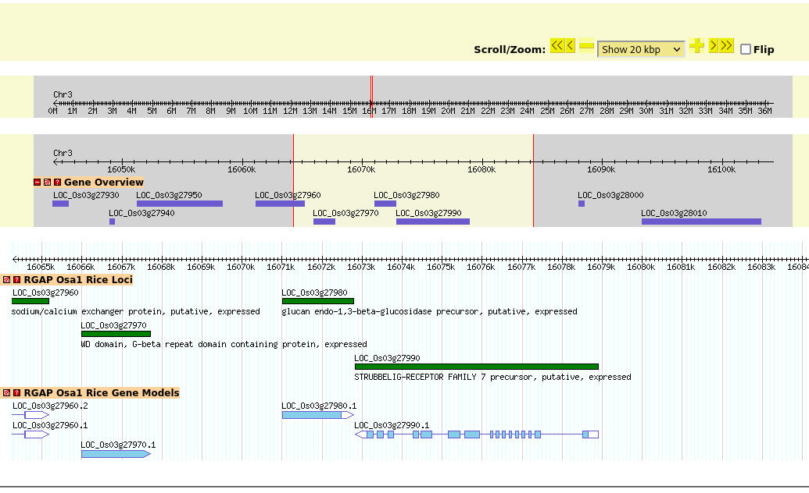

__Name:__ Ricardo Pineda

__Student ID:__ 917486212

```{r setup, include=FALSE}
knitr::opts_chunk$set(echo = TRUE, max.print=100)
```

```{r Install Packages}
#install.packages("statgenGWAS")
```

```{r Libraries}
library(tidyverse)
library(statgenGWAS)
```

```{r Load data}
getwd()
load("../../assignment05-rhpineda/output/data_from_SNP_lab.Rdata")
```


## Assignment 6: Rice GWAS

Remember to include the relevant code from the lab page in this file so that this file will knit.

**Exercise 0:** Be sure that your final knitted file has good formatting.  Make sure that you are using informative variable names.

```{r Exercise 1 Set up}
pheno.geno.pca.pop <- left_join(geno.pca.pop, data.pheno, by = c("ID" = "NSFTVID"))
#rm spaces in pheno names
colnames(pheno.geno.pca.pop) <- make.names(colnames(pheno.geno.pca.pop))
head(pheno.geno.pca.pop)
dim(pheno.geno.pca.pop) 
#same data as lab, but different order of columns.
```
```{r Exercise 1 setup 2 - test histogram}
pheno.geno.pca.pop %>%
  ggplot(aes(x=`Seed.length.width.ratio`)) +
  geom_histogram()

#sort(colnames(pheno.geno.pca.pop))

pl1 <- ggplot(data=pheno.geno.pca.pop, aes(x=Seed.length.width.ratio)) +
  geom_histogram(binwidth = .5) +
  facet_wrap(facets =  ~Region, ncol = 3) +
  ggtitle("Seed length width ratio")
pl1
```


**Exercise 1** What Trait did you choose?

* Plot your chosen trait data
  * as a **single histogram** for all of the data
  * as **separate histograms** for each of the 4 population assignments made by fastStructure
  * as a **boxplot** separated by population assignments made by fastStructure. 
* Based on these plots do you think that your trait varies by population? 
* **optional** Try using the "violin" geom.  
  
*Hint:* you will need to use a different binwidth than I used with Seed.length.width (or don't specify it at all and let R choose the default).

*Hint:* the relevant column name for population is "assignedPop".  

- Using the trait `Seed.length`

```{r Exercise 1}
#Single Histogram
ggplot(data = pheno.geno.pca.pop, aes(x = Seed.length)) +
  geom_histogram(binwidth = .2, fill = "skyblue") +
  ggtitle("Seed Length Histogram")

#Separate Histograms
ggplot(data = pheno.geno.pca.pop, aes(x =  Seed.length, fill =  assignedPop)) +
  geom_histogram(binwidth = .2) +
  facet_wrap(facets = ~ assignedPop, ncol = 4) +
  ggtitle("Seed Length Histogram by Population")

#Boxplot
ggplot(data = pheno.geno.pca.pop, aes(x = assignedPop, y = Seed.length, fill = assignedPop)) +
  geom_boxplot()

#Violin Plot
ggplot(data = pheno.geno.pca.pop, aes(x = assignedPop, y = Seed.length, fill = assignedPop)) +
  geom_violin()

```

**MV** -1 missing discussion if trait varies by population

**Exercise 2:** 

* Obtain the mean of your trait for each of the four fastStructure populations.
* Perform an ANOVA for your trait to test if it varies significantly by fastStructure population.  Show your code, the ANOVA output, and provide an interpretation.
* Discuss: Do your results suggest that populations structure could be a problem for GWAS for this trait?

```{r Exercise 2 Example, eval=FALSE}
sem <- function(x, na.rm=TRUE) {
  if(na.rm) x <- na.omit(x)
  sd(x)/sqrt(length(x))
}

pheno.geno.pca.pop %>% 
  group_by(Region) %>% 
  summarize(mean.seed.lw=mean(Seed.length.width.ratio,na.rm=T),
            sem.seed.lw=sem(Seed.length.width.ratio)) %>%
  arrange(desc(mean.seed.lw))
aov1 <- aov(Seed.length.width.ratio ~ Region,data=pheno.geno.pca.pop) #1-way ANOVA for Seed.length.width.ratio by Region
summary(aov1)
```

```{r Exercise 2 }
pheno.geno.pca.pop %>%
  group_by(assignedPop) %>%
  summarize(Mean_Seed_Length = mean(Seed.length, na.rm = T)) %>%
  arrange(assignedPop)
aov1 <- aov(Seed.length ~ assignedPop,data=pheno.geno.pca.pop)
summary(aov1)
```

- The low p-value of assignedpop indicates that the mean seed length varies significantly between the populations which means there is some population structure.

**Exercise 3:** Complete the code below to generate a data.map object like the one above.  Note that "chr" and "pos" should be numeric.  _Hint:_ Look at help for the `separate` command.  You will need to specify the `into`, `sep`, `convert` and `remove` arguments.

```{r data.geno}
Sys.setenv(VROOM_CONNECTION_SIZE="500000") # needed because the lines in this file are _extremely_long.

data.geno <- read_csv("../../assignment05-rhpineda/input/Rice_44K_genotypes.csv.gz",
                      na=c("NA","00"))  %>%
  rename(ID=`...1`, `6_17160794` = `6_17160794...22252`) %>% 
  select(-`6_17160794...22253`)

data.geno <- data.geno %>% as.data.frame() %>% column_to_rownames("ID")
head(data.geno[,1:10])
```

First create the object.  You do not need to modify this block
```{r}
# This is one of the rare cases where tibbles and data frames are not interchangeable
# This is because we need to have rownames and tibbles do not allow rownames
# So be sure to used "data.frame()" rather than "tibble()"

data.map <- data.frame(SNP=colnames(data.geno)) # create the object
head(data.map) # take a look
```

Now use separate to create the `chr` and `pos` columns.  You need to modify this block:
```{r Exercise 3}
data.map <- data.map %>%
  separate(SNP, into = c("chr","pos"), sep = "_", convert = TRUE, remove = FALSE) %>%
  column_to_rownames("SNP")

head(data.map) # check to make sure it looks correct
```


**Exercise 4:** Compare the Q-Q and Manhattan plots of the no correction, PCA correction, and kinship matrix runs. Based on the no-correction results, do you think a correction was needed? Did the corrections make a difference?  If so, which one worked better?  How did this effect the number of "significant" SNPs in the Manhattan plot?  (In the Manhattan plot the horizontal line represents the significance threshold.  If you don't see any dots above the line, nothing was).

```{r data.pheno}
data.pheno.small <- data.pheno %>%
  set_names(make.names(colnames(.))) %>%
  rename(genotype=NSFTVID) %>%
  select(genotype, where(is.numeric)) %>%
  as.data.frame()

head(data.pheno.small)

data.cv <- geno.pca.pop %>%
  as.data.frame() %>%
  column_to_rownames("ID")
```
```{r gdata}
gData.rice <- createGData(geno=data.geno, map = data.map, pheno = data.pheno.small, covar = data.cv)
gData.rice.recode <- gData.rice %>% codeMarkers(verbose = TRUE)

```

```{r data.kinship}
data.kinship <- kinship(gData.rice.recode$markers)
```

```{r No correlation example}
nullmat <- matrix(0, ncol=413,nrow=413, dimnames = dimnames(data.kinship))

gwas.noCorrection <- runSingleTraitGwas(gData = gData.rice.recode,
                                          traits = "Seed.length",
                                          kin = nullmat)
summary(gwas.noCorrection)
plot(gwas.noCorrection, plotType = "qq")
plot(gwas.noCorrection, plotType = "manhattan")
```

```{r pop correlation}
gwas.PCA <- runSingleTraitGwas(gData = gData.rice.recode,
                               traits = "Seed.length",
                               kin = nullmat,
                               covar = c("PC1", "PC2", "PC3", "PC4") 
                               )

summary(gwas.PCA)
plot(gwas.PCA, plotType = "qq")
plot(gwas.PCA, plotType = "manhattan")
```

```{r Kinship}
gwas.K <- runSingleTraitGwas(gData = gData.rice.recode,
                             traits = "Seed.length",
                             kin = data.kinship)
summary(gwas.K)
plot(gwas.K, plotType = "qq")
plot(gwas.K, plotType = "manhattan")
```
-No correlation  
  - the QQ plot from the no correlation has almost all of the points above the expected slope. This indicates that there is still some other factor leading to more observed than expected so some correction is needed. This can also be seen in the manhattan plot as there are a lot of significant SNPs which probably means there are false positives. 

-Pop correlation  
  - The QQ plot here is significantly better as only 3/5ths of the way through does the slope change when we get to the significantly different SNPs than expected unlike the no correlation plot where there isn't much of a linear portion of the plot. There is still the problem where the points are above the observed/expected line so there's still something missing.  The manhattan plot looks better but there are still dozens of significant SNPS. This correction does significantly better than the random one, but it could be better.
  
-kinship matrix  
  - The QQ plot has an even longer linear portion and the there are only a new SNPs that have a much higher observed than expected. This can be seen in the manhattan plot where there are only a handful of significant SNPs. This correction made a large difference and was the best correction method.

**Exercise 5:**

A) Sort the significant SNPs to find the most significant ones (smallest pValue).  
_Hint_ think back to tidyverse if you don't remember how to _arrange_ a data frame.

```{r Exercise 5 A}
sigSnps <- gwas.K$signSnp[[1]] %>%
  arrange(desc(LOD))
sigSnps
```

B) Look for genes close to the most significant SNP using the [rice genome browser](http://rice.plantbiology.msu.edu/cgi-bin/gbrowse/rice/).  Pick a significant SNP from your analysis and enter its chromosome and position in the search box.  The browser wants you to enter a start and stop position, so for example, you should enter "Chr3:30449857..30449857" and then choose "show 20kb" from the pulldown menu on the right hand side.  Report the SNP you chose and the three closest genes.  These are candidate genes for determining the phenotype of your trait of interest in the rice population.  Briefly discuss these genes as possible candidates for the GWAS peak.  __Include a Screenshot of the genome browser in your answer__

- I chose the SNP at chr 3, pos 16074273
  - The closest genes were:
    - LOC_OS03g27980
    - LOC_Os03g27990
    - LOC_Os03g27970
```{r}
getwd()
```




**MV** -1 missing discussion about the candidate genes
