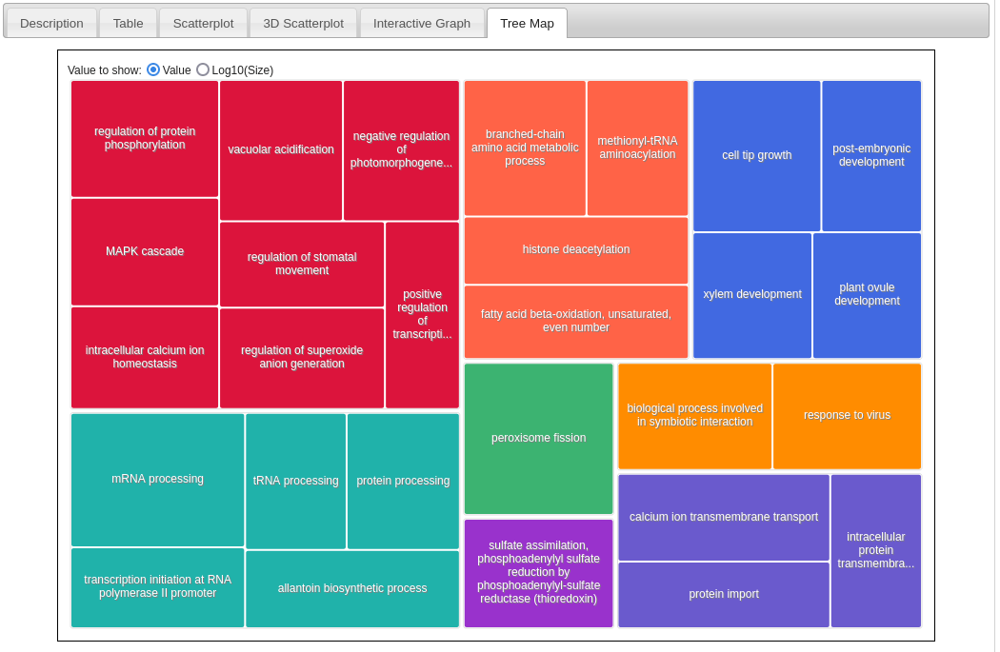

__Name:__ Ricardo Pineda		
__Student ID:__ 917486212

Insert your answers below.  Knit this file and submit the .Rmd and .html when you are done. 

```{r}
library(tidyverse)
library(goseq)
library(rtracklayer)
library(GenomicRanges)
library(Biostrings)
```


__Exercise 1:__  
Import the gene descriptions that you downloaded; pay attention to the `read_tsv `"col_names" argument.  What is appropriate here?  Use one of the `join()` functions (which one?) to add gene descriptions for the genes found to be regulated by the DP treatment.  Output a table of the top 10 genes (based on FDR) that includes the output from edgeR and the descriptions.  Have the description be the first (left-most) column so that you can see it in the output (_Hint: use tidyverse `select`, but be sure to keep the other columns_)

```{r}
DEgene.trt <- read_csv("../input/DEgenes.trt.csv")
#head(DEgene.trt)
colnames(DEgene.trt)[1] <- "GeneID" #rename colname
#head(DEgene.trt)

genedesc <- read_tsv("../input/FileS9.txt",col_names = c("GeneID", "description"))

#I have all the genes that are differentially express from the treatments, left join so I dont want to get rid of those just because they don't have an annotation.
DEgene.trt.desc <- left_join(DEgene.trt, genedesc, by = "GeneID") 
DEgene.trt.desc <- select(DEgene.trt.desc, description, everything())
#DEgene.trt.desc

head(DEgene.trt.desc, 10)
```

__Exercise 2:__  


```{r}
#Import go.terms, expressed genes, and gene lengths 
go.terms <- read_tsv("../input/FileS11.txt",col_names=FALSE)
head(go.terms)
colnames(go.terms) <- c("GeneID","GO")
head(go.terms)

expressed.genes <- read_tsv("../input/internode_expressed_genes.txt")
head(expressed.genes)
names(expressed.genes) <- "GeneID"

gene.lengths <- read_tsv("../input/Brapa_CDS_lengths.txt")
head(gene.lengths)

#we need to reduce the gene.length data to only contain entries for those genes in our expressed.genes set.  We also need this as a vector
gene.lengths.vector <- gene.lengths$Length[gene.lengths$GeneID %in% expressed.genes$GeneID]
names(gene.lengths.vector) <- gene.lengths$GeneID[gene.lengths$GeneID %in% expressed.genes$GeneID]
head(gene.lengths.vector)

#Do the reverse to make sure everything matches up (it seems that we don't have length info for some genes?)
expressed.genes.match <- expressed.genes[expressed.genes$GeneID %in% names(gene.lengths.vector),]
```

```{r}
#format go.terms for goseq
go.list <- strsplit(go.terms$GO,split=",")
names(go.list) <- go.terms$GeneID
head(go.list)
```

```{r}
#Format gene expression for goseq

#for each gene in expressed gene, return FALSE if it is not in DEgene.trt and TRUE if it is.
DE.trt <- expressed.genes.match$GeneID %in% DEgene.trt$GeneID
names(DE.trt) <- expressed.genes.match$GeneID
head(DE.trt)

DE.trt <- as.numeric(DE.trt) #convert to 0s and 1s
head(DE.trt)
sum(DE.trt) # number of DE genes
```

```{r}
#Calc GO terms

#determines if there is bias due to gene length.  The plot shows the relationship.
nullp.result <- nullp(DEgenes = DE.trt,bias.data = gene.lengths.vector)

#calculate p-values for each GO term
rownames(nullp.result) <- names(gene.lengths.vector) #because of a bug in nullp()
GO.out <- goseq(pwf = nullp.result,gene2cat = go.list,test.cats=("GO:BP"))

#list over-represented GO terms (p < 0.05)
GO.out[GO.out$over_represented_pvalue < 0.05,]
```

```{r}
#Write out and save enriched genes
write.table(GO.out[GO.out$over_represented_pvalue < 0.05,1:2],row.names=FALSE,file="../output/GO_terms.txt", quote = FALSE,col.names = FALSE)
```


__a:__ In REVIGO display a "TreeMap" of the BP GO terms.  Take a screenshot and include it here.




__b:__ Remember that the genes used in this analysis are those that are differentially expressed between plants grown at high density ("DP", multiple plants per pot) and not densely planted ("NDP". one plant per pot). Plants in the DP treatment are able to sense their neighbors via photoreceptors that initiate a signaling cascade leading to more elongation growth.  List two GO terms from this analysis that could be related to signaling or growth.

- `MAPK Signaling` could be related to signaling and `Cell tip growth` could be related to growth.   


```{r}
#Import gff

# you may need to change the path or make a symbolic link
gff <- import.gff("../../assignment08-rhpineda/input/Brapa_reference/Brapa_gene_v1.5.gff")
gff
```

```{r}
mRNAranges <- gff[gff$type=="mRNA",c("type", "ID")]
mRNAranges
```

```{r}
#We don't have scaffolds, only keep chromosomes

chromosomes <- c(paste0("A0", 1:9), "A10")
seqlevels(mRNAranges, pruning.mode="coarse") <- chromosomes
mRNAranges
```

__Exercise 3:__ Flanking sequences could be defined in a variety of ways.  We want `flank()` to take sequences upstream, not downstream of the mRNAs.  Also, remember that genes can be transcribed from the "+" (upper) or "-" (lower) DNA strand.  Thus we want `flank()` to take coding strand into consideration and take sequences that are upstream of the 5' end of the gene.  Examine the entries for the first two genes in the `mRNARanges` and `promoterRanges` to determine if `flank()` has done what we want.  Explain how you know.

```{r}
#To compare with promotor regions
mRNAranges
promoterRanges <- flank(mRNAranges, 1500)
promoterRanges
```


Below are the mRNA ranges and then the promoter ranges.

mRNA  
[1]            A03 8794511-8797095      + |     mRNA   Bra000001  
[2]            A03 8797899-8800379      - |     mRNA   Bra000002  

PROMOTOR  
[1]            A03 8793011-8794510      + |     mRNA   Bra000001  
[2]            A03 8800380-8801879      - |     mRNA   Bra000002  

I know flank is doing what it's supposed to if I track what's upstream as diagrammed below

[1] It's in the right spot because the promoter is smaller than the mRNA on the + strand

+ |  [0]    5 -Promoter [8793011-8794510]-mRNA [8794511-8797095]- 3
- |  [0]    3 --------------------------------------------------- 5

[2] It's in the right spot because the promoter is larger than the mRNA on the - strand

+ |  [0]    5 --------------------------------------------------- 3
- |  [0]    3 -mRNA [8797899-8800379]-Promoter [8800380-8801879]- 5

__Exercise 4:__  

```{r}
#Import chromosome seqs
Brapaseq <- readDNAStringSet("../../assignment08-rhpineda/input/Brapa_reference/BrapaV1.5_chrom_only.fa")
#names(Brapaseq)

#remove unneeded info
names(Brapaseq) <- str_remove(names(Brapaseq), " \\[.*")
names(Brapaseq)

#get promotor seqs
promoters <- Brapaseq[promoterRanges]
names(promoters) <- promoterRanges$ID
#promoters

#clean promotors | Remove N so motifs won't match them
promoters <- DNAStringSet(gsub("N","-",promoters))
promoters
```

```{r}
#Load TF binding motifs
#wget https://bis180ldata.s3.amazonaws.com/downloads/RNAseq_Annotation/element_name_and_motif_IUPACsupp.txt
```

```{r}
#Format motifs
motifs <- read.delim("../input/element_name_and_motif_IUPACsupp.txt",header=FALSE,as.is=TRUE)
head(motifs)
motifsV <- as.character(motifs[,2])
names(motifsV) <- motifs[,1]
motifsSS <- DNAStringSet(motifsV)
motifsSS
```

```{r}
#Subsetting differentially expressed genes and those that arent differentially expressed

#get names to match...there are are few names in the DEgene list not in the promoter set
DEgene.trt.match <- DEgene.trt$GeneID[DEgene.trt$GeneID %in% names(promoters)]

expressed.genes.match <- expressed.genes$GeneID[expressed.genes$GeneID %in% names(promoters)]

#subset promoter files
universe.promoters <- promoters[expressed.genes.match]
target.promoters <- promoters[DEgene.trt.match]
non.target.promoters <- universe.promoters[
  ! names(universe.promoters) %in% names(target.promoters)] # all expressed genes not in target set

```

```{r}
#looking for overrepresented motifs
#motifsSS[2] #Testing the second motif from the database

#Counting the occurences of a motif
target.counts <- vcountPDict(motifsSS[2], 
            subject = target.promoters, 
            fixed = FALSE) #fixed = FALSE allows IUPAC ambiguity codes
#Results from above
dim(target.counts) #1 row for each motif, 1 column for each sequence that we are searching
target.counts[1,1:20] # each cell contains the counts for a particular motif in a particular sequence

#Searching both strands of DNA for occurences of a motif
target.counts <- 
  vcountPDict(motifsSS[2], 
            subject = target.promoters, 
            fixed = FALSE) +
    vcountPDict(motifsSS[2], 
            subject = reverseComplement(target.promoters), 
            fixed = FALSE)
#Results from above
target.total <- rowSums(target.counts>0)
target.total
length(target.promoters) - target.total

# of 586 differentially expressed genes,42 w/ motif, 544 w/o
#[1] 42
#[1] 544

#Finding the number of promoters that werent differentially expressed w/ the motif
non.target.counts <- vcountPDict(motifsSS[2], 
            subject = non.target.promoters, 
            fixed = FALSE) +
    vcountPDict(motifsSS[2], 
            subject = reverseComplement(non.target.promoters), 
            fixed = FALSE)
non.target.total <- rowSums(non.target.counts > 0)
non.target.total
length(non.target.promoters) - non.target.total
# of 22166 expressed genes not differentially expressed, 1559 have 1+ copies of the motif, 20607 w/o the motif
#[1] 1559
#[1] 20607
```

```{r}
#Determining enrichment, using Fisher's exact test
#Contingency Table w/ counts
m <- matrix(c(
  target.total,
  length(target.promoters) - target.total,
  non.target.total,
  length(non.target.promoters) - non.target.total ),
  ncol=2, 
  dimnames = list(motif=c("Y", "N"), target=c("Y", "N")))
m
#Running test
fisher.test(m)
```

```{r}
#create a function to summarize the results and test for significance
motifEnrichment <- function(target.promoters,non.target.promoters,all.counts=F,motifs=motifsSS) {
  
  #use vcountPDict to count the occurrences of each motif in each promoter
  target.counts <- vcountPDict(motifs,target.promoters,fixed=F) + 
    vcountPDict(motifsSS,reverseComplement(target.promoters),fixed=F)
  non.target.counts <- vcountPDict(motifs,non.target.promoters,fixed=F) + 
    vcountPDict(motifsSS,reverseComplement(non.target.promoters),fixed=F)
  
  if (all.counts) { 
    #count all occurrences of a motif instead of the number of promoters that it occurs in
    target.counts.sum <- rowSums(target.counts)
    non.target.counts.sum <- rowSums(non.target.counts)
  } else {
    target.counts.sum <- rowSums(target.counts > 0)
    non.target.counts.sum <- rowSums(non.target.counts > 0)
  }
  n.motifs <- length(target.counts.sum)
  results <- vector(mode="numeric",length=n.motifs)
  for (i in 1:n.motifs) {
    if (all.counts) { #the contigency tables are different depending on whether we are looking at promoters or overall occurrences
      #test if ratio of occurrences to promoters is the same in the target and the non.target
      m <- matrix(c(
        target.counts.sum[i],                       #number of occurrences within target
        dim(target.counts)[2],                      #number of promoters in target
        non.target.counts.sum[i],                  #number of occurrences within non.target
        dim(non.target.counts)[2]                  #number of promoters in non.target
      ),ncol=2)
    } else { #looking at promoters with and without hits
      m <- matrix(c(
        target.counts.sum[i],                        #number of promoters in target with hit
        dim(target.counts)[2]-target.counts.sum[i],            #number of promoters in target with no hit
        non.target.counts.sum[i],                   #number of promoters in non.target with hit
        dim(non.target.counts)[2]-non.target.counts.sum[i]   #number of promoters in non.target with no hit
      ),ncol=2)
    } #else
    results[i] <- fisher.test(m,alternative="greater")$p.value
  } #for loop
  results.table <- data.frame(
    motif=names(motifs),
    non.target.percent = round(non.target.counts.sum/dim(non.target.counts)[2],3)*100,
    target.percent = round(target.counts.sum/dim(target.counts)[2],3)*100,
    p.value =  results)
  results.table <- results.table[order(results.table$p.value),]
  results.table
}
```

```{r}
motif.results <- motifEnrichment(target.promoters, non.target.promoters)
head(motif.results)
```


__a.__ How many motifs are enriched at P < 0.05?  (Can you do this with code?)  

There are 12 motifs enriched at P < 0.05
```{r}
motif.results.filtered <- motif.results %>%
	filter(p.value < 0.05)
motif.results.filtered
#count(motif.results.filtered)

```

__b.__ What is the identity of the most significantly over-enriched promoter? (No code)  

- SORLREP3   

__c.__ What percentage of genes in the "non.target" have this motif?  What percentage in our target set?  (No code)  

- `non.target` : 14.2  
- `target.percent` : 20.1  

__d.__ You can find information on the motifs [here](http://arabidopsis.med.ohio-state.edu/AtcisDB/bindingsites.html).  Remembering that plants in the "DP" treatment experience shading from their neighbors, where as "NDP" plants do not.  Do you think that the most enriched motif represents a biologically relevant result?  Discuss why or why not.

- Yes! The description for the motif is "Identification of key promoter motifs involved in the network of light-regulated gene expression by combined analysis of genomic sequence and microarray data." One possible scenario where this motif is biologically relevant is where photomorphogenesis genes that control processes like shade avoidance response could be activated more in DP versus NDP, or the other way around where they are inhibited in NDP while active in DP. Either way they should be different since this motif is associated with light-regulated gene expression and the different treatments have different levels of light due to planting density.

**MV** -0

