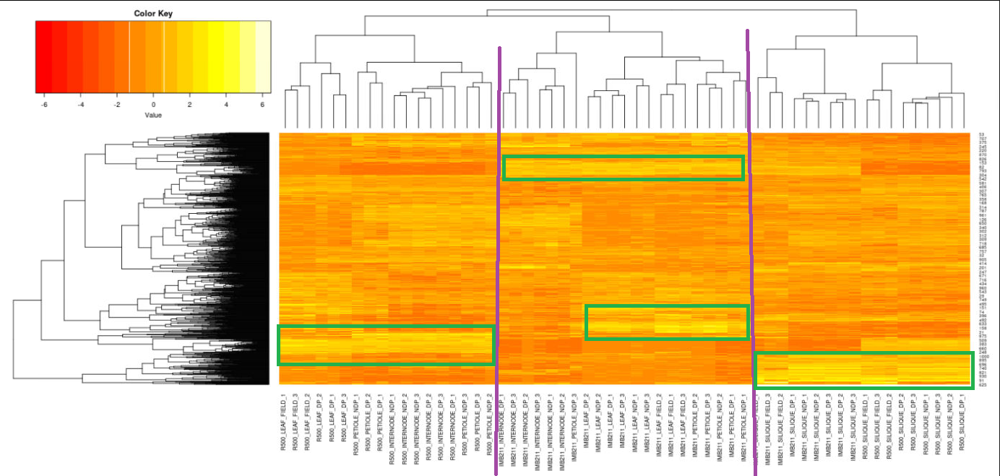

__Student Name:__ Ricardo Pineda
__Student ID:__ 917486212

## Assignment 11: Gene Networks Part 1

This should be a .Rmd file.  Include this file and the .html when you turn in the assignment.

```{r}
#install.packages("ggdendro")
library(tidyverse)
library(ggdendro)
```

```{r}
#Import data
cities<- read.delim("../input/us_cities.txt", row.names = 1)
head(cities)
```

```{r}
#Make hierarchical clustering dendogram of cities
cities_hclust <- cities %>%
	as.dist() %>% #as dist matrix
	hclust()

ggdendrogram(cities_hclust)
```


**EXERCISE 1:** Extending the example that I gave for BOS/NY/DC, what are the distances that define each split in the West Coast side of the hclust plot? 

```{r}
cities
```

- The default in hclust is using the maximum distance

- SF and LA -> 379  
- SF_LA and SEA -> 1131  
- SF_LA_SEA and DEN -> 1307  
 
*Hint 1: Start with the distances between SF and LA. Then look at the difference between that cluster to SEA, etc.*  

*Hint 2: Examine the `cities` object, you only need to look at the upper right triangle of data matrix.*

```{r}
# Import data
#RNA-seq data but voomed from limma package to be normally dist'd
#UNIX in ./input/ wget https://bis180ldata.s3.amazonaws.com/downloads/Genetic_Networks/voom_transform_brassica.csv.gz
brass_voom_E <- read_csv("../input/voom_transform_brassica.csv.gz")
#head(brass_voom_E[,1:6])
```

```{r}
#data selection and scaling
#focus on genes that are most varaible across the dataset, n=1000 in this case
#1. Calc CoV
calc.cv <- function(x, na.rm=TRUE) { # function to calculate the coefficient of variation
  if(na.rm==TRUE) x <- na.omit(x)
  result <- sd(x) / mean(x) # CV calculation
  result <- abs(result) # no negative CVs!
  return(result)
}

#Doing this with base R because tidy is slow on row-wise calculations
brass_voom_E$cv  <- apply(brass_voom_E[,-1], 1, calc.cv)

brass_voom_E <- brass_voom_E %>%  select(GeneID, cv, everything()) # reorder columns

head(brass_voom_E[,1:6])

```


**Exercise 2:**
Create a new object `brass_voom_E_1000` that has the 1000 most variable genes, based on the cv column.  *Hint: you probably want to use `slicing`* 

```{r}
brass_voom_E_1000 <- brass_voom_E %>%
	slice_max(order_by = cv, n = 1000)
head(brass_voom_E_1000)
```


**Exercise 3:**
What patterns are present in the clustered data?  Specifically, there are three major clusters here.  How would you describe each cluster?  Is genotype or treatment a more important determinant of clustering?
*In your .Rmd file you can click on the left icon above the plot to display it in its own window*

```{r}
#scale and center data so eah gene with mean 0 and SD 1. df -> matrix so it's easier later.
E_matrix <- brass_voom_E_1000 %>%
	select(-GeneID, -cv) %>%
	as.matrix() %>%
	scale()
```

```{r}
#calc dist b/w genes/samples. More dist = more RNA exp diff
gene_hclust_row <- E_matrix %>%
	dist() %>%
	hclust()
#ggdendrogram(gene_hclust_row) #Super messy dendogram b/c each end is an ind row
gene_hclust_col <- E_matrix %>% 
	t() %>% #sqitch axes
	dist() %>%
	hclust()
ggdendrogram(gene_hclust_col)

```

In the three main clusters I see, the leftmost cluster depends on the tissue type while the other two clusters depend on the genotype. I would describe within the leftmost cluster which is distinguished by tissue, the most important determinant being genotype, and then treatment being less important since different treatments can be clustered together at a lower level compared to genotype. The other two clusteres are differentiated by genotype, then tissue, and then treatment in order of importance. So overall genotype is a more important determinant of clustering than treatment.

**Exercise 4:**

```{r}
#defining sub-clusters using rect.hclust()
plot(gene_hclust_col, cex=.6) #redraw the tree everytime before adding the rectangles
rect.hclust(gene_hclust_col, k = 6, border = "red")

```

First, read the help file for `rect.hclust()`, then:

__a__ With k = 6 as one of the arguments to the rect.hclust() function, how are the samples being split into clusters?

- The dendogram is cut at a certain level, in this case so that there are 6 groups, and a rectangle is drawn around each of these groups.

**MV** -0.5 Samples are generally being clustered based on genotype and tissue

__b__ What does the k parameter specify?

- The amount of groups that the dendogram is going to be split into. 

__c__ Play with the k-values between 3 and 7. Describe how the size of the clusters change when changing between k-values.

- as k increases, the size of the clusters decrease. Likewise, as k decreases, the size of the clusters increases.

**Exercise 5:**
After running the 50 bootstrap samples, make a new plot but change nboot up to 1000. In general what happens to BP and AU?

```{r}
#pvclust assigns p-vals to clusters by resampling the dataset (bootstrapping)
#If a branch appears many times in the resampled, then som evidence that it's "reaL"
library(pvclust)

set.seed(12456) #This ensure that we will have consistent results with one another

fit <- pvclust(E_matrix, method.hclust = "ward.D", method.dist = "euclidean", nboot = 50)
plot(fit, print.num=FALSE) # dendogram with p-values
# numbers closer to 100 provide more support
```

```{r}
fit_1000 <- pvclust(E_matrix, method.hclust =  "ward.D", method.dist = "euclidian", nboot = 1000)
plot(fit_1000, print.num=FALSE)
```

- In general, with nboot=1000, both BP and AU both increases in value which should give more support to how "real" our clusters are. 

**Exercise 6:**
We used the scale rows option. This is necessary so that every *row* in the data set will be on the same scale when visualized in the heatmap. This is to prevent really large values somewhere in the data set dominating the heatmap signal. Remember if you still have this data set in memory you can take a look at a printed version to the terminal. Compare the distance matrix that you printed with the colors of the heat map. See the advantage of working with small test sets? Take a look at your plot of the cities heatmap and interpret what a dark red value and a light yellow value in the heatmap would mean in geographic distance. Provide an example of each in your explanation.

```{r}
#Heatmaps to visaulize h-clustering, whole data matrix plotted
library(gplots) #not to be confused with ggplot2!

#head(cities) # city example
heatmap.2(as.matrix(cities), Rowv=as.dendrogram(cities_hclust), scale="row", density.info="none", trace="none")

#Example w/o scaling 
#cities
#heatmap.2(as.matrix(cities), Rowv=as.dendrogram(cities_hclust), density.info="none", trace="none")
```

If we used a non-scaled version it would be much harder to see the difference between two relatively close or two relatively far cities. This is because with a an unscaled range from 200ish to 3000ish miles the rest of the values get hard to distinguish. In the heatmap above, the lighter color means much longer than the average distance. An example of this is Seattle being much farther away from Miami than the average distance between cities in the dataset based on the yellow cell. Similarly, a darker color means much shorter than the average distance. So an example of this is the red cell for the distance between New York and Boston.

**Exercise 7:** In the similar way that you interpreted the color values of the heatmap for the city example, come up with a biological interpretation of the yellow vs. red color values in the heatmap. 

```{r}
heatmap.2(E_matrix, Rowv = as.dendrogram(gene_hclust_row),  density.info="none", trace="none", margins = c(10,5))
```


- In this heatmap, it shows the different levels of gene expression. We scaled E_matrix previously so that the mean is zero and the SD is 1. So based on the scale, the really white cells are genes that are highly expressed in a specific sample. Likewise, the really red cells are genes that are barely expressed in a specific sample.


**Exercise 8:** The genes are overplotted so we cannot distinguish one from another. However, is there a set of genes that are expressed mostly highly in siliques? where? (general description of location, e.g. "top rows" is fine)  Is there a set of genes that is expressed mostly highly in R500 vs IMB211? where?

Yes, as shown in the green boxes below. 
R500 Cluster - IMB211 Cluster - Siliques Cluster



**Exercise 9:** Pretty Colors!  Why would it be a bad idea to have too few or too many clusters? Discuss with a specific example comparing few vs. many k-means. Justify your choice of too many and too few clusters by describing what you see in each case.


```{r}
library(ggplot2)

# get principle components
prcomp_counts <- prcomp(E_matrix) 
scores <- as.data.frame(prcomp_counts$x)[,c(1,2)]

set.seed(25) #make this repeatable as kmeans has random starting positions
fit <- kmeans(E_matrix, 9)
clus <- as.data.frame(fit$cluster)
names(clus) <- paste("cluster")

plotting <- merge(clus, scores, by = "row.names")
plotting$cluster <- as.factor(plotting$cluster)

# plot of observations
ggplot(data = plotting, aes(x = PC1, y = PC2, label = Row.names, color = cluster)) +
  geom_hline(yintercept = 0, colour = "gray65") +
  geom_vline(xintercept = 0, colour = "gray65") +
  geom_point(alpha = 0.8, size = 2, stat = "identity") 
```

It would be bad to have too few clusters because there could be underlying complexity that isn't shown which could be useful. So, when k = 3 the genes are all divided into three but if we increase the number of clusters by just one the new cluster shows that there is a group in the center instead of just being split up when there was only 3 clusters. This center cluster is an example of useful information obscured by the low number of clusters. If there are too many clusters, like if k = 20, the plot can become too busy and the clusters become unclear. 


**Exercise 10:** Based on the above Gap statistic plot, at what number of k clusters (x-axis) do you start to see diminishing returns? To put this another way, at what value of k does k-1 and k+1 start to look the same for the first time? Or yet another way, when are you getting diminishing returns for adding more k-means? See if you can make the trade off of trying to capture a lot of variation in the data as the Gap statistic increases, but you do not want to add too many k-means because your returns diminish as you add more. Explain your answer using the plot as a guide to help you interpret the data.

At k = 8 k-1 and k+1 look the same as k. At k=8 There's a good trade off for decreasing the gap statistic a lot before I reach diminishing returns. If I increase k by 1 or even by 5 the gap statistic looks essentially the same. 

```{r}
library(cluster)
set.seed(125)
gap <- clusGap(E_matrix, FUN = kmeans, iter.max = 30, K.max = 20, B = 100)
plot(gap, main = "Gap Statistic")
```

**Exercise 11:** What did clusGap() calculate? How does this compare to your answer from Exercise 10? Make a plot using the kmeans functions as you did before, but choose the number of k-means you chose and the number of k-means that are calculated from the Gap Statistic. Describe the differences in the plots.

- `clusGap()` calculated 8. This is the same answer I got from exercise 10. Since they were the same K the plot is the same.

```{r}
with(gap, maxSE(Tab[,"gap"], Tab[,"SE.sim"], method="firstSEmax"))
```

```{r}
# get principle components
prcomp_counts <- prcomp(E_matrix) 
scores <- as.data.frame(prcomp_counts$x)[,c(1,2)]

set.seed(25) #make this repeatable as kmeans has random starting positions
fit <- kmeans(E_matrix, 8)
clus <- as.data.frame(fit$cluster)
names(clus) <- paste("cluster")

plotting <- merge(clus, scores, by = "row.names")
plotting$cluster <- as.factor(plotting$cluster)

# plot of observations
ggplot(data = plotting, aes(x = PC1, y = PC2, label = Row.names, color = cluster)) +
  geom_hline(yintercept = 0, colour = "gray65") +
  geom_vline(xintercept = 0, colour = "gray65") +
  geom_point(alpha = 0.8, size = 2, stat = "identity") 
```


**Exercise 12:** Based on the plot above, how would you describe the genes grouped in cluster 5? how about cluster 7? cluster 8?

- Cluster 5 genes are silique genes since they are much more highly expressed in that type of tissue sample.  

- Cluster 7 genes are R500 genes since they are much more highly expressed in R500 samples in comparison to IMB211 samples.  
- Cluster 8 genes are IMB211 genes since they are much more highly expressed in IMB211 samples in comparison to R500 samples.  

```{r}
set.seed(25) #make this repeatable as kmeans has random starting positions
fit8 <- kmeans(E_matrix, 8)
clus8 <- as.data.frame(fit8$cluster)
names(clus8) <- paste("cluster")

clus8 <- cbind(clus8, E_matrix) %>% # add cluster labels to gene expression matrix
  mutate(gene_index=1:nrow(clus8)) # would be better to bring in gene names but OK for now.

clus8 <- clus8 %>% pivot_longer(c(-cluster, -gene_index), names_to = "sample_ID", values_to = "expression") %>% # get ready for plotting
  mutate("sample_group" = str_remove(sample_ID, "_.$"))

clus_summary <- clus8 %>% # average across replicates
  group_by(gene_index, cluster, sample_group) %>%
  summarize(expression = mean(expression))

clus_summary %>% ggplot(aes(x=sample_group, y=expression, group=gene_index)) + # plot it
  geom_line(alpha=.05) +
  facet_wrap(~cluster, ncol=4) +
  coord_fixed(ratio=1) +
  theme(axis.text.x = element_text(angle = 90, size = 7, hjust = 1, vjust = 0))

```

