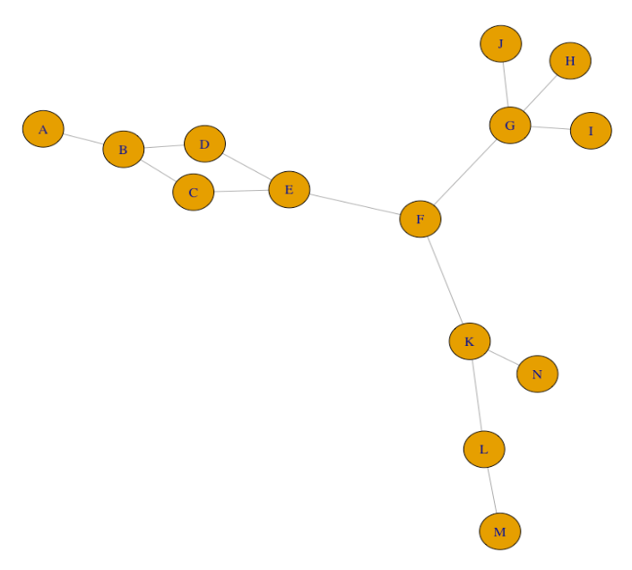

```{r setup, include=FALSE}
knitr::opts_chunk$set(echo = TRUE)
```

__Spring, 2023__  
__Available June 09__  
__Due June 14, 9:00 AM__  

__Student Name:__ Ricardo Pineda

__Student ID:__ 917486212

__There are 100 points total on this exam__


## Limitations
This exam is open book, open notes, open web
__HOWEVER__
You __CANNOT__ discuss the questions with any person or entity.  
You __CANNOT__ request help from any person, online forum, listserv, chatroom, or other entity, etc.  
You __MUST__ Do your own work  

You __CAN__ ask John or Professor Maloof for clarification.

By typing my name below I affirm that I have read the above instructions and will follow them and the [UC Davis Academic Code](https://ossja.ucdavis.edu/code-academic-conduct).    
Name: Ricardo Pineda

## Instructions

1. Work by adding your answers to this .Rmd file
2. For all questions provide any code that you used to answer them formatted as a code block.
3. Include your code even if you can't get it to work.  You may get partial credit.
4. For R, the code should run and embed the answers when you knit this file.
5. When you are ready to turn in the exam, knit an html file add both the .Rmd and the .html file __AND__ the updated ShinyApp files, and push to your repository.
6. Reread 1-5
7. Write "I have read all the instructions" below this line.  

I have read all the instructions

## Advice

In general you will not need any new commands or techniques to finish the exam.  In the one case where you do, hints are given.  Otherwise you should be able to answer all questions based on the lab exercises covered in the course.

While the exam is open web/book, I **strongly** recommend that you first try to find the answers in 

1. Your previous work
2. In the lab webpages
3. In the [tutorials](http://symposium.plb.ucdavis.edu:3838/BIS180LTutorials/inst/tutorials/) 
4. For tidyverse the [R for Data Science](https://r4ds.had.co.nz/) text book.


## Question 0
 
Be sure that your knitted html is formatted well!

## Question 1 (24 points; 3 points per sub question)

You __DO NOT__ need to include code for this question.

Consider the following data from an Illumina sequencing experiment:

```
A00406_107_HHGM5DSXY_4_1408_20636_3317-R1	0	scaffold_1	7702	60	121M1I29M	*	0	0	TATAGCTTTGAATTCTGCGAGGAGATCTCCAATATACTTGTTATCATCCAATCCTATATATTCCTCTGCATATGACA
GAGAGAGAAACAATCGATAATGTAGTAGTAGTACTCAGGTTTTCAAAAAATGATCAAGAAATCATATGAAAGCA	:FFIF:FFFF:FFF:FFFFFFFFFFFFFF,FFFFFFFF:FFFFFFFFFFFFF,:FFFFFFFFFFFFFFFFFFF,FF:FFFFFFFFF:F:FFF,FFFFFFFFFFFFFF:FFFFFFFFFFFFFFF:F
FFFFFFFF:::FFF,FFFFFFFFF,F	NM:i:2	MD:Z:36G113	AS:i:138	XS:i:90	RG:Z:JCIR
```


__A:__ The data above comes from what kind of file?

- It comes from a .sam/bam file. I can tell based on the header and how each field is separated by tabs instead of colons. The header also doesn't start with an @.

__B:__ The sequencing quality is in Phred+33 or Phred+64?  How do you know?

Phred+33. The F's are ambiguous but the commas are unique to Phred+33 compared to Phred+64.

__C:__ Convert the quality of the fourth base to a Phred score

I is 73 in ASCII. Subtract 33 because we are using Phred+33. So the 4th base has a quality of 40.

__D:__ Convert the Phred score from part C to a p-value (Code not required but you can do this in R or on your calculator).

```{r}
Q = 40
P = 10^-(Q/10)
print(P)
```

__E:__ Explain what the probability from D means in terms of confidence in the sequence.  If you are stuck on C or D then just pick a p-value to illustrate (like what does a p-value of 0.01 mean in this context).

That means that the probability that 4th base is misidentified is 1 in 10,000.  

__F:__ What does the number "7702" refer to?

It's where the read starts. So this read starts on the 7702nd position on the scaffold.

__G:__ What does the number "60" refer to?  How might this information be used?

It refers to the quality of the mapping of the read to the template. This can be used in quality control you would have some threshold for quality and read length. 

__H:__ What does "121M1I29M" mean?

It's a CIGAR string which has information about the read mapping to the template. 
So, 121M1I29M means:  
- 121 Matches followed by  
- 1 Insertion followed by  
- 29 Matches  
 
## Question 2 (12 points, 4 points per sub question)

Open IGV.  Load in the Brapa_A01.fa genome file (_hint, you may need to unzip it first_) and the Brapa_gene_A01.gff annotation file located in input/IGV. If you need an IGV refresher, see the [IGV Lab webpage](http://jnmaloof.github.io/BIS180L_web/2023/05/18/Illumina-Day-2/).

```{bash}
#gunzip ../input/IGV/Brapa_A01.fa.gz 
```

Load in the IMB211.bam and R500.bam files located in input/IGV

I keep on getting errors with indexing so I indexed using samtools.

```{bash}
#samtools index ../input/IGV/IMB211.bam
#samtools index ../input/IGV/R500.bam
```


__A:__ Go to gene Bra038876.  You can just type that into the location bar and press go.  Is the intron/exon annotation a better fit for R500 or IMB211?  Explain your choice.

R500. The leftmost exon in the annotation is still intact for R500 compared to IMB211 where it's broken up into two smaller exons for the best aligned reads. The third exon is more intact for the reads from R500 compared to IMB211.  

__B:__ Go to gene Bra038874.  Describe the discrepancy here and provide two possible explanations.

There are no reads from either cultivars mapping to the region. This could either be from the annotation not actually being "real" so that it's not actually a gene. Alternatively, it's a gene that was never expressed in all the samples that were sequenced. [exercise 9 Q?]

__C:__ Examine position A01:15,649,150.

* Remembering that our plants our diploid, does this position represent a SNP between or within any of the plants?
* If it represents a SNP, what evidence supports it being a SNP? (Note that you can information on count number by clicking on the base in the histogram; you can get information on individual reads by clicking on the base in the read).
* If it represents a SNP, give the genotypes of the reference, IMB211, and R500 at this location.  

It appears to be a SNP for the R500 cultivar. This is because I can see that at this position there are reads that do not map to the reference. Also all of these reads that don't match up to the reference belong to the reads from R500. The genotypes for the cultivars are 1/0 for R500 and 0/0 for IMB211. 1/0 for R500 because roughly half of the reads have the SNP and 0/0 for IMB211 because none of the reads have the SNP.

**MV** -1 missing alleles for the genotypes

## Question 3 (12 pts)

The file `Venosa_pot_weights_06_05_2023.csv` contains data from an experiment in which wild-type plants ("Col" in the spreadsheet) or various _venosa3_ mutants alleles were exposed to a drought or control treatment.  Unfortunately, the metadata for each plant is in a single column.


__A: (0pts)__ Load the data and take a look.

```{r}
veno_pot <- read.csv("../input/Venosa_pot_weights_06_05_2023.csv")
veno_pot
```


__B: (4 pts)__ Use tidyverse and stringr functions to create the following columns from the information in the `Plant` column:
* "genotype": this will "Col", "3-1", "3-2", "3-3", or "3-4".
* "replicate": this will be the number that follows the "#".  This column should NOT include the "#".
* "treatment": this will either be "D" or "C" depending on the last letter in the column.

```{r}
library(tidyverse)
```

```{r}
veno_pot <- veno_pot %>%
  mutate(genotype=str_replace(Plant, "(.*) #(.*) (.*)", "\\1")) %>%
  mutate(replicate=str_replace(Plant, "(.*) #(.*) (.*)", "\\2"))	%>%
  mutate(treatment=str_replace(Plant, "(.*) #(.*) (.*)", "\\3"))	%>%
  select(genotype, treatment, replicate, Weight)

veno_pot
```


__C: (4pts)__ Use tidyverse and stringr functions to:
* add the letters "ven" in front of the "3-1", "3-2", "3-3", or "3-4" genotypes in the `genotype` column.
* change "D" to "drought" and "C" to "control" in the `treatment` column

```{r}
veno_pot <-  veno_pot %>%
  mutate(genotype=str_replace(genotype, "(.*)", "ven\\1")) %>%
  mutate(treatment=str_replace(treatment, "C", "control")) %>%
  mutate(treatment=str_replace(treatment, "D", "drought"))
veno_pot
```


__D: (4pts)__ Sort the data frame by genotype, then treatment, then replicate.  Be sure that replicate is being sorted numerically.  Display the fist 15 rows in your knitted file.

```{r}
veno_pot <- veno_pot %>%
  arrange(genotype) %>%
  arrange(treatment) %>%
  arrange(as.integer(replicate))
head(veno_pot, 15)
```

**MV** -2 not arranged properly; use arrange(genotype, treatment, replicate)

## Question 4 (16 points)

There is a lot of interest in using beneficial soil microbes to enhance plant growth.  Your collaborators have found a growth-promoting microbe mixture and you want to determine if plants show transcriptional responses to treatment with this mixture.

You have inoculated plants with microbes or a control.  You harvested root tissue from microbe-treated and control plants on day 4 and 8 after treatment.  The file `input/RootCounts.csv.gz` has the RNAseq counts for this experiment.  In this file, the first column has the gene names.  Subsequent columns names contain the number of RNAseq counts for each sample and are formatted as follows: "TREATMENT-DAY-REPLICATE".  I have also created a sample description sheet `input/RootSampleInfo.csv` that has this info split into separate columns for you.

* TREATMENT (trt): "MICRB" (treated with growth-promoting microbes) or "BLANK" (control)
* DAY (day): "04" or "08"
* REPLICATE (rep): 1-6

The file `Brapa_V3.0_annotated.csv` contains gene descriptions that you can use for annotating your results.

You want to determine if there is a transcriptional response to the microbe treatment, and if the response is different depending on the day of sampling.

Perform a differential expression analysis and include answers to the following questions.  Also include the R code used to do the analysis.

__A. (0 points)__ Read in the read counts and sample description files; take a look.

```{r}
read_counts <- read.csv("../input/RootCounts.csv.gz")
sample_info <- read.csv("../input/RootSampleInfo.csv")
gene_desc <- read.csv("../input/Brapa_V3.0_annotated.csv.gz")
```

__B.  (3 points)__ How many genes are present in the file?  How many genes are expressed at > 5 counts in at least 5 samples? Subset your sample to include only these genes.

The number of rows equals the number of genes from `RootCounts.csv.gz`. So use `nrow()` to count number of genes. 

```{r}
nrow(read_counts)
```

Subsetting `read_counts` into a new dataframe. Like before I will use `nrow()` to count the number of genes. 

```{r}
read_counts_5 <- read_counts[rowSums(read_counts[,-1] > 5) > 5,]
nrow(read_counts_5)
```

**JM** -.5 incorrect filtering, should be read_counts[rowSums(read_counts[,-1] > 5) >= 5,]

__C.  (3 points)__ Normalize the data, then use an MDS  plot to explore biological variation in the data set.  Comment on the plot with respect to the experiment; any concerns? _Hint: You might want to open the plot in its own window to make it easier to see_

```{r}
#Data Normalization
#1. Assign Groups
#sample.description <- tibble(sample=colnames(read_counts)[-1])
#sample.description <- sample.description %>%
#	mutate(sample.description, trt = str_replace(sample, "(.*)\\.(.*)\\.(.*)", "\\1")) %>%
#	mutate(sample.description, day = str_replace(sample, "(.*)\\.(.*)\\.(.*)", "\\2")) %>%
#	mutate(sample.description, rep = str_replace(sample, "(.*)\\.(.*)\\.(.*)", "\\3")) %>% 
#	mutate(sample.description, group = str_replace(sample, "(.*)\\.(.*)\\.(.*)", "\\1\\2"))
#sample.description
#USE SAMPLE INFO

#2.Calc Normalization Factors
#head(sample_info)
#Convert to factors 
sample_info <- sample_info %>%
  mutate(trt=factor(trt, levels = c("BLANK", "MICRB")), 
         day=factor(day, levels = c("4","8")))

sample_info

library(edgeR)
counts.matrix <- read_counts_5 %>% select(-GeneID) %>% as.matrix()
rownames(counts.matrix) <- read_counts_5$GeneID

dge.data <- DGEList(counts=counts.matrix, 
                    group=sample_info$group)
dim(dge.data) 
dge.data <- calcNormFactors(dge.data, method = "TMM")
dge.data$samples # look at the normalization factors

#3 Plot of BCV of each sample
plotMDS(dge.data, method = "bcv") 
```


Concerned about why replicates with the same day and treatment are not clustered together.

Even if you have concerns, continue with the analysis...

__D. (4 points)__ Fit a model that includes the effect of treatment, day, and their interaction.  Determine the total number of genes up and down-regulated at FDR `< 0.05` in response to microbe treatment, in response to day, and that respond differently to microbes depending on sampling day.

```{r}
#Making sure that normalization did it's thing
#read_counts_normal <- cpm(dge.data) 
#read_counts_normal_log <- cpm(dge.data,log = TRUE)
#read_counts_log <- log2(read_counts[,-1] + 1)

#boxplot(read_counts_log)
#boxplot(read_counts_normal_log)
#boxplot(read_counts_normal)

```


```{r}
#1. Tell edgeR about exp design
design <- model.matrix(~trt+day,data = sample_info)
rownames(design) <- sample_info$sample
head(design, 5)
#2. Estimating dispersion
#a. Overall dispersion
dge.data <- estimateGLMCommonDisp(dge.data,design,verbose = TRUE)
#b. trend based on counts
dge.data <- estimateGLMTrendedDisp(dge.data,design)
#c. Calc genewise disp
dge.data <- estimateGLMTagwiseDisp(dge.data,design)
#d. Plot
plotBCV(dge.data)

#3 Det total # of genes up and downregulated @ FDR <0.05 in reponse to trt, day
fit <- glmFit(dge.data, design)
#Finding DGE
trt.lrt <- glmLRT(fit,coef = "trtMICRB")


print("Summary of trt")
print("Finding differentially expressed gene in response to MICRB")
#topTags(trt.lrt)
summary(decideTestsDGE(trt.lrt, p.value=0.05))
print("Summary of day")
print("Finding differentially expressed gene in response to later day")
day.lrt <- glmLRT(fit,coef = "day8")
#topTags(day.lrt)
summary(decideTestsDGE(day.lrt, p.value=0.05))

#Do it again for the interaction design
#1. Tell edgeR about exp design
design.interaction <- model.matrix(~trt*day,data = sample_info)
rownames(design.interaction) <- sample_info$sample
head(design.interaction, 5)

#2. Estimating Dispersion
#2a. Overall dispersion
dge.data.interaction <- estimateGLMCommonDisp(dge.data,design.interaction,verbose = TRUE)
#2b. Trend based on counts
dge.data.interaction <- estimateGLMTrendedDisp(dge.data,design.interaction)
#2c. Calc genewise disp
dge.data.interaction <- estimateGLMTagwiseDisp(dge.data,design.interaction)
#2d. Plot
plotBCV(dge.data.interaction)

#3 Det total # of genes up and down regulated @ FDR <0.05 in response to trtxday
fit <- glmFit(dge.data.interaction, design.interaction)
inter.lrt <- glmLRT(fit,coef = "trtMICRB:day8")
#topTags(inter.lrt)
print("Summary of trtxday")
print("Finding differentially expressed genes in response to day in BLANK vs MICRB treatment")
#respond differently to microbes depending on sampling day
summary(decideTestsDGE(inter.lrt,p.value=0.05)) 
```


__E. (3 points)__ Does the addition of microbes (compared to the control) cause more genes to be upregulated or downregulated?

It causes more genes to be downregulated.


__F. (3 points)__ Make a table that has the GeneID and annotation for the top 10 genes affected by the microbe treatment.  The table should also include logFC, logCPM, LR, PValues, and FDR. This can be displayed using only R code (you do NOT need to make a markdown table by hand).   _Hint: you may find the `as.data.frame()` and `rownames_to_column()` functions helpful in working with the gene expression output_

```{r}
micrb.table <- as.data.frame(topTags(trt.lrt)) %>%
	rownames_to_column(var = "GeneID")

micrb.table.at <- left_join(micrb.table, gene_desc, by=c("GeneID"="name")) 
micrb.table.at

```


## Question 5 (16 points, 4 per question)
It is always good to practice you Linux skills. Time for some practice. Inside your input directory is a directory called linux_practice which you will use for answering some of the following questions. Use code to answer each of the following questions

__A.__ Using the absolute path, list the file size of your 2023Final.Rmd file in a _human readable_ format

```{bash}
ls -lh ~/Assignments/final-rhpineda/scripts/2023Final.Rmd 
```

**JD** -4 The tilde symbol is operating system dependent and not in a true absolute path

__B.__ Using the relative path from your scripts directory, list the contents of the linux_practice directory

```{bash}
ls ../input/linux_practice
```

__C.__ How many times does the word "AROUND" get said in the original lyrics of Around the World by Daft Punk __Ignore case__. The lyrics can be found in the file named "TheWorld.txt" 

```{bash}
less ../input/linux_practice/TheWorld.txt | grep -io around | wc -w
```

__D.__ Display the 2nd word of the last 8 lines of the "beautiful_words.txt" file in your linux_practice directory

```{bash}
less ../input/linux_practice/beautiful_words.txt |tail -8 | cut -d ' ' -f 2
```


## Question 6 (12 points; 4 per bug fixed)

The "Pokemon" folder contains a Shiny app that is meant to display stats from the first 7 generations of Pokemon. Unfortunately there are issues with the code.  

Modify the code in the __ui.R__ and __server.R__ files contained within the __Pokemon__ directory

1. Change `input$generations` to `input$Generations` (ui widget thing still capitalized G)
2. adding the [1] and [2] for the slider
3. ggplot now plots `filtered_pokemon`

There are a total of __3 unique bugs__ in the code. Find the bugs and fix them. All buttons and options in the app should work as expected when you are done.

You _DO NOT_ need to put code in this Rmd for the app.  We will test by running the app and looking at the code there.

**JD** -0 Nice

## Question 7 (8 points; No code needed)

Examine the network plotted in the file `input/network.png`.



__A:__ Which gene has the highest degree centrality?  Explain your choice.

G. It has the most edges connected to it compared to all the other nodes in the network.

__B:__ Which gene has the highest betweeness centrality?  Explain your choice.

F. This node connects the three different "spokes" of the network so that means it has most number of shortest paths going through it because it's the only option.

**JM** -0
