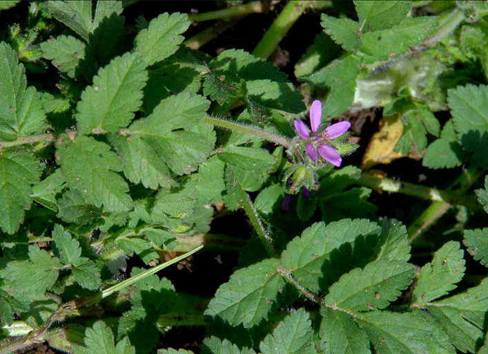

```{r setup, include=FALSE}
knitr::opts_chunk$set(echo = TRUE)
```

**Spring, 2023**  
**Available May 05, 1:10 PM**  
**Due Thursday May 11, 1:10 PM**  

**Student Name:** Ricardo Pineda

**Student ID:** 917486212

## Limitations
This exam is open book, open notes, open web
**HOWEVER**
You **CANNOT** discuss the questions with any person or entity.  
You **CANNOT** request help from any person, online forum, listserv, chatroom, or other entity, etc.
You **MUST** Do your own work

You CAN ask John or Professor Maloof for clarification. 

By typing my name below I affirm that I have read the above instructions and will follow them and the [UC Davis Academic Code](https://ossja.ucdavis.edu/code-academic-conduct).    
Name: Ricardo Pineda

## Instructions

1. Work by adding your answers to this .Rmd file
2. For all questions provide any code that you used to answer them formatted as a code block.
3. Include your code even if you can't get it to work.  You may get partial credit.
4. For R and relevant bash questions the code should run and embed the answers when you knit this file.
5. Save, commit, and push your .Rmd often.  This gives you a backup of your work in case there are any computer crashes, etc.
6. When you are ready to turn in the exam, knit an html file add both the .Rmd an the .html file and push to your repository.

## Strategy

Everything here is based on something you have learned (although it may extend it).  Your first resource should be the lab manuals, previous assignments, and your notes.


## Example 0

You should already be familiar with this, but if not: We can get Rmarkdown to run bash code when knitting, by replacing the "r" with "bash" inside the {}, as follows:

```{bash}
ls -lh #runs the bash ls command and displays output below
```

Please use this for your bash answers below.

Remember that you can add eval=FALSE to keep the code chunk from running while knitting.  You should do this for any code that should not run when knitting. (For example making a blast database that has already been made, or downloading a file that has already been downloaded).

```{bash, eval=FALSE}
ls -lh # won't run when knitted 
```

One bummer is that tab-completion doesn't work in Rstudio bash code chunks.  If you are missing it you could type your commands into a bash terminal so that you can tab-complete, and the copy paste to here.  If you do this, make sure that the working directory in your bash terminal is the same one as this script!!

## Question 1 (5 points)

Be sure that your knitted html is formatted well and that you use informative variable names in your code

## Question 2 (9 points)

**A:** _Use either bash or R to show the absolute path of the working directory_

```{r}
getwd()
```
OR
```{bash}
pwd
```

**B:** _What is the absolute path to the file `where_am_I.txt`, located in the `input` directory of the repository? (no code needed)

- /home/exouser/Assignments/midterm-rhpineda/input/where_am_I.txt

**C:** _What is the relative path from the directory shown in your answer **A:** above to the `where_am_I.txt` file? (no code needed)_

- ../input/where_am_I.txt

## Question 3 (27 points)

**A: (4 pts)** _You have cloned a gene of interest from the Eastern Monarch Butterfly population and you want to find its ortholog in Western Butterfly via a nucleotide BLAST search.  You expect the sequences to be very similar.  Considering the word sizes we looked at in the BLAST lab, what word size you use?  Why? (Conceptual question, no code needed)_

- I would use a word size of 13. In the lab it was discussed that dc-megablast and blastn are both used to find similarities between interspecial sequences. I assume the default of 11 but a bit longer is a good balance between being sensitive enough to capture the ortholog I'm looking for, but specific enough to exclude a lot of suboptimal hits.

**JM** -0 probably 28 would be best here but your reasoning is clear.

**B: (4 pts)** _Will your choice in part **A** cause an increased or decreased sensitivity (ability to detect distant homologs)? Why? (Conceptual question, no code needed)_

- This will cause a decrease in sensitivity compared to the default or any other smaller word size. This is because fewer seeds will be found with a longer word size and fewer seeds lead to fewer hits to possible orthologs.

**C: (4pts)** _If you wanted to blast all of the genes in the Eastern Monarch Butterfly genome against those in the Western Monarch Butterfly genome to find orthologs (with highly similar sequence) would that change your word size choice?_

- I might want to increase the word size if the compute time for the single gene of interest blast took too long. I would want to increase the word size because it further decreases sensitivity so that means that the algorithm will look through fewer seeds so less compute time will be required.

**D: (11 pts)** *You have cloned a Monarch gene that you think may be involved in their migration.  The PROTEIN sequence (MysteryProtein.fa) is in your `input` directory.  You want to blast it against the _Bombyx mori_ (silkworm) PROTEOME to determine its likely identity.  A file with _Bombyx mori_ PROTEINS (`Bombyx_mori.Bmori_2016v1.0.pep.all.fa.gz`) is in your `input` directory. Using the appropriate BLAST program, find the most plausible identity and description of the mystery protein.  Include all code used to answer this question.*

_HINT1: The correct BLAST program might be one you haven't used yet, but it is discussed in the lecture_

_HINT2: If BLAST just returns a protein ID but no description, you can find the decsiption by looking at the full FASTA header for that protein_

- we have a protein query sequence and a protein database so we would want to use BLASTp
1. Unzip proteome and make db  
2. run blastp
    - db proteome
    - query mystery
3. look at the blastout.default file  
4. choose the one with the smallest eval  
    - XP_021207776.2
  
```{bash}
gunzip ../input/Bombyx_mori.Bmori_2016v1.0.pep.all.fa.gz 
makeblastdb -in ../input/Bombyx_mori.Bmori_2016v1.0.pep.all.fa -dbtype prot

#leaving out the -eval parameter gives hits with really big evaules like 3
#I could've also done -max_target_seqs
blastp -db ../input/Bombyx_mori.Bmori_2016v1.0.pep.all.fa -query ../input/MysteryProtein.fa  -evalue 1e-3 > ../output/blastout.default 
#best hit and hit info
head -42 blastout.default  | tail -15
```


**E:(4 pts)** _What is the percent identity, E-Value, and length of the match?  (No code needed, you can look these up in your output from **D** and type them in here). Do you think that you have identified a plausible homolog?_

- %ID: 83%  
- EValue: 0.0
- Length: 500aa
  - the 526 is the length of the XP_021207776.2 accession
  
- Given the stats of the hit like a high %ID and evalue of zero, I think that this is a plausible ortholog.

**JM** -0 nice!

## Question 4 (10 points) 

_The directory on your JetStream instance `/home/exouser/data/A.thaliana` contains eight gzipped files.  Write a for loop that for each file prints the name of the file and the number of lines in the unzipped file.  For example, if there was a file `Chr6.fa.gz`, your code would produce the output "Chr6.fa.gz contains 473 lines". Do this without saving unzipped files to disk._

```{bash}
arabidopsis=$(ls ~/data/A.thaliana/)
for file in $arabidopsis
  do
    echo ${file} contains $(zless ~/data/A.thaliana/${file} | wc -l) lines
  done
```

## Question 5 (28 points) 

_This question is about the relationship between animal body weight and lifespan. In the input folder the file `animal_data.csv` contains a variety of measurements on animals including body weight and longevity.  The file `animal_taxa.csv` gives taxonomic data for animals (e.g. order, family, genus, species)._


**A:** _Import the two files.  Check the import using appropriate functions; any issues?_ 

- Initially there was an error with function not being found, have to load in the tidyverse library.

```{r}
library(tidyverse)
```


```{r}
animal_data <- read_csv("../input/animal_data.csv")
animal_taxa <- read.csv("../input/animal_taxa.csv")

```

**JD** -1 Any issues with the data?

**B:** _Combine the two dataframes from **A** into a single data frame. The column `HAGRID` is an ID column common to both data sheets. Note that the `taxa` data has more rows than the `data` file.  We only want to retain rows where there is an entry in both files. Explain your choice of function._

- Look data to know what to join with what
  -  Want to create a data frame that's shared b/w the two
  -  Only want observations where there is HARGRID  in both dataframes

- I initially used both `inner_join` and `left_join` with `animal_data` as the one on the left since I thought they did the same thing and it turns out they did do the same thing. I thought they would do the same thing because using `inner_join` should keep only the observations while `left_join` merges the right dataframe into the left one if there's a match.

```{r}
#head(animal_data)
#head(animal_taxa)
#names(animal_data)
#print("--------------")
#names(animal_taxa)

animal_data_taxa_inner <- inner_join(animal_data,animal_taxa, by = "HAGRID")
animal_data_taxa_inner
#str(animal_data_taxa_inner)

#innerjoin gives an identical dataframe as using left join with the left being the smaller dataframe in this case.
#animal_data_taxa_left <- left_join(animal_data,animal_taxa, by = "HAGRID")
#animal_data_taxa_left
#identical(animal_data_taxa_inner, animal_data_taxa_left) #Ended up returning TRUE


```


**C:** _We will focus on mammals.  Filter the dataframe from **B** to keep only mammals_

```{r}
mammal_data <- filter(animal_data_taxa_inner, Class == "Mammalia")
mammal_data
```


**D:** _For this question we will look at variation in longevity only in Primates. Filter the dataframe from **C** to retain only Primates and then make a boxplot that displays `Maximum.longevity..yrs` for each Family. To get the Family names to display nicely add this to your ggplot code: `theme(axis.text.x=element_text(angle=90, hjust=1, vjust=0.5))`.  You will need a `+` on the line before that code._

```{r}
#x <- filter(data, column == "what you want")
primate_data <- filter(mammal_data, Order == "Primates")

ggplot(data = primate_data, aes(x =Family, y = Maximum.longevity..yrs)) +
  geom_boxplot() +
  theme(axis.text.x=element_text(angle=90, hjust=1, vjust=0.5))
  
```


**E:** _Is there an outlier in the plot from **D**?  If so, what is it?_

- Yes, Hominidae.

**F:**  _Let's go back to looking at all mammals; for this question start from the data frame from **C**.  If you identified an outlier in **D/E**, remove it, then use a scatter plot to examine the relationship between `Maximum.longevity..yrs` and `Log10.Body.mass..g`_

```{r}
mammal_data_nohomonids <- mammal_data[mammal_data$Family != "Hominidae",]
ggplot(data = mammal_data_nohomonids, aes(x = Maximum.longevity..yrs, y = Log10.Body.mass..g)) +
  geom_point()
# plot still with Hominidae
#ggplot(data = mammal_data, aes(x = Maximum.longevity..yrs, y = Log10.Body.mass..g)) +
#  geom_point()
```

**G:** _What does **F** tell you about the relationship between longevity and body mass?_

- Generally as the mass of an organism increases, so does its longevity.

## Question 6 (16 points)

_Answer the questions IN YOUR OWN WORDS. Although it is OK to research on the web, DO NOT COPY YOUR DESCRIPTONS FROM THE WEB, WE WILL BE CHECKING._

**No code needed for these questions**

**A** _When do you use `git add` and when do you use `git commit`? How are these related and what makes them different?_

- I would use `git add` to add some file to be tracked by git and I would use `git commit` when I want some file that's tracked and changed to be ready to be pushed to git to be saved there. These are related because they are both relate adding files to be ready to saved onto git. They differ in function with how often you have to do it for each file. You usually only have to `git add` a file once while you have to `git commit` before pushing it to git to be saved.

**B** _What is the difference between `git commit` and `git push`? How are these related and what makes them different?_

- Git commit is like saying you are ready to save changes to a tracked file and git push is actually saving changes to a file to git. They are related to saving files on git. They are different as commiting changes doesn't lock you in to those changes and you can easily undo those changes. Pushing really saves changes onto git but it's also hard enough that we had a lab on how to undo bad pushes.

**C** _Compare and contrast `git pull` and `git clone`: how are these related and what makes them different?_

- `Git pull` checks git and adds the changes from git that are not saved onto your local repo. `git clone` copies the entirety of a git repo locally. They are related as both commands checks git and brings files onto your system. They differ as git pull is used to update the local repo to what it's like on git while git clone makes a whole copy.

**D** _Compare and contrast `git clone` and `git fork`: how are these related and what makes them different?_

- `git clone` copies the entirety of a git repo locally. `git fork` is used to make a new copy of an original repo on github that is now separate from the original one. They are related both make copies of a repo. They are different because cloning will still lead to pushing to the original repo without doing some other stuff with git, while forking leads to a new copy of a repo on git that you own but not necessarily on your machine unless you also clone it.

**JM** -0

## Question 7 (5 points)

_This has been a super year for wildflowers._

**A** _Using markdown notation, provide us with a link to a website of a wildflower that you like. (We do not want to see any URLs in the knitted html)_

- [Here's the link!](https://www.inaturalist.org/guide_taxa/530638)

_(If you don't know where to start, you can just link to the wikipedia page for California Poppy)_

**B** _Now that we have a link to a website, using markdown notation, attach an image of the wildflower_




